Abnormal Psychology.# Abnormal Psychology 

JORDEN A. CUMMINGS

UNIVERSITY OF SASKATCHEWAN OPEN PRESSAbnormal Psychology by Jorden A. Cummings is licensed under a Creative Commons Attribution-NonCommercial-ShareAlike 4.0 International License, except where otherwise noted.

Abnormal Psychology, by Jorden A. Cummings (Associate Professor, Department of Psychology, University of Saskatchewan), has been created from a combination of original content and materials compiled and adapted from several open educational resources (OERs), including Source Chapters from:

- Essentials of Abnormal Psychology - 1st edition, by Bridley \& Daffin, edited by Carrie Cuttler, available at https://opentext.wsu.edu/abnormalpsychology/ and licensed under a Creative Commons Attribution-NonCommercialShareAlike 4.0 International License.
- Psychology: Open Stax, by Spielman, R. M., Dumper, K., Jenkins, W., Lacombe, A., Lovett, M., \& Perlmutter, M. (2019), available at https://opentextbc.ca/psychologyopenstax/ and licensed under a Creative Commons Attribution-NonCommercialShareAlike 4.0 International License.
- The Noba Project (various authors), available at: https://nobaproject.com/, licensed under a Creative Commons Attribution-NonCommercial-ShareAlike 4.0 International License.

Attributions are more clearly delineated in the Source Chapter Attributions area of this book, including descriptions of which sections were edited prior to their inclusion.

All original and revised content is licensed under a Creative Commons Attribution-NonCommercial-ShareAlike 4.0 International License. Under the terms of the CC BY-NC-SA license, you are free to copy, redistribute,modify or adapt this book as long as you provide attribution. You may not use the material for commercial purposes. If you remix, transform, or build upon the material, you must distribute your contributions under the same license as the original. Additionally, if you redistribute this textbook, in whole or in part, in either a print or digital format, then you must retain on every physical and/or electronic page an attribution to the original author(s).

Download this book for free at https://openpress.usask.ca/
Here is a sample APA citation of this book:
Cummings, J. A. (2020). Abnormal Psychology. Saskatoon, SK: University of Saskatchewan Open Press. https://openpress.usask.ca/ abnormalpsychcology

Cover image by Steve Johnson on Unsplash. Cover design by Rob Butz..# Contents 

About the Book ..... 1
Source OER Attributions ..... 3
Acknowledgements ..... viii
Chapter 1: Defining \& Classifying Abnormal Behaviour
Chapter 1 Introduction ..... 13
Jorden A. Cummings
1.1 Defining Psychopathology ..... 14
Alexis Bridley \&amр; Lee W. Daffin Jr.; Carrie Cuttler; Jessica Campoli; and Jorden A. Cummings
1.2 Cultural Expectations ..... 21
Rose M. Spielman, Kathryn Dumper, William Jenkins, Arlene Lacombe, Marilyn Lovett, \& Marion Perlmutter
1.3 Clinical Assessment ..... 26
Alexis Bridley \& Lee W. Daffin Jr. and Carrie Cuttler
1.4 Diagnosing and Classifying Abnormal Behavior ..... 35
Alexis Bridley \& Lee W. Daffin Jr.; Carrie Cuttler; and Jorden A. Cummings
Summary and Self-Test: Defining \& Classifying Abnormal ..... 45
Behaviour
Alexis Bridley \& Lee W. Daffin Jr.; Carrie Cuttler; Rose M. Spielman, Kathryn Dumper, William Jenkins, Arlene Lacombe, Marilyn Lovett, \& Marion Perlmutter; and Jorden A. CummingsChapter 2: Perspectives on Abnormal Behaviour
Chapter 2 Introduction ..... 51
Jorden A. Cummings
2.1 Historical Perspectives on Mental Illness ..... 53
Alexis Bridley \& Lee W. Daffin Jr.; Carrie Cuttler; and Jorden A. Cummings
2.2 Therapeutic Orientations ..... 61
Hannah Boettcher; Stefan G. Hofmann; Q. Jade Wu; Alexis Bridley \& Lee W. Daffin Jr.; Carrie Cuttler; and Jorden A. Cummings
2.3 The Biological Model ..... 92
Alexis Bridley \& Lee W. Daffin Jr. and Carrie Cuttler
2.4 Psychopharmacology ..... 114
Susan Barron
2.5 Evidence Based Practice \& Empirically Supported ..... 132
Treatments
Cailey Strauss and Jorden A. Cummings
Summary and Self-Test: Perspectives on Abnormal ..... 138
Behaviour
Alexis Bridley \& Lee W. Daffin Jr.; Carrie Cuttler; Hannah Boettcher; Stefan G. Hofmann; Q. Jade Wu; Susan Barron; Cailey Strauss; and Jorden A. Cummings
Chapter 3: Mood Disorders
Chapter 3 Introduction ..... 145
Jorden A. Cummings
3.1 Mood Disorders ..... 146
Anda Gershon; Renee Thompson; and Jorden A. CummingsSummary and Self-Test: Mood Disorders ..... 177
Anda Gershon; Renee Thompson; and Jorden A.
Cummings
Chapter 4: Anxiety Disorders
Chapter 4 Introduction ..... 183
David H. Barlow; Kristen K. Ellard; and Jorden A. Cummings
4.1 Anxiety and Related Disorders ..... 184
David H. Barlow; Kristen K. Ellard; Jorden A. Cummings; Kendall Deleurme; and Jessica Campoli
4.2 Body Dysmorphic Disorder ..... 211
Alexis Bridley \& Lee W. Daffin Jr. and Carrie Cuttler
Summary and Self-Test: Anxiety Disorders ..... 217
David H. Barlow; Kristen K. Ellard; Alexis Bridley \& Lee W. Daffin Jr.; Carrie Cuttler; and Jorden A. Cummings
Chapter 5: Schizophrenia \& Related Psychotic Disorders
Chapter 5 Introduction ..... 223
Deanna M. Barch and Jorden A. Cummings
5.1 Schizophrenia \& Related Psychotic Disorders ..... 224
Deanna M. Barch and Jorden A. Cummings
Summary and Self-Test: Schizophrenia \& Related ..... 250
Psychotic Disorders
Deanna M. Barch and Jorden A. Cummings
Chapter 6: Post-traumatic Stress Disorder
Chapter 6 Introduction ..... 255
Jorden A. Cummings6.1 Post-Traumatic Stress Disorder ..... 256
Jessica Campoli; Kelsi Toews; Whitney Willcott-Benoit; and Jorden A. Cummings
Summary and Self-Test: Post-traumatic Stress Disorder ..... 275
Chapter 7: ADHD and Related Behaviour Disorders in Childhood
Chapter 7 Introduction ..... 281
Richard Milich; Walter Roberts; and Jorden A. Cummings
7.1 ADHD and Behaviour Disorders in Children ..... 282
Richard Milich; Walter Roberts; Jorden A. Cummings; and Jessica Campoli
Summary and Self-Test: ADHD and Behaviour Disorders ..... 311
in Children
Richard Milich; Walter Roberts; and Jorden A. Cummings
Chapter 8: Autism Spectrum Disorder
Chapter 8 Introduction ..... 317
Kevin A. Pelphrey
8.1 Autism: Insights from the study of the social brain ..... 318
Kevin A. Pelphrey and Jessica Campoli
Summary and Self-Test: Autism ..... 337
Kevin A. Pelphrey and Jorden A. Cummings
Chapter 9: Personality Disorders
Chapter 9 Introduction ..... 341
Jorden A. Cummings9.1 Personality Disorders ..... 343
Cristina Crego; Thomas Widiger; Jorden A. Cummings; and Cailey Strauss
Summary and Self-Test: Personality Disorders ..... 369
Cristina Crego; Thomas Widiger; Jorden A. Cummings; and Cailey Strauss.# About the Book 

## Overview

Abnormal Psychology, by Jorden A. Cummings (Associate Professor, Department of Psychology, University of Saskatchewan), has been created from a combination of original content and materials compiled and adapted from several open educational resources (OERs), including Source Chapters from:

- Essentials of Abnormal Psychology - 1st edition, by Bridley \& Daffin, edited by Carrie Cuttler, available at https://opentext.wsu.edu/abnormalpsychology/ and licensed under a Creative Commons Attribution-NonCommercialShareAlike 4.0 International License.
- Psychology: Open Stax, by Spielman, R. M., Dumper, K., Jenkins, W., Lacombe, A., Lovett, M., \& Perlmutter, M. (2019), available at https://opentextbc.ca/psychologyopenstax/ and licensed under a Creative Commons Attribution-NonCommercialShareAlike 4.0 International License.
- The Noba Project (various authors), available at: https://nobaproject.com/, licensed under a Creative Commons Attribution-NonCommercial-ShareAlike 4.0 International License.

Attributions are more clearly delineated in the Source Chapter Attributions area of this book, including descriptions of which sections were edited prior to their inclusion.

All original and revised content is licensed under a Creative Commons Attribution-NonCommercial-ShareAlike 4.0 International License. Under the terms of the CC BY-NC-SA license, you are free to copy, redistribute, modify or adapt this book aslong as you provide attribution. You may not use the material for commercial purposes. If you remix, transform, or build upon the material, you must distribute your contributions under the same license as the original. Additionally, if you redistribute this textbook, in whole or in part, in either a print or digital format, then you must retain on every physical and/or electronic page an attribution to the original author(s).

The Self-Tests provided with each chapter are a new addition for this book; these were created using the H5P plugin for WordPress, and are available for others to download and use in their own instances of WordPress or Pressbooks.

OERs are defined as "teaching, learning, and research resources that reside in the public domain or have been released under an intellectual property license that permits their free use and repurposing by others" (Hewlett Foundation). This textbook and the OERs from which it has been built are openly licensed using a Creative Commons license, and are offered in various digital and e-book formats free of charge. Printed editions of this book can be obtained for a nominal fee through the University of Saskatchewan bookstore.

# Cover Attribution 

Cover image by Steve Johnson on Unsplash. Cover design by Rob Butz# Source OER Attributions 

Authors are indicated within each section throughout this book, but are also listed here, along with links to the original source OER. Edits to the ported content, where they have taken place, are indicated on the list shown here. General formatting edits and renumbering of headings, figures, and tables have also been done throughout the book.

The chapter Introductions, Summaries, and Self-Tests have been created from a combination of original content and edits to / rearrangements of the source OERs used within that chapter.

## Chapter 1:

- 1.1 Defining Psychopathology
- Based upon: "Understanding Abnormal Behavior." Bridley, A. and Daffin, L. W. Jr. (2018). In Carrie Cuttler (Ed), Essentials of Abnormal Psychology. Washington State University. Retrieved from https://opentext.wsu.edu/ abnormalpsychology/.
- Edited by Jorden Cummings \& Jessica Campoli (removed Types of Mental Health Professionals; added Canadian content).
- 1.2 Cultural Expectations
- Taken from: "What Are Psychological Disorders?" In Spielman, R. M., Dumper, K., Jenkins, W., Lacombe, A., Lovett, M., \& Perlmutter, M. (2019). Psychology. Open Stax. Retrieved from https://opentextbc.ca/ psychologyopenstax/.
- 1.3 Clinical Assessment
- Taken from: "Clinical Assessment." Bridley, A. and Daffin, L. W. Jr. (2018). In Carrie Cuttler (Ed), Essentials of Abnormal Psychology. Washington State University. Retrieved fromhttps://opentext.wsu.edu/abnormalpsychology/

- 1.4 Diagnosing and Classifying Abnormal Behaviour
- Based upon: "Diagnosing and Classifying Abnormal Behaviour." Bridley, A. and Daffin, L. W. Jr. (2018). In Carrie Cuttler (Ed), Essentials of Abnormal Psychology. Washington State University. Retrieved from https://opentext.wsu.edu/abnormalpsychology/.
- Edited by Jorden Cummings (updated information regarding ICD-11).

# Chapter 2: 

- 2.1 Historical Perspectives on Mental Illness
- Based upon: "Historical Perspectives on Mental Illness." Bridley, A. and Daffin, L. W. Jr. (2018). In Carrie Cuttler (Ed), Essentials of Abnormal Psychology. Washington State University. Retrieved from https://opentext.wsu.edu/ abnormalpsychology/.
- Edited by Jorden Cummings (removed material from section 1.3.6).
- 2.2 Therapeutic Orientations
- Based upon: "Therapeutic Orientations." Boettcher, H., Hofmann, S. G., \& Wu, Q. J. (2020). In R. Biswas-Diener \& E. Diener (Eds), Noba textbook series: Psychology. Champaign, IL: DEF publishers. Retrieved from http://noba.to/ fjtnpwsk
- Based upon: "The Behavioural Model" and "The Cognitive Model." Bridley, A. and Daffin, L. W. Jr. (2018). In Carrie Cuttler (Ed), Essentials of Abnormal Psychology. Washington State University. Retrieved from https://opentext.wsu.edu/abnormalpsychology/)
- Edited by Jorden Cummings.
- 2.3 The Biological Model.
- Taken from: "The Biological Model." Bridley, A. and Daffin,L. W. Jr. (2018). In Carrie Cuttler (Ed), Essentials of Abnormal Psychology. Washington State University. Retrieved from https://opentext.wsu.edu/ abnormalpsychology/

- 2.4 Psychopharmacology.
- Taken from: "Psychopharmacology." Barron, S. (2020). In R. Biswas-Diener \& E. Diener (Eds), Noba textbook series: Psychology. Champaign, IL: DEF publishers. Retrieved from http://noba.to/umx6f2t8
- 2.5 Evidence-Based Practice \& Empirically Supported Treatments.
- Original content by Cailey Strauss and Jorden A. Cummings.

# Chapter 3: 

- 3.1 Mood Disorders
- Based upon: "Mood Disorders." Gershon, A. \& Thompson, R. (2020). In R. Biswas-Diener \& E. Diener (Eds), Noba textbook series: Psychology. Champaign, IL: DEF publishers. Retrieved from http://noba.to/aqy9rsxe
- Edited by Jorden Cummings (added Canadian content).

## Chapter 4:

- 4.1 Anxiety and Related Disorders.
- Based upon: "Anxiety and Related Disorders." Barlow, D. H. \& Ellard, K. K. (2020). In R. Biswas-Diener \& E. Diener (Eds), Noba textbook series: Psychology. Champaign, IL: DEF publishers. Retrieved from http://noba.to/xms3nq2c.
- Edited by Jorden Cummings, Kendal Deleurme, and Jessica Campoli (PTSD section removed; added Canadian content).
- 4.2 Body Dysmorphic Disorder.
- Taken from: "Body Dysmorphic Disorder." Bridley, A. andDaffin, L. W. Jr. (2018). In Carrie Cuttler (Ed), Essentials of Abnormal Psychology. Washington State University. Retrieved from https://opentext.wsu.edu/ abnormalpsychology/

# Chapter 5: 

- 5.1 Schizophrenia Spectrum Disorders.
- Based upon: "Schizophrenia Spectrum Disorders." Barch, D. M. (2020). Schizophrenia spectrum disorders. In R. Biswas-Diener \& E. Diener (Eds), Noba textbook series: Psychology. Champaign, IL: DEF publishers. Retrieved from http://noba.to/5d98nsy4
- Edited by Jorden Cummings (added Canadian content).

## Chapter 6:

- Original content, written by Jorden Cummings, Jessica Campoli, Kelsi Toews, and Whitney Willcott-Benoit.

## Chapter 7:

- 7.1 ADHD and Behavior Disorders in Children
- Based upon: "ADHD and Behavior Disorders in Children." Milich, R. \& Roberts, W. (2020). In R. Biswas-Diener \& E. Diener (Eds), Noba textbook series: Psychology. Champaign, IL: DEF publishers. Retrieved from http://noba.to/ cpxg6b27
- Edited by Jorden Cummings and Jessica Campoli (added Canadian content).

## Chapter 8:

- 8.1 Autism: Insights from the Study of the Social Brain
- Based upon: "Autism: Insights from the Study of the SocialBrain." Pelphrey, K. A. (2020). In R. Biswas-Diener \& E. Diener (Eds), Noba textbook series: Psychology. Champaign, IL: DEF publishers. Retrieved from http://noba.to/ yqdepwgt

- Edited by Jessica Campoli (added Canadian content).

# Chapter 9: 

- 9.1 Personality Disorders
- Based upon: "Personality Disorders." Crego, C. \& Widiger, T. (2020). In R. Biswas-Diener \& E. Diener (Eds), Noba textbook series: Psychology. Champaign, IL: DEF publishers. Retrieved from http://noba.to/67mvg5r2
- Edited by Jorden Cummings \& Cailey Strauss (added DSM-5 descriptions of Clusters and symptoms of each personality disorder).# Acknowledgements 

This project was supported by an Open Textbook Creation/ Adaptation Fund grant from the Gwenna Moss Centre for Teaching \& Learning at the University of Saskatchewan - thank you for your support of this project.

This project would not have been possible without the help of Julie Maier, Instructional Designer (Distance Education Unit) and Jessica Campoli, Graduate Assistant (Department of Psychology!). Julie, I am fortunate to have had your organizational skills, knowledge and experience for this project - as well as your patience! Jessica, thank you for your diligent literature reviews and work updating this content to reflect Canadians' experiences of psychopathology. Thank you as well for being a much-needed cheerleader in the hustle.

Thank you to my graduate students Cailey Strauss, Kelsi Toews, Whitney Willcott-Benoit, and Kendall Deleurme for your assistance writing sections of this book. I enjoyed working on this project as a team. Moreover, I am always grateful for the purpose, humour, curiosity, and comraderie you all bring to my professional life. Working with you is the best part of my job!

Thank you Rob Butz for another great cover design, your support, encouragement, and domestic skills, especially in "serious crunch time" when this book took over our lives - incidentally, at the same time COVID-19 took over our lives (i.e., at the worst possible time ever to have a huge deadline). Thank you to my parents for being willing to wear masks and be added to our "bubble," which made it even more possible to double down on crunch time.

Thank you as well to Heather Ross, who fanned the flames of my interest in making psychology more accessible and affordable into two open text projects, with funding! When I began this process I simply wanted to stop students from having to drop my class because they couldn't afford the textbook - but you pulled me intoyour vision and now we have two open psychology books to share more widely.

Thank you to the authors whose work is used in this book. Without your work and willingness to share it openly, this book could not have happened.

Thank you to Cailey Strauss for assisting with copy editing by finding and fixing typos and other minor errors.
-Jorden A. Cummings (June 15, 2020).# CHAPTER I: DEFINING \& CLASSIFYING ABNORMAL BEHAVIOUR.# Chapter I Introduction 

JORDEN A. CUMMINGS

Welcome to Abnormal Psychology! As you'll read more about in this chapter, abnormal psychology refers to the scientific study of people who are exhibiting behaviour that seems atypical or unusual, with the intent to be able to reliably predict, explain, diagnose, identify the causes of, and treat maladaptive behavior. Abnormal psychology is one of the largest sub-fields in psychology, representing a great deal of research and applied work trying to understand and cure mental disorders. As you will see from the first part of this chapter, and as you learn more in this book, the costs of mental illness are substantial.

This chapter will introduce you broadly to important concepts, definitions, and terminology in abnormal psychology that will frame the rest of your learning. It reviews how to define mental disorder as well as the strengths and limitations of our current diagnostic approaches. You'll read, as well, about how culture and cultural expectations influence our views on abnormality. We cannot examine abnormality without taking cultural norms into account.

In this chapter you will also learn about how mental health professionals assess individuals who might be experiencing a mental disorder, some important concepts for measurement like validity and reliability, and read an overview of some of the many different tools these professionals use to conduct their assessments. Last, you'll learn how these professionals diagnose and classify abnormal behaviour.# I.I Defining Psychopathology 

ALEXIS BRIDLEY \&AMP; LEE W. DAFFIN JR.; CARRIE CUTTLER; JESSICA CAMPOLI; AND JORDEN A. CUMMINGS

## Section Learning Objectives

- Know the cost of mental illness to society.
- Define abnormal psychology, psychopathology, and psychological disorders.
- Explain the concept of dysfunction as it relates to mental illness.
- Explain the concept of distress as it relates to mental illness.
- Explain the concept of deviance as it relates to mental illness.
- Explain the concept of dangerousness as it relates to mental illness.

## What is the Cost of Mental Illness to Society?

Mental illness has significant social and economic costs in Canada. People with mental illness are more likely to experience social andeconomic marginalization, including social isolation, inability to work, and lower educational attainment and income, compared to Canadians who do not have a mental illness (Burczycka, 2018). People with mental illness also have a higher risk of being victimized. One in ten people with mental health-related disabilities in Canada report experiencing violence over the past year, a rate that is double that found in the general population (Burczycka, 2018). Moreover, mental illness can significantly impact people's ability to work. It is estimated that 2 out of 9 workers suffer from a mental illness that affects their work performance, and this amounts to an annual wage loss of over $\$ 6.3$ billion (Smetanin et al., 2011).

Each year, the economic burnout of mental illness in Canada is estimated at $\$ 51$ billion (Smetanin et al., 2011). Mental illness significantly impacts the health care system directly and indirectly. Directly, there are costs of about $\$ 21.3$ billion due to hospitalizations, medical visits, and support staff (Smetanin et al., 2011). There are also indirect costs to the justice system, social service and education systems, and other costs due to losses in quality of life. The personal and economic costs of mental illness will further increase due to greater numbers of Canadians expected to be impacted by mental health problems, combined with our aging population and growth of the Canadian population over the next 30 years (Smetanin et al., 2011). By 2041, annual costs of mental illness are expected to be $\$ 307$ billion (Mental Health Commission of Canada, 2010).

In terms of worldwide impact, the World Economic Forum used 2010 data to estimate $\$ 2.5$ trillion in global costs of mental illness in 2010 and projected costs of $\$ 6$ trillion by 2030. The costs for mental illness are greater than the combined costs of cancer, diabetes, and respiratory disorders (Whiteford et al., 2013).

Though there is no one behavior that we can use to classify people as abnormal, most clinical practitioners agree that any behavior that strays from what is considered the norm or is unexpected within the confines of one's culture, that causes dysfunction incognition, emotion, and/or behavior, and that causes distress and/ or impairment in functioning, is abnormal behavior. Armed with this understanding, let's discuss what mental disorders are.

# Definition of Abnormal Psychology and Psychopathology 

The term abnormal psychology refers to the scientific study of people who are atypical or unusual, with the intent to be able to reliably predict, explain, diagnose, identify the causes of, and treat maladaptive behavior. A more sensitive and less stigmatizing term that is used to refer to the scientific study of psychological disorders is psychopathology. These definitions beg the questions of, what is considered abnormal and what is a psychological or mental disorder?

## Defining Psychological Disorders

It may be surprising to you, but the concept of mental or psychological disorders has proven very difficult to define and even the American Psychiatric Association (APA), in its publication, the Diagnostic and Statistical Manual of Mental Disorders, 5th edition (DSM-5 for short), states that though "no definition can capture all aspects of all disorders in the range contained in the DSM-5" certain aspects are required. While the concept of mental or psychological disorders is difficult to define, and no definition will ever be perfect, it is recognized as an extremely important concept and therefore psychological disorders (aka mental disorders) have been defined as a psychological dysfunction which causes distress or impaired functioning and deviates from typical or expected behavioraccording to societal or cultural standards. This definition includes three components (3 Ds). Let's break these down now:

- Dysfunction - includes "clinically significant disturbance in an individual's cognition, emotion regulation, or behavior that reflects a dysfunction in the psychological, biological, or developmental processes underlying mental functioning" (pg. 20). In other words, dysfunction refers to a breakdown in cognition, emotion, and/or behavior. For instance, an individual experiencing delusions that he is an omnipotent deity would have a breakdown in cognition because his thought processes are not consistent with reality. An individual who is unable to experience pleasure would have a breakdown in emotion. Finally, an individual who is unable to leave her home and attend work due to fear of having a panic attack would be exhibiting a breakdown in behavior. Abnormal behavior has the capacity to make our well-being difficult to obtain and can be assessed by looking at an individual's current performance and comparing it to what is expected in general or how the person has performed in the past.
- Distress or Impairment - Distress can take the form of psychological or physical pain, or both concurrently. Simply put, distress refers to suffering. Alone though, distress is not sufficient enough to describe behavior as abnormal. Why is that? The loss of a loved one would cause even the most "normally" functioning individual pain and suffering. An athlete who experiences a career-ending injury would display distress as well. Suffering is part of life and cannot be avoided. And some people who display abnormal behavior are generally positive while doing so. Typically, if distress is absent then impairment must be present to deem behavior abnormal. Impairment refers to when the person experiences a disabling condition "in social, occupational, or other important activities" (pg. 20). In other words, impairment refers to when a person loses the capacity to function normally in daily life (e.g.,can no longer maintain minimum standards of hygiene, pay bills, attend social functions, or go to work). Once again typically distress and/or impairment in functioning are required to consider behavior abnormal and to diagnose a psychological disorder.

- Deviance - A closer examination of the word abnormal shows that it indicates a move away from what is normal, typical, or average. Our culture - or the totality of socially transmitted behaviors, customs, values, technology, attitudes, beliefs, art, and other products that are particular to a group - determines what is normal and so a person is said to be deviant when he or she fails to follow the stated and unstated rules of society, called social norms. What is considered "normal" by society can change over time due to shifts in accepted values and expectations. For instance, just a few decades ago homosexuality was considered taboo in the U.S. and it was included as a mental disorder in the first edition of the DSM; but today, it is generally accepted. Likewise, PDAs, or public displays of affection, do not cause a second look by most people unlike the past when these outward expressions of love were restricted to the privacy of one's own house or bedroom. In the U.S., crying is generally seen as a weakness for males but if the behavior occurs in the context of a tragedy such as the Vegas mass shooting on October 1, 2017, in which 58 people were killed and about 500 were wounded, then it is appropriate and understandable. Finally, consider that statistically deviant behavior is not necessarily negative. Genius is an example of behavior that is not the norm, but it is generally considered a positive attribute rather than a negative one.

Though not part of the DSM 5's conceptualization of what abnormal behavior is, many clinicians add a 4th D - dangerousness to this list. Dangerousness refers to when behavior represents a threat to the safety of the person or others. Individuals expressing suicidalintent, those experiencing acute paranoid ideation combined with aggressive impulses (e.g., wanting to harm people who are perceived as "being out to get them"), and many individuals with antisocial personality disorder may be considered dangerous. Mental health professionals (and many other professionals including researchers) have a duty to report to law enforcement when an individual expresses an intent to harm themselves or others. Nevertheless, individuals with depression, anxiety, and obsessive-compulsive disorder are typically no more a threat to others than individuals without these disorders. As such, it is important to note that having a mental disorder does not automatically deem one to be dangerous and most dangerous individuals are not mentally ill. Indeed, a review of the literature (Matthias \& Angermeyer, 2002) found that only a small proportion of crimes are committed by individuals with severe mental disorders, that strangers are at a lower risk of being attacked by a person with a severe mental disorder than by someone who is mentally healthy, and that elevated risks to behave violently are limited to a small number of symptom constellations. Similarly, Hiday and Burns (2010) showed that dangerousness is more the exception than the rule.

# References 

American Psychiatric Association. (2013). Diagnostic and statistical manual of mental disorders (5th ed.). Arlington, VA: American Psychiatric Publishing.

Bridley, A., \& Daffin, L. W. Jr. (2018). Understanding Abnormal Behavior. In C. Cuttler (Ed), Essentials of Abnormal Psychology. Washington State University. Retrieved from https://opentext.wsu.edu/abnormalpsychology/.

Burczycka, M. (2018). Violent victimization of Canadians with mental health-related disabilities, 2014. Retrieved fromhttps://www150.statcan.gc.ca/n1/pub/85-002-x/2018001/ article/54977-eng.htm.

Hiday, V. A., \& Burns, P. J. (2010). Mental illness and the criminal justice system. In T. L. Scheid \& T. N. Brown (Eds.), A handbook for the study of mental health: Social contexts, theories, and systems (pp. 478-498). Cambridge University Press.

Matthias, C., \& Angermeyer, C. (2002). Schizophrenia and violence. Acta Psychiatrica Scandinavica, 102, 63-37.

Mental Health Commission of Canada (2010). Making the case for investing in mental health in Canada. Retrieved from https://www.mentalhealthcommission.ca/sites/default/files/ 2016-06/Investing in Mental Health FINAL Version ENG.pdf.

Smetanin, P., Stiff, D., Briante, C., Adair, C. E., Ahmad, S. \& Khan, M. (2011). The Life and Economic Impact of Major Mental Illnesses in Canada: 2011 to 2041. RiskAnalytica, on behalf of the Mental Health Commission of Canada 2011.

Whiteford, H. A., Degenhardt, L., Rehm, J., Baxter, A. J., Ferrari, A. J., Erskine, H. E., ...Vos, T. (2013). Global burden of disease attributable to mental and substance use disorders: findings from the Global Burden of Disease Study 2010. Lancet, 382(9904), 1575-1586. doi:10.1016/S0140-6736(13)61611-6.# I. 2 Cultural Expectations 

ROSE M. SPIELMAN, KATHRYN DUMPER, WILLIAM JENKINS, ARLENE LACOMBE, MARILYN LOVETT, \&AMP; MARION PERLMUTTER

## Section Learning Objectives

- Understand the cultural problems inherent in defining the concept of psychological disorder

## Cultural Expectations

Violating cultural expectations is not, in and of itself, a satisfactory means of identifying the presence of a psychological disorder. Since behavior varies from one culture to another, what may be expected and considered appropriate in one culture may not be viewed as such in other cultures. For example, returning a stranger's smile is expected in the United States because a pervasive social norm dictates that we reciprocate friendly gestures. A person who refuses to acknowledge such gestures might be considered socially awkward-perhaps even disordered-for violating this expectation. However, such expectations are not universally shared. Cultural expectations in Japan involve showing reserve, restraint, and a concern for maintaining privacy around strangers. Japanese peopleare generally unresponsive to smiles from strangers (Patterson et al., 2007). Eye contact provides another example. In the United States and Europe, eye contact with others typically signifies honesty and attention. However, most Latin-American, Asian, and African cultures interpret direct eye contact as rude, confrontational, and aggressive (Pazain, 2010). Thus, someone who makes eye contact with you could be considered appropriate and respectful or brazen and offensive, depending on your culture.

Eye contact is one of many social gestures that vary from culture to culture. (credit: Joi Ito)

Hallucinations (seeing or hearing things that are not physically present) in Western societies is a violation of cultural expectations, and a person who reports such inner experiences is readily labeled as psychologically disordered. In other cultures, visions that, for example, pertain to future events may be regarded as normal experiences that are positively valued (Bourguignon, 1970). Finally, it is important to recognize that cultural norms change over time: what might be considered typical in a society at one time may no longer be viewed this way later, similar to how fashion trends from one era may elicit quizzical looks decades later-imagine how a headband, legwarmers, and the big hair of the 1980s would go over on your campus today.# The Myth of Mental Illness 

In the 1950s and 1960s, the concept of mental illness was widely criticized. One of the major criticisms focused on the notion that mental illness was a "myth that justifies psychiatric intervention in socially disapproved behavior" (Wakefield, 1992). Thomas Szasz (1960), a noted psychiatrist, was perhaps the biggest proponent of this view. Szasz argued that the notion of mental illness was invented by society (and the mental health establishment) to stigmatize and subjugate people whose behavior violates accepted social and legal norms. Indeed, Szasz suggested that what appear to be symptoms of mental illness are more appropriately characterized as "problems in living" (Szasz, 1960).

In his 1961 book, The Myth of Mental Illness: Foundations of a Theory of Personal Conduct, Szasz expressed his disdain for the concept of mental illness and for the field of psychiatry in general (Oliver, 2006). The basis for Szasz's attack was his contention that detectable abnormalities in bodily structures and functions (e.g., infections and organ damage or dysfunction) represent the defining features of genuine illness or disease, and because symptoms of purported mental illness are not accompanied by such detectable abnormalities, so-called psychological disorders are not disorders at all. Szasz (1961/2010) proclaimed that "disease or illness can only affect the body; hence, there can be no mental illness" (p. 267).

Today, we recognize the extreme level of psychological suffering experienced by people with psychological disorders: the painful thoughts and feelings they experience, the disordered behavior they demonstrate, and the levels of distress and impairment they exhibit. This makes it very difficult to deny the reality of mental illness.

However controversial Szasz's views and those of his supporters might have been, they have influenced the mental health community and society in several ways. First, lay people, politicians, and professionals now often refer to mental illness as mental health"problems," implicitly acknowledging the "problems in living" perspective Szasz described (Buchanan-Barker \& Barker, 2009). Also influential was Szasz's view of homosexuality. Szasz was perhaps the first psychiatrist to openly challenge the idea that homosexuality represented a form of mental illness or disease (Szasz, 1965). By challenging the idea that homosexuality represented a form a mental illness, Szasz helped pave the way for the social and civil rights that gay and lesbian people now have (Barker, 2010). His work also inspired legal changes that protect the rights of people in psychiatric institutions and allow such individuals a greater degree of influence and responsibility over their lives (Buchanan-Barker \& Barker, 2009).

# References 

Barker, P. (2010). The legacy of Thomas Szasz. Retrieved from http://www.centerforindependentthought.org/SzaszLegacy.html.

Bourguignon, E. (1970). Hallucinations and trance: An anthropologist's perspective. In W. Keup (Ed.), Origins and mechanisms of hallucination (pp. 183-190). New York, NY: Plenum Press.

Buchanan-Barker, P., Barker, P. (2009, February). The convenient myth of Thomas Szasz. Journal of Psychiatric and Mental Health Nursing, 16(1): 87-95. doi:10.1111/j.1365-2850.2008.01310.x.

Oliver, J. (2006, Summer). The myth of Thomas Szasz. The New Atlantis, 13. Retrieved from http://www.thenewatlantis.com/ docLib/TNA13-Oliver.pdf.Patterson, M. L., Iizuka, Y., Tubbs, M. E., Ansel, J., Tsutsumi, M., \& Anson, J. (2007). Passing encounters east and west: Comparing Japanese and American pedestrian interactions. Journal of Nonverbal Behavior, 31, 155-166.

Pazain, M. (2010, December 2). To look or not to look? Eye contact differences in different cultures [Web log post]. Retrieved from http://www.examiner.com/article/to-look-or-not-to-look-eyecontact-differences-different-cultures

Spielman, R. M., Dumper, K., Jenkins, W., Lacombe, A., Lovett, M., \& Perlmutter, M. (2019). What Are Psychological Disorders? In Psychology. Open Stax. Retrieved from https://opentextbc.ca/ psychologyopenstax/.

Szasz, T. S. (1960). The myth of mental illness. American Psychologist, 15, 113-118.

Szasz, T. S. (1965). Legal and moral aspects of homosexuality. In J. Marmor (Ed.), Sexual inversion: The multiple roots of homosexuality (pp. 124-139). New York, NY: Basic Books.

Szasz, T. S. (2010). The myth of mental illness: Foundations of a theory of personal conduct. New York, NY: HarperCollins (Original work published 1961).

Wakefield, J. C. (1992). The concept of mental disorder: On the boundary between biological facts and social values. American Psychologist, 47, 373-388.# I. 3 Clinical Assessment 

ALEXIS BRIDLEY \&AMP; LEE W. DAFFIN JR. AND CARRIE CUTTLER

## Section Learning Objectives

- Define clinical assessment.
- Clarify why clinical assessment is an ongoing process.
- Define and exemplify reliability.
- Define and exemplify validity.
- Define standardization.
- List and describe six methods of assessment.

## What is Clinical Assessment?

In order for a mental health professional to be able to effectively treat a client and know that the selected treatment actually worked (or is working), he/she first must engage in the clinical assessment of the client. Clinical assessment refers to collecting information and drawing conclusions through the use of observation, psychological tests, neurological tests, and interviews to determine what the person's problem is and what symptoms he/she is presenting with. This collection of information involves learningabout the client's skills, abilities, personality characteristics, cognitive and emotional functioning, social context (e.g., environmental stressors), and cultural factors particular to them such as their language or ethnicity. Clinical assessment is not just conducted at the beginning of the process of seeking help but all throughout the process. Why is that?

Consider this. First, we need to determine if a treatment is even needed. By having a clear accounting of the person's symptoms and how they affect daily functioning we can determine to what extent the individual is adversely affected. Assuming treatment is needed, our second reason to engage in clinical assessment is to determine what treatment will work best. As you will see later in this chapter, there are numerous approaches to treatment. These include Behavior Therapy, Cognitive Therapy, Cognitive-Behavioral Therapy (CBT), Humanistic-Experiential Therapies, Psychodynamic Therapies, Couples and Family Therapy, and biological treatments (e.g., psychopharmacology). Of course, for any mental disorder, some of the aforementioned therapies will have greater efficacy than others. Even if several can work well, it does not mean a particular therapy will work well for that specific client. Assessment can help the clinician figure this out. Finally, we need to know if the treatment worked. This will involve measuring symptoms and behavior before any treatment is used and then measuring symptoms and behavior while the treatment is in place. We will even want to measure symptoms and behavior after the treatment ends to make sure symptoms do not return. Knowing what the person's baselines are for different aspects of psychological functioning will help us to see when improvement occurs. In recap, obtaining the baselines happens in the beginning, implementing the treatment plan happens more so in the middle, and then making sure the treatment produces the desired outcome occurs at the end. It should be clear from this discussion that clinical assessment is an ongoing process.# Key Concepts in Assessment 

Important to the assessment process are three critical concepts - reliability, validity, and standardization. Actually, these three are important to science in general. First, we want assessment to be reliable or consistent. Outside of clinical assessment, when our car has an issue and we take it to the mechanic, we want to make sure that what one mechanic says is wrong with our car is the same as what another says or even two others. If not, the measurement tools they use to assess cars are flawed. The same is true of a patient who is experiencing a mental disorder. If one mental health professional says the person has major depressive disorder and another says the issue is borderline personality disorder, then there is an issue with the assessment tool being used. Ensuring that two different raters (e.g., mechanics, mental health professionals) are consistent in their assessments is called interrater reliability. Another type of reliability occurs when a person takes a test one day, and then the same test on another day. We would expect the person's answers to be consistent with one another, which is called test-retest reliability. An example is if the person takes the Minnesota Multiphasic Personality Inventory (MMPI) on Tuesday and then the same test on Friday, then unless something miraculous or tragic happened over the two days in between tests, the scores on the MMPI should be nearly identical to one another. In other words, the two scores (test and retest) should be correlated with one another. If the test is reliable, the correlation should be very high (remember, a correlation goes from -1.00 to +1.00 and positive means as one score goes up, so does the other, so the correlation for the two tests should be high on the positive side).

In addition to reliability, we want to make sure the test measures what it says it measures. This is called validity. Let's say a new test is developed to measure symptoms of depression. It is compared against an existing, and proven test, such as the Beck Depression Inventory (BDI). If the new test measures depression, then thescores on it should be highly correlated with the ones obtained by the BDI. This is called concurrent or descriptive validity. We might even ask if an assessment tool looks valid. If we answer yes, then it has face validity, though it should be noted that this is not based on any statistical or evidence-based method of assessing validity. An example would be a personality test that asks about how people behave in certain situations. It, therefore, seems to measure personality or we have an overall feeling that it measures what we expect it to measure.

A tool should also be able to accurately predict what will happen in the future, called predictive validity. Let's say we want to tell if a high school student will do well in college. We might create a national exam to test needed skills and call it something like the Scholastic Aptitude Test (SAT). We would have high school students take it by their senior year and then wait until they are in college for a few years and see how they are doing. If they did well on the SAT, we would expect that at that point, they should be doing well in college. If so, then the SAT accurately predicts college success. The same would be true of a test such as the Graduate Record Exam (GRE) and its ability to predict graduate school performance.

Finally, we want to make sure that the experience one patient has when taking a test or being assessed is the same as another patient taking the test the same day or on a different day, and with either the same tester or another tester. This is accomplished with the use of clearly laid out rules, norms, and/or procedures, and is called standardization. Equally important is that mental health professionals interpret the results of the testing in the same way or otherwise it will be unclear what the meaning of a specific score is.

# Methods of Assessment 

So how do we assess patients in our care? We will discusspsychological tests, neurological tests, the clinical interview, behavioral assessment, and a few others in this section.

# The Clinical Interview 

A clinical interview is a face-to-face encounter between a mental health professional and a patient in which the former observes the latter and gathers data about the person's behavior, attitudes, current situation, personality, and life history. The interview may be unstructured in which open-ended questions are asked, structured in which a specific set of questions according to an interview schedule are asked, or semi-structured, in which there is a pre-set list of questions but clinicians are able to follow up on specific issues that catch their attention.

A mental status examination is used to organize the information collected during the interview and to systematically evaluate the client through a series of observations and questions assessing appearance and behavior (e.g., grooming and body language), thought processes and content (e.g., disorganized speech or thought and false beliefs), mood and affect (e.g., hopelessness or elation), intellectual functioning (e.g., speech and memory), and awareness of surroundings (e.g., does the client know where he/ she is, when it is, and who he/she is?). The exam covers areas not normally part of the interview and allows the mental health professional to determine which areas need to be examined further. The limitation of the interview is that it lacks reliability, especially in the case of the unstructured interview.# Psychological Tests and Inventories 

Psychological tests are used to assess the client's personality, social skills, cognitive abilities, emotions, behavioral responses, or interests and can be administered either individually or to groups. Projective tests consist of simple ambiguous stimuli that can elicit an unlimited number of responses. They include the Rorschach test or inkblot test and the Thematic Apperception Test which requires the individual to write a complete story about each of 20 cards shown to them and give details about what led up to the scene depicted, what the characters are thinking, what they are doing, and what the outcome will be. From these responses, the clinician gains perspective on the patient's worries, needs, emotions, conflicts. Another projective test is the sentence completion test and asks individuals to finish an incomplete sentence. Examples include 'My mother' .... or 'I hope.'

Personality inventories ask clients to state whether each item in a long list of statements applies to them, and could ask about feelings, behaviors, or beliefs. Examples include the MMPI or Minnesota Multiphasic Personality Inventory and the NEO-PI-R which is a concise measure of the five major domains of personality - Neuroticism, Extroversion, Openness, Agreeableness, and Conscientiousness. Six facets define each of the five domains and the measure assesses emotional, interpersonal, experimental, attitudinal, and motivational styles (Costa \& McCrae, 1992). These inventories have the advantage of being easy to administer by either a professional or the individual taking it, are standardized, objectively scored, and are completed either on the computer or through paper and pencil. That said, personality cannot be directly assessed and so you can never completely know the individual on the basis of these inventories.# Neurological Tests 

Neurological tests are also used to diagnose cognitive impairments caused by brain damage due to tumors, infections, or head injury; or changes in brain activity. Positron Emission Tomography or PET is used to study the brain's functioning and begins by injecting the patient with a radionuclide which collects in the brain. Patients then lie on a scanning table while a ring-shaped machine is positioned over their head. Images are produced that yield information about the functioning of the brain. Magnetic Resonance Imaging or MRI produces 3D images of the brain or other body structures using magnetic fields and computers. They are used to detect structural abnormalities such as brain and spinal cord tumors or nervous system disorders such as multiple sclerosis. Finally, computed tomography or the CT scan involves taking X-rays of the brain at different angles that are then combined. They are used to detect structural abnormalities such as brain tumors and brain damage caused by head injuries.

## Physical Examination

Many mental health professionals recommend the patient see their family physician for a physical examination which is much like a check-up. Why is that? Some organic conditions, such as hyperthyroidism or hormonal irregularities, manifest behavioral symptoms that are similar to mental disorders and so ruling such conditions out can save costly therapy or surgery.

## Behavioral Assessment

Within the realm of behavior modification and applied behavioranalysis, is behavioral assessment which is simply the measurement of a target behavior. The target behavior is whatever behavior we want to change and it can be in excess (needing to be reduced), or in a deficit state (needing to be increased). During behavioral assessment we assess the ABCs of behavior:

- Antecedents are the environmental events or stimuli that trigger a behavior
- Behaviors are what the person does, says, thinks/feels; and
- Consequences are the outcome of a behavior that either encourages it to be made again in the future or discourages its future occurrence.

Though we might try to change another person's behavior using behavior modification, we can also change our own behavior using self-monitoring which refers to measuring and recording one's own ABCs. In the context of psychopathology, behavior modification can be useful in treating phobias, reducing habit disorders, and ridding the person of maladaptive cognitions.

A limitation of this method is that the process of observing and/ or recording a behavior can cause the behavior to change, called reactivity. Have you ever noticed someone staring at you while you sat and ate your lunch? If you have, what did you do? Did you change your behavior? Did you become self-conscious? Likely yes and this is an example of reactivity. Another issue is that the behavior that is made in one situation may not be made in other situations, such as your significant other only acting out at their favorite team's football game and not at home. This form of validity that is impacted by situational variation is called cross-sectional validity.

# Intelligence Tests 

Intelligence testing is occasionally used to determine the client'slevel of cognitive functioning. Intelligence testing consists of a series of tasks asking the patient to use both verbal and nonverbal skills. An example is the Stanford-Binet Intelligence test which is used to assess fluid reasoning, knowledge, quantitative reasoning, visual-spatial processing and working memory. These tests are rather time-consuming and require specialized training to administer. As such, they are typically only used in cases where there is a suspected cognitive disorder or intellectual disability. Intelligence tests have been criticized for not predicting future behaviors such as achievement and reflecting social or cultural factors/biases and not actual intelligence.

# References 

Bridley, A., \& Daffin, L. W. Jr. (2018). Clinical Assessment. In C. Cuttler (Ed), Essentials of Abnormal Psychology. Washington State University. Retrieved from https://opentext.wsu.edu/ abnormalpsychology/.

Costa, P. T., \& McCrae, R. R. (1992). Normal personality assessment in clinical practice: The NEO Personality Inventory. Psychological assessment, 4(1), 5.# I. 4 Diagnosing and Classifying Abnormal Behavior 

ALEXIS BRIDLEY \&AMP; LEE W. DAFFIN JR.; CARRIE CUTTLER; AND JORDEN A. CUMMINGS

## Section Learning Objectives

- Explain what it means to make a clinical diagnosis.
- Define syndrome.
- Clarify and exemplify what a classification system does.
- Identify the two most used classification systems.
- Outline the history of the DSM.
- Identify and explain the elements of a diagnosis.
- Outline the major disorder categories of the DSM-5.
- Describe the ICD-11.
- Clarify why the DSM-5 and ICD-11 need to be harmonized.

## Clinical Diagnosis and Classification# Systems 

To begin any type of treatment, the client/patient must be clearly diagnosed with a mental disorder. Clinical diagnosis is the process of using assessment data to determine if the pattern of symptoms the person presents with is consistent with the diagnostic criteria for a specific mental disorder set forth in an established classification system such as the DSM-5 or ICD-10 (both will be described shortly). Any diagnosis should have clinical utility, meaning it aids the mental health professional in determining the prognosis, the treatment plan, and possible outcomes of treatment (APA, 2013). Receiving a diagnosis does not necessarily mean the person requires treatment. This decision is made based upon how severe the symptoms are, the level of distress caused by the symptoms, symptom salience such as expressing suicidal ideation, risks and benefits of treatment, disability, and other factors (APA, 2013). Likewise, a patient may not meet full criteria for a diagnosis but require treatment nonetheless.

Symptoms that cluster together on a regular basis are called a syndrome. If they also follow the same, predictable course, we say that they are characteristic of a specific disorder. Classification systems for mental disorders provide mental health professionals with an agreed upon list of disorders falling in distinct categories for which there are clear descriptions and criteria for making a diagnosis. Distinct is the key word here. People experiencing delusions, hallucinations, disorganized speech, catatonia, and/or negative symptoms are different from people presenting with a primary clinical deficit in cognitive functioning that is not developmental in nature but has been acquired (i.e. they have shown a decline in cognitive functioning over time). The former would likely be diagnosed with a schizophrenia spectrum disorder while the latter likely has a neurocognitive disorder (NCD). The latter can be further distinguished from neurodevelopmental disorders which manifest early in development and involve developmental deficitsthat cause impairments in social, academic, or occupational functioning (APA, 2013). These three disorder groups or categories can be clearly distinguished from one another. Classification systems also permit the gathering of statistics for the purpose of determining incidence and prevalence rates, they facilitate research on the etiology and treatment of disorders, and they conform to the requirements of insurance companies for the payment of claims.

The most widely used classification system in the United States and Canada is the Diagnostic and Statistical Manual of Mental Disorders currently in its 5th edition and produced by the American Psychiatric Association (APA, 2013). Alternatively, the World Health Organization (WHO) produces the International Statistical Classification of Diseases and Related Health Problems (ICD) currently in its 10th edition with an 11th edition expected to be published in 2018. We will begin by discussing the DSM and then move to the ICD.

# The DSM Classification System 

## A Brief History of the DSM

The DSM 5 was published in 2013 and took the place of the DSM IV-TR (TR means Text Revision; published in 2000) but the history of the DSM goes back to 1844 when the American Psychiatric Association published a predecessor of the DSM which was a "statistical classification of institutionalized mental patients" and "...was designed to improve communication about the types of patients cared for in these hospitals" (APA, 2013, p. 6). However, the first official version of the DSM was not published until 1952. The DSM evolved through four subsequent editions after World War II into a diagnostic classification system to be used by psychiatristsand physicians, but also other mental health professionals. The Herculean task of revising the DSM IV-TR began in 1999 when the APA embarked upon an evaluation of the strengths and weaknesses of the DSM in coordination with the World Health Organization (WHO) Division of Mental Health, the World Psychiatric Association, and the National Institute of Mental Health (NIMH). This resulted in the publication of a monograph in 2002 called, A Research Agenda for DSM-V. From 2003 to 2008, the APA, WHO, NIMH, the National Institute on Drug Abuse (NIDA), and the National Institute on Alcoholism and Alcohol Abuse (NIAAA) convened 13 international DSM-5 research planning conferences, "to review the world literature in specific diagnostic areas to prepare for revisions in developing both DSM-5 and the International Classification of Disease, 11th Revision (ICD-11)" (APA, 2013).
After the naming of a DSM-5 Task Force Chair and Vice-Chair in 2006, task force members were selected and approved by 2007 and workgroup members were approved in 2008. What resulted from this was an intensive process of "conducting literature reviews and secondary analyses, publishing research reports in scientific journals, developing draft diagnostic criteria, posting preliminary drafts on the DSM-5 Web site for public comment, presenting preliminary findings at professional meetings, performing field trials, and revisiting criteria and text"(APA, 2013).
What resulted was a "common language for communication between clinicians about the diagnosis of disorders" along with a realization that the criteria and disorders contained within were based on current research and may undergo modification with new evidence gathered (APA, 2013). Additionally, some disorders were not included within the main body of the document because they did not have the scientific evidence to support their widespread clinical use, but were included in Section III under "Conditions for Further Study" to "highlight the evolution and direction of scientific advances in these areas to stimulate further research" (APA, 2013).# Elements of a Diagnosis 

The DSM 5 states that the following make up the key elements of a diagnosis (APA, 2013):

- Diagnostic Criteria and Descriptors - Diagnostic criteria are the guidelines for making a diagnosis. When the full criteria are met, mental health professionals can add severity and course specifiers to indicate the patient's current presentation. If the full criteria are not met, designators such as "other specified" or "unspecified" can be used. If applicable, an indication of severity (mild, moderate, severe, or extreme), descriptive features, and course (type of remission - partial or full - or recurrent) can be provided with the diagnosis. The final diagnosis is based on the clinical interview, text descriptions, criteria, and clinical judgment.
- Subtypes and Specifiers - Since the same disorder can be manifested in different ways in different individuals the DSM uses subtypes and specifiers to better characterize an individual's disorder. Subtypes denote "mutually exclusive and jointly exhaustive phenomenological subgroupings within a diagnosis" (APA, 2013). For example, non-rapid eye movement sleep arousal disorders can have either a sleepwalking or sleep terror type. Enuresis is nocturnal only, diurnal only, or both. Specifiers are not mutually exclusive or jointly exhaustive and so more than one specifier can be given. For instance, binge eating disorder has remission and severity specifiers. Major depressive disorder has a wide range of specifiers that can be used to characterize the severity, course, or symptom clusters. Again the fundamental distinction between subtypes and specifiers is that there can be only one subtype but multiple specifiers.
- Principle Diagnosis - A principal diagnosis is used when more than one diagnosis is given for an individual (when anindividual has comorbid disorders). The principal diagnosis is the reason for the admission in an inpatient setting or the reason for a visit resulting in ambulatory care medical services in outpatient settings. The principal diagnosis is generally the main focus of treatment.

- Provisional Diagnosis - If not enough information is available for a mental health professional to make a definitive diagnosis, but there is a strong presumption that the full criteria will be met with additional information or time, then the provisional specifier can be used.

# DSM-5 Disorder Categories 

The DSM-5 includes the following categories of disorders:
Table 1.1. DSM-5 Classification System of Mental Disorders| Disorder Category | Short Description |
| :--: | :--: |
| Neurodevelopmental Disorders | A group of conditions that arise in the developmental period and include intellectual disability, communication disorders, autism spectrum disorder, motor disorders, and ADHD |
| Schizophrenia Spectrum and Other Psychotic Disorders | Disorders characterized by one or more of the following: delusions, hallucinations, disorganized thinking and speech, disorganized motor behavior, and negative symptoms |
| Bipolar and Related Disorders | Characterized by mania or hypomania and possibly depressed mood; includes Bipolar I and II, cyclothymic disorder |
| Depressive Disorders | Characterized by sad, empty, or irritable mood, as well as somatic and cognitive changes that affect functioning; includes major depressive and persistent depressive disorders |
| Anxiety Disorders | Characterized by excessive fear and anxiety and related behavioral disturbances; Includes phobias, separation anxiety, panic attack, generalized anxiety disorder |
| Obsessive-Compulsive and Related Disorders | Characterized by obsessions and compulsions and includes OCD, hoarding, and body dysmorphic disorders |
| Trauma- and Stressor-Related Disorders | Characterized by exposure to a traumatic or stressful event; PTSD, acute stress disorder, and adjustment disorders |
| Dissociative Disorders | Characterized by a disruption or disturbance in memory, identity, emotion, perception, or behavior; dissociative identity disorder, dissociative amnesia, and depersonalization/ derealization disorder |
| Somatic Symptom and Related Disorders | Characterized by prominent somatic symptoms. Includes illness anxiety disorder, somatic symptom disorder, and conversion disorder |
| Feeding and Eating Disorders | Characterized by a persistent disturbance of eating or eating-related behavior to include bingeing and purging |
| Elimination Disorders | Characterized by the inappropriate elimination of urine or feces; usually first diagnosed in childhood or adolescence |
| Sleep-Wake Disorders | Characterized by sleep-wake complaints about the quality, timing, and amount of sleep; includes insomnia, sleep terrors, narcolepsy, and sleep apnea || Sexual Dysfunctions | Characterized by sexual difficulties and include premature ejaculation, female orgasmic disorder, and erectile disorder |
| :--: | :--: |
| Gender Dysphoria | Characterized by distress associated with the incongruity between one's experienced or expressed gender and the gender assigned at birth |
| Disruptive, Impulse-Control, and Conduct Disorders | Characterized by problems in self-control of emotions and behavior and involve the violation of the rights of others and cause the individual to be in violation of societal norms; Includes oppositional defiant disorder, antisocial personality disorder, kleptomania, etc. |
| Substance-Related and Addictive Disorders | Characterized by the continued use of a substance despite significant problems related to its use |
| Neurocognitive Disorders | Characterized by a decline in cognitive functioning over time and the NCD has not been present since birth or early in life |
| Personality Disorders | Characterized by a pattern of stable traits which are inflexible, pervasive, and leads to distress or impairment |
| Paraphilic Disorders | Characterized by recurrent and intense sexual fantasies that can cause harm to the individual or others; includes exhibitionism, voyeurism, and sexual sadism |

# The ICD-II 

In 1893, the International Statistical Institute adopted the International List of Causes of Death which was the first edition of the ICD. The World Health Organization was entrusted with the development of the ICD in 1948 and published the 6th version (ICD-6), which was the first version to include mental disorders. The ICD-11 was published in June 2018 and adopted by member states of WHO in June 2019. The WHO states:

ICD is the foundation for the identification of health trends and statistics globally, and the international standard for reportingdiseases and health conditions. It is the diagnostic classification standard for all clinical and research purposes. ICD defines the universe of diseases, disorders, injuries and other related health conditions, listed in a comprehensive, hierarchical fashion that allows for:

- easy storage, retrieval and analysis of health information for evidence-based decision-making;
- sharing and comparing health information between hospitals, regions, settings, and countries;
- and data comparisons in the same location across different time periods.

# Source: http://www.who.int/classifications/icd/en/ 

The ICD lists many types of diseases and disorders and includes Chapter V: Mental and Behavioral Disorders. The list of mental disorders is broken down as follows:

- Organic, including symptomatic, mental disorders
- Mental and behavioral disorders due to psychoactive substance use
- Schizophrenia, schizotypal and delusional disorders
- Mood (affective) disorders
- Neurotic, stress-related and somatoform disorders
- Behavioral syndromes associated with physiological disturbances and physical factors
- Disorders of adult personality and behavior
- Mental retardation
- Disorders of psychological development
- Behavioral and emotional disorders with onset usually occurring in childhood and adolescence
- Unspecified mental disorder# Harmonization of DSM-5 and ICD-II 

According to the DSM-5, there is an effort to harmonize the two classification systems so that there can be a more accurate collection of national health statistics and design of clinical trials, increased ability to replicate scientific findings across national boundaries and to rectify the lack of agreement between the DSMIV and ICD-10 diagnoses. (APA, 2013). At time of publication of this text, however, this had not yet occurred.

## References

American Psychiatric Association. (2013). Diagnostic and statistical manual of mental disorders. (5th ed.). Arlington, VA: American Psychiatric Publishing.

American Psychiatric Association. (2000). Diagnostic and statistical manual of mental disorders- Text revision (4th ed.). Washington, DC: Author.

Bridley, A., \& Daffin, L. W. Jr. (2018). Diagnosing and Classifying Abnormal Behaviour. In C. Cuttler (Ed), Essentials of Abnormal Psychology. Washington State University. Retrieved from https://opentext.wsu.edu/abnormalpsychology/.# Summary and Self-Test: Defining \& Classifying Abnormal Behaviour 

ALEXIS BRIDLEY \&AMP; LEE W. DAFFIN JR.; CARRIE CUTTLER; ROSE M. SPIELMAN, KATHRYN DUMPER, WILLIAM JENKINS, ARLENE LACOMBE, MARILYN LOVETT, \&AMP; MARION PERLMUTTER; AND JORDEN A. CUMMINGS

## Summary

Mental illness has a significant social and economic cost on society, both directly and indirectly through costs like victimization, lost ability to work, burnout, hospitalizations, and medical visits. Abnormal psychology is a field of psychology that studies people who are atypical or unusual. The intention of this study is to predict, explain, diagnose, identify the causes of, and treat mental disorders.

Mental disorders are hard to define. Most definitions include the "3 Ds": Dysfunction, distress (or impairment), and deviance. Meaning that disorders disturb an individual's cognition, emotion regulation or behaviour, that this causes distress for the individual, and that this behaviour is a move away from what our culture determines is normal, typical, or average.

It is important to consider culture when evaluating abnormal behaviour. Violating cultural expectations is not, in and of itself, a satisfactory means of identifying the presence of a psychological disorder. Behaviour varies from culture to culture, so what may be expected and appropriate in one culture may not be viewed as such in others.

In order for a mental health professional to effectively treat aclient (and know if the treatment is working), they must first know what a client's presenting problem is. Clinical assessment refers to collecting information about this and drawing conclusions through the use of observation, psychological tests, neurological tests, and interviews to determine what the symptoms the client is presenting with. The concepts of reliability, validity, and standardization are key to the assessment process.

After the assessment is complete, a professional can consider if the person meets criteria for a clinical diagnosis. Diagnosis is the process of using assessment data to determine if the pattern of symptoms the person presents with is consistent with the diagnostic criteria for a specific mental health disorder, set forth in an established classification system like the DSM-5 or ICD-10. Symptoms that cluster together on a regular basis are called a syndrome.

Classification systems for mental disorders provide health professionals with an agreed-upon list of disorders, for which there are clear descriptions and criteria for making a diagnosis. The most widely used classification system in North America is the Diagnostic and Statistical Manual of Mental Disorders, currently in its 5th edition. It is published by the American Psychiatric Association. The first edition of the DSM was published in 1952 and the current edition was published in 2013 after almost 14 years of research! The World Health Organization (WHO) also publishes the International Classification of Diseases (ICD), an alternative classification system.

The DSM also states the key elements of diagnosis, which include diagnostic criteria and descriptors, which are guidelines for making a diagnosis. A second key element are subtypes and specifiers, used to better characterize an individual's disorder since the same disorder can manifest in different ways for different people. Last, principle diagnoses are given when more than one diagnosis is applicable for one individual and provisional diagnoses are given when not enough information is available to make a definitive diagnosis.An interactive H5P element has been excluded from this version of the text. You can view it online here:
https://openpress.usask.ca/abnormalpsychology/?p=331\#h5p-6

Link: https://openpress.usask.ca/abnormalpsychology/wp-admin/admin-ajax.php?action=h5p_embed\&id=6.# CHAPTER 2: PERSPECTIVES ON ABNORMAL BEHAVIOUR.# Chapter 2 Introduction 

JORDEN A. CUMMINGS

Abnormal psychology is a broad and diverse topic of study that, as you will see in this chapter, has fascinated humans for centuries. There are many different lenses through which we can view abnormal behaviour. In this chapter we will discuss many of those lenses, illustrating and comparing how they conceptualize psychopathology. In the first part of this chapter, you'll read about historical perspectives on abnormality, all the way from prehistoric beliefs through to the 18th and 19th centuries. As you will see, views on abnormality have always been influenced by the broader culture and historical context that they exist in.

You will then learn about the modern therapeutic orientations, beginning with the birth of abnormal psychology as a discipline: Sigmund Freud's psychoanalysis. These orientations are used to explain abnormal behaviour and tell clinicians how to treat it. This section also covers humanistic and person-centred approaches, the behavioural and cognitive models as well as cognitive-behavioural therapy (which combine the two), acceptance and mindfulnessbased approaches, and some emerging views on abnormality. Each of these orientations views abnormal behaviour slightly differently, although many of their ideas overlap and many orientations have informed one another. This chapter will also discuss the biological model of mental illness and psychopharmacology as a treatment option.

Another modern development, beginning in the 1990s, was the rise of evidence-based practice in clinical psychology and the development of criteria for evaluating the research evidence for various psychotherapies, in order to develop the distinction of "empirically supported treatment." In the final part of this chapter, you will learn what evidence-based practice and empiricallysupported treatments involve, and also learn about characteristics for identifying the opposite: treatments that harm.# 2.I Historical Perspectives on Mental Illness 

ALEXIS BRIDLEY \&AMP; LEE W. DAFFIN JR.; CARRIE CUTTLER; AND JORDEN A. CUMMINGS

## Section Learning Objectives

- Describe prehistoric and ancient beliefs about mental illness.
- Describe Greco-Roman thought on mental illness.
- Describe thoughts on mental illness during the Middle Ages.
- Describe thoughts on mental illness during the Renaissance.
- Describe thoughts on mental illness during the 18th and 19th centuries

As we have seen so far, what is considered abnormal behavior is often dictated by the culture/society a person lives in, and unfortunately, the past has not treated the afflicted very well. In this section, we will examine how past societies viewed and dealt with mental illness.# Prehistoric and Ancient Beliefs 

Prehistoric cultures often held a supernatural view of abnormal behavior and saw it as the work of evil spirits, demons, gods, or witches who took control of the person. This form of demonic possession was believed to occur when the person engaged in behavior contrary to the religious teachings of the time. Treatment by cave dwellers included a technique called trephination, in which a stone instrument known as a trephine was used to remove part of the skull, creating an opening. They believed that evil spirits could escape through the hole in the skull, thereby ending the person's mental affliction and returning them to normal behavior. Early Greek, Hebrew, Egyptian, and Chinese cultures used a treatment method called exorcism in which evil spirits were cast out through prayer, magic, flogging, starvation, noise-making, or having the person ingest horrible tasting drinks.

## Greco-Roman Thought

Rejecting the idea of demonic possession, Greek physician, Hippocrates (460-377 B.C.), said that mental disorders were akin to physical disorders and had natural causes. Specifically, he suggested that they arose from brain pathology, or head trauma/brain dysfunction or disease, and were also affected by heredity. Hippocrates classified mental disorders into three main categories - melancholia, mania, and phrenitis (brain fever) and gave detailed clinical descriptions of each. He also described four main fluids or humors that directed normal functioning and personality - blood which arose in the heart, black bile arising in the spleen, yellow bile or choler from the liver, and phlegm from the brain. Mental disorders occurred when the humors were in a state of imbalance such as an excess of yellow bile causing frenzy/mania and too much blackbile causing melancholia/depression. Hippocrates believed mental illnesses could be treated as any other disorder and focused on the underlying pathology.

Also important was Greek philosopher, Plato (429-347 B.C.), who said that the mentally ill were not responsible for their own actions and so should not be punished. He emphasized the role of social environment and early learning in the development of mental disorders and believed it was the responsibility of the community and their families to care for them in a humane manner using rational discussions. Greek physician, Galen (A.D. 129-199) said mental disorders had either physical or mental causes that included fear, shock, alcoholism, head injuries, adolescence, and changes in menstruation.

In Rome, physician Asclepiades (124-40 BC) and philosopher Cicero (106-43 BC) rejected Hippocrates' idea of the four humors and instead stated that melancholy arises from grief, fear, and rage; not excess black bile. Roman physicians treated mental disorders with massage and warm baths, with the hope that their patients be as comfortable as possible. They practiced the concept of "contrariis contrarius", meaning opposite by opposite, and introduced contrasting stimuli to bring about balance in the physical and mental domains. An example would be consuming a cold drink while in a warm bath.

# The Middle Ages - 500 AD to 1500 AD 

The progress made during the time of the Greeks and Romans was quickly reversed during the Middle Ages with the increase in power of the Church and the fall of the Roman Empire. Mental illness was yet again explained as possession by the Devil and methods such as exorcism, flogging, prayer, the touching of relics, chanting, visiting holy sites, and holy water were used to rid the person of the Devil's influence. In extreme cases, the afflicted were confined, beat, andeven executed. Scientific and medical explanations, such as those proposed by Hippocrates, were discarded at this time.

Group hysteria, or mass madness, was also seen in which large numbers of people displayed similar symptoms and false beliefs. This included the belief that one was possessed by wolves or other animals and imitated their behavior, called lycanthropy, and a mania in which large numbers of people had an uncontrollable desire to dance and jump, called tarantism. The latter was believed to have been caused by the bite of the wolf spider, now called the tarantula, and spread quickly from Italy to Germany and other parts of Europe where it was called Saint Vitus's dance.

Perhaps the return to supernatural explanations during the Middle Ages makes sense given events of the time. The Black Death or Bubonic Plague had killed up to a third, and according to other estimates almost half, of the population. Famine, war, social oppression, and pestilence were also factors. Death was ever present which led to an epidemic of depression and fear. Nevertheless, near the end of the Middle Ages, mystical explanations for mental illness began to lose favor and government officials regained some of their lost power over nonreligious activities. Science and medicine were once again called upon to explain mental disorders.

# The Renaissance - 14th to 16th Centuries 

The most noteworthy development in the realm of philosophy during the Renaissance was the rise of humanism, or the worldview that emphasizes human welfare and the uniqueness of the individual. This helped continue the decline of supernatural views of mental illness. In the mid to late 1500s, Johann Weyer (1515-1588), a German physician, published his book, On the Deceits of the Demons, that rebutted the Church's witch-hunting handbook, the Malleus Maleficarum, and argued that many accused of being witches andsubsequently imprisoned, tortured, hung, and/or burned at the stake, were mentally disturbed and not possessed by demons or the Devil himself. He believed that like the body, the mind was susceptible to illness. Not surprisingly, the book was met with vehement protest and even banned from the church. It should be noted that these types of acts occurred not only in Europe but also in the United States. The most famous example was the Salem Witch Trials of 1692 in which more than 200 people were accused of practicing witchcraft and 20 were killed.

The number of asylums, or places of refuge for the mentally ill where they could receive care, began to rise during the 16th century as the government realized there were far too many people afflicted with mental illness to be left in private homes. Hospitals and monasteries were converted into asylums. Though the intent was benign in the beginning, as they began to overflow patients came to be treated more like animals than people. In 1547, the Bethlem Hospital opened in London with the sole purpose of confining those with mental disorders. Patients were chained up, placed on public display, and often heard crying out in pain. The asylum became a tourist attraction, with sightseers paying a penny to view the more violent patients, and soon was called "Bedlam" by local people; a term that today means "a state of uproar and confusion" (https://www.merriam-webster.com/dictionary/ bedlam).

# Reform Movement - I8th to igth Centuries 

The rise of the moral treatment movement occurred in Europe in the late 18th century and then in the United States in the early 19th century. Its earliest proponent was Phillipe Pinel (1745-1826) who was assigned as the superintendent of la Bicetre, a hospital for mentally ill men in Paris. He emphasized the importance of affording the mentally ill respect, moral guidance, and humane treatment, allwhile considering their individual, social, and occupational needs. Arguing that the mentally ill were sick people, Pinel ordered that chains be removed, outside exercise be allowed, sunny and wellventilated rooms replace dungeons, and patients be extended kindness and support. This approach led to considerable improvement for many of the patients, so much so, that several were released.

Following Pinel's lead in England, William Tuke (1732-1822), a Quaker tea merchant, established a pleasant rural estate called the York Retreat. The Quakers believed that all people should be accepted for who they were and treated kindly. At the retreat, patients could work, rest, talk out their problems, and pray (Raad \& Makari, 2010). The work of Tuke and others led to the passage of the County Asylums Act of 1845 which required that every county in England and Wales provide asylum to the mentally ill. This was even extended to English colonies such as Canada, India, Australia, and the West Indies as word of the maltreatment of patients at a facility in Kingston, Jamaica spread, leading to an audit of colonial facilities and their policies.

Reform in the United States started with the figure largely considered to be the father of American psychiatry, Benjamin Rush (1745-1813). Rush advocated for the humane treatment of the mentally ill, showing them respect, and even giving them small gifts from time to time. Despite this, his practice included treatments such as bloodletting and purgatives, the invention of the "tranquilizing chair," and a reliance on astrology, showing that even he could not escape from the beliefs of the time.

Due to the rise of the moral treatment movement in both Europe and the United States, asylums became habitable places where those afflicted with mental illness could recover. However, it is often said that the moral treatment movement was a victim of its own success. The number of mental hospitals greatly increased leading to staffing shortages and a lack of funds to support them. Though treating patients humanely was a noble endeavor, it did not work for some and other treatments were needed, though they hadnot been developed yet. It was also recognized that the approach worked best when the facility had 200 or fewer patients. However, waves of immigrants arriving in the U.S. after the Civil War were overwhelming the facilities, with patient counts soaring to 1,000 or more. Prejudice against the new arrivals led to discriminatory practices in which immigrants were not afforded moral treatments provided to native citizens, even when the resources were available to treat them.

Another leader in the moral treatment movement was Dorothea Dix (1802-1887), a New Englander who observed the deplorable conditions suffered by the mentally ill while teaching Sunday school to female prisoners. She instigated the mental hygiene movement, which focused on the physical well-being of patients. Over the span of 40 years, from 1841 to 1881, she motivated people and state legislators to do something about this injustice and raised millions of dollars to build over 30 more appropriate mental hospitals and improve others. Her efforts even extended beyond the U.S. to Canada and Scotland.

Finally, in 1908 Clifford Beers (1876-1943) published his book, A Mind that Found Itself, in which he described his personal struggle with bipolar disorder and the "cruel and inhumane treatment people with mental illnesses received. He witnessed and experienced horrific abuse at the hands of his caretakers. At one point during his institutionalization, he was placed in a straightjacket for 21 consecutive nights." (http://www.mentalhealthamerica.net/our-history). His story aroused sympathy in the public and led him to found the National Committee for Mental Hygiene, known today as Mental Health America, which provides education about mental illness and the need to treat these people with dignity. Today, MHA has over 200 affiliates in 41 states and employs 6,500 affiliate staff and over 10,000 volunteers.

For more information on MHA, please visit: http://www.mentalhealthamerica.net/# References 

Bridley, A., \& Daffin, L. W. Jr. (2018). Historical Perspectives on Mental Illness. In C. Cuttler (Ed), Essentials of Abnormal Psychology. Washington State University. Retrieved from https://opentext.wsu.edu/abnormalpsychology/.
Raad, R., \& Makari, G. (2010). Samuel Tuke's description of the retreat. The American Journal of Psychiatry, 167(8), 898.# 2.2 Therapeutic Orientations 

HANNAH BOETTCHER; STEFAN G. HOFMANN; Q. JADE WU; ALEXIS BRIDLEY \&AMP; LEE W. DAFFIN JR.; CARRIE CUTTLER; AND JORDEN A. CUMMINGS

## Section Learning Objectives

- Describe the similarities and differences between theoretical orientations and therapeutic orientations
- Explain how the following orientations view abnormality and suggest we treat it: Psychodynamic/ psychoanalytic, person-centered, behavioural, cognitive, cognitive behavioural, acceptance-based, and mindfulness-based
- Discuss emerging treatment strategies

## What are Theoretical Orientations?

Although all psychologists share a common goal of seeking to understand human behaviour, psychology is a diverse discipline, in which many different ways of viewing human behaviour have developed. Those views are impacted by the cultural and historicalcontext they exist within, as we have previously discussed in earlier sections of this book.

The purpose of a theoretical orientation is to present a framework through which to understand, organize, and predict human behaviour. Theoretical orientations explain, from that orientation's perspective, why humans act the way they do. Applied to mental health, they are often referred to as therapeutic orientations and serve to also provide a framework for how to treat psychopathology. You can think of each orientation as a different pair of coloured glasses through which we view human behaviour. Each orientation will see human behaviour slightly differently, and thus have a different explanation for why people act the way they do. When applied to treatment, this means that each orientation might recommend different types of interventions for the same disorder.

Practicing mental health workers, like clinical psychologists, generally adopt a theoretical orientation that they feel best explains human behaviour and thus helps them treat their clients and patients. For example, as you will see below, a psychodynamic therapist will have a very different explanation for a client's presenting problem than a behaviour therapist would, and as such each would choose different techniques to treat that presenting problem. In this section we'll discuss some of the major theoretical/ therapeutic orientations, how they view human behaviour and treatment, and what techniques they might use.

# Psychoanalysis and Psychodynamic Therapy 

The earliest organized therapy for mental disorders was psychoanalysis. Made famous in the early 20th century by one of the best-known clinicians of all time, Sigmund Freud, this approach sees mental health problems as rooted in unconscious conflicts and desires. In order to resolve the mental illness, then, these unconscious struggles must be identified and addressed.Psychoanalysis often does this through exploring one's early childhood experiences that may have continuing repercussions on one's mental health in the present and later in life. Psychoanalysis is an intensive, long-term approach in which patients and therapists may meet multiple times per week, often for many years.

Freud suggested more generally that psychiatric problems are the result of tension between different parts of the mind: the id, the superego, and the ego. In Freud's structural model, the id represents pleasure-driven unconscious urges (e.g., our animalistic desires for sex and aggression), while the superego is the semi-conscious part of the mind where morals and societal judgment are internalized (e.g., the part of you that automatically knows how society expects you to behave). The ego-also partly conscious-mediates between the id and superego. Freud believed that bringing unconscious struggles like these (where the id demands one thing and the superego another) into conscious awareness would relieve the stress of the conflict (Freud, 1920/1955)-which became the goal of psychoanalytic therapy.

Although psychoanalysis is still practiced today, it has largely been replaced by the more broadly defined psychodynamic therapy. This latter approach has the same basic tenets as psychoanalysis, but is briefer, makes more of an effort to put clients in their social and interpersonal context, and focuses more on relieving psychological distress than on changing the person.# Techniques in Psychoanalysis 

Building on the work of Josef Breuer and others, Sigmund Freud developed psychotherapeutic theories and techniques that became widely known as psychoanalysis or psychoanalytic therapy. [Image: CCO Public Domain, https://goo.gl/m25gce]

Psychoanalysts and
psychodynamic therapists employ several techniques to explore patients' unconscious mind. One common technique is called free association. Here, the patient shares any and all thoughts that come to mind, without attempting to organize or censor them in any way. For example, if you took a pen and paper and just wrote down whatever came into your head, letting one thought lead to the next without allowing conscious criticism to shape what you were writing, you would be doing free association. The analyst then uses his or her expertise to discern patterns or underlying meaning in the patient's thoughts.

Sometimes, free association exercises are applied specifically to childhood recollections. That is, psychoanalysts believe a person's childhood relationships with caregivers often determine the way that person relates to others, and predicts later psychiatric difficulties. Thus, exploring these childhood memories, through free association or otherwise, can provide therapists with insights into a patient's psychological makeup.

Because we don't always have the ability to consciously recall these deep memories, psychoanalysts also discuss their patients' dreams. In Freudian theory, dreams contain not only manifest (or literal) content, but also latent (or symbolic) content (Freud, 1900; 1955). For example, someone may have a dream that his/her teethare falling out-the manifest or actual content of the dream. However, dreaming that one's teeth are falling out could be a reflection of the person's unconscious concern about losing his or her physical attractiveness-the latent or metaphorical content of the dream. It is the therapist's job to help discover the latent content underlying one's manifest content through dream analysis.

In psychoanalytic and psychodynamic therapy, the therapist plays a receptive role-interpreting the patient's thoughts and behavior based on clinical experience and psychoanalytic theory. For example, if during therapy a patient begins to express unjustified anger toward the therapist, the therapist may recognize this as an act of transference. That is, the patient may be displacing feelings for people in his or her life (e.g., anger toward a parent) onto the therapist. At the same time, though, the therapist has to be aware of his or her own thoughts and emotions, for, in a related process, called countertransference, the therapist may displace his/her own emotions onto the patient.

The key to psychoanalytic theory is to have patients uncover the buried, conflicting content of their mind, and therapists use various tactics-such as seating patients to face away from them-to promote a freer self-disclosure. And, as a therapist spends more time with a patient, the therapist can come to view his or her relationship with the patient as another reflection of the patient's mind.

# Advantages and Disadvantages of Psychoanalytic Therapy 

Psychoanalysis was once the only type of psychotherapy available, but presently the number of therapists practicing this approach is decreasing around the world. Psychoanalysis is not appropriate for some types of patients, including those with severe psychopathology or intellectual disability. Further, psychoanalysis isoften expensive because treatment usually lasts many years. Still, some patients and therapists find the prolonged and detailed analysis very rewarding.

Perhaps the greatest disadvantage of psychoanalysis and related approaches is the lack of empirical support for their effectiveness. The limited research that has been conducted on these treatments suggests that they do not reliably lead to better mental health outcomes (e.g., Driessen et al., 2010). And, although there are some reviews that seem to indicate that long-term psychodynamic therapies might be beneficial (e.g., Leichsenring \& Rabung, 2008), other researchers have questioned the validity of these reviews. Nevertheless, psychoanalytic theory was history's first attempt at formal treatment of mental illness, setting the stage for the more modern approaches used today.

# Humanistic and Person-Centered Therapy 

One of the next developments in therapy for mental illness, which arrived in the mid-20th century, is called humanistic or personcentered therapy (PCT). Here, the belief is that mental health problems result from an inconsistency between patients' behavior and their true personal identity. Thus, the goal of PCT is to create conditions under which patients can discover their self-worth, feel comfortable exploring their own identity, and alter their behavior to better reflect this identity.PCT was developed by a psychologist named Carl Rogers, during a time of significant growth in the movements of humanistic theory and human potential. These perspectives were based on the idea that humans have an inherent drive to realize and express their own capabilities and creativity. Rogers, in particular, believed that all

The quality of the relationship between therapist and patient is of great importance in person-centered therapy. [Image: CC0 Public Domain, https://goo.gl/m25gce]
people have the potential to change and improve, and that the role of therapists is to foster selfunderstanding in an environment where adaptive change is most likely to occur (Rogers, 1951). Rogers suggested that the therapist and patient must engage in a genuine, egalitarian relationship in which the therapist is nonjudgmental and empathetic. In PCT, the patient should experience both a vulnerability to anxiety, which motivates the desire to change, and an appreciation for the therapist's support.

# Techniques in Person-Centered Therapy 

Humanistic and person-centered therapy, like psychoanalysis, involves a largely unstructured conversation between the therapist and the patient. Unlike psychoanalysis, though, a therapist using PCT takes a passive role, guiding the patient toward his or her own self-discovery. Rogers's original name for PCT was non-directive therapy, and this notion is reflected in the flexibility found in PCT. Therapists do not try to change patients' thoughts or behaviors directly. Rather, their role is to provide the therapeutic relationship as a platform for personal growth. In these kinds of sessions, thetherapist tends only to ask questions and doesn't provide any judgment or interpretation of what the patient says. Instead, the therapist is present to provide a safe and encouraging environment for the person to explore these issues for him- or herself.

An important aspect of the PCT relationship is the therapist's unconditional positive regard for the patient's feelings and behaviors. That is, the therapist is never to condemn or criticize the patient for what s/he has done or thought; the therapist is only to express warmth and empathy. This creates an environment free of approval or disapproval, where patients come to appreciate their value and to behave in ways that are congruent with their own identity.

# Advantages and Disadvantages of Person-Centered Therapy 

One key advantage of person-centered therapy is that it is highly acceptable to patients. In other words, people tend to find the supportive, flexible environment of this approach very rewarding. Furthermore, some of the themes of PCT translate well to other therapeutic approaches. For example, most therapists of any orientation find that clients respond well to being treated with nonjudgmental empathy. The main disadvantage to PCT, however, is that findings about its effectiveness are mixed. One possibility for this could be that the treatment is primarily based on unspecific treatment factors. That is, rather than using therapeutic techniques that are specific to the patient and the mental problem (i.e., specific treatment factors), the therapy focuses on techniques that can be applied to anyone (e.g., establishing a good relationship with the patient) (Cuijpers et al., 2012; Friedli, King, Lloyd, \& Horder, 1997). Similar to how "one-size-fits-all" doesn't really fit every person, PCT uses the same practices for everyone, which may work for some people but not others. Further research is necessary to evaluate itsutility as a therapeutic approach. It is important to note, however, that many practitioners incorporate Rogerian concepts, like unconditional positive regard, into their work even if they primarily practice from a different theoretical orientation.

# The Behavioural Model 

The Behaviourists believed that how we act is learned - we continue to act in the ways that we are reinforced and we avoid acting in ways that result in us being punished. Likewise, they believed that abnormal behaviour resulted from learning and could be treated by learning via new reinforcements and punishments. Early behaviourists identified a number of ways of learning: First, conditioning, a type of associative learning, occurs which two events are linked and has two forms - classical conditioning, or linking together two types of stimuli, and operant conditioning, or linking together a response with its consequence. Second, observational learning occurs when we learn by observing the world around us.

We should also note the existence of non-associative learning or when there is no linking of information or observing the actions of others around you. Types include habituation, or when we simply stop responding to repetitive and harmless stimuli in our environment such as a fan running in your laptop as you work on a paper, and sensitization, or when our reactions are increased due to a strong stimulus, such as an individual who experienced a mugging and now experiences panic when someone walks up behind him/ her on the street.

One of the most famous studies in psychology was conducted by Watson and Rayner (1920). Essentially, they wanted to explore the possibility of conditioning emotional responses. The researchers ran a 9-month-old child, known as Little Albert, through a series of trials in which he was exposed to a white rat. At first, he showedno response except curiosity. Then the researchers began to make a loud sound (UCS) whenever the rat was presented. Little Albert exhibited the normal fear response to this sound. After several conditioning trials like these, Albert responded with fear to the mere presence of the white rat.

As fears can be learned, so too they can be unlearned. Considered the follow-up to Watson and Rayner (1920), Jones (1924) wanted to see if a child (named Peter) who learned to be afraid of white rabbits could be conditioned to become unafraid of them. Simply, she placed Peter in one end of a room and then brought in the rabbit. The rabbit was far enough away so as to not cause distress. Then, Jones gave Peter some pleasant food (i.e., something sweet such as cookies; remember the response to the food is unlearned). She continued this procedure with the rabbit being brought in a bit closer each time until eventually, Peter did not respond with distress to the rabbit. This process is called counterconditioning or extinction, or the reversal of previous learning.

Operant conditioning, is more directly relevant to therapeutic work. Operant conditioning is a type of associate learning which focuses on consequences that follow a response or behavior that we make (anything we do, say, or think/feel) and whether it makes a behavior more or less likely to occur. Skinner talked about contingencies or when one thing occurs due to another. Think of it as an If-Then statement. If I do X then Y will happen. For operant conditioning, this means that if I make a behavior, then a specific consequence will follow. The events (response and consequence) are linked in time.

What form do these consequences take? There are two main ways they can present themselves.

- Reinforcement - Due to the consequence, a behavior/ response is more likely to occur in the future. It is strengthened.
- Punishment - Due to the consequence, a behavior/ response is less likely to occur in the future. It isweakened.

Reinforcement and punishment can occur as two types - positive and negative. These words have no affective connotation to them meaning they do not imply good or bad. Positive means that you are giving something - good or bad. Negative means that something is being taken away - good or bad. Check out the figure below for how these contingencies are arranged.

Figure 2.1. Contingencies in Operant Conditioning

|  | Some "Bad"   Thing | Some "Good"   Thing |
| :--: | :--: | :--: |
| Giving | Positive   Punishment | Positive   Reinforcement |
| Taking Away | Negative   Reinforcement | Negative   Punishment |

Let's go through each:

- Positive Punishment (PP) - If something bad or aversive is given or added, then the behavior is less likely to occur in the future. If you talk back to your mother and she slaps your mouth, this is a PP. Your response of talking back led to the consequence of the aversive slap being delivered or given to your face. Ouch!!!
- Positive Reinforcement (PR) - If something good is given or added, then the behavior is more likely to occur in the future. If you study hard and earn an A on your exam, you will be more likely to study hard in the future. Similarly, your parents maygive you money for your stellar performance. Cha Ching!!!

- Negative Reinforcement (NR) - This is a tough one for students to comprehend because the terms don't seem to go together and are counterintuitive. But it is really simple and you experience NR all the time. This is when you are more likely to engage in a behavior that has resulted in the removal of something aversive in the past. For instance, what do you do if you have a headache? You likely answered take Tylenol. If you do this and the headache goes away, you will take Tylenol in the future when you have a headache. Another example is continually smoking marijuana because it temporarily decreases feelings of anxiety. The behavior of smoking marijuana is being reinforced because it reduces a negative state.
- Negative Punishment (NP) - This is when something good is taken away or subtracted making a behavior less likely in the future. If you are late to class and your professor deducts 5 points from your final grade (the points are something good and the loss is negative), you will hopefully be on time in all subsequent classes. Another example is taking away a child's allowance when he misbehaves.

# Techniques in Behaviour Therapy 

Within the context of abnormal behavior or psychopathology, the behavioral perspective is useful because it suggests that maladaptive behavior occurs when learning goes awry. As you will see throughout this book, a large number of treatment techniques have been developed from the behavioural model and proven to be effective over the years. For example, desensitization (Wolpe, 1997) teaches clients to respond calmly to fear-producing stimuli. It begins with the individual learning a relaxation technique such as diaphragmatic breathing. Next, a fear hierarchy, or list of fearedobjects and situations, is constructed in which the individual moves from least to most feared. Finally, the individual either imagines (systematic) or experiences in real life (in-vivo) each object or scenario from the hierarchy and uses the relaxation technique while doing so. This represents individual pairings of feared object or situation and relaxation and so if there are 10 objects/situations in the list, the client will experience ten such pairings and eventually be able to face each without fear. Outside of phobias, desensitization has been shown to be effective in the treatment of Obsessive Compulsive Disorder symptoms (Hakimian and D'Souza, 2016) and limitedly with the treatment of depression that is comorbid with OCD (Masoumeh and Lancy, 2016).

Critics of the behavioral perspective point out that it oversimplifies behavior and often ignores inner determinants of behavior. Behaviorism has also been accused of being mechanistic and seeing people as machines. Watson and Skinner defined behavior as what we do or say, but later, behaviorists added what we think or feel. In terms of the latter, cognitive behavior modification procedures arose after the 1960s along with the rise of cognitive psychology. This led to a cognitive-behavioral perspective which combines concepts from the behavioral and cognitive models. After reviewing the basics of the cognitive model, we'll discuss the cognitive-behavioural model in more detail.

# The Cognitive Model 

Behaviorism said psychology was to be the study of observable behavior, and any reference to cognitive processes was dismissed as this was not overt, but covert according to Watson and later Skinner. Of course, removing cognition from the study of psychology ignored an important part of what makes us human and separates us from the rest of the animal kingdom. Fortunately, the work of George Miller, Albert Ellis, Aaron Beck, and Ulrich Neisserdemonstrated the importance of cognitive abilities in understanding thoughts, behaviors, and emotions, and in the case of psychopathology, they helped to show that people can create their own problems by how they come to interpret events experienced in the world around them. How so? According to the cognitive model, irrational or dysfunctional thought patterns can be the basis of psychopathology. Throughout this book, we will discuss several treatment strategies that are used to change unwanted, maladaptive cognitions, whether they are present as an excess such as with paranoia, suicidal ideation, or feelings of worthlessness; or as a deficit such as with self-confidence and self-efficacy. More specifically, cognitive distortions/maladaptive cognitions can take the following forms:

- Overgeneralizing - You see a larger pattern of negatives based on one event.
- What if? - Asking yourself what if something happens without being satisfied by any of the answers.
- Blaming - Focusing on someone else as the source of your negative feelings and not taking any responsibility for changing yourself.
- Personalizing - Blaming yourself for negative events rather than seeing the role that others play.
- Inability to disconfirm - Ignoring any evidence that may contradict your maladaptive cognition.
- Regret orientation - Focusing on what you could have done better in the past rather than on making an improvement now.
- Dichotomous thinking - Viewing people or events in all-ornothing terms.

For more on cognitive distortions, check out this website: http://www.goodtherapy.org/blog/20-cognitive-distortions-and-how-they-affect-your-life-0407154# Cognitive Behavioral Therapy 

Although the behavioural and cognitive models have separate origins, cognitive-behavioral therapy (CBT), which combines elements of both, has gained more widespread support and practice. CBT refers to a family of therapeutic approaches whose goal is to alleviate psychological symptoms by changing their underlying cognitions and behaviors. The premise of CBT is that thoughts, behaviors, and emotions interact and contribute to various mental disorders. For example, let's consider how a CBT therapist would view a patient who compulsively washes her hands for hours every day. First, the therapist would identify the patient's maladaptive thought: "If I don't wash my hands like this, I will get a disease and die." The therapist then identifies how this maladaptive thought leads to a maladaptive emotion: the feeling of anxiety when her hands aren't being washed. And finally, this maladaptive emotion leads to the maladaptive behavior: the patient washing her hands for hours every day.

CBT is a present-focused therapy (i.e., focused on the "now" rather than causes from the past, such as childhood relationships) that uses behavioral goals to improve one's mental illness. Often, these behavioral goals involve between-session homework assignments. For example, the therapist may give the hand-washing patient a worksheet to take home; on this worksheet, the woman is to write down every time she feels the urge to wash her hands, how she deals with the urge, and what behavior she replaces that urge with. When the patient has her next therapy session, she and the therapist review her "homework" together. CBT is a relatively brief intervention of 12 to 16 weekly sessions, closely tailored to the nature of the psychopathology and treatment of the specific mental disorder. And, as the empirical data shows, CBT has proven to be highly efficacious for virtually all psychiatric illnesses (Hofmann, Asnaani, Vonk, Sawyer, \& Fang, 2012).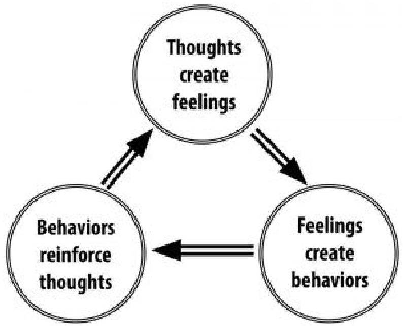

Figure 2.2. Pattern of thoughts, feelings, and behaviors addressed through cognitive-behavioral therapy.

# History of Cognitive Behavioral Therapy 

CBT developed from clinical work conducted in the mid-20th century by Dr. Aaron T. Beck, a psychiatrist, and Albert Ellis, a psychologist. Beck used the term automatic thoughts to refer to the thoughts depressed patients report experiencing spontaneously. He observed that these thoughts arise from three belief systems, or schemas: beliefs about the self, beliefs about the world, and beliefs about the future. In treatment, therapy initially focuses on identifying automatic thoughts (e.g., "If I don't wash my hands constantly, I'll get a disease"), testing their validity, and replacing maladaptive thoughts with more adaptive thoughts (e.g., "Washing my hands three times a day is sufficient to prevent adisease"). In later stages of treatment, the patient's maladaptive schemas are examined and modified. Ellis (1957) took a comparable approach, in what he called rational-emotive-behavioral therapy (REBT), which also encourages patients to evaluate their own thoughts about situations.

# Techniques in CBT 

Beck and Ellis strove to help patients identify maladaptive appraisals, or the untrue judgments and evaluations of certain thoughts. For example, if it's your first time meeting new people, you may have the automatic thought, "These people won't like me because I have nothing interesting to share." That thought itself is not what's troublesome; the appraisal (or evaluation) that it might have merit is what's troublesome. The goal of CBT is to help people make adaptive, instead of maladaptive, appraisals (e.g., "I do know interesting things!"). This technique of reappraisal, or cognitive restructuring, is a fundamental aspect of CBT. With cognitive restructuring, it is the therapist's job to help point out when a person has an inaccurate or maladaptive thought, so that the patient can either eliminate it or modify it to be more adaptive.

In addition to thoughts, though, another important treatment target of CBT is maladaptive behavior. Every time a person engages in maladaptive behavior (e.g., never speaking to someone in new situations), he or she reinforces the validity of the maladaptive thought, thus maintaining or perpetuating the psychological illness. In treatment, the therapist and patient work together to develop healthy behavioral habits (often tracked with worksheet-like homework), so that the patient can break this cycle of maladaptive thoughts and behaviors.

For many mental health problems, especially anxiety disorders, CBT incorporates what is known as exposure therapy. During exposure therapy, a patient confronts a problematic situation andfully engages in the experience instead of avoiding it. For example, imagine a man who is terrified of spiders. Whenever he encounters one, he immediately screams and panics. In exposure therapy, the man would be forced to confront and interact with spiders, rather than simply avoiding them as he usually does. The goal is to reduce the fear associated with the situation through extinction learning, a neurobiological and cognitive process by which the patient "unlearns" the irrational fear. For example, exposure therapy for someone terrified of spiders might begin with him looking at a cartoon of a spider, followed by him looking at pictures of real spiders, and later, him handling a plastic spider. After weeks of this incremental exposure, the patient may even be able to hold a live spider. After repeated exposure (starting small and building one's way up), the patient experiences less physiological fear and maladaptive thoughts about spiders, breaking his tendency for anxiety and subsequent avoidance.

# Advantages and Disadvantages of CBT 

CBT interventions tend to be relatively brief, making them costeffective for the average consumer. In addition, CBT is an intuitive treatment that makes logical sense to patients. It can also be adapted to suit the needs of many different populations. One disadvantage, however, is that CBT does involve significant effort on the patient's part, because the patient is an active participant in treatment. Therapists often assign "homework" (e.g., worksheets for recording one's thoughts and behaviors) between sessions to maintain the cognitive and behavioral habits the patient is working on. The greatest strength of CBT is the abundance of empirical support for its effectiveness. Studies have consistently found CBT to be equally or more effective than other forms of treatment, including medication and other therapies (Butler, Chapman,Forman, \& Beck, 2006; Hofmann et al., 2012). For this reason, CBT is considered a first-line treatment for many mental disorders.

# Focus: Topic: Pioneers of CBT 

The central notion of CBT is the idea that a person's behavioral and emotional responses are causally influenced by one's thinking. The stoic Greek philosopher Epictetus is quoted as saying, "men are not moved by things, but by the view they take of them." Meaning, it is not the event per se, but rather one's assumptions (including interpretations and perceptions) of the event that are responsible for one's emotional response to it. Beck calls these assumptions about events and situations automatic thoughts (Beck, 1979), whereas Ellis (1962) refers to these assumptions as self-statements. The cognitive model assumes that these cognitive processes cause the emotional and behavioral responses to events or stimuli. This causal chain is illustrated in Ellis's ABC model, in which A stands for the antecedent event, B stands for belief, and C stands for consequence. During CBT, the person is encouraged to carefully observe the sequence of events and the response to them, and then explore the validity of the underlying beliefs through behavioral experiments and reasoning, much like a detective or scientist.

## Acceptance and Mindfulness-Based# Approaches 

Unlike the preceding therapies, which were developed in the 20th century, this next one was born out of age-old Buddhist and yoga practices. Mindfulness, or a process that tries to cultivate a nonjudgmental, yet attentive, mental state, is a therapy that focuses on one's awareness of bodily sensations, thoughts, and the outside environment. Whereas other therapies work to modify or eliminate these sensations and thoughts, mindfulness focuses on nonjudgmentally accepting them (Kabat-Zinn, 2003; Baer, 2003). For example, whereas CBT may actively confront and work to change a maladaptive thought, mindfulness therapy works to acknowledge and accept the thought, understanding that the thought is spontaneous and not what the person truly believes. There are two important components of mindfulness: (1) selfregulation of attention, and (2) orientation toward the present moment (Bishop et al., 2004). Mindfulness is thought to improve mental health because it draws attention away from past and future stressors, encourages acceptance of troubling thoughts and feelings, and promotes physical relaxation.

## Techniques in Mindfulness-Based Therapy

Psychologists have adapted the practice of mindfulness as a form of psychotherapy, generally called mindfulness-based therapy (MBT). Several types of MBT have become popular in recent years, including mindfulness-based stress reduction (MBSR) (e.g., KabatZinn, 1982) and mindfulness-based cognitive therapy (MBCT) (e.g., Segal, Williams, \& Teasdale, 2002).

One of the most important advantages of mindfulness based therapy is its level of accessibility to patients. [Image: Wayne MacPhail, https://goo.gl/aSZanf, CC BY-NC SA 2.0, https://goo.gl/Toc0ZF]

MBSR uses meditation, yoga, and attention to physical experiences to reduce stress. The hope is that reducing a person's overall stress will allow that person to more objectively evaluate his or her thoughts. In MBCT, rather than reducing one's general stress to address a specific problem, attention is focused on one's thoughts and their associated emotions. For example, MBCT helps prevent relapses in depression by encouraging patients to evaluate their own thoughts objectively and without value judgment (Baer, 2003). Although cognitive behavioral therapy (CBT) may seem similar to this, it focuses on "pushing out" the maladaptive thought, whereas mindfulness-based cognitive therapy focuses on "not getting caught up" in it. The treatments used in MBCT have been used to address a wide range of illnesses, including depression, anxiety, chronic pain, coronary artery disease, and fibromyalgia (Hofmann, Sawyer, Witt \& Oh, 2010).

Mindfulness and acceptance-in addition to being therapies in their own right-have also been used as "tools" in other cognitivebehavioral therapies, particularly in dialectical behavior therapy (DBT) (e.g., Linehan, Amstrong, Suarez, Allmon, \& Heard, 1991). DBT, often used in the treatment of borderline personality disorder, focuses on skills training. That is, it often employs mindfulness and cognitive behavioral therapy practices, but it also works to teach its patients "skills" they can use to correct maladaptive tendencies. For example, one skill DBT teaches patients is called distress tolerance-or, ways to cope with maladaptive thoughts and emotions in the moment. For example, people who feel an urge tocut themselves may be taught to snap their arm with a rubber band instead. The primary difference between DBT and CBT is that DBT employs techniques that address the symptoms of the problem (e.g., cutting oneself) rather than the problem itself (e.g., understanding the psychological motivation to cut oneself). CBT does not teach such skills training because of the concern that the skills-even though they may help in the short-term-may be harmful in the long-term, by maintaining maladaptive thoughts and behaviors.

DBT is founded on the perspective of a dialectical worldview. That is, rather than thinking of the world as "black and white," or "only good and only bad," it focuses on accepting that some things can have characteristics of both "good" and "bad." So, in a case involving maladaptive thoughts, instead of teaching that a thought is entirely bad, DBT tries to help patients be less judgmental of their thoughts (as with mindfulness-based therapy) and encourages change through therapeutic progress, using cognitive-behavioral techniques as well as mindfulness exercises.

Another form of treatment that also uses mindfulness techniques is acceptance and commitment therapy (ACT) (Hayes, Strosahl, \& Wilson, 1999). In this treatment, patients are taught to observe their thoughts from a detached perspective (Hayes et al., 1999). ACT encourages patients not to attempt to change or avoid thoughts and emotions they observe in themselves, but to recognize which are beneficial and which are harmful. However, the differences among ACT, CBT, and other mindfulness-based treatments are a topic of controversy in the current literature.

# Advantages and Disadvantages of Mindfulness-Based Therapy 

Two key advantages of mindfulness-based therapies are their acceptability and accessibility to patients. Because yoga and meditation are already widely known in popular culture, consumersof mental healthcare are often interested in trying related psychological therapies. Currently, psychologists have not come to a consensus on the efficacy of MBT, though growing evidence supports its effectiveness for treating mood and anxiety disorders. For example, one review of MBT studies for anxiety and depression found that mindfulness-based interventions generally led to moderate symptom improvement (Hofmann et al., 2010).

# Emerging Treatment Strategies 

Recent improvements in video chat technology along with the proliferation of mobile devices like smartphones and tablets has made online delivery of therapy more commonplace. [Image: Noba, CC BY 2.0, https://goo.gl/ BRvSA7]

With growth in research and technology, psychologists have been able to develop new treatment strategies in recent years. Often, these approaches focus on enhancing existing treatments, such as cognitivebehavioral therapies, through the use of technological advances. For example, internet- and mobiledelivered therapies make psychological treatments more available, through smartphones and online access. Clinician-supervised online CBT modules allow patients to access treatment from home on their own schedule-an opportunity particularly important for patients with less geographic or socioeconomic access to traditional treatments. Furthermore, smartphones help extend therapy to patients' daily lives, allowing for symptom tracking, homework reminders, and more frequent therapist contact.

Another benefit of technology is cognitive bias modification. Here, patients are given exercises, often through the use of videogames, aimed at changing their problematic thought processes. For example, researchers might use a mobile app to train alcohol abusers to avoid stimuli related to alcohol. One version of this game flashes four pictures on the screen-three alcohol cues (e.g., a can of beer, the front of a bar) and one health-related image (e.g., someone drinking water). The goal is for the patient to tap the healthy picture as fast as s/he can. Games like these aim to target patients' automatic, subconscious thoughts that may be difficult to direct through conscious effort. That is, by repeatedly tapping the healthy image, the patient learns to "ignore" the alcohol cues, so when those cues are encountered in the environment, they will be less likely to trigger the urge to drink. Approaches like these are promising because of their accessibility, however they require further research to establish their effectiveness.

Yet another emerging treatment employs CBT-enhancing pharmaceutical agents. These are drugs used to improve the effects of therapeutic interventions. Based on research from animal experiments, researchers have found that certain drugs influence the biological processes known to be involved in learning. Thus, if people take these drugs while going through psychotherapy, they are better able to "learn" the techniques for improvement. For example, the antibiotic d-cycloserine improves treatment for anxiety disorders by facilitating the learning processes that occur during exposure therapy. Ongoing research in this exciting area may prove to be quite fruitful.

# Conclusion 

Throughout human history we have had to deal with mental illness in one form or another. Over time, several schools of thought have emerged for treating these problems. Although various therapies have been shown to work for specific individuals, cognitivebehavioral therapy is currently the treatment most widely supported by empirical research. Still, practices like psychodynamic therapies, person-centered therapy, mindfulness-based treatments, and acceptance and commitment therapy have also shown success. And, with recent advances in research and technology, clinicians are able to enhance these and other therapies to treat more patients more effectively than ever before. However, what is important in the end is that people actually seek out mental health specialists to help them with their problems. One of the biggest deterrents to doing so is that people don't understand what psychotherapy really entails. Through understanding how current practices work, not only can we better educate people about how to get the help they need, but we can continue to advance our treatments to be more effective in the future.

Outside Resources

Article: A personal account of the benefits of mindfulness-based therapy
https://www.theguardian.com/lifeandstyle/2014/jan/11/ julie-myerson-mindfulness-based-cognitive-therapy

Article: The Effect of Mindfulness-Based Therapy on Anxiety and Depression: A Meta-Analytic Review https://www.ncbi.nlm.nih.gov/pmc/articles/ PMC2848393/

Video: An example of a person-centered therapy session.One or more interactive elements has been excluded from this version of the text. You can view them online here: https://openpress.usask.ca/ abnormalpsychology/?p=87\#oembed-1

Video: Carl Rogers, the founder of the humanistic, person-centered approach to psychology, discusses the position of the therapist in PCT.

One or more interactive elements has been excluded from this version of the text. You can view them online here: https://openpress.usask.ca/ abnormalpsychology/?p=87\#oembed-2

Video: CBT (cognitive behavioral therapy) is one of the most common treatments for a range of mental health problems, from anxiety, depression, bipolar, OCD or schizophrenia. This animation explains the basics and how you can decide whether it's best for you or not.

One or more interactive elements has been excluded from this version of the text. You canview them online here: https://openpress.usask.ca/ abnormalpsychology/?p=87\#oembed-3

Web: An overview of the purpose and practice of cognitive behavioral therapy (CBT)
http://psychcentral.com/lib/in-depth-cognitive-behavioral-therapy/

Web: The history and development of psychoanalysis http://www.freudfile.org/psychoanalysis/history.html

# Discussion Questions 

1. Psychoanalytic theory is no longer the dominant therapeutic approach, because it lacks empirical support. Yet many consumers continue to seek psychoanalytic or psychodynamic treatments. Do you think psychoanalysis still has a place in mental health treatment? If so, why?
2. What might be some advantages and disadvantages of technological advances in psychological treatment? What will psychotherapy look like 100 years from now?
3. Some people have argued that all therapies areabout equally effective, and that they all affect change through common factors such as the involvement of a supportive therapist. Does this claim sound reasonable to you? Why or why not?
4. When choosing a psychological treatment for a specific patient, what factors besides the treatment's demonstrated efficacy should be taken into account?

# References 

Baer, R. (2003). Mindfulness training as a clinical intervention: A conceptual and empirical review. Clinical Psychology: Science and Practice, 10, 125-143.

Beck, A. T. (1979). Cognitive therapy and the emotional disorders. New York, NY: New American Library/Meridian.

Bishop, S. R., Lau, M., Shapiro, S., Carlson, L., Anderson, N. D., Carmody, J., Segal, Z. V., Abbey, S., Speca, M., Velting, D., \& Devins, G. (2004). Mindfulness: A proposed operational definition. Clinical Psychology: Science and Practice, 11, 230-241.

Boettcher, H., Hofmann, S. G., \& Wu, Q. J. (2020). Therapeutic Orientations. In R. Biswas-Diener \& E. Diener (Eds), Noba textbook series: Psychology. Champaign, IL: DEF publishers. Retrieved from http://noba.to/fjtnpwsk.

Bridley, A. \& Daffin, L. W. Jr. (2018). The Behavioural Model. In C. Cuttler (Ed), Essentials of Abnormal Psychology. Washington State University. Retrieved from https://opentext.wsu.edu/ abnormalpsychology/).

Bridley, A. \& Daffin, L. W. Jr. (2018). The Cognitive Model. In C.Cuttler (Ed), Essentials of Abnormal Psychology. Washington State University. Retrieved from https://opentext.wsu.edu/ abnormalpsychology/).

Butler, A. C., Chapman, J. E., Forman, E. M., \& Beck, A. T. (2006). The empirical status of cognitive behavioral therapy: A review of meta-analyses. Clinical Psychology Review, 26, 17-31.

Cuijpers, P., Driessen, E., Hollon, S.D., van Oppen, P., Barth, J., \& Andersson, G. (2012). The efficacy of non-directive supportive therapy for adult depression: A meta-analysis. Clinical Psychology Review, 32, 280-291.

Driessen, E., Cuijpers, P., de Maat, S. C. M., Abbass, A. A., de Jonghe, F., \& Dekker, J. J. M. (2010). The efficacy of short-term psychodynamic psychotherapy for depression: A metaanalysis. Clinical Psychology Review, 30, 25-36.

Ellis, A. (1962). Reason and emotion in psychotherapy. New York, NY: Lyle Stuart.

Ellis, A. (1957). Rational psychotherapy and individual psychology. Journal of Individual Psychology, 13, 38-44.

Freud, S. (1955). The interpretation of dreams. London, UK: Hogarth Press (Original work published 1900).

Freud, S. (1955). Studies on hysteria. London, UK: Hogarth Press (Original work published 1895).

Freud. S. (1955). Beyond the pleasure principle. H London, UK: Hogarth Press (Original work published 1920).

Friedli, K., King, M. B., Lloyd, M., \& Horder, J. (1997). Randomized controlled assessment of non-directive psychotherapy versus routine general-practitioner care. Lancet, 350, n1662-1665.

Hakimian, M., \& D'Souza, L. (2016). Effectiveness of systematic desensitization and cognitive behavior therapy on reduction of obsessive compulsive disorder symptoms: A comparative study. European Online Journal of Natural and Social Sciences, 5(1), 147-154. Retrieved from https://core.ac.uk/download/pdf/ 230044827.pdf.

Hayes, S. C., Strosahl, K., \& Wilson, K. G. (1999). Acceptance and Commitment Therapy. New $\backslash \backslash$ nYork, NY: Guilford Press.Hofmann, S. G., Asnaani, A., Vonk, J. J., Sawyer, A. T., \& Fang, A. (2012). The efficacy of cognitive behavioral therapy: A review of meta-analyses. Cognitive Therapy and Research, 36, 427-440.

Hofmann, S. G., Sawyer, A. T., Witt, A., \& Oh, D. (2010). The effect of mindfulness-based therapy on anxiety and depression: A metaanalytic review. Journal of Consulting and Clinical Psychology, 78, 169-183.

Jones, M. C. (1924). The elimination of children's fears. Journal of Experimental Psychology, 7(5), 382-390.

Kabat-Zinn J. (2003). Mindfulness-based interventions in context: Past, present, and future. Clinical Psychology: Science and Practice, $10,144-156$.

Kabat-Zinn, J. (1982). An outpatient program in behavioral medicine for chronic pain patients\\nbased on the practice of mindfulness meditation: Theoretical considerations and preliminary results. General Hospital Psychiatry, 4, 33-47.

Kessler, R. C., Berglund, P., Demler, O., Jin, R., Merikangas, K. R., \& Walters, E. E. (2005). Lifetime prevalence and age of onset distribution of DSM-IV disorders in the National Comorbidity Survey Replication. Archives of General Psychiatry, 62, 593-602.

Leichsenring, F., \& Rabung, S. (2008). Effectiveness of long-term psychodynamic psychotherapy: A meta-analysis. Journal of the American Medical Association, 300, 1551-1565.

Linehan, M. M., Amstrong, H.-E., Suarez, A., Allmon, D., \& Heard, H. L. (1991). Cognitive-behavioral treatment of chronically suicidal borderline patients. Archives of General Psychiatry, 48, 1060-1064.

Masoumeh, H., \& Lancy, D. S. (2016). Effectiveness of systematic desensitization and cognitive behaviour therapy in reduction of depression among obsessive compulsive disorder patients-A Comparative Study. International Journal of Psychology and Psychiatry, 4(1), 56-71.

Nasser, M. (1987). Psychiatry in ancient Egypt. Bulletin of the Royal College of Psychiatrists, 11, 420-422.

Norcross, J. C. \& Goldfried, M. R. (2005). Handbook of Psychotherapy Integration. New York, NY: Oxford University Press.Rogers, C. (1951). Client-Centered Therapy. Cambridge, MA: Riverside Press.

Segal, Z. V., Williams, J. M. G., \& Teasdale, J. D. (2002). MindfulnessBased Cognitive Therapy $\backslash \backslash$ nfor Depression: A New Approach to Preventing Relapse. New York, NY: Guilford Press.

Watson, J. \& Rayner, R. (1920). Conditioned emotional reactions. Journal of Experimental Psychology, 3, 1-4.

Wolpe, J. (1997). From psychoanalytic to behavioral methods in anxiety disorders: A continuing evolution.Brunner/Mazel.# 2.3 The Biological Model 

ALEXIS BRIDLEY \&AMP; LEE W. DAFFIN JR. AND CARRIE CUTTLER

## Section Learning Objectives

- Describe how communication in the nervous system occurs.
- List the parts of the nervous system.
- Describe the structure of the neuron and all key parts.
- Outline how neural transmission occurs.
- Identify and define important neurotransmitters.
- List the major structures of the brain.
- Clarify how specific areas of the brain are involved in mental illness.
- Describe the role of genes in mental illness.
- Describe the role of hormonal imbalances in mental illness.
- Describe commonly used treatments for mental illness.
- Evaluate the usefulness of the biological model.

Proponents of the biological model view mental illness as being a result of a malfunction in the body to include issues with brain anatomy or chemistry. As such, we will need to establish a foundation for how communication in the nervous system occurs, what the parts of the nervous system are, what a neuron is and itsstructure, how neural transmission occurs, and what the parts of the brain are. While doing this, we will identify areas of concern for psychologists focused on the treatment of mental disorders.

# Brain Structure and Chemistry 

## Communication in the Nervous System

To really understand brain structure and chemistry, it is a good idea to understand how communication occurs within the nervous system. Simply:

1. Receptor cells in each of the five sensory systems detect energy.
2. This information is passed to the nervous system due to the process of transduction and through sensory or afferent neurons, which are part of the peripheral nervous system.
3. The information is received by brain structures (central nervous system) and perception occurs.
4. Once the information has been interpreted, commands are sent out, telling the body how to respond, also via the peripheral nervous system.

Please note that we will not cover this process in full, but just the parts relevant to our topic of psychopathology.

## The Nervous System

The nervous system consists of two main parts - the central and peripheral nervous systems. The central nervous system (CNS)is the control center for the nervous system which receives, processes, interprets, and stores incoming sensory information. It consists of the brain and spinal cord. The peripheral nervous system consists of everything outside the brain and spinal cord. It handles the CNS's input and output and divides into the somatic and autonomic nervous systems. The somatic nervous system allows for voluntary movement by controlling the skeletal muscles and it carries sensory information to the CNS. The autonomic nervous system regulates the functioning of blood vessels, glands, and internal organs such as the bladder, stomach, and heart. It consists of sympathetic and parasympathetic nervous systems. The sympathetic nervous system is involved when a person is intensely aroused. It provides the strength to fight back or to flee (fight-or-flight response). Eventually, the response brought about by the sympathetic nervous system must end so the parasympathetic nervous system kicks in to calm the body.

Figure 2.3. The Structure of the Nervous System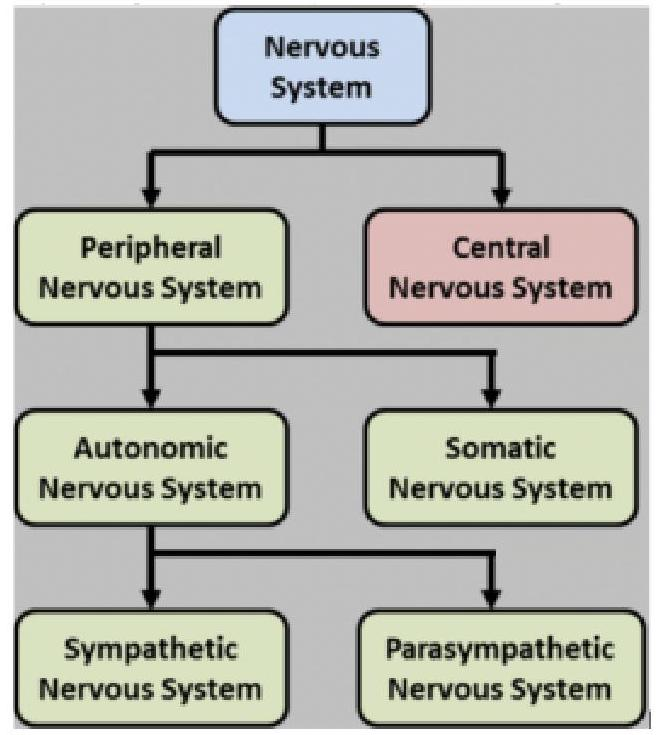

# The Neuron 

The fundamental unit of the nervous system is the neuron, or nerve cell (See Figure 2.4). It has several structures in common with all cells in the body. The nucleus is the control center of the body and the soma is the cell body. In terms of structures that make it different, these focus on the ability of a neuron to send and receive information. The axon sends signals/information through the neuron while the dendrites receive information from neighboring neurons and look like little trees. Notice the s on the end of dendrite and that axon has no such letter. In other words, there are lots of dendrites but only one axon. Also of importance to the neuron is the myelin sheath or the white, fatty covering which:1) provides insulation so that signals from adjacent neurons do not affect one another and, 2) increases the speed at which signals are transmitted. The axon terminals are the end of the axon where the electrical impulse becomes a chemical message and is released into the synaptic cleft which is the space between neurons.

Though not neurons, glial cells play an important part in helping the nervous system to be the efficient machine that it is. Glial cells are support cells in the nervous system that serve five main functions.

1. They act as a glue and hold the neuron in place.
2. They form the myelin sheath.
3. They provide nourishment for the cell.
4. They remove waste products.
5. They protect the neuron from harmful substances.

Finally, nerves are a group of axons bundled together like wires in an electrical cable.

Figure 2.4. The Structure of the Neuron
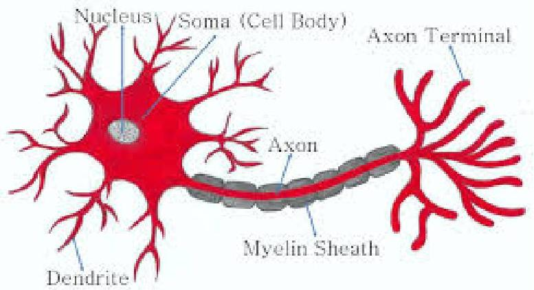# Neural Transmission 

Transducers or receptor cells in the major organs of our five sensory systems - vision (the eyes), hearing (the ears), smell (the nose), touch (the skin), and taste (the tongue) - convert the physical energy that they detect or sense, and send it to the brain via the neural impulse. How so? We will cover this process in three parts.

## Part 1. The Neural Impulse

- Step 1 - Neurons waiting to fire are said to be in resting potential and to be polarized (meaning they have a negative charge inside the neuron and a positive charge outside).
- Step 2 - If adequately stimulated, the neuron experiences an action potential and becomes depolarized. When this occurs, ion gated channels open allowing positively charged Sodium $(\mathrm{Na})$ ions to enter. This shifts the polarity to positive on the inside and negative outside.
- Step 3 - Once the action potential passes from one segment of the axon to the next, the previous segment begins to repolarize. This occurs because the Na channels close and Potassium (K) channels open. K has a positive charge and so the neuron becomes negative again on the inside and positive on the outside.
- Step 4 - After the neuron fires, it will not fire again no matter how much stimulation it receives. This is called the absolute refractory period.
- Step 5 - After a short period of time, the neuron can fire again, but needs greater than normal levels of stimulation to do so. This is called the relative refractory period.
- Step 6 - Please note that the process is cyclical. Once the relative refractory period has passed the neuron returns to its resting potential.

## Part 2. The Action PotentialLet's look at the electrical portion of the process in another way and add some detail.

Figure 2.5. The Action Potential
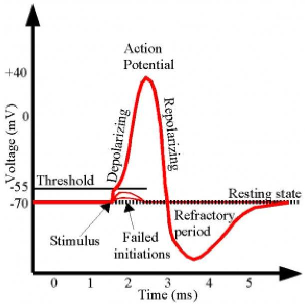

- Recall that a neuron is normally at resting potential and polarized. The charge inside is -70 mV at rest.
- If it receives sufficient stimulation meaning that the polarity inside the neuron rises from -70 mV to -55 mV defined as the threshold of excitation, the neuron will fire or send an electrical impulse down the length of the axon (the action potential or depolarization). It should be noted that it either hits -55 mV and fires or it does not. This is the all-or-nothing principle. The threshold must be reached.
- Once the electrical impulse has passed from one segment of the axon to the next, the neuron begins the process of resetting called repolarization.
- During repolarization, the neuron will not fire no matter how much stimulation it receives. This is called absolute refractory period.- The neuron next moves into relative refractory period meaning it can fire, but needs greater than normal levels of stimulation. Notice how the line has dropped below -70 mV . Hence, to reach -55 mV and fire, it will need more than the normal gain of $+15 \mathrm{mV}(-70$ to -55 mV$)$.
- And then it returns to resting potential, as you saw in Figure 2.3

Ions are charged particles found both inside and outside the neuron. It is positively charged Sodium ( Na ) ions that cause the neuron to depolarize and fire and positively charged Potassium (K) ions that exit and return the neuron to a polarized state.

# Part 3. The Synapse 

The electrical portion of the neural impulse is just the start. The actual code passes from one neuron to another in a chemical form called a neurotransmitter. The point where this occurs is called the synapse. The synapse consists of three parts - the axon terminals of the sending neuron (presynaptic neuron); the space in between called the synaptic cleft, space, or gap; and the dendrite of the receiving neuron (postsynaptic neuron). Once the electrical impulse reaches the end of the axon, called the axon terminal, it stimulates synaptic vesicles or neurotransmitter sacs to release the neurotransmitter. Neurotransmitters will only bind to their specific receptor sites, much like a key will only fit into the lock it was designed for. You might say neurotransmitters are part of a lock-and-key system. What happens to the neurotransmitters that do not bind to a receptor site? They might go through reuptake which is a process in which the presynaptic neuron takes back excess neurotransmitters in the synaptic space for future use or enzymatic degradation when enzymes destroy excess neurotransmitters in the synaptic space.# Neurotransmitters 

What exactly are some of the neurotransmitters which are so critical for neural transmission, and are important to our discussion of psychopathology?

- Dopamine - controls voluntary movements and is associated with the reward mechanism in the brain
- Serotonin - controls pain, sleep cycle, and digestion; leads to a stable mood and so low levels leads to depression
- Norepinephrine - increases the heart rate and blood pressure and regulates mood
- GABA - an inhibitory neurotransmitter responsible for blocking the signals of excitatory neurotransmitters responsible for anxiety and panic.
- Glutamate - an excitatory neurotransmitter associated with learning and memory

The critical thing to understand here is that there is a belief in the realm of mental health that chemical imbalances are responsible for many mental disorders. Chief among these are neurotransmitter imbalances. For instance, people with Seasonal Affective Disorder (SAD) have difficulty regulating serotonin. More on this throughout the book as we discuss each disorder.

## The Brain

The central nervous system consists of the brain and spinal cord; the former we will discuss briefly and in terms of key structures which include:

- Medulla - regulates breathing, heart rate, and blood pressure
- Pons - acts as a bridge connecting the cerebellum and medullaand helps to transfer messages between different parts of the brain and spinal cord.

- Reticular formation - responsible for alertness and attention
- Cerebellum - involved in our sense of balance and for coordinating the body's muscles so that movement is smooth and precise. Involved in the learning of certain kinds of simple responses and acquired reflexes.
- Thalamus - major sensory relay center for all senses except smell.
- Hypothalamus - involved in drives associated with the survival of both the individual and the species. It regulates temperature by triggering sweating or shivering and controls the complex operations of the autonomic nervous system
- Amygdala - responsible for evaluating sensory information and quickly determining its emotional importance
- Hippocampus - our "gateway" to memory. Allows us to form spatial memories so that we can accurately navigate through our environment and helps us to form new memories (involved in memory consolidation)
- The cerebrum has four distinct regions in each cerebral hemisphere. First, the frontal lobe contains the motor cortex which issues orders to the muscles of the body that produce voluntary movement. The frontal lobe is also involved in emotion and in the ability to make plans, think creatively, and take initiative. The parietal lobe contains the somatosensory cortex and receives information about pressure, pain, touch, and temperature from sense receptors in the skin, muscles, joints, internal organs, and taste buds. The occipital lobe contains the visual cortex and receives and processes visual information. Finally, the temporal lobe is involved in memory, perception, and emotion. It contains the auditory cortex which processes sound.

Figure 2.6. Anatomy of the Brain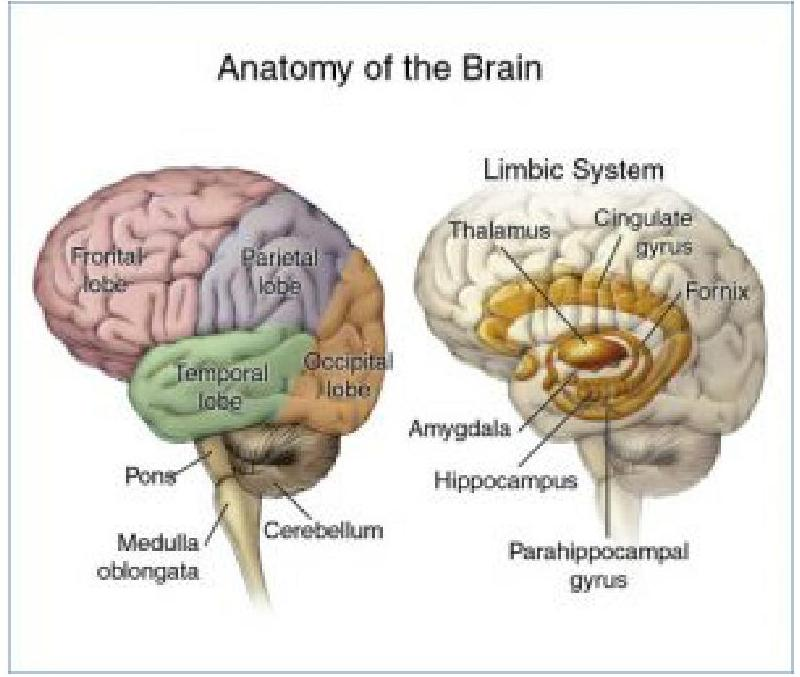

Of course, this is not an exhaustive list of structures found in the brain but gives you a pretty good idea of function and which structures help to support those functions. What is important to mental health professionals is that for some disorders, specific areas of the brain are involved. For instance, individuals with borderline personality disorder have been shown to have structural and functional changes in brain areas associated with impulse control and emotional regulation while imaging studies reveal differences in the frontal cortex and subcortical structures of individuals with OCD.

# ExercisesCheck out the following from Harvard Health for more on depression and the brain as a cause:
https://www.health.harvard.edu/mind-and-mood/what-causes-depression

# Genes, Hormonal Imbalances, and Viral Infections 

## Genetic Issues and Explanations

DNA, or deoxyribonucleic acid, is our heredity material and is found in the nucleus of each cell packaged in threadlike structures known as chromosomes. Most of us have 23 pairs of chromosomes or 46 total. Twenty-two of these pairs are the same in both sexes, but the 23rd pair is called the sex chromosome and differs between males and females. Males have X and Y chromosomes while females have two Xs. According to the Genetics Home Reference website as part of NIH's National Library of Medicine, a gene is "the basic physical and functional unit of heredity" (https://ghr.nlm.nih.gov/primer/ basics/gene). They act as the instructions to make proteins and it is estimated by the Human Genome Project that we have between 20,000 and 25,000 genes. We all have two copies of each gene and one is inherited from our mother and one from our father.

Recent research has discovered that autism, ADHD, bipolar disorder, major depression, and schizophrenia all share genetic roots. They "were more likely to have suspect genetic variation at the same four chromosomal sites. These included risk versions of two genes that regulate the flow of calcium into cells." For more on this development, please check out the article at:https://www.nih.gov/news-events/nih-research-matters/ common-genetic-factors-found-5-mental-disorders. Likewise, twin and family studies have shown that people with first-degree relatives with OCD are at higher risk of developing the disorder themselves. The same is true of most mental disorders. Indeed, it is presently believed that genetic factors contribute to all mental disorders but typically account for less than half of the explanation. Moreover, most mental disorders are linked to abnormalities in many genes, rather than just one; that is, most are polygenetic.

Moreover, there are important gene-environment interactions that are unique for every person (even twins) which help to explain why some people with a genetic predisposition toward a certain disorder develop that disorder and others do not (e.g., why one identical twin may develop schizophrenia but the other does not). The diathesis-stress model posits that people can inherit tendencies or vulnerabilities to express certain traits, behaviors, or disorders, which may then be activated under certain environmental conditions like stress (e.g., abuse, traumatic events). However, it is also important to note that certain protective factors (like being raised in a consistent, loving, supportive environment) may modify the response to stress and thereby help to protect individuals against mental disorders.

# Exercises 

For more on the role of genes in the development of mental illness, check out this article from Psychology Today:
https://www.psychologytoday.com/blog/saving-# Hormonal Imbalances 

The body has two coordinating and integrating systems in the body. The nervous system is one and the endocrine system is the second. The main difference between these two systems is in terms of the speed with which they act. The nervous system moves quickly with nerve impulses moving in a few hundredths of a second. The endocrine system moves slowly with hormones, released by endocrine glands, taking seconds, or even minutes, to reach their target. Hormones are important to psychologists because they organize the nervous system and body tissues at certain stages of development and activate behaviors such as alertness or sleepiness, sexual behavior, concentration, aggressiveness, reaction to stress, a desire for companionship.

The pituitary gland is the "master gland" which regulates other endocrine glands. It influences blood pressure, thirst, contractions of the uterus during childbirth, milk production, sexual behavior and interest, body growth, the amount of water in the body's cells, and other functions as well. The pineal gland produces melatonin which helps regulate the sleep-wake cycle and other circadian rhythms. Overproduction of the hormone melatonin can lead to Seasonal Affective Disorder (a specific type of Major Depressive Disorder). The thyroid gland produces thyroxin which facilitates energy, metabolism, and growth. Hypothyroidism is a condition in which the thyroid glands become underactive and this condition can produce symptoms of depression. In contrast, hyperthyroidism is a condition in which the thyroid glands become overactive and this condition can produce symptoms of mania. Therefore it isimportant for individuals experiencing these symptoms to have their thyroid checked, because conventional treatments for depression and mania will not correct the problem with the thyroid, and will therefore not resolve the symptoms. Rather, individuals with these conditions need to be treated with thyroid medications. Also of key importance to mental health professionals are the adrenal glands which are located on top of the kidneys, and release cortisol which helps the body deal with stress. However, chronically, elevated levels of cortisol can lead to increased weight gain, interfere with learning and memory, decrease the immune response, reduce bone density, increase cholesterol, and increase the risk of depression.

Figure 2.7. Hormone Systems
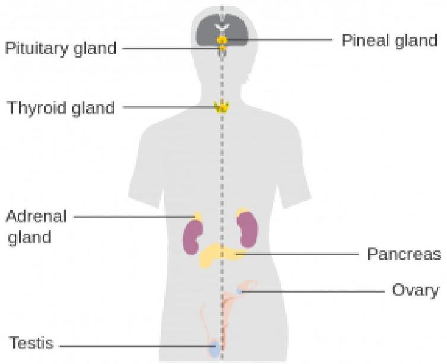

The Hypothalamic-Pituitary-Adrenal-Cortical Axis (HPA Axis) is the connection between the hypothalamus, pituitary glands, andadrenal glands. Specifically, the hypothalamus releases corticotropin-releasing factor (CRF) which stimulates the anterior pituitary to release adrenocorticotrophic hormone (ACTH), which in turn stimulates the adrenal cortex to release cortisol (see Figure 2.4). Malfunctioning of this system is implicated in a wide range of mental disorders including, depression, anxiety, and post-traumatic stress disorder. Exposure to chronic, unpredictable stress during early development can sensitive this system, making it overresponsive to stress (meaning it activates too readily and does not shut down appropriately). Sensitization of the HPA axis leads to an overproduction of cortisol which once again can damage the body and brain when it remains at chronically high levels.

Figure 2.8. The HPA Axis
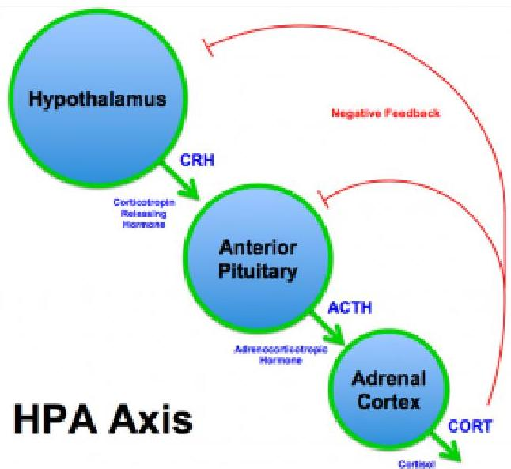For more on the link between cortisol and depression, check out this article:
https://www.psychologytoday.com/blog/the-athletes-way/201301/cortisol-why-the-stress-hormone-is-public-enemy-no-1

# Viral Infections 

Infections can cause brain damage and lead to the development of mental illness or an exacerbation of symptoms. For example, evidence suggests that contracting strep infection can lead to the development of OCD, Tourette's syndrome, and tic disorder in children (Mell, Davis, \& Owens, 2005; Giedd et al., 2000; Allen et al., 1995; https://www.psychologytoday.com/blog/the-perfectionists-handbook/201202/can-infections-result-in-mental-illness).
Influenza epidemics have also been linked to schizophrenia (Brown et al., 2004; McGrath and Castle, 1995; McGrath et al., 1994; O'Callaghan et al., 1991) though more recent research suggests this evidence is weak at best (Selten \& Termorshuizen, 2017; Ebert \& Kotler, 2005).# Treatments 

## Psychopharmacology and Psychotropic Drugs

One option to treat severe mental illness is psychotropic medications. These medications fall into five major categories. In this section we will broadly discuss these categories, and in the next we will cover them in more detail.

Antidepressants are used to treat depression, but also anxiety, insomnia, or pain. The most common types of antidepressants are selective serotonin reuptake inhibitors (SSRIs) and include Citalopram (Celexa), Paroxetine, and Fluoxetine (Prozac). They can often take 2-6 weeks to take effect. Possible side effects include weight gain, sleepiness, nausea and vomiting, panic attacks, or thoughts about suicide or dying.

Anti-anxiety medications help with the symptoms of anxiety and include the benzodiazepines such as Diazepam (Valium), Alprazolam (Xanax), and Lorazepam (Ativan). These medications are effective in reducing anxiety in the short-term and take less time to take effect than antidepressants which are also commonly prescribed for anxiety. However, benzodiazepines are rather addictive. As such, tolerance to these drugs can develop quickly and individuals may experience withdrawal symptoms (e.g., anxiety, panic, insomnia) when they cease taking the drugs. For this reason, benzodiazepines should not be used in the long-term. Side effects include drowsiness, dizziness, nausea, difficulty urinating, and irregular heartbeat, to name a few.

Stimulants increase one's alertness and attention and are frequently used to treat ADHD. They include Lisdexamfetamine, the combination of dextroamphetamine and amphetamine, and Methylphenidate (Ritalin). Stimulants are generally effective and produce a calming effect. Possible side effects include loss ofappetite, headache, motor tics or verbal tics, and personality changes such as appearing emotionless.

Antipsychotics are used to treat psychosis (i.e., hallucinations and delusions). They can also be used to treat eating disorders, severe depression, PTSD, OCD, ADHD, and Generalized Anxiety Disorder. Common antipsychotics include Chlorpromazine, Perphenazine, Quetiapine, and Lurasidone. Side effects include nausea, vomiting, blurred vision, weight gain, restlessness, tremors, and rigidity.

Mood stabilizers are used to treat bipolar disorder and at times depression, schizoaffective disorder, and disorders of impulse control. A common example is Lithium and side effects include loss of coordination, hallucinations, seizures, and frequent urination.

For more information on psychotropic medications, please visit:
https://www.nimh.nih.gov/health/topics/mental-health-medications/index.shtml

The use of these drugs has been generally beneficial to patients. Most report that their symptoms decline, leading them to feel better and improve their functioning. Also, long-term hospitalizations are less likely to occur as a result, though the medications do not benefit the individual in terms of improved living skills.

# Electroconvulsive Therapy 

According to Mental Health America, "Electroconvulsive therapy(ECT) is a procedure in which a brief application of electric stimulus is used to produce a generalized seizure." Patients are placed on a padded bed and administered a muscle relaxant to avoid injury during the seizures. Annually, approximately 100,000 are treated using ECT for conditions including severe depression, acute mania, and suicidality. The procedure is still the most controversial available to mental health professionals due to "its effectiveness vs. the side effects, the objectivity of ECT experts, and the recent increase in ECT as a quick and easy solution, instead of long-term psychotherapy or hospitalization" (http://www.mentalhealthamerica.net/ect). Its popularity has declined since the 1940s and 1950s.

# Psychosurgery 

Another option to treat mental disorders is to perform brain surgeries. In the past, we have conducted trephining and lobotomies, neither of which are used today. Today's techniques are much more sophisticated and have been used to treat schizophrenia, depression, and obsessive-compulsive disorder, though critics cite obvious ethical issues with conducting such surgeries as well as scientific issues. Due to these issues, psychosurgery is only used as a radical last resort when all other treatment options have failed to resolve a serious mental illness.

For more on psychosurgery, check out this article from Psychology Today:
https://www.psychologytoday.com/articles/199203/ psychosurgery# Evaluation of the Model 

The biological model is generally well respected today but suffers a few key issues. First, consider the list of side effects given for the psychotropic medications. You might make the case that some of the side effects are worse than the condition they are treating. Second, the viewpoint that all human behavior is explainable in biological terms, and therefore, when issues arise they can be treated using biological methods, overlooks factors that are not biological in nature. More on that over the next two sections.

## References

Allen, A. J., Leonard, H. L., \& Swedo, S. E. (1995). Case study: a new infection-triggered, autoimmune subtype of pediatric OCD and Tourette's syndrome. Journal of the American Academy of Child $\mathcal{E}$ Adolescent Psychiatry, 34(3), 307-311.

Bridley, A., \& Daffin, L. W. Jr. (2018). The Biological Model. In C. Cuttler (Ed), Essentials of Abnormal Psychology. Washington State University. Retrieved from https://opentext.wsu.edu/ abnormalpsychology/.

Brown, A. S., Begg, M. D., Gravenstein, S., Schaefer, C. A., Wyatt, R. J., Bresnahan, M., ... \& Susser, E. S. (2004). Serologic evidence of prenatal influenza in the etiology of schizophrenia. Archives of general psychiatry, 61(8), 774-780.

Ebert, T., \& Kotler, M. (2005). Prenatal exposure to influenza and the risk of subsequent development of schizophrenia. The Israel Medical Association Journal, 7(1), 35.

Giedd, J. N., Rapoport, J. L., Garvey, M. A., Perlmutter, S., \& Swedo, S. E. (2000). MRI assessment of children with obsessive-compulsivedisorder or tics associated with streptococcal infection. American Journal of Psychiatry, 157(2), 281-283.

McGrath, J. J., Pemberton, M. R., Welham, J. L., \& Murray, R. M. (1994). Schizophrenia and the influenza epidemics of 1954, 1957 and 1959: A southern hemisphere study. Schizophrenia Research, 14(1), $1-8$.

McGrath, J., \& Castle, D. (1995). Does influenza cause schizophrenia? A five year review. Australian and New Zealand Journal of Psychiatry, 29(1), 23-31.

Mell, L. K., Davis, R. L., \& Owens, D. (2005). Association between streptococcal infection and obsessive-compulsive disorder, Tourette's syndrome, and tic disorder. Pediatrics, 116(1), 56-60.

O'Callaghan, E., Sham, P. C., Takei, N., Murray, R. M., \& Glover, G. (1991). Schizophrenia after prenatal exposure to 1957 A2 influenza epidemic. The Lancet, 337(8752), 1248- 1250.

Selten, J. P., \& Termorshuizen, F. (2017). The serological evidence for maternal influenza as risk factor for psychosis in offspring is insufficient: critical review and meta-analysis. Schizophrenia research, 183, 2-9.# 2.4 Psychopharmacology 

SUSAN BARRON

## Section Learning Objectives

- How do the majority of psychoactive drugs work in the brain?
- How does the route of administration affect how rewarding a drug might be?
- Why is grapefruit dangerous to consume with many psychotropic medications?
- Why might individualized drug doses based on genetic screening be helpful for treating conditions like depression?
- Why is there controversy regarding pharmacotherapy for children, adolescents, and the elderly?

Psychopharmacology is the study of how drugs affect behavior. If a drug changes your perception, or the way you feel or think, the drug exerts effects on your brain and nervous system. We call drugs that change the way you think or feel psychoactive or psychotropic drugs, and almost everyone has used a psychoactive drug at some point (yes, caffeine counts). Understanding some of the basics about psychopharmacology can help us better understand a wide range of things that interest psychologists and others. For example, thepharmacological treatment of certain neurodegenerative diseases such as Parkinson's disease tells us something about the disease itself. The pharmacological treatments used to treat psychiatric conditions such as schizophrenia or depression have undergone amazing development since the 1950s, and the drugs used to treat these disorders tell us something about what is happening in the brain of individuals with these conditions. Finally, understanding something about the actions of drugs of abuse and their routes of administration can help us understand why some psychoactive drugs are so addictive. In this module, we will provide an overview of some of these topics as well as discuss some current controversial areas in the field of psychopharmacology.

# Introduction 

Psychopharmacology, the study of how drugs affect the brain and behavior, is a relatively new science, although people have probably been taking drugs to change how they feel from early in human history (consider the of eating fermented fruit, ancient beer recipes, chewing on the leaves of the cocaine plant for stimulant properties as just some examples). The word psychopharmacology itself tells us that this is a field that bridges our understanding of behavior (and brain) and pharmacology, and the range of topics included within this field is extremely broad.Virtually any drug that changes the way you feel does this by altering how neurons communicate with each other. Neurons (more than 100 billion in your nervous system) communicate with each other by releasing a chemical (neurotransmitter) across a tiny space between two neurons (the synapse). When the neurotransmitter crosses the synapse, it binds to a postsynaptic receptor (protein) on the receiving neuron and the
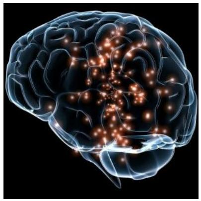

Drugs that alter our feelings and behavior do so by affecting the communication between neurons in the brain. [Image: https://goo.gl/ oQCafL, CC0 Public Domain, https://goo.gl/m25gce]
message may then be transmitted onward. Obviously, neurotransmission is far more complicated than this - links at the end of this module can provide some useful background if you want more detail - but the first step is understanding that virtually all psychoactive drugs interfere with or alter how neurons communicate with each other.

There are many neurotransmitters. Some of the most important in terms of psychopharmacological treatment and drugs of abuse are outlined in Table 1. The neurons that release these neurotransmitters, for the most part, are localized within specific circuits of the brain that mediate these behaviors. Psychoactive drugs can either increase activity at the synapse (these are called agonists) or reduce activity at the synapse (antagonists). Different drugs do this by different mechanisms, and some examples of agonists and antagonists are presented in Table 2. For each example, the drug's trade name, which is the name of the drug provided by the drug company, and generic name (in parentheses) are provided.| Neurotransmitter | Abbreviation | Behaviors or Diseases Related to These Neurotransmitter |
| :--: | :--: | :--: |
| Acetylcholine | ACh | Learning and memory; Alzheimer's disease' muscle movement in the peripheral nervous system |
| Dopamine | DA | Reward circuits; Motor circuits involved in Parkinson's disease; Schizophrenia |
| Norepinephrine | NE | Arousal; Depression |
| Serotonin | 5HT | Depression; Aggression; Schizophrenia |
| Glutamate | GLU | Learning; Major excitatory neurotransmitter in the brain |
| GABA | GABA | Anxiety disorders; Epilepsy; Major inhibitory neurotransmitter in the brain |
| Endogenous Opiods | Endorphins, Enkephalins | Pain; Analgesia; Reward |

Table 2.1 Neurotransmitters and associated behaviours or diseases

A very useful link at the end of this module shows the various steps involved in neurotransmission and some ways drugs can alter this.

Table 2 provides examples of drugs and their primary mechanism of action, but it is very important to realize that drugs also have effects on other neurotransmitters. This contributes to the kinds of side effects that are observed when someone takes a particular drug. The reality is that no drugs currently available work only exactly where we would like in the brain or only on a specific neurotransmitter. In many cases, individuals are sometimes prescribed one psychotropic drug but then may also have to take additional drugs to reduce the side effects caused by the initial drug. Sometimes individuals stop taking medication because the side effects can be so profound.| Drug | Mechanism | Use | Agonist/Antagonist |
| :--: | :--: | :--: | :--: |
| L-dopa | Increase synthesis of DA | Parkinson's disease | Agonist for DA |
| Adilorall (mined salts amphetamine) | Increase release of DA, NE | ADHD | Agonist for DA, NE |
| Ritalin (methylphenidate) | Blocks removal of DA, NE, and lesser (SHT) from synapse | ADHD | Agonist for DA, NE mostly |
| Anicept (donepezil) | Blocks removal of ACh from synapse | Alzheimer's disease | Agonist for ACh |
| Prozac (flusmetine) | Blocks removal of SHT from synapse | Depression, obsessive compulsive disorder | Agonist SHT |
| Seroguel (quetiapine) | Blocks DA and SHT receptors | Schizophrenia, bipolar disorder | Antagonist for DA, SHT |
| Reale (naltrexone) | Blocks opiod post-synaptic receptors | Alcoholism, opioid addiction | Antagonist (for opioids) |

Table 2.2 Examples of drugs and their primary mechanism of action

# Pharmacokinetics: What Is It - Why Is It Important? 

While this section may sound more like pharmacology, it is important to realize how important pharmacokinetics can be when considering psychoactive drugs. Pharmacokinetics refers to how the body handles a drug that we take. As mentioned earlier, psychoactive drugs exert their effects on behavior by altering neuronal communication in the brain, and the majority of drugs reach the brain by traveling in the blood. The acronym ADME is often used with A standing for absorption (how the drug gets into the blood), Distribution (how the drug gets to the organ of interest - in this module, that is the brain), Metabolism (how the drug is broken down so it no longer exerts its psychoactive effects), and Excretion (how the drug leaves the body). We will talk about a couple of these to show their importance for considering psychoactive drugs.# Drug Administration 

A drug delivered by IV reaches the brain more quickly than if the drug is taken orally. While rapid delivery has advantages, there are also risks involved with IV administration. [Image: Calleamanecer, https://goo.gl/ OX6Yj5, CC BY-SA 3.0, https://goo.gl/ eLCn2O]

There are many ways to take drugs, and these routes of drug administration can have a significant impact on how quickly that drug reaches brain. The most common route of administration is oral administration, which is relatively slow and - perhaps surprisingly - often the most variable and complex route of administration. Drugs enter the stomach and then get absorbed by the blood supply and capillaries that line the small intestine. The rate of absorption can be affected by a variety of factors including the quantity and the type of food in the stomach (e.g., fats vs. proteins). This is why the medicine label for some drugs (like antibiotics) may specifically state foods that you should or should NOT consume within an hour of taking the drug because they can affect the rate of absorption. Two of the most rapid routes of administration include inhalation (i.e., smoking or gaseous anesthesia) and intravenous (IV) in which the drug is injected directly into the vein and hence the blood supply. Both of these routes of administration can get the drug to brain in less than 10 seconds. IV administration also has the distinction of being the most dangerous because if there is an adverse drug reaction, there is very little time to administer any antidote, as in the case of an IV heroin overdose.

Why might how quickly a drug gets to the brain be important? If a drug activates the reward circuits in the brain AND it reaches thebrain very quickly, the drug has a high risk for abuse and addiction. Psychostimulants like amphetamine or cocaine are examples of drugs that have high risk for abuse because they are agonists at DA neurons involved in reward AND because these drugs exist in forms that can be either smoked or injected intravenously. Some argue that cigarette smoking is one of the hardest addictions to quit, and although part of the reason for this may be that smoking gets the nicotine into the brain very quickly (and indirectly acts on DA neurons), it is a more complicated story. For drugs that reach the brain very quickly, not only is the drug very addictive, but so are the cues associated with the drug (see Rohsenow, Niaura, Childress, Abrams, \& Monti, 1990). For a crack user, this could be the pipe that they use to smoke the drug. For a cigarette smoker, however, it could be something as normal as finishing dinner or waking up in the morning (if that is when the smoker usually has a cigarette). For both the crack user and the cigarette smoker, the cues associated with the drug may actually cause craving that is alleviated by (you guessed it) - lighting a cigarette or using crack (i.e., relapse). This is one of the reasons individuals that enroll in drug treatment programs, especially out-of-town programs, are at significant risk of relapse if they later find themselves in proximity to old haunts, friends, etc. But this is much more difficult for a cigarette smoker. How can someone avoid eating? Or avoid waking up in the morning, etc. These examples help you begin to understand how important the route of administration can be for psychoactive drugs.

# Drug Metabolism 

Metabolism involves the breakdown of psychoactive drugs, and this occurs primarily in the liver. The liver produces enzymes (proteins that speed up a chemical reaction), and these enzymes help catalyze a chemical reaction that breaks down psychoactive drugs. Enzymesexist in "families," and many psychoactive drugs are broken down by the same family of enzymes, the cytochrome P450 superfamily. There is not a unique enzyme for each drug; rather, certain enzymes can break down a wide variety of drugs. Tolerance to the effects of many drugs can occur with repeated exposure; that is, the drug produces less of an effect over time, so more of the drug is needed to get the same effect. This is particularly true for sedative drugs like alcohol or opiate-based painkillers. Metabolic tolerance is one kind of tolerance and it takes place in the liver. Some drugs (like alcohol) cause enzyme induction - an increase in the enzymes produced by the liver. For example, chronic drinking results in alcohol being broken down more quickly, so the alcoholic needs to drink more to get the same effect - of course, until so much alcohol is consumed that it damages the liver (alcohol can cause fatty liver or cirrhosis).# Recent Issues Related to Psychotropic Drugs and Metabolism 

## Grapefruit Juice and Metabolism

Grapefruit can interfere with enzymes in the liver that help the body to process certain drugs. [Image: CC0 Public Domain, https://goo.gl/m25gce]

Certain types of food in the stomach can alter the rate of drug absorption, and other foods can also alter the rate of drug metabolism. The most well known is grapefruit juice. Grapefruit juice suppresses cytochrome P450 enzymes in the liver, and these liver enzymes normally break down a large variety of drugs (including some of the psychotropic drugs). If the enzymes are suppressed, drug levels can build up to potentially toxic levels. In this case, the effects can persist for extended periods of time after the consumption of grapefruit juice. As of 2013, there are at least 85 drugs shown to adversely interact with grapefruit juice (Bailey, Dresser, \& Arnold, 2013). Some psychotropic drugs that are likely to interact with grapefruit juice include carbamazepine (Tegretol), prescribed for bipolar disorder; diazepam (Valium), used to treat anxiety, alcohol withdrawal, and muscle spasms; and fluvoxamine (Luvox), used to treat obsessive compulsive disorder and depression. A link at the end of this module gives the latest list of drugs reported to have this unusual interaction.# Individualized Therapy, Metabolic Differences, and Potential Prescribing Approaches for the Future 

Mental illnesses contribute to more disability in western countries than all other illnesses including cancer and heart disease. Depression alone is predicted to be the second largest contributor to disease burden by 2020 (World Health Organization, 2004). The numbers of people affected by mental health issues are pretty astonishing, with estimates that $25 \%$ of adults experience a mental health issue in any given year, and this affects not only the individual but their friends and family. One in 17 adults experiences a serious mental illness (Kessler, Chiu, Demler, \& Walters, 2005). Newer antidepressants are probably the most frequently prescribed drugs for treating mental health issues, although there is no "magic bullet" for treating depression or other conditions. Pharmacotherapy with psychological therapy may be the most beneficial treatment approach for many psychiatric conditions, but there are still many unanswered questions. For example, why does one antidepressant help one individual yet have no effect for another? Antidepressants can take 4 to 6 weeks to start improving depressive symptoms, and we don't really understand why. Many people do not respond to the first antidepressant prescribed and may have to try different drugs before finding something that works for them. Other people just do not improve with antidepressants (Ioannidis, 2008). As we better understand why individuals differ, the easier and more rapidly we will be able to help people in distress.

One area that has received interest recently has to do with an individualized treatment approach. We now know that there are genetic differences in some of the cytochrome P450 enzymes and their ability to break down drugs. The general population falls into the following 4 categories: 1) ultra-extensive metabolizers break down certain drugs (like some of the current antidepressants) very, very quickly, 2) extensive metabolizers are also able to break downdrugs fairly quickly, 3) intermediate metabolizers break down drugs more slowly than either of the two above groups, and finally 4) poor metabolizers break down drugs much more slowly than all of the other groups. Now consider someone receiving a prescription for an antidepressant - what would the consequences be if they were either an ultra-extensive metabolizer or a poor metabolizer? The ultra-extensive metabolizer would be given antidepressants and told it will probably take 4 to 6 weeks to begin working (this is true), but they metabolize the medication so quickly that it will never be effective for them. In contrast, the poor metabolizer given the same daily dose of the same antidepressant may build up such high levels in their blood (because they are not breaking the drug down), that they will have a wide range of side effects and feel really badly - also not a positive outcome. What if - instead - prior to prescribing an antidepressant, the doctor could take a blood sample and determine which type of metabolizer a patient actually was? They could then make a much more informed decision about the best dose to prescribe. There are new genetic tests now available to better individualize treatment in just this way. A blood sample can determine (at least for some drugs) which category an individual fits into, but we need data to determine if this actually is effective for treating depression or other mental illnesses (Zhou, 2009). Currently, this genetic test is expensive and not many health insurance plans cover this screen, but this may be an important component in the future of psychopharmacology.

# Other Controversial Issues 

## Juveniles and Psychopharmacology

A recent Centers for Disease Control (CDC) report has suggestedthat as many as 1 in 5 children between the ages of 5 and 17 may have some type of mental disorder (e.g., ADHD, autism, anxiety, depression) (CDC, 2013). The incidence of bipolar disorder in children and adolescents has also increased 40 times in the past decade (Moreno, Laje, Blanco, Jiang, Schmidt, \& Olfson, 2007), and it is now estimated that 1 in 88 children have been diagnosed with an autism spectrum disorder (CDC, 2011). Why has there been such an increase in these numbers? There is no single answer to this important question. Some believe that greater public awareness has contributed to increased teacher and parent referrals. Others argue that the increase stems from changes in criterion currently used for diagnosing. Still others suggest environmental factors, either prenatally or postnatally, have contributed to this upsurge.

We do not have an answer, but the question does bring up an additional controversy related to how we should treat this population of children and adolescents. Many psychotropic drugs used for treating psychiatric disorders have been tested in adults, but few have been tested for safety or efficacy with children or adolescents. The most wellestablished psychotropics prescribed for children and adolescents are the

There are concerns about both the safety and efficacy of drugs like Prozac for children and teens. [Image: zaza_bj, CC BY-NC-SA 2.0, https://goo.gl/Toc0ZF]
psychostimulant drugs used for treating attention deficit hyperactivity disorder (ADHD), and there are clinical data on how effective these drugs are. However, we know far less about the safety and efficacy in young populations of the drugs typically prescribed for treating anxiety, depression, or other psychiatric disorders. The young brain continues to mature until probably well after age 20, so some scientists are concerned that drugs that alterneuronal activity in the developing brain could have significant consequences. There is an obvious need for clinical trials in children and adolescents to test the safety and effectiveness of many of these drugs, which also brings up a variety of ethical questions about who decides what children and adolescents will participate in these clinical trials, who can give consent, who receives reimbursements, etc.

# The Elderly and Psychopharmacology 

Another population that has not typically been included in clinical trials to determine the safety or effectiveness of psychotropic drugs is the elderly. Currently, there is very little high-quality evidence to guide prescribing for older people - clinical trials often exclude people with multiple comorbidities (other diseases, conditions, etc.), which are typical for elderly populations (see Hilmer and Gnjidict, 2008; Pollock, Forsyth, \& Bies, 2008). This is a serious issue because the elderly consume a disproportionate number of the prescription meds prescribed. The term polypharmacy refers to the use of multiple drugs, which is very common in elderly populations in the United States. As our population ages, some estimate that the proportion of people 65 or older will reach $20 \%$ of the U.S. population by 2030, with this group consuming $40 \%$ of the prescribed medications. As shown in Table 3 (from Schwartz and Abernethy, 2008), it is quite clear why the typical clinical trial that looks at the safety and effectiveness of psychotropic drugs can be problematic if we try to interpret these results for an elderly population.| Clinical Trial Subjects | Aged Patients Who Receive Drug Therapies |
| :--: | :--: |
| One drug | Drug of interest and medications |
| Single does | Chronic administration |
| No disease | Multiple diseases |
| No alcohol, tobacco, OTC*   drugs, nutraceuticals | OTC* drugs, nutraceuticals, alcohol, tobacco, and other |
| 20-40 years (vs 60-75 years) | $65-100+$ years |
| Caucasians | Caucasians and minorities |
| Selection bias | All comers/socioeconomic basis |

*OTC = Over the counter
Table 2.3 Comparison of clinical trial subjects and aged patients receiving drug therapies

Metabolism of drugs is often slowed considerably for elderly populations, so less drug can produce the same effect (or all too often, too much drug can result in a variety of side effects). One of the greatest risk factors for elderly populations is falling (and breaking bones), which can happen if the elderly person gets dizzy from too much of a drug. There is also evidence that psychotropic medications can reduce bone density (thus worsening the consequences if someone falls) (Brown \& Mezuk, 2012). Although we are gaining an awareness about some of the issues facing pharmacotherapy in older populations, this is a very complex area with many medical and ethical questions.

This module provided an introduction of some of the important areas in the field of psychopharmacology. It should be apparent that this module just touched on a number of topics included in this field. It should also be apparent that understanding more about psychopharmacology is important to anyone interested inunderstanding behavior and that our understanding of issues in this field has important implications for society.

# Outside Resources 

Video: Neurotransmission

One or more interactive elements has been excluded from this version of the text. You can view them online here: https://openpress.usask.ca/ abnormalpsychology/?p=120\#oembed-1

Web: Description of how some drugs work and the brain areas involved - 1 http://www.drugabuse.gov/news-events/nida-notes/2007/10/impacts-drugsneurotransmission

Web: Description of how some drugs work and the brain areas involved - 2 http://learn.genetics.utah.edu/content/ addiction/mouse/

Web: Information about how neurons communicate and the reward pathways http://learn.genetics.utah.edu/ content/addiction/rewardbehavior/

Web: National Institute of Alcohol Abuse and Alcoholism http://www.niaaa.nih.gov/Web: National Institute of Drug Abuse http://www.drugabuse.gov/

Web: National Institute of Mental
Healthhttp://www.nimh.nih.gov/index.shtml
Web: Neurotransmission
https://science.education.nih.gov/supplements/nih2/ Addiction/activities/lesson2 neurotransmission.html

Web: Report of the Working Group on Psychotropic Medications for Children and Adolescents:
Psychopharmacological, Psychosocial, and Combined Interventions for Childhood Disorders: Evidence Base, Contextual Factors, and Future Directions (2008): http://www.apa.org/pi/families/resources/childmedications.pdf

Web: Ways drugs can alter neurotransmission http://thebrain.mcgill.ca/flash/d/d 03/d 03 m/ d 03 m par/d 03 m par.html

# Discussion Questions 

1. What are some of the issues surrounding prescribing medications for children and adolescents? How might this be improved?
2. What are some of the factors that can affect relapse to an addictive drug?
3. How might prescribing medications for depressionbe improved in the future to increase the likelihood that a drug would work and minimize side effects?

# References 

Bailey D. G., Dresser G., \& Arnold J. M. (2013). Grapefruit-medication interactions: forbidden fruit or avoidable consequences? Canadian Medical Association Journal, 185, 309-316.

Barron, S. (2020). Psychopharmacology. In R. Biswas-Diener \& E. Diener (Eds), Noba textbook series: Psychology. Champaign, IL: DEF publishers. Retrieved from http://noba.to/umx6f2t8.

Brown, M. J., \& Mezuk, B. (2012). Brains, bones, and aging: psychotropic medications and bone health among older adults. Current Osteoporosis Reports, 10, 303-311.

Centers for Disease Control and Prevention (2011) Prevalence of autism spectrum disorders - autism and developmental disabilities monitoring network, 14 sites, United States, 2008. Morbidity and Mortality Weekly Report 61(SS03) 1-19.

Centers for Disease Control and Prevention. (2013) Mental health surveillance among children - United States, 2005-2011. Morbidity and Mortality Weekly Report 62 Suppl, 1-35.

Hilmer, N., \& Gnjidict, D. (2008). The effects of polypharmacy in older adults. Clinical Pharmacology \& Therapeutics, 85, 86-88.

Ioannidis, J. P. A. (2008). Effectiveness of antidepressants: an evidence myth constructed from a thousand randomized trials? Philosophy, Ethics and Humanities in Medicine, 3,14.

Kessler, R. C., Chiu, W. T., Demler, O., \& Walters, E. E. (2005). Prevalence, severity, and comorbidity of twelve-month DSM-IVdisorders in the National Comorbidity Survey Replication (NCSR). Archives of General Psychiatry, 62, 617-627.

Moreno, C., Laje, G., Blanco, C., Jiang, H., Schmidt, A. B., \& Olfson, M., (2007). National trends in the outpatient diagnosis and treatment of bipolar disorder in youth. Archives of General Psychiatry, 64(9), 1032-1039.

Pollock, B. G., Forsyth, C. E., \& Bies, R. R. (2008). The critical role of clinical pharmacology in geriatric psychopharmacology. Clinical Pharmacology \& Therapeutics, 85, 89-93.

Rohsenow, D. J., Niaura, R. S., Childress, A. R., Abrams, D. B., \&, Monti, P. M. (1990). Cue reactivity in addictive behaviors: Theoretical and treatment implications. International Journal of Addiction, 25, 957-993.

Schwartz, J. B., \& Abernethy, D. R. (2008). Aging and medications: Past, present, future. Clinical Pharmacology \& Therapeutics, 85, $3-10$.

World Health Organization. (2004). Promoting mental health: concepts, emerging evidence, practice (Summary Report). Geneva, Switzerland: Author. Retrieved from http://www.who.int/ mental_health/evidence/en/promoting_mhh.pdf

Zhou, S. F. (2009). Polymorphism of human cytochrome P450 2D6 and its clinical significance: Part II. Clinical Pharmacokinetics, 48, $761-804$.# 2.5 Evidence Based Practice \& Empirically Supported Treatments 

CAILEY STRAUSS AND JORDEN A. CUMMINGS

## Section Learning Objectives

- Describe the key components of evidence-based practice
- Explain how a treatment is deemed empiricallysupported
- Define treatments that harm and explain why they should be of concern for mental health providers

## Evidence-Based Practice

Evidence-based practice (EBP) is defined by the Canadian Psychological Association (2012) as the intentional and careful use of the best research evidence available at the time, in order to guide each clinical decision and delivered service. To practice in an evidence-based way, a clinician must make themselves aware of thebest available research and utilize it while considering specific client preferences, personality traits, and cultural contexts. Selecting a treatment approach that has been shown to be effective for the specific problem is important, as well as tailoring it to fit the individual client (referred to as client specificity). Delivering treatment is therefore a more intentional process than simply learning one treatment modality and applying it indiscriminately to every client.

Given that research is constantly evolving and new studies are frequently added to the existing body of literature, evidence-based practice requires that a clinician maintain a commitment to being and staying informed. Clinicians must also not just consume empirical research, but thoughtfully evaluate it for validity. Every study has limitations, and understanding these limitations is integral to the critical consumption of research. Then, a clinician is charged with the difficult task of deciding how to translate the empirical research into every decision made in clinical practice. Lastly, there must always be open and honest communication between the clinician and client, in an environment where the client feels comfortable and safe expressing their needs.

Although EBP requires a great amount of work on the part of the service provider, it is necessary in order to protect the public from intentional or inadvertent harm. It also maximizes the chances for successful treatment. Evidence-based practice also encourages the view of Psychology as a legitimate, ethical and scientific field of study and practice.

# Empirically-Supported Treatments 

Born out of an increasing focus on accountability, cost effectiveness, and protecting Psychology's reputation as a credible health service, task forces were mobilized in the 1990s to investigate the available treatments and services. By endorsing only thosemodalities that met certain criteria, the task forces created lists of empirically supported treatments. In order to be on the list, the therapy approach had to have been shown to be effective in controlled research settings. This means that the therapy was better than placebo in a statistically significant way, or was found to be at least as effective as an already empirically supported treatment. There was also a move towards standardized and manualized treatment. Treatments that could be easily described (and therefore taught) through a clear step-by-step set of rules were prioritized over those that could not. Clinicians were urged to utilize only those treatments that were found to be empirically supported, in an effort to be fully evidence based in practice (Hunsley, Dobson, Johnston, \& Mikhail, 1999).

The advantages of using empirically supported treatments are numerous. Subjecting each therapy to in-depth scrutiny helps to prevent ineffective or harmful approaches from being used. It therefore protects the public from adverse effects that range from paying for an ineffective treatment, to sustaining psychological damage. Focusing on empirically supported treatments serves as a quality control system for the field of Psychology, and protects it from becoming "watered down" by treatment approaches that lack efficacy. By using this system it also becomes less likely that one will make ethical missteps. When a clinician commits to evidence based practice using only empirically supported treatments, the public can be confident that they will receive therapy that is cost effective and has been shown to have a high likelihood of helping them.

However, any big change within a field is likely to have negative consequences no matter how beneficial it may be. There have been several arguments made against a system that strictly adheres to empirically supported treatments. Some took issue with the notion that "validity" is objective and can ever be achieved. They argued that validity is an ever-changing process and that judgments of validity are only as good as the studies that investigate each treatment approach (some of which are plagued with small sample sizes and subpar research conditions). Other critics suggested thatmany legitimate therapies do not lend themselves to manualized approaches and that strict adherence to a manual does not allow the flexibility required for client specificity. Yet another argument against the list of empirically supported treatments is that it is easily misinterpreted and used as a tool of elitism. Third-party payers may decide to fund only those approaches that are on the list and exclude all others, which is not how the list was intended to be used. Also, therapy approaches for use with certain psychological disorders (notably the personality disorders) are underrepresented on the list of empirically supported treatments, leaving a large subset of clients without appropriate services. As with most issues, the concept of empirically supported treatments is therefore likely best used as a flexible guideline rather than a rigid prescription for practice.

# Treatments that Harm 

In 2007 Scott Lilienfeld wrote an important article about psychological treatments that cause harm. He argued that the potential for psychology treatments to be harmful had been largely ignored. Despite an increased interest in the negative side effects of psychiatric medications, the field of psychology had been allowed to "fly under the radar." Lilienfeld posited that this oversight carried with it serious risk to both the field of psychology and the public at large. He researched potentially harmful therapies (PHTs) and broke them down into two categories: Level I (probably harmful) and Level II (possibly harmful). It was noted that the distinction between these two categories likely requires further research, as the therapies listed under Level II may actually be moved to Level I with further information gathered.

According to Lilienfeld, there are two reasons why clinicians need to be concerned about potentially harmful therapies. First, clinicians are bound by an ethical duty to avoid harming theirclients. Ignorance is not a valid defense for causing harm, no matter how unintentional. Second, investigating the sometimes negative effects of therapy can shed light on potential causes of client deterioration. Learning about situations in which clients do not get better is as important as the cases in which they do - failure presents an opportunity for growth and increased knowledge. In his article Lilienfeld describes potential harm as including several possibilities: a worsening of symptoms or emergence of new ones, increased distress about existing symptoms, unhealthy dependency on the therapist, reluctance to seek future treatment when needed, and in extreme cases physical harm. Harm can even be done to family and friends of the client, as in the case of false abuse accusations. A therapy is considered a PHT if (1) it causes harmful psychological or physical effects in clients or their relatives, (2) the harmful effects are enduring and are not simply a short-term worsening of symptoms during treatment (as in the case of some PTSD treatments), and (3) the harm has been replicated by independent study. Treatments that harm are concerning because they contribute to client attrition (i.e., clients prematurely leaving therapy), long-term deterioration (i.e., a worsening of client functioning), and a general degradation of psychology's reputation as a discipline.

In Lilienfeld's opinion, the topic of treatments that harm requires further investigation. His suggestions for future research include the extent to which harmful therapies are being administered, reasons for the continued popularity of harmful therapies, therapist or client variables that may increase or decrease the likelihood of harm, as well as any mediating variables. He also posits that the antidote to PHTs may include using standardized questionnaires at every session to track client outcomes.# References 

Canadian Psychological Association (2012). Evidence-based practice of psychological treatments: A Canadian perspective. Report of the CPA Task Force on Evidence-Based Practice of Psychological Treatments.

Hunsley, J., Dobson, K. S., Johnston, C., \& Mikhail, S. F. (1999). Empirically supported treatments in psychology: Implications for Canadian professional psychology. Canadian Psychologist/ Psychologie Canadienne, 40(4), 289-302.

Lilienfeld, S. O. (2007). Psychological treatments that cause harm. Perspectives on Psychological Science, 2(1), 53-70.# Summary and Self-Test: Perspectives on Abnormal Behaviour 

ALEXIS BRIDLEY \&AMP; LEE W. DAFFIN JR.; CARRIE CUTTLER; HANNAH BOETTCHER; STEFAN G. HOFMANN; Q. JADE WU; SUSAN BARRON; CAILEY STRAUSS; AND JORDEN A. CUMMINGS

## Summary

What is considered abnormal behaviour is often dictated by the culture/society a person lives in, as well as the historical context of the time.

Prehistoric cultures often held supernatural views of abnormal behaviour, seeing abnormal behaviour as demonic possession that occurred when a person engaged in behaviour contrary to the religious teachings of the time. Treatment included trephination and exorcism.

Greco-Roman thought on abnormal behaviour rejected the idea of demonic possession. Hippocrates proposed that mental disorders are similar to physical disorders and had natural causes. He also proposed that mental disorders resulted when our humors were imbalanced. Plato further proposed that the mentally ill were not responsible for their actions and so should not be punished.

Progress made by the Greeks and Romans was reversed during the Middle Ages, when mental illness was yet again seen as the result of demonic possession. Exorcism, flogging, prayer, visiting holy sites, and holy water were all used as treatments. At the time, group hysteria was also seen in large numbers.

The Renaissance saw the rise in humanism, which emphasizedhuman welfare and the uniqueness of the individual. The number of asylums began to rise as the government took more responsibility for people's care.

The moral treatment movement began in the late 18th century in Europe and then rose in the United States in the early 19th century. This movement emphasized respect for the mentally ill, moral guidance, and humane treatment.

Theoretical orientations present a framework through which to understand, organize, and predict human behaviour. When used to treat people with mental illness they are referred to as therapeutic orientations.

The earliest orientation was psychoanalysis, developed by Freud. This model suggests that psychiatric problems are the result of tension between the id, superego, and ego. Although psychoanalysis is still practiced today it has largely been replaced by psychodynamic theory, which uses the same underlying principles of psychoanalysis but is briefer, more present-focused, and sometimes manualized.

Person-centered therapy is referred to as a humanistic therapy, and it is based on the belief that mental health problems arise when our innate human tendency for self-actualization gets blocked somehow. Person-centered therapy believes that providing clients with unconditional positive regard and a place of support will allow them to grow and change. In this sense, it is an unstructured therapy.

The behavioural model of psychopathology believes that how we act is learned, including dysfunctional, abnormal behaviour. It relies upon principles of operant conditioning. Behaviour therapies are popular choices for a wide range of mental illness, especially anxiety disorders. Overall, they focus on learning new behaviour.

The cognitive model arose in direct response to the behavioural model; cognitive theorists believe that by overlooking thoughts, behaviourism was missing an important component of mental illness. According to the cognitive model our thoughts, especially about how we interpret events, influence mental disorder.Cognitive behavioural therapy (CBT) combines aspects of both behavioural therapy and cognitive therapy. It is one of the most popular therapies, internationally, and it works for a wide variety of diagnoses and presenting problems.

Newer forms of therapy include the acceptance- and mindfulness-based approaches. Mindfulness is a process that cultivates a non-judgmental state of attention. These types of therapies work by altering people's relationships with their thoughts, behaviours, and emotions, whereas previously developed therapies try to change this content directly.

Emerging treatment strategies include the use of internetdelivered therapies, cognitive bias modification via gamification, and CBT-enhancing pharmaceutical agents

The biological model explains how mental illness develops from a medical perspective. The neuron is the fundamental unit of communication of the nervous system. Neurotransmitters like dopamine and serotonin play a key role in our mental health.

Genetic issues, hormonal imbalances, and viral infections can also influence mental illness.

There are five major categories of psychotropic medication: Antidepressants, anti-anxiety medications, stimulants, antipsychotics, and mood stabilizers. Electroconvulsive therapy and psychosurgery are also sometimes used to treat cases of mental illness that do not respond well to medication.

Pharmacokinetics refers to how the body handles drugs that we take, including different drug administrations and drug metabolism.

Controversial issues in psychopharmacology include the use of medications by juveniles and the elderly.

Evidence-based practice is the intentional and careful use of the best available research evidence combined with clinical experience and specific client preferences. Empirically-supported treatments are those that meet certain research criteria in order to be labeled as scientifically supported. Last, treatments that harm are those that cause damage to either clients or their families.# Self-Test 

An interactive H5P element has been excluded from this version of the text. You can view it online here:
https://openpress.usask.ca/
abnormalpsychology/?p=437\#h5p-10

Link: https://openpress.usask.ca/abnormalpsychology/wp-admin/admin-ajax.php?action=h5p_embed\&id=10.# CHAPTER 3: MOOD DISORDERS.# Chapter 3 Introduction 

JORDEN A. CUMMINGS

Sadness and euphoria are two very human experiences. We have all felt down, blue, sad, or maybe even deep grief before. Likewise, all of us have been at one time or another elated, joyful, thrilled and excited. But as intense as these experiences might feel, they are very different from clinical mood disorders. In this chapter you'll learn about both depression and mania, and the variety of mood disorders that are marked by these experiences. Although "depressed" is a phrase that gets used often, feeling down is not the same as being diagnosed with depression. In addition, the mood disorders consist of many more symptoms than just feeling down or elated.

In this chapter we'll discuss all of the symptoms of depressed, manic, and hypomanic episodes as well as the diagnostic criteria for both the unipolar and bipolar mood disorders. We'll also review the rates and vulnerabilities for both and the etiologies hypothesized to underly them. Last, we're going to discuss how mood disorders are treated with both biological and psychological interventions.# 3.I Mood Disorders 

ANDA GERSHON; RENEE THOMPSON; AND JORDEN A. CUMMINGS

## Section Learning Objectives

- Describe the diagnostic criteria for mood disorders.
- Understand age, gender, and ethnic differences in prevalence rates of mood disorders.
- Identify common risk factors for mood disorders.
- Know effective treatments of mood disorders.

Perinatal depression following child birth afflicts about 5\% of all mothers. An unfortunate social stigma regarding this form of depression compounds the problem for the women who suffer its effects. [Image: CC0 Public Domain]

Everyone feels down or euphoric from time to time, but this is different from having a mood disorder such as major depressive disorder or bipolar disorder. Mood disorders are extended periods of depressed, euphoric, or irritable moods that in combination with other symptoms cause the person significant distress and interfere with his or her daily life, often resulting in social and occupational difficulties. In this module, we describe major mood disorders, including their symptom presentations, general prevalence rates, and how and why the rates of these disorders tend to vary by age, gender, and race. In addition, biological and environmental risk factors that have been implicated in the development and course of mood disorders, such as heritability and stressful life events, are reviewed. Finally, we provide an overview of treatments for mood disorders, covering treatments with demonstrated effectiveness, as well as new treatment options showing promise.

The actress Brooke Shields published a memoir titled Down Came the Rain: My Journey through Postpartum Depression in which she described her struggles with depression following the birth of her daughter. Despite the fact that about one in 20 women experience depression after the birth of a baby (American Psychiatric Association [APA], 2013), postpartum depression-recently renamed "perinatal depression"-continues to be veiled by stigma, owing in part to a widely held expectation that motherhood should be a time of great joy. In an opinion piece in the New York Times, Shields revealed that entering motherhood was a profoundly overwhelmingexperience for her. She vividly describes experiencing a sense of "doom" and "dread" in response to her newborn baby. Because motherhood is conventionally thought of as a joyous event and not associated with sadness and hopelessness, responding to a newborn baby in this way can be shocking to the new mother as well as those close to her. It may also involve a great deal of shame for the mother, making her reluctant to divulge her experience to others, including her doctors and family.

Feelings of shame are not unique to perinatal depression. Stigma applies to other types of depressive and bipolar disorders and contributes to people not always receiving the necessary support and treatment for these disorders. In fact, the World Health Organization ranks both major depressive disorder (MDD) and bipolar disorder (BD) among the top 10 leading causes of disability worldwide. Further, MDD and BD carry a high risk of suicide. It is estimated that $25 \%-50 \%$ of people diagnosed with BD will attempt suicide at least once in their lifetimes (Goodwin \& Jamison, 2007).

# What Are Mood Disorders? 

## Mood Episodes

Everyone experiences brief periods of sadness, irritability, or euphoria. This is different than having a mood disorder, such as MDD or BD, which are characterized by a constellation of symptoms that causes people significant distress or impairs their everyday functioning.# Major Depressive Episode 

A major depressive episode (MDE) refers to symptoms that co-occur for at least two weeks and cause significant distress or impairment in functioning, such as interfering with work, school, or relationships. Core symptoms include feeling down or depressed or experiencing anhedonia-loss of interest or pleasure in things that one typically enjoys. According to the fifth edition of the Diagnostic and Statistical Manual (DSM-5; APA, 2013), the criteria for an MDE require five or more of the following nine symptoms, including one or both of the first two symptoms, for most of the day, nearly every day:

1. depressed mood
2. diminished interest or pleasure in almost all activities
3. significant weight loss or gain or an increase or decrease in appetite
4. insomnia or hypersomnia
5. psychomotor agitation or retardation
6. fatigue or loss of energy
7. feeling worthless or excessive or inappropriate guilt
8. diminished ability to concentrate or indecisiveness
9. recurrent thoughts of death, suicidal ideation, or a suicide attempt

These symptoms cannot be caused by physiological effects of a substance or a general medical condition (e.g., hypothyroidism).

## Manic or Hypomanic Episode

The core criterion for a manic or hypomanic episode is a distinct period of abnormally and persistently euphoric, expansive, or irritable mood and persistently increased goal-directed activity orenergy. The mood disturbance must be present for one week or longer in mania (unless hospitalization is required) or four days or longer in hypomania. Concurrently, at least three of the following symptoms must be present in the context of euphoric mood (or at least four in the context of irritable mood):

1. inflated self-esteem or grandiosity
2. increased goal-directed activity or psychomotor agitation
3. reduced need for sleep
4. racing thoughts or flight of ideas
5. distractibility
6. increased talkativeness
7. excessive involvement in risky behaviors

Manic episodes are distinguished from hypomanic episodes by their duration and associated impairment; whereas manic episodes must last one week and are defined by a significant impairment in functioning, hypomanic episodes are shorter and not necessarily accompanied by impairment in functioning.

# Mood Disorders 

## Unipolar Mood Disorders

Two major types of unipolar disorders described by the DSM-5 (APA, 2013) are major depressive disorder and persistent depressive disorder (PDD; dysthymia). MDD is defined by one or more MDEs, but no history of manic or hypomanic episodes. Criteria for PDD are feeling depressed most of the day for more days than not, for at least two years. At least two of the following symptoms are also required to meet criteria for PDD:1. poor appetite or overeating
2. insomnia or hypersomnia
3. low energy or fatigue
4. low self-esteem
5. poor concentration or difficulty making decisions
6. feelings of hopelessness

Like MDD, these symptoms need to cause significant distress or impairment and cannot be due to the effects of a substance or a general medical condition. To meet criteria for PDD, a person cannot be without symptoms for more than two months at a time. PDD has overlapping symptoms with MDD. If someone meets criteria for an MDE during a PDD episode, the person will receive diagnoses of PDD and MDD.

# Bipolar Mood Disorders 

Three major types of BDs are described by the DSM-5 (APA, 2013). Bipolar I Disorder (BD I), which was previously known as manic-depression, is characterized by a single (or recurrent) manic episode. A depressive episode is not necessary but commonly present for the diagnosis of BD I. Bipolar II Disorder is characterized by single (or recurrent) hypomanic episodes and depressive episodes.

Bipolar disorders are characterized by cycles of high energy and depression. [Image: Brett Whaley, https://goo.gl/ k4HTR7, CC BY-NC 2.0, https://goo.gl/ VnKIK8]

Another type of BD is cyclothymic disorder, characterized by numerous and alternatingperiods of hypomania and depression, lasting at least two years. To qualify for cyclothymic disorder, the periods of depression cannot meet full diagnostic criteria for an MDE; the person must experience symptoms at least half the time with no more than two consecutive symptom-free months; and the symptoms must cause significant distress or impairment.

It is important to note that the DSM-5 was published in 2013, and findings based on the updated manual will be forthcoming. Consequently, the research presented below was largely based on a similar, but not identical, conceptualization of mood disorders drawn from the DSM-IV (APA, 2000).

# Box I. Specifiers 

Both MDEs and manic episodes can be further described using standardized tags based on the timing of, or other symptoms that are occurring during, the mood episode, to increase diagnostic specificity and inform treatment. Psychotic features is specified when the episodes are accompanied by delusions (rigidly held beliefs that are false) or hallucinations (perceptual disturbances that are not based in reality). Seasonal pattern is specified when a mood episode occurs at the same time of the year for two consecutive years - most commonly occurring in the fall and winter. Peripartum onset is specified when a mood episode has an onset during pregnancy or within four weeks of the birth of a child. Approximately 3\%-6\% of women who have a child experience an MDE with peripartum onset (APA, 2013). This is less frequent and different from the baby blues or when women feel transientmood symptoms usually within 10 days of giving birth, which are experienced by most women (Nolen-Hoeksema \& Hilt, 2009).

# How Common Are Mood Disorders? Who Develops Mood Disorders? 

## Depressive Disorders

In a nationally representative sample of Americans, lifetime prevalence rate for MDD was 16.6\% (Kessler, Berglund, Demler, Jin, Merikangas, \& Walters, 2005). This means that nearly one in five Americans will meet the criteria for MDD during their lifetime. Lifetime prevalence rates in Canada have been estimated at 11.2\% (Knoll \& Maclennan, 2017). The 12-month prevalence-the proportion of people who meet criteria for a disorder during a 12-month period- of MDD in Canada is 4.7\% (Knoll \& MacLennan, 2017).

Although the onset of MDD can occur at any time throughout the lifespan, the average age of onset is mid-20s, with the age of onset decreasing with people born more recently (APA, 2000). Prevalence of MDD among older adults is much lower than it is for younger cohorts (Kessler, Birnbaum, Bromet, Hwang, Sampson, \& Shahly, 2010). The duration of MDEs varies widely. Recovery begins within three months for $40 \%$ of people with MDD and within 12 months for $80 \%$ (APA, 2013). MDD tends to be a recurrent disorder with about $40 \%-50 \%$ of those who experience one MDE experiencing a second MDE (Monroe \& Harkness, 2011). An earlier age of onsetpredicts a worse course. About 5\%-10\% of people who experience an MDE will later experience a manic episode (APA, 2000), thus no longer meeting criteria for MDD but instead meeting them for BD I. Diagnoses of other disorders across the lifetime are common for people with MDD: 59\% experience an anxiety disorder; 32\% experience an impulse control disorder, and $24 \%$ experience a substance use disorder (Kessler, Merikangas, \& Wang, 2007).

Women experience two to three times higher rates of MDD than do men (Nolen-Hoeksema \& Hilt, 2009). This gender difference emerges during puberty (Conley \& Rudolph, 2009). Before puberty, boys exhibit similar or higher prevalence rates of MDD than do girls (Twenge \& Nolen-Hoeksema, 2002). MDD is inversely correlated with socioeconomic status (SES), a person's economic and social position based on income, education, and occupation. Higher prevalence rates of MDD are associated with lower SES (Lorant, Deliege, Eaton, Robert, Philippot, \& Ansseau, 2003), particularly for adults over 65 years old (Kessler et al., 2010). Independent of SES, results from a nationally representative sample found that European Americans had a higher prevalence rate of MDD than did African Americans and Hispanic Americans, whose rates were similar (Breslau, Aguilar-Gaxiola, Kendler, Su, Williams, \& Kessler, 2006). The course of MDD for African Americans is often more severe and less often treated than it is for European Americans, however (Williams et al., 2007). American research indicates that Native Americans (a designation still used in the United States) have a higher prevalence rate than do European Americans, African Americans, or Hispanic Americans (Hasin, Goodwin, Stinson \& Grant, 2005). Depression is not limited to industrialized or western cultures; it is found in all countries that have been examined, although the symptom presentation as well as prevalence rates vary across cultures (Chentsova-Dutton \& Tsai, 2009).

It is important to note that sexual minorities, including nongender binary individuals tend to experience higher rates of depression than the general population. For example, a recent Canadian study estimated the lifetime prevalence rates ofdepression as $67.7 \%$ for sexual minorities and $72 \%$ for gender liminal individuals living in Ontario (Williams et al., 2017). In another study conducted in Ontario, $66.4 \%$ of transgender participants reported experiencing current depression (Rotondi, Bauer, Scanlon, Kaay, Travers, \& Travers, 2011).

# Bipolar Disorders 

Adolescents experience a higher incidence of bipolar spectrum disorders than do adults. Making matters worse, those who are diagnosed with BD at a younger age seem to suffer symptoms more intensely than those with adult onset. [Image: CC0 Public Domain]

The lifetime prevalence rate of bipolar spectrum disorders in the general U.S. population is estimated at approximately $4.4 \%$, with BD I constituting about $1 \%$ of this rate (Merikangas et al., 2007). In Canadian samples, the lifetime prevalence rate for bipolar disorder has been estimated at 2.6\% (Statistics Canada, 2013) and the 12 -month prevalence rate as $1.5 \%$ (Statistics Canada, 2013). More recent data shows the lifetime prevalence rate of Bipolar I and II in Canada at $0.87 \%$ and $0.57 \%$, respectively
(McDonald et al., 2015).
Prevalence estimates, however, are highly dependent on the diagnostic procedures used (e.g., interviews vs. self-report) and whether or not sub-threshold forms of the disorder are included in the estimate. BD often co-occurs with other psychiatric disorders. Approximately 65\% of people with BD meet diagnostic criteria for at least one additional psychiatric disorder, most commonly anxiety disorders and substance use disorders (McElroy et al., 2001). Theco-occurrence of BD with other psychiatric disorders is associated with poorer illness course, including higher rates of suicidality (Leverich et al., 2003). A recent cross-national study sample of more than 60,000 adults from 11 countries, estimated the worldwide prevalence of BD at $2.4 \%$, with BD I constituting $0.6 \%$ of this rate (Merikangas et al., 2011). In this study, the prevalence of BD varied somewhat by country. Whereas the United States had the highest lifetime prevalence (4.4\%), India had the lowest ( $0.1 \%$ ). Variation in prevalence rates was not necessarily related to SES, as in the case of Japan, a high-income country with a very low prevalence rate of BD $(0.7 \%)$.

With regard to ethnicity, data from studies not confounded by SES or inaccuracies in diagnosis are limited, but available reports suggest rates of BD among European Americans are similar to those found among African Americans (Blazer et al., 1985) and Hispanic Americans (Breslau, Kendler, Su, Gaxiola-Aguilar, \& Kessler, 2005). Another large community-based study found that although prevalence rates of mood disorders were similar across ethnic groups, Hispanic Americans and African Americans with a mood disorder were more likely to remain persistently ill than European Americans (Breslau et al., 2005). Compared with European Americans with BD, African Americans tend to be underdiagnosed for BD (and over-diagnosed for schizophrenia) (Kilbourne, Haas, Mulsant, Bauer, \& Pincus, 2004; Minsky, Vega, Miskimen, Gara, \& Escobar, 2003), and Hispanic Americans with BD have been shown to receive fewer psychiatric medication prescriptions and specialty treatment visits (Gonzalez et al., 2007). Misdiagnosis of BD can result in the underutilization of treatment or the utilization of inappropriate treatment, and thus profoundly impact the course of illness.

As with MDD, adolescence is known to be a significant risk period for BD; mood symptoms start by adolescence in roughly half of BD cases (Leverich et al., 2007; Perlis et al., 2004). Longitudinal studies show that those diagnosed with BD prior to adulthood experience a more pernicious course of illness relative to those with adult onset,including more episode recurrence, higher rates of suicidality, and profound social, occupational, and economic repercussions (e.g., Lewinsohn, Seeley, Buckley, \& Klein, 2002). The prevalence of BD is substantially lower in older adults compared with younger adults ( $1 \%$ vs. 4\%) (Merikangas et al., 2007).

# What Are Some of the Factors Implicated in the Development and Course of Mood Disorders? 

Mood disorders are complex disorders resulting from multiple factors. Causal explanations can be attempted at various levels, including biological and psychosocial levels. Below are several of the key factors that contribute to onset and course of mood disorders are highlighted.# Depressive Disorders 

Research across family and twin studies has provided support that genetic factors are implicated in the development of MDD. Twin studies suggest that familial influence on MDD is mostly due to genetic effects and that individual-specific environmental effects (e.g., romantic relationships) play an important role, too. By contrast, the contribution of shared environmental effect by siblings is negligible (Sullivan, Neale \& Kendler, 2000). The

Romantic relationships can affect mood as in the case of divorce or the death of a spouse. [Image: CC0 Public Domain]
mode of inheritance is not fully understood although no single genetic variation has been found to increase the risk of MDD significantly. Instead, several genetic variants and environmental factors most likely contribute to the risk for MDD (Lohoff, 2010).

One environmental stressor that has received much support in relation to MDD is stressful life events. In particular, severe stressful life events-those that have long-term consequences and involve loss of a significant relationship (e.g., divorce) or economic stability (e.g., unemployment) are strongly related to depression (Brown \& Harris, 1989; Monroe et al., 2009). Stressful life events are more likely to predict the first MDE than subsequent episodes (Lewinsohn, Allen, Seeley, \& Gotlib, 1999). In contrast, minor events may play a larger role in subsequent episodes than the initial episodes (Monroe \& Harkness, 2005).

Depression research has not been limited to examining reactivity to stressful life events. Much research, particularly brain imagining research using functional magnetic resonance imaging (fMRI), hascentered on examining neural circuitry-the interconnections that allow multiple brain regions to perceive, generate, and encode information in concert. A meta-analysis of neuroimaging studies showed that when viewing negative stimuli (e.g., picture of an angry face, picture of a car accident), compared with healthy control participants, participants with MDD have greater activation in brain regions involved in stress response and reduced activation of brain regions involved in positively motivated behaviors (Hamilton, Etkin, Furman, Lemus, Johnson, \& Gotlib, 2012).

Other environmental factors related to increased risk for MDD include experiencing early adversity (e.g., childhood abuse or neglect; Widom, DuMont, \& Czaja, 2007), chronic stress (e.g., poverty) and interpersonal factors. For example, marital dissatisfaction predicts increases in depressive symptoms in both men and women. On the other hand, depressive symptoms also predict increases in marital dissatisfaction (Whisman \& Uebelacker, 2009). Research has found that people with MDD generate some of their interpersonal stress (Hammen, 2005). People with MDD whose relatives or spouses can be described as critical and emotionally overinvolved have higher relapse rates than do those living with people who are less critical and emotionally overinvolved (Butzlaff \& Hooley, 1998).

People's attributional styles or their general ways of thinking, interpreting, and recalling information have also been examined in the etiology of MDD (Gotlib \& Joormann, 2010). People with a pessimistic attributional style tend to make internal (versus external), global (versus specific), and stable (versus unstable) attributions to negative events, serving as a vulnerability to developing MDD. For example, someone who when he fails an exam thinks that it was his fault (internal), that he is stupid (global), and that he will always do poorly (stable) has a pessimistic attribution style. Several influential theories of depression incorporate attributional styles (Abramson, Metalsky, \& Alloy, 1989; Abramson Seligman, \& Teasdale, 1978).# Bipolar Disorders 

Although there have been important advances in research on the etiology, course, and treatment of BD, there remains a need to understand the mechanisms that contribute to episode onset and relapse. There is compelling evidence for biological causes of BD, which is known to be highly heritable (McGuffin, Rijsdijk, Andrew, Sham, Katz, \& Cardno, 2003). It may be argued that a high rate of heritability demonstrates that BD is fundamentally a biological phenomenon. However, there is much variability in the course of BD both within a person across time and across people (Johnson, 2005). The triggers that determine how and when this genetic vulnerability is expressed are not yet understood; however, there is evidence to suggest that psychosocial triggers may play an important role in BD risk (e.g., Johnson et al., 2008; Malkoff-Schwartz et al., 1998).

In addition to the genetic contribution, biological explanations of BD have also focused on brain function. Many of the studies using fMRI techniques to characterize BD have focused on the processing of emotional stimuli based on the idea that BD is fundamentally a disorder of emotion (APA, 2000). Findings show that regions of the brain thought to be involved in emotional processing and regulation are activated differently in people with BD relative to healthy controls (e.g., Altshuler et al., 2008; Hassel et al., 2008; Lennox, Jacob, Calder, Lupson, \& Bullmore, 2004).

However, there is little consensus as to whether a particular brain region becomes more or less active in response to an emotional stimulus among people with BD compared with healthy controls. Mixed findings are in part due to samples consisting of participants who are at various phases of illness at the time of testing (manic, depressed, inter-episode). Sample sizes tend to be relatively small, making comparisons between subgroups difficult. Additionally, the use of a standardized stimulus (e.g., facial expression of anger) may not elicit a sufficiently strong response. Personally engaging stimuli,such as recalling a memory, may be more effective in inducing strong emotions (Isacowitz, Gershon, Allard, \& Johnson, 2013).

Within the psychosocial level, research has focused on the environmental contributors to BD. A series of studies show that environmental stressors, particularly severe stressors (e.g., loss of a significant relationship), can adversely impact the course of BD. People with BD have substantially increased risk of relapse (Ellicott, Hammen, Gitlin, Brown, \& Jamison, 1990) and suffer more depressive symptoms (Johnson, Winett, Meyer, Greenhouse, \& Miller, 1999) following a severe life stressor. Interestingly, positive life events can also adversely impact the course of BD. People with BD suffer more manic symptoms after life events involving attainment of a desired goal (Johnson et al., 2008). Such findings suggest that people with BD may have a hypersensitivity to rewards.

Evidence from the life stress literature has also suggested that people with mood disorders may have a circadian vulnerability that renders them sensitive to stressors that disrupt their sleep or rhythms. According to social zeitgeber theory (Ehlers, Frank, \& Kupfer, 1988; Frank et al., 1994), stressors that disrupt sleep, or that disrupt the daily routines that entrain the biological clock (e.g., meal times) can trigger episode relapse. Consistent with this theory, studies have shown that life events that involve a disruption in sleep and daily routines, such as overnight travel, can increase bipolar symptoms in people with BD (Malkoff-Schwartz et al., 1998).# What Are Some of the Well-Supported Treatments for Mood Disorders? 

## Depressive Disorders

A number of medications are effective in treating mood disorders.
Meditation, exercise, counseling and other therapies also show effectiveness for some disorders. [Image: CC0 Public Domain]

There are many treatment options available for people with MDD. First, a number of antidepressant medications are available, all of which target one or more of the neurotransmitters implicated in depression.The earliest antidepressant medications were monoamine oxidase inhibitors (MAOIs). MAOIs inhibit monoamine oxidase, an enzyme involved in deactivating dopamine, norepinephrine, and serotonin. Although effective in treating depression, MAOIs can have serious side effects. Patients taking MAOIs may develop dangerously high blood pressure if they take certain drugs (e.g., antihistamines) or eat foods containing tyramine, an amino acid commonly found in foods such as aged cheeses, wine, and soy sauce. Tricyclics, the second-oldest class of antidepressant medications, block the reabsorption of norepinephrine, serotonin, or dopamine at synapses, resulting in their increased availability. Tricyclics are most effective for treating vegetative and somatic symptoms of depression. Like MAOIs, they have serious side effects, the most concerning of which is being cardiotoxic. Selective serotonin reuptake inhibitors (SSRIs; e.g., Fluoxetine) and serotoninand norepinephrine reuptake inhibitors (SNRIs; e.g., Duloxetine) are the most recently introduced antidepressant medications. SSRIs, the most commonly prescribed antidepressant medication, block the reabsorption of serotonin, whereas SNRIs block the reabsorption of serotonin and norepinephrine. SSRIs and SNRIs have fewer serious side effects than do MAOIs and tricyclics. In particular, they are less cardiotoxic, less lethal in overdose, and produce fewer cognitive impairments. They are not, however, without their own side effects, which include but are not limited to difficulty having orgasms, gastrointestinal issues, and insomnia. It should be noted that anti-depressant medication may not work equally for all people. This approach to treatment often involves experimentation with several medications and dosages, and may be more effective when paired with physical exercise and psychotherapy.

Other biological treatments for people with depression include electroconvulsive therapy (ECT), transcranial magnetic stimulation (TMS), and deep brain stimulation. ECT involves inducing a seizure after a patient takes muscle relaxants and is under general anesthesia. ECT is viable treatment for patients with severe depression or who show resistance to antidepressants although the mechanisms through which it works remain unknown. A common side effect is confusion and memory loss, usually short-term (Schulze-Rauschenbach, Harms, Schlaepfer, Maier, Falkai, \& Wagner, 2005). Repetitive TMS is a noninvasive technique administered while a patient is awake. Brief pulsating magnetic fields are delivered to the cortex, inducing electrical activity. TMS has fewer side effects than ECT (Schulze-Rauschenbach et al., 2005), and while outcome studies are mixed, there is evidence that TMS is a promising treatment for patients with MDD who have shown resistance to other treatments (Rosa et al., 2006). Most recently, deep brain stimulation is being examined as a treatment option for patients who did not respond to more traditional treatments like those already described. Deep brain stimulation involves implanting an electrode in the brain. The electrode isconnected to an implanted neurostimulator, which electrically stimulates that particular brain region. Although there is some evidence of its effectiveness (Mayberg et al., 2005), additional research is needed.

Several psychosocial treatments have received strong empirical support, meaning that independent investigations have achieved similarly positive results-a high threshold for examining treatment outcomes. These treatments include but are not limited to behavior therapy, cognitive therapy, and interpersonal therapy. Behavior therapies focus on increasing the frequency and quality of experiences that are pleasant or help the patient achieve mastery. Cognitive therapies primarily focus on helping patients identify and change distorted automatic thoughts and assumptions (e.g., Beck, 1967). Cognitive-behavioral therapies are based on the rationale that thoughts, behaviors, and emotions affect and are affected by each other. Interpersonal Therapy for Depression focuses largely on improving interpersonal relationships by targeting problem areas, specifically unresolved grief, interpersonal role disputes, role transitions, and interpersonal deficits. The overall response rate for cognitive behavioral therapy for depression, based on international samples, has ranged from $34 \%$ to $71 \%$ (Beard, Stein, Hearon, Lee, Hsu, \& Bjorgvinsson, 2016; Santoft, Axelsson, Ost, Hedman-Lagerlof, Fust, \& Hedman-Lagerlof, 2019). Finally, there is also some support for the effectiveness of Short-Term Psychodynamic Therapy for Depression (Leichsenring, 2001). The short-term treatment focuses on a limited number of important issues, and the therapist tends to be more actively involved than in more traditional psychodynamic therapy.

# Bipolar Disorders 

Patients with BD are typically treated with pharmacotherapy. Antidepressants such as SSRIs and SNRIs are the primary choiceof treatment for depression, whereas for BD, lithium is the first line treatment choice. This is because SSRIs and SNRIs have the potential to induce mania or hypomania in patients with BD. Lithium acts on several neurotransmitter systems in the brain through complex mechanisms, including reduction of excitatory (dopamine and glutamate) neurotransmission, and increasing of inhibitory (GABA) neurotransmission (Lenox \& Hahn, 2000). Lithium has strong efficacy for the treatment of BD (Geddes, Burgess, Hawton, Jamison, \& Goodwin, 2004). However, a number of side effects can make lithium treatment difficult for patients to tolerate. Side effects include impaired cognitive function (Wingo, Wingo, Harvey, \& Baldessarini, 2009), as well as physical symptoms such as nausea, tremor, weight gain, and fatigue (Dunner, 2000). Some of these side effects can improve with continued use; however, medication noncompliance remains an ongoing concern in the treatment of patients with BD. Anticonvulsant medications (e.g., carbamazepine, valproate) are also commonly used to treat patients with BD, either alone or in conjunction with lithium.

There are several adjunctive treatment options for people with BD. Interpersonal and social rhythm therapy (IPSRT; Frank et al., 1994) is a psychosocial intervention focused on addressing the mechanism of action posited in social zeitgeber theory to predispose patients who have BD to relapse, namely sleep disruption. A growing body of literature provides support for the central role of sleep dysregulation in BD (Harvey, 2008). Consistent with this literature, IPSRT aims to increase rhythmicity of patients' lives and encourage vigilance in maintaining a stable rhythm. The therapist and patient work to develop and maintain a healthy balance of activity and stimulation such that the patient does not become overly active (e.g., by taking on too many projects) or inactive (e.g., by avoiding social contact). The efficacy of IPSRT has been demonstrated in that patients who received this treatment show reduced risk of episode recurrence and are more likely to remain well (Frank et al., 2005).# Conclusion 

Everyone feels down or euphoric from time to time. For some people, these feelings can last for long periods of time and can also co-occur with other symptoms that, in combination, interfere with their everyday lives. When people experience an MDE or a manic episode, they see the world differently. During an MDE, people often feel hopeless about the future, and may even experience suicidal thoughts. During a manic episode, people often behave in ways that are risky or place them in danger. They may spend money excessively or have unprotected sex, often expressing deep shame over these decisions after the episode. MDD and BD cause significant problems for people at school, at work, and in their relationships and affect people regardless of gender, age, nationality, race, religion, or sexual orientation. If you or someone you know is suffering from a mood disorder, it is important to seek help. Effective treatments are available and continually improving. If you have an interest in mood disorders, there are many ways to contribute to their understanding, prevention, and treatment, whether by engaging in research or clinical work.

## Outside Resources

Books: Recommended memoirs include A Memoir of Madness by William Styron (MDD); Noonday Demon: An Atlas of Depression by Andrew Solomon (MDD); and An Unquiet Mind: A Memoir of Moods and Madness by Kay Redfield (BD).Web: Visit the Association for Behavioral and Cognitive Therapies to find a list of the recommended therapists and evidence-based treatments. http://www.abct.org

Web: Visit the Depression and Bipolar Support Alliance for educational information and social support options. http://www.dbsalliance.org/

# Discussion Questions 

1. What factors might explain the large gender difference in the prevalence rates of MDD?
2. Why might American ethnic minority groups experience more persistent BD than European Americans?
3. Why might the age of onset for MDD be decreasing over time?
4. Why might overnight travel constitute a potential risk for a person with BD?
5. What are some reasons positive life events may precede the occurrence of manic episode?

## References

Abramson, L. Y, Seligman, M. E. P., \& Teasdale, J. (1978). Learnedhelplessness in humans: Critique and reformulation. Journal of Abnormal Psychology, 87, 49-74. doi: 10.1037/0021-843X.87.1.49.

Abramson, L. Y., Metalsky, G. I., \& Alloy, L. B. (1989). Hopelessness depression: A theory-based subtype of depression. Psychological Review, 96, 358-373. doi: 10.1037/0022-3514.56.3.431

Altshuler, L., Bookheimer, S., Townsend, J., Proenza, M. A., Sabb, F., Mintz, J., \& Cohen, M. S. (2008). Regional brain changes in bipolar I depression: A functional magnetic resonance imaging study. Bipolar Disorders, 10, 708-717. doi: 10.1111/j.1399-5618.2008.00617.x.

American Psychiatric Association. (2013). Diagnostic and statistical manual of mental disorders (5th ed.). Washington, DC: Author.

American Psychiatric Association. (2000). Diagnostic and statistical manual of mental disorders (4th ed., text rev.). Washington, DC: Author.

Beard, C., Stein, A. T., Hearon, B. A., Lee, J., Hsu, K. J., Bjorgvinsson, T. (2016). Predictors of depression treatment response in an intensive CBT partial hospital. Journal of Clinical Psychology, 72, 297-310. doi: 10.1002/jclp. 22269.

Beck, A. T. (1967). Depression: Clinical, experimental, and theoretical aspects. New York, NY: Hoeber.

Blazer, D., George, L. K., Landerman, R., Pennybacker, M., Melville, M. L., Woodbury, M., et al. (1985). Psychiatric disorders. A rural/ urban comparison. Archives of General Psychiatry, 42, 651-656. PMID: 4015306. doi:10.1001/archpsyc.1985.01790300013002.

Breslau, J., Aguilar-Gaxiola, S., Kendler, K. S., Su, M., Williams, D., \& Kessler, R. C. (2006). Specifying race-ethnic differences in risk for psychiatric disorder in a US national sample. Psychological Medicine, 36, 57-68. doi:10.1017/S0033291705006161.

Breslau, J., Kendler, K. S., Su, M., Gaxiola-Aguilar, S., \& Kessler, R. C. (2005). Lifetime risk and persistence of psychiatric disorders across ethnic groups in the United States. Psychological Medicine, 35, 317-327. doi: 10.1017/S0033291704003514.

Brown, G. W., \& Harris, T. O. (1989). Life events and illness. New York, NY: Guilford Press.Butzlaff, R. L., \& Hooley, J. M. (1998). Expressed emotion and psychiatric relapse: A meta-analysis. Archives of General Psychiatry, 55, 547-552. doi: 10.1001/archpsyc.55.6.547.

Chentsova-Dutton, Y. E., \& Tsai, J. L. (2009). Understanding depression across cultures. In I. H. Gotlib \& C.L. Hammen (Eds.), Handbook of depression (2nd ed., pp. 363-385). New York, NY: Guilford Press.

Conley, C. S., \& Rudolph, K. D. (2009). The emerging sex difference in adolescent depression: Interacting contributions of puberty and peer stress. Development and Psychopathology, 21, 593-620. doi: 10.1017/S0954579409000327.

Dunner, D. L. (2000). Optimizing lithium treatment. Journal of Clinical Psychiatry, 61(S9), 76-81.

Ehlers, C. L., Frank, E., \& Kupfer, D. J. (1988). Social zeitgebers and biological rhythms: a unified approach to understanding the etiology of depression. Archives of General Psychiatry, 45, 948-952. doi:10.1001/archpsyc.1988.01800340076012.

Ellicott, A., Hammen, C., Gitlin, M., Brown, G., \& Jamison, K. (1990). Life events and the course of bipolar disorder. American Journal of Psychiatry, 147, 1194-1198.

Frank, E., Kupfer, D. J., Ehlers, C. L., Monk, T., Cornes, C., Carter, S., et al. (1994). Interpersonal and social rhythm therapy for bipolar disorder: Integrating interpersonal and behavioral approaches. Behavior Therapy, 17, 143-149.

Frank, E., Kupfer, D. J., Thase, M. E., Mallinger, A. G., Swartz, H. A., Fagiolini, A. M., et al. (2005). Two-year outcomes for interpersonal and social rhythm therapy in individuals with bipolar I disorder. Archives of General Psychiatry, 62, 996-1004. doi: 10.1001/ archpsyc.62.9.996.

Geddes, J. R., Burgess, S., Hawton, K., Jamison, K., \& Goodwin, G. M. (2004). Long-term lithium therapy for bipolar disorder: systematic review and meta-analysis of randomized controlled trials. American Journal of Psychiatry, 161, 217-222. doi: 10.1176/ appi.ajp.161.2.217.

Gershon, A., \& Thompson, R. (2020). Mood Disorders. In R. Biswas-Diener \& E. Diener (Eds), Noba textbook series: Psychology. Champaign, IL: DEF publishers. Retrieved from http://noba.to/aqy9rsxe.

Gonzalez, J. M., Perlick, D. A., Miklowitz, D. J., Kaczynski, R., Hernandez, M., Rosenheck, R. A., et al. (2007). Factors associated with stigma among caregivers of patients with bipolar disorder in the STEP-BD study. Psychiatric Services, 58, 41-48. doi: 10.1176/ appi.ps.58.1.41.

Goodwin, F. K., \& Jamison, K. R. (2007). Manic-depressive illness: Bipolar disorders and recurrent depression. New York, NY: Oxford University Press.

Gotlib, I. H., \& Joormann, J. (2010). Cognition and depression: Current status and future directions. Annual Review of Clinical Psychology, 6, 285-312. doi: 10.1146/annurev.clinpsy.121208.131305.

Hamilton, J. P., Etkin, A., Furman, D. F., Lemus, M. G., Johnson, R. F., \& Gotlib, I. H. (2012). Functional neuroimaging of major depressive disorder: A meta-analysis and new integration of baseline activation and neural response data. American Journal of Psychiatry, 169, 693-703.

Hammen, C. (2005). Stress and depression. Annual Review of Clinical Psychology, 1, 293-319. doi:10.1146/ annurev.clinpsy.1.102803.143938.

Harvey, A. G. (2008). Sleep and Circadian Rhythms in Bipolar Disorder: Seeking synchrony, harmony and regulation. American Journal of Psychiatry, 165, 820-829. doi: 10.1176/ appi.ajp.2008.08010098.

Hasin, D. S., Goodwin, R. D., Sintson, F. S., \& Grant, B. F. (2005). Epidemiology of major depressive disorder: Results from the National Epidemiological Survey on Alcoholism and Related Conditions. Archives of General Psychiatry, 62, 1097-1106. doi: 10.1001/archpsyc.62.10.1097.

Hassel, S., Almeida, J. R., Kerr, N., Nau, S., Ladouceur, C. D., Fissell, K., et al. (2008). Elevated striatal and decreased dorsolateral prefrontal cortical activity in response to emotional stimuli in euthymic bipolar disorder: No associations with psychotropicmedication load. Bipolar Disorders, 10, 916-927. doi: 10.1111/ j.1399-5618.2008.00641.x.

Isaacowitz, D. M., Gershon, A., Allard, E. S., \& Johnson, S. L. (2013). Emotion in aging and bipolar disorder: Similarities, differences and lessons for further research. Emotion Review, 5, 312-320. doi: 10.1177/1754073912472244.

Johnson, S. L. (2005). Mania and dysregulation in goal pursuit: A review. Clinical Psychology Review, 25, 241-262. doi: 10.1016/ j.cpr.2004.11.002.

Johnson, S. L., Cueller, A. K., Ruggero, C., Winett-Perlman, C., Goodnick, P., White, R., et al. (2008). Life events as predictors of mania and depression in bipolar I disorder. Journal of Abnormal Psychology, 117, 268-277. doi: 10.1037/0021-843X.117.2.268.

Johnson, S. L., Winett, C. A., Meyer, B., Greenhouse, W. J., \& Miller, I. (1999). Social support and the course of bipolar disorder. Journal of Abnormal Psychology, 108, 558-566. doi: 10.1037/ 0021-843X.108.4.558.

Kessler, R. C., Berglund, P., Demler, O., Jim, R., Merikangas, K. R., \& Walters, E. E. (2005). Lifetime prevalence and age-of-onset distributions of DSM-IV disorders in the National Comorbidity Survey Replication. Archives of General Psychiatry, 62, 593-602. doi: 10.1001/archpsyc.62.6.593.

Kessler, R. C., Birnbaum, H., Bromet, E., Hwang, I., Sampson, N., \& Shahly, V. (2010). Age differences in major depression: Results from the National Comorbidity Surveys Replication (NCSR). Psychological Medicine, 40, 225-237. doi: 10.1017/ S0033291709990213.

Kessler, R. C., Merikangas, K. R., \& Wang, P. S. (2007). Prevalence, comorbidity, and service utilization for mood disorders in the United States at the beginning of the 21st century. Annual Review of Clinical Psychology, 3, 137-158. doi:10.1146/ annurev.clinpsy.3.022806.091444.

Kilbourne, A. M., Haas, G. L., Mulsant, B. H., Bauer, M. S., \& Pincus, H. A. (2004) Concurrent psychiatric diagnoses by age and raceamong persons with bipolar disorder. Psychiatric Services, 55, 931-933. doi:10.1176/appi.ps.55.8.931.

Knoll, A. D., \& Maclennan, R. N. (2017). Prevalence and correlates of depression in Canada: Finidngs from the Canadian Community Health Survey. Canadian Psychology, 58, 116-123. doi:10.1037/ cap0000103.

Leichsenring, F. (2001). Comparative effects of short-term psychodynamic psychotherapy and cognitive-behavioral therapy in depression: A meta-analytic approach. Clinical Psychology Review, 21, 401-419. doi:10.1016/S0272-7358(99)00057-4.

Lennox, B. R., Jacob, R., Calder, A. J., Lupson, V., \& Bullmore, E. T. (2004). Behavioural and neurocognitive responses to sad facial affect are attenuated in patients with mania. Psychological Medicine, 34, 795-802. doi:10.1017/S0033291704002557.

Lenox, R. H., \& Hahn C. G. (2000). Overview of the mechanism of action of lithium in the brain: fifty-year update. Journal of Clinical Psychiatry, 61 (S9), 5-15.

Leverich, G. S., Altshuler, L. L., Frye, M. A., Suppes, T., Keck, P. E. Jr, McElroy, S. L., et al. (2003). Factors associated with suicide attempts in 648 patients with bipolar disorder in the Stanley Foundation Bipolar Network. Journal of Clinical Psychiatry, 64, 506-515. doi:10.4088/JCP.v64n0503.

Leverich, G. S., Post, R. M., Keck, P. E. Jr, Altshuler, L. L., Frye, M. A., Kupka, R. W., et al. (2007). The poor prognosis of childhood-onset bipolar disorder. Journal of Pediatrics, 150, 485-490. PMID: 17452221. doi:10.1016/j.jpeds.2006.10.070.

Lewinsohn, P. M., Allen, N. B., Seeley, J. R., \& Gotlib, I. H. (1999). First onset versus recurrence of depression: differential processes of psychosocial risk. Journal of Abnormal Psychology, 108, 483-489. doi:10.1037/0021-843X.108.3.483.

Lewinsohn, P. M., Seeley, J. R., Buckley, M. E., \& Klein, D. N. (2002). Bipolar disorder in adolescence and young adulthood. Child $\mathcal{E}$ Adolescent Psychiatric Clinics of North America, 11, 461-475. doi:10.1016/S1056-4993(02)00005-6.

Lohoff, F. W. (2010). Overview of genetics of major depressivedisorder. Current Psychiatry Reports, 12, 539-546. doi:10.1007/ s11920-010-0150-6.

Lorant, V., Deliege, D., Eaton, W., Robert, A., Philippot, P., \& Ansseau, A. (2003). Socioeconomic inequalities in depression: A meta-analysis. American Journal of Epidemiology, 157, 98-112. doi:10.1093/aje/kwf182.

Malkoff-Schwartz, S., Frank, E., Anderson, B. P., Sherrill, J. T., Siegel, L., Patterson, D., et al. (1998). Stressful life events and social rhythm disruption in the onset of manic and depressive bipolar episodes: a preliminary investigation. Archives of General Psychiatry, 55, 702-707. doi:10.1001/archpsyc.55.8.702.

Mayberg, H. S., Lozano, A. M., Voon, V., McNeely, H. E., Seminowixz, D., Hamani, C., Schwalb, J. M., \& Kennedy, S. H. (2005). Deep brain stimulation for treatment-resistant depression. Neuron, 45, 651-660. doi:10.1016/j.neuron.2005.02.014.

McDonald, K. C., Bulloch, A. G. M., Duffy, A., Bresee, L., Williams, J. V. A., Lavorato, D. H., ... \& Patten, S. B. (2015). Prevalence of bipolar I and II in Canada. The Canadian Journal of Psychiatry, 60, 151-156. doi:10.1177/070674371506000310.

McElroy, S. L., Altshuler, L. L., Suppes, T., Keck, P. E. Jr, Frye, M. A., Denicoff, K. D., et al. (2001). Axis I psychiatric comorbidity and its relationship to historical illness variables in 288 patients with bipolar disorder. American Journal of Psychiatry, 158, 420-426. doi:10.1176/appi.ajp.158.3.420.

McGuffin, P., Rijsdijk, F., Andrew, M., Sham, P., Katz, R., Cardno, A. (2003). The heritability of bipolar affective disorder and the genetic relationship to unipolar depression. Archives of General Psychiatry, 60, 497-502. doi:10.1001/archpsyc.60.5.497.

Merikangas, K. R., Akiskal, H. S., Angst, J., Greenberg, P. E., Hirschfeld, R. M., Petukhova, M., et al. (2007). Lifetime and 12-month prevalence of bipolar spectrum disorder in the National Comorbidity Survey replication. Archives of General Psychiatry, 64, 543-552. doi:10.1001/archpsyc.64.5.543.

Merikangas, K. R., Jin, R., He, J. P., Kessler, R. C., Lee, S., Sampson, N. A., et al. (2011). Prevalence and correlates of bipolar spectrumdisorder in the world mental health survey initiative. Archives of General Psychiatry, 68, 241-251. doi:10.1001/ archgenpsychiatry.2011.12.

Minsky, S., Vega, W., Miskimen, T., Gara, M., \& Escobar, J. (2003). Diagnostic patterns in Latino, African American, and European American psychiatric patients. Archives of General Psychiatry, 60, 637-644. doi:10.1001/archpsyc.60.6.637.

Monroe, S. M., \& Harkness, K. L. (2011). Recurrence in major depression: A conceptual analysis. Psychological Review, 118, 655-674. doi:10.1037/a0025190.

Monroe, S. M., \& Harkness, K. L. (2005). Life stress, the "Kindling" hypothesis, and the recurrence of depression: Considerations from a life stress perspective. Psychological Review, 112, 417-445. doi:10.1037/0033-295X.112.2.417.

Monroe, S.M., Slavich, G.M., Georgiades, K. (2009). The social environment and life stress in depression. In Gotlib, I.H., Hammen, C.L (Eds.) Handbook of depression (2nd ed., pp. 340-360). New York, NY: Guilford Press.

Nolen-Hoeksema, S., \& Hilt, L. M. (2009). Gender differences in depression. In I. H. Gotlib \& Hammen, C. L. (Eds.), Handbook of depression (2nd ed., pp. 386-404). New York, NY: Guilford Press.

Perlis, R. H., Miyahara, S., Marangell, L. B., Wisniewski, S. R., Ostacher, M., DelBello, M. P., et al. (2004). Long-term implications of early onset in bipolar disorder: data from the first 1000 participants in the systematic treatment enhancement program for bipolar disorder (STEP-BD). Biological Psychiatry, 55, 875-881. PMID: 15110730. doi:10.1016/j.pscychresns.2007.10.003.

Rosa, M. A., Gattaz, W. F., Pascual-Leone, A., Fregni, F., Rosa, M. O., Rumi, D. O., ... Marcolin, M. A. (2006). Comparison of repetitive transcranial magnetic stimulation and electroconvulsive therapy in unipolar non-psychotic refractory depression: a randomized, single-blind study. International Journal of Neuropsychopharmacology, 9, 667-676. doi:10.1017/ S1461145706007127.

Rotondi, N. K., Bauer, G. R., Scanlon, K., Kaay, M., Travers, R., \&Travers, A. (2011). Prevalence of and risk and protective factors for depression in female-to-male transgender Ontarians: Results from the Trans PULSE project. Canadian Journal of Community Mental Health, 30, 135-155.

Santoft, F., Axelsson, E., Ost, L., Hedman-Lagerlof, M., Fust, J., \& Hedman-Lagerlof, E. (2019). Cognitive behaviour therapy for depression in primary care: Systematic review and metaanalysis. Psychological Medicine, 49, 1266-1274. doi:10.1017/ S0033291718004208.

Schulze-Rauschenbach, S. C., Harms, U., Schlaepfer, T. E., Maier, W., Falkai, P., \& Wagner, M. (2005). Distinctive neurocognitive effects of repetitive transcranial magnetic stimulation and electroconvulsive therapy in major depression. British Journal of Psychiatry, 186, 410-416. doi:10.1192/bjp.186.5.410.

Shields, B. (2005). Down Came the Rain: My Journey Through Postpartum Depression. New York: Hyperion.

Statistics Canada (2013). Mental and substance use disorders in Canada: Health at a Glance. Catalogue no. 82-624-X. Retrieved April 5, 2020 from Statistics Canada: https://www.150.statcan.gc.ca/n1/ pub/82-624-x/2013001/article/11855-eng.htm.

Sullivan, P., Neale, M. C., \& Kendler, K. S. (2000). Genetic epidemiology of major depression: Review and metaanalysis. American Journal of Psychiatry, 157, 1552-1562. doi:10.1176/ appi.ajp.157.10.1552.

Twenge, J. M., \& Nolen-Hoeksema, S. (2002). Age, gender, race, SES, and birth cohort differences on the Children's Depression Inventory: A meta-analysis. Journal of Abnormal Psychology, 111, 578-588. doi:10.1037/0021-843X.111.4.578.

Whisman, M. A., \& Uebelacker, L. A. (2009). Prospective associations between marital discord and depressive symptoms in middle-aged and older adults. Psychology and Aging, 24, 184-189. doi:10.1037/a0014759.

Widom, C. S., DuMont, K., \& Czaja, S. J. (2007). A prospective investigation of major depressive disorder and comorbidity inabused and neglected children grown up. Archives of General Psychiatry, 64, 49-56. doi:10.1001/archpsyc.64.1.49.

Williams, C. C., Curling, D., Steele, L., S., Gibson, M. F., Daley, A., Green, D. C., ... \& Ross, L. E. (2017). Depression and discrimination in the lives of women, transgender, and gender liminal people in Ontario, Canada. Health \& Social Care in the Community, 25, 1139-1150. doi:10.1111/hsc. 12414.

Williams, D. R., Gonzalez, H. M., Neighbors, H., Nesse, R., Abelson, J. M., Sweetman, J., \& Jackson, J. S. (2007). Prevalence and distribution of major depressive disorder in African Americans, Caribbean blacks, and non-Hispanic whites: Results from the National Survey of American Life. Archives of General Psychiatry, 64, 305-315. doi:10.1001/archpsyc.64.3.305.

Wingo, A. P., Wingo, T. S., Harvey, P. D., \& Baldessarini, R. J. (2009). Effects of lithium on cognitive performance: a metaanalysis. Journal of Clinical Psychiatry, 70, 1588-1597. doi:10.4088/ JCP.08r04972.# Summary and Self-Test: Mood Disorders 

ANDA GERSHON; RENEE THOMPSON; AND JORDEN A. CUMMINGS

## Summary

Everyone feels down or euphoric from time to time, but this is different from having a mood disorder like major depressive disorder or bipolar disorder. Mood disorders are extended periods of depressed, euphoric, or irritable moods that in combination with other symptoms cause the person distress and interfere with their life.

Mood episodes are shortened periods of mood disruption. A major depressive episode refers to symptoms that last for at least two weeks and cause significant distress or impairment in functioning. Core symptoms include low mood and anhedonia.

Manic and hypomanic episodes are periods of abnormally and persistently euphoric, expansive, or irritable mood and persistently increased goal-directed activity or energy. For mania this must be present for one week or longer, or four days for hypomania.

There are two major types of unipolar mood disorders: major depressive disorder, which is defined by one or more major depressive episodes, and persistent depressive disorder, which is feeling depressed most days for at least two years.

Bipiolar I disorder is characterized by a single or recurrent manic episode whereas Bipolar II is characterized by a single or recurrent hypomanic episode. Cyclothymic disorder is characterized by numerous and alternating periods of hypomania and depression, lasting at least two years.

The lifetime prevalence rate for major depression in Canada is$11.2 \%$. The average age of onset for depression is in the mid-20s, and an earlier age of onset predicts a worse course. About 5-10\% of people who experience a major depressive episode will later experience mania.

Women experience 2-3 times higher rates of major depression than men do, although before puberty rates of childhood depression are equal for boys and girls. Major depression is inversely related to socioeconomic status. Unfortunately, sexual minorities experience much higher rates of depression than the general population.

The lifetime prevalence rate for bipolar disorder is $2.6 \%$ in Canada. The majority of people with bipolar disorder also meet criteria for another disorder. Adolescence is a significant risk period for bipolar disorder.

Multiple variables are implicated in the development of depressive disorders including genetic factors, stressful life events, early adversity, chronic stress, and attributional styles.

Bipolar disorder is highly heritable and might fundamentally be a biological phenomenon. However, as each person experiences the course of their bipolar disorder differently, environmental variables still impact it including stress and social rhythms.

There are many treatment options for depression including antidepressant medication, electroconvulsive therapy, transcranial magnetic stimulation, deep brain stimulation, cognitive-behavioural therapy, interpersonal therapy, psychodynamic therapy, and mindfulness-based cognitive therapy.

Patients with bipolar disorder are typically treated with lithium, Interpersonal and social rhythm therapy is also effective for bipolar disorder.

An interactive H5P element has been excluded from this version of the text. You can view it online here:
https://openpress.usask.ca/abnormalpsychology/?p=265\#h5p-1Link: https://openpress.usask.ca/abnormalpsychology/wp-admin/admin-ajax.php?action=h5p_embed\&id=1.# CHAPTER 4: ANXIETY DISORDERS.# Chapter 4 Introduction 

DAVID H. BARLOW; KRISTEN K. ELLARD; AND JORDEN A. CUMMINGS

Anxiety is a natural part of life and, at normal levels, helps us to function at our best. However, for people with anxiety disorders, anxiety is overwhelming and hard to control. Anxiety disorders develop out of a blend of biological (genetic) and psychological factors that, when combined with stress, may lead to the development of ailments. Primary anxiety-related diagnoses include generalized anxiety disorder, panic disorder, specific phobia, social anxiety disorder (social phobia), post-traumatic stress disorder (PTSD), and obsessive-compulsive disorder. In this module, we summarize the main clinical features of each of these disorders and discuss their similarities and differences with everyday experiences of anxiety. We will also briefly discuss how the anxiety disorders are treated. Note that we will not focus on PTSD in this chapter, as we will be discussing it in more detail in a later module.# 4.I Anxiety and Related Disorders 

DAVID H. BARLOW; KRISTEN K. ELLARD; JORDEN A. CUMMINGS; KENDALL DELEURME; AND JESSICA CAMPOLI

## Section Learning Objectives

- Understand the relationship between anxiety and anxiety disorders.
- Identify key vulnerabilities for developing anxiety and related disorders.
- Identify main diagnostic features of specific anxiety-related disorders.
- Differentiate between disordered and nondisordered functioning.
- Describe treatments for anxiety disorders

## What is Anxiety?

What is anxiety? Most of us feel some anxiety almost every day of our lives. Maybe you have an important test coming up for school. Or maybe there's that big game next Saturday, or that first date with someone new you are hoping to impress. Anxiety can be defined as a negative mood state that is accompanied by bodily symptomssuch as increased heart rate, muscle tension, a sense of unease, and apprehension about the future (APA, 2013; Barlow, 2002).

Anxiety is what motivates us to plan for the future, and in this sense, anxiety is actually a good thing. It's that nagging feeling that motivates us to study for that test, practice harder for that game, or be at our very best on that date. But some people experience anxiety so intensely that it is no longer helpful or useful. They may become so overwhelmed and distracted by anxiety that they actually fail their test, fumble the ball, or spend the whole date fidgeting and avoiding eye contact. If anxiety begins to interfere in the person's life in a significant way, it is considered a disorder.

# Vulnerabilities to Anxiety 

Anxiety and closely related disorders emerge from "triple vulnerabilities,"a combination of biological, psychological, and specific factors that increase our risk for developing a disorder (Barlow, 2002; Suárez, Bennett, Goldstein, \& Barlow, 2009). Biological
vulnerabilities refer to specific genetic and neurobiological factors that might predispose someone to develop anxiety disorders. No single gene directly causes anxiety or panic, but our genes may make us more susceptible to anxiety

While everyone may experience some level of anxiety at one time or another, those with anxiety disorders experience it consistently and so intensely that it has a significantly negative impact on their quality of life. [Image: Bada Bing, https://goo.gl/ aawyLi, CC BY-NC-SA 2.0, https://goo.gl/Toc0ZF].
and influence how our brains react to stress (Drabant et al., 2012; Gelernter \& Stein,2009; Smoller, Block, \& Young, 2009). Psychological vulnerabilities refer to the influences that our early experiences have on how we view the world. If we were confronted with unpredictable stressors or traumatic experiences at younger ages, we may come to view the world as unpredictable and uncontrollable, even dangerous (Chorpita \& Barlow, 1998; Gunnar \& Fisher, 2006). Specific vulnerabilities refer to how our experiences lead us to focus and channel our anxiety (Suárez et al., 2009). If we learned that physical illness is dangerous, maybe through witnessing our family's reaction whenever anyone got sick, we may focus our anxiety on physical sensations. If we learned that disapproval from others has negative, even dangerous consequences, such as being yelled at or severely punished for even the slightest offense, we might focus our anxiety on social evaluation. If we learn that the "other shoe might drop" at any moment, we may focus our anxiety on worries about the future. None of these vulnerabilities directly causes anxiety disorders on its own-instead, when all of these vulnerabilities are present, and we experience some triggering life stress, an anxiety disorder may be the result (Barlow, 2002; Suárez et al., 2009). In the next sections, we will briefly explore each of the major anxiety-based disorders, found in the fifth edition of the Diagnostic and Statistical Manual of Mental Disorders (DSM-5) (APA, 2013).

# Generalized Anxiety Disorder 

Most of us worry some of the time, and this worry can actually be useful in helping us to plan for the future or make sure we remember to do something important. Most of us can set aside our worries when we need to focus on other things or stop worrying altogether whenever a problem has passed. However, for someone with generalized anxiety disorder (GAD), these worries become difficult, or even impossible, to turn off. They may find themselvesworrying excessively about a number of different things, both minor and catastrophic. Their worries also come with a host of other symptoms such as muscle tension, fatigue, agitation or restlessness, irritability, difficulties with sleep (either falling asleep, staying asleep, or both), or difficulty concentrating.The DSM-5 criteria specify that at least six months of excessive anxiety and worry of this type must be ongoing, happening more days than not for a good proportion of the day, to receive a diagnosis of GAD.

About $5.7 \%$ of the population has met criteria for GAD at some point during their lifetime (Kessler, Berglund, et al., 2005), making it one of the most common anxiety disorders (see Table 1). Data from the 2012 Canadian Community Health Survey found that the 12-month and lifetime prevalence rate of GAD for Canadians aged 15 or older was $2.6 \%$ and $8.7 \%$, respectively (Statistics Canada, 2016). GAD has been found more commonly among women and in urban geographical areas (Pelletier, O'Donnell, McRae, \& Grenier, 2017).

| Disorder | 1-Year Prevalence Rates ${ }^{\text {a }}$ | Lifetime Prevalence Rates ${ }^{\text {a }}$ | Prevalence by Gender | Median Age of Onset |
| :--: | :--: | :--: | :--: | :--: |
| Generalized Anxiety Disorder | $3.1 \%$ | $5.7 \%$ | 67\% female | 31 yrs. |
| OCD | $1 \%$ | $1.6 \%$ | 55\% female | 19 yrs. |
| Panic Disorder | $2.7 \%$ | $4.7 \%$ | 67\% female | 24 yrs. |
| PTSD | $3.5 \%$ | $6.8 \%$ | 52\% female ${ }^{\text {a }}$ | 23 yrs. |
| Social Anxiety | $6.8 \%$ | $12.1 \%$ | 50\% female | 13 yrs. |
| Specific Phobia | $8.7 \%$ | $12.5 \%$ | 60\% - 90\% female ${ }^{\text {a }}$ | 7-9 yrs. |

Table 4.1: Prevalence rates for major anxiety disorders. [1] Kessler et al. (2005), [2]Kessler, Chiu, Demler, Merikangas, \& Walters (2005), [3]Kessler, Sonnega, Bromet, Hughes, \& Nelson (1995), [4]Craske et al. (1996). Note: PTSD is discussed in a separate chapter.

What makes a person with GAD worry more than the average person? Research shows that individuals with GAD are more sensitive and vigilant toward possible threats than people who are not anxious (Aikins \& Craske, 2001; Barlow, 2002; Bradley, Mogg,White, Groom, \& de Bono, 1999). This may be related to early stressful experiences, which can lead to a view of the world as an unpredictable, uncontrollable, and even dangerous place. Some have suggested that people with GAD worry as a way to gain some control over these otherwise uncontrollable or unpredictable experiences and against uncertain outcomes (Dugas, Gagnon, Ladouceur, \& Freeston, 1998). By repeatedly going through all of the possible "What if?" scenarios in their mind, the person might feel like they are less vulnerable to an unexpected outcome, giving them the sense that they have some control over the situation (Wells, 2002). Others have suggested people with GAD worry as a way to avoid feeling distressed (Borkovec, Alcaine, \& Behar, 2004). For example, Borkovec and Hu (1990) found that those who worried when confronted with a stressful situation had less physiological arousal than those who didn't worry, maybe because the worry "distracted" them in some way.

The problem is, all of this "what if?"-ing doesn't get the person any closer to a solution or an answer and, in fact, might take them away from important things they should be paying attention to in the moment, such as finishing an important project. Many of the catastrophic outcomes people with GAD worry about are very unlikely to happen, so when the catastrophic event doesn't materialize, the act of worrying gets reinforced (Borkovec, HazlettStevens, \& Diaz, 1999). For example, if a mother spends all night worrying about whether her teenage daughter will get home safe from a night out and the daughter returns home without incident, the mother could easily attribute her daughter's safe return to her successful "vigil." What the mother hasn't learned is that her daughter would have returned home just as safe if she had been focusing on the movie she was watching with her husband, rather than being preoccupied with worries. In this way, the cycle of worry is perpetuated, and, subsequently, people with GAD often miss out on many otherwise enjoyable events in their lives.# Panic Disorder and Agoraphobia 

Have you ever gotten into a near-accident or been taken by surprise in some way? You may have felt a flood of physical sensations, such as a racing heart, shortness of breath, or tingling sensations. This alarm reaction is called the "fight or flight" response (Cannon, 1929) and is your body's natural reaction to fear, preparing you to either fight or escape in response to threat or danger. It's likely you weren't too concerned with these sensations, because you knew what was causing them. But imagine if this alarm reaction came "out of the blue," for no apparent reason, or in a situation in which you didn't expect to be anxious or fearful. This is called an "unexpected" panic attack or a false alarm. Because there is no apparent reason or cue for the alarm reaction, you might react to the sensations with intense fear, maybe thinking you are having a heart attack, or going crazy, or even dying. You might begin to associate the physical sensations you felt during this attack with this fear and may start to go out of your way to avoid having those sensations again.Unexpected panic attacks such as these are at the heart of panic disorder (PD). However, to receive a diagnosis of PD, the person must not only have unexpected panic attacks but also must experience continued intense anxiety and avoidance related to the attack for at least one month, causing significant distress or interference in their lives. People with panic disorder tend to interpret even normal physical sensations in a catastrophic way, which triggers more anxiety and, ironically, more physical
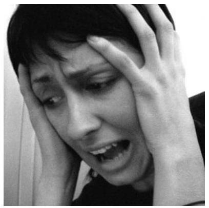

Panic disorder is a debilitating condition that leaves sufferers with acute anxiety that persists long after a specific panic attack has subsided. When this anxiety leads to deliberate avoidance of particular places and situations a person may be given a diagnosis of agoraphobia. [Image: Nate Steiner, https://goo.gl/dUYWDf, Public Domain]
sensations, creating a vicious cycle of panic (Clark, 1986, 1996). The person may begin to avoid a number of situations or activities that produce the same physiological arousal that was present during the beginnings of a panic attack. For example, someone who experienced a racing heart during a panic attack might avoid exercise or caffeine. Someone who experienced choking sensations might avoid wearing highnecked sweaters or necklaces. Avoidance of these internal bodily or somatic cues for panic has been termed interoceptive avoidance (Barlow \& Craske, 2007; Brown, White, \& Barlow, 2005; Craske \& Barlow, 2008; Shear et al., 1997).

The individual may also have experienced an overwhelming urge to escape during the unexpected panic attack. This can lead to a sense that certain places or situations-particularly situations where escape might not be possible-are not "safe." These situations become external cues for panic. If the person begins to avoid several places or situations, or still endures these situations butdoes so with a significant amount of apprehension and anxiety, then the person also has agoraphobia (Barlow, 2002; Craske \& Barlow, 1988; Craske \& Barlow, 2008). Agoraphobia can cause significant disruption to a person's life, causing them to go out of their way to avoid situations, such as adding hours to a commute to avoid taking the train or only ordering take-out to avoid having to enter a grocery store. In one tragic case seen by our clinic, a woman suffering from agoraphobia had not left her apartment for 20 years and had spent the past 10 years confined to one small area of her apartment, away from the view of the outside. In some cases, agoraphobia develops in the absence of panic attacks and therefore is a separate disorder in DSM-5. But agoraphobia often accompanies panic disorder.

One third of adults in Canada experience a panic attack each year; however, only 1-2\% of Canadians that same year are diagnosed with panic disorder (Canadian Mental Health Association's BC Division, 2013). About $4.7 \%$ of the population has met criteria for PD or agoraphobia over their lifetime, according to both American (Kessler, Chiu, Demler, Merikangas, \& Walters, 2005; Kessler et al., 2006) (see Table 4.1) and Canadian data (Canadian Mental Health Association's BC Division, 2013). In all of these cases of panic disorder, what was once an adaptive natural alarm reaction now becomes a learned, and much feared, false alarm. Data from the 2002 Canadian Community Health Survey found that the prevalence of agoraphobia was $0.78 \%$ for people aged 15-54 years and $0.61 \%$ for adults aged 55 years or older (McCabe, Cairney, Veldhuizen, Herrmann, \& Streiner, 2006). In that paper, agoraphobia was reported to be more common in women, younger age groups, and people who were widowed or divorced (McCabe et al., 2006).

# Specific Phobia 

The majority of us might have certain things we fear, such as bees,or needles, or heights (Myers et al., 1984). But what if this fear is so consuming that you can't go out on a summer's day, or get vaccines needed to go on a special trip, or visit your doctor in her new office on the 26th floor? To meet criteria for a diagnosis of specific phobia, there must be an irrational fear of a specific object or situation that substantially interferes with the person's ability to function. For example, a patient at our clinic turned down a prestigious and coveted artist residency because it required spending time near a wooded area, bound to have insects. Another patient purposely left her house two hours early each morning so she could walk past her neighbor's fenced yard before they let their dog out in the morning. Specific phobias affect about 1 in every 10 Canadians (Canadian Psychological Association, 2015).

The list of possible phobias is staggering, but four major subtypes of specific phobia are recognized: blood-injury-injection (BII) type, situational type (such as planes, elevators, or enclosed places), natural environment type for events one may encounter in nature (for example, heights, storms, and water), and animal type.

Elevators can be a trigger for sufferers of claustrophobia or agoraphobia. [Image: srgpicker, CC BY-NC-SA 2.0, https://goo.gl/Too0ZF]

A fifth category "other" includes phobias that do not fit any of the four major subtypes (for example, fears of choking, vomiting, or contracting an illness). Most phobic reactions cause a surge of activity in the sympathetic nervous system and increased heart rate and blood pressure, maybe even a panic attack. However, people with BII type phobias usually experience a marked drop in heart rate and blood pressure and may even faint. In this way, those with BII phobias almost always differ in their physiological reaction from people with other types of phobia (Barlow \& Liebowitz, 1995; Craske, Antony, \& Barlow, 2006; Hofmann, Alpers, \& Pauli, 2009; Ost, 1992). BII phobia alsoruns in families more strongly than any phobic disorder we know (Antony \& Barlow, 2002; Page \& Martin, 1998). Specific phobia is one of the most common psychological disorders in the United States, with $12.5 \%$ of the population reporting a lifetime history of fears significant enough to be considered a "phobia" (Arrindell et al., 2003; Kessler, Berglund, et al., 2005) (see Table 1). Most people who suffer from specific phobia tend to have multiple phobias of several types (Hofmann, Lehman, \& Barlow, 1997).

# Social Anxiety Disorder (Social Phobia) 

Many people consider themselves shy, and most people find social evaluation uncomfortable at best, or giving a speech somewhat mortifying. Yet, only a small proportion of the population fear these types of situations significantly enough to merit a diagnosis of social anxiety disorder (SAD) (APA, 2013). SAD is more than exaggerated shyness (Bogels et al., 2010; Schneier et al., 1996). To receive a diagnosis of SAD, the fear and anxiety associated with social situations must be so strong that the person avoids them entirely, or if avoidance is not possible, the person endures them with a great deal of distress. Further, the fear and avoidance of social situations must get in the way of the person's daily life, or seriously limit their academic or occupational functioning. For example, a patient at our clinic compromised her perfect 4.0 grade point average because she could not complete a required oral presentation in one of her classes, causing her to fail the course. Fears of negative evaluation might make someone repeatedly turn down invitations to social events or avoid having conversations with people, leading to greater and greater isolation.

The specific social situations that trigger anxiety and fear range from one-on-one interactions, such as starting or maintaining a conversation; to performance-based situations, such as giving a speech or performing on stage; to assertiveness, such as askingsomeone to change disruptive or undesirable behaviors. Fear of social evaluation might even extend to such things as using public restrooms, eating in a restaurant, filling out forms in a public place, or even reading on a train. Any type of situation that could potentially draw attention to the person can become a feared social situation. For example, one patient of ours went out of her way to avoid any situation in which she might have to use a public restroom for fear that someone would hear her in the bathroom stall and think she was disgusting. If the fear is limited to performance-based situations, such as public speaking, a diagnosis of SAD performance only is assigned.
What causes someone to fear social situations to such a large extent? The person may have learned growing up that social evaluation in particular can be dangerous, creating a specific psychological vulnerability to develop social anxiety (Bruch \& Heimberg, 1994; Lieb et al., 2000; Rapee \& Melville, 1997). For example, the person's caregivers may have harshly criticized and punished them for even the smallest mistake, maybe even punishing them physically.

Or, someone might have experienced a social trauma that had lasting effects, such as being bullied or humiliated. Interestingly, one group of researchers found that $92 \%$ of adults in their study sample with social phobia experienced severe teasing and bullying in childhood, compared with only $35 \%$ to $50 \%$ among people with other anxiety disorders (McCabe, Antony, Summerfeldt, Liss, \& Swinson, 2003).

Social trauma in childhood may have long-lasting effects. [Image: ihtatho, https://goo.gl/dTzrdj, CC BY-NC 2.0, https://goo.gl/VnKIK8]

Someone else might react so strongly to the anxiety provoked by a social situation that they havean unexpected panic attack. This panic attack then becomes associated (conditioned response) with the social situation, causing the person to fear they will panic the next time they are in that situation. This is not considered PD, however, because the person's fear is more focused on social evaluation than having unexpected panic attacks, and the fear of having an attack is limited to social situations. According to American studies, as many as $12.1 \%$ of the general population suffer from social phobia at some point in their lives (Kessler, Berglund, et al., 2005), making it one of the most common anxiety disorders, second only to specific phobia (see Table 1). In a survey of residents (aged 15-64) from Ontario, Canada, the 12-month and lifetime prevalence of social anxiety was $6.7 \%$ and 13\%, respectively (Stein \& Kean, 2000). Social anxiety disorder is more common among females and younger age groups (Stein \& Kean, 2000).

# Obsessive-Compulsive Disorder 

Have you ever had a strange thought pop into your mind, such as picturing the stranger next to you naked? Or maybe you walked past a crooked picture on the wall and couldn't resist straightening it. Most people have occasional strange thoughts and may even engage in some "compulsive" behaviors, especially when they are stressed (Boyer \& Liénard, 2008; Fullana et al., 2009). But for most people, these thoughts are nothing more than a passing oddity, and the behaviors are done (or not done) without a second thought. For someone with obsessive-compulsive disorder (OCD), however, these thoughts and compulsive behaviors don't just come and go. Instead, strange or unusual thoughts are taken to mean something much more important and real, maybe even something dangerous or frightening. The urge to engage in some behavior, such as straightening a picture, can become so intense that it is nearly impossible not to carry it out, or causes significant anxiety if it can'tbe carried out. Further, someone with OCD might become preoccupied with the possibility that the behavior wasn't carried out to completion and feel compelled to repeat the behavior again and again, maybe several times before they are "satisfied."

To receive a diagnosis of OCD, a person must experience obsessive thoughts and/or compulsions that seem irrational or nonsensical, but that keep coming into their mind. Some examples of obsessions include doubting thoughts (such as doubting a door is locked or an appliance is turned off), thoughts of contamination (such as thinking that touching almost anything might give you cancer), or aggressive thoughts

People suffering from OCD may have an irrational fear of germs and "becoming contaminated". [Image: benchilada, https://goo.gl/qemgDm, CC BY-NC-SA 2.0, https://goo.gl/ Toc0ZF]
or images that are unprovoked or nonsensical. Compulsions may be carried out in an attempt to neutralize some of these thoughts, providing temporary relief from the anxiety the obsessions cause, or they may be nonsensical in and of themselves. Either way, compulsions are distinct in that they must be repetitive or excessive, the person feels "driven" to carry out the behavior, and the person feels a great deal of distress if they can't engage in the behavior. Some examples of compulsive behaviors are repetitive washing (often in response to contamination obsessions), repetitive checking (locks, door handles, appliances often in response to doubting obsessions), ordering and arranging things to ensure symmetry, or doing things according to a specific ritual or sequence (such as getting dressed or ready for bed in a specific order). To meet diagnostic criteria for OCD, engaging in obsessions and/or compulsions must take up asignificant amount of the person's time, at least an hour per day, and must cause significant distress or impairment in functioning.

According to large American samples, $1.6 \%$ of the population has met criteria for OCD over the course of a lifetime (Kessler, Berglund, et al., 2005) (see Table 1). Data from the 2012 Canadian Community Health Survey estimated the prevalence of OCD at $0.93 \%$, and found that it was more common among females, younger adults, and those with lower incomes (Osland, Arnold, \& Pringsheim, 2018). Although people with OCD, compared to people without OCD, are significantly more likely to report needing help for mental health, they are more likely to not actually receive help (Osland et al., 2018). There may be a potential gap between the needs of people with OCD symptoms and existing services. Whereas OCD was previously categorized as an Anxiety Disorder, in the most recent version of the DSM (DSM-5; APA, 2013) it has been reclassified under the more specific category of Obsessive-Compulsive and Related Disorders.

People with OCD often confuse having an intrusive thought with their potential for carrying out the thought. Whereas most people when they have a strange or frightening thought are able to let it go, a person with OCD may become "stuck" on the thought and be intensely afraid that they might somehow lose control and act on it. Or worse, they believe that having the thought is just as bad as doing it. This is called thought-action fusion. For example, one patient of ours was plagued by thoughts that she would cause harm to her young daughter. She experienced intrusive images of throwing hot coffee in her daughter's face or pushing her face underwater when she was giving her a bath. These images were so terrifying to the patient that she would no longer allow herself any physical contact with her daughter and would leave her daughter in the care of a babysitter if her husband or another family was not available to "supervise" her. In reality, the last thing she wanted to do was harm her daughter, and she had no intention or desire to act on the aggressive thoughts and images, nor does anybody with OCD act on these thoughts, but these thoughts were so horrifying to her that she made every attempt to prevent herself from the potentialof carrying them out, even if it meant not being able to hold, cradle, or cuddle her daughter. These are the types of struggles people with OCD face every day.

# What is Eco-Anxiety? 

An assessment conducted by the Government of Canada in 2019 analyzed climate data from 1948 to 2016, which confirmed what many expected but feared - a steady, linear progression of climate warming that is projected to amplify. Further, risks of extreme weather and climate-related natural disasters are increasingly widespread and are having serious consequences (Government of Canada, 2019). For Canadians, this includes increased exposure to wildfires (Jain et al., 2017), heatwaves (Hartmann et al., 2013), droughts (Girardin \& Wotton, 2009), floods (Burn \& Whitfield, 2015), snow and ice cover durations, freshwater availability, and changes in surrounding ocean activity in the coming years (as cited in Government of Canada, 2019). You may even recall some relatively recent disasters, such as the 2013 Southern Alberta flood and the 2016 Fort McMurray wildfire.

Historically, discussions and research on the impact of climate change primarily focused on physical health, such as increased risk of asthma and cardiovascular disease (Centers for Disease Control and Prevention \& National Center for Environmental Health, 2014). However, as Canadians continue to be affected by widespread climate change, interest in the effects of climate change on mental health has significantly increased (APA, 2017). For example,with exposure to climate change comes increased emotional responding, which can be debilitating (APA, 2017). Heightened emotional responses can disrupt individuals' information processing and decision making, interfering with daily functioning (APA, 2017). Further, extreme weather and climate-related natural disasters can be traumatic, regardless if individuals experience them directly, further impairing mental health (APA, 2017). Researchers have demonstrated positive correlations between climate change and several mental health issues, including depression and substance use (Neria \& Shultz, 2012), as well as posttraumatic stress (Bryant et al., 2014). Concerningly, climate change also appears to relate to increased aggression and interpersonal violence (Anderson, 2001; Ranson, 2012).

Have you ever found yourself worrying about these issues and the potential consequences for not only our current living, but also future generations? If so, you are not alone. Individuals of all ages are becoming increasingly worried and fearful about environmental damage and potential future disaster - this is something we refer to as ecoanxiety (Albrecht, 2011; American Psychological Association [APA], 2017). However, you may have heard other variations of this term, including 'climate anxiety,' 'climate grief', and 'environmental doom.' Eco-anxiety is largely founded on the current state of the environment and its uncertain future. Additionally, given current evidence demonstrating the direct impact of humans on climate change (see Government of Canada, 2019, for a detailed review), those struggling with eco-anxiety are often primarily concerned about the role of human activities (APA, 2017). While data indicating the exact prevalence of eco-anxiety is limited,research based in Australia suggests that $\sim 96 \%$ of young people consider climate change to be a serious issue and $\sim 89 \%$ report being concerned about the long-term consequences (Chiw \& Ling, 2019). Moreover, researchers have begun investigating the presence of eco-anxiety among undergraduate students, with the vast majority appearing to have high levels of eco-anxiety and stress over the earth's state (Kelly, 2017).

Unfortunately, it is proposed that common psychological responses to eco-related distress - such as perceived lack of control, feelings of helplessness, and avoidant behaviours - hinder individuals' ability to contribute to climate-change solutions (APA, 2017). On the contrary, when individuals personally relate the state of the climate to their own wellbeing, their motivation to engage in positive solutions increases (Sawitri, Hadiyanto, \& Hadi, 2015, as cited in Government of Canada, 2019). If you thought about the effects of climate change on humans prior to reading this section, did mental health ever come to mind? What have your experiences with eco-anxiety been, if at all?

# Treatments for Anxiety and Related Disorders 

Many successful treatments for anxiety and related disorders have been developed over the years. Medications (anti-anxiety drugs and antidepressants) have been found to be beneficial for disorders other than specific phobia, but relapse rates are high once medications are stopped (Heimberg et al., 1998; Hollon et al., 2005),and some classes of medications (minor tranquilizers or benzodiazepines) can be habit forming.

Exposure-based CBT aims to help patients recognize and change problematic thoughts and behaviors in real-life situations. A person with a fear of elevators would be encouraged to practice exposure exercises that might involve approaching or riding elevators to attempt to overcome their anxiety. [Image: Mag3737, https://goo.gl/j9L5AQ, CC BY-NC-SA 2.0, https://goo.gl/Toc0ZF]

Exposure-based cognitive behavioral therapies (CBT) are effective psychosocial treatments for anxiety disorders, and many show greater treatment effects than medication in the long term (Barlow, Allen, \& Basden, 2007; Barlow, Gorman, Shear, \& Woods, 2000). In CBT, patients are taught skills to help identify and change problematic thought processes, beliefs, and behaviors that tend to worsen symptoms of anxiety, and practice applying these skills to real-life situations through exposure exercises. Patients learn how the automatic "appraisals" or thoughts they have about a situation affect both how they feel and how they behave. Similarly, patients learn how engaging in certain behaviors, such as avoiding situations, tends to strengthen the belief that the situation is something to be feared. A key aspect of CBT is exposure exercises, in which the patient learns to gradually approach situations they find fearful or distressing, in order to challenge their beliefs and learn new, less fearful associations about these situations.

Typically $50 \%$ to $80 \%$ of patients receiving drugs or CBT will show a good initial response, with the effect of CBT more durable. Newer developments in the treatment of anxiety disorders are focusing on novel interventions, such as the use of certain medications to enhance learning during CBT (Otto et al., 2010), and transdiagnostic treatments targeting core, underlying vulnerabilities (Barlow et al.,2011). As we advance our understanding of anxiety and related disorders, so too will our treatments advance, with the hopes that for the many people suffering from these disorders, anxiety can once again become something useful and adaptive, rather than something debilitating.

# Outside Resources 

American Psychological Association (APA)
http://www.apa.org/topics/anxiety/index.aspx
National Institutes of Mental Health (NIMH)
http://www.nimh.nih.gov/health/topics/anxietydisorders/index.shtml

Web: Anxiety and Depression Association of America (ADAA) http://www.adaa.org/

Web: Center for Anxiety and Related Disorders (CARD) http://www.bu.edu/card/

## Discussion Questions

1. Name and describe the three main vulnerabilities contributing to the development of anxiety and related disorders. Do you think these disorders coulddevelop out of biological factors alone? Could these disorders develop out of learning experiences alone?
2. Many of the symptoms in anxiety and related disorders overlap with experiences most people have. What features differentiate someone with a disorder versus someone without?
3. What is an "alarm reaction?" If someone experiences an alarm reaction when they are about to give a speech in front of a room full of people, would you consider this a "true alarm" or a "false alarm?"
4. Many people are shy. What differentiates someone who is shy from someone with social anxiety disorder? Do you think shyness should be considered an anxiety disorder?
5. Is anxiety ever helpful? What about worry?

# References 

Albrecht, G. (2011). Chronic environmental change: Emerging "psychoterratic" syndromes. In I. Weissbecker (Ed.), Climate change and human well-being: Global challenges and opportunities (pp. 43-56). New York, NY: Springer.

Aikins, D. E., \& Craske, M. G. (2001). Cognitive theories of generalized anxiety disorder. Psychiatric Clinics of North America, 24(1), 57-74, vi.

APA. (2013). Diagnostic and statistical manual of mental disorders (5th ed.). Washington, D.C.: American Psychiatric Association.

American Psychological Association. (2017). Mental health and ourchanging climate: Impacts, implications, and guidance. Retrieved from https://www.apa.org/news/press/releases/20 17/03/m ental-health-climate.pdf

Anderson, C. A. (2001). Heat and violence. Current Directions in Psychological Science, 10, 33-38. doi:10.1111/1467-8721.00109

Antony, M. M., \& Barlow, D. H. (2002). Specific phobias. In D. H. Barlow (Ed.), Anxiety and its disorders: The nature and treatment of anxiety and panic (2nd ed.). New York, NY: Guilford Press.

Arrindell, W. A., Eisemann, M., Richter, J., Oei, T. P., Caballo, V. E., van der Ende, J., . . . Cultural Clinical Psychology Study, Group. (2003). Phobic anxiety in 11 nations. Part I: Dimensional constancy of the five-factor model. Behaviour Research and Therapy, 41(4), 461-479.

Barlow, D. H. (2002). Anxiety and its disorders: The nature and treatment of anxiety and panic (2nd ed.). New York: Guilford Press.

Barlow, D. H., \& Craske, M. G. (2007). Mastery of your anxiety and panic (4th ed.). New York, NY: Oxford University Press.

Barlow, D. H. \& Ellard, K. K. (2020). Anxiety and Related Disorders. In R. Biswas-Diener \& E. Diener (Eds), Noba textbook series: Psychology. Champaign, IL: DEF publishers. Retrieved from http://noba.to/xms3nq2c.

Barlow, D. H., \& Liebowitz, M. R. (1995). Specific and social phobias. In H. I. Kaplan \& B. J. Sadock (Eds.), Comprehensive textbook of psychiatry: VI (pp. 1204-1217). Baltimore, MD: Williams \& Wilkins.

Barlow, D. H., Allen, L.B., \& Basden, S. (2007). Pscyhological treatments for panic disorders, phobias, and generalized anxiety disorder. In P.E. Nathan \& J.M. Gorman (Eds.), A guide to treatments that work (3rd ed.). New York, NY: Oxford University Press.

Barlow, D. H., Ellard, K. K., Fairholme, C. P., Farchione, T. J., Boisseau, C. L., Allen, L. B., \& Ehrenreich-May, J. (2011). Unified Protocol for the Transdiagnostic Treatment of Emotional Disorders (Workbook). New York, NY: Oxford University Press.

Barlow, D. H., Gorman, J. M., Shear, M. K., \& Woods, S. W. (2000). Cognitive-behavioral therapy, imipramine, or their combination forpanic disorder: A randomized controlled trial. Journal of the American Medical Association, 283(19), 2529-2536.

Bogels, S. M., Alden, L., Beidel, D. C., Clark, L. A., Pine, D. S., Stein, M. B., \& Voncken, M. (2010). Social anxiety disorder: questions and answers for the DSM-V. Depression and Anxiety, 27(2), 168-189. doi: $10.1002 /$ da. 20670

Borkovec, T. D., \& Hu, S. (1990). The effect of worry on cardiovascular response to phobic imagery. Behaviour Research and Therapy, 28(1), 69-73.

Borkovec, T. D., Alcaine, O.M., \& Behar, E. (2004). Avoidance theory of worry and generalized anxiety disorder. In R.G. Heimberg, Turk C.L. \& D.S. Mennin (Eds.), Generalized Anxiety Disorder: Advances in research and practice (pp. 77-108). New York, NY: Guilford Press.

Borkovec, T. D., Hazlett-Stevens, H., \& Diaz, M.L. (1999). The role of positive beliefs about worry in generalized anxiety disorder and its treatment. Clinical Psychology and Pscyhotherapy, 6, 69-73.

Boyer, P., \& Liénard, P. (2008). Ritual behavior in obsessive and normal individuals: Moderating anxiety and reorganizing the flow of action. Current Directions in Psychological Science, 17(4), 291-294.

Bradley, B. P., Mogg, K., White, J., Groom, C., \& de Bono, J. (1999). Attentional bias for emotional faces in generalized anxiety disorder. British Journal of Clinical Psychology, 38 ( Pt 3), 267-278.

Brown, T.A., White, K.S., \& Barlow, D.H. (2005). A psychometric reanalysis of the Albany Panic and Phobia Questionnaire. Behaviour Research and Therapy, 43, 337-355.

Bruch, M. A., \& Heimberg, R. G. (1994). Differences in perceptions of parental and personal characteristics between generalized and non-generalized social phobics. Journal of Anxiety Disorders, 8, $155-168$.

Bryant, R., Waters, E., Gibbs, L., Gallagher, H. C., Pattison, P., Lusher, D., . . . Forbes, D. (2014). Psychological outcomes following the Victorian Black Saturday bushfires. Australian and New Zealand Journal of Psychiatry, 48, 634-643. doi:10.1177/0004867414534476

Canadian Mental Health Association's BC Division (2013). Learn about panic disorder. Retrieved fromhttps://www.heretohelp.bc.ca/sites/default/files/panicdisorder.pdf

Canadian Psychological Association (2015). "Psychology works" fact sheet: Phobias. Retrieved from: https://cpa.ca/docs/File/ Publications/FactSheets/PsychologyWorksFactSheet_Phobias.pdf

Cannon, W.B. (1929). Bodily changes in pain, hunger, fear and rage. Oxford, UK: Appleton.

Centers for Disease Control and Prevention \& National Center for Environmental Health. (2014). Impact of climate change on mental health. Retrieved from https://www.cdc.gov/climate andhealth/ effects/

Chiw, A., \& Ling, H. S. (2019). Young people of Australia and climate change: Perceptions and concerns (Brief Report). Retrieved from https://www.millenniumkids.com.au/wp-content/uploads/2019/ 02/Young-People-and-Climate-Change.pdf

Chorpita, B. F., \& Barlow, D. H. (1998). The development of anxiety: the role of control in the early environment. Psychological Bulletin, 124(1), 3-21.

Clark, D. M. (1996). Panic disorder: From theory to therapy. In P. Salkovskis (Ed.), Fronteirs of cognitive therapy(pp. 318-344). New York, NY: Guilford Press.

Clark, D. M. (1986). A cognitive approach to panic. Behaviour Research and Therapy, 24(4), 461-470.

Craske, M. G., \& Barlow, D. H. (1988). A review of the relationship between panic and avoidance. Clinical Pscyhology Review, 8, 667-685.

Craske, M. G., \& Barlow, D.H. (2008). Panic disorder and agoraphobia. New York, NY: Guilford Press.

Craske, M. G., Antony, M. M., \& Barlow, D. H. (2006). Mastering your fears and phobias: Therapist guide. New York, NY: Oxford University Press.

Drabant, E. M., Ramel, W., Edge, M. D., Hyde, L. W., Kuo, J. R., Goldin, P. R., . . . Gross, J. J. (2012). Neural mechanisms underlying 5-HTTLPR-related sensitivity to acute stress. American Journal of Psychiatry, 169(4), 397-405. doi: 10.1176/appi.ajp.2011.10111699Dugas, M. J., Gagnon, F., Ladouceur, R., \& Freeston, M. H. (1998). Generalized anxiety disorder: a preliminary test of a conceptual model. Behaviour Research and Therapy, 36(2), 215-226.

Fullana, M. A., Mataix-Cols, D., Caspi, A., Harrington, H., Grisham, J. R., Moffitt, T. E., \& Poulton, R. (2009). Obsessions and compulsions in the community: prevalence, interference, help-seeking, developmental stability, and co-occurring psychiatric conditions. American Journal of Psychiatry, 166(3), 329-336. doi: 10.1176/appi.ajp.2008.08071006

Gelernter, J., \& Stein, M. B. (2009). Heritability and genetics of anxiety disorders. In M.M. Antony \& M.B. Stein (Eds.), Oxford handbook of anxiety and related disorders. New York, NY: Oxford University Press.

Government of Canada. (2019). Canada's changing climate report. Retrieved from https://www.nrcan.gc.ca/sites/www.nrcan.gc.ca/ files/energy/Climate-change/pdf/CCCR _FULLREPORT-ENFINAL.pdf

Gunnar, M. R., \& Fisher, P. A. (2006). Bringing basic research on early experience and stress neurobiology to bear on preventive interventions for neglected and maltreated children. Developmental Psychopathology, 18(3), 651-677.

Heimberg, R. G., Liebowitz, M. R., Hope, D. A., Schneier, F. R., Holt, C. S., Welkowitz, L. A., . . . Klein, D. F. (1998). Cognitive behavioral group therapy vs phenelzine therapy for social phobia: 12-week outcome. Archives of General Psychiatry, 55(12), 1133-1141.

Hofmann, S. G., Alpers, G. W., \& Pauli, P. (2009). Phenomenology of panic and phobic disorders. In M. M. Antony \& M. B. Stein (Eds.), Oxford handbook of anxiety and related disorders (pp. 34-46). New York, NY: Oxford University Press.

Hofmann, S. G., Lehman, C. L., \& Barlow, D. H. (1997). How specific are specific phobias? Journal of Behavior Therapy and Experimental Psychiatry, 28(3), 233-240.

Hollon, S. D., DeRubeis, R. J., Shelton, R. C., Amsterdam, J. D., Salomon, R. M., O'Reardon, J. P., . . . Gallop, R. (2005). Prevention of relapse following cognitive therapy vs medications in moderate tosevere depression. Archives of General Psychiatry, 62(4), 417-422. doi: 10.1001/archpsyc.62.4.417

Kelly, A. (2017). Eco-anxiety at university: Student experiences and academic perspectives on cultivating healthy emotional responses to the climate crisis. Unpublished manuscript.

Kessler, R. C., Berglund, P., Demler, O., Jin, R., Merikangas, K. R., \& Walters, E. E. (2005). Lifetime prevalence and age-of-onset distributions of DSM-IV disorders in the National Comorbidity Survey Replication. Archives of General Psychiatry, 62(6), 593-602. doi: 10.1001/archpsyc.62.6.593

Kessler, R. C., Chiu, W. T., Demler, O., Merikangas, K. R., \& Walters, E. E. (2005). Prevalence, severity, and comorbidity of 12-month DSM-IV disorders in the National Comorbidity Survey Replication. Archives of General Psychiatry, 62(6), 617-627. doi: 10.1001/archpsyc.62.6.617

Kessler, R. C., Chiu, W. T., Jin, R., Ruscio, A. M., Shear, K., \& Walters, E. E. (2006). The epidemiology of panic attacks, panic disorder, and agoraphobia in the National Comorbidity Survey Replication. Archives of General Psychiatry, 63(4), 415-424. doi: 10.1001/archpsyc.63.4.415

Lieb, R., Wittchen, H. U., Hofler, M., Fuetsch, M., Stein, M. B., \& Merikangas, K. R. (2000). Parental psychopathology, parenting styles, and the risk of social phobia in offspring: a prospectivelongitudinal community study. Archives of General Psychiatry, 57(9), 859-866.

McCabe, R. E., Antony, M. M., Summerfeldt, L. J., Liss, A., \& Swinson, R. P. (2003). Preliminary examination of the relationship between anxiety disorders in adults and self-reported history of teasing or bullying experiences. Cognitive Behavior Therapy, 32(4), 187-193. doi: 10.1080/16506070310005051

McCabe, L., Cairney, J., Veldhuizen, S., Hermann, N., \& Streiner, D. L. (2006). Prevalence and correlates of agoraphobia in older adults. American Journal of Geriatric Psychiatry, 14, 515-522.

Myers, J. K., Weissman, M. M., Tischler, C. E., Holzer, C. E., Orvaschel, H., Anthony, J. C., . . . Stoltzman, R. (1984). Six-monthprevalence of psychiatric disorders in three communities. Archives of General Psychiatry, 41, 959-967.

Neria, P., \& Schultz, J. M. (2012). Mental health effects of hurricane Sandy characteristics, potential aftermath, and response. JAMA, 308, 2571-2572. doi:10.1001/jama.2012.110700

Osland, S., Arnold, P.D., \& Pringsheim, T. (2018). The prevalence of diagnosed obsessive compulsive disorder and associated comorbidities: A population-based Canadian study. Psychiatry Research, 268. 137-142. doi: 10/1016/j.psychres.2018.07.018

Ost, L. G. (1992). Blood and injection phobia: background and cognitive, physiological, and behavioral variables. Journal of Abnormal Psychology, 101(1), 68-74.

Otto, M. W., Tolin, D. F., Simon, N. M., Pearlson, G. D., Basden, S., Meunier, S. A., . . . Pollack, M. H. (2010). Efficacy of d-cycloserine for enhancing response to cognitive-behavior therapy for panic disorder. Biological Psychiatry, 67(4), 365-370. doi: 10.1016/ j.biopsych.2009.07.036

Page, A. C., \& Martin, N. G. (1998). Testing a genetic structure of blood-injury-injection fears. American Journal of Medical Genetics, 81(5), 377-384.

Pelletier, L., O'Donnell, S., McRae, L., \& Grenier, J. (2017). The burden of generalized anxiety disorder in Canada. Health promotion and chronic disease prevention in Canada: Research, policy, and practice, 37, 54-62. doi: 10.24095/hpcdp.37.2.04

Ranson, M. (2012). Crime, weather, and climate change. Harvard Kennedy School M-RCBG Associate Working Paper Series No. 8. doi:10.2139/ssrn. 2111377

Rapee, R. M., \& Melville, L. F. (1997). Recall of family factors in social phobia and panic disorder: comparison of mother and offspring reports. Depress Anxiety, 5(1), 7-11.

Sawitri, D. R., Hadiyanto, H., \& Hadi, S. P. (2015). Proenvironmental behavior from a social cognitive theory perspective. Procedia Environmental Sciences, 23, 27-33. doi:10.1016/ j.proenv.2015.01.005

Schneier, F. R., Leibowitz, M. R., Beidel, D. C., J., Fyer A., George,M. S., Heimberg, R. G., . . . Versiani, M. (1996). Social Phobia. In T. A. Widiger, A. J. Frances, H. A. Pincus, R. Ross, M. B. First \& W. W. Davis (Eds.), DSM-IV sourcebook (Vol. 2, pp. 507-548). Washington, D.C.: American Psychiatric Association.

Shear, M. K., Brown, T. A., Barlow, D. H., Money, R., Sholomskas, D. E., Woods, S. W., . . . Papp, L. A. (1997). Multicenter collaborative panic disorder severity scale. American Journal of Psychiatry, 154(11), 1571-1575.

Smoller, J. W., Block, S. R., \& Young, M. M. (2009). Genetics of anxiety disorders: the complex road from DSM to DNA. Depression and Anxiety, 26(11), 965-975. doi: 10.1002/da. 20623

Statistics Canada (2016). Threshold and subthreshold generalized anxiety disorder (GAD) and suicide ideation (Catalogue no. 82-003-X). Health Reports, 27, 13-21. Retrieved from https://www150.statcan.gc.ca/n1/en/pub/82-003-x/2016011/ article/14672-eng.pdf?st=FYtORQ7Q.

Stein, M. B., \& Kean, Y. M. (2000). Disability and quality of life in social phobia: Epidemiologic findings. American Journal of Psychiatry, 157, 1606-1613. doi: 10.1176/appi.ajp.157.10.1606

Suárez, L, Bennett, S., Goldstein, C., \& Barlow, D.H. (2009). Understanding anxiety disorders from a "triple vulnerabilities" framework. In M.M. Antony \& M.B. Stein (Eds.), Oxford Handbook of anxiety and related disorders (pp. 153-172). New York, NY: Oxford University Press.

Wells, A. (2002). GAD, metacognition, and mindfulness: An information processing analysis. Clinical Psychology Science and Practice, 9, 95-100.# 4.2 Body Dysmorphic Disorder 

ALEXIS BRIDLEY \&AMP; LEE W. DAFFIN JR. AND CARRIE CUTTLER

## Section Learning Objectives

- Describe how body dysmorphic disorder presents itself.
- Describe the epidemiology of body dysmorphic.
- Indicate which disorders are commonly comorbid with body dysmorphic.
- Describe the theories for the etiology of body dysmorphic disorder.
- Describe the treatment for body dysmorphic disorder.

## Clinical Description

Body Dysmorphic Disorder (BDD) is another obsessive-compulsive disorder, however, the focus of these obsessions are with a perceived defect or flaw in physical appearance. A key feature of these obsessions with defects or flaws are that theyare not observable to others. An individual who has a congenital facial defect or a burn victim who is concerned about scars are not examples of an individual with BDD. The obsessions related to one's appearance can run the spectrum from feeling "unattractive" to "looking hideous." While any part of the body can be a concern for an individual with BDD, the most commonly reported areas are skin (e.g., acne, wrinkles, skin color), hair (e.g., thinning hair or excessive body hair), or nose (e.g., size, shape).

The distressing nature of the obsessions regarding one's body, often drive individuals with BDD to engage in compulsive behaviors that take up a considerable amount of time. For example, an individual may repeatedly compare her body to other people's bodies in the general public; repeatedly look at herself in the mirror; engage in excessive grooming which includes using make-up to modify her appearance. Some individuals with BDD will go as far as having numerous plastic surgeries in attempts to obtain the "perfect" appearance. The problem is plastic surgery does not usually resolve the issue. After all, the physical defect or flaw is not observable to others. While most of us are guilty of engaging in some of these behaviors, to meet criteria for BDD, one must spend a considerable amount of time preoccupied with his/her appearance (i.e., on average 3-8 hours a day), as well as display significant impairment in social, occupational, or other areas of functioning.

# Muscle Dysmorphia 

While muscle dysmorphia is not a formal diagnosis, it is a common type of BDD, particularly within the male population. Muscle dysmorphia refers to the belief that one's body is too small, or lacks appropriate amount of muscle definition (Ahmed, Cook, Genen \& Schwartz, 2014). While severity of BDD between individuals with and without muscle dysmorphia appears to be the same, some studieshave found a higher use of substance abuse (i.e. steroid use), poorer quality of life, and an increased reports of suicide attempts in those with muscle dysmorphia (Pope, Pope, Menard, Fay Olivardia, \& Philips, 2005).

# Epidemiology 

The point prevalence rate for BDD among U.S. adults is $2.4 \%$ (APA, 2013). Internationally, this rate drops to $1.7 \%$ - $1.8 \%$ (APA, 2013). Despite the difference between the national and international prevalence rates, the symptoms across races and cultures are similar.

Gender-based prevalence rates indicate a fairly balanced sex ratio ( $2.5 \%$ females; $2.2 \%$ males; APA, 2013). While the diagnosis rates may be different, general symptoms of BDD appear to be the same across genders with one exception: males tend to report genital preoccupations, while females are more likely to present with a comorbid eating disorder.

## Comorbidity

While research on BDD is still in its infancy, initial studies suggest that major depressive disorder is the most common comorbid psychological disorder (APA, 2013). Major depressive disorder typically occurs after the onset of BDD. Additionally, there are some reports of social anxiety, OCD, and substance-related disorders (likely related to muscle enhancement; APA, 2013).# Etiology 

Initial studies exploring genetic factors for BDD indicate a hereditary influence as the prevalence of BDD is elevated in first degree relatives of people with BDD. Interestingly, the prevalence of BDD is also heightened in first degree relatives of individuals with OCD (suggesting a shared genetic influence to these disorders).

However, environmental factors appear to play a larger role in the development of BDD than OCD (Ahmed, et al., 2014; Lervolino et al., 2009). Specifically, it is believed that negative life experiences such as teasing in childhood, negative social evaluations about one's body, and even childhood neglect and abuse may contribute to BDD. Cognitive research has further discovered that people with BDD tend to have an attentional bias towards beauty and attractiveness, selectively attending to words related to beauty and attractiveness. Cognitive theories have also proposed that individuals with BDD have dysfunctional beliefs that their worth is inherently tied to their attractiveness and hold attractiveness as one of their primary core values. These beliefs are further reinforced by our society, which overly values and emphasizes beauty.

## Treatment

Seeing as though there are strong similarities between OCD and BDD, it should not come as a surprise that the only two effective treatments for BDD are those that are effective in OCD. Exposure and response prevention has been successful in treating symptoms of BDD, as clients are repeatedly exposed to their body imperfections/obsessions and prevented from engaging in compulsions used to reduce their anxiety (Veale, Gournay, et al., 1996; Wilhelm, Otto, Lohr, \& Deckersbach, 1999).

The other treatment option, psychopharmacology, has also beenshown to reduce symptoms in individuals diagnosed with BDD. Similar to OCD, medications such as clomipramine and other SSRIs are generally prescribed. While these are effective in reducing BDD symptoms, once the medication is discontinued, symptoms resume nearly immediately, suggesting this is not an effective long-term treatment option for those with BDD.

Treatment of BDD appears to be difficult, with one study finding that only $9 \%$ of clients had full remission at a 1-year follow-up, and 21\% reported partial remission (Phillips, Pagano, Menard \& Stout, 2006). A more recent finding reported more promising findings with $76 \%$ of participants reporting full remission over an 8-year period (Bjornsson, Dyck, et al., 2011).

# Plastic surgery and medical treatments 

It should not come as a surprise that many individuals with BDD seek out plastic surgery to attempt to correct their perceived defects. Phillips and colleagues (2001) evaluated treatments of clients with BDD and found that $76.4 \%$ reported some form of plastic surgery or medical treatment, with dermatology treatment the most reported (45\%) followed by plastic surgery (23\%). The problem with this type of treatment is that the individual is rarely satisfied with the outcome of the procedure, thus leading them to seek out additional surgeries on the same defect (Phillips, et al., 2001). Therefore, it is important that medical professionals thoroughly screen patients for BDD before completing any type of medical treatment.

## References

Ahmed, I., Cook, T., Genen, L., \& Schwartz, R. (2014). Bodydysmorphic disorder. Retrieved from http://emedicine.medscape.com/article/ 291182overview0aw2aab6b2b3.

American Psychiatric Association. (2013). Diagnostic and statistical manual of mental disorders (5th ed.). Arlington, VA: American Psychiatric Publishing.

Bjornsson, A., Dyck, I., Moitra, E., Stout, R., Weisberg, R., Keller, M., \& Phillips, K. (2011). The clinical course of body dysmporhic disorder in the Harvard/Brown Anxiety Research Project (HARP). Journal of Nervous and Mental Disease, 199, 55-57.

Bridley, A., \& Daffin, L. W. Jr. (2018). Body Dysmorphic Disorder. In C. Cuttler (Ed), Essentials of Abnormal Psychology. Washington State University. Retrieved from https://opentext.wsu.edu/ abnormalpsychology/.

Lervolino, A., Perroud, N., Fullana, M., Guipponi, M., Cherkas, L., Collier, D., \& Mataix-Cols, D. (2009). Prevalence and heritability of compulsive hoarding: A twin study. American Journal of Psychiatry, 166, 1156-1161.

Phillips, K., Grant, J., Siniscalchi, J. \& Albertini, R. (2001). Surgical and nonpsychiatric medical treatment of patients with body dysmorphic disorder. Psychosomatics, 42, 504-510.

Phillips, K., Pagano, M., Menard, W., \& Stout, R. (2006). A 12-month follow-up study of the course of body dysmorphic disorder. American Journal of Psychiatry, 163, 907-912.

Pope, C., Pope, H., Menard, W., Fay, C., Olivardia, R., \& Philips, K. (2005). Clinical features of muscle dysmorphia among males with body dysmorphic disorder. Body Image, 2, 395- 400.

Veale, D., Boocock, A., Goumay, K., Dryden, W., Shah, F., Wilson, R., Walburn, J. (1996). Body dysmorphic disorder. A survey of fifty cases. The British of Journal of Psychiatry, 169, 196-201.

Wilhelm, S., Otto, M. W., Lohr, B., \& Deckersbach, T. (1999). Cognitive behavior group therapy for body dysmorphic disorder: a case series. Behaviour Research and Therapy, 37(1), 71-75. doi:10.1016/s0005-7967(98)00109-0.# Summary and Self-Test: Anxiety Disorders 

DAVID H. BARLOW; KRISTEN K. ELLARD; ALEXIS BRIDLEY \&AMP; LEE W. DAFFIN JR.; CARRIE CUTTLER; AND JORDEN A. CUMMINGS

## Summary

Anxiety is a negative mood state that is accompanied by bodily symptoms such as increased heart rate, muscle tension, a sense of unease, and apprehension about the future. Anxiety is a normal human experience, but when it becomes extreme and impairs someone's functioning, it enters the realm of possible mental illness.

A combination of biological, psychological, and specific vulnerabilities increase a person's likelihood of developing an anxiety disorder.

Generalized anxiety disorder (GAD) is marked by excessive worry that is difficult or even impossible to turn off. This worry is accompanied by muscle tension, fatigue, agitation or restlessness, irritability, difficulties with sleep, or difficulties concentrating.

Unexpected panic attacks are core to panic disorder. In addition to the panic attacks, the person must also experience continued intense anxiety and avoidance related to the attack for at least one month, causing significant distress or interference in their lives. Sometimes people with panic disorder also develop agoraphobia, which is when they begin to avoid several places or situations, or still endures the situations but with a significant amount of anxiety.

Specific phobia occurs when someone has an irrational fear of a specific object or situation that substantially interferes with their ability to function. Four major subtypes of specific phobia arerecognized: blood-injury-injection type, situational type, natural environment type, and animal type.

Social anxiety disorder involves severe anxiety in social situations where one can be evaluated. This anxiety must get in the way of the person's daily life or otherwise severely impact their functioning. If the fear is specific to performance-based situations, this subtype of social anxiety can be diagnosed.

Obsessive-Compulsive Disorder (OCD) occurs when obsessive thoughts (intrusive thoughts that are unusual) and compulsions (activities that must be done) are present and they interfere with someone's functioning. Less than 1\% of Canadians have OCD. People with OCD often suffer from thought-action fusion or the idea that having a thought is directly linked with their potential for carrying out the thought.

Anxiety disorders are sometimes treated with anti-anxiety medications or antidepressants. Exposure-based cognitive behavioural therapies are very effective ways of treating anxiety disorders psychotherapeutically.

Body-dysmorphic disorder (BDD) is seen as a type of OCD focused on perceived defects or flaws in physical appearance. A key feature of these perceived defects or flaws is that they are not observable to others. It is common for individuals with BDD to also experience major depression.

BDD seems to be predicted by a combination of hereditary factors and environmental factors like teasing in childhood, negative social evaluations about one's body, and childhood trauma.

Like OCD, BDD is treated with a specific type of CBT called exposure and response prevention.

An interactive H5P element has been excluded from this version of the text. You can view it online here:
https://openpress.usask.ca/abnormalpsychology/?p=281\#h5p-2Link: https://openpress.usask.ca/abnormalpsychology/wp-admin/admin-ajax.php?action=h5p_embed\&id=2.# CHAPTER 5: SCHIZOPHRENIA \& RELATED PSYCHOTIC DISORDERS.# Chapter 5 Introduction 

DEANNA M. BARCH AND JORDEN A. CUMMINGS

Schizophrenia and the other psychotic disorders are some of the most impairing forms of psychopathology, frequently associated with a profound negative effect on the individual's educational, occupational, and social function. Up to 3\% of Canadians will experience psychosis at some point in their lives (Canadian Mental Health Association, 2013; Schizophrenia Society of Canada 2017-2018). Schizophrenia affects 1\% of the Canadian population (about 1 in 100 persons), with the most affected being people aged 16 to 30 years (Hafner \& an der Heiden, 1997).

Sadly, these disorders often manifest right at time of the transition from adolescence to adulthood, just as young people should be evolving into independent young adults. The spectrum of psychotic disorders includes schizophrenia, schizoaffective disorder, delusional disorder, schizotypal personality disorder, schizophreniform disorder, brief psychotic disorder, as well as psychosis associated with substance use or medical conditions. In this module, we summarize the primary clinical features of these disorders, describe the known cognitive and neurobiological changes associated with schizophrenia, describe potential risk factors and/or causes for the development of schizophrenia, and describe currently available treatments for schizophrenia.# 5.I Schizophrenia \& Related Psychotic Disorders 

DEANNA M. BARCH AND JORDEN A. CUMMINGS

## Section Learning Objectives

- Describe the signs and symptoms of schizophrenia and related psychotic disorders.
- Describe the most well-replicated cognitive and neurobiological changes associated with schizophrenia.
- Describe the potential risk factors for the development of schizophrenia.
- Describe the controversies associated with "clinical high risk" approaches to identifying individuals at risk for the development of schizophrenia.
- Describe the treatments that work for some of the symptoms of schizophrenia.

## The Phenomenology of Schizophrenia and Related Psychotic Disorders

Most of you have probably had the experience of walking down the street in a city and seeing a person you thought was acting oddly.They may have been dressed in an unusual way, perhaps disheveled or wearing an unusual collection of clothes, makeup, or jewelry that did not seem to fit any particular group or subculture. They may have been talking to themselves or yelling at someone you could not see. If you tried to speak to them, they may have been difficult to follow or understand, or they may have acted paranoid or started telling a bizarre story about the people who were plotting against them. If so, chances are that you have encountered an individual with schizophrenia or another type of psychotic disorder. If you have watched the movie A Beautiful Mind or The Fisher King, you have also seen a portrayal of someone thought to have schizophrenia. Sadly, a few of the individuals who have committed some of the recently highly publicized mass murders may have had schizophrenia, though most people who commit such crimes do not have schizophrenia and the vast majority of people with schizophrenia are not dangerous. It is also likely that you have met people with schizophrenia without ever knowing it, as they may suffer in silence or stay isolated to protect themselves from the horrors they see, hear, or believe are operating in the outside world. As these examples begin to illustrate, psychotic disorders involve many different types of symptoms, including delusions, hallucinations, disorganized speech and behavior, abnormal motor behavior (including catatonia), and negative symptoms such anhedonia/amotivation and blunted affect/reduced speech.

Delusions are false beliefs that are often fixed, hard to change even when the person is presented with conflicting information, and are often culturally influenced in their content (e.g., delusions involving Jesus in Judeo-Christian cultures, delusions involving Allah in Muslim cultures). They can be terrifying for the person, who may remain convinced that they are true even when loved ones and friends present them with clear information that they cannot be true. There are many different types or themes to delusions.

Under Surveillance: Abstract groups like the police or the government are commonly the focus of a schizophrenic's persecutory delusions. [Image: Thomas Hawk, https://goo.gl/ qsrqiR, CC BY-NC 2.0, https://goo.gl/ VnKIK8]

The most common delusions are persecutory and involve the belief that individuals or groups are trying to hurt, harm, or plot against the person in some way. These can be people that the person knows (people at work, the neighbors, family members), or more abstract groups (the FBI, the CIA, aliens, etc.). Other types of delusions include grandiose delusions, where the person believes that they have some special power or ability (e.g., I am the new Buddha, I am a rock star); referential delusions, where the person believes that events or objects in the environment have special meaning for them (e.g., that song on the radio is being played specifically for me); or other types of delusions where the person may believe that others are controlling their thoughts and actions, their thoughts are being broadcast aloud, or that others can read their mind (or they can read other people's minds).

When you see a person on the street talking to themselves or shouting at other people, they are experiencing hallucinations. These are perceptual experiences that occur even when there is no stimulus in the outside world generating the experiences. They can be auditory, visual, olfactory (smell), gustatory (taste), or somatic (touch). The most common hallucinations in psychosis (at least in adults) are auditory, and can involve one or more voices talking about the person, commenting on the person's behavior, or giving them orders. The content of the hallucinations is frequently negative ("you are a loser," "that drawing is stupid," "you should go kill yourself") and can be the voice of someone the person knows or a complete stranger. Sometimes the voices sound as if they arecoming from outside the person's head. Other times the voices seem to be coming from inside the person's head, but are not experienced the same as the person's inner thoughts or inner speech.

Talking to someone with schizophrenia is sometimes difficult, as their speech may be difficult to follow, either because their answers do not clearly flow from your questions, or because one sentence does not logically follow from another. This is referred to as disorganized speech, and it can be present even when the person is writing. Disorganized

People who suffer from schizophrenia may see the world differently. This can include hallucinations, delusions, and disorganized thinking. [Image: Noba Project CCBYNCSA 4.0 https://tinyurl.com/y3k6qoz4]
behavior can include odd dress, odd makeup (e.g., lipstick outlining a mouth for 1 inch), or unusual rituals (e.g., repetitive hand gestures). Abnormal motor behavior can include catatonia, which refers to a variety of behaviors that seem to reflect a reduction in responsiveness to the external environment. This can include holding unusual postures for long periods of time, failing to respond to verbal or motor prompts from another person, or excessive and seemingly purposeless motor activity.

Some of the most debilitating symptoms of schizophrenia are difficult for others to see. These include what people refer to as "negative symptoms" or the absence of certain things we typically expect most people to have. For example, anhedonia or amotivation reflect a lack of apparent interest in or drive to engage in social or recreational activities. These symptoms can manifest as a great amount of time spent in physical immobility. Importantly, anhedonia and amotivation do not seem to reflect a lack of enjoyment in pleasurable activities or events (Cohen \& Minor, 2010; Kring \& Moran, 2008; Llerena, Strauss, \& Cohen, 2012) but rather a reduced drive or ability to take the steps necessary to obtain the potentiallypositive outcomes (Barch \& Dowd, 2010). Flat affect and reduced speech (alogia) reflect a lack of showing emotions through facial expressions, gestures, and speech intonation, as well as a reduced amount of speech and increased pause frequency and duration.

In many ways, the types of symptoms associated with psychosis are the most difficult for us to understand, as they may seem far outside the range of our normal experiences. Unlike depression or anxiety, many of us may not have had experiences that we think of as on the same continuum as psychosis. However, just like many of the other forms of psychopathology described in this book, the types of psychotic symptoms that characterize disorders like schizophrenia are on a continuum with "normal" mental experiences. For example, work by Jim van Os in the Netherlands has shown that a surprisingly large percentage of the general population ( $10 \%+$ ) experience psychotic-like symptoms, though many fewer have multiple experiences and most will not continue to experience these symptoms in the long run (Verdoux \& van Os, 2002). Similarly, work in a general population of adolescents and young adults in Kenya has also shown that a relatively high percentage of individuals experience one or more psychotic-like experiences ( 19\%) at some point in their lives (Mamah et al., 2012; Ndetei et al., 2012), though again most will not go on to develop a full-blown psychotic disorder.

Schizophrenia is the primary disorder that comes to mind when we discuss "psychotic" disorders (see Table 1 for diagnostic criteria), though there are a number of other disorders that share one or more features with schizophrenia. In the remainder of this module, we will use the terms "psychosis" and "schizophrenia" somewhat interchangeably, given that most of the research has focused on schizophrenia. In addition to schizophrenia (see Table 1), other psychotic disorders include schizophreniform disorder (a briefer version of schizophrenia), schizoaffective disorder (a mixture of psychosis and depression/mania symptoms), delusional disorder (the experience of only delusions), and brief psychotic disorder (psychotic symptoms that last only a few days or weeks).| Schizophrenia (Lifetime prevalence about $0.3 \%$ to $0.7 \%$ [APA, 2013]) |
| :--: |
| - Two or more of the following for at least 1 month: hallucinations, delusions, disorganized speech, grossly disorganized or catatonic behavior, negative symptoms.   - Impairment in one or more areas of function (social, occupational, educational self-care) for a significant period of time since the onset of the illness.   - Continuous signs of the illness for at least 6 months (this can include prodromal or residual symptoms, which are attenuated forms of the symptoms described above). |
| Schizophreniform Disorder (Lifetime prevalence similar to Schizophrenia [APA, 2013]) |
| - The same symptoms of schizophrenia described above that are present for at least 1 month but less than 6 months. |
| Schizoaffective Disorder (Lifetime prevalence about $0.3 \%$ [APA, 2013]) |
| - A period of illness where the person has both the psychotic symptoms necessary to meet criteria for schizophrenia and either a major depression or manic episode.   -The person experiences either delusions or hallucinations for at least 2 weeks when they are not having a depressive or manic episode.   - The symptoms that meet criteria for depressive or manic episodes are present for over half of the illness duration. |
| Delusional Disorder (Lifetime prevalence about $0.2 \%$ [APA, 2013]) |
| - The presence of at least one delusion for at least a month.   - The person has never met criteria for schizophrenia.   - The person's function is not impaired outside the specific impact of the delusion.   - The duration of any depressive or manic episodes have been brief relative to the duration of the delusion(s). |
| Brief Psychotic Disorder (Lifetime prevalence unclear [APA, 2013]) |
| - One or more of the following symptoms present for at least 1 day but less than 1 month: delusions, hallucinations, disorganized speech, grossly disordered or catatonic behavior. |
| Attenuated Psychotic Disorder (In Section III of the [APA, 2013]-V, Lifetime presence unclear [APA, 2013]) |
| - One or more of the following symptoms in an "attenuated" form: delusions, hallucinations, or disorganized speech.   - The symptoms must have occurred at least once a week for the past month and must have started or gotten worse in the past year.   - The symptoms must be severe enough to distress or disable the individual or to suggest to others that the person needs clinical help.   - The person has never met the diagnostic criteria for a psychotic disorder, and the symptoms are not better attributed to another disorder, to substance use, or to a medical condition. |

Table 5.1: Types of Psychotic Disorders (Simplified from the Diagnostic and Statistical Manual - 5th Edition (DSM-5) (APA, 2013)

# The Cognitive Neuroscience of Schizophrenia 

As described above, when we think of the core symptoms of psychotic disorders such as schizophrenia, we think of people who hear voices, see visions, and have false beliefs about reality (i.e., delusions). However, problems in cognitive function are also a critical aspect of psychotic disorders and of schizophrenia in particular. This emphasis on cognition in schizophrenia is in partdue to the growing body of research suggesting that cognitive problems in schizophrenia are a major source of disability and loss of functional capacity (Green, 2006; Nuechterlein et al., 2011). The cognitive deficits that are present in schizophrenia are widespread and can include problems with episodic memory (the ability to learn and retrieve new information or episodes in one's life), working memory (the ability to maintain information over a short period of time, such as 30 seconds), and other tasks that require one to "control" or regulate one's behavior (Barch \& Ceaser, 2012; Bora, Yucel, \& Pantelis, 2009a; Fioravanti, Carlone, Vitale, Cinti, \& Clare, 2005; Forbes, Carrick, McIntosh, \& Lawrie, 2009; Mesholam-Gately, Giuliano, Goff, Faraone, \& Seidman, 2009). Individuals with schizophrenia also have difficulty with what is referred to as "processing speed" and are frequently slower than healthy individuals on almost all tasks. Importantly, these cognitive deficits are present prior to the onset of the illness (Fusar-Poli et al., 2007) and are also present, albeit in a milder form, in the firstdegree relatives of people with schizophrenia (Snitz, Macdonald, \& Carter, 2006). This suggests that cognitive impairments in schizophrenia reflect part of the risk for the development of psychosis, rather than being an outcome of developing psychosis. Further, people with schizophrenia who have more severe cognitive problems also tend to have more severe negative symptoms and more disorganized speech and behavior (Barch, Carter, \& Cohen, 2003; Barch et al., 1999; Dominguez Mde, Viechtbauer, Simons, van Os, \& Krabbendam, 2009; Ventura, Hellemann, Thames, Koellner, \& Nuechterlein, 2009; Ventura, Thames, Wood, Guzik, \& Hellemann, 2010). In addition, people with more cognitive problems have worse function in everyday life (Bowie et al., 2008; Bowie, Reichenberg, Patterson, Heaton, \& Harvey, 2006; Fett et al., 2011).

Some with schizophrenia suffer from difficulty with social cognition. They may not be able to detect the meaning of facial expressions or other subtle cues that most other people rely on to navigate the social world. [Image: Ralph Buckley, https://goo.gl/KuBzsD, CC BY-SA 2.0, https://goo.gl/i4GXf5]

Some people with schizophrenia also show deficits in what is referred to as social cognition, though it is not clear whether such problems are separate from the cognitive problems described above or the result of them (Hoe, Nakagami, Green, \& Brekke, 2012; Kerr \& Neale, 1993; van Hooren et al., 2008). This includes problems with the recognition of emotional expressions on the faces of other individuals (Kohler, Walker, Martin, Healey, \& Moberg, 2010) and problems inferring the intentions of other people (theory of mind) (Bora, Yucel, \& Pantelis, 2009b). Individuals with schizophrenia who have more problems with social cognition also tend to have more negative and disorganized symptoms (Ventura, Wood, \& Hellemann, 2011), as well as worse community function (Fett et al., 2011).

The advent of neuroimaging techniques such as structural and functional magnetic resonance imaging and positron emission tomography opened up the ability to try to understand the brain mechanisms of the symptoms of schizophrenia as well as the cognitive impairments found in psychosis. For example, a number of studies have suggested that delusions in psychosis may be associated with problems in "salience" detection mechanisms supported by the ventral striatum (Jensen \& Kapur, 2009; Jensen et al., 2008; Kapur, 2003; Kapur, Mizrahi, \& Li, 2005; Murray et al., 2008) and the anterior prefrontal cortex (Corlett et al., 2006; Corlett, Honey, \& Fletcher, 2007; Corlett, Murray, et al., 2007a, 2007b). These are regions of the brain that normally increase their activity when something important (aka "salient") happens inthe environment. If these brain regions misfire, it may lead individuals with psychosis to mistakenly attribute importance to irrelevant or unconnected events. Further, there is good evidence that problems in working memory and cognitive control in schizophrenia are related to problems in the function of a region of the brain called the dorsolateral prefrontal cortex (DLPFC) (Minzenberg, Laird, Thelen, Carter, \& Glahn, 2009; Ragland et al., 2009). These problems include changes in how the DLPFC works when people are doing working-memory or cognitive-control tasks, and problems with how this brain region is connected to other brain regions important for working memory and cognitive control, including the posterior parietal cortex (e.g., Karlsgodt et al., 2008; Kim et al., 2003; Schlosser et al., 2003), the anterior cingulate (Repovs \& Barch, 2012), and temporal cortex (e.g., Fletcher et al., 1995; Meyer-Lindenberg et al., 2001). In terms of understanding episodic memory problems in schizophrenia, many researchers have focused on medial temporal lobe deficits, with a specific focus on the hippocampus (e.g., Heckers \& Konradi, 2010). This is because there is much data from humans and animals showing that the hippocampus is important for the creation of new memories (Squire, 1992). However, it has become increasingly clear that problems with the DLPFC also make important contributions to episodic memory deficits in schizophrenia (Ragland et al., 2009), probably because this part of the brain is important for controlling our use of memory.

In addition to problems with regions such as the DLFPC and medial temporal lobes in schizophrenia described above, magnetic resonance neuroimaging studies have also identified changes in cellular architecture, white matter connectivity, and gray matter volume in a variety of regions that include the prefrontal and temporal cortices (Bora et al., 2011). People with schizophrenia also show reduced overall brain volume, and reductions in brain volume as people get older may be larger in those with schizophrenia than in healthy people (Olabi et al., 2011). Taking antipsychotic medications or taking drugs such as marijuana, alcohol, and tobaccomay cause some of these structural changes. However, these structural changes are not completely explained by medications or substance use alone. Further, both functional and structural brain changes are seen, again to a milder degree, in the first-degree relatives of people with schizophrenia (Boos, Aleman, Cahn, Pol, \& Kahn, 2007; Brans et al., 2008; Fusar-Poli et al., 2007; MacDonald, Thermenos, Barch, \& Seidman, 2009). This again suggests that that neural changes associated with schizophrenia are related to a genetic risk for this illness.

# Risk Factors for Developing Schizophrenia 

It is clear that there are important genetic contributions to the likelihood that someone will develop schizophrenia, with consistent evidence from family, twin, and adoption studies. (Sullivan, Kendler, \& Neale, 2003). However, there is no "schizophrenia gene" and it is likely that the genetic risk for schizophrenia reflects the summation of many different genes that each contribute something to the likelihood of developing psychosis (Gottesman \& Shields, 1967; Owen, Craddock, \& O'Donovan, 2010). Further, schizophrenia is a very heterogeneous disorder, which means that two different people with "schizophrenia" may each have very different symptoms (e.g., one has hallucinations and delusions, the other has disorganized speech and negative symptoms). This makes it even more challenging to identify specific genes associated with risk for psychosis. Importantly, many studies also now suggest that at least some of the genes potentially associated with schizophrenia are also associated with other mental health conditions, including bipolar disorder, depression, and autism (Gejman, Sanders, \& Kendler, 2011; Kim, Zerwas, Trace, \& Sullivan, 2011; Owen et al., 2010; Rutter, KimCohen, \& Maughan, 2006).

There are a number of genetic and environmental risk factors associated with higher likelihood of developing schizophrenia including older fathers, complications during pregnancy/ delivery, family history of schizophrenia, and growing up in an urban environment. [Image: CC0 Public Domain]

There are also a number of environmental factors that are associated with an increased risk of developing schizophrenia. For example, problems during pregnancy such as increased stress, infection, malnutrition, and/or diabetes have been associated with increased risk of schizophrenia. In addition, complications that occur at the time of birth and which cause hypoxia (lack of oxygen) are also associated with an increased risk for developing schizophrenia (Cannon, Jones, \& Murray, 2002; Miller et al., 2011). Children born to older fathers are also at a somewhat increased risk of developing schizophrenia. Further, using cannabis increases risk for developing psychosis, especially if you have other risk factors (Casadio, Fernandes, Murray, \& Di Forti, 2011; Luzi, Morrison, Powell, di Forti, \& Murray, 2008). The likelihood of developing schizophrenia is also higher for kids who grow up in urban settings (March et al., 2008) and for some minority ethnic groups (Bourque, van der Ven, \& Malla, 2011). Both of these factors may reflect higher social and environmental stress in these settings. Unfortunately, none of these risk factors is specific enough to be particularly useful in a clinical setting, and most people with these "risk" factors do not develop schizophrenia. However, together they are beginning to give us clues as the neurodevelopmental factors that may lead someone to be at an increased risk for developing this disease.

An important research area on risk for psychosis has been work with individuals who may be at "clinical high risk." These areindividuals who are showing attenuated (milder) symptoms of psychosis that have developed recently and who are experiencing some distress or disability associated with these symptoms. When people with these types of symptoms are followed over time, about $35 \%$ of them develop a psychotic disorder (Cannon et al., 2008), most frequently schizophrenia (Fusar-Poli, McGuire, \& Borgwardt, 2012). In order to identify these individuals, a new category of diagnosis, called "Attenuated Psychotic Syndrome," was added to Section III (the section for disorders in need of further study) of the DSM-5 (see Table 1 for symptoms) (APA, 2013). However, adding this diagnostic category to the DSM-5 created a good deal of controversy (Batstra \& Frances, 2012; Fusar-Poli \& Yung, 2012). Many scientists and clinicians have been worried that including "risk" states in the DSM-5 would create mental disorders where none exist, that these individuals are often already seeking treatment for other problems, and that it is not clear that we have good treatments to stop these individuals from developing to psychosis. However, the counterarguments have been that there is evidence that individuals with high-risk symptoms develop psychosis at a much higher rate than individuals with other types of psychiatric symptoms, and that the inclusion of Attenuated Psychotic Syndrome in Section III will spur important research that might have clinical benefits. Further, there is some evidence that noninvasive treatments such as omega-3 fatty acids and intensive family intervention may help reduce the development of full-blown psychosis (Preti \& Cella, 2010) in people who have high-risk symptoms.

# Treatment of Schizophrenia 

The currently available treatments for schizophrenia leave much to be desired, and the search for more effective treatments for both the psychotic symptoms of schizophrenia (e.g., hallucinationsand delusions) as well as cognitive deficits and negative symptoms is a highly active area of research. The first line of treatment for schizophrenia and other psychotic disorders is the use of antipsychotic medications. There are two primary types of antipsychotic medications, referred to as "typical" and "atypical." The fact that "typical" antipsychotics helped some symptoms of schizophrenia was discovered serendipitously more than 60 years ago (Carpenter \& Davis, 2012; Lopez-Munoz et al., 2005). These are drugs that all share a common feature of being a strong block of the D2 type dopamine receptor. Although these drugs can help reduce hallucinations, delusions, and disorganized speech, they do little to improve cognitive deficits or negative symptoms and can be associated with distressing motor side effects. The newer generation of antipsychotics is referred to as "atypical" antipsychotics. These drugs have more mixed mechanisms of action in terms of the receptor types that they influence, though most of them also influence D2 receptors. These newer antipsychotics are not necessarily more helpful for schizophrenia but have fewer motor side effects. However, many of the atypical antipsychotics are associated with side effects referred to as the "metabolic syndrome," which includes weight gain and increased risk for cardiovascular illness, Type-2 diabetes, and mortality (Lieberman et al., 2005).

The evidence that cognitive deficits also contribute to functional impairment in schizophrenia has led to an increased search for treatments that might enhance cognitive function in schizophrenia. Unfortunately, as of yet, there are no pharmacological treatments that work consistently to improve cognition in schizophrenia, though many new types of drugs are currently under exploration. However, there is a type of psychological intervention, referred to as cognitive remediation, which has shown some evidence of helping cognition and function in schizophrenia. In particular, a version of this treatment called Cognitive Enhancement Therapy (CET) has been shown to improve cognition, functional outcome, social cognition, and to protect against gray matter loss (Eack et al., 2009; Eack, Greenwald, Hogarty, \& Keshavan, 2010; Eack et al.,2010; Eack, Pogue-Geile, Greenwald, Hogarty, \& Keshavan, 2010; Hogarty, Greenwald, \& Eack, 2006) in young individuals with schizophrenia. The development of new treatments such as Cognitive Enhancement Therapy provides some hope that we will be able to develop new and better approaches to improving the lives of individuals with this serious mental health condition and potentially even prevent it some day.

# Outside Resources 

Book: Ben Behind His Voices: One family's journal from the chaos of schizophrenia to hope (2011). Randye Kaye. Rowman and Littlefield.

Book: Conquering Schizophrenia: A father, his son, and a medical breakthrough (1997). Peter Wyden. Knopf.

Book: Henry's Demons: Living with schizophrenia, a father and son's story (2011). Henry and Patrick Cockburn. Scribner Macmillan.

Book: My Mother's Keeper: A daughter's memoir of growing up in the shadow of schizophrenia (1997). Tara Elgin Holley. William Morrow Co.

Book: Recovered, Not Cured: A journey through schizophrenia (2005). Richard McLean. Allen and Unwin.

Book: The Center Cannot Hold: My journey through madness (2008). Elyn R. Saks. Hyperion.

Book: The Quiet Room: A journal out of the torment of madness (1996). Lori Schiller. Grand Central Publishing.Book: Welcome Silence: My triumph over schizophrenia (2003). Carol North. CSS Publishing.

Web: National Alliance for the Mentally Ill. This is an excellent site for learning more about advocacy for individuals with major mental illnesses such as schizophrenia. http://www.nami.org/

Web: National Institute of Mental Health. This website has information on NIMH-funded schizophrenia research. http://www.nimh.nih.gov/health/topics/schizophrenia/ index.shtml

Web: Schizophrenia Research Forum. This is an excellent website that contains a broad array of information about current research on schizophrenia.
http://www.schizophreniaforum.org/

# Discussion Questions 

1. Describe the major differences between the major psychotic disorders.
2. How would one be able to tell when an individual is "delusional" versus having non-delusional beliefs that differ from the societal normal? How should cultural and sub-cultural variation been taken into account when assessing psychotic symptoms?
3. Why are cognitive impairments important to understanding schizophrenia?4. Why has the inclusion of a new diagnosis (Attenuated Psychotic Syndrome) in Section III of the DSM-5 created controversy?
5. What are some of the factors associated with increased risk for developing schizophrenia? If we know whether or not someone has these risk factors, how well can we tell whether they will develop schizophrenia?
6. What brain changes are most consistent in schizophrenia?
7. Do antipsychotic medications work well for all symptoms of schizophrenia? If not, which symptoms respond better to antipsychotic medications?
8. Are there any treatments besides antipsychotic medications that help any of the symptoms of schizophrenia? If so, what are they?

# References 

APA. (2013). Diagnostic and statistical manual of mental disorders, Fifth Edition (5th ed.). Washington, DC: American Psychiatric Association.

Barch, D. M. (2020). Schizophrenia Spectrum Disorders. In R. Biswas-Diener \& E. Diener (Eds), Noba textbook series: Psychology. Champaign, IL: DEF publishers. Retrieved from http://noba.to/5d98nsy4.

Barch, D. M., \& Ceaser, A. E. (2012). Cognition in schizophrenia:Core psychological and neural mechanisms. Trends in Cognitive Science, 16, 27-34.

Barch, D. M., \& Dowd, E. C. (2010). Goal representations and motivational drive in schizophrenia: The role of prefrontal-striatal interactions. Schizophrenia Bulletin, 36(5), 919-934. doi:sbq068 [pii] 10.1093/schbul/sbq068.

Barch, D. M., Carter, C. S., \& Cohen, J. D. (2003). Context processing deficit in schizophrenia: Diagnostic specificity, 4-week course, and relationships to clinical symptoms. Journal of Abnormal Psychology, 112, 132-143.

Barch, D. M., Carter, C. S., Macdonald, A., Sabb, F. W., Noll, D. C., \& Cohen, J. D. (1999). Prefrontal cortex and context processing in medication-naive first-episode patients with schizophrenia. Schizophrenia Research, 36(1-3), 217-218.

Batstra, L., \& Frances, A. (2012). Diagnostic inflation: Causes and a suggested cure. The Journal of Nervous and Mental Disease, 200(6), 474-479. doi:10.1097/NMD.0b013e318257c4a2.

Boos, H. B., Aleman, A., Cahn, W., Pol, H. H., \& Kahn, R. S. (2007). Brain volumes in relatives of patients with schizophrenia: A metaanalysis. Archives of General Psychiatry, 64(3), 297-304.

Bora, E., Fornito, A., Radua, J., Walterfang, M., Seal, M., Wood, S. J., . . . Pantelis, C. (2011). Neuroanatomical abnormalities in schizophrenia: A multimodal voxelwise meta-analysis and metaregression analysis. Schizophrenia Research, 127(1-3), 46-57. doi:10.1016/j.schres.2010.12.020.

Bora, E., Yucel, M., \& Pantelis, C. (2009a). Cognitive functioning in schizophrenia, schizoaffective disorder and affective psychoses: Meta-analytic study. The British Journal of Psychiatry: The Journal of Mental Science, 195(6), 475-482. doi:10.1192/bjp.bp.108.055731.

Bora, E., Yucel, M., \& Pantelis, C. (2009b). Theory of mind impairment in schizophrenia: Meta-analysis. Schizophrenia Research, 109(1-3), 1-9. doi:10.1016/j.schres.2008.12.020.

Bourque, F., van der Ven, E., \& Malla, A. (2011). A meta-analysis of the risk for psychotic disorders among first- and second-generationimmigrants. Psychological Medicine, 41(5), 897-910. doi:10.1017/ S0033291710001406.

Bowie, C. R., Leung, W. W., Reichenberg, A., McClure, M. M., Patterson, T. L., Heaton, R. K., \& Harvey, P. D. (2008). Predicting schizophrenia patients' real-world behavior with specific neuropsychological and functional capacity measures. Biological Psychiatry, 63(5), 505-511. doi:10.1016/j.biopsych.2007.05.022.

Bowie, C. R., Reichenberg, A., Patterson, T. L., Heaton, R. K., \& Harvey, P. D. (2006). Determinants of real-world functional performance in schizophrenia subjects: Correlations with cognition, functional capacity, and symptoms. The American Journal of Psychiatry, 163(3), 418-425. doi:10.1176/appi.ajp.163.3.418.

Brans, R. G., van Haren, N. E., van Baal, G. C., Schnack, H. G., Kahn, R. S., \& Hulshoff Pol, H. E. (2008). Heritability of changes in brain volume over time in twin pairs discordant for schizophrenia. Archives of General Psychiatry, 65(11), 1259-1268. doi:10.1001/archpsyc.65.11.1259.

Canadian Mental Health Association (2013). Psychosis. Retrieved from https://cmha.bc.ca/documents/psychosis-2/.

Cannon, M., Jones, P. B., \& Murray, R. M. (2002). Obstetric complications and schizophrenia: Historical and meta-analytic review. The American Journal of Psychiatry, 159(7), 1080-1092.

Cannon, T. D., Cadenhead, K., Cornblatt, B., Woods, S. W., Addington, J., Walker, E., . . . Heinssen, R. (2008). Prediction of psychosis in youth at high clinical risk: A multisite longitudinal study in North America. Archives of General Psychiatry, 65(1), 28-37.

Carpenter, W. T., Jr., \& Davis, J. M. (2012). Another view of the history of antipsychotic drug discovery and development. Molecular Psychiatry, 17(12), 1168-1173. doi:10.1038/mp.2012.121.

Casadio, P., Fernandes, C., Murray, R. M., \& Di Forti, M. (2011). Cannabis use in young people: The risk for schizophrenia. Neuroscience \& Biobehavioral Reviews. doi:S0149-7634(11)00073-X [pii] 10.1016/j.neubiorev.2011.04.007.

Cohen, A. S., \& Minor, K. S. (2010). Emotional experience in patients with schizophrenia revisited: Meta-analysis of laboratorystudies. Schizophrenia Bulletin, 36(1), 143-150. doi:10.1093/schbul/ sbn061.

Corlett, P. R., Honey, G. D., \& Fletcher, P. C. (2007). From prediction error to psychosis: Ketamine as a pharmacological model of delusions. Journal of Psychopharmacology, 21(3), 238-252. doi:21/3/ 238 [pii] 10.1177/0269881107077716.

Corlett, P. R., Honey, G. D., Aitken, M. R., Dickinson, A., Shanks, D. R., Absalom, A. R., . . . Fletcher, P. C. (2006). Frontal responses during learning predict vulnerability to the psychotogenic effects of ketamine: Linking cognition, brain activity, and psychosis. Archives of General Psychiatry, 63(6), 611-621. doi:63/6/611 [pii] 10.1001/ archpsyc.63.6.611.

Corlett, P. R., Murray, G. K., Honey, G. D., Aitken, M. R., Shanks, D. R., Robbins, T. W., . . . Fletcher, P. C. (2007a). Disrupted predictionerror signal in psychosis: Evidence for an associative account of delusions. Brain: A Journal of Neurology, 130(Pt 9), 2387-2400. doi:10.1093/brain/awm173.

Corlett, P. R., Murray, G. K., Honey, G. D., Aitken, M. R., Shanks, D. R., Robbins, T. W., . . . Fletcher, P. C. (2007b). Disrupted predictionerror signal in psychosis: Evidence for an associative account of delusions. Brain, 130(Pt 9), 2387-2400. doi:awm173 [pii] 10.1093/ brain/awm173.

Dominguez Mde, G., Viechtbauer, W., Simons, C. J., van Os, J., \& Krabbendam, L. (2009). Are psychotic psychopathology and neurocognition orthogonal? A systematic review of their associations. Psychological Bulletin, 135(1), 157-171. doi:10.1037/ a0014415.

Eack, S. M., Greenwald, D. P., Hogarty, S. S., \& Keshavan, M. S. (2010). One-year durability of the effects of cognitive enhancement therapy on functional outcome in early schizophrenia. Schizophrenia Research, 120(1-3), 210-216. doi:S0920-9964(10)01222-3 [pii] 10.1016/j.schres.2010.03.042.

Eack, S. M., Greenwald, D. P., Hogarty, S. S., Cooley, S. J., DiBarry, A. L., Montrose, D. M., \& Keshavan, M. S. (2009). Cognitive enhancement therapy for early-course schizophrenia: effects of atwo-year randomized controlled trial. Psychiatr Serv, 60(11), 1468-1476. doi:60/11/1468 [pii] 10.1176/appi.ps.60.11.1468.

Eack, S. M., Hogarty, G. E., Cho, R. Y., Prasad, K. M., Greenwald, D. P., Hogarty, S. S., \& Keshavan, M. S. (2010). Neuroprotective effects of cognitive enhancement therapy against gray matter loss in early schizophrenia: Results from a 2-year randomized controlled trial. Archives of General Psychiatry, 67(7), 674-682. doi:2010.63 [pii]10.1001/archgenpsychiatry.2010.63.

Eack, S. M., Pogue-Geile, M. F., Greenwald, D. P., Hogarty, S. S., \& Keshavan, M. S. (2010). Mechanisms of functional improvement in a 2-year trial of cognitive enhancement therapy for early schizophrenia. Psychological Medicine, 1-9. doi:S0033291710001765 [pii] 10.1017/S0033291710001765.

Fett, A. K., Viechtbauer, W., Dominguez, M. D., Penn, D. L., van Os, J., \& Krabbendam, L. (2011). The relationship between neurocognition and social cognition with functional outcomes in schizophrenia: A meta-analysis. Neuroscience and Biobehavioral Reviews, 35(3), 573-588. doi:10.1016/j.neubiorev.2010.07.001.

Fioravanti, M., Carlone, O., Vitale, B., Cinti, M. E., \& Clare, L. (2005). A meta-analysis of cognitive deficits in adults with a diagnosis of schizophrenia. Neuropsychology Review, 15(2), 73-95. doi:10.1007/ s11065-005-6254-9.

Fletcher, P. C., Frith, C. D., Grasby, P. M., Shallice, T., Frackowiak, R. S. J., \& Dolan, R. J. (1995). Brain systems for encoding and retrieval of auditory-verbal memory: An in vivo study in humans. Brain, 118, 401-416.

Forbes, N. F., Carrick, L. A., McIntosh, A. M., \& Lawrie, S. M. (2009). Working memory in schizophrenia: A meta-analysis. Psychological Medicine, 39(6), 889-905. doi:10.1017/S0033291708004558.

Fusar-Poli, P., \& Yung, A. R. (2012). Should attenuated psychosis syndrome be included in DSM-5? Lancet, 379(9816), 591-592. doi:10.1016/S0140-6736(11)61507-9.

Fusar-Poli, P., McGuire, P., \& Borgwardt, S. (2012). Mapping prodromal psychosis: A critical review of neuroimaging studies. European Psychiatry: The Journal of the Association ofEuropean Psychiatrists, 27(3), 181-191. doi:10.1016/ j.eurpsy.2011.06.006.

Fusar-Poli, P., Perez, J., Broome, M., Borgwardt, S., Placentino, A., Caverzasi, E., . . . McGuire, P. (2007). Neurofunctional correlates of vulnerability to psychosis: A systematic review and metaanalysis. Neuroscience and Biobehavioral Reviews, 31(4), 465-484.

Gejman, P. V., Sanders, A. R., \& Kendler, K. S. (2011). Genetics of schizophrenia: New findings and challenges. Annual Review of Genomics and Human Genetics. doi:10.1146/annurev-genom-082410-101459.

Gottesman, I. I., \& Shields, J. (1967). A polygenic theory of schizophrenia. Proceedings of the National Academy of Sciences of the United States of America, 58(1), 199-205.

Green, M. F. (2006). Cognitive impairment and functional outcome in schizophrenia and bipolar disorder. The Journal of Clinical Psychiatry, 67(9), 3-8; discussion 36-42.

Hafner, H., \& an der Heiden, W. (1997). Epidemiology of schizophrenia. The Canadian Journal of Psychiatry, 42, 139-151.

Heckers, S., \& Konradi, C. (2010). Hippocampal pathology in schizophrenia. Current Topics in Behavioral Neurosciences, 4, 529-553.

Hoe, M., Nakagami, E., Green, M. F., \& Brekke, J. S. (2012). The causal relationships between neurocognition, social cognition, and functional outcome over time in schizophrenia: A latent difference score approach. Psychological Medicine, 1-13. doi:10.1017/ S0033291712000578.

Hogarty, G. E., Greenwald, D. P., \& Eack, S. M. (2006). Durability and mechanism of effects of cognitive enhancement therapy. Psychiatric Services, 57(12), 1751-1757. doi:57/12/1751 [pii] 10.1176/appi.ps.57.12.1751.

Jensen, J., \& Kapur, S. (2009). Salience and psychosis: Moving from theory to practise. Psychological Medicine, 39(2), 197-198. doi:10.1017/S0033291708003899.

Jensen, J., Willeit, M., Zipursky, R. B., Savina, I., Smith, A. J., Menon, M., . . . Kapur, S. (2008). The formation of abnormal associationsin schizophrenia: Neural and behavioral evidence. Neuropsychopharmacology: Official Publication of the American College of Neuropsychopharmacology, 33(3), 473-479. doi:10.1038/sj.npp. 1301437.

Kapur, S. (2003). Psychosis as a state of aberrant salience: A framework linking biology, phenomenology, and pharmacology in schizophrenia. American Journal of Psychiatry, 160(1), 13-23.

Kapur, S., Mizrahi, R., \& Li, M. (2005). From dopamine to salience to psychosis-linking biology, pharmacology and phenomenology of psychosis. Schizophrenia Research, 79(1), 59-68. doi:10.1016/ j.schres.2005.01.003.

Karlsgodt, K. H., van Erp, T. G., Poldrack, R. A., Bearden, C. E., Nuechterlein, K. H., \& Cannon, T. D. (2008). Diffusion tensor imaging of the superior longitudinal fasciculus and working memory in recent-onset schizophrenia. Biological Psychiatry, 63(5), 512-518.

Kerr, S. L., \& Neale, J. M. (1993). Emotion perception in schizophrenia: Specific deficit or further evidence of generalized poor performance? Journal of Abnormal Psychology, 102(2), 312-318.

Kim, J. J., Kwon, J. S., Park, H. J., Youn, T., Kang, D. H., Kim, M. S., . . . Lee, M. C. (2003). Functional disconnection between the prefrontal and parietal cortices during working memory processing in schizophrenia: A [15O]H20 PET study. American Journal of Psychiatry, 160, 919-923.

Kim, Y., Zerwas, S., Trace, S. E., \& Sullivan, P. F. (2011). Schizophrenia genetics: Where next? Schizophrenia Bulletin, 37(3), 456-463. doi:sbr031 [pii] 10.1093/schbul/sbr031.

Kohler, C. G., Walker, J. B., Martin, E. A., Healey, K. M., \& Moberg, P. J. (2010). Facial emotion perception in schizophrenia: A metaanalytic review. Schizophrenia Bulletin, 36(5), 1009-1019. doi:10.1093/schbul/sbn192.

Kring, A. M., \& Moran, E. K. (2008). Emotional response deficits in schizophrenia: Insights from affective science. Schizophrenia Bulletin, 34(5), 819-834.

Lieberman, J. A., Stroup, T. S., McEvoy, J. P., Swartz, M. S., Rosenheck, R. A., Perkins, D. O., . . . Hsiao, J. K. (2005). Effectivenessof antipsychotic drugs in patients with chronic schizophrenia. The New England Journal of Medicine, 353(12), 1209-1223. doi:10.1056/ NEJMoa051688.

Llerena, K., Strauss, G. P., \& Cohen, A. S. (2012). Looking at the other side of the coin: A meta-analysis of self-reported emotional arousal in people with schizophrenia. Schizophrenia Research, 142(1-3), 65-70. doi:10.1016/j.schres.2012.09.005.

Lopez-Munoz, F., Alamo, C., Cuenca, E., Shen, W. W., Clervoy, P., \& Rubio, G. (2005). History of the discovery and clinical introduction of chlorpromazine. Annals of Clinical Psychiatry: Official Journal of the American Academy of Clinical Psychiatrists, 17(3), 113-135.

Luzi, S., Morrison, P. D., Powell, J., di Forti, M., \& Murray, R. M. (2008). What is the mechanism whereby cannabis use increases risk of psychosis? Neurotoxicity Research, 14(2-3), 105-112. doi:10.1007/ BF03033802.

MacDonald, A. W., III, Thermenos, H. W., Barch, D. M., \& Seidman, L. J. (2009). Imaging genetic liability to schizophrenia: Systematic review of FMRI studies of patients' nonpsychotic relatives. Schizophrenia Bulletin, 35(6), 1142-1162.

Mamah, D., Mbwayo, A., Mutiso, V., Barch, D. M., Constantino, J. N., Nsofor, T., . . . Ndetei, D. M. (2012). A survey of psychosis risk symptoms in Kenya. Comprehensive Psychiatry, 53(5), 516-524. doi:10.1016/j.comppsych.2011.08.003.

March, D., Hatch, S. L., Morgan, C., Kirkbride, J. B., Bresnahan, M., Fearon, P., \& Susser, E. (2008). Psychosis and place. Epidemiologic Reviews, 30, 84-100. doi:10.1093/epirev/mxn006.

Mesholam-Gately, R. I., Giuliano, A. J., Goff, K. P., Faraone, S. V., \& Seidman, L. J. (2009). Neurocognition in first-episode schizophrenia: A meta-analytic review. Neuropsychology, 23(3), 315-336. doi:10.1037/a0014708.

Meyer-Lindenberg, A., Poline, J., Kohn, P. D., Holt, J. L., Egan, M. F., Weinberger, D. R., \& Berman, K. F. (2001). Evidence for abnormal cortical functional connectivity during working memory in schizophrenia. American Journal of Psychiatry, 158, 1809-1817.

Miller, B., Messias, E., Miettunen, J., Alaraisanen, A., Jarvelin, M.R., Koponen, H., . . . Kirkpatrick, B. (2011). Meta-analysis of paternal age and schizophrenia risk in male versus female offspring. Schizophrenia Bulletin, 37(5), 1039-1047. doi:10.1093/ schbul/sbq011.

Minzenberg, M. J., Laird, A. R., Thelen, S., Carter, C. S., \& Glahn, D. C. (2009). Meta-analysis of 41 functional neuroimaging studies of executive function in schizophrenia. Archives of General Psychiatry, 66(8), 811-822. doi:10.1001/archgenpsychiatry.2009.91.

Murray, G. K., Corlett, P. R., Clark, L., Pessiglione, M., Blackwell, A. D., Honey, G., . . . Fletcher, P. C. (2008). Substantia nigra/ventral tegmental reward prediction error disruption in psychosis. Molecular Psychiatry, 13(3), 267-276.

Ndetei, D. M., Muriungi, S. K., Owoso, A., Mutiso, V. N., Mbwayo, A. W., Khasakhala, L. I., . . . Mamah, D. (2012). Prevalence and characteristics of psychotic-like experiences in Kenyan youth. Psychiatry Research, 196(2-3), 235-242. doi:10.1016/ j.psychres.2011.12.053.

Nuechterlein, K. H., Subotnik, K. L., Green, M. F., Ventura, J., Asarnow, R. F., Gitlin, M. J., . . . Mintz, J. (2011). Neurocognitive predictors of work outcome in recent-onset schizophrenia. Schizophrenia Bulletin, 37 Suppl 2, S33-40. doi:10.1093/schbul/sbr084.

Olabi, B., Ellison-Wright, I., McIntosh, A. M., Wood, S. J., Bullmore, E., \& Lawrie, S. M. (2011). Are there progressive brain changes in schizophrenia? A meta-analysis of structural magnetic resonance imaging studies. Biological Psychiatry, 70(1), 88-96. doi:10.1016/ j.biopsych.2011.01.032.

Owen, M. J., Craddock, N., \& O'Donovan, M. C. (2010). Suggestion of roles for both common and rare risk variants in genome-wide studies of schizophrenia. Archives of General Psychiatry, 67(7), 667-673. doi:10.1001/archgenpsychiatry.2010.69.

Preti, A., \& Cella, M. (2010). Randomized-controlled trials in people at ultra high risk of psychosis: a review of treatment effectiveness. Schizophrenia Research, 123(1), 30-36. doi:10.1016/ j.schres.2010.07.026.Ragland, J. D., Laird, A. R., Ranganath, C., Blumenfeld, R. S., Gonzales, S. M., \& Glahn, D. C. (2009). Prefrontal activation deficits during episodic memory in schizophrenia. American Journal of Psychiatry, 166(8), 863-874.

Repovs, G., \& Barch, D. M. (2012). Working memory related brain network connectivity in individuals with schizophrenia and their siblings. Frontiers in Human Neuroscience, 6, 137. doi:10.3389/ fnhum.2012.00137.

Rutter, M., Kim-Cohen, J., \& Maughan, B. (2006). Continuities and discontinuities in psychopathology between childhood and adult life. Journal of Child Psychology and Psychiatry, and Aallied Disciplines, 47(3-4), 276-295. doi:10.1111/j.1469-7610.2006.01614.x.

Schizophrenia Society of Canada (2017-2018). Annual report. Retrieved from https://www.schizophrenia.ca/docs/ SSC\%20and\%20SSCF\%20Annual\%20Report\%20for\%202017-2018.p df.

Schlosser, R., Gesierich, T., Kaufmann, B., Vucurevic, G., Hunsche, S., Gawehn, J., \& Stoeter, P. (2003). Altered effective connectivity during working memory performance in schizophrenia: A study with fMRI and structural equation modeling. Neuroimage, 19(3), 751-763.

Snitz, B. E., Macdonald, A. W., 3rd, \& Carter, C. S. (2006). Cognitive deficits in unaffected first-degree relatives of schizophrenia patients: A meta-analytic review of putative endophenotypes. Schizophrenia Bulletin, 32(1), 179-194.

Squire, L.R. (1992). Memory and the hippocampus: A synthesis from findings with rats, monkeys, and humans. Psychological Review, 99, 195-231.

Sullivan, P. F., Kendler, K. S., \& Neale, M. C. (2003). Schizophrenia as a complex trait: Evidence from a meta-analysis of twin studies. Archives of General Psychiatry, 60(12), 1187-1192. doi:10.1001/ archpsyc.60.12.1187.

Ventura, J., Hellemann, G. S., Thames, A. D., Koellner, V., \& Nuechterlein, K. H. (2009). Symptoms as mediators of the relationship between neurocognition and functional outcome inschizophrenia: a meta-analysis. Schizophrenia Research, 113(2-3), 189-199. doi:10.1016/j.schres.2009.03.035.

Ventura, J., Thames, A. D., Wood, R. C., Guzik, L. H., \& Hellemann, G. S. (2010). Disorganization and reality distortion in schizophrenia: a meta-analysis of the relationship between positive symptoms and neurocognitive deficits. Schizophrenia Research, 121(1-3), 1-14. doi:10.1016/j.schres.2010.05.033.

Ventura, J., Wood, R. C., \& Hellemann, G. S. (2011). Symptom domains and neurocognitive functioning can help differentiate social cognitive processes in schizophrenia: A metaanalysis. Schizophrenia Bulletin. doi:10.1093/schbul/sbr067.

Verdoux, H., \& van Os, J. (2002). Psychotic symptoms in nonclinical populations and the continuum of psychosis. Schizophrenia Research, 54(1-2), 59-65.
van Hooren, S., Versmissen, D., Janssen, I., Myin-Germeys, I., a Campo, J., Mengelers, R., . . . Krabbendam, L. (2008). Social cognition and neurocognition as independent domains in psychosis. Schizophrenia Research, 103(1-3), 257-265. doi:10.1016/ j.schres.2008.02.022.# Summary and Self-Test: Schizophrenia \& Related Psychotic Disorders 

DEANNA M. BARCH AND JORDEN A. CUMMINGS

## Summary

Schizophrenia and the related psychotic disorders are some of the most impairing forms of psychopathology. Psychotic disorders involve many different types of symptoms that involved altered cognition and perception.

Symptoms include delusions, which are false beliefs that are often fixed, and hallucinations, which are perceptual experiences that occur without stimulus from the outside world generating them. Other symptoms include disorganized speech and behaviour, flat affect, alogia, catatonia, and lack of motivation.

Problems in cognitive functioning are a critical aspect of psychotic disorders, and a major source of disability and loss of functional capacity. These include problems with episodic memory, working memory, and processing speed. Some people with schizophrenia also show deficits in social cognition.

There are important genetic contributions to the likelihood someone will develop schizophrenia, but it is important to know there is no "schizophrenia gene." Like most forms of psychopathology, the genetic risk for schizophrenia reflects the summation of many different genes.

Environmental factors can also increase risk of developing schizophrenia such as stress, infection, malnutrition and diabetesduring pregnancy. Birth complications that cause hypoxia (lack of oxygen) are also associated with an increased risk for schizophrenia.

Using cannabis increases risk for developing psychosis, especially if you have other risk factors. The likelihood is also higher for children who grow up in urban settings and for some minority ethnic groups.

Unfortunately, none of these risk factors are specific enough to be used in a clinical setting.

An important area of research is with individuals who are at "clinical high risk," for psychosis. These are individuals who show milder symptoms that have developed recently and who are experiencing some distress or disability. When followed over time, about $35 \%$ of these individuals develop a psychotic disorder.

Schizophrenia is treated with antipsychotic medication. Newer antipsychotics have fewer size effects. Schizophrenia is also treated with Cognitive Enhancement Therapy, which has been shown to improve cognition, functional outcome, and social cognition.

An interactive H5P element has been excluded from this version of the text. You can view it online here:
https://openpress.usask.ca/abnormalpsychology/?p=408\#h5p-7

Link: https://openpress.usask.ca/abnormalpsychology/wp-admin/admin-ajax.php?action=h5p_embed\&id=7.# CHAPTER 6: POST-TRAUMATIC STRESS DISORDER.# Chapter 6 Introduction 

JORDEN A. CUMMINGS

Trauma- and stressor-related disorders occur in response to exposure to a traumatic or very stressful negative event, like sexual abuse, a natural disaster, a car accident, or violent assault. How we respond to trauma is variable, with some reactions and disorders clearly being based on anxiety and fear, but with other reactions being marked by anhedonia and dysphoria (APA, 2013). The DSM-5 trauma- and stressor-related disorders section includes two childhood disorders (Reactive Attachment Disorder and Disinhibited Social Engagement Disorder), as well as Posttraumatic Stress Disorder (PTSD) and Acute Stress Disorder. In this chapter, we will focus on PTSD. You will read about the symptoms of PTSD, some of the vulnerabilities that people might possess for developing PTSD, as well as how we treat PTSD.# 6.I Post-Traumatic Stress Disorder 

JESSICA CAMPOLI; KELSI TOEWS; WHITNEY WILLCOTT-BENOIT; AND JORDEN A. CUMMINGS

## Section Learning Objectives

- Describe the diagnostic criteria for posttraumatic stress disorder (PTSD) in adults and in children
- Identify the predictors or potential risk factors for the development of PTSD
- Outline empirically supported treatments for PTSD
- Describe the difference between strongly recommended treatments and conditionally supported treatments

In a nationally representative sample of Canadians aged 18 years and over, at least $76 \%$ of participants reported being exposed to at least one traumatic event in their lifetime (Van Ameringen, Mancini, Patterson, \& Boyle, 2008). Traumatic events are defined by the DSM-5 as "exposure to actual or threatened death, serious injury, or sexual violence" (p. 271). The most commonly reported events were unexpected death of a loved one, sexual assault, and witnessing someone being seriously harmed or killed. However, only about $8 \%$ of Canadians who experience a traumatic event develop PTSD (Canadian Mental Health Association, 2013). Unfortunately, likeadults, children are also exposed to high rates of trauma. At least $30 \%$ of Canadians self-report that they experienced physical and/ or sexual abuse and/or exposure to intimate partner violence before the age of 15 (Afifi et al., 2014; Canadian Centre for Justice Statistics, 2017).

In Canada, the current and lifetime prevalence of PTSD was 2.4\% and $9.2 \%$, respectively (Van Ameringen et al., 2008). Rates of PTSD were higher for people living in rural areas, Western Canada, and Ontario, and the risk for developing PTSD was significantly lower among males (Van Ameringen et al., 2008). The rates of PTSD are especially common among Canadian veterans. According to Statistics Canada, the lifetime and 12-month prevalence of PTSD among Canadian Armed Force members was $11.1 \%$ and $5.3 \%$, respectively (Caryn, Zamorski, \& Janz, 2014). Of concern, the 12-month prevalence for PTSD is twice as high among members who were deployed in Afghanistan compared to those who were not (Caryn et al., 2014).

# Symptoms of PTSD 

According to the DSM-5, for a person to receive a diagnosis of PostTraumatic Stress Disorder (PTSD), they must meet the following 8 criteria (APA, 2013). First, as mentioned, the person must have been exposed to a traumatic or stressful event such as actual or threatened death, serious bodily harm, or sexual violence. The person may have experienced the event themselves, witnessed it happening to somebody else, or learned that a close family member or friend was exposed to a trauma (APA, 2013). Second, the person has intrusive symptoms such that they re-experience the trauma, for example through unwanted memories, nightmares, or flashbacks that are related to the traumatic event. These symptoms are not within the person's control, which can be particularly distressing for those with PTSD.Third, the person avoids trauma-related stimuli (e.g., thoughts, emotions, reminders) (e.g., people, places, objects). They do so in order to avoid the overwhelming fear response that arises when they are around trauma-related stimuli. For some people with PTSD, exposure to trauma-related stimuli can lead to an increase in intrusive thoughts, nightmares, or flashbacks. Some examples of things that people might avoid include certain locations, people, conversations or memories, rooms in their homes, etc.

Fourth, the person experiences negative changes in mood or cognition related to the traumatic event (e.g., inability to remember important parts of the event, exaggerated negative beliefs, negative emotions and the inability to experience positive emotions). Fifth, the person experiences significant changes in arousal and behaviour (e.g., irritability, hypervigilance, sleep disturbance) (APA, 2013). For example, it is not uncommon for individuals with PTSD to experience insomnia or to be hypervigilant to concerns about safety. This overarousal sometimes results in feeling tense, "keyed up" or on edge. It is also common for individuals with PTSD to have exaggerated startle responses, compared to people without PTSD.

Sixth, the disturbances in mood, cognition, and behaviour must occur for at least 1 month. Seventh, they must cause clinically significant distress or impairment in important areas of functioning (e.g., social, occupational). Eighth, the disturbances should not be better explained by the effects of a substance or another medical condition. In addition to making a diagnosis of PTSD, a psychologist can specify if the person also has symptoms of dissociation and/ or if they have delayed expression of symptoms (i.e., full diagnostic criteria are not met until at least 6 months after the traumatic event) (APA, 2013).

The DSM-5 has separate diagnostic criteria for children 6 years and younger. Some important differences are that in young children, intrusive memories may not look the same as they do in adults. In children, intrusive memories can be expressed through repetitive play. Children can also experience less interest in play, anexaggerated startle response, and they may have extreme temper tantrums (APA, 2013).

# Predictors of PTSD 

Why do some individuals, when exposed to trauma, develop PTSD but others do not? In this section we will discuss just a few of the variables that influence the development of PTSD.

## Centrality of Events

In Canada, it is estimated that $75.9 \%$ of individuals will experience a traumatic event in their lifetime, but the lifetime rate of PTSD in Canada is only 9.2\% (Van Ameringen et al., 2008). Therefore, not everyone that is exposed to a traumatic event will develop PTSD. The discrepancy between the rate of trauma exposure and the rate of PTSD has led researchers to try to identify factors that increase the likelihood of developing PTSD after exposure to a trauma. One such identified factor is event centrality (Berntsen \& Rubin, 2006), or how central we come to see that event to our lives, memories, and identity. The centrality of events scale (CES) was introduced by Berntsen and Rubin (2006) to measure the extent to which a memory for a trauma becomes a reference point for one's identity, life story, and the attribution of meaning to other experiences. The CES has a full 20-item version and a short-form 7-item version. Both have high reliability and validity (Berntsen \& Rubin, 2006). The CES has three factors. It measures the extent to which the individual's traumatic memory: 1) becomes a reference point for everyday inferences; 2) represents a turning point in the individual's life story; and 3) becomes a reference point for their personalidentity. Each of these factors are positively related to PTSD (Robinaugh \& McNally, 2011).

Berntsen and Rubin (2006) discussed why each factor of the CES may contribute to symptoms of PTSD. Berntsen and Robin (2006) proposed that the availability heuristic (Tversky \& Kahnman, 1973) helps to explain the relationship between the first factor and PTSD. For example, if the trauma memories are highly accessible, then the individual will overestimate the frequency of traumatic events in everyday life, leading to unnecessary worries, precautions, and other traumatization symptoms (Berntsen \& Rubin, 2006). The second factor was developed from research on how trauma can profoundly change a person's outlook (Janoff-Bulman, 1989). Berntsen and Rubin (2006) proposed that symptoms of PTSD may be exacerbated when the individual focuses on aspects of their life that can be explained by referencing this turning point in the life story, while discounting aspects that defy these references (Berntsen \& Rubin, 2006). Lastly, the third factor was developed from research that suggests that an individual may perceive a trauma as causally related to a stable characteristic of the self (Abramson, Seligman, \& Teasdale, 1978; Berntsen \& Rubin, 2006). Therefore, this factor is proposed to be related to PTSD when individuals attribute the trauma to stable negative identity characteristics (Berntsen \& Rubin, 2006). Overall, research on event centrality supports the autobiographical memory model of PTSD, which purports that PTSD symptoms result from the over integration of the trauma into one's memory, identity, and understanding of the world (Berntsen \& Rubin, 2006; Rubin, Berntsen, \& Bohni, 2008; Rubin, Boals, \& Berntsen, 2008).

Since the construction of the centrality of events scale (Berntsen \& Rubin, 2006) research has demonstrated a robust positive relationship between event centrality and PTSD for a range of trauma types and participant populations (Gehrt, Berntsen, Hoyle, \& Rubin, 2018). For example, the positive relationship between event centrality and PTSD has been found for individuals exposed to child sexual abuse (Robinaugh \& McNally, 2011), military combat (Brown,Antonius, Kramer, Root, \& Hirst, 2010), terrorist attacks/bombings (Blix, Solberg, \& Heir, 2014), physical injury or assault/abuse, illness, exposure to death, sexual assault/abuse, accidents, and natural disasters (Teale Sapach et al., 2019; Barton, Boals, \& Knowles, 2013). The positive relationship between event centrality and PTSD has also been found for a range of participant samples, including community members (Rubin, Dennis, \& Beckham, 2011; Ogle et al., 2014), undergraduate students (Barton et al., 2013; Berntsen \& Rubin, 2006; Broadbridge, 2018; Fitzgerald, Berntsen, \& Broadbridge, 2016), treatment-seeking individuals (Boals \& Murrel, 2016; Silva et al., 2016), and military veterans (Brown et al., 2010). This relationship between event centrality and PTSD is also evident for adults ranging from 18 to 93 (Barton et al., 2013; Berntsen, Rubin, \& Siegler, 2011; Wamser-Nanney, 2019; Ogle et al., 2013; Boals, Hayslip, Knowles, \& Banks, 2012). However, there are nuances in the relationship between event centrality and PTSD for certain participant characteristics. For instance, younger adults (Boals et al., 2012) and women (Boals, 2010) are more likely to centralize a traumatic event and develop PTSD compared to older adults and men, respectively. Therefore, the difference in event centrality may help to explain the higher prevalence of PTSD in these populations (i.e., young adults and women; Van Ameringen et al., 2008).

# Trauma Type \& Social Support 

There are certain types of trauma that have a greater impact on the development and maintenance of PTSD. Interpersonal traumatic events that are purposefully caused by other people contribute the most to PTSD risk and symptom severity. Events that occur by accident or by natural disaster have a far less impact on the risk for PTSD compared to interpersonal traumas (Charuvastra \& Cloitre, 2008). There are several reasons explaining why interpersonal traumas are so powerful in increasing a person's risk and severity ofPTSD. In interpersonal traumas, the appraisal of threat tends to be higher, and people tend to experience a higher level of distress and decreased sense of safety in the world. In addition, interpersonal traumas can affect people's ability to effectively interact with others (Charuvastra \& Cloitre, 2008).

Social support before and after an exposure to a traumatic event plays an important role in determining a person's risk and severity of PTSD (Charuvastra \& Cloitre, 2008). Social support helps people to effectively regulate their emotions, which is central for recovery from PTSD. If a person is not able to effectively manage intense emotions and memories, they are more likely to re-experience traumatic events and use avoidance as a way to cope with difficult emotional experiences. Social support plays an important role throughout life. In childhood, the bond between the caregiver and child helps to establish a sense of safety and emotion regulation. Abuse during childhood is a significant risk factor for PTSD later on in life and it plays an important role in dysregulating the stress response system (Charuvastra \& Cloitre, 2008).

Positive social interactions act as a protective factor against stress (Charuvastra \& Cloitre, 2008). The value of social support lies in the perceived helpfulness and sense of connectedness with others. It is not the quantity of social support that is protective against PTSD, but rather it is the match between what the person needs and the type of support that is offered. Social support can decrease feelings of distress and increase safety and a sense of belonging. If a person feels isolated, ostracized, blamed, or feels unsupported by their relationships, this can contribute to the onset and severity of PTSD symptoms (Charuvastra \& Cloitre, 2008). Negative relationships can reinforce the belief that the world is a place that is unsafe and harmful.# Genetic \& Biological Risk Factors 

In a review on the biological risk factors for PTSD, Yahyavi, Zarghami, and Marwah (2014) found that the risk for PTSD can begin in utero. The HPA axis, which plays an important role in the stress response, is greatly affected by early development. Maternal exposure to trauma, for example, can lead to changes in the fetal brain that disrupt gene expression. An example of this is DNA methylation, which re-programs the activity of genes and impacts a person's response to stress by activating the sympathetic nervous system and causing dysfunction in the HPA axis (Yahyavi et al., 2014). Changes in these biological systems disrupts emotion regulation and the ability to effectively manage stress. However, there is growing consensus that genetic markers do not act in isolation but interact with environmental factors to impact a person's vulnerability to developing PTSD (Klengel \& Binder, 2015). In addition, the genetic risk factors for PTSD are complex and the biologic pathways for this disorder are not fully understood (Sharma \& Ressler, 2019).

## Treatments for PTSD

The American Psychological Association (APA) has developed a list of empirically supported treatments (ESTs) that are indicated for the treatment of PTSD. Within this list, the APA differentiates between treatments that are conditionally recommended and strongly recommended. Treatments that are conditionally recommended all have evidence that indicates that they can lead to good treatment outcomes. However, the evidence may not be as strong, the balance of treatment benefits and possible harms may be less favorable, or the intervention may be less applicable across treatment settings or subgroups of individuals with PTSD (APA, 2017). Additional researchon these conditionally recommended treatments might lead, with time, to a change in the strength of recommendations in future guidelines. Treatments that are strongly recommended all have strong evidence that they lead to good treatment outcomes, that the balance of treatment benefits and possible harms are favorable for the client, and have been found to be applicable across treatment settings and subgroups for individuals with PTSD (APA, 2017).

# Strongly Recommended Treatments 

At present, the APA strongly recommends four treatments for individuals with PTSD, all which are variations of Cognitive Behavioural Therapy (CBT). These treatments include: Prolonged Exposure Therapy, Cognitive Processing Therapy, Cognitive Therapy, and traditional Cognitive Behavioural Therapy (APA, 2017). CBT is a form of therapy that focuses on how individuals' thoughts, behaviours, and emotions are interrelated. The therapist works with the client to identify thoughts, behaviours, and emotions which might be having negative effects on the client's wellbeing and uses various skills to alter these as needed. As applied to trauma, oftentimes this takes the form of helping clients learn how to modify and challenge unhelpful beliefs related to the trauma. Modifying and challenging these unhelpful beliefs is meant to modify the client's emotional and behavioural reactions into ones that are more positive. Oftentimes a technique called exposure is incorporated into the abovementioned treatments. Exposure is a process whereby the client gradually approaches trauma-related memories, feelings, and situations. It can be conducted in a number of ways, including describing the trauma narrative aloud, listening to an audio recording of the trauma narrative, writing out the trauma narrative and/or reading it aloud, and physically going to situations which are feared and/or reminders of the trauma. These differentmethods of exposure are often referred to as imaginal exposure (occurring within the imagination), and in-vivo exposure (occurring in real life). By facing what has been avoided, the client presumably will learn that the trauma-related memories and cues are not dangerous and do not need to be avoided. By extension, any associated distressing thoughts, feelings, and sensations will be diminished.

There have been various studies performed with the intention of understanding how well these treatments for PTSD work and, as mentioned, they all have strong evidence to support them.

Individuals randomly assigned to exposure therapy have significantly greater pre- to posttreatment reductions in PTSD symptoms compared to supportive counseling (Bryant, et al., 2003; Bryant, et al., 2008; Schnurr et al., 2007), relaxation training (Marks et al.,1998; Taylor et al., 2003), and treatment as usual including pharmacotherapy (Asukai et al., 2010). A meta-analysis on the effectiveness of PTSD showed that clients treated with PE fared better than $86 \%$ of patients in control conditions on PTSD symptoms at the end of treatment (Powers et al., 2010). Furthermore, among PE participants, $41 \%$ to $95 \%$ lost their PTSD diagnosis at the end of treatment (Jonas et al., 2016), and 66\% more participants treated with exposure therapy achieved loss of PTSD diagnosis, compared to those in waitlist control groups (Jonas et al., 2016).

Cognitive Processing Therapy (CPT) has been found to influence a clinically significant reduction in PTSD, depression, and anxiety symptoms in sexual assault and Veteran samples, with results maintained at 5 and 10 year post treatment follow-up (Cusack et al., 2016; Resick et al., 2008; Watts et al., 2013). Furthermore, rates of participants who no longer met PTSD diagnosis criteria ranged from $30 \%$ to $97 \%$ and $51 \%$ more participants treated with CPT achieved loss of PTSD diagnosis, compared to waitlist, self-help booklet and usual care control groups (Jonas et al., 2016).

Traditional CBTs have also been shown to be more effective than a waitlist (Power et al., 2002), supportive therapy (Blanchard etal., 2003) and a self-help booklet (Ehlers et al., 2003). Researchers have also compared various components of CBT (i.e., imaginal exposure, in vivo exposure, cognitive restructuring) with some mixed results. Marks et al. (1998) compared exposure therapy (that included five sessions of imaginal exposure and five sessions of in vivo exposure), cognitive restructuring, combined exposure therapy and cognitive restructuring, and relaxation in an RCT. Exposure and cognitive restructuring were each effective in reducing PTSD symptoms and were superior to relaxation. Exposure and cognitive restructuring were not mutually enhancing when combined. Furthermore, research suggests that $61 \%$ to $82.4 \%$ of participants treated with traditional CBT lost their PTSD diagnosis and 26\% more CBT participants than waitlist or supportive counseling achieved loss of PTSD diagnosis (Jonas et al., 2016).

# Conditionally Recommended Treatments 

There are also a number of treatments which the APA indicates are conditionally recommended for the treatment of PTSD. These include Eye Movement Desensitization and Reprocessing Therapy (EMDR), Narrative Exposure Therapy (NET) and Medication (APA, 2017). When utilizing EMDR, the client is asked to focus on the trauma memory while simultaneously experiencing bilateral stimulation (typically tracking the therapist's finger with their eye; (APA, 2017). This is thought to be associated with a reduction in the vividness and emotion associated with the trauma memories (APA, 2017). With NET, a client establishes a chronological narrative of their life. They are told to concentrate mainly on their traumatic experience(s), but also incorporate some positive events (APA, 2017). NET therapists posit that this process contextualizes the network of cognitive, affective and sensory memories of a client's trauma (APA, 2017). When the client expresses the narrative, they are able to fill in details of the trauma memories, which are often fragmented, andthis helps them to develop a coherent autobiographical story (APA, 2017). In so doing, the memory of a traumatic episode is refined and understood, and symptoms are believed to be reduced (APA, 2017).

In additional to psychological treatments, four medications have received a conditional recommendation for use in the treatment of PTSD. These include the Selective Serotonin Reuptake Inhibitors (SSRIs) sertraline, paroxetine, and fluoxetine and the selective serotonin and norepinephrine reuptake inhibitor (SNRI) venlafaxine (APA, 2017). Currently only sertraline (Zoloft) and paroxetine (Paxil) are approved by the Food and Drug Administration (FDA) for PTSD (APA, 2017). From the FDA perspective, all other medication uses are "off label," though there are differing levels of evidence supporting their use. These medications work by inhibiting the presynaptic reuptake of serotonin and norepinephrine (neurotransmitters), respectively, thereby increasing the presence of these neurotransmitters in the brain.

As noted above, the evidence for the efficacy of these three treatments is conditional. EMDR received a conditional recommendation as there is a low strength of evidence for the critical outcome of PTSD symptom reduction (APA, 2017). However, research suggests that EMDR is effective for loss of PTSD diagnosis, and prevention/reduction of comorbid depression (APA, 2017). Thus, the APA (2017) recommends that clinicians offer EMDR compared to no intervention. With regards to NET, it has received a conditional recommendation, because despite evidence of a large/ medium magnitude of benefit for the critical outcome of PTSD symptom reduction, there was low or insufficient/very low strength of evidence for all other important benefit outcomes (e.g., remission or loss of PTSD diagnosis or reduction/prevention of comorbid depression). However, research suggests that NET is effective at reducing PTSD symptoms (APA, 2017). Similarly, the APA (2017), suggests that clinicians offer NET, as opposed to no treatment.

Last, with regards to psychopharmacological treatments, the APA (2017) suggests that the medications noted above all be offered, compared to no intervention. Fluoxetine has been found to reducePTSD symptoms and prevent/reduce comorbid depression and anxiety (APA, 2017), with the benefits slightly outweighing the harms. Paroxetine has been found to reduce PTSD symptoms, contribute to PTSD remission, and prevent/reduce comorbid depression and disability/functional impairment, with the benefits clearly outweighing the harms (APA, 2017). Sertraline has been found to assist with PTSD symptom reduction, with benefits slightly outweighing the harms (APA, 2017). Last, Venlafaxine has been found to assist with PTSD symptoms reduction, and to assist with remission, with the benefits slightly outweighing the harms (2017).

Overall, the APA (2017) posits that their findings from the panel recommendations, would be unlikely to change if the meta-analyses reported in the systematic review were updated to include the new trials. However, the note that EMDR and NET are exceptions to this, and that it is possible that their recommendations might change, pending additional research on these two treatment modalities.

# References 

Abramson, L., Seligman, M., \& Teasdale, J. (1978). Learned helplessness in humans: Critique and reformulation. Journal of Abnormal Psychology, 87, 49-74.

Afifi, T. O. MacMillan, H. L., Boyle, M., Taillieu, T., Cheung, K. \& Sareen, J. (2014). Child abuse and mental disorders in Canada. Canadian Medical Association Journal, 186(9), E324-E332. doi:https://doi.org/10.1503/cmaj.131792

American Psychiatric Association (2013). Diagnostic and statistical manual of mental disorders (5th ed.). Washington, DC: Author.

American Psychological Association (2017, February 24). Clinical Practice Guidelines for the Treatment of PTSD. https://www.apa.org/ ptsd-guideline/ptsd.pdf.American Psychological Association (2017, July 31). PTSD Treatments. https://www.apa.org/ptsd-guideline/treatments/index

Asukai, N., Saito, A., Tsuruta, N., Kishimoto, J., \& Nishikawa, T. (2010). Efficacy of exposure therapy for Japanese patients with posttraumatic stress disorder due to mixed traumatic events: a randomized controlled study. Journal of Traumatic Stress, 23, $744-750$.

Barton, S., Boals, A., \& Knowles, L. (2013). Thinking about trauma: The unique contributions of event centrality and posttraumatic cognitions in predicting PTSD and posttraumatic growth. Journal of Traumatic Stress, 26, 718-726.

Berntsen, D., \& Rubin, D. C. (2006). The centrality of event scale: A measure of integrating a trauma into one's identity and its relation to post-traumatic stress disorder symptoms. Behaviour Research and Therapy, 44, 219-231.

Berntsen, D., Rubin, D. C., \& Siegler, I. C. (2011). Two versions of life: Emotionally negative and positive life events have different roles in the organization of life story and identity. Emotion, 11, 1190.

Blanchard, E. B., Hickling, E. J., Devineni, T., Veazey, C. H., Galovski, T. E., Mundy, E., Malta, L.S. \& Buckley, T.C. (2003). A controlled evaluation of cognitive behavioral therapy for posttraumatic stress in motor vehicle accident survivors. Behavaviour Research and Therapy, 41, 79-96.

Blix, I., Solberg, \&., \& Heir, T. (2014). Centrality of event and symptoms of posttraumatic stress disorder after the 2011 Oslo bombing attack. Applied Cognitive Psychology, 28, 249-253.

Boals, A. (2010). Events that have become central to identity: Gender differences in the centrality of events scale for positive and negative events. Applied Cognitive Psychology, 24(1), 107-121.

Boals, A., \& Murrell, A. R. (2016). I am > trauma: Experimentally reducing event centrality and PTSD symptoms in a clinical trial. Journal of Loss and Trauma, 21, 471-483.

Boals, A., Hayslip Jr, B., Knowles, L. R., \& Banks, J. B. (2012). Perceiving a negative event as central to one's identity partiallymediates age differences in posttraumatic stress disorder symptoms. Journal of Aging and Health, 24, 459-474.

Broadbridge, C. L. (2018). Is the centralization of potentially traumatic events always negative? An expansion of the Centrality of Events Scale. Applied Cognitive Psychology, 32, 315-325.

Brown, A., Antonius, D., Kramer, M., Root, J., \& Hirst, W. (2010). Trauma centrality and PTSD in veterans returning from Iraq and Afghanistan. Journal of Traumatic Stress, 23, 496-499.

Bryant, R. A., Moulds, M. L., Guthrie, R. M., Dang, S. T., Mastrodomenico, J., Nixon, R. D., Felmingham, K.L., Hopwood, S. \& Creamer, M. (2008). A randomized controlled trial of exposure therapy and cognitive restructuring for posttraumatic stress disorder. Journal of Consulting \& Clinical Psychology, 76, 695-703.

Bryant, R. A., Moulds, M. L., Guthrie, R. M., Dang, S. T., \& Nixon, R. D. V. (2003). Imaginal exposure alone and imaginal exposure with cognitive restructuring in treatment of posttraumatic stress disorder. Journal of Consulting \& Clinical Psychology, 71, 706-712.

Canadian Centre for Justice Statistics (2017). Family violence in Canada: A statistical profile, 2015. Retrieved April 13, 2020 from https://www150.statcan.gc.ca/n1/daily-quotidien/170216/ dq170216b-eng.htm

Canadian Mental Health Association. (2013). Posttraumatic stress disorder. Retrieved April 12, 2020 from https://cmha.bc.ca/ documents/post-traumatic-stress-disorder-2/

Caryn, P. Zamorski, M., \& Janz T. (2014). Mental health of the Canadian Armed Forces Health at a Glance. Statistics Canada Catalogue no. 82-624-X. Retrieved April 12, 2020 from https://www150.statcan.gc.ca/n1/pub/82-624-x/2014001/ article/14121-eng.htm\#n7

Charuvastra, A., \& Cloitre, M. (2008). Social bonds and posttraumatic stress disorder. Annual Review of Psychology, 59, 301-328. Retrieved from https://doi.org/10.1146/ annurev.psych.58.110405.085650.

Cusack, K., Jonas, D. E., Forneris, C. A., Wines, C., Sonis, J., Middleton, J. C., Feltner, C., Brownley, K.A., Olmsted, K.R.,Greenblatt, A. \& Weil, A. (2016). Psychological treatments for adults with posttraumatic stress disorder: a systematic review and metaanalysis. Clinical Psychology Review, 43, 128-141.

Ehlers, A., Clark, D. M., Hackmann, A., McManus, F., Fennell, M., Herbert, C., \& Mayou, A. (2003). A randomized controlled trial of cognitive therapy, a self-help booklet, and repeated assessments as early interventions for posttraumatic stress disorder. Archives of General Psychiatry, 60, 1024-1032.

Fitzgerald, J., Berntsen, D., \& Broadbridge, C. (2016). The influences of event centrality in memory models of PTSD. Applied Cognitive Psychology, 30, 10-21.

Gehrt, T. B., Berntsen, D., Hoyle, R. H., \& Rubin, D. C. (2018). Psychological and clinical correlates of the Centrality of Event Scale: A systematic review. Clinical Psychology Review, 65, 57-80.

Janoff-Bulman, R. (1989). Assumptive worlds and the stress of traumatic events: Applications of the schema construct. Social Cognition, 7, 113-136.

Jonas, D. E., Cusack, K., Forneris, C. A., Wilkins, T. M., Sonis, J., Middleton, J. C., Feltner, C., Meredith, D., Cavanaugh, J., Brownley, K.A. \& Olmsted, K.R. (2016). Psychological and pharmacological treatments for adults with posttraumatic stress disorder (PTSD). Rockville (MD): Agency for Healthcare Research and Quality (US); 2013 April. Comparative Effectiveness Review No. 92. Journal of Clinical Psychiatry, 77, e580-e587.

Klengel, T., \& Binder, E. B. (2015). Epigenetics of Stress-Related Psychiatric Disorders and Gene x Environment Interactions. Neuron, 86(6), 1343-1357.

Marks, I., Lovell, K., Noshirvani, H., Livanou, M., \& Thrasher, S. (1998). Treatment of posttraumatic stress disorder by exposure and/or cognitive restructuring: a controlled study. Cochrane Database Syst. Rev. 55:CD004780.

Ogle, C. M., Rubin, D. C., \& Siegler, I. C. (2014). Cumulative exposure to traumatic events in older adults. Aging \& Mental Health, 18, 316-325.

Ogle, C. M., Rubin, D. C., Berntsen, D., \& Siegler, I. C. (2013). Thefrequency and impact of exposure to potentially traumatic events over the life course. Clinical Psychological Science, 1, 426-434.

Power, K., McGoldrick, T., Brown, K., Buchanan, R., Sharp, D., Swanson, V., \& Karatzias, A. (2002). A controlled comparison of eye movement desensitization and reprocessing versus exposure plus cognitive restructuring versus waiting list in the treatment of posttraumatic stress disorder. Clinical Psychology \& Psychotherapy, 9, 299-318.

Powers, M. B., Halpern, J. M., Ferencchak, M. P., Gillihan, S. J., \& Foa, E. B. (2010). A meta-analytic review of prolonged exposure for posttraumatic stress disorder. Clinical. Psychology Review, 30, 635-641.

Resick, P. A., Galovski, T. E., Uhlmansiek, M. O., Scher, C. D., Clum, G. A., \& Young-Xu, Y. (2008). A randomized clinical trial to dismantle components of cognitive processing therapy for posttraumatic stress disorder in female victims of interpersonal violence. Journal of Consulting and Clinical Psychology, 76, 243-258.

Robinaugh, D. J., \& McNally, R. J. (2011). Trauma centrality and PTSD symptom severity in adult survivors of childhood sexual abuse. Journal of Traumatic Stress, 24, 483-486.

Rubin, D. C., Berntsen, D., \& Bohni, M. K. (2008). A memorybased model of posttraumatic stress disorder: Evaluating basic assumptions underlying the PTSD diagnosis. Psychological Review, 115, 985 .

Rubin, D. C., Boals, A., \& Berntsen, D. (2008). Memory in posttraumatic stress disorder: Properties of voluntary and involuntary, traumatic and non-traumatic autobiographical memories in people with and without PTSD symptoms. Journal of Experimental Psychology: General, 137, 591-614.

Rubin, D., Dennis, M., \& Beckham, J. (2011). Autobiographical memory for stressful events: The role of autobiographical memory in posttraumatic stress disorder. Consciousness and Cognition, 20, 840-856.

Schnurr, P. P., Friedman, M., Engel, C. C., Foa, E. B., Shea, M. T., Chow, B. K., Resick, P.A., Thurston, V., Orsillo, S.M., Haug, R., \&Turner, C. (2007). Cognitive behavioral therapy for posttraumatic stress disorder in women: a randomized controlled trial. JAMA, 297, 820-830.

Sharma, S., \& Ressler, K. J. (2019). Genomic updates in understanding PTSD. Progress in Neuro-Psychopharmacology \& Biological Psychiatry, 90, 197-203. Retrieved from https://doi.org/ 10.1016/j.pnpbp.2018.11.010.

Silva, T., Donat, J., Lorenzonni, P., Souza, L., Gauer, G., \& Kristensen, C. (2016). Event centrality in trauma and PTSD: Relations between event relevance and posttraumatic symptoms. Psicologia: Reflexão E Critica, 29, 1-7.

Taylor, S., Thordarson, D. S., Maxfield, L., Fedoroff, I. C., Lovell, K., \& Ogrodniczuk, J. (2003). Comparative efficacy, speed and adverse effects of three PTSD treatments: exposure therapy, EMDR, and relaxation training. Journal of Consulting and Clinical Psychology., 71, $330-338$.

Teale Sapach, M., Horswill, J., Parkerson, N., Asmundson, S., \& Carleton, C. (2019). Centrality of traumatic events: Double edged sword or matter of valence? Cognitive Therapy and Research, 43, 374-386.

Tversky, A., \& Kahneman, D. (1973). Availability: A heuristic for judging frequency and probability. Cognitive Psychology, 5, 207-232.

Van Ameringen, M., Mancini, C., Patterson, B., \& Boyle, M. H. (2008). Post-traumatic stress disorder in Canada. CNS Neuroscience \& Therapeutics, 14, 171-181. https://doi.org/10.1111/ j.1755-5949.2008.00049.x

Wamser-Nanney, R. (2019). Event centrality: Factor structure and links to posttraumatic stress disorder symptom clusters. Journal of Traumatic Stress, 32, 516-525.

Watts, B. V., Schnurr, P. P., Mayo, L., Young-Xu, Y., Weeks, W. B., \& Friedman, M. J. (2013). Meta-analysis of the efficacy of treatments for posttraumatic stress disorder. Journal of Clinical Psychiatry, 74, e541-e550.

Yahyavi, S. T., Zarghami, M., \& Marwah, U. (2014). A review on the evidence of transgenerational transmission of posttraumatic stressdisorder vulnerability. Revista Brasileira de Psiquiatria, 36, 89-94. Retrieved from https://doi.org/10.1590/1516-4446-2012-0995# Summary and Self-Test: Post-traumatic Stress Disorder 

## Summary

Over 76\% of Canadians report being exposed to a traumatic event at least once in their lifetime. Traumatic events are those that expose someone to actual or threatened death, serious injury, or sexual violence. About 8\% of Canadians exposed to a traumatic event will develop post-traumatic stress disorder (PTSD).

Example traumatic events include sexual assault, witnessing domestic or community violence, or military combat.

People with PTSD experience intrusive symptoms such that they re-experience the traumatic event, for example via unwanted memories, nightmares, or flashbacks of the event. These symptoms are not within someone's control, which can be especially distressing.

PTSD is also marked by avoidance of trauma-related stimuli that might remind the person of the traumatic event(s). People with PTSD engage in this avoidance in order to stay away from the overwhelming fear response that arises when they are around trauma-related stimuli.

Another type of symptom is the negative changes in mood or cognition related to the traumatic event such as an inability to remember important parts of the event, exaggerated negative beliefs about it, negative emotions, and the inability to experience positive emotions.

People with PTSD also experience significant changes in arousaland behaviour such as irritability, hypervigilance, and sleep disturbances. This overarousal sometimes results in them feeling tense, "keyed up," or on edge. It is also common for people with PTSD to have exaggerated startle responses, for example to loud unexpected noises.

The DSM-5 has separate diagnostic criteria for children younger than 6. Some important differences are that in young children intrusive memories might be expressed through repetitive play.

Event centrality refers to how central we come to see a traumatic event to our lives, memories, and identities. The centrality of events scale measures the extent to which a memory for a traumatic event becomes a reference point for one's identity, life story, and the attribution of meaning to other experiences.

According to the autobiographical memory model of PTSD, symptoms result from the over integration of the trauma into one's memory, identity, and understanding of the world. Event centrality is positively associated with PTSD.

Interpersonal traumatic events that are purposefully caused by other people are most likely to lead to PTSD. Social support helps people to effectively manage their emotions, and it is central both for preventing the onset of PTSD and for helping with recovery.

The American Psychological Association (APA) has developed a list of empirically supported treatments for PTSD. They divide them into strongly recommended treatments and conditionally recommended treatments, based on how convincing the research is to support them.

Strongly recommended treatments for PTSD include several versions of cognitive behavioural therapy (CBT) including Prolonged Exposure (PE) and Cognitive Processing Therapy (CPT). Conditionally recommended treatments including Eye Movement Desensitization and Reprocessing Therapy (EMDR), Narrative Exposure Therapy, and medication.An interactive H5P element has been excluded from this version of the text. You can view it online here:
https://openpress.usask.ca/
abnormalpsychology/?p=439\#h5p-8

Link: https://openpress.usask.ca/abnormalpsychology/wp-admin/admin-ajax.php?action=h5p_embed\&id=8.# CHAPTER 7: ADHD AND RELATED BEHAVIOUR DISORDERS IN CHILDHOOD.# Chapter 7 Introduction 

RICHARD MILICH; WALTER ROBERTS; AND JORDEN A. CUMMINGS

Attention-Deficit/Hyperactivity Disorder (ADHD) is a psychiatric disorder that is most often diagnosed in school-aged children. It is the most prevalent childhood psychiatric disorder in Canada (Centre for ADHD Awareness, Canada [CADDAC], n.d.). ADHD occurs in 3-5\% of elementary-school aged children and is more common in males than females (Johnson, 2009). In Canada, each classroom will include at least 1 to 3 students with ADHD (CADDAC, n.d.). Furthermore, at least $50 \%$ of children with ADHD will continue to have symptoms in adolescence and adulthood (Bélanger, Andrews, Gray, \& Korczak, 2018). Approximately 4\% of adults experience at least some symptoms of ADHD (CADDAC, n.d.).

Many children with ADHD find it difficult to focus on tasks and follow instructions, and these characteristics can lead to problems in school and at home. How children with ADHD are diagnosed and treated is a topic of controversy, and many people, including scientists and nonscientists alike, hold strong beliefs about what ADHD is and how people with the disorder should be treated. This module will familiarize the reader with the scientific literature on ADHD. First, we will review how ADHD is diagnosed in children, with a focus on how mental health professionals distinguish between ADHD and normal behavior problems in childhood. Second, we will describe what is known about the causes of ADHD. Third, we will describe the treatments that are used to help children with ADHD and their families. The module will conclude with a brief discussion of how we expect that the diagnosis and treatment of ADHD will change over the coming decades.# 7.I ADHD and Behaviour Disorders in Children 

RICHARD MILICH; WALTER ROBERTS; JORDEN A. CUMMINGS; AND JESSICA CAMPOLI

## Section Learning Objectives

- Distinguish childhood behavior disorders from phases of typical child development.
- Describe the factors contributing to AttentionDeficit/Hyperactivity Disorder (ADHD)
- Understand the controversies surrounding the legitimacy and treatment of childhood behavior disorders
- Describe the empirically supported treatments for Attention-Deficit/Hyperactivity Disorder (ADHD)# Childhood and ADHD 

Childhood is a stage of life characterized by rapid and profound development. Starting at birth, children develop the skills necessary to function in the world around them at a rate that is faster than any other time in life. This is no small accomplishment! By the end of their first decade of life, most children have mastered the complex cognitive operations required to comply with rules, such as stopping themselves from acting impulsively, paying attention to parents and teachers in the face of distraction, and sitting still

Although we commonly think of children as "little bundles of energy", one of the defining characteristics of children diagnosed with ADHD is that they are perpetually in motion even during times when they are expected to be still. [Image: Chicago's North Shore Conventions \& Visitors Bureau, https://goo.gl/U2ZI18, CC BY 2.0, https://goo.gl/9uSnqN]
despite boredom. Indeed, acquiring self-control is an important developmental task for children (Mischel, Shoda, \& Rodriguez, 1989), because they are expected to comply with directions from adults, stay on task at school, and play appropriately with peers. For children with Attention-Deficit/Hyperactivity Disorder (ADHD), however, exercising self-control is a unique challenge. These children, oftentimes despite their best intentions, struggle to comply with adults' instructions, and they are often labeled as "problem children" and "rule breakers." Historically, people viewed these children as willfully noncompliant due to moral or motivational defect (Still, 1902). However, scientists now know that the noncompliance observed in children with ADHD can be explained by a number of factors, including neurological dysfunction.The goal of this module is to review the classification, causes, consequences, and treatment of ADHD. ADHD is somewhat unique among the psychiatric disorders in that most people hold strong opinions about the disorder, perhaps due to its more controversial qualities. When applicable, we will discuss some of the controversial beliefs held by social critics and laypeople, as well as scientists who study the disorder. Our hope is that a discussion of these controversies will allow you to reach your own conclusions about the legitimacy of the disorder.

# Why Diagnose Children's Behavior Problems? 

When a family is referred to a mental health professional for help dealing with their child's problematic behaviors, the clinician's first goal is to identify the nature and cause of the child's problems. Accurately diagnosing children's behavior problems is an important step in the intervention process, because a child's diagnosis can guide clinical decision making. Childhood behavior problems often arise from different causes, require different methods for treating, and have different developmental courses. Arriving at a diagnosis will allow the clinician to make inferences about how each child will respond to different treatments and provide predictive information to the family about how the disorder will affect the child as he or she develops.

On the one hand, diagnosing a child with ADHD can help him or her get beneficial treatment; however, the diagnosis can also have potentially negative effects on peer relationships and how children perceive themselves. [Image: gibsonsgolfer, https://goo.gl/ WWZfbQ, CC BY-NC 2.0, https://goo.gl/FIlc2e]

Despite the utility of the current diagnostic system, the practice of diagnosing children's behavior problems is controversial. Many adults feel strongly that labeling children as "disordered" is stigmatizing and harmful to children's selfconcept. There is some truth in this concern. One study found that children have more negative attitudes toward a play partner if they are led to believe that their partner has ADHD, regardless of whether or not their partner actually has the disorder (Harris, Milich, Corbitt, Hoover, \& Brady, 1992).

Others have criticized the use of the diagnostic system because they believe it pathologizes normal behavior in children. Despite these criticisms, the diagnostic system has played a central role in research and treatment of child behavior disorders, and it is unlikely to change substantially in the near future. This section will describe ADHD as a diagnostic category and discuss controversies surrounding the legitimacy of this disorder.

ADHD is the most commonly diagnosed childhood behavior disorder. It affects 3\% to 7\% of children in the United States (American Psychiatric Association, 2000), and approximately 65\% of children diagnosed with ADHD will continue to experience symptoms as adults (Faraone, Biederman, \& Mick, 2006). The core symptoms of ADHD are organized into two clusters, including clusters of hyperactivity/impulsivity and inattention. The hyperactive symptom cluster describes children who are perpetually in motion even during times when they are expected to be still, such as during class or in the car. The impulsive symptomcluster describes difficulty in delaying response and acting without considering the repercussions of behavior. Hyperactive and impulsive symptoms are closely related, and boys are more likely than girls to experience symptoms from this cluster (Hartung \& Widiger, 1998). Inattentive symptoms describe difficulty with organization and task follow-through, as well as a tendency to be distracted by external stimuli. Two children diagnosed with ADHD can have very different symptom presentations. In fact, children can be diagnosed with different subtypes of the disorder (i.e., Combined Type, Predominantly Inattentive Type, or Predominantly Hyperactive-Impulsive Type) according to the number of symptoms they have in each cluster.

# Are These Diagnoses Valid? 

Many laypeople and social critics argue that ADHD is not a "real" disorder. These individuals claim that children with ADHD are only "disordered" because parents and school officials have trouble managing their behavior. These criticisms raise an interesting question about what constitutes a psychiatric disorder in children: How do scientists distinguish between clinically significant ADHD symptoms and normal instances of childhood impulsivity, hyperactivity, and inattention? After all, many 4-year-old boys are hyperactive and cannot focus on a task for very long. To address this issue, several criteria are used to distinguish between normal and disordered behavior:

1. The symptoms must significantly impair the child's functioning in important life domains (e.g., school, home).
2. The symptoms must be inappropriate for the child's developmental level.

One goal of this module will be to examine whether ADHD meets thecriteria of a "true" disorder. The first criterion states that children with ADHD should show impairment in major functional domains. This is certainly true for children with ADHD. These children have lower academic achievement compared with their peers. They are more likely to repeat a grade or be suspended and less likely to graduate from high school (Loe \& Feldman, 2007). Children with ADHD are often unpopular among their peers, and many of these children are actively disliked and socially rejected (Landau, Milich, \& Diener, 1998). Children with ADHD are likely to experience comorbid psychological problems such as learning disorders, depression, anxiety, and oppositional defiant disorder. As they grow up, adolescents and adults with ADHD are at risk to abuse alcohol and other drugs (Molina \& Pelham, 2003) and experience other adverse outcomes (see Focus Topic 1). In sum, there is sufficient evidence to conclude that children diagnosed with ADHD are significantly impaired by their symptoms.

# Focus Topic 1: Adult outcomes of children with ADHD 

Children with ADHD often continue to experience symptoms of the disorder as adults. Historically, this fact was not recognized by the medical community; instead, they believed that children "matured out" of their symptoms as they entered adulthood. Fortunately, opinions have changed over time, and it is now generally accepted that ADHD can be present among adults. A recent prevalence estimate suggests that $4.4 \%$ of adults in the United States meet criteria for ADHD (Kessler et al., 2006). This study also found that the majority of adults with ADHD are not receiving treatment for their disorder. Adult ADHD,if left untreated, can cause numerous negative outcomes, including:

- Depression and poor self-concept, personality disorder, and other psychiatric comorbidity (Kessler et al., 2006)
- Substance abuse (Molina \& Pelham, 2003)
- Poor work performance, termination from jobs, chronic unemployment, and poor academic achievement (Barkley, Fischer, Smallish, \& Fletcher, 2006)
- Divorce and problems with interpersonal relationships (Biederman et al., 2006)
- High-risk sexual behaviors and early parenthood (Barkley et al., 2006; Flory, Molina, Pelham, Gnagy, \& Smith, 2006)
- Impairments in driving ability (Weafer, Fillmore, \& Milich, 2009)
- Obesity (Cortese et al., 2008)

Despite the list of negative outcomes associated with adult ADHD, adults with the disorder are not doomed to live unfulfilling lives of limited accomplishment. Many adults with ADHD have benefited from treatment and are able to overcome their symptoms. For example, pharmacological treatment of adult ADHD has been shown to reduce risk of criminal behavior (Lichtenstein et al., 2012). Others have succeeded by avoiding careers in which their symptoms would be particularly problematic (e.g., those with heavy organizational demands). In any case, it is important that people with ADHD are identified and treated early, because early treatment predicts more positive outcomes in adulthood (Kessler et al., 2006).It is also important to determine that a child's symptoms are not caused by normal patterns of development. Many of the behaviors that are diagnostic of ADHD in some children would be considered developmentally appropriate for a younger child. This is true for many psychological and psychiatric disorders in childhood. For example, bedwetting is quite common in 3-year-old children; at this age, most children have not gained control over nighttime urination. For this reason, a 3-year-old child who wets the bed would not be diagnosed with enuresis (i.e., the clinical term for chronic bedwetting), because his or her behavior is developmentally appropriate. Bedwetting in an 8-year-old child, however, is developmentally inappropriate.

At this age, children are expected to remain dry overnight, and failure to master this skill would prevent children from sleeping over at friends' houses or attending overnight camps. A similar example of developmentally appropriate versus inappropriate hyperactivity and noncompliance is provided in Focus Topic 2.

Focus Topic 2: Two children referred for problems with noncompliance and hyperactivity

# Case 1 - Michael 

Michael, a 4-year-old boy, was referred to a child psychologist to be evaluated for ADHD. His parents reported that Michael would not comply with their instructions. They also complained that Michael would not remain seated during "quality time" with his father. The evaluating psychologist interviewed the family, and by all accounts Michael was noncompliant and often left his seat. Specifically, when Michael's mother asked him to preparehis preschool lunch, Michael would leave the kitchen and play with his toys soon after opening his lunch box. Further, the psychologist found that quality time involved Michael and his father sitting down for several hours to watch movies. In other settings, such as preschool, Michael was compliant with his teacher's request and no more active than his peers.

In this case, Michael's parents held unrealistic expectations for a child at Michael's developmental level. The psychologist would likely educate Michael's parents about normative child development rather than diagnosing Michael with ADHD.

# Case 2 - Jake 

Jake, a 10-year-old boy, was referred to the same psychologist as Michael. Jake's mother was concerned because Jake was not getting ready for school on time. Jake also had trouble remaining seated during dinner, which interrupted mealtime for the rest of the family. The psychologist found that in the morning, Jake would complete one or two steps of his routine before he became distracted and switched activities, despite his mother's constant reminders. During dinnertime, Jake would leave his seat between 10 and 15 times over the course of the meal. Jake's teachers were worried because Jake was only able to complete $50 \%$ of his homework. Further, his classmates would not pick Jake for team sports during recess because he often became distracted and wondered off during the game.

In this case, Jake's symptoms would not be considered developmentally appropriate for a 10-year-old child. Further, his symptoms caused him to experienceimpairment at home and school. Unlike Michael, Jake probably would be diagnosed with ADHD.

# Why Do Some Children Develop Behavior Disorders? 

The reasons that some children develop ADHD are complex, and it is generally recognized that a single cause is insufficient to explain why an individual child does or does not have the disorder. Researchers have attempted to identify risk factors that predispose a child to develop ADHD. These risk factors range in scope from genetic (e.g., specific gene polymorphisms) to familial (e.g., poor parenting) to cultural (e.g., low socioeconomic status). This section will identify some of the risk factors that are thought to contribute to ADHD. It will conclude by reviewing some of the more controversial ideas about the causes of ADHD, such as poor parenting and children's diets, and review some of the evidence pertaining to these causes.

Studies of twins have shown that genetics are primarily responsible for ADHD. [Image: donnierayjones, https://goo.gl/dgPvFx, CC BY 2.0, https://goo.gl/9uSnqN]

Most experts believe that genetic and neurophysiological factors cause the majority of ADHD cases. Indeed, ADHD is primarily a genetic disorder-twin studies find that whether or not a child develops ADHD is due in large part (75\%) to genetic variations (Faraone et al., 2005). Further, children with a family history of ADHD are more likely to develop ADHD themselves (Faraone \& Biederman, 1994). Specific genes that have been associated with ADHD are linked to neurotransmitters such as dopamine and serotonin. In addition, neuroimaging studies have found that children with ADHD show reduced brain volume in some regions of the brain, such as the prefrontal cortex, the corpus callosum, the anterior cingulate cortex, the basal ganglia, and the cerebellum (Seidman, Valera, \& Makris, 2005). Among their other functions, these regions of the brain are implicated in organization, impulse control, and motor activity, so the reduced volume of these structures in children with ADHD may cause some of their symptoms.

Although genetics appear to be a main cause of ADHD, recent studies have shown that environmental risk factors may cause a minority of ADHD cases. Many of these environmental risk factors increase the risk for ADHD by disrupting early development and compromising the integrity of the central nervous system. Environmental influences such as low birth weight, malnutrition, and maternal alcohol and nicotine use during pregnancy can increase the likelihood that a child will develop ADHD (Mick, Biederman, Faraone, Sayer, \& Kleinman, 2002). Additionally, recent studies have shown that exposure to environmental toxins, such aslead and pesticides, early in a child's life may also increase risk of developing ADHD (Nigg, 2006).

# Controversies on Causes of ADHD 

Controversial explanations for the development of ADHD have risen and fallen in popularity since the 1960s. Some of these ideas arise from cultural folklore, others can be traced to "specialists" trying to market an easy fix for ADHD based on their proposed cause. Some other ideas contain a kernel of truth but have been falsely cast as causing the majority of ADHD cases.

Some critics have proposed that poor parenting is a major cause of ADHD. This explanation is popular because it is intuitively appealing-one can imagine how a child who is not being disciplined at home may be noncompliant in other settings. Although it is true that parents of children with ADHD use discipline less consistently, and a lack of structure and discipline in the home can exacerbate symptoms in children with ADHD (Campbell, 2002), it is unlikely that poor parenting alone causes ADHD in the first place. To the contrary, research suggests that the noncompliance and impulsivity on the child's part can cause caregivers to use discipline less effectively.

In a classic series of studies, Cunningham and Barkley (1979) showed that mothers of children with ADHD were less attentive to their children and imposed more structure to their playtime relative to mothers of typically developing children. However, these researchers also showed that when the children were given stimulant medication, their compliance increased and their mothers' parenting behavior improved to the point where it was comparable to that of the mothers of children without ADHD (Barkley \& Cunningham, 1979). This research suggests that instead of poor parenting causing children to develop ADHD, it is the stressful effects of managing an impulsive child that causes parentingproblems in their caregivers. One can imagine how raising a child with ADHD could be stressful for parents. In fact, one study showed that a brief interaction with an impulsive and noncompliant child caused parents to increase their alcohol consumption-presumably these parents were drinking to cope with the stress of dealing with the impulsive child (Pelham et al., 1997). It is, therefore, important to consider the reciprocal effects of noncompliant children on parenting behavior, rather than assuming that parenting ability has a unidirectional effect on child behavior.

It is still a common belief that giving sugar to kids makes them hyperactive; however, a critical review of the research showed that such a belief is nothing more than a myth. [Image: courosa, https://goo.gl/0NerUI, CC BY-NC-SA 2.0, https://goo.gl/ HEXbAA]

Other purported causes of ADHD are dietary. For example, it was long believed that excessive sugar intake can cause children to become hyperactive. This myth is largely disproven (Milich, Wolraich, \& Lindgren, 1986). However, other diet-oriented explanations for ADHD, such as sensitivity to certain food additives, have been proposed (Feingold, 1976). These theories have received a bit more support than the sugar hypothesis (Pelsser et al., 2011). In fact, the possibility that certain food additives may cause hyperactivity in children led to a ban on several artificial food colorings in the United Kingdom, although the Food and Drug Administration rejected similar measures in the United States. Even if artificial food dyes do cause hyperactivity in a subgroup of children, research does not support these food additives as a primary cause of ADHD. Further, research support for elimination diets as a treatment for ADHD has been inconsistent at best.

In sum, scientists are still working to determine what causeschildren to develop ADHD, and despite substantial progress over the past four decades, there are still many unanswered questions. In most cases, ADHD is probably caused by a combination of genetic and environmental factors. For example, a child with a genetic predisposition to ADHD may develop the disorder after his or her mother uses tobacco during her pregnancy, whereas a child without the genetic predisposition may not develop the disorder in the same environment. Fortunately, the causes of ADHD are relatively unimportant for the families of children with ADHD who wish to receive treatment, because what caused the disorder for an individual child generally does not influence how it is treated.

# Methods of Treating ADHD in Children 

There are several types of evidence-based treatment available to families of children with ADHD. The type of treatment that might be used depends on many factors, including the child's diagnosis and treatment history, as well as parent preference. To treat children with less severe noncompliance problems, parents can be trained to systematically use contingency management (i.e., rewards and punishments) to manage their children's behavior more effectively (Kazdin, 2005). For the children with ADHD, however, more intensive treatments often are necessary.# Medication 

The most common method of treating ADHD is to prescribe stimulant medications such as Adderall ${ }^{\mathrm{TM}}$. These medications treat many of the core symptoms of ADHD-treated children will show improved impulse control, time-on-task, and compliance with adults, and decreased hyperactivity and disruptive behavior. However, there are also negative side effects to stimulant medication, such as growth and appetite suppression, increased blood

Some critics of medicating as a possible attempt to mitigate the effects of ADHD, are concerned that the medications to treat ADHD might be over-prescribed. [Image: Tony Webster, https://goo.gl/qo2xNB, CC BY 2.0, https://goo.gl/9uSnqN]
pressure, insomnia, and changes in mood (Barkley, 2006). Although these side effects can be unpleasant for children, they can often be avoided with careful monitoring and dosage adjustments.

Opinions differ on whether stimulants should be used to treat children with ADHD. Proponents argue that stimulants are relatively safe and effective, and that untreated ADHD poses a much greater risk to children (Barkley, 2006). Critics argue that because many stimulant medications are similar to illicit drugs, such as cocaine and methamphetamine, long-term use may cause cardiovascular problems or predispose children to abuse illicit drugs. However, longitudinal studies have shown that people taking these medications are not more likely to experience cardiovascular problems or to abuse drugs (Biederman, Wilens, Mick, Spencer, \& Faraone, 1999; Cooper et al., 2011). On the other hand, it is not entirely clear how long-term stimulant treatment can affect thebrain, particularly in adults who have been medicated for ADHD since childhood.

Finally, critics of psychostimulant medication have proposed that stimulants are increasingly being used to manage energetic but otherwise healthy children. It is true that the percentage of children prescribed stimulant medication has increased since the 1980s. This increase in use is not unique to stimulant medication, however. Prescription rates have similarly increased for most types of psychiatric medication (Olfson, Marcus, Weissman, \& Jensen, 2002). As parents and teachers become more aware of ADHD, one would expect that more children with ADHD will be identified and treated with stimulant medication. Further, the percentage of children in the United States being treated with stimulant medication is lower than the estimated prevalence of children with ADHD in the general population (Nigg, 2006).

# Parent Management Training 

Parenting children with ADHD can be challenging. Parents of these children are understandably frustrated by their children's misbehavior. Standard discipline tactics, such as warnings and privilege removal, can feel ineffective for children with ADHD. This often leads to ineffective parenting, such as yelling at or ridiculing the child with ADHD. This cycle can leave parents feeling hopeless and children with ADHD feeling alienated from their family. Fortunately, parent management training can provide parents with a number of tools to cope with and effectively manage their child's impulsive and oppositional behavior. Parent management training teaches parents to use immediate, consistent, and powerful consequences (i.e., rewards and punishment), because children with ADHD respond well to these types of behavioral contingencies (Luman, Oosterlaan, \& Sergeant, 2005). Other, more intensive, psychosocial treatments use similar behavioral principles insummer camp-based settings (Pelham, Fabiano, Gnagy, Greiner, \& Hoza, 2004), and school-based intervention programs are becoming more popular. A description of a school-based intervention program for ADHD is described in Focus Topic 3.

Focus Topic 3: Treating ADHD in Schools

Succeeding at school is one of the most difficult challenges faced by children with ADHD and their parents. Teachers expect students to attend to lessons, complete lengthy assignments, and comply with rules for approximately seven hours every day. One can imagine how a child with hyperactive and inattentive behaviors would struggle under these demands, and this mismatch can lead to frustration for the student and his or her teacher. Disruptions caused by the child with ADHD can also distract and frustrate peers. Succeeding at school is an important goal for children, so researchers have developed and validated intervention strategies based on behavioral principles of contingency management that can help children with ADHD adhere to rules in the classroom (described in DuPaul \& Stoner, 2003). Illustrative characteristics of an effective school-based contingency management system are described below:

# Token reinforcement program 

This program allows a student to earn tokens (points, stars, etc.) by meeting behavioral goals and not breaking rules. These tokens act as secondary reinforcers because they can be redeemed for privileges or goods. Parents and teachers work with the students to identify problembehaviors and create concrete behavioral goals. For example, if a student is disruptive during silent reading time, then a goal might be for him or her to remain seated for at least $80 \%$ of reading time. Token reinforcement programs are most effective when tokens are provided for appropriate behavior and removed for inappropriate behavior.

# Time out 

Time out can be an effective punishment when used correctly. Teachers should place a student in time out only when they fail to respond to token removal or if they engage in a severely disruptive behavior (e.g., physical aggression). When placed in time out, the student should not have access to any type of reinforcement (e.g., toys, social interaction), and the teacher should monitor their behavior throughout time out.

## Daily report card

The teacher keeps track of whether or not the student meets his or her goals and records this information on a report card. This information is sent home with the student each day so parents can integrate the student's performance at school into a home-based contingency management program.

## Educational services and accommodations

Students with ADHD often show deficits in specific academic skills (e.g., reading skills, math skills), and these deficits can be improved through direct intervention. Students with ADHD may spend several hours each week working one-on-one with an educator to improve their academic skills. Environmental accommodations can also help a student with ADHD be successful. For example, astudent who has difficulty focusing during a test can be allowed extra time in a low-distraction setting.

# What Works Best? The Multimodal Treatment Study 

Recently, a large-scale study, the Multimodal Treatment Study (MTA) of Children with ADHD, compared pharmacological and behavioral treatment of ADHD (MTA Cooperative Group, 1999). This study compared the outcomes of children with ADHD in four different treatment conditions, including standard community care, intensive behavioral treatment, stimulant medication management, and the combination of intensive behavioral treatment and stimulant medication. In terms of core symptom relief, stimulant medication was the most effective treatment, and combined treatment was no more effective than stimulant medication alone (MTA Cooperative Group, 1999). Behavioral treatment was advantageous in other ways, however. For example, children who received combined treatment were less disruptive at school than children receiving stimulant medication alone (Hinshaw et al., 2000). Other studies have found that children who receive behavioral treatment require lower doses of stimulant medication to achieve the desired outcomes (Pelham et al., 2005). This is important because children are better able to tolerate lower doses of stimulant medication. Further, parents report being more satisfied with treatment when behavioral management is included as a component in the program (Jensen et al., 2001). In sum, stimulant medication and behavioral treatment each have advantages and disadvantages that complement the other, and thebest outcomes likely occur when both forms of treatment are used to improve children's behavior.

# The Future of ADHD 

It is difficult to predict the future; however, based on trends in research and public discourse, we can predict how the field may change as time progresses. This section will discuss two areas of research and public policy that will shape how we understand and treat ADHD in the coming decades.

## Controlling Access to Stimulant Medication

It is no secret that many of the drugs used to treat ADHD are popular drugs of abuse among high school and college students, and this problem seems to be getting worse. The rate of illicit stimulant use has steadily risen over the past several decades (Teter, McCabe, Cranford, Boyd, \& Guthrie, 2005), and it is probably not a coincidence that prescription rates for stimulant medication have increased during the same time period (Setlik, Bond, \& Ho, 2009). Students who abuse stimulants often report doing so because they act as an academic performance enhancer by boosting alertness and concentration. Although they may enhance performance in the short term, nonmedical use of these drugs can lead to dependence and other adverse health consequences, especially when taken in ways other than prescribed (e.g., crushed and snorted) (Volkow \& Swanson, 2003). Stimulants can be particularly dangerous when they are taken without supervision from a physician, because this may lead to adverse drug interactions or side effects. Because this increase in prescription stimulant abuse represents a threat to public health, an important goal for policy makers will be to reducethe availability of prescription stimulants to those who would use them for nonmedical reasons.

One of the first steps for addressing prescription stimulant abuse will be understanding how illicit users gain access to medication. Probably the most common method of obtaining stimulants is through drug diversion. The majority of college students who abuse stimulants report obtaining them from peers with valid prescriptions (McCabe \& Boyd, 2005). Another way that would-be abusers may gain access to medication is by malingering (i.e., faking) symptoms of ADHD (Quinn, 2003). These individuals will knowingly exaggerate their symptoms to a physician in order to obtain a prescription. Other sources of illicit prescription drugs have been identified (e.g., pharmacy websites) (Califano, 2004), but more research is needed to understand how much these sources contribute to the problem. As we gain an understanding of how people gain access to illicit medication, policy makers and researchers can make efforts to curtail the rate of stimulant misuse. For example, because drug diversion is a major source of illicit stimulants, policymakers have enacted prescription monitoring programs to keep track of patient's prescription-seeking behavior (Office of Drug Control Policy, 2011), and, in some cases, patients are required to pass drug screens before receiving their prescriptions. To address malingering, researchers are working to develop psychological tests that can identify individuals who are faking symptoms (Jasinski et al., 2011). Finally, pharmacologists are working to develop stimulantmedications that do not carry the same risk of abuse as the currently available drugs (e.g., lisdexamfetamine) (Biederman et al., 2007).

Although all of these measures will reduce illicit users' access to stimulant medication, it is important to consider how the policies will affect access among people who need these medications to treat their ADHD symptoms. Prescription tracking programs may reduce physicians' willingness to prescribe stimulants out of fear of being investigated by law enforcement. Patients with ADHD with comorbid substance abuse problems may be denied access to stimulant medication because they are considered high risk for drug diversion. Similarly, lengthy psychological evaluations to assess for malingering and mandated drug screenings may be prohibitively expensive for less affluent individuals with ADHD. These measures to reduce illicit drug use are necessary from a public health perspective, but as we move forward and enact policies to reduce stimulant abuse, it will be equally important to consider impact of such legislation on patients' access to treatment.

# The Role of Neuroscience and Behavioral Genetics in Understanding ADHD 

Much of the research on ADHD has been conducted to answer several deceptively complex questions: What causes ADHD? How are people with ADHD different from their typically developing peers? How can ADHD be prevented or treated? Historically, our tools for answering these questions was limited to observing outward human behavior, and our ability to ask questions about the physiology of ADHD was severely limited by the technology of the time. In the past two decades, however, rapid advances in technology (e.g., functional magnetic resonance imaging, genetic analysis) have allowed us to probe the physiological bases of human behavior. An exciting application of this technology is that we areable to extend our understanding of ADHD beyond basic behavior; we are learning about the underlying neurophysiology and genetics of the disorder. As we gain a fuller understanding of ADHD, we may be able to apply this knowledge to improve prevention and treatment of the disorder. Knowledge of the underlying physiology of ADHD may guide efforts to develop new nonstimulant medications, which may not carry the side effects or abuse potential of traditional stimulants. Similarly, these advances may improve our ability to diagnose ADHD. Although it is extremely unlikely that a perfectly accurate genetic or neuroimaging test for ADHD will ever be developed (Thome et al., 2012), such procedures could be used in conjunction with behavioral evaluation and questionnaires to improve diagnostic accuracy. Finally, identifying genetic traits that predispose children to develop ADHD may allow physicians to use targeted prevention programs that could reduce the chances that children at risk for developing the disorder will experience symptoms.

# Discussion Questions 

1. Does ADHD meet the definition of a psychiatric disorder?
2. Explain the difference between developmentally appropriate and developmentally inappropriate behavior problems.
3. Do you believe that it is ethical to prescribe stimulant medication to children? Why or why not? What are the risks associated with withholding stimulant medication from children with ADHD?4. How should society balance the need to treat individuals with ADHD using stimulants with public health concerns about the abuse of these same medications?

# References 

American Psychiatric Association. (2000). Diagnostic and statistical manual of mental disorders (4th ed., text revision.). Washing DC: Author.

Barkley, R. A. (2006). Attention-deficit/hyperactivity disorder: A handbook for diagnosis and treatment (3rd ed.). New York, NY: Guilford Press.

Barkley, R. A., \& Cunningham, C. E. (1979). Effects of methylphenidate on the mother-child interactions of hyperactive children. Archives of General Psychiatry, 36, 201-208.

Barkley, R. A., Fischer, M., Smallish, L., \& Fletcher, K. (2006). Young adult outcome of hyperactive children: Adaptive functioning in major life activities. Journal of the American Academy of Child and Adolescent Psychiatry, 45, 192-202.

Bélanger, S. A., Andrews, D., Gray, C., \& Korzak, D. (2018). ADHD in children and youth: Part 1 - etiology, diagnosis, and comorbidity. Paediatric Child Health, 23(7), 447-453.

Biederman, J., Boellner, S. W., Childress, A., Lopez, F. A., Krishnan, S., \& Zhang, Y. X. (2007). Lisdexamfetamine dimesylate and mixed amphetamine salts extended-release in children with ADHD: A double-blind, placebo-controlled, crossover analog classroom study. Biological Psychiatry, 62, 970-976.Biederman, J., Faraone, S. V., Spencer, T. J., Mick, E., Monuteaux, M. C., \& Aleardi, M. (2006). Functional impairments in adults with self-reports of diagnosed ADHD: A controlled study of 1,001 adults in the community. Journal of Clinical Psychiatry, 67, 524-540.

Biederman, J., Wilens, T., Mick, E., Spencer, T., \& Faraone, S. V. (1999). Pharmacotherapy of attention-deficit/hyperactivity disorder reduces risk for substance use disorder. Pediatrics, 104, 20.

Califano, J. (2004). You've got drugs! Prescription drug pushers on the Internet. A CASA white paper. The National Center on Addiction and Substance Abuse. New York, NY: Columbia University.

Campbell, S. B. (2002). Behavior problems in preschool children. (2nd ed.). New York, NY: Guilford Press.

Centre for ADHD Awareness, Canada (n.d.). Information and resources for educators. Retrieved April 25, 2020 from https://caddac.ca/adhd/understanding-adhd/in-education/ information-resources-for-educators/

Centre for ADHD Awareness, Canada (n.d.). Understanding adult ADHD. Retrieved April 25, 2020 from https://caddac.ca/adhd/ understanding-adhd/in-adulthood/understanding-adult-adhd/

Cooper, W. O., Habel, L. A., Sox, C. M., Chan, K. A., Arbogast, P. G., Cheetham, C., ... Ray, W. A. (2011). ADHD drugs and serious cardiovascular events in children and young adults. New England Journal of Medicine, 365, 1896-1904.

Cortese, S., Angriman, M., Maffeis, C., Isnard, P., Konofal, E., Lecendreux, M., ... Mouren, M. C. (2008). Attention-deficit/ hyperactivity disorder (ADHD) and obesity: A systematic review of the literature. Critical Reviews in Food Science and Nutrition, 48, $524-537$.

Cunningham, C. E., \& Barkley, R. A. (1979). Interactions of normal and hyperactive children with their mothers in free play and structured tasks. Child Development, 50, 217-224.

Faraone, S. V., \& Biederman, J. (1994). Is attention-deficit hyperactivity disorder familial? Harvard Review of Psychiatry, 1, 271-287.

Faraone, S. V., Biederman, J., \& Mick, E. (2006). The age-dependentdecline of attention deficit hyperactivity disorder: A meta-analysis of follow-up studies. Psychological Medicine, 36, 159-165.

Faraone, S. V., Perlis, R. H., Doyle, A. E., Smoller, J. W., Goralnick, J. J., Holmgren, M. A., \& Sklar, P. (2005). Molecular genetics of attention-deficit/hyperactivity disorder. Biological Psychiatry, 57, 1313-1323.

Feingold, B. F. (1976). Hyperkinesis and learning disabilities linked to the ingestion of artificial food colors and flavors. Journal of Learning Disabilities, 9, 551-559.

Flory, K., Molina, B. S. G., Pelham, W. E., Gnagy, E., \& Smith, B. (2006). Childhood ADHD predicts risky sexual behavior in young adulthood. Journal of Clinical Child and Adolescent Psychology, 35, 571-577.

Harris, M. J., Milich, R., Corbitt, E. M., Hoover, D. W., \& Brady, M. (1992). Self-fulfilling effects of stigmatizing information on children's social interactions. Journal of Personality and Social Psychology, 63, $41-50$.

Hartung, C. M., \& Widiger, T. A. (1998). Gender differences in the diagnosis of mental disorders: Conclusions and controversies of the DSM-IV. Psychological Bulletin, 123, 260-278.

Hinshaw, S. P., Owens, E. B., Wells, K. C., Kraemer, H. C., Abikoff, H. B., Arnold, E. L., ... Wigal, T. (2000). Family processes and treatment outcome in the MTA: Negative/ineffective parenting practices in relation to multimodal treatment. Journal of Abnormal Child Psychology, 28, 555-568.

Jasinski, L. J., Harp, J. P., Berry, D. T. R., Shandera-Ochsner, A. L., Mason, L. H., \& Ranseen, J. D. (2011). Using symptom validity tests to detect malingered ADHD in college students. Clinical Neuropsychologist, 25, 1415-1428.

Jensen, P. S., Hinshaw, S. P., Swanson, J. M., Greenhill, L. L., Conners, C. K., Arnold, L. E., ... Wigal, T. (2001). Findings from the NIMH Multimodal Treatment Study of ADHD (MTA): Implications and applications for primary care providers. Developmental and Behavioral Pediatrics, 22, 60-73.

Johnston, C. (2009). "Psychology works" fact sheet: Attentiondeficit/hyperactivity disorder. Retrieved April 25, 2020 from https://cpa.ca/docs/File/Publications/FactSheets/ PsychologyWorksFactSheet_AttentionDeficitHyperactivityDisorder .pdf

Kazdin, A. E. (2005). Parent management training: Treatment for oppositional, aggressive, and antisocial behavior in children and adolescents. New York, NY: Oxford University Press.

Kessler, R. C., Adler, L., Barkley, R., Biederman, J., Conners, C. K., Demler, O., ... Zaslavsky, A. M. (2006). The prevalence and correlates of adult ADHD in the United States: Results from the National Comorbidity Survey Replication. American Journal of Psychiatry, 163, 716-723.

Landau, S., Milich, R., \& Diener, M. B. (1998). Peer relations of children with attention-deficit hyperactivity disorder. Reading $\mathcal{E}$ Writing Quarterly, 14, 83-105.

Lichtenstein, P., Halldner, L., Zetterqvist, J., Sjölander, A., Serlachius, E., Fazel, S., ... Larsson, H. (2012). Medication for attention deficit-hyperactivity disorder and criminality. New England Journal of Medicine, 367, 2006-2014.

Loe, I. M., \& Feldman, H. M. (2007). Academic and educational outcomes of children with ADHD. Ambulatory Pediatrics, 7, 82-90.

Luman, M., Oosterlaan, J., \& Sergeant, J. A. (2005). The impact of reinforcement contingencies on AD/HD: A review and theoretical appraisal. Clinical Psychology Review, 25, 183-213.

MTA Cooperative Group (1999). A 14-month randomized clinical trial of treatment strategies for attention-deficit/hyperactivity disorder. Archives of General Psychiatry, 56, 1073-1086.

McCabe, S. E., \& Boyd, C. J. (2005). Sources of prescription drugs for illicit use. Addictive Behaviors, 30, 1342-1350.

Mick, E., Biederman, J., Faraone, S. V., Sayer, J., \& Kleinman, S. (2002). Case-control study of attention-deficit hyperactivity disorder and maternal smoking, alcohol use, and drug use during pregnancy. Journal of the American Academy of Child and Adolescent Psychiatry, 41, 378-385.

Milich, R., \& Roberts, W. (2020). ADHD and Behavior Disordersin Children. In R. Biswas-Diener \& E. Diener (Eds), Noba textbook series: Psychology. Champaign, IL: DEF publishers. Retrieved from http://noba.to/cpxg6b27.

Milich, R., Wolraich, M., \& Lindgren, S. (1986). Sugar and hyperactivity: A critical review of empirical findings. Clinical Psychology Review, 6, 493-513.

Mischel, W., Shoda, Y., \& Rodriguez, M. L. (1989). Delay of gratification in children. Science, 244, 933-938.

Molina, B. S. G., \& Pelham, W. E. (2003). Childhood predictors of adolescent substance use in a longitudinal study of children with ADHD. Journal of Abnormal Psychology, 112, 497-507.

Nigg, J. T. (2006). What causes ADHD? Understanding what goes wrong and why. New York, NY: The Guilford Press.

Office of Drug Control Policy (2011). Epidemic: Responding to America's prescription drug abuse crisis. Retrieved from http://www.whitehouse.gov/sites/default/files/ondcp/issues-content/prescription-drugs/rx_abuse_plan_0.pdf

Olfson, M., Marcus, S. C., Weissman, M. M., \& Jensen, P. S. (2002). National trends in the use of psychotropic medications by children. Journal of the American Academy of Child and Adolescent Psychiatry, 41, 514-521.

Pelham, W. E., Burrows-MacLean, L., Gnagy, E. M., Fabiano, G. A., Coles, E. K., Tresco, K. E., ... Hoffman, M. T. (2005). Transdermal methylphenidate, behavioral, and combined treatment for children with ADHD. Experimental and Clinical Psychopharmacology, 13, 111-126.

Pelham, W. E., Fabiano, G. A., Gnagy, E. M., Greiner, A. R., \& Hoza, B. (2004). Intensive treatment: Summer treatment program for children with ADHD. In E. D. Hibbs, \& P. S. Jensen (Eds.), Psychosocial treatments for children and adolescent disorders: Empirically based strategies for clinical practice (pp. 311-340). Washington, DC: American Psychological Association Press.

Pelham, W. E., Lang, A. R., Atkeson, B., Murphy, D. A., Gnagy, E. M., Greiner, A. R., ... Greenslade, K. E. (1997). Effects of deviant childbehavior on parental distress and alcohol consumption in laboratory interactions. Journal of Abnormal Child Psychology, 25, 413-424.

Pelsser, L. M., Frankena, K., Toorman, J., Savelkoul, H. F., Dubois, A. E., Pereira, R. R., ... Buitelaar, J. K. (2011). Effects of a restricted elimination diet on the behaviour of children with attention-deficit hyperactivity disorder (INCA study): A randomised controlled trial. Lancet, 377, 494-503.

Quinn, C. A. (2003). Detection of malingering in assessment of adult ADHD. Archives of Clinical Neuropsychology, 18(4), 379-395.

Seidman, L. J., Valera, E. M., \& Makris, N. (2005). Structural brain imaging of attention-deficit/hyperactivity disorder. Biological Psychiatry, 57, 1263-1272.

Setlik, J., Bond, G. R., \& Ho, M. (2009). Adolescent prescription ADHD medication abuse Is rising along with prescriptions for these medications. Pediatrics, 124, 875-880.

Still, G. F. (1902). Some abnormal psychical conditions in children: The Goulstonian lectures. Lancet, 1, 1008-1012.

Teter, C. J., McCabe, S. E., Cranford, J. A., Boyd, C. J., \& Guthrie, S. K. (2005). Prevalence and motives for illicit use of prescription stimulants in an undergraduate student sample. Journal of American College Health, 53, 253-262.

Thome, J., Ehlis, A. C., Fallgatter, A. J., Krauel, K., Lange, K. W., Riederer, P., ... Gerlach, M. (2012). Biomarkers for attention-deficit/ hyperactivity disorder (ADHD). A consensus report of the WFSBP task for on biological markers and the World Federation of ADHD. World Journal of Biological Psychiatry, 13, 379-400.

Volkow, N. D., \& Swanson, J. M. (2003). Variables that affect the clinical use and abuse of methylphenidate in the treatment of ADHD. American Journal of Psychiatry, 160, 1909-1918.

Weafer, J., Fillmore, M. T., \& Milich, R. (2008). Simulated driving performance of adults with ADHD: Comparisons with alcohol intoxication. Experimental and Clinical Psychopharmacology, 16, 251-263.# Summary and Self-Test: ADHD and Behaviour Disorders in Children 

RICHARD MILICH; WALTER ROBERTS; AND JORDEN A. CUMMINGS

## Summary

Attention-Deficit/Hyperactivity Disorder (ADHD) is the most prevalent childhood psychiatric disorder in Canada, occurring in $3-5 \%$ of elementary school children. At least half of these children will continue to experience symptoms in adolescence and adulthood.

Children with ADHD have difficulty exercising self-control, complying with adults' instructions, and are often labeled as "problem children."

The practice of diagnosing children's behaviour problems, including ADHD, is controversial. Many feel that labeling children as disordered is stigmatizing and harmful to children's self-concept. Some believe that the diagnostic system pathologizes normal childhood behaviour.

The core symptoms of ADHD are organized into two clusters: hyperactivity/impulsivity and inattention. The hyperactive symptoms describe being perpetually in motion even during times when children are expected to sit still. Impulsivity describes a difficulty in delaying response and acting without considering the repercussions of behaviour. Inattentive symptoms describe difficulty with organization and task follow-through, as well as a tendency to be distracted by external stimuli.

Many laypeople and critics argue that ADHD is not a "real"disorder, claiming that children with ADHD are only considered disordered because parents and school officials have trouble managing their behaviour. Several criteria are used to distinguish between normal and disordered behaviour, including the level of impairment the symptoms cause for the child's functioning in important life domains, and that the symptoms are inappropriate for the child's developmental level.

Most experts believe that genetic and neurophysiological factors cause the majority of ADHD cases. ADHD is, indeed, primarily a genetic disorder.

Environmental risk factors may cause a minority of ADHD cases. Many of these environmental risk factors increase the risk by disputing early development and compromising the integrity of the central nervous system. Examples include low birth weight, malnutrition, and maternal smoking during pregnancy.

Controversy has surrounded the causes of ADHD, which several causes being proposed that have no grounded in research. These include poor parenting, as well as sugar and food additives. Neither of these have been shown to contribute to ADHD.

Parents can be trained to use contingency management more effectively. Stimulant medications and parenting management are used to treat ADHD. The Multimodal Treatment Study of ADHD found that stimulant medication was the most effective treatment.

Ideas for future consideration within the study of ADHD include controlling access to stimulant medication, as well as the role of neuroscience and behavioral genetics in understanding ADHD.

# Self-Test 

## 2

312 | Summary and Self-Test: ADHD and Behaviour Disorders in ChildrenAn interactive H5P element has been excluded from this version of the text. You can view it online here:
https://openpress.usask.ca/
abnormalpsychology/?p=482\#h5p-11

Link: https://openpress.usask.ca/abnormalpsychology/wp-admin/admin-ajax.php?action=h5p_embed\&id=11.# CHAPTER 8: AUTISM SPECTRUM DISORDER.# Chapter 8 Introduction 

KEVIN A. PELPHREY

People with autism spectrum disorder (ASD) suffer from a profound social disability. Social neuroscience is the study of the parts of the brain that support social interactions or the "social brain." This module provides an overview of ASD and focuses on understanding how social brain dysfunction leads to ASD. Our increasing understanding of the social brain and its dysfunction in ASD will allow us to better identify the genes that cause ASD and will help us to create and pick out treatments to better match individuals. Because social brain systems emerge in infancy, social neuroscience can help us to figure out how to diagnose ASD even before the symptoms of ASD are clearly present. This is a hopeful time because social brain systems remain malleable well into adulthood and thus open to creative new interventions that are informed by state-of-the-art science.# 8.I Autism: Insights from the study of the social brain 

KEVIN A. PELPHREY AND JESSICA CAMPOLI

## Section Learning Objectives

- Know the basic symptoms of ASD.
- Distinguish components of the social brain and understand their dysfunction in ASD.
- Appreciate how social neuroscience may facilitate the diagnosis and treatment of ASD.

## Defining Autism Spectrum Disorder

Autism Spectrum Disorder (ASD) is a developmental disorder that usually emerges in the first three years and persists throughout the individual's life. Though the key symptoms of ASD fall into three general categories (see below), each person with ASD exhibits symptoms in these domains in different ways and to varying degrees. This phenotypic heterogeneity reflects the high degree of variability in the genes underlying ASD (Geschwind \& Levitt, 2007). Though we have identified genetic differences associated with individual cases of ASD, each accounts for only a small number of the actual cases, suggesting that no single genetic cause will applyin the majority of people with ASD. There is currently no biological test for ASD.

Autism is in the category of pervasive developmental disorders, which includes Asperger's disorder, childhood disintegrative disorder, autistic disorder, and pervasive developmental disorder - not otherwise specified. These disorders, together, are labeled autism spectrum disorder (ASD). ASD is defined by the presence of profound difficulties in social interactions and communication combined with the presence of repetitive or restricted interests, cognitions and behaviors. The diagnostic process involves a combination of parental report and clinical observation. Children with significant impairments across the social/communication domain who also exhibit repetitive behaviors can qualify for the ASD diagnosis. There is wide variability in the precise symptom profile an individual may exhibit.
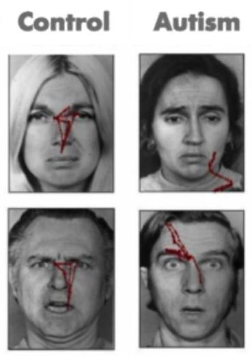

Figure 8.1. The red lines indicate the scan paths (collection of eye movements) used by people with (right column) and without (left column) autism to explore faces. Modified from Pelphrey et al., (2002).

Since Kanner first described ASD in 1943, important commonalities in symptom presentation have been used to compile criteria for the diagnosis of ASD. These diagnostic criteria have evolved during the past 70 years and continue to evolve (e.g., see the recent changes to the diagnostic criteria on the American Psychiatric Association'swebsite, http://www.dsm5.org), yet impaired social functioning remains a required symptom for an ASD diagnosis.

Previously, DSM-IV-TR included autism under a broader umbrella diagnostic category: Pervasive Developmental Disorders. Under this diagnostic category were four sub-diagnoses: autistic disorder, Asperger's disorder, childhood disintegrative disorder, and pervasive developmental disorder not otherwise specified. Based on research and clinical experience that have been gained since DSMIV was published in 1994 (Hyman, 2013), DSM-5 made substantial changes to the conceptualization and diagnostic criteria of these disorders.

DSM-5 collapses these four disorders into one diagnosis: Autism Spectrum Disorder (ASD). This diagnosis reflects scientific consensus that the four previously distinct diagnoses are actually a single diagnosis with different levels of symptom severity and level of impairment. This change to the conceptualization of this ASD acknowledges the heterogeneity in the presentation and severity of ASD symptoms, and in the skills and level of functioning of people with ASD (American Psychological Association, n.d.). In addition, a diagnosis is made based on the severity of symptoms in two areas only: social communication impairments and repetitive/restricted behaviours.

Deficits in social functioning are present in varying degrees for simple behaviors such as eye contact, and complex behaviors like navigating the give and take of a group conversation for individuals of all functioning levels (i.e. high or low IQ). Moreover, difficulties with social information processing occur in both visual (e.g., Pelphrey et al., 2002) and auditory (e.g., Dawson, Meltzoff, Osterling, Rinaldi, \& Brown, 1998) sensory modalities.

Consider the results of an eye tracking study in which Pelphrey and colleagues (2002) observed that individuals with autism did not make use of the eyes when judging facial expressions of emotion (see right panels of Figure 8.1). While repetitive behaviors or language deficits are seen in other disorders (e.g., obsessivecompulsive disorder and specific language impairment,respectively), basic social deficits of this nature are unique to ASD. Onset of the social deficits appears to precede difficulties in other domains (Osterling, Dawson, \& Munson, 2002) and may emerge as early as 6 months of age (Maestro et al., 2002).

# ASD in Canada 

In Canada, 1 in 66 children and youth (ages 5 to 17) are diagnosed with ASD, making it one of the most common developmental disabilities (Ofner et al., 2018). Approximately 1 to $2 \%$ of the population in Canada is affected by ASD (Anagnostou et al., 2014). Compared with females, males are four times more likely to receive a diagnosis of ASD (Ofner et al., 2018). More than half of children and youth with ASD are diagnosed by age six, and more than $90 \%$ receive a diagnosis by age 12 (Ofner et al., 2018). Unfortunately, the rates of ASD in Canada are increasing and this puts significant strain on the education, healthcare, and social service systems (Autism Ontario, n.d.).

In February 2019, the government of Ontario announced changes to autism funding. About 23,000 children with ASD were currently on a therapy wait list, and to ensure that these children could access services within 18 months, the government implemented drastic "childhood budgets" (Powers, 2019, March 11). This controversial autism funding model provided families a fixed amount of money that was determined by their child's age and family income (CBC News, 2019, July 29). The province's budget plan set significant limitations that would not meet the treatment needs of children with ASD, especially children with more severe ASD. In response, some families left Ontario to receive autism services for their children elsewhere in Canada, and protests and outrage occurred across the province (Monsebraaten \& Rushowy, 2019, October 29).

To advocate for the needs of these children, a panel, called the Ontario Autism Panel, was created. This panel included parents,advocates, clinicians, academics, and adults with autism (Monsebraaten \& Rushowy, 2019, October 29). Rather than a one-size-fits-all approach that is based on fixed factors like age and family income, the panel made recommendations for a new needsbased model of funding ensures that children receive the appropriate services based on their needs (Monsebraaten \& Rushowy, 2019, October 29). Unfortunately, the new Ontario Autism Program (OAP) will not be fully implemented until 2021. In the interim, the government has taken steps to provide support to children and their families, including extra funding, programs, and workshops for parents (Payne, 2019, December 18). Although this program is believed to place children at the centre of care, waiting for it is crucial as it is a critical time in child development, and the costs of treatment are a significant burden for many families across Ontario (Payne, 2019, December 18).

# Defining the Social Brain 

Within the past few decades, research has elucidated specific brain circuits that support perception of humans and other species. This social perception refers to "the initial stages in the processing of information that culminates in the accurate analysis of the dispositions and intentions of other individuals" (Allison, Puce, \& McCarthy, 2000). Basic social perception is a critical building block for more sophisticated social behaviors, such as thinking about the motives and emotions of others. Brothers (1990) first suggested the notion of a social brain, a set of interconnected neuroanatomical structures that process social information, enabling the recognition of other individuals and the evaluation their mental states (e.g., intentions, dispositions, desires, and beliefs).

The social brain is hypothesized to consist of the amygdala, the orbital frontal cortex (OFC), fusiform gyrus (FG), and the posterior superior temporal sulcus (STS) region, among other structures.Though all areas work in coordination to support social processing, each appears to serve a distinct role. The amygdala helps us recognize the emotional states of others (e.g., Morris et al., 1996) and also to experience and regulate our own emotions (e.g., LeDoux, 1992). The OFC supports the "reward" feelings we have when we are around other people (e.g., Rolls, 2000). The FG, located at the bottom of the surface of the temporal lobes detects faces and supports face recognition (e.g., Puce, Allison, Asgari, Gore, \& McCarthy, 1996). The posterior STS region recognizes the biological motion, including eye, hand and other body movements, and helps to interpret and predict the actions and intentions of others (e.g., Pelphrey, Morris, Michelich, Allison, \& McCarthy, 2005).

# Current Understanding of Social Perception in ASD 

The social brain is of great research interest because the social difficulties characteristic of ASD are thought to relate closely to the functioning of this brain network. Functional magnetic resonance imaging (fMRI) and event-related potentials
(ERP) are complementary brain imaging methods used to study activity in the brain across the lifespan. Each method measures a distinct facet of brain activity
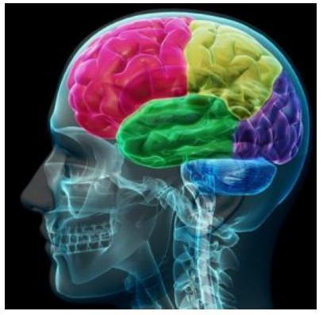

The human brain has specialized functions to help guide our social interactions. [Image: Allan Ajifo, https://goo.gl/jv4iXf, CC BY 2.0, https://goo.gl/BRvSA7]
and contributes unique information to our understanding of brain function.FMRI uses powerful magnets to measure the levels of oxygen within the brain, which vary according to changes in neural activity. As the neurons in specific brain regions "work harder", they require more oxygen. FMRI detects the brain regions that exhibit a relative increase in blood flow (and oxygen levels) while people listen to or view social stimuli in the MRI scanner. The areas of the brain most crucial for different social processes are thus identified, with spatial information being accurate to the millimeter.

In contrast, ERP provides direct measurements of the firing of groups of neurons in the cortex. Non-invasive sensors on the scalp record the small electrical currents created by this neuronal activity while the subject views stimuli or listens to specific kinds of information. While fMRI provides information about where brain activity occurs, ERP specifies when by detailing the timing of processing at the millisecond pace at which it unfolds.

ERP and fMRI are complementary, with fMRI providing excellent spatial resolution and ERP offering outstanding temporal resolution. Together, this information is critical to understanding the nature of social perception in ASD. To date, the most thoroughly investigated areas of the social brain in ASD are the superior temporal sulcus (STS), which underlies the perception and interpretation of biological motion, and the fusiform gyrus (FG), which supports face perception. Heightened sensitivity to biological motion (for humans, motion such as walking) serves an essential role in the development of humans and other highly social species. Emerging in the first days of life, the ability to detect biological motion helps to orient vulnerable young to critical sources of sustenance, support, and learning, and develops independent of visual experience with biological motion (e.g., Simion, Regolin, \& Bulf, 2008). This inborn "life detector" serves as a foundation for the subsequent development of more complex social behaviors (Johnson, 2006).

From an evolutionary standpoint, it was incredibly important for our survival to maintain social relationships. Therefore, it makes sense that we would be able to recognize faces within the first few days of our infancy. [Image: donnierayjones, https://goo.gl/obr12x, CC BY 2.0, https://goo.gl/v4Y0Zv]

From very early in life, children with ASD display reduced sensitivity to biological motion (Klin, Lin, Gorrindo, Ramsay, \& Jones, 2009). Individuals with ASD have reduced activity in the STS during biological motion perception. Similarly, people at increased genetic risk for ASD but who do not develop symptoms of the disorder (i.e. unaffected siblings of individuals with ASD) show increased activity in this region, which is hypothesized to be a compensatory mechanism to offset genetic vulnerability
(Kaiser et al., 2010).
In typical development, preferential attention to faces and the ability to recognize individual faces emerge in the first days of life (e.g., Goren, Sarty, \& Wu, 1975). The special way in which the brain responds to faces usually emerges by three months of age (e.g., de Haan, Johnson, \& Halit, 2003) and continues throughout the lifespan (e.g., Bentin et al., 1996). Children with ASD, however, tend to show decreased attention to human faces by six to 12 months (Osterling \& Dawson, 1994). Children with ASD also show reduced activity in the FG when viewing faces (e.g., Schultz et al., 2000). Slowed processing of faces (McPartland, Dawson, Webb, Panagiotides, \& Carver, 2004) is a characteristic of people with ASD that is shared by parents of children with ASD (Dawson, Webb, \& McPartland, 2005) and infants at increased risk for developing ASD because of having a sibling with ASD (McCleery, Akshoomoff, Dobkins, \& Carver, 2009). Behavioral and attentional differences in face perception and recognition are evident in children and adults with ASD as well (e.g., Hobson, 1986).# Exploring Diversity in ASD 

Because of the limited quality of the behavioral methods used to diagnose ASD and current clinical diagnostic practice, which permits similar diagnoses despite distinct symptom profiles (McPartland, Webb, Keehn, \& Dawson, 2011), it is possible that the group of children currently referred to as having ASD may actually represent different syndromes with distinct causes. Examination of the social brain may well reveal diagnostically meaningful subgroups of children with ASD. Measurements of the "where" and "when" of brain activity during social processing tasks provide reliable sources of the detailed information needed to profile children with ASD with greater accuracy. These profiles, in turn, may help to inform treatment of ASD by helping us to match specific treatments to specific profiles.

The integration of imaging methods is critical for this endeavor. Using face perception as an example, the combination of fMRI and ERP could identify who, of those individuals with ASD, shows anomalies in the FG and then determine the stage of information processing at which these impairments occur. Because different processing stages often reflect discrete cognitive processes, this level of understanding could encourage treatments that address specific processing deficits at the neural level.

For example, differences observed in the early processing stages might reflect problems with low-level visual perception, while later differences would indicate problems with higher-order processes, such as emotion recognition. These same principles can be applied to the broader network of social brain regions and, combined with measures of behavioral functioning, could offer a comprehensive profile of brain-behavior performance for a given individual. A fundamental goal for this kind of subgroup approach is to improve the ability to tailor treatments to the individual.Another objective is to improve the power of other scientific tools. Most studies of individuals with ASD compare groups of individuals, for example, individuals on with ASD compared to typically developing peers. However, studies have also attempted to compare children across the autism spectrum by group according to differential diagnosis (e.g., Asperger's disorder versus autistic disorder), or by other
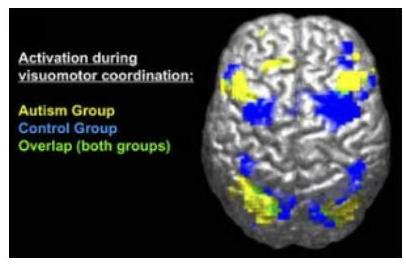

Trying to diagnose the precise autism disorder can be difficult; many cases share similar symptoms. However, burgeoning technology, like the fMRI, allows clinicians a glimpse into the patient's brain and thus a better understanding of his or her disorder. [Image: Ralph-Axel Müller, https://goo.gl/WwxCVI, CC BY 2.5, https://goo.gl/0QtWcf]
behavioral or cognitive characteristics (e.g., cognitively able versus intellectually disabled or anxious versus non-anxious). Yet, the power of a scientific study to detect these kinds of significant, meaningful, individual differences is only as strong as the accuracy of the factor used to define the compared groups.

The identification of distinct subgroups within the autism spectrum according to information about the brain would allow for a more accurate and detailed exposition of the individual differences seen in those with ASD. This is especially critical for the success of investigations into the genetic basis of ASD. As mentioned before, the genes discovered thus far account for only a small portion of ASD cases. If meaningful, quantitative distinctions in individuals with ASD are identified; a more focused examination into the genetic causes specific to each subgroup could then be pursued. Moreover, distinct findings from neuroimaging, or biomarkers, can help guide genetic research. Endophenotypes, or characteristics that are not immediately available to observation but that reflect an underlying genetic liability for disease, expose the most basic components of a complex psychiatric disorder and are more stable across the lifespan than observable behavior(Gottesman \& Shields, 1973). By describing the key characteristics of ASD in these objective ways, neuroimaging research will facilitate identification of genetic contributions to ASD.

# Atypical Brain Development Before the Emergence of Atypical Behavior 

Because autism is a developmental disorder, it is particularly important to diagnose and treat ASD early in life. Early deficits in attention to biological motion, for instance, derail subsequent experiences in attending to higher level social information, thereby driving development toward more severe dysfunction and stimulating deficits in additional domains of functioning, such as language development. The lack of reliable predictors of the condition during the first year of life has been a major impediment to the effective treatment of ASD. Without early predictors, and in the absence of a firm diagnosis until behavioral symptoms emerge, treatment is often delayed for two or more years, eclipsing a crucial period in which intervention may be particularly successful in ameliorating some of the social and communicative impairments seen in ASD.

In response to the great need for sensitive (able to identify subtle cases) and specific (able to distinguish autism from other disorders) early indicators of ASD, such as biomarkers, many research groups from around the world have been studying patterns of infant development using prospective longitudinal studies of infant siblings of children with ASD and a comparison group of infant siblings without familial risks. Such designs gather longitudinal information about developmental trajectories across the first three years of life for both groups followed by clinical diagnosis at approximately 36 months.

If autism is diagnosed early enough, treatments have developed to the point that children with ASD can learn and grow to have more intensive social interactions. [Image: hepingting, https://goo.gl/TIoAcY, CC BY-SA 2.0, https://goo.gl/rxiUsF]

These studies are problematic in that many of the social features of autism do not emerge in typical development until after 12 months of age, and it is not certain that these symptoms will manifest during the limited periods of observation involved in clinical evaluations or in pediatricians' offices. Moreover, across development, but especially during infancy, behavior is widely variable and often unreliable, and at present, behavioral observation is the only means to detect symptoms of ASD and to confirm a diagnosis. This is quite problematic because, even highly sophisticated behavioral methods, such as eye tracking (see Figure 1), do not necessarily reveal reliable differences in infants with ASD (Ozonoff et al., 2010). However, measuring the brain activity associated with social perception can detect differences that do not appear in behavior until much later. The identification of biomarkers utilizing the imaging methods we have described offers promise for earlier detection of atypical social development.

ERP measures of brain response predict subsequent development of autism in infants as young as six months old who showed normal patterns of visual fixation (as measured by eye tracking) (Elsabbagh et al., 2012). This suggests the great promise of brain imaging for earlier recognition of ASD. With earlier detection, treatments could move from addressing existing symptoms to preventing their emergence by altering the course of abnormal brain development and steering it toward normality.# Hope for Improved Outcomes 

The brain imaging research described above offers hope for the future of ASD treatment. Many of the functions of the social brain demonstrate significantplasticity, meaning that their functioning can be affected by experience over time. In contrast to theories that suggest difficulty processing complex information or communicating across large expanses of cortex (Minshew \& Williams, 2007), this malleability of the social brain is a positive prognosticator for the development of treatment. The brains of people with ASD are not wired to process optimally social information. But this does not mean that these systems are irretrievably broken. Given the observed plasticity of the social brain, remediation of these difficulties may be possible with appropriate and timely intervention.

## Outside Resources

Web: American Psychiatric Association's website for the 5th edition of the Diagnostic and Statistical Manual of Mental Disorders http://www.dsm5.org

Web: Autism Science Foundation - organization supporting autism research by providing funding and other assistance to scientists and organizations conducting, facilitating, publicizing and disseminating autism research. The organization also provides information about autism to the general public and serves to increase awareness of autism spectrum disorders and the needs of individuals andfamilies affected by autism.
http://www.autismsciencefoundation.org/
Web: Autism Speaks - Autism science and advocacy organization http://www.autismspeaks.org/

# Discussion Questions 

1. How can neuroimaging inform our understanding of the causes of autism?
2. What are the ways in which neuroimaging, including fMRI and ERP, may benefit efforts to diagnosis and treat autism?
3. How can an understanding of the social brain help us to understand ASD?
4. What are the core symptoms of ASD, and why is the social brain of particular interest?
5. What are some of the components of the social brain, and what functions do they serve?

## References

Allison, T., Puce, A., \& McCarthy, G. (2000). Social perception from visual cues: Role of the STS region. Trends in Cognitive Science, 4(7), 267-278.American Psychological Association (n.d.). Autism spectrum disorder. Retrieved May 9, 2020 from https://www.apa.org/topics/ autism/.

Anagnostou, E., Zwaigenbaum, L., Szatmari, P., Fombonne, E., Fernandez, B. A., Woodbury-Smith, M., ... Scherer, S. W. (2014). Autism spectrum disorder: Advances in evidence-based practice. Canadian Medical Association Journal, 186, 509-519. https://doi.org/10.1503/cmaj.121756

Autism Ontario (n.d.). Prevalence rates. Retrieved April 26, 2020 from https://www.autismontario.com/what-autism/prevalencerates.

Bentin, S., Allison, T., Puce, A., Perez, E., et al. (1996). Electrophysiological studies of face perception in humans. Journal of Cognitive Neuroscience, 8(6), 551-565.

Brothers, L. (1990). The social brain: A project for integrating primate behavior and neurophysiology in a new domain. Concepts in Neuroscience, 1, 27-51.

CBC News (2019, July 29). Ontario changes course on unpopular autism funding model, minister announced. Retrieved April 26, 2020 from https://www.cbc.ca/news/canada/toronto/ontario-autism-funding-course-change-1.5228587

Dawson, G., Meltzoff, A. N., Osterling, J., Rinaldi, J., \& Brown, E. (1998). Children with autism fail to orient to naturally occurring social stimuli. Journal of Autism \& Developmental Disorders, 28(6), $479-485$.

Dawson, G., Webb, S. J., \& McPartland, J. (2005). Understanding the nature of face processing impairment in autism: Insights from behavioral and electrophysiological studies. Developmental Neuropsychology, 27(3), 403-424.

Elsabbagh, M., Mercure, E., Hudry, K., Chandler, S., Pasco, G., Charman, T., et al. (2012). Infant neural sensitivity to dynamic eye gaze is associated with later emerging autism. Current Biology, 22(4), $338-342$.

Geschwind, D. H., \& Levitt, P. (2007). Autism spectrum disorders:Developmental disconnection syndromes. Current Opinion in Neurobiology, 17(1), 103-111.

Goren, C. C., Sarty, M., \& Wu, P. Y. (1975). Visual following and pattern discrimination of face-like stimuli by newborn infants. Pediatrics, 56(4), 544-549.

Gottesman I. I., \& Shields, J. (1973) Genetic theorizing and schizophrenia. British Journal of Psychiatry, 122, 15-30.

Hobson, R. (1986). The autistic child's appraisal of expressions of emotion. Journal of Child Psychology and Psychiatry, 27(3), 321-342.

Hyman, S. L. (2013, June). New DSM-5 includes changes to autism criteria. AAP News, E130604-1. doi:10.1542/aapnews.20130604-1. Retrieved May 9, 2020 from https://www.aappublications.org/ content/early/2013/06/04/aapnews.20130604-1

Johnson, M. H. (2006). Biological motion: A perceptual life detector? Current Biology, 16(10), R376-377.

Kaiser, M. D., Hudac, C. M., Shultz, S., Lee, S. M., Cheung, C., Berken, A. M., et al. (2010). Neural signatures of autism. Proceedings of the National Academy of Sciences of the United States of America, 107(49), 21223-21228.

Kanner, L. (1943). Autistic disturbances of affective contact. Nervous Child, 2, 217-250.

Klin, A., Lin, D. J., Gorrindo, P., Ramsay, G., \& Jones, W. (2009). Two-year-olds with autism orient to non-social contingencies rather than biological motion. Nature, 459(7244), 257-261.

LeDoux, J. E. (1992). Emotion and the amygdala. In J. P. Aggleton (Ed.), The amygdala: Neurobiological aspects of emotion, memory, and mental dysfunction (pp. 339-351). Wiley-Liss.

Maestro, S., Muratori, F., Cavallaro, M. C., Pei, F., Stern, D., Golse, B., et al. (2002). Attentional skills during the first 6 months of age in autism spectrum disorder. Journal of the American Academy of Child and Adolescent Psychiatry, 41(10), 1239-1245.

McCleery, J. P., Akshoomoff, N., Dobkins, K. R., \& Carver, L. J. (2009). Atypical face versus object processing and hemispheric asymmetries in 10-month-old infants at risk for autism. Biological Psychiatry, 66(10), 950-957.McPartland, J. C., Dawson, G., Webb, S. J., Panagiotides, H., \& Carver, L. J. (2004). Event-related brain potentials reveal anomalies in temporal processing of faces in autism spectrum disorder. Journal of Child Psychology and Psychiatry, 45(7), 1235-1245.

McPartland, J. C., Webb, S. J., Keehn, B., \& Dawson, G. (2011). Patterns of visual attention to faces and objects in autism spectrum disorder. Journal of Autism and Develop Disorders, 41(2), 148-157.

Minshew, N. J., \& Williams, D. L. (2007). The new neurobiology of autism: Cortex, connectivity, and neuronal organization. Archives of Neurology, 64(7), 945-950.

Monsebraaten, L. \& Rushowy, K. (2019, October 29). Autism panel recommends rewrite of Ontario's controversial program. Toronto Star. Retrieved April 26, 2020 from https://www.thestar.com/ politics/provincial/2019/10/29/autism-panel-recommends-rewrite-of-ontarios-controversial-program.html

Morris, J. S., Frith, C. D., Perrett, D. I., Rowland, D., Young, A. W., Calder, A. J., ...Dolan, R. J. (1996). A differential neural response in the human amygdala to fearful and happy facial expressions. Nature, 383(6603), 812-815. doi:10.1038/383812a0.

Ofner, M., Coles, A., Decou, M., T Do, M., Bienek, A., Snider, J., ... Ugnat, A. (2018). Autism spectrum disorder among children and youth in Canada 2018: A report of the national autism spectrum surveillance system. Retrieved April 26, 2020 from https://www.canada.ca/content/dam/phac-aspc/documents/ services/publications/diseases-conditions/autism-spectrum-disorder-children-youth-canada-2018/autism-spectrum-disorder-children-youth-canada-2018.pdf

Osterling, J., \& Dawson, G. (1994). Early recognition of children with autism: A study of first birthday home videotapes. Journal of Autism and Developmental Disorders, 24, 247-257.

Osterling, J. A., Dawson, G., \& Munson, J. A. (2002). Early recognition of 1-year-old infants with autism spectrum disorder versus mental retardation. Development \& Psychopathology, 14(2), 239-251.

Ozonoff, S., Iosif, A. M., Baguio, F., Cook, I. C., Hill, M. M., Hutman,T., et al. (2010). A prospective study of the emergence of early behavioral signs of autism. Journal of the American Academy of Child and Adolescent Psychiatry, 49(3), 256-266.

Payne, E. (2019, December 18). Latest autism program delay stuns parents. Ottawa Citizen. Retrieved April 26, 2020 from https://ottawacitizen.com/news/local-news/latest-autism-program-delay-stuns-parents/.

Pelphrey, K. A. (2020). Autism: Insights from the Study of the Social Brain. In R. Biswas-Diener \& E. Diener (Eds), Noba textbook series: Psychology. Champaign, IL: DEF publishers. Retrieved from http://noba.to/yqdepwgt.

Pelphrey, K. A., Morris, J. P., Michelich, C. R., Allison, T., \& McCarthy, G. (2005). Functional anatomy of biological motion perception in posterior temporal cortex: an FMRI study of eye, mouth and hand movements. Cerebral Cortex,15(12), 1866-1876. doi:10.1093/cercor/bhi064.

Pelphrey, K. A., Sasson, N. J., Reznick, J. S., Paul, G., Goldman, B. D., \& Piven, J. (2002). Visual scanning of faces in autism. Journal of Autism \& Developmental Disorders, 32(4), 249-261.

Powers, L. (2019, March 11). Big changes are coming to Ontario's autism program - here's what you should know. CBC News. Retrieved April 26, 2020 from https://www.cbc.ca/news/canada/ toronto/autism-ontario-program-explain-1.5050679

Puce, A., Allison, T., Asgari, M., Gore, J. C., \& McCarthy, G. (1996). Differential sensitivity of human visual cortex to faces, letterstrings, and textures: a functional magnetic resonance imaging study. Journal of Neuroscience,16(16), 5205-5215. doi:10.1523/ JNEUROSCI.16-16-05205.1996.

Rolls, E. T. (2000). The orbitofrontal cortex and reward. Cerebral Cortex, 10(3), 284-294. doi:10.1093/cercor/10.3.284.

Schultz, R. T., Gauthier, I., Klin, A., Fulbright, R. K., Anderson, A. W., Volkmar, F., et al. (2000). Abnormal ventral temporal cortical activity during face discrimination among individuals with autism and Asperger syndrome. Archives of General Psychiatry, 57(4), $331-340$.Simion, F., Regolin, L., \& Bulf, H. (2008). A predisposition for biological motion in the newborn baby. Proceedings of the National Academy of Sciences, 105(2), 809-813.
de Haan, M., Johnson, M. H., \& Halit, H. (2003). Development of face-sensitive event-related potentials during infancy: A review. International Journal of Psychophysiology, 51(1), 45-58.# Summary and Self-Test: Autism 

KEVIN A. PELPHREY AND JORDEN A. CUMMINGS

## Summary

Autism spectrum disorder (ASD) is a developmental disorder that usually emerges within the first three years and persists throughout the individual's life. There are three general categories of symptoms of ASD: presence of profound difficulties in social interactions and communication, combined with the presence of repetitive or restricted interests, cognitions, and behaviours. There is a wide variety of symptom combinations that may be present for people with ASD.

Previously, DSM-IV-TR included autism under a broader diagnostic category called Pervasive Developmental Disorders. Based on research and clinical experience, however, the separate disorders were collapsed into one diagnosis for DSM-5 (ASD).

In Canada, 1 in 66 children and youth (aged 5-17) are diagnosed with ASD, making it one of the most common developmental disorders. Males are four times more likely to receive a diagnosis of ASD.

Basic social perception is an important building block for more sophisticated social behaviours, like thinking about the emotions and motivations of others. Because of the social difficulties characterizing ASD, the functioning of the social brain is of great interest to autism researchers.

To date, the most investigated areas of the social brain in ASD are the superior temporal sulcus (STS), which underlies the perception and integration of biological motion, and the fusiform gyrus (FG),which supports face perception. Very early in life, children with ASD display reduced sensitive to biological motion and lack the attention to human faces that non-ASD infants possess.

Because of the many potential symptom combinations of ASD, identification of distinct (neurological) subgroups within the autism spectrum would allow for a more accurate and detailed exploration of individual differences between types of ASD.

It is particularly important to diagnose and treat ASD early in life. The lack of reliable predictors during the first year of life is an impediment to this early intervention. Treatment is often delayed for 2 or more years.# CHAPTER 9: PERSONALITY DISORDERS.# Chapter 9 Introduction 

JORDEN A. CUMMINGS

Every one of us has our own personality that describes who we generally are. This is often how we organize our sense of self and our impressions of the people around us. Personality disorders, however, describe a form of psychopathology marked by extreme, rigid personality difficulties that can cause impairment (in multiple domains) for the individual. Moreover, they can cause a multitude of interpersonal difficulties for those around them. In this chapter we review one of the more popular theories of personality - the Five Factor Model - and discuss the differences between personality and personality disorders.

The DSM-5 organizes personality disorders into three clusters, based on their common characteristics. Cluster A personality disorders involve odd and eccentric thinking or behaviour, and include paranoid, schizoid, and schizotypal personality disorder. Cluster B personality disorders involve dramatic, overly emotional or unpredictable thinking or behaviour, and include antisocial, borderline, histrionic, and narcissistic personality disorder. Cluster C personality disorders are marked by anxious, fearful thinking or behaviour and include avoidant, dependent, and obsessivecompulsive personality disorder.

Personality disorders are, unfortunately, some of the most challenging disorders to treat. This is because they are so entrenched, chronic, and pervasive for the people who experience them. Very few people with personality disorders present for treatment, and if they do it is often because they are experiencing social/occupational impairment or because someone else has pushed them to go. The exception is borderline personality disorder, which is quite distressing for those who experience it. Our treatment development for personality disorders lags behind that of other disorders, although there is one empirically supportedtreatment for borderline personality disorder: Dialectical Behaviour Therapy.# 9.I Personality Disorders 

CRISTINA CREGO; THOMAS WIDIGER; JORDEN A. CUMMINGS; AND CAILEY STRAUSS

## Section Learning Objectives

- Define what is meant by a personality disorder.
- Identify the five domains of general personality.
- Identify the six personality disorders proposed for retention in DSM-5.
- Summarize the etiology for antisocial and borderline personality disorder.
- Identify the treatment for borderline personality disorder.

## Personality \& the Five-Factor Model

Everybody has their own unique personality; that is, their characteristic manner of thinking, feeling, behaving, and relating to others (John, Robins, \& Pervin, 2008). Some people are typically introverted, quiet, and withdrawn; whereas others are more extraverted, active, and outgoing. Some individuals are invariably conscientiousness, dutiful, and efficient; whereas others might be characteristically undependable and negligent. Some individuals are consistently anxious, self-conscious, and apprehensive; whereas others are routinely relaxed, self-assured, and unconcerned. Personality traits refer to these characteristic, routine ways of thinking, feeling, and relating to others. There are signs or indicators of these traits in childhood, but they become particularlyevident when the person is an adult. Personality traits are integral to each person's sense of self, as they involve what people value, how they think and feel about things, what they like to do, and, basically, what they are like most every day throughout much of their lives.

There are literally hundreds of different personality traits. All of these traits can be organized into the broad dimensions referred to as the Five-Factor Model (John, Naumann, \& Soto, 2008). These five broad domains are inclusive; there does not appear to be any traits of personality that lie outside of the Five-Factor Model. This even applies to traits that you may use to describe yourself. Table 9.1 provides illustrative traits for both poles of the five domains of this model of personality. A number of the traits that you see in this table may describe you. If you can think of some other traits that describe yourself, you should be able to place them somewhere in this table.| Neuroticism (Emotional Instability) fearful, apprehensive, angry, bitter, pessimistic, glum, timid, embarrassed, tempted, urgency, helpless, fragile | VS | Emotional Stability relaxed, unconcemed, cool, eventempered, optimistic, self-assured, glib, shameless, controlled, restrained, clearthinking, fearless, unflappable |
| :--: | :--: | :--: |
| Extraversion cordial affectionate, attached, sociable, outgoing, dominant, forceful, vigorous, energetic, active, reckless, daring, highspirited, excitement-seeking | VS | Introversion cold, aloof, indifferent, withdrawn, isolated, unassuming, quiet, resigned, passive, lethargic, cautious, monotonous, dull, placid, anhedonic |
| Openness (unconventionality) dreamer, unrealistic, imaginative, aberrant, aesthetic, self-aware, eccentric, strange, odd, peculiar, creative, permissive, broad-minded | VS | Closedness (conventionality) practical, concrete, uninvolved, no aesthetic interest, constricted, unaware, alexythymic, routine, predictable, habitual, stubborn, pragmatic, rigid, traditional, inflexible, dogmatic |
| Agreeableness gullible, naive, trusting, confiding, honest, sacrificial, giving, docile, cooperative, meek, self-effacing, humble, soft, empathetic | VS | Antagonism skeptical, cynical, suspicious, paranoid, cunning, manipulative, deceptive, stingy, selfish, greedy, exploitative, oppositional, combative, aggressive, confident, boastful, arrogant, tough, callous, ruthless |
| Conscientiousness perfectionistic, efficient, ordered, methodical, organized, rigid, reliable, dependable, workaholic, ambitious, dogged, devoted, cautious, ruminative, reflective | VS | Disinhibition   lax, negligent, haphazard, disorganized, sloppy, casual, undependable, unethical, aimless, desultory, hedonistic, negligent, hasty, careless, rash |

Table 9.1: Illustrative traits for both poles across Five-Factor Model personality dimensions.

# DSM-5 Personality Disorders 

When personality traits result in significant distress, social impairment, and/or occupational impairment, they are considered to be a personality disorder (American Psychiatric Association, 2013). The authoritative manual for what constitutes a personality disorder is provided by the American Psychiatric Association's (APA) Diagnostic and Statistical Manual of Mental Disorders (DSM),the current version of which is DSM-5 (APA, 2013). The DSM provides a common language and standard criteria for the classification and diagnosis of mental disorders. This manual is used by clinicians, researchers, health insurance companies, and policymakers.

According to the DSM-V, a personality disorder is characterized by a pervasive, consistent, and enduring pattern of behaviour and internal experience that differs significantly from that which is usually expected in the individual's culture. They typically have an onset in adolescence or early adulthood, persist over time, and cause distress or impairment. The pattern must be present in two or more of the four areas of cognition, emotion, interpersonal functioning, and impulse control. It must also not be better explained by another mental disorder or medical condition, or as the effects of a substance. There was much discussion in writing the DSM-V about changing the way in which personality disorders are diagnosed, but for now the system remains unchanged from the previous version of the DSM (the DSM-IV-TR). DSM-5 includes 10 personality disorders, grouped into three clusters: Cluster A (paranoid, schizoid, and schizotypal personality disorders), Cluster B (antisocial, borderline, histrionic, and narcissistic personality disorders), and Cluster C (avoidant, dependent, and obsessivecompulsive personality disorders).

This list of 10 though does not fully cover all of the different ways in which a personality can be maladaptive. DSM-5 also includes a "wastebasket" diagnosis of other specified personality disorder (OSPD) and unspecified personality disorder (UPD). This diagnosis is used when a clinician believes that a patient has a personality disorder but the traits that constitute this disorder are not well covered by one of the 10 existing diagnoses. OSPD and UPD or as they used to be referred to in previous editions - PDNOS (personality disorder not otherwise specified) are often one of the most frequently used diagnoses in clinical practice, suggesting that the current list of 10 is not adequately comprehensive (Widiger \& Trull, 2007).Each of the 10 DSM-5 (and DSM-IV-TR) personality disorders is a constellation of maladaptive personality traits, rather than just one particular personality trait (Lynam \& Widiger, 2001). In this regard, personality disorders are "syndromes." For example, avoidant personality disorder is a pervasive pattern of social inhibition, feelings of inadequacy, and hypersensitivity to negative evaluation (APA, 2013), which is a combination of traits from introversion (e.g., socially withdrawn, passive, and cautious) and neuroticism (e.g., self-consciousness, apprehensiveness, anxiousness, and worrisome). Dependent personality disorder includes submissiveness, clinging behavior, and fears of separation (APA, 2013), for the most part a combination of traits of neuroticism (anxious, uncertain, pessimistic, and helpless) and maladaptive agreeableness (e.g., gullible, guileless, meek, subservient, and self-effacing). Antisocial personality disorder is, for the most part, a combination of traits from antagonism (e.g., dishonest, manipulative, exploitative, callous, and merciless) and low conscientiousness (e.g., irresponsible, immoral, lax, hedonistic, and rash). See the 1967 movie, Bonnie and Clyde, starring Warren Beatty, for a nice portrayal of someone with antisocial personality disorder.Some of the DSM-5 personality disorders are confined largely to traits within one of the basic domains of personality. For example, obsessivecompulsive personality disorder is largely a disorder of maladaptive conscientiousness, including such traits as workaholism, perfectionism, punctilious, ruminative, and dogged; schizoid is confined largely to traits of introversion (e.g., withdrawn, cold, isolated, placid, and

A person with an obsessive compulsive personality disorder may have a hard time relaxing, always feel under pressure, and believe that there isn't enough time to accomplish important tasks. [Image: CC0 Public Domain, https://goo.gl/m25gce]
anhedonic); borderline personality disorder is largely a disorder of neuroticism, including such traits as emotionally unstable, vulnerable, overwhelmed, rageful, depressive, and self-destructive (watch the 1987 movie, Fatal Attraction, starring Glenn Close, for a nice portrayal of this personality disorder); and histrionic personality disorder is largely a disorder of maladaptive extraversion, including such traits as attentionseeking, seductiveness, melodramatic emotionality, and strong attachment needs (see the 1951 film adaptation of Tennessee William's play, Streetcar Named Desire, starring Vivian Leigh, for a nice portrayal of this personality disorder).

Due to the severity of symptoms (e.g., suicide), Canadian researchers have examined the rates of Cluster B personality disorders specifically (Cailhol et al., 2017). In Quebec, the 2011-2012 prevalence rates were $2.6 \%$ (lifetime) and $3.6 \%$ (12-month). Compared with the general provincial population, the mean years of lost life expectancy for men and women were 13 and 9 years, respectively (Cailhol et al., 2017).

It should be noted though that a complete description of eachDSM-5 personality disorder would typically include at least some traits from other domains. For example, antisocial personality disorder (or psychopathy) also includes some traits from low neuroticism (e.g., fearlessness and glib charm) and extraversion (e.g., excitement-seeking and assertiveness); borderline includes some traits from antagonism (e.g., manipulative and oppositional) and low conscientiousness (e.g., rash); and histrionic includes some traits from antagonism (e.g., vanity) and low conscientiousness (e.g., impressionistic). Narcissistic personality disorder includes traits from neuroticism (e.g., reactive anger, reactive shame, and need for admiration), extraversion (e.g., exhibitionism and authoritativeness), antagonism (e.g., arrogance, entitlement, and lack of empathy), and conscientiousness (e.g., acclaim-seeking). Schizotypal personality disorder includes traits from neuroticism (e.g., social anxiousness and social discomfort), introversion (e.g., social withdrawal), unconventionality (e.g., odd, eccentric, peculiar, and aberrant ideas), and antagonism (e.g., suspiciousness).

The APA currently conceptualizes personality disorders as qualitatively distinct conditions; distinct from each other and from normal personality functioning. However, included within an appendix to DSM-5 is an alternative view that personality disorders are simply extreme and/or maladaptive variants of normal personality traits, as suggested herein. Nevertheless, many leading personality disorder researchers do not hold this view (e.g., Gunderson, 2010; Hopwood, 2011; Shedler et al., 2010). They suggest that there is something qualitatively unique about persons suffering from a personality disorder, usually understood as a form of pathology in sense of self and interpersonal relatedness that is considered to be distinct from personality traits (APA, 2012; Skodol, 2012). For example, it has been suggested that antisocial personality disorder includes impairments in identity (e.g., egocentrism), selfdirection, empathy, and capacity for intimacy, which are said to be different from such traits as arrogance, impulsivity, and callousness (APA, 2012).# DSM-5 Description of Each Disorder 

As mentioned, the DSM organizes personality disorders into 3 clusters.

Cluster A personality disorders involve odd and eccentric thinking or behaviour and include paranoid, schizoid, and schizotypal personality disorder. The Cluster B personality disorders involve dramatic, overly emotional, or unpredictable thinking or behaviour and include antisocial, borderline, histrionic, and narcissistic personality disorder. Cluster C personality disorders involve anxious, fearful thinking or behaviour and include avoidant, dependent, and obsessive-compulsive personality disorder.

## Paranoid Personality Disorder

Paranoid personality disorder is characterized by a pattern of mistrust or suspiciousness of others. Their motives are generally interpreted as malicious. Even when no evidence supports this conclusion, individuals with this personality disorder tend to assume that others mean them harm. They may be suspicious of their close friends or family, and as a result tend to avoid confiding in others. There may also be a tendency to misinterpret harmless events or comments as threats. Individuals with paranoid personality disorder can carry persistent grudges or generally present as unforgiving of even minor slights. When feeling attacked or plotted against they are quick to react with anger and often lash out or plan to seek revenge. This personality disorder often involves an inability to trust one's romantic partner, and even in the absence of any evidence to the contrary an individual may become convinced that their partner has been unfaithful. Interpersonallythey often appear hostile, stubborn, sarcastic, rigid, controlling, and critical of others. However, it is important to note that members of minority groups may appear guarded or defensive in response to discrimination or neglect by the majority society. As with any personality disorder, cultural factors must not contribute to a diagnosis of paranoid personality disorder.

# Schizoid Personality Disorder 

If an individual generally remains detached from interpersonal relationships and has only a narrow range of emotional expression, they may be diagnosed with schizoid personality disorder. Someone with this disorder may derive no enjoyment from nor show any interest in close relationships including family, close friendships, or sexual relationships. They may choose solitary activities over interpersonal ones, find very few activities pleasurable or enjoyable, and may also seem indifferent when either praised or criticized by others. They may present as emotionally cold or distant and detached, with flattened affect. They may seem superficial or selfabsorbed due to their disinterest in interpersonal relationships, and are generally not aware of (or do not respond to) social norms or cues. Individuals with schizoid personality disorder often find mechanical or abstract tasks (such as computer or mathematics) more attractive than social activities.

## Schizotypal Personality Disorder

Schizotypal personality disorder is diagnosed when an individual is unable or unwilling to form close relationships and has cognitiveor perceptual distortions or eccentric behaviour. These individuals may experience ideas of references and strange beliefs or "magical thinking" that influences how they behave and is inconsistent with cultural/societal norms. It is important to note that many cultural contexts or religious settings include beliefs in things that would otherwise be symptoms of schizotypal personality disorder, and this must be ruled out before a diagnosis can be made. People with this disorder may have unusual perceptions that include somatic illusions, and their speech and thinking may be "odd" (i.e., vague, metaphorical, overly detailed). Suspiciousness and paranoia are often present, as is inappropriate/constricted affect (i.e., appearing emotionally "stiff"), eccentric behaviour and appearance, and lack of close connections other than immediate family. Social anxiety is also common, but differs from Axis I anxiety disorders in that it does not decrease as one becomes more familiar with someone, and it is based in paranoia rather than fears of negative judgment.

# Antisocial Personality Disorder 

The diagnostic criteria for antisocial personality disorder specify that there must be a consistent pattern of disregarding or violating the rights of others since the age of 15 . Specifically, this can involve unlawful behaviour or lying to or conning others for personal gain or pleasure. These individuals may be impulsive, irritable, aggressive, or reckless. As a result of these characteristics they may get into frequent physical fights or display a disregard for their own safety or that of others. They are frequently irresponsible and may fail to hold down a job or take care of financial obligations. Individuals with antisocial personality disorder often lack remorse, and as such they frequently present as indifferent to the suffering of others even when they have caused it. This personality disorder can only be diagnosed in someone 18 years or older, but conduct disordermust have been present prior to 15 years of age. There has been discussion about whether this diagnosis is disproportionately given to those from lower socioeconomic circumstances and care should be taken to tease apart survival strategies and traits from diagnosable symptoms of the disorder.

# Borderline Personality Disorder 

The hallmark of borderline personality disorder is a pervasive pattern of unstable interpersonal relationships, self-image, and emotions, with significant impulsivity. These individuals may respond to real or imagined abandonment by frantically trying to avoid it, and their relationships may be intense and unstable, and characterized by alternating between viewing someone as "all good" or "all bad." They may have an extremely unstable sense of self which translates into frequently changing interests and goals, and their impulsivity may occur in areas such as finances, sexual behaviour, substance abuse, dangerous driving, or binge eating. Suicidal behaviour is common and can include gestures, threats, attempts, and self-mutilation. Their emotions are frequently labile (unstable and reactive), and their moods may last only a few hours or a few days. Many individuals with this disorder report feeling chronically "empty," and they may struggle with intense and inappropriate anger that may be difficult for them to control. Borderline personality disorder may also cause paranoia or dissociation that comes and goes depending on stress levels. One must note that adolescents and younger adults who are undergoing identity issues may appear to have some of the symptoms of BPD. Also, BPD is disproportionately diagnosed in females (whereas antisocial PD is disproportionately diagnosed in men) and an argument has been made in the literature that perhaps the diagnosis unfairly pathologizes stereotypically female experiences or responses totrauma. Another discussion topic has been that the exact same symptoms in case studies are diagnosed by mental health professionals as symptoms of borderline personality disorder in females, but antisocial personality disorder in males.

# Histrionic Personality Disorder 

A diagnosis of histrionic personality disorder describes someone who may need to be the centre of attention in order to find a situation comfortable. They may interact with others in overly and inappropriately sexually seductive or provocative ways, and their emotions change quickly and tend to be quite shallow in expression. Their physical appearance is often used as a way of drawing attention to themselves, and their speech tends towards being overly vague and dramatic (for instance, making bold statements but having no details to back up their opinions). When these individuals express emotion it is often exaggerated and theatrical. They may also be easily influenced by others or circumstances and often consider their relationships to be more intimate and close than they actually are. Above all, individuals with histrionic personality disorder are known to show excessive emotion and seek attention to an extreme degree. Given that many of these traits are largely influenced by cultural context, the extent to which they cause significant impairment or distress must be evaluated before diagnosis can be made.

## Narcissistic Personality Disorder

An individual with narcissistic personality disorder may have agrandiose sense of their own importance, which means that they may exaggerate their positive traits or successes and expect recognition). They may fantasize about success, power, beauty, brilliance, or love, and may see themselves as special and unique. This view of themselves may lead to a belief that they should only associate with other exceptional people. Someone with this disorder requires an excessive amount of admiration from others and feels entitled to special treatment. They may view others as needing to fulfill their needs and desires in a way that caters to their every whim. As such, these individuals sometimes take advantage of others in order to achieve their own goals and they may lack empathy or be unwilling or unable to recognize that others have valid thoughts, feelings, and needs. Although this disorder sometimes includes arrogant or haughty behaviour and attitudes, the individual may actually be envious of others. As a whole, this disorder involves extreme self-centred or self-absorbed behaviours and beliefs. Although ambition and confidence associated with this disorder may lead to significant vocational achievement, it may also cause impairment in functioning if an individual is unwilling to engage in tasks unless sure of success. They may also have difficulty working within a power structure that requires answering to someone with more power than themselves.

# Avoidant Personality Disorder 

Avoidant personality disorder generally involves an unwillingness to interact with people unless sure of being liked. This includes avoiding work that involves significant interaction or being restrained within relationships because of fearing criticism, rejection, disapproval, or shame. In fact, the individual is usually preoccupied with the idea of being criticized or rejected by others, and thus presents as inhibited when faced with new interpersonalrelationships because of feeling inadequate. They may hold a view of themselves as socially inept, inferior, or unappealing. These individuals also tend to be quite reluctant to take any risks or try new activities because of an extreme fear of being embarrassed. What defines this personality disorder is the pattern of social inhibition, feelings of inadequacy or inferiority, and being hypersensitive to criticism. Unfortunately this disorder tends to create a vicious cycle, in which their fearful or tense presentation elicits negative responses from others, which in turn leads to more fear and avoidance. However, one must note that acculturation issues following immigration should not be confused with a diagnosis of avoidant personality disorder.

# Dependent Personality Disorder 

If someone shows a pattern of excessive neediness, clingy behaviour, submission, and fear of separation, they may be diagnosed with dependent personality disorder. This disorder may also include having difficulty making everyday decisions without seeking the input of others to an extreme degree. They may need others to take responsibility for large parts of their life, and may not be able to express dissenting opinions because of fearing disapproval or loss of support. Individuals with dependent personality disorder may have trouble starting projects or completing tasks on their own because they lack confidence in their abilities, and they may excessively try to secure nurturing support from others, even if it means they have to do things that they find unpleasant. This disorder also tends to involve feeling uncomfortable or helpless when left alone, due to feeling intense fear over having to take care of oneself. They may go from one relationship to another in order to avoid being left alone, as a result of being preoccupied with this fear. As with most other disorders,traits of dependent personality disorder can be heavily influenced by cultural factors. Being polite, deferent, and passive is highly regarded in some cultures and in order to be diagnosed with this disorder the individual's behaviour must differ significantly from cultural norms.

# Obsessive-Compulsive Personality Disorder 

An individual with obsessive-compulsive personality disorder presents as preoccupied with details, rules, lists, order, organization, and schedules. This preoccupation is so intense that the main point of the activity being planned gets lost. Their perfectionism interferes with accomplishing goals, but they may also be so devoted to work and productivity that leisure time and friendships are sacrificed. These individuals may be extremely inflexible and scrupulous when it comes to issues of morals, ethics, or values (although this criterion must not be accounted for by religion or culture). They may find throwing out old or worthless items too difficult, even in the absence of sentimental value. This disorder also may make one hesitant to delegate or work cooperatively unless the workmate is willing to completely submit to how the individual feels the work should be done. In terms of finances, they may be extremely reluctant to spend money, choosing instead to hoard resources to prepare for an anticipated disaster in the future. These individuals also tend to present as extremely rigid and stubborn. Even normally "fun" activities may turn into structured tasks for someone with obsessive-compulsive personality disorder.# Validity 

It is quite possible that in future revisions of the DSM some of the personality disorders included in DSM-5 will no longer be included. In fact, for DSM-5 it was originally proposed that four be deleted. The personality disorders that were slated for deletion were histrionic, schizoid, paranoid, and dependent (APA, 2012). The rationale for the proposed deletions was in large part because they are said to have less empirical support than the diagnoses that were at the time being retained (Skodol, 2012). There is agreement within the field with regard to the empirical support for the borderline, antisocial, and schizotypal personality disorders (Mullins-Sweat, Bernstein, \& Widiger, 2012; Skodol, 2012). However, there is a difference of opinion with respect to the empirical support for the dependent personality disorder (Bornstein, 2012; Livesley, 2011; Miller, Widiger, \& Campbell, 2010; Mullins-Sweat et al., 2012).

Little is known about the specific etiology for most of the DSM-5 personality disorders. Because each personality disorder represents a constellation of personality traits, the etiology for the syndrome will involve a complex interaction of an array of different neurobiological vulnerabilities and dispositions with a variety of environmental, psychosocial events. Antisocial personality disorder, for instance, is generally considered to be the result of an interaction of genetic dispositions for low anxiousness, aggressiveness, impulsivity, and/or callousness, with a tough, urban environment, inconsistent parenting, poor parental role modeling, and/or peer support (Hare, Neumann, \& Widiger, 2012). Borderline personality disorder is generally considered to be the result of an interaction of a genetic disposition to negative affectivity interacting with a malevolent, abusive, and/or invalidating family environment (Hooley, Cole, \& Gironde, 2012).

To the extent that one considers the DSM-5 personality disorders to be maladaptive variants of general personality structure, as described, for instance, within the Five-Factor Model, there wouldbe a considerable body of research to support the validity for all of the personality disorders, including even the histrionic, schizoid, and paranoid. There is compelling multivariate behavior genetic support with respect to the precise structure of the Five-Factor Model (e.g., Yamagata et al., 2006), childhood antecedents (Caspi, Roberts, \& Shiner, 2005), universality (Allik, 2005), temporal stability across the lifespan (Roberts \& DelVecchio, 2000), ties with brain structure (DeYoung, Hirsh, Shane, Papademetris, Rajeevan, \& Gray, 2010), and even molecular genetic support for neuroticism (Widiger, 2009).

# Treatment 

Personality disorders are relatively unique because they are often "ego-syntonic;" that is, most people are largely comfortable with their selves, with their characteristic manner of behaving, feeling, and relating to others. As a result, people rarely seek treatment for their antisocial, narcissistic, histrionic, paranoid, and/or schizoid personality disorder. People typically lack insight into the maladaptivity of their personality.

Many people with personality disorders do not seek treatment. Those with borderline personality disorder and avoidant personality disorder are exceptions. High levels of neuroticism and emotional pain may motivate them to seek help. [Image: CC0 Public Domain, https://goo.gl/m25gce]

One clear exception though is borderline personality disorder (and perhaps as well avoidant personality disorder). Neuroticism is the domain of general personality structure that concerns inherent feelings of emotional pain and suffering, including feelings of distress, anxiety, depression, selfconsciousness, helplessness, and vulnerability. Persons who have very high elevations on neuroticism (i.e., persons with borderline personality disorder) experience life as one of pain and suffering, and they will seek treatment to alleviate this severe emotional distress. People with avoidant personality may also seek treatment for their high levels of neuroticism (anxiousness and self-consciousness) and introversion (social isolation). In contrast, narcissistic individuals will rarely seek treatment to reduce their arrogance; paranoid persons rarely seek treatment to reduce their feelings of suspiciousness; and antisocial people rarely (or at least willfully) seek treatment to reduce their disposition for criminality, aggression, and irresponsibility.

Nevertheless, maladaptive personality traits will be evident in many individuals seeking treatment for other mental disorders, such as anxiety, mood, or substance use. Many of the people with a substance use disorder will have antisocial personality traits; many of the people with mood disorder will have borderline personality traits. The prevalence of personality disorders within clinical settings is estimated to be well above 50\% (Torgersen, 2012). As many as $60 \%$ of inpatients within some clinical settings are diagnosed with borderline personality disorder (APA, 2000).Antisocial personality disorder may be diagnosed in as many as $50 \%$ of inmates within a correctional setting (Hare et al., 2012). It is estimated that $10 \%$ to $15 \%$ of the general population meets criteria for at least one of the 10 DSM-IV-TR personality disorders (Torgersen, 2012), and quite a few more individuals are likely to have maladaptive personality traits not covered by one of the 10 DSM-5 diagnoses.

The presence of a personality disorder will often have an impact on the treatment of other mental disorders, typically inhibiting or impairing responsivity. Antisocial persons will tend to be irresponsible and negligent; borderline persons can form intensely manipulative attachments to their therapists; paranoid patients will be unduly suspicious and accusatory; narcissistic patients can be dismissive and denigrating; and dependent patients can become overly attached to and feel helpless without their therapists.

It is a misnomer, though, to suggest that personality disorders cannot themselves be treated. Personality disorders are among the most difficult of disorders to treat because they involve wellestablished behaviors that can be integral to a client's self-image (Millon, 2011). Nevertheless, much has been written on the treatment of personality disorder (e.g., Beck, Freeman, Davis, \& Associates, 1990; Gunderson \& Gabbard, 2000), and there is empirical support for clinically and socially meaningful changes in response to psychosocial and pharmacologic treatments (Perry \& Bond, 2000). The development of an ideal or fully healthy personality structure is unlikely to occur through the course of treatment, but given the considerable social, public health, and personal costs associated with some of the personality disorders, such as the antisocial and borderline, even just moderate adjustments in personality functioning can represent quite significant and meaningful change.

Nevertheless, manualized and/or empirically validated treatment protocols have been developed for only one specific personality disorder, borderline (APA, 2001).Dialectical behavior therapy (Lynch \& Cuyper, 2012) and mentalization therapy (Bateman \& Fonagy, 2012): Dialectical behavior therapy is a form of cognitive-behavior therapy that draws on principles from Zen Buddhism, dialectical philosophy, and behavioral science. The treatment has four components: individual therapy, group skills training, telephone coaching, and a therapist consultation team, and will typically last a full year. As such, it is a relatively expensive form of treatment, but research has indicated that its benefits far outweighs its costs, both financially and socially.

It is unclear why specific and explicit treatment manuals have not been developed for the other personality disorders. This may reflect a regrettable assumption that personality disorders are unresponsive to treatment. It may also reflect the complexity of their treatment. As noted earlier, each DSM-5 disorder is a heterogeneous constellation of maladaptive personality traits. In fact, a person can meet diagnostic criteria for the antisocial, borderline, schizoid, schizotypal, narcissistic, and avoidant personality disorders and yet have only one diagnostic criterion in common. For example, only five of nine features are necessary for the diagnosis of borderline personality disorder; therefore, two persons can meet criteria for this disorder and yet have only one feature in common. In addition, patients meeting diagnostic criteria for one personality disorder will often meet diagnostic criteria for another. This degree of diagnostic overlap and heterogeneity of membership hinders tremendously any effort to identify a specificetiology, pathology, or treatment for a respective personality disorder as there is so much variation within any particular group of patients sharing the same diagnosis (Smith \& Zapolski, 2009).

Of course, this diagnostic overlap and complexity did not prevent researchers and clinicians from developing dialectical behavior therapy and mentalization therapy. A further reason for the weak progress in treatment development is that, as noted earlier, persons rarely seek treatment for their personality disorder. It would be difficult to obtain a sufficiently large group of people with, for instance, narcissistic or obsessive-compulsive disorder to participate in a treatment outcome study, one receiving the manualized treatment protocol, the other receiving treatment as usual.

# Conclusions 

It is evident that all individuals have a personality, as indicated by their characteristic way of thinking, feeling, behaving, and relating to others. For some people, these traits result in a considerable degree of distress and/or impairment, constituting a personality disorder. A considerable body of research has accumulated to help understand the etiology, pathology, and/or treatment for some personality disorders (i.e., antisocial, schizotypal, borderline, dependent, and narcissistic), but not so much for others (e.g., histrionic, schizoid, and paranoid). However, researchers and clinicians are now shifting toward a more dimensional understanding of personality disorders, wherein each is understood as a maladaptive variant of general personality structure, thereby bringing to bear all that is known about general personality functioning to an understanding of these maladaptive variants.# Outside Resources 

Structured Clinical Interview for DSM-5 (SCID-5) https://www.appi.org/products/structured-clinical-interview-for-dsm-5-scid-5

Web: DSM-5 website discussion of personality disorders http://www.dsm5.org/ProposedRevision/Pages/ PersonalityDisorders.aspx

## Discussion Questions

1. Do you think that any of the personality disorders, or some of their specific traits, are ever good or useful to have?
2. If someone with a personality disorder commits a crime, what is the right way for society to respond? For example, does or should meeting diagnostic criteria for antisocial personality disorder mitigate (lower) a person's responsibility for committing a crime?
3. Given what you know about personality disorders and the traits that comprise each one, would you say there is any personality disorder that is likely to be diagnosed in one gender more than the other? Whyor why not?
4. Do you believe that personality disorders can be best understood as a constellation of maladaptive personality traits, or do you think that there is something more involved for individuals suffering from a personality disorder?
5. The authors suggested Clyde Barrow as an example of antisocial personality disorder and Blanche Dubois for histrionic personality disorder. Can you think of a person from the media or literature who would have at least some of the traits of narcissistic personality disorder?

# References 

Allik, J. (2005). Personality dimensions across cultures. Journal of Personality Disorders, 19, 212-232.

American Psychiatric Association (2012). Rationale for the proposed changes to the personality disorders classification in DSM-5. Retrieved from http://www.dsm5.org/ProposedRevision/ Pages/PersonalityDisorders.aspx.

American Psychiatric Association. (2013). Diagnostic and statistical manual of mental disorders: DSM-5. Washington, D.C: American Psychiatric Association.

American Psychiatric Association. (2001). Practice guidelines for the treatment of patients with borderline personality disorder. Washington, DC: Author.

American Psychiatric Association. (2000). Diagnostic andstatistical manual of mental disorders (4th ed., text rev.) Washington, D.C: American Psychiatric Association.

Bateman, A. W., \& Fonagy, P. (2012). Mentalization-based treatment of borderline personality disorder. In T. A. Widiger (Ed.), The Oxford handbook of personality disorders (pp. 767-784). New York, NY: Oxford University Press.

Beck, A. T., Freeman, A., Davis, D., and Associates (1990). Cognitive therapy of personality disorders, (2nd ed.). New York, NY: Guilford Press.

Bornstein, R. F. (2012). Illuminating a neglected clinical issue: Societal costs of interpersonal dependency and dependent personality disorder. Journal of Clinical Psychology, 68, 766-781.

Cailhol, L., Pelletier, E., Rochette, L., Laporte, L., David, P., Villeneuve, E., ... \& Lesage, A. (2017). Prevalence, mortality, and health care use among patients with Cluster B personality disorders clinical diagnosed in Quebec: A provincial cohort study, 2001-2012. The Canadian Journal of Psychiatry, 62, 336-342. doi: 10.1177/0706743717700818

Caspi, A., Roberts, B. W., \& Shiner, R. L. (2005). Personality development: Stability and change. Annual Review of Psychology, 56, $453-484$.

Crego, C. \& Widiger, T. (2020). Personality Disorders. In R. BiswasDiener \& E. Diener (Eds), Noba textbook series: Psychology. Champaign, IL: DEF publishers. Retrieved from http://noba.to/67mvg5r2.

DeYoung, C. G., Hirsh, J. B., Shane, M. S., Papademetris, X., Rajeevan, N., \& Gray, J. (2010). Testing predictions from personality neuroscience: Brain structure and the Big Five. Psychological Science, 21, 820-828.

Gunderson, J. G. (2010). Commentary on "Personality traits and the classification of mental disorders: Toward a more complete integration in DSM-5 and an empirical model of psychopathology." Personality Disorders: Theory, Research, and Treatment, 1, 119-122.Gunderson, J. G., \& Gabbard, G. O. (Eds.), (2000). Psychotherapy for personality disorders. Washington, DC: American Psychiatric Press.

Hare, R. D., Neumann, C. S., \& Widiger, T. A. (2012). Psychopathy. In T. A. Widiger (Ed.), The Oxford handbook of personality disorders (pp. 478-504). New York, NY: Oxford University Press.

Hooley, J. M., Cole, S. H., \& Gironde, S. (2012). Borderline personality disorder. In T. A. Widiger (Ed.), The Oxford handbook of personality disorders (pp. 409-436). New York, NY: Oxford University Press.

Hopwood, C. J. (2011). Personality traits in the DSM-5. Journal of Personality Assessment, 93, 398-405.

John, O. P., Naumann, L. P., \& Soto, C. J. (2008). Paradigm shift to the integrative Big Five trait taxonomy: History, measurement, and conceptual issues. In O. P. John, R. R. Robins, \& L. A. Pervin (Eds.), Handbook of personality. Theory and research (3rd ed., pp. 114-158). New York, NY: Guilford Press.

John, O. P., Robins, R. W., \& Pervin, L. A. (Eds.), (2008). Handbook of personality. Theory and Research (3rd ed.). New York, NY: Guilford Press.

Livesley, W. J. (2011). Confusion and incoherence in the classification of personality disorder: Commentary on the preliminary proposals for DSM-5. Psychological Injury and Law, 3, 304-313.

Lynam, D. R., \& Widiger, T. A. (2001). Using the five factor model to represent the DSM-IV personality disorders: An expert consensus approach. Journal of Abnormal Psychology, 110, 401-412.

Lynch, T. R., \& Cuper, P. F. (2012). Dialectical behavior therapy of borderline and other personality disorders. In T. A. Widiger (Ed.), The Oxford handbook of personality disorders (pp. 785-793). New York, NY: Oxford University Press.

Miller, J. D., Widiger, T. A., \& Campbell, W. K. (2010). Narcissistic personality disorder and the DSM-V.Journal of Abnormal Psychology, 119, 640-649.

Millon, T. (2011). Disorders of personality. Introducing a DSM/ICDspectrum from normal to abnormal (3rd ed.). New York, NY: John Wiley \& Sons.

Mullins-Sweatt; Bernstein; Widiger. Retention or deletion of personality disorder diagnoses for DSM-5: an expert consensus approach. Journal of personality disorders 2012;26(5):689-703.

Perry, J. C., \& Bond, M. (2000). Empirical studies of psychotherapy for personality disorders. In J. Gunderson and G. Gabbard (Eds.), Psychotherapy for personality disorders (pp. 1-31). Washington DC: American Psychiatric Press.

Roberts, B. W., \& DelVecchio, W. F. (2000). The rank-order consistency of personality traits from childhood to old age: A quantitative review of longitudinal studies. Psychological Bulletin, $126,3-25$.

Shedler, J., Beck, A., Fonagy, P., Gabbard, G. O., Gunderson, J. G., Kernberg, O., ... Westen, D. (2010). Personality disorders in DSM-5. American Journal of Psychiatry, 167, 1027-1028.

Skodol, A. (2012). Personality disorders in DSM-5. Annual Review of Clinical Psychology, 8, 317-344.

Smith, G. G., \& Zapolski, T. C. B. (2009). Construct validation of personality measures. In J. N. Butcher (Ed.), The Oxford Handbook of Personality Assessment (pp. 81-98). New York, NY: Oxford University Press.

Torgerson, S. (2012). Epidemiology. In T. A. Widiger (Ed.), The Oxford handbook of personality disorders (pp. 186-205). New York, NY: Oxford University Press.

Widiger, T. A. (2009). Neuroticism. In M. R. Leary and R.H. Hoyle (Eds.), Handbook of individual differences in social behavior (pp. 129-146). New York, NY: Guilford Press.

Widiger, T. A., \& Trull, T. J. (2007). Plate tectonics in the classification of personality disorder: Shifting to a dimensional model. American Psychologist, 62, 71-83.

Yamagata, S., Suzuki, A., Ando, J., One, Y., Kijima, N., Yoshimura, K., ... Jang, K. L. (2006). Is the genetic structure of human personality universal? A cross-cultural twin study from North America, Europe, and Asia. Journal of Personality and Social Psychology, 90, 987-998.# Summary and Self-Test: Personality Disorders 

CRISTINA CREGO; THOMAS WIDIGER; JORDEN A. CUMMINGS; AND CAILEY STRAUSS

## Summary

Our personalities reflect our characteristic manner of thinking, feeling, behaving and relating to others. Personality traits are integral to a person's sense of self.

While there are many theories of personality, one of the most well researched is the Five Factor Model, which organizes literally hundreds of traits into five broad dimensions: Neuroticism/ Emotional Stability, Extraversion/Introversion, Openness/ Closedness, Agreeableness/Antagonism, and Conscientiousness/ Disinhibition.

When personality traits result in significant distress, social impairment, and/or occupational impairment, they might be considered to be a personality disorder. Personality disorders are characterized by a pervasive, consistent, and enduring pattern of behaviour and internal experience that differs significantly from that which is usually expected in the individual's culture.

Personality disorders typically have an onset in adolescence or early adulthood, persist over time, and cause distress or impairment.

Each of the 10 personality disorders is a constellation of maladaptive personality traits, not one particular trait. In this regard, they are syndromes. These can be mapped onto the Five Factor Model.

The personality disorders are grouped into 3 clusters, based ontheir predominant symptoms. Cluster A personality disorders involve odd or eccentric thinking or behaviour (paranoid, schizoid, and schizotypal personality disorder). Cluster B personality disorders are marked by dramatic, overly emotional, or unpredictable thinking or behaviour (antisocial, borderline, histrionic, and narcissistic personality disorder). Cluster C personality disorders involve anxious, fearful thinking or behaviour (avoidant, dependent, and obsessive-compulsive personality disorder.

The validity of personality disorders is an issue of controversy.
Personality disorders are generally ego syntonic, meaning that people are largely comfortable with themselves and their personality serves them well.

One personality disorder for which we have a well developed treatment is borderline personality disorder, which is treated with Dialectical Behaviour Therapy.

Cognitive Therapy can also be used to treat personality disorders.
Personality disorders are among the most difficult to treat disorders, because they involve well-established behaviours that are integral to a client's self-image.

# Self-Test 

An interactive H 5 P element has been excluded from this version of the text. You can view it online here:
https://openpress.usask.ca/
abnormalpsychology/?p=488\#h5p-13Link: https://openpress.usask.ca/abnormalpsychology/wp-admin/admin-ajax.php?action=h5p_embed\&id=13