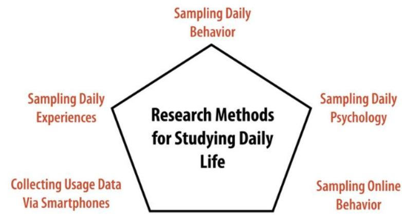
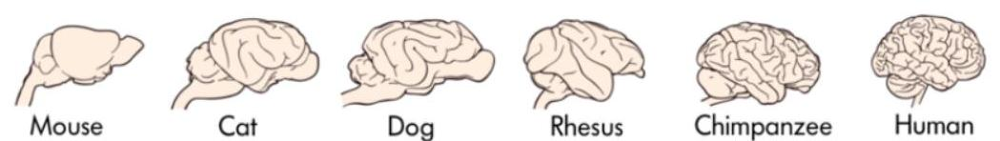
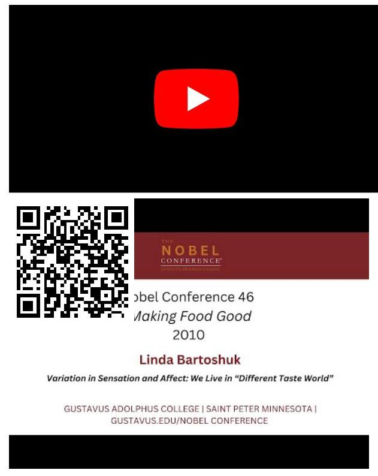
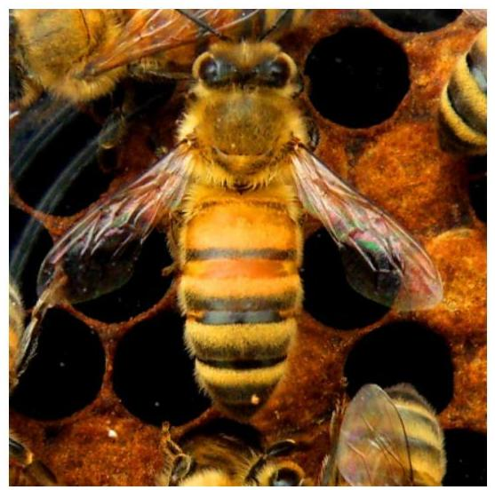
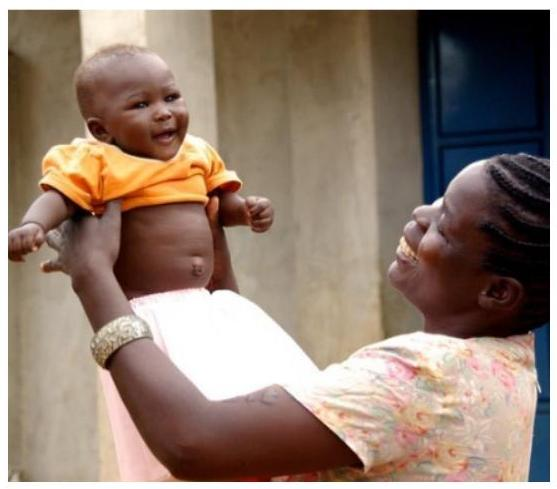
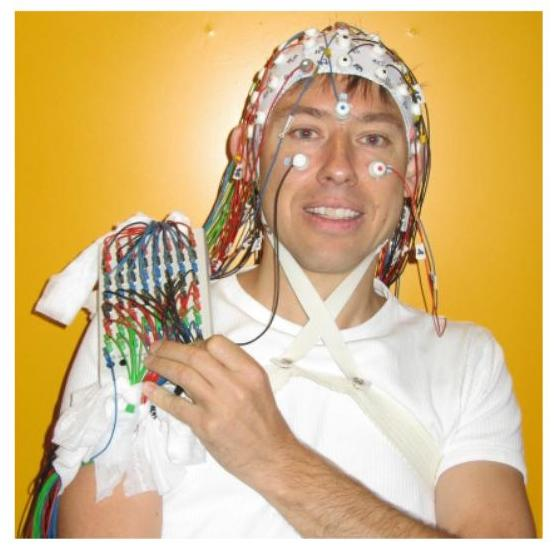
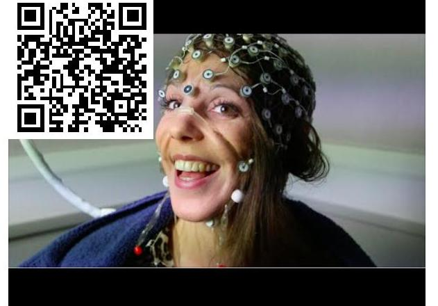
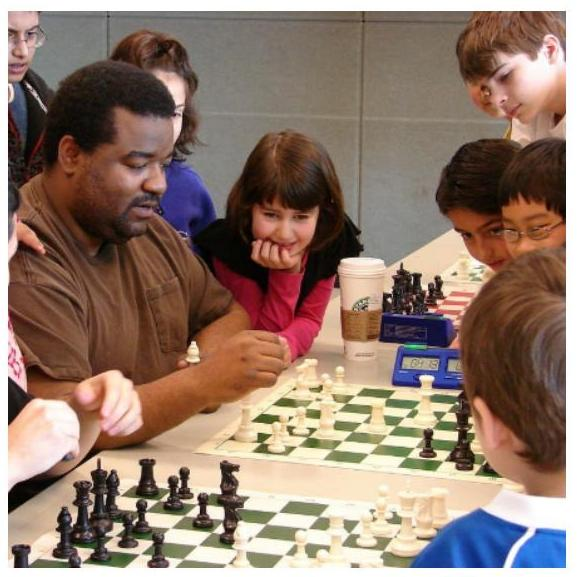

# UNDERSTANDING BIOLOGICAL BEHAVIOR 

Michael Miguel
Coalinga College# Understanding Biological Behavior 

Michael Miguel
Coalinga CollegeThis text is disseminated via the Open Education Resource (OER) LibreTexts Project (https://LibreTexts.org) and like the hundreds of other texts available within this powerful platform, it is freely available for reading, printing and "consuming." Most, but not all, pages in the library have licenses that may allow individuals to make changes, save, and print this book. Carefully consult the applicable license(s) before pursuing such effects.

Instructors can adopt existing LibreTexts texts or Remix them to quickly build course-specific resources to meet the needs of their students. Unlike traditional textbooks, LibreTexts' web based origins allow powerful integration of advanced features and new technologies to support learning.

The LibreTexts mission is to unite students, faculty and scholars in a cooperative effort to develop an easy-to-use online platform for the construction, customization, and dissemination of OER content to reduce the burdens of unreasonable textbook costs to our students and society. The LibreTexts project is a multi-institutional collaborative venture to develop the next generation of openaccess texts to improve postsecondary education at all levels of higher learning by developing an Open Access Resource environment. The project currently consists of 14 independently operating and interconnected libraries that are constantly being optimized by students, faculty, and outside experts to supplant conventional paper-based books. These free textbook alternatives are organized within a central environment that is both vertically (from advance to basic level) and horizontally (across different fields) integrated.

The LibreTexts libraries are Powered by NICE CXOne and are supported by the Department of Education Open Textbook Pilot Project, the UC Davis Office of the Provost, the UC Davis Library, the California State University Affordable Learning Solutions Program, and Merlot. This material is based upon work supported by the National Science Foundation under Grant No. 1246120, 1525057, and 1413739.

Any opinions, findings, and conclusions or recommendations expressed in this material are those of the author(s) and do not necessarily reflect the views of the National Science Foundation nor the US Department of Education.

Have questions or comments? For information about adoptions or adaptions contact info@LibreTexts.org. More information on our activities can be found via Facebook (https://facebook.com/Libretexts), Twitter (https://twitter.com/libretexts), or our blog (http://Blog.Libretexts.org).# TABLE OF CONTENTS 

## Licensing

## 1: Introduction

- 1.1: The Brain
- 1.1.1: Learning Objective and Introduction
- 1.1.2: The Anatomy of the Brain
- 1.1.3: A Brain Divided
- 1.1.4: Studying the Human Brain
- 1.1.5: Outside Resources
- 1.1.6: Vocabulary
- 1.1.7: References
- 1.2: The Nature-Nurture Question
- 1.2.1: Learning Objectives and Introduction
- 1.2.2: What Have We Learned About Nature-Nurture?
- 1.2.3: Outside Resources
- 1.2.4: Vocabulary
- 1.2.5: References
- 1.3: Conducting Psychology Research in the Real World
- 1.3.1: Learning Objectives and Introduction
- 1.3.2: Rationale for Conducting Psychology Research in the Real World
- 1.3.3: Studying Daily Behavior
- 1.3.4: Studying Online Behavior
- 1.3.5: Outside Resources
- 1.3.6: Vocabulary
- 1.3.7: References

## 2: Nerve Cells and How They Communicate

- 2.1: Neurons
- 2.1.1: Learning Objectives and Introduction
- 2.1.2: The Structure of the Neuron
- 2.1.3: Communication Within and Between Neurons
- 2.1.4: The Change in Membrane Potential During an Action Potential
- 2.1.5: Outside Resources
- 2.1.6: Vocabulary
- 2.1.7: References

## 3: The Nervous System

- 3.1: The Brain and the Nervous System
- 3.1.1: Learning Objectives and Introduction
- 3.1.2: Nervous System development across the human lifespan
- 3.1.3: The Central Nervous System- Looking at the brain as a whole
- 3.1.4: The Peripheral Nervous System
- 3.1.5: Outside Resources
- 3.1.6: Vocabulary
- 3.1.7: References# LibreTexts 

- 3.2: The Nervous System
- 3.2.1: Learning Objectives and Introduction
- 3.2.2: Development of the Nervous System
- 3.2.3: The Central Nervous System
- 3.2.4: Studying the Nervous System
- 3.2.5: Outside Resources
- 3.2.6: Vocabulary
- 3.2.7: References

## 4: Development and Plasticity of the Brain

- 4.1: Epigenetics in Psychology
- 4.1.1: Learning Objective and Introduction
- 4.1.2: Molecular Control of Gene Expression- The Dynamic Epigenome
- 4.1.3: Early Childhood Experience
- 4.1.4: Child Nutrition and the Epigenome
- 4.1.5: Epigenetic Mechanisms in Psychological Disorders
- 4.1.6: Outside Resources
- 4.1.7: Vocabulary
- 4.1.8: References

## 5: Vision and Perception

- 5.1: Vision
- 5.1.1: Learning Objectives and Introduction
- 5.1.2: The Importance of Contrast
- 5.1.3: The Reconstruction and Process
- 5.1.4: Integration with Other Modalities
- 5.1.5: Outside Resources
- 5.1.6: Vocabulary
- 5.1.7: References
- 5.2: Multi-Modal Perception
- 5.2.1: Learning Objectives and Introduction
- 5.2.2: Questions About Multimodal Perception
- 5.2.3: Crossmodal Receptive Fields
- 5.2.4: Behavioral Effects of Multimodal Perception
- 5.2.5: Tactile/Visual Interactions in Body Ownership
- 5.2.6: Crossmodal Speech
- 5.2.7: Outside Resources
- 5.2.8: Vocabulary
- 5.2.9: References

## 6: Other Sensory Systems and Attention

- 6.1: Hearing
- 6.1.1: Learning Objectives and Introduction
- 6.1.2: Perceptual Attributes of Sound
- 6.1.3: An Overview of the Auditory System
- 6.1.4: Audibility, Masking, and Frequency Selectivity
- 6.1.5: Auditory Scene Analysis
- 6.1.6: Outside Resources
- 6.1.7: Vocabulary
- 6.1.8: References# LibreTexts 

- 6.2: Taste and Smell
- 6.2.1: Learning Objectives and Introduction
- 6.2.2: Taste and Smell Anatomy
- 6.2.3: Solving the omnivore's dilemma- Taste affects is hard-wired
- 6.2.4: Central interactions- Key to Understanding taste damage
- 6.2.5: Outside Resources
- 6.2.6: Vocabulary
- 6.2.7: References
- 6.3: Touch and Pain
- 6.3.1: Learning Objectives and Introduction
- 6.3.2: Sensation
- 6.3.3: Action Potentials in the Receptor Cells Travel as Nerve Impulses with Different Speeds
- 6.3.4: Modulation
- 6.3.5: When Touch Becomes Painful or Pain Becomes Chronic
- 6.3.6: Outside Resources
- 6.3.7: Vocabulary
- 6.3.8: References

## 7: Movement

- 7.1: The Vestibular System
- 7.1.1: Learning Objectives and Introduction
- 7.1.2: Structure of the Vestibular receptors
- 7.1.3: The vestibular nuclei
- 7.1.4: Vestibulo-spinal network
- 7.1.5: Spatial orientation and navigation
- 7.1.6: Outside Resources
- 7.1.7: Vocabulary
- 7.1.8: References

## 8: States of Consciousness

- 8.1: States of Consciousness
- 8.1.1: Learning Objectives and Introduction
- 8.1.2: Levels of Awareness
- 8.1.3: High Awareness
- 8.1.4: Other States of Consciousness
- 8.1.5: Psychoactive Drugs
- 8.1.6: Outside Resources
- 8.1.7: Vocabulary
- 8.1.8: References
- 8.2: Consciousness
- 8.2.1: Learning Objectives and Introduction
- 8.2.2: Other Minds
- 8.2.3: Conscious Experiences of Visual Perception
- 8.2.4: Conscious Experiences of Body Awareness
- 8.2.5: Outside Resources
- 8.2.6: Vocabulary
- 8.2.7: References
- 8.3: Attention
- 8.3.1: Learning Objectives and Introduction
- 8.3.2: Selective Attention# LibreTexts 

- 8.3.3: Late Selection Models
- 8.3.4: Divided Attention and Multitasking
- 8.3.5: Outside Resources
- 8.3.6: Vocabulary
- 8.3.7: References

## 9: Internal Regulation

- 9.1: Drive States
- 9.1.1: Learning Objectives and Introduction
- 9.1.2: Key Properties of Drive States
- 9.1.3: Two Illustrative Drive States
- 9.1.4: Outside Resources
- 9.1.5: Vobabulary
- 9.1.6: References

## 10: Reproductive Behaviors

- 10.1: Hormones and Behavior
- 10.1.1: Learning Objectives and Introductions
- 10.1.2: Sex Differences
- 10.1.3: Aggressive Behaviors
- 10.1.4: Parental Behaviors
- 10.1.5: Outside Resources
- 10.1.6: Vocabulary
- 10.1.7: References
- 10.2: Biochemistry of Love
- 10.2.1: Learning Objectives and Introduction
- 10.2.2: The Evolution of Social Behavior
- 10.2.3: Stress and Love
- 10.2.4: Fatherhood also has a biological basis
- 10.2.5: Can love - or perhaps oxytocin - be a medicine?
- 10.2.6: Outside Resources
- 10.2.7: Vocabulary
- 10.2.8: References

## 11: Emotional Behaviors

- 11.1: Social Neuroscience
- 11.1.1: Learning Objectives and Introduction
- 11.1.2: What is Social Neuroscience?
- 11.1.3: Do We Use Our Own Behavior to Help Us Understand Others?
- 11.1.4: What is the Cost of Social Stress?
- 11.1.5: Outside Resources
- 11.1.6: Vocabulary
- 11.1.7: References
- 11.2: Affective Neuroscience
- 11.2.1: Learning Objectives and Introduction
- 11.2.2: Basic Emotions
- 11.2.3: Fear- The neural system of freezing and fleeing
- 11.2.4: Plasticity- Experiences can alter the brain
- 11.2.5: Outside Resources# LibreTexts 

- 11.2.6: Vocabulary
- 11.2.7: References
- 11.3: The Healthy Life
- 11.3.1: Learning Objectives and Introduction
- 11.3.2: Stress and Health
- 11.3.3: Coping Strategies
- 11.3.4: Stress Management
- 11.3.5: Being a Health Psychologist
- 11.3.6: Outside Resources
- 11.3.7: Vocabulary
- 11.3.8: References

## 12: The Biology of Learning and Memory

- 12.1: Memory (Encoding, Storage, Retrieval)
- 12.1.1: Learning Objectives and Introduction
- 12.1.2: Varieties of Memory
- 12.1.3: Encoding
- 12.1.4: Storage
- 12.1.5: Retrieval
- 12.1.6: Outside Resources
- 12.1.7: Vocabulary
- 12.1.8: References
- 12.2: Conditioning and Learning
- 12.2.1: Learning Objectives and Introduction
- 12.2.2: Useful Things to Know about Classical Conditioning
- 12.2.3: The Learning Process
- 12.2.4: Instrumental Responses Come Under Stimulus Control
- 12.2.5: Putting Classical and Instrumental Conditioning Together
- 12.2.6: Outside Resources
- 12.2.7: Vocabulary
- 12.2.8: References
- 12.3: Forgetting and Amnesia
- 12.3.1: Learning Objectives and Introduction
- 12.3.2: Causes of Forgetting
- 12.3.3: Adaptive Forgetting
- 12.3.4: Outside Resources
- 12.3.5: Vocabulary
- 12.3.6: References
- 12.4: Factors Influencing Learning
- 12.4.1: Learning Objectives and Introduction
- 12.4.2: Learners
- 12.4.3: General Principles of Learning
- 12.4.4: Outside Resources
- 12.4.5: Vocabulary
- 12.4.6: References

## 13: Lateralization and Language

- 13.1: Language and Language Use
- 13.1.1: Learning Objectives and Introduction# LibreTexts 

- 13.1.2: How Do We Use Language?
- 13.1.3: What Do We Talk About?
- 13.1.4: Psychological Consequences of Language Use
- 13.1.5: Vocabulary
- 13.1.6: References

## 14: Psychological Disorders

- 14.1: Psychopharmacology
- 14.1.1: Learning Objectives and Introduction
- 14.1.2: Pharmacokinetics- What Is It - Why Is It Important?
- 14.1.3: Recent Issues Related to Psychotropic Drugs and Metabolism
- 14.1.4: Other Controversial Issues
- 14.1.5: Outside Resources
- 14.1.6: Vocabulary
- 14.1.7: 14.1.7-References
- 14.2: Mood Disorders
- 14.2.1: Learning Objectives and Introduction
- 14.2.2: What Are Mood Disorders?
- 14.2.3: How Common Are Mood Disorders? Who Develops Mood Disorders?
- 14.2.4: What Are Some of the Factors Implicated in the Development and Course of Mood Disorders?
- 14.2.5: What Are Some of the Well-Supported Treatments for Mood Disorders?
- 14.2.6: Outside Resources
- 14.2.7: Vocabulary
- 14.2.8: References
- 14.3: Schizophrenia Spectrum Disorders
- 14.3.1: Learning Objectives and Introduction
- 14.3.2: The phenomenology of schizophrenia and related psychotic disorders
- 14.3.3: The Cognitive Neuroscience of schizophrenia
- 14.3.4: Risk factors for developing schizophrenia
- 14.3.5: Treatment of Schizophrenia
- 14.3.6: Outside Resources
- 14.3.7: Vocabulary
- 14.3.8: References

## Index

## Glossary

## Detailed Licensing

Detailed Licensing# (3) LibreTexts 

## Licensing

A detailed breakdown of this resource's licensing can be found in Back Matter/Detailed Licensing.# CHAPTER OVERVIEW 

## 1: Introduction

1.1: The Brain
1.1.1: Learning Objective and Introduction
1.1.2: The Anatomy of the Brain
1.1.3: A Brain Divided
1.1.4: Studying the Human Brain
1.1.5: Outside Resources
1.1.6: Vocabulary
1.1.7: References
1.2: The Nature-Nurture Question
1.2.1: Learning Objectives and Introduction
1.2.2: What Have We Learned About Nature-Nurture?
1.2.3: Outside Resources
1.2.4: Vocabulary
1.2.5: References
1.3: Conducting Psychology Research in the Real World
1.3.1: Learning Objectives and Introduction
1.3.2: Rationale for Conducting Psychology Research in the Real World
1.3.3: Studying Daily Behavior
1.3.4: Studying Online Behavior
1.3.5: Outside Resources
1.3.6: Vocabulary
1.3.7: References

This page titled 1: Introduction is shared under a CC BY-NC-SA 4.0 license and was authored, remixed, and/or curated by Michael Miguel.# SECTION OVERVIEW 

### 1.1: The Brain

### 1.1.1: Learning Objective and Introduction

1.1.2: The Anatomy of the Brain

### 1.1.3: A Brain Divided

1.1.4: Studying the Human Brain

### 1.1.5: Outside Resources

1.1.6: Vocabulary

### 1.1.7: References

The Brain by Diane Beck and Evelina Tapia is licensed under a Creative Commons Attribution-NonCommercial-ShareAlike 4.0 International License. Permissions beyond the scope of this license may be available in our Licensing Agreement.

This page titled 1.1: The Brain is shared under a CC BY-NC-SA 4.0 license and was authored, remixed, and/or curated by Michael Miguel.# 1.1.1: Learning Objective and Introduction 

## Learning Objectives

- Name and describe the basic function of the brain stem, cerebellum, and cerebral hemispheres.
- Name and describe the basic function of the four cerebral lobes: occipital, temporal, parietal, and frontal cortex.
- Describe a split-brain patient and at least two important aspects of brain function that these patients reveal.
- Distinguish between gray and white matter of the cerebral hemispheres.
- Name and describe the most common approaches to studying the human brain.
- Distinguish among four neuroimaging methods: PET, fMRI, EEG, and DOI.
- Describe the difference between spatial and temporal resolution with regard to brain function.

## Introduction

Any textbook on psychology would be incomplete without reference to the brain. Every behavior, thought, or experience described in the other modules must be implemented in the brain. A detailed understanding of the human brain can help us make sense of human experience and behavior. For example, one well-established fact about human cognition is that it is limited. We cannot do two complex tasks at once: We cannot read and carry on a conversation at the same time, text and drive, or surf the Internet while listening to a lecture, at least not successfully or safely. We cannot even pat our head and rub our stomach at the same time (with exceptions, see "A Brain Divided"). Why is this? Many people have suggested that such limitations reflect the fact that the behaviors draw on the same resource; if one behavior uses up most of the resource there is not enough resource left for the other. But what might this limited resource be in the brain?

Figure 1. An MRI of the human brain delineating three major structures: the cerebral hemispheres, brain stem, and cerebellum.
The brain uses oxygen and glucose, delivered via the blood. The brain is a large consumer of these metabolites, using 20\% of the oxygen and calories we consume despite being only $2 \%$ of our total weight. However, as long as we are not oxygen-deprived or malnourished, we have more than enough oxygen and glucose to fuel the brain. Thus, insufficient "brain fuel" cannot explain our limited capacity. Nor is it likely that our limitations reflect too few neurons. The average human brain contains 86 billion neurons. It is also not the case that we use only $10 \%$ of our brain, a myth that was likely started to imply we had untapped potential. Modern neuroimaging (see "Studying the Human Brain") has shown that we use all parts of brain, just at different times, and certainly more than $10 \%$ at any one time.

If we have an abundance of brain fuel and neurons, how can we explain our limited cognitive abilities? Why can't we do more at once? The most likely explanation is the way these neurons are wired up. We know, for instance, that many neurons in the visual cortex (the part of the brain responsible for processing visual information) are hooked up in such a way as to inhibit each other (Beck \& Kastner, 2009). When one neuron fires, it suppresses the firing of other nearby neurons. If two neurons that are hooked up in an inhibitory way both fire, then neither neuron can fire as vigorously as it would otherwise. This competitive behavior among neurons limits how much visual information the brain can respond to at the same time. Similar kinds of competitive wiring among# LibreTexts 

neurons may underlie many of our limitations. Thus, although talking about limited resources provides an intuitive description of our limited capacity behavior, a detailed understanding of the brain suggests that our limitations more likely reflect the complex way in which neurons talk to each other rather than the depletion of any specific resource.

The Brain by Diane Beck and Evelina Tapia is licensed under a Creative Commons Attribution-NonCommercial-ShareAlike 4.0 International License. Permissions beyond the scope of this license may be available in our Licensing Agreement.

This page titled 1.1.1: Learning Objective and Introduction is shared under a CC BY-NC-SA 4.0 license and was authored, remixed, and/or curated by Michael Miguel.# 1.1.2: The Anatomy of the Brain 

There are many ways to subdivide the mammalian brain, resulting in some inconsistent and ambiguous nomenclature over the history of neuroanatomy (Swanson, 2000). For simplicity, we will divide the brain into three basic parts: the brain stem, cerebellum, and cerebral hemispheres (see Figure 1). In Figure 2, however, we depict other prominent groupings (Swanson, 2000) of the six major subdivisions of the brain (Kandal, Schwartz, \& Jessell, 2000).

## Brain Stem

The brain stem is sometimes referred to as the "trunk" of the brain. It is responsible for many of the neural functions that keep us alive, including regulating our respiration (breathing), heart rate, and digestion. In keeping with its function, if a patient sustains severe damage to the brain stem he or she will require "life support" (i.e., machines are used to keep him or her alive). Because of its vital role in survival, in many countries a person who has lost brain stem function is said to be "brain dead," although other countries require significant tissue loss in the cortex (of the cerebral hemispheres), which is responsible for our conscious experience, for the same diagnosis. The brain stem includes the medulla, pons, midbrain, and diencephalon (which consists of thalamus and hypothalamus). Collectively, these regions also are involved in our sleep-wake cycle, some sensory and motor function, as well as growth and other hormonal behaviors.

Figure 2. A sample of neuroanatomy nomenclature. The colored boxes indicate the different groupings of the seven structures printed in black, with the labels matching the color of the boxes. The hindbrain, midbrain, and forebrain nomenclature stems from the development of the vertebrate brain; these three areas differentiate early in embryonic development and later give rise to the structures listed in black. These three areas further subdivide into the telencephalon, diencephalon, mesencephalon, metencephalon, and myelencephalon at a later stage of development.

## Cerebellum

The cerebellum is the distinctive structure at the back of the brain. The Greek philosopher and scientist Aristotle aptly referred to it as the "small brain" ("parencephalon" in Greek, "cerebellum" in Latin) in order to distinguish it from the "large brain" ("encephalon" in Greek, "cerebrum" in Latin). The cerebellum is critical for coordinated movement and posture. More recently, neuroimaging studies (see "Studying the Human Brain") have implicated it in a range of cognitive abilities, including language. It is perhaps not surprising that the cerebellum's influence extends beyond that of movement and posture, given that it contains the greatest number of neurons of any structure in the brain. However, the exact role it plays in these higher functions is still a matter of further study.

## Cerebral Hemispheres

The four lobes of the brain and the cerebellum. [Image: MIT OpenCourseWare, https://goo.gl/RwUEVt, CC BY-NC-SA 2.0, https://goo.gl/Toc0ZF]

The cerebral hemispheres are responsible for our cognitive abilities and conscious experience. They consist of the cerebral cortex and accompanying white matter ("cerebrum" in Latin) as well as the subcortical structures of the basal ganglia, amygdala, and hippocampal formation. The cerebral cortex is the largest and most visible part of the brain, retaining the Latin name (cerebrum) for "large brain" that Aristotle coined. It consists of two hemispheres (literally two half spheres) and gives the brain its characteristic gray and convoluted appearance; the folds and grooves of the cortex are called gyri and sulci (gyrus and sulcus if referring to just one), respectively.

The two cerebral hemispheres can be further subdivided into four lobes: the occipital, temporal, parietal, and frontal lobes. The occipital lobe is responsible for vision, as is much of the temporal lobe. The temporal lobe is also involved in auditory processing, memory, and multisensory integration (e.g., the convergence of vision and audition). The parietal lobe houses the somatosensory (body sensations) cortex and structures involved in visual attention, as well as multisensory convergence zones. The frontal lobe houses the motor cortex and structures involved in motor planning, language, judgment, and decision-making. Not surprisingly then, the frontal lobe is proportionally larger in humans than in any other animal.

The subcortical structures are so named because they reside beneath the cortex. The basal ganglia are critical to voluntary movement and as such make contact with the cortex, the thalamus, and the brain stem. The amygdala and hippocampal formation are part of the limbic system, which also includes some cortical structures. The limbic system plays an important role in emotion and, in particular, in aversion and gratification.

The Brain by Diane Beck and Evelina Tapia is licensed under a Creative Commons Attribution-NonCommercial-ShareAlike 4.0 International License. Permissions beyond the scope of this license may be available in our Licensing Agreement.

This page titled 1.1.2: The Anatomy of the Brain is shared under a CC BY-NC-SA 4.0 license and was authored, remixed, and/or curated by Michael Miguel.# LibreTexts 

### 1.1.3: A Brain Divided

The two cerebral hemispheres are connected by a dense bundle of white matter tracts called the corpus callosum. Some functions are replicated in the two hemispheres. For example, both hemispheres are responsible for sensory and motor function, although the sensory and motor cortices have a contralateral (or opposite-side) representation; that is, the left cerebral hemisphere is responsible for movements and sensations on the right side of the body and the right cerebral hemisphere is responsible for movements and sensations on the left side of the body. Other functions are lateralized; that is, they reside primarily in one hemisphere or the other. For example, for right-handed and the majority of left-handed individuals, the left hemisphere is most responsible for language.

There are some people whose two hemispheres are not connected, either because the corpus callosum was surgically severed (callosotomy) or due to a genetic abnormality. These split-brain patients have helped us understand the functioning of the two hemispheres. First, because of the contralateral representation of sensory information, if an object is placed in only the left or only the right visual hemifield, then only the right or left hemisphere, respectively, of the split-brain patient will see it. In essence, it is as though the person has two brains in his or her head, each seeing half the world. Interestingly, because language is very often localized in the left hemisphere, if we show the right hemisphere a picture and ask the patient what she saw, she will say she didn't see anything (because only the left hemisphere can speak and it didn't see anything). However, we know that the right hemisphere sees the picture because if the patient is asked to press a button whenever she sees the image, the left hand (which is controlled by the right hemisphere) will respond despite the left hemisphere's denial that anything was there. There are also some advantages to having disconnected hemispheres. Unlike those with a fully functional corpus callosum, a split-brain patient can simultaneously search for something in his right and left visual fields (Luck, Hillyard, Mangun, \& Gazzaniga, 1989) and can do the equivalent of rubbing his stomach and patting his head at the same time (Franz, Eliason, Ivry, \& Gazzaniga, 1996). In other words, they exhibit less competition between the hemispheres.

## Gray Versus White Matter

The cerebral hemispheres contain both grey and white matter, so called because they appear grayish and whitish in dissections or in an MRI (magnetic resonance imaging; see, "Studying the Human Brain"). The gray matter is composed of the neuronal cell bodies (see module, "Neurons"). The cell bodies (or soma) contain the genes of the cell and are responsible for metabolism (keeping the cell alive) and synthesizing proteins. In this way, the cell body is the workhorse of the cell. The white matter is composed of the axons of the neurons, and, in particular, axons that are covered with a sheath of myelin (fatty support cells that are whitish in color). Axons conduct the electrical signals from the cell and are, therefore, critical to cell communication. People use the expression "use your gray matter" when they want a person to think harder. The "gray matter" in this expression is probably a reference to the cerebral hemispheres more generally; the gray cortical sheet (the convoluted surface of the cortex) being the most visible. However, both the gray matter and white matter are critical to proper functioning of the mind. Losses of either result in deficits in language, memory, reasoning, and other mental functions. See Figure 3 for MRI slices showing both the inner white matter that connects the cell bodies in the gray cortical sheet.

Figure 3. MRI slices of the human brain. Both the outer gray matter and inner white matter are visible in each image. The brain is a three-dimensional (3-D) structure, but an image is two-dimensional (2-D). Here, we show example slices of the three possible 2-D cuts through the brain: a saggital slice (top image), a horizontal slice (bottom left), which is also know as a transverse or axial slice, and a coronal slice (bottom right). The bottom two images are color coded to match the illustration of the relative orientations of the three slices in the top image.

The Brain by Diane Beck and Evelina Tapia is licensed under a Creative Commons Attribution-NonCommercial-ShareAlike 4.0 International License. Permissions beyond the scope of this license may be available in our Licensing Agreement.

This page titled 1.1.3: A Brain Divided is shared under a CC BY-NC-SA 4.0 license and was authored, remixed, and/or curated by Michael Miguel.# 1.1.4: Studying the Human Brain 

How do we know what the brain does? We have gathered knowledge about the functions of the brain from many different methods. Each method is useful for answering distinct types of questions, but the strongest evidence for a specific role or function of a particular brain area is converging evidence; that is, similar findings reported from multiple studies using different methods.

One of the first organized attempts to study the functions of the brain was phrenology, a popular field of study in the first half of the 19th century. Phrenologists assumed that various features of the brain, such as its uneven surface, are reflected on the skull; therefore, they attempted to correlate bumps and indentations of the skull with specific functions of the brain. For example, they would claim that a very artistic person has ridges on the head that vary in size and location from those of someone who is very good at spatial reasoning. Although the assumption that the skull reflects the underlying brain structure has been proven wrong, phrenology nonetheless significantly impacted current-day neuroscience and its thinking about the functions of the brain. That is, different parts of the brain are devoted to very specific functions that can be identified through scientific inquiry.

## Neuroanatomy

Dissection of the brain, in either animals or cadavers, has been a critical tool of neuroscientists since 340 BC when Aristotle first published his dissections. Since then this method has advanced considerably with the discovery of various staining techniques that can highlight particular cells. Because the brain can be sliced very thinly, examined under the microscope, and particular cells highlighted, this method is especially useful for studying specific groups of neurons or small brain structures; that is, it has a very high spatial resolution. Dissections allow scientists to study changes in the brain that occur due to various diseases or experiences (e.g., exposure to drugs or brain injuries).

Virtual dissection studies with living humans are also conducted. Here, the brain is imaged using computerized axial tomography (CAT) or MRI scanners; they reveal with very high precision the various structures in the brain and can help detect changes in gray or white matter. These changes in the brain can then be correlated with behavior, such as performance on memory tests, and, therefore, implicate specific brain areas in certain cognitive functions.

## Changing the Brain

Some researchers induce lesions or ablate (i.e., remove) parts of the brain in animals. If the animal's behavior changes after the lesion, we can infer that the removed structure is important for that behavior. Lesions of human brains are studied in patient populations only; that is, patients who have lost a brain region due to a stroke or other injury, or who have had surgical removal of a structure to treat a particular disease (e.g., a callosotomy to control epilepsy, as in split-brain patients). From such case studies, we can infer brain function by measuring changes in the behavior of the patients before and after the lesion.

Because the brain works by generating electrical signals, it is also possible to change brain function with electrical stimulation. Transcranial magnetic stimulation (TMS) refers to a technique whereby a brief magnetic pulse is applied to the head that temporarily induces a weak electrical current in the brain. Although effects of TMS are sometimes referred to as temporary virtual lesions, it is more appropriate to describe the induced electricity as interference with neurons' normal communication with each other. TMS allows very precise study of when events in the brain happen so it has a good temporal resolution, but its application is limited only to the surface of the cortex and cannot extend to deep areas of the brain.

Transcranial direct current stimulation (tDCS) is similar to TMS except that it uses electrical current directly, rather than inducing it with magnetic pulses, by placing small electrodes on the skull. A brain area is stimulated by a low current (equivalent to an AA battery) for a more extended period of time than TMS. When used in combination with cognitive training, tDCS has been shown to improve performance of many cognitive functions such as mathematical ability, memory, attention, and coordination (e.g., Brasil-Neto, 2012; Feng, Bowden, \& Kautz, 2013; Kuo \& Nitsche, 2012).

## Neuroimaging

Neuroimaging tools are used to study the brain in action; that is, when it is engaged in a specific task. Positron emission tomography (PET) records blood flow in the brain. The PET scanner detects the radioactive substance that is injected into the bloodstream of the participant just before or while he or she is performing some task (e.g., adding numbers). Because active neuron populations require metabolites, more blood and hence more radioactive substance flows into those regions. PET scanners detect the injected radioactive substance in specific brain regions, allowing researchers to infer that those areas were active during the task. Functional magnetic resonance imaging (fMRI) also relies on blood flow in the brain. This method, however, measures the# LibreTexts 

changes in oxygen levels in the blood and does not require any substance to be injected into the participant. Both of these tools have good spatial resolution (although not as precise as dissection studies), but because it takes at least several seconds for the blood to arrive to the active areas of the brain, PET and fMRI have poor temporal resolution; that is, they do not tell us very precisely when the activity occurred.

A researcher looking at the areas of activation in the brain of a study participant who had an fMRI scan - areas of brain activation are determined by the amount of blood flow to a certain area - the more blood flow, the higher the activation of that area of the brain. [Image: National Institute of Mental Health, CC0 Public Domain, https://goo.gl/m25gce]

Electroencephalography (EEG), on the other hand, measures the electrical activity of the brain, and therefore, it has a much greater temporal resolution (millisecond precision rather than seconds) than PET or fMRI. Like tDCS, electrodes are placed on the participant's head when he or she is performing a task. In this case, however, many more electrodes are used, and they measure rather than produce activity. Because the electrical activity picked up at any particular electrode can be coming from anywhere in the brain, EEG has poor spatial resolution; that is, we have only a rough idea of which part of the brain generates the measured activity.

Diffuse optical imaging (DOI) can give researchers the best of both worlds: high spatial and temporal resolution, depending on how it is used. Here, one shines infrared light into the brain, and measures the light that comes back out. DOI relies on the fact that the properties of the light change when it passes through oxygenated blood, or when it encounters active neurons. Researchers can then infer from the properties of the collected light what regions in the brain were engaged by the task. When DOI is set up to detect changes in blood oxygen levels, the temporal resolution is low and comparable to PET or fMRI. However, when DOI is set up to directly detect active neurons, it has both high spatial and temporal resolution.

Because the spatial and temporal resolution of each tool varies, strongest evidence for what role a certain brain area serves comes from converging evidence. For example, we are more likely to believe that the hippocampal formation is involved in memory if multiple studies using a variety of tasks and different neuroimaging tools provide evidence for this hypothesis. The brain is a complex system, and only advances in brain research will show whether the brain can ever really understand itself.

The Brain by Diane Beck and Evelina Tapia is licensed under a Creative Commons Attribution-NonCommercial-ShareAlike 4.0 International License. Permissions beyond the scope of this license may be available in our Licensing Agreement.

This page titled 1.1.4: Studying the Human Brain is shared under a CC BY-NC-SA 4.0 license and was authored, remixed, and/or curated by Michael Miguel.# 1.1.5: Outside Resources 

Video: Videos of a split-brain patient

Web: Atlas of the Human Brain: interactive demos and brain sections
http://www.thehumanbrain.info/
Web: Harvard University Human Brain Atlas: normal and diseased brain scans
http://www.med.harvard.edu/aanlib/home.html

## Discussion Questions

1. In what ways does the segmentation of the brain into the brain stem, cerebellum, and cerebral hemispheres provide a natural division?
2. How has the study of split-brain patients been informative?
3. What is behind the expression "use your gray matter," and why is it not entirely accurate?
4. Why is converging evidence the best kind of evidence in the study of brain function?
5. If you were interested in whether a particular brain area was involved in a specific behavior, what neuroscience methods could you use?
6. If you were interested in the precise time in which a particular brain process occurred, which neuroscience methods could you use?

The Brain by Diane Beck and Evelina Tapia is licensed under a Creative Commons Attribution-NonCommercial-ShareAlike 4.0 International License. Permissions beyond the scope of this license may be available in our Licensing Agreement.

This page titled 1.1.5: Outside Resources is shared under a CC BY-NC-SA 4.0 license and was authored, remixed, and/or curated by Michael Miguel.# 1.1.6: Vocabulary 

Vocabulary

## Ablation

Surgical removal of brain tissue.

## Axial plane

See "horizontal plane."

## Basal ganglia

Subcortical structures of the cerebral hemispheres involved in voluntary movement.

## Brain stem

The "trunk" of the brain comprised of the medulla, pons, midbrain, and diencephalon.

## Callosotomy

Surgical procedure in which the corpus callosum is severed (used to control severe epilepsy).

## Case study

A thorough study of a patient (or a few patients) with naturally occurring lesions.

## Cerebellum

The distinctive structure at the back of the brain, Latin for "small brain."

## Cerebral cortex

The outermost gray matter of the cerebrum; the distinctive convoluti characteristic of the mammalian brain.

## Cerebral hemispheres

The cerebral cortex, underlying white matter, and subcortical structures.

## Cerebrum

Usually refers to the cerebral cortex and associated white matter, but in some texts includes the subcortical structures.

## Contralateral

Literally "opposite side"; used to refer to the fact that the two hemispheres of the brain process sensory information and motor commands for the opposite side of the body (e.g., the left hemisphere controls the right side of the body).

## Converging evidence

Similar findings reported from multiple studies using different methods.

## Coronal plane

A slice that runs from head to foot; brain slices in this plane are similar to slices of a loaf of bread, with the eyes being the front of the loaf.

## Diffuse optical imaging (DOI)

A neuroimaging technique that infers brain activity by measuring changes in light as it is passed through the skull and surface of the brain.

## Electroencephalography (EEG)

A neuroimaging technique that measures electrical brain activity via multiple electrodes on the scalp.

## Frontal lobe

The front most (anterior) part of the cerebrum; anterior to the central sulcus and responsible for motor output and planning, language, judgment, and decision-making.

## Functional magnetic resonance imaging (fMRI)

Functional magnetic resonance imaging (fMRI): A neuroimaging technique that infers brain activity by measuring changes in oxygen levels in the blood.

## Gray matter

The outer grayish regions of the brain comprised of the neurons' cell bodies.

## Gyri

(plural) Folds between sulci in the cortex.# Gyrus 

A fold between sulci in the cortex.

## Horizontal plane

A slice that runs horizontally through a standing person (i.e., parallel to the floor); slices of brain in this plane divide the top and bottom parts of the brain; this plane is similar to slicing a hamburger bun.

## Lateralized

To the side; used to refer to the fact that specific functions may reside primarily in one hemisphere or the other (e.g., for the majority individuals, the left hemisphere is most responsible for language).

## Lesion

A region in the brain that suffered damage through injury, disease, or medical intervention.

## Limbic system

Includes the subcortical structures of the amygdala and hippocampal formation as well as some cortical structures; responsible for aversion and gratification.

## Metabolite

A substance necessary for a living organism to maintain life.

## Motor cortex

Region of the frontal lobe responsible for voluntary movement; the motor cortex has a contralateral representation of the human body.

## Myelin

Fatty tissue, produced by glial cells (see module, "Neurons") that insulates the axons of the neurons; myelin is necessary for normal conduction of electrical impulses among neurons.

## Nomenclature

Naming conventions.

## Occipital lobe

The back most (posterior) part of the cerebrum; involved in vision.

## Parietal lobe

The part of the cerebrum between the frontal and occipital lobes; involved in bodily sensations, visual attention, and integrating the senses.

## Phrenology

A now-discredited field of brain study, popular in the first half of the 19th century that correlated bumps and indentations of the skull with specific functions of the brain.

## Positron emission tomography (PET)

A neuroimaging technique that measures brain activity by detecting the presence of a radioactive substance in the brain that is initially injected into the bloodstream and then pulled in by active brain tissue.

## Sagittal plane

A slice that runs vertically from front to back; slices of brain in this plane divide the left and right side of the brain; this plane is similar to slicing a baked potato lengthwise.

## Somatosensory (body sensations) cortex

The region of the parietal lobe responsible for bodily sensations; the somatosensory cortex has a contralateral representation of the human body.

## Spatial resolution

A term that refers to how small the elements of an image are; high spatial resolution means the device or technique can resolve very small elements; in neuroscience it describes how small of a structure in the brain can be imaged.

## Split-brain patient

A patient who has had most or all of his or her corpus callosum severed.

## Subcortical

Structures that lie beneath the cerebral cortex, but above the brain stem.

## Sulci# LibreTexts 

(plural) Grooves separating folds of the cortex.

## Sulcus

A groove separating folds of the cortex.

## Temporal lobe

The part of the cerebrum in front of (anterior to) the occipital lobe and below the lateral fissure; involved in vision, auditory processing, memory, and integrating vision and audition.

## Temporal resolution

A term that refers to how small a unit of time can be measured; high temporal resolution means capable of resolving very small units of time; in neuroscience it describes how precisely in time a process can be measured in the brain.

## Transcranial direct current stimulation (tDCS)

A neuroscience technique that passes mild electrical current directly through a brain area by placing small electrodes on the skull.

## Transcranial magnetic stimulation (TMS)

A neuroscience technique whereby a brief magnetic pulse is applied to the head that temporarily induces a weak electrical current that interferes with ongoing activity.

## Transverse plane

See "horizontal plane."

## Visual hemifield

The half of visual space (what we see) on one side of fixation (where we are looking); the left hemisphere is responsible for the right visual hemifield, and the right hemisphere is responsible for the left visual hemifield.

## White matter

The inner whitish regions of the cerebrum comprised of the myelinated axons of neurons in the cerebral cortex.

The Brain by Diane Beck and Evelina Tapia is licensed under a Creative Commons Attribution-NonCommercial-ShareAlike 4.0 International License. Permissions beyond the scope of this license may be available in our Licensing Agreement,

This page titled 1.1.6: Vocabulary is shared under a CC BY-NC-SA 4.0 license and was authored, remixed, and/or curated by Michael Miguel.# LibreTexts 

### 1.1.7: References

## References

- Beck, D. M., \& Kastner, S. (2009). Top-down and bottom-up mechanisms in biasing competition in the human brain. Vision Research, 49, 1154-1165.
- Brasil-Neto, J. P. (2012). Learning, memory, and transcranial direct current stimulation. Frontiers in Psychiatry, 3(80). doi: 10.3389/fpsyt.2012.00080.
- Feng, W. W., Bowden, M. G., \& Kautz, S. (2013). Review of transcranial direct current stimulation in poststroke recovery. Topics in Stroke Rehabilitation, 20, 68-77.
- Franz, E. A., Eliassen, J. C., Ivry, R. B., \& Gazzaniga, M. S. (1996). Dissociation of spatial and temporal coupling in the bimanual movements of callosotomy patients. Psychological Science, 7, 306-310.
- Kandal, E. R., Schwartz, J. H., \& Jessell, T. M. (Eds.) (2000). Principles of neural science (Vol. 4). New York, NY: McGrawHill.
- Kuo, M. F., \& Nitsche, M. A. (2012). Effects of transcranial electrical stimulation on cognition. Clinical EEG and Neuroscience, 43, 192-199.
- Luck, S. J., Hillyard, S. A., Mangun, G. R., \& Gazzaniga, M. S. (1989). Independent hemispheric attentional systems mediate visual search in split-brain patients. Nature, 342, 543-545.
- Swanson, L. (2000). What is the brain? Trends in Neurosciences, 23, 519-527.

## Authors

## Diane Beck

Diane Beck, Associate Professor of Psychology at the University of Illinois, Urbana-Champaign. She uses behavioral methods, fMRI, EEG, optical imaging and transcranial magnetic stimulation to study visual perception and attention in the human brain.

## Evelina Tapia

Evelina Tapia, currently a postdoctoral researcher at the University of Illinois, received her Ph.D. from the University of Houston. She uses both behavioral methods and transcranial magnetic stimulation to study the brain processes involved in visual awareness.

## Creative Commons License

The Brain by Diane Beck and Evelina Tapia is licensed under a Creative Commons Attribution-NonCommercial-ShareAlike 4.0 International License. Permissions beyond the scope of this license may be available in our Licensing Agreement.

## How to cite this Noba module using APA Style

Beck, D. \& Tapia, E. (2024). The brain. In R. Biswas-Diener \& E. Diener (Eds), Noba textbook series: Psychology. Champaign, IL: DEF publishers. Retrieved from http://noba.to/jx7268sd# LibreTexts 

This page titled 1.1.7: References is shared under a CC BY-NC-SA 4.0 license and was authored, remixed, and/or curated by Michael Miguel.# SECTION OVERVIEW 

## 1.2: The Nature-Nurture Question

### 1.2.1: Learning Objectives and Introduction

### 1.2.2: What Have We Learned About Nature-Nurture?

### 1.2.3: Outside Resources

### 1.2.4: Vocabulary

### 1.2.5: References

The Nature-Nurture Question by Eric Turkheimer is licensed under a Creative Commons Attribution-NonCommercial-ShareAlike 4.0 International License. Permissions beyond the scope of this license may be available in our Licensing Agreement.

This page titled 1.2: The Nature-Nurture Question is shared under a CC BY-NC-SA 4.0 license and was authored, remixed, and/or curated by Michael Miguel.# 1.2.1: Learning Objectives and Introduction 

## Learning Objectives

- Understand what the nature-nurture debate is and why the problem fascinates us.
- Understand why nature-nurture questions are difficult to study empirically.
- Know the major research designs that can be used to study nature-nurture questions.
- Appreciate the complexities of nature-nurture and why questions that seem simple turn out not to have simple answers.

## Introduction

There are three related problems at the intersection of philosophy and science that are fundamental to our understanding of our relationship to the natural world: the mind-body problem, the free will problem, and the nature-nurture problem. These great questions have a lot in common. Everyone, even those without much knowledge of science or philosophy, has opinions about the answers to these questions that come simply from observing the world we live in. Our feelings about our relationship with the physical and biological world often seem incomplete. We are in control of our actions in some ways, but at the mercy of our bodies in others; it feels obvious that our consciousness is some kind of creation of our physical brains, at the same time we sense that our awareness must go beyond just the physical. This incomplete knowledge of our relationship with nature leaves us fascinated and a little obsessed, like a cat that climbs into a paper bag and then out again, over and over, mystified every time by a relationship between inner and outer that it can see but can't quite understand.

It may seem obvious that we are born with certain characteristics while others are acquired, and yet of the three great questions about humans' relationship with the natural world, only nature-nurture gets referred to as a "debate." In the history of psychology, no other question has caused so much controversy and offense: We are so concerned with nature-nurture because our very sense of moral character seems to depend on it. While we may admire the athletic skills of a great basketball player, we think of his height as simply a gift, a payoff in the "genetic lottery." For the same reason, no one blames a short person for his height or someone's congenital disability on poor decisions: To state the obvious, it's "not their fault." But we do praise the concert violinist (and perhaps her parents and teachers as well) for her dedication, just as we condemn cheaters, slackers, and bullies for their bad behavior.

The problem is, most human characteristics aren't usually as clear-cut as height or instrument-mastery, affirming our naturenurture expectations strongly one way or the other. In fact, even the great violinist might have some inborn qualities-perfect pitch, or long, nimble fingers-that support and reward her hard work. And the basketball player might have eaten a diet while growing up that promoted his genetic tendency for being tall. When we think about our own qualities, they seem under our control in some respects, yet beyond our control in others. And often the traits that don't seem to have an obvious cause are the ones that concern us the most and are far more personally significant. What about how much we drink or worry? What about our honesty, or religiosity, or sexual orientation? They all come from that uncertain zone, neither fixed by nature nor totally under our own control.
Researchers have learned a great deal about the nature-nurture dynamic by working with animals. But of course many of the techniques used to study animals cannot be applied to people. Separating these two influences in human subjects is a greater research challenge. [Image: Sebastin Dario, https://goo.gl/OPiIWd, CC BY-NC 2.0, https://goo.gl/FIIc2e]

One major problem with answering nature-nurture questions about people is, how do you set up an experiment? In nonhuman animals, there are relatively straightforward experiments for tackling nature-nurture questions. Say, for example, you are interested in aggressiveness in dogs. You want to test for the more important determinant of aggression: being born to aggressive dogs or being raised by them. You could mate two aggressive dogs-angry Chihuahuas-together, and mate two nonaggressive dogshappy beagles-together, then switch half the puppies from each litter between the different sets of parents to raise. You would then have puppies born to aggressive parents (the Chihuahuas) but being raised by nonaggressive parents (the Beagles), and vice versa, in litters that mirror each other in puppy distribution. The big questions are: Would the Chihuahua parents raise aggressive beagle puppies? Would the beagle parents raise nonaggressive Chihuahua puppies? Would the puppies' nature win out, regardless of who raised them? Or... would the result be a combination of nature and nurture? Much of the most significant nature-nurture research has been done in this way (Scott \& Fuller, 1998), and animal breeders have been doing it successfully for thousands of years. In fact, it is fairly easy to breed animals for behavioral traits.

With people, however, we can't assign babies to parents at random, or select parents with certain behavioral characteristics to mate, merely in the interest of science (though history does include horrific examples of such practices, in misguided attempts at "eugenics," the shaping of human characteristics through intentional breeding). In typical human families, children's biological parents raise them, so it is very difficult to know whether children act like their parents due to genetic (nature) or environmental (nurture) reasons. Nevertheless, despite our restrictions on setting up human-based experiments, we do see real-world examples of nature-nurture at work in the human sphere-though they only provide partial answers to our many questions.

The science of how genes and environments work together to influence behavior is called behavioral genetics. The easiest opportunity we have to observe this is the adoption study. When children are put up for adoption, the parents who give birth to them are no longer the parents who raise them. This setup isn't quite the same as the experiments with dogs (children aren't assigned to random adoptive parents in order to suit the particular interests of a scientist) but adoption still tells us some interesting things, or at least confirms some basic expectations. For instance, if the biological child of tall parents were adopted into a family of short people, do you suppose the child's growth would be affected? What about the biological child of a Spanish-speaking family adopted at birth into an English-speaking family? What language would you expect the child to speak? And what might these outcomes tell you about the difference between height and language in terms of nature-nurture?

Another option for observing nature-nurture in humans involves twin studies. There are two types of twins: monozygotic (MZ) and dizygotic (DZ). Monozygotic twins, also called "identical" twins, result from a single zygote (fertilized egg) and have the same DNA. They are essentially clones. Dizygotic twins, also known as "fraternal" twins, develop from two zygotes and share $50 \%$ of their DNA. Fraternal twins are ordinary siblings who happen to have been born at the same time. To analyze nature-nurture using twins, we compare the similarity of MZ and DZ pairs. Sticking with the features of height and spoken language, let's take a look at how nature and nurture apply: Identical twins, unsurprisingly, are almost perfectly similar for height. The heights of fraternal twins, however, are like any other sibling pairs: more similar to each other than to people from other families, but hardly identical. This contrast between twin types gives us a clue about the role genetics plays in determining height. Now consider spoken language. If one identical twin speaks Spanish at home, the co-twin with whom she is raised almost certainly does too. But the same would be true for a pair of fraternal twins raised together. In terms of spoken language, fraternal twins are just as similar as identical twins, so it appears that the genetic match of identical twins doesn't make much difference.

Studies focused on twins have led to important insights about the biological origins of many personality characteristics.
Twin and adoption studies are two instances of a much broader class of methods for observing nature-nurture called quantitative genetics, the scientific discipline in which similarities among individuals are analyzed based on how biologically related they are. We can do these studies with siblings and half-siblings, cousins, twins who have been separated at birth and raised separately (Bouchard, Lykken, McGue, \& Segal, 1990; such twins are very rare and play a smaller role than is commonly believed in the science of nature-nurture), or with entire extended families (see Plomin, DeFries, Knopik, \& Neiderhiser, 2012, for a complete introduction to research methods relevant to nature-nurture).

For better or for worse, contentions about nature-nurture have intensified because quantitative genetics produces a number called a heritability coefficient, varying from 0 to 1 , that is meant to provide a single measure of genetics' influence of a trait. In a general way, a heritability coefficient measures how strongly differences among individuals are related to differences among their genes. But beware: Heritability coefficients, although simple to compute, are deceptively difficult to interpret. Nevertheless, numbers that provide simple answers to complicated questions tend to have a strong influence on the human imagination, and a great deal of time has been spent discussing whether the heritability of intelligence or personality or depression is equal to one number or another.

One reason nature-nurture continues to fascinate us so much is that we live in an era of great scientific discovery in genetics, comparable to the times of Copernicus, Galileo, and Newton, with regard to astronomy and physics. Every day, it seems, new discoveries are made, new possibilities proposed. When Francis Galton first started thinking about nature-nurture in the late-19th century he was very influenced by his cousin, Charles Darwin, but genetics per se was unknown. Mendel's famous work with peas, conducted at about the same time, went undiscovered for 20 years; quantitative genetics was developed in the 1920s; DNA was discovered by Watson and Crick in the 1950s; the human genome was completely sequenced at the turn of the 21st century; and we are now on the verge of being able to obtain the specific DNA sequence of anyone at a relatively low cost. No one knows what this new genetic knowledge will mean for the study of nature-nurture, but as we will see in the next section, answers to nature-nurture questions have turned out to be far more difficult and mysterious than anyone imagined.

Quantitative genetics uses statistical methods to study the effects that both heredity and environment have on test subjects. These methods have provided us with the heritability coefficient which measures how strongly differences among individuals for a trait are related to differences among their genes. [Image: EMSL, https://goo.gl/1Rfn9g, CC BY-NC-SA 2.0, https://goo.gl/fbv27n]

The Nature-Nurture Question by Eric Turkheimer is licensed under a Creative Commons Attribution-NonCommercial-ShareAlike 4.0 International License. Permissions beyond the scope of this license may be available in our Licensing Agreement.

This page titled 1.2.1: Learning Objectives and Introduction is shared under a CC BY-NC-SA 4.0 license and was authored, remixed, and/or curated by Michael Miguel.# 1.2.2: What Have We Learned About Nature-Nurture? 

It would be satisfying to be able to say that nature-nurture studies have given us conclusive and complete evidence about where traits come from, with some traits clearly resulting from genetics and others almost entirely from environmental factors, such as childrearing practices and personal will; but that is not the case. Instead, everything has turned out to have some footing in genetics. The more genetically-related people are, the more similar they are-for everything: height, weight, intelligence, personality, mental illness, etc. Sure, it seems like common sense that some traits have a genetic bias. For example, adopted children resemble their biological parents even if they have never met them, and identical twins are more similar to each other than are fraternal twins. And while certain psychological traits, such as personality or mental illness (e.g., schizophrenia), seem reasonably influenced by genetics, it turns out that the same is true for political attitudes, how much television people watch (Plomin, Corley, DeFries, \& Fulker, 1990), and whether or not they get divorced (McGue \& Lykken, 1992).

Research over the last half century has revealed how central genetics are to behavior. The more genetically related people are the more similar they are not just physically but also in terms of personality and behavior. [Image: Paul Altobelli, https://goo.gl/SWLwm2, CC BY 2.0, https://goo.gl/9uSnqN]

It may seem surprising, but genetic influence on behavior is a relatively recent discovery. In the middle of the 20th century, psychology was dominated by the doctrine of behaviorism, which held that behavior could only be explained in terms of environmental factors. Psychiatry concentrated on psychoanalysis, which probed for roots of behavior in individuals' early lifehistories. The truth is, neither behaviorism nor psychoanalysis is incompatible with genetic influences on behavior, and neither Freud nor Skinner was naive about the importance of organic processes in behavior. Nevertheless, in their day it was widely thought that children's personalities were shaped entirely by imitating their parents' behavior, and that schizophrenia was caused by certain kinds of "pathological mothering." Whatever the outcome of our broader discussion of nature-nurture, the basic fact that the best predictors of an adopted child's personality or mental health are found in the biological parents he or she has never met, rather than in the adoptive parents who raised him or her, presents a significant challenge to purely environmental explanations of personality or psychopathology. The message is clear: You can't leave genes out of the equation. But keep in mind, no behavioral traits are completely inherited, so you can't leave the environment out altogether, either.

Trying to untangle the various ways nature-nurture influences human behavior can be messy, and often common-sense notions can get in the way of good science. One very significant contribution of behavioral genetics that has changed psychology for good can be very helpful to keep in mind: When your subjects are biologically-related, no matter how clearly a situation may seem to point to environmental influence, it is never safe to interpret a behavior as wholly the result of nurture without further evidence. For example, when presented with data showing that children whose mothers read to them often are likely to have better reading scores in third grade, it is tempting to conclude that reading to your kids out loud is important to success in school; this may well be true, but the study as described is inconclusive, because there are genetic as well as environmental pathways between the parenting practices of mothers and the abilities of their children. This is a case where "correlation does not imply causation," as they say. To establish that reading aloud causes success, a scientist can either study the problem in adoptive families (in which the genetic pathway is absent) or by finding a way to randomly assign children to oral reading conditions.# LibreTexts 

The outcomes of nature-nurture studies have fallen short of our expectations (of establishing clear-cut bases for traits) in many ways. The most disappointing outcome has been the inability to organize traits from more- to less-genetic. As noted earlier, everything has turned out to be at least somewhat heritable (passed down), yet nothing has turned out to be absolutely heritable, and there hasn't been much consistency as to which traits are more heritable and which are less heritable once other considerations (such as how accurately the trait can be measured) are taken into account (Turkheimer, 2000). The problem is conceptual: The heritability coefficient, and, in fact, the whole quantitative structure that underlies it, does not match up with our nature-nurture intuitions. We want to know how "important" the roles of genes and environment are to the development of a trait, but in focusing on "important" maybe we're emphasizing the wrong thing. First of all, genes and environment are both crucial to every trait; without genes the environment would have nothing to work on, and too, genes cannot develop in a vacuum. Even more important, because nature-nurture questions look at the differences among people, the cause of a given trait depends not only on the trait itself, but also on the differences in that trait between members of the group being studied.

The classic example of the heritability coefficient defying intuition is the trait of having two arms. No one would argue against the development of arms being a biological, genetic process. But fraternal twins are just as similar for "two-armedness" as identical twins, resulting in a heritability coefficient of zero for the trait of having two arms. Normally, according to the heritability model, this result (coefficient of zero) would suggest all nurture, no nature, but we know that's not the case. The reason this result is not a tip-off that arm development is less genetic than we imagine is because people do not vary in the genes related to arm development -which essentially upends the heritability formula. In fact, in this instance, the opposite is likely true: the extent that people differ in arm number is likely the result of accidents and, therefore, environmental. For reasons like these, we always have to be very careful when asking nature-nurture questions, especially when we try to express the answer in terms of a single number. The heritability of a trait is not simply a property of that trait, but a property of the trait in a particular context of relevant genes and environmental factors.

Another issue with the heritability coefficient is that it divides traits' determinants into two portions-genes and environmentwhich are then calculated together for the total variability. This is a little like asking how much of the experience of a symphony comes from the horns and how much from the strings; the ways instruments or genes integrate is more complex than that. It turns out to be the case that, for many traits, genetic differences affect behavior under some environmental circumstances but not others -a phenomenon called gene-environment interaction, or G x E. In one well-known example, Caspi et al. (2002) showed that among maltreated children, those who carried a particular allele of the MAOA gene showed a predisposition to violence and antisocial behavior, while those with other alleles did not. Whereas, in children who had not been maltreated, the gene had no effect. Making matters even more complicated are very recent studies of what is known as epigenetics (see module, "Epigenetics" http://noba.to/37p5cb8v), a process in which the DNA itself is modified by environmental events, and those genetic changes transmitted to children.

Some common questions about nature-nurture are, how susceptible is a trait to change, how malleable is it, and do we "have a choice" about it? These questions are much more complex than they may seem at first glance. For example, phenylketonuria is an inborn error of metabolism caused by a single gene; it prevents the body from metabolizing phenylalanine. Untreated, it causes intellectual disability and death. But it can be treated effectively by a straightforward environmental intervention: avoiding foods containing phenylalanine. Height seems like a trait firmly rooted in our nature and unchangeable, but the average height of many populations in Asia and Europe has increased significantly in the past 100 years, due to changes in diet and the alleviation of poverty. Even the most modern genetics has not provided definitive answers to nature-nurture questions. When it was first becoming possible to measure the DNA sequences of individual people, it was widely thought that we would quickly progress to finding the specific genes that account for behavioral characteristics, but that hasn't happened. There are a few rare genes that have been found to have significant (almost always negative) effects, such as the single gene that causes Huntington's disease, or the Apolipoprotein gene that causes early onset dementia in a small percentage of Alzheimer's cases. Aside from these rare genes of great effect, however, the genetic impact on behavior is broken up over many genes, each with very small effects. For most behavioral traits, the effects are so small and distributed across so many genes that we have not been able to catalog them in a meaningful way. In fact, the same is true of environmental effects. We know that extreme environmental hardship causes catastrophic effects for many behavioral outcomes, but fortunately extreme environmental hardship is very rare. Within the normal range of environmental events, those responsible for differences (e.g., why some children in a suburban third-grade classroom perform better than others) are much more difficult to grasp.

The answer to the nature -nurture question has not turned out to be as straightforward as we would like. The many questions we can ask about the relationships among genes, environments, and human traits may have many different answers, and the answer to one tells us little about the answers to the others. [Image: Sundaram Ramaswamy, https://goo.gl/Bv8lp6, CC BY 2.0, https://goo.gl/9uSnqN]

The difficulties with finding clear-cut solutions to nature-nurture problems bring us back to the other great questions about our relationship with the natural world: the mind-body problem and free will. Investigations into what we mean when we say we are aware of something reveal that consciousness is not simply the product of a particular area of the brain, nor does choice turn out to be an orderly activity that we can apply to some behaviors but not others. So it is with nature and nurture: What at first may seem to be a straightforward matter, able to be indexed with a single number, becomes more and more complicated the closer we look. The many questions we can ask about the intersection among genes, environments, and human traits-how sensitive are traits to environmental change, and how common are those influential environments; are parents or culture more relevant; how sensitive are traits to differences in genes, and how much do the relevant genes vary in a particular population; does the trait involve a single gene or a great many genes; is the trait more easily described in genetic or more-complex behavioral terms?-may have different answers, and the answer to one tells us little about the answers to the others.

It is tempting to predict that the more we understand the wide-ranging effects of genetic differences on all human characteristicsespecially behavioral ones-our cultural, ethical, legal, and personal ways of thinking about ourselves will have to undergo profound changes in response. Perhaps criminal proceedings will consider genetic background. Parents, presented with the genetic sequence of their children, will be faced with difficult decisions about reproduction. These hopes or fears are often exaggerated. In some ways, our thinking may need to change-for example, when we consider the meaning behind the fundamental American principle that all men are created equal. Human beings differ, and like all evolved organisms they differ genetically. The Declaration of Independence predates Darwin and Mendel, but it is hard to imagine that Jefferson-whose genius encompassed botany as well as moral philosophy-would have been alarmed to learn about the genetic diversity of organisms. One of the most important things modern genetics has taught us is that almost all human behavior is too complex to be nailed down, even from the most complete genetic information, unless we're looking at identical twins. The science of nature and nurture has demonstrated that genetic differences among people are vital to human moral equality, freedom, and self-determination, not opposed to them. As Mordecai Kaplan said about the role of the past in Jewish theology, genetics gets a vote, not a veto, in the determination of human behavior. We should indulge our fascination with nature-nurture while resisting the temptation to oversimplify it.

The Nature-Nurture Question by Eric Turkheimer is licensed under a Creative Commons Attribution-NonCommercial-ShareAlike 4.0 International License. Permissions beyond the scope of this license may be available in our Licensing Agreement.

This page titled 1.2.2: What Have We Learned About Nature-Nurture? is shared under a CC BY-NC-SA 4.0 license and was authored, remixed, and/or curated by Michael Miguel.# 1.2.3: Outside Resources 

## Outside Resources

## Web: Institute for Behavioral Genetics

http://www.colorado.edu/ibg/

## Discussion Questions

1. Is your personality more like one of your parents than the other? If you have a sibling, is his or her personality like yours? In your family, how did these similarities and differences develop? What do you think caused them?
2. Can you think of a human characteristic for which genetic differences would play almost no role? Defend your choice.
3. Do you think the time will come when we will be able to predict almost everything about someone by examining their DNA on the day they are born?
4. Identical twins are more similar than fraternal twins for the trait of aggressiveness, as well as for criminal behavior. Do these facts have implications for the courtroom? If it can be shown that a violent criminal had violent parents, should it make a difference in culpability or sentencing?

The Nature-Nurture Question by Eric Turkheimer is licensed under a Creative Commons Attribution-NonCommercial-ShareAlike 4.0 International License. Permissions beyond the scope of this license may be available in our Licensing Agreement.

This page titled 1.2.3: Outside Resources is shared under a CC BY-NC-SA 4.0 license and was authored, remixed, and/or curated by Michael Miguel.# 1.2.4: Vocabulary 

## Vocabulary

## Adoption study

A behavior genetic research method that involves comparison of adopted children to their adoptive and biological parents.

## Behavioral genetics

The empirical science of how genes and environments combine to generate behavior.

## Heritability coefficient

An easily misinterpreted statistical construct that purports to measure the role of genetics in the explanation of differences among individuals.

## Quantitative genetics

Scientific and mathematical methods for inferring genetic and environmental processes based on the degree of genetic and environmental similarity among organisms.

## Twin studies

A behavior genetic research method that involves comparison of the similarity of identical (monozygotic; MZ) and fraternal (dizygotic; DZ) twins.

The Nature-Nurture Question by Eric Turkheimer is licensed under a Creative Commons Attribution-NonCommercial-ShareAlike 4.0 International License. Permissions beyond the scope of this license may be available in our Licensing Agreement.

This page titled 1.2.4: Vocabulary is shared under a CC BY-NC-SA 4.0 license and was authored, remixed, and/or curated by Michael Miguel.# LibreTexts 

### 1.2.5: References

## References

- Bouchard, T. J., Lykken, D. T., McGue, M., \& Segal, N. L. (1990). Sources of human psychological differences: The Minnesota study of twins reared apart. Science, 250(4978), 223-228.
- Caspi, A., McClay, J., Moffitt, T. E., Mill, J., Martin, J., Craig, I. W., Taylor, A. \& Poulton, R. (2002). Role of genotype in the cycle of violence in maltreated children. Science, 297(5582), 851-854.
- McGue, M., \& Lykken, D. T. (1992). Genetic influence on risk of divorce. Psychological Science, 3(6), 368-373.
- Plomin, R., Corley, R., DeFries, J. C., \& Fulker, D. W. (1990). Individual differences in television viewing in early childhood: Nature as well as nurture. Psychological Science, 1(6), 371-377.
- Plomin, R., DeFries, J. C., Knopik, V. S., \& Neiderhiser, J. M. (2012). Behavioral genetics. New York, NY: Worth Publishers.
- Scott, J. P., \& Fuller, J. L. (1998). Genetics and the social behavior of the dog. Chicago, IL: University of Chicago Press.
- Turkheimer, E. (2000). Three laws of behavior genetics and what they mean. Current Directions in Psychological Science, 9(5), $160-164$.

## Authors

## Eric Turkheimer

Eric Turkheimer is a Professor of Psychology at the University of Virginia. He was President of the Behavior Genetics Association in 2012-2013. He won the James Shields Award for Twin Research in 2009. His work explores the possibilities and limitations of genetics research as a tool for understanding complex human behavior.

Creative Commons License
The Nature-Nurture Question by Eric Turkheimer is licensed under a Creative Commons Attribution-NonCommercialShareAlike 4.0 International License. Permissions beyond the scope of this license may be available in our Licensing Agreement.

## How to cite this Noba module using APA Style

Turkheimer, E. (2024). The nature-nurture question. In R. Biswas-Diener \& E. Diener (Eds), Noba textbook series: Psychology. Champaign, IL: DEF publishers. Retrieved from http://noba.to/tvz92edh

This page titled 1.2.5: References is shared under a CC BY-NC-SA 4.0 license and was authored, remixed, and/or curated by Michael Miguel.# SECTION OVERVIEW 

### 1.3: Conducting Psychology Research in the Real World

## Topic hierarchy

1.3.1: Learning Objectives and Introduction
1.3.2: Rationale for Conducting Psychology Research in the Real World
1.3.3: Studying Daily Behavior
1.3.4: Studying Online Behavior
1.3.5: Outside Resources
1.3.6: Vocabulary
1.3.7: References

Conducting Psychology Research in the Real World by Matthias R. Mehl is licensed under a Creative Commons Attribution-NonCommercial-ShareAlike 4.0 International License. Permissions beyond the scope of this license may be available in our Licensing Agreement.

This page titled 1.3: Conducting Psychology Research in the Real World is shared under a CC BY-NC-SA 4.0 license and was authored, remixed, and/or curated by Michael Miguel.# 1.3.1: Learning Objectives and Introduction 

## Learning Objectives

- Identify limitations of the traditional laboratory experiment.
- Explain ways in which daily life research can further psychological science.
- Know what methods exist for conducting psychological research in the real world.

## Introduction

The laboratory experiment is traditionally considered the "gold standard" in psychology research. This is because only laboratory experiments can clearly separate cause from effect and therefore establish causality. Despite this unique strength, it is also clear that a scientific field that is mainly based on controlled laboratory studies ends up lopsided. Specifically, it accumulates a lot of knowledge on what can happen-under carefully isolated and controlled circumstances-but it has little to say about what actually does happen under the circumstances that people actually encounter in their daily lives.

Do the research results obtained in isolated, carefully controlled laboratory conditions generalize into the real world? [Image: Nessen Marshall, CC BY-NC-SA 2.0, https://goo.gl/Toc0ZF]

For example, imagine you are a participant in an experiment that looks at the effect of being in a good mood on generosity, a topic that may have a good deal of practical application. Researchers create an internally-valid, carefully-controlled experiment where they randomly assign you to watch either a happy movie or a neutral movie, and then you are given the opportunity to help the researcher out by staying longer and participating in another study. If people in a good mood are more willing to stay and help out, the researchers can feel confident that - since everything else was held constant - your positive mood led you to be more helpful. However, what does this tell us about helping behaviors in the real world? Does it generalize to other kinds of helping, such as donating money to a charitable cause? Would all kinds of happy movies produce this behavior, or only this one? What about other positive experiences that might boost mood, like receiving a compliment or a good grade? And what if you were watching the movie with friends, in a crowded theatre, rather than in a sterile research lab? Taking research out into the real world can help answer some of these sorts of important questions.

As one of the founding fathers of social psychology remarked, "Experimentation in the laboratory occurs, socially speaking, on an island quite isolated from the life of society" (Lewin, 1944, p. 286). This module highlights the importance of going beyond experimentation and also conducting research outside the laboratory (Reis \& Gosling, 2010), directly within participants' natural environments, and reviews existing methodologies for studying daily life.

Conducting Psychology Research in the Real World by Matthias R. Mehl is licensed under a Creative Commons Attribution-NonCommercial-ShareAlike 4.0 International License. Permissions beyond the scope of this license may be available in our Licensing Agreement.# LibreTexts 

This page titled 1.3.1: Learning Objectives and Introduction is shared under a CC BY-NC-SA 4.0 license and was authored, remixed, and/or curated by Michael Miguel.# 1.3.2: Rationale for Conducting Psychology Research in the Real World 

One important challenge researchers face when designing a study is to find the right balance between ensuring internal validity, or the degree to which a study allows unambiguous causal inferences, and external validity, or the degree to which a study ensures that potential findings apply to settings and samples other than the ones being studied (Brewer, 2000). Unfortunately, these two kinds of validity tend to be difficult to achieve at the same time, in one study. This is because creating a controlled setting, in which all potentially influential factors (other than the experimentally-manipulated variable) are controlled, is bound to create an environment that is quite different from what people naturally encounter (e.g., using a happy movie clip to promote helpful behavior). However, it is the degree to which an experimental situation is comparable to the corresponding real-world situation of interest that determines how generalizable potential findings will be. In other words, if an experiment is very far-off from what a person might normally experience in everyday life, you might reasonably question just how useful its findings are.
Because of the incompatibility of the two types of validity, one is often-by design-prioritized over the other. Due to the importance of identifying true causal relationships, psychology has traditionally emphasized internal over external validity. However, in order to make claims about human behavior that apply across populations and environments, researchers complement traditional laboratory research, where participants are brought into the lab, with field research where, in essence, the psychological laboratory is brought to participants. Field studies allow for the important test of how psychological variables and processes of interest "behave" under real-world circumstances (i.e., what actually does happen rather than what can happen). They can also facilitate "downstream" operationalizations of constructs that measure life outcomes of interest directly rather than indirectly.
Take, for example, the fascinating field of psychoneuroimmunology, where the goal is to understand the interplay of psychological factors - such as personality traits or one's stress level - and the immune system. Highly sophisticated and carefully controlled experiments offer ways to isolate the variety of neural, hormonal, and cellular mechanisms that link psychological variables such as chronic stress to biological outcomes such as immunosuppression (a state of impaired immune functioning; Sapolsky, 2004). Although these studies demonstrate impressively how psychological factors can affect health-relevant biological processes, theybecause of their research design-remain mute about the degree to which these factors actually do undermine people's everyday health in real life. It is certainly important to show that laboratory stress can alter the number of natural killer cells in the blood. But it is equally important to test to what extent the levels of stress that people experience on a day-to-day basis result in them catching a cold more often or taking longer to recover from one. The goal for researchers, therefore, must be to complement traditional laboratory experiments with less controlled studies under real-world circumstances. The term ecological validity is used to refer the degree to which an effect has been obtained under conditions that are typical for what happens in everyday life (Brewer, 2000). In this example, then, people might keep a careful daily log of how much stress they are under as well as noting physical symptoms such as headaches or nausea. Although many factors beyond stress level may be responsible for these symptoms, this more correlational approach can shed light on how the relationship between stress and health plays out outside of the laboratory.

## An Overview of Research Methods for Studying Daily Life

Capturing "life as it is lived" has been a strong goal for some researchers for a long time. Wilhelm and his colleagues recently published a comprehensive review of early attempts to systematically document daily life (Wilhelm, Perrez, \& Pawlik, 2012). Building onto these original methods, researchers have, over the past decades, developed a broad toolbox for measuring experiences, behavior, and physiology directly in participants' daily lives (Mehl \& Conner, 2012). Figure 1 provides a schematic overview of the methodologies described below.

Figure 1. Schematic Overview of Research Methods for Studying Daily Life

# Studying Daily Experiences 

Starting in the mid-1970s, motivated by a growing skepticism toward highly-controlled laboratory studies, a few groups of researchers developed a set of new methods that are now commonly known as the experience-sampling method (Hektner, Schmidt, \& Csikszentmihalyi, 2007), ecological momentary assessment (Stone \& Shiffman, 1994), or the diary method (Bolger \& Rafaeli, 2003). Although variations within this set of methods exist, the basic idea behind all of them is to collect in-the-moment (or, close-to-the-moment) self-report data directly from people as they go about their daily lives. This is typically accomplished by asking participants' repeatedly (e.g., five times per day) over a period of time (e.g., a week) to report on their current thoughts and feelings. The momentary questionnaires often ask about their location (e.g., "Where are you now?"), social environment (e.g., "With whom are you now?"), activity (e.g., "What are you currently doing?"), and experiences (e.g., "How are you feeling?"). That way, researchers get a snapshot of what was going on in participants' lives at the time at which they were asked to report.

Technology has made this sort of research possible, and recent technological advances have altered the different tools researchers are able to easily use. Initially, participants wore electronic wristwatches that beeped at preprogrammed but seemingly random times, at which they completed one of a stack of provided paper questionnaires. With the mobile computing revolution, both the prompting and the questionnaire completion were gradually replaced by handheld devices such as smartphones. Being able to collect the momentary questionnaires digitally and time-stamped (i.e., having a record of exactly when participants responded) had major methodological and practical advantages and contributed to experience sampling going mainstream (Conner, Tennen, Fleeson, \& Barrett, 2009).

Over time, experience sampling and related momentary self-report methods have become very popular, and, by now, they are effectively the gold standard for studying daily life. They have helped make progress in almost all areas of psychology (Mehl \& Conner, 2012). These methods ensure receiving many measurements from many participants, and has further inspired the development of novel statistical methods (Bolger \& Laurenceau, 2013). Finally, and maybe most importantly, they accomplished what they sought out to accomplish: to bring attention to what psychology ultimately wants and needs to know about, namely "what people actually do, think, and feel in the various contexts of their lives" (Funder, 2001, p. 213). In short, these approaches have allowed researchers to do research that is more externally valid, or more generalizable to real life, than the traditional laboratory experiment.

Using modern technology like smartphones allows for more widespread experience sampling of research participants. Whether at home, work, or just sitting in a coffee shop technology makes it easier than ever to participate in psychology research. [Image: Vladimir Yaitskiy, https://goo.gl/7sjXfq, CC BY-NC-SA 2.0, https://goo.gl/Toc0ZF]

To illustrate these techniques, consider a classic study, Stone, Reed, and Neale (1987), who tracked positive and negative experiences surrounding a respiratory infection using daily experience sampling. They found that undesirable experiences peaked and desirable ones dipped about four to five days prior to participants coming down with the cold. More recently, Killingsworth and Gilbert (2010) collected momentary self-reports from more than 2,000 participants via a smartphone app. They found that participants were less happy when their mind was in an idling, mind-wandering state, such as surfing the Internet or multitasking at work, than when it was in an engaged, task-focused one, such as working diligently on a paper. These are just two examples that illustrate how experience-sampling studies have yielded findings that could not be obtained with traditional laboratory methods.

Recently, the day reconstruction method (DRM) (Kahneman, Krueger, Schkade, Schwarz, \& Stone, 2004) has been developed to obtain information about a person's daily experiences without going through the burden of collecting momentary experiencesampling data. In the DRM, participants report their experiences of a given day retrospectively after engaging in a systematic, experiential reconstruction of the day on the following day. As a participant in this type of study, you might look back on yesterday, divide it up into a series of episodes such as "made breakfast," "drove to work," "had a meeting," etc. You might then report who you were with in each episode and how you felt in each. This approach has shed light on what situations lead to moments of positive and negative mood throughout the course of a normal day.

Conducting Psychology Research in the Real World by Matthias R. Mehl is licensed under a Creative Commons Attribution-NonCommercial-ShareAlike 4.0 International License. Permissions beyond the scope of this license may be available in our Licensing Agreement.

This page titled 1.3.2: Rationale for Conducting Psychology Research in the Real World is shared under a CC BY-NC-SA 4.0 license and was authored, remixed, and/or curated by Michael Miguel.# 1.3.3: Studying Daily Behavior 

Experience sampling is often used to study everyday behavior (i.e., daily social interactions and activities). In the laboratory, behavior is best studied using direct behavioral observation (e.g., video recordings). In the real world, this is, of course, much more difficult. As Funder put it, it seems it would require a "detective's report [that] would specify in exact detail everything the participant said and did, and with whom, in all of the contexts of the participant's life" (Funder, 2007, p. 41).
As difficult as this may seem, Mehl and colleagues have developed a naturalistic observation methodology that is similar in spirit. Rather than following participants-like a detective-with a video camera (see Craik, 2000), they equip participants with a portable audio recorder that is programmed to periodically record brief snippets of ambient sounds (e.g., 30 seconds every 12 minutes). Participants carry the recorder (originally a microcassette recorder, now a smartphone app) on them as they go about their days and return it at the end of the study. The recorder provides researchers with a series of sound bites that, together, amount to an acoustic diary of participants' days as they naturally unfold-and that constitute a representative sample of their daily activities and social encounters. Because it is somewhat similar to having the researcher's ear at the participant's lapel, they called their method the electronically activated recorder, or EAR (Mehl, Pennebaker, Crow, Dabbs, \& Price, 2001). The ambient sound recordings can be coded for many things, including participants' locations (e.g., at school, in a coffee shop), activities (e.g., watching TV, eating), interactions (e.g., in a group, on the phone), and emotional expressions (e.g., laughing, sighing). As unnatural or intrusive as it might seem, participants report that they quickly grow accustomed to the EAR and say they soon find themselves behaving as they normally would.

In a cross-cultural study, Ramrez-Esparza and her colleagues used the EAR method to study sociability in the United States and Mexico. Interestingly, they found that although American participants rated themselves significantly higher than Mexicans on the question, "I see myself as a person who is talkative," they actually spent almost 10 percent less time talking than Mexicans did (Ramrez-Esparza, Mehl, lvarez Bermdez, \& Pennebaker, 2009). In a similar way, Mehl and his colleagues used the EAR method to debunk the long-standing myth that women are considerably more talkative than men. Using data from six different studies, they showed that both sexes use on average about 16,000 words per day. The estimated sex difference of 546 words was trivial compared to the immense range of more than 46,000 words between the least and most talkative individual ( 695 versus 47,016 words; Mehl, Vazire, Ramrez-Esparza, Slatcher, \& Pennebaker, 2007). Together, these studies demonstrate how naturalistic observation can be used to study objective aspects of daily behavior and how it can yield findings quite different from what other methods yield (Mehl, Robbins, \& Deters, 2012).

A series of other methods and creative ways for assessing behavior directly and unobtrusively in the real world are described in a seminal book on real-world, subtle measures (Webb, Campbell, Schwartz, Sechrest, \& Grove, 1981). For example, researchers have used time-lapse photography to study the flow of people and the use of space in urban public places (Whyte, 1980). More recently, they have observed people's personal (e.g., dorm rooms) and professional (e.g., offices) spaces to understand how personality is expressed and detected in everyday environments (Gosling, Ko, Mannarelli, \& Morris, 2002). They have even systematically collected and analyzed people's garbage to measure what people actually consume (e.g., empty alcohol bottles or cigarette boxes) rather than what they say they consume (Rathje \& Murphy, 2001). Because people often cannot and sometimes may not want to accurately report what they do, the directand ideally nonreactive-assessment of real-world behavior is of high importance for psychological research (Baumeister, Vohs, \& Funder, 2007).

## Studying Daily Physiology

In addition to studying how people think, feel, and behave in the real world, researchers are also interested in how our bodies respond to the fluctuating demands of our lives. What are the daily experiences that make our "blood boil"? How do our neurotransmitters and hormones respond to the stressors we encounter in our lives? What physiological reactions do we show to being loved-or getting ostracized? You can see how studying these powerful experiences in real life, as they actually happen, may provide more rich and informative data than one might obtain in an artificial laboratory setting that merely mimics these experiences.

Real world stressors may result in very different physiological responses than the same stressors simulated in a lab environment. [Image: State Farm, https://goo.gl/FGYyVz, CC BY 2.0, https://goo.gl/9uSnqN]

Also, in pursuing these questions, it is important to keep in mind that what is stressful, engaging, or boring for one person might not be so for another. It is, in part, for this reason that researchers have found only limited correspondence between how people respond physiologically to a standardized laboratory stressor (e.g., giving a speech) and how they respond to stressful experiences in their lives. To give an example, Wilhelm and Grossman (2010) describe a participant who showed rather minimal heart rate increases in response to a laboratory stressor (about five to 10 beats per minute) but quite dramatic increases (almost 50 beats per minute) later in the afternoon while watching a soccer game. Of course, the reverse pattern can happen as well, such as when patients have high blood pressure in the doctor's office but not in their home environment-the so-called white coat hypertension (White, Schulman, McCabe, \& Dey, 1989).

Ambulatory physiological monitoring - that is, monitoring physiological reactions as people go about their daily lives - has a long history in biomedical research and an array of monitoring devices exist (Fahrenberg \& Myrtek, 1996). Among the biological signals that can now be measured in daily life with portable signal recording devices are the electrocardiogram (ECG), blood pressure, electrodermal activity (or "sweat response"), body temperature, and even the electroencephalogram (EEG) (Wilhelm \& Grossman, 2010). Most recently, researchers have added ambulatory assessment of hormones (e.g., cortisol) and other biomarkers (e.g., immune markers) to the list (Schlotz, 2012). The development of ever more sophisticated ways to track what goes on underneath our skins as we go about our lives is a fascinating and rapidly advancing field.
In a recent study, Lane, Zareba, Reis, Peterson, and Moss (2011) used experience sampling combined with ambulatory electrocardiography (a so-called Holter monitor) to study how emotional experiences can alter cardiac function in patients with a congenital heart abnormality (e.g., long QT syndrome). Consistent with the idea that emotions may, in some cases, be able to trigger a cardiac event, they found that typical-in most cases even relatively low intensity- daily emotions had a measurable effect on ventricular repolarization, an important cardiac indicator that, in these patients, is linked to risk of a cardiac event. In another study, Smyth and colleagues (1998) combined experience sampling with momentary assessment of cortisol, a stress hormone. They found that momentary reports of current or even anticipated stress predicted increased cortisol secretion 20 minutes later. Further, and independent of that, the experience of other kinds of negative affect (e.g., anger, frustration) also predicted higher levels of cortisol and the experience of positive affect (e.g., happy, joyful) predicted lower levels of this important stress hormone. Taken together, these studies illustrate how researchers can use ambulatory physiological monitoring to study how the little-and seemingly trivial or inconsequential-experiences in our lives leave objective, measurable traces in our bodily systems.

Conducting Psychology Research in the Real World by Matthias R. Mehl is licensed under a Creative Commons Attribution-NonCommercial-ShareAlike 4.0 International License. Permissions beyond the scope of this license may be available in our Licensing Agreement.

This page titled 1.3.3: Studying Daily Behavior is shared under a CC BY-NC-SA 4.0 license and was authored, remixed, and/or curated by Michael Miguel.# 1.3.4: Studying Online Behavior 

Another domain of daily life that has only recently emerged is virtual daily behavior or how people act and interact with others on the Internet. Irrespective of whether social media will turn out to be humanity's blessing or curse (both scientists and laypeople are currently divided over this question), the fact is that people are spending an ever increasing amount of time online. In light of that, researchers are beginning to think of virtual behavior as being as serious as "actual" behavior and seek to make it a legitimate target of their investigations (Gosling \& Johnson, 2010).

Online activity reveals a lot of psychological information to researchers. [Image: Sarah C. Frey, CC BY-NC-SA 2.0, https://goo.gl/Toc0ZF]

One way to study virtual behavior is to make use of the fact that most of what people do on the Webemailing, chatting, tweeting, blogging, posting- leaves direct (and permanent) verbal traces. For example, differences in the ways in which people use words (e.g., subtle preferences in word choice) have been found to carry a lot of psychological information (Pennebaker, Mehl, \& Niederhoffer, 2003). Therefore, a good way to study virtual social behavior is to study virtual language behavior. Researchers can download people'soften publicverbal expressions and communications and analyze them using modern text analysis programs (e.g., Pennebaker, Booth, \& Francis, 2007).

For example, Cohn, Mehl, and Pennebaker (2004) downloaded blogs of more than a thousand users of lifejournal.com, one of the first Internet blogging sites, to study how people responded socially and emotionally to the attacks of September 11, 2001. In going "the online route," they could bypass a critical limitation of coping research, the inability to obtain baseline information; that is, how people were doing before the traumatic event occurred. Through access to the database of public blogs, they downloaded entries from two months prior to two months after the attacks. Their linguistic analyses revealed that in the first days after the attacks, participants expectedly expressed more negative emotions and were more cognitively and socially engaged, asking questions and sending messages of support. Already after two weeks, though, their moods and social engagement returned to baseline, and, interestingly, their use of cognitive-analytic words (e.g., "think," "question") even dropped below their normal level. Over the next six weeks, their mood hovered around their pre-9/11 baseline, but both their social engagement and cognitiveanalytic processing stayed remarkably low. This suggests a social and cognitive weariness in the aftermath of the attacks. In using virtual verbal behavior as a marker of psychological functioning, this study was able to draw a fine timeline of how humans cope with disasters.

Reflecting their rapidly growing real-world importance, researchers are now beginning to investigate behavior on social networking sites such as Facebook (Wilson, Gosling, \& Graham, 2012). Most research looks at psychological correlates of online behavior such as personality traits and the quality of one's social life but, importantly, there are also first attempts to export traditional experimental research designs into an online setting. In a pioneering study of online social influence, Bond and colleagues (2012) experimentally tested the effects that peer feedback has on voting behavior. Remarkably, their sample consisted of 16 million (!) Facebook users. They found that online political-mobilization messages (e.g., "I voted" accompanied by selected pictures of their Facebook friends) influenced real-world voting behavior. This was true not just for users who saw the messages but also for their friends and friends of their friends. Although the intervention effect on a single user was very small, through the enormous number of users and indirect social contagion effects, it resulted cumulatively in an estimated 340,000 additional votes-enough to tilt a close election. In short, although still in its infancy, research on virtual daily behavior is bound to change social science, and it has already helped us better understand both virtual and "actual" behavior.# "Smartphone Psychology"? 

A review of research methods for studying daily life would not be complete without a vision of "what's next." Given how common they have become, it is safe to predict that smartphones will not just remain devices for everyday online communication but will also become devices for scientific data collection and intervention (Kaplan \& Stone, 2013; Yarkoni, 2012). These devices automatically store vast amounts of real-world user interaction data, and, in addition, they are equipped with sensors to track the physical (e. g., location, position) and social (e.g., wireless connections around the phone) context of these interactions. Miller (2012, p. 234) states, "The question is not whether smartphones will revolutionize psychology but how, when, and where the revolution will happen." Obviously, their immense potential for data collection also brings with it big new challenges for researchers (e.g., privacy protection, data analysis, and synthesis). Yet it is clear that many of the methods described in this module -and many still to be developed ways of collecting real-world data-will, in the future, become integrated into the devices that people naturally and happily carry with them from the moment they get up in the morning to the moment they go to bed.

## Conclusion

This module sought to make a case for psychology research conducted outside the lab. If the ultimate goal of the social and behavioral sciences is to explain human behavior, then researchers must also-in addition to conducting carefully controlled lab studies-deal with the "messy" real world and find ways to capture life as it naturally happens.
Mortensen and Cialdini (2010) refer to the dynamic give-and-take between laboratory and field research as "full-cycle psychology". Going full cycle, they suggest, means that "researchers use naturalistic observation to determine an effect's presence in the real world, theory to determine what processes underlie the effect, experimentation to verify the effect and its underlying processes, and a return to the natural environment to corroborate the experimental findings" (Mortensen \& Cialdini, 2010, p. 53). To accomplish this, researchers have access to a toolbox of research methods for studying daily life that is now more diverse and more versatile than it has ever been before. So, all it takes is to go ahead and-literallybring science to life.

Conducting Psychology Research in the Real World by Matthias R. Mehl is licensed under a Creative Commons Attribution-NonCommercial-ShareAlike 4.0 International License. Permissions beyond the scope of this license may be available in our Licensing Agreement.

This page titled 1.3.4: Studying Online Behavior is shared under a CC BY-NC-SA 4.0 license and was authored, remixed, and/or curated by Michael Miguel.# 1.3.5: Outside Resources 

## Outside Resources

## Website: Society for Ambulatory Assessment

http://www.ambulatory-assessment.org

## Discussion Questions

1. What do you think about the tradeoff between unambiguously establishing cause and effect (internal validity) and ensuring that research findings apply to people's everyday lives (external validity)? Which one of these would you prioritize as a researcher? Why?
2. What challenges do you see that daily-life researchers may face in their studies? How can they be overcome?
3. What ethical issues can come up in daily-life studies? How can (or should) they be addressed?
4. How do you think smartphones and other mobile electronic devices will change psychological research? What are their promises for the field? And what are their pitfalls?

Conducting Psychology Research in the Real World by Matthias R. Mehl is licensed under a Creative Commons Attribution-NonCommercial-ShareAlike 4.0 International License. Permissions beyond the scope of this license may be available in our Licensing Agreement.

This page titled 1.3.5: Outside Resources is shared under a CC BY-NC-SA 4.0 license and was authored, remixed, and/or curated by Michael Miguel.# 1.3.6: Vocabulary 

## Vocabulary

## Ambulatory assessment

An overarching term to describe methodologies that assess the behavior, physiology, experience, and environments of humans in naturalistic settings.

## Daily Diary method

A methodology where participants complete a questionnaire about their thoughts, feelings, and behavior of the day at the end of the day.

## Day reconstruction method (DRM)

A methodology where participants describe their experiences and behavior of a given day retrospectively upon a systematic reconstruction on the following day.

## Ecological momentary assessment

An overarching term to describe methodologies that repeatedly sample participants' real-world experiences, behavior, and physiology in real time.

## Ecological validity

The degree to which a study finding has been obtained under conditions that are typical for what happens in everyday life.

## Electronically activated recorder, or EAR

A methodology where participants wear a small, portable audio recorder that intermittently records snippets of ambient sounds around them.

## Experience-sampling method

A methodology where participants report on their momentary thoughts, feelings, and behaviors at different points in time over the course of a day.

## External validity

The degree to which a finding generalizes from the specific sample and context of a study to some larger population and broader settings.

## Full-cycle psychology

A scientific approach whereby researchers start with an observational field study to identify an effect in the real world, follow up with laboratory experimentation to verify the effect and isolate the causal mechanisms, and return to field research to corroborate their experimental findings.

## Generalize

Generalizing, in science, refers to the ability to arrive at broad conclusions based on a smaller sample of observations. For these conclusions to be true the sample should accurately represent the larger population from which it is drawn.

## Internal validity

The degree to which a cause-effect relationship between two variables has been unambiguously established.

## Linguistic inquiry and word count

A quantitative text analysis methodology that automatically extracts grammatical and psychological information from a text by counting word frequencies.

## Lived day analysis

A methodology where a research team follows an individual around with a video camera to objectively document a person's daily life as it is lived.

## White coat hypertension

A phenomenon in which patients exhibit elevated blood pressure in the hospital or doctor's office but not in their everyday lives.

Conducting Psychology Research in the Real World by Matthias R. Mehl is licensed under a Creative Commons Attribution-NonCommercial-ShareAlike 4.0 International License. Permissions beyond the scope of this license may be available in our Licensing Agreement.This page titled 1.3.6: Vocabulary is shared under a CC BY-NC-SA 4.0 license and was authored, remixed, and/or curated by Michael Miguel.# 1.3.7: References 

## References

- Baumeister, R. F., Vohs, K. D., \& Funder, D. C. (2007). Psychology as the science of self-reports and finger movements: Whatever happened to actual behavior? Perspectives on Psychological Science, 2, 396-403.
- Bolger, N., \& Laurenceau, J-P. (2013). Intensive longitudinal methods: An introduction to diary and experience sampling research. New York, NY: Guilford Press.
- Bolger, N., Davis, A., \& Rafaeli, E. (2003). Diary methods: Capturing life as it is lived. Annual Review of Psychology, 54, $579-616$.
- Bond, R. M., Jones, J. J., Kramer, A. D., Marlow, C., Settle, J. E., \& Fowler, J. H. (2012). A 61 million-person experiment in social influence and political mobilization. Nature, 489, 295-298.
- Brewer, M. B. (2000). Research design and issues of validity. In H. T. Reis \& C. M. Judd (Eds.), Handbook of research methods in social psychology (pp. 3-16). New York, NY: Cambridge University Press.
- Cohn, M. A., Mehl, M. R., \& Pennebaker, J. W. (2004). Linguistic indicators of psychological change after September 11, 2001. Psychological Science, 15, 687-693.
- Conner, T. S., Tennen, H., Fleeson, W., \& Barrett, L. F. (2009). Experience sampling methods: A modern idiographic approach to personality research. Social and Personality Psychology Compass, 3, 292-313.
- Craik, K. H. (2000). The lived day of an individual: A person-environment perspective. In W. B. Walsh, K. H. Craik, \& R. H. Price (Eds.), Person-environment psychology: New directions and perspectives (pp. 233-266). Mahwah, NJ: Lawrence Erlbaum Associates.
- Fahrenberg, J., \&. Myrtek, M. (Eds.) (1996). Ambulatory assessment: Computer-assisted psychological and psychophysiological methods in monitoring and field studies. Seattle, WA: Hogrefe \& Huber.
- Funder, D. C. (2007). The personality puzzle. New York, NY: W. W. Norton \& Co.
- Funder, D. C. (2001). Personality. Review of Psychology, 52, 197-221.
- Gosling, S. D., \& Johnson, J. A. (2010). Advanced methods for conducting online behavioral research. Washington, DC: American Psychological Association.
- Gosling, S. D., Ko, S. J., Mannarelli, T., \& Morris, M. E. (2002). A room with a cue: Personality judgments based on offices and bedrooms. Journal of Personality and Social Psychology, 82, 379-398.
- Hektner, J. M., Schmidt, J. A., \& Csikszentmihalyi, M. (2007). Experience sampling method: Measuring the quality of everyday life. Thousand Oaks, CA: Sage.
- Kahneman, D., Krueger, A., Schkade, D., Schwarz, N., and Stone, A. (2004). A survey method for characterizing daily life experience: The Day Reconstruction Method. Science, 306, 1776-780.
- Kaplan, R. M., \& Stone A. A. (2013). Bringing the laboratory and clinic to the community: Mobile technologies for health promotion and disease prevention. Annual Review of Psychology, 64, 471-498.
- Killingsworth, M. A., \& Gilbert, D. T. (2010). A wandering mind is an unhappy mind. Science, 330, 932.
- Lane, R. D., Zareba, W., Reis, H., Peterson, D., \&, Moss, A. (2011). Changes in ventricular repolarization duration during typical daily emotion in patients with Long QT Syndrome. Psychosomatic Medicine, 73, 98-105.
- Lewin, K. (1944) Constructs in psychology and psychological ecology. University of Iowa Studies in Child Welfare, 20, 23-27.
- Mehl, M. R., \& Conner, T. S. (Eds.) (2012). Handbook of research methods for studying daily life. New York, NY: Guilford Press.
- Mehl, M. R., Pennebaker, J. W., Crow, M., Dabbs, J., \& Price, J. (2001). The electronically activated recorder (EAR): A device for sampling naturalistic daily activities and conversations. Behavior Research Methods, Instruments, and Computers, 33, 517523.
- Mehl, M. R., Robbins, M. L., \& Deters, G. F. (2012). Naturalistic observation of health-relevant social processes: The electronically activated recorder (EAR) methodology in psychosomatics. Psychosomatic Medicine, 74, 410-417.
- Mehl, M. R., Vazire, S., Ramrez-Esparza, N., Slatcher, R. B., \& Pennebaker, J. W. (2007). Are women really more talkative than men? Science, 317, 82.
- Miller, G. (2012). The smartphone psychology manifesto. Perspectives in Psychological Science, 7, 221-237.
- Mortenson, C. R., \& Cialdini, R. B. (2010). Full-cycle social psychology for theory and application. Social and Personality Psychology Compass, 4, 53-63.# LibreTexts 

- Pennebaker, J. W., Mehl, M. R., Niederhoffer, K. (2003). Psychological aspects of natural language use: Our words, our selves. Annual Review of Psychology, 54, 547-577.
- Ramrez-Esparza, N., Mehl, M. R., lvarez Bermdez, J., \& Pennebaker, J. W. (2009). Are Mexicans more or less sociable than Americans? Insights from a naturalistic observation study. Journal of Research in Personality, 43, 1-7.
- Rathje, W., \& Murphy, C. (2001). Rubbish! The archaeology of garbage. New York, NY: Harper Collins.
- Reis, H. T., \& Gosling, S. D. (2010). Social psychological methods outside the laboratory. In S. T. Fiske, D. T. Gilbert, \& G. Lindzey, (Eds.), Handbook of social psychology (5th ed., Vol. 1, pp. 82-114). New York, NY: Wiley.
- Sapolsky, R. (2004). Why zebras don't get ulcers: A guide to stress, stress-related diseases and coping. New York, NY: Henry Holt and Co.
- Schlotz, W. (2012). Ambulatory psychoneuroendocrinology: Assessing salivary cortisol and other hormones in daily life. In M.R. Mehl \& T.S. Conner (Eds.), Handbook of research methods for studying daily life (pp. 193-209). New York, NY: Guilford Press.
- Smyth, J., Ockenfels, M. C., Porter, L., Kirschbaum, C., Hellhammer, D. H., \& Stone, A. A. (1998). Stressors and mood measured on a momentary basis are associated with salivary cortisol secretion. Psychoneuroendocrinology, 23, 353-370.
- Stone, A. A., \& Shiffman, S. (1994). Ecological momentary assessment (EMA) in behavioral medicine. Annals of Behavioral Medicine, 16, 199-202.
- Stone, A. A., Reed, B. R., Neale, J. M. (1987). Changes in daily event frequency precede episodes of physical symptoms. Journal of Human Stress, 13, 70-74.
- Webb, E. J., Campbell, D. T., Schwartz, R. D., Sechrest, L., \& Grove, J. B. (1981). Nonreactive measures in the social sciences. Boston, MA: Houghton Mifflin Co.
- White, W. B., Schulman, P., McCabe, E. J., \& Dey, H. M. (1989). Average daily blood pressure, not office blood pressure, determines cardiac function in patients with hypertension. Journal of the American Medical Association, 261, 873-877.
- Whyte, W. H. (1980). The social life of small urban spaces. Washington, DC: The Conservation Foundation.
- Wilhelm, F.H., \& Grossman, P. (2010). Emotions beyond the laboratory: Theoretical fundaments, study design, and analytic strategies for advanced ambulatory assessment. Biological Psychology, 84, 552-569.
- Wilhelm, P., Perrez, M., \& Pawlik, K. (2012). Conducting research in daily life: A historical review. In M. R. Mehl \& T. S. Conner (Eds.), Handbook of research methods for studying daily life. New York, NY: Guilford Press.
- Wilson, R., \& Gosling, S. D., \& Graham, L. (2012). A review of Facebook research in the social sciences. Perspectives on Psychological Science, 7, 203-220.
- Yarkoni, T. (2012). Psychoinformatics: New horizons at the interface of the psychological and computing sciences. Current Directions in Psychological Science, 21, 391-397.

## Authors

## Matthias R. Mehl

Matthias Mehl is an Associate Professor of Psychology at the University of Arizona where he also holds adjunct appointments in the Department of Communication, the Arizona Cancer Center, and the Evelyn F. McKnight Brain Institute. He currently serves as Vice President of the Society for Ambulatory Assessment.

Creative Commons License
Conducting Psychology Research in the Real World by Matthias R. Mehl is licensed under a Creative Commons Attribution-NonCommercial-ShareAlike 4.0 International License. Permissions beyond the scope of this license may be available in our Licensing Agreement,# LibreTexts 

How to cite this Noba module using APA Style
Mehl, M. R. (2024). Conducting psychology research in the real world. In R. Biswas-Diener \& E. Diener (Eds), Noba textbook series: Psychology. Champaign, IL: DEF publishers. Retrieved from http://noba.to/bsfe5k3d

This page titled 1.3.7: References is shared under a CC BY-NC-SA 4.0 license and was authored, remixed, and/or curated by Michael Miguel.# CHAPTER OVERVIEW 

## 2: Nerve Cells and How They Communicate

2.1: Neurons
2.1.1: Learning Objectives and Introduction
2.1.2: The Structure of the Neuron
2.1.3: Communication Within and Between Neurons
2.1.4: The Change in Membrane Potential During an Action Potential
2.1.5: Outside Resources
2.1.6: Vocabulary
2.1.7: References

This page titled 2: Nerve Cells and How They Communicate is shared under a CC BY-NC-SA 4.0 license and was authored, remixed, and/or curated by Michael Miguel.# SECTION OVERVIEW 

## 2.1: Neurons

## Topic hierarchy

### 2.1.1: Learning Objectives and Introduction

### 2.1.2: The Structure of the Neuron

### 2.1.3: Communication Within and Between Neurons

### 2.1.4: The Change in Membrane Potential During an Action Potential

### 2.1.5: Outside Resources

### 2.1.6: Vocabulary

### 2.1.7: References

Neurons by Sharon Furtak is licensed under a Creative Commons Attribution-NonCommercial-ShareAlike 4.0 International License. Permissions beyond the scope of this license may be available in our Licensing Agreement.

This page titled 2.1: Neurons is shared under a CC BY-NC-SA 4.0 license and was authored, remixed, and/or curated by Michael Miguel.# 2.1.1: Learning Objectives and Introduction 

## Learning Objectives

- Differentiate the functional roles between the two main cell classes in the brain, neurons and glia.
- Describe how the forces of diffusion and electrostatic pressure work collectively to facilitate electrochemical communication.
- Define resting membrane potential, excitatory postsynaptic potentials, inhibitory postsynaptic potentials, and action potentials.
- Explain features of axonal and synaptic communication in neurons.

## Introduction

Imagine trying to string words together into a meaningful sentence without knowing the meaning of each word or its function (i.e., Is it a verb, a noun, or an adjective?). In a similar fashion, to appreciate how groups of cells work together in a meaningful way in the brain as a whole, we must first understand how individual cells in the brain function. Much like words, brain cells, called neurons, have an underlying structure that provides the foundation for their functional purpose. Have you ever seen a neuron? Did you know that the basic structure of a neuron is similar whether it is from the brain of a rat or a human? How do the billions of neurons in our brain allow us to do all the fun things we enjoy, such as texting a friend, cheering on our favorite sports team, or laughing?

Figure 1. Three drawings by Santiago Ramn y Cajal, taken from "Comparative study of the sensory areas of the human cortex", pages 314, 361, and 363. Left: Nissl-stained visual cortex of a human adult. Middle: Nissl-stained motor cortex of a human adult. Right: Golgi-stained cortex of a 1 1/2 month old infant. [Image: Santiago Ramon y Cajal, https://goo.gl/zOb2l1, CC0 Public Domain, https://goo.gl/m25gce]

Our journey in answering these questions begins more than 100 years ago with a scientist named Santiago Ramn y Cajal. Ramn y Cajal (1911) boldly concluded that discrete individual neurons are the structural and functional units of the nervous system. He based his conclusion on the numerous drawings he made of Golgi-stained tissue, a stain named after the scientist who discovered it, Camillo Golgi. Scientists use several types of stains to visualize cells. Each stain works in a unique way, which causes them to look differently when viewed under a microscope. For example, a very common Nissl stain labels only the main part of the cell (i.e., the cell body; see left and middle panels of Figure 1). In contrast, a Golgi stain fills the cell body and all the processes that extend outward from it (see right panel of Figure 1). A more notable characteristic of a Golgi stain is that it only stains approximately 1$2 \%$ of neurons (Pasternak \& Woolsey, 1975; Smit \& Colon, 1969), permitting the observer to distinguish one cell from another. These qualities allowed Cajal to examine the full anatomical structure of individual neurons for the first time. This significantly enhanced our appreciation of the intricate networks their processes form. Based on his observation of Golgi-stained tissue, Cajal suggested neurons were distinguishable processing units rather than continuous structures. This was in opposition to the dominant theory at the time proposed by Joseph von Gerlach, which stated that the nervous system was composed of a continuous network of# LibreTexts 

nerves (for review see, Lopez-Munoz, Boya, \& Alamo, 2006). Camillo Golgi himself had been an avid supporter of Gerlach's theory. Despite their scientific disagreement, Cajal and Camillo Golgi shared the Nobel Prize for Medicine in 1906 for their combined contribution to the advancement of science and our understanding of the structure of the nervous system. This seminal work paved the pathway to our current understanding of the basic structure of the nervous system described in this module (for review see: De Carlos \& Borrell, 2007; Grant, 2007).

Before moving forward, there will be an introduction to some basic terminology regarding the anatomy of neurons in the section called "The Structure of the Neuron," below. Once we have reviewed this fundamental framework, the remainder of the module will focus on the electrochemical signals through which neurons communicate. While the electrochemical process might sound intimidating, it will be broken down into digestible sections. The first subsection, "Resting Membrane Potential," describes what occurs in a neuron at rest, when it is theoretically not receiving or sending signals. Building upon this knowledge, we will examine the electrical conductance that occurs within a single neuron when it receives signals. Finally, the module will conclude with a description of the electrical conductance, which results in communication between neurons through a release of chemicals. At the end of the module, you should have a broad concept of how each cell and large groups of cells send and receive information by electrical and chemical signals.

A note of encouragement: This module introduces a vast amount of technical terminology that at times may feel overwhelming. Do not get discouraged or bogged down in the details. Utilize the glossary at the end of the module as a quick reference guide; tab the glossary page so that you can easily refer to it while reading the module. The glossary contains all terms in bold typing. Terms in italics are additional significant terms that may appear in other modules but are not contained within the glossary. On your first read of this module, I suggest focusing on the broader concepts and functional aspects of the terms instead of trying to commit all the terminology to memory. That is right, I said read first! I highly suggest reading this module at least twice, once prior to and again following the course lecture on this material. Repetition is the best way to gain clarity and commit to memory the challenging concepts and detailed vocabulary presented here.

Neurons by Sharon Furtak is licensed under a Creative Commons Attribution-NonCommercial-ShareAlike 4.0 International License. Permissions beyond the scope of this license may be available in our Licensing Agreement.

This page titled 2.1.1: Learning Objectives and Introduction is shared under a CC BY-NC-SA 4.0 license and was authored, remixed, and/or curated by Michael Miguel.# 2.1.2: The Structure of the Neuron 

## The Structure of the Neuron

## Basic Nomenclature

There are approximately 100 billion neurons in the human brain (Williams \& Herrup, 1988). Each neuron has three main components: dendrites, the soma, and the axon (see Figure 2). Dendrites are processes that extend outward from the soma, or cell body, of a neuron and typically branch several times. Dendrites receive information from thousands of other neurons and are the main source of input of the neuron. The nucleus, which is located within the soma, contains genetic information, directs protein synthesis, and supplies the energy and the resources the neuron needs to function. The main source of output of the neuron is the axon. The axon is a process that extends far away from the soma and carries an important signal called an action potential to another neuron. The place at which the axon of one neuron comes in close contact to the dendrite of another neuron is a synapse (see Figures 2-3). Typically, the axon of a neuron is covered with an insulating substance called a myelin sheath that allows the signal and communication of one neuron to travel rapidly to another neuron.

Figure 2. Basic structure of a neuron.
The axon splits many times, so that it can communicate, or synapse, with several other neurons (see Figure 2). At the end of the axon is a terminal button, which forms synapses with spines, or protrusions, on the dendrites of neurons. Synapsesform between the presynaptic terminal button (neuron sending the signal) and the postsynaptic membrane (neuron receiving the signal; see Figure 3). Here we will focus specifically on synapses between the terminal button of an axon and a dendritic spine; however, synapses can also form between the terminal button of an axon and the soma or the axon of another neuron.

A very small space called a synaptic gap or a synaptic cleft, approximately 5 nm (nanometers), exists between the presynaptic terminal button and the postsynaptic dendritic spine. To give you a better idea of the size, a dime is 1.35 mm (millimeter) thick. There are $1,350,000 \mathrm{~nm}$ in the thickness of a dime. In the presynaptic terminal button, there are synaptic vesicles that package together groups of chemicals called neurotransmitters (see Figure 3). Neurotransmitters are released from the presynaptic terminal button, travel across the synaptic gap, and activate ion channels on the postsynaptic spine by binding to receptor sites. We will discuss the role of receptors in more detail later in the module.

## Types of Cells in the Brain

Not all neurons are created equal! There are neurons that help us receive information about the world around us, sensory neurons. There are motor neurons that allow us to initiate movement and behavior, ultimately allowing us to interact with the world around us. Finally, there are interneurons, which process the sensory input from our environment into meaningful representations, plan the appropriate behavioral response, and connect to the motor neurons to execute these behavioral plans.

There are three main categories of neurons, each defined by its specific structure. The structures of these three different types of neurons support their unique functions. Unipolar neurons are structured in such a way that is ideal for relaying information forward, so they have one neurite (axon) and no dendrites. They are involved in transmission of physiological information from the body's periphery such as communicating body temperature through the spinal cord up to the brain. Bipolar neurons are involved in sensory perception such as perception of light in the retina of the eye. They have one axon and one dendrite which help acquire and pass sensory information to various centers in the brain. Finally, multipolar neurons are the most common and they communicate# LibreTexts 

sensory and motor information in the brain. For example, their firing causes muscles in the body to contract. Multipolar neurons have one axon and many dendrites which allows them to communicate with other neurons. One of the most prominent neurons is a pyramidal neuron, which falls under the multipolar category. It gets its name from the triangular or pyramidal shape of its soma (for examples see, Furtak, Moyer, \& Brown, 2007).

Figure 3. Characteristics of a synapse.
In addition to neurons, there is a second type of cell in the brain called glia cells. Glia cells have several functions, just a few of which we will discuss here. One type of glia cell, called oligodendroglia, forms the myelin sheaths mentioned above (Simons \& Trotter, 2007; see Fig. 2). Oligodendroglia wrap their dendritic processes around the axons of neurons many times to form the myelin sheath. One cell will form the myelin sheath on several axons. Other types of glia cells, such as microglia and astrocytes, digest debris of dead neurons, carry nutritional support from blood vessels to the neurons, and help to regulate the ionic composition of the extracellular fluid. While glial cells play a vital role in neuronal support, they do not participate in the communication between cells in the same fashion as neurons do.

Neurons by Sharon Furtak is licensed under a Creative Commons Attribution-NonCommercial-ShareAlike 4.0 International License. Permissions beyond the scope of this license may be available in our Licensing Agreement.

This page titled 2.1.2: The Structure of the Neuron is shared under a CC BY-NC-SA 4.0 license and was authored, remixed, and/or curated by Michael Miguel.# 2.1.3: Communication Within and Between Neurons 

Thus far, we have described the main characteristics of neurons, including how their processes come in close contact with one another to form synapses. In this section, we consider the conduction of communication within a neuron and how this signal is transmitted to the next neuron. There are two stages of this electrochemical action in neurons. The first stage is the electrical conduction of dendritic input to the initiation of an action potential within a neuron. The second stage is a chemical transmission across the synaptic gap between the presynaptic neuron and the postsynaptic neuron of the synapse. To understand these processes, we first need to consider what occurs within a neuron when it is at a steady state, called resting membrane potential.

## Resting Membrane Potential

The intracellular (inside the cell) fluid and extracellular (outside the cell) fluid of neurons is composed of a combination of ions (electrically charged molecules; see Figure 4). Cations are positively charged ions, and anions are negatively charged ions. The composition of intracellular and extracellular fluid is similar to salt water, containing sodium ( $\mathrm{Na}+$ ), potassium $(\mathrm{K}+)$, chloride $(\mathrm{Cl}-)$, and anions ( $\mathrm{A}-$ ).

Figure 4. Representation of ion concentrations inside (intracellular) and outside (extracellular) a neuron in the unmylenated segment of the axon.

The cell membrane, which is composed of a lipid bilayer of fat molecules, separates the cell from the surrounding extracellular fluid. There are proteins that span the membrane, forming ion channels that allow particular ions to pass between the intracellular and extracellular fluid (see Figure 4). These ions are in different concentrations inside the cell relative to outside the cell, and the ions have different electrical charges. Due to this difference in concentration and charge, two forces act to maintain a steady state when the cell is at rest: diffusion and electrostatic pressure. Diffusion is the force on molecules to move from areas of high concentration to areas of low concentration. Electrostatic pressure is the force on two ions with similar charge to repel each other and the force of two ions with opposite charge to attract to one another. Remember the saying, opposites attract?
Regardless of the ion, there exists a membrane potential at which the force of diffusion is equal and opposite of the force of electrostatic pressure. This voltage, called the equilibrium potential, is the voltage at which no ions flow. Since there are several ions that can permeate the cell's membrane, the baseline electrical charge inside the cell compared with outside the cell, referred to as resting membrane potential, is based on the collective drive of force on several ions. Relative to the extracellular fluid, the membrane potential of a neuron at rest is negatively charged at approximately -70 mV (see Figure 5). These are very small voltages compared with the voltages of batteries and electrical outlets, which we encounter daily, that range from 1.5 to 240 V .

Let us see how these two forces, diffusion and electrostatic pressure, act on the four groups of ions mentioned above.

1. Anions (A-): Anions are highly concentrated inside the cell and contribute to the negative charge of the resting membrane potential. Diffusion and electrostatic pressure are not forces that determine A- concentration because A- is impermeable to thecell membrane. There are no ion channels that allow for A- to move between the intracellular and extracellular fluid.
2. Potassium $(\mathrm{K}+)$ : The cell membrane is very permeable to potassium at rest, but potassium remains in high concentrations inside the cell. Diffusion pushes $\mathrm{K}+$ outside the cell because it is in high concentration inside the cell. However, electrostatic pressure pushes $\mathrm{K}+$ inside the cell because the positive charge of $\mathrm{K}+$ is attracted to the negative charge inside the cell. In combination, these forces oppose one another with respect to $\mathrm{K}+$.
3. Chloride (Cl-): The cell membrane is also very permeable to chloride at rest, but chloride remains in high concentration outside the cell. Diffusion pushes Cl - inside the cell because it is in high concentration outside the cell. However, electrostatic pressure pushes Cl - outside the cell because the negative charge of Cl - is attracted to the positive charge outside the cell. Similar to $\mathrm{K}+$, these forces oppose one another with respect to Cl -
4. Sodium ( $\mathrm{Na}+$ ): The cell membrane is not very permeable to sodium at rest. Diffusion pushes $\mathrm{Na}+$ inside the cell because it is in high concentration outside the cell. Electrostatic pressure also pushes $\mathrm{Na}+$ inside the cell because the positive charge of $\mathrm{Na}+$ is attracted to the negative charge inside the cell. Both of these forces push $\mathrm{Na}+$ inside the cell; however, $\mathrm{Na}+$ cannot permeate the cell membrane and remains in high concentration outside the cell. The small amounts of $\mathrm{Na}+$ inside the cell are removed by a sodium-potassium pump, which uses the neuron's energy (adenosine triphosphate, ATP) to pump $3 \mathrm{Na}+$ ions out of the cell in exchange for bringing $2 \mathrm{~K}+$ ions inside the cell.

# Action Potential 

Now that we have considered what occurs in a neuron at rest, let us consider what changes occur to the resting membrane potential when a neuron receives input, or information, from the presynaptic terminal button of another neuron. Our understanding of the electrical signals or potentials that occurs within a neuron results from the seminal work of Hodgkin and Huxleythat began in the 1930s at a well-known marine biology lab in Woodshole, MA. Their work, for which they won the Nobel Prize in Medicine in 1963, has resulted in the general model of electrochemical transduction that is described here (Hodgkin \& Huxley, 1952). Hodgkin and Huxley studied a very large axon in the squid, a common species for that region of the United States. The giant axon of the squid is roughly 100 times larger than that of axons in the mammalian brain, making it much easier to see. Activation of the giant axon is responsible for a withdrawal response the squid uses when trying to escape from a predator, such as large fish, birds, sharks, and even humans. When was the last time you had calamari? The large axon size is no mistake in nature's design; it allows for very rapid transmission of an electrical signal, enabling a swift escape motion in the squid from its predators.

While studying this species, Hodgkin and Huxley noticed that if they applied an electrical stimulus to the axon, a large, transient electrical current conducted down the axon. This transient electrical current is known as an action potential (see Figure 5). An action potential is an all-or-nothing response that occurs when there is a change in the charge or potential of the cell from its resting membrane potential $(-70 \mathrm{mV})$ in a more positive direction, which is a depolarization (see Figure 5). What is meant by an all-ornothing response? I find that this concept is best compared to the binary code used in computers, where there are only two possibilities, 0 or 1 . There is no halfway or in-between these possible values; for example, 0.5 does not exist in binary code. There are only two possibilities, either the value of 0 or the value of 1 . The action potential is the same in this respect. There is no halfway; it occurs, or it does not occur. There is a specific membrane potential that the neuron must reach to initiate an action potential. This membrane potential, called the threshold of excitation, is typically around -50 mV . If the threshold of excitation is reached, then an action potential is triggered.

How is an action potential initiated? At any one time, each neuron is receiving hundreds of inputs from the cells that synapse with it. These inputs can cause several types of fluctuations in the neuron's membrane potentials (see Figure 5):

Figure 5. Changes in membrane potentials of neurons.

1. excitatory postsynaptic potentials (EPSPs): a depolarizing current that causes the membrane potential to become more positive and closer to the threshold of excitation; or
2. inhibitory postsynaptic potentials (IPSPs): a hyperpolarizing current that causes the membrane potential to become more negative and further away from the threshold of excitation.

These postsynaptic potentials, EPSPs and IPSPs, summate or add together in time and space. The IPSPs make the membrane potential more negative, but how much so depends on the strength of the IPSPs. The EPSPs make the membrane potential more positive; again, how much more positive depends on the strength of the EPSPs. If you have two small EPSPs at the same time and the same synapse then the result will be a large EPSP. If you have a small EPSP and a small IPSP at the same time and the same synapse then they will cancel each other out. Unlike the action potential, which is an all-or-nothing response, IPSPs and EPSPs are smaller and graded potentials, varying in strength. The change in voltage during an action potential is approximately 100 mV . In comparison, EPSPs and IPSPs are changes in voltage between 0.1 to 40 mV . They can be different strengths, or gradients, and they are measured by how far the membrane potentials diverge from the resting membrane potential.

I know the concept of summation can be confusing. As a child, I use to play a game in elementary school with a very large parachute where you would try to knock balls out of the center of the parachute. This game illustrates the properties of summation rather well. In this game, a group of children next to one another would work in unison to produce waves in the parachute in order to cause a wave large enough to knock the ball out of the parachute. The children would initiate the waves at the same time and in the same direction. The additive result was a larger wave in the parachute, and the balls would bounce out of the parachute. However, if the waves they initiated occurred in the opposite direction or with the wrong timing, the waves would cancel each other out, and the balls would remain in the center of the parachute. EPSPs or IPSPs in a neuron work in the same fashion to the properties of the waves in the parachute; they either add or cancel each other out. If you have two EPSPs, then they sum together and become a larger depolarization. Similarly, if two IPSPs come into the cell at the same time, they will sum and become a larger hyperpolarization in membrane potential. However, if two inputs were opposing one another, moving the potential in opposite directions, such as an EPSP and an IPSP, their sum would cancel each other out.

At any moment in time, each cell is receiving mixed messages, both EPSPs and IPSPs. If the summation of EPSPs is strong enough to depolarize the membrane potential to reach the threshold of excitation, then it initiates an action potential. The action potential then travels down the axon, away from the soma, until it reaches the ends of the axon (the terminal button). In the terminal button, the action potential triggers the release of neurotransmitters from the presynaptic terminal button into the synaptic gap. These neurotransmitters, in turn, cause EPSPs and IPSPs in the postsynaptic dendritic spines of the next cell (see Figures $4 \&$ 6). The neurotransmitter released from the presynaptic terminal button binds with ionotropic receptors in a lock-and-key fashion on the post-synaptic dendritic spine. Ionotropic receptors are receptors on ion channels that open, allowing some ions to enter or exit the cell, depending upon the presence of a particular neurotransmitter. The type of neurotransmitter and the permeability of the ion channel it activates will determine if an EPSP or IPSP occurs in the dendrite of the post-synaptic cell. These EPSPs and IPSPs summate in the same fashion described above and the entire process occurs again in another cell.

Neurons by Sharon Furtak is licensed under a Creative Commons Attribution-NonCommercial-ShareAlike 4.0 International License. Permissions beyond the scope of this license may be available in our Licensing Agreement.# LibreTexts 

This page titled 2.1.3: Communication Within and Between Neurons is shared under a CC BY-NC-SA 4.0 license and was authored, remixed, and/or curated by Michael Miguel.# 2.1.4: The Change in Membrane Potential During an Action Potential 

We discussed previously which ions are involved in maintaining the resting membrane potential. Not surprisingly, some of these same ions are involved in the action potential. When the cell becomes depolarized (more positively charged) and reaches the threshold of excitation, this causes a voltage-dependent $\mathrm{Na}+$ channel to open. A voltage-dependent ion channel is a channel that opens, allowing some ions to enter or exit the cell, depending upon when the cell reaches a particular membrane potential. When the cell is at resting membrane potential, these voltage-dependent $\mathrm{Na}+$ channels are closed. As we learned earlier, both diffusion and electrostatic pressure are pushing $\mathrm{Na}+$ inside the cells. However, $\mathrm{Na}+$ cannot permeate the membrane when the cell is at rest. Now that these channels are open, $\mathrm{Na}+$ rushes inside the cell, causing the cell to become very positively charged relative to the outside of the cell. This is responsible for the rising or depolarizing phase of the action potential (see Figure 5). The inside of the cell becomes very positively charged, +40 mV . At this point, the $\mathrm{Na}+$ channels close and become refractory. This means the $\mathrm{Na}+$ channels cannot reopen again until after the cell returns to the resting membrane potential. Thus, a new action potential cannot occur during the refractory period. The refractory period also ensures the action potential can only move in one direction down the axon, away from the soma. As the cell becomes more depolarized, a second type of voltage-dependent channel opens; this channel is permeable to $\mathrm{K}+$. With the cell very positive relative to the outside of the cell (depolarized) and the high concentration of $\mathrm{K}+$ within the cell, both the force of diffusion and the force of electrostatic pressure drive $\mathrm{K}+$ outside of the cell. The movement of $\mathrm{K}+$ out of the cell causes the cell potential to return back to the resting membrane potential, the falling or hyperpolarizing phase of the action potential (see Figure 5). A short hyperpolarization occurs partially due to the gradual closing of the $\mathrm{K}+$ channels. With the $\mathrm{Na}+$ closed, electrostatic pressure continues to push $\mathrm{K}+$ out of the cell. In addition, the sodium-potassium pump is pushing $\mathrm{Na}+$ out of the cell. The cell returns to the resting membrane potential, and the excess extracellular $\mathrm{K}+$ diffuses away. This exchange of $\mathrm{Na}+$ and $\mathrm{K}+$ ions happens very rapidly, in less than 1 msec . The action potential occurs in a wave-like motion down the axon until it reaches the terminal button. Only the ion channels in very close proximity to the action potential are affected.

Figure 6. Summary of the electrochemical communication within and between neurons.
Earlier you learned that axons are covered in myelin. Let us consider how myelin speeds up the process of the action potential. There are gaps in the myelin sheaths called nodes of Ranvier. The myelin insulates the axon and does not allow any fluid to exist between the myelin and cell membrane. Under the myelin, when the $\mathrm{Na}+$ and $\mathrm{K}+$ channels open, no ions flow between the intracellular and extracellular fluid. This saves the cell from having to expend the energy necessary to rectify or regain the resting membrane potential. (Remember, the pumps need ATP to run.) Under the myelin, the action potential degrades some, but is still large enough in potential to trigger a new action potential at the next node of Ranvier. Thus, the action potential actively jumps from node to node; this process is known as saltatory conduction.
In the presynaptic terminal button, the action potential triggers the release of neurotransmitters (see Figure 3). Neurotransmitters cross the synaptic gap and open subtypes of receptors in a lock-and-key fashion (see Figure 3). Depending on the type of neurotransmitter, an EPSP or IPSP occurs in the dendrite of the post-synaptic cell. Neurotransmitters that open $\mathrm{Na}+$ or calcium $(\mathrm{Ca}+$ ) channels cause an EPSP; an example is the NMDA receptors, which are activated by glutamate (the main excitatory neurotransmitter in the brain). In contrast, neurotransmitters that open Cl - or $\mathrm{K}+$ channels cause an IPSP; an example is gammaaminobutryric acid (GABA) receptors, which are activated by GABA, the main inhibitory neurotransmitter in the brain. Once the EPSPs and IPSPs occur in the postsynaptic site, the process of communication within and between neurons cycles on (see Figure 6). A neurotransmitter that does not bind to receptors is broken down and inactivated by enzymes or glial cells, or it is taken back# LibreTexts 

into the presynaptic terminal button in a process called reuptake, which will be discussed further in the module on psychopharmacology.

Neurons by Sharon Furtak is licensed under a Creative Commons Attribution-NonCommercial-ShareAlike 4.0 International License. Permissions beyond the scope of this license may be available in our Licensing Agreement.

This page titled 2.1.4: The Change in Membrane Potential During an Action Potential is shared under a CC BY-NC-SA 4.0 license and was authored, remixed, and/or curated by Michael Miguel.# 2.1.5: Outside Resources 

Video Series: Neurobiology/Biopsychology - Tutorial animations of action potentials, resting membrane potentials, and synaptic transmission.
http://www.sumanasinc.com/webcontent/animations/neurobiology.html
Video: An animation and an explanation of an action potential

Video: An animation of neurotransmitter actions at the synapse

animation that allows students to observe the results of manipulations to excitatory and inhibitory
pos $\square$ as. Also includes animations and explanations of transmission and neural circuits.
https://apps.childrenshospital.org/clinical/animation/neuron/
Video: Another animation of an action potential

Video: Another animation of neurotransmitter actions at the synapse

Video: Domino Action Potential: This hands-on activity helps students grasp the complex process of the action potential, as well as become familiar with the characteristics of transmission (e.g., all-or-none response, refractory period).

Video: For perspective on techniques in neuroscience to look inside the brain

Video: The Behaving Brain is the third program in the DISCOVERING PSYCHOLOGY series. This program looks at the structure and composition of the human brain: how neurons function, how information is collected and transmitted, and how chemical reactions relate to thought and behavior.
http://www.learner.org/series/discoveringpsychology/03/e03expand.html
Video: You can grow new brain cells. Here's how. -Can we, as adults, grow new neurons? Neuroscientist Sandrine Thuret says that we can, and she offers research and practical advice on how we can help our brains better perform neurogenesis-improving mood, increasing memory formation and preventing the decline associated with aging along the way.

Web: For more information on the Nobel Prize shared by Ramn y Cajal and Golgi
http://www.nobelprize.org/nobel_prizes/medicine/laureates/1906/

# Discussion Questions 

1. What structures of a neuron are the main input and output of that neuron?
2. What does the statement mean that communication within and between cells is an electrochemical process?
3. How does myelin increase speed and efficiency of the action potential?
4. How does diffusion and electrostatic pressure contribute to the resting membrane potential and the action potential?
5. Describe the cycle of communication within and between neurons.

Neurons by Sharon Furtak is licensed under a Creative Commons Attribution-NonCommercial-ShareAlike 4.0 International License. Permissions beyond the scope of this license may be available in our Licensing Agreement.

This page titled 2.1.5: Outside Resources is shared under a CC BY-NC-SA 4.0 license and was authored, remixed, and/or curated by Michael Miguel.# 2.1.6: Vocabulary 

## Action potential

A transient all-or-nothing electrical current that is conducted down the axon when the membrane potential reaches the threshold of excitation.

## Axon

Part of the neuron that extends off the soma, splitting several times to connect with other neurons; main output of the neuron.

## Cell membrane

A bi-lipid layer of molecules that separates the cell from the surrounding extracellular fluid.

## Dendrite

Part of a neuron that extends away from the cell body and is the main input to the neuron.

## Diffusion

The force on molecules to move from areas of high concentration to areas of low concentration.

## Electrostatic pressure

The force on two ions with similar charge to repel each other; the force of two ions with opposite charge to attract to one another.

## Excitatory postsynaptic potentials

A depolarizing postsynaptic current that causes the membrane potential to become more positive and move towards the threshold of excitation.

## Inhibitory postsynaptic potentials

A hyperpolarizing postsynaptic current that causes the membrane potential to become more negative and move away from the threshold of excitation.

## Ion channels

Proteins that span the cell membrane, forming channels that specific ions can flow through between the intracellular and extracellular space.

## Ionotropic receptor

Ion channel that opens to allow ions to permeate the cell membrane under specific conditions, such as the presence of a neurotransmitter or a specific membrane potential.

## Myelin sheath

Substance around the axon of a neuron that serves as insulation to allow the action potential to conduct rapidly toward the terminal buttons.

## Neurotransmitters

Chemical substance released by the presynaptic terminal button that acts on the postsynaptic cell.

## Nucleus

Collection of nerve cells found in the brain which typically serve a specific function.

## Resting membrane potential

The voltage inside the cell relative to the voltage outside the cell while the cell is a rest (approximately -70 mV ).

## Sodium-potassium pump

An ion channel that uses the neuron's energy (adenosine triphosphate, ATP) to pump three $\mathrm{Na}+$ ions outside the cell in exchange for bringing two $\mathrm{K}+$ ions inside the cell.

## Soma

Cell body of a neuron that contains the nucleus and genetic information, and directs protein synthesis.

## Spines

Protrusions on the dendrite of a neuron that form synapses with terminal buttons of the presynaptic axon.

## Synapse

Junction between the presynaptic terminal button of one neuron and the dendrite, axon, or soma of another postsynaptic neuron.

## Synaptic gap# LibreTexts 

Also known as the synaptic cleft; the small space between the presynaptic terminal button and the postsynaptic dendritic spine, axon, or soma.

## Synaptic vesicles

Groups of neurotransmitters packaged together and located within the terminal button.

## Terminal button

The part of the end of the axon that form synapses with postsynaptic dendrite, axon, or soma.

## Threshold of excitation

Specific membrane potential that the neuron must reach to initiate an action potential.

This page titled 2.1.6: Vocabulary is shared under a CC BY-NC-SA 4.0 license and was authored, remixed, and/or curated by Michael Miguel.# LibreTexts 

### 2.1.7: References

- De Carlos, J. A., \& Borrell, J. (2007). A historical reflection of the contributions of Cajal and Golgi to the foundations of neuroscience. Brain Res Rev, 55(1), 8-16. doi: 10.1016/j.brainresrev.2007.03.010
- Furtak, S. C., Moyer, J. R., Jr., \& Brown, T. H. (2007). Morphology and ontogeny of rat perirhinal cortical neurons. J Comp Neurol, 505(5), 493-510. doi: 10.1002/cne. 21516
- Grant, G. (2007). How the 1906 Nobel Prize in Physiology or Medicine was shared between Golgi and Cajal. Brain Res Rev, 55(2), 490-498. doi: 10.1016/j.brainresrev.2006.11.004
- Hodgkin, A. L., \& Huxley, A. F. (1952). A quantitative description of membrane current and its application to conduction and excitation in nerve. J Physiol, 117(4), 500-544.
- Lopez-Munoz, F., Boya, J., \& Alamo, C. (2006). Neuron theory, the cornerstone of neuroscience, on the centenary of the Nobel Prize award to Santiago Ramon y Cajal. Brain Res Bull, 70(4-6), 391-405. doi: 10.1016/j.brainresbull.2006.07.010
- Pasternak, J. F., \& Woolsey, T. A. (1975). On the "selectivity" of the Golgi-Cox method. J Comp Neurol, 160(3), 307-312. doi: 10.1002/cne. 901600304
- Ramn y Cajal, S. (1911). Histology of the nervous system of man and vertebrates. New York, NY: Oxford University Press.
- Simons, M., \& Trotter, J. (2007). Wrapping it up: the cell biology of myelination. Curr Opin Neurobiol, 17(5), 533-540. doi: 10.1016/j.conb.2007.08.003
- Smit, G. J., \& Colon, E. J. (1969). Quantitative analysis of the cerebral cortex. I. Aselectivity of the Golgi-Cox staining technique. Brain Res, 13(3), 485-510.
- Williams, R. W., \& Herrup, K. (1988). The control of neuron number. Annu Rev Neurosci, 11, 423-453. doi: 10.1146/annurev.ne.11.030188.002231

## Authors

## Sharon Furtak

Sharon C. Furtak, Assistant Professor in the Department of Psychology at California State University, Sacramento. Dr. Furtak received her Ph.D. from Yale University and her B.A. from the University of Massachusetts, Amherst. Her research focuses on how we learn to fear items and how the environment in which we learn can influences our behavior.

## Creative Commons License

## (0) 0

Neurons by Sharon Furtak is licensed under a Creative Commons Attribution-NonCommercial-ShareAlike 4.0 International License. Permissions beyond the scope of this license may be available in our Licensing Agreement.

## How to cite this Noba module using APA Style

Furtak, S. (2024). Neurons. In R. Biswas-Diener \& E. Diener (Eds), Noba textbook series: Psychology. Champaign, IL: DEF publishers. Retrieved from http://noba.to/s678why4

This page titled 2.1.7: References is shared under a CC BY-NC-SA 4.0 license and was authored, remixed, and/or curated by Michael Miguel.# CHAPTER OVERVIEW 

## 3: The Nervous System

3.1: The Brain and the Nervous System
3.1.1: Learning Objectives and Introduction
3.1.2: Nervous System development across the human lifespan
3.1.3: The Central Nervous System- Looking at the brain as a whole
3.1.4: The Peripheral Nervous System
3.1.5: Outside Resources
3.1.6: Vocabulary
3.1.7: References
3.2: The Nervous System
3.2.1: Learning Objectives and Introduction
3.2.2: Development of the Nervous System
3.2.3: The Central Nervous System
3.2.4: Studying the Nervous System
3.2.5: Outside Resources
3.2.6: Vocabulary
3.2.7: References

This page titled 3: The Nervous System is shared under a CC BY-NC-SA 4.0 license and was authored, remixed, and/or curated by Michael Miguel.# SECTION OVERVIEW 

## 3.1: The Brain and the Nervous System

## Topic hierarchy

### 3.1.1: Learning Objectives and Introduction

3.1.2: Nervous System development across the human lifespan
3.1.3: The Central Nervous System- Looking at the brain as a whole

### 3.1.4: The Peripheral Nervous System

### 3.1.5: Outside Resources

### 3.1.6: Vocabulary

### 3.1.7: References

The Brain and Nervous System by Robert Biswas-Diener is licensed under a Creative Commons Attribution-NonCommercialShareAlike 4.0 International License. Permissions beyond the scope of this license may be available in our Licensing Agreement.

This page titled 3.1: The Brain and the Nervous System is shared under a CC BY-NC-SA 4.0 license and was authored, remixed, and/or curated by Michael Miguel.# 3.1.1: Learning Objectives and Introduction 

## Learning Objectives

- Name the various parts of the nervous system and their respective functions
- Explain how neurons communicate with each other
- Identify the location and function of the limbic system
- Articulate how the primary motor cortex is an example of brain region specialization
- Name at least three neuroimaging techniques and describe how they work

In the 1800s a German scientist by the name of Ernst Weber conducted several experiments meant to investigate how people perceive the world via their own bodies (Hernstein \& Boring, 1966). It is obvious that we use our sensory organs-our eyes, and ears, and nose-to take in and understand the world around us. Weber was particularly interested in the sense of touch. Using a drafting compass he placed the two points far apart and set them on the skin of a volunteer. When the points were far apart the research participants could easily distinguish between them. As Weber repeated the process with ever closer points, however, most people lost the ability to tell the difference between them. Weber discovered that the ability to recognize these "just noticeable differences" depended on where on the body the compass was positioned. Your back, for example, is far less sensitive to touch than is the skin on your face. Similarly, the tip of your tongue is extremely sensitive! In this way, Weber began to shed light on the way that nerves, the nervous system, and the brain form the biological foundation of psychological processes.

Measuring "just noticeable differences."
In this module we will explore the biological side of psychology by paying particular attention to the brain and to the nervous system. Understanding the nervous system is vital to understanding psychology in general. It is through the nervous system that we experience pleasure and pain, feel emotions, learn and use language, and plan goals, just to name a few examples. In the pages that follow we will begin by examining how the human nervous system develops and then we will learn about the parts of the brain and how they function. We will conclude with a section on how modern psychologists study the brain.

It is worth mentioning here, at the start, that an introduction to the biological aspects of psychology can be both the most interesting and most frustrating of all topics for new students of psychology. This is, in large part, due to the fact that there is so much new information to learn and new vocabulary associated with all the various parts of the brain and nervous system. In fact, there are 30 key vocabulary words presented in this module! We encourage you not to get bogged down in difficult words. Instead, pay attention to the broader concepts, perhaps even skipping over the vocabulary on your first reading. It is helpful to pass back through with a second reading, once you are already familiar with the topic, with attention to learning the vocabulary.

The Brain and Nervous System by Robert Biswas-Diener is licensed under a Creative Commons Attribution-NonCommercialShareAlike 4.0 International License. Permissions beyond the scope of this license may be available in our Licensing Agreement.

This page titled 3.1.1: Learning Objectives and Introduction is shared under a CC BY-NC-SA 4.0 license and was authored, remixed, and/or curated by Michael Miguel.# 3.1.2: Nervous System development across the human lifespan 

As a species, humans have evolved a complex nervous system and brain over millions of years. Comparisons of our nervous systems with those of other animals, such as chimpanzees, show some similarities (Darwin, 1859). Researchers can also use fossils to study the relationship between brain volume and human behavior over the course of evolutionary history. Homo habilis, for instance, a human ancestor living about 2 million years ago shows a larger brain volume than its own ancestors but far less than modern homo sapiens. The main difference between humans and other animals-- in terms of brain development-- is that humans have a much more developed frontal cortex (the front part of the brain associated with planning).

Interestingly, a person's unique nervous system develops over the course of their lifespan in a way that resembles the evolution of nervous systems in animals across vast stretches of time. For example, the human nervous system begins developing even before a person is born. It begins as a simple bundle of tissue that forms into a tube and extends along the head-to-tail plane becoming the spinal cord and brain. 25 days into its development, the embryo has a distinct spinal cord, as well as hindbrain, midbrain and forebrain (Stiles \& Jernigan, 2010). What, exactly, is this nervous system that is developing and what does it do?

The nervous system can be thought of as the body's communication network that consists of all nerve cells. There are many ways in which we can divide the nervous system to understand it more clearly. One common way to do so is by parsing it into the central nervous system and the peripheral nervous system. Each of these can be sub-divided, in turn. Let's take a closer, more in-depth look at each. And, don't worry, the nervous system is complicated with many parts and many new vocabulary words. It might seem overwhelming at first but through the figures and a little study you can get it.

## The Central Nervous System (CNS): The Neurons inside the Brain

Figure 1: The central nervous system
The Central Nervous System, or CNS for short, is made up of the brain and spinal cord (see Figure 1). The CNS is the portion of the nervous system that is encased in bone (the brain is protected by the skull and the spinal cord is protected by the spinal column). It is referred to as "central" because it is the brain and spinal cord that are primarily responsible for processing sensory information-touching a hot stove or seeing a rainbow, for example-and sending signals to the peripheral nervous system for action. It communicates largely by sending electrical signals through individual nerve cells that make up the fundamental building blocks of the nervous system, called neurons. There are approximately 86 billion neurons in the human brain and each has many contacts with other neurons, called synapses (Herculano-Houzel, 2009).

If we were able to magnify a view of individual neurons we would see that they are cells made from distinct parts (see Figure 2). The three main components of a neuron are the dendrites, the soma, and the axon. Neurons communicate with one another by receiving information through the dendrites, which act as an antenna. When the dendrites channel this information to the soma, or cell body, it builds up as an electro-chemical signal. This electrical part of the signal, called an action potential shoots down the axon, a long tail that leads away from the soma and toward the next neuron. When people talk about "nerves" in the nervous system, it typically refers to bundles of axons that form long neural wires along which electrical signals can travel. Cell-to-cell communication is helped by the fact that the axon is covered by a myelin sheath-a layer of fatty cells that allow the signal to travel very rapidly from neuron to neuron (Kandel, Schwartz \& Jessell, 2000)

Figure 2: The parts of a neuron
If we were to zoom in still further, we could take a closer look at the synapse (see Figure 3). Here, we would see that there is a space between neurons, called the synaptic gap. To give you a sense of scale we can compare the synaptic gap to the thickness of a dime, the thinnest of all American coins (about 1.35 mm ). You could stack approximately 70,000 synaptic gaps in the thickness of a single coin!

As the action potential, the electrical signal reaches the end of the axon, tiny packets of chemicals, called neurotransmitters, are released. This is the chemical part of the electro-chemical signal. These neurotransmitters are the chemical signals that travel from one neuron to another, enabling them to communicate with one another. There are many different types of neurotransmitters and each has a specialized function. For example, serotonin affects sleep, hunger and mood. Dopamine is associated with attention, learning and pleasure (Kandel \& Schwartz, 1982)

Figure 3: A view of the synapse between neurons
It is amazing to realize that when you think-when you reach out to grab a glass of water, when you realize that your best friend is happy, when you try to remember the name of the parts of a neuron-what you are experiencing is actually electro-chemical impulses shooting between nerves!

The Brain and Nervous System by Robert Biswas-Diener is licensed under a Creative Commons Attribution-NonCommercialShareAlike 4.0 International License. Permissions beyond the scope of this license may be available in our Licensing Agreement.

This page titled 3.1.2: Nervous System development across the human lifespan is shared under a CC BY-NC-SA 4.0 license and was authored, remixed, and/or curated by Michael Miguel.# 3.1.3: The Central Nervous System- Looking at the brain as a whole 

If we were to zoom back out and look at the central nervous system again we would see that the brain is the largest single part of the central nervous system. The brain is the headquarters of the entire nervous system and it is here that most of your sensing, perception, thinking, awareness, emotions, and planning take place. For many people the brain is so important that there is a sense that it is there-inside the brain-that a person's sense of self is located (as opposed to being primarily in your toes, by contrast). The brain is so important, in fact, that it consumes $20 \%$ of the total oxygen and calories we consume even though it is only, on average, about $2 \%$ of our overall weight.
It is helpful to examine the various parts of the brain and to understand their unique functions to get a better sense of the role the brain plays. We will start by looking at very general areas of the brain and then we will zoom in and look at more specific parts. Anatomists and neuroscientists often divide the brain into portions based on the location and function of various brain parts. Among the simplest ways to organize the brain is to describe it as having three basic portions: the hindbrain, midbrain and forebrain. Another way to look at the brain is to consider the brain stem, the Cerebellum, and the Cerebrum. There is another part, called the Limbic System that is less well defined. It is made up of a number of structures that are "sub-cortical" (existing in the hindbrain) as well as cortical regions of the brain (see Figure 4).
The brain stem is the most basic structure of the brain and is located at the top of the spine and bottom of the brain. It is sometimes considered the "oldest" part of the brain because we can see similar structures in other, less evolved animals such as crocodiles. It is in charge of a wide range of very basic "life support" functions for the human body including breathing, digestion, and the beating of the heart. Amazingly, the brain stem sends the signals to keep these processes running smoothly without any conscious effort on our behalf.

The limbic system is a collection of highly specialized neural structures that sit at the top of the brain stem, which are involved in regulating our emotions. Collectively, the limbic system is a term that doesn't have clearly defined areas as it includes forebrain regions as well as hindbrain regions. These include the amygdala, the thalamus, the hippocampus, the insula cortex, the anterior cingulate cortex, and the prefrontal cortex. These structures influence hunger, the sleep-wake cycle, sexual desire, fear and aggression, and even memory.
The cerebellum is a structure at the very back of the brain. Aristotle referred to it as the "small brain" based on its appearance and it is principally involved with movement and posture although it is also associated with a variety of other thinking processes. The cerebellum, like the brain stem, coordinates actions without the need for any conscious awareness.

Figure 4: General areas of the brain [Image: Biology Corner, https://goo.gl/wKxUgg, CC-BY-NC-SA 2.0, https://goo.gl/Toc0ZF, labels added]
The cerebrum (also called the "cerebral cortex") is the "newest," most advanced portion of the brain. The cerebral hemispheres (the left and right hemispheres that make up each side of the top of the brain) are in charge of the types of processes that are associated with more awareness and voluntary control such as speaking and planning as well as contain our primary sensory areas (such as seeing, hearing, feeling, and moving). These two hemispheres are connected to one another by a thick bundle of axons called the corpus callosum. There are instances in which people-either because of a genetic abnormality or as the result of surgery-have had their corpus callosum severed so that the two halves of the brain cannot easily communicate with one another. The rare split-brain patients offer helpful insights into how the brain works. For example, we now understand that the brain is contralateral, or opposite-sided. This means that the left side of the brain is responsible for controlling a number of sensory and motor functions of the right side of the body, and vice versa.Consider this striking example: A split brain patient is seated at a table and an object such as a car key can be placed where a splitbrain patient can only see it through the right visual field. Right visual field images will be processed on the left side of the brain and left visual field images will be processed on the right side of the brain. Because language is largely associated with the left side of the brain the patient who sees car key in the right visual field when asked "What do you see?" would answer, "I see a car key." In contrast, a split-brain patient who only saw the car key in the left visual field, thus the information went to the non-language right side of the brain, might have a difficult time speaking the word "car key." In fact in this case, the patient is likely to respond "I didn't see anything at all." However, if asked to draw the item with their left hand-a process associated with the right side of the brain-the patient will be able to do so! See the outside resources below for a video demonstration of this striking phenomenon.

Besides looking at the brain as an organ that is made up of two halves we can also examine it by looking at its four various lobes of the cerebral cortex, the outer part of the brain (see Figure 5). Each of these is associated with a specific function. The occipital lobe, located at the back of the cerebral cortex, is the house of the visual area of the brain. You can see the road in front of you when you are driving, track the motion of a ball in the air thanks to the occipital lobe. The temporal lobe, located on the underside of the cerebral cortex, is where sounds and smells are processed. The parietal lobe, at the upper back of the cerebral cortex, is where touch and taste are processed. Finally, the frontal lobe, located at the forward part of the cerebral cortex is where behavioral motor plans are processed as well as a number of highly complicated processes occur including speech and language use, creative problem solving, and planning and organization.

Figure 5: The 4 lobes of the cerebral cortex
One particularly fascinating area in the frontal lobe is called the "primary motor cortex". This strip running along the side of the brain is in charge of voluntary movements like waving goodbye, wiggling your eyebrows, and kissing. It is an excellent example of the way that the various regions of the brain are highly specialized. Interestingly, each of our various body parts has a unique portion of the primary motor cortex devoted to it (see Figure 6). Each individual finger has about as much dedicated brain space as your entire leg. Your lips, in turn, require about as much dedicated brain processing as all of your fingers and your hand combined!

Figure 6: Specific body parts like the tongue or fingers are mapped onto certain areas of the brain including the primary motor cortex.

Because the cerebral cortex in general, and the frontal lobe in particular, are associated with such sophisticated functions as planning and being self-aware they are often thought of as a higher, less primal portion of the brain. Indeed, other animals such as# LibreTexts 

rats and kangaroos while they do have frontal regions of their brain do not have the same level of development in the cerebral cortices. The closer an animal is to humans on the evolutionary tree-think chimpanzees and gorillas, the more developed is this portion of their brain.

The Brain and Nervous System by Robert Biswas-Diener is licensed under a Creative Commons Attribution-NonCommercialShareAlike 4.0 International License. Permissions beyond the scope of this license may be available in our Licensing Agreement,

This page titled 3.1.3: The Central Nervous System- Looking at the brain as a whole is shared under a CC BY-NC-SA 4.0 license and was authored, remixed, and/or curated by Michael Miguel.# 3.1.4: The Peripheral Nervous System 

## The Peripheral Nervous System

In addition to the central nervous system (the brain and spinal cord) there is also a complex network of nerves that travel to every part of the body. This is called the peripheral nervous system (PNS) and it carries the signals necessary for the body to survive (see Figure 7). Some of the signals carried by the PNS are related to voluntary actions. If you want to type a message to a friend, for instance, you make conscious choices about which letters go in what order and your brain sends the appropriate signals to your fingers to do the work. Other processes, by contrast, are not voluntary. Without your awareness your brain is also sending signals to your organs, your digestive system, and the muscles that are holding you up right now with instructions about what they should be doing. All of this occurs through the pathways of your peripheral nervous system.

Figure 7: The peripheral nervous system

## How we study the brain

The brain is difficult to study because it is housed inside the thick bone of the skull. What's more, it is difficult to access the brain without hurting or killing the owner of the brain. As a result, many of the earliest studies of the brain (and indeed this is still true today) focused on unfortunate people who happened to have damage to some particular area of their brain. For instance, in the 1880s a surgeon named Paul Broca conducted an autopsy on a former patient who had lost his powers of speech. Examining his patient's brain, Broca identified a damaged area-now called the "Broca's Area"-on the left side of the brain (see Figure 8) (AAAS, 1880). Over the years a number of researchers have been able to gain insights into the function of specific regions of the brain from these types of patients.

Figure 8: Broca's Area [Image: Charlyzon, https://goo.gl/1frq7d, CC BY-SA 3.0, https://goo.gl/uhHola]
An alternative to examining the brains or behaviors of humans with brain damage or surgical lesions can be found in the instance of animals. Some researchers examine the brains of other animals such as rats, dogs and monkeys. Although animals brains differ from human brains in both size and structure there are many similarities as well. The use of animals for study can yield important insights into human brain function.# LibreTexts 

In modern times, however, we do not have to exclusively rely on the study of people with brain lesions. Advances in technology have led to ever more sophisticated imaging techniques. Just as X-ray technology allows us to peer inside the body, neuroimaging techniques allow us glimpses of the working brain (Raichle,1994). Each type of imaging uses a different technique and each has its own advantages and disadvantages.

Above: A PET scan - Below: An fMRI scan [Image: Erik1980, https://goo.gl/YWZLji, CC BY-SA 3.0, https://goo.gl/X3i0tq)
Positron Emission Tomography (PET) records metabolic activity in the brain by detecting the amount of radioactive substances, which are injected into a person's bloodstream, the brain is consuming. This technique allows us to see how much an individual uses a particular part of the brain while at rest, or not performing a task. Another technique, known as Functional Magnetic Resonance Imaging (fMRI) relies on blood flow. This method measures changes in the levels of naturally occurring oxygen in the blood. As a brain region becomes active, it requires more oxygen. This technique measures brain activity based on this increase oxygen level. This means fMRI does not require a foreign substance to be injected into the body. Both PET and fMRI scans have poor temporal resolution, meaning that they cannot tell us exactly when brain activity occurred. This is because it takes several seconds for blood to arrive at a portion of the brain working on a task.

One imaging technique that has better temporal resolution is Electroencephalography (EEG), which measures electrical brain activity instead of blood flow. Electrodes are place on the scalp of participants and they are nearly instantaneous in picking up electrical activity. Because this activity could be coming from any portion of the brain, however, EEG is known to have poor spatial resolution, meaning that it is not accurate with regards to specific location.

Another technique, known as Diffuse Optical Imaging (DOI) can offer high temporal and spatial resolution. DOI works by shining infrared light into the brain. It might seem strange that light can pass through the head and brain. Light properties change as they pass through oxygenated blood and through active neurons. As a result, researchers can make inferences regarding where and when brain activity is happening.

## Conclusion

It has often been said that the brain studies itself. This means that humans are uniquely capable of using our most sophisticated organ to understand our most sophisticated organ. Breakthroughs in the study of the brain and nervous system are among the most exciting discoveries in all of psychology. In the future, research linking neural activity to complex, real world attitudes and behavior will help us to understand human psychology and better intervene in it to help people.# LibreTexts 

The Brain and Nervous System by Robert Biswas-Diener is licensed under a Creative Commons Attribution-NonCommercialShareAlike 4.0 International License. Permissions beyond the scope of this license may be available in our Licensing Agreement.

This page titled 3.1.4: The Peripheral Nervous System is shared under a CC BY-NC-SA 4.0 license and was authored, remixed, and/or curated by Michael Miguel.# 3.1.5: Outside Resources 

Video: Animation of Neurons

Video: Split Brain Patient

Web: Animation of the Magnetic Resonance Imaging (MRI)# LibreTexts 

https://learninglink.oup.com/access/content/neuroscience-sixth-edition-student-resources/animation-1-1? previousFilter=tag_animations

## Web: Animation of the Positron Emission Tomography (PET)

https://learninglink.oup.com/access/content/neuroscience-sixth-edition-student-resources/animation-1-2? previousFilter=tag_animations

## Web: Teaching resources and videos for teaching about the brain

https://learninglink.oup.com/access/neuroscience-sixth-edition-student-resources\#tag_animations

## Web: The Brain Museum

http://brainmuseum.org/

## Discussion Questions

1. In your opinion is learning about the functions of various parts of the brain by studying the abilities of brain damaged patients ethical. What, in your opinion, are the potential benefits and considerations?
2. Are research results on the brain more compelling to you than are research results from survey studies on attitudes? Why or why not? How does biological research such as studies of the brain influence public opinion regarding the science of psychology?
3. If humans continue to evolve what changes might you predict in our brains and cognitive abilities?
4. Which brain scanning techniques, or combination of techniques, do you find to be the best? Why? Why do you think scientists may or may not employ exactly your recommended techniques?

The Brain and Nervous System by Robert Biswas-Diener is licensed under a Creative Commons Attribution-NonCommercialShareAlike 4.0 International License. Permissions beyond the scope of this license may be available in our Licensing Agreement.

This page titled 3.1.5: Outside Resources is shared under a CC BY-NC-SA 4.0 license and was authored, remixed, and/or curated by Michael Miguel.# 3.1.6: Vocabulary 

## Action Potential

A transient all-or-nothing electrical current that is conducted down the axon when the membrane potential reaches the threshold of excitation.

## Axon

Part of the neuron that extends off the soma, splitting several times to connect with other neurons; main output of the neuron.

## Brain Stem

The "trunk" of the brain comprised of the medulla, pons, midbrain, and diencephalon.

## Broca's Area

An area in the frontal lobe of the left hemisphere. Implicated in language production.

## Central Nervous System

The portion of the nervous system that includes the brain and spinal cord.

## Cerebellum

The distinctive structure at the back of the brain, Latin for "small brain."

## Cerebrum

Usually refers to the cerebral cortex and associated white matter, but in some texts includes the subcortical structures.

## Contralateral

Literally "opposite side"; used to refer to the fact that the two hemispheres of the brain process sensory information and motor commands for the opposite side of the body (e.g., the left hemisphere controls the right side of the body).

## Corpus Callosum

The thick bundle of nerve cells that connect the two hemispheres of the brain and allow them to communicate.

## Dendrites

Part of a neuron that extends away from the cell body and is the main input to the neuron.

## Diffuse Optical Imaging (DOI)

A neuroimaging technique that infers brain activity by measuring changes in light as it is passed through the skull and surface of the brain.

## Electroencephalography (EEG)

A neuroimaging technique that measures electrical brain activity via multiple electrodes on the scalp.

## Frontal Lobe

The front most (anterior) part of the cerebrum; anterior to the central sulcus and responsible for motor output and planning, language, judgment, and decision-making.

## Functional Magnetic Resonance Imaging (fMRI)

Functional magnetic resonance imaging (fMRI): A neuroimaging technique that infers brain activity by measuring changes in oxygen levels in the blood.

## Limbic System

Includes the subcortical structures of the amygdala and hippocampal formation as well as some cortical structures; responsible for aversion and gratification.

## Myelin Sheath

Fatty tissue, that insulates the axons of the neurons; myelin is necessary for normal conduction of electrical impulses among neurons.

## Nervous System

The body's network for electrochemical communication. This system includes all the nerves cells in the body.

## Neurons

Individual brain cells

## Neurotransmitters

Chemical substance released by the presynaptic terminal button that acts on the postsynaptic cell.# (3) LibreTexts 

## Occipital Lobe

The back most (posterior) part of the cerebrum; involved in vision.

## Parietal Lobe

The part of the cerebrum between the frontal and occipital lobes; involved in bodily sensations, visual attention, and integrating the senses.

## Peripheral Nervous System

All of the nerve cells that connect the central nervous system to all the other parts of the body.

## Positron Emission Tomography (PET)

A neuroimaging technique that measures brain activity by detecting the presence of a radioactive substance in the brain that is initially injected into the bloodstream and then pulled in by active brain tissue.

## Soma

Cell body of a neuron that contains the nucleus and genetic information, and directs protein synthesis.

## Spatial Resolution

A term that refers to how small the elements of an image are; high spatial resolution means the device or technique can resolve very small elements; in neuroscience it describes how small of a structure in the brain can be imaged.

## Split-brain Patient

A patient who has had most or all of his or her corpus callosum severed.

## Synapses

Junction between the presynaptic terminal button of one neuron and the dendrite, axon, or soma of another postsynaptic neuron.

## Synaptic Gap

Also known as the synaptic cleft; the small space between the presynaptic terminal button and the postsynaptic dendritic spine, axon, or soma.

## Temporal Lobe

The part of the cerebrum in front of (anterior to) the occipital lobe and below the lateral fissure; involved in vision, auditory processing, memory, and integrating vision and audition.

## Temporal Resolution

A term that refers to how small a unit of time can be measured; high temporal resolution means capable of resolving very small units of time; in neuroscience it describes how precisely in time a process can be measured in the brain.

The Brain and Nervous System by Robert Biswas-Diener is licensed under a Creative Commons Attribution-NonCommercialShareAlike 4.0 International License. Permissions beyond the scope of this license may be available in our Licensing Agreement.

This page titled 3.1.6: Vocabulary is shared under a CC BY-NC-SA 4.0 license and was authored, remixed, and/or curated by Michael Miguel.# LibreTexts 

### 3.1.7: References

## References

- American Association for the Advancement of Science (AAAS). (1880). Dr. Paul Broca. Science, 1, 93.
- Darwin, C. (1859). On the origins of species by means of natural selection, or, The preservation of favoured races in the struggle for life. London, UK: J. Murray.
- Herculano-Houzel, S. (2009). The human brain in numbers: a linearly scaled-up primate brain. Frontiers in Human Neuroscience, 3, 31, 1-11. https://doi.org/10.3389/neuro.09.031.2009
- Hernstein, R. \& Boring, E. (1966). A source book in the history of psychology. Cambridge, MA: Harvard University Press.
- Kandel, E. R., \& Schwartz, J. H. (1982). Molecular biology of learning: Modulation of transmitter release. Science, 218(4571), $433-443$.
- Kandel, E. R., Schwartz, J. H., \& Jessell, T. M. (Eds.) (2000). Principles of neural science (4th ed.). New York, NY: McGrawHill.
- Raichle, M. E. (1994). Images of the mind: Studies with modern imaging techniques. Annual Review of Psychology, 45(1), 333356.
- Stiles, J., \& Jernigan, T. L. (2010). The basics of brain development. Neuropsychology Review, 20(4), 327-348.

## Authors

## Robert Biswas-Diener

Dr. Robert Biswas-Diener is a part-time instructor at Portland State University and is senior editor of Noba. He has more than 50 publications on happiness and other positive topics in peer-reviewed journals. He is author of The Upside of Your Dark Side

Creative Commons License
The Brain and Nervous System by Robert Biswas-Diener is licensed under a Creative Commons Attribution-NonCommercial-ShareAlike 4.0 International License. Permissions beyond the scope of this license may be available in our Licensing Agreement.

## How to cite this Noba module using APA Style

Biswas-Diener, R. (2024). The brain and nervous system. In R. Biswas-Diener \& E. Diener (Eds), Noba textbook series: Psychology. Champaign, IL: DEF publishers. Retrieved from http://noba.to/4hzf8xv6

This page titled 3.1.7: References is shared under a CC BY-NC-SA 4.0 license and was authored, remixed, and/or curated by Michael Miguel.# SECTION OVERVIEW 

## 3.2: The Nervous System

## Topic hierarchy

### 3.2.1: Learning Objectives and Introduction

### 3.2.2: Development of the Nervous System

### 3.2.3: The Central Nervous System

### 3.2.4: Studying the Nervous System

### 3.2.5: Outside Resources

### 3.2.6: Vocabulary

### 3.2.7: References

The Nervous System by Aneeq Ahmad is licensed under a Creative Commons Attribution-NonCommercial-ShareAlike 4.0 International License. Permissions beyond the scope of this license may be available in our Licensing Agreement,

This page titled 3.2: The Nervous System is shared under a CC BY-NC-SA 4.0 license and was authored, remixed, and/or curated by Michael Miguel.# 3.2.1: Learning Objectives and Introduction 

## Learning Objectives

- Describe and understand the development of the nervous system.
- Learn and understand the two important parts of the nervous system.
- Explain the two systems in the peripheral nervous system and what you know about the different regions and areas of the central nervous system.
- Learn and describe different techniques of studying the nervous system. Understand which of these techniques are important for cognitive neuroscientists.
- Describe the reasons for studying different nervous systems in animals other than human beings. Explain what lessons we learn from the evolutionary history of this organ.

## Evolution of the Nervous System

Many scientists and thinkers (Cajal, 1937; Crick \& Koch, 1990; Edelman, 2004) believe that the human nervous system is the most complex machine known to man. Its complexity points to one undeniable fact-that it has evolved slowly over time from simpler forms. Evolution of the nervous system is intriguing not because we can marvel at this complicated biological structure, but it is fascinating because it inherits a lineage of a long history of many less complex nervous systems (Figure 1), and it documents a record of adaptive behaviors observed in life forms other than humans. Thus, evolutionary study of the nervous system is important, and it is the first step in understanding its design, its workings, and its functional interface with the environment.

Figure 1 The brains of various animals
The brains of some animals, like apes, monkeys, and rodents, are structurally similar to humans (Figure 1), while others are not (e.g., invertebrates, single-celled organisms). Does anatomical similarity of these brains suggest that behaviors that emerge in these species are also similar? Indeed, many animals display behaviors that are similar to humans, e.g., apes use nonverbal communication signals with their hands and arms that resemble nonverbal forms of communication in humans (Gardner \& Gardner, 1969; Goodall, 1986; Knapp \& Hall, 2009). If we study very simple behaviors, like physiological responses made by individual neurons, then brain-based behaviors of invertebrates (Kandel \& Schwartz, 1982) look very similar to humans, suggesting that from time immemorial such basic behaviors have been conserved in the brains of many simple animal forms and in fact are the foundation of more complex behaviors in animals that evolved later (Bullock, 1984).

Even at the micro-anatomical level, we note that individual neurons differ in complexity across animal species. Human neurons exhibit more intricate complexity than other animals; for example, neuronal processes (dendrites) in humans have many more branch points, branches, and spines.

Complexity in the structure of the nervous system, both at the macro- and micro-levels, give rise to complex behaviors. We can observe similar movements of the limbs, as in nonverbal communication, in apes and humans, but the variety and intricacy of nonverbal behaviors using hands in humans surpasses apes. Deaf individuals who use American Sign Language (ASL) express themselves in English nonverbally; they use this language with such fine gradation that many accents of ASL exist (Walker, 1987). Complexity of behavior with increasing complexity of the nervous system, especially the cerebral cortex, can be observed in the genus Homo (Figure 2). If we compare sophistication of material culture in Homo habilis ( 2 million years ago; brain volume $\sim 650$ cm 3 ) and Homo sapiens ( 300,000 years to now; brain volume $\sim 1400 \mathrm{~cm} 3$ ), the evidence shows that Homo habilis used crude stone tools compared with modern tools used by Homo sapiens to erect cities, develop written languages, embark on space travel, and study her own self. All of this is due to increasing complexity of the nervous system.

Figure 2 Changes in cerebral volume across evolution
What has led to the complexity of the brain and nervous system through evolution, to its behavioral and cognitive refinement? Darwin $(1859,1871)$ proposed two forces of natural and sexual selection as work engines behind this change. He prophesied, "psychology will be based on a new foundation, that of the necessary acquirement of each mental power and capacity by gradation" that is, psychology will be based on evolution (Rosenzweig, Breedlove, \& Leiman, 2002).

The Nervous System by Aneeq Ahmad is licensed under a Creative Commons Attribution-NonCommercial-ShareAlike 4.0 International License. Permissions beyond the scope of this license may be available in our Licensing Agreement,

This page titled 3.2.1: Learning Objectives and Introduction is shared under a CC BY-NC-SA 4.0 license and was authored, remixed, and/or curated by Michael Miguel.# 3.2.2: Development of the Nervous System 

Where the study of change in the nervous system over eons is immensely captivating, studying the change in a single brain during individual development is no less engaging. In many ways the ontogeny (development) of the nervous system in an individual mimics the evolutionary advancement of this structure observed across many animal species. During development, the nervous tissue emerges from the ectoderm (one of the three layers of the mammalian embryo) through the process of neural induction. This process causes the formation of the neural tube, which extends in a rostrocaudal (head-to-tail) plane. The tube, which is hollow, seams itself in the rostrocaudal direction. In some disease conditions, the neural tube does not close caudally and results in an abnormality called spina bifida. In this pathological condition, the lumbar and sacral segments of the spinal cord are disrupted.
As gestation progresses, the neural tube balloons up (cephalization) at the rostral end, and forebrain, midbrain, hindbrain, and the spinal cord can be visually delineated (day 40). About 50 days into gestation, six cephalic areas can be anatomically discerned (also see below for a more detailed description of these areas).
The progenitor cells (neuroblasts) that form the lining (neuroepithelium) of the neural tube generate all the neurons and glial cells of the central nervous system. During early stages of this development, neuroblasts rapidly divide and specialize into many varieties of neurons and glial cells, but this proliferation of cells is not uniform along the neural tube-that is why we see the forebrain and hindbrain expand into larger cephalic tissues than the midbrain. The neuroepithelium also generates a group of specialized cells that migrate outside the neural tube to form the neural crest. This structure gives rise to sensory and autonomic neurons in the peripheral nervous system.

## The Structure of the Nervous System

The mammalian nervous system is divided into central and peripheral nervous systems.
The Peripheral Nervous System

Figure 3 The various components of the peripheral nervous system
The peripheral nervous system is divided into somatic and autonomic nervous systems (Figure 3). Where the somatic nervous system consists of cranial nerves ( 12 pairs) and spinal nerves ( 31 pairs) and is under the volitional control of the individual in maneuvering bodily muscles, the autonomic nervous system also running through these nerves lets the individual have little control over muscles and glands. Main divisions of the autonomic nervous system that control visceral structures are the sympathetic and parasympathetic nervous systems.
At an appropriate cue (say a fear-inducing object like a snake), the sympathetic division generally energizes many muscles (e.g., heart) and glands (e.g., adrenals), causing activity and release of hormones that lead the individual to negotiate the fear-causing snake with fight-or-flight responses. Whether the individual decides to fight the snake or run away from it, either action requires energy; in short, the sympathetic nervous system says "go, go, go." The parasympathetic nervous system, on the other hand, curtails undue energy mobilization into muscles and glands and modulates the response by saying "stop, stop, stop." This push-pull tandem system regulates fight-or-flight responses in all of us.

The Nervous System by Aneeq Ahmad is licensed under a Creative Commons Attribution-NonCommercial-ShareAlike 4.0 International License. Permissions beyond the scope of this license may be available in our Licensing Agreement.# LibreTexts 

This page titled 3.2.2: Development of the Nervous System is shared under a CC BY-NC-SA 4.0 license and was authored, remixed, and/or curated by Michael Miguel.# 3.2.3: The Central Nervous System 

Figure 4 the central nervous system and its components
The central nervous system is divided into a number of important parts (see Figure 4), including the spinal cord, each specialized to perform a set of specific functions. Telencephalon or cerebrum is a newer development in the evolution of the mammalian nervous system. In humans, it is about the size of a large napkin and when crumpled into the skull, it forms furrows called sulci (singular form, sulcus). The bulges between sulci are called gyri (singular form, gyrus). The cortex is divided into two hemispheres, and each hemisphere is further divided into four lobes (Figure 5a), which have specific functions. The division of these lobes is based on two delineating sulci: the central sulcus divides the hemisphere into frontal and parietal-occipital lobes and the lateral sulcus marks the temporal lobe, which lies below.

Figure 5a The lobes of the brain
Just in front of the central sulcus lies an area called the primary motor cortex (precentral gyrus), which connects to the muscles of the body, and on volitional command moves them. From mastication to movements in the genitalia, the body map is represented on this strip (Figure 5b).

Some body parts, like fingers, thumbs, and lips, occupy a greater representation on the strip than, say, the trunk. This disproportionate representation of the body on the primary motor cortex is called the magnification factor (Rolls \& Cowey, 1970) and is seen in other motor and sensory areas. At the lower end of the central sulcus, close to the lateral sulcus, lies the Broca's area (Figure 6b) in the left frontal lobe, which is involved with language production. Damage to this part of the brain led Pierre Paul Broca, a French neuroscientist in 1861, to document many different forms of aphasias, in which his patients would lose the ability to speak or would retain partial speech impoverished in syntax and grammar (AAAS, 1880). It is no wonder that others have found subvocal rehearsal and central executive processes of working memory in this frontal lobe (Smith \& Jonides, 1997, 1999).

Figure 5b. Specific body parts like the tongue or fingers are mapped onto certain areas of the brain including the primary motor cortex.

Just behind the central gyrus, in the parietal lobe, lies the primary somatosensory cortex (Figure 6a) on the postcentral gyrus, which represents the whole body receiving inputs from the skin and muscles. The primary somatosensory cortex parallels, abuts, and connects heavily to the primary motor cortex and resembles it in terms of areas devoted to bodily representation. All spinal and some cranial nerves (e.g., the facial nerve) send sensory signals from skin (e.g., touch) and muscles to the primary somatosensory cortex. Close to the lower (ventral) end of this strip, curved inside the parietal lobe, is the taste area (secondary somatosensory cortex), which is involved with taste experiences that originate from the tongue, pharynx, epiglottis, and so forth.

Figure 6a The Primary Somatosensory Cortex
Just below the parietal lobe, and under the caudal end of the lateral fissure, in the temporal lobe, lies the Wernicke's area (Demonet et al., 1992). This area is involved with language comprehension and is connected to the Broca's area through the arcuate fasciculus, nerve fibers that connect these two regions. Damage to the Wernicke's area (Figure 6b) results in many kinds of agnosias; agnosia is defined as an inability to know or understand language and speech-related behaviors. So an individual may show word deafness, which is an inability to recognize spoken language, or word blindness, which is an inability to recognize written or printed language. Close in proximity to the Wernicke's area is the primary auditory cortex, which is involved with audition, and finally the brain region devoted to smell (olfaction) is tucked away inside the primary olfactory cortex (prepyriform cortex).

Figure 6b Wernicke's area
At the very back of the cerebral cortex lies the occipital lobe housing the primary visual cortex. Optic nerves travel all the way to the thalamus (lateral geniculate nucleus, LGN) and then to visual cortex, where images that are received on the retina are projected (Hubel, 1995).
In the past 50 to 60 years, visual sense and visual pathways have been studied extensively, and our understanding about them has increased manifold. We now understand that all objects that form images on the retina are transformed (transduction) in neural language handed down to the visual cortex for further processing. In the visual cortex, all attributes (features) of the image, such as the color, texture, and orientation, are decomposed and processed by different visual cortical modules (Van Essen, Anderson \& Felleman, 1992) and then recombined to give rise to singular perception of the image in question.

If we cut the cerebral hemispheres in the middle, a new set of structures come into view. Many of these perform different functions vital to our being. For example, the limbic system contains a number of nuclei that process memory (hippocampus and fornix) and attention and emotions (cingulate gyrus); the globus pallidus is involved with motor movements and their coordination; the hypothalamus and thalamus are involved with drives, motivations, and trafficking of sensory and motor throughputs. The hypothalamus plays a key role in regulating endocrine hormones in conjunction with the pituitary gland that extends from the hypothalamus through a stalk (infundibulum).

Figure 7 The interior of the brain
As we descend down the thalamus, the midbrain comes into view with superior and inferior colliculi, which process visual and auditory information, as does the substantia nigra, which is involved with notorious Parkinson's disease, and the reticular formation regulating arousal, sleep, and temperature. A little lower, the hindbrain with the pons processes sensory and motor information employing the cranial nerves, works as a bridge that connects the cerebral cortex with the medulla, and reciprocally transfers information back and forth between the brain and the spinal cord. The medulla oblongata processes breathing, digestion, heart and blood vessel function, swallowing, and sneezing. The cerebellum controls motor movement coordination, balance, equilibrium, and muscle tone.# LibreTexts 

The midbrain and the hindbrain, which make up the brain stem, culminate in the spinal cord. Whereas inside the cerebral cortex, the gray matter (neuronal cell bodies) lies outside and white matter (myelinated axons) inside; in the spinal cord this arrangement reverses, as the gray matter resides inside and the white matter outside. Paired nerves (ganglia) exit the spinal cord, some closer in direction towards the back (dorsal) and others towards the front (ventral). The dorsal nerves (afferent) receive sensory information from skin and muscles, and ventral nerves (efferent) send signals to muscles and organs to respond.

The Nervous System by Aneeq Ahmad is licensed under a Creative Commons Attribution-NonCommercial-ShareAlike 4.0 International License. Permissions beyond the scope of this license may be available in our Licensing Agreement.

This page titled 3.2.3: The Central Nervous System is shared under a CC BY-NC-SA 4.0 license and was authored, remixed, and/or curated by Michael Miguel.# 3.2.4: Studying the Nervous System 

The study of the nervous system involves anatomical and physiological techniques that have improved over the years in efficiency and caliber. Clearly, gross morphology of the nervous system requires an eye-level view of the brain and the spinal cord. However, to resolve minute components, optical and electron microscopic techniques are needed.

Light microscopes and, later, electron microscopes have changed our understanding of the intricate connections that exist among nerve cells. For example, modern staining procedures (immunocytochemistry) make it possible to see selected neurons that are of one type or another or are affected by growth. With better resolution of the electron microscopes, fine structures like the synaptic cleft between the pre- and post-synaptic neurons can be studied in detail.

Along with the neuroanatomical techniques, a number of other methodologies aid neuroscientists in studying the function and physiology of the nervous system. Early on, lesion studies in animals (and study of neurological damage in humans) provided information about the function of the nervous system, by ablating (removing) parts of the nervous system or using neurotoxins to destroy them and documenting the effects on behavior or mental processes. Later, more sophisticated microelectrode techniques were introduced, which led to recording from single neurons in the animal brains and investigating their physiological functions. Such studies led to formulating theories about how sensory and motor information are processed in the brain. To study many neurons (millions of them at a time) electroencephalographic (EEG) techniques were introduced. These methods are used to study how large ensembles of neurons, representing different parts of the nervous system, with (event-related potentials) or without stimulation function together. In addition, many scanning techniques that visualize the brain in conjunction with methods mentioned above are used to understand the details of the structure and function of the brain. These include computerized axial tomography (CAT), which uses X-rays to capture many pictures of the brain and sandwiches them into 3-D models to study it. The resolution of this method is inferior to magnetic resonance imaging (MRI), which is yet another way to capture brain images using large magnets that bobble (precession) hydrogen nuclei in the brain. Although the resolution of MRI scans is much better than CAT scans, they do not provide any functional information about the brain. Positron Emission Tomography (PET) involves the acquisition of physiologic (functional) images of the brain based on the detection of positrons. Radio-labeled isotopes of certain chemicals, such as an analog of glucose (fluorodeoxyglucose), enters the active nerve cells and emits positrons, which are captured and mapped into scans. Such scans show how the brain and its many modules become active (or not) when energized with entering glucose analog. Disadvantages of PET scans include being invasive and rendering poor spatial resolution. The latter is why modern PET machines are coupled with CAT scanners to gain better resolution of the functioning brain. Finally, to avoid the invasiveness of PET, functional MRI (fMRI) techniques were developed. Brain images based on fMRI technique visualize brain function by changes in the flow of fluids (blood) in brain areas that occur over time. These scans provide a wealth of functional information about the brain as the individual may engage in a task, which is why the last two methods of brain scanning are very popular among cognitive neuroscientists.

Understanding the nervous system has been a long journey of inquiry, spanning several hundreds of years of meticulous studies carried out by some of the most creative and versatile investigators in the fields of philosophy, evolution, biology, physiology, anatomy, neurology, neuroscience, cognitive sciences, and psychology. Despite our profound understanding of this organ, its mysteries continue to surprise us, and its intricacies make us marvel at this complex structure unmatched in the universe.

The Nervous System by Aneeq Ahmad is licensed under a Creative Commons Attribution-NonCommercial-ShareAlike 4.0 International License. Permissions beyond the scope of this license may be available in our Licensing Agreement.

This page titled 3.2.4: Studying the Nervous System is shared under a CC BY-NC-SA 4.0 license and was authored, remixed, and/or curated by Michael Miguel.# 3.2.5: Outside Resources 

Outside Resources
Video: Pt. 1 video on the anatomy of the nervous system

Video: Pt. 2 video on the anatomy of the nervous system

Video: To look at functions of the brain and neurons, watch

Web: To look at different kinds of brains, visit
http://brainmuseum.org/

# Discussion Questions 

1. Why is it important to study the nervous system in an evolutionary context?
2. How can we compare changes in the nervous system made through evolution to changes made during development?
3. What are the similarities and differences between the somatic and autonomic nervous systems?
4. Describe functions of the midbrain and hindbrain.
5. Describe the anatomy and functions of the forebrain.
6. Compare and contrast electroencephalograms to electrophysiological techniques.
7. Which brain scan methodologies are important for cognitive scientists? Why?

The Nervous System by Aneeq Ahmad is licensed under a Creative Commons Attribution-NonCommercial-ShareAlike 4.0 International License. Permissions beyond the scope of this license may be available in our Licensing Agreement.

This page titled 3.2.5: Outside Resources is shared under a CC BY-NC-SA 4.0 license and was authored, remixed, and/or curated by Michael Miguel.# 3.2.6: Vocabulary 

Vocabulary

## Afferent nerves

Nerves that carry messages to the brain or spinal cord.

## Agnosias

Due to damage of Wernicke's area. An inability to recognize objects, words, or faces.

## Aphasia

Due to damage of the Broca's area. An inability to produce or understand words.

## Arcuate fasciculus

A fiber tract that connects Wernicke's and Broca's speech areas.

## Autonomic nervous system

A part of the peripheral nervous system that connects to glands and smooth muscles. Consists of sympathetic and parasympathetic divisions.

## Broca's area

An area in the frontal lobe of the left hemisphere. Implicated in language production.

## Central sulcus

The major fissure that divides the frontal and the parietal lobes.

## Cerebellum

A nervous system structure behind and below the cerebrum. Controls motor movement coordination, balance, equilibrium, and muscle tone.

## Cerebrum

Consists of left and right hemispheres that sit at the top of the nervous system and engages in a variety of higher-order functions.

## Cingulate gyrus

A medial cortical portion of the nervous tissue that is a part of the limbic system.

## Computerized axial tomography

A noninvasive brain-scanning procedure that uses X-ray absorption around the head.

## Ectoderm

The outermost layer of a developing fetus.

## Efferent nerves

Nerves that carry messages from the brain to glands and organs in the periphery.

## Electroencephalography

A technique that is used to measure gross electrical activity of the brain by placing electrodes on the scalp.

## Event-related potentials

A physiological measure of large electrical change in the brain produced by sensory stimulation or motor responses.

## Forebrain

A part of the nervous system that contains the cerebral hemispheres, thalamus, and hypothalamus.

## Fornix

(plural form, fornices) A nerve fiber tract that connects the hippocampus to mammillary bodies.

## Frontal lobe

The most forward region (close to forehead) of the cerebral hemispheres.

## Functional magnetic resonance imaging

(or fMRI) A noninvasive brain-imaging technique that registers changes in blood flow in the brain during a given task (also see magnetic resonance imaging).

## Globus pallidus# LibreTexts 

A nucleus of the basal ganglia.

## Gray matter

Composes the bark or the cortex of the cerebrum and consists of the cell bodies of the neurons (see also white matter).

## Gyrus

(plural form, gyri) A bulge that is raised between or among fissures of the convoluted brain.

## Hippocampus

(plural form, hippocampi) A nucleus inside (medial) the temporal lobe implicated in learning and memory.

## Homo habilis

A human ancestor, handy man, that lived two million years ago.

## Homo sapiens

Modern man, the only surviving form of the genus Homo.

## Hypothalamus

Part of the diencephalon. Regulates biological drives with pituitary gland.

## Immunocytochemistry

A method of staining tissue including the brain, using antibodies.

## Lateral geniculate nucleus

(or LGN) A nucleus in the thalamus that is innervated by the optic nerves and sends signals to the visual cortex in the occipital lobe.

## Lateral sulcus

The major fissure that delineates the temporal lobe below the frontal and the parietal lobes.

## Lesion studies

A surgical method in which a part of the animal brain is removed to study its effects on behavior or function.

## Limbic system

A loosely defined network of nuclei in the brain involved with learning and emotion.

## Magnetic resonance imaging

Or MRI is a brain imaging noninvasive technique that uses magnetic energy to generate brain images (also see fMRI).

## Magnification factor

Cortical space projected by an area of sensory input (e.g., mm of cortex per degree of visual field).

## Medulla oblongata

An area just above the spinal cord that processes breathing, digestion, heart and blood vessel function, swallowing, and sneezing.

## Neural crest

A set of primordial neurons that migrate outside the neural tube and give rise to sensory and autonomic neurons in the peripheral nervous system.

## Neural induction

A process that causes the formation of the neural tube.

## Neuroblasts

Brain progenitor cells that asymmetrically divide into other neuroblasts or nerve cells.

## Neuroepithelium

The lining of the neural tube.

## Occipital lobe

The back part of the cerebrum, which houses the visual areas.

## Parasympathetic nervous system

A division of the autonomic nervous system that is slower than its counterpart-that is, the sympathetic nervous systemand works in opposition to it. Generally engaged in "rest and digest" functions.

## Parietal lobe

An area of the cerebrum just behind the central sulcus that is engaged with somatosensory and gustatory sensation.# Pons 

A bridge that connects the cerebral cortex with the medulla, and reciprocally transfers information back and forth between the brain and the spinal cord.

## Positron Emission Tomography

(or PET) An invasive procedure that captures brain images with positron emissions from the brain after the individual has been injected with radio-labeled isotopes.

## Primary Motor Cortex

A strip of cortex just in front of the central sulcus that is involved with motor control.

## Primary Somatosensory Cortex

A strip of cerebral tissue just behind the central sulcus engaged in sensory reception of bodily sensations.

## Rostrocaudal

A front-back plane used to identify anatomical structures in the body and the brain.

## Somatic nervous system

A part of the peripheral nervous system that uses cranial and spinal nerves in volitional actions.

## Spina bifida

A developmental disease of the spinal cord, where the neural tube does not close caudally.

## Sulcus

(plural form, sulci) The crevices or fissures formed by convolutions in the brain.

## Sympathetic nervous system

A division of the autonomic nervous system, that is faster than its counterpart that is the parasympathetic nervous system and works in opposition to it. Generally engaged in "fight or flight" functions.

## Temporal lobe

An area of the cerebrum that lies below the lateral sulcus; it contains auditory and olfactory (smell) projection regions.

## Thalamus

A part of the diencephalon that works as a gateway for incoming and outgoing information.

## Transduction

A process in which physical energy converts into neural energy.

## Wernicke's area

A language area in the temporal lobe where linguistic information is comprehended (Also see Broca's area).

## White matter

Regions of the nervous system that represent the axons of the nerve cells; whitish in color because of myelination of the nerve cells.

## Working memory

Short transitory memory processed in the hippocampus.

This page titled 3.2.6: Vocabulary is shared under a CC BY-NC-SA 4.0 license and was authored, remixed, and/or curated by Michael Miguel.# 3.2.7: References 

## References

- American Association for the Advancement of Science (AAAS). (1880). Dr. Paul Broca. Science, 1(8), 93. http://www.jstor.org/stable/2900242
- Bullock, T. H. (1984). Comparative neuroscience holds promise for quiet revolutions. Science, 225(4661), 473-478.
- Crick, F., \& Koch, C. (1990). Towards a neurobiological theory of consciousness. Seminars in the Neurosciences, 2, 263-275.
- Darwin, C. (1871). The descent of man, and the selection in relation to sex. London: J. Murray.
- Darwin, C. (1859). On the origins of species by means of natural selection, or, The preservation of favoured races in the struggle for life. London, UK: J. Murray.
- Demonet, J. F., Chollet, F., Ramsay, S., Cardebat, D., Nespoulous, J. L., Wise, R., . . . Frackowiak, R. (1992). The anatomy of phonological and semantic processing in normal subjects. Brain, 115(6), 1753-1768.
- Edelman, G. (2004). Wider than the sky: The phenomenal gift of consciousness. New Haven, CT: Yale University Press.
- Gardner, R. A., \& Gardner, B. T. (1969). Teaching sign language to a chimpanzee. Science, 165(3894), 664-672.
- Goodall, J. (1986). The chimpanzees of Gombe: Patterns of behavior. Cambridge, MA: Harvard University Press.
- Hubel, D. H. (1995). Eye, brain, and vision. Freeman \& Co., NY: Scientific American Library/Scientific American Books.
- Kandel, E. R., \& Schwartz, J. H. (1982). Molecular biology of learning: Modulation of transmitter release. Science, 218(4571), $433-443$.
- Knapp, M. L., \& Hall, J. A. (2009). Nonverbal communication in human interaction. Boston, MA: Wadsworth Cengage Learning.
- Ramn y Cahal, S. (1937). Recollections of my life. Memoirs of the American Philosophical Society, 8, 1901-1917.
- Rolls, E. T., \& Cowey, A. (1970). Topography of the retina and striate cortex and its relationship to visual acuity in rhesus monkeys and squirrel monkeys. Experimental Brain Research, 10(3), 298-310.
- Rosenzweig, M. R., Breedlove, S. M., \& Leiman, A. L. (2002). Biological psychology (3rd ed.). Sunderland, MA: Sinauer Associates.
- Smith, E. E., \& Jonides, J. (1999). Storage and executive processes in the frontal lobes. Science, 283(5408), 1657-1661.
- Smith, E. E., \& Jonides, J. (1997). Working memory: A view from neuroimaging. Cognitive psychology, 33, 5-42.
- Van Essen, D. C., Anderson, C. H., \& Felleman, D. J. (1992). Information processing in the primate visual system: An integrated systems perspective. Science, 255(5043), 419-423.
- Walker, L. A. (1987). A loss for words: The story of deafness in a family. New York, NY: Harper Perennial.

## Authors

## Aneeq Ahmad

Aneeq Ahmad, professor at Henderson State University and the president-elect of Southwestern Psychological Association (2014), teaches and conducts a variety of research projects with undergraduate and graduate students all the way from localizing purinergic receptors in the developing retina to prejudice both in the United States and Pakistan.

## Creative Commons License

The Nervous System by Aneeq Ahmad is licensed under a Creative Commons Attribution-NonCommercial-ShareAlike 4.0 International License. Permissions beyond the scope of this license may be available in our Licensing Agreement.# LibreTexts 

How to cite this Noba module using APA Style
Ahmad, A. (2024). The nervous system. In R. Biswas-Diener \& E. Diener (Eds), Noba textbook series: Psychology. Champaign, IL: DEF publishers. Retrieved from http://noba.to/wnf72q34

This page titled 3.2.7: References is shared under a CC BY-NC-SA 4.0 license and was authored, remixed, and/or curated by Michael Miguel.# CHAPTER OVERVIEW 

## 4: Development and Plasticity of the Brain

4.1: Epigenetics in Psychology
4.1.1: Learning Objective and Introduction
4.1.2: Molecular Control of Gene Expression- The Dynamic Epigenome
4.1.3: Early Childhood Experience
4.1.4: Child Nutrition and the Epigenome
4.1.5: Epigenetic Mechanisms in Psychological Disorders
4.1.6: Outside Resources
4.1.7: Vocabulary
4.1.8: References

This page titled 4: Development and Plasticity of the Brain is shared under a CC BY-NC-SA 4.0 license and was authored, remixed, and/or curated by Michael Miguel.# SECTION OVERVIEW 

## 4.1: Epigenetics in Psychology

## Topic hierarchy

### 4.1.1: Learning Objective and Introduction

4.1.2: Molecular Control of Gene Expression- The Dynamic Epigenome

### 4.1.3: Early Childhood Experience

4.1.4: Child Nutrition and the Epigenome

### 4.1.5: Epigenetic Mechanisms in Psychological Disorders

### 4.1.6: Outside Resources

### 4.1.7: Vocabulary

### 4.1.8: References

Epigenetics in Psychology by Ian Weaver is licensed under a Creative Commons Attribution-NonCommercial-ShareAlike 4.0 International License. Permissions beyond the scope of this license may be available in our Licensing Agreement.

This page titled 4.1: Epigenetics in Psychology is shared under a CC BY-NC-SA 4.0 license and was authored, remixed, and/or curated by Michael Miguel.# 4.1.1: Learning Objective and Introduction 

## Learning Objectives

- Explain what the term epigenetics means and the molecular machinery involved.
- Name and discuss important neural and developmental pathways that are regulated by epigenetic factors, and provide examples of epigenetic effects on personality traits and cognitive behavior.
- Understand how misregulation of epigenetic mechanisms can lead to disease states, and be able to discuss examples.
- Recognize how epigenetic machinery can be targets for therapeutic agents, and discuss examples.

## Introduction

DNA stands for Deoxyribonucleic Acid, and although each person's DNA is unique to that individual, it is $99.9 \%$ similar to every other human on the planet. [Image: CC0 Public Domain, https://goo.gl/m25gce]

Early childhood is not only a period of physical growth; it is also a time of mental development related to changes in the anatomy, physiology, and chemistry of the nervous system that influence mental health throughout life. Cognitive abilities associated with learning and memory, reasoning, problem solving, and developing relationships continue to emerge during childhood. Brain development is more rapid during this critical or sensitive period than at any other, with more than 700 neural connections created each second. Herein, complex gene-environment interactions (or genotype-environment interactions, GE) serve to increase the number of possible contacts between neurons, as they hone their adult synaptic properties and excitability. Many weak connections form to different neuronal targets; subsequently, they undergo remodeling in which most connections vanish and a few stable connections remain. These structural changes (or plasticity) may be crucial for the development of mature neural networks that support emotional, cognitive, and social behavior. The generation of different morphology, physiology, and behavioral outcomes from a single genome in response to changes in the environment forms the basis for "phenotypic plasticity," which is fundamental to the way organisms cope with environmental variation, navigate the present world, and solve future problems.

The challenge for psychology has been to integrate findings from genetics and environmental (social, biological, chemical) factors, including the quality of infant-mother attachments, into the study of personality and our understanding of the emergence of mental illness. These studies have demonstrated that common DNA sequence variation and rare mutations account for only a small fraction ( $1 \%-2 \%$ ) of the total risk for inheritance of personality traits and mental disorders (Dick, Riley, \& Kendler, 2010; Gershon, Alliey-Rodriguez, \& Liu, 2011). Additionally, studies that have attempted to examine the mechanisms and conditions under which DNA sequence variation influences brain development and function have been confounded by complex cause-and-effect relationships (Petronis, 2010). The large unaccounted heritability of personality traits and mental health suggests that additional molecular and cellular mechanisms are involved.

Epigenetics has the potential to provide answers to these important questions and refers to the transmission of phenotype in terms of gene expression in the absence of changes in DNA sequence-hence the name epi- (Greek: $\varepsilon \pi i$ - over, above) genetics (Waddington, 1942; Wolffe \& Matzke, 1999). The advent of high-throughput techniques such as sequencing-based approaches to study the distributions of regulators of gene expression throughout the genome led to the collective description of the "epigenome." In contrast to the genome sequence, which is static and the same in almost all cells, the epigenome is highly dynamic, differing# LibreTexts 

among cell types, tissues, and brain regions (Gregg et al., 2010). Recent studies have provided insights into epigenetic regulation of developmental pathways in response to a range of external environmental factors (Dolinoy, Weidman, \& Jirtle, 2007). These environmental factors during early childhood and adolescence can cause changes in expression of genes conferring risk of mental health and chronic physical conditions. Thus, the examination of genetic-epigenetic-environment interactions from a developmental perspective may determine the nature of gene misregulation in psychological disorders.

This module will provide an overview of the main components of the epigenome and review themes in recent epigenetic research that have relevance for psychology, to form the biological basis for the interplay between environmental signals and the genome in the regulation of individual differences in physiology, emotion, cognition, and behavior.

Epigenetics in Psychology by Ian Weaver is licensed under a Creative Commons Attribution-NonCommercial-ShareAlike 4.0 International License. Permissions beyond the scope of this license may be available in our Licensing Agreement.

This page titled 4.1.1: Learning Objective and Introduction is shared under a CC BY-NC-SA 4.0 license and was authored, remixed, and/or curated by Michael Miguel.# 4.1.2: Molecular Control of Gene Expression- The Dynamic Epigenome 

Identical twins are the perfect example of epigenetics. Although they share exactly the same DNA, their unique experiences in life will cause some genes (and not others) to express themselves. This is why, over time, identical twins come to look and behave differently. [Image: M., https://goo.gl/VU5iJv, CC BY-NC-SA 2.0, https://goo.gl/Toc0ZF]

Almost all the cells in our body are genetically identical, yet our body generates many different cell types, organized into different tissues and organs, and expresses different proteins. Within each type of mammalian cell, about 2 meters of genomic DNA is divided into nuclear chromosomes. Yet the nucleus of a human cell, which contains the chromosomes, is only about $2 \mu \mathrm{~m}$ in diameter. To achieve this 1,000,000-fold compaction, DNA is wrapped around a group of 8 proteins called histones. This combination of DNA and histone proteins forms a special structure called a "nucleosome," the basic unit of chromatin, which represents a structural solution for maintaining and accessing the tightly compacted genome. These factors alter the likelihood that a gene will be expressed or silenced. Cellular functions such as gene expression, DNA replication, and the generation of specific cell types are therefore influenced by distinct patterns of chromatin structure, involving covalent modification of both histones (Kadonaga, 1998) and DNA (Razin, 1998).

Importantly, epigenetic variation also emerges across the lifespan. For example, although identical twins share a common genotype and are genetically identical and epigenetically similar when they are young, as they age they become more dissimilar in their epigenetic patterns and often display behavioral, personality, or even physical differences, and have different risk levels for serious illness. Thus, understanding the structure of the nucleosome is key to understanding the precise and stable control of gene expression and regulation, providing a molecular interface between genes and environmentally induced changes in cellular activity.

## The primary epigenetic mark: DNA modification

DNA methylation is the best-understood epigenetic modification influencing gene expression. DNA is composed of four types of naturally occurring nitrogenous bases: adenine (A), thymine (T), guanine (G), and cytosine (C). In mammalian genomes, DNA methylation occurs primarily at cytosine residues in the context of cytosines that are followed by guanines (CpG dinucleotides), to form 5-methylcytosine in a cell-specific pattern (Goll \& Bestor, 2005; Law \& Jacobsen, 2010; Suzuki \& Bird, 2008). The enzymes that perform DNA methylation are called DNA methyltransferases (DNMTs), which catalyze the transfer of a methyl group to the cytosine (Adams, McKay, Craig, \& Burdon, 1979). These enzymes are all expressed in the central nervous system and are dynamically regulated during development (Feng, Chang, Li, \& Fan, 2005; Goto et al., 1994). The effect of DNA methylation on gene function varies depending on the period of development during which the methylation occurs and location of the methylated cytosine. Methylation of DNA in gene regulatory regions (promoter and enhancer regions) usually results in gene silencing and reduced gene expression (Ooi, ODonnell, \& Bestor, 2009; Suzuki \& Bird, 2008; Sutter and Doerfler, 1980; Vardimon et al., 1982). This is a powerful regulatory mechanism that ensures that genes are expressed only when needed. Thus DNA methylation may broadly impact human brain development, and age-related misregulation of DNA methylation is associated with the molecular pathogenesis of neurodevelopmental disorders.

## Histone modification and the histone code

Life experiences, like a stressful event in childhood, can cause the modification of histone proteins (pictured) to help adapt to one's environment. For example, in response to a stressful event, histone modification of one's DNA might occur to encourage a more cautions personality-in order to avoid future, stressful encounters. [Image: Zephyris, https://goo.gl/gGrSQd, CC BY-SA 3.0, https://goo.gl/kB1Ogc]

The modification of histone proteins comprises an important epigenetic mark related to gene expression. One of the most thoroughly studied modifications is histone acetylation, which is associated with gene activation and increased gene expression (Wade, Pruss, \& Wolffe, 1997). Acetylation on histone tails is mediated by the opposing enzymatic activities of histone acetyltransferases (HATs) and histone deacetylases (HDACs) (Kuo \& Allis, 1998). For example, acetylation of histone in gene regulatory regions by HAT enzymes is generally associated with DNA demethylation, gene activation, and increased gene expression (Hong, Schroth, Matthews, Yau, \& Bradbury, 1993; Sealy \& Chalkley, 1978). On the other hand, removal of the acetyl group (deacetylation) by HDAC enzymes is generally associated with DNA methylation, gene silencing, and decreased gene expression (Davie \& Chadee, 1998). The relationship between patterns of histone modifications and gene activity provides evidence for the existence of a "histone code" for determining cell-specific gene expression programs (Jenuwein \& Allis, 2001). Interestingly, recent research using animal models has demonstrated that histone modifications and DNA methylation of certain genes mediates the long-term behavioral effects of the level of care experienced during infancy.

Epigenetics in Psychology by Ian Weaver is licensed under a Creative Commons Attribution-NonCommercial-ShareAlike 4.0 International License. Permissions beyond the scope of this license may be available in our Licensing Agreement.

This page titled 4.1.2: Molecular Control of Gene Expression- The Dynamic Epigenome is shared under a CC BY-NC-SA 4.0 license and was authored, remixed, and/or curated by Michael Miguel.# 4.1.3: Early Childhood Experience 

## Early childhood experience

The development of an individual is an active process of adaptation that occurs within a social and economic context. For example, the closeness or degree of positive attachment of the parent (typically mother)-infant bond and parental investment (including nutrient supply provided by the parent) that define early childhood experience also program the development of individual differences in stress responses in the brain, which then affect memory, attention, and emotion. In terms of evolution, this process provides the offspring with the ability to physiologically adjust gene expression profiles contributing to the organization and function of neural circuits and molecular pathways that support (1) biological defensive systems for survival (e.g., stress resilience), (2) reproductive success to promote establishment and persistence in the present environment, and (3) adequate parenting in the next generation (Bradshaw, 1965).

## Parental investment and programming of stress responses in the offspring

The most comprehensive study to date of variations in parental investment and epigenetic inheritance in mammals is that of the maternally transmitted responses to stress in rats. In rat pups, maternal nurturing (licking and grooming) during the first week of life is associated with long-term programming of individual differences in stress responsiveness, emotionality, cognitive performance, and reproductive behavior (Caldji et al., 1998; Francis, Diorio, Liu, \& Meaney, 1999; Liu et al., 1997; Myers, Brunelli, Shair, Squire, \& Hofer, 1989; Stern, 1997). In adulthood, the offspring of mothers that exhibit increased levels of pup licking and grooming over the first week of life show increased expression of the glucocorticoid receptor in the hippocampus (a brain structure associated with stress responsivity as well as learning and memory) and a lower hormonal response to stress compared with adult animals reared by low licking and grooming mothers (Francis et al., 1999; Liu et al., 1997). Moreover, rat pups that received low levels of maternal licking and grooming during the first week of life showed decreased histone acetylation and increased DNA methylation of a neuron-specific promoter of the glucocorticoid receptor gene (Weaver et al., 2004). The expression of this gene is then reduced, the number of glucocorticoid receptors in the brain is decreased, and the animals show a higher hormonal response to stress throughout their life. The effects of maternal care on stress hormone responses and behaviour in the offspring can be eliminated in adulthood by pharmacological treatment (HDAC inhibitor trichostatin A, TSA) or dietary amino acid supplementation (methyl donor L-methionine), treatments that influence histone acetylation, DNA methylation, and expression of the glucocorticoid receptor gene (Weaver et al., 2004; Weaver et al., 2005). This series of experiments shows that histone acetylation and DNA methylation of the glucocorticoid receptor gene promoter is a necessary link in the process leading to the long-term physiological and behavioral sequelae of poor maternal care. This points to a possible molecular target for treatments that may reverse or ameliorate the traces of childhood maltreatment.

Parental care during one's childhood has important and consequential effects on the development of an individual, effects that persist even into adulthood. [Image: The White Ribbon Alliance, https://goo.gl/KgY6N5, CC BY-NC-SA 2.0, https://goo.gl/Toc0ZF]

Several studies have attempted to determine to what extent the findings from model animals are transferable to humans. Examination of post-mortem brain tissue from healthy human subjects found that the human equivalent of the glucocorticoid receptor gene promoter (NR3C1 exon 1F promoter) is also unique to the individual (Turner, Pelascini, Macedo, \& Muller, 2008). A similar study examining newborns showed that methylation of the glucocorticoid receptor gene promoter maybe an early epigeneticmarker of maternal mood and risk of increased hormonal responses to stress in infants 3 months of age (Oberlander et al., 2008). Although further studies are required to examine the functional consequence of this DNA methylation, these findings are consistent with our studies in the neonate and adult offspring of low licking and grooming mothers that show increased DNA methylation of the promoter of the glucocorticoid receptor gene, decreased glucocorticoid receptor gene expression, and increased hormonal responses to stress (Weaver et al., 2004). Examination of brain tissue from suicide victims found that the human glucocorticoid receptor gene promoter is also more methylated in the brains of individuals who had experienced maltreatment during childhood (McGowan et al., 2009). These finding suggests that DNA methylation mediates the effects of early environment in both rodents and humans and points to the possibility of new therapeutic approaches stemming from translational epigenetic research. Indeed, similar processes at comparable epigenetic labile regions could explain why the adult offspring of high and low licking/grooming mothers exhibit widespread differences in hippocampal gene expression and cognitive function (Weaver, Meaney, \& Szyf, 2006).

However, this type of research is limited by the inaccessibility of human brain samples. The translational potential of this finding would be greatly enhanced if the relevant epigenetic modification can be measured in an accessible tissue. Examination of blood samples from adult patients with bipolar disorder, who also retrospectively reported on their experiences of childhood abuse and neglect, found that the degree of DNA methylation of the human glucocorticoid receptor gene promoter was strongly positively related to the reported experience of childhood maltreatment decades earlier. For a relationship between a molecular measure and reported historical exposure, the effects size is extraordinarily large. This opens a range of new possibilities: given the large effect size and consistency of this association, measurement of the GR promoter methylation may effectively become a blood test measuring the physiological traces left on the genome by early experiences. Although this blood test cannot replace current methods of diagnosis, this unique and addition information adds to our knowledge of how disease may arise and be manifested throughout life. Near-future research will examine whether this measure adds value over and above simple reporting of early adversities when it comes to predicting important outcomes, such as response to treatment or suicide.

Epigenetics in Psychology by Ian Weaver is licensed under a Creative Commons Attribution-NonCommercial-ShareAlike 4.0 International License. Permissions beyond the scope of this license may be available in our Licensing Agreement.

This page titled 4.1.3: Early Childhood Experience is shared under a CC BY-NC-SA 4.0 license and was authored, remixed, and/or curated by Michael Miguel.# 4.1.4: Child Nutrition and the Epigenome 

## Child nutrition and the epigenome

Whether or not your parents knew the science behind it, telling you to eat your veggies as a kid really does make you healthier and stronger-at least your DNA, that is. [Image: U.S. Department of Agriculture, https://goo.gl/tpyYzA, CC BY 2.0, https://goo.gl/BRvSA7]

The old adage "you are what you eat" might be true on more than just a physical level: The food you choose (and even what your parents and grandparents chose) is reflected in your own personal development and risk for disease in adult life (Wells, 2003). Nutrients can reverse or change DNA methylation and histone modifications, thereby modifying the expression of critical genes associated with physiologic and pathologic processes, including embryonic development, aging, and carcinogenesis. It appears that nutrients can influence the epigenome either by directly inhibiting enzymes that catalyze DNA methylation or histone modifications, or by altering the availability of substrates necessary for those enzymatic reactions. For example, rat mothers fed a diet low in methyl group donors during pregnancy produce offspring with reduced DNMT-1 expression, decreased DNA methylation, and increased histone acetylation at promoter regions of specific genes, including the glucocorticoid receptor, and increased gene expression in the liver of juvenile offspring (Lillycrop, Phillips, Jackson, Hanson, \& Burdge, 2005) and adult offspring (Lillycrop et al., 2007). These data suggest that early life nutrition has the potential to influence epigenetic programming in the brain not only during early development but also in adult life, thereby modulating health throughout life. In this regard, nutritional epigenetics has been viewed as an attractive tool to prevent pediatric developmental diseases and cancer, as well as to delay aging-associated processes.

The best evidence relating to the impact of adverse environmental conditions development and health comes from studies of the children of women who were pregnant during two civilian famines of World War II: the Siege of Leningrad (1941-44) (Bateson, 2001) and the Dutch Hunger Winter (1944-1945) (Stanner et al., 1997). In the Netherlands famine, women who were previously well nourished were subjected to low caloric intake and associated environmental stressors. Women who endured the famine in the late stages of pregnancy gave birth to smaller babies (Lumey \& Stein, 1997) and these children had an increased risk of insulin resistance later in life (Painter, Roseboom, \& Bleker, 2005). In addition, offspring who were starved prenatally later experienced impaired glucose tolerance in adulthood, even when food was more abundant (Stanner et al., 1997). Famine exposure at various stages of gestation was associated with a wide range of risks such as increased obesity, higher rates of coronary heart disease, and lower birth weight (Lumey \& Stein, 1997). Interestingly, when examined 60 years later, people exposed to famine prenatally showed reduced DNA methylation compared with their unexposed same-sex siblings (Heijmans et al., 2008).

## Epigenetic regulation of learning and memory

Neural plasticity is the change of neural pathways and synapses which allows for our ability to learn new things and remember them. [Image: Gerry Shaw, https://goo.gl/JBqIY7, CC BY-SA 3.0, https://goo.gl/eLCn2O]

Memories are recollections of actual events stored within our brains. But how is our brain able to form and store these memories? Epigenetic mechanisms influence genomic activities in the brain to produce long-term changes in synaptic signaling, organization, and morphology, which in turn support learning and memory (Day \& Sweatt, 2011).

Neuronal activity in the hippocampus of mice is associated with changes in DNA methylation (Guo et al., 2011), and disruption to genes encoding the DNA methylation machinery cause learning and memory impairments (Feng et al., 2010). DNA methylation has also been implicated in the maintenance of long-term memories, as pharmacological inhibition of DNA methylation and impaired memory (Day \& Sweatt, 2011; Miller et al., 2010). These findings indicate the importance of DNA methylation in mediating synaptic plasticity and cognitive functions, both of which are disturbed in psychological illness.

Changes in histone modifications can also influence long-term memory formation by altering chromatin accessibility and the expression of genes relevant to learning and memory. Memory formation and the associated enhancements in synaptic transmission are accompanied by increases in histone acetylation (Guan et al., 2002) and alterations in histone methylation (Schaefer et al., 2009), which promote gene expression. Conversely, a neuronal increase in histone deacetylase activity, which promotes gene silencing, results in reduced synaptic plasticity and impairs memory (Guan et al., 2009). Pharmacological inhibition of histone deacetylases augments memory formation (Guan et al., 2009; Levenson et al., 2004), further suggesting that histone (de)acetylation regulates this process.

In humans genetic defects in genes encoding the DNA methylation and chromatin machinery exhibit profound effects on cognitive function and mental health (Jiang, Bressler, \& Beaudet, 2004). The two best-characterized examples are Rett syndrome (Amir et al., 1999) and Rubinstein-Taybi syndrome (RTS) (Alarcon et al., 2004), which are profound intellectual disability disorders. Both MECP2 and CBP are highly expressed in neurons and are involved in regulating neural gene expression (Chen et al., 2003; Martinowich et al., 2003).

Rett syndrome patients have a mutation in their DNA sequence in a gene called MECP2. MECP2 plays many important roles within the cell: One of these roles is to read the DNA sequence, checking for DNA methylation, and to bind to areas that contain methylation, thereby preventing the wrong proteins from being present. Other roles for MECP2 include promoting the presence of particular, necessary, proteins, ensuring that DNA is packaged properly within the cell and assisting with the production of proteins. MECP2 function also influences gene expression that supports dendritic and synaptic development and hippocampusdependent memory (Li, Zhong, Chau, Williams, \& Chang, 2011; Skene et al., 2010). Mice with altered MECP2 expression exhibit genome-wide increases in histone acetylation, neuron cell death, increased anxiety, cognitive deficits, and social withdrawal (Shahbazian et al., 2002). These findings support a model in which DNA methylation and MECP2 constitute a cell-specific epigenetic mechanism for regulation of histone modification and gene expression, which may be disrupted in Rett syndrome.

RTS patients have a mutation in their DNA sequence in a gene called CBP. One of these roles of CBP is to bind to specific histones and promote histone acetylation, thereby promoting gene expression. Consistent with this function, RTS patients exhibit a genomewide decrease in histone acetylation and cognitive dysfunction in adulthood (Kalkhoven et al., 2003). The learning and memory deficits are attributed to disrupted neural plasticity (Korzus, Rosenfeld, \& Mayford, 2004). Similar to RTS in humans, mice with a mutation of CBP perform poorly in cognitive tasks and show decreased genome-wide histone acetylation (for review, see Josselyn, 2005). In the mouse brain CBP was found to act as an epigenetic switch to promote the birth of new neurons in the brain. Interestingly, this epigenetic mechanism is disrupted in the fetal brains of mice with a mutation of CBP, which, as pups, exhibitearly behavioral deficits following removal and separation from their mother (Wang et al., 2010). These findings provide a novel mechanism whereby environmental cues, acting through histone modifying enzymes, can regulate epigenetic status and thereby directly promote neurogenesis, which regulates neurobehavioral development.

Together, these studies demonstrate that misregulation of epigenetic modifications and their regulatory enzymes is capable of orchestrating prominent deficits in neuronal plasticity and cognitive function. Knowledge from these studies may provide greater insight into other mental disorders such as depression and suicidal behaviors.

Epigenetics in Psychology by Ian Weaver is licensed under a Creative Commons Attribution-NonCommercial-ShareAlike 4.0 International License. Permissions beyond the scope of this license may be available in our Licensing Agreement.

This page titled 4.1.4: Child Nutrition and the Epigenome is shared under a CC BY-NC-SA 4.0 license and was authored, remixed, and/or curated by Michael Miguel.# 4.1.5: Epigenetic Mechanisms in Psychological Disorders 

Pictured above is a chromatin, the spiral-looking macromolecule involved in depression. [Image: Zephyris, https://goo.gl/6DBQ1g, CC BY-SA 3.0, https://goo.gl/eLCn2O]

Epigenome-wide studies have identified several dozen sites with DNA methylation alterations in genes involved in brain development and neurotransmitter pathways, which had previously been associated with mental illness (Mill et al., 2008). These disorders are complex and typically start at a young age and cause lifelong disability. Often, limited benefits from treatment make these diseases some of the most burdensome disorders for individuals, families, and society. It has become evident that the efforts to identify the primary causes of complex psychiatric disorders may significantly benefit from studies linking environmental effects with changes observed within the individual cells.

Epigenetic events that alter chromatin structure to regulate programs of gene expression have been associated with depressionrelated behavior and action of antidepressant medications, with increasing evidence for similar mechanisms occurring in postmortem brains of depressed individuals. In mice, social avoidance resulted in decreased expression of hippocampal genes important in mediating depressive responses (Tsankova et al., 2006). Similarly, chronic social defeat stress was found to decrease expression of genes implicated in normal emotion processing (Lutter et al., 2008). Consistent with these findings, levels of histone markers of increased gene expression were down regulated in human post-mortem brain samples from individuals with a history of clinical depression (Covington et al., 2009).

Administration of antidepressants increased histone markers of increased gene expression and reversed the gene repression induced by defeat stress (Lee, Wynder, Schmidt, McCafferty, \& Shiekhattar, 2006; Tsankova et al., 2006; Wilkinson et al., 2009). These results provide support for the use of HDAC inhibitors against depression. Accordingly, several HDAC inhibitors have been found to exert antidepressant effects by each modifying distinct cellular targets (Cassel et al., 2006; Schroeder, Lin, Crusio, \& Akbarian, 2007).

There is also increasing evidence that aberrant gene expression resulting from altered epigenetic regulation is associated with the pathophysiology of suicide (McGowan et al., 2008; Poulter et al., 2008). Thus, it is tempting to speculate that there is an epigenetically determined reduced capacity for gene expression, which is required for learning and memory, in the brains of suicide victims.

Epigenetic strategy to understanding gene-environment interactions
# LibreTexts 

Although there is some evidence that a dysfunctional upbringing can increase one's likelihood for schizophrenia (an epigenetically inherited disease), some people who have both the predisposition and the stressful environment never develop the mental illness.
[Image: Steve White, CC0 Public Domain, https://goo.gl/m25gce]
While the cellular and molecular mechanisms that influence on physical and mental health have long been a central focus of neuroscience, only in recent years has attention turned to the epigenetic mechanisms behind the dynamic changes in gene expression responsible for normal cognitive function and increased risk for mental illness. The links between early environment and epigenetic modifications suggest a mechanism underlying gene-environment interactions. Early environmental adversity alone is not a sufficient cause of mental illness, because many individuals with a history of severe childhood maltreatment or trauma remain healthy. It is increasingly becoming evident that inherited differences in the segments of specific genes may moderate the effects of adversity and determine who is sensitive and who is resilient through a gene-environment interplay. Genes such as the glucocorticoid receptor appear to moderate the effects of childhood adversity on mental illness. Remarkably, epigenetic DNA modifications have been identified that may underlie the long-lasting effects of environment on biological functions. This new epigenetic research is pointing to a new strategy to understanding gene-environment interactions.

The next decade of research will show if this potential can be exploited in the development of new therapeutic options that may alter the traces that early environment leaves on the genome. However, as discussed in this module, the epigenome is not static and can be molded by developmental signals, environmental perturbations, and disease states, which present an experimental challenge in the search for epigenetic risk factors in psychological disorders (Rakyan, Down, Balding, \& Beck, 2011). The sample size and epigenomic assay required is dependent on the number of tissues affected, as well as the type and distribution of epigenetic modifications. The combination of genetic association maps studies with epigenome-wide developmental studies may help identify novel molecular mechanisms to explain features of inheritance of personality traits and transform our understanding of the biological basis of psychology. Importantly, these epigenetic studies may lead to identification of novel therapeutic targets and enable the development of improved strategies for early diagnosis, prevention, and better treatment of psychological and behavioral disorders.

Epigenetics in Psychology by Ian Weaver is licensed under a Creative Commons Attribution-NonCommercial-ShareAlike 4.0 International License. Permissions beyond the scope of this license may be available in our Licensing Agreement.

This page titled 4.1.5: Epigenetic Mechanisms in Psychological Disorders is shared under a CC BY-NC-SA 4.0 license and was authored, remixed, and/or curated by Michael Miguel.# 4.1.6: Outside Resources 

## Outside Resources

## Reference: The "Encyclopedia of DNA Elements" (ENCODE) project

http://encodeproject.org/ENCODE/

## Reference: THREADS - A new way to explore the ENCODE Project

http://www.nature.com/encode/\#/threads

## Web: NOVA ScienceNOW - Introduction to Epigenetics

http://www.pbs.org/wgbh/nova/genes

## Web: The University of Utah's Genetic Science Learning Center

http://learn.genetics.utah.edu/content/epigenetics/

## Discussion Questions

1. Describe the physical state of the genome when genes are active and inactive.
2. Often, the physical characteristics of genetically identical twins become increasingly different as they age, even at the molecular level. Explain why this is so (use the terms "environment" and "epigenome").
3. Name 3-4 environmental factors that influence the epigenome and describe their effects.
4. The rat nurturing example shows us how parental behavior can shape the behavior of offspring on a biochemical level. Discuss how this relates to humans and include the personal and social implications.
5. Explain how the food we eat affects gene expression.
6. Can the diets of parents affect their offspring's epigenome?
7. Why is converging evidence the best kind of evidence in the study of brain function?
8. If you were interested in whether a particular brain area was involved in a specific behavior, what neuroscience methods could you use?
9. If you were interested in the precise time in which a particular brain process occurred, which neuroscience methods could you use?

Epigenetics in Psychology by Ian Weaver is licensed under a Creative Commons Attribution-NonCommercial-ShareAlike 4.0 International License. Permissions beyond the scope of this license may be available in our Licensing Agreement.

This page titled 4.1.6: Outside Resources is shared under a CC BY-NC-SA 4.0 license and was authored, remixed, and/or curated by Michael Miguel.# 4.1.7: Vocabulary 

## Definition: Term

## DNA methylation

Covalent modifications of mammalian DNA occurring via the methylation of cytosine, typically in the context of the CpG dinucleotide.

## DNA methyltransferases (DNMTs)

Enzymes that establish and maintain DNA methylation using methyl-group donor compounds or cofactors. The main mammalian DNMTs are DNMT1, which maintains methylation state across DNA replication, and DNMT3a and DNMT3b, which perform de novo methylation.

## Epigenetics

The study of heritable changes in gene expression or cellular phenotype caused by mechanisms other than changes in the underlying DNA sequence. Epigenetic marks include covalent DNA modifications and posttranslational histone modifications.

## Epigenome

The genome-wide distribution of epigenetic marks.

## Gene

A specific deoxyribonucleic acid (DNA) sequence that codes for a specific polypeptide or protein or an observable inherited trait.

## Genome-wide association study (GWAS)

A study that maps DNA polymorphisms in affected individuals and controls matched for age, sex, and ethnic background with the aim of identifying causal genetic variants.

## Genotype

The DNA content of a cell's nucleus, whether a trait is externally observable or not.

## Histone acetyltransferases (HATs) and histone deacetylases (HDACs)

HATs are enzymes that transfer acetyl groups to specific positions on histone tails, promoting an "open" chromatin state and transcriptional activation. HDACs remove these acetyl groups, resulting in a "closed" chromatin state and transcriptional repression.

## Histone modifications

Posttranslational modifications of the N-terminal "tails" of histone proteins that serve as a major mode of epigenetic regulation. These modifications include acetylation, phosphorylation, methylation, sumoylation, ubiquitination, and ADPribosylation.

## Identical twins

Two individual organisms that originated from the same zygote and therefore are genetically identical or very similar. The epigenetic profiling of identical twins discordant for disease is a unique experimental design as it eliminates the DNA sequence-, age-, and sex-differences from consideration.

## Phenotype

The pattern of expression of the genotype or the magnitude or extent to which it is observably expressed-an observable characteristic or trait of an organism, such as its morphology, development, biochemical or physiological properties, or behavior.

[^0]
[^0]:    ?

    This page titled 4.1.7: Vocabulary is shared under a CC BY-NC-SA 4.0 license and was authored, remixed, and/or curated by Michael Miguel.# 4.1.8: References 

## References

- Adams, R. L., McKay, E. L., Craig, L. M., \& Burdon, R. H. (1979). Mouse DNA methylase: methylation of native DNA. Biochimica et Biophysica Acta, 561(2), 345-357.
- Alarcon, J. M., Malleret, G., Touzani, K., Vronskaya, S., Ishii, S., Kandel, E. R., \& Barco, A. (2004). Chromatin acetylation, memory, and LTP are impaired in CBP+/- mice: a model for the cognitive deficit in Rubinstein-Taybi syndrome and its amelioration. Neuron, 42(6), 947-959. doi: 10.1016/j.neuron.2004.05.021, S0896627304003022 [pii]
- Amir, R. E., Van den Veyver, I. B., Wan, M., Tran, C. Q., Francke, U., \& Zoghbi, H. Y. (1999). Rett syndrome is caused by mutations in X-linked MECP2, encoding methyl-CpG-binding protein 2. Nature Genetics, 23(2), 185-188.
- Bateson, P. (2001). Fetal experience and good adult design. International Journal of Epidemiology, 30(5), 928-934.
- Bradshaw, A.D. (1965). Evolutionary significance of phenotypic plasticity in plants. Advances in Genetics, 13, 115-155.
- Caldji, C., Tannenbaum, B., Sharma, S., Francis, D., Plotsky, P. M., \& Meaney, M. J. (1998). Maternal care during infancy regulates the development of neural systems mediating the expression of fearfulness in the rat. Proceedings of the National Academy of Sciences U S A, 95(9), 5335-5340.
- Cassel, S., Carouge, D., Gensburger, C., Anglard, P., Burgun, C., Dietrich, J. B., . . . Zwiller, J. (2006). Fluoxetine and cocaine induce the epigenetic factors MeCP2 and MBD1 in adult rat brain. Molecular Pharmacology, 70(2), 487-492. doi: 10.1124/mol.106.022301
- Chen, W. G., Chang, Q., Lin, Y., Meissner, A., West, A. E., Griffith, E. C., . . . Greenberg, M. E. (2003). Derepression of BDNF transcription involves calcium-dependent phosphorylation of MeCP2. Science, 302(5646), 885-889.
- Covington, H. E., 3rd, Maze, I., LaPlant, Q. C., Vialou, V. F., Ohnishi, Y. N., Berton, O., . . . Nestler, E. J. (2009). Antidepressant actions of histone deacetylase inhibitors. Journal of Neuroscience, 29(37), 11451-11460. doi: 10.1523/JNEUROSCI.1758-09.2009
- Davie, J. R., \& Chadee, D. N. (1998). Regulation and regulatory parameters of histone modifications. *Journal of Cellular Biochemistry Suppl, 30-31 *, 203-213.
- Day, J. J., \& Sweatt, J. D. (2011). Epigenetic mechanisms in cognition. Neuron, 70(5), 813-829. doi: 10.1016/j.neuron.2011.05.019
- Dick, D. M., Riley, B., \& Kendler, K. S. (2010). Nature and nurture in neuropsychiatric genetics: where do we stand? Dialogues in Clinical Neuroscience, 12(1), 7-23.
- Dolinoy, D. C., Weidman, J. R., \& Jirtle, R. L. (2007). Epigenetic gene regulation: linking early developmental environment to adult disease. Reproductive Toxicology, 23(3), 297-307. doi: S0890-6238(06)00197-3 [pii], 10.1016/j.reprotox.2006.08.012
- Feng, J., Chang, H., Li, E., \& Fan, G. (2005). Dynamic expression of de novo DNA methyltransferases Dnmt3a and Dnmt3b in the central nervous system. Journal of Neuroscience Research, 79(6), 734-746. doi: 10.1002/jnr. 20404
- Feng, J., Zhou, Y., Campbell, S. L., Le, T., Li, E., Sweatt, J. D., . . . Fan, G. (2010). Dnmt1 and Dnmt3a maintain DNA methylation and regulate synaptic function in adult forebrain neurons. Nature Neuroscience, 13(4), 423-430. doi: $10.1038 /$ nn. 2514
- Francis, D., Diorio, J., Liu, D., \& Meaney, M. J. (1999). Nongenomic transmission across generations of maternal behavior and stress responses in the rat. Science, 286(5442), 1155-1158.
- Gershon, E. S., Alliey-Rodriguez, N., \& Liu, C. (2011). After GWAS: searching for genetic risk for schizophrenia and bipolar disorder. American Journal of Psychiatry, 168(3), 253-256. doi: 10.1176/appi.ajp.2010.10091340
- Goll, M. G., \& Bestor, T. H. (2005). Eukaryotic cytosine methyltransferases. Annual Review of Biochemistry, 74, 481-514. doi: 10.1146/annurev.biochem.74.010904.153721
- Goto, K., Numata, M., Komura, J. I., Ono, T., Bestor, T. H., \& Kondo, H. (1994). Expression of DNA methyltransferase gene in mature and immature neurons as well as proliferating cells in mice. Differentiation, 56(1-2), 39-44.
- Gregg, C., Zhang, J., Weissbourd, B., Luo, S., Schroth, G. P., Haig, D., \& Dulac, C. (2010). High-resolution analysis of parent-of-origin allelic expression in the mouse brain. Science, 329(5992), 643-648. doi: 10.1126/science. 1190830
- Guan, J. S., Haggarty, S. J., Giacometti, E., Dannenberg, J. H., Joseph, N., Gao, J., . . . Tsai, L. H. (2009). HDAC2 negatively regulates memory formation and synaptic plasticity. Nature, 459(7243), 55-60. doi: 10.1038/nature07925
- Guan, Z., Giustetto, M., Lomvardas, S., Kim, J. H., Miniaci, M. C., Schwartz, J. H., . . . Kandel, E. R. (2002). Integration of long-term-memory-related synaptic plasticity involves bidirectional regulation of gene expression and chromatin structure. Cell, 111(4), 483-493.# LibreTexts 

- Guo, J. U., Ma, D. K., Mo, H., Ball, M. P., Jang, M. H., Bonaguidi, M. A., . . . Song, H. (2011). Neuronal activity modifies the DNA methylation landscape in the adult brain. Nature Neuroscience, 14(10), 1345-1351. doi: 10.1038/nn. 2900
- Heijmans, B. T., Tobi, E. W., Stein, A. D., Putter, H., Blauw, G. J., Susser, E. S., . . . Lumey, L. H. (2008). Persistent epigenetic differences associated with prenatal exposure to famine in humans. Proceedings of the National Academy of Sciences U S A, 105(44), 17046-17049. doi: 0806560105 [pii]10.1073/pnas. 0806560105
- Hong, L., Schroth, G. P., Matthews, H. R., Yau, P., \& Bradbury, E. M. (1993). Studies of the DNA binding properties of histone H4 amino terminus. Thermal denaturation studies reveal that acetylation markedly reduces the binding constant of the H4 "tail" to DNA. Journal of Biological Chemistry, 268(1), 305-314.
- Jenuwein, T., \& Allis, C. D. (2001). Translating the histone code. Science, 293(5532), 1074-1080. doi: 10.1126/Science.1063127293/5532/1074 [pii]
- Jiang, Y. H., Bressler, J., \& Beaudet, A. L. (2004). Epigenetics and human disease. Annual Review of Genomics and Human Genetics, 5, 479-510. doi: 10.1146/annurev.genom.5.061903.180014
- Josselyn, S. A. (2005). What's right with my mouse model? New insights into the molecular and cellular basis of cognition from mouse models of Rubinstein-Taybi Syndrome. Learning \& Memory, 12(2), 80-83. doi: 12/2/80 [pii]10.1101/lm. 93505
- Kadonaga, J. T. (1998). Eukaryotic transcription: an interlaced network of transcription factors and chromatin-modifying machines. Cell, 92(3), 307-313.
- Kalkhoven, E., Roelfsema, J. H., Teunissen, H., den Boer, A., Ariyurek, Y., Zantema, A., . . . Peters, D. J. (2003). Loss of CBP acetyltransferase activity by PHD finger mutations in Rubinstein-Taybi syndrome. Human Molecular Genetics, 12(4), 441-450.
- Korzus, E., Rosenfeld, M. G., \& Mayford, M. (2004). CBP histone acetyltransferase activity is a critical component of memory consolidation. Neuron, 42(6), 961-972. doi: 10.1016/j.neuron.2004.06.002S0896627304003526 [pii]
- Kuo, M. H., \& Allis, C. D. (1998). Roles of histone acetyltransferases and deacetylases in gene regulation. Bioessays, 20(8), 615-626. doi: 10.1002/(SICI)1521-1878(199808)20:8<615::AID-BIES4>3.0.CO;2-H [pii] 10.1002/(SICI)15211878(199808)20:8<615::AID-BIES4>3.0.CO;2-H
- Law, J. A., \& Jacobsen, S. E. (2010). Establishing, maintaining and modifying DNA methylation patterns in plants and animals. Nature Reviews Genetics, 11(3), 204-220. doi: nrg2719 [pii]10.1038/nrg2719
- Lee, M. G., Wynder, C., Schmidt, D. M., McCafferty, D. G., \& Shiekhattar, R. (2006). Histone H3 lysine 4 demethylation is a target of nonselective antidepressive medications. Chemistry \& Biology, 13(6), 563-567. doi: 10.1016/j.chembiol.2006.05.004
- Levenson, J. M., O'Riordan, K. J., Brown, K. D., Trinh, M. A., Molfese, D. L., \& Sweatt, J. D. (2004). Regulation of histone acetylation during memory formation in the hippocampus. Journal of Biological Chemistry, 279(39), 40545-40559.
- Li, H., Zhong, X., Chau, K. F., Williams, E. C., \& Chang, Q. (2011). Loss of activity-induced phosphorylation of MeCP2 enhances synaptogenesis, LTP and spatial memory. Nature Neuroscience, 14(8), 1001-1008. doi: 10.1038/nn. 2866
- Lillycrop, K. A., Phillips, E. S., Jackson, A. A., Hanson, M. A., \& Burdge, G. C. (2005). Dietary protein restriction of pregnant rats induces and folic acid supplementation prevents epigenetic modification of hepatic gene expression in the offspring. Journal of Nutrition, 135(6), 1382-1386. doi: 135/6/1382 [pii]
- Lillycrop, K. A., Slater-Jefferies, J. L., Hanson, M. A., Godfrey, K. M., Jackson, A. A., \& Burdge, G. C. (2007). Induction of altered epigenetic regulation of the hepatic glucocorticoid receptor in the offspring of rats fed a protein-restricted diet during pregnancy suggests that reduced DNA methyltransferase-1 expression is involved in impaired DNA methylation and changes in histone modifications. British Journal of Nutrition, 97(6), 1064-1073. doi: S000711450769196X [pii]10.1017/S000711450769196X
- Liu, D., Diorio, J., Tannenbaum, B., Caldji, C., Francis, D., Freedman, A., . . . Meaney, M. J. (1997). Maternal care, hippocampal glucocorticoid receptors, and hypothalamic- pituitary-adrenal responses to stress [see comments]. Science, 277(5332), 1659-1662.
- Lumey, L. H., \& Stein, A. D. (1997). Offspring birth weights after maternal intrauterine undernutrition: a comparison within sibships. American Journal of Epidemiology, 146(10), 810-819.
- Lutter, M., Krishnan, V., Russo, S. J., Jung, S., McClung, C. A., \& Nestler, E. J. (2008). Orexin signaling mediates the antidepressant-like effect of calorie restriction. Journal of Neuroscience, 28(12), 3071-3075. doi: 10.1523/JNEUROSCI.558407.2008
- Martinowich, K., Hattori, D., Wu, H., Fouse, S., He, F., Hu, Y., . . . Sun, Y. E. (2003). DNA methylation-related chromatin remodeling in activity-dependent BDNF gene regulation. Science, 302(5646), 890-893.
- McGowan, P. O., Sasaki, A., D'Alessio, A. C., Dymov, S., Labonte, B., Szyf, M., . . . Meaney, M. J. (2009). Epigenetic regulation of the glucocorticoid receptor in human brain associates with childhood abuse. Nature Neuroscience, 12(3), 342-348. doi: nn. 2270 [pii]10.1038/nn. 2270# LibreTexts 

- McGowan, P. O., Sasaki, A., Huang, T. C., Unterberger, A., Suderman, M., Ernst, C., . . . Szyf, M. (2008). Promoter-wide hypermethylation of the ribosomal RNA gene promoter in the suicide brain. PLoS ONE, 3(5), e2085. doi: 10.1371/journal.pone. 0002085
- Mill, J., Tang, T., Kaminsky, Z., Khare, T., Yazdanpanah, S., Bouchard, L., . . . Petronis, A. (2008). Epigenomic profiling reveals DNA-methylation changes associated with major psychosis. American Journal of Human Genetics, 82(3), 696-711. doi: 10.1016/j.ajhg.2008.01.008
- Miller, C. A., Gavin, C. F., White, J. A., Parrish, R. R., Honasoge, A., Yancey, C. R., . . . Sweatt, J. D. (2010). Cortical DNA methylation maintains remote memory. Nature Neuroscience, 13(6), 664-666. doi: 10.1038/nn. 2560
- Myers, M. M., Brunelli, S. A., Shair, H. N., Squire, J. M., \& Hofer, M. A. (1989). Relationships between maternal behavior of SHR and WKY dams and adult blood pressures of cross-fostered F1 pups. Developmental Psychobiology, 22(1), 55-67.
- Oberlander, T. F., Weinberg, J., Papsdorf, M., Grunau, R., Misri, S., \& Devlin, A. M. (2008). Prenatal exposure to maternal depression, neonatal methylation of human glucocorticoid receptor gene (NR3C1) and infant cortisol stress responses. Epigenetics, 3(2), 97-106. doi: 6034 [pii]
- Ooi, S. K., ODonnell, A. H., \& Bestor, T. H. (2009). Mammalian cytosine methylation at a glance. Journal of Cell Science, 122(Pt 16), 2787-2791. doi: 122/16/2787 [pii]10.1242/jcs. 015123
- Painter, R. C., Roseboom, T. J., \& Bleker, O. P. (2005). Prenatal exposure to the Dutch famine and disease in later life: an overview. Reproductive Toxicology, 20(3), 345-352. doi: S0890-6238(05)00088-2 [pii]10.1016/j. Reproductive Toxicology.2005.04.005
- Petronis, A. (2010). Epigenetics as a unifying principle in the aetiology of complex traits and diseases. Nature, 465(7299), 721727. doi: $10.1038 /$ nature09230
- Poulter, M. O., Du, L., Weaver, I. C., Palkovits, M., Faludi, G., Merali, Z., . . . Anisman, H. (2008). GABAA receptor promoter hypermethylation in suicide brain: implications for the involvement of epigenetic processes. Biological Psychiatry, 64(8), 645652. doi: 10.1016/j.biopsych.2008.05.028
- Rakyan, V. K., Down, T. A., Balding, D. J., \& Beck, S. (2011). Epigenome-wide association studies for common human diseases. Nature Reviews Genetics, 12(8), 529-541. doi: 10.1038/nrg3000
- Razin, A. (1998). CpG methylation, chromatin structure and gene silencing-a three-way connection. European Molecular Biology Organization, 17(17), 4905-4908.
- Schaefer, A., Sampath, S. C., Intrator, A., Min, A., Gertler, T. S., Surmeier, D. J., . . . Greengard, P. (2009). Control of cognition and adaptive behavior by the GLP/G9a epigenetic suppressor complex. Neuron, 64(5), 678-691. doi: 10.1016/j.neuron.2009.11.019
- Schroeder, F. A., Lin, C. L., Crusio, W. E., \& Akbarian, S. (2007). Antidepressant-like effects of the histone deacetylase inhibitor, sodium butyrate, in the mouse. Biological Psychiatry, 62(1), 55-64. doi: 10.1016/j.biopsych.2006.06.036
- Sealy, L., \& Chalkley, R. (1978). DNA associated with hyperacetylated histone is preferentially digested by DNase I. Nucleic Acids Research, 5(6), 1863-1876.
- Shahbazian, M., Young, J., Yuva-Paylor, L., Spencer, C., Antalffy, B., Noebels, J., . . . Zoghbi, H. (2002). Mice with truncated MeCP2 recapitulate many Rett syndrome features and display hyperacetylation of histone H3. Neuron, 35(2), 243-254.
- Skene, P. J., Illingworth, R. S., Webb, S., Kerr, A. R., James, K. D., Turner, D. J., . . . Bird, A. P. (2010). Neuronal MeCP2 is expressed at near histone-octamer levels and globally alters the chromatin state. Molecular Cell, 37(4), 457-468. doi: 10.1016/j.molcel.2010.01.030
- Stanner, S. A., Bulmer, K., Andres, C., Lantseva, O. E., Borodina, V., Poteen, V. V., \& Yudkin, J. S. (1997). Does malnutrition in utero determine diabetes and coronary heart disease in adulthood? Results from the Leningrad siege study, a cross sectional study. British Medical Journal, 315(7119), 1342-1348.
- Stern, J. M. (1997). Offspring-induced nurturance: animal-human parallels. Developmental Psychobiololgy, 31(1), 19-37.
- Sutter, D., Doerfler, W., 1980. Methylation of integrated adenovirus type 12 DNA sequences in transformed cells is inversely correlated with viral gene expression. Proceedings of the National Academy of Sciences U S A. 77, 253-256.
- Suzuki, M. M., \& Bird, A. (2008). DNA methylation landscapes: provocative insights from epigenomics. Nature Reviews Genetics, 9(6), 465-476. doi: nrg2341 [pii]10.1038/nrg2341
- Tsankova, N. M., Berton, O., Renthal, W., Kumar, A., Neve, R. L., \& Nestler, E. J. (2006). Sustained hippocampal chromatin regulation in a mouse model of depression and antidepressant action. Nature Neuroscience. 9(4): 519-525. doi:10.1038/nn1659
- Turner, J. D., Pelascini, L. P., Macedo, J. A., \& Muller, C. P. (2008). Highly individual methylation patterns of alternative glucocorticoid receptor promoters suggest individualized epigenetic regulatory mechanisms. Nucleic Acids Research, 36(22), 7207-7218. doi: gkn897 [pii] 10.1093/nar/gkn897# LibreTexts 

- Vardimon, L., Kressmann, A., Cedar, H., Maechler, M., Doerfler, W., 1982. Expression of a cloned adenovirus gene is inhibited by in vitro methylation. Proceedings of the National Academy of Sciences U S A. 79, 1073-1077.
- Waddington, C. H. (1942). Epigenotype. Endeavour(1), 18-21.
- Wade, P. A., Pruss, D., \& Wolffe, A. P. (1997). Histone acetylation: chromatin in action. Trends in Biochemical Sciences, 22(4), 128-132. doi: S0968000497010165 [pii]
- Wang, J., Weaver, I. C., Gauthier-Fisher, A., Wang, H., He, L., Yeomans, J., . . . Miller, F. D. (2010). CBP histone acetyltransferase activity regulates embryonic neural differentiation in the normal and Rubinstein-Taybi syndrome brain. Developmental Cell, 18(1), 114-125. doi: 10.1016/j.devcel.2009.10.023
- Weaver, I. C., Cervoni, N., Champagne, F. A., D'Alessio, A. C., Sharma, S., Seckl, J. R., . . . Meaney, M. J. (2004). Epigenetic programming by maternal behavior. Nature Neuroscience, 7(8), 847-854. doi: 10.1038/nn1276
- Weaver, I. C., Champagne, F. A., Brown, S. E., Dymov, S., Sharma, S., Meaney, M. J., \& Szyf, M. (2005). Reversal of maternal programming of stress responses in adult offspring through methyl supplementation: altering epigenetic marking later in life. Journal of Neuroscience, 25(47), 11045-11054. doi: 10.1523/JNEUROSCI.3652-05.2005
- Weaver, I. C., Meaney, M. J., \& Szyf, M. (2006). Maternal care effects on the hippocampal transcriptome and anxiety-mediated behaviors in the offspring that are reversible in adulthood. Proceedings of the National Academy of Sciences U S A, 103(9), 3480-3485. doi: 10.1073/pnas. 0507526103
- Wells, J. C. (2003). The thrifty phenotype hypothesis: thrifty offspring or thrifty mother? Journal of Theoretical Biology, 221(1), 143-161.
- Wilkinson, M. B., Xiao, G., Kumar, A., LaPlant, Q., Renthal, W., Sikder, D., . . . Nestler, E. J. (2009). Imipramine treatment and resiliency exhibit similar chromatin regulation in the mouse nucleus accumbens in depression models. Journal of Neuroscience, 29(24), 7820-7832. doi: 10.1523/JNEUROSCI.0932-09.2009
- Wolffe, A. P., \& Matzke, M. A. (1999). Epigenetics: regulation through repression. Science, 286(5439), 481-486.

## Authors

Ian Weaver
Ian Weaver is an Assistant Professor in Psychology and Neuroscience, and Psychiatry at Dalhousie University in Canada. He employs novel animal models to examine epigenetic regulation of gene expression mediated by early environmental cues and how these epigenetic changes shape brain development and long-term neuroendocrine and behavioral responses to stress.

Creative Commons License
4.0 International License, Permissions beyond the scope of this license may be available in our Licensing Agreement,

## How to cite this Noba module using APA Style

Weaver, I. (2024). Epigenetics in psychology. In R. Biswas-Diener \& E. Diener (Eds), Noba textbook series: Psychology. Champaign, IL: DEF publishers. Retrieved from http://noba.to/37p5cb8v

This page titled 4.1.8: References is shared under a CC BY-NC-SA 4.0 license and was authored, remixed, and/or curated by Michael Miguel.# CHAPTER OVERVIEW 

## 5: Vision and Perception

5.1: Vision
5.1.1: Learning Objectives and Introduction
5.1.2: The Importance of Contrast
5.1.3: The Reconstruction and Process
5.1.4: Integration with Other Modalities
5.1.5: Outside Resources
5.1.6: Vocabulary
5.1.7: References
5.2: Multi-Modal Perception
5.2.1: Learning Objectives and Introduction
5.2.2: Questions About Multimodal Perception
5.2.3: Crossmodal Receptive Fields
5.2.4: Behavioral Effects of Multimodal Perception
5.2.5: Tactile/Visual Interactions in Body Ownership
5.2.6: Crossmodal Speech
5.2.7: Outside Resources
5.2.8: Vocabulary
5.2.9: References

This page titled 5: Vision and Perception is shared under a CC BY-NC-SA 4.0 license and was authored, remixed, and/or curated by Michael Miguel.# SECTION OVERVIEW 

## 5.1: Vision

## Topic hierarchy

### 5.1.1: Learning Objectives and Introduction

### 5.1.2: The Importance of Contrast

### 5.1.3: The Reconstruction and Process

### 5.1.4: Integration with Other Modalities

### 5.1.5: Outside Resources

### 5.1.6: Vocabulary

### 5.1.7: References

Vision by Simona Buetti and Alejandro Lleras is licensed under a Creative Commons Attribution-NonCommercial-ShareAlike 4.0 International License. Permissions beyond the scope of this license may be available in our Licensing Agreement.

This page titled 5.1: Vision is shared under a CC BY-NC-SA 4.0 license and was authored, remixed, and/or curated by Michael Miguel.# 5.1.1: Learning Objectives and Introduction 

## Learning Objectives

- Describe how the eye transforms light information into neural energy.
- Understand what sorts of information the brain is interested in extracting from the environment and why it is useful.
- Describe how the visual system has adapted to deal with different lighting conditions.
- Understand the value of having two eyes.
- Understand why we have color vision.
- Understand the interdependence between vision and other brain functions.

## What Is Vision?

Think about the spectacle of a starry night. You look up at the sky, and thousands of photons from distant stars come crashing into your retina, a light-sensitive structure at the back of your eyeball. These photons are millions of years old and have survived a trip across the universe, only to run into one of your photoreceptors. Tough luck: in one thousandth of a second, this little bit of light energy becomes the fuel to a photochemical reaction known as photoactivation. The light energy becomes neural energy and triggers a cascade of neural activity that, a few hundredths of a second later, will result in your becoming aware of that distant star. You and the universe united by photons. That is the amazing power of vision. Light brings the world to you. Without moving, you know what's out there. You can recognize friends coming to meet you before you are able to hear them coming, ripe fruits from green ones on trees without having to taste them and before reaching out to grab them. You can also tell how quickly a ball is moving in your direction (Will it hit you? Can you hit it?).

How does all of that happen? First, light enters the eyeball through a tiny hole known as the pupil and, thanks to the refractive properties of your cornea and lens, this light signal gets projected sharply into the retina (see Outside Resources for links to a more detailed description of the eye structure). There, light is transduced into neural energy by about 200 million photoreceptor cells.

Diagram of the human eye [Image: Holly Fischer, https://goo.gl/cMOQdh, CC BY 3.0, https://goo.gl/EHHVdU]
This is where the information carried by the light about distant objects and colors starts being encoded by our brain. There are two different types of photoreceptors: rods and cones. The human eye contains more rods than cones. Rods give us sensitivity under dim lighting conditions and allow us to see at night. Cones allow us to see fine details in bright light and give us the sensation of color. Cones are tightly packed around the fovea (the central region of the retina behind your pupil) and more sparsely elsewhere. Rods populate the periphery (the region surrounding the fovea) and are almost absent from the fovea.

But vision is far more complex than just catching photons. The information encoded by the photoreceptors undergoes a rapid and continuous set of ever more complex analysis so that, eventually, you can make sense of what's out there. At the fovea, visual information is encoded separately from tiny portions of the world (each about half the width of a human hair viewed at arm's length) so that eventually the brain can reconstruct in great detail fine visual differences from locations at which you are directly looking. This fine level of encoding requires lots of light and it is slow going (neurally speaking). In contrast, in the periphery, there is a different encoding strategy: detail is sacrificed in exchange for sensitivity. Information is summed across larger sections of theworld. This aggregation occurs quickly and allows you to detect dim signals under very low levels of light, as well as detect sudden movements in your peripheral vision.

Vision by Simona Buetti and Alejandro Lleras is licensed under a Creative Commons Attribution-NonCommercial-ShareAlike 4.0 International License. Permissions beyond the scope of this license may be available in our Licensing Agreement.

This page titled 5.1.1: Learning Objectives and Introduction is shared under a CC BY-NC-SA 4.0 license and was authored, remixed, and/or curated by Michael Miguel.# 5.1.2: The Importance of Contrast 

What happens next? Well, you might think that the eye would do something like record the amount of light at each location in the world and then send this information to the visual-processing areas of the brain (an astounding $30 \%$ of the cortex is influenced by visual signals!). But, in fact, that is not what eyes do. As soon as photoreceptors capture light, the nervous system gets busy analyzing differences in light, and it is these differences that get transmitted to the brain. The brain, it turns out, cares little about the overall amount of light coming from a specific part of the world, or in the scene overall. Rather, it wants to know: does the light coming from this one point differ from the light coming from the point next to it? Place your hand on the table in front of you. The contour of your hand is actually determined by the difference in light-the contrast-between the light coming from the skin in your hand and the light coming from the table underneath. To find the contour of your hand, we simply need to find the regions in the image where the difference in light between two adjacent points is maximal. Two points on your skin will reflect similar levels of light back to you, as will two points on the table. On the other hand, two points that fall on either side of the boundary contour between your hand and the table will reflect very different light.
The fact that the brain is interested in coding contrast in the world reveals something deeply important about the forces that drove the evolution of our brain: encoding the absolute amount of light in the world tells us little about what is out there. But if your brain can detect the sudden appearance of a difference in light somewhere in front of you, then it must be that something new is there. That contrast signal is information. That information may represent something that you like (food, a friend) or something dangerous approaching (a tiger, a cliff). The rest of your visual system will work hard to determine what that thing is, but as quickly as 10 ms after light enters your eyes, ganglion cells in your retinae have already encoded all the differences in light from the world in front of you.

Contrast is so important that your neurons go out of their way not only to encode differences in light but to exaggerate those differences for you, lest you miss them. Neurons achieve this via a process known as lateral inhibition. When a neuron is firing in response to light, it produces two signals: an output signal to pass on to the next level in vision, and a lateral signal to inhibit all neurons that are next to it. This makes sense on the assumption that nearby neurons are likely responding to the same light coming from nearby locations, so this information is somewhat redundant. The magnitude of the lateral inhibitory signal a neuron produces is proportional to the excitatory input that neuron receives: the more a neuron fires, the stronger the inhibition it produces. Figure 1 illustrates how lateral inhibition amplifies contrast signals at the edges of surfaces.

Figure 1. Illustration of Lateral Inhibition at work. The top of the figure shows a black stripe on a white background. The first row of circles illustrates photoreceptors responding in a graded fashion: the more light hits them, the more they fire. The numbers inside the circles represent how much these cells are firing, and the thickness of lines is also meant to illustrate the strength of neural firing. These photoreceptors activate the next layer of neurons in the retina: bipolar cells. These cells produce lateral inhibitionsignals, depicted by the horizontal lines that end with a small circle. The inhibition signals are proportional (here, $10 \%$ for ease) to the excitatory input they receive. Cells receiving 100 units will inhibit their neighbors by 10 units. Cells receiving 20 units will inhibit their neighbors by 2 units. The output of a bipolar cell will be determined by the input it receives minus all the lateral inhibition signals from its neighbors. As a result of the inhibition, notice how on the bright side of the edges, the firing rates are the highest (88) compared to nearby neurons just coding bright light (80). These higher values near the edge occur because these cells receive a comparatively small amount of inhibition from their "dark-side" neighbor (-2). Similarly, on the dark side of the edge, the firing rates are the lowest (8) of all the dark region (16) because these cells receive a comparatively large amount of inhibition from their "bright-side" neighbor (-10). Overall, the image is coded as a black stripe surrounded by brighter light, but now, thanks to lateral inhibition, all the edges in the image have been emphasized (enhanced), as illustrated by the perceived luminance profile at the bottom of the image.

# Sensitivity to Different Light Conditions 

Rods and cones work in tandem to help you adjust when moving between extremes of dark and light. [Image: Pexels, CC0 Public Domain, https://goo.gl/m25gce]

Let's think for a moment about the range of conditions in which your visual system must operate day in and day out. When you take a walk outdoors on a sunny day, as many as billions of photons enter your eyeballs every second. In contrast, when you wake up in the middle of the night in a dark room, there might be as little as a few hundred photons per second entering your eyes. To deal with these extremes, the visual system relies on the different properties of the two types of photoreceptors. Rods are mostly responsible for processing light when photons are scarce (just a single photon can make a rod fire!), but it takes time to replenish the visual pigment that rods require for photoactivation. So, under bright conditions, rods are quickly bleached (Stuart \& Brige, 1996) and cannot keep up with the constant barrage of photons hitting them. That's when the cones become useful. Cones require more photons to fire and, more critically, their photopigments replenish much faster than rods' photopigments, allowing them to keep up when photons are abundant.
What happens when you abruptly change lighting conditions? Under bright light, your rods are bleached. When you move into a dark environment, it will take time (up to 30 minutes) before they chemically recover (Hurley, 2002). Once they do, you will begin to see things around you that initially you could not. This phenomenon is called dark adaptation. When you go from dark to bright light (as you exit a tunnel on a highway, for instance), your rods will be bleached in a blaze and you will be blinded by the sudden light for about 1 second. However, your cones are ready to fire! Their firing will take over and you will quickly begin to see at this higher level of light.

A similar, but more subtle, adjustment occurs when the change in lighting is not so drastic. Think about your experience of reading a book at night in your bed compared to reading outdoors: the room may feel to you fairly well illuminated (enough so you can read) but the light bulbs in your room are not producing the billions of photons that you encounter outside. In both cases, you feel that your experience is that of a well-lit environment. You don't feel one experience as millions of times brighter than the other. This is because vision (as much of perception) is not proportional: seeing twice as many photons does not produce a sensation of seeing twice as bright a light. The visual system tunes into the current experience by favoring a range of contrast values that is most informative in that environment (Gardner et al., 2005). This is the concept of contrast gain: the visual system determines the mean contrast in a scene and represents values around that mean contrast best, while ignoring smaller contrast differences. (See the Outside Resources section for a demonstration.)# LibreTexts 

Vision by Simona Buetti and Alejandro Lleras is licensed under a Creative Commons Attribution-NonCommercial-ShareAlike 4.0 International License. Permissions beyond the scope of this license may be available in our Licensing Agreement.

This page titled 5.1.2: The Importance of Contrast is shared under a CC BY-NC-SA 4.0 license and was authored, remixed, and/or curated by Michael Miguel.# 5.1.3: The Reconstruction and Process 

What happens once information leaves your eyes and enters the brain? Neurons project first into the thalamus, in a section known as the lateral geniculate nucleus. The information then splits and projects towards two different parts of the brain. Most of the computations regarding reflexive eye movements are computed in subcortical regions, the evolutionarily older part of the brain. Reflexive eye movements allow you to quickly orient your eyes towards areas of interest and to track objects as they move. The more complex computations, those that eventually allow you to have a visual experience of the world, all happen in the cortex, the evolutionarily newer region of the brain. The first stop in the cortex is at the primary visual cortex (also known as V1). Here, the "reconstruction" process begins in earnest: based on the contrast information arriving from the eyes, neurons will start computing information about color and simple lines, detecting various orientations and thicknesses. Small-scale motion signals are also computed (Hubel \& Wiesel, 1962).
As information begins to flow towards other "higher" areas of the system, more complex computations are performed. For example, edges are assigned to the object to which they belong, backgrounds are separated from foregrounds, colors are assigned to surfaces, and the global motion of objects is computed. Many of these computations occur in specialized brain areas. For instance, an area called MT processes global-motion information; the parahippocampal place area identifies locations and scenes; the fusiform face area specializes in identifying objects for which fine discriminations are required, like faces. There is even a brain region specialized in letter and word processing. These visual-recognition areas are located along the ventral pathway of the brain (also known as the What pathway). Other brain regions along the dorsal pathway (or Where-and-How pathway) will compute information about self- and object-motion, allowing you to interact with objects, navigate the environment, and avoid obstacles (Goodale and Milner, 1992).

Figure 2: Areas of the brain
Now that you have a basic understanding of how your visual system works, you can ask yourself the question: why do you have two eyes? Everything that we discussed so far could be computed with information coming from a single eye. So why two? Looking at the animal kingdom gives us a clue. Animals who tend to be prey have eyes located on opposite sides of their skull. This allows them to detect predators whenever one appears anywhere around them. Humans, like most predators, have two eyes pointing in the same direction, encoding almost the exact scene twice. This redundancy gives us a binocular advantage: having two eyes not only provides you with two chances at catching a signal in front of you, but the minute difference in perspective that you get from each eye is used by your brain to reconstruct the sense of three-dimensional space. You can get an estimate of how far distant objects are from you, their size, and their volume. This is no easy feat: the signal in each eye is a two-dimensional projection of the world, like two separate pictures drawn upon your retinae. Yet, your brain effortlessly provides you with a sense of depth by combining those two signals. This 3-D reconstruction process also relies heavily on all the knowledge you acquired through experience about spatial information. For instance, your visual system learns to interpret how the volume, distance, and size of objects change as they move closer or farther from you. (See the Outside Resources section for demonstrations.)

## The Experience of Color

Perhaps one of the most beautiful aspects of vision is the richness of the color experience that it provides us. One of the challenges that we have as scientists is to understand why the human color experience is what it is. Perhaps you have heard that dogs only have 2 types of color photoreceptors, whereas humans have 3, chickens have 4, and mantis shrimp have 16. Why is there such# LibreTexts 

variation across species? Scientists believe each species has evolved with different needs and uses color perception to signal information about food, reproduction, and health that are unique to their species. For example, humans have a specific sensitivity that allows you to detect slight changes in skin tone. You can tell when someone is embarrassed, aroused, or ill. Detecting these subtle signals is adaptive in a social species like ours.

How is color coded in the brain? The two leading theories of color perception were proposed in the mid-19th century, about 100 years before physiological evidence was found to corroborate them both (Svaetichin, 1956). Trichromacy theory, proposed by Young (1802) and Helmholtz (1867), proposed that the eye had three different types of color-sensitive cells based on the observation that any one color can be reproduced by combining lights from three lamps of different hue. If you can adjust separately the intensity of each light, at some point you will find the right combination of the three lights to match any color in the world. This principle is used today on TVs, computer screens, and any colored display. If you look closely enough at a pixel, you will find that it is composed of a blue, a red, and a green light, of varying intensities. Regarding the retina, humans have three types of cones: S-cones, M-cones, and L-cones (also known as blue, green, and red cones, respectively) that are sensitive to three different wavelengths of light.

Around the same time, Hering made a puzzling discovery: some colors are impossible to create. Whereas you can make yellowish greens, bluish reds, greenish blues, and reddish yellows by combining two colors, you can never make a reddish green or a bluish yellow. This observation led Hering (1892) to propose the Opponent Process theory of color: color is coded via three opponent channels (red-green, blue-yellow, and black-white). Within each channel, a comparison is constantly computed between the two elements in the pair. In other words, colors are encoded as differences between two hues and not as simple combinations of hues. Again, what matters to the brain is contrast. When one element is stronger than the other, the stronger color is perceived and the weaker one is suppressed. You can experience this phenomenon by following the link below.
http://nobaproject.com/assets/modules/module-visio...
When both colors in a pair are present to equal extents, the color perception is canceled and we perceive a level of grey. This is why you cannot see a reddish green or a bluish yellow: they cancel each other out. By the way, if you are wondering where the yellow signal comes from, it turns out that it is computed by averaging the M- and L-cone signals. Are these colors uniquely human colors? Some think that they are: the red-green contrast, for example, is finely tuned to detect changes in human skin tone so you can tell when someone blushes or becomes pale. So, the next time you go out for a walk with your dog, look at the sunset and ask yourself, what color does my dog see? Probably none of the orange hues you do!

So now, you can ask yourself the question: do all humans experience color in the same way? Color-blind people, as you can imagine, do not see all the colors that the rest of us see, and this is due to the fact that they lack one (or more) cones in their retina. Incidentally, there are a few women who actually have four different sets of cones in their eyes, and recent research suggests that their experience of color can be (but not always is) richer than the one from three-coned people. A slightly different question, though, is whether all three-coned people have the same internal experiences of colors: is the red inside your head the same red inside your mom's head? That is an almost impossible question to answer that has been debated by philosophers for millennia, yet recent data suggests that there might in fact be cultural differences in the way we perceive color. As it turns out, not all cultures categorize colors in the same way, for example. And some groups "see" different shades of what we in the Western world would call the "same" color, as categorically different colors. The Berinmo tribe in New Guinea, for instance, appear to experience green shades that denote leaves that are alive as belonging to an entirely different color category than the sort of green shades that denote dying leaves. Russians, too, appear to experience light and dark shades of blue as different categories of colors, in a way that most Westerners do not. Further, current brain imaging research suggests that people's brains change (increase in white-matter volume) when they learn new color categories! These are intriguing and suggestive findings, for certain, that seem to indicate that our cultural environment may in fact have some (small) but definite impact on how people use and experience colors across the globe.

Vision by Simona Buetti and Alejandro Lleras is licensed under a Creative Commons Attribution-NonCommercial-ShareAlike 4.0 International License. Permissions beyond the scope of this license may be available in our Licensing Agreement,

[^0]
[^0]:    This page titled 5.1.3: The Reconstruction and Process is shared under a CC BY-NC-SA 4.0 license and was authored, remixed, and/or curated by Michael Miguel.# 5.1.4: Integration with Other Modalities 

Vision is not an encapsulated system. It interacts with and depends on other sensory modalities. For example, when you move your head in one direction, your eyes reflexively move in the opposite direction to compensate, allowing you to maintain your gaze on the object that you are looking at. This reflex is called the vestibulo-ocular reflex. It is achieved by integrating information from both the visual and the vestibular system (which knows about body motion and position). You can experience this compensation quite simply. First, while you keep your head still and your gaze looking straight ahead, wave your finger in front of you from side to side. Notice how the image of the finger appears blurry. Now, keep your finger steady and look at it while you move your head from side to side. Notice how your eyes reflexively move to compensate the movement of your head and how the image of the finger stays sharp and stable. Vision also interacts with your proprioceptive system, to help you find where all your body parts are, and with your auditory system, to help you understand the sounds people make when they speak. You can learn more about this in the Noba module about multimodal perception (http://noba.to/cezw4qyn).

Finally, vision is also often implicated in a blending-of-sensations phenomenon known as synesthesia. Synesthesia occurs when one sensory signal gives rise to two or more sensations. The most common type is grapheme-color synesthesia. About 1 in 200 individuals experience a sensation of color associated with specific letters, numbers, or words: the number 1 might always be seen as red, the number 2 as orange, etc. But the more fascinating forms of synesthesia blend sensations from entirely different sensory modalities, like taste and color or music and color: the taste of chicken might elicit a sensation of green, for example, and the timbre of violin a deep purple.

## Concluding Remarks

We are at an exciting moment in our scientific understanding of vision. We have just begun to get a functional understanding of the visual system. It is not sufficiently evolved for us to recreate artificial visual systems (i.e., we still cannot make robots that "see" and understand light signals as we do), but we are getting there. Just recently, major breakthroughs in vision science have allowed researchers to significantly improve retinal prosthetics: photosensitive circuits that can be implanted on the back of the eyeball of blind people that connect to visual areas of the brain and have the capacity to partially restore a "visual experience" to these patients (Nirenberg \& Pandarinath, 2012). And using functional magnetic brain imaging, we can now "decode" from your brain activity the images that you saw in your dreams while you were asleep (Horikawa, Tamaki, Miyawaki, \& Kamitani, 2013)! Yet, there is still so much more to understand. Consider this: if vision is a construction process that takes time, whatever we see now is no longer what is front of us. Yet, humans can do amazing time-sensitive feats like hitting a 90-mph fastball in a baseball game. It appears then that a fundamental function of vision is not just to know what is happening around you now, but actually to make an accurate inference about what you are about to see next (Enns \& Lleras, 2008), so that you can keep up with the world. Understanding how this future-oriented, predictive function of vision is achieved in the brain is probably the next big challenge in this fascinating realm of research.

Vision by Simona Buetti and Alejandro Lleras is licensed under a Creative Commons Attribution-NonCommercial-ShareAlike 4.0 International License. Permissions beyond the scope of this license may be available in our Licensing Agreement.

This page titled 5.1.4: Integration with Other Modalities is shared under a CC BY-NC-SA 4.0 license and was authored, remixed, and/or curated by Michael Miguel.# 5.1.5: Outside Resources 

Video: Acquired knowledge and its impact on our three-dimensional interpretation of the world - 3D Street Art

Video: Acquired knowledge and its impact on our three-dimensional interpretation of the world - Anamorphic Illusions

Video: Acquired knowledge and its impact on our three-dimensional interpretation of the world - Optical Illusion

Web: Amazing library with visual phenomena and optical illusions, explained
http://michaelbach.de/ot/index.html
Web: Anatomy of the eye
https://www.aao.org/eye-health/anatomy/parts-of-eye
Web: Demonstration of contrast gain adaptation
https://michaelbach.de/ot/lum-contrastAdapt/
Web: Demonstration of illusory contours and lateral inhibition. Mach bands
http://michaelbach.de/ot/lum-MachBands/index.html
Web: Demonstration of illusory contrast and lateral inhibition. The Hermann grid
http://michaelbach.de/ot/lum_herGrid/
Web: Further information regarding what and where/how pathways
http://www.scholarpedia.org/article/What_and_where_pathways

# Discussion Questions 

1. When running in the dark, it is recommended that you never look straight at the ground. Why? What would be a better strategy to avoid obstacles?
2. The majority of ganglion cells in the eye specialize in detecting drops in the amount of light coming from a given location. That is, they increase their firing rate when they detect less light coming from a specific location. Why might the absence of light be more important than the presence of light? Why would it be evolutionarily advantageous to code this type of information?
3. There is a hole in each one of your eyeballs called the optic disk. This is where veins enter the eyeball and where neurons (the axons of the ganglion cells) exit the eyeball. Why do you not see two holes in the world all the time? Close one eye now. Why do you not see a hole in the world now? To "experience" a blind spot, follow the instructions in this website: http://michaelbach.de/ot/cog_blindSpot/index.html
4. Imagine you were given the task of testing the color-perception abilities of a newly discovered species of monkeys in the South Pacific. How would you go about it?
5. An important aspect of emotions is that we sense them in ourselves much in the same way as we sense other perceptions like vision. Can you think of an example where the concept of contrast gain can be used to understand people's responses to emotional events?# LibreTexts 

Vision by Simona Buetti and Alejandro Lleras is licensed under a Creative Commons Attribution-NonCommercial-ShareAlike 4.0 International License. Permissions beyond the scope of this license may be available in our Licensing Agreement.

This page titled 5.1.5: Outside Resources is shared under a CC BY-NC-SA 4.0 license and was authored, remixed, and/or curated by Michael Miguel.# 5.1.6: Vocabulary 

## Binocular advantage

Benefits from having two eyes as opposed to a single eye.

## Cones

Photoreceptors that operate in lighted environments and can encode fine visual details. There are three different kinds ( S or blue, M or green and L or red) that are each sensitive to slightly different types of light. Combined, these three types of cones allow you to have color vision.

## Contrast

Relative difference in the amount and type of light coming from two nearby locations.

## Contrast gain

Process where the sensitivity of your visual system can be tuned to be most sensitive to the levels of contrast that are most prevalent in the environment.

## Dark adaptation

Process that allows you to become sensitive to very small levels of light, so that you can actually see in the near-absence of light.

## Lateral inhibition

A signal produced by a neuron aimed at suppressing the response of nearby neurons.

## Opponent Process Theory

Theory of color vision that assumes there are four different basic colors, organized into two pairs (red/green and blue/yellow) and proposes that colors in the world are encoded in terms of the opponency (or difference) between the colors in each pair. There is an additional black/white pair responsible for coding light contrast.

## Photoactivation

A photochemical reaction that occurs when light hits photoreceptors, producing a neural signal.

## Primary visual cortex (V1)

Brain region located in the occipital cortex (toward the back of the head) responsible for processing basic visual information like the detection, thickness, and orientation of simple lines, color, and small-scale motion.

## Rods

Photoreceptors that are very sensitive to light and are mostly responsible for night vision.

## Synesthesia

The blending of two or more sensory experiences, or the automatic activation of a secondary (indirect) sensory experience due to certain aspects of the primary (direct) sensory stimulation.

## Trichromacy theory

Theory that proposes that all of your color perception is fundamentally based on the combination of three (not two, not four) different color signals.

## Vestibulo-ocular reflex

Coordination of motion information with visual information that allows you to maintain your gaze on an object while you move.

## What pathway

Pathway of neural processing in the brain that is responsible for your ability to recognize what is around you.

## Where-and-How pathway

Pathway of neural processing in the brain that is responsible for you knowing where things are in the world and how to interact with them.

This page titled 5.1.6: Vocabulary is shared under a CC BY-NC-SA 4.0 license and was authored, remixed, and/or curated by Michael Miguel.# 5.1.7: References 

- Enns, J. T., \& Lleras, A. (2008). New evidence for prediction in human vision. Trends in Cognitive Sciences, 12, 327-333.
- Gardner, J. L., Sun, P., Waggoner, R. A. , Ueno, K., Tanaka, K., \& Cheng, K. (2005). Contrast adaptation and representation in human early visual cortex. Neuron, 47, 607-620.
- Goodale, M. A., \& Milner, A. D. (1992). Separate visual pathways for perception and action. Trends in Neuroscience, 15, 2025.
- Helmholtz, H. von. (1867). Handbuch der Physiologischen Optik. Leipzig: Leopold Voss.
- Hering, E. (1892). Grundzge der Lehre vom Lichtsinn. Berlin, Germany: Springer.
- Horikawa, T., Tamaki, M., Miyawaki, Y., \& Kamitani, Y. (2013). Neural decoding of visual imagery during sleep. Science, 340(6132), 639-642.
- Hubel, D. H., \& Wiesel, T. N. (1962). Receptive fields, binocular interaction, and functional architecture in the cat's visual cortex. Journal of Physiology, 160, 106-154.
- Hurley, J. B. (2002). Shedding light on adaptation. Journal of General Physiology, 119, 125-128.
- Nirenberg, S., \& Pandarinath, C. (2012). Retinal prosthetic strategy with the capacity to restore normal vision. Proceedings of the National Academy of Sciences, 109 (37), 15012-15017.
- Stuart, J. A., \& Brige, R. R. (1996). Characterization of the primary photochemical events in bacteriorhodopsin and rhodopsin. In A. G. Lee (Ed.), Rhodopsin and G-protein linked receptors (Part A, Vol. 2, pp. 33-140). Greenwich, CT: JAI.
- Svaetichin, G. (1956). Spectral response curves from single cones, Actaphysiologica Scandinavia, Suppl. 134, 17-46.
- Young, T. (1802). Bakerian lecture: On the theory of light and colours. Philosophical Transaction of the Royal Society London, $92,12-48$.

## Authors

## Simona Buetti

Simona Buetti is a postdoctoral fellow at the University of Illinois, where she teaches sensation and perception. She received a Ph.D. in Psychology (summa cum laude) from the University of Geneva, Switzerland. In 2010, she was awarded a postdoctoral fellowship from the Swiss National Science Foundation to support her postdoctoral work.

Alejandro Lleras
Alejandro Lleras, Associate Professor of Psychology at the University of Illinois, received a CAREER award for young investigators from the National Science Foundation for his research on perception and visual attention and was named the 20102011 Helen Corley Petit Scholar for outstanding achievements as an Assistant Professor.

Creative Commons License
(0) 0
Vision by Simona Buetti and Alejandro Lleras is licensed under a Creative Commons Attribution-NonCommercialShareAlike 4.0 International License. Permissions beyond the scope of this license may be available in our Licensing Agreement.# LibreTexts 

How to cite this Noba module using APA Style
Buetti, S. \& Lleras, A. (2024). Vision. In R. Biswas-Diener \& E. Diener (Eds), Noba textbook series: Psychology. Champaign, IL: DEF publishers. Retrieved from http://noba.to/nakr7ebh

This page titled 5.1.7: References is shared under a CC BY-NC-SA 4.0 license and was authored, remixed, and/or curated by Michael Miguel.# SECTION OVERVIEW 

## 5.2: Multi-Modal Perception

## Topic hierarchy

### 5.2.1: Learning Objectives and Introduction

### 5.2.2: Questions About Multimodal Perception

### 5.2.3: Crossmodal Receptive Fields

### 5.2.4: Behavioral Effects of Multimodal Perception

### 5.2.5: Tactile/Visual Interactions in Body Ownership

### 5.2.6: Crossmodal Speech

### 5.2.7: Outside Resources

### 5.2.8: Vocabulary

### 5.2.9: References

Multi-Modal Perception by Lorin Lachs is licensed under a Creative Commons Attribution-NonCommercial-ShareAlike 4.0 International License. Permissions beyond the scope of this license may be available in our Licensing Agreement.

This page titled 5.2: Multi-Modal Perception is shared under a CC BY-NC-SA 4.0 license and was authored, remixed, and/or curated by Michael Miguel.# 5.2.1: Learning Objectives and Introduction 

## Learning Objectives

- Define the basic terminology and basic principles of multimodal perception.
- Describe the neuroanatomy of multisensory integration and name some of the regions of the cortex and midbrain that have been implicated in multisensory processing.
- Explain the difference between multimodal phenomena and crossmodal phenomena.
- Give examples of multimodal and crossmodal behavioral effects.

## Perception: Unified

Although it has been traditional to study the various senses independently, most of the time, perception operates in the context of information supplied by multiple sensory modalities at the same time. For example, imagine if you witnessed a car collision. You could describe the stimulus generated by this event by considering each of the senses independently; that is, as a set of unimodal stimuli. Your eyes would be stimulated with patterns of light energy bouncing off the cars involved. Your ears would be stimulated with patterns of acoustic energy emanating from the collision. Your nose might even be stimulated by the smell of burning rubber or gasoline.

If you were a witness to this scene you'd be able to describe it using input from many of your senses. Your experience would be multimodal. [Image: Photo Grrrrr, https://goo.gl/dzfKs8, CC BY-NC-SA 2.0, https://goo.gl/Toc0ZF]

However, all of this information would be relevant to the same thing: your perception of the car collision. Indeed, unless someone was to explicitly ask you to describe your perception in unimodal terms, you would most likely experience the event as a unified bundle of sensations from multiple senses. In other words, your perception would be multimodal. The question is whether the various sources of information involved in this multimodal stimulus are processed separately by the perceptual system or not.

For the last few decades, perceptual research has pointed to the importance of multimodal perception: the effects on the perception of events and objects in the world that are observed when there is information from more than one sensory modality. Most of this research indicates that, at some point in perceptual processing, information from the various sensory modalities is integrated. In other words, the information is combined and treated as a unitary representation of the world.

Multi-Modal Perception by Lorin Lachs is licensed under a Creative Commons Attribution-NonCommercial-ShareAlike 4.0 International License. Permissions beyond the scope of this license may be available in our Licensing Agreement.

This page titled 5.2.1: Learning Objectives and Introduction is shared under a CC BY-NC-SA 4.0 license and was authored, remixed, and/or curated by Michael Miguel.# 5.2.2: Questions About Multimodal Perception 

## Questions About Multimodal Perception

Several theoretical problems are raised by multimodal perception. After all, the world is a "blooming, buzzing world of confusion" that constantly bombards our perceptual system with light, sound, heat, pressure, and so forth. To make matters more complicated, these stimuli come from multiple events spread out over both space and time. To return to our example: Let's say the car crash you observed happened on Main Street in your town. Your perception during the car crash might include a lot of stimulation that was not relevant to the car crash. For example, you might also overhear the conversation of a nearby couple, see a bird flying into a tree, or smell the delicious scent of freshly baked bread from a nearby bakery (or all three!). However, you would most likely not make the mistake of associating any of these stimuli with the car crash. In fact, we rarely combine the auditory stimuli associated with one event with the visual stimuli associated with another (although, under some unique circumstances-such as ventriloquism-we do). How is the brain able to take the information from separate sensory modalities and match it appropriately, so that stimuli that belong together stay together, while stimuli that do not belong together get treated separately? In other words, how does the perceptual system determine which unimodal stimuli must be integrated, and which must not?

Once unimodal stimuli have been appropriately integrated, we can further ask about the consequences of this integration: What are the effects of multimodal perception that would not be present if perceptual processing were only unimodal? Perhaps the most robust finding in the study of multimodal perception concerns this last question. No matter whether you are looking at the actions of neurons or the behavior of individuals, it has been found that responses to multimodal stimuli are typically greater than the combined response to either modality independently. In other words, if you presented the stimulus in one modality at a time and measured the response to each of these unimodal stimuli, you would find that adding them together would still not equal the response to the multimodal stimulus. This superadditive effect of multisensory integration indicates that there are consequences resulting from the integrated processing of multimodal stimuli.

The extent of the superadditive effect (sometimes referred to as multisensory enhancement) is determined by the strength of the response to the single stimulus modality with the biggest effect. To understand this concept, imagine someone speaking to you in a noisy environment (such as a crowded party). When discussing this type of multimodal stimulus, it is often useful to describe it in terms of its unimodal components: In this case, there is an auditory component (the sounds generated by the speech of the person speaking to you) and a visual component (the visual form of the face movements as the person speaks to you). In the crowded party, the auditory component of the person's speech might be difficult to process (because of the surrounding party noise). The potential for visual information about speechlipreading-to help in understanding the speaker's message is, in this situation, quite large. However, if you were listening to that same person speak in a quiet library, the auditory portion would probably be sufficient for receiving the message, and the visual portion would help very little, if at all (Sumby \& Pollack, 1954). In general, for a stimulus with multimodal components, if the response to each component (on its own) is weak, then the opportunity for multisensory enhancement is very large. However, if one component-by itself-is sufficient to evoke a strong response, then the opportunity for multisensory enhancement is relatively small. This finding is called the Principle of Inverse Effectiveness (Stein \& Meredith, 1993) because the effectiveness of multisensory enhancement is inversely related to the unimodal response with the greatest effect.

Another important theoretical question about multimodal perception concerns the neurobiology that supports it. After all, at some point, the information from each sensory modality is definitely separated (e.g., light comes in through the eyes, and sound comes in through the ears). How does the brain take information from different neural systems (optic, auditory, etc.) and combine it? If our experience of the world is multimodal, then it must be the case that at some point during perceptual processing, the unimodal information coming from separate sensory organs-such as the eyes, ears, skin-is combined. A related question asks where in the brain this integration takes place. We turn to these questions in the next section.

## Biological Bases of Multimodal Perception

Multisensory Neurons and Neural Convergence

In order for us to perceive the world effectively, neurons from our various senses carry information that is integrated in the brain. [Image: DARPA, https://goo.gl/kat7ws, CC0 Public Domain, https://goo.gl/m25gce]

A surprisingly large number of brain regions in the midbrain and cerebral cortex are related to multimodal perception. These regions contain neurons that respond to stimuli from not just one, but multiple sensory modalities. For example, a region called the superior temporal sulcus contains single neurons that respond to both the visual and auditory components of speech (Calvert, 2001; Calvert, Hansen, Iversen, \& Brammer, 2001). These multisensory convergence zones are interesting, because they are a kind of neural intersection of information coming from the different senses. That is, neurons that are devoted to the processing of one sense at a time-say vision or touchsend their information to the convergence zones, where it is processed together.

One of the most closely studied multisensory convergence zones is the superior colliculus (Stein \& Meredith, 1993), which receives inputs from many different areas of the brain, including regions involved in the unimodal processing of visual and auditory stimuli (Edwards, Ginsburgh, Henkel, \& Stein, 1979). Interestingly, the superior colliculus is involved in the "orienting response," which is the behavior associated with moving one's eye gaze toward the location of a seen or heard stimulus. Given this function for the superior colliculus, it is hardly surprising that there are multisensory neurons found there (Stein \& Stanford, 2008).

Multi-Modal Perception by Lorin Lachs is licensed under a Creative Commons Attribution-NonCommercial-ShareAlike 4.0 International License. Permissions beyond the scope of this license may be available in our Licensing Agreement.

This page titled 5.2.2: Questions About Multimodal Perception is shared under a CC BY-NC-SA 4.0 license and was authored, remixed, and/or curated by Michael Miguel.# 5.2.3: Crossmodal Receptive Fields 

The details of the anatomy and function of multisensory neurons help to answer the question of how the brain integrates stimuli appropriately. In order to understand the details, we need to discuss a neuron's receptive field. All over the brain, neurons can be found that respond only to stimuli presented in a very specific region of the space immediately surrounding the perceiver. That region is called the neuron's receptive field. If a stimulus is presented in a neuron's receptive field, then that neuron responds by increasing or decreasing its firing rate. If a stimulus is presented outside of a neuron's receptive field, then there is no effect on the neuron's firing rate. Importantly, when two neurons send their information to a third neuron, the third neuron's receptive field is the combination of the receptive fields of the two input neurons. This is called neural convergence, because the information from multiple neurons converges on a single neuron. In the case of multisensory neurons, the convergence arrives from different sensory modalities. Thus, the receptive fields of multisensory neurons are the combination of the receptive fields of neurons located in different sensory pathways.

Now, it could be the case that the neural convergence that results in multisensory neurons is set up in a way that ignores the locations of the input neurons' receptive fields. Amazingly, however, these crossmodal receptive fields overlap. For example, a multisensory neuron in the superior colliculus might receive input from two unimodal neurons: one with a visual receptive field and one with an auditory receptive field. It has been found that the unimodal receptive fields refer to the same locations in spacethat is, the two unimodal neurons respond to stimuli in the same region of space. Crucially, the overlap in the crossmodal receptive fields plays a vital role in the integration of crossmodal stimuli. When the information from the separate modalities is coming from within these overlapping receptive fields, then it is treated as having come from the same location-and the neuron responds with a superadditive (enhanced) response. So, part of the information that is used by the brain to combine multimodal inputs is the location in space from which the stimuli came.

This pattern is common across many multisensory neurons in multiple regions of the brain. Because of this, researchers have defined the spatial principle of multisensory integration: Multisensory enhancement is observed when the sources of stimulation are spatially related to one another. A related phenomenon concerns the timing of crossmodal stimuli. Enhancement effects are observed in multisensory neurons only when the inputs from different senses arrive within a short time of one another (e.g., Recanzone, 2003).

## Multimodal Processing in Unimodal Cortex

Multisensory neurons have also been observed outside of multisensory convergence zones, in areas of the brain that were once thought to be dedicated to the processing of a single modality (unimodal cortex). For example, the primary visual cortex was long thought to be devoted to the processing of exclusively visual information. The primary visual cortex is the first stop in the cortex for information arriving from the eyes, so it processes very low-level information like edges. Interestingly, neurons have been found in the primary visual cortex that receives information from the primary auditory cortex (where sound information from the auditory pathway is processed) and from the superior temporal sulcus (a multisensory convergence zone mentioned above). This is remarkable because it indicates that the processing of visual information is, from a very early stage, influenced by auditory information.

There are zones in the human brain where sensory information comes together and is integrated such as the Auditory, Visual and Motor Cortices pictured here. [Image: BruceBlaus, https://goo.gl/UqKBI3, CC BY 3.0, https://goo.gl/b58TcB]

There may be two ways for these multimodal interactions to occur. First, it could be that the processing of auditory information in relatively late stages of processing feeds back to influence low-level processing of visual information in unimodal cortex (McDonald, Teder-Slejrvi, Russo, \& Hillyard, 2003). Alternatively, it may be that areas of unimodal cortex contact each other directly (Driver \& Noesselt, 2008; Macaluso \& Driver, 2005), such that multimodal integration is a fundamental component of all sensory processing.
In fact, the large numbers of multisensory neurons distributed all around the cortex-in multisensory convergence areas and in primary cortices-has led some researchers to propose that a drastic reconceptualization of the brain is necessary (Ghazanfar \& Schroeder, 2006). They argue that the cortex should not be considered as being divided into isolated regions that process only one kind of sensory information. Rather, they propose that these areas only prefer to process information from specific modalities but engage in low-level multisensory processing whenever it is beneficial to the perceiver (Vasconcelos et al., 2011).

Multi-Modal Perception by Lorin Lachs is licensed under a Creative Commons Attribution-NonCommercial-ShareAlike 4.0 International License. Permissions beyond the scope of this license may be available in our Licensing Agreement.

This page titled 5.2.3: Crossmodal Receptive Fields is shared under a CC BY-NC-SA 4.0 license and was authored, remixed, and/or curated by Michael Miguel.# 5.2.4: Behavioral Effects of Multimodal Perception 

Although neuroscientists tend to study very simple interactions between neurons, the fact that they've found so many crossmodal areas of the cortex seems to hint that the way we experience the world is fundamentally multimodal. As discussed above, our intuitions about perception are consistent with this; it does not seem as though our perception of events is constrained to the perception of each sensory modality independently. Rather, we perceive a unified world, regardless of the sensory modality through which we perceive it.

It will probably require many more years of research before neuroscientists uncover all the details of the neural machinery involved in this unified experience. In the meantime, experimental psychologists have contributed to our understanding of multimodal perception through investigations of the behavioral effects associated with it. These effects fall into two broad classes. The first class-multimodal phenomena-concerns the binding of inputs from multiple sensory modalities and the effects of this binding on perception. The second class-crossmodal phenomena-concerns the influence of one sensory modality on the perception of another (Spence, Senkowski, \& Roder, 2009).

## Multimodal Phenomena

## Audiovisual Speech

Multimodal phenomena concern stimuli that generate simultaneous (or nearly simultaneous) information in more than one sensory modality. As discussed above, speech is a classic example of this kind of stimulus. When an individual speaks, she generates sound waves that carry meaningful information. If the perceiver is also looking at the speaker, then that perceiver also has access to visual patterns that carry meaningful information. Of course, as anyone who has ever tried to lipread knows, there are limits on how informative visual speech information is. Even so, the visual speech pattern alone is sufficient for very robust speech perception. Most people assume that deaf individuals are much better at lipreading than individuals with normal hearing. It may come as a surprise to learn, however, that some individuals with normal hearing are also remarkably good at lipreading (sometimes called "speechreading"). In fact, there is a wide range of speechreading ability in both normal hearing and deaf populations (Andersson, Lyxell, Rnnberg, \& Spens, 2001). However, the reasons for this wide range of performance are not well understood (Auer \& Bernstein, 2007; Bernstein, 2006; Bernstein, Auer, \& Tucker, 2001; Mohammed et al., 2005).

In a noisy and poorly lit environment such as a nightclub in order to have a conversation we rely on audiovisual speech to understand others. [Image: Jeremy Keith, https://goo.gl/18sLfg, CC BY 2.0, https://goo.gl/v4Y0Zv]

How does visual information about speech interact with auditory information about speech? One of the earliest investigations of this question examined the accuracy of recognizing spoken words presented in a noisy context, much like in the example above about talking at a crowded party. To study this phenomenon experimentally, some irrelevant noise ("white noise"-which sounds like a radio tuned between stations) was presented to participants. Embedded in the white noise were spoken words, and the participants' task was to identify the words. There were two conditions: one in which only the auditory component of the words was presented (the "auditory-alone" condition), and one in both the auditory and visual components were presented (the "audiovisual" condition). The noise levels were also varied, so that on some trials, the noise was very loud relative to the loudness of the words, and on other trials, the noise was very soft relative to the words. Sumby and Pollack (1954) found that the accuracy of identifying the spoken words was much higher for the audiovisual condition than it was in the auditory-alone condition. In# LibreTexts 

addition, the pattern of results was consistent with the Principle of Inverse Effectiveness: The advantage gained by audiovisual presentation was highest when the auditory-alone condition performance was lowest (i.e., when the noise was loudest). At these noise levels, the audiovisual advantage was considerable: It was estimated that allowing the participant to see the speaker was equivalent to turning the volume of the noise down by over half. Clearly, the audiovisual advantage can have dramatic effects on behavior.

Another phenomenon using audiovisual speech is a very famous illusion called the "McGurk effect" (named after one of its discoverers). In the classic formulation of the illusion, a movie is recorded of a speaker saying the syllables "gaga." Another movie is made of the same speaker saying the syllables "baba." Then, the auditory portion of the "baba" movie is dubbed onto the visual portion of the "gaga" movie. This combined stimulus is presented to participants, who are asked to report what the speaker in the movie said. McGurk and MacDonald (1976) reported that 98 percent of their participants reported hearing the syllable "dada"which was in neither the visual nor the auditory components of the stimulus. These results indicate that when visual and auditory information about speech is integrated, it can have profound effects on perception.

Multi-Modal Perception by Lorin Lachs is licensed under a Creative Commons Attribution-NonCommercial-ShareAlike 4.0 International License. Permissions beyond the scope of this license may be available in our Licensing Agreement.

This page titled 5.2.4: Behavioral Effects of Multimodal Perception is shared under a CC BY-NC-SA 4.0 license and was authored, remixed, and/or curated by Michael Miguel.# 5.2.5: Tactile/Visual Interactions in Body Ownership 

Not all multisensory integration phenomena concern speech, however. One particularly compelling multisensory illusion involves the integration of tactile and visual information in the perception of body ownership. In the "rubber hand illusion" (Botvinick \& Cohen, 1998), an observer is situated so that one of his hands is not visible. A fake rubber hand is placed near the obscured hand, but in a visible location. The experimenter then uses a light paintbrush to simultaneously stroke the obscured hand and the rubber hand in the same locations. For example, if the middle finger of the obscured hand is being brushed, then the middle finger of the rubber hand will also be brushed. This sets up a correspondence between the tactile sensations (coming from the obscured hand) and the visual sensations (of the rubber hand). After a short time (around 10 minutes), participants report feeling as though the rubber hand "belongs" to them; that is, that the rubber hand is a part of their body. This feeling can be so strong that surprising the participant by hitting the rubber hand with a hammer often leads to a reflexive withdrawing of the obscured hand-even though it is in no danger at all. It appears, then, that our awareness of our own bodies may be the result of multisensory integration.

## Crossmodal Phenomena

Crossmodal phenomena are distinguished from multimodal phenomena in that they concern the influence one sensory modality has on the perception of another.

## Visual Influence on Auditory Localization

Ventriloquists are able to trick us into believing that what we see and what we hear are the same where, in truth, they are not. [Image: Amanda Ferrell, CC0 Public Domain, https://goo.gl/m25gce]

A famous (and commonly experienced) crossmodal illusion is referred to as "the ventriloquism effect." When a ventriloquist appears to make a puppet speak, she fools the listener into thinking that the location of the origin of the speech sounds is at the puppet's mouth. In other words, instead of localizing the auditory signal (coming from the mouth of a ventriloquist) to the correct place, our perceptual system localizes it incorrectly (to the mouth of the puppet).

Why might this happen? Consider the information available to the observer about the location of the two components of the stimulus: the sounds from the ventriloquist's mouth and the visual movement of the puppet's mouth. Whereas it is very obvious where the visual stimulus is coming from (because you can see it), it is much more difficult to pinpoint the location of the sounds. In other words, the very precise visual location of mouth movement apparently overrides the less well-specified location of the auditory information. More generally, it has been found that the location of a wide variety of auditory stimuli can be affected by the simultaneous presentation of a visual stimulus (Vroomen \& De Gelder, 2004). In addition, the ventriloquism effect has been demonstrated for objects in motion: The motion of a visual object can influence the perceived direction of motion of a moving sound source (Soto-Faraco, Kingstone, \& Spence, 2003).

## Auditory Influence on Visual Perception

A related illusion demonstrates the opposite effect: where sounds have an effect on visual perception. In the double flash illusion, a participant is asked to stare at a central point on a computer monitor. On the extreme edge of the participant's vision, a white circle is briefly flashed one time. There is also a simultaneous auditory event: either one beep or two beeps in rapid succession. Remarkably, participants report seeing two visual flashes when the flash is accompanied by two beeps; the same stimulus is seen as# LibreTexts 

a single flash in the context of a single beep or no beep (Shams, Kamitani, \& Shimojo, 2000). In other words, the number of heard beeps influences the number of seen flashes!
Another illusion involves the perception of collisions between two circles (called "balls") moving toward each other and continuing through each other. Such stimuli can be perceived as either two balls moving through each other or as a collision between the two balls that then bounce off each other in opposite directions. Sekuler, Sekuler, and Lau (1997) showed that the presentation of an auditory stimulus at the time of contact between the two balls strongly influenced the perception of a collision event. In this case, the perceived sound influences the interpretation of the ambiguous visual stimulus.

Multi-Modal Perception by Lorin Lachs is licensed under a Creative Commons Attribution-NonCommercial-ShareAlike 4.0 International License. Permissions beyond the scope of this license may be available in our Licensing Agreement.

This page titled 5.2.5: Tactile/Visual Interactions in Body Ownership is shared under a CC BY-NC-SA 4.0 license and was authored, remixed, and/or curated by Michael Miguel.# 5.2.6: Crossmodal Speech 

Experiments have demonstrated that by simply observing a speaker, with no auditory information, we can gather important clues about the actual sound of their voice. [Ken Whytock, https://goo.gl/VQJssP, CC BY-NC 2.0, https://goo.gl/tgFydH]

Several crossmodal phenomena have also been discovered for speech stimuli. These crossmodal speech effects usually show altered perceptual processing of unimodal stimuli (e.g., acoustic patterns) by virtue of prior experience with the alternate unimodal stimulus (e.g., optical patterns). For example, Rosenblum, Miller, and Sanchez (2007) conducted an experiment examining the ability to become familiar with a person's voice. Their first interesting finding was unimodal: Much like what happens when someone repeatedly hears a person speak, perceivers can become familiar with the "visual voice" of a speaker. That is, they can become familiar with the person's speaking style simply by seeing that person speak. Even more astounding was their crossmodal finding: Familiarity with this visual information also led to increased recognition of the speaker's auditory speech, to which participants had never had exposure.
Similarly, it has been shown that when perceivers see a speaking face, they can identify the (auditory-alone) voice of that speaker, and vice versa (Kamachi, Hill, Lander, \& Vatikiotis-Bateson, 2003; Lachs \& Pisoni, 2004a, 2004b, 2004c; Rosenblum, Smith, Nichols, Lee, \& Hale, 2006). In other words, the visual form of a speaker engaged in the act of speaking appears to contain information about what that speaker should sound like. Perhaps more surprisingly, the auditory form of speech seems to contain information about what the speaker should look like.

## Conclusion

In this module, we have reviewed some of the main evidence and findings concerning the role of multimodal perception in our experience of the world. It appears that our nervous system (and the cortex in particular) contains considerable architecture for the processing of information arriving from multiple senses. Given this neurobiological setup, and the diversity of behavioral phenomena associated with multimodal stimuli, it is likely that the investigation of multimodal perception will continue to be a topic of interest in the field of experimental perception for many years to come.

Multi-Modal Perception by Lorin Lachs is licensed under a Creative Commons Attribution-NonCommercial-ShareAlike 4.0 International License. Permissions beyond the scope of this license may be available in our Licensing Agreement.

This page titled 5.2.6: Crossmodal Speech is shared under a CC BY-NC-SA 4.0 license and was authored, remixed, and/or curated by Michael Miguel.# 5.2.7: Outside Resources 

## Outside Resources

Article: A review of the neuroanatomy and methods associated with multimodal perception:
http://dx.doi.org/10.1016/j.neubiorev.2011.04.015
Journal: Experimental Brain Research Special issue: Crossmodal processing
http://www.springerlink.com/content/0014-4819/198/2-3
TED Talk: Optical Illusions
http://www.ted.com/talks/beau_lotto_optical_illusions_show_how_we_see
Video: McGurk demo

Video: The Rubber Hand Illusion

Video: Double-flash illusion demo
https://youtu.be/D3Z1cxA2Tp0?si=Jk6zxNkUlRDKTijf

# Discussion Questions 

1. The extensive network of multisensory areas and neurons in the cortex implies that much perceptual processing occurs in the context of multiple inputs. Could the processing of unimodal information ever be useful? Why or why not?
2. Some researchers have argued that the Principle of Inverse Effectiveness (PoIE) results from ceiling effects: Multisensory enhancement cannot take place when one modality is sufficient for processing because in such cases it is not possible for processing to be enhanced (because performance is already at the "ceiling"). On the other hand, other researchers claim that the PoIE stems from the perceptual system's ability to assess the relative value of stimulus cues, and to use the most reliable sources of information to construct a representation of the outside world. What do you think? Could these two possibilities ever be teased apart? What kinds of experiments might one conduct to try to get at this issue?
3. In the late 17th century, a scientist named William Molyneux asked the famous philosopher John Locke a question relevant to modern studies of multisensory processing. The question was this: Imagine a person who has been blind since birth, and who is able, by virtue of the sense of touch, to identify three dimensional shapes such as spheres or pyramids. Now imagine that this person suddenly receives the ability to see. Would the person, without using the sense of touch, be able to identify those same shapes visually? Can modern research in multimodal perception help answer this question? Why or why not? How do the studies about crossmodal phenomena inform us about the answer to this question?

Multi-Modal Perception by Lorin Lachs is licensed under a Creative Commons Attribution-NonCommercial-ShareAlike 4.0 International License. Permissions beyond the scope of this license may be available in our Licensing Agreement.

This page titled 5.2.7: Outside Resources is shared under a CC BY-NC-SA 4.0 license and was authored, remixed, and/or curated by Michael Miguel.# 5.2.8: Vocabulary 

## Bouncing balls illusion

The tendency to perceive two circles as bouncing off each other if the moment of their contact is accompanied by an auditory stimulus.

## Crossmodal phenomena

Effects that concern the influence of the perception of one sensory modality on the perception of another.

## Crossmodal receptive field

A receptive field that can be stimulated by a stimulus from more than one sensory modality.

## Crossmodal stimulus

A stimulus with components in multiple sensory modalties that interact with each other.

## Double flash illusion

The false perception of two visual flashes when a single flash is accompanied by two auditory beeps.

## Integrated

The process by which the perceptual system combines information arising from more than one modality.

## McGurk effect

An effect in which conflicting visual and auditory components of a speech stimulus result in an illusory percept.

## Multimodal

Of or pertaining to multiple sensory modalities.

## Multimodal perception

The effects that concurrent stimulation in more than one sensory modality has on the perception of events and objects in the world.

## Multimodal phenomena

Effects that concern the binding of inputs from multiple sensory modalities.

## Multisensory convergence zones

Regions in the brain that receive input from multiple unimodal areas processing different sensory modalities.

## Multisensory enhancement

See "superadditive effect of multisensory integration."

## Primary auditory cortex

A region of the cortex devoted to the processing of simple auditory information.

## Primary visual cortex

A region of the cortex devoted to the processing of simple visual information.

## Principle of Inverse Effectiveness

The finding that, in general, for a multimodal stimulus, if the response to each unimodal component (on its own) is weak, then the opportunity for multisensory enhancement is very large. However, if one component-by itself-is sufficient to evoke a strong response, then the effect on the response gained by simultaneously processing the other components of the stimulus will be relatively small.

## Receptive field

The portion of the world to which a neuron will respond if an appropriate stimulus is present there.

## Rubber hand illusion

The false perception of a fake hand as belonging to a perceiver, due to multimodal sensory information.

## Sensory modalities

A type of sense; for example, vision or audition.

## Spatial principle of multisensory integration

The finding that the superadditive effects of multisensory integration are observed when the sources of stimulation are spatially related to one another.

## Superadditive effect of multisensory integration# LibreTexts 

The finding that responses to multimodal stimuli are typically greater than the sum of the independent responses to each unimodal component if it were presented on its own.

## Unimodal

Of or pertaining to a single sensory modality.

## Unimodal components

The parts of a stimulus relevant to one sensory modality at a time.

## Unimodal cortex

A region of the brain devoted to the processing of information from a single sensory modality.

This page titled 5.2.8: Vocabulary is shared under a CC BY-NC-SA 4.0 license and was authored, remixed, and/or curated by Michael Miguel.# 5.2.9: References 

- Andersson, U., Lyxell, B., Rnnberg, J., \& Spens, K.-E. (2001). Cognitive correlates of visual speech understanding in hearingimpaired individuals. Journal of Deaf Studies and Deaf Education, 6(2), 103-116. doi: 10.1093/deafed/6.2.103
- Auer, E. T., Jr., \& Bernstein, L. E. (2007). Enhanced visual speech perception in individuals with early-onset hearing impairment. Journal of Speech, Language, and Hearing Research, 50(5), 1157-1165. doi: 10.1044/1092-4388(2007/080)
- Bernstein, L. E. (2006). Visual speech perception. In E. Vatikiotis-Bateson, G. Bailley, \& P. Perrier (Eds.), Audio-visual speech processing. Cambridge, MA: MIT Press.
- Bernstein, L. E., Auer, E. T., Jr., \& Tucker, P. E. (2001). Enhanced speechreading in deaf adults: Can short-term training/practice close the gap for hearing adults? Journal of Speech, Language, and Hearing Research, 44, 5-18.
- Botvinick, M., \& Cohen, J. (1998). Rubber hands /'feel/' touch that eyes see. [10.1038/35784]. Nature, 391(6669), 756-756.
- Calvert, G. A. (2001). Crossmodal processing in the human brain: Insights from functional neuroimaging studies. Cerebral Cortex, 11, 1110-1123.
- Calvert, G. A., Hansen, P. C., Iversen, S. D., \& Brammer, M. J. (2001). Detection of audio-visual integration sites in humans by application of electrophysiological criteria to the bold effect. NeuroImage, 14(2), 427-438. doi: 10.1006/nimg. 2001.0812
- Driver, J., \& Noesselt, T. (2008). Multisensory interplay reveals crossmodal influences on 'sensory-specific' brain regions, neural responses, and judgments. Neuron, 57(1), 11-23. doi: 10.1016/j.neuron.2007.12.013
- Edwards, S. B., Ginsburgh, C. L., Henkel, C. K., \& Stein, B. E. (1979). Sources of subcortical projections to the superior colliculus in the cat. Journal of Comparative Neurology, 184(2), 309-329. doi: 10.1002/cne. 901840207
- Ghazanfar, A. A., \& Schroeder, C. E. (2006). Is neocortex essentially multisensory? TRENDS in Cognitive Sciences, 10(6), 278-285. doi: 10.1016/j.tics.2006.04.008
- Kamachi, M., Hill, H., Lander, K., \& Vatikiotis-Bateson, E. (2003). "Putting the face to the voice": Matching identity across modality. Current Biology, 13, 1709-1714.
- Lachs, L., \& Pisoni, D. B. (2004a). Crossmodal source identification in speech perception. Ecological Psychology, 16(3), 159187.
- Lachs, L., \& Pisoni, D. B. (2004b). Crossmodal source information and spoken word recognition. Journal of Experimental Psychology: Human Perception \& Performance, 30(2), 378-396.
- Lachs, L., \& Pisoni, D. B. (2004c). Specification of crossmodal source information in isolated kinematic displays of speech. Journal of the Acoustical Society of America, 116(1), 507-518.
- Macaluso, E., \& Driver, J. (2005). Multisensory spatial interactions: A window onto functional integration in the human brain. Trends in Neurosciences, 28(5), 264-271. doi: 10.1016/j.tins.2005.03.008
- McDonald, J. J., Teder-Slejrvi, W. A., Russo, F. D., \& Hillyard, S. A. (2003). Neural substrates of perceptual enhancement by cross-modal spatial attention. Journal of Cognitive Neuroscience, 15(1), 10-19. doi: 10.1162/089892903321107783
- McGurk, H., \& MacDonald, J. (1976). Hearing lips and seeing voices. Nature, 264, 746-748.
- Mohammed, T., Campbell, R., MacSweeney, M., Milne, E., Hansen, P., \& Coleman, M. (2005). Speechreading skill and visual movement sensitivity are related in deaf speechreaders. Perception, 34(2), 205-216.
- Recanzone, G. H. (2003). Auditory influences on visual temporal rate perception. Journal of Neurophysiology, 89(2), 10781093. doi: $10.1152 / \mathrm{jn} .00706 .2002$
- Rosenblum, L. D., Miller, R. M., \& Sanchez, K. (2007). Lip-read me now, hear me better later: Cross-modal transfer of talkerfamiliarity effects. Psychological Science, 18(5), 392-396.
- Rosenblum, L. D., Smith, N. M., Nichols, S. M., Lee, J., \& Hale, S. (2006). Hearing a face: Cross-modal speaker matching using isolated visible speech. Perception \& Psychophysics, 68, 84-93.
- Sekuler, R., Sekuler, A. B., \& Lau, R. (1997). Sound alters visual motion perception. [10.1038/385308a0]. Nature, 385(6614), $308-308$.
- Shams, L., Kamitani, Y., \& Shimojo, S. (2000). Illusions. What you see is what you hear. Nature, 408(6814), 788. doi: $10.1038 / 35048669$
- Soto-Faraco, S., Kingstone, A., \& Spence, C. (2003). Multisensory contributions to the perception of motion. Neuropsychologia, 41(13), 1847-1862. doi: 10.1016/s0028-3932(03)00185-4
- Spence, C., Senkowski, D., \& Roder, B. (2009). Crossmodal processing. [Editorial Introductory]. Exerimental Brain Research, 198(2-3), 107-111. doi: 10.1007/s00221-009-1973-4
- Stein, B. E., \& Meredith, M. A. (1993). The merging of the senses. Cambridge, MA: The MIT Press.# LibreTexts 

- Stein, B. E., \& Stanford, T. R. (2008). Multisensory integration: Current issues from the perspective of the single neuron. [10.1038/nrn2331]. Nature Reviews Neuroscience, 9(4), 255-266.
- Sumby, W. H., \& Pollack, I. (1954). Visual contribution of speech intelligibility in noise. Journal of the Acoustical Society of America, 26, 212-215.
- Vasconcelos, N., Pantoja, J., Belchior, H., Caixeta, F. V., Faber, J., Freire, M. A. M., . . . Ribeiro, S. (2011). Cross-modal responses in the primary visual cortex encode complex objects and correlate with tactile discrimination. Proceedings of the National Academy of Sciences, 108(37), 15408-15413. doi: 10.1073/pnas. 1102780108
- Vroomen, J., \& De Gelder, B. (2004). Perceptual effects of cross-modal stimulation: Ventriloquism and the freezing phenomenon. In G. A. Calvert, C. Spence, \& B. E. Stein (Eds.), Handbook of multisensory processes. Cambridge, MA: MIT Press.

## Authors

## Lorin Lachs

Lorin Lachs, PhD is a Professor of Psychology at California State University, Fresno. His research concerns multisensory perception in speech and virtual reality. His interests include the history and philosophy of cognitive science, the neural basis of consciousness, video gaming and playing with his three children.

Creative Commons License
4.0 International License, Permissions beyond the scope of this license may be available in our Licensing Agreement,

## How to cite this Noba module using APA Style

Lachs, L. (2024). Multi-modal perception. In R. Biswas-Diener \& E. Diener (Eds), Noba textbook series: Psychology. Champaign, IL: DEF publishers. Retrieved from http://noba.to/cezw4qvn

This page titled 5.2.9: References is shared under a CC BY-NC-SA 4.0 license and was authored, remixed, and/or curated by Michael Miguel.# CHAPTER OVERVIEW 

## 6: Other Sensory Systems and Attention

6.1: Hearing
6.1.1: Learning Objectives and Introduction
6.1.2: Perceptual Attributes of Sound
6.1.3: An Overview of the Auditory System
6.1.4: Audibility, Masking, and Frequency Selectivity
6.1.5: Auditory Scene Analysis
6.1.6: Outside Resources
6.1.7: Vocabulary
6.1.8: References
6.2: Taste and Smell
6.2.1: Learning Objectives and Introduction
6.2.2: Taste and Smell Anatomy
6.2.3: Solving the omnivore's dilemma- Taste affects is hard-wired
6.2.4: Central interactions- Key to Understanding taste damage
6.2.5: Outside Resources
6.2.6: Vocabulary
6.2.7: References
6.3: Touch and Pain
6.3.1: Learning Objectives and Introduction
6.3.2: Sensation
6.3.3: Action Potentials in the Receptor Cells Travel as Nerve Impulses with Different Speeds
6.3.4: Modulation
6.3.5: When Touch Becomes Painful or Pain Becomes Chronic
6.3.6: Outside Resources
6.3.7: Vocabulary
6.3.8: References

This page titled 6: Other Sensory Systems and Attention is shared under a CC BY-NC-SA 4.0 license and was authored, remixed, and/or curated by Michael Miguel.# SECTION OVERVIEW 

## 6.1: Hearing

## Topic hierarchy

### 6.1.1: Learning Objectives and Introduction

### 6.1.2: Perceptual Attributes of Sound

### 6.1.3: An Overview of the Auditory System

### 6.1.4: Audibility, Masking, and Frequency Selectivity

### 6.1.5: Auditory Scene Analysis

### 6.1.6: Outside Resources

### 6.1.7: Vocabulary

### 6.1.8: References

Hearing by Andrew J. Oxenham is licensed under a Creative Commons Attribution-NonCommercial-ShareAlike 4.0 International License. Permissions beyond the scope of this license may be available in our Licensing Agreement.

This page titled 6.1: Hearing is shared under a CC BY-NC-SA 4.0 license and was authored, remixed, and/or curated by Michael Miguel.# 6.1.1: Learning Objectives and Introduction 

## Learning Objectives

- Describe the basic auditory attributes of sound.
- Describe the structure and general function of the auditory pathways from the outer ear to the auditory cortex.
- Discuss ways in which we are able to locate sounds in space.
- Describe various acoustic cues that contribute to our ability to perceptually segregate simultaneously arriving sounds.

## Introduction

Hearing forms a crucial part of our everyday life. Most of our communication with others, via speech or music, reaches us through the ears. Indeed, a saying, often attributed to Helen Keller, is that blindness separates us from things, but deafness separates us from people. The ears respond to acoustic information, or sound-tiny and rapid variations in air pressure. Sound waves travel from the source and produce pressure variations in the listener's ear canals, causing the eardrums (or tympanic membranes) to vibrate. This module provides an overview of the events that follow, which convert these simple mechanical vibrations into our rich experience known as hearing, or auditory perception.

Hearing provides us with our most important connection to the people around us. [Image: Bindaas Madhavi, https://goo.gl/Sv6TtR, CC BY-NC-ND 2.0, https://goo.gl/62XJAl]

Hearing by Andrew J. Oxenham is licensed under a Creative Commons Attribution-NonCommercial-ShareAlike 4.0 International License. Permissions beyond the scope of this license may be available in our Licensing Agreement.

This page titled 6.1.1: Learning Objectives and Introduction is shared under a CC BY-NC-SA 4.0 license and was authored, remixed, and/or curated by Michael Miguel.# 6.1.2: Perceptual Attributes of Sound 

## Perceptual Attributes of Sound

There are many ways to describe a sound, but the perceptual attributes of a sound can typically be divided into three main categories-namely, loudness, pitch, and timbre. Although all three refer to perception, and not to the physical sounds themselves, they are strongly related to various physical variables.

## Loudness

The most direct physical correlate of loudness is sound intensity (or sound pressure) measured close to the eardrum. However, many other factors also influence the loudness of a sound, including its frequency content, its duration, and the context in which it is presented. Some of the earliest psychophysical studies of auditory perception, going back more than a century, were aimed at examining the relationships between perceived loudness, the physical sound intensity, and the just-noticeable differences in loudness (Fechner, 1860; Stevens, 1957). A great deal of time and effort has been spent refining various measurement methods. These methods involve techniques such as magnitude estimation, where a series of sounds (often sinusoids, or pure tones of single frequency) are presented sequentially at different sound levels, and subjects are asked to assign numbers to each tone, corresponding to the perceived loudness. Other studies have examined how loudness changes as a function of the frequency of a tone, resulting in the international standard iso-loudness-level contours (ISO, 2003), which are used in many areas of industry to assess noise and annoyance issues. Such studies have led to the development of computational models that are designed to predict the loudness of arbitrary sounds (e.g., Moore, Glasberg, \& Baer, 1997).

Pitch

Pitch is crucial to our perception and understanding of music and language. [Image: xroper7, https://goo.gl/1E4sJY, CC BY-NC 2.0, https://goo.gl/tgFydH]

Pitch plays a crucial role in acoustic communication. Pitch variations over time provide the basis of melody for most types of music; pitch contours in speech provide us with important prosodic information in non-tone languages, such as English, and help define the meaning of words in tone languages, such as Mandarin Chinese. Pitch is essentially the perceptual correlate of waveform periodicity, or repetition rate: The faster a waveform repeats over time, the higher is its perceived pitch. The most common pitchevoking sounds are known as harmonic complex tones. They are complex because they consist of more than one frequency, and they are harmonic because the frequencies are all integer multiples of a common fundamental frequency (F0). For instance, a harmonic complex tone with a F0 of 100 Hz would also contain energy at frequencies of 200, 300, 400 Hz , and so on. These higher frequencies are known as harmonics or overtones, and they also play an important role in determining the pitch of a sound. In fact, even if the energy at the F0 is absent or masked, we generally still perceive the remaining sound to have a pitch corresponding to the F0. This phenomenon is known as the "pitch of the missing fundamental," and it has played an important role in the formation of theories and models about pitch (de Cheveign, 2005). We hear pitch with sufficient accuracy to perceive melodies over a range of F0s from about 30 Hz (Pressnitzer, Patterson, \& Krumbholz, 2001) up to about 4-5 kHz (Attneave \& Olson, 1971; Oxenham, Micheyl, Keebler, Loper, \& Santurette, 2011). This range also corresponds quite well to the range covered by musical instruments; for instance, the modern grand piano has notes that extend from 27.5 Hz to $4,186 \mathrm{~Hz}$. We are able to discriminate changes in frequency above $5,000 \mathrm{~Hz}$, but we are no longer very accurate in recognizing melodies or judging musical intervals.# LibreTexts 

## Timbre

Timbre refers to the quality of sound, and is often described using words such as bright, dull, harsh, and hollow. Technically, timbre includes anything that allows us to distinguish two sounds that have the same loudness, pitch, and duration. For instance, a violin and a piano playing the same note sound very different, based on their sound quality or timbre.

An important aspect of timbre is the spectral content of a sound. Sounds with more high-frequency energy tend to sound brighter, tinnier, or harsher than sounds with more low-frequency content, which might be described as deep, rich, or dull. Other important aspects of timbre include the temporal envelope (or outline) of the sound, especially how it begins and ends. For instance, a piano has a rapid onset, or attack, produced by the hammer striking the string, whereas the attack of a clarinet note can be much more gradual. Artificially changing the onset of a piano note by, for instance, playing a recording backwards, can dramatically alter its character so that it is no longer recognizable as a piano note. In general, the overall spectral content and the temporal envelope can provide a good first approximation to any sound, but it turns out that subtle changes in the spectrum over time (or spectro-temporal variations) are crucial in creating plausible imitations of natural musical instruments (Risset \& Wessel, 1999).

Hearing by Andrew J. Oxenham is licensed under a Creative Commons Attribution-NonCommercial-ShareAlike 4.0 International License. Permissions beyond the scope of this license may be available in our Licensing Agreement.

This page titled 6.1.2: Perceptual Attributes of Sound is shared under a CC BY-NC-SA 4.0 license and was authored, remixed, and/or curated by Michael Miguel.# 6.1.3: An Overview of the Auditory System 

Figure 1: Diagram of the outer, middle, and inner ear.
Our auditory perception depends on how sound is processed through the ear. The ear can be divided into three main parts-the outer, middle, and inner ear (see Figure 1). The outer ear consists of the pinna (the visible part of the ear, with all its unique folds and bumps), the ear canal (or auditory meatus), and the tympanic membrane. Of course, most of us have two functioning ears, which turn out to be particularly useful when we are trying to figure out where a sound is coming from. As discussed below in the section on spatial hearing, our brain can compare the subtle differences in the signals at the two ears to localize sounds in space. However, this trick does not always help: for instance, a sound directly in front or directly behind you will not produce a difference between the ears. In these cases, the filtering produced by the pinnae helps us localize sounds and resolve potential front-back and up-down confusions. More generally, the folds and bumps of the pinna produce distinct peaks and dips in the frequency response that depend on the location of the sound source. The brain then learns to associate certain patterns of spectral peaks and dips with certain spatial locations. Interestingly, this learned association remains malleable, or plastic, even in adulthood. For instance, a study that altered the pinnae using molds found that people could learn to use their "new" ears accurately within a matter of a few weeks (Hofman, Van Riswick, \& Van Opstal, 1998). Because of the small size of the pinna, these kinds of acoustic cues are only found at high frequencies, above about 2 kHz . At lower frequencies, the sound is basically unchanged whether it comes from above, in front, or below. The ear canal itself is a tube that helps to amplify sound in the region from about 1 to 4 kHz -a region particularly important for speech communication.

The middle ear consists of an air-filled cavity, which contains the middle-ear bones, known as the incus, malleus, and stapes, or anvil, hammer, and stirrup, because of their respective shapes. They have the distinction of being the smallest bones in the body. Their primary function is to transmit the vibrations from the tympanic membrane to the oval window of the cochlea and, via a form of lever action, to better match the impedance of the air surrounding the tympanic membrane with that of the fluid within the cochlea.

The inner ear includes the cochlea, encased in the temporal bone of the skull, in which the mechanical vibrations of sound are transduced into neural signals that are processed by the brain. The cochlea is a spiral-shaped structure that is filled with fluid. Along the length of the spiral runs the basilar membrane, which vibrates in response to the pressure differences produced by vibrations of the oval window. Sitting on the basilar membrane is the organ of Corti, which runs the entire length of the basilar membrane from the base (by the oval window) to the apex (the "tip" of the spiral). The organ of Corti includes three rows of outer hair cells and one row of inner hair cells. The hair cells sense the vibrations by way of their tiny hairs, or stereocillia. The outer hair cells seem to function to mechanically amplify the sound-induced vibrations, whereas the inner hair cells form synapses with the auditory nerve and transduce those vibrations into action potentials, or neural spikes, which are transmitted along the auditory nerve to higher centers of the auditory pathways.

One of the most important principles of hearing-frequency analysis-is established in the cochlea. In a way, the action of the cochlea can be likened to that of a prism: the many frequencies that make up a complex sound are broken down into their constituent frequencies, with low frequencies creating maximal basilar-membrane vibrations near the apex of the cochlea and high frequencies creating maximal basilar-membrane vibrations nearer the base of the cochlea. This decomposition of sound into its constituent frequencies, and the frequency-to-place mapping, or "tonotopic" representation, is a major organizational principle of# LibreTexts 

the auditory system, and is maintained in the neural representation of sounds all the way from the cochlea to the primary auditory cortex. The decomposition of sound into its constituent frequency components is part of what allows us to hear more than one sound at a time. In addition to representing frequency by place of excitation within the cochlea, frequencies are also represented by the timing of spikes within the auditory nerve. This property, known as "phase locking," is crucial in comparing time-of-arrival differences of waveforms between the two ears (see the section on spatial hearing, below).

Unlike vision, where the primary visual cortex (or V1) is considered an early stage of processing, auditory signals go through many stages of processing before they reach the primary auditory cortex, located in the temporal lobe. Although we have a fairly good understanding of the electromechanical properties of the cochlea and its various structures, our understanding of the processing accomplished by higher stages of the auditory pathways remains somewhat sketchy. With the possible exception of spatial localization and neurons tuned to certain locations in space (Harper \& McAlpine, 2004; Knudsen \& Konishi, 1978), there is very little consensus on the how, what, and where of auditory feature extraction and representation. There is evidence for a "pitch center" in the auditory cortex from both human neuroimaging studies (e.g., Griffiths, Buchel, Frackowiak, \& Patterson, 1998; Penagos, Melcher, \& Oxenham, 2004) and single-unit physiology studies (Bendor \& Wang, 2005), but even here there remain some questions regarding whether a single area of cortex is responsible for coding single features, such as pitch, or whether the code is more distributed (Walker, Bizley, King, \& Schnupp, 2011).

Hearing by Andrew J. Oxenham is licensed under a Creative Commons Attribution-NonCommercial-ShareAlike 4.0 International License. Permissions beyond the scope of this license may be available in our Licensing Agreement.

This page titled 6.1.3: An Overview of the Auditory System is shared under a CC BY-NC-SA 4.0 license and was authored, remixed, and/or curated by Michael Miguel.# 6.1.4: Audibility, Masking, and Frequency Selectivity 

Overall, the human cochlea provides us with hearing over a very wide range of frequencies. Young people with normal hearing are able to perceive sounds with frequencies ranging from about 20 Hz all the way up to 20 kHz . The range of intensities we can perceive is also impressive: the quietest sounds we can hear in the medium-frequency range (between about 1 and 4 kHz ) have a sound intensity that is about a factor of $1,000,000,000,000$ less intense than the loudest sound we can listen to without incurring rapid and permanent hearing loss. In part because of this enormous dynamic range, we tend to use a logarithmic scale, known as decibels (dB), to describe sound pressure or intensity. On this scale, 0 dB sound pressure level (SPL) is defined as 20 micro-Pascals ( $\mu \mathrm{Pa}$ ), which corresponds roughly to the quietest perceptible sound level, and 120 dB SPL is considered dangerously loud.

When the frequency content of different sounds overlaps, masking occurs. Less intense sounds become difficult or impossible to hear because more intense sounds dominate and interfere. Crowded restaurants or busy city streets full of traffic are typical examples of places where certain sounds can "swamp" others. [Image: Peter van der Sluijs, https://goo.gl/K8L4c0, CC BY-SA 3.0, https://goo.gl/eLCn2O]

Masking is the process by which the presence of one sound makes another sound more difficult to hear. We all encounter masking in our everyday lives, when we fail to hear the phone ring while we are taking a shower, or when we struggle to follow a conversation in a noisy restaurant. In general, a more intense sound will mask a less intense sound, provided certain conditions are met. The most important condition is that the frequency content of the sounds overlap, such that the activity in the cochlea produced by a masking sound "swamps" that produced by the target sound. Another type of masking, known as "suppression," occurs when the response to the masker reduces the neural (and in some cases, the mechanical) response to the target sound. Because of the way that filtering in the cochlea functions, low-frequency sounds are more likely to mask high frequencies than vice versa, particularly at high sound intensities. This asymmetric aspect of masking is known as the "upward spread of masking." The loss of sharp cochlear tuning that often accompanies cochlear damage leads to broader filtering and more masking-a physiological phenomenon that is likely to contribute to the difficulties experienced by people with hearing loss in noisy environments (Moore, 2007).

Although much masking can be explained in terms of interactions within the cochlea, there are other forms that cannot be accounted for so easily, and that can occur even when interactions within the cochlea are unlikely. These more central forms of masking come in different forms, but have often been categorized together under the term "informational masking" (Durlach et al., 2003; Watson \& Kelly, 1978). Relatively little is known about the causes of informational masking, although most forms can be ascribed to a perceptual "fusion" of the masker and target sounds, or at least a failure to segregate the target from the masking sounds. Also relatively little is known about the physiological locus of informational masking, except that at least some forms seem to originate in the auditory cortex and not before (Gutschalk, Micheyl, \& Oxenham, 2008).

## Spatial Hearing

In contrast to vision, we have a $360^{\circ}$ field of hearing. Our auditory acuity is, however, at least an order of magnitude poorer than vision in locating an object in space. Consequently, our auditory localization abilities are most useful in alerting us and allowing us to orient towards sources, with our visual sense generally providing the finer-grained analysis. Of course, there are differences between species, and some, such as barn owls and echolocating bats, have developed highly specialized sound localization systems.

Humans are able to locate sound in space to determine whether the source is in front of us or behind us, or whether it is elevated or below us. [Photo: David Goehring, https://goo.gl/UOLZpB, CC BY 2.0, https://goo.gl/BRvSA7]

Our ability to locate sound sources in space is an impressive feat of neural computation. The two main sources of information both come from a comparison of the sounds at the two ears. The first is based on **interaural time differences (ITD)** and relies on the fact that a sound source on the left will generate sound that will reach the left ear slightly before it reaches the right ear. Although sound is much slower than light, its speed still means that the time of arrival differences between the two ears is a fraction of a millisecond. The largest ITD we encounter in the real world (when sounds are directly to the left or right of us) are only a little over half a millisecond. With some practice, humans can learn to detect an ITD of between 10 and 20 s (i.e., 20 *millionths* of a second) (Klump & Eady, 1956).

The second source of information is based in **interaural level differences (ILDs)**. At higher frequencies (higher than about 1 kHz), the head casts an acoustic "shadow," so that when a sound is presented from the left, the sound level at the left ear is somewhat higher than the sound level at the right ear. At very high frequencies, the ILD can be as much as 20 dB, and we are sensitive to differences as small as 1 dB.

As mentioned briefly in the discussion of the outer ear, information regarding the elevation of a sound source, or whether it comes from in front or behind, is contained in high-frequency spectral details that result from the filtering effects of the pinnae.

In general, we are most sensitive to ITDs at low frequencies (below about 1.5 kHz). At higher frequencies we can still perceive changes in timing based on the slowly varying temporal envelope of the sound but not the temporal fine structure (Bernstein & Trahiotis, 2002; Smith, Delgutte, & Oxenham, 2002), perhaps because of a loss of neural phase-locking to the temporal fine structure at high frequencies. In contrast, ILDs are most useful at high frequencies, where the head shadow is greatest. This use of different acoustic cues in different frequency regions led to the classic and very early "duplex theory" of sound localization (Rayleigh, 1907). For everyday sounds with a broad frequency spectrum, it seems that our perception of spatial location is dominated by interaural time differences in the low-frequency temporal fine structure (Macpherson & Middlebrooks, 2002).

As with vision, our perception of distance depends to a large degree on context. If we hear someone shouting at a very low sound level, we infer that the shouter must be far away, based on our knowledge of the sound properties of shouting. In rooms and other enclosed locations, the reverberation can also provide information about distance: As a speaker moves further away, the direct sound level decreases but the sound level of the reverberation remains about the same; therefore, the ratio of direct-to-reverberant energy decreases (Zahorik & Wightman, 2001).

Hearing by Andrew J. Oxenham is licensed under a Creative Commons Attribution-NonCommercial-ShareAlike 4.0 International License. Permissions beyond the scope of this license may be available in our Licensing Agreement.

This page titled 6.1.4: Audibility, Masking, and Frequency Selectivity is shared under a CC BY-NC-SA 4.0 license and was authored, remixed, and/or curated by Michael Miguel.# 6.1.5: Auditory Scene Analysis 

There is usually more than one sound source in the environment at any one time-imagine talking with a friend at a caf, with some background music playing, the rattling of coffee mugs behind the counter, traffic outside, and a conversation going on at the table next to yours. All these sources produce sound waves that combine to form a single complex waveform at the eardrum, the shape of which may bear very little relationship to any of the waves produced by the individual sound sources. Somehow the auditory system is able to break down, or decompose, these complex waveforms and allow us to make sense of our acoustic environment by forming separate auditory "objects" or "streams," which we can follow as the sounds unfold over time (Bregman, 1990).

A number of heuristic principles have been formulated to describe how sound elements are grouped to form a single object or segregated to form multiple objects. Many of these originate from the early ideas proposed in vision by the so-called Gestalt psychologists, such as Max Wertheimer. According to these rules of thumb, sounds that are in close proximity, in time or frequency, tend to be grouped together. Also, sounds that begin and end at the same time tend to form a single auditory object. Interestingly, spatial location is not always a strong or reliable grouping cue, perhaps because the location information from individual frequency components is often ambiguous due to the effects of reverberation. Several studies have looked into the relative importance of different cues by "trading off" one cue against another. In some cases, this has led to the discovery of interesting auditory illusions, where melodies that are not present in the sounds presented to either ear emerge in the perception (Deutsch, 1979), or where a sound element is perceptually "lost" in competing perceptual organizations (Shinn-Cunningham, Lee, \& Oxenham, 2007).

More recent attempts have used computational and neutrally based approaches to uncover the mechanisms of auditory scene analysis (e.g., Elhilali, Ma, Micheyl, Oxenham, \& Shamma, 2009), and the field of computational auditory scene analysis (CASA) has emerged in part as an effort to move towards more principled, and less heuristic, approaches to understanding the parsing and perception of complex auditory scenes (e.g., Wang \& Brown, 2006). Solving this problem will not only provide us with a better understanding of human auditory perception, but may provide new approaches to "smart" hearing aids and cochlear implants, as well as automatic speech recognition systems that are more robust to background noise.

## Conclusion

An infant with a cochlear implant. [Image: Bjorn Knetsch, https://goo.gl/J2wCvJ, CC BY 2.0, https://goo.gl/BRvSA7]
Hearing provides us with our most important connection to the people around us. The intricate physiology of the auditory system transforms the tiny variations in air pressure that reach our ear into the vast array of auditory experiences that we perceive as speech, music, and sounds from the environment around us. We are only beginning to understand the basic principles of neural coding in higher stages of the auditory system, and how they relate to perception. However, even our rudimentary understanding has improved the lives of hundreds of thousands through devices such as cochlear implants, which re-create some of the ear's functions for people with profound hearing loss.

Hearing by Andrew J. Oxenham is licensed under a Creative Commons Attribution-NonCommercial-ShareAlike 4.0 International License. Permissions beyond the scope of this license may be available in our Licensing Agreement.

This page titled 6.1.5: Auditory Scene Analysis is shared under a CC BY-NC-SA 4.0 license and was authored, remixed, and/or curated by Michael Miguel.# 6.1.6: Outside Resources 

## Outside Resources

Web: Explore Sound with the Acoustical Society
https://exploresound.org/what-is-acoustics/
Web: Demonstrations and illustrations of cochlear mechanics can be found here
http://lab.rockefeller.edu/hudspeth/graphicalSimulations
Video: More illustrations of cochlear mechanics
https://www.youtube.com/watch?v=eQEaiZ2j9oc

## Discussion Questions

1. Based on the available acoustic cues, how good do you think we are at judging whether a low-frequency sound is coming from in front of us or behind us? How might we solve this problem in the real world?
2. Outer hair cells contribute not only to amplification but also to the frequency tuning in the cochlea. What are some of the difficulties that might arise for people with cochlear hearing loss, due to these two factors? Why do hearing aids not solve all these problems?
3. Why do you think the auditory system has so many stages of processing before the signals reach the auditory cortex, compared to the visual system? Is there a difference in the speed of processing required?

Hearing by Andrew J. Oxenham is licensed under a Creative Commons Attribution-NonCommercial-ShareAlike 4.0 International License. Permissions beyond the scope of this license may be available in our Licensing Agreement.

This page titled 6.1.6: Outside Resources is shared under a CC BY-NC-SA 4.0 license and was authored, remixed, and/or curated by Michael Miguel.# 6.1.7: Vocabulary 

## Cochlea

Snail-shell-shaped organ that transduces mechanical vibrations into neural signals.

## Interaural differences

Differences (usually in time or intensity) between the two ears.

## Pinna

Visible part of the outer ear.

## Tympanic membrane

Ear drum, which separates the outer ear from the middle ear.

This page titled 6.1.7: Vocabulary is shared under a CC BY-NC-SA 4.0 license and was authored, remixed, and/or curated by Michael Miguel.# 6.1.8: References 

- Attneave, F., \& Olson, R. K. (1971). Pitch as a medium: A new approach to psychophysical scaling. American Journal of Psychology, 84, 147-166.
- Bendor, D., \& Wang, X. (2005). The neuronal representation of pitch in primate auditory cortex. Nature, 436, 1161-1165.
- Bernstein, L. R., \& Trahiotis, C. (2002). Enhancing sensitivity to interaural delays at high frequencies by using "transposed stimuli." Journal of the Acoustical Society of America, 112, 1026-1036.
- Bregman, A. S. (1990). Auditory scene analysis: The perceptual organization of sound. Cambridge, MA: MIT Press.
- Deutsch, D. (1979). Binaural integration of melodic patterns. Perception \& Psychophysics, 25, 399-405.
- Durlach, N. I., Mason, C. R., Kidd, G., Jr., Arbogast, T. L., Colburn, H. S., \& Shinn-Cunningham, B. G. (2003). Note on informational masking. Journal of the Acoustical Society of America, 113, 2984-2987.
- Elhilali, M., Ma, L., Micheyl, C., Oxenham, A. J., \& Shamma, S. (2009). Temporal coherence in the perceptual organization and cortical representation of auditory scenes. Neuron, 61, 317-329.
- Fechner, G. T. (1860). Elemente der Psychophysik (Vol. 1). Leipzig, Germany: Breitkopf und Haertl.
- Griffiths, T. D., Buchel, C., Frackowiak, R. S., \& Patterson, R. D. (1998). Analysis of temporal structure in sound by the human brain. Nature Neuroscience, 1, 422-427.
- Gutschalk, A., Micheyl, C., \& Oxenham, A. J. (2008). Neural correlates of auditory perceptual awareness under informational masking. PLoS Biology, 6, 1156-1165 (e1138).
- Harper, N. S., \& McAlpine, D. (2004). Optimal neural population coding of an auditory spatial cue. Nature, 430, 682-686.
- Hofman, P. M., Van Riswick, J. G. A., \& Van Opstal, A. J. (1998). Relearning sound localization with new ears. Nature Neuroscience, 1, 417-421.
- ISO. (2003). ISO:226 Acoustics - Normal equal-loudness-level contours. Geneva, Switzerland: International Organization for Standardization.
- Klump, R. G., \& Eady, H. R. (1956). Some measurements of interaural time difference thresholds. Journal of the Acoustical Society of America, 28, 859-860.
- Knudsen, E. I., \& Konishi, M. (1978). A neural map of auditory space in the owl. Science, 200, 795-797.
- Macpherson, E. A., \& Middlebrooks, J. C. (2002). Listener weighting of cues for lateral angle: The duplex theory of sound localization revisited. Journal of the Acoustical Society of America, 111, 2219-2236.
- Moore, B. C. J. (2007). Cochlear hearing loss: Physiological, psychological, and technical issues. Chichester: Wiley.
- Moore, B. C. J., Glasberg, B. R., \& Baer, T. (1997). A model for the prediction of thresholds, loudness, and partial loudness. Journal of the Audio Engineering Society, 45, 224-240.
- Oxenham, A. J., Micheyl, C., Keebler, M. V., Loper, A., \& Santurette, S. (2011). Pitch perception beyond the traditional existence region of pitch. Proceedings of the National Academy of Sciences USA, 108, 7629-7634.
- Penagos, H., Melcher, J. R., \& Oxenham, A. J. (2004). A neural representation of pitch salience in non-primary human auditory cortex revealed with fMRI. Journal of Neuroscience, 24, 6810-6815.
- Pressnitzer, D., Patterson, R. D., \& Krumbholz, K. (2001). The lower limit of melodic pitch. Journal of the Acoustical Society of America, 109, 2074-2084.
- Rayleigh, L. (1907). On our perception of sound direction. Philosophical Magazine, 13, 214-232.
- Risset, J. C., \& Wessel, D. L. (1999). Exploration of timbre by analysis and synthesis. In D. Deutsch (Ed.), The psychology of music (2nd ed., pp. 113-168): Academic Press.
- Shinn-Cunningham, B. G., Lee, A. K., \& Oxenham, A. J. (2007). A sound element gets lost in perceptual competition. Proceedings of the National Academy of Sciences USA, 104, 12223-12227.
- Smith, Z. M., Delgutte, B., \& Oxenham, A. J. (2002). Chimaeric sounds reveal dichotomies in auditory perception. Nature, 416, 87-90.
- Stevens, S. S. (1957). On the psychophysical law. Psychological Review, 64, 153-181.
- Walker, K. M., Bizley, J. K., King, A. J., \& Schnupp, J. W. (2011). Multiplexed and robust representations of sound features in auditory cortex. Journal of Neuroscience, 31, 14565-14576.
- Wang, D., \& Brown, G. J. (Eds.). (2006). Computational auditory scene analysis: Principles, algorithms, and applications. Hoboken, NJ: Wiley.
- Watson, C. S., \& Kelly, W. J. (1978). Informational masking in auditory patterns. Journal of the Acoustical Society of America, 64, S39.# LibreTexts 

- Zahorik, P., \& Wightman, F. L. (2001). Loudness constancy with varying sound source distance. Nature Neuroscience, 4, 7883.
- de Cheveign, A. (2005). Pitch perception models. In C. J. Plack, A. J. Oxenham, A. N. Popper, \& R. Fay (Eds.), Pitch: Neural coding and perception (pp. 169-233). New York, NY: Springer Verlag.

## Authors

## Andrew J. Oxenham

Andrew Oxenham is a Distinguished McKnight University Professor in the Departments of Psychology and Otolaryngology at the University of Minnesota. He has published over 100 peer-reviewed papers in the field of auditory perception, and has received major awards from the Acoustical Society of America and the National Academy of Sciences.

Creative Commons License
Hearing by Andrew J. Oxenham is licensed under a Creative Commons Attribution-NonCommercial-ShareAlike 4.0
International License. Permissions beyond the scope of this license may be available in our Licensing Agreement.

## How to cite this Noba module using APA Style

Oxenham, A. J. (2024). Hearing. In R. Biswas-Diener \& E. Diener (Eds), Noba textbook series: Psychology. Champaign, IL: DEF publishers. Retrieved from http://noba.to/jry3cu78

This page titled 6.1.8: References is shared under a CC BY-NC-SA 4.0 license and was authored, remixed, and/or curated by Michael Miguel.# SECTION OVERVIEW 

## 6.2: Taste and Smell

## Topic hierarchy

### 6.2.1: Learning Objectives and Introduction

### 6.2.2: Taste and Smell Anatomy

6.2.3: Solving the omnivore's dilemma- Taste affects is hard-wired

### 6.2.4: Central interactions- Key to Understanding taste damage

### 6.2.5: Outside Resources

### 6.2.6: Vocabulary

### 6.2.7: References

Taste and Smell by Linda Bartoshuk and Derek Snyder is licensed under a Creative Commons Attribution-NonCommercialShareAlike 4.0 International License. Permissions beyond the scope of this license may be available in our Licensing Agreement.

This page titled 6.2: Taste and Smell is shared under a CC BY-NC-SA 4.0 license and was authored, remixed, and/or curated by Michael Miguel.# 6.2.1: Learning Objectives and Introduction 

## Learning Objectives

- Explain the salient properties of taste and smell that help solve the omnivore's dilemma.
- Distinguish between the way pleasure/displeasure is produced by smells and tastes.
- Explain how taste damage can have extensive unexpected consequences.

## The Omnivore's Dilemma

Humans are omnivores. We can survive on a wide range of foods, unlike species, such as koalas, that have a highly specialized diet (for koalas, eucalyptus leaves). With our amazing dietary range comes a problem: the omnivore's dilemma (Pollan, 2006; Rozin \& Rozin, 1981). To survive, we must identify healthy food and avoid poisons. The senses of taste and smell cooperate to give us this ability. Smell also has other important functions in lower animals (e.g., avoid predators, identify sexual partners), but these functions are less important in humans. This module will focus on the way taste and smell interact in humans to solve the omnivore's dilemma.

By just examining our teeth, it is apparent that we are animals who evolved to eat a wide range of foods. [Image: Justin Mclean, https://goo.gl/ffk7ZV, CC BY-NC 2.0, https://goo.gl/VnKlK8]

Taste and Smell by Linda Bartoshuk and Derek Snyder is licensed under a Creative Commons Attribution-NonCommercialShareAlike 4.0 International License. Permissions beyond the scope of this license may be available in our Licensing Agreement.

This page titled 6.2.1: Learning Objectives and Introduction is shared under a CC BY-NC-SA 4.0 license and was authored, remixed, and/or curated by Michael Miguel.# 6.2.2: Taste and Smell Anatomy 

Taste (gustation) and smell (olfaction) are both chemical senses; that is, the stimuli for these senses are chemicals. The more complex sense is olfaction. Olfactory receptors are complex proteins called G protein-coupled receptors (GPCRs). These structures are proteins that weave back and forth across the membranes of olfactory cells seven times, forming structures outside the cell that sense odorant molecules and structures inside the cell that activate the neural message ultimately conveyed to the brain by olfactory neurons. The structures that sense odorants can be thought of as tiny binding pockets with sites that respond to active parts of molecules (e.g., carbon chains). There are about 350 functional olfactory genes in humans; each gene expresses a particular kind of olfactory receptor. All olfactory receptors of a given kind project to structures called glomeruli (paired clusters of cells found on both sides of the brain). For a single molecule, the pattern of activation across the glomeruli paints a picture of the chemical structure of the molecule. Thus, the olfactory system can identify a vast array of chemicals present in the environment. Most of the odors we encounter are actually mixtures of chemicals (e.g., bacon odor). The olfactory system creates an image for the mixture and stores it in memory just as it does for the odor of a single molecule (Shepherd, 2005).

Taste is simpler than olfaction. Bitter and sweet utilize GPCRs, just as olfaction does, but the number of different receptors is much smaller. For bitter, 25 receptors are tuned to different chemical structures (Meyerhof et al., 2010). Such a system allows us to sense many different poisons.

Sweet is even simpler. The primary sweet receptor is composed of two different G protein-coupled receptors; each of these two proteins ends in large structures reminiscent of Venus flytraps. This complex receptor has multiple sites that can bind different structures. The Venus flytrap endings open so that even some very large molecules can fit inside and stimulate the receptor.

Although smell plays a less integral role in our lives than it does for other animals, it is highly important in determining taste. In fact, if you plug your nose while eating chocolate, you will have a difficult time distinguishing it from any other kind of sweet.
[Image: Patrick J. Lynch, https://goo.gl/d5CIff, CC BY 2.5, https://goo.gl/0QtWcf]
Bitter is inclusive (i.e., multiple receptors tuned to very different chemical structures feed into common neurons). Sweet is exclusive. There are many sugars with similar structures, but only three of these are particularly important to humans (sucrose, glucose, and fructose). Thus, our sweet receptor tunes out most sugars, leaving only the most important to stimulate the sweet receptor. However, the ability of the sweet receptor to respond to some non-sugars presents us with one of the great mysteries of taste. Several non-sugar molecules can stimulate the primary sweet receptor (e.g., saccharine, aspartame, cyclamate). These have given rise to the artificial sweetener industry, but their biological significance is unknown. What biological purpose is served by allowing these non-sugar molecules to stimulate the primary sweet receptor?

Some would have us believe that artificial sweeteners are a boon to those who want to lose weight. It seems like a no-brainer. Sugars have calories; saccharin does not. Theoretically, if we replace sugar with saccharin in our diets, we will lose weight. In fact, recent work showed that rats actually gained weight when saccharin was substituted for glucose (Swithers \& Davidson, 2008). It turns out that substituting saccharin for sugar can increase appetite so more is eaten later. In addition, eating artificial sweeteners appears to alter metabolism, thus making losing weight even harder. So why did nature give us artificial sweeteners? We don't know.

One more mystery about sweet deserves comment. The discovery of the sweet receptor was met with great excitement because many investigators had searched for it for years. The fact that this complex receptor had multiple sites to which different molecules# LibreTexts 

could bind explained why many different molecules taste sweet. However, this is actually a serious problem. No matter what molecule stimulates this receptor, the neural output from that receptor is the same. This would mean that the sweetness of all sweet substances would have to be the same. Yet artificial sweeteners do not taste exactly like sugar. The answer may lie in the fact that one of the two proteins that makes up the receptor can act alone, but only strong concentrations of sugar stimulate this isolated protein receptor. This permits the brain to distinguish between the sweetness of sugar and the sweetness of non-sugar molecules.

Salty and sour are the simplest tastes; these stimuli ionize (break into positively and negatively charged particles). The first event in the transduction series is the movement of the positively charged particle through channels in the taste cell membrane (Chaudhari \& Roper, 2010).

Taste and Smell by Linda Bartoshuk and Derek Snyder is licensed under a Creative Commons Attribution-NonCommercialShareAlike 4.0 International License. Permissions beyond the scope of this license may be available in our Licensing Agreement.

This page titled 6.2.2: Taste and Smell Anatomy is shared under a CC BY-NC-SA 4.0 license and was authored, remixed, and/or curated by Michael Miguel.# 6.2.3: Solving the omnivore's dilemma- Taste affects is hard-wired 

The pleasure associated with sweet and salty and the displeasure associated with sour and bitter are hard-wired in the brain. Newborns love sweet (taste of mother's milk) and hate bitter (poisons) immediately. The receptors mediating salty taste are not mature at birth in humans, but when they are mature a few weeks after birth, the baby likes dilute salt (although more concentrated salt will evoke stinging sensations that will be avoided). Sour is generally disliked (protecting against tissue damage from acid?), but to the amazement of many parents, some young children appear to actually like the sour candies available today; this may be related to the breadth of their experience with fruits (Liem \& Mennella, 2003). This hard-wired affect is the most salient characteristic of taste and this is why we classify only those taste qualities with hard-wired affect as "basic tastes."

Just how biologically ingrained is our love for sweets? Newborn infants immediately love sweet tastes, while the taste for salty foods takes longer to develop. [Image: shingleback, https://goo.gl/fbUH3r, CC BY 2.0, https://goo.gl/BRvSA7]

## Another contribution to the omnivore's dilemma: Olfactory affect is learned

The biological functions of olfaction depend on how odors enter our noses. Sniffing brings odorants through our nostrils. The odorants hit the turbinate bones and a puff of the odorized air rises to the top of the nasal cavity, where it goes through a narrow opening (the olfactory cleft) and arrives at the olfactory mucosa (the tissue that houses the olfactory receptors). Technically, this is called "orthonasal olfaction." Orthonasal olfaction tells us about the world external to our bodies.

When we chew and swallow food, the odorants emitted by the food are forced up behind the palate (roof of the mouth) and enter our noses from the back; this is called "retronasal olfaction." Ortho and retronasal olfaction involve the same odor molecules and the same olfactory receptors; however, the brain can tell the difference between the two and does not send the input to the same areas. Retronasal olfaction and taste project to some common areas where they are presumably integrated into flavor. Flavors tell us about the food we are eating.

If retronasal olfaction is paired with nausea, the food evoking the retronasal olfactory sensation becomes disliked. If retronasal olfaction is paired with situations the brain deems valuable (calories, sweet taste, pleasure from other sources, etc.), the food evoking that sensation becomes liked. These are called conditioned aversions and preferences (Rozin \& Vollmecke, 1986).
# LibreTexts 

There are few associations more powerful than the taste of food and an experience of sickness. In fact, many people will go their whole lives without ever trying a food again that once made them sick. [Image: James Palinsad, https://goo.gl/r2Bph4, CC BY-ND 2.0, https://goo.gl/VnHMcZ]

Those who have experienced a conditioned aversion may have found that the dislike (even disgust) evoked when a flavor is paired with nausea can generalize to the smell of the food alone (orthonasal olfaction). Some years ago, Jeremy Wolfe and Linda Bartoshuk surveyed conditioned aversions among college students and staff that had resulted from consuming foods/beverages associated with nausea (Bartoshuk \& Wolfe, 1990). In 29\% of the aversions, subjects reported that even the smell of the food/beverage had become aversive. Other properties of food objects can become aversive as well. In one unusual case, an aversion to cheese crackers generalized to vanilla wafers apparently because the containers were similar. Conditioned aversions function to protect us from ingesting a food that our brains associate with illness. Conditioned preferences are harder to form, but they help us learn what is safe to eat.

Is the affect associated with olfaction ever hard-wired? Pheromones are said to be olfactory molecules that evoke specific behaviors. Googling "human pheromone" will take you to websites selling various sprays that are supposed to make one more sexually appealing. However, careful research does not support such claims in humans or any other mammals (Doty, 2010). For example, amniotic fluid was at one time believed to contain a pheromone that attracted rat pups to their mother's nipples so they could suckle. Early interest in identifying the molecule that acted as that pheromone gave way to understanding that the behavior was learned when a novel odorant, citral (which smells like lemons), was easily substituted for amniotic fluid (Pedersen, Williams, \& Blass, 1982).

Taste and Smell by Linda Bartoshuk and Derek Snyder is licensed under a Creative Commons Attribution-NonCommercialShareAlike 4.0 International License. Permissions beyond the scope of this license may be available in our Licensing Agreement.

This page titled 6.2.3: Solving the omnivore's dilemma- Taste affects is hard-wired is shared under a CC BY-NC-SA 4.0 license and was authored, remixed, and/or curated by Michael Miguel.# 6.2.4: Central interactions- Key to Understanding taste damage 

The integration of retronasal olfaction and taste into flavor is not the only central interaction among the sensations evoked by foods. These integrations in most cases serve important biological functions, but occasionally they go awry and lead to clinical pathologies.

Taste is mediated by three cranial nerves; these are bilateral nerves, each of which innervates one side of the mouth. Since they do not connect in the peripheral nervous system, interactions across the midline must occur in the brain. Incidentally, studying interactions across the midline is a classic way to draw inferences about central interactions. Insights from studies of this type were very important to understanding central processes long before we had direct imaging of brain function.

Taste on the anterior two thirds of the tongue (the part you can stick out) is mediated by the chorda tympani nerve; taste on the posterior one third (the part that stays attached) is mediated by the glossopharyngeal nerve. Taste buds are tiny clusters of cells (like the segments of an orange) that are buried in the tissue of some papillae, the structures that give the tongue its bumpy appearance. Filiform papillae are the smallest and are distributed all over the tongue; they have no taste buds. In species like the cat, the filiform papillae are shaped like small spoons and help the cat hold liquids on the tongue while lapping (try lapping from a dish and you will see how hard it is without those special filiform papillae). Fungiform papillae (given this name because they resemble small button mushrooms) are larger circular structures on the anterior tongue (innervated by the chorda tympani). They contain about six taste buds each. Fungiform papillae can be seen with the naked eye, but swabbing blue food coloring on the tongue helps. The fungiform papillae do not stain as well as the rest of the tongue so they look like pink circles against a blue background. On some tongues, the spacing of fungiform papillae is like polka dots. Other tongues can have 10 times as many fungiform papillae, spaced so closely that there is little space between them. There is a connection between the density of fungiform papillae and the perception of taste. Those who experience the most intense taste sensations (we call them supertasters) tend to have the most fungiform papillae. Incidentally, this is a rare example in sensory processes of visible anatomical variation that correlates with function. We can look at the tongues of a variety of individuals and predict which of them will experience the most intense taste sensations.

The structures that house taste buds innervated by the glossopharyngeal nerve are called circumvallate papillae. They are relatively large structures arrayed in an inverted V shape across the back of the tongue. Each of them looks like a small island surrounded by a moat.

Approximately $25 \%$ of people are "non-tasters," $50 \%$ are "medium tasters," and another $25 \%$ are "super tasters." The better the "taster" one is, the less he or she can typically tolerate spicy foods, salt, and the taste of alcohol. [Image: Rosie Rogers, https://goo.gl/j7SepS, CC BY-NC-SA 2.0, https://goo.gl/Toc0ZF]

Taste nerves project to the brain, where they send inhibitory signals to one another. One of the biological consequences of this inhibition is taste constancy. Damage to one nerve reduces taste input but also reduces inhibition on the other nerves (Bartoshuk et al 2005). That release of inhibition intensifies the central neural signals from the undamaged nerves, thereby maintaining whole mouth function. Interestingly, this release of inhibition can be so powerful that it actually increases whole mouth taste. The small effect of limited taste damage is one of the earliest clinical observations. In 1825, Brillat-Savarin described in his book The Physiology of Taste an interview with an ex-prisoner who had suffered a horrible punishment: amputation of his tongue. "This man, whom I met in Amsterdam, where he made his living by running errands, had had some education, and it was easy to communicate# LibreTexts 

with him by writing. After I had observed that the forepart of his tongue has been cut off clear to the ligament, I asked him if he still found any flavor in what he ate, and if his sense of taste had survived the cruelty to which he had been subjected. He replied that $\ldots$ he still possessed the ability to taste fairly well" (Brillat-Savarin, 1971, pg. 35). This injury damaged the chorda tympani but spared the glossopharyngeal nerve.

We now know that taste nerves not only inhibit one another but also inhibit other oral sensations. Thus, taste damage can intensify oral touch (fats) and oral burn (chilis). In fact, taste damage appears to be linked to pain in general. Consider an animal injured in the wild. If pain reduced eating, its chance of survival would be diminished. However, nature appears to have wired the brain such that taste input inhibits pain. Eating is reinforced and the animal's chances of survival increase.

## Taste damage and weight gain

The effects of taste damage depend on the extent of damage. If only one taste nerve is damaged, then release of inhibition occurs. If the damage is extensive enough, function is lost with one possible exception. Preliminary data suggest that the more extensive the damage to taste, the greater the intensification of pain; this is obviously of clinical interest.

Damage to a single taste nerve can intensify oral touch (e.g., the creamy, viscous sensations evoked by fats). Perhaps most surprising, damage to a single taste nerve can intensify retronasal olfaction; this may occur as a secondary result from the intensification of whole mouth taste.

These sensory changes can alter the palatability of foods; in particular, high-fat foods can be rendered more palatable. Thus one of the first areas we examined was the possibility that mild taste damage could lead to increases in body mass index. Middle ear infections (otitis media) can damage the chorda tympani nerve; a tonsillectomy can damage the glossopharyngeal nerve. Head trauma damages both nerves, although it tends to take its greatest toll on the chorda tympani nerve. All of these clinical conditions increase body mass index in some individuals. More work is needed, but we suspect a link between the intensification of fat sensations, enhancement of palatability of high-fat foods, and weight gain.

Taste and Smell by Linda Bartoshuk and Derek Snyder is licensed under a Creative Commons Attribution-NonCommercialShareAlike 4.0 International License. Permissions beyond the scope of this license may be available in our Licensing Agreement,

This page titled 6.2.4: Central interactions- Key to Understanding taste damage is shared under a CC BY-NC-SA 4.0 license and was authored, remixed, and/or curated by Michael Miguel.# 6.2.5: Outside Resources 

## Outside Resources

Video: Inside the Psychologists Studio with Linda Bartoshuk

Video: Linda Bartoshuk at Nobel Conference 46

Video: Test your tongue: the science of taste

# Discussion Questions 

1. In this module, we have defined "basic tastes" in terms of whether or not a sensation produces hard-wired affect. Can you think of any other definitions of basic tastes?
2. Do you think omnivores, herbivores, or carnivores have a better chance at survival?
3. Olfaction is mediated by one cranial nerve. Taste is mediated by three cranial nerves. Why do you think evolution gave more nerves to taste than to smell? What are the consequences of this?

Taste and Smell by Linda Bartoshuk and Derek Snyder is licensed under a Creative Commons Attribution-NonCommercialShareAlike 4.0 International License. Permissions beyond the scope of this license may be available in our Licensing Agreement.

This page titled 6.2.5: Outside Resources is shared under a CC BY-NC-SA 4.0 license and was authored, remixed, and/or curated by Michael Miguel.# 6.2.6: Vocabulary 

## Conditioned aversions and preferences

Likes and dislikes developed through associations with pleasurable or unpleasurable sensations.

## Gustation

The action of tasting; the ability to taste.

## Olfaction

The sense of smell; the action of smelling; the ability to smell.

## Omnivore

A person or animal that is able to survive by eating a wide range of foods from plant or animal origin.

## Orthonasal olfaction

Perceiving scents/smells introduced via the nostrils.

## Retronasal olfaction

Perceiving scents/smells introduced via the mouth/palate.

This page titled 6.2.6: Vocabulary is shared under a CC BY-NC-SA 4.0 license and was authored, remixed, and/or curated by Michael Miguel.# 6.2.7: References 

- Bartoshuk, L. M., \& Wolfe, J. M. (1990). Conditioned taste aversions in humans: Are they olfactory aversions? (abstract). Chemical Senses, 15, 551.
- Bartoshuk, L. M., Snyder, D. J., Grushka, M., Berger, A. M., Duffy, V. B,, \& Kveton, J. F. (2005). Taste damage: previously unsuspected consequences. Chemical Senses, 30(Suppl. 1), i218-i219
- Brillat-Savarin, J. A. (1825). The physiology of taste (M.F.K. Fisher, Trans., 1971). New York, NY: Alfred A. Knopf.
- Chaudhari, N., \& Roper, S. D. (2010). The cell biology of taste. Journal of Cell Biology, 190, 285-296.
- Doty, R. L. (2010). The great pheromone myth. Baltimore, MD: Johns Hopkins University Press.
- Liem, D. G., \& Mennella, J. A. (2003). Heightened sour preferences during childhood. Chemical Senses, 28(2), 173-180.
- Meyerhof, W., Batram, C., Kuhn, C., Brockhoff, A., Chudoba, E., Bufe, B., . . . Behrens, M. (2010). The molecular receptive ranges of human TAS2R bitter taste receptors. Chemical Senses, 35, 157-170.
- Pedersen, P.E., Williams, C.L., \& Blass, E.M. (1982). Activation and odor conditioning of suckling behavior in 3-day-old albino rats. Journal of Experimental Psychology: Animal Behavior Processes, 8(4), 329-341.
- Pollan, M. (2006). The omnivore's dilemma. New York, NY: Penguin Books.
- Rozin, E., \& Rozin, P. (1981). Culinary themes and variations. Natural History, 90, 6-14.
- Rozin, P., \& Vollmecke, T.A. (1986). Food likes and dislikes. Annual Review of Nutrition, 6, 433-456.
- Shepherd, G. M. (2005). Outline of a theory of olfactory processing and its relevance to humans. Chemical Senses, 30(Suppl 1), i3-i5.
- Swithers, S. E., \& Davidson, T. L. (2008). A role for sweet taste: Calorie predictive relations in energy regulation by rats. Behavioral Neuroscience, 122(1), 161-173.

## Authors

## Linda Bartoshuk

Linda Bartoshuk, Bushnell Professor, University of Florida, has received the APA Hilgard Award, APS William James Award, AChemS Mozell Award, AAAS McGovern Award and has been elected to the Society for Experimental Psychologists, American Academy of Arts and Sciences and National Academy of Sciences for her research on taste.

## Derek Snyder

Derek Snyder holds a faculty appointment in the Division of Occupational Science and Occupational Therapy at the University of Southern California, where he designs neuroscience-related coursework and professional resources. His research focuses on individual differences in human oral sensation in health and disease.

Creative Commons License
(CC)

Taste and Smell by Linda Bartoshuk and Derek Snyder is licensed under a Creative Commons Attribution-NonCommercial-ShareAlike 4.0 International License. Permissions beyond the scope of this license may be available in our Licensing Agreement.# LibreTexts 

How to cite this Noba module using APA Style
Bartoshuk, L. \& Snyder, D. (2024). Taste and smell. In R. Biswas-Diener \& E. Diener (Eds), Noba textbook series: Psychology. Champaign, IL: DEF publishers. Retrieved from http://noba.to/k92myz65

This page titled 6.2.7: References is shared under a CC BY-NC-SA 4.0 license and was authored, remixed, and/or curated by Michael Miguel.# SECTION OVERVIEW 

## 6.3: Touch and Pain

## Topic hierarchy

### 6.3.1: Learning Objectives and Introduction

### 6.3.2: Sensation

6.3.3: Action Potentials in the Receptor Cells Travel as Nerve Impulses with Different Speeds

### 6.3.4: Modulation

6.3.5: When Touch Becomes Painful or Pain Becomes Chronic

### 6.3.6: Outside Resources

### 6.3.7: Vocabulary

6.3.8: References

Touch and Pain by Guro E. Lseth, Dan-Mikael Ellingson, and Siri Leknes is licensed under a Creative Commons Attribution-NonCommercial-ShareAlike 4.0 International License. Permissions beyond the scope of this license may be available in our Licensing Agreement.

This page titled 6.3: Touch and Pain is shared under a CC BY-NC-SA 4.0 license and was authored, remixed, and/or curated by Michael Miguel.# 6.3.1: Learning Objectives and Introduction 

## Learning Objectives

- Describe the transduction of somatosensory signals: The properties of the receptor types as well as the difference in the properties of C -afferents and A -afferents and what functions these are thought to have.
- Describe the social touch hypothesis and the role of affective touch in development and bonding.
- Explain the motivation-decision model and descending modulation of pain, and give examples on how this circuitry can promote survival.
- Explain how expectations and context affect pain and touch experiences.
- Describe the concept of chronic pain and why treatment is so difficult.

## Introduction

Imagine a life free of pain. How would it be-calm, fearless, serene? Would you feel invulnerable, invincible? Getting rid of pain is a popular quest-a quick search for "pain-free life" on Google returns well over 4 million hits-including links to various bestselling self-help guides promising a pain-free life in only 7 steps, 6 weeks, or 3 minutes. Pain management is a billion-dollar market, and involves much more than just pharmaceuticals. Surely a life with no pain would be a better one?

Figure 1A: Patient with HSAN-V genetic mutation affecting pain nerve growth. Severely affected 12-year-old boy with damages to his left knee and ankles. (Minde et al., 2004) [Used with permission]

Well, consider one of the "lucky few": 12-year-old "Thomas" has never felt deep pain. Not even when a fracture made him walk around with one leg shorter than the other, so that the bones of his healthy leg were slowly crushed to destruction underneath the knee joint (see Figure 1A). For Thomas and other members of a large Swedish family, life without pain is a harsh reality because of a mutated gene that affects the growth of the nerves conducting deep pain. Most of those affected suffer from joint damage and frequent fractures to bones in their feet and hands; some end up in wheelchairs even before they reach puberty (Minde et al., 2004). It turns out paingenerallyserves us well.

Living without a sense of touch sounds less attractive than being free of pain-touch is a source of pleasure and essential to how we feel. Losing the sense of touch has severe implications-something patient G. L. experienced when an antibiotics treatment damaged the type of nerves that signal touch from her skin and the position of her joints and muscles. She reported feeling like she'd lost her physical self from her nose down, making her "disembodied"-like she no longer had any connection to the body attached to her head. If she didn't look at her arms and legs they could just "wander off" without her knowing-initially she was unable to walk, and even after she relearned this skill she was so dependent on her visual attention that closing her eyes would cause her to land in a hopeless heap on the floor. Only light caresses like those from her children's hands can make her feel she has a body, but even these sensations remain vague and elusive (Olausson et al., 2002; Sacks, 1985).# LibreTexts 

Touch and Pain by Guro E. Lseth, Dan-Mikael Ellingson, and Siri Leknes is licensed under a Creative Commons Attribution-NonCommercial-ShareAlike 4.0 International License. Permissions beyond the scope of this license may be available in our Licensing Agreement.

This page titled 6.3.1: Learning Objectives and Introduction is shared under a CC BY-NC-SA 4.0 license and was authored, remixed, and/or curated by Michael Miguel.# 6.3.2: Sensation 

## Cutaneous Senses of the Skin Connect the Brain to the Body and the Outside World

Touch and pain are aspects of the somatosensory system, which provides our brain with information about our own body (interoception) and properties of the immediate external world (exteroception) (Craig, 2002). We have somatosensory receptors located all over the body, from the surface of our skin to the depth of our joints. The information they send to the central nervous system is generally divided into four modalities: cutaneous senses (senses of the skin), proprioception (body position), kinesthesis (body movement), and nociception (pain, discomfort). We are going to focus on the cutaneous senses, which respond to tactile, thermal, and pruritic (itchy) stimuli, and events that cause tissue damage (and hence pain). In addition, there is growing evidence for a fifth modality specifically channeling pleasant touch (McGlone \& Reilly, 2010).

## Different Receptor Types Are Sensitive to Specific Stimuli

The skin can convey many sensations, such as the biting cold of a wind, the comfortable pressure of a hand holding yours, or the irritating itch from a woolen scarf. The different types of information activate specific receptors that convert the stimulation of the skin to electrical nerve impulses, a process called transduction. There are three main groups of receptors in our skin: mechanoreceptors, responding to mechanical stimuli, such as stroking, stretching, or vibration of the skin; thermoreceptors, responding to cold or hot temperatures; and chemoreceptors, responding to certain types of chemicals either applied externally or released within the skin (such as histamine from an inflammation). For an overview of the different receptor types and their properties, see Box 1. The experience of pain usually starts with activation of nociceptors-receptors that fire specifically to potentially tissue-damaging stimuli. Most of the nociceptors are subtypes of either chemoreceptors or mechanoreceptors. When tissue is damaged or inflamed, certain chemical substances are released from the cells, and these substances activate the chemosensitive nociceptors. Mechanoreceptive nociceptors have a high threshold for activation-they respond to mechanical stimulation that is so intense it might damage the tissue.

## Box 1. Categories of low-threshold mechanoreceptors*

| Identity of receptor | Size of receptor* | Type of skin where found | Speed of adaptation* | Adequate stimulus* |
| :--: | :--: | :--: | :--: | :--: |
| Merkel's disks | Small, sharp borders | Glabrous* | Slow | Pressure |
| Meissner's corpusles | Small, sharp borders | Glabrous | Rapid | Indentation |
| Ruffini corpuscles | Large, diffuse borders | Hairy + glabrous | Slow | Stretching |
| Pacinian corpuscles | Large, diffuse borders | Hairy + glabrous | Rapid | Vibration |

* Adequate stimulus: The type of stimulus that the receptor is specialized to receive and respond to.
* Glabrous Skin: The hairless skin found on our palms and the soles of our feet. This skin has a higher density of receptors of a more complex range, which reflects the fact that we use these areas of our body to actively explore our surroundings and to discriminate tactile properties of objects we're interacting with.
* Low-threshold mechanoreceptors: Mechanoreceptors that respond to stimulus that is so light it doesn't threaten to damage the tissue around it. High-threshold mechanoreceptors respond to stimulation of higher intensity, and are a type of nociceptor.
* Receptive field: The space of skin or tissue in which stimulation will elicit a response in the receptor. Smaller receptive fields make the receptor more sensitive to details.
* Speed adaptation: Slowly adapting mechanoreceptors continue to fire action potentials during sustained stimulation. Rapidly adapting mechanoreceptors fire action potentials in response to stimulus onset and offset (i.e. to stimuli chages), and help detect stimulus movement on the skin.

Touch and Pain by Guro E. Lseth, Dan-Mikael Ellingson, and Siri Leknes is licensed under a Creative Commons Attribution-NonCommercial-ShareAlike 4.0 International License. Permissions beyond the scope of this license may be available in our Licensing Agreement.# LibreTexts 

This page titled 6.3.2: Sensation is shared under a CC BY-NC-SA 4.0 license and was authored, remixed, and/or curated by Michael Miguel.# 6.3.3: Action Potentials in the Receptor Cells Travel as Nerve Impulses with Different Speeds 

When you step on a pin, this activates a host of mechanoreceptors, many of which are nociceptors. You may have noticed that the sensation changes over time. First you feel a sharp stab that propels you to remove your foot, and only then you feel a wave of more aching pain. The sharp stab is signaled via fast-conducting A-fibers, which project to the somatosensory cortex. This part of the cortex is somatotopically organized-that is, the sensory signals are represented according to where in the body they stem from (see llustration, Figure 2). The unpleasant ache you feel after the sharp pin stab is a separate, simultaneous signal sent from the nociceptors in your foot via thin C-pain or A $\delta$-fibers to the insular cortex and other brain regions involved in processing of emotion and interoception (see Figure 3a for a schematic representation of this pathway). The experience of stepping on a pin is, in other words, composed by two separate signals: one discriminatory signal allowing us to localize the touch stimulus and distinguish whether it's a blunt or a sharp stab; and one affective signal that lets us know that stepping on the pin is bad. It is common to divide pain into sensory-discriminatory and affective-motivational aspects (Auvray, Myin, \& Spence, 2010). This distinction corresponds, at least partly, to how this information travels from the peripheral to the central nervous system and how it is processed in the brain (Price, 2000).

Figure 2: Somatosensory map: Body parts are represented in specific locations on the somatosensory cortex. Representations map out somatotopically, with the feet located medially and shoulders and arms laterally to the interhemispheric fissure. Facial structures are represented in a different location to the scalp and head; the face oriented upside down with the forehead pointing towards the shoulders.

## Affective Aspects of Touch Are Important for Development and Relationships

Touch senses are not just there for discrimination or detection of potentially painful events, as Harlow and Suomi (1970) demonstrated in a series of heartbreaking experiments where baby monkeys were taken from their mothers. The infant monkeys could choose between two artificial surrogate mothers-one "warm" mother without food but with a furry, soft cover; and one cold, steel mother with food. The monkey babies spent most of their time clinging to the soft mother, and only briefly moved over to the hard, steel mother to feed, indicating that touch is of "overpowering importance" to the infant (Harlow \& Suomi, 1970, p. 161). Gentle touch is central for creating and maintaining social relationships in primates; they groom each other by stroking the fur and removing parasites-an activity important not only for their individual well-being but also for group cohesion (Dunbar, 2010; Keverne, Martensz, \& Tuite, 1989). Although people don't groom each other in the same way, gentle touch is important for us, too.

The sense of touch is the first to develop while one is in the womb, and human infants crave touch from the moment they're born. From studies of human orphans, we know that touch is also crucial for human development. In Romanian orphanages where the babies were fed but not given regular attention or physical contact, the children suffered cognitive and neurodevelopmental delay (Simons \& Land, 1987). Physical contact helps a crying baby calm down, and the soothing touch a mother gives to her child isthought to reduce the levels of stress hormones such as cortisol. High levels of cortisol have negative effects on neural development, and they can even lead to cell loss (Feldman, Singer, \& Zagoory, 2010; Fleming, O'Day, \& Kraemer, 1999; Pechtel \& Pizzagalli, 2011). Thus, stress reduction through hugs and caresses might be important not only for children's well-being, but also for the development of the infant brain.

The skin senses are similar across species, likely reflecting the evolutionary advantage of being able to tell what is touching you, where it's happening, and whether or not it's likely to cause tissue damage. An intriguing line of touch research suggests that humans, cats, and other animals have a special, evolutionarily preserved system that promotes gentle touch because it carries social and emotional significance.On a peripheral level, this system consists of a subtype of C-fibers that responds not to painful stimuli, but rather to gentle stroking touchcalled C-tactile fibers. The firing rate of the C-tactile fibers correlates closely with how pleasant the stroking feels-suggesting they are coding specifically for the gentle caresses typical of social affiliative touch (Lken, Wessberg, Morrison, McGlone, \& Olausson, 2009). This finding has led to the social touch hypothesis, which proposes that Ctactile fibers form a system for touch perception that supports social bonding (Morrison, Lken, \& Olausson, 2010; Olausson, Wessberg, Morrison, McGlone, \& Vallbo, 2010). The discovery of the C-tactile system suggests that touch is organized in a similar way to pain; fast-conducting A-fibers contribute to sensory-discriminatory aspects, while thin C-fibers contribute to affectivemotivational aspects (Lken, Wessberg, Morrison, McGlone, \& Olausson, 2009). However, while these "hard-wired" afferent systems often provide us with accurate information about our environment and our bodies, how we experience touch or pain depends very much on top-down sources like motivation, expectation, mood, fear, and stress.

Touch and Pain by Guro E. Lseth, Dan-Mikael Ellingson, and Siri Leknes is licensed under a Creative Commons Attribution-NonCommercial-ShareAlike 4.0 International License. Permissions beyond the scope of this license may be available in our Licensing Agreement.

This page titled 6.3.3: Action Potentials in the Receptor Cells Travel as Nerve Impulses with Different Speeds is shared under a CC BY-NC-SA 4.0 license and was authored, remixed, and/or curated by Michael Miguel.# 6.3.4: Modulation 

## Pain Is Necessary for Survival, but Our Brain Can Stop It if It Needs To

In April 2003, the climber Aron Ralston found himself at the floor of Blue John Canyon in Utah, forced to make an appalling choice: face a slow but certain deathor amputate his right arm. Five days earlier he fell down the canyonsince then he had been stuck with his right arm trapped between an 800-lb boulder and the steep sandstone wall. Weak from lack of food and water and close to giving up, it occurred to him like an epiphany that if he broke the two bones in his forearm he could manage to cut off the rest with his pocket knife. The thought of freeing himself and surviving made him so exited he spent the next 40 minutes completely engrossed in the task: first snapping his bones using his body as a lever, then sticking his fingers into the arm, pinching bundles of muscle fibers and severing them one by one, before cutting the blue arteries and the pale "noodle-like" nerves. The pain was unimportant. Only cutting through the thick white main nerve made him stop for a minute-the flood of pain, he describes, was like thrusting his entire arm "into a cauldron of magma." Finally free, he rappelled down a cliff and walked another 7 miles until he was rescued by some hikers (Ralston, 2010). How is it possible to do something so excruciatingly painful to yourself, and still manage to walk, talk, and think rationally afterwards? The answer lies within the brain, where signals from the body are interpreted. When we perceive somatosensory and nociceptive signals from the body, the experience is highly subjective and malleable by motivation, attention, emotion, and context.

Figure 3: Pain processing pathways
Left - Ascending pain pathways: An injury is signaled simultaneously via fast-conducting $\mathrm{A} \alpha$ or $\mathrm{A} \beta$-fibres and slow-conducting C pain or A $\delta$-fibres. The fast A -fibres signal pressure, stretching and other tissue movements to the somatosensory cortex via the dorsal column nuclei. The C-pain and A $\delta$-fibres sends pain information from nociceptors in the tissue or skin, and transmits these signals to second order neurons in the dorsal horn of the spinal cord. The second order neurons then cross over to the opposite side, where they form the ascending spinothalamic tract. This tract projects signals to nuclei in the medulla and midbrain on the way up to the thalamus (T). The thalamus relays the information to the somatosensory and insular cortex, as well as cortical regions mediating different aspects of the pain experience such as affective responses in the cingulate cortex.

Right - Descending pain modulation pathways: Information from the environment and certain motivational states can activate this top-down pathway. Several areas in the limbic forebrain including the anterior cingulate and insular cortex, nuclei in the amygdala and the hypothalamus (H), project to the midbrain periaqueductal grey (PAG), which then modulates ascending pain transmission from the afferent pain system indirectly through the rostral ventromedial medulla (RVM) in the brainstem. This modulating system produces analgesia by the release of endogenous opioids, and uses ON- and OFF-cells to exert either inhibitory (green) or facilitatory (red) control of nociceptive signals at the spinal dorsal horn.# The Motivation-Decision Model and Descending Modulation of Pain 

According to the motivation-decision model, the brain automatically and continuously evaluates the pros and cons of any situation weighing impending threats and available rewards (Fields, 2004, 2006). Anything more important for survival than avoiding the pain activates the brain's descending pain modulatory system-a top-down system involving several parts of the brain and brainstem, which inhibits nociceptive signaling so that the more important actions can be attended to (Figure 3b). In Aron's extreme case, his actions were likely based on such an unconscious decision process-taking into account his homeostatic state (his hunger, thirst, the inflammation and decay of his crushed hand slowly affecting the rest of his body), the sensory input available (the sweet smell of his dissolving skin, the silence around him indicating his solitude), and his knowledge about the threats facing him (death, or excruciating pain that won't kill him) versus the potential rewards (survival, seeing his family again). Aron's story illustrates the evolutionary advantage to being able to shut off pain: The descending pain modulatory system allows us to go through with potentially life-saving actions. However, when one has reached safety or obtained the reward, healing is more important. The very same descending system can then "crank up" nociception from the body to promote healing and motivate us to avoid potentially painful actions. To facilitate or inhibit nociceptive signals from the body, the descending pain modulatory system uses a set of ON- or OFF-cells in the brainstem, which regulates how much of the nociceptive signal reaches the brain. The descending system is dependent on opioid signaling, and analgesics like morphine relieve pain via this circuit (Petrovic, Kalso, Petersson, \& Ingvar, 2002).

## The Analgesic Power of Reward

Social rewards, like holding the hands or just seeing the picture of a loved one, can reduce sensations of pain. [Image: rogerl01, CC0 Public Domain, https://goo.gl/m25gce]

Thinking about the good things, like his loved ones and the life ahead of him, was probably pivotal to Aron's survival. The promise of a reward can be enough to relieve pain. Expecting pain relief (getting less pain is often the best possible outcome if you're in pain, i.e., it is a reward) from a medical treatment contributes to the placebo effect-where pain relief is due at least partly to your brain's descending modulation circuit, and such relief depends on the brain's own opioid system (Eippert et al., 2009; Eippert, Finsterbusch, Bingel, \& Buchel, 2009; Levine, Gordon, \& Fields, 1978). Eating tasty food, listening to good music, or feeling pleasant touch on your skin also decreases pain in both animals and humans, presumably through the same mechanism in the brain (Leknes \& Tracey, 2008). In a now classic experiment, Dum and Herz (1984) either fed rats normal rat food or let them feast on highly rewarding chocolate-covered candy (rats love sweets) while standing on a metal plate until they learned exactly what to expect when placed there. When the plate was heated up to a noxious/painful level, the rats that expected candy endured the temperature for twice as long as the rats expecting normal chow. Moreover, this effect was completely abolished when the rats' opioid (endorphin) system was blocked with a drug, indicating that the analgesic effect of reward anticipation was caused by endorphin release.

For Aron the climber, both the stress from knowing that death was impending and the anticipation of the reward it would be to survive probably flooded his brain with endorphins, contributing to the wave of excitement and euphoria he experienced while he carried out the amputation "like a five-year-old unleashed on his Christmas presents" (Ralston, 2010). This altered his experience of the pain from the extreme tissue damage he was causing and enabled him to focus on freeing himself. Our brain, it turns out, can modulate the perception of how unpleasant pain is, while still retaining the ability to experience the intensity of the sensation(Rainville, Duncan, Price, Carrier, \& Bushnell, 1997; Rainville, Feine, Bushnell, \& Duncan, 1992). Social rewards, like holding the hand of your boyfriend or girlfriend, have pain-reducing effects. Even looking at a picture of him/her can have similar effects-in fact, seeing a picture of a person we feel close to not only reduces subjective pain ratings, but also the activity in pain-related brain areas (Eisenberger et al., 2011). The most common things to do when wanting to help someone through a painful experiencebeing present and holding the person's hand-thus seems to have a measurably positive effect.

Touch and Pain by Guro E. Lseth, Dan-Mikael Ellingson, and Siri Leknes is licensed under a Creative Commons Attribution-NonCommercial-ShareAlike 4.0 International License. Permissions beyond the scope of this license may be available in our Licensing Agreement.

This page titled 6.3.4: Modulation is shared under a CC BY-NC-SA 4.0 license and was authored, remixed, and/or curated by Michael Miguel.# 6.3.5: When Touch Becomes Painful or Pain Becomes Chronic 

Chances are you've been sunburned a few times in your life and have experienced how even the lightest pat on the back or the softest clothes can feel painful on your over-sensitive skin. This condition, where innocuous touch gives a burning, tender sensation, is similar to a chronic condition called allodynia - where neuronal disease or injury makes touch that is normally pleasant feel unpleasantly painful. In allodynia, neuronal injury in the spinal dorsal horn causes $A \beta$-afferents, which are activated by non-nociceptive touch, to access nociceptive pathways (Liljencrantz et al., 2013). The result is that even gentle touch is interpreted by the brain as painful. While an acute pain response to noxious stimuli has a vital protective function, allodynia and other chronic pain conditions constitute a tremendous source of unnecessary suffering that affects millions of people. Approximately 100 million Americans suffer from chronic pain, and annual economic cost associated is estimated to be \$560-\$635 billion (Committee on Advancing Pain Research, Care, \& Institute of Medicine, 2011). Chronic pain conditions are highly diverse, and they can involve changes on peripheral, spinal, central, and psychological levels. The mechanisms are far from fully understood, and developing appropriate treatment remains a huge challenge for pain researchers.

Chronic pain conditions often begin with an injury to a peripheral nerve or the tissue surrounding it, releasing hormones and inflammatory molecules that sensitize nociceptors. This makes the nerve and neighboring afferents more excitable, so that also uninjured nerves become hyperexcitable and contribute to the persistence of pain. An injury might also make neurons fire nonstop regardless of external stimuli, providing near-constant input to the pain system. Sensitization can also happen in the brain and in the descending modulatory system of the brainstem (Zambreanu, Wise, Brooks, Iannetti, \& Tracey, 2005). Exactly on which levels the pain perception is altered in chronic pain patients can be extremely difficult to pinpoint, making treatment an often exhausting process of trial and error. Suffering from chronic pain has dramatic impacts on the lives of the afflicted. Being in pain over a longer time can lead to depression, anxiety (fear or anticipation of future pain), and immobilization, all of which may in turn exacerbate pain (Wiech \& Tracey, 2009). Negative emotion and attention to pain can increase sensitization to pain, possibly by keeping the descending pain modulatory system in facilitation mode. Distraction is therefore a commonly used technique in hospitals where patients have to undergo painful treatments like changing bandages on large burns. For chronic pain patients, however, diverting attention is not a long-term solution. Positive factors like social support can reduce the risk of chronic pain after an injury, and so they can help to adjust to bodily change as a result of injury. We haveve already talked about how having a hand to hold might alleviate suffering. Chronic pain treatment should target these emotional and social factors as well as the physiological.

## The Power of the Mind

How powerful is the mind really? Well, the next time you have dental work done, know that some people opt for no Novocain, using only the power of their minds to overcome the pain. [Image: HypnoArt, CC0 Public Domain, https://goo.gl/m25gce]

The context of pain and touch has a great impact on how we interpret it. Just imagine how different it would feel to Aron if someone amputated his hand against his will and for no discernible reason. Prolonged pain from injuries can be easier to bear if the incident causing them provides a positive context-like a war wound that testifies to a soldier's courage and commitment-or phantom pain from a hand that was cut off to enable life to carry on. The relative meaning of pain is illustrated by a recent experiment, where the same moderately painful heat was administered to participants in two different contexts-one control context where the alternative was a nonpainful heat; and another where the alternative was an intensely painful heat. In the control context, where the moderate heat was the least preferable outcome, it was (unsurprisingly) rated as painful. In the other context itwas the best possible outcome, and here the exact same moderately painful heat was actually rated as pleasant-because it meant the intensely painful heat had been avoided. This somewhat surprising change in perception-where pain becomes pleasant because it represents relief from something worse-highlights the importance of the meaning individuals ascribe to their pain, which can have decisive effects in pain treatment (Leknes et al., 2013). In the case of touch, knowing who or what is stroking your skin can make all the difference-try thinking about slugs the next time someone strokes your skin if you want an illustration of this point. In a recent study, a group of heterosexual males were told that they were about to receive sensual caresses on the leg by either a male experimenter or by an attractive female experimenter (Gazzola et al., 2012). The study participants could not see who was touching them. Although it was always the female experimenter who performed the caress, the heterosexual males rated the otherwise pleasant sensual caresses as clearly unpleasant when they believed the male experimenter did it. Moreover, brain responses to the "male touch" in somatosensory cortex were reduced, exemplifying how top-down regulation of touch resembles top-down pain inhibition.

Pain and pleasure not only share modulatory systems-another common attribute is that we don't need to be on the receiving end of it ourselves in order to experience it. How did you feel when you read about Aron cutting through his own tissue, or "Thomas" destroying his own bones unknowingly? Did you cringe? It's quite likely that some of your brain areas processing affective aspects of pain were active even though the nociceptors in your skin and deep tissue were not firing. Pain can be experienced vicariously, as can itch, pleasurable touch, and other sensations. Tania Singer and her colleagues found in an fMRI study that some of the same brain areas that were active when participants felt pain on their own skin (anterior cingulate and insula) were also active when they were given a signal that a loved one was feeling the pain. Those who were most "empathetic" also showed the largest brain responses (Singer et al., 2004). A similar effect has been found for pleasurable touch: The posterior insula of participants watching videos of someone else's arm being gently stroked shows the same activation as if they were receiving the touch themselves (Morrison, Bjorndotter, \& Olausson, 2011).

# Summary 

Sensory experiences connect us to the people around us, to the rest of the world, and to our own bodies. Pleasant or unpleasant, they're part of being human. In this module, we have seen how being able to inhibit pain responses is central to our survival-and in cases like that of climber Aron Ralston, that ability can allow us to do extreme things. We have also seen how important the ability to feel pain is to our healthillustrated by young "Thomas," who keeps injuring himself because he simply doesn't notice pain. While "Thomas" has to learn to avoid harmful activities without the sensory input that normally guides us, G. L. has had to learn how to keep approaching and move about in a world she can hardly feel at all, with a body that is practically disconnected from her awareness. Too little sensation or too much of it leads to no good, no matter how pleasant or unpleasant the sensation usually feels. As long as we have nervous systems that function normally, we are able to adjust the volume of the sensory signals and our behavioral reactions according to the context we're in. When it comes to sensory signals like touch and pain, we are interpreters, not measuring instruments. The quest for understanding how our sensory-processing mechanisms can be modulated, psychologically and physiologically, promises to help researchers and clinicians find new ways to alleviate distress from chronic pain.

Touch and Pain by Guro E. Lseth, Dan-Mikael Ellingson, and Siri Leknes is licensed under a Creative Commons Attribution-NonCommercial-ShareAlike 4.0 International License. Permissions beyond the scope of this license may be available in our Licensing Agreement.

This page titled 6.3.5: When Touch Becomes Painful or Pain Becomes Chronic is shared under a CC BY-NC-SA 4.0 license and was authored, remixed, and/or curated by Michael Miguel.# LibreTexts 

### 6.3.6: Outside Resources

Book: Butler, D. S., Moseley, G. L., \& Sunyata. (2003). Explain pain (p. 19). Australia: Noigroup.
Book: Kringelbach, M. L., \& Berridge, K. C. (Eds.). (2010). Pleasures of the brain (p. 343). Oxford, UK: Oxford University Press.
Book: Ralston, A. (2004). Between a rock and a hard place: The basis of the motion picture 127 Hours. New York, NY: Atria. Book: Sacks, O. (1998). The man who mistook his wife for a hat: And other clinical tales. New York, NY: Simon \& Schuster. Video: BBC Documentary series "Human Senses," Episode 3: Touch and Vision
https://www.dailymotion.com/video/x6md3za
Video: BBC Documentary "Pleasure and Pain with Michael Mosley"
http://www.bbc.co.uk/programmes/b00y377q
Video: TEDxAdelaide - Lorimer Moseley - "Why Things Hurt"

Video: Trailer for the film 127 Hours, directed by Danny Boyle and released in 2010

Web: Homepage for the International Association for the Study of Pain
http://www.iasp-pain.org
Web: Proceedings of the National Academy of Sciences Colloquium "The Neurobiology of Pain"
http://www.pnas.org/content/96/14.toc\#COLLOQUIUM
Web: Stanford School of Medicine Pain Management Center
http://paincenter.stanford.edu/
Website resource aiming to communicate "advances and issues in the clinical sciences as they relate to the role of the brain and mind in chronic pain disorders," led by Dr. Lorimer Moseley
http://www.bodyinmind.org/

# Discussion Questions 

1. Your friend has had an accident and there is a chance the injury might cause pain over a prolonged period. How would you support your friend? What would you say and do to ease the pain, and why do you think it would work?
2. We have learned that touch and pain sensation in many aspects do not reflect "objectively" the outside world or the body state. Rather, these experiences are shaped by various top-down influences, and they can even occur without any peripheral activation. This is similar to the way other sensory systems work, e.g., the visual or auditory systems, and seems to reflect a general way the brain process sensory events. Why do you think the brain interprets the incoming sensory information instead of giving a one-to-one readout the way a thermometer and other measuring instruments would? Imagine you instead had "direct unbiased access" between stimuli and sensation. What would be the advantages and disadvantages of this?
3. Feelings of pain or touch are subjective-they have a particular quality that you perceive subjectively. How can we know whether the pain you feel is similar to the pain I feel? Is it possible that modern scientists can objectively measure such subjective feelings?

Touch and Pain by Guro E. Lseth, Dan-Mikael Ellingson, and Siri Leknes is licensed under a Creative Commons Attribution-NonCommercial-ShareAlike 4.0 International License. Permissions beyond the scope of this license may be available in our Licensing Agreement.

This page titled 6.3.6: Outside Resources is shared under a CC BY-NC-SA 4.0 license and was authored, remixed, and/or curated by Michael Miguel.# 6.3.7: Vocabulary 

## A-fibers

Fast-conducting sensory nerves with myelinated axons. Larger diameter and thicker myelin sheaths increases conduction speed. A $\beta$-fibers conduct touch signals from low-threshold mechanoreceptors with a velocity of $80 \mathrm{~m} / \mathrm{s}$ and a diameter of $10 \mu \mathrm{~m} ; \mathrm{A} \delta$ fibers have a diameter of $2.5 \mu \mathrm{~m}$ and conduct cold, noxious, and thermal signals at $12 \mathrm{~m} / \mathrm{s}$. The third and fastest conducting Afiber is the A $\alpha$, which conducts proprioceptive information with a velocity of $120 \mathrm{~m} / \mathrm{s}$ and a diameter of $20 \mu \mathrm{~m}$.

## Allodynia

Pain due to a stimulus that does not normally provoke pain, e.g., when a light, stroking touch feels painful.

## Analgesia

Pain relief.

## C-fibers

C-fibers: Slow-conducting unmyelinated thin sensory afferents with a diameter of $1 \mu \mathrm{~m}$ and a conduction velocity of approximately $1 \mathrm{~m} / \mathrm{s}$. C-pain fibers convey noxious, thermal, and heat signals; C-tactile fibers convey gentle touch, light stroking.

## Chronic pain

Persistent or recurrent pain, beyond usual course of acute illness or injury; sometimes present without observable tissue damage or clear cause.

## C-pain or A $\delta$-fibers

C-pain fibers convey noxious, thermal, and heat signals

## C-tactile fibers

C-tactile fibers convey gentle touch, light stroking

## Cutaneous senses

The senses of the skin: tactile, thermal, pruritic (itchy), painful, and pleasant.

## Descending pain modulatory system

A top-down pain-modulating system able to inhibit or facilitate pain. The pathway produces analgesia by the release of endogenous opioids. Several brain structures and nuclei are part of this circuit, such as the frontal lobe areas of the anterior cingulate cortex, orbitofrontal cortex, and insular cortex; and nuclei in the amygdala and the hypothalamus, which all project to a structure in the midbrain called the periaqueductal grey (PAG). The PAG then controls ascending pain transmission from the afferent pain system indirectly through the rostral ventromedial medulla (RVM) in the brainstem, which uses ON- and OFFcells to inhibit or facilitate nociceptive signals at the spinal dorsal horn.

## Endorphin

An endogenous morphine-like peptide that binds to the opioid receptors in the brain and body; synthesized in the body's nervous system.

## Exteroception

The sense of the external world, of all stimulation originating from outside our own bodies.

## Interoception

The sense of the physiological state of the body. Hunger, thirst, temperature, pain, and other sensations relevant to homeostasis. Visceral input such as heart rate, blood pressure, and digestive activity give rise to an experience of the body's internal states and physiological reactions to external stimulation. This experience has been described as a representation of "the material me," and it is hypothesized to be the foundation of subjective feelings, emotion, and self-awareness.

## Nociception

The neural process of encoding noxious stimuli, the sensory input from nociceptors. Not necessarily painful, and crucially not necessary for the experience of pain.

## Nociceptors

High-threshold sensory receptors of the peripheral somatosensory nervous system that are capable of transducing and encoding noxious stimuli. Nociceptors send information about actual or impending tissue damage to the brain. These signals can often lead to pain, but nociception and pain are not the same.# Noxious stimulus 

A stimulus that is damaging or threatens damage to normal tissues.

## Ocial touch hypothesis

Proposes that social touch is a distinct domain of touch. C-tactile afferents form a special pathway that distinguishes social touch from other types of touch by selectively firing in response to touch of social-affective relevance; thus sending affective information parallel to the discriminatory information from the $A \beta$-fibers. In this way, the socially relevant touch stands out from the rest as having special positive emotional value and is processed further in affect-related brain areas such as the insula.

## Pain

Defined as "an unpleasant sensory and emotional experience associated with actual or potential tissue damage, or described in terms of such damage," according to the International Association for the Study of Pain.

## Phantom pain

Pain that appears to originate in an amputated limb.

## Placebo effect

Effects from a treatment that are not caused by the physical properties of a treatment but by the meaning ascribed to it. These effects reflect the brain's own activation of modulatory systems, which is triggered by positive expectation or desire for a successful treatment. Placebo analgesia is the most well-studied placebo effect and has been shown to depend, to a large degree, on opioid mechanisms. Placebo analgesia can be reversed by the pharmacological blocking of $\square$ opioid receptors. The word "placebo" is probably derived from the Latin word "placebit" ("it will please").

## Sensitization

Increased responsiveness of nociceptive neurons to their normal input and/or recruitment of a response to normally subthreshold inputs. Clinically, sensitization may only be inferred indirectly from phenomena such as hyperalgesia or allodynia. Sensitization can occur in the central nervous system (central sensitization) or in the periphery (peripheral sensitization).

## Social touch hypothesis

Proposes that social touch is a distinct domain of touch. C-tactile afferents form a special pathway that distinguishes social touch from other types of touch by selectively firing in response to touch of social-affective relevance; thus sending affective information parallel to the discriminatory information from the $A \beta$-fibers. In this way, the socially relevant touch stands out from the rest as having special positive emotional value and is processed further in affect-related brain areas such as the insula.

## Somatosensory cortex

Consists of primary sensory cortex (S1) in the postcentral gyrus in the parietal lobes and secondary somatosensory cortex (S2), which is defined functionally and found in the upper bank of the lateral sulcus, called the parietal operculum. Somatosensory cortex also includes parts of the insular cortex.

## Somatotopically organized

When the parts of the body that are represented in a particular brain region are organized topographically according to their physical location in the body (see Figure 2 illustration).

## Spinothalamic tract

Runs through the spinal cord's lateral column up to the thalamus. C-fibers enter the dorsal horn of the spinal cord and form a synapse with a neuron that then crosses over to the lateral column and becomes part of the spinothalamic tract.

## Transduction

The mechanisms that convert stimuli into electrical signals that can be transmitted and processed by the nervous system. Physical or chemical stimulation creates action potentials in a receptor cell in the peripheral nervous system, which is then conducted along the axon to the central nervous system.

[^0]
[^0]:    This page titled 6.3.7: Vocabulary is shared under a CC BY-NC-SA 4.0 license and was authored, remixed, and/or curated by Michael Miguel.# 6.3.8: References 

- Auvray, M., Myin, E., \& Spence, C. (2010). The sensory-discriminative and affective-motivational aspects of pain. Neuroscience and Biobehavioral Reviews, 34(2), 214-223.
- Committee on Advancing Pain Research, Care, \& Institute of Medicine. (2011). Relieving pain in America: A blueprint for transforming prevention, care, education, and research. Washington, D.C.: National Academy Press.
- Craig, A. D. (2002). How do you feel? Interoception: the sense of the physiological condition of the body. Nature Reviews Neuroscience, 3(8), 655-666.
- Dum, J., \& Herz, A. (1984). Endorphinergic modulation of neural reward systems indicated by behavioral changes. Pharmacology Biochemistry and Behavior, 21(2), 259-266.
- Dunbar, R. I. (2010). The social role of touch in humans and primates: behavioural function and neurobiological mechanisms. Neuroscience \& Biobehavioral Reviews, 34(2), 260-268.
- Eippert, F., Bingel, U., Schoell, E. D., Yacubian, J., Klinger, R., Lorenz, J., \& Buchel, C. (2009). Activation of the opioidergic descending pain control system underlies placebo analgesia. Neuron, 63(4), 533-543.
- Eippert, F., Finsterbusch, J., Bingel, U., \& Buchel, C. (2009). Direct evidence for spinal cord involvement in placebo analgesia. Science, 326(5951), 404.
- Eisenberger, N. I., Master, S. L., Inagaki, T. K., Taylor, S. E., Shirinyan, D., Lieberman, M. D., \& Naliboff, B. D. (2011). Attachment figures activate a safety signal-related neural region and reduce pain experience. Proceedings of the National Academy of Sciences of the United States of America, 108(28), 11721-11726.
- Feldman, R., Singer, M., \& Zagoory, O. (2010). Touch attenuates infants' physiological reactivity to stress. Developmental Science, 13(2), 271-278.
- Fields, H. L. (2006). A motivation-decision model of pain: The role of opioids. In H. Flor, E. Kalso, \& J. O. Dostrovsky (Eds.), Proceedings of the 11th World Congress on Pain (pp. 449-459). Seattle, WA: IASP.
- Fields, H. L. (2004). State-dependent opioid control of pain. Nature Reviews Neuroscience, 5(7), 565-575.
- Fleming, A. S., O'Day, D. H., \& Kraemer, G. W. (1999). Neurobiology of mother-infant interactions: Experience and central nervous system plasticity across development and generations. Neuroscience and Biobehavioral Reviews, 23(5), 673-685.
- Gazzola, V., Spezio, M. L., Etzel, J. A., Castelli, F., Adolphs, R., \& Keysers, C. (2012). Primary somatosensory cortex discriminates affective significance in social touch. Proceedings of the National Academy of Sciences of the United States of America, 109(25), E1657-1666.
- Harlow, H. F., \& Suomi, S. J. (1970). Nature of lovesimplified. American Psychologist, 25(2), 161-168.
- Keverne, E. B., Martensz, N. D., \& Tuite, B. (1989). Beta-endorphin concentrations in cerebrospinal fluid of monkeys are influenced by grooming relationships. Psychoneuroendocrinology, 14(1-2), 155-161.
- Leknes, S., \& Tracey, I. (2008). A common neurobiology for pain and pleasure. Nature Reviews Neuroscience, 9(4), 314-320.
- Leknes, S., Berna, C., Lee, M. C., Snyder, G. D., Biele, G., \& Tracey, I. (2013). The importance of context: When relative relief renders pain pleasant. Pain, 154(3), 402-410.
- Levine, J. D., Gordon, N. C., \& Fields, H. L. (1978). The mechanism of placebo analgesia. Lancet, 2(8091), 654-657.
- Liljencrantz, J., Bjrnsdotter, M., Morrison, I., Bergstrand, S., Ceko, M., Seminowicz, D. A., . . . Olausson, H. (2013). Altered C-tactile processing in human dynamic tactile allodynia. Pain, 154(2), 227-234.
- Lken, L. S., Wessberg, J., Morrison, I., McGlone, F., \& Olausson, H. (2009). Coding of pleasant touch by unmyelinated afferents in humans. Nature Neuroscience, 12(5), 547-548.
- McGlone, F., \& Reilly, D. (2010). The cutaneous sensory system. Neuroscience \& Biobehavioral Reviews, 34(2), 148-159.
- Minde, J., Toolanen, G., Andersson, T., Nennesmo, I., Remahl, I. N., Svensson, O., \& Solders, G. (2004). Familial insensitivity to pain (HSAN V) and a mutation in the NGFB gene. A neurophysiological and pathological study. Muscle \& Nerve, 30(6), $752-760$.
- Morrison, I., Bjornsdotter, M., \& Olausson, H. (2011). Vicarious responses to social touch in posterior insular cortex are tuned to pleasant caressing speeds. Journal of Neuroscience, 31(26), 9554-9562.
- Morrison, I., Lken, L. S., \& Olausson, H. (2010). The skin as a social organ. Experimental Brain Research, 204(3), 305-314.
- Olausson, H., Lamarre, Y., Backlund, H., Morin, C., Wallin, B. G., Starck, G., . . . Bushnell, M. C. (2002). Unmyelinated tactile afferents signal touch and project to insular cortex. Nature Neuroscience, 5(9), 900-904.
- Olausson, H., Wessberg, J., Morrison, I., McGlone, F., \& Vallbo, . (2010). The neurophysiology of unmyelinated tactile afferents. Neuroscience \& Biobehavioral Reviews, 34(2), 185-191.# LibreTexts 

- Pechtel, P., \& Pizzagalli, D. A. (2011). Effects of early life stress on cognitive and affective function: An integrated review of human literature. Psychopharmacology, 214(1), 55-70.
- Petrovic, P., Kalso, E., Petersson, K. M., \& Ingvar, M. (2002). Placebo and opioid analgesiaImaging a shared neuronal network. Science, 295(5560), 1737-1740.
- Price, D. D. (2000). Psychological and neural mechanisms of the affective dimension of pain. Science, 288(5472), 1769-1772.
- Rainville, P., Duncan, G. H., Price, D. D., Carrier, B., \& Bushnell, M. C. (1997). Pain affect encoded in human anterior cingulate but not somatosensory cortex. Science, 277(5328), 968-971.
- Rainville, P., Feine, J. S., Bushnell, M. C., \& Duncan, G. H. (1992). A psychophysical comparison of sensory and affective responses to four modalities of experimental pain. Somatosensory and Motor Research, 9(4), 265-277.
- Ralston, A. (2010, December 31). Aron Ralston's 127 hours: This is going to make one hell of a story. . . Retrieved from The Telegraph: http://www.telegraph.co.uk/culture/b...tory.-.-..html
- Sacks, O. (1985). The disembodied lady. In The man who mistook his wife for a hat and other clinical tales (pp. 43-54) New York, NY: Simon \& Schuster.
- Simons, D. J., \& Land, P. W. (1987). Early experience of tactile stimulation influences organization of somatic sensory cortex. Nature, 326(6114), 694-697.
- Singer, T., Seymour, B., O'Doherty, J., Kaube, H., Dolan, R. J., \& Frith, C. D. (2004). Empathy for pain involves the affective but not sensory components of pain. Science, 303(5661), 1157-1162.
- Wiech, K., \& Tracey, I. (2009). The influence of negative emotions on pain: Behavioral effects and neural mechanisms. NeuroImage, 47(3), 987-994.
- Zambreanu, L., Wise, R. G., Brooks, J. C. W., Iannetti, G. D., \& Tracey, I. (2005). A role for the brainstem in central sensitisation in humans. Evidence from functional magnetic resonance imaging. Pain, 114(3), 397-407.

## Authors

## Guro E. Lseth

Guro Engvig Lseth is a former science journalist who turned to psychology and cognitive neuroscience after realizing that the really interesting questions are better asked on the other side of the microphone. In her current work at the University of Oslo, Norway, she investigates the neurochemistry of affective touch through psychopharmacological studies and psychophysical investigations using self-report and autonomic measures.

## Dan-Mikael Ellingson

Dan-Mikael Ellingsen is a cognitive neuroscientist interested in how hedonic feelings are shaped by top-down influences like expectations, context, and social cues. In his doctoral work at the University of Gothenburg, Sweden, he combines neuroimaging and psychophysics with pharmacological and cognitive manipulations to investigate how pain and pleasant touch experiences are modulated by cognitive and cross-modal influences.

## Siri Leknes

Siri Graff Leknes is a cognitive neuroscientist, working as a Research Fellow at the University of Oslo, Norway. Her academic training includes a D.Phil. on 'Pain, Pleasure and Relief' at Oxford University, UK. Her research revolves around the subjective hedonic feelings associated with rewards and punishments, and individual differences in the subjective experience of pain and pleasure.# LibreTexts 

Creative Commons License
(0) $\square$

Touch and Pain by Guru E. Laseth, Dan-Mikael Ellingson, and Siri Leknes is licensed under a Creative Commons Attribution-NonCommercial-ShareAlike 4.0 International License. Permissions beyond the scope of this license may be available in our Licensing Agreement.

## How to cite this Noba module using APA Style

Lseth, G. E., Ellingson, D., \& Leknes, S. (2024). Touch and pain. In R. Biswas-Diener \& E. Diener (Eds), Noba textbook series: Psychology. Champaign, IL: DEF publishers. Retrieved from http://noba.to/mkw27f6a

This page titled 6.3.8: References is shared under a CC BY-NC-SA 4.0 license and was authored, remixed, and/or curated by Michael Miguel.# CHAPTER OVERVIEW 

## 7: Movement

7.1: The Vestibular System
7.1.1: Learning Objectives and Introduction
7.1.2: Structure of the Vestibular receptors
7.1.3: The vestibular nuclei
7.1.4: Vestibulo-spinal network
7.1.5: Spatial orientation and navigation
7.1.6: Outside Resources
7.1.7: Vocabulary
7.1.8: References

This page titled 7: Movement is shared under a CC BY-NC-SA 4.0 license and was authored, remixed, and/or curated by Michael Miguel.# SECTION OVERVIEW 

## 7.1: The Vestibular System

## Topic hierarchy

### 7.1.1: Learning Objectives and Introduction

7.1.2: Structure of the Vestibular receptors
7.1.3: The vestibular nuclei
7.1.4: Vestibulo-spinal network
7.1.5: Spatial orientation and navigation
7.1.6: Outside Resources
7.1.7: Vocabulary
7.1.8: References

The Vestibular System by Dora Angelaki and J. David Dickman is licensed under a Creative Commons Attribution-NonCommercial-ShareAlike 4.0 International License. Permissions beyond the scope of this license may be available in our Licensing Agreement.

This page titled 7.1: The Vestibular System is shared under a CC BY-NC-SA 4.0 license and was authored, remixed, and/or curated by Michael Miguel.# 7.1.1: Learning Objectives and Introduction 

## Learning Objectives

- Define the basic structures of the vestibular receptor system.
- Describe the neuroanatomy of the vestibuloocular, vestibulospinal, and vestibulo-thalamo-cortical pathways.
- Describe the vestibular commissural system.
- Describe the different multisensory cortical areas for motion perception.

## Introduction

Remember the dizzy feeling you got as a child after you jumped off the merry-go-round or spun around like a top? These feelings result from activation of the vestibular system, which detects our movements through space but is not a conscious sense like vision or hearing. In fact, most vestibular functions are imperceptible, but vestibular-related sensations such as motion sickness can pop up rapidly when riding on a roller coaster, having a bumpy plane ride, or a sailing a boat in rough seas. However, these sensations are really side effects and the vestibular system is actually extremely important for everyday activities, with vestibular signals being involved in much of the brain's information processing that controls such fundamental functions as balance, posture, gaze stabilization, spatial orientation, and navigation, to name a few. In many regions of the brain, vestibular information is combined with signals from the other senses as well as with motor information to give rise to motion perception, body awareness, and behavioral control. Here, we will explore the workings of the vestibular system and consider some of the integrated computations the brain performs using vestibular signals to guide our common behavior.

Although you may be most aware of the vestibular system in situations where you experience motion sickness, at other times its working in the background to provide you with essential functions like balance and stable vision. [Image: Leo Reynolds, https://goo.gl/N8D94w, CC BY-NC-SA 2.0, https://goo.gl/Toc0ZF]

The Vestibular System by Dora Angelaki and J. David Dickman is licensed under a Creative Commons Attribution-NonCommercial-ShareAlike 4.0 International License. Permissions beyond the scope of this license may be available in our Licensing Agreement.# LibreTexts 

This page titled 7.1.1: Learning Objectives and Introduction is shared under a CC BY-NC-SA 4.0 license and was authored, remixed, and/or curated by Michael Miguel.# 7.1.2: Structure of the Vestibular receptors 

The vestibular receptors lie in the inner ear next to the auditory cochlea. They detect rotational motion (head turns), linear motion (translations), and tilts of the head relative to gravity and transduce these motions into neural signals that can be sent to the brain. There are five vestibular receptors in each ear (Hearing module, Figure 1- http://noba.to/jry3cu78), including three semicircular canals (horizontal, anterior, and posterior) that transduce rotational angular accelerations and two otolith receptors (utricle and saccule) that transduce linear accelerations (Lindeman, 1969). Together, the semicircular canals and otolith organs can respond to head motion and maintained static head position relative to gravity in all directions in 3D space.

These receptors are contained in a series of interconnected fluid filled tubes that are protected by a dense, overlying bone (Iurato, 1967). Each of the three semicircular canals lies in a plane that is orthogonal to the other two. The horizontal semicircular canal lies in a roughly horizontal head plane, whereas the anterior and posterior semicircular canals lie vertically in the head (Blanks, Curthoys, Bennett, \& Markham, 1985). The semicircular canal receptor cells, termed hair cells, are located only in the middle of the circular tubes in a special epithelium, covered by a gelatinous membrane that stretches across the tube to form a fluid-tight seal like the skin of a drum (Figures 1A and 1B). Hair cells are so named due to an array of nearly 100 staggered-height stereocilia (like a church pipe organ) that protrude from the top of the cell into the overlying gelatin membrane (Wersll, 1956). The shortest stereocilia are at one end of the cell and the tallest at the other (Lindeman, 1969). When the head is rotated, the fluid in the semicircular canals lags behind the head motion and pushes on the gelatin membrane, which bends the stereocilia.

Figure 1. Receptor hair cells and semicircular canal structure. A) Vestibular hair cell in the receptor epithelium with stereocilia in the apical surface of the cell. Innervating afferent and efferent neurons make synaptic contacts with the basal surface of the cell. B) Semicircular canal structure showing the fluid duct, the hair cell stereocilia embedded in a gelatinous membrane on top of the hair cells, and the innervating afferent fibers.

As shown in Figure 2, when the head moves toward the receptor hair cells (e.g., left head turns for the left horizontal semicircular canal), the stereocilia are bent toward the tallest end and special mechanically gated ion channels in the tips of the cilia open, which excites (depolarizes) the cell (Shotwell, Jacobs, \& Hudspeth, 1981). Head motion in the opposite direction causes bending toward the smallest stereocilia, which closes the channels and inhibits (hyperpolarizes) the cell. The left and right ear semicircular canals have opposite polarity, so for example, when you turn your head to the left, the receptors in the left horizontal semicircular canal will be excited while right ear horizontal canal receptors will be inhibited (Figure 3). The same relationship is true for the vertical semicircular canals. Vestibular afferent nerve fibers innervate the base of the hair cell and increase or decrease their neural firing rate as the receptor cell is excited or inhibited (Dickman and Correia, 1989), respectively, and then carry these signals regarding head rotational motion to the brain as part of the vestibulocochlear nerve (Cranial nerve VIII). They enter the brainstem and terminate in the ipsilateral vestibular nuclei, cerebellum, and reticular formation (Carleton \& Carpenter, 1984; Dickman \& Fang, 1996). The primary vestibular hair cell and afferent neurotransmitters are glutamate and aspartate. Due to the mechanical properties of the vestibular receptor system, rotational accelerations of the head are integrated into velocity signals (Van Egmond, Groen, \& Jongkess, 1949) that are then encoded by semicircular canal afferents (Fernandez \& Goldberg, 1971). Detection thresholds for rotational motion have shown that afferents can discriminate differences in head velocity on the order of $2 \mathrm{deg} / \mathrm{sec}$,# LibreTexts 

but also are sensitive to a broad range of natural head movements up to high head speeds in the hundreds of deg/sec (as you might experience when you make a fast head turn toward a loud sound, or are performing gymnastics; Sadeghi, Chacron, Taylor, \& Cullen, 2007; Yu, Dickman, \& Angelaki, 2012).

Figure 2. Vestibular receptor cell directional selectivity. Middle) At rest, hair cells release some neurotransmitter, producing a high, spontaneous firing rate in the innervating afferent fibers. Left) When the stereocilia are displaced toward the kinocilium, the cell is depolarized and the afferent firing rate is increased. Right) When the stereocilia are displaced away from the kinocilium, the cell is hyperpolarized and the afferent firing rate is decreased

Figure 3. Receptor hair cells in the otolith organs. Receptor cells have stereocilia embedded in the gelatinous membrane, which is covered by thousands of calcium carbonite otoconia. Receptor cells are polarized in opposite directions relative to a central location and are innervated by VIIIth nerve afferent fibers.

Otolith receptors are sensitive to linear accelerations and tilts of the head relative to gravity (Fernandez \& Goldberg, 1976a). The utricle otolith receptor lies parallel to the horizontal semicircular canal and the saccule receptor lies vertical in the head (Hearing# LibreTexts 

module, Figure 1- http://noba.to/jry3cu78). As shown in Figure 4, a special otolith epithelium contains receptor hair cells whose stereocilia extend into a gelatin membrane that is covered by a layer of calcium carbonate crystals, termed otoconia, like rocks piled up to form a jetty (Lindeman, 1969). Otoconia are not affected by fluid movements but instead are displaced by linear accelerations, including translations (e.g., forward/backward or upward/downward motions) or changes in head position relative to gravity. These linear accelerations produce displacements of the otoconia (due to their high mass), much like rocks rolling down a hill or your coffee cup falling off the car dashboard when you push the gas pedal. Movements of the otoconia bend the hair cell stereocilia and open/close channels in a similar way to that described for the semicircular canals. However, otolith hair cells are polarized such that the tallest stereocilia are pointing toward the center of the utricle and away from the center in the saccule, which effectively splits the receptors into two opposing groups (Flock, 1964; Lindeman, 1969). In this way, some hair cells are excited and some inhibited for each linear motion force or head tilt experienced, with the population of receptors and their innervating afferents being directionally tuned to all motions or head tilts in 3D space (Fernandez \& Goldberg, 1976b).

Figure 4. Vestibular response to horizontal plane head rotation. A) When the head is stationary, afferent fibers on both the sides of the head have equivalent firing so there is no sense of motion. B) When the head turns to the left, all of the left horizontal semicircular canal hair cells are excited and afferent fibers increase their firing rate. Conversely, right horizontal canal afferents decrease their firing rate
All vestibular hair cells and afferents receive connections from vestibular efferents, which are fibers projecting from the brain out to the vestibular receptor organs, whose function is not well understood. It is thought that efferents control the sensitivity of the receptor (Boyle, Carey, \& Highstein, 1991). The primary efferents neurotransmitter is acetylcholine (Annik \& Arnold, 1991).

The Vestibular System by Dora Angelaki and J. David Dickman is licensed under a Creative Commons Attribution-NonCommercial-ShareAlike 4.0 International License. Permissions beyond the scope of this license may be available in our Licensing Agreement.

This page titled 7.1.2: Structure of the Vestibular receptors is shared under a CC BY-NC-SA 4.0 license and was authored, remixed, and/or curated by Michael Miguel.# 7.1.3: The vestibular nuclei 

The vestibular nuclei comprise a large set of neural elements in the brainstem that receive motion and other multisensory signals, then regulate movement responses and sensory experience. Many vestibular nuclei neurons have reciprocal connections with the cerebellum that form important regulatory mechanisms for the control of eye movements, head movements, and posture. There are four major vestibular nuclei that lie in the rostral medulla and caudal pons of the brainstem; all receive direct input from vestibular afferents (Brodal, 1984; Precht \& Shimazu, 1965). Many of these nuclei neurons receive convergent motion information from the opposite ear through an inhibitory commissural pathway that uses gamma-aminobutyric acid (GABA) as a neurotransmitter (Kasahara \& Uchino, 1974; Shimazu \& Precht, 1966). The commissural pathway is highly organized such that cells receiving horizontal excitatory canal signals from the ipsilateral ear will also receive contralateral inhibitory horizontal canal signals from the opposite ear This fact gives rise to a "push-pull" vestibular function, whereby directional sensitivity to head movement is coded by opposing receptor signals. Because vestibular nuclei neurons receive information from bilateral inner ear receptors and because they maintain a high spontaneous firing rate (nearly 100 impulses/sec), they are thought to act to "compare" the relative discharge rates of left vs. right canal afferent firing activity. For example, during a leftward head turn, left brainstem nuclei neurons receive high firing-rate information from the left horizontal canal and low firing-rate information from the right horizontal canal. The comparison of activity is interpreted as a left head turn. Similar nuclei neuron responses exist when the head is pitched or rolled, with the vertical semicircular canals being stimulated by the rotational motion in their sensitivity planes. However, the opposing push-pull response from the vertical canals occurs with the anterior semicircular canal in one ear and the co-planar posterior semicircular canal of the opposite ear. Damage or disease that interrupts inner ear signal information from one side of the head can change the normal resting activity in the VIIIth nerve afferent fibers and will be interpreted by the brain as a head rotation, even though the head is stationary. These effects often lead to illusions of spinning or rotating that can be quite upsetting and may produce nausea or vomiting. However, over time the commissural fibers provide for vestibular compensation, a process by which the loss of unilateral vestibular receptor function is partially restored centrally and behavioral responses, such as the vestibuloocular reflex (VOR) and postural responses, mostly recover (Beraneck et al., 2003; Fetter \& Zee, 1988,; Newlands, Hesse, Haque, \& Angelaki, 2001; Newlands \& Perachio, 1990).

In addition to the commissural pathway, many vestibular nuclei neurons receive proprioceptive signals from the spinal cord regarding muscle movement and position, visual signals regarding spatial motion, other multisensory (e.g., trigeminal) signals, and higher order signals from the cortex. It is thought that the cortical inputs regulate fine gaze and postural control, as well as suppress the normal compensatory reflexes during motion in order to elicit volitional movements. Of special significance are convergent signals from the semicircular canal and otolith afferents that allow central vestibular neurons to compute specific properties of head motion (Dickman \& Angelaki, 2002). For example, Einstein (1907) showed that linear accelerations are equivalent whether they arise from translational motion or from tilts of the head relative to gravity. The otolith receptors cannot discriminate between the two, so how is it that we can tell the difference between when we are translating forward and tilting backward, where the linear acceleration signaled by the otolith afferents is the same? Vestibular nuclei and cerebellar neurons use convergent signals from both the semicircular canals and the otolith receptors to discriminate between tilt and translation, and as a result, some cells encode head tilt (Zhou, 2006) while other cells encode translational motion (Angelaki, Shaikh, Green, \& Dickman, 2004).

## Vestibuloocular system

The vestibular system is responsible for controlling gaze stability during motion (Crane \& Demer, 1997). For example, if we want to read the sign in a store window while walking by, we must maintain foveal fixation on the words while compensating for the combined rotational and translational head movements incurred during our stride. The vestibular system regulates compensatory eye, neck, spinal, and limb movements in order to maintain gaze (Keshner \& Peterson, 1995). One of the major components contributing to gaze stability is the VOR, which produces reflexive eye movements that are equal in magnitude and opposite in direction to the perceived head motion in 3D space (Wilson et al., 1995). The VOR is so accurate and fast that it allows people to maintain visual fixation on objects of interest while experiencing demanding motion conditions, such as running, skiing, playing tennis, and driving. In fact, gaze stabilization in humans has been shown to be completely compensatory (essentially perfect) for most natural behaviors. To produce the VOR, vestibular neurons must control each of the six pairs of eye muscles in unison through a specific set of connections to the oculomotor nuclei (Ezure \& Graf, 1984). The anterior and posterior semicircular canals along with the saccule control vertical and torsional (turning of the eye around the line of sight) eye movements, while the horizontal canals and the utricle control horizontal eye movements.To understand how the VOR works, let's take the example of the compensatory response for a leftward head turn while reading the words on a computer screen. The basic pathway consists of horizontal semicircular canal afferents that project to specific neurons in the vestibular nuclei. These nuclei cells, in turn, send an excitatory signal to the contralateral abducens nucleus, which projects through the sixth cranial nerve to innervate the lateral rectus muscle (Figure 5). Some abducens neurons send an excitatory projection back across the midline to a subdivision of cells in the ipsilateral oculomotor nucleus, which, in turn, projects through the third cranial nerve to innervate the right (ipsilateral) medial rectus muscle. When a leftward head turn is made, the left horizontal canal vestibular afferents will increase their firing rate and consequently increase the activity of vestibular nuclei neurons projecting to the opposite (contralateral) right abducens nucleus. The abducens neurons produce contraction of the right lateral rectus and, through a separate cell projection to the left oculomotor nucleus, excite the left medial rectus muscles. In addition, matching bilateral inhibitory connections relax the left lateral rectus and right medial rectus eye muscles. The resulting rightward eye movement for both eyes stabilizes the object of interest upon the retina for greatest visual acuity.

Figure 5. Vestibuloocular reflex. During a leftward head turn, the left horizontal semicircular canal receptors are excited, while the right ear receptors are inhibited. The left excitatory signals excite vestibular nuclei neurons. These cells project across the brain to excite motor neurons in the right abducens nucleus (VI) that excite the lateral rectus muscle of the right eye and to cells in the oculomotor nucleus (III) that excite the medial rectus muscle of the left eye. This moves both eyes to the right to exactly match the leftward head movement and stabilize visual gaze upon a target of interest. The right ear inhibitory signals cross to neurons in the left vestibular nucleus that decrease their firing rate. These cells are inhibitory and decrease their firing rate to further increase the response of rightward motor eye muscle cells.
During linear translations, a different type of VOR also occurs (Paige \& Tomko, 1991). For example, sideways motion to the left results in a horizontal rightward eye movement to maintain visual stability on an object of interest. In a similar manner, vertical updown head movements (such as occur while walking or running) elicit oppositely directed vertical eye movements (Angelaki, McHenry, \& Hess, 2000). For these reflexes, the amplitude of the translational VOR depends on viewing distance. This is due to the fact that the vergence angle (i.e., the angle between the lines of sight for each eye) varies as a function of the inverse of the distance to the viewed visual object (Schwarz, Busettini, \& Miles, 1989). Visual objects that are far away ( 2 meters or more) require no vergence angle, but as the visual objects get closer (e.g., when holding your finger close to your nose), a large vergence angle is needed. During translational motion, the eyes will change their vergence angle as the visual object moves from close to farther away (or vice versa). These responses are a result of activation of the otolith receptors, with connections to the oculomotor# LibreTexts 

nuclei similar to those described above for the rotational vestibuloocular reflex. With tilts of the head, the resulting eye movement is termed torsion, and consists of a rotational eye movement around the line of sight that is in the direction opposite to the head tilt. As mentioned above, there are major reciprocal connections between the vestibular nuclei and the cerebellum. It has been well established that these connections are crucial for adaptive motor learning in the vestibuloocular reflex (Lisberger, Pavelko, \& Broussard, 1994).

The Vestibular System by Dora Angelaki and J. David Dickman is licensed under a Creative Commons Attribution-NonCommercial-ShareAlike 4.0 International License. Permissions beyond the scope of this license may be available in our Licensing Agreement.

This page titled 7.1.3: The vestibular nuclei is shared under a CC BY-NC-SA 4.0 license and was authored, remixed, and/or curated by Michael Miguel.# 7.1.4: Vestibulo-spinal network 

Similar to how the gyroscope in your cell phone can detect which angle it's at to adjust the screen, so do the MSVT neurons inform your body which direction it's headed in order to make the appropriate bodily adjustments. [Image: Kleman Gellek, https://goo.gl/DR9rpR, CC BY 4.0, https://goo.gl/QuGXFp]

There are two vestibular descending pathways that regulate body muscle responses to motion and gravity, consisting of the lateral vestibulo-spinal tract (LVST) and the medial vestibulo-spinal tract (MVST). Reflexive control of head and neck muscles arises through the neurons in the medial vestibulospinal tract (MVST). These neurons comprise the rapid vestibulocollic reflex (VCR) that serves to stabilize the head in space and participates in gaze control (Peterson, Goldber, Bilotto, \& Fuller, 1985). The MVST neurons receive input from vestibular receptors and the cerebellum, and somatosensory information from the spinal cord. MVST neurons carry both excitatory and inhibitory signals to innervate neck flexor and extensor motor neurons in the spinal cord. For example, if one trips over a crack in the pavement while walking, MVST neurons will receive downward and forward linear acceleration signals from the otolith receptors and forward rotation acceleration signals from the vertical semicircular canals. The VCR will compensate by providing excitatory signals to the dorsal neck flexor muscles and inhibitory signals to the ventral neck extensor muscles, which moves the head upward and opposite to the falling motion to protect it from impact.

The LVST comprises a topographic organization of vestibular nuclei cells that receive substantial input from the cerebellum, proprioceptive inputs from the spinal cord, and convergent afferent signals from vestibular receptors. LVST fibers project ipsilateral to many levels of motor neurons in the cord to provide coordination of different muscle groups for postural control (Shinoda, Sugiuchi, Futami, Ando, \& Kawasaki, 1994). LVST neurons contain either acetylcholine or glutamate as a neurotransmitter and exert an excitatory influence upon extensor muscle motor neurons. For example, LVST fibers produce extension of the contralateral axial and limb musculature when the body is tilted sideways. These actions serve to stabilize the body's center of gravity in order to preserve upright posture.

## Vestibulo-autonomic control

Some vestibular nucleus neurons send projections to the reticular formation, dorsal pontine nuclei, and nucleus of the solitary tract. These connections regulate breathing and circulation through compensatory vestibular autonomic responses that stabilize respiration and blood pressure during body motion and changes relative to gravity. They may also be important for induction of motion sickness and emesis.# Vestibular signals in the thalamus and cortex 

The cognitive perception of motion, spatial orientation, and navigation through space arises through multisensory information from vestibular, visual, and somatosensory signals in the thalamus and cortex (Figure 6A). Vestibular nuclei neurons project bilaterally to the several thalamic regions. Neurons in the ventral posterior group respond to either vestibular signals alone, or to vestibular plus somatosensory signals, and projects to primary somatosensory cortex (area $3 \mathrm{a}, 2 \mathrm{v}$ ), somatosensory association cortex, posterior parietal cortex (areas 5 and 7), and the insula of the temporal cortex (Marlinski \& McCrea, 2008; Meng, May, Dickman, \& Angelaki, 2007). The posterior nuclear group (PO), near the medial geniculate body, receives both vestibular and auditory signals as well as inputs from the superior colliculus and spinal cord, indicating an integration of multiple sensory signals. Some anterior pulvinar neurons also respond to motion stimuli and project to cortical area 3a, the posterior insula, and the temporoparietal cortex (PIVC). In humans, electrical stimulation of the thalamic areas produces sensations of movement and sometimes dizziness.

Area 2 v cells respond to motion, and electrical stimulation of this area in humans produces sensations of moving, spinning, or dizziness. Area 3a lies at the base of the central sulcus adjacent to the motor cortex and is thought to be involved in integrative motor control of the head and body (Guldin, Akbarian, \& Grusser, 1992). Neurons in the PIVC are multisensory, responding to body motion, somatosensory, proprioceptive, and visual motion stimuli (Chen, DeAngelis, \& Angelaki, 2011; Grusser, Pause, \& Schreiter, 1982). PIVC and areas 3 a and 2 v are heavily interconnected. Vestibular neurons also have been observed in the posterior parietal cortex; in area 7, in the ventral intraparietal area (VIP), the medial intraparietal area (MIP), and the medial superior temporal area (MST). VIP contains multimodal neurons involved in spatial coding. MIP and MST neurons respond to body motion through space by multisensory integration of visual motion and vestibular signals (Gu, DeAngelis, \& Angelaki , 2007) and many MST cells are directly involved in heading perception (Gu, Watkins, Angelaki, \& DeAngelis, 2006). Lesions of the parietal cortical areas can result in confusions in spatial awareness. Finally, areas involved with the control of saccades and pursuit eye movements, including area 6 , area 8 , and the superior frontal gyrus, receive vestibular signals (Fukushima, Sato, Fukushima, Shinmei, \& Kaneko, 2000). How these different cortical regions contribute to our perception of motion and spatial orientation is still not well understood.

Figure 6. Cortical regions of the brain known to be involved with vestibular processing. A) The frontal eye fields control eye movements and receive vestibular motion information. Areas 2 v and 3 a are somatosensory areas that map body location and movement signals. Area PIVC responds to body and head motion information. The posterior parietal cortex is involved with motion perception and responds to both visual and vestibular motion cues. B) The hippocampus and parahippocampul regions are involved with spatial orientation and navigation functions. All receive vestibular signals regarding body and head motion.

The Vestibular System by Dora Angelaki and J. David Dickman is licensed under a Creative Commons Attribution-NonCommercial-ShareAlike 4.0 International License. Permissions beyond the scope of this license may be available in our Licensing Agreement.

This page titled 7.1.4: Vestibulo-spinal network is shared under a CC BY-NC-SA 4.0 license and was authored, remixed, and/or curated by Michael Miguel.# 7.1.5: Spatial orientation and navigation 

Our ability to know where we are and to navigate different spatial locations is essential for survival. It is believed that a cognitive map of our environment is created through exploration and then used for spatial orientation and navigation, such as driving to the store, or walking through a dark house (McNaughton, Battaglia, Jensen, Moser, \& Moser, 2006). Cells in the limbic system and the hippocampus that contribute to these functions have been identified, including place cells, grid cells, and head direction cells (Figure 6B). Place cells in the hippocampus encode specific locations in the environment (O'Keefe, 1976). Grid cells in the entorhinal cortex encode spatial maps in a tessellated pattern (Hafting, Fyhn, Molden, Moser, \& Moser, 2005). Head direction cells in the anterior-dorsal thalamus encode heading direction, independent of spatial location (Taube, 1995). It is thought that these cell types work together to provide for spatial orientation, spatial memory, and our ability to navigate. Both place cells and head direction cells depend upon a functioning vestibular system to maintain their directional and orientation information (Stackman, Clark, \& Taube, 2002). The pathway by which vestibular signals reach the navigation network is not well understood; however, damage to the vestibular system, hippocampus, and dorsal thalamus regions often disrupts our ability to orient in familiar environments, navigate from place to place, or even to find our way home.

## Motion sickness

A common treatment of motion sickness is Dramamine, which helps to reduce the sensitivity of input from your vestibular system to the rest of your body. [Image: Mike Baird, https://goo.gl/zfeqqr, CC BY 2.0, https://goo.gl/BRvSA7]

Although a number of conditions can produce motion sickness, it is generally thought that it is evoked from a mismatch in sensory cues between vestibular, visual, and proprioceptive signals (Yates, Miller, \& Lucot, 1998). For example, reading a book in a car on a winding road can produce motion sickness, whereby the accelerations experienced by the vestibular system do not match the visual input. However, if one looks out the window at the scenery going by during the same travel, no sickness occurs because the visual and vestibular cues are in alignment. Sea sickness, a form of motion sickness, appears to be a special case and arises from unusual vertical oscillatory and roll motion. Human studies have found that low frequency oscillations of 0.2 Hz and large amplitudes (such as found in large seas during a storm) are most likely to cause motion sickness, with higher frequencies offering little problems.# (3) LibreTexts 

## Summary

Here, we have seen that the vestibular system transduces and encodes signals about head motion and position with respect to gravity, information that is then used by the brain for many essential functions and behaviors. We actually understand a great deal regarding vestibular contributions to fundamental reflexes, such as compensatory eye movements and balance during motion. More recent progress has been made toward understanding how vestibular signals combine with other sensory cues, such as vision, in the thalamus and cortex to give rise to motion perception. However, there are many complex cognitive abilities that we know require vestibular information to function, such as spatial orientation and navigation behaviors, but these systems are only just beginning to be investigated. Future research regarding vestibular system function will likely be geared to seeking answers to questions regarding how the brain copes with vestibular signal loss. In fact, according to the National Institutes of Health, nearly 35\% of Americans over the age of 40 ( 69 million people) have reported chronic vestibular-related problems. It is therefore of significant importance to human health to better understand how vestibular cues contribute to common brain functions and how better treatment options for vestibular dysfunction can be realized.

The Vestibular System by Dora Angelaki and J. David Dickman is licensed under a Creative Commons Attribution-NonCommercial-ShareAlike 4.0 International License. Permissions beyond the scope of this license may be available in our Licensing Agreement.

This page titled 7.1.5: Spatial orientation and navigation is shared under a CC BY-NC-SA 4.0 license and was authored, remixed, and/or curated by Michael Miguel.# LibreTexts 

### 7.1.6: Outside Resources

## Animated Video of the Vestibular System

https://www.youtube.com/watch?v=1AZnFszUroI

## Discussion Questions

1. If a person sustains loss of the vestibular receptors in one ear due to disease or trauma, what symptoms would the person suffer? Would the symptoms be permanent?
2. Often motion sickness is relieved when a person looks at far distance objects, such as things located on the far horizon. Why does far distance viewing help in motion sickness while close distance view (like reading a map or book) make it worse?
3. Vestibular signals combine with visual signals in certain areas of cortex and assist in motion perception. What types of cues does the visual system provide for self motion through space? What types of vestibular signals would be consistent with rotational versus translational motion?

The Vestibular System by Dora Angelaki and J. David Dickman is licensed under a Creative Commons Attribution-NonCommercial-ShareAlike 4.0 International License. Permissions beyond the scope of this license may be available in our Licensing Agreement.

This page titled 7.1.6: Outside Resources is shared under a CC BY-NC-SA 4.0 license and was authored, remixed, and/or curated by Michael Miguel.# 7.1.7: Vocabulary 

## Abducens nucleus

A group of excitatory motor neurons in the medial brainstem that send projections through the VIth cranial nerve to control the ipsilateral lateral rectus muscle. In addition, abducens interneurons send an excitatory projection across the midline to a subdivision of cells in the ipsilateral oculomotor nucleus, which project through the IIIrd cranial nerve to innervate the ipsilateral medial rectus muscle.

## Acetylcholine

An organic compound neurotransmitter consisting of acetic acid and choline. Depending upon the receptor type, acetycholine can have excitatory, inhibitory, or modulatory effects.

## Afferent nerve fibers

Single neurons that innervate the receptor hair cells and carry vestibular signals to the brain as part of the vestibulocochlear nerve (cranial nerve VIII).

## Aspartate

An excitatory amino acid neurotransmitter that is widely used by vestibular receptors, afferents, and many neurons in the brain.

## Compensatory reflexes

A stabilizing motor reflex that occurs in response to a perceived movement, such as the vestibuloocular reflex, or the postural responses that occur during running or skiing.

## Depolarized

When receptor hair cells have mechanically gated channels open, the cell increases its membrane voltage, which produces a release of neurotransmitter to excite the innervating nerve fiber.

## Detection thresholds

The smallest amount of head motion that can be reliably reported by an observer.

## Directional tuning

The preferred direction of motion that hair cells and afferents exhibit where a peak excitatory response occurs and the least preferred direction where no response occurs. Cells are said to be "tuned" for a best and worst direction of motion, with inbetween motion directions eliciting a lesser but observable response.

## Gamma-aminobutyric acid

A major inhibitory neurotransmitter in the vestibular commissural system.

## Gaze stability

A combination of eye, neck, and head responses that are all coordinated to maintain visual fixation (fovea) upon a point of interest.

## Glutamate

An excitatory amino acid neurotransmitter that is widely used by vestibular receptors, afferents, and many neurons in the brain.

## Hair cells

The receptor cells of the vestibular system. They are termed hair cells due to the many hairlike cilia that extend from the apical surface of the cell into the gelatin membrane. Mechanical gated ion channels in the tips of the cilia open and close as the cilia bend to cause membrane voltage changes in the hair cell that are proportional to the intensity and direction of motion.

## Hyperpolarizes

When receptor hair cells have mechanically gated channels close, the cell decreases its membrane voltage, which produces less release of neurotransmitters to inhibit the innervating nerve fiber.

## Lateral rectus muscle

An eye muscle that turns outward in the horizontal plane.

## Lateral vestibulo-spinal tract

Vestibular neurons that project to all levels of the spinal cord on the ipsilateral side to control posture and balance movements.

## Mechanically gated ion channels

Ion channels located in the tips of the stereocilia on the receptor cells that open/close as the cilia bend toward the tallest/smallest cilia, respectively. These channels are permeable to potassium ions, which are abundant in the fluid bathing the top of the hair# LibreTexts 

cells.

## Medial vestibulo-spinal tract

Vestibular nucleus neurons project bilaterally to cervical spinal motor neurons for head and neck movement control. The tract principally functions in gaze direction and stability during motion.

## Neurotransmitters

A chemical compound used to send signals from a receptor cell to a neuron, or from one neuron to another. Neurotransmitters can be excitatory, inhibitory, or modulatory and are packaged in small vesicles that are released from the end terminals of cells.

## Oculomotor nuclei

Includes three neuronal groups in the brainstem, the abducens nucleus, the oculomotor nucleus, and the trochlear nucleus, whose cells send motor commands to the six pairs of eye muscles.

## Oculomotor nucleus

A group of cells in the middle brainstem that contain subgroups of neurons that project to the medial rectus, inferior oblique, inferior rectus, and superior rectus muscles of the eyes through the 3rd cranial nerve.

## Otoconia

Small calcium carbonate particles that are packed in a layer on top of the gelatin membrane that covers the otolith receptor hair cell stereocilia.

## Otolith receptors

Two inner ear vestibular receptors (utricle and saccule) that transduce linear accelerations and head tilt relative to gravity into neural signals that are then transferred to the brain.

## Proprioceptive

Sensory information regarding muscle position and movement arising from receptors in the muscles, tendons, and joints.

## Semicircular canals

A set of three inner ear vestibular receptors (horizontal, anterior, posterior) that transduce head rotational accelerations into head rotational velocity signals that are then transferred to the brain. There are three semicircular canals in each ear, with the major planes of each canal being orthogonal to each other.

## Stereocilia

Hairlike projections from the top of the receptor hair cells. The stereocilia are arranged in ascending height and when displaced toward the tallest cilia, the mechanical gated channels open and the cell is excited (depolarized). When the stereocilia are displaced toward the smallest cilia, the channels close and the cell is inhibited (hyperpolarized).

## Torsion

A rotational eye movement around the line of sight that consists of a clockwise or counterclockwise direction.

## Vergence angle

The angle between the line of sight for the two eyes. Low vergence angles indicate far-viewing objects, whereas large angles indicate viewing of near objects.

## Vestibular compensation

Following injury to one side of vestibular receptors or the vestibulocochlear nerve, the central vestibular nuclei neurons gradually recover much of their function through plasticity mechanisms. The recovery is never complete, however, and extreme motion environments can lead to dizziness, nausea, problems with balance, and spatial memory.

## Vestibular efferents

Nerve fibers originating from a nucleus in the brainstem that project from the brain to innervate the vestibular receptor hair cells and afferent nerve terminals. Efferents have a modulatory role on their targets, which is not well understood.

## Vestibular system

Consists of a set of motion and gravity detection receptors in the inner ear, a set of primary nuclei in the brainstem, and a network of pathways carrying motion and gravity signals to many regions of the brain.

## Vestibulocochlear nerve

The VIIIth cranial nerve that carries fibers innervating the vestibular receptors and the cochlea.

## Vestibuloocular reflex# LibreTexts 

Eye movements produced by the vestibular brainstem that are equal in magnitude and opposite in direction to head motion. The VOR functions to maintain visual stability on a point of interest and is nearly perfect for all natural head movements.

This page titled 7.1.7: Vocabulary is shared under a CC BY-NC-SA 4.0 license and was authored, remixed, and/or curated by Michael Miguel.# 7.1.8: References 

- Angelaki, D. E., McHenry, M. Q., \& Hess, B. J. (2000). Primate translational vestibuloocular reflexes. I. High-frequency dynamics and three-dimensional properties during lateral motion. J. Neurophysiol 83, 1637-1647.
- Angelaki, D. E., Shaikh, A. G., Green, A. M., \& Dickman, J. D. (2004). Neurons compute internal models of the physical laws of motion. Nature, 430, 560-564.
- Anniko, M., \& Arnold, W. (1991). Acetylcholine receptor localization in human adult cochlear and vestibular hair cells. AC and Otolar, 111, 491-499.
- Beraneck, M., Hachemaoui, M., Idoux, E., Ris, L., Uno, A., Godaux, E., . . . Vibert, N. (2003). Long-term plasticity of ipsilesional medial vestibular nucleus neurons after unilateral labyrinthectomy. J Neurophysiol, 90, 184-203.
- Blanks, R.H.I., Curthoys, I. S., Bennett, M. L., \& Markham, C. H. (1985). Planar relationships of the semicircular canals in rhesus and squirrel monkeys. Brain Res, 340, 315-324.
- Boyle, R., Carey, J. P., \& Highstein, S.M. (1991). Morphological correlates of response dynamics and efferent stimulation in horizontal semicircular canal afferents of the toadfish, Opsanus tau. J Neurophysiol, 66, 1504-1511.
- Brodal, A. The vestibular nuclei in the macaque monkey. (1984). J. Comp. Neurol., 227, 252-266.
- Carleton, S. C., \& Carpenter, M. B. (1984). Distribution of primary vestibular fibers in the brainstem and cerebellum of the monkey. Brain Res, 294, 281-298.
- Chen, A., DeAngelis, G. C., \& Angelaki, D. E. (2011). A comparison of vestibular spatiotemporal tuning in macaque parietoinsular vestibular cortex, ventral intraparietal area, and medial superior temporal area. J. Neurosci., 31, 3082-3094.
- Crane, B. T., \& Demer, J. L. (1997). Human gaze stabilization during natural activities: translation, rotation, magnification, and target distance effects. J Neurophysiol, 78, 2129-2144.
- Dickman, J. D., \& Angelaki, D. E. (2002). Vestibular convergence patterns in vestibular nuclei neurons of alert primates. J. Neurophysiol., 88, 3518-3533.
- Dickman, J. D., \& Correia, M. J. (1989). Responses of pigeon horizontal semicircular canal afferent fibers. I. Step, trapezoid, and low frequency sinusoid mechanical and rotational stimulation. J Neurophysiol, 62, 1090-1101.
- Dickman, J. D., \& Fang, Q. (1996). Differential central projections of vestibular afferents in pigeons. J Comp Neurol, 367, 110121 .
- Einstein, A. (1907).On the relativity principle and the conclusions drawn from it. Jahrb. Radioakt, 4, 411-462.
- Ezure, K., \& Graf, K.W. (1984). A quantitative analysis of the spatial organization of the vestibulo-ocular reflexes in lateraland frontal-eyed animals. I. Orientation of semicircular canals and extraocular muscles. Neuroscience, 12, 85-94.
- Fernandez, C., \& Goldberg, J. M. (1976b). Physiology of peripheral neurons innervating otolith organs of the squirrel monkey. II. Directional selectivity and force-response relations. J. Neurophysiol., 39, 985-995.
- Fernandez, C., \& Goldberg, J. M. (1971). Physiology of peripheral neurons innervating semicircular canals of the squirrel monkey. II. Response to sinusoidal stimulation and dynamics of peripheral vestibular system. J Neurophysiol, 34, 661-675.
- Fernandez, C., \& Goldberg, J.M. (1976a). Physiology of peripheral neurons innervating otolith organ in the squirrel monkey. I. Response to static tilts and to long-duration centrifugal force. J. Neurophysiol., 39, 970-984.
- Fetter, M., \& Zee, D. S. (1988). Recovery from unilateral labyrinthectomy in rhesus monkey. J Neurophysiol, 59, 370-393.
- Flock, A. (1964). Structure of the macula utriculi with special reference to directional interplay of sensory responses as revealed by morphological polarization. J Cell Biol, 22, 413-431.
- Fukushima, K., Sato, T., Fukushima, J. Shinmei, Y., and Kaneko C.R. (2000). Activity of smooth pursuit related neurons in the monkey perarcuate cortes during pursuit and passive whole-body rotation. J. Neurophys., 83, 563-587.
- Grusser, O., Pause, M., \& Schreiter, U. (1982). Neuronal responses in the parieto-insular vestibular cortex of alert java monkeys (Macaca fascicularis). In A. Roucoux and M. Crommelinck (Eds.), Physiological and pathological aspects of eye movements. The Haque: W. Junk Publishers.
- Gu, Y., DeAngelis, G. C., \& Angelaki, D. E. (2007). A functional link between area mstd and heading perception based on vestibular signals. Nat Neurosci, 10, 1038-1047.
- Gu, Y., Watkins, P. V., Angelaki, D. E., \& DeAngelis, G. C. (2006). Visual and nonvisual contributions to three-dimensional heading selectivity in the medial superior temporal area. J Neurosci, 26, 73-85.
- Guldin, W. O., Akbarian, S., \& Grusser, O. J. (1992). Cortico-cortical connections and cytoarchitectonics of the primate vestibular cortex: A study in squirrel monkeys (Saimiri sciureus). J. Comp. Neurol., 326, 375-401.
- Hafting, T., Fyhn, M., Molden, S., Moser, M.-B., Moser, E. I. (2005). Microstructure of a spatial map in the entorhinal cortex. Nature, 436, 801-806.# LibreTexts 

- Iurato, S. (1967). Submicroscopic structure of the inner ear. London, England: Pergamon Press.
- Kasahara, M., \& Uchino, Y. (1974). Bilateral semicircular canal inputs to neurons in cat vestibular nuclei. Exp Brain Res, 20, 285-296.
- Keshner, E. A., \& Peterson, B. W. (1995). Mechanisms controlling human head stabilization. I. Head-neck dynamics during random rotations in the horizontal plane. J Neurophysiol, 73, 2293-2301.
- Lindeman, H. H. (1969). Studies on the morphology of the sensory regions of the vestibular apparatus with 45 figures. Ergeb Anat Entwicklungsgesch, 42, 1-113.
- Lisberger, S. G., Pavelko, T. A., \& Broussard, D. M. (1994). Neural basis for motor learning in the vestibuloocular reflex of primates. I. Changes in the responses of brain stem neurons. J. Neurophysiol, 72, 928-973.
- Marlinski, V., \& McCrea, R. A. (2008). Activity of ventroposterior thalamus neurons during rotation and translation in the horizontal plane in the alert squirrel monkey. J Neurophysiol, 99, 2533-2545.
- McNaughton, B. L., Battaglia, F. P., Jensen, O., Moser, E. I., \& Moser, M.-.B. (2006). Path integration and the neural basis of the "cognitive map." Nature Rev., 7, 663-678.
- Meng, H., May, P. J., Dickman, J. D., \& Angelaki, D. E. (2007). Vestibular signals in primate thalamus: Properties and origins. J Neurosci, 27, 13590-13602.
- Newlands, S. D., \& Perachio, A. A. (1990). Compensation of horizontal canal related activity in the medial vestibular nucleus following unilateral labyrinth ablation in the decerebrate gerbil. i. type i neurons. Exp Brain Res, 82, 359-372.
- Newlands, S. D., Hesse, S. V., Haque, A., \& Angelaki, D. E. (2001). Head unrestrained horizontal gaze shifts after unilateral labyrinthectomy in the rhesus monkey. Exp Brain Res, 140, 25-33.
- OKeefe, J. (1976). Place units in the hippocampus of the freely moving rat. Exp Neurol, 51, 78-109.
- Paige, G. D., \& Tomko, D. L. (1991). Eye movement responses to linear head motion in the squirrel monkey. I. Basic characteristics. J Neurophysiol, 65, 1170-1182.
- Peterson, B. W., Goldberg, J., Bilotto, G., \& Fuller, J. H. (1985). Cervicocollic reflex: Its dynamic properties and interaction with vestibular reflexes. J Neurophysiol, 54, 90-109.
- Precht, W., \& Shimazu, H. (1965). Functional connections of tonic and kinetic vestibular neurons with primary vestibular afferents. J Neurophysiol, 28, 1014-1028.
- Sadeghi, S. G., Chacron, M. J., Taylor, M. C., \& Cullen, K. E. (2007). Neural variability, detection thresholds, and information transmission in the vestibular system. J. Neurosci., 27, 771-781.
- Schwarz, U., Busettini, C., \& Miles, F. A. (1989). Ocular responses to linear motion are inversely proportional to viewing distance. Science, 245, 1394-1396.
- Shimazu, H., \& Precht, W. (1966). Inhibition of central vestibular neurons from the contralateral labyrinth and its mediating pathway. J Neurophysiol, 29, 467-492.
- Shinoda, Y., Sugiuchi, Y., Futami, T., Ando, N., \& Kawasaki, T. (1994). Input patterns and pathways from the six semicircular canals to motoneurons of neck muscles. I. The multifidus muscle group. J. Neurophysiol., 72, 2691-2802.
- Shotwell, S. L, Jacobs, R., \& Hudspeth, A. J. (1981). Directional sensitivity of individual vertebrate hair cells to controlled deflection of their hair bundles. ANYAS, 374, 1-10.
- Stackman, R. W., Clark, A. S., \& Taube, J. (2002). Hippocampal spatial representations require vestibular input. Hippocampus, 12, 291-303.
- Taube, J .S. (1995). Head direction cells recorded in the anterior thalamic nuclei of freely moving rats. J. Neurosci., 15, 70-86.
- Van Egmond, A. A. J., Groen, J. J., \& Jongkess, L. B. W. (1949). The mechanics of the semicircular canals. J Physiol Lond, 110, 1-17.
- Wersll, J. (1956). Studies on the structure and innervation of the sensory epithelium of the cristae ampullares in the guinea pig; a light and electron microscopic investigation. Acta Otolaryngol Supp, 126, 1-85.
- Wilson, V. J., Boyle, R., Fukushima, K., Rose, P. K., Shinoda, Y., Sugiuchi, Y., \& Uchino, Y. (1995). The vestibulocollic reflex. J Vestib Res, 5, 147-170.
- Yates, B. J., Miller A. D., \& Lucot, J. B. (1998). Physiological basis and pharmacology of motion sickness: An update. Brain Res Bull, 47, 395-406.
- Yu, X. J., Dickman, J. D., Angelaki, D. E. (2012). Detection thresholds of macaque otolith afferents. J Neurosci., 32, 83068316 .
- Zhou, W., Tang, B.F., Newlands, S.D., King, W.M. (2006). Responses of monkey vestibular-only neurons to translation and angular rotation. J Neurophysiol 96, 2915-2930.# (3)LibreTexts 

## Authors

## Dora Angelaki

Dora Angelaki, Professor \& Chair of the Department of Neuroscience, Baylor College of Medicine in Houston TX, holds a PhD degree in Biomedical Engineering from the University of Minnesota and is interested in computational, cognitive and systems neuroscience.

## J. David Dickman

J. David Dickman, Professor in the Department of Neuroscience, Baylor College of Medicine, and Neuroscience Program Director at Rice University in Houston TX, received his PhD in psychology from the University of Wyoming and studies the neural processing of motion, navigation, and magnetoreception.

Creative Commons License
The Vestibular System by Dora Angelaki and J. David Dickman is licensed under a Creative Commons Attribution-NonCommercial-ShareAlike 4.0 International License. Permissions beyond the scope of this license may be available in our Licensing Agreement.

## How to cite this Noba module using APA Style

Angelaki, D. \& Dickman, J. D. (2024). The vestibular system. In R. Biswas-Diener \& E. Diener (Eds), Noba textbook series: Psychology. Champaign, IL: DEF publishers. Retrieved from http://noba.to/ey5sb6fg

This page titled 7.1.8: References is shared under a CC BY-NC-SA 4.0 license and was authored, remixed, and/or curated by Michael Miguel.# CHAPTER OVERVIEW 

## 8: States of Consciousness

8.1: States of Consciousness
8.1.1: Learning Objectives and Introduction
8.1.2: Levels of Awareness
8.1.3: High Awareness
8.1.4: Other States of Consciousness
8.1.5: Psychoactive Drugs
8.1.6: Outside Resources
8.1.7: Vocabulary
8.1.8: References
8.2: Consciousness
8.2.1: Learning Objectives and Introduction
8.2.2: Other Minds
8.2.3: Conscious Experiences of Visual Perception
8.2.4: Conscious Experiences of Body Awareness
8.2.5: Outside Resources
8.2.6: Vocabulary
8.2.7: References
8.3: Attention
8.3.1: Learning Objectives and Introduction
8.3.2: Selective Attention
8.3.3: Late Selection Models
8.3.4: Divided Attention and Multitasking
8.3.5: Outside Resources
8.3.6: Vocabulary
8.3.7: References

This page titled 8: States of Consciousness is shared under a CC BY-NC-SA 4.0 license and was authored, remixed, and/or curated by Michael Miguel.# SECTION OVERVIEW 

## 8.1: States of Consciousness

## Topic hierarchy

### 8.1.1: Learning Objectives and Introduction

### 8.1.2: Levels of Awareness

### 8.1.3: High Awareness

### 8.1.4: Other States of Consciousness

### 8.1.5: Psychoactive Drugs

### 8.1.6: Outside Resources

### 8.1.7: Vocabulary

### 8.1.8: References

This page titled 8.1: States of Consciousness is shared under a CC BY-NC-SA 4.0 license and was authored, remixed, and/or curated by Michael Miguel.# 8.1.1: Learning Objectives and Introduction 

## Learning Objectives

- Define consciousness and distinguish between high and low conscious states
- Explain the relationship between consciousness and bias
- Understand the difference between popular portrayals of hypnosis and how it is currently used therapeutically

## Introduction

Have you ever had a fellow motorist stopped beside you at a red light, singing his brains out, or picking his nose, or otherwise behaving in ways he might not normally do in public? There is something about being alone in a car that encourages people to zone out and forget that others can see them. Although these little lapses of attention are amusing for the rest of us, they are also instructive when it comes to the topic of consciousness.

This guy is singing his heart out in his one-man mobile music studio. Have you ever done this? [Image: Joshua Ommen, https://goo.gl/Za97c3, CC BY-NC-SA 2.0, https://goo.gl/Toc0ZF]

Consciousness is a term meant to indicate awareness. It includes awareness of the self, of bodily sensations, of thoughts and of the environment. In English, we use the opposite word "unconscious" to indicate senselessness or a barrier to awareness, as in the case of "Theresa fell off the ladder and hit her head, knocking herself unconscious." And yet, psychological theory and research suggest that consciousness and unconsciousness are more complicated than falling off a ladder. That is, consciousness is more than just being "on" or "off." For instance, Sigmund Freud (1856 - 1939)a psychological theoristunderstood that even while we are awake, many things lay outside the realm of our conscious awareness (like being in the car and forgetting the rest of the world can see into your windows). In response to this notion, Freud introduced the concept of the "subconscious" (Freud, 2001) and proposed that some of our memories and even our basic motivations are not always accessible to our conscious minds.

Upon reflection, it is easy to see how slippery a topic consciousness is. For example, are people conscious when they are daydreaming? What about when they are drunk? In this module, we will describe several levels of consciousness and then discuss altered states of consciousness such as hypnosis and sleep.

States of Consciousness by Robert Biswas-Diener and Jake Teeny is licensed under a Creative Commons Attribution-NonCommercial-ShareAlike 4.0 International License. Permissions beyond the scope of this license may be available in our Licensing Agreement.

This page titled 8.1.1: Learning Objectives and Introduction is shared under a CC BY-NC-SA 4.0 license and was authored, remixed, and/or curated by Michael Miguel.# 8.1.2: Levels of Awareness 

In 1957, a marketing researcher inserted the words "Eat Popcorn" onto one frame of a film being shown all across the United States. And although that frame was only projected onto the movie screen for $1 / 24$ th of a second-a speed too fast to be perceived by conscious awareness-the researcher reported an increase in popcorn sales by nearly $60 \%$. Almost immediately, all forms of "subliminal messaging" were regulated in the US and banned in countries such as Australia and the United Kingdom. Even though it was later shown that the researcher had made up the data (he hadn't even inserted the words into the film), this fear about influences on our subconscious persists. At its heart, this issue pits various levels of awareness against one another. On the one hand, we have the "low awareness" of subtle, even subliminal influences. On the other hand, there is you-the conscious thinking, feeling you which includes all that you are currently aware of, even reading this sentence. However, when we consider these different levels of awareness separately, we can better understand how they operate.

## Low Awareness

You are constantly receiving and evaluating sensory information. Although each moment has too many sights, smells, and sounds for them all to be consciously considered, our brains are nonetheless processing all that information. For example, have you ever been at a party, overwhelmed by all the people and conversation, when out of nowhere you hear your name called? Even though you have no idea what else the person is saying, you are somehow conscious of your name (for more on this, "the cocktail party effect," see Noba's Module on Attention). So, even though you may not be aware of various stimuli in your environment, your brain is paying closer attention than you think.

Similar to a reflex (like jumping when startled), some cues, or significant sensory information, will automatically elicit a response from us even though we never consciously perceive it. For example, hman and Soares (1994) measured subtle variations in sweating of participants with a fear of snakes. The researchers flashed pictures of different objects (e.g., mushrooms, flowers, and most importantly, snakes) on a screen in front of them, but did so at speeds that left the participant clueless as to what he or she had actually seen. However, when snake pictures were flashed, these participants started sweating more (i.e., a sign of fear), even though they had no idea what they'd just viewed!

Although our brains perceive some stimuli without our conscious awareness, do they really affect our subsequent thoughts and behaviors? In a landmark study, Bargh, Chen, and Burrows (1996) had participants solve a word search puzzle where the answers pertained to words about the elderly (e.g., "old," "grandma") or something random (e.g., "notebook," "tomato"). Afterward, the researchers secretly measured how fast the participants walked down the hallway exiting the experiment. And although none of the participants were aware of a theme to the answers, those who had solved a puzzle with elderly words (vs. those with other types of words) walked more slowly down the hallway!

## Priming Studies and Replication

If the results of priming studies sound too fantastic to be believed, you are not alone in your skepticism. Recently, many studies in psychology-including many priming studies-have come under scrutiny because they do not'replicate.'This means that when later researchers have attempted to recreate certain studies, they have not always gotten the sameor even similar-results. Non-replication does not suggest that the original researchers "faked" the results, but that there may have been flaws in the original sampling or research methods. Fortunately, researchers are very aware of the problem of nonreplication and have taken steps to address the issue. For an in-depth exploration of the so-called "replication crisis" in psychology, please see the Noba module on that topic.

This effect is called priming (i.e., readily "activating" certain concepts and associations from one's memory) has been found in a number of other studies. For example, priming people by having them drink from a warm glass (vs. a cold one) resulted in# LibreTexts 

behaving more "warmly" toward others (Williams \& Bargh, 2008). Although all of these influences occur beneath one's conscious awareness, they still have a significant effect on one's subsequent thoughts and behaviors.

In the last two decades, researchers have made advances in studying aspects of psychology that exist beyond conscious awareness. As you can understand, it is difficult to use self-reports and surveys to ask people about motives or beliefs that they, themselves, might not even be aware of! One way of side-stepping this difficulty can be found in the implicit associations test, or IAT (Greenwald, McGhee \& Schwartz, 1998). This research method uses computers to assess people's reaction times to various stimuli and is a very difficult test to fake because it records automatic reactions that occur in milliseconds. For instance, to shed light on deeply held biases, the IAT might present photographs of European American faces and Asian faces while asking research participants to click buttons indicating either "good" or "bad" as quickly as possible. Even if the participant clicks "good" for every face shown, the IAT can still pick up tiny delays in responding. Delays are associated with more mental effort needed to process information. When information is processed quickly-as in the example of white faces being judged as "good"-it can be contrasted with slower processing-as in the example of Asian faces being judged as "good"-and the difference in processing speed is reflective of bias. In this regard, the IAT has been used for investigating stereotypes (Nosek, Banaji \& Greenwald, 2002) as well as self-esteem (Greenwald \& Farnam, 2000). This method can help uncover non-conscious biases as well as those that we are motivated to suppress.

An actual screenshot from an IAT (Implicit Association Test) that a person might take to test their own mental representations of various cognitive constructs. In this particular case, this is an item testing an individual's unconscious reaction towards members of various ethnic groups. [Image: Courtesy of Anthony Greenwald from Project Implicit]

States of Consciousness by Robert Biswas-Diener and Jake Teeny is licensed under a Creative Commons Attribution-NonCommercial-ShareAlike 4.0 International License. Permissions beyond the scope of this license may be available in our Licensing Agreement.

This page titled 8.1.2: Levels of Awareness is shared under a CC BY-NC-SA 4.0 license and was authored, remixed, and/or curated by Michael Miguel.# 8.1.3: High Awareness 

Just because we may be influenced by these "invisible" factors, it doesn't mean we are helplessly controlled by them. The other side of the awareness continuum is known as "high awareness." This includes effortful attention and careful decision making. For example, when you listen to a funny story on a date, or consider which class schedule would be preferable, or complete a complex math problem, you are engaging a state of consciousness that allows you to be highly aware of and focused on particular details in your environment.

Meditation has been practiced for centuries in religious contexts. In the past 50 years it has become increasingly popular as a secular practice. Scientific studies have linked meditation to lower stress and higher well-being. [Image: Indrek Torilo, https://goo.gl/Bc5Iwm, CC BY-NC 2.0, https://goo.gl/FIlc2e]

Mindfulness is a state of higher consciousness that includes an awareness of the thoughts passing through one's head. For example, have you ever snapped at someone in frustration, only to take a moment and reflect on why you responded so aggressively? This more effortful consideration of your thoughts could be described as an expansion of your conscious awareness as you take the time to consider the possible influences on your thoughts. Research has shown that when you engage in this more deliberate consideration, you are less persuaded by irrelevant yet biasing influences, like the presence of a celebrity in an advertisement (Petty \& Cacioppo, 1986). Higher awareness is also associated with recognizing when you're using a stereotype, rather than fairly evaluating another person (Gilbert \& Hixon, 1991).

Humans alternate between low and high thinking states. That is, we shift between focused attention and a less attentive default sate, and we have neural networks for both (Raichle, 2015). Interestingly, the the less we're paying attention, the more likely we are to be influenced by non-conscious stimuli (Chaiken, 1980). Although these subtle influences may affect us, we can use our higher conscious awareness to protect against external influences. In what's known as the Flexible Correction Model (Wegener \& Petty, 1997), people who are aware that their thoughts or behavior are being influenced by an undue, outside source, can correct their attitude against the bias. For example, you might be aware that you are influenced by mention of specific political parties. If you were motivated to consider a government policy you can take your own biases into account to attempt to consider the policy in a fair way (on its own merits rather than being attached to a certain party).

To help make the relationship between lower and higher consciousness clearer, imagine the brain is like a journey down a river. In low awareness, you simply float on a small rubber raft and let the currents push you. It's not very difficult to just drift along but you also don't have total control. Higher states of consciousness are more like traveling in a canoe. In this scenario, you have a paddle and can steer, but it requires more effort. This analogy applies to many states of consciousness, but not all. What about other states such as like sleeping, daydreaming, or hypnosis? How are these related to our conscious awareness?|  | Costs | Benefits |
| :-- | :--: | :--: |
| Low Awareness | Influenced by subtle factors | Saves mental effort |
| High Awareness | Uses mental effort | Can overcome some biases |

Table 1: States of Consciousness
States of Consciousness by Robert Biswas-Diener and Jake Teeny is licensed under a Creative Commons Attribution-NonCommercial-ShareAlike 4.0 International License. Permissions beyond the scope of this license may be available in our Licensing Agreement.

This page titled 8.1.3: High Awareness is shared under a CC BY-NC-SA 4.0 license and was authored, remixed, and/or curated by Michael Miguel.# 8.1.4: Other States of Consciousness 

## Hypnosis

If you've ever watched a stage hypnotist perform, it may paint a misleading portrait of this state of consciousness. The hypnotized people on stage, for example, appear to be in a state similar to sleep. However, as the hypnotist continues with the show, you would recognize some profound differences between sleep and hypnosis. Namely, when you're asleep, hearing the word "strawberry" doesn't make you flap your arms like a chicken. In stage performances, the hypnotized participants appear to be highly suggestible, to the point that they are seemingly under the hypnotist's control. Such performances are entertaining but have a way of sensationalizing the true nature of hypnotic states.

People being hypnotized on stage. [Image: New Media Expo, https://goo.gl/FWgBqs, CC BY-NC-SA 2.0, https://goo.gl/FIlc2e]
Hypnosis is an actual, documented phenomenon-one that has been studied and debated for over 200 years (Pekala et al., 2010). Franz Mesmer (1734 - 1815) is often credited as among the first people to "discover" hypnosis, which he used to treat members of elite society who were experiencing psychological distress. It is from Mesmer's name that we get the English word, "mesmerize" meaning "to entrance or transfix a person's attention." Mesmer attributed the effect of hypnosis to "animal magnetism," a supposed universal force (similar to gravity) that operates through all human bodies. Even at the time, such an account of hypnosis was not scientifically supported, and Mesmer himself was frequently the center of controversy.

Over the years, researchers have proposed that hypnosis is a mental state characterized by reduced peripheral awareness and increased focus on a singular stimulus, which results in an enhanced susceptibility to suggestion (Kihlstrom, 2003). For example, the hypnotist will usually induce hypnosis by getting the person to pay attention only to the hypnotist's voice. As the individual focuses more and more on that, $\mathrm{s} / \mathrm{he}$ begins to forget the context of the setting and responds to the hypnotist's suggestions as if they were his or her own. Some people are naturally more suggestible, and therefore more "hypnotizable" than are others, and this is especially true for those who score high in empathy (Wickramasekera II \& Szlyk, 2003). One common "trick" of stage hypnotists is to discard volunteers who are less suggestible than others.

Dissociation is the separation of one's awareness from everything besides what one is centrally focused on. For example, if you've ever been daydreaming in class, you were likely so caught up in the fantasy that you didn't hear a word the teacher said. During hypnosis, this dissociation becomes even more extreme. That is, a person concentrates so much on the words of the hypnotist that $\mathrm{s} /$ he loses perspective of the rest of the world around them. As a consequence of dissociation, a person is less effortful, and less self-conscious in consideration of his or her own thoughts and behaviors. Similar to low awareness states, where one often acts on the first thought that comes to mind, so, too, in hypnosis does the individual simply follow the first thought that comes to mind, i.e., the hypnotist's suggestion. Still, just because one is more susceptible to suggestion under hypnosis, it doesn't mean s/he will do anything that's ordered. To be hypnotized, you must first want to be hypnotized (i.e., you can't be hypnotized against your will; Lynn \& Kirsh, 2006), and once you are hypnotized, you won't do anything you wouldn't also do while in a more natural state of consciousness (Lynn, Rhue, \& Weekes, 1990).# LibreTexts 

Today, hypnotherapy is still used in a variety of formats, and it has evolved from Mesmer's early tinkering with the concept. Modern hypnotherapy often uses a combination of relaxation, suggestion, motivation and expectancies to create a desired mental or behavioral state. Although there is mixed evidence on whether hypnotherapy can help with addiction reduction (e.g., quitting smoking; Abbot et al., 1998) there is some evidence that it can be successful in treating sufferers of acute and chronic pain (Ewin, 1978; Syrjala et al., 1992). For example, one study examined the treatment of burn patients with either hypnotherapy, pseudohypnosis (i.e., a placebo condition), or no treatment at all. Afterward, even though people in the placebo condition experienced a $16 \%$ decrease in pain, those in the actual hypnosis condition experienced a reduction of nearly $50 \%$ (Patterson et al., 1996). Thus, even though hypnosis may be sensationalized for television and movies, its ability to disassociate a person from their environment (or their pain) in conjunction with increased suggestibility to a clinician's recommendations (e.g., "you will feel less anxiety about your chronic pain") is a documented practice with actual medical benefits.

Now, similar to hypnotic states, trance states also involve a dissociation of the self; however, people in a trance state are said to have less voluntary control over their behaviors and actions. Trance states often occur in religious ceremonies, where the person believes he or she is "possessed" by an otherworldly being or force. While in trance, people report anecdotal accounts of a "higher consciousness" or communion with a greater power. However, the body of research investigating this phenomenon tends to reject the claim that these experiences constitute an "altered state of consciousness."

Most researchers today describe both hypnosis and trance states as "subjective" alterations of consciousness, not an actually distinct or evolved form (Kirsch \& Lynn, 1995). Just like you feel different when you're in a state of deep relaxation, so, too, are hypnotic and trance states simply shifts from the standard conscious experience. Researchers contend that even though both hypnotic and trance states appear and feel wildly different than the normal human experience, they can be explained by standard socio-cognitive factors like imagination, expectation, and the interpretation of the situation.

Sleep

Sleep is necessary in order for people to function well. [Image: jaci XIII, https://goo.gl/pog6Fr, CC BY-NC 2.0, https://goo.gl/FIlc2e]
You may have experienced the sensation-- as you are falling asleep-- of falling and then found yourself physically jerking forward and grabbing out as if you were really falling. Sleep is a unique state of consciousness; it lacks full awareness but the brain is still active. People generally follow a "biological clock" that impacts when they naturally become drowsy, when they fall asleep, and the time they naturally awaken. The hormone melatonin increases at night and is associated with becoming sleepy. Your natural daily rhythm, or Circadian Rhythm, can be influenced by the amount of daylight to which you are exposed as well as your work and activity schedule. Changing your location, such as flying from Canada to England, can disrupt your natural sleep rhythms, and we call this jet lag. You can overcome jet lag by synchronizing yourself to the local schedule by exposing yourself to daylight and forcing yourself to stay awake even though you are naturally sleepy.

Interestingly, sleep itself is more than shutting off for the night (or for a nap). Instead of turning off like a light with a flick of a switch, your shift in consciousness is reflected in your brain's electrical activity. While you are awake and alert your brain activity is marked by beta waves. Beta waves are characterized by being high in frequency but low in intensity. In addition, they are themost inconsistent brain wave and this reflects the wide variation in sensory input that a person processes during the day. As you begin to relax these change to alpha waves. These waves reflect brain activity that is less frequent, more consistent and more intense. As you slip into actual sleep you transition through many stages. Scholars differ on how they characterize sleep stages with some experts arguing that there are four distinct stages (Manoach et al., 2010), while others recognize five (umkov, \& Krakovsk, 2008) but they all distinguish between those that include rapid eye movement (REM) and those that are non-rapid eye movement (NREM). In addition, each stage is typically characterized by its own unique pattern of brain activity:

- Stage 1 (called NREM 1, or N1) is the "falling asleep" stage and is marked by theta waves.
- Stage 2 (called NREM 2, or N2) is considered a light sleep. Here, there are occasional "sleep spindles," or very high intensity brain waves. These are thought to be associated with the processing of memories. NREM 2 makes up about 55\% of all sleep.
- Stage 3 (called NREM 3, or N3) makes up between 20-25\% of all sleep and is marked by greater muscle relaxation and the appearance of delta waves.
- Finally, REM sleep is marked by rapid eye movement (REM). Interestingly, this stage-in terms of brain activity-is similar to wakefulness. That is, the brain waves occur less intensely than in other stages of sleep. REM sleep accounts for about 20\% of all sleep and is associated with dreaming.

Figure 1. Changes in brain activity or brainwaves across different stages of consciousness - from being awake and throughout various stages of sleep. [Image: Noba]

Dreams are, arguably, the most interesting aspect of sleep. Throughout history dreams have been given special importance because of their unique, almost mystical nature. They have been thought to be predictions of the future, hints of hidden aspects of the self, important lessons about how to live life, or opportunities to engage in impossible deeds like flying. There are several competing theories of why humans dream. One is that it is our nonconscious attempt to make sense of our daily experiences and learning. Another, popularized by Freud, is that dreams represent taboo or troublesome wishes or desires. Regardless of the specific reason we know a few facts about dreams: all humans dream, we dream at every stage of sleep, but dreams during REM sleep are especially vivid. One under-explored area of dream research is the possible social functions of dreams: we often share our dreams with others and use them for entertainment value.

Sleep serves many functions, one of which is to give us a period of mental and physical restoration. Children generally need more sleep than adults since they are developing. It is so vital, in fact, that a lack of sleep is associated with a wide range of problems. People who do not receive adequate sleep are more irritable, have slower reaction time, have more difficulty sustaining attention, and make poorer decisions. Interestingly, this is an issue relevant to the lives of college students. In one highly cited study# LibreTexts 

researchers found that 1 in 5 students took more than 30 minutes to fall asleep at night, 1 in 10 occasionally took sleep medications, and more than half reported being "mostly tired" in the mornings (Buboltz, et al, 2001).

States of Consciousness by Robert Biswas-Diener and Jake Teeny is licensed under a Creative Commons Attribution-NonCommercial-ShareAlike 4.0 International License. Permissions beyond the scope of this license may be available in our Licensing Agreement.

This page titled 8.1.4: Other States of Consciousness is shared under a CC BY-NC-SA 4.0 license and was authored, remixed, and/or curated by Michael Miguel.# 8.1.5: Psychoactive Drugs 

On April 16, 1943, Albert Hoffman-a Swiss chemist working in a pharmaceutical companyaccidentally ingested a newly synthesized drug. The drug-lysergic acid diethylimide (LSD)turned out to be a powerful hallucinogen. Hoffman went home and later reported the effects of the drug, describing them as seeing the world through a "warped mirror" and experiencing visions of "extraordinary shapes with intense, kaleidoscopic play of colors." Hoffman had discovered what members of many traditional cultures around the world already knew: there are substances that, when ingested, can have a powerful effect on perception and on consciousness.

Drugs operate on human physiology in a variety of ways and researchers and medical doctors tend to classify drugs according to their effects. Here we will briefly cover 3 categories of drugs: hallucinogens, depressants, and stimulants.

## Hallucinogens

It is possible that hallucinogens are the substance that have, historically, been used the most widely. Traditional societies have used plant-based hallucinogens such as peyote, ebene, and psilocybin mushrooms in a wide range of religious ceremonies. Hallucinogens are substances that alter a person's perceptions, often by creating visions or hallucinations that are not real. There are a wide range of hallucinogens and many are used as recreational substances in industrialized societies. Common examples include marijuana, LSD, and MDMA (also known as "ecstasy"). Marijuana is the dried flowers of the hemp plant and is often smoked to produce euphoria. The active ingredient in marijuana is called THC and can produce distortions in the perception of time, can create a sense of rambling, unrelated thoughts, and is sometimes associated with increased hunger or excessive laughter. The use and possession of marijuana is illegal in most places but this appears to be a trend that is changing. Uruguay, Bangladesh, and several of the United States, have recently legalized marijuana. This may be due, in part, to changing public attitudes or to the fact that marijuana is increasingly used for medical purposes such as the management of nausea or treating glaucoma.

## Depressants

Depressants are substances that, as their name suggests, slow down the body's physiology and mental processes. Alcohol is the most widely used depressant. Alcohol's effects include the reduction of inhibition, meaning that intoxicated people are more likely to act in ways they would otherwise be reluctant to. Alcohol's psychological effects are the result of it increasing the neurotransmitter GABA. There are also physical effects, such as loss of balance and coordination, and these stem from the way that alcohol interferes with the coordination of the visual and motor systems of the brain. Despite the fact that alcohol is so widely accepted in many cultures it is also associated with a variety of dangers. First, alcohol is toxic, meaning that it acts like a poison because it is possible to drink more alcohol than the body can effectively remove from the bloodstream. When a person's blood alcohol content (BAC) reaches .3 to $.4 \%$ there is a serious risk of death. Second, the lack of judgment and physical control associated with alcohol is associated with more risk taking behavior or dangerous behavior such as drunk driving. Finally, alcohol is addictive and heavy drinkers often experience significant interference with their ability to work effectively or in their close relationships.

Other common depressants include opiates (also called "narcotics"), which are substances synthesized from the poppy flower. Opiates stimulate endorphin production in the brain and because of this they are often used as pain killers by medical professionals. Unfortunately, because opiates such as Oxycontin so reliably produce euphoria they are increasingly used-illegally-as recreational substances. Opiates are highly addictive.

## Stimulants

Caffeine is the most widely consumed stimulant in the world. Be honest, how many cups of coffee, tea, or energy drinks have you had today? [Image: Personeelsnet, https://goo.gl/h0GQ3R, CC BY-SA 2.0, https://goo.gl/iZlxAE]

Stimulants are substances that "speed up" the body's physiological and mental processes. Two commonly used stimulants are caffeine-the drug found in coffee and tea-and nicotine, the active drug in cigarettes and other tobacco products. These substances are both legal and relatively inexpensive, leading to their widespread use. Many people are attracted to stimulants because they feel more alert when under the influence of these drugs. As with any drug there are health risks associated with consumption. For example, excessive consumption of these types of stimulants can result in anxiety, headaches, and insomnia. Similarly, smoking cigarettes-the most common means of ingesting nicotine-is associated with higher risks of cancer. For instance, among heavy smokers $90 \%$ of lung cancer is directly attributable to smoking (Stewart \& Kleihues, 2003).

There are other stimulants such as cocaine and methamphetamine (also known as "crystal meth" or "ice") that are illegal substances that are commonly used. These substances act by blocking "re-uptake" of dopamine in the brain. This means that the brain does not naturally clear out the dopamine and that it builds up in the synapse, creating euphoria and alertness. As the effects wear off it stimulates strong cravings for more of the drug. Because of this these powerful stimulants are highly addictive.

# Conclusion 

When you think about your daily life it is easy to get lulled into the belief that there is one "setting" for your conscious thought. That is, you likely believe that you hold the same opinions, values, and memories across the day and throughout the week. But "you" are like a dimmer switch on a light that can be turned from full darkness increasingly on up to full brightness. This switch is consciousness. At your brightest setting you are fully alert and aware; at dimmer settings you are day dreaming; and sleep or being knocked unconscious represent dimmer settings still. The degree to which you are in high, medium, or low states of conscious awareness affect how susceptible you are to persuasion, how clear your judgment is, and how much detail you can recall. Understanding levels of awareness, then, is at the heart of understanding how we learn, decide, remember and many other vital psychological processes.

States of Consciousness by Robert Biswas-Diener and Jake Teeny is licensed under a Creative Commons Attribution-NonCommercial-ShareAlike 4.0 International License. Permissions beyond the scope of this license may be available in our Licensing Agreement.

This page titled 8.1.5: Psychoactive Drugs is shared under a CC BY-NC-SA 4.0 license and was authored, remixed, and/or curated by Michael Miguel.# 8.1.6: Outside Resources 

App: Visual illusions for the iPhone.
https://apps.apple.com/au/app/optical-illusion-hypnosis/id1198253298
Book: A wonderful book about how little we know about ourselves: Wilson, T. D. (2004). Strangers to ourselves. Cambridge, MA: Harvard University Press.
http://www.hup.harvard.edu/catalog.php?isbn=9780674013827
Book: Another wonderful book about free willor its absence?: Wegner, D. M. (2002). The illusion of conscious will. Cambridge, MA: MIT Press.
https://mitpress.mit.edu/books/illusion-conscious-will
Information on alcoholism, alcohol abuse, and treatment:
http://www.niaaa.nih.gov/alcohol-health/support-treatment
The American Psychological Association has information on getting a good night's sleep as well as on sleep disorders
http://www.apa.org/helpcenter/sleep-disorders.aspx
The LSD simulator: This simulator uses optical illusions to simulate the halluginogenic experience of LSD. Simply follow the instructions in this two minute video. After looking away you may see the world around you in a warped or pulsating way similar to the effects of LSD. The effect is temporary and will disappear in about a minute.

The National Sleep Foundation is a non-profit with videos on insomnia, sleep training in children, and other topics https://sleepfoundation.org/video-library
Video: An artist who periodically took LSD and drew self-portraits:
http://www.openculture.com/2013/10/artist-draws-nine-portraits-on-lsd-during-1950s-research-experiment.html
Video: An interesting video on attention:
http://www.dansimons.com/videos.html
Video: Clip on out-of-body experiences induced using virtual reality.

**Video: Demonstration of motion-induced blindness - Look steadily at the blue moving pattern. One or more of the yellow spots may disappear:**

Video: Imaging the Brain, Reading the Mind - A talk by Marsel Mesulam.
https://www.youtube.com/watch?v=Xp_LXwZns6Q
Video: Lucas Handwerker - a stage hypnotist discusses the therapeutic aspects of hypnosis:

Video: Ted Talk - Simon Lewis: Don't take consciousness for granted
http://www.ted.com/talks/simon_lewis_don_t_take_consciousness_for_granted.html
Video: TED Talk on Dream Research:

Video: The mind-body problem - An interview with Ned Block:

Want a quick demonstration of priming? (Want a quick demonstration of how powerful these effects can be? Check out:

Web: A good overview of priming:
http://en.Wikipedia.org/wiki/Priming_(psychology)
Web: Definitions of Consciousness:
https://www.scientificamerican.com/article/what-is-consciousness/# (3) LibreTexts 

Web: Learn more about motion-induced blindness on Michael Bachllllllllllllllllllllllllllll's website:
http://www.michaelbach.de/ot/mot-mib/index.html

## Discussion Questions

1. If someone were in a coma after an accident, and you wanted to better understand how "conscious" or aware s/he were, how might you go about it?
2. What are some of the factors in daily life that interfere with people's ability to get adequate sleep? What interferes with your sleep?
3. How frequently do you remember your dreams? Do you have recurring images or themes in your dreams? Why do you think that is?
4. Consider times when you fantasize or let your mind wander? Describe these times: are you more likely to be alone or with others? Are there certain activities you engage in that seem particularly prone to daydreaming?
5. A number of traditional societies use consciousness altering substances in ceremonies. Why do you think they do this?
6. Do you think attitudes toward drug use are changing over time? If so, how? Why do you think these changes occur?
7. Students in high school and college are increasingly using stimulants such as Adderol as study aids and "performance enhancers." What is your opinion of this trend?

States of Consciousness by Robert Biswas-Diener and Jake Teeny is licensed under a Creative Commons Attribution-NonCommercial-ShareAlike 4.0 International License. Permissions beyond the scope of this license may be available in our Licensing Agreement.

This page titled 8.1.6: Outside Resources is shared under a CC BY-NC-SA 4.0 license and was authored, remixed, and/or curated by Michael Miguel.# 8.1.7: Vocabulary 

## Blood Alcohol Content (BAC)

Blood Alcohol Content (BAC): a measure of the percentage of alcohol found in a person's blood. This measure is typically the standard used to determine the extent to which a person is intoxicated, as in the case of being too impaired to drive a vehicle.

## Circadian Rhythm

Circadian Rhythm: The physiological sleep-wake cycle. It is influenced by exposure to sunlight as well as daily schedule and activity. Biologically, it includes changes in body temperature, blood pressure and blood sugar.

## Consciousness

Consciousness: the awareness or deliberate perception of a stimulus

## Cues

Cues: a stimulus that has a particular significance to the perceiver (e.g., a sight or a sound that has special relevance to the person who saw or heard it)

## Depressants

Depressants: a class of drugs that slow down the body's physiological and mental processes.

## Dissociation

Dissociation: the heightened focus on one stimulus or thought such that many other things around you are ignored; a disconnect between one's awareness of their environment and the one object the person is focusing on

## Euphoria

Euphoria: an intense feeling of pleasure, excitement or happiness.

## Flexible Correction Model

Flexible Correction Model: the ability for people to correct or change their beliefs and evaluations if they believe these judgments have been biased (e.g., if someone realizes they only thought their day was great because it was sunny, they may revise their evaluation of the day to account for this "biasing" influence of the weather)

## Hallucinogens

Hallucinogens: substances that, when ingested, alter a person's perceptions, often by creating hallucinations that are not real or distorting their perceptions of time.

## Hypnosis

Hypnosis: the state of consciousness whereby a person is highly responsive to the suggestions of another; this state usually involves a dissociation with one's environment and an intense focus on a single stimulus, which is usually accompanied by a sense of relaxation

## Hypnotherapy

Hypnotherapy: The use of hypnotic techniques such as relaxation and suggestion to help engineer desirable change such as lower pain or quitting smoking.

## Implicit Associations Test

Implicit Associations Test (IAT): A computer reaction time test that measures a person's automatic associations with concepts. For instance, the IAT could be used to measure how quickly a person makes positive or negative evaluations of members of various ethnic groups.

## Jet Lag

Jet Lag: The state of being fatigued and/or having difficulty adjusting to a new time zone after traveling a long distance (across multiple time zones).

## Melatonin

Melatonin: A hormone associated with increased drowsiness and sleep.

## Mindfulness

Mindfulness: a state of heightened focus on the thoughts passing through one's head, as well as a more controlled evaluation of those thoughts (e.g., do you reject or support the thoughts you're having?)

## Priming

Priming: the activation of certain thoughts or feelings that make them easier to think of and act upon# Stimulants 

Stimulants: a class of drugs that speed up the body's physiological and mental processes.

## Trance States

Trance: a state of consciousness characterized by the experience of "out-of-body possession," or an acute dissociation between one's self and the current, physical environment surrounding them.

This page titled 8.1.7: Vocabulary is shared under a CC BY-NC-SA 4.0 license and was authored, remixed, and/or curated by Michael Miguel.# 8.1.8: References 

- Abbot, N. C., Stead, L. F., White, A. R., Barnes, J., \& Ernst, E. (1998). Hypnotherapy for smoking cessation. Cochrane Database of Systematic Reviews, 2.
- Bargh, J. A., Chen, M., \& Burrows, L. (1996). Automaticity of social behavior: Direct effects of trait construct and stereotype activation on action. Journal of Personality and Social Psychology, 71(2), 230.
- Buboltz, W., Brown, F. \& Soper, B. (2001). Sleep habits and patterns of college students: A preliminary study. Journal of American College Health, 50, 131-135.
- Chaiken, S. (1980). Heuristic versus systematic information processing and the use of source versus message cues in persuasion. Journal of Personality and Social Psychology, 39(5), 752.
- Ewin, D. M. (1978). Clinical use of hypnosis for attenuation of burn depth. Hypnosis at its Bicentennial-Selected Papers from the Seventh International Congress of Hypnosis and Psychosomatic Medicine. New York: Plenum Press.
- Freud, S. (2001). The Standard Edition of the Complete Psychological Works of Sigmund Freud: The Interpretation of Dreams (First Part) (Vol. 4). Random House.
- Gilbert, D. T., \& Hixon, J. G. (1991). The trouble of thinking: activation and application of stereotypic beliefs. Journal of Personality and Social Psychology, 60(4), 509.
- Greenwald, A. G., \& Farnham, S. D. (2000). Using the Implicit Association Test to measure self-esteem and self-concept. Journal of Personality and Social Psychology, 79, 1022-1038.
- Greenwald, A. G., McGhee, D. E., \& Schwartz, J. K. L. (1998). Measuring individual differences in implicit cognition: The Implicit Association Test. Journal of Personality and Social Psychology, 74, 1464-1480.
- Kihlstrom, J.F. (2003). Hypnosis and memory. In J.F. Byrne (Ed.), Learning and memory, 2nd ed. (pp. 240-242). Farmington Hills, Mi.: Macmillan Reference
- Kirsch, I., \& Lynn, S. J. (1995). Altered state of hypnosis: Changes in the theoretical landscape. American Psychologist, 50(10), 846.
- Lynn S. J., and Kirsch I. (2006). Essentials of clinical hypnosis. Washington, DC: American Psychological Association.
- Lynn, S. J., Rhue, J. W., \& Weekes, J. R. (1990). Hypnotic involuntariness: A social-cognitive analysis. Psychological Review, 97, 169-184.
- Manoach, D. S., Thakkar, K. N., Stroynowski, E., Ely, A., McKinley, S. K., Wamsley, E., ... \& Stickgold, R. (2010). Reduced overnight consolidation of procedural learning in chronic medicated schizophrenia is related to specific sleep stages. Journal of Psychiatric Research, 44(2), 112-120.
- Nosek, B. A., Banaji, M. R., \& Greenwald, A. G. (2002). Harvesting implicit group attitudes and beliefs from a demonstration website. Group Dynamics, 6(1), 101-115.
- Patterson, D. R., Everett, J. J., Burns, G. L., \& Marvin, J. A. (1992). Hypnosis for the treatment of burn pain. Journal of Consulting and Clinical Psychology, 60, 713-17
- Pekala, R. J., Kumar, V. K., Maurer, R., Elliott-Carter, N., Moon, E., \& Mullen, K. (2010). Suggestibility, expectancy, trance state effects, and hypnotic depth: I. Implications for understanding hypnotism. American Journal of Clinical Hypnosis, 52(4), 275-290.
- Petty, R. E., \& Cacioppo, J. T. (1986). The Elaboration Likelihood Model of persuasion. In L. Berkowitz (Ed.), Advances in Experimental Social Psychology (Vol. 19, pp. 123-205). New York: Academic Press.
- Raichle, M. E. (2015). The brain's default mode network. Annual Review of Neuroscience, 38, 433-447.
- Stewart, B. \& Kleinhues, P. (2003). World cancer report. World Health Organization.
- Syrjala, K. L., Cummings, C., \& Donaldson, G. W. (1992). Hypnosis or cognitive behavioral training for the reduction of pain and nausea during cancer treatment: A controlled clinical trial. Pain, 48, 137-46.
- Wegener, D. T., \& Petty, R. E. (1997). The flexible correction model: The role of naive theories of bias in bias correction. Advances in Experimental Social Psychology, 29, 142-208.
- Wickramasekera II, I. E., \& Szlyk, J. (2003). Could empathy be a predictor of hypnotic ability? International Journal of Clinical and Experimental Hypnosis, 51(4), 390-399.
- Williams, L. E., \& Bargh, J. A. (2008). Experiencing physical warmth promotes interpersonal warmth. Science, 322(5901), 606607 .
- hman, A., \& Soares, J. J. (1994). \"Unconscious anxiety\": phobic responses to masked stimuli. Journal of Abnormal Psychology, 103(2), 231.# LibreTexts 

- umkov, K., \& Krakovsk, A. (2008). Discrimination ability of individual measures used in sleep stages classification. Artificial Intelligence in Medicine, 44(3), 261-277.

## Authors

## Robert Biswas-Diener

Dr. Robert Biswas-Diener is a part-time instructor at Portland State University and is senior editor of Noba. He has more than 50 publications on happiness and other positive topics in peer-reviewed journals. He is author of The Upside of Your Dark Side.

## Jake Teeny

Jake Teeny received his M.A. in social psychology from The Ohio State University, where he now pursuing a PhD. His research examines when and why people advocate their beliefs. In addition to his psychological work, he also writes short fiction, both of which can be found at www.jaketeeny.com

## Creative Commons License

## CC BY

States of Consciousness by Robert Biswas-Diener and Jake Teeny is licensed under a Creative Commons Attribution-NonCommercial-ShareAlike 4.0 International License. Permissions beyond the scope of this license may be available in our Licensing Agreement.

## How to cite this Noba module using APA Style

Biswas-Diener, R. \& Teeny, J. (2024). States of consciousness. In R. Biswas-Diener \& E. Diener (Eds), Noba textbook series: Psychology. Champaign, IL: DEF publishers. Retrieved from http://noba.to/xj2cbhek

This page titled 8.1.8: References is shared under a CC BY-NC-SA 4.0 license and was authored, remixed, and/or curated by Michael Miguel.# SECTION OVERVIEW 

## 8.2: Consciousness

## Topic hierarchy

### 8.2.1: Learning Objectives and Introduction

### 8.2.2: Other Minds

### 8.2.3: Conscious Experiences of Visual Perception

### 8.2.4: Conscious Experiences of Body Awareness

### 8.2.5: Outside Resources

### 8.2.6: Vocabulary

### 8.2.7: References

Consciousness by Ken Paller and Satoru Suzuki is licensed under a Creative Commons Attribution-NonCommercial-ShareAlike 4.0 International License. Permissions beyond the scope of this license may be available in our Licensing Agreement.

This page titled 8.2: Consciousness is shared under a CC BY-NC-SA 4.0 license and was authored, remixed, and/or curated by Michael Miguel.# 8.2.1: Learning Objectives and Introduction 

## Learning Objectives

- Understand scientific approaches to comprehending consciousness.
- Be familiar with evidence about human vision, memory, body awareness, and decision making relevant to the study of consciousness.
- Appreciate some contemporary theories about consciousness.

## Conscious Experiences

Contemplate the unique experience of being you at this moment! You, and only you, have direct knowledge of your own conscious experiences. At the same time, you cannot know consciousness from anyone else's inside view. How can we begin to understand this fantastic ability to have private, conscious experiences?

At the most basic level all of conscious experience is unique to each individual. [Image: tienne Ljni Poisson, https://goo.gl/mbo5VJ, CC BY-NC-SA 2.0, https://goo.gl/Toc0ZF]

In a sense, everything you know is from your own vantage point, with your own consciousness at the center. Yet the scientific study of consciousness confronts the challenge of producing general understanding that goes beyond what can be known from one individual's perspective.

To delve into this topic, some terminology must first be considered. The term consciousness can denote the ability of a person to generate a series of conscious experiences one after another. Here we include experiences of feeling and understanding sensory input, of a temporal sequence of autobiographical events, of imagination, of emotions and moods, of ideas, of memories-the whole range of mental contents open to an individual.

Consciousness can also refer to the state of an individual, as in a sharp or dull state of consciousness, a drug-induced state such as euphoria, or a diminished state due to drowsiness, sleep, neurological abnormality, or coma. In this module, we focus not on states of consciousness or on self-consciousness, but rather on the process that unfolds in the course of a conscious experience-a moment of awareness-the essential ingredient of consciousness.

Consciousness by Ken Paller and Satoru Suzuki is licensed under a Creative Commons Attribution-NonCommercial-ShareAlike 4.0 International License. Permissions beyond the scope of this license may be available in our Licensing Agreement.

This page titled 8.2.1: Learning Objectives and Introduction is shared under a CC BY-NC-SA 4.0 license and was authored, remixed, and/or curated by Michael Miguel.# 8.2.2: Other Minds 

You have probably experienced the sense of knowing exactly what a friend is thinking. Various signs can guide our inferences about consciousness in others. We can try to infer what's going on in someone else's mind by relying on the assumption that they feel what we imagine we would feel in the same situation. We might account for someone's actions or emotional expressions through our knowledge of that individual and our careful observations of their behavior. In this way, we often display substantial insight into what they are thinking. Other times we are completely wrong.

By measuring brain activity using various neuroscientific technologies, we can acquire additional information useful for deciphering another person's state of mind. In special circumstances such inferences can be highly accurate, but limitations on mind reading remain, highlighting the difficulty of understanding exactly how conscious experiences arise.

## A Science of Consciousness

Attempts to understand consciousness have been pervasive throughout human history, mostly dominated by philosophical analyses focused on the first-person perspective. Now we have a wider set of approaches that includes philosophy, psychology, neuroscience, cognitive science, and contemplative science (Blackmore, 2006; Koch, 2012; Zelazo, Moscovitch, \& Thompson, 2007; Zeman, 2002).

Consciousness is a topic that has been addressed by religious scholars, philosophers, psychologists, and neuroscientists. [Image: CC0 Public Domain, https://goo.gl/m25gce]

The challenge for this combination of approaches is to give a comprehensive explanation of consciousness. That explanation would include describing the benefits of consciousness, particularly for behavioral capabilities that conscious experiences allow, that trump automatic behaviors. Subjective experiences also need to be described in a way that logically shows how they result from precursor events in the human brain. Moreover, a full account would describe how consciousness depends on biological, environmental, social, cultural, and developmental factors.

At the outset, a central question is how to conceive of consciousness relative to other things we know. Objects in our environment have a physical basis and are understood to be composed of constituents, such that they can be broken down into molecules, elements, atoms, particles, and so on. Yet we can also understand things relationally and conceptually. Sometimes a phenomenon can best be conceived as a process rather than a physical entity (e.g., digestion is a process whereby food is broken down). What, then, is the relationship between our conscious thoughts and the physical universe, and in particular, our brains?

Rene Descartes' position, dualism, was that mental and physical are, in essence, different substances. This view can be contrasted with reductionist views that mental phenomena can be explained via descriptions of physical phenomena. Although the dualism/reductionism debate continues, there are many ways in which mind can be shown to depend on brain.

A prominent orientation to the scientific study of consciousness is to seek understanding of these dependencies-to see how much light they can shed on consciousness. Significant advances in our knowledge about consciousness have thus been gained, as seen in the following examples.# LibreTexts 

Consciousness by Ken Paller and Satoru Suzuki is licensed under a Creative Commons Attribution-NonCommercial-ShareAlike 4.0 International License. Permissions beyond the scope of this license may be available in our Licensing Agreement.

This page titled 8.2.2: Other Minds is shared under a CC BY-NC-SA 4.0 license and was authored, remixed, and/or curated by Michael Miguel.# 8.2.3: Conscious Experiences of Visual Perception 

Suppose you meet your friend at a crowded train station. You may notice a subtle smile on her face. At that moment you are probably unaware of many other things happening within your view. What makes you aware of some things but not others? You probably have your own intuitions about this, but experiments have proven wrong many common intuitions about what generates visual awareness.

For instance, you may think that if you attentively look at a bright spot, you must be aware of it. Not so. In a phenomenon known as motion-induced blindness, bright discs completely vanish from your awareness in full attention. To experience this for yourself, see this module's Outside Resource section for a demonstration of motion-induced blindness.

Are you really aware of everything that is going on around you? In the context of a crowded train station you may be visually aware of certain things while essentially being blind to many others that are right in front of you. [Image: Diego Torres Silvestre, https://goo.gl/ZkCWEC, CC BY 2.0, https://goo.gl/BRvSA7]

You may think that if you deeply analyze an image, decoding its meaning and making a decision about it, you must be aware of the image. Not necessarily. When a number is briefly flashed and rapidly replaced by a random pattern, you may have no awareness of it, despite the fact that your brain allows you to determine that the number is greater than 5 , and then prepare your right hand for a key press if that is what you were instructed to do (Dehaene et al., 1998).

Thus, neither the brightness of an image, paying full attention to it, nor deeply analyzing it guarantees that you will be aware of it. What, then, is the crucial ingredient of visual awareness?

A contemporary answer is that our awareness of a visual feature depends on a certain type of reciprocal exchange of information across multiple brain areas, particularly in the cerebral cortex. In support of this idea, directly activating your visual motion area (known as V5) with an externally applied magnetic field (transcranial magnetic stimulation) will make you see moving dots. This is not surprising. What is surprising is that activating your visual motion area alone does not let you see motion. You will not see moving dots if the feedback signal from V5 to the primary visual cortex is disrupted by a further transcranial magnetic stimulation pulse (Pascual-Leone \& Walsh, 2001). The reverberating reciprocal exchange of information between higher-level visual areas and primary visual cortex appears to be essential for generating visual awareness.

This idea can also explain why people with certain types of brain damage lack visual awareness. Consider a patient with brain damage limited to primary visual cortex who claims not to see anything - a problem termed cortical blindness. Other areas of visual cortex may still receive visual input through projections from brain structures such as the thalamus and superior colliculus, and these networks may mediate some preserved visual abilities that take place without awareness. For example, a patient with cortical blindness might detect moving stimuli via V5 activation but still have no conscious experiences of the stimuli, because the reverberating reciprocal exchange of information cannot take place between V5 and the damaged primary visual cortex. The preserved ability to detect motion might be evident only when a guess is required ("guess whether something moved to the left or right")-otherwise the answer would be "I didn't see anything." This phenomenon of blindsight refers to blindness due to a# LibreTexts 

neurological cause that preserves abilities to analyze and respond to visual stimuli that are not consciously experienced (Lamme, 2001).

If exchanges of information across brain areas are crucial for generating visual awareness, neural synchronization must play an important role because it promotes neural communication. A neuron's excitability varies over time. Communication among neural populations is enhanced when their oscillatory cycles of excitability are synchronized. In this way, information transmitted from one population in its excitable phase is received by the target population when it is also in its excitable phase. Indeed, oscillatory neural synchronization in the beta- and gamma-band frequencies (identified according to the number of oscillations per second, 1330 Hz and $30-100 \mathrm{~Hz}$, respectively) appears to be closely associated with visual awareness. This idea is highlighted in the Global Neuronal Workspace Theory of Consciousness (Dehaene \& Changeux, 2011), in which sharing of information among prefrontal, inferior parietal, and occipital regions of the cerebral cortex is postulated to be especially important for generating awareness.

A related view, the Information Integration Theory of Consciousness, is that shared information itself constitutes consciousness (Tononi, 2004). An organism would have minimal consciousness if the structure of shared information is simple, whereas it would have rich conscious experiences if the structure of shared information is complex. Roughly speaking, complexity is defined as the number of intricately interrelated informational units or ideas generated by a web of local and global sharing of information. The degree of consciousness in an organism (or a machine) would be high if numerous and diversely interrelated ideas arise, low if only a few ideas arise or if there are numerous ideas but they are random and unassociated. Computational analyses provide additional perspectives on such proposals. In particular, if every neuron is connected to every other neuron, all neurons would tend to activate together, generating few distinctive ideas. With a very low level of neuronal connectivity at the other extreme, all neurons would tend to activate independently, generating numerous but unassociated ideas. To promote a rich level of consciousness, then, a suitable mixture of short-, medium-, and long-range neural connections would be needed. The human cerebral cortex may indeed have such an optimum structure of neural connectivity. Given how consciousness is conceptualized in this theory as graded rather than all-or-none, a quantitative approach (e.g., Casali et al., 2013; Monti et al., 2013) could conceivably be used to estimate the level of consciousness in nonhuman species and artificial beings.

## Conscious Experiences of Memory

The pinnacle of conscious human memory functions is known as episodic recollection because it allows one to reexperience the past, to virtually relive an earlier event. People who suffer from amnesia due to neurological damage to certain critical brain areas have poor memory for events and facts. Their memory deficit disrupts the type of memory termed declarative memory and makes it difficult to consciously remember. However, amnesic insults typically spare a set of memory functions that do not involve conscious remembering. These other types of memory, which include various habits, motor skills, cognitive skills, and procedures, can be demonstrated when an individual executes various actions as a function of prior learning, but in these cases a conscious experience of remembering is not necessarily included.

Memory is one basis for conscious awareness. [Image: CC0 Public Domain, https://goo.gl/m25gce]
Research on amnesia has thus supported the proposal that conscious remembering requires a specific set of brain operations that depend on networks of neurons in the cerebral cortex. Some of the other types of memory involve only subcortical brain regions,# LibreTexts 

but there are also notable exceptions. In particular, perceptual priming is a type of memory that does not entail the conscious experience of remembering and that is typically preserved in amnesia. Perceptual priming is thought to reflect a fluency of processing produced by a prior experience, even when the individual cannot remember that prior experience. For example, a word or face might be perceived more efficiently if it had been viewed minutes earlier than if it hadn't. Whereas a person with amnesia can demonstrate this item-specific fluency due to changes in corresponding cortical areas, they nevertheless would be impaired if asked to recognize the words or faces they previously experienced. A reasonable conclusion on the basis of this evidence is that remembering an episode is a conscious experience not merely due to the involvement of one portion of the cerebral cortex, but rather due to the specific configuration of cortical activity involved in the sharing or integration of information.

Further neuroscientific studies of memory retrieval have shed additional light on the necessary steps for conscious recollection. For example, storing memories for the events we experience each day appears to depend on connections among multiple cortical regions as well as on a brain structure known as the hippocampus. Memory storage becomes more secure due to interactions between the hippocampus and cerebral cortex that can transpire over extended time periods following the initial registration of information. Conscious retrieval thus depends on the activity of elaborate sets of networks in the cortex. Memory retrieval that does not include conscious recollection depends either on restricted portions of the cortex or on brain regions separate from the cortex.

The ways in which memory expressions that include the awareness of remembering differ from those that do not thus highlight the special nature of conscious memory experiences (Paller, Voss, \& Westerberg, 2009; Voss, Lucas, \& Paller, 2012). Indeed, memory storage in the brain can be very complex for many different types of memory, but there are specific physiological prerequisites for the type of memory that coincides with conscious recollection.

Consciousness by Ken Paller and Satoru Suzuki is licensed under a Creative Commons Attribution-NonCommercial-ShareAlike 4.0 International License. Permissions beyond the scope of this license may be available in our Licensing Agreement.

This page titled 8.2.3: Conscious Experiences of Visual Perception is shared under a CC BY-NC-SA 4.0 license and was authored, remixed, and/or curated by Michael Miguel.# 8.2.4: Conscious Experiences of Body Awareness 

The brain can generate body awareness by registering coincident sensations. For example, when you rub your arm, you see your hand rubbing your arm and simultaneously feel the rubbing sensation in both your hand and your arm. This simultaneity tells you that it is your hand and your arm. Infants use the same type of coincident sensations to initially develop the self/nonself distinction that is fundamental to our construal of the world.

The fact that your brain constructs body awareness in this way can be experienced via the rubber-hand illusion (see Outside Resource on this). If you see a rubber hand being rubbed and simultaneously feel the corresponding rubbing sensation on your own body out of view, you will momentarily feel a bizarre sensation-that the rubber hand is your own.

The construction of our body awareness appears to be mediated by specific brain mechanisms involving a region of the cortex known as the temporoparietal junction. Damage to this brain region can generate distorted body awareness, such as feeling a substantially elongated torso. Altered neural activity in this region through artificial stimulation can also produce an out-of-body experience (see this module's Outside Resources section), in which you feel like your body is in another location and you have a novel perspective on your body and the world, such as from the ceiling of the room.

Remarkably, comparable brain mechanisms may also generate the normal awareness of the sense of self and the sensation of being inside a body. In the context of virtual reality this sensation is known as presence (the compelling experience of actually being there). Our normal localization of the self may be equally artificial, in that it is not a given aspect of life but is constructed through a special brain mechanism.

A Social Neuroscience Theory of Consciousness (Graziano \& Kastner, 2011) ascribes an important role to our ability to localize our own sense of self. The main premise of the theory is that you fare better in a social environment to the extent that you can predict what people are going to do. So, the human brain has developed mechanisms to construct models of other people's attention and intention, and to localize those models in the corresponding people's heads to keep track of them. The proposal is that the same brain mechanism was adapted to construct a model of one's own attention and intention, which is then localized in one's own head and perceived as consciousness. If so, then the primary function of consciousness is to allow us to predict our own behavior. Research is needed to test the major predictions of this new theory, such as whether changes in consciousness (e.g., due to normal fluctuations, psychiatric disease, brain damage) are closely associated with changes in the brain mechanisms that allow us to model other people's attention and intention.

## Conscious Experiences of Decision Making

Choosing among multiple possible actions, the sense of volition, is closely associated with our subjective feeling of consciousness. When we make a lot of decisions, we may feel especially conscious and then feel exhausted, as if our mental energy has been drained.

When making a decision you might carefully consider your choices or simply "go with your gut". [Image: Daniel Lee, https://goo.gl/aJi3jx, CC BY-NC-SA 2.0, https://goo.gl/Toc0ZF]

We make decisions in two distinct ways. Sometimes we carefully analyze and weigh different factors to reach a decision, taking full advantage of the brain's conscious mode of information processing. Other times we make a gut decision, trusting the# LibreTexts 

unconscious mode of information processing (although it still depends on the brain). The unconscious mode is adept at simultaneously considering numerous factors in parallel, which can yield an overall impression of the sum total of evidence. In this case, we have no awareness of the individual considerations. In the conscious mode, in contrast, we can carefully scrutinize each factor-although the act of focusing on a specific factor can interfere with weighing in other factors.

One might try to optimize decision making by taking into account these two strategies. A careful conscious decision should be effective when there are only a few known factors to consider. A gut decision should be effective when a large number of factors should be considered simultaneously. Gut decisions can indeed be accurate on occasion (e.g., guessing which of many teams will win a close competition), but only if you are well versed in the relevant domain (Dane, Rockmann, \& Pratt, 2012).

As we learn from our experiences, some of this gradual knowledge accrual is unconscious; we don't know we have it and we can use it without knowing it. On the other hand, consciously acquired information can be uniquely beneficial by allowing additional stages of control (de Lange, van Gaal, Lamme, \& Dehaene, 2011). It is often helpful to control which new knowledge we acquire and which stored information we retrieve in accordance with our conscious goals and beliefs.

Whether you choose to trust your gut or to carefully analyze the relevant factors, you feel that you freely reach your own decision. Is this feeling of free choice real? Contemporary experimental techniques fall short of answering this existential question. However, it is likely that at least the sense of immediacy of our decisions is an illusion.

In one experiment, people were asked to freely consider whether to press the right button or the left button, and to press it when they made the decision (Soon, Brass, Heinze, \& Haynes, 2008). Although they indicated that they made the decision immediately before pressing the button, their brain activity, measured using functional magnetic resonance imaging, predicted their decision as much as 10 seconds before they said they freely made the decision. In the same way, each conscious experience is likely preceded by precursor brain events that on their own do not entail consciousness but that culminate in a conscious experience.

In many situations, people generate a reason for an action that has nothing to do with the actual basis of the decision to act in a particular way. We all have a propensity to retrospectively produce a reasonable explanation for our behavior, yet our behavior is often the result of unconscious mental processing, not conscious volition.

Why do we feel that each of our actions is immediately preceded by our own decision to act? This illusion may help us distinguish our own actions from those of other agents. For example, while walking hand-in-hand with a friend, if you felt you made a decision to turn left immediately before you both turned left, then you know that you initiated the turn; otherwise, you would know that your friend did.

Even if some aspects of the decision-making process are illusory, to what extent are our decisions determined by prior conditions? It certainly seems that we can have full control of some decisions, such as when we create a conscious intention that leads to a specific action: You can decide to go left or go right. To evaluate such impressions, further research must develop a better understanding of the neurocognitive basis of volition, which is a tricky undertaking, given that decisions are conceivably influenced by unconscious processing, neural noise, and the unpredictability of a vast interactive network of neurons in the brain.

Yet belief in free choice has been shown to promote moral behavior, and it is the basis of human notions of justice. The sense of free choice may be a beneficial trait that became prevalent because it helped us flourish as social beings.

## Understanding Consciousness

Our human consciousness unavoidably colors all of our observations and our attempts to gain understanding. Nonetheless, scientific inquiries have provided useful perspectives on consciousness. The advances described above should engender optimism about the various research strategies applied to date and about the prospects for further insight into consciousness in the future.

Because conscious experiences are inherently private, they have sometimes been taken to be outside the realm of scientific inquiry. This view idealizes science as an endeavor involving only observations that can be verified by multiple observers, relying entirely on the third-person perspective, or the view from nowhere (from no particular perspective). Yet conducting science is a human activity that depends, like other human activities, on individuals and their subjective experiences. A rational scientific account of the world cannot avoid the fact that people have subjective experiences.

Subjectivity thus has a place in science. Conscious experiences can be subjected to systematic analysis and empirical tests to yield progressive understanding. Many further questions remain to be addressed by scientists of the future. Is the first-person perspective of a conscious experience basically the same for all human beings, or do individuals differ fundamentally in their introspective experiences and capabilities? Should psychological science focus only on ordinary experiences of consciousness, or are extraordinary experiences also relevant? Can training in introspection lead to a specific sort of expertise with respect to conscious experience? An individual with training, such as through extensive meditation practice, might be able to describe their experiences in a more precise manner, which could then support improved characterizations of consciousness. Such a person might be able to understand subtleties of experience that other individuals fail to notice, and thereby move our understanding of consciousness significantly forward. These and other possibilities await future scientific inquiries into consciousness.

Consciousness by Ken Paller and Satoru Suzuki is licensed under a Creative Commons Attribution-NonCommercial-ShareAlike 4.0 International License. Permissions beyond the scope of this license may be available in our Licensing Agreement.

This page titled 8.2.4: Conscious Experiences of Body Awareness is shared under a CC BY-NC-SA 4.0 license and was authored, remixed, and/or curated by Michael Miguel.# 8.2.5: Outside Resources 

1. Video: Demonstration of motion-induced blindness - Look steadily at the blue moving pattern. One or more of the yellow spots may disappear.

2. Web: Learn more about motion-induced blindness on Michael Bach's website
http://www.michaelbach.de/ot/mot-mib/index.html
3. Video: Clip showing a patient with blindsight, from the documentary "Phantoms in the Brain."

# Discussion Questions 

1. Why has consciousness evolved? Presumably it provides some beneficial capabilities for an organism beyond behaviors that are based only on automatic triggers or unconscious processing. What are the likely benefits of consciousness?
2. How would you explain to a congenitally blind person the experience of seeing red? Detailed explanations of the physics of light and neurobiology of color processing in the brain would describe the mechanisms that give rise to the experience of seeing red, but would not convey the experience. What would be the best way to communicate the subjective experience itself?
3. Our visual experiences seem to be a direct readout of information from the world that comes into our eyes, and we usually believe that our mental representations give us an accurate and exact re-creation of the world. Is it possible that what we consciously perceive is not veridical, but is a limited and distorted view, in large part a function of the specific sensory and information-processing abilities that the brain affords?
4. When are you most conscious-while you're calm, angry, happy, or moved; while absorbed in a movie, video game, or athletic activity; while engaged in a spirited conversation, making decisions, meditating, reflecting, trying to solve a difficult problem, day dreaming, or feeling creative? How do these considerations shed light on what consciousness is?
5. Consciousness may be a natural biological phenomenon and a chief function of a brain, but consider the many ways in which it is also contingent on (i) a body linked with a brain, (ii) an outside world, (iii) a social environment, and (iv) a developmental trajectory. How do these considerations enrich our understanding of consciousness?
6. Conscious experiences may not be limited to human beings. However, the difficulty of inferring consciousness in other beings highlights the limitations of our current understanding of consciousness. Many nonhuman animals may have conscious experiences; pet owners often have no doubt about what their pets are thinking. Computers with sufficient complexity might at some point be conscious-but how would we know?

Consciousness by Ken Paller and Satoru Suzuki is licensed under a Creative Commons Attribution-NonCommercial-ShareAlike 4.0 International License. Permissions beyond the scope of this license may be available in our Licensing Agreement.

This page titled 8.2.5: Outside Resources is shared under a CC BY-NC-SA 4.0 license and was authored, remixed, and/or curated by Michael Miguel.# 8.2.6: Vocabulary 

## Awareness

A conscious experience or the capability of having conscious experiences, which is distinct from self-awareness, the conscious understanding of one's own existence and individuality.

## Conscious experience

The first-person perspective of a mental event, such as feeling some sensory input, a memory, an idea, an emotion, a mood, or a continuous temporal sequence of happenings.

## Contemplative science

A research area concerned with understanding how contemplative practices such as meditation can affect individuals, including changes in their behavior, their emotional reactivity, their cognitive abilities, and their brains. Contemplative science also seeks insights into conscious experience that can be gained from first-person observations by individuals who have gained extraordinary expertise in introspection.

## First-person perspective

Observations made by individuals about their own conscious experiences, also known as introspection or a subjective point of view. Phenomenology refers to the description and investigation of such observations.

## Third-person perspective

Observations made by individuals in a way that can be independently confirmed by other individuals so as to lead to general, objective understanding. With respect to consciousness, third-person perspectives make use of behavioral and neural measures related to conscious experiences.

This page titled 8.2.6: Vocabulary is shared under a CC BY-NC-SA 4.0 license and was authored, remixed, and/or curated by Michael Miguel.# 8.2.7: References 

- Blackmore, S. (2006). Conversations on consciousness: What the best minds think about the brain, free will, and what it means to be human. Oxford: Oxford University Press.
- Casali, A. G., Gosseries, O., Rosanova, M., Boly, M. Sarasso, S., Casali, K. R., Casarotto, S., Bruno, M.-A., Laureys, S., Tononi, G., \& Massimini, M. (2013). A theoretically based index of consciousness independent of sensory processing and behavior. Science Translational Medicine, 5, 198ra105
- Dane, E., Rockmann, K. W., \& Pratt, M. G. (2012). When should I trust my gut? Linking domain expertise to intuitive decisionmaking effectiveness. Organizational Behavior and Human Decision Processes, 119, 187-194.
- Dehaene, S., \& Changeux, J.-P. (2011). Experimental and theoretical approaches to conscious processing. Neuron, 70, 200-227.
- Dehaene, S., Naccache, L., Le Clec'H, G., Koechlin, E., Mueller, M., Dehaene-Lambertz, G., van de Moortele, P.-F., \& Le Bihan, D. (1998). Imaging unconscious semantic priming. Nature, 395, 597-600.
- Graziano, M. S. A., \& Kastner, S. (2011). Human consciousness and its relationship to social neuroscience: A novel hypothesis. Cognitive Neuroscience, 2, 98-113.
- Koch, C. (2012). Consciousness: Confessions of a romantic reductionist. Cambridge, MA: MIT Press.
- Lamme, V. A. F. (2001). Blindsight: The role of feedforward and feedback corticocortical connections. Acta Psychologica, 107, 209-228.
- Monti, M. M., Lutkenhoff, E. S., Rubinov, M., Boveroux, P., Vanhaudenhuyse, A., Gosseries O., Bruno, M. A., Noirhomme, Q., Boly, M., \& Laureys S. (2013) Dynamic change of global and local information processing in propofol-induced loss and recovery of consciousness. PLoS Comput Biol 9(10): e1003271. doi:10.1371/journal.pcbi. 1003271
- Paller, K. A., Voss, J. L., \& Westerberg, C. E. (2009). Investigating the awareness of remembering. Perspectives on Psychological Science, 4, 185-199.
- Pascual-Leone, A., \& Walsh, V. (2001). Fast backprojections from the motion to the primary visual area necessary for visual awareness. Science, 292, 510-512.
- Soon, C. S., Brass, M., Heinze, H.-J., \& Haynes, J.-D. (2008). Unconscious determinants of free decision in the human brain. Nature Neuroscience, 11, 543-545.
- Tononi, G. (2004). An information integration theory of consciousness. BMC Neuroscience, 5(42), 1-22. Retrieved from http://www.biomedcentral.com/1471-2202/5/42/
- Voss, J. L., Lucas, H. D., \& Paller, K. A. (2012). More than a feeling: Pervasive influences of memory processing without awareness of retrieval. Cognitive Neuroscience, 3, 193-207.
- Zelazo, P. D., Moscovitch, M., \& Thompson, E. (2007). The Cambridge Handbook of Consciousness. Cambridge, UK: Cambridge University Press.
- Zeman, A. (2002). A user's guide to consciousness. New Haven, CT: Yale University Press.
- de Lange, F., van Gaal, S., Lamme, V., \& Dehaene, S. (2011). How awareness changes the relative weights of evidence during human decision making. PLOS-Biology, 9, e1001203.

## Authors

## Ken Paller

Ken Paller is a cognitive neuroscientist at Northwestern University, Professor in the Department of Psychology, and Director of the Cognitive Neuroscience Program. Research in his laboratory focuses on various aspects of human memory, including contrasts between conscious and nonconscious memory expressions, accurate guessing based on implicit knowledge, and memory consolidation during sleep.

## Satoru Suzuki# LibreTexts 

Satoru Suzuki studied physics and music composition at Wesleyan University. He pursued physics at the University of Massachusetts at Amherst, hoping to understand the universe, but realized that consciousness is at the heart of understanding everything. He studied visual perception at Harvard University, and now investigates how human experience arises from conscious and unconscious interactions with the environment.

Creative Commons License
Cc(0)0
Consciousness by Ken Paller and Satoru Suzuki is licensed under a Creative Commons Attribution-NonCommercialShareAlike 4.0 International License. Permissions beyond the scope of this license may be available in our Licensing Agreement.

## How to cite this Noba module using APA Style

Paller, K. \& Suzuki, S. (2024). Consciousness. In R. Biswas-Diener \& E. Diener (Eds), Noba textbook series: Psychology. Champaign, IL: DEF publishers. Retrieved from http://noba.to/5ydq3tgk

This page titled 8.2.7: References is shared under a CC BY-NC-SA 4.0 license and was authored, remixed, and/or curated by Michael Miguel.# SECTION OVERVIEW 

## 8.3: Attention

## Topic hierarchy

### 8.3.1: Learning Objectives and Introduction

### 8.3.2: Selective Attention

### 8.3.3: Late Selection Models

### 8.3.4: Divided Attention and Multitasking

### 8.3.5: Outside Resources

### 8.3.6: Vocabulary

### 8.3.7: References

Attention by Frances Friedrich is licensed under a Creative Commons Attribution-NonCommercial-ShareAlike 4.0 International License. Permissions beyond the scope of this license may be available in our Licensing Agreement.

This page titled 8.3: Attention is shared under a CC BY-NC-SA 4.0 license and was authored, remixed, and/or curated by Michael Miguel.# 8.3.1: Learning Objectives and Introduction 

## Learning Objectives

- Understand why selective attention is important and how it can be studied.
- Learn about different models of when and how selection can occur.
- Understand how divided attention or multitasking is studied, and implications of multitasking in situations such as distracted driving.

## What is Attention?

Before we begin exploring attention in its various forms, take a moment to consider how you think about the concept. How would you define attention, or how do you use the term? We certainly use the word very frequently in our everyday language: "ATTENTION! USE ONLY AS DIRECTED!" warns the label on the medicine bottle, meaning be alert to possible danger. "Pay attention!" pleads the weary seventh-grade teacher, not warning about danger (with possible exceptions, depending on the teacher) but urging the students to focus on the task at hand. We may refer to a child who is easily distracted as having an attention disorder, although we also are told that Americans have an attention span of about 8 seconds, down from 12 seconds in 2000, suggesting that we all have trouble sustaining concentration for any amount of time (from www.Statisticbrain.com). How that number was determined is not clear from the Web site, nor is it clear how attention span in the goldfish- 9 seconds!-was measured, but the fact that our average span reportedly is less than that of a goldfish is intriguing, to say the least.

William James wrote extensively about attention in the late 1800s. An often quoted passage (James, 1890/1983) beautifully captures how intuitively obvious the concept of attention is, while it remains very difficult to define in measurable, concrete terms:

Everyone knows what attention is. It is the taking possession by the mind, in clear and vivid form, of one out of what seem several simultaneously possible objects or trains of thought. Focalization, concentration of consciousness are of its essence. It implies withdrawal from some things in order to deal effectively with others. (pp. 381-382)

Are you reading these words right here right now? If so, it's only because you directed your attention toward them. [Image: CC BY 2.0, https://goo.gl/BRvSA7]

Notice that this description touches on the conscious nature of attention, as well as the notion that what is in consciousness is often controlled voluntarily but can also be determined by events that capture our attention. Implied in this description is the idea that we seem to have a limited capacity for information processing, and that we can only attend to or be consciously aware of a small amount of information at any given time.# LibreTexts 

Many aspects of attention have been studied in the field of psychology. In some respects, we define different types of attention by the nature of the task used to study it. For example, a crucial issue in World War II was how long an individual could remain highly alert and accurate while watching a radar screen for enemy planes, and this problem led psychologists to study how attention works under such conditions. When watching for a rare event, it is easy to allow concentration to lag. (This a continues to be a challenge today for TSA agents, charged with looking at images of the contents of your carry-on items in search of knives, guns, or shampoo bottles larger than 3 oz.) Attention in the context of this type of search task refers to the level of sustained attention or vigilance one can maintain. In contrast, divided attention tasks allow us to determine how well individuals can attend to many sources of information at once. Spatial attention refers specifically to how we focus on one part of our environment and how we move attention to other locations in the environment. These are all examples of different aspects of attention, but an implied element of most of these ideas is the concept of selective attention; some information is attended to while other information is intentionally blocked out. This module will focus on important issues in selective and divided attention, addressing these questions:

- Can we pay attention to several sources of information at once, or do we have a limited capacity for information?
- How do we select what to pay attention to?
- What happens to information that we try to ignore?
- Can we learn to divide attention between multiple tasks?

Attention by Frances Friedrich is licensed under a Creative Commons Attribution-NonCommercial-ShareAlike 4.0 International License. Permissions beyond the scope of this license may be available in our Licensing Agreement.

This page titled 8.3.1: Learning Objectives and Introduction is shared under a CC BY-NC-SA 4.0 license and was authored, remixed, and/or curated by Michael Miguel.# 8.3.2: Selective Attention 

## The Cocktail Party

Beyond just hearing your name from the clamor at a party, other words or concepts, particularly unusual or significant ones to you, can also snag your attention. [Image: Ross, https://goo.gl/TVDfTn, CC BY-NC-SA 2.0, https://goo.gl/Toc0ZF]

Selective attention is the ability to select certain stimuli in the environment to process, while ignoring distracting information. One way to get an intuitive sense of how attention works is to consider situations in which attention is used. A party provides an excellent example for our purposes. Many people may be milling around, there is a dazzling variety of colors and sounds and smells, the buzz of many conversations is striking. There are so many conversations going on; how is it possible to select just one and follow it? You don't have to be looking at the person talking; you may be listening with great interest to some gossip while pretending not to hear. However, once you are engaged in conversation with someone, you quickly become aware that you cannot also listen to other conversations at the same time. You also are probably not aware of how tight your shoes feel or of the smell of a nearby flower arrangement. On the other hand, if someone behind you mentions your name, you typically notice it immediately and may start attending to that (much more interesting) conversation. This situation highlights an interesting set of observations. We have an amazing ability to select and track one voice, visual object, etc., even when a million things are competing for our attention, but at the same time, we seem to be limited in how much we can attend to at one time, which in turn suggests that attention is crucial in selecting what is important. How does it all work?

## Dichotic Listening Studies

This cocktail party scenario is the quintessential example of selective attention, and it is essentially what some early researchers tried to replicate under controlled laboratory conditions as a starting point for understanding the role of attention in perception (e.g., Cherry, 1953; Moray, 1959). In particular, they used dichotic listening and shadowing tasks to evaluate the selection process. Dichotic listening simply refers to the situation when two messages are presented simultaneously to an individual, with one message in each ear. In order to control which message the person attends to, the individual is asked to repeat back or "shadow" one of the messages as he hears it. For example, let's say that a story about a camping trip is presented to John's left ear, and a story about Abe Lincoln is presented to his right ear. The typical dichotic listening task would have John repeat the story presented to one ear as he hears it. Can he do that without being distracted by the information in the other ear?

People can become pretty good at the shadowing task, and they can easily report the content of the message that they attend to. But what happens to the ignored message? Typically, people can tell you if the ignored message was a man's or a woman's voice, or other physical characteristics of the speech, but they cannot tell you what the message was about. In fact, many studies have shown that people in a shadowing task were not aware of a change in the language of the message (e.g., from English to German; Cherry, 1953), and they didn't even notice when the same word was repeated in the unattended ear more than 35 times (Moray, 1959)! Only the basic physical characteristics, such as the pitch of the unattended message, could be reported.

On the basis of these types of experiments, it seems that we can answer the first question about how much information we can attend to very easily: not very much. We clearly have a limited capacity for processing information for meaning, making the selection process all the more important. The question becomes: How does this selection process work?# Models of Selective Attention 

Broadbent's Filter Model. Many researchers have investigated how selection occurs and what happens to ignored information. Donald Broadbent was one of the first to try to characterize the selection process. His Filter Model was based on the dichotic listening tasks described above as well as other types of experiments (Broadbent, 1958). He found that people select information on the basis of physical features: the sensory channel (or ear) that a message was coming in, the pitch of the voice, the color or font of a visual message. People seemed vaguely aware of the physical features of the unattended information, but had no knowledge of the meaning. As a result, Broadbent argued that selection occurs very early, with no additional processing for the unselected information. A flowchart of the model might look like this:

Figure 1: This figure shows information going in both the left and right ears. Some basic sensory information, such as pitch, is processed, but the filter only allows the information from one ear to be processed further. Only the information from the left ear is transferred to short-term memory (STM) and conscious awareness, and then further processed for meaning. That means that the ignored information never makes it beyond a basic physical analysis.

## Treisman's Attenuation Model

Broadbent's model makes sense, but if you think about it you already know that it cannot account for all aspects of the Cocktail Party Effect. What doesn't fit? The fact is that you tend to hear your own name when it is spoken by someone, even if you are deeply engaged in a conversation. We mentioned earlier that people in a shadowing experiment were unaware of a word in the unattended ear that was repeated many times-and yet many people noticed their own name in the unattended ear even it occurred only once.

Anne Treisman (1960) carried out a number of dichotic listening experiments in which she presented two different stories to the two ears. As usual, she asked people to shadowthe message in one ear. As the stories progressed, however, she switched the stories to the opposite ears. Treisman found that individuals spontaneously followed the story, or the content of the message, when it shifted from the left ear to the right ear. Then they realized they were shadowing the wrong ear and switched back.

Results like this, and the fact that you tend to hear meaningful information even when you aren't paying attention to it, suggest that we do monitor the unattended information to some degree on the basis of its meaning. Therefore, the filter theory can't be right to suggest that unattended information is completely blocked at the sensory analysis level. Instead, Treisman suggested that selection starts at the physical or perceptual level, but that the unattended information is not blocked completely, it is just weakened or attenuated. As a result, highly meaningful or pertinent information in the unattended ear will get through the filter for further processing at the level of meaning. The figure below shows information going in both ears, and in this case there is no filter that completely blocks nonselected information. Instead, selection of the left ear information strengthens that material, while the nonselected information in the right ear is weakened. However, if the preliminary analysis shows that the nonselected information is especially pertinent or meaningful (such as your own name), then the Attenuation Control will instead strengthen the more meaningful information.
# LibreTexts 

## Figure 2

Attention by Frances Friedrich is licensed under a Creative Commons Attribution-NonCommercial-ShareAlike 4.0 International License. Permissions beyond the scope of this license may be available in our Licensing Agreement.

This page titled 8.3.2: Selective Attention is shared under a CC BY-NC-SA 4.0 license and was authored, remixed, and/or curated by Michael Miguel.# 8.3.3: Late Selection Models 

Other selective attention models have been proposed as well. Alate selection or response selection model proposed by Deutsch and Deutsch (1963) suggests that all information in the unattended ear is processed on the basis of meaning, not just the selected or highly pertinent information. However, only the information that is relevant for the task response gets into conscious awareness. This model is consistent with ideas of subliminal perception; in other words, that you don't have to be aware of or attending a message for it to be fully processed for meaning.

Figure 3
You might notice that this figure looks a lot like that of the Early Selection model-only the location of the selective filter has changed, with the assumption that analysis of meaning occurs before selection occurs, but only the selected information becomes conscious.

## Multimode Model

Why did researchers keep coming up with different models? Because no model really seemed to account for all the data, some of which indicates that nonselected information is blocked completely, whereas other studies suggest that it can be processed for meaning. The multimode model addresses this apparent inconsistency, suggesting that the stage at which selection occurs can change depending on the task. Johnston and Heinz (1978) demonstrated that under some conditions, we can select what to attend to at a very early stage and we do not process the content of the unattended message very much at all. Analyzing physical information, such as attending to information based on whether it is a male or female voice, is relatively easy; it occurs automatically, rapidly, and doesn't take much effort. Under the right conditions, we can select what to attend to on the basis of the meaning of the messages. However, the late selection option-processing the content of all messages before selection-is more difficult and requires more effort. The benefit, though, is that we have the flexibility to change how we deploy our attention depending upon what we are trying to accomplish, which is one of the greatest strengths of our cognitive system.
This discussion of selective attention has focused on experiments using auditory material, but the same principles hold for other perceptual systems as well. Neisser (1979) investigated some of the same questions with visual materials by superimposing two semi-transparent video clips and asking viewers to attend to just one series of actions. As with the auditory materials, viewers often were unaware of what went on in the other clearly visible video. Twenty years later, Simons and Chabris (1999) explored and expanded these findings using similar techniques, and triggered a flood of new work in an area referred to as inattentional blindness. We touch on those ideas below, and you can also refer to another Noba Module, Failures of Awareness: The Case of Inattentional Blindness for a more complete discussion.

## Focus Topic 1: Subliminal Perception

The idea of subliminal perception-that stimuli presented below the threshold for awareness can influence thoughts, feelings, or actions-is a fascinating and kind of creepy one. Can messages you are unaware of, embedded in movies or ads or the music playing in the grocery store, really influence what you buy? Many such claims of the power of subliminal perception have been made. One of the most famous came from a market researcher who claimed that the message "Eat Popcorn" briefly flashed throughout a movie increased popcorn sales by more than $50 \%$, although he later admitted that the study was made up (Merikle, 2000). Psychologists have worked hard to investigate whether this is a valid phenomenon. Studying subliminal perception is more difficult than it might seem, because of the difficulty of establishing what the threshold for consciousness is or of even determining what type of threshold is important; for example, Cheesman and Merikle $(1984,1986)$ make an important distinction between objective and subjective thresholds. The bottom line is that there is some evidence that# LibreTexts 

individuals can be influenced by stimuli they are not aware of, but how complex the stimuli can be or the extent to which unconscious material can affect behavior is not settled (e.g., Bargh \& Morsella, 2008; Greenwald, 1992; Merikle, 2000).

Attention by Frances Friedrich is licensed under a Creative Commons Attribution-NonCommercial-ShareAlike 4.0 International License. Permissions beyond the scope of this license may be available in our Licensing Agreement.

This page titled 8.3.3: Late Selection Models is shared under a CC BY-NC-SA 4.0 license and was authored, remixed, and/or curated by Michael Miguel.# 8.3.4: Divided Attention and Multitasking 

In spite of the evidence of our limited capacity, we all like to think that we can do several things at once. Some people claim to be able to multitask without any problem: reading a textbook while watching television and talking with friends; talking on the phone while playing computer games; texting while driving. The fact is that we sometimes can seem to juggle several things at once, but the question remains whether dividing attention in this way impairs performance.

Is it possible to overcome the limited capacity that we experience when engaging in cognitive tasks? We know that with extensive practice, we can acquire skills that do not appear to require conscious attention. As we walk down the street, we don't need to think consciously about what muscle to contract in order to take the next step. Indeed, paying attention to automated skills can lead to a breakdown in performance, or "choking" (e.g., Beilock \& Carr, 2001). But what about higher level, more mentally demanding tasks: Is it possible to learn to perform two complex tasks at the same time?

## Divided Attention Tasks

Unless a task is fully automated, some researchers suggest that "multi-tasking" doesn't really exist; you are just rapidly switching your attention back and forth between tasks. [Image: CC0 Public Domain, https://goo.gl/m25gce]

In a classic study that examined this type of divided attention task, two participants were trained to take dictation for spoken words while reading unrelated material for comprehension (Spelke, Hirst, \& Neisser, 1976). In divided attention tasks such as these, each task is evaluated separately, in order to determine baseline performance when the individual can allocate as many cognitive resources as necessary to one task at a time. Then performance is evaluated when the two tasks are performed simultaneously. A decrease in performance for either task would suggest that even if attention can be divided or switched between the tasks, the cognitive demands are too great to avoid disruption of performance. (We should note here that divided attention tasks are designed, in principle, to see if two tasks can be carried out simultaneously. A related research area looks at task switching and how well we can switch back and forth among different tasks [e.g., Monsell, 2003]. It turns out that switching itself is cognitively demanding and can impair performance.)

The focus of the Spelke et al. (1976) study was whether individuals could learn to perform two relatively complex tasks concurrently, without impairing performance. The participants received plenty of practice-the study lasted 17 weeks and they had a 1-hour session each day, 5 days a week. These participants were able to learn to take dictation for lists of words and read for comprehension without affecting performance in either task, and the authors suggested that perhaps there are not fixed limits on our attentional capacity. However, changing the tasks somewhat, such as reading aloud rather than silently, impaired performance initially, so this multitasking ability may be specific to these well-learned tasks. Indeed, not everyone could learn to perform two complex tasks without performance costs (Hirst, Neisser, \& Spelke, 1978), although the fact that some can is impressive.

## Distracted Driving

More relevant to our current lifestyles are questions about multitasking while texting or having cell phone conversations. Research designed to investigate, under controlled conditions, multitasking while driving has revealed some surprising results. Certainly there are many possible types of distractions that could impair driving performance, such as applying makeup using the rearview# LibreTexts 

mirror, attempting (usually in vain) to stop the kids in the backseat from fighting, fiddling with the CD player, trying to negotiate a handheld cell phone, a cigarette, and a soda all at once, eating a bowl of cereal while driving (!). But we tend to have a strong sense that we CAN multitask while driving, and cars are being built with more and more technological capabilities that encourage multitasking. How good are we at dividing attention in these cases?

If you look at your phone for just 5 seconds while driving at 55 mph , that means you have driven the length of a football field without looking at the road. [Image: CC0 Public Domain, https://goo.gl/m25gce]

Most people acknowledge the distraction caused by texting while driving and the reason seems obvious: Your eyes are off the road and your hands and at least one hand (often both) are engaged while texting. However, the problem is not simply one of occupied hands or eyes, but rather that the cognitive demands on our limited capacity systems can seriously impair driving performance (Strayer, Watson, \& Drews, 2011). The effect of a cell phone conversation on performance (such as not noticing someone's brake lights or responding more slowly to them) is just as significant when the individual is having a conversation with a hands-free device as with a handheld phone; the same impairments do not occur when listening to the radio or a book on tape (Strayer \& Johnston, 2001). Moreover, studies using eye-tracking devices have shown that drivers are less likely to later recognize objects that they did look at when using a cell phone while driving (Strayer \& Drews, 2007). These findings demonstrate that cognitive distractions such as cell phone conversations can produce inattentional blindness, or a lack of awareness of what is right before your eyes (see also, Simons \& Chabris, 1999). Sadly, although we all like to think that we can multitask while driving, in fact the percentage of people who can truly perform cognitive tasks without impairing their driving performance is estimated to be about $2 \%$ (Watson \& Strayer, 2010).

## Summary

It may be useful to think of attention as a mental resource, one that is needed to focus on and fully process important information, especially when there is a lot of distracting "noise" threatening to obscure the message. Our selective attention system allows us to find or track an object or conversation in the midst of distractions. Whether the selection process occurs early or late in the analysis of those events has been the focus of considerable research, and in fact how selection occurs may very well depend on the specific conditions. With respect to divided attention, in general we can only perform one cognitively demanding task at a time, and we may not even be aware of unattended events even though they might seem too obvious to miss (check out some examples in the Outside Resources below). This type of inattention blindness can occur even in well-learned tasks, such as driving while talking on a cell phone. Understanding how attention works is clearly important, even for our everyday lives.

Attention by Frances Friedrich is licensed under a Creative Commons Attribution-NonCommercial-ShareAlike 4.0 International License. Permissions beyond the scope of this license may be available in our Licensing Agreement.

This page titled 8.3.4: Divided Attention and Multitasking is shared under a CC BY-NC-SA 4.0 license and was authored, remixed, and/or curated by Michael Miguel.# 8.3.5: Outside Resources 

Video: Here's a wild example of how much we fail to notice when our attention is captured by one element of a scene.

Video: Try this test to see how well you can focus on a task in the face of a lot of distraction.
# (3) LibreTexts 

## Discussion Questions

1. Discuss the implications of the different models of selective attention for everyday life. For instance, what advantages and disadvantages would be associated with being able to filter out all unwanted information at a very early stage in processing? What are the implications of processing all ignored information fully, even if you aren't consciously aware of that information?
2. Think of examples of when you feel you can successfully multitask and when you can't. Discuss what aspects of the tasks or the situation seem to influence divided attention performance. How accurate do you think you are in judging your own multitasking ability?
3. What are the public policy implications of current evidence of inattentional blindness as a result of distracted driving? Should this evidence influence traffic safety laws? What additional studies of distracted driving would you propose?

Attention by Frances Friedrich is licensed under a Creative Commons Attribution-NonCommercial-ShareAlike 4.0 International License. Permissions beyond the scope of this license may be available in our Licensing Agreement.

This page titled 8.3.5: Outside Resources is shared under a CC BY-NC-SA 4.0 license and was authored, remixed, and/or curated by Michael Miguel.# 8.3.6: Vocabulary 

## Dichotic listening

An experimental task in which two messages are presented to different ears.

## Divided attention

The ability to flexibly allocate attentional resources between two or more concurrent tasks.

## Inattentional blindness

The failure to notice a fully visible object when attention is devoted to something else.

## Limited capacity

The notion that humans have limited mental resources that can be used at a given time.

## Selective attention

The ability to select certain stimuli in the environment to process, while ignoring distracting information.

## Shadowing

A task in which the individual is asked to repeat an auditory message as it is presented.

## Subliminal perception

The ability to process information for meaning when the individual is not consciously aware of that information.

This page titled 8.3.6: Vocabulary is shared under a CC BY-NC-SA 4.0 license and was authored, remixed, and/or curated by Michael Miguel.# LibreTexts 

### 8.3.7: References

- Bargh, J., \& Morsella, E. (2008). The unconscious mind. Perspectives on Psychological Science, 3(1), 73-79.
- Beilock, S. L., \& Carr, T. H. (2001). On the fragility of skilled performance: What governs choking under pressure? Journal of Experimental Psychology: General, 130, 701-725.
- Broadbent, D. A. (1958). Perception and communication. London, England: Pergamon Press.
- Cheesman, J., \& Merikle, P. (1986). Distinguishing conscious from unconscious perceptual processes. Canadian Journal of Psychology, 40, 343-367.
- Cheesman, J., \& Merikle, P. (1984). Priming with and without awareness. Perception and Psychophysics, 36, 387-395.
- Cherry, E. C. (1953). Experiments on the recognition of speech with one and two ears. Journal of the Acoustical Society of America, 25, 975-979.
- Deutsch, J. A., \& Deutsch, D. (1963). Attention: some theoretical considerations. Psychological Review, 70, 80-90.
- Greenwald, A. G. (1992). New Look 3: Unconscious cognition reclaimed. American Psychologist, 47, 766-779.
- Hirst, W. C., Neisser, U., \& Spelke, E. S. (1978). Divided attention. Human Nature, 1, 54-61.
- James, W. (1983). The principles of psychology. Cambridge, MA: Harvard University Press. (Original work published 1890)
- Johnston, W. A., \& Heinz, S. P. (1978). Flexibility and capacity demands of attention. Journal of Experimental Psychology: General, 107, 420-435.
- Merikle, P. (2000). Subliminal perception. In A. E. Kazdin (Ed.), Encyclopedia of psychology (Vol. 7, pp. 497-499). New York, NY: Oxford University Press.
- Monsell, S. (2003). Task switching. Trends in Cognitive Science, 7(3), 134-140.
- Moray, N. (1959). Attention in dichotic listening: Affective cues and the influence of instructions. Quarterly Journal of Experimental Psychology, 11, 56-60.
- Neisser, U. (1979). The control of information pickup in selective looking. In A. D. Pick (Ed.), Perception and its development: A tribute to Eleanor J. Gibson (pp. 201-219). Hillsdale, NJ: Lawrence Erlbaum Associates.
- Simons, D. J., \& Chabris, C. F. (1999). Gorillas in our midst: Sustained inattentional blindness for dynamic events. Perception, 28, 1059-1074.
- Spelke, E. S., Hirst, W. C., \& Neisser, U. (1976). Skills of divided attention. Cognition, 4, 215-250.
- Strayer, D. L., \& Drews, F. A. (2007). Cell-phone induced inattention blindness. Current Directions in Psychological Science, 16, 128-131.
- Strayer, D. L., \& Johnston, W. A. (2001). Driven to distraction: Dual-task studies of simulated driving and conversing on a cellular telephone. Psychological Science, 12, 462-466.
- Strayer, D. L., Watson, J. M., \& Drews, F. A. (2011) Cognitive distraction while multitasking in the automobile. In Brian Ross (Ed.), The Psychology of Learning and Motivation (Vol. 54, pp. 29-58). Burlington, VT: Academic Press.
- Treisman, A. (1960). Contextual cues in selective listening. Quarterly Journal of Experimental Psychology, 12, 242-248.
- Watson, J. M., \& Strayer, D. L. (2010). Supertaskers: Profiles in extraordinary multitasking ability. Psychonomic Bulletin \& Review, 17, 479-485.

## Authors

## Frances Friedrich

Frances J. Friedrich is an Associate Professor of Psychology at the University of Utah, Salt Lake City, Utah. She is a cognitive neuropsychologist interested in behavioral and neural aspects of attention and perception. Her research focuses on spatial and executive attentional processes.
# (3) LibreTexts 

Creative Commons License
Attention by Frances Friedrich is licensed under a Creative Commons Attribution-NonCommercial-ShareAlike 4.0 International License. Permissions beyond the scope of this license may be available in our Licensing Agreement.

## How to cite this Noba module using APA Style

Friedrich, F. (2024). Attention. In R. Biswas-Diener \& E. Diener (Eds), Noba textbook series: Psychology. Champaign, IL: DEF publishers. Retrieved from http://noba.to/uv9x8df5

This page titled 8.3.7: References is shared under a CC BY-NC-SA 4.0 license and was authored, remixed, and/or curated by Michael Miguel.# CHAPTER OVERVIEW 

## 9: Internal Regulation

9.1: Drive States
9.1.1: Learning Objectives and Introduction
9.1.2: Key Properties of Drive States
9.1.3: Two Illustrative Drive States
9.1.4: Outside Resources
9.1.5: Vobabulary
9.1.6: References

This page titled 9: Internal Regulation is shared under a CC BY-NC-SA 4.0 license and was authored, remixed, and/or curated by Michael Miguel.# SECTION OVERVIEW 

## 9.1: Drive States

## Topic hierarchy

9.1.1: Learning Objectives and Introduction
9.1.2: Key Properties of Drive States
9.1.3: Two Illustrative Drive States
9.1.4: Outside Resources
9.1.5: Vobabulary
9.1.6: References

This page titled 9.1: Drive States is shared under a CC BY-NC-SA 4.0 license and was authored, remixed, and/or curated by Michael Miguel.# 9.1.1: Learning Objectives and Introduction 

## Learning Objectives

- Identify the key properties of drive states
- Describe biological goals accomplished by drive states
- Give examples of drive states
- Outline the neurobiological basis of drive states such as hunger and arousal
- Discuss the main moderators and determinants of drive states such as hunger and arousal

## Introduction

What is the longest you've ever gone without eating? A couple of hours? An entire day? How did it feel? Humans rely critically on food for nutrition and energy, and the absence of food can create drastic changes, not only in physical appearance, but in thoughts and behaviors. If you've ever fasted for a day, you probably noticed how hunger can take over your mind, directing your attention to foods you could be eating (a cheesy slice of pizza, or perhaps some sweet, cold ice cream), and motivating you to obtain and consume these foods. And once you have eaten and your hunger has been satisfied, your thoughts and behaviors return to normal.

Hunger is among our most basic motivators. [Image: Jeremy Brooks, https://goo.gl/XrFG2W, CC BY-NC 2.0, https://goo.gl/VnKIK8]

Hunger is a drive state, an affective experience (something you feel, like the sensation of being tired or hungry) that motivates organisms to fulfill goals that are generally beneficial to their survival and reproduction. Like other drive states, such as thirst or sexual arousal, hunger has a profound impact on the functioning of the mind. It affects psychological processes, such as perception, attention, emotion, and motivation, and influences the behaviors that these processes generate.

Drive States by Sudeep Bhatia and George Loewenstein is licensed under a Creative Commons Attribution-NonCommercialShareAlike 4.0 International License. Permissions beyond the scope of this license may be available in our Licensing Agreement.

This page titled 9.1.1: Learning Objectives and Introduction is shared under a CC BY-NC-SA 4.0 license and was authored, remixed, and/or curated by Michael Miguel.# 9.1.2: Key Properties of Drive States 

Drive states differ from other affective or emotional states in terms of the biological functions they accomplish. Whereas all affective states possess valence (i.e., they are positive or negative) and serve to motivate approach or avoidance behaviors (Zajonc, 1998), drive states are unique in that they generate behaviors that result in specific benefits for the body. For example, hunger directs individuals to eat foods that increase blood sugar levels in the body, while thirst causes individuals to drink fluids that increase water levels in the body.

Different drive states have different triggers. Most drive states respond to both internal and external cues, but the combinations of internal and external cues, and the specific types of cues, differ between drives. Hunger, for example, depends on internal, visceral signals as well as sensory signals, such as the sight or smell of tasty food. Different drive states also result in different cognitive and emotional states, and are associated with different behaviors. Yet despite these differences, there are a number of properties common to all drive states.

## Homeostasis

Humans, like all organisms, need to maintain a stable state in their various physiological systems. For example, the excessive loss of body water results in dehydration, a dangerous and potentially fatal state. However, too much water can be damaging as well. Thus, a moderate and stable level of body fluid is ideal. The tendency of an organism to maintain this stability across all the different physiological systems in the body is called homeostasis.

Homeostasis is maintained via two key factors. First, the state of the system being regulated must be monitored and compared to an ideal level, or a set point. Second, there need to be mechanisms for moving the system back to this set point-that is, to restore homeostasis when deviations from it are detected. To better understand this, think of the thermostat in your own home. It detects when the current temperature in the house is different than the temperature you have it set at (i.e., the set point). Once the thermostat recognizes the difference, the heating or air conditioning turns on to bring the overall temperature back to the designated level.

The body needs homeostasis and motivates us - through both pleasure and pain - to stay in balance. [Image: ashleigh290, https://goo.gl/yXQtEC, CC-BY 2.0, https://goo.gl/BRvSA7]

Many homeostatic mechanisms, such as blood circulation and immune responses, are automatic and nonconscious. Others, however, involve deliberate action. Most drive states motivate action to restore homeostasis using both "punishments" and "rewards." Imagine that these homeostatic mechanisms are like molecular parents. When you behave poorly by departing from the set point (such as not eating or being somewhere too cold), they raise their voice at you. You experience this as the bad feelings, or "punishments," of hunger, thirst, or feeling too cold or too hot. However, when you behave well (such as eating nutritious foods when hungry), these homeostatic parents reward you with the pleasure that comes from any activity that moves the system back toward the set point. For example, when body temperature declines below the set point, any activity that helps to restore homeostasis (such as putting one's hand in warm water) feels pleasurable; and likewise, when body temperature rises above the set point, anything that cools it feels pleasurable.# The Narrowing of Attention 

As drive states intensify, they direct attention toward elements, activities, and forms of consumption that satisfy the biological needs associated with the drive. Hunger, for example, draws attention toward food. Outcomes and objects that are not related to satisfying hunger lose their value (Easterbrook, 1959). For instance, has anyone ever invited you to do a fun activity while you were hungry? Likely your response was something like: "I'm not doing anything until I eat first." Indeed, at a sufficient level of intensity, individuals will sacrifice almost any quantity of goods that do not address the needs signaled by the drive state. For example, cocaine addicts, according to Gawin (1991:1581), "report that virtually all thoughts are focused on cocaine during binges; nourishment, sleep, money, loved ones, responsibility, and survival lose all significance."

Drive states also produce a second form of attention-narrowing: a collapsing of time-perspective toward the present. That is, they make us impatient. While this form of attention-narrowing is particularly pronounced for the outcomes and behaviors directly related to the biological function being served by the drive state at issue (e.g., "I need food now"), it applies to general concerns for the future as well. Ariely and Loewenstein (2006), for example, investigated the impact of sexual arousal on the thoughts and behaviors of a sample of male undergraduates. These undergraduates were lent laptop computers that they took to their private residences, where they answered a series of questions, both in normal states and in states of high sexual arousal. Ariely and Loewenstein found that being sexually aroused made people extremely impatient for both sexual outcomes and for outcomes in other domains, such as those involving money. In another study Giordano et al. (2002) found that heroin addicts were more impatient with respect to heroin when they were craving it than when they were not. More surprisingly, they were also more impatient toward money (they valued delayed money less) when they were actively craving heroin.

Yet a third form of attention-narrowing involves thoughts and outcomes related to the self versus others. Intense drive states tend to narrow one's focus inwardly and to undermine altruism-or the desire to do good for others. People who are hungry, in pain, or craving drugs tend to be selfish. Indeed, popular interrogation methods involve depriving individuals of sleep, food, or water, so as to trigger intense drive states leading the subject of the interrogation to divulge information that may betray comrades, friends, and family (Biderman, 1960).

## Current Controversy

In 2005, the American Psychological Association (APA) issued a report concluding that psychologists could ethically play a role in the interrogation of people captured in Afghanistan and elsewhere. In 2014, following critical media publicity documenting the APA's involvement in torture, the APA commissioned a law firm to independently investigate APA involvement in interrogation. The firm's report was damaging to the APA because it suggested that APA leaders colluded with the Department of Defense, CIA, and other government officials not only to aid in interrogation itself, but to provide justification for government guidelines that defined torture (which is banned by international treaties signed by the U.S.) in a narrow fashion that excluded, for example so-called "stress positions" and sleep deprivation.

## Critical Questions

1. Do you think that manipulating drive states, such as the need for sleep, constitutes torture?
2. How do you think research on drive states should inform the definition of "torture" and our definition of ethical interrogation techniques?

See the full Hoffman Report here - http://www.apa.org/independent-review/ APA-FINAL-Report-7.2.15.pdf

For more coverage - http://www.nytimes.com/2015/07/11/us/psychologistsshielded-us-torture-program-report-finds.html

Drive States by Sudeep Bhatia and George Loewenstein is licensed under a Creative Commons Attribution-NonCommercialShareAlike 4.0 International License. Permissions beyond the scope of this license may be available in our Licensing Agreement.# LibreTexts 

This page titled 9.1.2: Key Properties of Drive States is shared under a CC BY-NC-SA 4.0 license and was authored, remixed, and/or curated by Michael Miguel.# 9.1.3: Two Illustrative Drive States 

Thus far we have considered drive states abstractly. We have discussed the ways in which they relate to other affective and motivational mechanisms, as well as their main biological purpose and general effects on thought and behavior. Yet, despite serving the same broader goals, different drive states are often remarkably different in terms of their specific properties. To understand some of these specific properties, we will explore two different drive states that play very important roles in determining behavior, and in ensuring human survival: hunger and sexual arousal.

Hunger

External cues, like the sight and smell of food, can ignite feelings of hunger. [Image: Marco Verch, https://goo.gl/c4TC5A, CC BY 2.0, https://goo.gl/BRvSA7]

Hunger is a classic example of a drive state, one that results in thoughts and behaviors related to the consumption of food. Hunger is generally triggered by low glucose levels in the blood (Rolls, 2000), and behaviors resulting from hunger aim to restore homeostasis regarding those glucose levels. Various other internal and external cues can also cause hunger. For example, when fats are broken down in the body for energy, this initiates a chemical cue that the body should search for food (Greenberg, Smith, \& Gibbs, 1990). External cues include the time of day, estimated time until the next feeding (hunger increases immediately prior to food consumption), and the sight, smell, taste, and even touch of food and food-related stimuli. Note that while hunger is a generic feeling, it has nuances that can provoke the eating of specific foods that correct for nutritional imbalances we may not even be conscious of. For example, a couple who was lost adrift at sea found they inexplicably began to crave the eyes of fish. Only later, after they had been rescued, did they learn that fish eyes are rich in vitamin C-a very important nutrient that they had been depleted of while lost in the ocean (Walker, 2014).

The hypothalamus (located in the lower, central part of the brain) plays a very important role in eating behavior. It is responsible for synthesizing and secreting various hormones. The lateral hypothalamus (LH) is concerned largely with hunger and, in fact, lesions (i.e., damage) of the LH can eliminate the desire for eating entirely-to the point that animals starve themselves to death unless kept alive by force feeding (Anand \& Brobeck, 1951). Additionally, artificially stimulating the LH, using electrical currents, can generate eating behavior if food is available (Andersson, 1951).

Activation of the LH can not only increase the desirability of food but can also reduce the desirability of nonfood-related items. For example, Brendl, Markman, and Messner (2003) found that participants who were given a handful of popcorn to trigger hunger not only had higher ratings of food products, but also had lower ratings of nonfood products-compared with participants whose appetites were not similarly primed. That is, because eating had become more important, other non-food products lost some of their value.

Hunger is only part of the story of when and why we eat. A related process, satiation, refers to the decline of hunger and the eventual termination of eating behavior. Whereas the feeling of hunger gets you to start eating, the feeling of satiation gets you to stop. Perhaps surprisingly, hunger and satiation are two distinct processes, controlled by different circuits in the brain and triggered by different cues. Distinct from the LH, which plays an important role in hunger, the ventromedial hypothalamus (VMH) plays animportant role in satiety. Though lesions of the VMH can cause an animal to overeat to the point of obesity, the relationship between the LH and the VMB is quite complicated. Rats with VMH lesions can also be quite finicky about their food (Teitelbaum, 1955).

Other brain areas, besides the LH and VMH, also play important roles in eating behavior. The sensory cortices (visual, olfactory, and taste), for example, are important in identifying food items. These areas provide informational value, however, not hedonic evaluations. That is, these areas help tell a person what is good or safe to eat, but they don't provide the pleasure (or hedonic) sensations that actually eating the food produces. While many sensory functions are roughly stable across different psychological states, other functions, such as the detection of food-related stimuli, are enhanced when the organism is in a hungry drive state.

After identifying a food item, the brain also needs to determine its reward value, which affects the organism's motivation to consume the food. The reward value ascribed to a particular item is, not surprisingly, sensitive to the level of hunger experienced by the organism. The hungrier you are, the greater the reward value of the food. Neurons in the areas where reward values are processed, such as the orbitofrontal cortex, fire more rapidly at the sight or taste of food when the organism is hungry relative to if it is satiated.

Sexual Arousal

Unlike other drive states the mechanisms that trigger sexual arousal are not the same for men and women. [Image: Matthew Romack, https://goo.gl/IUbbk0, CC BY 2.0, https://goo.gl/BRvSA7]

A second drive state, especially critical to reproduction, is sexual arousal. Sexual arousal results in thoughts and behaviors related to sexual activity. As with hunger, it is generated by a large range of internal and external mechanisms that are triggered either after the extended absence of sexual activity or by the immediate presence and possibility of sexual activity (or by cues commonly associated with such possibilities). Unlike hunger, however, these mechanisms can differ substantially between males and females, indicating important evolutionary differences in the biological functions that sexual arousal serves for different sexes.

Sexual arousal and pleasure in males, for example, is strongly related to the preoptic area, a region in the anterior hypothalamus (or the front of the hypothalamus). If the preoptic area is damaged, male sexual behavior is severely impaired. For example, rats that have had prior sexual experiences will still seek out sexual partners after their preoptic area is lesioned. However, once having secured a sexual partner, rats with lesioned preoptic areas will show no further inclination to actually initiate sex.

For females, though, the preoptic area fulfills different roles, such as functions involved with eating behaviors. Instead, there is a different region of the brain, the ventromedial hypothalamus (the lower, central part) that plays a similar role for females as the preoptic area does for males. Neurons in the ventromedial hypothalamus determine the excretion of estradiol, an estrogen hormone that regulates sexual receptivity (or the willingness to accept a sexual partner). In many mammals, these neurons send impulses to the periaqueductal gray (a region in the midbrain) which is responsible for defensive behaviors, such as freezing immobility, running, increases in blood pressure, and other motor responses. Typically, these defensive responses might keep the female rat from interacting with the male one. However, during sexual arousal, these defensive responses are weakened and lordosis behavior, a physical sexual posture that serves as an invitation to mate, is initiated (Kow and Pfaff, 1998). Thus, while the preoptic area encourages males to engage in sexual activity, the ventromedial hypothalamus fulfills that role for females.# LibreTexts 

Other differences between males and females involve overlapping functions of neural modules. These neural modules often provide clues about the biological roles played by sexual arousal and sexual activity in males and females. Areas of the brain that are important for male sexuality overlap to a great extent with areas that are also associated with aggression. In contrast, areas important for female sexuality overlap extensively with those that are also connected to nurturance (Panksepp, 2004).

One region of the brain that seems to play an important role in sexual pleasure for both males and females is the septal nucleus, an area that receives reciprocal connections from many other brain regions, including the hypothalamus and the amygdala (a region of the brain primarily involved with emotions). This region shows considerable activity, in terms of rhythmic spiking, during sexual orgasm. It is also one of the brain regions that rats will most reliably voluntarily self-stimulate (Olds \& Milner, 1954). In humans, placing a small amount of acetylcholine into this region, or stimulating it electrically, has been reported to produce a feeling of imminent orgasm (Heath, 1964).

## Conclusion

Drive states are evolved motivational mechanisms designed to ensure that organisms take self-beneficial actions. In this module, we have reviewed key properties of drive states, such as homeostasis and the narrowing of attention. We have also discussed, in some detail, two important drive states-hunger and sexual arousaland explored their underlying neurobiology and the ways in which various environmental and biological factors affect their properties.

There are many drive states besides hunger and sexual arousal that affect humans on a daily basis. Fear, thirst, exhaustion, exploratory and maternal drives, and drug cravings are all drive states that have been studied by researchers (see e.g., Buck, 1999; Van Boven \& Loewenstein, 2003). Although these drive states share some of the properties discussed in this module, each also has unique features that allow it to effectively fulfill its evolutionary function.

One key difference between drive states is the extent to which they are triggered by internal as opposed to external stimuli. Thirst, for example, is induced both by decreased fluid levels and an increased concentration of salt in the body. Fear, on the other hand, is induced by perceived threats in the external environment. Drug cravings are triggered both by internal homeostatic mechanisms and by external visual, olfactory, and contextual cues. Other drive states, such as those pertaining to maternity, are triggered by specific events in the organism's life. Differences such as these make the study of drive states a scientifically interesting and important endeavor. Drive states are rich in their diversity, and many questions involving their neurocognitive underpinnings, environmental determinants, and behavioral effects, have yet to be answered.

One final thing to consider, not discussed in this module, relates to the real-world consequences of drive states. Hunger, sexual arousal, and other drive states are all psychological mechanisms that have evolved gradually over millions of years. We share these drive states not only with our human ancestors but with other animals, such as monkeys, dogs, and rats. It is not surprising then that these drive states, at times, lead us to behave in ways that are ill-suited to our modern lives. Consider, for example, the obesity epidemic that is affecting countries around the world. Like other diseases of affluence, obesity is a product of drive states that are too easily fulfilled: homeostatic mechanisms that once worked well when food was scarce now backfire when meals rich in fat and sugar are readily available. Unrestricted sexual arousal can have similarly perverse effects on our well-being. Countless politicians have sacrificed their entire life's work (not to mention their marriages) by indulging adulterous sexual impulses toward colleagues, staffers, sex workers, and others over whom they have social or financial power. It not an overstatement to say that many problems of the 21st century, from school massacres to obesity to drug addiction, are influenced by the mismatch between our drive states and our uniquely modern ability to fulfill them at a moment's notice.

Drive States by Sudeep Bhatia and George Loewenstein is licensed under a Creative Commons Attribution-NonCommercialShareAlike 4.0 International License. Permissions beyond the scope of this license may be available in our Licensing Agreement,

This page titled 9.1.3: Two Illustrative Drive States is shared under a CC BY-NC-SA 4.0 license and was authored, remixed, and/or curated by Michael Miguel.# 9.1.4: Outside Resources 

## Web: An open textbook chapter on homeostasis

http://en.wikibooks.org/wiki/Human_Physiology/Homeostasis

## Web: The science of sexual arousal

http://www.apa.org/monitor/apr03/arousal.aspx

## Discussion Questions

1. The ability to maintain homeostasis is important for an organism's survival. What are the ways in which homeostasis ensures survival? Do different drive states accomplish homeostatic goals differently?
2. Drive states result in the narrowing of attention toward the present and toward the self. Which drive states lead to the most pronounced narrowing of attention toward the present? Which drive states lead to the most pronounced narrowing of attention toward the self?
3. What are important differences between hunger and sexual arousal, and in what ways do these differences reflect the biological needs that hunger and sexual arousal have been evolved to address?
4. Some of the properties of sexual arousal vary across males and females. What other drives states affect males and females differently? Are there drive states that vary with other differences in humans (e.g., age)?

Drive States by Sudeep Bhatia and George Loewenstein is licensed under a Creative Commons Attribution-NonCommercialShareAlike 4.0 International License. Permissions beyond the scope of this license may be available in our Licensing Agreement.

This page titled 9.1.4: Outside Resources is shared under a CC BY-NC-SA 4.0 license and was authored, remixed, and/or curated by Michael Miguel.# 9.1.5: Vobabulary 

## Drive state

Affective experiences that motivate organisms to fulfill goals that are generally beneficial to their survival and reproduction.

## Homeostasis

The tendency of an organism to maintain a stable state across all the different physiological systems in the body.

## Homeostatic set point

An ideal level that the system being regulated must be monitored and compared to.

## Hypothalamus

A portion of the brain involved in a variety of functions, including the secretion of various hormones and the regulation of hunger and sexual arousal.

## Lordosis

A physical sexual posture in females that serves as an invitation to mate.

## Preoptic area

A region in the anterior hypothalamus involved in generating and regulating male sexual behavior.

## Reward value

A neuropsychological measure of an outcome's affective importance to an organism.

## Satiation

The state of being full to satisfaction and no longer desiring to take on more.

This page titled 9.1.5: Vobabulary is shared under a CC BY-NC-SA 4.0 license and was authored, remixed, and/or curated by Michael Miguel.# 9.1.6: References 

- Anand, B. K., \& Brobeck, J. R. (1951). Hypothalamic control of food intake in rats and cats. The Yale journal of biology and medicine, 24(2), 123.
- Andersson, B. (1951). The effect and localization of electrical stimulation of certain parts of the brain stem in sheep and goats. Acta Physiologica Scandinavica, 23(1), 8-23.
- Ariely, D., \& Loewenstein, G. (2006). The heat of the moment: The effect of sexual arousal on sexual decision making. Journal of Behavioral Decision Making, 19(2), 87-98
- Biderman, A. D. (1960). Social-psychological needs and "involuntary" behavior as illustrated by compliance in interrogation. Sociometry, 23(2), 120-147.
- Brendl, C. M., Markman, A. B., \& Messner, C. (2003). The devaluation effect: Activating a need devalues unrelated objects. Journal of Consumer Research, 29(4), 463-473.
- Buck, R. (1999). The biological affects: A typology. Psychological Review, 106, 301-336.
- Easterbrook, J. A. (1959). The effect of emotion on cue utilization and the organization of behavior. Psychological Review, 66(3).
- Gawin, F. H. (1991). Cocaine addiction: psychology and neurophysiology. Science, 251(5001), 1580-1586.
- Giordano, L. A., Bickel, W. K., Loewenstein, G., Jacobs, E. A., Marsch, L., \& Badger, G. J. (2002). Mild opioid deprivation increases the degree that opioid-dependent outpatients discount delayed heroin and money. Psychopharmacology, 163(2), 174182 .
- Greenberg, D., Smith, G. P., \& Gibbs, J. (1990). Intraduodenal infusions of fats elicit satiety in sham-feeding rats. American Journal of Physiology-Regulatory, Integrative, and Comparative Physiology, 259(1), 110-118.
- Heath, R. G. (1964). Pleasure response of human subjects to direct stimulation of the brain: Physiologic and psychodynamic considerations. In R. G. Heath (Ed.), The role of pleasure in behavior (pp. 219-243). New York, NY: Hoeber.
- Kow, L. M., \& Pfaff, D. W. (1998). Mapping of neural and signal transduction pathways for lordosis in the search for estrogen actions on the central nervous system. Behavioural Brain Research, 92(2), 169-180
- Olds, J., \& Milner, P. (1954). Positive reinforcement produced by electrical stimulation of septal area and other regions of rat brain. Journal of Comparative and Physiological Psychology, 47(6), 419.
- Panksepp, J. (2004). Affective neuroscience: The foundations of human and animal emotions (Vol. 4). New York, NY: Oxford University Press U.S.
- Rolls, E. T. (2000). The orbitofrontal cortex and reward. Cerebral Cortex, 10(3), 284-294.
- Teitelbaum, P. (1955). Sensory control of hypothalamic hyperphagia. Journal of Comparative and Physiological Psychology, 48(3), 156.
- Van Boven, L., \& Loewenstein, G. (2003). Projection of transient drive states. Personality and Social Psychology Bulletin, 29, $1159-1168$.
- Walker, P. (2014). Castaway's sea savvy could have helped him survive year adrift, says expert. The Guardian. Retried from http://www.theguardian.com/world/201...urvival-expert
- Zajonc, R. B. (1998). Emotions. In Gilbert, D. T., Fiske, S. T., \& Lindzey, G. (Eds.), The handbook of social psychology (Vols. 1 and 2, 4th ed., pp. 591-632). New York, NY: McGraw-Hill.

## Authors

## Sudeep Bhatia

Sudeep Bhatia, PhD candidate at Carnegie Mellon University, studies the psychological determinants of decision making, using theoretical tools from cognitive science.

George Loewenstein# LibreTexts 

George Loewenstein is the Herbert A. Simon University Professor of Economics and Psychology at Carnegie Mellon University, a co-director of the Center for Behavioral Decision research at CMU, and Director of Behavioral Economics at the Center for Health Incentives, University of Pennsylvania. He received his PhD in economics from Yale University in 1985.

Creative Commons License
(c)
Drive States by Sudeep Bhatia and George Loewenstein is licensed under a Creative Commons Attribution-NonCommercial-ShareAlike 4.0 International License. Permissions beyond the scope of this license may be available in our Licensing Agreement.

## How to cite this Noba module using APA Style

Bhatia, S. \& Loewenstein, G. (2024). Drive states. In R. Biswas-Diener \& E. Diener (Eds), Noba textbook series: Psychology. Champaign, IL: DEF publishers. Retrieved from http://noba.to/pjwkbt5h

This page titled 9.1.6: References is shared under a CC BY-NC-SA 4.0 license and was authored, remixed, and/or curated by Michael Miguel.# CHAPTER OVERVIEW 

## 10: Reproductive Behaviors

10.1: Hormones and Behavior
10.1.1: Learning Objectives and Introductions
10.1.2: Sex Differences
10.1.3: Aggressive Behaviors
10.1.4: Parental Behaviors
10.1.5: Outside Resources
10.1.6: Vocabulary
10.1.7: References
10.2: Biochemistry of Love
10.2.1: Learning Objectives and Introduction
10.2.2: The Evolution of Social Behavior
10.2.3: Stress and Love
10.2.4: Fatherhood also has a biological basis
10.2.5: Can love - or perhaps oxytocin - be a medicine?
10.2.6: Outside Resources
10.2.7: Vocabulary
10.2.8: References

This page titled 10: Reproductive Behaviors is shared under a CC BY-NC-SA 4.0 license and was authored, remixed, and/or curated by Michael Miguel.# SECTION OVERVIEW 

## 10.1: Hormones and Behavior

## Topic hierarchy

### 10.1.1: Learning Objectives and Introductions

10.1.2: Sex Differences
10.1.3: Aggressive Behaviors
10.1.4: Parental Behaviors
10.1.5: Outside Resources
10.1.6: Vocabulary
10.1.7: References

Hormones \& Behavior by Randy J. Nelson is licensed under a Creative Commons Attribution-NonCommercial-ShareAlike 4.0 International License. Permissions beyond the scope of this license may be available in our Licensing Agreement.

This page titled 10.1: Hormones and Behavior is shared under a CC BY-NC-SA 4.0 license and was authored, remixed, and/or curated by Michael Miguel.# 10.1.1: Learning Objectives and Introductions 

## Learning Objectives

- Define the basic terminology and basic principles of hormone-behavior interactions.
- Explain the role of hormones in behavioral sex differentiation.
- Explain the role of hormones in aggressive behavior.
- Explain the role of hormones in parental behavior.
- Provide examples of some common hormone-behavior interactions.

## Introduction

This module describes the relationship between hormones and behavior. Many readers are likely already familiar with the general idea that hormones can affect behavior. Students are generally familiar with the idea that sex-hormone concentrations increase in the blood during puberty and decrease as we age, especially after about 50 years of age. Sexual behavior shows a similar pattern. Most people also know about the relationship between aggression and anabolic steroid hormones, and they know that administration of artificial steroid hormones sometimes results in uncontrollable, violent behavior called "roid rage." Many different hormones can influence several types of behavior, but for the purpose of this module, we will restrict our discussion to just a few examples of hormones and behaviors. For example, are behavioral sex differences the result of hormones, the environment, or some combination of factors? Why are men much more likely than women to commit aggressive acts? Are hormones involved in mediating the so-called maternal "instinct"? Behavioral endocrinologists are interested in how the general physiological effects of hormones alter the development and expression of behavior and how behavior may influence the effects of hormones. This module describes, both phenomenologically and functionally, how hormones affect behavior.

To understand the hormone-behavior relationship, it is important briefly to describe hormones. Hormones are organic chemical messengers produced and released by specialized glands called endocrine glands. Hormones are released from these glands into the blood, where they may travel to act on target structures at some distance from their origin. Hormones are similar in function to neurotransmitters, the chemicals used by the nervous system in coordinating animals' activities. However, hormones can operate over a greater distance and over a much greater temporal range than neurotransmitters (Focus Topic 1). Examples of hormones that influence behavior include steroid hormones such as testosterone (a common type of androgen), estradiol (a common type of estrogen), progesterone (a common type of progestin), and cortisol (a common type of glucocorticoid) (Table 1, A-B). Several types of protein or peptide (small protein) hormones also influence behavior, including oxytocin, vasopressin, prolactin, and leptin.# Focus Topic 1: Neural Transmission versus Hormonal Communication 

Although neural and hormonal communication both rely on chemical signals, several prominent differences exist. Communication in the nervous system is analogous to traveling on a train. You can use the train in your travel plans as long as tracks exist between your proposed origin and destination. Likewise, neural messages can travel only to destinations along existing nerve tracts. Hormonal communication, on the other hand, is like traveling in a car. You can drive to many more destinations than train travel allows because there are many more roads than railroad tracks. Similarly, hormonal messages can travel anywhere in the body via the circulatory system; any cell receiving blood is potentially able to receive a hormonal message.

Neural and hormonal communication differ in other ways as well. To illustrate them, consider the differences between digital and analog technologies. Neural messages are digital, all-or-none events that have rapid onset and offset: neural signals can take place in milliseconds. Accordingly, the nervous system mediates changes in the body that are relatively rapid. For example, the nervous system regulates immediate food intake and directs body movement. In contrast, hormonal messages are analog, graded events that may take seconds, minutes, or even hours to occur. Hormones can mediate long-term processes, such as growth, development, reproduction, and metabolism.

Hormonal and neural messages are both chemical in nature, and they are released and received by cells in a similar manner; however, there are important differences as well. Neurotransmitters, the chemical messengers used by neurons, travel a distance of only 20-30 nanometers ( $30 \times 10-9 \mathrm{~m}$ )-to the membrane of the postsynaptic neuron, where they bind with receptors. Hormones enter the circulatory system and may travel from 1 millimeter to $>2$ meters before arriving at a target cell, where they bind with specific receptors.

Another distinction between neural and hormonal communication is the degree of voluntary control that can be exerted over their functioning. In general, there is more voluntary control of neural than of hormonal signals. It is virtually impossible to will a change in your thyroid hormone levels, for example, whereas moving your limbs on command is easy.

Although these are significant differences, the division between the nervous system and the endocrine system is becoming more blurred as we learn more about how the nervous system regulates hormonal communication. A better understanding of the interface between the endocrine system and the nervous system, called neuroendocrinology, is likely to yield important advances in the future study of the interaction between hormones and behavior.

| Steroid Hormones |  |
| :-- | :-- |
| Cortisol | Increases carbohydrate metabolism; mediates stress responses |
| Estradiol | Uterine and other female tissue development; regulates sexual motivation   and performance in females and males |
| Testosterone | Promotes sperm production and male secondary sexual characteristics;   promotes sexual motivation and behavior, typically by being converted to   estradiol |

Table 1-A: Prominent Hormones That Influence Behavior| Peptides and Protein Hormones |  |
| :-- | :-- |
| Oxytocin | Stimulates milk letdown and uterine contractions during birth; Promotes   social bonding |
| Prolactin | Many actions relating to reproduction, water balance, and behavior associated   with parental care |
| Thyroxine | Increases oxidation rates in tissue and affects neural development |
| Vasopressin | Increases water reabsorption in the kidney and affects learning and memory |

Table 1-B: Prominent Hormones That Influence Behavior
Hormones coordinate the physiology and behavior of individuals by regulating, integrating, and controlling bodily functions. Over evolutionary time, hormones have often been co-opted by the nervous system to influence behavior to ensure reproductive success. For example, the same hormones, testosterone and estradiol, that cause gamete (egg or sperm) maturation also promote mating behavior. This dual hormonal function ensures that mating behavior occurs when animals have mature gametes available for fertilization. Another example of endocrine regulation of physiological and behavioral function is provided by pregnancy. Estrogens and progesterone concentrations are elevated during pregnancy, and these hormones are often involved in mediating maternal behavior in the mothers.

Not all cells are influenced by each and every hormone. Rather, any given hormone can directly influence only cells that have specific hormone receptors for that particular hormone. Cells that have these specific receptors are called target cells for the hormone. The interaction of a hormone with its receptor begins a series of cellular events that eventually lead to activation of enzymatic pathways or, alternatively, turns on or turns off gene activation that regulates protein synthesis. The newly synthesized proteins may activate or deactivate other genes, causing yet another cascade of cellular events. Importantly, sufficient numbers of appropriate hormone receptors must be available for a specific hormone to produce any effects. For example, testosterone is important for male sexual behavior. If men have too little testosterone, then sexual motivation may be low, and it can be restored by testosterone treatment. However, if men have normal or even elevated levels of testosterone yet display low sexual drive, then it might be possible for a lack of receptors to be the cause and treatment with additional hormones will not be effective.

How might hormones affect behavior? In terms of their behavior, one can think of humans and other animals conceptually as comprised of three interacting components: (1) input systems (sensory systems), (2) integrators (the central nervous system), and (3) output systems, or effectors (e.g., muscles). Hormones do not cause behavioral changes. Rather, hormones influence these three systems so that specific stimuli are more likely to elicit certain responses in the appropriate behavioral or social context. In other words, hormones change the probability that a particular behavior will be emitted in the appropriate situation (Nelson, 2011). This is a critical distinction that can affect how we think of hormone-behavior relationships.

We can apply this three-component behavioral scheme to a simple behavior, singing in zebra finches. Only male zebra finches sing. If the testes of adult male finches are removed, then the birds reduce singing, but castrated finches resume singing if the testes are reimplanted, or if the birds are treated with either testosterone or estradiol. Although we commonly consider androgens to be "male" hormones and estrogens to be "female" hormones, it is common for testosterone to be converted to estradiol in nerve cells (Figure 1). Thus, many male-like behaviors are associated with the actions of estrogens! Indeed, all estrogens must first be converted from androgens because of the typical biochemical synthesis process. If the converting enzyme is low or missing, then it is possible for females to produce excessive androgens and subsequently develop associated male traits. It is also possible for estrogens in the environment to affect the nervous system of animals, including people (e.g., Kidd et al., 2007). Again, singing behavior is most frequent when blood testosterone or estrogen concentrations are high. Males sing to attract mates or ward off potential competitors from their territories.

Figure 1: Biochemical Pathway for Steroid Hormone Synthesis: It is important to note that testosterone (an androgen) can be converted to another androgen, DHT, or an estrogen, estradiol. Too much or too little of the converting enzymes can influence brain and behavior.

Although it is apparent from these observations that estrogens are somehow involved in singing, how might the three-component framework just introduced help us to formulate hypotheses to explore estrogen's role in this behavior? By examining input systems, we could determine whether estrogens alter the birds' sensory capabilities, making the environmental cues that normally elicit singing more salient. If this were the case, then females or competitors might be more easily seen or heard. Estrogens also could influence the central nervous system. Neuronal architecture or the speed of neural processing could change in the presence of estrogens. Higher neural processes (e.g., motivation, attention, or perception) also might be influenced. Finally, the effector organs, muscles in this case, could be affected by the presence of estrogens. Blood estrogen concentrations might somehow affect the muscles of a songbird's syrinx (the vocal organ of birds). Estrogens, therefore, could affect birdsong by influencing the sensory capabilities, central processing system, or effector organs of an individual bird. We do not understand completely how estrogen, derived from testosterone, influences birdsong, but in most cases, hormones can be considered to affect behavior by influencing one, two, or all three of these components, and this three-part framework can aid in the design of hypotheses and experiments to explore these issues.

How might behaviors affect hormones? The birdsong example demonstrates how hormones can affect behavior, but as noted, the reciprocal relation also occurs; that is, behavior can affect hormone concentrations. For example, the sight of a territorial intruder may elevate blood testosterone concentrations in resident male birds and thereby stimulate singing or fighting behavior. Similarly, male mice or rhesus monkeys that lose a fight decrease circulating testosterone concentrations for several days or even weeks afterward. Comparable results have also been reported in humans. Testosterone concentrations are affected not only in humans involved in physical combat, but also in those involved in simulated battles. For example, testosterone concentrations were elevated in winners and reduced in losers of regional chess tournaments.

The expectation of events can influence one's hormonal activity. How do you think yours is affected if you anticipate going on a date with a romantic interest soon? [Image: CC0 Public Domain, https://goo.gl/m25gce]

People do not have to be directly involved in a contest to have their hormones affected by the outcome of the contest. Male fans of both the Brazilian and Italian teams were recruited to provide saliva samples to be assayed for testosterone before and after the final game of the World Cup soccer match in 1994. Brazil and Italy were tied going into the final game, but Brazil won on a penalty kick at the last possible moment. The Brazilian fans were elated and the Italian fans were crestfallen. When the samples were assayed, 11 of 12 Brazilian fans who were sampled had increased testosterone concentrations, and 9 of 9 Italian fans had decreased testosterone concentrations, compared with pre-game baseline values (Dabbs, 2000).

In some cases, hormones can be affected by anticipation of behavior. For example, testosterone concentrations also influence sexual motivation and behavior in women. In one study, the interaction between sexual intercourse and testosterone was compared with other activities (cuddling or exercise) in women (van Anders, Hamilton, Schmidt, \& Watson, 2007). On three separate occasions, women provided a pre-activity, post-activity, and next-morning saliva sample. After analysis, the women's testosterone was determined to be elevated prior to intercourse as compared to other times. Thus, an anticipatory relationship exists between sexual behavior and testosterone. Testosterone values were higher post-intercourse compared to exercise, suggesting that engaging in sexual behavior may also influence hormone concentrations in women.

Hormones \& Behavior by Randy J. Nelson is licensed under a Creative Commons Attribution-NonCommercial-ShareAlike 4.0 International License. Permissions beyond the scope of this license may be available in our Licensing Agreement.

This page titled 10.1.1: Learning Objectives and Introductions is shared under a CC BY-NC-SA 4.0 license and was authored, remixed, and/or curated by Michael Miguel.# 10.1.2: Sex Differences 

Hens and roosters are different. Cows and bulls are different. Men and women are different. Even girls and boys are different. Humans, like many animals, are sexually dimorphic (di, "two"; morph, "type") in the size and shape of their bodies, their physiology, and for our purposes, their behavior. The behavior of boys and girls differs in many ways. Girls generally excel in verbal abilities relative to boys; boys are nearly twice as likely as girls to suffer from dyslexia (reading difficulties) and stuttering and nearly 4 times more likely to suffer from autism. Boys are generally better than girls at tasks that require visuospatial abilities. Girls engage in nurturing behaviors more frequently than boys. More than $90 \%$ of all anorexia nervosa cases involve young women. Young men are twice as likely as young women to suffer from schizophrenia. Boys are much more aggressive and generally engage in more rough-and-tumble play than girls (Berenbaum, Martin, Hanish, Briggs, \& Fabes, 2008). Many sex differences, such as the difference in aggressiveness, persist throughout adulthood. For example, there are many more men than women serving prison sentences for violent behavior. The hormonal differences between men and women may account for adult sex differences that develop during puberty, but what accounts for behavioral sex differences among children prior to puberty and activation of their gonads? Hormonal secretions from the developing gonads determine whether the individual develops in a male or female manner. The mammalian embryonic testes produce androgens, as well as peptide hormones, that steer the development of the body, central nervous system, and subsequent behavior in a male direction. The embryonic ovaries of mammals are virtually quiescent and do not secrete high concentrations of hormones. In the presence of ovaries, or in the complete absence of any gonads, morphological, neural, and, later, behavioral development follows a female pathway.

Sex differences in appearance are often more pronounced in nonhuman animals than in humans. Male birds particularly, for example roosters, tend to have physical features that differ from the females and also differ significantly in size. [Image: John Cudworth, https://goo.gl/oopnqM, CC BY-NC 2.0, https://goo.gl/VnKlK8]

Gonadal steroid hormones have organizational (or programming) effects upon brain and behavior (Phoenix, Goy, Gerall, \& Young, 1959). The organizing effects of steroid hormones are relatively constrained to the early stages of development. An asymmetry exists in the effects of testes and ovaries on the organization of behavior in mammals. Hormone exposure early in life has organizational effects on subsequent rodent behavior; early steroid hormone treatment causes relatively irreversible and permanent masculinization of rodent behavior (mating and aggressive). These early hormone effects can be contrasted with the reversible behavioral influences of steroid hormones provided in adulthood, which are called activational effects. The activational effects of hormones on adult behavior are temporary and may wane soon after the hormone is metabolized. Thus, typical male behavior requires exposure to androgens during gestation (in humans) or immediately after birth (in rodents) to somewhat masculinize the brain and also requires androgens during or after puberty to activate these neural circuits. Typical female behavior requires a lack of exposure to androgens early in life which leads to feminization of the brain and also requires estrogens to activate these neural circuits in adulthood. But this simple dichotomy, which works well with animals with very distinct sexual dimorphism in behavior, has many caveats when applied to people.

If you walk through any major toy store, then you will likely observe a couple of aisles filled with pink boxes and the complete absence of pink packaging of toys in adjacent aisles. Remarkably, you will also see a strong self-segregation of boys and girls in these aisles. It is rare to see boys in the "pink" aisles and vice versa. The toy manufacturers are often accused of making toys that# LibreTexts 

are gender biased, but it seems more likely that boys and girls enjoy playing with specific types and colors of toys. Indeed, toy manufacturers would immediately double their sales if they could sell toys to both sexes. Boys generally prefer toys such as trucks and balls and girls generally prefer toys such as dolls. Although it is doubtful that there are genes that encode preferences for toy cars and trucks on the Y chromosome, it is possible that hormones might shape the development of a child's brain to prefer certain types of toys or styles of play behavior. It is reasonable to believe that children learn which types of toys and which styles of play are appropriate to their gender. How can we understand and separate the contribution of physiological mechanisms from learning to understand sex differences in human behaviors? To untangle these issues, animal models are often used. Unlike the situation in humans, where sex differences are usually only a matter of degree (often slight), in some animals, members of only one sex may display a particular behavior. As noted, often only male songbirds sing. Studies of such strongly sex-biased behaviors are particularly valuable for understanding the interaction among behavior, hormones, and the nervous system.
A study of vervet monkeys calls into question the primacy of learning in the establishment of toy preferences (Alexander \& Hines, 2002). Female vervet monkeys preferred girl-typical toys, such as dolls or cooking pots, whereas male vervet monkeys preferred boy-typical toys, such as cars or balls. There were no sex differences in preference for gender-neutral toys, such as picture books or stuffed animals. Presumably, monkeys have no prior concept of "boy" or "girl" toys. Young rhesus monkeys also show similar toy preferences.

If you think back to the toys and clothing you played with and wore in your youth, do you think they were more a result of your hormonal activity or the choices that society and your parents made for you? [Image: CC0 Public Domain, https://goo.gl/m25gce]
What then underlies the sex difference in toy preference? It is possible that certain attributes of toys (or objects) appeal to either boys or girls. Toys that appeal to boys or male vervet or rhesus monkeys, in this case, a ball or toy car, are objects that can be moved actively through space, toys that can be incorporated into active, rough and tumble play. The appeal of toys that girls or female vervet monkeys prefer appears to be based on color. Pink and red (the colors of the doll and pot) may provoke attention to infants.

Society may reinforce such stereotypical responses to gender-typical toys. The sex differences in toy preferences emerge by 12 or 24 months of age and seem fixed by 36 months of age, but are sex differences in toy preference present during the first year of life? It is difficult to ask pre-verbal infants what they prefer, but in studies where the investigators examined the amount of time that babies looked at different toys, eye-tracking data indicate that infants as young as 3 months showed sex differences in toy preferences; girls preferred dolls, whereas boys preferred trucks. Another result that suggests, but does not prove, that hormones are involved in toy preferences is the observation that girls diagnosed with congenital adrenal hyperplasia (CAH), whose adrenal glands produce varying amounts of androgens early in life, played with masculine toys more often than girls without CAH. Further, a dose-response relationship between the extent of the disorder (i.e., degree of fetal androgen exposure) and degree of masculinization of play behavior was observed. Are the sex differences in toy preferences or play activity, for example, the inevitable consequences of the differential endocrine environments of boys and girls, or are these differences imposed by cultural practices and beliefs? Are these differences the result of receiving gender-specific toys from an early age, or are these differences some combination of endocrine and cultural factors? Again, these are difficult questions to unravel in people.Even when behavioral sex differences appear early in development, there seems to be some question regarding the influences of societal expectations. One example is the pattern of human play behavior during which males are more physical; this pattern is seen in a number of other species including nonhuman primates, rats, and dogs. Is the difference in the frequency of rough-and-tumble play between boys and girls due to biological factors associated with being male or female, or is it due to cultural expectations and learning? If there is a combination of biological and cultural influences mediating the frequency of rough-and-tumble play, then what proportion of the variation between the sexes is due to biological factors and what proportion is due to social influences? Importantly, is it appropriate to talk about "normal" sex differences when these traits virtually always arrange themselves along a continuum rather than in discrete categories?

Sex differences are common in humans and in nonhuman animals. Because males and females differ in the ratio of androgenic and estrogenic steroid hormone concentrations, behavioral endocrinologists have been particularly interested in the extent to which behavioral sex differences are mediated by hormones. The process of becoming female or male is called sexual differentiation. The primary step in sexual differentiation occurs at fertilization. In mammals, the ovum (which always contains an X chromosome) can be fertilized by a sperm bearing either a Y or an X chromosome; this process is called sex determination. The chromosomal sex of homogametic mammals (XX) is female; the chromosomal sex of heterogametic mammals (XY) is male. Chromosomal sex determines gonadal sex. Virtually all subsequent sexual differentiation is typically the result of differential exposure to gonadal steroid hormones. Thus, gonadal sex determines hormonal sex, which regulates morphological sex. Morphological differences in the central nervous system, as well as in some effector organs, such as muscles, lead to behavioral sex differences. The process of sexual differentiation is complicated, and the potential for errors is present. Perinatal exposure to androgens is the most common cause of anomalous sexual differentiation among females. The source of androgen may be internal (e.g., secreted by the adrenal glands) or external (e.g., exposure to environmental estrogens). Turner syndrome results when the second X chromosome is missing or damaged; these individuals possess dysgenic ovaries and are not exposed to steroid hormones until puberty. Interestingly, women with Turner syndrome often have impaired spatial memory.

Female mammals are considered the "neutral" sex; additional physiological steps are required for male differentiation, and more steps bring more possibilities for errors in differentiation. Some examples of male anomalous sexual differentiation include $5 \alpha-$ reductase deficiency (in which XY individuals are born with ambiguous genitalia because of a lack of dihydrotestosterone and are reared as females, but masculinization occurs during puberty) and androgen insensitivity syndrome or TFM (in which XY individuals lack receptors for androgens and develop as females). By studying individuals who do not neatly fall into the dichotic boxes of female or male and for whom the process of sexual differentiation is atypical, behavioral endocrinologists glean hints about the process of typical sexual differentiation.

We may ultimately want to know how hormones mediate sex differences in the human brain and behavior (to the extent to which these differences occur). To understand the mechanisms underlying sex differences in the brain and behavior, we return to the birdsong example. Birds provide the best evidence that behavioral sex differences are the result of hormonally induced structural changes in the brain (Goodson, Saldanha, Hahn, \& Soma, 2005). In contrast to mammals, in which structural differences in neural tissues have not been directly linked to behavior, structural differences in avian brains have been directly linked to a sexually behavior: birdsong.

Several brain regions in songbirds display significant sex differences in size. Two major brain circuit pathways, (1) the song production motor pathway and (2) the auditory transmission pathway, have been implicated in the learning and production of birdsong. Some parts of the song production pathway of male zebra finches are 3 to 6 times larger than those of female conspecifics. The larger size of these brain areas reflects that neurons in these nuclei are larger, more numerous, and farther apart. Although castration of adult male birds reduces singing, it does not reduce the size of the brain nuclei controlling song production. Similarly, androgen treatment of adult female zebra finches does not induce changes either in singing or in the size of the song control regions. Thus, activational effects of steroid hormones do not account for the sex differences in singing behavior or brain nucleus size in zebra finches. The sex differences in these structures are organized or programmed in the egg by estradiol (masculinizes) or the lack of steroids (feminizes).

Taken together, estrogens appear to be necessary to activate the neural machinery underlying the song system in birds. The testes of birds primarily produce androgens, which enter the circulation. The androgens enter neurons containing aromatase, which converts them to estrogens. Indeed, the brain is the primary source of estrogens, which activate masculine behaviors in many bird species.

Figure 2: The sexually dimorphic nuclei of the preoptic area (SDN-POA) Gonadal steroid hormones have organizing effects upon brain and behavior. The organizing effects of steroid hormones are relatively constrained to the early stages of development. Exposure to testosterone (which is converted to estradiol) or estradiol causes masculinization of the brain. These are cross-sections through the brains of rats that show a male (left), a female (center), and a female treated with testosterone as a newborn (right). Note that the SDN-POA (the dark cell bodies) of the male are substantially larger than those of the untreated female but are equal in size to those of the testosterone-treated female. The extent that these sex differences in brain structure account for sex differences in behavior remain unspecified in mammals. $\mathrm{OC}=$ optic chiasm; $\mathrm{SCN}=$ suprachiasmatic nucleus; $\mathrm{V}=$ third ventricle.

Sex differences in human brain size have been reported for years. More recently, sex differences in specific brain structures have been discovered (Figure 2). Sex differences in a number of cognitive functions have also been reported. Females are generally more sensitive to auditory information, whereas males are more sensitive to visual information. Females are also typically more sensitive than males to taste and olfactory input. Women display less lateralization of cognitive functions than men. On average, females generally excel in verbal, perceptual, and fine motor skills, whereas males outperform females on quantitative and visuospatial tasks, including map reading and direction finding. Although reliable sex differences can be documented, these differences in ability are slight. It is important to note that there is more variation within each sex than between the sexes for most cognitive abilities (Figure 3).

Figure 3: The average sex differences in human performance often reflect significant overlap between the sexes There are often greater differences in performance between individuals of the same sex (for example, between Steve and Rick in the figure) than between individuals of the opposite sex (for example, between Steve and Jane in the figure)

Hormones \& Behavior by Randy J. Nelson is licensed under a Creative Commons Attribution-NonCommercial-ShareAlike 4.0 International License. Permissions beyond the scope of this license may be available in our Licensing Agreement.

This page titled 10.1.2: Sex Differences is shared under a CC BY-NC-SA 4.0 license and was authored, remixed, and/or curated by Michael Miguel.# 10.1.3: Aggressive Behaviors 

The possibility for aggressive behavior exists whenever the interests of two or more individuals are in conflict (Nelson, 2006). Conflicts are most likely to arise over limited resources such as territories, food, and mates. A social interaction decides which animal gains access to the contested resource. In many cases, a submissive posture or gesture on the part of one animal avoids the necessity of actual combat over a resource. Animals may also participate in threat displays or ritualized combat in which dominance is determined but no physical damage is inflicted.

There is overwhelming circumstantial evidence that androgenic steroid hormones mediate aggressive behavior across many species. First, seasonal variations in blood plasma concentrations of testosterone and seasonal variations in aggression coincide. For instance, the incidence of aggressive behavior peaks for male deer in autumn, when they are secreting high levels of testosterone. Second, aggressive behaviors increase at the time of puberty, when the testes become active and blood concentrations of androgens rise. Juvenile deer do not participate in the fighting during the mating season. Third, in any given species, males are generally more aggressive than females. This is certainly true of deer; relative to stags, female deer rarely display aggressive behavior, and their rare aggressive acts are qualitatively different from the aggressive behavior of aggressive males. Finally, castration typically reduces aggression in males, and testosterone replacement therapy restores aggression to pre-castration levels. There are some interesting exceptions to these general observations that are outside the scope of this module.

As mentioned, males are generally more aggressive than females. Certainly, human males are much more aggressive than females. Many more men than women are convicted of violent crimes in North America. The sex differences in human aggressiveness appear very early. At every age throughout the school years, many more boys than girls initiate physical assaults. Almost everyone will acknowledge the existence of this sex difference, but assigning a cause to behavioral sex differences in humans always elicits much debate. It is possible that boys are more aggressive than girls because androgens promote aggressive behavior and boys have higher blood concentrations of androgens than girls. It is possible that boys and girls differ in their aggressiveness because the brains of boys are exposed to androgens prenatally and the "wiring" of their brains is thus organized in a way that facilitates the expression of aggression. It is also possible that boys are encouraged and girls are discouraged by family, peers, or others from acting in an aggressive manner. These three hypotheses are not mutually exclusive, but it is extremely difficult to discriminate among them to account for sex differences in human aggressiveness.

Researchers have electrically stimulated particular regions in people's brains, and these individuals have burst into aggressive, violent behavior, helping demonstrate that such responses are hardwired into us. [Image: Riccardo Cuppini, https://goo.gl/b6bHU2, CC BY-NC-ND 2.0, https://goo.gl/bhtmIY]

What kinds of studies would be necessary to assess these hypotheses? It is usually difficult to separate out the influences of environment and physiology on the development of behavior in humans. For example, boys and girls differ in their rough-andtumble play at a very young age, which suggests an early physiological influence on aggression. However, parents interact with their male and female offspring differently; they usually play more roughly with male infants than with females, which suggests that the sex difference in aggressiveness is partially learned. This difference in parental interaction style is evident by the first week of life. Because of these complexities in the factors influencing human behavior, the study of hormonal effects on sex-differentiated# LibreTexts 

behavior has been pursued in nonhuman animals, for which environmental influences can be held relatively constant. Animal models for which sexual differentiation occurs postnatally are often used so that this process can be easily manipulated experimentally.

Again, with the appropriate animal model, we can address the questions posed above: Is the sex difference in aggression due to higher adult blood concentrations of androgens in males than in females, or are males more aggressive than females because their brains are organized differently by perinatal hormones? Are males usually more aggressive than females because of an interaction of early and current blood androgen concentrations? If male mice are castrated prior to their sixth day of life, then treated with testosterone propionate in adulthood, they show low levels of aggression. Similarly, females ovariectomized prior to their sixth day but given androgens in adulthood do not express male-like levels of aggression. Treatment of perinatally gonadectomized males or females with testosterone prior to their sixth day life and also in adulthood results in a level of aggression similar to that observed in typical male mice. Thus, in mice, the proclivity for males to act more aggressively than females is organized perinatally by androgens but also requires the presence of androgens after puberty in order to be fully expressed. In other words, aggression in male mice is both organized and activated by androgens. Testosterone exposure in adulthood without prior organization of the brain by steroid hormones does not evoke typical male levels of aggression. The hormonal control of aggressive behavior in house mice is thus similar to the hormonal mediation of heterosexual male mating behavior in other rodent species. Aggressive behavior is both organized and activated by androgens in many species, including rats, hamsters, voles, dogs, and possibly some primate species.

Hormones \& Behavior by Randy J. Nelson is licensed under a Creative Commons Attribution-NonCommercial-ShareAlike 4.0 International License. Permissions beyond the scope of this license may be available in our Licensing Agreement.

This page titled 10.1.3: Aggressive Behaviors is shared under a CC BY-NC-SA 4.0 license and was authored, remixed, and/or curated by Michael Miguel.# 10.1.4: Parental Behaviors 

## Parental behavior

Behaviors performed in relation to one's offspring that contributes directly to the survival of those offspring
can be considered to be any behavior that contributes directly to the survival of fertilized eggs or offspring that have left the body of the female. There are many patterns of mammalian parental care. The developmental status of the newborn is an important factor driving the type and quality of parental care in a species. Maternal care is much more common than paternal care. The vast majority of research on the hormonal correlates of mammalian parental behavior has been conducted on rats. Rats bear altricial young, and mothers perform a cluster of stereotyped maternal behaviors, including nest building, crouching over the pups to allow nursing and to provide warmth, pup retrieval, and increased aggression directed at intruders. If you expose nonpregnant female rats (or males) to pups, their most common reaction is to huddle far away from them. Rats avoid new things (neophobia). However, if you expose adult rats to pups every day, they soon begin to behave maternally. This process is called concaveation or sensitization and it appears to serve to reduce the adult rats' fear of pups.

Of course a new mother needs to act maternal as soon as her offspring arrive-not in a week. The onset of maternal behavior in rats is mediated by hormones. Several methods of study, such as hormone removal and replacement therapy, have been used to determine the hormonal correlates of rat maternal behavior. A fast decline of blood concentrations of progesterone in late pregnancy after sustained high concentrations of this hormone, in combination with high concentrations of estradiol and probably prolactin and oxytocin, induces female rats to behave maternally almost immediately in the presence of pups. This pattern of hormones at parturition overrides the usual fear response of adult rats toward pups, and it permits the onset of maternal behavior. Thus, the so-called maternal "instinct" requires hormones to increase the approach tendency and lower the avoidance tendency. Laboratory strains of mice and rats are usually docile, but mothers can be quite aggressive toward animals that venture too close to their litter. Progesterone appears to be the primary hormone that induces this maternal aggression in rodents, but species differences exist. The role of maternal aggression in women's behavior has not been adequately described or tested.

Although cortisol may not directly increase maternal behaviors, the next time your mom gives you a hug you know one hormone to thank. [Image: Maria Grazia Montagnari, https://goo.gl/LY1Tq0, CC BY 2.0, https://goo.gl/BRvSA7]

A series of elegant experiments by Alison Fleming and her collaborators studied the endocrine correlates of the behavior of human mothers as well as the endocrine correlates of maternal attitudes as expressed in self-report questionnaires. Responses such as patting, cuddling, or kissing the baby were called affectionate behaviors; talking, singing, or cooing to the baby were considered vocal behaviors. Both affectionate and vocal behaviors were considered approach behaviors. Basic caregiving activities, such as changing diapers and burping the infants, were also recorded. In these studies, no relationship between hormone concentrations and maternal responsiveness, as measured by attitude questionnaires, was found. For example, most women showed an increasing positive self-image during early pregnancy that dipped during the second half of pregnancy, but recovered after parturition. A related dip in feelings of maternal engagement occurred during late pregnancy, but rebounded substantially after birth in most women. However, when behavior, rather than questionnaire responses, was compared with hormone concentrations, a differentstory emerged. Blood plasma concentrations of cortisol were positively associated with approach behaviors. In other words, women who had high concentrations of blood cortisol, in samples obtained immediately before or after nursing, engaged in more physically affectionate behaviors and talked more often to their babies than mothers with low cortisol concentrations. Additional analyses from this study revealed that the correlation was even greater for mothers that had reported positive maternal regard (feelings and attitudes) during gestation. Indeed, nearly half of the variation in maternal behavior among women could be accounted for by cortisol concentrations and positive maternal attitudes during pregnancy.

Presumably, cortisol does not induce maternal behaviors directly, but it may act indirectly on the quality of maternal care by evoking an increase in the mother's general level of arousal, thus increasing her responsiveness to infant-generated cues. New mothers with high cortisol concentrations were also more attracted to their infant's odors, were superior in identifying their infants, and generally found cues from infants highly appealing (Fleming, Steiner, \& Corter, 1997).

The medial preoptic area is critical for the expression of rat maternal behavior. The amygdala appears to tonically inhibit the expression of maternal behavior. Adult rats are fearful of pups, a response that is apparently mediated by chemosensory information. Lesions of the amygdala or afferent sensory pathways from the vomeronasal organ to the amygdala disinhibit the expression of maternal behavior. Hormones or sensitization likely act to disinhibit the amygdala, thus permitting the occurrence of maternal behavior. Although correlations have been established, direct evidence of brain structural changes in human mothers remains unspecified (Fleming \& Gonzalez, 2009).

Considered together, there are many examples of hormones influencing behavior and of behavior feeding back to influence hormone secretion. More and more examples of hormone-behavior interactions are discovered, including hormones in the mediation of food and fluid intake, social interactions, salt balance, learning and memory, stress coping, as well as psychopathology including depression, anxiety disorders, eating disorders, postpartum depression, and seasonal depression. Additional research should reveal how these hormone-behavior interactions are mediated.

Hormones \& Behavior by Randy J. Nelson is licensed under a Creative Commons Attribution-NonCommercial-ShareAlike 4.0 International License. Permissions beyond the scope of this license may be available in our Licensing Agreement,

This page titled 10.1.4: Parental Behaviors is shared under a CC BY-NC-SA 4.0 license and was authored, remixed, and/or curated by Michael Miguel.# 10.1.5: Outside Resources 

Video: Endocrinology Video (Playlist) - This YouTube playlist contains many helpful videos on the biology of hormones, including reproduction and behavior. This would be a helpful resource for students struggling with hormone synthesis, reproduction, regulation of biological functions, and signaling pathways.
https://www.youtube.com/playlist?list=PLqTetbgey0aemiTfD8QkMsSUq8hQzv-vA
Video: Paul Zak: Trust, morality - and oxytocin- This Ted talk explores the roles of oxytocin in the body. Paul Zak discusses biological functions of oxytocin, like lactation, as well as potential behavioral functions, like empathy.

Video: The Teenage Brain Explained- This is a great video explaining the roles of hormones during puberty.

Web: Society for Behavioral Neuroendocrinology - This website contains resources on current news and research in the field of neuroendocrinology.
http://sbn.org/home.aspx

# Discussion Questions 

1. What are some of the problems associated with attempting to determine causation in a hormone-behavior interaction? What are the best ways to address these problems?
2. Hormones cause changes in the rates of cellular processes or in cellular morphology. What are some ways that these hormonally induced cellular changes might theoretically produce profound changes in behavior?
3. List and describe some behavioral sex differences that you have noticed between boys and girls. What causes girls and boys to choose different toys? Do you think that the sex differences you have noted arise from biological causes or are learned? How would you go about establishing your opinions as fact?
4. Why is it inappropriate to refer to androgens as "male" hormones and estrogens as "female" hormones?
5. Imagine that you discovered that the brains of architects were different from those of non-architects-specifically, that the "drawstraightem nuclei" of the right temporal lobe were enlarged in architects as compared with non-architects. Would you argue that architects were destined to be architects because of their brain organization or that experience as an architect changed their brains? How would you resolve this issue?

Hormones \& Behavior by Randy J. Nelson is licensed under a Creative Commons Attribution-NonCommercial-ShareAlike 4.0 International License. Permissions beyond the scope of this license may be available in our Licensing Agreement.

This page titled 10.1.5: Outside Resources is shared under a CC BY-NC-SA 4.0 license and was authored, remixed, and/or curated by Michael Miguel.# 10.1.6: Vocabulary 

## $5 \alpha$-reductase

An enzyme required to convert testosterone to $5 \alpha$-dihydrotestosterone.

## Aggression

A form of social interaction that includes threat, attack, and fighting.

## Aromatase

An enzyme that converts androgens into estrogens.

## Chromosomal sex

The sex of an individual as determined by the sex chromosomes (typically XX or XY) received at the time of fertilization.

## Defeminization

The removal of the potential for female traits.

## Demasculinization

The removal of the potential for male traits.

## Dihydrotestosterone (DHT)

A primary androgen that is an androgenic steroid product of testosterone and binds strongly to androgen receptors.

## Endocrine gland

A ductless gland from which hormones are released into the blood system in response to specific biological signals.

## Estrogen

Any of the C18 class of steroid hormones, so named because of the estrus-generating properties in females. Biologically important estrogens include estradiol and estriol.

## Feminization

The induction of female traits.

## Gonadal sex

The sex of an individual as determined by the possession of either ovaries or testes. Females have ovaries, whereas males have testes.

## Hormone

An organic chemical messenger released from endocrine cells that travels through the blood to interact with target cells at some distance to cause a biological response.

## Masculinization

The induction of male traits.

## Maternal behavior

Parental behavior performed by the mother or other female.

## Neurotransmitter

A chemical messenger that travels between neurons to provide communication. Some neurotransmitters, such as norepinephrine, can leak into the blood system and act as hormones.

## Oxytocin

A peptide hormone secreted by the pituitary gland to trigger lactation, as well as social bonding.

## Parental behavior

Behaviors performed in relation to one's offspring that contributes directly to the survival of those offspring

## Paternal behavior

Parental behavior performed by the father or other male.

## Progesterone

A primary progestin that is involved in pregnancy and mating behaviors.

## Progestin

A class of C21 steroid hormones named for their progestational (pregnancy-supporting) effects. Progesterone is a common progestin.# Prohormone 

A molecule that can act as a hormone itself or be converted into another hormone with different properties. For example, testosterone can serve as a hormone or as a prohormone for either dihydrotestosterone or estradiol.

## Prolactin

A protein hormone that is highly conserved throughout the animal kingdom. It has many biological functions associated with reproduction and synergistic actions with steroid hormones.

## Receptor

A chemical structure on the cell surface or inside of a cell that has an affinity for a specific chemical configuration of a hormone, neurotransmitter, or other compound.

## Sex determination

The point at which an individual begins to develop as either a male or a female. In animals that have sex chromosomes, this occurs at fertilization. Females are XX and males are XY. All eggs bear X chromosomes, whereas sperm can either bear X or Y chromosomes. Thus, it is the males that determine the sex of the offspring.

## Sex differentiation

The process by which individuals develop the characteristics associated with being male or female. Differential exposure to gonadal steroids during early development causes sexual differentiation of several structures including the brain.

## Target cell

A cell that has receptors for a specific chemical messenger (hormone or neurotransmitter).

## Testosterone

The primary androgen secreted by the testes of most vertebrate animals, including men.

This page titled 10.1.6: Vocabulary is shared under a CC BY-NC-SA 4.0 license and was authored, remixed, and/or curated by Michael Miguel.# 10.1.7: References 

- Alexander, G. M. \& Hines, M. (2002). Sex differences in response to children's toys in nonhuman primates (Cercopithecus aethiops sabaeus). Evolution and Human Behavior, 23, 467-479.
- Berenbaum, S. A., Martin, C. L., Hanish, L. D., Briggs, P. T., \& Fabes, R. A. (2008). Sex differences in children's play. In J. B. Becker, K. J. Berkley, N. Geary, E. Hampson, J. Herman, \& E. Young (Eds.), Sex differences in the brain: From genes to behavior. New York: Oxford University Press.
- Dabbs, J. M. (2000). Heroes, rogues, and lovers: Testosterone and behavior. Columbus, OH: McGraw Hill.
- Fleming, A. S., \& Gonzalez, A. (2009). Neurobiology of human maternal care. In P. T. Ellison \& P. B. Gray (Eds.), Endocrinology of social relationships (pp. 294-318). Cambridge, MA: Harvard University Press.
- Fleming, A. S., Steiner, M., \& Corter, C. (1997). Cortisol, hedonics, and maternal responsiveness in human mothers. Hormones and Behavior, 32, 85-98.
- Goodson, J. L., Saldanha, C. J., Hahn, T. P., Soma, K. K. (2005). Recent advances in behavioral neuroendocrinology: Insights from studies on birds. Hormones and Behavior, 48, 461-73.
- Kidd, K. A., Blanchfield, P. J., Mills, K. H., Palace, V. P., Evans, R. E. Lazorchak, J. M. \& Flick, R. (2007). Collapse of a fish population following exposure to a synthetic estrogen. Proceedings of the National Academy of Sciences,104, 8897-8901.
- Nelson, R. J. (Ed.) (2006). Biology of aggression. New York: Oxford University Press.
- Nelson, R.J. (2011). An introduction to behavioral endocrinology (4th ed.). Sunderland, MA: Sinauer Associates.
- Phoenix, C. H., Goy, R. W., Gerall, A. A., \& Young, W. C. (1959). Organizing action of prenatally administered testosterone propionate on the tissues mediating mating behavior in the female guinea pig. Endocrinology, 65: 369-382.
- van Anders, S., Hamilton, L., Schmidt, N., \& Watson, N. (2007). Associations between testosterone secretion and sexual activity in women. Hormones and Behavior, 51, 477-82.

## Authors

## Randy J. Nelson

Randy J. Nelson has two PhDs (Psychology and Endocrinology) and is Professor and Chair of Neuroscience and Professor of Psychology at The Ohio State University. He has been appointed as University Distinguished Professor for his work on hormones, biological rhythms, and behavior. Dr. Nelson has published nearly 400 papers and several books on these topics.

Creative Commons License
4.0 International License. Permissions beyond the scope of this license may be available in our Licensing Agreement.

## How to cite this Noba module using APA Style

Nelson, R. J. (2024). Hormones \& behavior. In R. Biswas-Diener \& E. Diener (Eds), Noba textbook series: Psychology. Champaign, IL: DEF publishers. Retrieved from http://noba.to/c6gvwu9m

This page titled 10.1.7: References is shared under a CC BY-NC-SA 4.0 license and was authored, remixed, and/or curated by Michael Miguel.# SECTION OVERVIEW 

## 10.2: Biochemistry of Love

## Topic hierarchy

10.2.1: Learning Objectives and Introduction
10.2.2: The Evolution of Social Behavior
10.2.3: Stress and Love
10.2.4: Fatherhood also has a biological basis
10.2.5: Can love - or perhaps oxytocin - be a medicine?
10.2.6: Outside Resources
10.2.7: Vocabulary
10.2.8: References

Biochemistry of Love by Sue Carter and Stephen Porges is licensed under a Creative Commons Attribution-NonCommercialShareAlike 4.0 International License. Permissions beyond the scope of this license may be available in our Licensing Agreement.

This page titled 10.2: Biochemistry of Love is shared under a CC BY-NC-SA 4.0 license and was authored, remixed, and/or curated by Michael Miguel.# 10.2.1: Learning Objectives and Introduction 

## Learning Objectives

- Understand the role of Oxytocin in social behaviors.
- Articulate the functional differences between Vasopressin and Oxytocin.
- List sex differences in reaction to stress.

## Introduction

Although evidence exists for the healing power of love, only recently has science turned its attention to providing a physiological explanation for love. The study of love in this context offers insight into many important topics, including the biological basis of interpersonal relationships and why and how disruptions in social bonds have such pervasive consequences for behavior and physiology. Some of the answers will be found in our growing knowledge of the neurobiological and endocrinological mechanisms of social behavior and interpersonal engagement.

Biochemistry of Love by Sue Carter and Stephen Porges is licensed under a Creative Commons Attribution-NonCommercialShareAlike 4.0 International License. Permissions beyond the scope of this license may be available in our Licensing Agreement,

This page titled 10.2.1: Learning Objectives and Introduction is shared under a CC BY-NC-SA 4.0 license and was authored, remixed, and/or curated by Michael Miguel.# 10.2.2: The Evolution of Social Behavior 

Nothing in biology makes sense except in the light of evolution. Theodosius Dobzhansky's famous dictum also holds true for explaining the evolution of love. Life on earth is fundamentally social: The ability to dynamically interact with other living organisms to support mutual homeostasis, growth, and reproduction evolved very early. Social interactions are present in primitive invertebrates and even among prokaryotes: Bacteria recognize and approach members of their own species. Bacteria also reproduce more successfully in the presence of their own kind and are able to form communities with physical and chemical characteristics that go far beyond the capabilities of the individual cell (Ingham \& Ben-Jacob, 2008).

Life on earth is essentially social and many species besides humans engage in complex social interactions and have developed complex social systems that shape their behavior. [Image: www.metaphoricalplatypus.com, https://goo.gl/9n0Dli, CC BY 2.0, https://goo.gl/v4Y0Zv]

As another example, various insect species have evolved particularly complex social systems, known as eusociality. Characterized by a division of labor, eusociality appears to have evolved independently at least 11 times in insects. Research on honeybees indicates that a complex set of genes and their interactions regulate eusociality, and that these resulted from an "accelerated form of evolution" (Woodard et al., 2011). In other words, molecular mechanisms favoring high levels of sociality seem to be on an evolutionary fast track.

The evolutionary pathways that led from reptiles to mammals allowed the emergence of the unique anatomical systems and biochemical mechanisms that enable social engagement and selectively reciprocal sociality. Reptiles show minimal parental investment in offspring and form nonselective relationships between individuals. Pet owners may become emotionally attached to their turtle or snake, but this relationship is not reciprocal. In contrast, most mammals show intense parental investment in offspring and form lasting bonds with their children. Many mammalian species-including humans, wolves, and prairie voles-also develop long-lasting, reciprocal, and selective relationships between adults, with several features of what humans experience as "love." In turn, these reciprocal interactions trigger dynamic feedback mechanisms that foster growth and health.

## What is love? An evolutionary and physiological perspective

Human love is more complex than simple feedback mechanisms. Love may create its own reality. The biology of love originates in the primitive parts of the brain-the emotional core of the human nervous system-which evolved long before the cerebral cortex. The brain "in love" is flooded with vague sensations, often transmitted by the vagus nerve, and creating much of what we experience as emotion. The modern cortex struggles to interpret love's primal messages, and weaves a narrative around incoming visceral experiences, potentially reacting to that narrative rather than to reality. It also is helpful to realize that mammalian social behavior is supported by biological components that were repurposed or co-opted over the course of mammalian evolution, eventually permitting lasting relationships between adults.# Is there a hormone of love and other relationships? 

One element that repeatedly appears in the biochemistry of love is the neuropeptide oxytocin. In large mammals, oxytocin adopts a central role in reproduction by helping to expel the big-brained baby from the uterus, ejecting milk and sealing a selective and lasting bond between mother and offspring (Keverne, 2006). Mammalian offspring crucially depend on their mother's milk for some time after birth. Human mothers also form a strong and lasting bond with their newborns immediately after birth, in a time period that is essential for the nourishment and survival of the baby. However, women who give birth by cesarean section without going through labor, or who opt not to breastfeed, are still able to form a strong emotional bond with their children. Furthermore, fathers, grandparents, and adoptive parents also form lifelong attachments to children. Preliminary evidence suggests that the simple presence of an infant can release oxytocin in adults as well (Feldman, 2012; Kenkel et al., 2012). The baby virtually forces us to love it.

How would it feel to learn that love is nothing more than biological processes in the brain? Would it make a difference to you? Or is the fact you feel love all that matters? [Image: CC0 Public Domain, https://goo.gl/m25gce]

The case for a major role for oxytocin in love is strong, but until recently was based largely on extrapolation from research on parental behavior (Feldman, 2012) or social behaviors in animals (Carter, 1998; Kenkel et al., 2012). However, recent human experiments have shown that intranasal delivery of oxytocin can facilitate social behaviors, including eye contact and social cognition (Meyer-Lindenberg, Domes, Kirsch, \& Heinrichs, 2011)behaviors that are at the heart of love.
Of course, oxytocin is not the molecular equivalent of love. Rather, it is just one important component of a complex neurochemical system that allows the body to adapt to highly emotional situations. The systems necessary for reciprocal social interactions involve extensive neural networks through the brain and autonomic nervous system that are dynamic and constantly changing across the life span of an individual. We also now know that the properties of oxytocin are not predetermined or fixed. Oxytocin's cellular receptors are regulated by other hormones and epigenetic factors. These receptors change and adapt based on life experiences. Both oxytocin and the experience of love can change over time. In spite of limitations, new knowledge of the properties of oxytocin has proven useful in explaining several enigmatic features of love.

Biochemistry of Love by Sue Carter and Stephen Porges is licensed under a Creative Commons Attribution-NonCommercialShareAlike 4.0 International License. Permissions beyond the scope of this license may be available in our Licensing Agreement.

This page titled 10.2.2: The Evolution of Social Behavior is shared under a CC BY-NC-SA 4.0 license and was authored, remixed, and/or curated by Michael Miguel.# 10.2.3: Stress and Love 

Emotional bonds can form during periods of extreme duress, especially when the survival of one individual depends on the presence and support of another. There also is evidence that oxytocin is released in response to acutely stressful experiences, perhaps serving as hormonal "insurance" against overwhelming stress. Oxytocin may help to ensure that parents and others will engage with and care for infants; develop stable, loving relationships; and seek out and receive support from others in times of need.

## Animal models and the biology of social bonds

To dissect the anatomy and chemistry of love, scientists needed a biological equivalent of the Rosetta Stone. Just as the actual stone helped linguists decipher an archaic language by comparison to a known one, animal models are helping biologists draw parallels between ancient physiology and contemporary behaviors. Studies of socially monogamous mammals that form long-lasting social bonds, such as prairie voles, have been especially helpful to an understanding the biology of human social behavior.

## There is more to love than oxytocin

Just as complex as our subjective experience of love can be, so, too, is the complexity of brain processes involved with it. [Image: CC0 Public Domain, https://goo.gl/m25gce]

Research in prairie voles showed that, as in humans, oxytocin plays a major role in social interactions and parental behavior (Carter, 1998; Carter, Boone, Pournajafi-Nazarloo, \& Bales, 2009; Kenkel et al., 2012). Of course, oxytocin does not act alone. Its release and actions depend on many other neurochemicals, including endogenous opioids and dopamine (Aragona \& Wang, 2009). Particularly important to social bonding are the interactions of oxytocin with a related neuropeptide known as vasopressin. The systems regulated by oxytocin and vasopressin are sometimes redundant. Both peptides are implicated in behaviors that require social engagement by either males or females, such as huddling over an infant (Kenkel et al., 2012). For example, it was necessary in voles to block both oxytocin and vasopressin receptors to induce a significant reduction in social engagement, either among adults or between adults and infants. Blocking only one of these two receptors did not eliminate social approach or contact. However, antagonists for either the oxytocin or vasopressin receptor inhibited the selective sociality, which is essential for the expression of a social bond (Bales, Kim, Lewis-Reese, \& Carter, 2004; Cho, DeVries, Williams, \& Carter, 1999). If we accept selective social bonds, parenting, and mate protection as proxies for love in humans, research in animals supports the hypothesis that oxytocin and vasopressin interact to allow the dynamic behavioral states and behaviors necessary for love.

Oxytocin and vasopressin have shared functions, but they are not identical in their actions. The specific behavioral roles of oxytocin and vasopressin are especially difficult to untangle because they are components of an integrated neural network with many points of intersection. Moreover, the genes that regulate the production of oxytocin and vasopressin are located on the same chromosome, possibly allowing coordinated synthesis or release of these peptides. Both peptides can bind to and have antagonist or agonist effects on each other's receptors. Furthermore, the pathways necessary for reciprocal social behavior are constantly adapting: These peptides and the systems that they regulate are always in flux. In spite of these difficulties, some of the different functions of oxytocin and vasopressin have been identified.# (3) LibreTexts 

## Functional differences between vasopressin and oxytocin

Vasopressin is associated with physical and emotional mobilization, and can help support vigilance and behaviors needed for guarding a partner or territory (Carter, 1998), as well as other forms of adaptive self-defense (Ferris, 2008). Vasopressin also may protect against physiologically "shutting down" in the face of danger. In many mammalian species, mothers exhibit agonistic behaviors in defense of their young, possibly through the interactive actions of vasopressin and oxytocin (Bosch \& Neumann, 2012). Prior to mating, prairie voles are generally social, even toward strangers. However, within a day or so of mating, they begin to show high levels of aggression toward intruders (Carter, DeVries, \& Getz, 1995), possibly serving to protect or guard a mate, family, or territory. This mating-induced aggression is especially obvious in males.

Oxytocin, in contrast, is associated with immobility without fear. This includes relaxed physiological states and postures that permit birth, lactation, and consensual sexual behavior. Although not essential for parenting, the increase of oxytocin associated with birth and lactation may make it easier for a woman to be less anxious around her newborn and to experience and express loving feelings for her child (Carter \& Altemus, 1997). In highly social species such as prairie voles (Kenkel et al., 2013), and presumably in humans, the intricate molecular dances of oxytocin and vasopressin fine-tune the coexistence of caretaking and protective aggression.

Biochemistry of Love by Sue Carter and Stephen Porges is licensed under a Creative Commons Attribution-NonCommercialShareAlike 4.0 International License. Permissions beyond the scope of this license may be available in our Licensing Agreement.

This page titled 10.2.3: Stress and Love is shared under a CC BY-NC-SA 4.0 license and was authored, remixed, and/or curated by Michael Miguel.# 10.2.4: Fatherhood also has a biological basis 

The biology of fatherhood is less well-studied than motherhood is. However, male care of offspring also appears to rely on both oxytocin and vasopressin (Kenkel et al., 2012), probably acting in part through effects on the autonomic nervous system (Kenkel et al., 2013). Even sexually nave male prairie voles show spontaneous parental behavior in the presence of an infant (Carter et al., 1995). However, the stimuli from infants or the nature of the social interactions that release oxytocin and vasopressin may differ between the sexes (Feldman, 2012).

At the heart of the benefits of love is a sense of safety

Love is a universal feeling of safety and connectedness with another. Research has shown that at the end of people's lives, their primary regret is not spending more time with the people they love. [Image: CC0 Public Domain, https://goo.gl/m25gce]

Parental care and support in a safe environment are particularly important for mental health in social mammals, including humans and prairie voles. Studies of rodents and of lactating women suggest that oxytocin has the important capacity to modulate the behavioral and autonomic distress that typically follows separation from a mother, child, or partner, reducing defensive behaviors and thereby supporting growth and health (Carter, 1998).

## The absence of love in early life can be detrimental to mental and physical health

During early life in particular, trauma or neglect may produce behaviors and emotional states in humans that are socially pathological. Because the processes involved in creating social behaviors and social emotions are delicately balanced, these be may be triggered in inappropriate contexts, leading to aggression toward friends or family. Alternatively, bonds may be formed with prospective partners who fail to provide social support or protection.

## Sex differences exist in the consequences of early life experiences

Males seem to be especially vulnerable to the negative effects of early experiences, possibly helping to explain the increased sensitivity of males to various developmental disorders. The implications of sex differences in the nervous system and in the response to stressful experiences for social behavior are only slowly becoming apparent (Carter et al., 2009). Both males and females produce vasopressin and oxytocin and are capable of responding to both hormones. However, in brain regions that are involved in defensive aggression, such as the extended amygdala and lateral septum, the production of vasopressin is androgendependent. Thus, in the face of a threat, males may be experiencing higher central levels of vasopressin.

Oxytocin and vasopressin pathways, including the peptides and their receptors, are regulated by coordinated genetic, hormonal, and epigenetic factors that influence the adaptive and behavioral functions of these peptides across the animal's life span. As a result, the endocrine and behavioral consequences of a stress or challenge may be different for males and females (DeVries, DeVries, Taymans, \& Carter, 1996). For example, when unpaired prairie voles were exposed to an intense but brief stressor, such as a few minutes of swimming, or injection of the adrenal hormone corticosterone, the males (but not females) quickly formed new pair bonds. These and other experiments suggest that males and females have different coping strategies, and possibly may experience both stressful experiences, and even love, in ways that are gender-specific.# LibreTexts 

In the context of nature and evolution, sex differences in the nervous system are important. However, sex differences in brain and behavior also may help to explain gender differences in the vulnerability to mental and physical disorders (Taylor, et al., 2000). Better understanding these differences will provide clues to the physiology of human mental health in both sexes.

## Loving relationships in early life can have epigenetic consequences

Love is "epigenetic." That is, positive experiences in early life can act upon and alter the expression of specific genes. These changes in gene expression may have behavioral consequences through simple biochemical changes, such as adding a methyl group to a particular site within the genome (Zhang \& Meaney, 2010). It is possible that these changes in the genome may even be passed to the next generation.

Although we are all born with a finite set of genes, experiences in childhood will cause some genes to express themselves (e.g., encourage certain personality traits), while other genes will remain dormant. [Image: CC0 Public Domain, https://goo.gl/m25gce]

Social behaviors, emotional attachment to others, and long-lasting reciprocal relationships also are both plastic and adaptive, and so is the biology upon which they are based. For example, infants of traumatized or highly stressed parents might be chronically exposed to vasopressin, either through their own increased production of the peptide, or through higher levels of vasopressin in maternal milk. Such increased exposure could sensitize the infant to defensive behaviors or create a lifelong tendency to overreact to threat. Based on research in rats, it seems that in response to adverse early experiences of chronic isolation, the genes for vasopressin receptors can become upregulated (Zhang et al., 2012), leading to an increased sensitivity to acute stressors or anxiety that may persist throughout life.

Epigenetic programming triggered by early life experiences is adaptive in allowing neuroendocrine systems to project and plan for future behavioral demands. But epigenetic changes that are long-lasting also can create atypical social or emotional behaviors (Zhang \& Meaney, 2010) that may be especially likely to surface in later life, and in the face of social or emotional challenges.

Exposure to exogenous hormones in early life also may be epigenetic. For example, prairie voles treated postnatally with vasopressin (especially males) were later more aggressive, whereas those exposed to a vasopressin antagonist showed less aggression in adulthood. Conversely, in voles the exposure of infants to slightly increased levels of oxytocin during development increased the tendency to show a pair bond. However, these studies also showed that a single exposure to a higher level of oxytocin in early life could disrupt the later capacity to pair bond (Carter et al., 2009).

There is little doubt that either early social experiences or the effects of developmental exposure to these neuropeptides holds the potential to have long-lasting effects on behavior. Both parental care and exposure to oxytocin in early life can permanently modify hormonal systems, altering the capacity to form relationships and influence the expression of love across the life span. Our preliminary findings in voles further suggest that early life experiences affect the methylation of the oxytocin receptor gene and its expression (Connelly, Kenkel, Erickson, \& Carter, 2011). Thus, we can plausibly argue that love is epigenetic.

## The absence of social behavior or isolation also has consequences for the oxytocin system

Given the power of positive social experiences, it is not surprising that a lack of social relationships also may lead to alterations in behavior as well as changes in oxytocin and vasopressin pathways. We have found that social isolation reduced the expression of the gene for the oxytocin receptor, and at the same time increased the expression of genes for the vasopressin peptide. In female# LibreTexts 

prairie voles, isolation also was accompanied by an increase in blood levels of oxytocin, possibly as a coping mechanism. However, over time, isolated prairie voles of both sexes showed increases in measures of depression, anxiety, and physiological arousal, and these changes were observed even when endogenous oxytocin was elevated. Thus, even the hormonal insurance provided by endogenous oxytocin in face of the chronic stress of isolation was not sufficient to dampen the consequences of living alone. Predictably, when isolated voles were given additional exogenous oxytocin, this treatment did restore many of these functions to normal (Grippo, Trahanas, Zimmerman, Porges, \& Carter, 2009).

In modern societies, humans can survive, at least after childhood, with little or no human contact. Communication technology, social media, electronic parenting, and many other recent technological advances may reduce social behaviors, placing both children and adults at risk for social isolation and disorders of the autonomic nervous system, including deficits in their capacity for social engagement and love (Porges, 2011).

Social engagement actually helps us to cope with stress. The same hormones and areas of the brain that increase the capacity of the body to survive stress also enable us to better adapt to an ever-changing social and physical environment. Individuals with strong emotional support and relationships are more resilient in the face of stressors than those who feel isolated or lonely. Lesions in various bodily tissues, including the brain, heal more quickly in animals that are living socially versus in isolation (Karelina \& DeVries, 2011). The protective effects of positive sociality seem to rely on the same cocktail of hormones that carries a biological message of "love" throughout the body.

Biochemistry of Love by Sue Carter and Stephen Porges is licensed under a Creative Commons Attribution-NonCommercialShareAlike 4.0 International License. Permissions beyond the scope of this license may be available in our Licensing Agreement.

This page titled 10.2.4: Fatherhood also has a biological basis is shared under a CC BY-NC-SA 4.0 license and was authored, remixed, and/or curated by Michael Miguel.# 10.2.5: Can love - or perhaps oxytocin - be a medicine? 

Although research has only begun to examine the physiological effects of these peptides beyond social behavior, there is a wealth of new evidence showing that oxytocin can influence physiological responses to stress and injury. As only one example, the molecules associated with love have restorative properties, including the ability to literally heal a "broken heart." Oxytocin receptors are expressed in the heart, and precursors for oxytocin appear to be critical for the development of the fetal heart (Danalache, Gutkowska, Slusarz, Berezowska, \& Jankowski, 2010). Oxytocin exerts protective and restorative effects in part through its capacity to convert undifferentiated stem cells into cardiomyocytes. Oxytocin can facilitate adult neurogenesis and tissue repair, especially after a stressful experience. We now know that oxytocin has direct anti-inflammatory and antioxidant properties in in vitro models of atherosclerosis (Szeto et al., 2008). The heart seems to rely on oxytocin as part of a normal process of protection and self-healing.

Researchers are interested in the medical/therapeutic potential of oxytocin. [Image: CC0 Public Domain, https://goo.gl/m25gce]
Thus, oxytocin exposure early in life not only regulates our ability to love and form social bonds, it also affects our health and wellbeing. Oxytocin modulates the hypothalamic-pituitary adrenal (HPA) axis, especially in response to disruptions in homeostasis (Carter, 1998), and coordinates demands on the immune system and energy balance. Long-term, secure relationships provide emotional support and down-regulate reactivity of the HPA axis, whereas intense stressors, including birth, trigger activation of the HPA axis and sympathetic nervous system. The ability of oxytocin to regulate these systems probably explains the exceptional capacity of most women to cope with the challenges of childbirth and childrearing.
Dozens of ongoing clinical trials are currently attempting to examine the therapeutic potential of oxytocin in disorders ranging from autism to heart disease. Of course, as in hormonal studies in voles, the effects are likely to depend on the history of the individual and the context, and to be dose-dependent. As this research is emerging, a variety of individual differences and apparent discrepancies in the effects of exogenous oxytocin are being reported. Most of these studies do not include any information on the endogenous hormones, or on the oxytocin or vasopressin receptors, which are likely to affect the outcome of such treatments.

## Conclusion

Research in this field is new and there is much left to understand. However, it is already clear that both love and oxytocin are powerful. Of course, with power comes responsibility. Although research into mechanisms through which love-or hormones such as oxytocin-may protect us against stress and disease is in its infancy, this knowledge will ultimately increase our understanding of the way that our emotions impact upon health and disease. The same molecules that allow us to give and receive love also link our need for others with health and well-being.

## Acknowledgments

C. Sue Carter and Stephen W. Porges are both Professors of Psychiatry at the University of North Carolina, Chapel Hill, and also are Research Professors of Psychology at Northeastern University, Boston.

Discussions of "love and forgiveness" with members of the Fetzer Institute's Advisory Committee on Natural Sciences led to this essay and are gratefully acknowledged here. We are especially appreciative of thoughtful editorial input from Dr. James Harris. Studies from the authors' laboratories were sponsored by the National Institutes of Health. We also express our gratitude for this# LibreTexts 

support and to our colleagues, whose input and hard work informed the ideas expressed in this article. A version of this paper was previously published in EMBO Reports in the series on "Sex and Society"; this paper is reproduced with the permission of the publishers of that journal.

Biochemistry of Love by Sue Carter and Stephen Porges is licensed under a Creative Commons Attribution-NonCommercialShareAlike 4.0 International License. Permissions beyond the scope of this license may be available in our Licensing Agreement.

This page titled 10.2.5: Can love - or perhaps oxytocin - be a medicine? is shared under a CC BY-NC-SA 4.0 license and was authored, remixed, and/or curated by Michael Miguel.# 10.2.6: Outside Resources 

Web: Database of publicly and privately supported clinical studies of human participants conducted around the world. http://www.clinicaltrials.gov
Web: PubMed comprises over 22 million citations for biomedical literature from MEDLINE, life science journals, and online books. PubMed citations and abstracts include the fields of biomedicine and health, covering portions of the life sciences, behavioral sciences, chemical sciences, and bioengineering. PubMed also provides access to additional relevant web sites and links to the other NCBI molecular biology resources.
http://www.ncbi.nlm.nih.gov/pubmed

## Web: Website of author Stephen Porges

http://www.stephenporges.com/

## Discussion Questions

1. If love is so important in human behavior, why is it so hard to describe and understand?
2. Discuss the role of evolution in understanding what humans call "love" or other forms of prosociality.
3. What are the common biological and neuroendocrine elements that appear in maternal love and adult-adult relationships?
4. Oxytocin and vasopressin are biochemically similar. What are some of the differences between the actions of oxytocin and vasopressin?
5. How may the properties of oxytocin and vasopressin help us understand the biological bases of love?
6. What are common features of the biochemistry of "love" and "safety," and why are these important to human health?

Biochemistry of Love by Sue Carter and Stephen Porges is licensed under a Creative Commons Attribution-NonCommercialShareAlike 4.0 International License. Permissions beyond the scope of this license may be available in our Licensing Agreement.

This page titled 10.2.6: Outside Resources is shared under a CC BY-NC-SA 4.0 license and was authored, remixed, and/or curated by Michael Miguel.# 10.2.7: Vocabulary 

## Epigenetics

Heritable changes in gene activity that are not caused by changes in the DNA sequence.
http://en.Wikipedia.org/wiki/Epigenetics

## Oxytocin

A nine amino acid mammalian neuropeptide. Oxytocin is synthesized primarily in the brain, but also in other tissues such as uterus, heart and thymus, with local effects. Oxytocin is best known as a hormone of female reproduction due to its capacity to cause uterine contractions and eject milk. Oxytocin has effects on brain tissue, but also acts throughout the body in some cases as an antioxidant or anti-inflammatory.

## Vagus nerve

The 10th cranial nerve. The mammalian vagus has an older unmyelinated branch which originates in the dorsal motor complex and a more recently evolved, myelinated branch, with origins in the ventral vagal complex including the nucleus ambiguous. The vagus is the primary source of autonomic-parasympathetic regulation for various internal organs, including the heart, lungs and other parts of the viscera. The vagus nerve is primarily sensory (afferent), transmitting abundant visceral input to the central nervous system.

## Vasopressin

A nine amino acid mammalian neuropeptide. Vasopressin is synthesized primarily in the brain, but also may be made in other tissues. Vasopressin is best known for its effects on the cardiovascular system (increasing blood pressure) and also the kidneys (causing water retention). Vasopressin has effects on brain tissue, but also acts throughout the body.

This page titled 10.2.7: Vocabulary is shared under a CC BY-NC-SA 4.0 license and was authored, remixed, and/or curated by Michael Miguel.# 10.2.8: References 

- Aragona, B. J, \& Wang, Z. (2009). Dopamine regulation of social choice in a monogamous rodent species. Frontiers in Behavioral Neuroscience, 3, 15.
- Bales, K. L., Kim, A. J., Lewis-Reese, A. D., \& Carter, C. S. (2004). Both oxytocin and vasopressin may influence alloparental care in male prairie voles. Hormones and Behavior, 44, 454-361.
- Bosch, O. J., \& Neumann, I. D. (2012). Both oxytocin and vasopressin are mediators of maternal care and aggression in rodents: from central release to sites of action. Hormones and Behavior, 61, 293-303.
- Carter, C. S. (1998). Neuroendocrine perspectives on social attachment and love. Psychoneuroendocrinology, 23, 779-818.
- Carter, C. S., \& Altemus, M. (1997). Integrative functions of lactational hormones in social behavior and stress management. Annals of the New York Academy of Sciences, Integrative Neurobiology of Affiliation 807, 164-174.
- Carter, C. S., Boone, E. M., Pournajafi-Nazarloo, H., \& Bales, K. L. (2009). The consequences of early experiences and exposure to oxytocin and vasopressin are sexually-dimorphic. Developmental Neuroscience, 31, 332-341.
- Carter, C. S., DeVries, A. C., \& Getz, L. L. (1995). Physiological substrates of mammalian monogamy: The prairie vole model. Neuroscience and Biobehavioral Reviews, 19, 303-314.
- Cho, M. M., DeVries, A. C., Williams, J. R., Carter, C. S. (1999). The effects of oxytocin and vasopressin on partner preferences in male and female prairie voles (Microtus ochrogaster). Behavioral Neuroscience, 113, 1071-1080.
- Connelly, J., Kenkel, W., Erickson, E., \& Carter, C. S. (2011). Are birth and oxytocin epigenetic events. Society for Neuroscience Abstracts, 388.10.
- Danalache, B. A., Gutkowska, J., Slusarz, M. J., Berezowska, I., \& Jankowski, M. (2010). Oxytocin-Gly-Lys-Arg: A novel cardiomyogenic peptide. PloS One, 5(10), e13643.
- DeVries, A. C., DeVries, M. B., Taymans, S. E., \& Carter, C. S. (1996). Stress has sexually dimorphic effects on pair bonding in prairie voles. Proceedings of the National Academy of Sciences, USA, 93, 11980-11984.
- Feldman, R. (2012). Oxytocin and social affiliation in humans. Hormones and Behavior, 61, 380-391.
- Ferris, C. F. (2008). Functional magnetic resonance imaging and the neurobiology of vasopressin and oxytocin. Progress in Brain Research, 170, 305-320.
- Grippo, A. J., Trahanas, D. M., Zimmerman, R. R., Porges, S. W., \& Carter, C. S. (2009). Oxytocin protects against negative behavioral and autonomic consequences of long-term social isolation. Psychoneuroendocrinology, 34, 1542-1553.
- Ingham, C. J., \& Ben-Jacob, E. (2008). Swarming and complex pattern formation in Paenicbachillus vortex studied by imaging and tracking cells. BMC Microbiol, 8, 36.
- Karelina, K., \& DeVries, A. C. (2011). Modeling social influences on human health. Psychosomatic Medicine, 73, 67-74.
- Kenkel, W.M., Paredes, J., Lewis, G.F., Yee, J.R., Pournajafi-Nazarloo, H., Grippo, A.J., Porges, S.W., \& Carter, C.S. (2013). Autonomic substrates of the response to pups in male prairie voles. PlosOne Aug 5;8(8):e69965. doi: 10.1371/journal.pone. 0069965.
- Kenkel, W.M., Paredes, J., Yee, J. R., Pournajafi-Nazarloo, H., Bales, K. L., \& Carter, C. S. (2012). Exposure to an infant releases oxytocin and facilitates pair-bonding in male prairie voles. Journal of Neuroendocrinology, 24, 874-886.
- Keverne, E. B. (2006). Neurobiological and molecular approaches to attachment and bonding. In C. S. Carter, L. Ahnert et al. (Eds.), Attachment and bonding: A new synthesis. Cambridge, MA: MIT Press. Pp. 101-117.
- Meyer-Lindenberg, A., Domes, G., Kirsch, P., \& Heinrichs, M. (2011). Oxytocin and vasopressin in the human brain: social neuropeptides for translational medicine. Nature: Reviews in Neuroscience 12, 524-538.
- Porges, S. W. (2011). The polyvagal theory: Neurophysiological foundations of emotions, attachment, communication and selfregulation. New York, NY: Norton.
- Szeto, A., Nation, D. A., Mendez, A. J., Dominguez-Bendala, J., Brooks, L. G., Schneiderman, N., \& McCabe, P. M. (2008). Oxytocin attenuates NADPH-dependent superoxide activity and IL-6 secretion in macrophages and vascular cells. American Journal of Physiology, Endocrinology and Metabolism 295, E1495-1501.
- Taylor, S. E., Klein, L. C., Lewis, B. P., Gruenewald, T. L., Gurung, R. A., \& Updegraff, J. A. (2000). Biobehavioral responses to stress in females: Tend-and-befriend, not fight-or-flight. Psychol Rev, 107, 411-429.
- Woodard, S. H., Fischman, B. J., Venkat, A., Hudson, M. E., Varala, K., Cameron S.A., . . . Robinson, G. E. (2011). Genes involved in convergent evolution of eusociality in bees. Proc Natl Acad Sci USA, 108, 7472-7477.
- Zhang, L., Hernandez, V. S., Liu, B., Medina, M. P., Nava-Kopp, A. T., Irles, C., \& Morales, M. (2012). Hypothalamic vasopressin system regulation by maternal separation: Its impact on anxiety in rats. Neuroscience, 215, 135-148.# LibreTexts 

- Zhang, T. Y., \& Meaney, M. J. (2010). Epigenetics and the environmental regulation of the genome and its function. Annual Review of Psychology, 61, 439-466.

## Authors

## Sue Carter

Sue Carter currently holds Research Professorships in Psychiatry at the University of North Carolina and in Psychology at Northeastern University, Boston. Dr. Carter pioneered the study of oxytocin and vasopressin in positive social behaviors, and developed the social-monogamous prairie vole as a model for the health benefits of social support.

## Stephen Porges

Stephen Porges, Professor of Psychiatry at the University of North Carolina and Professor Emeritus at the University of Illinois at Chicago, discovered the role of vagal regulation of the heart in behavioral neuroscience and is the originator of the Polyvagal Theory, which provides a neurophysiological basis for mind-body sciences.

## Creative Commons License

## (0)   Biochemistry of Love by Sue Carter and Stephen Porges is licensed under a Creative Commons Attribution-NonCommercial-ShareAlike 4.0 International License. Permissions beyond the scope of this license may be available in our Licensing Agreement.

## How to cite this Noba module using APA Style

Carter, S. \& Porges, S. (2024). Biochemistry of love. In R. Biswas-Diener \& E. Diener (Eds), Noba textbook series: Psychology. Champaign, IL: DEF publishers. Retrieved from http://noba.to/3629qu8v

This page titled 10.2.8: References is shared under a CC BY-NC-SA 4.0 license and was authored, remixed, and/or curated by Michael Miguel.# CHAPTER OVERVIEW 

## 11: Emotional Behaviors

11.1: Social Neuroscience
11.1.1: Learning Objectives and Introduction
11.1.2: What is Social Neuroscience?
11.1.3: Do We Use Our Own Behavior to Help Us Understand Others?
11.1.4: What is the Cost of Social Stress?
11.1.5: Outside Resources
11.1.6: Vocabulary
11.1.7: References
11.2: Affective Neuroscience
11.2.1: Learning Objectives and Introduction
11.2.2: Basic Emotions
11.2.3: Fear- The neural system of freezing and fleeing
11.2.4: Plasticity- Experiences can alter the brain
11.2.5: Outside Resources
11.2.6: Vocabulary
11.2.7: References
11.3: The Healthy Life
11.3.1: Learning Objectives and Introduction
11.3.2: Stress and Health
11.3.3: Coping Strategies
11.3.4: Stress Management
11.3.5: Being a Health Psychologist
11.3.6: Outside Resources
11.3.7: Vocabulary
11.3.8: References

This page titled 11: Emotional Behaviors is shared under a CC BY-NC-SA 4.0 license and was authored, remixed, and/or curated by Michael Miguel.# SECTION OVERVIEW 

## 11.1: Social Neuroscience

## Topic hierarchy

### 11.1.1: Learning Objectives and Introduction

11.1.2: What is Social Neuroscience?
11.1.3: Do We Use Our Own Behavior to Help Us Understand Others?
11.1.4: What is the Cost of Social Stress?
11.1.5: Outside Resources
11.1.6: Vocabulary
11.1.7: References

Social Neuroscience by Tiffany A. Ito and Jennifer T. Kubota is licensed under a Creative Commons Attribution-NonCommercialShareAlike 4.0 International License. Permissions beyond the scope of this license may be available in our Licensing Agreement.

This page titled 11.1: Social Neuroscience is shared under a CC BY-NC-SA 4.0 license and was authored, remixed, and/or curated by Michael Miguel.# 11.1.1: Learning Objectives and Introduction 

## Learning Objectives

- Define social neuroscience and describe its three major goals.
- Describe how measures of brain activity such as EEG and fMRI are used to make inferences about social processes.
- Discuss how social categorization occurs.
- Describe how simulation may be used to make inferences about others.
- Discuss the ways in which other people can cause stress and also protect us against stress.

Psychology has a long tradition of using our brains and body to better understand how we think and act. For example, in 1939 Heinrich Kluver and Paul Bucy removed (i.e. lesioned) the temporal lobes in some rhesus monkeys and observed the effect on behavior. Included in these lesions was a subcortical area of the brain called the amygdala. After surgery, the monkeys experienced profound behavioral changes, including loss of fear. These results provided initial evidence that the amygdala plays a role in emotional responses, a finding that has since been confirmed by subsequent studies (Phelps \& LeDoux, 2005; Whalen \& Phelps, 2009).

Social Neuroscience by Tiffany A. Ito and Jennifer T. Kubota is licensed under a Creative Commons Attribution-NonCommercialShareAlike 4.0 International License. Permissions beyond the scope of this license may be available in our Licensing Agreement.

This page titled 11.1.1: Learning Objectives and Introduction is shared under a CC BY-NC-SA 4.0 license and was authored, remixed, and/or curated by Michael Miguel.# 11.1.2: What is Social Neuroscience? 

Social neuroscience similarly uses the brain and body to understand how we think and act, with a focus on how we think about and act toward other people. More specifically, we can think of social neuroscience as an interdisciplinary field that uses a range of neuroscience measures to understand how other people influence our thoughts, feelings, and behavior. As such, social neuroscience studies the same topics as social psychology, but does so from a multilevel perspective that includes the study of the brain and body. Figure 1 shows the scope of social neuroscience with respect to the older fields of social psychology and neuroscience. Although the field is relatively new - the term first appeared in 1992 (Cacioppo \& Berntson, 1992) - it has grown rapidly, thanks to technological advances making measures of the brain and body cheaper and more powerful than ever before, and to the recognition that neural and physiological information are critical to understanding how we interact with other people.

Figure 1. Social neuroscience is the intersection of social psychology and neuroscience. Under this multilevel approach, neural/physiological processes and behavior are two things we can measure or observe. Psychological states cannot be directly observed, but understanding them is the goal. Social neuroscientists use the observable neural/physiological processes and behavioral responses to make inferences about unobservable psychological states. The bidirectional arrows show that all levels of analysis are assumed to influence each other (e.g., psychological states can influence neural responses, and neural responses can influence psychological states).

Social neuroscience can be thought of as both a methodological approach (using measures of the brain and body to study social processes) and a theoretical orientation (seeing the benefits of integrating neuroscience into the study of social psychology). The overall approach in social neuroscience is to understand the psychological processes that underlie our social behavior. Because those psychological processes are intrapsychic phenomena that cannot be directly observed, social neuroscientists rely on a combination of measureable or observable neural and physiological responses as well as actual overt behavior to make inferences about psychological states (see Figure 1). Using this approach, social neuroscientists have been able to pursue three different types of questions: (1) What more can we learn about social behavior when we consider neural and physiological responses? (2) What are the actual biological systems that implement social behavior (e.g., what specific brain areas are associated with specific social tasks)? and (3) How are biological systems impacted by social processes?
In this module, we review three research questions that have been addressed with social neuroscience that illustrate the different goals of the field. These examples also expose you to some of the frequently used measures.

## How Automatically Do We Judge Other People?

Social categorization is the act of mentally classifying someone as belonging in a group. Why do we do this? It is an effective mental shortcut. Rather than effortfully thinking about every detail of every person we encounter, social categorization allows us to rely on information we already know about the person's group. For example, by classifying your restaurant server as a man, you can quickly activate all the information you have stored about men and use it to guide your behavior. But this shortcut comes with potentially high costs. The stored group beliefs might not be very accurate, and even when they do accurately describe some group members, they are unlikely to be true for every member you encounter. In addition, many beliefs we associate with groups - called# LibreTexts 

stereotypes - are negative. This means that relying on social categorization can often lead people to make negative assumptions about others.

The potential costs of social categorization make it important to understand how social categorization occurs. Is it rare or does it occur often? Is it something we can easily stop, or is it hard to override? One difficulty answering these questions is that people are not always consciously aware of what they are doing. In this case, we might not always realize when we are categorizing someone. Another concern is that even when people are aware of their behavior, they can be reluctant to accurately report it to an experimenter. In the case of social categorization, subjects might worry they will look bad if they accurately report classifying someone into a group associated with negative stereotypes. For instance, many racial groups are associated with some negative stereotypes, and subjects may worry that admitting to classifying someone into one of those groups means they believe and use those negative stereotypes.

Figure 2: This man is wearing an elastic electrode cap into which individual electrodes (inside the white circles) are sewn into standardized locations. [Image: Hans, CC0 Public Domain, https://goo.gl/m25gce]

Social neuroscience has been useful for studying how social categorization occurs without having to rely on self-report measures, instead measuring brain activity differences that occur when people encounter members of different social groups. Much of this work has been recorded using the electroencephalogram, or EEG. EEG is a measure of electrical activity generated by the brain's neurons. Comparing this electrical activity at a given point in time against what a person is thinking and doing at that same time allows us to make inferences about brain activity associated with specific psychological states. One particularly nice feature of EEG is that it provides very precise timing information about when brain activity occurs. EEG is measured non-invasively with small electrodes that rest on the surface of the scalp. This is often done with a stretchy elastic cap, like the one shown in Figure 2, into which the small electrodes are sewn. Researchers simply pull the cap onto the subject's head to get the electrodes into place; wearing it is similar to wearing a swim cap. The subject can then be asked to think about different topics or engage in different tasks as brain activity is measured.

To study social categorization, subjects have been shown pictures of people who belong to different social groups. Brain activity recorded from many individual trials (e.g., looking at lots of different Black individuals) is then averaged together to get an overall idea of how the brain responds when viewing individuals who belong to a particular social group. These studies suggest that social categorization is an automatic process - something that happens with little conscious awareness or control - especially for dimensions like gender, race, and age (Ito \& Urland, 2003; Mouchetant-Rostaing \& Giard, 2003). The studies specifically show that brain activity differs when subjects view members of different social groups (e.g., men versus women, Black people versus White peop), suggesting that the group differences are being encoded and processed by the perceiver. One interesting finding is that these brain changes occur both when subjects are purposely asked to categorize the people into social groups (e.g., to judge whether the person is Black or White), and also when they are asked to do something that draws attention away from group classifications (e.g., making a personality judgment about the person) (Ito \& Urland, 2005). This tells us that we do not have to intend to make group classifications in order for them to happen. It is also very interesting to consider how quickly the changes in brain responses occur. Brain activity is altered by viewing members of different groups within 200 milliseconds of seeing a# LibreTexts 

person's face. That is just two-tenths of a second. Such a fast response lends further support to the idea that social categorization occurs automatically and may not depend on conscious intention.

Overall, this research suggests that we engage in social categorization very frequently. In fact, it appears to happen automatically (i.e., without us consciously intending for it to happen) in most situations for dimensions like gender, age, and race. Since classifying someone into a group is the first step to activating a group stereotype, this research provides important information about how easily stereotypes can be activated. And because it is hard for people to accurately report on things that happen so quickly, this issue has been difficult to study using more traditional self-report measures. Using EEGs has, therefore, been helpful in providing interesting new insights into social behavior.

Social Neuroscience by Tiffany A. Ito and Jennifer T. Kubota is licensed under a Creative Commons Attribution-NonCommercialShareAlike 4.0 International License. Permissions beyond the scope of this license may be available in our Licensing Agreement.

This page titled 11.1.2: What is Social Neuroscience? is shared under a CC BY-NC-SA 4.0 license and was authored, remixed, and/or curated by Michael Miguel.# 11.1.3: Do We Use Our Own Behavior to Help Us Understand Others? 

Classifying someone into a social group then activating the associated stereotype is one way to make inferences about others. However, it is not the only method. Another strategy is to imagine what our own thoughts, feelings, and behaviors would be in a similar situation. Then we can use our simulated reaction as a best guess about how someone else will respond (Goldman, 2005). After all, we are experts in our own feelings, thoughts, and tendencies. It might be hard to know what other people are feeling and thinking, but we can always ask ourselves how we would feel and act if we were in their shoes.

There has been some debate about whether simulation is used to get into the minds of others (Carruthers \& Smith, 1996; Gallese \& Goldman, 1998). Social neuroscience research has addressed this question by looking at the brain areas used when people think about themselves and others. If the same brain areas are active for the two types of judgments, it lends support to the idea that the self may be used to make inferences about others via simulation.

We know that an area in the prefrontal cortex called the medial prefrontal cortex (mPFC) - located in the middle of the frontal lobe - is active when people think about themselves (Kelley, Macrae, Wyland, Caglar, Inati, \& Heatherton, 2002). This conclusion comes from studies using functional magnetic resonance imaging, or fMRI. While EEG measures the brain's electrical activity, fMRI measures changes in the oxygenation of blood flowing in the brain. When neurons become more active, blood flow to the area increases to bring more oxygen and glucose to the active cells. fMRI allows us to image these changes in oxygenation by placing people in an fMRI machine or scanner (Figure 3), which consists of large magnets that create strong magnetic fields. The magnets affect the alignment of the oxygen molecules within the blood (i.e., how they are tilted). As the oxygen molecules move in and out of alignment with the magnetic fields, their nuclei produce energy that can be detected with special sensors placed close to the head. Recording fMRI involves having the subject lay on a small bed that is then rolled into the scanner. While fMRI does require subjects to lie still within the small scanner and the large magnets involved are noisy, the scanning itself is safe and painless. Like EEG, the subject can then be asked to think about different topics or engage in different tasks as brain activity is measured. If we know what a person is thinking or doing when fMRI detects a blood flow increase to a particular brain area, we can infer that part of the brain is involved with the thought or action. fMRI is particularly useful for identifying which particular brain areas are active at a given point in time.

Figure 3. Functional magnetic resonance imaging (fMRI) scanner used to image the brain while people perform tasks. The scanner allows researchers to view the changes in blood oxygenation in specific locations in the brain during a task. Images are collected using powerful magnets and radio waves that shift the position of atoms in oxygenated blood that rushes to areas involved in performing the task. MRIs are non-invasive and there are no known risks from exposure to the magnetic fields or radio waves. Subjects lay on the while bed with their head inside the head coil, then the bed is moved into the scanner. [Image: Janne Moren, https://goo.gl/MKb2jn, CC BY-NC-SA 2.0, https://goo.gl/Toc0ZF]The conclusion that the mPFC is associated with the self comes from studies measuring fMRI while subjects think about themselves (e.g., saying whether traits are descriptive of themselves). Using this knowledge, other researchers have looked at whether the same brain area is active when people make inferences about others. Mitchell, Neil Macrae, and Banaji (2005) showed subjects pictures of strangers and had them judge either how pleased the person was to have his or her picture taken or how symmetrical the face appeared. Judging whether someone is pleased about being photographed requires making an inference about someone's internal feelings - we call this mentalizing. By contrast, facial symmetry judgments are based solely on physical appearances and do not involve mentalizing. A comparison of brain activity during the two types of judgments shows more activity in the mPFC when making the mental versus physical judgments, suggesting this brain area is involved when inferring the internal beliefs of others.

There are two other notable aspects of this study. First, mentalizing about others also increased activity in a variety of regions important for many aspects of social processing, including a region important in representing biological motion (superior temporal sulcus or STS), an area critical for emotional processing (amygdala), and a region also involved in thinking about the beliefs of others (temporal parietal junction, TPJ) (Gobbini \& Haxby, 2007; Schultz, Imamizu, Kawato, \& Frith, 2004) (Figure 4). This finding shows that a distributed and interacting set of brain areas is likely to be involved in social processing. Second, activity in the most ventral part of the mPFC (the part closer to the belly rather than toward the top of the head), which has been most consistently associated with thinking about the self, was particularly active when subjects mentalized about people they rated as similar to themselves. Simulation is thought to be most likely for similar others, so this finding lends support to the conclusion that we use simulation to mentalize about others. After all, if you encounter someone who has the same musical taste as you, you will probably assume you have other things in common with him. By contrast, if you learn that someone loves music that you hate, you might expect him to differ from you in other ways (Srivastava, Guglielmo, \& Beer, 2010). Using a simulation of our own feelings and thoughts will be most accurate if we have reason to think the person's internal experiences are like our own. Thus, we may be most likely to use simulation to make inferences about others if we think they are similar to us.

Figure 4. The areas of the brain most commonly associated with processing of self and others. Panel A is a sagittal view, looking at the inside of the brain as if it were sliced in half. Panel B is a lateral view, showing the brain from the outside. The medial prefrontal cortex (mPFC) (Structure 1) is commonly activated when thinking about one's self and when thinking about similar others. Additionally, the amygdala (Structure 2) is important for learning about and detecting important things in our environments and plays an important role in fear learning and expression. The temporal parietal junction (TPJ) (Structure 3), located at the intersection of the parietal and temporal lobes, is activated when people think about the beliefs of others. Activity in the superior temporal sulcus (STS) (Structure 4) is commonly observed when people view biological motion. The common activation of this# LibreTexts 

network of regions when people think about the feelings, thoughts, and intentions of others indicates that the processing of others involves a number of complex psychological processes.

This research is a good example of how social neuroscience is revealing the functional neuroanatomy of social behavior. That is, it tells us which brain areas are involved with social behavior. The mPFC (as well as other areas such as the STS, amygdala, and TPJ) is involved in making judgments about the self and others. This research also provides new information about how inferences are made about others. Whereas some have doubted the widespread use of simulation as a means for making inferences about others, the activation of the mPFC when mentalizing about others, and the sensitivity of this activation to similarity between self and other, provides evidence that simulation occurs.

Social Neuroscience by Tiffany A. Ito and Jennifer T. Kubota is licensed under a Creative Commons Attribution-NonCommercialShareAlike 4.0 International License. Permissions beyond the scope of this license may be available in our Licensing Agreement.

This page titled 11.1.3: Do We Use Our Own Behavior to Help Us Understand Others? is shared under a CC BY-NC-SA 4.0 license and was authored, remixed, and/or curated by Michael Miguel.# 11.1.4: What is the Cost of Social Stress? 

Stress is an unfortunately frequent experience for many of us. Stress - which can be broadly defined as a threat or challenge to our well-being - can result from everyday events like a course exam or more extreme events such as experiencing a natural disaster. When faced with a stressor, sympathetic nervous system activity increases in order to prepare our body to respond to the challenge. This produces what Selye (1950) called a fight or flight response. The release of hormones, which act as messengers from one part of an organism (e.g., a cell or gland) to another part of the organism, is part of the stress response.
A small amount of stress can actually help us stay alert and active. In comparison, sustained stressors, or chronic stress, detrimentally affect our health and impair performance (Al'Absi, Hugdahl, \& Lovallo, 2002; Black, 2002; Lazarus, 1974). This happens in part through the chronic secretion of stress-related hormones (e.g., Davidson, Pizzagalli, Nitschke, \& Putnam, 2002; Dickerson, Gable, Irwin, Aziz, \& Kemeny, 2009). In particular, stress activates the hypothalamic-pituitary-adrenal (HPA) axis to release cortisol (see Figure 5 for a discussion). Chronic stress, by way of increases in cortisol, impairs attention, memory, and selfcontrol (Arnsten, 2009). Cortisol levels can be measured non-invasively in bodily fluids, including blood and saliva. Researchers often collect a cortisol sample before and after a potentially stressful task. In one common collection method, subjects place polymer swabs under their tongue for 1 to 2 minutes to soak up saliva. The saliva samples are then stored and analyzed later to determine the level of cortisol present at each time point.

Figure 5: The Hypothalamic-pituitary-adrenal (HPA) axis. Black arrows represent the stress response pathway starting in the brain at the hypothalamus (an area within the brain). Stress triggers neurons in the hypothalamus to release corticotrophin-releasing hormone (CRH). The CRH is transported to the pituitary gland, another area in the brain, that activates the secretion of andrenocorticotropic hormone (ACTH). In turn, ACTH stimulates the adrenal glands that sit on top of the kidneys. The adrenal glands are composed of the outer adrenal cortex and inner adrenal medulla. The adrenal cortex secretes glucorcorticoids (including cortisol) and the medulla secretes epinephrine and norepinephrine. Stress, both psychological and physical, activates the HPA axis and results in the systemic release of cortisol, epinephrine, and norepinephrine.

Whereas early stress researchers studied the effects of physical stressors like loud noises, social neuroscientists have been instrumental in studying how our interactions with other people can cause stress. This question has been addressed through neuroendocrinology, or the study of how the brain and hormones act in concert to coordinate the physiology of the body. One contribution of this work has been in understanding the conditions under which other people can cause stress. In one study,# LibreTexts 

Dickerson, Mycek, and Zaldivar (2008) asked undergraduates to deliver a speech either alone or to two other people. When the students gave the speech in front of others, there was a marked increase in cortisol compared with when they were asked to give a speech alone. This suggests that like chronic physical stress, everyday social stressors, like having your performance judged by others, induces a stress response. Interestingly, simply giving a speech in the same room with someone who is doing something else did not induce a stress response. This suggests that the mere presence of others is not stressful, but rather it is the potential for them to judge us that induces stress.

Worrying about what other people think of us is not the only source of social stress in our lives. Other research has shown that interacting with people who belong to different social groups than us - what social psychologists call outgroup members - can increase physiological stress responses. For example, cardiovascular responses associated with stress like contractility of the heart ventricles and the amount of blood pumped by the heart (what is called cardiac output) are increased when interacting with outgroup as compared with ingroup members (i.e., people who belong to the same social group we do) (Mendes, Blascovich, Likel, \& Hunter, 2002). This stress may derive from the expectation that interactions with dissimilar others will be uncomfortable (Stephan \& Stephan, 1985) or concern about being judged as unfriendly and prejudiced if the interaction goes poorly (Plant \& Devine, 2003).

The research just reviewed shows that events in our social lives can be stressful, but are social interactions always bad for us? No. In fact, while others can be the source of much stress, they are also a major buffer against stress. Research on social support shows that relying on a network of individuals in tough times gives us tools for dealing with stress and can ward off loneliness (Cacioppo \& Patrick, 2008). For instance, people who report greater social support show a smaller increase in cortisol when performing a speech in front of two evaluators (Eisenberger, Taylor, Gable, Hilmert, \& Lieberman, 2007).

What determines whether others will increase or decrease stress? What matters is the context of the social interaction. When it has potential to reflect badly on the self, social interaction can be stressful, but when it provides support and comfort, social interaction can protect us from the negative effects of stress. Using neuroendocrinology by measuring hormonal changes in the body has helped researchers better understand how social factors impact our body and ultimately our health.

## Conclusions

Human beings are intensely social creatures - our lives are intertwined with other people and our health and well-being depend on others. Social neuroscience helps us to understand the critical function of how we make sense of and interact with other people. This module provides an introduction to what social neuroscience is and what we have already learned from it, but there is much still to understand. As we move forward, one exciting future direction will be to better understand how different parts of the brain and body interact to produce the numerous and complex patterns of social behavior that humans display. We hinted at some of this complexity when we reviewed research showing that while the mPFC is involved in mentalizing, other areas such as the STS, amygdala, and TPJ are as well. There are likely additional brain areas involved as well, interacting in ways we do not yet fully understand. These brain areas in turn control other aspects of the body to coordinate our responses during social interactions. Social neuroscience will continue to investigate these questions, revealing new information about how social processes occur, while also increasing our understanding of basic neural and physiological processes.

Social Neuroscience by Tiffany A. Ito and Jennifer T. Kubota is licensed under a Creative Commons Attribution-NonCommercialShareAlike 4.0 International License. Permissions beyond the scope of this license may be available in our Licensing Agreement.

This page titled 11.1.4: What is the Cost of Social Stress? is shared under a CC BY-NC-SA 4.0 license and was authored, remixed, and/or curated by Michael Miguel.# 11.1.5: Outside Resources 

## Society for Social Neuroscience

http://www.s4sn.org
Video: See a demonstration of fMRI data being collected.

Video: See an example of EEG data being collected.

# (3) LibreTexts 

Video: Watch a video used by Fritz Heider and Marianne Simmel in a landmark study on social perception published in 1944. Their goal was to investigate how we perceive other people, and they studied it by seeing how readily we apply peoplelike interpretations to non-social stimuli.

## Discussion Questions

1. Categorizing someone as a member of a social group can activate group stereotypes. EEG research suggests that social categorization occurs quickly and often automatically. What does this tell us about the likelihood of stereotyping occurring? How can we use this information to develop ways to stop stereotyping from happening?
2. Watch this video, similar to what was used by Fritz Heider and Marianne Simmel in a landmark study on social perception published in 1944, and imagine telling a friend what happened in the video. http://intentionperception.org/wp-co...ider_Flash.swf. After watching the video, think about the following: Did you describe the motion of the objects solely in geometric terms (e.g., a large triangle moved from the left to the right), or did you describe the movements as actions of animate beings, maybe even of people (e.g., the circle goes into the house and shuts the door)? In the original research, 33 of 34 subjects described the action of the shapes using human terms. What does this tell us about our tendency to mentalize?
3. Consider the types of things you find stressful. How many of them are social in nature (e.g., are related to your interactions with other people)? Why do you think our social relations have such potential for stress? In what ways can social relations be beneficial and serve as a buffer for stress?

Social Neuroscience by Tiffany A. Ito and Jennifer T. Kubota is licensed under a Creative Commons Attribution-NonCommercialShareAlike 4.0 International License. Permissions beyond the scope of this license may be available in our Licensing Agreement.

This page titled 11.1.5: Outside Resources is shared under a CC BY-NC-SA 4.0 license and was authored, remixed, and/or curated by Michael Miguel.# 11.1.6: Vocabulary 

## Amygdala

A region located deep within the brain in the medial area (toward the center) of the temporal lobes (parallel to the ears). If you could draw a line through your eye sloping toward the back of your head and another line between your two ears, the amygdala would be located at the intersection of these lines. The amygdala is involved in detecting relevant stimuli in our environment and has been implicated in emotional responses.

## Automatic process

When a thought, feeling, or behavior occurs with little or no mental effort. Typically, automatic processes are described as involuntary or spontaneous, often resulting from a great deal of practice or repetition.

## Cortisol

A hormone made by the adrenal glands, within the cortex. Cortisol helps the body maintain blood pressure and immune function. Cortisol increases when the body is under stress.

## Electroencephalogram

A measure of electrical activity generated by the brain's neurons.

## Fight or flight response

The physiological response that occurs in response to a perceived threat, preparing the body for actions needed to deal with the threat.

## Functional magnetic resonance imaging

A measure of changes in the oxygenation of blood flow as areas in the brain become active.

## Functional neuroanatomy

Classifying how regions within the nervous system relate to psychology and behavior.

## Hormones

Chemicals released by cells in the brain or body that affect cells in other parts of the brain or body.

## Hypothalamic-pituitary-adrenal (HPA) axis

A system that involves the hypothalamus (within the brain), the pituitary gland (within the brain), and the adrenal glands (at the top of the kidneys). This system helps maintain homeostasis (keeping the body's systems within normal ranges) by regulating digestion, immune function, mood, temperature, and energy use. Through this, the HPA regulates the body's response to stress and injury.

## Ingroup

A social group to which an individual identifies or belongs.

## Lesions

Damage or tissue abnormality due, for example, to an injury, surgery, or a vascular problem.

## Medial prefrontal cortex

An area of the brain located in the middle of the frontal lobes (at the front of the head), active when people mentalize about the self and others.

## Mentalizing

The act of representing the mental states of oneself and others. Mentalizing allows humans to interpret the intentions, beliefs, and emotional states of others.

## Neuroendocrinology

The study of how the brain and hormones act in concert to coordinate the physiology of the body.

## Outgroup

A social group to which an individual does not identify or belong.

## Simulation

Imaginary or real imitation of other people's behavior or feelings.

## Social categorization

The act of mentally classifying someone into a social group (e.g., as female, elderly, a librarian).# Social support 

A subjective feeling of psychological or physical comfort provided by family, friends, and others.

## Stereotypes

The beliefs or attributes we associate with a specific social group. Stereotyping refers to the act of assuming that because someone is a member of a particular group, he or she possesses the group's attributes. For example, stereotyping occurs when we assume someone is unemotional just because he is man, or particularly athletic just because she is African American.

## Stress

A threat or challenge to our well-being. Stress can have both a psychological component, which consists of our subjective thoughts and feelings about being threatened or challenged, as well as a physiological component, which consists of our body's response to the threat or challenge (see "fight or flight response").

## Superior temporal sulcus

The sulcus (a fissure in the surface of the brain) that separates the superior temporal gyrus from the middle temporal gyrus. Located in the temporal lobes (parallel to the ears), it is involved in perception of biological motion or the movement of animate objects.

## Sympathetic nervous system

A branch of the autonomic nervous system that controls many of the body's internal organs. Activity of the SNS generally mobilizes the body's fight or flight response.

## Temporal parietal junction

The area where the temporal lobes (parallel to the ears) and parieta lobes (at the top of the head toward the back) meet. This area is important in mentalizing and distinguishing between the self and others.

This page titled 11.1.6: Vocabulary is shared under a CC BY-NC-SA 4.0 license and was authored, remixed, and/or curated by Michael Miguel.# 11.1.7: References 

- Al'Absi, M., Hugdahl, K., \& Lovallo, W. (2002). Adrenocortical stress responses and altered working memory performance. Psychophysiology, 39(1), 95-99.
- Arnsten, A. F. T. (2009). Stress signaling pathways that impair prefrontal cortex structure and function. Nature Neuroscience Reviews, 10(6), 410-422.
- Black, P. (2002). Stress and the inflammatory response: A review of neurogenic inflammation. *Brain, Behavior, \& Immunity, $16^{*}, 622-653$.
- Cacioppo, J. T., \& Berntson, G. G. (1992). Social psychological contributions to the decade of the brain: Doctrine of multilevel analysis. American Psychologist, 47, 1019-1028.
- Cacioppo, J. T., \& Patrick, B. (2008). Loneliness: Human nature and the need for social connection. New York, NY: W. W. Norton \& Company.
- Carruthers, P. and Smith, P. (1996). Theories of Theories of Mind. New York, NY: Cambridge University Press.
- Davidson, R. J., Pizzagalli, D., Nitschke, J. B., \& Putnam, K. (2002). Depression: Perspectives from affective neuroscience. Annual Review of Psychology, 53, 545-574.
- Dickerson, S. S., Gable, S. L., Irwin, M. R., Aziz, N., \& Kemeny, M. E. (2009). Social-evaluative threat and proinflammatory cytokine regulation an experimental laboratory investigation. Psychological Science, 20, 1237-1244.
- Dickerson, S. S., Mycek, P. J., \& Zaldivar, F. (2008). Negative social evaluation, but not mere social presence, elicits cortisol responses to a laboratory stressor task. Health Psychology, 27(1), 116-121.
- Eisenberger, N. I., Taylor, S. E., Gable, S. L., Hilmert, C. J., \& Lieberman, M. D. (2007). Neural pathways link social support to attenuated neuroendocrine stress responses. Neuroimage, 35(4), 1601-1612.
- Gallese, V., \& Goldman, A. (1998). Mirror neurons and the simulation theory of mind-reading. Trends in Cognitive Sciences, 2, 493-501.
- Gobbini, M. I., \& Haxby, J. V. (2007). Neural systems for recognition of familiar faces. Neuropsychologia, 45(1), 32-41.
- Goldman, A. I. (2005). Imitation, mind reading, and simulation. In S. Hurley \& N. Chater (Eds.), Perspectives on imitation: From neuroscience to social science (Vol. 2: Imitation, human development, and culture, pp. 79-93). Cambridge, MA: MIT Press.
- Ito, T. A., \& Urland, G. R. (2003). Race and gender on the brain: Electrocortical measures of attention to race and gender of multiply categorizable individuals. Journal of Personality and Social Psychology, 85, 616-626.
- Ito, T.A., \& Urland, G.R. (2005). The influence of processing objectives on the perception of faces: An ERP study of race and gender perception. Cognitive, Affective, and Behavioral Neuroscience, 5, 21-36.
- Kelley, W. M., Macrae, C. N., Wyland, C. L., Caglar, S., Inati, S., \& Heatherton, T. F. (2002). Finding the self? An event-related fMRI study. Journal of Cognitive Neuroscience, 14, 785-794.
- Lazarus, R. S., (1974). Psychological stress and coping in adaptation and illness. *International Journal of Psychiatry in Medicine, 5*, 321-333.
- Mendes, W. B., Blascovich, J., Lickel, B., \& Hunter, S. (2002). Challenge and threat during social interactions with White and Black men. Personality and Social Psychology Bulletin, 28, 939-952.
- Mitchell, J. P., Neil Macrae, C., \& Banaji, M. R. (2005). Forming impressions of people versus inanimate objects: socialcognitive processing in the medial prefrontal cortex. Neuroimage, 26(1), 251-257.
- Mouchetant-Rostaing, Y., \& Giard, M. H. (2003). Electrophysiological correlates of age and gender perception on human faces. Journal of Cognitive Neuroscience, 15, 900-910.
- Phelps, E. A., \& LeDoux, J. E. (2005). Contributions of the amygdala to emotion processing: From animal models to human behavior. Neuron, 48, 175.
- Plant, E. A., \& Devine, P. G. (2003). The antecedents and implications of interracial anxiety. *Personality and Social Psychology Bulletin, 29*, 790-801.
- Schultz, J., Imamizu, H., Kawato, M., \& Frith, C. D. (2004). Activation of the human superior temporal gyrus during observation of goal attribution by intentional objects. Journal of Cognitive Neuroscience, 16, 1695-1705.
- Selye, H. (1950). The physiology and pathology of exposure to stress. Montreal: Acta Inc.
- Srivastava, S., Guglielmo, S., \& Beer, J. S. (2010). Perceiving others' personalities: Examining the dimensionality, assumed similarity to the self, and stability of perceiver effects. Journal of Personality and Social Psychology, 98, 520.
- Stephan, W. G., \& Stephan, C. W. (1985). Intergroup anxiety. Journal of Social Issues, 41(3), 157-175.
- Whalen, P. J., \& Phelps, E. A. (2009). The human amygdala. New York, NY: The Guilford Press.# (3)LibreTexts 

## Authors

Tiffany A. Ito
Tiffany A. Ito is a Professor of Psychology and Neuroscience at the University of Colorado Boulder. Her research integrates neuroscience methods and theories to better understand social processes, with a particular focus on aspects of stereotyping and prejudice.

Jennifer T. Kubota
Jennifer Kubota is an assistant professor at University of Delaware. She received her Ph.D. in social neuroscience from The University of Colorado Boulder. Her work focuses on the psychological and neural substrates of impression formation and their relation to decision-making.

## Creative Commons License

## (1) 0

Social Neuroscience by Tiffany A. Ito and Jennifer T. Kubota is licensed under a Creative Commons Attribution-NonCommercial-ShareAlike 4.0 International License. Permissions beyond the scope of this license may be available in our Licensing Agreement.

## How to cite this Noba module using APA Style

Ito, T. A. \& Kubota, J. T. (2024). Social neuroscience. In R. Biswas-Diener \& E. Diener (Eds), Noba textbook series: Psychology. Champaign, IL: DEF publishers. Retrieved from http://noba.to/qyekc5gf

This page titled 11.1.7: References is shared under a CC BY-NC-SA 4.0 license and was authored, remixed, and/or curated by Michael Miguel.# SECTION OVERVIEW 

## 11.2: Affective Neuroscience

## Topic hierarchy

### 11.2.1: Learning Objectives and Introduction

### 11.2.2: Basic Emotions

11.2.3: Fear- The neural system of freezing and fleeing
11.2.4: Plasticity- Experiences can alter the brain
11.2.5: Outside Resources
11.2.6: Vocabulary
11.2.7: References

Affective Neuroscience by Eddie Harmon-Jones and Cindy Harmon-Jones is licensed under a Creative Commons Attribution-NonCommercial-ShareAlike 4.0 International License. Permissions beyond the scope of this license may be available in our Licensing Agreement.

This page titled 11.2: Affective Neuroscience is shared under a CC BY-NC-SA 4.0 license and was authored, remixed, and/or curated by Michael Miguel.# 11.2.1: Learning Objectives and Introduction 

## Learning Objectives

- Define affective neuroscience.
- Describe neuroscience techniques used to study emotions in humans and animals.
- Name five emotional systems and their associated neural structures and neurotransmitters.
- Give examples of exogenous chemicals (e.g., drugs) that influence affective systems, and discuss their effects.
- Discuss multiple affective functions of the amygdala and the nucleus accumbens.
- Name several specific human emotions, and discuss their relationship to the affective systems of nonhuman animals.

## Affective Neuroscience: What is it?

Affective neuroscience examines how the brain creates emotional responses. Emotions are psychological phenomena that involve changes to the body (e.g., facial expression), changes in autonomic nervous system activity, feeling states (subjective responses), and urges to act in specific ways (motivations; Izard, 2010). Affective neuroscience aims to understand how matter (brain structures and chemicals) creates one of the most fascinating aspects of mind, the emotions. Affective neuroscience uses unbiased, observable measures that provide credible evidence to other sciences and laypersons on the importance of emotions. It also leads to biologically based treatments for affective disorders (e.g., depression).

Although we all experience emotions all the time, they are very difficult to describe and study. Fortunately, technological advances are making this easier. [Image: Waag Society, https://goo.gl/F0KdnB, CC BY-NC-SA 2.0, https://goo.gl/iF4hmM]

The human brain and its responses, including emotions, are complex and flexible. In comparison, nonhuman animals possess simpler nervous systems and more basic emotional responses. Invasive neuroscience techniques, such as electrode implantation, lesioning, and hormone administration, can be more easily used in animals than in humans. Human neuroscience must rely primarily on noninvasive techniques such as electroencephalography (EEG) and functional magnetic resonance imaging (fMRI), and on studies of individuals with brain lesions caused by accident or disease. Thus, animal research provides useful models for understanding affective processes in humans. Affective circuits found in other species, particularly social mammals such as rats, dogs, and monkeys, function similarly to human affective networks, although nonhuman animals' brains are more basic.

In humans, emotions and their associated neural systems have additional layers of complexity and flexibility. Compared to animals, humans experience a vast variety of nuanced and sometimes conflicting emotions. Humans also respond to these emotions in complex ways, such that conscious goals, values, and other cognitions influence behavior in addition to emotional responses. However, in this module we focus on the similarities between organisms, rather than the differences. We often use the term "organism" to refer to the individual who is experiencing an emotion or showing evidence of particular neural activations. An organism could be a rat, a monkey, or a human.

Across species, emotional responses are organized around the organism's survival and reproductive needs. Emotions influence perception, cognition, and behavior to help organisms survive and thrive (Farb, Chapman, \& Anderson, 2013). Networks of structures in the brain respond to different needs, with some overlap between different emotions. Specific emotions are not located in a single structure of the brain. Instead, emotional responses involve networks of activation, with many parts of the brain# LibreTexts 

activated during any emotional process. In fact, the brain circuits involved in emotional reactions include nearly the entire brain (Berridge \& Kringelbach, 2013). Brain circuits located deep within the brain below the cerebral cortex are primarily responsible for generating basic emotions (Berridge \& Kringelbach, 2013; Panksepp \& Biven, 2012). In the past, research attention was focused on specific brain structures that will be reviewed here, but future research may find that additional areas of the brain are also important in these processes.

Figure 1: Structures in the brain
Affective Neuroscience by Eddie Harmon-Jones and Cindy Harmon-Jones is licensed under a Creative Commons Attribution-NonCommercial-ShareAlike 4.0 International License. Permissions beyond the scope of this license may be available in our Licensing Agreement.

This page titled 11.2.1: Learning Objectives and Introduction is shared under a CC BY-NC-SA 4.0 license and was authored, remixed, and/or curated by Michael Miguel.# 11.2.2: Basic Emotions 

## Desire: The neural systems of reward seeking

One of the most important affective neuronal systems relates to feelings of desire, or the appetite for rewards. Researchers refer to these appetitive processes using terms such as "wanting" (Berridge \& Kringelbach, 2008), "seeking" (Panksepp \& Biven, 2012), or "behavioural activation sensitivity" (Gray, 1987). When the appetitive system is aroused, the organism shows enthusiasm, interest, and curiosity. These neural circuits motivate the animal to move through its environment in search of rewards such as appetizing foods, attractive sex partners, and other pleasurable stimuli. When the appetitive system is underaroused, the organism appears depressed and helpless.

Much evidence for the structures involved in this system comes from animal research using direct brain stimulation. When an electrode is implanted in the lateral hypothalamus or in cortical or mesencephalic regions to which the hypothalamus is connected, animals will press a lever to deliver electrical stimulation, suggesting that they find the stimulation pleasurable. The regions in the desire system also include the amygdala, nucleus accumbens, and frontal cortex (Panksepp \& Biven, 2012). The neurotransmitter dopamine, produced in the mesolimbic and mesocortical dopamine circuits, activates these regions. It creates a sense of excitement, meaningfulness, and anticipation. These structures are also sensitive to drugs such as cocaine and amphetamines, chemicals that have similar effects to dopamine (Panksepp \& Biven, 2012).

Just looking at an image of appealing food should increase the activity in your left frontal cortex. Yum! [Image: CC0 Public Domain, https://goo.gl/m25gce]

Research in both humans and nonhuman animals shows that the left frontal cortex (compared to the right frontal cortex) is more active during appetitive emotions such as desire and interest. Researchers first noted that persons who had suffered damage to the left frontal cortex developed depression, whereas those with damage to the right frontal cortex developed mania (Goldstein, 1939). The relationship between left frontal activation and approach-related emotions has been confirmed in healthy individuals using EEG and fMRI (Berkman \& Lieberman, 2010). For example, increased left frontal activation occurs in 2- to 3-day-old infants when sucrose is placed on their tongues (Fox \& Davidson, 1986), and in hungry adults as they view pictures of desirable desserts (Gable \& Harmon-Jones, 2008). In addition, greater left frontal activity in appetitive situations has been found to relate to dopamine (Wacker, Mueller, Pizzagalli, Hennig, \& Stemmler, 2013).

## "Liking": The neural circuits of pleasure and enjoyment

Surprisingly, the amount of desire an individual feels toward a reward need not correspond to how much he or she likes that reward. This is because the neural structures involved in the enjoyment of rewards are different from the structures involved in the desire for the rewards. "Liking" (e.g., enjoyment of a sweet liquid) can be measured in babies and nonhuman animals by measuring licking speed, tongue protrusions, and happy facial expressions, whereas "wanting" (desire) is shown by the willingness to work hard to obtain a reward (Berridge \& Kringelbach, 2008). Liking has been distinguished from wanting in research on topics such as drug abuse. For example, drug addicts often desire drugs even when they know that the ones available will not provide pleasure (Stewart, de Wit, \& Eikelboom, 1984).

Research on liking has focused on a small area within the nucleus accumbens and on the posterior half of the ventral pallidum. These brain regions are sensitive to opioids and endocannabinoids. Stimulation of other regions of the reward system increases# LibreTexts 

wanting, but does not increase liking, and in some cases even decreases liking. The research on the distinction between desire and enjoyment contributes to the understanding of human addiction, particularly why individuals often continue to frantically pursue rewards such as cocaine, opiates, gambling, or sex, even when they no longer experience pleasure from obtaining these rewards due to habituation.

The experience of pleasure also involves the orbitofrontal cortex. Neurons in this region fire when monkeys taste, or merely see pictures of, desirable foods. In humans, this region is activated by pleasant stimuli including money, pleasant smells, and attractive faces (Gottfried, ODoherty \& Dolan, 2002; ODoherty, Deichmann, Critchley, \& Dolan, 2002; ODoherty, Kringelbach, Rolls, Hornak, \& Andrews, 2001; ODoherty, Winston, Critchley, Perrett, Burt, \& Dolan, 2003).

Affective Neuroscience by Eddie Harmon-Jones and Cindy Harmon-Jones is licensed under a Creative Commons Attribution-NonCommercial-ShareAlike 4.0 International License. Permissions beyond the scope of this license may be available in our Licensing Agreement.

This page titled 11.2.2: Basic Emotions is shared under a CC BY-NC-SA 4.0 license and was authored, remixed, and/or curated by Michael Miguel.# 11.2.3: Fear- The neural system of freezing and fleeing 

Fear is an unpleasant emotion that motivates avoidance of potentially harmful situations. Slight stimulation of the fear-related areas in the brain causes animals to freeze, whereas intense stimulation causes them to flee. The fear circuit extends from the central amygdala to the periaqueductal gray in the midbrain. These structures are sensitive to glutamate, corticotrophin releasing factor, adreno-cortico-trophic hormone, cholecystokinin, and several different neuropeptides. Benzodiazepines and other tranquilizers inhibit activation in these areas (Panksepp \& Biven, 2012).

Because fear is so important for our survival (i.e., fear informs us when something threatens us), our brains are able to "recognize" frightening stimuli before we ourselves are even consciously aware of them. [Image: CC0 Public Domain, https://goo.gl/m25gce]
The role of the amygdala in fear responses has been extensively studied. Perhaps because fear is so important to survival, two pathways send signals to the amygdala from the sensory organs. When an individual sees a snake, for example, the sensory information travels from the eye to the thalamus and then to the visual cortex. The visual cortex sends the information on to the amygdala, provoking a fear response. However, the thalamus also quickly sends the information straight to the amygdala, so that the organism can react before consciously perceiving the snake (LeDoux, Farb, \& Ruggiero, 1990). The pathway from the thalamus to the amygdala is fast but less accurate than the slower pathway from the visual cortex. Damage to the amygdala or areas of the ventral hypocampus interferes with fear conditioning in both humans and nonhuman animals (LeDoux, 1996).

## Rage: The circuits of anger and attack

Anger or rage is an arousing, unpleasant emotion that motivates organisms to approach and attack (Harmon-Jones, Harmon-Jones, \& Price, 2013). Anger can be evoked through goal frustration, physical pain, or physical restraint. In territorial animals, anger is provoked by a stranger entering the organism's home territory (Blanchard \& Blanchard, 2003). The neural networks for anger and fear are near one another, but separate (Panksepp \& Biven, 2012). They extend from the medial amygdala, through specific parts of the hypothalamus, and into the periaqueductal gray of the midbrain. The anger circuits are linked to the appetitive circuits, such that lack of an anticipated reward can provoke rage. In addition, when humans are angered, they show increased left frontal cortical activation, supporting the idea that anger is an approach-related emotion (Harmon-Jones et al., 2013). The neurotransmitters involved in rage are not yet well understood, but Substance P may play an important role (Panksepp \& Biven, 2012). Other neurochemicals that may be involved in anger include testosterone (Peterson \& Harmon-Jones, 2012) and arginine-vasopressin (Heinrichs, von Dawans, \& Domes, 2009). Several chemicals inhibit the rage system, including opioids and high doses of antipsychotics, such as chlorpromazine (Panksepp \& Biven, 2012).

Love: The neural systems of care and attachment

Just as scientists today distinguish between types of love like "romantic" and "parental," so did the ancient Greeks who used the terms "eros" and "storge." [Image: Go-tea , http

For social animals such as humans, attachment to other members of the same species produces the positive emotions of attachment: love, warm feelings, and affection. The emotions that motivate nurturing behavior (e.g., maternal care) are distinguishable from those that motivate staying close to an attachment figure in order to receive care and protection (e.g., infant attachment). Important regions for maternal nurturing include the dorsal preoptic area (Numan \& Insel, 2003) and the bed nucleus of the stria terminalis (Panksepp, 1998). These regions overlap with the areas involved in sexual desire, and are sensitive to some of the same neurotransmitters, including oxytocin, arginine-vasopressin, and endogenous opioids (endorphins and enkephalins).

# Grief: The neural networks of loneliness and panic 

The neural networks involved in infant attachment are also sensitive to separation. These regions produce the painful emotions of grief, panic, and loneliness. When infant humans or other infant mammals are separated from their mothers, they produce distress vocalizations, or crying. The attachment circuits are those that cause organisms to produce distress vocalizations when electrically stimulated.

The attachment system begins in the midbrain periaqueductal gray, very close to the area that produces physical pain responses, suggesting that it may have originated from the pain circuits (Panksepp, 1998). Separation distress can also be evoked by stimulating the dorsomedial thalamus, ventral septum, dorsal preoptic region, and areas in the bed nucleus of stria terminalis (near sexual and maternal circuits; Panksepp, Normansell, Herman, Bishop, \& Crepeau, 1988).

These regions are sensitive to endogenous opiates, oxytocin, and prolactin. All of these neurotransmitters prevent separation distress. Opiate drugs such as morphine and heroin, as well as nicotine, artificially produce feelings of pleasure and gratification, similar to those normally produced during positive social interactions. This may explain why these drugs are addictive. Panic attacks appear to be an intense form of separation distress triggered by the attachment system, and panic can be effectively relieved by opiates. Testosterone also reduces separation distress, perhaps by reducing attachment needs. Consistent with this, panic attacks are more common in women than in men.

Affective Neuroscience by Eddie Harmon-Jones and Cindy Harmon-Jones is licensed under a Creative Commons Attribution-NonCommercial-ShareAlike 4.0 International License. Permissions beyond the scope of this license may be available in our Licensing Agreement.

This page titled 11.2.3: Fear- The neural system of freezing and fleeing is shared under a CC BY-NC-SA 4.0 license and was authored, remixed, and/or curated by Michael Miguel.# 11.2.4: Plasticity- Experiences can alter the brain 

Neural plasticity can be summed up in the phrase: "Neurons that fire together, wire together." Or in other words, when certain emotions are paired with certain contexts, we learn to associate the two together. [Image: NICHD NIH, https://goo.gl/T3PUlg, CC BY 2.0, https://goo.gl/BRvSA7]

The responses of specific neural regions may be modified by experience. For example, the front shell of the nucleus accumbens is generally involved in appetitive behaviors, such as eating, and the back shell is generally involved in fearful defensive behaviors (Reynolds \& Berridge, 2001, 2002). Research using human neuroimaging has also revealed this front-back distinction in the functions of the nucleus accumbens (Seymour, Daw, Dayan, Singer, \& Dolan, 2007). However, when rats are exposed to stressful environments, their fear-generating regions expand toward the front, filling almost $90 \%$ of the nucleus accumbens shell. On the other hand, when rats are exposed to preferred home environments, their fear-generating regions shrink and the appetitive regions expand toward the back, filling approximately $90 \%$ of the shell (Reynolds \& Berridge, 2008).

## Brain structures have multiple functions

Although much affective neuroscience research has emphasized whole structures, such as the amygdala and nucleus accumbens, it is important to note that many of these structures are more accurately referred to as complexes. They include distinct groups of nuclei that perform different tasks. At present, human neuroimaging techniques such as fMRI are unable to examine the activity of individual nuclei in the way that invasive animal neuroscience can. For instance, the amygdala of the nonhuman primate can be divided into 13 nuclei and cortical areas (Freese \& Amaral, 2009). These regions of the amygdala perform different functions. The central nucleus sends outputs involving brainstem areas that result in innate emotional expressions and associated physiological responses. The basal nucleus is connected with striatal areas that are involved with actions such as running toward safety. Furthermore, it is not possible to make one-to-one maps of emotions onto brain regions. For example, extensive research has examined the involvement of the amygdala in fear, but research has also shown that the amygdala is active during uncertainty (Whalen, 1998) as well as positive emotions (Anderson et al., 2003; Schulkin, 1990).

## Conclusion

Research in affective neuroscience has contributed to knowledge regarding emotional, motivational, and behavioral processes. The study of the basic emotional systems of nonhuman animals provides information about the organization and development of more complex human emotions. Although much still remains to be discovered, current findings in affective neuroscience have already influenced our understanding of drug use and abuse, psychological disorders such as panic disorder, and complex human emotions such as desire and enjoyment, grief and love.

Affective Neuroscience by Eddie Harmon-Jones and Cindy Harmon-Jones is licensed under a Creative Commons Attribution-NonCommercial-ShareAlike 4.0 International License. Permissions beyond the scope of this license may be available in our Licensing Agreement.

This page titled 11.2.4: Plasticity- Experiences can alter the brain is shared under a CC BY-NC-SA 4.0 license and was authored, remixed, and/or curated by Michael Miguel.# 11.2.5: Outside Resources 

Video: A 1-hour interview with Jaak Panksepp, the father of affective neuroscience

Video: A 15-minute interview with Kent Berridge on pleasure in the brain

Video: A 5-minute interview with Joseph LeDoux on the amygdala and fear

# Discussion Questions 

1. The neural circuits of "liking" are different from the circuits of "wanting." How might this relate to the problems people encounter when they diet, fight addictions, or try to change other habits?
2. The structures and neurotransmitters that produce pleasure during social contact also produce panic and grief when organisms are deprived of social contact. How does this contribute to an understanding of love?
3. Research shows that stressful environments increase the area of the nucleus accumbens that is sensitive to fear, whereas preferred environments increase the area that is sensitive to rewards. How might these changes be adaptive?

Affective Neuroscience by Eddie Harmon-Jones and Cindy Harmon-Jones is licensed under a Creative Commons Attribution-NonCommercial-ShareAlike 4.0 International License. Permissions beyond the scope of this license may be available in our Licensing Agreement.

This page titled 11.2.5: Outside Resources is shared under a CC BY-NC-SA 4.0 license and was authored, remixed, and/or curated by Michael Miguel.# 11.2.6: Vocabulary 

## Affect

An emotional process; includes moods, subjective feelings, and discrete emotions.

## Amygdala

Two almond-shaped structures located in the medial temporal lobes of the brain.

## Hypothalamus

A brain structure located below the thalamus and above the brain stem.

## Neuroscience

The study of the nervous system.

## Nucleus accumbens

A region of the basal forebrain located in front of the preoptic region.

## Orbital frontal cortex

A region of the frontal lobes of the brain above the eye sockets.

## Periaqueductal gray

The gray matter in the midbrain near the cerebral aqueduct.

## Preoptic region

A part of the anterior hypothalamus.

## Stria terminalis

A band of fibers that runs along the top surface of the thalamus.

## Thalamus

A structure in the midline of the brain located between the midbrain and the cerebral cortex.

## Visual cortex

The part of the brain that processes visual information, located in the back of the brain.

This page titled 11.2.6: Vocabulary is shared under a CC BY-NC-SA 4.0 license and was authored, remixed, and/or curated by Michael Miguel.# 11.2.7: References 

- Anderson, A. K., Christoff, K., Stappen, I., Panitz, D., Ghahremani, D. G., Glover, G., . . . Sobel, N. (2003). Dissociated neural representations of intensity and valence in human olfaction. Nature Neuroscience, 6, 196-202.
- Berkman, E. T., \& Lieberman, M. D. (2010). Approaching the bad and avoiding the good: Lateral prefrontal cortical asymmetry distinguishes between action and valence. Journal of Cognitive Neuroscience, 22(9), 1970-1979. doi: 10.1162/jocn.2009.21317
- Berridge, K. C., \& Kringelbach, M. L. (2013). Neuroscience of affect: brain mechanisms of pleasure and displeasure. Current Opinion in Neurobiology, 23, 294-303. doi.org/10.1016/j.conb.2013.01.017
- Berridge, K. C., \& Kringelbach, M. L. (2008). Affective neuroscience of pleasure: Reward in humans and animals. Psychopharmacology, 199, 457-480. doi: 10.1007/s00213-008-1099-6
- Blanchard, D. C., \& Blanchard, R. J. (2003). What can animal aggression research tell us about human aggression? Hormones and Behavior, 44, 171-177.
- Farb, N.A.S., Chapman, H. A., \& Anderson, A. K. (2013). Emotions: Form follows function. Current Opinion in Neurobiology, 23, 393-398. http://dx.doi.org/10.1016/j.conb.2013.01.015
- Fox, N. A., \& Davidson, R. J. (1986). Taste-elicited changes in facial signs of emotion and the asymmetry of brain electrical activity in human newborns. Neuropsychologia, 24, 417-422.
- Freese, J. L., \& Amaral, D. G. (2009). Neuroanatomy of the primate amygdala. In P. J. Whalen \& E. A. Phelps (Eds.), The human amygdala (pp. 3-42). New York, NY: Guilford Press.
- Gable, P. A., \& Harmon-Jones, E. (2008). Relative left frontal activation to appetitive stimuli: Considering the role of individual differences. Psychophysiology, 45, 275-278.
- Goldstein, K. (1939). The organism: An holistic approach to biology, derived from pathological data in man. New York, NY: American Book.
- Gottfried, J. A., ODoherty, J., \& Dolan, R. J. (2002). Appetitive and aversive olfactory learning in humans studied using eventrelated functional magnetic resonance imaging. Journal of Neuroscience, 22, 10829-10837.
- Gray, J. A. (1987). The psychology of fear and stress (2nd ed.). Cambridge, England: Cambridge University Press.
- Harmon-Jones, E., Harmon-Jones, C., \& Price, T. F. (2013). What is approach motivation? Emotion Review, 5, 291-295. doi: $10.1177 / 1754073913477509$
- Heinrichs, M., von Dawans, B., \& Domes, G. (2009). Oxytocin, vasopressin, and human social behavior. Frontiers in Neuroendocrinology, 30, 548-557.
- Izard, C. E. (2010). The many meanings/aspects of emotion: Definitions, functions, activation, and regulation. Emotion Review, 2, 363-370. doi: $10.1177 / 1754073910374661$
- LeDoux, J. E. (1996). The emotional brain: The mysterious underpinnings of emotional life. New York, NY: Simon \& Schuster.
- LeDoux, J. E., Farb, C. F., Ruggiero, D. A. (1990). Topographic organization of neurons in the acoustic thalamus that project to the amygdala. Journal of Neuroscience, 10, 1043-1054.
- Numan, M., \& Insel, T. R. (2003). The neurobiology of parental behavior. New York, NY: SpringerVerlag.
- ODoherty J. P., Deichmann, R., Critchley, H. D., \& Dolan, R. J. (2002). Neural responses during anticipation of a primary taste reward. Neuron, 33, 815-826.
- ODoherty, J., Kringelbach, M. L., Rolls, E. T., Hornak, J., \& Andrews, C. (2001). Abstract reward and punishment representations in the human orbitofrontal cortex. Nature Neuroscience, 4, 95-102.
- ODoherty, J., Winston, J., Critchley, H., Perrett, D., Burt, D. M., \& Dolan, R. J. (2003). Beauty in a smile: The role of medial orbitofrontal cortex in facial attractiveness. Neuropsychologia, 41, 147-155.
- Panksepp, J. (1998). Affective neuroscience: The foundations of human and animal emotions. New York, NY: Oxford University Press.
- Panksepp, J., \& Biven, L. (2012). The archaeology of mind: Neuroevolutionary origins of human emotions. New York, NY: Norton.
- Panksepp, J., Normansell, L., Herman, B., Bishop, P., \& Crepeau, L. (1988). Neural and neurochemical control of the separation distress call. In J. D. Newman (Ed.), The physiological control of mammalian vocalization (pp. 263-299). New York, NY: Plenum.
- Peterson, C. K., \& Harmon-Jones, E. (2012). Anger and testosterone: Evidence that situationally-induced anger relates to situationally-induced testosterone. Emotion, 12, 899-902. doi: 10.1037/a0025300
- Reynolds, S. M., \& Berridge, K. C. (2008). Emotional environments retune the valence of appetitive versus fearful functions in nucleus accumbens. Nature Neuroscience, 11, 423-425.# LibreTexts 

- Reynolds, S. M., \& Berridge, K. C. (2002). Positive and negative motivation in nucleus accumbens shell: Bivalent rostrocaudal gradients for GABA-elicited eating, taste "liking"/"disliking" reactions, place preference/avoidance, and fear. Journal of Neuroscience, 22, 7308-7320.
- Reynolds, S. M., \& Berridge, K. C. (2001). Fear and feeding in the nucleus accumbens shell: Rostrocaudal segregation of GABA-elicited defensive behavior versus eating behavior. Journal of Neuroscience, 21, 3261-3270.
- Schulkin, J. (1991). Sodium hunger: The search for a salty taste. New York, NY: Cambridge University Press.
- Seymour, B., Daw, N., Dayan, P., Singer, T., \& Dolan, R. (2007). Differential encoding of losses and gains in the human striatum. Journal of Neuroscience, 27, 4826-4831.
- Stewart, J., De Wit, H., \& Eikelboom, R. (1984). Role of unconditioned and conditioned drug effects in the self-administration of opiates and stimulants. Psychological Review, 91, 251-268.
- Wacker, J., Mueller, E. M., Pizzagalli, D. A., Hennig, J., \& Stemmler, G. (2013). Dopamine-D2-receptor blockade reverses the association between trait approach motivation and frontal asymmetry in an approach-motivation context. Psychological Science, 24(4), 489-497. doi: 10.1177/0956797612458935
- Whalen, P. J. (1998). Fear, vigilance, and ambiguity: initial neuroimaging studies of the human amygdala. Current Directions in Psychological Science, 7, 177-188.

## Authors

Eddie Harmon-Jones
Eddie Harmon-Jones, Professor of Psychology at The University of New South Wales, Australia, has received early and mid-career awards for his research on affective and social neuroscience from the Society for Psychophysiological Research and the Society of Experimental Social Psychology.

Cindy Harmon-Jones
Cindy Harmon-Jones is a research associate at The University of New South Wales, in Australia. Her research focuses on emotion and motivation.

## Creative Commons License

## (0) 0

Affective Neuroscience by Eddie Harmon-Jones and Cindy Harmon-Jones is licensed under a Creative Commons Attribution-NonCommercial-ShareAlike 4.0 International License. Permissions beyond the scope of this license may be available in our Licensing Agreement.

## How to cite this Noba module using APA Style

Harmon-Jones, E. \& Harmon-Jones, C. (2024). Affective neuroscience. In R. Biswas-Diener \& E. Diener (Eds), Noba textbook series: Psychology. Champaign, IL: DEF publishers. Retrieved from http://noba.to/qnv3erb9

This page titled 11.2.7: References is shared under a CC BY-NC-SA 4.0 license and was authored, remixed, and/or curated by Michael Miguel.# SECTION OVERVIEW 

### 11.3: The Healthy Life

## Topic hierarchy

11.3.1: Learning Objectives and Introduction
11.3.2: Stress and Health
11.3.3: Coping Strategies
11.3.4: Stress Management
11.3.5: Being a Health Psychologist
11.3.6: Outside Resources
11.3.7: Vocabulary
11.3.8: References

The Healthy Life by Emily Hooker and Sarah Pressman is licensed under a Creative Commons Attribution-NonCommercialShareAlike 4.0 International License. Permissions beyond the scope of this license may be available in our Licensing Agreement.

This page titled 11.3: The Healthy Life is shared under a CC BY-NC-SA 4.0 license and was authored, remixed, and/or curated by Michael Miguel.# 11.3.1: Learning Objectives and Introduction 

## Learning Objectives

- Describe basic terminology used in the field of health psychology.
- Explain theoretical models of health, as well as the role of psychological stress in the development of disease.
- Describe psychological factors that contribute to resilience and improved health.
- Defend the relevance and importance of psychology to the field of medicine.

## What Is Health Psychology?

Today, we face more chronic disease than ever before because we are living longer lives while also frequently behaving in unhealthy ways. One example of a chronic disease is coronary heart disease (CHD): It is the number one cause of death worldwide (World Health Organization, 2013). CHD develops slowly over time and typically appears midlife, but related heart problems can persist for years after the original diagnosis or cardiovascular event. In managing illnesses that persist over time (other examples might include cancer, diabetes, and long-term disability) many psychological factors will determine the progression of the ailment. For example, do patients seek help when appropriate? Do they follow doctor recommendations? Do they develop negative psychological symptoms due to lasting illness (e.g., depression)? Also important is that psychological factors can play a significant role in who develops these diseases, the prognosis, and the nature of the symptoms related to the illness. Health psychology is a relatively new, interdisciplinary field of study that focuses on these very issues, or more specifically, the role of psychology in maintaining health, as well as preventing and treating illness.

Health psychologists are helping people to adapt behaviors to avoid disease, reduce stress, and improve overall health. [Image: Adelphi Lab Center, https://goo.gl/N9wXon, CC BY 2.0, https://goo.gl/BRvSA7]

Consideration of how psychological and social factors influence health is especially important today because many of the leading causes of illness in developed countries are often attributed to psychological and behavioral factors. In the case of CHD, discussed above, psychosocial factors, such as excessive stress, smoking, unhealthy eating habits, and some personality traits can also lead to increased risk of disease and worse health outcomes. That being said, many of these factors can be adjusted using psychological techniques. For example, clinical health psychologists can improve health practices like poor dietary choices and smoking, they can teach important stress reduction techniques, and they can help treat psychological disorders tied to poor health. Health psychology considers how the choices we make, the behaviors we engage in, and even the emotions that we feel, can play an important role in our overall health (Cohen \& Herbert, 1996; Taylor, 2012).

Health psychology relies on the Biopsychosocial Model of Health. This model posits that biology, psychology, and social factors are just as important in the development of disease as biological causes (e.g., germs, viruses), which is consistent with the World Health Organization (1946) definition of health. This model replaces the older Biomedical Model of Health, which primarily considers the physical, or pathogenic, factors contributing to illness. Thanks to advances in medical technology, there is a growing understanding of the physiology underlying the mind-body connection, and in particular, the role that different feelings can have on our body's function. Health psychology researchers working in the fields of psychosomatic medicine and# LibreTexts 

psychoneuroimmunology, for example, are interested in understanding how psychological factors can "get under the skin" and influence our physiology in order to better understand how factors like stress can make us sick.

The Healthy Life by Emily Hooker and Sarah Pressman is licensed under a Creative Commons Attribution-NonCommercialShareAlike 4.0 International License. Permissions beyond the scope of this license may be available in our Licensing Agreement.

This page titled 11.3.1: Learning Objectives and Introduction is shared under a CC BY-NC-SA 4.0 license and was authored, remixed, and/or curated by Michael Miguel.# 11.3.2: Stress and Health 

You probably know exactly what it's like to feel stress, but what you may not know is that it can objectively influence your health. Answers to questions like, "How stressed do you feel?" or "How overwhelmed do you feel?" can predict your likelihood of developing both minor illnesses as well as serious problems like future heart attack (Cohen, Janicki-Deverts, \& Miller, 2007). (Want to measure your own stress level? Check out the links at the end of the module.) To understand how health psychologists study these types of associations, we will describe one famous example of a stress and health study. Imagine that you are a research subject for a moment. After you check into a hotel room as part of the study, the researchers ask you to report your general levels of stress. Not too surprising; however, what happens next is that you receive droplets of cold virus into your nose! The researchers intentionally try to make you sick by exposing you to an infectious illness. After they expose you to the virus, the researchers will then evaluate you for several days by asking you questions about your symptoms, monitoring how much mucus you are producing by weighing your used tissues, and taking body fluid samples-all to see if you are objectively ill with a cold. Now, the interesting thing is that not everyone who has drops of cold virus put in their nose develops the illness. Studies like this one find that people who are less stressed and those who are more positive at the beginning of the study are at a decreased risk of developing a cold (Cohen, Tyrrell, \& Smith, 1991; Cohen, Alper, Doyle, Treanor, \& Turner, 2006) (see Figure 1 for an example).

Figure 1: Adapted from Cohen et al. 1991
Importantly, it is not just major life stressors (e.g., a family death, a natural disaster) that increase the likelihood of getting sick. Even small daily hassles like getting stuck in traffic or fighting with your girlfriend can raise your blood pressure, alter your stress hormones, and even suppress your immune system function (DeLongis, Folkman, \& Lazarus, 1988; Twisk, Snel, Kemper, \& van Machelen, 1999).

It is clear that stress plays a major role in our mental and physical health, but what exactly is it? The term stress was originally derived from the field of mechanics where it is used to describe materials under pressure. The word was first used in a psychological manner by researcher Hans Selye. He was examining the effect of an ovarian hormone that he thought caused sickness in a sample of rats. Surprisingly, he noticed that almost any injected hormone produced this same sickness. He smartly realized that it was not the hormone under investigation that was causing these problems, but instead, the aversive experience of being handled and injected by researchers that led to high physiological arousal and, eventually, to health problems like ulcers. Selye (1946) coined the term stressor to label a stimulus that had this effect on the body and developed a model of the stress response called the General Adaptation Syndrome. Since then, psychologists have studied stress in a myriad of ways, including stress as negative events (e.g., natural disasters or major life changes like dropping out of school), as chronically difficult situations (e.g., taking care of a loved one with Alzheimer's), as short-term hassles, as a biological fight-or-flight response, and even as clinical illness like post-traumatic stress disorder (PTSD). It continues to be one of the most important and well-studied psychological correlates of illness, because excessive stress causes potentially damaging wear and tear on the body and can influence almost any imaginable disease process.

## Protecting Our Health

An important question that health psychologists ask is: What keeps us protected from disease and alive longer? When considering this issue of resilience (Rutter, 1985), five factors are often studied in terms of their ability to protect (or sometimes harm) health. They are:# LibreTexts 

1. Coping
2. Control and Self-Efficacy
3. Social Relationships
4. Dispositions and Emotions
5. Stress Management

The Healthy Life by Emily Hooker and Sarah Pressman is licensed under a Creative Commons Attribution-NonCommercialShareAlike 4.0 International License. Permissions beyond the scope of this license may be available in our Licensing Agreement.

This page titled 11.3.2: Stress and Health is shared under a CC BY-NC-SA 4.0 license and was authored, remixed, and/or curated by Michael Miguel.# 11.3.3: Coping Strategies 

How individuals cope with the stressors they face can have a significant impact on health. Coping is often classified into two categories: problem-focused coping or emotion-focused coping (Carver, Scheier, \& Weintraub, 1989). Problem-focused coping is thought of as actively addressing the event that is causing stress in an effort to solve the issue at hand. For example, say you have an important exam coming up next week. A problem-focused strategy might be to spend additional time over the weekend studying to make sure you understand all of the material. Emotion-focused coping, on the other hand, regulates the emotions that come with stress. In the above examination example, this might mean watching a funny movie to take your mind off the anxiety you are feeling. In the short term, emotion-focused coping might reduce feelings of stress, but problem-focused coping seems to have the greatest impact on mental wellness (Billings \& Moos, 1981; Herman-Stabl, Stemmler, \& Petersen, 1995). That being said, when events are uncontrollable (e.g., the death of a loved one), emotion-focused coping directed at managing your feelings, at first, might be the better strategy. Therefore, it is always important to consider the match of the stressor to the coping strategy when evaluating its plausible benefits.

## Control and Self-Efficacy

Feeling a sense of control in one's life is important. Something as simple as having control over the care of a houseplant has been shown to improve health and longevity. [Image: JJ Harrison, https://goo.gl/82FsdV, CC BY-SA 2.5, https://goo.gl/SRAIwa]

Another factor tied to better health outcomes and an improved ability to cope with stress is having the belief that you have control over a situation. For example, in one study where participants were forced to listen to unpleasant (stressful) noise, those who were led to believe that they had control over the noise performed much better on proofreading tasks afterwards (Glass \& Singer, 1972). In other words, even though participants did not have actual control over the noise, the control belief aided them in completing the task. In similar studies, perceived control benefited immune system functioning (Sieber et al., 1992). Outside of the laboratory, studies have shown that older residents in assisted living facilities, which are notorious for low control, lived longer and showed better health outcomes when given control over something as simple as watering a plant or choosing when student volunteers came to visit (Rodin \& Langer, 1977; Schulz \& Hanusa, 1978). In addition, feeling in control of a threatening situation can actually change stress hormone levels (Dickerson \& Kemeny, 2004). Believing that you have control over your own behaviors can also have a positive influence on important outcomes like smoking cessation, contraception use, and weight management (Wallston \& Wallston, 1978). When individuals do not believe they have control, they do not try to change. Self-efficacy is closely related to control, in that people with high levels of this trait believe they can complete tasks and reach their goals. Just as feeling in control can reduce stress and improve health, higher self-efficacy can reduce stress and negative health behaviors, and is associated with better health (O'Leary, 1985).

## Social Relationships

Research has shown that the impact of social isolation on our risk for disease and death is similar in magnitude to the risk associated with smoking regularly (Ho " title="">House, Landis, \& Umberson, 1988). In fact, the importance of social relationships for our health is so significant that some scientists believe our body has developed a physiological system that encourages us to seek out our relationships, especially in times of stress (Taylor et al., 2000). Social integration is the concept used to describe the number of social roles that you have (Cohen \& Wills, 1985), as well as the lack of isolation. For example, you might be a daughter, a basketball team member, a Humane Society volunteer, a coworker, and a student. Maintaining these different roles can improve your health via encouragement from those around you to maintain a healthy lifestyle. Those in your social network# LibreTexts 

might also provide you with social support (e.g., when you are under stress). This support might include emotional help (e.g., a hug when you need it), tangible help (e.g., lending you money), or advice. By helping to improve health behaviors and reduce stress, social relationships can have a powerful, protective impact on health, and in some cases, might even help people with serious illnesses stay alive longer (Spiegel, Kraemer, Bloom, \& Gottheil, 1989).

## Dispositions and Emotions: What's Risky and What's Protective?

Negative dispositions and personality traits have been strongly tied to an array of health risks. One of the earliest negative trait-tohealth connections was discovered in the 1950s by two cardiologists. They made the interesting discovery that there were common behavioral and psychological patterns among their heart patients that were not present in other patient samples. This pattern included being competitive, impatient, hostile, and time urgent. They labeled it Type A Behavior. Importantly, it was found to be associated with double the risk of heart disease as compared with Type B Behavior (Friedman \& Rosenman, 1959). Since the 1950s, researchers have discovered that it is the hostility and competitiveness components of Type A that are especially harmful to heart health (Iribarren et al., 2000; Matthews, Glass, Rosenman, \& Bortner, 1977; Miller, Smith, Turner, Guijarro, \& Hallet, 1996). Hostile individuals are quick to get upset, and this angry arousal can damage the arteries of the heart. In addition, given their negative personality style, hostile people often lack a heath-protective supportive social network.

Positive traits and states, on the other hand, are often health protective. For example, characteristics like positive emotions (e.g., feeling happy or excited) have been tied to a wide range of benefits such as increased longevity, a reduced likelihood of developing some illnesses, and better outcomes once you are diagnosed with certain diseases (e.g., heart disease, HIV) (Pressman \& Cohen, 2005). Across the world, even in the most poor and underdeveloped nations, positive emotions are consistently tied to better health (Pressman, Gallagher, \& Lopez, 2013). Positive emotions can also serve as the "antidote" to stress, protecting us against some of its damaging effects (Fredrickson, 2001; Pressman \& Cohen, 2005; see Figure 2). Similarly, looking on the bright side can also improve health. Optimism has been shown to improve coping, reduce stress, and predict better disease outcomes like recovering from a heart attack more rapidly (Kubzansky, Sparrow, Vokonas, \& Kawachi, 2001; Nes \& Segerstrom, 2006; Scheier \& Carver, 1985; Segerstrom, Taylor, Kemeny, \& Fahey, 1998).

Figure 2. This figure illustrates one possible way that positive affect protects individuals against disease. Positive affect can reduce stress perceptions (a), thereby improving health behaviors (b) and lowering physiological stress responses (c) (e.g., decreased cardiovascular reactivity, lower stress hormones, non-suppressed immune activity). As a result, there is likely to be less incidence of disease (d, e). (Adapted from Pressman \& Cohen, 2005)

The Healthy Life by Emily Hooker and Sarah Pressman is licensed under a Creative Commons Attribution-NonCommercialShareAlike 4.0 International License. Permissions beyond the scope of this license may be available in our Licensing Agreement.

This page titled 11.3.3: Coping Strategies is shared under a CC BY-NC-SA 4.0 license and was authored, remixed, and/or curated by Michael Miguel.# 11.3.4: Stress Management 

About 20 percent of Americans report having stress, with 18-33 year-olds reporting the highest levels (American Psychological Association, 2012). Given that the sources of our stress are often difficult to change (e.g., personal finances, current job), a number of interventions have been designed to help reduce the aversive responses to duress. For example, relaxation activities and forms of meditation are techniques that allow individuals to reduce their stress via breathing exercises, muscle relaxation, and mental imagery. Physiological arousal from stress can also be reduced via biofeedback, a technique where the individual is shown bodily information that is not normally available to them (e.g., heart rate), and then taught strategies to alter this signal. This type of intervention has even shown promise in reducing heart and hypertension risk, as well as other serious conditions (e.g., Moravec, 2008; Patel, Marmot, \& Terry, 1981). But reducing stress does not have to be complicated! For example, exercise is a great stress reduction activity (Salmon, 2001) that has a myriad of health benefits.

## The Importance Of Good Health Practices

As a student, you probably strive to maintain good grades, to have an active social life, and to stay healthy (e.g., by getting enough sleep), but there is a popular joke about what it's like to be in college: you can only pick two of these things (see Figure 3 for an example). The busy life of a college student doesn't always allow you to maintain all three areas of your life, especially during testtaking periods. In one study, researchers found that students taking exams were more stressed and, thus, smoked more, drank more caffeine, had less physical activity, and had worse sleep habits (Oaten \& Chang, 2005), all of which could have detrimental effects on their health. Positive health practices are especially important in times of stress when your immune system is compromised due to high stress and the elevated frequency of exposure to the illnesses of your fellow students in lecture halls, cafeterias, and dorms.

Figure 3: A popular joke about how difficult it is to stay balanced and healthy during college.
Psychologists study both health behaviors and health habits. The former are behaviors that can improve or harm your health. Some examples include regular exercise, flossing, and wearing sunscreen, versus negative behaviors like drunk driving, pulling allnighters, or smoking. These behaviors become habits when they are firmly established and performed automatically. For example, do you have to think about putting your seatbelt on or do you do it automatically? Habits are often developed early in life thanks to parental encouragement or the influence of our peer group.

While these behaviors sound minor, studies have shown that those who engaged in more of these protective habits (e.g., getting 7-8 hours of sleep regularly, not smoking or drinking excessively, exercising) had fewer illnesses, felt better, and were less likely to die over a 9-12-year follow-up period (Belloc \& Breslow 1972; Breslow \& Enstrom 1980). For college students, health behaviors can even influence academic performance. For example, poor sleep quality and quantity are related to weaker learning capacity and academic performance (Curcio, Ferrara, \& De Gennaro, 2006). Due to the effects that health behaviors can have, much effort is put forward by psychologists to understand how to change unhealthy behaviors, and to understand why individuals fail to act in healthy ways. Health promotion involves enabling individuals to improve health by focusing on behaviors that pose a risk for future illness, as well as spreading knowledge on existing risk factors. These might be genetic risks you are born with, or something you developed over time like obesity, which puts you at risk for Type 2 diabetes and heart disease, among other illnesses.# Psychology And Medicine 

There are many psychological factors that influence medical treatment outcomes. For example, older individuals, (Meara, White, \& Cutler, 2004), women (Briscoe, 1987), and those from higher socioeconomic backgrounds (Adamson, Ben-Shlomo, Chaturvedi, \& Donovan, 2008) are all more likely to seek medical care. On the other hand, some individuals who need care might avoid it due to financial obstacles or preconceived notions about medical practitioners or the illness. Thanks to the growing amount of medical information online, many people now use the Internet for health information and $38 \%$ percent report that this influences their decision to see a doctor (Fox \& Jones, 2009). Unfortunately, this is not always a good thing because individuals tend to do a poor job assessing the credibility of health information. For example, college-student participants reading online articles about HIV and syphilis rated a physician's article and a college student's article as equally credible if the participants said they were familiar with the health topic (Eastin, 2001). Credibility of health information often means how accurate or trustworthy the information is, and it can be influenced by irrelevant factors, such as the website's design, logos, or the organization's contact information (Freeman \& Spyridakis, 2004). Similarly, many people post health questions on online, unmoderated forums where anyone can respond, which allows for the possibility of inaccurate information being provided for serious medical conditions by unqualified individuals.

While the Internet has increased the amount of medical information available to the public and created greater access, there are real concerns about how people are making decisions about their health based on that information. [Image: Mapbox, https://goo.gl/UNhmx5, CC BY 2.0, https://goo.gl/BRvSA7]

After individuals decide to seek care, there is also variability in the information they give their medical provider. Poor communication (e.g., due to embarrassment or feeling rushed) can influence the accuracy of the diagnosis and the effectiveness of the prescribed treatment. Similarly, there is variation following a visit to the doctor. While most individuals are tasked with a health recommendation (e.g., buying and using a medication appropriately, losing weight, going to another expert), not everyone adheres to medical recommendations (Dunbar-Jacob \& Mortimer-Stephens, 2010). For example, many individuals take medications inappropriately (e.g., stopping early, not filling prescriptions) or fail to change their behaviors (e.g., quitting smoking). Unfortunately, getting patients to follow medical orders is not as easy as one would think. For example, in one study, over one third of diabetic patients failed to get proper medical care that would prevent or slow down diabetes-related blindness (Schoenfeld, Greene, Wu, \& Leske, 2001)! Fortunately, as mobile technology improves, physicians now have the ability to monitor adherence and work to improve it (e.g., with pill bottles that monitor if they are opened at the right time). Even text messages are useful for improving treatment adherence and outcomes in depression, smoking cessation, and weight loss (Cole-Lewis, \& Kershaw, 2010).

The Healthy Life by Emily Hooker and Sarah Pressman is licensed under a Creative Commons Attribution-NonCommercialShareAlike 4.0 International License. Permissions beyond the scope of this license may be available in our Licensing Agreement,

This page titled 11.3.4: Stress Management is shared under a CC BY-NC-SA 4.0 license and was authored, remixed, and/or curated by Michael Miguel.# 11.3.5: Being a Health Psychologist 

Training as a clinical health psychologist provides a variety of possible career options. Clinical health psychologists often work on teams of physicians, social workers, allied health professionals, and religious leaders. These teams may be formed in locations like rehabilitation centers, hospitals, primary care offices, emergency care centers, or in chronic illness clinics. Work in each of these settings will pose unique challenges in patient care, but the primary responsibility will be the same. Clinical health psychologists will evaluate physical, personal, and environmental factors contributing to illness and preventing improved health. In doing so, they will then help create a treatment strategy that takes into account all dimensions of a person's life and health, which maximizes its potential for success. Those who specialize in health psychology can also conduct research to discover new health predictors and risk factors, or develop interventions to prevent and treat illness. Researchers studying health psychology work in numerous locations, such as universities, public health departments, hospitals, and private organizations. In the related field of behavioral medicine, careers focus on the application of this type of research. Occupations in this area might include jobs in occupational therapy, rehabilitation, or preventative medicine. Training as a health psychologist provides a wide skill set applicable in a number of different professional settings and career paths.

## The Future Of Health Psychology

Much of the past medical research literature provides an incomplete picture of human health. "Health care" is often "illness care." That is, it focuses on the management of symptoms and illnesses as they arise. As a result, in many developed countries, we are faced with several health epidemics that are difficult and costly to treat. These include obesity, diabetes, and cardiovascular disease, to name a few. The National Institutes of Health have called for researchers to use the knowledge we have about risk factors to design effective interventions to reduce the prevalence of preventable illness. Additionally, there are a growing number of individuals across developed countries with multiple chronic illnesses and/or lasting disabilities, especially with older age. Addressing their needs and maintaining their quality of life will require skilled individuals who understand how to properly treat these populations. Health psychologists will be on the forefront of work in these areas.

With this focus on prevention, it is important that health psychologists move beyond studying risk (e.g., depression, stress, hostility, low socioeconomic status) in isolation, and move toward studying factors that confer resilience and protection from disease. There is, fortunately, a growing interest in studying the positive factors that protect our health (e.g., Diener \& Chan, 2011; Pressman \& Cohen, 2005; Richman, Kubzansky, Maselko, Kawachi, Choo, \& Bauer, 2005) with evidence strongly indicating that people with higher positivity live longer, suffer fewer illnesses, and generally feel better. Seligman (2008) has even proposed a field of "Positive Health" to specifically study those who exhibit "above average" health-something we do not think about enough. By shifting some of the research focus to identifying and understanding these health-promoting factors, we may capitalize on this information to improve public health.

Innovative interventions to improve health are already in use and continue to be studied. With recent advances in technology, we are starting to see great strides made to improve health with the aid of computational tools. For example, there are hundreds of simple applications (apps) that use email and text messages to send reminders to take medication, as well as mobile apps that allow us to monitor our exercise levels and food intake (in the growing mobile-health, or m-health, field). These m-health applications can be used to raise health awareness, support treatment and compliance, and remotely collect data on a variety of outcomes. Also exciting are devices that allow us to monitor physiology in real time; for example, to better understand the stressful situations that raise blood pressure or heart rate. With advances like these, health psychologists will be able to serve the population better, learn more about health and health behavior, and develop excellent health-improving strategies that could be specifically targeted to certain populations or individuals. These leaps in equipment development, partnered with growing health psychology knowledge and exciting advances in neuroscience and genetic research, will lead health researchers and practitioners into an exciting new time where, hopefully, we will understand more and more about how to keep people healthy.

The Healthy Life by Emily Hooker and Sarah Pressman is licensed under a Creative Commons Attribution-NonCommercialShareAlike 4.0 International License. Permissions beyond the scope of this license may be available in our Licensing Agreement.

This page titled 11.3.5: Being a Health Psychologist is shared under a CC BY-NC-SA 4.0 license and was authored, remixed, and/or curated by Michael Miguel.# 11.3.6: Outside Resources 

## App: 20 iPhone apps to monitor your health

http://www.hongkiat.com/blog/iphone-health-app/
Video: Try out a guided meditation exercise to reduce your stress

Web: American Psychosomatic Society
http://www.psychosomatic.org/home/index.cfm

## Web: Society of Behavioral Medicine

http://www.sbm.org

## Discussion Questions

1. What psychological factors contribute to health?
2. Which psychosocial constructs and behaviors might help protect us from the damaging effects of stress?
3. What kinds of interventions might help to improve resilience? Who will these interventions help the most?
4. How should doctors use research in health psychology when meeting with patients?
5. Why do clinical health psychologists play a critical role in improving public health?

The Healthy Life by Emily Hooker and Sarah Pressman is licensed under a Creative Commons Attribution-NonCommercialShareAlike 4.0 International License. Permissions beyond the scope of this license may be available in our Licensing Agreement.

This page titled 11.3.6: Outside Resources is shared under a CC BY-NC-SA 4.0 license and was authored, remixed, and/or curated by Michael Miguel.# 11.3.7: Vocabulary 

## Adherence

In health, it is the ability of a patient to maintain a health behavior prescribed by a physician. This might include taking medication as prescribed, exercising more, or eating less high-fat food.

## Behavioral medicine

A field similar to health psychology that integrates psychological factors (e.g., emotion, behavior, cognition, and social factors) in the treatment of disease. This applied field includes clinical areas of study, such as occupational therapy, hypnosis, rehabilitation or medicine, and preventative medicine.

## Biofeedback

The process by which physiological signals, not normally available to human perception, are transformed into easy-tounderstand graphs or numbers. Individuals can then use this information to try to change bodily functioning (e.g., lower blood pressure, reduce muscle tension).

## Biomedical Model of Health

A reductionist model that posits that ill health is a result of a deviation from normal function, which is explained by the presence of pathogens, injury, or genetic abnormality.

## Biopsychosocial Model of Health

An approach to studying health and human function that posits the importance of biological, psychological, and social (or environmental) processes.

## Chronic disease

A health condition that persists over time, typically for periods longer than three months (e.g., HIV, asthma, diabetes).

## Control

Feeling like you have the power to change your environment or behavior if you need or want to.

## Daily hassles

Irritations in daily life that are not necessarily traumatic, but that cause difficulties and repeated stress.

## Emotion-focused coping

Coping strategy aimed at reducing the negative emotions associated with a stressful event.

## General Adaptation Syndrome

A three-phase model of stress, which includes a mobilization of physiological resources phase, a coping phase, and an exhaustion phase (i.e., when an organism fails to cope with the stress adequately and depletes its resources).

## Health

According to the World Health Organization, it is a complete state of physical, mental, and social well-being and not merely the absence of disease or infirmity.

## Health behavior

Any behavior that is related to healtheither good or bad.

## Hostility

An experience or trait with cognitive, behavioral, and emotional components. It often includes cynical thoughts, feelings of emotion, and aggressive behavior.

## Mind-body connection

The idea that our emotions and thoughts can affect how our body functions.

## Problem-focused coping

A set of coping strategies aimed at improving or changing stressful situations.

## Psychoneuroimmunology

A field of study examining the relationship among psychology, brain function, and immune function.

## Psychosomatic medicine

An interdisciplinary field of study that focuses on how biological, psychological, and social processes contribute to physiological changes in the body and health over time.# LibreTexts 

## Resilience

The ability to "bounce back" from negative situations (e.g., illness, stress) to normal functioning or to simply not show poor outcomes in the face of adversity. In some cases, resilience may lead to better functioning following the negative experience (e.g., post-traumatic growth).

## Self-efficacy

The belief that one can perform adequately in a specific situation.

## Social integration

The size of your social network, or number of social roles (e.g., son, sister, student, employee, team member).

## Social support

The perception or actuality that we have a social network that can help us in times of need and provide us with a variety of useful resources (e.g., advice, love, money).

## Stress

A pattern of physical and psychological responses in an organism after it perceives a threatening event that disturbs its homeostasis and taxes its abilities to cope with the event.

## Stressor

An event or stimulus that induces feelings of stress.

## Type A Behavior

Type A behavior is characterized by impatience, competitiveness, neuroticism, hostility, and anger.

## Type B Behavior

Type B behavior reflects the absence of Type A characteristics and is represented by less competitive, aggressive, and hostile behavior patterns.

This page titled 11.3.7: Vocabulary is shared under a CC BY-NC-SA 4.0 license and was authored, remixed, and/or curated by Michael Miguel.# 11.3.8: References 

- Adamson, J., Ben-Shlomo, Y., Chaturvedi, N., \& Donovan, J. (2008). Ethnicity, socio-economic position and gender-do they affect reported healthcare seeking behaviour? Social Science \& Medicine, 57, 895-904.
- American Psychological Association (2012). Stress in American 2012 [Press release]. Retrieved from http://www.apa.org/news/press/releas...nerations.aspx
- Belloc, N. B., \& Breslow, L. (1972). Relationship of physical health status and health practices. Preventive Medicine, 1, 409421.
- Billings, A. G., \& Moos, R. H. (1981). The role of coping responses and social resources in attenuating the stress of life events. Journal of Behavioral Medicine, 4, 139-157.
- Breslow, L., \& Enstrom, J. E. (1980). Persistence of health habits and their relationship to mortality. Preventive Medicine, 9, $469-483$.
- Briscoe, M. E. (1987). Why do people go to the doctor? Sex differences in the correlates of GP consultation. Social Science \& Medicine, 25, 507-513.
- Carver, C. S., Scheier, M. F., \& Weintraub, J. K. (1989). Assessing coping strategies: A theoretically based approach. Journal of Personality and Social Psychology, 56, 267-283.
- Cohen, S., \& Herbert, T. B. (1996). Health psychology: Psychological factors and physical disease from the perspective of human psychoneuroimmunology. Annual Review of Psychology, 47, 113-142.
- Cohen, S., \& Wills, T. A. (1985). Stress, social support, and the buffering hypothesis. Psychological Bulletin, 98, 310-357.
- Cohen, S., Alper, C. M., Doyle, W. J., Treanor, J. J., \& Turner, R. B. (2006). Positive emotional style predicts resistance to illness after experimental exposure to rhinovirus or influenza A virus. Psychosomatic Medicine, 68, 809-815.
- Cohen, S., Janicki-Deverts, D., \& Miller, G. E. (2007). Psychological stress and disease. Journal of the American Medical Association, 298, 1685-1687.
- Cohen, S., Tyrrell, D. A., \& Smith, A. P. (1991). Psychological stress and susceptibility to the common cold. New England Journal of Medicine, 325, 606-612.
- Cole-Lewis, H., \& Kershaw, T. (2010). Text messaging as a tool for behavior change in disease prevention and management. Epidemiologic Reviews, 32, 56-69.
- Curcio, G., Ferrara, M., \& De Gennaro, L. (2006). Sleep loss, learning capacity and academic performance. Sleep Medicine Reviews, 10, 323-337.
- DeLongis, A., Folkman, S., \& Lazarus, R. S. (1988). The impact of daily stress on health and mood: Psychological and social resources as mediators. Journal of Personality and Social Psychology, 54, 486-495.
- Dickerson, S. S., \& Kemeny, M. E. (2004). Acute stressors and cortisol responses: a theoretical integration and synthesis of laboratory research. Psychological Bulletin, 130, 355-391.
- Dunbar-Jacob, J., \& Mortimer-Stephens, M. (2001). Treatment adherence in chronic disease. Journal of Clinical Epidemiology, 54(12), S57-S60
- Eastin, M. S. (2001). Credibility assessments of online health information: The effects of source expertise and knowledge of content. Journal of Computer Mediated Communication, 6.
- Fox, S. \& Jones, S. (2009). The social life of health information. Pew Internet and American Life Project, California HealthCare Foundation. Retrieved from http://www.pewinternet.org/Reports/2...formation.aspx
- Fredrickson, B. L. (2001). The role of positive emotions in positive psychology: The broaden-and-build theory of positive emotions. American Psychologist, 56, 218-226.
- Freeman, K. S., \& Spyridakis, J. H. (2004). An examination of factors that affect the credibility of online health information. Technical Communication, 51, 239-263.
- Friedman, M., \& Rosenman, R. (1959). Association of specific overt behaviour pattern with blood and cardiovascular findings. Journal of the American Medical Association, 169, 1286-1296.
- Glass, D. C., \& Singer, J. E. (1972). Behavioral aftereffects of unpredictable and uncontrollable aversive events: Although subjects were able to adapt to loud noise and other stressors in laboratory experiments, they clearly demonstrated adverse aftereffects. American Scientist, 60, 457-465.
- Herman-Stabl, M. A., Stemmler, M., \& Petersen, A. C. (1995). Approach and avoidant coping: Implications for adolescent mental health. Journal of Youth and Adolescence, 24, 649-665.
- Holt-Lunstad, J., Smith, T. B., \& Layton, J. B. (2010). Social relationships and mortality risk: a meta-analytic review. PLoS Medicine, 7(7), e1000316.# LibreTexts 

- House, J. S., Landis, K. R., \& Umberson, D. (1988). Social relationships and health. Science, 241, 540-545.
- Iribarren, C., Sidney, S., Bild, D. E., Liu, K., Markovitz, J. H., Roseman, J. M., \& Matthews, K. (2000). Association of hostility with coronary artery calcification in young adults. Journal of the American Medical Association, 283, 2546-2551.
- Kubzansky, L. D., Sparrow, D., Vokonas, P., \& Kawachi, I. (2001). Is the glass half empty or half full? A prospective study of optimism and coronary heart disease in the normative aging study. Psychosomatic Medicine, 63, 910-916.
- Matthews, K. A., Glass, D. C., Rosenman, R. H., \& Bortner, R. W. (1977). Competitive drive, pattern A, and coronary heart disease: A further analysis of some data from the Western Collaborative Group Study. Journal of Chronic Diseases, 30, 489498.
- Meara, E., White, C., \& Cutler, D. M. (2004). Trends in medical spending by age, 1963-2000. Health Affairs, 23, 176-183.
- Miller, T. Q., Smith, T. W., Turner, C. W., Guijarro, M. L., \& Hallet, A. J. (1996). Meta-analytic review of research on hostility and physical health. Psychological Bulletin, 119, 322-348.
- Moravec, C. S. (2008). Biofeedback therapy in cardiovascular disease: rationale and research overview. Cleveland Clinic Journal of Medicine, 75, S35-S38.
- Nes, L. S., \& Segerstrom, S. C. (2006). Dispositional optimism and coping: A meta-analytic review. Personality and Social Psychology Review, 10, 235-251.
- Oaten, M., \& Cheng, K. (2005). Academic examination stress impairs self-control. Journal of Social and Clinical Psychology, 24, 254-279.
- O'Leary, A. (1985). Self-efficacy and health. Behaviour Research and Therapy, 23, 437-451.
- Patel, C., Marmot, M. G., \& Terry, D. J. (1981). Controlled trial of biofeedback-aided behavioural methods in reducing mild hypertension. British Medical Journal (Clinical research ed.), 282, 2005-2008.
- Pressman, S. D., \& Cohen, S. (2005). Does positive affect influence health? Psychological Bulletin, 131, 925-971.
- Pressman, S. D., Gallagher, M. W., \& Lopez, S. J. (2013). Is the emotion-health connection a "first-world problem"? Psychological Science, 24, 544-549.
- Richman, L. S., Kubzansky, L., Maselko, J., Kawachi, I., Choo, P., \& Bauer, M. (2005). Positive emotion and health: Going beyond the negative. Health Psychology, 24, 422-429.
- Rodin, J., \& Langer, E. J. (1977). Long-term effects of a control-relevant intervention with the institutionalized aged. Journal of Personality and Social Psychology, 35, 897-902.
- Rutter, M. (1985). Resilience in the face of adversity. British Journal of Psychiatry, 147, 598-611.
- Salmon, P. (2001). Effects of physical exercise on anxiety, depression, and sensitivity to stress: A unifying theory. Clinical Psychology Review, 21(1), 33-61.
- Scheier, M. F., \& Carver, C. S. (1985). Optimism, coping, and health: assessment and implications of generalized outcome expectancies. Health Psychology, 4, 219-247.
- Schoenfeld, E. R., Greene, J. M., Wu, S. Y., \& Leske, M. C. (2001). Patterns of adherence to diabetes vision care guidelines: Baseline findings from the Diabetic Retinopathy Awareness Program. Ophthalmology, 108, 563-571.
- Schulz, R., \& Hanusa, B.H. (1978). Long-term effects of control and predictability-enhancing interventions: Findings and ethical issues. Journal of Personality and Social Psychology, 36, 1194-1202.
- Segerstrom, S. C., Taylor, S. E., Kemeny, M. E., \& Fahey, J. L. (1998). Optimism is associated with mood, coping, and immune change in response to stress. Journal of Personality and Social Psychology, 74, 1646-1655.
- Seligman, M. E. P. (2008). Positive health. Applied Psychology, 57, 3-18.
- Selye, H. (1946). The general adaptation syndrome and the diseases of adaptation. Journal of Clinical Endocrinology, 6, 117230.
- Sieber, W. J., Rodin, J., Larson, L., Ortega, S., Cummings, N., Levy, S., ... Herberman, R. (1992). Modulation of human natural killer cell activity by exposure to uncontrollable stress. Brain, Behavior, and Immunity, 6, 141-156.
- Spiegel, D., Kraemer, H., Bloom, J., \& Gottheil, E. (1989). Effect of psychosocial treatment on survival of patients with metastatic breast cancer. The Lancet, 334, 888-891.
- Taylor, S. E. (2012) Health psychology (8th ed.). New York, NY: McGraw-Hill.
- Taylor, S. E., Klein, L. C., Lewis, B. P., Gruenewald, T. L., Gurung, R. A., \& Updegraff, J. A. (2000). Biobehavioral responses to stress in females: Tend-and-befriend, not fight-or-flight. Psychological Review, 107, 411-429.
- Twisk, J. W., Snel, J., Kemper, H. C., \& van Mechelen, W. (1999). Changes in daily hassles and life events and the relationship with coronary heart disease risk factors: A 2-year longitudinal study in 27-29-year-old males and females. Journal of Psychosomatic Research, 46, 229-240.# LibreTexts 

- Wallston, B. S., \& Wallston, K. A. (1978). Locus of control and health: a review of the literature. Health Education \& Behavior, $6,107-117$.
- World Health Organization (2013). Cardiovascular diseases. Retrieved from http://www.who.int/mediacentre/facts.../en/index.html
- World Health Organization. (1946). Preamble to the Constitution of the World Health Organization. Retrieved from http://www.who.int/about/definition/en/print.html

## Authors

## Emily Hooker

Dr. Emily D. Hooker is a currently a Postdoctoral Fellow at the University of North Carolina at Chapel Hill and The Love Consortium. Dr. Hooker examines the link between social class, close relationships, and ensuing physiological and psychological outcomes.

Sarah Pressman
Sarah Pressman is an associate professor at the University of California, Irvine in the Department of Psychology and Social Behavior. Dr. Pressman's research focuses on the complex interconnections between positive psychosocial factors and health, with a focus on the physiological and behavioral underpinnings of this link.

## Creative Commons License

The Healthy Life by Emily Hooker and Sarah Pressman is licensed under a Creative Commons Attribution-NonCommercial-ShareAlike 4.0 International License. Permissions beyond the scope of this license may be available in our Licensing Agreement.

## How to cite this Noba module using APA Style

Hooker, E. \& Pressman, S. (2024). The healthy life. In R. Biswas-Diener \& E. Diener (Eds), Noba textbook series: Psychology. Champaign, IL: DEF publishers. Retrieved from http://noba.to/4tm85z2x

This page titled 11.3.8: References is shared under a CC BY-NC-SA 4.0 license and was authored, remixed, and/or curated by Michael Miguel.# CHAPTER OVERVIEW 

## 12: The Biology of Learning and Memory

12.1: Memory (Encoding, Storage, Retrieval)
12.1.1: Learning Objectives and Introduction
12.1.2: Varieties of Memory
12.1.3: Encoding
12.1.4: Storage
12.1.5: Retrieval
12.1.6: Outside Resources
12.1.7: Vocabulary
12.1.8: References
12.2: Conditioning and Learning
12.2.1: Learning Objectives and Introduction
12.2.2: Useful Things to Know about Classical Conditioning
12.2.3: The Learning Process
12.2.4: Instrumental Responses Come Under Stimulus Control
12.2.5: Putting Classical and Instrumental Conditioning Together
12.2.6: Outside Resources
12.2.7: Vocabulary
12.2.8: References
12.3: Forgetting and Amnesia
12.3.1: Learning Objectives and Introduction
12.3.2: Causes of Forgetting
12.3.3: Adaptive Forgetting
12.3.4: Outside Resources
12.3.5: Vocabulary
12.3.6: References
12.4: Factors Influencing Learning
12.4.1: Learning Objectives and Introduction
12.4.2: Learners
12.4.3: General Principles of Learning
12.4.4: Outside Resources
12.4.5: Vocabulary
12.4.6: References

This page titled 12: The Biology of Learning and Memory is shared under a CC BY-NC-SA 4.0 license and was authored, remixed, and/or curated by Michael Miguel.# SECTION OVERVIEW 

## 12.1: Memory (Encoding, Storage, Retrieval)

## Topic hierarchy

### 12.1.1: Learning Objectives and Introduction

### 12.1.2: Varieties of Memory

### 12.1.3: Encoding

### 12.1.4: Storage

### 12.1.5: Retrieval

### 12.1.6: Outside Resources

### 12.1.7: Vocabulary

### 12.1.8: References

Memory (Encoding, Storage, Retrieval) by Kathleen B. McDermott and Henry L. Roediger III is licensed under a Creative Commons Attribution-NonCommercial-ShareAlike 4.0 International License. Permissions beyond the scope of this license may be available in our Licensing Agreement.

This page titled 12.1: Memory (Encoding, Storage, Retrieval) is shared under a CC BY-NC-SA 4.0 license and was authored, remixed, and/or curated by Michael Miguel.# 12.1.1: Learning Objectives and Introduction 

## Learning Objectives

- Define and note differences between the following forms of memory: working memory, episodic memory, semantic memory, collective memory.
- Describe the three stages in the process of learning and remembering.
- Describe strategies that can be used to enhance the original learning or encoding of information.
- Describe strategies that can improve the process of retrieval.
- Describe why the classic mnemonic device, the method of loci, works so well.

## Introduction

In 2013, Simon Reinhard sat in front of 60 people in a room at Washington University, where he memorized an increasingly long series of digits. On the first round, a computer generated 10 random digits-6194856371 on a screen for 10 seconds. After the series disappeared, Simon typed them into his computer. His recollection was perfect. In the next phase, 20 digits appeared on the screen for 20 seconds. Again, Simon got them all correct. No one in the audience (mostly professors, graduate students, and undergraduate students) could recall the 20 digits perfectly. Then came 30 digits, studied for 30 seconds; once again, Simon didn't misplace even a single digit. For a final trial, 50 digits appeared on the screen for 50 seconds, and again, Simon got them all right. In fact, Simon would have been happy to keep going. His record in this task-called "forward digit span"-is 240 digits!

In some ways memory is like file drawers where you store mental information. Memory is also a series of processes: how does that information get filed to begin with and how does it get retrieved when needed? [Image: M Cruz, https://goo.gl/DhOMgp, CC BYSA 4.0, https://goo.gl/SWjq94]

When most of us witness a performance like that of Simon Reinhard, we think one of two things: First, maybe he's cheating somehow. (No, he is not.) Second, Simon must have abilities more advanced than the rest of humankind. After all, psychologists established many years ago that the normal memory span for adults is about 7 digits, with some of us able to recall a few more and others a few less (Miller, 1956). That is why the first phone numbers were limited to 7 digits-psychologists determined that many errors occurred (costing the phone company money) when the number was increased to even 8 digits. But in normal testing, no one gets 50 digits correct in a row, much less 240 . So, does Simon Reinhard simply have a photographic memory? He does not. Instead, Simon has taught himself simple strategies for remembering that have greatly increased his capacity for remembering virtually any type of material-digits, words, faces and names, poetry, historical dates, and so on. Twelve years earlier, before he started training his memory abilities, he had a digit span of 7, just like most of us. Simon has been training his abilities for about 10 years as of this writing, and has risen to be in the top two of "memory athletes." In 2012, he came in second place in the World Memory Championships (composed of 11 tasks), held in London. He currently ranks second in the world, behind another German competitor, Johannes Mallow. In this module, we reveal what psychologists and others have learned about memory, and we also explain the general principles by which you can improve your own memory for factual material.# LibreTexts 

Memory (Encoding, Storage, Retrieval) by Kathleen B. McDermott and Henry L. Roediger III is licensed under a Creative Commons Attribution-NonCommercial-ShareAlike 4.0 International License. Permissions beyond the scope of this license may be available in our Licensing Agreement.

This page titled 12.1.1: Learning Objectives and Introduction is shared under a CC BY-NC-SA 4.0 license and was authored, remixed, and/or curated by Michael Miguel.# 12.1.2: Varieties of Memory 

For most of us, remembering digits relies on short-term memory, or working memory-the ability to hold information in our minds for a brief time and work with it (e.g., multiplying $24 \times 17$ without using paper would rely on working memory). Another type of memory is episodic memory-the ability to remember the episodes of our lives. If you were given the task of recalling everything you did 2 days ago, that would be a test of episodic memory; you would be required to mentally travel through the day in your mind and note the main events. Semantic memory is our storehouse of more-or-less permanent knowledge, such as the meanings of words in a language (e.g., the meaning of "parasol") and the huge collection of facts about the world (e.g., there are 196 countries in the world, and 206 bones in your body). Collective memory refers to the kind of memory that people in a group share (whether family, community, schoolmates, or citizens of a state or a country). For example, residents of small towns often strongly identify with those towns, remembering the local customs and historical events in a unique way. That is, the community's collective memory passes stories and recollections between neighbors and to future generations, forming a memory system unto itself.

To be a good chess player you have to learn to increase working memory so you can plan ahead for several offensive moves while simultaneously anticipating - through use of memory - how the other player could counter each of your planned moves. [Image: karpidis, https://goo.gl/EhzMKM, CC BY-SA 2.0, https://goo.gl/jSSrcO]

Psychologists continue to debate the classification of types of memory, as well as which types rely on others (Tulving, 2007), but for this module we will focus on episodic memory. Episodic memory is usually what people think of when they hear the word "memory." For example, when people say that an older relative is "losing her memory" due to Alzheimer's disease, the type of memory-loss they are referring to is the inability to recall events, or episodic memory. (Semantic memory is actually preserved in early-stage Alzheimer's disease.) Although remembering specific events that have happened over the course of one's entire life (e.g., your experiences in sixth grade) can be referred to as autobiographical memory, we will focus primarily on the episodic memories of more recent events.

## Three Stages of the Learning/Memory Process

Psychologists distinguish between three necessary stages in the learning and memory process: encoding, storage, and retrieval (Melton, 1963). Encoding is defined as the initial learning of information; storage refers to maintaining information over time; retrieval is the ability to access information when you need it. If you meet someone for the first time at a party, you need to encode her name (Lyn Goff) while you associate her name with her face. Then you need to maintain the information over time. If you see her a week later, you need to recognize her face and have it serve as a cue to retrieve her name. Any successful act of remembering requires that all three stages be intact. However, two types of errors can also occur. Forgetting is one type: you see the person you met at the party and you cannot recall her name. The other error is misremembering (false recall or false recognition): you see someone who looks like Lyn Goff and call the person by that name (false recognition of the face). Or, you might see the real Lyn Goff, recognize her face, but then call her by the name of another woman you met at the party (misrecall of her name).
Whenever forgetting or misremembering occurs, we can ask, at which stage in the learning/memory process was there a failure?though it is often difficult to answer this question with precision. One reason for this inaccuracy is that the three stages are not as discrete as our description implies. Rather, all three stages depend on one another. How we encode information determines how it# LibreTexts 

will be stored and what cues will be effective when we try to retrieve it. And too, the act of retrieval itself also changes the way information is subsequently remembered, usually aiding later recall of the retrieved information. The central point for now is that the three stages-encoding, storage, and retrieval-affect one another, and are inextricably bound together.

Memory (Encoding, Storage, Retrieval) by Kathleen B. McDermott and Henry L. Roediger III is licensed under a Creative Commons Attribution-NonCommercial-ShareAlike 4.0 International License. Permissions beyond the scope of this license may be available in our Licensing Agreement.

This page titled 12.1.2: Varieties of Memory is shared under a CC BY-NC-SA 4.0 license and was authored, remixed, and/or curated by Michael Miguel.# 12.1.3: Encoding 

## Encoding

Encoding refers to the initial experience of perceiving and learning information. Psychologists often study recall by having participants study a list of pictures or words. Encoding in these situations is fairly straightforward. However, "real life" encoding is much more challenging. When you walk across campus, for example, you encounter countless sights and sounds-friends passing by, people playing Frisbee, music in the air. The physical and mental environments are much too rich for you to encode all the happenings around you or the internal thoughts you have in response to them. So, an important first principle of encoding is that it is selective: we attend to some events in our environment and we ignore others. A second point about encoding is that it is prolific; we are always encoding the events of our lives-attending to the world, trying to understand it. Normally this presents no problem, as our days are filled with routine occurrences, so we don't need to pay attention to everything. But if something does happen that seems strange-during your daily walk across campus, you see a giraffe-then we pay close attention and try to understand why we are seeing what we are seeing.

A giraffe in the context of a zoo or its natural habitat may register as nothing more than ordinary, but put it in another setting - in the middle of a campus or a busy city - and its level of distinctiveness increases dramatically. Distinctiveness is a key attribute to remembering events. [Image: Colin J Babb, https://goo.gl/Cci2yl, CC BY-SA 2.0, https://goo.gl/jSSrcO]

Right after your typical walk across campus (one without the appearance of a giraffe), you would be able to remember the events reasonably well if you were asked. You could say whom you bumped into, what song was playing from a radio, and so on. However, suppose someone asked you to recall the same walk a month later. You wouldn't stand a chance. You would likely be able to recount the basics of a typical walk across campus, but not the precise details of that particular walk. Yet, if you had seen a giraffe during that walk, the event would have been fixed in your mind for a long time, probably for the rest of your life. You would tell your friends about it, and, on later occasions when you saw a giraffe, you might be reminded of the day you saw one on campus. Psychologists have long pinpointed distinctiveness-having an event stand out as quite different from a background of similar events-as a key to remembering events (Hunt, 2003).

In addition, when vivid memories are tinged with strong emotional content, they often seem to leave a permanent mark on us. Public tragedies, such as terrorist attacks, often create vivid memories in those who witnessed them. But even those of us not directly involved in such events may have vivid memories of them, including memories of first hearing about them. For example, many people are able to recall their exact physical location when they first learned about the assassination or accidental death of a national figure. The term flashbulb memory was originally coined by Brown and Kulik (1977) to describe this sort of vivid memory of finding out an important piece of news. The name refers to how some memories seem to be captured in the mind like a flash photograph; because of the distinctiveness and emotionality of the news, they seem to become permanently etched in the mind with exceptional clarity compared to other memories.

Take a moment and think back on your own life. Is there a particular memory that seems sharper than others? A memory where you can recall unusual details, like the colors of mundane things around you, or the exact positions of surrounding objects? Although people have great confidence in flashbulb memories like these, the truth is, our objective accuracy with them is far from perfect(Talarico \& Rubin, 2003). That is, even though people may have great confidence in what they recall, their memories are not as accurate (e.g., what the actual colors were; where objects were truly placed) as they tend to imagine. Nonetheless, all other things being equal, distinctive and emotional events are well-remembered.

Details do not leap perfectly from the world into a person's mind. We might say that we went to a party and remember it, but what we remember is (at best) what we encoded. As noted above, the process of encoding is selective, and in complex situations, relatively few of many possible details are noticed and encoded. The process of encoding always involves recoding-that is, taking the information from the form it is delivered to us and then converting it in a way that we can make sense of it. For example, you might try to remember the colors of a rainbow by using the acronym ROY G BIV (red, orange, yellow, green, blue, indigo, violet). The process of recoding the colors into a name can help us to remember. However, recoding can also introduce errors-when we accidentally add information during encoding, then remember that new material as if it had been part of the actual experience (as discussed below).

Although it requires more effort, using images and associations can improve the process of recoding. [Image: psd, https://goo.gl/9xjcDe, CC BY 2.0, https://goo.gl/9uSnqN]

Psychologists have studied many recoding strategies that can be used during study to improve retention. First, research advises that, as we study, we should think of the meaning of the events (Craik \& Lockhart, 1972), and we should try to relate new events to information we already know. This helps us form associations that we can use to retrieve information later. Second, imagining events also makes them more memorable; creating vivid images out of information (even verbal information) can greatly improve later recall (Bower \& Reitman, 1972). Creating imagery is part of the technique Simon Reinhard uses to remember huge numbers of digits, but we can all use images to encode information more effectively. The basic concept behind good encoding strategies is to form distinctive memories (ones that stand out), and to form links or associations among memories to help later retrieval (Hunt \& McDaniel, 1993). Using study strategies such as the ones described here is challenging, but the effort is well worth the benefits of enhanced learning and retention.

We emphasized earlier that encoding is selective: people cannot encode all information they are exposed to. However, recoding can add information that was not even seen or heard during the initial encoding phase. Several of the recoding processes, like forming associations between memories, can happen without our awareness. This is one reason people can sometimes remember events that did not actually happen-because during the process of recoding, details got added. One common way of inducing false memories in the laboratory employs a word-list technique (Deese, 1959; Roediger \& McDermott, 1995). Participants hear lists of 15 words, like door, glass, pane, shade, ledge, sill, house, open, curtain, frame, view, breeze, sash, screen, and shutter. Later, participants are given a test in which they are shown a list of words and asked to pick out the ones they'd heard earlier. This second list contains some words from the first list (e.g., door, pane, frame) and some words not from the list (e.g., arm, phone, bottle). In this example, one of the words on the second list is window, which-importantly-does not appear in the first list, but which is related to other words in that list. When subjects were tested with the second list, they were reasonably accurate with the studied words (door, etc.), recognizing them $72 \%$ of the time. However, when window was on the test, they falsely recognized it as having been on the list $84 \%$ of the time (Stadler, Roediger, \& McDermott, 1999). The same thing happened with many other lists the authors used. This phenomenon is referred to as the DRM (for Deese-Roediger-McDermott) effect. One explanation for such results is that, whilestudents listened to items in the list, the words triggered the students to think about window, even though window was never presented. In this way, people seem to encode events that are not actually part of their experience.

Because humans are creative, we are always going beyond the information we are given: we automatically make associations and infer from them what is happening. But, as with the word association mix-up above, sometimes we make false memories from our inferences-remembering the inferences themselves as if they were actual experiences. To illustrate this, Brewer (1977) gave people sentences to remember that were designed to elicit pragmatic inferences. Inferences, in general, refer to instances when something is not explicitly stated, but we are still able to guess the undisclosed intention. For example, if your friend told you that she didn't want to go out to eat, you may infer that she doesn't have the money to go out, or that she's too tired. With pragmatic inferences, there is usually one particular inference you're likely to make. Consider the statement Brewer (1977) gave her participants: "The karate champion hit the cinder block." After hearing or seeing this sentence, participants who were given a memory test tended to remember the statement as having been, "The karate champion broke the cinder block." This remembered statement is not necessarily a logical inference (i.e., it is perfectly reasonable that a karate champion could hit a cinder block without breaking it). Nevertheless, the pragmatic conclusion from hearing such a sentence is that the block was likely broken. The participants remembered this inference they made while hearing the sentence in place of the actual words that were in the sentence (see also McDermott \& Chan, 2006).

Encoding-the initial registration of information-is essential in the learning and memory process. Unless an event is encoded in some fashion, it will not be successfully remembered later. However, just because an event is encoded (even if it is encoded well), there's no guarantee that it will be remembered later.

Memory (Encoding, Storage, Retrieval) by Kathleen B. McDermott and Henry L. Roediger III is licensed under a Creative Commons Attribution-NonCommercial-ShareAlike 4.0 International License. Permissions beyond the scope of this license may be available in our Licensing Agreement.

This page titled 12.1.3: Encoding is shared under a CC BY-NC-SA 4.0 license and was authored, remixed, and/or curated by Michael Miguel.# 12.1.4: Storage 

Every experience we have changes our brains. That may seem like a bold, even strange, claim at first, but it's true. We encode each of our experiences within the structures of the nervous system, making new impressions in the process-and each of those impressions involves changes in the brain. Psychologists (and neurobiologists) say that experiences leave memory traces, or engrams (the two terms are synonyms). Memories have to be stored somewhere in the brain, so in order to do so, the brain biochemically alters itself and its neural tissue. Just like you might write yourself a note to remind you of something, the brain "writes" a memory trace, changing its own physical composition to do so. The basic idea is that events (occurrences in our environment) create engrams through a process of consolidation: the neural changes that occur after learning to create the memory trace of an experience. Although neurobiologists are concerned with exactly what neural processes change when memories are created, for psychologists, the term memory trace simply refers to the physical change in the nervous system (whatever that may be, exactly) that represents our experience.

Memory traces, or engrams, are NOT perfectly preserved recordings of past experiences. The traces are combined with current knowledge to reconstruct what we think happened in the past. [Simon Bierdwald, https://goo.gl/JDhdCE, CC BY-NC-SA 2.0, https://goo.gl/jSSrcO]

Although the concept of engram or memory trace is extremely useful, we shouldn't take the term too literally. It is important to understand that memory traces are not perfect little packets of information that lie dormant in the brain, waiting to be called forward to give an accurate report of past experience. Memory traces are not like video or audio recordings, capturing experience with great accuracy; as discussed earlier, we often have errors in our memory, which would not exist if memory traces were perfect packets of information. Thus, it is wrong to think that remembering involves simply "reading out" a faithful record of past experience. Rather, when we remember past events, we reconstruct them with the aid of our memory traces-but also with our current belief of what happened. For example, if you were trying to recall for the police who started a fight at a bar, you may not have a memory trace of who pushed whom first. However, let's say you remember that one of the guys held the door open for you. When thinking back to the start of the fight, this knowledge (of how one guy was friendly to you) may unconsciously influence your memory of what happened in favor of the nice guy. Thus, memory is a construction of what you actually recall and what you believe happened. In a phrase, remembering is reconstructive (we reconstruct our past with the aid of memory traces) not reproductive (a perfect reproduction or recreation of the past).
Psychologists refer to the time between learning and testing as the retention interval. Memories can consolidate during that time, aiding retention. However, experiences can also occur that undermine the memory. For example, think of what you had for lunch yesterday-a pretty easy task. However, if you had to recall what you had for lunch 17 days ago, you may well fail (assuming you don't eat the same thing every day). The 16 lunches you've had since that one have created retroactive interference. Retroactive interference refers to new activities (i.e., the subsequent lunches) during the retention interval (i.e., the time between the lunch 17 days ago and now) that interfere with retrieving the specific, older memory (i.e., the lunch details from 17 days ago). But just as newer things can interfere with remembering older things, so can the opposite happen. Proactive interference is when past memories interfere with the encoding of new ones. For example, if you have ever studied a second language, often times the grammar and vocabulary of your native language will pop into your head, impairing your fluency in the foreign language.Retroactive interference is one of the main causes of forgetting (McGeoch, 1932). In the module Eyewitness Testimony and Memory Biases http://noba.to/uy49tm37 Elizabeth Loftus describes her fascinating work on eyewitness memory, in which she shows how memory for an event can be changed via misinformation supplied during the retention interval. For example, if you witnessed a car crash but subsequently heard people describing it from their own perspective, this new information may interfere with or disrupt your own personal recollection of the crash. In fact, you may even come to remember the event happening exactly as the others described it! This misinformation effect in eyewitness memory represents a type of retroactive interference that can occur during the retention interval (see Loftus [2005] for a review). Of course, if correct information is given during the retention interval, the witness's memory will usually be improved.

Although interference may arise between the occurrence of an event and the attempt to recall it, the effect itself is always expressed when we retrieve memories, the topic to which we turn next.

Memory (Encoding, Storage, Retrieval) by Kathleen B. McDermott and Henry L. Roediger III is licensed under a Creative Commons Attribution-NonCommercial-ShareAlike 4.0 International License. Permissions beyond the scope of this license may be available in our Licensing Agreement.

This page titled 12.1.4: Storage is shared under a CC BY-NC-SA 4.0 license and was authored, remixed, and/or curated by Michael Miguel.# 12.1.5: Retrieval 

Endel Tulving argued that "the key process in memory is retrieval" (1991, p. 91). Why should retrieval be given more prominence than encoding or storage? For one thing, if information were encoded and stored but could not be retrieved, it would be useless. As discussed previously in this module, we encode and store thousands of events-conversations, sights and sounds-every day, creating memory traces. However, we later access only a tiny portion of what we've taken in. Most of our memories will never be used-in the sense of being brought back to mind, consciously. This fact seems so obvious that we rarely reflect on it. All those events that happened to you in the fourth grade that seemed so important then? Now, many years later, you would struggle to remember even a few. You may wonder if the traces of those memories still exist in some latent form. Unfortunately, with currently available methods, it is impossible to know.

Psychologists distinguish information that is available in memory from that which is accessible (Tulving \& Pearlstone, 1966). Available information is the information that is stored in memorybut precisely how much and what types are stored cannot be known. That is, all we can know is what information we can retrieve-accessible information. The assumption is that accessible information represents only a tiny slice of the information available in our brains. Most of us have had the experience of trying to remember some fact or event, giving up, and then-all of a sudden!-it comes to us at a later time, even after we've stopped trying to remember it. Similarly, we all know the experience of failing to recall a fact, but then, if we are given several choices (as in a multiple-choice test), we are easily able to recognize it.

We can't know the entirety of what is in our memory, but only that portion we can actually retrieve. Something that cannot be retrieved now and which is seemingly gone from memory may, with different cues applied, reemerge. [Image: Ores2k, https://goo.gl/1du8Qe, CC BY-NC-SA 2.0, https://goo.gl/jSSrcO]

What factors determine what information can be retrieved from memory? One critical factor is the type of hints, or cues, in the environment. You may hear a song on the radio that suddenly evokes memories of an earlier time in your life, even if you were not trying to remember it when the song came on. Nevertheless, the song is closely associated with that time, so it brings the experience to mind.

The general principle that underlies the effectiveness of retrieval cues is the encoding specificity principle (Tulving \& Thomson, 1973): when people encode information, they do so in specific ways. For example, take the song on the radio: perhaps you heard it while you were at a terrific party, having a great, philosophical conversation with a friend. Thus, the song became part of that whole complex experience. Years later, even though you haven't thought about that party in ages, when you hear the song on the radio, the whole experience rushes back to you. In general, the encoding specificity principle states that, to the extent a retrieval cue (the song) matches or overlaps the memory trace of an experience (the party, the conversation), it will be effective in evoking the memory. A classic experiment on the encoding specificity principle had participants memorize a set of words in a unique setting. Later, the participants were tested on the word sets, either in the same location they learned the words or a different one. As a result of encoding specificity, the students who took the test in the same place they learned the words were actually able to recall more words (Godden \& Baddeley, 1975) than the students who took the test in a new setting.

One caution with this principle, though, is that, for the cue to work, it can't match too many other experiences (Nairne, 2002; Watkins, 1975). Consider a lab experiment. Suppose you study 100 items; 99 are words, and one is a picture-of a penguin, item# LibreTexts 

50 in the list. Afterwards, the cue "recall the picture" would evoke "penguin" perfectly. No one would miss it. However, if the word "penguin" were placed in the same spot among the other 99 words, its memorability would be exceptionally worse. This outcome shows the power of distinctiveness that we discussed in the section on encoding: one picture is perfectly recalled from among 99 words because it stands out. Now consider what would happen if the experiment were repeated, but there were 25 pictures distributed within the 100-item list. Although the picture of the penguin would still be there, the probability that the cue "recall the picture" (at item 50) would be useful for the penguin would drop correspondingly. Watkins (1975) referred to this outcome as demonstrating the cue overload principle. That is, to be effective, a retrieval cue cannot be overloaded with too many memories. For the cue "recall the picture" to be effective, it should only match one item in the target set (as in the one-picture, 99-word case).
To sum up how memory cues function: for a retrieval cue to be effective, a match must exist between the cue and the desired target memory; furthermore, to produce the best retrieval, the cue-target relationship should be distinctive. Next, we will see how the encoding specificity principle can work in practice.

Psychologists measure memory performance by using production tests (involving recall) or recognition tests (involving the selection of correct from incorrect information, e.g., a multiple-choice test). For example, with our list of 100 words, one group of people might be asked to recall the list in any order (a free recall test), while a different group might be asked to circle the 100 studied words out of a mix with another 100, unstudied words (a recognition test). In this situation, the recognition test would likely produce better performance from participants than the recall test.

We usually think of recognition tests as being quite easy, because the cue for retrieval is a copy of the actual event that was presented for study. After all, what could be a better cue than the exact target (memory) the person is trying to access? In most cases, this line of reasoning is true; nevertheless, recognition tests do not provide perfect indexes of what is stored in memory. That is, you can fail to recognize a target staring you right in the face, yet be able to recall it later with a different set of cues (Watkins \& Tulving, 1975). For example, suppose you had the task of recognizing the surnames of famous authors. At first, you might think that being given the actual last name would always be the best cue. However, research has shown this not necessarily to be true (Muter, 1984). When given names such as Tolstoy, Shaw, Shakespeare, and Lee, subjects might well say that Tolstoy and Shakespeare are famous authors, whereas Shaw and Lee are not. But, when given a cued recall test using first names, people often recall items (produce them) that they had failed to recognize before. For example, in this instance, a cue like George Bernard
$\qquad$ often leads to a recall of "Shaw," even though people initially failed to recognize Shaw as a famous author's name. Yet, when given the cue "William," people may not come up with Shakespeare, because William is a common name that matches many people (the cue overload principle at work). This strange fact-that recall can sometimes lead to better performance than recognition-can be explained by the encoding specificity principle. As a cue, George Bernard $\qquad$ matches the way the famous writer is stored in memory better than does his surname, Shaw, does (even though it is the target). Further, the match is quite distinctive with George Bernard $\qquad$ , but the cue William $\qquad$ is much more overloaded (Prince William, William Yeats, William Faulkner, will.i.am).

The phenomenon we have been describing is called the recognition failure of recallable words, which highlights the point that a cue will be most effective depending on how the information has been encoded (Tulving \& Thomson, 1973). The point is, the cues that work best to evoke retrieval are those that recreate the event or name to be remembered, whereas sometimes even the target itself, such as Shaw in the above example, is not the best cue. Which cue will be most effective depends on how the information has been encoded.

Whenever we think about our past, we engage in the act of retrieval. We usually think that retrieval is an objective act because we tend to imagine that retrieving a memory is like pulling a book from a shelf, and after we are done with it, we return the book to the shelf just as it was. However, research shows this assumption to be false; far from being a static repository of data, the memory is constantly changing. In fact, every time we retrieve a memory, it is altered. For example, the act of retrieval itself (of a fact, concept, or event) makes the retrieved memory much more likely to be retrieved again, a phenomenon called the testing effect or the retrieval practice effect (Pyc \& Rawson, 2009; Roediger \& Karpicke, 2006). However, retrieving some information can actually cause us to forget other information related to it, a phenomenon called retrieval-induced forgetting (Anderson, Bjork, \& Bjork, 1994). Thus the act of retrieval can be a double-edged sword-strengthening the memory just retrieved (usually by a large amount) but harming related information (though this effect is often relatively small).

As discussed earlier, retrieval of distant memories is reconstructive. We weave the concrete bits and pieces of events in with assumptions and preferences to form a coherent story (Bartlett, 1932). For example, if during your 10th birthday, your dog got to your cake before you did, you would likely tell that story for years afterward. Say, then, in later years you misremember where the dog actually found the cake, but repeat that error over and over during subsequent retellings of the story. Over time, that inaccuracy# LibreTexts 

would become a basic fact of the event in your mind. Just as retrieval practice (repetition) enhances accurate memories, so will it strengthen errors or false memories (McDermott, 2006). Sometimes memories can even be manufactured just from hearing a vivid story. Consider the following episode, recounted by Jean Piaget, the famous developmental psychologist, from his childhood:

One of my first memories would date, if it were true, from my second year. I can still see, most clearly, the following scene, in which I believed until I was about 15. I was sitting in my pram . . . when a man tried to kidnap me. I was held in by the strap fastened round me while my nurse bravely tried to stand between me and the thief. She received various scratches, and I can still vaguely see those on her face. . . . When I was about 15, my parents received a letter from my former nurse saying that she had been converted to the Salvation Army. She wanted to confess her past faults, and in particular to return the watch she had been given as a reward on this occasion. She had made up the whole story, faking the scratches. I therefore must have heard, as a child, this story, which my parents believed, and projected it into the past in the form of a visual memory. . . . Many real memories are doubtless of the same order. (Norman \& Schacter, 1997, pp. 187-188)

Piaget's vivid account represents a case of a pure reconstructive memory. He heard the tale told repeatedly, and doubtless told it (and thought about it) himself. The repeated telling cemented the events as though they had really happened, just as we are all open to the possibility of having "many real memories ... of the same order." The fact that one can remember precise details (the location, the scratches) does not necessarily indicate that the memory is true, a point that has been confirmed in laboratory studies, too (e.g., Norman \& Schacter, 1997).

## Putting It All Together: Improving Your Memory

A central theme of this module has been the importance of the encoding and retrieval processes, and their interaction. To recap: to improve learning and memory, we need to encode information in conjunction with excellent cues that will bring back the remembered events when we need them. But how do we do this? Keep in mind the two critical principles we have discussed: to maximize retrieval, we should construct meaningful cues that remind us of the original experience, and those cues should be distinctive and not associated with other memories. These two conditions are critical in maximizing cue effectiveness (Nairne, 2002).

So, how can these principles be adapted for use in many situations? Let's go back to how we started the module, with Simon Reinhard's ability to memorize huge numbers of digits. Although it was not obvious, he applied these same general memory principles, but in a more deliberate way. In fact, all mnemonic devices, or memory aids/tricks, rely on these fundamental principles. In a typical case, the person learns a set of cues and then applies these cues to learn and remember information. Consider the set of 20 items below that are easy to learn and remember (Bower \& Reitman, 1972).

1. is a gun. 11 is penny-one, hot dog bun.
2. is a shoe. 12 is penny-two, airplane glue.
3. is a tree. 13 is penny-three, bumble bee.
4. is a door. 14 is penny-four, grocery store.
5. is knives. 15 is penny-five, big beehive.
6. is sticks. 16 is penny-six, magic tricks.
7. is oven. 17 is penny-seven, go to heaven.
8. is plate. 18 is penny-eight, golden gate.
9. is wine. 19 is penny-nine, ball of twine.
10. is hen. 20 is penny-ten, ballpoint pen.

It would probably take you less than 10 minutes to learn this list and practice recalling it several times (remember to use retrieval practice!). If you were to do so, you would have a set of peg words on which you could "hang" memories. In fact, this mnemonicdevice is called the peg word technique. If you then needed to remember some discrete items-say a grocery list, or points you wanted to make in a speech-this method would let you do so in a very precise yet flexible way. Suppose you had to remember bread, peanut butter, bananas, lettuce, and so on. The way to use the method is to form a vivid image of what you want to remember and imagine it interacting with your peg words (as many as you need). For example, for these items, you might imagine a large gun (the first peg word) shooting a loaf of bread, then a jar of peanut butter inside a shoe, then large bunches of bananas hanging from a tree, then a door slamming on a head of lettuce with leaves flying everywhere. The idea is to provide good, distinctive cues (the weirder the better!) for the information you need to remember while you are learning it. If you do this, then retrieving it later is relatively easy. You know your cues perfectly (one is gun, etc.), so you simply go through your cue word list and "look" in your mind's eye at the image stored there (bread, in this case).

Example of a mneumonic system created by a student to study cranial nerves. [Image: Kelidimari, https://goo.gl/kiA1kP, CC BYSA 3.0, https://goo.gl/SCkRfm]
This peg word method may sound strange at first, but it works quite well, even with little training (Roediger, 1980). One word of warning, though, is that the items to be remembered need to be presented relatively slowly at first, until you have practice associating each with its cue word. People get faster with time. Another interesting aspect of this technique is that it's just as easy to recall the items in backwards order as forwards. This is because the peg words provide direct access to the memorized items, regardless of order.

How did Simon Reinhard remember those digits? Essentially he has a much more complex system based on these same principles. In his case, he uses "memory palaces" (elaborate scenes with discrete places) combined with huge sets of images for digits. For example, imagine mentally walking through the home where you grew up and identifying as many distinct areas and objects as possible. Simon has hundreds of such memory palaces that he uses. Next, for remembering digits, he has memorized a set of 10,000 images. Every four-digit number for him immediately brings forth a mental image. So, for example, 6187 might recall Michael Jackson. When Simon hears all the numbers coming at him, he places an image for every four digits into locations in his memory palace. He can do this at an incredibly rapid rate, faster than 4 digits per 4 seconds when they are flashed visually, as in the demonstration at the beginning of the module. As noted, his record is 240 digits, recalled in exact order. Simon also holds the world record in an event called "speed cards," which involves memorizing the precise order of a shuffled deck of cards. Simon was able to do this in 21.19 seconds! Again, he uses his memory palaces, and he encodes groups of cards as single images.

Many books exist on how to improve memory using mnemonic devices, but all involve forming distinctive encoding operations and then having an infallible set of memory cues. We should add that to develop and use these memory systems beyond the basic peg system outlined above takes a great amount of time and concentration. The World Memory Championships are held every year and the records keep improving. However, for most common purposes, just keep in mind that to remember well you need to encode information in a distinctive way and to have good cues for retrieval. You can adapt a system that will meet most any purpose.# LibreTexts 

Memory (Encoding, Storage, Retrieval) by Kathleen B. McDermott and Henry L. Roediger III is licensed under a Creative Commons Attribution-NonCommercial-ShareAlike 4.0 International License. Permissions beyond the scope of this license may be available in our Licensing Agreement.

This page titled 12.1.5: Retrieval is shared under a CC BY-NC-SA 4.0 license and was authored, remixed, and/or curated by Michael Miguel.# 12.1.6: Outside Resources 

Book: Brown, P.C., Roediger, H. L. \& McDaniel, M. A. (2014). Make it stick: The science of successful learning. Cambridge, MA: Harvard University Press.
https://www.amazon.com/Make-Stick-Science-Successful-Learning/dp/0674729013
Student Video 1: Eureka Foong's - The Misinformation Effect. This is a student-made video illustrating this phenomenon of altered memory. It was one of the winning entries in the 2014 Noba Student Video Award.

Student Video 2: Ang Rui Xia \& Ong Jun Hao's - The Misinformation Effect. Another student-made video exploring the misinformation effect. Also an award winner from 2014.

Video: Flashbulb Memories

Video: Simon Reinhard breaking the world record in speedcards.

Web: Retrieval Practice, a website with research, resources, and tips for both educators and learners around the memorystrengthening skill of retrieval practice.
http://www.retrievalpractice.org/# (3) LibreTexts 

## Discussion Questions

1. Mnemonists like Simon Reinhard develop mental "journeys," which enable them to use the method of loci. Develop your own journey, which contains 20 places, in order, that you know well. One example might be: the front walkway to your parents' apartment; their doorbell; the couch in their living room; etc. Be sure to use a set of places that you know well and that have a natural order to them (e.g., the walkway comes before the doorbell). Now you are more than halfway toward being able to memorize a set of 20 nouns, in order, rather quickly. As an optional second step, have a friend make a list of 20 such nouns and read them to you, slowly (e.g., one every 5 seconds). Use the method to attempt to remember the 20 items.
2. Recall a recent argument or misunderstanding you have had about memory (e.g., a debate over whether your girlfriend/boyfriend had agreed to something). In light of what you have just learned about memory, how do you think about it? Is it possible that the disagreement can be understood by one of you making a pragmatic inference?
3. Think about what you've learned in this module and about how you study for tests. On the basis of what you have learned, is there something you want to try that might help your study habits?

Memory (Encoding, Storage, Retrieval) by Kathleen B. McDermott and Henry L. Roediger III is licensed under a Creative Commons Attribution-NonCommercial-ShareAlike 4.0 International License. Permissions beyond the scope of this license may be available in our Licensing Agreement.

This page titled 12.1.6: Outside Resources is shared under a CC BY-NC-SA 4.0 license and was authored, remixed, and/or curated by Michael Miguel.# 12.1.7: Vocabulary 

## Autobiographical memory

Memory for the events of one's life.

## Consolidation

The process occurring after encoding that is believed to stabilize memory traces.

## Cue overload principle

The principle stating that the more memories that are associated to a particular retrieval cue, the less effective the cue will be in prompting retrieval of any one memory.

## Distinctiveness

The principle that unusual events (in a context of similar events) will be recalled and recognized better than uniform (nondistinctive) events.

## Encoding

The initial experience of perceiving and learning events.

## Encoding specificity principle

The hypothesis that a retrieval cue will be effective to the extent that information encoded from the cue overlaps or matches information in the engram or memory trace.

## Engrams

A term indicating the change in the nervous system representing an event; also, memory trace.

## Episodic memory

Memory for events in a particular time and place.

## Flashbulb memory

Vivid personal memories of receiving the news of some momentous (and usually emotional) event.

## Memory traces

A term indicating the change in the nervous system representing an event.

## Misinformation effect

When erroneous information occurring after an event is remembered as having been part of the original event.

## Mnemonic devices

A strategy for remembering large amounts of information, usually involving imaging events occurring on a journey or with some other set of memorized cues.

## Recoding

The ubiquitous process during learning of taking information in one form and converting it to another form, usually one more easily remembered.

## Retrieval

The process of accessing stored information.

## Retroactive interference

The phenomenon whereby events that occur after some particular event of interest will usually cause forgetting of the original event.

## Semantic memory

The more or less permanent store of knowledge that people have.

## Storage

The stage in the learning/memory process that bridges encoding and retrieval; the persistence of memory over time.

This page titled 12.1.7: Vocabulary is shared under a CC BY-NC-SA 4.0 license and was authored, remixed, and/or curated by Michael Miguel.# 12.1.8: References 

- Anderson, M. C., Bjork, R., \& Bjork, E. L. (1994). Remembering can cause forgetting: Retrieval dynamics in long-term memory. Journal of Experimental Psychology-Learning Memory and Cognition, 20, 1063-1087.
- Bartlett, F. C. (1932). Remembering: A study in experimental and social psychology. Cambridge: Cambridge University Press.
- Bower, G. H., \& Reitman, J. S. (1972). Mnemonic elaboration in multilist learning. Journal of Verbal Learning and Verbal Behavior, 11, 478-485.
- Brewer, W. F. (1977). Memory for the pragmatic implications of sentences. Memory \& Cognition, 5(6), 673-678.
- Brown, R., \& Kulik, J. (1977). Flashbulb memories. Cognition, 5, 73-99.
- Chan, J.C.K. \& McDermott, K.B. (2006). Remembering pragmatic inferences. Applied Cognitive Psychology, 20, 633-639.
- Craik, F. I. M., \& Lockhart, R. S. (1972). Levels of processing: A framework for memory research. Journal of Verbal Learning and Verbal Behavior, 11, 671-684.
- Deese, J. (1959). On the prediction of occurrence of particular verbal intrusions in immediate recall. Journal of Experimental Psychology, 58, 17.
- Godden, D. R., \& Baddeley, A. D. (1975). Context-dependent memory in two natural environments: On land and underwater. British Journal of Psychology,66 (3), 325-331
- Hunt, R. (2003). Two contributions of distinctive processing to accurate memory. Journal of Memory and Language, 48, 811825 .
- Hunt, R., \& McDaniel, M. A. (1993). The enigma of organization and distinctiveness. Journal of Memory and Language, 32, $421-445$.
- Loftus, E. F. (2005). Planting misinformation in the human mind: A 30-year investigation of the malleability of memory. Learning \& Memory, 12, 361-366.
- McDermott, K. B. (2006). Paradoxical effects of testing: Repeated retrieval attempts enhance the likelihood of later accurate and false recall. Memory \& Cognition, 34, 261-267.
- McGeoch, J. A. (1932). Forgetting and the law of disuse. Psychological Review, 39(4), 352.
- Melton, A. W. (1963). Implications of short-term memory for a general theory of memory. Journal of Verbal Learning and Verbal Behavior, 2, 1-21.
- Miller, G. A. (1956). The magical number seven, plus or minus two: Some limits on our capacity for processing information. Psychological Review, 63, 81-97.
- Muter, P. (1984). Recognition and recall of words with a single meaning. Journal of Experimental Psychology: Learning, Memory, and Cognition, 10, 198-202.
- Nairne, J. S. (2002). The myth of the encoding-retrieval match. Memory, 10, 389-395.
- Norman, K. A., \& Schacter, D. L. (1997). False recognition in younger and older adults: Exploring the characteristics of illusory memories. Memory \& Cognition, 25, 838-848.
- Pyc, M. A., \& Rawson, K. A. (2009). Testing the retrieval effort hypothesis: Does greater difficulty correctly recalling information lead to higher levels of memory? Journal of Memory and Language, 60, 437-447.
- Roediger, H. L. (1980). The effectiveness of four mnemonics in ordering recall. Journal of Experimental Psychology: Human Learning and Memory, 6, 558.
- Roediger, H. L., \& Karpicke, J. D. (2006). Test-enhanced learning: Taking memory tests improves long-term retention. Psychological Science, 17, 249-255.
- Roediger, H. L., \& McDermott, K. B. (1995). Creating false memories: Remembering words not presented in lists. Journal of Experimental Psychology-Learning Memory and Cognition, 21, 803-814.
- Stadler, M. A., Roediger, H. L., \& McDermott, K. B. (1999). Norms for word lists that create false memories. Memory \& Cognition, 27, 494-500.
- Talarico, J. M., \& Rubin, D. C. (2003). Confidence, not consistency, characterizes flashbulb memories. Psychological Science, $14,455-461$.
- Tulving, E. (2007). Are there 256 different kinds of memory? In J.S. Nairne (Ed.), The foundations of remembering: Essays in honor of Henry L. Roediger, III (pp. 39-52). New York: Psychology Press.
- Tulving, E. (1991). Interview. Journal of Cognitive Neuroscience, 3, 89-94
- Tulving, E., \& Bower, G. H. (1975). The logic of memory representations. The psychology of learning and motivation, 8, 265301 .# LibreTexts 

- Tulving, E., \& Pearlstone, Z. (1966). Availability versus accessibility of information in memory for words. Journal of Verbal Learning and Verbal Behavior, 5, 381-391.
- Tulving, E., \& Thomson, D. M. (1973). Encoding specificity and retrieval processes in episodic memory. Psychological Review, 80, 352-373.
- Tulving, E., \& Thomson, D. M. (1973). Encoding specificity and retrieval processes in episodic memory. Psychological Review, 80, 352-373.
- Watkins, M. J. (1975). Inhibition in recall with extralist "cues." Journal of Verbal Learning and Verbal Behavior, 14, 294-303.
- Watkins, M. J., \& Tulving, E. (1975). Episodic memory: When recognition fails. Journal of Experimental Psychology: General, 104, 5-29.

## Authors

## Kathleen B. McDermott

Kathleen B. McDermott is Professor of Psychology and Radiology at Washington University in St. Louis. She studies remembering using both behavioral and neuroimaging techniques. She received the Shahin Hashtroudi Memorial Prize for Researcher in Memory from the Association for Psychological Science and the James S. McGuigan Young Investigator Prize from the American Psychological Foundation. She is a Fellow of the Association for Psychological Science.

Henry L. Roediger III
Henry L. Roediger, III is the James S. McDonnell Distinguished University Professor at Washington University in St. Louis who has spent his career studying learning and memory. He has received the Howard Warren Crosby Medal from the Society of Experimental Psychologists and the William James Award for Lifetime Achievements in Psychology from the Association of Psychological Science. He also served as President of APS.

Creative Commons License
$\square$

Memory (Encoding, Storage, Retrieval) by Kathleen B. McDermott and Henry L. Roediger III is licensed under a Creative Commons Attribution-NonCommercialShareAlike 4.0 International License. Permissions beyond the scope of this license may be available in our Licensing Agreement.

## How to cite this Noba module using APA Style

McDermott, K. B. \& Roediger, H. L. (2024). Memory (encoding, storage, retrieval). In R. Biswas-Diener \& E. Diener (Eds), Noba textbook series: Psychology. Champaign, IL: DEF publishers. Retrieved from http://noba.to/bdc4uger

This page titled 12.1.8: References is shared under a CC BY-NC-SA 4.0 license and was authored, remixed, and/or curated by Michael Miguel.# SECTION OVERVIEW 

## 12.2: Conditioning and Learning

## Topic hierarchy

### 12.2.1: Learning Objectives and Introduction

12.2.2: Useful Things to Know about Classical Conditioning

### 12.2.3: The Learning Process

12.2.4: Instrumental Responses Come Under Stimulus Control
12.2.5: Putting Classical and Instrumental Conditioning Together
12.2.6: Outside Resources
12.2.7: Vocabulary
12.2.8: References

Conditioning and Learning by Mark E. Bouton is licensed under a Creative Commons Attribution-NonCommercial-ShareAlike 4.0 International License. Permissions beyond the scope of this license may be available in our Licensing Agreement.

This page titled 12.2: Conditioning and Learning is shared under a CC BY-NC-SA 4.0 license and was authored, remixed, and/or curated by Michael Miguel.# 12.2.1: Learning Objectives and Introduction 

## Learning Objectives

- Distinguish between classical (Pavlovian) conditioning and instrumental (operant) conditioning.
- Understand some important facts about each that tell us how they work.
- Understand how they work separately and together to influence human behavior in the world outside the laboratory.
- Students will be able to list the four aspects of observational learning according to Social Learning Theory.

## Two Types of Conditioning

Although Ivan Pavlov won a Nobel Prize for studying digestion, he is much more famous for something else: working with a dog, a bell, and a bowl of saliva. Many people are familiar with the classic study of "Pavlov's dog," but rarely do they understand the significance of its discovery. In fact, Pavlov's work helps explain why some people get anxious just looking at a crowded bus, why the sound of a morning alarm is so hated, and even why we swear off certain foods we've only tried once. Classical (or Pavlovian) conditioning is one of the fundamental ways we learn about the world around us. But it is far more than just a theory of learning; it is also arguably a theory of identity. For, once you understand classical conditioning, you'll recognize that your favorite music, clothes, even political candidate, might all be a result of the same process that makes a dog drool at the sound of bell.

The Pavlov in All of Us: Does your dog learn to beg for food because you reinforce her by feeding her from the table? [Image: David Mease, https://goo.gl/R9cQV7, CC BY-NC 2.0, https://goo.gl/FIlc2e]

Around the turn of the 20th century, scientists who were interested in understanding the behavior of animals and humans began to appreciate the importance of two very basic forms of learning. One, which was first studied by the Russian physiologist Ivan Pavlov, is known as classical, or Pavlovian conditioning. In his famous experiment, Pavlov rang a bell and then gave a dog some food. After repeating this pairing multiple times, the dog eventually treated the bell as a signal for food, and began salivating in anticipation of the treat. This kind of result has been reproduced in the lab using a wide range of signals (e.g., tones, light, tastes, settings) paired with many different events besides food (e.g., drugs, shocks, illness; see below).
We now believe that this same learning process is engaged, for example, when humans associate a drug they've taken with the environment in which they've taken it; when they associate a stimulus (e.g., a symbol for vacation, like a big beach towel) with an emotional event (like a burst of happiness); and when they associate the flavor of a food with getting food poisoning. Although classical conditioning may seem "old" or "too simple" a theory, it is still widely studied today for at least two reasons: First, it is a straightforward test of associative learning that can be used to study other, more complex behaviors. Second, because classical conditioning is always occurring in our lives, its effects on behavior have important implications for understanding normal and disordered behavior in humans.

In a general way, classical conditioning occurs whenever neutral stimuli are associated with psychologically significant events. With food poisoning, for example, although having fish for dinner may not normally be something to be concerned about (i.e., a "neutral stimuli"), if it causes you to get sick, you will now likely associate that neutral stimuli (the fish) with the psychologically significant event of getting sick. These paired events are often described using terms that can be applied to any situation.# LibreTexts 

The dog food in Pavlov's experiment is called the unconditioned stimulus (US) because it elicits an unconditioned response (UR). That is, without any kind of "training" or "teaching," the stimulus produces a natural or instinctual reaction. In Pavlov's case, the food (US) automatically makes the dog drool (UR). Other examples of unconditioned stimuli include loud noises (US) that startle us (UR), or a hot shower (US) that produces pleasure (UR).

On the other hand, a conditioned stimulus produces a conditioned response. A conditioned stimulus (CS) is a signal that has no importance to the organism until it is paired with something that does have importance. For example, in Pavlov's experiment, the bell is the conditioned stimulus. Before the dog has learned to associate the bell (CS) with the presence of food (US), hearing the bell means nothing to the dog. However, after multiple pairings of the bell with the presentation of food, the dog starts to drool at the sound of the bell. This drooling in response to the bell is the conditioned response (CR). Although it can be confusing, the conditioned response is almost always the same as the unconditioned response. However, it is called the conditioned response because it is conditional on (or, depends on) being paired with the conditioned stimulus (e.g., the bell). To help make this clearer, consider becoming really hungry when you see the logo for a fast food restaurant. There's a good chance you'll start salivating. Although it is the actual eating of the food (US) that normally produces the salivation (UR), simply seeing the restaurant's logo (CS) can trigger the same reaction (CR).

Another example you are probably very familiar with involves your alarm clock. If you're like most people, waking up early usually makes you unhappy. In this case, waking up early (US) produces a natural sensation of grumpiness (UR). Rather than waking up early on your own, though, you likely have an alarm clock that plays a tone to wake you. Before setting your alarm to that particular tone, let's imagine you had neutral feelings about it (i.e., the tone had no prior meaning for you). However, now that you use it to wake up every morning, you psychologically "pair" that tone (CS) with your feelings of grumpiness in the morning (UR). After enough pairings, this tone (CS) will automatically produce your natural response of grumpiness (CR). Thus, this linkage between the unconditioned stimulus (US; waking up early) and the conditioned stimulus (CS; the tone) is so strong that the unconditioned response (UR; being grumpy) will become a conditioned response (CR; e.g., hearing the tone at any point in the day -whether waking up or walking down the street-will make you grumpy). Modern studies of classical conditioning use a very wide range of CSs and USs and measure a wide range of conditioned responses.

Receiving a reward can condition you toward certain behaviors. For example, when you were a child, your mother may have offered you this deal: "Don't make a fuss when we're in the supermarket and you'll get a treat on the way out." [Image: Oliver Hammond, https://goo.gl/xFKiZL, CC BY-NC-SA 2.0, https://goo.gl/Toc0ZF]

Although classical conditioning is a powerful explanation for how we learn many different things, there is a second form of conditioning that also helps explain how we learn. First studied by Edward Thorndike, and later extended by B. F. Skinner, this second type of conditioning is known as instrumental or operant conditioning. Operant conditioning occurs when a behavior (as opposed to a stimulus) is associated with the occurrence of a significant event. In the best-known example, a rat in a laboratory learns to press a lever in a cage (called a "Skinner box") to receive food. Because the rat has no "natural" association between pressing a lever and getting food, the rat has to learn this connection. At first, the rat may simply explore its cage, climbing on top of things, burrowing under things, in search of food. Eventually while poking around its cage, the rat accidentally presses the lever, and a food pellet drops in. This voluntary behavior is called an operant behavior, because it "operates" on the environment (i.e., it is an action that the animal itself makes).

Now, once the rat recognizes that it receives a piece of food every time it presses the lever, the behavior of lever-pressing becomes reinforced. That is, the food pellets serve as reinforcers because they strengthen the rat's desire to engage with the environment in# LibreTexts 

this particular manner. In a parallel example, imagine that you're playing a street-racing video game. As you drive through one city course multiple times, you try a number of different streets to get to the finish line. On one of these trials, you discover a shortcut that dramatically improves your overall time. You have learned this new path through operant conditioning. That is, by engaging with your environment (operant responses), you performed a sequence of behaviors that that was positively reinforced (i.e., you found the shortest distance to the finish line). And now that you've learned how to drive this course, you will perform that same sequence of driving behaviors (just as the rat presses on the lever) to receive your reward of a faster finish.

Operant conditioning research studies how the effects of a behavior influence the probability that it will occur again. For example, the effects of the rat's lever-pressing behavior (i.e., receiving a food pellet) influences the probability that it will keep pressing the lever. For, according to Thorndike's law of effect, when a behavior has a positive (satisfying) effect or consequence, it is likely to be repeated in the future. However, when a behavior has a negative (painful/annoying) consequence, it is less likely to be repeated in the future. Effects that increase behaviors are referred to as reinforcers, and effects that decrease them are referred to as punishers.

An everyday example that helps to illustrate operant conditioning is striving for a good grade in class-which could be considered a reward for students (i.e., it produces a positive emotional response). In order to get that reward (similar to the rat learning to press the lever), the student needs to modify his/her behavior. For example, the student may learn that speaking up in class gets him/her participation points (a reinforcer), so the student speaks up repeatedly. However, the student also learns that $\mathrm{s} / \mathrm{he}$ shouldn't speak up about just anything; talking about topics unrelated to school actually costs points. Therefore, through the student's freely chosen behaviors, $\mathrm{s} / \mathrm{he}$ learns which behaviors are reinforced and which are punished.

An important distinction of operant conditioning is that it provides a method for studying how consequences influence "voluntary" behavior. The rat's decision to press the lever is voluntary, in the sense that the rat is free to make and repeat that response whenever it wants. Classical conditioning, on the other hand, is just the opposite-depending instead on "involuntary" behavior (e.g., the dog doesn't choose to drool; it just does). So, whereas the rat must actively participate and perform some kind of behavior to attain its reward, the dog in Pavlov's experiment is a passive participant. One of the lessons of operant conditioning research, then, is that voluntary behavior is strongly influenced by its consequences.

[Image courtesy of Bernard W. Balleine]
The illustration above summarizes the basic elements of classical and instrumental conditioning. The two types of learning differ in many ways. However, modern thinkers often emphasize the fact that they differ-as illustrated here-in what is learned. In classical conditioning, the animal behaves as if it has learned to associate a stimulus with a significant event. In operant conditioning, the animal behaves as if it has learned to associate a behavior with a significant event. Another difference is that the response in the classical situation (e.g., salivation) is elicited by a stimulus that comes before it, whereas the response in the operant case is not elicited by any particular stimulus. Instead, operant responses are said to be emitted. The word "emitted" further conveys the idea that operant behaviors are essentially voluntary in nature.

Understanding classical and operant conditioning provides psychologists with many tools for understanding learning and behavior in the world outside the lab. This is in part because the two types of learning occur continuously throughout our lives. It has been said that "much like the laws of gravity, the laws of learning are always in effect" (Spreat \& Spreat, 1982).

Conditioning and Learning by Mark E. Bouton is licensed under a Creative Commons Attribution-NonCommercial-ShareAlike 4.0 International License. Permissions beyond the scope of this license may be available in our Licensing Agreement.

This page titled 12.2.1: Learning Objectives and Introduction is shared under a CC BY-NC-SA 4.0 license and was authored, remixed, and/or curated by Michael Miguel.# 12.2.2: Useful Things to Know about Classical Conditioning 

## Classical Conditioning Has Many Effects on Behavior

A classical CS (e.g., the bell) does not merely elicit a simple, unitary reflex. Pavlov emphasized salivation because that was the only response he measured. But his bell almost certainly elicited a whole system of responses that functioned to get the organism ready for the upcoming US (food) (see Timberlake, 2001). For example, in addition to salivation, CSs (such as the bell) that signal that food is near also elicit the secretion of gastric acid, pancreatic enzymes, and insulin (which gets blood glucose into cells). All of these responses prepare the body for digestion. Additionally, the CS elicits approach behavior and a state of excitement. And presenting a CS for food can also cause animals whose stomachs are full to eat more food if it is available. In fact, food CSs are so prevalent in modern society, humans are likewise inclined to eat or feel hungry in response to cues associated with food, such as the sound of a bag of potato chips opening, the sight of a well-known logo (e.g., Coca-Cola), or the feel of the couch in front of the television.

Classical conditioning is also involved in other aspects of eating. Flavors associated with certain nutrients (such as sugar or fat) can become preferred without arousing any awareness of the pairing. For example, protein is a US that your body automatically craves more of once you start to consume it (UR): since proteins are highly concentrated in meat, the flavor of meat becomes a CS (or cue, that proteins are on the way), which perpetuates the cycle of craving for yet more meat (this automatic bodily reaction now a CR).

In a similar way, flavors associated with stomach pain or illness become avoided and disliked. For example, a person who gets sick after drinking too much tequila may acquire a profound dislike of the taste and odor of tequila-a phenomenon called taste aversion conditioning. The fact that flavors are often associated with so many consequences of eating is important for animals (including rats and humans) that are frequently exposed to new foods. And it is clinically relevant. For example, drugs used in chemotherapy often make cancer patients sick. As a consequence, patients often acquire aversions to foods eaten just before treatment, or even aversions to such things as the waiting room of the chemotherapy clinic itself (see Bernstein, 1991; Scalera \& Bavieri, 2009).

Classical conditioning occurs with a variety of significant events. If an experimenter sounds a tone just before applying a mild shock to a rat's feet, the tone will elicit fear or anxiety after one or two pairings. Similar fear conditioning plays a role in creating many anxiety disorders in humans, such as phobias and panic disorders, where people associate cues (such as closed spaces, or a shopping mall) with panic or other emotional trauma (see Mineka \& Zinbarg, 2006). Here, rather than a physical response (like drooling), the CS triggers an emotion.

Another interesting effect of classical conditioning can occur when we ingest drugs. That is, when a drug is taken, it can be associated with the cues that are present at the same time (e.g., rooms, odors, drug paraphernalia). In this regard, if someone associates a particular smell with the sensation induced by the drug, whenever that person smells the same odor afterward, it may cue responses (physical and/or emotional) related to taking the drug itself. But drug cues have an even more interesting property: They elicit responses that often "compensate" for the upcoming effect of the drug (see Siegel, 1989). For example, morphine itself suppresses pain; however, if someone is used to taking morphine, a cue that signals the "drug is coming soon" can actually make the person more sensitive to pain. Because the person knows a pain suppressant will soon be administered, the body becomes more sensitive, anticipating that "the drug will soon take care of it." Remarkably, such conditioned compensatory responses in turn decrease the impact of the drug on the body-because the body has become more sensitive to pain.

This conditioned compensatory response has many implications. For instance, a drug user will be most "tolerant" to the drug in the presence of cues that have been associated with it (because such cues elicit compensatory responses). As a result, overdose is usually not due to an increase in dosage, but to taking the drug in a new place without the familiar cues-which would have otherwise allowed the user to tolerate the drug (see Siegel, Hinson, Krank, \& McCully, 1982). Conditioned compensatory responses (which include heightened pain sensitivity and decreased body temperature, among others) might also cause discomfort, thus motivating the drug user to continue usage of the drug to reduce them. This is one of several ways classical conditioning might be a factor in drug addiction and dependence.

A final effect of classical cues is that they motivate ongoing operant behavior (see Balleine, 2005). For example, if a rat has learned via operant conditioning that pressing a lever will give it a drug, in the presence of cues that signal the "drug is coming soon" (like the sound of the lever squeaking), the rat will work harder to press the lever than if those cues weren't present (i.e., there is no squeaking lever sound). Similarly, in the presence of food-associated cues (e.g., smells), a rat (or an overeater) will work harder for food. And finally, even in the presence of negative cues (like something that signals fear), a rat, a human, or any other organism# LibreTexts 

will work harder to avoid those situations that might lead to trauma. Classical CSs thus have many effects that can contribute to significant behavioral phenomena.

[Image courtesy of Bernard W. Balleine]
Conditioning and Learning by Mark E. Bouton is licensed under a Creative Commons Attribution-NonCommercial-ShareAlike 4.0 International License. Permissions beyond the scope of this license may be available in our Licensing Agreement.

This page titled 12.2.2: Useful Things to Know about Classical Conditioning is shared under a CC BY-NC-SA 4.0 license and was authored, remixed, and/or curated by Michael Miguel.# 12.2.3: The Learning Process 

As mentioned earlier, classical conditioning provides a method for studying basic learning processes. Somewhat counterintuitively, though, studies show that pairing a CS and a US together is not sufficient for an association to be learned between them. Consider an effect called blocking (see Kamin, 1969). In this effect, an animal first learns to associate one CScall it stimulus Awith a US. In the illustration above, the sound of a bell (stimulus A) is paired with the presentation of food. Once this association is learned, in a second phase, a second stimulus-stimulus B-is presented alongside stimulus A, such that the two stimuli are paired with the US together. In the illustration, a light is added and turned on at the same time the bell is rung. However, because the animal has already learned the association between stimulus A (the bell) and the food, the animal doesn't learn an association between stimulus B (the light) and the food. That is, the conditioned response only occurs during the presentation of stimulus A, because the earlier conditioning of A "blocks" the conditioning of B when B is added to A. The reason? Stimulus A already predicts the US, so the US is not surprising when it occurs with Stimulus B.

Learning depends on such a surprise, or a discrepancy between what occurs on a conditioning trial and what is already predicted by cues that are present on the trial. To learn something through classical conditioning, there must first be some prediction error, or the chance that a conditioned stimulus won't lead to the expected outcome. With the example of the bell and the light, because the bell always leads to the reward of food, there's no "prediction error" that the addition of the light helps to correct. However, if the researcher suddenly requires that the bell and the light both occur in order to receive the food, the bell alone will produce a prediction error that the animal has to learn.

Blocking and other related effects indicate that the learning process tends to take in the most valid predictors of significant events and ignore the less useful ones. This is common in the real world. For example, imagine that your supermarket puts big star-shaped stickers on products that are on sale. Quickly, you learn that items with the big star-shaped stickers are cheaper. However, imagine you go into a similar supermarket that not only uses these stickers, but also uses bright orange price tags to denote a discount. Because of blocking (i.e., you already know that the star-shaped stickers indicate a discount), you don't have to learn the color system, too. The star-shaped stickers tell you everything you need to know (i.e. there's no prediction error for the discount), and thus the color system is irrelevant.

Classical conditioning is strongest if the CS and US are intense or salient. It is also best if the CS and US are relatively new and the organism hasn't been frequently exposed to them before. And it is especially strong if the organism's biology has prepared it to associate a particular CS and US. For example, rats and humans are naturally inclined to associate an illness with a flavor, rather than with a light or tone. Because foods are most commonly experienced by taste, if there is a particular food that makes us ill, associating the flavor (rather than the appearance-which may be similar to other foods) with the illness will more greatly ensure we avoid that food in the future, and thus avoid getting sick. This sorting tendency, which is set up by evolution, is called preparedness.

There are many factors that affect the strength of classical conditioning, and these have been the subject of much research and theory (see Rescorla \& Wagner, 1972; Pearce \& Bouton, 2001). Behavioral neuroscientists have also used classical conditioning to investigate many of the basic brain processes that are involved in learning (see Fanselow \& Poulos, 2005; Thompson \& Steinmetz, 2009).

## Erasing Classical Learning

After conditioning, the response to the CS can be eliminated if the CS is presented repeatedly without the US. This effect is called extinction, and the response is said to become "extinguished." For example, if Pavlov kept ringing the bell but never gave the dog any food afterward, eventually the dog's CR (drooling) would no longer happen when it heard the CS (the bell), because the bell would no longer be a predictor of food. Extinction is important for many reasons. For one thing, it is the basis for many therapies that clinical psychologists use to eliminate maladaptive and unwanted behaviors. Take the example of a person who has a debilitating fear of spiders: one approach might include systematic exposure to spiders. Whereas, initially the person has a CR (e.g., extreme fear) every time s/he sees the CS (e.g., the spider), after repeatedly being shown pictures of spiders in neutral conditions, pretty soon the CS no longer predicts the CR (i.e., the person doesn't have the fear reaction when seeing spiders, having learned that spiders no longer serve as a "cue" for that fear). Here, repeated exposure to spiders without an aversive consequence causes extinction.

Psychologists must accept one important fact about extinction, however: it does not necessarily destroy the original learning (see Bouton, 2004). For example, imagine you strongly associate the smell of chalkboards with the agony of middle school detention.# LibreTexts 

Now imagine that, after years of encountering chalkboards, the smell of them no longer recalls the agony of detention (an example of extinction). However, one day, after entering a new building for the first time, you suddenly catch a whiff of a chalkboard and WHAM!, the agony of detention returns. This is called spontaneous recovery: following a lapse in exposure to the CS after extinction has occurred, sometimes re-exposure to the CS (e.g., the smell of chalkboards) can evoke the CR again (e.g., the agony of detention).

Another related phenomenon is the renewal effect: After extinction, if the CS is tested in a new context, such as a different room or location, the CR can also return. In the chalkboard example, the action of entering a new building-where you don't expect to smell chalkboards-suddenly renews the sensations associated with detention. These effects have been interpreted to suggest that extinction inhibits rather than erases the learned behavior, and this inhibition is mainly expressed in the context in which it is learned (see "context" in the Key Vocabulary section below).

This does not mean that extinction is a bad treatment for behavior disorders. Instead, clinicians can increase its effectiveness by using basic research on learning to help defeat these relapse effects (see Craske et al., 2008). For example, conducting extinction therapies in contexts where patients might be most vulnerable to relapsing (e.g., at work), might be a good strategy for enhancing the therapy's success.

## Useful Things to Know about Instrumental Conditioning

Most of the things that affect the strength of classical conditioning also affect the strength of instrumental learning-whereby we learn to associate our actions with their outcomes. As noted earlier, the "bigger" the reinforcer (or punisher), the stronger the learning. And, if an instrumental behavior is no longer reinforced, it will also be extinguished. Most of the rules of associative learning that apply to classical conditioning also apply to instrumental learning, but other facts about instrumental learning are also worth knowing.

Conditioning and Learning by Mark E. Bouton is licensed under a Creative Commons Attribution-NonCommercial-ShareAlike 4.0 International License. Permissions beyond the scope of this license may be available in our Licensing Agreement.

This page titled 12.2.3: The Learning Process is shared under a CC BY-NC-SA 4.0 license and was authored, remixed, and/or curated by Michael Miguel.# 12.2.4: Instrumental Responses Come Under Stimulus Control 

As you know, the classic operant response in the laboratory is lever-pressing in rats, reinforced by food. However, things can be arranged so that lever-pressing only produces pellets when a particular stimulus is present. For example, lever-pressing can be reinforced only when a light in the Skinner box is turned on; when the light is off, no food is released from lever-pressing. The rat soon learns to discriminate between the light-on and light-off conditions, and presses the lever only in the presence of the light (responses in light-off are extinguished). In everyday life, think about waiting in the turn lane at a traffic light. Although you know that green means go, only when you have the green arrow do you turn. In this regard, the operant behavior is now said to be under stimulus control. And, as is the case with the traffic light, in the real world, stimulus control is probably the rule.

The stimulus controlling the operant response is called a discriminative stimulus. It can be associated directly with the response, or the reinforcer (see below). However, it usually does not elicit the response the way a classical CS does. Instead, it is said to "set the occasion for" the operant response. For example, a canvas put in front of an artist does not elicit painting behavior or compel her to paint. It allows, or sets the occasion for, painting to occur.

Stimulus-control techniques are widely used in the laboratory to study perception and other psychological processes in animals. For example, the rat would not be able to respond appropriately to light-on and light-off conditions if it could not see the light. Following this logic, experiments using stimulus-control methods have tested how well animals see colors, hear ultrasounds, and detect magnetic fields. That is, researchers pair these discriminative stimuli with those they know the animals already understand (such as pressing the lever). In this way, the researchers can test if the animals can learn to press the lever only when an ultrasound is played, for example.

These methods can also be used to study "higher" cognitive processes. For example, pigeons can learn to peck at different buttons in a Skinner box when pictures of flowers, cars, chairs, or people are shown on a miniature TV screen (see Wasserman, 1995). Pecking button 1 (and no other) is reinforced in the presence of a flower image, button 2 in the presence of a chair image, and so on. Pigeons can learn the discrimination readily, and, under the right conditions, will even peck the correct buttons associated with pictures of new flowers, cars, chairs, and people they have never seen before. The birds have learned to categorize the sets of stimuli. Stimulus-control methods can be used to study how such categorization is learned.

## Operant Conditioning Involves Choice

Another thing to know about operant conditioning is that the response always requires choosing one behavior over others. The student who goes to the bar on Thursday night chooses to drink instead of staying at home and studying. The rat chooses to press the lever instead of sleeping or scratching its ear in the back of the box. The alternative behaviors are each associated with their own reinforcers. And the tendency to perform a particular action depends on both the reinforcers earned for it and the reinforcers earned for its alternatives.

To investigate this idea, choice has been studied in the Skinner box by making two levers available for the rat (or two buttons available for the pigeon), each of which has its own reinforcement or payoff rate. A thorough study of choice in situations like this has led to a rule called the quantitative law of effect (see Herrnstein, 1970), which can be understood without going into# LibreTexts 

quantitative detail: The law acknowledges the fact that the effects of reinforcing one behavior depend crucially on how much reinforcement is earned for the behavior's alternatives. For example, if a pigeon learns that pecking one light will reward two food pellets, whereas the other light only rewards one, the pigeon will only peck the first light. However, what happens if the first light is more strenuous to reach than the second one? Will the cost of energy outweigh the bonus of food? Or will the extra food be worth the work? In general, a given reinforcer will be less reinforcing if there are many alternative reinforcers in the environment. For this reason, alcohol, sex, or drugs may be less powerful reinforcers if the person's environment is full of other sources of reinforcement, such as achievement at work or love from family members.

## Cognition in Instrumental Learning

Modern research also indicates that reinforcers do more than merely strengthen or "stamp in" the behaviors they are a consequence of, as was Thorndike's original view. Instead, animals learn about the specific consequences of each behavior, and will perform a behavior depending on how much they currently want-or "value"-its consequence.

## 1. Instrumental Learning

2. Taste aversion learning

3. Test

[Image courtesy of Bernard W. Balleine]
This idea is best illustrated by a phenomenon called the reinforcer devaluation effect (see Colwill \& Rescorla, 1986). A rat is first trained to perform two instrumental actions (e.g., pressing a lever on the left, and on the right), each paired with a different reinforcer (e.g., a sweet sucrose solution, and a food pellet). At the end of this training, the rat tends to press both levers, alternating between the sucrose solution and the food pellet. In a second phase, one of the reinforcers (e.g., the sucrose) is then separately paired with illness. This conditions a taste aversion to the sucrose. In a final test, the rat is returned to the Skinner box and allowed to press either lever freely. No reinforcers are presented during this test (i.e., no sucrose or food comes from pressing the levers), so behavior during testing can only result from the rat's memory of what it has learned earlier. Importantly here, the rat chooses not to perform the response that once produced the reinforcer that it now has an aversion to (e.g., it won't press the sucrose lever). This means that the rat has learned and remembered the reinforcer associated with each response, and can combine that knowledge with the knowledge that the reinforcer is now "bad." Reinforcers do not merely stamp in responses; the animal learns much more than that. The behavior is said to be "goal-directed" (see Dickinson \& Balleine, 1994), because it is influenced by the current value of its associated goal (i.e., how much the rat wants/doesn't want the reinforcer).

Things can get more complicated, however, if the rat performs the instrumental actions frequently and repeatedly. That is, if the rat has spent many months learning the value of pressing each of the levers, the act of pressing them becomes automatic and routine. And here, this once goal-directed action (i.e., the rat pressing the lever for the goal of getting sucrose/food) can become a habit. Thus, if a rat spends many months performing the lever-pressing behavior (turning such behavior into a habit), even when sucrose is again paired with illness, the rat will continue to press that lever (see Holland, 2004). After all the practice, the instrumental response (pressing the lever) is no longer sensitive to reinforcer devaluation. The rat continues to respond automatically, regardless of the fact that the sucrose from this lever makes it sick.

Habits are very common in human experience, and can be useful. You do not need to relearn each day how to make your coffee in the morning or how to brush your teeth. Instrumental behaviors can eventually become habitual, letting us get the job done while being free to think about other things.

Conditioning and Learning by Mark E. Bouton is licensed under a Creative Commons Attribution-NonCommercial-ShareAlike 4.0 International License. Permissions beyond the scope of this license may be available in our Licensing Agreement.# LibreTexts 

This page titled 12.2.4: Instrumental Responses Come Under Stimulus Control is shared under a CC BY-NC-SA 4.0 license and was authored, remixed, and/or curated by Michael Miguel.# 12.2.5: Putting Classical and Instrumental Conditioning Together 

Classical and operant conditioning are usually studied separately. But outside of the laboratory they almost always occur at the same time. For example, a person who is reinforced for drinking alcohol or eating excessively learns these behaviors in the presence of certain stimuli-a pub, a set of friends, a restaurant, or possibly the couch in front of the TV. These stimuli are also available for association with the reinforcer. In this way, classical and operant conditioning are always intertwined.

The figure below summarizes this idea, and helps review what we have discussed in this module. Generally speaking, any reinforced or punished operant response $(\mathrm{R})$ is paired with an outcome $(\mathrm{O})$ in the presence of some stimulus or set of stimuli $(\mathrm{S})$.

The figure illustrates the types of associations that can be learned in this very general scenario. For one thing, the organism will learn to associate the response and the outcome ( $\mathrm{R}-\mathrm{O}$ ). This is instrumental conditioning. The learning process here is probably similar to classical conditioning, with all its emphasis on surprise and prediction error. And, as we discussed while considering the reinforcer devaluation effect, once $\mathrm{R}-\mathrm{O}$ is learned, the organism will be ready to perform the response if the outcome is desired or valued. The value of the reinforcer can also be influenced by other reinforcers earned for other behaviors in the situation. These factors are at the heart of instrumental learning.

Second, the organism can also learn to associate the stimulus with the reinforcing outcome ( $\mathrm{S}-\mathrm{O}$ ). This is the classical conditioning component, and as we have seen, it can have many consequences on behavior. For one thing, the stimulus will come to evoke a system of responses that help the organism prepare for the reinforcer (not shown in the figure): The drinker may undergo changes in body temperature; the eater may salivate and have an increase in insulin secretion. In addition, the stimulus will evoke approach (if the outcome is positive) or retreat (if the outcome is negative). Presenting the stimulus will also prompt the instrumental response.

The third association in the diagram is the one between the stimulus and the response ( $\mathrm{S}-\mathrm{R}$ ). As discussed earlier, after a lot of practice, the stimulus may begin to elicit the response directly. This is habit learning, whereby the response occurs relatively automatically, without much mental processing of the relation between the action and the outcome and the outcome's current value.

The final link in the figure is between the stimulus and the response-outcome association [S - (R - O)]. More than just entering into a simple association with the R or the O , the stimulus can signal that the $\mathrm{R}-\mathrm{O}$ relationship is now in effect. This is what we mean when we say that the stimulus can "set the occasion" for the operant response: It sets the occasion for the response-reinforcer relationship. Through this mechanism, the painter might begin to paint when given the right tools and the opportunity enabled by the canvas. The canvas theoretically signals that the behavior of painting will now be reinforced by positive consequences.

The figure provides a framework that you can use to understand almost any learned behavior you observe in yourself, your family, or your friends. If you would like to understand it more deeply, consider taking a course on learning in the future, which will give you a fuller appreciation of how classical learning, instrumental learning, habit learning, and occasion setting actually work and interact.# Observational Learning 

Not all forms of learning are accounted for entirely by classical and operant conditioning. Imagine a child walking up to a group of children playing a game on the playground. The game looks fun, but it is new and unfamiliar. Rather than joining the game immediately, the child opts to sit back and watch the other children play a round or two. Observing the others, the child takes note of the ways in which they behave while playing the game. By watching the behavior of the other kids, the child can figure out the rules of the game and even some strategies for doing well at the game. This is called observational learning.

Children observing a social model (an experienced chess player) to learn the rules and strategies of the game of chess. [Image: David R. Tribble, https://goo.gl/nWsgx1, CC BY-SA 3.0, https://goo.gl/uhHola]

Observational learning is a component of Albert Bandura's Social Learning Theory (Bandura, 1977), which posits that individuals can learn novel responses via observation of key others' behaviors. Observational learning does not necessarily require reinforcement, but instead hinges on the presence of others, referred to as social models. Social models are typically of higher status or authority compared to the observer, examples of which include parents, teachers, and police officers. In the example above, the children who already know how to play the game could be thought of as being authorities-and are therefore social models-even though they are the same age as the observer. By observing how the social models behave, an individual is able to learn how to act in a certain situation. Other examples of observational learning might include a child learning to place her napkin in her lap by watching her parents at the dinner table, or a customer learning where to find the ketchup and mustard after observing other customers at a hot dog stand.

Bandura theorizes that the observational learning process consists of four parts. The first is attention-as, quite simply, one must pay attention to what s/he is observing in order to learn. The second part is retention: to learn one must be able to retain the behavior s/he is observing in memory. The third part of observational learning, initiation, acknowledges that the learner must be able to execute (or initiate) the learned behavior. Lastly, the observer must possess the motivation to engage in observational learning. In our vignette, the child must want to learn how to play the game in order to properly engage in observational learning.

Researchers have conducted countless experiments designed to explore observational learning, the most famous of which is Albert Bandura's "Bobo doll experiment."

Bobo [Image:  Smhur / Wikimedia Commons / CC-BY-SA-3.0 (or Free Art License), https://goo.gl/uhHola]
In this experiment (Bandura, Ross \& Ross 1961), Bandura had children individually observe an adult social model interact with a clown doll ("Bobo"). For one group of children, the adult interacted aggressively with Bobo: punching it, kicking it, throwing it, and even hitting it in the face with a toy mallet. Another group of children watched the adult interact with other toys, displaying no aggression toward Bobo. In both instances the adult left and the children were allowed to interact with Bobo on their own. Bandura found that children exposed to the aggressive social model were significantly more likely to behave aggressively toward Bobo, hitting and kicking him, compared to those exposed to the non-aggressive model. The researchers concluded that the children in the aggressive group used their observations of the adult social model's behavior to determine that aggressive behavior toward Bobo was acceptable.

While reinforcement was not required to elicit the children's behavior in Bandura's first experiment, it is important to acknowledge that consequences do play a role within observational learning. A future adaptation of this study (Bandura, Ross, \& Ross, 1963) demonstrated that children in the aggression group showed less aggressive behavior if they witnessed the adult model receive punishment for aggressing against Bobo. Bandura referred to this process as vicarious reinforcement, as the children did not experience the reinforcement or punishment directly, yet were still influenced by observing it.

# Conclusion 

We have covered three primary explanations for how we learn to behave and interact with the world around us. Considering your own experiences, how well do these theories apply to you? Maybe when reflecting on your personal sense of fashion, you realize that you tend to select clothes others have complimented you on (operant conditioning). Or maybe, thinking back on a new restaurant you tried recently, you realize you chose it because its commercials play happy music (classical conditioning). Or maybe you are now always on time with your assignments, because you saw how others were punished when they were late (observational learning). Regardless of the activity, behavior, or response, there's a good chance your "decision" to do it can be explained based on one of the theories presented in this module.

Conditioning and Learning by Mark E. Bouton is licensed under a Creative Commons Attribution-NonCommercial-ShareAlike 4.0 International License. Permissions beyond the scope of this license may be available in our Licensing Agreement,

This page titled 12.2.5: Putting Classical and Instrumental Conditioning Together is shared under a CC BY-NC-SA 4.0 license and was authored, remixed, and/or curated by Michael Miguel.# 12.2.6: Outside Resources 

Video: Albert Bandura discusses the Bobo Doll Experiment.

## Discussion Questions

1. Describe three examples of Pavlovian (classical) conditioning that you have seen in your own behavior, or that of your friends or family, in the past few days.
2. Describe three examples of instrumental (operant) conditioning that you have seen in your own behavior, or that of your friends or family, in the past few days.
3. Drugs can be potent reinforcers. Discuss how Pavlovian conditioning and instrumental conditioning can work together to influence drug taking.
4. In the modern world, processed foods are highly available and have been engineered to be highly palatable and reinforcing. Discuss how Pavlovian and instrumental conditioning can work together to explain why people often eat too much.
5. How does blocking challenge the idea that pairings of a CS and US are sufficient to cause Pavlovian conditioning? What is important in creating Pavlovian learning?
6. How does the reinforcer devaluation effect challenge the idea that reinforcers merely "stamp in" the operant response? What does the effect tell us that animals actually learn in operant conditioning?
7. With regards to social learning do you think people learn violence from observing violence in movies? Why or why not?
8. What do you think you have learned through social learning? Who are your social models?

Conditioning and Learning by Mark E. Bouton is licensed under a Creative Commons Attribution-NonCommercial-ShareAlike 4.0 International License. Permissions beyond the scope of this license may be available in our Licensing Agreement.

This page titled 12.2.6: Outside Resources is shared under a CC BY-NC-SA 4.0 license and was authored, remixed, and/or curated by Michael Miguel.# 12.2.7: Vocabulary 

## Blocking

In classical conditioning, the finding that no conditioning occurs to a stimulus if it is combined with a previously conditioned stimulus during conditioning trials. Suggests that information, surprise value, or prediction error is important in conditioning.

## Categorize

To sort or arrange different items into classes or categories.

## Classical conditioning

The procedure in which an initially neutral stimulus (the conditioned stimulus, or CS) is paired with an unconditioned stimulus (or US). The result is that the conditioned stimulus begins to elicit a conditioned response (CR). Classical conditioning is nowadays considered important as both a behavioral phenomenon and as a method to study simple associative learning. Same as Pavlovian conditioning.

## Conditioned compensatory response

In classical conditioning, a conditioned response that opposes, rather than is the same as, the unconditioned response. It functions to reduce the strength of the unconditioned response. Often seen in conditioning when drugs are used as unconditioned stimuli.

## Conditioned response (CR)

The response that is elicited by the conditioned stimulus after classical conditioning has taken place.

## Conditioned stimulus (CS)

An initially neutral stimulus (like a bell, light, or tone) that elicits a conditioned response after it has been associated with an unconditioned stimulus.

## Context

Stimuli that are in the background whenever learning occurs. For instance, the Skinner box or room in which learning takes place is the classic example of a context. However, "context" can also be provided by internal stimuli, such as the sensory effects of drugs (e.g., being under the influence of alcohol has stimulus properties that provide a context) and mood states (e.g., being happy or sad). It can also be provided by a specific period in time-the passage of time is sometimes said to change the "temporal context."

## Discriminative stimulus

In operant conditioning, a stimulus that signals whether the response will be reinforced. It is said to "set the occasion" for the operant response.

## Extinction

Decrease in the strength of a learned behavior that occurs when the conditioned stimulus is presented without the unconditioned stimulus (in classical conditioning) or when the behavior is no longer reinforced (in instrumental conditioning). The term describes both the procedure (the US or reinforcer is no longer presented) as well as the result of the procedure (the learned response declines). Behaviors that have been reduced in strength through extinction are said to be "extinguished."

## Fear conditioning

A type of classical or Pavlovian conditioning in which the conditioned stimulus (CS) is associated with an aversive unconditioned stimulus (US), such as a foot shock. As a consequence of learning, the CS comes to evoke fear. The phenomenon is thought to be involved in the development of anxiety disorders in humans.

## Goal-directed behavior

Instrumental behavior that is influenced by the animal's knowledge of the association between the behavior and its consequence and the current value of the consequence. Sensitive to the reinforcer devaluation effect.

## Habit

Instrumental behavior that occurs automatically in the presence of a stimulus and is no longer influenced by the animal's knowledge of the value of the reinforcer. Insensitive to the reinforcer devaluation effect.

## Instrumental conditioning

Process in which animals learn about the relationship between their behaviors and their consequences. Also known as operant conditioning.

## Law of effect# LibreTexts 

The idea that instrumental or operant responses are influenced by their effects. Responses that are followed by a pleasant state of affairs will be strengthened and those that are followed by discomfort will be weakened. Nowadays, the term refers to the idea that operant or instrumental behaviors are lawfully controlled by their consequences.

## Observational learning

Learning by observing the behavior of others.

## Operant

A behavior that is controlled by its consequences. The simplest example is the rat's lever-pressing, which is controlled by the presentation of the reinforcer.

## Operant conditioning

See instrumental conditioning.

## Pavlovian conditioning

See classical conditioning.

## Prediction error

When the outcome of a conditioning trial is different from that which is predicted by the conditioned stimuli that are present on the trial (i.e., when the US is surprising). Prediction error is necessary to create Pavlovian conditioning (and associative learning generally). As learning occurs over repeated conditioning trials, the conditioned stimulus increasingly predicts the unconditioned stimulus, and prediction error declines. Conditioning works to correct or reduce prediction error.

## Preparedness

The idea that an organism's evolutionary history can make it easy to learn a particular association. Because of preparedness, you are more likely to associate the taste of tequila, and not the circumstances surrounding drinking it, with getting sick. Similarly, humans are more likely to associate images of spiders and snakes than flowers and mushrooms with aversive outcomes like shocks.

## Punisher

A stimulus that decreases the strength of an operant behavior when it is made a consequence of the behavior.

## Quantitative law of effect

A mathematical rule that states that the effectiveness of a reinforcer at strengthening an operant response depends on the amount of reinforcement earned for all alternative behaviors. A reinforcer is less effective if there is a lot of reinforcement in the environment for other behaviors.

## Reinforcer

Any consequence of a behavior that strengthens the behavior or increases the likelihood that it will be performed it again.

## Reinforcer devaluation effect

The finding that an animal will stop performing an instrumental response that once led to a reinforcer if the reinforcer is separately made aversive or undesirable.

## Renewal effect

Recovery of an extinguished response that occurs when the context is changed after extinction. Especially strong when the change of context involves return to the context in which conditioning originally occurred. Can occur after extinction in either classical or instrumental conditioning.

## Social Learning Theory

The theory that people can learn new responses and behaviors by observing the behavior of others.

## Social models

Authorities that are the targets for observation and who model behaviors.

## Spontaneous recovery

Recovery of an extinguished response that occurs with the passage of time after extinction. Can occur after extinction in either classical or instrumental conditioning.

## Stimulus control

When an operant behavior is controlled by a stimulus that precedes it.

## Taste aversion learning# LibreTexts 

The phenomenon in which a taste is paired with sickness, and this causes the organism to rejectand dislikethat taste in the future.

## Unconditioned response (UR)

In classical conditioning, an innate response that is elicited by a stimulus before (or in the absence of) conditioning.

## Unconditioned stimulus (US)

In classical conditioning, the stimulus that elicits the response before conditioning occurs.

## Vicarious reinforcement

Learning that occurs by observing the reinforcement or punishment of another person.

This page titled 12.2.7: Vocabulary is shared under a CC BY-NC-SA 4.0 license and was authored, remixed, and/or curated by Michael Miguel.# 12.2.8: References 

- Balleine, B. W. (2005). Neural basis of food-seeking: Affect, arousal, and reward in corticostratolimbic circuits. Physiology \& Behavior, 86, 717-730.
- Bandura, A. (1977). Social learning theory. Englewood Cliffs, NJ: Prentice Hall
- Bandura, A., Ross, D., Ross, S (1963). Imitation of film-mediated aggressive models. Journal of Abnormal and Social Psychology 66(1), 3 - 11.
- Bandura, A.; Ross, D.; Ross, S. A. (1961). "Transmission of aggression through the imitation of aggressive models". Journal of Abnormal and Social Psychology 63(3), 575-582.
- Bernstein, I. L. (1991). Aversion conditioning in response to cancer and cancer treatment. Clinical Psychology Review, 11, 185191.
- Bouton, M. E. (2004). Context and behavioral processes in extinction. Learning \& Memory, 11, 485-494.
- Colwill, R. M., \& Rescorla, R. A. (1986). Associative structures in instrumental learning. In G. H. Bower (Ed.), The psychology of learning and motivation, (Vol. 20, pp. 55-104). New York, NY: Academic Press.
- Craske, M. G., Kircanski, K., Zelikowsky, M., Mystkowski, J., Chowdhury, N., \& Baker, A. (2008). Optimizing inhibitory learning during exposure therapy. Behaviour Research and Therapy, 46, 5-27.
- Dickinson, A., \& Balleine, B. W. (1994). Motivational control of goal-directed behavior. Animal Learning \& Behavior, 22, 118 .
- Fanselow, M. S., \& Poulos, A. M. (2005). The neuroscience of mammalian associative learning. Annual Review of Psychology, 56, 207-234.
- Herrnstein, R. J. (1970). On the law of effect. Journal of the Experimental Analysis of Behavior, 13, 243-266.
- Holland, P. C. (2004). Relations between Pavlovian-instrumental transfer and reinforcer devaluation. Journal of Experimental Psychology: Animal Behavior Processes, 30, 104-117.
- Kamin, L. J. (1969). Predictability, surprise, attention, and conditioning. In B. A. Campbell \& R. M. Church (Eds.), Punishment and aversive behavior (pp. 279-296). New York, NY: Appleton-Century-Crofts.
- Mineka, S., \& Zinbarg, R. (2006). A contemporary learning theory perspective on the etiology of anxiety disorders: It's not what you thought it was. American Psychologist, 61, 10-26.
- Pearce, J. M., \& Bouton, M. E. (2001). Theories of associative learning in animals. Annual Review of Psychology, 52, 111-139.
- Rescorla, R. A., \& Wagner, A. R. (1972). A theory of Pavlovian conditioning: Variations in the effectiveness of reinforcement and nonreinforcement. In A. H. Black \& W. F. Prokasy (Eds.), Classical conditioning II: Current research and theory (pp. 6499). New York, NY: Appleton-Century-Crofts.
- Scalera, G., \& Bavieri, M. (2009). Role of conditioned taste aversion on the side effects of chemotherapy in cancer patients. In S. Reilly \& T. R. Schachtman (Eds.), Conditioned taste aversion: Behavioral and neural processes (pp. 513-541). New York, NY: Oxford University Press.
- Siegel, S. (1989). Pharmacological conditioning and drug effects. In A. J. Goudie \& M. Emmett-Oglesby (Eds.), Psychoactive drugs (pp. 115-180). Clifton, NY: Humana Press.
- Siegel, S., Hinson, R. E., Krank, M. D., \& McCully, J. (1982). Heroin "overdose" death: Contribution of drug associated environmental cues. Science, 216, 436-437.
- Spreat, S., \& Spreat, S. R. (1982). Learning principles. In V. Voith \& P. L. Borchelt (Eds.), Veterinary clinics of North America: Small animal practice (pp. 593-606). Philadelphia, PA: W. B. Saunders.
- Thompson, R. F., \& Steinmetz, J. E. (2009). The role of the cerebellum in classical conditioningof discrete behavioral responses. Neuroscience, 162, 732-755.
- Timberlake, W. L. (2001). Motivational modes in behavior systems. In R. R. Mowrer \& S. B. Klein (Eds.), Handbook of contemporary learning theories (pp. 155-210). Mahwah, NJ: Lawrence Erlbaum Associates, Inc.
- Wasserman, E. A. (1995). The conceptual abilities of pigeons. American Scientist, 83, 246-255.

## Authors

Mark E. Bouton
Mark E. Bouton is the Lawson Professor of Psychology at the University of Vermont. His research on learning and extinction is internationally known. He is a Fellow of several scientific organizations, including APA, APS, and the Society of Experimental Psychologists. He was recently awarded the Gantt Medal from the Pavlovian Society.

Creative Commons License

Conditioning and Learning by Mark E. Bouton is licensed under a Creative Commons Attribution-NonCommercial-ShareAlike 4.0 International License, Permissions beyond the scope of this license may be available in our Licensing Agreement.

# How to cite this Noba module using APA Style 

Bouton, M. E. (2024). Conditioning and learning. In R. Biswas-Diener \& E. Diener (Eds), Noba textbook series: Psychology. Champaign, IL: DEF publishers. Retrieved from http://noba.to/ajxhcqdr

This page titled 12.2.8: References is shared under a CC BY-NC-SA 4.0 license and was authored, remixed, and/or curated by Michael Miguel.# SECTION OVERVIEW 

### 12.3: Forgetting and Amnesia

## Topic hierarchy

### 12.3.1: Learning Objectives and Introduction

12.3.2: Causes of Forgetting
12.3.3: Adaptive Forgetting
12.3.4: Outside Resources
12.3.5: Vocabulary
12.3.6: References

Forgetting and Amnesia by Nicole Dudukovic and Brice Kuhl is licensed under a Creative Commons Attribution-NonCommercialShareAlike 4.0 International License. Permissions beyond the scope of this license may be available in our Licensing Agreement.

This page titled 12.3: Forgetting and Amnesia is shared under a CC BY-NC-SA 4.0 license and was authored, remixed, and/or curated by Michael Miguel.# 12.3.1: Learning Objectives and Introduction 

## Learning Objectives

- Identify five reasons we forget and give examples of each.
- Describe how forgetting can be viewed as an adaptive process.
- Explain the difference between anterograde and retrograde amnesia.

## Introduction

Chances are that you have experienced memory lapses and been frustrated by them. You may have had trouble remembering the definition of a key term on an exam or found yourself unable to recall the name of an actor from one of your favorite TV shows. Maybe you forgot to call your aunt on her birthday or you routinely forget where you put your cell phone. Oftentimes, the bit of information we are searching for comes back to us, but sometimes it does not. Clearly, forgetting seems to be a natural part of life. Why do we forget? And is forgetting always a bad thing?

Forgetting can often be obnoxious or even embarrassing. But as we explore this module, you'll learn that forgetting is important and necessary for everyday functionality. [Image: jazbeck, https://goo.gl/nkRrJy, CC BY 2.0, https://goo.gl/BRvSA7]

Forgetting and Amnesia by Nicole Dudukovic and Brice Kuhl is licensed under a Creative Commons Attribution-NonCommercialShareAlike 4.0 International License. Permissions beyond the scope of this license may be available in our Licensing Agreement.

This page titled 12.3.1: Learning Objectives and Introduction is shared under a CC BY-NC-SA 4.0 license and was authored, remixed, and/or curated by Michael Miguel.# 12.3.2: Causes of Forgetting 

One very common and obvious reason why you cannot remember a piece of information is because you did not learn it in the first place. If you fail to encode information into memory, you are not going to remember it later on. Usually, encoding failures occur because we are distracted or are not paying attention to specific details. For example, people have a lot of trouble recognizing an actual penny out of a set of drawings of very similar pennies, or lures, even though most of us have had a lifetime of experience handling pennies (Nickerson \& Adams, 1979). However, few of us have studied the features of a penny in great detail, and since we have not attended to those details, we fail to recognize them later. Similarly, it has been well documented that distraction during learning impairs later memory (e.g., Craik, Govoni, Naveh-Benjamin, \& Anderson, 1996). Most of the time this is not problematic, but in certain situations, such as when you are studying for an exam, failures to encode due to distraction can have serious repercussions.

Another proposed reason why we forget is that memories fade, or decay, over time. It has been known since the pioneering work of Hermann Ebbinghaus (1885/1913) that as time passes, memories get harder to recall. Ebbinghaus created more than 2,000 nonsense syllables, such as $d a x$, bap, and rif, and studied his own memory for them, learning as many as 420 lists of 16 nonsense syllables for one experiment. He found that his memories diminished as time passed, with the most forgetting happening early on after learning. His observations and subsequent research suggested that if we do not rehearse a memory and the neural representation of that memory is not reactivated over a long period of time, the memory representation may disappear entirely or fade to the point where it can no longer be accessed. As you might imagine, it is hard to definitively prove that a memory has decayed as opposed to it being inaccessible for another reason. Critics argued that forgetting must be due to processes other than simply the passage of time, since disuse of a memory does not always guarantee forgetting (McGeoch, 1932). More recently, some memory theorists have proposed that recent memory traces may be degraded or disrupted by new experiences (Wixted, 2004). Memory traces need to be consolidated, or transferred from the hippocampus to more durable representations in the cortex, in order for them to last (McGaugh, 2000). When the consolidation process is interrupted by the encoding of other experiences, the memory trace for the original experience does not get fully developed and thus is forgotten.

At times, we will completely blank on something we're certain we've learned - people we went to school with years ago for example. However, once we get the right retrieval cue (a name perhaps), the memory (faces or experiences) rushes back to us like it was there all along. [Image: sbhsclass84, https://goo.gl/sHZyQI, CC BY-SA 2.0, https://goo.gl/rxiUsF]

Both encoding failures and decay account for more permanent forms of forgetting, in which the memory trace does not exist, but forgetting may also occur when a memory exists yet we temporarily cannot access it. This type of forgetting may occur when we lack the appropriate retrieval cues for bringing the memory to mind. You have probably had the frustrating experience of forgetting your password for an online site. Usually, the password has not been permanently forgotten; instead, you just need the right reminder to remember what it is. For example, if your password was "pizza0525," and you received the password hints "favorite food" and "Mom's birthday," you would easily be able to retrieve it. Retrieval hints can bring back to mind seemingly forgotten memories (Tulving \& Pearlstone, 1966). One real-life illustration of the importance of retrieval cues comes from a study showing that whereas people have difficulty recalling the names of high school classmates years after graduation, they are easily able to recognize the names and match them to the appropriate faces (Bahrick, Bahrick, \& Wittinger, 1975). The names arepowerful enough retrieval cues that they bring back the memories of the faces that went with them. The fact that the presence of the right retrieval cues is critical for remembering adds to the difficulty in proving that a memory is permanently forgotten as opposed to temporarily unavailable.

Retrieval failures can also occur because other memories are blocking or getting in the way of recalling the desired memory. This blocking is referred to as interference. For example, you may fail to remember the name of a town you visited with your family on summer vacation because the names of other towns you visited on that trip or on other trips come to mind instead. Those memories then prevent the desired memory from being retrieved. Interference is also relevant to the example of forgetting a password: passwords that we have used for other websites may come to mind and interfere with our ability to retrieve the desired password. Interference can be either proactive, in which old memories block the learning of new related memories, or retroactive, in which new memories block the retrieval of old related memories. For both types of interference, competition between memories seems to be key (Mensink \& Raaijmakers, 1988). Your memory for a town you visited on vacation is unlikely to interfere with your ability to remember an Internet password, but it is likely to interfere with your ability to remember a different town's name. Competition between memories can also lead to forgetting in a different way. Recalling a desired memory in the face of competition may result in the inhibition of related, competing memories (Levy \& Anderson, 2002). You may have difficulty recalling the name of Kennebunkport, Maine, because other Maine towns, such as Bar Harbor, Winterport, and Camden, come to mind instead. However, if you are able to recall Kennebunkport despite strong competition from the other towns, this may actually change the competitive landscape, weakening memory for those other towns' names, leading to forgetting of them instead.

# Box 1. Five Impediments to Remembering 

1. Encoding failures - we don't learn the information in the first place
2. Decay - memories fade over time
3. Inadequate retrieval cues - we lack sufficient reminders
4. Interference - other memories get in the way
5. Trying not to remember - we deliberately attempt to keep things out of mind
(Hertel \& Calcaterra, 2005).
Finally, some memories may be forgotten because we deliberately attempt to keep them out of mind. Over time, by actively trying not to remember an event, we can sometimes successfully keep the undesirable memory from being retrieved either by inhibiting the undesirable memory or generating diversionary thoughts (Anderson \& Green, 2001). Imagine that you slipped and fell in your high school cafeteria during lunch time, and everyone at the surrounding tables laughed at you. You would likely wish to avoid thinking about that event and might try to prevent it from coming to mind. One way that you could accomplish this is by thinking of other, more positive, events that are associated with the cafeteria. Eventually, this memory may be suppressed to the point that it would only be retrieved with great difficulty.

Forgetting and Amnesia by Nicole Dudukovic and Brice Kuhl is licensed under a Creative Commons Attribution-NonCommercialShareAlike 4.0 International License. Permissions beyond the scope of this license may be available in our Licensing Agreement,

This page titled 12.3.2: Causes of Forgetting is shared under a CC BY-NC-SA 4.0 license and was authored, remixed, and/or curated by Michael Miguel.# 12.3.3: Adaptive Forgetting 

We have explored five different causes of forgetting. Together they can account for the day-to-day episodes of forgetting that each of us experience. Typically, we think of these episodes in a negative light and view forgetting as a memory failure. Is forgetting ever good? Most people would reason that forgetting that occurs in response to a deliberate attempt to keep an event out of mind is a good thing. No one wants to be constantly reminded of falling on their face in front of all of their friends. However, beyond that, it can be argued that forgetting is adaptive, allowing us to be efficient and hold onto only the most relevant memories (Bjork, 1989; Anderson \& Milson, 1989). Shereshevsky, or "S," the mnemonist studied by Alexander Luria (1968), was a man who almost never forgot. His memory appeared to be virtually limitless. He could memorize a table of 50 numbers in under 3 minutes and recall the numbers in rows, columns, or diagonals with ease. He could recall lists of words and passages that he had memorized over a decade before. Yet Shereshevsky found it difficult to function in his everyday life because he was constantly distracted by a flood of details and associations that sprung to mind. His case history suggests that remembering everything is not always a good thing. You may occasionally have trouble remembering where you parked your car, but imagine if every time you had to find your car, every single former parking space came to mind. The task would become impossibly difficult to sort through all of those irrelevant memories. Thus, forgetting is adaptive in that it makes us more efficient. The price of that efficiency is those moments when our memories seem to fail us (Schacter, 1999).

Could you imagine being unable to forget every path you have taken while hiking? Each new trip, you would be walking around the forest for days, incapable of distinguishing today's path from the prior ones. [Image: Dan Trew, https://goo.gl/8fJWWE, CC BY-SA 2.0, https://goo.gl/rxiUsF]

## AmnesiaPatients with damage to the temporal lobes may experience anterograde amnesia and/or retrograde amnesia. [Image: en:Anatomography, https://goo.gl/ALPAu6, CC BY-SA 2.1 JP, https://goo.gl/BDF2Z4]

Clearly, remembering everything would be maladaptive, but what would it be like to remember nothing? We will now consider a profound form of forgetting called amnesia that is distinct from more ordinary forms of forgetting. Most of us have had exposure to the concept of amnesia through popular movies and television. Typically, in these fictionalized portrayals of amnesia, a character suffers some type of blow to the head and suddenly has no idea who they are and can no longer recognize their family or remember any events from their past. After some period of time (or another blow to the head), their memories come flooding back to them. Unfortunately, this portrayal of amnesia is not very accurate. What does amnesia typically look like?
The most widely studied amnesic patient was known by his initials H. M. (Scoville \& Milner, 1957). As a teenager, H. M. suffered from severe epilepsy, and in 1953, he underwent surgery to have both of his medial temporal lobes removed to relieve his epileptic seizures. The medial temporal lobes encompass the hippocampus and surrounding cortical tissue. Although the surgery was successful in reducing H. M.'s seizures and his general intelligence was preserved, the surgery left H. M. with a profound and permanent memory deficit. From the time of his surgery until his death in 2008, H. M. was unable to learn new information, a memory impairment called anterograde amnesia. H. M. could not remember any event that occurred since his surgery, including highly significant ones, such as the death of his father. He could not remember a conversation he had a few minutes prior or recognize the face of someone who had visited him that same day. He could keep information in his short-term, or working, memory, but when his attention turned to something else, that information was lost for good. It is important to note that H. M.'s memory impairment was restricted to declarative memory, or conscious memory for facts and events. H. M. could learn new motor skills and showed improvement on motor tasks even in the absence of any memory for having performed the task before (Corkin, 2002).
In addition to anterograde amnesia, H. M. also suffered from temporally graded retrograde amnesia. Retrograde amnesia refers to an inability to retrieve old memories that occurred before the onset of amnesia. Extensive retrograde amnesia in the absence of anterograde amnesia is very rare (Kopelman, 2000). More commonly, retrograde amnesia co-occurs with anterograde amnesia and shows a temporal gradient, in which memories closest in time to the onset of amnesia are lost, but more remote memories are retained (Hodges, 1994). In the case of H. M., he could remember events from his childhood, but he could not remember events that occurred a few years before the surgery.
Amnesiac patients with damage to the hippocampus and surrounding medial temporal lobes typically manifest a similar clinical profile as H. M. The degree of anterograde amnesia and retrograde amnesia depend on the extent of the medial temporal lobe damage, with greater damage associated with a more extensive impairment (Reed \& Squire, 1998). Anterograde amnesia provides evidence for the role of the hippocampus in the formation of long-lasting declarative memories, as damage to the hippocampus results in an inability to create this type of new memory. Similarly, temporally graded retrograde amnesia can be seen as providing further evidence for the importance of memory consolidation (Squire \& Alvarez, 1995). A memory depends on the hippocampus until it is consolidated and transferred into a more durable form that is stored in the cortex. According to this theory, an amnesiacpatient like H. M. could remember events from his remote past because those memories were fully consolidated and no longer depended on the hippocampus.

The classic amnesiac syndrome we have considered here is sometimes referred to as organic amnesia, and it is distinct from functional, or dissociative, amnesia. Functional amnesia involves a loss of memory that cannot be attributed to brain injury or any obvious brain disease and is typically classified as a mental disorder rather than a neurological disorder (Kihlstrom, 2005). The clinical profile of dissociative amnesia is very different from that of patients who suffer from amnesia due to brain damage or deterioration. Individuals who experience dissociative amnesia often have a history of trauma. Their amnesia is retrograde, encompassing autobiographical memories from a portion of their past. In an extreme version of this disorder, people enter a dissociative fugue state, in which they lose most or all of their autobiographical memories and their sense of personal identity. They may be found wandering in a new location, unaware of who they are and how they got there. Dissociative amnesia is controversial, as both the causes and existence of it have been called into question. The memory loss associated with dissociative amnesia is much less likely to be permanent than it is in organic amnesia.

# Conclusion 

Just as the case study of the mnemonist Shereshevsky illustrates what a life with a near perfect memory would be like, amnesiac patients show us what a life without memory would be like. Each of the mechanisms we discussed that explain everyday forgetting -encoding failures, decay, insufficient retrieval cues, interference, and intentional attempts to forget-help to keep us highly efficient, retaining the important information and for the most part, forgetting the unimportant. Amnesiac patients allow us a glimpse into what life would be like if we suffered from profound forgetting and perhaps show us that our everyday lapses in memory are not so bad after all.

Forgetting and Amnesia by Nicole Dudukovic and Brice Kuhl is licensed under a Creative Commons Attribution-NonCommercialShareAlike 4.0 International License. Permissions beyond the scope of this license may be available in our Licensing Agreement,

This page titled 12.3.3: Adaptive Forgetting is shared under a CC BY-NC-SA 4.0 license and was authored, remixed, and/or curated by Michael Miguel.# 12.3.4: Outside Resources 

## Outside Resources

## Web: The Man Who Couldn't Remember

http://www.pbs.org/wgbh/nova/body/corkin-hm-memory.html

## Discussion Questions

1. Is forgetting good or bad? Do you agree with the authors that forgetting is an adaptive process? Why or why not?
2. Can we ever prove that something is forgotten? Why or why not?
3. Which of the five reasons for forgetting do you think explains the majority of incidences of forgetting? Why?
4. How is real-life amnesia different than amnesia that is portrayed on TV and in film?

Forgetting and Amnesia by Nicole Dudukovic and Brice Kuhl is licensed under a Creative Commons Attribution-NonCommercialShareAlike 4.0 International License. Permissions beyond the scope of this license may be available in our Licensing Agreement.

This page titled 12.3.4: Outside Resources is shared under a CC BY-NC-SA 4.0 license and was authored, remixed, and/or curated by Michael Miguel.# 12.3.5: Vocabulary 

## Anterograde amnesia

Inability to form new memories for facts and events after the onset of amnesia.

## Consolidation

Process by which a memory trace is stabilized and transformed into a more durable form.

## Decay

The fading of memories with the passage of time.

## Declarative memory

Conscious memories for facts and events.

## Dissociative amnesia

Loss of autobiographical memories from a period in the past in the absence of brain injury or disease.

## Encoding

Process by which information gets into memory.

## Interference

Other memories get in the way of retrieving a desired memory

## Medial temporal lobes

Inner region of the temporal lobes that includes the hippocampus.

## Retrieval

Process by which information is accessed from memory and utilized.

## Retrograde amnesia

Inability to retrieve memories for facts and events acquired before the onset of amnesia.

## Temporally graded retrograde amnesia

Inability to retrieve memories from just prior to the onset of amnesia with intact memory for more remote events.

This page titled 12.3.5: Vocabulary is shared under a CC BY-NC-SA 4.0 license and was authored, remixed, and/or curated by Michael Miguel.# 12.3.6: References 

- Anderson, J. R., \& Milson, R. (1989). Human memory: An adaptive perspective. *Psychological Review*, 96, 703-719.
- Anderson, M. C., \& Green, C. (2001). Suppressing unwanted memories by executive control. Nature, 410, 366-369.
- Bahrick, H. P., Bahrick, P. O., \& Wittinger, R. P. (1975). Fifty years of memory for names and faces: A cross-sectional approach. Journal of Experimental Psychology: General, 104, 54-75.
- Bjork, R. A. (1989). Retrieval inhibition as an adaptive mechanism in human memory. In H. L. Roediger, III, \& F. I. M. Craik (Eds.), Varieties of Memory and Consciousness (pp. 309- 330). Hillsdale, NJ: Erlbaum.
- Corkin, S. (2002). What's new with the amnesic patient H. M.? *Nature Reviews Neuroscience*, 3, 153-160.
- Craik, F. I. M., Govoni, R., Naveh-Benjamin, M., \& Anderson, N. D. (1996). The effects of divided attention on encoding and retrieval processes in human memory. *Journal of Experimental Psychology: General*, 125, 159-180.
- Ebbinghaus, H. (1913). Memory. A contribution to experimental psychology. New York: Teachers College/Columbia University (Engl. ed.). (Original work published in 1885.)
- Hertel, P. T., \& Calcaterra, G. (2005). Intentional forgetting benefits from thought substitution. Psychonomic Bulletin \& Review, $12,484-489$.
- Hodges, J. R. (1994). Retrograde amnesia. In A. Baddeley, B. A. Wilson, \& F. Watts (Eds.), Handbook of Memory Disorders (pp. 81-107). New York: Wiley.
- Kihlstrom, J. F. (2005). Dissociative disorders. Annual Review of Clinical Psychology, 1, 227- 253.
- Kopelman, M. (2000). Focal retrograde amnesia and the attribution of causality: An exceptionally critical review. Cognitive Neuropsychology, 17, 585-621.
- Levy, B. J., \& Anderson, M. C. (2002). Inhibitory processes and the control of memory retrieval. Trends in Cognitive Sciences, $6,299-305$.
- Luria, A. R. (1968). The mind of a mnemonist: A little book about a vast memory (L. Solataroff, Trans.). New York: Basic Books.
- McGaugh, J. L. (2000). Memory: A century of consolidation. Science, 287, 248-251.
- McGeoch, J. A. (1932). Forgetting and the law of disuse. Psychological Reviews, 39, 352- 370.
- Mensink, G., \& Raaijmakers, J. G. (1988). A model for interference and forgetting. *Psychological Review*, 95, 434-455.
- Nickerson, R. S., \& Adams, M. J. (1979). Long-term memory for a common object. *Cognitive Psychology*, 11, 287-307.
- Reed, J. M. \& Squire, L. R. (1998). Retrograde amnesia for facts and events: Findings from four new cases. Journal of Neuroscience, 18, 3943-3954.
- Schacter, D. L. (1999). The seven sins of memory: Insights from psychology and cognitive neuroscience. American Psychologist, 54, 182-203.
- Scoville, W. B. \& Milner, B. (1957). Loss of recent memory after bilateral hippocampal lesions. Journal of Neurology, Neurosurgery, \& Psychiatry, 20, 11-21.
- Squire, L. R., \& Alvarez, P. (1995). Retrograde amnesia and memory consolidation: A neurobiological perspective. Current Opinions in Neurobiology, 5, 169-177.
- Tulving, E., \& Pearlstone, Z. (1966). Availability versus accessibility of information in memory for words. Journal of Verbal Learning and Verbal Behavior, 5, 381-391.
- Wixted, J. T. (2004). The psychology and neuroscience of forgetting. *Annual Reviews of Psychology*, 55, 235-269.

## Authors

Nicole Dudukovic
Nicole Dudukovic earned her Ph.D. in Psychology from Stanford University and has taught courses at Stanford, Trinity College, and New York University. Her research explores interactions between attention and memory, and she is interested in applying memory research to other fields, particularly education.
# (3) LibreTexts 

## Brice Kuhl

Brice Kuhl earned his Ph.D. in Psychology from Stanford University and completed postdoctoral work at Yale University. He is currently an Assistant Professor of Psychology at New York University. His research explores the neural mechanisms of memory and causes of forgetting.

This page titled 12.3.6: References is shared under a CC BY-NC-SA 4.0 license and was authored, remixed, and/or curated by Michael Miguel.# SECTION OVERVIEW 

### 12.4: Factors Influencing Learning

## Topic hierarchy

### 12.4.1: Learning Objectives and Introduction

### 12.4.2: Learners

### 12.4.3: General Principles of Learning

### 12.4.4: Outside Resources

### 12.4.5: Vocabulary

### 12.4.6: References

Factors Influencing Learning by Aaron Benjamin is licensed under a Creative Commons Attribution-NonCommercial-ShareAlike 4.0 International License. Permissions beyond the scope of this license may be available in our Licensing Agreement.

This page titled 12.4: Factors Influencing Learning is shared under a CC BY-NC-SA 4.0 license and was authored, remixed, and/or curated by Michael Miguel.# 12.4.1: Learning Objectives and Introduction 

## Learning Objectives

- Consider what kinds of activities constitute learning.
- Name multiple forms of learning.
- List some individual differences that affect learning.
- Describe the effect of various encoding activities on learning.
- Describe three general principles of learning.

## Introduction

What do you do when studying for an exam? Do you read your class notes and textbook (hopefully not for the very first time)? Do you try to find a quiet place without distraction? Do you use flash cards to test your knowledge? The choices you make reveal your theory of learning, but there is no reason for you to limit yourself to your own intuitions. There is a vast and vibrant science of learning, in which researchers from psychology, education, and neuroscience study basic principles of learning and memory.

When you study for a test, you incorporate your past knowledge into learning this new knowledge. That is, depending on your previous experiences, you will "learn" the material in different ways. [Image: UBC Learning Commons, https://goo.gl/eT0jvd, CC BY 2.0, https://goo.gl/BRvSA7]

In fact, learning is a much broader domain than you might think. Consider: Is listening to music a form of learning? More often, it seems listening to music is a way of avoiding learning. But we know that your brain's response to auditory information changes with your experience with that information, a form of learning called auditory perceptual learning (Polley, Steinberg, \& Merzenich, 2006). Each time we listen to a song, we hear it differently because of our experience. When we exhibit changes in behavior without having intended to learn something, that is called implicit learning (Seger, 1994), and when we exhibit changes in our behavior that reveal the influence of past experience even though we are not attempting to use that experience, that is called implicit memory (Richardson-Klavehn \& Bjork, 1988).
Other well-studied forms of learning include the types of learning that are general across species. We can't ask a slug to learn a poem or a lemur to learn to bat left-handed, but we can assess learning in other ways. For example, we can look for a change in our responses to things when we are repeatedly stimulated. If you live in a house with a grandfather clock, you know that what was once an annoying and intrusive sound is now probably barely audible to you. Similarly, poking an earthworm again and again is likely to lead to a reduction in its retraction from your touch. These phenomena are forms of nonassociative learning, in which single repeated exposure leads to a change in behavior (Pinsker, Kupfermann, Castelluci, \& Kandel, 1970). When our response lessens with exposure, it is called habituation, and when it increases (like it might with a particularly annoying laugh), it is called sensitization. Animals can also learn about relationships between things, such as when an alley cat learns that the sound of janitors working in a restaurant precedes the dumping of delicious new garbage (an example of stimulus-stimulus learning called classical conditioning), or when a dog learns to roll over to get a treat (a form of stimulus-response learning called operant conditioning). These forms of learning will be covered in the module on Conditioning and Learning (http://noba.to/ajxhcqdr).# LibreTexts 

Here, we'll review some of the conditions that affect learning, with an eye toward the type of explicit learning we do when trying to learn something. Jenkins (1979) classified experiments on learning and memory into four groups of factors (renamed here): learners, encoding activities, materials, and retrieval. In this module, we'll focus on the first two categories; the module on Memory (http://noba.to/bdc4uger) will consider other factors more generally.

Factors Influencing Learning by Aaron Benjamin is licensed under a Creative Commons Attribution-NonCommercial-ShareAlike 4.0 International License. Permissions beyond the scope of this license may be available in our Licensing Agreement.

This page titled 12.4.1: Learning Objectives and Introduction is shared under a CC BY-NC-SA 4.0 license and was authored, remixed, and/or curated by Michael Miguel.# 12.4.2: Learners 

People bring numerous individual differences with them into memory experiments, and many of these variables affect learning. In the classroom, motivation matters (Pintrich, 2003), though experimental attempts to induce motivation with money yield only modest benefits (Heyer \& O'Kelly, 1949). Learners are, however, quite able to allocate more effort to learning prioritized over unimportant materials (Castel, Benjamin, Craik, \& Watkins, 2002).

In addition, the organization and planning skills that a learner exhibits matter a lot (Garavalia \& Gredler, 2002), suggesting that the efficiency with which one organizes self-guided learning is an important component of learning. We will return to this topic soon.

Research attests that we can hold between 5 and 9 individual pieces of information in our working memory at once. This is partly why in the 1950s Bell Labs developed a 7-digit phone number system. [Image: Diamondmagna, https://goo.gl/xeUxfw, CC BY-SA 3.0, https://goo.gl/eLCn2O]

One well-studied and important variable is working memory capacity. Working memory describes the form of memory we use to hold onto information temporarily. Working memory is used, for example, to keep track of where we are in the course of a complicated math problem, and what the relevant outcomes of prior steps in that problem are. Higher scores on working memory measures are predictive of better reasoning skills (Kyllonen \& Christal, 1990), reading comprehension (Daneman \& Carpenter, 1980), and even better control of attention (Kane, Conway, Hambrick, \& Engle, 2008).

Anxiety also affects the quality of learning. For example, people with math anxiety have a smaller capacity for remembering mathrelated information in working memory, such as the results of carrying a digit in arithmetic (Ashcraft \& Kirk, 2001). Having students write about their specific anxiety seems to reduce the worry associated with tests and increases performance on math tests (Ramirez \& Beilock, 2011).

One good place to end this discussion is to consider the role of expertise. Though there probably is a finite capacity on our ability to store information (Landauer, 1986), in practice, this concept is misleading. In fact, because the usual bottleneck to remembering something is our ability to access information, not our space to store it, having more knowledge or expertise actually enhances our ability to learn new information. A classic example can be seen in comparing a chess master with a chess novice on their ability to learn and remember the positions of pieces on a chessboard (Chase \& Simon, 1973). In that experiment, the master remembered the location of many more pieces than the novice, even after only a very short glance. Maybe chess masters are just smarter than the average chess beginner, and have better memory? No: The advantage the expert exhibited only was apparent when the pieces were arranged in a plausible format for an ongoing chess game; when the pieces were placed randomly, both groups did equivalently poorly. Expertise allowed the master to chunk (Simon, 1974) multiple pieces into a smaller number of pieces of information-but only when that information was structured in such a way so as to allow the application of that expertise.

## Encoding Activities

What we do when we're learning is very important. We've all had the experience of reading something and suddenly coming to the realization that we don't remember a single thing, even the sentence that we just read. How we go about encoding information# LibreTexts 

determines a lot about how much we remember.
You might think that the most important thing is to try to learn. Interestingly, this is not true, at least not completely. Trying to learn a list of words, as compared to just evaluating each word for its part of speech (i.e., noun, verb, adjective) does help you recall the words-that is, it helps you remember and write down more of the words later. But it actually impairs your ability to recognize the words-to judge on a later list which words are the ones that you studied (Eagle \& Leiter, 1964). So this is a case in which incidental learning-that is, learning without the intention to learn-is better than intentional learning.

Motivation to learn doesn't make much of a difference unless learners use effective strategies for encoding the information they want to retain. Although they're not flashy, methods like spaced practice, interleaving, and frequent testing are among the most effective ways to apply your efforts. [Image: Cali4beach, https://goo.gl/twjIVg, CC BY 2.0, https://goo.gl/BRvSA7]

Such examples are not particularly rare and are not limited to recognition. Nairne, Pandeirada, and Thompson (2008) showed, for example, that survival processing-thinking about and rating each word in a list for its relevance in a survival scenario-led to much higher recall than intentional learning (and also higher, in fact, than other encoding activities that are also known to lead to high levels of recall). Clearly, merely intending to learn something is not enough. How a learner actively processes the material plays a large role; for example, reading words and evaluating their meaning leads to better learning than reading them and evaluating the way that the words look or sound (Craik \& Lockhart, 1972). These results suggest that individual differences in motivation will not have a large effect on learning unless learners also have accurate ideas about how to effectively learn material when they care to do so.

So, do learners know how to effectively encode material? People allowed to freely allocate their time to study a list of words do remember those words better than a group that doesn't have control over their own study time, though the advantage is relatively small and is limited to the subset of learners who choose to spend more time on the more difficult material (Tullis \& Benjamin, 2011). In addition, learners who have an opportunity to review materials that they select for restudy often learn more than another group that is asked to restudy the materials that they didn't select for restudy (Kornell \& Metcalfe, 2006). However, this advantage also appears to be relatively modest (Kimball, Smith, \& Muntean, 2012) and wasn't apparent in a group of older learners (Tullis \& Benjamin, 2012). Taken together, all of the evidence seems to support the claim that self-control of learning can be effective, but only when learners have good ideas about what an effective learning strategy is.

One factor that appears to have a big effect and that learners do not always appear to understand is the effect of scheduling repetitions of study. If you are studying for a final exam next week and plan to spend a total of five hours, what is the best way to distribute your study? The evidence is clear that spacing one's repetitions apart in time is superior than massing them all together (Baddeley \& Longman, 1978; Babrick, Babrick, Babrick, \& Babrick, 1993; Melton, 1967). Increasing the spacing between consecutive presentations appears to benefit learning yet further (Landauer \& Bjork, 1978).

A similar advantage is evident for the practice of interleaving multiple skills to be learned: For example, baseball batters improved more when they faced a mix of different types of pitches than when they faced the same pitches blocked by type (Hall, Domingues, \& Cavazos, 1994). Students also showed better performance on a test when different types of mathematics problems were interleaved rather than blocked during learning (Taylor \& Rohrer, 2010).# LibreTexts 

One final factor that merits discussion is the role of testing. Educators and students often think about testing as a way of assessing knowledge, and this is indeed an important use of tests. But tests themselves affect memory, because retrieval is one of the most powerful ways of enhancing learning (Roediger \& Butler, 2013). Self-testing is an underutilized and potent means of making learning more durable.

Factors Influencing Learning by Aaron Benjamin is licensed under a Creative Commons Attribution-NonCommercial-ShareAlike 4.0 International License. Permissions beyond the scope of this license may be available in our Licensing Agreement.

This page titled 12.4.2: Learners is shared under a CC BY-NC-SA 4.0 license and was authored, remixed, and/or curated by Michael Miguel.# 12.4.3: General Principles of Learning 

We've only begun to scratch the surface here of the many variables that affect the quality and content of learning (Mullin, Herrmann, \& Searleman, 1993). But even within this brief examination of the differences between people and the activities they engage in can we see some basic principles of the learning process.

## The value of effective metacognition

To be able to guide our own learning effectively, we must be able to evaluate the progress of our learning accurately and choose activities that enhance learning efficiently. It is of little use to study for a long time if a student cannot discern between what material she has or has not mastered, and if additional study activities move her no closer to mastery. Metacognition describes the knowledge and skills people have in monitoring and controlling their own learning and memory. We can work to acquire better metacognition by paying attention to our successes and failures in estimating what we do and don't know, and by using testing often to monitor our progress.

## Transfer-appropriate processing

Sometimes, it doesn't make sense to talk about whether a particular encoding activity is good or bad for learning. Rather, we can talk about whether that activity is good for learning as revealed by a particular test. For example, although reading words for meaning leads to better performance on a test of recall or recognition than paying attention to the pronunciation of the word, it leads to worse performance on a test that taps knowledge of that pronunciation, such as whether a previously studied word rhymes with another word (Morris, Bransford, \& Franks, 1977). The principle of transfer-appropriate processing states that memory is "better" when the test taps the same type of knowledge as the original encoding activity. When thinking about how to learn material, we should always be thinking about the situations in which we are likely to need access to that material. An emergency responder who needs access to learned procedures under conditions of great stress should learn differently from a hobbyist learning to use a new digital camera.

The value of forgetting

In order to not forget things, we employ a variety of tricks (like scribbling a quick note on your hand). However, if we were unable to forget information, it would interfere with learning new or contradictory material. [Image: Andrea Maria Cannata, https://goo.gl/ylTbGG, CC BY-NC 2.0, https://goo.gl/qOP7mj]

Forgetting is sometimes seen as the enemy of learning, but, in fact, forgetting is a highly desirable part of the learning process. The main bottleneck we face in using our knowledge is being able to access it. We have all had the experience of retrieval failure-that is, not being able to remember a piece of information that we know we have, and that we can access easily once the right set of cues is provided. Because access is difficult, it is important to jettison information that is not needed-that is, to forget it. Without forgetting, our minds would become cluttered with out-of-date or irrelevant information. And, just imagine how complicated life would be if we were unable to forget the names of past acquaintances, teachers, or romantic partners.
But the value of forgetting is even greater than that. There is lots of evidence that some forgetting is a prerequisite for more learning. For example, the previously discussed benefits of distributing practice opportunities may arise in part because of the# LibreTexts 

greater forgetting that takes places between those spaced learning events. It is for this reason that some encoding activities that are difficult and lead to the appearance of slow learning actually lead to superior learning in the long run (Bjork, 2011). When we opt for learning activities that enhance learning quickly, we must be aware that these are not always the same techniques that lead to durable, long-term learning.

## Conclusion

To wrap things up, let's think back to the questions we began the module with. What might you now do differently when preparing for an exam? Hopefully, you will think about testing yourself frequently, developing an accurate sense of what you do and do not know, how you are likely to use the knowledge, and using the scheduling of tasks to your advantage. If you are learning a new skill or new material, using the scientific study of learning as a basis for the study and practice decisions you make is a good bet.

Factors Influencing Learning by Aaron Benjamin is licensed under a Creative Commons Attribution-NonCommercial-ShareAlike 4.0 International License. Permissions beyond the scope of this license may be available in our Licensing Agreement.

This page titled 12.4.3: General Principles of Learning is shared under a CC BY-NC-SA 4.0 license and was authored, remixed, and/or curated by Michael Miguel.# 12.4.4: Outside Resources 

Video: The First 20 hours - How to Learn Anything - Watch a video by Josh Kaufman about how we can get really good at almost anything with 20 hours of efficient practice.

Video: The Learning Scientists - Terrific YouTube Channel with videos covering such important topics as interleaving, spaced repetition, and retrieval practice.
https://www.youtube.com/channel/UCjbAmxL6GZXiaoXuNE7cIYg
Video: What we learn before we're born - In this video, science writer Annie Murphy Paul answers the question "When does learning begin?" She covers through new research that shows how much we learn in the womb - from the tilt of our native language to our soon-to-be-favorite foods.
https://www.ted.com/talks/annie_murphy_paul_what_we_learn_before_we_re_born
Web: Neuroscience News - This is a science website dedicated to neuroscience research, with this page addressing fascinating new memory research.
http://neurosciencenews.com/neuroscience-terms/memory-research/
Web: The Learning Scientists - A websitecreated by three psychologists who wanted to make scientific research on learning more accessible to students, teachers, and other educators.
http://www.learningscientists.org/

## Discussion Questions

1. How would you best design a computer program to help someone learn a new foreign language? Think about some of the principles of learning outlined in this module and how those principles could be instantiated in "rules" in a computer program.
2. Would you rather have a really good memory or really good metacognition? How might you train someone to develop better metacognition if he or she doesn't have a very good memory, and what would be the consequences of that training?
3. In what kinds of situations not discussed here might you find a benefit of forgetting on learning?

[^0]
[^0]:    Factors Influencing Learning by Aaron Benjamin is licensed under a Creative Commons Attribution-NonCommercial-ShareAlike 4.0 International License. Permissions beyond the scope of this license may be available in our Licensing Agreement.# LibreTexts 

This page titled 12.4.4: Outside Resources is shared under a CC BY-NC-SA 4.0 license and was authored, remixed, and/or curated by Michael Miguel.# 12.4.5: Vocabulary 

## Chunk

The process of grouping information together using our knowledge.

## Classical conditioning

Describes stimulus-stimulus associative learning.

## Encoding

The pact of putting information into memory.

## Habituation

Occurs when the response to a stimulus decreases with exposure.

## Implicit learning

Occurs when we acquire information without intent that we cannot easily express.

## Implicit memory

A type of long-term memory that does not require conscious thought to encode. It's the type of memory one makes without intent.

## Incidental learning

Any type of learning that happens without the intention to learn.

## Intentional learning

Any type of learning that happens when motivated by intention.

## Metacognition

Describes the knowledge and skills people have in monitoring and controlling their own learning and memory.

## Nonassociative learning

Occurs when a single repeated exposure leads to a change in behavior.

## Operant conditioning

Describes stimulus-response associative learning.

## Perceptual learning

Occurs when aspects of our perception changes as a function of experience.

## Sensitization

Occurs when the response to a stimulus increases with exposure

## Transfer-appropriate processing

A principle that states that memory performance is superior when a test taps the same cognitive processes as the original encoding activity.

## Working memory

The form of memory we use to hold onto information temporarily, usually for the purposes of manipulation.

This page titled 12.4.5: Vocabulary is shared under a CC BY-NC-SA 4.0 license and was authored, remixed, and/or curated by Michael Miguel.# 12.4.6: References 

- Ashcraft, M. H., \& Kirk, E. P. (2001). The relationships among working memory, math anxiety, and performance. Journal of Experimental Psychology: General, 130, 224-237.
- Baddeley, A. D., \& Longman, D. J. A. (1978). The influence of length and frequency of training session on the rate of learning to type. Ergonomics, 21, 627-635.
- Bahrick, H. P., Bahrick, L. E., Bahrick, A. S., \& Bahrick, P. O. (1993). Maintenance of foreign language vocabulary and the spacing effect. Psychological Science, 4, 316-321.
- Bjork, R. A. (2011). On the symbiosis of learning, remembering, and forgetting. In A. S. Benjamin (Ed.), Successful remembering and successful forgetting: A Festschrift in honor of Robert A. Bjork (pp. 1-22). London, UK: Psychology Press.
- Castel, A. D., Benjamin, A. S., Craik, F. I. M., \& Watkins, M. J. (2002). The effects of aging on selectivity and control in shortterm recall. Memory \& Cognition, 30, 1078-1085.
- Chase, W. G., \& Simon, H. A. (1973). Perception in chess. Cognitive Psychology, 4, 55-81.
- Craik, F. I. M., \& Lockhart, R. S. (1972). Levels of processing: A framework for memory research. Journal of Verbal Learning and Verbal Behavior, 11, 671-684.
- Daneman, M., \& Carpenter, P. A. (1980). Individual differences in working memory and reading. Journal of Verbal Learning and Verbal Behavior, 19, 450-466.
- Eagle, M., \& Leiter, E. (1964). Recall and recognition in intentional and incidental learning. Journal of Experimental Psychology, 68, 58-63.
- Garavalia, L. S., \& Gredler, M. E. (2002). Prior achievement, aptitude, and use of learning strategies as predictors of college student achievement. College Student Journal, 36, 616-626.
- Hall, K. G., Domingues, D. A., \& Cavazos, R. (1994). Contextual interference effects with skilled baseball players. Perceptual and Motor Skills, 78, 835-841.
- Heyer, A. W., Jr., \& OKelly, L. I. (1949). Studies in motivation and retention: II. Retention of nonsense syllables learned under different degrees of motivation. Journal of Psychology: Interdisciplinary and Applied, 27, 143-152.
- Jenkins, J. J. (1979). Four points to remember: A tetrahedral model of memory experiments. In L. S. Cermak \& F. I. M. Craik (Eds.), Levels of processing and human memory (pp. 429-446). Hillsdale, NJ: Erlbaum.
- Kane, M. J., Conway, A. R. A., Hambrick, D. Z., \& Engle, R. W. (2008). Variation in working memory capacity as variation in executive attention and control. In A. R. A. Conway, C. Jarrold, M. J. Kane, A. Miyake, \& J. N. Towse (Eds.), Variation in Working Memory (pp. 22-48). New York, NY: Oxford University Press.
- Kimball, D. R., Smith, T. A., \& Muntean, W. J. (2012). Does delaying judgments of learning really improve the efficacy of study decisions? Not so much. Journal of Experimental Psychology: Learning, Memory, and Cognition, 38, 923-954.
- Kornell, N., \& Metcalfe, J. (2006). Study efficacy and the region of proximal learning framework. Journal of Experimental Psychology: Learning, Memory, \& Cognition, 32, 609-622.
- Kyllonen, P. C., \& Christal, R. E. (1990). Reasoning ability is (little more than) working memory capacity. Intelligence, 14, 389-433.
- Landauer, T. K. (1986). How much do people remember? Some estimates of the quantity of learned information in long-term memory. Cognitive Science, 10, 477-493.
- Landauer, T. K., \& Bjork, R. A. (1978). Optimum rehearsal patterns and name learning. In M. M. Gruneberg, P. E. Morris, \& R. N. Sykes (Eds.), Practical aspects of memory (pp. 625-632). London: Academic Press.
- Melton, A. W. (1967). Repetition and retrieval from memory. Science, 158, 532.
- Morris, C. D., Bransford, J. D., \& Franks, J. J. (1977). Levels of processing versus transfer appropriate processing. Journal of Verbal Learning and Verbal Behavior, 16, 519-533.
- Mullin, P. A., Herrmann, D. J., \& Searleman, A. (1993). Forgotten variables in memory theory and research. Memory, 1, 43-64.
- Nairne, J. S., Pandeirada, J. N. S., \& Thompson, S. R. (2008). Adaptive memory: the comparative value of survival processing. Psychological Science, 19, 176-180.
- Pinsker, H., Kupfermann, I., Castelluci, V., \& Kandel, E. (1970). Habituation and dishabituation of the gill-withdrawal reflex in Aplysia. Science, 167, 1740-1742.
- Pintrich, P. R. (2003). A motivational science perspective on the role of student motivation in learning and teaching contexts. Journal of Educational Psychology, 95, 667-686.
- Polley, D. B., Steinberg, E. E., \& Merzenich, M. M. (2006). Perceptual learning directs auditory cortical map reorganization through top-down influences. The Journal of Neuroscience, 26, 4970-4982.# LibreTexts 

- Ramirez, G., \& Beilock, S. L. (2011). Writing about testing worries boosts exam performance in the classroom. Science, 331, 211-213.
- Richardson-Klavehn, A. \& Bjork, R.A. (1988). Measures of memory. Annual Review of Psychology, 39, 475-543.
- Roediger, H. L., \& Butler, A.C. (2013). Retrieval practice (testing) effect. In H. L. Pashler (Ed.), Encyclopedia of the mind. Los Angeles, CA: Sage Publishing Co.
- Seger, C. A. (1994). Implicit learning. Psychological Bulletin, 115, 163-196.
- Simon, H. A. (1974). How big is a chunk? Science, 4124, 482-488.
- Taylor, K., \& Rohrer, D. (2010). The effects of interleaved practice. Applied Cognitive Psychology, 24, 837-848.
- Tullis, J. G., \& Benjamin, A. S. (2012). Consequences of restudy choices in younger and older learners. Psychonomic Bulletin \& Review, 19, 743-749.
- Tullis, J. G., \& Benjamin, A. S. (2011). On the effectiveness of self-paced learning. Journal of Memory and Language, 64, 109118 .

## Authors

Aaron Benjamin
Aaron Benjamin is Professor of Psychology at the University of Illinois at Urbana-Champaign. He is President of the International Association for Metacognition and a member of the Governing Board of the Psychonomic Society, and has been an Associate Editor of the Journal of Experimental Psychology: Learning, Memory, and Cognition. He conducts research on memory, metamemory, and decision-making.

Creative Commons License
Factors Influencing Learning by Aaron Benjamin is licensed under a Creative Commons Attribution-NonCommercial-ShareAlike 4.0 International License, Permissions beyond the scope of this license may be available in our Licensing Agreement.

## How to cite this Noba module using APA Style

Benjamin, A. (2024). Factors influencing learning. In R. Biswas-Diener \& E. Diener (Eds), Noba textbook series: Psychology. Champaign, IL: DEF publishers. Retrieved from http://noba.to/rnxyg6wp

This page titled 12.4.6: References is shared under a CC BY-NC-SA 4.0 license and was authored, remixed, and/or curated by Michael Miguel.# CHAPTER OVERVIEW 

## 13: Lateralization and Language

13.1: Language and Language Use
13.1.1: Learning Objectives and Introduction
13.1.2: How Do We Use Language?
13.1.3: What Do We Talk About?
13.1.4: Psychological Consequences of Language Use
13.1.5: Vocabulary
13.1.6: References

This page titled 13: Lateralization and Language is shared under a CC BY-NC-SA 4.0 license and was authored, remixed, and/or curated by Michael Miguel.# SECTION OVERVIEW 

## 13.1: Language and Language Use

## Topic hierarchy

### 13.1.1: Learning Objectives and Introduction

13.1.2: How Do We Use Language?
13.1.3: What Do We Talk About?
13.1.4: Psychological Consequences of Language Use
13.1.5: Vocabulary
13.1.6: References

Language and Language Use by Yoshihisa Kashima is licensed under a Creative Commons Attribution-NonCommercialShareAlike 4.0 International License. Permissions beyond the scope of this license may be available in our Licensing Agreement.

This page titled 13.1: Language and Language Use is shared under a CC BY-NC-SA 4.0 license and was authored, remixed, and/or curated by Michael Miguel.# 13.1.1: Learning Objectives and Introduction 

## Learning Objectives

- Define basic terms used to describe language use.
- Describe the process by which people can share new information by using language.
- Characterize the typical content of conversation and its social implications.
- Characterize psychological consequences of language use and give an example.

## Introduction

Imagine two men of 30-something age, Adam and Ben, walking down the corridor. Judging from their clothing, they are young businessmen, taking a break from work. They then have this exchange.

Adam: "You know, Gary bought a ring." Ben: "Oh yeah? For Mary, isn't it?" (Adam nods.)

If you are watching this scene and hearing their conversation, what can you guess from this? First of all, you'd guess that Gary bought a ring for Mary, whoever Gary and Mary might be. Perhaps you would infer that Gary is getting married to Mary. What else can you guess? Perhaps that Adam and Ben are fairly close colleagues, and both of them know Gary and Mary reasonably well. In other words, you can guess the social relationships surrounding the people who are engaging in the conversation and the people whom they are talking about.

Language is an essential tool that enables us to live the kind of lives we do. Much of contemporary human civilization wouldn't have been possible without it. [Image: Marc Wathieu, https://goo.gl/jNSzTC, CC BY-NC 2.0, https://goo.gl/VnKIK8]

Language is used in our everyday lives. If psychology is a science of behavior, scientific investigation of language use must be one of the most central topics-this is because language use is ubiquitous. Every human group has a language; human infants (except those who have unfortunate disabilities) learn at least one language without being taught explicitly. Even when children who don't have much language to begin with are brought together, they can begin to develop and use their own language. There is at least one known instance where children who had had little language were brought together and developed their own language spontaneously with minimum input from adults. In Nicaragua in the 1980s, deaf children who were separately raised in various locations were brought together to schools for the first time. Teachers tried to teach them Spanish with little success. However, they began to notice that the children were using their hands and gestures, apparently to communicate with each other. Linguists were brought in to find out what was happening-it turned out the children had developed their own sign language by themselves. That was the birth of a new language, Nicaraguan Sign Language (Kegl, Senghas, \& Coppola, 1999). Language is ubiquitous, and we humans are born to use it.# LibreTexts 

Language and Language Use by Yoshihisa Kashima is licensed under a Creative Commons Attribution-NonCommercialShareAlike 4.0 International License. Permissions beyond the scope of this license may be available in our Licensing Agreement.

This page titled 13.1.1: Learning Objectives and Introduction is shared under a CC BY-NC-SA 4.0 license and was authored, remixed, and/or curated by Michael Miguel.# 13.1.2: How Do We Use Language? 

If language is so ubiquitous, how do we actually use it? To be sure, some of us use it to write diaries and poetry, but the primary form of language use is interpersonal. That's how we learn language, and that's how we use it. Just like Adam and Ben, we exchange words and utterances to communicate with each other. Let's consider the simplest case of two people, Adam and Ben, talking with each other. According to Clark (1996), in order for them to carry out a conversation, they must keep track of common ground. Common ground is a set of knowledge that the speaker and listener share and they think, assume, or otherwise take for granted that they share. So, when Adam says, "Gary bought a ring," he takes for granted that Ben knows the meaning of the words he is using, who Gary is, and what buying a ring means. When Ben says, "For Mary, isn't it?" he takes for granted that Adam knows the meaning of these words, who Mary is, and what buying a ring for someone means. All these are part of their common ground.

The "common ground" in a conversation helps people coordinate their language use. And as conversations progress common ground shifts and changes as the participants add new information and cooperate to help one another understand. [Image: Converse College, https://goo.gl/UhbMQH, CC BY-NC 2.0, https://goo.gl/VnKIK8]

Note that, when Adam presents the information about Gary's purchase of a ring, Ben responds by presenting his inference about who the recipient of the ring might be, namely, Mary. In conversational terms, Ben's utterance acts as evidence for his comprehension of Adam's utterance-"Yes, I understood that Gary bought a ring"-and Adam's nod acts as evidence that he now has understood what Ben has said too-"Yes, I understood that you understood that Gary has bought a ring for Mary." This new information is now added to the initial common ground. Thus, the pair of utterances by Adam and Ben (called an adjacency pair) together with Adam's affirmative nod jointly completes one proposition, "Gary bought a ring for Mary," and adds this information to their common ground. This way, common ground changes as we talk, gathering new information that we agree on and have evidence that we share. It evolves as people take turns to assume the roles of speaker and listener, and actively engage in the exchange of meaning.

Common ground helps people coordinate their language use. For instance, when a speaker says something to a listener, he or she takes into account their common ground, that is, what the speaker thinks the listener knows. Adam said what he did because he knew Ben would know who Gary was. He'd have said, "A friend of mine is getting married," to another colleague who wouldn't know Gary. This is called audience design (Fussell \& Krauss, 1992); speakers design their utterances for their audiences by taking into account the audiences' knowledge. If their audiences are seen to be knowledgeable about an object (such as Ben about Gary), they tend to use a brief label of the object (i.e., Gary); for a less knowledgeable audience, they use more descriptive words (e.g., "a friend of mine") to help the audience understand their utterances (Box 1).# Box 1. Coordinating Language Use by Audience Design 

In systematic research on audience design, Fussell and Krauss (1992) found that, when communicating about public figures, speakers included more descriptive information (e.g., physical appearances, occupation) about lesser known and less identifiable people (e.g., Kevin Kline, Carl Icahn) than better known ones (e.g., Woody Allen, Clint Eastwood), so that their listeners can identify whom they are talking about. Likewise, Isaacs and Clark (1987) showed that people who were familiar with New York City could gauge their audience's familiarity with NYC soon after they began conversation and adjusted their descriptions of NYC landmarks to help the audience identify such landmarks as the Brooklyn Bridge and Yankee Stadium more easily. More generally, Grice (1975) suggested that speakers often follow certain rules, which he calls conversational maxims, by trying to be informative (maxim of quantity), truthful (maxim of quality), relevant (maxim of relation), and clear and unambiguous (maxim of manner).

So, language use is a cooperative activity, but how do we coordinate our language use in a conversational setting? To be sure, we have a conversation in small groups. The number of people engaging in a conversation at a time is rarely more than four. By some counts (e.g., Dunbar, Duncan, \& Nettle, 1995; James, 1953), more than 90 percent of conversations happen in a group of four individuals or less. Certainly, coordinating conversation among four is not as difficult as coordinating conversation among 10. But, even among only four people, if you think about it, everyday conversation is an almost miraculous achievement. We typically have a conversation by rapidly exchanging words and utterances in real time in a noisy environment. Think about your conversation at home in the morning, at a bus stop, in a shopping mall. How can we keep track of our common ground under such circumstances?

Pickering and Garrod (2004) argue that we achieve our conversational coordination by virtue of our ability to interactively align each other's actions at different levels of language use: lexicon (i.e., words and expressions), syntax (i.e., grammatical rules for arranging words and expressions together), as well as speech rate and accent. For instance, when one person uses a certain expression to refer to an object in a conversation, others tend to use the same expression (e.g., Clark \& Wilkes-Gibbs, 1986). Furthermore, if someone says "the cowboy offered a banana to the robber," rather than "the cowboy offered the robber a banana," others are more likely to use the same syntactic structure (e.g., "the girl gave a book to the boy" rather than "the girl gave the boy a book") even if different words are involved (Branigan, Pickering, \& Cleland, 2000). Finally, people in conversation tend to exhibit similar accents and rates of speech, and they are often associated with people's social identity (Giles, Coupland, \& Coupland, 1991). So, if you have lived in different places where people have somewhat different accents (e.g., United States and United Kingdom), you might have noticed that you speak with Americans with an American accent, but speak with Britons with a British accent.

Pickering and Garrod (2004) suggest that these interpersonal alignments at different levels of language use can activate similar situation models in the minds of those who are engaged in a conversation. Situation models are representations about the topic of a conversation. So, if you are talking about Gary and Mary with your friends, you might have a situation model of Gary giving Mary a ring in your mind. Pickering and Garrod's theory is that as you describe this situation using language, others in the conversation begin to use similar words and grammar, and many other aspects of language use converge. As you all do so, similar situation models begin to be built in everyone's mind through the mechanism known as priming. Priming occurs when your thinking about one concept (e.g., "ring") reminds you about other related concepts (e.g., "marriage", "wedding ceremony"). So, if everyone in the conversation knows about Gary, Mary, and the usual course of events associated with a ring-engagement, wedding, marriage, etc. - everyone is likely to construct a shared situation model about Gary and Mary. Thus, making use of our highly developed interpersonal ability to imitate (i.e., executing the same action as another person) and cognitive ability to infer (i.e., one idea leading to other ideas), we humans coordinate our common ground, share situation models, and communicate with each other.# LibreTexts 

Language and Language Use by Yoshihisa Kashima is licensed under a Creative Commons Attribution-NonCommercialShareAlike 4.0 International License. Permissions beyond the scope of this license may be available in our Licensing Agreement.

This page titled 13.1.2: How Do We Use Language? is shared under a CC BY-NC-SA 4.0 license and was authored, remixed, and/or curated by Michael Miguel.# 13.1.3: What Do We Talk About? 

Studies show that people love to gossip. By gossiping, humans can communicate and share their representations about their social world-who their friends and enemies are, what the right thing to do is under what circumstances, and so on. [Image: aqua.mech, https://goo.gl/Q7Ap4b, CC BY 2.0, https://goo.gl/T4qgSp]
What are humans doing when we are talking? Surely, we can communicate about mundane things such as what to have for dinner, but also more complex and abstract things such as the meaning of life and death, liberty, equality, and fraternity, and many other philosophical thoughts. Well, when naturally occurring conversations were actually observed (Dunbar, Marriott, \& Duncan, 1997), a staggering $60 \%-70 \%$ of everyday conversation, for both men and women, turned out to be gossippeople talk about themselves and others whom they know. Just like Adam and Ben, more often than not, people use language to communicate about their social world.

Gossip may sound trivial and seem to belittle our noble ability for language-surely one of the most remarkable human abilities of all that distinguish us from other animals. Au contraire, some have argued that gossip-activities to think and communicate about our social world-is one of the most critical uses to which language has been put. Dunbar (1996) conjectured that gossiping is the human equivalent of grooming, monkeys and primates attending and tending to each other by cleaning each other's fur. He argues that it is an act of socializing, signaling the importance of one's partner. Furthermore, by gossiping, humans can communicate and share their representations about their social world-who their friends and enemies are, what the right thing to do is under what circumstances, and so on. In so doing, they can regulate their social worldmaking more friends and enlarging one's own group (often called the ingroup, the group to which one belongs) against other groups (outgroups) that are more likely to be one's enemies. Dunbar has argued that it is these social effects that have given humans an evolutionary advantage and larger brains, which, in turn, help humans to think more complex and abstract thoughts and, more important, maintain larger ingroups. Dunbar (1993) estimated an equation that predicts average group size of nonhuman primate genera from their average neocortex size (the part of the brain that supports higher order cognition). In line with his social brain hypothesis, Dunbar showed that those primate genera that have larger brains tend to live in larger groups. Furthermore, using the same equation, he was able to estimate the group size that human brains can support, which turned out to be about 150 -approximately the size of modern hunter-gatherer communities. Dunbar's argument is that language, brain, and human group living have co-evolved-language and human sociality are inseparable.

Dunbar's hypothesis is controversial. Nonetheless, whether or not he is right, our everyday language use often ends up maintaining the existing structure of intergroup relationships. Language use can have implications for how we construe our social world. For one thing, there are subtle cues that people use to convey the extent to which someone's action is just a special case in a particular context or a pattern that occurs across many contexts and more like a character trait of the person. According to Semin and Fiedler (1988), someone's action can be described by an action verb that describes a concrete action (e.g., he runs), a state verb that describes the actor's psychological state (e.g., he likes running), an adjective that describes the actor's personality (e.g., he is athletic), or a noun that describes the actor's role (e.g., he is an athlete). Depending on whether a verb or an adjective (or noun) is used, speakers can convey the permanency and stability of an actor's tendency to act in a certain way-verbs convey particularity,whereas adjectives convey permanency. Intriguingly, people tend to describe positive actions of their ingroup members using adjectives (e.g., he is generous) rather than verbs (e.g., he gave a blind man some change), and negative actions of outgroup members using adjectives (e.g., he is cruel) rather than verbs (e.g., he kicked a dog). Maass, Salvi, Arcuri, and Semin (1989) called this a linguistic intergroup bias, which can produce and reproduce the representation of intergroup relationships by painting a picture favoring the ingroup. That is, ingroup members are typically good, and if they do anything bad, that's more an exception in special circumstances; in contrast, outgroup members are typically bad, and if they do anything good, that's more an exception.

# Box 2. Emotion \& Talk 

People tend to tell stories that evoke strong emotions (Rim, Mesquita, Philippot, \& Boca, 1991). Such emotive stories can then spread far and wide through people's social networks. When a group of 33 psychology students visited a city morgue (no doubt an emotive experience for many), they told their experience to about six people on average; each of these people who heard about it told one person, who in turn told another person on average. By this third retelling of the morgue visit, 881 people had heard about this in their community within 10 days. If everyone in society is connected with one another by six degrees of separation (Travers \& Milgram, 1969) and if a chain letter can travel hundreds of steps via the Internet (Liben-Nowell \& Klein, 2008), the possibility of emotive gossip traveling through a vast social network is not a fantasy. Indeed, urban legends that evoke strong feelings of disgust tend to spread in cyberspace and become more prevalent on the Internet (Heath, Bell, \& Sternberg, 2001).

In addition, when people exchange their gossip, it can spread through broader social networks. If gossip is transmitted from one person to another, the second person can transmit it to a third person, who then in turn transmits it to a fourth, and so on through a chain of communication. This often happens for emotive stories (Box 2). If gossip is repeatedly transmitted and spread, it can reach a large number of people. When stories travel through communication chains, they tend to become conventionalized (Bartlett, 1932). A Native American tale of the "War of the Ghosts" recounts a warrior's encounter with ghosts traveling in canoes and his involvement with their ghostly battle. He is shot by an arrow but doesn't die, returning home to tell the tale. After his narration, however, he becomes still, a black thing comes out of his mouth, and he eventually dies. When it was told to a student in England in the 1920s and retold from memory to another person, who, in turn, retold it to another and so on in a communication chain, the mythic tale became a story of a young warrior going to a battlefield, in which canoes became boats, and the black thing that came out of his mouth became simply his spirit (Bartlett, 1932). In other words, information transmitted multiple times was transformed to something that was easily understood by many, that is, information was assimilated into the common ground shared by most people in the linguistic community. More recently, Kashima (2000) conducted a similar experiment using a story that contained a sequence of events that described a young couple's interaction that included both stereotypical and counter-stereotypical actions (e.g., a man watching sports on TV on Sunday vs. a man vacuuming the house). After the retelling of this story, much of the counter-stereotypical information was dropped, and stereotypical information was more likely to be retained. Because stereotypes are part of the common ground shared by the community, this finding too suggests that conversational retellings are likely to reproduce conventional content.

Language and Language Use by Yoshihisa Kashima is licensed under a Creative Commons Attribution-NonCommercialShareAlike 4.0 International License. Permissions beyond the scope of this license may be available in our Licensing Agreement.

This page titled 13.1.3: What Do We Talk About? is shared under a CC BY-NC-SA 4.0 license and was authored, remixed, and/or curated by Michael Miguel.# 13.1.4: Psychological Consequences of Language Use 

What are the psychological consequences of language use? When people use language to describe an experience, their thoughts and feelings are profoundly shaped by the linguistic representation that they have produced rather than the original experience per se (Holtgraves \& Kashima, 2008). For example, Halberstadt (2003) showed a picture of a person displaying an ambiguous emotion and examined how people evaluated the displayed emotion. When people verbally explained why the target person was expressing a particular emotion, they tended to remember the person as feeling that emotion more intensely than when they simply labeled the emotion.

By verbalizing our own emotional experiences - such as in a conversation with a close friend - we can improve our psychological well-being. [Image: Drew Herron, https://goo.gl/IKMAv1, CC BY-NC-SA 2.0, https://goo.gl/Toc0ZF]

Thus, constructing a linguistic representation of another person's emotion apparently biased the speaker's memory of that person's emotion. Furthermore, linguistically labeling one's own emotional experience appears to alter the speaker's neural processes. When people linguistically labeled negative images, the amygdala-a brain structure that is critically involved in the processing of negative emotions such as fear-was activated less than when they were not given a chance to label them (Lieberman et al., 2007). Potentially because of these effects of verbalizing emotional experiences, linguistic reconstructions of negative life events can have some therapeutic effects on those who suffer from the traumatic experiences (Pennebaker \& Seagal, 1999). Lyubomirsky, Sousa, and Dickerhoof (2006) found that writing and talking about negative past life events improved people's psychological well-being, but just thinking about them worsened it. There are many other examples of effects of language use on memory and decision making (Holtgraves \& Kashima, 2008).Box 3. Sapir-Whorf Hypothesis
An example of evidence for Sapir-Whorf hypothesis comes from a comparison between English and Mandarin Chinese speakers (Boroditsky, 2000). In English, time is often metaphorically described in horizontal terms. For instance, good times are ahead of us, or hardship can be left behind us. We can move a meeting forward or backward. Mandarin Chinese speakers use similar horizontal metaphors too, but also use vertical metaphors. So, for instance, the last month is called shang ge yue or "above month," and the next month, xia ge yue or "below month."To put it differently, the arrow of time flies horizontally in English, but it can fly both horizontally and vertically in Chinese. Does this difference in language use affect English and Chinese speakers' comprehension of language?

This is what Boroditsky (2000) found. First, English and Chinese speakers' understanding of sentences that use a horizontal (e.g., "June comes before August") did not differ very much. When they were first presented with a picture that implies a horizontal positioning (e.g., the black worm is ahead of the white worm), they could read and understand them faster than when they were presented with a picture that implies a vertical positioning (e.g., the black ball is above the white ball). This implies that thinking about the horizontal positioning (ahead or behind) equally primed (i.e., reminded) both English and Chinese speakers of the horizontal metaphor used in the sentence about time. However, English and Chinese speakers' comprehension differed for statements that do not use a spatial metaphor such as"August is later than June."When primed with the vertical spatial positioning, Chinese speakers comprehended these statements faster, but English speakers more slowly, than when they were primed with the horizontal spatial positioning. Apparently, English speakers were not used to thinking about months in terms of the vertical line, above or below. Indeed, when they were trained to do so, their comprehension was similar to Chinese speakers' (see Boroditsky, Furman, \& McCormick, 2011, for recent review of related research).

Furthermore, if a certain type of language use (linguistic practice) (Holtgraves \& Kashima, 2008) is repeated by a large number of people in a community, it can potentially have a significant effect on their thoughts and action. This notion is often called SapirWhorf hypothesis (Sapir, 1921; Whorf, 1956; Box 3). For instance, if you are given a description of a man, Steven, as having greater than average experience of the world (e.g., well-traveled, varied job experience), a strong family orientation, and welldeveloped social skills, how do you describe Steven? Do you think you can remember Steven's personality five days later? It will probably be difficult. But if you know Chinese and are reading about Steven in Chinese, as Hoffman, Lau, and Johnson (1986) showed, the chances are that you can remember him well. This is because English does not have a word to describe this kind of personality, whereas Chinese does (sh g). This way, the language you use can influence your cognition. In its strong form, it has been argued that language determines thought, but this is probably wrong. Language does not completely determine our thoughtsour thoughts are far too flexible for that-but habitual uses of language can influence our habit of thought and action. For instance, some linguistic practice seems to be associated even with cultural values and social institution. Pronoun drop is the case in point. Pronouns such as "I" and "you" are used to represent the speaker and listener of a speech in English. In an English sentence, these pronouns cannot be dropped if they are used as the subject of a sentence. So, for instance, "I went to the movie last night" is fine, but "Went to the movie last night" is not in standard English. However, in other languages such as Japanese, pronouns can be, and in fact often are, dropped from sentences. It turned out that people living in those countries where pronoun drop languages are spoken tend to have more collectivistic values (e.g., employees having greater loyalty toward their employers) than those who use non-pronoun drop languages such as English (Kashima \& Kashima, 1998). It was argued that the explicit reference to "you" and "I" may remind speakers the distinction between the self and other, and the differentiation between individuals. Such a linguistic practice may act as a constant reminder of the cultural value, which, in turn, may encourage people to perform the linguistic practice.# (3) LibreTexts 

## Conclusion

Language and language use constitute a central ingredient of human psychology. Language is an essential tool that enables us to live the kind of life we do. Can you imagine a world in which machines are built, farms are cultivated, and goods and services are transported to our household without language? Is it possible for us to make laws and regulations, negotiate contracts, and enforce agreements and settle disputes without talking? Much of contemporary human civilization wouldn't have been possible without the human ability to develop and use language. Like the Tower of Babel, language can divide humanity, and yet, the core of humanity includes the innate ability for language use. Whether we can use it wisely is a task before us in this globalized world.

## Discussion Questions

1. In what sense is language use innate and learned?
2. Is language a tool for thought or a tool for communication?
3. What sorts of unintended consequences can language use bring to your psychological processes?

Language and Language Use by Yoshihisa Kashima is licensed under a Creative Commons Attribution-NonCommercialShareAlike 4.0 International License. Permissions beyond the scope of this license may be available in our Licensing Agreement.

This page titled 13.1.4: Psychological Consequences of Language Use is shared under a CC BY-NC-SA 4.0 license and was authored, remixed, and/or curated by Michael Miguel.# 13.1.5: Vocabulary 

## Audience design

Constructing utterances to suit the audience's knowledge.

## Common ground

Information that is shared by people who engage in a conversation.

## Ingroup

Group to which a person belongs.

## Lexicon

Words and expressions.

## Linguistic intergroup bias

A tendency for people to characterize positive things about their ingroup using more abstract expressions, but negative things about their outgroups using more abstract expressions.

## Outgroup

Group to which a person does not belong.

## Priming

A stimulus presented to a person reminds him or her about other ideas associated with the stimulus.

## Sapir-Whorf hypothesis

The hypothesis that the language that people use determines their thoughts.

## Situation model

A mental representation of an event, object, or situation constructed at the time of comprehending a linguistic description.

## Social brain hypothesis

The hypothesis that the human brain has evolved, so that humans can maintain larger ingroups.

## Social networks

Networks of social relationships among individuals through which information can travel.

## Syntax

Rules by which words are strung together to form sentences.

This page titled 13.1.5: Vocabulary is shared under a CC BY-NC-SA 4.0 license and was authored, remixed, and/or curated by Michael Miguel.# 13.1.6: References 

- Bartlett, F. C. (1932). Remembering: A study in experimental and social psychology. Cambridge, UK: Cambridge University Press.
- Branigan, H. P., Pickering, M. J., \& Cleland, A. A. (2000). Syntactic co-ordination in dialogue. Cognition, 75, B13-25.
- Clark, H. H. (1996). Using language. Cambridge, UK: Cambridge University Press.
- Clark, H. H., \& Wilkes-Gibbs, D. (1986). Referring as a collaborative process. Cognition, 22, 1-39.
- Dunbar, R. (1996). Grooming, gossip, and the evolution of language. Boston, MA: Harvard University Press.
- Dunbar, R. I. M. (1993). Coevolution of neorcortical size, group size and language in humans. Behavioral and Brain Sciences, $16,681-735$.
- Dunbar, R. I. M., Duncan, N. D. C., \& Nettle, D. (1995). Size and structure of freely forming conversational groups. Human Nature, 6, 67-78.
- Dunbar, R. I. M., Marriott, A., \& Duncan, N. D. C. (1997). Human conversational behaviour. Human Nature, 8, 231-246.
- Fussell, S. R., \& Krauss, R. M. (1992). Coordination of knowledge in communication: Effects of speakers' assumptions about what others know. Journal of Personality and Social Psychology, 62, 378-391.
- Giles, H., Coupland, N., \& Coupland, J. (1991) Accommodation theory: Communication, context, and consequence. In H. Giles, J. Coupland, \& N. Coupland (Eds.), Contexts of accommodation: Developments in applied sociolinguistics (pp. 1-68). Cambridge, UK: Cambridge University Press.
- Halberstadt, J. (2003). The paradox of emotion attribution: Explanation biases perceptual memory for emotional expressions. Current Directions in Psychological Science, 12, 197-201.
- Hoffman, C., Lau, I., \& Johnson, D. R. (1986). The linguistic relativity of person cognition: An English-Chinese comparison. Journal of Personality and Social Psychology, 51, 1097-1105.
- Holtgraves, T. M., \& Kashima, Y. (2008). Language, meaning, and social cognition. Personality and Social Psychology Review, 12, 73-94.
- James, J. (1953). The distribution of free-forming small group size. American Sociological Review, 18, 569-570.
- Kashima, E., \& Kashima, Y. (1998). Culture and language: The case of cultural dimensions and personal pronoun use. Journal of Cross-Cultural Psychology, 29, 461-486.
- Kashima, Y. (2000). Maintaining cultural stereotypes in the serial reproduction of narratives. Personality and Social Psychology Bulletin, 26, 594-604.
- Kegl, J., Senghas, A., \& Coppola, M. (1999). Creation through contact: Sign language emergence and sign language change in Nicaragua. In M. DeGraff (Ed.), Language creation and language change Creolization, diachrony, and development (pp. 179237). Cambridge, MA: The MIT Press.
- Lieberman, M., Eisenberger, N. I., Crockett, M. J., Tom, S. M., Pfeifer, J. H., \& Way, B. W. (2007). Putting feelings into words. Psychological Science, 18, 421-428.
- Lyubomirsky, S., Sousa, L., \& Dickerhoof, R. (2006). The costs and benefits of writing, talking, and thinking about life's triumphs and defeats. Journal of Personality and Social Psychology, 90, 692-708.
- Maass, A., Salvi, D., Arcuri, L., \& Semin, G. (1989). Language use in intergroup contexts: The linguistic intergroup bias. Journal of Personality and Social Psychology, 57, 981-993.
- Pennebaker, J. W., \& Seagal, J. (1999). Forming a story: The health benefits of narrative. Journal of Clinical Psychology, 55, $1243-1254$.
- Pickering, M. J., \& Garrod, S. (2004). Toward a mechanistic psychology of dialogue. Behavioral and Brain Sciences, 27, 169226.
- Sapir, E. (1921). Language: An introduction to the study of speech. New York, NY: Harcourt Brace.
- Semin, G., \& Fiedler, K. (1988). The cognitive functions of linguistic categories in describing persons: Social cognition and language. Journal of Personality and Social Psychology, 54, 558-568.
- Whorf, B. L. (1956). Language, thought, and reality (J. B. Carroll, Ed.). Cambridge, MA: MIT Press.

## Authors

## Yoshihisa Kashima

Born in Japan, receiving PhD in the United States, and living and teaching in Australia, Yoshi Kashima conducts research on cultural dynamics - the formation, maintenance, and transformation of culture over time. Believing that language is a critical mechanism of cultural transmission, language use is one of his main interests.

Creative Commons License
(0000
Language and Language Use by Yoshihisa Kashima is licensed under a Creative Commons Attribution-NonCommercial-ShareAlike 4.0 International License, Permissions beyond the scope of this license may be available in our Licensing Agreement.

# How to cite this Noba module using APA Style 

Kashima, Y. (2024). Language and language use. In R. Biswas-Diener \& E. Diener (Eds), Noba textbook series: Psychology. Champaign, IL: DEF publishers. Retrieved from http://noba.to/gq62cpam

This page titled 13.1.6: References is shared under a CC BY-NC-SA 4.0 license and was authored, remixed, and/or curated by Michael Miguel.# CHAPTER OVERVIEW 

## 14: Psychological Disorders

14.1: Psychopharmacology
14.1.1: Learning Objectives and Introduction
14.1.2: Pharmacokinetics- What Is It - Why Is It Important?
14.1.3: Recent Issues Related to Psychotropic Drugs and Metabolism
14.1.4: Other Controversial Issues
14.1.5: Outside Resources
14.1.6: Vocabulary
14.1.7: 14.1.7-References
14.2: Mood Disorders
14.2.1: Learning Objectives and Introduction
14.2.2: What Are Mood Disorders?
14.2.3: How Common Are Mood Disorders? Who Develops Mood Disorders?
14.2.4: What Are Some of the Factors Implicated in the Development and Course of Mood Disorders?
14.2.5: What Are Some of the Well-Supported Treatments for Mood Disorders?
14.2.6: Outside Resources
14.2.7: Vocabulary
14.2.8: References
14.3: Schizophrenia Spectrum Disorders
14.3.1: Learning Objectives and Introduction
14.3.2: The phenomenology of schizophrenia and related psychotic disorders
14.3.3: The Cognitive Neuroscience of schizophrenia
14.3.4: Risk factors for developing schizophrenia
14.3.5: Treatment of Schizophrenia
14.3.6: Outside Resources
14.3.7: Vocabulary
14.3.8: References

This page titled 14: Psychological Disorders is shared under a CC BY-NC-SA 4.0 license and was authored, remixed, and/or curated by Michael Miguel.# SECTION OVERVIEW 

## 14.1: Psychopharmacology

## Topic hierarchy

### 14.1.1: Learning Objectives and Introduction

14.1.2: Pharmacokinetics- What Is It - Why Is It Important?
14.1.3: Recent Issues Related to Psychotropic Drugs and Metabolism
14.1.4: Other Controversial Issues
14.1.5: Outside Resources
14.1.6: Vocabulary
14.1.7: 14.1.7-References

Psychopharmacology by Susan Barron is licensed under a Creative Commons Attribution-NonCommercial-ShareAlike 4.0 International License. Permissions beyond the scope of this license may be available in our Licensing Agreement.

This page titled 14.1: Psychopharmacology is shared under a CC BY-NC-SA 4.0 license and was authored, remixed, and/or curated by Michael Miguel.# 14.1.1: Learning Objectives and Introduction 

## Learning Objectives

- How do the majority of psychoactive drugs work in the brain?
- How does the route of administration affect how rewarding a drug might be?
- Why is grapefruit dangerous to consume with many psychotropic medications?
- Why might individualized drug doses based on genetic screening be helpful for treating conditions like depression?
- Why is there controversy regarding pharmacotherapy for children, adolescents, and the elderly?

## Introduction

Psychopharmacology, the study of how drugs affect the brain and behavior, is a relatively new science, although people have probably been taking drugs to change how they feel from early in human history (consider the of eating fermented fruit, ancient beer recipes, chewing on the leaves of the cocaine plant for stimulant properties as just some examples). The word psychopharmacology itself tells us that this is a field that bridges our understanding of behavior (and brain) and pharmacology, and the range of topics included within this field is extremely broad.

Drugs that alter our feelings and behavior do so by affecting the communication between neurons in the brain. [Image: https://goo.gl/oQCafL, CC0 Public Domain, https://goo.gl/m25gce]

Virtually any drug that changes the way you feel does this by altering how neurons communicate with each other. Neurons ( 86 billion in your nervous system) communicate with each other by releasing a chemical (neurotransmitter) across a tiny space between two neurons (the synapse). When the neurotransmitter crosses the synapse, it binds to a postsynaptic receptor (protein) on the receiving neuron and the message may then be transmitted onward. Obviously, neurotransmission is far more complicated than this - links at the end of this module can provide some useful background if you want more detail - but the first step is understanding that virtually all psychoactive drugs interfere with or alter how neurons communicate with each other.

There are many neurotransmitters. Some of the most important in terms of psychopharmacological treatment and drugs of abuse are outlined in Table 1. The neurons that release these neurotransmitters, for the most part, are localized within specific circuits of the brain that mediate these behaviors. Psychoactive drugs can either increase activity at the synapse (these are called agonists) or reduce activity at the synapse (antagonists). Different drugs do this by different mechanisms, and some examples of agonists and antagonists are presented in Table 2. For each example, the drug's trade name, which is the name of the drug provided by the drug company, and generic name (in parentheses) are provided.| Neurotransmitter | Abbreviation | Behaviors or Diseases Related to   These Neurotransmitter |
| :--: | :--: | :--: |
| Acetylcholine | ACh | Learning and memory; Alzheimer's   disease' muscle movement in the   peripheral nervous system |
| Dopamine | DA | Reward circuits; Motor circuits involved   in Parkinson's disease; Schizophrenia |
| Norepinephrine | NE | Arousal; Depression |
| Serotonin | 5HT | Depression; Aggression; Schizophrenia |
| Glutamate | GLU | Learning; Major excitatory   neurotransmitter in the brain |
| GABA | GABA | Anxiety disorders; Epilepsy; Major   inhibitory neurotransmitter in the brain |
| Endogenous Opiods | Endorphins,   Enkephalins | Pain; Analgesia; Reward |

Table 1
A very useful link at the end of this module shows the various steps involved in neurotransmission and some ways drugs can alter this.

Table 2 provides examples of drugs and their primary mechanism of action, but it is very important to realize that drugs also have effects on other neurotransmitters. This contributes to the kinds of side effects that are observed when someone takes a particular drug. The reality is that no drugs currently available work only exactly where we would like in the brain or only on a specific neurotransmitter. In many cases, individuals are sometimes prescribed one psychotropic drug but then may also have to take additional drugs to reduce the side effects caused by the initial drug. Sometimes individuals stop taking medication because the side effects can be so profound.

| Drug | Mechanism | Use | Agonist/Antagonist |
| :--: | :--: | :--: | :--: |
| L-dopa | Increase synthesis of DA | Parkinson's disease | Agonist for DA |
| Adderall (mixed   salts amphetamine) | Increase release of DA, NE | ADHD | Agonist for DA, NE |
| Ritalin   (methylphenidate) | Blocks removal of DA, NE, and   lesser (5HT) from synapse | ADHD | Agonist for DA, NE mostly |
| Aricept (donepezil) | Blocks removal of ACh from   synapse | Alzheimer's disease | Agonist for ACh |
| Prozac (fluoxetine) | Blocks removal of 5HT from   synapse | Depression, obsessive compulsive   disorder | Agonist 5HT |
| Seroquel   (quetiapine) | Blocks DA and 5HT receptors | Schizophrenia, bipolar disorder | Antagonist for DA, 5HT |
| Revia (naltrexone) | Blocks opiod post-synaptic   receptors | Alcoholism, opioid addiction | Antagonist (for opioids) |

Table 2
Psychopharmacology by Susan Barron is licensed under a Creative Commons Attribution-NonCommercial-ShareAlike 4.0 International License. Permissions beyond the scope of this license may be available in our Licensing Agreement.

This page titled 14.1.1: Learning Objectives and Introduction is shared under a CC BY-NC-SA 4.0 license and was authored, remixed, and/or curated by Michael Miguel.# 14.1.2: Pharmacokinetics- What Is It - Why Is It Important? 

While this section may sound more like pharmacology, it is important to realize how important pharmacokinetics can be when considering psychoactive drugs. Pharmacokinetics refers to how the body handles a drug that we take. As mentioned earlier, psychoactive drugs exert their effects on behavior by altering neuronal communication in the brain, and the majority of drugs reach the brain by traveling in the blood. The acronym ADME is often used with A standing for absorption (how the drug gets into the blood), Distribution (how the drug gets to the organ of interest - in this module, that is the brain), Metabolism (how the drug is broken down so it no longer exerts its psychoactive effects), and Excretion (how the drug leaves the body). We will talk about a couple of these to show their importance for considering psychoactive drugs.

## Drug Administration

A drug delivered by IV reaches the brain more quickly than if the drug is taken orally. While rapid delivery has advantages, there are also risks involved with IV administration. [Image: Calleamanecer, https://goo.gl/OX6Yj5, CC BY-SA 3.0, https://goo.gl/eLCn2O]

There are many ways to take drugs, and these routes of drug administration can have a significant impact on how quickly that drug reaches brain. The most common route of administration is oral administration, which is relatively slow and - perhaps surprisingly - often the most variable and complex route of administration. Drugs enter the stomach and then get absorbed by the blood supply and capillaries that line the small intestine. The rate of absorption can be affected by a variety of factors including the quantity and the type of food in the stomach (e.g., fats vs. proteins). This is why the medicine label for some drugs (like antibiotics) may specifically state foods that you should or should NOT consume within an hour of taking the drug because they can affect the rate of absorption. Two of the most rapid routes of administration include inhalation (i.e., smoking or gaseous anesthesia) and intravenous (IV) in which the drug is injected directly into the vein and hence the blood supply. Both of these routes of administration can get the drug to brain in less than 10 seconds. IV administration also has the distinction of being the most dangerous because if there is an adverse drug reaction, there is very little time to administer any antidote, as in the case of an IV heroin overdose.

Why might how quickly a drug gets to the brain be important? If a drug activates the reward circuits in the brain AND it reaches the brain very quickly, the drug has a high risk for abuse and addiction. Psychostimulants like amphetamine or cocaine are examples of drugs that have high risk for abuse because they are agonists at DA neurons involved in reward AND because these drugs exist in forms that can be either smoked or injected intravenously. Some argue that cigarette smoking is one of the hardest addictions to quit, and although part of the reason for this may be that smoking gets the nicotine into the brain very quickly (and indirectly acts on DA neurons), it is a more complicated story. For drugs that reach the brain very quickly, not only is the drug very addictive, but so are the cues associated with the drug (see Robsenow, Niaura, Childress, Abrams, \& Monti, 1990). For a crack user, this could be the pipe that they use to smoke the drug. For a cigarette smoker, however, it could be something as normal as finishing dinner or waking up in the morning (if that is when the smoker usually has a cigarette). For both the crack user and the cigarette smoker, the cues associated with the drug may actually cause craving that is alleviated by (you guessed it) - lighting a cigarette or using crack (i.e., relapse). This is one of the reasons individuals that enroll in drug treatment programs, especially out-of-town programs, are at significant risk of relapse if they later find themselves in proximity to old haunts, friends, etc. But this is much more difficult for a cigarette smoker. How can someone avoid eating? Or avoid waking up in the morning, etc. These examples help you begin to understand how important the route of administration can be for psychoactive drugs.# Drug Metabolism 

Metabolism involves the breakdown of psychoactive drugs, and this occurs primarily in the liver. The liver produces enzymes (proteins that speed up a chemical reaction), and these enzymes help catalyze a chemical reaction that breaks down psychoactive drugs. Enzymes exist in "families," and many psychoactive drugs are broken down by the same family of enzymes, the cytochrome P450 superfamily. There is not a unique enzyme for each drug; rather, certain enzymes can break down a wide variety of drugs. Tolerance to the effects of many drugs can occur with repeated exposure; that is, the drug produces less of an effect over time, so more of the drug is needed to get the same effect. This is particularly true for sedative drugs like alcohol or opiate-based painkillers. Metabolic tolerance is one kind of tolerance and it takes place in the liver. Some drugs (like alcohol) cause enzyme induction - an increase in the enzymes produced by the liver. For example, chronic drinking results in alcohol being broken down more quickly, so the alcoholic needs to drink more to get the same effect - of course, until so much alcohol is consumed that it damages the liver (alcohol can cause fatty liver or cirrhosis).

Psychopharmacology by Susan Barron is licensed under a Creative Commons Attribution-NonCommercial-ShareAlike 4.0 International License. Permissions beyond the scope of this license may be available in our Licensing Agreement,

This page titled 14.1.2: Pharmacokinetics- What Is It - Why Is It Important? is shared under a CC BY-NC-SA 4.0 license and was authored, remixed, and/or curated by Michael Miguel.# 14.1.3: Recent Issues Related to Psychotropic Drugs and Metabolism 

Grapefruit Juice and Metabolism

Grapefruit can interfere with enzymes in the liver that help the body to process certain drugs. [Image: CC0 Public Domain, https://goo.gl/m25gce]

Certain types of food in the stomach can alter the rate of drug absorption, and other foods can also alter the rate of drug metabolism. The most well known is grapefruit juice. Grapefruit juice suppresses cytochrome P450 enzymes in the liver, and these liver enzymes normally break down a large variety of drugs (including some of the psychotropic drugs). If the enzymes are suppressed, drug levels can build up to potentially toxic levels. In this case, the effects can persist for extended periods of time after the consumption of grapefruit juice. As of 2013, there are at least 85 drugs shown to adversely interact with grapefruit juice (Bailey, Dresser, \& Arnold, 2013). Some psychotropic drugs that are likely to interact with grapefruit juice include carbamazepine (Tegretol), prescribed for bipolar disorder; diazepam (Valium), used to treat anxiety, alcohol withdrawal, and muscle spasms; and fluvoxamine (Luvox), used to treat obsessive compulsive disorder and depression. A link at the end of this module gives the latest list of drugs reported to have this unusual interaction.

## Individualized Therapy, Metabolic Differences, and Potential Prescribing Approaches for the Future

Mental illnesses contribute to more disability in western countries than all other illnesses including cancer and heart disease. Depression alone is predicted to be the second largest contributor to disease burden by 2020 (World Health Organization, 2004). The numbers of people affected by mental health issues are pretty astonishing, with estimates that $25 \%$ of adults experience a mental health issue in any given year, and this affects not only the individual but their friends and family. One in 17 adults experiences a serious mental illness (Kessler, Chiu, Demler, \& Walters, 2005). Newer antidepressants are probably the most frequently prescribed drugs for treating mental health issues, although there is no "magic bullet" for treating depression or other conditions. Pharmacotherapy with psychological therapy may be the most beneficial treatment approach for many psychiatric conditions, but there are still many unanswered questions. For example, why does one antidepressant help one individual yet have no effect for another? Antidepressants can take 4 to 6 weeks to start improving depressive symptoms, and we don't really understand why. Many people do not respond to the first antidepressant prescribed and may have to try different drugs before finding something that works for them. Other people just do not improve with antidepressants (Ioannidis, 2008). As we better understand why individuals differ, the easier and more rapidly we will be able to help people in distress.

One area that has received interest recently has to do with an individualized treatment approach. We now know that there are genetic differences in some of the cytochrome P450 enzymes and their ability to break down drugs. The general population falls into the following 4 categories: 1) ultra-extensive metabolizers break down certain drugs (like some of the current antidepressants) very, very quickly, 2) extensive metabolizers are also able to break down drugs fairly quickly, 3) intermediate metabolizers break down drugs more slowly than either of the two above groups, and finally 4) poor metabolizers break down drugs much more slowly than all of the other groups. Now consider someone receiving a prescription for an antidepressant - what would the consequences be if they were either an ultra-extensive metabolizer or a poor metabolizer? The ultra-extensive metabolizer would be given antidepressants and told it will probably take 4 to 6 weeks to begin working (this is true), but they metabolize the medication so quickly that it will never be effective for them. In contrast, the poor metabolizer given the same daily dose of the# LibreTexts 

same antidepressant may build up such high levels in their blood (because they are not breaking the drug down), that they will have a wide range of side effects and feel really badly - also not a positive outcome. What if - instead - prior to prescribing an antidepressant, the doctor could take a blood sample and determine which type of metabolizer a patient actually was? They could then make a much more informed decision about the best dose to prescribe. There are new genetic tests now available to better individualize treatment in just this way. A blood sample can determine (at least for some drugs) which category an individual fits into, but we need data to determine if this actually is effective for treating depression or other mental illnesses (Zhou, 2009). Currently, this genetic test is expensive and not many health insurance plans cover this screen, but this may be an important component in the future of psychopharmacology.

Psychopharmacology by Susan Barron is licensed under a Creative Commons Attribution-NonCommercial-ShareAlike 4.0 International License. Permissions beyond the scope of this license may be available in our Licensing Agreement.

This page titled 14.1.3: Recent Issues Related to Psychotropic Drugs and Metabolism is shared under a CC BY-NC-SA 4.0 license and was authored, remixed, and/or curated by Michael Miguel.# 14.1.4: Other Controversial Issues 

## Juveniles and Psychopharmacology

A recent Centers for Disease Control (CDC) report has suggested that as many as 1 in 5 children between the ages of 5 and 17 may have some type of mental disorder (e.g., ADHD, autism, anxiety, depression) (CDC, 2013). The incidence of bipolar disorder in children and adolescents has also increased 40 times in the past decade (Moreno, Laje, Blanco, Jiang, Schmidt, \& Olfson, 2007), and it is now estimated that 1 in 88 children have been diagnosed with an autism spectrum disorder (CDC, 2011). Why has there been such an increase in these numbers? There is no single answer to this important question. Some believe that greater public awareness has contributed to increased teacher and parent referrals. Others argue that the increase stems from changes in criterion currently used for diagnosing. Still others suggest environmental factors, either prenatally or postnatally, have contributed to this upsurge.

There are concerns about both the safety and efficacy of drugs like Prozac for children and teens. [Image: zaza_bj, CC BY-NC-SA 2.0, https://goo.gl/Toc0ZF]

We do not have an answer, but the question does bring up an additional controversy related to how we should treat this population of children and adolescents. Many psychotropic drugs used for treating psychiatric disorders have been tested in adults, but few have been tested for safety or efficacy with children or adolescents. The most well-established psychotropics prescribed for children and adolescents are the psychostimulant drugs used for treating attention deficit hyperactivity disorder (ADHD), and there are clinical data on how effective these drugs are. However, we know far less about the safety and efficacy in young populations of the drugs typically prescribed for treating anxiety, depression, or other psychiatric disorders. The young brain continues to mature until probably well after age 20, so some scientists are concerned that drugs that alter neuronal activity in the developing brain could have significant consequences. There is an obvious need for clinical trials in children and adolescents to test the safety and effectiveness of many of these drugs, which also brings up a variety of ethical questions about who decides what children and adolescents will participate in these clinical trials, who can give consent, who receives reimbursements, etc.

## The Elderly and Psychopharmacology

Another population that has not typically been included in clinical trials to determine the safety or effectiveness of psychotropic drugs is the elderly. Currently, there is very little high-quality evidence to guide prescribing for older people - clinical trials often exclude people with multiple comorbidities (other diseases, conditions, etc.), which are typical for elderly populations (see Hilmer and Gnjidict, 2008; Pollock, Forsyth, \& Bies, 2008). This is a serious issue because the elderly consume a disproportionate number of the prescription meds prescribed. The term polypharmacy refers to the use of multiple drugs, which is very common in elderly populations in the United States. As our population ages, some estimate that the proportion of people 65 or older will reach $20 \%$ of the U.S. population by 2030, with this group consuming $40 \%$ of the prescribed medications. As shown in Table 3 (from Schwartz and Abernethy, 2008), it is quite clear why the typical clinical trial that looks at the safety and effectiveness of psychotropic drugs can be problematic if we try to interpret these results for an elderly population.| Clinical Trial Subjects | Aged Patients Who Receive Drug Therapies |
| :--: | :--: |
| One drug | Drug of interest and medications |
| Single does | Chronic administration |
| No disease | Multiple diseases |
| No alcohol, tobacco, OTC* drugs, nutraceuticals | OTC* drugs, nutraceuticals, alcohol, tobacco, and other |
| 20-40 years (vs 60-75 years) | 65-100+ years |
| Caucaisians | Caucasians and minorities |
| Selection bias | All comers/socioeconomic basis |

*OTC = Over the counter

Table 3. Characteristics if clinical trial subjects vs. actual patients. (Reprinted by permission from Schwartz \& Abernethy, 2008.)
Metabolism of drugs is often slowed considerably for elderly populations, so less drug can produce the same effect (or all too often, too much drug can result in a variety of side effects). One of the greatest risk factors for elderly populations is falling (and breaking bones), which can happen if the elderly person gets dizzy from too much of a drug. There is also evidence that psychotropic medications can reduce bone density (thus worsening the consequences if someone falls) (Brown \& Mezuk, 2012). Although we are gaining an awareness about some of the issues facing pharmacotherapy in older populations, this is a very complex area with many medical and ethical questions.

This module provided an introduction of some of the important areas in the field of psychopharmacology. It should be apparent that this module just touched on a number of topics included in this field. It should also be apparent that understanding more about psychopharmacology is important to anyone interested in understanding behavior and that our understanding of issues in this field has important implications for society.

Psychopharmacology by Susan Barron is licensed under a Creative Commons Attribution-NonCommercial-ShareAlike 4.0 International License. Permissions beyond the scope of this license may be available in our Licensing Agreement.

This page titled 14.1.4: Other Controversial Issues is shared under a CC BY-NC-SA 4.0 license and was authored, remixed, and/or curated by Michael Miguel.# 14.1.5: Outside Resources 

Video: Neurotransmission

Web: Description of how some drugs work and the brain areas involved - 2
http://learn.genetics.utah.edu/content/addiction/mouse/
Web: Information about how neurons communicate and the reward pathways
http://learn.genetics.utah.edu/content/addiction/rewardbehavior/
Web: National Institute of Alcohol Abuse and Alcoholism
http://www.niaaa.nih.gov/
Web: National Institute of Drug Abuse
http://www.drugabuse.gov/
Web: National Institute of Mental Health
http://www.nimh.nih.gov/index.shtml
Web: Report of the Working Group on Psychotropic Medications for Children and Adolescents: Psychopharmacological, Psychosocial, and Combined Interventions for Childhood Disorders: Evidence Base, Contextual Factors, and Future Directions (2008):
http://www.apa.org/pi/families/resources/child-medications.pdf
Web: Ways drugs can alter neurotransmission
http://thebrain.mcgill.ca/flash/d/d_03/d_03_m/d_03_m_par/d_03_m_par.html

## Discussion Questions

1. What are some of the issues surrounding prescribing medications for children and adolescents? How might this be improved?
2. What are some of the factors that can affect relapse to an addictive drug?
3. How might prescribing medications for depression be improved in the future to increase the likelihood that a drug would work and minimize side effects?

Psychopharmacology by Susan Barron is licensed under a Creative Commons Attribution-NonCommercial-ShareAlike 4.0 International License. Permissions beyond the scope of this license may be available in our Licensing Agreement.This page titled 14.1.5: Outside Resources is shared under a CC BY-NC-SA 4.0 license and was authored, remixed, and/or curated by Michael Miguel.# 14.1.6: Vocabulary 

## Agonists

A drug that increases or enhances a neurotransmitter's effect.

## Antagonist

A drug that blocks a neurotransmitter's effect.

## Enzyme

A protein produced by a living organism that allows or helps a chemical reaction to occur.

## Enzyme induction

Process through which a drug can enhance the production of an enzyme.

## Metabolism

Breakdown of substances.

## Neurotransmitter

A chemical substance produced by a neuron that is used for communication between neurons.

## Pharmacokinetics

The action of a drug through the body, including absorption, distribution, metabolism, and excretion.

## Polypharmacy

The use of many medications.

## Psychoactive drugs

A drug that changes mood or the way someone feels.

## Psychotropic drug

A drug that changes mood or emotion, usually used when talking about drugs prescribed for various mental conditions (depression, anxiety, schizophrenia, etc.).

## Synapse

The tiny space separating neurons.

This page titled 14.1.6: Vocabulary is shared under a CC BY-NC-SA 4.0 license and was authored, remixed, and/or curated by Michael Miguel.# 14.1.7: 14.1.7-References 

- Bailey D. G., Dresser G., \& Arnold J. M. (2013). Grapefruit-medication interactions: forbidden fruit or avoidable consequences? Canadian Medical Association Journal, 185, 309-316.
- Brown, M. J., \& Mezuk, B. (2012). Brains, bones, and aging: psychotropic medications and bone health among older adults. Current Osteoporosis Reports, 10, 303-311.
- Centers for Disease Control and Prevention (2011) Prevalence of autism spectrum disorders - autism and developmental disabilities monitoring network, 14 sites, United States, 2008. Morbidity and Mortality Weekly Report 61(SS03) 1-19.
- Centers for Disease Control and Prevention. (2013) Mental health surveillance among children - United States, 2005-2011. Morbidity and Mortality Weekly Report 62 Suppl, 1-35.
- Hilmer, N., \& Gnjidict, D. (2008). The effects of polypharmacy in older adults. Clinical Pharmacology \& Therapeutics, 85, 8688 .
- Ioannidis, J. P. A. (2008). Effectiveness of antidepressants: an evidence myth constructed from a thousand randomized trials? Philosophy, Ethics and Humanities in Medicine, 3,14.
- Kessler, R. C., Chiu, W. T., Demler, O., \& Walters, E. E. (2005). Prevalence, severity, and comorbidity of twelve-month DSMIV disorders in the National Comorbidity Survey Replication (NCS-R). Archives of General Psychiatry, 62, 617-627.
- Moreno, C., Laje, G., Blanco, C., Jiang, H., Schmidt, A. B., \& Olfson, M., (2007). National trends in the outpatient diagnosis and treatment of bipolar disorder in youth. Archives of General Psychiatry, 64(9), 1032-1039.
- Pollock, B. G., Forsyth, C. E., \& Bies, R. R. (2008). The critical role of clinical pharmacology in geriatric psychopharmacology. Clinical Pharmacology \& Therapeutics, 85, 89-93.
- Rohsenow, D. J., Niaura, R. S., Childress, A. R., Abrams, D. B., \&, Monti, P. M. (1990). Cue reactivity in addictive behaviors: Theoretical and treatment implications. International Journal of Addiction, 25, 957-993.
- Schwartz, J. B., \& Abernethy, D. R. (2008). Aging and medications: Past, present, future. Clinical Pharmacology \& Therapeutics, 85, 3-10.
- World Health Organization. (2004). Promoting mental health: concepts, emerging evidence, practice (Summary Report). Geneva, Switzerland: Author. Retrieved from http://www.who.int/mental_health/evi...moting_mhh.pdf
- Zhou, S. F. (2009). Polymorphism of human cytochrome P450 2D6 and its clinical significance: Part II. Clinical Pharmacokinetics, 48, 761-804.

## Authors

Susan Barron
Susan Barron is a Professor in the Psychology Department at the University of Kentucky. She has taught a variety of graduate and undergraduate Psychopharmacology courses for many years. She has served on the Board of Directors for the Research Society on Alcoholism and President of the Fetal Alcohol Spectrum Disorders Study Group for her research in the effects of alcohol.

Creative Commons License
(s)

Psychopharmacology by Susan Barron is licensed under a Creative Commons Attribution-NonCommercial-ShareAlike 4.0 International License. Permissions beyond the scope of this license may be available in our Licensing Agreement.# LibreTexts 

How to cite this Noba module using APA Style
Barron, S. (2024). Psychopharmacology. In R. Biswas-Diener \& E. Diener (Eds), Noba textbook series: Psychology. Champaign, IL: DEF publishers. Retrieved from http://noba.to/umx6f2t8

This page titled 14.1.7: 14.1.7-References is shared under a CC BY-NC-SA 4.0 license and was authored, remixed, and/or curated by Michael Miguel.# SECTION OVERVIEW 

## 14.2: Mood Disorders

## Topic hierarchy

14.2.1: Learning Objectives and Introduction
14.2.2: What Are Mood Disorders?
14.2.3: How Common Are Mood Disorders? Who Develops Mood Disorders?
14.2.4: What Are Some of the Factors Implicated in the Development and Course of Mood Disorders?
14.2.5: What Are Some of the Well-Supported Treatments for Mood Disorders?
14.2.6: Outside Resources
14.2.7: Vocabulary
14.2.8: References

Mood Disorders by Anda Gershon and Renee Thompson is licensed under a Creative Commons Attribution-NonCommercialShareAlike 4.0 International License. Permissions beyond the scope of this license may be available in our Licensing Agreement.

This page titled 14.2: Mood Disorders is shared under a CC BY-NC-SA 4.0 license and was authored, remixed, and/or curated by Michael Miguel.# 14.2.1: Learning Objectives and Introduction 

## Learning Objectives

- Describe the diagnostic criteria for mood disorders.
- Understand age, gender, and ethnic differences in prevalence rates of mood disorders.
- Identify common risk factors for mood disorders.
- Know effective treatments of mood disorders.

Perinatal depression following child birth afflicts about 5\% of all mothers. An unfortunate social stigma regarding this form of depression compounds the problem for the women who suffer its effects. [Image: CC0 Public Domain]

The actress Brooke Shields published a memoir titled Down Came the Rain: My Journey through Postpartum Depression in which she described her struggles with depression following the birth of her daughter. Despite the fact that about one in 20 women experience depression after the birth of a baby (American Psychiatric Association [APA], 2013), postpartum depression-recently renamed "perinatal depression"-continues to be veiled by stigma, owing in part to a widely held expectation that motherhood should be a time of great joy. In an opinion piece in the New York Times, Shields revealed that entering motherhood was a profoundly overwhelming experience for her. She vividly describes experiencing a sense of "doom" and "dread" in response to her newborn baby. Because motherhood is conventionally thought of as a joyous event and not associated with sadness and hopelessness, responding to a newborn baby in this way can be shocking to the new mother as well as those close to her. It may also involve a great deal of shame for the mother, making her reluctant to divulge her experience to others, including her doctors and family.

Feelings of shame are not unique to perinatal depression. Stigma applies to other types of depressive and bipolar disorders and contributes to people not always receiving the necessary support and treatment for these disorders. In fact, the World Health Organization ranks both major depressive disorder (MDD) and bipolar disorder (BD) among the top 10 leading causes of disability worldwide. Further, MDD and BD carry a high risk of suicide. It is estimated that $25 \%-50 \%$ of people diagnosed with BD will attempt suicide at least once in their lifetimes (Goodwin \& Jamison, 2007).

Mood Disorders by Anda Gershon and Renee Thompson is licensed under a Creative Commons Attribution-NonCommercialShareAlike 4.0 International License. Permissions beyond the scope of this license may be available in our Licensing Agreement,

[^0]
[^0]:    This page titled 14.2.1: Learning Objectives and Introduction is shared under a CC BY-NC-SA 4.0 license and was authored, remixed, and/or curated by Michael Miguel.# 14.2.2: What Are Mood Disorders? 

## Mood Episodes

Everyone experiences brief periods of sadness, irritability, or euphoria. This is different than having a mood disorder, such as MDD or BD , which are characterized by a constellation of symptoms that causes people significant distress or impairs their everyday functioning.

## Major Depressive Episode

A major depressive episode (MDE) refers to symptoms that co-occur for at least two weeks and cause significant distress or impairment in functioning, such as interfering with work, school, or relationships. Core symptoms include feeling down or depressed or experiencing anhedonia-loss of interest or pleasure in things that one typically enjoys. According to the fifth edition of the Diagnostic and Statistical Manual (DSM-5; APA, 2013), the criteria for an MDE require five or more of the following nine symptoms, including one or both of the first two symptoms, for most of the day, nearly every day:

1. depressed mood
2. diminished interest or pleasure in almost all activities
3. significant weight loss or gain or an increase or decrease in appetite
4. insomnia or hypersomnia
5. psychomotor agitation or retardation
6. fatigue or loss of energy
7. feeling worthless or excessive or inappropriate guilt
8. diminished ability to concentrate or indecisiveness
9. recurrent thoughts of death, suicidal ideation, or a suicide attempt

These symptoms cannot be caused by physiological effects of a substance or a general medical condition (e.g., hypothyroidism).

## Manic or Hypomanic Episode

The core criterion for a manic or hypomanic episode is a distinct period of abnormally and persistently euphoric, expansive, or irritable mood and persistently increased goal-directed activity or energy. The mood disturbance must be present for one week or longer in mania (unless hospitalization is required) or four days or longer in hypomania. Concurrently, at least three of the following symptoms must be present in the context of euphoric mood (or at least four in the context of irritable mood):

1. inflated self-esteem or grandiosity
2. increased goal-directed activity or psychomotor agitation
3. reduced need for sleep
4. racing thoughts or flight of ideas
5. distractibility
6. increased talkativeness
7. excessive involvement in risky behaviors

Manic episodes are distinguished from hypomanic episodes by their duration and associated impairment; whereas manic episodes must last one week and are defined by a significant impairment in functioning, hypomanic episodes are shorter and not necessarily accompanied by impairment in functioning.

## Mood Disorders

## Unipolar Mood Disorders

Two major types of unipolar disorders described by the DSM-5 (APA, 2013) are major depressive disorder and persistent depressive disorder (PDD; dysthymia). MDD is defined by one or more MDEs, but no history of manic or hypomanic episodes. Criteria for PDD are feeling depressed most of the day for more days than not, for at least two years. At least two of the following symptoms are also required to meet criteria for PDD:

1. poor appetite or overeating
2. insomnia or hypersomnia
3. low energy or fatigue4. low self-esteem
5. poor concentration or difficulty making decisions
6. feelings of hopelessness

Like MDD, these symptoms need to cause significant distress or impairment and cannot be due to the effects of a substance or a general medical condition. To meet criteria for PDD, a person cannot be without symptoms for more than two months at a time. PDD has overlapping symptoms with MDD. If someone meets criteria for an MDE during a PDD episode, the person will receive diagnoses of PDD and MDD.

Bipolar Mood Disorders

Bipolar disorders are characterized by cycles of high energy and depression. [Image: Brett Whaley, https://goo.gl/k4HTR7, CC BYNC 2.0, https://goo.gl/VnKIK8]

Three major types of BDs are described by the DSM-5 (APA, 2013). Bipolar I Disorder (BD I), which was previously known as manic-depression, is characterized by a single (or recurrent) manic episode. A depressive episode is not necessary but commonly present for the diagnosis of BD I. Bipolar II Disorder is characterized by single (or recurrent) hypomanic episodes and depressive episodes. Another type of BD is cyclothymic disorder, characterized by numerous and alternating periods of hypomania and depression, lasting at least two years. To qualify for cyclothymic disorder, the periods of depression cannot meet full diagnostic criteria for an MDE; the person must experience symptoms at least half the time with no more than two consecutive symptom-free months; and the symptoms must cause significant distress or impairment.

# Box 1. Specifiers 

Both MDEs and manic episodes can be further described using standardized tags based on the timing of, or other symptoms that are occurring during, the mood episode, to increase diagnostic specificity and inform treatment. Psychotic features is specified when the episodes are accompanied by delusions (rigidly held beliefs that are false) or hallucinations (perceptual disturbances that are not based in reality). Seasonal pattern is specified when a mood episode occurs at the same time of the year for two consecutive years-most commonly occurring in the fall and winter. Peripartum onset is specified when a mood episode has an onset during pregnancy or within four weeks of the birth of a child. Approximately 3\%-6\% of women who have a child experience an MDE with peripartum onset (APA, 2013). This is less frequent and different from the baby blues or when women feel transient mood symptoms usually within 10 days of giving birth, which are experienced by most women (Nolen-Hoeksema \& Hill, 2009).

It is important to note that the DSM-5 was published in 2013, and findings based on the updated manual will be forthcoming. Consequently, the research presented below was largely based on a similar, but not identical, conceptualization of mood disorders drawn from the DSM-IV (APA, 2000).# LibreTexts 

Mood Disorders by Anda Gershon and Renee Thompson is licensed under a Creative Commons Attribution-NonCommercialShareAlike 4.0 International License. Permissions beyond the scope of this license may be available in our Licensing Agreement.

This page titled 14.2.2: What Are Mood Disorders? is shared under a CC BY-NC-SA 4.0 license and was authored, remixed, and/or curated by Michael Miguel.# 14.2.3: How Common Are Mood Disorders? Who Develops Mood Disorders? 

## Depressive Disorders

In a nationally representative sample, lifetime prevalence rate for MDD is $16.6 \%$ (Kessler, Berglund, Demler, Jin, Merikangas, \& Walters, 2005). This means that nearly one in five Americans will meet the criteria for MDD during their lifetime. The 12-month prevalence-the proportion of people who meet criteria for a disorder during a 12-month period-for PDD is approximately $0.5 \%$ (APA, 2013).
Although the onset of MDD can occur at any time throughout the lifespan, the average age of onset is mid-20s, with the age of onset decreasing with people born more recently (APA, 2000). Prevalence of MDD among older adults is much lower than it is for younger cohorts (Kessler, Birnbaum, Bromet, Hwang, Sampson, \& Shahly, 2010). The duration of MDEs varies widely. Recovery begins within three months for $40 \%$ of people with MDD and within 12 months for $80 \%$ (APA, 2013). MDD tends to be a recurrent disorder with about $40 \%-50 \%$ of those who experience one MDE experiencing a second MDE (Monroe \& Harkness, 2011). An earlier age of onset predicts a worse course. About $5 \%-10 \%$ of people who experience an MDE will later experience a manic episode (APA, 2000), thus no longer meeting criteria for MDD but instead meeting them for BD I. Diagnoses of other disorders across the lifetime are common for people with MDD: $59 \%$ experience an anxiety disorder; $32 \%$ experience an impulse control disorder, and $24 \%$ experience a substance use disorder (Kessler, Merikangas, \& Wang, 2007).
Women experience two to three times higher rates of MDD than do men (Nolen-Hoeksema \& Hilt, 2009). This gender difference emerges during puberty (Conley \& Rudolph, 2009). Before puberty, boys exhibit similar or higher prevalence rates of MDD than do girls (Twenge \& Nolen-Hoeksema, 2002). MDD is inversely correlated with socioeconomic status (SES), a person's economic and social position based on income, education, and occupation. Higher prevalence rates of MDD are associated with lower SES (Lorant, Deliege, Eaton, Robert, Philippot, \& Ansseau, 2003), particularly for adults over 65 years old (Kessler et al., 2010). Independent of SES, results from a nationally representative sample found that European Americans had a higher prevalence rate of MDD than did African Americans and Hispanic Americans, whose rates were similar (Breslau, Aguilar-Gaxiola, Kendler, Su, Williams, \& Kessler, 2006). The course of MDD for African Americans is often more severe and less often treated than it is for European Americans, however (Williams et al., 2007). Native Americans have a higher prevalence rate than do European Americans, African Americans, or Hispanic Americans (Hasin, Goodwin, Stinson \& Grant, 2005). Depression is not limited to industrialized or western cultures; it is found in all countries that have been examined, although the symptom presentation as well as prevalence rates vary across cultures (Chentsova-Dutton \& Tsai, 2009).

## Bipolar Disorders

Adolescents experience a higher incidence of bipolar spectrum disorders than do adults. Making matters worse, those who are diagnosed with BD at a younger age seem to suffer symptoms more intensely than those with adult onset. [Image: CC0 Public Domain]

The lifetime prevalence rate of bipolar spectrum disorders in the general U.S. population is estimated at approximately $4.4 \%$, with BD I constituting about $1 \%$ of this rate (Merikangas et al., 2007). Prevalence estimates, however, are highly dependent on the diagnostic procedures used (e.g., interviews vs. self-report) and whether or not sub-threshold forms of the disorder are included in the estimate. BD often co-occurs with other psychiatric disorders. Approximately $65 \%$ of people with BD meet diagnostic criteriafor at least one additional psychiatric disorder, most commonly anxiety disorders and substance use disorders (McElroy et al., 2001). The co-occurrence of BD with other psychiatric disorders is associated with poorer illness course, including higher rates of suicidality (Leverich et al., 2003). A recent cross-national study sample of more than 60,000 adults from 11 countries, estimated the worldwide prevalence of BD at $2.4 \%$, with BD I constituting $0.6 \%$ of this rate (Merikangas et al., 2011). In this study, the prevalence of BD varied somewhat by country. Whereas the United States had the highest lifetime prevalence (4.4\%), India had the lowest ( $0.1 \%$ ). Variation in prevalence rates was not necessarily related to SES, as in the case of Japan, a high-income country with a very low prevalence rate of $\mathrm{BD}(0.7 \%)$.
With regard to ethnicity, data from studies not confounded by SES or inaccuracies in diagnosis are limited, but available reports suggest rates of BD among European Americans are similar to those found among African Americans (Blazer et al., 1985) and Hispanic Americans (Breslau, Kendler, Su, Gaxiola-Aguilar, \& Kessler, 2005). Another large community-based study found that although prevalence rates of mood disorders were similar across ethnic groups, Hispanic Americans and African Americans with a mood disorder were more likely to remain persistently ill than European Americans (Breslau et al., 2005). Compared with European Americans with BD, African Americans tend to be underdiagnosed for BD (and over-diagnosed for schizophrenia) (Kilbourne, Haas, Mulsant, Bauer, \& Pincus, 2004; Minsky, Vega, Miskimen, Gara, \& Escobar, 2003), and Hispanic Americans with BD have been shown to receive fewer psychiatric medication prescriptions and specialty treatment visits (Gonzalez et al., 2007). Misdiagnosis of BD can result in the underutilization of treatment or the utilization of inappropriate treatment, and thus profoundly impact the course of illness.

As with MDD, adolescence is known to be a significant risk period for BD; mood symptoms start by adolescence in roughly half of BD cases (Leverich et al., 2007; Perlis et al., 2004). Longitudinal studies show that those diagnosed with BD prior to adulthood experience a more pernicious course of illness relative to those with adult onset, including more episode recurrence, higher rates of suicidality, and profound social, occupational, and economic repercussions (e.g., Lewinsohn, Seeley, Buckley, \& Klein, 2002). The prevalence of BD is substantially lower in older adults compared with younger adults ( $1 \%$ vs. $4 \%$ ) (Merikangas et al., 2007).

Mood Disorders by Anda Gershon and Renee Thompson is licensed under a Creative Commons Attribution-NonCommercialShareAlike 4.0 International License. Permissions beyond the scope of this license may be available in our Licensing Agreement.

This page titled 14.2.3: How Common Are Mood Disorders? Who Develops Mood Disorders? is shared under a CC BY-NC-SA 4.0 license and was authored, remixed, and/or curated by Michael Miguel.# 14.2.4: What Are Some of the Factors Implicated in the Development and Course of Mood Disorders? 

Mood disorders are complex disorders resulting from multiple factors. Causal explanations can be attempted at various levels, including biological and psychosocial levels. Below are several of the key factors that contribute to onset and course of mood disorders are highlighted.

## Depressive Disorders

Romantic relationships can affect mood as in the case of divorce or the death of a spouse. [Image: CC0 Public Domain]
Research across family and twin studies has provided support that genetic factors are implicated in the development of MDD. Twin studies suggest that familial influence on MDD is mostly due to genetic effects and that individual-specific environmental effects (e.g., romantic relationships) play an important role, too. By contrast, the contribution of shared environmental effect by siblings is negligible (Sullivan, Neale \& Kendler, 2000). The mode of inheritance is not fully understood although no single genetic variation has been found to increase the risk of MDD significantly. Instead, several genetic variants and environmental factors most likely contribute to the risk for MDD (Lohoff, 2010).

One environmental stressor that has received much support in relation to MDD is stressful life events. In particular, severe stressful life events-those that have long-term consequences and involve loss of a significant relationship (e.g., divorce) or economic stability (e.g., unemployment) are strongly related to depression (Brown \& Harris, 1989; Monroe et al., 2009). Stressful life events are more likely to predict the first MDE than subsequent episodes (Lewinsohn, Allen, Seeley, \& Gotlib, 1999). In contrast, minor events may play a larger role in subsequent episodes than the initial episodes (Monroe \& Harkness, 2005).

Depression research has not been limited to examining reactivity to stressful life events. Much research, particularly brain imagining research using functional magnetic resonance imaging (fMRI), has centered on examining neural circuitry-the interconnections that allow multiple brain regions to perceive, generate, and encode information in concert. A meta-analysis of neuroimaging studies showed that when viewing negative stimuli (e.g., picture of an angry face, picture of a car accident), compared with healthy control participants, participants with MDD have greater activation in brain regions involved in stress response and reduced activation of brain regions involved in positively motivated behaviors (Hamilton, Etkin, Furman, Lemus, Johnson, \& Gotlib, 2012).

Other environmental factors related to increased risk for MDD include experiencing early adversity (e.g., childhood abuse or neglect; Widom, DuMont, \& Czaja, 2007), chronic stress (e.g., poverty) and interpersonal factors. For example, marital dissatisfaction predicts increases in depressive symptoms in both men and women. On the other hand, depressive symptoms also predict increases in marital dissatisfaction (Whisman \& Uebelacker, 2009). Research has found that people with MDD generate some of their interpersonal stress (Hammen, 2005). People with MDD whose relatives or spouses can be described as critical and emotionally overinvolved have higher relapse rates than do those living with people who are less critical and emotionally overinvolved (Butzlaff \& Hooley, 1998).

People's attributional styles or their general ways of thinking, interpreting, and recalling information have also been examined in the etiology of MDD (Gotlib \& Joormann, 2010). People with a pessimistic attributional style tend to make internal (versus external), global (versus specific), and stable (versus unstable) attributions to negative events, serving as a vulnerability todeveloping MDD. For example, someone who when he fails an exam thinks that it was his fault (internal), that he is stupid (global), and that he will always do poorly (stable) has a pessimistic attribution style. Several influential theories of depression incorporate attributional styles (Abramson, Metalsky, \& Alloy, 1989; Abramson Seligman, \& Teasdale, 1978).

# Bipolar Disorders 

Although there have been important advances in research on the etiology, course, and treatment of BD, there remains a need to understand the mechanisms that contribute to episode onset and relapse. There is compelling evidence for biological causes of BD, which is known to be highly heritable (McGuffin, Rijsdijk, Andrew, Sham, Katz, \& Cardno, 2003). It may be argued that a high rate of heritability demonstrates that BD is fundamentally a biological phenomenon. However, there is much variability in the course of BD both within a person across time and across people (Johnson, 2005). The triggers that determine how and when this genetic vulnerability is expressed are not yet understood; however, there is evidence to suggest that psychosocial triggers may play an important role in BD risk (e.g., Johnson et al., 2008; Malkoff-Schwartz et al., 1998).

In addition to the genetic contribution, biological explanations of BD have also focused on brain function. Many of the studies using fMRI techniques to characterize BD have focused on the processing of emotional stimuli based on the idea that BD is fundamentally a disorder of emotion (APA, 2000). Findings show that regions of the brain thought to be involved in emotional processing and regulation are activated differently in people with BD relative to healthy controls (e.g., Altshuler et al., 2008; Hassel et al., 2008; Lennox, Jacob, Calder, Lupson, \& Bullmore, 2004).

However, there is little consensus as to whether a particular brain region becomes more or less active in response to an emotional stimulus among people with BD compared with healthy controls. Mixed findings are in part due to samples consisting of participants who are at various phases of illness at the time of testing (manic, depressed, inter-episode). Sample sizes tend to be relatively small, making comparisons between subgroups difficult. Additionally, the use of a standardized stimulus (e.g., facial expression of anger) may not elicit a sufficiently strong response. Personally engaging stimuli, such as recalling a memory, may be more effective in inducing strong emotions (Isacowitz, Gershon, Allard, \& Johnson, 2013).

Within the psychosocial level, research has focused on the environmental contributors to BD. A series of studies show that environmental stressors, particularly severe stressors (e.g., loss of a significant relationship), can adversely impact the course of BD. People with BD have substantially increased risk of relapse (Ellicott, Hammen, Gitlin, Brown, \& Jamison, 1990) and suffer more depressive symptoms (Johnson, Winett, Meyer, Greenhouse, \& Miller, 1999) following a severe life stressor. Interestingly, positive life events can also adversely impact the course of BD. People with BD suffer more manic symptoms after life events involving attainment of a desired goal (Johnson et al., 2008). Such findings suggest that people with BD may have a hypersensitivity to rewards.

Evidence from the life stress literature has also suggested that people with mood disorders may have a circadian vulnerability that renders them sensitive to stressors that disrupt their sleep or rhythms. According to social zeitgeber theory (Ehlers, Frank, \& Kupfer, 1988; Frank et al., 1994), stressors that disrupt sleep, or that disrupt the daily routines that entrain the biological clock (e.g., meal times) can trigger episode relapse. Consistent with this theory, studies have shown that life events that involve a disruption in sleep and daily routines, such as overnight travel, can increase bipolar symptoms in people with BD (Malkoff-Schwartz et al., 1998).

Mood Disorders by Anda Gershon and Renee Thompson is licensed under a Creative Commons Attribution-NonCommercialShareAlike 4.0 International License. Permissions beyond the scope of this license may be available in our Licensing Agreement,

[^0]
[^0]:    This page titled 14.2.4: What Are Some of the Factors Implicated in the Development and Course of Mood Disorders? is shared under a CC BY-NC-SA 4.0 license and was authored, remixed, and/or curated by Michael Miguel.# 14.2.5: What Are Some of the Well-Supported Treatments for Mood Disorders? 

Depressive Disorders

A number of medications are effective in treating mood disorders. Meditation, exercise, counseling and other therapies also show effectiveness for some disorders. [Image: CC0 Public Domain]

There are many treatment options available for people with MDD. First, a number of antidepressant medications are available, all of which target one or more of the neurotransmitters implicated in depression. The earliest antidepressant medications were monoamine oxidase inhibitors (MAOIs). MAOIs inhibit monoamine oxidase, an enzyme involved in deactivating dopamine, norepinephrine, and serotonin. Although effective in treating depression, MAOIs can have serious side effects. Patients taking MAOIs may develop dangerously high blood pressure if they take certain drugs (e.g., antihistamines) or eat foods containing tyramine, an amino acid commonly found in foods such as aged cheeses, wine, and soy sauce. Tricyclics, the second-oldest class of antidepressant medications, block the reabsorption of norepinephrine, serotonin, or dopamine at synapses, resulting in their increased availability. Tricyclics are most effective for treating vegetative and somatic symptoms of depression. Like MAOIs, they have serious side effects, the most concerning of which is being cardiotoxic. Selective serotonin reuptake inhibitors (SSRIs; e.g., Fluoxetine) and serotonin and norepinephrine reuptake inhibitors (SNRIs; e.g., Duloxetine) are the most recently introduced antidepressant medications. SSRIs, the most commonly prescribed antidepressant medication, block the reabsorption of serotonin, whereas SNRIs block the reabsorption of serotonin and norepinephrine. SSRIs and SNRIs have fewer serious side effects than do MAOIs and tricyclics. In particular, they are less cardiotoxic, less lethal in overdose, and produce fewer cognitive impairments. They are not, however, without their own side effects, which include but are not limited to difficulty having orgasms, gastrointestinal issues, and insomnia. It should be noted that anti-depressant medication may not work equally for all people. This approach to treatment often involves experimentation with several medications and dosages, and may be more effective when paired with physical exercise and psychotherapy.

Other biological treatments for people with depression include electroconvulsive therapy (ECT), transcranial magnetic stimulation (TMS), and deep brain stimulation. ECT involves inducing a seizure after a patient takes muscle relaxants and is under general anesthesia. ECT is viable treatment for patients with severe depression or who show resistance to antidepressants although the mechanisms through which it works remain unknown. A common side effect is confusion and memory loss, usually short-term (Schulze-Rauschenbach, Harms, Schlaepfer, Maier, Falkai, \& Wagner, 2005). Repetitive TMS is a noninvasive technique administered while a patient is awake. Brief pulsating magnetic fields are delivered to the cortex, inducing electrical activity. TMS has fewer side effects than ECT (Schulze-Rauschenbach et al., 2005), and while outcome studies are mixed, there is evidence that TMS is a promising treatment for patients with MDD who have shown resistance to other treatments (Rosa et al., 2006). Most recently, deep brain stimulation is being examined as a treatment option for patients who did not respond to more traditional treatments like those already described. Deep brain stimulation involves implanting an electrode in the brain. The electrode is connected to an implanted neurostimulator, which electrically stimulates that particular brain region. Although there is some evidence of its effectiveness (Mayberg et al., 2005), additional research is needed.

Several psychosocial treatments have received strong empirical support, meaning that independent investigations have achieved similarly positive results-a high threshold for examining treatment outcomes. These treatments include but are not limited to behavior therapy, cognitive therapy, and interpersonal therapy. Behavior therapies focus on increasing the frequency and quality of experiences that are pleasant or help the patient achieve mastery. Cognitive therapies primarily focus on helping patients identifyand change distorted automatic thoughts and assumptions (e.g., Beck, 1967). Cognitive-behavioral therapies are based on the rationale that thoughts, behaviors, and emotions affect and are affected by each other. Interpersonal Therapy for Depression focuses largely on improving interpersonal relationships by targeting problem areas, specifically unresolved grief, interpersonal role disputes, role transitions, and interpersonal deficits. Finally, there is also some support for the effectiveness of Short-Term Psychodynamic Therapy for Depression (Leichsenring, 2001). The short-term treatment focuses on a limited number of important issues, and the therapist tends to be more actively involved than in more traditional psychodynamic therapy.

# Bipolar Disorders 

Patients with BD are typically treated with pharmacotherapy. Antidepressants such as SSRIs and SNRIs are the primary choice of treatment for depression, whereas for BD, lithium is the first line treatment choice. This is because SSRIs and SNRIs have the potential to induce mania or hypomania in patients with BD. Lithium acts on several neurotransmitter systems in the brain through complex mechanisms, including reduction of excitatory (dopamine and glutamate) neurotransmission, and increasing of inhibitory (GABA) neurotransmission (Lenox \& Hahn, 2000). Lithium has strong efficacy for the treatment of BD (Geddes, Burgess, Hawton, Jamison, \& Goodwin, 2004). However, a number of side effects can make lithium treatment difficult for patients to tolerate. Side effects include impaired cognitive function (Wingo, Wingo, Harvey, \& Baldessarini, 2009), as well as physical symptoms such as nausea, tremor, weight gain, and fatigue (Dunner, 2000). Some of these side effects can improve with continued use; however, medication noncompliance remains an ongoing concern in the treatment of patients with BD. Anticonvulsant medications (e.g., carbamazepine, valproate) are also commonly used to treat patients with BD, either alone or in conjunction with lithium.

There are several adjunctive treatment options for people with BD. Interpersonal and social rhythm therapy (IPSRT; Frank et al., 1994) is a psychosocial intervention focused on addressing the mechanism of action posited in social zeitgeber theory to predispose patients who have BD to relapse, namely sleep disruption. A growing body of literature provides support for the central role of sleep dysregulation in BD (Harvey, 2008). Consistent with this literature, IPSRT aims to increase rhythmicity of patients' lives and encourage vigilance in maintaining a stable rhythm. The therapist and patient work to develop and maintain a healthy balance of activity and stimulation such that the patient does not become overly active (e.g., by taking on too many projects) or inactive (e.g., by avoiding social contact). The efficacy of IPSRT has been demonstrated in that patients who received this treatment show reduced risk of episode recurrence and are more likely to remain well (Frank et al., 2005).

## Conclusion

Everyone feels down or euphoric from time to time. For some people, these feelings can last for long periods of time and can also co-occur with other symptoms that, in combination, interfere with their everyday lives. When people experience an MDE or a manic episode, they see the world differently. During an MDE, people often feel hopeless about the future, and may even experience suicidal thoughts. During a manic episode, people often behave in ways that are risky or place them in danger. They may spend money excessively or have unprotected sex, often expressing deep shame over these decisions after the episode. MDD and BD cause significant problems for people at school, at work, and in their relationships and affect people regardless of gender, age, nationality, race, religion, or sexual orientation. If you or someone you know is suffering from a mood disorder, it is important to seek help. Effective treatments are available and continually improving. If you have an interest in mood disorders, there are many ways to contribute to their understanding, prevention, and treatment, whether by engaging in research or clinical work.

Mood Disorders by Anda Gershon and Renee Thompson is licensed under a Creative Commons Attribution-NonCommercialShareAlike 4.0 International License. Permissions beyond the scope of this license may be available in our Licensing Agreement,

This page titled 14.2.5: What Are Some of the Well-Supported Treatments for Mood Disorders? is shared under a CC BY-NC-SA 4.0 license and was authored, remixed, and/or curated by Michael Miguel.# 14.2.6: Outside Resources 

Web: Visit the Association for Behavioral and Cognitive Therapies to find a list of the recommended therapists and evidence-based treatments.
http://www.abct.org
Web: Visit the Depression and Bipolar Support Alliance for educational information and social support options.
http://www.dbsalliance.org/

## Discussion Questions

1. What factors might explain the large gender difference in the prevalence rates of MDD?
2. Why might American ethnic minority groups experience more persistent BD than European Americans?
3. Why might the age of onset for MDD be decreasing over time?
4. Why might overnight travel constitute a potential risk for a person with BD?
5. What are some reasons positive life events may precede the occurrence of manic episode?

Mood Disorders by Anda Gershon and Renee Thompson is licensed under a Creative Commons Attribution-NonCommercialShareAlike 4.0 International License. Permissions beyond the scope of this license may be available in our Licensing Agreement.

This page titled 14.2.6: Outside Resources is shared under a CC BY-NC-SA 4.0 license and was authored, remixed, and/or curated by Michael Miguel.# 14.2.7: Vocabulary 

## Anhedonia

Loss of interest or pleasure in activities one previously found enjoyable or rewarding.

## Attributional style

The tendency by which a person infers the cause or meaning of behaviors or events.

## Chronic stress

Discrete or related problematic events and conditions which persist over time and result in prolonged activation of the biological and/or psychological stress response (e.g., unemployment, ongoing health difficulties, marital discord).

## Early adversity

Single or multiple acute or chronic stressful events, which may be biological or psychological in nature (e.g., poverty, abuse, childhood illness or injury), occurring during childhood and resulting in a biological and/or psychological stress response.

## Grandiosity

Inflated self-esteem or an exaggerated sense of self-importance and self-worth (e.g., believing one has special powers or superior abilities).

## Hypersomnia

Excessive daytime sleepiness, including difficulty staying awake or napping, or prolonged sleep episodes.

## Psychomotor agitation

Increased motor activity associated with restlessness, including physical actions (e.g., fidgeting, pacing, feet tapping, handwringing).

## Psychomotor retardation

A slowing of physical activities in which routine activities (e.g., eating, brushing teeth) are performed in an unusually slow manner.

## Social zeitgeber

Zeitgeber is German for "time giver." Social zeitgebers are environmental cues, such as meal times and interactions with other people, that entrain biological rhythms and thus sleep-wake cycle regularity.

## Socioeconomic status (SES)

A person's economic and social position based on income, education, and occupation.

## Suicidal ideation

Recurring thoughts about suicide, including considering or planning for suicide, or preoccupation with suicide.

This page titled 14.2.7: Vocabulary is shared under a CC BY-NC-SA 4.0 license and was authored, remixed, and/or curated by Michael Miguel.# 14.2.8: References 

- Abramson, L. Y, Seligman, M. E. P., \& Teasdale, J. (1978). Learned helplessness in humans: Critique and reformulation. Journal of Abnormal Psychology, 87, 49-74. doi: 10.1037/0021-843X.87.1.49
- Abramson, L. Y., Metalsky, G. I., \& Alloy, L. B. (1989). Hopelessness depression: A theory-based subtype of depression. Psychological Review, 96, 358-373. doi: 10.1037/0022-3514.56.3.431
- Altshuler, L., Bookheimer, S., Townsend, J., Proenza, M. A., Sabb, F., Mintz, J., \& Cohen, M. S. (2008). Regional brain changes in bipolar I depression: A functional magnetic resonance imaging study. Bipolar Disorders, 10, 708-717. doi: 10.1111/j.1399-5618.2008.00617.x
- American Psychiatric Association. (2013). Diagnostic and statistical manual of mental disorders (5th ed.). Washington, DC: Author.
- American Psychiatric Association. (2000). Diagnostic and statistical manual of mental disorders (4th ed., text rev.). Washington, DC: Author.
- Beck, A. T. (1967). Depression: Clinical, experimental, and theoretical aspects. New York, NY: Hoeber.
- Blazer, D., George, L. K., Landerman, R., Pennybacker, M., Melville, M. L., Woodbury, M., et al. (1985). Psychiatric disorders. A rural/urban comparison. Archives of General Psychiatry, 42, 651-656. PMID: 4015306. doi: 10.1001/archpsyc.1985.01790300013002
- Breslau, J., Aguilar-Gaxiola, S., Kendler, K. S., Su, M., Williams, D., \& Kessler, R. C. (2006). Specifying race-ethnic differences in risk for psychiatric disorder in a US national sample. Psychological Medicine, 36, 57-68. doi: 10.1017/S0033291705006161
- Breslau, J., Kendler, K. S., Su, M., Gaxiola-Aguilar, S., \& Kessler, R. C. (2005). Lifetime risk and persistence of psychiatric disorders across ethnic groups in the United States. Psychological Medicine, 35, 317-327. doi: 10.1017/S0033291704003514
- Brown, G. W., \& Harris, T. O. (1989). Life events and illness. New York, NY: Guilford Press.
- Butzlaff, R. L., \& Hooley, J. M. (1998). Expressed emotion and psychiatric relapse: A meta-analysis. Archives of General Psychiatry, 55, 547-552. doi: 10.1001/archpsyc.55.6.547
- Chentsova-Dutton, Y. E., \& Tsai, J. L. (2009). Understanding depression across cultures. In I. H. Gotlib \& C.L. Hammen (Eds.), Handbook of depression (2nd ed., pp. 363-385). New York, NY: Guilford Press.
- Conley, C. S., \& Rudolph, K. D. (2009). The emerging sex difference in adolescent depression: Interacting contributions of puberty and peer stress. Development and Psychopathology, 21, 593-620. doi: 10.1017/S0954579409000327
- Dunner, D. L. (2000). Optimizing lithium treatment. Journal of Clinical Psychiatry, 61(S9), 76-81.
- Ehlers, C. L., Frank, E., \& Kupfer, D. J. (1988). Social zeitgebers and biological rhythms: a unified approach to understanding the etiology of depression. Archives of General Psychiatry, 45, 948-952. doi: 10.1001/archpsyc.1988.01800340076012
- Ellicott, A., Hammen, C., Gitlin, M., Brown, G., \& Jamison, K. (1990). Life events and the course of bipolar disorder. American Journal of Psychiatry, 147, 1194-1198.
- Frank, E., Kupfer, D. J., Ehlers, C. L., Monk, T., Cornes, C., Carter, S., et al. (1994). Interpersonal and social rhythm therapy for bipolar disorder: Integrating interpersonal and behavioral approaches. Behavior Therapy, 17, 143-149.
- Frank, E., Kupfer, D. J., Thase, M. E., Mallinger, A. G., Swartz, H. A., Fagiolini, A. M., et al. (2005). Two-year outcomes for interpersonal and social rhythm therapy in individuals with bipolar I disorder. Archives of General Psychiatry, 62, 996-1004. doi: 10.1001/archpsyc.62.9.996
- Geddes, J. R., Burgess, S., Hawton, K., Jamison, K., \& Goodwin, G. M. (2004). Long-term lithium therapy for bipolar disorder: systematic review and meta-analysis of randomized controlled trials. American Journal of Psychiatry, 161, 217-222. doi: 10.1176/appi.ajp.161.2.217
- Gonzalez, J. M., Perlick, D. A., Miklowitz, D. J., Kaczynski, R., Hernandez, M., Rosenheck, R. A., et al. (2007). Factors associated with stigma among caregivers of patients with bipolar disorder in the STEP-BD study. Psychiatric Services, 58, 4148. doi: 10.1176/appi.ps.58.1.41
- Goodwin, F. K., \& Jamison, K. R. (2007). Manic-depressive illness: Bipolar disorders and recurrent depression. New York, NY: Oxford University Press.
- Gotlib, I. H., \& Joormann, J. (2010). Cognition and depression: Current status and future directions. Annual Review of Clinical Psychology, 6, 285-312. doi: 10.1146/annurev.clinpsy.121208.131305
- Hamilton, J. P., Etkin, A., Furman, D. F., Lemus, M. G., Johnson, R. F., \& Gotlib, I. H. (2012). Functional neuroimaging of major depressive disorder: A meta-analysis and new integration of baseline activation and neural response data. American Journal of Psychiatry, 169, 693-703.# LibreTexts 

- Hammen, C. (2005). Stress and depression. Annual Review of Clinical Psychology, 1, 293-319. doi: 10.1146/annurev.clinpsy.1.102803.143938
- Harvey, A. G. (2008). Sleep and Circadian Rhythms in Bipolar Disorder: Seeking synchrony, harmony and regulation. American Journal of Psychiatry, 165, 820-829. doi: 10.1176/appi.ajp.2008.08010098
- Hasin, D. S., Goodwin, R. D., Sintson, F. S., \& Grant, B. F. (2005). Epidemiology of major depressive disorder: Results from the National Epidemiological Survey on Alcoholism and Related Conditions. Archives of General Psychiatry, 62, 1097-1106. doi: 10.1001/archpsyc.62.10.1097
- Hassel, S., Almeida, J. R., Kerr, N., Nau, S., Ladouceur, C. D., Fissell, K., et al. (2008). Elevated striatal and decreased dorsolateral prefrontal cortical activity in response to emotional stimuli in euthymic bipolar disorder: No associations with psychotropic medication load. Bipolar Disorders, 10, 916-927. doi: 10.1111/j.1399-5618.2008.00641.x
- Isaacowitz, D. M., Gershon, A., Allard, E. S., \& Johnson, S. L. (2013). Emotion in aging and bipolar disorder: Similarities, differences and lessons for further research. Emotion Review, 5, 312-320. doi: 10.1177/1754073912472244
- Johnson, S. L. (2005). Mania and dysregulation in goal pursuit: A review. Clinical Psychology Review, 25, 241-262. doi: 10.1016/j.cpr.2004.11.002
- Johnson, S. L., Cueller, A. K., Ruggero, C., Winett-Perlman, C., Goodnick, P., White, R., et al. (2008). Life events as predictors of mania and depression in bipolar I disorder. Journal of Abnormal Psychology, 117, 268-277. doi: 10.1037/0021843X.117.2.268
- Johnson, S. L., Winett, C. A., Meyer, B., Greenhouse, W. J., \& Miller, I. (1999). Social support and the course of bipolar disorder. Journal of Abnormal Psychology, 108, 558-566. doi: 10.1037/0021-843X.108.4.558
- Kessler, R. C., Berglund, P., Demler, O., Jim, R., Merikangas, K. R., \& Walters, E. E. (2005). Lifetime prevalence and age-ofonset distributions of DSM-IV disorders in the National Comorbidity Survey Replication. Archives of General Psychiatry, 62, 593-602. doi: 10.1001/archpsyc.62.6.593
- Kessler, R. C., Birnbaum, H., Bromet, E., Hwang, I., Sampson, N., \& Shahly, V. (2010). Age differences in major depression: Results from the National Comorbidity Surveys Replication (NCS-R). Psychological Medicine, 40, 225-237. doi: 10.1017/S0033291709990213
- Kessler, R. C., Merikangas, K. R., \& Wang, P. S. (2007). Prevalence, comorbidity, and service utilization for mood disorders in the United States at the beginning of the 21st century. Annual Review of Clinical Psychology, 3, 137-158. doi: 10.1146/annurev.clinpsy.3.022806.091444
- Kilbourne, A. M., Haas, G. L., Mulsant, B. H., Bauer, M. S., \& Pincus, H. A. (2004) Concurrent psychiatric diagnoses by age and race among persons with bipolar disorder. Psychiatric Services, 55, 931-933. doi: 10.1176/appi.ps.55.8.931
- Leichsenring, F. (2001). Comparative effects of short-term psychodynamic psychotherapy and cognitive-behavioral therapy in depression: A meta-analytic approach. Clinical Psychology Review, 21, 401-419. doi: 10.1016/S0272-7358(99)00057-4
- Lennox, B. R., Jacob, R., Calder, A. J., Lupson, V., \& Bullmore, E. T. (2004). Behavioural and neurocognitive responses to sad facial affect are attenuated in patients with mania. Psychological Medicine, 34, 795-802. doi: 10.1017/S0033291704002557
- Lenox, R. H., \& Hahn C. G. (2000). Overview of the mechanism of action of lithium in the brain: fifty-year update. Journal of Clinical Psychiatry, 61 (S9), 5-15.
- Leverich, G. S., Altshuler, L. L., Frye, M. A., Suppes, T., Keck, P. E. Jr, McElroy, S. L., et al. (2003). Factors associated with suicide attempts in 648 patients with bipolar disorder in the Stanley Foundation Bipolar Network. Journal of Clinical Psychiatry, 64, 506-515. doi: 10.4088/JCP.v64n0503
- Leverich, G. S., Post, R. M., Keck, P. E. Jr, Altshuler, L. L., Frye, M. A., Kupka, R. W., et al. (2007). The poor prognosis of childhood-onset bipolar disorder. Journal of Pediatrics, 150, 485-490. PMID: 17452221. doi: 10.1016/j.jpeds.2006.10.070
- Lewinsohn, P. M., Allen, N. B., Seeley, J. R., \& Gotlib, I. H. (1999). First onset versus recurrence of depression: differential processes of psychosocial risk. Journal of Abnormal Psychology, 108, 483-489. doi: 10.1037/0021-843X.108.3.483
- Lewinsohn, P. M., Seeley, J. R., Buckley, M. E., \& Klein, D. N. (2002). Bipolar disorder in adolescence and young adulthood. Child \& Adolescent Psychiatric Clinics of North America, 11, 461-475. doi: 10.1016/S1056-4993(02)00005-6
- Lohoff, F. W. (2010). Overview of genetics of major depressive disorder. Current Psychiatry Reports, 12, 539-546. doi: 10.1007/s11920-010-0150-6
- Lorant, V., Deliege, D., Eaton, W., Robert, A., Philippot, P., \& Ansseau, A. (2003). Socioeconomic inequalities in depression: A meta-analysis. American Journal of Epidemiology, 157, 98-112. doi: 10.1093/aje/kwf182
- Malkoff-Schwartz, S., Frank, E., Anderson, B. P., Sherrill, J. T., Siegel, L., Patterson, D., et al. (1998). Stressful life events and social rhythm disruption in the onset of manic and depressive bipolar episodes: a preliminary investigation. Archives of General Psychiatry, 55, 702-707. doi: 10.1001/archpsyc.55.8.702# LibreTexts 

- Mayberg, H. S., Lozano, A. M., Voon, V., McNeely, H. E., Seminowixz, D., Hamani, C., Schwalb, J. M., \& Kennedy, S. H. (2005). Deep brain stimulation for treatment-resistant depression. Neuron, 45, 651-660. doi: 10.1016/j.neuron.2005.02.014
- McElroy, S. L., Altshuler, L. L., Suppes, T., Keck, P. E. Jr, Frye, M. A., Denicoff, K. D., et al. (2001). Axis I psychiatric comorbidity and its relationship to historical illness variables in 288 patients with bipolar disorder. American Journal of Psychiatry, 158, 420-426. doi: 10.1176/appi.ajp.158.3.420
- McGuffin, P., Rijsdijk, F., Andrew, M., Sham, P., Katz, R., Cardno, A. (2003). The heritability of bipolar affective disorder and the genetic relationship to unipolar depression. Archives of General Psychiatry, 60, 497-502. doi: 10.1001/archpsyc.60.5.497
- Merikangas, K. R., Akiskal, H. S., Angst, J., Greenberg, P. E., Hirschfeld, R. M., Petukhova, M., et al. (2007). Lifetime and 12month prevalence of bipolar spectrum disorder in the National Comorbidity Survey replication. Archives of General Psychiatry, 64, 543-552. doi: 10.1001/archpsyc.64.5.543
- Merikangas, K. R., Jin, R., He, J. P., Kessler, R. C., Lee, S., Sampson, N. A., et al. (2011). Prevalence and correlates of bipolar spectrum disorder in the world mental health survey initiative. Archives of General Psychiatry, 68, 241-251. doi: 10.1001/archgenpsychiatry. 2011.12
- Minsky, S., Vega, W., Miskimen, T., Gara, M., \& Escobar, J. (2003). Diagnostic patterns in Latino, African American, and European American psychiatric patients. Archives of General Psychiatry, 60, 637-644. doi: 10.1001/archpsyc.60.6.637
- Monroe, S. M., \& Harkness, K. L. (2011). Recurrence in major depression: A conceptual analysis. Psychological Review, 118, 655-674. doi: 10.1037/a0025190
- Monroe, S. M., \& Harkness, K. L. (2005). Life stress, the "Kindling" hypothesis, and the recurrence of depression: Considerations from a life stress perspective. Psychological Review, 112, 417-445. doi: 10.1037/0033-295X.112.2.417
- Monroe, S.M., Slavich, G.M., Georgiades, K. (2009). The social environment and life stress in depression. In Gotlib, I.H., Hammen, C.L (Eds.) Handbook of depression (2nd ed., pp. 340-360). New York, NY: Guilford Press.
- Nolen-Hoeksema, S., \& Hilt, L. M. (2009). Gender differences in depression. In I. H. Gotlib \& Hammen, C. L. (Eds.), Handbook of depression (2nd ed., pp. 386-404). New York, NY: Guilford Press.
- Perlis, R. H., Miyahara, S., Marangell, L. B., Wisniewski, S. R., Ostacher, M., DelBello, M. P., et al. (2004). Long-term implications of early onset in bipolar disorder: data from the first 1000 participants in the systematic treatment enhancement program for bipolar disorder (STEP-BD). Biological Psychiatry, 55, 875-881. PMID: 15110730. doi: 10.1016/j.pscychresns.2007.10.003
- Rosa, M. A., Gattaz, W. F., Pascual-Leone, A., Fregni, F., Rosa, M. O., Rumi, D. O., ... Marcolin, M. A. (2006). Comparison of repetitive transcranial magnetic stimulation and electroconvulsive therapy in unipolar non-psychotic refractory depression: a randomized, single-blind study. International Journal of Neuropsychopharmacology, 9, 667-676. doi: 10.1017/S1461145706007127
- Schulze-Rauschenbach, S. C., Harms, U., Schlaepfer, T. E., Maier, W., Falkai, P., \& Wagner, M. (2005). Distinctive neurocognitive effects of repetitive transcranial magnetic stimulation and electroconvulsive therapy in major depression. British Journal of Psychiatry, 186, 410-416. doi: 10.1192/bjp.186.5.410
- Shields, B. (2005). Down Came the Rain: My Journey Through Postpartum Depression. New York: Hyperion.
- Sullivan, P., Neale, M. C., \& Kendler, K. S. (2000). Genetic epidemiology of major depression: Review and meta-analysis. American Journal of Psychiatry, 157, 1552-1562. doi: 10.1176/appi.ajp.157.10.1552
- Twenge, J. M., \& Nolen-Hoeksema, S. (2002). Age, gender, race, SES, and birth cohort differences on the Children's Depression Inventory: A meta-analysis. Journal of Abnormal Psychology, 111, 578-588. doi: 10.1037/0021-843X.111.4.578
- Whisman, M. A., \& Uebelacker, L. A. (2009). Prospective associations between marital discord and depressive symptoms in middle-aged and older adults. Psychology and Aging, 24, 184-189. doi: 10.1037/a0014759
- Widom, C. S., DuMont, K., \& Czaja, S. J. (2007). A prospective investigation of major depressive disorder and comorbidity in abused and neglected children grown up. Archives of General Psychiatry, 64, 49-56. doi: 10.1001/archpsyc.64.1.49
- Williams, D. R., Gonzalez, H. M., Neighbors, H., Nesse, R., Abelson, J. M., Sweetman, J., \& Jackson, J. S. (2007). Prevalence and distribution of major depressive disorder in African Americans, Caribbean blacks, and non-Hispanic whites: Results from the National Survey of American Life. Archives of General Psychiatry, 64, 305-315. doi: 10.1001/archpsyc.64.3.305
- Wingo, A. P., Wingo, T. S., Harvey, P. D., \& Baldessarini, R. J. (2009). Effects of lithium on cognitive performance: a metaanalysis. Journal of Clinical Psychiatry, 70, 1588-1597. doi: 10.4088/JCP.08r04972

## Authors

Anda Gershon# LibreTexts 

Anda Gershon is an Instructor at the Department of Psychiatry and Behavioral Sciences at Stanford University. Her research focuses on the contributions of life stress and sleep disturbances to the onset and maintenance of mood disorders, using longitudinal and ecologically sensitive methods.

## Renee Thompson

Renee J. Thompson is an assistant professor at the Department of Psychology at Washington University in St. Louis. Her research centers on understanding the emotional experience in individuals with depression and anxiety. She uses a multi-method approach, including ecological momentary assessment, to examine temporal dynamics of emotional experience.

## Creative Commons License

## (0)0

Mood Disorders by Anda Gershon and Renee Thompson is licensed under a Creative Commons Attribution-NonCommercial-ShareAlike 4.0 International License, Permissions beyond the scope of this license may be available in our Licensing Agreement.

## How to cite this Noba module using APA Style

Gershon, A. \& Thompson, R. (2024). Mood disorders. In R. Biswas-Diener \& E. Diener (Eds), Noba textbook series: Psychology. Champaign, IL: DEF publishers. Retrieved from http://noba.to/aqy9rsxe

This page titled 14.2.8: References is shared under a CC BY-NC-SA 4.0 license and was authored, remixed, and/or curated by Michael Miguel.# SECTION OVERVIEW 

### 14.3: Schizophrenia Spectrum Disorders

## Topic hierarchy

### 14.3.1: Learning Objectives and Introduction

14.3.2: The phenomenology of schizophrenia and related psychotic disorders
14.3.3: The Cognitive Neuroscience of schizophrenia
14.3.4: Risk factors for developing schizophrenia
14.3.5: Treatment of Schizophrenia
14.3.6: Outside Resources
14.3.7: Vocabulary
14.3.8: References

Schizophrenia Spectrum Disorders by Deanna M. Barch is licensed under a Creative Commons Attribution-NonCommercialShareAlike 4.0 International License. Permissions beyond the scope of this license may be available in our Licensing Agreement.

This page titled 14.3: Schizophrenia Spectrum Disorders is shared under a CC BY-NC-SA 4.0 license and was authored, remixed, and/or curated by Michael Miguel.# 14.3.1: Learning Objectives and Introduction 

## Learning Objectives

- Describe the signs and symptoms of schizophrenia and related psychotic disorders.
- Describe the most well-replicated cognitive and neurobiological changes associated with schizophrenia.
- Describe the potential risk factors for the development of schizophrenia.
- Describe the controversies associated with "clinical high risk" approaches to identifying individuals at risk for the development of schizophrenia.
- Describe the treatments that work for some of the symptoms of schizophrenia.

Schizophrenia Spectrum Disorders by Deanna M. Barch is licensed under a Creative Commons Attribution-NonCommercialShareAlike 4.0 International License. Permissions beyond the scope of this license may be available in our Licensing Agreement.

This page titled 14.3.1: Learning Objectives and Introduction is shared under a CC BY-NC-SA 4.0 license and was authored, remixed, and/or curated by Michael Miguel.# 14.3.2: The phenomenology of schizophrenia and related psychotic disorders 

Most of you have probably had the experience of walking down the street in a city and seeing a person you thought was acting oddly. They may have been dressed in an unusual way, perhaps disheveled or wearing an unusual collection of clothes, makeup, or jewelry that did not seem to fit any particular group or subculture. They may have been talking to themselves or yelling at someone you could not see. If you tried to speak to them, they may have been difficult to follow or understand, or they may have acted paranoid or started telling a bizarre story about the people who were plotting against them. If so, chances are that you have encountered an individual with schizophrenia or another type of psychotic disorder. If you have watched the movie A Beautiful Mind or The Fisher King, you have also seen a portrayal of someone thought to have schizophrenia. Sadly, a few of the individuals who have committed some of the recently highly publicized mass murders may have had schizophrenia, though most people who commit such crimes do not have schizophrenia. It is also likely that you have met people with schizophrenia without ever knowing it, as they may suffer in silence or stay isolated to protect themselves from the horrors they see, hear, or believe are operating in the outside world. As these examples begin to illustrate, psychotic disorders involve many different types of symptoms, including delusions, hallucinations, disorganized speech and behavior, abnormal motor behavior (including catatonia), and negative symptoms such anhedonia/amotivation and blunted affect/reduced speech.
Delusions are false beliefs that are often fixed, hard to change even when the person is presented with conflicting information, and are often culturally influenced in their content (e.g., delusions involving Jesus in Judeo-Christian cultures, delusions involving Allah in Muslim cultures). They can be terrifying for the person, who may remain convinced that they are true even when loved ones and friends present them with clear information that they cannot be true. There are many different types or themes to delusions.

Under Surveillance: Abstract groups like the police or the government are commonly the focus of a schizophrenic's persecutory delusions. [Image: Thomas Hawk, https://goo.gl/qsrqiR, CC BY-NC 2.0, https://goo.gl/VnKlK8]

The most common delusions are persecutory and involve the belief that individuals or groups are trying to hurt, harm, or plot against the person in some way. These can be people that the person knows (people at work, the neighbors, family members), or more abstract groups (the FBI, the CIA, aliens, etc.). Other types of delusions include grandiose delusions, where the person believes that they have some special power or ability (e.g., I am the new Buddha, I am a rock star); referential delusions, where the person believes that events or objects in the environment have special meaning for them (e.g., that song on the radio is being played specifically for me); or other types of delusions where the person may believe that others are controlling their thoughts and actions, their thoughts are being broadcast aloud, or that others can read their mind (or they can read other people's minds).
When you see a person on the street talking to themselves or shouting at other people, they are experiencing hallucinations. These are perceptual experiences that occur even when there is no stimulus in the outside world generating the experiences. They can be auditory, visual, olfactory (smell), gustatory (taste), or somatic (touch). The most common hallucinations in psychosis (at least in adults) are auditory, and can involve one or more voices talking about the person, commenting on the person's behavior, or giving them orders. The content of the hallucinations is frequently negative ("you are a loser," "that drawing is stupid," "you should go kill yourself") and can be the voice of someone the person knows or a complete stranger. Sometimes the voices sound as if they are coming from outside the person's head. Other times the voices seem to be coming from inside the person's head, but are not experienced the same as the person's inner thoughts or inner speech.

People who suffer from schizophrenia may see the world differently. This can include hallucinations, delusions, and disorganized thinking. [Image: Noba Project CCBYNCSA 4.0 https://tinyurl.com/y3k6qoz4]

Talking to someone with schizophrenia is sometimes difficult, as their speech may be difficult to follow, either because their answers do not clearly flow from your questions, or because one sentence does not logically follow from another. This is referred to as disorganized speech, and it can be present even when the person is writing. Disorganized behavior can include odd dress, odd makeup (e.g., lipstick outlining a mouth for 1 inch), or unusual rituals (e.g., repetitive hand gestures). Abnormal motor behavior can include catatonia, which refers to a variety of behaviors that seem to reflect a reduction in responsiveness to the external environment. This can include holding unusual postures for long periods of time, failing to respond to verbal or motor prompts from another person, or excessive and seemingly purposeless motor activity.

Some of the most debilitating symptoms of schizophrenia are difficult for others to see. These include what people refer to as "negative symptoms" or the absence of certain things we typically expect most people to have. For example, anhedonia or amotivation reflect a lack of apparent interest in or drive to engage in social or recreational activities. These symptoms can manifest as a great amount of time spent in physical immobility. Importantly, anhedonia and amotivation do not seem to reflect a lack of enjoyment in pleasurable activities or events (Cohen \& Minor, 2010; Kring \& Moran, 2008; Llerena, Strauss, \& Cohen, 2012) but rather a reduced drive or ability to take the steps necessary to obtain the potentially positive outcomes (Barch \& Dowd, 2010). Flat affect and reduced speech (alogia) reflect a lack of showing emotions through facial expressions, gestures, and speech intonation, as well as a reduced amount of speech and increased pause frequency and duration.

In many ways, the types of symptoms associated with psychosis are the most difficult for us to understand, as they may seem far outside the range of our normal experiences. Unlike depression or anxiety, many of us may not have had experiences that we think of as on the same continuum as psychosis. However, just like many of the other forms of psychopathology described in this book, the types of psychotic symptoms that characterize disorders like schizophrenia are on a continuum with "normal" mental experiences. For example, work by Jim van Os in the Netherlands has shown that a surprisingly large percentage of the general population ( $10 \%+$ ) experience psychotic-like symptoms, though many fewer have multiple experiences and most will not continue to experience these symptoms in the long run (Verdoux \& van Os, 2002). Similarly, work in a general population of adolescents and young adults in Kenya has also shown that a relatively high percentage of individuals experience one or more psychotic-like experiences ( $\sim 19 \%$ ) at some point in their lives (Mamah et al., 2012; Ndetei et al., 2012), though again most will not go on to develop a full-blown psychotic disorder.

Schizophrenia is the primary disorder that comes to mind when we discuss "psychotic" disorders (see Table 1 for diagnostic criteria), though there are a number of other disorders that share one or more features with schizophrenia. In the remainder of this module, we will use the terms "psychosis" and "schizophrenia" somewhat interchangeably, given that most of the research has focused on schizophrenia. In addition to schizophrenia (see Table 1), other psychotic disorders include schizophreniform disorder (a briefer version of schizophrenia), schizoaffective disorder (a mixture of psychosis and depression/mania symptoms), delusional disorder (the experience of only delusions), and brief psychotic disorder (psychotic symptoms that last only a few days or weeks).| Schizophrenia (Lifetime prevalence about 0.3% to 6.7% (APA, 2013)) | |
| --- | --- |
| - Two or more of the following for at least 1 month: hallucinations, delusions, disorganized speech, grossly disorganized or catatonic behavior, negative symptoms. | |
|  - Impairment in one or more areas of function (social, occupational, educational self-care) for a significant period of time since the onset of the illness. | |
|  - Continuous signs of the illness for at least 6 months (this can include prodromal or residual symptoms, which are attenuated forms of the symptoms described above). | |
|  Schizophreniform Disorder (Lifetime prevalence similar to Schizophrenia (APA, 2013)) | |
|  - The same symptoms of schizophrenia described above that are present for at least 1 month but less than 6 months. | |
|  Schizoaffective Disorder (Lifetime prevalence about 0.3% (APA, 2013)) | |
|  - A period of illness where the person has both the psychotic symptoms necessary to meet criteria for schizophrenia and either a major depression or manic episode. | |
|  - The person experiences either delusions or hallucinations for at least 2 weeks when they are not having a depressive or manic episode. | |
|  - The symptoms that meet criteria for depressive or manic episodes are present for over half of the illness duration. | |
|  Delusional Disorder (Lifetime prevalence about 0.2% (APA, 2013)) | |
|  - The presence of at least one delusion for at least a month. | |
|  - The person has never met criteria for schizophrenia. | |
|  - The person's function is not impaired outside the specific impact of the delusion. | |
|  - The duration of any depressive or manic episodes have been brief relative to the duration of the delusion(s). | |
|  Brief Psychotic Disorder (Lifetime prevalence unclear (APA, 2013)) | |
|  - One or more of the following symptoms present for at least 1 day but less than 1 month: delusions, hallucinations, disorganized speech, grossly disordered or catatonic behavior. | |
|  Attenuated Psychotic Disorder (In Section III of the (APA, 2013)-V, Lifetime presence unclear (APA, 2013)) | |
|  - One or more of the following symptoms in an "attenuated" form: delusions, hallucinations, or disorganized speech. | |
|  - The symptoms must have occurred at least once a week for the past month and must have started or gotten worse in the past year. | |
|  - The symptoms must be severe enough to distress or disable the individual or to suggest to others that the person needs clinical help. | |
|  - The person has never met the diagnostic criteria for a psychotic disorder, and the symptoms are not better attributed to another disorder, to substance use, or to a medical condition. | |

Table 1: Types of Psychotic Disorders (Simplified from the Diagnostic and Statistical Manual - 5th Edition (DSM-5) (APA, 2013)

Schizophrenia Spectrum Disorders by Deanna M. Barch is licensed under a Creative Commons Attribution-NonCommercialShareAlike 4.0 International License. Permissions beyond the scope of this license may be available in our Licensing Agreement.

This page titled 14.3.2: The phenomenology of schizophrenia and related psychotic disorders is shared under a CC BY-NC-SA 4.0 license and was authored, remixed, and/or curated by Michael Miguel.# 14.3.3: The Cognitive Neuroscience of schizophrenia 

As described above, when we think of the core symptoms of psychotic disorders such as schizophrenia, we think of people who hear voices, see visions, and have false beliefs about reality (i.e., delusions). However, problems in cognitive function are also a critical aspect of psychotic disorders and of schizophrenia in particular. This emphasis on cognition in schizophrenia is in part due to the growing body of research suggesting that cognitive problems in schizophrenia are a major source of disability and loss of functional capacity (Green, 2006; Nuechterlein et al., 2011). The cognitive deficits that are present in schizophrenia are widespread and can include problems with episodic memory (the ability to learn and retrieve new information or episodes in one's life), working memory (the ability to maintain information over a short period of time, such as 30 seconds), and other tasks that require one to "control" or regulate one's behavior (Barch \& Ceaser, 2012; Bora, Yucel, \& Pantelis, 2009a; Fioravanti, Carlone, Vitale, Cinti, \& Clare, 2005; Forbes, Carrick, McIntosh, \& Lawrie, 2009; Mesholam-Gately, Giuliano, Goff, Faraone, \& Seidman, 2009). Individuals with schizophrenia also have difficulty with what is referred to as "processing speed" and are frequently slower than healthy individuals on almost all tasks. Importantly, these cognitive deficits are present prior to the onset of the illness (FusarPoli et al., 2007) and are also present, albeit in a milder form, in the first-degree relatives of people with schizophrenia (Snitz, Macdonald, \& Carter, 2006). This suggests that cognitive impairments in schizophrenia reflect part of the risk for the development of psychosis, rather than being an outcome of developing psychosis. Further, people with schizophrenia who have more severe cognitive problems also tend to have more severe negative symptoms and more disorganized speech and behavior (Barch, Carter, \& Cohen, 2003; Barch et al., 1999; Dominguez Mde, Viechtbauer, Simons, van Os, \& Krabbendam, 2009; Ventura, Hellemann, Thames, Koellner, \& Nuechterlein, 2009; Ventura, Thames, Wood, Guzik, \& Hellemann, 2010). In addition, people with more cognitive problems have worse function in everyday life (Bowie et al., 2008; Bowie, Reichenberg, Patterson, Heaton, \& Harvey, 2006; Fett et al., 2011).

Some with schizophrenia suffer from difficulty with social cognition. They may not be able to detect the meaning of facial expressions or other subtle cues that most other people rely on to navigate the social world. [Image: Ralph Buckley, https://goo.gl/KuBzsD, CC BY-SA 2.0, https://goo.gl/i4GXf5]

Some people with schizophrenia also show deficits in what is referred to as social cognition, though it is not clear whether such problems are separate from the cognitive problems described above or the result of them (Hoe, Nakagami, Green, \& Brekke, 2012; Kerr \& Neale, 1993; van Hooren et al., 2008). This includes problems with the recognition of emotional expressions on the faces of other individuals (Kohler, Walker, Martin, Healey, \& Moberg, 2010) and problems inferring the intentions of other people (theory of mind) (Bora, Yucel, \& Pantelis, 2009b). Individuals with schizophrenia who have more problems with social cognition also tend to have more negative and disorganized symptoms (Ventura, Wood, \& Hellemann, 2011), as well as worse community function (Fett et al., 2011).
The advent of neuroimaging techniques such as structural and functional magnetic resonance imaging and positron emission tomography opened up the ability to try to understand the brain mechanisms of the symptoms of schizophrenia as well as the cognitive impairments found in psychosis. For example, a number of studies have suggested that delusions in psychosis may be associated with problems in "salience" detection mechanisms supported by the ventral striatum (Jensen \& Kapur, 2009; Jensen et al., 2008; Kapur, 2003; Kapur, Mizrahi, \& Li, 2005; Murray et al., 2008) and the anterior prefrontal cortex (Corlett et al., 2006; Corlett, Honey, \& Fletcher, 2007; Corlett, Murray, et al., 2007a, 2007b). These are regions of the brain that normally increase their activity when something important (aka "salient") happens in the environment. If these brain regions misfire, it may lead# LibreTexts 

individuals with psychosis to mistakenly attribute importance to irrelevant or unconnected events. Further, there is good evidence that problems in working memory and cognitive control in schizophrenia are related to problems in the function of a region of the brain called the dorsolateral prefrontal cortex (DLPFC) (Minzenberg, Laird, Thelen, Carter, \& Glahn, 2009; Ragland et al., 2009). These problems include changes in how the DLPFC works when people are doing working-memory or cognitive-control tasks, and problems with how this brain region is connected to other brain regions important for working memory and cognitive control, including the posterior parietal cortex (e.g., Karlsgodt et al., 2008; J. J. Kim et al., 2003; Schlosser et al., 2003), the anterior cingulate (Repovs \& Barch, 2012), and temporal cortex (e.g., Fletcher et al., 1995; Meyer-Lindenberg et al., 2001). In terms of understanding episodic memory problems in schizophrenia, many researchers have focused on medial temporal lobe deficits, with a specific focus on the hippocampus (e.g., Heckers \& Konradi, 2010). This is because there is much data from humans and animals showing that the hippocampus is important for the creation of new memories (Squire, 1992). However, it has become increasingly clear that problems with the DLPFC also make important contributions to episodic memory deficits in schizophrenia (Ragland et al., 2009), probably because this part of the brain is important for controlling our use of memory.

In addition to problems with regions such as the DLFPC and medial temporal lobes in schizophrenia described above, magnitude resonance neuroimaging studies have also identified changes in cellular architecture, white matter connectivity, and gray matter volume in a variety of regions that include the prefrontal and temporal cortices (Bora et al., 2011). People with schizophrenia also show reduced overall brain volume, and reductions in brain volume as people get older may be larger in those with schizophrenia than in healthy people (Olabi et al., 2011). Taking antipsychotic medications or taking drugs such as marijuana, alcohol, and tobacco may cause some of these structural changes. However, these structural changes are not completely explained by medications or substance use alone. Further, both functional and structural brain changes are seen, again to a milder degree, in the first-degree relatives of people with schizophrenia (Boos, Aleman, Cahn, Pol, \& Kahn, 2007; Brans et al., 2008; Fusar-Poli et al., 2007; MacDonald, Thermenos, Barch, \& Seidman, 2009). This again suggests that that neural changes associated with schizophrenia are related to a genetic risk for this illness.

Schizophrenia Spectrum Disorders by Deanna M. Barch is licensed under a Creative Commons Attribution-NonCommercialShareAlike 4.0 International License. Permissions beyond the scope of this license may be available in our Licensing Agreement,

[^0]
[^0]:    This page titled 14.3.3: The Cognitive Neuroscience of schizophrenia is shared under a CC BY-NC-SA 4.0 license and was authored, remixed, and/or curated by Michael Miguel.# 14.3.4: Risk factors for developing schizophrenia 

It is clear that there are important genetic contributions to the likelihood that someone will develop schizophrenia, with consistent evidence from family, twin, and adoption studies. (Sullivan, Kendler, \& Neale, 2003). However, there is no "schizophrenia gene" and it is likely that the genetic risk for schizophrenia reflects the summation of many different genes that each contribute something to the likelihood of developing psychosis (Gottesman \& Shields, 1967; Owen, Craddock, \& O'Donovan, 2010). Further, schizophrenia is a very heterogeneous disorder, which means that two different people with "schizophrenia" may each have very different symptoms (e.g., one has hallucinations and delusions, the other has disorganized speech and negative symptoms). This makes it even more challenging to identify specific genes associated with risk for psychosis. Importantly, many studies also now suggest that at least some of the genes potentially associated with schizophrenia are also associated with other mental health conditions, including bipolar disorder, depression, and autism (Gejman, Sanders, \& Kendler, 2011; Y. Kim, Zerwas, Trace, \& Sullivan, 2011; Owen et al., 2010; Rutter, Kim-Cohen, \& Maughan, 2006).

There are a number of genetic and environmental risk factors associated with higher likelihood of developing schizophrenia including older fathers, complications during pregnancy/delivery, family history of schizophrenia, and growing up in an urban environment. [Image: CC0 Public Domain]

There are also a number of environmental factors that are associated with an increased risk of developing schizophrenia. For example, problems during pregnancy such as increased stress, infection, malnutrition, and/or diabetes have been associated with increased risk of schizophrenia. In addition, complications that occur at the time of birth and which cause hypoxia (lack of oxygen) are also associated with an increased risk for developing schizophrenia (M. Cannon, Jones, \& Murray, 2002; Miller et al., 2011). Children born to older fathers are also at a somewhat increased risk of developing schizophrenia. Further, using cannabis increases risk for developing psychosis, especially if you have other risk factors (Casadio, Fernandes, Murray, \& Di Forti, 2011; Luzi, Morrison, Powell, di Forti, \& Murray, 2008). The likelihood of developing schizophrenia is also higher for kids who grow up in urban settings (March et al., 2008) and for some minority ethnic groups (Bourque, van der Ven, \& Malla, 2011). Both of these factors may reflect higher social and environmental stress in these settings. Unfortunately, none of these risk factors is specific enough to be particularly useful in a clinical setting, and most people with these "risk" factors do not develop schizophrenia. However, together they are beginning to give us clues as the neurodevelopmental factors that may lead someone to be at an increased risk for developing this disease.

An important research area on risk for psychosis has been work with individuals who may be at "clinical high risk." These are individuals who are showing attenuated (milder) symptoms of psychosis that have developed recently and who are experiencing some distress or disability associated with these symptoms. When people with these types of symptoms are followed over time, about $35 \%$ of them develop a psychotic disorder (T. D. Cannon et al., 2008), most frequently schizophrenia (Fusar-Poli, McGuire, \& Borgwardt, 2012). In order to identify these individuals, a new category of diagnosis, called "Attenuated Psychotic Syndrome," was added to Section III (the section for disorders in need of further study) of the DSM-5 (see Table 1 for symptoms) (APA, 2013). However, adding this diagnostic category to the DSM-5 created a good deal of controversy (Batstra \& Frances, 2012; Fusar-Poli \& Yung, 2012). Many scientists and clinicians have been worried that including "risk" states in the DSM-5 would create mental disorders where none exist, that these individuals are often already seeking treatment for other problems, and that it is not clear that we have good treatments to stop these individuals from developing to psychosis. However, the counterarguments have been that there is evidence that individuals with high-risk symptoms develop psychosis at a much higher rate than individuals with othertypes of psychiatric symptoms, and that the inclusion of Attenuated Psychotic Syndrome in Section III will spur important research that might have clinical benefits. Further, there is some evidence that non-invasive treatments such as omega-3 fatty acids and intensive family intervention may help reduce the development of full-blown psychosis (Preti \& Cella, 2010) in people who have high-risk symptoms.

Schizophrenia Spectrum Disorders by Deanna M. Barch is licensed under a Creative Commons Attribution-NonCommercialShareAlike 4.0 International License. Permissions beyond the scope of this license may be available in our Licensing Agreement.

This page titled 14.3.4: Risk factors for developing schizophrenia is shared under a CC BY-NC-SA 4.0 license and was authored, remixed, and/or curated by Michael Miguel.# 14.3.5: Treatment of Schizophrenia 

The currently available treatments for schizophrenia leave much to be desired, and the search for more effective treatments for both the psychotic symptoms of schizophrenia (e.g., hallucinations and delusions) as well as cognitive deficits and negative symptoms is a highly active area of research. The first line of treatment for schizophrenia and other psychotic disorders is the use of antipsychotic medications. There are two primary types of antipsychotic medications, referred to as "typical" and "atypical." The fact that "typical" antipsychotics helped some symptoms of schizophrenia was discovered serendipitously more than 60 years ago (Carpenter \& Davis, 2012; Lopez-Munoz et al., 2005). These are drugs that all share a common feature of being a strong block of the D2 type dopamine receptor. Although these drugs can help reduce hallucinations, delusions, and disorganized speech, they do little to improve cognitive deficits or negative symptoms and can be associated with distressing motor side effects. The newer generation of antipsychotics is referred to as "atypical" antipsychotics. These drugs have more mixed mechanisms of action in terms of the receptor types that they influence, though most of them also influence D2 receptors. These newer antipsychotics are not necessarily more helpful for schizophrenia but have fewer motor side effects. However, many of the atypical antipsychotics are associated with side effects referred to as the "metabolic syndrome," which includes weight gain and increased risk for cardiovascular illness, Type-2 diabetes, and mortality (Lieberman et al., 2005).

The evidence that cognitive deficits also contribute to functional impairment in schizophrenia has led to an increased search for treatments that might enhance cognitive function in schizophrenia. Unfortunately, as of yet, there are no pharmacological treatments that work consistently to improve cognition in schizophrenia, though many new types of drugs are currently under exploration. However, there is a type of psychological intervention, referred to as cognitive remediation, which has shown some evidence of helping cognition and function in schizophrenia. In particular, a version of this treatment called Cognitive Enhancement Therapy (CET) has been shown to improve cognition, functional outcome, social cognition, and to protect against gray matter loss (Eack et al., 2009; Eack, Greenwald, Hogarty, \& Keshavan, 2010; Eack et al., 2010; Eack, Pogue-Geile, Greenwald, Hogarty, \& Keshavan, 2010; Hogarty, Greenwald, \& Eack, 2006) in young individuals with schizophrenia. The development of new treatments such as Cognitive Enhancement Therapy provides some hope that we will be able to develop new and better approaches to improving the lives of individuals with this serious mental health condition and potentially even prevent it some day.

Schizophrenia Spectrum Disorders by Deanna M. Barch is licensed under a Creative Commons Attribution-NonCommercialShareAlike 4.0 International License. Permissions beyond the scope of this license may be available in our Licensing Agreement.

This page titled 14.3.5: Treatment of Schizophrenia is shared under a CC BY-NC-SA 4.0 license and was authored, remixed, and/or curated by Michael Miguel.# 14.3.6: Outside Resources 

Book: Ben Behind His Voices: One family's journal from the chaos of schizophrenia to hope (2011). Randye Kaye. Rowman and Littlefield.
Book: Conquering Schizophrenia: A father, his son, and a medical breakthrough (1997). Peter Wyden. Knopf.
Book: Henry's Demons: Living with schizophrenia, a father and son's story (2011). Henry and Patrick Cockburn. Scribner Macmillan.
Book: My Mother's Keeper: A daughter's memoir of growing up in the shadow of schizophrenia (1997). Tara Elgin Holley. William Morrow Co.
Book: Recovered, Not Cured: A journey through schizophrenia (2005). Richard McLean. Allen and Unwin.
Book: The Center Cannot Hold: My journey through madness (2008). Elyn R. Saks. Hyperion.
Book: The Quiet Room: A journal out of the torment of madness (1996). Lori Schiller. Grand Central Publishing.
Book: Welcome Silence: My triumph over schizophrenia (2003). Carol North. CSS Publishing.
Web: National Alliance for the Mentally Ill. This is an excellent site for learning more about advocacy for individuals with major mental illnesses such as schizophrenia.
http://www.nami.org/
Web: National Institute of Mental Health. This website has information on NIMH-funded schizophrenia research. http://www.nimh.nih.gov/health/topics/schizophrenia/index.shtml
Web: Schizophrenia Research Forum. This is an excellent website that contains a broad array of information about current research on schizophrenia.
http://www.schizophreniaforum.org/

## Discussion Questions

1. Describe the major differences between the major psychotic disorders.
2. How would one be able to tell when an individual is "delusional" versus having non-delusional beliefs that differ from the societal normal? How should cultural and sub-cultural variation been taken into account when assessing psychotic symptoms?
3. Why are cognitive impairments important to understanding schizophrenia?
4. Why has the inclusion of a new diagnosis (Attenuated Psychotic Syndrome) in Section III of the DSM-5 created controversy?
5. What are some of the factors associated with increased risk for developing schizophrenia? If we know whether or not someone has these risk factors, how well can we tell whether they will develop schizophrenia?
6. What brain changes are most consistent in schizophrenia?
7. Do antipsychotic medications work well for all symptoms of schizophrenia? If not, which symptoms respond better to antipsychotic medications?
8. Are there any treatments besides antipsychotic medications that help any of the symptoms of schizophrenia? If so, what are they?

Schizophrenia Spectrum Disorders by Deanna M. Barch is licensed under a Creative Commons Attribution-NonCommercialShareAlike 4.0 International License. Permissions beyond the scope of this license may be available in our Licensing Agreement.

This page titled 14.3.6: Outside Resources is shared under a CC BY-NC-SA 4.0 license and was authored, remixed, and/or curated by Michael Miguel.# 14.3.7: Vocabulary 

## Alogia

A reduction in the amount of speech and/or increased pausing before the initiation of speech.

## Anhedonia/amotivation

A reduction in the drive or ability to take the steps or engage in actions necessary to obtain the potentially positive outcome.

## Catatonia

Behaviors that seem to reflect a reduction in responsiveness to the external environment. This can include holding unusual postures for long periods of time, failing to respond to verbal or motor prompts from another person, or excessive and seemingly purposeless motor activity.

## Delusions

False beliefs that are often fixed, hard to change even in the presence of conflicting information, and often culturally influenced in their content.

## Diagnostic criteria

The specific criteria used to determine whether an individual has a specific type of psychiatric disorder. Commonly used diagnostic criteria are included in the Diagnostic and Statistical Manual of Mental Disorder, 5th Edition (DSM-5) and the Internal Classification of Disorders, Version 9 (ICD-9).

## Disorganized behavior

Behavior or dress that is outside the norm for almost all subcultures. This would include odd dress, odd makeup (e.g., lipstick outlining a mouth for 1 inch), or unusual rituals (e.g., repetitive hand gestures).

## Disorganized speech

Speech that is difficult to follow, either because answers do not clearly follow questions or because one sentence does not logically follow from another.

## Dopamine

A neurotransmitter in the brain that is thought to play an important role in regulating the function of other neurotransmitters.

## Episodic memory

The ability to learn and retrieve new information or episodes in one's life.

## Flat affect

A reduction in the display of emotions through facial expressions, gestures, and speech intonation.

## Functional capacity

The ability to engage in self-care (cook, clean, bathe), work, attend school, and/or engage in social relationships.

## Hallucinations

Perceptual experiences that occur even when there is no stimulus in the outside world generating the experiences. They can be auditory, visual, olfactory (smell), gustatory (taste), or somatic (touch).

## Magnetic resonance imaging

A set of techniques that uses strong magnets to measure either the structure of the brain (e.g., gray matter and white matter) or how the brain functions when a person performs cognitive tasks (e.g., working memory or episodic memory) or other types of tasks.

## Neurodevelopmental

Processes that influence how the brain develops either in utero or as the child is growing up.

## Positron emission tomography

A technique that uses radio-labelled ligands to measure the distribution of different neurotransmitter receptors in the brain or to measure how much of a certain type of neurotransmitter is released when a person is given a specific type of drug or does a particularly cognitive task.

## Processing speed

The speed with which an individual can perceive auditory or visual information and respond to it.

## Psychopathology

Illnesses or disorders that involve psychological or psychiatric symptoms.# Working memory 

The ability to maintain information over a short period of time, such as 30 seconds or less.

This page titled 14.3.7: Vocabulary is shared under a CC BY-NC-SA 4.0 license and was authored, remixed, and/or curated by Michael Miguel.# 14.3.8: References 

- APA. (2013). Diagnostic and statistical manual of mental disorders, Fifth Edition (5th ed.). Washington, DC: American Psychiatric Association.
- Barch, D. M., \& Ceaser, A. E. (2012). Cognition in schizophrenia: Core psychological and neural mechanisms. Trends in Cognitive Science, 16, 27-34.
- Barch, D. M., \& Dowd, E. C. (2010). Goal representations and motivational drive in schizophrenia: The role of prefrontalstriatal interactions. Schizophrenia Bulletin, 36(5), 919-934. doi: sbq068 [pii] 10.1093/schbul/sbq068
- Barch, D. M., Carter, C. S., \& Cohen, J. D. (2003). Context processing deficit in schizophrenia: Diagnostic specificity, 4-week course, and relationships to clinical symptoms. Journal of Abnormal Psychology, 112, 132-143.
- Barch, D. M., Carter, C. S., Macdonald, A., Sabb, F. W., Noll, D. C., \& Cohen, J. D. (1999). Prefrontal cortex and context processing in medication-naive first-episode patients with schizophrenia. Schizophrenia Research, 36(1-3), 217-218.
- Batstra, L., \& Frances, A. (2012). Diagnostic inflation: Causes and a suggested cure. The Journal of Nervous and Mental Disease, 200(6), 474-479. doi: 10.1097/NMD.0b013e318257c4a2
- Boos, H. B., Aleman, A., Cahn, W., Pol, H. H., \& Kahn, R. S. (2007). Brain volumes in relatives of patients with schizophrenia: A meta-analysis. Archives of General Psychiatry, 64(3), 297-304.
- Bora, E., Fornito, A., Radua, J., Walterfang, M., Seal, M., Wood, S. J., . . . Pantelis, C. (2011). Neuroanatomical abnormalities in schizophrenia: A multimodal voxelwise meta-analysis and meta-regression analysis. Schizophrenia Research, 127(1-3), 4657. doi: $10.1016 /$ j.schres.2010.12.020
- Bora, E., Yucel, M., \& Pantelis, C. (2009a). Cognitive functioning in schizophrenia, schizoaffective disorder and affective psychoses: Meta-analytic study. The British Journal of Psychiatry: The Journal of Mental Science, 195(6), 475-482. doi: 10.1192/bjp.bp. 108.055731
- Bora, E., Yucel, M., \& Pantelis, C. (2009b). Theory of mind impairment in schizophrenia: Meta-analysis. Schizophrenia Research, 109(1-3), 1-9. doi: 10.1016/j.schres.2008.12.020
- Bourque, F., van der Ven, E., \& Malla, A. (2011). A meta-analysis of the risk for psychotic disorders among first- and secondgeneration immigrants. Psychological Medicine, 41(5), 897-910. doi: 10.1017/S0033291710001406
- Bowie, C. R., Leung, W. W., Reichenberg, A., McClure, M. M., Patterson, T. L., Heaton, R. K., \& Harvey, P. D. (2008). Predicting schizophrenia patients' real-world behavior with specific neuropsychological and functional capacity measures. Biological Psychiatry, 63(5), 505-511. doi: 10.1016/j.biopsych.2007.05.022
- Bowie, C. R., Reichenberg, A., Patterson, T. L., Heaton, R. K., \& Harvey, P. D. (2006). Determinants of real-world functional performance in schizophrenia subjects: Correlations with cognition, functional capacity, and symptoms. The American Journal of Psychiatry, 163(3), 418-425. doi: 10.1176/appi.ajp.163.3.418
- Brans, R. G., van Haren, N. E., van Baal, G. C., Schnack, H. G., Kahn, R. S., \& Hulshoff Pol, H. E. (2008). Heritability of changes in brain volume over time in twin pairs discordant for schizophrenia. Archives of General Psychiatry, 65(11), 12591268. doi: 10.1001/archpsyc.65.11.1259
- Cannon, M., Jones, P. B., \& Murray, R. M. (2002). Obstetric complications and schizophrenia: Historical and meta-analytic review. The American Journal of Psychiatry, 159(7), 1080-1092.
- Cannon, T. D., Cadenhead, K., Cornblatt, B., Woods, S. W., Addington, J., Walker, E., . . . Heinssen, R. (2008). Prediction of psychosis in youth at high clinical risk: A multisite longitudinal study in North America. Archives of General Psychiatry, 65(1), $28-37$.
- Carpenter, W. T., Jr., \& Davis, J. M. (2012). Another view of the history of antipsychotic drug discovery and development. Molecular Psychiatry, 17(12), 1168-1173. doi: 10.1038/mp. 2012.121
- Casadio, P., Fernandes, C., Murray, R. M., \& Di Forti, M. (2011). Cannabis use in young people: The risk for schizophrenia. Neuroscience \& Biobehavioral Reviews. doi: S0149-7634(11)00073-X [pii] 10.1016/j.neubiorev.2011.04.007
- Cohen, A. S., \& Minor, K. S. (2010). Emotional experience in patients with schizophrenia revisited: Meta-analysis of laboratory studies. Schizophrenia Bulletin, 36(1), 143-150. doi: 10.1093/schbul/sbn061
- Corlett, P. R., Honey, G. D., \& Fletcher, P. C. (2007). From prediction error to psychosis: Ketamine as a pharmacological model of delusions. Journal of Psychopharmacology, 21(3), 238-252. doi: 21/3/238 [pii] 10.1177/0269881107077716
- Corlett, P. R., Honey, G. D., Aitken, M. R., Dickinson, A., Shanks, D. R., Absalom, A. R., . . . Fletcher, P. C. (2006). Frontal responses during learning predict vulnerability to the psychotogenic effects of ketamine: Linking cognition, brain activity, and psychosis. Archives of General Psychiatry, 63(6), 611-621. doi: 63/6/611 [pii] 10.1001/archpsyc.63.6.611# LibreTexts 

- Corlett, P. R., Murray, G. K., Honey, G. D., Aitken, M. R., Shanks, D. R., Robbins, T. W., . . . Fletcher, P. C. (2007a). Disrupted prediction-error signal in psychosis: Evidence for an associative account of delusions. Brain: A Journal of Neurology, 130(Pt 9), 2387-2400. doi: 10.1093/brain/awm173
- Corlett, P. R., Murray, G. K., Honey, G. D., Aitken, M. R., Shanks, D. R., Robbins, T. W., . . . Fletcher, P. C. (2007b). Disrupted prediction-error signal in psychosis: Evidence for an associative account of delusions. Brain, 130(Pt 9), 2387-2400. doi: awm173 [pii] 10.1093/brain/awm173
- Dominguez Mde, G., Viechtbauer, W., Simons, C. J., van Os, J., \& Krabbendam, L. (2009). Are psychotic psychopathology and neurocognition orthogonal? A systematic review of their associations. Psychological Bulletin, 135(1), 157-171. doi: 10.1037/a0014415
- Eack, S. M., Greenwald, D. P., Hogarty, S. S., \& Keshavan, M. S. (2010). One-year durability of the effects of cognitive enhancement therapy on functional outcome in early schizophrenia. Schizophrenia Research, 120(1-3), 210-216. doi: S09209964(10)01222-3 [pii] 10.1016/j.schres.2010.03.042
- Eack, S. M., Greenwald, D. P., Hogarty, S. S., Cooley, S. J., DiBarry, A. L., Montrose, D. M., \& Keshavan, M. S. (2009). Cognitive enhancement therapy for early-course schizophrenia: effects of a two-year randomized controlled trial. Psychiatr Serv, 60(11), 1468-1476. doi: 60/11/1468 [pii] 10.1176/appi.ps.60.11.1468
- Eack, S. M., Hogarty, G. E., Cho, R. Y., Prasad, K. M., Greenwald, D. P., Hogarty, S. S., \& Keshavan, M. S. (2010). Neuroprotective effects of cognitive enhancement therapy against gray matter loss in early schizophrenia: Results from a 2-year randomized controlled trial. Archives of General Psychiatry, 67(7), 674-682. doi: 2010.63 [pii] 10.1001/archgenpsychiatry. 2010.63
- Eack, S. M., Pogue-Geile, M. F., Greenwald, D. P., Hogarty, S. S., \& Keshavan, M. S. (2010). Mechanisms of functional improvement in a 2-year trial of cognitive enhancement therapy for early schizophrenia. Psychological Medicine, 1-9. doi: S0033291710001765 [pii] 10.1017/S0033291710001765
- Fett, A. K., Viechtbauer, W., Dominguez, M. D., Penn, D. L., van Os, J., \& Krabbendam, L. (2011). The relationship between neurocognition and social cognition with functional outcomes in schizophrenia: A meta-analysis. Neuroscience and Biobehavioral Reviews, 35(3), 573-588. doi: 10.1016/j.neubiorev.2010.07.001
- Fioravanti, M., Carlone, O., Vitale, B., Cinti, M. E., \& Clare, L. (2005). A meta-analysis of cognitive deficits in adults with a diagnosis of schizophrenia. Neuropsychology Review, 15(2), 73-95. doi: 10.1007/s11065-005-6254-9
- Fletcher, P. C., Frith, C. D., Grasby, P. M., Shallice, T., Frackowiak, R. S. J., \& Dolan, R. J. (1995). Brain systems for encoding and retrieval of auditory-verbal memory: An in vivo study in humans. Brain, 118, 401-416.
- Forbes, N. F., Carrick, L. A., McIntosh, A. M., \& Lawrie, S. M. (2009). Working memory in schizophrenia: A meta-analysis. Psychological Medicine, 39(6), 889-905. doi: 10.1017/S0033291708004558
- Fusar-Poli, P., \& Yung, A. R. (2012). Should attenuated psychosis syndrome be included in DSM-5? Lancet, 379(9816), 591592. doi: 10.1016/S0140-6736(11)61507-9
- Fusar-Poli, P., McGuire, P., \& Borgwardt, S. (2012). Mapping prodromal psychosis: A critical review of neuroimaging studies. European Psychiatry: The Journal of the Association of European Psychiatrists, 27(3), 181-191. doi: 10.1016/j.eurpsy.2011.06.006
- Fusar-Poli, P., Perez, J., Broome, M., Borgwardt, S., Placentino, A., Caverzasi, E., . . . McGuire, P. (2007). Neurofunctional correlates of vulnerability to psychosis: A systematic review and meta-analysis. Neuroscience and Biobehavioral Reviews, $31(4), 465-484$.
- Gejman, P. V., Sanders, A. R., \& Kendler, K. S. (2011). Genetics of schizophrenia: New findings and challenges. Annual Review of Genomics and Human Genetics. doi: 10.1146/annurev-genom-082410-101459
- Gottesman, I. I., \& Shields, J. (1967). A polygenic theory of schizophrenia. Proceedings of the National Academy of Sciences of the United States of America, 58(1), 199-205.
- Green, M. F. (2006). Cognitive impairment and functional outcome in schizophrenia and bipolar disorder. The Journal of Clinical Psychiatry, 67 Suppl 9, 3-8; discussion 36-42.
- Heckers, S., \& Konradi, C. (2010). Hippocampal pathology in schizophrenia. Current Topics in Behavioral Neurosciences, 4, $529-553$.
- Hoe, M., Nakagami, E., Green, M. F., \& Brekke, J. S. (2012). The causal relationships between neurocognition, social cognition, and functional outcome over time in schizophrenia: A latent difference score approach. Psychological Medicine, 113. doi: $10.1017 /$ S0033291712000578
- Hogarty, G. E., Greenwald, D. P., \& Eack, S. M. (2006). Durability and mechanism of effects of cognitive enhancement therapy. Psychiatric Services, 57(12), 1751-1757. doi: 57/12/1751 [pii] 10.1176/appi.ps.57.12.1751# LibreTexts 

- Jensen, J., \& Kapur, S. (2009). Salience and psychosis: Moving from theory to practise. Psychological Medicine, 39(2), 197198. doi: 10.1017/S0033291708003899
- Jensen, J., Willeit, M., Zipursky, R. B., Savina, I., Smith, A. J., Menon, M., . . . Kapur, S. (2008). The formation of abnormal associations in schizophrenia: Neural and behavioral evidence. Neuropsychopharmacology: Official Publication of the American College of Neuropsychopharmacology, 33(3), 473-479. doi: 10.1038/sj.npp. 1301437
- Kapur, S. (2003). Psychosis as a state of aberrant salience: A framework linking biology, phenomenology, and pharmacology in schizophrenia. American Journal of Psychiatry, 160(1), 13-23.
- Kapur, S., Mizrahi, R., \& Li, M. (2005). From dopamine to salience to psychosis-linking biology, pharmacology and phenomenology of psychosis. Schizophrenia Research, 79(1), 59-68. doi: 10.1016/j.schres.2005.01.003
- Karlsgodt, K. H., van Erp, T. G., Poldrack, R. A., Bearden, C. E., Nuechterlein, K. H., \& Cannon, T. D. (2008). Diffusion tensor imaging of the superior longitudinal fasciculus and working memory in recent-onset schizophrenia. Biological Psychiatry, $63(5), 512-518$.
- Kerr, S. L., \& Neale, J. M. (1993). Emotion perception in schizophrenia: Specific deficit or further evidence of generalized poor performance? Journal of Abnormal Psychology, 102(2), 312-318.
- Kim, J. J., Kwon, J. S., Park, H. J., Youn, T., Kang, D. H., Kim, M. S., . . . Lee, M. C. (2003). Functional disconnection between the prefrontal and parietal cortices during working memory processing in schizophrenia: A [15O]H20 PET study. American Journal of Psychiatry, 160, 919-923.
- Kim, Y., Zerwas, S., Trace, S. E., \& Sullivan, P. F. (2011). Schizophrenia genetics: Where next? Schizophrenia Bulletin, 37(3), 456-463. doi: sbr031 [pii] 10.1093/schbul/sbr031
- Kohler, C. G., Walker, J. B., Martin, E. A., Healey, K. M., \& Moberg, P. J. (2010). Facial emotion perception in schizophrenia: A meta-analytic review. Schizophrenia Bulletin, 36(5), 1009-1019. doi: 10.1093/schbul/sbn192
- Kring, A. M., \& Moran, E. K. (2008). Emotional response deficits in schizophrenia: Insights from affective science. Schizophrenia Bulletin, 34(5), 819-834.
- Lieberman, J. A., Stroup, T. S., McEvoy, J. P., Swartz, M. S., Rosenheck, R. A., Perkins, D. O., . . . Hsiao, J. K. (2005). Effectiveness of antipsychotic drugs in patients with chronic schizophrenia. The New England Journal of Medicine, 353(12), 1209-1223. doi: 10.1056/NEJMoa051688
- Llerena, K., Strauss, G. P., \& Cohen, A. S. (2012). Looking at the other side of the coin: A meta-analysis of self-reported emotional arousal in people with schizophrenia. Schizophrenia Research, 142(1-3), 65-70. doi: 10.1016/j.schres.2012.09.005
- Lopez-Munoz, F., Alamo, C., Cuenca, E., Shen, W. W., Clervoy, P., \& Rubio, G. (2005). History of the discovery and clinical introduction of chlorpromazine. Annals of Clinical Psychiatry: Official Journal of the American Academy of Clinical Psychiatrists, 17(3), 113-135.
- Luzi, S., Morrison, P. D., Powell, J., di Forti, M., \& Murray, R. M. (2008). What is the mechanism whereby cannabis use increases risk of psychosis? Neurotoxicity Research, 14(2-3), 105-112. doi: 10.1007/BF03033802
- MacDonald, A. W., III, Thermenos, H. W., Barch, D. M., \& Seidman, L. J. (2009). Imaging genetic liability to schizophrenia: Systematic review of FMRI studies of patients' nonpsychotic relatives. Schizophrenia Bulletin, 35(6), 1142-1162.
- Mamah, D., Mbwayo, A., Mutiso, V., Barch, D. M., Constantino, J. N., Nsofor, T., . . . Ndetei, D. M. (2012). A survey of psychosis risk symptoms in Kenya. Comprehensive Psychiatry, 53(5), 516-524. doi: 10.1016/j.comppsych.2011.08.003
- March, D., Hatch, S. L., Morgan, C., Kirkbride, J. B., Bresnahan, M., Fearon, P., \& Susser, E. (2008). Psychosis and place. Epidemiologic Reviews, 30, 84-100. doi: 10.1093/epirev/mxn006
- Mesholam-Gately, R. I., Giuliano, A. J., Goff, K. P., Faraone, S. V., \& Seidman, L. J. (2009). Neurocognition in first-episode schizophrenia: A meta-analytic review. Neuropsychology, 23(3), 315-336. doi: 10.1037/a0014708
- Meyer-Lindenberg, A., Poline, J., Kohn, P. D., Holt, J. L., Egan, M. F., Weinberger, D. R., \& Berman, K. F. (2001). Evidence for abnormal cortical functional connectivity during working memory in schizophrenia. American Journal of Psychiatry, 158, 1809-1817.
- Miller, B., Messias, E., Miettunen, J., Alaraisanen, A., Jarvelin, M. R., Koponen, H., . . . Kirkpatrick, B. (2011). Meta-analysis of paternal age and schizophrenia risk in male versus female offspring. Schizophrenia Bulletin, 37(5), 1039-1047. doi: 10.1093/schbul/sbq011
- Minzenberg, M. J., Laird, A. R., Thelen, S., Carter, C. S., \& Glahn, D. C. (2009). Meta-analysis of 41 functional neuroimaging studies of executive function in schizophrenia. Archives of General Psychiatry, 66(8), 811-822. doi: 10.1001/archgenpsychiatry. 2009.91
- Murray, G. K., Corlett, P. R., Clark, L., Pessiglione, M., Blackwell, A. D., Honey, G., . . . Fletcher, P. C. (2008). Substantia nigra/ventral tegmental reward prediction error disruption in psychosis. Molecular Psychiatry, 13(3), 267-276.# LibreTexts 

- Ndetei, D. M., Muriungi, S. K., Owoso, A., Mutiso, V. N., Mbwayo, A. W., Khasakhala, L. I., . . . Mamah, D. (2012). Prevalence and characteristics of psychotic-like experiences in Kenyan youth. Psychiatry Research, 196(2-3), 235-242. doi: 10.1016/j.psychres.2011.12.053
- Nuechterlein, K. H., Subotnik, K. L., Green, M. F., Ventura, J., Asarnow, R. F., Gitlin, M. J., . . . Mintz, J. (2011). Neurocognitive predictors of work outcome in recent-onset schizophrenia. Schizophrenia Bulletin, 37 Suppl 2, S33-40. doi: 10.1093/schbul/sbr084
- Olabi, B., Ellison-Wright, I., McIntosh, A. M., Wood, S. J., Bullmore, E., \& Lawrie, S. M. (2011). Are there progressive brain changes in schizophrenia? A meta-analysis of structural magnetic resonance imaging studies. Biological Psychiatry, 70(1), 8896. doi: 10.1016/j.biopsych.2011.01.032
- Owen, M. J., Craddock, N., \& O'Donovan, M. C. (2010). Suggestion of roles for both common and rare risk variants in genome-wide studies of schizophrenia. Archives of General Psychiatry, 67(7), 667-673. doi: 10.1001/archgenpsychiatry. 2010.69
- Preti, A., \& Cella, M. (2010). Randomized-controlled trials in people at ultra high risk of psychosis: a review of treatment effectiveness. Schizophrenia Research, 123(1), 30-36. doi: 10.1016/j.schres.2010.07.026
- Ragland, J. D., Laird, A. R., Ranganath, C., Blumenfeld, R. S., Gonzales, S. M., \& Glahn, D. C. (2009). Prefrontal activation deficits during episodic memory in schizophrenia. American Journal of Psychiatry, 166(8), 863-874.
- Repovs, G., \& Barch, D. M. (2012). Working memory related brain network connectivity in individuals with schizophrenia and their siblings. Frontiers in Human Neuroscience, 6, 137. doi: 10.3389/fnhum.2012.00137
- Rutter, M., Kim-Cohen, J., \& Maughan, B. (2006). Continuities and discontinuities in psychopathology between childhood and adult life. Journal of Child Psychology and Psychiatry, and Aallied Disciplines, 47(3-4), 276-295. doi: 10.1111/j.14697610.2006.01614.x
- Schlosser, R., Gesierich, T., Kaufmann, B., Vucurevic, G., Hunsche, S., Gawehn, J., \& Stoeter, P. (2003). Altered effective connectivity during working memory performance in schizophrenia: A study with fMRI and structural equation modeling. Neuroimage, 19(3), 751-763.
- Snitz, B. E., Macdonald, A. W., 3rd, \& Carter, C. S. (2006). Cognitive deficits in unaffected first-degree relatives of schizophrenia patients: A meta-analytic review of putative endophenotypes. Schizophrenia Bulletin, 32(1), 179-194.
- Squire, L.R. (1992). Memory and the hippocampus: A synthesis from findings with rats, monkeys, and humans. Psychological Review, 99, 195-231.
- Sullivan, P. F., Kendler, K. S., \& Neale, M. C. (2003). Schizophrenia as a complex trait: Evidence from a meta-analysis of twin studies. Archives of General Psychiatry, 60(12), 1187-1192. doi: 10.1001/archpsyc.60.12.1187
- Ventura, J., Hellemann, G. S., Thames, A. D., Koellner, V., \& Nuechterlein, K. H. (2009). Symptoms as mediators of the relationship between neurocognition and functional outcome in schizophrenia: a meta-analysis. Schizophrenia Research, 113(23), 189-199. doi: 10.1016/j.schres.2009.03.035
- Ventura, J., Thames, A. D., Wood, R. C., Guzik, L. H., \& Hellemann, G. S. (2010). Disorganization and reality distortion in schizophrenia: a meta-analysis of the relationship between positive symptoms and neurocognitive deficits. Schizophrenia Research, 121(1-3), 1-14. doi: 10.1016/j.schres.2010.05.033
- Ventura, J., Wood, R. C., \& Hellemann, G. S. (2011). Symptom domains and neurocognitive functioning can help differentiate social cognitive processes in schizophrenia: A meta-analysis. Schizophrenia Bulletin. doi: 10.1093/schbul/sbr067
- Verdoux, H., \& van Os, J. (2002). Psychotic symptoms in non-clinical populations and the continuum of psychosis. Schizophrenia Research, 54(1-2), 59-65.
- van Hooren, S., Versmissen, D., Janssen, I., Myin-Germeys, I., a Campo, J., Mengelers, R., . . . Krabbendam, L. (2008). Social cognition and neurocognition as independent domains in psychosis. Schizophrenia Research, 103(1-3), 257-265. doi: 10.1016/j.schres.2008.02.022

## Authors

## Deanna M. Barch

Deanna M. Barch, the Gregory B. Couch Professor of Psychology, Psychiatry and Radiology at Washington University in Saint Louis, received the APA's Distinguished Scientific Award for Early Career Contributions to Psychology in Psychopathology and the Joseph Zubin Memorial Fund Award, and is a Fellow of the Association for Psychological Science.# LibreTexts 

Creative Commons License
(c)(0)(0)

Schizophrenia Spectrum Disorders by Deanna M. Barch is licensed under a Creative Commons Attribution-NonCommercial-ShareAlike 4.0 International License, Permissions beyond the scope of this license may be available in our Licensing Agreement.

## How to cite this Noba module using APA Style

Barch, D. M. (2024). Schizophrenia spectrum disorders. In R. Biswas-Diener \& E. Diener (Eds), Noba textbook series: Psychology. Champaign, IL: DEF publishers. Retrieved from http://noba.to/5d98nsy4

This page titled 14.3.8: References is shared under a CC BY-NC-SA 4.0 license and was authored, remixed, and/or curated by Michael Miguel.## Index

A
A Brain Divided
1.1.3: A Brain Divided
a science of consciousness
8.2.2: Other Minds
ablation
1.1.6: Vocabulary
abuse
8.1.6: Outside Resources
acoustic cues
6.1.1: Learning Objectives and Introduction
6.1.6: Outside Resources
action
2.1.4: The Change in Membrane Potential During an Action Potential
action potential
2.1.3: Communication Within and Between Neurons
2.1.4: The Change in Membrane Potential During an Action Potential
2.1.6: Vocabulary
3.1.6: Vocabulary

Action Potentials in the Receptor Cells Travel as Nerve Impulses with Different Speeds
2.3. Action Potentials in the Receptor Cells Travel
as Nerve Impulses with Different Speeds activities
12.4.1: Learning Objectives and Introduction adaptive
12.3.3: Adaptive Forgetting
adaptive forgetting
12.3.3: Adaptive Forgetting
adaptive process
12.3.4: Outside Resources
12.3.6: References
addiction
8.1.5: Psychoactive Drugs

ADHD
14.1.4: Other Controversial Issues
adherence
11.3.7: Vocabulary
administration
14.1.2: Pharmacokinetics- What Is It - Why Is It Important?
adoption study
1.2.4: Vocabulary
affect
11.2.6: Vocabulary
affective
11.2.1: Learning Objectives and Introduction
11.2.7: References
aggression
10.1.6: Vocabulary
aggressive
10.1.3: Aggressive Behaviors
10.1.5: Outside Resources
aggressive behavior
10.1.3: Learning Objectives and Introductions

## Aggressive behaviors

10.1.3: Aggressive Behaviors
alcohol
8.1.5: Psychoactive Drugs
alcoholism
8.1.6: Outside Resources

## Alejandro Lleras

5.1.7: References
alert and active
11.1.4: What is the Cost of Social Stress? alter
11.2.4: Plasticity- Experiences can alter the brain alter the brain
14.1.5: Outside Resources
amnesia
12.3.4: Outside Resources
12.3.5: Vocabulary
12.3.6: References

An Overview of the Auditory System
6.1.3: An Overview of the Auditory System analysis
6.1.5: Auditory Scene Analysis anatomy
1.1.2: The Anatomy of the Brain
1.1.4: Studying the Human Brain
3.1.6: Vocabulary
3.2.1: Learning Objectives and Introduction
3.2.5: Outside Resources
3.2.6: Vocabulary
5.2.3: Crossmodal Receptive Fields
6.2.2: Taste and Smell Anatomy

Andrew J. Oxenham
6.1.8: References

## Aneeq Ahmad

3.2.7: References
anger
11.2.3: Fear- The neural system of freezing and fleeing
animal models
10.2.3: Stress and Love
animal models and the biology of social
bonds
10.2.3: Stress and Love
animals
1.2.1: Learning Objectives and Introduction
10.1.2: Sex Differences
10.1.5: Outside Resources
10.1.7: References
10.2.2: The Evolution of Social Behavior
12.2.2: Useful Things to Know about Classical Conditioning
antagonist
14.1.6: Vocabulary
anxiety
14.1.4: Other Controversial Issues
14.1.6: Vocabulary
14.1.7: 14.1.7-References
14.3.6: Outside Resources
14.3.8: References
areas of the brain
5.1.3: The Reconstruction and Process
arousal
9.1.1: Learning Objectives and Introduction
9.1.6: References
articles
5.2.7: Outside Resources
10.2.8: References
at the heart of the benefits of love is a sense of safety
10.2.4: Fatherhood also has a biological basis atlas of the human brain
1.1.5: Outside Resources
attachments
11.2.3: Fear- The neural system of freezing and fleeing
attention
6.1.2: Perceptual Attributes of Sound
6.1.8: References
8.1.3: High Awareness
8.3.1: Learning Objectives and Introduction
8.3.4: Divided Attention and Multitasking
8.3.5: Outside Resources
8.3.6: Vocabulary
8.3.7: References
attributes
6.1.2: Perceptual Attributes of Sound

Audibility, Masking, and Frequency
Selectivity
6.1.4: Audibility, Masking, and Frequency

Selectivity
audio
6.1.4: Audibility, Masking, and Frequency

Selectivity
6.1.5: Auditory Scene Analysis
6.1.6: Outside Resources
7.1.2: Structure of the Vestibular receptors
auditory
6.1.1: Learning Objectives and Introduction
6.1.3: An Overview of the Auditory System
6.1.5: Auditory Scene Analysis

Auditory Scene Analysis
6.1.5: Auditory Scene Analysis
author
1.2.5: References
authors
9.1.6: References
autism
14.3.4: Risk factors for developing schizophrenia awareness
8.1.1: Learning Objectives and Introduction
8.1.3: High Awareness
8.2.3: Conscious Experiences of Visual Perception
8.2.4: Conscious Experiences of Body Awareness
8.2.5: Outside Resources
8.2.6: Vocabulary
axial plane
1.1.6: Vocabulary
axon
3.1.6: Vocabulary

## B

babies
6.2.3: Solving the omnivore's dilemma- Taste affects is hard-wired
bacteria
10.2.2: The Evolution of Social Behavior

## Basic Emotions

11.2.2: Basic Emotions
basic learning
12.2.3: The Learning Process
basic tastes
6.2.3: Solving the omnivore's dilemma- Taste affects is hard-wired
6.2.5: Outside Resources
basis
10.2.4: Fatherhood also has a biological basis
bees
10.2.2: The Evolution of Social Behavior## behavior

1.3.3: Studying Daily Behavior
1.3.5: Outside Resources
4.1.5: Epigenetic Mechanisms in Psychological Disorders
4.1.8: References
5.2.5: Tactile/Visual Interactions in Body Ownership
5.2.6: Crosomodal Speech
10.1.3: Aggressive Behaviors
10.1.5: Outside Resources
11.1.3: Do We Use Our Own Behavior to Help Us

Understand Others?
12.2.2: Useful Things to Know about Classical Conditioning
13.1.3: What Do We Talk About?
13.1.5: Vocabulary
14.2.2: What Are Mood Disorders?

## behavioral

5.2.4: Behavioral Effects of Multimodal Perception

## Behavioral Effects of Multimodal

## Perception

5.2.4: Behavioral Effects of Multimodal Perception

## behavioral genetics

1.2.4: Vocabulary

## behaviors

10.1.4: Parental Behaviors
11.1.2: What is Social Neuroscience?
11.1.4: What is the Cost of Social Stress?
12.4.4: Outside Resources
13.1.4: Psychological Consequences of Language Use
14.1.1: Learning Objectives and Introduction

Being a Health Psychologist
11.3.5: Being a Health Psychologist

## benefits

10.2.4: Fatherhood also has a biological basis

## bio

6.1.7: Vocabulary

## biochemically

12.1.4: Storage

## biological

1.1.2: The Anatomy of the Brain
4.1.4: Child Nutrition and the Epigenome
4.1.5: Epigenetic Mechanisms in Psychological Disorders
4.1.6: Outside Resources
4.1.8: References
5.1.7: References
5.2.2: Questions About Multimodal Perception
5.2.3: Crosomodal Receptive Fields
5.2.9: References
6.1.1: Learning Objectives and Introduction
6.3.7: Vocabulary
8.2.3: Conscious Experiences of Visual Perception
10.1.2: Sex Differences
10.2.4: Fatherhood also has a biological basis
11.1.2: What is Social Neuroscience?
11.1.3: Do We Use Our Own Behavior to Help Us

Understand Others?
11.1.4: What is the Cost of Social Stress?
13.1.3: What Do We Talk About?
13.1.4: Psychological Consequences of Language Use
13.1.5: Vocabulary
13.1.6: References
14.1.1: Learning Objectives and Introduction
14.1.3: Recent Issues Related to Psychotropic Drugs and Metabolism
14.1.5: Outside Resources
14.1.6: Vocabulary
14.1.7: 14.1.7-References
14.2.2: What Are Mood Disorders?
14.2.4: What Are Some of the Factors Implicated in the Development and Course of Mood Disorders?
14.3.1: Learning Objectives and Introduction

## biological behavior

2.1.4: The Change in Membrane Potential During an Action Potential
2.1.6: Vocabulary
4.1.4: Child Nutrition and the Epigenome
11.1.6: Vocabulary
11.1.7: References
11.3.8: References
14.3.6: Outside Resources

## biological behaviors

10.1.7: References
11.1.5: Outside Resources
14.3.8: References

## biological functions

6.2.4: Central interactions- Key to Understanding taste damage
9.1.2: Key Properties of Drive States

## biological goals

9.1.1: Learning Objectives and Introduction

## biology

10.2.2: The Evolution of Social Behavior
10.2.3: Stress and Love
12.1.5: Retrieval
12.4.4: Outside Resources
12.4.6: References

## bipolar

14.2.1: Learning Objectives and Introduction
14.2.8: References
14.3.4: Risk factors for developing schizophrenia

## birds

12.2.4: Instrumental Responses Come Under Stimulus Control

## blocking

12.2.7: Vocabulary

## blood alcohol content

8.1.7: Vocabulary

## body

6.3.2: Sensation
8.2.4: Conscious Experiences of Body Awareness
14.1.2: Pharmacokinetics- What Is It - Why Is It Important?

## body awareness

8.2.1: Learning Objectives and Introduction

## bonds

10.2.3: Stress and Love

## books

6.3.6: Outside Resources
10.1.5: Outside Resources
12.1.6: Outside Resources
12.2.6: Outside Resources
14.2.6: Outside Resources

## brain

1.1.1: Learning Objective and Introduction
1.1.2: The Anatomy of the Brain
1.1.3: A Brain Divided
1.1.4: Studying the Human Brain
1.1.7: References
2.1.1: Learning Objectives and Introduction
2.1.3: Communication Within and Between Neurons
3.1.5: Outside Resources
3.1.7: References
3.2.2: Development of the Nervous System
3.2.3: The Central Nervous System
3.2.4: Studying the Nervous System
3.2.5: Outside Resources
3.2.6: Vocabulary
3.2.7: References
4.1.5: Epigenetic Mechanisms in Psychological

Disorders
4.1.6: Outside Resources
4.1.8: References
5.1.1: Learning Objectives and Introduction
5.1.3: The Reconstruction and Process
5.1.5: Outside Resources
6.3.2: Sensation
6.3.4: Modulation
6.3.6: Outside Resources
6.3.7: Vocabulary
8.1.3: High Awareness
8.2.4: Conscious Experiences of Body Awareness
10.1.5: Outside Resources
11.1.2: What is Social Neuroscience?
11.2.4: Plasticity- Experiences can alter the brain
13.1.5: Vocabulary
14.1.1: Learning Objectives and Introduction
14.1.2: Pharmacokinetics- What Is It - Why Is It Important?

## brain activity

11.1.1: Learning Objectives and Introduction

## brain chemistry

14.1.4: Other Controversial Issues
14.2.4: What Are Some of the Factors Implicated in the Development and Course of Mood Disorders?

## brain damage

3.1.5: Outside Resources

## brain damage \

8.2.4: Conscious Experiences of Body Awareness

## brain function

11.1.3: Do We Use Our Own Behavior to Help Us Understand Others?
11.1.6: Vocabulary
11.1.7: References
14.1.3: Recent Issues Related to Psychotropic Drugs and Metabolism
14.3.3: The Cognitive Neuroscience of schizophrenia
14.3.7: Vocabulary

## brain stem

1.1.1: Learning Objective and Introduction
1.1.2: The Anatomy of the Brain
1.1.5: Outside Resources
3.1.6: Vocabulary

## brain structures

11.2.4: Plasticity- Experiences can alter the brain

## brains

7.1.4: Vestibulo-spinal network
8.1.2: Levels of Awareness
8.2.5: Outside Resources
11.1.1: Learning Objectives and Introduction
12.1.4: Storage

## brainstem

7.1.3: The vestibular nuclei
7.1.4: Vestibulo-spinal network

## broken heart

10.2.5: Can love - or perhaps oxytocin - be a medicine?Cancer8.1.5: Psychoactive Drugs
care
10.2.3: Stress and Love
11.2.3: Fear- The neural system of freezing and
fleeting
carnivores
6.2.5: Outside Resources
CAT
3.2.4: Studying the Nervous System
causes
12.3.2: Causes of Forgetting
causes of forgetting
12.3.2: Causes of Forgetting
12.3.3: Adaptive Forgetting
cells
2.1.1: Learning Objectives and Introduction
2.1.2: The Structure of the Neuron
2.1.4: The Change in Membrane Potential During an Action Potential
2.1.5: Outside Resources
2.1.6: Vocabulary
7.1.2: Structure of the Vestibular receptors
central
12.3: The Central Nervous System
central interactions
6.2.4: Central interactions- Key to Understanding taste damage
cerebellum
1.1.1: Learning Objective and Introduction
1.1.2: The Anatomy of the Brain
1.1.6: Vocabulary
cerebral cortex
1.1.6: Vocabulary
cerebral hemispheres
1.1.1: Learning Objective and Introduction
1.1.2: The Anatomy of the Brain
1.1.3: A Brain Divided
change
2.1.4: The Change in Membrane Potential During an Action Potential
changing the brain
1.1.4: Studying the Human Brain
characteristics
10.2.2: The Evolution of Social Behavior
child
4.1.4: Child Nutrition and the Epigenome

Child Nutrition and the Epigenome
4.1.4: Child Nutrition and the Epigenome
childhood
4.1.5: Early Childhood Experience
choice
12.2.4: Instrumental Responses Come Under Stimulus Control
chromosomal sex
10.1.6: Vocabulary
chronic
6.3.5: When Touch Becomes Painful or Pain Becomes Chronic
6.3.6: Outside Resources
6.3.8: References
chronic disease
11.3.7: Vocabulary
chronic stress
14.2.7: Vocabulary
chunk
12.4.5: Vocabulary
classical
12.2.2: Useful Things to Know about Classical Conditioning
12.2.5: Putting Classical and Instrumental Conditioning Together
12.2.6: Outside Resources
12.2.7: Vocabulary
12.2.8: References
12.4.6: References
classical conditioning
12.2.1: Learning Objectives and Introduction
12.4.5: Vocabulary
close attention
12.1.3: Encoding
cocaine
8.1.5: Psychoactive Drugs
Cochlea
6.1.7: Vocabulary
cochlear implant
6.1.5: Auditory Scene Analysis
cocktail party
8.3.2: Selective Attention
code
4.1.2: Molecular Control of Gene Expression- The Dynamic Epigenome
coffee
8.1.5: Psychoactive Drugs
8.1.6: Outside Resources
cognitive
14.3.3: The Cognitive Neuroscience of schizophrenia collected
11.1.5: Outside Resources
college
11.3.4: Stress Management
college students sleep
8.1.4: Other States of Consciousness
color
5.1.2: The Importance of Contrast
5.1.3: The Reconstruction and Process
color theory
5.1.3: The Reconstruction and Process
colors
5.1.5: Outside Resources
common
14.2.3: How Common Are Mood Disorders? Who Develops Mood Disorders?
common ground
13.1.2: How Do We Use Language?
13.1.5: Vocabulary
communicating
13.1.5: Vocabulary
communication
2.1.5: Communication Within and Between Neurons
6.1.1: Learning Objectives and Introduction
13.1.2: How Do We Use Language?
13.1.6: References

Communication Within and Between
Neurons
2.1.3: Communication Within and Between Neurons
comprehending consciousness
8.2.1: Learning Objectives and Introduction

Conclusion
9.1.3: Two Illustrative Drive States
conditioning
12.2.1: Learning Objectives and Introduction
12.2.2: Useful Things to Know about Classical Conditioning
12.2.3: The Learning Process
12.2.4: Instrumental Responses Come Under

Stimulus Control
12.2.5: Putting Classical and Instrumental Conditioning Together
12.2.6: Outside Resources
12.2.7: Vocabulary
12.2.8: References
12.4.5: Vocabulary
12.4.6: References
conditions
12.4.1: Learning Objectives and Introduction
cones
5.1.6: Vocabulary
conflict
10.1.3: Aggressive Behaviors
conscious
8.1.2: Levels of Awareness
8.1.6: Outside Resources
8.2.3: Conscious Experiences of Visual Perception
8.2.4: Conscious Experiences of Body Awareness
conscious experiences
8.2.6: Vocabulary

Conscious Experiences of Body
Awareness
8.2.4: Conscious Experiences of Body Awareness

Conscious Experiences of Visual
Perception
8.2.3: Conscious Experiences of Visual Perception
consciousness
8.1.1: Learning Objectives and Introduction
8.1.3: High Awareness
8.1.4: Other States of Consciousness
8.1.7: Vocabulary
8.1.8: References
8.2.1: Learning Objectives and Introduction
8.2.5: Outside Resources
8.2.7: References
consequences
13.1.4: Psychological Consequences of Language Use
consolidation
12.1.4: Storage
12.3.5: Vocabulary
contrast
5.1.2: The Importance of Contrast
5.1.6: Vocabulary
control
4.1.2: Molecular Control of Gene Expression- The Dynamic Epigenome
7.1.4: Vestibulo-spinal network
11.3.3: Coping Strategies
11.3.7: Vocabulary
12.2.4: Instrumental Responses Come Under

Stimulus Control
conversation
13.1.1: Learning Objectives and Introduction
13.1.3: What Do We Talk About?
conversations
13.1.4: Psychological Consequences of Language Use
13.1.5: Vocabulary
13.1.6: References
coping strategies
11.2.2: Coping Strategies
cost
11.1.4: What is the Cost of Social Stress?
creating
12.1.5: Retrieval## creative

12.1.3: Encoding

## cross

5.2.6: Crossmodal Speech

## crossmodal

5.2.8: Vocabulary
5.2.9: References

## Crossmodal Receptive Fields

5.2.3: Crossmodal Receptive Fields

## Crossmodal Speech

5.2.6: Crossmodal Speech

## cues

8.1.7: Vocabulary

## D

## daily

13.1.1: Learning Objectives and Introduction

## daily life

1.3.4: Studying Online Behavior

## damage

6.2.4: Central interactions- Key to Understanding taste damage

## data

11.1.5: Outside Resources

## data collection

1.3.4: Studying Online Behavior

## Deanna M. Barch

14.3.8: References

## death

8.1.5: Psychoactive Drugs

## debate

1.2.1: Learning Objectives and Introduction decay
12.3.2: Causes of Forgetting
12.3.5: Vocabulary

## decision making

8.2.4: Conscious Experiences of Body Awareness

## definition

5.2.8: Vocabulary
11.2.6: Vocabulary

## definitions

1.1.6: Vocabulary
1.2.4: Vocabulary
1.3.6: Vocabulary
2.1.6: Vocabulary
3.1.6: Vocabulary
3.2.6: Vocabulary
6.1.7: Vocabulary
6.3.7: Vocabulary
7.1.7: Vocabulary
8.1.7: Vocabulary
8.2.6: Vocabulary
10.1.6: Vocabulary
10.2.7: Vocabulary
11.1.6: Vocabulary
11.3.7: Vocabulary
12.1.7: Vocabulary
12.2.7: Vocabulary
12.3.5: Vocabulary
12.4.5: Vocabulary
13.1.5: Vocabulary
14.1.6: Vocabulary
14.2.7: Vocabulary
14.3.7: Vocabulary

## delusions

14.3.5: Treatment of Schizophrenia
14.3.7: Vocabulary

## demonstrations

6.1.6: Outside Resources
8.2.5: Outside Resources

## depressants

8.1.5: Psychoactive Drugs

## depression

14.1.1: Learning Objectives and Introduction
14.1.4: Other Controversial Issues
14.1.6: Vocabulary
14.1.7: 14.1.7-References
14.2.3: How Common Are Mood Disorders? Who

Develops Mood Disorders?
14.2.4: What Are Some of the Factors Implicated in the Development and Course of Mood Disorders?
14.2.6: Outside Resources
14.2.7: Vocabulary
14.2.8: References
14.3.1: Learning Objectives and Introduction
14.3.4: Risk factors for developing schizophrenia
14.3.6: Outside Resources
14.3.7: Vocabulary
14.3.8: References

## depressive episode

14.2.2: What Are Mood Disorders?

## Derek Snyder

6.2.7: References

## desire

11.2.2: Basic Emotions
11.2.5: Outside Resources

## developing

14.3.4: Risk factors for developing schizophrenia

## development

3.2.2: Development of the Nervous System
4.1.3: Early Childhood Experience
4.1.4: Child Nutrition and the Epigenome
4.1.5: Epigenetic Mechanisms in Psychological

Disorders
4.1.6: Outside Resources
6.3.3: Action Potentials in the Receptor Cells Travel as Nerve Impulses with Different Speeds
10.2.8: References

Development of the Nervous System
3.2.2: Development of the Nervous System

## diagnosing

14.1.4: Other Controversial Issues

## Diane Beck

1.1: The Brain
1.1.1: Learning Objective and Introduction
1.1.2: The Anatomy of the Brain
1.1.3: A Brain Divided
1.1.4: Studying the Human Brain
1.1.5: Outside Resources
1.1.6: Vocabulary
1.1.7: References

## dichotic listening

8.3.2: Selective Attention
8.3.6: Vocabulary

## diet

6.2.1: Learning Objectives and Introduction

## differences

10.1.2: Sex Differences
12.4.2: Learners
14.1.3: Recent Issues Related to Psychotropic Drugs and Metabolism

## difficult

12.3.3: Adaptive Forgetting

## diffusion

2.1.5: Outside Resources
2.1.6: Vocabulary

## dilemma

6.2.3: Solving the omnivore's dilemma- Taste affects is hard-wired

## discussion question

6.1.6: Outside Resources
9.1.4: Outside Resources

## discussion questions

1.1.5: Outside Resources
1.2.3: Outside Resources
1.3.5: Outside Resources
2.1.5: Outside Resources
3.1.5: Outside Resources
3.2.5: Outside Resources
4.1.6: Outside Resources
5.1.5: Outside Resources
5.2.7: Outside Resources
6.2.5: Outside Resources
6.3.6: Outside Resources
7.1.6: Outside Resources
8.1.6: Outside Resources
8.2.5: Outside Resources
8.3.5: Outside Resources
10.2.6: Outside Resources
11.1.5: Outside Resources
11.2.5: Outside Resources
11.3.6: Outside Resources
12.1.6: Outside Resources
12.2.6: Outside Resources
12.3.4: Outside Resources
12.4.4: Outside Resources
14.2.6: Outside Resources
14.3.6: Outside Resources

## disease

11.3.7: Vocabulary

## disorder

14.3.3: The Cognitive Neuroscience of schizophrenia

## disorders

4.1.5: Epigenetic Mechanisms in Psychological Disorders
14.2.2: What Are Mood Disorders?
14.2.3: How Common Are Mood Disorders? Who

Develops Mood Disorders?
14.2.4: What Are Some of the Factors Implicated in the Development and Course of Mood Disorders?
14.3.1: Learning Objectives and Introduction
14.3.2: The phenomenology of schizophrenia and related psychotic disorders
14.3.6: Outside Resources

## dissociation

8.1.4: Other States of Consciousness
8.1.7: Vocabulary

## distracted

8.3.4: Divided Attention and Multitasking

## distracted driving

8.3.1: Learning Objectives and Introduction
8.3.4: Divided Attention and Multitasking
8.3.5: Outside Resources

## divided

1.1.3: A Brain Divided
8.3.4: Divided Attention and Multitasking

## divided attention

8.3.1: Learning Objectives and Introduction
8.3.5: Outside Resources
8.3.6: Vocabulary

Divided Attention and Multitasking
8.3.4: Divided Attention and Multitasking

## DNA

1.2.1: Learning Objectives and Introduction
4.1.2: Molecular Control of Gene Expression- The

Dynamic Epigenome
4.1.3: Early Childhood Experience
4.1.6: Outside Resources
4.1.8: References

Do we use our own Behavior to help us understand others?
11.1.3: Do We Use Our Own Behavior to Help Us Understand Others?
DOI
1.1.4: Studying the Human Brain

## dopamine

14.3.7: Vocabulary## Dora Angelaki

7.1.4: References

## Double flash illusion

5.2.8: Vocabulary

## dreams

8.1.4: Other States of Consciousness

## drive state

9.1.5: Vohabulary

## drive states

9.1.1: Learning Objectives and Introduction
9.1.2: Key Properties of Drive States
9.1.3: Two Illustrative Drive States

## driving

8.3.1: Learning Objectives and Introduction
8.3.4: Divided Attention and Multitasking
8.3.5: Outside Resources
8.3.7: References

## DRM

1.3.6: Vocabulary

## drugs

8.1.5: Psychoactive Drugs
8.1.6: Outside Resources
12.2.6: Outside Resources
14.1.1: Learning Objectives and Introduction
14.1.2: Pharmacokinetics- What Is It - Why Is It Important?
14.1.3: Recent Issues Related to Psychotropic Drugs and Metabolism
14.1.4: Other Controversial Issues
14.1.5: Outside Resources
14.1.6: Vocabulary
14.1.7: 14.1.7-References
14.2.3: How Common Are Mood Disorders? Who Develops Mood Disorders?
14.2.5: What Are Some of the Well-Supported Treatments for Mood Disorders?
14.2.7: Vocabulary
14.2.8: References
14.3.2: The phenomenology of schizophrenia and related psychotic disorders
14.3.5: Treatment of Schizophrenia
14.3.8: References

## E

## ear

6.1.3: An Overview of the Auditory System
6.1.4: Audibility, Masking, and Frequency

Selectivity
6.1.5: Auditory Scene Analysis
6.1.7: Vocabulary
6.1.8: References
7.1.6: Outside Resources

## ear canal

6.1.3: An Overview of the Auditory System
6.1.5: Auditory Scene Analysis

## ear drum

6.1.3: An Overview of the Auditory System

Early Childhood Experience
4.1.3: Early Childhood Experience

## ears

7.1.2: Structure of the Vestibular receptors

## eating

9.1.1: Learning Objectives and Introduction

## ecological validity

1.3.6: Vocabulary

## education

12.4.1: Learning Objectives and Introduction

## educational

14.2.6: Outside Resources

## EEG

1.1.4: Studying the Human Brain
11.1.1: Learning Objectives and Introduction

## effective

12.4.2: General Principles of Learning

## effective treatments

14.2.1: Learning Objectives and Introduction

## effects

4.1.1: Learning Objective and Introduction
4.1.6: Outside Resources
5.2.4: Behavioral Effects of Multimodal Perception
10.2.5: Can love - or perhaps oxytocin - be a medicine?
12.2.2: Useful Things to Know about Classical Conditioning
12.2.3: The Learning Process
14.1.1: Learning Objectives and Introduction

## effects of drugs

8.1.5: Psychoactive Drugs

Emily Hooker
11.3.8: References

## emotional behavior

11.1.2: What is Social Neuroscience?

## emotional bonds

10.2.3: Stress and Love

## emotional states

9.1.2: Key Properties of Drive States

## emotions

11.2.1: Learning Objectives and Introduction
13.1.4: Psychological Consequences of Language Use

## encoding

12.1.3: Encoding
12.1.7: Vocabulary
12.4.5: Vocabulary

## Encoding activities

12.4.2: Learners

## endorphin

6.3.7: Vocabulary

## energy

2.1.2: The Structure of the Neuron
5.1.1: Learning Objectives and Introduction
14.2.2: What Are Mood Disorders?

## engage

10.2.3: Stress and Love

## enjoyment

11.2.2: Basic Emotions

## environment

14.1.4: Other Controversial Issues

## environmental

1.2.2: What Have We Learned About Nature-Nurture?

## Epigenetic

4.1.3: Early Childhood Experience
4.1.5: Epigenetic Mechanisms in Psychological Disorders

Epigenetic Mechanisms in Psychological Disorders
4.1.5: Epigenetic Mechanisms in Psychological Disorders

Epigenetics
4.1.1: Learning Objective and Introduction
10.2.7: Vocabulary

## epigenome

4.1.2: Molecular Control of Gene Expression- The Dynamic Epigenome
4.1.4: Child Nutrition and the Epigenome

## erasing classical learning

12.2.3: The Learning Process

## Eric Turkheimer

1.2: The Nature-Nurture Question
1.2.1: Learning Objectives and Introduction
1.2.2: What Have We Learned About Nature-Nurture?
1.2.3: Outside Resources
1.2.4: Vocabulary
1.2.5: References

## estrogen

10.1.6: Vocabulary

## euphoria

14.2.2: What Are Mood Disorders?

## Evelina Tapia

1.1: The Brain
1.1.1: Learning Objective and Introduction
1.1.2: The Anatomy of the Brain
1.1.3: A Brain Divided
1.1.4: Studying the Human Brain
1.1.6: Vocabulary
1.1.7: References

## events

12.1.4: Storage

## everyday lives

1.3.5: Outside Resources

## evolution

3.2.1: Learning Objectives and Introduction
6.2.5: Outside Resources
10.2.6: Outside Resources

## evolutionary perception

10.2.2: The Evolution of Social Behavior

## examples

8.3.5: Outside Resources
12.2.6: Outside Resources
13.1.1: Learning Objectives and Introduction

## experience

1.3.3: Studying Daily Behavior
4.1.3: Early Childhood Experience
5.2.6: Crossmodal Speech
12.1.3: Encoding
12.1.4: Storage

## experience of color

5.1.3: The Reconstruction and Process

## experiences

1.3.2: Rationale for Conducting Psychology

Research in the Real World
8.2.1: Learning Objectives and Introduction
8.2.3: Conscious Experiences of Visual Perception
8.2.4: Conscious Experiences of Body Awareness
11.2.4: Plasticity- Experiences can alter the brain experiment
1.3.1: Learning Objectives and Introduction eye
5.1.1: Learning Objectives and Introduction

## F

## factors

14.2.6: Outside Resources
14.3.4: Risk factors for developing schizophrenia

## family

1.2.3: Outside Resources

## fatherhood

10.2.4: Fatherhood also has a biological basis

Fatherhood also has a biological basis
10.2.4: Fatherhood also has a biological basis

## fear

11.2.3: Fear- The neural system of freezing and fleeing

## fear conditioning

12.2.7: Vocabulary

## feeling

1.3.3: Studying Daily Behavior## feminization

10.1.6: Vocabulary

## fields

5.2.3: Crossmodal Receptive Fields

## fleeing

11.2.3: Fear- The neural system of freezing and
fleeing
flow
12.1.3: Encoding

## fMRI

11.1.1: Learning Objectives and Introduction
11.1.3: Do We Use Our Own Behavior to Help Us

## Understand Others?

## food

6.2.1: Learning Objectives and Introduction
9.1.1: Learning Objectives and Introduction
9.1.3: Two Illustrative Drive States
10.1.3: Aggressive Behaviors
12.2.4: Instrumental Responses Come Under

Stimulus Control

## forget

12.3.2: Causes of Forgetting

## forgetfulness

12.3.6: References

## forgetting

12.3.1: Learning Objectives and Introduction
12.3.2: Causes of Forgetting
12.3.3: Adaptive Forgetting
12.3.4: Outside Resources
12.3.5: Vocabulary
12.4.3: General Principles of Learning

## Frances Friedrich

8.3.7: References

## freezing

11.2.3: Fear- The neural system of freezing and
fleeing

## frequencies

6.1.4: Audibility, Masking, and Frequency

Selectivity

## frequency

6.1.6: Outside Resources

## friends

8.3.2: Selective Attention

## frontal lobe

1.1.2: The Anatomy of the Brain
3.1.6: Vocabulary
3.2.6: Vocabulary

## function

1.1.1: Learning Objective and Introduction
2.1.1: Learning Objectives and Introduction
3.2.5: Outside Resources
5.2.3: Crossmodal Receptive Fields
7.1.3: The vestibular nuclei

## functional differences

10.2.1: Learning Objectives and Introduction

## functioning

14.3.5: Treatment of Schizophrenia

## functions

11.2.4: Plasticity- Experiences can alter the brain

## G

gene expression
4.1.2: Molecular Control of Gene Expression- The

Dynamic Epigenome

## general

12.4.3: General Principles of Learning

## General Principles of Learning

12.4.3: General Principles of Learning

## generalize

1.3.6: Vocabulary

## genes

1.2.2: What Have We Learned About Nature-

Nurture?
6.3.7: Vocabulary

## genetic

6.3.1: Learning Objectives and Introduction
6.3.2: Sensation
6.3.7: Vocabulary
14.3.4: Risk factors for developing schizophrenia

## genetic influence

1.2.2: What Have We Learned About Nature-

Nurture?
genetics
1.2.2: What Have We Learned About Nature-

Nurture?
1.2.3: Outside Resources
1.2.4: Vocabulary

## genome

4.1.6: Outside Resources

## George Leowenstein

9.1.6: References
glia
2.1.1: Learning Objectives and Introduction

## good health

12.2.4: Stress Management

## good or bad?

12.3.4: Outside Resources

## grapefruit

14.1.3: Recent Issues Related to Psychotropic Drugs and Metabolism

## gray matter

1.1.3: A Brain Divided
1.1.5: Outside Resources
1.1.6: Vocabulary

Gray Versus White Matter
1.1.3: A Brain Divided

## grief

11.2.3: Fear- The neural system of freezing and
fleeing

## Gustation

6.2.2: Taste and Smell Anatomy
6.2.6: Vocabulary

## H

habit
12.2.7: Vocabulary

## hair cells

7.1.2: Structure of the Vestibular receptors
7.1.7: Vocabulary

## hallucination

14.3.1: Learning Objectives and Introduction

## hallucinations

14.3.2: The phenomenology of schizophrenia and related psychotic disorders
14.3.5: Treatment of Schizophrenia
14.3.7: Vocabulary

## Hallucinogens

8.1.5: Psychoactive Drugs

## harm

14.3.2: The phenomenology of schizophrenia and related psychotic disorders
hate
11.2.5: Outside Resources

## heal

10.2.5: Can love - or perhaps oxytocin - be a medicine?
healing
10.2.6: Outside Resources
10.2.8: References

## health

10.2.8: References
11.3.1: Learning Objectives and Introduction
11.3.2: Stress and Health
11.3.4: Stress Management
11.3.5: Being a Health Psychologist
11.3.7: Vocabulary
14.2.8: References
14.3.4: Risk factors for developing schizophrenia
14.3.8: References

## health psychology

11.3.1: Learning Objectives and Introduction

## Healthy life

11.3.8: References

## hearing

6.1.1: Learning Objectives and Introduction
6.1.2: Perceptual Attributes of Sound
6.1.3: An Overview of the Auditory System
6.1.4: Audibility, Masking, and Frequency

Selectivity
6.1.5: Auditory Scene Analysis
6.1.7: Vocabulary
6.1.8: References
8.3.2: Selective Attention

## heart

10.2.4: Fatherhood also has a biological basis
help
14.2.5: What Are Some of the Well-Supported

Treatments for Mood Disorders?
Henry L. Roediger III
12.1.8: References

## hens

10.1.2: Sex Differences

## herbivores

6.2.5: Outside Resources

## High awareness

8.1.3: High Awareness

## homeostasis

9.1.2: Key Properties of Drive States
9.1.4: Outside Resources
9.1.5: Vohabulary

## hormone

10.1.6: Vocabulary
10.2.2: The Evolution of Social Behavior

## hormones

10.1.2: Sex Differences
10.1.4: Parental Behaviors
10.1.5: Outside Resources
10.1.7: References
11.1.6: Vocabulary

## hot sauce

6.2.4: Central interactions- Key to Understanding taste damage

How Common are Mood Disorders?
14.2.3: How Common Are Mood Disorders? Who Develops Mood Disorders?

## How Do We Use Language?

13.1.2: How Do We Use Language?

## human

1.1.4: Studying the Human Brain
1.1.7: References

## human behavior

1.3.7: References
10.2.3: Stress and Love
12.2.1: Learning Objectives and Introduction

## human body

3.1.6: Vocabulary

## human brain

1.1.1: Learning Objective and Introduction
1.1.4: Studying the Human Brain
2.1.2: The Structure of the Neuron

## human senses

6.3.6: Outside Resources## human vision

### 8.2.1: Learning Objectives and Introduction

## humans

1.2.2: What Have We Learned About Nature-

## Nurture?

6.2.1: Learning Objectives and Introduction
9.1.2: Key Properties of Drive States
10.1.2: Sex Differences
10.1.7: References
13.1.3: What Do We Talk About?

## humans and animals

11.2.1: Learning Objectives and Introduction

## hunger

9.1.1: Learning Objectives and Introduction
9.1.3: Two Illustrative Drive States
9.1.4: Outside Resources
9.1.5: Volubulary
9.1.6: References

## hypnosis

8.1.4: Other States of Consciousness
8.1.7: Vocabulary

## Hypnotherapy

8.1.4: Other States of Consciousness

## I

Ian Weaver
4.1.8: References

IAT
8.1.2: Levels of Awareness

## illness

11.3.2: Stress and Health

## illustrations

6.1.6: Outside Resources

## illustrative

9.1.3: Two Illustrative Drive States

## implicit learning

12.4.5: Vocabulary

## importance

5.1.2: The Importance of Contrast

## important

10.2.4: Fatherhood also has a biological basis
11.3.4: Stress Management
14.1.2: Pharmacokinetics- What Is It - Why Is It Important?

## important component

12.4.2: Learners

## improve

12.1.1: Learning Objectives and Introduction

Improving your memory
12.1.5: Retrieval

## impulses

6.3.3: Action Potentials in the Receptor Cells Travel as Nerve Impulses with Different Speeds

## increase during puberty

10.1.3: Aggressive Behaviors

## increase speed

2.1.5: Outside Resources

## individual differences

12.4.1: Learning Objectives and Introduction

## infant

10.2.3: Stress and Love

## influence

11.1.2: What is Social Neuroscience?
11.3.2: Stress and Health

## information

12.1.1: Learning Objectives and Introduction
12.1.2: Varieties of Memory
12.1.3: Encoding
12.1.5: Retrieval
12.1.7: Vocabulary
12.3.2: Causes of Forgetting
13.1.1: Learning Objectives and Introduction
14.2.6: Outside Resources

## inheritance

4.1.3: Early Childhood Experience

## injury

6.3.5: When Touch Becomes Painful or Pain Becomes Chronic

Input
8.3.3: Late Selection Models

## inside of ear

6.1.3: An Overview of the Auditory System

## inside the brain

3.2.4: Studying the Nervous System

## instrumental

12.2.4: Instrumental Responses Come Under Stimulus Control
12.2.5: Putting Classical and Instrumental Conditioning Together
12.2.6: Outside Resources
12.2.7: Vocabulary
12.2.8: References

Instrumental conditioning
12.2.1: Learning Objectives and Introduction
12.2.3: The Learning Process

Instrumental Responses Come Under Stimulus Control
12.2.4: Instrumental Responses Come Under Stimulus Control

## integrated

5.2.8: Vocabulary

## integration

5.1.4: Integration with Other Modalities

Integration with Other Modalities
5.1.4: Integration with Other Modalities

## interact

11.1.2: What is Social Neuroscience?

## Interactions

5.2.5: Tactile/Visual Interactions in Body Ownership

## Interaural Differences

6.1.7: Vocabulary

## internet

1.3.4: Studying Online Behavior

## interoception

4.3.7: Vocabulary

## interpersonal

13.1.2: How Do We Use Language?

## introduction

1.1.1: Learning Objective and Introduction
1.2.1: Learning Objectives and Introduction
1.3.1: Learning Objectives and Introduction
3.2.1: Learning Objectives and Introduction
4.1.1: Learning Objective and Introduction
5.1.1: Learning Objectives and Introduction
5.2.1: Learning Objectives and Introduction
6.1.1: Learning Objectives and Introduction
6.2.1: Learning Objectives and Introduction
6.3.1: Learning Objectives and Introduction
7.1.1: Learning Objectives and Introduction
8.1.1: Learning Objectives and Introduction
8.2.1: Learning Objectives and Introduction
8.3.1: Learning Objectives and Introduction
9.1.1: Learning Objectives and Introduction
10.1.1: Learning Objectives and Introductions
10.2.1: Learning Objectives and Introduction
11.2.1: Learning Objectives and Introduction
11.3.1: Learning Objectives and Introduction
12.1.1: Learning Objectives and Introduction
12.2.1: Learning Objectives and Introduction
12.3.1: Learning Objectives and Introduction
12.4.1: Learning Objectives and Introduction
14.1.1: Learning Objectives and Introduction
14.2.1: Learning Objectives and Introduction

## Introductions

2.1.1: Learning Objectives and Introduction

## ion

2.1.6: Vocabulary

## ions

2.1.4: The Change in Membrane Potential During an Action Potential
2.1.5: Outside Resources

## irritability

14.2.2: What Are Mood Disorders?

## issues

14.3.5: Treatment of Schizophrenia

## J

## J. David Dickman

7.1.8: References

## Jake Teeny

6.1.8: References

Jennifer T. Kubota
11.1.7: References

## jet lag

8.1.7: Vocabulary

## juice

14.1.3: Recent Issues Related to Psychotropic Drugs and Metabolism

## K

Kathleen B. McDermott
12.1.8: References

## Ken Paller

8.2.7: References

## key

9.1.2: Key Properties of Drive States

Key Properties of Drive States
9.1.2: Key Properties of Drive States

## knowledge

5.1.5: Outside Resources
12.2.2: Useful Things to Know about Classical

Conditioning
13.1.2: How Do We Use Language?

## L

## laboratory

12.2.5: Putting Classical and Instrumental

Conditioning Together
laboratory experiment
1.3.1: Learning Objectives and Introduction## language

13.1.1: Learning Objectives and Introduction
13.1.2: How Do We Use Language?
13.1.3: What Do We Talk About?
13.1.4: Psychological Consequences of Language Use
13.1.6: References

## large group of people

8.3.2: Selective Attention

## late selection

8.3.3: Late Selection Models

## Late Selection Models

8.3.3: Late Selection Models

## Learners

12.4.2: Learners

## learning

4.1.1: Learning Objective and Introduction
4.1.4: Child Nutrition and the Epigenome
5.1.1: Learning Objectives and Introduction
5.2.1: Learning Objectives and Introduction
6.1.1: Learning Objectives and Introduction
6.3.1: Learning Objectives and Introduction
8.1.1: Learning Objectives and Introduction
8.2.1: Learning Objectives and Introduction
9.1.1: Learning Objectives and Introduction
10.1.1: Learning Objectives and Introductions
10.2.1: Learning Objectives and Introduction
11.2.1: Learning Objectives and Introduction
11.3.1: Learning Objectives and Introduction
12.1.1: Learning Objectives and Introduction
12.1.2: Varieties of Memory
12.1.3: Encoding
12.1.5: Retrieval
12.1.6: Outside Resources
12.1.8: References
12.2.1: Learning Objectives and Introduction
12.2.3: The Learning Process
12.2.4: Instrumental Responses Come Under

Stimulus Control
12.2.6: Outside Resources
12.2.7: Vocabulary
12.3.1: Learning Objectives and Introduction
12.4.1: Learning Objectives and Introduction
12.4.2: Learners
12.4.3: General Principles of Learning
12.4.4: Outside Resources
12.4.5: Vocabulary
14.1.1: Learning Objectives and Introduction
14.2.1: Learning Objectives and Introduction
14.3.1: Learning Objectives and Introduction

## learning objectives

1.1.1: Learning Objective and Introduction
1.2.1: Learning Objectives and Introduction
1.3.1: Learning Objectives and Introduction
2.1.1: Learning Objectives and Introduction
8.3.1: Learning Objectives and Introduction
11.2.1: Learning Objectives and Introduction
12.1.1: Learning Objectives and Introduction
12.2.1: Learning Objectives and Introduction
12.4.1: Learning Objectives and Introduction

## Learning Objectives and Introduction

3.2.1: Learning Objectives and Introduction
4.1.1: Learning Objective and Introduction
5.1.1: Learning Objectives and Introduction
5.2.1: Learning Objectives and Introduction
6.1.1: Learning Objectives and Introduction
6.2.1: Learning Objectives and Introduction
6.3.1: Learning Objectives and Introduction
7.1.1: Learning Objectives and Introduction
8.1.1: Learning Objectives and Introduction
8.2.1: Learning Objectives and Introduction
8.3.1: Learning Objectives and Introduction
9.1.1: Learning Objectives and Introduction
10.2.1: Learning Objectives and Introduction
11.1.1: Learning Objectives and Introduction
11.2.1: Learning Objectives and Introduction
11.3.1: Learning Objectives and Introduction
12.1.1: Learning Objectives and Introduction
12.3.1: Learning Objectives and Introduction
12.4.1: Learning Objectives and Introduction
13.1.1: Learning Objectives and Introduction
14.1.1: Learning Objectives and Introduction
14.2.1: Learning Objectives and Introduction
14.3.1: Learning Objectives and Introduction

## Learning Objectives and Introductions

10.1.1: Learning Objectives and Introductions

## Levels of Awareness

8.1.2: Levels of Awareness

## life on earth

10.2.2: The Evolution of Social Behavior

## light

5.1.1: Learning Objectives and Introduction
5.1.2: The Importance of Contrast

## light of evolution

10.2.2: The Evolution of Social Behavior

## limited capacity

8.3.6: Vocabulary

## Linda Bartoshuk

6.2.7: References

## lobe

1.1.2: The Anatomy of the Brain
3.2.3: The Central Nervous System
3.2.6: Vocabulary

## location

7.1.5: Spatial orientation and navigation

## Lorin Lachs

5.2.9: References

## loudness

6.1.2: Perceptual Attributes of Sound

## love

10.2.2: The Evolution of Social Behavior
10.2.3: Stress and Love
10.2.4: Fatherhood also has a biological basis
10.2.5: Can love - or perhaps oxytocin - be a medicine?
10.2.6: Outside Resources
10.2.8: References
11.2.3: Fear- The neural system of freezing and
fleeing
11.2.5: Outside Resources

## low awareness

8.1.2: Levels of Awareness

## lower consciousness

8.1.3: High Awareness

## LSD

8.1.5: Psychoactive Drugs
8.1.6: Outside Resources

## M

## manic

14.2.2: What Are Mood Disorders?
14.2.3: How Common Are Mood Disorders? Who

Develops Mood Disorders?
14.2.8: References
14.3.3: The Cognitive Neuroscience of schizophrenia

## Mark E. Bouton

12.2.8: References

## masking

6.1.4: Audibility, Masking, and Frequency

Selectivity

## maternal

10.1.7: References

## maternal behavior

10.1.6: Vocabulary

## mates

10.1.3: Aggressive Behaviors

## matter

1.1.3: A Brain Divided
1.1.5: Outside Resources
3.2.3: The Central Nervous System

## Matthias R. Mehl

1.3: Conducting Psychology Research in the Real

World
1.3.1: Learning Objectives and Introduction
1.3.2: Rationale for Conducting Psychology

Research in the Real World
1.3.3: Studying Daily Behavior
1.3.4: Studying Online Behavior
1.3.5: Outside Resources
1.3.6: Vocabulary
1.3.7: References

## meaning

13.1.2: How Do We Use Language?

## mechanisms

4.1.5: Epigenetic Mechanisms in Psychological

Disorders

## medication

14.3.8: References

## medications

14.1.1: Learning Objectives and Introduction

## medicine

10.2.5: Can love - or perhaps oxytocin - be a
medicine?
11.3.4: Stress Management
11.3.5: Being a Health Psychologist
11.3.7: Vocabulary
14.1.5: Outside Resources
14.1.7: 14.1.7-References
14.2.1: Learning Objectives and Introduction
14.2.3: How Common Are Mood Disorders? Who

Develops Mood Disorders?
14.2.4: What Are Some of the Factors Implicated in
the Development and Course of Mood Disorders?
14.2.5: What Are Some of the Well-Supported

Treatments for Mood Disorders?
14.2.7: Vocabulary
14.2.8: References
14.3.2: The phenomenology of schizophrenia and
related psychotic disorders
14.3.3: The Cognitive Neuroscience of schizophrenia
14.3.5: Treatment of Schizophrenia
14.3.6: Outside Resources

## meditation

8.1.3: High Awareness

## membrane

2.1.4: The Change in Membrane Potential During an Action Potential

## membrane potential

2.1.3: Communication Within and Between Neurons

## memories

12.1.6: Outside Resources
12.3.3: Adaptive Forgetting
12.3.4: Outside Resources
12.3.5: Vocabulary
12.4.4: Outside Resources

## memories fade

12.3.2: Causes of Forgetting## memory

4.1.4: Child Nutrition and the Epigenome
8.2.1: Learning Objectives and Introduction
8.2.3: Conscious Experiences of Visual Perception
12.1.1: Learning Objectives and Introduction
12.1.2: Varieties of Memory
12.1.4: Storage
12.1.5: Retrieval
12.1.7: Vocabulary
12.1.8: References
12.3.1: Learning Objectives and Introduction
12.3.2: Causes of Forgetting
12.3.6: References
12.4.2: Learners
12.4.5: Vocabulary
14.3.7: Vocabulary

## memory lapses

12.3.1: Learning Objectives and Introduction

## memory process

12.1.2: Varieties of Memory

## men and women

10.1.2: Sex Differences

## mental

14.3.4: Risk factors for developing schizophrenia

## mental and physical health

10.2.4: Fatherhood also has a biological basis

## mental disorder

14.1.4: Other Controversial Issues

## mental disorders

14.1.6: Vocabulary

## mental health

14.1.5: Outside Resources
14.2.1: Learning Objectives and Introduction
14.2.3: How Common Are Mood Disorders? Who

Develops Mood Disorders?
14.2.4: What Are Some of the Factors Implicated in the Development and Course of Mood Disorders?
14.2.5: What Are Some of the Well-Supported

Treatments for Mood Disorders?
14.2.6: Outside Resources
14.2.7: Vocabulary
14.2.8: References
14.3.1: Learning Objectives and Introduction
14.3.2: The phenomenology of schizophrenia and related psychotic disorders
14.3.3: The Cognitive Neuroscience of schizophrenia
14.3.5: Treatment of Schizophrenia
14.3.6: Outside Resources
14.3.7: Vocabulary
14.3.8: References

## metabolism

14.1.3: Recent Issues Related to Psychotropic Drugs and Metabolism
14.1.6: Vocabulary

## meth

8.1.5: Psychoactive Drugs

## methods

1.3.2: Rationale for Conducting Psychology

Research in the Real World

## mind

8.2.5: Outside Resources
12.3.6: References

## mindfulness

8.1.3: High Awareness

## minds

8.2.2: Other Minds
8.2.3: Conscious Experiences of Visual Perception
8.2.4: Conscious Experiences of Body Awareness
11.1.3: Do We Use Our Own Behavior to Help Us

Understand Others?
12.1.2: Varieties of Memory

## misinformation effect

12.1.7: Vocabulary

## mnemonic devices

12.1.7: Vocabulary

## modal

5.2.2: Questions About Multimodal Perception
5.2.3: Crossmodal Receptive Fields
5.2.4: Behavioral Effects of Multimodal Perception
5.2.5: Tactile/Visual Interactions in Body Ownership
5.2.6: Crossmodal Speech
5.2.7: Outside Resources

## modalities

5.1.4: Integration with Other Modalities

## model

8.3.2: Selective Attention
8.3.3: Late Selection Models

## models

8.3.3: Late Selection Models

## Modulation

6.3.4: Modulation

## molecular

4.1.1: Learning Objective and Introduction
4.1.2: Molecular Control of Gene Expression- The Dynamic Epigenome

## mood

14.2.2: What Are Mood Disorders?

## mood disorders

14.2.1: Learning Objectives and Introduction
14.2.5: What Are Some of the Well-Supported

Treatments for Mood Disorders?

## moods

14.2.7: Vocabulary

## moods \

14.2.6: Outside Resources

## motion

7.1.1: Learning Objectives and Introduction
7.1.3: The vestibular nuclei
7.1.5: Spatial orientation and navigation
7.1.6: Outside Resources
7.1.8: References

## motion sickness

7.1.5: Spatial orientation and navigation

## motivation

9.1.4: Outside Resources
12.2.8: References

## movement

7.1.1: Learning Objectives and Introduction
7.1.5: Spatial orientation and navigation
7.1.7: Vocabulary

## MRI

1.1.3: A Brain Divided
3.2.4: Studying the Nervous System

## multi

8.3.3: Late Selection Models

## multimodal

5.2.2: Questions About Multimodal Perception
5.2.8: Vocabulary
5.2.9: References

## multimode model

8.3.3: Late Selection Models

## multitasking

8.3.1: Learning Objectives and Introduction
8.3.4: Divided Attention and Multitasking
8.3.7: References

## muscles

7.1.4: Vestibulo-spinal network

## N

## nature

1.2.2: What Have We Learned About Nature-

Nurture?

## navigation

7.1.5: Spatial orientation and navigation

## negative

12.3.3: Adaptive Forgetting

## nerve

6.3.3: Action Potentials in the Receptor Cells Travel as Nerve Impulses with Different Speeds

## nerves

3.2.6: Vocabulary
6.2.4: Central interactions- Key to Understanding taste damage
6.2.5: Outside Resources
6.2.6: Vocabulary
7.1.7: Vocabulary

## nervous

3.2.1: Learning Objectives and Introduction

## nervous system

3.1.6: Vocabulary
3.2.1: Learning Objectives and Introduction
3.2.2: Development of the Nervous System
3.2.3: The Central Nervous System
3.2.4: Studying the Nervous System
3.2.5: Outside Resources
3.2.6: Vocabulary
3.2.7: References

## network

7.1.4: Vestibulo-spinal network

## neural

11.2.2: Basic Emotions

## neural system

11.2.3: Fear- The neural system of freezing and fleeing

## neuroanatomy

1.1.4: Studying the Human Brain

## neurobiological

9.1.1: Learning Objectives and Introduction

## Neuron

2.1.2: The Structure of the Neuron

## neurons

2.1.1: Learning Objectives and Introduction
2.1.3: Communication Within and Between Neurons
3.1.5: Outside Resources
3.2.5: Outside Resources

## neuroscience

8.2.2: Other Minds
11.1.2: What is Social Neuroscience?
11.1.6: Vocabulary
11.1.7: References
11.2.1: Learning Objectives and Introduction
11.2.6: Vocabulary
11.2.7: References
14.3.3: The Cognitive Neuroscience of schizophrenia

## nicotine

8.1.5: Psychoactive Drugs

## Noba

3.1.7: References
3.2.7: References
5.2.9: References
6.3.8: References
7.1.8: References
8.1.8: References
8.2.7: References
8.3.7: References
11.1.7: References
11.3.8: References
12.2.8: References
12.4.6: References
13.1.6: References

## noisy

8.3.2: Selective Attention

## notes

6.1.2: Perceptual Attributes of Sound

## nuclei

7.1.3: The vestibular nuclei

## nurture

1.2.2: What Have We Learned About Nature-

Nurture?nutrition
4.1.4: Child Nutrition and the Epigenome

## 0

objectives
4.1.1: Learning Objective and Introduction
6.3.1: Learning Objectives and Introduction
8.1.1: Learning Objectives and Introduction
9.1.1: Learning Objectives and Introduction
10.1.1: Learning Objectives and Introduction
10.2.1: Learning Objectives and Introduction
11.3.1: Learning Objectives and Introduction
12.2.1: Learning Objectives and Introduction
12.3.1: Learning Objectives and Introduction
14.1.1: Learning Objectives and Introduction
14.2.1: Learning Objectives and Introduction
observation
5.2.2: Questions About Multimodal Perception
observational
12.2.1: Learning Objectives and Introduction
observational learning
12.2.5: Putting Classical and Instrumental
Conditioning Together
occipital lobe
1.1.6: Vocabulary
offspring
4.1.3: Early Childhood Experience
10.1.4: Parental Behaviors
olfaction
6.2.2: Taste and Smell Anatomy

Omnivore
6.2.1: Learning Objectives and Introduction
6.2.3: Solving the omnivore's dilemma- Taste affects
is hard-wired
6.2.6: Vocabulary
omnivores
6.2.5: Outside Resources
orbital frontal cortex
11.2.6: Vocabulary
organisms
9.1.2: Key Properties of Drive States
orthonasal olfaction
6.2.6: Vocabulary

Other Controversial Issues
14.1.4: Other Controversial Issues

Other Minds
8.2.2: Other Minds

Other States of Consciousness
8.1.4: Other States of Consciousness
others
11.1.3: Do We Use Our Own Behavior to Help Us Understand Others?
Outgroup
11.1.6: Vocabulary
outside
8.2.5: Outside Resources
9.1.4: Outside Resources
10.1.5: Outside Resources
11.2.5: Outside Resources
11.3.6: Outside Resources
outside world
6.3.2: Sensation
overdose
14.1.2: Pharmacokinetics- What Is It - Why Is It Important?
overview
1.3.2: Rationale for Conducting Psychology Research in the Real World
6.1.3: An Overview of the Auditory System
ownership
5.2.5: Tactile/Visual Interactions in Body Ownership
oxytocin
10.2.1: Learning Objectives and Introduction
10.2.5: Can love - or perhaps oxytocin - be a
medicine?
10.2.6: Outside Resources
10.2.7: Vocabulary

## $P$

pain
6.3.1: Learning Objectives and Introduction
6.3.2: Sensation
6.3.3: Action Potentials in the Receptor Cells Travel
as Nerve Impulses with Different Speeds
6.3.4: Modulation
6.3.5: When Touch Becomes Painful or Pain
Becomes Chronic
6.3.6: Outside Resources
6.3.7: Vocabulary
6.3.8: References
pain receptors
6.3.4: Modulation
6.3.5: When Touch Becomes Painful or Pain
Becomes Chronic
6.3.6: Outside Resources
painful
6.3.5: When Touch Becomes Painful or Pain
Becomes Chronic
panic
11.2.3: Fear- The neural system of freezing and
fleeing
parental
10.1.4: Parental Behaviors
10.1.5: Outside Resources
parental behavior
10.1.1: Learning Objectives and Introductions
10.1.6: Vocabulary

## Parental Behaviors

10.1.4: Parental Behaviors
parental care
10.1.4: Parental Behaviors
10.1.7: References
10.2.4: Fatherhood also has a biological basis
10.2.6: Outside Resources
10.2.7: Vocabulary
10.2.8: References
parental investment
4.1.3: Early Childhood Experience
parents
4.1.4: Child Nutrition and the Epigenome
party
8.3.2: Selective Attention
perceiving
12.1.3: Encoding
perception
5.1.1: Learning Objectives and Introduction
5.1.2: The Importance of Contrast
5.1.7: References
5.2.1: Learning Objectives and Introduction
5.2.2: Questions About Multimodal Perception
5.2.3: Crossmodal Receptive Fields
5.2.4: Behavioral Effects of Multimodal Perception
5.2.5: Tactile/Visual Interactions in Body Ownership
5.2.6: Crossmodal Speech
5.2.7: Outside Resources
5.2.8: Vocabulary
5.2.9: References
6.1.8: References
8.2.3: Conscious Experiences of Visual Perception
8.3.6: Vocabulary
perceptual
6.1.2: Perceptual Attributes of Sound

## Perceptual Attributes of Sound

6.1.2: Perceptual Attributes of Sound
perspective
8.2.2: Other Minds
8.2.6: Vocabulary
pharmacokinetics
14.1.2: Pharmacokinetics- What Is It - Why Is It Important?
phenomena
5.2.4: Behavioral Effects of Multimodal Perception
philosophy
8.2.2: Other Minds
phone
8.3.4: Divided Attention and Multitasking
physical state
4.1.6: Outside Resources
physiological
10.2.5: Can love - or perhaps oxytocin - be a
medicine?
physiological information
11.1.2: What is Social Neuroscience?
physiological system
9.1.2: Key Properties of Drive States
physiology
1.3.3: Studying Daily Behavior

Pinna
6.1.7: Vocabulary
pitch
6.1.2: Perceptual Attributes of Sound
plasticity
11.2.4: Plasticity- Experiences can alter the brain
pleasure
11.2.2: Basic Emotions
potential
2.1.4: The Change in Membrane Potential During an Action Potential
practices
11.3.4: Stress Management
pregnancy
10.1.4: Parental Behaviors
prescription
14.1.1: Learning Objectives and Introduction principles
12.4.1: Learning Objectives and Introduction
12.4.3: General Principles of Learning
problems
5.2.2: Questions About Multimodal Perception
11.3.2: Stress and Health
14.3.3: The Cognitive Neuroscience of schizophrenia
process
5.1.3: The Reconstruction and Process
8.3.2: Selective Attention
11.1.1: Learning Objectives and Introduction
12.1.5: Retrieval
12.2.3: The Learning Process
12.4.3: General Principles of Learning
professional
11.3.5: Being a Health Psychologist
properties
9.1.2: Key Properties of Drive States
protecting our health
11.3.2: Stress and Health
protective
11.3.3: Coping Strategies

## Prozac

14.1.4: Other Controversial Issues

## Psychoactive Drugs

8.1.5: Psychoactive Drugspsychological
11.3.6: Outside Resources
13.1.4: Psychological Consequences of Language Use
psychological consequences
13.1.1: Learning Objectives and Introduction

Psychological Consequences of Language Use
13.1.4: Psychological Consequences of Language Use
psychologist
11.3.5: Being a Health Psychologist

## Psychologists

12.1.3: Encoding
12.1.4: Storage
12.1.5: Retrieval
psychology
1.1.7: References
1.2.2: What Have We Learned About Nature-

Nurture?
1.2.3: Outside Resources
1.2.4: Vocabulary
1.2.5: References
1.3.1: Learning Objectives and Introduction
1.3.2: Rationale for Conducting Psychology

Research in the Real World
1.3.3: Studying Daily Behavior
1.3.4: Studying Online Behavior
1.3.5: Outside Resources
1.3.6: Vocabulary
1.3.7: References
2.1.1: Learning Objectives and Introduction
2.1.2: The Structure of the Neuron
2.1.3: Communication Within and Between Neurons
4.1.5: Epigenetic Mechanisms in Psychological Disorders
8.2.2: Other Minds
11.3.1: Learning Objectives and Introduction
14.1.7: 14.1.7-References
psychotic
14.3.1: Learning Objectives and Introduction
14.3.2: The phenomenology of schizophrenia and related psychotic disorders
psychotropic drugs
14.1.3: Recent Issues Related to Psychotropic Drugs and Metabolism
public health
11.3.6: Outside Resources

Putting Classical and Instrumental Conditioning Together
12.2.5: Putting Classical and Instrumental Conditioning Together

## Q

quantitative genetics
1.2.4: Vocabulary
questions
1.2.1: Learning Objectives and Introduction
1.2.3: Outside Resources
1.3.5: Outside Resources
4.1.6: Outside Resources
5.1.5: Outside Resources
5.2.2: Questions About Multimodal Perception
5.2.3: Crossmodal Receptive Fields
6.1.6: Outside Resources
6.2.5: Outside Resources
8.2.5: Outside Resources

## Questions About Multimodal Perception

5.2.2: Questions About Multimodal Perception

## R

rage
11.2.3: Fear- The neural system of freezing and
fleeing

Randy J. Nelson
10.1.7: References
rationale
1.3.2: Rationale for Conducting Psychology

Research in the Real World
Rationale for Conducting Psychology
Research in the Real World
1.3.2: Rationale for Conducting Psychology

Research in the Real World
rats
12.2.4: Instrumental Responses Come Under Stimulus Control
reaction time
8.1.2: Levels of Awareness
reactions
10.2.1: Learning Objectives and Introduction real world
1.3.2: Rationale for Conducting Psychology

Research in the Real World
1.3.3: Studying Daily Behavior

## Recent Issues Related to Psychotropic

Drugs and Metabolism
14.1.3: Recent Issues Related to Psychotropic Drugs and Metabolism
receptive
5.2.3: Crossmodal Receptive Fields
receptor cells
6.3.3: Action Potentials in the Receptor Cells Travel as Nerve Impulses with Different Speeds
receptor types
6.3.2: Sensation
receptors
7.1.2: Structure of the Vestibular receptors
recoding
12.1.7: Vocabulary
reconstruction
5.1.3: The Reconstruction and Process

## References

1.1.7: References
1.2.5: References
1.3.7: References
2.1.7: References
3.1.7: References
3.2.7: References
4.1.8: References
5.1.7: References
5.2.9: References
6.1.8: References
6.2.7: References
6.3.8: References
7.1.8: References
8.1.8: References
8.2.7: References
8.3.7: References
9.1.6: References
10.1.7: References
10.2.8: References
11.1.7: References
11.2.7: References
11.3.8: References
12.1.8: References
12.2.8: References
12.3.6: References
12.4.6: References
13.1.6: References
14.1.7: 14.1.7-References
14.2.8: References
14.3.8: References
reflex
5.1.4: Integration with Other Modalities
5.1.6: Vocabulary
regulate
4.1.1: Learning Objective and Introduction
reinforcers
13.2.6: Outside Resources
relationships
6.3.3: Action Potentials in the Receptor Cells Travel as Nerve Impulses with Different Speeds
10.1.1: Learning Objectives and Introductions
10.1.2: Sex Differences
10.1.3: Aggressive Behaviors
10.1.4: Parental Behaviors
11.3.3: Coping Strategies
13.1.3: What Do We Talk About?
14.3.8: References

## REM

8.1.4: Other States of Consciousness
remembering
12.1.1: Learning Objectives and Introduction
12.1.2: Varieties of Memory
12.3.1: Learning Objectives and Introduction reminded
12.3.3: Adaptive Forgetting
reproductive behaviors
10.1.7: References
research
1.2.1: Learning Objectives and Introduction
1.3.1: Learning Objectives and Introduction
1.3.2: Rationale for Conducting Psychology

Research in the Real World
1.3.3: Studying Daily Behavior
1.3.4: Studying Online Behavior
5.1.4: Integration with Other Modalities
5.2.7: Outside Resources
5.2.9: References
8.1.2: Levels of Awareness
10.2.5: Can love - or perhaps oxytocin - be a medicine?
11.2.2: Basic Emotions
11.3.2: Stress and Health
11.3.6: Outside Resources
11.3.8: References
response
12.2.4: Instrumental Responses Come Under Stimulus Control
resting
2.1.3: Communication Within and Between Neurons retrieval
12.1.1: Learning Objectives and Introduction
12.1.5: Retrieval
12.1.7: Vocabulary
retroactive interference
12.1.4: Storage
reward
11.2.2: Basic Emotions
rewards
11.2.5: Outside Resources
risk
14.3.4: Risk factors for developing schizophrenia risk factors
14.2.1: Learning Objectives and Introduction

Risk factors for developing schizophrenia
14.3.4: Risk factors for developing schizophrenia
rods
5.1.2: The Importance of Contrast
5.1.6: Vocabulary
roosters
10.1.2: Sex Differences

## S

## sadness

14.2.2: What Are Mood Disorders?
safety
10.2.4: Fatherhood also has a biological basis## salty

6.2.2: Taste and Smell Anatomy
6.2.3: Solving the omnivore's dilemma- Taste affects is hard-wired

## Sarah Pressman

11.3.8: References

## satiation

9.1.5: Vohabulary

## Satoru Suzuki

8.2.7: References

## scene

6.1.5: Auditory Scene Analysis

## schizophrenia

14.3.1: Learning Objectives and Introduction
14.3.2: The phenomenology of schizophrenia and related psychotic disorders
14.3.4: Risk factors for developing schizophrenia
14.3.5: Treatment of Schizophrenia
14.3.6: Outside Resources
14.3.7: Vocabulary

## science

1.1.2: The Anatomy of the Brain
1.1.3: A Brain Divided
1.1.5: Outside Resources
1.1.6: Vocabulary
1.1.7: References
1.2.2: What Have We Learned About Nature-

Nurture?
1.2.3: Outside Resources
1.2.4: Vocabulary
1.2.5: References
1.3.1: Learning Objectives and Introduction
1.3.2: Rationale for Conducting Psychology

Research in the Real World
1.3.3: Studying Daily Behavior
1.3.4: Studying Online Behavior
1.3.5: Outside Resources
1.3.6: Vocabulary
1.3.7: References
2.1.1: Learning Objectives and Introduction
2.1.2: The Structure of the Neuron
2.1.3: Communication Within and Between Neurons
2.1.4: The Change in Membrane Potential During an Action Potential
2.1.5: Outside Resources
2.1.6: Vocabulary
3.1.6: Vocabulary
3.1.7: References
3.2.1: Learning Objectives and Introduction
3.2.3: The Central Nervous System
3.2.4: Studying the Nervous System
3.2.5: Outside Resources
3.2.6: Vocabulary
3.2.7: References
4.1.1: Learning Objective and Introduction
4.1.2: Molecular Control of Gene Expression- The

Dynamic Epigenome
4.1.3: Early Childhood Experience
4.1.4: Child Nutrition and the Epigenome
4.1.5: Epigenetic Mechanisms in Psychological Disorders
4.1.6: Outside Resources
4.1.8: References
5.1.1: Learning Objectives and Introduction
5.1.2: The Importance of Contrast
5.1.3: The Reconstruction and Process
5.1.4: Integration with Other Modalities
5.1.5: Outside Resources
5.1.7: References
5.2.1: Learning Objectives and Introduction
5.2.2: Questions About Multimodal Perception
5.2.3: Crossmodal Receptive Fields
5.2.4: Behavioral Effects of Multimodal Perception
5.2.5: Tactile/Visual Interactions in Body Ownership
5.2.6: Crossmodal Speech
5.2.7: Outside Resources
5.2.8: Vocabulary
5.2.9: References
6.1.1: Learning Objectives and Introduction
6.1.2: Perceptual Attributes of Sound
8.2.2: Other Minds
8.2.3: Conscious Experiences of Visual Perception
8.2.5: Outside Resources
8.2.6: Vocabulary
8.2.7: References
11.1.1: Learning Objectives and Introduction
11.1.2: What is Social Neuroscience?
11.1.5: Outside Resources
11.1.6: Vocabulary
11.1.7: References
11.2.4: Plasticity- Experiences can alter the brain
11.2.5: Outside Resources
11.2.7: References
11.3.1: Learning Objectives and Introduction
11.3.2: Stress and Health
11.3.3: Coping Strategies
11.3.8: References
12.4.4: Outside Resources
12.4.6: References
14.1.5: Outside Resources
14.3.3: The Cognitive Neuroscience of schizophrenia
14.3.8: References

## seeking

15.2.2: Basic Emotions

## selection

8.3.3: Late Selection Models

## selective attention

8.3.1: Learning Objectives and Introduction
8.3.2: Selective Attention
8.3.6: Vocabulary

## sensation

6.3.2: Sensation

## sensation of pain

6.3.4: Modulation

## senses

6.2.2: Taste and Smell Anatomy
6.3.4: Modulation
6.3.5: When Touch Becomes Painful or Pain

Becomes Chronic
6.3.8: References
7.1.2: Structure of the Vestibular receptors

## sensitive

6.3.2: Sensation

## sensitivity

5.1.2: The Importance of Contrast
6.1.4: Audibility, Masking, and Frequency

Selectivity

## sensitization

6.3.5: When Touch Becomes Painful or Pain

Becomes Chronic

## sensory

8.3.3: Late Selection Models

## sensory information

8.1.2: Levels of Awareness

## sensory systems

6.1.2: Perceptual Attributes of Sound
6.1.8: References
6.2.2: Taste and Smell Anatomy
6.2.3: Solving the omnivore's dilemma- Taste affects is hard-wired
6.2.4: Central interactions- Key to Understanding taste damage
6.2.5: Outside Resources
6.2.6: Vocabulary
6.2.7: References

## separately

12.2.5: Putting Classical and Instrumental Conditioning Together

## Sex differences

10.1.2: Sex Differences

## sex differentiation

10.1.1: Learning Objectives and Introductions
10.1.5: Outside Resources

## sexual arousal

9.1.3: Two Illustrative Drive States
9.1.4: Outside Resources
9.1.5: Vohabulary

## shadowing

8.3.6: Vocabulary

## Sharon Furtak

2.1: Neurons
2.1.1: Learning Objectives and Introduction
2.1.2: The Structure of the Neuron
2.1.3: Communication Within and Between Neurons

## sickness

7.1.5: Spatial orientation and navigation
7.1.6: Outside Resources

## side effects

14.3.5: Treatment of Schizophrenia

## signals

7.1.4: Vestibulo-spinal network

## signs

8.2.2: Other Minds|  6.1.3: References | sound 6.1.2: Perceptual Attributes of Sound  |
| --- | --- |
|  Simulation | 6.1.3: An Overview of the Auditory System  |
|  11.1.3: Do We Use Our Own Behavior to Help Us | 6.1.4: Audibility, Masking, and Frequency  |
|  Understand Others? | Selectivity  |
|  11.1.6: Vocabulary | 6.1.5: Auditory Scene Analysis  |
|  singing | 6.1.6: Outside Resources  |
|  8.1.1: Learning Objectives and Introduction | 6.1.7: Vocabulary  |
|  skin | 6.1.8: References  |
|  6.3.2: Sensation | sounds  |
|  sleep | 6.1.1: Learning Objectives and Introduction  |
|  8.1.4: Other States of Consciousness | space  |
|  8.1.6: Outside Resources | 6.1.1: Learning Objectives and Introduction  |
|  8.1.7: Vocabulary | spatial hearing  |
|  8.1.8: References | 6.1.4: Audibility, Masking, and Frequency  |
|  smartphone psychology | Selectivity  |
|  1.3.4: Studying Online Behavior | Spatial orientation and navigation  |
|  smell | 7.1.5: Spatial orientation and navigation  |
|  6.2.1: Learning Objectives and Introduction | speaking  |
|  6.2.2: Taste and Smell Anatomy | 5.2.6: Crossmodal Speech  |
|  6.2.5: Outside Resources | specific stimuli  |
|  6.2.6: Vocabulary | 6.3.2: Sensation  |
|  6.2.7: References | speech  |
|  smokers | 5.2.4: Behavioral Effects of Multimodal Perception  |
|  8.1.5: Psychoactive Drugs | 5.2.6: Crossmodal Speech  |
|  social | 5.2.9: References  |
|  10.2.3: Stress and Love | speed  |
|  11.1.1: Learning Objectives and Introduction | 6.3.3: Action Potentials in the Receptor Cells Travel  |
|  11.1.3: Do We Use Our Own Behavior to Help Us | as Norse Impulses with Different Speeds  |
|  Understand Others? | spinal  |
|  11.1.4: What is the Cost of Social Stress? | 7.1.4: Vestibulo-spinal network  |
|  11.1.5: Outside Resources | split brain  |
|  11.1.7: References | 3.1.5: Outside Resources  |
|  11.3.3: Coping Strategies | split brain patient  |
|  11.3.7: Vocabulary | 1.1.1: Learning Objective and Introduction  |
|  12.2.8: References | 1.1.5: Outside Resources  |
|  13.1.1: Learning Objectives and Introduction | stability  |
|  13.1.2: How Do We Use Language? | 7.1.7: Vocabulary  |
|  13.1.3: What Do We Talk About? | stages  |
|  13.1.5: Vocabulary | 12.1.2: Varieties of Memory  |
|  13.1.6: References | state  |
|  social behavior | 8.1.1: Learning Objectives and Introduction  |
|  10.2.1: Learning Objectives and Introduction | state of consciousness  |
|  10.2.5: Can love - or perhaps oxytocin - be a | 8.3.6: Vocabulary  |
|  medicine? | states of consciousness  |
|  social groups | 8.1.8: References  |
|  11.1.3: Do We Use Our Own Behavior to Help Us | stem  |
|  Understand Others? | 1.1.7: References  |
|  social implications | Stephen Porges  |
|  13.1.1: Learning Objectives and Introduction | 10.2.8: References  |
|  social interaction | stimulants  |
|  10.1.3: Aggressive Behaviors | 8.1.5: Psychoactive Drugs  |
|  social learning | stimulus  |
|  12.2.6: Outside Resources | 12.2.4: Instrumental Responses Come Under  |
|  social life | Stimulus Control  |
|  11.3.4: Stress Management | storage  |
|  social networks | 12.1.4: Storage  |
|  13.1.5: Vocabulary | 12.1.7: Vocabulary  |
|  social neuroscience | strategies  |
|  11.1.1: Learning Objectives and Introduction | 11.3.3: Coping Strategies  |
|  11.1.2: What is Social Neuroscience? | 12.1.1: Learning Objectives and Introduction  |
|  11.1.5: Outside Resources |   |
|  social relationships | 11.2.1: The phenomenology of schizophrenia and  |
|  11.3.3: Coping Strategies | related psychotic disorders  |
|  social stress | Stress and Health  |
|  11.1.4: What is the Cost of Social Stress? | 11.3.2: Stress and Health  |
|  social support | Stress and Love  |
|  11.1.6: Vocabulary | 10.2.3: Stress and Love  |
|  society for ambulatory assessment | stress management  |
|  1.3.5: Outside Resources | 11.3.4: Stress Management  |
|   | structure  |
|  sound | 2.1.2: The Structure of the Neuron  |
|  6.1.2: Perceptual Attributes of Sound | 3.2.2: Development of the Nervous System  |
|  6.1.3: An Overview of the Auditory System | 6.1.1: Learning Objectives and Introduction  |
|  6.1.4: Audibility, Masking, and Frequency | 7.1.2: Structure of the Vestibular receptors  |
|  Selectivity | Structure of the Vestibular receptors  |
|  11.1.4: What is the Cost of Social Stress? | 7.1.2: Structure of the Vestibular receptors  |
|  11.1.5: Outside Resources | structures  |
|  social relationships | 7.1.1: Learning Objectives and Introduction  |
|  11.3.3: Coping Strategies | 11.2.4: Plasticity- Experiences can alter the brain  |
|  social stress | 11.2.5: Outside Resources  |
|  11.1.4: What is the Cost of Social Stress? | student videos  |
|  social support | 12.1.6: Outside Resources  |
|  11.1.6: Vocabulary | students  |
|  society for ambulatory assessment | 12.2.1: Learning Objectives and Introduction  |
|  1.3.5: Outside Resources | studied  |
|   | 12.2.5: Putting Classical and Instrumental  |
|   | Conditioning Together  |
|  sound | studies  |
|  6.1.2: Perceptual Attributes of Sound | 8.3.2: Selective Attention  |
|  6.1.3: An Overview of the Auditory System | 12.2.3: The Learning Process  |
|  6.1.4: Audibility, Masking, and Frequency | 14.3.4: Risk factors for developing schizophrenia  |
|  Selectivity | study  |
|  6.1.5: Auditory Scene Analysis | 3.2.5: Outside Resources  |
|  6.1.6: Outside Resources | 11.2.1: Learning Objectives and Introduction  |
|  6.1.7: Vocabulary | 12.4.1: Learning Objectives and Introduction  |
|  social relationships | study habits  |
|  6.1.3: Receptual Attributes of Sound | 12.1.6: Outside Resources  |
|  6.1.7: Vocabulary | studying  |
|  social stress | 1.1.4: Studying the Human Brain  |
|  6.1.4: What is the Cost of Social Stress? | 3.2.4: Studying the Nervous System  |
|  social support | 3.2.7: References  |
|  11.1.6: Vocabulary | 12.1.3: Encoding  |
|  society for ambulatory assessment | Studying Daily Behavior  |
|  1.3.5: Outside Resources | 1.3.3: Studying Daily Behavior  |
|   | studying daily life  |
|  sound | 1.3.2: Rationale for Conducting Psychology  |
|  6.1.2: Perceptual Attributes of Sound | Research in the Real World  |
|  6.1.3: An Overview of the Auditory System | Studying Online Behavior  |
|  6.1.4: Audibility, Masking, and Frequency | 1.3.4: Studying Online Behavior  |
|  Selectivity | Studying the Human Brain  |
|  6.1.5: Outside Resources | 1.1.4: Studying the Human Brain  |
|  social relationships | Studying the Nervous System  |
|  11.3.3: Coping Strategies | 3.2.4: Studying the Nervous System  |
|  social stress | substance  |
|  11.1.4: What is the Cost of Social Stress? | 8.2.2: Other Minds  |
|  social support | Sudeep Bhatia  |
|  11.1.6: Vocabulary | 9.1.6: References  |
|  society for ambulatory assessment | Sue Carter  |
|  1.3.5: Outside Resources | 10.2.8: References  |
|   | suicidal ideation  |
|  sound | 14.2.7: Vocabulary  |support
6.3.6: Outside Resources
14.2.5: What Are Some of the Well-Supported Treatments for Mood Disorders?

## survival

6.2.5: Outside Resources
6.3.4: Modulation
10.1.4: Parental Behaviors

## Susan Barron

14.1.7: 14.1.7-References

## sweet

6.2.2: Taste and Smell Anatomy
6.2.3: Solving the omnivore's dilemma- Taste affects is hard-wired

## symptoms

14.3.4: Risk factors for developing schizophrenia

## system

3.2.2: Development of the Nervous System
3.2.3: The Central Nervous System
3.2.4: Studying the Nervous System
5.1.1: Learning Objectives and Introduction
5.1.4: Integration with Other Modalities
6.3.2: Sensation
7.1.1: Learning Objectives and Introduction
11.2.2: Basic Emotions
12.1.2: Varieties of Memory

## systems

6.1.5: Auditory Scene Analysis
6.2.2: Taste and Smell Anatomy
6.3.4: Modulation
6.3.5: When Touch Becomes Painful or Pain

## Becomes Chronic

6.3.7: Vocabulary
6.3.8: References
7.1.2: Structure of the Vestibular receptors
7.1.3: The vestibular nuclei
7.1.6: Outside Resources
7.1.7: Vocabulary

## T

## tactile

5.2.5: Tactile/Visual Interactions in Body Ownership Tactile/Visual Interactions in Body Ownership
5.2.5: Tactile/Visual Interactions in Body Ownership talking
13.1.1: Learning Objectives and Introduction
13.1.3: What Do We Talk About?
13.1.4: Psychological Consequences of Language Use
13.1.5: Vocabulary

## tasks

8.3.4: Divided Attention and Multitasking

## taste

6.2.1: Learning Objectives and Introduction
6.2.2: Taste and Smell Anatomy
6.2.3: Solving the omnivore's dilemma- Taste affects is hard-wired
6.2.4: Central interactions- Key to Understanding taste damage
6.2.6: Vocabulary
6.2.7: References

## taste affects

6.2.3: Solving the omnivore's dilemma- Taste affects is hard-wired

## Taste and Smell Anatomy

6.2.2: Taste and Smell Anatomy

## tDCS

1.1.4: Studying the Human Brain

## techniques

11.2.1: Learning Objectives and Introduction

## teeth

6.2.1: Learning Objectives and Introduction
6.2.7: References
temporal lobe
6.1.3: An Overview of the Auditory System

## territories

10.1.3: Aggressive Behaviors

## testing

12.2.2: Useful Things to Know about Classical Conditioning

## thalamus

11.2.6: Vocabulary

## The Anatomy of the Brain

1.1.2: The Anatomy of the Brain

## The Central Nervous System

3.2.3: The Central Nervous System

The change in membrane potential during an action potential
2.1.4: The Change in Membrane Potential During an Action Potential

## The Cognitive Neuroscience

of schizophrenia
14.3.3: The Cognitive Neuroscience of schizophrenia

The Evolution of Social Behavior
10.2.2: The Evolution of Social Behavior

## the future of health psychology

11.3.5: Being a Health Psychologist

## The Importance of Contrast

5.1.2: The Importance of Contrast

The importance of good health practices
11.3.4: Stress Management

## The Learning Process

12.2.3: The Learning Process

## The Omnivore's Dilemma

6.2.1: Learning Objectives and Introduction

The phenomenology of schizophrenia and related psychotic disorders
14.3.2: The phenomenology of schizophrenia and related psychotic disorders

## The Reconstruction and Process

5.1.3: The Reconstruction and Process

## The Structure of the Neuron

2.1.2: The Structure of the Neuron

The value of effective metacognition
12.4.3: General Principles of Learning

The value of forgetting
12.4.3: General Principles of Learning

The vestibular nuclei
7.1.3: The vestibular nuclei

## theories

8.2.1: Learning Objectives and Introduction

## therapy

14.3.5: Treatment of Schizophrenia

## think and act

11.1.2: What is Social Neuroscience?

## thinking

1.3.3: Studying Daily Behavior

## thoughts

13.1.3: What Do We Talk About?
13.1.4: Psychological Consequences of Language Use

Tiffany A. Ito
12.1.7: References

## timbre

6.1.2: Perceptual Attributes of Sound

## time

12.3.2: Causes of Forgetting

TMS
1.1.4: Studying the Human Brain
touch
6.3.1: Learning Objectives and Introduction
6.3.2: Sensation
6.3.3: Action Potentials in the Receptor Cells Travel
as Nerve Impulses with Different Speeds
6.3.4: Modulation
6.3.5: When Touch Becomes Painful or Pain

## Becomes Chronic

6.3.6: Outside Resources
6.3.7: Vocabulary
6.3.8: References

## training

11.3.5: Being a Health Psychologist
12.4.4: Outside Resources

## trance state

8.1.4: Other States of Consciousness
8.1.7: Vocabulary

## trauma

7.1.6: Outside Resources

## treatment

8.1.6: Outside Resources
14.3.5: Treatment of Schizophrenia

Treatment of schizophrenia
14.3.5: Treatment of Schizophrenia

## treatments

14.2.5: What Are Some of the Well-Supported

Treatments for Mood Disorders?

## Treisman's Attenuation Model

8.3.2: Selective Attention

## triggers

9.1.2: Key Properties of Drive States

## trouble

12.3.1: Learning Objectives and Introduction

## twin studies

1.2.4: Vocabulary

## twins

1.2.1: Learning Objectives and Introduction
1.2.3: Outside Resources
4.1.2: Molecular Control of Gene Expression- The

Dynamic Epigenome

## two

9.1.3: Two Illustrative Drive States

## Two Illustrative Drive States

9.1.3: Two Illustrative Drive States

## Tympanic Membrane

6.1.7: Vocabulary

## types

12.2.1: Learning Objectives and Introduction

## typical content of conversations

13.1.1: Learning Objectives and Introduction

## U

## understand

11.1.3: Do We Use Our Own Behavior to Help Us Understand Others?

## understanding

4.1.5: Epigenetic Mechanisms in Psychological Disorders
4.1.8: References
5.1.1: Learning Objectives and Introduction
10.1.2: Sex Differences
10.2.1: Learning Objectives and Introduction
11.1.2: What is Social Neuroscience?
11.2.5: Outside Resources
use
13.1.2: How Do We Use Language?
13.1.4: Psychological Consequences of Language Use

## useful

12.2.2: Useful Things to Know about Classical ConditioningUseful Things to Know about Classical Conditioning
12.2.2: Useful Things to Know about Classical Conditioning

## V

vagus nerve
10.2.7: Vocabulary
value
12.4.3: General Principles of Learning varieties
12.1.2: Varieties of Memory

## Varieties of Memory

12.1.2: Varieties of Memory
vasopressin
10.2.1: Learning Objectives and Introduction
10.2.7: Vocabulary
veins
14.1.2: Pharmacokinetics- What Is It - Why Is It Important?
vestibular
7.1.2: Structure of the Vestibular receptors
7.1.3: The vestibular nuclei
vestibular receptor system
7.1.1: Learning Objectives and Introduction
vestibular system
7.1.6: Outside Resources
video
7.1.6: Outside Resources
videos
2.1.5: Outside Resources
3.1.5: Outside Resources
3.2.5: Outside Resources
5.1.5: Outside Resources
5.2.7: Outside Resources
6.2.5: Outside Resources
6.3.6: Outside Resources
8.1.6: Outside Resources
8.2.5: Outside Resources
8.3.5: Outside Resources
10.1.5: Outside Resources
11.1.5: Outside Resources
11.2.5: Outside Resources
11.3.6: Outside Resources
12.1.6: Outside Resources
14.1.5: Outside Resources
14.2.6: Outside Resources
virtual behavior
1.3.4: Studying Online Behavior
vision
5.1.1: Learning Objectives and Introduction
5.1.2: The Importance of Contrast
5.1.3: The Reconstruction and Process
5.1.5: Outside Resources
5.1.7: References
5.2.7: Outside Resources
5.2.8: Vocabulary
5.2.9: References
vison
5.1.4: Integration with Other Modalities
visual
5.2.5: Tactile/Visual Interactions in Body Ownership
5.2.6: Crossmodal Speech
8.2.5: Conscious Experiences of Visual Perception

## Visual Cortex

11.2.6: Vocabulary
visuals
8.2.5: Outside Resources

Vocabulary
1.1.6: Vocabulary
1.2.4: Vocabulary
1.3.6: Vocabulary
2.1.6: Vocabulary
3.1.6: Vocabulary
3.2.6: Vocabulary
5.1.6: Vocabulary
5.2.8: Vocabulary
6.1.7: Vocabulary
6.2.6: Vocabulary
6.3.7: Vocabulary
7.1.7: Vocabulary
8.1.7: Vocabulary
8.2.6: Vocabulary
8.3.6: Vocabulary
9.1.5: Vohabulary
10.1.6: Vocabulary
10.2.7: Vocabulary
11.1.6: Vocabulary
11.2.6: Vocabulary
11.3.7: Vocabulary
12.1.7: Vocabulary
12.2.7: Vocabulary
12.3.5: Vocabulary
12.4.5: Vocabulary
13.1.5: Vocabulary
14.1.6: Vocabulary
14.2.7: Vocabulary
14.3.7: Vocabulary
voltage
2.1.4: The Change in Membrane Potential During an Action Potential

## W

What are mood disorders?
14.2.2: What Are Mood Disorders?

What are some of the factors implicated in the development and course of mood disorders?
14.2.4: What Are Some of the Factors Implicated in the Development and Course of Mood Disorders? What Do We Talk About?
13.1.3: What Do We Talk About?

What is Health Psychology?
11.1.1: Learning Objectives and Introduction

What is Social Neuroscience?
11.1.2: What is Social Neuroscience?

What is the cost of social stress?
11.1.4: What is the Cost of Social Stress?

When Touch Becomes Painful or Pain Becomes Chronic
6.3.5: When Touch Becomes Painful or Pain Becomes Chronic
white matter
1.1.3: A Brain Divided
1.1.5: Outside Resources
1.1.6: Vocabulary

Who develops mood disorders?
14.2.3: How Common Are Mood Disorders? Who Develops Mood Disorders?
working memory
12.1.2: Varieties of Memory
12.4.2: Learners
12.4.5: Vocabulary
14.3.7: Vocabulary

## $Y$

Yoshihisa Kashima
13.1.6: ReferencesGlossary
Sample Word 1 | Sample Definition 1# Detailed Licensing 

## Overview

Title: Understanding Biological Behavior (C-ID PSY 150)
Webpages: 272
Applicable Restrictions: Noncommercial

## All licenses found:

- CC BY-NC-SA 4.0: 99.3\% (270 pages)
- Undeclared: $0.7 \%$ (2 pages)

## By Page

- Understanding Biological Behavior (C-ID PSY 150) - CC $B Y-N C-S A 4.0$
- Front Matter - CC BY-NC-SA 4.0
- TitlePage - CC BY-NC-SA 4.0
- InfoPage - CC BY-NC-SA 4.0
- Table of Contents - Undeclared
- Licensing - CC BY-NC-SA 4.0
- 1: Introduction - CC BY-NC-SA 4.0
- 1.1: The Brain - CC BY-NC-SA 4.0
- 1.1.1: Learning Objective and Introduction - CC $B Y-N C-S A 4.0$
- 1.1.2: The Anatomy of the Brain - CC BY-NC-SA 4.0
- 1.1.3: A Brain Divided - CC BY-NC-SA 4.0
- 1.1.4: Studying the Human Brain - CC BY-NC-SA 4.0
- 1.1.5: Outside Resources - CC BY-NC-SA 4.0
- 1.1.6: Vocabulary - CC BY-NC-SA 4.0
- 1.1.7: References - CC BY-NC-SA 4.0
- 1.2: The Nature-Nurture Question - CC BY-NC-SA 4.0
- 1.2.1: Learning Objectives and Introduction - CC $B Y-N C-S A 4.0$
- 1.2.2: What Have We Learned About NatureNurture? - CC BY-NC-SA 4.0
- 1.2.3: Outside Resources - CC BY-NC-SA 4.0
- 1.2.4: Vocabulary - CC BY-NC-SA 4.0
- 1.2.5: References - CC BY-NC-SA 4.0
- 1.3: Conducting Psychology Research in the Real World - CC BY-NC-SA 4.0
- 1.3.1: Learning Objectives and Introduction - CC $B Y-N C-S A 4.0$
- 1.3.2: Rationale for Conducting Psychology Research in the Real World - CC BY-NC-SA 4.0
- 1.3.3: Studying Daily Behavior - CC BY-NC-SA 4.0
- 1.3.4: Studying Online Behavior - CC BY-NC-SA 4.0
- 1.3.5: Outside Resources - CC BY-NC-SA 4.0
- 1.3.6: Vocabulary - CC BY-NC-SA 4.0
- 1.3.7: References - CC BY-NC-SA 4.0
- 2: Nerve Cells and How They Communicate - CC BY$N C-S A 4.0$
- 2.1: Neurons - CC BY-NC-SA 4.0
- 2.1.1: Learning Objectives and Introduction - CC $B Y-N C-S A 4.0$
- 2.1.2: The Structure of the Neuron - CC BY-NCSA 4.0
- 2.1.3: Communication Within and Between Neurons - CC BY-NC-SA 4.0
- 2.1.4: The Change in Membrane Potential During an Action Potential - CC BY-NC-SA 4.0
- 2.1.5: Outside Resources - CC BY-NC-SA 4.0
- 2.1.6: Vocabulary - CC BY-NC-SA 4.0
- 2.1.7: References - CC BY-NC-SA 4.0
- 3: The Nervous System - CC BY-NC-SA 4.0
- 3.1: The Brain and the Nervous System - CC BY-NCSA 4.0
- 3.1.1: Learning Objectives and Introduction - CC $B Y-N C-S A 4.0$
- 3.1.2: Nervous System development across the human lifespan - CC BY-NC-SA 4.0
- 3.1.3: The Central Nervous System- Looking at the brain as a whole - CC BY-NC-SA 4.0
- 3.1.4: The Peripheral Nervous System - CC BY$N C-S A 4.0$
- 3.1.5: Outside Resources - CC BY-NC-SA 4.0
- 3.1.6: Vocabulary - CC BY-NC-SA 4.0
- 3.1.7: References - CC BY-NC-SA 4.0
- 3.2: The Nervous System - CC BY-NC-SA 4.0
- 3.2.1: Learning Objectives and Introduction - CC $B Y-N C-S A 4.0$- 3.2.2: Development of the Nervous System - CC $B Y-N C-S A 4.0$
- 3.2.3: The Central Nervous System - CC BY-NCSA 4.0
- 3.2.4: Studying the Nervous System - CC BY-NCSA 4.0
- 3.2.5: Outside Resources - CC BY-NC-SA 4.0
- 3.2.6: Vocabulary - CC BY-NC-SA 4.0
- 3.2.7: References - CC BY-NC-SA 4.0
- 4: Development and Plasticity of the Brain - CC BY-NCSA 4.0
- 4.1: Epigenetics in Psychology - CC BY-NC-SA 4.0
- 4.1.1: Learning Objective and Introduction - CC $B Y-N C-S A 4.0$
- 4.1.2: Molecular Control of Gene Expression- The Dynamic Epigenome - CC BY-NC-SA 4.0
- 4.1.3: Early Childhood Experience - CC BY-NCSA 4.0
- 4.1.4: Child Nutrition and the Epigenome - CC $B Y-N C-S A 4.0$
- 4.1.5: Epigenetic Mechanisms in Psychological Disorders - CC BY-NC-SA 4.0
- 4.1.6: Outside Resources - CC BY-NC-SA 4.0
- 4.1.7: Vocabulary - CC BY-NC-SA 4.0
- 4.1.8: References - CC BY-NC-SA 4.0
- 5: Vision and Perception - CC BY-NC-SA 4.0
- 5.1: Vision - CC BY-NC-SA 4.0
- 5.1.1: Learning Objectives and Introduction - CC $B Y-N C-S A 4.0$
- 5.1.2: The Importance of Contrast - CC BY-NC-SA 4.0
- 5.1.3: The Reconstruction and Process - CC BY-NC-SA 4.0
- 5.1.4: Integration with Other Modalities - CC BY-NC-SA 4.0
- 5.1.5: Outside Resources - CC BY-NC-SA 4.0
- 5.1.6: Vocabulary - CC BY-NC-SA 4.0
- 5.1.7: References - CC BY-NC-SA 4.0
- 5.2: Multi-Modal Perception - CC BY-NC-SA 4.0
- 5.2.1: Learning Objectives and Introduction - CC $B Y-N C-S A 4.0$
- 5.2.2: Questions About Multimodal Perception -CC BY-NC-SA 4.0
- 5.2.3: Crossmodal Receptive Fields - CC BY-NCSA 4.0
- 5.2.4: Behavioral Effects of Multimodal Perception - CC BY-NC-SA 4.0
- 5.2.5: Tactile/Visual Interactions in Body Ownership - CC BY-NC-SA 4.0
- 5.2.6: Crossmodal Speech - CC BY-NC-SA 4.0
- 5.2.7: Outside Resources - CC BY-NC-SA 4.0
- 5.2.8: Vocabulary - CC BY-NC-SA 4.0
- 5.2.9: References - CC BY-NC-SA 4.0
- 6: Other Sensory Systems and Attention - CC BY-NC-SA 4.0
- 6.1: Hearing - CC BY-NC-SA 4.0
- 6.1.1: Learning Objectives and Introduction - CC $B Y-N C-S A 4.0$
- 6.1.2: Perceptual Attributes of Sound - CC BY-NC-SA 4.0
- 6.1.3: An Overview of the Auditory System - CC $B Y-N C-S A 4.0$
- 6.1.4: Audibility, Masking, and Frequency Selectivity - CC BY-NC-SA 4.0
- 6.1.5: Auditory Scene Analysis - CC BY-NC-SA 4.0
- 6.1.6: Outside Resources - CC BY-NC-SA 4.0
- 6.1.7: Vocabulary - CC BY-NC-SA 4.0
- 6.1.8: References - CC BY-NC-SA 4.0
- 6.2: Taste and Smell - CC BY-NC-SA 4.0
- 6.2.1: Learning Objectives and Introduction - CC $B Y-N C-S A 4.0$
- 6.2.2: Taste and Smell Anatomy - CC BY-NC-SA 4.0
- 6.2.3: Solving the omnivore's dilemma- Taste affects is hard-wired - CC BY-NC-SA 4.0
- 6.2.4: Central interactions- Key to Understanding taste damage - CC BY-NC-SA 4.0
- 6.2.5: Outside Resources - CC BY-NC-SA 4.0
- 6.2.6: Vocabulary - CC BY-NC-SA 4.0
- 6.2.7: References - CC BY-NC-SA 4.0
- 6.3: Touch and Pain - CC BY-NC-SA 4.0
- 6.3.1: Learning Objectives and Introduction - CC $B Y-N C-S A 4.0$
- 6.3.2: Sensation - CC BY-NC-SA 4.0
- 6.3.3: Action Potentials in the Receptor Cells Travel as Nerve Impulses with Different Speeds CC BY-NC-SA 4.0
- 6.3.4: Modulation - CC BY-NC-SA 4.0
- 6.3.5: When Touch Becomes Painful or Pain Becomes Chronic - CC BY-NC-SA 4.0
- 6.3.6: Outside Resources - CC BY-NC-SA 4.0
- 6.3.7: Vocabulary - CC BY-NC-SA 4.0
- 6.3.8: References - CC BY-NC-SA 4.0
- 7: Movement - CC BY-NC-SA 4.0
- 7.1: The Vestibular System - CC BY-NC-SA 4.0
- 7.1.1: Learning Objectives and Introduction - CC $B Y-N C-S A 4.0$
- 7.1.2: Structure of the Vestibular receptors - CC $B Y-N C-S A 4.0$
- 7.1.3: The vestibular nuclei - CC BY-NC-SA 4.0- 7.1.4: Vestibulo-spinal network - CC BY-NC-SA 4.0
- 7.1.5: Spatial orientation and navigation - CC BY-NC-SA 4.0
- 7.1.6: Outside Resources - CC BY-NC-SA 4.0
- 7.1.7: Vocabulary - CC BY-NC-SA 4.0
- 7.1.8: References - CC BY-NC-SA 4.0
- 8: States of Consciousness - CC BY-NC-SA 4.0
- 8.1: States of Consciousness - CC BY-NC-SA 4.0
- 8.1.1: Learning Objectives and Introduction - CC BY-NC-SA 4.0
- 8.1.2: Levels of Awareness - CC BY-NC-SA 4.0
- 8.1.3: High Awareness - CC BY-NC-SA 4.0
- 8.1.4: Other States of Consciousness - CC BY-NCSA 4.0
- 8.1.5: Psychoactive Drugs - CC BY-NC-SA 4.0
- 8.1.6: Outside Resources - CC BY-NC-SA 4.0
- 8.1.7: Vocabulary - CC BY-NC-SA 4.0
- 8.1.8: References - CC BY-NC-SA 4.0
- 8.2: Consciousness - CC BY-NC-SA 4.0
- 8.2.1: Learning Objectives and Introduction - CC BY-NC-SA 4.0
- 8.2.2: Other Minds - CC BY-NC-SA 4.0
- 8.2.3: Conscious Experiences of Visual Perception - CC BY-NC-SA 4.0
- 8.2.4: Conscious Experiences of Body Awareness - CC BY-NC-SA 4.0
- 8.2.5: Outside Resources - CC BY-NC-SA 4.0
- 8.2.6: Vocabulary - CC BY-NC-SA 4.0
- 8.2.7: References - CC BY-NC-SA 4.0
- 8.3: Attention - CC BY-NC-SA 4.0
- 8.3.1: Learning Objectives and Introduction - CC BY-NC-SA 4.0
- 8.3.2: Selective Attention - CC BY-NC-SA 4.0
- 8.3.3: Late Selection Models - CC BY-NC-SA 4.0
- 8.3.4: Divided Attention and Multitasking - CC BY-NC-SA 4.0
- 8.3.5: Outside Resources - CC BY-NC-SA 4.0
- 8.3.6: Vocabulary - CC BY-NC-SA 4.0
- 8.3.7: References - CC BY-NC-SA 4.0
- 9: Internal Regulation - CC BY-NC-SA 4.0
- 9.1: Drive States - CC BY-NC-SA 4.0
- 9.1.1: Learning Objectives and Introduction - CC BY-NC-SA 4.0
- 9.1.2: Key Properties of Drive States - CC BY-NCSA 4.0
- 9.1.3: Two Illustrative Drive States - CC BY-NCSA 4.0
- 9.1.4: Outside Resources - CC BY-NC-SA 4.0
- 9.1.5: Vobabulary - CC BY-NC-SA 4.0
- 9.1.6: References - CC BY-NC-SA 4.0
- 10: Reproductive Behaviors - CC BY-NC-SA 4.0
- 10.1: Hormones and Behavior - CC BY-NC-SA 4.0
- 10.1.1: Learning Objectives and Introductions -CC BY-NC-SA 4.0
- 10.1.2: Sex Differences - CC BY-NC-SA 4.0
- 10.1.3: Aggressive Behaviors - CC BY-NC-SA 4.0
- 10.1.4: Parental Behaviors - CC BY-NC-SA 4.0
- 10.1.5: Outside Resources - CC BY-NC-SA 4.0
- 10.1.6: Vocabulary - CC BY-NC-SA 4.0
- 10.1.7: References - CC BY-NC-SA 4.0
- 10.2: Biochemistry of Love - CC BY-NC-SA 4.0
- 10.2.1: Learning Objectives and Introduction - CC BY-NC-SA 4.0
- 10.2.2: The Evolution of Social Behavior - CC BY-NC-SA 4.0
- 10.2.3: Stress and Love - CC BY-NC-SA 4.0
- 10.2.4: Fatherhood also has a biological basis -CC BY-NC-SA 4.0
- 10.2.5: Can love - or perhaps oxytocin - be a medicine? - CC BY-NC-SA 4.0
- 10.2.6: Outside Resources - CC BY-NC-SA 4.0
- 10.2.7: Vocabulary - CC BY-NC-SA 4.0
- 10.2.8: References - CC BY-NC-SA 4.0
- 11: Emotional Behaviors - CC BY-NC-SA 4.0
- 11.1: Social Neuroscience - CC BY-NC-SA 4.0
- 11.1.1: Learning Objectives and Introduction - CC BY-NC-SA 4.0
- 11.1.2: What is Social Neuroscience? - CC BY-NC-SA 4.0
- 11.1.3: Do We Use Our Own Behavior to Help Us Understand Others? - CC BY-NC-SA 4.0
- 11.1.4: What is the Cost of Social Stress? - CC BY-NC-SA 4.0
- 11.1.5: Outside Resources - CC BY-NC-SA 4.0
- 11.1.6: Vocabulary - CC BY-NC-SA 4.0
- 11.1.7: References - CC BY-NC-SA 4.0
- 11.2: Affective Neuroscience - CC BY-NC-SA 4.0
- 11.2.1: Learning Objectives and Introduction - CC BY-NC-SA 4.0
- 11.2.2: Basic Emotions - CC BY-NC-SA 4.0
- 11.2.3: Fear- The neural system of freezing and fleeing - CC BY-NC-SA 4.0
- 11.2.4: Plasticity- Experiences can alter the brain -CC BY-NC-SA 4.0
- 11.2.5: Outside Resources - CC BY-NC-SA 4.0
- 11.2.6: Vocabulary - CC BY-NC-SA 4.0
- 11.2.7: References - CC BY-NC-SA 4.0
- 11.3: The Healthy Life - CC BY-NC-SA 4.0- 11.3.1: Learning Objectives and Introduction - CC $B Y-N C-S A 4.0$
- 11.3.2: Stress and Health - CC BY-NC-SA 4.0
- 11.3.3: Coping Strategies - CC BY-NC-SA 4.0
- 11.3.4: Stress Management - CC BY-NC-SA 4.0
- 11.3.5: Being a Health Psychologist - CC BY-NCSA 4.0
- 11.3.6: Outside Resources - CC BY-NC-SA 4.0
- 11.3.7: Vocabulary - CC BY-NC-SA 4.0
- 11.3.8: References - CC BY-NC-SA 4.0
- 12: The Biology of Learning and Memory - CC BY-NCSA 4.0
- 12.1: Memory (Encoding, Storage, Retrieval) - CC $B Y-N C-S A 4.0$
- 12.1.1: Learning Objectives and Introduction - CC $B Y-N C-S A 4.0$
- 12.1.2: Varieties of Memory - CC BY-NC-SA 4.0
- 12.1.3: Encoding - CC BY-NC-SA 4.0
- 12.1.4: Storage - CC BY-NC-SA 4.0
- 12.1.5: Retrieval - CC BY-NC-SA 4.0
- 12.1.6: Outside Resources - CC BY-NC-SA 4.0
- 12.1.7: Vocabulary - CC BY-NC-SA 4.0
- 12.1.8: References - CC BY-NC-SA 4.0
- 12.2: Conditioning and Learning - CC BY-NC-SA 4.0
- 12.2.1: Learning Objectives and Introduction - CC $B Y-N C-S A 4.0$
- 12.2.2: Useful Things to Know about Classical Conditioning - CC BY-NC-SA 4.0
- 12.2.3: The Learning Process - CC BY-NC-SA 4.0
- 12.2.4: Instrumental Responses Come Under Stimulus Control - CC BY-NC-SA 4.0
- 12.2.5: Putting Classical and Instrumental Conditioning Together - CC BY-NC-SA 4.0
- 12.2.6: Outside Resources - CC BY-NC-SA 4.0
- 12.2.7: Vocabulary - CC BY-NC-SA 4.0
- 12.2.8: References - CC BY-NC-SA 4.0
- 12.3: Forgetting and Amnesia - CC BY-NC-SA 4.0
- 12.3.1: Learning Objectives and Introduction - CC $B Y-N C-S A 4.0$
- 12.3.2: Causes of Forgetting - CC BY-NC-SA 4.0
- 12.3.3: Adaptive Forgetting - CC BY-NC-SA 4.0
- 12.3.4: Outside Resources - CC BY-NC-SA 4.0
- 12.3.5: Vocabulary - CC BY-NC-SA 4.0
- 12.3.6: References - CC BY-NC-SA 4.0
- 12.4: Factors Influencing Learning - CC BY-NC-SA 4.0
- 12.4.1: Learning Objectives and Introduction - CC $B Y-N C-S A 4.0$
- 12.4.2: Learners - CC BY-NC-SA 4.0
- 12.4.3: General Principles of Learning - CC BY-$N C-S A 4.0$
- 12.4.4: Outside Resources - CC BY-NC-SA 4.0
- 12.4.5: Vocabulary - CC BY-NC-SA 4.0
- 12.4.6: References - CC BY-NC-SA 4.0
- 13: Lateralization and Language - CC BY-NC-SA 4.0
- 13.1: Language and Language Use - CC BY-NC-SA 4.0
- 13.1.1: Learning Objectives and Introduction - CC $B Y-N C-S A 4.0$
- 13.1.2: How Do We Use Language? - CC BY-NCSA 4.0
- 13.1.3: What Do We Talk About? - CC BY-NC-SA 4.0
- 13.1.4: Psychological Consequences of Language Use - CC BY-NC-SA 4.0
- 13.1.5: Vocabulary - CC BY-NC-SA 4.0
- 13.1.6: References - CC BY-NC-SA 4.0
- 14: Psychological Disorders - CC BY-NC-SA 4.0
- 14.1: Psychopharmacology - CC BY-NC-SA 4.0
- 14.1.1: Learning Objectives and Introduction - CC $B Y-N C-S A 4.0$
- 14.1.2: Pharmacokinetics- What Is It - Why Is It Important? - CC BY-NC-SA 4.0
- 14.1.3: Recent Issues Related to Psychotropic Drugs and Metabolism - CC BY-NC-SA 4.0
- 14.1.4: Other Controversial Issues - CC BY-NCSA 4.0
- 14.1.5: Outside Resources - CC BY-NC-SA 4.0
- 14.1.6: Vocabulary - CC BY-NC-SA 4.0
- 14.1.7: 14.1.7-References - CC BY-NC-SA 4.0
- 14.2: Mood Disorders - CC BY-NC-SA 4.0
- 14.2.1: Learning Objectives and Introduction - CC $B Y-N C-S A 4.0$
- 14.2.2: What Are Mood Disorders? - CC BY-NCSA 4.0
- 14.2.3: How Common Are Mood Disorders? Who Develops Mood Disorders? - CC BY-NC-SA 4.0
- 14.2.4: What Are Some of the Factors Implicated in the Development and Course of Mood Disorders? - CC BY-NC-SA 4.0
- 14.2.5: What Are Some of the Well-Supported Treatments for Mood Disorders? - CC BY-NC-SA 4.0
- 14.2.6: Outside Resources - CC BY-NC-SA 4.0
- 14.2.7: Vocabulary - CC BY-NC-SA 4.0
- 14.2.8: References - CC BY-NC-SA 4.0
- 14.3: Schizophrenia Spectrum Disorders - CC BY-NC-SA 4.0
- 14.3.1: Learning Objectives and Introduction - CC $B Y-N C-S A 4.0$# LibreTexts 

- 14.3.2: The phenomenology of schizophrenia and related psychotic disorders - CC BY-NC-SA 4.0
- 14.3.3: The Cognitive Neuroscience of schizophrenia - CC BY-NC-SA 4.0
- 14.3.4: Risk factors for developing schizophrenia - CC BY-NC-SA 4.0
- 14.3.5: Treatment of Schizophrenia - CC BY-NCSA 4.0
- 14.3.6: Outside Resources - CC BY-NC-SA 4.0
- 14.3.7: Vocabulary - CC BY-NC-SA 4.0
- 14.3.8: References - CC BY-NC-SA 4.0
- Back Matter - CC BY-NC-SA 4.0
- Index - CC BY-NC-SA 4.0
- Glossary - CC BY-NC-SA 4.0
- Detailed Licensing - CC BY-NC-SA 4.0
- Detailed Licensing - Undeclared# Detailed Licensing 

## Overview

Title: Understanding Biological Behavior (C-ID PSY 150)
Webpages: 272
Applicable Restrictions: Noncommercial

## All licenses found:

- CC BY-NC-SA 4.0: 99.3\% (270 pages)
- Undeclared: $0.7 \%$ (2 pages)

## By Page

- Understanding Biological Behavior (C-ID PSY 150) - CC $B Y-N C-S A 4.0$
- Front Matter - CC BY-NC-SA 4.0
- TitlePage - CC BY-NC-SA 4.0
- InfoPage - CC BY-NC-SA 4.0
- Table of Contents - Undeclared
- Licensing - CC BY-NC-SA 4.0
- 1: Introduction - CC BY-NC-SA 4.0
- 1.1: The Brain - CC BY-NC-SA 4.0
- 1.1.1: Learning Objective and Introduction - CC $B Y-N C-S A 4.0$
- 1.1.2: The Anatomy of the Brain - CC BY-NC-SA 4.0
- 1.1.3: A Brain Divided - CC BY-NC-SA 4.0
- 1.1.4: Studying the Human Brain - CC BY-NC-SA 4.0
- 1.1.5: Outside Resources - CC BY-NC-SA 4.0
- 1.1.6: Vocabulary - CC BY-NC-SA 4.0
- 1.1.7: References - CC BY-NC-SA 4.0
- 1.2: The Nature-Nurture Question - CC BY-NC-SA 4.0
- 1.2.1: Learning Objectives and Introduction - CC $B Y-N C-S A 4.0$
- 1.2.2: What Have We Learned About NatureNurture? - CC BY-NC-SA 4.0
- 1.2.3: Outside Resources - CC BY-NC-SA 4.0
- 1.2.4: Vocabulary - CC BY-NC-SA 4.0
- 1.2.5: References - CC BY-NC-SA 4.0
- 1.3: Conducting Psychology Research in the Real World - CC BY-NC-SA 4.0
- 1.3.1: Learning Objectives and Introduction - CC $B Y-N C-S A 4.0$
- 1.3.2: Rationale for Conducting Psychology Research in the Real World - CC BY-NC-SA 4.0
- 1.3.3: Studying Daily Behavior - CC BY-NC-SA 4.0
- 1.3.4: Studying Online Behavior - CC BY-NC-SA 4.0
- 1.3.5: Outside Resources - CC BY-NC-SA 4.0
- 1.3.6: Vocabulary - CC BY-NC-SA 4.0
- 1.3.7: References - CC BY-NC-SA 4.0
- 2: Nerve Cells and How They Communicate - CC BY$N C-S A 4.0$
- 2.1: Neurons - CC BY-NC-SA 4.0
- 2.1.1: Learning Objectives and Introduction - CC $B Y-N C-S A 4.0$
- 2.1.2: The Structure of the Neuron - CC BY-NCSA 4.0
- 2.1.3: Communication Within and Between Neurons - CC BY-NC-SA 4.0
- 2.1.4: The Change in Membrane Potential During an Action Potential - CC BY-NC-SA 4.0
- 2.1.5: Outside Resources - CC BY-NC-SA 4.0
- 2.1.6: Vocabulary - CC BY-NC-SA 4.0
- 2.1.7: References - CC BY-NC-SA 4.0
- 3: The Nervous System - CC BY-NC-SA 4.0
- 3.1: The Brain and the Nervous System - CC BY-NCSA 4.0
- 3.1.1: Learning Objectives and Introduction - CC $B Y-N C-S A 4.0$
- 3.1.2: Nervous System development across the human lifespan - CC BY-NC-SA 4.0
- 3.1.3: The Central Nervous System- Looking at the brain as a whole - CC BY-NC-SA 4.0
- 3.1.4: The Peripheral Nervous System - CC BY$N C-S A 4.0$
- 3.1.5: Outside Resources - CC BY-NC-SA 4.0
- 3.1.6: Vocabulary - CC BY-NC-SA 4.0
- 3.1.7: References - CC BY-NC-SA 4.0
- 3.2: The Nervous System - CC BY-NC-SA 4.0
- 3.2.1: Learning Objectives and Introduction - CC $B Y-N C-S A 4.0$- 3.2.2: Development of the Nervous System - CC $B Y-N C-S A 4.0$
- 3.2.3: The Central Nervous System - CC BY-NCSA 4.0
- 3.2.4: Studying the Nervous System - CC BY-NCSA 4.0
- 3.2.5: Outside Resources - CC BY-NC-SA 4.0
- 3.2.6: Vocabulary - CC BY-NC-SA 4.0
- 3.2.7: References - CC BY-NC-SA 4.0
- 4: Development and Plasticity of the Brain - CC BY-NCSA 4.0
- 4.1: Epigenetics in Psychology - CC BY-NC-SA 4.0
- 4.1.1: Learning Objective and Introduction - CC $B Y-N C-S A 4.0$
- 4.1.2: Molecular Control of Gene Expression- The Dynamic Epigenome - CC BY-NC-SA 4.0
- 4.1.3: Early Childhood Experience - CC BY-NCSA 4.0
- 4.1.4: Child Nutrition and the Epigenome - CC $B Y-N C-S A 4.0$
- 4.1.5: Epigenetic Mechanisms in Psychological Disorders - CC BY-NC-SA 4.0
- 4.1.6: Outside Resources - CC BY-NC-SA 4.0
- 4.1.7: Vocabulary - CC BY-NC-SA 4.0
- 4.1.8: References - CC BY-NC-SA 4.0
- 5: Vision and Perception - CC BY-NC-SA 4.0
- 5.1: Vision - CC BY-NC-SA 4.0
- 5.1.1: Learning Objectives and Introduction - CC $B Y-N C-S A 4.0$
- 5.1.2: The Importance of Contrast - CC BY-NC-SA 4.0
- 5.1.3: The Reconstruction and Process - CC BY$N C-S A 4.0$
- 5.1.4: Integration with Other Modalities - CC BY$N C-S A 4.0$
- 5.1.5: Outside Resources - CC BY-NC-SA 4.0
- 5.1.6: Vocabulary - CC BY-NC-SA 4.0
- 5.1.7: References - CC BY-NC-SA 4.0
- 5.2: Multi-Modal Perception - CC BY-NC-SA 4.0
- 5.2.1: Learning Objectives and Introduction - CC $B Y-N C-S A 4.0$
- 5.2.2: Questions About Multimodal Perception -CC BY-NC-SA 4.0
- 5.2.3: Crossmodal Receptive Fields - CC BY-NCSA 4.0
- 5.2.4: Behavioral Effects of Multimodal Perception - CC BY-NC-SA 4.0
- 5.2.5: Tactile/Visual Interactions in Body Ownership - CC BY-NC-SA 4.0
- 5.2.6: Crossmodal Speech - CC BY-NC-SA 4.0
- 5.2.7: Outside Resources - CC BY-NC-SA 4.0
- 5.2.8: Vocabulary - CC BY-NC-SA 4.0
- 5.2.9: References - CC BY-NC-SA 4.0
- 6: Other Sensory Systems and Attention - CC BY-NC-SA 4.0
- 6.1: Hearing - CC BY-NC-SA 4.0
- 6.1.1: Learning Objectives and Introduction - CC $B Y-N C-S A 4.0$
- 6.1.2: Perceptual Attributes of Sound - CC BY-NC-SA 4.0
- 6.1.3: An Overview of the Auditory System - CC $B Y-N C-S A 4.0$
- 6.1.4: Audibility, Masking, and Frequency Selectivity - CC BY-NC-SA 4.0
- 6.1.5: Auditory Scene Analysis - CC BY-NC-SA 4.0
- 6.1.6: Outside Resources - CC BY-NC-SA 4.0
- 6.1.7: Vocabulary - CC BY-NC-SA 4.0
- 6.1.8: References - CC BY-NC-SA 4.0
- 6.2: Taste and Smell - CC BY-NC-SA 4.0
- 6.2.1: Learning Objectives and Introduction - CC $B Y-N C-S A 4.0$
- 6.2.2: Taste and Smell Anatomy - CC BY-NC-SA 4.0
- 6.2.3: Solving the omnivore's dilemma- Taste affects is hard-wired - CC BY-NC-SA 4.0
- 6.2.4: Central interactions- Key to Understanding taste damage - CC BY-NC-SA 4.0
- 6.2.5: Outside Resources - CC BY-NC-SA 4.0
- 6.2.6: Vocabulary - CC BY-NC-SA 4.0
- 6.2.7: References - CC BY-NC-SA 4.0
- 6.3: Touch and Pain - CC BY-NC-SA 4.0
- 6.3.1: Learning Objectives and Introduction - CC $B Y-N C-S A 4.0$
- 6.3.2: Sensation - CC BY-NC-SA 4.0
- 6.3.3: Action Potentials in the Receptor Cells Travel as Nerve Impulses with Different Speeds CC BY-NC-SA 4.0
- 6.3.4: Modulation - CC BY-NC-SA 4.0
- 6.3.5: When Touch Becomes Painful or Pain Becomes Chronic - CC BY-NC-SA 4.0
- 6.3.6: Outside Resources - CC BY-NC-SA 4.0
- 6.3.7: Vocabulary - CC BY-NC-SA 4.0
- 6.3.8: References - CC BY-NC-SA 4.0
- 7: Movement - CC BY-NC-SA 4.0
- 7.1: The Vestibular System - CC BY-NC-SA 4.0
- 7.1.1: Learning Objectives and Introduction - CC $B Y-N C-S A 4.0$
- 7.1.2: Structure of the Vestibular receptors - CC $B Y-N C-S A 4.0$
- 7.1.3: The vestibular nuclei - CC BY-NC-SA 4.0- 7.1.4: Vestibulo-spinal network - CC BY-NC-SA 4.0
- 7.1.5: Spatial orientation and navigation - CC BY-NC-SA 4.0
- 7.1.6: Outside Resources - CC BY-NC-SA 4.0
- 7.1.7: Vocabulary - CC BY-NC-SA 4.0
- 7.1.8: References - CC BY-NC-SA 4.0
- 8: States of Consciousness - CC BY-NC-SA 4.0
- 8.1: States of Consciousness - CC BY-NC-SA 4.0
- 8.1.1: Learning Objectives and Introduction - CC BY-NC-SA 4.0
- 8.1.2: Levels of Awareness - CC BY-NC-SA 4.0
- 8.1.3: High Awareness - CC BY-NC-SA 4.0
- 8.1.4: Other States of Consciousness - CC BY-NCSA 4.0
- 8.1.5: Psychoactive Drugs - CC BY-NC-SA 4.0
- 8.1.6: Outside Resources - CC BY-NC-SA 4.0
- 8.1.7: Vocabulary - CC BY-NC-SA 4.0
- 8.1.8: References - CC BY-NC-SA 4.0
- 8.2: Consciousness - CC BY-NC-SA 4.0
- 8.2.1: Learning Objectives and Introduction - CC BY-NC-SA 4.0
- 8.2.2: Other Minds - CC BY-NC-SA 4.0
- 8.2.3: Conscious Experiences of Visual Perception - CC BY-NC-SA 4.0
- 8.2.4: Conscious Experiences of Body Awareness - CC BY-NC-SA 4.0
- 8.2.5: Outside Resources - CC BY-NC-SA 4.0
- 8.2.6: Vocabulary - CC BY-NC-SA 4.0
- 8.2.7: References - CC BY-NC-SA 4.0
- 8.3: Attention - CC BY-NC-SA 4.0
- 8.3.1: Learning Objectives and Introduction - CC BY-NC-SA 4.0
- 8.3.2: Selective Attention - CC BY-NC-SA 4.0
- 8.3.3: Late Selection Models - CC BY-NC-SA 4.0
- 8.3.4: Divided Attention and Multitasking - CC BY-NC-SA 4.0
- 8.3.5: Outside Resources - CC BY-NC-SA 4.0
- 8.3.6: Vocabulary - CC BY-NC-SA 4.0
- 8.3.7: References - CC BY-NC-SA 4.0
- 9: Internal Regulation - CC BY-NC-SA 4.0
- 9.1: Drive States - CC BY-NC-SA 4.0
- 9.1.1: Learning Objectives and Introduction - CC BY-NC-SA 4.0
- 9.1.2: Key Properties of Drive States - CC BY-NCSA 4.0
- 9.1.3: Two Illustrative Drive States - CC BY-NCSA 4.0
- 9.1.4: Outside Resources - CC BY-NC-SA 4.0
- 9.1.5: Vobabulary - CC BY-NC-SA 4.0
- 9.1.6: References - CC BY-NC-SA 4.0
- 10: Reproductive Behaviors - CC BY-NC-SA 4.0
- 10.1: Hormones and Behavior - CC BY-NC-SA 4.0
- 10.1.1: Learning Objectives and Introductions -CC BY-NC-SA 4.0
- 10.1.2: Sex Differences - CC BY-NC-SA 4.0
- 10.1.3: Aggressive Behaviors - CC BY-NC-SA 4.0
- 10.1.4: Parental Behaviors - CC BY-NC-SA 4.0
- 10.1.5: Outside Resources - CC BY-NC-SA 4.0
- 10.1.6: Vocabulary - CC BY-NC-SA 4.0
- 10.1.7: References - CC BY-NC-SA 4.0
- 10.2: Biochemistry of Love - CC BY-NC-SA 4.0
- 10.2.1: Learning Objectives and Introduction - CC BY-NC-SA 4.0
- 10.2.2: The Evolution of Social Behavior - CC BY-NC-SA 4.0
- 10.2.3: Stress and Love - CC BY-NC-SA 4.0
- 10.2.4: Fatherhood also has a biological basis -CC BY-NC-SA 4.0
- 10.2.5: Can love - or perhaps oxytocin - be a medicine? - CC BY-NC-SA 4.0
- 10.2.6: Outside Resources - CC BY-NC-SA 4.0
- 10.2.7: Vocabulary - CC BY-NC-SA 4.0
- 10.2.8: References - CC BY-NC-SA 4.0
- 11: Emotional Behaviors - CC BY-NC-SA 4.0
- 11.1: Social Neuroscience - CC BY-NC-SA 4.0
- 11.1.1: Learning Objectives and Introduction - CC BY-NC-SA 4.0
- 11.1.2: What is Social Neuroscience? - CC BY-NC-SA 4.0
- 11.1.3: Do We Use Our Own Behavior to Help Us Understand Others? - CC BY-NC-SA 4.0
- 11.1.4: What is the Cost of Social Stress? - CC BY-NC-SA 4.0
- 11.1.5: Outside Resources - CC BY-NC-SA 4.0
- 11.1.6: Vocabulary - CC BY-NC-SA 4.0
- 11.1.7: References - CC BY-NC-SA 4.0
- 11.2: Affective Neuroscience - CC BY-NC-SA 4.0
- 11.2.1: Learning Objectives and Introduction - CC BY-NC-SA 4.0
- 11.2.2: Basic Emotions - CC BY-NC-SA 4.0
- 11.2.3: Fear- The neural system of freezing and fleeing - CC BY-NC-SA 4.0
- 11.2.4: Plasticity- Experiences can alter the brain -CC BY-NC-SA 4.0
- 11.2.5: Outside Resources - CC BY-NC-SA 4.0
- 11.2.6: Vocabulary - CC BY-NC-SA 4.0
- 11.2.7: References - CC BY-NC-SA 4.0
- 11.3: The Healthy Life - CC BY-NC-SA 4.0- 11.3.1: Learning Objectives and Introduction - CC $B Y-N C-S A 4.0$
- 11.3.2: Stress and Health - CC BY-NC-SA 4.0
- 11.3.3: Coping Strategies - CC BY-NC-SA 4.0
- 11.3.4: Stress Management - CC BY-NC-SA 4.0
- 11.3.5: Being a Health Psychologist - CC BY-NCSA 4.0
- 11.3.6: Outside Resources - CC BY-NC-SA 4.0
- 11.3.7: Vocabulary - CC BY-NC-SA 4.0
- 11.3.8: References - CC BY-NC-SA 4.0
- 12: The Biology of Learning and Memory - CC BY-NCSA 4.0
- 12.1: Memory (Encoding, Storage, Retrieval) - CC $B Y-N C-S A 4.0$
- 12.1.1: Learning Objectives and Introduction - CC $B Y-N C-S A 4.0$
- 12.1.2: Varieties of Memory - CC BY-NC-SA 4.0
- 12.1.3: Encoding - CC BY-NC-SA 4.0
- 12.1.4: Storage - CC BY-NC-SA 4.0
- 12.1.5: Retrieval - CC BY-NC-SA 4.0
- 12.1.6: Outside Resources - CC BY-NC-SA 4.0
- 12.1.7: Vocabulary - CC BY-NC-SA 4.0
- 12.1.8: References - CC BY-NC-SA 4.0
- 12.2: Conditioning and Learning - CC BY-NC-SA 4.0
- 12.2.1: Learning Objectives and Introduction - CC $B Y-N C-S A 4.0$
- 12.2.2: Useful Things to Know about Classical Conditioning - CC BY-NC-SA 4.0
- 12.2.3: The Learning Process - CC BY-NC-SA 4.0
- 12.2.4: Instrumental Responses Come Under Stimulus Control - CC BY-NC-SA 4.0
- 12.2.5: Putting Classical and Instrumental Conditioning Together - CC BY-NC-SA 4.0
- 12.2.6: Outside Resources - CC BY-NC-SA 4.0
- 12.2.7: Vocabulary - CC BY-NC-SA 4.0
- 12.2.8: References - CC BY-NC-SA 4.0
- 12.3: Forgetting and Amnesia - CC BY-NC-SA 4.0
- 12.3.1: Learning Objectives and Introduction - CC $B Y-N C-S A 4.0$
- 12.3.2: Causes of Forgetting - CC BY-NC-SA 4.0
- 12.3.3: Adaptive Forgetting - CC BY-NC-SA 4.0
- 12.3.4: Outside Resources - CC BY-NC-SA 4.0
- 12.3.5: Vocabulary - CC BY-NC-SA 4.0
- 12.3.6: References - CC BY-NC-SA 4.0
- 12.4: Factors Influencing Learning - CC BY-NC-SA 4.0
- 12.4.1: Learning Objectives and Introduction - CC $B Y-N C-S A 4.0$
- 12.4.2: Learners - CC BY-NC-SA 4.0
- 12.4.3: General Principles of Learning - CC BY$N C-S A 4.0$
- 12.4.4: Outside Resources - CC BY-NC-SA 4.0
- 12.4.5: Vocabulary - CC BY-NC-SA 4.0
- 12.4.6: References - CC BY-NC-SA 4.0
- 13: Lateralization and Language - CC BY-NC-SA 4.0
- 13.1: Language and Language Use - CC BY-NC-SA 4.0
- 13.1.1: Learning Objectives and Introduction - CC $B Y-N C-S A 4.0$
- 13.1.2: How Do We Use Language? - CC BY-NCSA 4.0
- 13.1.3: What Do We Talk About? - CC BY-NC-SA 4.0
- 13.1.4: Psychological Consequences of Language Use - CC BY-NC-SA 4.0
- 13.1.5: Vocabulary - CC BY-NC-SA 4.0
- 13.1.6: References - CC BY-NC-SA 4.0
- 14: Psychological Disorders - CC BY-NC-SA 4.0
- 14.1: Psychopharmacology - CC BY-NC-SA 4.0
- 14.1.1: Learning Objectives and Introduction - CC $B Y-N C-S A 4.0$
- 14.1.2: Pharmacokinetics- What Is It - Why Is It Important? - CC BY-NC-SA 4.0
- 14.1.3: Recent Issues Related to Psychotropic Drugs and Metabolism - CC BY-NC-SA 4.0
- 14.1.4: Other Controversial Issues - CC BY-NCSA 4.0
- 14.1.5: Outside Resources - CC BY-NC-SA 4.0
- 14.1.6: Vocabulary - CC BY-NC-SA 4.0
- 14.1.7: 14.1.7-References - CC BY-NC-SA 4.0
- 14.2: Mood Disorders - CC BY-NC-SA 4.0
- 14.2.1: Learning Objectives and Introduction - CC $B Y-N C-S A 4.0$
- 14.2.2: What Are Mood Disorders? - CC BY-NCSA 4.0
- 14.2.3: How Common Are Mood Disorders? Who Develops Mood Disorders? - CC BY-NC-SA 4.0
- 14.2.4: What Are Some of the Factors Implicated in the Development and Course of Mood Disorders? - CC BY-NC-SA 4.0
- 14.2.5: What Are Some of the Well-Supported Treatments for Mood Disorders? - CC BY-NC-SA 4.0
- 14.2.6: Outside Resources - CC BY-NC-SA 4.0
- 14.2.7: Vocabulary - CC BY-NC-SA 4.0
- 14.2.8: References - CC BY-NC-SA 4.0
- 14.3: Schizophrenia Spectrum Disorders - CC BY$N C-S A 4.0$
- 14.3.1: Learning Objectives and Introduction - CC $B Y-N C-S A 4.0$- 14.3.2: The phenomenology of schizophrenia and related psychotic disorders - CC BY-NC-SA 4.0
- 14.3.3: The Cognitive Neuroscience of schizophrenia - CC BY-NC-SA 4.0
- 14.3.4: Risk factors for developing schizophrenia - CC BY-NC-SA 4.0
- 14.3.5: Treatment of Schizophrenia - CC BY-NCSA 4.0
- 14.3.6: Outside Resources - CC BY-NC-SA 4.0
- 14.3.7: Vocabulary - CC BY-NC-SA 4.0
- 14.3.8: References - CC BY-NC-SA 4.0
- Back Matter - CC BY-NC-SA 4.0
- Index - CC BY-NC-SA 4.0
- Glossary - CC BY-NC-SA 4.0
- Detailed Licensing - CC BY-NC-SA 4.0
- Detailed Licensing - Undeclared