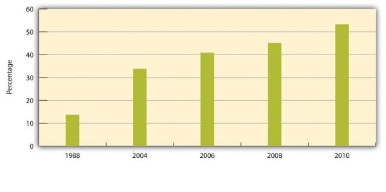
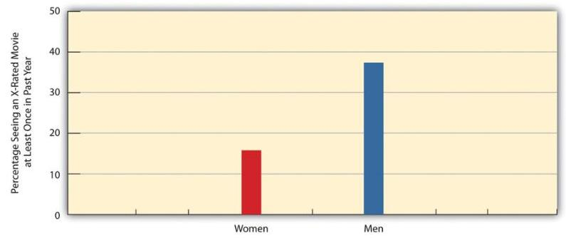
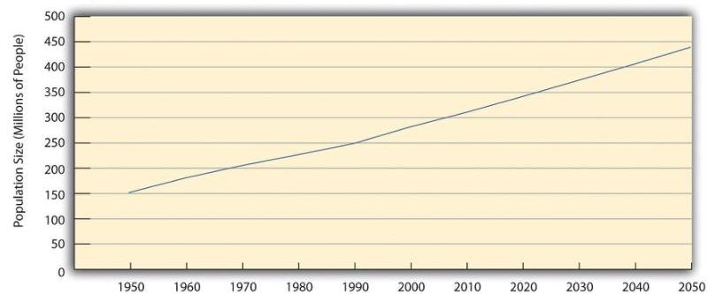
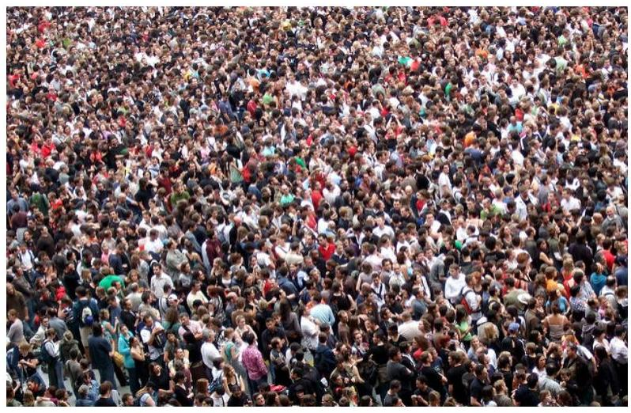
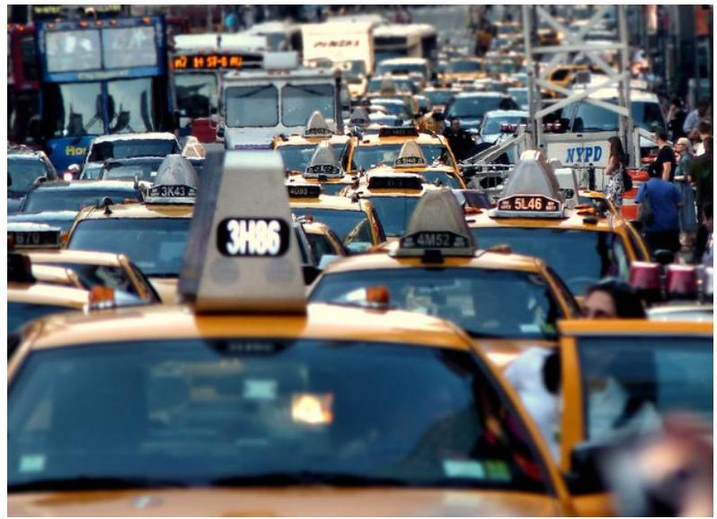
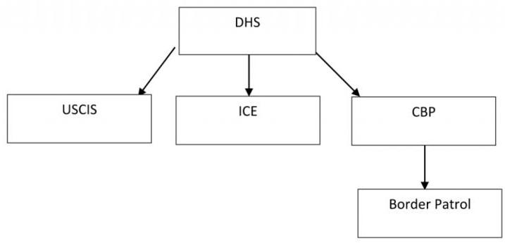

Human Behavior and the Social Environment II.# Human Behavior and the Social Environment II 

WHITNEY PAYNE

UNIVERSITY OF ARKANSAS LIBRARIES
FAYETTEVILLE, AR# (○) (1) (©) 

Human Behavior and the Social Environment II Copyright © 2020 by Whitney Payne is licensed under a Creative Commons Attribution-NonCommercial-ShareAlike 4.0 International License, except where otherwise noted.

Content in his book is adapted was from

- Kennedy, Vera. (2018). Beyond race: cultural influences on human social life. This work is licensed under a Creative Commons Attribution-NonCommercial-ShareAlike 4.0 International License
- "Beyond Race: Cultural Influences on Human Social Life" by Vera Kennedy under the license CC BY-NC-SA 4.0.
- Social Problems by University of Minnesota is licensed under a Creative Commons Attribution-NonCommercial-ShareAlike 4.0 International License, except where otherwise noted.
- Introduction to Women, Gender, Sexuality Studies by Miliann Kang, Donovan Lessard, Laura Heston, Sonny Nordmarken is licensed under a Creative Commons Attribution 4.0 International License,
- Principles of Social Psychology by University of Minnesota under the Creative Commons Attribution-NonCommercialShareAlike 4.0 International License,
- McAdams, D. P. (2019). Self and identity. In R. Biswas-Diener \& E. Diener (Eds), Noba textbook series: Psychology. Champaign, IL: DEF publishers. Retrieved from http://noba.to/3gsuardw.

Self and Identity by Dan P. McAdams is
licensed under a Creative Commons Attribution-NonCommercial-ShareAlike 4.0 International License.

- Immigrant and Refugee Families, 2nd Ed. by Jaime Ballard, Elizabeth Wieling, Catherine Solheim, and Lekie Dwanyen is licensed under a Creative Commons Attribution-NonCommercial 4.0 International License, except where otherwise noted...# Contents 

Introduction ..... 1
Attributions ..... 4
Part I. Traditional Paradigms \& Dominant
Perspectives on Individuals
Chapter 1: Self and Identity ..... 13
1.1 Introduction ..... 14
1.2 The Social Actor ..... 15
1.3 The Motivated Agent ..... 19
1.4 The Autobiographical Author ..... 21
1.5 End-of-Chapter Summary ..... 26
1.6 Additional Resources ..... 27
1.7 Discussion Questions ..... 27
Chapter 2: Culture and Meaning ..... 33
2.1 Introduction ..... 33
2.2 Link between Culture and Society ..... 34
2.3 Defining Culture ..... 35
2.4 Cultural Sociology ..... 39
2.5 Theoretical Perspectives on Culture ..... 42Chapter 3: Culture as a Social Construct ..... 53
3.1 Social Production of Culture ..... 53
3.2 Collective Culture ..... 56
3.3 Cultural Change ..... 69
Chapter 4: Cultural Power ..... 72
4.1 Cultural Hierarchies ..... 72
4.2 Cultural Hegemony ..... 79
4.3 Prejudice and Discrimination ..... 82
Chapter 5: Cultural Identity ..... 90
5.1 Identity Formation ..... 90
5.2 Sex and Gender ..... 94
5.3 Sexuality and Sexual Orientation ..... 99
5.4 Body and Mind ..... 103
5.5 Race and Ethnicity ..... 108
5.6 Religion and Belief Systems ..... 114
5.7 Identity Today ..... 120
Chapter 6: The Multicultural World ..... 133
6.1 Globalization and Identity ..... 133
6.2 Building Cultural Intelligence ..... 138Chapter 7: Individual and Cultural Differences in ..... 151
Person Perception
7.1 Introduction ..... 151
7.2 Perceiver Characteristics ..... 152
7.3 Cultural Differences in Person Perception ..... 157
7.4 Attribution Styles and Mental Health ..... 160
7.5 End-of-Chapter Summary ..... 164
Chapter 8: Poverty ..... 170
8.1 Introduction ..... 170
8.2 The Measurement \& Extent of Poverty ..... 174
8.3 Who the Poor Are: Social Patterns of Poverty ..... 181
8.4 Explaining Poverty ..... 197
8.5 The Consequences of Poverty ..... 214
8.6 Global Poverty ..... 229
8.7 Reducing Poverty ..... 255
8.8 End-of-Chapter Summary ..... 264
Chapter 9: People of Color, White Identity, \& ..... 269
Women
9.1 Introduction to Prejudice, Discrimination, and ..... 269
Stereotyping
9.2 Dimension of Racial and Ethnic Equality ..... 285
9.3 Feminism and Sexism ..... 296
9.4 Reducing Gender Inequality ..... 303
9.5 The Benefits and Costs of Being Male ..... 307
9.6 Masculinities ..... 312Chapter 10: Aging and Ableness ..... 314
10.1 Aging Social Problems in the News ..... 315
10.2 Age Cohorts ..... 316
10.3 The Concept \& Experience of Aging ..... 319
10.4 Perspectives on Aging ..... 321
10.5 Life Expectancy \& the Graying of Society ..... 325
10. 6 Biological \& Psychological Aspects of Aging ..... 329
10.7 Children and Our Future ..... 331
10.8 Applying Social Research ..... 333
10.9 Problems Facing Older Americans ..... 336
10.10 Lessons from Other Societies ..... 344
10.11 People Making a Difference ..... 352
10.12 Reducing Ageism \& Helping Older Americans ..... 356
10.13 End-of-Chapter Summary ..... 360
Chapter 11: Sexual Orientation, Sexuality, \& ..... 363
Pornography
11.1 What is Sex, Gender, Sexuality, \& Sexual ..... 363
Orientation?
11.2 Sexual Orientation and Inequality ..... 369
11.3 Understanding Sexual Orientation ..... 371
11.4 Public Attitudes About Sexual Orientation ..... 390
11.5 Inequality Based on Sexual Orientation ..... 408
11.6 Improving the Lives of the LGBT Community ..... 438
11.7 Sexual Orientation \& Inequality Summary ..... 441
11.8 Pornography ..... 444Chapter 12: The Family ..... 459
12.1 Introduction ..... 459
12.2 What is Family? ..... 460
12.3 How Families Develop ..... 464
12.4 Dating, Courtship, and Cohabitation ..... 467
12.5 Family Issues and Considerations ..... 476
12.6 Happy Healthy Families ..... 481
12.7 Additional Resources ..... 482
Chapter 13: Relationships \& Well-Being ..... 488
13.1 Introduction ..... 488
13.2 The Importance of Relationships ..... 489
13.3 The Question of Measurement ..... 490
13.4 Presence and Quality of Relationships and ..... 494
Well-Being
13.5 Types of Relationships ..... 499
13.6 Fact or Myth: Are Social Relationships the ..... 503
Secret to Happiness?
13.7 Additional Resources ..... 505
Chapter 14: Childhood Experiences \& Epigenetics ..... 511
14.1 Early childhood experience ..... 511
14.2 Parental investment and programming of stress ..... 512
responses in the offspring
14.3 Child nutrition and the epigenome ..... 515Chapter 15: Working Groups: Performance \& ..... 523
Decision Making
15.1 Introduction ..... 525
15.2 Understanding Social Groups ..... 530
15.3 Group Process: the Pluses \& Minuses of ..... 542
Working Together
15.4 Improving Group Performance ..... 598
15.5 Thinking Like A Social Psychologist About ..... 616
Social Groups
15.6 End-of-Chapter Summary ..... 618
Chapter 16: The Psychology of Groups ..... 622
16.1 Introduction to the Psychology of Groups ..... 623
16.2 The Psychological Significance of Groups ..... 625
16.3 Motivation and Performance ..... 630
16.4 Making Decisions in Groups ..... 639
16.5 You and Your Groups ..... 645
16.6 Outside Resources ..... 646
16.7 References ..... 648
Part V. Stages of Group Development \& Group Think
Chapter 17: Groupthink ..... 657
17.1 Overview of Groupthink ..... 658
17.2 Additional Resources ..... 660Chapter 18: Industrial/Organizational Psychology ..... 665
19.1 What is Industrial and Organizational (I/O) ..... 666
Psychology?
19.2 What Does an I/O Psychologist Do? ..... 670
19.3 Careers in I/O Psychology ..... 673
19.4 History of I/O Psychology ..... 675
19.5 Additional Resources ..... 679
Chapter 19: Competition and Cooperation in Our ..... 683
Social Worlds
19.1 Competition and Cooperation in Our Social ..... 683
Worlds
19.2 Conflict, Cooperation, Morality, and Fairness ..... 689
19.3 How the Social Situation Creates Conflict: The ..... 712
Role of Social Dilemmas
19.4 Strategies for Producing Cooperation ..... 735
19.5 Thinking Like a Social Psychologist About ..... 753
Cooperation and Competition
19.6 End-of-Chapter Summary ..... 754
Chapter 20: Group \& Organizational Culture ..... 758
20.1 Introduction ..... 758
20.2 Group Dynamics ..... 759
20.3 Organization ..... 761
20.4 Symbolic Power ..... 762
20.5 Organizational Culture ..... 762Chapter 21: Geographic Region ..... 769
21.1 Communities Based Upon Geographical Region ..... 770
Chapter 22: Population \& the Environment ..... 774
22.1 Introduction ..... 775
22.2 Sociological Perspectives on Population \& the ..... 776
Environment
22.3 Population ..... 783
23.4 The Environment ..... 823
22.5 Addressing Population Problems \& Improving ..... 860
the Environment
22.6 End-of-Chapter Summary ..... 865
Chapter 23: Urban \& Rural Problems ..... 869
23.1 Introduction ..... 870
23.2 A Brief History of Urbanization ..... 871
23.3 Sociological Perspectives on Urbanization ..... 885
23.4 Problems of Urban Life ..... 897
23.5 Problems of Rural Life ..... 926
23.6 Improving Urban \& Rural Life ..... 934
23.7 End-of-Chapter Summary ..... 937Part VIII. Communities \& Police Relations
Chapter 24: The Criminal Justice System ..... 943
24.1 Introduction ..... 943
24.2 Police ..... 944
24.3 Criminal Courts ..... 948
24.4 The Problem of Prisons ..... 950
24.5 Focus on the Death Penalty ..... 954
Part IX. Global Perspectives \& Theories
Chapter 25: Immigration \& Immigrant Policy: ..... 965
Barriers \& Opportunities for Families
25.1 Introduction ..... 966
25.2 Immigration Policy ..... 969
25.3 Current Immigration Policy ..... 977
25.4 Opportunities \& Barriers for Immigrant ..... 983
Families
25.5 Future Directions ..... 991
25.6 End-of-Chapter Summary ..... 994
27.7 Appendices ..... 1004Chapter 26: From There to Here: The Journey of ..... 1012
Refugee Families to the United States
26.1 Introduction ..... 1013
26.2 Fleeing Persecution and Separation from ..... 1014
Family
26.3 Travel to Temporary Refuge ..... 1017
26.4 Family Admittance to the United States ..... 1019
26.5 Entering the United States ..... 1022
26.6 Future Directions in Policy and Refugee Familyl033 Support
26.7 Conclusion ..... 1036
26.8 Appendix ..... 1043
Chapter 27: Human Rights ..... 1046
27.1 Introduction ..... 1047
27.2 What are Human Rights? ..... 1049
27.3 The Universal Declaration of Human Rights ..... 1052
27.4 The Status of Human Rights in the United ..... 1054
States
27.5 Emerging Directions ..... 1068
27.6 End-of-Chapter Summary ..... 1070
Chapter 28: Economic Well-Being, Supports \& ..... 1077
Barriers
28.1 Introduction ..... 1078
28.2 Employment ..... 1080
28.3 Access to Necessities ..... 1086
28.4 Financial Problems ..... 1098
28.5 Future Directions ..... 1103
28.6 End-of-Chapter Summary ..... 1105Chapter 29: Mental Health ..... 1116
29.1 Introduction ..... 1116
29.2 Different Shared Experiences ..... 1118
29.3 Mental Health Challenges ..... 1121
29.4 Mental Health Treatments ..... 1131
29.5 Emerging Directions ..... 1137
29.6 End-of-Chapter Summary ..... 1138
Chapter 30: Intimate Partner Violence Among ..... 1153 Immigrants \& Refugees
32.1 Introduction ..... 1154
32.2 Defining IPV ..... 1157
32.3 IPV Among Immigrants \& Refugees ..... 1160
32.4 Risk \& Protective Factors ..... 1161
32.5 Responses to IPV ..... 1164
32.6 Barriers to Help Seeking ..... 1168
32.7 Future Decisions ..... 1178
32.8 Case Study ..... 1179
32.9 End-of-Chapter Summary ..... 1180Chapter 31: Substance Abuse ..... 1192
33.1 Introduction ..... 1192
33.2 Substance Abuse Prevalence ..... 1195
33.3 Risk Factors ..... 1198
33.4 Family Influences on Substance Abuse ..... 1202
33.5 Theoretical Frameworks ..... 1204
33.6 Policy on Legal Consequences on Substance ..... 1209
Abuse
33.7 Substance Abuse Prevention \& Intervention ..... 1210
33.8 End-of-Chapter Summary ..... 1215
Chapter 32: Resilience in Immigrant \& Refugee ..... 1227
Families
34.1 Introduction ..... 1228
34.2 Family Motivation: Value of Work \& Education1229
34.3 Family Connectedness \& Identity ..... 1236
34.4 Role of Resources in Achieving Aspirations ..... 1244
34.5 Emerging Directions ..... 1250
34.6 End-of-Chapter Summary ..... 1251Chapter 33: Embracing a New Home: ..... 1263
Resettlement Research \& the Family
35.1 Introduction ..... 1264
35.2 Assimilation ..... 1264
35.3 Family Theories: A New Direction for Research1276 with Resettled Populations
35.4 Critical Theories ..... 1282
35.5 Cultural Values to Consider in Resettlement ..... 1282
Research
35.6 Future Directions ..... 1285
35.7 End-of-Chapter ..... 1286
Part X. Additional Resources
Ancillaries ..... 1303
Adopt this book! ..... 1305
Versioning and Update History ..... 1306.# Introduction 

## The Meaning Behind This Book

In the Fall of 2003, I started my undergraduate career at the University of Alaska Anchorage. For as long as I could remember I had wanted to be a veterinarian and had begun my freshman year as a Pre-vet major. Before long, I came to the startling realization that biology and chemistry were not a place of academic strength for me and my hopes of making it through four more years of these particular types of classes became daunting and perhaps unrealistic.

However, at this same time, I was enrolled in an Introduction to Social Work and Social Welfare Policy course, and it had become a respite from the periodic table of elements and algebraic algorithms that were the cornerstone of my other classes that semester. Before enrolling in that course, I had no idea that a profession such as Social Work existed. I had spent most of my life interested in human behavior and how the environment can influence the way that people navigate their lives. I had also been enamored by social justice movements and had started to really recognize how policy decisions can have collateral consequences on individuals, groups, and communities. Needless to say, the Introduction to Social Work course changed the trajectory of my personal and professional life, and I went on to earn my BSW as well as my MSW.

After I completed graduate school, I began working as a substance abuse counselor within the prison system in Arkansas, and during my time there it became even more clear to me how much individuals are shaped by their environments. An overwhelming majority of the clients that I worked with had been survivors of trauma and had been at the mercy of generational cycles of poverty, abuse, addiction, and criminal justice involvement. These were not individuals that were making random, bad choices. These wereindividuals who were facing extreme structural impediments in life and who were doing the best that they could with the resources and skills that they had at the time. And, just like that, I finally understood how multidimensional the treatment needs of individuals can be and how every person's story and potential success is based on our ability, as the clinician, to attend to and acknowledge the complexity of their lives.

After several years of clinical practice, I made the unexpected transition to academia and was given the opportunity to teach the Human Behavior and the Social Environment course. After working on the curriculum for two semesters, it became clear to me that students wanted and desired a textbook that was free, easy to access online, and contained information from a multitude of disciplines. I was fortunate enough to learn about Open Educational Resources at our institution and began working with the University library system to compile several different chapters from several different open and free textbooks. These materials will help students and instructors alike explore human behavior and how it is shaped and impacted by both traditional and non-traditional paradigms. This text will also support the reader in having a deeper understanding of how the environment, in all of its complexity, can affect individuals, families, groups, and communities.

It is my hope that the information contained in this book will help you, as a future social worker, approach client systems with empathy, understanding, and a compassionate curiosity that allows for comprehensive assessment, individualized approaches to treatment, and continuity of care.
"Social advance depends as much upon the process through which it is secured as upon the result itself." -Jane Addams# About the Author: 

Professor Whitney Payne was the Treatment Coordinator of the Northwest Arkansas Community Correction Center, a residential treatment facility that serves 100 non-violent, female offenders who often struggle with chemical dependency. Professor Payne worked at NWACCC from June of 2010 August of 2016. Professor Payne became an adjunct faculty member with the University of Arkansas School of Social Work in August of 2012 and was hired as a Clinical Assistant Professor in August of 2016. Professor Payne graduated with a BSW from the University of Alaska Anchorage in 2008 and an MSW for the University of Arkansas in 2010. In addition to these degrees, Professor Payne is a Licensed Clinical Social Worker as well as a Certified Drug and Alcohol Counselor.# Attributions 

Human Behavior and the Social Environment II is adapted from various work produced and distributed under the Creative Commons License. Below, is the list of all adapted chapters used in the making of this book.

COVER DESIGN: Image by Gerd Altmann from Pixabay.

## CHAPTER 1: Adapted from Self and <br> Identity by Dan P. McAdams under the Creative <br> Commons Attribution-NonCommercial-ShareAlike 4.0 International License.

CHAPTER 2: Adapted from Module 1 from "Beyond Race: Cultural Influences on Human Social Life" by Vera Kennedy under the license CC BY-NC-SA 4.0.

CHAPTER 3: Adapted from Module 2 from "Beyond Race: Cultural Influences on Human Social Life" by Vera Kennedy under the license CC BY-NC-SA 4.0.

CHAPTER 4: Adapted from Module 3 from "Beyond Race: Cultural Influences on Human Social Life" by Vera Kennedy under the license CC BY-NC-SA 4.0.

CHAPTER 5: Adapted from Module 4 from "Beyond Race: Cultural Influences on Human Social Life" by Vera Kennedy under the license CC BY-NC-SA 4.0.

CHAPTER 6: Adapted from Module 5 from "Beyond Race: Cultural Influences on Human Social Life" by Vera Kennedy under the license CC BY-NC-SA 4.0.CHAPTER 7: Adapted from Chapter 6.3 from Principles of Social Psychology by the University of Minnesota under the Creative Commons Attribution-NonCommercial-ShareAlike 4.0 International License.

CHAPTER 8: Adapted from Chapter 2 from Social Problems by the University of Minnesota under the Creative Commons Attribution-NonCommercial-ShareAlike 4.0 International License, except where otherwise noted.

CHAPTER 9: Adapted from Prejudice, Discrimination, and
 International License.
Adapted from Chapter 3.2, Social Problems by University of Minnesota is licensed under a Creative Commons Attribution-NonCommercial-ShareAlike 4.0 International License, except where otherwise noted.
Adapted from Chapter 4.2, Social Problems by University of Minnesota is licensed under a Creative Commons Attribution-NonCommercial-ShareAlike 4.0 International License, except where otherwise noted.
Adapted from Chapter 4.6, Social Problems by University of Minnesota is licensed under a Creative Commons Attribution-NonCommercial-ShareAlike 4.0 International License, except where otherwise noted.
Adapted from Chapter 4.5, Social Problems by University of Minnesota is licensed under a Creative Commons Attribution-NonCommercial-ShareAlike 4.0 International License, except where otherwise noted.
Adapted from Unit II, Introduction to Women, Gender, Sexuality Studies by Miliann Kang, Donovan Lessard, Laura Heston, SonnyNordmarken is licensed under a Creative Commons Attribution 4.0 International License, except where otherwise noted.

CHAPTER 10: Adapted from Chapter 6 from Social Problems by the University of Minnesota under the Creative Commons Attribution-NonCommercial-ShareAlike 4.0 International License, except where otherwise noted.

Adapted from page 37 through 38, Self and Identity by Dan P. McAdams under the Creative Commons Attribution-NonCommercial-ShareAlike 4.0 International License.

CHAPTER 11: Adapted from Chapter 5 and Chapter 9.5 from Social Problems by University of Minnesota under the Creative Commons Attribution-NonCommercial-ShareAlike 4.0 International License, except where otherwise noted.

Adapted from pages 39 through 43 from "Beyond Race: Cultural Influences on Human Social Life" by Vera Kennedy under the license CC BY-NC-SA 4.0.

Adapted from The International Encyclopedia of Human Sexuality.

CHAPTER 12: Adapted from The Family by Joel A. Muraco is licensed under a Creative Commons Attribution-NonCommercial-ShareAlike 4.0 International License.

CHAPTER 13: Adapted from Relationships and Well-being by Kenneth Tan and Louis Tay is licensed under a Creative Commons Attribution-NonCommercialShareAlike 4.0 International License.

CHAPTER 14: Adapted from Epigenetics in Psychology by IanWeaver under the CC BY-NC-SA: Attribution-NonCommercialShareAlike license.

CHAPTER 15: Adapted from Chapter 11 from Principles of Social Psychology by University of Minnesota under the Creative Commons Attribution-NonCommercial-ShareAlike 4.0 International License, except where otherwise noted.

CHAPTERS 16 \& 17: Adapted from The Psychology of Groups by Donelson R. Forsyth under the Creative Commons Attribution-NonCommercialShareAlike 4.0 International License.

CHAPTER 18: Adapted from Industrial/ Organizational (I/O) Psychology by Berrin Erdogan and Talya N. Bauer under the Creative Commons Attribution-NonCommercialShareAlike 4.0 International License.

CHAPTER 19: Adapted from Chapter 13 from Principles of Social Psychology by University of Minnesota under the Creative Commons Attribution-NonCommercial-ShareAlike 4.0 International License, except where otherwise noted.

CHAPTER 20: Adapted from pages 17 through 20 from "Beyond Race: Cultural Influences on Human Social Life" by Vera Kennedy under the license CC BY-NC-SA 4.0.

CHAPTER 21: Adapted from pages 43 through 44 from "Beyond Race: Cultural Influences on Human Social Life" by Vera Kennedy under the license CC BY-NC-SA 4.0.CHAPTER 22: Adapted from Chapter 15 from Social Problems by the University of Minnesota under the Creative Commons Attribution-NonCommercial-ShareAlike 4.0 International License, except where otherwise noted.

CHAPTER 23: Adapted from Chapter 14 from Social Problems by the University of Minnesota under the Creative Commons Attribution-NonCommercial-ShareAlike 4.0 International License, except where otherwise noted.

CHAPTER 24: Adapted from Chapter 8.5 from Social Problems by the University of Minnesota under the Creative Commons Attribution-NonCommercial-ShareAlike 4.0 International License, except where otherwise noted.

CHAPTER 25: Adapted from Chapters 1 from Immigrant and Refugee Families, 2nd Ed. by Jaime Ballard, Elizabeth Wieling, Catherine Solheim, and Lekie Dwanyen under the Creative Commons Attribution-NonCommercial 4.0 International License, except where otherwise noted.

CHAPTER 26: Adapted from Chapters 2 from Immigrant and Refugee Families, 2nd Ed. by Jaime Ballard, Elizabeth Wieling, Catherine Solheim, and Lekie Dwanyen under the Creative Commons Attribution-NonCommercial 4.0 International License, except where otherwise noted.

CHAPTER 27: Adapted from Chapters 3 from Immigrant and Refugee Families, 2nd Ed. by Jaime Ballard, Elizabeth Wieling, Catherine Solheim, and Lekie Dwanyen under the Creative Commons Attribution-NonCommercial 4.0 International License, except where otherwise noted.

CHAPTER 28: Adapted from Chapters 4 from Immigrant and Refugee Families, 2nd Ed. by Jaime Ballard, Elizabeth Wieling, Catherine Solheim, and Lekie Dwanyen under the CreativeCommons Attribution-NonCommercial 4.0 International License, except where otherwise noted.

CHAPTER 29: Adapted from Chapters 5 from Immigrant and Refugee Families, 2nd Ed. by Jaime Ballard, Elizabeth Wieling, Catherine Solheim, and Lekie Dwanyen under the Creative Commons Attribution-NonCommercial 4.0 International License, except where otherwise noted.

CHAPTER 30: Adapted from Chapters 6 from Immigrant and Refugee Families, 2nd Ed. by Jaime Ballard, Elizabeth Wieling, Catherine Solheim, and Lekie Dwanyen under the Creative Commons Attribution-NonCommercial 4.0 International License, except where otherwise noted.

CHAPTER 31: Adapted from Chapters 7 from Immigrant and Refugee Families, 2nd Ed. by Jaime Ballard, Elizabeth Wieling, Catherine Solheim, and Lekie Dwanyen under the Creative Commons Attribution-NonCommercial 4.0 International License, except where otherwise noted.

CHAPTER 32: Adapted from Chapters 8 from Immigrant and Refugee Families, 2nd Ed. by Jaime Ballard, Elizabeth Wieling, Catherine Solheim, and Lekie Dwanyen under the Creative Commons Attribution-NonCommercial 4.0 International License, except where otherwise noted.

CHAPTER 33: Adapted from Chapters 9 from Immigrant and Refugee Families, 2nd Ed. by Jaime Ballard, Elizabeth Wieling, Catherine Solheim, and Lekie Dwanyen under the Creative Commons Attribution-NonCommercial 4.0 International License, except where otherwise noted.10 | Attributions# PART I <br> TRADITIONAL <br> PARADIGMS \& DOMINANT PERSPECTIVES ON INDIVIDUALS12 | Traditional Paradigms \& Dominant Perspectives on Individuals# Chapter I: Self and Identity 

## Learning Objectives

- Explain the basic idea of reflexivity in human selfhood-how the "I" encounters and makes sense of itself (the "Me").
- Describe fundamental distinctions between three different perspectives on the self: the self as actor, agent, and author.
- Describe how a sense of self as a social actor emerges around the age of 2 years and how it develops going forward.
- Describe the development of the self's sense of motivated agency from the emergence of the child's theory of mind to the articulation of life goals and values in adolescence and beyond.
- Define the term narrative identity, and explain what psychological and cultural functions narrative identity serves.

For human beings, the self is what happens when "I" encounters "Me." The central psychological question of selfhood, then, is this: How does a person apprehend and understand who he or she is?Over the past 100 years, psychologists have approached the study of self (and the related concept of identity) in many different ways, but three central metaphors for the self repeatedly emerge. First, the self may be seen as a social actor, who enacts roles and displays traits by performing behaviors in the presence of others. Second, the self is a motivated agent, who acts upon inner desires and formulates goals, values, and plans to guide behavior in the future. Third, the self eventually becomes an autobiographical author, too, who takes stock of life - past, present, and future - to create a story about who I am, how I came to be, and where my life may be going. This module briefly reviews central ideas and research findings on the self as an actor, an agent, and an author, with an emphasis on how these features of selfhood develop over the human life course.

# 1.I Introduction 

In the Temple of Apollo at Delphi, the ancient Greeks inscribed the words: "Know thyself." For at least 2,500 years, and probably longer, human beings have pondered the meaning of the ancient aphorism. Over the past century, psychological scientists have joined the effort. They have formulated many theories and tested countless hypotheses that speak to the central question of human selfhood: How does a person know who he or she is?

The ancient Greeks seemed to realize that the self is inherently reflexive-it reflects back on itself. In the disarmingly simple idea made famous by the great psychologist William James (1892/1963), the self is what happens when "I" reflects back upon "Me." The self is both the I and the Me -it is the knower, and it is what the knower knows when the knower reflects upon itself. When you look back at yourself, what do you see? When you look inside, what do you find? Moreover, when you try to change your self in some way, what is it that you are trying to change? The philosopher Charles Taylor(1989) describes the self as a reflexive project. In modern life, Taylor argues that, we often try to manage, discipline, refine, improve, or develop the self. We work on our selves, as we might work on any other interesting project. But what exactly is it that we work on?

Imagine for a moment that you have decided to improve yourself. You might say, go on a diet to improve your appearance. Or you might decide to be nicer to your mother, in order to improve that important social role. Or maybe the problem is at work-you need to find a better job or go back to school to prepare for a different career. Perhaps you just need to work harder. Or get organized. Or recommit yourself to religion. Or maybe the key is to begin thinking about your whole life story in a completely different way, in a way that you hope will bring you more happiness, fulfillment, peace, or excitement.

Although there are many different ways you might reflect upon and try to improve the self, it turns out that many, if not most, of them fall roughly into three broad psychological categories (McAdams \& Cox, 2010). The I may encounter the Me as (a) a social actor, (b) a motivated agent, or (c) an autobiographical author.

# 1.2 The Social Actor 

Shakespeare tapped into a deep truth about human nature when he famously wrote, "All the world's a stage, and all the men and women merely players." He was wrong about the "merely," however, for there is nothing more important for human adaptation than the manner in which we perform our roles as actors in the everyday theatre of social life. What Shakespeare may have sensed but could not have fully understood is that human beings evolved to live in social groups. Beginning with Darwin (1872/1965) and running through contemporary conceptions of human evolution, scientists have portrayed human nature as profoundly social (Wilson, 2012). For a few million years, Homo sapiens and their evolutionaryforerunners have survived and flourished by virtue of their ability to live and work together in complex social groups, cooperating with each other to solve problems and overcome threats and competing with each other in the face of limited resources. As social animals, human beings strive to get along and get ahead in the presence of each other (Hogan, 1982). Evolution has prepared us to care deeply about social acceptance and social status, for those unfortunate individuals who do not get along well in social groups or who fail to attain a requisite status among their peers have typically been severely compromised when it comes to survival and reproduction. It makes consummate evolutionary sense, therefore, that the human "I" should apprehend the "Me" first and foremost as a social actor.

For human beings, the sense of the self as a social actor begins to emerge around the age of 18 months. Numerous studies have shown that by the time they reach their second birthday most toddlers recognize themselves in mirrors and other reflecting devices (Lewis,M Brooks-Gunn, 1979Lewis \& Brooks-Gunn, 1979; Rochat, 2003). What they see is an embodied actor who moves through space and time. Many children begin to use words such as "me" and "mine" in the second year of life, suggesting that the I now has linguistic labels that can be applied reflexively to itself: I call myself "me." Around the same time, children also begin to express social emotions such as embarrassment, shame, guilt, and pride (Tangney, Stuewig, \& Mashek, 2007). These emotions tell the social actor how well he or she is performing in the group. When I do things that win the approval of others, I feel proud of myself. When I fail in the presence of others, I may feel embarrassment or shame. When I violate a social rule, I may experience guilt, which may motivate me to make amends.

Many of the classic psychological theories of human selfhood point to the second year of life as a key developmental period. For example, Freud (1923/1961) and his followers in the psychoanalytic tradition traced the emergence of an autonomous ego back to the second year. Freud used the term "ego" (in German das Ich, which also translates into "the I") to refer to an executive self in thepersonality. Erikson (1963) argued that experiences of trust and interpersonal attachment in the first year of life help to consolidate the autonomy of the ego in the second. Coming from a more sociological perspective, Mead (1934) suggested that the I comes to know the Me through reflection, which may begin quite literally with mirrors but later involves the reflected appraisals of others. I come to know who I am as a social actor, Mead argued, by noting how other people in my social world react to my performances. In the development of the self as a social actor, other people function like mirrors-they reflect who I am back to me.

Research has shown that when young children begin to make attributions about themselves, they start simple (Harter, 2006). At age 4, Jessica knows that she has dark hair, knows that she lives in a white house, and describes herself to others in terms of simple behavioral traits. She may say that she is "nice," or "helpful," or that she is "a good girl most of the time." By the time, she hits fifth grade (age 10), Jessica sees herself in more complex ways, attributing traits to the self such as "honest," "moody," "outgoing," "shy," "hard-working," "smart," "good at math but not gym class," or "nice except when I am around my annoying brother." By late childhood and early adolescence, the personality traits that people attribute to themselves, as well as those attributed to them by others, tend to correlate with each other in ways that conform to a well-established taxonomy of five broad trait domains, repeatedly derived in studies of adult personality and often called the Big Five: (1) extraversion, (2) neuroticism, (3) agreeableness, (4) conscientiousness, and (5) openness to experience (Roberts, Wood, \& Caspi, 2008). By late childhood, moreover, self-conceptions will likely also include important social roles: "I am a good student," "I am the oldest daughter," or "I am a good friend to Sarah."

Traits and roles, and variations on these notions, are the main currency of the self as social actor (McAdams \& Cox, 2010). Trait terms capture perceived consistencies in social performance. They convey what I reflexively perceive to be my overall acting style, based in part on how I think others see me as an actor in manydifferent social situations. Roles capture the quality, as I perceive it, of important structured relationships in my life. Taken together, traits and roles make up the main features of my social reputation, as I apprehend it in my own mind (Hogan, 1982).

If you have ever tried hard to change yourself, you may have taken aim at your social reputation, targeting your central traits or your social roles. Maybe you woke up one day and decided that you must become a more optimistic and emotionally upbeat person. Taking into consideration the reflected appraisals of others, you realized that even your friends seem to avoid you because you bring them down. In addition, it feels bad to feel so bad all the time: Wouldn't it be better to feel good, to have more energy and hope? In the language of traits, you have decided to "work on" your "neuroticism." Or maybe instead, your problem is the trait of "conscientiousness": You are undisciplined and don't work hard enough, so you resolve to make changes in that area. Self-improvement efforts such as these-aimed at changing one's traits to become a more effective social actor-are sometimes successful, but they are very hard-kind of like dieting. Research suggests that broad traits tend to be stubborn, resistant to change, even with the aid of psychotherapy. However, people often have more success working directly on their social roles. To become a more effective social actor, you may want to take aim at the important roles you play in life. What can I do to become a better son or daughter? How can I find new and meaningful roles to perform at work, or in my family, or among my friends, or in my church and community? By doing concrete things that enrich your performances in important social roles, you may begin to see yourself in a new light, and others will notice the change, too. Social actors hold the potential to transform their performances across the human life course. Each time you walk out on stage, you have a chance to start anew.# 1.3 The Motivated Agent 

Whether we are talking literally about the theatrical stage or more figuratively, as I do in this module, about the everyday social environment for human behavior, observers can never fully know what is in the actor's head, no matter how closely they watch. We can see actors act, but we cannot know for sure what they want or what they value, unless they tell us straightaway. As a social actor, a person may come across as friendly and compassionate, or cynical and mean-spirited, but in neither case can we infer their motivations from their traits or their roles. What does the friendly person want? What is the cynical father trying to achieve? Many broad psychological theories of the self prioritize the motivational qualities of human behavior-the inner needs, wants, desires, goals, values, plans, programs, fears, and aversions that seem to give behavior its direction and purpose (Bandura, 1989; Deci \& Ryan, 1991; Markus \& Nurius, 1986). These kinds of theories explicitly conceive of the self as a motivated agent.

To be an agent is to act with direction and purpose, to move forward into the future in pursuit of self-chosen and valued goals. In a sense, human beings are agents even as infants, for babies can surely act in goal-directed ways. By age 1 year, moreover, infants show a strong preference for observing and imitating the goaldirected, intentional behavior of others, rather than random behaviors (Woodward, 2009). Still, it is one thing to act in goaldirected ways; it is quite another for the I to know itself (the Me) as an intentional and purposeful force who moves forward in life in pursuit of self-chosen goals, values, and other desired end states. In order to do so, the person must first realize that people indeed have desires and goals in their minds and that these inner desires and goals motivate (initiate, energize, put into motion) their behavior. According to a strong line of research in developmental psychology, attaining this kind of understanding means acquiring a theory of mind (Wellman, 1993), which occurs for most children by the ageof 4. Once a child understands that other people's behavior is often motivated by inner desires and goals, it is a small step to apprehend the self in similar terms.

Building on theory of mind and other cognitive and social developments, children begin to construct the self as a motivated agent in the elementary school years, layered over their stilldeveloping sense of themselves as social actors. Theory and research on what developmental psychologists call the age 5-to-7 shift converge to suggest that children become more planful, intentional, and systematic in their pursuit of valued goals during this time (Sameroff \& Haith, 1996). Schooling reinforces the shift in that teachers and curricula place increasing demands on students to work hard, adhere to schedules, focus on goals, and achieve success in particular, well-defined task domains. Their relative success in achieving their most cherished goals, furthermore, goes a long way in determining children's self-esteem (Robins, Tracy, \& Trzesniewski, 2008). Motivated agents feel good about themselves to the extent they believe that they are making good progress in achieving their goals and advancing their most important values.

Goals and values become even more important for the self in adolescence, as teenagers begin to confront what Erikson (1963) famously termed the developmental challenge of identity. For adolescents and young adults, establishing a psychologically efficacious identity involves exploring different options with respect to life goals, values, vocations, and intimate relationships and eventually committing to a motivational and ideological agenda for adult life-an integrated and realistic sense of what I want and value in life and how I plan to achieve it (Kroger \& Marcia, 2011). Committing oneself to an integrated suite of life goals and values is perhaps the greatest achievement for the self as motivated agent. Establishing an adult identity has implications, as well, for how a person moves through life as a social actor, entailing new role commitments and, perhaps, a changing understanding of one's basic dispositional traits. According to Erikson, however, identity achievement is always provisional, for adults continue to work ontheir identities as they move into midlife and beyond, often relinquishing old goals in favor of new ones, investing themselves in new projects and making new plans, exploring new relationships, and shifting their priorities in response to changing life circumstances (Freund \& Riediger, 2006; Josselson, 1996).
There is a sense whereby any time you try to change yourself, you are assuming the role of a motivated agent. After all, to strive to change something is inherently what an agent does. However, what particular feature of selfhood you try to change may correspond to your self as actor, agent, or author, or some combination. When you try to change your traits or roles, you take aim at the social actor. By contrast, when you try to change your values or life goals, you are focusing on yourself as a motivated agent. Adolescence and young adulthood are periods in the human life course when many of us focus attention on our values and life goals. Perhaps you grew up as a traditional Catholic, but now in college you believe that the values inculcated in your childhood no longer function so well for you. You no longer believe in the central tenets of the Catholic Church, say, and are now working to replace your old values with new ones. Or maybe you still want to be Catholic, but you feel that your new take on faith requires a different kind of personal ideology. In the realm of the motivated agent, moreover, changing values can influence life goals. If your new value system prioritizes alleviating the suffering of others, you may decide to pursue a degree in social work, or to become a public interest lawyer, or to live a simpler life that prioritizes people over material wealth. A great deal of the identity work we do in adolescence and young adulthood is about values and goals, as we strive to articulate a personal vision or dream for what we hope to accomplish in the future.

# 1.4 The Autobiographical Author 

Even as the "I"continues to develop a sense of the "Me" as both asocial actor and a motivated agent, a third standpoint for selfhood gradually emerges in the adolescent and early-adult years. The third perspective is a response to Erikson's (1963) challenge of identity. According to Erikson, developing an identity involves more than the exploration of and commitment to life goals and values (the self as motivated agent), and more than committing to new roles and re-evaluating old traits (the self as social actor). It also involves achieving a sense of temporal continuity in life-a reflexive understanding of how I have come to be the person I am becoming, or put differently, how my past self has developed into my present self, and how my present self will, in turn, develop into an envisioned future self. In his analysis of identity formation in the life of the 15th-century Protestant reformer Martin Luther, Erikson (1958) describes the culmination of a young adult's search for identity in this way:
"To be adult means among other things to see one's own life in continuous perspective, both in retrospect and prospect. By accepting some definition of who he is, usually on the basis of a function in an economy, a place in the sequence of generations, and a status in the structure of society, the adult is able to selectively reconstruct his past in such a way that, step for step, it seems to have planned him, or better, he seems to have planned it. In this sense, psychologically we do choose our parents, our family history, and the history of our kings, heroes, and gods. By making them our own, we maneuver ourselves into the inner position of proprietors, of creators."(Erikson, 1958, pp. 111-112; emphasis added).

In this rich passage, Erikson intimates that the development of a mature identity in young adulthood involves the I's ability to construct a retrospective and prospective story about the Me (McAdams, 1985). In their efforts to find a meaningful identity for life, young men and women begin "to selectively reconstruct" their past, as Erikson wrote, and imagine their future to create an integrative life story, or what psychologists today often call a narrative identity. A narrative identity is an internalized and evolving story of the self that reconstructs the past and anticipatesthe future in such a way as to provide a personarrative identityn's life with some degree of unity, meaning, and purpose over time (McAdams, 2008; McLean, Pasupathi, \& Pals, 2007). The self typically becomes an autobiographical author in the early-adult years, a way of being that is layered over the motivated agent, which is layered over the social actor. In order to provide life with the sense of temporal continuity and deep meaning that Erikson believed identity should confer, we must author a personalized life story that integrates our understanding of who we once were, who we are today, and who we may become in the future. The story helps to explain, for the author and for the author's world, why the social actor does what it does and why the motivated agent wants what it wants, and how the person as a whole has developed over time, from the past's reconstructed beginning to the future's imagined ending.

By the time they are 5 or 6 years of age, children can tell wellformed stories about personal events in their lives (Fivush, 2011). By the end of childhood, they usually have a good sense of what a typical biography contains and how it is sequenced, from birth to death (Thomsen \& Bernsten, 2008). But it is not until adolescence, research shows, that human beings express advanced storytelling skills and what psychologists call autobiographical reasoning (Habermas \& Bluck, 2000; McLean \& Fournier, 2008). In autobiographical reasoning, a narrator is able to derive substantive conclusions about the self from analyzing his or her own personal experiences. Adolescents may develop the ability to string together events into causal chains and inductively derive general themes about life from a sequence of chapters and scenes (Habermas \& de Silveira, 2008). For example, a 16-year-old may be able to explain to herself and to others how childhood experiences in her family have shaped her vocation in life. Her parents were divorced when she was 5 years old, the teenager recalls, and this caused a great deal of stress in her family. Her mother often seemed anxious and depressed, but she (the now-teenager when she was a little girl-the story's protagoniHabermas \& de Silveira, 2008st) often tried to cheer her mother up, and her efforts seemed to work. In morerecent years, the teenager notes that her friends often come to her with their boyfriend problems. She seems to be very adept at giving advice about love and relationships, which stems, the teenager now believes, from her early experiences with her mother. Carrying this causal narrative forward, the teenager now thinks that she would like to be a marriage counselor when she grows up.

Unlike children, then, adolescents can tell a full and convincing story about an entire human life, or at least a prominent line of causation within a full life, explaining continuity and change in the story's protagonist over time. Once the cognitive skills are in place, young people seek interpersonal opportunities to share and refine their developing sense of themselves as storytellers (the I) who tell stories about themselves (the Me). Adolescents and young adults author a narrative sense of the self by telling stories about their experiences to other people, monitoring the feedback they receive from the tellings, editing their stories in light of the feedback, gaining new experiences and telling stories about those, and on and on, as selves create stories that, in turn, create new selves (McLean et al., 2007). Gradually, in fits and starts, through conversation and introspection, the I develops a convincing and coherent narrative about the Me.

Contemporary research on the self as autobiographical author emphasizes the strong effect of culture on narrative identity (Hammack, 2008). Culture provides a menu of favored plot lines, themes, and character types for the construction of self-defining life stories. Autobiographical authors sample selectively from the cultural menu, appropriating ideas that seem to resonate well with their own life experiences. As such, life stories reflect the culture, wherein they are situated as much as they reflect the authorial efforts of the autobiographical I.

As one example of the tight link between culture and narrative identity, McAdams (2013) and others (e.g., Kleinfeld, 2012) have highlighted the prominence of redemptive narratives in American culture. Epitomized in such iconic cultural ideals as the American dream, Horatio Alger stories, and narratives of Christian atonement,redemptive stories track the move from suffering to an enhanced status or state, while scripting the development of a chosen protagonist who journeys forth into a dangerous and unredeemed world (McAdams, 2013). Hollywood movies often celebrate redemptive quests. Americans are exposed to similar narrative messages in self-help books, 12-step programs, Sunday sermons, and in the rhetoric of political campaigns. Over the past two decades, the world's most influential spokesperson for the power of redemption in human lives may be Oprah Winfrey, who tells her own story of overcoming childhood adversity while encouraging others, through her media outlets and philanthropy, to tell similar kinds of stories for their own lives (McAdams, 2013). Research has demonstrated that American adults who enjoy high levels of mental health and civic engagement tend to construct their lives as narratives of redemption, tracking the move from sin to salvation, rags to riches, oppression to liberation, or sickness/abuse to health/recovery (McAdams, Diamond, de St. Aubin, \& Mansfield, 1997; McAdams, Reynolds, Lewis, Patten, \& Bowman, 2001; Walker \& Frimer, 2007). In American society, these kinds of stories are often seen to be inspirational.

At the same time, McAdams $(2011,2013)$ has pointed to shortcomings and limitations in the redemptive stories that many Americans tell, which mirror cultural biases and stereotypes in American culture and heritage. McAdams has argued that redemptive stories support happiness and societal engagement for some Americans, but the same stories can encourage moral righteousness and a naïve expectation that suffering will always be redeemed. For better and sometimes for worse, Americans seem to love stories of personal redemption and often aim to assimilate their autobiographical memories and aspirations to a redemptive form. Nonetheless, these same stories may not work so well in cultures that espouse different values and narrative ideals (Hammack, 2008). It is important to remember that every culture offers its own storehouse of favored narrative forms. It is also essential to know that no single narrative form captures all that is good (or bad) abouta culture. In American society, the redemptive narrative is but one of many different kinds of stories that people commonly employ to make sense of their lives.
What is your story? What kind of a narrative are you working on? As you look to the past and imagine the future, what threads of continuity, change, and meaning do you discern? For many people, the most dramatic and fulfilling efforts to change the self happen when the I works hard, as an autobiographical author, to construct and, ultimately, to tell a new story about the Me. Storytelling may be the most powerful form of self-transformation that human beings have ever invented. Changing one's life story is at the heart of many forms of psychotherapy and counseling, as well as religious conversions, vocational epiphanies, and other dramatic transformations of the self that people often celebrate as turning points in their lives (Adler, 2012). Storytelling is often at the heart of the little changes, too, minor edits in the self that we make as we move through daily life, as we live and experience life, and as we later tell it to ourselves and to others.

# 1.5 End-of-Chapter Summary 

For human beings, selves begin as social actors, but they eventually become motivated agents and autobiographical authors, too. The I first sees itself as an embodied actor in social space; with development, however, it comes to appreciate itself also as a forward-looking source of self-determined goals and values, and later yet, as a storyteller of personal experience, oriented to the reconstructed past and the imagined future. To "know thyself" in mature adulthood, then, is to do three things: (a) to apprehend and to perform with social approval my self-ascribed traits and roles, (b) to pursue with vigor and (ideally) success my most valued goals and plans, and (c) to construct a story about life that conveys, with vividness and cultural resonance, how I became the person I ambecoming, integrating my past as I remember it, my present as I am experiencing it, and my future as I hope it to be.

# 1.6 Additional Resources 

The website for the Foley Center for the Study of Lives, at Northwestern University. The site contains research materials, interview protocols, and coding manuals for conducting studies of narrative identity.
http://www.sesp.northwestern.edu/foley/

## 1.7 Discussion Questions

1. Back in the 1950s, Erik Erikson argued that many adolescents and young adults experience a tumultuous identity crisis. Do you think this is true today? What might an identity crisis look and feel like? And, how might it be resolved?
2. Many people believe that they have a true self buried inside of them. From this perspective, the development of self is about discovering a psychological truth deep inside. Do you believe this to be true? How does thinking about the self as an actor, agent, and author bear on this question?
3. Psychological research shows that when people are placed in front of mirrors they often behave in a more moral and conscientious manner, even though they sometimes experience this procedure as unpleasant. From the standpoint of the self as a social actor, how might we explain this phenomenon?
4. By the time they reach adulthood, does everybody have a narrative identity? Do some people simply never develop astory for their life?
5. What happens when the three perspectives on self-the self as actor, agent, and author-conflict with each other? Is it necessary for people's self-ascribed traits and roles to line up well with their goals and their stories?
6. William James wrote that the self includes all things that the person considers to be "mine." If we take James literally, a person's self might extend to include his or her material possessions, pets, and friends and family. Does this make sense?
7. To what extent can we control the self? Are some features of selfhood easier to control than others?
8. What cultural differences may be observed in the construction of the self? How might gender, ethnicity, and class impact the development of the self as actor, as agent, and as author?

# References 

Adler, J. M. (2012). Living into the story: Agency and coherence in a longitudinal study of narrative identity development and mental health over the course of psychotherapy. Journal of Personality and Social Psychology, 102, 367-389.
Bandura, A. (1989). Human agency in social-cognitive theory. American Psychologist, 44, 1175-1184.
Darwin, C. (1872/1965). The expression of emotions in man and animals. Chicago, IL: University of Chicago Press.
Deci, E. L., \& Ryan, R. M. (1991). A motivational approach to self: Integration in personality. In R. Dienstbier \& R. M. Ryan (Eds.), Nebraska symposium on motivation (Vol. 38, pp. 237-288). Lincoln, NE: University of Nebraska Press.
Erikson, E. H. (1963). Childhood and society (2nd ed.). New York, NY: Norton.
Erikson, E. H. (1958). Young man Luther. New York, NY: Norton.Fivush, R. (2011). The development of autobiographical memory. In S. T. Fiske, D. L. Schacter, \& S. E. Taylor (Eds.), Annual review of psychology (Vol. 62, pp. 559-582). Palo Alto, CA: Annual Reviews, Inc.
Freud, S. (1923/1961). The ego and the id. In J. Strachey (Ed.), The standard edition of the complete psychological works of Sigmund Freud (Vol. 19). London, UK: Hogarth.
Freund, A. M., \& Riediger, M. (2006). Goals as building blocks of personality and development in adulthood. In D. K. Mroczek \& T. D. Little (Eds.), Handbook of personality development (pp. 353-372). Mahwah, NJ: Erlbaum.
Habermas, T., \& Bluck, S. (2000). Getting a life: The emergence of the life story in adolescence. Psychological Bulletin, 126, 748-769.
Habermas, T., \& de Silveira, C. (2008). The development of global coherence in life narrative across adolescence: Temporal, causal, and thematic aspects. Developmental Psychology, 44, 707-721.
Hammack, P. L. (2008). Narrative and the cultural psychology of identity. Personality and Social Psychology Review, 12, 222-247.
Harter, S. (2006). The self. In N. Eisenberg (Ed.) \& W. Damon \& R. M. Lerner (Series Eds.), Handbook of child psychology: Vol. 3. Social, emotional, and personality development (pp. 505-570). New York, NY: Wiley.
Hogan, R. (1982). A socioanalytic theory of personality. In M. Paige (Ed.), Nebraska symposium on motivation (Vol. 29, pp. 55-89). Lincoln, NE: University of Nebraska Press.
James, W. (1892/1963). Psychology. Greenwich, CT: Fawcett.
Josselson, R. (1996). Revising herself: The story of women's identity from college to midlife. New York, NY: Oxford University Press.
Kleinfeld, J. (2012). The frontier romance: Environment, culture, and Alaska identity. Fairbanks, AK: University of Alaska Press.
Kroger, J., \& Marcia, J. E. (2011). The identity statuses: Origins, meanings, and interpretations. In S. J. Schwartz, K. Luyckx, \& V. L. Vignoles (Eds.), Handbook of identity theory and research (pp. 31-53). New York, NY: Springer.Lewis, M., \& Brooks-Gunn, J. (1979). Social cognition and the acquisition of self. New York, NY: Plenum.
Markus, H., \& Nurius, P. (1986). Possible selves. American Psychologist, 41, 954-969.
McAdams, D. P. (2013). The redemptive self: Stories Americans live by (revised and expanded edition). New York, NY: Oxford University Press.
McAdams, D. P. (2011). George W. Bush and the redemptive dream: A psychological portrait. New York, NY: Oxford University Press.
McAdams, D. P. (2008). Personal narratives and the life story. In O. P. John, R. W. Robins, \& L. A. Pervin (Eds.), Handbook of personality: Theory and research (3rd ed., pp. 242-262). New York, NY: Guilford Press.
McAdams, D. P. (1985). Power, intimacy, and the life story: Personological inquiries into identity. New York, NY: Guilford Press.
McAdams, D. P., \& Cox, K. S. (2010). Self and identity across the life span. In M. E. Lamb \& A. M. Freund (Eds.), The handbook of lifespan development: Vol. 2. Social and emotional development (pp. 158-207). New York, NY: Wiley.
McAdams, D. P., Diamond, A., de St. Aubin, E., \& Mansfield, E. D. (1997). Stories of commitment: The psychosocial construction of generative lives. Journal of Personality and Social Psychology, 72, 678-694.
McAdams, D. P., Reynolds, J., Lewis, M., Patten, A., \& Bowman, P. J. (2001). When bad things turn good and good things turn bad: Sequences of redemption and contamination in life narrative, and their relation to psychosocial adaptation in midlife adults and in students. Personality and Social Psychology Bulletin, 27, 472-483.
McLean, K. C., \& Fournier, M. A. (2008). The content and process of autobiographical reasoning in narrative identity. Journal of Research in Personality, 42, 527-545.
McLean, K. C., Pasupathi, M., \& Pals, J. L. (2007). Selves creating stories creating selves: A process model of self-development. Personality and Social Psychology Review, 11, 262-278.Mead, G. H. (1934). Mind, self, and society. Chicago, IL: University of Chicago Press.
Roberts, B. W., Wood, D., \& Caspi, A. (2008). The development of personality traits in adulthood. In O. P. John, R. W. Robins, \& L. A. Pervin (Eds.), Handbook of personality: Theory and research (3rd ed., pp. 375-398). New York, NY: Guilford Press.
Robins, R. W., Tracy, J. L., \& Trzesniewski, K. H. (2008). Naturalizing the self. In O. P. John, R. W. Robins, \& L. A. Pervin (Eds.), Handbook of personality: Theory and research (3rd ed., pp. 421-447). New York, NY: Guilford Press.
Rochat, P. (2003). Five levels of self-awareness as they unfold early in life. Consciousness and Cognition, 12, 717-731.
Sameroff, A. J., \& Haith, M. M. (Eds.), (1996). The five to seven year shift. Chicago, IL: University of Chicago Press.
Tangney, J. P., Stuewig, J., \& Mashek, D. J. (2007). Moral emotions and moral behavior. In S. Fiske and D. Schacter (Eds.), Annual review of psychology (Vol. 58, pp. 345-372). Palo Alto, CA: Annual Reviews, Inc.
Taylor, C. (1989). Sources of the self: The making of the modern identity. Cambridge, MA: Harvard University Press.
Thomsen, D. K., \& Bernsten, D. (2008). The cultural life script and life story chapters contribute to the reminiscence bump. Memory, 16, $420-435$.
Walker, L. J., \& Frimer, J. A. (2007). Moral personality of brave and caring exemplars. Journal of Personality and Social Psychology, 93, 845-860.
Wellman, H. M. (1993). Early understanding of mind: The normal case. In S. Baron-Cohen, H. Tager-Flusberg, \& D. J. Cohen (Eds.), Understanding other minds: Perspectives from autism (pp. 10-39). New York, NY: Oxford University Press.
Wilson, E. O. (2012). The social conquest of earth. New York, NY: Liveright.
Woodward, A. (2009). Infants' grasp of others' intentions. Current Directions in Psychological Science, 18, 53-57.# Attribution 

Adapted from Self and Identity by Dan P. McAdams under the Creative Commons Attribution-NonCommercial-ShareAlike 4.0 International License.# Chapter 2: Culture and Meaning 

## Learning Objectives

- Explain the relationship between culture and the social world
- Understand the role and impact of culture on society
- Describe concepts central to cultural sociology
- Summarize and apply the theoretical perspectives on the study of culture


## 2.I Introduction

Culture is an expression of our lives. It molds our identity and connection to the social world. Whether it is our values, beliefs, norms, language, or everyday artifacts each element of culture reflects who we are and influences our position in society.
If you think about how we live, communicate, think and act, theseparts of our existence develop from the values, beliefs, and norms we learn from others, the language and symbols we understand, and the artifacts or materials we use. Culture is embedded into everyday life and is the attribute in which others view and understand us.

# 2.2 Link between Culture and Society 

Culture is both expressive and social. Neither culture nor society exist in the real world rather it is the thoughts and behaviors of people that constructs a society, its culture, and meanings (Griswold 2013). People build the world we live in including the cultural attributes we choose to obtain, exhibit, and follow. Societies communicate and teach culture as part of the human experience.


Ballet_Swan Lake CCO. Image by Niki Dinov from Pixabay

Historically, culture referred to characteristics and qualities of the fine arts, performing arts, and literature connecting culture to social status. This perspective emphasized a subculture shared by the social elite or upper class and has been historically characterized as civilized culture. This perspective within the humanities studied the "ideal type" or "high culture" of affluent social groups depicting whom was "cultured" or rather was wealthy and educated in society lending itself to a ranking of cultures in its study.

In the 19th century, anthropologist Edward B. Tyler (1871) introduced culture as a complex social structure encompassing ". . . knowledge, belief, art, morals, law, customs, and other capabilitiesand habits acquired by man as a member of society." This definition focused on culture as a social attribute of humanity. Social scientists adopted this perspective expanding the study of culture beyond the ethnocentric elitism of "high culture." With emphasis on human social life as a reflection of culture, social scientists sought to understand not only how culture reflects society but also how society reflects culture. These new insights inspired social scientists to examine the practices of people lending itself to a sociological perspective on culture.

# 2.3 Defining Culture 

Culture is universal. Every society has culture. Culture touches every "aspect of who and what we are" and becomes a lens of how we see and evaluate the world around us (Henslin 2011:36). Culture molds human nature and people learn to express nature in cultural ways. The sociological perspective acknowledges that all people are cultured.

Each generation transmits culture to the next providing us a roadmap and instruction on how to live our lives. Cultural transmission occurs through the learning and expression of traditions and customs. Learning your own group's culture is enculturation. Adults are agents of enculturation responsible for passing on culture to each generation.

Through learning, people develop individual cultural characteristics that are part of a social pattern and integrated set of traits expressing a group's core values (Kottak and Kozitis 2012). Thus, cultures are integrated and patterned systems serving a variety of social functions within groups. Enculturation gives members of a group a process to think symbolically, use language and tools, share common experiences and knowledge, and learn by observation, experience, as well as unconsciously from each other (Kottak and Kozitis 2003). The commonalities we sharethrough culture establish familiarity and comfort among members of our own group.

# Non-Material vs. Material Culture 

Culture is either non-material or material. Non-material culture includes psychological and spiritual elements influencing the way individuals think and act. Material culture refers to physical artifacts people use and consume.

Immaterial aspects of culture reflect social values, beliefs, norms, expressive symbols, and practices. Though these cultural elements are intangible, they often take on a physical form in our minds. Nonmaterial culture becomes real in our perceptions and we begin to view them as objects as in the belief of God or other deity. Though we cannot physically see, hear, or touch a God belief makes them real and imaginable to us.

Values or ideals define what is desirable in life and guides our preferences and choices. Changes in core values may seem threatening to some individuals or societies as "a threat to a way of life" (Henslin 2011). A strong bind to core values can also blind individuals to reality or objectivity reinforcing fallacies and stereotypes. Throughout history, there have always been differences between what people value (their ideal or public culture) and how they actually live their lives (their real or personal culture).

Beliefs sometimes mirror values. One's belief system may align or determine their values influencing thoughts and actions. Beliefs are not always spiritual or supernatural. For example, the belief in love or feelings of affection are internal emotions or physical reactions that exhibit physiological changes in human chemistry. Some beliefs are true representations of metaphysical or abstract thinking which transcend the laws of nature such as faith or superstitions.# Cultural Inventory 

- What is your personal cultural inventory? Describe your values and beliefs, the social norms in which you conform, the expressive symbols (including language) you understand and use regularly, your daily practices, and the artifacts you use frequently and those you treasure.
- How did you learn culture? Explain the socializing agents responsible for teaching you the traditions, customs, and rituals you live by and follow.
- What impact does culture have on your identity? Discuss how your culture influences your self-image, views, and role in society.
- How does culture influence your thinking and behavior towards others? Explain how your culture impacts the image or understanding you have about others including assumptions, stereotypes, and prejudices.

Norms or rules develop out of a group's values and beliefs. When people defy the rules, they receive social reactions resulting in a sanction. Sanctions are a form of social control (Griffiths et al, 2015). When people follow the rules, they receive a positive sanction or reward, and when they break the rules, they receive a negative one or punishment that may include social isolation.

Symbols help people understand the world (Griffiths et al. 2015).Symbols include gestures, signs, signals, objects, and words. Language is the symbolic system people use to communicate both verbally and in writing (Griffiths et al. 2015). Language constantly evolves and provides the basis for sharing cultural experiences and ideas.

The Sapir-Worf Hypothesis suggests people experience the world through symbolic language that derives from culture itself (Griffiths et al. 2015). If you see, hear, or think of a word, it creates a mental image in your head helping you understand and interpret meaning. If you are not familiar with a word or its language, you are unable to comprehend meaning creating a cultural gap or boundary between you and the cultural world around you. Language makes symbolic thought possible.

Practices or the behaviors we carry out develop from or in response to our thoughts. We fulfill rituals, traditions, or customs based on our values, beliefs, norms, and expressive symbols. Culture dictates and influences how people live their lives. Cultural practices become habitual from frequent repetition (Henslin 2011). Habitualization leads to institutionalization by consensus of a social group. This results in cultural patterns and systems becoming logical and
the viewed as the norm.
Material culture is inherently unnatural, such as buildings, machines, electronic devices, clothing, hairstyles, etc. (Henslin 2011). Dialogue about culture often ignores its close tie to material realities in society. The cultural explanations we receive from family, friends, school, work, and media justify cultural realities and utilities of the artifacts we use and consume. Human behavior is purposeful and material culture in our lives derives from the interests of our socializing agents in our environment.# 2.4 Cultural Sociology 

There is division among sociologists who study culture. Those who study the sociology of culture have limitations on the categorizations of cultural topics and objects restricting the view of culture as a social product or consequence. The theoretical works of Emile Durkheim, Karl Marx, and Max Weber and the field of anthropology, shaped the sociology of culture. Durkheim found culture and society are interrelated. He explained social structures or institutions serve a functions society. As a collective group, society's culture including its social, political and economic values are essentially part of and reflected in all structures or institutions (Durkheim 1965). Marx believed social power influences culture. He suggested cultural products depend on economics and people who have power are able to produce and distribute culture (Marx 1977). Weber in alignment with the traditional humanities viewpoint emphasized the ability of culture to influence human behavior. His perspective argued some cultures and cultural works are ideal types that could be lost if they were not preserved or archived (Weber 1946). Until the late twentieth century, anthropologists emphasized the importance of art and culture to educate, instill morality, critique society to inspire change (Best 2007). Initial thoughts on culture focused on how culture makes a person. These works accentuated the idea that certain cultural elements (i.e., elite or high culture) make a person cultured.

In contrast, the study of cultural sociology suggests social phenomena is inherently cultural (Alexander 2003). Cultural sociology investigates culture as an explanation of social phenomena. During the cultural turn movement of the 1970s, cultural sociology emerged as a field of study among anthropologists and social scientists evaluating the role of culture in society. Academics expanded their research to the social process in which people communicate meaning, understand the world, construct identity, and express values and beliefs (Best 2007). Thisnew approach incorporates analyzing culture using data from interviews, discussions, and observations of people to understand the social, historical structures and ideological forces that produce and confine culture.

Cultural sociology examines the social meanings and expressions associated with culture. Cultural sociologists study representations of culture including elitist definitions and understanding such as art, literature, and classical music, but also investigate the broad range of culture in everyday social life (Back et al). Noting the significance of culture in human social life, sociologists empirically study culture, the impact of culture on social order, the link between culture and society, and the persistence and durability of culture over time (Griswold 2013). Cultural sociology incorporates an interdisciplinary approach drawing on different disciplines because of the broad scope and social influences culture has on people. Culture is inseparable from the acts and influence of cultural practices embedded within social categories (i.e., gender, ethnicity, and social class) and social institutions (i.e., family, school, and work) that construct identities and lifestyle practices of individuals (Giddens 1991; Chaney 1996). In the effort to understand the relationship between culture and society, sociologists study cultural practices, institutions, and systems including the forms of power exhibited among social groups related to age, body and mind, ethnicity, gender, geography, race, religion and belief systems, sex, sexuality, and social class.# Cultural Identity in Art 

- What forms of identity and symbolism did you see within the music video This is America by Childish Gambino?
- Now, watch the breakdown video that explains the hidden symbolism and forms of cultural identity in the music video This is America by Childish Gambino.
- Compare your list and note what things you were able to identify and what things you missed.


## Ethnographers and Native Anthropologists

In the study of cultural sociology, many practitioners examine both quantitative and qualitative data to develop an understanding of cultural experiences. Quantitative or numeric data provides a framework for understanding observable patterns or trends while qualitative or categorical data presents the reasoning behind thoughts and actions associated with patterns or trends.

The collection of qualitative data incorporates scientific methodological approaches including participant observation (observing people as a member of the group), interviews (face-toface meetings), focus groups (group discussions), or images (pictures or video). Each method focuses on collecting specific types of information to develop a deep understanding about a particularculture and the experiences associated with being a member of that culture.

Ethnographers study people and cultures by using qualitative methods. Ethnography or ethnographic research is the firsthand, field-based study of a particular culture by spending at least one year living with people and learning their customs and practices (Kottak and Kozaitis 2012). In the field, ethnographers are participant observers and a participant of the group or society of study. Participant observers face challenges in remaining objective, non-bias, and ensuring their participation does not lead or influence others of the group in a specific direction (Kennedy, Norwood, and Jendian 2017). This research approach expects ethnographers to eliminate the risk of contaminating data with interference or bias interpretations as much as humanly possible.

Some researchers choose to study their own culture. These practitioners refer to themselves as native anthropologists. Many native anthropologists have experience studying other cultures prior to researching their own (Kottak and Kozaitis 2012). The practice of learning how to study other cultures gives practitioners the skills and knowledge they need to study their own culture more objectively. In addition, by studying other cultures then one's own, native anthropologists are able to compare and analyze similarities and differences in cultural perceptions and practices.

# 2.5 Theoretical Perspectives on Culture 

The social structure plays an integral role in the social location (i.e., place or position) people occupy in society. Your social location is a result of cultural values and norms from the time period and place in which you live. Culture affects personal and social development including the way people will think or behave. Cultural characteristics pertaining to age, gender, race, education, income,and other social factors influence the location people occupy at any given time.

Furthermore, social location influences how people perceive and understand the world in which we live. People have a difficult time being objective in all contexts because of their social location within cultural controls and standards derived from values and norms. Objective conditions exist without bias because they are measurable and quantifiable (Carl 2013). Subjective concerns rely on judgments rather than external facts. Personal feelings and opinions from a person's social location drive subjective concerns. The sociological imagination is a tool to help people step outside subjective or personal biography, and look at objective facts and the historical background of a situation, issue, society, or person (Carl 2013).

# Perceptions of Reality 

The time period we live (history) and our personal life experiences (biography) influence our perspectives and understanding about others and the world. Our history and biography guide our perceptions of reality reinforcing our personal bias and subjectivity. Relying on subjective viewpoints and perspectives leads to diffusion of misinformation and fake news that can be detrimental to our physical and socio-cultural environment and negatively impact our interactions with others. We must seek out facts and develop knowledge to enhance our objective eye. By using valid, reliable, proven facts, data, and information, weestablish credibility and make better decisions for the world and ourselves.

- Consider a socio-cultural issue you are passionate about and want to change or improve.
- What is your position on the issue? What ideological or value-laden reasons or beliefs support your
position? What facts or empirical data support your position?
- What portion of your viewpoint or perspective on the issue relies on personal values, opinions, or beliefs in comparison to facts?
- Why is it important to identity and use empirical data or facts in our lives rather than relying on ideological reasoning and false or fake information?

According to C. Wright Mills (1959), the sociological imagination requires individuals to "think themselves away" in examining personal and social influences on people's life choices and outcomes. Large-scale or macrosociological influences help create understanding about the effect of the social structure and history on people's lives. Whereas, small-scale or
microsociological influences focus on interpreting personal viewpoints from an individual's biography. Using only a microsociological perspective leads to an unclear understanding of the world from biased perceptions and assumptions about people, social groups, and society (Carl 2013).

Sociologists use theories to study the people. "The theoretical paradigms provide different lenses into the social constructions of life and the relationships of people" (Kennedy, Norwood, and Jendian 2017:22). The theoretical paradigms in sociology help usexamine and understand cultural reflections including the social structure and social value culture creates and sustains to fulfill human needs as mediated by society itself. Each paradigm provides an objective framework of analysis and evaluation for understanding the social structure including the construction of the cultural values and norms and their influence on thinking and behavior.

# The Theoretical Paradigms 

Macrosociology studies large-scale social arrangements or constructs in the social world. The macro perspective examines how groups, organizations, networks, processes, and systems influences thoughts and actions of individuals and groups (Kennedy et al. 2017). Functionalism, Conflict Theory, Feminism, and Environmental Theory are macrosociological perspectives.

Microsociology studies the social interactions of individuals and groups. The micro perspective observes how thinking and behavior influences the social world such as groups, organizations, networks, processes, and systems (Kennedy et al. 2017). Symbolic Interactionism and Exchange Theory are microsociological perspectives.

Functionalism is a macrosociological perspective examining the purpose or contributions of interrelated parts within the social structure. Functionalists examine how parts of society contribute to the whole. Everything in society has a purpose or function. Even a negative contribution helps society discern its function. For example, driving under the influence of alcohol or drugs inspired society to define the behavior as undesirable, develop laws, and consequences for people committing such an act. A manifest function in society results in expected outcomes (i.e., using a pencil to develop written communication). Whereas, a latent function has an unexpected result (i.e., using a pencil to stab someone). When a function creates unexpected results that cause hardships, problems, or negative consequences the result is a latent dysfunction.

Conflict Theory is a macrosociological perspective exploring thefight among social groups over resources in society. Groups compete for status, power, control, money, territory, and other resources for economic or other social gain. Conflict Theory explores the struggle between those in power and those who are not in power within the context of the struggle. Cultural wars are common in society, whether controversy over a deity and way of life or ownership and rights over Holy Land.

Symbolic Interactionism is a microsociological perspective observing the influence of interactions on thinking and behavior. Interactionists consider how people interpret meaning and symbols to understand and navigate the social world. Individuals create social reality through verbal and non-verbal interactions. These interactions form thoughts and behaviors in response to others influencing motivation and decision-making. Hearing or reading a word in a language one understands develop a mental image and comprehension about information shared or communicated (i.e., the English word "bread" is most commonly visualized as a slice or loaf and considered a food item).
There are three modern approaches to sociological theory (Carl 2013).

Feminism, a macrosociological perspective, studies the experiences of women and minorities in the social world including the outcomes of inequality and oppression for these groups. One major focus of the feminist theoretical approach is to understand how age, ethnicity, race, sexuality, and social class interact with gender to determine outcomes for people (Carl 2013).

Exchange Theory examines decision-making of individuals in society. This microsociological perspective focuses on understanding how people consider a cost versus benefit analysis accentuating their self-interest to make decisions. Environmental Theory explores how people adjust to ecological (environmental and social) changes over time (Carl 2013). The focal point of this macrosociological perspective is to figure out how people adapt or evolve over time and share the same ecological space.

# Applying TheoriesFunctionalists view how people work together to create society as a whole. From this perspective, societies needs culture to exist (Griffiths et al). For example, cultural norms or rules function to support the social structure of society, and cultural values guide people in their thoughts and actions. Consider how education is an important concept in the United States because it is valued. The culture of education including the norms surrounding registration, attendance, grades, graduation, and material culture (i.e., classrooms, textbooks, libraries) all support the emphasis placed on the value of education in the United States. Just as members of a society work together to fulfill the needs of society, culture exists to meet the basic needs of its members.

Conflict theorists understand the social structure as inherently unequal resulting from the differences in power based on age, class, education, gender, income, race, sexuality, and other social factors. For a conflict theorist, culture reinforces issues of "privilege" groups and their status in social categories (Griffiths et al. 2015). Inequalities exist in every cultural system. Therefore, cultural norms benefit people with status and power while harming others and at the expense of others. For example, although cultural diversity is valued in the United States, some people and states prohibit interracial marriages, same-sex marriages, and polygamy (Griffiths et al. 2015).

Symbolic interactionists see culture as created and maintained by the interactions and interpretations of each other's actions. These theorists conceptualize human interactions as a continuous process of deriving meaning from the physical and social environment. "Every object and action has a symbolic meaning, and language serves as a means for people to represent and communicate their interpretations of these meanings to others" (Griffiths et al. 2015:72). Interactionists evaluate how culture depends on the interpretation of meaning and how individuals interact when exchanging comprehension and meaning. For instance, derogatory terms such as the "N" word might be acceptable among people ofthe same cultural group but viewed as offensive and antagonistic when used by someone outside of the group.

Feminists explore the cultural experiences of women and minorities. For example, women in Lebanon do not have the right to dissolve a marriage without her husband's consent even in cases of spousal abuse (Human Rights Watch 2015). Feminism explicitly examines oppression structures within culture systems and the inequity some groups confront in relation to their age, gender, race, social class, sexuality, or other social category.

Exchange theorists observe how culture influences decisionmaking. Cultural values and beliefs often influence people's choices about premarital sex and cohabitation before marriage. If you evaluate your decisions on a daily basis, you might see elements of culture behind the motivation driving your choices.

Environmental theorists assess how culture, as part of the social and physical environment, adapts and changes over time. If you contemplate any rule of law, you can see how culture has altered because of shifts in social ideas or ecological fluctuations. Consider the anti-tobacco laws in the United States making it illegal to smoke in public areas as an example of social shifts towards health and wellness or water meters to control and regulate residential water usage and waste as an example of ecological drought and prolonged water shortages in the United States.

# Theoretical Application 

Popular culture reflects prominent values, beliefs, norms, symbolic expressions, and practices while reinforcingAmerican ideologies and myths. Develop a written response exploring the depiction of contemporary American culture in an episode of a contemporary television show drama (i.e., NCIS, Game of Thrones, Agents of S.H.I.E.L.D., Breaking Bad, etc.)

- Describe American cultural ideologies or principles portrayed in the show (i.e., unity, diversity, patriotism, etc.).
- Explain which myths or untruths are evident in the film that express fundamental cultural values or norms.
- Discuss how the show mirrors social and cultural trends.
- Analyze the culture portrayed in the television show using each of the theoretical paradigms:
Functionalism, Conflict Theory, Interactionism, Feminism, Exchange Theory, and Environmental Theory.


# References 

Alexander, Jeffrey C. 2003. "The Strong Program in Cultural Sociology: Elements of a Structural Hermeneutic (with Philip Smith)." Pp. 11-26 in The Meanings of Social Life: A Cultural Sociology. New York: Oxford University Press.

Back, Les, Andy Bennett, Laura Desfor Edles, Margaret Gibson,David Inglis, Ronald Joacobs, and Ian Woodward. 2012. Cultural Sociology: An Introduction. United Kingdom: Wiley-Blackwell.

Best, Stephen. 2007. "Cultural Turn." Blackwell Encyclopedia of Sociology. Hoboken, NJ: John
Wiley \& Sons, Ltd.
Carl, John D. 2013. Think Social Problems. 2nd ed. Boston, MA: Pearson Education, Inc.

Chaney, D. 1996. Lifestyles. London: Routledge.
Durkeim, Emile. 1965. The Elementary Forms of the Religious Life. New York: Free Press.

Giddens, Anthony. 1991. Modernity and Self-Identity: Self and Society in the Late Modern Age.
Cambridge: Polity.
Griffiths, Heather, Nathan Keirns, Eric Strayer, Suasn CodyRydzewsk, Gail Scaramuzzo, Tommy
Sadler, Sally Vyain, Jeff Byer, and Faye Jones. 2015. Introduction to Sociology 2e.
Houston, TX: OpenStax College.
Griswold, Wendy. 2013. Cultures and Societies in a Changing World. 4th ed. Thousand Oaks, CA:
Sage Publications, Inc.
Henslin, James M. 2011. Essentials of Sociology: A Down-to-Earth Approach. 11th ed. Upper
Saddle River, NJ: Pearson.
Human Rights Watch. 2015. "Unequal and Unprotected: Women's Rights under Lebanese
Personal Status Laws." Retrieved January 9, 2018 (https://www.hrw.org/report/2015/01/19/unequal-and-unprotected/womens-rights-under-lebanese-personal-statuslaws).

Kennedy, Vera, Romney Norwood, and Matthew Jendian. 2017. Critical Thinking about Social Problems. Dubuque, IA: Kendall Hunt Publishing Company.

Kottak, Conrad Phillip and Kathryn A. Kozaitis. 2012. On Being Different: Diversity and
Multiculturalism in the North American Mainstream. 4th ed. New York: McGraw-Hill
Companies, Inc.
Marx, Karl. 1977. "Preface to a Contribution to the Critique of Political Economy." Pp. 388-392
in Karl Marx: Selected Writings, edited by David McLellan. Oxford, UK: Oxford University
Press.
Mills, C. Wright. 2000 [1959]. The Sociological Imagination. New York: Oxford University Press.

Tyler, Edward. B. 1958 [1871]. Primitive Culture: Researches into the Development of
Mythology, Philosophy, Religion, Art, and Custom. Gloucester, MA: Smith.

Weber, Max. 1946. From Max Weber: Essays in Sociology, edited by H.H. Gerth and C. Wright

Mills. New York: Oxford University Press.

# Attribution 

Adapted from Modules 1 through 5, pages 1 through 77 from "BeyondRace: Cultural Influences on Human Social Life" by Vera Kennedy under the license CC BY-NC-SA 4.0.# Chapter 3: Culture as a Social Construct 

## Learning Objectives

- Illustrate how culture is constructed and received.
- Describe the influence of context on cultural creation and acceptance.
- Explain the significance of collective culture on group solidarity and cohesion.
- Discuss and assess the impact of cultural change on the social structure.


## 3.I Social Production of Culture

How does culture affect your thinking and behavior? How are you able to communicate the influence of culture on your life to others? How do you justify your culture as true, real, or tangible?

Because culture is a socially meaningful expression that can be articulated and shared it often takes a physical form in our minds. A spiritual or philosophical expression that is not physical in nature becomes tangible in our minds and is equivalent to an "object"(Griswold 2013). The cultural expression is so real that people perceive it as something achievable or concrete (even if only in psychological form). The mental picture is the object and the meaning associated with the object is the expression when we are speaking about non-material culture. When people discuss love, they imagine it in their minds and feel it in their hearts even though no one can truly touch love in a physical form. We associate love to a variety of mental and physical interactions, but love itself is not tangible or concrete. Whereas, material culture is associated with physical artifacts projecting a clear understanding of its nature because it is visible, audible, and can be touched. We buy and give gifts to express our love. The material artifact we give to someone is a tangible expression of love. In this example, the expression of non-material culture is evident in material culture (love = gift) and material culture represents non-material culture (gift = love) making both forms cultural "objects."

Cultural objects become representations of many things and can have many meanings based on the history and biography of an individual, group, or society. Think about the mantra, "Follow your dreams." The expression is often used in the United States when discussing educational and career motivation and planning. For many U.S. citizens, this statement creates an open space for academic or professional choices and opportunities. However, the "object" is
limited to the culture of the individual. In other words, your "dream" is limited to the cultural environment and social location you occupy. For example, if you are in a family where men and women fill different roles in work and family then your educational and career choices or pathways are limited to the options within the context of your culture (i.e., values, beliefs, and norms). Afghan culture does not value or permit the education of girls. In Afghanistan, one third of girls marry before 18, and once married they are compelled to drop out of school (Human Rights Watch 2017). The educational and career choices of Afghan girls is limited to the culture of their country and the social location of their gender. This means to"follow your dreams" in Afghanistan is confined to what a dream as an object can represent based on the gender of the person.

How does culture become an "object" or solidified, socially accepted, and followed? According to Griswold (2013) people create, articulate, and communicate culture. However, this does not mean every cultural idea or creation is accepted by society. Though people create culture, other people must receive or accept culture to become tangible, real, or recognized as an object including artifacts. The creation of cultural ideas and concepts must have an audience to receive it and articulate its meaning in order for culture to be established and accepted. The context of the social world including time, place, conditions, and social forces influence whether an audience accepts or rejects a cultural object. Consider the many social media applications available to us today. With so many social media outlets and options available, which are the most recognized and used? Which social media apps have become part of our everyday lives, and which do we expect people to use and be familiar with as a norm? When Jack Dorsey, Noah Glass, Biz Stone, and Evan Williams created Twitter, they introduced a cultural idea to society. As word spread about the application and people began to use it, communication about its relevance and usefulness grew. As the network of users grew more and more people were intrigued to discover the application and make it part of their lives leading to Twitter becoming a cultural object. Not only did Twitter need to demonstrate relevance to reach potential users, but it also had to be timely and applicable in context or to the needs of modern society.

Since the development of the Internet, many people and organizations have developed a variety of social media applications, but only a few apps have transcended time to become part of our culture because they were able to develop an audience or significant number of cultural receivers to legitimize them. Other than Twitter, what social media applications have become part of our culture? Research and describe the demographics of the audience or receivers for each application identified and discuss the context or environment that made the app relevant for its time and users.# Dissecting Cultural Construction 

Consider the social issue of cyberbullying

- Describe the social context or environment that has led to the development and growth of this issue.
- What cultural elements do we associate with cyberbullying? What are the values, beliefs, norms, symbolic expressions, and artifacts or materials used by perpetrators to create a culture of cyberbullying?
- How do victims, observers, and the public receive this culture? What meanings do people associate by the expressions used by perpetrators that make the issue "real"?
- Reflecting on your responses to Questions 1-3, explain how social context, cultural creation, and cultural acceptance work to make the issue of cyberbullying a cultural object.


### 3.2 Collective Culture

Among humans, there are universal cultural patterns or elements across groups and societies. Cultural universals are common to all humans throughout the globe. Some cultural universals include cooking, dancing, ethics, greetings, personal names, and taboos toname a few. Can you identify at least five other cultural universals shared by all humans?

In thinking about cultural universals, you may have noted the variations or differences in the practice of these cultural patterns or elements. Even though humans share several cultural universals, the practice of culture expresses itself in a variety of ways across different social groups and institutions. When different groups identify shared culture, we often are speaking from generalizations or general characteristics and principles shared by humans. The description of cultural universals speak to the generalization of culture such as in the practice of marriage. Different social groups share the institution of marriage but the process, ceremony, and legal commitments are different depending on the culture of the group or society.

Cultural generalities help us understand the similarities and connections all humans have in the way we understand and live even though we may have particular ways of applying them. Some cultural characteristics are unique to a single place, culture, group, or society. These particularities may develop or adapt from social and physical responses to time, geography, ecological changes, group member traits, and composition including power structures or other phenomena.

# Cultural and Social Bonds 

By living together in society, people "learn specific ways of looking at life" (Henslin 2011:104). Through daily interactions, people construct reality. The construction of reality provides a forum for interpreting experiences in life expressed through culture. Emile Durkheim ([1893] 1933) believed social bonds hold people together. When people live in small, integrated communities that share common values and beliefs, they develop a shared or collective consciousness. Durkheim referred to this type of social integrationas mechanical solidarity meaning members of the community are all working parts of the group or work in unity creating a sense of togetherness forming a collective identity. In this example, members of the community think and act alike because they have a shared culture and shared experiences from living in remote, closeknit areas.

As society evolves and communities grow, people become more specialized in the work they do. This specialization leads individuals to work independently in order to contribute to a segment or part of a larger society (Henslin 2011). Durkheim referred to this type of social unity as organic solidarity meaning each member of the community has a specific task or place in the group in which they contribute to the overall function of the community that is spatial and culturally diverse. In this example, community members do not necessarily think or act alike but participate by fulfilling their role or tasks as part of the larger group. If members fulfill their parts, then everyone is contributing and exchanging labor or production for the community to function as a whole.

Both mechanical and organic solidarity explain how people cooperate to create and sustain social bonds relative to group size and membership. Each form of solidarity develops its own culture to hold society together and function. However, when society transitions from mechanical to organic solidarity, there is chaos or normlessness. Durkheim referred to this transition as social anomie meaning "without law" resulting from a lack of a firm collective consciousness. As people transition from social dependence (mechanical solidarity) to interdependence (organic solidarity), they become isolated and alienated from one another until a redeveloped set of shared norms arise. We see examples of this transition when there are changes in social institutions such as governments, industry, and religion. Transitions to democracy across the continent of Africa have shown countries contending with poverty, illiteracy, militarization, underdevelopment, and monopolization of power, all forms of anomie, as they move from social dependence to interdependence (The National Academic Press 1992).People develop an understanding about their culture specifically their role and place in society through social interactions. Charles Horton Cooley ([1902] 1964) suggested people develop self and identity through interpersonal interactions such as perceptions, expectations, and judgement of others. Cooley referred to this practice as the looking glass self. We imagine how others observe us and we develop ourselves in response to their observations. The concept develops over three phases of interactions. First, we imagine another's response to our behavior or appearance, then we envision their judgment, and lastly we have an emotional response to their judgement influencing our self-image or identity (Griswold 2013). Interpersonal interactions play a significant role in helping us create social bonds and understand our place in society.

# Group and Organizational Culture 

The term group refers to any collection of at least two people who interact frequently and share identity traits aligned with the group (Griffiths et al. 2015). Groups play different roles in our lives. Primary groups are usually small groups characterized by face-to-face interaction, intimacy, and a strong sense of commitment. Primary groups remain "inside" us throughout our lifetime (Henslin 2011). Secondary groups are large and impersonal groups that form from sharing a common interest. Different types of groups influence our interactions, identity, and social status. George Herbert Mead (1934) called individuals affecting a person's life as significant others, and he conceptualized "generalized others" as the organized and generalized attitude of a social group.

Different types of groups influence our interactions, identity, and social status. An in-group is a group toward which one feels particular loyalty and respect. The traits of in-groups are virtues, whereas traits of out-groups are vices (Henslin 2011). An out-group is a group toward which one feels antagonism and contempt.Consider fans at a sporting event, people cheering on our supporting the same team will develop an in-group admiration and acceptance while viewing fans of the opposing team as members of their out-group.

Reference groups are also influential groups in someone's life. A reference group provides a standard for judging one's own attitudes or behaviors within a social setting or context (Henslin 2011). People use reference groups as a method for self-evaluation and social location. People commonly use reference groups in the workplace by watching and emulating the interactions and practices of others so they fit in and garner acceptance by the group.

Group dynamics focus on how groups influence individuals and how individuals affect groups. The social dynamics between individuals plays a significant role in forming group solidarity. Social unity reinforces a collective identity and shared thinking among group members thereby constructing a common culture (Griswold 2013). Commonalities of group membership are important for mobilizing individual members. When people attempt to create social change or establish a social movement group, solidarity helps facilitate motivation of individuals and framing of their actions. The sense of belonging and trust among the group makes it easier for members to align and recognize the problem, accept a possible solution, take certain actions that are congruent and complementary to the collective identity of the group (Griswold 2013). People accept the group's approach based on solidarity and cohesiveness that overall amplifies personal mobilization and commitment to the group and its goals.# Collective Identity and Social Movement 

Research TED Talks videos on social movements and social change such as the following:

- How to Start a Movement by Derek Sivers
- Online Social Change by Zeynep Tufekci

1. What lessons can you learn about collective identity from the stories presented?
2. How does group culture make it possible to construct a social movement? Explain how microsociological acts (social interactions) lead to macrosociological changes (systems, organizations, and processes) in society.
3. What impact does intrinsic or internal motivation and framing of the issue have on organizing a social movement?

An organization refers to a group of people with a collective goal or purpose linked to bureaucratic tendencies including a hierarchy of authority, clear division of labor, explicit rules, and impersonal (Giddens, Duneier, Applebaum, and Carr 2013). Organizations function within existing cultures and produce their own. Formal organizations fall into three categories including normative, coercive, and utilitarian (Etzioni 1975). People join normative or voluntary organizations based on shared interests (e.g., club or cause). Coercive organizations are groups that people are coercedor forced to join (e.g., addiction rehabilitation program or jail). People join utilitarian organizations to obtain a specific material reward (e.g., private school or college).

When we work or live in organizations, there are multiple levels of interaction that effect social unity and operations. On an individual level, people must learn and assimilate into the culture of the organization. All organizations face the problem of motivating its members to work together to achieve common goals (Griswold 2013). Generally, in organizations, small group subcultures develop with their own meaning and practices to help facilitate and safeguard members within the organizational structure. Group members will exercise force (peer pressure and incentives), actively socialize (guide feelings and actions with normative controls), and model behavior (exemplary actors and stories) to build cohesiveness (Griswold 2013). Small groups play an integral role in managing individual members to maintain the function of the organization. Think about the school or college you attend. There are many subcultures within any educational setting and each group establishes the norms and behaviors members must follow for social acceptance. Can you identify at least two subcultures on your school campus and speculate how members of the group pressure each other to fit in?

On a group level, symbolic power matters in recruiting members and sustaining the culture of a group within the larger social culture (Hallet 2003). Symbolic power is the power of constructing reality to guide people in understanding their place in the organizational hierarchy (Bourdieu 1991). This power occurs in everyday interactions through unconscious cultural and social domination. The dominant group of an organization influences the prevailing culture and provides its function in communications forcing all groups or subcultures to define themselves by their distance from the dominant culture (Bourdieu 1991). The instrument of symbolic power is the instrument of domination in the organization by creating the ideological systems of its goals, purpose, and operations. Symbolicpower not only governs culture of the organization but also manages solidarity and division between groups. We see examples of symbolic power in the military. Each branch of the military has a hierarchy of authority where generals serve as the dominant group and are responsible for the prevailing culture. Each rank socializes members according to their position within the organization in relation to the hierarchy and fulfills their role to achieve collective goals and maintain functions.

# Cultural Solidarity 

Describe the culture of an organization where you have worked, volunteered, or attended school.

- What are the stories and symbols that everyone who works, volunteers, or attends there knows?
- What subculture groups exist within the organization, and what forms of conflict take place between units or classifications?
- How do the heads of the organization use symbolic power to motivate people?

There are external factors that influence organizational culture. The context and atmosphere of a nation shapes an organization. When an organization's culture aligns with national ideology, they can receive special attention or privileges in the way of financial incentives or policy changes (Griswold 2013). In contrast, organizations opposing national culture may face suppression, marginalization, or be denied government and economic. Organizations must also operate across a multiplicity of cultures (Griswold 2013). Cultural differences between organizations mayaffect their operations and achievement of goals. To be successful, organizations must be able to operate in a variety of contexts and cultures. Griswold (2013) suggested one way to work across cultural contexts is to maintain an overarching organizational mission but be willing to adapt on insignificant or minor issues. Financial and banking institutions use this approach. Depending on the region, banks offer different cultural incentives for opening an account or obtaining a loan. In California, homeowners may obtain low-interest loans for ecological improvements including installation of solar panels, weatherproof windows, or drought resistance landscaping. In the state of Michigan, affluent homeowners may acquire a lowinterest property improvement loan, and very low-income homeowners may receive grants for repairing, improving, or modernizing their homes to remove health and safety hazards.

Working across organizational cultures also requires some dimension of trust. Organizational leaders must model forms and symbols of trust between organizations, groups, and individuals (Mizrachi, Drori, and Anspach 2007). This means authority figures must draw on the organization's internal and external diversity of cultures to show its ability to adapt and work in a variety of cultural and political settings and climates. Organizations often focus on internal allegiance forgetting that shared meaning across the marketplace, sector, or industry is what moves understanding of the overall system and each organization's place in it (Griswold 2013). The lack of cultural coordination and understanding undermines many organizations and has significant consequences for accomplishing its goals and ability to sustain itself.# Organizational Culture 

Consider the culture of an organization where you have worked, volunteered, or attended school. Describe a time when you witnessed someone receive a nonverbal, negative sanction (e.g., a look of disgust, a shake of the head, or some other nonverbal sign of disapproval).

- What organizational norm was being broken (i.e., what was the act that led the person to give a nonverbal negative sanctioning)?
- Was the norm broken considered a structural or cultural violation?
- What was the reaction of the norm violator to the negative sanction?
- Was the norm being enforced as a result of peer pressure, external forces, mimicking, or modeling?


## Level of Culture

There are three recognized levels of culture in society (Kottak and Kozaitis 2012). Each level of culture signifies particular cultural traits and patterns within groups. International culture is one level referring to culture that transcends national boundaries. These cultural traits and patterns spread through migration, colonization, and the expansion of multinational organizations (Kottak and Kozaitis 2012). Some illustrations are evident in the adoption anduse of technology and social media across continents. For example, computers and mobile devices allow people to live and operate across national boundaries enabling them to create and sustain an international culture around a common interest or purpose (i.e., Olympics, United Nations, etc.).

In contrast, cultural traits and patterns shared within a country is national culture. National culture is most easily recognizable in the form of symbols such as flags, logos, and colors as well as sound including national anthems and musical styles. Think about American culture, which values, beliefs, norms, and symbols are common only among people living in the United States? How about those living in China and Brazil?

Subcultures, another level of culture, are subgroups of people within the same country (e.g., doctors, lawyers, teachers, athletes, etc.). Subcultures have shared experiences and common cultural distinctions, but they blend into the larger society or cultural system. Subcultures have their own set of symbols, meanings, and behavioral norms, which develop by interacting with one another. Subcultures develop their own self-culture or idioculture that has significant meaning to members of the group and creates social boundaries for membership and social acceptance (Griswold 2013). Think about social cliques whether they be categorized as jocks, nerds, hipsters, punks, or stoners. Each group has a particular subculture from the artifacts they wear to the values and beliefs they exhibit. All groups form a subculture resulting in-group cohesion and shared consciousness among its members.# Sport as a Subculture 

Research the sport, quadriplegic rugby. Examine the rules of the game, search for information or testimonials about any of the athletes, and watch videos of game highlights and athlete stories or interviews available online.

- Describe the subculture of the athletes (i.e., values, beliefs, symbols including meanings and expressions, behavioral norms, and artifacts relevant to the game).
- Discuss the socialization process of athletes into the sport.
- Explain how social context, cultural creation, and cultural acceptance work to create the idioculture of quadriplegic rugby.


## Doing Culture

All people are cultured. Social scientists argue all people have a culture represented in values,
beliefs, norms, expressive symbols, practices, and artifacts. This viewpoint transcends the humanities perspective that suggests one must project refined tastes, manners, and have a good education as exhibited by the elite class to have culture. The perspective of social scientists reinforce the ideology that cultures are integrated and patterned systems not simply desired characteristics that distinguish the ruling class.Cultural patterns are a set of integrated traits transmitted by communication or social interactions (Kottak and Kozaitis 2012). Consider the cultural patterns associated with housing. Each cultural group or society maintains a housing system comprised of particular cultural traits including kitchen, sofa, bed, toilet, etc. The cultural traits or each individual cultural item is part of the home or accepted cultural pattern for housing.

Not only do people share cultural traits, but they may also share personality traits. These traits
are actions, attitudes, and behaviors (e.g., honesty, loyalty, courage, etc.). Shared personality traits develop through social interactions from core values within groups and societies (Kottak and Kozaitis 2012). Core values are formally (legally or recognized) and informally (unofficial) emphasized to develop a shared meaning and social expectations. The use of positive (reward) and negative (punishment) sanctions help in controlling desired and undesired personality traits. For example, if we want to instill courage, we might highlight people and moments depicting bravery with verbal praise or accepting awards. To prevent cowardness, we show a deserter or run-away to depict weakness and social isolation.

Doing culture is not always an expression of ideal culture. People's practices and behaviors do
not always abide or fit into the ideal ethos we intend or expect. The Christmas holiday is one example where ideal culture does not match the real culture people live and convey. Christmas traditionally represents an annual celebration of the birth of Jesus Christ; however, many individuals and families do not worship Christ or attend church on Christmas day but instead exchange gifts and eat meals together. The ideal or public definition of Christmas does not match the real or individual practices people express on the holiday. Throughout history, there have always been differences between what people value (ideal culture) and how they actually live their lives (real culture).# 3.3 Cultural Change 

People biologically and culturally adapt. Cultural change or evolution is influenced directly (e.g.,
intentionally), indirectly (e.g., inadvertently), or by force. These changes are a response to fluctuations in the physical or social environment (Kottak and Kozaitis 2012). Social movements often start in response to shifting circumstances such as an event or issue in an effort to evoke cultural change. People will voluntarily join for collective action to either preserve or alter a cultural base or foundation. The fight over control of a cultural base has been the central conflict among many civil and human rights movements. On a deeper level, many of these movements are about cultural rights and control over what will be the prevailing or dominant culture.

Changes in cultural traits are either adaptive (better suited for the environment) or maladaptive (inadequate or inappropriate for the environment). During times of natural disasters, people must make cultural changes to daily norms and practices such as donating time and money to help relief efforts (adaptive) while also rebuilding homes and businesses. However, not all relief efforts direct money, energy, or time into long-term contributions of modifying physical infrastructures including roads, bridges, dams, etc. or helping people relocate away from high disaster areas (maladaptive). People adjust and learn to cope with cultural changes whether adaptive or maladaptive in an effort to soothe psychological or emotional needs.

Though technology continues to impact changes in society, culture does not always change at the same pace. There is a lag in how rapidly cultural changes occur. Generally, material culture changes before non-material culture. Contact between groups diffuses cultural change among groups, and people are usually open to adapt or try new artifacts or material possessions before modifying their values, beliefs, norms, expressive symbols (i.e., verbal and non-verbal language), or practices. Influencing fashion trends is easier than altering people's religious beliefs.Through travel and technological communications, people are sharing cultural elements worldwide. With the ability to travel and communicate across continents, time and space link the exchange of culture. Modern society is operating on a global scale (known as globalization) and people are now interlinked and mutually dependent. Acculturation or the merging of cultures is growing. Groups are adopting the cultural traits and social patterns of other groups leading to the blending of cultures. Cultural leveling is the process where cultures are becoming similar to one another because of globalization.

# References 

Bourdieu, Pierre. 1991. Language and Symbolic Power. Cambridge, MA: Polity Press.
Cooley, Charles Horton. 1964 [1902]. Human Nature and the Social Order. New York: Schocken.
Durkheim, Émile. 1960 [1893]. The Division of Labor in Society. Translated by George Simpson. New York: Free Press.
Etzioni, Amitai. 1975. A Comparative Analysis of Complex Organizations: On Power, Involvement, and Their Correlates. New York: Free Press.
Giddens, Anthony, Mitchell Duneier, Richard P. Applebaum, and Deborah Carr. 2013. Essentials of Sociology. 4th ed. New York: W.W. Norton \& Company, Inc.
Griffiths, Heather, Nathan Keirns, Eric Strayer, Suasn CodyRydzewsk, Gail Scaramuzzo, Tommy Sadler, Sally Vyain, Jeff Byer, and Faye Jones. 2015. Introduction to Sociology 2e. Houston, TX: OpenStax College.
Griswold, Wendy. 2013. Cultures and Societies in a Changing World. 4th ed. Thousand Oaks, CA: Sage Publications, Inc.
Hallet, Tim. 2003. "Symbolic Power and Organizational Culture." Sociological Theory. 21:128-149.Henslin, James M. 2011. Essentials of Sociology: A Down-to-Earth Approach. 11th ed. Upper Saddle River, NJ: Pearson.
Human Rights Watch. 2017. "Afghanistan: Girls Struggle for an Education." Retrieved January 11, 2018 (https://www.hrw.org/news/ 2017/10/17/afghanistan-girls-struggleeducation).

Kottak, Conrad Phillip and Kathryn A. Kozaitis. 2012. On Being Different: Diversity and Multiculturalism in the North American Mainstream. 4th ed. New York: McGraw-Hill Companies, Inc.

Mead, George Herbert. 1934. Mind, Self and Society. Chicago, IL: University of Chicago Press.
Mizrachi, Nissim, Israel Drori, and Renee R. Anspach. 2007. "Repertoires of Trust: The Practice of Trust in a Multinational Organization Amid Political Conflict." American Sociological Review. 72:143-165.
The National Academic Press. 1992. "Democratization in Africa: African Views, African Voices." Retrieved August 4, 2018 (https://www.nap.edu/read/2041/chapter/4).

# Attribution 

Adapted from Modules 1 through 5, pages 1 through 77 from "Beyond Race: Cultural Influences on Human Social Life" by Vera Kennedy under the license CC BY-NC-SA 4.0.# Chapter 4: Cultural Power 

## Learning Objectives

- Explain the implications of culture on social status and stratification
- Summarize the mechanisms used by dominant groups to develop and sustain cultural power
- Understand cultural hegemony
- Describe the consequences of social conflicts over cultural power
- Identify and evaluate cultural prejudice and discrimination


## 4.I Cultural Hierarchies

All humans are comprised of the same biological structure and matter. The unique distinctions among us stem from our culture (Kottak and Kozaitis 2012). The differences in our values, beliefs, norms, expressive language, practices, and artifacts is which stands us apart from each other. Being culturally unique projects exclusivity that draws attention to our variations and differences. People find cultural fit or acceptance from those who shareuniqueness or the same cultural characteristics. Consequently, people may find or experience intolerance or rejection from those with different cultural traits.

Cultural distinctions make groups unique, but they also provide a social structure for creating and ranking cultures based on similarities or differences. A cultural group's size and strength influences their power over a region, area, or other groups. Cultural power lends itself to social power that influences people's lives by controlling the prevailing norms or rules and making individuals adhere to the dominant culture voluntarily or involuntarily.

Culture is not a direct reflection of the social world (Griswold 2013). Humans mediate culture to define meaning and interpret the social world around them. As a result, dominant groups able to manipulate, reproduce, and influence culture among the masses. Common culture found in society is actually the selective transmission of elite-dominated values (Parenti 2006). This practice known as cultural hegemony suggests, culture is not autonomous, it is conditional dictated, regulated, and controlled by dominant groups. The major forces shaping culture are in the power of elitedominated interests who make limited and marginal adjustments to appear culture is changing in alignment with evolving social values (Parenti 2006). The culturally dominating group often sets the standard for living and governs the distribution of resources.

# Social and Culture Capital 

Social and cultural relationships have productive benefits in society. Research defines social capital as a form of economic (e.g., money and property) and cultural (e.g., norms, fellowship, trust) assets central to a social network (Putnam 2000). The social networks people create and maintain with each other enable society to function. However, the work of Pierre Bourdieu (1972) found social capital produces and reproduces inequality when examining how people gain powerful positions through direct and indirectsocial connections. Social capital or a social network can help or hinder someone personally and socially. For example, strong and supportive social connections can facilitate job opportunities and promotions that are beneficial to the individual and social network. Weak and unsupportive social ties can jeopardize employment or advancement that are harmful to the individual and social group as well. People make cultural objects meaningful (Griswold 2013). Interactions and reasoning develop cultural perspectives and understanding. The "social mind" of groups process incoming signals influencing culture within the social structure including the social attributes and status of members in a society (Zerubavel 1999). Language and symbols express a person's position in society and the expectations associated with their status. For example, the clothes people wear or car they drive represents style, fashion, and wealth. Owning designer clothing or a high-performance sports car depicts a person's access to financial resources and worth. The use of formal language and titles also represent social status such as salutations including your majesty, your highness, president, director, chief executive officer, and doctor.

People may occupy multiple statuses in a society. At birth, people are ascribed social status in alignment to their physical and mental features, gender, and race. In some cases, societies differentiate status according to physical or mental disability as well as if a child is female or male, or a racial minority. According to Dr. Jody Heymann, Dean of the World Policy Analysis Center at the UCLA Fielding School of Public Health, "Persons with disabilities are one of the last groups whose equal rights have been recognized" around the world (Brink 2016). A report by the World Policy Analysis Center (2016) shows only $28 \%$ of 193 countries participating in the global survey guarantee a right to quality education for people with disabilities and only $18 \%$ guarantee a right to work.

In some societies, people may earn or achieve status from their talents, efforts, or accomplishments (Griffiths et al. 2015). Obtaining higher education or being an artistic prodigy often correspond to high status. For example, a college degree awarded from an "IvyLeague" university social weighs higher status than a degree from a public state college. Just as talented artists, musicians, and athletes receive honors, privileges, and celebrity status.

Additionally, the social, political hierarchy of a society or region designates social status. Consider the social labels within class, race, ethnicity, gender, education, profession, age, and family. Labels defining a person's characteristics serve as their position within the larger group. People in a majority or dominant group have higher status (e.g., rich, white, male, physician, etc.) than those of the minority or subordinate group (e.g., poor, black, female, housekeeper,
etc.). Overall, the location of a person on the social strata influences their social power and participation (Griswold 2013). Individuals with inferior power have limitations to social and physical resources including lack of authority, influence over others, formidable networks, capital, and money.

Social status serves as a method for building and maintaining boundaries among and between people and groups. Status dictates social inclusion or exclusion resulting in cultural stratification or hierarchy whereby a person's position in society regulates their cultural participation by others. Cultural attributes within social networks build community, group loyalty, and personal and social identity.

People sometimes engage in status shifting to garner acceptance or avoid attention. DuBois (1903) described the act of people looking through the eyes of others to measure social place or position as double consciousness. His research explored the history and cultural experiences of American slavery and the plight of black folk in translating thinking and behavior between racial contexts. DuBois' research helped sociologists understand how and why people display one identity in certain settings and another in different ones. People must negotiate a social situation to decide how to project their social identity and assign a label that fits (Kottak and Kozaitis 2012). Status shifting is evident when people move from informal to formal contexts. Our cultural identity andpractices are very different at home than at school, work, or church. Each setting demands different aspects of who we are and our place in the social setting.

# The significance of cultural capital 

This short video summarizes Pierre Bourdieu's (1930-2002) theory of cultural capital or "the cultural knowledge that serves as currency that helps us navigate culture and alters our experiences and the opportunities available to us." The video discusses three different forms of cultural capital: embodied state, objectified state, and institutionalized state with examples of each type that students can apply to their own lives. At the end of the video, discussion questions are included to assist students in applying the concept of cultural capital to what is happening in the world today. Prepare a written response addressing the four discussion questions presented in the video to share with the class.

Sociologists find cultural capital or the social assets of person (including intellect, education, speech pattern, mannerisms, and dress) promote social mobility (Harper-Scott and Samson 2009). People who accumulate and display the cultural knowledge of a society or group may earn social acceptance, status, and power. Bourdieau (1991) explained the accumulation and transmission of culture is a social investment from socializing agents includingfamily, peers, and community. People learn culture and cultural characteristics and traits from one another; however, social status effects whether people share, spread, or communicate cultural knowledge to each other. A person's social status in a group or society influences their ability to access and develop cultural capital.

Cultural capital provides people access to cultural connections such as institutions, individuals, materials, and economic resources (Kennedy 2012). Status guides people in choosing who and when culture or cultural capital is transferable. Bourdieu (1991) believed cultural inheritance and personal biography attributes to individual success more than intelligence or talent. With status comes access to social and cultural capital that generates access to privileges and power among and between groups. Individuals with cultural capital deficits face social inequalities (Reay 2004). If someone does not have the cultural knowledge and skills to maneuver the social world she or he occupies, then she or he will not find acceptance within a group or society and access to support and resources.

# College Success and Cultural Capital 

Cultural capital evaluates the validity of culture (i.e., language, values, norms, and access to material resources) on success and achievement. You can measure your cultural capital by examining the cultural traits and patterns of your life. The following questions examine student values and beliefs, parental and family support, residency status, language, childhood experiencesfocusing on access to cultural resources (e.g., books) and neighborhood vitality (e.g., employment opportunities), educational and professional influences, and barriers affecting college success (Kennedy 2012).

1. What are the most important values or beliefs influencing your life?
2. What kind of support have you received from your parents or family regarding school and your education?
3. How many generations has your family lived in the United States?
4. What do you consider your primary language? Did you have any difficulty learning to read or write the English language?
5. Did your family have more than fifty books in the house when you were growing up? What type of reading materials were in your house when you were growing up?
6. Did your family ever go to art galleries, museums, or plays when you were a child? What types of activities did your family do with their time other than work and school?
7. How would you describe the neighborhood where you grew up?
8. What illegal activities, if any, were present in the neighborhood where you grew up?
9. What employment opportunities were available to your parents or family in the neighborhood where you grew up?
10. Do you have immediate family members who are doctors, lawyers, or other professionals? What typesof jobs have your family members had throughout their lives?
11. Why did you decide to go to college? What has influenced you to continue or complete your college education?
12. Did anyone ever discourage or prevent you from pursuing academics or a professional career?
13. Do you consider school easy or difficult for you?
14. What has been the biggest obstacle for you in obtaining a college education?
15. What has been the greatest opportunity for you in obtaining a college education?
16. How did you learn to navigate educational environments? Who taught you the "ins" and "outs" of college or school?

# 4.2 Cultural Hegemony 

The very nature of cultural creation and production requires an audience to receive a cultural idea or product. Without people willing to receive culture, it cannot be sustainable or become an object (Griswold 2013). Power and influence play an integral part in cultural creation and marketing. The ruling class has the ability to establish cultural norms and manipulate society while turning a profit. Culture is a commodity and those in a position of power to create, produce, and distribute culture gain further social and economic power.

Culture producing organizations such as multinational corporations and media industries are in the business of producingmass culture products for profit. These organizations have the power to influence people throughout the world. Paul Hirsch (1972) referred to this enterprise as the culture industry system or the "market." In the culture industry system, multinational corporations and media industries (i.e., cultural creators) produce an excess supply of cultural objects to draw in public attention with the goal of flooding the market to ensure receipt and acceptance of at least one cultural idea or artifact by the people for monetary gain.

The culture industry system produces mass culture products to generate a culture of consumption (Grazian 2010). The production of mass culture thrives on the notion that culture influences people. In line with the humanities' perspective on culture, multinational corporations and media industries, believe they have the ability to control and manipulate culture by creating objects or products that people want and desire. This viewpoint suggests cultural receivers or the people are weak, apathetic, and consume culture for recognition and social status (Griswold 2013). If you consider the cultural object of buying and owning a home, the concept of owning a home represents attaining the "American dream." Even though not all Americans are able to buy and own a home, the cultural industry system has embedded homeownership as a requisite to success and achievement in America.

In contrast, popular culture implies people influence culture. This perspective indicates people are active makers in the creation and acceptance of cultural objects (Griswold 2013). Take into account one of the most popular musical genres today, rap music. The creative use of language and rhetorical styles and strategies of rap music gained local popularity in New York during the 1970s and entered mainstream acceptance in mid-1980s to early '90s (Caramanica 2005). The early developments of rap music by the masses led to the genre becoming a cultural object.# Is brown the new green? 

Latinos are the largest and fastest-growing ethnic group in the United States. The culture industry system is seeking ways to profit from this group. As multinational corporations and media industries produce cultural objects or products geared toward this population, their cultural identity is transformed into a new subculture blending American and Latino values, beliefs, norms, and practices. Phillip Rodriguez is a documentary filmmaker on Latino culture, history, and identity. He and many other race and diversity experts are exploring the influence of consumption on American Latino culture.

1. Research the products and advertisements targeting Latinos in the United States. Describe the cultural objects and messaging encouraging a culture of consumption among this group.
2. What type of values, beliefs, norms, and practices are reinforced in the cultural objects or projects created by the culture industry system?
3. How might the purchase or consumption of the cultural objects or products you researched influence the self-image, identity, and social status of Latinos?
4. What new subculture arises by the blending of American and Latino culture? Describe the impact of uniting or combining these cultures on Latinos and Americans.Today, rap music like other forms of music is being created and produced by major music labels and related media industries. The culture industry system uses media gatekeepers to regulate information including culture (Grazian 2010). Even with the ability of the people to create popular culture, multinational corporations and media industries maintain power to spread awareness, control access and messaging. This power to influence the masses also gives the hegemonic ruling class known as the culture industry system the ability to reinforce stereotypes, close minds, and promote fear to encourage acceptance or rejection of certain cultural ideas and artifacts.

# 4.3 Prejudice and Discrimination 

Cultural intolerance may arise when individuals or groups confront new or differing values, beliefs, norms, expressive symbols, practices, or artifacts. Think about a time when you came across someone who did not fit the cultural "norm" either expressively or behaviorally. How did the person's presence make you feel? What type of thoughts ran through your head? Were you compelled to understand the differences between you and the other person or were you eager to dismiss, confront, or ignore the other person?

Living in a culturally diverse society requires us to tackle our anxiety of the unknown or unfamiliar. The discomfort or cognitive dissonance we feel when we are around others who live and think differently than ourselves makes us alter our thoughts and behaviors towards acceptance or rejection of the "different" person in order to restore cognitive balance (Festinger 1957). When people undergo culture shock or surprise from experiencing new culture, their minds undergo dissonance. Similar to a fight or flight response, we choose to learn and understand cultural differences or mock and run away from them.

People have a tendency to judge and evaluate each other on adaily basis. Assessing other people and our surroundings is necessary for interpreting and interacting in the social world. Problems arise when we judge others using our own cultural standards. We call the practice of judging others through our own cultural lens, ethnocentrism. This practice is a cultural universal. People everywhere think their culture is true, moral, proper, and right (Kottak and Kozaitis 2012). By its very definition, ethnocentrism creates division and conflict between social groups whereby mediating differences is challenging when everyone believes they are culturally superior and their culture should be the standard for living.

In contrast, cultural relativism insinuates judging a culture by the standards of another is objectionable. It seems reasonable to evaluate a person's values, beliefs, and practices from their own cultural standards rather than judged against the criteria of another (Kottak and Kozaitis 2012). Learning to receive cultural differences from a place of empathy and understanding serves as a foundation for living together despite variances. Like many aspects of human civilization, culture is not absolute but relative suggesting values, beliefs, and practices are only standards of living as long as people accept and live by them (Boas 1887). Developing knowledge about cultures and cultural groups different from our own allows us to view and evaluate others from their cultural lens.

Sometimes people act on ethnocentric thinking and feel justified disregarding cultural relativism. Overcoming negative attitudes about people who are culturally different from us is challenging when we believe our culture and thinking are justified. Consider the social issue of infanticide or the killing of unwanted children after birth. The historical practice occurred in times of famine or hardship when resources were scarce to keep non-productive humans alive. Many people find infanticide a human rights violation regardless of a person's cultural traditions and beliefs and think the practice should stop. People often feel justified condemning the practice of infanticide and the people who believe and practice the tradition.Stereotypes are oversimplified ideas about groups of people (Griffitsh et al. 2015). Prejudice is an attitude of thoughts and feelings directed at someone from prejudging or making negative assumptions. Negative attitudes about another's culture is a form of prejudice or bias. Prejudice is a learned behavior. Prejudicial attitudes can lead to discriminatory acts and behaviors. Discrimination is an action of unfair treatment against someone based on characteristics such as age, gender, race, religion, etc.

# Privilege and Life Changes 

Research You-Tube user-created videos on privilege and life chances such as the following:

- Privilege Activity by Adam Doyne
- What is Privilege by BuzzFeedYellow
- Check Your Perspective, Not Your Privilege by Rachel West

Complete the Test Your Life Chances exercise and type a written response addressing the following questions:

1. What life barriers or issues are you able to identify about yourself after completing the exercise?
2. What life advantages or opportunities are you able to distinguish about yourself after completing the exercise?
3. Were there any statements you found more difficult or easier to answer? Explain.4. Were there any life challenges or obstacles that you have faced missing in the exercise? If so, explain.
5. Were there any life privileges you have experienced missing in the exercise? If so, explain.
6. Did you ever answer untruthfully on any of the statements? If you are comfortable sharing, explain which one(s)? Why did you not answer truthfully?
7. How do life's barriers and opportunities influence people's lives? What connections do you see among upward mobility and life chances in regards to: disability, racial-ethnic identity, gender identity, language, sexuality, and social class?

Thinking the practice of infanticide should stop and those who practice it malevolent is prejudicial. Trying to stop the practice with force is discriminatory. There are times in the case of human rights issues like this where the fine line between criticizing with action (ethnocentrism) and understanding with empathy (cultural relativism) are clear. However, knowing the appropriate context when to judge or be open-minded is not always evident. Do we allow men to treat women as subordinates if their religion or faith justifies it? Do we allow people to eat sea turtles or live octopus if it is a delicacy? Do we stop children who do not receive vaccinations from attending school? All of these issues stem from cultural differences and distinguishing the appropriate response is not always easy to identify.

When social groups have or are in power, they have the ability to discriminate on a large scale. A dominant group or the ruling class impart their culture in society by passing laws and informally using the culture industry system or "market" to spread it. Access to these methods allows hegemonic groups to institutionalize discrimination. This results in unjust and unequal treatment ofpeople by society and its institutions. Those who culturally align to the ruling class fare better than those who are different.

# Visual Ethnography 

## Part 1

Visual ethnography is a qualitative research method of photographic images with socio-cultural representations. The experience of producing and discussing visual images or texts develops ethnographic knowledge and provides sociological insight into how people live. In your home or the place you live, take one photo of the following:

- The street you live on
- Your home
- The front door of your home
- Your family
- The living room
- The ceiling
- Your sofa or seating
- Lamps or lighting
- The stove
- The kitchen sink
- Your cutlery drawer
- Pantry or where you store food
- The toilet
- The shower or bathing area
- Your toothbrush
- Your bedroom
- Your wardrobe
- Your shoes
- Children's toys (if applicable)
- Children's playground (if applicable)
- Your pets
- Your car or method of transportation


## Part 21. Watch the video by Anna Rosling Ronnlund entitled See How the Rest of the World Lives, Organized by Income.
2. Next visit the website Dollar Street.
3. Once you have accessed the Dollar Street website, take the Quick Tour for a tutorial on how to use the site. If the Quick Tour does not appear when you click the site link, click the menu on the right-hand top corner and select Quick Guide, which will open the Quick Tour window.
4. After completing the Quick Tour, access your visual ethnography photos and compare your photographs with other people throughout the world.
5. For your analysis, incomplete sentences explain the differences and similarities based on income and country. Specifically, describe what the poorest conditions are for each item as well as the richest conditions and what cultural similarities and/or differences exist in comparison to your items.

# References 

Boas, Franz. 1887. "Museums of Ethnology and their classification." Science 9:589.
Bourdieu, Pierre. 1972. Outline of a Theory of Practice. Cambridge: Cambridge University Press.
Bourdieu, Pierre. 1991. Language and symbolic power. Cambridge, MA: Polity Press.
Brink, Susan. 2016. "How is the World Treating People with Disabilities?" National Public Radio. Retrieved March 12, 2018(https://www.npr.org/sections/goatsandsoda/2016/12/18/ 504964701/how-is-the-world-treating-people-with-disabilities). Caramanica, Jon. 2005. "Hip-Hop's Raiders of the Lost Archives." The New York Times. Retrieve March 19, 2018 (http://www.nytimes.com/2005/06/26/arts/music/hiphops-raiders-of-the-lost-archives.html).
DuBois, W.E.B. 1903. The Soul of Black Folk. New York: Dover Publications.
Festinger, L. 1957. A Theory of Cognitive Dissonance. Palo Alto, CA: Stanford University Press.
Grazian, David. 2010. Mix It Up Popular Culture, Mass Media, and Society. New York: W.W. Norton \& Company, Inc.
Griffiths, Heather, Nathan Keirns, Eric Strayer, Susan CodyRydzewsk, Gail Scaramuzzo, Tommy Sadler, Sally Vyain, Jeff Byer, and Faye Jones. 2015. Introduction to Sociology 2e. Houston, TX: OpenStax College.
Griswold, Wendy. 2013. Cultures and Societies in a Changing World. 4th ed. Thousand Oaks, CA: Sage Publications, Inc.
Harper-Scott, J.P.E. and Jim Samson. 2009. An Introduction to Music studies. Cambridge: Cambridge University Press.
Hirsch, Paul M. 1972. "Processing Fads and Fashions: An Organization Set Analysis of Culture
Industry Systems." American Journal of Sociology 77:639-659.
Kennedy, Vera. 2012. "The Influence of Cultural Capital on Hispanic Student College Graduation
Rates." EDD dissertation, College of Education, Argosy University.
Kottak, Conrad Phillip and Kathryn A. Kozaitis. 2012. On Being Different: Diversity and Multiculturalism in the North American Mainstream. 4th ed. New York: McGraw-Hill Companies, Inc.
Parenti, Michael. 2006. The Culture Struggle. New York: Seven Stories Press.
Putnam, Robert. 2000. Bowling Alone: The Collapse and Revival of American Community. New York: Simon and Schuster.
Reay, D. 2004. "Education and cultural capital: The implications ofchanging trends in education policies." Cultural Trends 13(2):73-86.
World Policy Analysis Center. 2016. Putting Fundamental Rights of Persons with Disabilities on the Map. Retrieved March 12, 2018 (https://ph.ucla.edu/news/press-release/2016/nov/putting-fundamental-rights-persons-disabilities-map).
Zerubavel, Eviatar. 1999. Social Mindscapes: An Invitation to Cognitive Sociology. Cambridge,
MA: Harvard University Press.

# Attribution 

Adapted from Modules 1 through 5, pages 1 through 77 from "Beyond Race: Cultural Influences on Human Social Life" by Vera Kennedy under the license CC BY-NC-SA 4.0.# Chapter 5: Cultural Identity 

## Learning Objectives

- Explain the influence of culture on social and selfidentity
- Discuss how personal, cultural, and universal identities shape perceptions
- Illustrate the relationship between self and social labels on status
- Assess the impact of technological advances and innovation on identity


## 5.I Identity Formation

Trying to figure out who you are, what you value and believe, and why you think the way you do is a lifelong process. In the first chapter of Thinking Well, Stewart E. Kelly suggests, "we all have lenses through which we view reality, and we need to know what our individual lens is composed of and how it influences our perception of reality." Take a moment to reflect and hypothetically paint a picture of yourself with words. Try to capture the core of your being by describing who you are. Once you have formulateda description of yourself, evaluate what you wrote. Does your description focus on your personal characteristics or your cultural characteristics you learned from other people in your life (i.e., family, friends, congregation, teachers, community, etc.)?

Cultural identity, like culture itself, is a social construct. The values, beliefs, norms, expressive symbols, practices, and artifacts we hold develop from the social relationships we experience throughout our lives. Not only does cultural identity make us aware of who we are, but it also defines what we stand for in comparison to others. Cultural identity is relational between individuals, groups, and society meaning through culture people are able to form social connections or refrain from them. It is real to each of us with real social consequences.

As defined in Module 1, we learn culture through the process of enculturation. Socializing agents including family, peers, school, work, and the media transmit traditions, customs, language, tools, and common experiences and knowledge. The passage of culture from one generation to the next ensures sustainability of that culture by instilling specific traits and characteristics of a group or society that become part of each group member's identity.

# Identity Labels and Categories 

Identity shapes our perceptions and the way we categorize people. Our individual and collective views influence our thinking. Regardless of personal, cultural, or universal identity people naturally focus on traits, values, behaviors, and practices or behaviors they identify with and have a tendency to dismiss those they do not.

## Age Cohorts

Our numeric ranking of age is associated with particular cultural traits. Even the social categories we assign to age express cultural characteristics of that age group or cohort. Age signifies one's cultural identity and social status (Kottak and Kozaitis 2012). Many of the most common labels we use in society signify age categories and attributes. For example, the terms "newborns and infants "generally refer to children from birth to age four, whereas "school-age
children" signifies youngsters old enough to attend primary school.
Each age range has social and cultural expectations placed upon by others (Kottak and Kozaitis 2012). We have limited social expectations of newborns, but we expect infants to develop some language skills and behaviors like "potty training" or the practice of controlling bowel movements. Even though cultural expectations by age vary across other social categories (e.g., gender, geography, ethnicity, etc.), there are universal stages and understanding of intellectual, personal, and social development associated with each age range or cohort.

Throughout a person's life course, they will experience and transition across different cultural phases and stages. Life course is the period from one's birth to death (Griffiths et al. 2015). Each stage in the life course aligns with age-appropriate values, beliefs, norms, expressive language, practices, and artifacts. Like other social categories, age can be a basis of social ranking (Kottak and Kozaitis 2012). Society finds it perfectly acceptable for a baby or infant to wear a diaper but considers it a taboo or fetish among an adult 30 years old. However, diaper wearing becomes socially acceptable again as people age into senior years of life when biological functions become harder to control. This is also an illustration of how people will experience more than one age-based status during their lifetime.

Aging is a human universal (Kottak and Kozaitis 2012). Maneuvering life's course is sometimes challenging. Cultural socialization occurs throughout the life course. Learning the cultural traits and characteristics needed at certain stages of life is important for developing self-identity and group acceptance. People engage in anticipatory socialization to prepare for future life roles or expectations (Griffiths et al. 2015). By engaging in social interactions with other people, we learn the cultural traits, characteristics, and expectations in preparation for the next phase or stage of life. Thinking back to "potty training" infants, parents and caregivers teach young children to control bowel movements sothey are able to urinate and defecate in socially appropriate settings (i.e., restroom or outhouse) and times.

Generations have collective identity or shared experiences based on the time-period the group lived. Consider the popular culture of the 1980s to today. In the 1980s, people used a landline or fixed line phone rather than a cellular phone to communicate and went to a movie theater to see a film rather than downloaded a video to a mobile device. Therefore, someone who spent his or her youth and most of their adulthood without or with limited technology may not deem it necessary to have or operate it in daily life. Whereas, someone born in the 1990s or later will only know life with technology and find it a necessary part of human existence.

Each generation develops a perspective and cultural identify from the time and events surrounding their life. Generations experience life differently resulting from cultural and social shifts over time. The difference in life experience alters perspectives towards values, beliefs, norms, expressive symbols, practices, and artifacts. Political and social events often mark an era and influence generations. The ideology of white supremacy reinforced by events of Nazi Germany and World War II during the 1930s and 1940s instilled racist beliefs in society. Many adults living at this time believed the essays of Arthur Gobineau (1853-1855) regarding the existence of biologically differences between racial groups (Biddis 1970). It was not until the 1960s and 1970s when philosophers and critical theorists studied the underlying structures in cultural products and used analytical concepts from linguistics, anthropology, psychology, and sociology to interpret race discovering no biological or phenological variances between human groups and finding race is a social construct (Black and Solomos 2000). Scientists found cultural likeness did not equate to biological likeness. Nonetheless, many adults living in the 1930s and 1940s held racial beliefs of white supremacy throughout their lives because of the ideologies spread and shared during their lifetime. Whereas, modern science verifies the DNA of all people living today is $99.9 \%$ alike and a new generation of people arelearning that there is only one human race despite the physical variations in size, shape, skin tone, and eye color (Smithsonian 2018).

Because there are diverse cultural expectations based on age, there can be conflict between age cohorts and generations. Age stratification theorists suggest that members of society are classified and have social status associated to their age (Riley, Johnson, and Foner 1972). Conflict often develops from age associated cultural differences influencing social and economic power of age groups. For example, the economic power of working adults conflicts with the political and voting power of the retired or elderly.

Age and generational conflicts are also highly influenced by government or state-sponsored milestones. In the United States, there are several age-related markers including the legal age of driving (16 years old), use of tobacco products (21 years old), consumption of alcohol ( 21 years old), and age of retirement (65-70 years old). Regardless of knowledge, skill, or condition, people must abide by formal rules with the expectations assigned to the each age group within the law. Because age serves as a basis of social control and reinforced by the state, different age groups have varying access to political and economic power and resources (Griffiths et al. 2015). For example, the United States is the only industrialized nation that does not respect the abilities of the elderly by assigning a marker of 65-70 years old as the indicator for someone to become a dependent of the state and an economically unproductive member of society.

# 5.2 Sex and Gender 

Each of us is born with physical characteristics that represent and socially assign our sex and gender. Sex refers to our biological differences and gender the cultural traits assigned to females and males (Kottak and Kozaitis 2012). Our physical make-updistinguishes our sex as either female or male implicating the gender socialization process we will experience throughout our life associated with becoming a woman or man.

Gender identity is an individual's self-concept of being female or male and their association with feminine and masculine qualities. People teach gender traits based on sex or biological composition (Kottak and Kozaitis 2012). Our sex signifies the gender roles (i.e., psychological, social, and cultural) we will learn and experience as a member of society. Children learn gender roles and acts of sexism in society through socialization (Griffiths et al. 2015). Girls learn feminine qualities and characteristics and boys masculine ones forming gender identity. Children become aware of gender roles between the ages of two and three and by four to five years old, they are fulfilling gender roles based on their sex (Griffiths et al. 2015). Nonetheless, gender-based characteristics do not always match one's self or cultural identity as people grow and develop.

# Gender Labels 

1. Why do people need and use gender labels?
2. Why do people create gender roles or expectations?
3. Do gender labels and roles influence limitations on individuals or the social world? Explain.

Gender stratification focuses on the unequal access females have to socially valued resources, power, prestige, and personal freedom as compared to men based on differing positions within the socio-cultural hierarchy (Light, Keller, and Calhoun 1997). Traditionally, society treats women as second-class citizens in society. The design of dominant gender ideologies and inequality maintains the prevailing social structure, presenting male privilege as part of the natural order (Parenti 2006). Theorists suggests society is a male dominated patriarchy where men think of themselves as inherently superior to women resulting in unequal distribution of rewards between men and women (Henslin 2011).

Media portrays women and men in stereotypical ways that reflect and sustain socially endorsed views of gender (Wood 1994). Media affects the perception of social norms including gender. People think and act according to stereotypes associated with one's gender broadcast by media (Goodall 2016). Media stereotypes reinforce gender inequality of girls and women. According to Wood (1994), the underrepresentation women in media implies that men are the cultural standard and women are unimportant or invisible. Stereotypes of men in media display them as independent, driven, skillful, and heroic lending them to higher-level positions and power in society.

In countries throughout the world, including the United States, women face discrimination in wages, occupational training, and job promotion (Parenti 2006). As a result, society tracks girls and women into career pathways that align with gender roles and match gender-linked aspirations such as teaching, nursing, and human services (Henslin 2011). Society views men's work as having higher value than that of women. Even if women have the same job as men, they make 77 cents per every dollar in comparison (Griffiths et al. 2015). Inequality in career pathways, job placement, and promotion or advancement result in an income gap between genders effecting the buying power and economic vitality of women in comparison to men.

The United Nations found prejudice and violence against women are firmly rooted in cultures around the world (Parenti 2006). Gender inequality has allowed men to harness and abuse their social power. The leading cause of injury among women of reproductiveage is domestic violence, and rape is an everyday occurrence and seen as a male prerogative throughout many parts of the world (Parenti 2006). Depictions in the media emphasize male dominant roles and normalize violence against women (Wood 1994). Culture plays an integral role in establishing and maintaining male dominance in society ascribing men the power and privilege that reinforces subordination and oppression of women.

Cross-cultural research shows gender stratification decreases when women and men make equal contributions to human subsistence or survival (Sanday 1974). Since the industrial revolution, attitudes about gender and work have been evolving with the need for women and men to contribute to the labor force and economy. Gendered work, attitudes, and beliefs have transformed in responses to American economic needs (Margolis 1984, 2000). Today's society is encouraging gender flexibility resulting from cultural shifts among women seeking college degrees, prioritizing career, and delaying marriage and childbirth.

# Self-role Inventory Traits 

Your task is to find the ten words on the sex-role inventory trait list below that are most often culturally associated with each of the following labels and categories: femininity, masculinity, wealth, poverty, President, teacher, mother, father, minister, or athlete. Write down the label or category and ten terms to compare your lists with other students.|  | 21. reliable |  |
| :-- | :-- | :-- |
| 1. self-reliant | 22. analytical | 41. warm |
| 2. yielding | 23. sympathetic | 42. solemn |
| 3. helpful | 24. jealous | 43. willing to take |
| 4. defends own | 25. leadership | a stand |
| beliefs | ability | 44. tender |
| 5. cheerful | 26. sensitive to | 45. friendly |
| 6. moody | other's needs | 46. aggressive |
| 7. independent | 27. truthful | 47. gullible |
| 8. shy | 28. willing to take | 48. inefficient |
| 9. conscientious | risks | 49. act as leader |
| 10. athletic | 29. understanding | 50. childlike |
| 11. affectionate | 30. secretive | 51. adaptable |
| 12. theatrical | 31. makes | 52. individualistic |
| 13. assertive | decisions easily | 53. does not use |
| 14. flatterable | 32. | harsh |
| 15. happy | compassionate | language |
| 16. strong | 33. sincere | 54. unsystematic |
| personality | 34. self-sufficient | 55. competitive |
| 17. loyal | 35. eager to | 56. loves children |
| 18. unpredictable | soothe hurt feelings | 57. tactful |
| 19. forceful | 36. conceited | 58. ambitious |
| 20. feminine | 37. dominant | 59. gentle |
|  | 38. soft-spoken | 60. conventional |
|  | 39. likable |  |
|  | 40. masculine |  |

# Compare your results with other students in the class and answer the following questions: 

1. What are the trait similarities and commonalities between femininity, masculinity, wealth, poverty, President, teacher, mother, father, minister, and athlete?2. How are masculinity and femininity used as measures of conditions and vocations?

# 5.3 Sexuality and Sexual Orientation 

Sexuality is an inborn person's capacity for sexual feelings (Griffiths et al. 2015). Normative standards about sexuality are different throughout the world. Cultural codes prescribe sexual behaviors as legal, normal, deviant, or pathological (Kottak and Kozaitis 2012). In the United States, people have restrictive attitudes about premarital sex, extramarital sex, and homosexuality compared to other industrialized nations (Griffiths et al. 2015). The debate on sex education in U.S. schools focuses on abstinence and contraceptive curricula. In addition, people in the U.S. have restrictive attitudes about women and sex, believing men have more urges and therefore it is more acceptable for them to have multiple sexual partners than women setting a double standard.

Sexual orientation is a biological expression of sexual desire or attraction (Kottak and Kozaitis 2012). Culture sets the parameters for sexual norms and habits. Enculturation dictates and controls social acceptance of sexual expression and activity. Eroticism like all human activities and preferences is learned and malleable (Kottak and Kozaitis 2012). Sexual orientation labels categorize personal views and representations of sexual desire and activities. Most people ascribe and conform to the sexual labels constructed and assigned by society (i.e., heterosexual or desire for the opposite sex, homosexual or attraction to the same sex, bisexual or appeal to both sexes, and asexual or lack of sexual attraction and indifference).

The projection of one's sexual personality is often through genderidentity. Most people align their sexual disposition with what is socially or publically appropriate (Kottak and Kozaitis 2012). Because sexual desire or attraction is inborn, people within the socio-sexual dominant group (i.e., heterosexual) often believe their sexual preference is "normal." However, heterosexual fit or type is not normal. History has documented diversity in sexual preference and behavior since the dawn of human existence (Kottak and Kozaitis 2012). There is diversity and variance in people's libido and psychosocial relationship needs. Additionally, sexual activity or fantasy does not always align to sexual orientation (Kottak and Kozaitis 2012). Sexual pleasure from use of sexual toys, homoerotic images, or kinky fetishes do not necessarily correspond to a specific orientation, sexual label, or mean someone's desire will alter or convert to another type because of the activity. Regardless, society uses sexual identity as an indicator of status dismissing the fact that sexuality is a learned behavior, flexible, and contextual (Kottak and Kozaitis 2012). People feel and display sexual variety, erotic impulses, and sensual expressions throughout their lives.

Individuals develop sexual understanding around middle childhood and adolescence (APA 2008). There is no genetic, biological, developmental, social, or cultural evidence linked to homosexual behavior. The difference is in society's discriminatory response to homosexuality. Alfred Kinsley was the first to identify sexuality is a continuum rather than a dichotomy of gay or straight (Griffiths et al. 2015). His research showed people do not necessarily fall into the sexual categories, behaviors, and orientations constructed by society. Eve Kosofky Sedgwick (1990) expanded on Kinsley's research to find women are more likely to express homosocial relationships such as hugging, handholding, and physical closeness. Whereas, men often face negative sanctions for displaying homosocial behavior.

Society ascribes meaning to sexual activities (Kottak and Kozaitis 2012). Variance reflects the cultural norms and sociopolitical conditions of a time and place. Since the 1970s, organized efforts by LGBTQ (Lesbian, Gay, Bisexual, Transgender, and Questioning)activists have helped establish a gay culture and civil rights (Herdt 1992). Gay culture provides social acceptance for persons rejected, marginalized, and punished by others because of sexual orientation and expression. Queer theorists are reclaiming the derogatory label to help in broadening the understanding of sexuality as flexible and fluid (Griffiths et al. 2015). Sexual culture is not necessarily subject to sexual desire and activity, but rather dominant affinity groups linked by common interests or purpose to restrict and control sexual behavior.

# Geographic Region 

The place people live or occupy renders a lifestyle and cultural identity. People identify with the geographic location they live in as a part of who they are and what they believe (Kottak and Kozaitis 2012). Places have subcultures specific to their geographic location, environmental surroundings, and population.

As one of the largest cities in the United States, New York City is home to 21 million together speaking over 200 languages (U.S. News and World Report 2017). The city itself is fast-paced and its large population supports the need for around the clock services as the "city that never sleeps." With so many people living in the metropolis, it is a diverse melting pot of racial, ethnic, and socioeconomic backgrounds though each neighborhood is its own enclave with its own identity. This large, heterogeneous population effects the impersonal, sometimes characterized as "dismissive and arrogant" attitudes of its residents. By the very nature and size of the city, people are able to maintain anonymity but cannot develop or sustain intimacy with the entire community or its residents. With millions of diverse people living, working, and playing in 304 square miles, it is understandable why tourists or newcomers feel that residents are in a rush, rude, and unfriendly.

On the opposite side of the nation in the Central Valley of California, many residents live in rural communities. The Central Valley is home to 6.5 million people across 18,000 square miles (American Museum of Natural History 2018). Though there is a large, metropolitan hub of Fresno, surrounding communities identifythemselves as small, agricultural with a country lifestyle. Here residents seek face-to-face interactions and communities operate as kin or families.

Like other social categories or labels, people use location to denote status or lifestyle. Consider people in the U.S. who "live in Beverly Hills" or "work on Wall Street." These locations imply socio-economic status and privilege. Values of a dominant regional culture marginalize those who do not possess or have the cultural characteristics of that geographic location (Kottak and Kozaitis 2012). People who do not culturally fit in a place face social stigma and rejection.

People move to explore new areas, experience new cultures, or change status. Changing where we live means changing our social and cultural surroundings including the family, friends, acquaintances, etc. The most desirable spaces are distributed inequitably (Kottak and Kozaitis 2012). Wealth and privilege provide access to desirable locations and living conditions. The poor, immigrants, and ethnic minorities are most likely to be concentrated in poor communities with less than optimal living standards (Kottak and Kozaitis 2012). Impoverished groups are the most likely to be exposed to environmental hazards and dangerous living conditions. The disproportionate impact of ecological hazards on people of color has led to the development of the environmental justice movement to abolish environmental racism and harm (Energy Justice Network 2018).

Geographic places also convey or signify stereotypes. People living in or being from an area inherent the region's stereotypes whether they are accurate or not. Think about the previous U.S. examples of "living in Beverly Hills" or "working on Wall Street." Stereotypes associated with these labels imply wealth and status. However, approximately $10 \%$ of people living in Beverly Hills are living below the poverty rate and most people employed on Wall Street do not work for financial institutions instead are police, sanitation workers, street vendors, and public employees to name a few (Data USA 2018).# Your Regional Culture 

The place someone lives influences his or her value system and life. Describe the geographic location you live and the culture of your community. What values and beliefs do the social norms and practices of your neighborhood instill or project among residents? What type of artifacts or possessions (i.e., truck, luxury car, recreational vehicle, fenced yard, swimming pool, etc.) do people living in your community seek out, dismiss, or condone? Do you conform to the cultural standards where you live or deviate from them? Explain how the place you live influences your perceptions, choices, and life.

### 5.4 Body and Mind

Like other human characteristics, society constructs meaning and defines normality to physical and mental ability and appearance (Kottak and Kozaitis 2012). Behavior categorized as "normal" is the standard for determining appropriate thinking and behavior from an illness or disorder. An example of this construct is the criteria for determining mental illness that involves examining a person's functionality around accepted norms, roles, status, and behaviorappropriate for social situations and settings (Cockerham 2014). The difficulty in defining mental disorders, similar to defining other illness or deformities, is the ever-changing perspectives of society. For example, "homosexuality was considered a mental disorder by American psychiatrists until the early 1970s" (Cockerham, 2014:3). Other terms and classifications have either been eliminated or evolved over time including Melancholia (now Depression), Amentia (once referred to Mental Retardation is no longer used), and Neurosis
(which is now classified into subtypes).
Primitive society believed mental illness derived from supernatural phenomena (Cockerham 2014). Because mental disorders were not always observable, people thought supernatural powers were the cause of illness. These preliterate cultures assumed people became sick because they lost their soul, invaded by an evil spirit, violated a taboo, or were victims of witchcraft (Cockerham 2014). Witch doctors or shamans used folk medicine and religious beliefs to produce cures. Many of these healers older in age, had high intellect, were sometimes sexual deviants, orphans, disabled, or mentally ill themselves (Cockerham 2014). Nonetheless, healers helped reduce anxiety and reinforce faith in social norms and customs.

Both physical and mental health conditions become part of a person's identity. Medical professionals, as was the case with witch doctors and shamans, play a role in labeling illness or defect internalizing a person's condition as part of one's identity (Kottak and Kozaitis 2012). As a result, the culture free, scientific objectivity of medicine has come into question. For centuries in western society, science sought to validate religious ideologies and text including the
natural inferiority of women and the mental and moral deficiencies of people of color and the poor (Parenti 2006). Many scientific opinions about the body and mind of minority groups have been disproven and found to be embellished beliefs posing as objective findings. Medicine and psychiatry like other aspects of social lifehave entrenched interests and do not always come from a place of bias-free science.

People adopt behaviors to minimize the impact of their illness or ailment on others. A sick person assumes a sick role when ill and not held responsible for their poor health or disorder, the sick individual is entitled release from normal responsibilities and must take steps to regain his or her health under care of a physician or medical expert (Parsons 1951). Because society views illness as a dysfunction or abnormality, people who are ill or have a condition learn the sick role or social expectations to demonstrate their willingness to cooperate with society though they are unable to perform or maintain standard responsibilities (i.e., attend school, work, participate in physical activity, etc.).

Social attributes around an ideal body and mind center on youthfulness and wellness without deformity or defect. Though a person's physical and mental health ultimately affects them intrinsically, society influences the social or extrinsic experience related to one's body and mind attributes. People face social stigma when they suffer from an illness or condition. Erving Goffman (1963) defined stigma as an unwanted characteristic that is devalued by society.
Society labels health conditions or defects (e.g., cancer, diabetes, mental illness, disability, etc.) as abnormal and undesirable creating a negative social environment for people with physical or mental differences.

Individuals with health issues or disparities face suspicion, hostility, or discrimination (Giddens, Duneier, Applebaum, and Carr 2013). Social stigma accentuates one's illness or disorder marginalizing and alienating persons with physical or cognitive limitations. During the Middle Ages, the mentally ill were categorized as fools and village idiots. Some people were tolerated for amusement, others lived with family, and some were placed on ships for placement at a distant place (Cockerham 2014). People often blame the victim suggesting one's illness or disability resulted from personal choice or behavior, and it is their responsibility toresolve, cope, and adapt. Blaming the victim ignores the reality that an illness or defect is always be preventable, people cannot always afford health care or purchase the medications to prevent or alleviate conditions, and care or treatment is not always available.

Social stigma often results in individuals avoiding treatment for fear of social labeling, rejection, and isolation. One in four persons worldwide will suffer a mental disorder in their lifetime (Cockerham 2014). In a recent study of California residents, data showed approximately $77 \%$ of the population with mental health needs received no or inadequate treatment (Tran and Ponce 2017). Children, older adults, men, Latinos, and Asians, people with low education, the uninsured, and limited English speakers were most likely to have an unmet need of treatment. Respondents in the study reported the cost of treatment and social stigma were the contributing factors to not receiving treatment. Untreated mental disorders have high economic and social costs including alcoholism, drug abuse, divorce, domestic violence, suicide, and unemployment (Cockerham 2014). The lack of treatment have devastating effects on those in need, their families, and society.

Society promotes health and wellness as the norm and ideal life experience. Media upholds these ideals by portraying the body as a commodity and the value of being young, fit, and strong (Kottak and Kozaitis 2012). This fitness-minded culture projects individuals who are healthy and well with greater social status than those inflicted with illness or body and mind differences. In today's society, there is low tolerance for unproductive citizens characterized by the inability to work and contribute to the economy. Darwinian (1859) ideology embedded in modern day principles promote a culture of strength, endurance, and self-reliance under the guise of survival of the fittest. This culture reinforces the modern-day values of productivity associated to one being healthy and well in order to compete, conquer, and be successful in work and life.

There are body and mind differences associated with age, gender, and race. Ideal, actual, and normal body characteristics vary from culture to culture and even within one culture over time (Kottakand Kozaitis 2012). Nonetheless, cultures throughout the world are obsessed with youth and beauty. We see examples of this in media and fashion where actors and models are fit to match regional stereotypes of the young and beautiful. In the United States, most Hollywood movies portray heroines and heroes who are fit without ailment or defect, under the age of 30 , and reinforce beauty labels of hyper-femininity (i.e., thin, busty, sexy, cooperative, etc.) and hypermasculinity (i.e., built, strong, aggressive, tough, etc.). The fashion industry also emphasizes this body by depicting unrealistic ideals of beauty for people to compare themselves while nonetheless achievable by buying the clothes and products models sell.

Body and mind depictions in the media and fashion create appearance stereotypes that imply status and class. If one contains the resources to purchase high-end brands or expense apparel, she or he are able to project status through wealth. If one is attractive, she or he are able to project status through beauty. Research shows stereotypes influence the way people speak to each other. People respond warm and friendly to attractive people and cold, reserved, and humorless to unattractive (Snyder 1993). Additionally, attractive people earn 10-15\% more than ordinary or unattractive people (Judge et al. 2009; Hamermesh 2011). We most also note, if one is able to achieve beauty through plastic surgery or exercise and have no health conditions or deformities, they are also more likely to be socially accepted and obtain status.

People with disabilities have worked to dispel misconceptions, promote nondiscrimination, and fair representation (Kottak and Kozaitis 2012). Individuals with body and mind illnesses and differences form support groups and establish membership or affinity based on their condition to organize politically. By acknowledging differences and demanding civil rights, people with illnesses and disabilities are able to receive equal treatment and protection under the law eliminating the stigma and discriminatory labels society has long placed on them. Political organization for social change has given people with body and mind differences the ability to redefine culture and insist on social inclusion andparticipation of all people regardless of physical or mental differences, challenges, or limitations.

An illustration of civil rights changes occurred in the 20th century with a paradigm shift and growth of professionals, paraprofessionals, and laypeople in mental health (Cockerham 2014). Treatment altered to focus on psychoanalysis and psychoactive drugs rather than institutionalization. With this new approach, hospital discharges increased and hospitalization stays decreased (Cockerham 2014). The most recent revolution in mental health treatment was the development of the community mental health model. The model emphasizes local community support as a method of treatment where relationships are the focus of care. This therapeutic approach uses mental health workers who live in the community to fill the service gaps between the patient and professionals stressing a social rather than medical model (Cockerham 2014). The community mental health model extends civil rights putting consent to treatment and service approach in the hands of patients.

# 5.5 Race and Ethnicity 

There are two myths or ideas about race. The first suggests people inherit physical characteristics distinguishing race. Second, the idea that one race is superior to others or that one "pure" race exists. In actuality, scientific research mapping of the human genome system found that humans are homogenous (Henslin 2011). Race is truly an arbitrary label that has become part of society's culture with no justifiable evidence to support differences in physical appearance substantiate the idea that there are a variety of human species. Traditionally, racial terms classify and stratify people by appearance and inherently assign racial groups as inferioror superior in society (Kottak and Kozaitis 2012). Scientific data finds only one human species making up only one human race. Evidence shows physical differences in human appearance including skin color are a result of human migration patterns and adaptions to the environment (Jablonski 2012). Nonetheless, people use physical characteristics to identify, relate, and interact with one another.

Ethnicity refers to the cultural characteristics related to ancestry and heritage. Ethnicity describes shared culture such as group practices, values, and beliefs (Griffiths et al. 2015). People who identify with an ethnic group share common cultural characteristics (i.e., nationality, history, language, religion, etc.). Ethnic groups select rituals, customs, ceremonies, and other traditions to help preserve shared heritage (Kottak and Kozaitis 2012). Lifestyle requirements and other identity characteristics such as geography and region influence how we adapt our ethnic behaviors to fit the context or setting in which we live. Culture is also key in determining how human bodies grow and develop such as food preferences and diet and cultural traditions promote certain activities and abilities including physical well-being and sport (Kottak and Kozaitis 2012). Someone of Mexican decent living in Central California who is a college professor will project different ethnic behaviors than someone of the same ethnic culture who is a housekeeper in Las Vegas, Nevada. Differences in profession, social class, and region will influence each person's lifestyle, physical composition, and health though both may identify and affiliate themselves as Mexican.

Not all people see themselves as belonging to an ethnic group or view ethnic heritage as important to their identity. People who do not identify with an ethnic identity either have no distinct cultural background because their ancestors come from a variety of cultural groups and offspring have not maintained a specific culture, instead have a blended culture, or they lack awareness about their ethnic heritage (Kottak and Kozaitis 2012). It may be difficult for some people to feel a sense of solidarity or association with any specificethnic group because they do not know where their cultural practices originated and how their cultural behaviors adapted over time. What is your ethnicity? Is your ethnic heritage very important, somewhat important, or not important in defining who you are? Why?

Race and ethnic identity like other cultural characteristics influence social status or position in society. Minority groups are people who receive unequal treatment and discrimination based on social categories such as age, gender, sexuality, race and ethnicity, religious beliefs, or socio-economic class. Minority groups are not necessarily numerical minorities (Griffith et al. 2015). For example, a large group of people may be a minority group because they lack social power. The physical and cultural traits of minority groups "are held in low esteem by the dominant or majority group which treats them unfairly" (Henslin 2011:217). The dominant group has higher power and status in society and receives greater privileges. As a result, the dominant group uses its position to discriminate against those that are different. The dominant group in the United States is represented by white, middle-class, Protestant people of northern European descent (Doane 2005). Minority groups can garner power by expanding political boundaries or through expanded migration though both of these efforts do not occur with ease and require societal support from minority and dominant group members. The loss of power among dominant groups threatens not only their authority over other groups but also the privileges and way of life established by the majority.

There are seven patterns of intergroup relations between dominant and minority groups influencing not only the racial and ethnic identity of people but also the opportunities and barriers each will experience through social interactions. Maladaptive contacts and exchanges include genocide, population transfer, internal colonialism, and segregation. Genocide attempts to destroy a group of people because of their race or ethnicity. "Labeling the targeted group as inferior or even less than fully human facilitates genocide" (Henslin 2011:225). Population transfer moves or expels aminority group through direct or indirect transfer. Indirect transfer forces people to leave by making living conditions unbearable, whereas, direct transfer literally expels minorities by force.
Another form of rejection by the dominant group is a type of colonialism. Internal colonialism refers to a country's dominant group exploiting the minority group for economic advantage. Internal colonialism generally accompanies segregation (Henslin 2011). In segregation, minority groups live physically separate from the dominant group by law.
Three adaptive intergroup relations include assimilation, multiculturalism, and pluralism. The pattern of assimilation is the process by which a minority group assumes the attitudes and language of the dominant or mainstream culture. An individual or group gives up its identity by taking on the characteristics of the dominant culture (Griffiths et al. 2015). When minorities assimilate by force to dominant ideologies and practices, they can no longer practice their own religion, speak their own language, or follow their own customs. In permissible assimilation, minority groups adopt the dominant culture in their own way and at their own speed (Henslin 2011).
Multiculturalism is the most accepting intergroup relationship between dominant and minority groups. Multiculturalism or pluralism encourages variation and diversity. Multiculturalism promotes affirmation and practice of ethnic traditions while socializing individuals into the dominant culture (Kottak and Kozaitis 2012). This model works well in diverse societies comprised of a variety of cultural groups and a political system supporting freedom of
expression. Pluralism is a mixture of cultures where each retains its own identity (Griffiths et al. 2015). Under pluralism, groups exist separately and equally while working together such as through economic interdependence where each group fills a different societal niche then exchanges activities or services for the sustainability and survival of all. Both the multicultural andpluralism models stress interactions and contributions to their society by all ethnic groups.

# Reducing Ethnic Conflict 

Research three online sources on methods and approaches to reducing ethnic conflict such as the following:

- The Path to Ending Ethnic Conflicts by Stefan Wolff

1. What is your reaction or feelings about the suggestions or ideas for ending ethnic conflicts presented in the sources you identified?
2. Why does type of leadership, approaches to diplomacy, and collective or organizational design matter in reducing ethnic conflicts?
3. What is the most important idea from the sources you identified as they relate to peacekeeping and multiculturalism?

Race reflects a social stigma or marker of superiority (Kottak and Kozaitis 2012). When discrimination centers on race, it is racism. There are two types of racial discrimination: individual and institutional. Individual discrimination is "unfair treatment directed against someone" (Henslin 2011:218). Whereas, institutional discrimination is negative systematic treatment of individuals bysociety through education, government, economy, health care, etc. According to Perry (2000), when people focus on racial-ethnic differences, they engage in the process of identity formation through structural and institutional norms. As a result, racial-ethnic identity conforms to normative perceptions people have of race and ethnicity reinforcing the structural order without challenging the socio-cultural arrangement of society. Maintaining racial-ethnic norms reinforces differences, creates tension, and disputes between racial-ethnic groups sustaining the status quo and reasserting the dominant groups' position and hierarchy in society.

Upon the establishment of the United States, white legislators and leaders limited the roles of racial minorities and made them subordinate to those of white Europeans (Konradi and Schmidt 2004). This structure systematically created governmental and social disadvantages for minority groups and people of color. Today, toxic waste dumps continue to be disproportionately located in areas with nonwhite populations (Kottak and Kozaitis 2012). It has taken over 200 years to ensure civil rights and equal treatment of all people in the United States; however, discriminatory practices continue because of policies, precedents, and practices historically embedded in U.S. institutions and individuals behaving from ideas of racial stereotypes. Think about the differences people have in employment qualifications, compensation, obtaining home loans, or getting into college. What racial and ethnic stereotypes persist about different racial and ethnic groups in these areas of life?

Whites in the United States infrequently experience racial discrimination making them unaware of the importance of race in their own and others' thinking in comparison to people of color or ethnic minorities (Konradi and Schmidt 2004). Many argue racial discrimination is outdated and uncomfortable with the blame, guilt, and accountability of individual acts and institutional discrimination. By paying no attention to race, people think racial equality is an act of color blindness and it will eliminate racist atmospheres (Konradi and Schmidt 2004). They do not realize the experience of not "seeing" race itself is racial privilege. Researchshows the distribution of resources and opportunities are not equal among racial and ethnic categories, and White groups do better than other groups, and Blacks are predominantly among the underclass (Konradi and Schmidt 2004). Regardless of social perception, in reality, there are institutional and cultural differences in government, education, criminal justice, and media and racialethnic minorities received subordinate roles and treatment in society.

# 5.6 Religion and Belief Systems 

The concept of a higher power or spiritual truth is a cultural universal. Like ethnicity, religion is the basis of identity and solidarity (Kottak and Kozaitis 2012). People's beliefs and faith support their values, norms, and practices. Individual faith influences one's extrinsic motivation and behaviors including treatment of others. Religion is malleable and adaptive for it changes and adapts within cultural and social contexts. Human groups have diverse beliefs and different functions of their faith and religion. Historically, religion has driven both social union and division (Kottak and Kozaitis 2012). When religious groups unite, they can be a strong mobilizing force; however, when they divide, they can work to destroy each other.

Religion is malleable and adaptive for it changes and adapts within cultural and social contexts. Human groups have diverse beliefs and different functions of their faith and religion. Historically, religion has driven both social union and division (Kottak and Kozaitis 2012). When religious groups unite, they can be a strong mobilizing force; however, when they divide, they can work to destroy each other.

Religion may be formal or informal (Kottak and Kozaitis 2012).Someone who is a member of an organized religious group, attends religious services, and practices rituals is a participant in formal or institutional religion. Whereas, someone participating in informal religion may or may not be a member of an organized religious group and experiencing a communal spirit, solidarity, and togetherness through shared experience. Informal religion may occur when we participate as a member of a team or during a group excursion such as camp.

Religion is a vehicle for guiding values, beliefs, norms, and practices. People learn religion through socialization. The meaning and structure of religion controls lives through sanctions or rewards and punishments. Religion prescribes to a code of ethics to guide behavior (Kottak and Kozaitis 2012). One who abides by religious teachings receives rewards such as afterlife and one who contradicts its instruction accepts punishment including damnation. People engage in religion and religious practices because they think it works (Kottak and Kozaitis 2012). The connection between religious faith and emotion sustains belief playing a strong role on personal and social identity. What formal or informal religious experiences have you encountered during your life? How does your faith and spirituality conform or deviate from your family of origin and friends?

# Social Class 

A person's socio-economic status influences her or his personal and social identity. In society, we rank individuals on their wealth, power, and prestige (Weber [1968] 1978). The calculation of wealth is the addition of one's income and assets minus their debts. The net worth of a person is wealth whereas income from work and investments is the resources a person has available to access. Power is the ability to influence others directly or indirectly and prestige is the esteem or respect associated with social status (Carl 2013). This social stratification system or ranking creates inequality in society and determines one's social position in areas such as income, education, and occupation.

Multiple factors influence social standing, however, people oftenassume hard work and effort leads to a high status and wealth. Socialization reinforces the ideology that social stratification is a result of personal effort or merit (Carl 2013). The concept of meritocracy is a social ideal or value, but no society exists where the determination of social rank is purely on merit. Inheritance alone shows social standing is not always individually earned. Some people have to put little to no effort to inherit social status and wealth. Additionally, societies operating under a caste system where birth determines lifelong status undermines meritocracy. Caste systems function on the structure that someone born into a lowstatus group remains low status regardless of their accomplishments, and those born into high-status groups stay high status (Henslin 2011). The caste system reinforces ascribed status rather than achieved to ensure sustainment of multiple roles and occupations in society.

In modern societies, there is evidence of merit-based standing in academics and job performance but other factors such as age, disability, gender, race, and region influence life's opportunities and challenges for obtaining social standing. A major flaw of meritocracy is how society measures social contributions. Janitorial and custodial work is necessary in society to reduce illness and manage waste just as much as surgery is to keep people healthy and alive, but surgeons receive greater rewards than janitors do for their contributions.

Marx and Engels (1967) suggested there is a social class division between the capitalists who control the means of production and the workers. In 1985, Erik Wright interjected that people can occupy contradictory class positions throughout their lifetime. People who have occupied various class positions (e.g., bookkeeper to manager to chief operating officer) relate to the experiences of others in those positions, and as a result, may feel internal conflict in handling situations between positions or favoring one over another. Late in the twentieth century, Joseph Kahl and Dennis Gilbert (1992) updated the theoretical perspective of Max Weber by developing a six-tier model portraying the United States class structureincluding underclass, working-poor, working, lower-middle, uppermiddle, and capitalists. The social class model depicts the distribution of property, prestige, and power among society based on income and education.

Each class lifestyle requires a certain level of wealth in order to acquire the material necessities and comforts of life (Henslin 2011). The correlation between the standard of living and quality of life or life chances (i.e., opportunities and barriers) influences one's ability to afford food, shelter, clothing, healthcare, other basic needs, and luxury items. A person's standards of living including income, employment, class, and housing effects their cultural identity.

Social class serves as a marker or indication of resources. These markers are noticeable in the behaviors, customs, and norms of each stratified group (Carl 2013). People living in impoverished communities have different cultural norms and practices compared to those with middle incomes or families of wealth. For example, the urban poor often sleep on cardboard boxes on the ground or on sidewalks and feed themselves by begging, scavenging, and raiding garbage (Kottak and Kozaitis 2012). Middle income and wealth families tend to sleep in housing structures and nourish themselves with food from supermarkets or restaurants.

Language and fashion also vary among these classes because of educational attainment, employment, and income. People will use language like "white trash" or "welfare mom" to marginalize people in the lower class and use distinguished labels to identify the upper class such as "noble" and "elite." Sometimes people often engage in conspicuous consumption or purchase and use certain products (e.g., buy a luxury car or jewelry) to make a social statement about their status (Henslin 2011). Nonetheless, the experience of poor people is very different in comparison to others in the upper and middle classes and the lives of people within each social class may vary based on their position within other social categories including age, disability, gender, race, region, and religion.

Similar to people, nations are also stratified. The most extremesocial class differences are between the wealthiest in industrialized countries and the poorest in the least developed nations (Kottak and Kozaitis 2012). The most industrialized or modern countries have the greatest property and wealth. Most industrialized nations are leaders in technology and progress allowing them to dominant, control, and access global resources. Industrializing nations have much lower incomes and standards of living than those living in most industrialized nations (Henslin 2011). The least industrialized nations are not modern, and people living in these nations tend to be impoverished and live on farms and in villages.

# Hidden Rules of Class 

Could you survive in poverty, middle class, or wealth? In her book A Framework for Understanding Poverty (2005), Dr. Ruby K Payne presents lists of survival skills needed by different societal classes. Test your skills by answering the following questions:

Could you survive in . . . (mark all that apply)

## POVERTY

$\qquad$ find the best rummage sales.
$\qquad$ locate grocery stores' garbage bins that have thrown away food.
$\qquad$ bail someone out of jail.
$\qquad$ get a gun, even if I have a police record.
$\qquad$ keep my clothes from being stolen at thelaundromat.
___ sniff out problems in a used car.
$\qquad$ live without a checking account.
___ manage without electricity and a phone.
___ entertain friends with just my personality and stories.
___ get by when I don't have money to pay the bills.
___ move in half a day.
___ get and use food stamps.
___ find free medical clinics.
___ get around without a car.
___ use a knife as scissors.
MIDDLE CLASS know how to....
___ get my children into Little League, piano lessons, and soccer.
___ set a table properly.
___ find stores that sell the clothing brands my family wears.
___ use a credit card, checking and /or savings account.
___ evaluate insurance: life, disability, 20/80 medical, homeowners, and personal property.
___ talk to my children about going to college.
___ get the best interest rate on my car loan.
___ help my children with homework and don't hesitate to make a call if I need more information.
WEALTH, check if you....
___ can read a menu in French, English, and another language.
___ have favorite restaurants in different countries around the world.
___ know how to hire a professional decorator to help decorate your home during the holidays.
___ can name your preferred financial advisor, lawyer,```
    designer, hairdresser, or domestic-employment
service.
_____ have at least two homes that are staffed and
maintained.
_____ know how to ensure confidentiality and loyalty with
domestic staff.
____ use two or three "screens" that keep people whom
you don't wish to see away from you
__ _ fly in your own plane, the company plane, or the
Concorde.
__ _ know how to enroll your children in the preferred
private schools.
__ _ are on the boards of at least two charities.
__ _ know the hidden rules of the Junior League.
__ _ know how to read a corporate balance sheet and
analyze your own financial statements.
__ _ support or buy the work of a particular artist.


# 5.7 Identity Today 

All forms of media and technology teach culture including values, norms, language, and behaviors by providing information about activities and events of social significance (Griffiths et al. 2015). Media and technology socialize us to think and act within sociocultural appropriate norms and accepted practices. Watching and listening to people act and behave through media and technology shows the influence this social institution has like family, peers, school, and work on teaching social norms, values, and beliefs.

Technological innovations and advancements have influencedsocial interactions and communication patterns in the twenty-first century creating new social constructions of reality. These changes, particularly in information technology, have led to further segmentation of society based on user-participant affinity groups (Kottak and Kozaitis 2012). The internet and web-based applications link people together transecting local, state, and national boundaries centered on common interests. People who share interests, ideas, values, beliefs, and practices are able to connect to one another through web-based and virtual worlds. These shared interests create solidarity among user-participants while disengaging them from others with differing or opposing interests. Cybersocial interactions have reinforced affinity groups creating attitudes and behaviors that strongly encourage tribalism or loyalty to the social group and
indifference to others.
Even though there are so many media, news, and information outlets available online, they are homogenous and tell the same stories using the same sources delivering the same message (McManus 1995). Regardless of the news or information outlets one accesses, the coverage of events is predominantly the same with differences focusing on commentary, perspective, and analysis. Shoemaker and Vos (2009) found this practice allow outlets to serve as gatekeepers by shaping stories and messages into mass mediaappropriate forms and reducing them to a manageable amount for the audience. Fragmentation of stories and messages occurs solely on ideology related to events rather than actual coverage of accounts, reports, or news.

Technology like other resources in society creates inequality among social groups (Griffiths et al. 2015). People with greater access to resources have the ability to purchase and use online services and applications. Privilege access to technological innovations and advancements depend on one's age, family, education, ethnicity, gender, profession, race, and social class (Kottak and Kozaitis 2012). Signs of technological stratification are visible in the increasing knowledge gap for those with less accessto information technology. People with exposure to technology gain further proficiency that makes them more marketable and employable in modern society (Griffiths et al. 2015). Inflation of the knowledge gap results from the lack of technological infrastructure among races, classes, geographic areas creating a digital divide between those who have internet access and those that do not.

# Native Anthropologist 

Native anthropologists study their own culture. For this project, you will explore your own culture by answering the questions below. Your response to each question must be a minimum of one paragraph consisting of 3-5 sentences, typed, and in ASA format (i.e., paragraphs indented and double-spaced). You must include parenthetical citations if you ask or interview someone in your family or kin group to help you understand and answer any one of the questions. Here is a helpful link with information on citing interviews in ASA format:
https://libguides.tru.ca/c.php?g=194012\&p=1277266.

## PART 1

1. In examining your background and heritage, what traditions or rituals do you practice regularly? To what extent are traditional cultural group beliefs still held by individuals within the community? To what extent and in what areas have your ethnic or traditional culture changed in comparison to your ancestors?
2. What major stereotypes do you have about other cultural groupsbased on age, gender, sex, sexuality, race, ethnicity, region, and social class?
3. Reflecting on your cultural background, how do you define family?
4. What is the hierarchy of authority in your family?
5. What do you think are the functions and obligations of the family as a large social unit to individual family members? To school? To work? To social events?
6. What do you think are the rights and responsibilities of each family member? For example, do children have an obligation to work and help the family?
7. In your culture, what stage of life is most valued?
8. What behaviors are appropriate or unacceptable for children of various ages? How might these conflict with behaviors taught or encouraged in the school, work, or by other social groups?
9. How does your cultural group compute age? What commemoration is recognized or celebrated, if any (i.e., birthdays, anniversaries, etc.)?

# PART 2 

1. Considering your cultural heritage, what roles within a group are available to whom and how are they acquired?
2. Are there class or status differences in the expectations of roles within your culture?
3. Do particular roles have positive or malevolent characteristics?
4. Is language competence a requirement or qualification for family or cultural group membership?
5. How do people greet each other?
6. How is deference or respect shown?
7. How are insults expressed?
8. Who may disagree with whom in the cultural group? Under what circumstances? Are mitigating forms used?
9. Which cultural traditions or rituals are written and how widespread is cultural knowledge found in written forms?10. What roles, attitudes, or personality traits are associated with particular ways of speaking among the cultural group?
11. What is the appropriate decorum or manners among your cultural group?
12. What counts as discipline in terms of your culture, and what doesn't? What is its importance and value?
13. Who is responsible and how is blame ascribed if a child misbehaves?
14. Do means of social control vary with recognized stages in the life cycle, membership in various social categories (i.e., gender, region, class, etc.), or according to setting or offense?
15. What is the role of language in social control? What is the significance of using the first vs. the second language?

# PART 3 

1. What is considered sacred (religious) and what secular (nonreligious)?
2. What religious roles and authority are recognized in the community?
3. What should an outsider not know, or not acknowledge knowing about your religion or culture?
4. Are there any external signs of participation in religious rituals (e.g., ashes, dress, marking)?
5. Are dietary restrictions to be observed including fasting on particular occasions?
6. Are there any prescribed religious procedures or forms of participation if there is a death in the family?
7. What taboos are associated with death and the dead?
8. Who or what is believed to cause illness or death (e.g., biological vs. supernatural or other causes)?
9. Who or what is responsible for treating or curing illness?
10. Reflecting on your culture, what foods are typical or favorites? What are taboo?
11. What rules are observed during meals regarding age and sex roles within the family, the order of serving, seating, utensils used, and appropriate verbal formulas (e.g., how, and if, one may request,refuse, or thank)?
12. What social obligations are there with regard to food giving, preparation, reciprocity, and honoring people?
13. What relation does food have to health? What medicinal uses are made of food, or categories of food?
14. What are the taboos or prescriptions associated with the handling, offering, or discarding of food?
15. What clothing is common or typical among your cultural group? What is worn for special occasions?
16. What significance does dress have for group identity?
17. How does dress differ for age, sex, and social class? What restrictions are imposed for modesty (e.g., can girls wear pants, wear shorts, or shower in the gym)?
18. What is the concept of beauty, or attractiveness in the culture? What characteristics are most valued?
19. What constitutes a compliment of beauty or attractiveness in your culture (e.g., in traditional Latin American culture, telling a woman she is getting fat is a compliment)?
20. Does the color of dress have symbolic significance (e.g., black or white for mourning, celebrations, etc.)?

# PART 4 

1. In your culture, what individuals and events in history are a source of pride for the group?
2. How is knowledge of the group's history preserved? How and in what ways is it passed on to new
generations (e.g., writings, aphorisms or opinions, proverbs or sayings)?
3. Do any ceremonies or festive activities re-enact historical events?
4. Among your cultural group, what holidays and celebrations are observed? What is their purpose? What cultural values do they intend to inculcate?5. What aspects of socialization/enculturation do holidays and celebrations observed further?
6. In your culture, what is the purpose of education?
7. What methods for teaching and learning are used at home (e.g., modeling and imitation, didactic stories
and proverbs, direct verbal instruction)?
8. What is the role of language in learning and teaching?
9. How many years is it considered 'normal' for children to go to school?
10. Are there different expectations with respect to different groups (e.g., boys vs. girls)? In different subjects?
11. Considering your culture, what kinds of work are prestigious and why?
12. Why is work valued (e.g., financial gain, group welfare, individual satisfaction, promotes group cohesiveness, fulfillment or creation of obligations, position in the community, etc.)?

# PART 5 

1. How and to what extent may approval or disapproval be expressed in you culture?
2. What defines the concepts of successful among your cultural group?
3. To what extent is it possible or proper for an individual to express personal vs. group goals?
4. What beliefs are held regarding luck and fate?
5. What significance does adherence to traditional culture have for individual success or achievement?
6. What are the perceptions on the acquisition of dominant group culture have on success or achievement?
7. Do parents expect and desire assimilation of children to the dominant culture as a result of education and the acquisition of language?
8. Are the attitudes of the cultural community the same as or different from those of cultural leaders?
9. Among your cultural group, what beliefs or values are associated with concepts of time? How important is punctuality, speed,patience, etc.?
10. Are particular behavioral prescriptions or taboos associated with the seasons?
11. Is there a seasonal organization of work or other activities?
12. How do individuals organize themselves spatially in groups during cultural events, activities, or gatherings
(e.g., in rows, circles, around tables, on the floor, in the middle of the room, etc.)?
13. What is the spatial organization of the home in your culture (e.g., particular activities in various areas of the home, areas allotted to children, or open to children, $)$ ?
14. What geo-spatial concepts, understandings, and beliefs (e.g., cardinal directions, heaven, hell, sun, moon, stars, natural phenomena, etc.) exist among the cultural group or are known to individuals?
15. Are particular behavioral prescriptions or taboos associated with geo-spatial concepts, understandings, and beliefs? What sanctions are there against individuals violating restrictions or prescriptions?
16. Which animals are valued in your culture, and for what reasons?
17. Which animals are considered appropriate as pets and which are inappropriate? Why?
18. Are particular behavioral prescriptions or taboos associated with particular animals?
19. Are any animals of religious significance? Of historical importance?
20. What forms of art and music are most highly valued?
21. What art medium and musical instruments are traditionally used?
22. Are there any behavioral prescriptions or taboos related to art and music (e.g., both sexes sing, play a
particular instrument, paint or photograph nude images, etc.)?# References 

American Museum of Natural History. 2018. GRACE California Central Valley. American Museum of Natural History Curriculum Collections. Retrieved June 14, 2018 (https://www.amnh.org/ explore/curriculum-collections/grace/grace-tracking-water-from-space/california-central-valley).

American Psychological Association (APA). 2008. "Answers to Your Questions: For a Better Understanding of Sexual Orientation and Homosexuality." Washington, DC. Retrieved June 13, 2018 (http://www.apa.org/topics/sexuality/orientation.aspx).

Biddiss, Michael D. 1970. Father of Racist Ideology: Social and Political Thought of Count Gobineau. New York: Weybright and Talley, Inc.

Black, Les and John Solomos. 2000. Theories of Race and Racism: A Reader. New York: Routledge.

Carl, John D. 2013. Think Social Problems. 2nd ed. Uppers Saddle River, NJ: Pearson Education, Inc.

Cockerham, William C. 2014. Sociology of Mental Disorder. 9th ed. Upper Saddle River, NJ: Pearson.

Darwin, Charles. 1859. On the Origin of Species by Means of Natural Selection, or the Preservation of Favoured Races in the Struggle for Life. London: John Murray. Retrieved June 18, 2018 (http://darwin-online.org.uk/content/ frameset?itemID=F373\&viewtype=text\&pageseq=1)

Data USA. 2018. Beverly Hills, CA. Deloitte, Datawheel, and Collective Learning. Retrieved June 14, 2018 (https://datausa.io/ profile/geo/beverly-hills-ca/).

Doane, Ashley W. 2016. "Dominant Group Ethnic Identity in theUnited States: The Role of 'Hidden' Ethnicity in Intergroup Relations." The Sociological Quarterly. 38(3):375-397.

Energy Justice Network. 2018. Environmental Justice/ Environmental Racism. Retrieved June 14, 2018 (https://www.ejnet.org/ej/).

Giddens, Anthony, Mitchell Duneier, Richard P. Applebaum, and Deborah Carr. 2013. Essentials of Sociology. 4th ed. New York: W.W. Norton \& Company, Inc.

Gilbert, Dennis, and Joseph A. Kahal. 1992. American Class Structure. 4th ed. Belmont, CA:
Wadsworth Company.
Goffman, Irving. 1963. Stigma: Notes on the Management of Spoiled Identity. Englewood Cliffs, NJ: Prentice Hall.

Goodall, Heather. 2016. "Media's Influence on Gender Stereotypes." Media Asia. 39(3):160-163.

Griffiths, Heather, Nathan Keirns, Eric Strayer, Susan CodyRydzewsk, Gail Scaramuzzo, Tommy Sadler, Sally Vyain, Jeff Byer, and Faye Jones. 2015. Introduction to Sociology 2e. Houston, TX: OpenStax College.

Hamermersh, Daniel. 2011. Beauty Pays: Why Attractive People Are More Successful. Princeton, NJ: Princeton University Press.

Henslin, James M. 2011. Essentials of Sociology: A Down-to-Earth Approach. 11th ed. Upper Saddle River, NJ: Pearson.

Herdt, Gilbert. 1992. Gay Culture in American: Essays from the Field. Boston, MA: Beacon Press.

Jablonski, Nina. 2012. Living Color: The Biological and Social Meaning of Skin Color. Berkeley, CA: University of California Press.Judge, Timothy A. and Daniel M. Cable. 2004. "The Effect of Physical Height on Workplace
Success and Income: Preliminary Test of a Theoretical Model." Journal of Applied
Psychology. 89(3):428-441.
Kelly, Stewart E. 2000. Thinking Well: An Introduction to Critical Thinking. New York: McGraw-Hill Companies, Inc.

Konradi, Amanda and Martha Schmidt. 2004. Reading Between the Lines: Toward an Understanding of Current Social Problems. 3rd ed. New York: McGraw-Hill.

Kottak, Conrad Phillip and Kathryn A. Kozaitis. 2012. On Being Different: Diversity and Multiculturalism in the North American Mainstream. 4th ed. New York: McGraw-Hill Companies, Inc.

Light, Donald, Suzanne Keller, and Craig Calhoun. 1997. Sociology. 7th ed. New York: McGraw-Hill Companies, Inc.

Margolis, Maxine L. 1984. Mothers and Such: American Views of Women and How They Changed. Berkeley, CA: University of California Press.

Margolis, Maxine L. 2000. True to Her Nature: Changing Advice to American Women. Prospect Heights, IL: Waveland.

Marx, Karl, and Friedrich Engels. 1967. Communist Manifesto. New York: Pantheon.

McManus, John. 1995. "A Market-Based Model of News Production." Communication Theory 5:301-338.

Parenti, Michael. 2006. The Culture Struggle. New York: Seven Stories Press.

Parsons, Talcott. 1951. The Social System. Glencoe, IL: Free Press.Payne, Ruby K. 2005. A Framework for Understanding Poverty. 4th ed. Highlands, TX: aha! Process Inc.

Perry, Barbara. 2000. "Beyond Black and White." Sociology of Crime, Law and Deviance. 2:301-323.

Pew Research Center. 2011. "Demographics of Internet Users." Pew Internet and American Life

Project, May. Retrieved June 29, 2018 (http://www.pewinternet.org/Trend-Data/Whos-Online.aspx).

Riley, Matilda White, Marilyn Johnson, and Anne Foner. 1972. Aging and Society. Volume III, A Sociology of Age Stratification. New York: Russell Sage Foundation.

Sanday, Peggy R. 1974. Female Status in the Public Domain." Pp. 189-206 in Woman, Culture, and Society edited by Michelle Zimbalist Rosaldo and Louise Lamphere. Stanford, CA: Stanford University Press.

Sedgwick, Eve Kosofsky. 1990. Epistemology of the Closet. Berkeley, CA: University of California Press.

Shoemaker, Pamela and Tim Vos. 2009. "Media Gatekeeping." Pp. 75-89 in An Integrated Approach to Communication Theory and Research edited by D. Stacks and M. Salwen. New York: Routledge.

Smithsonian Natural Museum of History. 2018. What Does It Mean To Be Human? Smithsonian Institution. Retrieved June 12, 2018 (http://humanorigins.si.edu/evidence/genetics/one-species-living-worldwide).

Snyder, Mark. 1993. "Self-Fulfilling Stereotypes." Pp. 153-160 in Down to Earth Sociology: Introductory Readings, edited by James M. Henslin. New York: Free Press.

Tran, Linda Diem and Ninez A. Ponce. 2017. "Who Gets Needed Mental Health Care? Use of Mental Health Services among Adultswith Mental Need in California." Retrieved August 4, 2018 (https://www.ncbi.nlm.nih.gov/pmc/articles/PMC5515380/).
U.S. News and World Report. 2017. Best Places to Live: New York City, NY. U.S. News Services. Retrieved June 14, 2018 (https://realestate.usnews.com/places/new-york/new-yorkcity).

Weber, Max. 1978 [1968]. Economy and Society. Berkeley, CA: University of California Press.

Wood, Julia T. 1994. "Gendered Media: The Influence of Media on Views of Gender." Pp. 231-244 in Gendered Lives: Communication, Gender, and Culture by Julia T. Wood. Belmont, CA: Wadsworth Publishing.

Wright, Erik Olin. 1985. Class. London: Verso.

# Attribution 

Adapted from Modules 1 through 5, pages 1 through 77 from "Beyond Race: Cultural Influences on Human Social Life" by Vera Kennedy under the license CC BY-NC-SA 4.0.# Chapter 6: The Multicultural World 

## Learning Objectives

- Understand the influence of globalization on culture and cultural identity.
- Differentiate between the social patterns of cultural homogenization and cultural heterogenization.
- Explain the role of technological advancements in cultural creation and transmission.
- Summarize the process of creating cultural awareness and building cultural intelligence.
- Demonstrate methods and approaches for working with others in a culturally diverse society.


## 6.I Globalization and Identity

Everyday production of culture centers on local and globalinfluences (Giddens 1991). With the advancements in technology and communications, people are experiencing greater social forces in the construction of their cultural reality and identity. The boundaries of locality have expanded to global and virtual contexts that create complexities in understanding the creation, socialization, adaptation, and sustainability of culture.

Globalization is typically associated to the creation of worldspanning free market and global reach of capitalist systems resulting from technological advances (Back, Bennett, Edles, Gibson, Inglis, Jacobs, and Woodward 2012). However, globalization has the unintended consequences of connecting every person in the world to each other. In this era, everyone's life is connected to everyone else's life in obvious and hidden ways (Albrow 1996). A food production shortage in the United States affects the overall economic and physical well-being and livelihoods of people throughout the world in an obvious way. Our hidden connections stem from the individuals who grow, produce, and transport the food people eat. It is easier for people to recognize the big picture or macro-sociological influences we have on each other, but sometimes harder to recognize the role individuals have on each other across the globe.

Globalization also influences our cultural identity and affinity groups. Technology allows us to eliminate communication boundaries and interact with each other on a global scale. Globalization lends itself to cultural homogenization that is the world becoming culturally similar (Back et al. 2012). However, the cultural similarities we now share center on capitalist enterprises including fashion and fast food. Globalization has resulted in the worldwide spread of capitalism (Back et al. 201). Transnational corporations or companies with locations throughout the world like McDonald's, Coca-Cola, and Nike dominate the global market with goods and services spreading and embedding their cultural artifacts on a global scale. These corporations increase the influence of global practices on people's lives that sometimes result in economic and social consequences including closing factories inone country and moving to another where costs and regulations are lower.

Along with people throughout the world becoming culturally similar, sociologists also recognize patterns of cultural heterogenization where aspects of our lives are becoming more complex and differentiated resulting from globalization. Our social relationships and interactions have become unconstrained by geography (Back et al.). People are no longer restricted to spatial locales and are able to interact beyond time and space with those sharing common culture, language, or religion (Giddens 1990; Kottak and Kozaitis 2012). People can travel across the globe within hours, but also connect with others by phone or the Internet within seconds. These advancements in technology and communications alters what people perceive as close and far away (Back et al. 2012). Our social and cultural arrangements in an era of globalization are adapting and changing the way we think and act.

Today people are able to form and live across national borders. Advances in transportation and communications give people the opportunity to affiliate with multiple countries as transnationals. At different times of their lives or different times of the year, people may live in two or more countries.

We are moving beyond local, state, and national identities to broader identities developing from our global interactions forming transnational communities. A key cultural development has been the construction of globality or thinking of the whole earth as one place (Beck 2000). Social events like Earth Day and the World Cup of soccer are examples of globality. People associate and connect with each other in which they identify. Today people frame their thinking about who they are within global lenses of reference (Back et al. 2012). Even in our global and virtual interactions, people align themselves with the affinity groups relative to where they think they belong and will find acceptance. Think about your global and virtual friend and peer groups. How did you meet or connect? Why do you continue to interact? What value do you have in each other's lives even though you do not physically interact?# Our online future 

Research three online sources on how online interactions and social media influence human social life such as the following:

- The Future of the Web May Not be Social by Mitch Joel

1. What is the relationship between inputting information online and privacy?
2. Do you think the web re-enforces narcissism? How does narcissistic behavior influence our connections to the social world and other people?
3. Even if we choose NOT to participate or be part of the online universe, how does the behavior of other people online affect what the world knows about us?
4. Should everything we do online be open and available to the public? Who should be able to view your browsing patterns, profile, photos, etc.?
5. What rights do you think people should have in controlling their privacy online?

## Culture TodayWith the world in flux from globalization and technological advances, people are developing multiple identities apparent in their local and global linkages. Cultural identity is becoming increasingly contextual in the postmodern world where people transform and adapt depending on time and place (Kottak and Kozaitis 2012). Social and cultural changes now adapt in response to single events or issues. The instant response and connections to others beyond time and place immediately impact our lives, and we have the technology to react quickly with our thoughts and actions.

Approximately two-thirds of American adults are online connecting with others, working, studying, or learning (Griswold 2013). The increasing use of the Internet makes virtual worlds and cybersocial interactions powerful in constructing new social realities. Having a networked society allows anyone to be a cultural creator and develop an audience by sharing their thoughts, ideas, and work online. Amateurs are now cultural creators and have the ability to control dissemination of their creations (Griswold 2013). Individuals now have the freedom to restrict or share cultural meaning and systems.

Postmodern culture and the new borderless world fragments traditional social connections into new cultural elements beyond place, time, and diversity without norms. People can now live within global electronic cultural communities and reject cultural metanarratives (Griswold 2013). Postmodern culture also blurs history by rearranging and juxtaposing unconnected signs to produce new meanings. We find references to actual events in fictional culture and fictional events in non-fictional culture (Barker and Jane 2016). Many U.S. television dramas refer to 9/11 in episodes focusing on terrorists or terrorist activities. Additionally, U.S. social activities and fundraising events will highlight historical figures or icons. The blurring of non-fiction and fiction creates a new narrative or historical reality people begin to associate with and recognize as actual or fact.# Cultural Transformation 

1. How has globalization and technology changed culture and cultural tastes?
2. How have people harnessed these changes into cultural objects or real culture?
3. How do you envision the growth or transformation of receivers or the audience as participants in cultural production?
4. What cultural objects are threatened in the age of postmodern culture?

### 6.2 Building Cultural Intelligence

In a cultural diverse society, it is becoming increasingly important to be able to interact effectively with others. Our ability to communicate and interact with each other plays an integral role in the successful development of our relationships for personal and social prosperity. Building cultural intelligence requires active awareness of self, others, and context (Bucher 2008). Selfawareness requires an understanding of our cultural identity including intrinsic or extrinsic bias we have about others and social categories of people. Cultural background greatly influencesperception and understanding, and how we identify ourselves reflects on how we communicate and get along with others. It is easier to adjust and change our interactions if we are able to recognize our own uniqueness, broaden our percepts, and respect others (Bucher 2008). We must be aware of our cultural identity including any multiple or changing identities we take on in different contexts as well as those we keep hidden or hide to avoid marginalization or recognition.

Active awareness of others requires us to use new cultural lenses. We must learn to recognize and appreciate commonalities in our culture, not just differences. This practice develops understanding of each other's divergent needs, values, behaviors, interactions, and approach to teamwork (Bucher 2008). Understanding others involves evaluating assumptions and cultural truths. Cultural lens filter perceptions of others and conditions us to view the world and others in one way blinding us from what we have to offer or complement each other (Bucher 2008). Active awareness of others broadens one's sociological imagination to see the world and others through a different lens and understand diverse perspectives that ultimately helps us interact and work together effectively.

Today's workplace requires us to have a global consciousness that encompasses awareness, understanding, and skills to work with people of diverse cultures (Bucher 2008). Working with diverse groups involves us learning about other cultures to manage complex and uncertain social situations and contexts. What may be culturally appropriate or specific in one setting may not apply in another. This means we must develop a cultural understanding of not only differences and similarities, but those of cultural significance as well to identify which interactions fit certain situations or settings.# Cultural Intelligence Resources 

1. How do you develop collaboration among people with different backgrounds and experiences?
2. What role does power play in our ability to collaborate with others and develop deep levels of understanding?
3. How might power structures be created when one group tries to provide aid to another?
4. Research the Cultural Intelligence Center and online videos on the topic of building cultural intelligence such as Cultural Intelligence: A New Way of Thinking by Jeff Thomas. Describe what information and free services are available online to help people improve their knowledge and communication skills with people of different cultural backgrounds and experiences.
5. Provide examples of how you will apply the following skills to develop global consciousness:

- Minimize culture shock
- Recognize ethnocentrism
- Practice cultural relativism
- Develop multiple consciousness
- Step outside your comfort zone

As we come into contact with diverse people, one of our greatest challenges will be managing cross-cultural conflict. When peoplehave opposing cultural values, beliefs, norms, or practices, they tend to create a mindset of division or the "us vs. them" perspective. This act of loyalty to one side or another displays tribalism and creates an ethnocentric and scapegoating environment where people judge and blame each other for any issues or problems. Everyone attaches some importance to what one values and beliefs. As a result, people from different cultures might attach greater or lesser importance to family and work. If people are arguing over the roles and commitment of women and men in the family and workplace, their personal values and beliefs are likely to influence their willingness to compromise or listen to one another. Learning to manage conflict among people from different cultural backgrounds increases our ability to build trust, respect all parties, deal with people's behaviors, and assess success (Bucher 2008). How we deal with conflict influences productive or destructive results for others and ourselves.

Self-assessment is key to managing cross-cultural conflicts. Having everyone involved in the conflict assess herself or himself first and recognize their cultural realities (i.e., history and biography) will help individuals see where they may clash or conflict with others. If someone comes from the perspective of men should lead, their interactions with others will display women in low regard or subordinate positions to men. Recognizing our cultural reality will help us identify how we might be stereotyping and treating others and give us cause to adapt and avoid conflict with those with differing realities.

Some form of cultural bias is evident in everyone (Bucher 2008). Whether you have preferences based on gender, sexuality disability, region, social class or all social categories, they affect your thoughts and interactions with others. Many people believe women are nurturers and responsible for child-rearing, so they do not believe men should get custody of the children when a family gets a divorce. Bias serves as the foundation for stereotyping and prejudice (Bucher 2008). Many of the ideas we have about others are ingrained, and we have to unlearn what we know to reduce or manage bias. Removingbias perspectives requires resocialization through an ongoing conscious effort in recognizing our bias then making a diligent effort to learn about others to dispel fiction from fact. Dealing with bias commands personal growth and the biggest obstacles are our fears and complacency to change.

Additionally, power structures and stratification emerge in crosscultural conflicts. The dynamics of power impact each of us (Bucher 2008). Our assumptions and interactions with each other is a result of our position and power in a particular context or setting. The social roles and categories we each fall into effect on how and when we respond to each other. A Hispanic, female, college professor has the position and authority to speak and control conflict of people in her classroom but may have to show deference and humility when conflict arises at the Catholic Church she attends. The professor's position in society is contextual and in some situations, she has the privileges of power, but in
others, she may be marginalized or disregarded.
Power effects how others view, relate, and interact with us (Bucher 2008). Power comes with the ability to change, and when you have power, you are able to invoke change. For example, the racial majority in the United States holds more economic, political, and social power than other groups in the nation. The dominant group's power in the United States allows the group to define social and cultural norms as well as condemn or contest opposing views and perspectives. This group has consistently argued the reality of "reverse racism" even though racism is the practice of the dominant race benefitting off the oppression of others. Because the dominant group has felt prejudice and discrimination by others, they want to control the narrative and use their power to create a reality that further benefits their race by calling thoughts and actions against the group as "reverse racism."

However, when you are powerless, you may not have or be given the opportunity to participate or have a voice. Think about when you are communicating with someone who has more power than you. What do your tone, word choice, and body language project?So now imagine you are the person in a position of power because of your age, gender, race, or other social category what privilege does your position give you? Power implies authority, respect, significance, and value so those of us who do not have a social position of power in a time of conflict may feel and receive treatment that reinforces our lack of authority, disrespect, insignificance, and devalued. Therefore, power reinforces social exclusion of some inflating cross-cultural conflict (Ryle 2008). We must assess our cultural and social power as well as those of others we interact with to develop an inclusive environment that builds on respect and understanding to deal with conflicts more effectively.

Communication is essential when confronted with cross-cultural conflict (Bucher 2008). Conflicts escalate from our inability to express our cultural realities or interact appropriately in diverse settings. In order to relate to each other with empathy and understanding, we must learn to employ use of positive words, phrases, and body language. Rather than engaging in negative words to take sides (e.g., "Tell your side of the problem" or "How did that affect you?"), use positive words that describe an experience or feeling. Use open-ended questions that focus on the situation or concern (e.g., "Could you explain to be sure everyone understands?" or "Explain how this is important and what needs to be different") in your communications with others (Ryle 2008). In addition, our body language expresses our emotions and feelings to others. People are able to recognize sadness, fear, and disgust through the expressions and movements we make. It is important to project expressions, postures, and positions that are open and inviting even when we feel difference or uncomfortable around others. Remember, words and body language have meaning and set the tone or atmosphere in our interactions with others. The words and physical expressions we choose either inflate or deescalate cross-cultural conflicts.

The act of reframing or rephrasing communications is also helpful in managing conflicts between diverse people. Reframing requires active listening skills and patience to translate negative and value-laden statements into neutral statements that focus onthe actual issue or concern. This form of transformative mediation integrates neutral language that focuses on changing the message delivery, syntax or working, meaning, and context or situation to resolve destructive conflict. For example, reframe "That's a stupid idea" to "I hear you would like to consider all possible options." Conversely, reframe a direct verbal attack, "She lied! Why do you want to be friends with her?" to "I'm hearing that confidentiality and trust are important to you." There are four steps to reframing: 1) actively listen to the statement; 2) identify the feelings, message, and interests in communications; 3) remove toxic language; and 4) re-state the issue or concern (Ryle 2008). These tips for resolving conflict helps people hear the underlying interests and cultural realities.

# Ethnography 

## PART 1

1. Interview another student in class. Record the student's responses to the following:

## CULTURAL EXPRESSIONS

- What are typical foods served in the culture?
- Are there any typical styles of dress?
- What do people do for recreation?
- How is space used (e.g., How close should two people who are social acquaintances stand next to one another when they are having a conversation?)- How is public space used? For example, do people tend to "hang out" on the street, or are they in public because they are going from one place to the next?


# STANDARD BEHAVIORS 

- How do people greet one another?
- Describe how a significant holiday is celebrated.
- How would a visitor be welcomed into a family member's home?
- What are the norms around weddings? Births? Deaths?


## SPECIFIC BELIEFS

- How important is hierarchy or social status?
- How are gender roles perceived?
- How do people view obligations toward one another?
- What personal activities are seen as public? What activities are seen as private?
- What are the cultural attitudes toward aging and the elderly?


## ENTRENCHED IDEOLOGIES

- How important is the individual in the culture? How important is the group?
- How is time understood and measured? (e.g., How late can you be to class, work, family event, or appointment before you are considered rude?)
- Is change considered positive or negative?
- What are the criteria for individual success?
- What is the relationship between humans and nature? (e.g., Do humans dominate nature? does nature dominate humans? Do the two live in harmony?)
- What is considered humorous or funny?- How do individuals "know" things? (e.g., Are people encouraged to question things? Are they encouraged to master accepted wisdom?)
- Are people encouraged to be more action-oriented (i.e., doers) or to be contemplative (i.e., thinkers)
- What is the role of luck in people's lives?
- How is divine power or spirituality viewed?


# PART 2 

1. Exchange the photos each of you took in the exercise.
2. Next visit the website Dollar Street.
3. Compare the visual ethnography photos with other people throughout the world.
4. In complete sentences, explain the differences and similarities based on income and country. Specifically, describe what the poorest conditions are for each item as well as the richest conditions and what similarities and/or differences exist in comparison to the student photos.

## PART 3

Write a paper summarizing the ethnographic data you collected and examined. Your paper must include a description and analysis of the following:

- Thesis statement and introductory paragraph (3-5 sentences) about the student you studied and learned about for this project and methods used to gather data.
- A summary of the ethnography interview containing a minimum of five paragraphs (3-5 sentences each) with firstlevel headings entitled cultural expressions, standard behaviors, specific beliefs, and entrenched ideologies.
- A comparison of visual ethnography photos with otherpeople throughout the world using the Dollar Street website. Write a minimum of 10 paragraphs (3-5 sentences each) discussing the poorest and richest conditions of the archived photos on the website, and explain the similarities and/or differences to the 22 photos shared by your study subject.

- Concluding paragraph (3-5 sentences) telling what you learned by completing an ethnography project and the significance to understanding cultural sociology.

Type and double-space project papers with paragraphs comprised of three to five sentences in length and first-level headers (left-justified, all caps) as appropriate. Do not write your paper in one block paragraph. Include parenthetical and complete reference citations in ASA format as appropriate.

# References 

Albrow, Martin. 1996. The Global Age. Cambridge: Polity Press.
Back, Les, Andy Bennett, Laura Desfor Edles, Margaret Gibson, David Inglis, Ronald Joacobs, and Ian Woodward. 2012. Cultural Sociology: An Introduction. United Kingdom: Wiley-Blackwell.

Barker, Chris and Emma A. Jane. 2016. Cultural Studies: Theory and Practice. 5th ed. Los Angeles: Sage Publications Ltd.

Beck, U. 2000. What Is Globalization? Cambridge: Polity Press.
Bucher, Richard. D. 2008. Building Cultural Intelligence (CQ): 9 Megaskills. Upper Saddle River, NJ: Prentice Hall.

Giddens, Anthony. 1990. The Consequences of Modernity. Cambridge: Polity Press.Giddens, Anthony. 1991. Modernity and Self-Identity: Self and Society in the Late Modern Age. Cambridge: Polity Press.

Griswold, Wendy. 2013. Cultures and Societies in a Changing World. 4th ed. Thousand Oaks, CA: Sage Publications, Inc.

Kottak, Conrad Phillip and Kathryn A. Kozaitis. 2012. On Being Different: Diversity and Multiculturalism in the North American Mainstream. 4th ed. New York: McGraw-Hill Companies, Inc.

Ryle, Jacqueline L. 2008. All I Want is a Little Peace. Fresno, CA: Central California Writers Press.

# Attribution 

Adapted from Modules 1 through 5, pages 1 through 77 from "Beyond Race: Cultural Influences on Human Social Life" by Vera Kennedy under the license CC BY-NC-SA 4.0.# PART II <br> ALTERNATIVE PERSPECTIVES ON INDIVIDUALS150 | Alternative Perspectives on Individuals# Chapter 7: Individual and Cultural Differences in Person Perception 

## Learning Objectives

- Outline the characteristics of perceivers and of cultures that influence their causal attributions.
- Explain the ways that our attributions can influence our mental health and the ways that our mental health affects our attributions.


## 7.I Introduction

To this point, we have focused on how the appearance, behaviors, and traits of the people we encounter influence our understanding of them. It makes sense that this would be our focus because of the emphasis within social psychology on the social situation-in this case, the people we are judging. But the person is also important, so let's consider some of the person variables that influence how we judge other people.# 7.2 Perceiver Characteristics 

So far, we have assumed that different perceivers will all form pretty much the same impression of the same person. For instance, if you and I are both thinking about our friend Janetta, or describing her to someone else, we should each think about or describe her in pretty much the same way-after all, Janetta is Janetta, and she should have a personality that you and I can both see. But this is not always the case-you and I may form different impressions of Janetta, and for a variety of reasons. For one, my experiences with Janetta are somewhat different than yours. I see her in different places and talk to her about different things than you do, and thus I will have a different sample of behavior on which to base my impressions.

But you and I might even form different impressions of Janetta if we see her performing exactly the same behavior. To every experience, each of us brings our own schemas, attitudes, and expectations. In fact, the process of interpretation guarantees that we will not all form exactly the same impression of the people that we see. This, of course, reflects a basic principle that we have discussed throughout this book-our prior experiences color our current perceptions.

One perceiver factor that influences how we perceive others is the current cognitive accessibility of a given person characteristic-that is, the extent to which a person characteristic quickly and easily comes to mind for the perceiver. Differences in accessibility will lead different people to attend to different aspects of the other person. Some people first notice how attractive someone is because they care a lot about physical appearance-for them, appearance is a highly accessible characteristic. Others pay more attention to a person's race or religion, and still others attend to a person's height or weight. If you are interested in style and fashion, you would probably first notice a person's clothes, whereas another person might be more likely to notice one's athletic skills.You can see that these differences in accessibility will influence the kinds of impressions that we form about others because they influence what we focus on and how we think about them. In fact, when people are asked to describe others, there is often more overlap in the descriptions provided by the same perceiver about different people than there is in those provided by different perceivers about the same target person (Dornbusch, Hastorf, Richardson, Muzzy, \& Vreeland, 1965; Park, 1986). If you care a lot about fashion, you will describe all your friends on that dimension, whereas if I care about athletic skills, I will tend to describe all my friends on the basis of their athletic qualities. These differences reflect the differing emphasis that we as observers place on the characteristics of others rather than the real differences between those people.

People also differ in terms of how carefully they process information about others. Some people have a strong need to think about and understand others. I'm sure you know people like this-they want to know why something went wrong or right, or just to know more about anyone with whom they interact. Need for cognition refers to the tendency to think carefully and fully about social situations (Cacioppo \& Petty, 1982). People with a strong need for cognition tend to process information more thoughtfully and therefore may make more causal attributions overall. In contrast, people without a strong need for cognition tend to be more impulsive and impatient and may make attributions more quickly and spontaneously (Sargent, 2004). Although the need for cognition refers to a tendency to think carefully and fully about any topic, there are also individual differences in the tendency to be interested in people more specifically. For instance, Fletcher, Danilovics, Fernandez, Peterson, and Reeder (1986) found that psychology majors were more curious about people than were natural science majors.

Individual differences exist not only in the depth of our attributions but also in the types of attributions we tend to make about both ourselves and others (Plaks, Levy, \& Dweck, 2009). Some people tendto believe that people's traits are fundamentally stable and incapable of change. We call these people entity theorists. Entity theorists tend to focus on the traits of other people and tend to make a lot of personal attributions. On the other hand, incremental theorists are those who believe that personalities change a lot over time and who therefore are more likely to make situational attributions for events. Incremental theorists are more focused on the dynamic psychological processes that arise from individuals' changing mental states in different situations.

In one relevant study, Molden, Plaks, and Dweck (2006) found that when forced to make judgments quickly, people who had been classified as entity theorists were nevertheless still able to make personal attributions about others but were not able to easily encode the situational causes of behavior. On the other hand, when forced to make judgments quickly, the people who were classified as incremental theorists were better able to make use of the situational aspects of the scene than the personalities of the actors.

Individual differences in attributional styles can also influence our own behavior. Entity theorists are more likely to have difficulty when they move on to new tasks because they don't think that they will be able to adapt to the new challenges. Incremental theorists, on the other hand, are more optimistic and do better in such challenging environments because they believe that their personality can adapt to the new situation. You can see that these differences in how people make attributions can help us understand both how we think about ourselves and others and how we respond to our own social contexts (Malle, Knobe, O'Laughlin, Pearce, \& Nelson, 2000).# Research Focus: 

## How Our Attributions Can Influence Our School Performance

Carol Dweck and her colleagues (Blackwell, Trzesniewski, \& Dweck, 2007) tested whether the type of attributions students make about their own characteristics might influence their school performance. They assessed the attributional tendencies and the math performance of 373 junior high school students at a public school in New York City. When they first entered seventh grade, the students all completed a measure of attributional styles. Those who tended to agree with statements such as "You have a certain amount of intelligence, and you really can't do much to change it" were classified as entity theorists, whereas those who agreed more with statements such as "You can always greatly change how intelligent you are" were classified as incremental theorists. Then the researchers measured the students' math grades at the end of the fall and spring terms in seventh and eighth grades.

As you can see in int the following figure, the researchers found that the students who were classified as incremental theorists improved their math scores significantly more than did the entity students. It seemsthat the incremental theorists really believed that they could improve their skills and were then actually able to do it. These findings confirm that how we think about traits can have a substantial impact on our own behavior.

Figure 6.6


Students who believed that their intelligence was more malleable (incremental styles) were more likely to improve their math skills than were students who believed that intelligence was difficult to change (entity styles). Data are from Blackwell et al. (2007).# 7.3 Cultural Differences in Person Perception 

As we have seen in many places in this book, the culture that we live in has a significant impact on the way we think about and perceive the world. And thus it is not surprising that people in different cultures would tend to think about people at least somewhat differently. One difference is between people from Western cultures (e.g., the United States, Canada, and Australia) and people from East Asian cultures (e.g., Japan, China, Taiwan, Korea, and India). People from Western cultures tend to be primarily oriented toward individualism, tending to think about themselves as different from (and often better than) the other people in their environment and believing that other people make their own decisions and are responsible for their own actions. In contrast, people in many East Asian cultures take a more collectivistic view of people that emphasizes not so much the individual but rather the relationship between individuals and the other people and things that surround them. The outcome of these differences is that on average, people from individualistic cultures tend to focus more on the individual person, whereas, again on average, people from collectivistic cultures tend to focus more on the situation (Ji, Peng, \& Nisbett, 2000; Lewis, Goto, \& Kong, 2008; Maddux \& Yuki, 2006).

In one study demonstrating this difference, Miller (1984) asked children and adults in both India (a collectivist culture) and the United States (an individualist culture) to indicate the causes of negative actions by other people. Although the youngest children (ages 8 and 11) did not differ, the older children (age 15) and the adults did-Americans made more personal attributions, whereas Indians made more situational attributions for the same behavior.

Masuda and Nisbett (2001) asked American and Japanese students to describe what they saw in images like the one shown in Figure 6.7 "Cultural Differences in Perception". They found that while both groups talked about the most salient objects (the fish, which werebrightly colored and swimming around), the Japanese students also tended to talk and remember more about the images in the background-they remembered the frog and the plants as well as the fish.


Figure 6.7 Cultural Differences in Perception

Michael Morris and his colleagues (Hong, Morris, Chiu, \& BenetMartínez, 2000) investigated the role of culture on person perception in a different way, by focusing on people who are bicultural (i.e., who have knowledge about two different cultures). In their research, they used high school students living in Hong Kong. Although traditional Chinese values are emphasized in Hong Kong, because Hong Kong was a British-administrated territory for more than a century, the students there are also acculturated with Western social beliefs and values.

Morris and his colleagues first randomly assigned the students to one of three priming conditions. Participants in the Americanculture priming condition saw pictures of American icons (such as the U.S. Capitol building and the American flag) and then wrote 10 sentences about American culture. Participants in the Chinese culture priming condition saw eight Chinese icons (such as a Chinese dragon and the Great Wall of China) and then wrote 10 sentences about Chinese culture. Finally, participants in the control condition saw pictures of natural landscapes and wrote 10 sentences about the landscapes.

Then participants in all conditions read a story about an overweight boy who was advised by a physician not to eat food with high sugar content. One day, he and his friends went to a buffet dinner where a delicious-looking cake was offered. Despite its high sugar content, he ate it. After reading the story, the participants were asked to indicate the extent to which the boy's weight problem was caused by his personality (personal attribution) or by the situation (situational attribution). The students who had been primed with symbols about American culture gave relatively less weight to situational (rather than personal) factors in comparison with students who had been primed with symbols of Chinese culture.

In still another test of cultural differences in person perception, Kim and Markus (1999) analyzed the statements made by athletes and by the news media regarding the winners of medals in the 2000 and 2002 Olympic Games. They found that athletes in China described themselves more in terms of the situation (they talked about the importance of their coaches, their managers, and the spectators in helping them to do well), whereas American athletes (can you guess?) focused on themselves, emphasizing their own strength, determination, and focus.

Taken together then, we can see that cultural and individual differences play a similar role in person perception as they do in other social psychological areas. Although most people tend to use the same basic person-perception processes, and although we can understand these processes by observing the communalities among people, the outcomes of person perception will also bedetermined-at least in part-by the characteristics of the person himself or herself. And these differences are often created by the culture in which the person lives.

# 7.4 Attribution Styles and Mental Health 

As we have seen in this chapter, how we make attributions about other people has a big influence on our reactions to them. But we also make attributions for our own behaviors. Social psychologists have discovered that there are important individual differences in the attributions that people make to the negative events that they experience and that these attributions can have a big influence on how they respond to them. The same negative event can create anxiety and depression in one individual but have virtually no effect on someone else. And still another person may see the negative event as a challenge to try even harder to overcome the difficulty (Blascovich \& Mendes, 2000).

A major determinant of how we react to perceived threats is the attributions that we make to them. Attributional style refers to the type of attributions that we tend to make for the events that occur to us. These attributions can be to our own characteristics (internal) or to the situation (external), but attributions can also be made on other dimensions, including stable versus unstable, and global versus specific. Stable attributions are those that we think will be relatively permanent, whereas unstable attributions are expected to change over time. Global attributions are those that we feel apply broadly, whereas specific attributions are those causes that we see as more unique to specific events.

You may know some people who tend to make negative or pessimistic attributions to negative events that they experience-we say that these people have a negative attributional style. Thesepeople explain negative events by referring to their own internal, stable, and global qualities. People with negative attributional styles say things such as the following:

- "I failed because I am no good" (an internal attribution).
- "I always fail" (a stable attribution).
- "I fail in everything" (a global attribution).

You might well imagine that the result of these negative attributional styles is a sense of hopelessness and despair (Metalsky, Joiner, Hardin, \& Abramson, 1993). Indeed, Alloy, Abramson, and Francis (1999) found that college students who indicated that they had negative attributional styles when they first came to college were more likely than those who had a more positive style to experience an episode of depression within the next few months.

People who have extremely negative attributional styles, in which they continually make external, stable, and global attributions for their behavior, are said to be experiencing learned helplessness (Abramson, Seligman, \& Teasdale, 1978; Seligman, 1975). Learned helplessness was first demonstrated in research that found that some dogs that were strapped into a harness and exposed to painful electric shocks became passive and gave up trying to escape from the shock, even in new situations in which the harness had been removed and escape was therefore possible. Similarly, some people who were exposed to bursts of noise later failed to stop the noise when they were actually able to do so. In short, learned helplessness is the tendency to make external, rather than internal, attributions for our behaviors. Those who experience learned helplessness do not feel that they have any control over their own outcomes and are more likely to have a variety of negative health outcomes (Henry, 2005; Peterson \& Seligman, 1984).

Another type of attributional technique that people sometimes use to help them feel better about themselves is known as self-handicapping. Self-handicapping occurs when we make statements or engage in behaviors that help us create a convenient external attribution for potential failure. For instance, in research by Berglas and Jones (1978), participants first performed an intelligence test on which they did very well. It was then explained to them that the researchers were testing the effects of different drugs on performance and that they would be asked to take a similar but potentially more difficult intelligence test while they were under the influence of one of two different drugs.

The participants were then given a choice-they could take a pill that was supposed to facilitate performance on the intelligence task (making it easier for them to perform) or a pill that was supposed to inhibit performance on the intelligence task, thereby making the task harder to perform (no drugs were actually administered). Berglas found that men-but not women-engaged in selfhandicapping: They preferred to take the performance-inhibiting rather than the performance-enhancing drug, choosing the drug that provided a convenient external attribution for potential failure.

Although women may also self-handicap, particularly by indicating that they are unable to perform well due to stress or time constraints (Hirt, Deppe, \& Gordon, 1991), men seem to do it more frequently. This is consistent with the general gender differences we have talked about in many places in this book-on average, men are more concerned about maintaining their self-esteem and social status in the eyes of themselves and others than are women.

You can see that there are some benefits (but also, of course, some costs) of self-handicapping. If we fail after we self-handicap, we simply blame the failure on the external factor. But if we succeed despite the handicap that we have created for ourselves, we can make clear internal attributions for our success. But engaging in behaviors that create self-handicapping can be costly because they make it harder for us to succeed. In fact, research has found that people who report that they self-handicap regularly show lower lifesatisfaction, less competence, poorer moods, less interest in their jobs, and even more substance abuse (Zuckerman \& Tsai, 2005). Although self-handicapping would seem to be useful for insulating our feelings from failure, it is not a good tack to take in the long run.

Fortunately, not all people have such negative attributional styles. In fact, most people tend to have more positive ones-styles that are related to high positive self-esteem and a tendency to explain the negative events they experience by referring to external, unstable, and specific qualities. Thus people with positive attributional styles are likely to say things such as the following:

- "I failed because the task is very difficult" (an external attribution).
- "I will do better next time" (an unstable attribution).
- "I failed in this domain, but I'm good in other things" (a specific attribution).

In sum, we can say that people who make more positive attributions toward the negative events that they experience will persist longer at tasks and that this persistence can help them. But there are limits to the effectiveness of these strategies. We cannot control everything, and trying to do so can be stressful. We can change some things but not others; thus sometimes the important thing is to know when it's better to give up, stop worrying, and just let things happen. Having a positive outlook is healthy, but we cannot be unrealistic about what we can and cannot do. Unrealistic optimism is the tendency to be overly positive about the likelihood that negative things will occur to us and that we will be able to effectively cope with them if they do. When we are too optimistic, we may set ourselves up for failure and depression when things do not work out as we had hoped (Weinstein \& Klein, 1996). We may think that we are immune to the potential negative outcomes of driving while intoxicated or practicing unsafe sex, but these optimistic beliefs are not healthy.Fortunately, most people have a reasonable balance between optimism and realism (Taylor \& Armor, 1996). They tend to set goals that they believe they can attain, and they regularly make some progress toward reaching them. Research has found that setting reasonable goals and feeling that we are moving toward them makes us happy, even if we may not, in fact, attain the goals themselves (Lawrence, Carver, \& Scheier, 2002).

# 7.5 End-of-Chapter Summary 

## Key Takeaways

- Because we each use our own expectations in judgment, people may form different impressions of the same person performing the same behavior.
- Individual differences in the cognitive accessibility of a given personal characteristic may lead to more overlap in the descriptions provided by the same perceiver about different people than there is in those provided by different perceivers about the same target person.
- People with a strong need for cognition make more causal attributions overall. Entity theorists tend to focus on the traits of other people and tend to make a lot of personal attributions, whereas incrementaltheorists tend to believe that personalities change a lot over time and therefore are more likely to make situational attributions for events.

- People from Western cultures tend to make more personal attributions, whereas people from collectivistic cultures tend to focus more on the situational explanations of behavior. Individual differences in attributional styles can influence how we respond to the negative events that we experience.
- People who have extremely negative attributional styles, in which they continually make external, stable, and global attributions for their behavior, are said to be experiencing learned helplessness.
- Self-handicapping is an attributional technique that prevents us from making ability attributions for our own failures.
- Having a positive outlook is healthy, but it must be tempered. We cannot be unrealistic about what we can and cannot do.# Exercises \& Critical Thinking 

1. Can you think of a time when your own expectations influenced your attributions about another person?
2. Which constructs are more cognitively accessible for you? Do these constructs influence how you judge other people?
3. Consider a time when you or someone you knew engaged in self-handicapping. What was the outcome of doing so?
4. Do you think that you have a more positive or a more negative attributional style? How do you think this style influences your judgments about your own successes and failures?

## References

Abramson, L. Y., Seligman, M. E., \& Teasdale, J. D. (1978). Learned helplessness in humans: Critique and reformulation. Journal of Abnormal Psychology, 87(1), 49-74.
Alloy, L. B., Abramson, L. Y., \& Francis, E. L. (1999). Do negativecognitive styles confer vulnerability to depression? Current Directions in Psychological Science, 8(4), 128-132.
Berglas, S., \& Jones, E. E. (1978). Drug choice as a self-handicapping strategy in response to noncontingent success. Journal of Personality and Social Psychology, 36(4), 405-417.
Blackwell, L. S., Trzesniewski, K. H., \& Dweck, C. S. (2007). Implicit theories of intelligence predict achievement across an adolescent transition: A longitudinal study and an intervention. Child Development, 78(1), 246-263.
Blascovich, J., \& Mendes, W. B. (2000). Challenge and threat appraisals: The role of affective cues. In J. P. Forgas (Ed.), Feeling and thinking: The role of affect in social cognition (pp. 59-82). New York, NY: Cambridge University Press.
Cacioppo, J. T., \& Petty, R. E. (1982). The need for cognition. Journal of Personality and Social Psychology, 42, 116-131.
Dornbusch, S. M., Hastorf, A. H., Richardson, S. A., Muzzy, R. E., \& Vreeland, R. S. (1965). The perceiver and the perceived: Their relative influence on the categories of interpersonal cognition. Journal of Personality and Social Psychology, 1(5), 434-440.
Fletcher, G. J. O., Danilovics, P., Fernandez, G., Peterson, D., \& Reeder, G. D. (1986). Attributional complexity: An individual differences measure. Journal of Personality and Social Psychology, 51(4), 875-884.
Henry, P. C. (2005). Life stress, explanatory style, hopelessness, and occupational stress. International Journal of Stress Management, 12, 241-256.
Hirt, E. R., Deppe, R. K., \& Gordon, L. J. (1991). Self-reported versus behavioral self-handicapping: Empirical evidence for a theoretical distinction. Journal of Personality and Social Psychology, 61(6), 981-991.
Hong, Y.-Y., Morris, M. W., Chiu, C.-Y., \& Benet-Martinez, V. (2000). Multicultural minds: A dynamic constructivist approach to culture and cognition. American Psychologist, 55(7), 709-720.
Ji, L.-J., Peng, K., \& Nisbett, R. E. (2000). Culture, control, andperception of relationships in the environment. Journal of Personality and Social Psychology, 78(5), 943-955.
Kim, H., \& Markus, H. R. (1999). Deviance or uniqueness, harmony or conformity? A cultural analysis. Journal of Personality and Social Psychology, 77(4), 785-800.
Lawrence, J. W., Carver, C. S., \& Scheier, M. F. (2002). Velocity toward goal attainment in immediate experience as a determinant of affect. Journal of Applied Social Psychology, 32(4), 788-802. doi: 10.1111/j.1559-1816.2002.tb00242.x.

Lewis, R. S., Goto, S. G., \& Kong, L. L. (2008). Culture and context: East Asian American and European American differences in P3 event-related potentials and self-construal. Personality and Social Psychology Bulletin, 34(5), 623-634.
Maddux, W. W., \& Yuki, M. (2006). The "ripple effect": Cultural differences in perceptions of the consequences of events. Personality and Social Psychology Bulletin, 32(5), 669-683.
Malle, B. F., Knobe, J., O'Laughlin, M. J., Pearce, G. E., \& Nelson, S. E. (2000). Conceptual structure and social functions of behavior explanations: Beyond person-situation attributions. Journal of Personality and Social Psychology, 79(3), 309-326.
Masuda, T., \& Nisbett, R. E. (2001). Attending holistically versus analytically: Comparing the context sensitivity of Japanese and Americans. Journal of Personality and Social Psychology, 81(5), 922-934.
Metalsky, G. I., Joiner, T. E., Hardin, T. S., \& Abramson, L. Y. (1993). Depressive reactions to failure in a naturalistic setting: A test of the hopelessness and self-esteem theories of depression. Journal of Abnormal Psychology, 102(1), 101-109.
Miller, J. G. (1984). Culture and the development of everyday social explanation. Journal of Personality and Social Psychology, 46(5), 961-978.
Molden, D. C., Plaks, J. E., \& Dweck, C. S. (2006). "Meaningful" social inferences: Effects of implicit theories on inferential processes. Journal of Experimental Social Psychology, 42(6), 738-752.
Park, B. (1986). A method for studying the development ofimpressions of real people. Journal of Personality and Social Psychology, 51(5), 907-917.
Peterson, C., \& Seligman, M. E. P. (1984). Causal explanations as a risk factor for depression: Theory and evidence. Psychological Review, 91, 347-374.
Plaks, J. E., Levy, S. R., \& Dweck, C. S. (2009). Lay theories of personality: Cornerstones of meaning in social cognition. Social and Personality Psychology Compass, 3(6), 1069-1081. doi: 10.1111/ j.1751-9004.2009.00222.x.

Sargent, M. (2004). Less thought, more punishment: Need for cognition predicts support for punitive responses to crime. Personality and Social Psychology Bulletin, 30(11), 1485-1493. doi: 10.1177/0146167204264481.

Seligman, M. E. (1975). Helplessness: On depression, development, and death. San Francisco, CA: W. H. Freeman.
Taylor, S. E., \& Armor, D. A. (1996). Positive illusions and coping with adversity. Journal of Personality, 64, 873-898.
Weinstein, N. D., \& Klein, W. M. (1996). Unrealistic optimism: Present and future. Journal of Social and Clinical Psychology, 15(1), 1-8.
Zuckerman, M., \& Tsai, F.-F. (2005). Costs of self-handicapping. Journal of Personality, 73(2), 411-442.

# Attribution 

Adapted from Chapter 6.3 from Principles of Social Psychology by the University of Minnesota under the Creative Commons Attribution-NonCommercial-ShareAlike 4.0 International License.# Chapter 8: Poverty 

## Learning Objectives

- Describe how a person's environment and culture helps to shape their development.
- Explain how poverty and food insecurity can impact multiple factors of a person's life.


## 8.I Introduction

"Survey: More US Kids Go to School Hungry," the headline said. As the US economy continued to struggle, a nationwide survey of 638 public school teachers in grades K-8 conducted for Share Our Strength, a nonprofit organization working to end childhood hunger, found alarming evidence of children coming to school with empty stomachs. More than two-thirds of the teachers said they had students who "regularly come to school too hungry to learn-some having hadno dinner the night before," according to the news article. More than 60 percent of the teachers said the problem had worsened during the past year, and more than 40 percent called it a "serious" problem. Many of the teachers said they spent their own money to buy food for their students. As an elementary school teacher explained, "I've had lots of students come to school-not just one or two-who put their heads down and cry because they haven't eaten since lunch yesterday" (United Press International, 2011).

The United States is one of the richest nations in the world. Many Americans live in luxury or at least are comfortably well-off. Yet, as this poignant news story of childhood hunger reminds us, many Americans also live in poverty or near poverty. This chapter explains why poverty exists and why the US poverty rate is so high, and it discusses the devastating consequences of poverty for the millions of Americans who live in or near poverty. It also examines poverty in the poorest nations of the world and outlines efforts for reducing poverty in the United States and these nations.

Although this chapter will paint a disturbing picture of poverty, there is still cause for hope. As we shall see, the "war on poverty" that began in the United States during the 1960s dramatically reduced poverty. Inspired by books with titles like The Other America: Poverty in the United States (Harrington, 1962) and In the Midst of Plenty: The Poor in America (Bagdikian, 1964) that described the plight of the poor in heartbreaking detail, the federal government established various funding programs and other policies that greatly lowered the poverty rate in less than a decade (Schwartz, 1984). Since the 1960s and 1970s, however, the UnitedStates has cut back on these programs, and the poor are no longer on the national agenda. Other wealthy democracies provide much more funding and many more services for their poor than does the United States, and their poverty rates are much lower than ours.

Still, the history of the war on poverty and the experience of these other nations both demonstrate that US poverty can be reduced with appropriate policies and programs. If the United States were to go back to the future by remembering its earlier war on poverty and by learning from other Western democracies, it could again lower poverty and help millions of Americans lead better, healthier, and more productive lives.

But why should we care about poverty in the first place? As this chapter discusses, many politicians and much of the public blame the poor for being poor, and they oppose increasing federal spending to help the poor and even want to reduce such spending. As poverty expert Mark R. Rank (Rank, 2011) summarizes this way of thinking, "All too often we view poverty as someone else's problem." Rank says this unsympathetic view is shortsighted because, as he puts it, "poverty affects us all" (Rank, 2011). This is true, he explains, for at least two reasons.

First, the United States spends much more money than it needs to because of the consequences of poverty. Poor people experience worse health, family problems, higher crime rates, and many other problems, all of which our nation spends billions of dollars annually to address. In fact, childhood poverty has been estimated to cost the US economy an estimated $\$ 500$ billion annually because of the problems it leads to, including unemployment, low-paid employment, higher crime rates, and physical and mental health problems (Eckholm, 2007). If the US poverty rate were no higher than that of other democracies, billions of tax dollars and other resources would be saved.

Second, the majority of Americans can actually expect to be poor or near poor at some point in their lives, with about 75 percent ofAmericans in the 20-75 age range living in poverty or near poverty for at least one year in their lives. As Rank (Rank, 2011) observes, most Americans "will find ourselves below the poverty line and using a social safety net program at some point." Because poverty costs the United States so much money and because so many people experience poverty, says Rank, everyone should want the United States to do everything possible to reduce poverty.

Sociologist John Iceland (Iceland, 2006) adds two additional reasons for why everyone should care about poverty and want it reduced. First, a high rate of poverty impairs our nation's economic progress: When a large number of people cannot afford to purchase goods and services, economic growth is more difficult to achieve. Second, poverty produces crime and other social problems that affect people across the socioeconomic ladder. Reductions in poverty would help not only the poor but also people who are not poor.

We begin our examination of poverty by discussing how poverty is measured and how much poverty exists.

# References 

Bagdikian, B. H. (1964). In the midst of plenty: The poor in America. Boston, MA: Beacon Press.

Eckholm, E. (2007, January 25). Childhood poverty is found to portend high adult costs. New York Times, p. A19.

Harrington, M. (1962). The other America: Poverty in the United States. New York, NY: Macmillan.

Iceland, J. (2006). Poverty in America: A handbook. Berkeley, CA: University of California Press.Rank, M. R. (2011). Rethinking American poverty. Contexts, 10(Spring), $16-21$.

Schwartz, J. E. (1984, June 18). The war we won: How the great society defeated poverty. The New Republic, 18-19.

United Press International. (2011, February 23). Survey: More U.S. kids go to school hungry. UPI.com. Retrieved from http://www.upi.com/Health_News/2011/2002/2023/Survey-More-US-kids-go-to-school-hungry/UPI-20871298510763/.

# 8.2 The Measurement \& Extent of Poverty 

## Learning Objectives

- Understand how official poverty in the United States is measured.
- Describe problems in the measurement of official poverty.
- Describe the extent of official poverty.

When US officials became concerned about poverty during the 1960s, they quickly realized they needed to find out how much poverty we had. To do so, a measure of official poverty, or a poverty line, was needed. A government economist, Mollie Orshanky, firstcalculated this line in 1963 by multiplying the cost of a very minimal diet by three, as a 1955 government study had determined that the typical American family spent one-third of its income on food. Thus a family whose cash income is lower than three times the cost of a very minimal diet is considered officially poor.

This way of calculating the official poverty line has not changed since 1963. It is thus out of date for many reasons. For example, many expenses, such as heat and electricity, child care, transportation, and health care, now occupy a greater percentage of the typical family's budget than was true in 1963. In addition, this official measure ignores a family's noncash income from benefits such as food stamps and tax credits. As a national measure, the poverty line also fails to take into account regional differences in the cost of living. All these problems make the official measurement of poverty highly suspect. As one poverty expert observes, "The official measure no longer corresponds to reality. It doesn't get either side of the equation right-how much the poor have or how much they need. No one really trusts the data" (DeParle, et. al., 2011). We'll return to this issue shortly.

The measure of official poverty began in 1963 and stipulates that a family whose income is lower than three times the cost of a minimal diet is considered officially poor. This measure has not changed since 1963 even though family expenses have risen greatly in many areas. Wikimedia Commons - public domain.

The poverty line is adjusted annually for inflation and takes into account the number of people in a family: The larger the family size, the higher the poverty line. In 2010, the poverty line for a nonfarm family of four (two adults, two children) was $\$ 22,213$. A four-person family earning even one more dollar than $\$ 22,213$ in 2010 was not officially poor, even though its "extra" income hardly lifted it out of dire economic straits. Poverty experts have calculated a no-frills budget that enables a family to meet its basic needs in food, clothing, shelter, and so forth; this budget is about twice the poverty line. Families with incomes between the poverty line and twice the poverty line (or twice poverty) are barely making ends meet, but they are not considered officially poor. When we talk here about the poverty level, then, keep in mind that we are talking only about official poverty and that there are many families and individuals living in near poverty who have trouble meeting their basic needs, especially when they face unusually high medicalexpenses, motor vehicle expenses, or the like. For this reason, many analysts think families need incomes twice as high as the federal poverty level just to get by (Wright, et. al., 2011). They thus use twicepoverty data (i.e., family incomes below twice the poverty line) to provide a more accurate understanding of how many Americans face serious financial difficulties, even if they are not living in official poverty.

# The Extent of Poverty 

With this caveat in mind, how many Americans are poor? The US Census Bureau gives us some answers that use the traditional, official measure of poverty developed in 1963. In 2010, 15.1 percent of the US population, or 46.2 million Americans, lived in official poverty (DeNavas-Walt, et. al., 2011). This percentage represented a decline from the early 1990s but was higher than 2000 and even higher than the rate in the late 1960s (see Figure 2.1 "US Poverty, 1959-2010"). If we were winning the war on poverty in the 1960s (notice the sharp drop in the 1960s in Figure 2.1 "US Poverty, 1959-2010"), since then poverty has fought us to a standstill.

Figure 2.I US Poverty, 1959-2010

Source: Data from US Census Bureau. (2011). Historical poverty tables: People. Retrieved from http://www.cens us.gov/hhes/ www/poverty/ data/historical/ people.html

Another way of understanding the extent of poverty is to consider episodic poverty, defined by the Census Bureau as being poor for at least two consecutive months in some time period. From 2004 to 2007, the last years for which data are available, almost one-third of the US public, equal to about 95 million people, were poor for at least two consecutive months, although only 2.2 percent were poor for all three years (DeNavas-Walt, et al., 2010). As these figures indicate, people go into and out of poverty, but even those who go out of it do not usually move very far from it. And as we have seen, the majority of Americans can expect to experience poverty or near poverty at some point in their lives.

The problems in the official poverty measure that were noted earlier have led the Census Bureau to develop a Supplemental Poverty Measure. This measure takes into account the many family expenses in addition to food; it also takes into account geographic differences in the cost of living, taxes paid and tax credits received, and the provision of food stamps, Medicaid, and certain other kinds of government aid. This new measure yields an estimate of poverty that is higher than the rather simplistic official poverty measure that, as noted earlier, is based solely on the size of a family and the cost of food and the amount of a family's cash income. According to this new measure, the 2010 poverty rate was 16.0 percent, equal to 49.1 million Americans (Short, 2011). Because the official poverty measure identified 46.2 million people as poor, the new, more accurate measure increased the number of poor people in theUnited States by almost 3 million. Without the help of Social Security, food stamps, and other federal programs, at least 25 million additional people would be classified as poor (Sherman, 2011). These programs thus are essential in keeping many people above the poverty level, even if they still have trouble making ends meet and even though the poverty rate remains unacceptably high.

A final figure is worth noting. Recall that many poverty experts think that twice-poverty data-the percentage and number of people living in families with incomes below twice the official poverty level-are a better gauge than the official poverty level of the actual extent of poverty, broadly defined, in the United States. Using the twice-poverty threshold, about one-third of the US population, or more than 100 million Americans, live in poverty or near poverty (Pereyra, 2011). Those in near poverty are just one crisis-losing a job or sustaining a serious illness or injury-away from poverty. Twice-poverty data paint a very discouraging picture.

# Key Takeaways 

- The official poverty rate is based on the size of a family and a minimal food budget; this measure underestimates the true extent of poverty.
- The official poverty rate in 2010 was 15.1 percent, equal to more than 46 million Americans.
- About one-third of the US population, or more than 100 million Americans, have incomes no higher than twice the poverty line.# For Your Review 

1. Write a short essay that summarizes the problems by which the official poverty rate is determined.
2. Sit down with some classmates and estimate what a family of four (two parents, two young children) in your area would have to pay annually for food, clothing, shelter, energy, and other necessities of life. What figure do you end up with? How does this sum of money compare with the official poverty line of \$22,213 in 2010 for a family of four?

## References

DeNavas-Walt, C., Proctor, B. D., \& Smith, J. C. (2011). Income, poverty, and health insurance coverage in the United States: 2010 (Current Population Reports, P60-239). Washington, DC: US Census Bureau.

DeParle, J., Gebeloff, R., \& Tavernise, S. (2011, November 4). Bleak portrait of poverty is off the mark, experts say. New York Times, p. Al.

Pereyra, L. (2011). Half in Ten campaign criticizes House Republican funding proposal. Washington, DC: Center for American Progress.

Sherman, A. (2011). Despite deep recession and high unemployment, government efforts-including the Recovery Act-prevented povertyfrom rising in 2009, new census data show. Washington, DC: Center on Budget and Policy Priorities.

Short, K. (2011). The research supplemental poverty measure: 2010 (Current Population Reports, P60-241). Washington, DC: US Census Bureau.

Wright, V. R., Chau, M., \& Aratani, Y. (2011). Who are America's poor children? The official story. New York, NY: National Center for Children in Poverty.

# 8.3 Who the Poor Are: Social Patterns of Poverty 

## Learning Objectives

- Describe racial/ethnic differences in the poverty rate.
- Discuss how family structure is related to the poverty rate.
- Explain what poverty and labor force participation data imply about the belief that many poor people lack the motivation to work.

Who are the poor? Although the official poverty rate in 2010 was15.1 percent, this rate differs by the important sociodemographic characteristics of race/ethnicity, gender, and age, and it also differs by region of the nation and by family structure. The poverty rate differences based on these variables are critical to understanding the nature and social patterning of poverty in the United States. We look at each of these variables in turn with 2010 census data (DeNavas-Walt, et, al., 2011).

# Race/Ethnicity 

Here is a quick quiz; please circle the correct answer.

- Most poor people in the United States are

1. Black/African American
2. Latino
3. Native American
4. Asian
5. White

What did you circle? If you are like the majority of people who answer a similar question in public opinion surveys, you would have circled a. Black/African American. When Americans think about poor people, they tend to picture African Americans (White, 2007). This popular image is thought to reduce the public's sympathy for poor people and to lead them to oppose increased government aid for the poor. The public's views on these matters are, in turn, thought to play a key role in government poverty policy. It is thusessential for the public to have an accurate understanding of the racial/ethnic patterning of poverty.


The most typical poor people in the United States are non-Latino whites. These individuals comprise 42.4 percent of all poor Americans. Franco Folini - Homeless guys with dogs - CC BY-SA 2.0.

Unfortunately, the public's racial image of poor people is mistaken, as census data reveal that the most typical poor person is white (nonLatino). To be more precise, 42.4 percent of poor people are white (non-Latino), 28.7 percent are Latino, 23.1 percent are black, and 3.7 percent are Asian (see Figure 2.2 "Racial and Ethnic Composition of the Poor, 2010 (Percentage of Poor Persons Who Belong to Each Group)". As these figures show, non-Latino whites certainly comprise the greatest number of the American poor. Turning these percentages into numbers, they account for 19.6 million of the 46.2 million poor Americans.

It is also true, though, that race and ethnicity affect the chances of being poor. While only 9.9 percent of non-Latino whites are poor,27.4 percent of African Americans, 12.1 percent of Asians, and 26.6 percent of Latinos (who may be of any race) are poor (see Figure 2.3 "Race, Ethnicity, and Poverty, 2010 (Percentage of Each Group That Is Poor)"). Thus African Americans and Latinos are almost three times as likely as non-Latino whites to be poor. (Because there are so many non-Latino whites in the United States, the greatest number of poor people are non-Latino white, even if the percentage of whites who are poor is relatively low.) The higher poverty rates of people of color are so striking and important that they have been termed the "colors of poverty" (Lin \& Harris, 2008).

# Figure 2.2 Racial and Ethnic Composition of the Poor, 2010 (Percentage of Poor Persons Who Belong to Each Group)

Source: Data from DeNavas-Walt, C., Proctor, B. D., \& Smith, J. C. (2011). Income, poverty, and health insurance coverage in the United States: 2010 (Current Population Report P60-239). Washington, DC: US Census Bureau.

Figure 2.3 Race, Ethnicity, and Poverty, 2010 (Percentage of Each Group That Is Poor)

Source: Data from DeNavas-Walt, C., Proctor, B. D., \& Smith, J. C. (2011). Income, poverty, and health insurance coverage in the United States: 2010 (Current Population Report P60-239). Washington, DC: US Census Bureau.

# Gender 

One thing that many women know all too well is that women are more likely than men to be poor. According to the census, 16.2 percent of all females live in poverty, compared to only 14.0 percent of all males. These figures translate to a large gender gap in the actual number of poor people, as 25.2 million women and girls live in poverty, compared to only 21.0 million men and boys, for a difference of 4.2 million people. The high rate of female poverty is called the feminization of poverty (Iceland, 2006). We will seeadditional evidence of this pattern when we look at the section on family structure that follows.

# Age 

Turning to age, at any one time 22 percent of children under age 18 are poor (amounting to 16.4 million children), a figure that rises to about 39 percent of African American children and 35 percent of Latino children. About 37 percent of all children live in poverty for at least one year before turning 18 (Ratcliffe \& McKernan, 2010). The poverty rate for US children is the highest of all wealthy democracies and in fact is 1.5 to 9 times greater than the corresponding rates in Canada and Western Europe (Mishel, et. al., 2009). As high as the US childhood poverty rate is, twice-poverty data again paint an even more discouraging picture. Children living in families with incomes below twice the official poverty level are called low-income children, and their families are called low-income families. Almost 44 percent of American children, or some 32.5 million kids, live in such families (Addy \& Wright, 2012). Almost twothirds of African American children and Latino children live in lowincome families.

The poverty rate for US children is the highest in the Western world. Wikimedia Commons - CC BY-SA 3.0.At the other end of the age distribution, 9 percent of people aged 65 or older are poor (amounting to about 3.5 million seniors). Turning around these age figures, almost 36 percent of all poor people in the United States are children, and almost 8 percent of the poor are 65 or older. Thus more than 43.4 percent of Americans living in poverty are children or the elderly.

# Region 

Poverty rates differ around the country. Some states have higher poverty rates than other states, and some counties within a state are poorer than other counties within that state. A basic way of understanding geographical differences in poverty is to examine the poverty rates of the four major regions of the nation. When we do this, the South is the poorest region, with a poverty rate of 16.9 percent. The West is next ( 15.3 percent), followed by the Midwest (13.9 percent) and then the Northeast (12.8 percent). The South's high poverty rate is thought to be an important reason for the high rate of illnesses and other health problems it experiences compared to the other regions (Ramshaw, 2011).# Family Structure 

There are many types of family structures, including a married couple living with their children; an unmarried couple living with one or more children; a household with children headed by only one parent, usually a woman; a household with two adults and no children; and a household with only one adult living alone. Across the nation, poverty rates differ from one type of family structure to another.

Not surprisingly, poverty rates are higher in families with one adult than in those with two adults (because they often are bringing in two incomes), and, in one-adult families, they are higher in families headed by a woman than in those headed by a man (because women generally have lower incomes than men). Of all families headed by just a woman, 31.6 percent live in poverty, compared to only 15.8 percent of families headed by just a man. In contrast, only 6.2 percent of families headed by a married couple live in poverty (see Figure 2.4 "Family Structure and Poverty Rate (Percentage of Each Type of Structure That Lives in Poverty)". The figure for female-headed families provides additional evidence for the feminization of poverty concept introduced earlier.

## Figure 2.4 Family Structure and Poverty Rate (Percentage of Each# Type of Structure That Lives in Poverty) 


Source: Data from DeNavas-Walt, C., Proctor, B. D., \& Smith, J. C. (2011). Income, poverty, and health insurance coverage in the United States: 2010 (Current Population Report P60-239). Washington, DC: US Census Bureau.

We saw earlier that 22 percent of American children are poor. This figure varies according to the type of family structure in which the children live. Whereas only 11.6 percent of children residing with married parents live in poverty, 46.9 percent of those living with only their mother live in poverty. This latter figure rises to 53.3 percent for African American children and 57.0 percent for Latino children (US Census Bureau, 2012). Yet regardless of their race or ethnicity, children living just with their mothers are at particularly great risk of living in poverty.# Labor Force Status 

As this chapter discusses later, many Americans think the poor are lazy and lack the motivation to work and, as is often said, "really could work if they wanted to." However, government data on the poor show that most poor people are, in fact, either working, unemployed but looking for work, or unable to work because of their age or health. Table 2.1 "Poverty and Labor Force Participation, 2010" shows the relevant data. We discuss these numbers in some detail because of their importance, so please follow along carefully.

Table 2.1 Poverty and Labor Force Participation, 2010

| Total number of poor people | $46,180,000$ |
| :-- | :-- |
| Number of poor people under age 18 | $16,401,000$ |
| Number of poor people ages 65 and older | $3,521,000$ |
| Number of poor people ages 18-64 | $26,258,000$ |
| Number of poor people ages 18-64 who were: |  |
| Working full- or part-time | $9,053,000$ |
| Unemployed but looking for work | $3,616,000$ |
| Disabled | $4,247,000$ |
| In the armed forces | 77,000 |
| Able-bodied but not in the labor force | $9,254,000$ |

Source: Data from US Census Bureau. (2010). Current population survey (CPS) table creator. Retrieved from http://www.census.gov/ cps/data/cpstablecreator.html.

Let's examine this table to see the story it tells. Of the roughly 46.2 million poor people, almost 20 million were either under age 18 or at least 65 . Because of their ages, we would not expect them tobe working. Of the remaining 26.3 million poor adults ages 18-64, almost 17 million, or about two-thirds, fell into one of these categories: (a) they worked full-time or part-time, (b) they were unemployed but looking for work during a year of very high unemployment due to the nation's faltering economy, (c) they did not work because of a disability, or (d) they were in the armed forces. Subtracting all these adults leaves about 9.3 million ablebodied people ages 18-64.

Doing some arithmetic, we thus see that almost 37 million of the 46.2 million poor people we started with, or 80 percent, with were either working or unemployed but looking for work, too young or too old to work, disabled, or in the armed forces. It would thus be inaccurate to describe the vast majority of the poor as lazy and lacking the motivation to work.

What about the 9.3 million able-bodied poor people who are ages 18-64 but not in the labor force, who compose only 20 percent of the poor to begin with? Most of them were either taking care of small children or elderly parents or other relatives, retired for health reasons, or in school (US Census Bureau, 2012); some also left the labor force out of frustration and did not look for work (and thus were not counted officially as unemployed). Taking all these numbers and categories into account, it turns out that the percentage of poor people who "really could work if they wanted to" is rather minuscule, and the common belief that they "really could work if they wanted to" is nothing more than a myth.# People Making a Difference 

Feeding "Motel Kids" Near Disneyland
Just blocks from Disneyland in Anaheim, California, more than 1,000 families live in cheap motels frequently used by drug dealers and prostitutes. Because they cannot afford the deposit for an apartment, the motels are their only alternative to homelessness. As Bruno Serato, a local Italian restaurant owner, observed, "Some people are stuck, they have no money. They need to live in that room. They've lost everything they have. They have no other choice. No choice."

Serato learned about these families back in 2005, when he saw a boy at the local Boys \& Girls Club eating a bag of potato chips as his only food for dinner. He was told that the boy lived with his family in a motel and that the Boys \& Girls Club had a "motel kids" program that drove children in vans after school to their motels. Although the children got free breakfast and lunch at school, they often went hungry at night. Serato soon began serving pasta dinners to some seventy children at the club every evening, a number thathad grown by spring 2011 to almost three hundred children nightly. Serato also pays to have the children transported to the club for their dinners, and he estimates that the food and transportation cost him about \$2,000 monthly. His program had served more than 300,000 pasta dinners to motel kids by 2011.

Two of the children who eat Serato's pasta are Carlos and Anthony Gomez, 12, who live in a motel room with the other members of their family. Their father was grateful for the pasta: "I no longer worry as much, about them [coming home] and there being no food. I know that they eat over there at [the] Boys \& Girls Club."

Bruno Serato is merely happy to be helping out. "They're customers," he explains. "My favorite customers" (Toner, 2011).

For more information about Bruno Serato's efforts, visit his charity site at www.thecaterinasclub.org.

# Key Takeaways 

- Although people of color have higher poverty rates than non-Latino whites, the most typical poor person in the United States is non-Latino white.
- The US childhood poverty rate is the highest of all Western democracies.
- Labor force participation data indicate that the belief that poor people lack motivation to work is, infact, a myth.

# For Your Review 

1. Why do you think the majority of Americans assume poor people lack the motivation to work?
2. Explain to a friend how labor force participation data indicate that it is inaccurate to think that poor people lack the motivation to work.

## References

Addy, S., \& Wright, V. R. (2012). Basic facts about low-income children, 2010. New York, NY: National Center for Children in Poverty.

DeNavas-Walt, C., Proctor, B. D., \& Smith, J. C. (2011). Income, poverty, and health insurance coverage in the United States: 2010 (Current Population Reports, P60-298). Washington, DC: US Census Bureau.

Iceland, J. (2006). Poverty in America: A handbook. Berkeley, CA: University of California Press.

Lin, A. C., \& Harris, D. R. (Eds.). (2008). The colors of poverty: Why racial and ethnic disparities persist. New York, NY: Russell Sage Foundation.

Mishel, L., Bernstein, J., \& Shierholz, H. (2009). The state of working America 2008/2009. Ithaca, NY: ILR Press.Ramshaw, E. (2011, July 10). Major health problems linked to poverty. New York Times, p. A21.

Ratcliffe, C., \& McKernan, S.-M. (2010). Childhood poverty persistence: Facts and consequences. Washington, DC: Urban Institute Press.

Toner, K. (2011, March 24). Making sure "motel kids" don't go hungry. CNN. Retrieved from http://www.cnn.com/2011/LIVING/ 03/24/cnnheroes.serato.motel.kids/index.html.

US Census Bureau. (2012). Poverty. Washington, DC: Author. Retrieved from http://www.census.gov/hhes/www/cpstables/ 032011/pov/new02_100.htm.

US Census Bureau. (2012). Current population survey. 2012 annual social and economic supplement. Washington, DC: Author.

White, J. A. (2007). The hollow and the ghetto: Space, race, and the politics of poverty. Politics \& Gender, 3, 271-280.

# 8.4 Explaining Poverty 

## Learning Objectives

- Describe the assumptions of the functionalist and conflict views of stratification and of poverty.- Explain the focus of symbolic interactionist work on poverty.
- Understand the difference between the individualist and structural explanations of poverty.

Why does poverty exist, and why and how do poor people end up being poor? The sociological perspectives introduced in "Understanding Social Problems" provide some possible answers to these questions through their attempt to explain why American society is stratified-that is, why it has a range of wealth ranging from the extremely wealthy to the extremely poor. We review what these perspectives say generally about social stratification (rankings of people based on wealth and other resources a society values) before turning to explanations focusing specifically on poverty.

In general, the functionalist perspective and conflict perspective both try to explain why social stratification exists and endures, while the symbolic interactionist perspective discusses the differences that stratification produces for everyday interaction. Table 2.2 "Theory Snapshot" summarizes these three approaches.

# Table 2.2 Theory Snapshot| Theoretical perspective | Major assumptions |
| :--: | :--: |
| Functionalism | Stratification is necessary to induce people with special intelligence, knowledge, and skills to enter the most important occupations. For this reason, stratification is necessary and inevitable. |
| Conflict theory | Stratification results from lack of opportunity and from discrimination and prejudice against the poor, women, and people of color. It is neither necessary nor inevitable. |
| Symbolic interactionism | Stratification affects people's beliefs, lifestyles, daily interactions, and conceptions of themselves. |

# The Functionalist View 

As discussed in "Understanding Social Problems", functionalist theory assumes that society's structures and processes exist because they serve important functions for society's stability and continuity. In line with this view, functionalist theorists in sociology assume that stratification exists because it also serves important functions for society. This explanation was developed more than sixty years ago by Kingsley Davis and Wilbert Moore (Davis \& Moore, 1945) in the form of several logical assumptions that imply stratification is both necessary and inevitable. When applied to American society, their assumptions would be as follows:

1. Some jobs are more important than other jobs. For example, the job of a brain surgeon is more important than the job of shoe shining.
2. Some jobs require more skills and knowledge than other jobs.To stay with our example, it takes more skills and knowledge to perform brain surgery than to shine shoes.
3. Relatively few people have the ability to acquire the skills and knowledge that are needed to do these important, highly skilled jobs. Most of us would be able to do a decent job of shining shoes, but very few of us would be able to become brain surgeons.
4. To encourage people with the skills and knowledge to do the important, highly skilled jobs, society must promise them higher incomes or other rewards. If this is true, some people automatically end up higher in society's ranking system than others, and stratification is thus necessary and inevitable.

To illustrate their assumptions, say we have a society where shining shoes and doing brain surgery both give us incomes of $\$ 150,000$ per year. (This example is very hypothetical, but please keep reading.) If you decide to shine shoes, you can begin making this money at age 16 , but if you decide to become a brain surgeon, you will not start making this same amount until about age 35 , as you must first go to college and medical school and then acquire several more years of medical training. While you have spent nineteen additional years beyond age 16 getting this education and training and taking out tens of thousands of dollars in student loans, you could have spent those years shining shoes and making $\$ 150,000$ a year, or $\$ 2.85$ million overall. Which job would you choose?

Functional theory argues that the promise of very high incomes is necessary to encourage talented people to pursue important careers such as surgery. If physicians and shoe shiners made the same high income, would enough people decide to become physicians? Public Domain Images - CCO public domain.

As this example suggests, many people might not choose to become brain surgeons unless considerable financial and other rewards awaited them. By extension, we might not have enough people filling society's important jobs unless they know they will be similarly rewarded. If this is true, we must have stratification. And if we must have stratification, then that means some people will have much less money than other people. If stratification is inevitable, then, poverty is also inevitable. The functionalist view further implies that if people are poor, it is because they do not have the ability to acquire the skills and knowledge necessary for the important, high-paying jobs.The functionalist view sounds very logical, but a few years after Davis and Moore published their theory, other sociologists pointed out some serious problems in their argument (Tumin, 1953; Wrong, 1959).

First, it is difficult to compare the importance of many types of jobs. For example, which is more important, doing brain surgery or mining coal? Although you might be tempted to answer with brain surgery if no coal were mined then much of our society could not function. In another example, which job is more important, attorney or professor? (Be careful how you answer this one!)

Second, the functionalist explanation implies that the most important jobs have the highest incomes and the least important jobs the lowest incomes, but many examples, including the ones just mentioned, counter this view. Coal miners make much less money than physicians, and professors, for better or worse, earn much less on the average than lawyers. A professional athlete making millions of dollars a year earns many times the income of the president of the United States, but who is more important to the nation? Elementary school teachers do a very important job in our society, but their salaries are much lower than those of sports agents, advertising executives, and many other people whose jobs are far less essential.

Third, the functionalist view assumes that people move up the economic ladder based on their abilities, skills, knowledge, and, more generally, their merit. This implies that if they do not move up the ladder, they lack the necessary merit. However, this view ignores the fact that much of our stratification stems from lack of equal opportunity. As later chapters in this book discuss, because of their race, ethnicity, gender, and class standing at birth, some people have less opportunity than others to acquire the skills and training they need to fill the types of jobs addressed by the functionalist approach.

Finally, the functionalist explanation might make sense up to a point, but it does not justify the extremes of wealth and poverty found in the United States and other nations. Even if we do have to promise higher incomes to get enough people to becomephysicians, does that mean we also need the amount of poverty we have? Do CEOs of corporations really need to make millions of dollars per year to get enough qualified people to become CEOs? Do people take on a position as CEO or other high-paying jobs at least partly because of the challenge, working conditions, and other positive aspects they offer? The functionalist view does not answer these questions adequately.

One other line of functionalist thinking focuses more directly on poverty than generally on stratification. This particular functionalist view provocatively argues that poverty exists because it serves certain positive functions for our society. These functions include the following: (1) poor people do the work that other people do not want to do; (2) the programs that help poor people provide a lot of jobs for the people employed by the programs; (3) the poor purchase goods, such as day-old bread and used clothing, that other people do not wish to purchase, and thus extend the economic value of these goods; and (4) the poor provide jobs for doctors, lawyers, teachers, and other professionals who may not be competent enough to be employed in positions catering to wealthier patients, clients, students, and so forth (Gans, 1972). Because poverty serves all these functions and more, according to this argument, the middle and upper classes have a vested interested in neglecting poverty to help ensure its continued existence.# The Conflict View 


Because he was born in a log cabin and later became president, Abraham Lincoln's life epitomizes the American Dream, which is the belief that people born into poverty can become successful through hard work. The popularity of this belief leads many Americans to blame poor people for their poverty. US Library of Congress public domain.

Conflict theory's explanation of stratification draws on Karl Marx's view of class societies and incorporates the critique of the functionalist view just discussed. Many different explanations grounded in conflict theory exist, but they all assume that stratification stems from a fundamental conflict between the needs and interests of the powerful, or "haves," in society and those of the weak, or "have-nots" (Kerbo, 2012). The former takes advantage of their position at the top of society to stay at the top, even if it means oppressing those at the bottom. At a minimum, they can heavilyinfluence the law, the media, and other institutions in a way that maintains society's class structure.

In general, conflict theory attributes stratification and thus poverty to lack of opportunity from discrimination and prejudice against the poor, women, and people of color. In this regard, it reflects one of the early critiques of the functionalist view that the previous section outlined. To reiterate an earlier point, several of the remaining chapters of this book discuss the various obstacles that make it difficult for the poor, women, and people of color in the United States to move up the socioeconomic ladder and to otherwise enjoy healthy and productive lives.

# Symbolic Interactionism 

Consistent with its micro orientation, symbolic interactionism tries to understand stratification and thus poverty by looking at people's interactions and understandings in their daily lives. Unlike the functionalist and conflict views, it does not try to explain why we have stratification in the first place. Rather, it examines the differences that stratification makes for people's lifestyles and their interaction with other people.

Many detailed, insightful sociological books on the lives of the urban and rural poor reflect the symbolic interactionist perspective (Anderson, 1999; C. M. Duncan, 2000; Liebow, 1993; Rank, 1994). These books focus on different people in different places, but they all make very clear that the poor often lead lives of quiet desperation and must find ways of coping with the fact of being poor. In these books, the consequences of poverty discussed later in this chapteracquire a human face, and readers learn in great detail what it is like to live in poverty on a daily basis.

Some classic journalistic accounts by authors not trained in the social sciences also present eloquent descriptions of poor people's lives (Bagdikian, 1964; Harrington, 1962). Writing in this tradition, a newspaper columnist who grew up in poverty recently recalled, "I know the feel of thick calluses on the bottom of shoeless feet. I know the bite of the cold breeze that slithers through a drafty house. I know the weight of constant worry over not having enough to fill a belly or fight an illness...Poverty is brutal, consuming, and unforgiving. It strikes at the soul" (Blow, 2011).


Sociological accounts of the poor provide a vivid portrait of what it is like to live in poverty on a daily basis. Pixabay - CCO public domain.

On a more lighthearted note, examples of the symbolic interactionist framework are also seen in the many literary works and films that portray the difficulties that the rich and poor have in interacting on the relatively few occasions when they do interact. For example, in the film Pretty Woman, Richard Gere plays a rich businessman who hires a prostitute, played by Julia Roberts, to accompany him to swank parties and other affairs. Roberts has to buy a new wardrobe and learn how to dine and behave in these social settings, and much of the film's humor and poignancy come from her awkwardness in learning the lifestyle of the rich.# Specific Explanations of Poverty 

The functionalist and conflict views focus broadly on social stratification but only indirectly on poverty. When poverty finally attracted national attention during the 1960s, scholars began to try specifically to understand why poor people become poor and remain poor. Two competing explanations developed, with the basic debate turning on whether poverty arises from problems either within the poor themselves or in the society in which they live (Rank, 2011). The first type of explanation follows logically from the functional theory of stratification and may be considered an individualistic explanation. The second type of explanation follows from conflict theory and is a structural explanation that focuses on problems in American society that produce poverty. Table 2.3 "Explanations of Poverty" summarizes these explanations.

## Table 2.3 Explanations of Poverty| Explanation | Major assumptions |
| :-- | :-- |
| Individualistic | Poverty results from the fact that poor people lack the <br> motivation to work and have certain beliefs and values <br> that contribute to their poverty. |
| Structural | Poverty results from problems in society that lead to a <br> lack of opportunity and a lack of jobs. |

It is critical to determine which explanation makes more sense because, as sociologist Theresa C. Davidson (Davidson, 2009) observes, "beliefs about the causes of poverty shape attitudes toward the poor." To be more precise, the particular explanation that people favor affects their view of government efforts to help the poor. Those who attribute poverty to problems in the larger society are much more likely than those who attribute it to deficiencies among the poor to believe that the government should do more to help the poor (Bradley \& Cole, 2002). The explanation for poverty we favor presumably affects the amount of sympathy we have for the poor, and our sympathy, or lack of sympathy, in turn, affects our views about the government's role in helping the poor. With this backdrop in mind, what do the individualistic and structural explanations of poverty say?

# Individualistic Explanation 

According to the individualistic explanation, the poor have personal problems and deficiencies that are responsible for their poverty. In the past, the poor were thought to be biologically inferior, a view that has not entirely faded, but today the much more common beliefis that they lack the ambition and motivation to work hard and to achieve success. According to survey evidence, the majority of Americans share this belief (Davidson, 2009). A more sophisticated version of this type of explanation is called the culture of poverty theory (Banfield, 1974; Lewis, 1966; Murray, 2012). According to this theory, the poor generally have beliefs and values that differ from those of the nonpoor and that doom them to continued poverty. For example, they are said to be impulsive and to live for the present rather than the future.

Regardless of which version one might hold, the individualistic explanation is a blaming-the-victim approach (see "Understanding Social Problems"). Critics say this explanation ignores discrimination and other problems in American society and exaggerates the degree to which the poor and nonpoor do in fact hold different values (Ehrenreich, 2012; Holland, 2011; Schmidt, 2012). Regarding the latter point, they note that poor employed adults work more hours per week than wealthier adults and that poor parents interviewed in surveys value education for their children at least as much as wealthier parents. These and other similarities in values and beliefs lead critics of the individualistic explanation to conclude that poor people's poverty cannot reasonably be said to result from a culture of poverty.

# Structural Explanation 

According to the second, structural explanation, which is a blaming-the-system approach, US poverty stems from problems in American society that lead to a lack of equal opportunity and a lack of jobs.These problems include (a) racial, ethnic, gender, and age discrimination; (b) lack of good schooling and adequate health care; and (c) structural changes in the American economic system, such as the departure of manufacturing companies from American cities in the 1980s and 1990s that led to the loss of thousands of jobs. These problems help create a vicious cycle of poverty in which children of the poor are often fated to end up in poverty or near poverty themselves as adults.

As Rank (Rank, 2011) summarizes this view, "American poverty is largely the result of failings at the economic and political levels, rather than at the individual level...In contrast to [the individualistic] perspective, the basic problem lies in a shortage of viable opportunities for all Americans." Rank points out that the US economy during the past few decades has created more low-paying and part-time jobs and jobs without benefits, meaning that Americans increasingly find themselves in jobs that barely lift them out of poverty, if at all. Sociologist Fred Block and colleagues share this critique of the individualistic perspective: "Most of our policies incorrectly assume that people can avoid or overcome poverty through hard work alone. Yet this assumption ignores the realities of our failing urban schools, increasing employment insecurities, and the lack of affordable housing, health care, and child care. It ignores the fact that the American Dream is rapidly becoming unattainable for an increasing number of Americans, whether employed or not" (Block, et. al., 2006).

Most sociologists favor the structural explanation. As later chapters in this book document, racial and ethnic discrimination, lack of adequate schooling and health care, and other problems make it difficult to rise out of poverty. On the other hand, some ethnographic research supports the individualistic explanation by showing that the poor do have certain values and follow certain practices that augment their plight (Small, et. al., 2010). For example, the poor have higher rates of cigarette smoking ( 34 percent of people with annual incomes between $\$ 6,000$ and $\$ 11,999$ smoke, compared to only 13 percent of those with incomes $\$ 90,000$ orgreater [Goszkowski, 2008]), which helps cause them to have more serious health problems.

Adopting an integrated perspective, some researchers say these values and practices are ultimately the result of poverty itself (Small et, al., 2010). These scholars concede a culture of poverty does exist, but they also say it exists because it helps the poor cope daily with the structural effects of being poor. If these effects lead to a culture of poverty, they add, poverty then becomes self-perpetuating. If poverty is both cultural and structural in origin, these scholars say, efforts to improve the lives of people in the "other America" must involve increased structural opportunities for the poor and changes in some of their values and practices.

# Key Takeaways 

- According to the functionalist view, stratification is a necessary and inevitable consequence of the need to use the promise of financial reward to encourage talented people to pursue important jobs and careers.
- According to conflict theory, stratification results from lack of opportunity and discrimination against the poor and people of color.
- According to symbolic interactionism, social class affects how people interact in everyday life and how they view certain aspects of the social world.
- The individualistic view attributes poverty to individual failings of poor people themselves, while the structural view attributes poverty to problems in the larger society.# For Your Review 

1. In explaining poverty in the United States, which view, individualist or structural, makes more sense to you? Why?
2. Suppose you could wave a magic wand and invent a society where everyone had about the same income no matter which job he or she performed. Do you think it would be difficult to persuade enough people to become physicians or to pursue other important careers? Explain your answer.

## References

Anderson, E. (1999). Code of the street: Decency, violence, and the moral life of the inner city. New York, NY: W. W. Norton.

Bagdikian, B. H. (1964). In the midst of plenty: The poor in America. Boston, MA: Beacon Press.

Banfield, E. C. (1974). The unheavenly city revisited. Boston, MA: Little, Brown.

Block, F., Korteweg, A. C., \& Woodward, K. (2006). The compassion gap in American poverty policy. Contexts, 5(2), 14-20.

Blow, C. M. (2011, June 25). Them that's not shall lose. New York Times, p. A19.

Bradley, C., \& Cole, D. J. (2002). Causal attributions and the significance of self-efficacy in predicting solutions to poverty. Sociological Focus, 35, 381-396.

Davidson, T. C. (2009). Attributions for poverty among collegestudents: The impact of service-learning and religiosity. College Student Journal, 43, 136-144.

Davis, K., \& Moore, W. (1945). Some principles of stratification. American Sociological Review, 10, 242-249.

Duncan, C. M. (2000). Worlds apart: Why poverty persists in rural America. New Haven, CT: Yale University Press.

Ehrenreich, B. (2012, March 15). What "other America"? Salon.com. Retrieved from http://www.salon.com/2012/03/15/ the_truth_about_the_poor/.

Gans, H. J. (1972). The positive functions of poverty. American Journal of Sociology, 78, 275-289.

Goszkowski, R. (2008). Among Americans, smoking decreases as income increases. Retrieved from http://www.gallup.com/poll/ 105550/among-americans-smoking-decreases-incomeincreases.aspx.

Harrington, M. (1962). The other America: Poverty in the United States. New York, NY: Macmillan.

Holland, J. (2011, July 29). Debunking the big lie right-wingers use to justify black poverty and unemployment. AlterNet. Retrieved from http://www.alternet.org/story/151830/ debunking_the_big_lie_rightwingers_use_to_justify_black_poverty _and_unemployment_?page=entire.

Kerbo, H. R. (2012). Social stratification and inequality. New York, NY: McGraw-Hill.

Lewis, O. (1966). The culture of poverty. Scientific American, 113, 19-25.

Liebow, E. (1993). Tell them who I am: The lives of homeless women. New York, NY: Free Press.

Murray, C. (2012). Coming apart: The state of white America, 1960-2010. New York, NY: Crown Forum.

Rank, M. R. (1994). Living on the edge: The realities of welfare in America. New York, NY: Columbia University Press.

Rank, M. R. (2011). Rethinking American poverty. Contexts, 10(Spring), 16-21.Schmidt, P. (2012, February 12). Charles Murray, author of the "Bell Curve," steps back into the ring. The Chronicle of Higher Education. Retrieved from http://chronicle.com/article/Charles-Murray-Author-of-The/130722/?sid=at\&utm_source=at\&utm_medium=en.

Small, M. L., Harding, D. J., \& Lamont, M. (2010). Reconsidering culture and poverty. The Annals of the American Academy of Political and Social Science, 629(May), 6-27.

Tumin, M. M. (1953). Some principles of stratification: A critical analysis. American Sociological Review, 18, 387-393.

Wrong, D. H. (1959). The functional theory of stratification: Some neglected considerations. American Sociological Review, 24, 772-782.

# 8.5 The Consequences of Poverty 

## Learning Objectives

- Describe the family and housing problems associated with poverty.
- Explain how poverty affects health and educational attainment.

Regardless of its causes, poverty has devastating consequences for the people who live in it. Much research conducted and/oranalyzed by scholars, government agencies, and nonprofit organizations has documented the effects of poverty (and near poverty) on the lives of the poor (Lindsey, 2009; Moore, et. al., 2009; Ratcliffe \& McKernan, 2010; Sanders, 2011). Many of these studies focus on childhood poverty, and these studies make it very clear that childhood poverty has lifelong consequences. In general, poor children are more likely to be poor as adults, more likely to drop out of high school, more likely to become a teenaged parent, and more likely to have employment problems. Although only 1 percent of children who are never poor end up being poor as young adults, 32 percent of poor children become poor as young adults (Ratcliffe \& McKernan, 2010).
Poor children are more likely to have inadequate nutrition and to experience health, behavioral, and cognitive problems. Kelly Short - Poverty: "Damaged Child," Oklahoma City, OK, USA, 1936. (Colorized), - CC BY-SA 2.0.

A recent study used government data to follow children born between 1968 and 1975 until they were ages 30 to 37 (Duncan \& Magnuson, 2011). The researchers compared individuals who lived in poverty in early childhood to those whose families had incomes at least twice the poverty line in early childhood. Compared to the latter group, adults who were poor in early childhood

- had completed two fewer years of schooling on the average;
- had incomes that were less than half of those earned by adults who had wealthier childhoods;
- received $\$ 826$ more annually in food stamps on the average;
- were almost three times more likely to report being in poor health;
- were twice as likely to have been arrested (males only); and
- were five times as likely to have borne a child (females only).

We discuss some of the major specific consequences of poverty here and will return to them in later chapters.

# Family Problems 

The poor are at greater risk for family problems, including divorce and domestic violence. As "Sexual Behavior" explains, a major reason for many of the problems families experience is stress. Even infamilies that are not poor, running a household can cause stress, children can cause stress, and paying the bills can cause stress. Families that are poor have more stress because of their poverty, and the ordinary stresses of family life become even more intense in poor families. The various kinds of family problems thus happen more commonly in poor families than in wealthier families. Compounding this situation, when these problems occur, poor families have fewer resources than wealthier families to deal with these problems.

# Children and Our Future 

Getting under Children's Skin: The Biological Effects of Childhood Poverty

As the text discusses, childhood poverty often has lifelong consequences. Poor children are more likely to be poor when they become adults, and they are at greater risk for antisocial behavior when young, and for unemployment, criminal behavior, and other problems when they reach adolescence and young adulthood.

According to growing evidence, one reason poverty has these consequences is that it has certain neural effects on poor children that impair their cognitive abilities and thus their behavior and learning potential. As Greg J. Duncanand Katherine Magnuson (Duncan \& Magnuson, 2011, p. 23) observe, "Emerging research in neuroscience and developmental psychology suggests that poverty early in a child's life may be particularly harmful because the astonishingly rapid development of young children's brains leaves them sensitive (and vulnerable) to environmental conditions."

In short, poverty can change the way the brain develops in young children. The major reason for this effect is stress. Children growing up in poverty experience multiple stressful events: neighborhood crime and drug use; divorce, parental conflict, and other family problems, including abuse and neglect by their parents; parental financial problems and unemployment; physical and mental health problems of one or more family members; and so forth. Their great levels of stress, in turn, affect their bodies in certain harmful ways. As two poverty scholars note, "It's not just that poverty-induced stress is mentally taxing. If it's experienced early enough in childhood, it can, in fact, get 'under the skin' and change the way in which the body copes with the environment and the way in which the brain develops. These deep, enduring, and sometimes irreversible physiological changes are the very human price of running a high-poverty society" (Grusky \& Wimer, 2011, p. 2).

One way poverty gets "under children's skin" is as follows (Evans, et. al., 2011). Poor children's high levels of stress produce unusually high levels of stress hormones such as cortisol and higher levels of blood pressure. Because these high levels impair their neural development, their memory and language development skills suffer. This result, in turn, affects their behavior and learning potential. For other physiological reasons, high levels of stress also affect theimmune system, so that poor children are more likely to develop various illnesses during childhood and to have high blood pressure and other health problems when they grow older, and cause other biological changes that make poor children more likely to end up being obese and to have drug and alcohol problems.

The policy implications of the scientific research on childhood poverty are clear. As public health scholar, Jack P. Shonkoff (Shonkoff, 2011) explains, "Viewing this scientific evidence within a biodevelopmental framework points to the particular importance of addressing the needs of our most disadvantaged children at the earliest ages." Duncan and Magnuson (Duncan \& Magnuson, 2011) agree that "greater policy attention should be given to remediating situations involving deep and persistent poverty occurring early in childhood." To reduce poverty's harmful physiological effects on children, Skonkoff advocates efforts to promote strong, stable relationships among all members of poor families; to improve the quality of the home and neighborhood physical environments in which poor children grow, and to improve the nutrition of poor children. Duncan and Magnuson call for more generous income transfers to poor families with young children and note that many European democracies provide many kinds of support to such families. The recent scientific evidence on early childhood poverty underscores the importance of doing everything possible to reduce the harmful effects of poverty during the first few years of life.# Health, Illness, and Medical Care 

The poor are also more likely to have many kinds of health problems, including infant mortality, earlier adulthood mortality, and mental illness, and they are also more likely to receive inadequate medical care. Poor children are more likely to have inadequate nutrition and, partly, for this reason, to suffer health, behavioral, and cognitive problems. These problems, in turn, impair their ability to do well in school and land stable employment as adults, helping to ensure that poverty will persist across generations. Many poor people are uninsured or underinsured, at least until the US health-care reform legislation of 2010 takes full effect a few years from now, and many have to visit health clinics that are overcrowded and understaffed.

As "Work and the Economy" discusses, it is unclear how much of poor people's worse health stems from their lack of money and lack of good health care versus their own behavior such as smoking and eating unhealthy diets. Regardless of the exact reasons, however, the fact remains that poor health is a major consequence of poverty. According to recent research, this fact means that poverty is responsible for almost 150,000 deaths annually, a figure about equal to the number of deaths from lung cancer (Bakalar, 2011).# Education 

Poor children typically go to rundown schools with inadequate facilities where they receive inadequate schooling. They are much less likely than wealthier children to graduate from high school or to go to college. Their lack of education, in turn, restricts them and their own children to poverty, once again helping to ensure a vicious cycle of continuing poverty across generations. As "The Changing Family" explains, scholars debate whether the poor school performance of poor children stems more from the inadequacy of their schools and schooling versus their own poverty. Regardless of exactly why poor children are more likely to do poorly in school and to have low educational attainment, these educational problems are another major consequence of poverty.

## Housing and Homelessness

The poor are, not surprisingly, more likely to be homeless than the nonpoor but also more likely to live in dilapidated housing and unable to buy their own homes. Many poor families spend more than half their income on rent, and they tend to live in poor neighborhoods that lack job opportunities, good schools, and other features of modern life that wealthier people take for granted. The lack of adequate housing for the poor remains a major national problem. Even worse is outright homelessness. An estimated 1.6million people, including more than 300,000 children, are homeless at least part of the year (Lee, et. al., 2010).

# Crime and Victimization 

As "Alcohol and Other Drugs" discusses, poor (and near-poor) people account for the bulk of our street crime (homicide, robbery, burglary, etc.), and they also account for the bulk of victims of street crime. That chapter will outline several reasons for this dual connection between poverty and street crime, but they include the deep frustration and stress of living in poverty and the fact that many poor people live in high-crime neighborhoods. In such neighborhoods, children are more likely to grow up under the influence of older peers who are already in gangs or otherwise committing crime, and people of any age are more likely to become crime victims. Moreover, because poor and near-poor people are more likely to commit street crime, they also comprise most of the people arrested for street crimes, convicted of street crime, and imprisoned for street crime. Most of the more than 2 million people now in the nation's prisons and jails come from poor or near-poor backgrounds. Criminal behavior and criminal victimization, then, are other major consequences of poverty.# Lessons from Other Societies 

Poverty and Poverty Policy in Other Western
Democracies
To compare international poverty rates, scholars commonly use a measure of the percentage of households in a nation that receives less than half of the nation's median household income after taxes and cash transfers from the government. In data from the late 2000s, 17.3 percent of US households lived in poverty as defined by this measure. By comparison, other Western democracies had the rates depicted in the figure that follows. The average poverty rate of the nations in the figure excluding the United States is 9.5 percent. The US rate is thus almost twice as high as the average for all the other democracies.

This graph illustrates the poverty rates in western democracies (i.e., the percentage of persons living with less than half of the median household income) as of the late 2000s

Source: Data from Organisation for Economic Co-operation and Development (OECD). (2011). Society at a glance 2011: OECD social indicators.

Why is there so much more poverty in the United States than in its Western counterparts? Several differences between the United States and the other nations stand out (Brady, 2009; Russell, 2011). First, other Western nations have higher minimum wages and stronger labor unions than the United States has, and these lead to incomes that help push people above poverty. Second, these other nations spend a much greater proportion of their gross domestic product on social expenditures (income support and social services such as child-care subsidies andhousing allowances) than does the United States. As sociologist John Iceland (Iceland, 2006) notes, "Such countries often invest heavily in both universal benefits, such as maternity leave, child care, and medical care, and in promoting work among [poor] families...The United States, in comparison with other advanced nations, lacks national health insurance, provides less publicly supported housing, and spends less on job training and job creation." Block and colleagues agree: "These other countries all take a more comprehensive government approach to combating poverty, and they assume that it is caused by economic and structural factors rather than bad behavior" (Block et, al., 2006).

The experience of the United Kingdom provides a striking contrast between the effectiveness of the expansive approach used in other wealthy democracies and the inadequacy of the American approach. In 1994, about 30 percent of British children lived in poverty; by 2009, that figure had fallen by more than half to 12 percent. Meanwhile, the US 2009 child poverty rate, was almost 21 percent.

Britain used three strategies to reduce its child poverty rate and to help poor children and their families in other ways. First, it induced more poor parents to work through a series of new measures, including a national minimum wage higher than its US counterpart and various tax savings for low-income workers. Because of these measures, the percentage of single parents who worked rose from 45 percent in 1997 to 57 percent in 2008. Second, Britain increased child welfare benefits regardless of whether a parent worked. Third, it increased paid maternity leave from four months to nine months, implemented two weeksof paid paternity leave, established universal preschool (which both helps children's cognitive abilities and makes it easier for parents to afford to work), increased child-care aid, and made it possible for parents of young children to adjust their working hours to their parental responsibilities (Waldfogel, 2010). While the British child poverty rate fell dramatically because of these strategies, the US child poverty rate stagnated.

In short, the United States has so much more poverty than other democracies in part because it spends so much less than they do on helping the poor. The United States certainly has the wealth to follow their example, but it has chosen not to do so, and a high poverty rate is the unfortunate result. As the Nobel laureate economist Paul Krugman (2006, p. A25) summarizes this lesson, "Government truly can be a force for good. Decades of propaganda have conditioned many Americans to assume that government is always incompetent...But the [British experience has] shown that a government that seriously tries to reduce poverty can achieve a lot."

# Key Takeaways 

- Poor people are more likely to have several kinds of family problems, including divorce and family conflict.
- Poor people are more likely to have several kinds of health problems.- Children growing up in poverty are less likely to graduate high school or go to college, and they are more likely to commit street crime.


# For Your Review 

1. Write a brief essay that summarizes the consequences of poverty.
2. Why do you think poor children are more likely to develop health problems?

## References

Bakalar, N. (2011, July 4). Researchers link deaths to social ills. New York Times, p. D5.

Block, F., Korteweg, A. C., \& Woodward, K. (2006). The compassion gap in American poverty policy. Contexts, 5(2), 14-20.

Brady, D. (2009). Rich democracies, poor people: How politics explain poverty. New York, NY: Oxford University Press.

Duncan, G. J., \& Magnuson, K. (2011, winter). The long reach of early childhood poverty. Pathways: A Magazine on Poverty, Inequality, and Social Policy, 22-27.

Evans, G. W., Brooks-Gunn, J., \& Klebanov, P. K. (2011, winter). Stressing out the poor: Chronic physiological stress and the income-achievement gap. Pathways: A Magazine on Poverty, Inequality, and Social Policy, 16-21.Grusky, D., \& Wimer, C.(Eds.). (2011, winter). Editors' note. Pathways: A Magazine on Poverty, Inequality, and Social Policy, 2.

Iceland, J. (2006). Poverty in America: A handbook. Berkeley, CA: University of California Press.

Krugman, P. (Krugman, 2006). Helping the poor, the British way. New York Times, p. A25.

Lee, B., Tyler, K. A., \& Wright, J. D. ( 2010). The new homelessness revisited. Annual Review of Sociology, 36, 501-521.

Lindsey, D. (2009). Child poverty and inequality: Securing a better future for America's children. New York, NY: Oxford University Press.

Moore, K. A., Redd, Z., Burkhauser, M., Mbawa, K., \& Collins, A. (2009). Children in poverty: Trends, consequences, and policy options. Washington, DC: Child Trends. Retrieved from http://www.childtrends.org/
Files//Child Trends-2009 04 07 RB ChildreninPoverty.pdf.
Ratcliffe, C., \& McKernan, S.-M. (2010). Childhood poverty persistence: Facts and consequences. Washington, DC: Urban Institute Press.

Russell, J. W. ( 2011). Double standard: Social policy in Europe and the United States (2nd ed.). Lanham, MD: Rowman \& Littlefield.

Sanders, L. (2011). Neuroscience exposes pernicious effects of poverty. Science News, 179(3), 32.

Shonkoff, J. P. (2011, winter). Building a foundation for prosperity on the science of early childhood development. Pathways: A Magazine on Poverty, Inequality, and Social Policy, 10-14.

Waldfogel, J. (2010). Britain's war on poverty. New York, NY: Russell Sage Foundation.# 8.6 Global Poverty 

## Learning Objectives

- Describe where poor nations tend to be located.
- Explain the difference between the modernization and dependency theories of poverty.
- List some of the consequences of global poverty.

As serious as poverty is in the United States, poverty in much of the rest of the world is beyond comprehension to the average American. Many of the world's poor live in such desperate circumstances that they would envy the lives of poor Americans. Without at all meaning to minimize the plight of the American poor, this section provides a brief look at the world's poor and at the dimensions of global poverty# Global Inequality 

The world has a few very rich nations and many very poor nations, and there is an enormous gulf between these two extremes. If the world were one nation, its median annual income (at which half of the world's population is below this income and half is above it) would be only $\$ 1,700$ (Dikhanov, 2005). The richest fifth of the world's population would have three-fourths of the world's entire income, while the poorest fifth of the world's population would have only 1.5 percent of the world's income, and the poorest two-fifths would have only 5.0 percent of the world's income (Dikhanov, 2005). Reflecting this latter fact, these poorest two-fifths, or about 2 billion people, live on less than $\$ 2$ per day (United Nations Development Programme, 2009). As Figure 2.5 "Global Income Distribution (Percentage of World Income Held by Each Fifth of World Population)" illustrates, this distribution of income resembles a champagne glass.

## Figure 2.5 Global Income Distribution (Percentage of World Income Held by Each Fifth of World Population)

Source: Data from Dikhanov, Y. (2005). Trends in global income distribution, 1970-2000, and scenarios for 2015. New York, NY: United Nations Development Programme.

To understand global inequality, it is helpful to classify nations into a small number of categories based on their degree of wealth or poverty, their level of industrialization and economic development, and related factors. Over the decades, scholars and international organizations such as the United Nations and the World Bank have used various classification systems or typologies. A popular typology today simply ranks nations into groups called wealthy (or high-income) nations, middle-income nations, and poor (or lowincome) nations, based on measures such as gross domestic product(GDP) per capita (the total value of a nation's goods and services divided by its population). This typology has the advantage of emphasizing the most important variable in global stratification: how much wealth a nation has. At the risk of being somewhat simplistic, the other important differences among the world's nations all stem from their degree of wealth or poverty. Figure 2.6 "Global Stratification Map" depicts these three categories of nations (with the middle category divided into upper-middle and lowermiddle). As should be clear, whether a nation is wealthy, middle income, or poor is heavily related to the continent on which it is found.

# Figure 2.6 Global Stratification Map 


Source: Adapted from UNEP/GRID-Arendal Maps and Graphics Library. (2009).
Country income groups (World Bank classification). Retrieved from
https://www.grida.no/resources/6835# Measuring Global Poverty 


The World Bank has begun to emphasize vulnerability to poverty. Many people who are not officially poor have a good chance of becoming poor within a year. Strategies to prevent this from happening are a major focus of the World Bank. Wikimedia Commons - CC BY-SA 2.0.

How do we know which nations are poor? A very common measure of global poverty was developed by the World Bank, an international institution funded by wealthy nations that provides loans, grants, and other aid to help poor and middle-income nations. Each year the World Bank publishes its World Development Report, which provides statistics and other information on the economic and social well-being of the globe's almost two hundred nations. The World Bank puts the official global poverty line (which is considereda measure of extreme poverty) at income under $\$ 1.25$ per person per day, which amounts to about $\$ 456$ yearly per person or $\$ 1,825$ for a family of four. According to this measure, 1.4 billion people, making up more than one-fifth of the world's population and more than one-fourth of the population of developing (poor and middleincome) nations, are poor. This level of poverty rises to 40 percent of South Asia and 51 percent of sub-Saharan Africa (Haughton \& Khandker, 2009).

In a new development, the World Bank has begun emphasizing the concept of vulnerability to poverty, which refers to a significant probability that people who are not officially poor will become poor within the next year. Determining vulnerability to poverty is important because it enables antipoverty strategies to be aimed at those most at risk for sliding into poverty, with the hope of preventing them from doing so.

Vulnerability to poverty appears widespread; in several developing nations, about one-fourth of the population is always poor, while almost one-third is vulnerable to poverty or is slipping into and out of poverty. In these nations, more than half the population is always or sometimes poor. (Haughton \& Khandker, 2009) summarize this situation: "As typically defined, vulnerability to poverty is more widespread than poverty itself. A wide swathe of society risks poverty at some point of time; put another way, in most societies, only a relatively modest portion of society may be considered as economically secure."# Explaining Global Poverty 

Explanations of global poverty parallel those of US poverty in their focus on individualistic versus structural problems. One type of explanation takes an individualistic approach by, in effect, blaming the people in the poorest nations for their own poverty, while a second explanation takes a structural approach in blaming the plight of poor nations on their treatment by the richest ones. Table 2.4 "Theory Snapshot" summarizes the two sets of explanations.

## Table 2.4 Theory Snapshot

| Theory | Major assumptions |
| :--: | :--: |
| Modernization theory | Wealthy nations became wealthy because early on they were able to develop the necessary beliefs, values, and practices for trade, industrialization, and rapid economic growth to occur. Poor nations remained poor because they failed to develop these beliefs, values, and practices; instead, they continued to follow traditional beliefs and practices that stymied industrial development and modernization. |
| Dependency theory | The poverty of poor nations stems from their colonization by European nations, which exploited the poor nations' resources and either enslaved their populations or used them as cheap labor. The colonized nations were thus unable to develop a professional and business class that would have enabled them to enter the industrial age and to otherwise develop their economies. |# Modernization Theory 

The individualistic explanation is called modernization theory (Rostow, 1990). According to this theory, rich nations became wealthy because early on they were able to develop the "correct" beliefs, values, and practices-in short, the correct culture-for trade, industrialization, and rapid economic growth to occur. These cultural traits include a willingness to work hard, to abandon tradition in favor of new ways of thinking and doing things, and to adopt a future orientation rather than one focused on maintaining present conditions. Thus Western European nations began to emerge several centuries ago as economic powers because their populations adopted the kinds of values and practices just listed. In contrast, nations in other parts of the world never became wealthy and remain poor today because they never developed the appropriate values and practices. Instead, they continued to follow traditional beliefs and practices that stymied industrial development and modernization.
According to modernization theory, poor nations are poor because their people never developed values such as an emphasis on hard work. United Nations Photo - OLS Brings Support to Strained Medical Services - CC BY-NC-ND 2.0.

Modernization theory has much in common with the culture of poverty theory discussed earlier. It attributes the poverty of poor nations to their failure to develop the "proper" beliefs, values, and practices necessary for economic success both at the beginning of industrialization during the nineteenth century and in the two centuries that have since transpired. Because modernization theory implies that people in poor nations do not have the talent and ability to improve their lot, it may be considered a functionalist explanation of global inequality.

# Dependency Theory 

The structural explanation for global stratification is called dependency theory, which may be considered a conflict explanation of global inequality. Not surprisingly, this theory's views sharply challenge modernization theory's assumptions (Packenham, 1992). Whereas modernization theory attributes global stratification to the "wrong" cultural values and practices in poor nations, dependency theory blames global stratification on the exploitation of these nations by wealthy nations. According to this view, poor nations never got the chance to pursue economic growth because early on they were conquered and colonized by European ones. The European nations stole the poor nations' resources and either enslaved their populations or used them as cheap labor. Theyinstalled their own governments and often prevented the local populace from getting a good education. As a result, the colonized nations were unable to develop a professional and business class that would have enabled them to enter the industrial age and to otherwise develop their economies. Along the way, wealthy nations sold their own goods to colonized nations and forced them to run up enormous debt that continues to amount today.

In today's world, huge multinational corporations continue to exploit the labor and resources of the poorest nations, say dependency theorists. These corporations run sweatshops in many nations, in which workers toil in inhumane conditions at extremely low wages (Sluiter, 2009). Often the corporations work hand-inhand with corrupt officials in the poor nations to strengthen their economic stake in the countries.

# Comparing the Theories 

Which makes more sense, modernization theory or dependency theory? As with many theories, both make sense to some degree, but both have their faults. Modernization theory places too much blame on poor nations for their own poverty and ignores the long history of exploitation of poor nations by rich nations and multinational corporations alike. For its part, dependency theory cannot explain why some of the poorest countries are poor even though they were never European colonies; neither can it explain why some former colonies such as Hong Kong have been able to attain enough economic growth to leave the rank of the poorest nations. Together, both theories help us understand the reasonsfor global stratification, but most sociologists would probably favor dependency theory because of its emphasis on structural factors in the world's historic and current economy.

# The Lives of the World's Poor 

Poor nations are the least industrialized and most agricultural of all the world's countries. They consist primarily of nations in Africa and parts of Asia and constitute roughly half of the world's population. Many of these nations rely heavily on one or two crops, and if weather conditions render a crop unproductive in a particular season, the nations' hungry become even hungrier. By the same token, if economic conditions reduce the price of a crop or other natural resource, the income from exports of these commodities plummets, and these already poor nations become even poorer.


People in poor nations live in the most miserable conditions possible. United Nations Photo - Maslakh Camp for Displaced, Afghanistan - CC BY-NC-ND 2.0.

By any standard, the more than 1.4 billion people in poor nationslive a desperate existence in the most miserable conditions possible. They suffer from AIDS and other deadly diseases, live on the edge of starvation, and lack indoor plumbing, electricity, and other modern conveniences that most Americans take for granted. Most of us have seen unforgettable photos or video footage of African children with stick-thin limbs and distended stomachs reflecting severe malnutrition.

It would be nice if these images were merely fiction, but unfortunately, they are far too real. AIDS, malaria, starvation, and other deadly diseases are common. Many children die before reaching adolescence, and many adults die before reaching what in the richest nations would be considered middle age. Many people in the poorest nations are illiterate, and a college education remains as foreign to them as their way of life would be to us. The images of the world's poor that we see in television news reports or in film documentaries fade quickly from our minds. Meanwhile, millions of people on our planet die every year because they do not have enough to eat because they lack access to clean water or adequate sanitation, or because they lack access to medicine that is found in every CVS, Rite Aid, and Walgreens in the United States. We now examine some specific dimensions and consequences of global poverty.

# Life Expectancy 

When we look around the world, we see that global poverty is literally a matter of life and death. The clearest evidence of this fact comes from data on life expectancy, or the average number ofyears that a nation's citizens can be expected to live. Life expectancy certainly differs within each nation, with some people dying younger and others dying older, but poverty and related conditions affect a nation's overall life expectancy to a startling degree.

# Figure 2.7 Average Life Expectancy across the Globe (Years) 


Source: Adapted from Global Education Project. (2004). Human conditions: World life expectancy map. Retrieved from http://www.theglobaleducationproject.org/earth/ human-conditions.php.

A map of global life expectancy appears in Figure 2.7 "Average Life Expectancy across the Globe (Years)". Life expectancy is highest inNorth America, Western Europe, and certain other regions of the world and lowest in Africa and South Asia, where life expectancy in many nations is some 30 years shorter than in other regions. Another way of visualizing the relationship between global poverty and life expectancy appears in Figure 2.8 "Global Poverty and Life Expectancy, 2006", which depicts average life expectancy for wealthy nations, upper-middle-income nations, lower-middleincome nations, and poor nations. Men in wealthy nations can expect to live 76 years on average, compared to only 56 in poor nations; women in wealthy nations can expect to live 82 years, compared to only 58 in poor nations. Life expectancy in poor nations is thus 20 and 24 years lower, respectively, for the two sexes.

# Figure 2.8 Global Poverty and Life Expectancy, 2006 

# Child Mortality 

A key contributor to life expectancy and also a significant consequence of global poverty in its own right is child mortality, the number of children who die before age 5 per 1,000 children. As Figure 2.9 "Global Poverty and Child Mortality, 2006" shows, the rate of child mortality in poor nations is 135 per 1,000 children, meaning that 13.5 percent of all children in these nations die before age 5. In a few African nations, child mortality exceeds 200 per 1,000. In contrast, the rate in wealthy nations is only 7 per 1,000. Children in poor nations are thus about 19 times ( $13.5 \div 0.7$ ) more likely to die before age 5 than children in wealthy nations.

## Figure 2.9 Global Poverty and Child Mortality, 2006

Source: Data from World Bank. (2009). World development report 2009. Washington, DC: Author.

# Sanitation and Clean Water 

Two other important indicators of a nation's health are access to adequate sanitation (disposal of human waste) and access to clean water. When people lack adequate sanitation and clean water, they are at much greater risk for life-threatening diarrhea, serious infectious diseases such as cholera and typhoid, and parasitic diseases such as schistosomiasis (World Health Organization, 2010). About 2.4 billion people around the world, almost all of them in poor and middle-income nations, do not have adequate sanitation, and more than 2 million, most of them children, die annually from diarrhea. More than 40 million people worldwide, almost all of themagain in poor and middle-income nations, suffer from a parasitic infection caused by flatworms.

As Figure 2.10 "Global Stratification and Access to Adequate Sanitation, 2006" and Figure 2.11 "Global Stratification and Access to Clean Water, 2006" show, access to adequate sanitation and clean water is strongly related to national wealth. Poor nations are much less likely than wealthier nations to have adequate access to both sanitation and clean water. Adequate sanitation is virtually universal in wealthy nations but is available to only 38 percent of people in poor nations. Clean water is also nearly universal in wealthy nations but is available to only 67 percent of people in poor nations.

# Figure 2.Io Global Stratification and Access to Adequate Sanitation, 2006 


Source: Data from World Bank. (2010). Health nutrition and population statistics. Retrieved from http://databank.worldbank.org/ddp/home.do.# Figure 2.II Global Stratification and Access to Clean Water, 2006 


Source: Data from World Bank. (2010). Health nutrition and population statistics. Retrieved from http://databank.worldbank.org/ddp/home.do.# Malnutrition 


About one-fifth of the population of poor nations, about 800 million individuals, are malnourished. Dr. Lyle Conrad at the Centers for Disease Control and Prevention- ID\# 6874 - public domain.

Another health indicator is malnutrition. This problem is caused by a lack of good food combined with infections and diseases such as diarrhea that sap the body of essential nutrients. About one-fifth of the population of poor nations, or about 800 million individuals, are malnourished; looking just at children, in developing nations more than one-fourth of children under age 5, or about 150 million altogether, are underweight. Half of all these children live in only three nations: Bangladesh, India, and Pakistan; almost half thechildren in these and other South Asian nations are underweight. Children who are malnourished are at much greater risk for fat and muscle loss, brain damage, blindness, and death; perhaps you have seen video footage of children in Africa or South Asia who are so starved that they look like skeletons. Not surprisingly, child malnutrition contributes heavily to the extremely high rates of child mortality that we just examined and is estimated to be responsible for more than 5 million deaths of children annually (United Nations Children's Fund [UNICEF], 2006; World Health Organization, 2010).

# Adult Literacy 

Moving from the area of health, a final indicator of human development is adult literacy, the percentage of people 15 and older who can read and write a simple sentence. Once again we see that people in poor and middle-income nations are far worse off (see Figure 2.12 "Global Poverty and Adult Literacy, 2008"). In poor nations, only about 69 percent of adults 15 and older can read and write a simple sentence. The high rate of illiteracy in poor nations not only reflects their poverty but also contributes to it, as people who cannot read and write are obviously at a huge disadvantage in the labor market.# Figure 2.12 Global Poverty and Adult Literacy, 2008 


Source: Data from World Bank. (2010). Health nutrition and population statistics. Retrieved from http://databank.worldbank.org/ddp/home.do.

## Applying Social Research

Unintended Consequences of Welfare Reform
Aid to Families with Dependent Children (AFDC) was a major government program to help the poor from the 1930s to the 1960s. Under this program, states allocated federalmoney to provide cash payments to poor families with children. Although the program was heavily criticized for allegedly providing an incentive to poor mothers both to have more children and to not join the workforce, research studies found little or no basis for this criticism. Still, many politicians and much of the public accepted the criticism as true, and AFDC became so unpopular that it was replaced in 1997 by a new program, Temporary Assistance for Needy Families (TANF), which is still a major program today.

TANF is more restrictive in many respects than AFDC was. In particular, it limits the amount of time a poor family can receive federal funds to five years and allows states to impose a shorter duration for funding, which many have done. In addition, it requires single parents in families receiving TANF funds to work at least thirty hours a week (or twenty hours a week if they have a child under the age of 6) and two parents to work at least thirty-five hours per week combined. In most states, going to school to obtain a degree does not count as the equivalent of working and thus does not make a parent eligible for TANF payments. Only short-term programs or workshops to develop job skills qualify.

Did welfare reform involving TANF work? Many adults formerly on AFDC found jobs, TANF payments nationwide have been much lower than AFDC payments, and many fewer families receive TANF payments than used to receive AFDC payments. All these facts lead many observers to hail TANF as a successful program. However, sociologists and other scholars who study TANF families say the numbers are misleading because poor families have in effect been excluded from TANF funding because of its strict requirements. The reduced payments and lower number offunded families indicate the failure of TANF, they say, not its success.

Several problems explain why TANF has had these unintended consequences. First, many families are poor for many more than five years, and the five-year time limit under TANF means that they receive financial help for only some of the years they live in poverty. Second, because the federal and state governments provide relatively little financial aid for child care, many parents simply cannot afford to work, and if they don't work, they lose their TANF payments. Third, jobs are certainly difficult to find, especially if, as is typical, a poor parent has relatively little education and few job skills, and if parents cannot find a job, they again lose their TANF payments. Fourth, many parents cannot work because they have physical or mental health problems or because they are taking care of a family member or friend with a health problem; these parents, too, become ineligible for TANF payments.

Sociologist Lorna Rivera put a human face to these problems in a study of fifty poor women in Boston, Massachusetts. She lived among them, interviewed them individually, and conducted focus groups. She found that TANF worsened the situation of these women for the reasons just stated, and concluded that welfare reform left these and other poor women "uneducated, underemployed, underpaid, and unable to effectively move themselves and their families forward."

Ironically, some studies suggest that welfare reform impaired the health of black women for several reasons. Many ended up with jobs with long bus commutes and odd hours, leading to sleep deprivation and less time for medical visits. Many of these new workers also suddenlyhad to struggle to find affordable daycare for their children. These problems are thought to have increased their stress levels and, in turn, harmed their health.

The research by social scientists on the effects of TANF reveals that the United States took a large step backward when it passed welfare reform in the 1990s. Far from reducing poverty, welfare reform only worsened it. This research underscores the need for the United States to develop better strategies for reducing poverty similar to those used by other Western democracies, as discussed in the Note 2.19 "Lessons from Other Societies" box in this chapter.

Sources: (Blitstein, 2009; Mink, 2008; Parrott \& Sherman, 2008; Rivera, 2008)

# Key Takeaways 

- People in poor nations live in the worst conditions possible. Deadly diseases are common, and many children die before reaching adolescence.
- According to the modernization theory, rich nations became rich because their peoples possessed certain values, beliefs, and practices that helped them become wealthy. Conversely, poor nations remained poor because their peoples did not possess these values, beliefs, and practices.
- According to the dependency theory, poor nations have remained poor because they have beenexploited by rich nations and by multinational corporations.

# For Your Review 

1. Considering all the ways in which poor nations fare much worse than wealthy nations, which one seems to you to be the most important problem that poor nations experience? Explain your answer.
2. Which theory of global poverty, modernization or dependency, makes more sense to you? Why?

## References

Blitstein, R. (2009). Weathering the storm. Miller-McCune, 2(July-August), 48-57.

Dikhanov, Y. (2005). Trends in global income distribution, 1970-2000, and scenarios for 2015. New York, NY: United Nations Development Programme.

Haughton, J., \& Khandker, S. R. (2009). Handbook on poverty and inequality. Washington, DC: World Bank.

Mink, G. (2008). TANF reauthorization and opportunity to invest in America's future. Paper presented to the ADA Economic Policy Committee. Retrieved July 25, 2011, from http://www.adaction.org/ pages/issues/all-policy-resolutions/social-amp-domestic/issues-brief-no.-13-welfare-reform.php.Packenham, R. A. (1992). The dependency movement: Scholarship and politics in development studies. Cambridge, MA: Harvard University Press.

Parrott, S., \& Sherman, A. (2008). TANF at 10: Program results are more mixed than often understood. Washington, DC: Center on Budget and Policy Priorities.

Rivera, L. (2008). Laboring to learn: Women's literacy and poverty in the post-welfare era. Urbana, IL: University of Illinois Press.

Rostow, W. W. (1990). The stages of economic growth: A noncommunist manifesto (3rd ed.). New York, NY: Cambridge University Press.

Sluiter, L. (2009). Clean clothes: A global movement to end sweatshops. New York, NY: Pluto Press.

United Nations Children's Fund. (2006). Progress for children: A report card on nutrition. New York, NY: Author.

United Nations Development Programme. (2009). Human development report 2009. New York, NY: Author.

World Health Organization. (2010). Children's environmental health. Retrieved from http://www.who.int/ceh/risks/cehwater2/ en/index.html.

World Health Organization. (2010). Water sanitation and health. Retrieved from http://www.who.int/water_sanitation_health/ diseases/malnutrition/en/.# 8.7 Reducing Poverty 

## Learning Objectives

- Explain why the United States neglects its poor.
- List any three potentially promising strategies to reduce US poverty.
- Describe how to reduce global poverty from a sociological perspective.

As this chapter noted at the outset, the United States greatly reduced poverty during the 1960s through a series of programs and policies that composed the so-called war on poverty. You saw evidence of the success of the war on poverty in Figure 2.1 "US Poverty, 1959-2010", which showed that the poverty rate declined from 22.2 percent in 1960 to a low of 11.1 percent in 1973 before fluctuating from year to year and then rising since 2000. The Note 2.19 "Lessons from Other Societies" box showed that other democracies have much lower poverty rates than the United States because, as many scholars believe, they have better funded and more extensive programs to help their poor (Brady, 2009; Russell, 2011).

The lessons from the 1960s' war on poverty and the experience of other democracies are clear: It is very possible to reduce poverty if, and only if, a nation is willing to fund and implement appropriateprograms and policies that address the causes of poverty and that help the poor deal with the immediate and ongoing difficulties they experience.
A major reason that the US poverty rate reached its low in 1973 and never went lower during the past four decades is that the United States retreated from its war on poverty by cutting back on the programs and services it had provided during that good war (Soss, et. al., 2007). Another major reason is that changes in the national economy during the past few decades have meant that well-paying manufacturing jobs have been replaced by low-paying service jobs with fewer benefits (Wilson, 2010). Yet this has also happened in other democracies, and their poverty rates remain lower than the US rate because, unlike the United States, they have continued to try to help their poor rather than neglect them.
Why does the United States neglect its poor? Many scholars attribute this neglect to the fact that many citizens and politicians think the poor are poor because of their own failings. As summarized by sociologist Mark R. Rank (Rank, 2011), these failings include "not working hard enough, failure to acquire sufficient skills, or just making bad decisions." By thus blaming the poor for their fate, citizens and politicians think the poor do not deserve to have the US government help them, and so the government does not help, or at least not nearly as much as other democracies do. We have seen that the facts do not support the myth that the poor lack motivation to work, but that does not lessen the blame given the poor for being poor.
To renew the US effort to help the poor, it is essential that the actual facts about poverty become better known so that a fundamental shift in thinking about poverty and the poor can occur. Rank (Rank, 2011) says that one aspect of this shift must include the recognition, as noted at the beginning of this chapter, that "poverty affects us all" because it costs so many tax dollars to help the poor and because a majority of the public can expect to be poor or near poor at some point in their lives. A second aspect of this shift in thinking, adds Rank, is the recognition (following ablaming-the-system approach) that poverty stems much more from the lack of opportunity, lack of jobs, declining government help for the poor, and other structural failings of American society than from individual failings of the poor themselves. A third aspect of this shift in thinking, he concludes, is that poverty must become seen as a "moral problem" and as "an injustice of a substantial magnitude" (Rank, 2011). As he forcefully argues, "Something is seriously wrong when we find that, in a country with the most abundant resources in the world, there are children without enough to eat, families who cannot afford health care, and people sleeping on the streets for lack of shelter" (Rank, 2011). This situation, he says, must become seen as a "moral outrage" (Rank, 2011).

Sociologist Joe Soss (Soss, 2011) argues that a change in thinking is not enough for a renewed antipoverty effort to occur. What is needed, he says, is political protest and other political activity by the poor and on behalf of the poor. Soss notes that "political conflict and mass mobilization played key roles" in providing the impetus for social-welfare programs in the 1930s and 1960s in the United States, and he adds that the lower poverty rates of Western European democracies "are products of labor movements, unions, and parties that mobilized workers to demand more adequate social supports." These twin histories lead Soss to conclude that the United States will not increase its antipoverty efforts unless a new wave of political activity by and on behalf of the poor arises. As he argues, "History suggests that major antipoverty victories can be achieved. But they won't be achieved by good will and smart ideas alone. They'll be won politically, when people-in poor communities, in advocacy groups, in government, in the academy, and elsewhere-mobilize to advance antipoverty agendas in ways that make politics as usual untenable."# Antipoverty Programs and Policies 


To help reduce poverty, it is essential to help poor parents pay for child care.

Herald Post - Family Child Care - CC BY-NC 2.0.

If a renewed antipoverty effort does occur for whatever reason, what types of programs and policies show promise for effectively reducing poverty? Here a sociological vision is essential. It is easy to understand why the hungry schoolchildren described in the news story that began this chapter might be going without food during a very faltering national economy. Yet a sociological understanding of poverty emphasizes its structural basis in bad times and good times alike. Poverty is rooted in social and economic problems of the larger society rather than in the lack of willpower, laziness, or other moral failings of poor individuals themselves. Individuals born intopoverty suffer from a lack of opportunity from their first months up through adulthood, and poverty becomes a self-perpetuating, vicious cycle. To the extent a culture of poverty might exist, it is best seen as a logical and perhaps even inevitable outcome of, and adaptation to, the problem of being poor and not the primary force driving poverty itself.
This sort of understanding suggests that efforts to reduce poverty must address first and foremost the structural basis for poverty while not ignoring certain beliefs and practices of the poor that also make a difference. An extensive literature on poverty policy outlines many types of policies and programs that follow this dual approach (Cancian \& Danziger, 2009; Greenberg, et. al., 2007; Iceland, 2006; Lindsey, 2009; Moore et al., 2009; Rank, 2004). If these were fully adopted, funded, and implemented, as they are in many other democracies, they would offer great promise for reducing poverty. As two poverty experts recently wrote, "We are optimistic that poverty can be reduced significantly in the long term if the public and policymakers can muster the political will to pursue a range of promising antipoverty policies" (M. Cancian \& S. Danziger, 2009, p. 32). ${ }^{1}$ Although a full discussion of these policies is beyond the scope of this chapter, the following measures are commonly cited as holding strong potential for reducing poverty, and they are found in varying degrees in other Western democracies:

1. Adopt a national "full employment" policy for the poor, involving federally funded job training and public works programs, and increase the minimum wage so that individuals working full-time will earn enough to lift their families out of poverty.
2. Cancian, M., \& Danziger, S. H. (2009). Changing poverty, changing policies. New York, NY: Russell Sage Foundation.2. Increase federal aid for the working poor, including higher earned income credits and child-care subsidies for those with children.
3. Establish well-funded early childhood intervention programs, including home visitations by trained professionals, for poor families.
4. Provide poor families with enough income to enable them to pay for food and housing.
5. Increase the supply of affordable housing.
6. Improve the schools that poor children attend and the schooling they receive and expand early childhood education programs for poor children.
7. Provide better nutrition and health services for poor families with young children.
8. Establish universal health insurance.
9. Increase Pell Grants and other financial aid for higher education.

# Global Poverty 

Years of international aid to poor nations have helped them somewhat, but, as this chapter has shown, their situation remains dire. International aid experts acknowledge that efforts to achieve economic growth in poor nations have largely failed, but they disagree why this is so and what alternative strategies may provemore successful (Cohen \& Easterly, 2009). ${ }^{2}$ One very promising trend has been a switch from macro efforts focusing on infrastructure problems and on social institutions, such as the schools, to micro efforts, such as providing cash payments or small loans directly to poor people in poor nations (a practice called microfinancing) and giving them bed nets to prevent mosquito bites (Banerjee \& Duflo, 2011; Hanlon, Barrientos, \& Hulme, 2010; Karlan \& Appel, 2011). ${ }^{3}$ However, the evidence on the success of these efforts is mixed (Bennett, 2009; The Economist, 2010). ${ }^{4}$ Much more to help the world's poor certainly needs to be done.

In this regard, sociology's structural approach is in line with dependency theory and suggests that global stratification results from the history of colonialism and from continuing exploitation
2. Cohen, J., \& Easterly, W. (Eds.). (2009). What works in development? Thinking big and thinking small. Washington, DC: Brookings Institution Press.
3. Banerjee, A. V., \& Duflo, E. (2011). Poor economics: A radical rethinking of the way to fight global poverty. New York, NY: PublicAffairs; Hanlon, J., Barrientos, A., \& Hulme, D. (2010). Just give money to the poor: The development revolution from the global south. Sterling, VA: Kumarian Press; Karlan, D., \& Appel, J. (2011). More than good intentions: How a new economics is helping to solve global poverty. New York, NY: Dutton.
4. Bennett, D. (2009, September 20). Small change. The Boston Globe. Retrieved from http://www.boston.com/ bostonglobe/ideas/articles/2009/09/20/ small_change_does_microlending_actually_fight_pov erty/; The Economist. (2010). A better mattress. The Economist, 394(8673), 75-76.today of poor nations' resources by wealthy nations and multinational corporations. To the extent such exploitation exists, global poverty will lessen if and only if this exploitation lessens. A sociological approach also emphasizes the role that class, gender, and ethnic inequality play in perpetuating global poverty. For global poverty to be reduced, gender and ethnic inequality must be reduced.

Writers Nicholas D. Kristof and Sheryl WuDunn (2010) ${ }^{5}$ emphasize the need to focus efforts to reduce global poverty of women. We have already seen one reason this emphasis makes sense: women are much worse off than men in poor nations in many ways, so helping them is crucial for both economic and humanitarian reasons. An additional reason is especially illuminating: When women in poor nations acquire extra money, they typically spend it on food, clothing, and medicine, essentials for their families. However, when men in poor nations acquire extra money, they often spend it on alcohol, tobacco, and gambling. This gender difference might sound like a stereotype, but it does indicate that aid to women will help in many ways, while aid to men might be less effective and often even wasted.

# Key Takeaways 

- According to some sociologists, a change in thinking about poverty and the poor and political action by and on behalf of the poor are necessary for

5. Kristoff, N. D., \& WuDunn, S. (2010). Half the sky: Turning oppression into opportunity for women worldwide. New York, NY: Vintage Books.a renewed effort to help poor Americans.

- Potentially successful antipoverty programs and policies to help the US poor include expanding their employment opportunities and providing them much greater amounts of financial and other aid.
- To help people in poor nations, gender and ethnic inequality must be addressed.


# For Your Review 

1. Write a brief essay summarizing the changes in thinking that some sociologists argue must occur before a renewed effort to reduce poverty can take place.
2. Write a brief essay summarizing any four policies or programs that could potentially lower US poverty.

## References

Brady, D. (2009). Rich democracies, poor people: How politics explain poverty. New York, NY: Oxford University Press.

Cancian, M., \& Danziger, S. H. (2009). Changing poverty, changing policies. New York, NY: Russell Sage Foundation.

Greenberg, M., Dutta-Gupta, I., \& Minoff, E. (2007). From poverty to prosperity: A national strategy to cut poverty in half. Washington, DC: Center for American Progress.Iceland, J. (2006). Poverty in America: A handbook. Berkeley, CA: University of California Press.

Lindsey, D. (2009). Child poverty and inequality: Securing a better future for America's children. New York, NY: Oxford University Press.

Moore, K. A., Redd, Z., Burkhauser, M., Mbawa, K., \& Collins, A. (2009). Children in poverty: Trends, consequences, and policy options. Washington, DC: Child Trends. Retrieved from http://www.childtrends.org/
Files//Child_Trends-2009_04_07_RB_ChildreninPoverty.pdf.
Rank, M. R. (2004). One nation, underprivileged: Why American poverty affects us all. New York, NY: Oxford University Press.

Rank, M. R. (2011). Rethinking American poverty. Contexts, 10(Spring), 16-21.

Russell, J. W. ( 2011). Double standard: Social policy in Europe and the United States (2nd ed.). Lanham, MD: Rowman \& Littlefield.

Soss, J. (2011). The poverty fight. Contexts, 10(2), 84.
Soss, J., Hacker, J. S., \& Mettler, S. (Eds.). (2007). Remaking America: Democracy and public policy in an age of inequality. New York, NY: Russell Sage Foundation.

Wilson, W. J. (2010). More than just race: Being black and poor in the inner city. New York, NY: W. W. Norton.

# 8.8 End-of-Chapter Summary 

## Summary

1. Poverty statistics are misleading in at least twoways. First, the way that poverty is measured is inadequate for several reasons, and more accurate measures of poverty that have recently been developed suggest that poverty is higher than the official poverty measure indicates. Second, even if people live slightly above the poverty line, they are still living in very difficult circumstances and are having trouble making ends meet.
2. Children, people of color, the South, and singleparent families headed by women have especially high poverty rates. Despite what many Americans think, the most typical poor person is white, and most poor people who are able to work outside the home in fact do work.
3. To explain social stratification and thus poverty, functionalist theory says that stratification is necessary and inevitable because of the need to encourage people with the needed knowledge and skills to decide to pursue the careers that are most important to society. Conflict theory says stratification exists because of discrimination against, and blocked opportunities for, the have-nots of society. Symbolic interactionist theory does not try to explain why stratification and poverty exist, but it does attempt to understand the experience of being poor.
4. The individualistic explanation attributes poverty to individual failings of poor people themselves, while the structuralist explanation attributes poverty to lack of jobs and lack of opportunity in the larger society.
5. Poverty has serious consequences in manyrespects. Among other problems, poor children are more likely to grow up to be poor, to have health problems, to commit street crime, and to have lower levels of formal education.
6. The nations of the world differ dramatically in wealth and other resources, with the poorest nations being found in Africa and parts of Asia.
7. Global poverty has a devastating impact on the lives of hundreds of millions of people throughout the world. Poor nations have much higher rates of mortality and disease and lower rates of literacy.
8. Modernization theory attributes global poverty to the failure of poor nations to develop the necessary beliefs, values, and practices to achieve economic growth, while dependency theory attributes global poverty to the colonization and exploitation by European nations of nations in other parts of the world.
9. A sociological perspective suggests that poverty reduction in the United States and around the world can occur if the structural causes of poverty are successfully addressed.

# Using What You Know 

It is December 20, and you have just finished final exams. In two days, you will go home for winter break and are looking forward to a couple weeks of eating, sleeping, andseeing your high school friends. Your smartphone signals that someone has texted you. When you read the message, you see that a friend is asking you to join her in serving a holiday supper on December 23 at a food pantry just a few miles from your campus. If you do that, you will not be able to get home until two days after you had been planning to arrive, and you will miss a big high school "reunion" party set for the night of the twenty-third. What do you decide to do? Why?

# What You Can Do 

To help fight poverty and the effects of poverty, you may wish to do any of the following:

1. Contribute money to a local, state, or national organization that provides various kinds of aid to the poor.
2. Volunteer at a local food pantry or homeless shelter.
3. Start a canned food or used clothing drive on your campus.
4. Write letters or send e-mails to local, state, and federal officials that encourage them to expand antipoverty programs.# Attribution 

Adapted from Chapter 2 from Social Problems by the University of Minnesota under the Creative Commons Attribution-NonCommercial-ShareAlike 4.0 International License, except where otherwise noted.# Chapter 9: People of Color, White Identity, \& Women 

## Learning Objectives

- Distinguish prejudice, stereotypes, and discrimination.
- Distinguish old-fashioned, blatant biases from contemporary, subtle biases.
- Understand old-fashioned biases such as social dominance orientation and right-wing authoritarianism.
- Understand subtle, unexamined biases that are automatic, ambiguous, and ambivalent.
- Understand 21st-century biases that may break down as identities get more complicated.


## 9.I Introduction to Prejudice,# Discrimination, and Stereotyping 

People are often biased against others outside of their own social group, showing prejudice (emotional bias), stereotypes (cognitive bias), and discrimination (behavioral bias). In the past, people used to be more explicit with their biases, but during the 20th century, when it became less socially acceptable to exhibit bias, such things like prejudice, stereotypes, and discrimination became more subtle (automatic, ambiguous, and ambivalent). In the 21st century, however, with social group categories even more complex, biases may be transforming once again.

You are an individual, full of beliefs, identities, and more that help makes you unique. You don't want to be labeled just by your gender or race or religion. But as complex, as we perceive ourselves to be, we often define others merely by their most distinct social group.

Even in one's own family, everyone wants to be seen for who they are, not as "just another typical X." But still, people put other people into groups, using that label to inform their evaluation of the person as a whole-a process that can result in serious consequences. This module focuses on biases against social groups, which social psychologists sort into emotional prejudices, mental stereotypes, and behavioral discrimination. These three aspects of bias are related, but they each can occur separately from the others (Dovidio \& Gaertner, 2010; Fiske, 1998). For example, sometimes people have a negative, emotional reaction to a social group (prejudice) without knowing even the most superficial reasons to dislike them (stereotypes).

This module shows that today's biases are not yesterday's biases in many ways, but at the same time, they are troublingly similar. First, we'll discuss old-fashioned biases that might have belonged to our grandparents and great-grandparents-or even the people nowadays who have yet to leave those wrongful times. Next, we willdiscuss late 20th century biases that affected our parents and still linger today. Finally, we will talk about today's 21st-century biases that challenge fairness and respect for all.

# Old-fashioned Biases: Almost Gone 

You would be hard-pressed to find someone today who openly admits they don't believe inequality. Regardless of one's demographics, most people believe everyone is entitled to the same, natural rights. However, as much as we now collectively believe this, not too far back in our history, this idea of equality was an unpracticed sentiment. Of all the countries in the world, only a few have equality in their constitution and those who do originally defined it for a select group of people.

At the time, old-fashioned biases were simple: people openly put down those not from their own group. For example, just 80 years ago, American college students unabashedly thought Turkish people were "cruel, very religious, and treacherous" (Katz \& Braly, 1933). So where did they get those ideas, assuming that most of them had never met anyone from Turkey? Old-fashioned stereotypes were overt, unapologetic, and expected to be shared by others-what we now call "blatant biases."

Blatant biases are conscious beliefs, feelings, and behavior that people are perfectly willing to admit, which mostly express hostility toward other groups (outgroups) while unduly favoring one's own group (in-group). For example, organizations that preach contempt for other races (and praise for their own) is an example of blatant bias. And scarily, these blatant biases tend to run in packs: People who openly hate one outgroup also hate many others. To illustrate this pattern, we turn to two personality scales next.# Social Dominance Orientation 


People with a social dominance orientation are more likely to be attracted to certain types of careers, such as law enforcement, that maintain group hierarchies. [Image: Thomas Hawk, https://goo.g I/qWQ7jE, CC BY-NC 2.0, https://goo.g I/VnKIK8]

Social dominance orientation (SDO) describes a belief that group hierarchies are inevitable in all societies and are even a good idea to maintain order and stability (Sidanius \& Pratto, 1999). Those who score high on SDO believe that some groups are inherently better than others, and because of this, there is no such thing as group "equality." At the same time, though, SDO is not just about being personally dominant and controlling of others; SDO describes a preferred arrangement of groups with some on top (preferably one's own group) and some on the bottom. For example, someone high in SDO would likely be upset if someone from an outgroup moved into his or her neighborhood. It's not that the person high in SDO wants to "control" what this outgroup member does; it's that moving into this "nice neighborhood" disrupts the social hierarchy the personhigh in SDO believes in (i.e. living in a nice neighborhood denotes one's place in the social hierarchy-a place reserved for one's ingroup members).

Although research has shown that people higher in SDO are more likely to be politically conservative, there are other traits that more strongly predict one's SDO. For example, researchers have found that those who score higher on SDO are usually lower than average on tolerance, empathy, altruism, and community orientation. In general, those high in SDO have a strong belief in work ethic-that hard work always pays off and leisure is a waste of time. People higher on SDO tend to choose and thrive in occupations that maintain existing group hierarchies (police, prosecutors, business), compared to those lower in SDO, who tend to pick more equalizing occupations (social work, public defense, psychology).

The point is that SDO-a preference for inequality as normal and natural-also predicts endorsing the superiority of certain groups: men, native-born residents, heterosexuals, and believers in the dominant religion. This means seeing women, minorities, homosexuals, and non-believers as inferior. Understandably, the first list of groups tend to score higher on SDO, while the second group tends to score lower. For example, the SDO gender difference (men higher, women lower) appears all over the world.

At its heart, SDO rests on a fundamental belief that the world is tough and competitive with only a limited number of resources. Thus, those high in SDO see groups as battling each other for these resources, with winners at the top of the social hierarchy and losers at the bottom (see Table 1).

|  | Social Dominance Orientation | Right-Wing Authoritarianism |
| :--: | :--: | :--: |
| Core Belief | Groups compete for economic resources | Groups compete over values |
| Intergroup Belief | Group hierarchies are inevitable, good | Groups must follow authority |
| Ingroup Belief | Ingroup must be tough, competitive | Ingroup must unite, protect |
| Outgroup Belief | "They" are trying to beat "us" | "They" have bad values |Table 1.

# Right-wing Authoritarianism 

Right-wing authoritarianism (RWA) focuses on value conflicts, whereas SDO focuses on the economic ones. That is, RWA endorses respect for obedience and authority in the service of group conformity (Altemeyer, 1988). Returning to an example from earlier, the homeowner who's high in SDO may dislike the outgroup member moving into his or her neighborhood because it "threatens" one's economic resources (e.g. lowering the value of one's house; fewer openings in the school; etc.). Those high in RWA may equally dislike the outgroup member moving into the neighborhood but for different reasons. Here, it's because this outgroup member brings in values or beliefs that the person high in RWA disagrees with, thus "threatening" the collective values of his or her group. RWA respects group unity over individual preferences, wanting to maintain group values in the face of differing opinions. Despite its name, though, RWA is not necessarily limited to people on the right (conservatives). Like SDO, there does appear to be an association between this personality scale (i.e. the preference for order, clarity, and conventional values) and conservative beliefs. However, regardless of political ideology, RWA focuses on groups' competing frameworks of values. Extreme scores on RWA predict biases against outgroups while demanding in-group loyalty and conformity Notably, the combination of high RWA and high SDO predicts joining hate groups that openly endorse aggression against minority groups, immigrants, homosexuals, and believers in non-dominant religions (Altemeyer, 2004).

## 20th Century Biases: Subtle but Significant

Fortunately, old-fashioned biases have diminished over the 20th century and into the 21st century. Openly expressing prejudice islike blowing second-hand cigarette smoke in someone's face: It's just not done any more in most circles, and if it is, people are readily criticized for their behavior. Still, these biases exist in people; they're just less in view than before. These subtle biases are unexamined and sometimes unconscious but real in their consequences. They are automatic, ambiguous, and ambivalent, but nonetheless biased, unfair, and disrespectful to the belief in equality.

# Automatic Biases 


If the keys do not work, click the mouse inside the white box and try again.
If the red $x$ appears, press the other key to make the red $x$ go away.

An actual screenshot from an IAT (Implicit Association Test) that is designed to test a person's reaction time (measured in milliseconds) to an array of stimuli that are presented on the screen. Thisparticular item is testing an individual's unconscious reaction towards members of various ethnic groups. [Image: Courtesy of Anthony Greenwald from Project Implicit]

Most people like themselves well enough, and most people identify themselves as members of certain groups but not others. Logic suggests, then, that because we like ourselves, we therefore like the groups we associate with more, whether those groups are our hometown, school, religion, gender, or ethnicity. Liking yourself and your groups is human nature. The larger issue, however, is that own-group preference often results in liking other groups less. And whether you recognize this "favoritism" as wrong, this trade-off is relatively automatic, that is, unintended, immediate, and irresistible.

Social psychologists have developed several ways to measure this relatively automatic own-group preference, the most famous being the Implicit Association Test (IAT; Greenwald, Banaji, Rudman, Farnham, Nosek, \& Mellott, 2002; Greenwald, McGhee, \& Schwartz, 1998). The test itself is rather simple and you can experience it yourself if you Google "implicit" or go to understandingprejudice.org. Essentially, the IAT is done on the computer and measures how quickly you can sort words or pictures into different categories. For example, if you were asked to categorize "ice cream" as good or bad, you would quickly categorize it as good. However, imagine if every time you ate ice cream, you got a brain freeze. When it comes time to categorize ice cream as good or bad, you may still categorize it as "good," but you will likely be a little slower in doing so compared to someone who has nothing but positive thoughts about ice cream. Related to group biases, people may explicitly claim they don't discriminate against outgroups-and this is very likely true. However, when they're given this computer task to categorize people from these outgroups, that automatic or unconscious hesitation (a result of having mixed evaluations about the outgroup) will show up in the test. And as countless studies have revealed, people are mostly faster at pairing their own group with good categories, compared to pairing others' groups. In fact,this finding generally holds regardless if one's group is measured according to race, age, religion, nationality, and even temporary, insignificant memberships.

This all-too-human tendency would remain a mere interesting discovery except that people's reaction time on the IAT predicts actual feelings about individuals from other groups, decisions about them, and behavior toward them, especially nonverbal behavior (Greenwald, Poehlman, Uhlmann, \& Banaji, 2009). For example, although a job interviewer may not be "blatantly biased," his or her "automatic or implicit biases" may result in unconsciously acting distant and indifferent, which can have devastating effects on the hopeful interviewee's ability to perform well (Word, Zanna, \& Cooper, 1973). Although this is unfair, sometimes the automatic associations-often driven by society's stereotypes-trump our own, explicit values (Devine, 1989). And sadly, this can result in consequential discrimination, such as allocating fewer resources to disliked outgroups (Rudman \& Ashmore, 2009). See Table 2 for a summary of this section and the next two sections on subtle biases.

| Type of Bias | Example | What It Shows |
| :--: | :--: | :--: |
| Automatic | Implicit Association Test | People link "good" \& ingroup, "bad" \& outgroup |
| Ambiguous | Social identity theory Self-categorized theory Aversive racism | People favor ingroup, distance from outgroup Same but emphasizes self as a member of ingroup People avoid outgroup, avoid their own prejudices |
| Ambivalent | Stereotype Content Model | People divide groups by warmth and competence |

Table 2: Subtle Biases
Ambiguous Biases

Whether we are aware of it or not (and usually we're not), we sort the world into "us" and "them" categories. We are more likely to treat with bias or discriminati on anyone we feel is outside our own group. [Image: Keira McPhee, https://goo.g I/gkaKBe, CC BY 2.0, https://goo.g I/BRvSA7]

As the IAT indicates, people's biases often stem from the spontaneous tendency to favor their own, at the expense of the other. Social identity theory (Tajfel, Billig, Bundy, \& Flament, 1971) describes this tendency to favor one's own in-group over another's outgroup. And as a result, outgroup disliking stems from this ingroup liking (Brewer \& Brown, 1998). For example, if two classes of children want to play on the same soccer field, the classes will come to dislike each other not because of any real, objectionable traits about the other group. The dislike originates from each class's favoritism toward itself and the fact that only one group can play on the soccer field at a time. With this preferential perspective for one's own group, people are not punishing the other one so much as neglecting it in favor of their own. However, to justify this preferential treatment, people will often exaggerate the differences between their in-group and the outgroup. In turn, people see the outgroup as more similar in personality than they are. This resultsin the perception that "they" really differ from us, and "they" are all alike. Spontaneously, people categorize people into groups just as we categorize furniture or food into one type or another. The difference is that we people inhabit categories ourselves, as selfcategorization theory points out (Turner, 1975). Because the attributes of group categories can be either good or bad, we tend to favor the groups with people like us and incidentally disfavor the others. In-group favoritism is an ambiguous form of bias because it disfavors the outgroup by exclusion. For example, if a politician has to decide between funding one program or another, $s /$ he may be more likely to give resources to the group that more closely represents his in-group. And this life-changing decision stems from the simple, natural human tendency to be more comfortable with people like yourself.

A specific case of comfort with the ingroup is called aversive racism, so-called because people do not like to admit their own racial biases to themselves or others (Dovidio \& Gaertner, 2010). Tensions between, say, a White person's own good intentions and discomfort with the perhaps novel situation of interacting closely with a Black person may cause the White person to feel uneasy, behave stiffly, or be distracted. As a result, the White person may give a good excuse to avoid the situation altogether and prevent any awkwardness that could have come from it. However, such a reaction will be ambiguous to both parties and hard to interpret. That is, was the White person right to avoid the situation so that neither person would feel uncomfortable? Indicators of aversive racism correlate with discriminatory behavior, despite being the ambiguous result of good intentions gone bad.

# Bias Can Be Complicated - Ambivalent Biases 

Not all stereotypes of outgroups are all bad. For example, ethnic Asians living in the United States are commonly referred to as the "model minority" because of their perceived success in areas suchas education, income, and social stability. Another example includes people who feel benevolent toward traditional women but hostile toward nontraditional women. Or even ageist people who feel respect toward older adults but, at the same time, worry about the burden they place on public welfare programs. A simple way to understand these mixed feelings, across a variety of groups, results from the Stereotype Content Model (Fiske, Cuddy, \& Glick, 2007).

When people learn about a new group, they first want to know if its intentions of the people in this group are for good or ill. Like the guard at night: "Who goes there, friend or foe?" If the other group has good, cooperative intentions, we view them as warm and trustworthy and often consider them part of "our side." However, if the other group is cold and competitive or full of exploiters, we often view them as a threat and treat them accordingly. After learning the group's intentions, though, we also want to know whether they are competent enough to act on them (if they are incompetent, or unable, their intentions matter less). These two simple dimensions-warmth and competence-together map how groups relate to each other in society.
Figure 1: Stereotype Content Model - 4 kinds of stereotypes that form from perceptions of competence and warmth

There are common stereotypes of people from all sorts of categories and occupations that lead them to be classified along these two dimensions. For example, a stereotypical "housewife" would be seen as high in warmth but lower in competence. This is not to suggest that actual housewives are not competent, of course, but that they are not widely admired for their competence in the same way as scientific pioneers, trendsetters, or captains of industry. At another end of the spectrum are homeless people and drug addicts, stereotyped as not having good intentions (perhaps exploitative for not trying to play by the rules), and likewise being incompetent (unable) to do anything useful. These groups reportedly make society more disgusted than any other groups do.

Some group stereotypes are mixed, high on one dimension and low on the other. Groups stereotyped as competent but not warm, for example, include rich people and outsiders good at business. These groups that are seen as "competent but cold" make people feel some envy, admitting that these others may have some talent but resenting them for not being "people like us." The "model minority" stereotype mentioned earlier includes people with this excessive competence but deficient sociability.

The other mixed combination is high warmth but low competence. Groups who fit this combination include older people and disabled people. Others report pitying them, but only so long as they stay in their place. In an effort to combat this negative stereotype, disability- and elderly-rights activists try to eliminate that pity, hopefully gaining respect in the process.

Altogether, these four kinds of stereotypes and their associated emotional prejudices (pride, disgust, envy, pity) occur all over the world for each of society's own groups. These maps of the group terrain predict specific types of discrimination for specific kinds of groups, underlining how bias is not exactly equal opportunity.

Figure 2: Combinations of perceived warmth and confidence and the associated behaviors/emotional prejudices.

# End-of-Chapter Summary: 21st Century Prejudices 

As the world becomes more interconnected-more collaborations between countries, more intermarrying between different groups-more and more people are encountering greater diversity of others in everyday life. Just ask yourself if you've ever been asked, "What are you?" Such a question would be preposterous if you were only surrounded by members of your own group. Categories, then, are becoming more and more uncertain, unclear, volatile, and complex (Bodenhausen \& Peery, 2009). People's identities are multifaceted, intersecting across gender, race, class, age, region, and more. Identities are not so simple, but maybe as the 21st century unfurls, we will recognize each other by the content of our character instead of the cover on our outside.# References 

Altemeyer, B. (2004). Highly dominating, highly authoritarian personalities. The Journal of Social Psychology, 144(4), 421-447. doi:10.3200/SOCP.144.4.421-448

Altemeyer, B. (1988). Enemies of freedom: Understanding right-wing authoritarianism. San Francisco: Jossey-Bass.

Bodenhausen, G. V., \& Peery, D. (2009). Social categorization and stereotyping in vivo: The VUCA challenge. Social and Personality Psychology Compass, 3(2), 133-151. doi:10.1111/ j.1751-9004.2009.00167.x

Brewer, M. B., \& Brown, R. J. (1998). Intergroup relations. In D. T. Gilbert, S. T. Fiske, \& G. Lindzey (Eds.), The handbook of social psychology, Vols. 1 and 2 (4th ed.) (pp. 554-594). New York: McGraw-Hill.

Devine, P. G. (1989). Stereotypes and prejudice: Their automatic and controlled components. Journal of Personality and Social Psychology, 56(1), 5-18. doi:10.1037/0022-3514.56.1.5

Dovidio, J. F., \& Gaertner, S. L. (2010). Intergroup bias. In S. T. Fiske, D. T. Gilbert, \& G. Lindzey (Eds.), Handbook of social psychology, Vol. 2 (5th ed.) (pp. 1084-1121). Hoboken, NJ: John Wiley.

Fiske, S. T. (1998). Stereotyping, prejudice, and discrimination. In D. T. Gilbert, S. T. Fiske, \& G. Lindzey (Eds.), The handbook of social psychology, Vols. 1 and 2 (4th ed.) (pp. 357-411). New York: McGrawHill.

Fiske, S. T., Cuddy, A. J. C., \& Glick, P. (2007). Universal dimensions of social cognition: Warmth and competence. Trends in Cognitive Sciences, 11(2), 77-83. doi:10.1016/j.tics.2006.11.005

Greenwald, A. G., Banaji, M. R., Rudman, L. A., Farnham, S. D., Nosek,B. A., \& Mellott, D. S. (2002). A unified theory of implicit attitudes, stereotypes, self-esteem, and self-concept. Psychological Review, 109(1), 3-25. doi:10.1037/0033-295X.109.1.3

Greenwald, A. G., McGhee, D. E., \& Schwartz, J. L. K. (1998). Measuring individual differences in implicit cognition: The implicit association test. Journal of Personality and Social Psychology, 74(6), 1464-1480. doi:10.1037/0022-3514.74.6.1464

Greenwald, A. G., Poehlman, T. A., Uhlmann, E. L., \& Banaji, M. R. (2009). Understanding and using the Implicit Association Test: III. Meta-analysis of predictive validity. Journal of Personality and Social Psychology, 97(1), 17-41. doi:10.1037/a0015575

Katz, D., \& Braly, K. (1933). Racial stereotypes of one hundred college students. The Journal of Abnormal and Social Psychology, 28(3), 280-290. doi:10.1037/h0074049

Rudman, L. A., \& Ashmore, R. D. (2007). Discrimination and the implicit association test. Group Processes \& Intergroup Relations, 10(3), 359-372. doi:10.1177/1368430207078696

Sidanius, J., \& Pratto, F. (1999). Social dominance: An intergroup theory of social hierarchy and oppression. New York: Cambridge University Press.

Tajfel, H., Billig, M. G., Bundy, R. P., \& Flament, C. (1971). Social categorization and intergroup behaviour. European Journal of Social Psychology, 1(2), 149-178. doi:10.1002/ejsp. 2420010202

Turner, J. C. (1975). Social comparison and social identity: Some prospects for intergroup behaviour. European Journal of Social Psychology, 5(1), 5-34. doi:10.1002/ejsp. 2420050102

Word, C. O., Zanna, M. P., \& Cooper, J. (1974). The nonverbal mediation of self-fulfilling prophecies in interracial interaction. Journal of Experimental Social Psychology, 10(2), 109-120. doi:10.1016/0022-1031(74)90059-6.# Attribution 

Adapted from Prejudice, Discrimination, and Stereotyping by Susan T. Fiske under the Creative Commons Attribution-NonCommercialShareAlike 4.0 International License.

### 9.2 Dimension of Racial and Ethnic Equality

## Learning Objectives

1. Describe any two manifestations of racial and ethnic inequality in the United States.
2. Explain how and why racial inequality takes a hidden toll on people of color.
3. Provide two examples of white privilege.

Racial and ethnic inequality manifests itself in all walks of life. The individual and institutional discrimination just discussed is one manifestation of this inequality. We can also see stark evidence of racial and ethnic inequality in various government statistics. Sometimes statistics lie, and sometimes they provide all too true a picture; statistics on racial and ethnic inequality fall into the latter category. Table 3.2 "Selected Indicators of Racial and Ethnic Inequality in the United States" presents data on racial and ethnic differences in income, education, and health.# Table 3.2 Selected Indicators of Racial and Ethnic Inequality in the United States 

|  | White | African <br> American | Latino | Asian | Native <br> American |
| :-- | :-- | :-- | :-- | :-- | :-- |
| Median family <br> income, 2010 (\$) | 68,818 | 39,900 | 41,102 | 76,736 | 39,664 |
| Persons who are <br> college-educated, <br> 2010 (\%) | 30.3 | 19.8 | 13.9 | 52.4 | 14.9 <br> $(2008)$ |
| Persons in <br> poverty, 2010 (\%) | 9.9 <br> (non-Latino) | 27.4 | 26.6 | 12.1 | 28.4 |
| Infant mortality <br> (number of infant <br> deaths per 1,000 <br> births), 2006 | 5.6 | 12.9 | 5.4 | 4.6 | 8.3 |

Sources: Data from US Census Bureau. (2012). Statistical abstract of the United States: 2012. Washington, DC: US Government Printing Office. Retrieved from https://www.census.gov/library/ publications/2011/compendia/statab/131ed.html; US Census Bureau. (2012). American FactFinder. Retrieved from http://factfinder2.census.gov/faces/nav/jsf/pages/ index.xhtml; MacDorman, M., \& Mathews, T. J. (2011). Infant Deaths-United States, 2000-2007. Morbidity and Mortality Weekly Report, 60(1), 49-51.

Asian Americans have higher family incomes than whites on average. Although Asian Americans are often viewed as a "model minority," some Asians have been less able than others to achieve economic success, and stereotypes of Asians and discrimination against them remain serious problems. LindaDee2006 - CC BY-NCND 2.0.

The picture presented by Table 3.2 "Selected Indicators of Racial and Ethnic Inequality in the United States" is clear: US racial and ethnic groups differ dramatically in their life chances. Compared to whites, for example, African Americans, Latinos, and Native Americans have much lower family incomes and much higher rates of poverty; they are also much less likely to have college degrees. In addition, African Americans and Native Americans have much higher infant mortality rates than whites: Black infants, for example, are more than twice as likely as white infants to die. Later chapters in this book will continue to highlight various dimensions of racial and ethnic inequality.

Although Table 3.2 "Selected Indicators of Racial and EthnicInequality in the United States" shows that African Americans, Latinos, and Native Americans fare much worse than whites, it presents a more complex pattern for Asian Americans. Compared to whites, Asian Americans have higher family incomes and are more likely to hold college degrees, but they also have a higher poverty rate. Thus many Asian Americans do relatively well, while others fare relatively worse, as just noted. Although Asian Americans are often viewed as a "model minority," meaning that they have achieved economic success despite not being white, some Asians have been less able than others to climb the economic ladder. Moreover, stereotypes of Asian Americans and discrimination against them remain serious problems (Chou \& Feagin, 2008). Even the overall success rate of Asian Americans obscures the fact that their occupations and incomes are often lower than would be expected from their educational attainment. They thus have to work harder for their success than whites do (Hurh \& Kim, 1999).

# The Increasing Racial/Ethnic Wealth Gap 

At the beginning of this chapter, we noted that racial and ethnic inequality has existed since the beginning of the United States. We also noted that social scientists have warned that certain conditions have actually worsened for people of color since the 1960s (Hacker, 2003; Massey \& Sampson, 2009).

Recent evidence of this worsening appeared in a report by thePew Research Center (2011). The report focused on racial disparities in wealth, which includes a family's total assets (income, savings, and investments, home equity, etc.) and debts (mortgage, credit cards, etc.). The report found that the wealth gap between white households on the one hand and African American and Latino households, on the other hand, was much wider than just a few years earlier, thanks to the faltering US economy since 2008 that affected blacks more severely than whites.

According to the report, whites' median wealth was ten times greater than blacks' median wealth in 2007, a discouraging disparity for anyone who believes in racial equality. By 2009, however, whites' median wealth had jumped to twenty times greater than blacks' median wealth and eighteen times greater than Latinos' median wealth. White households had a median net worth of about $\$ 113,000$, while black and Latino households had a median net worth of only $\$ 5,700$ and $\$ 6,300$, respectively (see Figure 3.5 "The Racial/ Ethnic Wealth Gap (Median Net Worth of Households in 2009)"). This racial and ethnic difference is the largest since the government began tracking wealth more than a quarter-century ago.

# Figure 3.5 The Racial/Ethnic Wealth Gap (Median Net Worth of Households in 2009)

Source: Pew Research Center, 2011.
A large racial/ethnic gap also existed in the percentage of families with negative net worth-that is, those whose debts exceed their assets. One-third of black and Latino households had negative net worth, compared to only 15 percent of white households. Black and Latino households were thus more than twice as likely as white households to be in debt.

# The Hidden Toll of Racial and Ethnic Inequality 

An increasing amount of evidence suggests that being black in a society filled with racial prejudice, discrimination, and inequality takes what has been called a "hidden toll" on the lives of African Americans (Blitstein, 2009). As we shall see in later chapters, African Americans on the average have worse health than whites and dieat younger ages. In fact, every year there are an additional 100,000 African American deaths than would be expected if they lived as long as whites do. Although many reasons probably explain all these disparities, scholars are increasingly concluding that the stress of being black is a major factor (Geronimus et al., 2010).

In this way of thinking, African Americans are much more likely than whites to be poor, to live in high-crime neighborhoods, and to live in crowded conditions, among many other problems. As this chapter discussed earlier, they are also more likely, whether or not they are poor, to experience racial slights, refusals to be interviewed for jobs, and other forms of discrimination in their everyday lives. All these problems mean that African Americans from their earliest ages grow up with a great deal of stress, far more than what most whites experience. This stress, in turn, has certain neural and physiological effects, including hypertension (high blood pressure), that impair African Americans' short-term and long-term health and that ultimately shorten their lives. These effects accumulate over time: black and white hypertension rates are equal for people in their twenties, but the black rate becomes much higher by the time people reach their forties and fifties. As a recent news article on evidence of this "hidden toll" summarized this process, "The longterm stress of living in a white-dominated society 'weathers' blacks, making them age faster than their white counterparts" (Blitstein, 2009, p. 48).

Although there is less research on other people of color, many Latinos and Native Americans also experience the various sources of stress that African Americans experience. To the extent this is true, racial and ethnic inequality also takes a hidden toll on members of these two groups. They, too, experience racial slights, live under disadvantaged conditions, and face other problems that result in high levels of stress and shorten their life spans.# White Privilege: The Benefits of Being White 


American whites enjoy certain privileges merely because they are white. For example, they usually do not have to fear that a police officer will stop them simply because they are white, and they also generally do not have to worry about being mistaken for a bellhop, parking valet, or maid. Loren Kerns - Day 73 - CC BY 2.0.

Before we leave this section, it is important to discuss the advantages that US whites enjoy in their daily lives simply because they are white. Social scientists term these advantages white privilege and say that whites benefit from being white whether or not they are aware of their advantages (McIntosh, 2007).

This chapter's discussion of the problems facing people of colorpoints to some of these advantages. For example, whites can usually drive a car at night or walk down a street without having to fear that a police officer will stop them simply because they are white. Recalling the Trayvon Martin tragedy, they can also walk down a street without having to fear they will be confronted and possibly killed by a neighborhood watch volunteer. In addition, whites can count on being able to move into any neighborhood they desire to as long as they can afford the rent or mortgage. They generally do not have to fear being passed up for promotion simply because of their race. White students can live in college dorms without having to worry that racial slurs will be directed their way. White people, in general, do not have to worry about being the victims of hate crimes based on their race. They can be seated in a restaurant without having to worry that they will be served more slowly or not at all because of their skin color. If they are in a hotel, they do not have to think that someone will mistake them for a bellhop, parking valet, or maid. If they are trying to hail a taxi, they do not have to worry about the taxi driver ignoring them because the driver fears he or she will be robbed.

Social scientist Robert W. Terry (1981, p. 120) once summarized white privilege as follows: "To be white in America is not to have to think about it. Except for hard-core racial supremacists, the meaning of being white is having the choice of attending to or ignoring one's own whiteness" (emphasis in original). For people of color in the United States, it is not an exaggeration to say that race and ethnicity is a daily fact of their existence. Yet whites do not generally have to think about being white. As all of us go about our daily lives, this basic difference is one of the most important manifestations of racial and ethnic inequality in the United States.

Perhaps because whites do not have to think about being white, many studies find they tend to underestimate the degree of racial inequality in the United States by assuming that African Americans and Latinos are much better off than they really are. As one report summarized these studies' overall conclusion, "Whites tend to have a relatively rosy impression of what it means to be a black person inAmerica. Whites are more than twice as likely as blacks to believe that the position of African Americans has improved a great deal" (Vedantam, 2008, p. A3). Because whites think African Americans and Latinos fare much better than they really do, that perception probably reduces whites' sympathy for programs designed to reduce racial and ethnic inequality.

# Key Takeaways 

- Compared to non-Latino whites, people of color have lower incomes, lower educational attainment, higher poverty rates, and worse health.
- Racial and ethnic inequality takes a hidden toll on people of color, as the stress they experience impairs their health and ability to achieve.
- Whites benefit from being white, whether or not they realize it. This benefit is called white privilege.


## For Your Review

1. Write a brief essay that describes important dimensions of racial and ethnic inequality in the United States.
2. If you are white, describe a time when you benefited from white privilege, whether or not yourealized it at the time. If you are a person of color, describe an experience when you would have benefited if you had been white.

# References 

Blitstein, R. (2009). Weathering the storm. Miller-McCune, 2(July-August), 48-57.

Chou, R. S., \& Feagin, J. R. (2008). The myth of the model minority: Asian Americans facing racism. Boulder, CO: Paradigm.

Geronimus, A. T., Hicken, M., Pearson, J., Seashols, S., Brown, K., \& Cruz., T. D. (2010). Do US black women experience stress-related accelerated biological aging? Human Nature: An Interdisciplinary Biosocial Perspective, 21, 19-38.

Hacker, A. (2003). Two nations: Black and white, separate, hostile, unequal (Rev. ed.). New York, NY: Scribner.

Hurh, W. M., \& Kim, K. C. (1999). The "success" image of Asian Americans: Its validity, and its practical and theoretical implications. In C. G. Ellison \& W. A. Martin (Eds.), Race and ethnic relations in the United States (pp. 115-122). Los Angeles, CA: Roxbury.

Massey, D. S., \& Sampson, R. J. (2009). Moynihan redux: Legacies and lessons. The ANNALS of the American Academy of Political and Social Science, 621, 6-27.

McIntosh, P. (2007). White privilege and male privilege: A personal account of coming to see correspondence through work in women's studies. In M. L. Andersen \& P. H. Collins (Eds.), Race, class, and gender: An anthology (6th ed.). Belmont, CA: Wadsworth.

Pew Research Center. (2011). Twenty-to-one: Wealth gaps rise to record highs between whites, blacks and Hispanics. Washington, DC: Author.Terry, R. W. (1981). The negative impact on white values. In B. P. Bowser \& R. G. Hunt (Eds.), Impacts of racism on white Americans (pp. 119-151). Beverly Hills, CA: Sage Publications.

Vedantam, S. (2008, March 24). Unequal perspectives on racial equality. The Washington Post, p. A3.

# Attribution 

Adapted from Chapter 3.2, Social Problems by University of Minnesota is licensed under a Creative Commons Attribution-NonCommercial-ShareAlike 4.0 International License, except where otherwise noted.

### 9.3 Feminism and Sexism

## Learning Objectives

1. Define feminism, sexism, and patriarchy.
2. Discuss evidence for a decline in sexism.

In the national General Social Survey (GSS), slightly more than onethird of the public agrees with this statement: "It is much better for everyone involved if the man is the achiever outside the home and the woman takes care of the home and family." Do you agree or disagree with this statement? If you are like the majority of college students, you disagree.

Today a lot of women, and some men, will say, "I'm not a feminist,but...," and then go on to add that they hold certain beliefs about women's equality and traditional gender roles that actually fall into a feminist framework. Their reluctance to self-identify as feminists underscores the negative image that feminists and feminism have but also suggests that the actual meaning of feminism may be unclear.

Feminism and sexism are generally two sides of the same coin. Feminism refers to the belief that women and men should have equal opportunities in economic, political, and social life, while sexism refers to a belief in traditional gender role stereotypes and in the inherent inequality between men and women. Sexism thus parallels the concept of racial and ethnic prejudice discussed in Chapter 3 "Racial and Ethnic Inequality". Women and people of color are both said, for biological and/or cultural reasons, to lack certain qualities for success in today's world.


Feminism as a social movement began in the United States during the abolitionist period before the Civil War. Elizabeth Cady Stanton (left) and Lucretia Mott (right) were outspoken abolitionists who made connections between slavery and the oppression of women.The US Library of Congress - public domain; The US Library of Congress - public domain.

Two feminist movements in US history have greatly advanced the cause of women's equality and changed views about gender. The first began during the abolitionist period, when abolitionists such as Susan B. Anthony, Lucretia Mott, and Elizabeth Cady Stanton began to see similarities between slavery and the oppression of women. This new women's movement focused on many issues but especially the right to vote, which women won in 1920. The second major feminist movement began in the late 1960s, as women active in the Southern civil rights movement turned their attention to women's rights, and it is still active today. This movement has profoundly changed public thinking and social and economic institutions, but, as we will soon see, much gender inequality remains.

Several varieties of feminism exist. Although they all share the basic idea that women and men should be equal in their opportunities in all spheres of life, they differ in other ways (Hannam, 2012). Liberal feminism believes that the equality of women can be achieved within our existing society by passing laws and reforming social, economic, and political institutions. In contrast, socialist feminism blames capitalism for women's inequality and says that true gender equality can result only if fundamental changes in social institutions, and even a socialist revolution, are achieved. Radical feminism, on the other hand, says that patriarchy (male domination) lies at the root of women's oppression and that women are oppressed even in noncapitalist societies. Patriarchy itself must be abolished, they say, if women are to become equal to men. Finally, multicultural feminism emphasizes that women of color are oppressed not only because of their gender but also because of their race and class. They thus face a triple burden that goes beyond their gender. By focusing their attention on women of color in the United States and other nations, multicultural feminists remind us that the lives of these womendiffer in many ways from those of the middle-class women who historically have led US feminist movements.

# The Growth of Feminism and the Decline of Sexism 

What evidence is there for the impact of the contemporary women's movement on public thinking? The GSS, the Gallup poll, and other national surveys show that the public has moved away from traditional views of gender toward more modern ones. Another way of saying this is that the public has moved from sexism toward feminism.

To illustrate this, let's return to the GSS statement that it is much better for the man to achieve outside the home and for the woman to take care of home and family. Figure 4.2 "Change in Acceptance of Traditional Gender Roles in the Family, 1977-2010" shows that agreement with this statement dropped sharply during the 1970s and 1980s before leveling off afterward to slightly more than onethird of the public.# Figure 4.2 Change in Acceptance of Traditional Gender Roles in the Family, 

I977-20IO


Percentage agreeing that "it is much better for everyone involved if the man is the achiever outside the home and the woman takes care of the home and family."

Source: Data from General Social Surveys. (1977-2010). Retrieved from http://sda.berkeley.edu/cgi-bin/hsda?harcsda+gss10.

Another GSS question over the years has asked whether respondents would be willing to vote for a qualified woman for president of the United States. As Figure 4.3 "Change in Willingness to Vote for a Qualified Woman for President" illustrates, this percentage rose from 74 percent in the early 1970s to a high of 96.2 percent in 2010. Although we have not yet had a woman president, despite Hillary Rodham Clinton's historic presidential primary campaign in 2007 and 2008 and Sarah Palin's presence on the Republican ticket in 2008, the survey evidence indicates the public is willing to vote for one. As demonstrated by the responses to thesurvey questions on women's home roles and on a woman president, traditional gender views have indeed declined.

# Figure 4.3 Change in Willingness to Vote for a Qualified Woman for President 


Source: Data from General Social Survey. (2010). Retrieved from http://sda.berkeley.edu/cgi-bin/hsda?harcsda+gss10.

## Key Takeaways

- Feminism refers to the belief that women and menshould have equal opportunities in economic, political, and social life, while sexism refers to a belief in traditional gender role stereotypes and in the inherent inequality between men and women.

- Sexist beliefs have declined in the United States since the early 1970s.


# For Your Review 

1. Do you consider yourself a feminist? Why or why not?
2. Think about one of your parents or of another adult much older than you. Does this person hold more traditional views about gender than you do? Explain your answer.

## References

Hannam, J. (2012). Feminism. New York, NY: Pearson Longman.

## Attribution

Adapted from Chapter 4.2, Social Problems by University of Minnesota is licensed under a Creative Commons Attribution-NonCommercial-ShareAlike 4.0 International License, except where otherwise noted.

# 9.4 Reducing Gender Inequality 

## Learning Objectives

1. Describe any three policies or programs that should help reduce gender inequality.
2. Discuss possible ways of reducing rape and sexual assault.

Gender inequality is found in varying degrees in most societies around the world, and the United States is no exception. Just as racial/ethnic stereotyping and prejudice underlie racial/ethnic inequality (see Chapter 3 "Racial and Ethnic Inequality"), so do stereotypes and false beliefs underlie gender inequality. Although these stereotypes and beliefs have weakened considerably since the 1970s thanks in large part to the contemporary women's movement, they obviously persist and hamper efforts to achieve full gender equality.

A sociological perspective reminds us that gender inequality stems from a complex mixture of cultural and structural factors that must be addressed if gender inequality is to be reduced further than it already has been since the 1970s. Despite changes during this period, children are still socialized from birth into traditional notions of femininity and masculinity, and gender-based stereotyping incorporating these notions still continues. Althoughpeople should certainly be free to pursue whatever family and career responsibilities they desire, socialization and stereotyping still combine to limit the ability of girls and boys and women and men alike to imagine less traditional possibilities. Meanwhile, structural obstacles in the workplace and elsewhere continue to keep women in a subordinate social and economic status relative to men.

To reduce gender inequality, then, a sociological perspective suggests various policies and measures to address the cultural and structural factors that help produce gender inequality. These steps might include, but are not limited to, the following:

1. Reduce socialization by parents and other adults of girls and boys into traditional gender roles.
2. Confront gender stereotyping by the popular and news media.
3. Increase public consciousness of the reasons for, extent of, and consequences of rape and sexual assault, sexual harassment, and pornography.
4. Increase enforcement of existing laws against gender-based employment discrimination and against sexual harassment.
5. Increase funding of rape-crisis centers and other services for girls and women who have been raped and/or sexually assaulted.
6. Increase government funding of high-quality day-care options to enable parents, and especially mothers, to work outside the home if they so desire, and to do so without fear that their finances or their children's well-being will be compromised.
7. Increase mentorship and other efforts to boost the number of women in traditionally male occupations and in positions of political leadership.

As we consider how best to reduce gender inequality, the impact of the contemporary women's movement must be neither forgotten nor underestimated. Since it began in the late 1960s, the women's movement has generated important advances for women in almostevery sphere of life. Brave women (and some men) challenged the status quo by calling attention to gender inequality in the workplace, education, and elsewhere, and they brought rape and sexual assault, sexual harassment, and domestic violence into the national consciousness. For gender inequality to continue to be reduced, it is essential that a strong women's movement continue to remind us of the sexism that still persists in American society and the rest of the world.

# Reducing Rape and Sexual Assault 

As we have seen, gender inequality also manifests itself in the form of violence against women. A sociological perspective tells us that cultural myths and economic and gender inequality help lead to rape, and that the rape problem goes far beyond a few psychopathic men who rape women. A sociological perspective thus tells us that our society cannot just stop at doing something about these men. Instead it must make more far-reaching changes by changing people's beliefs about rape and by making every effort to reduce poverty and to empower women. This last task is especially important, for, as Randall and Haskell (1995, p. 22) observed, a sociological perspective on rape "means calling into question the organization of sexual inequality in our society."

Aside from this fundamental change, other remedies, such as additional and better funded rape-crisis centers, would help womenwho experience rape and sexual assault. Yet even here women of color face an additional barrier. Because the antirape movement was begun by white, middle-class feminists, the rape-crisis centers they founded tended to be near where they live, such as college campuses, and not in the areas where women of color live, such as inner cities and Native American reservations. This meant that women of color who experienced sexual violence lacked the kinds of help available to their white, middle-class counterparts (Matthews, 1989), and despite some progress, this is still true today.

# Key Takeaways 

- Certain government efforts, including increased financial support for child care, should help reduce gender inequality.
- If gender inequality lessens, rape and sexual assault should decrease as well.


## For Your Review

1. To reduce gender inequality, do you think efforts should focus more on changing socialization practices or on changing policies in the workplace and schools? Explain your answer.
2. How hopeful are you that rape and sexual assault will decrease significantly in your lifetime?# References 

Matthews, N. A. (1989). Surmounting a legacy: The expansion of racial diversity in a local anti-rape movement. Gender \& Society, 3, $518-532$.

Randall, M., \& Haskell, L. (1995). Sexual violence in women's lives: Findings from the women's safety project, a community-based survey. Violence Against Women, 1, 6-31.

## Attribution

Adapted from Chapter 4.6, Social Problems by University of Minnesota is licensed under a Creative Commons Attribution-NonCommercial-ShareAlike 4.0 International License, except where otherwise noted.

### 9.5 The Benefits and Costs of Being Male

## Learning Objectives

1. List some of the benefits of being male.
2. List some of the costs of being male.

Most of the discussion so far has been about women, and with good reason: In a sexist society such as our own, women are thesubordinate, unequal sex. But gender means more than female, and a few comments about men are in order.

# Benefits 

We have already discussed gender differences in occupations and incomes that favor men over women. In a patriarchal society, men have more wealth than women and more influence in the political and economic worlds more generally.

Men profit in other ways as well. In Chapter 3 "Racial and Ethnic Inequality", we talked about white privilege, or the advantages that whites automatically have in a racist society whether or not they realize they have these advantages. Many scholars also talk about male privilege, or the advantages that males automatically have in a patriarchal society whether or not they realize they have these advantages (McIntosh, 2007).

A few examples illustrate male privilege. Men can usually walk anywhere they want or go into any bar they want without having to worry about being raped or sexually harassed. Susan Griffin was able to write "I have never been free of the fear of rape" because she was a woman; it is no exaggeration to say that few men could write the same thing and mean it. Although some men are sexually harassed, most men can work at any job they want without having to worry about sexual harassment. Men can walk down the street without having strangers make crude remarks about their looks, dress, and sexual behavior. Men can ride the subway system in large cities without having strangers grope them, flash them, or rub their bodies against them. Men can apply for most jobs without worryingabout being rejected because of their gender, or, if hired, not being promoted because of their gender. We could go on with many other examples, but the fact remains that in a patriarchal society, men automatically have advantages just because they are men, even if race/ethnicity, social class, and sexual orientation affect the degree to which they are able to enjoy these advantages.

# Costs 

Yet it is also true that men pay a price for living in a patriarchy. Without trying to claim that men have it as bad as women, scholars are increasingly pointing to the problems men face in a society that promotes male domination and traditional standards of masculinity such as assertiveness, competitiveness, and toughness (Kimmel \& Messner, 2010). Socialization into masculinity is thought to underlie many of the emotional problems men experience, which stem from a combination of their emotional inexpressiveness and reluctance to admit to, and seek help for, various personal problems (Wong \& Rochlen, 2005). Sometimes these emotional problems build up and explode, as mass shootings by males at schools and elsewhere indicate, or express themselves in other ways. Compared to girls, for example, boys are much more likely to be diagnosed with emotional disorders, learning disabilities, and attention deficit disorder, and they are also more likely to commit suicide and to drop out of high school.

Men experience other problems that put themselves at a disadvantage compared to women. They commit much more violence than women do and, apart from rape and sexual assault,also suffer a much higher rate of violent victimization. They die earlier than women and are injured more often. Because men are less involved than women in child rearing, they also miss out on the joy of parenting that women are much more likely to experience.

Growing recognition of the problems males experience because of their socialization into masculinity has led to increased concern over what is happening to American boys. Citing the strong linkage between masculinity and violence, some writers urge parents to raise their sons differently in order to help our society reduce its violent behavior (Corbett, 2011). In all these respects, boys and men-and our nation as a whole-are paying a very real price for being male in a patriarchal society.

# Key Takeaways 

- In a patriarchal society, males automatically have certain advantages, including a general freedom from fear of being raped and sexually assaulted and from experiencing job discrimination on the basis of their gender.
- Men also suffer certain disadvantages from being male, including higher rates of injury, violence, and death and a lower likelihood of experiencing the joy that parenting often brings.# For Your Review 

1. What do you think is the most important advantage, privilege, or benefit that men enjoy in the United States? Explain your answer.
2. What do you think is the most significant cost or disadvantage that men experience? Again, explain your answer.

## References

Corbett, K. (2011). Boyhoods: Rethinking masculinities. New Haven, CT: Yale University Press.

Kimmel, M. S., \& Messner, M. A. (Eds.). (2010). Men's lives (8th ed.). Boston, MA: Allyn \& Bacon.

McIntosh, P. (2007). White privilege and male privilege: A personal account of coming to see correspondence through work in women's studies. In M. L. Andersen \& P. H. Collins (Eds.), Race, class, and gender: An anthology (6th ed.). Belmont, CA: Wadsworth.

Wong, Y. J., \& Rochlen, A. B. (2005). Demystifying men's emotional behavior: New directions and implications for counseling and research. Psychology of Men \& Masculinity, 6, 62-72.

## Attribution

Adapted from Chapter 4.5, Social Problems by University of Minnesota is licensed under a Creative Commons Attribution-NonCommercial-ShareAlike 4.0 International License, except where otherwise noted.

# 9.6 Masculinities 

Another concept that troubles the gender binary is the idea of multiple masculinities (Connell, 2005). Connell suggests that there is more than one kind of masculinity and what is considered "masculine" differs by race, class, ethnicity, sexuality, and gender. For example, being knowledgeable about computers might be understood as masculine because it can help a person accumulate income and wealth, and we consider wealth to be masculine. However, computer knowledge only translates into "masculinity" for certain men. While an Asian-American, middle-class man might get a boost in "masculinity points" (as it were) for his high-paying job with computers, the same might not be true for a working-class white man whose white-collar desk job may be seen as a weakness to his masculinity by other working-class men. Expectations for masculinity differ by age; what it means to be a man at 19 is very different than what it means to be a man at 70 . Therefore, masculinity intersects with other identities and expectations change accordingly.

Judith (Jack) Halberstam used the concept of female masculinity to describe the ways female-assigned people may accomplish masculinity (2005). Halberstam defines masculinity as the connection between maleness and power, which femaleassigned people access through drag-king performances, butch identity (where female-assigned people appear and act masculine and may or may not identify as women), or trans identity. Separating masculinity from male-assigned bodies illustrates how performative it is, such that masculinity is accomplished in interactions and not ordained by nature.# Attribution 

Adapted from Unit II, Introduction to Women, Gender, Sexuality Studies by Miliann Kang, Donovan Lessard, Laura Heston, Sonny Nordmarken is licensed under a Creative Commons Attribution 4.0 International License, except where otherwise noted.# Chapter io: Aging and Ableness 

## Learning Objectives

- Define the different perspectives on aging.
- Discuss the main concerns faced by the aging population.
- Explain how society and culture shape the way that we view and treat the aging population.
- Discuss the huge diversity seen within the differently-abled population and how this can negatively impact treatment service delivery.
- Explore why differently-abled populations are still at the highest risk of living in poverty.
- Discuss the different legal protections provided to the differently-abled.# io.I Aging Social Problems in the News 

"Still Working: Economy Forcing Retirees to Re-enter Workforce," the headline said. The story featured four seniors, ranging in age from 66 to their eighties, in southern California who had retired several years ago but was now trying to get back into the labor force. Because of the faltering economy and rising costs, they were having trouble affording their retirement. They were also having trouble finding a job, in part because they lacked the computer skills that are virtually a necessity in today's world to find and perform a job. One of the unemployed seniors was a retired warehouse worker who did not know how to fill out a job application online. He said, "To say I have computer skills-no, I don't. But I can learn. I will do anything to get work." An official in California's Office on Aging indicated that employers who hire older people would be happy they did so: "You know the person's going to come in and you know they're going to accomplish something while they're there. And, they are a wellspring of knowledge." Source: Barkas, 2011

The number of older Americans is growing rapidly. As this news story suggests, they have much to contribute to our society. Yet they also encounter various problems because of their advanced age. We appreciate our elderly but also consider them something of a burden. We also hold unfortunate stereotypes of them and seemingly view old age as something to be shunned. Television commercials and other advertisements extol the virtues of staying young by "washing away the gray" and by removing all facial wrinkles. In our youth-obsessed culture, older people seem to be second-class citizens. This chapter discusses views about aging and the ways in which old age is a source of inequality.

## References

Barkas, S. (2011, September 5). Still working: Economy forcingretirees to re-enter the workforce. The Desert Sun. Retrieved from http://www.mydesert.com.

# 10.2 Age Cohorts 

Our numeric ranking of age is associated with particular cultural traits. Even the social categories we assign to age express cultural characteristics of that age group or cohort. Age signifies one's cultural identity and social status (Kottak and Kozaitis 2012). Many of the most common labels we use in society signify age categories and attributes. For example, the terms "newborns and infants "generally refer to children from birth to age four, whereas "schoolage children" signifies youngsters old enough to attend primary school. Each age range has social and cultural expectations placed upon by others (Kottak and Kozaitis 2012). We have limited social expectations of newborns, but we expect infants to develop some language skills and behaviors like "potty training" or the practice of controlling bowel movements. Even though cultural expectations by age vary across other social categories (e.g., gender, geography, ethnicity, etc.), there are universal stages and understanding of intellectual, personal, and social development associated with each age range or cohort. Throughout a person's life course, they will experience and transition across different cultural phases and stages. Life-course is the period from one's birth to death (Griffiths et al. 2015).

Each stage in the life course aligns with age-appropriate values, beliefs, norms, expressive language, practices, and artifacts. Like other social categories, age can be a basis of social ranking (Kottak and Kozaitis 2012). Society finds it perfectly acceptable for a baby or infant to wear a diaper but considers it a taboo or fetish among an adult 30 years old. However, diaper-wearing becomes socially acceptable again as people age into senior years of life when biological functions become harder to control. This is also anillustration of how people will experience more than one age-based status during their lifetime. Aging is a human universal (Kottak and Kozaitis 2012). Maneuvering life's course is sometimes challenging. Cultural socialization occurs throughout the life course. Learning the cultural traits and characteristics needed at certain stages of life is important for developing self-identity and group acceptance. People engage in anticipatory socialization to prepare for future life roles or expectations (Griffiths et al. 2015). By engaging in social interactions with other people, we learn the cultural traits, characteristics, and expectations in preparation for the next phase or stage of life. Thinking back to "potty training" infants, parents and caregivers teach young children to control bowel movements so they are able to urinate and defecate in socially appropriate settings (i.e., restroom or outhouse) and times. Generations have a collective identity or shared experiences based on the time-period the group lived. Consider the popular culture of the 1980s to today. In the 1980s, people used a landline or fixed-line phone rather than a cellular phone to communicate and went to a movie theater to see a film rather than downloaded a video to a mobile device. Therefore, someone who spent his or her youth and most of their adulthood without or with limited technology may not deem it necessary to have or operate it in daily life. Whereas, someone born in the 1990s or later will only know life with technology and find it a necessary part of human existence.

Each generation develops a perspective and cultural identity from the time and events surrounding their life. Generations experience life differently resulting from cultural and social shifts over time. The difference in life
experience alters perspectives towards values, beliefs, norms, expressive symbols, practices, and artifacts. Political and social events often mark an era and influenced generations. The ideology of white supremacy reinforced by events of Nazi Germany and World War II during the 1930s and 1940s instilled racist beliefs in society. Many adults living at this time believed the essays ofArthur Gobineau (1853-1855) regarding the existence of biological differences between racial groups (Biddis 1970). It was not until the 1960s and 1970s when philosophers and critical theorists studied the underlying structures in cultural products and used analytical concepts from linguistics, anthropology, psychology, and sociology to interpret race discovering no biological or phenological variances between human groups and finding race is a social construct (Black and Solomos 2000). Scientists found cultural likeness did not equate to biological likeness. Nonetheless, many adults living in the 1930s and 1940s held racial beliefs of white supremacy throughout their lives because of the ideologies spread and shared during their lifetime. Whereas, modern science verifies the DNA of all people living today is $99.9 \%$ alike and a new generation of people are learning that there is only one human race despite the physical variations in size, shape, skin tone, and eye color (Smithsonian 2018). Because there are diverse cultural expectations based on age, there can be a conflict between age cohorts and generations. Age stratification theorists suggest that members of society are classified and have a social status associated with their age (Riley, Johnson, and Foner 1972). Conflict often develops from ageassociated cultural differences influencing the social and economic power of age groups. For example, the economic power of working adults conflicts with the political and voting power of the retired or elderly. Age and generational conflicts are also highly influenced by government or state-sponsored milestones. In the United States, there are several age-related markers including the legal age of driving (16 years old), use of tobacco products (21 years old), consumption of alcohol ( 21 years old), and age of retirement (65-70 years old). Regardless of knowledge, skill, or condition, people must abide by formal rules with the expectations assigned to each age group within the law. Because age serves as a basis of social control and reinforced by the state, different age groups have varying access to political and economic power and resources (Griffiths et al. 2015). For example, the United States is the only industrialized nation that does not respect the abilities of the elderly by assigninga marker of 65-70 years old as the indicator for someone to become a dependent of the state and an economically unproductive member of society.

# 10.3 The Concept \& Experience of Aging 

Because we all want to live in old age, the study of age and aging helps us understand something about ourselves and a stage in the life course we all hope to reach.

Here is why you should want to know about aging and the problems older people face: You will be old someday. At least you will be old if you do not die prematurely from an accident, cancer, a heart attack, some other medical problem, murder, or suicide. Although we do not often think about aging when we are in our late teens and early twenties, one of our major goals in life is to become old. By studying age and aging and becoming familiar with some of the problems facing the elderly now and in the future, we are really studying something about ourselves and a stage in the life course we all hope to reach.

The study of aging is so important and popular that it has its own name, gerontology. Social gerontology is the study of the social aspects of aging (Novak, 2012). The scholars who study aging are called gerontologists. The people they study go by several names, most commonly "older people," "elders," and "the elderly." The latter term is usually reserved for those 65 or older, while "older people" and "elders" often include people in their fifties as well as those 60 or older.

## Dimensions of Aging

Age and aging have four dimensions. The dimension most of us think of is chronological age, defined as the number of years sincesomeone was born. A second dimension is biological aging, which refers to the physical changes that "slow us down" as we get into our middle and older years. For example, our arteries might clog up, or problems with our lungs might make it more difficult for us to breathe. A third dimension, psychological aging, refers to the psychological changes, including those involving mental functioning and personality, that occur as we age. Gerontologists emphasize that chronological age is not always the same thing as biological or psychological age. Some people who are 65, for example, can look and act much younger than some who are 50.

The fourth dimension of aging is social. Social aging refers to changes in a person's roles and relationships, both within their networks of relatives and friends and informal organizations such as the workplace and houses of worship. Although social aging can differ from one individual to another, it is also profoundly influenced by the perception of aging that is part of a society's culture. If society views aging positively, the social aging experienced by individuals in that society will be more positive and enjoyable than in a society that views aging negatively. As we shall see, though, the perception of aging in the United States is not very positive, with important consequences for our older citizens.

# Key Takeaways 

- The study of the elderly and aging helps us understand problems in a state of the life course we all hope to reach.- Biological aging refers to the physical changes that accompany the aging process, while psychological aging refers to the psychological changes that occur.
- Social aging refers to the changes in a person's roles and relationships as the person ages.


# References 

Novak, M. (2012). Issues in aging (3rd ed.). Upper Saddle River, NJ: Pearson.

## 10.4 Perspectives on Aging

Recall that social aging refers to changes in people's roles and relationships in society as they age. Social gerontologists have tried to explain how and why the aging process in the United States and other societies occurs. Their various explanations, summarized in Table 6.1 "Theory Snapshot", help us understand patterns of social aging. They fall roughly into either the functionalist, social interactionist or conflict approaches discussed in Chapter 1 "Understanding Social Problems".

Table 6.1 Theory Snapshot| Theoretical perspective | Major assumptions |
| :--: | :--: |
|  | To enable younger people to assume important roles, a society must encourage its older people to disengage |
| Disengagement theory | from their previous roles and to take on roles more appropriate to their physical and mental decline. This theory is considered a functionalist explanation of the aging process. |
|  | Older people benefit themselves and their society if they continue to be active. Their positive perceptions |
| Activity theory | of the aging process are crucial to their ability to remain active. This theory is considered an interactionist explanation of the aging process. |
|  | Older people experience age-based prejudice and discrimination. Inequalities among the aged exist along |
| Conflict theory | the lines of gender, race/ethnicity, and social class. This theory falls into the more general conflict theory of society. |

One of the first explanations was called disengagement theory (Cumming \& Henry, 1961). This approach assumed that all societies must find ways for older people's authority to give way to younger people. A society thus encourages its elderly to disengage from their previous roles and to take on roles more appropriate to their physical and mental decline. In this way, a society affects a smooth transition of its elderly into a new, more sedentary lifestyle and ensures that their previous roles will be undertaken by a younger generation that is presumably more able to carry out these roles. Because disengagement theory assumes that social aging preserves a society's stability and that a society needs to ensure that disengagement occurs, it is often considered a functionalist explanation of the aging process.

A critical problem with this theory was that it assumes that older people are no longer capable of adequately performing their previous roles. However, older people in many societies continue to perform their previous roles quite well. In fact, society may suffer if its elderly do disengage, as it loses their insight and wisdom. It is also true that many elders cannot afford to disengage from their previous roles; if they leave their jobs, they are also leaving neededsources of income, as the opening news story discussed, and if they leave their jobs and other roles, they also reduce their social interaction and the benefits it brings.

Today most social gerontologists prefer activity theory, which assumes that older people benefit both themselves and their society if they remain active and try to continue to perform the roles they had before they aged (Choi \& Kim, 2011). As they perform their roles, their perception of the situations they are in is crucial to their perception of their aging and thus to their self-esteem and other aspects of their psychological well-being. Because activity theory focuses on the individual and her or his perception of the aging process, it is often considered a social interactionist explanation of social aging.

One criticism of activity theory is that it overestimates the ability of the elderly to maintain their level of activity: Although some elders can remain active, others cannot. Another criticism is that activity theory is too much of an individualistic approach, as it overlooks the barriers many societies place to successful aging. Some elders are less able to remain active because of their poverty, gender, and social class, as these and other structural conditions may adversely affect their physical and mental health. The activity theory overlooks these conditions.

Explanations of aging grounded in conflict theory put these conditions at the forefront of their analyses. A conflict theory of aging, then, emphasizes the impact of ageism, or negative views about old age and prejudice and discrimination against the elderly (Novak, 2012). According to this view, older workers are devalued because they are no longer economically productive and because their higher salaries (because of their job seniority), health benefits, and other costs drive down capitalist profits. Conflict theory also emphasizes inequality among the aged along with gender, race/ ethnicity, and social class lines. Reflecting on these inequalities inthe larger society, some elders are quite wealthy, but others are very poor.

One criticism of conflict theory is that it blames ageism on modern, capitalist economies. However, negative views of the elderly also exist to some extent in modern, socialist societies and in preindustrial societies. Capitalism may make these views more negative, but such views can exist even in societies that are not capitalistic.

# Key Takeaways 

- Disengagement theory assumes that all societies must find ways for older people's authority to give way to younger people. A society thus encourages its elderly to disengage from their previous roles and to take on roles more appropriate to their physical and mental decline.
- Activity theory assumes that older people will benefit both themselves and their society if they remain active and try to continue to perform the roles they had before they aged.


## References

Choi, N. G., \& Kim, J. (2011). The effect of time volunteering andcharitable donations in later life on psychological wellbeing. Ageing \& Society, 31(4), 590-610.

Cumming, E., \& Henry, W. E. (1961). Growing old: The process of disengagement. New York, NY: Basic Books.

Novak, M. (2012). Issues in aging (3rd ed.). Upper Saddle River, NJ: Pearson.

# 10.5 Life Expectancy \& the Graying of Society 

When we look historically and cross-culturally, we see that old age is a relative term since few people in preindustrial times or in poor countries today reach the age range that most Americans would consider to be old, say 65 or older. When we compare contemporary societies, we find that life expectancy, or the average age to which people can be expected to live, varies dramatically across the world.

What accounts for these large disparities? The major factor is the wealth or poverty of a nation, as the wealthiest nations have much longer life expectancies than the poorest ones. They suffer from hunger, AIDS, and other diseases, and they lack indoor plumbing and other modern conveniences found in almost every home in the wealthiest nations. As a result, they have high rates of infant and childhood mortality, and many people who make it past childhood die prematurely from disease, starvation, and other problems.

These differences mean that few people in these societies reach the age of 65 that Western nations commonly mark as the beginning of old age. Not surprisingly, the nations of Africa have very low numbers of people 65 or older. In Uganda, for example, only 3 percent of the population is at least 65 , compared to 13 percent of Americans and 20-21 percent of Germans and Italians.Despite these international disparities, life expectancy overall has been increasing around the world. It was only 46 years worldwide in the early 1950s but was 69 in 2009 and is expected to reach about 75 by 2050 (Population Reference Bureau, 2011). This means that the number of people 65 or older is growing rapidly; they are expected to reach almost 1.5 billion worldwide by 2050, three times their number today and five times their number just twenty years ago (United Nations Population Division, 2011). Despite international differences in life expectancy and the elderly percentage of the population, the world as a whole is decidedly "graying," with important implications for the cost and quality of eldercare and other issues.

Older people now constitute 15 percent of the combined population of wealthy nations, but they will account for 26 percent by 2050.

As life expectancy rises in poor nations, these nations will experience special problems (Hayutin, 2007). One problem will involve paying for the increased health care that older people in these nations will require. Because these nations are so poor, they will face even greater problems than the industrial world in paying for such care and for other programs and services their older citizens will need. Another problem stems from the fact that many poor nations are beginning or continuing to industrialize and urbanize. As they do so, traditional family patterns, including respect for the elderly and the continuation of their roles and influence, may weaken. One reason for this is that urban families have smaller dwelling units in which to accommodate their elderly relatives and lack any land on which they can build new housing. Families in poor nations will thus find it increasingly difficult to accommodate their elders.

# Life Expectancy in the United States 

Life expectancy has been increasing in the United States along withthe rest of the world. It rose rapidly in the first half of the twentieth century and has increased steadily since then. From a low of 47.3 years in 1900, it rose to about 71 years in 1970 and 77 years in 2000 and to more than 78 years in 2010. Americans born in 2010 will thus be expected to live about 31 years longer than those born a century earlier.

During the next few decades, the numbers of the elderly will increase rapidly thanks to the large baby boom generation born after World War II (from 1946 to 1964) that is now entering its midsixties. Elders numbered about 3.1 million in 1900 ( 4.1 percent of the population), number about 40 million today, and are expected to reach 89 million by 2050 ( 20.2 percent of the population). The large increase in older Americans overall has been called the graying of America and will have important repercussions for elderly care and other aspects of old age in the United States, as we discuss later.

# Inequality in Life Expectancy 

We have seen that inequality in life expectancy exists around the world, with life expectancy lower in poor nations than in wealthy nations. Inequality in life expectancy also exists within a given society along with gender, race/ethnicity, and social class lines.

For gender, inequality is in favor of women, who for both biological and social reasons outlive men across the globe. In the United States, for example, girls born in 2007 could expect to live 80.4 years on average, but boys only 75.4 years.

In most countries, race and ethnicity combine with the social class to produce longer life expectancies for the (wealthier) dominant race, which in the Western world is almost always white. The United States again reflects this international phenomenon: Whites born in 2007 could expect to live 78.4 years on the average, but African Americans only 73.6 years. In fact, gender and race combine inthe United States to put African American males at a particular disadvantage, as they can expect to live only 70.0 years. The average African American male will die almost 11 years earlier than the average white woman.

# Key Takeaways 

- Life expectancy differs widely around the world and is much higher in wealthy nations than in poor nations.
- Life expectancy has also been increasing around the world, including in the United States, and the increasing number of older people in the decades ahead will pose several serious challenges.
- Inequality in life expectancy exists within a given society along gender, race/ethnicity, and social class lines.


## References

Hayutin, A. M. (2007). Graying of the global population. Public Policy \& Aging Report, 17(4), 12-17.

Population Reference Bureau. (2011). 2011 world population datasheet. Washington, DC: Author.United Nations Population Division. (2011). World population prospects: The 2010 revision. New York, NY: Author.

# io. 6 Biological \& Psychological Aspects of Aging 

Like many other societies, the United States has a mixed view of aging and older people. While we generally appreciate our elderly, we have a culture oriented toward youth, as evidenced by the abundance of television characters in their twenties and lack of those in their older years. As individuals, we do our best not to look old, as the many ads for wrinkle creams and products to darken gray hair attest. Moreover, when we think of the elderly, negative images often come to mind. We often think of someone who has been slowed by age both physically and mentally. She or he may have trouble walking up steps, picking up heavy grocery bags, standing up straight, or remembering recent events. The term senile often comes to mind, and phrases like "doddering old fool," "geezer," and other disparaging remarks sprinkle our language when we talk about them. Meanwhile, despite some improvement, the elderly are often portrayed in stereotypical ways on television and in movies (Lee, Carpenter, \& Meyers, 2007).

How true is this negative image? What do we know of physical and psychological changes among the elderly? How much of what we think we know about aging and the elderly is a myth, and how much is reality? Gerontologists have paid special attention to answering these questions (Novak, 2012).

Biological changes certainly occur as we age. The first signs are probably in our appearance. Our hair begins to turn gray, our (male) hairlines recede, and a few wrinkles set in. The internal changes that often accompany aging are more consequential, among them being that (a) fat replaces lean body mass, and many people gainweight; (b) bone and muscle loss occur; (c) lungs lose their ability to take in air, and our respiratory efficiency declines; (d) the functions of the cardiovascular and renal (kidney) systems decline; (e) the number of brain cells declines, as does brain mass overall; and (f) vision and hearing decline. Cognitive and psychological changes also occur. Learning and memory begin declining after people reach their seventies; depression and other mental and/or emotional disorders can set in; and dementia, including Alzheimer's disease, can occur. Because our society values youthfulness, many people try to do their best not to look old.

All these conditions yield statistics such as follows: about half of people 65 or older have arthritis or high blood pressure; almost one-fifth have coronary heart disease; more than one-fifth have diabetes; and about 60 percent of women in their seventies have osteoporosis (Centers for Disease Control and Prevention \& The Merck Company Foundation, 2007; Crawthorne, 2008).

Still, the nature and extent of all these changes vary widely among older people. Some individuals are frail at 65 , while others remain vigorous well into their seventies and beyond. People can be "old" at 60 or even 50 , while others can be "young" at 80 . Many elders are no longer able to work, but others remain in the labor force. All in all, then, most older people do not fit the doddering image myth and can still live a satisfying and productive life (Rowe et al., 2010).

# Enhancing Vitality for Successful Aging 

To what extent are the effects of biological and psychological aging the inevitable results of chronological aging? Gerontologists are still trying to understand what causes these effects, and their explanations center on such things as a declining immune system, the slowing of cellular replication, and other processes that need not concern us here.One thing is clear: We can all take several steps to help us age better because what we do as we enter our older years matters much more than genetics (Centers for Disease Control and Prevention \& The Merck Company Foundation, 2007; Crawthorne, 2008). To the extent this is true, the effects of biological and psychological aging are not necessarily inevitable, and "successful aging" is possible. The steps highlighted in the gerontological literature are by now almost a cliché, but regular exercise, good nutrition, and stress reduction stand at the top of most gerontologists' recommendations for continued vitality in later life. In fact, Americans live about ten years less than an average set of genes should let them live because they do not exercise enough and because they eat inadequate diets.

Research by social gerontologists suggests at least two additional steps older people can take if they want "successful aging." The first is involved in informal, personal networks of friends, neighbors, and relatives. The importance of such networks is one of the most thoroughly documented in social gerontological literature (Binstock \& George, 2006). Networks enhance successful aging for at least two reasons. First, they provide practical support, such as help buying groceries and visiting the doctor, to the elderly who need it. Second, they help older people maintain their self-esteem, meet their desire for friendships, and satisfy other emotional needs.

# 10.7 Children and Our Future 

## Grandparents Raising Grandchildren

An increasing number of grandparents are raising their grandchildren. Almost 6 million children, or about 8 percent of all children, live in a household headed by a grandparent, up from 4.5 million in 2000. Grandparents are the sole caregiver for almost 3 million of these children because the child's parents are absent for several reasons: The parents may have died, they may be in jail orprison or have been unable to deal with substance abuse, a child may have been removed from a parent because of parental abuse, or a child may have been abandoned.

In the remaining households where a parent is present, grandparents (usually the grandmother) are still the primary caregivers or at least play a major role in raising the child; the same is true of many grandparents who live near their grown child's home. In today's faltering economy, many grandparents are also helping their children out with the expenses of raising their grandchild and running a home. As a family expert with AARP explained, "Grandparents have become the family safety net, and I don't see that changing any time soon. While they will continue to enjoy their traditional roles, including spending on gifts for grandchildren, I see them increasingly paying for the extras that parents are struggling to keep up with-sports, camps, tutoring or other educational needs, such as music lessons."

Estella Hyde, 65, and her husband live near Erie, Pennsylvania. They began raising their granddaughter, who started college in fall 2011 when she was one-year-old after her mother said she did not want to raise her. Ms. Hyde called for more government assistance for people in her situation: "It never happens in a happy situation where a son or daughter comes and says, 'I need you to raise a child for me.' We were very lucky, we were able to financially take care of her and support her. But many grandparent caregivers need other sources of assistance."

Many grandparents consider the caregiving and financial support they provide for a grandchild to be both a joy and a privilege. But as their numbers grow, many such grandparents are also finding their involvement to also be somewhat of a physical and/or financial burden. As their numbers continue to grow, it will be important for the federal and state governments to provide them the assistance that Estella Hyde advocated.

A second step for successful aging suggested by scholarly researchis religious involvement (Moberg, 2008), which enhances psychological well-being for at least two reasons. As people worship in a congregation, they interact with other congregants and, as just noted, enhance their social support networks. Moreover, as they practice their religious faith, they reduce their stress and can cope better with personal troubles. For both these reasons, attendance at religious services and the practice of prayer are thought to enhance psychological well-being among older people. Some elders cannot attend religious services regularly because they have health problems or are no longer able to drive a car. But prayer and other private devotional activities remain significant for many of them. To the extent that religion makes a difference for elders' well-being, health-care facilities and congregations should do what they can to enable older adults to attend religious services and to otherwise practice their religious faith.

# 10.8 Applying Social Research 

## Friendships and Successful Aging

As the text discusses, social networks improve the lives of older Americans by providing both practical and emotional support. Early research on social networks and aging focused more on relatives than on friends. Rebecca G. Adams, former president of the Southern Sociological Society, was one of the first sociologists to emphasize the role that friends can also play in the lives of the elderly. She interviewed seventy older women who lived in a Chicago suburb and asked them many questions about the extent and quality of their friendships.

In one of her most important findings, Adams discovered that the women reported receiving more help from friends than other researchers had assumed was the case. The women were somewhat reluctant to ask friends for help but did so when family memberswere not available and when they would not overly inconvenience the friends whom they asked for help. Adams also found that "secondary" friendships-those involving friends that a woman spent time with but with whom she was not especially close-were more likely than "primary" friendships (very close friendships) to contribute to her interviewees' psychological well-being, as these friendships enabled the women to meet new people, to become involved in new activities, and thus to be engaged with the larger society. This finding led Adams to conclude that one should not underestimate how important friends are to older people, particularly to the elderly without family. Friends are an important source of companionship and possibly a more important source of service support than most of the current literature suggests.

Adams also asked the women about their friendships with men. The seventy women she interviewed reported 670 friendships, of which only 3.6 percent were with men. (About 91 percent were with other women, and 6 percent were with couples.) Although prior research had assumed that the number of these friendships is small because there are so few unmarried elderly men compared to the number of unmarried elderly women, Adams discovered from her interviews some additional reasons. Her respondents interpreted any friendship with a man as a courting or romantic friendship, which they thought would be viewed negatively by their children and by their peers. Adopting a traditional gender-role orientation, they also expected any man they might marry to be able to protect them physically and financially. Yet they also realized that any elderly man they might know would be very likely unable to do so. For all these reasons, they shied away from friendships with men.

Work by Adams and other social scientists on the friendships and other aspects of the social support systems for older Americans has contributed greatly to our understanding of the components of successful aging. Practically speaking, it points to the need for programs and other activities to make it easier for the elderly todevelop and maintain friendships with both sexes to improve their ability to meet both their practical and emotional needs.

# Key Takeaways 

- Certain biological, cognitive, and psychological changes occur as people age. These changes reinforce the negative view of the elderly, but this view nonetheless reflects stereotypes and myths about aging and the elderly.
- Regular exercise, good nutrition, stress reduction, involvement in personal networks, and religious involvement all enhance successful aging.


## References

Adams, R. G. (1985). People would talk: Normative barriers to crosssex friendships for elderly women. The Gerontologist, 25, 605-611.

Adams, R. G. (1986). Secondary friendship networks and psychological well-being among elderly women. Activities, Adaptation, and Aging, 8, 59-72.

Binstock, R. H., \& George, L. K. (Eds.). (2006). Handbook of aging and the social sciences (6th ed.). Boston: Academic Press.

Centers for Disease Control and Prevention \& The Merck CompanyFoundation. (2007). The state of aging and health in America 2007. Whitehouse Station, NJ: Merck Company Foundation.

Crawthorne, A. (2008). Elderly poverty: The challenge before us. Washington, DC: Center for American Progress.

Lee, M. M., Carpenter, B., \& Meyers, L. S. (2007). Representations of older adults in television advertisements. Journal of Aging Studies, 21(1), 23-30.

Moberg, D. O. (2008). Spirituality and aging: Research and implications. Journal of Religion, Spirituality \& Aging, 20, 95-134.

Novak, M. (2012). Issues in aging (3rd ed.). Upper Saddle River, NJ: Pearson.

Roscow, I. (1967). Social integration of the aged. New York, NY: Free Press.

Rowe, J. W., Berkman, L. F., Binstock, R., Boersch-Supan, A., Cacioppo, J., Carsternsen, L., et al. (2010). Policies and politics for an aging America. Contexts, 9(1), 22-27.

Whitley, D. M., \& Kelley, S. J. (2007). Grandparents raising grandchildren: A call to action. Washington, DC: Administration for Children and Families.

Yen, H. (2011, August 25). Grandparents play a bigger role in childrearing. Associated Press. Retrieved from http://www.huffingtonpost.com/2011/08/26/grandparents-play-a-bigge n 937945.html.

# 10.9 Problems Facing Older Americans 

We now turn our attention to older people in the United States. We first sketch a demographic profile of our elderly and then examinesome of the problems they face because of their age and because of ageism.

# Who Are the Elderly? 

Slightly more than half the elderly are 65-74 years of age and about 57 percent are female, reflecting males' shorter life spans as discussed earlier. About 80 percent of the elderly are non-Latino whites, compared to about 66 percent in the population as a whole; 8.6 percent are African American, compared to about 13 percent of the population; and 7.0 percent are Latino, compared to 15 percent of the population. The greater proportion of whites among the elderly and lower proportions of African Americans and Latinos reflects these groups' life expectancy differences discussed earlier and also their differences in birth rates.

Table 6.2 Demographic Composition of the Elderly, 2010Age
$65-74$ years ..... $52.3 \%$
$75-84$ years ..... $33.4 \%$
85 years and over ..... $14.3 \%$
Gender
Female ..... $56.9 \%$
Male ..... $43.1 \%$
Race and/or ethnicity*
White, non-Latino ..... $80.1 \%$
African American ..... $8.6 \%$
Latino ..... $7.0 \%$
Asian/Pacific Islander ..... $3.5 \%$
Amer. Ind., Esk., Aleut. ..... $0.6 \%$
Two or more races ..... $0.7 \%$
Living in poverty ..... $9.0 \%$
Marital status
Married ..... $57.6 \%$
Widowed ..... $28.1 \%$
Divorced ..... $10.0 \%$
Never married ..... $4.3 \%$
Years of school completed
$0-8$ years ..... $10.2 \%$
1-3 years of high school ..... $10.3 \%$
High school graduate ..... $36.4 \%$
1-3 years of college ..... $20.6 \%$
College graduate ..... $22.5 \%$
Labor force participation
Employed ..... $16.2 \%$
Unemployed ..... $1.2 \%$
Not in labor force ..... $82.6 \%$| Household income* |  |
| :-- | :-- |
| Under \$15,000 | $18.8 \%$ |
| $\$ 15,000-\$ 24,999$ | $20.7 \%$ |
| $\$ 25,000-\$ 34,999$ | $15.4 \%$ |
| $\$ 35,000-49,999$ | $15.1 \%$ |
| $\$ 50,000-\$ 74,999$ | $14.2 \%$ |
| $\$ 75,000-\$ 99,999$ | $6.5 \%$ |
| $\$ 100,000$ and over | $9.4 \%$ |
| * 2009 data |  |

Source: Data from the US Census Bureau. (2012). Statistical abstract of the United States: 2012. Washington, DC: US Government Printing Office. Retrieved from https://www.census.gov/library/ publications/2011/compendia/statab/131ed.html.

The lower proportions of African Americans and Latinos among the elderly partly reflect these groups' lower life expectancies.

The percentage of elders living in poverty is 9.0 , compared to 15.1 percent of the entire population. Although most elders have fixed incomes, the fact that their family size is usually one or two means that they are less likely than younger people to live in poverty. In fact, today's elderly are financially much better off than their grandparents were, thanks to Social Security, Medicare (the federal health insurance program for older Americans), pensions, and their own assets. We will revisit the health and financial security of elders a little later.

Turning to education, about 22 percent of the elderly are college graduates, compared to about 29 percent of the population as a whole. This difference reflects the fact that few people went to college when today's elderly were in their late teens and early twenties. However, it is still true that today's elders are better educated than any previous generation of elders. Futuregenerations of the elderly will be even better educated than those now.

While most elders are retired and no longer in the labor force, about 16 percent do continue to work (see Table 6.2 "Demographic Composition of the Elderly, 2010"). These seniors tend to be in good health and to find their jobs psychologically satisfying. Compared to younger workers, they miss fewer days of work for health or other reasons and are less likely to quit their jobs for other opportunities (Sears, 2009).

Although we emphasized earlier that many older Americans do not fit the negative image with which they are portrayed, it is still true that they face special problems because of their age and life circumstances and because of ageism. We discuss some of these here.

# Physical and Mental Health 

Perhaps the problem that comes most readily to mind is health, or, to be more precise, poor health. It is true that many older people remain in good health and are fully able to function mentally and physically (Rowe et al., 2010). Still, the biological and psychological effects of aging do lead to greater physical and mental health problems among the elderly than in younger age groups, as we briefly discussed earlier. These problems are reflected in responses to the General Social Survey (GSS) question, "Would you say your own health, in general, is excellent, good, fair, or poor?"

The elderly's perception of their own health is supported by government estimates of chronic health conditions for older Americans. Of all people aged 65 or older not living in a nursing home or other institution, almost 50 percent have arthritis, 56 percent have high blood pressure, 32 percent have heart disease, 35 percent have hearing loss, 18 percent have vision problems, and19 percent have diabetes (these numbers add up to more than 100 percent as people may have several health conditions) (Federal Interagency Forum on Aging-Related Statistics, 2010). These rates are much higher than those for younger age groups.

The elderly also suffer from dementia, including Alzheimer's disease, which affects almost 13 percent of people 65 or older (Alzheimer's Association, 2009). Another mental health problem is depression, which affects almost 15 percent of people 65 or older. Because of mental or physical disability, about two-thirds of all people 65 or older need help with at least one "daily living" activity, such as preparing a meal (Federal Interagency Forum on AgingRelated Statistics, 2010).

Older people visit the doctor and hospital more often than younger people. Partly for this reason, adequate health care for the elderly is of major importance.

If the elderly have more health problems, then adequate care for them is of major importance. They visit the doctor and hospital more often than their middle-aged counterparts. Medicare covers about one-half of their health-care costs; this is a substantial amount of coverage but still forces many seniors to pay thousands of dollars annually themselves. Some physicians and other healthcare providers do not accept Medicare "assignment," meaning that the patient must pay an even higher amount. Moreover, Medicare pays little or nothing for long-term care in nursing homes and other institutions and for mental health services. All these factors mean that older Americans can still face high medical expenses or at least pay high premiums for private health insurance.

In addition, Medicare costs have risen rapidly along with other health-care costs. Medicare expenditures soared from about $\$ 37$ billion in 1980 to more than $\$ 500$ billion today. As the population continues to age and as health-care costs continue to rise, Medicare expenses will continue to rise as well, making it increasingly difficult to find the money to finance Medicare.# Nursing Home Care 

While most older Americans live by themselves or with their families, a small minority live in group settings. A growing type of group setting is the continuous care retirement community, a set of private rooms, apartments, and/or condominiums that offers medical and practical care to those who need it. In some such communities, residents eat their meals together, while in others they cook for themselves. Usually, these communities offer aboveaverage recreational facilities and can be very expensive, as some require a lifetime contract or at least monthly fees that can run into thousands of dollars.

Nursing homes are often understaffed to save costs and are also generally not subject to outside inspection. These conditions help contribute to the neglect of nursing home residents.

For elders who need high-level medical care or practical support, nursing homes are the primary option. About 16,100 nursing homes exist, and 3.9 percent of Americans 65 or older live in them (Federal Interagency Forum on Aging-Related Statistics, 2010). About threefourths of all nursing home residents are women. Almost all residents receive assistance in bathing and showering, 80 percent receive help in using the bathroom, and one-third receive help in eating.

As noted earlier, Medicare does not pay for long-term institutional care for most older Americans. Because nursing home care costs at least $\$ 70,000$ yearly, residents can quickly use up all their assets and then, ironically, become eligible for payments from Medicaid, the federal insurance program for people with low incomes.

If one problem of nursing homes is their expense, another problem is the quality of care they provide. Because their residents are typically in poor physical and/or mental health, their care must be the best possible, as they can do little to help themselves if theircare is substandard. As more people enter nursing homes in the years ahead, the quality of nursing home care will become even more important. Yet there is much evidence that nursing home care is often substandard and is replete with neglect and abuse (DeHart, Webb, \& Cornman, 2009).

# Financial Security and Employment 

Earlier we noted that the elderly are less likely than younger age groups to live in poverty and that their financial status is much better than that of previous generations of older people. One reason for this is Social Security: If Social Security did not exist, the poverty rate of the elderly would be 45 percent, or five times higher than the actual rate (Kerby, 2012). Without Social Security, then, nearly half of all people 65 or older would be living in official poverty, and this rate would be even much higher for older women and older persons of color. However, this brief summary of their economic well-being obscures some underlying problems (Carr, 2010; Crawthorne, 2008).

First, recall the previous chapter that discussed episodic poverty, which refers to the drifting of many people into and out of poverty as their jobs and other circumstances change. Once they become poor, older people are more likely than younger ones to stay poor, as younger people have more jobs and other opportunities to move out of poverty. Recall also that the official poverty rate obscures the fact that many people live just above it and are "near poor." This is especially true of the elderly, who, if hit by large medical bills or other expenses, can hardly afford to pay them.

Second, the extent of older Americans' poverty varies by sociodemographic factors and is much worse for some groups than for others (Carr, 2010). Older women, for example, are more likely than older men to live in poverty for at least two reasons. Because women earn less than men and are more likely to take time off from work during their careers, they have lower monthly Social Securitybenefits than men and smaller pensions from their employers. As well, women outlive men and thus use up their savings. Racial and ethnic disparities also exist among the elderly, reflecting poverty disparities in the entire population, as older people of color are much more likely than older whites to live in poverty (Carr, 2010). Among women 65 and older, 9 percent of whites live in poverty, compared to 27 percent of African Americans, 12 percent of Asians, and 21 percent of Hispanics.

Older women are more likely than older men to live in poverty.
Third, monthly Social Security benefits are tied to people's earnings before retirement; the higher the earnings, the higher the monthly benefit. Thus a paradox occurs: People who earn low wages will get lower Social Security benefits after they retire, even though they need higher benefits to make up for their lower earnings. In this manner, the income inequality that exists before retirement continues to exist after it.

This paradox reflects a wider problem involving Social Security. However helpful it might be in aiding older Americans, the aid it provides lags far behind comparable programs in other wealthy Western nations. Social Security payments are low enough that almost one-third of the elderly who receive no other income assistance live in official poverty. For all these reasons, Social Security is certainly beneficial for many older Americans, but it remains inadequate compared to what other nations provide.

# io.io Lessons from Other Societies 

## Aging Policy and Programs in the Netherlands and Sweden

A few years ago, AARP assessed quality-of-life issues for olderpeople and the larger society in sixteen wealthy democracies (the nations of North America and Western Europe, along with Australia and Japan). Each nation was rated (on a scale of 1-5, with 5 being the highest score) on seventeen criteria, including life expectancy, health care for the elderly, pension coverage, and agediscrimination laws. Of the sixteen nations, the Netherlands ranked first, with a total score of 64, while Italy ranked last, with a score of 48; the United States was thirteenth, with a score of 50. Despite its immense wealth, then, the United States lagged behind most other democracies. Because a "perfect" score would have been 85 ( $17 \times 5$ ), even the Netherlands fell short of an ideal quality of life as measured by the AARP indicators.

Why did the United States not rank higher? The experience of the Netherlands and Sweden, both of which have longer life expectancies than the United States, points to some possible answers. In the Netherlands, everyone at age 65 receives a full pension that does not depend on how much money they earned while they were working, and everyone thus gets the same amount. This amount is larger than the average American gets, because Social Security does depend on earnings and many people earned fairly low amounts during their working years. As a result, Dutch elderly are much less likely than their American counterparts to be poor. The Dutch elderly (and also the nonelderly) have generous government insurance for medical problems and for nursing home care; this financial help is much higher than older Americans obtain through Medicare.

As one example, the AARP article mentioned an elderly Dutch woman who had cancer surgery and thirty-two chemotherapy treatments, for which she paid nothing. In the United States, the chemotherapy treatments would have cost at least $\$ 30,000$. Medicare would have covered only 80 percent of this amount, leaving a patient to pay $\$ 6,000$.

The Netherlands also helps its elderly in other ways. One exampleis that about one-fourth of that nation's elderly receive regular government-subsidized home visits by health-care professionals and/or housekeepers; this practice enables the elderly to remain independent and avoid having to enter a nursing home. In another example, the elderly also receive seven days of free-riding on the nation's rail system.

Sweden has a home-care visitation program that is similar to the Netherlands' program. Many elderly are visited twice a day by a care assistant who helps them bathe and dress in the morning and go to bed at night. The care assistant also regularly cleans their residence and takes them out for exercise. The Swedish government pays about 80 percent of the costs of this assistance and subsidizes the remaining cost for the elderly who cannot afford it. Like the Netherlands' program, Sweden's program helps the elderly to remain independent and live at home rather than enter a nursing institution.

Compared to the United States, then, other democracies generally provide their elderly with less expensive or free health care, greater financial support during their retirement, and home visits by health-care professionals and other assistants. In these and other ways, these other governments encourage "active aging." Adoption of similar policies in the United States would improve the lives of older Americans and perhaps prolong their life spans.

Older people who want to work may have trouble finding employment because of age discrimination and other factors.

# Workplace Ageism 

Older Americans also face problems in employment. Recall that about 16 percent of seniors remain employed. Other elders may wish to work but are retired or unemployed because several obstacles make it difficult for them to find jobs. First, manyworkplaces do not permit the part-time working arrangements that many seniors favor. Second, and as the opening news story indicated, the rise in high-tech jobs means that older workers would need to be retrained for many of today's jobs, and few retraining programs exist. Third, although federal law prohibits age discrimination in employment, it exists anyway, as employers do not think older people are "up to" the job, even though the evidence indicates they are good, productive workers (Berger, 2009; Roscigno, 2010). Finally, earnings above a certain level reduce Social Security benefits before full retirement age, leading some older people to avoid working at all or to at least limit their hours. All these obstacles lead seniors to drop out of the labor force or to remain unemployed (Gallo, Brand, Teng, Leo-Summers, \& Byers, 2009).

Age discrimination in the workplace merits some further discussion. According to sociologist Vincent J. Roscigno (2010), survey evidence suggests that more than half of older workers have experienced or observed age discrimination in the workplace, and more than 80 percent of older workers have experienced or observed jokes, disrespect, or other prejudicial comments about old age. Roscigno notes that workplace ageism receives little news media attention and has also been neglected by social scientists. This is so despite the related facts that ageism in the workplace is common and that the older people who experience this discrimination suffer financial loss and emotional problems. Roscigno (2010, p. 17) interviewed several victims of age discrimination and later wrote, "Many conveyed fear of defaulting on mortgages or being unable to pay for their children's college after being pushed out of their jobs. Others expressed anger and insecurity over the loss of affordable health insurance or pension benefits...Just as prevalent and somewhat surprising to me in these discussions were the less-tangible, yet deeper social-psychological and emotional costs that social science research has established for racial discrimination or sexualharassment, for instance, but are only now being considered in relation to older workers."

One of the people Roscigno interviewed was a maintenance worker who was laid off after more than two decades of working for his employer. This worker was both hurt and angry. "They now don't want to pay me my pension," he said. "I was a good worker for them and always did everything they asked. I went out of my way to help train people and make everything run smoothly, so everybody was happy and it was a good place to work. And now this is what I get like I never really mattered to them. It's just not right" (Roscigno, 2010, p. 17).

# Bereavement and Social Isolation 

"We all need someone we can lean on," as a famous Rolling Stones song goes. Most older Americans do have adequate social support networks, which, as we saw earlier, are important for their wellbeing. However, a significant minority of elders live alone and do not see friends and relatives as often as they wish. Bereavement takes a toll, as elders who might have been married for many years suddenly find themselves living alone. Here a gender difference again exists. Because women outlive men and are generally younger than their husbands, they are three times more likely than men (42 percent compared to 13 percent) to be widowed and thus much more likely to live alone (see Table 6.3 "Living Arrangements of Noninstitutionalized Older Americans, 2010").

Table 6.3 Living Arrangements of Noninstitutionalized Older Americans, 2010|  | Men (\%) | Women (\%) |
| :-- | :-- | :-- |
| Living alone | 19 | 41 |
| Living with spouse | 70 | 37 |
| Other arrangement | 11 | 21 |

Source: Data from Administration on Aging. (2011). A profile of older Americans: 2011. Retrieved from https://acl.gov/sites/default/ files/about-acl/2017-04/AOA_2011_AnnualReport.pdf.

Many elders have at least one adult child living within driving distance, and such children are an invaluable resource. At the same time, however, some elders have no children, because either they have outlived their children or they never had any. As baby boomers begin reaching their older years, more of them will have no children because they were more likely than previous generations to not marry and/or to not have children if they did marry. Baby boomers thus face a relative lack of children to help them when they enter their "old-old" years (Leland, 2010).

Bereavement is always a difficult experience, but because so many elders lose a spouse, it is a particular problem in their lives. The grief that usually follows bereavement can last several years and, if it becomes extreme, can involve anxiety, depression, guilt, loneliness, and other problems. Of all these problems, loneliness is perhaps the most common and the most difficult to overcome.

# Elder Abuse 

Some seniors fall prey to their own relatives who commit elder abuse against them. Such abuse involves one or more of the following: physical or sexual violence, psychological or emotional abuse, neglect of care, or financial exploitation (Novak, 2012). Accurate data are hard to come by since few elders report their abuse, but estimates say that at least 10 percent of older Americanshave suffered at least one form of abuse, amounting to hundreds of thousands of cases annually. However, few of these cases come to the attention of the police or other authorities (National Center on Elder Abuse, 2010).

Although we may never know the actual extent of elder abuse, it poses a serious health problem for the elders who are physically, sexually, and/or psychologically abused or neglected, and it may even raise their chances of dying. One study of more than 2,800 elders found that those who were abused or neglected were three times more likely than those who were not mistreated to die during the next thirteen years. This difference was found even after injury and chronic illness were taken into account (Horn, 1998).

A major reason for elder abuse seems to be stress. The adult children and other relatives who care for elders often find it an exhausting, emotionally trying experience, especially if the person they are helping needs extensive help with daily activities. Faced with this stress, elders' caregivers can easily snap and take out their frustrations with physical violence, emotional abuse, or neglect of care.

Senior Power: Older Americans as a Political Force
Older Americans often hold strong views on issues that affect them directly, such as Medicare and Social Security. In turn, politicians often work to win the older vote and shape their political stances accordingly.

During the past few decades, older people have become more active politically on their own behalf.

To help address all the problems discussed in the preceding pages, several organizations have been established since the 1980s to act as interest groups in the political arena on behalf of older Americans (Walker, 2006). One of the most influential groups is the American Association of Retired Persons (AARP), which is open to people 50 orolder. AARP provides travel and other discounts to its members and lobbies Congress and other groups extensively on elderly issues. Its membership numbers about 40 million, or 40 percent of the over-50 population. Some critics say AARP focuses too much on its largely middle-class membership's self-interests instead of working for more far-reaching economic changes that might benefit the older poor; others say its efforts on Medicare, Social Security, and other issues do benefit the elderly from all walks of life. This controversy aside, AARP is an influential force in the political arena because of its numbers and resources.

A very different type of political organization of the elderly was the Gray Panthers, founded by the late Maggie Kuhn in 1970 (Kuhn, Long, \& Quinn, 1991). Although this group has been less newsworthy since Kuhn's death in 1995, at its height it had some eighty-five local chapters across the nation and 70,000 members and supporters. A more activist organization than AARP and other lobbying groups for the elderly, the Gray Panthers took more liberal stances. For example, it urged the establishment of national health-care services and programs to increase affordable housing for the elderly.

As older Americans have engaged the political process on their own behalf, critics have charged that programs for the elderly are too costly to the nation, that the elderly are better off than groups like AARP claim, and that new programs for the elderly will take even more money from younger generations and leave them insufficient funds for their own retirement many years from now. Their criticism, which began during the 1980s, is termed the generational equity argument (Williamson, McNamara, \& Howling, 2003).

Advocates for the elderly say the generational equity critics exaggerate the financial well-being of older Americans and neglect the fact that many older Americans, especially women and those of color, are poor or near-poor and thus need additional government aid. Anything we can do now to help the aged, they continue, will also help future generations of the elderly. As Lenard W. Kaye (1994,p. 346) observed in an early critique of the generational equity movement, "In the long run, all of us can expect to live into extended old age, barring an unexpected fatal illness or accident. To do injustice to our current generation of elders, by means of policy change, can only come back to haunt us as each and every one of us-children, young families, and working people-move toward the latter stages of the life course."

# io.II People Making a Difference 

## College Students Helping Senior Citizens

After Hurricane Irene swept up the East Coast in August 2011, many towns and cities faced severe flooding. One of these towns was Cranford, New Jersey, just southwest of Newark. Streets and hundreds of homes flooded, and many residents' belongings were ruined.

Union County College, which has campuses in Cranford and a few other towns, came to Cranford residents' aid. As the college president explained in late August, "Many of the town's residents are senior citizens. Even though the fall term won't begin until Sept. 1, we've still got a number of strong men and women on campus to help residents clear out their basements and help move whatever people needed moved."

Led by the dean of college life, a dozen or so students went house-to-house on a Cranford street that experienced the worst flooding to aid the town's senior citizens and younger ones as well. The dean later recalled, "Everyone we met was just so happy to see us there helping out. Sometimes they had plenty of work for us. Other times, they just smiled and said they were glad to know we cared."

A news report summarized the impact of the students' assistance:"In the coming weeks and months, Cranford residents will be able to recover what their town lost to Irene. But they may never forget the damage Irene caused, nor are they likely to forget how Union County College's students came to help them in their time of need." At a time of crisis, the staff and students of Union County College in the small town of Cranford, New Jersey, made a big difference in the lives of Cranford's senior citizens and younger residents alike.

# Key Takeaways 

- The US elderly experience several health problems, including arthritis, high blood pressure, heart disease, hearing loss, vision problems, diabetes, and dementia.
- Nursing home care in the United States is very expensive and often substandard; neglect and abuse of nursing home residents is fairly common.
- Despite help from Social Security, many older Americans face problems of financial security.
- It is difficult to determine the actual extent of elder abuse, but elder abuse often has serious consequences for the health and lives of older Americans.
- During the last few decades, older Americans have been active in the political process on their ownbehalf and today are an important political force in the United States.

# References 

Alzheimer's Association. (2009). 2009 Alzheimer's disease facts and figures. Chicago, IL: Author.

Berger, E. D. (2009). Managing age discrimination: An examination of the techniques used when seeking employment. The Gerontologist, 49(3), 317-332.

Carr, D. (2010). Golden years? Poverty among older Americans. Contexts, 9(1), 62-63.

Cranford Chronicle. (2011, August 31). County College students help Cranford residents cleanup. Cranford Chronicle. Retrieved from http://www.nj.com/cranford/index.ssf/2011/2008/ county_college_students_help_c.html.

Crawthorne, A. (2008). Elderly poverty: The challenge before us. Washington, DC: Center for American Progress.

DeHart, D., Webb, J., \& Cornman, C. (2009). Prevention of elder mistreatment in nursing homes: Competencies for direct-care staff. Journal of Elder Abuse \& Neglect, 21(4), 360-378.

Edwards, M. (2007). As Good As It Gets: What Country Takes the Best Care of Its Older Citizens? In D. S. Eitzen (Ed.), Solutions to Social Problems: Lessons from Other Societies (4th ed., pp. 76-85). Boston, MA: Allyn \& Bacon.

Federal Interagency Forum on Aging-Related Statistics. (2010).Older Americans 2010: Key indicators of well-being. Washington, DC: US Goverment Printing Office.

Gallo, W. T., Brand, J. E., Teng, H.-M., Leo-Summers, L., \& Byers, A. L. (2009). Differential impact of involuntary job loss on physical disability among older workers: Does predisposition matter? Research on Aging, 31(3), 345-360.

Hartlapp, M., \& Schmid, G. (2008). Labour market policy for "active ageing" in Europe: Expanding the options for retirement transitions. Journal of Social Policy, 37(3), 409-431.

Horn, D. (1998, August 17). Bad news on elder abuse. Time, p. 82.
Kaye, L. W. (1994). Generational equity: Pitting young against old. In J. Robert B. Enright (Ed.), Perspectives in social gerontology (pp. 343-347). Boston, MA: Allyn and Bacon.

Kerby, S. (2012). Debunking poverty myths and racial stereotypes. Washington, DC: Center for American Progress.

Kuhn, M., Long, C., \& Quinn, L. (1991). No stone unturned: The life and times of Maggie Kuhn. New York, NY: Ballantine Books.

Leland, J. (2010, April 25). A graying population, a graying work force. New York Times, p. A14.

National Center on Elder Abuse. (2010). Why should I care about elder abuse? Washington, DC: Author.

Ney, S. (2005). Active aging policy in Europe: Between path dependency and path departure. Ageing International, 30, $325-342$.

Novak, M. (2012). Issues in aging (3rd ed.). Upper Saddle River, NJ: Pearson.

Roscigno, V. J. (2010). Ageism in the American workplace. Contexts, $9(1), 16-21$.Rowe, J. W., Berkman, L. F., Binstock, R., Boersch-Supan, A., Cacioppo, J., Carsternsen, L., et al. (2010). Policies and politics for an aging America. Contexts, 9(1), 22-27.

Sears, D. (2009, September 6). Myths busted on older workers' job performance. TheLadders. Retrieved from http://www.career-line.com/job-search-news/myths-busted-on-older-workers-job-performance/.

Walker, A. (2006). Aging and politics: An international perspective. In R. H. Binstock \& L. K. George (Eds.), Handbook of aging and the social sciences (6th ed., pp. 338-358). New York, NY: Academic Press.

Williamson, J. B., McNamara, T. K., \& Howling, S. A. (2003). Generational equity, generational interdependence, and the framing of the debate over social security reform. Journal of Sociology and Social Welfare, 30(3), 3-14.

# 10.12 Reducing Ageism \& Helping Older Americans 

We have seen some contradictory impulses that make it difficult to predict the status of older Americans in the decades ahead. On the one hand, the large number of baby boomers will combine with increasing longevity to swell the ranks of the elderly; this process has already begun and will accelerate during the coming years. The inevitable jump in the size of the aged population may strain Social Security, Medicare, and other programs for the aged. On the other hand, the baby boomer generation will reach its old age as a much better educated and more healthy and wealthy group than any previous generation. It will likely participate in the labor force, politics, and other arenas more than previous generations of elders and, as has been true for some time, exert a good deal of influence on national political and cultural affairs.Although this sounds like a rosier picture, several concerns remain. Despite the relative affluence of the baby boomers, segments of the group, especially among women and people of color, remain mired in poverty, and these segments will continue to be once they reach their older years. Moreover, the relative health of the baby boomers means that they will outlive previous generations of the aged. Yet as more of them reach the ranks of the "old-old," they will become frailer and require care from health-care professionals and organizations and from social support networks. As noted earlier, some may not have children and will be in even more need of help.

Although older Americans fare much better than their counterparts in poor nations, they fare not nearly as well as their counterparts in other wealthy democracies, which generally provide many more extensive and better-funded programs and services for their elderly. Older Americans also continue to confront stereotypes and prejudicial attitudes that add to the burden many of them already face from the biological process of aging.

A sociological understanding of aging and ageism reminds us that many of the problems that older Americans face are ultimately rooted not in their chronological age but rather in the stereotypes about them and in the lack of adequate social programs like those found throughout other Western nations. This understanding also reminds us that the older Americans who face the most severe problems of health, health care, and financial security are women and people of color and that their more severe problems reflect the many inequalities they have experienced throughout the life course, long before they reached their older years. These inequalities accumulate over the years to leave them especially vulnerable when they finally arrive into their sixties.

With this understanding, it becomes clear that efforts to improve the lives of older Americans must focus on providing them with more numerous and more extensive social services and programming of many kinds and on reducing the stereotypes andprejudicial attitudes that many Americans hold of older people. Possibilities involving improved social services and programming might be drawn from the example provided by other Western nations and include the following (Rowe et al., 2010; Uhlenberg, 2009):

1. An expansion of Social Security to provide a much more comfortable life for all older Americans, regardless of their earnings history, and thus regardless of their gender and race/ ethnicity.
2. An expansion of Medicare and other health aid for older Americans to match the level of health-care assistance provided by many other Western nations. In one particular area that needs attention, Medicare pays for nursing home care only after nursing home patients use up most of their own assets, leaving a patient's spouse with severe financial problems. Other Western nations pay for nursing home care from the outset, and the United States should adopt this practice.
3. The establishment of more flexible work hours, job-sharing arrangements, and other policies that would enhance the ability of older people to work part-time or full-time.
4. Increase paid and volunteer opportunities for older adults to help take care of young children and adolescents, especially those who are poor or otherwise disadvantaged, in schools and other settings, creating a win-win situation for both the older adults and the children.
5. As with stereotypical and prejudicial views based on gender and on race/ethnicity, greater educational efforts should be launched to reduce stereotyping and prejudicial attitudes based on aging. Like sexism and racism, ageism has no place in a nation like the United States, which has historically promised equality and equal opportunity for all.Beyond all these measures, aging scholars emphasize the need to help future older populations by investing in younger people. As a group of several scholars has noted, "Many of the key determinants of successful aging are cumulative, occurring throughout the lifetime and, importantly, starting in early childhood. The people who will turn 65 between 2050 and 2070 have already been born. If we want to promote their health and well-being into old age, we need to begin now, when they are infants and children. Childhood and early adolescent experiences leave a footprint for many functions in older age. Failing to invest in education and health throughout childhood and young adulthood is short-sighted" (Rowe et al., 2010, p. 24).

# Key Takeaways 

- Although the number of older Americans will be increasing in the years ahead, the baby boomers who are now reaching old age will be better educated and wealthier than older Americans of past generations.
- Efforts to help older Americans would benefit from relying on the models practiced by other Western democracies.


## References

Rowe, J. W., Berkman, L. F., Binstock, R., Boersch-Supan, A.,Cacioppo, J., Carsternsen, L., et al. (2010). Policies and politics for an aging America. Contexts, 9(1), 22-27.

Uhlenberg, P. (2009). Children in an aging society. Journal of Gerontology Series B: Psychological Sciences and Social Sciences, $64 B(4), 489-496$.

# 10.13 End-of-Chapter Summary 

1. Gerontology is the study of aging. Gerontologists study the biological, psychological, and social dimensions of aging. Social gerontologists focus on social aging and distinguish several dimensions of aging, which refers to changes in people's roles and relationships as they age.
2. The perception and experience of aging vary from one society to another and within a given society over time.
3. Sociological explanations of aging include disengagement theory, activity theory, and conflict theory. Disengagement theory emphasizes the need of society to disengage its elders from their previous roles to pave the way for a younger and presumably more able generation to take over those roles. In contrast, activity theory assumes that elders need to remain active to enhance their physical and mental health. Conflict theory emphasizes ageism, or discrimination and prejudice against the elderly, and the structural barriers society poses to elders' economic and other aspects of overall well-being.
4. Life expectancy differs dramatically around the world and within the United States, where it's lower for men and lower for people of color. Because life expectancy has increased, people are living longer, resulting in a "graying of society." In the United States, the imminent entrance of the baby boom generation into its older years will further fuel a large rise in the number ofolder Americans. This graying of society may strain traditional economic and medical programs for their care and affect views of aging and the elderly.
5. Although aging involves several physiological and psychological changes, negative stereotypes of aging and the elderly exaggerate the extent and impact of these changes. Proper exercise, nutrition, and stress reduction can minimize the effects of aging, as can religious involvement and informal social support networks.
6. As a diverse group, older Americans differ greatly in terms of wealth and poverty, education, health, and other dimensions. They face several problems because of their age, including illness and disability, financial security, employment obstacles, and elder abuse. For several reasons, older Americans generally hold more conservative views on social and moral issues. At the same time, groups working on behalf of older Americans in the political arena have succeeded in bringing elder issues to the attention of public officials and political parties.
7. As the ranks of older Americans swell in the years ahead, elders will be better educated and wealthier than their predecessors, but their sheer numbers may impose considerable strain on social institutions. Already there are signs of perceived conflict between the needs of the elderly and those of younger generations. However, advocates for older Americans believe that efforts to help elders now will in the long run help younger Americans when they finally reach their old age.

# Using What You Know 

It is about twenty years from now, and a close friend of yours is facing a difficult decision. Her mother is in failing health and might have the onset of dementia. It has become increasingly apparentthat she can no longer live alone, and your friend is trying to decide whether to have her mother come live with her, to arrange for inhome care for her, or to place her into residential care. What advice do you give to your friend?

# What You Can Do 

To help reduce inequality based on aging and ageism and the problems facing older people, you may wish to do any of the following:

1. Volunteer at a senior citizens' center, residential care facility, or nursing home.
2. Write a letter to the editor about media stereotypes about older people.
3. Start a group on your campus to educate students about the problems facing senior citizens.

## Attributions

Adapted from Chapter 6 from Social Problems by the University of Minnesota under the Creative Commons Attribution-NonCommercial-ShareAlike 4.0 International License, except where otherwise noted.

Adapted from page 37 through 38, Self and Identity by Dan P. McAdams under the Creative Commons Attribution-NonCommercial-ShareAlike 4.0 International License.# Chapter II: Sexual Orientation, Sexuality, \& Pornography 

## Learning Objectives

- Define terms related to sexuality and sexual expression.
- Discuss different theories and models for sexual orientation.
- Explain the impact of history on the LGBTQ population.
- Discuss current treatment concerns for the LGBTQ population.
- Explain the impact of socialization and culture on sexuality.
- Define the meaning of pornography.
- Explore the disconnect between the consumption of pornography in the U.S. and public attitudes about pornography in the U.S.
- Discuss the impact of pornography replacing comprehensive sex education.


## II.I What is Sex, Gender, Sexuality, \&# Sexual Orientation? 

Sex and Gender

Each of us is born with physical characteristics that represent and socially assign our sex and gender. Sex refers to our biological differences and gender the cultural traits assigned to females and males (Kottak and Kozaitis 2012). Our physical make-up distinguishes our sex as either female or male implicating the gender socialization process we will experience throughout our life associated with becoming a woman or man.

Gender identity is an individual's self-concept of being female or male and their association with feminine and masculine qualities. People teach gender traits based on sex or biological composition (Kottak and Kozaitis 2012). Our sex signifies the gender roles (i.e., psychological, social, and cultural) we will learn and experience as a member of society. Children learn gender roles and acts of sexism in society through socialization (Griffiths et al. 2015). Girls learn feminine qualities and characteristics and boys masculine ones forming gender identity. Children become aware of gender roles between the ages of two and three and by four to five years old, they are fulfilling gender roles based on their sex (Griffiths et al. 2015). Nonetheless, gender-based characteristics do not always match one's self or cultural identity as people grow and develop.

Gender stratification focuses on the unequal access females have to socially valued resources, power, prestige, and personal freedom as compared to men based on different positions within the sociocultural hierarchy (Light, Keller, and Calhoun 1997). Traditionally, society treats women as second-class citizens in society. The design of dominant gender ideologies and inequality maintains the prevailing social structure, presenting male privilege as part of thenatural order (Parenti 2006). Theorists suggest society is maledominated patriarchy where men think of themselves as inherently superior to women resulting in an unequal distribution of rewards between men and women (Henslin 2011).

Media portrays women and men in stereotypical ways that reflect and sustain socially endorsed views of gender (Wood 1994). Media affects the perception of social norms including gender. People think and act according to stereotypes associated with one's gender broadcast by media (Goodall 2016). Media stereotypes reinforce the gender inequality of girls and women. According to Wood (1994), the underrepresentation of women in media implies that men are the cultural standard, and women are unimportant or invisible. Stereotypes of men in media display them as independent, driven, skillful, and heroic lending them to higher-level positions and power in society.
In countries throughout the world, including the United States, women face discrimination in wages, occupational training, and job promotion (Parenti 2006). As a result, society tracks girls and women into career pathways that align with gender roles and match gender-linked aspirations such as teaching, nursing, and human services (Henslin 2011). Society views men's work as having a higher value than that of women. Even if women have the same job as men, they make 77 cents per every dollar in comparison (Griffiths et al. 2015). Inequality in career pathways, job placement, and promotion or advancement results in an income gap between genders affecting the buying power and economic vitality of women in comparison to men.

The United Nations found prejudice and violence against women are firmly rooted in cultures around the world (Parenti 2006). Gender inequality has allowed men to harness and abuse their social power. The leading cause of injury among women of reproductive age is domestic violence, and rape is an everyday occurrence and seen as a male prerogative throughout many parts of the world (Parenti 2006). Depictions in the media emphasize male-dominant roles and normalize violence against women (Wood 1994). Cultureplays an integral role in establishing and maintaining male dominance in society ascribing men the power and privilege that reinforces subordination and oppression of women.

Cross-cultural research shows gender stratification decreases when women and men make equal contributions to human subsistence or survival (Sanday 1974). Since the industrial revolution, attitudes about gender and work have been evolving with the need for women and men to contribute to the labor force and economy. Gendered work, attitudes, and beliefs have transformed in responses to American economic needs (Margolis 1984, 2000). Today's society is encouraging gender flexibility resulting from cultural shifts among women seeking college degrees, prioritizing career, and delaying marriage and childbirth.

# Sexuality and Sexual Orientation 

Sexuality is an inborn person's capacity for sexual feelings (Griffiths et al. 2015). Normative standards about sexuality are different throughout the world. Cultural codes prescribe sexual behaviors as legal, normal, deviant, or pathological (Kottak and Kozaitis 2012). In the United States, people have restrictive attitudes about premarital sex, extramarital sex, and homosexuality compared to other industrialized nations (Griffiths et al. 2015). The debate on
sex education in U.S. schools focuses on abstinence and contraceptive curricula. In addition, people in the U.S. have restrictive attitudes about women and sex, believing men have more urges and therefore it is more acceptable for them to have multiple sexual partners than women setting a double standard.

Sexual orientation is a biological expression of sexual desire or attraction (Kottak and Kozaitis 2012). Culture sets the parametersfor sexual norms and habits. Enculturation dictates and controls social acceptance of sexual expression and activity. Eroticism like all human activities and preferences is learned and malleable (Kottak and Kozaitis 2012). Sexual orientation labels categorize personal views and representations of sexual desire and activities. Most people ascribe and conform to the sexual labels constructed and assigned by society (i.e., heterosexual or desire for the opposite sex, homosexual or attraction to the same sex, bisexual or appeal to both sexes, and asexual or lack of sexual attraction and indifference). The projection of one's sexual personality is often through gender identity. Most people align their sexual disposition with what is socially or publically appropriate (Kottak and Kozaitis 2012). Because sexual desire or attraction is inborn, people within the socio-sexual dominant group (i.e., heterosexual) often believe their sexual preference is "normal." However, heterosexual fit or type is not normal. History has documented diversity in sexual preference and behavior since the dawn of human existence (Kottak and Kozaitis 2012). There are diversity and variance in people's libido and psychosocial relationship needs. Additionally, sexual activity or fantasy does not always align with sexual orientation (Kottak and Kozaitis 2012). Sexual pleasure from the use of sexual toys, homoerotic images, or kinky fetishes does not necessarily correspond to a specific orientation, sexual label, or mean someone's desire will alter or convert to another type because of the activity. Regardless, society uses sexual identity as an indicator of status dismissing the fact that sexuality is a learned behavior, flexible, and contextual (Kottak and Kozaitis 2012). People feel and display sexual variety, erotic impulses, and sensual expressions throughout their lives.

Individuals develop sexual understanding around middle childhood and adolescence (APA 2008). There is no genetic, biological, developmental, social, or cultural evidence linked to homosexual behavior. The difference is in society's discriminatory response to homosexuality. Alfred Kinsley was the first to identify sexuality is a continuum rather than a dichotomy of gay or straight(Griffiths et al. 2015). His research showed people do not necessarily fall into the sexual categories, behaviors, and orientations constructed by society. Eve Kosofsky Sedgwick (1990) expanded on Kinsley's research to find women are more likely to express homosocial relationships such as hugging, handholding, and physical closeness. Whereas, men often face negative sanctions for displaying homosocial behavior. Society ascribes meaning to sexual activities (Kottak and Kozaitis 2012). Variance reflects the cultural norms and sociopolitical conditions of a time and place. Since the 1970s, organized efforts by LGBTQ (Lesbian, Gay, Bisexual, Transgender, and Questioning) activists have helped establish a gay culture and civil rights (Herdt 1992). Gay culture provides social acceptance for persons rejected, marginalized, and punished by others because of sexual orientation and expression. Queer theorists are reclaiming the derogatory label to help in broadening the understanding of sexuality as flexible and fluid (Griffiths et al. 2015). Sexual culture is not necessarily subject to sexual desire and activity, but rather dominant affinity groups linked by common interests or purpose to restrict and control sexual behavior.# 11.2 Sexual Orientation and Inequality 

## Social Problems in the News

"Miami Beach to Fire Two Officers in Gay Beating at Park," the headline said. City officials in Miami Beach, Florida, announced that the city would fire two police officers accused of beating a gay man two years earlier and kicking and arresting a gay tourist who came to the man's defense. The tourist said he called 911 when he saw two officers, who were working undercover, beating the man and kicking his head. According to his account, the officers then shouted antigay slurs at him, kicked him, and arrested him on false charges. The president of Miami Beach Gay Pride welcomed the news of the impending firing. "It sets a precedent that you can't discriminate against anyone and get away with it," he said. "[The two officers] tried to cover it up and arrested the guy. It's an abuse of power. Kudos to the city. They've taken it seriously."

Source: Smiley \& Rothaus, 2011From 1933 to 1945, Adolf Hitler's Nazi regime exterminated 6 million Jews in the Holocaust, but it also persecuted millions of other people, including gay men. Nazi officials alleged that these men harbored what they termed a "degeneracy" that threatened Germany's "disciplined masculinity." Calling gay men "antisocial parasites" and "enemies of the state," the Nazi government arrested more than 100,000 men for violating a law against homosexuality, although it did not arrest lesbians because it valued their childbearing capacity. At least 5,000 gay men were imprisoned, and many more were put in mental institutions. Several hundred other gay men were castrated, and up to 15,000 were placed in concentration camps, where most died from disease, starvation, or murder. As the United States Holocaust Memorial Museum (2011) summarizes these events, "Nazi Germany did not seek to kill all homosexuals. Nevertheless, the Nazi state, through active persecution, attempted to terrorize German homosexuals into sexual and social conformity, leaving thousands dead and shattering the lives of many more."

This terrible history reminds us that sexual orientation has often resulted in inequality of many kinds, and, in the extreme case of the Nazis, the inhumane treatment that included castration, imprisonment, and death. The news story that began this chapter makes clear that sexual orientation still results in violence, even if this violence falls short of what the Nazis did. Although the gay rights movement has achieved much success, sexual orientation continues to result in other types of inequality as well. This chapter examines the many forms of inequality linked to sexual orientation today. It begins with a conceptual discussion of sexual orientation before turning to its history, explanation, types of inequality, and other matters.# References 

Smiley, D. \& Rothaus, S. (2011, July 25). Miami Beach to fire two officers in gay beating at park. The Miami Herald. Retrieved from http://miamiherald.typepad.com/gaysouthflorida/2011/ 07/miami-beach-to-fire-two-cops-who-beat-falsely-arrested-gay-man-at-flamingo-park.html.
United States Holocaust Memorial Museum. (2011). Nazi persecution of homosexuals 1933-1945. Retrieved August 14, 2011, from https://www.ushmm.org/information/press/press-kits/ traveling-exhibitions/nazi-persecution-of-homosexuals.

## 11.3 Understanding Sexual Orientation

## Learning Objectives

- Define sexual orientation and gender identity.
- Describe what percentage of the U.S. population is estimated to be LGBT.
- Summarize the history of sexual orientation.
- Evaluate the possible reasons for sexual orientation.Sexual orientation refers to a person's preference for sexual relationships with individuals of the other sex (heterosexuality), one's own sex (homosexuality), or both sexes (bisexuality). The term also increasingly refers to transgender (also transgendered) individuals, those whose behavior, appearance, and/or gender identity (the personal conception of oneself as female, male, both, or neither) departs from conventional norms. Transgendered individuals include transvestites (those who dress in the clothing of the opposite sex) and transsexuals (those whose gender identity differs from their physiological sex and who sometimes undergo a sex change). A transgender woman is a person who was born biologically as a male and becomes a woman, while a transgender man is a person who was born biologically as a woman and becomes a man. As you almost certainly know, gay is the common term now used for any homosexual individual; gay men or gays is the common term used for homosexual men, while lesbian is the common term used for homosexual women. All the types of social orientation just outlined are often collectively referred to by the shorthand LGBT (lesbian/gay/bisexual/transgender). As you almost certainly also know, the term straight is used today as a synonym for heterosexual.

# Counting Sexual Orientation 

We will probably never know precisely how many people are gay,lesbian, bisexual, or transgendered. One problem is conceptual. For example, what does it mean to be gay or lesbian? Does one need to actually have sexual relations with a same-sex partner to be considered gay? What if someone is attracted to same-sex partners but does not actually engage in sex with such persons? What if someone identifies as heterosexual but engages in homosexual sex for money (as in certain forms of prostitution) or for power and influence (as in much prison sex)? These conceptual problems make it difficult to determine the extent of homosexuality (Gates, 2011).


It is difficult for several reasons to know exactly how many people are LGBT. Photo Above: A gay couple watching a parade - CC BY-NC 2.0.

A second problem is empirical. Even if we can settle on a definition of homosexuality, how do we then determine how many people fit this definition? For better or worse, our best evidence of the number of gays and lesbians in the United States comes from surveys that ask random samples of Americans various questions about their sexuality. Although these are anonymous surveys, someindividuals may be reluctant to disclose their sexual activity and thoughts to an interviewer. Still, scholars think that estimates from these surveys are fairly accurate but also that they probably underestimate by at least a small amount the number of gays and lesbians.

During the 1940s and 1950s, sex researcher Alfred C. Kinsey carried out the first notable attempt to estimate the number of gays and lesbians (Kinsey, Pomeroy, \& Martin, 1948; Kinsey, Pomeroy, Martin, \& Gebhard, 1953). His project interviewed more than 11,000 white women and men about their sexual experiences, thoughts, and attractions, with each subject answering hundreds of questions. While most individuals had experiences and feelings that were exclusively heterosexual, a significant number had experiences and feelings that were either exclusively homosexual or both heterosexual and homosexual in varying degrees. These findings led Kinsey to reject the popular idea back then that a person is necessarily either heterosexual or homosexual (or straight or gay, to use the common modern terms). As he wrote, "It is a characteristic of the human mind that tries to dichotomize in its classification of phenomena...Sexual behavior is either normal or abnormal, socially acceptable or unacceptable, heterosexual or homosexual; and many persons do not want to believe that there are gradations in these matters from one to the other extreme" (Kinsey et al., 1953, p. 469). Perhaps Kinsey's most significant and controversial finding was that gradations did, in fact, exist between being exclusively heterosexual on the one hand and exclusively homosexual on the other hand. To reflect these gradations, he developed the well-known Kinsey Scale, which ranks individuals on a continuum ranging from 0 (exclusively heterosexual) to 6 (exclusively homosexual).

In terms of specific numbers, Kinsey found that (a) 37 percent of males and 13 percent of females had had at least one samesex experience; (b) 10 percent of males had mostly homosexual experiences between the ages of 16 and 55 , while up to 6 percent of females had mostly homosexual experiences between the ages of 20 and 35 ; (c) 4 percent of males were exclusively homosexualafter adolescence began, compared to 1-3 percent of females; and (d) 46 percent of males either had engaged in both heterosexual and homosexual experiences or had been attracted to persons of both sexes, compared to 14 percent of females.


An estimated 3.8 percent of the US adult population identifies as LGBT. This figure amounts to about 9 million people. Photo above: Nathan Rupert - Crazy fun lesbian couple - CC BY-NC-ND 2.0.

More recent research updates Kinsey's early findings and, more importantly, uses nationally representative samples of Americans (which Kinsey did not use). In general, this research suggests that Kinsey overstated the numbers of Americans who have had samesex experiences and/or attractions. A widely cited survey carriedout in the early 1990s by researchers at the University of Chicago found that 2.8 percent of men and 1.4 percent of women selfidentified as gay/lesbian or bisexual, with greater percentages reporting having had sexual relations with same-sex partners or being attracted to same-sex persons (see Table 5.1 "Prevalence of Homosexuality in the United States"). In the 2010 General Social Survey (GSS), 1.8 percent of men and 3.3 percent of women selfidentified as gay/lesbian or bisexual. In the 2006-2008 National Survey of Family Growth (NSFG) conducted by the federal government (Chandra, Mosher, Copen, \& Sionean, 2011), 2.8 percent of men self-identified as gay or bisexual, compared to 4.6 percent of women (ages 18-44 for both sexes).

# Table 5.I Prevalence of Homosexuality in the United States 

| Activity, attraction, or identity | Men <br> (\%) | Women <br> $(\%)$ |
| :-- | :-- | :-- |
| Find same-sex sexual relations appealing | 4.5 | 5.6 |
| Attracted to people of same-sex | 6.2 | 4.4 |
| Identify as gay or bisexual | 2.8 | 1.4 |
| At least one sex partner of same-sex during the past <br> year among those sexually active | 2.7 | 1.3 |
| At least one sex partner of same-sex since turning 18 | 4.9 | 4.1 |

Source: Data from Laumann, E. O., Gagnon, J. H., Michael, R. T., \&Michaels, S. (1994). The social organization of sexuality. Chicago, IL: University of Chicago Press.

These are all a lot of numbers, but demographer Gary J. Gates (2011) drew on the most recent national survey evidence to come up with the following estimates for adults 18 and older:

- 3.5 percent of Americans identify as gay, lesbian, or bisexual, and 0.3 percent are transgender; these figures add up to 3.8 percent of Americans, or 9 million people, who are LGBT.
- 3.4 percent of women and 3.6 percent of men identify as LGB.
- 66.7 percent of LGB women identify as bisexual, and 33.3 percent identify as a lesbian; 33.3 percent of LGB men identify as bisexual, and 66.7 percent identify as gay. LGB women are thus twice as likely as LGB men to identify as bisexual.
- 8.2 percent of Americans, or 19 million people, have engaged in same-sex sexual behavior, with women twice as likely as men to have done so.
- 11 percent of Americans, or 25.6 million people, report having some same-sex sexual attraction, with women twice as likely as men to report such attraction.

The overall picture from these estimates is clear: Self-identified LGBT people comprise only a small percentage of the US population, but they amount to about 9 million adults and undoubtedly a significant number of adolescents. In addition, the total number of people who, regardless of their sexual orientation, have had a samesex experience is probably at least 19 million, and the number who have had same-sex attraction is probably at least 25 million.# Sexual Orientation in Historical Perspective 

Based on what is known about homosexuality in past societies, it should be no surprise that so many people in the United States identify as gay/lesbian or have had same-sex experiences. This historical record is clear: Homosexuality has existed since ancient times and in some societies has been rather common or at least fully accepted as a normal form of sexual expression.

In the great city of Athens in ancient Greece, male homosexuality (to be more precise, sexual relations between a man and a teenaged boy and, less often, between a man and a man) was not only approved but even encouraged. According to classical scholar K. J. Dover (1989, p. 12), Athenian society "certainly regarded strong homosexual desire and emotion as normal," in part because it also generally "entertained a low opinion of the intellectual capacity and staying-power of women." Louis Crompton (2003, p. 2), who wrote perhaps the definitive history of homosexuality, agrees that male homosexuality in ancient Greece was common and notes that "in Greek history and literature...the abundance of accounts of homosexual love overwhelms the investigator." He adds,
"Greek lyric poets sing of male love from almost the earliest fragments down to the end of classical times...Vase-painters portray scores of homoerotic scenes, hundreds of inscriptions celebrate the love of boys, and such affairs enter into the lives of a long catalog of famous Greek statesmen, warriors, artists, and authors. Though it has often been assumed that the love of males was a fashion confined to a small intellectual elite during the age of Plato, in fact, it was pervasive throughout all levels of Greek society and held anhonored place in Greek culture for more than a thousand years, that is, from before 600 B.C.E. to about 400 C.E."

Male homosexuality in ancient Rome was also common and accepted as normal sexuality, but it took a different form from than in ancient Greece. Ancient Romans disapproved of sexual relations between a man and a freeborn male youth, but they approved of relations between a slave master and his youthful male slave. Sexual activity of this type was common. As Crompton (2003, p. 80) wryly notes, "Opportunities were ample for Roman masters" because slaves comprised about 40 percent of the population of ancient Rome. However, these "opportunities" are best regarded as violent domination by slave masters over their slaves.

By the time Rome fell in 476 CE, Europe had become a Christian continent. Influenced by several passages in the Bible that condemn homosexuality, Europeans considered homosexuality a sin, and their governments outlawed same-sex relations. If discovered, male homosexuals (or any men suspected of homosexuality) were vulnerable to execution for the next fourteen centuries, and many did lose their lives. During the Middle Ages, gay men and lesbians were stoned, burned at the stake, hanged, or beheaded, and otherwise abused and mistreated. Crompton (2003, p. 539) calls these atrocities a "routine of terror" and a "kaleidoscope of horrors." Hitler's persecution of gay men several centuries after the Middle Ages ended had ample precedent in European history.

In contrast to the European treatment of gay men and lesbians, China and Japan from ancient times onward viewed homosexuality much more positively in what Crompton (2003, p. 215) calls an "unselfconscious acceptance of same-sex relations." He adds that male love in Japan during the 1500s was "a national tradition-one the Japanese thought natural and meritorious" (Crompton, 2003, p. 412) and very much part of the samurai (military nobility) culture of preindustrial Japan. In China, both male and female homosexuality was seen as normal and even healthy sexual outlets. Because Confucianism, the major Chinese religion when the Common Erabegan, considered women inferior, it considered male friendships very important and thus may have unwittingly promoted same-sex relations among men. Various artistic and written records indicate that male homosexuality was fairly common in China over the centuries, although the exact numbers can never be known. When China began trading and otherwise communicating with Europe during the Ming dynasty, its tolerance for homosexuality shocked and disgusted Catholic missionaries and other Europeans. Some European clergy and scientists even blamed earthquakes and other natural disasters in China on this tolerance.

In addition to this body of work by historians, anthropologists have also studied same-sex relations in small, traditional societies. In many of these societies, homosexuality is both common and accepted as normal sexual behavior. In one overview of seventysix societies, the authors found that almost two-thirds regarded homosexuality as "normal and socially acceptable for certain members of the community" (Ford \& Beach, 1951, p. 130). Among the Azande of East Africa, for example, young warriors live with each other and are not allowed to marry. During this time, they often have sex with younger boys. Among the Sambia of New Guinea, young males live separately from females and have same-sex relations for at least a decade. It is felt that the boys would be less masculine if they continued to live with their mothers and that the semen of older males helps young boys become strong and fierce (Edgerton, 1976).

This brief historical and anthropological overview provides ready evidence of what was said at its outset: Homosexuality has existed since ancient times and in some societies has been rather common or at least fully accepted as a normal form of sexual expression. Although Western society, influenced by the Judeo-Christian tradition, has largely condemned homosexuality since Western civilization began some 2,000 years ago, the great civilizations of ancient Greece and ancient China and Japan until the industrial age approved of homosexuality. In these civilizations, male homosexuality was fairly common, and female homosexuality wasfar from unknown. Same-sex relations are also fairly common in many of the societies that anthropologists have studied. Although Western societies have long considered homosexuality sinful and unnatural and more generally have viewed it very negatively, the historical and anthropological record demonstrates that same-sex relationships are far from rare. They thus must objectively be regarded as normal expressions of sexuality.

In fact, some of the most famous individuals in Western political, literary, and artistic history certainly or probably engaged in samesex relations, either sometimes or exclusively: Alexander the Great, Hans Christian Andersen, Marie Antoinette, Aristotle, Sir Francis Bacon, James Baldwin, Leonard Bernstein, Lord Byron, Julius Caesar, Ralph Waldo Emerson, Frederick the Great, Leonardo de Vinci, Herman Melville, Michelangelo, Plato, Cole Porter, Richard the Lionhearted, Eleanor Roosevelt, Socrates, Gertrude Stein, Pyotr Tchaikovsky, Henry David Thoreau, Walt Whitman, Tennessee Williams, Oscar Wilde, and Virginia Woolf, to name just a few. Regardless or perhaps in some cases because of their sexuality, they all made great contributions to the societies in which they lived.

# Explaining Sexual Orientation 

We have seen that it is difficult to determine the number of people who are gay/lesbian or bisexual. It is even more difficult todetermine why some people have these sexual orientations while most do not, and scholars disagree on the "causes" of sexual orientation (Engle, McFalls, Gallagher, \& Curtis, 2006; Sheldon, Pfeffer, Jayaratne, Feldbaum, \& Petty, 2007). Determining the origins of sexual orientation is not just an academic exercise. When people believe that the roots of homosexuality are biological or that gays otherwise do not choose to be gay, they are more likely to have positive or at least tolerant views of same-sex behavior. When they believe that homosexuality is instead merely a personal choice, they are more likely to disapprove of it (Sheldon et al., 2007). For this reason, if for no other, it is important to know why some people are gay or bisexual while most are not.

Studies of the origins of sexual orientation focus mostly on biological factors and on social and cultural factors, and a healthy scholarly debate exists on the relative importance of these two sets of factors.

# Biological Factors 

Research points to certain genetic and other biological roots of sexual orientation but is by no means conclusive. One line of research concerns genetics. Although no "gay gene" has been discovered, studies of identical twins find they are more likely to have the same sexual orientation (gay or straight) than would be expected from chance alone (Kendler, Thornton, Gilman, \& Kessler, 2000; Santtila et al., 2008). Because identical twins have the same DNA, this similarity suggests but does not prove, a genetic basisfor sexual orientation. Keep in mind, however, that any physical or behavioral trait that is totally due to genetics should show up in both twins or in neither twin. Because many identical twins do not have the same sexual orientation, this dissimilarity suggests that genetics are far from the only cause of sexual orientation, to the extent they cause it at all. Several methodological problems also cast doubt on findings from many of these twin studies. A recent review concluded that the case for a genetic cause of sexual orientation is far from proven: "Findings from genetic studies of homosexuality in humans have been confusing-contradictory at worst and tantalizing at best-with no clear, strong, compelling


Despite scholarly speculation, sexual orientation does not appear to be affected by the level of prenatal hormones. The photo above: il-young ko pregnant - CC BY-NC-ND 2.0.

Another line of research concerns brain anatomy, as some studies find differences in the size and structure of the hypothalamus, which controls many bodily functions, in the brains of gays versus the brains of straights (Allen \& Gorski, 1992). However, other studies find no such differences (Lasco, Jordan, Edgar, Petito, \& Byne, 2002).Complicating matters further, because sexual behavior can affect the hypothalamus (Breedlove, 1997), it is difficult to determine whether any differences that might be found reflect the influence of the hypothalamus on sexual orientation, or instead of the influence of sexual orientation on the hypothalamus (Sheldon et al., 2007).

The third line of biological research concerns hormonal balance in the womb, with scientists speculating that the level of prenatal androgen effects in which sexual orientation develops. Because prenatal androgen levels cannot be measured, studies typically measure it only indirectly in the bodies of gays and straights by comparing the lengths of certain fingers and bones that are thought to be related to prenatal androgen. Some of these studies suggest that gay men had lower levels of prenatal androgen than straight men and that lesbians had higher levels of prenatal androgen than straight women, but other studies find no evidence of this connection (Martin \& Nguyen, 2004; Mustanski, Chivers, \& Bailey, 2002). A recent review concluded that the results of the hormone studies are "often inconsistent" and that "the notion that nonheterosexual preferences may reflect [deviations from normal prenatal hormonal levels] is not supported by the available data" (Rahman, 2005, p. 1057).

# Social and Cultural Factors 

Sociologists usually emphasize the importance of socialization over biology for the learning of many forms of human behavior. In this view, humans are born with "blank slates" and thereaftershaped by their society and culture, and children are shaped by their parents, teachers, peers, and other aspects of their immediate social environment while they are growing up.

Given this standard sociological position, one might think that sociologists generally believe that people are gay or straight not because of their biology but because they learn to be gay or straight from their society, culture, and immediate social environment. This, in fact, was a common belief of sociologists about a generation ago (Engle et al., 2006). In a 1988 review article, two sociologists concluded that "evidence that homosexuality is a social construction [learned from society and culture] is far more powerful than the evidence for a widespread organic [biological] predisposition toward homosexual desire" (Risman \& Schwartz, 1988, p. 143). The most popular introductory sociology text of the era similarly declared, "Many people, including some homosexuals, believe that gays and lesbians are simply 'born that way.' But since we know that even heterosexuals are not 'born that way', this explanation seems unlikely...Homosexuality, like any other sexual behavior ranging from oral sex to sadomasochism to the pursuit of brunettes, is learned" (Robertson, 1987, p. 243).

However, sociologists' views of the origins of sexual orientation have apparently changed since these passages were written. In a recent national survey of a random sample of sociologists, 22 percent said male homosexuality results from biological factors, 38 percent said it results from both biological and environmental (learning) factors, and 39 percent said it results from environmental factors (Engle et al., 2006). Thus 60 percent $(=22+38)$ thought that biology totally or partly explains male homosexuality, almost certainly a much higher figure than would have been found a generation ago had a similar survey been done.

In this regard, it is important to note that 77 percent $(=38+39)$ of the sociologists still feel that environmental factors, or socialization, matter as well. Scholars who hold this view believe that sexual orientation is partly or totally learned from one's society, culture, and immediate social environment. In this way of thinking, we learn"messages" from all these influences about whether it is OK or not OK to be sexually attracted to someone from our own sex and/ or to someone from the opposite sex. If we grow up with positive messages about same-sex attraction, we are more likely to acquire this attraction. If we grow up with negative messages about samesex attraction, we are less likely to acquire it and more likely to have a heterosexual desire.
It is difficult to do the necessary type of research to test whether socialization matters in this way, but the historical and crosscultural evidence discussed earlier provides at least some support for this process. Homosexuality was generally accepted in ancient Greece, ancient China, and ancient Japan, and it also seemed rather common in those societies. The same connection holds true in many of the societies that anthropologists have studied. In contrast, homosexuality was condemned in Europe from the very early part of the first millennium CE , and it seems to have been rather rare (although it is very possible that many gays hid their sexual orientation for fear of persecution and death).
So where does this leave us? What are the origins of sexual orientation? The most honest answer is that we do not yet know its origins. As we have seen, many scholars attribute sexual orientation to still unknown biological factor(s) over which individuals have no control, just as individuals do not decide whether they are lefthanded or right-handed. Supporting this view, many gays say they realized they were gay during adolescence, just as straights would say they realized they were straight during their own adolescence; moreover, evidence (from toy, play, and clothing preferences) of future sexual orientation even appears during childhood (Rieger, Linsenmeier, Bailey, \& Gygax, 2008). Other scholars say that sexual orientation is at least partly influenced by cultural norms so that individuals are more likely to identify as gay or straight and be attracted to their same-sex or opposite-sex depending on the cultural views of sexual orientation into which they are socialized as they grow up. At best, perhaps all we can say is that sexualorientation stems from a complex mix of biological and cultural factors that remain to be determined.

The official stance of the American Psychological Association (APA) is in line with this view. According to the APA, "There is no consensus among scientists about the exact reasons that an individual develops a heterosexual, bisexual, gay, or lesbian orientation. Although much research has examined the possible genetic, hormonal, developmental, social, and cultural influences on sexual orientation, no findings have emerged that permit scientists to conclude that sexual orientation is determined by any particular factor or factors. Many think that nature and nurture both play complex roles; most people experience little or no sense of choice about their sexual orientation" (American Psychological Association, 2008, p. 2).

Although the exact origins of sexual orientation remain unknown, the APA's last statement is perhaps the most important conclusion from research on this issue: Most people experience little or no sense of choice about their sexual orientation. Because, as mentioned earlier, people are more likely to approve of or tolerate homosexuality when they believe it is not a choice, efforts to educate the public about this research conclusion should help the public become more accepting of LGBT behavior and individuals.

# Key Takeaways 

- An estimated 3.8 percent, or 9 million, Americans identify as LGBT.
- Homosexuality seems to have been fairly common and very much accepted in some ancient societies as well as in many societies studied by anthropologists.- Scholars continue to debate the extent to which sexual orientation stems more from biological factors or from social and cultural factors and the extent to which sexual orientation is a choice or not a choice.


# For Your Review 

1. Do you think sexual orientation is a choice, or not? Explain your answer.
2. Write an essay that describes how your middle school and high school friends talked about sexual orientation generally and homosexuality specifically.

## References

Allen, L. S., \& Gorski, R. A. (1992). Sexual orientation and the size of the anterior commissure in the human brain. PNAS, 89, 7199-7202.
American Psychological Association. (2008). Answers to your questions: For a better understanding of sexual orientation and homosexuality. Washington, DC: Author.
Breedlove, M. S. (1997). Sex on the brain. Nature, 389, 801.
Chandra, A., Mosher, W. D., Copen, C., \& Sionean, C. (2011). Sexual behavior, sexual attraction, and sexual identity in the United States: Data from the 2006-2008 national survey of family growth (National Health Statistics Reports: Number 36).Hyattsville, MD: National Center for Health Statistics. Retrieved from http://www.cdc.gov/nchs/data/nhsr/nhsr036.pdf.
Crompton, L. (2003). Homosexuality and civilization. Cambridge, MA: Belknap Press.

Dover, K. J. (1989). Greek homosexuality. Cambridge, MA: Harvard University Press.

Edgerton, R. (1976). Deviance: A cross-cultural perspective. Menlo Park, CA: Cummings Publishing.
Engle, M. J., McFalls, J. A., Jr., Gallagher, B. J., III, \& Curtis, K. (2006). The attitudes of American sociologists toward causal theories of male homosexuality. The American Sociologist, 37(1), 68-76.
Ford, C. S., \& Beach, F. A. (1951). Patterns of sexual behavior. New York: Harper and Row.

Gates, G. J. (2011). How many people are lesbian, gay, bisexual, and transgender? Los Angeles, CA: Williams Institute.
Kendler, K. S., Thornton, L. M., Gilman, S. E., \& Kessler, R. C. (2000). Sexual orientation in a US national sample of twin and nontwin sibling pairs. American Journal of Psychiatry, 157, 1843-1846.
Kinsey, A. C., Pomeroy, W. B., \& Martin, C. E. (1948). Sexual behavior in the human male. Philadelphia, PA: W. B. Saunders.
Kinsey, A. C., Pomeroy, W. B., Martin, C. E., \& Gebhard, P. H. (1953). Sexual behavior in the human female. Philadelphia, PA: W. B. Saunders.

Lasco, M. A., Jordan, T. J., Edgar, M. A., Petito, C. K., \& Byne, W. (2002). A lack of dimporphism of sex or sexual orientation in the human anterior commissure. Brain Research, 986, 95-98.
Martin, J. T., \& Nguyen, D. H. (2004). Anthropometric analysis of homosexuals and heterosexuals: Implications for early hormone exposure. Hormones and Behavior, 45, 31-39.
Mustanski, B. S., Chivers, M. L., \& Bailey, J. M. (2002). A critical review of recent biological research on human sexual orientation. Annual Review of Sex Research, 13, 89-140.
Rahman, Q. (2005). The neurodevelopment of human sexual orientation. Neuroscience Biobehavioral Review, 29(7), 1057-1066.
Rieger, G., Linsenmeier, J. A. W., Bailey, J. M., \& Gygax, L. (2008).Sexual orientation and childhood gender nonconformity: Evidence from home videos. Developmental Psychology, 44(1), $46-58$.
Risman, B., \& Schwartz, P. (1988). Sociological research on male and female homosexuality. Annual Review of Sociology, 14, 125-147.
Robertson, I. (1987). Sociology. New York, NY: Worth.
Santtila, P., Sandnabba, N. K., Harlaar, N., Varjonen, M., Alanko, K., \& Pahlen, B. v. d. (2008). Potential for homosexual response is prevalent and genetic. Biological Psychology, 77, 102-105.
Sheldon, J. P., Pfeffer, C. A., Jayaratne, T. E., Feldbaum, M., \& Petty, E. M. (2007). Beliefs about the etiology of homosexuality and about the ramifications of discovering its possible genetic origin. Journal of Homosexuality, 52(3/4), 111-150.

# 11.4 Public Attitudes About Sexual Orientation 

## Learning Objectives

- Understand the extent and correlates of heterosexism.
- Understand the nature of public opinion on other issues related to sexual orientation.- Describe how views about LGBT issues have changed since a few decades ago.

As noted earlier, views about gays and lesbians have certainly been very negative over the centuries in the areas of the world, such as Europe and the Americas, that mostly follow the Judeo-Christian tradition. There is no question that the Bible condemns homosexuality, with perhaps the most quoted Biblical passages in this regard found in Leviticus:

- "Do not lie with a man as one lies with a woman; that is detestable" (Leviticus 18:22).
- "If a man lies with a man as one lies with a woman, both of them have done what is detestable. They must be put to death; their blood will be on their own heads" (Leviticus 20:13).

The Bible contains several passages that appear to condemn homosexuality. Sean MacEntee - Bible - CC BY 2.0.

The important question, though, is to what extent these passages should be interpreted literally. Certainly very few people today believe that male homosexuals should be executed, despite what Leviticus 20:13 declares. Still, many people who condemn homosexuality cite passages like Leviticus 18:22 and Leviticus 20:13 as reasons for their negative views.

This is not a theology text, but it is appropriate to mention briefly two points that many religious scholars make about what the Bible says about homosexuality (Helminiak, 2000; Via \& Gagnon, 2003).First, English translations of the Bible's antigay passages may distort their original meanings, and various contextual studies of the Bible suggest that these passages did not, in fact, make blanket condemnations about homosexuality.

Second, and perhaps more important, most people "pick and choose" what they decide to believe from the Bible and what they decide not to believe. Although the Bible is a great source of inspiration for many people, most individuals are inconsistent when it comes to choosing which Biblical beliefs to believe and about which beliefs not to believe. For example, if someone chooses to disapprove of homosexuality because the Bible condemns it, why does this person not also choose to believe that gay men should be executed, which is precisely what Leviticus 20:13 dictates? Further, the Bible calls for many practices and specifies many penalties that even very devout people do not follow or believe. For example, most people except for devout Jews do not keep kosher, even though the Bible says that everyone should do this, and most people certainly do not believe people who commit adultery, engage in premarital sex or work on the Sabbath should be executed, even though the Bible says that such people should be executed. Citing the inconsistency with which most people follow Biblical commands, many religious scholars say it is inappropriate to base public views about homosexuality on what the Bible says about it.

We now turn our attention to social science evidence on views about LGBT behavior and individuals. We first look at negative attitudes and then discuss a few other views.

# The Extent of Heterosexism# in the United States 

We saw in earlier chapters that racism refers to negative views about, and practices toward, people of color, and that sexism refers to negative views about, and practices toward, women. Heterosexism is the analogous term for negative views about, and discriminatory practices toward, LGBT individuals and their sexual behavior.

There are many types of negative views about LGBT and thus many ways to measure heterosexism. The General Social Survey (GSS), given regularly to a national sample of US residents, asks whether respondents think that "sexual relations between two adults of the same sex" are always wrong, almost always wrong, sometimes wrong, or not wrong at all. In 2010, almost 46 percent of respondents said same-sex relations are "always wrong," and 43 percent responded they are "not wrong at all" (see Figure 5.1 "Opinion about "Sexual Relations between Two Adults of the Same Sex," 2010").

## Figure 5.I Opinion about "Sexual Relations between# Two Adults of the Same Sex," 

## 2010


As another way of measuring heterosexism, the Gallup poll asks whether "gay or lesbian relations" are "morally acceptable or morally wrong" (Gallup, 2011). In 2011, 56 percent of Gallup respondents answered "morally acceptable," while 39 percent replied "morally wrong."

Although Figure 5.1 "Opinion about "Sexual Relations between Two Adults of the Same Sex," 2010" shows that 57.3 percent of Americans $(=45.7+3.7+7.9)$ think that same-sex relations are at least sometimes wrong, public views regarding LGBT have notably become more positive over the past few decades. We can see evidence of this trend in Figure 5.2 "Changes in Opinion about "Sexual Relations between Two Adults of the Same Sex," 1973-2010", which shows that the percentage of GSS respondents who say same-sex relations are "always wrong" has dropped considerablysince the GSS first asked this question in 1973, while the percentage who respond "not wrong at all" has risen considerably, with both these changes occurring since the early 1990s.

# Figure 5.2 Changes in Opinion about "Sexual Relations between Two Adults of the Same Sex," 

I973-20I0


Source: Data from General Social Surveys. (1973-2010). Retrieved from http://sda.be rkeley.edu/ cgi-bin/ hsda?harcsd $a+g s s 10$.

Trends in Gallup data confirm that public views regarding homosexuality have become more positive in recent times. Recallthat 56 percent of Gallup respondents in 2011 called same-sex relations "morally acceptable," while 39 percent replied "morally wrong." Ten years earlier, these percentages were 40 percent and 53 percent, respectively, representing a marked shift in public opinion in just a decade.

# Correlates of Heterosexism 

Scholars have investigated the sociodemographic factors that predict heterosexist attitudes. Reflecting on the sociological axiom that our social backgrounds influence our attitudes and behavior, several aspects of our social backgrounds influence views about gays and lesbians. Among the most influential of these factors are gender, age, education, the region of residence, and religion. We can illustrate each of these influences with the GSS question on whether same-sex relations are wrong, using the response "always wrong" as a measure of heterosexism.

- Gender. Men are somewhat more heterosexist than women (see part a of Figure 5.3 "Correlates of Heterosexism (Percentage Saying That Same-Sex Relations Are "Always Wrong")").
- Age. Older people are considerably more heterosexist than younger people (see part b of Figure 5.3 "Correlates of Heterosexism (Percentage Saying That Same-Sex Relations Are "Always Wrong")").
- Education. Less educated people are considerably moreheterosexist than more educated people (see part c of Figure 5.3 "Correlates of Heterosexism (Percentage Saying That Same-Sex Relations Are "Always Wrong")").

- Region of residence. Southerners are more heterosexist than non-Southerners (see part d ofFigure 5.3 "Correlates of Heterosexism (Percentage Saying That Same-Sex Relations Are "Always Wrong")").
- Religion. Religious people are considerably more heterosexist than less religious people (see part e of Figure 5.3 "Correlates of Heterosexism (Percentage Saying That Same-Sex Relations Are "Always Wrong").


# Figure 5.3 Correlates of Heterosexism (Percentage Saying That Same-Sex Relations Are "Always Wrong")

Chapter 11: Sexual Orientation, Sexuality, \& Pornography | 399

Source: Data from General Social
Survey.
(2010).

Retrieved
from http://s
da.berkeley.e
du/cgi-bin/
hsda?harcsd
$a^{+} g s s 10$.


Because
young people are
especially
likely to be accepting of homosexualit y, attitudes about LGBT issues should continue to improve as the older population passes away. hepingting - CB106492 - CC BY-SA 2.0.The age difference in heterosexism is perhaps particularly interesting. Many studies find that young people-those younger than 30 -are especially accepting of homosexuality and of samesex marriage. As older people, who have more negative views, pass away, it is likely that public opinion as a whole will become more accepting of homosexuality and issues related to it. Scholars think this trend will further the legalization of same-sex marriage and the establishment of other laws and policies that will reduce the discrimination and inequality that the LGBT community experiences (Gelman, Lax, \& Phillips, 2010).

# Opinion on the Origins of Sexual Orientation 

Earlier we discussed scholarly research on the origins of sexual orientation. In this regard, it is interesting to note that the US public is rather split over the issue of whether sexual orientation is inborn instead the result of environmental factors, and also over the closely related issue of whether it is something people are able to choose. A 2011 Gallup poll asked, "In your view, is being gay or lesbian something a person is born with, or due to factors such as upbringing and environment?" (Jones, 2011). Forty percent of respondents replied that sexual orientation is in-born, while 42 percent said it stems from upbringing and/or environment. The 40 percent in-born figure represented a sharp increase from the 13percent figure that Gallup obtained when it first asked this question in 1977. A 2010 CBS News poll, asked, "Do you think being homosexual is something people choose to be, or do you think it is something they cannot change?" (CBS News, 2010). About 36 percent of respondents replied that homosexuality is a choice, while 51 percent said it is something that cannot be changed, with the remainder saying they did not know or providing no answer. The 51 percent "cannot change" figure represented an increase from the 43 percent figure that CBS News obtained when it first asked this question in 1993.

# Other Views 

The next section discusses several issues that demonstrate inequality based on sexual orientation. Because these issues are so controversial, public opinion polls have included many questions about them. We examine public views on some of these issues in this section.

A first issue is same-sex marriage. The 2010 GSS asked whether respondents agree that "homosexual couples should have the right to marry one another": 53.3 percent of respondents who expressed an opinion agreed with this statement, and 46.7 percent disagreed, indicating a slight majority in favor of legalizing same-sex marriage (SDA, 2010). In 2011, an ABC News/Washington Post poll asked about same-sex marriage in a slightly different way: "Do you think it should be legal or illegal for gay and lesbian couples to get married?" A majority, 51 percent, of respondents, replied "legal," and 45 percentreplied, "illegal" (Langer, 2011). Although only bare majorities now favor legalizing same-sex marriage, public views on this issue have become much more positive in recent years. We can see dramatic evidence of this trend in Figure 5.4 "Changes in Opinion about Same-Sex Marriage, 1988-2010 (Percentage Agreeing That SameSex Couples Should Have the Right to Marry; Those Expressing No Opinion Excluded from Analysis)", which shows that the percentage agreeing with the GSS question on the right of same-sex couples to marry has risen considerably during the past quarter-century.

# Figure 5.4 Changes in Opinion about Same-Sex Marriage, I988-20IO (Percentage Agreeing That Same-Sex Couples Should Have the Right to Marry; Those Expressing No Opinion Excluded from Analysis)

Source: Data from General Social Surveys. (1988-2010). Retrieved from http://s da.berkeley.e du/cgi-bin/ hsda?harcsd $a+g s s 10$.

In a related topic, public opinion about same-sex couples as parents has also become more favorable in recent years. In 2007, 50 percent of the public said that the increasing number of same-sex couples raising children was "a bad thing" for society. By 2011, this figure had declined to 35 percent, a remarkable decrease in just four years (Pew Research Center, 2011).

A second LGBT issue that has aroused public debate involves the right of gays and lesbians to serve in the military, which we discuss further later in this chapter. A 2010 ABC News/Washington Post poll asked whether "gays and lesbians who do not publicly disclose their sexual orientation should be allowed to serve in the military" (Mokrzycki, 2010). About 83 percent of respondents replied they "should be allowed," up considerably from the 63 percent figure that this poll obtained when it first asked this question in 1993 (Saad, 2008).

A third issue involves the right of gays and lesbians to be free from job discrimination based on their sexual orientation, as federal law does not prohibit such discrimination. A 2008 Gallup poll asked whether "homosexuals should or should not have equal rights in terms of job opportunities." About 89 percent of respondents replied that there "should be" such rights, and only 8 percent said there "should not be" such rights. The 89 percent figure represented alarge increase from the 56 percent figure that Gallup obtained in 1977 when Gallup first asked this question.

# Two Brief Conclusions on Public Attitudes 

We have had limited space to discuss public views on LGBT topics, but two brief conclusions are apparent from the discussion. First, although the public remains sharply divided on various LGBT issues and much of the public remains heterosexist, views about LGBT behavior and certain rights of the LGBT community have become markedly more positive in recent decades. This trend matches what we saw in earlier chapters regarding views concerning people of color and women. The United States has without question become less racist, less sexist, and less heterosexist since the 1970s.

Second, certain aspects of people's sociodemographic backgrounds influence the extent to which they do, or do not, hold heterosexist attitudes. This conclusion is not surprising, as sociology has long since demonstrated that social backgrounds influence many types of attitudes and behaviors, but the influence we saw earlier of sociodemographic factors on heterosexism was striking nonetheless. These factors would no doubt also be relevant for understanding differences in views on other LGBT issues. As you think about your own views, perhaps you can recognize why youmight hold these views based on your gender, age, education, and other aspects of your social background.

# Key Takeaways 

- Views about LGBT behavior have improved markedly since a generation ago. More than half the US public now supports same-sex marriage.
- Males, older people, the less educated, Southerners, and the more religious exhibit higher levels of heterosexism than their counterparts.


## For Your Review

1. Reread this section and indicate how you would have responded to every survey question discussed in the section. Drawing on the discussion of correlates of heterosexism, explain how knowing about these correlates helps you understand why you hold your own views.
2. Why do you think public opinion about LGBT behavior and issues has become more positive during the past few decades?# References 

CBS News. (2010, June 9). CBS News poll: Views of gays and lesbians. Retrieved from http://www.cbsnews.com/htdocs/pdf/ poll_gays_lesbians_060910.pdf.
Gallup. (2011). Gay and lesbian rights. Gallup. Retrieved September 4, 2011, from http://www.gallup.com/poll/1651/gay-lesbianrights.aspx.
Gelman, A., Lax, J., \& Phillips, J. (2010, August 22). Over time, a gay marriage groundswell. New York Times, p. WK3.
Helminiak, D. A. (2000). What the Bible really says about homosexuality. Tajique, NM: Alamo Square Press.
Jones, Jeffrey M. (2011). Support for legal gay relations hits new high. Retrieved from http://www.gallup.com/poll/147785/Support-Legal-Gay-Relations-Hits-New-High.aspx.
Langer, Gary. (2011). Support for gay marriage reaches a milestone. Retrieved from http://abcnews.go.com/Politics/support-gay-marriage-reaches-milestone-half-americans-support/ story?id=13159608\#.T66_kp9YtQp.
Mokrzycki, Mike. (2010). Support for gays in the military crosses ideological, party lines. Retrieved from http://abcnews.go.com/ PollingUnit/poll-support-gays-military-crosses-ideological-party-lines/story?id=9811516\#.T67A659YtQo.
Pew Research Center. (2011). 35\%-Disapprove of gay and lesbian couples raising children. Retrieved from http://pewresearch.org/ databank/dailynumber/?NumberID=1253.
Saad, Lydia. (2008). Americans evenly divided on morality of homosexuality. Retrieved from http://www.gallup.com/poll/ 108115/americans-evenly-divided-morality-homosexuality.aspx.
SDA. (2010). GSS 1972-2010 cumulative datafile. Retrieved from http://sda.berkeley.edu/cgi-bin/hsda?harcsda+gss10.
Via, D. O., \& Gagnon, R. A. J. (2003). Homosexuality and the Bible: Two views. Minneapolis, MN: Fortress Press.# 11.5 Inequality Based on Sexual Orientation 

## Learning Objectives

- Understand the behavioral, psychological, and health effects of bullying and other mistreatment of the LGBT community.
- Evaluate the arguments for and against same-sex marriage.
- Provide three examples of heterosexual privilege.

Until just a decade ago, individuals who engaged in consensual same-sex relations could be arrested in many states for violating socalled sodomy laws. The US Supreme Court, which had upheld such laws in 1986, finally outlawed them in 2003 in Lawrence v. Texas, 539 US 558, by a 6-3 vote. The majority opinion of the court declared that individuals have a constitutional right under the Fourteenth Amendment to engage in consensual, private sexual activity.

Until the Supreme Court's Lawrence v. Texas ruling just a decade ago, individuals who engaged in consensual same-sex relations could be arrested in many states. philippe leroyer - Kiss In (08) - CC BY-NC-ND 2.0.

Despite this landmark ruling, the LGBT community continues to experience many types of problems. In this regard, sexual orientation is a significant source of social inequality, just as race/ ethnicity, gender, and social class are sources of social inequality. We examine manifestations of inequality based on sexual orientation in this section.# Bullying and Violence 

The news story that began this chapter concerned the reported beatings of two gay men. Bullying and violence against adolescents and adults thought or known to be gay or lesbian constitute perhaps the most serious manifestation of inequality based on sexual orientation. According to the Federal Bureau of Investigation (2011), 1,277 hate crimes (violence and/or property destruction) against gays and lesbians occurred in 2010, although this number is very likely an underestimate because many hate crime victims do not report their victimization to the police. An estimated 25 percent of gay men have been physically or sexually assaulted because of their sexual orientation (Egan, 2010), and some have been murdered. Matthew Shepard was one of these victims. He was a student at the University of Wyoming in October 1998 when he was kidnapped by two young men who tortured him, tied him to a fence, and left him to die. When finding out almost a day later, he was in a coma, and he died a few days later. Shepard's murder prompted headlines around the country and is credited with winning public sympathy for the problems experienced by the LGBT community (Loffreda, 2001).

Gay teenagers and straight teenagers thought to be gay are very often the targets of taunting, bullying, physical assault, and other abuse in schools and elsewhere (Denizet-Lewis, 2009). Survey evidence indicates that 85 percent of LGBT students report being verbally harassed at school, and 40 percent report being verbally harassed; 72 percent report hearing antigay slurs frequently or often at school; 61 percent feel unsafe at school, with 30 percent missing at least one day of school in the past month for fear of their safety; and 17 percent are physically assaulted to the point they need medical attention (Kosciw, Greytak, Diaz, \& Bartkiewicz, 2010).

The bullying, violence, and other mistreatment experienced by gay teens have significant educational and mental health effects.The most serious consequence is a suicide, as a series of suicides by gay teens in fall 2010 reminded the nation. During that period, three male teenagers in California, Indiana, and Texas killed themselves after reportedly being victims of antigay bullying, and a male college student also killed himself after his roommate broadcast a live video of the student making out with another male (Talbot, 2010).

In other effects, LGBT teens are much more likely than their straight peers to skip school; to do poorly in their studies; to drop out of school; and to experience depression, anxiety, and low selfesteem (Mental Health America, 2011). These mental health problems tend to last at least into their twenties (Russell, Ryan, Toomey, Diaz, \& Sanchez, 2011). According to a 2011 report by the Centers for Disease Control and Prevention (CDC), LGBT teens are also much more likely to engage in risky and/or unhealthy behaviors such as using tobacco, alcohol, and other drugs, having unprotected sex, and even not using a seatbelt (Kann et al., 2011). Commenting on the report, a CDC official said, "This report should be a wake-up call. We are very concerned that these students face such dramatic disparities for so many different health risks" (Melnick, 2011).

Ironically, despite the bullying and another mistreatment that LBGT teens receive at school, they are much more likely to be disciplined for misconduct than straight students accused of similar misconduct. This disparity is greater for girls than for boys. The reasons for the disparity remain unknown but may stem from unconscious bias against gays and lesbians by school officials. As a scholar in educational psychology observed, "To me, it is saying there is some kind of internal bias that adults are not aware of that is impacting the punishment of this group" (St. George, 2010).

This
candlelight vigil honored the memory of Matthew Shepard, a gay college student, who was tortured, tied, to a fence, and left to die in Wyoming in 1998. He was in a coma when he was found and died a few days later. Elvert
Barnes

- 21.Matthew

Shepard.Can
dleVigil.WDC
.14October19
98 - CC BY
2.0.# Children and Our Future 

The Homeless Status of LGBT Teens
Many LGBT teens are taunted, bullied, and otherwise mistreated at school. As the text discusses, this mistreatment affects their school performance and psychological well-being, and some even drop out of school as a result. We often think of the home as a haven from the realities of life, but the lives of many gay teens are often no better at home. If they come out (disclose their sexual orientation) to their parents, one or both parents often reject them. Sometimes they kick their teen out of the home, and sometimes the teen leaves because the home environment has become intolerable. Regardless of the reason, a large number of LGBT teens become homeless. They may be living in the streets, but they may also be living with a friend, at a homeless shelter, or at some other venue. But the bottom line is that they are not living at home with a parent.

The actual number of homeless LGBT teens will probably never be known, but a study in Massachusetts of more than 6,300 high school students was the first to estimate the prevalence of their homelessness using a representativesample. The study found that 25 percent of gay or lesbian teens and 15 percent of bisexual teens are homeless in the state, compared to only 3 percent of heterosexual teens. Fewer than 5 percent of the students in the study identified themselves as LGB, but they accounted for 19 percent of all the homeless students who were surveyed. Regardless of their sexual orientation, some homeless teens live with a parent or guardian, but the study found that homeless LGBT teens were more likely than their heterosexual counterparts to be living without a parent.

Being homeless adds to the problems that many LGBT teens already experience. Regardless of sexual orientation, homeless people of all ages are at greater risk for victimization by robbers and other offenders, hunger, substance abuse, and mental health problems.

The study noted that LGBT teen homelessness may be higher in other states because attitudes about LGBT status are more favorable in Massachusetts than in many other states. Because the study was administered to high school students, it may have undercounted LGBT teens, who are more likely to be absent from school.

These methodological limitations should not obscure the central message of the study as summarized by one of its authors: "The high risk of homelessness among sexual minority teens is a serious problem requiring immediate attention. These teens face enormous risks and all types of obstacles to succeeding in school and are in need of a great deal of assistance."

Sources: Connolly, 2011; Corliss, Goodenow, Nichols, \& Austin, 2011# Employment Discrimination 

Federal law prohibits employment discrimination based on race, nationality, sex, or religion. Notice that this list does not include sexual orientation. It is entirely legal under federal law for employers to refuse to hire LGBT individuals or those perceived as LGBT, to fire an employee who is openly LGBT or perceived as LGBT, or to refuse to promote such an employee. Twenty-one states do prohibit employment discrimination based on sexual orientation, but that leaves twenty-nine states that do not prohibit such discrimination. Employers in these states are entirely free to refuse to hire, fire, or refuse to promote LGBT people (openly LGBT or perceived as LGBT) as they see fit. In addition, only fifteen states prohibit employment discrimination based on gender identity (transgender), which leaves thirty-five states in which employers may practice such discrimination (Human Rights Campaign, 2011).

The Employment Non-Discrimination Act (ENDA), which would prohibit job discrimination based on sexual orientation or gender identity, has been proposed in Congress but has not come close to passing. In response to the absence of legal protection for LGBT employees, many companies have instituted their own policies. As of March 2011, 87 percent of the Fortune 500 companies, the largest 500 corporations in the United States, had policies prohibiting sexual orientation discrimination, and 46 percent had policies prohibiting gender identity discrimination (Human Rights Campaign, 2011).

National survey evidence shows that many LGBT people have, in fact, experienced workplace discrimination (Sears \& Mallory, 2011). In the 2008 GSS, 27.1 percent of LGB respondents said they had been verbally harassed at work during the past five years, and 7.1 percent said they had been either fired or not hired during the same period (SDA, 2008). In other surveys that are not based on nationallyrepresentative samples, the percentage of LGB respondents who report workplace harassment or discrimination exceeds the GSS's figures. Not surprisingly, more than one-third of LGB employees say they conceal their sexual orientation in their workplace. Transgender people appear to experience more employment problems than LGB people, as 78 percent of transgender respondents in one study reported some form of workplace harassment or discrimination. Scholars have also conducted field experiments in which they send out resumes or job applicants to prospective employers. The resumes are identical except that some mention the applicant is LGB, while the others do not indicate sexual orientation. The job applicants similarly either say they are LGB or do not say this. The LGB resumes and applicants are less likely than their non-LGB counterparts to receive a positive response from prospective employers.

LGBT people who experience workplace harassment and discrimination suffer in other ways as well (Sears \& Mallory, 2011). Compared to LGBT employees who do not experience these problems, they are more likely to have various mental health issues, to be less satisfied with their jobs, and to have more absences from work.# Applying Social Research 

How Well Do the Children of Same-Sex Couples Fare?
Many opponents of same-sex marriage claim that children are better off if they are raised by both a mother and a father and that children of same-sex couples fare worse as a result. As the National Organization for Marriage (National Organization for Marriage, 2011) states, "Two men might each be a good father, but neither can be a mom. The ideal for children is the love of their own mom and dad. No same-sex couple can provide that."

Addressing this contention, social scientists have studied the children of same-sex couples and compared them to the children of heterosexual parents. Although it is difficult to have random, representative samples of same-sex couples' children, a growing number of studies find that these children fare at least as well psychologically and in other respects as heterosexual couples' children.

Perhaps the most notable published paper in this area appeared in the American Sociological Review, the preeminent sociology journal, in 2001. The authors, Judith Stacey and Timothy J. Biblarz, reviewed almost two dozen studies that had been done of same-sex couples' children.All these studies yielded the central conclusion that the psychological well-being of these children is no worse than that of heterosexual couples' children. As the authors summarized this conclusion and its policy implications, "Because every relevant study to date shows that parental sexual orientation per se has no measurable effect on the quality of parent-child relationships or on children's mental health or social adjustment, there is no evidentiary basis for considering parental sexual orientation in decisions about children's 'best interest."'

Biblarz and Stacey returned to this issue in a 2010 article in the Journal of Marriage and the Family, the preeminent journal in its field. This time they reviewed almost three dozen studies published since 1990 that compared the children of same-sex couples (most of them lesbian parents) to those of heterosexual couples. They again found that the psychological well-being and social adjustment of same-sex couples' children was at least as high as those of heterosexual couples' children, and they even found some evidence that children of lesbian couples fare better in some respects than those of heterosexual couples. Although the authors acknowledged that two parents are generally better for children than one parent, they concluded that the sexual orientation of the parents makes no difference overall. As they summarized the body of research on this issue: "Research consistently has demonstrated that despite prejudice and discrimination children raised by lesbians develop as well as their peers. Across the standard panoply of measures, studies find far more similarities than differences among children with lesbian and heterosexual parents, and the rare differences mainly favor the former."This body of research, then, contributes in important ways to the national debate on same-sex marriage. If children of same-sex couples indeed farewell, as the available evidence indicates, concern about these children's welfare should play no part in this debate.

# Same-Sex Marriage 

Same-sex marriage has been one of the most controversial social issues in recent years. Nearly 650,000 same-sex couples live together in the United States (Gates, 2012). Many of them would like to marry, but most are not permitted by law to marry. In May 2012, President Obama endorsed same-sex marriage.

The issue of same-sex marriage has aroused much controversy in recent years. As of June 2012, same-sex couples could marry in only seven states and the District of Columbia. Elvert Barnes - 70a Marriage Equality US Capitol CC BY-SA 2.0.

We saw earlier that a narrow margin of Americans now favors the right of same-sex couples to marry, and that public opinion in favor of same-sex marriage has increased greatly in recent times. As of June 2012, same-sex marriage was legal in seven states (Connecticut, Iowa, Maryland, Massachusetts, New Hampshire, New York, Vermont, and Washington) and the District of Columbia. Nine other states permitted same-sex couples to form civil unions or domestic partnerships, which provide some or many of the various legal benefits that married spouses enjoy. In the remaining thirtyfive states, same-sex couples may not legally marry or form civil unions or domestic partnerships. The federal Defense of Marriage Act (DOMA), passed in 1996 (and under legal dispute at the time of this writing), prohibits federal recognition of same-sex marriage. This means that even when same-sex couples legally marry because their state allows them to, they do not enjoy the various federal tax, inheritance, and other benefits that married couples enjoy. Most ofthe states that do not allow same-sex marriage also have laws that prohibit recognition of same-sex marriages performed in the states that allow them.

Arguments against same-sex marriage. Opponents of same-sex marriage make at least three central points (Emrich, 2009; National Organization for Marriage, 2011). First, and in no particular order, marriage is intended to procreate the species, and same-sex couples cannot reproduce. Second, the children that same-sex couples do have through adoption or artificial means experience various psychological problems because their parents are gay or lesbian and/or because they do not have both a father and a mother. Third, allowing gays and lesbians to marry would undermine the institution of marriage.

Arguments for same-sex marriage. In reply, proponents of samesex marriage make their own points (Barkan, Marks, \& Milardo, 2009; Human Rights Campaign, 2009). First, many heterosexual couples are allowed to marry even though they will not have children, either because they are not able to have them, because they do not wish to have them, or because they are beyond childbearing age. Second, studies show that children of same-sex couples are at least as psychologically healthy as the children of opposite-sex couples (see Note 5.12 "Children and Our Future"). Third, there is no evidence that legalizing same-sex marriage has weakened the institution of marriage in the few states and other nations that have legalized it (see Note 5.14 "Lessons from Other Societies").# Lessons from Other Societies 

Same-Sex Marriage in the Netherlands
At the time of this writing, same-sex marriage was legal in ten nations: Argentina, Belgium, Canada, Iceland, the Netherlands, Norway, Portugal, Spain, South Africa, and Sweden. All these nations have legalized it since 2001, when the Netherlands became the first country to do so. Because more than a decade has passed since this notable event, it is informative to examine how, if at all, legalization has affected the lives of gays and lesbians and the institution of marriage itself in the Netherlands.

One thing is clear: There is no evidence that the institution of marriage in the Netherlands has in any respect become weaker because same-sex couples have been allowed to marry since 2001. Heterosexual couples continue to marry, and the institution appears at least as strong as it was before 2001. It also seems clear that samesex marriages are working and that same-sex married couples' unions are accepted as normal features of contemporary Dutch life. As Vera Bergkamp, a gay rightsleader in the Netherlands said, "Gay marriage is Holland's best export because we have shown that it is possible."

In an interesting development, same-sex couples have not exactly rushed to marry. There was an initial spurt in 2001, and many such couples have married since. However, the Dutch government estimates that only 20 percent of same-sex couples have married compared to 80 percent of heterosexual couples.

Three reasons may account for this disparity. First, there is less pressure from family and friends for same-sex couples to marry than for heterosexual couples to marry. As Bergkamp put it, "For heterosexuals, it's normal when you're in a steady relationship for more than a year, that a lot of people start asking, 'well when are you getting married?' With two women or two men you don't get that yet." Second, fewer same-sex couples than heterosexual couples decide to marry in order to have children. Third, gays and lesbians in the Netherlands are thought to be somewhat more individualistic than their heterosexual counterparts.

The same-sex couples who have married in the Netherlands seem happy to have done so, at least according to anecdotal evidence. As one same-sex spouse reflected on her marriage, "It was a huge step. For me it was incredible...I'd been to my brother's wedding and my sister's wedding and their spouses were welcomed into the family. Now finally I was able to have my family take my partner in. The moment we got married there was a switch, she was now one of us."

The experience of the Netherlands is mirrored in the other nine nations that have legalized same-sex marriage.Legalization seems to be working from all accounts, and the institution of marriage seems to be thriving at least as well as in other nations. As the first openly gay member of the Dutch parliament who played a key role in legalization wryly described its outcome, "Heterosexual couples did not turn away from the institution of marriage, and nor did the world isolate my country. After the Netherlands acted, civilization as we know it didn't end." As the United States continues to debate same-sex marriage, it has much to learn from the Netherlands and the other nations that have legalized this form of marriage.

Sources: Ames, 2011; Badgett, 2009; Dittrich, 2011

Although the children of same-sex couples fare at least as well as those of heterosexual couples, it is still difficult in many states for same-sex couples to adopt a child. Two states at the time of this writing, Mississippi, and Utah, prohibit adoptions by samesex couples, but half of the other states make it very difficult for these adoptions to occur (Tavernise, 2011). For example, in some states, social workers are required to prefer married heterosexual couples over same-sex couples in adoption decisions. Moreover, several states require that a couple must be married to be adopted; in these states, a single gay or lesbian may adopt, but not a samesex couple. Still, adoptions by same-sex couples have become more numerous in recent years because of the number of children waiting for adoption and because public opinion about gays and lesbians has become more favorable.# Costs of the Illegality of Same-Sex Marriage 

Marriage provides many legal rights, benefits, and responsibilities for the two spouses. Because same-sex couples are not allowed to marry in most states and, even if they do marry, are currently denied federal recognition of their marriage, they suffer materially in numerous ways. In fact, there are more than 1,000 federal rights that heterosexual married couples receive that no married samesex couple is allowed to receive (Shell, 2011).

We have space here to list only a few of the many costs that the illegality of same-sex marriage imposes on same-sex couples who cannot marry and on the same-sex couples whose marriages are not federally recognized (Human Rights Campaign, 2009):

- Spouses have visitation rights if one of them is hospitalized as well as the right to make medical decisions if one spouse is unable to do so; same-sex couples do not have these visitation rights.
- Same-sex couples cannot file joint federal tax returns or joint state tax returns (in the states that do not recognize same-sex marriage), potentially costing each couple thousands of dollars every year in taxes they would not have to pay if they were able to file jointly.
- Spouses receive Social Security survivor benefits averaging more than $\$ 5,500$ annually when a spouse dies; same-sex couples do not receive these benefits.
- Many employers who provide health insurance coverage for the spouse of an employee do not provide this coverage for a same-sex partner; when they do provide this coverage, the employee must pay taxes on the value of the coverage.- When a spouse dies, the surviving spouse inherits the deceased spouse's property without paying estate taxes; the surviving partner of a same-sex couple must pay estate taxes.

Notice that many of these costs are economic. It is difficult to estimate the exact economic costs of the illegality of same-sex marriage, but one analysis estimated that these costs can range from $\$ 41,000$ to as much as $\$ 467,000$ over the lifetime of a samesex couple, depending on their income, state of residence, and many other factors (Bernard \& Leber, 2009).

# Military Service 

LGBT individuals traditionally were not permitted to serve in the US military. If they remained in the closet (hid evidence of their sexual orientation), of course, they could serve with impunity, but many gays and lesbians in the military were given dishonorable discharges when their sexual orientation was discovered. Those who successfully remained in the closet lived under continual fear that their sexual orientation would become known and they would be ousted from the military.

As a presidential candidate in 1992, Bill Clinton said he would end the ban on LGBT people in the military. After his election, his intention to do so was met with fierce opposition by military leaders, much of the Congress, and considerable public opinion. As a compromise, in 1993 the government established the so-calleddon't-ask, don't-tell (DADT) policy. DADT protected members of the military from being asked about their sexual orientation, but it also stipulated that they would be discharged from the military if they made statements or engaged in behavior that indicated an LGBT orientation. Because DADT continued the military ban on LGBT people, proponents of allowing them to serve in the military opposed the policy and continued to call for the elimination of any restrictions regarding sexual orientation for military service.

In response to a lawsuit, a federal judge in 2010 ruled that DADT was unconstitutional. Meanwhile, Barack Obama had also called for the repeal of DADT, both as a presidential candidate and then as president. In late 2010, Congress passed legislation repealing DADT, and President Obama signed the legislation, which took effect in September 2011. Official discrimination against gays and lesbians in the military has thus ended, and they may now serve openly in the nation's armed forces. It remains to be seen, however, whether they will be able to serve without facing negative experiences such as verbal and physical abuse.

# Physical and Mental Health 

It is well known that HIV (human immunodeficiency virus) and AIDS (acquired immunodeficiency syndrome) racked the LGBT community beginning in the 1980s. Many gays and lesbians eventually died from AIDS-related complications, and HIV and AIDS remain serious illnesses for gays and straights alike. An estimated 1.2 million Americans now have HIV, and about 35,000 have AIDS.Almost 50,000 Americans are diagnosed with HIV annually, and more than half of these new cases are men who have had sex with other men. Fortunately, HIV can now be controlled fairly well by appropriate medical treatment (Centers for Disease Control and Prevention, 2011).

It is less well known that LGBT adults have higher rates than straight adults of other physical health problems and also of mental health problems (Frost, Lehavot, \& Meyer, 2011; Institute of Medicine, 2011). These problems are thought to stem from the stress that the LGBT community experiences from living in a society in which they frequently encounter verbal and physical harassment, job discrimination, a need for some to conceal their sexual identity, and lack of equal treatment arising from the illegality of samesex marriage. We saw earlier that LGBT secondary school students experience various kinds of educational and mental health issues because of the mistreatment they encounter. By the time LGBT individuals reach their adult years, the various stressors they have experienced at least since adolescence has begun to take a toll on their physical and mental health.

The stress of being LGBT in a society that disapproves of this sexual orientation is thought to account for the greater likelihood of LGBT people to have physical and mental health problems. Patrik Nygren - LGBT rights - CC BY-SA 2.0.

Because stress is thought to compromise immune systems, LGBT individuals on the average have lower immune functioning and lower perceived physical health than straight individuals. Because stress impairs mental health, they are also more likely to have higher rates of depression, loneliness, low self-esteem, and other psychiatric and psychological problems, including a tendency to attempt suicide (Sears \& Mallory, 2011). Among all LGBT individuals, those who have experienced greater levels of stress related to their sexual orientation have higher levels of physical and mental health problems than those who have experienced lower levels of stress. It is important to keep in mind that these various physical and mental health problems do not stem from an LGBT sexual orientation in and of itself, but rather from the experience of living as an LGBTindividual in a homophobic (disliking LGBT behavior and individuals) society.

Despite the health problems that LGBT people experience, medical students do not learn very much about these problems. A recent survey of medical school deans found that one-third of medical schools provide no clinical training about these health issues and that students in the medical schools that do provide training still receive only an average of five hours of training (Obedin-Maliver et al., 2011). The senior author of the study commented on its findings, "It's great that a lot of schools are starting to teach these topics. But the conversation needs to go deeper. We heard from the deans that a lot of these important LGBT health topics are completely off the radar screens of many medical schools" (White, 2011).

# Heterosexual Privilege 

In earlier chapters, we discussed the related concepts of white privilege and male privilege. To recall, simply because they are white, whites can go through their daily lives without worrying about or experiencing the many kinds of subtle and not-so-subtle negative events that people of color experience. Moreover, simply because they are male, men can go through their daily lives without worrying about or experiencing the many kinds of subtle and not-so-subtle negative events that women experience. Whether or not they are conscious of it, therefore, whites and men are automatically privileged compared to people of color and women, respectively.An analogous concept exists in the study of sexual orientation and inequality. This concept is heterosexual privilege, which refers to the many advantages that heterosexuals (or people perceived as heterosexuals) enjoy simply because their sexual orientation is not LGBT. There are many such advantages, and we have space to list only a few:

- Heterosexuals can be out day or night or at school or workplaces without fearing that they will be verbally harassed or physically attacked because of their sexuality or that they will hear jokes about their sexuality.
- Heterosexuals do not have to worry about not being hired for a job, about being fired, or not being promoted because of their sexuality.
- Heterosexuals can legally marry everywhere in the United States and receive all the federal, state, and other benefits that married couples receive.
- Heterosexuals can express a reasonable amount of affection (holding hands, kissing, etc.) in public without fearing negative reactions from onlookers.
- Heterosexuals do not have to worry about being asked why they prefer opposite-sex relations, being criticized for choosing their sexual orientation or being urged to change their sexual orientation.
- Heterosexual parents do not have to worry about anyone questioning their fitness as parents because of their sexuality.
- Heterosexuals do not have to feel the need to conceal their sexual orientation.
- Heterosexuals do not have to worry about being accused of trying to "push" their sexuality onto other people.# People Making a Difference 

Improving the Family Lives of LGBT Youth
Many organizations and agencies around the country aim to improve the lives of LGBT teens. One of them is the Family Acceptance Project (FAP) at San Francisco State University, which focuses on the family problems that LGBT teens often experience. According to its website, FAP is "the only community research, intervention, education, and policy initiative that works to decrease major health and related risks for [LGBT] youth, such as suicide, substance abuse, HIV and homelessness-in the context of their families. We use a research-based, culturally grounded approach to help ethnically, socially and religiously diverse families decrease rejection and increase support for their LGBT children."

To accomplish its mission, FAP engages in two types of activities: research and family support services. In the research area, FAP has published some pioneering studies of the effects of school victimization and of family rejection and acceptance on the physical and mental health of LGBTteens during their adolescence and into their early adulthood. In the family support services area, FAP provides confidential advice, information, and counseling to families with one or more LGBT children or adolescents, and it also has produced various educational materials for these families and for professionals who deal with LGBT issues. At the time of this writing, FAP was producing several documentary videos featuring LGBT youth talking about their family situations and other aspects of their lives. Its support services and written materials are available in English, Spanish, and Cantonese.

Through its pioneering efforts, the Family Acceptance Project is one of many organizations making a difference in the lives of LGBT youth. For further information about FAP, visit http://familyproject.sfsu.edu.

# Key Takeaways 

- Bullying, taunting, and violence are significant problems for the LGBT community.
- LGBT people are at greater risk for behavioral and physical and mental health problems because of the many negative experiences they encounter.
- Federal law does not protect LGBT individuals from employment discrimination.- The children of same-sex couples fare at least as well as children of heterosexual couples.


# For Your Review 

1. Do you know anyone who has ever been bullied and taunted for being LGBT or for being perceived as LGBT? If so, describe what happened.
2. Write a brief essay in which you summarize the debate over same-sex marriage, provide your own view, and justify your view.

## References

Ames, P. (2011, April 20). Dutch gays don't take advantage of opportunity to marry. GlobalPost. Retrieved from http://www.globalpost.com/dispatch/news/regions/ europe/benelux/110419/netherlands-gay-rights-same-sexmarriage.
Badgett, M. V. L. (2009). When gay people get married: What happens when societies legalize same-sex marriage. New York, NY: New York University Press.
Barkan, S., Marks, S., \& Milardo, R. (2009, September 22). Samesex couples are families, too. Bangor Daily News. Retrieved from http://www.bangordailynews.com/detail/121751.html.Bernard, T. S., \& Leber, R. (2009, October 3). The high price of being a gay couple. New York Times, p. Al.
Centers for Disease Control and Prevention. (2011). Basic information about HIV and AIDS. Retrieved September 6, 2011, from https://www.cdc.gov/hiv/basics/index.html.
Connolly, C. (2011, July 21). 1 in 4 gay/lesbian high school students are homeless. EurekaAlert. Retrieved September 8, 2011, from http://www.eurekalert.org/pub_releases/2011-07/ chb-1i4072111.php.
Corliss, H. L., Goodenow, C. S., Nichols, L., \& Austin, S. B. (2011). High burden of homelessness among sexual-minority adolescents: Findings from a representative Massachusetts high school sample. American Journal of Public Health, 101, 1683-1689.
Denizet-Lewis, B. (2009, September 27). Coming out in middle school. New York Times Magazine, p. MM36ff.
Dittrich, B. O. (2011, April 17). Gay marriage's diamond anniversary: After the Netherlands acted, civilization as we know it didn't end. Los Angeles Times. Retrieved from https://www.latimes.com/opinion/la-xpm-2011-apr-17-la-oe-dittrich-gay-marriage-20110417-story.html.
Egan, P. J. (2010, spring). Within reach: Reducing LGBT inequality in the age of Obama. Pathways: A Magazine on Poverty, Inequality, and Social Policy, 22-25.
Emrich, B. (2009, September 2). Same-sex marriage would be harmful to society. Bangor Daily News. Retrieved from http://bangordailynews.com/2009/2009/2001/opinion/ samesex-marriage-would-be-harmful-to-society/.
Federal Bureau of Investigation. (2011). Crime in the United States, 2010. Washington, DC: Author.

Frost, D. M., Lehavot, K., \& Meyer, I. H. (2011). Minority stress and physical health among sexual minorities. Los Angeles, CA: Williams Institute.
Gates, G. J. (2012). Same-Sex Couples in Census 2010: Race and Ethnicity. Williams Institute. Retrieved May 29, 2012,from https://williamsinstitute.law.ucla.edu/publications/us-census-snapshot-2010/.
Human Rights Campaign. (2009). Answers to questions about marriage equality. Washington, DC: Human Rights Campaign.
Human Rights Campaign. (2011). Laws: Employment nondiscrimination act. Retrieved September 5, 2011, from http://www.hrc.org/.
Institute of Medicine. (2011). The health of lesbian, gay, bisexual, and transgender people: Building a foundation for better understanding. Washington, DC: National Academies Press.
Kann, L., Olsen, E. O. M., McManus, T., Kinchen, S., Chyen, D., Harris, W. A., et al. (2011). Sexual Identity, Sex of Sexual Contacts, and Health-Risk Behaviors Among Students in Grades 9-12-Youth Risk Behavior Surveillance, Selected Sites, United States, 2001-2009. Morbidity and Mortality Weekly Report, 60(June 10), $1-133$.
Kosciw, J. G., Greytak, E. A., Diaz, E. M., \& Bartkiewicz, M. J. (2010). The 2009 national school climate survey: The experiences of lesbian, gay, bisexual and transgender youth in our nation's schools. New York, NY: Gay, Lesbian and Straight Education Network.
Loffreda, B. (2001). Losing Matt Shepard: Life and politics in the aftermath of anti-gay murder. New York, NY: Columbia University Press.
Melnick, M. (2011, June 6). CDC: Why gay and bisexual teens are more likely to risk their health. Time. Retrieved from http://healthland.time.com/2011/2006/2006/cdc-gay-and-bisexual-teens-are-more-likely-to-risk-their-health/.
Mental Health America. (2011). Bullying and gay youth. Retrieved from http://www.nmha.org/
index.cfm?objectid=CA866DCF-1372-4D20-C8EB26EEB30B9982.
National Organization for Marriage. (2011). Marriage talking points. Retrieved September 5, 2011, from http://www.nationformarriage.org/site/c.omL2KeN0LzH/ b.4475595/k.566A/Marriage Talking Points.htm.

National Organization for Marriage. (2011). Same-sex marriage:Answering the toughest questions. Retrieved September 8, 2011, from http://www.nationformarriage.org/site/c.omL2KeN0LzH/ b.4475595/k.566A/Marriage Talking Points.htm.

Obedin-Maliver, J., Goldsmith, E. S., Stewart, L., White, W., Tran, E., Brenman, S., et al. (2011). Lesbian, gay, bisexual, and transgender-related content in undergraduate medical education. JAMA, 306(9), 971-977.
Russell, S. T., Ryan, C., Toomey, R. B., Diaz, R. M., \& Sanchez, J. (2011). Lesbian, gay, bisexual, and transgender adolescent school victimization: implications for young adult health and adjustment. Journal of School Health, 81(5), 223-230.
SDA. (2008). GSS 1972-2010 cumulative datafile. Retrieved from http://sda.berkeley.edu/cgi-bin/hsda?harcsda+gss10.
Sears, B., \& Mallory, C. (2011). Documented evidence of employment discrimination \& its effects on LGBT people. Los Angeles, LA: Williams Institute.
Shell, A. (2011, July 22). Legal gay marriage doesn't end money headaches. USA Today. Retrieved from http://www.usatoday.com/money/perfi/index.
St. George, D. (2010, December 6). Gay and lesbian teens are punished more at school, by police, study says. The Washington Post. Retrieved from http://www.washingtonpost.com/wp-dyn/ content/article/2010/12/06/AR2010120600035.html.
Talbot, M. (2010, October 25). Pride and prejudice. The New Yorker. Retrieved from http://www.newyorker.com.
Tavernise, S. (2011, July 14). Adoptions rise by same-sex couples, despite legal barriers. New York Times, p. A11.
White, T. (2011). LGBT health issues not being taught at medical schools, Stanford study finds. EurekaAlert. Retrieved September 7, 2011, from http://www.eurekalert.org/pub_releases/2011-09/ sumc-lhi083111.php.# 11.6 Improving the Lives of the LGBT Community 

## Learning Objectives

- Understand which measures show promise of reducing inequality based on sexual orientation.

The inequality arising from sexual orientation stems from longstanding and deep-rooted prejudice against nonheterosexual attraction and behavior and against the many people whose sexual orientation is not heterosexual. We have seen in this chapter that attitudes about and related to same-sex sexuality has become markedly more positive since a generation ago. Reflecting this trend, the number of openly gay elected officials and candidates for office has increased greatly since a generation ago, and the sexual orientation of candidates appears to be a non-issue in many areas of the nation (Page, 2011). In a 2011 Gallup poll, two-thirds of Americans said they would vote for a gay candidate for president, up from only one-fourth of Americans in 1978 (Page, 2011). Also in 2011, the US Senate confirmed the nomination of the first openly gay man for a federal judgeship (Milbank, 2011). To paraphrase the slogan of a nationwide campaign aimed at helping gay teens deal with bullying and another mistreatment, it is getting better.

Much of this improvement must be credited to the gay rightsmovement that is popularly thought to have begun in June 1969 in New York City after police raided a gay bar called the Stonewall Inn and arrested several people inside. A crowd of several hundred people gathered and rioted in protest that night and the next night. The gay rights movement had begun.

Despite the advances, this movement has made and despite the improvement in public attitudes about LGBT issues, we have seen in this chapter that LGBT people continue to experience many types of inequality and other problems. As with inequality based on race and/or ethnicity, social class, and gender, there is much work still to be done to reduce inequality based on sexual orientation.

For such inequality to be reduced, it is certainly essential that heterosexuals do everything possible in their daily lives to avoid any form of mistreatment of LGBT individuals and to treat them as they would treat any heterosexual. Beyond this, certain other measures should help address LGBT inequality. These measures might include, but are not limited to, the following:

1. Parents should make clear to their children that all sexual orientations are equally valid. Parents whose child happens to be LGBT should love that child at least as much as they would love a heterosexual child.
2. School programs should continue and strengthen their efforts to provide students a positive environment in regard to sexual orientation and to educate them about LGBT issues. Bullying and other harassment of LGBT students must not be tolerated. In 2011, California became the first state to require the teaching of gay and lesbian history; other states should follow this example.
3. Federal law should prohibit employment discrimination against LGBT people, and same-sex marriages should become legal throughout the United States. In the meantime, new legislation should provide same-sex couples the same rights, responsibilities, and benefits that heterosexual married couples have.4. Police should continue to educate themselves about LGBT issues and should strengthen their efforts to ensure that physical attacks on LGBT people are treated at least as seriously as attacks on heterosexual people are treated.

# Key Takeaways 

- Although the gay rights movement has made significant advances, many types of inequality based on sexual orientation continue to exist.
- Several measures should be begun or continued to reduce inequality based on sexual orientation.


## For Your Review

1. Is there a gay rights advocacy group on your campus? If so, what is your opinion of it?
2. How do you think parents should react if their teenaged daughter or son comes out to them?

Explain your answer.# References 

Milbank, D. (2011, July 18). In a "quiet moment," gay judge makes history. The Washington Post. Retrieved from http://www.washingtonpost.com/.
Page, S. (2011, July 20). Gay candidates gain acceptance. USA Today. Retrieved from http://www.usatoday.com/news/politics/index.

## 11.7 Sexual Orientation \& Inequality Summary

## Summary

1. Sexual orientation refers to a person's preference for sexual relationships with individuals of the other sex, one's own sex, or both sexes. The term also increasingly refers to transgender individuals, whose behavior, appearance, and/or gender identity departs from conventional norms.
2. According to national survey evidence, almost 4 percent of American adults identify as LGBT (lesbian/ gay/bisexual/transgender), a figure equivalent to 9 million adults. Almost 20 million have engaged in same-sex relations.
3. Male homosexuality in ancient Greece and Romeseems to have been accepted and rather common, but Europe, the Americas, and other areas influenced by the Judeo-Christian tradition have long viewed homosexuality very negatively. In many societies studied by anthropologists, homosexuality is rather common and considered a normal form of sexuality.
4. Scholars continue to debate whether sexual orientation is more the result of biological factors or social and cultural factors. Related to this debate, the public is fairly split over the issue of whether sexual orientation is a choice or something over which people have no control.
5. Heterosexism in the United States is higher among men than among women, among older people than younger people, among the less educated than among the more highly educated, among Southerners than among non-Southerners, and among more religious people than among less religious people. Levels of heterosexism have declined markedly since a generation ago.
6. Sexual orientation is a significant source of inequality. LGBT individuals experience bullying, taunting, and violence; they may experience employment discrimination, and they are not allowed to marry in most states. Because of the stress of living as LGBT, they are at greater risk than heterosexuals for several types of physical and mental health problems.# Using What You Know 

You're working in a medium-sized office and generally like your coworkers. However, occasionally you hear them make jokes about gays and lesbians. You never laugh at these jokes, but neither have you ever said anything critical about them. Your conscience is bothering you, but you also know that if you tell your supervisor or coworkers that their joking makes you feel uncomfortable, they may get angry with you and even stop talking to you. What do you decide to do?

## What You Can Do

To help reduce inequality based on sexual orientation, you may wish to do any of the following:

1. Start or join an LGBT advocacy group on your campus.
2. Write a letter to the editor in favor of same-sex marriage.
3. Urge your US Senators and Representative to pass legislation prohibiting employment discrimination on the basis of sexual orientation.
4. Work for a social service agency in your localcommunity that focuses on the needs of LGBT teens.

# 11.8 Pornography 

Pornography may be defined as printed or visual materials that are sexually explicit and that are intended to arouse sexual excitement rather than artistic appreciation. This definition is fine as far as it goes, but it does raise many questions that underscore the difficulty of dealing with prostitution. For example, how "explicit" must a printed or visual material be for it to be explicit? Is a picture of a woman in a skimpy negligee explicit, or must she be fully unclothed? If a woman in a photo is wearing an evening gown that is very low-cut, is that explicit? If a young male gets aroused by seeing her cleavage, does that make the photo of her pornographic? If two people on network television are obviously beginning to have consensual sex just before a commercial begins (this is network television, after all), is that explicit and arousing enough to constitute pornography? If you answered no to this last question, what if some viewers did find this short portrayal of consensual sex to be explicit and arousing? Is their reaction enough for us to have to conclude that the scene they saw was indeed pornographic? How many people in fact have to find a printed or visual material explicit and arousing for it to be considered pornographic?
These questions suggest that it is not very easy to define pornography after all. Back in the 1950s, young males in the United States would leaf through National Geographic magazine to peek at photos of native women who were partially nude. Those photos, of course, were not put there to excite boys across the country; instead, they were there simply to depict native people in theirnatural habitat. Another magazine began about the same time that also contained photos of nude women. Its name was Playboy, and its photos obviously had a much different purpose: to excite teenage boys and older men alike. Other, more graphic magazines grew in its wake, and today television shows and PG-13 and R-rated movies show more nudity and sex than were ever imaginable in the days when National Geographic was a boy's secret pleasure. Beyond these movies and television shows, a powerful pornography industry now exists on the Internet, in porn stores, and elsewhere. Although Playboy quickly became very controversial, it is considered tame compared to what else is now available.

If things as different as National Geographic, Playboy, R-rated movies, and hard-core pornography show nudity and can be sexually arousing, what, then, should be considered pornography? Are at least some of the tamer pictures in Playboy really that different from the great paintings in art history that depict nude women? This question is not necessarily meant to defend Playboy; rather, it is meant to have you think about what exactly is and is not pornography and what, if anything, our society can and should do about it.

However we define pornography, sexually explicit materials, along with drugs, prostitution, and abortion, have been common since ancient times (Bullough \& Bullough, 1977). Archeologists have uncovered sexually explicit drawings, pottery, and other artifacts from China, Greece, Japan, Persia, Peru, and other locations; these artifacts depict sexual organs and sexual behavior. Sexually explicit material appears in much writing left from ancient Greece and ancient Rome. "Vast quantities of material dealing with sex" (Bullough \& Bullough, 1977, p. 161) remain from medieval Europe. The huge amount of pornography that exists today represents a centuries-old tradition.# Public Opinion about Pornography 

Many people oppose pornography, but two very different groups have been especially outspoken over the years, as has been true about prostitution. One of these groups consists of religious organizations and individuals who condemn pornography as a violation of religious values and as an offense to society's moral order. The other group consists of feminists who condemn pornography for its sexual objectification of women and especially condemn the hard-core pornography that glorifies horrible sexual violence against women. Many feminists also charge that pornography promotes rape by reinforcing the cultural myths discussed earlier. As one writer put it in a famous phrase some thirty years ago, "Pornography is the theory, and rape the practice" (Morgan, 1980, p. 139).

The GSS asks, "Which of these statements comes closest to your feelings about pornography laws: (1) There should be laws against the distribution of pornography whatever the age; (2) There should be laws against the distribution of pornography to persons under 18; or (3) There should be no laws forbidding the distribution of pornography." In 2010, about 31 percent of the public thought that pornography should be illegal for everyone, and 65 percent thought it should be illegal for people under 18; only 4 percent thought there should be no laws against pornography. Adding the last two percentages together, though, 69 percent thought pornography should be legal for everyone 18 and older.

Certain aspects of our social backgrounds predict our views about pornography laws. Two of the strongest predictors are gender and religiosity. Focusing on the percentage who favor laws against pornography regardless of age, there is a strong gender differencein this view (see Figure 9.16 "Gender and Support for Laws against Pornography Regardless of Age (\%)"), with women more than twice as likely than men to favor these laws. Religiosity also predicts support for pornography laws regardless of age: People who consider themselves very religious are five times more likely than those who consider themselves not religious to favor these laws (see Figure 9.17 "Self-Rated Religiosity and Support for Laws against Pornography Regardless of Age (\%)").

# Figure 9.16 Gender and Support for Laws against Pornography Regardless of Age (\%) 


Source: Data from General Social Survey. (2010). Retrieved from http://sda.berkeley.edu/cgi-bin/hsda?harcsda+gss10.# Figure 9.17 Self-Rated Religiosity and Support for Laws against Pornography Regardless of Age (\%) 


Source: Data from General Social Survey. (2010). Retrieved from http://sda.berkeley.edu/cgi-bin/hsda?harcsda+gss10.

## The Popularity of Pornography

Pornography is so widespread and easy to access on the Internet and elsewhere that many people must be viewing it, reading it,and in general "using" it. Various data and estimates for the United States support this assumption (Diamond, 2009; Family Safe Media, 2011). For example, pornography revenues amount to more than $\$ 13$ billion annually (from the sale and rental of adult DVDs, the viewing of pornographic Internet sites, the purchase of adult videos on cable and in hotel rooms, payments for phone sex, visits in exotic dance clubs, the purchase of sexually explicit novelties, and subscriptions to and the purchase of sexually explicit magazines). An estimated 12 percent of all websites are pornographic. In addition, about 40 percent of Americans visit pornographic sites on the Internet at least monthly, and, according to the GSS, one-fourth of Americans, or almost 60 million adults, have seen an X -rated movie in the past year.

We saw earlier that gender and religiosity predict views about pornography laws. As you might expect, they also predict X-rated movie viewing. Men are more than twice as likely as women to have seen an X -rated movie in the past year (see Figure 9.18 "Gender and Viewing of X-Rated Movie in Past Year (Percentage Seeing a Movie at Least Once)"), while very religious people are only about onethird as likely as those who are not religious to have seen an X -rated movie.

# Figure 9.I8 Gender and Viewing of X-Rated Movie in Past Year (Percentage Seeing a Movie at Least Once)

Source: Data from General Social Survey. (2010). Retrieved from http://sda.berkeley.edu/cgi-bin/hsda?harcsda+gss10.

# Figure 9.19 Self-Rated Religiosity and Viewing of X-Rated Movie in Past Year (Percentage Seeing a Movie at Least Once)

Source: Data from General Social Survey. (2010). Retrieved from http://sda.berkeley.edu/cgi-bin/hsda?harcsda+gss10.

# Effects of Pornography 

Many feminists and other people oppose pornography because they believe it causes rape or other violence against women. This belief raises an important question: To what extent does pornography in fact cause such violence? The fairest answer might be that we do not really know. Many scholars believe pornography does cause violence against women, but other scholars conclude that pornography does not have this effect and may even help reduce sexual violence by providing a sexual outlet for men (Diamond, 2009; Weitzer, 2011).

These divergent views reflect the complexity of the evidence from studies of pornography. Many studies do conclude that pornography causes rape. For example, male students who watchviolent pornography in experiments later exhibit more hostile attitudes toward women than those watching consensual sex or nonsexual interaction. However, it remains doubtful that viewing pornography in real life has a longer-term effect that lasts beyond the laboratory setting, and several experimental studies do not even find any short-term effects. In other types of research, rape rates have not risen in the US states that have made their pornography laws more lenient, and states' rape rates are not related to their circulation rates of pornographic magazines. Further, rape rates have declined sharply since the early 1990s even though pornography is much more widely available now than back then thanks to the Internet and other technologies.
A recent review of the research on pornography and rape concluded that pornography does not increase rape (Ferguson \& Hartley, 2009, p. 323):

Evidence for a causal relationship between exposure to pornography and sexual aggression is slim and may, at certain times, have been exaggerated by politicians, pressure groups and some social scientists. Some of the debate has focused on violent pornography, but evidence of any negative effects is inconsistent, and violent pornography is comparatively rare in the real world. Victimization rates for rape in the United States demonstrate an inverse relationship between pornography consumption and rape rates. Data from other nations have suggested similar relationships...It is concluded that it is time to discard the hypothesis that pornography contributes to increased sexual assault behavior.# Dealing with Pornography 

Whatever pornography is or is not, many people find it disgusting, but many other people are more tolerant of it. In our discussion of prostitution, we examined the issue of whether it is proper for a democracy to ban a consensual behavior simply or mostly because many people consider it immoral. The same question may be asked about pornography (to be more precise, pornography that does not involve children), especially because it does not appear to cause violence against women. Even if it did cause such violence, efforts to stop it raise important issues of freedom of speech and censorship. In a free society, civil liberties advocates say, we must proceed very cautiously. Once we ban some forms of pornography, they ask, where do we stop (Strossen, 2000).

This issue aside, much of what we call pornography still degrades women by depicting them as objects that exist for men's sexual pleasure and by portraying them as legitimate targets of men's sexual violence. These images should be troubling for any society that values gender equality. The extent of pornography in the United States may, for better or worse, reflect our historical commitment to freedom of speech, but it may also reflect our lack of commitment to full equality between women and men. Even if, as we have seen, the survey evidence shows growing disapproval of traditional gender roles, the persistence of pornography shows that our society has a long way to go toward viewing women as equally human as men.# Key Takeaways 

- Pornography is notoriously difficult to define. Just as beauty is in the eyes of the beholder, to quote the old saying, so is pornography.
- Pornography is a major industry in the United States and around the world and accounts for about $\$ 13$ billion in US revenues annually.
- A growing conclusion from the research evidence is that pornography does not lead to violence against women. In addition to this consideration, laws against pornography raise questions of freedom of speech.


## For Your Review

1. Do you think all pornography should be legal for people age eighteen and older? Why or why not?
2. In your opinion, does pornography promote violence against women? Explain your answer.# References 

Bullough, V. L., \& Bullough, B. (1977). Sin, sickness, and sanity: A history of sexual attitudes. New York, NY: New American Library.
Diamond, M. (2009). Pornography, public acceptance and sex related crime: A review. International Journal of Law \& Psychiatry, 32(5), 304-314.
Family Safe Media. (2011). Pornography statistics. Retrieved October 23, 2011, from http://www.familysafemedia.com/ pornography statistics.html.
Ferguson, C. J., \& Hartley, R. D. (2009). The pleasure is momentary...the expense damnable?: The influence of pornography on rape and sexual assault. Aggression \& Violent Behavior, 14(5), 323-329.
Morgan, R. (1980). Theory and practice: Pornography and rape. In L. Lederer (Ed.), Take Back the Night (pp. 134-140). New York, NY: William Morrow.
Strossen, N. (2000). Defending pornography: Free speech, sex, and the fight for women's rights. New York, NY: New York University Press.
Weitzer, R. (2011). Review essay: Pornography's effects: The need for solid evidence. [Book review]. Violence Against Women, 17(5), $666-675$.

## Attributions

Adapted from Chapter 5 and Chapter 9.5 from Social Problems by University of Minnesota under the Creative Commons Attribution-NonCommercial-ShareAlike 4.0 International License, except where otherwise noted.

Adapted from pages 39 through 43 from "Beyond Race: Cultural Influences on Human Social Life" by Vera Kennedy under the license CC BY-NC-SA 4.0.456 | Chapter 11: Sexual Orientation, Sexuality, & Pornography# PART III <br> PERSPECTIVES ON FAMILIES458 | Perspectives on Families# Chapter 12: The Family 

## Learning Objectives

- Understand the various family forms.
- Describe attachment theory.
- Identify different parenting styles.
- Know the typical developmental trajectory of families.
- Understand cultural differences in dating, marriage, and divorce.
- Explain the influence of children and aging parents on families.
- Know concrete tips for increasing happiness within your family.


## 12.I Introduction

Each and every one of us has a family. However, these families exist in many variations around the world. In this module, we discuss definitions of family, family forms, the developmental trajectory of families, and commonly used theories to understand families. We also cover factors that influence families such asculture and societal expectations while incorporating the latest family relevant statistics.

It is often said that humans are social creatures. We make friends, live in communities, and connect to acquaintances through shared interests. In recent times, social media has become a new way for people to connect with childhood peers, friends of friends, and even strangers. Perhaps nothing is more central to the social world than the concept of family. Our families represent our earliest relationships and-often-our most enduring ones. In this module, you will learn about the psychology of families. Our discussion will begin with a basic definition of family and how this has changed across time and place. Next, we move on to a discussion of family roles and how families evolve across the lifespan. Finally, we conclude with issues such as divorce and abuse that are important factors in the psychological health of families.

# 12.2 What is Family? 

In J.K. Rowling's famous Harry Potter novels, the boy magician lives in a cupboard under the stairs. His unfortunate situation is the result of his wizarding parents having been killed in a duel, causing the young Potter to be subsequently shipped off to live with his cruel aunt and uncle. Although the family may not be the central theme of these wand and sorcery novels, Harry's example raises a compelling question: what, exactly, counts as family?

A traditional
family has a somewhat narrow definition that includes only relationships of blood, marriage, and occasionally adoption. More recently, in many societies, the definition of family has expanded. A modern family may include less traditional variations based on strong commitment and emotional ties. [Image: 10070052 moodboard, http://goo.gl /2xAZGA, CC BY 2.0, http://goo.gl /v4Y0Zv]

The definition of family changes across time and across culture. The traditional family has been defined as two or more people who are related by blood, marriage, and-occasionally-adoption (Murdock, 1949). Historically, the most standard version of the traditional family has been the two-parent family. Are there peoplein your life you consider family who is not necessarily related to you in the traditional sense? Harry Potter would undoubtedly call his schoolmates Ron Weasley and Hermione Granger family, even though they do not fit the traditional definition. Likewise, Harry might consider Hedwig, his snowy owl, a family member, and he would not be alone in doing so. Research from the US (Harris, 2015) and Japan (Veldkamp, 2009) finds that many pet owners consider their pets to be members of the family. Another traditional form of family is the joint family, in which three or more generations of blood relatives live in a single household or compound. Joint families often include cousins, aunts, and uncles, and other relatives from the extended family. Versions of the joint family system exist around the globe including in South Asia, Southern Europe, the South Pacific, and other locations.

In more modern times, the traditional definition of family has been criticized as being too narrow. Modern families-especially those in industrialized societies-exist in many forms, including the single-parent family, foster families, same-sex couples, childfree families, and many other variations from traditional norms. Common to each of these family forms is a commitment, caring, and close emotional ties-which are increasingly the defining characteristics of family (Benokraitis, 2015). The changing definition of family has come about, in part, because of factors such as divorce and re-marriage. In many cases, people do not grow up with their family of orientation but become part of a stepfamily or blended family. Whether a single-parent, joint, or two-parent family, a person's family of orientation or the family into which he or she is born, generally acts as the social context for young children learning about relationships.

According to Bowen (1978), each person has a role to play in his or her family, and each role comes with certain rules and expectations. This system of rules and roles is known as family systems theory. The goal for the family is stability: rules and expectations that work for all. When the role of one member of the family changes, so do the rules and expectations. Such changes ripple through thefamily and cause each member to adjust his or her own role and expectations to compensate for the change.


There are many variations of modern families, including blended or stepfamilies where two families combine. In a combined family the roles of individuals may be different than in their original family of orientation. [Image: Doc List, http://goo.gl /5FpSeU, CC BY-NC-SA 2.0, http://goo.gl /iF4hmM]

Take, for example, the classic story of Cinderella. Cinderella's initial role is that of a child. Her parents' expectations of her are what would be expected of a growing and developing child. But, by the time Cinderella reaches her teen years, her role has changed considerably. Both of her biological parents have died and she has ended up living with her stepmother and stepsisters. Cinderella's role shifts from being an adored child to acting as the household servant. The stereotype of stepfamilies as being emotionally toxic is, of course, not true. You might even say there are often-overlooked instructive elements in the Cinderella story: Her role in the familyhas become not only that of a servant but also that of caretaker- the others expecting her to cook and clean while in return they treat her with spite and cruelty. When Cinderella finds her prince and leaves to start her own family-known as a family of procreation-it is safe to assume that the roles of her stepmother and stepsisters will change-suddenly having to cook and clean for themselves.

Gender has been one factor by which family roles have long been assigned. Traditional roles have historically placed housekeeping and childrearing squarely in the realm of women's responsibilities. Men, by contrast, have been seen as protectors and as providers of resources including money. Increasingly, families are crossing these traditional roles with women working outside the home and men contributing more to domestic and childrearing responsibilities. Despite this shift toward more egalitarian roles, women still tend to do more housekeeping and childrearing tasks than their husbands (known as the second shift) (Hochschild \& Machung, 2012).

Interestingly, parental roles have an impact on the ambitions of their children. Croft and her colleagues (2014) examined the beliefs of more than 300 children. The researchers discovered that when fathers endorsed more equal sharing of household duties and when mothers were more workplace oriented it influenced how their daughters thought. In both cases, daughters were more likely to have ambitions toward working outside the home and working in less gender-stereotyped professions.

# 12.3 How Families Develop 

Our families are so familiar to us that we can sometimes take for granted the idea that families develop over time. Nuclear families, those core units of parents and children, do not simply pop into being. The parents meet one another, the court or date one another, and they make the decision to have children. Even then the familydoes not quit changing. Children grow up and leave home and the roles shift yet again.

Intimacy


According to Attachment Theory, the type of care that we receive as infants can have a significant influence on the intimate relationships that we have as adults. [Image: Muriel HEARD-COL LIER, http://goo.gl /BK7WUm, CC BY-NC-SA 2.0, http://goo.gl /iF4hmM]

In a psychological sense, families begin with intimacy. The need for intimacy, or close relationships with others, is universal. We seek out close and meaningful relationships over the course of our lives. What our adult intimate relationships look like actually stems from infancy and our relationship with our primary caregiver (historically our mother)-a process of development described by attachment theory. According to attachment theory, different styles of caregiving result in different relationship "attachments." For example, responsive mothers-mothers who soothe their crying infants-produce infants who have secure attachments (Ainsworth, 1973; Bowlby, 1969). About 60\% of all children are securely attached. As adults, secure individuals rely on their workingmodels-concepts of how relationships operate-that were created in infancy, as a result of their interactions with their primary caregiver (mother), to foster happy and healthy adult intimate relationships. Securely attached adults feel comfortable being depended on and depending on others.
As you might imagine, inconsistent or dismissive parents also impact the attachment style of their infants (Ainsworth, 1973), but in a different direction. In early studies on attachment style, infants were observed interacting with their caregivers, followed by being separated from them, then finally reunited. About $20 \%$ of the observed children were "resistant," meaning they were anxious even before, and especially during, the separation; and $20 \%$ were "avoidant," meaning they actively avoided their caregiver after separation (i.e., ignoring the mother when they were reunited). These early attachment patterns can affect the way people relate to one another in adulthood. Anxious-resistant adults worry that others don't love them, and they often become frustrated or angry when their needs go unmet. Anxious-avoidant adults will appear not to care much about their intimate relationships and are uncomfortable being depended on or depending on others themselves.

# Early Attachment and Adult Intimacy 

## Secure:

"I find it relatively easy to get close to others and am comfortable depending on them and having them depend on me. I don't often worry about being abandoned or about someone getting too close to me."

## Anxious-avoidant:

"I am somewhat uncomfortable being close to others; I find it difficult to trust them completely, difficult to allow myself to depend on them. I am nervous when anyone gets too close, and often, love partners want me to be more intimate than I feel comfortable being."

## Anxious-resistant:

"I find that others are reluctant to get as close as I would like. I often worry that my partner doesn't really love me or won't want to stay with me. I want to merge completely with another person, and this desire sometimes scares people away."

Table 1: Early attachment and adult intimacy
The good news is that our attachment can be changed. It isn't easy, but it is possible for anyone to "recover" a secure attachment. The process often requires the help of a supportive and dependable other, and for the insecure person to achieve coherence-the realization that his or her upbringing is not a permanent reflectionof character or a reflection of the world at large, nor does it bar him or her from being worthy of love or others of being trustworthy (Treboux, Crowell, \& Waters, 2004).

# 12.4 Dating, Courtship, and Cohabitation 

Over time, the process of finding a mate has changed dramatically. In Victorian England, for instance, young women in a high society trained for years in the arts-to sing, play music, dance, compose verse, etc. These skills were thought to be vital to the courtship ritual-a demonstration of feminine worthiness. Once a woman was of marriageable age, she would attend dances and other public events as a means of displaying her availability. A young couple interested in one another would find opportunities to spend time together, such as taking a walk. That era had very different dating practices from today, in which teenagers have more freedom, more privacy, and can date more people.

One major difference in the way people find a mate these days is the way we use technology to both expand and restrict the marriage market-the process by which potential mates compare assets and liabilities of available prospects and choose the best option (Benokraitis, 2015). Comparing marriage to a market might sound unromantic, but think of it as a way to illustrate how people seek out attractive qualities in a mate. Modern technology has allowed us to expand our "market" by allowing us to search for potential partners all over the world-as opposed to the days when people mostly relied on local dating pools. Technology also allows us to filter out undesirable (albeit available) prospects at the outset, based on factors such as shared interests, age, and other features.

The use of filters to find the most desirable partner is a common practice, resulting in people marrying others very similar to themselves-a concept called homogamy; the opposite is known as heterogamy (Burgess \& Wallin, 1943). In his comparison ofeducational homogamy in 55 countries, Smits (2003) found strong support for higher-educated people marrying other highly educated people. As such, education appears to be a strong filter people use to help them select a mate. The most common filters we use-or, put another way, the characteristics we focus on most in potential mates-are age, race, social status, and religion (Regan, 2008). Other filters we use include compatibility, physical attractiveness (we tend to pick people who are as attractive as we are), and proximity (for practical reasons, we often pick people close to us) (Klenke-Hamel \& Janda, 1980).

In many countries, technology is increasingly used to help single people find each other, and this may be especially true of older adults who are divorced or widowed, as there are few societallystructured activities for older singles. For example, younger people in school are usually surrounded by many potential dating partners of a similar age and background. As we get older, this is less true, as we focus on our careers and find ourselves surrounded by coworkers of various ages, marital statuses, and backgrounds.


In some
countries, many people are coupled and committed to marriage through arrangement $s$ made by parents or professional marriage brokers. [Image: Ananabanan a, http://goo.gl /gzCR0x, CC BY-NC-SA 2.0, http://goo.gl /iF4hmM]In some cultures, however, it is not uncommon for the families of young people to do the work of finding a mate for them. For example, the Shanghai Marriage Market refers to the People's Park in Shanghai, China-a place where parents of unmarried adults meet on weekends to trade information about their children in attempts to find suitable spouses for them (Bolsover, 2011). In India, the marriage market refers to the use of marriage brokers or marriage bureaus to pair eligible singles together (Trivedi, 2013). To many Westerners, the idea of arranged marriage can seem puzzling. It can appear to take the romance out of the equation and violate values about personal freedom. On the other hand, some people in favor of arranged marriage argue that parents are able to make more mature decisions than young people.

While such intrusions may seem inappropriate based on your upbringing, for many people of the world such help is expected, even appreciated. In India for example, "parental arranged marriages are largely preferred to other forms of marital choices" (Ramsheena \& Gundemeda, 2015, p. 138). Of course, one's religious and social caste plays a role in determining how involved family may be.

In terms of other notable shifts in attitude seen around the world, an increase in cohabitation has been documented. Cohabitation is defined as an arrangement in which two people who are romantically live together even though they are not married (Prinz, 1995). Cohabitation is common in many countries, with the Scandinavian nations of Iceland, Sweden, and Norway reporting the highest percentages, and more traditional countries like India, China, and Japan reporting low percentages (DeRose, 2011). In countries where cohabitation is increasingly common, there has been speculation as to whether or not cohabitation is now part of the natural developmental progression of romantic relationships: dating and courtship, then cohabitation, engagement, and finally marriage. Though, while many cohabitating arrangements ultimately lead to marriage, many do not.# Engagement and Marriage 


While marriage is common across cultures, the details such as "How" and "When" are often quite different. Now the "Who" of marriage is experiencing an important change as laws are updated in a growing number of countries and states to give same-sex couples the same rights and benefits through marriage as heterosexual couples. [Image: Bart Vis, http://goo.gl /liSy9P, CC BY 2.0, http://goo.gl /T4qgSp]

Most people will marry in their lifetime. In the majority of countries, $80 \%$ of men and women have been married by the age of 49 (United Nations, 2013). Despite how common marriage remains,it has undergone some interesting shifts in recent times. Around the world, people are tending to get married later in life or, increasingly, not at all. People in more developed countries (e.g., Nordic and Western Europe), for instance, marry later in life-at an average age of 30 years. This is very different than, for example, the economically developing country of Afghanistan, which has one of the lowest average-age statistics for marriage-at 20.2 years (United Nations, 2013). Another shift seen around the world is a gender gap in terms of age when people get married. In every country, men marry later than women. Since the 1970s, the average age of marriage for women has increased from 21.8 to 24.7 years. Men have seen a similar increase in age at first marriage.

As illustrated, the courtship process can vary greatly around the world. So too can an engagement-a formal agreement to get married. Some of these differences are small, such as on which hand an engagement ring is worn. In many countries, it is worn on the left, but in Russia, Germany, Norway, and India, women wear their ring on their right. There are also more overt differences, such as who makes the proposal. In India and Pakistan, it is not uncommon for the family of the groom to propose to the family of the bride, with little to no involvement from the bride and groom themselves. In most Western industrialized countries, it is traditional for the male to propose to the female. What types of engagement traditions, practices, and rituals are common where you are from? How are they changing?

# Children? 

Do you want children? Do you already have children? Increasingly, families are postponing or not having children. Families that choose to forego having children are known as childfree families, while families that want but are unable to conceive are referred to as childless families. As more young people pursue their educationand careers, age at first marriage has increased; similarly, so has the age at which people become parents. The average age for firsttime mothers is 25 in the United States (up from 21 in 1970), 29.4 in Switzerland, and 29.2 in Japan (Matthews \& Hamilton, 2014).

The decision to become a parent should not be taken lightly. There are positives and negatives associated with parenting that should be considered. Many parents report that having children increases their well-being (White \& Dolan, 2009). Researchers have also found that parents, compared to their non-parent peers, are more positive about their lives (Nelson, Kushlev, English, Dunn, \& Lyubomirsky, 2013). On the other hand, researchers have also found that parents, compared to non-parents, are more likely to be depressed, report lower levels of marital quality, and feel like their relationship with their partner is more businesslike than intimate (Walker, 2011).

If you do become a parent, your parenting style will impact your child's future success in romantic and parenting relationships. Authoritative parenting, arguably the best parenting style, is both demanding and supportive of the child (Maccoby \& Martin, 1983). Support refers to the amount of affection, acceptance, and warmth a parent provides. Demandingness refers to the degree a parent controls his/her child's behavior. Children who have authoritative parents are generally happy, capable, and successful (Maccoby, 1992).
Table 2: Four parenting styles
Other, less advantageous parenting styles include authoritarian (in contrast to authoritative), permissive, and uninvolved (Tavassolie, Dudding, Madigan, Thorvardarson, \& Winsler, 2016). Authoritarian parents are low in support and high in demandingness. Arguably, this is the parenting style used by Harry Potter's harsh aunt and uncle, and Cinderella's vindictive stepmother. Children who receive authoritarian parenting are more likely to be obedient and proficient but score lower in happiness, social competence, and self-esteem. Permissive parents are high in support and low in demandingness. Their children rank low in happiness and self-regulation and are more likely to have problems with authority. Uninvolved parents are low in both support and demandingness. Children of these parents tend to rank lowest across all life domains, lack self-control, have low self-esteem, and are less competent than their peers.

Support for the benefits of authoritative parenting has been found in countries as diverse as the Czech Republic (Dmitrieva, Chen, Greenberger, \& Gil-Rivas, 2004), India (Carson, Chowdhurry, Perry, \& Pati, 1999), China (Pilgrim, Luo, Urberg, \& Fang, 1999), Israel (Mayseless, Scharf, \& Sholt, 2003), and Palestine (Punamaki, Qouta, \& Sarraj, 1997). In fact, authoritative parenting appears to be superior in Western, individualistic societies-so much so that some people have argued that there is no longer a need to study it (Steinberg, 2001). Other researchers are less certain about the superiority of authoritative parenting and point to differences in cultural values and beliefs. For example, while many EuropeanAmerican children do poorly with too much strictness (authoritarian parenting), Chinese children often do well, especially academically. The reason for this likely stems from Chinese culture viewing strictness in parenting as related to training, which is not central to American parenting (Chao, 1994).# Parenting in Later Life 

Just because children grow up does not mean their family stops being a family. The concept of family persists across the entire lifespan, but the specific roles and expectations of its members change over time. One major change comes when a child reaches adulthood and moves away. When exactly children leave home varies greatly depending on societal norms and expectations, as well as on economic conditions such as employment opportunities and affordable housing options. Some parents may experience sadness when their adult children leave the home-a situation known as Empty Nest.


When one's children reach adulthood it doesn't mean that parenting stops. Boomerang kids and multigenerat ional households that include aging parents are increasingly common. [Image: davidmulder 61, http://goo.gl /eGPT5i, CC BY-SA 2.0, http://goo.gl /S6i0RI]

Many parents are also finding that their grown children arestruggling to launch into independence. It's an increasingly common story: a child goes off to college and, upon graduation, is unable to find steady employment. In such instances, a frequent outcome is for the child to return home, becoming a "boomerang kid." The boomerang generation, as the phenomenon has come to be known, refers to young adults, mostly between the ages of 25 and 34 , who return home to live with their parents while they strive for stability in their lives-often in terms of finances, living arrangements, and sometimes romantic relationships. These boomerang kids can be both good and bad for families. Within American families, $48 \%$ of boomerang kids report having paid rent to their parents, and $89 \%$ say they help out with household expenses-a win for everyone (Parker, 2012). On the other hand, $24 \%$ of boomerang kids report that returning home hurts their relationship with their parents (Parker, 2012). For better or for worse, the number of children returning home has been increasing around the world.

In addition to middle-aged parents spending more time, money, and energy taking care of their adult children, they are also increasingly taking care of their own aging and ailing parents. Middle-aged people in this set of circumstances are commonly referred to as the sandwich generation (Dukhovnov \& Zagheni, 2015). Of course, cultural norms and practices again come into play. In some Asian and Hispanic cultures, the expectation is that adult children are supposed to take care of aging parents and parents-in-law. In other Western cultures-cultures that emphasize individuality and self-sustainability-the expectation has historically been that elders either age in place, modifying their home and receiving services to allow them to continue to live independently or enter long-term care facilities. However, given financial constraints, many families find themselves taking in and caring for their aging parents, increasing the number of multigenerational homes around the world.# 12.5 Family Issues and Considerations 

## Divorce

Divorce refers to the legal dissolution of a marriage. Depending on societal factors, divorce may be more or less of an option for married couples. Despite popular belief, divorce rates in the United States actually declined for many years during the 1980s and 1990s, and only just recently started to climb back up-landing at just below $50 \%$ of marriages ending in divorce today (Marriage \& Divorce, 2016); however, it should be noted that divorce rates increase for each subsequent marriage, and there is considerable debate about the exact divorce rate. Are there specific factors that can predict divorce? Are certain types of people or certain types of relationships more or less at risk for breaking up? Indeed, there are several factors that appear to be either risk factors or protective factors.

Pursuing education decreases the risk of divorce. So too does waiting until we are older to marry. Likewise, if our parents are still married we are less likely to divorce. Factors that increase our risk of divorce include having a child before marriage and living with multiple partners before marriage, known as serial cohabitation (cohabitation with one's expected martial partner does not appear to have the same effect). And, of course, societal and religious attitudes must also be taken into account. In societies that are more accepting of divorce, divorce rates tend to be higher. Likewise, in religions that are less accepting of divorce, divorce rates tend to be lower. See Lyngstad \& Jalovaara (2010) for a more thorough discussion of divorce risk.# Divorce Factors 

| Protective Factors | Risk Factors |
| :-- | :-- |
| - Higher-levels of education | - Children before marriage |
| - Marrying at older age | - Co-habitation |
| - Parents remain married | - Live in a society accepting of divorce |
| - Member of religious group <br> less accepting of divorce |  |

Table 3: Divorce Factors

If a couple does divorce, there are specific considerations they should take into account to help their children cope. Parents should reassure their children that both parents will continue to love them and that the divorce is in no way the children's fault. Parents should also encourage open communication with their children and be careful not to bias them against their "ex" or use them as a means of hurting their "ex" (Denham, 2013; Harvey \& Fine, 2004; Pescosoido, 2013).

## Abuse

Abuse can occur in multiple forms and across all family relationships. Breiding, Basile, Smith, Black, \& Mahendra (2015) define the forms of abuse as:

- Physical abuse, the use of intentional physical force to cause harm. Scratching, pushing, shoving, throwing, grabbing, biting, choking, shaking, slapping, punching, and hitting are common forms of physical abuse;
- Sexual abuse, the act of forcing someone to participate in a sex act against his or her will. Such abuse is often referred to as sexual assault or rape. A marital relationship does not grant anyone the right to demand sex or sexual activity from anyone,even a spouse;

- Psychological abuse, aggressive behavior that is intended to control someone else. Such abuse can include threats of physical or sexual abuse, manipulation, bullying, and stalking.

Abuse between partners is referred to as intimate partner violence; however, such abuse can also occur between a parent and child (child abuse), adult children and their aging parents (elder abuse), and even between siblings.

The most common form of abuse between parents and children is actually that of neglect. Neglect refers to a family's failure to provide for a child's basic physical, emotional, medical, or educational needs (DePanfilis, 2006). Harry Potter's aunt and uncle, as well as Cinderella's stepmother, could all be prosecuted for neglect in the real world.

Abuse is a complex issue, especially within families. There are many reasons people become abusers: poverty, stress, and substance abuse are common characteristics shared by abusers, although abuse can happen in any family. There are also many reasons adults stay in abusive relationships: (a) learned helplessness (the abused person believing he or she has no control over the situation); (b) the belief that the abuser can/will change; (c) shame, guilt, self-blame, and/or fear; and (d) economic dependence. All of these factors can play a role.

Children who experience abuse may "act out" or otherwise respond in a variety of unhealthful ways. These include acts of self-destruction, withdrawal, and aggression, as well as struggles with depression, anxiety, and academic performance. Researchers have found that abused children's brains may produce higher levels of stress hormones. These hormones can lead to decreased brain development, lower stress thresholds, suppressed immune responses, and lifelong difficulties with learning and memory (Middlebrooks \& Audage, 2008).# Adoption 

Divorce and abuse are important concerns, but not all family hurdles are negative. One example of a positive family issue is adoption. Adoption has long historical roots (it is even mentioned in the Bible) and involves taking in and raising someone else's child legally as one's own. Becoming a parent is one of the most fulfilling things a person can do (Gallup \& Newport, 1990), but even with modern reproductive technologies, not all couples who would like to have children (which is still most) are able to. For these families, adoption often allows them to feel whole-by completing their family.

In 2013, in the United States, there were over 100,000 children in foster care (where children go when their biological families are unable to adequately care for them) available for adoption (Soronen, 2013). In total, about $2 \%$ of the U.S. child population is adopted, either through foster care or through private domestic or international adoption (Adopted Children, 2012). Adopting a child from the foster care system is relatively inexpensive, costing \$0-\$2,500, with many families qualifying for state-subsidized support (Soronen, 2013).

Adoption is an important option for creating or expanding a family. Foster care adoptions and international adoptions are both common. Regardless of why a family chooses to adopt and from where, traits such as patience, flexibility and strong problemsolving skills are desirable for adoptive parents. [Image: Steven Depolo, https://goo.gl/ElGvwe, CC BY 2.0, https://goo.gl/BRvSA7]

For years, international adoptions have been popular. In the United States, between 1999 and 2014, 256,132 international adoptions occurred, with the largest number of children coming from China $(73,672)$ and Russia $(46,113)$ (Intercountry Adoption, 2016). People in the United States, Spain, France, Italy, and Canada adopt the largest numbers of children (Selman, 2009). More recently, however, international adoptions have begun to decrease. One significant complication is that each country has its own set of requirements for adoption, as does each country from which anadopted child originates. As such, the adoption process can vary greatly, especially in terms of cost, and countries are able to police who adopt their children. For example, single, obese, or over-50 individuals are not allowed to adopt a child from China (Bartholet, 2007).

Regardless of why a family chooses to adopt, traits such as flexibility, patience, strong problem-solving skills, and a willingness to identify local community resources are highly favorable for the prospective parents to possess. Additionally, it may be helpful for adoptive parents to recognize that they do not have to be "perfect" parents as long as they are loving and willing to meet the unique challenges their adopted child may pose.

# 12.6 Happy Healthy Families 

Our families play a crucial role in our overall development and happiness. They can support and validate us, but they can also criticize and burden us. For better or worse, we all have a family. In closing, here are strategies you can use to increase the happiness of your family:

- Teach morality-fostering a sense of moral development in children can promote well-being (Damon, 2004).
- Savor the good-celebrate each other's successes (Gable, Gonzaga \& Strachman, 2006).
- Use the extended family network-family members of all ages, including older siblings and grandparents, who can act as caregivers can promote family well-being (Armstrong, BirnieLefcovitch \& Ungar, 2005).
- Create family identity-share inside jokes, fond memories, and frame the story of the family (McAdams, 1993).
- Forgive-Don't hold grudges against one another (McCullough, Worthington \& Rachal, 1997).# 12.7 Additional Resources 

Article: Social Trends Institute: The Sustainable Demographic Dividend<br>Video: TED Talk: What Makes a Good Life? Lessons from the Longest Study on Happiness<br>Web: Child Trends and Social Trends Institute: Mapping Family Change and Well-Being Outcomes<br>Web: Pew Research Center_Family and Relationships<br>Web: PSYCHALIVE: Psychology for Everyday Life: Relationships<br>Web: United States Census Bureau: Families and Living Arrangements<br>References

Adopted Children (2012). Child Trends Data Bank. Retrieved from http://www.childtrends.org/?indicators=adopted-children.
Ainsworth, M. D. S. (1973). The development of infant-mother attachment. In B. Cardwell \& H. Ricciuti (Eds.), Review of child development research (Vol. 3, pp. 1-94). Chicago: University of Chicago Press.
Armstrong, M., Birnie-Lefcovitch, S. \& Ungar, M.T. (2005). Pathways between social support, family well-being, quality of parenting, and child resilience: What we know. Journal of Child and Family Studies, 14, 269-281.
Bartholet, E. (2007). International adoption: Thoughts on the human rights issues. Harvard Law School Faculty Scholarship Series, Paper 21.
Benokraitis, N. V. (2015). Marriages \& families: Changes, choices, and constraints (8th Edition). Upper Saddle River, New Jersey: Pearson.
Bolsover, G. (2011). What's it like inside Shanghai's 'marriage market'? CNN. Retrieved from http://travel.cnn.com/shanghai/ life/people-behind-paper-846851/Bowen, M. (1978). Family therapy in clinical practice. New York: Aronson.
Bowlby, J. (1969). Attachment. Attachment and loss: Vol. 1. Loss. New York: Basic Books
Breiding, M. J., Basile, K. C., Smith, S. G., Black, M. C., \& Mahendra, R. (2015). Intimate Partner Violence Surveillance: Uniform Definitions and Recommended Data Elements. Center for Disease Control and Prevention, Version 2.0.
Burgess, E. W. \& Locke, H. J. (1945). The family: From institution to companionship. New York: The American Book Co.
Burgess, E. W. \& Wallin, P. (1943). Homogamy in social characteristics. American Journal of Sociology, 49, 109-124.
Carson, D., Chowdhurry, A., Perry, C., \& Pati, C. (1999). Family characteristics and adolescent competence in India: Investigation of youth in southern Orissa. Journal of Youth and Adolescence, 28. 211-233.
Chao, R. K. (1994). Beyond parental control and authoritarian parenting style: Understanding Chinese parenting through the cultural notion of training. Child Development, 65, 1111-1119.
Croft, A. Schmader, T., Block, K. \& Scott Baron, A. (2014). The second shift reflected in the second generation: Do parents' gender roles at home predict children's aspirations? Psychological Science, 25, $1418-1428$.
Damon, W. (2004). What is positive youth development? Annals of the American Academy of Political and Social Science, 591, 13-24
DePanfilis, D. (2006). Child Neglect: A Guide for Prevention, Assessment, and Intervention. Child Abuse and Neglect User Manual Series. U.S. Department of Health and Human Services.
DeRose, L. (2011). International family indicators: Global family structure. In The Sustainable Demographic Dividend: What do Marriage and Fertility have to do with the Economy? Charlottesville, VA: The National Marriage Project.
Denham, E. (2013). Keeping kids out of the middle. Huffington Post, February 22.
Dmitrieva, J., Chen, C., Greenberger, E., \& Gil-Rivas, V. (2004). Familyrelationships and adolescent psychosocial outcomes: Converging findings from Eastern and Western cultures. Journal of Research on Adolescence, 14, 425-447.
Dukhovnov, D. \& Zagheni, E. (2015). Who takes care of whom in the United States? Time transfers by age and sex. Population and Development Review, 41, 183-206.
Gable, S.L., Gonzaga, G.C. \& Strachman, A. (2006). Will you be there for me when things go right? Supportive responses to positive event disclosures. Journal of Personality and Social Psychology, 91, 904-917.
Gallup, G., Jr., \& Newport, T. (1990). Virtually all adults want children, but many of the reasons are intangible. Gallup Poll Monthly (June): $8-22$.
Harris, (2015). Three in Five Americans Currently Have a Pet, and They Show Their Love in Some Interesting Ways. Retrieved from http://www.theharrispoll.com/health-and-life/Pets-are-Members-of-the-Family.html
Harvey, J. H. \& Fine, M. A. (2004). Children of divorce: Stories of loss and growth. Rahway, NJ: Lawrence Erlbaum.
Hochschild, A. \& Machung, A. (2012). The second shift: Working families and the revolution at home. New York, NY: Penguin.
Intercountry Adoption (2016). Bureau of Consular Affairs-U.S. Department of State. Retrieved from https://travel.state.gov/ content/adoptionsabroad/en/about-us/statistics.html.
Klenke, K. E. \& Janda, L. H. (1980). Exploring Human Sexuality. Van Nostrand Reinhold Company.
Lyngstad, T. H. \& Jalovaara, M. (2010). A review of the antecedents of union dissolution. Demographic Research, 23, 257-292.
Maccoby, E. E. (1992). The role of parents in the socialization of children: An historical overview. Developmental Psychology, 28, 1006-1017.
Maccoby, E. E. \& Martin, J. A. (1983). Socialization in the context of the family: Parent-child interaction. In P. H. Mussen \& E. M. Hetherington (Eds.), Handbook of child psychology: Vol. 4.Socialization, personality, and social development (4th ed.). New York: Wiley.
Marriage \& divorce (March, 2016). Retrieved from http://www.apa.org/topics/divorce/index.aspx
Matthews, T. J. \& Hamilton, B. E. (2014). First births to older women continue to rise. NCHS Data Brief, No. 152.
Mayseless, O., Scharf, M., \& Sholt, M. (2003). From authoritative parenting practices to an authoritarian context: Exploring the person-environment fit. Journal of Research on Adolescence, 17, 23-50.
McAdams, D. P. (1993). The stories we live by: Personal myths and the making of the self. New York: Guilford Press.
McCullough, M. E., Worthington, E.L. \& Rachal, K. (1997). Interpersonal forgiving in close relationships. Journal of Personality and Social Psychology, 73, 321-336.
Middlebrooks, J. S. \& Audage, N. C. (2008). The Effects of Childhood Stress on Health Across the Lifespan. Centers for Disease Control and Prevention, National Center for Injury Prevention and Control. Atlanta, GA.
Murdock, G. P. (1949). Social structure. Oxford, England: Macmillan.
Nelson, S. K., Kushlev, K. English, T., Dunn, E. W., \& Lyubomirsky, S. L. (2013). In defense of parenthood: Children are associated with more joy than misery. Psychological Science, 24, 3-10.
Parker, K. (2012). The boomerang generation: Feeling OK about living with mom and dad. Pew Social \& Demographic Trends. Pew Research Center: Washington, DC.
Pilgrim, C., Luo, Q., Urberg, K. A., \& Fang, X. (1999). Influence of peers, parents, and individual characteristics on adolescent drug use in two cultures. Merril-Palmer Quarterly, 45, 85-107.
Prinz, C. (1995). Cohabiting, married, or single: Portraying, analyzing, and modeling new living arrangements in changing societies in Europe. Aldershot, UK: Avebury.
Punamaki, R., Qouta, S., \& Sarraj, E. (1997). Models of traumatic experiences and children's psychological adjustment: The rolesof perceived parenting and the children's own resources and activity. Child Development, 68, 718-728.
Ramsheena, C. A. \& Gundemeda, N. (2015). Youth and marriage: A study of changing marital choices among the university students in India. Journal of Sociology and Social Anthropology, 6, 137-147.
Regan, P. C. (2008). The marriage game: A primer on love, sex, and marriage. New York: Sage Publication.
Selman, P. (2009). The rise and fall of intercountry adoption in the 21st century. International Social Work, 52, 575-594.
Smits, J. (2003). Social closure among the higher educated: trends in educational homogamy in 55 countries. Social Science Research, 32, 251-277.
Soronen, R. L. (2013). National Foster Care Adoption Attitudes Survey. Dave Thomas Foundation for Adoption conducted by Harris Interactive.
Steinberg, L. (2001). We know some things: Adolescent-parent relationships in retrospect and prospect. Journal of Research on Adolescence, 11, 1-19.
Tavassolie, T., Dudding, S., Madigan, A. L., Thorvardarson, E., \& Winsler, A. (2016). Differences in perceived parenting style between mothers and fathers: Implications for child outcomes and marital conflict. Journal of Child and Family Studies. doi: 10.1007/s10826-016-0376-y

Treboux, D., Crowell, J. A., \& Waters, E. (2004). When "new" meets "old": Configurations of adult attachment representations and their implications for marital functioning. Developmental Psychology, 40, 295-314.
Trivedi, A. (2013). In New Delhi, women marry up and men are left behind. The New York Times. Retrieved from http://india.blogs.nytimes.com/2013/01/15/in-delhi-women-marry-up-and-men-are-left-behind/?_r=0
United Nations (2013). World Marriage Data 2012. Department of Economic and Social Affairs. Population Division. Retrieved from http://www.un.org/esa/population/publications/WMD2012/ MainFrame.htmlVeldkamp, E. (2009). The emergence of "pets as family" and the socio-historical development of pet funerals in Japan. Anthrozoos, $22,333-346$.
Walker, E. L. (2011). Complete without kids: An insider's guide to childfree living by choice or by chance. Austin, TX: Greenleaf Book Group.
White, M. P. \& Dolan, P. (2009). Accounting for the richness of daily activities. Psychological Science, 20, 1000-08.

# Attribution 

Adapted from The Family by Joel A. Muraco is licensed under a Creative Commons Attribution-NonCommercial-ShareAlike 4.0 International License.# Chapter 13: Relationships \& Well-Being 

## Learning Objectives

- Understand why relationships are key to happiness and health.
- Define and list different forms of relationships.
- List different aspects of well-being.
- Explain how relationships can enhance well-being.
- Explain how relationships might not enhance wellbeing.


## 13.I Introduction

The relationships we cultivate in our lives are essential to our well-being-namely, happiness and health. Why is that so? We begin to answer this question by exploring the types of relationships-family, friends, colleagues, and lovers-we have in our lives and how they are measured. We also explore the different aspects of happiness and health and show how the quantity and quality of relationships can affect our happiness and health.In Daniel Defoe's classic novel Robinson Crusoe (1719), the main character is shipwrecked. For years he lives alone, creating a shelter for himself and marking the passage of time on a wooden calendar. It is a lonely existence, and Crusoe describes climbing a hilltop in the hopes of seeing a passing ship and possible rescue. He scans the horizon until, in his own words, he is "almost blind." Then, without hope, he sits and weeps.

Although it is a work of fiction, Robinson Crusoe contains themes we can all relate to. One of these is the idea of loneliness. Humans are social animals and we prefer living together in groups. We cluster in families, in cities, and in groups of friends. In fact, most people spend relatively few of their waking hours alone. Even introverts report feeling happier when they are with others! Yes, being surrounded by people and feeling connected to others appears to be a natural impulse.

In this module, we will discuss relationships in the context of well-being. We will begin by defining well-being and then presenting research about different types of relationships. We will explore how both the quantity and quality of our relationships affect us, as well as take a look at a few popular conceptions (or misconceptions) about relationships and happiness.

# 13.2 The Importance of Relationships 

If you were to reflect on the best moments of your life, chances are they involved other people. We feel good sharing our experiences with others, and our desire for high-quality relationships may be connected to a deep-seated psychological impulse: the need to belong (Baumeister \& Leary, 1995). Aristotle commented that humans are fundamentally social in nature. Modern society is full of evidence that Aristotle was right. For instance, people often hold strong opinions about single child families-usually concerning what are often viewed as problematic "only child"characteristics-and most parents choose to have multiple kids. People join book clubs to make a solitary activity-reading-into a social activity. Prisons often punish offenders by putting them in solitary confinement, depriving them of the company of others. Perhaps the most obvious expression of the need to belong in contemporary life is the prevalence of social media. We live in an era when, for the first time in history, people effectively have two overlapping sets of social relationships: those in the real world and those in the virtual world. It may seem intuitive that our strong urge to connect with others has to do with the boost we receive to our own well-being from relationships. After all, we derive considerable meaning from our relational bonds-as seen in the joy a newborn brings to its parents, the happiness of a wedding, and the good feelings of having reliable, supportive friendships. In fact, this intuition is borne out by research suggesting that relationships can be sources of intimacy and closeness (Reis, Clark \& Holmes, 2004), comfort and relief from stress (Collins \& Feeney, 2000), and accountability-all of which help toward achieving better health outcomes (Tay, Tan, Diener, \& Gonzalez, 2013; Taylor, 2010). Indeed, scholars have long considered social relationships to be fundamental to happiness and well-being (Argyle, 2001; Myers, 2000). If the people in our lives are as important to our happiness as the research suggests, it only makes sense to investigate how relationships affect us.

# 13.3 The Question of Measurement 

Despite the intuitive appeal of the idea that good relationships translate to more happiness, researchers must collect and analyze data to arrive at reliable conclusions. This is particularly difficult with the concepts of relationships and happiness because both can be difficult to define. What counts as a relationship? A pet? An old friend from childhood you haven't seen in ten years? Similarly, it isdifficult to pinpoint exactly what qualifies as happiness. It is vital to define these terms because their definitions serve as the guidelines by which they can be measured, a process called operationalization. Scientifically speaking, the two major questions any researcher needs to answer before he or she can begin to understand how relationships and well-being interact are, "How do I best measure relationships?" and "How do I best measure well-being?"


Scientists are interested in objective measures such as the number of friends a person has and subjective measures such as feelings of social support. [Image: CC0 Public Domain, https://goo.gl/m25gce]

Let's begin with relationships. There are both objective and subjective ways to measure social relationships. Objective social variables are factors that are based on evidence rather than opinions. They focus onthe presence and frequency of different types of relationships, and the degree of contact and the number of shared activities between people. Examples of these measures include participants' marital status, their number of friends and work colleagues, and the size of their social networks. Each of these variables is factually based (e.g., you have x number of coworkers, etc.). Another objective social variable is social integration or one's degree of integration into social networks. This can be measured by looking at the frequency and amount of social activity or contact one has with others (see Okun, Stock, Haring, \& Witter, 1984; Pinquart \& Sorensen, 2000). The strength of objective measures is that they generally have a single correct answer. For example, a person is either married or not; there is no in-between.

Subjective social variables, as the name suggests, are those that focus on the subjective qualities of social relationships. These are the products of personal opinions and feelings rather than facts. A key subjective variable is social support-the extent to which individuals feel cared for can receive help from others, and are part of a supportive network. Measures of social support ask people to report on their perceived levels of support as well as their satisfaction with the support they receive (see Cohen, Underwood, \& Gottlieb, 2000). Other subjective social variables assess the nature and quality of social relationships themselves-that is, what types of relationships people have, and whether these social relationships are good or bad. These can include measures that ask about the quality of a marriage (e.g., Dyadic Adjustment Scale; Spanier, 1976), the amount of conflict in a relationship (e.g., Conflict Tactics Scale; Straus, 1979), or the quality of each relationship in one's social network (e.g., Network of Relationships Inventory (NRI); Furman \& Buhrmester, 1985). The strength of subjective measures is that they provide insight into people's personal experiences. A married person, for example, might love or hate his/her marriage; subjective measures tell us which of these is the case.

Objective and subjective measures are often administered in a way that asks individuals to make a global assessment of theirrelationships (i.e., "How much social support do you receive?"). However, scientists have more recently begun to study social relationships and activity using methods such as daily diary methodology (Bolger, Davis, \& Rafaeli, 2003), whereby individuals report on their relationships on a regular basis (e.g., three times a day). This allows researchers to examine in-the-moment instances and/or day-to-day trends of how social relationships affect happiness and well-being compared to more global measures. Many researchers try to include multiple types of measurement-objective, subjective, and daily diaries-to overcome the weaknesses associated with anyone's measurement technique.

Just as researchers must consider how to best measure relationships, they must also face the issue of measuring well-being. Well-being is a topic many people have an opinion about. If you and nine other people were to write down your own definitions of happiness, or of well-being, there's a good chance you'd end up with ten unique answers. Some folks define happiness as a sense of peace, while others think of it as being healthy. Some people equate happiness with a sense of purpose, while others think of it as just another word for joy. Modern researchers have wrestled with this topic for decades. They acknowledge that both psychological and physical approaches are relevant to defining well-being and that many dimensions-satisfaction, joy, meaning-are all important.

One prominent psychological dimension of well-being is happiness. In psychology, the scientific term for happiness is subjective well-being, which is defined by three different components: high life satisfaction, which refers to positive evaluations of one's life in general (e.g., "Overall, I am satisfied with my life"); positive feelings, which refers to the amount of positive emotions one experiences in life (e.g., peace, joy); and low negative feelings, which refers to the amount of negative emotions one experiences in life (e.g., sadness, anger) (Diener, 1984). These components are commonly measured using subjective self-report scales.

The Satisfaction with Life Scale is one of the most widely used measures of well-being in the world.

The physical dimension of well-being is best thought of as one's health. Health is a broad concept and includes, at least in part, being free of illness or infirmity. There are several aspects of physical health that researchers commonly consider when thinking about well-being and relationships. For example, health can be defined in terms of (A) injury, (B) disease, and (C) mortality. Health can also include physiological indicators, such as blood pressure or the strength of a person's immune system. Finally, there are health behaviors to be considered, such as dietary consumption, exercise, and smoking. Researchers often examine a variety of health variables in order to better understand the possible benefits of good relationships.

# 13.4 Presence and Quality of Relationships and Well-Being 

If you wanted to investigate the connection between social relationships and well-being, where would you start? Would you focus on teenagers? Married couples? Would you interview religious people who have taken a vow of silence? These are the types of considerations well-being researchers face. It is impossible for a single study to look at all types of relationships across all age groups and cultures. Instead, researchers narrow their focus to specificvariables. They tend to consider two major elements: the presence of relationships, and the quality of relationships.

# Presence of Relationships 

The first consideration when trying to understand how relationships influence well-being is the presence of relationships. Simply put, researchers need to know whether or not people have relationships. Are they married? Do they have many friends? Are they a member of a club? Finding this out can be accomplished by looking at objective social variables, such as the size of a person's social network, or the number of friends they have. Researchers have discovered that the more social relationships people have, in general, the more positively their sense of well-being is impacted (Lucas, Dyrenforth, \& Diener 2008). In one study of more than 200 undergraduate students, psychologists Ed Diener and Martin Seligman (2002) compared the happiest 10\% to the unhappiest 10\%. The researchers were curious to see what differentiated these two groups. Was it gender? Exercise habits? Religion? The answer turned out to be relationships! The happiest students were much more satisfied with their relationships, including close friends, family, and romantic partnerships than the unhappiest. They also spent less time alone.

Some people might be inclined to dismiss the research findings above because they focused primarily on college students. However, in a worldwide study of people of all ages from 123 nations, results showed that having even a few high-quality social relationships were consistently linked with subjective well-being (Tay \& Diener, 2011). This is an important finding because it means that a person doesn't have to be a social butterfly in order to be happy. Happiness doesn't depend necessarily on having dozens of friends, but rather on having at least a few close connections.

Another way of gaining an understanding of the presence ofrelationships is by looking at the absence of relationships. A lack of social connections can lead to loneliness and depression. People lose well-being when social relationships are denied-as in cases of ostracism. In many societies, withholding social relationships is used as a form of punishment. For example, in some Western high schools, people form social groups known as "cliques," in which people share interests and a sense of identity. Unlike clubs, cliques do not have explicit rules for membership but tend to form organically, as exclusive group friendships. When one member of a clique conflicts with the others, the offending member may be socially rejected.


Ostracism is a form of social rejection and isolation that has a negative impact on well-being. [Image: CC0 Public Domain, https://goo.gl/m25gce]Similarly, some small societies practice shunning, a temporary period during which members withhold emotion, communication, and other forms of social contact as a form of punishment for wrongdoing. The Amish-a group of traditional Christian communities in North America who reject modern conveniences such as electricity-occasionally practice shunning (Hostetler, 1993). Members who break important social rules, for example, are made to eat alone rather than with their family. This typically lasts for one to two weeks. Individuals' well-being has been shown to dramatically suffer when they are ostracized in such a way (Williams, 2009). Research has even shown that the areas of the brain that process physical pain when we are injured are the same areas that process emotional pain when we are ostracized (Eisenberger, Lieberman, \& Williams, 2003).

# Quality of Relationships 

Simply having a relationship is not, in itself, sufficient to produce well-being. We're all familiar with instances of awful relationships: Cinderella and her step-sisters, loveless marriages, friends who have frequent falling-outs (giving birth to the word "frenemy"). In order for a relationship to improve well-being, it has to be a good one. Researchers have found that higher friendship quality is associated with increased happiness (Demir \& Weitekamp, 2007). Friendships aren't the only relationships that help, though. Researchers have found that high-quality relationships between parents and children are associated with increased happiness, both for teenagers (Gohm, Oishi, Darlington, \& Diener, 1998) and adults (Amato \& Afifi, 2006).

Finally, an argument can be made for looking at relationships' effects on each of the distinct components of subjective well-being. Walen and Luchman (2000) investigated a mix of relationships, including family, friends, and romantic partners. They found thatsocial support and conflict were associated with all three aspects of subjective well-being (life satisfaction, positive affect, and negative affect). Similarly, in a cross-cultural study comparing college students in Iran, Jordan, and the United States, researchers found that social support was linked to higher life satisfaction, higher positive affect, and lower negative affect (Brannan, Biswas-Diener, Mohr, Mortazavi, \& Stein, 2012).

It may seem like common sense that good relationships translate to more happiness. You may be surprised to learn, however, that good relationships also translate to better health. Interestingly, both the quality and quantity of social relationships can affect a person's health (Cohen 1988; House, Landis, \& Umberson, 1988). Research has shown that having a larger social network and high-quality relationships can be beneficial for health, whereas having a small social network and poor quality relationships can actually be detrimental to health (Uchino, 2006). Why might it be the case those good relationships are linked to health? One reason is that friends and romantic partners might share health behaviors, such as wearing seat belts, exercising, or abstaining from heavy alcohol consumption. Another reason is that people who experience social support might feel less stress. Stress, it turns out, is associated with a variety of health problems. Other discussions on social relationships and health can also be found in Noba (http://noba.to/ 4 tm 85 z 2 x).# 13.5 Types of Relationships 

## Intimate relationships


Intimate Relationships have been shown to have a strong positive impact on individuals' well-being. [Image: CC0 Public Domain, https://goo.gl/m25gce]

It makes sense to consider the various types of relationships in our lives when trying to determine just how relationships impact our well-being. For example, would you expect a person to derive the exact same happiness from an ex-spouse as from a child orcoworker? Among the most important relationships for most people is their long-time romantic partner. Most researchers begin their investigation of this topic by focusing on intimate relationships because they are the closest form of the social bond. Intimacy is more than just physical in nature; it also entails psychological closeness. Research findings suggest that having a single confidante-a person with whom you can be authentic and trust not to exploit your secrets and vulnerabilities-is more important to happiness than having a large social network (see Taylor, 2010 for a review).

Another important aspect of relationships is the distinction between formal and informal. Formal relationships are those that are bound by the rules of politeness. In most cultures, for instance, young people treat older people with formal respect, avoiding profanity and slang when interacting with them. Similarly, workplace relationships tend to be more formal, as do relationships with new acquaintances. Formal connections are generally less relaxed because they require a bit more work, demanding that we exert more self-control. Contrast these connections with informal relationships-friends, lovers, siblings, or others with whom you can relax. We can express our true feelings and opinions in these informal relationships, using the language that comes most naturally to us, and generally being more authentic. Because of this, it makes sense that more intimate relationships-those that are more comfortable and in which you can be more vulnerable-might be the most likely to translate to happiness.

The most common way researchers investigate intimacy is by examining marital status. Although marriage is just one type of intimate relationship, it is by far the most common type. In some research, the well-being of married people is compared to that of people who are single or have never been married, and in other research, married people are compared to people who are divorced or widowed (Lucas \& Dyrenforth, 2005). Researchers have found that the transition from singlehood to marriage brings about an increase in subjective well-being (Haring-Hidore, Stock, Okun, \&Witter, 1985; Lucas, 2005; Williams, 2003). Research has also shown that progress through the stages of relationship commitment (i.e., from singlehood to dating to marriage) is also associated with an increase in happiness (Dush \& Amato, 2005). On the other hand, experiencing divorce, or the death of a spouse, leads to adverse effects on subjective well-being and happiness, and these effects are stronger than the positive effects of being married (Lucas, 2005).

Although research frequently points to marriage is associated with higher rates of happiness, this does not guarantee that getting married will make you happy! The quality of one's marriage matters greatly. When a person remains in a problematic marriage, it takes an emotional toll. Indeed, a large body of research shows that people's overall life satisfaction is affected by their satisfaction with their marriage (Carr, Freedman, Cornman, Schwarz, 2014; Dush, Taylor, \& Kroeger, 2008; Karney, 2001; Luhmann, Hofmann, Eid, \& Lucas, 2012; Proulx, Helms, \& Buehler, 2007). The lower a person's self-reported level of marital quality, the more likely he or she is to report depression (Bookwala, 2012). In fact, longitudinal studies-those that follow the same people over a period of time-show that as marital quality declines, depressive symptoms increase (Fincham, Beach, Harold, \& Osborne, 1997; Karney, 2001). Proulx and colleagues (2007) arrived at this same conclusion after a systematic review of 66 cross-sectional and 27 longitudinal studies.

What is it about bad marriages or bad relationships in general, that takes such a toll on well-being? Research has pointed to the conflict between partners as a major factor leading to lower subjective well-being (Gere \& Schimmack, 2011). This makes sense. Negative relationships are linked to ineffective social support (Reblin, Uchino, \& Smith, 2010) and are a source of stress (HoltLunstad, Uchino, Smith, \& Hicks, 2007). In more extreme cases, physical and psychological abuse can be detrimental to well-being (Follingstad, Rutledge, Berg, Hause, \& Polek, 1990). Victims of abuse sometimes feel shame, lose their sense of self, and become less happy and prone to depression and anxiety (Arias \& Pape, 1999). However, the unhappiness and dissatisfaction that occur in abusiverelationships tend to dissipate once the relationships end. (Arriaga, Capezza, Goodfriend, Rayl \& Sands, 2013).

# Work Relationships and Well-Being 


Since we spend so much of our time at work it's essential to our well-being that we get along with our coworkers! [Image: Editor B, https://goo.gl/ pnc4G6, CC BY 2.0, https://goo.gl/BRvSA7]

Working adults spend a large part of their waking hours in relationships with coworkers and supervisors. Because these relationships are forced upon us by work, researchers focus lesson their presence or absence and instead focus on their quality. High quality work relationships can make jobs enjoyable and less stressful. This is because workers experience mutual trust and support in the workplace to overcome work challenges. Liking the people we work with can also translate to more humor and fun on the job. Research has shown that supervisors who are more supportive have employees who are more likely to thrive at work (Paterson, Luthans, \& Jeung, 2014; Monnot \& Beehr, 2014; Winkler, Busch, Clasen, \& Vowinkel, 2015). On the other hand, poor quality work relationships can make a job feel like drudgery. Everyone knows that a horrible boss can make the workday unpleasant. Supervisors that are sources of stress have a negative impact on the subjective well-being of their employees (Monnot \& Beehr, 2014). Specifically, research has shown that employees who rate their supervisors high on the so-called "dark triad"-psychopathy, narcissism, and Machiavellianism-reported greater psychological distress at work, as well as less job satisfaction (Mathieu, Neumann, Hare, \& Babiak, 2014).

In addition to the direct benefits or costs of work relationships on our well-being, we should also consider how these relationships can impact our job performance. Research has shown that feeling engaged in our work and having a high job performance predicts better health and greater life satisfaction (Shimazu, Schaufeli, Kamiyama, \& Kawakami, 2015). Given that so many of our waking hours are spent on the job-about ninety thousand hours across a lifetime-it makes sense that we should seek out and invest in positive relationships at work.

# 13.6 Fact or Myth: Are Social Relationships the Secret to Happiness? 

If you read pop culture magazines or blogs, you've likely comeacross many supposed "secrets" to happiness. Some articles point to exercise as a sure route to happiness, while others point to gratitude as a crucial piece of the puzzle. Perhaps the most written about "secret" to happiness is having high-quality social relationships. Some researchers argue that social relationships are central to subjective well-being (Argyle, 2001), but others contend that social relationships' effects on happiness have been exaggerated. This is because, when looking at the correlations-the size of the associations-between social relationships and wellbeing, they are typically small (Lucas \& Dyrenforth, 2006; Lucas et al., 2008). Does this mean that social relationships are not actually important for well-being? It would be premature to draw such conclusions because even though the effects are small, they are robust and reliable across different studies, as well as other domains of well-being. There may be no single secret to happiness but there may be a recipe, and, if so, good social relationships would be one ingredient.# 13.7 Additional Resources 

## Article: The New Yorker Magazine-"Hellhole" article on solitary confinement <br> http://www.newyorker.com/magazine/2009/03/30/hellhole

## Blog: The Gottman Relationship Blog

## Helen Fisher on Millennials' Dating Trends

Web: Science of Relationship's website on Social Relationships and Health
Web: Science of Relationship's website on Social Relationships and Well-being

## References

Amato, P. J., \& Afifi, T. D. (2006). Feeling caught between parents: Adult children's relations with parents and subjective wellbeing. Journal of Marriage and Family, 68, 222-235.
Argyle, M. (2001). The Psychology of Happiness, 2nd ed. New York: Routledge.
Arias, I., \& Pape, K. T. (1999). Psychological abuse: Implications for adjustment and commitment to leave violent partners. Violence and Victims, 14, 55-67.
Arriaga, X. B., Capezza, N. M., Goodfriend, W., Rayl, E. S., \& Sands, K. J. (2013). Individual well-being and relationship maintenance at odds: The unexpected perils of maintaining a relationship with an aggressive partner. Social Psychological and Personality Science, 4, 676-684.
Baumeister, R. F., \& Leary, M. R. (1995). The need to belong: Desire for interpersonal attachments as a fundamental human motivation. Psychological Bulletin, 117, 497-529.Bolger, N., Davis, A., \& Rafaeli, E. (2003). Diary methods: Capturing life as it is lived. Annual Review of Psychology, 54, 579-616.
Bookwala, J. (2012). Marriage and other partnered relationships in middle and late adulthood. In R. Blieszner \& V. H. Bedford (Eds.), Handbook of Aging and the Family (2nd Ed, pp 91-124). Santa Barbara, CA: ABC-CLIO
Brannan, D., Biswas-Diener, R., Mohr, C. D., Mortazavi, S., \& Stein, N. (2012). Friends and family, a cross-cultural investigation of social support and subjective well-being. Journal of Positive Psychology, 8, 65-75.
Carr, D., Freedman, V. A., Cornman, J. C., Schwarz, N. (2014). Happy marriage, happy life? Marital quality and subjective well-being in later life. Journal of Marriage and Family, 76, 930-948.
Cohen, S. (1988). Psychosocial models of the role of social support in the etiology of physical disease. Health Psychology, 7, 269-297.
Cohen, S., Underwood, L. G., \& Gottlieb, B. H. (Eds.). (2000). Social support measurement and intervention: A guide for health and social scientists. New York: Oxford University Press.
Collins, N. L., \& Feeney, B. C. (2000). A safe haven: An attachment theory perspective on support seeking and caregiving in intimate relationships. Journal of Personality and Social Psychology, 78, 1053-1073.
Defoe, D. (1998). Robinson Crusoe. New York: Dover Publications, Inc.
Demir, M., \& Weitekamp, L. A. (2007). I am so happy 'cause today I found my friend: Friendship and personality as predictors of happiness. Journal of Happiness Studies, 8, 181-211.
Diener, E. (1984). Subjective well-being. Psychological Bulletin, 95, 542-575.
Diener, E. \& Seligman, M.E.P. (2002). Very happy people. Psychological Science, 13, 81-84.
Dush, C. M. K., \& Amato, P. R. (2005). Consequences of relationship status and quality for subjective well-being. Journal of Social and Personal Relationships, 22, 607-627.
Dush, C. M. K., Taylor, M. G., \& Kroeger, R. A. (2008). Maritalhappiness and psychological well-being across the life course. Family Relations, 57, 211-226.
Eisenberger, N. I., Lieberman, M. D., \& Williams, K. D. (2003). Does rejection hurt? An fMRI study of social exclusion. Science, 302, 290-292.
Fincham, F. D., Beach, S. R. H., Harold, G. T., \& Osborne, L. N. (1997). Marital satisfaction and depression: Different causal relationships for men and women? Psychological Science, 8, 351-357.
Furman, W., \& Burhmester, D. (1985). Children's perceptions of the personal relationships in their social networks. Developmental Psychology, 21, 1016-1024.
Gere, J., \& Schimmack, U. (2011). When romantic partners' goals conflict: Effects on relationship quality and subjective wellbeing. Journal of Happiness Studies, 14, 37-49.
Gohm, C. L., Oishi, S., Darlington, J., \& Diener, E. (1998). Culture, parental conflict, parental marital status, and the subjective wellbeing of young adults. Journal of Marriage and Family, 60, 319-334.
Haring-Hidore, M., Stock, W. A., Okun, M. A., Witter, R. A. (1985). Marital status and subjective well-being: A research synthesis. Journal of Marriage and Family, 4, 947-953.
Holt-Lunstad, J., Uchino, B. N., Smith, T. W., \& Hicks, A. (2007). On the importance of relationship quality: The impact of ambivalence in friendships on cardiovascular functioning. Annals of Behavioral Medicine, 33, 1-12.
Hostetler, J. A. (1993). Amish society. Baltimore: Johns Hopkins University Press.
House, J. S., Landis, K. R., \& Umberson, D. (1988). Social relationships and health. Science, 241, 540-545.
Karney, B. R. (2001). Depressive symptoms and marital satisfaction in the early years of marriage: Narrowing the gap between theory and research. In S. R. H. Beach (Ed.), Marital and family processes in depression: A scientific foundation for clinical practice (pp. 45-68). Washington DC: American Psychological Association.
Lucas, R. E. (2005). Time does not heal all wounds: A longitudinalstudy of reaction and adaptation to divorce. Psychological Science, $16,945-950$.
Lucas, R. E., \& Dyrenforth, P. S. (2005). The myth of marital bliss? Psychological Inquiry, 16(2/3), 111-115.
Lucas, R. E., Dyrenforth, P. S. (2006). Does the existence of social relationships matter for subjective well-being? In K. D. Vohs \& E. J. Finkel (Eds.), Self and Relationships: Connecting Intrapersonal and Interpersonal Processes (pp. 254-273). New York: Guilford.
Lucas, R. E., Dyrenforth, P. S., \& Diener, E. (2008). Four myths about subjective well-being. Social and Personality Psychology Compass, 2, 2001-2015.
Luhmann, M., Hofmann, W., Eid, M., \& Lucas, R. E. (2012). Subjective well-being and adaptation to life events: A meta-analysis. Journal of Personality and Social Psychology, 102, 592-615.
Mathieu, C., Neumann, C. S., Hare, R. D., \& Babiak, P. (2014). A dark side of leadership: Corporate psychopathy and its influence on employee well-being and job satisfaction. Personality and Individual Differences, 59, 83-88.
Monnot, M. J., \& Beehr, T. A. (2014). Subjective well-being at work: Disentangling source effects of stress and support on enthusiasm, contentment, and meaningfulness. Journal of Vocational Behavior, 85, 204-218.
Myers, D. G. (2000). The funds, friends and faith of happy people. American Psychologist, 55, 56-67.
Okun, M. A., Stock, W. A., Haring, M. J., \& Witter, R. A. (1984). The social activity/subjective well-being relation: A quantitative synthesis. Research on Aging, 6, 45-65.
Paterson, T. A., Luthans, F., \& Jeung, W. (2014). Thriving at work: Impact of psychological capital and supervisor support. Journal of Organizational Behavior, 35, 434-446.
Pinquart, M., \& Sorenson, S. (2000). Influences of socioeconomic status, social network, and competence on subjective well-being in later life: A meta-analysis. Psychology and Aging, 15, 187-224.
Proulx, C. M., Helms, H. M., \& Buehler, C. (2007). Marital qualityand personal well-being: A meta-analysis. Journal of Marriage and Family, 69, 576-593.
Reblin, M., Uchino, B. N., \& Smith, T. W. (2010). Provider and recipient factors that may moderate the effectiveness of received support: Examining the effects of relationship quality and expectations for support on behavioral and cardiovascular reactions. Journal of Behavioral Medicine, 33, 423-431.
Reis, H. T., Clark, M. S., Holmes, J. G. (2004). Perceived partner responsiveness as an organizing construct in the study of intimacy and closeness. In D. J. Mashek \& A. P. Aron (Eds.), Handbook of closeness and intimacy (pp. 201-225). Mahwah, NJ: Erlbaum.
Shimazu, A., Schaufeli, W. B., Kamiyama, K., \& Kawakami, N. (2015). Workaholism vs. work engagement: the two different predictors of future well-being and performance. International Journal of Behavioral Medicine, 22(1), 18-23.
Spanier, G. B. (1976). Measuring dyadic adjustment: New scales for assessing the quality of marriage and similar dyads. Journal of Marriage and Family, 38, 15-28.
Straus, M. A. (1979). Measuring intrafamily conflict and violence: The Conflict Tactics Scale. Journal of Marriage and Family, 41, 75-88.
Tay, L., \& Diener, E. (2011). Needs and subjective well-being around the world. Journal of Personality and Social Psychology, 101, 354-365.
Tay, L., Tan, K., Diener, E., \& Gonzalez, E. (2013). Social relations, health behaviors, and health outcomes: a survey and synthesis. Applied Psychology: Health and Well-Being, 5, 28-78.
Taylor, S. E. (2010). Social support: A review. In H. S. Friedman (Ed.), Oxford Handbook of Health Psychology. New York, NY: Oxford University Press.
Uchino, B. N. (2006). Social support and health: a review of physiological processes potentially underlying links to disease outcomes. Journal of Behavioral Medicine, 29(4), 377-387.
Walen, H. R., \& Lachman, M. E. (2000). Social support and strain from partner, family, and friends: Costs and benefits for men andwomen in adulthood. Journal of Social and Personal Relationships, $17,5-30$.
Williams, K. (2003). Has the future arrived? A contemporary examination of gender, marriage, and psychological wellbeing. Journal of Health and Social Behavior, 44, 470-487.
Williams, K. D. (2009). Ostracism: A temporal need-threat model. In M. Zanna (Ed.), Advances in Experimental Psychology, 41, (pp. 279-314). NY: Academic Press.
Winkler, E., Busch, C., Clasen, J., \& Vowinkel, J. (2015). Changes in leadership behaviors predict changes in job satisfaction and wellbeing in low-skilled workers. A longitudinal investigation. Journal of Leadership and Organizational Studies, 22, 72-87.

# Attribution 

Adapted from Relationships and Well-being by Kenneth Tan and Louis Tay is licensed under a Creative Commons Attribution-NonCommercial-ShareAlike 4.0 International License.# Chapter 14: Childhood Experiences \& Epigenetics 

## Learning Objectives

- Explain how epigenetics may impact child development and generational cycles of poverty and abuse.
- Discuss how stress programming can impact a child's development and potentially influence the development of mental health diagnoses and/or substance use disorders.
- Discuss the ACE and how to offset abuse and trauma experienced in childhood.


## 14.I Early childhood experience

The development of an individual is an active process of adaptation that occurs within a social and economic context. For example, the closeness or degree of positive attachment of theparent (typically the mother)-infant bond and parental investment (including nutrient supply provided by the parent) that define early childhood experience also program the development of individual differences in stress responses in the brain, which then affect memory, attention, and emotion. In terms of evolution, this process provides the offspring with the ability to physiologically adjust gene expression profiles contributing to the organization and function of neural circuits and molecular pathways that support (1) biological defensive systems for survival (e.g., stress resilience), (2) reproductive success to promote establishment and persistence in the present environment, and (3) adequate parenting in the next generation (Bradshaw, 1965).

# 14.2 Parental investment and programming of stress responses in the offspring 

The most comprehensive study to date of variations in parental investment and epigenetic inheritance in mammals is that of the maternally transmitted responses to stress in rats. In rat pups, maternal nurturing (licking and grooming) during the first week of life is associated with long-term programming of individual differences in stress responsiveness, emotionality, cognitive performance, and reproductive behavior (Caldji et al., 1998; Francis, Diorio, Liu, \& Meaney, 1999; Liu et al., 1997; Myers, Brunelli, Shair, Squire, \& Hofer, 1989; Stern, 1997). In adulthood, the offspring of mothers that exhibit increased levels of pup licking and grooming over the first week of life show increased expression of the glucocorticoid receptor in the hippocampus (a brain structure associated with stress responsivity as well as learning and memory) and a lower hormonal response to stress compared with adultanimals reared by low licking and grooming mothers (Francis et al., 1999; Liu et al., 1997). Moreover, rat pups that received low levels of maternal licking and grooming during the first week of life showed decreased histone acetylation and increased DNA methylation of a neuron-specific promoter of the glucocorticoid receptor gene (Weaver et al., 2004). The expression of this gene is then reduced, the number of glucocorticoid receptors in the brain is decreased, and the animals show a higher hormonal response to stress throughout their life. The effects of maternal care on stress hormone responses and behavior in the offspring can be eliminated in adulthood by pharmacological treatment (HDAC inhibitor trichostatin A, TSA) or dietary amino acid supplementation (methyl donor L-methionine), treatments that influence histone acetylation, DNA methylation, and expression of the glucocorticoid receptor gene (Weaver et al., 2004; Weaver et al., 2005). This series of experiments shows that histone acetylation and DNA methylation of the glucocorticoid receptor gene promoter is a necessary link in the process leading to the long-term physiological and behavioral sequelae of poor maternal care. This points to a possible molecular target for treatments that may reverse or ameliorate the traces of childhood maltreatment.

Several studies have attempted to determine to what extent the findings from model animals are transferable to humans. Examination of post-mortem brain tissue from healthy human subjects found that the human equivalent of the glucocorticoid receptor gene promoter (NR3C1 exon 1F promoter) is also unique to the individual (Turner, Pelascini, Macedo, \& Muller, 2008). A similar study examining newborns showed that methylation of the glucocorticoid receptor gene promoter may be an early epigenetic marker of maternal mood and risk of increased hormonal responses to stress in infants 3 months of age (Oberlander et al., 2008). Although further studies are required to examine the functional consequence of this DNA methylation, these findings are consistent with our studies in the neonate and adult offspring of low lickingand grooming mothers that show increased DNA methylation of the promoter of the glucocorticoid receptor gene, decreased glucocorticoid receptor gene expression, and increased hormonal responses to stress (Weaver et al., 2004). Examinations of brain tissue from suicide victims found that the human glucocorticoid receptor gene promoter is also more methylated in the brains of individuals who had experienced maltreatment during childhood (McGowan et al., 2009). This finding suggests that DNA methylation mediates the effects of early environment in both rodents and humans and points to the possibility of new therapeutic approaches stemming from translational epigenetic research. Indeed, similar processes at comparable epigenetic labile regions could explain why the adult offspring of high and low licking/grooming mothers exhibit widespread differences in hippocampal gene expression and cognitive function (Weaver, Meaney, \& Szyf, 2006).

However, this type of research is limited by the inaccessibility of human brain samples. The translational potential of this finding would be greatly enhanced if the relevant epigenetic modification can be measured in an accessible tissue. Examination of blood samples from adult patients with bipolar disorder, who also retrospectively reported on their experiences of childhood abuse and neglect, found that the degree of DNA methylation of the human glucocorticoid receptor gene promoter was strongly positively related to the reported experience of childhood maltreatment decades earlier. For a relationship between a molecular measure and reported historical exposure, the size of the effect is extraordinarily large. This opens a range of new possibilities: given the large effect size and consistency of this association, measurement of the GR promoter methylation may effectively become a blood test measuring the physiological traces left on the genome by early experiences. Although this blood test cannot replace current methods of diagnosis, this unique and additional information adds to our knowledge of how the disease may arise and be manifested throughout life. Near-future researchwill examine whether this measure adds value over and above simple reporting of early adversities when it comes to predicting important outcomes, such as response to treatment or suicide.

# 14.3 Child nutrition and the epigenome 

The old adage "you are what you eat" might be true on more than just a physical level: The food you choose (and even what your parents and grandparents chose) is reflected in your own personal development and risk for disease in adult life (Wells, 2003). Nutrients can reverse or change DNA methylation and histone modifications, thereby modifying the expression of critical genes associated with physiologic and pathologic processes, including embryonic development, aging, and carcinogenesis. It appears that nutrients can influence the epigenome either by directly inhibiting enzymes that catalyze DNA methylation or histone modifications or by altering the availability of substrates necessary for those enzymatic reactions. For example, rat mothers fed a diet low in methyl group donors during pregnancy produce offspring with reduced DNMT-1 expression, decreased DNA methylation, and increased histone acetylation at promoter regions of specific genes, including the glucocorticoid receptor, and increased gene expression in the liver of juvenile offspring (Lillycrop, Phillips, Jackson, Hanson, \& Burdge, 2005) and adult offspring (Lillycrop et al., 2007). These data suggest that early life nutrition has the potential to influence epigenetic programming in the brain not only during early development but also in adult life, thereby modulating health throughout life. In this regard, nutritional epigenetics has been viewed as an attractive tool to prevent pediatric developmental diseases and cancer, as well as to delay agingassociated processes.

The best evidence relating to the impact of adverse environmentalconditions development and health comes from studies of the children of women who were pregnant during two civilian famines of World War II: the Siege of Leningrad (1941-44) (Bateson, 2001) and the Dutch Hunger Winter (1944-1945) (Stanner et al., 1997). In the Netherlands famine, women who were previously well-nourished were subjected to low caloric intake and associated environmental stressors. Women who endured the famine in the late stages of pregnancy gave birth to smaller babies (Lumey \& Stein, 1997) and these children had an increased risk of insulin resistance later in life (Painter, Roseboom, \& Bleker, 2005). In addition, offspring who were starved prenatally later experienced impaired glucose tolerance in adulthood, even when food was more abundant (Stanner et al., 1997). Famine exposure at various stages of gestation was associated with a wide range of risks such as increased obesity, higher rates of coronary heart disease, and lower birth weight (Lumey \& Stein, 1997). Interestingly, when examined 60 years later, people exposed to famine prenatally showed reduced DNA methylation compared with their unexposed same-sex siblings (Heijmans et al., 2008).

# References 

Bateson, P. (2001). Fetal experience and good adult design. International Journal of Epidemiology, 30(5), 928-934.

Bradshaw, A.D. (1965). Evolutionary significance of phenotypic plasticity in plants. Advances in Genetics, 13, 115-155.

Caldji, C., Tannenbaum, B., Sharma, S., Francis, D., Plotsky, P. M., \& Meaney, M. J. (1998). Maternal care during infancy regulates the development of neural systems mediating the expression of fearfulness in the rat. Proceedings of the National Academy of Sciences U S A, 95(9), 5335-5340.

Francis, D., Diorio, J., Liu, D., \& Meaney, M. J. (1999). Nongenomictransmission across generations of maternal behavior and stress responses in the rat. Science, 286(5442), 1155-1158.

Heijmans, B. T., Tobi, E. W., Stein, A. D., Putter, H., Blauw, G. J., Susser, E. S., . . . Lumey, L. H. (2008). Persistent epigenetic differences associated with prenatal exposure to famine in humans. Proceedings of the National Academy of Sciences U S A, 105(44), 17046-17049. doi: 0806560105 [pii]10.1073/ pnas. 0806560105

Lillycrop, K. A., Phillips, E. S., Jackson, A. A., Hanson, M. A., \& Burdge, G. C. (2005). Dietary protein restriction of pregnant rats induces and folic acid supplementation prevents epigenetic modification of hepatic gene expression in the offspring. Journal of Nutrition, 135(6), 1382-1386. doi: 135/6/1382 [pii]

Lillycrop, K. A., Slater-Jefferies, J. L., Hanson, M. A., Godfrey, K. M., Jackson, A. A., \& Burdge, G. C. (2007). Induction of altered epigenetic regulation of the hepatic glucocorticoid receptor in the offspring of rats fed a protein-restricted diet during pregnancy suggests that reduced DNA methyltransferase-1 expression is involved in impaired DNA methylation and changes in histone modifications. British Journal of Nutrition, 97(6), 1064-1073. doi: S000711450769196X [pii]10.1017/ S000711450769196X

Liu, D., Diorio, J., Tannenbaum, B., Caldji, C., Francis, D., Freedman, A., . . . Meaney, M. J. (1997). Maternal care, hippocampal glucocorticoid receptors, and hypothalamic- pituitary-adrenal responses to stress [see comments]. Science, 277(5332), $1659-1662$.

Lumey, L. H., \& Stein, A. D. (1997). Offspring birth weights after maternal intrauterine undernutrition: a comparison within sibships. American Journal of Epidemiology, 146(10), 810-819.

McGowan, P. O., Sasaki, A., D’Alessio, A. C., Dymov, S., Labonte, B.,Szyf, M., . . . Meaney, M. J. (2009). Epigenetic regulation of the glucocorticoid receptor in human brain associates with childhood abuse. Nature Neuroscience, 12(3), 342-348. doi: nn. 2270 [pii]10.1038/nn. 2270

Myers, M. M., Brunelli, S. A., Shair, H. N., Squire, J. M., \& Hofer, M. A. (1989). Relationships between maternal behavior of SHR and WKY dams and adult blood pressures of cross-fostered F1 pups. Developmental Psychobiology, 22(1), 55-67.

Oberlander, T. F., Weinberg, J., Papsdorf, M., Grunau, R., Misri, S., \& Devlin, A. M. (2008). Prenatal exposure to maternal depression, neonatal methylation of human glucocorticoid receptor gene (NR3C1) and infant cortisol stress responses. Epigenetics, 3(2), 97-106. doi: 6034 [pii]

Painter, R. C., Roseboom, T. J., \& Bleker, O. P. (2005). Prenatal exposure to the Dutch famine and disease in later life: an overview. Reproductive Toxicology, 20(3), 345-352. doi: S0890-6238(05)00088-2 [pii]10.1016/j. Reproductive Toxicology.2005.04.005

Stanner, S. A., Bulmer, K., Andres, C., Lantseva, O. E., Borodina, V., Poteen, V. V., \& Yudkin, J. S. (1997). Does malnutrition in utero determine diabetes and coronary heart disease in adulthood? Results from the Leningrad siege study, a cross-sectional study. British Medical Journal, 315(7119), 1342-1348.

Stern, J. M. (1997). Offspring-induced nurturance: animal-human parallels. Developmental Psychobiololgy, 31(1), 19-37.

Turner, J. D., Pelascini, L. P., Macedo, J. A., \& Muller, C. P. (2008). Highly individual methylation patterns of alternative glucocorticoid receptor promoters suggest individualized epigenetic regulatory mechanisms. Nucleic Acids Research, 36(22), 7207-7218. doi: gkn897 [pii] 10.1093/nar/gkn897

Weaver, I. C., Cervoni, N., Champagne, F. A., D’Alessio, A. C., Sharma,S., Seckl, J. R., . . . Meaney, M. J. (2004). Epigenetic programming by maternal behavior. Nature Neuroscience, 7(8), 847-854. doi: 10.1038/nn1276

Weaver, I. C., Champagne, F. A., Brown, S. E., Dymov, S., Sharma, S., Meaney, M. J., \& Szyf, M. (2005). Reversal of maternal programming of stress responses in adult offspring through methyl supplementation: altering epigenetic marking later in life. Journal of Neuroscience, 25(47), 11045-11054. doi: 10.1523/ JNEUROSCI.3652-05.2005

Weaver, I. C., Meaney, M. J., \& Szyf, M. (2006). Maternal care effects on the hippocampal transcriptome and anxiety-mediated behaviors in the offspring that are reversible in adulthood. Proceedings of the National Academy of Sciences U S A, 103(9), 3480-3485. doi: 10.1073/pnas. 0507526103

Wells, J. C. (2003). The thrifty phenotype hypothesis: thrifty offspring or thrifty mother? Journal of Theoretical Biology, 221(1), $143-161$

# Attribution 

Adapted from Epigenetics in Psychology by Ian Weaver under the CC BY-NC-SA: Attribution-NonCommercial-ShareAlike license.520 | Chapter 14: Childhood Experiences & Epigenetics# PART IV <br> PERSPECTIVES ON GROUPS522 | Perspectives on Groups# Chapter 15: Working Groups: Performance \& Decision Making 

## Learning Objectives

- Define the factors that create social groups.
- Define the concept of social identity, and explain how it applies to social groups.
- Review the stages of group development and dissolution.
- Describe the situations under which social facilitation and social inhibition might occur, and review the theories that have been used to explain these processes.
- Outline the effects of member characteristics, process gains, and process losses on group performance.
- Summarize how social psychologists classify the different types of tasks that groups are asked toperform.

- Explain the influence of each of these concepts on group performance: groupthink, information sharing, brainstorming, and group polarization.
- Review the ways that people can work to make group performance more effective.# 15.I Introduction 

## Groupthink and Presidential Decision Making


Wikimedia Commons - CC BY 2.0.
In 2003, President George Bush, in his State of the Union address, made specific claims about Iraq's weapons of mass destruction. The president claimed that there was evidence for "500 tons of sarin, mustard, and VX nerve agent; mobile biological weapons labs" and "a design for a nuclear weapon." But none of this was true, and in 2004, after the war was started, Bushhimself called for an investigation of intelligence failures about such weapons preceding the invasion of Iraq. Many Americans were surprised at the vast failure of intelligence that led the United States into war. In fact, Bush's decision to go to war based on erroneous facts is part of a long tradition of decision making in the White House. Psychologist Irving Janis popularized the term groupthink in the 1970s to describe the dynamic that afflicted the Kennedy administration when the president and a close-knit band of advisers authorized the ill-fated Bay of Pigs invasion in Cuba in 1961. The president's view was that the Cuban people would greet the American backed invaders as liberators who would replace Castro's dictatorship with democracy. In fact, no Cubans greeted the American-backed force as liberators, and Cuba rapidly defeated the invaders. The reasons for the erroneous consensus are easy to understand, at least in hindsight. Kennedy and his advisers largely relied on testimony from Cuban exiles, coupled with a selective reading of available intelligence. As is natural, the president and his advisers searched for information to support their point of view. Those supporting the group's views were invited into the discussion. In contrast, dissenters were seen as not being team players and had difficulty in getting a hearing. Some dissenters feared to speak loudly, wanting to maintain political influence. As the top team became more selective in gathering information, the bias of information that reached the president became even more pronounced. A few years later, the administration of President Lyndon Johnson became mired in the Vietnam War. The historical record showsthat once again, few voices at the very top levels of the administration gave the president the information he needed to make unbiased decisions. Johnson was frequently told that the United States was winning the hearts and minds of the Vietnamese but was rarely informed that most Vietnamese viewed the Americans as occupiers, not liberators. The result was another presidential example of groupthink, with the president repeatedly surprised by military failures. How could a president, a generation after the debacles at the Bay of Pigs and in Vietnam, once again fall prey to the welldocumented problem of groupthink? The answer, in the language of former Treasury Secretary Paul O'Neill, is that Vice President Dick Cheney and his allies formed "a praetorian guard that encircled the president" to block out views they did not like. Unfortunately, filtering dissent is associated with more famous presidential failures than spectacular successes.

Source: Levine, D. I. (2004, February 5). Groupthink and Iraq. San Francisco Chronicle.
Retrieved from http://www.sfgate.com/cgibin/article.cgi?file=/chronicle/archive/2004/02/05/ EDGV34OCEP1.DTL.

Although people and their worlds have changed dramatically over the course of our history, one
fundamental aspect of human existence remains essentially the same. Just as our primitive
ancestors lived together in small social groups of families, tribes, and clans, people today stillspend a great deal of time in social groups. We go to bars and restaurants, we study together in
groups, and we work together on production lines and in businesses. We form governments, play
together on sports teams, and use Internet chat rooms and user groups to communicate with
others. It seems that no matter how much our world changes, humans will always remain social
creatures. It is probably not incorrect to say that the human group is the very foundation of
human existence; without our interactions with each other, we would simply not be people, and
there would be no human culture.
We can define a social group as a set of individuals with a shared purpose and who normally
share a positive social identity. While social groups form the basis of human culture and
productivity, they also produce some of our most profound disappointments. Groups sometimes
create the very opposite of what we might hope for, such as when a group of highly intelligent
advisers lead their president to make a poor decision when a peaceful demonstration turns into a
violent riot, or when the members of a clique at a high school tease other students until they
become violent.
In this chapter, we will first consider how social psychologists define social groups. We will also see that effective group decision making is important in business, education, politics, law, and many other areas (Kovera \& Borgida, 2010; Straus, Parker, \& Bruce, 2011). We will close the chapter
with a set of recommendations for improving group performance. Taking all the data together, one psychologist once went so far as to comment that "humans would do better without groups!" (Buys, 1978). What Buys probably meant by this comment, I think, wasto acknowledge the enormous force of social groups and to point out the importance of being aware that these forces can have both positive and negative consequences (Allen \& Hecht, 2004; Kozlowski \& Ilgen, 2006; Larson, 2010; Levi, 2007; Nijstad, 2009). Keep this important idea in mind as you read this chapter.

# References 

Allen, N. J., \& Hecht, T. D. (2004). The "romance of teams": Toward an understanding of its
psychological underpinnings and implications. Journal of Occupational and Organizational
Psychology, 77(4), 439-461. doi: 10.1348/0963179042596469.
Buys, B. J. (1978). Humans would do better without groups. Personality and Social Psychology
Bulletin, 4, 123-125.
Kovera, M. B., \& Borgida, E. (2010). Social psychology and law. In S. T. Fiske, D. T. Gilbert, \& G. Lindzey (Eds.), Handbook of social psychology (5th ed., Vol. 2, pp. 1343-1385). Hoboken,
NJ: John Wiley \& Sons.
Kozlowski, S. W. J., \& Ilgen, D. R. (2006). Enhancing the effectiveness of work groups and
teams. Psychological Science in the Public Interest, 7(3), 77-124. doi:
10.1111/j.1529-1006.2006.00030.x.

Larson, J. R., Jr. (2010). In search of synergy in small group performance. New York, NY:
Psychology Press; Levi, D. (2007). Group dynamics for teams (2nd ed.). Thousand Oaks, CA:
Sage
Nijstad, B. A. (2009). Group performance. New York, NY: Psychology Press.Straus, S. G., Parker, A. M., \& Bruce, J. B. (2011). The group matters: A review of processes
and outcomes in intelligence analysis. Group Dynamics: Theory, Research, and Practice, 15(2),
$128-146$.

# 15.2 Understanding Social Groups 


We work together in social groups to help us perform tasks and make decisions. Susan Sermoneta - small group work at FIT - CC BY-NC-ND 2.0; Nic McPhee - Four heads are better than one - CC BY-SA 2.0; Hazel Owen - Group work - VPD Meeting - CC BY-NC-ND 2.0.Although it might seem that we could easily recognize a social group when we come across one, it is actually not that easy to define what makes a group of people a social group. Imagine, for instance, a half dozen people waiting in a checkout line at a supermarket. You would probably agree that this set of individuals should not be considered a social group because the people are not meaningfully related to each other. And the individuals watching a movie at a theater or those attending a large lecture class might also be considered simply as individuals who are in the same place at the same time but who are not connected as a social group.

Of course, a group of individuals who are currently in the same place may nevertheless easily turn into a social group if something happens that brings them "together." For instance, if a man in the checkout line of the supermarket suddenly collapsed on the floor, it is likely that the others around him would quickly begin to work together to help him. Someone would call an ambulance, another might give CPR, and another might attempt to contact his family. Similarly, if the movie theater were to catch on fire, a group would quickly form as the individuals attempted to leave the theater. And even the class of students might come to feel like a group if the instructor continually praised it for being the best (or the worst) class that she has ever had. It has been a challenge to characterize what the "something" is that makes a group a group, but one term that has been used is entitativity (Campbell, 1958; Lickel et al., 2000). Entitativity refers to something like "groupiness"-the perception, either by the group members themselves or by others, that the people together are a group.# Similarity 

One determinant of entitativity is a cognitive one-the perception of similarity. A group can only be a group to the extent that its members have something in common; at minimum, they are similar because they all belong to the group. If a collection of people are interested in the same things, share the same opinions and beliefs, or work together on the same task, then it seems they should be considered-by both themselves and others-to be a group. However, if there are a lot of differences among the individuals, particularly in their values, beliefs, and behaviors, then they are not likely to be seen as a group.

People generally get together to form groups precisely because they are similar-they are all interested in playing poker, listening to rock and roll, or passing a chemistry test. And groups tend to fall apart because the group members become dissimilar and thus no longer have enough in common to keep them together (Crump, Hamilton, Sherman, Lickel, \& Thakkar, 2010; Miles \& Kivlighan, 2008).# Communication, Interdependence, and Group Structure 

Although similarity is critical, it is not the only factor that creates a group. Groups have more entitativity when the group members have frequent interaction and communication with each other. Although communication can occur in groups that meet together in a single place, it can also occur among individuals who are at great distances from each other. The members of a research team who communicate regularly via Skype, for instance, might have frequent interactions and feel as if they are a group even though they never or rarely meet in person.

Interaction is particularly important when it is accompanied by interdependence-the extent to which the group members are mutually dependent upon each other to reach a goal. In some cases, and particularly in working groups, interdependence involves the need to work together to successfully accomplish a task. Individuals playing baseball are dependent upon each other to be able to play the game and also to play well. Each individual must do his or her job in order for the group to function. And we are also interdependent when we work together to write a research article or create a class project. When group members are interdependent, they report liking each other more, tend to cooperate and communicate with each other to a greater extent, and may be more productive (Deutsch, 1949).

Still another aspect of working groups whose members spend some time working together and that makes them seem "groupy" isthat they develop group structure-the stable norms and roles that define the appropriate behaviors for the group as a whole and for each of the members. The relevant social norms for groups include customs, traditions, standards, and rules, as well as the general values of the group. These norms tell the group members what to do to be good group members and give the group more entitativity. Effective groups also develop and assign social roles (the expected behaviors) to group members. For instance, some groups may be structured such that they have a president, a secretary, and many different working committees.

# Social Identity 

Although cognitive factors such as perceived similarity, communication, interdependence, and structure are part of what we mean by being a group, they do not seem to be sufficient. Groups may be seen as groups even if they have little independence, communication, or structure. Partly because of this difficulty, an alternative approach to thinking about groups, and one that has been very important in social psychology, makes use of the affective feelings that we have toward the groups that we belong to. Social identity refers to the part of the self-concept that results from our membership in social groups (Hogg, 2003). Generally, because we prefer to remain in groups that we feel good about, the outcome of group membership is a positive social identity-our group memberships make us feel good about ourselves.

According to the social identity approach, a group is a groupwhen the members experience social identity-when they define themselves in part by the group that they belong to and feel good about their group membership (Hogg, 2003, 2010). This identity might be seen as a tendency on the part of the individual to talk positively about the group to others, a general enjoyment of being part of the group, and a feeling of pride that comes from group membership. Because identity is such an important part of group membership, we may attempt to create it to make ourselves feel good, both about our group and about ourselves. Perhaps you know some people-maybe you are one-who wear the clothes of their crowd or school to highlight their identity with the group because they want to be part of and accepted by, the other group members.

# The Stages of Group Development 

Although many groups are basically static, performing the same types of tasks day in and day out, other groups are more dynamic. In fact, in almost all groups there is at least some change; members come and go, and the goals of the group may change. And even groups that have remained relatively stable for long periods of time may suddenly make dramatic changes, for instance, when they face a crisis, such as a change in task goals or the loss of a leader. Groups may also lose their meaning and identity as they successfully meet the goals they initially set out to accomplish.One way to understand group development is to consider the potential stages that groups generally go through. As you can see in Figure 11.1 "Stages of Group Development", the stages involve forming, storming, norming and performing, and adjourning. The group formation stage occurs when the members of the group come together and begin their existence as a group. In some cases, when a new group, such as a courtroom jury, forms to accomplish a goal, the formation stage occurs relatively quickly and is appropriately considered the group's first stage. In other cases, however, the process of group formation occurs continually over a long period of time, such as when factory workers leave their jobs and are replaced by new employees, or when a fraternity or sorority recruits new members every year to replace the old ones who leave at the end of the school year.

# Figure in.i Stages of Group Development

This figure represents a general model of the phases of group development, beginning with group formation and ending with adjournment. It should be kept in mind, however, that the stages are not necessarily sequential, nor do all groups necessarily pass through all stages.

The development stage is important for the new members as well as for the group itself. During this time, the group and the individual will exchange knowledge about appropriate norms, including the existing group structures, procedures, and routines. The individual will need to learn about the group and determine how he or she is going to fit in. And the group may be inspecting the individual's characteristics and appropriateness as a group member. This initialinvestigation process may end up with the individual rejecting the group or the group rejecting the individual.

If the group formation stage can be compared to childhood, there is no doubt that the next stage-storming-can be compared to adolescence. As the group members begin to get to know each other, they may find that they don't always agree on everything. In this stage, members may attempt to make their own views known, expressing their independence and attempting to persuade the group to accept their ideas. Storming may occur as the group first gets started, and it may recur at any point during the group's development, particularly if the group experiences stress caused by a negative event, such as a setback in progress toward the group goal. In some cases, the conflict may be so strong that the group members decide that the group is not working at all and they disband. In fact, field studies of real working groups have shown that a large percentage of new groups never get past the forming and storming stages before breaking up (Kuypers, Davies, \& Hazewinkel, 1986).

Although storming can be harmful to group functioning and thus groups must work to keep it from escalating, some conflict among group members may, in fact, be helpful to the group. Sometimes the most successful groups are those that have successfully passed through a storming stage, because conflict may increase the productivity of the group unless the conflict becomes so extreme that the group disbands prematurely (Rispens \& Jehn, 2011). Groups that experience no conflict at all may be unproductive because the members are bored, uninvolved, and unmotivated, and because they do not think creatively or openly about the topics of relevance to them. In order to progress, the group needs to develop new ideas and approaches, and this requires that the members discuss their different opinions about the decisions that the group needs to make.Assuming that the storming does not escalate too far, the group will move into a stage in which the appropriate norms and roles for the group are developed, allowing the group to establish a routine and effectively work together. At this stage-the norming and performing stage-the individual group members may report great satisfaction and identification with the group, as well as strong group identity. Groups that have effectively reached this stage have the ability to meet goals and survive challenges. And at this point, the group becomes well-tuned to its task and is able to perform the task efficiently.

In one interesting observational study of the group development process in real groups, Gersick $(1988,1989)$ observed a number of teams as they worked on different projects. The teams were selected such that they were all working within a specific time frame, but the time frame itself varied dramatically-from 8 to 25 meetings held over periods ranging from 11 days to 6 months. Despite this variability, Gersick found that each of the teams followed a very similar pattern of norming and performing. In each case, the team established well-defined norms regarding its method of attacking its task in its very first meeting. And each team stayed with this approach, with very little deviation, during the first half of the time it had been allotted. However, midway through the time, it had been given to complete the project (and regardless of whether that was after 4 meetings or after 12), the group suddenly had a meeting in which it decided to change its approach. Then, each of the groups used this new method of performing the task during the rest of its allotted time. It was as if a sort of alarm clock went off at the halfway point, which led each group to rethink its approach.

Most groups eventually come to an end-the adjournment stage. In some cases, this is because the task for which the group was formed has been completed, whereas in other cases, it occurs because the group members have developed new interests outside the group. In any case, because people who have worked in a grouphave likely developed a strong identification with the group and the other group members, the adjournment phase is frequently stressful, and participants may resist the breakup. Faced with these situations, individuals frequently plan to get together again in the future, exchanging addresses and phone numbers, even though they may well know that it is unlikely they will actually do so. Sometimes it is useful for the group to work ahead of time to prepare members for the breakup.

# Key Takeaways 

- Social groups form the foundation of human society-without groups, there would be no human culture. Working together in groups, however, may lead to a variety of negative outcomes as well.
- Similarity, communication, interdependence, and group structure are variables that make a collection of individuals seem more like a group-the perception of group entitativity.
- Most groups that we belong to provide us with a positive social identity-the part of the self-concept that results from our membership in social groups.
- One way to understand group development is to consider the potential stages that groups generally go through. The normal stages are forming, storming, norming and performing, and adjourning.# Exercises and Critical Thinking 

1. Consider some of the social groups that you belong to. Which of the variables that we discussed in this section make them seem more like a group?
2. Consider groups that provide a particularly strong social identity for their members. Why do you think social identity is so strong in these groups, and how does the experience of identity influence the group members' behavior?

## References

Campbell, D. T. (1958). Common fate, similarity, and other indices of the status of aggregate persons as social entities. Behavioral Science, 3, 14-25.
Crump, S. A., Hamilton, D. L., Sherman, S. J., Lickel, B., \& Thakkar, V. (2010). Group entitativity and similarity: Their differing patterns in perceptions of groups. European Journal of Social Psychology, 40(7), 1212-1230. doi: 10.1002/ejsp. 716.
Deutsch, M. (1949). An experimental study of the effects of cooperation and competition upon group processes. Human Relations, 2, 199-231.
Gersick, C. (1989). Marking time: Predictable transitions in task groups. Academy of Management Journal, 32, 274-309.
Gersick, C. J. (1988). Time and transition in work teams: Toward a new model of group development. Academy of Management Journal, 31(1), 9-41.Hogg, M. A. (2003). Social identity. In M. R. Leary \& J. P. Tangney (Eds.), Handbook of self and identity (pp. 462-479). New York, NY: Guilford Press.
Hogg, M. A. (2010). Human groups, social categories, and collective self: Social identity and the management of self-uncertainty. In R. M. Arkin, K. C. Oleson, \& P. J. Carroll (Eds.), Handbook of the uncertain self (pp. 401-420). New York, NY: Psychology Press.
Kuypers, B. C., Davies, D., \& Hazewinkel, A. (1986). Developmental patterns in self-analytic groups. Human Relations, 39(9), 793-815.
Lickel, B., Hamilton, D. L., Wieczorkowska, G., Lewis, A., Sherman, S. J., \& Uhles, A. N. (2000). Varieties of groups and the perception of group entitativity. Journal of Personality and Social Psychology, 78(2), 223-246.
Miles, J. R., \& Kivlighan, D. M., Jr. (2008). Team cognition in group interventions: The relation between coleaders' shared mental models and group climate. Group Dynamics: Theory, Research, and Practice, 12(3), 191-209. doi: 10.1037/1089-2699.12.3.191.
Rispens, S., \& Jehn, K. A. (2011). Conflict in workgroups: Constructive, destructive, and asymmetric conflict. In D. De Cremer, R. van Dick, \& J. K. Murnighan (Eds.), Social psychology and organizations (pp. 185-209). New York, NY: Routledge/Taylor \& Francis Group.

# 15.3 Group Process: the Pluses \& Minuses of Working Together 

When important decisions need to be made, or when tasks need to be performed quickly or effectively, we frequently create groups to accomplish them. Many people believe that groups are effective for making decisions and performing other tasks (Nijstad, Stroebe, \& Lodewijkx, 2006), and such a belief seems commonsensical. After all, because groups have many members, they will also have moreresources and thus more ability to efficiently perform tasks and make good decisions. However, although groups sometimes do perform better than individuals, this outcome is not guaranteed. Let's consider some of the many variables that can influence group performance.

# Social Facilitation and Social Inhibition 

In one of the earliest social psychological studies, Norman Triplett (1898) investigated how bicycle racers were influenced by the social situation in which they raced. Triplett found something very interesting-the racers who were competing with other bicyclers on the same track rode significantly faster than bicyclers who were racing alone, against the clock. This led Triplett to hypothesize that people perform tasks better when the social context includes other people than when they do the tasks alone. Subsequent findings validated Triplett's results, and other experiments have shown that the presence of others can increase performance on many types of tasks, including jogging, shooting pool, lifting weights, and working on math and computer problems (Geen, 1989; Guerin, 1983; Robinson-Staveley \& Cooper, 1990; Strube, Miles, \& Finch, 1981). The tendency to perform tasks better or faster in the presence of others is known as social facilitation.

Although people sometimes perform better when they are ingroups than they do alone, the situation is not that simple. Perhaps you can remember a time when you found that a task you could perform well alone (e.g., giving a public presentation, playing the piano, shooting basketball free throws) was not performed as well when you tried it with, or in front of, others. Thus it seems that the conclusion that being with others increases performance cannot be entirely true and that sometimes the presence of others can worsen our performance. The tendency to perform tasks more poorly or slower in the presence of others is known as social inhibition.

To study social facilitation and social inhibition, Hazel Markus (1978) gave research participants both an easy task (putting on and tying their shoes) and an unfamiliar and thus more difficult task (putting on and tying a lab coat that tied in the back). The research participants were asked to perform both tasks in one of three social situations-alone, with a confederate present who was watching them, or with a confederate present who sat in the corner of the room repairing a piece of equipment without watching. As you can see in Figure 11.2 "Group Task Performance", Markus found first that the difficult task was performed more slowly overall. But she also found an interaction effect, such that the participants performed the easy task faster but the more difficult task slower when a confederate was present in the room. Furthermore, it did not matter whether the other person was paying attention to their performance or whether the other person just happened to be in the room working on another task-the mere presence of another person nearby influenced performance.# Figure II. 2 Group Task Performance 


In this experiment, participants were asked to perform a welllearned task (tying their shoes) and a poorly learned task (putting on a lab coat that tied in the back). There is both a main effect of task difficulty and a task-difficulty-by-performance-condition interaction. Data are from Markus (1978).

These results convincingly demonstrated that working around others could either help or hinder performance. But why would this be? One explanation of the influence of others on task performance was proposed by Robert Zajonc (1965). As shown in Figure 11.3 "Explaining Social Facilitation and Social Inhibition", Zajonc made use of the affective component of arousal in his explanation. Zajonc argued that when we are with others, we experience more arousal than we do when we are alone, and that this arousal increases the likelihood that we will perform the dominant response-the action that we are most likely to emit in any given situation.# Figure 11.3 Explaining Social Facilitation and Social Inhibition 


According to the social facilitation model of Robert Zajonc (1965), the mere presence of others produces arousal, which increases the probability that the dominant response will occur. If the dominant response is correct, the task is performed better, whereas if the dominant response is incorrect, the task is performed more poorly.The important aspect of Zajonc's theory was that the experience of arousal and the resulting increase in the performance of the dominant response could be used to predict whether the presence of others would produce social facilitation or social inhibition. Zajonc argued that if the task to be performed was relatively easy, or if the individual had learned to perform the task very well (a task such as pedaling a bicycle or tying one's shoes), the dominant response was likely to be the correct response, and the increase in arousal caused by the presence of others would improve performance. On the other hand, if the task was difficult or not well learned (e.g., solving a complex problem, giving a speech in front of others, or tying a lab apron behind one's back), the dominant response was likely to be the incorrect one; and because the increase in arousal would increase the occurrence of the (incorrect) dominant response, performance would be hindered.

Zajonc's theory explained how the presence of others can increase or decrease performance, depending on the nature of the task, and a great deal of experimental research has now confirmed his predictions. In a meta-analysis, Bond and Titus (1983) looked at the results of over 200 studies using over 20,000 research participants and found that the presence of others did significantly increase the rate of performance on simple tasks and decrease both the rate and the quality of performance on complex tasks.

One interesting aspect of Zajonc's theory is that because it only requires the concepts of arousal and dominant response to explain task performance, it predicts that the effects of others on performance will not necessarily be confined to humans. Zajonc reviewed evidence that dogs ran faster, chickens ate more feed, ants built bigger nests, and rats had more sex when other dogs, chickens, ants, and rats, respectively, were around (Zajonc, 1965). In fact, in one of the most unusual of all social psychology experiments, Zajonc, Heingartner, and Herman (1969) found that cockroaches ran faster on straight runways when other cockroaches were observingthem (from behind a plastic window) but that they ran slower, in the presence of other roaches, on a maze that involved making a difficult turn, presumably because running straight was the dominant response, whereas turning was not.

Although the arousal model proposed by Zajonc is perhaps the most elegant, other explanations have also been proposed to account for social facilitation and social inhibition. One modification argues that we are particularly influenced by others when we perceive that the others are evaluating us or competing with us (Szymanski \& Harkins, 1987). This makes sense because in these cases, another important motivator of human behavior-the desire to enhance the self-is involved in addition to arousal. In one study supporting this idea, Strube and his colleagues (Strube, Miles, \& Finch, 1981) found that the presence of spectators increased the speed of joggers only when the spectators were facing the joggers and thus could see them and assess their performance.

The presence of others who expect us to do well and who are thus likely to be particularly distracting has been found to have important consequences in some real-world situations. For example, Baumeister and Steinhilber (1984) found that professional athletes frequently performed more poorly than would be expected in crucial games that were played in front of their own fans (such as the final baseball game of the World Series championship).# Process Losses and Process Gains 

Working in groups has some benefits. Because groups consist of many members, group performance is almost always better than the performance of an individual acting alone, and group decisions are generally more accurate than the decisions of any one individual. Many heads are better than one in terms of knowledge, memory, physical strength, and other abilities. The group from the National Aeronautics and Space Administration that worked together to land a human on the moon, a rock band whose members are writing a new song together, or a surgical team in the middle of a complex operation may coordinate their efforts so well that is clear that the same outcome could never have occurred if the individuals had worked alone, or in another group of less well-suited individuals. In these cases, the knowledge and skills of the individuals seem to work together to be effective, and the outcome of the group appears to be enhanced. When groups work better than we would expect, given the individuals who form them, we call the outcome a process gain.

There are at least some data suggesting that groups may in some cases experience process gains. For instance, weber and Hertel (2007) found in a recent meta-analysis that individuals can in some cases exert higher motivation when working in a group compared with working individually, resulting in increased group performance. This is particularly true for less capable, inferior group members who seem to become inspired to work harder when they are part of a group. On the other hand, there are also costs to working in groups-for instance, the disastrous decision made by the team of advisors to President Kennedy that led to the unsuccessful invasion of Cuba in 1961, as well as countless otherpoor decisions. In these cases, the groups experience process losses. A process loss is an outcome in situations in which groups perform more poorly than we would expect, given the characteristics of the members of the group.

One way to think about the benefits of groups is to compare the potential productivity of the group-that is, what the group should be able to do, given its membership-with the actual productivity of the group. For example, on a rope-pulling task, the potential group productivity (the strength with which the group should pull when working together) would be calculated as the sum of all the individual inputs. The difference between the expected productivity of the group and the actual productivity of the group (i.e., the extent to which the group is more or less than the sum of its parts) is determined by the group process, defined as the events that occur while the group is working together on the task. When the outcome of the group performance is better than would be expected on the basis of the members' characteristics (the group pulls harder than expected), there is a process gain; when the outcome of the group performance is worse than would be expected on the basis of the members' characteristics, there is a process loss. Mathematically, we can write the following equation to express this relationship:
actual productivity $=$ potential productivity - process
loss + process gain.

As you can see, group performance is another example of a casein which person and situation variables work together because it depends on both the skills of the people in the group and the way these resources are combined as the group members work together.


People work together in a variety of ways for a variety of reasons. Groups are sometimes effective, but they are often less so than we might hope. toffehoff - Tug of War - CC BY-SA 2.0; Army Medicine - Surgery - CC BY 2.0; Ben Rodford - London 2012 Olympic Rowing - CC BY-NC 2.0.

# Person Variables: Group Member Characteristics 

No matter what type of group we are considering, the group will naturally attempt to recruit the best people they can find to help them meet their goals. Member characteristics are the relevant traits, skills, or abilities of the individual group members. On a ropepulling task, for instance, the member characteristic is the ability of each of group member to pull hard on the rope on his or her own. In addition to having different skills, people differ in personality factors that relate to group performance. Some people are highly motivated to join groups and to make positive contributions tothose groups, whereas others are more wary of group membership and prefer to meet their goals working alone. Furthermore, when they are in groups, people may be expected to respond somewhat differently in group interactions, because each is using the group to meet his or her own social and personal goals.

The extent to which member skill influences group performance varies across different group tasks. On an automobile assembly line, performing the task requires only relatively minimal skills, and there is not a lot of coordination among the individuals involved. In this case, it is primarily the number and skill of the individuals who are working on the task that influences the group outcome. In other cases, such as a surgical team or a work team within a corporation, the group includes individuals with a wide variety of different skills, each working at very different tasks. In cases such as these, communication and coordination among the group members is essential, and thus group process will be very important. As an example of variation in the importance of member skills, Jones (1974) found that the skill of individual baseball players accounted for 99\% of the team performance on baseball teams (and thus group process accounted for only 1\%) but that the skill of individual basketball players accounted for only $35 \%$ of the team performance on basketball teams (and thus group process accounted for 65\%).# The Importance of the Social Situation: Task Characteristics 

Although the characteristics of the group members themselves are critical, they represent only the person part of the equation. To fully understand group performance, we must also consider the particulars of the group's situation-for instance, the task that the group needs to accomplish. Let's now consider some of the different types of tasks that might be performed by groups and how they might influence performance (Hackman \& Morris, 1975; Straus, 1999). These classifications are summarized as follows:

1. Task division

- Divisible. A task in which the work can be divided up among individuals.
- Unitary. A task in which the work cannot be divided up among individuals.

2. Task combination

- Additive. A task in which the inputs of each group member are added together to create the group performance.- Compensatory or averaging. A task in which the group input is combined such that the performance of the individuals is averaged.

3. Group member performance

- Disjunctive. A task in which the group's performance is determined by its best group member.
- Conjunctive. A task in which the group's performance is determined by its worst member.

4. Task assessment

- Maximizing. A task that involves performance that is measured by how rapidly the group works or how much of a product they are able to make.
- $\quad$ Intellective. A task that involves the ability of the group to make a decision or a judgment.

5. Task clarity

- Criterion. A task in which there is a clearly correct answer to the problem that is being posed.
- Judgmental. A task in which there is no clearly correct answer to the problem that is being posed

One basic distinction concerns whether the task can be divided into smaller subtasks or has to be done as a whole. Building a car on an assembly line or painting a house is a divisible task, because each of the group members working on the job can do a separate part of the job at the same time. Groups are likely to be particularlyproductive on divisible tasks when the division of the work allows the group members to specialize in those tasks that they are best at performing. Writing a group term paper is facilitated if one group member is an expert typist, another is an expert at library research, and so forth. Climbing a mountain or moving a piano, on the other hand, is a unitary task, because it has to be done all at once and cannot be divided up. In this case, specialization among group members is less useful, because each group member has to work on the same task at the same time.

Another way of classifying tasks is by the way the contributions of the group members are combined. On an additive task, the inputs of each group member are added together to create the group performance, and the expected performance of the group is the sum of group members' individual inputs. A tug of war is a good example of an additive task because the total performance of a team is expected to be the sum of all the team members' individual efforts.

On a compensatory (averaging) task, however, the group input is combined such that the performance of the individuals is averaged rather than added. Imagine that you wanted to estimate the current temperature in your classroom, but you had no thermometer. One approach to getting an estimate would be to have each of the individuals in your class make his or her estimate of the temperature and then average the estimates together to create a group judgment. On decisions such as this, the average group judgment is likely to be more accurate than that made by most individuals (Armstrong, 2001; Surowiecki, 2004).

Another task classification involves comparing tasks in which the group performance is dependent upon the abilities of the best member or members of the group with tasks in which the group performance is dependent upon the abilities of the worst member or members of the group. When the group'sperformance is determined by the best group member, we call it a disjunctive task. Consider what might happen when a group is given a complicated problem to solve, such as this horse-trading problem:

A man buys a horse for $\$ 50$. He later decides he wants to sell his horse and he gets $\$ 60$. He then decides to buy it back and pays $\$ 70$. However, he can no longer keep it, and he sells it for $\$ 80$. Did he make money, lose money, or break-even? Explain why.

The correct answer to the problem is not immediately apparent, and each group member will attempt to solve the problem. With some luck, one or more of the members will discover the correct solution, and when that happens, the other members will be able to see that it is indeed the correct answer. At this point, the group as a whole has correctly solved the problem, and the performance of the group is thus determined by the ability of the best member of the group.

In contrast, on a conjunctive task, the group performance is determined by the ability of the group member who performs most poorly. Imagine an assembly line in which each individual working on the line has to insert one screw into the part being made and that the parts move down the line at a constant speed. If anyone individual is substantially slower than the others, the speed of the entire line will need to be slowed down to match the capability of that individual. As another example, hiking up a mountain in a groupis also conjunctive because the group must wait for the slowest hiker to catch up.

Still another distinction among tasks concerns the specific product that the group is creating and how that group output is measured. An intellective task involves the ability of the group to make a decision or a judgment and is measured by studying either the processes that the group uses to make the decision (such as how a jury arrives at a verdict) or the quality of the decision (such as whether the group is able to solve a complicated problem). A maximizing task, on the other hand, is one that involves performance that is measured by how rapidly the group works or how much of a product they are able to make (e.g., how many computer chips are manufactured on an assembly line, how many creative ideas are generated by a brainstorming group, how fast a construction crew can build a house).

Finally, we can differentiate intellective task problems for which there is an objectively correct decision from those in which there is not a clear best decision. On a criterion task, the group can see that there is a clearly correct answer to the problem that is being posed. Some examples would be finding solutions to mathematics or logic problems, such as the horse-trading problem.

On some criterion tasks, the correct answer is immediately seen as the correct one once it is found. For instance, what is the next letter in each of the following two patterns of letters?

J F M A M _
O T T F F _In criterion problems such as this one, as soon as one of the group members finds the correct answer, the problem is solved because all the group members can see that it is correct. Criterion tasks in which the correct answer is obvious once it is found are known as "Eureka!" or "Aha!" tasks (Lorge, Fox, Davitz, \& Brenner, 1958), named for the response that we have when we see the correct solution.

In other types of criterion-based tasks, there is an objectively correct answer, although that answer is not immediately obvious. For instance, consider again the horse-trading problem. In this case, there is a correct answer, but it may not be apparent to the group members even when it is proposed by one or more of them (for this reason, we might call this a "non-Eureka" task). In fact, in one study using the horse-trading problem, only $80 \%$ of the groups in which the correct answer was considered actually decided upon that answer as the correct one after the members had discussed it together.

In still other criterion-based tasks, experts must be used to assess the quality or creativity of the group's performance. Einhorn, Hogarth, and Klempner (1977) asked groups of individuals to imagine themselves as a group of astronauts who are exploring the moon but who have become stranded from their base. The problem is to determine which of the available pieces of equipment (e.g., oxygen bottles, a rope, a knife) they should take with them as they attempt to reach the base. To assess group performance, experts on the difficulties of living in space made judgments about the quality of the group decisions. Non-Eureka tasks represent an interesting challenge for groups because even when they have found what they think is a good answer, they may still need to continue their discussion to convince themselves that their answer is the best they can do and that they can, therefore, stop their deliberation.

In contrast to a criterion task, in a judgmental task, there is noclearly correct answer to the problem. Judgmental tasks involve such decisions as determining the innocence or guilt of an accused person in a jury or making an appropriate business decision. Because there is no objectively correct answer on judgmental tasks, the research approach usually involves studying the processes that the group uses to make the decision rather than measuring the outcome of the decision itself. Thus the question of interest on judgmental tasks is not "Did the group get the right answer?" but rather "How did the group reach its decision?"

# Process Losses Due to Difficulties in Coordination and Motivation 

Process losses are caused by events that occur within the group that make it difficult for the group to live up to its full potential. In one study, Ringelmann (1913; reported in Kravitz \& Martin, 1986) investigated the ability of individuals to reach their full potential when working together on tasks. Ringelmann had individual men and groups of various numbers of men pull as hard as they could on ropes while he measured the maximum amount that they were able to pull. Because rope pulling is an additive task, the total amount that could be pulled by the group should be the sum of the contributions of the individuals. However, as shown in Figure 11.4 "The Ringelmann Effect", although Ringelmann did find that addingindividuals to the group increased the overall amount of pulling on the rope (the groups were better than any one individual), he also found a substantial process loss. In fact, the loss was so large that groups of three men pulled at only $85 \%$ of their expected capability, whereas groups of eight pulled at only $37 \%$ of their expected capability.

# Figure II. 4 The Ringelmann Effect 


Ringelmann found that although more men pulled harder on a rope than fewer men did, there was a substantial process loss in comparison with what would have been expected on the basis of their individual performances.

This type of process loss, in which group productivity decreases as the size of the group increases, has been found to occur on a wide variety of tasks, including maximizing tasks such as clapping and cheering and swimming (Latané, Williams, \& Harkins, 1979; Williams, Nida, Baca, \& Latané, 1989), and judgmental tasks such as evaluating a poem (Petty, Harkins, Williams, \& Latané, 1977). Furthermore, theseprocess losses have been observed in different cultures, including India, Japan, and Taiwan (Gabrenya, Wang, \& Latané, 1985; Karau \& Williams, 1993).

Process losses in groups occur in part simply because it is difficult for people to work together. The maximum group performance can only occur if all the participants put forth their greatest effort at exactly the same time. Since, despite the best efforts of the group, it is difficult to perfectly coordinate the input of the group members, the likely result is a process loss such that the group performance is less than would be expected, as calculated as the sum of the individual inputs. Thus actual productivity in the group is reduced in part by coordination losses.

Coordination losses become more problematic as the size of the group increases because it becomes correspondingly more difficult to coordinate the group members. Kelley, Condry, Dahlke, and Hill (1965) put individuals into separate booths and threatened them with electrical shock. Each person could avoid the shock, however, by pressing a button in the booth for 3 seconds. But the situation was arranged such that only one person in the group could press the button at one time, and so the group members needed to coordinate their actions. Kelley et al. found that larger groups had significantly more difficulty coordinating their actions to escape the shocks than did smaller groups.

In addition to being influenced by the coordination of activities, group performance is influenced by self-concern on the part of the individual group members. Since each group member is motivated at least in part by individual self-concerns, each member may desire, at least in part, to gain from the group effort without having to contribute very much. You may have been in a work or study group that had this problem-each group member was interested in doing well but also was hoping that the other group members would do most of the work for them. A group process loss that occurswhen people do not work as hard in a group as they do when they are alone is known as social loafing (Karau \& Williams, 1993).

# Research Focus 

Differentiating Coordination Losses From Social Loafing
Latané, Williams, and Harkins (1979) conducted an experiment that allowed them to measure the extent to which process losses in groups were caused by coordination losses and by social loafing. Research participants were placed in a room with a microphone and were instructed to shout as loudly as they could when a signal was given. Furthermore, the participants were blindfolded and wore headsets that prevented them from either seeing or hearing the performance of the other group members. On some trials, the participants were told (via the headsets) that they would be shouting alone, and on other trials, they were told that they would be shouting with other participants. However, although the individuals sometimes did shout in groups, in other cases (although they still thought that they were shouting in groups) they actually shouted alone. Thus Latané and his colleagues were able to measure the contribution of the individuals,both when they thought they were shouting alone and when they thought they were shouting in a group.

Latané et al.'s results are presented in in the following figure, which shows the amount of sound produced per person. The top line represents the potential productivity of the group, which was calculated as the sum of the sound produced by the individuals as they performed alone. The middle line represents the performance of hypothetical groups, computed by summing the sound in the conditions in which the participants thought that they were shouting in a group of either two or six individuals, but where they were actually performing alone. Finally, the bottom line represents the performance of real two-person and sixperson groups who were actually shouting together.

# Figure 

## II. 5 Coordination and Motivation Losses in Working Groups

Individuals who were asked to shout as loudly as they could shouted much less so when they were in larger groups, and this process loss was the result of both motivation and coordination losses. Data from Latané, Williams, and Harkins (1979).

The results of the study are very clear. First, as the number of people in the group increased (from one to two to six), each person's individual input got smaller, demonstrating the process loss that the groups created. Furthermore, the decrease for real groups (the lower line) is greater than the decrease for the groups created by summing the contributions of the individuals. Because performance in the summed groups is a function of motivation but not coordination, and the performance in real groups is a function of both motivation and coordination, Latané and his colleagues effectively showed how much of the process loss was due to each.

# Process Losses Due to Group# Conformity Pressures: Groupthink 

Even if groups are able to get beyond the process losses that result from coordination difficulties and social loafing, they can make effective decisions only when they are able to make use of the advantages that come with group membership. These advantages include the ability to pool the information that is known to each of the members and to test out contradictory ideas through group discussion. Group decisions can be better than individual decisions only when the group members act carefully and rationally-considering all the evidence and coming to an unbiased, fair, and open decision. However, these conditions are not always met in real groups.

As we saw in the chapter opener, one example of a group process that can lead to very poor group decisions is groupthink. Groupthink occurs when a group that is made up of members who may actually be very competent and thus quite capable of making excellent decisions nevertheless ends up making a poor one as a result of a flawed group process and strong conformity pressures (Baron, 2005; Janis, 2007). Groupthink is more likely to occur in groups in which the members are feeling strong social identity-for instance when there is a powerful and directive leader who creates a positive group feeling, and in times of stress and crisis when the group needs to rise to the occasion and make an important decision. The problem is that groups suffering from groupthink become unwilling to seek out or discuss discrepant or unsettling information about the topic at hand, and the group members do not express contradictory opinions. Because the group members are afraid to express ideas that contradict those of the leader or to bring in outsiders who have other information, the group is preventedfrom making a fully informed decision. Figure 11.6 "Antecedents and Outcomes of Groupthink" summarizes the basic causes and outcomes of groupthink.

# Figure 11.6 Antecedents and Outcomes of Groupthink 


Although at least some scholars are skeptical of the importance of groupthink in real group decisions (Kramer, 1998), many others have suggested that groupthink was involved in a number of well-known and important, but very poor, decisions made by government and business groups. Decisions analyzed in terms of groupthink include the decision to invade Iraq made by President George Bush and his advisers; the decision of President John Kennedy and his advisers to commit U.S. forces to help with an invasion of Cuba, with the goal of overthrowing Fidel Castro in 1962; and the lack of response to warnings on an attack on Pearl Harbor, Hawaii, in 1941.

Careful analyses of the decision-making process in these cases have documented the role of conformity pressures. In fact, the group process often seems to be arranged to maximize the amountof conformity rather than to foster free and open discussion. In the meetings of the Bay of Pigs advisory committee, for instance, President Kennedy sometimes demanded that the group members give a voice vote regarding their individual opinions before the group actually discussed the pros and cons of a new idea. The result of these conformity pressures is a general unwillingness to express ideas that do not match the group norm.

The pressures for conformity also lead to the situation in which only a few of the group members are actually involved in conversation, whereas the others do not express any opinions. Because little or no dissent is expressed in the group, the group members come to believe that they are in complete agreement. In some cases, the leader may even select individuals (known as mindguards) whose job it is to help quash dissent and to increase conformity to the leader's opinions.

An outcome of the high levels of conformity found in these groups is that the group begins to see itself as extremely valuable and important, highly capable of making high-quality decisions, and invulnerable. In short, the group members develop extremely high levels of conformity and social identity. Although this social identity may have some positive outcomes in terms of a commitment to work toward group goals (and it certainly makes the group members feel good about themselves), it also tends to result in illusions of invulnerability, leading the group members to feel that they are superior and that they do not need to seek outside information. Such a situation is conducive to terrible decision making and resulting fiascos.

# Cognitive Process Losses:# Lack of Information Sharing 

Although group discussion generally improves the quality of a group's decisions, this will only be true if the group discusses the information that is most useful to the decision that needs to be made. One difficulty is that groups tend to discuss some types of information more than others. In addition to the pressures to focus on information that comes from leaders and that is consistent with group norms, discussion is influenced by the way the relevant information is originally shared among the group members. The problem is that group members tend to discuss information that they all have access to while ignoring equally important information that is available to only a few of the members (Faulmüller, Kerschreiter, Mojzisch, \& Schulz-Hardt, 2010; Reimer, Reimer, \& Czienskowski (2010).

## Research Focus

Poor Information Sharing in Groups
In one demonstration of the tendency for groups to preferentially discuss information that all the group members know about, Stasser and Titus (1985) used anexperimental design based on the hidden profile task, as shown in the following table. Students read descriptions of two candidates for a hypothetical student body presidential election and then met in groups to discuss and pick the best candidate. The information about the candidates was arranged such that one of the candidates (Candidate A) had more positive qualities overall in comparison with the other (Candidate B). Reflecting this superiority, in groups in which all the members were given all the information about both candidates, the members chose Candidate A $83 \%$ of the time after their discussion.

# Table in.i Hidden Profiles| Group <br> member | Information favoring <br> Candidate A | Information favoring <br> Candidate B |
| :--: | :--: | :--: |
| X | a1, a2 | b1, b2, b3 |
| Y | a1, a3 | b1, b2, b3 |
| Z | a1, a4 | b1, b2, b3 |

This is an example of the type of "hidden profile" that was used by Stasser and Titus (1985) to study information sharing in group discussion. (The researchers' profiles were actually somewhat more complicated). The three pieces of favorable information about Candidate B (b1, b2, and b3) were seen by all of the group members, but the favorable information about Candidate A (a1, a2, a3, and a4) was not given to everyone. Because the group members did not share the information about Candidate A, Candidate B was erroneously seen as a better choice.

However, in some cases, the experimenters made the task more difficult by creating a "hidden profile," in which each member of the group received only part of the information. In these cases, although all the information was potentially available to the group, it was necessary that it be properly shared to make the correct choice. Specifically, in this case, in which the information favoring Candidate B was shared, but the information favoring Candidate A was not, only $18 \%$ of the groups chose A, whereas the others chose the inferior candidate. This occurred because although the group members had access to all the positive information collectively, the information that was not originally shared among all the group members was never discussed. Furthermore, this bias occurred even in participants who were given explicit instructions to be sure to avoid expressing their initial preferences and to review all the available facts (Stasser, Taylor, \& Hanna, 1989).Although the tendency to share information poorly seems to occur quite frequently, at least in experimentally created groups, it does not occur equally under all conditions. For one, groups have been found to better share information when the group members believe that there is a correct answer that can be found if there is sufficient discussion (Stasser \& Stewart, 1992), and groups also are more likely to share information if they are forced to continue their discussion even after they believe that they have discussed all the relevant information (Larson, FosterFishman, \& Keys, 1994). These findings suggest that an important job of the group leader is to continue group discussion until he or she is convinced that all the relevant information has been addressed.

The structure of the group will also influence information sharing (Stasser \& Taylor, 1991). Groups in which the members are more physically separated and thus have difficulty communicating with each other may find that they need to reorganize themselves to improve communication. And the status of the group members can also be important. Group members with lower status may have less confidence and thus be unlikely to express their opinions. Wittenbaum (1998) found that group members with higher status were more likely to share new information. However, those with higher status may sometimes dominate the discussion, even if the information that they have is not more valid or important (Hinsz, 1990). Groups are also likely to share unique information when the group members do not initially know the alternatives that need to be determined or the preferences of the other group members (Mojzisch \& Schulz-Hardt, 2010; Reimer, Reimer, \& Hinsz, 2010).Findings showing that groups neither share nor discuss originally unshared information have very disconcerting implications for group decision making because they suggest that group discussion is likely to lead to very poor judgments. Not only is unshared information not brought to the table, but because the shared information is discussed repeatedly, it is likely to be seen as more valid and to have a greater influence on decisions as a result of its high cognitive accessibility. It is not uncommon that individuals within a working group come to the discussion with different types of information, and this unshared information needs to be presented. For instance, in a meeting of a design team for a new building, the architects, the engineers, and the customer representatives will have different and potentially incompatible information. Thus leaders of working groups must be aware of this problem and work hard to foster open climates that encourage information sharing and discussion.

# Brainstorming: Is It Effective? 

One technique that is frequently used to produce creative decisions in working groups is known as brainstorming. The technique was first developed by Osborn (1953) in an attempt to increase the effectiveness of group sessions at his advertising agency. Osbornhad the idea that people might be able to effectively use their brains to "storm" a problem by sharing ideas with each other in groups. Osborn felt that creative solutions would be increased when the group members generated a lot of ideas and when judgments about the quality of those ideas were initially deferred and only later evaluated. Thus brainstorming was based on the following rules:

- Each group member was to create as many ideas as possible, no matter how silly, unimportant, or unworkable they were thought to be.
- As many ideas as possible were to be generated by the group.
- No one was allowed to offer opinions about the quality of an idea (even one's own).
- The group members were encouraged and expected to modify and expand upon other's ideas.

Researchers have devoted considerable effort to testing the effectiveness of brainstorming, and yet, despite the creativeness of the idea itself, there is very little evidence to suggest that it works (Diehl \& Stroebe, 1987, 1991; Stroebe \& Diehl, 1994). In fact, virtually all individual studies, as well as meta-analyses of those studies, find that regardless of the exact instructions given to a group, brainstorming groups do not generate as many ideas as one would expect, and the ideas that they do generate are usually of lesser quality than those generated by an equal number of individuals working alone who then share their results. Thus brainstorming represents still another example of a case in which, despite the expectation of a process gain by the group, a process loss is instead observed.

A number of explanations have been proposed for the failure of brainstorming to be effective, and many of these have been found to be important. One obvious problem is social loafing by the group members, and at least some research suggests that this does cause part of the problem. For instance, Paulus and Dzindolet (1993) foundthat social loafing in brainstorming groups occurred in part because individuals perceived that the other group members were not working very hard, and they matched their own behavior to this perceived norm. To test the role of social loafing more directly, Diehl and Stroebe (1987) compared face-to-face brainstorming groups with equal numbers of individuals who worked alone; they found that face-to-face brainstorming groups generated fewer and less creative solutions than did an equal number of equivalent individuals working by themselves. However, for some of the face-to-face groups, the researchers set up a television camera to record the contributions of each of the participants in order to make individual contributions to the discussion identifiable. Being identifiable reduced social loafing and increased the productivity of the individuals in the face-to-face groups; but the face-to-face groups still did not perform as well as the individuals.

Even though individuals in brainstorming groups are told that no evaluation of the quality of the ideas is to be made, and thus that all ideas are good ones, individuals might nevertheless be unwilling to state some of their ideas in brainstorming groups because they are afraid that they will be negatively evaluated by the other group members. When individuals are told that other group members are more knowledgeable than they are, they reduce their own contributions (Collaros \& Anderson, 1969), and when they are convinced that they themselves are experts, their contributions increase (Diehl \& Stroebe, 1987).

Although social loafing and evaluation apprehension seem to cause some of the problems, the most important difficulty that reduces the effectiveness of brainstorming in face-to-face groups is that being with others in a group hinders opportunities for idea production and expression. In a group, only one person can speak at a time, and this can cause people to forget their ideas because they are listening to others, or to miss what others are saying because they are thinking of their own ideas. This problem-which is causedentirely by the social situation in the group-is known as production blocking. Considered another way, production blocking occurs because although individuals working alone can spend the entire available time generating ideas, participants in face-to-face groups must perform other tasks as well, and this reduces their creativity.

Diehl and Stroebe (1987) demonstrated the importance of production blocking in another experiment that compared individuals with groups. In this experiment, rather than changing things in the real group, they created production blocking in the individual conditions through a turn-taking procedure, such that the individuals, who were working in individual cubicles, had to express their ideas verbally into a microphone, but they were only able to speak when none of the other individuals was speaking. Having to coordinate in this way decreased the performance of individuals such that they were no longer better than the face-toface groups.

Follow-up research (Diehl \& Stroebe, 1991) showed that the main factor responsible for productivity loss in face-to-face brainstorming groups is that the group members are not able to make good use of the time they are forced to spend waiting for others. While they are waiting, they tend to forget their ideas because they must concentrate on negotiating when it is going to be their turn to speak. In fact, even when the researchers gave the face-to-face groups extra time to perform the task (to make up for having to wait for others), they still did not reach the level of productivity of the individuals. Thus the necessity of monitoring the behavior of others and the delay that is involved in waiting to be able to express one's ideas reduce the ability to think creatively (Gallupe, Cooper, Grise, \& Bastianutti, 1994).

Although brainstorming is a classic example of a group process loss, there are ways to make it more effective. One variation on the brainstorming idea is known as the nominal grouptechnique (Delbecq, Van de Ven, \& Gustafson, 1975). The nominal group technique capitalizes on the use of individual sessions to generate initial ideas, followed by face-to-face group meetings to discuss and build on them. In this approach, participants first work alone to generate and write down their ideas before the group discussion starts, and the group then records the ideas that are generated. In addition, a round-robin procedure is used to make sure that each individual has a chance to communicate his or her ideas. Other similar approaches include the Delphi technique (Clayton, 1997; Hornsby, Smith, \& Gupta, 1994) and Synectics (Stein, 1978).

Contemporary advances in technology have created the ability for individuals to work together on creativity tasks via computer. These computer systems, generally known as group support systems, are used in many businesses and other organizations. One use involves brainstorming on creativity tasks. Each individual in the group works at his or her own computer on the problem. As he or she writes suggestions or ideas, they are passed to the other group members via the computer network, so that each individual can see the suggestions of all the group members, including one's own.

A number of research programs have found that electronic brainstorming is more effective than face-to-face brainstorming (Dennis \& Valacich, 1993; Gallupe, Cooper, Grise, \& Bastianutti, 1994; Siau, 1995), in large part because it reduces the production blocking that occurs in face-to-face groups. Groups that work together virtually rather than face-to-face have also been found to be more likely to share unique information (Mesmer-Magnus, DeChurch, Jimenez-Rodriguez, Wildman, \& Schuffler, 2011).

Each individual has the comments of all the other group members handy and can read them when it is convenient. The individual can alternate between reading the comments of others and writing his or her own comments and therefore is not required to waitto express his or her ideas. In addition, electronic brainstorming can be effective because it reduces evaluation apprehension, particularly when the participants' contributions are anonymous (Connolly, Routhieaux, \& Schneider, 1993; Valacich, Jessup, Dennis, \& Nunamaker, 1992).

In summary, the most important conclusion to be drawn from the literature that has studied brainstorming is that the technique is less effective than expected because group members are required to do other things in addition to being creative. However, this does not necessarily mean that brainstorming is not useful overall, and modifications of the original brainstorming procedures have been found to be quite effective in producing creative thinking in groups. Techniques that make use of initial individual thought, which is later followed by group discussion, represent the best approaches to brainstorming and group creativity. When you are in a group that needs to make a decision, you can make use of this knowledge. Ask the group members to spend some time thinking about and writing down their own ideas before the group begins its discussion.

# Group Polarization 

One common task of groups is to come to a consensus regarding a judgment or decision, such as where to hold a party, whether a defendant is innocent or guilty, or how much money a corporation should invest in a new product. Whenever a majority of members in the group favors a given opinion, even if that majority is very slim, the group is likely to end up adopting that majority opinion.Of course, such a result would be expected, since, as a result of conformity pressures, the group's final judgment should reflect the average of group members' initial opinions.

Although groups generally do show pressures toward conformity, the tendency to side with the majority after group discussion turns out to be even stronger than this. It is commonly found that groups make even more extreme decisions, in the direction of the existing norm, than we would predict they would, given the initial opinions of the group members. Group polarization is said to occur when, after discussion, the attitudes held by the individual group members become more extreme than they were before the group began discussing the topic (Brauer, Judd, \& Gliner, 2006; Myers, 1982).

Group polarization was initially observed using problems in which the group members had to indicate how an individual should choose between a risky, but very positive, outcome and a certain, but less desirable, outcome (Stoner, 1968). Consider the following question:

Frederica has a secure job with a large bank. Her salary is adequate but unlikely to increase. However, Frederica has been offered a job with a relatively unknown startup company in which the likelihood of failure is high and in which the salary is dependent upon the success of the company. What is the minimum probability of the startup company's success that you would find acceptable to make it worthwhile for Frederica to take the job? (choose one)

1 in 10, 3 in 10, 5 in 10, 7 in 10, 9 in 10

Research has found group polarization on these types of decisions, such that the group recommendation is riskier (in this case, requiring a lower probability of success of the new company) than the average of the individual group members' initial opinions. In these cases, the polarization can be explained in terms of diffusion of responsibility (Kogan \& Wallach, 1967). Because thegroup as a whole is taking responsibility for the decision, the individual may be willing to take a more extreme stand, since he or she can share the blame with other group members if the risky decision does not work out.

But group polarization is not limited to decisions that involve risk. For instance, in an experiment by Myers and Kaplan (1976), groups of students were asked to assess the guilt or innocence of defendants in traffic cases. The researchers also manipulated the strength of the evidence against the defendant, such that in some groups the evidence was strong and in other groups the evidence was weak. This resulted in two groups of juries-some in which the majority of the students initially favored conviction (on the basis of the strong evidence) and others in which a majority initially favored acquittal (on the basis of only weak evidence). The researchers asked the individuals to express their opinions about the guilt of the defendant both before and after the jury deliberated.

As you can see in Figure 11.7 "Group Polarization", the opinions that the individuals held about the guilt or innocence of the defendants were found to be more extreme after discussion than they were, on average, before the discussion began. That is, members of juries in which the majority of the individuals initially favored conviction became more likely to believe the defendant was guilty after the discussion, and members of juries in which the majority of the individuals initially favored acquittal became more likely to believe the defendant was innocent after the discussion. Similarly, Myers and Bishop (1970) found that groups of college students who had initially racist attitudes became more racist after group discussion, whereas groups of college students who had initially antiracist attitudes became less racist after group discussion. Similar findings have been found for groups discussing a very wide variety of topics and across many different cultures.# Figure II. 7 Group Polarization 


Evidence of guilt
The juries in this research were given either strong or weak evidence about the guilt of a defendant and then were either allowed or not allowed to discuss the evidence before making a final decision. Demonstrating group polarization, the juries that discussed the case made significantly more extreme decisions than did the juries that did not discuss the case. Data are from Myers and Kaplan (1976).

Group polarization does not occur in all groups and in all settings but tends to happen when two conditions are present: First, the group members must have an initial leaning toward a given opinion or decision. If the group members generally support liberal policies, their opinions are likely to become even more liberal after discussion. But if the group is made up of both liberals and conservatives, group polarization would not be expected. Second, group polarization is strengthened by discussion of the topic. For instance, in the research by Myers and Kaplan (1976) just reported, in some experimental conditions the group members expressed their opinions but did not discuss the issue, and these groups showed less polarization than groups that discussed the issue.

Group polarization has also been observed in important realworld contexts, including financial decision-making in group and corporate boardrooms (Cheng \& Chiou, 2008; Zhu, 2010), and it mayalso occur in other situations. It has been argued that the recent polarization in political attitudes in the United States (the "blue" Democratic states versus the "red" Republican states) is occurring in large part because each group spends time communicating with other like-minded group members, leading to more extreme opinions on each side. And it has been argued that terrorist groups develop their extreme positions and engage in violent behaviors as a result of the group polarization that occurs in their everyday interactions (Drummond, 2002; McCauley, 1989). As the group members, all of whom initially have some radical beliefs, meet and discuss their concerns and desires, their opinions polarize, allowing them to become progressively more extreme. Because they are also away from any other influences that might moderate their opinions, they may eventually become mass killers.

Group polarization is the result of both cognitive and affective factors. The general idea of the persuasive argument approach to explaining group polarization is cognitive in orientation. This approach assumes is that there is a set of potential arguments that support any given opinion and another set of potential arguments that refute that opinion. Furthermore, an individual's current opinion about the topic is predicted to be based on the arguments that he or she is currently aware of. During group discussion, each member presents arguments supporting his or her individual opinions. And because the group members are initially leaning in one direction, it is expected that there will be many arguments generated that support the initial leaning of the group members. As a result, each member is exposed to new arguments supporting the initial leaning of the group, and this predominance of arguments leaning in one direction polarizes the opinions of the group members (Van Swol, 2009). Supporting the predictions of persuasive arguments theory, research has shown that the number of novel arguments mentioned in the discussion is related to the amount of polarization (Vinokur \& Burnstein, 1978) and that thereis likely to be little group polarization without discussion (Clark, Crockett, \& Archer, 1971).

But group polarization is in part based on the affective responses of the individuals-and particularly the social identity they receive from being good group members (Hogg, Turner, \& Davidson, 1990; Mackie, 1986; Mackie \& Cooper, 1984). The idea here is that group members, in their desire to create positive social identity, attempt to differentiate their group from other implied or actual groups by adopting extreme beliefs. Thus the amount of group polarization observed is expected to be determined not only by the norms of the ingroup but also by a movement away from the norms of other relevant outgroups. In short, this explanation says that groups that have well-defined (extreme) beliefs are better able to produce social identity for their members than are groups that have more moderate (and potentially less clear) beliefs.

Group polarization effects are stronger when the group members have high social identity (Abrams, Wetherell, Cochrane, \& Hogg, 1990; Hogg, Turner, \& Davidson, 1990; Mackie, 1986). Diane Mackie (1986) had participants listen to three people discussing a topic, supposedly so that they could become familiar with the issue themselves to help them make their own decisions. However, the individuals that they listened to were said to be members of a group that they would be joining during the upcoming experimental session, members of a group that they were not expecting to join, or some individuals who were not a group at all. Mackie found that the perceived norms of the (future) ingroup were seen as more extreme than those of the other group or the individuals, and that the participants were more likely to agree with the arguments of the ingroup. This finding supports the idea that group norms are perceived as more extreme for groups that people identify with (in this case, because they were expecting to join it in the future). And another experiment by Mackie (1986) also supported the social identity prediction that the existence of a rival outgroup increasespolarization as the group members attempt to differentiate themselves from the other group by adopting more extreme positions.

Taken together then, the research reveals that another potential problem with group decision making is that it can be polarized. These changes toward more extreme positions have a variety of causes and occur more under some conditions than others, but they must be kept in mind whenever groups come together to make important decisions.

# Social Psychology in the Public Interest 

Decision Making by a Jury
Although many other countries rely on the decisions of judges in civil and criminal trials, the jury is the foundation of the legal system in the United States. The notion of a trial by one's peers is based on the assumption that average individuals can make informed and fair decisions when they work together in groups. But given all the problems facing groups, social psychologists and others frequently wonder whether juries are really the best way to make theseimportant decisions and whether the particular composition of a jury influences the likely outcome of its deliberation (Lieberman, 2011).

As small working groups, juries have the potential to produce either good or poor decisions, depending on many of the factors that we have discussed in this chapter (Bornstein \& Greene, 2011; Hastie, 1993; Winter \& Robicheaux, 2011). And again, the ability of the jury to make a good decision is based on both personal characteristics and group process. In terms of person variables, there is at least some evidence that the jury member characteristics do matter. For one, individuals who have already served on juries are more likely to be seen as experts, are more likely to be chosen as jury foreperson, and give more input during the deliberation (Stasser, Kerr, \& Bray, 1982). It has also been found that status matters-jury members with higherstatus occupations and education, males rather than females, and those who talk first are more likely to be chosen as the foreperson, and these individuals also contribute more to the jury discussion (Stasser et al., 1982). And as in other small groups, a minority of the group members generally dominate the jury discussion (Hastie, Penrod, \& Pennington, 1983), And there is frequently a tendency toward social loafing in the group (Najdowski, 2010). As a result, relevant information or opinions are likely to remain unshared because some individuals never or rarely participate in the discussion.

Perhaps the strongest evidence for the importance of member characteristics in the decision-making process concerns the selection of death-qualified juries in trials in which a potential sentence includes the death penalty. Inorder to be selected for such a jury, the potential members must indicate that they would, in principle, be willing to recommend the death penalty as a punishment. Potential jurors who indicate being opposed to the death penalty cannot serve on these juries. However, this selection process creates a potential bias because the individuals who say that they would not under any condition vote for the death penalty are also more likely to be rigid and punitive and thus more likely to find defendants guilty, a situation that increases the chances of a conviction for defendants (Ellsworth, 1993).

Although there are at least some member characteristics that have an influence upon jury decision making, group process, as in other working groups, plays a more important role in the outcome of jury decisions than do member characteristics. Like any group, juries develop their own individual norms, and these norms can have a profound impact on how they reach their decisions. Analysis of group process within juries shows that different juries take very different approaches to reaching a verdict. Some spend a lot of time in initial planning, whereas others immediately jump right into the deliberation. And some juries base their discussion around a review and reorganization of the evidence, waiting to take a vote until it has all been considered, whereas other juries first determine which decision is preferred in the group by taking a poll and then (if the first vote does not lead to a final verdict) organize their discussion around these opinions. These two approaches are used about equally often but may in some cases lead to different decisions (Hastie, 2008).Perhaps most important, conformity pressures have a strong impact on jury decision making. As you can see in the following figure, when there are a greater number of jury members who hold the majority position, it becomes more and more certain that their opinion will prevail during the discussion. This is not to say that minorities cannot ever be persuasive, but it is very difficult for them. The strong influence of the majority is probably due to both informational conformity (i.e., that there are more arguments supporting the favored position) and normative conformity (people are less likely to want to be seen as disagreeing with the majority opinion).

# Figure in. 8 Conformity in Juries 


This figure shows the decisions of six-member mock juries that made "majority rules" decisions. When themajority of the six initially favored voting guilty, the jury almost always voted guilty, and when the majority of the six initially favored voting innocent, the jury almost always voted innocence. The juries were frequently hung (could not make a decision) when the initial split was three to three. Data are from Stasser, Kerr, and Bray (1982).

Research has also found that juries that are evenly split (three to three or six to six) tend to show a leniency bias by voting toward acquittal more often than they vote toward guilt, all other factors being equal (MacCoun \& Kerr, 1988). This is in part because juries are usually instructed to assume innocence unless there is sufficient evidence to confirm guilt-they must apply a burden of proof of guilt "beyond a reasonable doubt." The leniency bias in juries does not always occur, although it is more likely to occur when the potential penalty is more severe (Devine et al., 2004; Kerr, 1978).

Given what you now know about the potential difficulties that groups face in making good decisions, you might be worried that the verdicts rendered by juries may not be particularly effective, accurate, or fair. However, despite these concerns, the evidence suggests that juries may not do as badly as we would expect. The deliberation process seems to cancel out many individual juror biases, and the importance of the decision leads the jury members to carefully consider the evidence itself.# Key Takeaways 

- Although groups may sometimes perform better than individuals, this will occur only when the people in the group expend effort to meet the group goals and when the group is able to efficiently coordinate the efforts of the group members.
- The benefits or costs of group performance can be computed by comparing the potential productivity of the group with the actual productivity of the group. The difference will be either a process loss or a process gain.
- Group member characteristics can have a strong effect on group outcomes, but to fully understand group performance, we must also consider the particulars of the group's situation.
- Classifying group tasks can help us understand the situations in which groups are more or less likely to be successful.
- Some group process losses are due to difficulties in coordination and motivation (social loafing).
- Some group process losses are the result of groupthink-when a group, as result of a flawed group process and strong conformity pressures, makes a poor judgment.
- Process losses may result from the tendency for groups to discuss information that all members haveaccess to while ignoring equally important information that is available to only a few of the members.

- Brainstorming is a technique designed to foster creativity in a group. Although brainstorming often leads to group process losses, alternative approaches, including the use of group support systems, may be more effective.
- Group decisions can also be influenced by group polarization-when the attitudes held by the individual group members become more extreme than they were before the group began discussing the topic.
- Understanding group processes can help us better understand the factors that lead juries to make better or worse decisions.


# Exercises and Critical Thinking 

1. Consider a time when a group that you belonged to experienced a process loss. Which of the factors discussed in this section do you think were important in creating the problem?
2. If you or someone you knew had a choice to be tried by either a judge or a jury, which would you choose,and why?

# References 

Abrams, D., Wetherell, M., Cochrane, S., \& Hogg, M. (1990). Knowing what to think by knowing who you are: Self-categorization and the nature of norm formation, conformity, and group polarization. British Journal of Social Psychology, 29, 97-119.
Armstrong, J. S. (2001). Principles of forecasting: A handbook for researchers and practitioners. Norwell, MA: Kluwer Academic Publishers.
Baron, R. S. (2005). So right it's wrong: Groupthink and the ubiquitous nature of polarized group decision making. In M. P. Zanna (Ed.), Advances in experimental social psychology (Vol. 37, pp. 219-253). San Diego, CA: Elsevier Academic Press.
Baumeister, R. F., \& Steinhilber, A. (1984). Paradoxical effects of supportive audiences on performance under pressure: The home field disadvantage in sports championships. Journal of Personality and Social Psychology, 47(1), 85-93.
Bond, C. F., \& Titus, L. J. (1983). Social facilitation: A meta-analysis of 241 studies. Psychological Bulletin, 94(2), 265-292.
Bornstein, B. H., \& Greene, E. (2011). Jury decision making: Implications for and from psychology. Current Directions in Psychological Science, 20(1), 63-67.
Brauer, M., Judd, C. M., \& Gliner, M. D. (2006). The effects of repeated expressions on attitude polarization during group discussions. In J. M. Levine \& R. L. Moreland (Eds.), Small groups (pp. 265-287). New York, NY: Psychology Press.
Cheng, P.-Y., \& Chiou, W.-B. (2008). Framing effects in groupinvestment decision making: Role of group polarization. Psychological Reports, 102(1), 283-292.
Clark, R. D., Crockett, W. H., \& Archer, R. L. (1971). Risk-as-value hypothesis: The relationship between perception of self, others, and the risky shift. Journal of Personality and Social Psychology, 20, $425-429$.
Clayton, M. J. (1997). Delphi: A technique to harness expert opinion for critical decision-making tasks in education. Educational Psychology, 17(4), 373-386. doi: 10.1080/0144341970170401.
Collaros, P. A., \& Anderson, I. R. (1969). Effect of perceived expertness upon creativity of members of brainstorming groups. Journal of Applied Psychology, 53, 159-163.
Connolly, T., Routhieaux, R. L., \& Schneider, S. K. (1993). On the effectiveness of group brainstorming: Test of one underlying cognitive mechanism. Small Group Research, 24(4), 490-503.
Delbecq, A. L., Van de Ven, A. H., \& Gustafson, D. H. (1975). Group techniques for program planning: A guide to nominal group and delphi processes. Glenview, IL: Scott, Foresman.
Dennis, A. R., \& Valacich, J. S. (1993). Computer brainstorms: More heads are better than one. Journal of Applied Psychology, 78, 531-537.
Devine, D. J., Olafson, K. M., Jarvis, L. L., Bott, J. P., Clayton, L. D., \& Wolfe, J. M. T. (2004). Explaining jury verdicts: Is leniency bias for real? Journal of Applied Social Psychology, 34(10), 2069-2098.
Diehl, M., \& Stroebe, W. (1987). Productivity loss in brainstorming groups: Toward the solution of a riddle. Journal of Personality and Social Psychology, 53(3), 497-509.
Diehl, M., \& Stroebe, W. (1991). Productivity loss in idea-generating groups: Tracking down the blocking effect. Journal of Personality and Social Psychology, 61(3), 392-403.
Drummond, J. T. (2002). From the Northwest Imperative to global jihad: Social psychological aspects of the construction of the enemy, political violence, and terror. In C. E. Stout (Ed.), The psychology of terrorism: A public understanding (Vol. 1, pp. 49-95). Westport, CT: Praeger Publishers/Greenwood Publishing Group.Einhorn, H. J., Hogarth, R. M., \& Klempner, E. (1977). Quality of group judgment. Psychological Bulletin, 84(1), 158-172.
Ellsworth, P. C. (1993). Some steps between attitudes and verdicts. In R. Hastie (Ed.), Inside the juror: The psychology of juror decision making. New York, NY: Cambridge University Press.
Faulmüller, N., Kerschreiter, R., Mojzisch, A., \& Schulz-Hardt, S. (2010). Beyond group-level explanations for the failure of groups to solve hidden profiles: The individual preference effect revisited. Group Processes and Intergroup Relations, 13(5), 653-671.
Gabrenya, W. K., Wang, Y., \& Latané, B. (1985). Social loafing on an optimizing task: Cross-cultural differences among Chinese and Americans. Journal of Cross-Cultural Psychology, 16(2), 223-242.
Gallupe, R. B., Cooper, W. H., Grise, M.-L., \& Bastianutti, L. M. (1994). Blocking electronic brainstorms. Journal of Applied Psychology, 79(1), 77-86.
Geen, R. G. (1989). Alternative conceptions of social facilitation. In P. Paulus (Ed.), Psychology of group influence (2nd ed., pp. 15-51). Hillsdale, NJ: Lawrence Erlbaum.
Guerin, B. (1983). Social facilitation and social monitoring: A test of three models. British Journal of Social Psychology, 22(3), 203-214.
Hackman, J., \& Morris, C. (1975). Group tasks, group interaction processes, and group performance effectiveness: A review and proposed integration. In L. Berkowitz (Ed.), Advances in experimental social psychology (Vol. 8, pp. 45-99). New York, NY: Academic Press.
Hastie, R. (1993). Inside the juror: The psychology of juror decision making. New York, NY: Cambridge University Press.
Hastie, R. (2008). What's the story? Explanations and narratives in civil jury decisions. In B. H. Bornstein, R. L. Wiener, R. Schopp, \& S. L. Willborn (Eds.), Civil juries and civil justice: Psychological and legal perspectives (pp. 23-34). New York, NY: Springer Science + Business Media.
Hastie, R., Penrod, S. D., \& Pennington, N. (1983). Inside the jury. Cambridge, MA: Harvard University Press.
Hinsz, V. B. (1990). Cognitive and consensus processes in grouprecognition memory performance. Journal of Personality and Social Psychology, 59(4), 705-718.
Hogg, M. A., Turner, J. C., \& Davidson, B. (1990). Polarized norms and social frames of reference: A test of the self-categorization theory of group polarization. Basic and Applied Social Psychology, 11(1), 77-100.
Hornsby, J. S., Smith, B. N., \& Gupta, J. N. D. (1994). The impact of decision-making methodology on job evaluation outcomes: A look at three consensus approaches. Group and Organization Management, 19(1), 112-128.
Janis, I. L. (2007). Groupthink. In R. P. Vecchio (Ed.), Leadership: Understanding the dynamics of power and influence in organizations (2nd ed., pp. 157-169). Notre Dame, IN: University of Notre Dame Press.
Jones, M. B. (1974). Regressing group on individual effectiveness. Organizational Behavior and Human Decision Processes, 11(3), 426-451.
Karau, S. J., \& Williams, K. D. (1993). Social loafing: A meta-analytic review and theoretical integration. Journal of Personality and Social Psychology, 65(4), 681-706.
Kelley, H. H., Condry, J. C., Jr., Dahlke, A. E., \& Hill, A. H. (1965). Collective behavior in a simulated panic situation. Journal of Experimental Social Psychology, 1, 19-54.
Kerr, N. L. (1978). Severity of prescribed penalty and mock jurors' verdicts. Journal of Personality and Social Psychology, 36(12), 1431-1442.
Kogan, N., \& Wallach, M. A. (1967). Risky-shift phenomenon in small decision-making groups: A test of the information-exchange hypothesis. Journal of Experimental Social Psychology, 3, 75-84.
Kramer, R. M. (1998). Revisiting the Bay of Pigs and Vietnam decisions 25 years later: How well has the groupthink hypothesis stood the test of time? Organizational Behavior and Human Decision Processes, 73(2-3), 236-271.
Kravitz, D. A., \& Martin, B. (1986). Ringelmann rediscovered: Theoriginal article. Journal of Personality and Social Psychology, 50, 936-941.
Larson, J. R. J., Foster-Fishman, P. G., \& Keys, C. B. (1994). The discussion of shared and unshared information in decisionmaking groups. Journal of Personality and Social Psychology, 67, $446-461$.
Latané, B., Williams, K., \& Harkins, S. (1979). Many hands make light the work: The causes and consequences of social loafing. Journal of Personality and social Psychology, 37(6), 822-832.
Lieberman, J. D. (2011). The utility of scientific jury selection: Still murky after 30 years. Current Directions in Psychological Science, 20(1), 48-52.
Lorge, I., Fox, D., Davitz, J., \& Brenner, M. (1958). A survey of studies contrasting the quality of group performance and individual performance. Psychological Bulletin, 55(6), 337-372.
MacCoun, R. J., \& Kerr, N. L. (1988). Asymmetric influence in mock jury deliberation: Jurors' bias for leniency. Journal of Personality and Social Psychology, 54(1), 21-33.
Mackie, D. M. (1986). Social identification effects in group polarization. Journal of Personality and Social Psychology, 50(4), $720-728$.
Mackie, D. M., \& Cooper, J. (1984). Attitude polarization: Effects of group membership. Journal of Personality and Social Psychology, $46,575-585$.
Markus, H. (1978). The effect of mere presence on social facilitation: An unobtrusive test. Journal of Experimental Social Psychology, 14, 389-397.
McCauley, C. R. (1989). Terrorist individuals and terrorist groups: The normal psychology of extreme behavior. In J. Groebel \& J. H. Goldstein (Eds.), Terrorism: Psychological perspectives (p. 45). Sevilla, Spain: Universidad de Sevilla.
Mesmer-Magnus, J. R., DeChurch, L. A., Jimenez-Rodriguez, M., Wildman, J., \& Shuffler, M. (2011). A meta-analytic investigation of virtuality and information sharing in teams. Organizational Behavior and Human Decision Processes, 115(2), 214-225.Mojzisch, A., \& Schulz-Hardt, S. (2010). Knowing others' preferences degrades the quality of group decisions. Journal of Personality and Social Psychology, 98(5), 794-808.
Myers, D. G. (1982). Polarizing effects of social interaction. In H. Brandstatter, J. H. Davis, \& G. Stocher-Kreichgauer (Eds.), Contemporary problems in group decision-making (pp. 125-161). New York, NY: Academic Press.
Myers, D. G., \& Bishop, G. D. (1970). Discussion effects on racial attitudes. Science, 169(3947), 778-779. doi: 10.1126/ science.169.3947.778.
Myers, D. G., \& Kaplan, M. F. (1976). Group-induced polarization in simulated juries. Personality and Social Psychology Bulletin, 2(1), $63-66$.
Najdowski, C. J. (2010). Jurors and social loafing: Factors that reduce participation during jury deliberations. American Journal of Forensic Psychology, 28(2), 39-64.
Nijstad, B. A., Stroebe, W., \& Lodewijkx, H. F. M. (2006). The illusion of group productivity: A reduction of failures explanation. European Journal of Social Psychology, 36(1), 31-48. doi: 10.1002/ejsp. 295.
Osborn, A. F. (1953). Applied imagination. Oxford, England: Scribner's.
Paulus, P. B., \& Dzindolet, M. T. (1993). Social influence processes in group brainstorming. Journal of Personality and Social Psychology, 64(4), 575-586.
Petty, R. E., Harkins, S. G., Williams, K. D., \& Latané, B. (1977). The effects of group size on cognitive effort and evaluation. Personality and Social Psychology Bulletin, 3(4), $579-582$.
Reimer, T., Reimer, A., \& Czienskowski, U. (2010). Decision-making groups attenuate the discussion bias in favor of shared information: A meta-analysis. Communication Monographs, 77(1), $121-142$.
Reimer, T., Reimer, A., \& Hinsz, V. B. (2010). Naïve groups can solvethe hidden-profile problem. Human Communication Research, 36(3), 443-467.
Robinson-Staveley, K., \& Cooper, J. (1990). Mere presence, gender, and reactions to computers: Studying human-computer interaction in the social context. Journal of Experimental Social Psychology, 26(2), 168-183.
Siau, K. L. (1995). Group creativity and technology. Psychosomatics, 31, 301-312.
Stasser, G. M., \& Taylor, L. A. (1991). Speaking turns in face-toface discussions. Journal of Personality and Social Psychology, 60, 675-684.
Stasser, G., \& Stewart, D. (1992). Discovery of hidden profiles by decision-making groups: Solving a problem versus making a judgment. Journal of Personality \& Social Psychology, 63, 426-434.
Stasser, G., \& Titus, W. (1985). Pooling of unshared information in group decision making: Biased information sampling during discussion. Journal of Personality and Social Psychology, 48(6), 1467-1478.
Stasser, G., Kerr, N. L., \& Bray, R. M. (1982). The social psychology of jury deliberations: Structure, process and product. In N. L. Kerr \& R. M. Bray (Eds.), The psychology of the courtroom (pp. 221-256). New York, NY: Academic Press.
Stasser, G., Taylor, L. A., \& Hanna, C. (1989). Information sampling in structured and unstructured discussions of three- and six-person groups. Journal of Personality and Social Psychology, 57(1), 67-78.
Stein, M. I. (1978). Methods to stimulate creative thinking. Psychiatric Annals, 8(3), 65-75.
Stoner, J. A. (1968). Risky and cautious shifts in group decisions: The influence of widely held values. Journal of Experimental Social Psychology, 4, 442-459.
Straus, S. G. (1999). Testing a typology of tasks: An empirical validation of McGrath's (1984) group task circumplex. Small Group Research, 30(2), 166-187. doi: 10.1177/104649649903000202.
Stroebe, W., \& Diehl, M. (1994). Why groups are less effective thantheir members: On productivity losses in idea-generating groups. European Review of Social Psychology, 5, 271-303.
Strube, M. J., Miles, M. E., \& Finch, W. H. (1981). The social facilitation of a simple task: Field tests of alternative explanations. Personality and Social Psychology Bulletin, 7(4), 701-707.
Surowiecki, J. (2004). The wisdom of crowds: Why the many are smarter than the few and how collective wisdom shapes business, economies, societies, and nations (1st ed.). New York, NY: Doubleday.
Szymanski, K., \& Harkins, S. G. (1987). Social loafing and selfevaluation with a social standard. Journal of Personality and Social Psychology, 53(5), 891-897.
Triplett, N. (1898). The dynamogenic factors in pacemaking and competition. American Journal of Psychology, 9(4), 507-533.
Valacich, J. S., Jessup, L. M., Dennis, A. R., \& Nunamaker, J. F. (1992). A conceptual framework of anonymity in group support systems. Group Decision and Negotiation, 1(3), 219-241.
Van Swol, L. M. (2009). Extreme members and group polarization. Social Influence, 4(3), 185-199.
Vinokur, A., \& Burnstein, E. (1978). Novel argumentation and attitude change: The case of polarization following group discussion. European Journal of Social Psychology, 8(3), 335-348.
Weber, B., \& Hertel, G. (2007). Motivation gains of inferior group members: A meta-analytical review. Journal of Personality and Social Psychology, 93(6), 973-993.
Williams, K. D., Nida, S. A., Baca, L. D., \& Latane, B. (1989). Social loafing and swimming: Effects of identifiability on individual and relay performance of intercollegiate swimmers. Basic and Applied Social Psychology, 10(1), 73-81.
Winter, R. J., \& Robicheaux, T. (2011). Questions about the jury: What trial consultants should know about jury decision making. In R. L. Wiener \& B. H. Bornstein (Eds.), Handbook of trial consulting (pp. 63-91). New York, NY: Springer Science + Business Media.
Wittenbaum, G. M. (1998). Information sampling in decision-makinggroups: The impact of members' task-relevant status. Small Group Research, 29(1), 57-84.
Zajonc, R. B. (1965). Social facilitation. Science, 149, 269-274.
Zajonc, R. B., Heingartner, A., \& Herman, E. M. (1969). Social enhancement and impairment of performance in the cockroach. Journal of Personality and Social Psychology, 13(2), 83-92.
Zhu, H. (2009). Group polarization on corporate boards: Theory and evidence on board decisions about acquisition premiums, executive compensation, and diversification. (Doctoral dissertation). University of Michigan, Ann Arbor, Michigan.

# 15.4 Improving Group Performance 

As we have seen, it makes sense to use groups to make decisions because people can create outcomes working together that any one individual could not hope to accomplish alone. In addition, once a group makes a decision, the group will normally find it easier to get other people to implement it because many people feel that decisions made by groups are fairer than those made by individuals. And yet, as we have also seen, there are also many problems associated with groups that make it difficult for them to live up to their full potential. In this section, let's consider this issue more fully: What approaches can we use to make best use of the groups that we belong to, helping them to achieve as best as is possible? Training groups to perform more effectively is possible if appropriate techniques are used (Salas et al., 2008).

Perhaps the first thing we need to do is to remind our group members that groups are not as effective as they sometimes seem. Group members often think that their group is being more productive than it really is and that their own groups are particularly productive. For instance, people who participate inbrainstorming groups report that they have been more productive than those who work alone, even if the group has actually not done all that well (Paulus, Dzindolet, Poletes, \& Camacho, 1993; Stroebe, Diehl, \& Abakoumkin, 1992).

The tendency to overvalue the productivity of groups is known as the illusion of group effectivity, and it seems to occur for several reasons. For one, the productivity of the group as a whole is highly accessible, and this productivity generally seems quite good, at least in comparison with the contributions of single individuals. The group members hear many ideas expressed by themselves and the other group members, and this gives the impression that the group is doing very well, even if objectively it is not. And on the affective side, group members receive a lot of positive social identity from their group memberships. These positive feelings naturally lead them to believe that the group is strong and performing well. Thus the illusion of group effectivity poses a severe problem for group performance, and we must work to make sure that group members are aware of it. Just because we are working in groups does not mean that we are making good decisions or performing a task particularly well-group members, and particularly the group leader, must always monitor group performance and attempt to motivate the group to work harder.# Motivating Groups to Perform Better by Appealing to Self-Interest 

In addition to helping group members understand the nature of group performance, we must be aware of their self-interest goals. Group members, like all other people, act at least in part for themselves. So anything we can do to reward them for their participation or to make them enjoy being in the group more will be helpful.

Perhaps the most straightforward approach to getting people to work harder in groups is to provide rewards for performance. Corporations reward their employees with raises and bonuses if they perform well, and players on sports teams are paid according to their successes on the playing field. However, although incentives may increase the effort of the individual group members and thus enhance group performance, they also have some potential disadvantages for group process.

One potential problem is that the group members will compare their own rewards with those of others. It might be hoped that individuals would use their coworkers as positive role models (upward social comparison), which would inspire them to work harder. For instance, when corporations set up "employee of the week" programs, which reward excellence on the part of individual group members, they are attempting to develop this type of positive comparison.

On the other hand, if group members believe that others arebeing rewarded more than they are for what they perceive as the same work (downward social comparison), they may change their behavior to attempt to restore equity. Perhaps they will attempt to work harder in order to receive greater rewards for themselves. But they may instead decide to reduce their effort to match what they perceive as a low level of reward (Platow, O'Connell, Shave, \& Hanning, 1995). It has been found, for instance, that workers who perceive that their pay is lower than it should be are more likely to be absent from work (Baron \& Pfefer, 1994; Geurts, Buunk, \& Schaufeli, 1994). Taken together then, incentives can have some positive effects on group performance, but they may also create their own difficulties.

But incentives do not have to be so directly financial. People will also work harder in groups when they feel that they are contributing to the group and that their work is visible to and valued by the other group members (Karau \& Williams, 1993; Kerr \& Bruun, 1983). One study (Williams, Harkins, \& Latané, 1981) found that when groups of individuals were asked to cheer as loudly as they could into a microphone placed in the center of the room, social loafing occurred. However, when each individual was given his or her own personal microphone and thus believed that his or her own input could be measured, social loafing was virtually eliminated. Thus when our contributions to the group are identifiable as our own, and particularly when we receive credit for those contributions, we feel that our performance counts, and we are less likely to loaf.

It turns out that the size of the group matters in this regard. Although larger groups are more able than smaller ones to diversify into specialized roles and activities, and this is likely to make them efficient in some ways (Bond \& Keys, 1993; Miller \& DavidsonPodgorny, 1987), larger groups are also more likely to suffer from coordination problems and social loafing. The problem is that individuals in larger groups are less likely to feel that their effort is going to make a difference to the output of the group as a whole orthat their contribution will be noticed and appreciated by the other group members (Kerr \& Bruun, 1981).

In the end, because of the difficulties that accompany large groups, the most effective working groups are of relatively small size-about four or five members. Research suggests that in addition to being more efficient, working in groups of about this size is also more enjoyable to the members, in comparison with being in larger groups (Mullen, Symons, Hu, \& Salas, 1989). However, the optimal group size will be different for different types of tasks. Groups in which the members have high ability may benefit more from larger group size (Yetton \& Bottger, 1983), and groups that have greater commitment or social identity may suffer less from motivational losses, even when they are large (Hardy \& Latané, 1988).

Groups will also be more effective when they develop appropriate social norms. If the group develops a strong group identity and the group members care about the ability of the group to do a good job (e.g., a cohesive sports or military team), the amount of social loafing is reduced (Harkins \& Petty, 1982; Latané, Williams, \& Harkins, 1979). On the other hand, some groups develop norms that prohibit members from working up to their full potential and thus encourage loafing (Mullen \& Baumeister, 1987). It is also important for the group to fully define the roles that each group member should play in the group and help the individuals accomplish these roles.

# Cognitive Approaches:# Improving Communication and Information Sharing 

Even if we are successful in encouraging the group members to work hard toward the group goals, groups may fail anyway because they do not gather and share information openly. However, the likelihood of poor information search and information sharing, such as that which occurs in groupthink, can be reduced by creating situations that foster open and full discussion of the issues.

One important method of creating adequate information sharing is to ensure that the group has plenty of time to make its decision and that it is not rushed in doing so. Of course, such a luxury is not always possible, but better decisions are likely to be made when there is sufficient time. Having plenty of time prevents the group from coming to premature consensus and making an unwise choice. Time to consider the issues fully also allows the group to gain new knowledge by seeking information and analysis from outside experts.

One approach to increasing full discussion of the issues is to have the group break up into smaller subgroups for discussion. This technique increases the amount of discussion overall and allows more group members to air more ideas. In some decision-making groups, it is standard practice to set up several independent groups that consider the same questions, each carrying on its deliberations under a separate leader; the subgroups then meet together to make the final decision.

Within the group itself, conversation can be encouraged through the use of a devil's advocate-an individual who is given the job of expressing conflicting opinions and forcing the group (in a noncombative way) to fully discuss all the alternatives. Because theopinions of the devil's advocate challenge the group consensus and thus may hinder quick group decision making and group identity, the individual who takes the job may not be particularly popular in the group. For this reason, the group leader should formally assign the person to the role and make it clear that this role is an essential part of group functioning. The job can profitably be given to one of the most qualified group members and may sometimes rotate from person to person. In other cases, it may be useful to invite an expert or another qualified individual who is not a regular member of the group to the decision-making meetings to give his or her input. This person should be encouraged to challenge the views of the core group.

The group leader is extremely important in fostering norms of open discussion in decision-making groups. An effective leader makes sure that he or she does not state his or her opinions early but rather, allows the other group members to express their ideas first and encourages the presentation of contrasting positions. This allows a fuller discussion of pros and cons and prevents simple agreement by conformity. Leaders also have the ability to solicit unshared information from the group members, and they must be sure to do so, for instance, by making it clear that each member has important and unique information to share and that it is important to do so. Leaders may particularly need to solicit and support opinions from low-status or socially anxious group members. Some decision-making groups even have a "second-chance meeting" before a final decision is made. In this final meeting, the goal is to explicitly consider alternatives and allow any lingering doubts to be expressed by group members.

One difficulty with many working groups is that once they have developed a set of plans or strategies, these plans become established social norms, and it becomes very difficult for the group to later adopt new, alternative, and perhaps better, strategies. As a result, even when the group is having difficulty performingeffectively, it may nevertheless stick with its original methods; developing or reformulating strategies is much less common. The development of specific strategies that allow groups to break out of their existing patterns may be useful in these cases. Hackman and Morris (1975) suggest that it can be helpful to have outside observers who are experts in group process provide feedback about relevant norms and encourage the groups to discuss them. In some cases, the consultation may involve restructuring the group by changing the status hierarchy, the social norms, or the group roles, for instance. These changes may help reduce conflict and increase effective communication and coordination.

# Setting Appropriate Goals 

One aspect of planning that has been found to be strongly related to positive group performance is the setting of goals that the group uses to guide its work (Latham \& Locke, 1991; Weldon \& Weingart, 1993). Groups that set specific, difficult, and yet attainable goals (e.g., "Improve sales by $10 \%$ over the next 6 months") are much more effective than groups that are given goals that are not very clear ("Let's sell as much as we can!"). In addition, groups that set clear goals produce better attendance. Goals have been found to be even more important in determining performance than are other incentives, including rewards such as praise and money.

Setting goals appears to be effective because it increases member effort and expectations of success, because it improves cooperation and communication among the members, and because it producesbetter planning and more accurate monitoring of the group's work. Specific goals may also result in increased commitment to the group (Locke \& Latham, 1990; Weldon, Jehn, \& Pradhan, 1991), and when the goals are successfully attained, there is a resulting feeling of accomplishment, group identity and pride, a commitment to the task, and a motivation to set even higher goals. Moreover, there is at least some evidence that it is useful to let the group choose its own goals rather than assigning goals to the group (Haslam, Wegge, \& Postmes, 2009). Groups tend to select more challenging goals, and because they have set them themselves, they do not need to be convinced to accept them as appropriate. However, even assigned goals are effective as long as they are seen as legitimate and attainable (Latham, Winters, \& Locke, 1994).

One potential problem associated with setting goals is that the goals may turn out to be too difficult. If the goals that are set are too high to actually be reached, or if the group perceives that they are too high even if they are not, the group may become demoralized and reduce its effort (Hinsz, 1995). Groups that are characterized by a strong social identity and a sense of group efficacy-the belief that they can accomplish the tasks given to them-have been found to perform better (Little \& Madigan, 1997; Silver \& Bufanio, 1996, 1997). Fortunately, over time, groups frequently adjust their goals to be attainable.# Group Member Diversity: Costs and Benefits 

As we have seen, most groups tend to be made up of individuals who are similar to each other. This isn't particularly surprising because groups frequently come together as a result of common interests, values, and beliefs. Groups also tend to recruit new members who are similar to the current members, in the sense that they have personalities, beliefs, and goals that match those of the existing members (Graves \& Powell, 1995).

There are some potential advantages for groups in which the members share personalities, beliefs, and values. Similarity among group members will likely help the group reach consensus on the best approaches to performing a task and may lead it to make decisions more quickly and effectively. Groups whose members are similar in terms of their personality characteristics work better and have less conflict, probably at least in part because the members are able to communicate well and to effectively coordinate their efforts (Bond \& Shiu, 1997). In some cases, a group may even ostracize or expel members who are dissimilar, and this is particularly likely when it is important that the group make a decision or finish a task quickly and the dissimilarity prevents achieving these goals (Kruglanski \& webster, 1991).

Although similarity among group members may be useful in some cases, groups that are characterized by diversity among members-for instance, in terms of personalities, experiences, and abilities-might have some potential advantages (Crisp \& Turner, 2011; Jackson \& Joshi, 2011; van Knippenberg \& Schippers, 2007). For one, assuming that people are willing to express them, diverse interests, opinions, and goals among the group members mayreduce tendencies toward conformity and groupthink. Diverse groups may also be able to take advantage of the wider range of resources, ideas, and viewpoints that diversity provides, perhaps by increasing discussion of the issues and therefore improving creative thinking. Bantel and Jackson (1989) appraised the diversity of top management teams in 199 banks and found that the greater the diversity of the team in terms of age, education, and length of time on the team, the greater the number of administrative innovations. Diversity has also been found to increase positive attitudes among the group members and may increase group performance and creativity (Gurin, Peng, Lopez, \& Nagda, 1999; McLeod, Lobel, \& Cox, 1996; Nemeth, Brown, \& Rogers, 2001).

Extreme levels of diversity, however, may be problematic for group process. One difficulty is that it may be harder for diverse groups to get past the formation stage and begin to work on the task, and once they get started, it may take more time for them to make a decision. More diverse groups may also show more turnover over time (Wagner, Pfeffer, \& O'Reilly, 1984), and group diversity may produce increased conflict within the group (Kim, 1988).

Diversity in gender and ethnic background in-group members may be either beneficial or harmful to a group. In terms of potential benefits, men and women bring different orientations to the group, as do members of different ethnic groups, and this diversity in background and skills may help group performance. In a metaanalysis of gender diversity, Wendy Wood (1987) found that there was at least some evidence that groups composed of both men and women tended to outperform same-sex groups (either all males or all females) at least in part because they brought different, complementary skills to the group. However, she also found that groups made up only of men performed well on tasks that involved task-oriented activities, whereas groups of women did better on tasks that involved social interaction. Thus, and again supporting the importance of the person-by-situation interaction, thecongruency of members and tasks seems more important than either member characteristics or group characteristics alone.

However, although ethnic and gender diversity may have at least some benefits for groups, there are also some potential costs to diversity. Tsui, Egan, and O'Reilly (1992) found that highly diverse groups had lower cohesion and lower social identity in comparison with groups that were more homogeneous. Furthermore, if there are differences in status between the members of the different ethnic or gender groups (such as when men have higher status than women), members of the group with lower status may feel that they are being treated unfairly, particularly if they feel that they do not have equal opportunities for advancement, and this may produce intergroup conflict. And problems may also result if the number of individuals from one group is particularly small. When there are only a few (token) members of one group, these individuals may be seen and treated stereotypically by the members of the larger group (Kanter, 1977).

In sum, group diversity may produce either process losses or process gains, but it is difficult to predict which will occur in any given group. When the diversity experience is not too extreme, and when the group leaders and group members treat the diversity in a positive way, diversity may encourage greater tolerance and also have a variety of positive group functions for the group (Crisp \& Turner, 2011; Nishii \& Mayer, 2009).

# Key Takeaways 

- A variety of approaches may be taken to help groups avoid group process losses and to increase thelikelihood of process gains.

- It is important to help group members avoid the illusion of group effectivity and to monitor group performance.
- Providing rewards for performance may increase the effort of the individual group members, but if the rewards are not perceived as equitable, they may also lead to upward social comparison and a reduction in effort by other members.
- People will work harder in groups when they feel that they are contributing to the group and that their work is visible to and valued by the other group members. This is particularly likely in smaller groups.
- Adequate information sharing is more likely when the group has plenty of time to make its decision and is not rushed in doing so. The group leader is extremely important in fostering norms of open discussion.
- Groups that set specific, difficult, and yet attainable goals have been found to be more effective than groups that are given goals that are not very clear.
- Group diversity may produce either process losses or process gains, but it is difficult to predict which will occur in any given group.# Exercises and Critical Thinking 

1. Analyze each of the following in terms of the principles discussed in this chapter.

- In 1986, the scientists at NASA launched the space shuttle Challenger in weather that was too cold, which led to an explosion on liftoff and the death of the seven astronauts aboard. Although the scientists had debated whether or not to launch the shuttle, analyses of the decision-making process, in this case, found that rather than obtaining unbiased information from all the relevant individuals, many of those in the know were pressured to give a yes response for the launch. Furthermore, the decision to launch was made as the result of a yes vote from only four of the responsible decision-makers, while the opinions of the others were ignored. In January 2003, a very similar event occurred when the space shuttle Columbia burned and crashed on reentry into Earth's atmosphere. Analysis of the decision making leading to this decision suggests that the NASA team members again acted in isolation, again without fully considering the knowledge and opinions of all the team members, and again with disastrous consequences.
- John, Sarah, Billy, and Warren were assigned to work on a group project for their psychology class. However, they never really made much progress on it. It seemed as if each of them was waiting for the other person to call a meeting. They finally met a couple ofdays before the paper was due, but nobody seemed to do much work on it. In the end, they didn't get a very good grade. They realized that they might have done better if they had each worked alone on the project.
2. Imagine that you were working on a group project that did not seem to be going very well. What techniques might you use to motivate the group to do better?
3. Consider a time when you experienced a process gain in a group. Do you think the gain was real or was the group influenced by the illusion of group effectivity?

# References 

Bantel, K. A., \& Jackson, S. E. (1989). Top management and innovations in banking: Does the composition of the top team make a difference? Strategy Management Journal, 10(S1), 107-124.
Baron, J., \& Pfefer, J. (1994). The social psychology of organizations and inequality. Social Psychology Quarterly, 57(3), 190-209.
Bond, M. A., \& Keys, C. B. (1993). Empowerment, diversity, and collaboration: Promoting synergy on community boards. American Journal of Community Psychology, 21, 37-57.
Bond, M. H., \& Shiu, W. Y.-F. (1997). The relationship between a group's personality resources and the two dimensions of its group process. Small Group Research, 28(2), 194-217.
Crisp, R. J., \& Turner, R. N. (2011). Cognitive adaptation to the experience of social and cultural diversity. Psychological Bulletin, 137(2), 242-266. doi: 10.1037/a002184.
Geurts, S. A., Buunk, B. P., \& Schaufeli, W. B. (1994). Socialcomparisons and absenteeism: A structural modeling approach. Journal of Applied Social Psychology, 24(21), 1871-1890.
Graves, L. M., \& Powell, G. M. (1995). The effect of sex similarity on recruiters' evaluations of actual applicants: A test of the similarity-attraction paradigm. Personnel Psychology, 48, 85-98.
Gurin, P., Peng, T., Lopez, G., \& Nagda, B. A. (1999). Context, identity, and intergroup relations. In D. A. Prentice \& D. T. Miller (Eds.), Cultural divides: Understanding and overcoming group conflict (pp. 133-170). New York, NY: Russell Sage Foundation.
Hackman, J., \& Morris, C. (1975). Group tasks, group interaction processes, and group performance effectiveness: A review and proposed integration. In L. Berkowitz (Ed.), Advances in experimental social psychology (Vol. 8, pp. 45-99). New York, NY: Academic Press.
Hardy, C. J., \& Latané, B. (1988). Social loafing in cheerleaders: Effects of team membership and competition. Journal of Sport and Exercise Psychology, 10(1), 109-114.
Harkins, S. G., \& Petty, R. E. (1982). Effects of task difficulty and task uniqueness on social loafing. Journal of Personality and Social Psychology, 43(6), 1214-1229.
Haslam, S. A., Wegge, J., \& Postmes, T. (2009). Are we on a learning curve or a treadmill? The benefits of participative group goal setting become apparent as tasks become increasingly challenging over time. European Journal of Social Psychology, 39(3), 430-446.
Hinsz, V. B. (1995). Goal setting by groups performing an additive task: A comparison with individual goal setting. Journal of Applied Social Psychology, 25(11), 965-990.
Jackson, S. E., \& Joshi, A. (2011). Work team diversity. In S. Zedeck (Ed.), APA handbook of industrial and organizational psychology, Vol 1: Building and developing the organization. (pp. 651-686). Washington, DC: American Psychological Association.
Kanter, R. M. (1977). Some effects of proportions on group life: Skewed sex ratios and responses to token women. American Journal of Sociology, 82, 965-990.Karau, S. J., \& Williams, K. D. (1993). Social loafing: A meta-analytic review and theoretical integration. Journal of Personality and Social Psychology, 65(4), 681-706.
Kerr, N. L., \& Bruun, S. E. (1981). Ringelmann revisited: Alternative explanations for the social loafing effect. Personality and Social Psychology Bulletin, 7(2), 224-231.
Kerr, N. L., \& Bruun, S. E. (1983). Dispensability of member effort and group motivation losses: Free-rider effects. Journal of Personality and Social Psychology, 44(1), 78-94.
Kim, Y. Y. (1988). Communication and cross cultural adaptation: A stereotype challenging theory. Clevedon, England: Multilingual Matters.
Kruglanski, A. W., \& webster, D. M. (1991). Group members' reactions to opinion deviates and conformists at varying degrees of proximity to decision deadline and of environmental noise. Journal of Personality and Social Psychology, 61, 212-225.
Latané, B., Williams, K., \& Harkins, S. (1979). Many hands make light the work: The causes and consequences of social loafing. Journal of Personality and Social Psychology, 37(6), 822-832.
Latham, G. P., \& Locke, E. A. (1991). Self-regulation through goal setting. Organizational Behavior and Human Decision Processes, 50(2), 212-247.
Latham, G. P., Winters, D. C., \& Locke, E. A. (1994). Cognitive and motivational effects of participation: A mediator study. Journal of Organizational Behavior, 15(1), 49-63.
Little, B. L., \& Madigan, R. M. (1997). The relationship between collective efficacy and performance in manufacturing work teams. Small Group Research, 28(4), 517-534.
Locke, E., \& Latham, G. (1990). A theory of goal setting and task performance. Englewood Cliffs, NJ: Prentice Hall.
McLeod, P. L., Lobel, S. A., \& Cox, T. H. (1996). Ethnic diversity and creativity in small groups. Small Group Research, 27(2), 248-264.
Miller, N., \& Davidson-Podgorny, G. (1987). Theoretical models of intergroup relations and the use of cooperative teams as anintervention for desegregated settings in Review of Personality and Social Psychology. Newbury Park, CA: Sage.
Mullen, B., \& Baumeister, R. F. (1987). Group effects on self-attention and performance: Social loafing, social facilitation, and social impairment. In C. Hendrick (Ed.), Group processes and intergroup relations (pp. 189-206). Thousand Oaks, CA: Sage.
Mullen, B., Symons, C., Hu, L.-T., \& Salas, E. (1989). Group size, leadership behavior, and subordinate satisfaction. Journal of General Psychology, 116(2), 155-170.
Nemeth, C., Brown, K., \& Rogers, J. (2001). Devil's advocate versus authentic dissent: Stimulating quantity and quality. European Journal of Social Psychology, 31(6), 707-720. doi: 10.1002/ejsp.58.
Nishii, L. H., \& Mayer, D. M. (2009). Do inclusive leaders help to reduce turnover in diverse groups? The moderating role of leader-member exchange in the diversity to turnover relationship. Journal of Applied Psychology, 94(6), 1412-1426. doi: 10.1037/a0017190.

Paulus, P. B., Dzindolet, M. T., Poletes, G., \& Camacho, L. M. (1993). Perception of performance in group brainstorming: The illusion of group productivity. Personality and Social Psychology Bulletin, 19(1), 78-89.
Platow, M. J., O'Connell, A., Shave, R., \& Hanning, P. (1995). Social evaluations of fair and unfair allocators in interpersonal and intergroup situations. British Journal of Social Psychology, 34(4), 363-381.
Salas, E., Diaz-Granados, D., Klein, C., Burke, C. S., Stagl, K. C., Goodwin, G. F., \& Halpin, S. M. (2008). Does team training improve team performance? A meta-analysis. Human Factors, 50(6), 903-933.
Silver, W. S., \& Bufanio, K. M. (1996). The impact of group efficacy and group goals on group task performance. Small Group Research, 27(3), 347-359.
Silver, W. S., \& Bufanio, K. M. (1997). Reciprocal relationships, causal influences, and group efficacy: A reply to Kaplan. Small Group Research, 28(4), 559-562.Stroebe, W., Diehl, M., \& Abakoumkin, G. (1992). The illusion of group effectivity. Personality and Social Psychology Bulletin, 18(5), $643-650$.
Tsui, A. S., Egan, T. D., \& O'Reilly, C. A. (1992). Being different: Relational demography and organizational attachment. Administrative Science Quarterly, 37(4), 549-579.
van Knippenberg, D., \& Schippers, M. C. (2007). Work group diversity. Annual Review of Psychology, 58(1), 515-541.
Wagner, W., Pfeffer, J., \& O'Reilly, C. I. (1984). Organizational demography and turnover in top management groups. Administrative Science Quarterly, 29, 74-92.
Weldon, E., \& Weingart, L. R. (1993). Group goals and group performance. British Journal of Social Psychology, 32, 307-334.
Weldon, E., Jehn, K. A., \& Pradhan, P. (1991). Processes that mediate the relationship between a group goal and improved group performance. Journal of Personality and Social Psychology, 61(4), $555-569$.
Williams, K., Harkins, S. G., \& Latané, B. (1981). Identifiability as a deterrant to social loafing: Two cheering experiments. Journal of Personality and Social Psychology, 40(2), 303-311.
Wood, W. (1987). Meta-analytic review of sex differences in group performance. Psychological Bulletin, 102(1), 53-71. doi: 10.1037/ 0033-2909.102.1.53.
Yetton, P., \& Bottger, P. (1983). The relationships among group size, member ability, social decision schemes, and performance. Organizational Behavior and Human Decision Processes, 32(2), 145-159.

# 15.5 Thinking Like A Social Psychologist About Social Groups 

This chapter has looked at the ways in which small working groupscome together to perform tasks and make decisions. I hope you can see now, perhaps better than you were able to before, the advantages and disadvantages of using groups. Although groups can perform many tasks well, and although people like to use groups to make decisions, groups also come with their own problems.

Since you are likely to spend time working with others in small groups-almost everyone does-I hope that you can now see how groups can succeed and how they can fail. Will you use your new knowledge about social groups to help you be a more effective group member and to help the groups you work in become more effective?

Because you are thinking like a social psychologist, you will realize that groups are determined in part by their personalities-that is, the member characteristics of the group. But you also know that this is not enough and that group performance is also influenced by what happens in the group itself. Groups may become too sure of themselves, too full of social identity and with strong conformity pressures, making it difficult for them to succeed. Can you now see the many ways that you-either as a group member or as a group leader-can help prevent these negative outcomes?

Your value as a group member will increase when you make use of your knowledge about groups. You now have many ideas about how to recognize groupthink and group polarization when they occur and how to prevent them. And you can now see how important group discussion is. When you are in a group, you must work to get the group to talk about the topics fully, even if the group members feel that they have already done enough. Groups think that they are doing better than they really are, and you must work to help them overcome this overconfidence.# 15.6 End-of-Chapter Summary 

This chapter has focused on the decision making and performance of small working groups. Because groups consist of many members, group performance is almost always better, and group decisions generally more accurate, than that of any individual acting alone. On the other hand, there are also costs to working in groups-we call them process losses.

A variety of research has found that the presence of others can create social facilitation-an increase in task performance-on many types of tasks. However, the presence of others sometimes creates poorer individual performance-social inhibition. According to Robert Zajonc's explanation for the difference, when we are with others, we experience more arousal than we do when we are alone, and this arousal increases the likelihood that we will perform the dominant response-the action that we are most likely to emit in any given situation. Although the arousal model proposed by Zajonc is perhaps the most elegant, other explanations have also been proposed to account for social facilitation and social inhibition.

One determinant of the perception of a group is a cognitive one-the perception of similarity. A group can only be a group to the extent that its members have something in common. A group also has more entitativity when the group members have frequent interaction and communication with each other. Interaction is particularly important when it is accompanied by interdependence-the extent to which the group members are mutually dependent upon each other to reach a goal. And a group that develops group structure is also more likely to be seen as a group. The affective feelings that we have toward the group we belong to-social identity-also help to create an experience of a group. Most groups pass through a series of stages-forming,storming, norming and performing, and adjourning-during their time together.

We can compare the potential productivity of the group-that is, what the group should be able to do, given its membership-with the actual productivity of the group by use of the following formula:
actual productivity $=$ potential productivity - process
loss + process gain.

The actual productivity of a group is based in part on the member characteristics of the group-the relevant traits, skills, or abilities of the individual group members. But group performance is also influenced by situational variables, such as the type of task needed to be performed. Tasks vary in terms of whether they can be divided into smaller subtasks or not, whether the group performance on the task is dependent on the abilities of the best or the worst member of the group, what specific product the group is creating, and whether there is an objectively correct decision for the task.

Process losses are caused by events that occur within the group that make it difficult for the group to live up to its full potential. They occur in part as a result of coordination losses that occur when people work together and in part because people do not work as hard in a group as they do when they are alone-social loafing.

An example of a group process that can lead to very poor group decisions is groupthink. Groupthink occurs when a group, which is made up of members who may actually be very competent and thus quite capable of making excellent decisions, nevertheless ends up making a poor decision as a result of a flawed group process and strong conformity pressures. And process losses occur becausegroup members tend to discuss information that they all have access to while ignoring equally important information that is available to only a few of the members.

One technique that is frequently used to produce creative decisions in working groups is brainstorming. However, as a result of social loafing, evaluation apprehension, and production blocking, brainstorming also creates a process loss in groups. Approaches to brainstorming that reduce production blocking, such as group support systems, can be successful.

Group polarization occurs when the attitudes held by the individual group members become more extreme than they were before the group began discussing the topic. Group polarization is the result of both cognitive and affective factors.

Group members frequently overvalue the productivity of their group-the illusion of group effectivity. This occurs because the productivity of the group as a whole is highly accessible and because the group experiences high social identity. Thus groups must be motivated to work harder and to realize that their positive feelings may lead them to overestimate their worth.

Perhaps the most straightforward approach to getting people to work harder in groups is to provide rewards for performance. This approach is frequently, but not always, successful. People also work harder in groups when they feel that they are contributing to the group and that their work is visible to and valued by the other group members.

Groups are also more effective when they develop appropriate social norms-for instance, norms about sharing information. Information is more likely to be shared when the group has plenty of time to make its decision. The group leader is extremely important in fostering norms of open discussion.One aspect of planning that has been found to be strongly related to positive group performance is the setting of goals that the group uses to guide its work. Groups that set specific, difficult and yet attainable goals perform better. In terms of group diversity, there are both pluses and minuses. Although diverse groups may have some advantages, the groups-and particularly the group leaders-must work to create a positive experience for the group members.

Your new knowledge about working groups can help you in your everyday life. When you find yourself in a working group, be sure to use this information to become a better group member and to make the groups you work in more productive.

# Attribution 

Adapted from Chapter 11 from Principles of Social Psychology by University of Minnesota under the Creative Commons Attribution-NonCommercial-ShareAlike 4.0 International License, except where otherwise noted.# Chapter 16: The Psychology of Groups 

## Learning Objectives

- Review the evidence that suggests humans have a fundamental need to belong to groups.
- Compare the sociometer model of self-esteem to a more traditional view of self-esteem.
- Use theories of social facilitation to predict when a group will perform tasks slowly or quickly (e.g., students eating a meal as a group, workers on an assembly line, or a study group).
- Summarize the methods used by Latané, Williams, and Harkins to identify the relative impact of social loafing and coordination problems on group performance.
- Describe how groups change over time.
- Apply the theory of groupthink to a well-known decision-making group, such as the group of advisors responsible for planning the Bay of Pigs operation.- List and discuss the factors that facilitate and impede group performance and decision making.
- Develop a list of recommendations that, if followed, would minimize the possibility of groupthink developing in a group.


# 16.I Introduction to the Psychology of Groups 

This module assumes that a thorough understanding of people requires a thorough understanding of groups. Each of us is an autonomous individual seeking our own objectives, yet we are also members of groups-groups that constrain us, guide us, and sustain us. Just as each of us influences the group and the people in the group, so, too, do groups change each one of us. Joining groups satisfies our need to belong, gain information and understanding through social comparison, define our sense of self and social identity, and achieve goals that might elude us if we worked alone. Groups are also practically significant, for much of the world's work is done by groups rather than by individuals. Success sometimes eludes our groups, but when group members learn to work together as a cohesive team their success becomes more certain. People also turn to groups when important decisions must be made, and this choice is justified as long as groups avoid such problems as group polarization and groupthink.

How many groups are you a part of on a daily basis?
Whether it's family, class, work, social, sports, church or other areas, we typically spend a good deal of our time and attention each day interacting with others in groups. [Image: CC0 Public Domain, http s:///goo.gl/ m25gce]

Psychologists study groups because nearly all human activities-working, learning, worshiping, relaxing, playing, and even sleeping-occur in groups. The lone individual who is cut off from all groups is a rarity. Most of us live out our lives in groups, and these groups have a profound impact on our thoughts, feelings, and actions. Many psychologists focus their attention on single individuals, but social psychologists expand their analysis to include groups, organizations, communities, and even cultures.

This module examines the psychology of groups and group membership. It begins with a basic question: What is the psychological significance of groups? People are, undeniably, more often in groups rather than alone. What accounts for this marked gregariousness and what does it say about our psychological makeup? The module then reviews some of the key findings from studies of groups. Researchers have asked many questions aboutpeople and groups: Do people work as hard as they can when they are in groups? Are groups more cautious than individuals? Do groups make wiser decisions than single individuals? In many cases the answers are not what common sense and folk wisdom might suggest.

# 16.2 The Psychological Significance of Groups 

Many people loudly proclaim their autonomy and independence. Like Ralph Waldo Emerson, they avow, "I must be myself. I will not hide my tastes or aversions . . . . I will seek my own" (1903/ 2004, p. 127). Even though people are capable of living separate and apart from others, they join with others because groups meet their psychological and social needs.# The Need to Belong 


The need to belong is a strong psychological motivation. [Image: CC0 Public Domain, http s:///goo.gl/ m25gce]

Across individuals, societies, and even eras, humans consistently seek inclusion over exclusion, membership over isolation, and acceptance over rejection. As Roy Baumeister and Mark Leary conclude, humans have a need to belong: "a pervasive drive to form and maintain at least a minimum quantity of lasting, positive, and impactful interpersonal relationships" (1995, p. 497). And most of us satisfy this need by joining groups. When surveyed, $87.3 \%$ of Americans reported that they lived with other people, including family members, partners, and roommates (Davis \& Smith, 2007). The majority, ranging from $50 \%$ to $80 \%$, reported regularly doing things in groups, such as attending a sports event together, visiting one another for the evening, sharing a meal together, or going out as a group to see a movie (Putnam, 2000).

People respond negatively when their need to belong is unfulfilled. For example, college students often feel homesick and lonely when they first start college, but not if they belong to acohesive, socially satisfying group (Buote et al., 2007). People who are accepted members of a group tend to feel happier and more satisfied. But should they be rejected by a group, they feel unhappy, helpless, and depressed. Studies of ostracism-the deliberate exclusion from groups-indicate this experience is highly stressful and can lead to depression, confused thinking, and even aggression (Williams, 2007). When researchers used a functional magnetic resonance imaging scanner to track neural responses to exclusion, they found that people who were left out of a group activity displayed heightened cortical activity in two specific areas of the brain-the dorsal anterior cingulate cortex and the anterior insula. These areas of the brain are associated with the experience of physical pain sensations (Eisenberger, Lieberman, \& Williams, 2003). It hurts, quite literally, to be left out of a group.

# Affiliation in Groups 

Groups not only satisfy the need to belong, they also provide members with information, assistance, and social support. Leon Festinger's theory of social comparison $(1950,1954)$ suggested that in many cases people join with others to evaluate the accuracy of their personal beliefs and attitudes. Stanley Schachter (1959) explored this process by putting individuals in ambiguous, stressful situations and asking them if they wished to wait alone or with others. He found that people affiliate in such situations-they seek the company of others.

Although any kind of companionship is appreciated, we prefer those who provide us with reassurance and support as well as accurate information. In some cases, we also prefer to join with others who are even worse off than we are. Imagine, for example, how you would respond when the teacher hands back the test and yours is marked $85 \%$. Do you want to affiliate with a friend who got a $95 \%$ or a friend who got a $78 \%$ ? To maintain a sense of self-worth,people seek out and compare themselves to the less fortunate. This process is known as downward social comparison.

# Identity and Membership 

Groups are not only founts of information during times of ambiguity, they also help us answer the existentially significant question, "Who am I?" Common sense tells us that our sense of self is our private definition of who we are, a kind of archival record of our experiences, qualities, and capabilities. Yet, the self also includes all those qualities that spring from memberships in groups. People are defined not only by their traits, preferences, interests, likes, and dislikes, but also by their friendships, social roles, family connections, and group memberships. The self is not just a "me," but also a "we."

Even demographic qualities such as sex or age can influence us if we categorize ourselves based on these qualities. Social identity theory, for example, assumes that we don't just classify other people into such social categories as man, woman, Anglo, elderly, or college student, but we also categorize ourselves. Moreover, if we strongly identify with these categories, then we will ascribe the characteristics of the typical member of these groups to ourselves, and so stereotype ourselves. If, for example, we believe that college students are intellectual, then we will assume we, too, are intellectual if we identify with that group (Hogg, 2001).

Groups also provide a variety of means for maintaining and enhancing a sense of self-worth, as our assessment of the quality of groups we belong to influences our collective self-esteem (Crocker \& Luhtanen, 1990). If our self-esteem is shaken by a personal setback, we can focus on our group's success and prestige. In addition, by comparing our group to other groups, we frequently discover that we are members of the better group, and so can take pride in our superiority. By denigrating other groups, we elevateboth our personal and our collective self-esteem (Crocker \& Major, 1989).

Mark Leary's sociometer model goes so far as to suggest that "self-esteem is part of a sociometer that monitors peoples' relational value in other people's eyes" (2007, p. 328). He maintains self-esteem is not just an index of one's sense of personal value, but also an indicator of acceptance into groups. Like a gauge that indicates how much fuel is left in the tank, a dip in self-esteem indicates exclusion from our group is likely. Disquieting feelings of self-worth, then, prompt us to search for and correct characteristics and qualities that put us at risk of social exclusion. Self-esteem is not just high self-regard, but the self-approbation that we feel when included in groups (Leary \& Baumeister, 2000).

# Evolutionary Advantages of Group Living 

Groups may be humans' most useful invention, for they provide us with the means to reach goals that would elude us if we remained alone. Individuals in groups can secure advantages and avoid disadvantages that would plague the lone individuals. In his theory of social integration, Moreland concludes that groups tend to form whenever "people become dependent on one another for the satisfaction of their needs" (1987, p. 104). The advantages of group life may be so great that humans are biologically prepared to seek membership and avoid isolation. From an evolutionary psychology perspective, because groups have increased humans' overall fitness for countless generations, individuals who carried genes that promoted solitude-seeking were less likely to survive and procreate compared to those with genes that prompted them to join groups (Darwin, 1859/1963). This process of natural selection culminated in the creation of a modern human who seeks out membership in groups instinctively, for most of us are descendants of "joiners" rather than "loners."# 16.3 Motivation and Performance 

Groups usually exist for a reason. In groups, we solve problems, create products, create standards, communicate knowledge, have fun, perform arts, create institutions, and even ensure our safety from attacks by other groups. But do groups always outperform individuals?

## Social Facilitation in Groups

Do people perform more effectively when alone or when part of a group? Norman Triplett (1898) examined this issue in one of the first empirical studies in psychology. While watching bicycle races, Triplett noticed that cyclists were faster when they competed against other racers than when they raced alone against the clock. To determine if the presence of others leads to the psychological stimulation that enhances performance, he arranged for 40 children to play a game that involved turning a small reel as quickly as possible (see Figure 1). When he measured how quickly they turned the reel, he confirmed that children performed slightly better when they played the game in pairs compared to when they played alone (see Stroebe, 2012; Strube, 2005).

Figure 1: The "competition machine" Triplett used to study the impact of competition on performance. Triplett's study was one of the first laboratory studies conducted in the field of social psychology. Triplett, N. (1898)

Triplett succeeded in sparking interest in a phenomenon now known as social facilitation: the enhancement of an individual's performance when that person works in the presence of other people. However, it remained for Robert Zajonc (1965) to specify when social facilitation does and does not occur. After reviewing prior research, Zajonc noted that the facilitating effects of an audience usually only occur when the task requires the person to perform dominant responses, i.e., ones that are well-learned or based on instinctive behaviors. If the task requires nondominant responses, i.e., novel, complicated, or untried behaviors that the organism has never performed before or has performed only infrequently, then the presence of others inhibits performance. Hence, students write poorer quality essays on complex philosophical questions when they labor in a group rather than alone (Allport, 1924), but they make fewer mistakes in solving simple, low-level multiplication problems with an audience or a coactor than when they work in isolation (Dashiell, 1930).

Social facilitation, then, depends on the task: other peoplefacilitate performance when the task is so simple that it requires only dominant responses, but others interfere when the task requires nondominant responses. However, a number of psychological processes combine to influence when social facilitation, not social interference, occurs. Studies of the challenge-threat response and brain imaging, for example, confirm that we respond physiologically and neurologically to the presence of others (Blascovich, Mendes, Hunter, \& Salomon, 1999). Other people also can trigger evaluation apprehension, particularly when we feel that our individual performance will be known to others, and those others might judge it negatively (Bond, Atoum, \& VanLeeuwen, 1996). The presence of other people can also cause perturbations in our capacity to concentrate on and process information (Harkins, 2006). Distractions due to the presence of other people have been shown to improve performance on certain tasks, such as the Stroop task, but undermine performance on more cognitively demanding tasks(Huguet, Galvaing, Monteil, \& Dumas, 1999).

# Social Loafing 

Groups usually outperform individuals. A single student, working alone on a paper, will get less done in an hour than will four students working on a group project. One person playing a tug-of-war game against a group will lose. A crew of movers can pack up and transport your household belongings faster than you can by yourself. As the saying goes, "Many hands make light the work" (Littlepage, 1991; Steiner, 1972).

Groups, though, tend to be underachievers. Studies of social facilitation confirmed the positive motivational benefits of working with other people on well-practiced tasks in which each member's contribution to the collective enterprise can be identified and evaluated. But what happens when tasks require a truly collective effort? First, when people work together they must coordinate theirindividual activities and contributions to reach the maximum level of efficiency-but they rarely do (Diehl \& Stroebe, 1987). Three people in a tug-of-war competition, for example, invariably pull and pause at slightly different times, so their efforts are uncoordinated. The result is coordination loss: the three-person group is stronger than a single person, but not three times as strong. Second, people just don't exert as much effort when working on a collective endeavor, nor do they expend as much cognitive effort trying to solve problems, as they do when working alone. They display social loafing (Latané, 1981).

Bibb Latané, Kip Williams, and Stephen Harkins (1979) examined both coordination losses and social loafing by arranging for students to cheer or clap either alone or in groups of varying sizes. The students cheered alone or in 2- or 6-person groups, or they were lead to believe they were in 2- or 6-person groups (those in the "pseudo-groups" wore blindfolds and headsets that played masking sound). As Figure 2 indicates, groups generated more noise than solitary subjects, but the productivity dropped as the groups became larger in size. In dyads, each subject worked at only $66 \%$ of capacity, and in 6-person groups at $36 \%$. Productivity also dropped when subjects merely believed they were in groups. If subjects thought that one other person was shouting with them, they shouted $82 \%$ as intensely, and if they thought five other people were shouting, they reached only $74 \%$ of their capacity. These loses in productivity were not due to coordination problems; this decline in production could be attributed only to a reduction in effort-to social loafing (Latané et al., 1979, Experiment 2).

Figure 2:
Sound pressure per person as a function of group or pseudo group size. Latane, B. (1981)# Teamwork 


Social loafing can be a problem. One way to overcome it is by recognizing that each group member has an important part to play in the success of the group. [Image: Marc Dalmulder, $h$ ttps://goo.gl /XaSaiE, CC BY
2.0, https://g oo.gl/ BRvSA7]

Social loafing is no rare phenomenon. When sales personnel work in groups with shared goals, they tend to "take it easy" if another salesperson is nearby who can do their work (George, 1992). People who are trying to generate new, creative ideas in group brainstorming sessions usually put in less effort and are thus less productive than people who are generating new ideas individually (Paulus \& Brown, 2007). Students assigned group projects often complain of inequity in the quality and quantity of each member's contributions: Some people just don't work as much as they should to help the group reach its learning goals (Neu, 2012). People carrying out all sorts of physical and mental tasks expend less effort when working in groups, and the larger the group, the more they loaf (Karau \& Williams, 1993).Groups can, however, overcome this impediment to performance through teamwork. A group may include many talented individuals, but they must learn how to pool their individual abilities and energies to maximize the team's performance. Team goals must be set, work patterns structured, and a sense of group identity developed. Individual members must learn how to coordinate their actions, and any strains and stresses in interpersonal relations need to be identified and resolved (Salas, Rosen, Burke, \& Goodwin, 2009).

Researchers have identified two key ingredients to effective teamwork: a shared mental representation of the task and group unity. Teams improve their performance over time as they develop a shared understanding of the team and the tasks they are attempting. Some semblance of this shared mental model is present nearly from its inception, but as the team practices, differences among the members in terms of their understanding of their situation and their team diminish as a consensus becomes implicitly accepted (Tindale, Stawiski, \& Jacobs, 2008).

Effective teams are also, in most cases, cohesive groups (Dion, 2000). Group cohesion is the integrity, solidarity, social integration, or unity of a group. In most cases, members of cohesive groups like each other and the group and they also are united in their pursuit of collective, group-level goals. Members tend to enjoy their groups more when they are cohesive, and cohesive groups usually outperform ones that lack cohesion.

This cohesion-performance relationship, however, is a complex one. Meta-analytic studies suggest that cohesion improves teamwork among members, but that performance quality influences cohesion more than cohesion influences performance (Mullen \& Copper, 1994; Mullen, Driskell, \& Salas, 1998; see Figure 3). Cohesive groups also can be spectacularly unproductive if the group's norms stress low productivity rather than high productivity (Seashore, 1954).

Figure 3: The relationship between group cohesion and performance over time. Groups that are cohesive do tend to perform well on tasks now (Time1) and in the future (Time 2). Notice, though, that the relationship between Performance at Time 1 and Cohesiveness at Time 2 is greater ( $r=.51$ ) than the relationship between Cohesion at Time 1 and Performance at Time 2 ( $r=.25$ ). These findings suggest that cohesion improves performance, but that a group that performs well is likely to also become more cohesive. Mullen, Driskell, \& Salas (1998)

# Group Development 

In most cases, groups do not become smooth-functioning teams overnight. As Bruce Tuckman's (1965) theory of group development suggests, groups usually pass through several stages of development as they change from a newly formed group into an effective team. As noted in Focus Topic 1, in the forming phase, the members become oriented toward one another. In the storming phase, the group members find themselves in conflict, and some solution is sought to improve the group environment. In the norming, phase standards for behavior and roles develop thatregulate behavior. In the performing, phase the group has reached a point where it can work as a unit to achieve desired goals, and the adjourning phase ends the sequence of development; the group disbands. Throughout these stages, groups tend to oscillate between the task-oriented issues and the relationship issues, with members sometimes working hard but at other times strengthening their interpersonal bonds (Tuckman \& Jensen, 1977).

# Focus Topic i: Group Development Stages and Characteristics 

Stage 1 - "Forming". Members expose information about themselves in polite but tentative interactions. They explore the purposes of the group and gather information about each other's interests, skills, and personal tendencies.

Stage 2 - "Storming". Disagreements about procedures and purposes surface, so criticism and conflict increase. Much of the conflict stems from challenges between members who are seeking to increase their status and control in the group.

Stage 3 - "Norming". Once the group agrees on its goals, procedures, and leadership, norms, roles, and social relationships develop that increase the group's stability and cohesiveness.

Stage 4 - "Performing". The group focuses its energies and attention on its goals, displaying higher rates of task-orientation, decision-making, and problem-solving.

Stage 5 - "Adjourning". The group prepares to disband by completing its tasks, reduces levels of dependency among members, and dealing with any unresolved issues.

Sources based on Tuckman (1965) and Tuckman \& Jensen (1977)
We also experience change as we pass through a group, for we don't become full-fledged members of a group in an instant. Instead, we gradually become a part of the group and remain in the groupuntil we leave it. Richard Moreland and John Levine's (1982) model of group socialization describes this process, beginning with initial entry into the group and ending when the member exits it. For example, when you are thinking of joining a new group-a social club, a professional society, a fraternity or sorority, or a sports team-you investigate what the group has to offer, but the group also investigates you. During this investigation stage you are still an outsider: interested in joining the group, but not yet committed to it in any way. But once the group accepts you and you accept the group, socialization begins: you learn the group's norms and take on different responsibilities depending on your role. On a sports team, for example, you may initially hope to be a star who starts every game or plays a particular position, but the team may need something else from you. In time, though, the group will accept you as a full-fledged member and both sides in the process-you and the group itself-increase their commitment to one another. When that commitment wanes, however, your membership may come to an end as well.

# 16.4 Making Decisions in Groups 

Groups are particularly useful when it comes to making a decision, for groups can draw on more resources than can a lone individual. A single individual may know a great deal about a problem and possible solutions, but his or her information is far surpassed by the combined knowledge of a group. Groups not only generate more ideas and possible solutions by discussing the problem, but they can also more objectively evaluate the options that they generate during discussion. Before accepting a solution, a group may require that a certain number of people favor it, or that it meets some other standard of acceptability. People generally feel that a group's decision will be superior to an individual's decision.

Groups, however, do not always make good decisions. Juriessometimes render verdicts that run counter to the evidence presented. Community groups take radical stances on issues before thinking through all the ramifications. Military strategists concoct plans that seem, in retrospect, ill-conceived and short-sighted. Why do groups sometimes make poor decisions?

# Group Polarization 

Let's say you are part of a group assigned to make a presentation. One of the group members suggests showing a short video that, although amusing, includes some provocative images. Even though initially you think the clip is inappropriate, you begin to change your mind as the group discusses the idea. The group decides, eventually, to throw caution to the wind and show the clip-and your instructor is horrified by your choice.

This hypothetical example is consistent with studies of groups making decisions that involve risk. Common sense notions suggest that groups exert a moderating, subduing effect on their members. However, when researchers looked at groups closely, they discovered many groups shift toward more extreme decisions rather than less extreme decisions after group interaction. Discussion, it turns out, doesn't moderate people's judgments after all. Instead, it leads to group polarization: judgments made after group discussion will be more extreme in the same direction as the average of individual judgments made prior to discussion (Myers \& Lamm, 1976). If a majority of members feel that taking risks is more acceptable than exercising caution, then the group will become riskier after a discussion. For example, in France, where people generally like their government but dislike Americans, group discussion improved their attitude toward their government but exacerbated their negative opinions of Americans (Moscovici \& Zavalloni, 1969). Similarly, prejudiced people who discussed racial issues with other prejudiced individuals became even morenegative, but those who were relatively unprejudiced exhibited even more acceptance of diversity when in groups (Myers \& Bishop, 1970).

# Common Knowledge Effect 

One of the advantages of making decisions in groups is the group's greater access to information. When seeking a solution to a problem, group members can put their ideas on the table and share their knowledge and judgments with each other through discussions. But all too often groups spend much of their discussion time examining common knowledge-information that two or more group members know in common-rather than unshared information. This common knowledge effect will result in a bad outcome if something known by only one or two group members is very important.

Researchers have studied this bias using the hidden profile task. On such tasks, information known to many of the group members suggests that one alternative, say Option A, is best. However, Option B is definitely the better choice, but all the facts that support Option B are only known to individual groups members-they are not common knowledge in the group. As a result, the group will likely spend most of its time reviewing the factors that favor Option A, and never discover any of its drawbacks. In consequence, groups often perform poorly when working on problems with nonobvious solutions that can only be identified by extensive information sharing (Stasser \& Titus, 1987).# Groupthink 


Groupthink helps us blend in and feel accepted and validated but it can also lead to problems. [Image: CC0 Public Domain, http s://goo.gl/ m25gce]

Groups sometimes make spectacularly bad decisions. In 1961, a special advisory committee to President John F. Kennedy planned and implemented a covert invasion of Cuba at the Bay of Pigs that ended in total disaster. In 1986, NASA carefully, and incorrectly, decided to launch the Challenger space shuttle in temperatures that were too cold.

Irving Janis (1982), intrigued by these kinds of blundering groups, carried out a number of case studies of such groups: the military experts that planned the defense of Pearl Harbor; Kennedy's Bay of Pigs planning group; the presidential team that escalated the war in Vietnam. Each group, he concluded, fell prey to a distorted style of thinking that rendered the group members incapable of making a rational decision. Janis labeled this syndrome groupthink: "a modeof thinking that people engage in when they are deeply involved in a cohesive in-group, when the members' strivings for unanimity override their motivation to realistically appraise alternative courses of action" (p.9).
Janis identified both the telltale symptoms that signal the group is experiencing groupthink and the interpersonal factors that combine to cause groupthink. To Janis, groupthink is a disease that infects healthy groups, rendering them inefficient and unproductive. And like the physician who searches for symptoms that distinguish one disease from another, Janis identified a number of symptoms that should serve to warn members that they may be falling prey to groupthink. These symptoms include overestimating the group's skills and wisdom, biased perceptions and evaluations of other groups and people who are outside of the group, strong conformity pressures within the group, and poor decision-making methods.
Janis also singled out four group-level factors that combine to cause groupthink: cohesion, isolation, biased leadership, and decisional stress.

- Cohesion: Groupthink only occurs in cohesive groups. Such groups have many advantages over groups that lack unity. People enjoy their membership much more in cohesive groups, they are less likely to abandon the group, and they work harder in pursuit of the group's goals. But extreme cohesiveness can be dangerous. When cohesiveness intensifies, members become more likely to accept the goals, decisions, and norms of the group without reservation. Conformity pressures also rise as members become reluctant to say or do anything that goes against the grain of the group, and the number of internal disagreements-necessary for good decision making-decreases.
- Isolation. Groupthink groups too often work behind closed doors, keeping out of the limelight. They isolate themselves from outsiders and refuse to modify their beliefs to bring them into line with society's beliefs. They avoid leaks by maintainingstrict confidentiality and working only with people who are members of their group.

- Biased leadership. A biased leader who exerts too much authority over group members can increase conformity pressures and railroad decisions. In groupthink groups, the leader determines the agenda for each meeting, sets limits on discussion, and can even decide who will be heard.
- Decisional stress. Groupthink becomes more likely when the group is stressed, particularly by time pressures. When groups are stressed they minimize their discomfort by quickly choosing a plan of action with little argument or dissension. Then, through collective discussion, the group members can rationalize their choice by exaggerating the positive consequences, minimizing the possibility of negative outcomes, concentrating on minor details, and overlooking larger issues.# 16.5 You and Your Groups 


Even groups that like one another and work well together in most situations can be victims of groupthink or the common knowledge effect. But knowing that these pitfalls exist is the first step to overcoming them.
[Image: CC0 Public Domain, http s://goo.gl/ mZ5gce]

Most of us belong to at least one group that must make decisions from time to time: a community group that needs to choose a fund-raising project; a union or employee group that must ratify a new contract; a family that must discuss your college plans; or the staff of a high school discussing ways to deal with the potential for violence during football games. Could these kinds of groups experience groupthink? Yes, they could, if the symptoms of groupthink discussed above are present, combined with other contributing causal factors, such as cohesiveness, isolation, biased leadership, and stress. To avoid polarization, the common knowledge effect, and groupthink, groups should strive to emphasize open inquiry of all sides of the issue while admitting thepossibility of failure. The leaders of the group can also do much to limit groupthink by requiring full discussion of pros and cons, appointing devil's advocates, and breaking the group up into small discussion groups.

If these precautions are taken, your group has a much greater chance of making an informed, rational decision. Furthermore, although your group should review its goals, teamwork, and decision-making strategies, the human side of groups-the strong friendships and bonds that make group activity so enjoyable-shouldn't be overlooked. Groups have instrumental, practical value, but also emotional, psychological value. In groups, we find others who appreciate and value us. In groups, we gain the support we need in difficult times, but also have the opportunity to influence others. In groups, we find evidence of our self-worth, and secure ourselves from the threat of loneliness and despair. For most of us, groups are the secret source of well-being.

# 16.6 Outside Resources 

Audio: This American Life. Episode 109 deals with the motivation and excitement of joining with others at summer camp.
Audio: This American Life. Episode 158 examines how people act when they are immersed in a large crowd.
Audio: This American Life. Episode 61 deals with fiascos, many of which are perpetrated by groups.
Audio: This American Life. Episode 74 examines how individuals act at conventions when they join with hundreds or thousands of other people who are similar in terms of their avocations or employment.

Forsyth, D. (2011). Group Dynamics. In R. Miller, E. Balcetis, S. Burns, D. Daniel, B. Saville, \& W. Woody (Eds.), Promoting studentengagement: Volume 2: Activities, exercises, and demonstrations for psychology courses. (pp. 28-32) Washington, DC: Society for the Teaching of Psychology, American Psychological Association. Forsyth, D.R. (n.d.) Group Dynamics: Instructional Resources. Journal Article: The Dynamogenic Factors in Pacemaking and Competition presents Norman Triplett's original paper on what would eventually be known as social facilitation.
Resources for the Teaching of Social Psychology.
Social Psychology Network Student Activities
Society for Social and Personality Psychology
Tablante, C. B., \& Fiske, S. T. (2015). Teaching social class. Teaching of Psychology, 42, 184-190. doi:10.1177/0098628315573148 The article abstract can be viewed online. Visit your campus library to access the full-text version.
Video: Flash mobs illustrate the capacity of groups to organize quickly and complete complex tasks. One well-known example of a pseudo-flash mob is the rendition of "Do Re Mi" from the Sound of Music in the Central Station of Antwerp in 2009.

One or more interactive elements has been excluded from this version of the text. You can view them online here: https://uark.pressbooks.pub/ humanbehaviorandthesocialenvironment2/?p=439\#oembe $d-1$

Web: Group Development - This is a website developed by James Atherton that provides detailed information about group development, with application to the lifecycle of a typical college course.
Web: Group Dynamics- A general repository of links, short articles, and discussions examining groups and group processes, including such topics as crowd behavior, leadership, groupstructure, and influence.
Web: Stanford Crowd Project - This is a rich resource of information about all things related to crowds, with a particular emphasis on crowds and collective behavior in literature and the arts.
Working Paper: Law of Group Polarization, by Cass Sunstein, is a wide-ranging application of the concept of polarization to a variety of legal and political decisions.

# 16.7 References 

Allport, F. H. (1924). Social psychology. Boston: Houghton Mifflin.
Baumeister, R. F., \& Leary, M. R. (1995). The need to belong: Desire for interpersonal attachments as a fundamental human motivation. Psychological Bulletin, 117, 497-529.

Blascovich, J., Mendes, W. B., Hunter, S. B., \& Salomon, K. (1999). Social "facilitation" as challenge and threat. Journal of Personality and Social Psychology, 77, 68-77.

Bond, C. F., Atoum, A. O., \& VanLeeuwen, M. D. (1996). Social impairment of complex learning in the wake of public embarrassment. Basic and Applied Social Psychology, 18, 31-44.

Buote, V. M., Pancer, S. M., Pratt, M. W., Adams, G., BirnieLefcovitch, S., Polivy, J., \& Wintre, M. G. (2007). The importance of friends: Friendship and adjustment among 1st-year university students. Journal of Adolescent Research, 22(6), 665-689.

Crocker, J., \& Luhtanen, R. (1990). Collective self-esteem and ingroup bias. Journal of Personality and Social Psychology, 58, $60-67$.

Crocker, J., \& Major, B. (1989). Social stigma and self-esteem: Theself-protective properties of stigma. Psychological Review, 96, $608-630$.

Darwin, C. (1859/1963). The origin of species. New York: Washington Square Press.

Dashiell, J. F. (1930). An experimental analysis of some group effects. Journal of Abnormal and Social Psychology, 25, 190-199.

Davis, J. A., \& Smith, T. W. (2007). General social surveys (1972-2006). [machine-readable data file]. Chicago: National Opinion Research Center \& Storrs, CT: The Roper Center for Public Opinion Research. Retrieved from http://www.norc.uchicago.edu

Diehl, M., \& Stroebe, W. (1987). Productivity loss in brainstorming groups: Toward the solution of a riddle. Journal of Personality and Social Psychology, 53, 497-509.

Dion, K. L. (2000). Group cohesion: From "field of forces" to multidimensional construct. Group Dynamics: Theory, Research, and Practice, 4, 7-26.

Eisenberger, N. I., Lieberman, M. D., \& Williams, K. D. (2003). Does rejection hurt? An fMRI study of social exclusion. Science, 302, 290-292.

Emerson, R. W. (2004). Essays and poems by Ralph Waldo Emerson. New York: Barnes \& Noble. (originally published 1903).

Festinger, L. (1954). A theory of social comparison processes. Human Relations, 7, 117-140.

Festinger, L. (1950). Informal social communication. Psychological Review, 57, 271-282.

George, J. M. (1992). Extrinsic and intrinsic origins of perceived social loafing in organizations. Academy of Management Journal, $35,191-202$.Harkins, S. G. (2006). Mere effort as the mediator of the evaluationperformance relationship. Journal of Personality and Social Psychology, 91(3), 436-455.

Hogg, M. A. (2001). Social categorization, depersonalization, and group behavior. In M. A. Hogg \& R. S. Tindale (Eds.), Blackwell handbook of social psychology: Group processes (pp. 56-85). Malden, MA: Blackwell.

Huguet, P., Galvaing, M. P., Monteil, J. M., \& Dumas, F. (1999). Social presence effects in the Stroop task: Further evidence for an attentional view of social facilitation. Journal of Personality and Social Psychology, 77, 1011-1025.

Janis, I. L. (1982). Groupthink: Psychological studies of policy decisions and fiascos (2nd ed.). Boston: Houghton Mifflin.

Karau, S. J., \& Williams, K. D. (1993). Social loafing: A meta-analytic review and theoretical integration. Journal of Personality and Social Psychology, 65, 681-706.

Latané, B. (1981). The psychology of social impact. American Psychologist, 36, 343-356.

Latané, B., Williams, K., \& Harkins, S. (1979). Many hands make light the work: The causes and consequences of social loafing. Journal of Personality and Social Psychology, 37, 822-832.

Leary, M. R. (2007). Motivational and emotional aspects of the self. Annual Review of Psychology, 58, 317-344.

Leary, M. R. \& Baumeister, R. F. (2000). The nature and function of self-esteem: Sociometer theory. Advances in Experimental Social Psychology, 32, 1-62.

Littlepage, G. E. (1991). Effects of group size and task characteristics on group performance: A test of Steiner's model. Personality and Social Psychology Bulletin, 17, 449-456.Moreland, R. L. (1987). The formation of small groups. Review of Personality and Social Psychology, 8, 80-110.

Moreland, R. L., \& Levine, J. M. (1982). Socialization in small groups: Temporal changes in individual-group relations. Advances in Experimental Social Psychology, 15, 137-192.

Moscovici, S., \& Zavalloni, M. (1969). The group as a polarizer of attitudes. Journal of Personality and Social Psychology, 12, 125-135.

Mullen, B., \& Copper, C. (1994). The relation between group cohesiveness and performance: An integration. Psychological Bulletin, 115, 210-227.

Mullen, B., Driskell, J. E., \& Salas, E. (1998). Meta-analysis and the study of group dynamics. Group Dynamics: Theory, Research, and Practice, 2, 213-229.

Myers, D. G., \& Bishop, G. D. (1970). Discussion effects on racial attitudes. Science, 169, 778-789.

Myers, D. G., \& Lamm, H. (1976). The group polarization phenomenon. Psychological Bulletin, 83, 602-627.

Neu, W. A. (2012). Unintended cognitive, affective, and behavioral consequences of group assignments. Journal of Marketing Education, 34(1), 67-81.

Paulus, P. B., \& Brown, V. R. (2007). Toward more creative and innovative group idea generation: A cognitive-social-motivational perspective of brainstorming. Social and Personality Psychology Compass, 1, 248-265.

Putnam, R. D. (2000). Bowling alone: The collapse and revival of American community. New York: Simon \& Schuster.

Salas, E., Rosen, M. A., Burke, C. S., \& Goodwin, G. F. (2009). The wisdom of collectives in organizations: An update of the teamwork competencies. In E. Salas, G. F. Goodwin, \& C. S. Burke(Eds.), Team effectiveness in complex organizations: Crossdisciplinary perspectives and approaches (pp. 39-79). New York: Routledge/Taylor \& Francis Group.

Schachter, S. (1959). The psychology of affiliation. Stanford, CA: Stanford University Press.

Seashore, S. E. (1954). Group cohesiveness in the industrial work group. Ann Arbor, MI: Institute for Social Research.

Stasser, G., \& Titus, W. (1987). Effects of information load and percentage of shared information on the dissemination of unshared information during group discussion. Journal of Personality and Social Psychology, 53, 81-93.

Steiner, I. D. (1972). Group process and productivity. New York: Academic Press.

Stroebe, W. (2012). The truth about Triplett (1898), but nobody seems to care. Perspectives on Psychological Science, 7(1), 54-57.

Strube, M. J. (2005). What did Triplett really find? A contemporary analysis of the first experiment in social psychology. American Journal of Psychology, 118, 271-286.

Tindale, R. S., Stawiski, S., \& Jacobs, E. (2008). Shared cognition and group learning. In V. I. Sessa \& M. London (Eds.), Work group learning: Understanding, improving and assessing how groups learn in organizations (pp. 73-90). New York: Taylor \& Francis Group.

Triplett, N. (1898). The dynamogenic factors in pacemaking and competition. American Journal of Psychology, 9, 507-533.

Tuckman, B. W. (1965). Developmental sequences in small groups. Psychological Bulletin, 63, 384-399.

Tuckman, B. W., \& Jensen, M. A. C. (1977). Stages of small groupdevelopment revisited. Group and Organizational Studies, 2, $419-427$.

Williams, K. D. (2007). Ostracism. Annual Review of Psychology, 58, $425-452$.

Zajonc, R. B. (1965). Social facilitation. Science, 149, 269-274.

# Attribution 

Adapted from The Psychology of Groups by Donelson R. Forsyth under the Creative Commons Attribution-NonCommercialShareAlike 4.0 International License.654 | Chapter 16: The Psychology of Groups# PART V <br> STAGES OF GROUP DEVELOPMENT \& GROUP THINK656 | Stages of Group Development \& Group Think# Chapter 17: Groupthink 

## Learning Objectives

- Define groupthink.
- Define the four-level factors.# 17.I Overview of Groupthink 


Groupthink helps us blend in and feel accepted and validated but it can also lead to problems. [Image: CC0 Public Domain, https://goo.gl/m25gce]

Groups sometimes make spectacularly bad decisions. In 1961, a special advisory committee to President John F. Kennedy planned and implemented a covert invasion of Cuba at the Bay of Pigs that ended in total disaster. In 1986, NASA carefully, and incorrectly, decided to launch the Challenger space shuttle in temperatures that were too cold.

Irving Janis (1982), intrigued by these kinds of blundering groups,carried out a number of case studies of such groups: the military experts that planned the defense of Pearl Harbor; Kennedy's Bay of Pigs planning group; the presidential team that escalated the war in Vietnam. Each group, he concluded, fell prey to a distorted style of thinking that rendered the group members incapable of making a rational decision. Janis labeled this syndrome groupthink: "a mode of thinking that people engage in when they are deeply involved in a cohesive in-group when the members' strivings for unanimity override their motivation to realistically appraise alternative courses of action" (p.9).
Janis identified both the telltale symptoms that signal the group is experiencing groupthink and the interpersonal factors that combine to cause groupthink. To Janis, groupthink is a disease that infects healthy groups, rendering them inefficient and unproductive. And like the physician who searches for symptoms that distinguish one disease from another, Janis identified a number of symptoms that should serve to warn members that they may be falling prey to groupthink. These symptoms include overestimating the group's skills and wisdom, biased perceptions and evaluations of other groups and people who are outside of the group, strong conformity pressures within the group, and poor decision-making methods.
Janis also singled out four group-level factors that combine to cause groupthink: cohesion, isolation, biased leadership, and decisional stress.

- Cohesion: Groupthink only occurs in cohesive groups. Such groups have many advantages over groups that lack unity. People enjoy their membership much more in cohesive groups, they are less likely to abandon the group, and they work harder in pursuit of the group's goals. But extreme cohesiveness can be dangerous. When cohesiveness intensifies, members become more likely to accept the goals, decisions, and norms of the group without reservation. Conformity pressures also rise as members become reluctant to say or do anything that goes against the grain of the group, and the number of internaldisagreements-necessary for good decision making-decreases.

- Isolation. Groupthink groups too often work behind closed doors, keeping out of the limelight. They isolate themselves from outsiders and refuse to modify their beliefs to bring them into line with society's beliefs. They avoid leaks by maintaining strict confidentiality and working only with people who are members of their group.
- Biased leadership. A biased leader who exerts too much authority over group members can increase conformity pressures and railroad decisions. In groupthink groups, the leader determines the agenda for each meeting, sets limits on discussion, and can even decide who will be heard.
- Decisional stress. Groupthink becomes more likely when the group is stressed, particularly by time pressures. When groups are stressed they minimize their discomfort by quickly choosing a plan of action with little argument or dissension. Then, through collective discussion, the group members can rationalize their choice by exaggerating the positive consequences, minimizing the possibility of negative outcomes, concentrating on minor details, and overlooking larger issues.


# 17.2 Additional Resources 

Check out this reading concerning groupthink during the Mount Everest disaster.

Burnette, J. L., Pollack, J. M., \& Forsyth, D. R. (2011). Leadership in extreme contexts: A groupthink analysis ofthe May 1996 Mount Everest disaster. Journal of Leadership Studies, 4(4), 29-40. doi:10.1002/jls. 20190

# References 

Forsyth, D. R. (2020). The psychology of groups. In R. Biswas-Diener \& E. Diener (Eds), Noba textbook series: Psychology. Champaign, IL: DEF publishers. Retrieved from http://noba.to/trfxbkhm

Burnette, J. L., Pollack, J. M., \& Forsyth, D. R. (2011). Leadership in extreme contexts: A groupthink analysis of the May 1996 mount Everest disaster. Journal of Leadership Studies, 4(4), 29-40. doi:10.1002/jls. 20190

## Attribution

Adapted from The Psychology of Groups by Donelson R. Forsyth under the Creative Commons Attribution-NonCommercialShareAlike 4.0 International License.662 | Chapter 17: Groupthink# PART VI <br> PERSPECTIVES ON ORGANIZATIONS664 | Perspectives on Organizations# Chapter 18: Industrial/ Organizational Psychology 

## Learning Objectives

- Define industrial and organization (I/O) psychology.
- Describe what an I/O psychologist does.
- List the professional associations of I/O psychologist.
- Identify major milestones in the history of I/O psychology.

This module provides an introduction to industrial and organizational (I/O) psychology. I/O psychology is an area of psychology that specializes in the scientific study of behavior in organizational settings and the application of psychology to understand work behavior. The U.S. Department of Labor estimates that I/O psychology, as a field, will grow 26\% by the year 2018. I/O psychologists typically have advanced degrees such as a Ph.D. or master's degree and may work in academic, consulting, government, military, or private for-profit and not-for-profit organizational settings. Depending on the state in which they work, I/O psychologists may be licensed. They might ask and answer questions such as "What makes people happy at work?" "Whatmotivates employees at work?" "What types of leadership styles result in better performance of employees?" "Who are the best applicants to hire for a job?" One hallmark of I/O psychology is its basis in data and evidence to answer such questions, and I/O psychology is based on the scientist-practitioner model. The key individuals and studies in the history of I/O psychology are addressed in this module. Further, professional I/O associations are discussed, as are the key areas of competence developed in I/O master's programs.

# 19.I What is Industrial and Organizational (I/O) Psychology? 


The term Industrial Organizatio nal psychology can be applied to businesses, schools, clubs, and even to sports teams. [Image: Kevin Dooley, https://goo.g I/b45OFM, CC BY 2.0, https://goo.g I/BRvSA7]Psychology as a field is composed of many different areas. When thinking of psychology, the person on the street probably imagines the clinical psychologist who studies and treats dysfunctional behavior or maybe the criminal psychologist who has become familiar due to popular TV shows such as Law \& Order. I/O psychology may be underrepresented on TV, but it is a fast-growing and influential branch of psychology.

What is I/O psychology? Briefly, it can be defined as the scientific study of behavior in organizational settings and the application of psychology to understand work behavior. In other words, while general psychology concerns itself with behavior of individuals in general, I/O psychology focuses on understanding employee behavior in work settings. For example, they ask questions such as: How can organizations recruit and select the people they need in order to remain productive? How can organizations assess and improve the performance of their employees? What work and nonwork factors contribute to the happiness, effectiveness, and well-being of employees in the workplace? How does work influence non-work behavior and happiness? What motivates employees at work? All of these important queries fall within the domain of I/O psychology. Table 1 presents a list of tasks I/O psychologists may perform in their work. This is an extensive list, and one person will not be responsible for all these tasks. The I/O psychology field prepares and trains individuals to be more effective in performing the tasks listed in this table.| Task | Description |
| :--: | :--: |
| Job Analysis | Conducting interviews or distributing surveys to collect information about jobs, and then determining skill, knowledge, and ability requirements of jobs, as well as preparing job descriptions. |
| Developing <br> Employee Selection <br> Systems | Ensuring that job candidates fit job requirements by developing employee selection systems. Evaluating tests and other selection procedures such as interviews or work samples to determine whether test scores actually predict future high and low performers, and ensuring that the selection method in place is legal and effective in meeting the current and future talent needs of the organization. |
| Designing <br> Performance <br> Appraisal Systems | Measuring employee performance to differentiate between high and low performers and identify improvement opportunities. Performance assessment systems are used for the purposes of making decisions about employees, such as promotion, termination, or reward, as well as providing feedback to employees to improve future performance. |
| Developing <br> Compensation <br> Systems | Designing pay systems that ensure employees are compensated in an equitable way. Effective compensation systems are fair when compared with how similar employees are rewarded in other organizations, rewards competencies that are strategically important to the organization, and differentiates between high and low performers. |
| Training and Development | Creating systems to identify employees with training and development needs, designing training programs to meet these needs, conducting these training programs, and assessing the effectiveness of these training programs. |
| Solve Talent Management Problems | Helping resolve problems relating to talent management using data-driven approaches. For example, VO psychologists may conduct exit interviews and analyze employee attitude survey data to determine causes of employee engagement problems and derive solutions to solve these problems. |

Table 1. Sample Tasks I/O Psychologists May Perform

At this point you may be asking yourself: Does psychology really need a special field to study work behaviors? In other words, wouldn't the findings of general psychology be sufficient to understand how individuals behave at work? The answer is an underlined no. Employees behave differently at work compared with how they behave in general. While some fundamental principles of psychology definitely explain how employees behave at work (such as selective perception or the desire to relate to those who are similar to us), organizational settings are unique. To begin with, organizations have a hierarchy. They have job descriptions for employees. Individuals go to work not only to seek fulfillment and to remain active, but also to receive a paycheck and satisfy their financial needs. Even when they dislike their jobs, many stay and continue to work until a better alternative comes along. All these constraints suggest that how we behave at work may be somewhat different from how we would behave without these constraints. According to the U.S. Bureau of Labor Statistics, in 2011, more than 149 million individuals worked at least part time and spent many hours of the week working-see Figure 1 for a breakdown (U.S.Department of Labor, 2011). In other words, we spend a large portion of our waking hours at work. How happy we are with our jobs and our careers is a primary predictor of how happy and content we are with our lives in general (Erdogan, Bauer, Truxillo, \& Mansfield, 2012). Therefore, the I/O psychology field has much to offer to individuals and organizations interested in increasing employee productivity, retention, and effectiveness while at the same time ensuring that employees are happy and healthy.


- Hours worked during a workday

Hours worked during a weekend or holiday

It seems that I/O psychology is useful for organizations, but how is it helpful to you? Findings of I/O psychology are useful and relevant to everyone who is planning to work in an organizational setting. Note that we are not necessarily taking about a business setting. Even if you are planning to form your own band, or write a novel, or work in a not-for-profit organization, you will likely be working in, or interacting with, organizations. Understanding why people behave the way they do will be useful to you by helping you motivate and influence your coworkers and managers, communicate your message more effectively, negotiate a contract, and manage your own work life and career in a way that fits your life and career goals.# 19.2 What Does an I/O Psychologist Do? 


I/O psychologists conduct studies that look at important questions such as "What makes people happy at work?" and "What types of leadership styles result in better performance of employees?"

I/O psychology is a scientific discipline. Similar to other scientific fields, it uses research methods and approaches, and tests hypotheses. However, I/O psychology is a social science. This means that its findings will always be less exact than in physical sciences. Physical sciences study natural matter in closed systems and in controlled conditions. Social sciences study human behavior in its natural setting, with multiple factors that can affect behavior, so their predictive ability will never be perfect. While we can expect that two hydrogen and one oxygen atom will always make water when combined, combining job satisfaction with fair treatment willnot always result in high performance. There are many influences on employee behaviors at work, and how they behave depends on the person interacting with a given situation on a given day.

Despite the lack of precise results, I/O psychology uses scientific principles to study organizational phenomena. Many of those who conduct these studies are located at universities, in psychology or management departments, but there are also many who work in private, government, or military organizations who conduct studies about I/O-related topics. These scholars conduct studies to understand topics such as "What makes people happy at work?" "What motivates employees at work?" "What types of leadership styles result in better performance of employees?" I/O psychology researchers tend to have a Ph.D. degree, and they develop hypotheses, find ways of reasonably testing those hypotheses in organizational settings, and distribute their findings by publishing in academic journals.

I/O psychology is based on the scientist-practitioner model. In other words, while the science part deals with understanding how and why things happen at work, the practitioner side takes a datadriven approach to understand organizational problems and to apply these findings to solving these specific problems facing the organization. While practitioners may learn about the most recent research findings by reading the journals that publish these results, some conduct their own research in their own companies, and some companies employ many I/O psychologists. Google is one company that collects and analyzes data to deal with talent-related issues. Google uses an annual Googlegeist (roughly translating to the spirit of Google) survey to keep tabs on how happy employees are. When survey results as well as turnover data showed that new mothers were twice as likely to leave the company as the average employee, the company made changes in its maternity leave policy and mitigated the problem (Manjoo, 2013). In other words, I/O psychologists both contribute to the science of workplace behavior by generating knowledge and solve actual problems organizationsface by designing the workplace recruitment, selection, and workforce management policies using this knowledge.

While the scientist-practitioner model is the hoped-for ideal, not everyone agrees that it captures the reality. Some argue that practitioners are not always up to date about what scientists know and, conversely, that scientists do not study what practitioners really care about often enough (Briner \& Rousseau, 2011). At the same time, consumers of research should be wary, as there is some pseudo-science out there. The issues related to I/O psychology are important to organizations, which are sometimes willing to pay a lot of money for solutions to their problems, with some people trying to sell their most recent invention in employee testing, training, performance appraisal, and coaching to organizations. Many of these claims are not valid, and there is very little evidence that some of these products, in fact, improve the performance or retention of employees. Therefore, organizations and consumers of I/O-related knowledge and interventions need to be selective and ask to see such evidence (which is not the same as asking to see the list of other clients who purchased their products!).# 19.3 Careers in I/O Psychology 


I/O
Psychologists work in a variety of settings that include, but are not limited to education, research and government organization s. [Image: WOCinTech Chat, https://goo.g I/RxTG7B, CC BY 2.0, https://goo.g I/BRvSA7]

The U.S. Department of Labor estimates that I/O psychology as a field is expected to grow $26 \%$ by the year 2018 (American Psychological Association, 2011) so the job outlook for I/O psychologists is good. Helping organizations understand and manage their workforce more effectively using science-based tools is important regardless of the shape of the economy, and I/O psychology as a field remains a desirable career option for those who have an interest in psychology in a work-related context coupled with an affinity for research methods and statistics.

If you would like to refer to yourself as a psychologist in the United States, then you would need to be licensed, and this requirement also applies to I/O psychologists. Licensing requirements vary by state (see www.siop.org for details). However, it is possible to pursue a career relating to I/O psychology without holding the title psychologist. Licensing requirements usuallyinclude a doctoral degree in psychology. That said, there are many job opportunities for those with a master's degree in I/O psychology, or in related fields such as organizational behavior and human resource management.

Academics and practitioners who work in I/O psychology or related fields are often members of the Society for Industrial and Organizational Psychology (SIOP). Students with an interest in I/O psychology are eligible to become an affiliated member of this organization, even if they are not pursuing a degree related to I/O psychology. SIOP membership brings benefits including networking opportunities and subscriptions to an academic journal of I/O research and a newsletter detailing current issues in I/O. The organization supports its members by providing forums for information and idea exchange, as well as monitoring developments about the field for its membership. SIOP is an independent organization but also a subdivision of American Psychological Association (APA), which is the scientific organization that represents psychologists in the United States. Different regions of the world have their own associations for I/O psychologists. For example, the European Association for Work and Organizational Psychology (EAWOP) is the premiere organization for I/O psychologists in Europe, where I/O psychology is typically referred to as work and organizational psychology. A global federation of I/O psychology organizations, named the Alliance for Organizational Psychology, was recently established. It currently has three member organizations (SIOP, EAWOP, and the Organizational Psychology Division of the International Association for Applied Psychology, or Division 1), with plans to expand in the future. The Association for Psychological Science (APS) is another association to which many I/O psychologists belong.

Those who work in the I/O field may be based at a university, teaching and researching I/O-related topics. Some private organizations employing I/O psychologists include DDI, HUMRRO, Corporate Executive Board (CEB), and IBM Smarter Workforce. These organizations engage in services such as testing,performance management, and administering attitude surveys. Many organizations also hire in-house employees with expertise in I/O psychology-related fields to work in departments including human resource management or "people analytics." According to a 2011 membership survey of SIOP, the largest percentage of members were employed in academic institutions, followed by those in consulting or independent practice, private sector organizations, and public sector organizations (Society for Industrial and Organizational Psychology, 2011). Moreover, the majority of respondents ( $86 \%$ ) were not licensed.

# 19.4 History of I/O Psychology 

The field of I/O psychology is almost as old as the field of psychology itself. In order to understand any field, it helps to understand how it started and evolved. Let's look at the pioneers of I/O psychology and some defining studies and developments in the field (see Koppes, 1997; Landy, 1997).

The term "founding father" of I/O psychology is usually associated with Hugo Munsterberg of Harvard University. His 1913 book on Psychology and Industrial Efficiency, is considered to be the first textbook in I/O psychology. The book is the first to discuss topics such as how to find the best person for the job and how to design jobs to maintain efficiency by dealing with fatigue.

Hugo
Munsterberg, the founding father of I/O psychology who in turn was influenced by the writings of Wilhelm Wundt, the founding father of experimental psychology. [Image: CC0 Public Domain, https://goo.g $\mathrm{I} / \mathrm{m} 25 \mathrm{gce}]$

One of his contemporaries, Frederick Taylor, was not a psychologist and is considered to be a founding father not of I/O psychology but of scientific management. Despite his non-psychology background, his ideas were important to the development of the I/O psychology field, because they evolved at around the same time, and some of his innovations, such as job analysis, later became critically important aspects of I/O psychology. Taylor was an engineer and management consultant who pioneered time studies where management observed how work was being performed and how it could be performed better. For example, after analyzing how workers shoveled coal, he decided that the optimum weight of coal to be lifted was 21 pounds, and he designed a shovel to be distributed to workers for this purpose. He instituted mandatory breaks to prevent fatigue, which increased efficiency of workers. His book Principles of Scientific Management was highly influential inpointing out how management could play a role in increasing efficiency of human factors.

Lillian Gilbreth was an engineer and I/O psychologist, arguably completing the first Ph.D. in I/O psychology. She and her husband, Frank Gilbreth, developed Taylor's ideas by conducting time and motion studies, but also bringing more humanism to these efforts. Gilbreth underlined the importance of how workers felt about their jobs, in addition to how they could perform their jobs more efficiently. She was also the first to bring attention to the value of observing job candidates while they performed their jobs, which is the foundation behind work sample tests. The Gilbreths ran a successful consulting business based on these ideas. Her advising of GE in kitchen redesign resulted in foot-pedal trash cans and shelves in refrigerator doors. Her life with her husband and 12 kids is detailed in a book later made into a 1950 movie, Cheaper by the Dozen, authored by two of her children.

World War I was a turning point for the field of I/O psychology, as it popularized the notion of testing for placement purposes. During and after the war, more than 1 million Americans were tested, which exposed a generation of men to the idea of using tests as part of selection and placement. Following the war, the idea of testing started to take root in the private industry. American Psychological Association President Robert Yerkes, as well as Walter Dill Scott and Walter Van Dyke Bingham from the Carnegie Institute of Technology (later Carnegie Mellon University) division of applied psychology department were influential in popularizing the idea of testing by offering their services to the U.S. Army.

Another major development in the field was the Hawthorne Studies, conducted under the leadership of Harvard University researchers Elton Mayo and Fritz Roethlisberger at the Western Electric Co. in the late 1920s. Originally planned as a study of the effects of lighting on productivity, this series of studies revealed unexpected and surprising findings. For example, one study showed that regardless of the level of change in lighting, productivity remained high and started worsening only when it was reducedto the level of moonlight. Further exploration resulted in the hypothesis that employees were responding to being paid attention to and being observed, rather than the level of lighting (called the "Hawthorne effect"). Another study revealed the phenomenon of group pressure on individuals to limit production to be below their capacity. These studies are considered to be classics in I/O psychology due to their underlining the importance of understanding employee psychology to make sense of employee behavior in the workplace.

Since then, thousands of articles have been published on topics relating to I/O psychology, and it is one of the influential subdimensions of psychology. I/O psychologists generate scholarly knowledge and have a role in recruitment, selection, assessment and development of talent, and design and improvement of the workplace. One of the major projects I/O psychologists contributed to is $\underline{O * N e t}$, a vast database of occupational information sponsored by the U.S. government, which contains information on hundreds of jobs, listing tasks, knowledge, skill, and ability requirements of jobs, work activities, contexts under which work is performed, as well as personality and values that are critical to effectiveness on those jobs. This database is free and a useful resource for students, job seekers, and HR professionals.

Findings of I/O psychology have the potential to contribute to the health and happiness of people around the world. When people are asked how happy they are with their lives, their feelings about the work domain are a big part of how they answer this question. I/O psychology research uncovers the secrets of a happy workplace (see Table 2). Organizations designed around these principles will see direct benefits, in the form of employee happiness, well-being, motivation, effectiveness, and retention.| Need <br> Satisfaction | Make sure that employee basic needs are met. Work <br> is how people around the world satisfy their financial, <br> belonging, status, and power needs. |
| :--: | :-- |
| Meaningful <br> Engagement | Ensure that work provides a challenge and is <br> meaningful. <br> Be sure that work provides growth opportunities. |
| Stress | Work is a major source of stress. Make stress <br> manageable by ensuring that work does not overly <br> interfere with personal life. Be aware of work related <br> stressors such as poor quality management, <br> unreasonable deadlines, harassment, and unfairness. |

Table 2.
Designing
Work for
Happiness:
Research
Based
Recommenda
tions. Based
on research
summarized
in Erdogan
et al., 2012.

We have now reviewed what I/O psychology is, what I/O psychologists do, the history of I/O, associations related to I/O psychology, and accomplishments of I/O psychologists. Those interested in finding out more about I/O psychology are encouraged to visit the outside resources below to learn more.

# 19.5 Additional Resources 

Careers: Occupational information via O*Net \(s\) 's database containing information on hundreds of standardized and occupation-specific descriptors
Organization: Society for Industrial/Organizational Psychology (SIOP)

Organization: Alliance for Organizational Psychology (AOP)Organization: American Psychological Association (APA)
Organization: Association for Psychological Science (APS)
Organization: European Association of Work and Organizational
Psychology (EAWOP)
Organization: International Association for Applied Psychology
(IAAP)
Training: For more about graduate training programs in I/O
psychology and related fields
Video: An introduction to I/O Psychology produced by the
Society for Industrial and Organizational Psychology.

$\square$One or more interactive elements has been
excluded from this version of the text. You can
view them online here: https://uark.pressbooks.pub/
humanbehaviorandthesocialenvironment2/?p=445\#oembe
$d-1$

# References 

American Psychological Association. (2011). Psychology job forecast: Partly sunny. Retrieved on 1/25/2013 from http://www.apa.org/ gradpsych/2011/03/cover-sunny.aspx

Briner, R. B., \& Rousseau, D. M. (2011). Evidence-based I-O psychology: Not there yet. Industrial and Organizational Psychology, 4, 3-22.

Erdogan, B., Bauer, T. N., Truxillo, D. M., \& Mansfield, L. R. (2012). Whistle while you work: A review of the life satisfaction literature. Journal of Management, 38, 1038-1083.Koppes, L. L. (1997). American female pioneers of industrial and organizational psychology during the early years. Journal of Applied Psychology, 82, 500-515.

Landy, F. J. (1997). Early influences on the development of industrial and organizational psychology. Journal of Applied Psychology, 82, $467-477$.

Manjoo, F. (2013). The happiness machine: How Google became such a great place to work. Retrieved on 2/1/2013 from http://www.slate.com/articles/technology/technology/2013/ 01/
google_people_operations_the_secrets_of_the_world_s_mos t_scientific_human.html

Society for Industrial and Organizational Psychology. (2011). SIOP 2011 membership survey, employment setting report. Retrieved on 2/5/2013 from http://www.siop.org/userfiles/image/ 2011MemberSurvey/Employment_Setting_Report.pdf
U.S. Department of Labor, Bureau of Labor Statistics. (2011). Economic news release. Retrieved on 1/20/2013 from http://www.bls.gov/news.release/atus.t04.htm

# Authors of Text: 

Berrin Erdogan, Express Employment Professionals Professor of Management at Portland State University and visiting professor at Koc University (Istanbul, Turkey), studies manager-employee relationships as a predictor of retention, effectiveness, and well being. She serves on editorial boards of several journals, is an Associate Editor for European Journal of Work and Organizational Psychology, and is a fellow of SIOP.

Talya N. Bauer (Phd, Purdue University), Cameron Professor of Management at Portland State University studies relationships at work draws on fairness and relational theories and encompasses recruitment, selection, onboarding, and key organizationalrelationships such as those with leaders and coworkers. She was Editor of the Journal of Management and is a Fellow of SIOP and APS.

Erdogan, B. \& Bauer, T. N. (2020). Industrial/organizational (i/o) psychology. In R. Biswas-Diener \& E. Diener (Eds), Noba textbook series: Psychology. Champaign, IL: DEF publishers. Retrieved from http://noba.to/qe3m9485

# Attribution 

Adapted from Industrial/Organizational (I/O) Psychology by Berrin Erdogan and Talya N. Bauer under the Creative Commons Attribution-NonCommercial-ShareAlike 4.0 International License.# Chapter 19: Competition and Cooperation in Our Social Worlds 

## Learning Objectives

- Discuss alternative approaches used within organizations.
- Discuss different types of management and leadership styles and how they can shape an organization's climate and culture.
- Explain why organizations are important to our lives.
- Define terms related to organizations.
- Discuss traditional theories of organizational development.


## 19.I Competition and Cooperation in Our# Social Worlds 

## Chesapeake Bay Watermen Question Limits on Crab Harvests

In 2001, the crabbing industry in the Chesapeake Bay was on the verge of collapse. As a result, officials from the states of Maryland and Virginia imposed new regulations on overfishing. The restrictions limited fishing to just 8 hours per day and ended the crab season a month earlier than in the past. The aim of the new regulations was to reduce the crab harvest by $15 \%$, which, in turn, was an attempt to maintain the \$150-million-per-year industry.

But many crabbers did not agree that their fishing was responsible for this collapse. They felt that poor water quality had killed off underwater seagrasses that made the natural hiding places for small crabs, leaving themvulnerable to predatory fish. Fisherman Eddie Evans believes that the solution for reviving the crab population was to give out more fishing licenses.
"We've got millions and millions of fish in the bay," Evans said. "If we could catch more fish it could help the crab population."

Because the number of bay crabs was declining at a fast pace, though, government officials and conservation groups said there was a need for preventive measures. The U.S. Environmental Protection Agency confirmed the overexploitation of crab stocks and felt there was definite justification for the changes. Bill Goldsborough, a fishery scientist at the Chesapeake Bay Foundation, supports the curb on crab harvests.
"I would say most sincerely that what is being attempted here is a comprehensive effort, a bay-wide effort, that for over two years has utilized the best scientific information in an attempt to improve the fishery," he said.

But many watermen felt their own needs were being overlooked. The new regulations, they said, would undoubtedly hurt the livelihood of many crabbers.
"The crabbers are going to be hurt and a lot of them will fall by the wayside," said Larry Simns, president of the Maryland Watermen's Association.

On Smith Island, a small fishing community that is fully dependent on blue crab harvests, waterman Roland Bradshaw says that local incomes could fall by 25 percent as a result of the new regulations."This is our livelihood, this is my living. You probably might lose your boat or your home-either one," Bradshaw said. "They're persecuting us. For the watermen, this is it."

Source: Stoppkotte, K. (2001, May 10).Chesapeake Bay watermen question limits on crab harvests. National Geographic Today. Retrieved
from http://news.nationalgeographic.com/news/2001/ 05/0510_crabbing.html.

One of the most important themes of this book has been the extent to which the two human motives of self-concern and other-concern guide our everyday behavior. We have seen that although these two underlying goals are in many ways in direct opposition to each other, they nevertheless work together to create successful human outcomes. Particularly important is the fact that we cannot protect and enhance ourselves and those we care about without the help of the people around us. We cannot live alone-we must cooperate, work with, trust, and even provide help to other people in order to survive. The self-concern motive frequently leads us to desire to not do these things because they sometimes come at a cost to the self. And yet in the end, we must create an appropriate balance between self and other.
In this chapter, we revisit this basic topic one more time by considering the roles of self-concern and other-concern in social relationships between people and the social groups they belong to, and among social groups themselves. We will see, perhaps to a greater extent than ever before, how important our relationships with others are, and how careful we must be to develop and use these connections. Most important, we will see again that helping others also helps us help ourselves.Furthermore, in this chapter, we will investigate the broadest level of analysis that we have so far considered-focusing on the cultural and societal level of analysis. In so doing, we will consider how the goals of self-concern and other-concern apply even to large groups of individuals, such as nations, societies, and cultures, and influence how these large groups interact with each other.

Most generally, we can say that when individuals or groups interact they may take either cooperative or competitive positions (De Dreu, 2010; Komorita \& Parks, 1994). When we cooperate, the parties involved act in ways that they perceive will benefit both themselves and others. Cooperation is behavior that occurs when we trust the people or groups with whom we are interacting and are willing to communicate and share with the others, expecting to profit ourselves through the increased benefits that can be provided through joint behavior. On the other hand, when we engage in competition we attempt to gain as many of the limited rewards as possible for ourselves, and at the same time, we may work to reduce the likelihood of success for the other parties. Although competition is not always harmful, in some cases one or more of the parties may feel that their self-interest has not been adequately met and may attribute the cause of this outcome to another party (Miller, 2001). In these cases of perceived inequity or unfairness, competition may lead to conflict, in which the parties involved engage in violence and hostility (De Dreu, 2010).

Although competition is normal and will always be a part of human existence, cooperation and sharing are too. Although they may generally look out for their own interests, individuals do realize that there are both costs and benefits to always making selfish choices (Kelley \& Thibaut, 1978). Although we might prefer to use as much gasoline as we want or to buy a couple of new mp3s rather than contribute to the local food bank, at the same time we realize that doing so may have negative consequences for the group as a whole. People have simultaneous goals of cooperating and competing, and the individual must coordinate these goals in making a choice (De Dreu, 2010; Schelling, 1960/1980).We will also see that human beings, as members of cultures and societies, internalize social norms that promote other-concern, in the form of morality and social fairness norms and that these norms guide the conduct that allows groups to effectively function and survive (Haidt \& Kesebir, 2010). As human beings, we want to do the right thing, and this includes accepting, cooperating, and working with others. And we will do so when we can. However, as in so many other cases, we will also see that the social situation frequently creates a powerful force that makes it difficult to cooperate and easy to compete.

A social dilemma is a situation in which the goals of the individual conflict with the goals of the group (Penner, Dovidio, Piliavin, \& Schroeder, 2005; Suleiman, Budescu, Fischer, \& Messick, 2004; Van Lange, De Cremer, Van Dijk, \& Van Vugt, 2007). Social dilemmas impact a variety of important social problems because the dilemma creates a type of trap: Even though an individual or group may want to be cooperative, the situation leads to competitive behavior. For instance, the watermen we considered in the chapter opener find themselves in a social dilemma-they want to continue to harvest as many crabs as they can, and yet if they all do so, the supply will continue to fall, making the situation worse for everyone.

Although social dilemmas create the potential for conflict and even hostility, those outcomes are not inevitable. People usually think that situations of potential conflict are fixed-sum outcomes, meaning that again for one side necessarily means a loss for the other side or sides (Halevy, Chou, \& Murnighan, 2011). But this is not always true. In some cases, the outcomes are instead integrative outcomes, meaning that a solution can be found that benefits all the parties. In the last section of this chapter, we will consider the ways that we can work to increase cooperation and to reduce competition, discussing some of the contributions that social psychologists have made to help solve some important social dilemmas (Oskamp, 2000a, 2000b).# 19.2 Conflict, Cooperation, Morality, and Fairness 

Whether we cooperate or compete is determined, as are most human behaviors, in part by the characteristics of the individuals who are involved in the relationship and in part by the social situation that surrounds them. Let's begin by considering first the situational determinants of competition and conflict.

## Competition and Conflict

Conflict between individuals, between groups, and even between individuals and the social groups they belong to is a common part of our social worlds. We compete with other students to get better grades, and nations fight wars to gain territory and advantage. Businesses engage in competitive practices, sometimes in a very assertive manner, to gain market share. The behaviors of the parties that are in conflict are not necessarily designed to harm the others but rather are the result of the goals of self-enhancement and selfpreservation. We compete to gain rewards for ourselves and for those with whom we are connected, and doing so sometimes involves trying to prevent the other parties from being able to gain the limited rewards for themselves.

Successful businessmen help their corporations compete against other companies to gain market share. Wikimedia Commons - CC BY 2.0; Wikimedia Commons - CC BY 2.0.

Although competition does not necessarily create overt hostility, competition does sow the seeds for potential problems, and thus hostility may not be far off. One problem is that negative feelings tend to escalate when parties are in competition. In these cases, and particularly when the competition is intense, negative behavior on the part of one person or group may be responded to with even more hostile responses on the part of the competing person or group.

In his summer camp studies, Muzafer Sherif and his colleagues (Sherif, Harvey, White, Hood, \& Sherif (1961) created intergroup competition between the boys in the Rattlers club and the boys in the Eagles club. When the Eagles began by stealing the flag from the Rattlers' cabin, the Rattlers did not respond merely by stealing a flag in return but rather, replied with even more hostile and negative behaviors. It was as if "getting even" was not enough-an even greater retaliation was called for. Similar escalation happened during the Cold War, when the United States and the Soviet Union continued to increase their nuclear arsenals and engaging in more and more aggressive and provocative behaviors, each trying to outdo the other. The magnitude of negative behaviors between the parties has a tendency to increase over time. As the conflictcontinues, each group perceives the other group more negatively, and these perceptions make it more difficult for the escalating conflict to be reversed.

This escalation in negative perceptions between groups that are in conflict occurs in part because conflict leads the groups to develop increasingly strong social identities. These increases in identity are accompanied by the development of even more hostile group norms, which are supported by the group members and their leaders and which sanction or encourage even more negative behaviors toward the outgroup. Conflict also leads to negative stereotypes of the outgroup, increases perceptions of the other groups as homogenous, and potentially even produces deindividuation and dehumanization of the outgroup (Staub, 2011). The conflict also reduces the amount of interaction among members of the competing groups, which makes it more difficult to change the negative perceptions. The unfortunate outcome of such events is that initially small conflicts may become increasingly hostile until they get out of control. World wars have begun with relatively small encroachments, and duels to the death have been fought over small insults.

Conflict is sometimes realistic, in the sense that the goals of the interacting parties really are incompatible and fixed-sum. At a football game, for instance, only one team can win. And in a business world, there is a limited market share for a product. If one business does better by gaining more customers, then the other competing businesses may well do worse because there are fewer customers left for them. Realistic group conflict occurs when groups are in competition for objectively scarce resources, such as when two sports teams are vying for a league championship or when the members of different ethnic groups are attempting to find employment in the same factory in a city (Brewer \& Campbell, 1976; Jackson, 1993). Conflict results in these conditions because it is easy (and accurate) to blame the difficulties of one's own group on the competition produced by the other group or groups.

Although many situations do create real conflict, some conflictsare more perceived than realistic because (although they may have a core of realistic conflict) they are based on misperceptions of the intentions of others or the nature of the potential rewards. In some cases, although the situation is perceived as conflicting, the benefits gained for one party do not necessarily mean a loss for the other party (the outcomes are actually integrative). For instance, when different supply businesses are working together on a project, each may prefer to supply more, rather than less, of the needed materials. However, the project may be so large that none of the businesses can alone meet the demands. In a case such as this, a compromise is perhaps possible such that the businesses may be able to work together, with each company supplying the products on which it makes a larger profit, therefore satisfying the needs of all the businesses. In this case, the parties may be better off working together than working on their own.


Some conflict is realistic, in the sense that the parties are in dispute over limited resources such as land. But many conflicts may have an integrative solution, such that all parties can gain benefits through cooperation. Source: http://commons.wikimedia.org/wiki/

692 | Chapter 19: Competition and Cooperation in Our Social WorldsFile:Bill Clinton, Yitzhak Rabin, Yasser Arafat at the White House 1993-09-13.jpg

Although intergroup relationships that involve hostility or violence are obviously to be avoided, it must be remembered that competition or conflict is not always negative or problematic (Coser, 1956; Rispens \& Jehn, 2011). The Darwinian idea of "survival of the fittest" proposes that evolutionary progress occurs precisely because of the continued conflict among individuals within species and between different species as competing social groups. Over time, this competition, rather than being entirely harmful, increases diversity and the ability to adapt to changing environments.

Competition between social groups may also provide social comparison information, which can lead both groups to set higher standards and motivate them to greater achievement. And conflict produces increased social identity within each of the competing groups. For instance, in the summer camp study, Sherif noted that the boys in the Rattlers and the Eagles developed greater liking for the other members of their own group as well as a greater group identity as the competition between the two groups increased. In situations in which one nation is facing the threat of war with another nation, the resulting identity can be useful in combating the threat, for instance, by mobilizing the citizens to work together effectively and to make sacrifices for the country.

# Cooperation: Social Norms That Lead Us to Be Good to# Others 

Although competition is always a possibility, our concern for others leads most relationships among individuals and among groups to be more benign and favorable. Most people get along with others and generally work together in ways that promote liking, sharing, and cooperation. In these situations, the interacting parties perceive that the gains made by others also improve their own chances of gaining rewards and that their goals are compatible. The parties perceive the situation as integrative and desire to cooperate. The players on a baseball team, for instance, may cooperate with each other-the better any one of them does, the better the team as a whole does. And in cooperative situations, it may in some cases even be beneficial to accept some personal costs (such as bunting a player on first base to second base, even though it means an out for the self) in order to further the goals of the group (by placing the other player in scoring position, thereby benefiting the team).

Because cooperation is evolutionarily useful for human beings, social norms that help us cooperate have become part of human nature. These norms include principles of morality and social fairness.

## Morality

As we have seen in many places in this book, helping others is partof our human nature. And cooperation and help are found in other animals as well as in humans. For instance, it has been observed that the highest-status chimpanzees in a group do not act selfishly all the time-rather, they typically share food with others and help those who seem to be in need (de Waal, 1996). As humans, our desires to cooperate are guided in part by a set of social norms about morality that forms a basic and important part of our culture. All cultures have morality beliefs-the set of social norms that describe the principles and ideals, as well as the duties and obligations, that we view as appropriate and that we use to judge the actions of others and to guide our own behavior (Darley \& Shultz, 1990; Haidt \& Kesebir, 2010).

Researchers have identified two fundamental types of morality-social conventional morality and harm-based morality (Turiel, Killen, \& Helwig, 1987). Social conventional morality refers to norms that are seen as appropriate within a culture but that do not involve behaviors that relate to doing good or doing harm toward others. There is a great deal of cultural variation in social conventional morality, and these norms relate to a wide variety of behaviors. Some cultures approve of polygamy and homosexuality, whereas others do not. In some cultures, it is appropriate for men and women to be held to different standards, whereas in other cultures, this is seen as wrong. Even things that seem completely normal to us in the West, such as dancing, eating beef, and allowing men to cook meals for women, are seen in other cultures as immoral.

If these conventions, as well as the fact that they are part of the moral code in these cultures, seem strange to you, rest assured that some of your own conventional beliefs probably seem just as strange to other cultures. Social conventions are in large part arbitrary and are determined by cultures themselves. Furthermore, social conventions change over time. Not so long ago in the United States, it was wrong for Blacks and Whites to marry, and yet that convention has now changed for the better. And soon it seems asif many states will fully accept gay marriages, a policy that seemed unheard of even a few years ago.

On the other hand, some of the most important and fundamental moral principles seem to be universally held by all people in all cultures and do not change over time. It has been found that starting at about age 10, children in most cultures come to a belief about harm-based morality-that harming others, either physically or by violating their rights, is wrong (Helwig \& Turiel, 2002). These fundamental and universal principles of morality involve rights, freedom, equality, and cooperation, and virtually all cultures have a form of the golden rule, which prescribes how we should treat other people (as we would have them treat us).

Morals are held and agreed to by all members of the culture. In most cases, morals are upheld through rules, laws, and other types of sanctions for their transgression. We give rewards to people who express our preferred morality, for instance, in the form of prizes, honors, and awards, and we punish those who violate our moral standards.

Morality has both a cognitive and an emotional component. Some judgments just feel wrong, even if we cannot put our finger on exactly why that is. For instance, I think you'd probably agree that it is morally wrong to kiss your sister or brother on the lips, although, at a cognitive level, it's difficult to say exactly why it's wrong. Is it wrong to kill someone if doing so saves lives? Most people agree that they should flip the switch to kill the single individual in the following scenario:

A runaway trolley is headed for five people who will all be killed. The only way to save them is to hit a switch that will turn the trolley onto a different track where it will kill one person instead of five.

And yet even when morality seems cognitive, our emotions come into play. Although most people agree that the decision to kill the one person is rational, they would have a hard time actually doing it-harm-based morality tells us we should not kill.# Social Fairness 

An essential part of morality involves determining what is "right" or "fair" in social interaction. We want things to be fair, we try to be fair ourselves, and we react negatively when we see things that are unfair. And we determine what is or is not fair by relying on another set of social norms, appropriately called social fairness norms, which are beliefs about how people should be treated fairly (Tyler \& Lind, 2001; Tyler \& Smith, 1998).

The preference for fairness has been proposed to be a basic human impulse (Tyler \& Blader, 2000), and when we perceive unfairness, we also experience negative emotional responses in brain regions associated with reward and punishment (Tabibnia, Satpute, \& Lieberman, 2008). The experience of unfairness is associated with negative emotions, including anger and contempt, whereas fairness is associated with positive emotions.

One type of social fairness, known as distributive fairness, refers to our judgments about whether or not a party is receiving a fair share of the available rewards. Distributive fairness is based on our perceptions of equity-the belief that we should each receive for our work a share proportionate to our contributions. If you and I work equally hard on a project, we should get the same grade on it. But if I work harder than you do, then I should get a better grade. Things seem fair and just when we see that these balances are occurring, but they seem unfair and unjust when they do not seem to be.

A second type of fairness doesn't involve the outcomes of the work itself but rather our perceptions of the methods used to assign those outcomes. Procedural fairness refers to beliefs about the fairness (or unfairness) of the procedures used to distribute available rewards among parties (Schroeder, Steele, Woodell, \& Bernbenek, 2003). Procedural fairness is important because in some cases we may not know what the outcomes are, but we may nevertheless feel that things are fair because we believe that the process used todetermine the outcomes is fair. For instance, we may not know how much tax other people are paying, but we feel that the system itself is fair, and thus most of us endorse the idea of paying taxes (indeed, almost everyone in the United States pays their taxes). We do so not only out of respect for the laws that require us to but also because the procedure seems right and proper, part of the social structure of our society.


People are happier at work, at school, and in other aspects of their everyday lives when they feel that they and others are treated fairly. Wikimedia Commons - CC BY 2.0.

We believe in the importance of fairness in part because if we did not, then we would be forced to accept the fact that life is unpredictable and that negative things can occur to us at any time. Believing in fairness allows us to feel better because we can believe that we get what we deserve and deserve what we get. These beliefs allow us to maintain control over our worlds. To believe that thosewho work hard are not rewarded and that accidents happen to good people forces us to concede that we too are vulnerable.

Because we believe so strongly in fairness, and yet the world is not always just, we may distort our perceptions of the world to allow us to see it as more fair than it really is. One way to create a "just world" is to reinterpret behaviors and outcomes so that the events seem to be fair. Indeed Melvin Lerner and his colleagues (Lerner, 1980) found one way that people do this is by blaming the victim: Interpreting the negative outcomes that occur to others internally so that it seems that they deserved them. When we see that bad things have happened to other people, we tend to blame the people for them, even if they are not at fault. Thus we may believe that poor people deserve to be poor because they are lazy, that crime victims deserve to be victims because they were careless and that people with AIDS deserve their illness. In fact, the more threatened we feel by an apparent unfairness, the greater is our need to protect ourselves from the dreadful implication that it could happen to us, and the more we disparage the victim.

# Reactions to Unfairness 

Although everyone believes that things should be fair, doing so is a lot easier for those of us for whom things have worked out well. If we have high status, we will generally be content with our analysis of the situation because it indicates that we deserve what we got. We are likely to think, "I must have a good education, a good job, and plenty of money because I worked hard for it and deserve it." Inthese cases, reality supports our desires for self-concern, and there is no psychological dilemma posed. On the other hand, people with low status must reconcile their low status with their perceptions of fairness.

Although they do not necessarily feel good about it, individuals who have low status may nevertheless accept the existing status hierarchy, deciding that they deserve what little they have. This is particularly likely if these low-status individuals accept the procedural fairness of the system. People who believe that the system is fair and that the members of higher-status groups are trustworthy and respectful frequently accept their position, even if it is one of low status (Tyler, Degoey, \& Smith, 1996). In all societies, some individuals have lower status than others, and the members of low-status groups may perceive that these differences because they are an essential part of the society, are acceptable. The acceptance of one's own low status as part of the proper and normal functioning of society is known as false consciousness (Jost \& Banaji, 1994; Major, 1994). In fact, people who have lower social status and who thus should be most likely to reject the existing status hierarchy are often the most accepting of it (Jost, Pelham, Sheldon, \& Sullivan, 2003).

But what about people who have not succeeded, who have low social status, and yet who also do not accept the procedural fairness of the system? How do they respond to the situation that seems so unfair? One approach is to try to gain status, for instance, by leaving the low-status group to which they currently belong. Individuals who attempt to improve their social status by moving to a new, higher-status group must give up their social identity with the original group and then increasingly direct their communication and behavior toward the higher-status groups in the hope of being able to join them.

Although it represents the most direct method of change, leaving one group for another is not always desirable for the individual or effective if it is attempted. For one, if individuals are already highly identified with the low-status group, they may not wish to leave it despite the fact that it is low status. Doing so would sacrifice animportant social identity, and it may be difficult to generate a new one with the new group (Ellemers, Spears, \& Doosje, 1997; Spears, Doosje, \& Ellemers, 1997). In addition, an attempt to leave the group is a likely response to low status only if the person perceives that the change is possible. In some situations, group memberships are constrained by physical appearance (such as when the low status is a result of one's race or ethnicity) or cultural norms (such as in a caste system in which change is not allowed by social custom). And there may also be individual constraints on the possibility of mobility-if the individual feels that he or she does not have the skills or ability to make the move, he or she may be unlikely to attempt doing so.

When it does not seem possible to leave one's low-status group, the individual may decide instead to use a social creativity strategy. Social creativity refers to the use of strategies that allow members of low-status groups to perceive their group as better than other groups, at least on some dimensions, which allows them to gain some positive social identity (Derks, van Laar, \& Ellemers, 2007). In the United States, for example, Blacks, who are frequently the target of negative stereotypes, prejudices, and discrimination, may react to these negative outcomes by focusing on more positive aspects of their group membership. The idea is that their cultural background becomes a positive, rather than a negative, aspect of their personality-"Black is Beautiful!" is one example.

Social creativity frequently takes the form of finding alternative characteristics that help the group excel. For example, the students at a college that does not have a particularly good academic standing may look to the superior performance of their sports teams as a way of creating positive self-perceptions and social identity. Although the sports team performance may be a less important dimension than academic performance overall, it does provide at least some positive feelings. Alternatively, the members of the low-status group might regain identity by perceiving their group as very cohesive or homogenous, emphasizing group strength as a positive characteristic.When individual mobility is not possible, group members may consider mobilizing their group using collective action. Collective action refers to the attempts on the part of one group to change the social status hierarchy by improving the status of their own group relative to others. This might occur through peaceful methods, such as lobbying for new laws requiring more equal opportunity or for affirmative action programs, or it may involve resorts to violence, such as the 1960s race riots in the United States or the recent uprisings in Middle Eastern countries (Ellemers \& Barreto, 2009; Leonard, Moons, Mackie, \& Smith, 2011; Levine, Taylor, \& Best, 2011).

Collective action is more likely to occur when there is a perception on the part of the group that their low status is undeserved and caused by the actions of the higher-status group when communication among the people in the low-status group allows them to coordinate their efforts, and when there is strong leadership to help define an ideology, organize the group, and formulate a program for action. Taking part in collective action-for instance, by joining feminist, or civil rights, or the "Occupy Wall Street" movements in the United States-is a method of maintaining and increasing one's group identity and attempting to change the current social structure.

# Social Psychology in the# Public Interest 

## System Justification

We have argued throughout this book that people have a strong desire to feel good about themselves and the people they care about, and we have seen much evidence to support this idea. Most people believe that they and their own groups are important, valued, competent, and generally "better than average." And most people endorse social policies that favor themselves and the groups to which they belong (Bobo, 1983; Sidanius \& Pratto, 1999).

If this is the case, then why do people who are of lower socioeconomic status so often support political policies that tax the poor more highly than they tax the rich and that support unequal income distributions that do not favor them? In short, why do people engage in system justification, even when the current state of affairs does not benefit them personally? Social psychologists have provided a number of potential explanations for this puzzling phenomenon.

One factor is that our perceptions of fairness orunfairness are not based on our objective position within the society but rather are more based on our comparison of our own status relative to the other people around us. For instance, poor people in the United States may not perceive that they have lower status because they compare their current state of affairs not with rich people but with the people who they are most likely to see every day-other poor people.

This explanation is supported by the fact that factors that increase the likelihood that lower-status individuals will compare themselves with higher-status people tend to reduce system justification beliefs, decrease life satisfaction, and lead to collective action. For instance, the civil rights riots of the 1960s occurred after Blacks had made many gains in the United States. At this time, they may have tended to reject the existing status system because they began to compare themselves with higher-status Whites rather than with other low-status Blacks, and this upward comparison made their relatively lower status seem more illegitimate and unfair (Gurr, 1970).

A second explanation is based on the principles of procedural fairness. Our perceptions of fairness and our satisfaction with our own lives are determined in large part by the culture in which we live. In the United States, culture provides a strong belief in fairness. Most people believe in the procedural fairness of the system itself and thus are willing to believe that systems and authorities are correct and proper and that inequality among groups and individuals is legitimate and evennecessary. Furthermore, because believing otherwise would be highly threatening to the self-concept, poor people may be even more likely to believe in the correctness of these inequalities than are those of higher status (Jost, 2011; van der Toorn, Tyler, \& Jost, 2011).

To test this hypothesis, John Jost and his colleagues (Jost, Pelham, Sheldon, \& Sullivan, 2003) asked over 2,500 U.S. citizens the following question:

Some people earn a lot of money while others do not earn very much at all. In order to get people to work hard, do you think large differences in pay are absolutely necessary, probably necessary, probably not necessary, definitely not necessary?

As predicted by the idea that to believe otherwise is to accept that the social situation is unfair, Jost et al. found that poorer people were significantly more likely to think that large differences in pay were necessary and proper (responding "absolutely necessary" or "probably necessary") than did wealthier people (see the following figure). You can see that social psychological principles-in this case, the idea of system justification-can be used to explain what otherwise would seem to be quite unexpected phenomena.# Figure I3.I 


Poorer respondents reported finding the income differential between rich and poor more acceptable than did richer participants. Data are from Jost, Pelham, Sheldon, and Sullivan (2003).

## Key Takeaways

- The individual goals of self-concern and otherconcern help explain tendencies to cooperate or compete with others.
- Both competition and cooperation are commonand useful reactions to social interaction dilemmas.

- The solutions to social dilemmas are more favorable when the outcomes are integrative rather than fixed-sum.
- Conflict is sometimes realistic, in the sense that the goals of the interacting parties really are incompatible. But in many cases, conflicts are more perceived than realistic.
- Our reactions to conflict are influenced by harmbased morality beliefs and social fairness norms.
- Individuals who have low status may nevertheless accept the existing status hierarchy, deciding that they deserve what little they have, a phenomenon known as false consciousness. Individuals with low status who do not accept the procedural fairness of the system may use social creativity strategies or they may resort to collective action.


# Exercises and Critical Thinking 

1. Consider a time when you were in a type of social dilemma, perhaps with friends or family. How did your self-concern and other-concern lead you to resolve the dilemma?
2. Do you think that you or people you know are victims of system justification? How would you know if you or they were?
3. Discuss an example of a person who is a member ofa social group and who you believe has used social creativity strategies in an attempt to improve his or her self-image. What were the strategies, and were they successful?

# References 

De Dreu, C. K. W. (2010). Social conflict: The emergence and consequences of struggle and negotiation. In S. T. Fiske, D. T. Gilbert, \& G. Lindzey (Eds.), Handbook of social psychology (5th ed., Vol. 2, pp. 983-1023). Hoboken, NJ: John Wiley \& Sons.

Haidt, J., \& Kesebir, S. (2010). Morality. In S. T. Fiske, D. T. Gilbert, \& G. Lindzey (Eds.), Handbook of social psychology (5th ed., Vol. 2, pp. 797-832). Hoboken, NJ: John Wiley \& Sons.

Halevy, N., Chou, E. Y., \& Murnighan, J. K. (2011). Mind games: The mental representation of conflict. Journal of Personality and Social Psychology. Retrieved from http://search.ebscohost.com/ login.aspx?direct=true\&db=psyh\&AN=2011-20586-001\&site=ehostlive.

Kelley, H. H., \& Thibaut, J. W. (1978). Interpersonal relations: A theory of interdependence. New York, NY: John Wiley \& Sons.

Komorita, S. S., \& Parks, C. D. (1994). Social dilemmas. Dubuque, IA: Brown \& Benchmark.

Miller, D. T. (2001). Disrespect and the experience of injustice. Annual Review of Psychology, 52, 527-553.

Oskamp, S. (2000a). Psychological contributions to achieving an ecologically sustainable future for humanity. Journal of Social Issues, 56(3), 373-390.

Oskamp, S. (2000b). A sustainable future for humanity? How can psychology help? American Psychologist, 55(5), 496-508.Penner, L. A., Dovidio, J. F., Piliavin, J. A., \& Schroeder, D. A. (2005). Prosocial behavior: Multilevel perspectives. Annual Review of Psychology, 56, 365-392.

Schelling, T. (1960/1980). The strategy of conflict. Cambridge, MA: Harvard University Press.

Suleiman, R., Budescu, D. V., Fischer, I., \& Messick, D. M. (Eds.). (2004). Contemporary psychological research on social dilemmas. New York, NY: Cambridge University Press.

Van Lange, P. A. M., De Cremer, D., Van Dijk, E., \& Van Vugt, M. (Eds.). (2007). Self-interest and beyond: Basic principles of social interaction. New York, NY: Guilford Press.

Bobo, L. (1983). Whites' opposition to busing: Symbolic racism or realistic group conflict? Journal of Personality and Social Psychology, $45,1196-1210$.

Brewer, M. B., \& Campbell, D. T. (1976). Ethnocentrism and intergroup attitudes: East African evidence. New York, NY: Sage.

Coser, L. A. (1956). The functions of social conflict. Glencoe, IL: The Free Press.

Darley, J. M., \& Shultz, T. R. (1990). Moral rules: Their content and acquisition. Annual Review of Psychology, 41(4), 525-556.
de Waal, F. (1996). Good natured: The evolution of right and wrong in humans and other animals. Cambridge, MA: Harvard University Press.

Derks, B., van Laar, C., \& Ellemers, N. (2007). Social creativity strikes back: Improving motivated performance of low status group members by valuing ingroup dimensions. European Journal of Social Psychology, 37(3), 490-493. doi: 10.1002/ejsp. 375.

Ellemers, N., \& Barreto, M. (2009). Collective action in modern times: How modern expressions of prejudice prevent collective action. Journal of Social Issues, 65(4), 749-768. doi: 10.1111/ j.1540-4560.2009.01621.x.

Ellemers, N., Spears, R., \& Doosje, B. (1997). Sticking together or falling apart: In-group identification as a psychological determinantof group commitment versus individual mobility. Journal of Personality and Social Psychology, 72, 617-626.

Gurr, T. (1970). Why men rebel. Princeton, NJ: Princeton University Press.

Haidt, J., \& Kesebir, S. (2010). Morality. In S. T. Fiske, D. T. Gilbert, \& G. Lindzey (Eds.), Handbook of social psychology (5th ed., Vol. 2, pp. 797-832). Hoboken, NJ: John Wiley \& Sons.

Helwig, C. C., \& Turiel, E. (Eds.). (2002). Children's social and moral reasoning. Malden, MA: Blackwell Publishing.

Jackson, J. W. (1993). Realistic group conflict theory: A review and evaluation of the theoretical and empirical literature. The Psychological Record, 43(3), 395-413.

Jost, J. T. (2011). System justification theory as compliment, complement, and corrective to theories of social identification and social dominance. In D. Dunning (Ed.), Social motivation (pp. 223-263). New York, NY: Psychology Press.

Jost, J. T., \& Banaji, M. R. (1994). The role of stereotyping in systemjustification and the production of false consciousness. British Journal of Social Psychology, 33, 1-27.

Jost, J. T., Pelham, B. W., Sheldon, O., \& Sullivan, B. N. (2003). Social inequality and the reduction of ideological dissonance on behalf of the system: Evidence of enhanced system justification among the disadvantaged. European Journal of Social Psychology, 33(1), 13-36.

Leonard, D. J., Moons, W. G., Mackie, D. M., \& Smith, E. R. (2011). "We're mad as hell and we're not going to take it anymore": Anger self-stereotyping and collective action. Group Processes and Intergroup Relations, 14(1), 99-111. doi: 10.1177/1368430210373779.

Lerner, M. J. (1980). The belief in a just world: A fundamental delusion. New York, NY: Plenum.

Levine, M., Taylor, P. J., \& Best, R. (2011). Third parties, violence, and conflict resolution: The role of group size and collective action in the microregulation of violence. Psychological Science, 22(3), 406-412. doi: 10.1177/0956797611398495.

Major, B. (1994). From social inequality to personal entitlement: The role of social comparisons, legitimacy appraisals, and groupmembership. Advances in Experimental Social Psychology, 26, 293-348.

Rispens, S., \& Jehn, K. A. (2011). Conflict in workgroups: Constructive, destructive, and asymmetric conflict. In D. De Cremer, R. van Dick, \& J. K. Murnighan (Eds.), Social psychology and organizations (pp. 185-209). New York, NY: Routledge/Taylor \& Francis Group.

Schroeder, D. A., Steele, J. E., Woodell, A. J., \& Bernbenek, A. F. (2003). Justice in social dilemmas. Personality and Social Psychology Review, 7, 374-387.

Sherif, M., Harvey, O. J., White, B. J., Hood, W. R., \& Sherif, C. (1961). Intergroup conflict and cooperation: The robbers' cave experiment. Norman, OK: University of Oklahoma Press.

Sidanius, J., \& Pratto, F. (1999). Social dominance: An intergroup theory of social hierarchy and oppression. New York, NY: Cambridge University Press.

Spears, R., Doosje, B., \& Ellemers, N. (1997). Self-stereotyping in the face of threats to group status and distinctiveness: The role of group identification. Personality and Social Psychology Bulletin, 23, $538-553$.

Staub, E. (2011). Overcoming evil: Genocide, violent conflict and terrorism. New York, NY: Oxford University Press.

Tabibnia, G., Satpute, A. B., \& Lieberman, M. D. (2008). The sunny side of fairness: Preference for fairness activates reward circuitry (and disregarding unfairness activates self-control circuitry). Psychological Science, 19(4), 339-347. doi: 10.1111/ j.1467-9280.2008.02091.x.

Turiel, E., Killen, M., \& Helwig, C. (1987). Morality: Its structure, functions and vagaries. In J. Kagan \& S. Lamb (Eds.), The emergence of morality in young children (pp. 55-243). Chicago, IL: University of Chicago Press.

Tyler, T. R., \& Blader, S. (2000). Cooperation in groups: Procedural justice, social identity, and behavioral engagement. New York, NY: Psychology Press.

Tyler, T. R., \& Lind, E. A. (2001). Procedural justice. In J. Sanders \&V. L. Hamilton (Eds.), Handbook of justice research in law (pp. 65-92). Dordrecht, Netherlands: Kluwer Academic Publishers.

Tyler, T. R., \& Smith, H. J. (1998). Social justice and social movements. In D. T. Gilbert, S. T. Fiske, \& G. Lindzey (Eds.), The handbook of social psychology (4th ed., Vols. 1 and 2, pp. 595-629). New York, NY: McGraw-Hill.

Tyler, T., Degoey, P., \& Smith, H. (1996). Understanding why the justice of group procedures matters: A test of the psychological dynamics of the group-value model. Journal of Personality and Social Psychology, 70(5), 913-930.
van der Toorn, J., Tyler, T. R., \& Jost, J. T. (2011). More than fair: Outcome dependence, system justification, and the perceived legitimacy of authority figures. Journal of Experimental Social Psychology, 47(1), 127-138. doi: 10.1016/j.jesp.2010.09.003

# 19.3 How the Social Situation Creates Conflict: The Role of Social Dilemmas 

If human beings are well-equipped to cooperate with each other, and if morality, social fairness, and other human features favor it, why are so many social relationships still competitive? If you guessed that the competition comes not so much from the people as it does from the nature of the social situation, then you would be correct. In short, competition is often caused by the social dilemma itself-the dilemma creates patterns whereby even when we want to be good, the situation nevertheless rewards us for being selfish. Ross and Ward (1995) found that participants played a game more competitively when it was described as a "Wall Street Broker Game" than when the same game was called a "Community Game." And other studies have found that subliminal priming of money or business materials (e.g., boardroom tables and business suits)increases competition (Kay, Wheeler, Bargh, \& Ross, 2004; Vohs, Meed, \& Goode, 2006).

Social dilemmas occur when the members of a group, culture, or society are in potential conflict over the creation and use of shared public goods. Public goods are benefits that are shared by a community at large and that everyone in the group has access to, regardless of whether or not they have personally contributed to the creation of the goods (Abele, Stasser, \& Chartier, 2010). In many cases, the public good involves the responsible use of a resource that if used wisely by the group as a whole will remain intact but if overused will be destroyed. Examples include the crabs in the Chesapeake Bay, water in local reservoirs, public beaches, and clean air. In other cases, the public good involves a service-such as public television or public radio-that is supported by the members of the community but that is used freely by everyone in the community.

Let's consider first a case in which a social dilemma leads people to overuse an existing public good-a type of social dilemma called a harvesting dilemma. One example, called the commons dilemma, was proposed by Garrett Hardin (1968). Hardin noted that in many towns in Europe, there was at one time a centrally located pasture, known as the commons, which was shared by the inhabitants of the village to graze their livestock. But the commons was not always used wisely. The problem was that each individual who owned livestock wanted to be able to use the commons to graze his or her own animals. However, when each group member took advantage of the commons by grazing many animals, the commons became overgrazed, the pasture died, and the commons was destroyed.

Although Hardin focused on the particular example of the commons, he noted that the basic dilemma of individual needs and desires versus the benefit of the group as a whole could also be found in many contemporary public goods issues, including the use of limited natural resources and public land. In large cities, most people may prefer the convenience of driving their own car to work each day rather than taking public transportation. Yet this behavioruses up public goods (roads that are not clogged with traffic, and air that is free of pollution). People are lured into the dilemma by shortterm self-interest, seemingly without considering the potential long-term costs of the behavior, such as air pollution and the necessity of building even more highways.

Social dilemmas such as the commons dilemma are arranged in a way that it is easy to be selfish because the personally beneficial choice (such as using water during a water shortage or driving to work alone in one's own car) produces benefits for the individual, no matter what others do. Furthermore, social dilemmas tend to work on a type of "time delay." Because the long-term negative outcome (the extinction of fish species or dramatic changes in the climate) is far away in the future, and yet the individual benefits are occurring right now, it is difficult to see how many costs there really are. The paradox, of course, is that if everyone takes the personally selfish choice in an attempt to maximize his or her own rewards, the longterm result is poorer outcomes for every individual in the group. Each individual prefers to make use of the public goods for himself or herself, whereas the best outcome for the group as a whole is to use the resources more slowly and wisely.

Another type of social dilemma-the contributions dilemma-occurs when the short-term costs of a behavior lead individuals to avoid performing it, and this may prevent the longterm benefits that would have occurred if the behaviors had been performed. An example of a contributions dilemma occurs when individuals have to determine whether or not to donate to the local public radio or television station. If most people do not contribute, the TV station may have lower quality programming, or even go off the air entirely, thus producing a negative outcome for the group as a whole. However, if enough people already contribute, then it is not in anyone's own best interest to do so, because the others will pay for the programming for them. Contributions dilemmas thus encourage people to free ride, relying on other group members to contribute for them.# The Prisoner's Dilemma 

One method of understanding how individuals and groups behave in social dilemmas is to create such situations in the laboratory and observe how people react to them. The best known of these laboratory simulations is called the prisoner's dilemma game (Poundstone, 1992). The prisoner's dilemma game is a laboratory simulation that models a social dilemma in which the goals of the individual compete with the goals of another individual (or sometimes with a group of other individuals). Like all social dilemmas, the prisoner's dilemma makes use of the assumptions of social learning approaches to behavior that assume that individuals will try to maximize their own outcomes in their interactions with others.

In the prisoner's dilemma, the participants are shown a payoff matrix in which numbers are used to express the potential outcomes for each of the players in the game, given the decisions made by each player. The payoffs are chosen beforehand by the experimenter to create a situation that models some real-world outcome. Furthermore, in the prisoner's dilemma, the payoffs are normally arranged as they would be in a typical social dilemma, such that each individual is better off acting in his or her immediate selfinterest, and yet if all individuals act according to their self-interest, then everyone will be worse off.

In its original form, the prisoner's dilemma involves a situation in which two prisoners (we'll call them Frank and Malik) have been accused of committing a crime. The police have determined that the two worked together on the crime, but they have only been able to gather enough evidence to convict each of them of a more minor offense. In an attempt to gain more evidence and thus to be able to convict the prisoners of the larger crime, each prisoner is interrogated individually, with the hope that he will confess to having been involved in the more major crime in return for apromise of a reduced sentence if he confesses first. Each prisoner can make either the cooperative choice (which is to not confess) or the competitive choice (which is to confess).

The incentives for either confessing or not confessing are expressed in a payoff matrix such as the one shown in Figure 13.2 "The Prisoner's Dilemma". The top of the matrix represents the two choices that Malik might make (either to confess that he did the crime or to not confess), and the side of the matrix represents the two choices that Frank might make (also to either confess or not confess). The payoffs that each prisoner receives, given the choices of each of the two prisoners, are shown in each of the four squares.

# Figure 13.2 The Prisoner's Dilemma 


(confess) decisions. Outcomes for Malik are in the darker color, and outcomes for Frank are in lighter color.If both prisoners take the cooperative choice by not confessing (the situation represented in the upper left square of the matrix), there will be a trial, the limited available information will be used to convict each prisoner, and each will be sentenced to a short prison term of 3 years. However, if either of the prisoners confesses, turning "state's evidence" against the other prisoner, then there will be enough information to convict the other prisoner of the larger crime, and that prisoner will receive a sentence of 30 years, whereas the prisoner who confesses will get off free. These outcomes are represented in the lower left and upper right squares of the matrix. Finally, it is possible that both players confess at the same time. In this case, there is no need for a trial, and in return, the prosecutors offer a somewhat reduced sentence (of 10 years) to each of the prisoners.

# Characteristics of the Prisoner's Dilemma 

The prisoner's dilemma has two interesting characteristics that make it a useful model of a social dilemma. For one, the prisoner's dilemma is arranged such that a positive outcome for one player does not necessarily mean a negative outcome for the other player (i.e., the prisoner's dilemma is not a fixed-sum situation but an integrative one). If you consider again the matrix in Figure 13.2 "The Prisoner's Dilemma", you can see that if one player takes the cooperative choice (to not confess) and the other takes thecompetitive choice (to confess), then the prisoner who cooperates loses, whereas the other prisoner wins. However, if both prisoners make the cooperative choice, each remaining quiet, then neither gains more than the other, and both prisoners receive a relatively light sentence. In this sense, both players can win at the same time.

Second, the prisoner's dilemma matrix is arranged such that each individual player is motivated to take the competitive choice because this choice leads to a higher payoff regardless of what the other player does. Imagine for a moment that you are Malik, and you are trying to decide whether to cooperate (don't confess) or to compete (confess). And imagine that you are not really sure what Frank is going to do. Remember that the goal of the individual is to maximize rewards. The values in the matrix make it clear that if you think that Frank is going to confess, you should confess yourself (to get 10 rather than 30 years in prison). And it is also clear that if you think Frank is not going to confess, you should still confess (to get 0 rather than 3 years in prison). So the matrix is arranged such that the "best" alternative for each player, at least in the sense of pure self-interest, is to make the competitive choice, even though in the end both players would prefer the combination in which both players cooperate to the one in which they both compete.

Although initially specified in terms of the two prisoners, similar payoff matrices can be used to predict behavior in many different types of dilemmas involving two or more parties and including choices between helping and not helping, working and loafing, and paying and not paying debts (weber \& Messick, 2004). For instance, we can use the prisoner's dilemma to help us understand a contributions dilemma, such as why two roommates might not want to contribute to the housework. Each of them would be better off if they relied upon the other to clean the house. Yet if neither of them makes an effort to clean the house (the cooperative choice), the house becomes a mess and they will both be worse off.# Variations on the Prisoner's Dilemma 

In many cases, the prisoner's dilemma game is played over a series of trials, in which players can modify their responses based on those given by their partners on previous trials. For example, the arms race between the Soviet Union and the United States during the Cold War can be seen as a social dilemma that occurs over time. Over a period of years, each country chooses whether to compete (by building nuclear weapons) or to cooperate (by not building nuclear weapons). And in each case, both countries feel that it is in their best interest to compete rather than cooperate.

The prisoner's dilemma can also be expanded to be played by more than two players. The behavior of individuals leaving a crowed parking lot, as an example, represents a type of prisoner's dilemma in which it is to each person's individual benefit to try to be the first to leave. However, if each person rushes to the exit without regard for others, a traffic jam is more likely to result, which slows down the process for everyone. If all individuals take the cooperative choice-waiting until their turn-everyone wins.

## Resource Dilemma Games

In addition to the prisoner's dilemma, social dilemmas have beenstudied using games in which a group of individuals share a common pool of resources. In these resource dilemma games, the participants may extract or harvest resources from the pool, and it is to their individual advantage to do so. Furthermore, as the resources are used, the pool can replenish itself through a fixed schedule, which will allow the individuals to continue to harvest over long periods of time. Optimal use of the resource involves keeping the pool level up and harvesting only as much as will be replenished in the given time period. Overuse of the pool provides immediate gain for the individuals but has a long-term cost in the inability to make harvests at a later time.

In one version of a resource dilemma game (Edney, 1979), the participants sit around a bowl of metal nuts, and the goal is to get as many nuts as one can. The experimenter adds nuts to the bowl such that the number of nuts in the bowl doubles every 10 seconds. However, the individual players are also motivated to harvest nuts for themselves and are allowed to take out as many nuts as they like at any time. In Edney's research, rather than cooperating and watching the pool grow, the participants almost immediately acted in their self-interest, grabbing the nuts from the bowl. In fact, Edney reported that $65 \%$ of the groups never got to the first 10 -second replenishment!# Research Focus 

The Trucking Game
Another example of a laboratory simulation that has been used to study conflict is the trucking game. In the original research (Deutsch \& Krauss, 1960), pairs of women played the trucking game. Each woman was given $\$ 4$ to begin with and was asked to imagine herself as the owner of one of two trucking companies (Acme or Bolt) that carried merchandise over the roads shown in the figure called "The Road Map From the Trucking Game". Each time either player's truck reached the destination on the opposite side of the board, she earned 60 cents, minus operating costs ( 1 cent for each second taken by the trip). However, the game was also arranged to create the potential for conflict. Each participant wanted to travel on the main road in order to get to the destination faster, but this road was arranged to be so narrow that only one truck could pass at a time. Whenever the two trucks met each other on this narrow road, one of them was eventually forced to back up. Thus there are two choices to getting to the destination. The players had to either take the long,winding roads, thus eliminating their profits (each player would lose 10 cents on each trip if they were forced to take the long road) or figure out a way to share the use of the one-lane road.

# Figure 13.3 The Road Map From the Trucking Game 


From Deutsch (1973).# Figure I3.4 Outcomes of a Trucking Game Study 


Data are from Deutsch and Krauss (1960).
Deutsch and Krauss made the game even more interesting by creating experimental conditions in which either or both of the truck company owners had a gate that controlled access to the road. In the unilateral-threat condition, only Acme had a gate. Thus if Bolt attempted to use the main road, Acme could close the gate, forcing Bolt to back up and enabling Acme to reopen the gate and proceed quickly to the destination. In the bilateral-threat condition, both sideshad gates, whereas in the no-threat condition, there were no gates.

As shown in the figure titled "Outcomes of a Trucking Game Study," participants without gates soon learned to share the one-lane road, and, on average, each made a profit. However, threat in the form of a gate produced conflict and led to fewer profits, although in many cases the participants learned to deal with these problems over time and improved their payoffs as the game went on (Lawler, Ford, \& Blegen, 1988; Shomer, Davis, \& Kelley, 1966). Participants lost the most money in the bilateral-threat condition in which both sides were given gates that they could control. In this situation, conflict immediately developed, and there were standoffs on the middle road that wasted time and prevented either truck from moving.

Two results of this study are particularly surprising. First, in the unilateral threat condition, both players (including Acme, who had control of the gate) made less money than did those in the no-threat condition (although it is true that in this condition, Acme did lose less than Bolt). Thus being able to threaten the other was not successful for generating overall profits. Second, in the conditions in which both individuals had gates, both individuals actually did worse than they did when only one individual had a gate. Thus when an opponent is able to threaten you, it may be to your benefit to not return with a threat of your own-the ability to counteract the threats of your partner may not always help you but rather may produce even more conflict and losses for both parties.# Who Cooperates and Who Competes? 

Although we have to this point focused on how situational variables, such as the nature of the payoffs in the matrix, increase the likelihood that we will compete rather than cooperate, not everyone is influenced the same way by the situation-the personality characteristics of the individuals also matter. In general, people who are more self-oriented are more likely to compete, whereas people who are more other-oriented are more likely to cooperate (Balliet, Parks, \& Joireman, 2009; Sagiv, Sverdlik, \& Schwarz, 2011). For instance, Campbell, Bush, Brunell, and Shelton (2005) found that students who were highly narcissistic (i.e., very highly self-focused) competed more in a resource dilemma and took more of the shared resource for themselves than did the other people playing the game.

## Research Focus

Self and Other Orientations in Social DilemmasPaul Van Lange and his colleagues (Van Lange, 1999; Van Lange \& Kuhlman, 1994) have focused on the person determinants of cooperation by characterizing individuals as one of two types-those who are "prosocial," meaning that they are high on other-concern and value cooperation, and those who are "pro-self" and thus tend to behave in a manner that enhances their own outcomes by trying to gain advantage over others by making competitive choices.

Sonja Utz (2004) tested how people who were primarily self-concerned would respond differently than those who were primarily other-concerned when the self-concept was activated. In her research, male and female college students first completed a measure designed to assess whether they were more pro-social or more pro-self in orientation. On this measure, the participants had to make choices about whether to give points to themselves or to another person on a series of tasks. The students who tended to favor themselves were classified as pro-self, whereas those tended to favor others were classified as pro-social.

Then all the students read a story describing a trip to a nearby city. However, while reading the story, half of the students (the self-priming condition) were asked to circle all the pronouns occurring in the story. These pronouns were arranged to be self-relevant and thus to activate the self-concept-"I," "we," "my," and so forth. The students in the control condition, however, were instructed to circle the prepositions, which were not self-relevant (e.g., "of" and "after").

Finally, the students participated in a series of gamesin which they had to make a choice between two alternative distributions of points between themselves and another person. As you can see in the following figure, the self-manipulation influenced the pro-self students (who were primarily self-oriented already) in a way that they became even less cooperative and more self-serving. However, the students who were initially pro-social became even more cooperative when the self-concept was activated.

# Figure 13.5 


Priming the self-concept increased cooperation for those who were other-concerned but increased competition for those who were self-concerned. Data are from Utz (2004).

Although it is possible that people are either self-concerned or other-concerned, another possibility is that people vary on bothof these dimensions simultaneously, such that some people may be high on both self-concern and other-concern. The dual-concern model of cooperation and competition (Pruitt \& Rubin, 1986) is based on this approach, and the four resulting personality types are outlined in Figure 13.6 "The Dual-Concern Model".

The dual-concern model suggests that individuals will relate to social dilemmas, or other forms of conflict, in different ways, depending on their underlying personal orientations or as influenced by the characteristics of the situation that orient them toward a given concern. Individuals who are focused primarily on their own outcomes but who do not care about the goals of others are considered to be contending in orientation. These individuals are expected to try to take advantage of the other party, for instance, by withholding their contributions in social dilemmas. Those who are focused primarily on the others' outcomes, however, will be yielding and likely to make cooperative choices. Individuals who are not concerned about the interests of either the self or others are inactive and unlikely to care about the situation or to participate in solving it at all.

# Figure 13.6 The Dual-Concern Model# Concern about own outcomes 


The interesting prediction of the dual-concern model is that being concerned with one's own outcomes is not necessarily harmful to the possibility of cooperation. The individuals who are focused on maximizing their own outcomes but who are also concerned with the needs of the others (the problem solvers) are expected to be as likely to cooperate as are those who are yielding. In fact, the dual-concern model suggests that these individuals may be the best negotiators of all because they are likely to go beyond the trap posed by the dilemma itself, searching for ways to produce new and creative solutions through creative thinking and compromise.# Gender and Cultural Differences in Cooperation and Competition 

You might be wondering whether men or women are more cooperative. Because women are on average more concerned about maintaining positive relationships with others, whereas men are on average more self-concerned, it might be expected that women might be more likely to cooperate than men. And some research has supported this idea. For instance, in terms of whether or not people accepted an initial offer that was made to them or demanded more, Babcock, Gelfand, Small, and Stayn (2006) found that about half of the men they sampled negotiated a salary when they took their first job offer, whereas only about one eighth of the women reported doing so. Not surprisingly, women received substantially lower average annual starting salaries than did the men, a fact that is likely to contribute to the wage gap between men and women. And Small, Gelfand, Babcock, and Gettman (2007) found that, overall, women were less likely than men to try to bargain for personal gain in an experimental task. Small and colleagues concluded that women felt that asking for things for themselves was socially inappropriate, perhaps because they perceive that they have less social power than do men.

Although at least some studies have found that there are gender differences, an interactionist approach to the situation is even more informative. It turns out that women compete less than men in some situations, but they compete about much as men do in other situations. For example, Bowles, Babcock, and McGinn (2005) showed that the roles that are activated at the negotiation table (i.e., whether one is negotiating for oneself or on behalf of others)are important triggers for gender differences. Women negotiated as well as men when they were negotiating for others, but they negotiated less strongly than men did for themselves. And Kray, Galinsky, and Thompson (2002) showed that gender differences in negotiation behavior are strongly affected by cognitive constructs that are accessible during negotiation. In general, gender differences in negotiation seem to occur in situations in which other-concern is highly accessible but are reduced or eliminated in situations in which other-concern is less accessible (Gelfand, Major, Raver, Nishii, \& O'Brien, 2006). A recent meta-analysis of 272 research results (Baillet, Li, Macfarlan, \& van Vugt, 2011) found that overall, men and women cooperated equally. But men cooperated more with other men than women cooperated with other women. In mixed-sex interactions, women were more cooperative than men.

And there are also cultural differences in cooperation, in a direction that would be expected. For instance, Gelfand et al. (2002) found that Japanese students-who are more interdependent and thus generally more other-concerned-were more likely to cooperate and achieved higher outcomes in a negotiation task than did students from the United States (who are more individualistic and self-oriented; Chen, Mannix, \& Okumura, 2003).

# Key Takeaways 

- The behavior of individuals in conflict situations is frequently studied using laboratory games such as the prisoner's dilemma game. Other types of laboratory games include resource dilemma games and the trucking game.
- Taken together, these games suggest that the most beneficial approach in social dilemmas is to maintaina balance between self-concern and other-concern.

- Individual differences in cooperation and competition, such as those proposed by the dualconcern model, show that individuals will relate to social dilemmas depending on their underlying personal orientations.
- Although women do compete less than men in some situations, they compete about as much as men do in other situations. There are cultural differences in cooperation.


# Exercises and Critical Thinking 

1. Consider a time in which you were involved in a social dilemma. How did you respond to the problem?
2. Review and critique the laboratory games that have been used to assess responses in social dilemmas. What are their strengths and the limitations?

## References

Abele, S., Stasser, G., \& Chartier, C. (2010). Conflict and coordination in the provision of public goods: A conceptual analysis ofcontinuous and step-level games. Personality and Social Psychology Review, 14(4), 385-401. doi: 10.1177/1088868310368535. Babcock, L., Gelfand, M., Small, D., \& Stayn, H. (Eds.). (2006). Gender differences in the propensity to initiate negotiations. Mahwah, NJ: Lawrence Erlbaum.
Balliet, C., Li, N. P., Macfarlan, S. J., \& Van Vugt, M. (2011, September 12). Sex differences in cooperation: A meta-analytic review of social dilemmas. Psychological Bulletin. doi: 10.1037/a0025354.
Balliet, D., Parks, C., \& Joireman, J. (2009). Social value orientation and cooperation in social dilemmas: A meta-analysis. Group Processes and Intergroup Relations, 12(4), 533-547.
Bowles, H. R., Babcock, L., \& McGinn, K. L. (2005). Constraints and triggers: Situational mechanics of gender in negotiation. Journal of Personality and Social Psychology, 89(6), 951-965.
Campbell, W. K., Bush, C. P., Brunell, A. B., \& Shelton, J. (2005). Understanding the social costs of narcissism: The case of the tragedy of the commons. Personality and Social Psychology Bulletin, 31(10), 1358-1368.
Chen, Y.-R., Mannix, E. A., \& Okumura, T. (2003). The importance of who you meet: Effects of self- versus other-concerns among negotiators in the United States, the People's Republic of China, and Japan. Journal of Experimental Social Psychology, 39(1), 1-15.
Deutsch, M. (1973). The resolution of conflict. New Haven, CT: Yale University Press.
Deutsch, M., \& Krauss, R. M. (1960). The effect of threat upon interpersonal bargaining. Journal of Abnormal and Social Psychology, 61, 181-189.
Edney, J. J. (1979). The nuts game: A concise commons dilemma analog. Environmental Psychology and Nonverbal Behavior, 3(4), $252-254$.
Gelfand, M. J., Higgins, M., Nishii, L. H., Raver, J. L., Dominguez, A., Murakami, F.,...Toyama, M. (2002). Culture and egocentric perceptions of fairness in conflict and negotiation. Journal of Applied Psychology, 87(5), 833-845.
Gelfand, M. J., Major, V. S., Raver, J. L., Nishii, L. H., \& O’Brien, K.(2006). Negotiating relationally: The dynamics of the relational self in negotiations. Academy of Management Review, 31(2), $427-451$.
Hardin, G. (1968). The tragedy of the commons. Science, 162(3859), $1243-1248$.
Kay, A. C., Wheeler, S. C., Bargh, J. A., \& Ross, L. (2004). Material priming: The influence of mundane physical objects on situational construal and competitive behavioral choice. Organizational Behavior and Human Decision Processes, 95(1), 83-96. doi: 10.1016/ j.obhdp.2004.06.003.
Kray, L. J., Galinsky, A. D., \& Thompson, L. (2002). Reversing the gender gap in negotiations: An exploration of stereotype regeneration. Organizational Behavior and Human Decision Processes, 87(2), 386-409.
Lawler, E. J., Ford, R. S., \& Blegen, M. A. (1988). Coercive capability in conflict: A test of bilateral deterrence versus conflict spiral theory. Social Psychology Quarterly, 51(2), 93-107.
Poundstone, W. (1992). Prisoner's dilemma. New York, NY: Doubleday.
Pruitt, D. G., \& Rubin, J. Z. (1986). Social conflict: Escalation, stalemate, and settlement. New York, NY: McGraw-Hill.
Ross, L., \& Ward, A. (1995). Psychological barriers to dispute resolution. Advances in experimental social psychology, 27, 255-304. Retrieved from http://search.ebscohost.com/ login.aspx?direct=true\&db=psyh\&AN=2003-02325-006\&site=eho st-live.
Sagiv, L., Sverdlik, N., \& Schwarz, N. (2011). To compete or to cooperate? Values' impact on perception and action in social dilemma games. European Journal of Social Psychology, 41(1), 64-77.
Shomer, R. W., Davis, A. H., \& Kelley, H. H. (1966). Threats and the development of coordination: Further studies of the Deutsch and Krauss trucking game. Journal of Personality and Social Psychology, 4, 119-126.
Small, D. A., Gelfand, M., Babcock, L., \& Gettman, H. (2007). Who goes to the bargaining table? The influence of gender and framingon the initiation of negotiation. Journal of Personality and Social Psychology, 93(4), 600-613.
Utz, S. (2004). Self-activation is a two-edged sword: The effects of I primes on cooperation. Journal of Experimental Social Psychology, 40(6), 769-776.
Van Lange, P. A. M. (1999). The pursuit of joint outcomes and equality in outcomes: An integrative model of social value orientations. Journal of Personality and Social Psychology, 77, 337-349.
Van Lange, P. A. M., \& Kuhlman, D. M. (1994). Social value orientations and impressions of partner's honesty and intelligence: A test of the might versus morality effect. Journal of Personality and Social Psychology, 67(1), 126-141.
Vohs, K. D., Mead, N. L., \& Goode, M. R. (2006). The psychological consequences of money. Science, 314(5802), 1154-1156. doi: 10.1126/science. 1132491.

Weber, J. M., \& Messick, D. M. (2004). Conflicting interests in social life: Understanding social dilemma dynamics. In M. J. Gelfand \& J. M. Brett (Eds.), The handbook of negotiation and culture (pp. 374-394). Palo Alto, CA: Stanford University Press.

# 19.4 Strategies for Producing Cooperation 

When we are faced with situations in which conflict is occurring or has the potential to develop, it will be useful if we are aware of the techniques that will help us best deal with it. We may want to help two roommates realize that they will be better off taking the cooperative choice-by contributing to the household chores-and we may desire to try to convince people to take public transportation rather than their own car because doing so is better for the environment and in the end better for everyone. The problem, of course, is that although the parties involved may well realize the potential costs of continuing to behave selfishly orcompetitively, the social situation nevertheless provides a strong motivation to continue to take the selfish choice.

It is important to attempt to determine appropriate ways to encourage more responsible use of social resources because individualistic consumption of these supplies will make them disappear faster and may have overall negative effects on human beings (Oskamp \& Schultz, 2006).

It should be kept in mind that although social dilemmas are arranged such that competition is a likely outcome, they do not always end in collective disaster. Historical evidence shows, for example, that most of the commons grounds in England and other countries were, in fact, managed very well by local communities and were usually not overgrazed. Many British commons exist to this day. And even the Cold War between the United States and the Soviet Union, which inspired so much research into social dilemmas, had a peaceful end. In addition, findings from experimental social dilemma research involving repeated interactions between strangers suggest that the vast majority of interactions result in mutual cooperation (De Cremer \& Van Vugt, 1999).

Although the solutions are not simple, by examining the many studies that have focused on cooperation and conflict in the real world and in the lab, we can draw some conclusions about the specific characteristics that determine when and whether people cooperate or compete. These factors include the type of task, such as its rules and regulations; our perceptions about the task; the norms that are operating in the current situation; and the type and amount of communication among the parties. Furthermore, we can use approaches such as negotiation, arbitration, and mediation to help parties that are in competition come to agreement.# Task Characteristics and Perceptions 

One factor that determines whether individuals cooperate or compete is the nature of the situation itself. The characteristics of some social dilemmas lead them to produce a lot of competitive responses, whereas others are arranged to elicit more cooperation. Thus one way to reduce conflict, when the approach is possible, is to change the rules of the task to reinforce more cooperation (Samuelson, Messick, Rutte, \& Wilke, 1984). A class in which the instructor has decided ahead of time that only $10 \%$ of the students can get As will be likely to produce a competitive orientation among the students. On the other hand, if the instructor says that he or she would be quite happy to assign each student an A (assuming each individual deserves one!), a more cooperative orientation is likely to ensue. In general, cooperation will increase when it is more rewarded, and competition will increase when it is rewarded (Komorita \& Parks, 1994).

If societies really desire to maintain the public goods for their citizens, they will work to maintain them through incentives-for instance, by creating taxes such that each person is required to contribute his or her fair share to support them. A city or a state may add a carpool lane to the roadways, making it more desirable to commute with others and thereby help keep the freeways unclogged. Similarly, in terms of harvesting dilemmas, rules can be implemented that regulate the amount of the public good that can be taken by each individual member of the society. In a water crisis, rationing can be implemented in which individuals are allowed to use only a certain amount of water each month, thereby protecting the supply for all, or fishing limits can be imposed to maintain populations. People form governments in part to make sure that all individuals in the community contribute to public goods and obeythe rules of cooperation. Leaders may also be elected by the group to help convince the members of the society that it is important just to follow the rules, thereby increasing cooperation (Tyler \& Lind, 1992).

# Privatization 

Another approach to increase the optimal use of resources is to privatize them-that is, to divide up the public good into smaller pieces so that each individual is responsible for a small share rather than trusting the good to the group as a whole. In a study by Messick and McClelland (1983) using a resource game, individuals who were given their own private pool of resources to manage maintained them for an average of 31 trials of the game before they ran out. But individuals who were managing pools in groups maintained their pools for only about 10 trials and therefore gained much lower outcomes. In other experimental games, the outcomes are arranged such that the participants are either working for themselves or working for the joint outcomes of the group (Deutsch, 1949). These studies have found that when individuals have control over their own outcomes rather than sharing the resources with others, they tend to use them more efficiently. In general, smaller groups are more cooperative than larger ones and also make better use of the resources that they have available to them (Gockel, Kerr, Seok, \& Harris, 2008; Kerr \& Bruun, 1983).

One explanation for the difficulties of larger groups is that as the number of group members increases, each person's behavior becomes less identifiable, which is likely to increase free riding.When people are allowed to monitor their water or energy use, they will use less of the public good (Siero, Bakker, Dekker, \& van den Burg, 1996). Furthermore, people feel that they can make less of a difference in the outcome of larger (versus smaller) groups, and so they are less likely to work toward the common group goals, even if their input is actually not less important or less likely to have an influence (Kerr, 1989). Larger groups also lead people to feel more deindividuated, which may prevent them from conforming to group norms of cooperation. And in large groups, there is likely to be more difficulty coordinating the efforts of the individuals, and this may reduce cooperation. In a study by Kelley, Condry, Dahlke, and Hill (1965) in which participants had to coordinate their efforts in a type of crisis situation in which only one person could "escape" from a situation at a time, larger groups had more difficulty coordinating their activities and tended to perform more poorly. Again, the moral is straightforward: If possible, work in smaller rather than larger groups.

Decisions about whether to cooperate or compete are also influenced by expectations about the likely behavior of others. One factor that tends to produce conflict is that, overall, individuals expect others to take competitive, rather than cooperative, orientations (Sattler \& Kerr, 1991), and once they see the behavior of others, they are likely to interpret that behavior as being competitive, even if it is not. In a study by Maki, Thorngate, and McClintock (1979), individuals viewed the decisions that had supposedly been made by other people who had participated in a prisoner's dilemma task. Their task was to predict the choice that the partner had supposedly made from the payoff matrix. However, the choices had actually been selected, on the basis of a computer program, to take either competitive or cooperative orientations. Overall, across all the decisions, the participants were more accurate at making their predictions for partners who made competitive choices than for those who made cooperative choices, indicating that they expected the partners to be competitive and as a result tended to interpret their behaviors as being competitive.The tendency to think that others will act in a competitive manner is more likely to cause problems when we are not sure what others are going to do. When we have a good idea of what the others in the situation are doing, we will likely match our responses to those of others. So when we see that others are cooperating, we are likely to cooperate as well. In other cases, for instance, when the group is very large, it is more difficult to be aware of or keep track of the behavior of others, and because there is less certainty about the behavior of others, taking the defensive (competitive) choice is more likely.

Another determinant of cooperation or competition is the prior norms of the individuals in the group (Pruitt, 1998). If the norm in the situation favors cooperation, then cooperation is likely to ensue, but if the norm favors competition, then competition will probably result. The group or society may attempt to create or uphold social norms through appeals to appropriate social values. Sattler and Kerr (1991) found that getting messages from others stressing the importance of cooperation increased cooperative behavior, particularly for individuals who were already motivated to be cooperative and when the partner actually played cooperatively. Group members may sometimes ostracize others who do not follow appropriate norms of group cooperation (Ouwerkerk, Kerr, Gallucci, \& Van Lange, 2005). And situations in which the parties in interaction are similar, friendly, or have a positive group identity have also been found to be more likely to cooperate (Brewer \& Kramer, 1986; Karau \& Williams, 1993). Thus we should try to encourage groups to work together to create positive feelings in order to increase cooperation.# The Important Role of Communication 

When communication between the parties involved in a conflict is nonexistent, or when it is hostile or negative in tone, disagreements frequently result in escalation of negative feelings and lead to conflict. In other cases, when communication is more open and positive, the parties in potential conflict are more likely to be able to deal with each other effectively, with a result that produces compromise and cooperation (Balliet, 2010).

Communication has a number of benefits, each of which improves the likelihood of cooperation. For one, communication allows individuals to tell others how they are planning to behave and what they are currently contributing to the group effort, which helps the group learn about the motives and behaviors of the others and helps the group develop norms for cooperation. Communication has a positive effect because it increases the expectation that the others will act cooperatively and also reduces the potential of being a "sucker" to the free riding of others. Thus communication allows the parties to develop a sense of trust (Messick \& Brewer, 1983).

Once cooperative norms are in place, they can improve the possibilities for long-term cooperation because they produce a public commitment on the part of the parties to cooperate as well as an internalized obligation to honor those commitments (Kerr, Garst, Lewandowski, \& Harris, 1997). In fact, Norbert Kerr and his colleagues (Kerr, Ganst, Lewandowski, \& Harris, 1997; Kerr \& Kaufman-Gilliland, 1994) have found that group discussion commits group members to act cooperatively to such an extent that it is not always necessary to monitor their behavior; once the group members have shared their intentions to cooperate, they will continue to do so because of a private, internalized commitment to it.Communication can also allow the people working together to plan what they should do and therefore can help them better coordinate their efforts. For instance, in a resource dilemma game, discussion allows the group to monitor their withdrawals from the public good so that the pool is not depleted (Liebrand, 1984). And if only a certain number of individuals need to contribute in a contributions dilemma in order for the public good to be maintained, communication may allow the group members to set up a system that ensures that this many, but not more, contribute in any given session.

Finally, communication may also help people realize the advantages, over the long term, of cooperating. If, as a result of communication, the individuals learn that the others are actually behaving cooperatively (something that might not have been apparent given prior misperceptions that make us overestimate the extent to which others are competing), this might increase the motivation to cooperate oneself. Alternatively, learning that others are behaving competitively and thus threatening the resources may help make it clear to all the parties that increased cooperation is essential (Jorgenson \& Papciak, 1981).

Perhaps the most important benefit of communication is the potential of learning that the goals of the parties involved in the conflict are not always incompatible (Thompson \& Hrebec, 1996; Thompson, 1991). A major barrier to increasing cooperation is that individuals expect both that situations are arranged such that they are fixed-sum and that others will act competitively to attempt to gain a greater share of the outcomes. Neither of these assumptions is necessarily true, however, and thus one potential benefit of communication is that the parties come to see the situation more accurately.

One example of a situation in which communication was successful is the meeting held at Camp David, Maryland, in 1978 between the delegates of Egypt and Israel. Both sides sat down together with then-U.S. President Carter to attempt to reach an accord over the fate of the Sinai Peninsula, which Israel hadoccupied for many years. Initially, neither side would budge, and attempts to divide the land in half were opposed by both sides. It appeared that there was a fixed-sum situation in which land was the important factor, and neither wanted to give it up. Over the course of discussion, communication prevailed. It became clear that what Egypt really wanted out of the deal was sovereignty over lands that were perceived as historically part of Egypt. On the other hand, what Israel valued the most was security. The outcome of the discussion was that Israel eventually agreed to return the land to Egypt in exchange for a demilitarized zone and the establishment of new Israeli airbases. Despite the initial perceptions, the situation turned out to be integrative rather than fixed-sum, and both sides were able to get what they wanted.

Laboratory studies have also demonstrated the benefits of communication. Leigh Thompson (1991) found that groups in negotiation did not always effectively communicate, but those that did were more able to reach compromises that benefited both parties. Although the parties came to the situation expecting the game to be a fixed-sum situation, communication allowed them to learn that the situation was actually integrative-the parties had different needs that allowed them to achieve a mutually beneficial solution. Interestingly, Thompson found that it did not matter whether both parties involved in the dispute were instructed to communicate or if the communication came in the form of questions from only one of the two participants. In both cases, the parties who communicated viewed the other's perspectives more accurately, and the result was better outcomes. Communication will not improve cooperation, however, if it is based on communicating hostility rather than working toward cooperation. In studies in which individuals played the trucking game, for instance, the communication was generally in the form of threats and did not reduce conflict (McClintock, Stech, \& Keil, 1983).# The Tit-for-Tat Strategy 

In social dilemma games that are run over a number of trials, various strategies can be used by the parties involved. But which is the best strategy to use in order to promote cooperation? One simple strategy that has been found to be effective in such situations is known as tit-for-tat. The tit-for-tat strategy involves initially making a cooperative choice and then waiting to see what the other individuals do. If it turns out that they also make the cooperative choice (or if most of them do), then the individual again makes a cooperative choice. On the other hand, if the other group members compete, then the individual again matches this behavior by competing. This process continues such that the individual always does what the others have done on the trial before.

Computers have been used to simulate the behavior of individuals who use the tit-for-tat strategy over a series of interactions in comparison with other approaches for determining whether to cooperate or compete on each trial. The tit-for-tat strategy has been found to work better than straight cooperation or other types of strategies in producing cooperation from the parties (Axelrod, 2005; Fischer \& Suleiman, 2004; Van Lange \& Visser, 1999).

The tit-for-tat strategy seems to be so effective because, first, it is "nice" in the sense that the individual first cooperates and signals a willingness to cooperate. Second, the strategy seems to be successful because, since it is relatively simple and easy to understand, others can clearly see how the choices are being determined. Furthermore, the approach sends a clear message that competitive choices on the part of the other will not be tolerated and that cooperation will always be reciprocated. The other party cannot take advantage of a person who is using tit-for-tat on more than one trial because if they try to do so, the result will always be retaliation in the form of a competitive choice on the next trial. Indeed, it has been found that having people play against a partnerwho uses the tit-for-tat strategy can help them learn to be more cooperative, particularly once they become aware of what the strategy is and how it is being used (Sheldon, 1999). The tit-fortat strategy seems particularly effective because it balances selfconcerned and other-concerned responses in an easy-to-understand way.

Despite the fact that it generally works better than most other strategies, tit-for-tat is not perfect. One problem is that because people are more likely to behave competitively than cooperatively, tit-for-tat is more likely to lead opponents to match noncooperative responses than to follow cooperation with cooperation, and thus tit-for-tat may in some cases produce a spiral of conflict (Kelley \& Stahelski, 1970). This is particularly likely if the opposing party never makes a cooperative choice, and thus the party using tit-fortat never gets a chance to play cooperatively after the first round, or in cases in which there is some noise in the system and the responses given by the parties are not always perceived accurately. Variations of the tit-for-tat strategy in which the individual acts more cooperatively than demanded by the strategy (e.g., by giving some extra cooperative trials in the beginning or being extra cooperative on other trials) have been found to be helpful in this regard, although they do allow the opponent to exploit the side who is playing tit-for-tat.# Formal Solutions to Conflict: Negotiation, Mediation, and Arbitration 

In some cases, conflict becomes so extreme that the groups feel that they need to work together to reach a compromise. Several methods are used in these cases, including negotiation, mediation, and arbitration.

Negotiation is the process by which two or more parties formally work together to attempt to resolve a perceived divergence of interest in order to avoid or resolve social conflict (Thompson, Wang, \& Gunia, 2010). The parties involved are often social groups, such as businesses or nations, although the groups may rely on one or a few representatives who actually do the negotiating. When negotiating, the parties who are in disagreement develop a set of communication structures in which they discuss their respective positions and attempt to develop a compromise agreement. To reach this agreement, each side makes a series of offers, followed by counteroffers from the other side, each time moving closer to a position that they can each agree on. Negotiation is successful if each of the parties finds that they have more to gain by remaining in the relationship or completing the transaction, even if they cannot get exactly what they want, than they would gain if they left the relationship entirely or continued the existing competitive state.

In some cases, negotiation is a type of fixed-sum process in which each individual wants to get as much as he or she can of the same good or commodity. For instance, in the sale of a property, if the seller wants the highest price possible, and the buyer wants the lowest price possible, the compromise will involve some sacrifice for each, or else it will not occur at all if the two parties cannotfind a price on which they can agree. More often, the outcome of the negotiation is dependent upon the ability of the two parties to effectively communicate and to dispel negative misperceptions about the goals of the other party. When communication and trust are obtained in the situation, the parties may find that the situation is not completely fixed-sum but rather more integrative. The seller and buyer may be able to find an acceptable solution that is based on other aspects of the deal, such as the time that the deal is made or other costs and benefits involved. In fact, negotiators that maintain the assumption that the conflict is fixed-sum end up with lower individual and joint gain in comparison with negotiators who change their perceptions to be more integrative.

Negotiation works better when both sides have an open mind and do not commit themselves to positions. It has been argued that negotiation is most beneficial when you take a position and stick to it, no matter what, because if you begin to compromise at all, it will look like weakness or as if you do not really need all that you asked for. However, when negotiators do not allow any compromise, the negotiations are likely to break off without a solution.

Negotiation is often accompanied by conflict, including threats and harassment of the other party or parties. In general, individuals who are firm in their positions will achieve more positive outcomes as a result of negotiation, unless both sides are too firm and no compromise can be reached. However, positive and cooperative communication is an important factor in improving negotiation. Individuals who truthfully represent their needs and goals with the other party will produce better outcomes for both parties, in part because they become more aware of each other's needs and are better able to empathize with them. Parties that are in negotiation should therefore be encouraged to communicate.

In some serious cases of disagreement, the parties involved in the negotiation decide that they must bring in outside help, in the form of a "third" party, to help them reach an equitable solution or to prevent further conflict. The third party may be called upon by the parties who are in disagreement, their use may be required by laws,or in some cases a third party may rather spontaneously appear (such as when a friend or coworker steps in to help solve a dispute). The goal of the third party is to help those who are in conflict to reach agreement without embarrassment to either party. In general, third-party intervention works better if it is implemented before the conflict is too great. If the level of conflict is already high, the attempts to help may increase hostility, and the disputants may not consent to third-party intervention.

Mediation involves helping to create compromise by using thirdparty negotiation (Wall \& Lynn, 1993). A mediator is a third party who is knowledgeable about the dispute and skilled at resolving conflict. During the mediation, the conflicting parties usually state the facts from their own perspective, which allows the mediator to determine each party's interests and positions.

Mediators have a number of potential tactics that they can use, and they choose which ones seem best depending on the current state of affairs. These tactics include attempting to help the parties have more trust in each other, conferring with each of the parties separately, and helping them to accept the necessity of compromise. Through these tactics, the mediator may be able to reduce overt hostility and increase concern with understanding the others' positions, which may lead to more integrative solutions. If necessary, the mediator may attempt to force the parties to make concessions, especially if there is little common ground to begin with. Mediation works best when both parties believe that a compromise is possible and think that third-party intervention can help reach it. Mediators who have experience and training make better mediators (Deutsch, 1994).

Arbitration is a type of third-party intervention that avoids negotiation as well as the necessity of any meetings between the parties in conflict. In the most common type of arbitration-binding arbitration-both sides agree ahead of time to abide by the decision of the third party (the arbitrator). They then independently submit their offers or desires along with their basis for their claims, and the arbitrator chooses between them. Whichever offer is chosenbecomes the outcome, and there is no negotiation (Farber, 2005; Wolkinson \& Ormiston, 2006). Arbitration is particularly useful when there is a single decision to be made under time constraints, whereas negotiation may be better if the parties have a long-term possibility for conflict and future discussion is necessary.

# Key Takeaways 

- The social situation has an important influence on choices to cooperate or compete, and it is important to understand these influences.
- Decisions about whether to cooperate or compete are also influenced by expectations about the likely behavior of others.
- Communication has a number of benefits, each of which improves the likelihood of cooperation.
- Negotiation, mediation, and arbitration can be used to help settle disputes.


## Exercise and Critical Thinking

Choose a real-world dispute among individuals or groups and analyze it using the principles we have considered in this chapter.# References 

Axelrod, R. (2005). The success of tit-for-tat in computer tournaments. In M. H. Bazerman (Ed.), Negotiation, decision making and conflict management (Vol. 1-3, pp. 39-68). Northampton, MA: Edward Elgar Publishing.

Balliet, D. (2010). Communication and cooperation in social dilemmas: A meta-analytic review. Journal of Conflict Resolution, 54(1), 39-57.

Brewer, M. B., \& Kramer, R. M. (1986). Choice behavior in social dilemmas: Effects of social identity, group size, and decision framing. Journal of Personality and Social Psychology, 50, 543-547.

De Cremer, D., \& Van Vugt, M. (1999). Social identification effects in social dilemmas: A transformation of motives. European Journal of Social Psychology, 29(7), 871-893. doi: 10.1002/(sici)1099-0992(199911)29:7<871::aid-ejsp962>3.0.co;2-i.

Deutsch, M. (1949). An experimental study of the effects of cooperation and competition upon group processes. Human Relations, 2, 199-231.

Deutsch, M. (1994). Constuctive conflict resolution: Principles, traning, and research. Journal of Social Issues, 1, 13-32.

Farber, H. S. (2005). Splitting-the-difference in interest arbitration. Northampton, MA: Edward Elgar Publishing.

Fischer, I., \& Suleiman, R. (2004). The emergence of tit-for-tat strategies. In R. Suleiman, D. V. Budescu, I. Fischer, \& D. M. Messick (Eds.), Contemporary psychological research on social dilemmas (pp. 209-224). New York, NY: Cambridge University Press.

Gockel, C., Kerr, N. L., Seok, D.-H., \& Harris, D. W. (2008). Indispensability and group identification as sources of task motivation. Journal of Experimental Social Psychology, 44(5), 1316-1321. doi: 10.1016/j.jesp.2008.03.011.

Jorgenson, D. O., \& Papciak, A. S. (1981). The effects of communication, resource feedback, and identifiability on behaviorin a simulated commons. Journal of Experimental Social Psychology, $17,373-385$.

Karau, S. J., \& Williams, K. D. (1993). Social loafing: A meta-analytic review and theoretical integration. Journal of Personality and Social Psychology, 65(4), 681-706.

Kelley, H. H., \& Stahelski, A. J. (1970). Social interaction basis of cooperators' and competitors' beliefs about others. Journal of Personality and Social Psychology, 16, 66-91.

Kelley, H. H., Condry, J. C., Jr., Dahlke, A. E., \& Hill, A. H. (1965). Collective behavior in a simulated panic situation. Journal of Experimental Social Psychology, 1, 19-54.

Kerr, N. (1989). Illusions of efficacy: The effects of group size on perceived efficacy in social dilemmas. Journal of Experimental Social Psychology, 25, 287-313.

Kerr, N. L., \& Bruun, S. E. (1983). Dispensability of member effort and group motivation losses: Free-rider effects. Journal of Personality and Social Psychology, 44(1), 78-94.

Kerr, N. L., \& Kaufman-Gilliland, C. M. (1994). Communication, commitment, and cooperation in social dilemma. Journal of Personality and Social Psychology, 66(3), 513-529.

Kerr, N. L., Garst, J., Lewandowski, D. A., \& Harris, S. E. (1997). That still, small voice: Commitment to cooperate as an internalized versus a social norm. Personality and Social Psychology Bulletin, 23(12), 1300-1311.

Komorita, S. S., \& Parks, C. D. (1994). Social dilemmas. Dubuque, IA: Brown \& Benchmark.

Liebrand, W. B. (1984). The effect of social motives, communication and group size on behaviour in an N-person multistage mixed-motive game. European Journal of Social Psychology, 14(3), 239-264.

Maki, J. E., Thorngate, W. B., \& McClintock, C. G. (1979). Prediction and perception of social motives. Journal of Personality and Social Psychology, 37(2), 203-220.

McClintock, C. G., Stech, F. J., \& Keil, L. J. (1983). The influenceof communication on bargaining. In P. B. Paulus (Ed.), Basic group processes (pp. 205-233). New York, NY: Springer-Verlag.

Messick, D. M., \& Brewer, M. B. (1983). Solving social dilemmas: A review. In L. Wheeler \& P. Shaver (Eds.), Review of personality and social psychology (Vol. 4, pp. 11-44). Beverly Hills, CA: Sage.

Messick, D. M., \& McClelland, C. L. (1983). Social traps and temporal traps. Personality and Social Psychology Bulletin, 9, $105-110$.

Oskamp, S., \& Schultz, P. W. (2006). Using psychological science to achieve ecological sustainability. In S. I. Donaldson, D. E. Berger, \& K. Pezdek (Eds.), Applied psychology: New frontiers and rewarding careers (pp. 81-106). Mahwah, NJ: Lawrence Erlbaum.

Ouwerkerk, J. W., Kerr, N. L., Gallucci, M., \& Van Lange, P. A. M. (2005). Avoiding the social death penalty: Ostracism and cooperation in social dilemmas. In K. D. Williams, J. P. Forgas, \& W. von Hippel (Eds.), The social outcast: Ostracism, social exclusion, rejection, and bullying (pp. 321-332). New York, NY: Psychology Press.

Pruitt, D. G. (1998). Social conflict. In D. T. Gilbert, S. T. Fiske, \& G. Lindzey (Eds.), The handbook of social psychology (4th ed., Vol. 1 and 2, pp. 470-503). New York, NY: McGraw-Hill.

Samuelson, C. D., Messick, D. M., Rutte, C. G., \& Wilke, H. (1984). Individual and structural solutions to resource dilemmas in two cultures. Journal of Personality and Social Psychology, 47(1), 94-104.

Sattler, D. N., \& Kerr, N. L. (1991). Might versus morality explored: Motivational and cognitive bases for social motives. Journal of Personality and Social Psychology, 60(5), 756-765.

Sheldon, K. M. (1999). Learning the lessons of tit-for-tat: Even competitors can get the message. Journal of Personality and Social Psychology, 77(6), 1245-1253.

Siero, F. W., Bakker, A. B., Dekker, G. B., \& van den Burg, M. T. C. (1996). Changing organizational energy consumption behaviour through comparative feedback. Journal of Environmental Psychology, 16(3), 235-246.Thompson, L. L. (1991). Information exchange in negotiation. Journal of Experimental Social Psychology, 27, 161-179.

Thompson, L. L., Wang, J., \& Gunia, B. C. (2010). Negotiation. Annual Review of Psychology, 61, 491-515. doi: 10.1146/ annurev.psych.093008.100458.

Thompson, L., \& Hrebec, D. (1996). Lose-lose agreements in interdependent decision making. Psychological Bulletin, 120(3), 396 - 409 .

Tyler, T., \& Lind, E. (1992). A relational model of authority in groups. Advances in Experimental Social Psychology, 25, 115-191.

Van Lange, P. A. M., \& Visser, K. (1999). Locomotion in social dilemmas: How people adapt to cooperative, tit-for-tat, and noncooperative partners. Journal of Personality and Social Psychology, 77(4), 762-773. doi: 10.1037/0022-3514.77.4.762.

Wall, J. A., \& Lynn, A. (1993). Mediation: A current review. Journal of Conflict Resolution, 37(1), 160-194.

Wolkinson, B. W., \& Ormiston, R. (2006). The arbitration of work and family conflicts. In M. Pitt-Catsouphes, E. E. Kossek, \& S. Sweet (Eds.), The work and family handbook: Multi-disciplinary perspectives, methods, and approaches (pp. 685-703). Mahwah, NJ: Lawrence Erlbaum.

# 19.5 Thinking Like a Social Psychologist About Cooperation and Competition 

Now that you are familiar with the factors that lead us to cooperate or compete, I hope you will use this information to be more aware of and to guide, your own behaviors in situations of conflict. Are you now more aware of how easy it is to assume that others will compete rather than cooperate and of how events that seem to be fixed-sum may in fact be integrative? Can you see that at least some conflict is more perceived than realistic and that cooperationis frequently more advantageous to both the self and others than is competition? Does this knowledge make you think differently about how you will want to react to situations of potential conflict?

You may want to keep in mind that solutions to the conflict may frequently be integrative, allowing both you or your party and the other individuals involved in the conflict to come to a mutually beneficial solution. Taking a problem-solving approach in which you keep not only your needs but also the needs of others in mind will be helpful.

You may find that you are now better able to use your social psychological knowledge to help reduce potentially dangerous situations of conflict. Social norms about morality and fairness lead us frequently to cooperate with others, but these principles may be undermined in conflict situations. Perhaps you will use your new knowledge to advocate for more cooperative positions regarding important social dilemmas, such as global warming and natural resource use. You can use the many approaches that help people cooperate to help you in this endeavor.

# 19.6 End-of-Chapter Summary 

This chapter has examined how goals of self-concern and otherconcern relate to our tendencies to cooperate or compete with others and how these individual goals can help us understand the behavior of large groups of people, such as nations, societies, and cultures. Most generally, we can say that when individuals or groups interact, they can take either cooperative or competitive positions. Competition frequently leads to conflict, in which the parties involved engage in violence and hostility. Although competition is normal and will always be a part of human existence, cooperation is also built into the human repertoire.

One type of situation in which the goals of the individual conflict with the goals of the group is known as a social dilemma. Socialdilemmas have an important impact on a variety of important social problems because the dilemma creates a type of trap in which even though the individual or group may want to be cooperative, the situation leads to competitive behaviors. Although social dilemmas create the potential for conflict and even hostility, such outcomes are not inevitable. The solutions to social dilemmas are more favorable when the outcomes are integrative rather than fixed-sum.

Conflict is sometimes realistic, in the sense that the goals of the interacting parties really are incompatible. However, although many situations do create real conflict, conflicts are often more perceived than realistic because they are based on misperceptions of the intentions of others or of the nature of the potential rewards.

As humans, our desires to cooperate are guided in part by a set of social norms about morality-the set of social norms that describe the principles and ideals, as well as the duties and obligations, that we view as appropriate and that we use to judge the actions of others and to guide our own behavior. Two types of morality are social conventional morality and harm-based morality.

An essential part of morality involves determining what is "right" or "fair" in social interaction. We determine what is or is not fair by relying on another set of social norms, called social fairness norms, which are beliefs about how people should be treated fairly. One type of social fairness, known as distributive fairness, refers to our judgments about whether or not we are receiving a fair share of the available rewards. Procedural fairness refers to beliefs about the fairness (or unfairness) of the procedures used to distribute available rewards among group members.

Individuals who have low status may nevertheless accept the existing status hierarchy, deciding that they deserve what little they have, a phenomenon known as false consciousness. Individuals with low status who do not accept the procedural fairness of the system may try to gain status, for instance, by leaving the low-status group to which they currently belong. Or they may use social creativity strategies that allow them to perceive their group as better than other groups, at least on some dimensions. Or they may resort toattempts at collective action to change the social status hierarchy by improving the status of their own group relative to others.

The behavior of individuals in conflict situations has frequently been studied using laboratory games in which conflict is simulated. In the prisoner's dilemma game, the rewards to be gained for making a cooperative or a competitive choice are displayed in a payoff matrix. The matrix is arranged such that competition is most beneficial for each individual, and yet if the players each choose the cooperative choice, each of them will gain. Other types of laboratory games include resource dilemma games and the trucking game.

There are individual differences in cooperation and competition, such that those who are more self-oriented are more likely to compete, whereas those who are more other-oriented are more likely to cooperate. The dual-concern model suggests that individuals will relate to social dilemmas or other forms of conflict in different ways, depending on their underlying personal orientations. Although women do compete less than men in some situations, they compete about as much as men do in other situations. And there are also cultural differences in cooperation.

One factor that determines whether individuals cooperate or compete is the nature of the situation itself. If we can make the negative consequences of competition and the positive consequences of cooperation more salient, we will be likely to create more positive behaviors. Decisions about whether to cooperate or compete are also influenced by expectations about the likely behavior of others. Smaller groups are more cooperative than larger ones and also make better use of the resources that they have available to them. Communication has a number of benefits, each of which improves the likelihood of cooperation. In some cases, conflict can become so extreme that the groups feel that they need to work together to reach a compromise. Several methods are used in these cases, including negotiation, mediation, and arbitration.

Learning about the nature of cooperation and competition may help you think more creatively about how to respond to conflict in your everyday life, make you more aware of the benefits ofcooperating, and lead you to actively try to promote cooperative behaviors in your community.

# Attribution 

Adapted from Chapter 13 from Principles of Social Psychology by University of Minnesota under the Creative Commons Attribution-NonCommercial-ShareAlike 4.0 International License, except where otherwise noted.# Chapter 20: Group \& Organizational Culture 

## Learning Objectives

- Discuss alternative approaches used within organizations.
- Discuss different types of management and leadership styles and how they can shape an organization's climate and culture.
- Explain why organizations are important to our lives.
- Define terms related to organizations.
- Discuss traditional theories of organizational development.


## 20.I Introduction

The term group refers to any collection of at least two people who interact frequently and share identity traits aligned with thegroup (Griffiths et al. 2015). Groups play different roles in our lives. Primary groups are usually small groups characterized by face-to-face interaction, intimacy, and a strong sense of commitment. Primary groups remain "inside" us throughout our lifetime (Henslin 2011). Secondary groups are large and impersonal groups that form from sharing a common interest. Different types of groups influence our interactions, identity, and social status. George Herbert Mead (1934) called individuals affecting a person's life as significant others, and he conceptualized "generalized others" as the organized and generalized attitude of a social group.

Different types of groups influence our interactions, identity, and social status. An in-group is a group toward which one feels particular loyalty and respect. The traits of in- groups are virtues, whereas traits of out-groups are vices (Henslin 2011). An out-group is a group toward which one feels antagonism and contempt. Consider fans at a sporting event, people cheering on our supporting the same team will develop an in-group admiration and acceptance while viewing fans of the opposing team as members of their out-group.

Reference groups are also influential groups in someone's life. A reference group provides a standard for judging one's own attitudes or behaviors within a social setting or context (Henslin 2011). People use reference groups as a method for self-evaluation and social location. People commonly use reference groups in the workplace by watching and emulating the interactions and practices of others so they fit in and garner acceptance by the group.

# 20.2 Group Dynamics 

Group dynamics focus on how groups influence individuals and how individuals affect groups. The social dynamics between individuals play a significant role in forming group solidarity. Social unity reinforces a collective identity and shared thinking among groupmembers thereby constructing a common culture (Griswold 2013). Commonalities of group membership are important for mobilizing individual members. When people attempt to create social change or establish a social movement group, solidarity helps facilitate the motivation of individuals and the framing of their actions. The sense of belonging and trust among the group makes it easier for members to align and recognize the problem, accept a possible solution, take certain actions that are congruent and complementary to the collective identity of the group (Griswold 2013). People accept the group's approach based on solidarity and cohesiveness that overall amplifies personal mobilization and commitment to the group and its goals.

COLLECTIVE IDENTITY AND SOCIAL MOVEMENTS:
Research TED Talks videos on social movements and social change such as the following: How to Start a Movement by Derek Sivers and Online Social Change by Zeynep Tufekci

1. What lessons can you learn about collective identity from the stories presented?
2. How does group culture make it possible to construct a social movement? Explain how micro-sociological acts (social interactions) lead to macro-sociological changes (systems, organizations, and processes) in society.
3. What impact does intrinsic or internal motivation and framing of the issue have on organizing a social movement?# 20.3 Organization 

An organization refers to a group of people with a collective goal or purpose linked to bureaucratic tendencies including a hierarchy of authority, clear division of labor, explicit rules, and impersonal (Giddens, Duneier, Applebaum, and Carr 2013). Organizations function within existing cultures and produce their own. Formal organizations fall into three categories including normative, coercive, and utilitarian (Etzioni 1975). People join normative or voluntary organizations based on shared interests (e.g., club or cause). Coercive organizations are groups that people are coerced or forced to join (e.g., addiction rehabilitation program or jail). People join utilitarian organizations to obtain a specific material reward (e.g., private school or college). When we work or live in organizations, there are multiple levels of interaction that affect social unity and operations. On an individual level, people must learn and assimilate into the culture of the organization. All organizations face the problem of motivating its members to work together to achieve common goals (Griswold 2013). Generally, in organizations, small group subcultures develop with their own meaning and practices to help facilitate and safeguard members within the organizational structure. Group members will exercise force (peer pressure and incentives), actively socialize (guide feelings and actions with normative controls), and model behavior (exemplary actors and stories) to build cohesiveness (Griswold 2013). Small groups play an integral role in managing individual members to maintain the function of the organization. Think about the school or college you attend. There are many subcultures within any educational setting and each group establishes the norms and behaviors members must follow for social acceptance. Can you identify at least two subcultures on your school campus and speculate how members of the group pressure each other to fit in?# 20.4 Symbolic Power 

On a group level, symbolic power matters in recruiting members and sustaining the culture of a group within the larger social culture (Hallet 2003). Symbolic power is the power of constructing reality to guide people in understanding their place in the organizational hierarchy (Bourdieu 1991). This power occurs in everyday interactions through unconscious cultural and social domination. The dominant group of an organization influences the prevailing culture and provides its function in communications forcing all groups or subcultures to define themselves by their distance from the dominant culture (Bourdieu 1991). The instrument of symbolic power is the instrument of domination in the organization by creating the ideological systems of its goals, purpose, and operations. Symbolic power not only governs the culture of the organization but also manages solidarity and division between groups. We see examples of symbolic power in the military. Each branch of the military has a hierarchy of authority where generals serve as the dominant group and are responsible for the prevailing culture. Each rank socializes members according to their position within the organization in relation to the hierarchy and fulfills their role to achieve collective goals and maintain functions.

### 20.5 Organizational Culture

There are external factors that influence organizational culture. The context and atmosphere of a nation shape an organization. When an organization's culture aligns with national ideology, they can receive special attention or privileges in the way of financial incentives or policy changes (Griswold 2013). In contrast, organizations opposing national culture may face suppression, marginalization, or be denied government and economic. Organizations must also operateacross a multiplicity of cultures (Griswold 2013). Cultural differences between organizations may affect their operations and achievement of goals. To be successful, organizations must be able to operate in a variety of contexts and cultures. Griswold (2013) suggested one way to work across cultural contexts is to maintain an overarching organizational mission but be willing to adapt on insignificant or minor issues. Financial and banking institutions use this approach. Depending on the region, banks offer different cultural incentives for opening an account or obtaining a loan. In California, homeowners may obtain low-interest loans for ecological improvements including installation of solar panels, weatherproof windows, or drought resistance landscaping.

# CULTURAL SOLIDARITY 

Describe the culture of an organization where you have worked, volunteered, or attended school.

1. What are the stories and symbols that everyone who works, volunteers, or attends there knows?
2. What subculture groups exist within the organization, and what forms of conflict take place between units or classifications.
3. How do the heads of the organization use symbolic power to motivate people?

In the state of Michigan, affluent homeowners may acquire alow-interest property improvement loan, and very low-income homeowners may receive grants for repairing, improving, or modernizing their homes to remove health and safety hazards. Working across organizational cultures also requires some dimension of trust. Organizational leaders must model forms and symbols of trust between organizations, groups, and individuals (Mizrachi, Drori, and Anspach 2007). This means authority figures must draw on the organization's internal and external diversity of cultures to show its ability to adapt and work in a variety of cultural and political settings and climates. Organizations often focus on internal allegiance forgetting that shared meaning across the marketplace, sector, or industry is what moves the understanding of the overall system and each organization's place in it (Griswold 2013). The lack of cultural coordination and understanding undermines many organizations and has significant consequences for accomplishing its goals and ability to sustain itself.

# ORGANIZATIONAL CULTURE 

Consider the culture of an organization where you have worked, volunteered, or attended school. Describe a time when you witnessed someone receive a nonverbal, negative sanction (e.g., a look of disgust, a shake of the head, or some other nonverbal sign of disapproval).

1. What organizational norm was being broken (i.e., what was the act that led the person to give a nonverbalnegative sanctioning)?
2. Was the norm broken considered a structural or cultural violation?
3. What was the reaction of the norm violator to the negative sanction?
4. Was the norm being enforced as a result of peer pressure, external forces, mimicking, or modeling?

# References 

Bourdieu, Pierre. 1991. Language and Symbolic Power. Cambridge, MA: Polity Press.

Etzioni, Amitai. 1975. A Comparative Analysis of Complex Organizations: On Power, Involvement, and Their Correlates. New York: Free Press.

Giddens, Anthony, Mitchell Duneier, Richard P. Applebaum, and Deborah Carr. 2013. Essentials of Sociology. 4th ed. New York: W.W. Norton \& Company, Inc.

Griffiths, Heather, Nathan Keirns, Eric Strayer, Susan CodyRydzewsk, Gail Scaramuzzo, Tommy Sadler, Sally Vyain, Jeff Byer, and Faye Jones. 2015. Introduction to Sociology 2e. Houston, TX: OpenStax College.

Griswold, Wendy. 2013. Cultures and Societies in a Changing World. 4th ed. Thousand Oaks, CA: Sage Publications, Inc.

Henslin, James M. 2011. Essentials of Sociology: A Down-to-Earth Approach. 11th ed. Upper Saddle River, NJ: Pearson.Mizrachi, Nissim, Israel Drori, and Renee R. Anspach. 2007. "Repertoires of Trust: The Practice of Trust in a Multinational Organization Amid Political Conflict." American Sociological Review. 72:143-165.

# Attribution 

Adapted from pages 17 through 20 from "Beyond Race: Cultural Influences on Human Social Life" by Vera Kennedy under the license CC BY-NC-SA 4.0.# PART VII <br> PERSPECTIVES ON COMMUNITIES768 | Perspectives on Communities# Chapter 21: Geographic Region 

## Learning Objectives

- Give a brief history of urbanization and industrialization in the United States.
- Discuss the impact that fast population growth had on existing systems and policies.
- Describe the costs and benefits of living in an urban environment.
- Describe the costs and benefits of living in a rural environment.
- Discuss the treatment considerations for social workers who are working in both urban and rural environments.# 21.I Communities Based Upon Geographical Region 

The place people live or occupy renders a lifestyle and cultural identity. People identify with the geographic location they live in as a part of who they are and what they believe (Kottak and Kozaitis 2012). Places have subcultures specific to their geographic location, environmental surroundings, and population.

As one of the largest cities in the United States, New York City is home to 21 million together speaking over 200 languages (U.S. News and World Report 2017). The city itself is fast-paced and its large population supports the need for around the clock services as the "city that never sleeps." With so many people living in the metropolis, it is a diverse melting pot of racial, ethnic, and socioeconomic backgrounds through each neighborhood is its own enclave with its own identity. This large, heterogeneous population effects the impersonal, sometimes characterized as "dismissive and arrogant" attitudes of its residents. By the very nature and size of the city, people are able to maintain anonymity but cannot develop or sustain intimacy with the entire community or its residents. With millions of diverse people living, working, and playing in 304 square miles, it is understandable why tourists or newcomers feel that residents are in a rush, rude, and unfriendly.

On the opposite side of the nation in the Central Valley of California, many residents live in rural communities. The Central Valley is home to 6.5 million people across 18,000 square miles (American Museum of Natural History 2018). Though there is a large, metropolitan hub of Fresno, surrounding communities identify themselves as small, agricultural with a country lifestyle. Here residents seek face-to-face interactions and communities operate as kin or families. Like other social categories or labels, people use location to denote status or lifestyle. Consider people in the U.S. who "live in Beverly Hills" or "work on Wall Street." These locations imply socio-economic status and privilege. Values of a dominantregional culture marginalize those who do not possess or have the cultural characteristics of that geographic location (Kottak and Kozaitis 2012). People who do not culturally fit in a place face social stigma and rejection. People move to explore new areas, experience new cultures, or change status. Changing where we live means changing our social and cultural surroundings including family, friends, acquaintances, etc. The most desirable spaces are distributed inequitably (Kottak and Kozaitis 2012). Wealth and privilege provide access to desirable locations and living conditions. The poor, immigrants and ethnic minorities are most likely to be concentrated in poor communities with less than optimal living standards (Kottak and Kozaitis 2012). Impoverished groups are the most likely to be exposed to environmental hazards and dangerous living conditions. The disproportionate impact of environmental hazards on people of color has led to the development of the environmental justice movement to abolish environmental racism and harm (Energy Justice Network 2018).

Geographic places also convey and signify stereotypes. People living in or being from an area inherent the region's stereotypes whether they are accurate or not. Think about the previous U.S. examples of "living in Beverly Hills" or "working on Wall Street." Stereotypes associated with these labels imply wealth and status. However, approximately 10\% of people living in Beverly Hills are living below the poverty rate and most people employed on Wall Street do not work for financial institutions instead are police, sanitation workers, street vendors, and public employees to name a few (Data USA 2018).# YOUR REGIONAL CULTURE 

The place someone lives influences his or her value system and life. Describe the geographic location you live and the culture of your community. What values and beliefs do the social norms and practices of your neighborhood instill or project among residents? What type of artifacts or possessions (i.e., truck, luxury car, recreational vehicle, fenced yard, swimming pool, etc.) do people living in your community seek out, dismiss, or condone? Do you conform to the cultural standards where you live or deviate from them? Explain how the place you live influences your perceptions, choices, and life.

## References

American Museum of Natural History. 2018. GRACE California Central Valley. American
Museum of Natural History Curriculum Collections. Retrieved June 14, 2018
(https://www.amnh.org/explore/curriculum-collections/grace/ grace-tracking-water-
from-space/california-central-valley).
Data USA. 2018. Beverly Hills, CA. Deloitte, Datawheel, andCollective Learning. Retrieved June 14, 2018 (https://datausa.io/profile/geo/beverly-hills-ca/).

Energy Justice Network. 2018. Environmental Justice/ Environmental Racism. Retrieved June 14, 2018 (https://www.ejnet.org/ej/).

Kottak, Conrad Phillip and Kathryn A. Kozaitis. 2012. On Being Different: Diversity and
Multiculturalism in the North American Mainstream. 4th ed. New York: McGraw-Hill
Companies, Inc.
U.S. News and World Report. 2017. Best Places to Live: New York City, NY. U.S. News Services.

Retrieved June 14, 2018 (https://realestate.usnews.com/places/ new-york/new-york-
city).

# Attribution 

Adapted from pages 43 through 44 from "Beyond Race: Cultural Influences on Human Social Life" by Vera Kennedy under the license CC BY-NC-SA 4.0.# Chapter 22: Population \& the Environment 

## Learning Objectives

- Discuss why the community is often the cornerstone of our work as social workers.
- Define what a community is.
- Describe the different types of communities.
- Discuss alternative approaches to community building and development.# 22.I Introduction 

## Social Problems in the News

"India's Air the World's Unhealthiest," the headline said. A study by researchers at Columbia and Yale Universities ranked India as having the worst air pollution on the planet. India's levels of one component of air pollution, fine particulate matter, were almost five times higher than the safe level for humans. The head of an Indian environmental organization attributed her country's air problem to its numbers of motor vehicles. Although India has fewer vehicles per capita than wealthy nations, its vehicles are very polluting, and it still has a very high number of vehicles because of its huge population. Adding that India has very weak emission standards, she called for stronger standards: "We need to take big steps or the problem will overwhelm us."

Source: Timmons \& Vyawahare, 2012

This news story reminds us that air pollution is a worldwideproblem. The story also reminds us that a major reason for India's air pollution problem is its sheer population size, as India ranks second in the world with 1.2 billion people, just behind China. As India's example suggests, population and environmental problems are often intertwined.

This chapter examines problems such as food scarcity and climate change associated with population growth and the environment. We will see that these problems raise complex issues without easy solutions, but we will also see that these are urgent problems that must be addressed. Indeed, it is no exaggeration to say that the fate of the earth depends on adequate solutions to these problems.

# References 

Timmons, H., \& Vyawahare, M. (2012, February 1). India's air the world's unhealthiest, study says. New York Times. Retrieved from http://india.blogs.nytimes.com/2012/2002/2001/indias-air-the-worlds-unhealthiest-study-says.

### 22.2 Sociological Perspectives on Population \& the Environment

As usual, the major sociological perspectives offer insights that help us understand issues relating to population growth and to the environment. Table 15.1 "Theory Snapshot" summarizes their assumptions.# Table 15.I Theory Snapshot 

## Theoretical perspective

Functionalism

Conflict theory

Symbolic interactionism

## Major assumptions

Population and the environment affect each other. Normal population growth is essential for any society, but population growth that is too great or too little leads to various problems. Environmental problems are to be expected in an industrial society, but severe environmental problems are dysfunctional.

Population growth is not a serious problem because the world has sufficient food and other resources, all of which must be more equitably distributed. The practices of multinational corporations and weak regulation of these practices account for many environmental problems.

People have certain perceptions and understandings of population and environmental issues. Their social backgrounds affect these perceptions, which are important to appreciate if population and environmental problems are to be addressed.

## Functionalism

Functionalism considers population growth and its various components (birth, death, and migration) as normal and essential processes for any society. A society certainly cannot survive if it loses members, but it can thrive only if it grows so that it can meet future challenges. Functionalism also considers pollution and other environmental problems to be an inevitable consequence of today'ssociety, but it assumes that environmental problems that are too severe are certainly dysfunctional for society.

The reasons for the importance of population growth depend on the type of a society's economy. For example, agricultural and other nonindustrial societies need high birth rates to counteract their high death rates. Industrial societies have lower death rates, but they still need to be able to hire younger workers as older workers retire, while new industries need to be able to count on hiring enough young workers with the skills and knowledge these industries require. However, population growth that is too rapid and severe can be dysfunctional for a society. Such growth creates crowding and can use up valuable resources such as food, and it can also harm the environment.

As this discussion suggests, functionalism emphasizes how the population and environment affect each other. Population growth leads to certain environmental problems, as we shall see, while environmental problems have important consequences for the populations for whole nations and even the world. At the same time, several industrial nations today actually do not have enough population growth to provide sufficient numbers of younger workers to replace retiring workers and to maintain their tax bases. While too much population growth causes many problems, then, too little population growth also causes problems.# Conflict Theory 


Conflict theory blames many environmental problems on pollution by multinational corporations that occurs because of weak regulations and a failure to enforce the regulations that do exist.

Kim Seng - Sugar Factory Producing Smoke Pollution into the Earth - CC BY-NC-ND 2.0.

Conflict theory does not consider population growth to be a serious problem. Instead, it assumes that the earth has enough food and other resources to meet the needs of its growing population. To the extent that food shortages and other problems meeting these needs exist, these problems reflect decisions by economic and political elites in poor nations to deprive their peoples of food and other resources; they also reflect operations by multinational corporations that deprive these nations of their natural resources.If population growth is a problem, then, it is a problem not because there is a lack of food and other resources, but rather because these resources are not distributed fairly. To the extent this is true, efforts to satisfy the world's need for food and other resources should focus on distributing these resources more equitably rather than on limiting population growth.

At the same time, conflict theory recognizes that many poor nations still have population growth that is more than desirable. The theory blames this growth on the failure of these nations' governments to make contraceptives readily available and to do everything possible to increase women's education and independence (which both reduce their birth rates).

In regard to a particular population issue we will discuss (immigration), conflict theory emphasizes the role played by racial and ethnic prejudice in popular views on immigration. It generally favors loosening restrictions on immigration into the United States and making it possible for undocumented immigrants to become US citizens if they so desire.

Conflict theory also assumes that the world's environmental problems are not inevitable and instead arise from two related sources. First, multinational corporations engage in practices that pollute the air, water, and ground. Second, the United States and other governments fail to have strong regulations to limit corporate pollution, and they fail to adequately enforce the regulations they do have.# Symbolic Interactionism 

Symbolic interactionism offers four kinds of understandings of population and environmental problems. First, it seeks to understand why people engage or do not engage in activities related to population growth and other problems (e.g., the use of contraception) and to environmental problems (e.g., recycling). In order to address population growth and environmental problems, it is important to understand why people become involved, or fail to become involved, in various activities related to these problems.

Second, it emphasizes people's perceptions of population and environmental problems. To the extent that public attitudes play a key role in the persistence of these problems, it is important to know the reasons for public views on these problems so that efforts to address the problems may be better focused.

Next, symbolic interactionism assumes that population and environmental problems are to some extent social constructions (see Chapter 1 "Understanding Social Problems"), as these problems do not come to be considered social problems unless sufficient numbers of people and/or influential organizations in the public and private sectors recognize them as problems. For example, lead was a serious health problem long before the US government banned it in paint in 1977 and in gasoline in 1990. As early as the first few years of the twentieth century, scientists were calling attention to the toxic properties of lead paint and more generally of lead itself. Still, lead was added to gasoline in 1922 to raise octane levels. Despite growing evidence over the next few decades of lead's toxic qualities, various industries continued to say that lead was safe for the general public (Michaels, 2008). The banning of lead was ultimately due to the efforts of environmental groups and to the fact that the growing amount of scientific evidence of lead's dangers became overwhelming

Finally, symbolic interactionism emphasizes that people fromdifferent social backgrounds and from different cultures may have different understandings of population issues and of environmental issues. For example, someone who grows up in a rural area may consider even a small city to be incredibly crowded, while someone who grows up in a large city may consider a small city to be too tiny and lacking in museums, restaurants, and other amenities that large cities offer.

# Key Takeaways 

- Functionalism recognizes the problems arising from population growth that is too rapid but disagrees on the extent to which overpopulation is a serious problem.
- Conflict theory attributes world hunger to inequalities in the distribution of food rather than overpopulation.
- Symbolic interactionism considers people's perceptions and activities regarding population (e.g., contraception) and the environment.


## For Your Review

1. Which of the three major
perspectives-functionalism, conflict theory, or symbolic interactionism-seems to have the best# approaches 

approach in how it understands population and environmental issues? Explain your answer.

## References

Michaels, D. (2008). Doubt is their product: How industry's assault on science threatens your health. New York, NY Oxford University Press.

## 22.3 Population

Population change often has weighty consequences throughout a society. As we think about population change, we usually think about and worry about population growth, but population decline is also a concern. Consider the experience of Michigan (Dzwonkowski, 2010). Like several other northern states, Michigan has lost population during the past few decades. Its birth rate has declined by 21 percent from 1990, and elementary school populations dropped as a result. Several schools lost so many students that they had to close, and others are in danger of closing. In addition, many more people have been moving out of Michigan than moving in. Because many of those moving out are young, college-educated adults, they take with them hundreds of millions of dollars in paychecks away from Michigan's economy and tax revenue base. They also leave behind empty houses and apartments that help depress the state's real estate market. Because of the loss of younger residents from the declining birth rate and out-migration, Michigan's population has become older on the average. This shiftmeans that there is now a greater percentage of residents in their older years who need state services.

Among other consequences, then, Michigan's population decline has affected its economy, educational system, and services for its older residents. While Michigan and other states are shrinking, states in the southern and western regions of the nation are growing, with their large cities becoming even larger. This population growth also has consequences. For example, schools become more crowded, pressuring communities to hire more teachers and either enlarge existing schools or build new ones. Population growth also strains hospitals, social services, and many other sectors of society.

This brief discussion of US cities underscores the various problems arising from population growth and decline. These are not just American problems, as they play out across the world. The remainder of this section introduces the study of population and then examines population problems in greater depth.

# The Study of Population 

We have commented that population change is an important source of other changes in society. The study of population is so significant that it occupies a special subfield within sociology called demography. To be more precise, demography is the study of changes in the size and composition of population. It encompasses several concepts: fertility and birth rates, mortality and death rates, and migration. Let's look at each of these briefly.# Fertility and Birth Rates 

Fertility refers to the number of live births. Demographers use several measures of fertility. One measure is the crude birth rate or the number of live births for every 1,000 people in a population in a given year. We call this a "crude" birth rate because the population component consists of the total population, not just the number of women or even the number of women of childbearing age (commonly considered 15-44 years).

A second measure is the general fertility rate (also just called the fertility rate or birth rate), or the number of live births per 1,000 women aged 15-44 (i.e., of childbearing age). The US general fertility rate for 2010 was about 64.7 (i.e., 64.7 births per 1,000 women aged 15-44) (Sutton \& Hamilton, 2011).

A third measure is the total fertility rate or the number of children an average woman is expected to have in her lifetime (taking into account that some women have more children and some women have fewer or no children). This measure often appears in the news media and is more easily understood by the public than either of the first two measures. In 2010, the US total fertility rate was about 1.93 (or 1,930 births for every 1,000 women) (Hamilton, Martin, \& Ventura, 2011).

Demographers use several measures of fertility. The general fertility rate refers to the number of live births per 1,000 women aged 15-44. The US general fertility rate is about 65.5. Daniel - Delivery - CC BY-NC-ND 2.0.

As Figure 15.1 "US General Fertility Rate, 1920-2010" indicates, the US general fertility rate has changed a lot since 1920, dropping from 101 (per 1,000 women aged 15-44) in 1920 to 70 in 1935, during the Great Depression, before rising afterward until 1955. (Note the very sharp increase from 1945 to 1955, as the post-World War II baby boom began.) The fertility rate then fell steadily after 1960 until the 1970s but has remained rather steady since then, fluctuating only slightly between 65 and 70 per 1,000 women aged 15-44.# Figure 15.I US General Fertility Rate, 1920-2010 


Sources: Data from Hamilton, B. E., Martin, J. A., \& Ventura, S. J. (2011). Births: Preliminary data for 2010. National Vital Statistics Reports, 60(2), 1-13; Martin, J. A., Hamilton, B. E., Sutton, P. D., Ventura, S. J., Menacker, F., Kirmeyer, S., \& Mathews, T. J. (2009). Births: Final data for 2006. National Vital Statistics Reports, 57(7), 1-102; US Census Bureau. (1951). Statistical abstract of the United States: 1951. Washington, DC: US Government Printing Office.

Fertility rates differ around the world and are especially high in poor nations (see Figure 15.2 "Crude Birth Rates around the World, 2008 (Number of Births per 1,000 Population)"). Demographers identify several reasons for these high rates (Weeks, 2012).

## Figure 15.2 Crude Birth Rates around the World, 2008# (Number of Births per I,000 Population) 


Source: Adapted from http://en.wikipedia.org/wiki/ File:Birth rate figures for countries.PNG.

First, poor nations are usually agricultural ones. In agricultural societies, children are an important economic resource, as a family will be more productive if it has more children. This means that families will ordinarily try to have as many children as possible. Second, infant and child mortality rates are high in these nations. Because parents realize that one or more of their children may die before adulthood, they have more children to make up for the anticipated deaths.

A third reason is that many parents in low-income nations prefer sons to daughters, and, if a daughter is born, they try again for a son. Fourth, traditional gender roles are often very strong in poor nations, and these roles include the belief that women should be wives and mothers above all. With this ideology in place, it is not surprising that women will have several children. Finally, contraception is uncommon in poor nations. Withoutcontraception, many more pregnancies and births certainly occur. For all these reasons, then, fertility is much higher in poor nations than in rich nations.


Poor nations have higher birth rates for several reasons. One reason is the agricultural economies typical of these nations. In these economies, children are an important economic resource, and families will ordinarily try to have as many children as possible. Wikimedia Commons - public domain.

# Mortality and Death Rates 

Mortality is the flip side of fertility and refers to the number ofdeaths. Demographers measure it with the crude death rate, the number of deaths for every 1,000 people in a population in a given year. We call this a "crude" death rate because the population component consists of the total population and does not take its age distribution into account. All things equal, a society with a higher proportion of older people should have a higher crude death rate. Demographers often calculate age-adjusted death rates that adjust for a population's age distribution.

# Migration 

Another important demographic concept is migration, the movement of people into and out of specific regions. Since the dawn of human history, people have migrated in search of a better life, and many have been forced to migrate by ethnic conflict or the slave trade.

Several classifications of migration exist. When people move into a region, we call it in-migration, or immigration; when they move out of a region, we call it out-migration, or emigration. The inmigration rate is the number of people moving into a region for every 1,000 people in the region, while the out-migration rate is the number of people moving from the region for every 1,000 people. The difference between the two is the net migration rate (inmigration minus out-migration). Recalling our earlier discussion. Michigan has had a net migration of less than zero, as its outmigration has exceeded its in-migration.

Migration can also be either domestic or international inscope. Domestic migration happens within a country's national borders, as when retired people from the northeastern United States move to Florida or the Southwest. International migration happens across national borders. When international immigration is heavy, the effect on population growth and other aspects of national life can be significant, as can increased prejudice against the new immigrants. Domestic migration can also have a large impact. The great migration of African Americans from the South into northern cities during the first half of the twentieth century changed many aspects of those cities' lives (Wilkerson, 2011). Meanwhile, the movement during the past few decades of northerners into the South and Southwest also had quite an impact: The housing market initially exploded, for example, and traffic increased.

# Population Growth and Decline 

Now that you are familiar with some basic demographic concepts, we can discuss population change in more detail. Three of the factors just discussed determine changes in population size: fertility (crude birth rate), mortality (crude death rate), and net migration. The natural growth rate is simply the difference between the crude birth rate and the crude death rate. The US natural growth rate is about 0.6 percent (or 6 per 1,000 people) per year. Whenimmigration is also taken into account, the total population growth rate has been almost 1.0 percent per year (Rosenberg, 2012).

Figure 15.3 "International Annual Population Growth Rates (\%), 2005-2010" depicts the annual population growth rate (including both natural growth and net migration) of all the nations in the world. Note that many African nations are growing by at least 3 percent per year or more, while most European nations are growing by much less than 1 percent or are even losing population, as discussed earlier. Overall, the world population is growing by about 80 million people annually (Population Reference Bureau, 2012).

# Figure 15.3 International Annual Population Growth Rates (\%), 2005-2010 

To determine how long it takes for a nation to double its population size, divide the number 70 by its population growth rate. For example, if a nation has an annual growth rate of 3 percent, it takes about 23.3 years $(70 \div 3)$ for that nation's population size to double. As you can see from the map in Figure 15.3 "International Annual Population Growth Rates (\%), 2005-2010", several nations will see their population size double in this time span if their annual growth continues at its present rate. For these nations, population growth will be a serious problem if food and other resources are not adequately distributed.

Demographers use their knowledge of fertility, mortality, and migration trends to make projections about population growth and decline several decades into the future. Coupled with our knowledge of past population sizes, these projections allow us to understand population trends over many generations. One clear pattern emerges from the study of population growth. When a society is small, population growth is slow because there are relatively few adults to procreate. But as the number of people grows over time, so does the number of adults. More and more procreation thus occurs every single generation, and population growth then soars in a virtual explosion.

We saw evidence of this pattern when we looked at world population growth. When agricultural societies developed some 12,000 years ago, only about 8 million people occupied the planet. This number had reached about 300 million about 2,100 years ago, and by the fifteenth century, it was still only about 500 million. It finally reached 1 billion by about 1850; by 1950, only a century later, it had doubled to 2 billion. Just fifty years later, it tripled to more than 6.8 billion, and it is projected to reach more than 9 billion by 2050 (see Figure 15.4 "Total World Population, 1950-2050") and 10 billion by 2100 (Gillis \& Dugger, 2011).# Figure 15.4 Total World Population, 1950-2050 


Source: Data from US Census Bureau. (2012). Statistical abstract of the United States: 2012. Washington, DC: US Government Printing Office. Retrieved from http://www.census.gov/compendia/statab.

Eventually, however, population growth begins to level off after exploding, as explained by demographic transition theory, discussed later. We see this in the bottom half of Figure 15.4 "Total World Population, 1950-2050", which shows the average annual growth rate for the world's population. This rate has declined over the last few decades and is projected to further decline over the nextfour decades. This means that while the world's population will continue to grow during the foreseeable future, it will grow by a smaller rate as time goes by. As Figure 15.3 "International Annual Population Growth Rates (\%), 2005-2010" suggested, the growth that does occur will be concentrated in the poor nations in Africa and some other parts of the world. Still, even in these nations the average number of children a woman has in her lifetime dropped from six a generation ago to about three today.

Past and projected sizes of the US population appear in Figure 15.5 "Past and Projected Size of the US Population, 1950-2050 (in Millions)". The US population is expected to number about 440 million people by 2050.

# Figure 15.5 Past and Projected Size of the US Population, 1950-2050 (in Millions) 



Source: Data from US Census Bureau. (2012). Statistical abstract ofthe United States: 2012. Washington, DC: US Government Printing Office. Retrieved from http://www.census.gov/compendia/statab.# Views of Population Growth 


Thomas Malthus, an English economist who lived about two hundred years ago, wrote that population increases geometrically while food production increases only arithmetically. Theseunderstandings led him to predict mass starvation. Wikimedia Commons - public domain.

The numbers just discussed show that the size of the United States and world populations has increased tremendously in just a few centuries. Not surprisingly, people during this time have worried about population growth and specifically overpopulation. One of the first to warn about population growth was Thomas Malthus (1766-1834), an English economist, who said that population increases geometrically (2, 4, 8, 16, 32, 64, 128, 256, 512, 1024...). If you expand this list of numbers, you will see that they soon become overwhelmingly large in just a few more "generations." Malthus (1798/1926) said that food production increases only arithmetically (1, 2, 3, 4, 5, 6...) and thus could not hope to keep up with the population increase, and he predicted that mass starvation would be the dire result.

During the 1970s, population growth became a major issue in the United States and some other nations. Zero population growth, or ZPG, was a slogan often heard. There was much concern over the rapidly growing population in the United States and, especially, around the world, and there was fear that our "small planet" could not support massive increases in the number of people (Ehrlich, 1969). Some of the most dire predictions of the time warned of serious food shortages by the end of the century.

Fortunately, Malthus and ZPG advocates were wrong to some degree. Although population levels have certainly soared, the projections in Figure 15.4 "Total World Population, 1950-2050" show the rate of increase is slowing. Among other factors, the development of more effective contraception, especially the birth control pill, has limited population growth in the industrial world and, increasingly, in poorer nations. Food production has also increased by a much greater amount than Malthus and ZPG advocates predicted.# The Debate over Overpopulation 

Many experts continue to be concerned about overpopulation, as they feel it is directly responsible for the hunger and malnutrition that plague hundreds of millions of people in poor nations (Gillis, 2011). One expert expressed this concern: "Every billion more people makes life more difficult for everybody-it's as simple as that. Is it the end of the world? No. Can we feed 10 billion people? Probably. But we obviously would be better off with a smaller population" (Gillis \& Dugger, 2011, p. A1). Recognizing this problem, India has begun giving cash bonuses to poor, rural married couples, who typically have high fertility rates, to wait to have children, and it has intensified its encouragement of contraception (Yardley, 2010).


Calls during the 1970s for zero population growth (ZPG) populationcontrol stemmed from concern that the planet was becoming overpopulated and that food and other resources would soon be too meager to support the world's population. James Cridland - Crowd - CC BY 2.0.

However, other experts say the world's resources remain sufficient and minimize the problem of overpopulation. They acknowledge that widespread hunger in Africa and other regions does exist. However, they attribute this problem not to overpopulation and lack of food but rather to problems in distributing the sufficient amount of food that does in fact exist. As an official for Oxfam International explained, "Today's major problems in the food system are not fundamentally about supply keeping up with demand, but more about how food gets from fields and on to forks" (2011). The official added that enough grain (cereal and soy) exists to easily feed the world, but that one-third of cereal and 90 percent of soy feed livestock instead. Moving away from a meat-laden Western diet would thus make much more grain available for the world's hungry poor.

Sociologists Stephen J. Scanlan and colleagues add that food scarcity results from inequalities in food distribution rather than from overpopulation: "[Food] scarcity is largely a myth. On a percapita basis, food is more plentiful today than any other time in human history...Even in times of localized production shortfalls or regional famines, there has long been a global food surplus...A good deal of thinking and research in sociology...suggests that world hunger has less to do with the shortage of food than with a shortage of affordable or accessible food. Sociologists have found that social inequalities, distribution systems, and other economic and political factors create barriers to food access" (Scanlan, Jenkins, \& Peterson, 2010, p. 35).

This sociological view has important implications for how the world should try to reduce global hunger. International organizations such as the World Bank and several United Nations agencies have long believed that hunger is due to food scarcity,and this belief underlies the typical approaches to reducing world hunger that focus on increasing food supplies with new technologies and developing more efficient methods of delivering food. But if food scarcity is not a problem, then other approaches are necessary. According to Scanlan et al., these approaches involve reducing the social inequalities that limit poor nations' access to food.

As an example of one such inequality, Scanlan et al. point out that poor nations lack the funds to import the abundant food that does exist. These nations' poverty, then, is one inequality that leads to world hunger, but gender and ethnic inequalities are also responsible. Nations with higher rates of gender inequality and ethnic inequality have higher rates of hunger. In view of this fact, the authors emphasize that improvements in gender and ethnic equality are necessary to reduce global hunger: "International attention to food security should, therefore, shift from increasing food supply to regulating armed conflict, improving human rights, and promoting gender equity throughout the world-factors that reduce barriers to access and empower populations throughout the world to benefit from their food entitlements" (Scanlan et al., 2010, p. 39).

# Demographic Transition Theory 

As we consider whether overpopulation is the threat that Malthus and contemporary concerned scientists have considered it to be,it is important to appreciate demographic transition theory, mentioned earlier. This theory links population growth to the level of technological development across three stages of social evolution and suggests that this growth slows considerably as nations become more industrialized.

In the first stage, coinciding with preindustrial societies, the birth rate and death rate are both high. The birth rate is high because of the lack of contraception and the several other reasons cited earlier for high fertility rates, and the death rate is high because of disease, poor nutrition, lack of modern medicine, and other problems. These two high rates cancel each other out, and little population growth occurs.

In the second stage, coinciding with the development of industrial societies, the birth rate remains fairly high, owing to the lack of contraception and a continuing belief in the value of large families, but the death rate drops because of several factors, including increased food production, better sanitation, and improved medicine. Because the birth rate remains high but the death rate drops, population growth takes off dramatically.

In the third stage, the death rate remains low, but the birth rate finally drops as families begin to realize that large numbers of children in an industrial economy are more of a burden than an asset. Another reason for the drop is the availability of effective contraception. As a result, population growth slows, and, as we saw earlier, it has become quite low or even gone into a decline in several industrial nations.

Demographic transition theory, then, gives us more reason to be cautiously optimistic regarding the threat of overpopulation: As poor nations continue to modernize-much as industrial nations did two hundred years ago-their population growth rates should start to decline.

Still, population growth rates in poor nations continue to be high, and, as already mentioned, gender and ethnic inequality helps allow rampant hunger to persist. Hundreds of thousands of women die in poor nations each year during pregnancy and childbirth. Reducedfertility would save their lives, in part because their bodies would be healthier if their pregnancies were spaced farther apart (Schultz, 2008). Although world population growth is slowing, then, it is still growing too rapidly in poor nations. To reduce it further, more extensive family planning programs are needed, as is economic development in general: Women who are better educated and have more money tend to have lower fertility.

# Population Decline and Pronatalism 


Spain is one of several European nations that have beenexperiencing a population decline because of lower birth rates. Like some other nations, Spain has adopted pronatalist policies to encourage people to have more children; it provides $€ 2,500$, about $\$ 3,400$, for each child. paul.hartrick - Spain-477 - CC BY-NC 2.0.

If population growth remains a problem in poor nations, population decline is a problem in some industrial nations. As noted earlier, some nations are even experiencing population declines, while several more are projected to have population declines by 2050 (Brooks, 2012). For a country to maintain its population, the average woman needs to have 2.1 children, the replacement level for population stability. But several industrial nations, not including the United States, are below this level. Increased birth control is one reason for their lower fertility rates but so are decisions by women to stay in school longer, to go to work right after their schooling ends, and to postpone having their first child.

Ironically, these nations' population declines have begun to concern demographers and policymakers (Haartsen \& Venhorst, 2010). Because people in many industrial nations are living longer while the birth rate drops, these nations are increasingly having a greater proportion of older people and a smaller proportion of younger people. In several European nations, there are more people 61 or older than 19 or younger. As this trend continues, it will become increasingly difficult to take care of the health and income needs of so many older persons, and there may be too few younger people to fill the many jobs and provide the many services that an industrial society demands. The smaller labor force may also mean that governments will have fewer income tax dollars to provide these services.

To deal with these problems, several governments have initiated pronatalist policies aimed at encouraging women to have more children. In particular, they provide generous child-care subsidies, tax incentives, and flexible work schedules designed to make it easier to bear and raise children, and some even providecouples outright cash payments when they have an additional child. Russia in some cases provides the equivalent of about \$9,000 for each child beyond the first, while Spain provides $€ 2,500$ (equivalent to about $\$ 3,400$ ) for each child (Haub, 2009).

# Two Other Problems Related to Population Growth 

As we saw, population experts debate the degree to which population growth contributes to global poverty and hunger. But there is little debate that population growth contributes to two other global problems.

Population growth causes many environmental problems, one of which is deforestation. crustmania - Deforestation - CC BY 2.0.

One of these problems concerns the environment. Population growth in both wealthy and poor nations has damaged the environment in many ways (Walsh, 2011). As the news story that opens, this chapter illustrated, countries with large numbers of people drive many motor vehicles that pollute the air, and these countries engage in many other practices of the industrial era that pollute the air, water, and ground. Further, as populations have expanded over the centuries, they have cut down many trees and deforested many regions across the globe. This deforestation ruins animal habitats and helps to contribute to global warming because trees help remove carbon dioxide from the atmosphere and release oxygen into the atmosphere.
Another problem is interpersonal conflict in general and armed conflict in particular. As populations grow, they need more and morefood, water, and other resources. When these resources have become too scarce over the centuries, many societies have decided to take resources from other societies "by any means necessary," as the old saying goes, meaning the use of force (Gleditsch \& Theisen, 2010).

Population growth thus helps to create armed conflict between societies, but it also helps to generate conflict within a single society. As a society grows, people begin to compete for resources. This competition has often led to hostility of many types, including interpersonal violence. As we shall discuss shortly, the history of immigration in the United States illustrates this dynamic. As the number of immigrants grew rapidly in various historical eras, native-born whites perceived threats to their jobs, land, and other resources and responded with mob violence.

# Immigration 

Recall that migration generally and immigration specifically are central concepts in the study of population. As just indicated, immigration is also a source of great controversy in the United States and in many other countries. This controversy is perhaps almost inevitable, as increasing numbers of immigrants can affect many aspects of a society: crowding in its cities, increasing enrollments in its schools, having enough jobs for everyone who wants to work, and so forth. However, the fact that immigration can cause these complications does not begin to justify the prejudice and hostility that have routinely greeted immigrants into the United States and elsewhere.The history of the United States is filled with prejudice and hostility of this type. Starting with the Pilgrims, this nation was settled by immigrants who came to these shores seeking political and religious freedom and economic opportunity. Despite these origins, when great waves of immigrants came to the United States beginning in the nineteenth century, they were hardly greeted with open arms (Roediger, 2006). During the first half of this century, some 3 million Irish immigrants, most of them Catholic, moved to the United States. Because these immigrants were not Anglo-Saxon Protestants, native-born whites (most of whom were Anglo-Saxon Protestants) deeply disliked them and even considered them to be a different race from white. During the 1850s, the so-called KnowNothing Party, composed of native-born whites, was openly hostile to Irish immigrants and would engage in mob violence against them, with many murders occurring. Later waves of immigrants from Italian, Polish, and Jewish backgrounds also were not considered fully white and subject to employment discrimination and other ethnic prejudice and hostility.

Beginning with the California gold rush of 1849 and continuing after the Civil War, great numbers of Chinese immigrants came to the United States and helped to build the nation's railroads and performed other important roles. They, too, were greeted hostilely by native-born whites who feared the Chinese were taking away their jobs (Pfaelzer, 2008). As the national economy worsened during the 1870s, riots against the Chinese occurred in western cities. In more than three hundred cities and towns, whites went into Chinese neighborhoods, burned them down, and murdered some Chinese residents while forcing the remainder to leave town. Congress finally outlawed Chinese immigration in 1882, with this ban lasting for almost a century.

During the 1930s, rising numbers of Mexican Americans in the western United States led to similar hostility (Daniels, 2002). The fact that this decade was the time of the Great Depression deepened whites' concerns that Mexican immigrants were taking away their jobs. White-owned newspapers falsely claimed that theseimmigrants posed a violent threat to white Americans and that their supposed violence was made more likely by their use of marijuana. It is estimated that at least 500,000 Mexicans returned to their native country, either because they were forcibly deported or because they returned there themselves under great pressure.

# Immigration Today 

Immigration continues to be a major concern for many Americans today, whose concern centers mostly on Mexican immigrants even though they are less than a majority of all immigrants. According to political scientist Victoria M. DeFrancesco Soto (2012), this focus stems from racial prejudice: "Let's call a spade a spade. Opposition to immigration is not a concern rooted in personal economic concerns. Neither is it a concern having to do with state's rights. Anti-immigrant sentiment isn't even about immigrants as a whole. As rigorous social scientific research shows, opposition to immigration is closely linked to the negative racial animus toward one very specific group, Latinos."

As we try to make sense of immigration and of immigration policy, some basic facts are worth appreciating. The number of immigrants greatly increased two or three decades ago, but the number of illegal immigrants entering the United States now is very small compared to just a decade ago (Myers, 2012). Foreign-born residents composed 12.9 percent of the US population in 2010, or 40 million immigrants overall, compared to only 7.9 percent in 1990 (Immigration Policy Center, 2012). Almost one-third of immigrants are Mexican, while one-fourth are Asian. Most of the remainderscome from the Caribbean, Central America, and South America. Slightly more than half of all foreign-born residents come from Mexico or one of the other Latin American nations. Almost 40 percent of Latinos and two-thirds of Asians in the United States are foreign-born.

Almost three-fourths of immigrants are naturalized US citizens, legal residents, or legal temporary migrants. Slightly more than onefourth, 28 percent, or about 11 million people, are illegal residents. About 60 percent, or almost 7 million, of these residents are Mexican. Approximately 4.5 million children born in the United States, who are thus citizens, have at least one parent who is an unauthorized immigrant.

Unauthorized immigrants compose more than 5 percent of the US labor force, a number equivalent to 8 million workers. Households headed by unauthorized immigrants paid an estimated $\$ 11.2$ billion in state and federal taxes in 2010. According to the Immigration Policy Center (2012), if all unauthorized immigrants somehow left the United States, the US economy would suffer an annual loss of 2.8 million jobs, $\$ 552$ billion in economic activity, and $\$ 245$ billion in gross domestic product (GDP).

As these labor and economic figures make clear, illegal immigrants form an important component of the US economy. In another fact that may surprise immigration opponents, many studies also find that immigrants, both legal and illegal, have lower crime rates than nonimmigrants (Wadsworth, 2010). These low rates are thought to stem from immigrants' stable families, strong churches, and high numbers of small businesses that make for stable neighborhoods. Ironically, as immigrants stay longer in the United States, the crime rates of their children, and then those of their children's children, become higher. As immigrant families stay longer in the United States, then, their crime rates tend to rise, in part because they become "Americanized" (Sampson, 2008).# Efforts to Limit Immigration 

Although immigrants strengthen the US economy and have low crime rates, much of the public is opposed to immigration. In the 2010 General Social Survey (GSS), half the respondents said that the number of immigrants to the United States should be reduced by "a little" or "a lot," and only about 14 percent said this number should be increased. In a 2011 CNN poll, one-third of the public said it is "somewhat" or "very" unsympathetic toward illegal immigrants and their families. In the same poll, more than half the public favored building a seven-hundred-mile fence along the border with Mexico (PollingReport.com, 2012).

In recent years, many states enacted strict laws regarding immigrants, including the denial of schooling and various social services to unauthorized immigrant families. Arizona, Georgia, and Alabama enacted some of the most restrictive legislation.

Arizona is one of several states that have enacted very restrictive laws regarding immigration. Nevele Osteog - Immigration Reform Leaders Arrested in Washington DC - CC BY 2.0.Arizona's law, passed in 2010, made failing to carry immigration documents a crime and required the police to question and detain anyone they suspected of being an illegal immigrant. Previously, these restrictions had been the sole province of the federal government. Critics charged this new law would lead to ethnic and racial profiling, as only people who looked Mexican would be stopped by police for suspicion of being illegal (Archibold, 2010). They also noted that the new law caused an economic loss of $\$ 250$ million during the first year after its enactment from a loss in conference and convention business in Arizona (Brown, 2011).

Georgia's law, enacted in 2011, allowed police to demand immigration documents from criminal suspects and to hold suspects who do not provide documentation for deportation by federal officials. The law also made it more difficult to hire workers without proper documentation, increased the penalties for businesses that hire these workers, and provided penalties for people who house or transport unauthorized immigrants. Georgia's Chamber of Commerce worried about the law's economic impact, and in particular, was concerned that the law would reduce tourism. Reports estimated that if the law forced all unauthorized workers to leave Georgia, the state's agricultural industry would lose up to $\$ 1$ billion annually since unauthorized workers form the bulk of Georgia's farm labor force (Berman, 2011).

Alabama's law, enacted in 2011, also allowed police to detain people suspected of being unauthorized immigrants. In addition, it required schools to record the immigration status of all students and also required people seeking a driver's license to prove that they were US citizens. The law led to very long lines to renew driver's licenses, and, because immigrant migrant workers left the state, many crops went unharvested on the state's farms. Business leaders feared the law would harm the state's economy, a fear that was heightened when a German executive at Mercedes-Benz was detained by police (Ott, 2012).Several months after the Alabama law took effect, a study by a University of Alabama economist concluded that it had forced at least 40,000 and perhaps as many as 80,000 unauthorized workers to leave the state (Lee, 2012). The exit of so many workers caused an estimated annual loss to Alabama's GDP of at least $\$ 2$ billion, a loss in state and state revenue from income and sales taxes of at least $\$ 57$ million, and a loss in local sales tax revenue of at least $\$ 20$ million.

# Self- Deportation 

Many critics of immigration hope these and other laws and practices will make life so difficult for unauthorized immigrants that they engage in self-deportation by returning to Mexico or their other native countries. According to the Immigration Policy Center (2012), however, there is little evidence that self-deportation actually occurs. A major reason for this fact is that two-thirds of unauthorized adult immigrants have been in the United States for at least ten years, and almost half are parents of children born in the United States (who, as mentioned earlier, are thus US citizens). These adults and their children, therefore, have established roots in American soil and simply want to stay in the United States.# Detention 

The federal government has the responsibility for detaining and deporting unauthorized immigrants. The number of immigrants detained every year exceeds 360,000 , with an average detention length of almost three months; more than 1,000 individuals are detained for over a year. At a cost of more than $\$ 60,000$ per detainee, the annual cost of this detention system exceeds $\$ 21$ billion. Most detainees are in custody for technical violations of immigrant laws, such as overstaying a visa, rather than for serious criminal behavior. As such, they do not pose a public danger.

Debate continues over the extent to which the government should carry out deportation, but critics and even immigration judges decry the conditions under which illegal immigrants are detained (Semple, 2011). They say that detainees are denied basic due process rights, such as the right to have a court-appointed attorney. More than four-fifths have no legal representation at all, and those who do receive legal assistance often receive incompetent assistance.

## Immigrants and Domestic Violence

Another immigration issue concerns battered women who areimmigrants (Constable, 2012). When women are beaten or otherwise abused by their husbands or boyfriends, it is often difficult for them to leave their abusers (see "The Changing Family"). But abused immigrant women face a special problem in this regard. Because often they are allowed to live in the United States only because their husbands are legal residents or citizens, they fear deportation if they go to the police and their husband is deported. Other abused immigrant women who are in the United States illegally similarly fear they will be deported if they go to the police. Fortunately, federal law now allows abused immigrant women to apply for legal residency, but many women are not aware of this possibility.

Although our discussion of immigration has painted a critical portrait of many aspects of US immigration policy, the United States actually ranks fairly high among the world's nations in how it treats its immigrants. The Note 15.17 "Lessons from Other Societies" box discusses this international comparison in greater detail.

# Lessons from Other Societies 

The Status of Legal Immigrants in Western Democracies
The Migrant Integration Policy Index (MIPEX) is an effort of the British Council and the Migration Policy Group, aninternational consortium. This index ranks the United States, Canada, and twenty-eight European nations on the extent to which legal immigrants are integrated into each nation's political and economic life and on the path to full citizenship. It also ranks the extent to which each nation has antidiscrimination laws to protect immigrants. Overall, MIPEX consists of 148 policy indicators.

In the latest (2011) MIPEX report, the United States ranked ninth out of the thirty-one states on this index; Sweden ranked first, followed by Portugal and Canada. Summarizing one of the effort's major findings, a news report observed that "strong U.S. antidiscrimination laws protect immigrants and guarantee them equal rights and opportunities, a model for immigration rules elsewhere." MIPEX also ranked the United States highly on legal immigrants' opportunities for employment, for education, and for reuniting with family members.

At the same time, the MIPEX report noted that the United States denies many immigrants several federal benefits and imposes large fees for certain immigration procedures. It also asserted that US immigration laws are unnecessarily complex and that visa availability is too limited. The relatively lower scores that the United States enjoyed in all these areas led it to lag behind the eight nations that scored higher on the index.

Reacting to the MIPEX report, the director of the Immigration Policy Center in Washington, DC, said the United States would benefit from improving its efforts to integrate immigrants, for example by better helping them learn English, and she warned that federal and state budget cuts threatened to lower the US ranking.Although the United States, then, ranks fairly high among the world's democracies in the status of its legal immigrants, the higher status enjoyed by immigrants in Canada and some other democracies points to directions the United States should follow to improve its ranking and create a better climate for its immigrants.

Sources: Huddleston \& Niessen, 2011; Restrepo, 2011

# Key Takeaways 

- To understand changes in the size and composition of population, demographers use several concepts, including fertility and birth rates, mortality and death rates, and migration.
- Although overpopulation remains a serious concern, many experts say the world's food supply is sufficient providing that it is distributed efficiently and equitably.
- Although illegal immigration to the United States has dwindled and immigrants are faring well overall, many Americans are concerned about immigration, and several states have passed very restrictive laws concerning immigration.# For Your Review 

1. How concerned are you about population growth and overpopulation? Explain your answer in a brief essay.
2. Before you began reading this chapter, did you think that food scarcity was the major reason for world hunger today? Why do you think a belief in food scarcity is so common among Americans?
3. Do you think nations with low birth rates should provide incentives for women to have more babies? Why or why not?
4. If immigrants seem to be faring fairly well in the United States, as the text explains, why do you think so many Americans have negative attitudes about immigration and immigrants? Explain your answer.

## References

Archibold, R. C. (2010, April 24). Arizona enacts stringent law on immigration. New York Times, p. Al.
Berman, J. (2011, November 28). Georgia immigration law could have dire consequences for state's economy: Study. The Huffington Post. Retrieved from http://www.huffingtonpost.com/2011/ 2010/2005/georgia-immigration-law-economy_n_995889.html.
Brooks, D. (2012, March 13). The population implosion. New York Times, p. A25.Brown, R. (2011, May 14). Georgia gives police added power to seek out illegal immigrants. New York Times, p. A12.
Constable, P. (2012, February 8). For battered immigrant women, fear of deportation becomes abusers' weapon, but 2 laws can overcome that. The Washington Post. Retrieved from http://www.washingtonpost.com/local/for-battered-immigrant-women-fear-of-deportation-becomes-abusersweapon/2012/01/30/gIQAZCx3zQ_story.html.
Daniels, R. (2002). Coming to America: A history of immigration and ethnicity in American life. New York, NY: Harper Perennial.
DeFrancesco Soto, V. M. (2012, February 24). Anti-immigrant rhetoric is anti-Latino. The Nation. Retrieved from http://www.thenation.com/blog/166442/anti-immigrant-rhetoric-anti-latino.
Dzwonkowski, R. (2010, September 19). New leaders can't shrink from Michigan realities. Detroit Free Press, p. 2A.
Ehrlich, P. R. (1969). The population bomb. San Francisco, CA: Sierra Club.
Gillis, J. (2011, June 5). A warm planet struggles to feed itself. New York Times, p. A1.
Gillis, J., \& Dugger, C. W. (2011, May 4). UN forecasts 10.1 million by century's end. New York Times, p. A1.
Gleditsch, N. P., \& Theisen, O. M. (2010). Resources, the environment and conflict. In M. D. Cavelty \& V. Mauer (Eds.), The Routledge handbook of security studies (pp. 221-232). New York, NY: Routledge.
Haartsen, T., \& Venhorst, V. (2010). Planning for decline: Anticipating on population decline in the Netherlands. Tijdschrift voor Economische en Sociale Geografie (Journal of Economic \& Social Geography), 101(2), 218-227.
Hamilton, B. E., Martin, J. A., \& Ventura, S. J. (2011). Births: Preliminary data for 2010. National Vital Statistics Reports, 60(2), $1-14$.
Haub, C. (2009). Birth rates rising in some low birth-rate countries.Washington, DC: Population Reference Bureau. Retrieved from http://www.prb.org/Articles/2009/fallingbirthrates.aspx.
Huddleston, T., \& Niessen, J. (2011). Migrant integration policy index III. Brussels, Belgium: British Council and Migration Policy Group. Immigration Policy Center. (2012). Strength in diversity: The economic and political power of immigrants, Latinos, and Asians. Washington, DC: Author.
Immigration Policy Center. (2012). The real meaning of "selfdeportation." Washington, DC: Author.
King, R. (2011, June 1). Global food crisis: The challenge of changing diets. The Guardian. Retrieved from http://www.guardian.co.uk/ global-development/poverty-matters/2011/jun/01/global-food-crisis-changing-diets.
Lee, M. J. (2012, February 1). Alabama immigration law costs \$11 billion, study shows. Politico. Retrieved from http://www.politico.com/news/stories/0212/72308.html.
Malthus, T. R. (1926). First essay on population. London, United Kingdom: Macmillan. (Oringal work published 1798).
Myers, D. (2012, January 12). The next immigration challenge. New York Times, p. A27.
Ott, T. (2012, February 7). Alabama's immigration law may get a second look. National Public Radio. Retrived from http://www.npr.org/2012/2002/2007/146490508/ alabamas-immigration-law-may-get-a-second-look.
Pfaelzer, J. (2008). Driven out: The forgotten war against Chinese Americans. Berkeley, CA: University of California Press.
PollingReport.com. (2012). Immigration. Retrieved February 8, 2012, from http://www.pollingreport.com/immigration.htm.
Population Reference Bureau. (2012). World population growth, 1950-2050. Retrieved February 4, 2012, from http://www.prb.org/Educators/TeachersGuides/ HumanPopulation/PopulationGrowth.aspx.
Restrepo, M. (2011, March 1). International study points out US immigration policy successes, failures. The American Independent. Retrieved from http://www.americanindependent.com/171724/international-study-points-out-u-s-immigration-policy-successes-failures.
Roediger, D. R. (2006). Working toward whiteness: How America's immigrants became white. New York, NY: Basic Books.
Rosenberg, M. (2012). Population growth rates. Retrieved from http://geography.about.com/od/populationgeography/a/ populationgrow.htm.
Sampson, R. J. (2008). Rethinking crime and immigration. Contexts, 7(2), 28-33.
Scanlan, S. J., Jenkins, J. C., \& Peterson, L. (2010). The scarcity fallacy. Contexts, 9(1), 34-39.
Semple, K. (2011, December 19). In a study, judges express a bleak view of lawyers representing immigrants. New York Times, p. A24.
Sutton, P. D., \& Hamilton, B. E. (2011). Recent trends in births and fertility rates through 2010. Washington, DC: Centers for Disease Control and Prevention.
Wadsworth, T. (2010). Is immigration responsible for the crime drop? An assessment of the influence of immigration on changes in violent crime between 1990 and 2000. Social Science Quarterly, 91, 531-553.
Walsh, B. (2011, October 26). Why the real victim of overpopulation will be the environment. Time. Retrieved from http://www.time.com/time/specials/packages/article/ 0,28804,2097720_2097782_2097814,00.html.
Weeks, J. R. (2012). Population: An introduction to concepts and issues (11th ed.). Belmont, CA: Wadsworth.
Wilkerson, I. (2011). The warmth of other suns: The epic story of America's great migration New York, NY: Vintage Books.
Yardley, J. (2010, August 22). India tries using cash bonuses to slow birthrates. New York Times, p. A8.# 23.4 The Environment 

At first glance, the environment does not seem to be a sociological topic. The natural and physical environment is something that geologists, meteorologists, oceanographers, and other scientists should be studying, not sociologists. Yet we have just discussed how the environment is affected by population growth, and that certainly sounds like a sociological discussion. In fact, the environment is very much a sociological topic for several reasons.

First, our worst environmental problems are the result of human activity, and this activity, like many human behaviors, is a proper topic for sociological study. This textbook has discussed many behaviors: racist behavior, sexist behavior, criminal behavior, sexual behavior, and others. Just as these behaviors are worthy of sociological study, so are the behaviors that harm (or try to improve) the environment.

Second, environmental problems have a significant impact on people, as do the many other social problems that sociologists study. We see the clearest evidence of this impact when a major hurricane, an earthquake, or another natural disaster strikes. In January 2010, for example, a devastating earthquake struck Haiti and killed more than 250,000 people, or about 2.5 percent of that nation's population. The effects of these natural disasters on the economy and society of Haiti will certainly also be felt for many years to come.

As is evident in this photo taken in the aftermath of the 2010 earthquake that devastated Haiti, changes in the natural environment can lead to profound changes in a society. Environmental changes are one of the many sources of social change. United Nations Development Programme - Haiti Earthquake - CC BY-NC-ND 2.0.

Slower changes in the environment can also have a large social impact. As noted earlier, industrialization and population growth have increased the pollution of our air, water, and ground. Climate change, a larger environmental problem, has also been relatively slow in arriving but threatens the whole planet in ways that climate change researchers have documented and will no doubt be examining for the rest of our lifetimes and beyond. We return to these two environmental problems shortly.

A third reason the environment is a sociological topic is a bit more complex: Solutions to our environmental problems require changes in economic and environmental policies, and the potential implementation and impact of these changes depend heavily on social and political factors. In the United States, for example, the two major political parties, corporate lobbyists, and environmentalorganizations regularly battle over attempts to strengthen environmental regulations.

A fourth reason is that many environmental problems reflect and illustrate social inequality based on social class and on race and ethnicity: As with many problems in our society, the poor and people of color often fare worse when it comes to the environment. We return to this theme later in our discussion of environmental racism.

Fifth, efforts to improve the environment, often called the environmental movement, constitute a social movement and, as such, are again worthy of sociological study. Sociologists and other social scientists have conducted many studies of why people join the environmental movement and of the impact of this movement.

# Environmental Sociology 

All these reasons suggest that the environment is quite fittingly a sociological topic, and one on which sociologists should have important insights. In fact, so many sociologists study the environment that their collective study makes up a subfield in sociology called environmental sociology, which refers simply to the sociological study of the environment. More specifically, environmental sociology is the study of the interaction between human behavior and the natural and physical environment. According to a report by the American Sociological Association, environmental sociology "has provided important insights" (Nagel, Dietz, \& Broadbent, 2010, p. 13) into such areas as public opinion about the environment, the influence of values on people'senvironmental behavior, and inequality in the impact of environmental problems on communities and individuals.

Environmental sociology assumes "that humans are part of the environment and that the environment and society can only be fully understood in relation to each other" (McCarthy \& King, 2009, p. 1). Because humans are responsible for the world's environmental problems, humans have both the ability and the responsibility to address these problems. As sociologists, Leslie King and Deborah McCarthy (2009, p. ix) assert, "We both strongly believe that humans have come to a turning point in terms of our destruction of ecological resources and endangerment of human health. A daily look at the major newspapers points, without fail, to worsening environmental problems...Humans created these problems and we have the power to resolve them. Naturally, the longer we wait, the more devastating the problems will become; and the more we ignore the sociological dimensions of environmental decline the more our proposed solutions will fail."

Environmental sociologists emphasize two important dimensions of the relationship between society and the environment: (a) the impact of human activity and decision making and (b) the existence and consequences of environmental inequality and environmental racism. We now turn to these two dimensions.# Human Activity and Decision Making 

Perhaps more than anything else, environmental sociologists emphasize that environmental problems are the result of human decisions and activities that harm the environment. Masses of individuals acting independently of each other make decisions and engage in activities that harm the environment, as when we leave lights on, keep our homes too warm in the winter or too cool in the summer, and drive motor vehicles that get low gas mileage. Corporations, government agencies, and other organizations also make decisions and engage in practices that greatly harm the environment. Sometimes individuals and organizations know full well that their activities are harming the environment, and sometimes they just act carelessly without much thought about the possible environmental harm of their actions. Still, the environment is harmed whether or not individuals, corporations, and governments intend to harm it.

A major example of the environmental harm caused by human activity was the British Petroleum (BP) oil spill that began in April 2010 when an oil rig leased by BP exploded in the Gulf of Mexico and eventually released almost 5 million barrels of oil (about 200 million gallons) into the ocean. Congressional investigators later concluded that BP had made a series of decisions that "increased the danger of a catastrophic well," including a decision to save money by using an inferior casing for the well that made an explosion more likely. A news report paraphrased the investigators as concluding that "some of the decisions appeared to violate industry guidelines and were made despite warnings from BP's own employees and outside contractors" (Fountain, 2010, p. Al).

Sociologists McCarthy and King (2009) cite several other environmental accidents that stemmed from reckless decisionmaking and natural disasters in which human decisions accelerated the harm that occurred. One accident occurred in Bhopal, India, in 1984, when a Union Carbide pesticide plant leaked forty tons of deadly gas. Between 3,000 and 16,000 people died immediately and another half-million suffered permanent illnesses or injuries. A contributing factor for the leak was Union Carbide's decision to save money by violating safety standards in the construction and management of the plant.


The April 2010 BP oil spill occurred after BP made several decisions that may have increased the possibility of a catastrophic explosion of the well. International Bird Rescue Research Center - Gulf Oiled Pelicans June 3, 2010 - CC BY 2.0.

A second preventable accident was the 1989 Exxon Valdez oil tanker disaster, in which the tanker hit ground off the coast of Alaska and released 11 million gallons of oil into Prince William Sound. Among other consequences, the spill killed hundreds of thousands of birds and marine animals and almost destroyed the local fishing and seafood industries. The immediate cause of the accident was that the ship's captain was an alcoholic and left the bridge in thehands of an unlicensed third mate after drinking five double vodkas in the hours before the crash occurred. Exxon officials knew of his alcoholism but let him command the ship anyway. Also, if the ship had had a double hull (one hull inside the other), it might not have cracked on impact or at least would have released less oil, but Exxon and the rest of the oil industry had successfully lobbied Congress not to require stronger hulls.

Hurricane Katrina was a more recent environmental disaster in which human decision making resulted in a great deal of preventable damage. After Katrina hit the Gulf Coast and especially New Orleans in August 2005, the resulting wind and flooding killed more than 1,800 people and left more than 700,000 homeless. McCarthy and King (2009, p. 4) attribute much of this damage to human decision making: "While hurricanes are typically considered 'natural disasters,' Katrina's extreme consequences must be considered the result of social and political failures." Long before Katrina hit, it was well known that a major flood could easily breach New Orleans levees and have a devastating impact. Despite this knowledge, US, state, and local officials did nothing over the years to strengthen or rebuild the levees. In addition, coastal land that would have protected New Orleans had been lost over time to commercial and residential development. In short, the flooding after Katrina was a human disaster, not a natural disaster.# Environmental Inequality and Environmental Racism 

A second emphasis of environmental sociology is environmental inequality and the related concept of environmental racism. Environmental inequality (also called environmental injustice) refers to the fact that low-income people and people of color are disproportionately likely to experience various environmental problems, while environmental racism refers just to the greater likelihood of people of color to experience these problems (Walker, 2012). The term environmental justice refers to scholarship on environmental inequality and racism and to public policy efforts and activism aimed at reducing these forms of inequality and racism. The Note 15.25 "Applying Social Research" box discusses some very significant scholarship on environmental racism.

## Applying Social Research

Environmental Racism in the Land of CottonDuring the 1970s, people began to voice concern about the environment in the United States and across the planet. As research on the environment grew by leaps and bounds, some scholars and activists began to focus on environmental inequality in general and on environmental racism in particular. During the 1980s and 1990s, their research and activism spawned the environmental justice movement that has since shed important light on environmental inequality and racism and helped reduce these problems.

Research by sociologists played a key role in the beginning of the environmental justice movement and continues to play a key role today. Robert D. Bullard of Clark Atlanta University stands out among these sociologists for the impact of his early work in the 1980s on environmental racism in the South and for his continuing scholarship since then. He has been called "the father of environmental justice" and was named by Newsweek as one of the thirteen most influential environmental leaders of the twentieth century, along with environmental writer Rachel Carson, former vice president Al Gore, and ten others.

Bullard's first research project on environmental racism began in the late 1970s after his wife, an attorney, filed a lawsuit on behalf of black residents in Atlanta who were fighting the placement of a landfill in their neighborhood. To collect data for the lawsuit, Bullard studied the placement of landfills in other areas. He found that every city-owned landfill in Houston was in a black neighborhood, even though African Americans amounted to only one-fourth of Houston residents at the time. He also found that three out of four privately owned landfills werein black neighborhoods, as were six of the eight city-owned incinerators. He extended his research to other locations and later recalled what he discovered: "Without a doubt, it was a form of apartheid where whites were making decisions and black people and brown people and people of color, including Native Americans on reservations, had no seat at the table."

In 1990, Bullard published his findings in his book Dumping in Dixie: Race, Class, and Environmental Quality. This book described the systematic placement in several Southern states of toxic waste sites, landfills, and chemical plants in communities largely populated by lowincome residents and/or African Americans. Dumping in Dixie was the first book to examine environmental racism and is widely credited with helping advance the environmental justice movement. It received some notable awards, including the Conservation Achievement Award from the National Wildlife Federation.

More recently, Bullard, along with other sociologists and scholars from other disciplines, has documented the impact of race and poverty on the experience of New Orleans residents affected by the flooding after Hurricane Katrina. As in many other cities, African Americans and other lowincome people largely resided in the lower elevations in New Orleans, and whites and higher-income people largely resided in the higher elevations. The flooding naturally had a much greater impact on the lower elevations and thus on African Americans and the poor. After the flood, African Americans seeking new housing in various real estate markets were more likely than whites to be told that no housing was available.

Bullard's early work alerted the nation to environmentalracism and helped motivate the Environmental Protection Agency in the 1990s to begin paying attention to it. His various research efforts are an outstanding example of how social research can increase understanding of a significant social problem.

Sources: Bullard, 1990; Bullard \& Wright, 2009; Dicum, 2006

According to the American Sociological Association report mentioned earlier, the emphasis of environmental sociology on environmental inequality reflects the emphasis that the larger discipline of sociology places on social inequality: "A central finding of sociology is that unequal power dynamics shape patterns of social mobility and access to social, political, and economic resources" (Nagel et al., 2010, p. 17). The report adds that global climate change will have its greatest effects on the poorest nations: "Many of the countries least responsible for the rise in greenhouse gases will be most likely to feel its impacts in changes in weather, sea levels, health care costs, and economic hardships" (Nagel et al., 2010, p. 17).

Examples of environmental racism and inequality abound. Almost all the hazardous waste sites we discuss later in this chapter are located in or near neighborhoods and communities that are largely populated by low-income people and people of color. When factories dump dangerous chemicals into rivers and lakes, the people living nearby are very likely to be low-income and of color. Around the world, the people most affected by climate change and other environmental problems are those in poor nations and, even within those nations, those who are poorer rather than those who are wealthier.

Some evidence shows that although low-income people are especially likely to be exposed to environmental problems, thisexposure is even more likely if they are people of color than if they are white. As a review of this evidence concluded, "It would be fair to summarize this body of work as showing that the poor and especially the nonwhite poor bear a disproportionate burden of exposure to suboptimal, unhealthy environmental conditions in the United States. Moreover, the more researchers scrutinize environmental exposure and health data for racial and income inequalities, the stronger the evidence becomes that grave and widespread environmental injustices have occurred throughout the United States" (Evans \& Kantrowitz, 2002, p. 323).

As should be apparent from the discussion in this section, the existence of environmental inequality and environmental racism shows that social inequality in the larger society exposes some people much more than others to environmental dangers. This insight is one of the most important contributions of environmental sociology.


Global climate change is very likely to have its greatest impact on people in the poorest nations, even though these nations arethe least responsible for greenhouse gases. Hamed Saber - The Nomad's Simple Life - CC BY 2.0.

# Environmental Problems 

To say that the world is in peril environmentally might sound extreme, but the world is in fact in peril. An overview of environmental problems will indicate the extent and seriousness of this problem.


Air pollution probably kills thousands of Americans every year and2 million people across the planet. Lei Han - Shanghai - CC BY-NCND 2.0.

# Air Pollution 

Estimates of the annual number of US deaths from air pollution range from a low of 10,000 to a high of 60,000 (Reiman \& Leighton, 2010). The worldwide toll is much greater, and the World Health Organization (2011) estimates that 1.3 million people across the globe die every year from air pollution.

These deaths stem from the health conditions that air pollution causes, including heart disease, lung cancer, and respiratory disease such as asthma. Most air pollution stems from the burning of fossil fuels such as oil, gas, and coal. This problem occurs not only in the wealthy industrial nations but also in the nations of the developing world; countries such as China and India have some of the worst air pollution. In developing nations, mortality rates of people in cities with high levels of particulate matter (carbon, nitrates, sulfates, and other particles) are 15-50 percent higher than the mortality rates of those in cleaner cities. In European countries, air pollution is estimated to reduce average life expectancy by 8.6 months. The World Health Organization (2011) does not exaggerate when it declares that air pollution "is a major environmental health problem affecting everyone in developed and developing countries alike."

Pollution of many types especially harms children's health. The Note 15.26 "Children and Our Future" box discusses this harm in greater detail.# Children and Our Future 

## Children and Environmental Health Hazards

As we consider environmental problems, we must not forget the world's children, who are at special risk for environmental health problems precisely because they are children. Their bodies and brains grow rapidly, and they breathe in more air per pound of body weight than adults do. They also absorb substances, including toxic substances from their gastrointestinal tract faster than adults do.

These and other physiological differences all put children at greater risk than adults for harm from environmental health hazards. Children's behavior also puts them at greater risk. For example, no adult of normal intelligence would eat paint chips found on the floor, but a young child can easily do so. Children also play on lawns, playgrounds, and other areas in which pesticides are often used, and this type of activity again gives them greater exposure. Young children also put their hands in their mouths regularly, and any toxins on their hands are thereby ingested.

Poverty compounds all these problems. Poor children are more likely to live in houses with lead paint, in neighborhoods with higher levels of air pollution, and inneighborhoods near to hazardous waste sites. Poor children of color are especially at risk for these environmental problems.

Three of the greatest environmental health hazards for children are lead, pesticides, and air pollution. Lead can cause brain and nervous system damage, hearing problems, and delayed growth among other effects; pesticides can cause various problems in the immune, neurological, and respiratory systems; and air pollution can cause asthma and respiratory illnesses. All these health problems can have lifelong consequences.

Unfortunately, certain environmentally induced health problems for children are becoming more common. For example, US children's asthma cases have increased by more than 40 percent since 1980, and more than four hundred American children now have asthma. Two types of childhood cancer thought to stem at least partly from environmental hazards have also increased during the past two decades: acute lymphocytic by 10 percent and brain tumors by 30 percent.

It should be evident from this overview that environmental health hazards pose a serious danger for children in the United States and the rest of the world. Because children are our future, this danger underscores the need to do everything possible to improve the environment.

Source: Children's Environmental Health Network, 2009# Global Climate Change 

The burning of fossil fuels also contributes to global climate change, often called global warming, thanks to the oft-discussed greenhouse effect caused by the trapping of gases in the atmosphere that is turning the earth warmer, with a rise of almost $1^{\circ} \mathrm{C}$ during the past century. In addition to affecting the ecology of the earth's polar regions and ocean levels throughout the planet, climate change threatens to produce a host of other problems, including increased disease transmitted via food and water, malnutrition resulting from decreased agricultural production and drought, a higher incidence of hurricanes and other weather disasters, and extinction of several species (Gillis \& Foster, 2012; Zimmer, 2011). All these problems have been producing, and will continue to produce, higher mortality rates across the planet. The World Health Organization (2010) estimates that climate change causes more than 140,000 excess deaths worldwide annually.


Climate change is causing many problems, including weatherdisasters such as the one depicted here. kakela - Hurricane Jeanne - CC BY-NC-ND 2.0.

Another problem caused by climate change may be interpersonal violence and armed conflict (Agnew, 2012; Fisman \& Miguel, 2010; Kristof, 2008), already discussed as a consequence of population growth. Historically, when unusual weather events have caused drought, flooding, or other problems, violence, and armed conflict have resulted. For example, witch-burnings in medieval Europe accelerated when extremely cold weather ruined crops and witches were blamed for the problem. Economic problems from declining farm values are thought to have increased the lynchings of African Americans in the US South. As crops fail from global warming and reduced rainfall in the years ahead, African populations may plunge into civil war: According to an Oxford University economist, having a drought increases by 50 percent the chance that an African nation will have a civil war a year later (Kristof, 2008).

As we consider climate change, it is important to keep in mind certain inequalities mentioned earlier (McNall, 2011). First, the world's richest nations contribute more than their fair share to climate change. The United States, Canada, France, Germany, and the United Kingdom compose 15 percent of the world's population but are responsible for half of the planet's carbon dioxide emissions. Second, the effects of climate change are more severe for poor nations than for rich nations. Africans, for example, are much less able than Americans to deal with the effects of drought, weather disasters, and the other problems caused by climate change.

Although almost all climate scientists believe that climate change is a serious problem and stems from human behavior, 28 percent of Americans in a November 2011 poll responded "no" when asked, "Is there solid evidence the earth is warming?" Another 18 percent said solid evidence does exist but that global warming is occurring because of "natural patterns" rather than "human activity." Only 38 percent agreed with climate scientists' belief that global warmingexists and that it arises from human activity (Pew Research Center, 2011).

Overall, 63 percent of respondents agreed that solid evidence of global warming exists (leaving aside the question of why it is occurring). This figure differed sharply by political party preference, however: Whereas 77 percent of Democrats said solid evidence exists, only 43 percent of Republicans and 63 percent of Independents shared this opinion. Similarly, whereas 55 percent of Democrats said global warming is a "very serious" problem, only 14 percent of Republicans and 39 percent of Independents felt this way (Pew Research Center, 2011).

# Water Pollution and Inadequate Sanitation 

Water quality is also a serious problem. Drinking water is often unsafe because of poor sanitation procedures for human waste in poor nations and because of industrial discharge into lakes, rivers, and streams in wealthy nations. Inadequate sanitation and unsafe drinking water cause parasitic infections and diseases such as diarrhea, malaria, cholera, intestinal worms, typhoid, and hepatitis A. The World Health Organization estimates that unsafe drinking water and inadequate sanitation cause the following number of annual deaths worldwide: (a) 2.5 million deaths from diarrhea, including 1.4 million child deaths from diarrhea; (b) 500,000 deaths from malaria; and (c) 860,000 child deaths from malnutrition. Atleast 200 million more people annually suffer at least one of these serious diseases due to inadequate sanitation and unsafe drinking water (Cameron, Hunter, Jagals, \& Pond, 2011; Prüss-Üstün, Bos, Gore, \& Bartram, 2008).

# Nuclear Power 

Nuclear power has been an environmental controversy at least since the 1970s. Proponents of nuclear power say it is a cleaner energy than fossil fuels such as oil and coal and does not contribute to global warming. Opponents of nuclear power counter that nuclear waste is highly dangerous no matter how it is disposed of, and they fear meltdowns that can result if nuclear power plant cores overheat and release large amounts of radioactive gases into the atmosphere.

The most serious nuclear plant disaster involved the Chernobyl plant in Ukraine in 1986. Chernobyl's core exploded and released radioactive gases into the atmosphere that eventually spread throughout Europe. The amount of radiation released was four hundred times greater than the amount released by the atomic bomb that devastated Hiroshima at the end of World War II. About five-dozen people (Chernobyl workers or nearby residents) soon died because of the disaster. Because radiation can cause cancer and other health problems that take years to develop, scientists have studied the health effects of the Chernobyl disaster for the last quarter-century. According to the United Nations Scientific Committee of the Effects of Atomic Radiation (UNSCEAR), anestimated 27,000 additional cancer deaths worldwide will eventually result from the Chernobyl disaster (Gronlund, 2011).

Seven years earlier in March 1979, a nuclear disaster almost occurred in the United States at the Three Mile Island plant in central Pennsylvania. A series of technological and human failures allowed the plant's core to overheat to almost disastrous levels. The nation held its breath for several days while officials sought to bring the problem under control. During this time, some 140,000 people living within twenty miles of the plant were evacuated. The near-disaster severely weakened enthusiasm for nuclear power in the United States, and the number of new nuclear plants dropped sharply in the ensuing two decades (Fischer, 1997).

Japan was the site of the worst nuclear disaster since Chernobyl in March 2011, when an earthquake and tsunami seriously damaged a nuclear plant in the Fukushima region, 155 miles north of Tokyo. More than 80,000 residents had to be evacuated because of the massive release of radioactive gases and water, and they remained far from their homes a year later as high levels of radiation continued to be found in the evacuated area. A news report on the anniversary of the disaster described the desolation that remained: "What's most striking about Japan's nuclear exclusion zone is what you don't see. There are no people, few cars, no sign of life, aside from the occasional livestock wandering empty roads. Areas once home to 80,000 people are now ghost towns, frozen in time. Homes ravaged from the powerful earthquake that shook this region nearly a year ago remain virtually untouched. Collapsed roofs still block narrow streets. Cracked roads make for a bumpy ride" (Fujita, 2012). It will take at least thirty years to fully decommission the damaged reactors at Fukushima. The news report said, "This nuclear wasteland may not be livable for decades" (Fujita, 2012).

In February 2012, the US Nuclear Regulatory Commission (NRC) issued a study that said the risk from nuclear power accidents in the United States was "very small." If an accident should occur, the NRC concluded, plant operators would have time to cool down reactor cores and prevent or reduce the emission of radiation (DiSavino,2012). However, the Union of Concerned Scientists (UCS) is more concerned about this risk (Union of Concerned Scientists, 2011). It says that several US reactors are of the same design as the Fukushima reactors and thus potentially at risk for a similar outcome if damaged by an earthquake. According to the UCS, "If [these reactors] were confronted with a similar challenge, it would be foolish to assume the outcome would not also be similar." It adds that although earthquakes can cause fires at reactors, US plants routinely violate fire protection standards. A news report on the similarities between US nuclear power plants and the Fukushima plant reached a similar conclusion, noting that US nuclear power plants "share some or all of the risk factors that played a role at Fukushima" (Zeller, 2011).


Critics say many US nuclear plants lack adequate protection against several kinds of dangers. James Marvin Phelps - Nuclear Wetlands CC BY-NC 2.0.

As this conclusion implies, nuclear power critics say NRC oversight of the nuclear industry is too lax. A 2011 investigation by theAssociated Press (AP) yielded support for this criticism (Donn, 2011). The AP found that the NRC has been "working closely with the nuclear power industry to keep the nation's aging reactors operating within safety standards by repeatedly weakening those standards or simply failing to enforce them." The report continued, "Time after time, officials at the [NRC] have decided that original regulations were too strict, arguing that safety margins could be eased without peril." For example, when certain valves at nuclear plants leaked, the NRC revised its regulations to permit more leakage. Also, when cracking of steam generator tubes allowed radiation to leak, standards on tubing strength were weakened. And when reactors began to violate temperature standards, the NRC almost doubled the permitted temperatures. The investigation found "thousands" of problems in aging reactors that it said the NRC has simply ignored, and it concluded that a "cozy relationship" exists between the NRC and the nuclear industry.

A retired NRC engineer interviewed by the AP agreed that his former employer too often accommodated the nuclear industry by concluding that existing regulations are overly stringent. "That's what they say for everything, whether that's the case or not," the engineer said. "They say 'We have all this built-in conservatism."

# Ground Pollution and Hazardous Waste 

Pollution of the air and water is an environmental danger, as wesaw earlier, but so is pollution of the ground from hazardous waste. Hazardous wastes are unwanted materials or byproducts that are potentially toxic. If discarded improperly, they enter the ground and/or bodies of water and eventually make their way into the bodies of humans and other animals and/or harm natural vegetation.


Love Canal, an area in Niagara Falls, New York, was the site of chemical dumping that led to many birth defects and other health problems. Wikimedia Commons - public domain.

Two major sources of hazardous waste exist: (1) commercialproducts such as pesticides, cleaning fluids, and certain paints, batteries, and electronics and (2) byproducts of industrial operations such as solvents and wastewater. Hazardous waste enters the environment through the careless actions of homeowners and other consumers, and also through the careless actions of major manufacturing corporations. It can cause birth defects, various chronic illnesses and conditions, and eventual death.

Sometimes companies have dumped so much hazardous waste into a specific location that they create hazardous waste sites. These sites are defined as parcels of land and water that have been contaminated by the dumping of dangerous chemicals into the ground by factories and other industrial operations. The most famous (or rather, infamous) hazardous waste site in the United States is undoubtedly Love Canal, an area in a corner of Niagara Falls, New York. During the 1940s and 1950s, a chemical company dumped 20,000 tons of toxic chemicals into the canal and then filled it in with dirt and sold it for development to the local school board. A school and more than eight hundred homes, many of them low income, were later built just near the site. The chemicals eventually leached into the groundwater, yards, and basements of the homes, reportedly causing birth defects and other health problems. (See Note 15.27 "People Making a Difference".)# People Making a Difference 

In Praise of Two Heroic Women
In the annals of activism against hazardous waste dumping, two women stand out for their contributions.

One was Lois Gibbs, who led a movement of residents of Love Canal to call attention to the dumping of hazardous waste in their neighborhood, as just discussed in the text. Gibbs had never been politically active before 1978 when evidence of the dumping first came to light. After reading a newspaper article about the dumping, she began a petition to shut down a local school that was next to the dumpsite. Her efforts generated a good deal of publicity and prompted state officials to perform environmental tests in the homes near the site. Two years later the federal government authorized funding to relocate 660 families from the dangerous area. Gibbs later wrote, "It will take a massive effort to move society from corporate domination, in which industry's rights to pollute and damage health and the environment supersede the public's right to live, work, and play in safety. This is a political fight. The science isalready there, showing that people's health is at risk. To win, we will need to keep building the movement, networking with one another, planning, strategizing, and moving forward. Our children's futures, and those of their unborn children, are at stake."

The second woman was Erin Brockovich, the subject of a 2000 film of that name starring Julia Roberts. Brockovich also was not politically active before she discovered hazardous waste dumping while she was working as a legal assistant for a small California law firm. As part of her work on a real estate case, she uncovered evidence that Pacific Gas \& Electric had been dumping a toxic industrial solvent for thirty years into the water supply of the small town of Hinkley. Her investigation led to a lawsuit that ended in 1996 with the awarding of $\$ 333$ million in damages to several hundred Hinkley residents.

Both Lois Gibbs and Erin Brockovich have remained active on behalf of environmental safety in the years since their celebrated initial efforts. They are two heroic women who have made a very significant difference.

Sources: Brockovich, 2010; Gibbs, 1998

The Superfund program of the US Environmental Protection Agency (EPA), began about thirty years ago, monitors, and cleans up hazardous waste sites throughout the country. Since its inception, the Superfund program has identified and taken steps to address more than 1,300 hazardous waste sites. About 11 million people live within one mile of one of these sites.# Oceans 

The world's oceans are at peril for several reasons, with "potentially dire impacts for hundreds of millions of people across the planet," according to a news report (ScienceDaily, 2010). A major reason is that overfishing of fish and mammals has dramatically reduced the supply of certain ocean animals. This reduction certainly makes it difficult for people to eat certain fishes at restaurants or buy them at supermarkets, but a far more important problem concerns the ocean food chain (Weise, 2011). As the supply of various ocean animals has dwindled, the food supply for the larger ocean animals that eat these smaller animals has declined, putting the larger animals at risk. And as the number of these larger animals has declined, other animals that prey on these larger animals have had to turn to other food sources or not have enough to eat. This chain reaction in the ocean food chain has serious consequences for the ocean's ecosystem.

One example of this chain reaction involves killer whales and sea otters in the ocean off of western Alaska (Weise, 2011). Killer whales eat many things, but sea lions and harbor seals form a key part of their diet. However, the supply of these ocean mammals in western Alaska and elsewhere has decreased because of human overfishing of their prey fish species. In response, killer whales have been eating more sea otters, causing a 90 percent decline in the number of sea otters in western Alaska. Because sea otters eat sea urchins, the loss of sea otters, in turn, has increased the number of sea urchins there. And because sea urchins consume kelp beds, kelp beds there are disappearing, removing a significant source of food for other ocean life (Estes et al., 2011).

Another example of the ocean chain reaction concerns whales themselves. The whaling industry that began about 1,000 years ago and then intensified during the eighteenth century severely reduced the number of whales and made right whales almostextinct. In southern oceans, whale feces are an important source of nutrients for very small animals and plankton. As the whale population in these oceans has declined over the centuries, these animals and plankton that are essential for the ocean's ecosystem have suffered immeasurable losses (Weise, 2011).

Bycatch. In addition to overfishing, bycatch, or the unintentional catching and killing of fish, marine mammals, sea turtles, and seabirds while other fish are being caught, also endangers hundreds of ocean species and further contributes to the chain reaction we have described. The US National Oceanic and Atmospheric Administration (2012) says that bycatch "can have significant social, environmental, and economic impacts." It costs the fishing industry much time and money, it threatens many ocean species, and it endangers the ocean's ecosystem.

A familiar bycatch example to many Americans is the accidental catching and killing of dolphins when tuna are being caught by large fishing nets. A less familiar example involves sea turtles. These animals' numbers have declined so steeply in recent decades that six of the seven species of sea turtles are in danger of extinction. The major reason for this danger is bycatch from shrimp trawl nets and other types of fishing. This bycatch has killed millions of sea turtles since 1990 (Viegas, 2010).

Climate change. Other ocean problems stem from climate change. The oceans' coral reefs are among the most colorful and beautiful sights in the world. More important, they are an essential source of nutrients for the oceans' ecosystem and a major source of protein for 500 million people. They help protect shorelines from natural disasters such as tsunamis, and they attract tens of billions of dollars in tourism.

The decline of the whale population due to the whaling industry threatens the world's supply of plankton and other very small marine animals. Denis Hawkins - Whale breaching at Jervis Bay CC BY-ND 2.0.Despite all these benefits, coral reefs have long been endangered by overfishing, tourism, and coastal development, among other factors. Scientists have now found that climate change is also harming coral reefs (Rudolf, 2011). The global warming arising from climate change is overheating coral reefs throughout the world. This overheating in turn causes the reefs to expel the algae they consume for food; the algae are also responsible for the reefs' bright colors. The reefs then turn pale and die, and their deaths add to the ocean's food chain problem already discussed. Scientists estimate that three-fourths of the earth's reefs are at risk from global warming, and that one-fifth of all reefs have already been destroyed. They further estimate that almost all reefs will be at risk by 2050.

Global warming will continue to be a main culprit in this regard, but so will increasing acidity, yet another problem arising from climate change. As carbon dioxide is released into the atmosphere, much of it falls into the ocean. This lowers the oceans' pH level and turns the oceans more acidic. This increasing acidity destroys coral reefs and also poses a risk to commercial species such as clams, lobsters, and mussels.

An additional ocean problem stemming from climate change is rising sea levels (Daley, 2011). Global warming has caused polar ice caps to melt and the seas to rise. This problem means that storm surges during severe weather are becoming an ever-greater problem. Even without storm surges, much coastal land has already been lost to rising ocean levels. Despite these problems, many coastal communities have failed to build adequate barriers that would minimize damage from ocean flooding.# Food 

This chapter discussed food shortages earlier as a population problem, but food can also be an environmental hazard. Simply put, food is often unsafe to eat. In 2011, at least 31 Europeans died from a rare strain of E. coli, a deadly bacterium, and more than 3,000 became very ill; the culprit was contaminated bean sprouts (CNN, 2011). According to the Centers for Disease Control and Prevention, 325,000 Americans are hospitalized annually because of illnesses contracted from contaminated food, and 5,000 Americans die each year from these illnesses (Kristof, 2011).

The deadly bacteria at fault often result from improper handling and other activities related to growing livestock and processing food. But they also result from the fact that livestock are routinely given antibiotics to keep them healthy despite the crowded and often dirty conditions in which they live. However, this wide use of antibiotics allows bacteria resistant to antibiotics to grow. When humans contract illnesses from these bacteria, antibiotics do not relieve the illnesses (Kristof, 2012).

One journalist pointed out the obvious problem: "We would never think of trying to keep our children healthy by adding antibiotics to school water fountains, because we know this would breed antibiotic-resistant bacteria. It's unconscionable that Big Ag [Big Agriculture] does something similar for livestock" (Kristof, 2011, p. WK10). A member of the US House of Representatives who is also a microbiologist agreed: "These statistics tell the tale of an industry that is rampantly misusing antibiotics in an attempt to cover up filthy, unsanitary living conditions among animals. As they feed antibiotics to animals to keep them healthy, they are making our families sicker by spreading these deadly strains of bacteria" (Kristof, 2011, p. WK10).# Key Takeaways 

- Environmental problems are largely the result of human behavior and human decision making. Changes in human activity and decision making are thus necessary to improve the environment.
- Environmental inequality and environmental racism are significant issues. Within the United States and around the world, environmental problems are more often found where poor people and people of color reside.
- Air pollution, global climate change, water pollution and inadequate sanitation, and hazardous waste are major environmental problems that threaten the planet.


## For Your Review

1. Pretend you are on a debate team and that your team is asked to argue in favor of the following resolution: Be it resolved, that air and water pollution is primarily the result of reckless human behavior rather than natural environmental changes. Using evidence from the text, write a two-minute speech (about three hundred words) in favor of theresolution.
2. How much of the environmental racism that exists do you think is intentional? Explain your answer.
3. List one thing you did yesterday that was good for the environment and one thing that was bad for the environment.

# References 

Agnew, R. (2012). Dire forecast: A theoretical model of the impact of climate change on crime. Theoretical Criminology, 16, 21-42.
Brockovich, E. (2010). Erin Brockovich biography. Retrieved February 8, 2012, from http://www.brockovich.com/ mystery.html.
Bullard, R. D. (1990). Dumping in Dixie: Race, class, and environmental quality. Boulder, CO: Westview Press.
Bullard, R. D., \& Wright, B. (2009). Race, place, and the environment in post-Katrina New Orleans. In R. D. Bullard \& B. Wright (Eds.), Race, place, and environmental justice after hurricane Katrina: Struggles to reclaim, rebuild, and revitalize New Orleans and the Gulf Coast (pp. 19-48). Boulder, CO: Westview Press.
Cameron, J., Hunter, P., Jagals, P., \& Pond, K. (Eds.). (2011). Valuing water, valuing livelihoods. London, United Kingdom: World Health Organization.
Children's Environmental Health Network. (2009). An introduction to children's environmental health. Retrieved February 8, 2012, from http://www.cehn.org/
introduction_childrens_environmental_health.CNN. (2011, June 10). E. coli death toll rises to 31; sprouts traced to trash in home. CNN World. Retrieved from http://articles.cnn.com/2011-06-10/world/ europe.e.coli_1_coli-outbreak-sprouts-germanhealth?_s=PM:WORLD.
Daley, B. (2011, April 3). Fighting a losing battle with the sea. Boston.com. Retrieved from http://www.boston.com/news/ science/articles/2011/04/03/ fighting_a_losing_battle_with_the_sea.
Dicum, G. (2006, March 14). Meet Robert Bullard, the father of environmental justice. Grist Magazine. Retrieved from http://www.grist.org/article/dicum.
DiSavino, S. (2012, February 1). Nuclear accidents pose little risk to health: NRC. Reuters. Retrieved from http://www.reuters.com/ article/2012/02/01/us-utilities-nuclear-accidentstudyidUSTRE8101ZA20120201.
Donn, J. (2011, June 20). As nuclear plants age, NRC loosens safety regulations. The Boston Globe, p. A2.
Estes, J. A., Terborgh, J., Brashares, J. S., Power, M. E., Berger, J., Bond, W. J., et al. (2011). Trophic downgrading of planet Earth. Science, 333(6040), 301-306.
Evans, G. W., \& Kantrowitz, E. (2002). Socioeconomic status and health: The potential role of environmental risk exposure. Annual Review of Public Health, 23(1), 303.
Fischer, D. (1997). History of the International Atomic Energy Agency: The first forty years. Vienna, Austria: Internatinal Atomic Energy Agency.
Fisman, R., \& Miguel, E. (2010). Economic gangsters: Corruption, violence, and the poverty of nations. Princeton, NJ: Princeton University Press.
Fountain, H. (2010, June 15). Documents show risky decisions before BP blowout. New York Times, p. A1.
Fujita, A. (2012, February 6). Japan's nuclear exclusion zone shows few signs of life. ABC News. Retrieved from http://abcnews.go.com/International/fukushimas-nuclear-exclusion-zone-shows-signs-life/
story?id=15521091\#.TzFSXONSRyc.
Gibbs, L. M. (1998). Learning from Love Canal: A 20th anniversary retrospective. Retrieved February 8, 2012, from http://arts.envirolink.org/arts_and_activism/ LoisGibbs.html.
Gillis, J., \& Foster, J. M. (2012, March 29). Weather runs hot and cold, so scientists look to the ice. New York Times, p. A1.
Gronlund, L. (2011). How many cancers did Chernobyl really cause?-updated version. Cambridge, MA: Union of Concerned Scientists.
King, L., \& McCarthy, D. (Eds.). (2009). Environmental sociology: From analysis to action (2nd ed.). Lanham, MD: Rowman \& Littlefield.
Kristof, N. (2012, April 5). Arsenic in our chicken? New York Times, p. A23.
Kristof, N. D. (2008, April 13). Extended forecast: Bloodshed. New York Times. Retrieved from http://www.nytimes.com/2008/04/ 13/opinion/13kristof.html.
Kristof, N. D. (2011, June 12). When food kills. New York Times, p. WK10.
McCarthy, D., \& King, L. (2009). Introduction: Environmental problems require social solutions. In L. King \& D. McCarthy (Eds.), Environmental Sociology: From Analysis to Action (2nd ed., pp. 1-22). Lanham, MD: Rowman \& Littlefield.
McNall, S. G. (2011). Rapid climate change: Causes, consequences, and solutions. New York, NY: Routledge.
Nagel, J., Dietz, T., \& Broadbent, J. (Eds.). (2010). Workshop on sociological perspectives on global climate change. Washington, DC: National Science Foundation.
National Oceanic and Atmospheric Administration. (2012). National bycatch program. Retrieved February 13, 2012, from http://www.nmfs.noaa.gov/by_catch/index.htm.
Pew Research Center. (2011). Modest rise in number saying there is "solid evidence" of global warming. Washington, DC: Author.Prüss-Üstün, A., Bos, R., Gore, F., \& Bartram, J. (2008). Safer water, better health: Costs, benefits, and sustainability of interventions to protect and promote health. Geneva, Switzerland: World Health Organization.
Reiman, J., \& Leighton, P. (2010). The rich get richer and the poor get prison: Ideology, class, and criminal justice (9th ed.). Upper Saddle River, NJ: Prentice Hall.
Rudolf, J. C. (2011, June 5). Under the sea, coral reefs in peril. New York Times, p. WK3.
ScienceDaily. (2010, June 19). Ocean changes may have dire impact on people. ScienceDaily. Retrieved from http://www.sciencedaily.com/releases/2010/06/ 100618103558.htm.

Union of Concerned Scientists. (2011). Nuclear reactor crisis in Japan FAQs. Retrieved from http://www.ucsusa.org/nuclear_power/ nuclear_power_risk/safety/nuclear-reactor-crisisfaq.html\#us-plant-risk.
Viegas, J. (2010, April 6). Millions of sea turtles captured, killed by fisheries. Discovery News. Retrieved from http://news.discovery.com/animals/turtles-bycatchfishing.html.
Walker, G. (2012). Environmental justice: Concepts, evidence, and politics. New York, NY: Routledge.
Weise, E. (2011, July 15). Predator loss can start food-chain reaction. USA Today, p. 9A.
World Health Organization. (2011). Air quality and health. Retrieved from http://www.who.int/mediacentre/factsheets/fs313/en/ index.html.
World Health Organization. (2010). Climate change and health. Retrieved from http://www.who.int/mediacentre/factsheets/ fs266/en/index.html.
Zeller, T., Jr. (2011, March 14). US nuclear plants have same risks, and backups, as Japan counterparts. New York Times, p. A10.
Zimmer, C. (2011, April 5). Multitude of species face climate threat. New York Times, p. D1.# 22.5 Addressing Population Problems \& Improving the Environment 

The topics of population and the environment raise many issues within the United States and across the globe for which a sociological perspective is very relevant. We address a few of these issues here.

## Population

We saw earlier that experts disagree over how concerned we should be generally about global population growth, and especially about the degree to which overpopulation is responsible for world hunger. Still, almost everyone would agree that world hunger is a matter of the most serious concern, even if they do not agree on why world hunger is so serious and so persistent. Both across the globe and within the United States, children and adults go hungry every day, and millions starve in the poorest nations in Africa and Asia.

As our earlier discussion indicated, many experts believe it is a mistake to blame world hunger on a scarcity of food. Instead, they attribute world hunger to various inequalities in access to, and in the distribution of, what is actually a sufficient amount of food to feed the world's people. To effectively reduce world hunger, inequalities across the globe and within the United States based on income, ethnicity, and gender must be addressed; some ways of doing so have been offered in previous chapters.Population growth in poor nations has slowed but remains a significant problem. Their poverty, low educational levels, and rural settings all contribute to high birth rates. More effective contraception is needed to reduce their population growth, and the United Nations and other international bodies must bolster their efforts, with the aid of increased funding from rich nations, to provide contraception to poor nations. But contraceptive efforts will not be sufficient by themselves. Rather, it is also necessary to raise these nations' economic circumstances and educational levels, as birth rates are lower in nations that are wealthier and more educated. In particular, efforts that raise women's educational levels are especially important if contraceptive use is to increase. In all these respects, we once again see the importance of a sociological perspective centering on the significance of socioeconomic inequality.

# The Environment 

Environmental problems cannot be fully understood without appreciating their social context. In this regard, we discussed two major emphases of environmental sociology. First, environmental problems are largely the result of human decision making and activity and thus preventable. Second, environmental problems disproportionately affect the poor and people of color.

These two insights have important implications for how to improve our environment. Simply put, we must change the behaviors and decisions of individuals, businesses, and other organizations that harm the environment, and we must doeverything possible to lessen the extra environmental harm that the poor and people of color experience. Many environmental scholars and activists believe that these efforts need to focus on the corporations whose industrial activities are often so damaging to the air, water, and land.

Beyond these general approaches to improving the environment, there are many strategies and policies that the United States and other nations could and should undertake to help the environment. Although a full discussion of these lies beyond the scope of this chapter, environmental experts recommend a number of actions for the United States to undertake (Lever-Tracy, 2011; Madrid, 2010; McNall, 2011). These include the following:

1. Establish mandatory electricity and natural gas reduction targets for utilities.
2. Expand renewable energy (wind and sun) by setting a national standard of 25 percent of energy to come from renewable sources by 2025.
3. Reduce deforestation by increasing the use of sustainable building materials and passing legislation to protect forests.
4. Reduce the use of fossil fuels by several measures, including higher fuel economy standards for motor vehicles, closing down older coal-fired power plants, and establishing a cap-and-trade system involving large payments by companies for carbon emissions to encourage them to reduce these emissions.
5. In cities, increase mass transit and develop more bicycle lanes and develop more efficient ways of using electricity and water.

If the rooftops of houses were painted white or covered with lightcolored shingles, atmospheric temperatures would reduce. Ben Zibble - Shingles upon shingles - CC BY-NC-ND 2.0.

Another strategy is perhaps delightfully simple: turn rooftops and paved surfaces white! In many US cities, roofs of houses, highrises, and other buildings are covered with dark asphalt shingles. Dark surfaces trap heat from the sun and promote higher air temperatures. Painting roofs white or using white shingles to reflect the sun's heat would reduce these temperatures and help offset the effects of global warming (Levinson et al., 2010; Lomborg, 2010). A similar offset would occur from changing the color of our streets. Many roads in cities and other areas are composed of dark asphalt; using a lighter material would also help reduce air temperature and counter global warming. If these measures reduced air temperature in warm cities, less air conditioning would be needed. In turn, electricity use and carbon dioxide emissions would also decline.

To repeat what was said at the outset of this chapter, it is noexaggeration to say that the fate of our planet depends on the successful implementation of these and other strategies and policies. Because, as sociology emphasizes, the environmental problems that confront the world are the result of human activity, changes in human activity are necessary to save the environment.

# Key Takeaways 

- Efforts to address population issues should focus on the various inequalities that lead to both overpopulation and food scarcity.
- Efforts to improve the environment should keep in mind the greater environmental harm that the poor and people of color suffer.


## For Your Review

1. If you had a million dollars to spend to address one population problem, would you use it to provide contraception, or would you use it to improve the distribution of food? Explain your answer.
2. Which one of the environmental problems discussed in the text concerns you the most? Why?# References 

Lever-Tracy, C. (2011). Confronting climate change. New York, NY: Routledge.
Levinson, R., Akbari, H., Berdahl, P., Wood, K., Skilton, W., \& Petersheim, J. (2010). A novel technique for the production of cool colored concrete tile and asphalt shingle roofing products. Solar Energy Materials \& Solar Cells, 94(6), 946-954.
Lomborg, B. (2010, November 17). Cost-effective ways to address climate change. The Washington Post. Retrieved from http://www.washingtonpost.com/wp-dyn/content/ article/2010/11/16/AR2010111604973.html.
Madrid, J. (2010). From a "green farce" to a green future: Refuting false claims about immigrants and the environment. Washington, DC: Center for American Progress.
McNall, S. G. (2011). Rapid climate change: Causes, consequences, and solutions. New York, NY: Routledge.

### 22.6 End-of-Chapter Summary

## Summary

1. Functionalism stresses the value of normal changes in population growth and the environment, but recognizes that certain population and environmental problems are dysfunctional. Conflict theory stresses that world hunger stems from lack of access to food, not from overpopulation, and it blames multinationalcorporations for environmental problems. Symbolic interactionism emphasizes people's activities and perceptions in regard to population and the environment.
2. Demography is the study of population. It encompasses three central concepts-fertility, mortality, and migration-which together determine population growth.
3. The world's population is growing by about 80 million people annually. Population growth is greatest in the low-income nations of Africa and other regions, while in several industrial nations it is declining.
4. Thomas Malthus predicted that the earth's population would greatly exceed the world's food supply. Although his prediction did not come true, hunger remains a serious problem around the world. Food supply is generally ample thanks to improved technology, but the distribution of food is inadequate in low-income nations.
5. Demographic transition theory helps explain why population growth did not continue to rise as much as Malthus predicted. As societies become more technologically advanced, first death rates and then birth rates decline, leading eventually to little population growth.
6. US history is filled with prejudice against immigrants. Immigrants today contribute in many ways to the American economy and have relatively low crimerates. Despite these facts, many people are opposed to immigration, and many states have passed laws to restrict benefits and movement for immigrants.
7. Environmental sociology is the sociological study of the environment. One major emphasis of environmental sociology is that environmental problems are largely the result of human activity and human decision making. A second major emphasis is that environmental problems disproportionately affect low-income people and people of color. These effects are called environmental inequality and environmental racism, respectively.
8. Environmental problems include climate change, air and water pollution, and hazardous waste. Children are particularly vulnerable to the health effects of environmental problems.

# Using What You Know 

You are in your second year in the accounting division of a large company that operates a factory on the main river in a small town. One day you notice some financial documents. These documents suggest to you that your company has been dumping a toxic solvent into the river rather than having it collected and taken to a safe site. Having had an environmental sociology course in college,you are very concerned about this possible problem, but you are not certain that the dumping is in fact occurring, and you also do not want to lose your job. Do you take any action related to your new suspicion of the possible dumping, or do you remain silent? Explain your answer.

# What You Can Do 

To help deal with the population and environmental problems discussed in this chapter, you may wish to do any of the following:

1. Contribute money to a national environmental organization or join a local environmental group in your activity.
2. Start an organization on your campus to deal with world hunger.
3. Organize speaker series on your campus to various environmental topics.

## Attribution

Adapted from Chapter 15 from Social Problems by the University of Minnesota under the Creative Commons Attribution-NonCommercial-ShareAlike 4.0 International License, except where otherwise noted.# Chapter 23: Urban \& Rural Problems 

## Learning Objectives

- Define Smart Growth and discuss how it impacts community development and renewal.
- Define New Urbanism and discuss how it impacts community development and renewal.
- Explain how identifying different forms of capital in a community is necessary for comprehensive community development and renewal.# 23.I Introduction 

## Social Problems in the News

"Downtown Decay Poses Problem for Community," the headline said. The downtown district of Charleston, South Carolina, has some of the most beautiful older homes in the country, but it also has its share of dilapidated housing. According to the news article, "There are two distinct sides to downtown Charleston, the postcard-perfect homes and the crumbling, rundown houses. Dilapidated buildings near the crosstown aren't just eyesores, they're becoming safety hazards." A neighborhood activist criticized city officials for ignoring the problem of rundown, dangerous houses. "It's out of sight, out of mind," he said. Ignoring this problem "wouldn't happen in the tourist areas," he added, "but why should it happen in the community where people live and work every day?"

Source: Davenport, 2012.

America's cities are centers of culture, innovation, fine dining,world-class medical research, high finance, and so many other hallmarks. Yet, as this news story from Charleston reminds us, our cities also have dilapidated housing and many other problems. So do the nation's rural areas. This chapter examines urban and rural problems in the United States.

We will see that many of these problems reflect those that earlier chapters discussed. But we will also see that some problems are worse in cities precisely because they are cities (and therefore are crowded with traffic and many buildings and people). And we'll see that some problems are worse in rural areas precisely because they are rural (and therefore are isolated with long distances to travel). These defining features of cities and rural areas, respectively, should be kept in mind as we examine the problems occurring in these two important settings for American life.

# References 

Davenport, M. (2012, January 11). Downtown decay poses a problem for community. WCSC TV. Retrieved from http://www.live5news.com/story/16501227/downtown-decay-poses-problem-for-community.

### 23.2 A Brief History of Urbanization

One of the most significant changes over the centuries has been urbanization or the shift from rural areas to large cities. Urbanization has had important consequences for many aspects of social, political, and economic life (Kleniewski \& Thomas, 2011).

The earliest cities developed in ancient times after the rise of horticultural and pastoral societies made it possible for people to stay in one place instead of having to move around to find food.Because ancient cities had no sanitation facilities, people typically left their garbage and human waste in the city streets or just outside the city wall (which most cities had for protection from possible enemies). This poor sanitation led to rampant disease and high death rates. Some cities eventually developed better sanitation procedures, including, in Rome, a sewer system. Still, the world remained largely rural until the industrialization of the nineteenth century. We return to industrialization shortly.

During the American colonial period, cities along the eastern seaboard were the centers of commerce and politics. Boston, New York, and Philadelphia were the three largest cities in population size. Yet they were tiny in comparison to their size today. In 1790, the year after George Washington became the first president of the new nation, New York's population was only 33,131; Philadelphia's was 28,522; and Boston's was 18,230 (Gibson, 1998). Today, of course, cities of this size are called small towns. New York's population is vastly higher, at about 8.2 million; Philadelphia's is 1.5 million; and Boston's is 618,000 .

US cities became more numerous and much larger during the nineteenth century because of two trends. The first was immigration, as waves of immigrants from Ireland and then Italy and other nations began coming to the United States during the 1820s. The second was industrialization, as people moved to live near factories and other sites of industrial production. These two trends were momentous: People crowded together as never before, and they crowded into living conditions that were often squalid. Lack of sanitation continued to cause rampant disease, and death rates from cholera, typhoid, and other illnesses were high.

Muckraker Lincoln Steffens wrote a classic work, The Shame of the Cities, that criticized the municipal corruption characterizi ng many US cities at the turn of the twentieth century. Wikimedia Commons public domain.

Crime also became a significant problem, as did riots and other mob violence beginning in the 1830s. This type of mass violence was so common that the 1830s have been called the "turbulent era" (Feldberg, 1980). Most of this mass violence was committed by native-born whites against African Americans, Catholics, and immigrants. Native whites resented their presence and were deeply prejudiced against them. During the three decades beginning in1830, almost three-fourths of US cities with populations above 20,000 had at least one riot. This wave of mass violence in the nation's cities led Abraham Lincoln to lament, "Accounts of outrages committed by mobs form the everyday news of the times...Whatever their causes be, it is common to the whole country" (Barkan \& Snowden, 2008, p. 34).

American cities grew even more rapidly after the Civil War as both industrialization and immigration continued. By the early years of the twentieth century, US cities on the East Coast were almost unimaginably crowded, and their living conditions continued to be wretched for many of their residents. Their city governments, police forces, and business worlds were also notoriously corrupt. In 1904, Lincoln Steffens, a renowned "muckraking" journalist, published his classic work, The Shame of the Cities (Steffens, 1904), which was a collection of six articles he had written for McClure's Magazine. In this book, Steffens used biting prose to attack the municipal corruption of the times in Chicago, Philadelphia, St. Louis, and other cities. In the original articles that compose the book, he named names: He listed by name people who gave and received bribes and those who were corrupt in other ways. A decade earlier, another muckraker, Jacob Riis, had published How the Other Half Lives: Studies among the Tenements of New York (Riis, 1890), a book of searing photographs of poverty in the largest US city. The books by Steffens and Riis remain as vivid reminders of what cities were like a century ago and perhaps are still like today in some respects.

As Americans moved west after the Civil War and during the twentieth century, western cities appeared almost overnight and expanded the pace of urbanization. Continued industrialization, immigration, and general population growth further increased the number and size of US cities. Internal migration had a similar impact, as waves of African Americans moved from the South to Chicago and other northern cities.# Figure 14.I Populations of Chicago, New York, and Los Angeles, 1790-2010

Note: New York
annexed
Brooklyn in
1898;
therefore,
New York's
population
beginning in
1900
includes
Brooklyn's
population.
Sources:
Gibson, C.
(1998). Popul
ation of the
100 largest
cities and
other urban
places in the
United
States:
1790-1990.
Washington,
DC: US
Census
Bureau; US
Census
Bureau.
(2012). Statist ical abstract of the United States: 2012. Washington, DC: US
Government
Printing
Office.
Retrieved
from http://
www.census.
gov/
compendia/
statab.Figure 14.1 "Populations of Chicago, New York, and Los Angeles, 1790-2010" depicts the growth of Chicago, New York, and Los Angeles from 1790 to 2010. Chicago and Los Angeles first appear in the graph when they began to rank in the largest one hundred cities.

Note that the populations of New York and Chicago show some decline after 1950. This decline reflects two other trends affecting cities in the past half-century: (1) the movement of people from cities to suburbs; and (2) the movement of Americans from northern cities to southern and southwestern cities. Reflecting this second trend, and also reflecting increases in immigration from Mexico and Asia, southern and southwestern cities have grown rapidly during the past few decades. For example, during the 1970-2010 period, the populations of Albuquerque, New Mexico, and Phoenix, Arizona, more than doubled, while the populations of Cleveland, Ohio, and Detroit, Michigan, both fell by about half (see Figure 14.2 "Population Change from 1970 to 2010 for Selected Cities").

# Figure 14.2 Population Change from 1970 to 2010 for Selected Cities

Source: US
Census
Bureau.
(2012). Statist ical abstract of the United States: 2012. Washington, DC: US Government Printing Office. Retrieved from http:// www.census. gov/ compendia/ statab.

This trend in urbanization aside, the fact remains that the United States has become much more urbanized since its formation. Today, more than three-fourths of the US population lives in an urban area (defined generally as an incorporated territory with a population of at least 2,500), and less than one-fourth lives in a rural area. As Figure 14.3 "Urbanization in the United States (Percentage Living in Urban Areas)" shows, the degree of urbanization rose steadily through the nineteenth and twentieth centuries before slowing down by the end of the last century.

# Figure 14.3 Urbanization in# the United States (Percentage Living in Urban Areas) 


Sources: http ://www.cens us.gov/ population/ www/ censusdata/ files/ table-4.pdf; $h$ ttp://www.f hwa.dot.gov/ planning/ census_issue s/archives/ metropolitan _planning/ cps2k.cfm.

## Global Urbanization

If the United States has urbanized during the last two centuries, so has much of the rest of the world. Only 3 percent of the world's population lived in urban areas in 1800. By a century later in 1900, 14 percent of the world's population lived in urban areas, and twelve cities had populations over 1 million. Just a half-century later in 1950, the world's urban population had doubled to 30 percent, and the number of cities over 1 million grew six times to eighty-three cities.Today, more than half the world's population lives in urban areas, and the number of cities over 1 million stands at more than four hundred. By 2030, almost two-thirds of the world's population is projected to live in urban areas. The number of megacities-cities with populations over 10 million-rose from three in 1975 to sixteen in 2000, and is expected to reach twenty-seven by 2025 (Population Reference Bureau, 2012).

Despite all this growth, the degree of urbanization still varies around the world (see Figure 14.4 "Percentage of World Population Living in Urban Areas"). In general, wealthy nations are more urban than poor nations, thanks in large part to the latter's rural economies. Still, urbanization in poor nations is proceeding rapidly. Most megacities are now in, and will continue to be in, nations that are relatively poor or desperately poor. The number of urban residents in these nations will increase greatly in the years ahead as people there move to urban areas and as their populations continue to grow through natural fertility. Fertility is a special problem in this regard for two reasons. First, women in poor nations have high fertility rates. Second, poor nations have very high proportions of young people, and these high rates mean that many births occur because of the large number of women in their childbearing years.

# Figure 14.4 Percentage of World Population Living in Urban Areas

Source:
Adapted
from http://e n.wikipedia.o rg/wiki/ File:Urban_p opulation_in _2005_world _map.PNG.

Rapid urbanization poses both opportunities and challenges for poor nations. The opportunities are many. Jobs are more plentiful in cities than in rural areas and incomes are higher, and services such as health care and schooling are easier to deliver because people are living more closely together. In another advantage, women in poor nations generally fare better in cities than in rural areas in terms of education and employment possibilities (United Nations Population Fund, 2011).

In large cities in poor nations, as this scene illustrates, many people live in deep poverty and lack clean water and sanitation. Wikimedia Commons CC BY-SA 3.0.

But there are also many challenges. In the large cities of poor nations, homeless children live in the streets as beggars, and many people lack necessities and conveniences that urban dwellers in industrial nations take for granted. As the United Nations Population Fund (2007) warns, "One billion people live in urban slums, which are typically overcrowded, polluted and dangerous, and lack basic services such as clean water and sanitation." The rapid urbanization of poor nations will compound the manyproblems these nations already have, just as the rapid urbanization in the industrial world more than a century ago led to the disease and other problems discussed earlier. As cities grow rapidly in poor nations, moreover, these nations' poverty makes them ill-equipped to meet the challenges of urbanization. Helping these nations meet the needs of their cities remains a major challenge for the world community in the years ahead. In this regard, the United Nations Population Fund (2007) urges particular attention to housing: "Addressing the housing needs of the poor will be critical. A roof and an address in a habitable area are the first steps to a better life. Improving access to basic social and health services, including reproductive health care, for poor people in urban slums is also critical to breaking the cycle of poverty."

Life in the megacity of Mumbai (formerly called Bombay) in India illustrates many of the problems facing large cities in poor nations. Mumbai's population exceeds 12.4 million, with another 8 million living in the greater metropolitan area; this total of more than 20 million ranks Mumbai's metropolitan population as the fourth highest in the world. An author who grew up in Mumbai calls his city an "urban catastrophe." He continued, "Bombay is the future of urban civilization on the planet. God help us" (Kotkin, 2011). A recent news story illustrated his bleak assessment with this description of life in Mumbai: "The majority of Mumbai's population now lives in slums, up from one-sixth in 1971-a statistic that reflects a lack of decent affordable housing, even for those gainfully employed. Congested, overcrowded, and polluted, Mumbai has become a difficult place to live. The life expectancy of a Mumbaikar is now seven years shorter than an average Indian's, a remarkable statistic in a country still populated by poor villagers with little or no access to health care" (Kotkin, 2011).# Key Takeaways 

- US cities grew rapidly during the nineteenth century because of industrialization and immigration.
- The United States is now a heavily urbanized society, whereas it was largely a rural society just a century ago.
- Urbanization poses special challenges for poor nations, which are ill-equipped to address the many problems associated with urbanization.


## For Your Review

1. Write an essay in which you discuss the advantages and disadvantages of urbanization.
2. If you had your preference, would you want to live in a large city, small city or town, or rural area? Explain your answer.

## References

Barkan, S. E., \& Snowden, L. L. (2008). Collective violence. Cornwall-on-Hudson, NY: Sloan.

Feldberg, M. (1980). The turbulent era: Riot and disorder in Jacksonian America. New York, NY: Oxford University Press.Gibson, C. (1998). Population of the 100 largest cities and other urban places in the United States: 1790-1990. Washington, DC: US Census Bureau.

Kleniewski, N., \& Thomas, A. R. (2011). Cities, change, and conflict (4th ed.). Belmont, CA: Wadsworth.

Kotkin, J. (2011). A leg up: World's largest cities no longer homes of upward mobility. Retrieved January 29, 2012, from http://www.newgeography.com/content/002051-a-leg-up-worlds-largest-cities-no-longer-homes-upward-mobility.

Population Reference Bureau. (2012). Human population: Urbanization. Retrieved from http://www.prb.org/Educators/ TeachersGuides/HumanPopulation/Urbanization.aspx.

Riis, J. (1890). How the other half lives: Studies among the tenements of New York. New York. NY: Charles Scribner's Sons.

Steffens, L. (1904). The shame of the cities. New York, NY: McClure, Phillips.

United Nations Population Fund. (2007). Linking population, poverty, and development. Urbanization: A majority in cities. Retrieved from http://www.unfpa.org/pds/urbanization.htm.

United Nations Population Fund. (2011). The State of World Population 2011. Retrieved from http://foweb.unfpa.org/SWP2011/ reports/EN-SWOP2011-FINAL.pdf.

# 23.3 Sociological Perspectives on Urbanization 

Once again the three major sociological perspectives offer important but varying insights to help us understand urbanization. Table 14.1 "Theory Snapshot" summarizes their assumptions.# Table I4.I Theory Snapshot 

| Theoretical perspective | Major assumptions |
| :--: | :--: |
| Functionalism | Cities serve many important functions for society but also have their dysfunctions. Functionalist theorists differ on the relative merits and disadvantages of urban life, and in particular on the degree to which a sense of community and social bonding exists within cities. |
| Conflict theory | Cities are run by political and economic elites that use their resources to enrich their positions and to take resources from the poor and people of color. The diversity of social backgrounds found in cities contributes to conflict over norms and values. |
| Symbolic interactionism | City residents differ in their types of interaction and perceptions of urban life. Cities are not chaotic places but rather locations in which strong norms and values exist. |

## Functionalism

A basic debate within the functionalist perspective centers on the relative merits of cities and urbanization: In what ways and to what extent are cities useful (functional) for society, and in what ways and to what extent are cities disadvantageous and even harmful (dysfunctional) for society? Put more simply, are cities good or bad?

In essence, there is no one answer to this question, because cities are too complex for a simple answer. Cities are both good and bad. They are sites of creativity, high culture, population diversity,and excitement, but they are also sites of crime, impersonality, and other problems.

Since sociologists began studying urbanization in the early years of the discipline, an important question has been the degree to which cities are impersonal and alienating for their residents. In 1887, German sociologist Ferdinand Tönnies (1887/1963) raised this question when he wrote about the changes that occurred as societies changed from small, rural, and traditional cultures to larger, urban, and industrial settings. He said that a sense of community, or Gemeinschaft, characterizes traditional societies. In these societies, family, kin, and community ties are quite strong, with people caring for each other and looking out for one another. As societies grew and industrialized and as people moved to cities, he wrote, social ties weakened and became more impersonal. Tönnies called this type of society a Gesellschaft, and he was quite critical of this development. He lamented the loss in urban societies of close social bonds and of a strong sense of community, and he feared that a sense of rootlessness in these societies begins to replace the feeling of stability and steadiness characteristic of small, rural societies.

One of the key founders of sociology, French scholar Émile Durkheim, was more positive than Tönnies about the nature of cities and urbanized societies. He certainly appreciated the social bonds and community feeling, which he called mechanical solidarity, characteristic of small, rural societies. However, he also thought that these societies stifled individual freedom and that social ties still exist in larger, urban societies. He called these latter ties organic solidarity, which he said stems from the division of labor. When there is a division of labor, he wrote, everyone has to depend on everyone else to perform their jobs. This interdependence of roles creates a solidarity that retains much of the bonding and sense of community found in small, rural societies (Durkheim, 1893/1933).

Contemporary research tends to emphasize that strong social bonds do exist in cities (Guest, Cover, Matsueda, \& Kubrin, 2006).Although cities can be anonymous (think of the mass of people walking by each other on a busy street in the downtown area of a large city), many city residents live in neighborhoods where people do know each other, associate with each other, and look out for each other. In these neighborhoods, a sense of community and strong social bonds do, in fact, exist.


In many urban neighborhoo ds, people are friendly with each other and feel a strong sense of community. Wikimedia Commons CC BY 3.0.

In 1938, the University of Chicago sociologist Louis Wirth wrote a very influential essay, "Urbanism as a Way of Life," in which he took both a positive and a negative view of cities (Wirth, 1938). He agreed with Tönnies that cities have a weaker sense of community and weaker social bonds than do rural areas. But he also agreed with Durkheim that cities generate more creativity and greater tolerance for new ways of thinking. In particular, he said that urban residents are more tolerant than rural residents of nontraditional attitudes, behaviors, and lifestyles, in part because they are much more exposed than rural residents to these nontraditional ways. Supporting Wirth's hypothesis, contemporary research finds that urban residents indeed hold more tolerant views on several kinds of issues (Moore \& Ovadia, 2006).

An example of the greater tolerance of urban residents (and thus the lower tolerance of rural residents) appears in Figure 14.5"Urban/Rural Residence and Belief That Premarital Sex Is "Always Wrong" (\%)", which depicts the percentage of Americans in the nation's twelve largest metropolitan areas and in its rural areas who say that premarital sex is "always wrong." Rural residents are twice as likely as urban residents to feel this way.

# Figure 14.5 Urban/Rural Residence and Belief That Premarital Sex Is "Always Wrong" (\%) 


Source: Data from General Social Survey. (2010). Retrieved from http://s da.berkeley.e du/cgi-bin/ hsda?harcsd $a+g s s 10$.# Conflict Theory 

We just saw that functionalism has mixed views about the benefits and disadvantages of cities and urban life and thus of urbanization. In contrast to this ambivalence, conflict theory's views are uniformly critical. In this regard, recall from Chapter 1 "Understanding Social Problems" that conflict theory assumes a basic conflict between society's "haves" and "have-nots," or between the economic and political elites and the poor and people of color. This type of conflict, says conflict theory, manifests itself, especially in the nation's cities, in which the "haves" and "have-nots" live very different lives. On the one hand, the rich in American cities live in luxurious apartments and work in high-rise corporate buildings, and they dine at the finest restaurants and shop at the most expensive stores. On the other hand, the poor and people of color live in dilapidated housing and can often barely make ends meet.

Beyond this basic disparity of city life, conflict theorists add that the diverse backgrounds and interests of city residents often lead to conflict because some residents' beliefs and practices clash with those of other residents. In one of the earliest statements of this position, sociologist Thorsten Sellin (1938), who was writing during an era of mass immigration into American cities of people from other nations, said that crime is the result of "culture conflict." In particular, he wrote that crime by immigrants often results from the clash of their traditional ways of thinking and acting with the norms of American society. As one example, he wrote that a father in New Jersey who had emigrated from Sicily killed a teenage boy who had slept with his daughter. The father was surprised when he was arrested by local police because in the traditional Sicilian culture a man was permitted and even expected to defend his family's honor by acting as the father did!

More recent applications of conflict theory to urbanization emphasize the importance of political economy, or the interactionof political and economic institutions and processes. In this way of thinking, political and economic elites in a city (bankers, real estate investors, politicians, and others) collaborate to advance their respective interests. Thus urban development often takes the form of displacing poor urban residents from their homes so that condominiums, high-rise banks, and other corporate buildings, posh shopping malls, or other buildings favoring the rich can be built. More generally, these elites treat cities as settings for the growth of their wealth and power, rather than as settings where real people live, go to school, work at a job, and have friends and acquaintances. Sociologists John Logan and Harvey Molotch use the term growth machine ideology to characterize the view of the city that guides these elites' policies and practices (Logan \& Molotch, 2007).

# Symbolic Interactionism 

Consistent with the overall approach of symbolic interactionism, scholars of the city who take this approach focus on the nature of urban residents' interaction with each other, the reasons for their patterns of interaction, and their perceptions of various aspects of urban life. Their work has yielded many rich, vivid descriptions of urban life. Many and probably most of these accounts have concerned the lives of the poor and of people of color. The late Elliott Liebow wrote two of the most famous accounts. The first of these two was his majestic Tally's Corner (Liebow, 1967), which depicted the lives of African American men who "hung around" a particular street corner in a large city. His second account was TellThem Who I Am: The Lives of Homeless Women (Liebow, 1993), which, as its title implies, depicted the lives of urban homeless women. Yet another classic account is William Foote Whyte's (1943) Street Corner Society, which examined leadership in a street gang in Chicago, Illinois.

These and other accounts all depict cities as places where various norms and values prevail, in contrast to views of cities that depict them as wild, chaotic places. Building on these more positive accounts, recent work by sociologist Elijah Anderson emphasizes that most poor urban residents are "decent" (as they call themselves), law-abiding people who strongly disapprove of the crime and drug use in their neighborhoods (Anderson, 2000). He also emphasizes that cities are filled with parks and other public settings in which people from different racial and socioeconomic backgrounds gather every day and interact in various ways that help foster interracial understanding. Anderson calls these settings "cosmopolitan canopies," and says they "offer a respite from the lingering tensions of urban life and an opportunity for diverse peoples to come together...Through personal observation, they may come casually to appreciate one another's differences and empathize with the other in a spirit of humanity" (Anderson, 2011, pp. xiv-xv). In this manner, writes Anderson, people from different races can at least partly overcome the racial tensions that afflict many American cities.

# Types of Urban Residents 

Other work in the symbolic interactionist tradition seeks tounderstand the different lifestyles of city residents. Sociologist Herbert Gans (1982) authored a classic typology of urban residents based on their differing lifestyles and experiences. Gans identified five types of city residents.


Herbert Gans identified several types of city residents. One of these types is the cosmopolites, who include students, writers, musicians, and intellectuals, all of whom live in a city because of its cultural attractions and other amenities. Brian Evans - Street Musician - CC BY-ND 2.0.

The first type is cosmopolites. These are people who live in a city because of its cultural attractions, restaurants, and other features of the best that a city has to offer. Cosmopolites include students, writers, musicians, and intellectuals. Unmarried and childless individuals and couples are the second type; they live in a city to be near their jobs and to enjoy the various kinds of entertainment found in most cities. If and when they marry or have children, respectively, many migrate to the suburbs to raise their families. The third type is ethnic villagers, who are recent immigrants and members of various ethnic groups who live amongeach other in certain neighborhoods. These neighborhoods tend to have strong social bonds and more generally a strong sense of community. Gans wrote that all these three types generally find the city inviting rather than alienating and have positive experiences far more often than negative ones.

In contrast, two final types of residents find the city alienating and experience a low quality of life. The first of these two types, and the fourth overall, is the deprived. These are people with low levels of formal education who live in poverty or near poverty and are unemployed, are underemployed, or work at low wages. They live in neighborhoods filled with trash, broken windows, and other signs of disorder. They commit high rates of crime and also have high rates of victimization by crime. The final type is the trapped. These are residents who, as their name implies, might wish to leave their neighborhoods but are unable to do so for several reasons: they may be alcoholics or drug addicts, they may be elderly and disabled, or they may be jobless and cannot afford to move to a better area.

In thinking about this typology, it is important to keep in mind that city residents' social backgrounds-their social class, race/ ethnicity, gender, age, and sexual orientation-all influence the kind of lifestyle they tend to adopt and thus the type of resident they are according to the typology. As earlier chapters documented, these dimensions of our social backgrounds often yield many kinds of social inequalities, and the quality of life that city residents enjoy depends heavily on these dimensions. For example, residents who are white and wealthy have the money and access to enjoy the best that cities have to offer, while those who are poor and of color typically experience the worst aspects of city life. Because of fear of rape and sexual assault, women often feel more constrained than men from traveling freely throughout a city and being out late at night; older people also often feel more constrained because of physical limitations and fear of muggings, and gays and lesbians are still subject to physical assaults stemming from homophobia. The type of resident we are, then, in terms of our sociodemographicprofile affects what we experience in the city and whether that experience is positive or negative.

# Key Takeaways 

- Functionalism offers both a positive and a negative view of urbanization. Functionalist sociologists differ on the degree of social solidarity that exists in cities.
- According to conflict theory, economic and political elites use their resources to develop cities in a way that benefits them. The diverse social backgrounds of urban residents also contribute to certain types of conflict.
- According to symbolic interactionism, social inequality based on social class, race/ethnicity, gender, age, and sexual orientation affects the quality of urban experiences. In addition to differences in their sociodemographic profiles, city residents differ in other ways. Herbert Gans identified several types of urban dwellers: cosmopolites, unmarried and childless, ethnic villagers, deprived and trapped.


## For Your Review

1. Write an essay that summarizes the assumptions of any two of the major sociological perspectives onurbanization.
2. Which of the three perspectives makes the most sense to you? Why?

# References 

Anderson, E. (2000). Code of the street: Decency, violence, and the moral life of the inner city. New York, NY: W. W. Norton.
Anderson, E. (2011). The cosmopolitan canopy: Race and civility in everyday life. New York, NY: W. W. Norton.
Durkheim, É. (1933). The division of labor in society. London, United Kingdom: Free Press. (Original work published 1893).
Gans, H. J. (1982). The urban villagers: Group and class in the life of Italian-Americans (Updated and expanded ed.). New York, NY: Free Press.
Guest, A. M., Cover, J. K., Matsueda, R. L., \& Kubrin, C. E. (2006). Neighborhood context and neighboring ties. City \& Community, $5(4), 363-385$.
Liebow, E. (1993). Tell them who I am: The lives of homeless women. New York, NY: Free Press.
Logan, J. R., \& Molotch, H. L. (2007). Urban fortunes: The political economy of place (2nd ed.). Berkeley, CA: University of California Press.
Moore, L. M., \& Ovadia, S. (2006). Accounting for spatial variation in tolerance: The effects of education and religion. Social Forces, 84(4), 2205-2222.
Sellin, T. (1938). Culture conflict and crime (No. Bulletin 41): New York, NY: Social Science Research Council.Tönnies, F. (1963). Community and society. New York, NY: Harper and Row. (Original work published 1887).
Whyte, W. F. (1943). Street corner society: The social structure of an Italian slum. Chicago, IL: University of Chicago Press.
Wirth, L. (1938). Urbanism as a way of life. American Journal of Sociology, 44, 3-24.

# 23.4 Problems of Urban Life 

Life in US cities today is certainly complex. On the one hand, many US cities are vibrant places, filled with museums and other cultural attractions, nightclubs, theaters, and restaurants and populated by people from many walks of life and from varied racial and ethnic and national backgrounds. Many college graduates flock to cities, not only for their employment opportunities but also for their many activities and the sheer excitement of living in a metropolis.

On the other hand, many US cities are also filled with abject poverty, filthy and dilapidated housing, high crime rates, traffic gridlock, and dirty air. Many Americans would live nowhere but a city and many would live anywhere but a city. Cities arouse strong opinions, pro, and con because there are many things both to like and to dislike about cities.

By definition, cities consist of very large numbers of people living in a relatively small amount of space. Some of these people have a good deal of money, but many people, and in some cities most people, have very little money. Cities must provide many kinds of services for all their residents, and certain additional services for their poorer residents. These basic facts of city life make for common sets of problems affecting cities throughout the nation, albeit to varying degrees, with some cities less able than others to address these problems. This section examines several of these problems.# Fiscal Problems 

One evident problem is fiscal: Cities typically have serious difficulties in paying for basic services such as policing, public education, trash removal, street maintenance, and snow removal (at least in cold climates), and in providing certain services for their residents who are poor or disabled or who have other conditions. The fiscal difficulties that cities routinely face became even more serious with the onset of the nation's deep recession in late 2007, as the term fiscal crisis was used again and again to describe the harsh financial realities that cities continued to face even after the recession officially ended in mid-2009 (McNichol, 2009).

In early 2012, almost three years after the United States officially emerged from the recession, this fiscal crisis persisted. The mayor of Syracuse, New York, announced that her city faced a budget deficit of $\$ 16$ million and called its fiscal problems "staggering" (Knauss, 2012). Mayors in Rhode Island told their governor that their cities need fiscal aid from the state to prevent them from having to declare bankruptcy. One of the mayors said, "We all have the same issues. Something has to be done this year. We cannot have a study commission. We cannot say 'we'll wait until 2013 or 2014.' This is do or die" (Klepper, 2012). Detroit, Michigan, was in danger of running out of money altogether and being taken over by its state government. The member of the US House of Representatives who represents Detroit said he was seeking aid from the federal government: "Bottom line, I'm asking for federal aid to avoid massive layoffs, especially for our public safety workers. That's what we actually need to attract businesses here who create jobs. We need safe streets and we need good schools" (Oosting, 2012).

In response to financial problems in these and other cities across the nation, the US Conference of Mayors urged Congress in early 2012 to provide several kinds of aid to cities, including low-interest loans for local rail and road projects and funding for housing andjob training for low-income residents (United States Conference of Mayors, 2012).

# Applying Social Research 

Urban Neighborhoods and Poor Health
Social scientists have long thought that poor urban neighborhoods pose, in and of themselves, significant health risks for their residents. These neighborhoods lack supermarkets with fresh fruits and vegetables, and they lack safe parks and other settings for exercise. They are also neighborhoods with high crime rates and thus much stress. For all these reasons, they should impair the physical health of their residents. Reflecting this argument, the residents of poor urban neighborhoods do, in fact, exhibit significant health problems compared to the residents of wealthier neighborhoods.

Although this argument might sound compelling, the residents of poor and wealthier neighborhoods might differ in other ways that affect their respective health. For example, people living in wealthier neighborhoods are generally more educated and more conscious of taking care of their health. If their health then is better than that of their counterparts in poor neighborhoods, it is difficult toknow how much the neighborhood setting itself plays a role in the health of residents.

For this reason, a recent study of a real-life experiment provided compelling evidence of the importance of the quality of a neighborhood for one's health. In the 1990s, the federal government conducted an experiment in which 1,800 poor urban women were randomly selected and, with their permission, assigned to move from their neighborhoods to wealthier neighborhoods. The women were studied a decade after they moved. In particular, they were weighed and had their blood checked for evidence of diabetes. Their results were then compared to women in their original neighborhoods who were not selected to move away. The women who did move away ended up with somewhat lower rates of diabetes and obesity than those who stayed behind.

The experimental design of this study allowed the researchers to conclude that the change in neighborhoods was the reason for their improvement in these two health measures. Reflecting this conclusion, the secretary of the US Department of Housing and Urban Development said, "This study proves that concentrated poverty is not only bad policy, it's bad for your health." A news report observed that the results of this study "offered some of the strongest support yet for the idea that where you live can significantly affect your overall health, especially if your home is in a low-income area."

The results of this experimental study underscore the need to improve the living conditions of poor urban neighborhoods, as these conditions affect many life outcomes of the adults and children who live in them.# Crowding 


Cities experience many kinds of problems, and crowding is one of them. People who live amid crowding are more likely to experience stress and depression and to engage in aggressive behavior or be victimized by it. Stròlic Furlán - Davide Gambino - Lots of people - CC BY-ND 2.0.

Another problem is crowding. Cities are crowded in at least two ways. The first involves residential crowding: large numbers of people living in a small amount of space. City streets are filled with apartment buildings, condominiums, rowhouses, and other types of housing, and many people live on any one city block. Residential crowding is perhaps the defining feature of any large city. In this regard, let's compare the Manhattan borough of New York Citywith the state of Idaho. Roughly 1.6 million people live in each location. However, in Manhattan, they are packed into only about 24 square miles, while in Idaho they live within 84,000 square miles. Manhattan's population density, the number of people per square mile, is 68,000 people per square mile; Idaho's population density is only about 19 people per square mile. Population density in Manhattan is thus 3,579 times $(68,000 \div 19)$ greater than in Idaho.

New York is incredibly crowded, but other cities are also very crowded. Chicago's population density, for example, exceeds 12,200 persons per square mile, while even a smaller city like Cincinnati (population 331,000 ) has a population density of 4,700 persons per square mile. Even a much smaller city like Ames, Iowa (population 51,000 ) has a population density of 2,360 persons per square mile. Population density in the small city of Ames is still 124 times greater than in the entire state of Idaho. Residential crowding is thus very high in almost any city in the United States compared to a rural area.

The second type of crowding is household crowding: Dwelling units in cities (apartments and houses) are typically small because of lack of space, and much smaller overall than houses in suburbs or rural areas. This forces many people to live in close quarters within a particular dwelling unit, especially if they are low-income individuals or families.

Some research finds that either type of crowding produces higher levels of stress, depression, aggression, and crime. Here an interesting gender difference may exist (Regoeczi, 2008): Household crowding may produce depression in women but not men, and aggression in men but not women.

Although crowding of both types is a problem, then, there is little that cities can do to reduce crowding. This fact underscores the need to undertake other efforts that might address the various consequences of residential and household crowding. In this regard, "Crime and Criminal Justice" outlines several efforts to help reduce crime and delinquency.# Housing 

A third problem involves housing. Here there are several related issues. Much urban housing is substandard, as this chapter's opening news story illustrated, and characterized by such problems as broken windows, malfunctioning heating systems, peeling lead paint, and insect infestation.

At the same time, adequate housing is not affordable for many city residents, as housing prices in cities can be very high, and usually higher than in rural areas, and the residents' incomes are typically very low. Cities thus have a great need for adequate, affordable housing. According to the US Department of Housing and Urban Development (2012), housing is affordable when a household pays no more than 30 percent of its annual income on housing. Lowincome households that must spend more than this benchmark may be unable to afford clothing, food, health care, and transportation. Yet 12 million US households pay more than half their annual incomes for housing.

Another housing issue concerns racial segregation. Although federal law prohibits segregated housing, cities across the country are nonetheless highly segregated by race, with many neighborhoods all or mostly African American. In a widely cited book, sociologists Douglas S. Massey and Nancy A. Denton (1993) termed this situation "American apartheid." They said that these segregated neighborhoods result from a combination of several factors, including (a) "white flight" into suburbs, (b) informal-and often illegal-racially discriminatory actions that make it difficult for African Americans to move into white neighborhoods (such as real estate agents falsely telling black couples that no houses are available in a particular neighborhood), and (c) a general lack of income and other resources that makes it very difficult for African Americans to move from segregated neighborhoods.

Massey and Denton argued that residential segregation worsensthe general circumstances in which many urban African Americans live. Several reasons account for this effect. As whites flee to the suburbs, the people left behind are much poorer. The tax base of cities suffers accordingly, and along with it the quality of city schools, human services, and other social functions. All these problems help keep the crime rate high and perhaps even raise it further. Because segregated neighborhoods are poor and crimeridden, businesses do not want to invest in them, and employment opportunities are meager. This fact worsens conditions in segregated neighborhoods even further. Consequently, concluded Massey and Denton, racial segregation helps to keep very poor people living in deep poverty and decaying neighborhoods.

Other research supports this conclusion. As a review of the research evidence summarized this situation, "Whether voluntary or involuntary, living in racially segregated neighborhoods has serious implications for the present and future mobility opportunities of those who are excluded from desirable areas. Where we live affects our proximity to good job opportunities, educational quality, and safety from crime (both as victim and as perpetrator), as well as the quality of our social networks" (Charles, 2003, pp. 167-168).

Against this pessimistic backdrop, it is worth noting that neighborhood segregation in US cities is somewhat less extensive now than four decades ago, thanks in part to fair-housing legislation enacted during the 1960s (Roberts, 2012). Despite this bit of progress, racial discrimination in the housing market continues (see "Racial and Ethnic Inequality"), and most African Americans still live in neighborhoods that are heavily populated by African Americans and hence racially segregated (Logan \& Stults, 2011). One demographer summarizes this "good news, bad news" situation as follows: "There is now very much more black-white neighborhood integration than 40 years ago. Those of us who worked on segregation in the 1960s never anticipated such declines. Nevertheless, blacks remain considerably more segregated from whites than do Hispanics or Asians" (Roberts, 2012, p. A13).To improve the socioeconomic status and living circumstances of African Americans, then, it is critical that residential segregation be reduced. Although Latinos live in segregated neighborhoods to a smaller degree, reducing segregation would also help their circumstances.

# Children and Our Future 

The Plight of Homeless Children
The faltering economy and wave of home foreclosures of the past few years resulted in what has been called a "national surge" of homeless children. The number of children who are homeless at least part of the year now reaches more than 1.6 million annually, equal to more than 2 percent of all American children. Because of their circumstances, they are at greater risk than their housed peers for hunger, asthma, and other chronic health conditions, and stress and emotional problems.

They are at also greater risk for poor school performance. Amid the surge in children's homelessness, the nation's schools marshaled their resources to help their homeless children. An official with a private charity that helps poor families pointed out the obvious problem: "It's hard enough going to school and growing up, but these kids also have toworry where they'll be staying that night and whether they'll eat. We see 8-year-olds telling Mom not to worry, don't cry."

School districts began sending special buses to homeless shelters, motels, and other settings for homeless children and their parents so that the children could continue attending their regular school. They also assigned social workers to help homeless families and other personnel to bring them school supplies, to drive them to look at shelters where they could live and to perform other tasks. Federal legislation in fact requires schools to take extra measures to help homeless children, but school superintendents say that the federal government has not provided them the necessary funds to carry out the intent of the legislation. This lack of funding adds to their school districts' already dire financial situation.

Charity Crowell, age 9, was just one of the hundreds of thousands of homeless children the schools were trying to help. During the semester her family became homeless, her grades fell to C's from her usual high standard. One reason was that she had trouble staying awake in class. She explained why: "I couldn't go to sleep, I was worried about all the stuff."

Another homeless student, Destiny Corfee, age 11, became homeless after her parents lost both their jobs and then their house and had to move into their van. The family then parked the van at a Wal-Mart so that their children could go into the store and clean themselves before they went to school. Recalling life in the van, Destiny said, "I was embarrassed that maybe one of my friends might see me. I don't want anybody to know that I was actually in there."Sources: Bassuk, Murphy, Coupe, Kenney, \& Beach, 2011; Eckholm, 2009; Pelley, 2011

# Homelessness 

A related problem to housing is homelessness. In cities throughout the United States, men, women, and children live in the streets, abandoned vehicles or houses, cheap motels, or trailers, or living in someone else's home temporarily. In cities with cold climates, homelessness can be life-threatening during the winter. But regardless of climate, the homeless are in a dire situation. Some research finds that one-third of the homeless are victims of violence or theft during the year; this rate of victimization is four times higher than that in the general population (Wenzel, Leake, \& Gelberg, 2001). Homeless shelters provide some relief against crime, hunger, and the many other problems arising from homelessness, but too few shelters exist to meet the demand, and those that do exist are underfunded.

Homelessness is a major problem in many cities. The federal government estimates that 650,000 Americans are homeless on any given night. Gilbert Mercier - Homeless in America Los Angeles 1989 - CC BY-NC-ND 2.0.

As should be clear, the problem of homelessness cannot be understood from the problem of poverty (see "Poverty"). Wealthy families that lose their homes, as after a fire, usually can expect to find suitable temporary lodging and have their homeowners' insurance pay for a new home (Lee, Tyler, \& Wright, 2010). Poor families who can no longer pay their rent or mortgage payments face eviction and homelessness from which they find it difficult to recover.

It is rather difficult to determine the actual number of homeless persons (Lee et al., 2010). For example, if a family is living literally in the streets, we would all agree they are homeless. But if they are living in an abandoned building or in a cheap motel, should they be considered homeless? Even with an adequate definition of homelessness, it is difficult to actually count the number of homeless persons because it is very difficult to find them all. For example, if researchers count all the homeless people who use allthe shelters in a city within a given time period, they still fail to count the homeless people who do not come to a shelter.

Keeping these definitions and measurement problems in mind, it is nonetheless worth noting that the federal government estimates 650,000 Americans to be homeless on any given night, and 1.6 million to use a shelter or other transitional housing annually (Lee et al., 2010). Because people move in and out of homelessness, the number of people who are homeless at least part of the year is undoubtedly much higher. National survey evidence suggests that 14 percent of Americans have been homeless at least once in their lives, a figure much higher than that in most European nations (Lee et al., 2010).

The US Conference of Mayors (2011) compiled information on homelessness in twenty-nine cities across the country. This large study yielded the following profile of homeless adults:

- $26 \%$ with severe mental illness
- $16 \%$ physically disabled
- $15 \%$ employed
- $13 \%$ victims of domestic violence
- $13 \%$ military veterans
- $4 \%$ HIV positive

As this profile suggests, the homeless population is at much greater risk for a variety of physical and mental health problems and other difficulties (Lee et al., 2010). In particular, they are much more likely than housed Americans to experience hunger and food insecurity, and they are up to twenty times more likely to suffer from chronic illnesses such as hepatitis, high blood pressure, tuberculosis, and vascular disease. On average, homeless adults die by their midfifties, about twenty years shorter than the average life span of housed adults.# Traffic and Transportation 

A fifth problem of city life is traffic and transportation. For better or worse, a fact of city life that arises from the defining feature of cities-many people living in a relatively small area-is that many people need to travel to get to work or school and to visit stores, museums, and any number of other leisure-time settings. Someone living in a rural area is probably able to drive ten miles to work in no longer than twenty minutes, but someone living in an urban area may easily take an hour or longer to travel the same distance after crawling along in traffic and stopping at light after light, or sitting and crawling along in long miles of traffic on an urban highway.


Traffic is a major problem in cities. The great number of motor vehicles in a relatively small space often leads to gridlock and contributes greatly to air pollution. joiseyshowaa - World Class Traffic Jam 2 - CC BY-SA 2.0.One manifestation of the traffic problem in cities is traffic gridlock when traffic in all directions is barely moving or not moving at all. Gridlock occurs in urban areas, not rural ones, because of the sheer volume of traffic and the sheer number of intersections controlled by traffic lights or stop signs. Some cities have better public transportation than others, but congested traffic and timeconsuming commuting are problems that urban residents experience every day (see "Lessons from Other Societies").

# Lessons from Other Societies 

Making Drivers Miserable to Reduce Traffic Congestion
One of the costs of urbanization and modern life is traffic. Urban streets and highways are clogged with motor vehicles, and two major consequences of so much traffic are air pollution and tens of thousands of deaths and injuries from vehicular accidents. To reduce city traffic, many European cities are trying to make driving so burdensome that commuters and other drivers will seek other forms of transportation. As a recent news story summarized this trend, these cities are "creating environments openly hostile to cars. The methods vary, butthe mission is clear: to make car use expensive and just plain miserable enough to tilt drivers toward more environmentally friendly modes of transportation."

For example, Copenhagen, Munich, and Vienna have banned cars on many streets. Barcelona and Paris have replaced car lanes with bicycle lanes. London and Stockholm now require drivers entering their downtowns to pay a heavy toll charge. Many German cities restrict parts of their downtowns to cars that meet certain limits on carbon dioxide emissions. Other European cities have sharply limited the number of parking spaces at shopping malls and other areas, and they have also eliminated onstreet parking.

This European strategy to relieve traffic congestion differs greatly from the strategy the United States uses. As a European environmental official explained this difference, "In the United States, there has been much more of a tendency to adapt cities to accommodate driving. Here there has been more movement to make cities more livable for people, to get cities relatively free of cars."

Zurich, the largest city in Switzerland, has made special efforts to "torment drivers," said the news story, in the hope that drivers will seek other modes of transportation. For example, it added more traffic lights to cause more traffic delays, and it shortened the length of green lights and lengthened red lights. It also banned cars in one of its busiest downtown areas and elsewhere imposed speed limits of just a few miles an hour so that pedestrians are free to cross the street whenever they want. Although store owners in Zurich worried that they would lose business after their streets were closed to traffic, that effect has not happened because pedestrian traffic increased.Observing traffic inching through hundreds of pedestrians and bicyclists, a Zurich traffic official was happy. "Driving is a stop-and-go experience," he said. "That's what we like! Our goal is to reconquer public space for pedestrians, not to make it easy for drivers."

In contrast, most American cities have tried to make it easier for drivers through such measures as synchronizing green lights and developing apps to help drivers find parking. However, these measures do not reduce the number of cars and do little to relieve traffic congestion. Instead, they tend to make it more likely that people will want to drive in downtown areas. In contrast, Europe has tried to relieve traffic congestion by reducing the number of cars. Its model offers more potential for reducing pollution and other problems caused by traffic, and it is one that the United States should adopt.

Source: Rosenthal, 2011

To help reduce traffic congestion, cities long ago developed various means of public transportation: buses, subways, and light rail. Some cities have better public transportation than other cities; Los Angeles has a notoriously bad reputation for the quality of its public transportation. Yet residents of cities with relatively good public transportation still experience severe traffic congestion, long commutes, and related problems: It is estimated that the average Chicago commuter spends seventy hours per year just sitting in traffic jams (Greenfield, 2011). Public transportation is sometimes faster than commuting by car or SUV but can still be very timeconsuming. People who take a bus or other public transportation can easily spend an hour or more, depending on how far they have to travel and the quality of their city's transportation system, traveling to a bus or train station, waiting for their transportation,making any necessary connections, and then traveling to their workplace.

One consequence of traffic congestion is stress. As one mental health expert observed, "Commuters can experience greater stress than fighter pilots in battle" (Greenfield, 2011). Another consequence is huge financial costs. Sitting in traffic wastes both time and fuel. The Texas Transportation Institute (TTI), perhaps the leading scholarly unit for the study of traffic problems, estimates that traffic congestion costs the nation $\$ 115$ billion annually in wasted time and fuel, or $\$ 713$ for every auto commuter. Traffic congestion wastes 4.8 billion hours and 1.9 billion gallons of gasoline annually, an amount that would fill more than 200,000 gasoline tank trucks (Schrank, Lomax, \& Eisele, 2011). To relieve traffic congestion, TTI recommends significant investments of public funds in public transportation and more efficient designs in private and public transportation systems such as the greater use of electronic toll taking and better timing of traffic lights to increase traffic flow.

# Air Pollution 

Traffic congestion and the sheer amount of traffic in cities also contribute mightily to air pollution, which we consider here as a separate urban problem. Traffic creates pollution from motor vehicles' exhaust systems, and some cities have factories and other enterprises that also pollute. As a result, air quality in cities is substandard.

This poor air quality has significant health consequences, as it produces higher rates of respiratory and heart disease and highermortality rates in cities (Stylianou \& Nicolich, 2009). Because even fairly low levels of air pollution can have these health effects (Brunekreef, 2011), cities are unhealthy places and even deadly places for many people.

Both to increase their "carbon footprint" and to get some exercise, many urban residents bicycle in traffic to and from work or bicycle during their leisure time. Ironically, doing so subjects them to air pollution from the traffic surrounding them. This pollution has been shown to impair their cardiovascular and respiratory functioning (Weichenthal et al., 2011).

Because people of color disproportionately live in cities, urban air pollution affects them more than it affects white people. As "Health and Health Care" noted, this disparity is part of the larger problem of environmental racism. Cities are bad in many ways for their residents, and the air pollution of cities is bad for the health of their residents, who are overwhelmingly people of color in many cities.

If urban residents, in general, suffer health consequences from air pollution, these consequences are particularly serious and more common among children. Air pollution increases their rates of asthma and other respiratory diseases (Patel et al., 2011). These health problems, in turn, affect their school performance and can have other lifelong consequences.

# Mental Health Problems 

Our earlier discussions of crowding and of traffic congestion indicated that stress is one of the most important consequencesof these two urban problems. Stress, in turn, impairs the mental health of urban residents. Much research finds that urban residents have worse mental health than rural residents. In particular, they have much higher levels of mood and anxiety disorders and schizophrenia (Lederbogen et al., 2011).

# Public Education 

Yet another issue for cities is the state of their public education. As "Schools and Education" emphasized, many city schools are housed in old buildings that, like much city housing, are falling apart. City schools are notoriously underfunded and lack current textbooks, adequate science equipment, and other instructional materials.

## People Making a# Difference 

Working to Achieve Social Justice
Nancy Radner has been a tireless advocate for the homeless and for social justice more generally. From 2006 to 2012, she served as the head of the Chicago Alliance to End Homelessness, which works with eighty-four homeless service agencies and manages more than $\$ 50$ million in state and federal funding for homeless services. The Alliance also gathers and distributes various kinds of information on homelessness and coordinates political, educational, and public relations events to increase understanding of homelessness.

Before joining the Chicago Alliance, Radner was a program officer at the Corporation for Supportive Housing, a national organization that engages in many kinds of efforts aimed at helping the homeless and other lowincome individuals find affordable housing. She also served as a staff attorney at the Legal Assistance Foundation of Chicago, where she specialized in housing law.

In 2012, Radner left the Chicago Alliance for another social justice position when she joined the Ounce of Prevention Fund as director of Illinois policy. The Ounce, asthis Illinois organization calls itself, advocates for early childhood education and other programs and policies aimed at helping low-income children.

Many people who receive a law degree from a top law school, as Radner did, take a job in a large law firm or with a large corporation and spend their careers helping the wealthy. Instead, Radner chose to use her legal knowledge to help achieve social justice for the poor. She once said of her efforts to end homelessness, "People call us starry-eyed dreamers. But I actually say we're steely-eyed realists because ending homelessness is not hard. We know exactly how to do it. And what we're trying to do is create the political will to get it fully done. We can't prevent people from losing their housing. But what we can do is ensure that if that happens that there's a system in place to get them out of homelessness really quickly."

In working her entire career to help the poor and homeless, Nancy Radner has helped make a difference.

Sources: Kapos, 2012; Schorsch, 2010

# Crime 

When many people think about the disadvantages of city life, they probably think about crime, a problem mentioned several timesalready in this chapter. Their fears are well-grounded. Simply put, cities have much higher rates of violent and property crime than do small towns or rural areas (see Figure 14.6 "Crime Rates in Large Cities and Rural Counties, 2010 (Number of Crimes per 100,000 Residents)"). For example, the violent crime rate (number of crimes per 100,000 residents) in 2010 was almost four times higher in the nation's largest cities than in its rural counties, while the property crime rate was more than twice as high.

# Figure 14.6 Crime Rates in Large Cities and Rural Counties, 2010 (Number of <br> Crimes per 100,000 Residents) 


Source:
Federal Bureau of Investigation
(2011). Crime in the United States, 2010. Washington, DC: Author.Why are city crime rates much higher? Because crime rates take the number of people into account, the answer is not simply that cities have more people than rural areas. Nor is the answer simply that cities have higher poverty than rural areas, because rural areas in fact have higher poverty overall, as we discuss later in this chapter. Rather, an important answer is that cities have higher residential crowding (or higher population density) and also more household crowding, as we saw earlier.


Crime rates are higher in cities in part because the great numbers of urban residents provide many potential targets for criminals. James Marvin Phelps - Las Vegas Boulevard - CC BY-NC 2.0.

Several reasons explain why higher residential crowding produces higher crime rates. Consider violent crime. For a violent crime to occur, it takes two people to tangle, so to speak. Criminals cannot kill, rob, or assault someone unless there is a "someone" to assault. In a city, there are many potential targets of violence all crowded together into a relatively small space, and thus many potential targets for criminals. In a rural area, potential targets are spread across miles, and a robber can go a long time without ever seeing apotential victim. Many assaults are also committed not by hardened criminals but by people (usually men) who get angry because of some perceived insult. In a city, there is a much greater chance for interaction to occur where someone might feel insulted, simply because there are so many people living within a small space and bars and other venues for them to congregate. A thousand people living on one city block are more likely to encounter each other than a thousand people living across thirty square miles in a rural area. Because there is more opportunity in a city for insults and other problems to occur that lead to violence, more violence occurs.

Cities also have more crowded households than rural areas, as we saw earlier, and these also make a difference for at least two reasons (Stark, 1987). Crowded households are more stressful, and people who experience stress are more likely to be aggressive. Further, people (and perhaps especially young people) who live in crowded households often find they need to "get outside" to be away from the stress of the household and to have some "elbow room" and privacy. But once outside, they are that much more likely to interact with other people. Because, as we just noted, social interaction is a prerequisite for violence, household crowding indirectly contributes to violence for this reason.

Residential crowding and household crowding thus combine to produce higher crime rates in cities than in urban areas. City neighborhoods differ in their degree of both types of crowding, and those that have higher crowding rates should have higher crime rates, all else equal. In sociologist Rodney Stark's (1987) term, these neighborhoods are deviant places because their structural features, such as crowding, almost automatically contribute to higher crime rates regardless of who is living in these neighborhoods.

Another structural feature of cities helps to explain why they have a higher property crime rate than rural areas. Burglars obviously cannot burglarize a home unless there is a nearby home to burglarize. In cities, there are many homes to serve as potential targets for burglars; in rural areas, these homes are far and few between. Similarly, if someone wants to shoplift in a store or breakinto a store overnight, they can more easily do so in an urban area, where there are many stores, than in a rural area, where the landscape is filled with trees or fields rather than Walmarts or Best Buys.

Although Stark (1987) coined the term deviant places to refer to urban neighborhoods that had certain features that contribute to high crime rates, his term can also refer to cities themselves. For the reasons just discussed, cities are inevitably much more likely than rural areas to be deviant places. The defining feature of a city-large numbers of people living in a small area-guarantees that cities will have higher crime rates than rural areas. Cities are deviant places precisely because they are cities.

# Key Takeaways 

- Major issues and problems confronting US cities today include those involving fiscal difficulties, crowding, housing, traffic, pollution, public education, and crime.
- Several of these problems stem directly from the fact that cities involve large numbers of people living in a relatively small amount of space.


## For Your Review

1. If you were to work for a mayor of a large city to help address one specific problem in that city, whichproblem would you prefer to work on? Why?
2. Americans often seem to blame city residents for many of the problems affecting US cities today, including low academic achievement and rundown conditions in city schools and crime in the streets. Do you think it is fair to blame city residents for these problems, or are there other reasons for them? Explain your answer.

# References 

Bassuk, E., Murphy, C., Coupe, N. T., Kenney, R. R., \& Beach, C. A. (2011, September 6). America's youngest outcasts 2010. Needham, MA: National Center on Family Homelessness.
Brunekreef, B. (2011). Air pollution and health: Evidence, thresholds, standards. Air Quality \& Climate Change, 45(3), 35-37.
Charles, C. Z. (2003). The dynamics of racial residential segregation. Annual Review of Sociology, 29, 167-207.
Eckholm, E. (2009). Surge in homeless pupils strains schools. New York Times, p. A1.
Greenfield, B. (2011, September 23). America's most stressful cities. Forbes. Retrieved from http://www.forbes.com/sites/ bethgreenfield/2011/09/23/americas-most-stressful-cities.
Kapos, S. (2012, January 31). Nancy Radner leaves poverty group's top job to direct policy at Ounce of Prevention. Chicago Business. Retrieved from http://www.chicagobusiness.com/article/ 20120131/BLOGS03/120139929/nancy-radner-leaves-poverty-groups-top-job-to-direct-policy-at-ounce-of-prevention.
Klepper, D. (2012, January 5). RI Gov., mayors say state must helpcities now. The Boston Globe. Retrieved from http://www.boston.com/news/local/rhode_island/ articles/2012/01/05/
ri_gov_mayors_say_state_must_help_cities_now.
Knauss, T. (2012, January 26). Former Lt. Gov. Richard Ravitch to advise Syracuse on finances, Mayor Stephanie Miner says. The Post-Standard. Retrieved from http://www.syracuse.com/news/ index.ssf/2012/01/former_lt_gov_richard_ravitch.html.
Lederbogen, F., Kirsch, P., Haddad, L., Streit, F., Tost, H., Schuch, P., et al. (2011). City living and urban upbringing affect neural social stress processing in humans. Nature, 474(7352), 498-501.
Lee, B. A., Tyler, K. A., \& Wright, J. D. (2010). The new homelessness revisited. Annual Review of Sociology, 36, 501-521.
Logan, J. R., \& Stults, B. J. (2011). The persistence of segregation in the metropolis: New findings from the 2010 census. Retrieved from http://www.s4.brown.edu/us2010/Data/Report/ report2.pdf.
Ludwig, J., Sanbonmatsu, L., Gennetian, L., Adam, E., Duncan, G. J., Katz, L. F., et al. (2011). Neighborhoods, obesity, and diabetes-a randomized social experiment. New England Journal of Medicine, 365(16), 1509-1519.
Massey, D. S., \& Denton, N. A. (1993). American apartheid: Segregation and the making of the underclass. Cambridge, MA: Harvard University Press.
McNichol, D. A. (2009, May 1). Revenue loss putting cities in fiscal vise. New York Times, p. NJ1.
Oosting, J. (2012, January 30). Rep. Hansen Clarke talks with president on Air Force One, seeks emergency aid for Detroit. Mlive.com. Retrieved from http://www.mlive.com/ news/detroit/index.ssf/2012/01/ rep_hansen_clarke_talks_with_p.html.
Patel, M. M., Quinn, J. W., Jung, K. H., Hoepner, L., Diaz, D., Perzanowski, M., et al. (2011). Traffic density and stationary sources of air pollution associated with wheeze, asthma, andimmunoglobulin E from birth to age 5 years among New York City children. Environmental Research, 111(8), 1222-1229.
Regoeczi, W. C. (2008). Crowding in context: An examination of the differential responses of men and women to high-density living environments. Journal of Health and Social Behavior, 49, 254-268.
Roberts, S. (2012, January 31). Study of census results finds that residential segregation is down sharply. New York Times, p. A13.
Rosenthal, E. (2011, June 27). Across Europe, irking drivers is urban policy. New York Times, A1.
Schorsch, K. (2010, October 17). Alliance sees a path to ending homelessness. Chicago Tribune. Retrieved from http://articles.chicagotribune.com/2010-10-17/news/ct-met-holiday-giving-chicago-allianc20101017_1_end-homelessness-nancy-radner- homeless-system.
Schrank, D., Lomax, T., \& Eisele, B. (2011). 2011 urban mobility report. College Station, TX: Texas Transportation Institute.
Stark, R. (1987). Deviant places: A theory of the ecology of crime. Criminology, 25, 893-911.
Stobbe, M. (2011, October 20). Decade-long study links living in lowincome neighborhoods to poor health. The Boston Globe, p. A15.
Stylianou, M., \& Nicolich, M. J. (2009). Cumulative effects and threshold levels in air pollution mortality: Data analysis of nine large US cities using the NMMAPS dataset. Environmental Pollution, 157, 2216-2213.
US Conference of Mayors. (2011). Hunger and homelessness survey: A status report on hunger and homelessness in America's cities. Washington, DC: Author.
US Conference of Mayors. (2012, January 24). Statement by US Conference of Mayors president Los Angeles Mayor Antonio Villaraigosa in reaction to President Obama's State of the Union address. Retrived from http://www.usmayors.org/ pressreleases/uploads/2012/0124-statement-sotu.pdf.
US Department of Housing and Urban Development. (2012). Affordable housing. Retrieved Janaury 31, 2012, from http://www.hud.gov/offices/cpd/affordablehousing.Weichenthal, S., Kulka, R., Dubeau, A., Martin, C., Wang, D., \& Dales, R. (2011). Traffic-related air pollution and acute changes in heart rate variability and respiratory function in urban cyclists. Environmental Health Perspectives, 119(10), 1373-1378.
Wenzel, S. L., Leake, B. D., \& Gelberg, L. (2001). Risk factors for major violence among homeless women. Journal of Interpersonal Violence, 16, 739-752.

# 23.5 Problems of Rural Life 


Rural areas can be beautiful and relaxing, but they also must confront important challenges. These problems include a lack of public transportation, human services, and medical professionals and facilities. Marina del Castell Rural life - CC BY 2.0.

About one-fourth of the US population and more than 40 percent of the world population live in rural areas. As the previous section demonstrated, a dual view of cities exists: they have manyadvantages, but they also have many disadvantages. This dual view also applies to rural areas, but it does so in a sort of mirror image: The advantages of cities are often disadvantages for rural areas, and the disadvantages of cities are often advantages for rural areas.

On the positive side, and focusing on the United States, rural areas feature much more open space and less crowding. Their violent and property crime rates are much lower than those in large cities, as we have seen. The air is cleaner because there is less traffic and fewer factories and other facilities that emit pollution. Life in rural areas is thought to be slower-paced, resulting in lower levels of anxiety and a greater sense of relaxation. For these and other reasons, rural residents exhibit better mental health on the average than do urban residents.

On the negative side, rural areas are often poor and lack the services, employment opportunities, and leisure activities that cities have. Teens often complain of boredom, and drug and alcohol use can be high (Johnson et al., 2008). Public transportation is often lacking, making it difficult for people without motor vehicles, who tend to have low incomes, to get to workplaces, stores, and other venues (Brown, 2008). Rural residents with motor vehicles often must still travel long distances to shop, to visit a doctor, to go to work, and to do any number of other activities. Many rural areas in the United States lack high-speed broadband, a necessity in today's economy. As a result, economic development is impaired (Whitacre, 2010). All these challenges contribute to special problems in rural areas. We now examine some of these problems.# Rural Health 

As "Health and Health Care" noted, rural areas often lack sufficient numbers of health care professionals, hospitals, and medical clinics. The National Rural Health Association (2012) points out that although one-fourth of the US population is rural, only one-tenth of physicians practice in rural areas. Urban areas have 134 physician specialists for every 100,000 residents, but rural areas have less than one-third this number.

Compounding these shortages are other problems. The first is that the small hospitals typical of rural areas generally lack highquality care and equipment. A patient who needs heart bypass surgery, brain surgery, or other types of complex medical care is likely to have traveled to an urban hospital far away.

The second problem is the long distances that ambulances and patients must travel. Because ambulances and other emergency vehicles must travel so far, rural residents with emergencies receive medical attention more slowly than their urban counterparts. The long distances that people must travel make it more difficult for patients with health problems to receive medical care. For example, a rural cancer patient who needs chemotherapy or radiation might have to travel two to three hours in each direction to receive treatment. Travel distances in rural areas also mean that rural residents are less likely than urban residents to receive preventive services such as physical examinations; screenings for breast cancer, cervical cancer, and colorectal cancer; and vaccinations for various illnesses and diseases.

In yet another problem, rural areas are also much more likely than urban areas to lack mental health care, drug abuse counseling and programs, and other services related to physical and mental health.

For all these reasons, rural residents are more at risk than urban residents for certain health problems, including mortality. For example, only one-third of all motor vehicle accidents happen inrural areas, but two-thirds of all deaths from such accidents occur in rural areas. These problems help explain why rural residents are more likely than urban residents to report being in only fair or poor health in government surveys (Bennett, Olatosi, \& Probst, 2009).

An additional health problem in rural areas arises from the age profile of their populations. Compared to urban areas, rural areas have an "aging population," or a greater percentage of adults aged 65 and older. This fact adds to the health-care problems that rural areas must address.

# Rural Schools and Education 

The discussion of education in "Schools and Education" focused mostly on urban schools. Many of the problems discussed there also apply to rural schools. However, rural schools often face hurdles that urban and suburban schools are much less likely to encounter (Center for Rural Policy and Development, 2009).

First, because rural areas have been losing population, they have been experiencing declining school enrollment and school closings. When a school does close, teachers and other school employees have lost their jobs, and students have to rather suddenly attend a new school that is usually farther from their home than their former school.

Second, rural populations are generally older than urban populations, as mentioned earlier, and have a greater percentage of retired adults. Therefore, rural areas' per-capita income and sales tax revenue are lower than that for urban and suburban areas,and this lower revenue makes the funding of public schools more challenging.

Third, rural families live relatively far from the public schools, and the schools are relatively far from each other. As a result, rural school districts have considerable expenses for transporting children to and from school, after-school athletic events, and other activities.

Finally, it is often difficult to recruit and retain quality teachers in rural areas. This problem has forced some rural school districts to offer hiring bonuses or housing assistance to staff their schools.

# Rural Poverty 

Although many US cities have high poverty rates, the poverty rate is actually somewhat higher overall in rural areas than in urban areas. In 2010, 16.5 percent of rural residents were classified as officially poor, compared to 14.9 percent of urban residents. However, the poverty rate in the nation's largest cities was higher yet at 19.7 percent. The number of poor rural residents was almost 8 million, while the number of poor urban residents (reflecting the fact that most Americans live in urban areas) was almost 36 million (DeNavasWalt, Proctor, \& Smith, 2011).

Rural poverty is thought to be more persistent than urban poverty because of the factors that contribute to its high rate. These factors include the out-migration of young, highly skilled workers; the lack of industrial jobs that typically have been higher paying than agricultural jobs; and limited opportunities for the high-paying jobs of the information age. Biotech companies, electronics companies,and other symbols of the information age are hardly ever found in the nation's rural areas. Instead, they locate themselves in or near urban areas, in which are found the universities, masses of people, and other necessary aspects these companies need to succeed.

Compounding the general problem of poverty, rural areas are also more likely than nonrural areas to lack human services programs to help the poor, disabled, elderly, and other people in need of aid (National Advisory Committee on Rural Health and Human Services, 2011). Because rural towns are so small, they often cannot afford services such as soup kitchens, homeless shelters, and Meals on Wheels, and thus must rely on services located in other towns. Yet rural towns are often far from each other, making it difficult and expensive for rural residents to obtain the services they need. For example, a Meals on Wheels program in an urban area may travel just a few miles and serve dozens of people, while it may have to travel more than one hundred miles in a rural area and serve only a few people. Adding to this problem is the strong sense in many rural areas that individuals should be strong enough to fend for themselves and not accept government help. Even when services are available, some people who need them decline to take advantage of them because of pride and shame.

# Domestic Violence 

One of the sad facts of rural life is domestic violence. This form of violence is certainly common in urban areas, but the defining feature of rural areas-a relatively low number of people living in a relatively broad area-creates several problems for victims ofdomestic violence, most of them women (DeKeseredy \& Schwartz, 2009).

For example, these women often find it difficult to get help and/ or to leave their abusers wherever they live. However, it is often even more difficult for rural women to do so. Rural police may be unenlightened about domestic violence and may even know the abuser; for either reason, they may not consider his violence a crime, and abused women may be that much more reluctant to tell the police about their abuse.

Another problem concerns the availability of battered women's shelters, which provide invaluable services for abused women and any children they might have. These shelters tend to be found in cities, which still do not have nearly enough shelters. Rural areas generally lack shelters, and any shelters that exist are often long distances from the homes of abused women. In rural areas, abused women are also more likely than their urban counterparts to lack neighbors and friends to whom they can turn for support, or at least to live farther from these individuals. For all these reasons, rural women who experience domestic violence face a problem that has been called "dangerous exits" (DeKeseredy \& Schwartz, 2009).

# Key Takeaways 

- Like cities, rural areas also have their advantages and disadvantages. They can be beautiful, relaxing places in which to live, but they also lack many of the cultural advantages and other amenities that cities feature.
- Rural areas are characterized by sparse populations and long distances that people must travel. These conditions make it difficult to provide adequatepublic transportation and various kinds of human services. The poverty of many rural areas aggravates these problems.

# For Your Review 

1. If you had your choice, would you want to live in a large city, medium-sized city, small town, or rural area? Explain your answer.
2. Americans often seem to blame city residents for many of the problems affecting US cities today, including low academic achievement, rundown conditions in city schools, and crime in the streets. Do you think it is fair to blame city residents for these problems, or are there other reasons for them? Explain your answer.

## References

Bennett, K. J., Olatosi, B., \& Probst, J. C. (2009). Health disparities: A rural-urban chartbook. Columbia, SC: South Carolina Rural Health Research Center.
Brown, D. M. (2008). Public transportation on the move in rural America. Washington, DC: Economic Research Service.
Center for Rural Policy and Development. (2009). A region apart: Alook at challenges and strategies for rural K-12 schools. Saint Peter, MN: Center for Rural Policy and Development.
DeKeseredy, W. S., \& Schwartz, M. D. (2009). Dangerous exits: Escaping abusive relationships in rural America. New Brunswick, NJ: Rutgers University Press.
DeNavas-Walt, C., Proctor, B. D., \& Smith, J. C. (2011). Income, poverty, and health insurance coverage in the United States: 2010 (Current Population Reports, P60-239). Washington, DC: US Census Bureau.
Johnson, A. O., Mink, M. D., Harun, N., Moore, C. G., Martin, A. B., \& Bennett, K. J. (2008). Violence and drug use in rural teens: National prevalence estimates from the 2003 youth risk behavior survey. Journal of School Health, 78(10), 554-561.
National Advisory Committee on Rural Health and Human Services. (2011). The 2011 report to the secretary: Rural health and human services issues. Washington, DC: US Department of Health and Human Services.
National Rural Health Association. (2012). What's different about rural health care? Retrieved from http://www.ruralhealthweb.org/go/left/about-ruralhealth.
Whitacre, B. E. (2010). The diffusion of Internet technologies to rural communities: A portrait of broadband supply and demand. American Behavioral Scientist, 53, 1283-1303.

# 23.6 Improving Urban \& Rural Life 

Many urban problems are not, strictly speaking, sociological, or other social science problems. For example, traffic congestion is arguably more of an engineering issue than a sociological issue, even if traffic congestion has many social consequences. Other urban problems are problems discussed in previous chapters that disproportionately affect urban areas. For example, crime is morecommon in urban areas than elsewhere, and racial and ethnic inequality is much more of an issue in urban areas than in rural areas because of the concentration of people of color in our cities. Previous chapters have discussed such problems in some detail, and the strategies suggested in those chapters need not be discussed again here.

Still, other urban issues exist that this chapter was the first to present. Two of these involve crowding and housing. Cities are certainly crowded, and some parts of cities are especially crowded. Housing is expensive, and many urban residents live in dilapidated, substandard housing. Here again, a sociological perspective offers some insight, as it reminds us that these problems are intimately related to inequalities of social class, race and ethnicity, and gender. Although it is critical to provide adequate, affordable housing to city residents, it is also important to remember that these various social inequalities affect who is in most need of such housing. Ultimately, strategies aimed at providing affordable housing will not succeed unless they recognize the importance of these social inequalities and unless other efforts reduce or eliminate these inequalities. Racial residential segregation also remains a serious problem in our nation's urban centers, and sociologists have repeatedly shown that residential segregation contributes to many of the problems that urban African Americans experience. Reducing such segregation must be a fundamental goal of any strategy to help American cities.

Although traffic congestion is largely an engineering issue, engineers do not operate in a social vacuum. People will be more likely to drive in a city when it is easier for them to drive, and less likely to drive when it is more difficult for them to drive. As the Note 14.19 "Lessons from Other Societies" box illustrated, European cities have done much more than US cities to reduce traffic congestion and thus improve air quality in their cities. Americans may resist the measures the European nations have taken, but the success of these measures suggests that the United States should also use them to deal with the many problems associated with traffic congestion.

Certain problems discussed in previous chapters are also moreurgent in rural areas. In particular, the isolation and long distances of rural areas pose special challenges for the provision of adequate health care and for addressing the needs of victims of domestic violence. Ironically, some of the very features that make rural areas so attractive to many people also make them difficult settings for other people. In view of this context, it is essential that public transportation in rural areas be expanded, and that the many types of medical care and social and legal services commonly found in urban areas also be expanded. Although rural residents undoubtedly do not expect to find the range of care and services available to their urban counterparts, they should not have to suffer from a lack of adequate care and services.

# Key Takeaways 

- Many of the problems of urban and rural life were addressed in earlier chapters. The strategies discussed in these chapters to address these problems thus also apply to the problems examined in this chapter.
- Many urban problems are associated with poverty and racial discrimination. Reducing these problems should help relieve urban problems.
- The characteristics of rural areas that often make them so appealing also lead to certain problems that are especially urgent in rural areas.# For Your Review 

1. How do you think American cities should try, if at all, to reduce traffic congestion?
2. Are urban problems worse than rural problems, or are rural problems worse than urban problems? Explain your answer.

### 23.7 End-of-Chapter Summary

## Summary

1. Urbanization is a consequence of population growth. Cities first developed in ancient times after the rise of horticultural and pastoral societies and "took off" during the Industrial Revolution as people moved to be near factories. Urbanization led to many social changes then and continues today to affect society.
2. Functionalism, conflict theory, and symbolic interactionism offer varied understandings of urbanization. Functionalists have a mixed view of urbanization, while conflict theorists hold a negative view.3. Cities face many problems, several of which reflect the fact that cities feature large numbers of people living within a relatively small space. Among the most serious of these problems are residential crowding, substandard and racially segregated housing, heavy traffic and great amounts of air pollution, and high crime rates.
4. Rural areas face many challenges that result from their sparse populations and the great distances that people must often travel. Among other problems, rural areas have a lack of economic opportunities in today's information age and a general lack of various kinds of human services.

# Using What You Know 

After graduating from college, you are now working as an entry-level assistant to the mayor of a medium-sized city. You are aware that many city residents are unhappy with the quality of housing in their neighborhoods. The mayor thinks the city has little, if any, money to help improve the city's housing, and also thinks that the housing problem is not nearly as bad as the city's residents seem to think. The mayor asks your opinion about this issue. Based on what you have learned in this chapter and perhaps in other coursework and reading, what do you tell the mayor?# What You Can Do 

To help deal with the urban and rural problems discussed in this chapter, you may wish to do any of the following:

1. Volunteer at a social service agency in your community.
2. Start or join a Habitat for Humanity or other group that builds homes for low-income families.
3. Attend local city council meetings to learn about budgetary issues so that you will be in a more knowledgeable position to help your community.

## Attribution

Adapted from Chapter 14 from Social Problems by the University of Minnesota under the Creative Commons Attribution-NonCommercial-ShareAlike 4.0 International License, except where otherwise noted.940 | Urban and Rural Problems# PART VIII COMMUNITIES \& POLICE RELATIONS942 | Communities \& Police Relations# Chapter 24: The Criminal Justice System 

## Learning Objectives

- Describe what is meant by the "working personality" of the police.
- Discuss the quality of legal representation of criminal defendants.
- Explain whether incarceration reduces crime in an effective and cost-efficient manner.


## 24.I Introduction

The criminal justice system in a democracy like the United States faces two major tasks: (1) keeping the public safe by apprehending criminals and, ideally, reducing crime; and (2) doing so while protecting individual freedom from the abuse of power by law enforcement agents and other government officials. Having a criminal justice system that protects individual rights and liberties is a key feature that distinguishes a democracy from a dictatorship.How well does the US criminal justice system work in both respects? How well does it control and reduce crime, and how well does it observe individual rights and not treat people differently based on their social class, race and ethnicity, gender, and other social characteristics? What are other problems in our criminal justice system? Once again, whole books have been written about these topics, and we have space here to discuss only some of this rich literature.

# 24.2 Police 

## The police are our first line of defense against crime and criminals and for that reason are often called "the thin blue line." Police officers realize that their lives may be in danger at any time, and they also often interact with# suspects and other citizens whose hostility toward the police is quite evident. For these reasons, officers typically develop a working personality that, in response to the danger and hostility police face, tends to be authoritarian and suspicious (Skolnick, 1994). Indeed, it is not too far-fetched to say that police-citizen relations are characterized by mutual hostility and suspicion (Dempsey \& Forst, 20I2). 

Two aspects of police behavior are especially relevant for a textbook on social problems. The first is police corruption. No one knows for sure how much police corruption occurs, but low-level corruption (e.g., accepting small bribes and stealing things fromstores while on patrol) is thought to be fairly common, while highlevel corruption (e.g., accepting large bribes and confiscating and then selling illegal drugs) is thought to be far from rare. In one study involving trained researchers who rode around in police cars, more than one-fifth of the officers being observed committed some corruption (Reiss, 1980). Several notorious police scandals have called attention to rampant corruption amid some police forces. One scandal more than three decades ago involved New York City officer Frank Serpico, whose story was later documented in a bestselling book (Maas, 1973) and in a tension-filled film starring Al Pacino. After Serpico reported high-level corruption to his superiors, other officers plotted to have him murdered and almost succeeded. A more recent scandal involved the so-called Rampart Division in Los Angeles and involved dozens of officers who beat and shot suspects, stole drugs and money, and lied at the trials of the people they arrested (Glover \& Lait, 2000).

The other relevant behavior is police brutality or, to use a less provocative term, the use of undue (also called unjustified or excessive) force by police. Police, of course, are permitted and even expected to use physical force when necessary to subdue suspects. Given the context of police work noted earlier (feelings of danger and suspicion) and the strong emotions at work in any encounter between police and suspects, it is inevitable that some police will go beyond the bounds of appropriate force and commit brutality. An important question is how much police brutality occurs. In a recent national survey, about 1 percent of US residents who had had an encounter with the police in 2008 believed that excessive force was used against them (Eith \& Durose, 2011). This is a low figure in percentage terms, but still translates to 417,000 people who may have been victims of police brutality in one year.

How well do the police prevent crime? To answer this question, let us be clear what it is asking. The relevant question is not whether having the police we do have keeps us safer than having no police at all. Rather, the relevant question is whether hiring more policeor making some specific change in police practice would lower the crime rate. The evidence on this issue is complex, but certain conclusions are in order.


In terms of crime reduction, the ways in which police are deployed matter more than the actual number of police. Joery Bruijntjes - Polizia Locale - CC BY-NC 2.0.

First, simply adding more officers to a city's existing police force will probably not reduce crime, or will reduce it only to a very small degree and at great expense (Walker, 2011). Several reasons may explain why additional police produce small or no reductions in crime. Much violence takes place indoors or in other locations far from police purview, and practical increases in police numbers still would not yield numbers high enough to guarantee a police presence in every public location where crime might happen. Because criminals typically think they can commit a crime with impunity if no police are around, the hiring of additional police is not likely to deter them.

Additional police may not matter, but how police are deployed does matter. In this regard, a second conclusion from thepolicing and crime literature is that directed patrol involving the consistent deployment of large numbers of police in high-crime areas ("hot spots") can reduce crime significantly (Mastrofski, Weisburd, \& Braga, 2010). Crackdowns-in which the police flood a high crime and drug neighborhood, make a lot of arrests, and then leave-have at most a short-term effect, with crime and drug use eventually returning to their previous levels or simply becoming displaced to other neighborhoods.

# 24.3 Criminal Courts 

In the US legal system, suspects and defendants enjoy certain rights and protections guaranteed by the Constitution and Bill of Rights and provided in various Supreme Court rulings since these documents were written some 220 years ago. Although these rights and protections do exist and again help distinguish our democratic government from authoritarian regimes, in reality the criminal courts often fail to achieve the high standards by which they should be judged. Justice Denied (Downie, 1972) and Injustice for All (Strick, 1978) were the titles of two popular critiques of the courts written about four decades ago, and these titles continue to apply to the criminal courts today.
A basic problem is the lack of adequate counsel for the poor. Wealthy defendants can afford the best attorneys and get what they pay for: excellent legal defense. An oft-cited example here is O. J. Simpson, the former football star and television and film celebrity who was arrested and tried during the mid-1990s for allegedly killing his ex-wife and one of her friends (Barkan, 1996). Simpson hired a "dream team" of nationally famous attorneys and other experts, including private investigators, to defend him at an eventual cost of some $\$ 10$ million. A jury acquitted him, but a poor defendant in similar circumstances almost undoubtedly would have been found guilty and perhaps received a death sentence.Almost all criminal defendants are poor or near poor. Although they enjoy the right to free legal counsel, in practice they receive ineffective counsel or virtually no counsel at all. The poor are defended by public defenders or by court-appointed private counsel, and either type of attorney simply has far too many cases in any time period to handle adequately. Many poor defendants see their attorneys for the first time just moments before a hearing before the judge. Because of their heavy caseloads, the defense attorneys do not have the time to consider the complexities of any one case, and most defendants end up pleading guilty.

A 2006 report by a New York state judicial commission reflected these problems (Hakim, 2006, p. B1). The report concluded that "local governments were falling well short of constitutional requirements in providing legal representation to the poor," according to a news story. Some New York attorneys, the report found, had an average yearly caseload of 1,000 misdemeanors and 175 felonies. The report also found that many poor defendants in 1,300 towns and villages throughout the state received no legal representation at all. The judge who headed the commission called the situation "a serious crisis."

Another problem is plea bargaining, in which a defendant agrees to plead guilty, usually in return for a reduced sentence. Under our system of justice, criminal defendants are entitled to a trial by jury if they want one. In reality, however, most defendants plead guilty, and criminal trials are very rare: Fewer than 3 percent of felony cases go to trial. Prosecutors favor plea bargains because they help ensure convictions while saving the time and expense of jury trials, while defendants favor plea bargains because they help ensure a lower sentence than they might receive if they exercised their right to have a jury trial and then were found guilty. However, this practice in effect means that defendants are punished if they do exercise their right to have a trial. Critics of this aspect say that defendants are being coerced into pleading guilty even when they have a good chance of winning a not guilty verdict if their case went to trial (Oppel, 2011).# 24.4 The Problem of Prisons 

The United States now houses more than 1.5 million people in state and federal prisons and more than 750,000 in local jails. This total of about 2.3 million people behind bars is about double the 1990 number and yields an incarceration rate that is by far the highest rate of any Western democracy. This high rate is troubling, and so is the racial composition of American prisoners. More than 60 percent of all state and federal prisoners are African American or Latino, even though these two groups comprise only about 30 percent of the national population. As "Alcohol and Other Drugs" notes, African Americans and Latinos have been arrested and imprisoned for drug offenses far out of proportion to their actual use of illegal drugs. This racial/ethnic disparity has contributed to what law professor Michelle Alexander (2010) terms the "new Jim Crow" of mass incarceration. Reflecting her concern, about one of every three young African American males are under correctional supervision (in jail or prison or on probation or parole).

The corrections system costs the nation more than $\$ 75$ billion annually. What does the expenditure of this huge sum accomplish? It would be reassuring to know that the high US incarceration rate keeps the nation safe and even helps reduce the crime rate, and it is certainly true that the crime rate would be much higher if we had no prisons at all. However, many criminologists think the surge in imprisonment during the last few decades has not helped reduce the crime rate at all or at least in a cost-efficient manner (Durlauf \& Nagin, 2011). Greater crime declines would be produced, many criminologists say, if equivalent funds were instead spent on crime prevention programs instead of on incarceration (Welsh \& Farrington, 2007).

Criminologists also worry that prison may be a breeding ground for crime because rehabilitation programs such as vocational training and drug and alcohol counseling are lacking and because prison conditions are substandard. They note that more than700,000 inmates are released from prison every year and come back into their communities ill-equipped to resume a normal life. There they face a lack of job opportunities (how many employers want to hire an ex-con?) and a lack of friendships with law-abiding individuals, as our earlier discussion of labeling theory indicated. Partly for these reasons, imprisonment ironically may increase the likelihood of future offending (Durlauf \& Nagin, 2011).

Living conditions behind bars merit further discussion. A common belief of Americans is that many prisons and jails are like country clubs, with exercise rooms and expensive video and audio equipment abounding. However, this belief is a myth. Although some minimum-security federal prisons may have clean, adequate facilities, state prisons and local jails are typically squalid places. As one critique summarized the situation, "Behind the walls, prisoners are likely to find cramped living conditions, poor ventilation, poor plumbing, substandard heating and cooling, unsanitary conditions, limited private possessions, restricted visitation rights, constant noise, and a complete lack of privacy" (Kappeler \& Potter, 2005, p. 293).

Some Americans probably feel that criminals deserve to live amid overcrowding and squalid living conditions, while many Americans are probably at least not very bothered by this situation. But this situation increases the odds that inmates will leave prison and jail as more of a threat to public safety than when they were first incarcerated. Treating inmates humanely would be an important step toward successful reentry into mainstream society.# People Making a Difference 

Making a Difference in the Lives of Ex-Cons
The text notes that more than 600,000 inmates are released from prison every year. Many of them are burdened with drug, alcohol, and other problems and face bleak prospects for employment, friendships, and stable lives, in general. Since 1967, The Fortune Society has been making a difference in the lives of ex-convicts in and near New York City.

The Fortune Society's website (http://www.fortunesociety.org) describes the group's mission: "The Fortune Society is a nonprofit social service and advocacy, founded in 1967, whose mission is to support successful reentry from prison and promote alternatives to incarceration, thus strengthening the fabric of our communities." About 70 percent of its more than 190 employees are ex-prisoners and/or have histories of substance abuse or homelessness. It is fair to say that The Fortune Society was working on prisoner reentry longbefore scholars discovered the problem in the late 1990s and early 2000s.

The group's president, JoAnne Page, described its halfway house where inmates stay for up to two months after their release from prisons: "This is what we do. We bring people home safely. There's a point when the crime happened. The sentence was served, and the rehabilitation must begin. We look at a human being as much more than the worst they ever did." Recalling that many of her relatives died in the Holocaust, Page added, "What my family experience did was to make me want to be somebody who fights institutions that damage people and who makes the world a little safer. Prisons are savage institutions."

In addition to its halfway house, the Fortune Society provides many other services for inmates, ex-inmates, and offenders who are put on probation in lieu of incarceration. It regularly offers drug and alcohol counseling, family services, adult education and career development programs, and classes in anger management, parenting skills, and health care. One of its most novel programs is Miss Betty's Practical Cooking and Nutrition Class, an eight-week course for ex-inmates who are young fathers. While a first reaction might be to scoff at such a class, a Fortune counselor pointed to its benefits after conceding her own immediate reaction. "When I found out about the cooking classes, I thought, 'So they're going to learn to cook, so what?' What's that going to do? But it's building self-esteem. For most of these guys, they're in a city, they've grown up on Kool-Aid and a bag of chips. This is building structure. They're at the point where they have really accomplished something...They're learning manners. You really can change patterns."One ex-convict that Fortune helped was 22-year-old Candice Ellison, who spent more than two years in prison for assault. After not finding a job despite applying to several dozen jobs over a six-month span, she turned in desperation to The Fortune Society for help. Fortune bought her interview clothes and advised her on how to talk about her prison record with potential employers. Commending the help she received, she noted, "Some of my high school friends say it's not that hard to get a job, but for people like me with a criminal background, it's like 20 times harder."

The Fortune Society has received national recognition for its efforts. Two federal agencies, the Department of Justice and the Department of Housing and Urban Development, have featured The Fortune Society as a model program for helping ex-inmates. The Urban Institute featured this model in a video it developed about prisoner reentry programs. And in 2005, the American Society of Criminology presented the Society its President's Award for "Distinguished Contributions to the Cause of Justice." These and other examples of the national recognition won by The Fortune Society indicate that for more than four decades it has indeed been making a difference.

Sources: Bellafante, 2005; Greenhouse, 2011; Richardson, 2004

# 24.5 Focus on the Death Penalty 

The death penalty is perhaps the most controversial issue in thecriminal justice system today. The United States is the only Western democracy that sentences common criminals to death, as other democracies decided decades ago that civilized nations should not execute anyone, even if the person took a human life. About twothirds of Americans in national surveys favor the death penalty, with their reasons including the need for retribution ("an eye for an eye"), deterrence of potential murderers, and lower expenditure of public funds compared to a lifetime sentence. Social science evidence is irrelevant to the retribution argument, which is a matter for philosophy and theology, but it is relevant to many other aspects of the death debate. Taken together, the evidence on all these aspects yields a powerful case against the death penalty (Death Penalty Information Center, 2011).

First, capital punishment does not deter homicide: Almost all studies on this issue fail to find a deterrent effect. An important reason for this stems from the nature of homicide. As discussed earlier, it is a relatively spontaneous, emotional crime. Most people who murder do not sit down beforehand to calculate their chances of being arrested, convicted, and executed. Instead, they lash out. Premeditated murders do exist, but the people who commit them do not think they will get caught and so, once again, are not deterred by the potential for execution.

Second, the death penalty is racially discriminatory. While some studies find that African Americans are more likely than whites who commit similar homicides to receive the death penalty, the clearest evidence for racial discrimination involves the race of the victim: Homicides with white victims are more likely than those with African American victims to result in a death sentence (Paternoster \& Brame, 2008). Although this difference is not intended, it suggests that the criminal justice system values white lives more than African American lives.

The death penalty is racially discriminatory and does not deter homicide. Thomas Hawk - Miami Police - CC BY-NC 2.0.

Third, many people have been mistakenly convicted of capital offenses, raising the possibility of wrongful executions. Sometimes defendants are convicted out of honest errors, and sometimes they are convicted because the police and/or prosecution fabricated evidence or engaged in other legal misconduct. Whatever their source, wrongful convictions of capital offenses raise the ugly possibility that a defendant will be executed even though he was actually innocent of any capital crime. During the past four decades, more than 130 people have been released from death row after DNA or other evidence cast serious doubt on their guilt. In March 2011, Illinois abolished capital punishment, partly because of concern over the possibility of wrongful executions. As the Illinois governor summarized his reasons for signing the legislative bill to abolish the death penalty, "Since our experience has shown that there is no way to design a perfect death penalty system, free from the numerous flaws that can lead to wrongful convictions or discriminatorytreatment, I have concluded that the proper course of action is to abolish it" (Schwartz \& Fitzsimmons, 2011:A18).

Fourth, executions are expensive. Keeping a murderer in prison for life costs about $\$ 1$ million in current dollars (say 40 years at $\$ 25,000$ per year), while the average death sentence costs the state about $\$ 2$ million to $\$ 3$ million in legal expenses.

This diverse body of evidence leads most criminologists to oppose the death penalty. In 1989, the American Society of Criminology adopted this official policy position on capital punishment: "Be it resolved that because social science research has demonstrated the death penalty to be racist in application and social science research has found no consistent evidence of crime deterrence through execution, The American Society of Criminology publicly condemns this form of punishment, and urges its members to use their professional skills in legislatures and courts to seek a speedy abolition of this form of punishment."

# Key Takeaways 

- Partly because the police often fear for their lives, they tend to have a "working personality" that is authoritarian and suspicious. Police corruption and use of undue force remain significant problems in many police departments.
- Although criminal defendants have the right to counsel, the legal representation of such defendants, most of whom are poor or near poor, is veryinadequate.

- Prisons are squalid places, and incarceration has not been shown to reduce crime in an effective or costefficient manner.
- Most criminologists agree that capital punishment does not deter homicide, and they worry about racial discrimination in the use of the death penalty and about the possibility of wrongful executions.


# For Your Review 

1. Have you ever had an encounter with a police officer? If so, how would you describe the officer's personality? Was it similar to what is described in the text?
2. The text argues that improvement in prison conditions would help reduce the probability of reoffending after inmates leave prison. Do you agree or disagree with this statement? Explain your answer.# Additional Resources 

- Listen to the following NPR Podcast - One Lawyer's Fight For Young Blacks And 'Just Mercy'
- Also, see this article: Warde, B. (2013). Black male disproportionality in the criminal justice systems of the USA, Canada, and England: A comparative analysis of incarceration. Journal of African American Studies, 17(4), 461-479. doi:http://dx.doi.org/10.1007/s12111-012-9235-0


## References

Alexander, M. (2010). The new Jim Crow: Mass incarceration in the age of colorblindness. New York, NY: New Press.
Barkan, S. E. (1996). The social science significance of the O. J. Simpson case. In G. Barak (Ed.), Representing O. J.: Murder, criminal justice and mass culture (pp. 36-42). Albany, NY: Harrow and Heston.
Bellafante, G. (2005, March 9). Recipe for a second chance. New York Times, p. F1.
Death Penalty Information Center. (2011). Facts about the death penalty. Washington, DC: Author. Retrieved from http://www.deathpenaltyinfo.org/documents/ FactSheet.pdf.Dempsey, J. S., \& Forst, L. S. (2012). An introduction to policing (6th ed.). Belmont, CA: Cengage Learning.
Downie, L., Jr. (1972). Justice denied: The case for reform of the courts. Baltimore, MD: Penguin Books.
Durlauf, S. N., \& Nagin, D. S. (2011). Imprisonment and crime: Can both be reduced? Criminology \& Public Policy, 10, 13-54.
Eith, C., \& Durose, M. R. (2011). Contacts between police and the public, 2008. Washington, DC: Bureau of Justice Statistics.
Glover, S., \& Lait, M. (2000, February 10). Police in secret group broke law routinely, transcripts say. The Los Angeles Times, p. A1.
Greenhouse, S. (2011, January 25). States help ex-inmates find jobs. New York Times, p. B1.
Hakim, D. (2006, June 29). Judge urges state control of legal aid for the poor. New York Times, p. B1.
Kappeler, V. E., \& Potter, G. W. (2005). The mythology of crime and criminal justice (4th ed.). Prospect Heights, IL: Waveland Press.
Maas, P. (1973). Serpico. New York, NY: Viking Press.
Mastrofski, S. D., Weisburd, D., \& Braga, A. A. (2010). Rethinking policing: The policy implications of hot spots of crime. In N. A. Frost, J. D. Freilich \& T. R. Clear (Eds.), Contemporary issues in criminal justice policy (pp. 251-264). Belmont, CA: Wadsworth.
Oppel, R. A., Jr. (2011, September 26). Sentencing shift gives new leverage to prosecutors. New York Times, p. A1.
Paternoster, R., \& Brame, R. (2008). Reassessing race disparities in Maryland capital cases. Criminology, 46, 971-1007.
Reiss, A. J., Jr. (1980). Officer violations of the law. In R. J. Lundman (Ed.), Police behavior: A sociological perspective (pp. 253-272). New York, NY: Oxford University Press.
Richardson, L. (2004, July 13). Defending the despised, and loving to do so. New York Times, p. B2.
Schwartz, J., \& Fitzsimmons, E. G. (2011, March 10). Illinois governor signs capital punishment ban. New York Times, p. A18.
Skolnick, J. H. (1994). Justice without trial: Law enforcement in democratic society (3rd ed.). New York, NY: Macmillan.
Strick, A. (1978). Injustice for all. New York, NY: Penguin.Walker, S. (2011). Sense and nonsense about crime, drugs, and communities: A policy guide (7th ed.). Belmont, CA: Wadsworth.
Welsh, B. C., \& Farrington, D. P. (Eds.). (2007). Preventing Crime: What works for children, offenders, victims and places. New York, NY: Springer.
Warde, B. (2013). Black male disproportionality in the criminal justice systems of the USA, Canada, and England: A comparative analysis of incarceration. Journal of African American Studies, 17(4), 461-479. doi:10.1007/s12111-012-9235-0

# Attribution 

Adapted from Chapter 8.5 from Social Problems by the University of Minnesota under the Creative Commons Attribution-NonCommercial-ShareAlike 4.0 International License, except where otherwise noted.962 | Chapter 24: The Criminal Justice System# PART IX <br> GLOBAL PERSPECTIVES \& THEORIES964 | Global Perspectives \& Theories# Chapter 25: Immigration \& Immigrant Policy: Barriers \& Opportunities for Families 

## Learning Objectives

- Learn from a national and global perspective on immigration and immigrant policy.
- Recognizing that the world is constantly and rapidly changing.
- Recognizing that Global/national/international events can have an impact on individuals, families, groups, organizations, and communities.
- Global implications dictate that we foster international relationships and opportunities to address international concerns, needs, problems, and actions to improve the well-being of not only U.S. citizens, but global citizens.# 25.I Introduction 

For Jose and Ester, it was painful to try to raise their two sons in El Salvador. The money they raised in a day was not enough to buy food for one family meal, and gang violence was everywhere. Jose decided to move to the United States to provide for his family. After 7 years, he saved enough to bring his wife to the United States, and they both started working long hours to save the money to bring their sons. They paid a coyote (someone who smuggles people across borders) $\$ 10,000$, which covered 3 attempts to bring their sons to the United States. The first time, they were caught an hour after crossing into Mexico and sent home. The second time, they were caught by police in Mexico and held 3 days for ransom, and then continued north after the coyote paid. The boys were caught by immigration officials in Texas. They were held in detention for several days. With the help of an advocacy office, the boys flew to Baltimore to be reunited with their parents. (Story published by Public Radio International in 2014. Full story available from: http://www.pri.org/stories/2014-08-18/these-salvadorian-parents-detail-their-sons-harrowing-journey-meet-them-us).

Migration is most often motivated by a desire to improve life for families. The story of Jose and Ester has common elements with most stories of migration: families must make painful choices about whether moving to a new home and/or being separated from one another is necessary to provide for the family's well-being. Families often feel "pushed" out of their home country by poor pay or job availability, political instability, or violence. They feel "pulled" to a new country by the promise of better pay to support their families, greater educational opportunities for their children, greater safety for their families, or the opportunity to be together again after a long absence.

Jose and Ester's story has another common element with all stories of migration: their methods of migration and their opportunities to be reunited were influenced by immigration andimmigrant policy. Immigration policy determines who enters the United States and in what numbers, while immigrant policy influences the integration of immigrants who are already in the United States (Fix \& Passel, 1994). For Jose and Ester, their sons were not eligible to travel legally across the border due to current immigration policy restrictions and delays. Policy determines whether immigrants have access to employment, to health or educational resources, and to family reunification (Menjivar, 2012). It determines whether they or their family are within the law or outside it (Menjivar, 2012).

Immigration and immigrant policy has a rippling impact on all facets of society, and impacts both immigrants and those born in the United States. At the economic level, the job skills and education of incoming immigrants impact our labor market and shifts where job growth occurs in our economy. On a social level, we interact with immigrants as neighbors and friends, and as coworkers, employees, and supervisors.

There are many articles, books, and book chapters that discuss the intricacies of immigration and immigrant policy. The purpose of this chapter is to explore the impact of these policies on families. We will describe the different groups invested in immigration and immigrant policy and the various viewpoints on what is most important to incorporate into policy. We will then describe the history of policy, and the current policies affecting families. We end by describing the current barriers and opportunities for families. Chapter 26 will address special policies and issues that apply to refugees specifically.

# Immigrant Definitions 

Immigrants are people who leave their country of origin to permanently settle in another country. They may enter the countrylegally and are therefore called documented immigrants or they may enter illegally and are referred to as undocumented immigrants.

Legal or documented immigrants. For the purposes of this chapter, legal immigrants are defined as individuals who were granted legal residence in the United States. This would include those from other countries who were granted asylum, admitted as refugees, admitted under a set of specific authorized temporary statuses for longer-term residence and work, or granted lawful permanent residence status or citizenship.

Illegal or undocumented immigrants. Illegal or undocumented immigrants are foreign-born non-citizens residing in the country who have not been granted a visa, or were not given access (i.e., inspected) by the Department of State upon entrance (US Visas, n.d.). They may have entered the country illegally (e.g., crossing the borders), or may have entered the country legally with a valid visa but have stayed beyond the visa's expiration date. Other terms also used in immigration research include: unauthorized immigrants, undocumented immigrants, and illegal immigrants. However, in this chapter, "undocumented immigrant" will be used to reference illegal and unauthorized immigrants.

For the most up-to-date statistics on how many immigrants are coming to the United States and where they are coming from, see http://www.dhs.gov/immigrationstatistics.

Jaime Ballard (Family Social Science, University of Minnesota), Damir Utržan (Family Social Science, University of Minnesota), Veronica Deenanath (Family Social Science, University of Minnesota), and Dung Mao (Family Social Science, University of Minnesota)# 25.2 Immigration Policy 

## Purposes of Immigration Policy

There are five primary purposes of immigration policy (US English Foundation, 2016; Fix \& Passel, 1994).

1. Social: Unify citizens and legal residents with their families.
2. Economic: Increase productivity and standard of living.
3. Cultural: Encourage diversity, increasing pluralism, and a variety of skills.
4. Moral: Promote and protect human rights, largely through protecting those feeling persecution.
5. Security: Control undocumented immigration and protect national security.

## Tug-of-War in Immigration Policy

There are many ideological differences among the stakeholders in immigration policy, and many different priorities. In order to meet the purposes listed above, policy-makers must balance the following goals against one another.

Provide refuge to all versus recruit the best. Some stakeholders desire to provide refuge for the displaced (Permanently stamped onthe Statue of Liberty are the words, "Give me your tired, your poor, your huddled masses yearning to breathe free"). These stakeholders seek to welcome all who are separated from their families or face economic, political, or safety concerns in their current locations. Others aim to recruit those best qualified to add to the economy.

Meet labor force needs versus protect current citizen employment. Immigrant workers are expected to make up 30-50\% of the growth in the United States labor force in the coming decades (Lowell, Gelatt, \& Batalova, 2006). In general, immigrants provide needed employment and do not impact the wages of the current workforce. However, there are situations (i.e., during economic downturns) where immigration can threaten the current work force's conditions or wages.

Enforce policy versus minimize regulatory burden and intrusion on privacy. In order to enforce immigration policy away from the border, the government must access residents' documents. However, this threatens citizens' privacy. When employers are required to access these documents, it also increases regulatory burden for the employers.


BBC World Service - Border fence - CC BY-NC 2.0.# Key Stakeholders in Policy 

There are many groups who are deeply invested in immigration and immigrant policy; their fortunes rise or fall with the policies set. These groups are called "stakeholders." Key stakeholders in immigration and immigrant policy in the United States include the federal government, state governments, voluntary agencies, employers, families, current workers, local communities, states, and the nation as a whole.

Families. As we described in the introduction, one of the most common motivations for immigration is to provide a better quality of life for one's family, either by sending money to family in another country or by bringing family to the United States (Solheim, RojasGarcia, Olson, \& Zuiker, 2012). Immigration policy impacts these families' abilities to migrate to access safer living conditions and seek economic stability. Further, immigration policy impacts a family's opportunity for reunification. Reunification means that immigrants with legal status in the United States can apply for visas to bring family members to join them. Approximately two-thirds of the immigrants in the United States were sponsored by family members who migrated first and became permanent residents (Kandel, 2014).
"My goals are to offer my family a decent life and economic stability, to guarantee them a future without serious problems, with a house, a means of transport... things that sometimes you can't achieve in Mexico. Our goal must be for our family's welfare, as much for my family here as for my family back there" - Mexican Immigrant, Solheim et al., 2012 p. 247.

Federal government. The federal government is currently solely responsible for the creation of immigration policies (Weissbrodt \& Danielson, 2004). In the past, each state determined its own immigration policy according to the Articles of Confederation because it was unclear whether the United States Constitution gavethe federal government power to regulate immigration (Weissbrodt \& Danielson, 2011). A series of Supreme Court cases beginning in the 1850s upheld the federal government's right to create immigration policies, arguing that the federal government must have the power to exclude non-citizens to protect the national public interest (Weissbrodt \& Danielson, 2004). The Supreme Court has determined that the power to admit and to remove immigrants to the United States belongs solely to the federal government (using as precedents the uniform rule of Naturalization, Article 1.8.4, and the commerce clause, Article 1.8.3). In fact, there is no area where the legislative power of Congress is more complete (Weissbrodt \& Danielson, 2004).

Immigration responsibilities were originally housed in the Treasury Department and the Department of Labor, due to its connection to foreign commerce. In the 1940s, the immigration office (now called the "INS") was moved to the United States Department of Justice due to its connection to protecting national public interest (USCIS, 2010). The federal departments and agencies that implement immigration laws and policies have changed significantly since the terrorist attacks of 2001. In 2001, the United States Commission on National Security created the Department of Homeland Security (DHS), which absorbed and assumed the duties of Immigration and Naturalization Services (INS).

Three key agencies within DHS enforce immigration and immigrant policy (see Figure 1):

# - United States Citizenship and Immigration Services 

(USCIS): USCIS provides immigration services, including processing immigrant visa requests, naturalization petitions, and asylum/refugee requests. Its offices are divided into four national regions: (1) Burlington, Vermont (Northeast); (2) Dallas, Texas (Central); (3) Laguna Niguel, California (West); and (4) Orlando, Florida (Southeast). The director of USCIS reports directly to the Deputy Secretary of Homeland Security. It is important to note that immigration officers, who traditionallyhold law degrees, have broad discretion in deciding whether an application is complete and accurate (Weissbrodt \& Danielson, 2011).

- Immigration and Customs Enforcement (ICE): ICE is primarily tasked with enforcing immigration laws once immigrants are inside the United States' ICE is responsible for identifying and fixing problems in the nation's security. This is accomplished through five operational divisions: (1) immigration investigations; (2) detention and removal; (3) Federal Protective Service; (4) international affairs; and (5) intelligence.
- United States Customs and Border Protection (CBP): USCBP includes the Border Patrol, which is responsible for identifying and preventing undocumented aliens, terrorists, and weapons from entering the country. In addition to these responsibilities, USCBP is responsible for regulating customs and international trade to intercept drugs, illicit currency, fraudulent documents or products with intellectual property rights violations, and materials for quarantine.


Figure 1: Federal Immigration OrganizationsState governments. Although states have no power to create immigration policy, the Illegal Immigration Reform and Immigrant Responsibility Act (IIRIRA, 1996) enabled the Secretary of Homeland Security to enter into agreements with states to implement the administration and enforcement of federal immigration laws. States are also responsible for policy regarding immigrant and refugee integration. There is wide variation in how states pursue integration. Not all policies are welcoming. For example, several have passed legislation that limits access of public services to undocumented immigrants (e.g., Alabama, Georgia, Indiana, South Carolina, and Utah). In contrast, states such as Minnesota, have sought to expand immigrant access to public services. These drastically different approaches have promoted consideration of this critical important task at the federal level. In late 2014, President Obama formed the "White House Task Force on New Americans" whose primary purpose is to "create welcoming communities and fully integrating immigrants and refugees" (White House, 2014). This is the first time in United States history that the executive branch of the government has undertaken such an effort.

Employers. Employers have high stakes in policy that impact immigration, particularly as it impacts their available labor force. United States employers who recruit highly skilled workers from abroad typically sponsor their employees for permanent residence. Other employers who need a large labor force, particularly for lowskill work, often look to immigrants to fill positions.

Employers are also impacted by requirements to monitor the immigrant status of employees. Following the Immigration Reform and Control Act (IRCA) of 1986, it became illegal to knowingly employ undocumented immigrants. Many employers are now required by state law or federal contract to use the e-verify program to confirm that prospective employees are not undocumented immigrants. Such requirements aim to reduce incentives for undocumented immigration, but also pose burdens of liability and reduced labor availability for employers. The National Council of Farmer Cooperatives (2015) and the American Farm BureauFederation oppose measures that could constrict immigration such as the E-Verify program, stating that it could have a detrimental impact on the country's agriculture.


Migrant worker. Bread for the World - Migrant Worker and Cucumbers, Blackwater, VA - CC BY-NC-ND 2.0.

Current workforce. Overall, research demonstrates that immigration increases wages for United States-born workers (Ottaviano \& Peri, 2008; Ottaviano \& Peri, 2012; Cortes, 2008; Peri, 2010). Estimated increases in wages from immigration range from .1 to .6\% (Borjas \& Katz, 2007; Ottaviano \& Peri, 2008; Shierholz, 2010). However, these wage increases are not unilaterally and consistently distributed across time, skill, and education levels of workers. Some researchers have found that low-education workers have experienced wage decreases due to immigration, as large as $4.8 \%$ (Borjas \& Katz, 2007). However, other researchers have found that among those without a high school diploma, wages decreased by approximately $1 \%$ in the short-run (Shierholz, 2010; Ottaviano \& Peri, 2012) but were increased slightly in the long run (Ottaviano \& Peri, 2012).Immigration generally does not decrease job opportunities for United States-born workers, and may slightly increase them (Peri, 2010). However, during economic downturns when job growth is slowed, immigration may have short-term negative effects on job availability and wages for the current workforce (Peri, 2010). Immigrants create growth in community businesses (see Textbox 1, "Did you know"). It is nonetheless important to emphasize that the fear of non-citizens taking away employment opportunities from citizens is a primary driver for immigration laws (Weissbrodt \& Danielson, 2011).

Communities. United States communities must provide education and health care regardless of immigration status (i.e., Plyer v. Doe, 1982). In areas with rapidly increasing numbers of immigrant workers and their families, this can tax local communities that are already overburdened (Meissner, Meyers, Papademetriou \& Fix, 2006). The Congressional Budget Office found that most state and local governments provide services to unauthorized immigrants that cost more than those immigrants generate in taxes (2007). However, studies have found that immigrants may also infuse new growth in communities and sustain current levels of living for residents (Meissner, Meyers, Papademetriou \& Fix, 2006).

Country. Immigrants provide many benefits at a national level. Overall, immigrants create more jobs than they fill, both through demand for goods and service and entrepreneurship. Foreign labor allows growth in the labor force and sustained standard of living (Meissner, Meyers, Papademetriou \& Fix, 2006). Even though immigrants cost more in services than they provide in taxes at a state and local government level, immigrants pay far more in taxes than they cost in services at a national level. In particular, immigrants (both documented and undocumented) contribute billions more to Medicare through payroll taxes than they use in medical services (Zallman, Woolhandler, Himmelstein, Bor \& McCormick, 2013). Additionally, many undocumented immigrants obtain social security cards that are not in their name and therebycontribute to social security, from which they will not be authorized to benefit. The Social security administration estimates that $\$ 12$ billion dollars were paid into social security in 2010 alone (Goss et al., 2013).

# Did you know? 

While immigrants make up $16 \%$ of the labor force, they make up $18 \%$ of the business owners
Between 2000 and 2013, immigrants accounted for nearly half of overall growth of business ownership in the United States (Fiscal Policy Insitute, 2015).

### 25.3 Current Immigration Policy

Although the decision to migrate is generally made and motivated by families, immigration policy generally focuses on the individual. For example, visas are granted to individuals, not families. In this section, we will describe the immigration policies that are most influential for today's families. For an overview of all immigration policies and their historical context, please see The History of Documented Immigration Policy (1850s-1920s, 1920s-1950s, 1950s to Present, and the History of Undocumented Immigration Policy, respectively).

In the landmark decision of Arizona et al. v. United States (2012), Associate Justice Anthony Kennedy remarked that "The history of the United States is in part made of the stories, talents, and lasting contributions of those who crossed oceans and deserts to come here."1952 McCarran-Walter Act: This act and its amendments remain the basic body of immigration law. It opened immigration to all countries, establishing quotas for each (US English Foundation, 2016). This act instituted a priority system for admitting family members of current citizens. Admission preference was given to spouses, children, and parents of U.S. citizens, as well as to skilled workers (Immigration History, 2019). This meant that more families from more countries had the opportunity to reunite in the United States.

# 1965 Hart-Celler Immigration Act or Immigration and Nationality 

Act and 1978 Amendments. In this act, the national ethnicity quotas were repealed. Instead, a cap was set for each hemisphere. Once again, priority was given to family reunification and employment skills. This act also expanded the original four admission preferences to seven, adding: (5) siblings of United States citizens; (6) workers, skilled and unskilled, in occupations for which labor was in short supply in the United States; and (7) refugees from Communist-dominated countries or those affected by natural disasters. This expanded the opportunities for family members to reunite in the United States.

1990 Immigration Act. This act eased the limits on family-based immigration (US English Foundation, 2016). It ultimately led to a $40 \%$ increase in total admissions (Fix \& Passel, 1994).

Deferred Action for Childhood Arrivals. The Dream Act, first introduced in 2001, would allow for conditional permanent residency to immigrants who arrived in the United States as minors and have long-standing United States residency. While this bill has not yet been signed into law, the Obama administration created renewable two-year work permits for those who meet these standards. This had the largest impact on undocumented families. Many children travel to the United States without documents to be with their families, and then spend most of their lives in the United States. If the bill passed, these children would have newopportunities to pursue higher education and jobs in the land they think of as home, without fear of deportation. In 2017, the Trump administration attempted to rescind the DACA memorandum, but federal judges blocked the termination. Individuals with DACA can continue to renew their benefits, but first-time applicants are no longer accepted (American Immigration Council, 2019).

2000 Life Act and Section 245(i). This allowed undocumented immigrants present in the United Sttes to adjust their status to permanent resident, if they had family or employers to sponsor them (US English Foundation, 2016).

2001 Patriot Act: The sociopolitical climate after the September 11, 2001 terrorist attacks drastically changed immigrant policies in the United States. This act created Immigration and Customs Enforcement (ICE) and Citizenship and Immigration Services (CIS), greatly enhancing immigration enforcement.

2005 Bill. The House of Representatives passed a bill that increased enforcement at the borders, focusing on national security rather than family or economic influences (Meissner, Meyers, Papademetriou \& Fix, 2006).

2006 Bill. The Senate passed a bill that expanded legal immigration, in order to decrease undocumented immigration (Meissner, Meyers, Papademetriou \& Fix, 2006).

As these policies indicate, it is currently very difficult to enter the United States without documentation. There are few supports available to those who do make it across the border (see Table 1). However, the 2000 Life Act and the Dream Act provide some provisions for families who live in the United States to obtain documentation to remain together, at least temporarily.

For families who want to immigrate with documentation, current policy prioritizes family reunification. Visas are available for family members of current permanent residents, and there are no quotas on family reunification visas (See "Process for Becoming a Citizen). Even when family members of a current permanent resident are

Chapter 25: Immigration \& Immigrant Policy: Barriers \& Opportunities for Families | 979granted a visa, they are a long way from residency. They must wait for their priority date and process extensive paperwork. If a family wants to immigrate to the United States but does not have a family member who is a current permanent resident or a sponsoring employer, options for documented immigration are very limited.

Table 1
Supports available to documented and undocumented immigrants</strong

| What supports are available? | Documented <br> Immigrants | Undocumented <br> Immigrants |
| :-- | :--: | :--: |
| Free public education | X | X |
| Medical Services | X | X |
| Authorization to live and work in the United States | X |  |
| Travel documents | X |  |
| Social security | X |  |
| Application for a driver's license | X |  |
| Ability to request visas for spouse or unmarried child | X |  |
| Ability to apply for welfare benefits | X |  |

Taken from US Citizenship and Immigration Services, 2010

# Textbox 2 

## Process of Becoming a Citizen, also called "Naturalization"

File a petition for an immigrant visa. The first step of documented immigration is obtaining an immigrant visa. There are a number of ways this can occur:

- For family members. A citizen or lawful permanent