resident in the United States can file an immigrant visa petition for their immediate family members in other countries. In some cases, they can file a petition for a fiancé or adopted child.

- For sponsored employees. United States employers sometimes recruit skilled workers who will be hired for permanent jobs. These employers can file a visa petition for the workers.
- For immigrants from countries with low rates of immigration. The Diversity Visa Lottery program accepts applications from individuals in countries with low rates of immigration. These individuals can file an application, and visas are awarded based on random selection.

If prospective immigrants do not fall into one of these categories, their avenues for documented immigration are quite limited. For prospective immigrants who fall within one of these categories, their petition must be approved by USCIS and consular officers. However, they are still a long way from residency.

Wait for priority date. There is an annual limit to the number of available visas in most categories. Petitions are filed chronologically, and each prospective immigrant is given a "priority date." The prospective immigrant must then wait until there is an available visa, based on their priority date.

Process paperwork. While waiting for the priority date, prospective immigrants can begin to process the paperwork. They must pay processing fees, submit a visaapplication form, and compile extensive additional documentation (such as evidence of income, proof of relationship, proof of United States status, birth certificates, military records, etc.) They must then complete an interview at the United States. Embassy or Consulate and complete a medical exam. Once all of these steps are complete, the prospective immigrant received an immigrant visa. They can travel to the United States with a green card and enter as a lawful permanent resident (US Visas, n.d.).

A lawful permanent resident is entitled to many of the supports of legal residents, including free public education, authorization to work in the United States, and travel documents to leave and return to the United States (Refugee Council USA, 2019). However, permanent resident aliens remain citizens of their home country, must maintain residence in the United States in order to maintain their status, must renew their status every 10 years, and cannot vote in federal elections (USCIS, 2015).

Apply for citizenship. Generally, immigrants are eligible to apply for citizenship when they have been a permanent resident for at least five years, or three years if they are married to a citizen. Prospective citizens must complete an application, be fingerprinted, and have a background check, complete an interview with a USCIS officer, and take an English and civics test. They must then take an Oath of Allegiance (USCIS, 2012).# 25.4 Opportunities \& Barriers for Immigrant Families 

The United States gives priority to family reunification and has made great efforts to make the process of reunification accessible to immigrants. This provides new opportunities and security for immigrant families. However, there are still substantial challenges and barriers to families. In the sections below, we will describe the opportunities and barriers available to families in different configurations, including families seeking reunification, families living together in the United States without documentation, and couples in international marriages.

## Reunification

As we outlined in the policy section, United States policy prioritizes family reunification, and immigrant and refugees' spouses and children are eligible to immigrate without visa quotas. The majority of current immigrants are family members being reunited with United States citizens or permanent residents.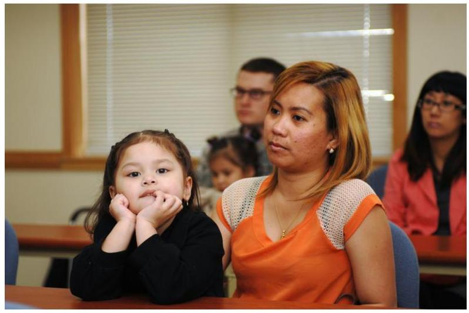

USCIS providing answers about citizenship and immigration for soldiers and families at Army Community Services in Seoul. US Army Garrison Red Cloud - U.S. Embassy answers immigration questions - CC BY-NC-ND 2.0.

In addition to these policies that promote family reunification, there are now more accepting policies to support reunification of gay citizens and their immigrant spouses. Historically, United States immigration policy has denied immigration to same-sex orientation applicants. Under the 1917 Immigration Act, homosexuality was grounds for exclusion from immigration. In 1965, Congress argued that gay immigrants were included in a ban on "sexual deviation" (Dunton, 2012). The ban against gay immigrants continued until 1990, when the Immigration and National Act was amended, removing the homosexual exclusion. Moreover, asylum has been granted for persecution due to sexual orientation (Dunton, 2012). Until 2013, immigrants and refugees could apply for residency or visas for their opposite-sex spouses. There was no provision made for same-sex partners. Following the overturn of the Defense of Marriage Act (DOMA), citizens and permanent residents can now 984 | Chapter 25: Immigration \& Immigrant Policy: Barriers \& Opportunities for Familiessponsor their same-sex spouses for visas. United States citizens can also sponsor a same-sex fiancé for a visa (USCIS, 2014).

Despite these advances, there are two large challenges faced by immigrants seeking reunification. First, it requires substantial time and resources, including legal counsel, to navigate the visa system. Adults can petition for permanent resident visas for themselves and their minor children, but processing such applications can take years. Currently, children of permanent residents can face sevenyear wait times to be accepted as legal immigrants (Meissner, Meyers, Papademetriou \& Fix, 2006).

In some cases, children can age out of eligibility by the time the application is processed and the visa is granted. Such children then go to the end of the waiting list for adult visa processing (Brown, 2014). The 2002 Child Status Protection Act is designed to protect children against aging out of visa eligibility when the child is the primary applicant for a visa, but the act does not state if it applies if a parent was applying on behalf of their family (Brown, 2014). In the 2014 ruling to Cuellar de Osorio v. Mayorkas, the Supreme Court found that the child status protection act does not apply for children when a parent is applying on behalf of their family. Such young adults have already generally been separated from family for many years, and will now be separated for years or decades more.

# Undocumented Families 

For families who do not have a sponsoring family member, have a sponsoring employer, or originate from a country with few immigrants, the options for legal immigration to the United States are very limited. Those families who choose to travel to the United States face substantial barriers, including a perilous trip across the border, few resources, and the constant threat of deportation.

One of the most dangerous times for undocumented families is the risky trip across the border. In order to avoid border patrol,undocumented immigrants take very dangerous routes across the United States border. The vast majority of all apprehensions of undocumented immigrants are on the border (while the remainder is apprehended through interior enforcement). For example, in 2014 ICE conducted 315,943 removals, $67 \%$ of which were apprehended at the border (nearly always by the Border Patrol), and 33\% of which were apprehended in the interior (ICE, 2019). The trip and efforts to avoid Border Patrol can be physically dangerous and in some cases, deadly. The acronym ICE symbolizes the fear that immigrants feel about capture and deportation. A deportee in Exile Nation: The Plastic People (2014), a documentary that follows United States deportees in Tijuana, Mexico, stated that ICE was chosen as the acronym for the Immigration and Customs Enforcement agency because it "freezes the blood of the most vulnerable." The Trump administration instituted a policy of separating families apprehended at the border and of criminal prosecution for all apprehended crossing the border illegally, including those applying for asylum. More than 2,600 children were separated from their caregivers under this policy, which was later overturned.

Even after arrival at the interior of the United States, undocumented immigrants feel stress and anxiety relating to the fear of deportation by ICE (Chavez et al., 2012). This impacts their daily life activities. Undocumented parents sometimes fear interacting with school, health care systems, and police, for fear of revealing their own undocumented status (Chavez et al., 2012; Menjivar, 2012). They may also avoid driving, as they are not eligible for a driver's license.

Since 2014, the Department of Homeland Security has placed a new emphasis on deporting undocumented immigrants. Department efforts generally prioritize apprehending convicted criminals and threats to public safety, but recent operations have taken a broader approach. In the opening weeks of 2016, ICE coordinated a nationwide operation to apprehend and deport undocumented adults who entered the country with their children, taking 121 people into custody in a single weekend. The majority ofthese individuals were families who applied for asylum, but whose cases were denied. Similar enforcement operations are planned (DHS press office, 2016). In many cases, the parents' largest concern is that immigration enforcement will break up the family. Over 5,000 children have been turned over to the foster care system when parents were deported or detained. This can occur in three ways:

- when parents are taken into custody by ICE, the child welfare system can reassign custody rights for the child,
- when a parent is accused of child abuse or neglect and there are simultaneous custody and deportation proceedings, and
- when a parent who already has a case open in a child welfare system is detained or deported (Enriquez, 2015; Rogerson, 2012).
"One of my greatest fears right now is for anybody to take me away from my baby, and that I cannot provide for my baby. Growing up as a child without a father [as I did], it's very painful... I felt like there was no male to protect them." - Mexican Immigrant describing how his fear of deportation grew after his baby daughter was born (Enriquez, 2015, p. 944)

Although the perilous trip and threat of deportation are significant challenges for undocumented immigrant families, there are two recent policy changes that offer new opportunities and protections for undocumented families. First, some states have sought to expand the educational supports available to undocumented immigrants. The State of Minnesota, for example, enacted the "Dream Act" into law (2013). This unique act, which is also known as the "Minnesota Prosperity Act," makes undocumented students eligible for State financial aid (State of Minnesota, 2014; Chapter 99, Article 4, Section 1).

Protesting for immigration reform. Peoplesworld - CC BY-NC 2.0.

Second, there are now greater protections for unaccompanied children. In some cases, children travel across the border alone, without their families. They may be travelling to join parents already in the United States, or their parents may send them ahead to try to obtain greater opportunities for them. As a result of human rights activism, unaccompanied and separated immigrant children are now placed in a child welfare framework by licensed facilities under the care of the Office of Refugee Replacement (Somers, 2011). They provide for education, health care, and psychological support until they can be released to family or a community (Somers, 2011). Each year, 8,000 unaccompanied immigrant children receive care from the ORR (Somers, 2011).

# Mixed Status Families 

Some members of the family may have documentation, while others
988 | Chapter 25: Immigration \& Immigrant Policy: Barriers \&
Opportunities for Familiesdo not. There may be cases where a United States citizen has applied for a visa for his family members, but they live without documentation while they wait for their priority date. Alternatively, there may be children who are born in the United States to undocumented parents. These children are entitled to benefits that their undocumented parents are not, such as welfare benefits (Peterson Institute for International Economics, 2005).

Children are subject to "multigenerational punishment," where they are disadvantaged because of their parents' undocumented status (Enriquez, 2015). As in undocumented families, parents fear interacting with school, health care, or police (Chavez et al., 2012; Menjivar, 2012). These children have limited opportunities to travel domestically (due to risks of driving without a license) or internationally (due to lack of travel papers) (Enriquez, 2015). When parents' employment opportunities are limited due to their lack of documentation, the children share in the economic instability (Enriquez, 2015).
"I'm still [supposed to be] perceived as this male provider... [but] we lost our place [after my job found out about my status], and now I'm [living] with my in-laws, and it's hard to find a great-paying job... It makes you feel like [people are saying]. 'How dare you do that to a little child.' It's hard because you do feel guilty, you feel that you're punishing someone that shouldn't be punished." -Mexican immigrant (Enriquez, 2015, p. 949)

# International Marriages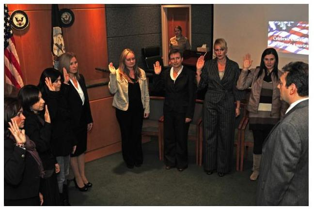

Spouses of United States service members in Italy take the oath of allegiance to become United States citizens. felicito rustique, jr. CC BY 2.0.

In our increasingly global world, more couples are meeting and courting across national borders. Many of these couples ultimately seek to live together in the same country. In some cases, an immigrant travels to the United States and obtains citizenship, but still hopes to marry someone from their home country and culture. Under current United States policy, there are visas available for fiancés to immigrate to the United States. However, these relationships are screened. There are strict requirements to prove that the marriage is "bonafide." If a marriage is considered "fraudulent," the immigrant spouse can be detained and the native spouse can be fined. There are also limits to how many fiancé visas can be filed within a certain time frame so that the same person cannot repeatedly apply for a fiancé visa with different partners (USCIS, 2005).

Regulations are in place to protect the non-citizen fiancés. In some cases, the United States citizen has much greater power than the non-citizen fiancé and may exploit their lack of knowledge of English, local customs, and culture. The United States Government is required to give non-citizen fiancés information about their rights and resources, in an effort to prevent or intervene in cases

990 | Chapter 25: Immigration \& Immigrant Policy: Barriers \&
Opportunities for Familiesof intimate partner violence (USCIS, 2005). A citizen can use an international marriage broker (IMB) to connect with a partner from their home country or another desired country. The International Marriage Broker Regulation Act of 2005 (IMBRA) states that the government must conduct criminal background checks on prospective citizen clients, in order to protect the welfare of the fiancés who will enter the United States (USCIS, 2005).

# Video 

Ruben Parra-Cardona, Ph.D., LMFT discusses mixtures of hope and discrimination in the United States (10:48-11:53).

One or more interactive elements has been excluded from this version of the text. You can view them online
here: https://uark.pressbooks.pub/
humanbehaviorandthesocialenvironment2/?p=461\#oembed-1

### 25.5 Future Directions

There are two shifts in immigration policy that are critical for the well-being of families. First, policy should shift to accelerate family reunification for those families whose visas have been accepted. Families are currently separated from their children for years, caught in a holding pattern of waiting. This leads to stress, grief, and difficulty building relationships during key developmental times ina child's life. Accelerating processing applications and shorter wait times would facilitate greater family well-being.

Second, policy could provide greater protection for vulnerable children in undocumented or mixed-status families. In cases where a parent is deported, the child's welfare should be carefully considered in whether to leave the child in the care of a local caregiver or provide the option to send the child to the home country with their parent.

# Recent Policy Changes and the Impact on Families Malina Her 

Since his presidential campaign, President Trump and his administration has placed immense attention on immigration policies. As a result, many recent policy changes and efforts related to immigration enforcement and refugee resettlement have greatly impacted immigrant and refugee families (Pierce, 2019). We highlight here two key policies, the lowering of the refugee admissions cap, and the introduction of new vetting requirements.

## Lowering of the refugee admissions

Since the creation of the U.S. refugee resettlement program in 1980, the annual admission of refugees has hit an all-time low within the fiscal year of 2019 with a ceiling cap of 30,000 admissions. Yet the actual refugee admissions and arrivals are even lower, with only 12,154 actual admissions being granted within the first 6 months of the fiscal year (Meissner \& Gelatt, 2019; Pierce, 2019). This policy change directly affects thepossibility of family reunification, especially in families where partners are not legally married (Solis, 2019).

# New vetting requirements 

The Trump administration has introduced new vetting requirements for refugees, citing national security risk as a primary reason. This expansion of vetting has increased the amount of information needed for visa applications, such as providing prior years of travel or even usernames to social media accounts (Pierce, Bolter, \& Selee, 2018). In addition, resettlement applications of refugees from 11 countries perceived as "high risk" to national security have been reduced on the priority list (Egypt, Iran, Iraq, Libya, Mali, North Korea, Somalia, South Sudan, Syria and Yemen). Yet reports by the National Counterterrorism Center in 2017 have shown that terrorists are unlikely to use resettlement programs as a means to enter the United States (Meissner \& Gelatt, 2019; Pierce, 2019). A former director of the U.S. Citizenship and Immigration Services agrees that the increased vetting requirements of refugees appears unnecessary as the vetting procedures in place are already rigorous enough to identify any potentially problematic applicant (Rodriguez, 2017).

These policies have implications for both our communities and for individual refugee families. A draft report conducted by the Health and Human Services in the summer of 2017 found that between 2005 and 2014, refugees contributed an estimated amount of $\$ 269.1$ billion dollars in revenues to the U.S. government (Davis \& Sengupta, 2017), income that may be stemmed by the low admissions ceiling and longer processing times dueto increased vetting procedures. for refugee families, these new vetting procedures add to the long waiting times for family reunification as it backlogs cases. Family members have to wait longer as they undergo and complete additional requirements and it prolongs their cases such that delays can amount to decades. For some, reunification becomes nearly impossible (Hooper \& Salant, 2018). Furthermore, applicants seeking refuge or asylum from countries on the high-risk list are turned away from immediate protection as their applications continue to float in the system for review of any potential security risk. Thus many may have to stay in a country where they continue to face violence and persecution as they wait.

# 25.6 End-of-Chapter Summary 

Though there are substantial barriers to family reunification and well-being, there are also great opportunities. In recent decades, U.S. policy has been gradually changed to be more inclusive and aimed more intensely on family reunification. The case studies below outline different paths to immigration and family reunification. They demonstrate the opportunities and assistance which are available, as well as the challenges faced.# Case Study 1: Becoming a Citizen 

Mr. and Mrs. Addisu, both in their early 70s, immigrated to the United States from Ethiopia nearly 15 years ago with sponsorship from their daughter and her United Statesborn husband. The couple was eager to learn English and embrace the different cultural values, which meant becoming citizens. They wanted to join the country that their child and grandchildren called home.

After filing the appropriate documentation, paying related fees, and waiting for several years, both Mr. and Mrs. Addisu were scheduled for their naturalization test. The Addisu's daughter helped them study the material. They particularly hoped that their parents could obtain citizenship so that the Addisus could take a long trip home to see their friends in Ethiopia, which they had not been able to do since moving to the United States with strict residency requirements.

But it quickly became apparent that Mr. Addisu had trouble learning English, which was primarily age-related. With assistance from a local church, Mr. Addisu applied for an English Language Exemption. This enabled him to exempt from the English language requirement and take the civics test in Oromo with the assistance of an interpreter.# Case Study 2: Family Reunification 

Matias, a United States citizen, filed a petition to request a green card for his daughter Victoria who still lived in Mexico. Victoria had a 15-year old son and a 14-year daughter, who were listed on the petition as "derivative beneficiaries", eligible to receive a visa if their mother received one. Their petition was approved, and they waited for their priority date. Victoria and her son and daughter continued living in Mexico, they lived on a low income and in a violent neighborhood. They communicated regularly with Matias, and Victoria repeatedly expressed how excited she was to see her dad again, and to be able to provide a better life for her kids. She regularly checked on her application and the priority date, excited for its arrival.

The priority date arrived 7 years later. Victoria's children were now 22 and 21, and so they were no longer eligible to be derivative beneficiaries on Victoria's visa. When Victoria learned, she was distraught. She talked to every advocacy group she could find, but there were no options. There would have been services available to expedite their petition as the children approached adulthood, but she and Matias had been unaware.

Victoria talked with her children about the options; they could all remain together in Mexico, or she could travel to the United States and apply for them to join her. One of her children as now working, and the other was attending a technical school. They decided together that it would be best for Victoria to go on to the United States. Once shearrived and became a lawful permanent resident, she filed a petition for her kids to get a visa. It was approved. Once again, the family waited for their priority date. Now, Victoria was with her father, but separated from her kids. It was now her kids she was calling, saying, "I miss you, I am excited to see you, I hope we can be together soon, soon, soon." After 8 years, the priority date arrived. Victoria's children, now ages 29 and 30, joined their mother in the United States.

# Discussion Questions 

1. Think back on your own family history. If you had family immigrate to the United States, what policies were in place when they arrived?
2. What would motivate a family to immigrate without documentation? What might make them decide against it?
3. What challenges does a child face if their parents do not have documentation?
4. What are the arguments for making family reunification quicker and more accessible? What are the arguments against it?
5. What barriers did the families in the case studies have to reunification? What supports did they receive?# Helpful Links 

## Migration Policy Institute

- http://www.migrationpolicy.org/
- The Migration Policy Institute is "an independent, nonpartisan, nonprofit think tank in Washington, DC dedicated to analysis of the movement of people worldwide". They have regular publications and press releases about trends in migration, both to the United States and internationally.

## Statue of Liberty Oral History

- https://www.statueofliberty.org/discover/stories-and-oral-histories/
- The Statue of Liberty - Ellis Island Foundation, Inc. keeps a database of oral histories of immigrants who came through Ellis Island during their migration to America between 1892 to 1954.

## References

American Civil Liberties Union. (2019). Family separation by the numbers. Retrieved from: https://www.aclu.org/issues/ immigrants-rights/immigrants-rights-and-detention/familyseparation
American Immigration Council. (2019). The Dream Act, DACA, and Other Policies Designed to Protect Dreamers. Retrievedfrom: https://www.americanimmigrationcouncil.org/research/ dream-act-daca-and-other-policies-designed-protect-dreamers
Borjas, G. J., \& Katz, L. F. (2007). The evolution of the Mexican-born workforce in the United States. National Bureau of Economic research: Mexican immigration to the United States. Retrieved from: http://www.nber.org/chapters/c0098.pdf
Brown, K. J. (2014). The long journey home: Cuellar de Osario v. Mayorkas and the importance of meaningful judicial review in protecting immigrant rights. Boston College Journal Of Law \& Social Justice, 34(3), 1-13.
Chavez, J. M., Lopez, A., Englebrecht, C. M., \& Viramontez Anguiano, R. P. (2012). Sufren Los Niños: Exploring the Impact of Unauthorized Immigration Status on Children's Well-Being Sufren Los Niños: Exploring the Impact of Unauthorized Immigration Status on Children's Well-Being. Family Court Review, 50(4), 638-649. doi:10.1111/j.1744-1617.2012.01482.x
Chishti, M. \& Bolter, J. (2018). Family separation and zero-tolerance policies rolled out to stem unwanted migrants but may face challenges. Migration Policy Institute. Retrieved from: https://www.migrationpolicy.org/article/family-separation-and-zero-tolerance-policies-rolled-out-stem-unwanted-migrants-may-face
Congressional Budget Office. (2007). The impact of unauthorized immigrants on the budgets of state and local governments. Retrieved from: https://www.cbo.gov/sites/ default/files/110th-congress-2007-2008/reports/ 12-6-immigration.pdf
Cortes, (2008). The effect of low-skilled immigration on U.S. prices: Evidence from CPI data. Journal of Political Economy, 116(3), p. doi: 0022-3808/2008/11603-0004.
Davis, J. H., \& Sengupta, S. (2017). Trump administration rejects study showing positive impact of refugees. The New York Times. Retrieved from https://www.nytimes.com/2017/09/18/ us/politics/refugees-revenue-cost-report-trump.html
Department of Homeland Security Press Office. (2016). Statementby Secretary Jeh C. Johnson on Southwest Border Security[Press release]. Retrieved from: https://www.dhs.gov/news/2016/03/ 09/statement-secretary-jeh-c-johnson-southwest-bordersecurity
Dunton, E. S. (2012). Same sex, different rights: Amending U.S. immigration law to recognize same-sex partners of refugees and asylees. Family Court Review, 50(2), 357-371. doi:10.1111/ j.1744-1617.2012.01441.x

Enriquez, L. E. (2015). Multigenerational punishment: Shared experiences of undocumented immigration status within mixedstatus families. Journal of Marriage and Family, 77, 939-953. doi: 10.1111/jomf. 12196

Fiscal Policy Institute. 2015. How immigrant small businesses help local economies grow. Retrieved from http://fiscalpolicy.org/wp-content/uploads/2015/01/Bringing-Vitality-to-Main-Street.pdf.
Fix, M. E. \& Passel, J. S. (1994). Immigration and immigrants: Setting the record straight. Urban Institute. Retrieved from: http://www.urban.org/publications/305184.html\#11
Garner, B.A. (Ed.). (2014). Black's law dictionary. Eagan, MN: West Publishing.
Goss, S., Wade, A., Skirvin, J.P., Morris, M., Bye, D. M., \& Huston, D. (2013) Effects of Unauthorized Immigration on the Actuarial Status of the Social Security Trust Funds. Acturial Note No. 151. Social Security Administration, Office of the Chief Actuary.
Hooper, K., \& Salant, B. (2018). It's relative: A cross-country comparison of family-migration policies and flows. MPI: Issue Brief, 1-20.
Immigration and Customs Enforcement (ICE). (2019). Fiscal Year 2018 ICE Enforcement and Removal Operations Report. Retrieved from https://www.ice.gov/features/ERO-2018Immigration History. (2019). Immigration and nationality act of 1962 (The McCarran-Walter Act). Retrieved from: https://immigrationhistory.org/item/immigration-and-nationality-act-the-mccarran-walter-act/
Immigration History. (2019). Immigration and nationality act of 1962(The McCarran-Walter Act). Retrieved from: https://immigrationhistory.org/item/immigration-and-nationality-act-the-mccarran-walter-act/
Kandel, W. A. (2014). U.S. family-based immigration policy. Congressional Research Service Report for Congress. Retrieved from: https://fas.org/sgp/crs/homesec/R43145.pdf
Krogstad, J. M. (2019). Key facts about refugees to the U.S. Pew Research Center. Retrieved from: https://www.pewresearch.org/ fact-tank/2019/10/07/key-facts-about-refugees-to-the-u-s/
Lowell, B. L., Gelatt, J., \& Batalova, J. (2006). Immigrants and labor force trends: The future, past, and present. Insight, 17. Retrieved from: http://www.migrationpolicy.org/research/immigrants-and-labor-force-trends-future-past-and-present
Mandeel, E. W. (2014). The Bracero program 1942-1964. American international Journal of Contemporary Research, 4(1), p. 171-184. Retrieved from: http://www.aijcrnet.com/journals/ Vol 4 No 1 January 2014/17.pdf
Meissner, D., \& Gelatt, J. (2019). Eight key U.S. immigration policy issues: State of play and unanswered questions. MPI: U.S. Immigration Policy Program, 1-34.
Meissner, D., Meyers, D. W., Papademetriou, D. G., \& Fix, M. (2006). Immigration and America's Future: A new chapter. Migration Policy Institute. Retrieved from: http://www.migrationpolicy.org/research/immigration-and-americas-future-new-chapter
Menjivar, C. (2012). Transnational Parenting and Immigration Law: Central Americans in the United States. Journal of Ethnic \& Migration Studies, 38(2), 301-322. doi:10.1080/ 1369183X.2011.646423
Nadadur, R. (2009). Illegal immigration: A positive economic contribution to the United States. Journal of Ethnic and Migration Studies, 35(6), doi: 10.1080/13691830902057775
National Council of Farmer Cooperatives. (2019). E-verify. Retrieved from: http://ncfc.org/build/issues/labor-and-infrastructure/everify/Ottaviano, G. I. P., \& Peri, G. (2012). Rethinking the effect of immigration on wages. Journal of the European Economic Association, 10, 152-197.
Ottaviano, G., \& Peri, G. (2008). Immigration and National Wages: Clarifying the Theory and the Empirics. NBER Working Papers, 14188. National Bureau of Economic Research, Cambridge Ma.

Peri, G. (2010). The impact of immigrants in recession and economic expansion. Migration Policy Institute. Retrieved from: http://www.migrationpolicy.org/research/impact-immigrants-recession-and-economic-expansion
Pierce, S. (2019). Immigration-related policy changes in the first two years of the Trump administration. Migration Policy Institute, Washington, DC. Retrieved from: https://www.migrationpolicy.org/research/immigration-policy-changes-two-years-trump-administration
Pierce, S., Bolter, J., \& Selee, A. (2018). U.S. immigration policy under Trump: Deep changes and lasting impacts. MPI: Transatlantic Council on Migration, 1-24.
Peterson Institute for International Economics. (2005). US immigration policy and recent immigration trends. Retrieved from: http://www.iie.com/publications/chapters_preview/ 4000/02iie4000.pdf
Rodriguez, L. (2017, November). I used to run the immigration service-and Trump's refugee policy is baseless. The Atlantic. Retrieved from https://www.theatlantic.com/politics/ archive/2017/11/vetting-refugees-trump/544430/
Rogerson, S. (2012). Unintended and Unavoidable: The Failure to Protect Rule and Its Consequences for Undocumented Parents and Their Children. Family Court Review, 50(4), 580-593. doi:10.1111/j.1744-1617.2012.01477.x
Shierholz, H. (2010). Immigration and Wages: Methodological Advancements Confirm Modest Gains for Native Workers. Economic Policy Institute Briefing Paper \#255.
Solheim, C.A., Rojas-Garcia, G., Olson, P.D., \& Zuiker, V.S. (March/ April, 2012). Family Influences on Goals, Remittance Use, andSettlement of Mexican Immigrant Agricultural Workers in Minnesota. Journal of Comparative Family Studies, 43(2).
Solis, S. (2019, October). "My kids need me": Congolese family among thousands potentially affected by U.S. refugee cap. Mass Live. Retrieved from https://www.masslive.com/politics/2019/ 10/my-kids-need-me-congolese-family-among-thousands-potentially-affected-by-us-refugee-cap.html
Somers, A. (2011). Voice, agency and vulnerability: The immigration of children through systems of protection and enforcement. International Migration, 49(5), 3-14.
US Citizenship and Immigration Services. (2005). Information on the legal rights available to immigrant victims of domestic violence in the United States and facts about immigrating on a marriagebased visa. Retrieved from: http://www.uscis.gov/sites/default/ files/USCIS/Humanitarian/Battered \%20Spouse\%2C\%20Children\%20\%26\%20Parents/ IMBRA\%20Pamphlet\% 20Final\%2001-07-2011\%20for\%20Web\%20Posting.pdf
US Citizenship and Immigration Services. (2010). Welcome to the United States: A Guide for New Immigrants. Retrieved from: http://www.uscis.gov/sites/default/files/files/ nativedocuments/M-618.pdf
US Citizenship and Immigration Services. (2012). A guide to Naturalization. Retrieved from: http://www.uscis.gov/sites/ default/files/files/article/M-476.pdf
US English Foundation, Inc. (2016). American immigration - An overview. Retrieved from: https://usefoundation.org/research/ issues/american-immigration-overview/
U.S. Visas. (n.d.). The Immigrant Visa Process. Retrieved from: https://travel.state.gov/content/travel/en/us-visas/ immigrate/the-immigrant-visa-process.html
Weissbrodt, D., \& Danielson, L. (2004). The source and scope of the federal power to regulate immigration and naturalization. University of Minnesota Human Rights Library.Retrieved
from: http://www1.umn.edu/humanrts/ immigrationlaw/chapter2.html
Weissbrodt, D. \& Danielson, L. (2011). Immigration law and procedure in a nut shell (6th ed.). Eagan, MN: West Publishing Company.
White House. (2014). Presidential memorandum: Creating welcoming communities and fully integrating immigrants and refugees. Retrieved from: https://www.whitehouse.gov/the-press-office/2014/11/21/presidential-memorandum-creating-welcoming-communities-and-fully-integra
Zallman, L., Woolhandler, S., Himmelstein, D., Bor, D., \& McCormick, D. (2013). Immigrants contributed an estimated $\$ 115.2$ billion more to the Medicare trust fund than they took out in 2002-2009. Health Affairs, 32(6), 1153-1160. Doi: 10.1377/hlthaff.2012.1223

# 27.7 Appendices 

## Appendix I

History of Documented Immigration Policy: the Qualitative Restrictions Phase (1850s to 1920s)
In the mid-1800s, the United States began a phase of qualitative restrictions. There was a labor shortage during the 1840s, and many Chinese men and families had immigrated to fill this gap. During the recession that followed, stigma against the Chinese grew. Western states complained that wages were lowering due to Chinese immigration. Immigration policy during this time aimed to exclude "undesirable" immigrants based on country of origin (notably China), skills, and criminal background.

- 1868 14th Amendment: This amendment granted citizenship rights to all people born in the United States. Not allimmigrants were considered equally eligible, however; aliens of African descent were eligible for naturalization, while Asians were not (US English Foundation, 2016).

- The Act of 1882: This act is considered the first federal immigration act, which barred (1) convicts; (2) prostitutes; (3) lunatics; (4) idiots; and (5) those likely to become public charges (dependent for support) from immigrating.
- 1882 Chinese Exclusion Act: Immigration of all Chinese laborers was banned. Current Chinese immigrants were denied naturalization, and undocumented immigrants could now be deported (Fix \& Passel, 1994). The ban was not repealed until 1943 (US English Foundation, 2016).
- 1881: This Act added the (1) diseased; (2) paupers," and "polygamists" to the list of people excluded from immigrating to the United States.
- 1903: And this act added (1) epileptics; (2) insane; (3) beggars; and (4) anarchists.
- 1906 Naturalization Act: Naturalization required the ability to speak and understand English (US English Foundation, 2016). This was implemented in an effort to discourage "inferior" immigrants from applying (Weissbrodt \& Danielson, 2011).
- 1917 Immigration Act or Asiatic Barred Zone Act: Congress barred immigrants from most of Asia (US English Foundation, 2016). They also added a literacy test for naturalization and banned immigrants with "perceived mental inferiority", which included homosexuality (Dunton, 2012).

# Appendix 2 

History of Documented Immigration Policy: the Quantitative Restrictions Phase (1920s to 1950s)
In the early 1900s, the United States began a phase of quantitative immigration restrictions. The United States was again in arecession, and citizens feared that immigrants could reduce employment opportunities. Immigration policy now instituted quotas to restrict immigration.

- 1921 Quota law: Each national origin was given a quota limit. For example, immigrants from each European country could not exceed $3 \%$ of the national census of people from that country currently living in the United States. Quotas favored western and northern Europeans, and most Asian countries continued to be excluded (US English Foundation, 2016).
- 1924 Immigration and Naturalization Act, also known as Johnson-Reed Act: This restricted the annual quota to $2 \%$ for each country, substantially reducing total immigration. The system favored Southern and Eastern European immigrants, and immigrants from most Asian countries were prohibited (US English Foundation, 2016).
- 1952 McCarran-Walter Act: This act, and the amendments below, remains the basic body of immigration law. It opened immigration for many countries, establishing quotas for all countries (US English Foundation, 2016). It also established a quota for immigrants whose skills were needed in the labor force (Fix \& Passel, 1994). The act also implemented a four admission preferences: (1) unmarried adult sons and daughters of United States citizens; (2) spouses and unmarried sons and daughters of United States citizens; (3) professionals, scientists, and artists of exceptional ability; and (4) married adult sons and daughters of United States citizens.

# Appendix 3 

History of Documented Immigration Policy: the Inclusive Phase (1950s to Present)
President Kennedy denounced the national origins quotasystem ("Immigrant policy should be generous; it should be fair; it should be flexible. With such a policy we can turn the world, and our own past, with clean hands and a clear conscience."). The civil rights movement gave further additional power to a more inclusionary policy system. Immigration policy began to eliminate racial, national, and ethnic biases (Fix \& Passel, 1994).

- 1965 Hart-Celler Immigration Act or Immigration and Nationality Act and 1978 Amendments. In this act, the national ethnicity quotas were repealed. Instead, a cap was set for each hemisphere. Priority was given to family reunification and employment skills. This shifted away from a priority on European Immigration (Fix \& Passel, 2004), and led to a substantial increase in documented immigration (Peterson Institute for International Economics, 2005). This act also expanded the original four admission preferences to seven, adding: (5) siblings of United States citizens; (6) workers, skilled and unskilled, in occupations for which labor was in short supply in the United States; and (7) refugees from Communist-dominated countries or those affected by natural disasters.
- 1990 Immigration Act: This act increased the ceiling for employment-based immigration and eased the limits on family-based immigration (US English Foundation, 2016). It was created as a compromise between exclusionary and inclusionary policies (see undocumented immigration section below), but ultimately led to a $40 \%$ increase in total admissions (Fix \& Passel, 1994). It also created a Diversity Immigrant Visa Program, known as the "Green Card Lottery," increasing the focus on diversity in admissions. Each year, the Attorney General issues visas through this program to regions that sent few immigrants to the United States.
- 2000 Legal Immigration Family Equity (LIFE) Act: This act temporarily revived a section of the Immigration Act, allowing qualified immigrants to obtain permanent residency, even ifthey entered without documents.

- 2001 Patriot Act: This act allowed for the indefinite detention of immigrants
- Deferred Action for Childhood Arrivals: The Dream Act, proposed in the Senate in 2001, would allow for conditional permanent residency to immigrants who arrived in the US as minors and have long-standing US residency. While this bill has not been signed into law, the Obama administration has created renewable two-year work permits for those who meet these standards.

# Appendix 4 

## History of Undocumented Immigration Policy

Before the mid-1900s, there were few policies that regulated the identification and deportation of undocumented immigrants. The Immigration Act of 1891 introduced undocumented immigration policy by establishing the Bureau of immigration, responsible for deportation of undocumented immigrants. In 1940, the Alien Registration Act allowed for all previously undocumented immigrants to obtain legal recognition. All residents who were not US citizens were required to register with the government. They were given a receipt card (AR-3) as proof of compliance. After World War II, this became part of the immigration procedure. Immigrants were now given a visitors form, temporary foreign laborer card, or a permanent resident card ("green card"; US English Foundation, 2016).

Policies became much more stringent beginning in the mid-1900s. Immigration rates dropped during the Great Depression resulting in a labor shortage. The government established the Bracero program in 1942 to actively recruit temporary agricultural laborers from Mexico. Over 4 million Mexican laborers were recruited over the next twenty years (Mandeel, 2014). Through thisprogram, Mexican immigrants began to establish homes and social networks in the United States, and in turn, helped friends and family to come to the United States both legally and illegally.

There was controversy over the Bracero program. As a result, the INS implemented "Operation Wetback" that targeted and deported Mexican immigrants between 1954 and 1964. When the Bracero program ended in 1964, there was an influx in undocumented immigration (Mandeel, 2014; Nadadur, 2009). Legislation after this point has aimed to reduce undocumented immigration.

- 1986 Immigration Reform and Control Act: This act was implemented in response to criticism of the United States being unable to control the flow of undocumented immigrants. The act made it illegal to hire undocumented workers, and created sanctions. It required that states verify immigration status of applicants for welfare (Fix \& Passel, 1994). It expanded border enforcement (Peterson Institute for International Economics, 2005; Fix \& Passel, 1994). These provisions were meant to reduce enticements to immigrate without documentation and to enforce immigration policy. However, it also granted amnesty to all people living without documents prior to 1982, and to their immediate families in other countries (US English Foundation, 2016). This led to the legalization of more than one percent of the United States population (Fix \& Passel, 1994). In order to reduce financial burdens of this declaration of amnesty, the act also provided funds for states to provide health care, public assistance, and English education (Meissner, Meyers, Papademetriou \& Fix, 2006), but barred most previously undocumented immigrants from receiving federal public welfare assistance for five years (Weissbrodt \& Danielson, 2011).
- 1996 Undocumented Immigration Reform and Immigrant Responsibility Act: This act aimed to reduce undocumented immigration. It reduced benefits for legal immigrants, such as food stamps and welfare. It increased border control andexpedited deportation of undocumented immigrants and increased required documentation for employment (US English Foundation, 2016).

- 1996 Anti-Terrorism and Effective Death Penalty Act: This act expedited the removal of foreigners convicted of felonies, or who do not have proper documentation. The felony bar remains today and is an important determinant of immigrants being deported, even if they arrived in the United States legally.
- 2000 Life Act and Section 245(i): This allowed undocumented immigrants present in the United States to adjust their status to permanent resident, if they had family or employers to sponsor them (US English Foundation, 2016).
- 2001 Patriot Act: The sociopolitical climate post-September 11, 2001 drastically changed immigrant policies in the United States. The Department of Homeland Security (DHS) was formed in 2002 and absorbed Immigration and Naturalization Services (INS). This act created two other agencies: Immigration and Customs Enforcement (ICE) and Citizenship and Immigration Services (CIS). This act also enhanced immigration enforcement and barred immigrants with potential terrorist links (US English Foundation, 2016).
- 2005: The House of Representatives passed a bill that increased enforcement at the borders, focusing on national security rather than family or economic influences (Meissner, Meyers, Papademetriou \& Fix, 2006).
- 2005 REAL ID Act: This act required that before states issue a driver's license or identification care, they must verify the applicant's legal status.
- 2006: The Senate passed a bill that expanded legal immigration, in order to decrease undocumented immigration (Meissner, Meyers, Papademetriou \& Fix, 2006).# Attribution 

Adapted from Chapters 1 through 9 from Immigrant and Refugee Families, 2nd Ed. by Jaime Ballard, Elizabeth Wieling, Catherine Solheim, and Lekie Dwanyen under the Creative Commons Attribution-NonCommercial 4.0 International License, except where otherwise noted.# Chapter 26: From There to Here: The Journey of Refugee Families to the United States 

## Learning Objectives

- Learn from the national and global perspectives of refugee families and their journey.
- Recognizing that the world is constantly and rapidly changing.
- Recognizing that Global/national/international events can have an impact on individuals, families, groups, organizations, and communities.
- Global implications dictate that we foster international relationships and opportunities to address international concerns, needs, problems, and actions to improve the well-being of not only U.S. citizens, but global citizens.# 26.I Introduction 

"We mostly lived in the jungle, because it was not safe to stay in the village. I had four children, each a year apart, I think the oldest was four. Ever since the Hmong started to flee the villages, if the communists found people in the villages they would kill them, so we hid in jungles most of the time... I did not have time to be afraid. Of course, I was scared the communists might find us, but I thought to myself that it did not really matter if I was afraid or not. I left it up to fate what was to become of us. There was no one to help us, and no safe place we could run to where we knew there would be help if we arrived, so we just kept running and hiding, all the while trying to decide if we should flee to Thailand."
-Mai Vang Thao, Hmong refugee
Hmong Women's Action Team Oral History Project, Minnesota Historical Society

Throughout history, families who are persecuted or fear persecution in their home countries have sought refuge in foreign countries. As Mai Vang Thao's story demonstrates, these families face daily threats of violence and struggle to provide basic security or resources for their children. Families seek physical safety for themselves and their children by fleeing to a new country. The United States, which has been the final destination for many of these families who have been forced to flee, can offer them refugee or asylee status as a protection. Refugee or asylee families can live in the United States, with temporary assistance to get settled and to begin providing for themselves and their families.

A refugee is someone who was persecuted or fears persecution (on the basis of race, religion, nationality, membership in a particular social group, or political opinion), has fled to another country, and has not participated in persecuting others. There is a special subcategory of refugees called asylum seekers: refugeesand asylum seekers are different only in the process of relocation. Refugees have applied for and been granted refugee status before they leave for the United States. Asylum seekers meet all the criteria for refugee status but have already reached the United States. Although the process of arrival is different, the term refugee will be used in this text to refer to refugees and asylees unless otherwise noted.

The purpose of this chapter is to identify the paths taken by refugee families from persecution to relative safety. We will continue to follow in Mai Vang Thao's footsteps to see one story that demonstrates the steps of fleeing persecution, family separation, admittance to the United States, and becoming accustomed to the new home.

# 26.2 Fleeing Persecution and Separation from Family 

During those times everyone was afraid, and we taught the children very young to be afraid, so at the age of one or two, they already learned to be afraid and did not cry either.
-Mai Vang Thao, Hmong refugee

## Fleeing Persecution and Separation from Family

All refugees have experiences of loss and/or exposure to traumatic events, either personally or within their communities. Such experiences might include systematic discrimination and intimidation, civil war, ongoing military conflicts, forceful government expulsion from the country, ethnic cleansing, and even genocide. Families living in these contexts often experience

1014 | Chapter 26: From There to Here: The Journey of Refugee Families to the United Statesviolence, or they hear about it in their communities and have reason to fear it. Families' top priority is to find safety. However, even after they relocate, some families will experience the long-term effects from the traumatic stress they have experienced.
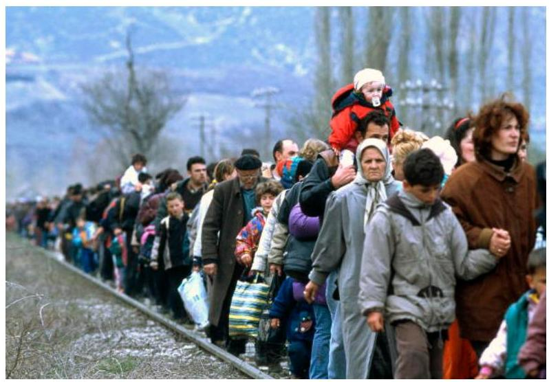

Kosovar refugees fleeing their homeland. [Blace area, The former Yugoslav Republic of Macedonia] United Nations Photo - Kosovo refugees - CC BY-NC-ND 2.0.
"[The children's father] was hardly with us. He went off with the men and left us hiding in the jungles. In fact he had prepared that in the event that we could no longer stay, he would leave to Thailand, and the children and I, if captured by the communists, would stay behind since the communist soldiers would not kill us because we are only women and children."
-Mai Vang Thao, Hmong refugee

Chapter 26: From There to Here: The Journey of Refugee Families to the United States | 1015The conflicts and situations that cause people to flee their home countries often separate families. Families can become separated in the midst of a conflict or during the process of fleeing or migrating (families can also be separated during the resettlement process, see below). Even if parents and children are kept together through this arduous process, resettlement of an entire family unit (in many cultures, the family unit includes grandparents, aunts and uncles and their families) would rarely occur.

Separation from family members can be a source of guilt, loss, and added pressure. These losses of family ties and community support can often be characterized as ambiguous (Boss, 2006). When a family member dies, the loss is concrete, and the family can mourn. When family members are separated, there can be great ambiguity. Separated loved ones are physically absent but very present in the minds of their family members. Families have difficulty determining who is in the family, and what roles they play. This ambiguity can add to the stress of an already stressful migration. For example, youth separated from their parents during civil war wondered if their families had survived the fighting or had died. They described feelings of loneliness and intense depression. One child described, "The kids were most thinking - Are they alive or are they not alive?" (Luster, Qin, Bates, Johnson, \& Rana, 2008, p. 449).

Wondering whether certain family members are alive or dead can cause individuals and families to become stuck with mixed feelings of hope, loss, guilt, and grief. These ambiguous losses compound the concrete losses of homes and family members. The impact of loss and traumatic events can be seen at both the individual and family level. In fact, one study found that the statistical relationships between traumatic events, grief, depression, and PTSD are stronger at the family level than they are at the individual level (Nickerson et al., 2011). Separated individuals must find ways to accept and live with the ambiguity. As one child said of his separation from his parents, "It happened. I did not have any control over it. I just think I wish it did not happen. But it did and I could not do anything about it" (Luster et al., 2008, p. 449).

1016 | Chapter 26: From There to Here: The Journey of Refugee Families to the United StatesWhen refugees are able to remain with close family members, it can ease the strains of relocation and coping with the traumas experienced in the home country. In a study of refugees in Norway, Lie, Lavik, and Laake (2001) found that the presence of close family in Norway had a positive impact on mental health symptoms, especially for those with higher exposure to traumatic events. McMichael, Gifford, and Correa-Velez (2011) similarly found that family connection is particularly important for youth early in the resettlement process.

# 26.3 Travel to Temporary Refuge 

"When it became so unsafe we could not stay anymore. Some of the men who had returned [from Thailand] were my uncles, and they said that if we wanted to go with them to Thailand they would help us out, so that is why we decided to leave for Thailand... I still remember lots of things about living in camp, such as the sicknesses, not enough water to drink, the very hot weather, and not enough food...Everything about it was bad. We were living on the Thai people's land, so they treated us any way they wanted. When the Hmong went to the flea market, they were beaten."
-Mai Vang Thao, Hmong refugee
In order to be a refugee, families must have traveled to a new country in order to escape persecution. Families generally cross the border into another country where they have heard that some aid is available. Charity or government organizations will set up refugee camps, which provide some shelter, medical care, and food.

Refugee camps are set up in response to a sudden and great need. Consequently, there are rarely enough resources for all of the families. Women are particularly at risk after a disaster. They may struggle to compete with men for resources (Viswanath etal., 2013). Post-disaster resources tend to have little sensitivity to needs of women, such as sanitary towels, diapers, or privacy or protection near restroom facilities (Viswanath et al., 2013; Fisher, 2010). Women experience increased sexual violence and domestic abuse following a disaster (Luft, 2008; Neumayer \& Plumper, 2007; Anastario, Larrance, \& Lawry, 2008; Viswanath et al., 2013).

Families can sometimes be separated during this stage of relocation. For example, children are sometimes sent ahead to another camp that is thought to be safer, leading to separation from their parents (Luster, Qin, Bates, Johnson, \& Rana, 2008). This can lead to both vulnerability and feelings of loss.

Figure 1. Camp for Pakistani Refugees. Al Jazeera English - Refugee camp CC BY-SA 2.0.# 26.4 Family Admittance to the United States 

Once refugees have entered a new country, they can begin the road to refugee or asylee status in the United States. This process can be arduous and often takes over a year. The first step is a Refugee Status Determination or RSD. An authorized official from the United Nations High Commissioner for Refugees will determine if an individual is considered a refugee under international, regional, or national law. The official will then determine if the person should return to their home country, resettle in the neighboring country, or resettle in a third country (such as the United States). Less than 1\% of refugees worldwide are ever resettled in a third country (UNHCR, 2015).

## How do you define "refugee"?

UNHCR: The UNHCR held a Council in 1951 on the Status of Refugees, and they created a definition of refugee. Their definition is summarized in this chapter, but the full text is included on page 14 of the Council notes: http://www.unhcr.org/3b66c2aa10.html.

United States: The full definition of refugee adopted by the U.S. government comes from the UNHCR definition. You can see the U.S. definition in Section 101(a)(42) of the U.S. Immigration and Nationality Act.# United States Policies about Refugee Admittance 

The UNHCR or an authorized NGO can refer a refugee for admission to the United States. Each year, the United States prioritizes particular groups to be eligible for refugee status. The current priorities are:

- Priority 1: Cases that are identified and referred to the program by the United Nations High Commissioner for Refugees (UNHCR), a United States Embassy, or a designated non-governmental organization (NGO).
- Priority 2: Groups of special humanitarian concern identified by the U.S. refugee program.
- Priority 3: Family reunification cases (spouses, unmarried children under 21, and parents of persons lawfully admitted to the United States as refugees or asylees or permanent residents (green card holders) or United States citizens who previously had refugee or asylum status; PRM, 2018).

The United States President sets a refugee ceiling each year that identifies the number of refugees who can be granted refuge in the country (see Refugee Policy: A Brief History for a brief history of United States Refugee policy). Limits for refugees allowed from particular world regions are also set. Asylees are not included in this number. These limits can be influenced by national security threats and political will. As an example, the number of admitted refugees across all refugee groups dropped from 68,925 to 26,788 following the terrorist attacks on September 11th, 2001 (Refugee Council, 2012). In the following years, the ceiling was consistently set between 70,000-85,000. The Trump Administration has cut the ceiling to 18,000 , the lowest number since the creation of the refugee resettlement program. For the most up-to-date numbers of United States-admitted refugees and their countries of origin, see http://www.state.gov/j/prm/releases/statistics/

People who receive a referral for refugee status (not asylum 1020 | Chapter 26: From There to Here: The Journey of Refugee Families to the United Statesseekers) work with a Resettlement Support Center to prepare their application. They then are interviewed by an officer from the United States Citizen and Immigration Services. Applying is free and applications can include a spouse, unmarried children, and occasionally other family members. All individuals approved as refugees are medically screened for infectious diseases, which could prevent entry to the United States. For a case example of this process, please see Ester's Story.

In contrast, asylum seekers apply for asylum at a port of entry to the United States or apply within one year of arriving in the United States. There are two methods of seeking asylum: affirmative and defensive. In the affirmative asylum process, individuals file an application for asylum to the United States Citizenship and Immigration Services (USCIS). These individuals are free to live in the United States while their case is processed. In this past, a decision was required to be made within 180 days. However, processing time is currently estimated at 8 to 12 months (USCIS, 2019). During the application processing time or the first 180 days after filing the application (whichever is shorter), these individuals are not authorized to work. In the defensive asylum process, an immigrant who is in the process of being removed from the United States may request asylum as a form of relief. This process can happen when an immigrant 1) was apprehended in or entering the United States without documentation or 2) was denied asylum after applying to USCIS asylum officers. If an immigrant requests asylum as a defense against removal from the United States, they conduct removal proceedings in the immigrant court with the Executive Office for Immigration Review. An Immigration Judge hears these cases and makes a final decision about eligibility for asylum (American Immigration Council, 2018).

Many defensive asylum seekers are held in jails or detainment centers until they are paroled or a decision is made about asylum. They typically wear prison uniforms and are separated from opposite gendered family. This practice has been discouraged by the UNHCR and criticized by Human Rights First (Human RightsFirst, 2012). After an asylee declares a desire for asylum, he or she is interviewed to determine the credibility of the danger threat in their home country. If officials determine that there is a credible threat, there is still a process that must be followed before they are granted asylee status.

# 26.5 Entering the United States 

## Entering the United States

"In my opinion this country is even harder to adjust to, harder to live in because... because there are lots of rules and laws that bind us here. It is much harder to do things in this country. I came at an old age already, and learning English does not come easy. Everything is much harder for me."
-Mai Vang Thao, Hmong refugee

## Formal Supports

When refugees have been accepted for admittance to the United States, they are provided with a cultural orientation that can include information and education on basic English phrases, how to shake hands, interviewing for a job, using a western toilet, or the experience of flying on a plane. The International Organization for Migration provides a loan to refugees to cover their airplane ticket expenses from the United States government; they must repay this loan once they are resettled in the country.

Once they arrive, the Office of Refugee Resettlement assigns a voluntary agency (VOLAG) to offer them help (see "Key

1022 | Chapter 26: From There to Here: The Journey of Refugee Families to the United StatesOrganizations in Refugee Admissions and Integration" for a full description of agencies involved in refugee resettlement and policy). These VOLAGs often meet the refugee at the airport and arrange for housing and basic furnishings. They teach the refugees how to purchase groceries and use transportation, and connect them with resources for employment and education. These services are only available for 30-90 days. Across organizations and across states, there is no consistent process for these relocation/integration services, and availability of and applications for resources may vary. In some states, refugees are also eligible for cash assistance or medical assistance beyond this 90 day period (Refugee Council USA, 2019).

Key Organizations in Refugee Admissions and Integration

The following organizations enforce refugee policy and/ or help with refugee integration:

- Bureau of Population, Refugees, and Migration (PRM): PRM is a bureau under the U.S. Department of State, and it works internationally to develop human solutions to displacement. They provide funding to and work with international organizations such as the U.N. that operate refugee camps. The director of PRM also serves as the U.S. Coordinator for Refugee Affairs, and is responsible to the president to help develop policy relating to refugees, including admission ceilings and priorities.
- Office of Refugee Resettlement (ORR): ORR is anoffice within the Department of Health and Human Services. It works with state governments and provides funding for voluntary agencies to facilitate economic and social support to refugees.

- Resettlement Support Centers (RSC): These international organizations help prepare files and store data for those applying for refugee status.
- U.S. Citizenship and Immigration Services (USCIS) and Customs and Border Protection (CBP): USCIS evaluates applications for refugee status, and the CBP screens refugees when they arrive.
- Voluntary Agencies (VOLAGs). Voluntary agencies, such as Catholic Charities and Lutheran Immigration and Refugee Services, have agreements with the State Department to provide reception and placement services for refugees. These agencies are funded through the State Department's Bureau of Population, Refugees, and Migration. VOLAGs often contract with the ORR to provide resettlement-related services.

The VOLAG works with sponsoring relatives when applicable, and will sometimes find an individual, church, or other private groups that can assist with sponsorship if there is no sponsoring relative (Refugee Council USA, 2019). Refugees are eligible for all welfare benefits offered to citizens, such as Temporary Assistance for Needy Families and Medicaid.

Congolese Family being met at the airport by their caseworker. World Relief Spokane - Welcome to Spokane - CC BY-NC-ND 2.0.

# Video 

True Thao, MSW, LICSW discusses economic challenges facing refugees and highlights observations in the Hmong community.

One or more interactive elements has been excluded from this version of the text. You can view them online
here: https://uark.pressbooks.pub/
humanbehaviorandthesocialenvironment2/?p=463\#oembed-1# An Overwhelming Transition 

Imagine waking up, and finding that everything in your life has changed. Your bed is a different size, shared with a different number of people, and in a different location. You wake up to a new sound, and it is a different temperature than you expect. You get up, and find that the only foods available are foreign to you. You try to go shopping, but you do not know how to navigate the transportation system. When you get there, the food all seem unfamiliar. You do not know how to pay for your food - the currency seems odd, and you also have a "money card" that you don't understand how to use. You cannot talk to anyone well. You come home and someone has put a piece of paper on the door, which you cannot read and do not know how to have translated.

After relocation, families must navigate a new completely new culture. Everything is new. Often, a family faces changes in every aspect of life. Betancourt, Abdi, Ito, Lilienthal, Agalab, \& Ellis (2014) documented major shifts in the experiences of Somali refugee families in Boston, including:

- These Somali families lost resources during the flight from their home country, and arrived to the United States in poverty regardless of their previous status.
- Parents lost employment status, as their previous employment credentials were not accepted in the United States.
- Children were exposed to drugs, violence, and gain activity in the neighborhoods in which they were located.
- Despite this strained economic standing, families felt responsible to send money back to extended family in Somalia.
- Parent-Child authority structures shifted. Children who were more fluent in English withheld information about their situations at school.
- Children faced discrimination based on their nationality. Families were separated from extended support (Betancourt etal., 2014).

These changes, combined with encountering a completely new culture, would shake any family's coping skills. Unfortunately, the social supports available to refugees are difficult to access. Parents lack knowledge of how to navigate school systems and the health care system and are further isolated from services by lack of transportation and financial resources (Isik-Ercan, 2012; Navuluri et al., 2014). Mental health services are frequently not culturally sensitive or geared towards refugees (Shannon et al., 2014; Weine, 2011).

After arriving in the United States, many states require or recommend that refugees receive physical screening. In spite of the inherent exposure to potentially traumatic events, no states currently require mental health screenings. Some argue that screenings would be unethical without a referral infrastructure in place while others suggest that this is part of the process of addressing mental health concerns and working toward an infrastructure (for additional information about mental health among refugees, please see "Mental Health"). After conducting focus groups with refugees about mental health needs, Shannon and her colleagues argue that existing infrastructures could be trained to be responsive to refugee needs. "Health care providers might require more training about how to work collaboratively with new populations of refugees to assess the mental health effects of war" (2014, p. 13).
"Understanding and healing the symptoms of political oppression starts in the initial assessment with validating the ways that political trauma has rendered refugees 'voiceless.' Listening, documenting, and witnessing individual and community stories of exposure to human rights violations is credited as an essential component of restoring human dignity."
-Shannon, Wieling, Simmelink, \& Becher, 2014, p. 11.# Video 

Paul Orieny, Sr. Clinical Advisor for Mental Health at the Center for Victims of Torture (CVT), discusses the immense change families encounter after arriving in the United States (0:00-1:23).

One or more interactive elements has been excluded from this version of the text. You can view them online here: https://uark.pressbooks.pub/
humanbehaviorandthesocialenvironment2/?p=463\#oembed-2

## Applying for Citizenship

Refugee status is granted for one year. After that time, refugees are required to apply to become a permanent resident alien, which provides them with the commonly known 'green card' (Refugee Council, 2014). Asylees are also eligible to apply for permanent resident alien status, although it is not required. A permanent resident alien is entitled to many of the same supports as citizens, including free public education, authorization to work in the United States, and travel documents to leave and return to the United States (Refugee Council USA, 2019). However, permanent resident aliens remain citizens of their home country, must maintain residence in the United States in order to maintain their status, must renew their status every 10 years, and cannot vote in federal elections (USCIS, 2019). After being a permanent resident for five years, refugees and asylees can apply for citizenship (Congressional Research Service, 2018).# Family Reunification 

Once resettled, refugees are able to apply to bring certain family members to join them in the United States if they were not able to come together. In order to bring additional family members to the United States, refugees must apply within two years of being granted refugee or asylee status. Refugees are able to apply to bring a spouse or children who are unmarried, under 21 years old, and conceived before leaving. Only anchor or "principal applicant" refugees are allowed to apply to bring family members. A principal applicant is generally the first refugee from a family to arrive in the United States. These principal applicants then apply to bring their immediate family members. However, the family members coming to join a principle refugee will not be able to apply to bring additional family members (Refugee Council USA, 2019). For example, a refugee could apply to bring his/her parents, his/her wife, and their children to the United States. After they arrive, the wife/husband is not eligible to apply to bring her/his parents. This means that some refugees will continue to feel separated and isolated from loved ones.

The process for family reunification is onerous. Refugees currently residing in their host country and their family members awaiting permission to join them must both work through cumbersome systems in their respective countries. The anchor or principal applicant in the United States must file an application with USCIS, and must provide proof of their relationship to the family members (through birth or marriage certificates, receipts of remittances sent home, photographs, etc.). The family members in the home country must then complete visa interviews, medical examinations, security background checks, and DNA testing (in the case of children).

At any stage along this process, the official can deny the application if they suspect fraud. If an adjudicator suspects fraud in the anchor refugee's application, they can request strongerevidence of the relationship. If they remain unconvinced that the refugee is telling the truth, they can deny the application. If officers suspect fraud during the visa interview process, they will decline to issue the visa. They may also decline visas for health reasons or for past criminal behavior. There are waivers available, but not all potential refugees are aware of the waivers. Denials require a written rebuttal, the processing of which can take many months. If the rebuttal is approved, the family members in the home country must complete the interviews again. Many lack the education or the resources to tackle these processes. Refugees may not even be aware that they are eligible for reunification, as there is no systematic way of informing them. Currently, it is not clear how many family members eligible for reunification are able to complete the process and submit a full application (Haile, 2015).

There are supports available to help refugees through this process. The VOLAGs who assist with refugee resettlement generally have services available to assist in applications for family reunification. Local community organizations often also offer services to help prepare and complete applications. In Minnesota, for example, the Minnesota Council of Churches hosts weekly information sessions about family reunification eligibility and the application process.

# Support from Afar 

In cases where families cannot be or choose not to be reunited, refugees still find ways to provide support to one another. Refugees may support family and friends through remittances or may spend time and money trying to locate and bring family members to the United States. In other cases, some may forgo long terms gains, such as job training or college, to be able to immediately help others (Betancourt et al., 2014). While this may cause emotional distress for some, it can also be the source of motivation to make the most of

1030 | Chapter 26: From There to Here: The Journey of Refugee Families to the United Statestheir opportunities. Transnational family connections help refugees retain a sense of identity within their culture and family (Lim, 2009).

# Resilience 

Refugees are inherently survivors. They have experienced loss and traumatic events but have found ways to survive. For example, Somali refugee families in Boston used religious faith, healthy family communication, support networks, and peer talks to make new lives for themselves (Betancourt et al., 2014). Refugee youth take on new responsibilities after migration, including interpreting, providing financial support, and helping parents navigate services (Hynie, Guruge, \& Shakya, 2012). The ways refugee individuals, families, and communities find and create support differ greatly. They draw on family and community resilience to find ways to continue to survive and, in many cases, thrive.

Refugee resilience is seen when they rebuild community networks in the cities to which they relocate. Others have formed organizations to protect and lobby for their communities, and others have been elected to public offices.

Keith Ellison - Congressman Ellison with Minnesota State Senator Mee Moua - CC BY 2.0.

Mee Moua: Senator Mee Moua is the first Hmong American woman to become a Minnesota State Senator. Moua came to the U.S. with her family in 1978 and has since worked her way up from the public housing projects of Appleton, Wisconsin to the State Capitol in St. Paul, Minnesota. Moua is also an accomplished attorney who lives with her mother, her husband, and their two children.
"The issue is not whether the Asian American politicians are ready, it's really whether America is ready."
For a complete interview about her path to the U.S., go to: https://www.mprnews.org/story/2010/06/29/moua.# 26.6 Future Directions in Policy and Refugee Family Support1034 | Chapter 26: From There to Here: The Journey of Refugee Families to the United States# Future Directions in Policy and Refugee Family Support 

There are great needs, both internationally and nationally, for integrated support for refugee families. One international concern is the lack of protection for internally displaced persons. Those seeking a referral for refugee status complete the process from within the country to which they have fled. Internally displaced persons are not eligible for refugee status unless specifically identified by the President to be approved for refugee status. Additional steps may be necessary to protect those who face persecution but cannot, for whatever reason, flee to another country. In the United States, there is no unified approach to relocating and supporting refugees. Procedures vary by state and by VOLAG. President Obama created the White House Task Force on New Americans specifically to create unified plans to "create welcoming communities and fully integrating immigrants and refugees" (White House, 2014), and more work can be done in this area. Particularly given the Trump administration's drastic reduction in the number of refugee admissions and associated funding cuts, refugee resettlement programs must focus on providing support effectively and efficiently. The Migration Policy Institute has recommended development of two-generation approaches to support families (MPI, 2018).

## Video

Paul Orieny, Sr. Clinical Advisor for Mental Health at the Center for Victims of Torture (CVT), discusses the importance of services when families arrive (6:40-10:23).One or more interactive elements has been excluded from this version of the text. You can view them online
here: https://uark.pressbooks.pub/
humanbehaviorandthesocialenvironment2/?p=463\#oembed-3

# 26.7 Conclusion 

## Refugee Stories: Policy in Practice

In this chapter, we have described the policies and processes that drive refugee resettlement. In order to have a complete picture, it is important to see how these policies and processes impact the real families who experience them. The case study highlighted throughout this chapter and the case study below provide examples of the opportunities and barriers they face during their transition.

## Case Study

"Ester, a refugee from the Democratic Republic of the Congo, was forcibly separated from five of her children during civil conflict in the early 2000s. She spent years in a refugee camp and was eventually resettled to North Carolina without her children. Upon arrival in the United States, she petitioned the USCIS to bring her children here. USCIS required that Esther provide birth certificates to prove her relationship to her children, all minors, but thesedocuments did not exist. Incurring months of extra delay, Esther contacted relatives in the Congo who procured retroactive documentation of the relationship. USCIS then approved the petition and transferred the file to the United States Embassy in Kinshasa, Congo's capital. In order to continue processing, the children had to travel to Kinshasa for visa interviews. But the children lived on the other side of the country, hundreds of miles away, and the journey to Kinshasa was extremely dangerous. Esther had no choice, however, and raised money from her church to fly them to the capital in a small plane.... On the day of their interview, they were turned away from the embassy because they lacked the requisite paperwork, which was in the United States with Esther. Rescheduling the interview took months. During this time, the youngest child, Florence, went missing. She is presumed kidnapped or dead, and did not accompany her siblings to the United States to be reunited with their mother. When the remaining four children received a new interview.... Their visas were approved - nearly two years after Esther filed the petition." -"Esther's Story" describes a true story presented in Haile, 2015.

# Discussion Questions 

1. Imagine you and your family were suddenly unsafe in the United States and feared for your life. What would you do? If you would leave the country, wherewould you go? How would you get there? How would you provide for your family in the meantime? How do you think you would be received there?
2. Why should a country receive refugee families?
3. What helps refugee families' well-being during relocation?
4. Where did Ester run into problems with the resettlement process?
5. What examples of resilience to you see in Ester's story? What is your reaction to the story's ending?
6. How might this have been avoided during the process of family reunification?
7. Are there policy recommendations you can see?

# Helpful Links 

## Stories of Recent Immigrants and Refugees

- http://education.mnhs.org/immigration/
- This website, created by the Minnesota Historical Society, is a database of oral histories of recent immigrants. They have stories from Asian Indian, Filipino, Hmong, Khmer, Latino, Somali and Tibetanrefugees and immigrants.

# UNHCR Website 

- http://www.unhcr.org/
- This is the website of the UN Refugee Agency. It has up-to-date news on refugee crises, needs, and resources.

## USCIS United States Refugee Admissions Program Consultation \& Worldwide Processing Priorities

- http://www.uscis.gov/humanitarian/refugeesasylum/refugees/united-states-refugee-admissions-program-usrap-consultation-worldwide-processingpriorities
- This website includes the current priorities for refugee admissions and has links to resources to apply for travel documents, family reunification, and permanent resident status.

## References

American Immigration Council (2018). Asylum in the United States. Retrieved from https://www.americanimmigrationcouncil.org/ research/asylum-united-states
Anastario, M. P., Larrance, R., \& Lawry, L. (2008). Using mental health indicators to identify postdisaster gender-based violence among women displaced by Hurricane Katrina. Journal of Women's Health, 17(9), 1437-1444.Betancourt, T. S., Abdi, S., Ito, B. S., Lilienthal, G. M., \& Agalab, N. (2014). We left one war and came to another: Resource loss, acculturative stress, and caregiver-child relationships in Somali refugee families. Cultural Diversity and Ethnic Minority Psychology, 21(1), 114-125. doi: 10.1037/a0037538
Bureau of Population, Refugees, and Migration (PRM). (2016). U.S. refugee admissions program FAQs. Retrieved from: https://2009-2017.state.gov/j/prm/releases/factsheets/ 2016/264449.htm
Bureau of Population, Refugees and Migration (PRM). (2018). Proposed refugee admissions for fiscal year 2019. Retrieved from: https://www.state.gov/remarks-and-releases-bureau-of-population-refugees-and-migration/proposed-refugee-admissions-for-fiscal-year-2019/
Boss, P. (2006). Loss, Trauma, and Resilience. New York: W.W. Norton.
Burt, L. \& Batalova, J. (2014). Refugees and Asylees in the United States. Migration Policy Institute. Retrieved from: http://www.migrationpolicy.org/article/refugees-and-asylees-united-states
Congressional Research Service (2018). Refugee admissions and resettlement policy. Retrieved from https://fas.org/sgp/crs/ misc/RL31269.pdf
Fisher, S. (2010). Violence against women and natural disasters: Findings from post-tsunami Sri Lanka. Violence Against Women,16(8), 902-918. doi:10.1177/1077801210377649
Fix, M. E. \& Passel, J. S. (1994). Immigration and immigrants: Setting and record straight. Urban Institute. Retrieved from: http://www.urban.org/publications/305184.html\#11
Haile, A. (2015). The scandal of refugee family reunification. Boston College Law Review, 56(1). Retrieved from: http://lawdigitalcommons.bc.edu/bclr/vol56/iss1/7/
Haines, D. W. (2010). Safe Haven? A history of refugees in America. West Hartford, CT: Kumarian Press.
Human Rights First. (2012). How to repair the U.S. Asylum andRefugee Resettlement Systems. Retrieved from: https://www.humanrightsfirst.org/wp-content/uploads/ pdf/asylum blueprint.pdf
Hynie, M., Guruge, S., \& Shakya, Y. B. (2012). Family Relationships of Afghan, Karen and Sudanese Refugee Youth. Canadian Ethnic Studies, 44(3), 11-28.
Isik-Ercan, Z. (2012). In Pursuit of a New Perspective in the Education of Children of the Refugees: Advocacy for the "Family". Educational Sciences: Theory \& Practice, 12, 3025-3038. doi:10.1111/1475-3588.00286
Lie, B., Lavik, N. J., \& Laake, P. (2001). Traumatic events and psychological symptoms in a non-clinical refugee population in Norway. Journal of Refugee Studies, 14(3), 276-294. doi: 10.1093/ jrs/14.3.276
Lim, S. (2009). Loss of connections is death: Transnational family ties among Sudanese refugee families resettling in the United States. Journal of Cross-Cultural Psychology, 40(6), 1028-1040. doi: 10.1177/0022022109346955

Luft, R. E. (2008). Looking for common ground: Relief work in postKatrina New Orleans as an American parable of race and gender violence. Feminist Formations, 20(3), 5-31.
Luster, t. Qin, D. B., Bates, L., Johnson, D. J., Rana, M. (2008). The lost boys of Sudan: Ambiguous loss,search for family, and reestablishing relationships with family members. Family Relations, 57, 444-456.
McMichael, C., Gifford, S, M., \& Correa-Velez, I. (2011). Negotiating family, navigating resettlement: Family connectedness among resettled youth with refugee backgrounds living in Melbourne, Australia. Journal of Youth Studies, 14(2), 179-195. doi: 10.1080/ 13676261.2010 .506529

Migration Policy Institute (2018). Report: Amid Extraordinary Pressure on Refugee Resettlement Program, Time Is Ripe to Rethink Ways to Improve Refugee Integration. Retrieved from: https://www.migrationpolicy.org/news/report-amid-extraordinary-pressure-refugee-resettlement-program-time-ripe-rethink-ways-improve
Minnesota Historical Society. (2001). Hmong Women's Action Team Oral History Project: Interview with Mai V. Thao. Retrieved from: http://collections.mnhs.org/cms/ largerimage.php?irn=10040206\&catirn=10446858
Navuluri, N., Haring, A., Smithson-Riniker, K., Sosland, R., Vivanco, R., Berggren, R., \& Rosenfeld, J. (2014). Assessing Barriers to Healthcare Access Among Refugees Living in San Antonio, Texas. Texas Public Health Journal, 66(3), 5-9.
Neumayer, E., \& Plumper, T. (2007). The gendered nature of natural disasters: The impact of catastrophic events on the gender gap in life expectancy, 1981-2002. Annals of the Association of American Geographers, 97(3), 551-566.
Nickerson, A., Bryant, R., Brooks, R. T., Steel, Z., Silove, D., \& Chen, J. (2011). The familial influence of loss and trauma on refugee mental health: A multilevel path analysis. Journal of Traumatic Stress, 24(1), 25-33. doi: 10.1002/jts. 20608
Refugee Processing Center (2016). Admissions \& Arrivals. Retrieved from http://www.wrapsnet.org/admissions-and-arrivals/
Change reference to:
Refugee Council USA. (2019). Services upon arrival. Retrieved from http://www.rcusa.org/integration-of-refugees
Shannon, P. J., Wieling, E., Simmelink, J., \& Becher, E. (2014). Exploring the mental health effects of political trauma with newly arrived refugees. Qualitative Health Research, 1-15. Doi: 10.117/ 104973231454975
US English Foundation, Inc. (2016). American immigration - An overview. Retrieved from: https://usefoundation.org/research/ issues/american-immigration-overview/
U.S. Citizenship and Immigration Services. (2019). Historical National Average Processing Time for All USCIS Offices. Retrieved from https://egov.uscis.gov/processing-times/historic-pt
United Nations Office of the High Commissioner on Refugees. (2014). Worldwide displacement hits all-time high as war andpersecution increase. Retrieved from: http://www.unhcr.org/ 558193896.html
Viswanath, B., Maroky, A. S., Math, S. B., John, J. P., Cherian, A. V., Girimaji, S. C., \& ... Chaturvedi, S. K. (2013). Gender differences in the psychological impact of tsunami. International Journal of Social Psychiatry, 59(2), 130-136. doi:10.1177/0020764011423469
Weine, S. M. (2011). Developing preventive mental health interventions for refugee families in resettlement. Family Process, 50(3), 410-430. doi:10.1111/j.1545-5300.2011.01366.x
White House. (2014). Presidential memorandum: Creating welcoming communities and fully integrating immigrants and refugees. Retrieved from: https://www.whitehouse.gov/the-press-office/2014/11/21/presidential-memorandum-creating-welcoming-communities-and-fully-integra

# 26.8 Appendix 

## Refugee Policy: A Brief History

Until the mid-1900s, there was no separate policy for refugee admittance to the U.S. All immigrants admitted, including refugees, needed to fall within the established quotas. During World War II, the government began making shifts in order to provide haven for those in need (US English Foundation, 2016).

- 1948 Displaced Persons Act: This was the first U.S. policy for refugees. It allowed Europeans to enter the U.S., establishing a quota for the number of persons fleeing persecution after World War II who would be permitted to enter (US English Foundation, 2016).
- 1953 Refugee Relief Act: This act authorized admission ofhundreds of thousands of refugees, escapees, or expellees from Europe and Communist-dominated countries, outside the limits of the established quota (US English Foundation, 2016).

- 1967 Protocol. In 1951, the Office of the United Nations High Commissioner for Refugees (UNHCR) held the Conventional Relating to the Status of Refugees, creating the definition of refugee in Textbox 1. It was amended later with the 1967 Protocol. The 1967 Protocol was ratified by the United States in 1968. This ratification began to move U.S. policy on refugees from individual legislative decisions about whether or not to provide refuge to a particular group, to developing a more comprehensive plan in line with the UNHCR (UNHCR, 2014).
- 1965 Hart-Celler Immigration Act and 1978 Immigration and Nationality Act Amendments. These acts repealed the exclusionary national ethnicity quotas. It introduced the current process of setting refugee admittance ceilings each year (Center for Immigration Studies, 1995).
- 1980 Refugee Act: This act defined refugee and asylee, attempting to follow the United Nations Criteria, and established a process for their admittance (Fix \& Passel, 1994; US English Foundation, 2016). It also created the Office of Refugee Resettlement and established a process of resettlement, including providing economic, medical, and social support (Fix \& Passel, 1994).
- 1990 Immigration Act: This act granted temporary protected status to refugees from war-torn countries (US English Foundation, 2016).
- 2001 Patriot Act: This act provided humanitarian assistance and special immigrant status for family members of those attacked in 9/11 (US English Foundation, 2016)

The American experience with refugees over the past seventy years has ranged from acceptance to rejection, from wellwrought program efforts to botched policy decisions, fromhumanitarian concerns to crass politics. The U.S. Department of State has been both the fabricator of paper walls to exclude refugees and the locus of intense efforts to move them quickly into the United States. Religious and secular voluntary agencies have been lauded for their efforts on behalf of refugees and chided for providing inconsistent services. Refugees themselves have been characterized as true American success stories and criticized as overly dependent on public welfare. The American people, in turn, have often been impressively generous in their welcome of refugees but at other times neglectful, disinterested, and sometimes hostile.

David Haines, in Safe Haven? A History of Refugees in America.

# Attribution 

Adapted from Chapters 1 through 9 from Immigrant and Refugee Families, 2nd Ed. by Jaime Ballard, Elizabeth Wieling, Catherine Solheim, and Lekie Dwanyen under the Creative Commons Attribution-NonCommercial 4.0 International License, except where otherwise noted.# Chapter 27: Human Rights 

## Learning Objectives

- Learn from the national and global perspectives on human rights for immigrants and refugees.
- Recognizing that the world is constantly and rapidly changing.
- Recognizing that Global/national/international events can have an impact on individuals, families, groups, organizations, and communities.
- Global implications dictate that we foster international relationships and opportunities to address international concerns, needs, problems, and actions to improve the well-being of not only U.S. citizens, but global citizens.# 27.I Introduction 

Fatima and her three girls, ages 18 months, 4 and 8 years old, were exhausted by the time they reached the border between the United States and Canada. They had been on the bus from New York for two whole days: it had been very hard changing the baby's diapers in the tiny bus bathroom that was their only option. Though Fatima had proper passports from the African nation they had fled, she told immigration officials that she was actually fleeing a neighboring country, since there was civil war raging and she thought they would be more likely to let her and her family into Canada. But since the passports did not match her story, United States officials confiscated all of their identity documents and sent her and the girls back to New York. Penniless and alone, the little family made their way to Chicago, where Fatima had heard they were more generous to refugees like herself. What was she fleeing with her three little girls? The prospect of their having to undergo the same female genital mutilation procedure that she had endured at the age of 9 . Though their future was extremely unsure, Fatima knew that she had done the only thing she could to protect her girls. "In my country, they circumcise the boys in the hospital under anesthesia," she told her therapist at the free clinic. "But the girls - no the girls are circumcised in the bush with rusty razors and no anesthetic at all. This is what the girls get." For Fatima, there was no other choice for her but to flee and take the girls with her. Even her husband agreed though he had stayed behind in their home country to try to keep sending them money and support. And so, Fatima was alone with her children in aforeign land, hoping for help and guidance with navigating the new language, customs, culture, and realities of the United States.

# Background 

There are currently an estimated 263,000 refugees and 84,300 asylum seekers residing in the United States (UNHCR; United Nations High Commissioner for Refugees, 2013). These estimates are staggering but will continue to increase in the subsequent years as a result of ongoing-armed conflict and political unrest around the world. If it were not for the significant and ongoing international human rights violations, the number of displaced families - both immigrants and refugees -would be considerably smaller. Families flee their home countries for a range of reasons; from escaping oppressive regimes, as is the case in Syria and Iraq, to attempting to better their economic situations, as is the case in Mexico and much of Latin America. The United States, amongst other Western countries, regularly sees influxes of immigrant and refugee families from around the world depending on the sociopolitical and historical context of the time. Some of these families are intact, but the vast majority are scattered and separated around the world.

According to the Migration Policy Institute (MPI, 2019), the top five countries of origin for resettlement in the United States are the Democratic Republic of Congo, Burma, Ukraine, Eritrea, and Afghanistan. President Trump's announcement of additional screening for refugees from certain countries may shift these demographics somewhat (MPI, 2015). The controversy over admitting refugees into the United States from certain parts of the world, including Syria, continues to rage unabated in themainstream press and online. For example, the fear following the Paris attacks of November 2015 prompted governors of 31 states to refuse to admit Syrian refugees; although they do not have the power to control nationality laws (Barajas \& Frazee, 2015).

The purpose of this chapter is to provide a broad overview of human rights and lay out some of the essential concepts that are critical to understanding how this global issue affects immigrant and refugee families. We will present the history and general theories of human rights law, as well as explore how various issues pertaining to the current relationship between international human rights law and domestic sovereignty are being dealt with in the United States. Additionally, we will examine how specific human rights issues impact refugee and immigrant families in the United States. Implications for research, policy, and practice, questions for further discussion, and a case study can be found at the end of the chapter.

Kirsten Lind Seal (Owner-operator at Lind Seal Counseling \& Consultation LLC) and Damir S. Utržan (Family Social Science, University of Minnesota)

# 27.2 What are Human Rights? 

António Guterres, the United Nations High Commissioner for Human Rights (UNHCR), wrote that the "...UNHCR has never had to address so much human misery in its 64-year history" (Project Syndicate, 2015). This maxim guides the importance of understanding and exploring the intricacies of human rights. The foundational definition of human rights, according to the UNHCR, encompasses "...inherent rights to all human beings, whatever the nationality, place of residence, sex, national or ethnic origin, color, religion, language, or any other status." This definition is criticalto understanding how and why the international community endeavors to define and protect these rights. A complete understanding of human rights includes moral values, ethical and philosophical norms such as autonomy, justice, beneficence, and non-maleficence. All of these characteristics factor into the creation of a particular paradigm of rights for human beings that has been specifically and gradually shaped into international law since the United Nations was founded in 1945.

While human rights are based on moral values, it is important to recognize that values are fundamentally different from rights. The concept of values addresses what is important whereas human rights address social practices that seek to empower human beings. A right is not merely a benefit since having a right also gives a person a significant legitimacy within the system of governmental authority. According to Donnelly (2003), "...a human rights conception of human dignity and political legitimacy rests on the fact that human beings have an essential, irreducible moral worth and dignity irrespective of the social groups to which they belong" (p. 27). This means that universal human rights, for the purpose of this discussion, are rights that have been codified (i.e., incorporated into a legal code) by the international community.

Early version of the Universal Declaration of Human Rights. United Nations Photo by Greg Kinch - public domain.

While human rights are based on an ideal, they also provide a social means of ensuring that nation-states grant to all human beings the opportunity to lead a life of human dignity; a life worthy for a human being. The specifics of exactly what human rights should entail have been enshrined in documents such as the Universal Declaration of Human Rights (UDHR, 1993), which conceptualizes the idea of human rights as a "self-fulfilling moral prophecy" (Donnelly, 2003, p 15). The UDHR has led to several international treaties, such asthe International Covenant on Civil and Political Rights and the International Covenant on Economic Social, and Cultural Rights. These statutes and treaties are created by societies coming together in order to codify global requirements for the kind of human behavior that will support the thriving of all. Thus the notion of human rights as a social practice is integral to the process of understanding the impact on immigrant and refugee families.

# 27.3 The Universal Declaration of Human Rights 

In response to the gross human rights violations following the Second World War, the UDHR was chartered by the United Nations in an attempt to prevent such atrocities from being committed again. The UDHR's preamble states unequivocally "recognition of the inherent dignity and of the equal and inalienable rights of all members of the human family is the foundation of freedom, justice and peace in the world" (OHCHR; Office of the High Commissioner for Human Rights, 1948). Following the preamble are 30 Articles, which lay out in detail the specific rights to which all human beings should be entitled. According to the UNHCR, there are 389 different translations of this document.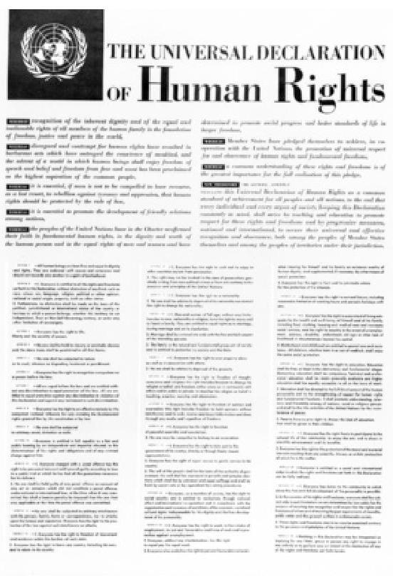

# UNITED NATIONS 

Poster depicting the Universal Declaration of Human Rights, English Version. United Nations Photo - public domain.

The UDHR encompasses both negative (i.e., the right to not be tortured, imprisoned without cause, or enslaved) as well as positive (i.e., the right to own property, the right to freedom of thought, and the right to marry) rights. It also enumerates, for the first time, the core principles of human rights, which are: universality, interdependence and indivisibility, equality, and non-discrimination. The UDHR states further that human rights are not merely an entitlement, they also include rights and obligations. In other words, having a right brings with it a particular obligation as well. If we areto enjoy our rights as humans, then we need to respect these same rights for others. These concepts have been reiterated in many subsequent international human rights treaties, declarations, and conventions. This document (UDHR), along with the International Covenant on Civil and Political Rights (ICCPR) and the International Covenant on Economic, Social, and Cultural Rights (ICESCR), are considered to be the foundational pillars of international human rights law and the legal basis for all subsequent human right norms, standards, and rules.

# 27.4 The Status of Human Rights in the United States 

While human rights have in large part been internationalized, they have to be implemented at the domestic level. According to Donnelly (2003), this dichotomy permits countries to fulfill dual and seemingly incompatible roles: essential protector and principle violator. In the United States, this duality can be seen in the difference between the laws upon which the country was founded and the implementation of these laws in an equitable fashion.

The Bill of Rights, as codified in the United States Constitution, lays out specific human rights that parallel those to which the majority of international human rights regimes adhere. Thus, the founding myths of this country are grounded in the central place of human rights (Donnelly, 2003). In fact, many if not most liberal democracies share these constitutive principles. As Koopmans (2012) points out, "internal constitutive principles - such as the right to exercise one's religion...imply that the granting of rights to individuals and groups will be more similar across democracies than it will be between them and non-democracies" (p 25). And yet, there remain significant areas where United States domestic policy can beseen to violate various rights of various portions of the population at any given time.

Original Bill of Rights, United States. Archives.org - public domain.

# Political Issues 

The most pressing human rights issues in the United States revolve around immigrant and refugee families. The strategic priorities outlined by the UNHCR include: (a) countering discrimination; (b) combating impunity and strengthening accountability; (c) pursuing economic, social and cultural rights and combating poverty; (d) protecting human rights in the context of migration; (e) protectinghuman rights during armed conflict, violence and insecurity; and (f) strengthening international human rights mechanisms and the progressive development of international human rights law. Priorities (a), (c) and (d) make up the elements most germane to the human rights situation in the United States today. The difficulties faced by immigrant and refugee families include classism, racism, sexism, and discrimination on the basis of religion as well as uncertain economic circumstances.
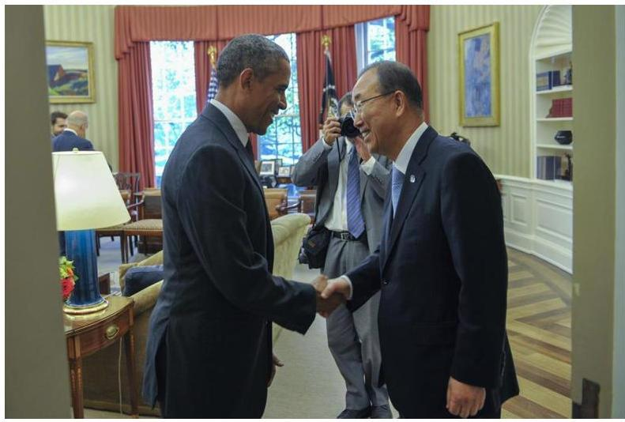

Secretary-General of the United Nations, Ban Ki-moon, meets President of the United States, Barack Obama. UN.org - public domain.

The United States voted in favor of the UDHR but it did not ratify (i.e., sign) the document. While various theories attempt to explain relevant reasons, numerous rights enshrined in the UDHR are in the Constitution and Bill of Rights (AHR; Advocates for Human Rights, n.d.) The United States' apparent sense of exceptionalism to international standards and norms has been evidenced over time in two main ways: the ongoing torture of Guantanamo Bay detaineesand the revelation that American social scientists were involved in reverse engineering torture techniques for the government. While the United States may at times act outside of the limitations established by the international community (and specifically the UDHR) this stance is not the focus of this chapter. As the UNCHR notes, "national and local politicians have sought to mobilize electoral support by promoting xenophobic sentiments, exaggerating the negative impact of hosting refugees while ignoring the fact that refugees can actually attract international assistance and investment to an area, creating new jobs and trading opportunities" (2006, p 32). In this way, the refugee situation has often been used as a political football in United States political culture.

# Video 

Ruben Parra-Cardona, Ph.D., LMFT discusses discrimination and systemic issues affecting Latino immigrants in the United States (6:30-9:19).

One or more interactive elements has been excluded from this version of the text. You can view them online here: https://uark.pressbooks.pub/
humanbehaviorandthesocialenvironment2/?p=465\#oembed-1

## Legal Issues

The current legal climate in the United States is negatively skewedagainst international human rights, particularly as it pertains to the legal status of displaced persons (persons who are forced to leave their home country due to war, persecution or natural disasters). There are many reasons to be pessimistic about successfully using international human rights arguments as a way of advancing displaced person's rights in the United States (Chilton, 2014; Cole, 2006; ICHR; International Council on Human Rights, 2008). According to Cole (2006), in spite of its history as a nation of immigrants, the United States remains deeply nationalist and quite parochial; the law reflects that parochialism. Furthermore, "International human rights arguments are often seen as the advocates' last refuge pulled out only when there is no other authority to cite" (Cole, 2006, p. 628).

Poster entitled, "It is our right to seek and enjoy in other countries asylum from persecution." UN Photo - public domain.However, this trend seems to be moving the nation towards the transnational in terms of how human rights law is perceived and implemented in the legal system and culture of the United States. This means that increased globalization and interdependence has had the effect of strengthening the influence of international human rights standards in the United States. The hope is that these standards may "command greater respect from our own domestic institutions" (Cole, 2006, p 643). Cole further posits that the paradigm shift in the United States from national to transnational, merging the national and the international, parallels the shift in the United States from state to federal power that occurred with the advent of the New Deal in the 1930s. In other words, there is reason to hope that gradual change is coming within the legal system in the United States with regards to its acceptance of the international human rights regimes, norms, and standards.

Refugee families and asylum seekers. The terms of refugee and asylum seeker are often used interchangeably, but there are important legal differences between them. These differences not only determine which resources they are eligible for once arriving in the United States but also in which phase of the legal process they are currently.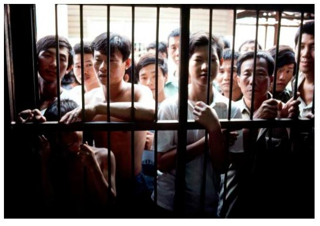

Refugees and displaced persons in South-East Asia; Cambodia, Vietnam, and Laos. United Nations Photo - Coping with Disaster CC
BY-NC-ND 2.0.

Refugees. An estimated 51.2 million people were displaced since 2013 as a direct result of persecution, war, violence, and human rights atrocities (UNHCR, 2018). In 2017, USCIS received 139,801 affirmative asylum applications and the EOIR received 119,303 defensive asylum applications, but only 26,568 applications were approved (DHS, 2019). The remaining applications were abandoned (1,439), withdrawn (6,400), or simply unaccounted for (11,391). Being that the recent United States population estimate is 318 million people, refugees make up less than $1 \%$ of the population. The families seeking asylum from their home countries often have significant traumatic histories and thus can loom larger in the public sphere than other types of immigrants. Most of these families are fleeing extreme injustices in their home country, such as war, political instability, genocide, and severe oppression. Because of the uncertainty of their original situation, it remains quite difficult for the Department of Homeland Security (DHS) to determine who is legitimately eligible for asylum.

Asylum seekers. A further complication for government agencieslies in trying to determine when and how to return rejected asylum seekers to their home countries (Koser 2007). Within the domain of international migration studies, there has been traditionally a differentiation made between refugees (involuntary migration) and labor seekers (voluntary migration). While the former group represents the political outcome of global systems and interactions and the latter group represents the economic outcome, nonetheless, it is quite clear that people migrate for a whole complex series of reasons, including social ones (Koser, 2007). If an asylum seeker's claim for asylum is denied, they are placed in deportation proceedings. During this process, an immigration judge (IJ) works with the asylum-seekers' attorney to determine the removal process. It is important to note that displaced persons are rarely detained and/or immediately placed on the next flight to their country of origin.

# Women and Children's Rights 

The UNHCR has, within the last decade, specifically recognized gender as a fundamental human rights issue. The policy on refugee women is based on the recognition that becoming a refugee affects men and women differently: "... even where there is no armed conflict, women and children continue to be subject to serious human rights violations resulting from discrimination and/or violence against them due to their gender..." (Zeiss Stange, Oyster, \& Sloan, 2012). Many of the human rights issues that involve women and children obviously impact families in a very deep way. This category of violation stems from historical perceptions of women and children as property or "chattel."

International Women's Day March for Gender Equality and Women's Rights. UN Photo - public domain.

Domestic violence. The issue of domestic violence, for example, is one that disproportionately affects women and children. In immigrant families from more patriarchal societies, the home is still considered the woman's domain whereas earning is considered the man's, even when both work for pay outside the home. This particular division of labor can increase the power imbalance in these relationships, which can create a setting within which domestic violence may be more likely to occur (Perilla, 1999). This imbalance can become particularly problematic when the power hierarchy between parents and children is inverted once they arrive in the United States. Since wage-earning immigrant women often gain autonomy and greater gender equity, while men tend to lose ground, this adds further threats to male self-esteem that is already being eroded by classism, racism, and legal status (Mahler \& Pessar, 2006).

Children's issues. Children are disproportionately impacted inother ways as well. Children of displaced families, asylum-seekers in particular, are more likely to be without health insurance and have less access to public programs across nationalities (Blewett, Johnson, \& Mach, 2010). This is due to their legal designation of being persons who are ineligible for public services (i.e., health insurance). The literature suggests that traumatic events impact each family member regardless of whether they were directly or indirectly exposed. This is important because traumatic stress, loss, and grief extend beyond individual family members and influence the entire family (Nickerson, Bryant, Brooks, Silove, Steel, \& Chen, 2011). Detention and deportation, in particular, pull families apart and make it much more difficult for parents and other caregivers to access necessary resources for their children. This is true for many immigrant families because there are many different legal statuses within families due to, for example, children being born to undocumented parents in the United States. Thus the tendency is for these families to be more careful and anxious about seeking out services that they might qualify for because of the fear of being reported to immigration authorities.

Female genital mutilation. Female genital mutilation (FGM), also known as female genital cutting, is a human rights issue of growing importance due to the increasing number of refugees arriving in the United States from East and West Africa. This practice, sometimes also known as female circumcision, is a long-standing cultural tradition in some communities. Although FGM is generally practiced in Muslim communities, there is no actual religious mandate for it (Cook, Dickens, \& Fathalla, 2002). While the practice is deeply cultural, it is illegal in many African nations. However, regardless of legality, the practice is widespread. Fatima, for example, from the opening story, told the first author, "The president's daughter has been circumcised - how will he enforce this law? Are they going to put him in jail? Hah!" (Personal communication, 2011).

Angélique Kidio and Concer Sponsors Brief on Efforts to End FGM. UN Photo - public domain.

According to Mather and Feldman-Jacobs (2015), over 500,000 girls and women have undergone genital mutilation in the United States. FGM is regarded as a human rights issue for women because it can cause severe health sequelae. Even though the family of the child may consent to the procedure, this does not make it a legal practice as consenting to physical mutilation can never be legal (Cook, et al., 2002) However, recommendations include more education and counseling of women as opposed to the firmerapplication of the law in cases like these. This practice remains illegal in the United States, which may have the effect of pushing those refugees wishing to practice this even further underground. In other words, shame and stigma often accompany FGM. And though it can be presented as a convincing claim for asylum in the United States, many women do not feel comfortable doing so and instead pursue other means (USCIS; United States Citizenship and Immigration Services, 2019).

In 2012, the United Nations issued an interagency resolution calling for the elimination of FGM worldwide. The resolution states unequivocally that "seen from a human rights perspective, the practice reflects deep-rooted inequality between the sexes, and constitutes an extreme form of discrimination against women" (WHO; World Health Organization, n.d.). The hope is that this ban will speed the process of eliminating this dangerous and painful practice worldwide.

# Video 

This video discusses the border crisis and children separated from their families (0:00-7:06).

One or more interactive elements has been excluded from this version of the text. You can view them online
here: https://uark.pressbooks.pub/
humanbehaviorandthesocialenvironment2/?p=465\#oembed-2# Sex Trafficking and Human Trafficking 

The United Nations Protocol to Prevent, Suppress, and Punish Trafficking in Persons, Especially Women and Children, defines trafficking as the "...recruitment, transfer, harboring or receipt of persons, by any means of threat or force...for the purpose of exploitation." This crime is globally categorized as either sex trafficking or labor trafficking. According to the DOJ (2006), there have been an estimated 100,000 to 150,000 sex trafficking victims in the United States since 2001. Furthermore, estimates of persons currently in situations of forced labor or sexual servitude in the United States range from 40,000 to 50,000.

The leading countries of origin for foreign victims in fiscal year (FY) 2011 were Mexico, Philippines, Thailand, Guatemala, Honduras, and India (DOJ, 2012). In 2011, "notable prosecutions included those of sex and labor traffickers who used threats of deportation, violence, and sexual abuse to compel young, undocumented Central American women and girls into hostess jobs and forced prostitution in bars and nightclubs on Long Island, New York" (DOS, 2012). According to the International Labor Organization (ILO, 2019), globally an estimated 4.5 million women, men, and children are sexually exploited. While there is some legal benefit (a selfpetitioned visa in the United States) in place for those who cooperate in prosecuting their traffickers; with this visa, victims can receive four years of legal status. Unfortunately, far fewer receive immigration aid than are identified as victims of sex trafficking, (DOS, 2012).

Human trafficking is another area where issues of physical safety and sexual exploitation of immigrant and refugee women and children come to the forefront as a human rights issue. Contrary to popular thought, sex trafficking is an ongoing and insidious activity that also includes young boys, and the prevalence of human and sex trafficking in the United States disproportionately affects themore vulnerable, under-resourced populations such as immigrant and refugee families (DOS, 2012).

# Mixed Status (Deportation) and Separation of Families 

One of the most pressing human rights issues for displaced persons in the United States today is the mixed-status families (i.e., documented and undocumented). These are families whose members hold different levels of legal status in the country. Some members of the family may be documented persons (such as asylum-seeker, permanent resident or citizen) while others have undocumented status. Though the children born to undocumented migrants typically receive citizenship by birth, this does not change their parents' legal status. The exception, however, is when undocumented parents return to their country of origin and wait until that child is 18 years of age; at that point, the young adult child can sponsor them in becoming United States citizens. When families consist of members whose legal status is documented as well as undocumented, this uncertain distal context can set the stage for significant vulnerabilities within the family.

Brabeck and Xu (2010), who studied of the effects of detention and deportation on children of Latino/a immigrants, found that the legal vulnerability of Latino/a parents, as measured by immigration status and detention and deportation experience, predicted child well-being. In other words, the children suffer when they cannot be sure whether their parents will be able to stay and live with them in the United States on a day-to-day basis. Kanstroom (2010) writes that although "international law recognizes the power of the state to deport noncitizens, international human rights law has also long recognized the importance of procedural regularity, family unity, and proportionality. When such norms are violated the State may well be obligated to provide a remedy" (p. 222). Once again the paradox of international human rights norms conflicting with the actual social and political practices of the United States; as of this writing, the issue remains a political football in the United States.# Detention Without Trial 

In 2011, the United States Congress passed the National Defense Authorization Act (NDAA) that codified, for the first time since the McCarthy era, indefinite detention without charge or trial. Subjecting refugees to detention induces unnecessary psychological fear and harm. Furthermore, it does not uphold the fundamental human rights principles set out in the ICCPR preamble (Prasow, 2012). The notion that people, whether citizens, documented or undocumented immigrants, could be held by the government indefinitely without access to the protections enshrined in the United States Constitution is a clear violation of international human rights law and anathema to human rights and civil liberties groups. As of late 2012, members of Congress proposed to have it repealed or amended. As noted by Senator Dianne Feinstein of California, "Just think of it. If someone is of the wrong race and they are in a place where there is a terrorist attack, they could be picked up, they could be held without charge or trial for month after month, year after year. That is wrong" (Prasow, 2012). The amendment that Senator Feinstein proposed, however, would protect only citizens and lawful residents; undocumented immigrants would still be subject to this odious practice.

### 27.5 Emerging Directions

While there is a lack of human rights literature that specifically deals with or involves the family unit, the United Nations recognizes that "...family is the basic unit of society" (UN, n.d.). As such, there is an undeniable connection between the status of immigrant and refugee families and how the United States deals with their human rights in a variety of ways. Issues such as FGM, the deportation of undocumented immigrants that splits the family between thosewith and without citizenship or documents, longtime detention of family members, sex trafficking, and other pressing human rights issues all have significant deleterious effects on families in this country. While much of the conversation revolves around rights and obligations for the individual as well as for the community, there is very little in the way of specific family references in the human rights literature.

Given that the UDHR focuses on individual and state actors, it is understandable that there is this gap in the research regarding how human rights issues specifically affect families. However, there needs to be a significantly deeper understanding of these issues if we are to be able to truly support immigrant and refugee families to thrive and flourish in the United States. Some questions that need to be answered are: How do families have a unique lens on their situations? Does the family structure provide a protective factor for its members? How do women's and children's issues play out in this arena? Perhaps the most pressing need for further research concerns the issue of how mixed-status immigrant families cope with the uncertainty regarding living with different levels of documentation and legal status within the same family.

# Video 

True Thao, MSW, LICSW discusses his perspectives on human rights and basic values such as respect and equality (1:45-3:44).

One or more interactive elements has been excluded from this version of the text. You can view them online here: https://uark.pressbooks.pub/
humanbehaviorandthesocialenvironment2/?p=465\#oembed-3# 27.6 End-of-Chapter Summary 

## Case Study

Anna, a bright and extroverted 26-year-old from a Central American country, has just arrived at a counseling center presenting with severe depression and anxiety. Several years ago, three members of one of the most brutal guerrilla regimes in her home country held her hostage at gunpoint and sexually assaulted her for several hours. Her apparent crime was that some months before she had led a march for women's rights at the college she attended. Members of the guerilla group broke up the march and then beat the young women and men, many of whom need hospitalization. Anna was among them and was hospitalized for five days of treatment. Several months later, three members of this group surprised Anna at home; they terrorized, raped, and threatened her numerous times with death before eventually leaving with further threats if she dared to protest publicly again for women.

After this last incident, Anna fled her home country and came to the United States through a circuitous route. She had no option but to use smugglers for much of the journey. She had had to leave so abruptly and had so few resources that she left her three-year-old son behind with her grandmother. Grandmother sends Anna pictures of her little boy regularly via text message, but Anna is devastated every time she thinks of him. In order to get through herday, she tries to put him out of her mind. It is clear that this effort and the loss that she feels for her son is serious. She is currently seeking asylum in this country and, because she needs to support herself though she has no documents yet, is working as a nightclub dancer. She does not feel hopeful about her asylum application because she is worried that no one will believe her story. Furthermore, she despairs over ever being able to bring her young son to the United States since she fears that they will jail him at the border.

# Discussion Questions 

1. What sort of information do you need that would help you understand Anna's case better?
2. How might Anna be at continued risk for human rights violations?
3. What exposures to trauma-inducing experiences are affecting Anna? How might professionals working with immigrant and refugee populations emphasize positive adaptive skills/resilience that focus on individual and family strengths?
4. What other community resources might be helpful in Anna's situation?
5. Discuss the importance of coordinating and integrating different community services for supporting immigrant and refugee resettlement.# References 

The Advocates for Human Rights. (AHR; n.d.). Human rights and the U.S. Retrieved from
www.theadvocatesforhumanrights.org/
human rights and the united states
Barajas, J. \& Frazee, G. (2015). Which states are saying no to Syrian refugees? Newshour (PBS). Retrieved from www.pbs.org/ newshour/rundown/u-s-governors-dont-have-power-to-refuse-refugees-access-to-their-states/
Blewett, L.A., Johnson, P.J., \& Mach, A.L. (2010). Immigrant children's access to health care:
Differences by global region of birth. Journal of Health Care for the Poor and Underserved, 21(2), 13-31. doi:10.1353/hpu.0.0315
Brabeck, K. \& Xu, Q. (2010). The impact of detention and deportation on Latino immigrant children and families: A quantitative exploration. Hispanic Journal of Behavioral Sciences, 32(3), 341-361. doi:10.1177/0739986310374053
Chilton, A.S. (2014). Influence of international human rights agreements on public opinion.
The Chicago Journal of International Law, 15(1), 110-137.
Cole, D. (2006). The idea of humanity: Human rights and immigrants' rights. Columbia Human Rights Law Review, 37(3), 627-658.
Cook, R.J., Dickens, B.M., \& Fathalla, M.F. (2002). Female genital cutting (mutilation/
circumcision): Ethical and legal dimensions. International Journal of of Gynecology \& Obstetrics, 79(3), 281-287. doi:10.1016/ S0020-7292(02)00277-1
Donnelly, J. (2003). Universal human rights in theory and practice (2nd ed.). Ithaca, NY:
Cornell University Press.
International Council on Human Rights. (ICHR; 2008). Climate change and human rights: A rough guide. Retrievedfrom www.ohchr.org/Documents/Issues/ClimateChange/
Submissions/136_report.pdf
International Labor Organization. (ILO; 2019). Statistics and indicators on forced labor and sex trafficking. Retrieved from www.ilo.org/global/topics/forced-labour/policy-areas/ statistics/lang-en/index.htm
Kanstroom, D. (2010). Deportation nation: Outsiders in American history. Cambridge, MA:
Harvard University Press.
Koopmans, R. (2012). The post-naturalization of immigrant rights: A theory in search of
evidence. The British Journal of Sociology, 63(1), 22-30. doi: 10.1111/ j.1468-4446.2011.01401.x

Koser, K. (2007). Refugees, transnationalism and the state. Journal of Ethnic and Migration Studies, 33(2), 233-254. doi: 10.1080/ 13691830601154195
Mahler, S.J. \& Pessar, P.R. (2006). Gender matters: Ethnographers bring gender from the periphery toward the core of migration studies. International Migration Review, 40(1), 27-63. doi: 10.1111/j.1747-7379.2006.00002.x
Mather, M. \& Feldman-Jacobs, C. (2015). Women and girls at risk of female genital mutilation/cutting in the United States. Population Reference Bureau. Retrieved from www.prb.org/Publications/Articles/2015/us-fgmc.aspx
Migration Policy Institute. (MPI; 2015). Refugees and asylees in the United States. Retrieved from www.migrationpolicy.org/article/ refugees-and-asylees-united-states
Nickerson, A., Bryant, R. A., Brooks, R., Steel, Z., Silove, D., \& Chen, J. (2011). The familial influence of loss and trauma on refugee mental health: a multilevel path analysis. Journal of Traumatic Stress, 24(1), 25-33. doi:10.1002/jts. 20608
Office of the High Commissioner for Human Rights. (OHCHR; 1948). The Universal Declaration of Human Rights. Retrieved from www.ohchr.org/EN/UDHR/Documents/ UDHR_Translations/eng.pdfPerilla, J.L. (1999). Domestic violence as a human rights issue: The case of immigrant Latinos. Hispanic Journal of Behavioral Sciences, 21(2), 107-133. doi: 10.1177/0739986399212001
Prasow, A. (2012, November 29). Indefinite detention is already bad, don't add discrimination. The Huffington Post. Retrieved from www.huffingtonpost.com/andrea-prasow/indefinite-detention-is-a b 2214838.html
Project Syndicate. (2015, January 22). Aid in a world of crisis. Project Syndicate: The World's Opinion Page. Retrieved from www.project-syndicate.org/commentary/refugee-crisis-humanitarian-aid-by-ant-nio-guterres-2015-01
United Nations High Commissioner for Refugees. (UNHCR; 2006). The state of the world's refugees 2006: Human displacement in the new millennium. Retrieved from http://www.unhrc.org/ 4a4dc1a89.html.
United Nations High Commissioner for Refugees. (UNHCR; 2013). War's human cost:

UNHCR global trends 2013. Retrieved from www.unhcr.org/ 5399a14f9.html
United Nations High Commissioner for Refugees. (UNHCR; 2018). Global Trends: Forced displacement in 2018. Retrieved from https://www.unhcr.org/globaltrends2018/
United Nations. (1948). Universal Declaration of Human Rights. Retrieved from: http://www.un.org/en/universal-declaration-human-rights/.
United Nations. (UN, n.d.). Family. Retrieved from www.un.org/en/ globalissues/family/
United Nations. (UN, n.d.). Protect human rights. Retrieved from www.un.org/en/sections/what-we-do/protect-humanrights/index.html
United States Citizenship and Immigration Services. (USCIS; 2015). Lesson plan overview: Female asylum applicants and genderrelated claims. Asylum Officer Basic Training. Retrieved from https://www.uscis.gov/sites/default/files/files/ nativedocuments/Asylum and Female Genital Mutilation.pdfUnited States Department of Justice. (DOJ; 2014). FY 2013 statistics yearbook. Retrieved from https://www.justice.gov/eoir/page/file/1107056/download
United States Department of State. (DOS; 2018). Proposed refugee admissions for fiscal year 2019: Report to the congress. Retrieved from https://www.state.gov/wp-content/uploads/2018/12/ Proposed-Refugee-Admissions-for-Fiscal-Year-2019.pdf
United States Department of State. (DOS; 2015) Myths and facts: Resettling Syrian refugees. Press release November 2015. Retrieved from https://2009-2017.state.gov/r/pa/prs/ps/2015/11/ 250005.htm
United States Department of State. (DOS; 2012). Trafficking in persons report 2012. Retrieved from www.state.gov/j/tip/rls/ tiprpt/2012/192368.htm
United States Department of State. (DOS; 2019). Trafficking in persons report. Retrieved from https://www.state.gov/wp-content/uploads/2019/06/2019-Trafficking-in-PersonsReport.pdf
World Health Organization. (WHO; n.d.). Migrant health. Retrieved from https://www.who.int/migrants/en/
World Health Organization. (WHO; n.d.). Classification of female genital mutilation. Sexual
and Reproductive Health. Retrieved from www.who.int/ reproductivehealth/topics/fgm/overview/en/
Zeiss Stange, M., Osyer, C.K., \& Sloan, J.E. (2012). Refugee women. In M. Zeiss Stange, C.K.

Oyster, \& J.E. Sloan (Eds.), The Multimedia Encyclopedia of Women in Today's World.
Thousand Oaks, CA: SAGE Publications.

# Attribution 

Adapted from Chapters 1 through 9 from Immigrant and RefugeeFamilies, 2nd Ed. by Jaime Ballard, Elizabeth Wieling, Catherine Solheim, and Lekie Dwanyen under the Creative Commons Attribution-NonCommercial 4.0 International License, except where otherwise noted.# Chapter 28: Economic Well-Being, Supports \& Barriers 

## Learning Objectives

- Learn from the national and global perspectives of economic well-being, supports, and barriers among immigrants and refugees.
- Recognizing that the world is constantly and rapidly changing.
- Recognizing that Global/national/international events can have an impact on individuals, families, groups, organizations, and communities.
- Global implications dictate that we foster international relationships and opportunities to address international concerns, needs, problems, and actions to improve the well-being of not only U.S. citizens, but global citizens.# 28.I Introduction 

The section was written by Veronica Deenanath (Family Social Science, University of Minnesota), Nancy Lo (Family Social Science, University of Minnesota), Dung Mao (Family Social Science, University of Minnesota), Jaime Ballard (Family Social Science, University of Minnesota), and Catherine Solheim (Family Social Science, University of Minnesota)

The United States is a nation of immigrants who often bring dreams of opportunities and economic prosperity and a goal to build a better life than the one left behind. Immigrant and refugee families are typically starting over economically; they arrive with few or no financial resources and are unfamiliar with the financial system in the host counties. As discussed in Chapter 1, some families immigrate because they were unable to financially support their families in their home country (Solheim, Rojas-Garcia, Olson, \& Zuiker, 2012; Portes \& Rumbaut, 2006). Others were able to support their families but had to leave everything behind to travel to safety after conflict or natural disasters. While there are some highincome immigrants who are recruited internationally by companies, this is a minority of immigration cases (U.S. Visas, 2013). The majority of immigrants come with hopes of economic change for their families.

Iraqi refugee children preparing for relocation. DFID - UK Department for International Development - Iraqi refugee children at Newroz camp - CC BY 2.0.

Although immigrants may arrive full of hope, their path to economic well-being can be long and challenging, making their dream seem far from reality. Economic systems differ between countries and cultures, and immigrants must learn new systems of payment and saving. They must also learn how to manage their finances in a virtual world of credit, debit, and online transactions - a far cry from mostly local cash-based markets in their home countries. Additionally, job skills and education do not always transfer across countries. Immigrants who were well-qualified for jobs in another country often find themselves under-qualified after resettlement. For example, an immigrant might have been a well-qualified teacher in their home country, but cannot teach in the United States without a teacher's license, which takes time and money to obtain. Finally, many immigrants face discrimination as they apply for jobs and as they access services such as health care.This chapter addresses immigrants' and refugees' road to achieving economic well-being. Only limited research has identified the challenges and supports available to immigrants on their economic journey; the majority of information is drawn from analysis of government reports of employment, income, housing, and healthcare usage. In this chapter, we use this research to highlight the key areas of economic well-being in immigrants and refugees, including employment, access to health care and housing, financial management skills, and access to financial products and services.

# Economic Well-Being 

Economic well-being is an individual's ability to buy the necessities of life for themselves and their families, and have resources to pursue goals that improve their quality of life. (OECD, 2013).

### 28.2 Employment

The most critical step towards economic well-being is obtaining adequate employment. Immigrants account for more than $17 \%$ of the United States workforce, although they make up only $13 \%$ of the population (MPI, 2013). The unemployment rate for foreign-born persons is currently $5.6 \%$, while it is $6.3 \%$ for native-born persons (Bureau of Labor Statistics, 2015). Although immigrants have relatively high rates of labor force participation, the opportunitiesand benefits that are available to them depend on the level of employment they can obtain. We will address each in turn.

Low-skill labor force. Immigrants make up half of the low-skill labor force in the United States (Bureau of Labor Statistics, 2011). In 2005, it was estimated that undocumented immigrants make up 23\% of the low-skill labor force (Capps, Fortuny, \& Fix, 2007). Lowskilled immigrant workers tend to be overrepresented in certain industries, particularly those with lower wages. Table 1 displays the foreign-born workforce by occupation.

| Occupation | Share of Foreign-Born   Workers in   Occupation (\%) | Share of Native-Born   Workers in   Occupation (\%) |
| :-- | :-- | :-- |
| Management,   professional, and   related | 29.8 | 37.7 |
| Service | 25.1 | 17 |
| Sales and office | 17.1 | 25.6 |
| Production,   transportation, and   material moving | 15.2 | 11.6 |
| Natural resources,   construction, and   maintenance | 12.9 | 8.1 |

Source: Migration Policy Institute (MPI) tabulation of data from U.S. Census Bureau 2013 ACS.

Approximately 20\% of immigrant workers are employed in construction, food service, and agriculture (Singer, 2012). More than half of all workers employed in private households are immigrants and immigrants also represent a third of the workers in the hospitality industry (Newbuger \& Gryn, 2009). The majority of the positions in these industries are low-wage jobs.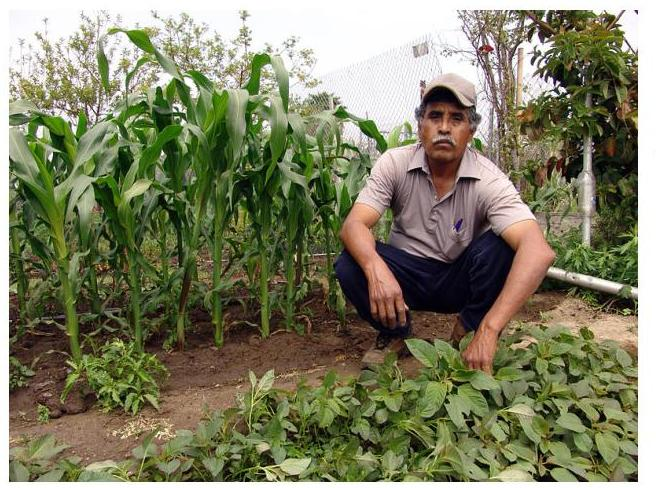

South
Central Farm in Los Angeles, one of the largest urban gardens in the United States. Wikimedia Commons CC BY 2.5.

Middle- and high-skill labor force. More educated and skilled immigrant workers can obtain jobs that are high paying and offer job stability such as those in healthcare, high-technology manufacturing, information technology, and life sciences. Immigrant workers are keeping pace with the native-born workforce in these high skill industries (Singer, 2012). Immigrants hold bachelors and graduate degrees at similar rates to their nativeborn peers ( $30 \%$ and 11\%, respectively; Singer, 2012).

Barriers to better employment. The largest barriers to higherpaying employment for immigrants are a lack of education and English-speaking ability. Approximately 29\% of immigrant workers do not hold a high school diploma compared to only $7 \%$ of their native-born peers (Singer, 2012). Moreover, about $46 \%$ of immigrant workers would classify themselves as limited English proficient speakers (Capps, Fix, Passel, Ost, \& Perez-Lopez, 2003). More than $62 \%$ of immigrant workers in low-wage jobs are limited English language speakers compared to only $2 \%$ of native-born workers in low-wage jobs (Capps, Fix, Passel, Ost, \& Perez-Lopez, 2003). Astudy conducted by the Robert Wood Johnson Foundation (Garrett, 2006) found that it is extremely difficult for refugees to move from low-paying to better paying jobs after they have adjusted to living in the United States because many lack English language skills and education. It is difficult for immigrants to seek more education or training, due to the pressing need to work to provide for their families. Leaving the workforce to train may leave them financially vulnerable.

Immigrant workers who are middle-wage earners are still disadvantaged. In comparison to their native-born peers who earn a median income of $\$ 820$ weekly, a full-time salary immigrant worker earns $\$ 664$ weekly (Bureau of Labor Statistics, 2015). Moreover, these workers earn $12 \%$ less in hourly wage than their native-born counterparts; this wage gap is $26 \%$ in California, a state with the largest immigrant workforce (immigrants make up $37 \%$ of the workforce in California; Bohn \& Schiff, 2011).

These wage disadvantages are partially due to employer discrimination. In 1996, the Illegal Immigration Reform and Immigrant Responsibility Act (IRCA) implemented additional restrictions on employment eligibility verification, including sanctions for employers who hired undocumented immigrants. Although it is illegal for an employer to discriminate based on national origin or citizenship status, many employers chose to avoid hiring individuals who appeared foreign, in order to avoid sanctions. A General Accounting Office survey found that 19\% of employers (approximately 891,000 employers) admitted to discriminating against people based on language, accent, appearance, or citizenship status because of fear of violating IRCA.

Immigrant workers also face high rates of wage and workplace violations. A study looking at workplace violations in three large metropolitan cities in the United States (Chicago, Los Angeles, and New York City) found that immigrant workers were twice as likely to experience a minimum wage violation than their native-born peers (Bernhardt et al., 2008). Another study conducted by Orrenius and Zavodny (2009) also found that immigrants are more likely to beemployed in dangerous industries than their native-born peers, and experience more workplace injuries and fatalities. In these injuries, limited English skills are a contributing factor. These workers may be afraid to speak for themselves with their livelihood at stake and are left at the mercy of others. Immigrant workers are in dire need of representation, but infrequently have access to it. Only $10 \%$ of the immigrant workforce is represented by unions in contrast to 14 percent of the native-born workforce (Batalova, 2011).

# Supports for Employment: The Unique Case of Refugees 

Refugees are a unique group of immigrants in that there are support systems in place to help with resettlement upon their arrival in the United States. Government agencies and voluntary agencies (VOLAGs) provide initial supports to help families resettle in their new home, including social services, food support, cash assistance, healthcare, and employment services. Great emphasis in the refugee resettlement process is placed on finding a job so that refugees can become financially self-sufficient without the support of the government. The Office of Refugee Resettlement (ORR) provides two programs to support VOLAGs in finding employment contracts for refugees:

- Early Employment Services: In this program, ORR provides funding for a staff member(s) to act as an employment specialist to prepare the refugees for work and for finding employment. VOLAGs are given anywhere from 18-24 months to help refugees secure jobs through the Early Employment Services program (Darrow, 2015); the time period varies by state.
- Voluntary Agency Matching Grant (VAMG): This is a selective and expedited employment program. The goal of this programis to help refugees attain economic self-sufficiency within the first four-six months upon arrival in the U.S. while declining public cash assistance (Office of Refugee Resettlement, 2016). Refugees selected for the VAMC program receive more intense job services and individual case management for six months and receive more generous cash and housing assistance for four months in comparison to those who are part of the Early Employment Services program. VAMC refugees are not eligible for any form of public assistance until one month after the program ends.

# Short-Term Benefit, Long-Term Drain? 

## Problems in the VAMC program

The VAMC provides extra training and benefits for refugees, with the goal of economic self-sufficiency within the first few months of arrival. However, recent research suggests there are downsides. Funding for VOLAGs in the VAMC program in contingent upon meeting performance measures such as how many refugees entered employment and how many were self-sufficient at 120 and 180 days (Office of Refugee Resettlement, 2016).
Many of the jobs that are available quickly pay only $\$ 8.25$ hourly and require over an hour in travel time. Earlier employment means less time for job training and English language classes, which are factors that would impact the long-term economic well-being of refugees.# Videos 

Ruben Parra-Cardona, Ph.D., LMFT discusses his frustration with historical amnesia surrounding the economic contributions of Latino immigrants in the United States (3:39-6:09).

Sunny Chanthanouvong, Executive Director, Lao Assistance Center of Minnesota, discusses financial challenges among elders in the Lao community (0:00-2:21).

One or more interactive elements has been excluded from this version of the text. You can view them online here: https://uark.pressbooks.pub/
humanbehaviorandthesocialenvironment2/?p=467\#oembed-1

One or more interactive elements has been excluded from this version of the text. You can view them online here: https://uark.pressbooks.pub/
humanbehaviorandthesocialenvironment2/?p=467\#oembed-2

### 28.3 Access to Necessities

Immigrants face barriers in their access to adequate income, particularly because they tend to be employed in low-skill jobs and face discrimination in their work environments. Poverty rates of children of immigrants are $50 \%$ higher than children of native-born citizens (Van Hook, 2003). This limits their access to adequate housing, food, and healthcare.

# Housing and Food 

Access to shelter and food are basic life necessities. Immigration has a positive impact on the rent and housing values for their communities, but immigrants themselves face barriers to accessing adequate housing. When immigrants enter a new area, rent and housing values in that area increase (Saiz, 2007). In metropolitan areas, immigrant inflow of $1 \%$ of the city's population is tied to increases in housing values of $1 \%$ (Saiz, 2007). Despite this benefit to the community at large, immigrants are face barriers to achieving safe and affordable housing. They are less likely than native-born individuals to own a home and are more likely to live in overcrowded conditions (as measured by the number of people per room; Painter \& Yu, 2010). Immigrant homeownership increases and overcrowding decreases the longer the immigrant lives in the United States. However, they still lag behind native-born citizens in homeownership and overcrowding even after living in the United States for 20 years (Painter \& Yu, 2010).

Housing conditions are influenced by the immigrant's documentation status and English language abilities. Immigrants who spent some time without documentation are less likely than documented immigrants to own a home, even if they now have documentation (McConnell \& Akresh, 2008). Documentation likely influences access to high-paying jobs and to home loans. Similarly, English proficiency increases the chances of an individual becoming a home-owner, because English proficiency increases the ability to access labor and credit markets (Painter \& Yu, 2010).

New York Tenement Museum

In the 19th and 20th centuries, a 350 square foot apartment here housed six recent immigrants. Michael Sean Gallagher 94 Orchard Street, Lower East Side, New York -CC BY-SA 2.0.

Additionally, housing access is influenced by discriminatory practices. In the United States 42 cities and counties have passedanti-illegal immigration laws that prohibit landlords from allowing undocumented immigrants to use or rent their property (Oliveri, 2009).

Although the Federal Fair Housing Act prohibits discrimination on the basis of national origin (110. 42 U.S.C. §§ 3601-3619, 3631), it is easier for these landlords to discriminate against prospective tenants who appear foreign than to process the immigration status of every prospective tenant (Oliveri, 2009). Due to these discriminatory practices, immigrants' housing options becomes even more limited.

Immigrant households are at a substantially higher risk of food insecurity, or a lack of adequate food for everyone in the household, than native-born households (Chilton, 2009). Newly arrived immigrants face the greatest risk (Chilton, 2009), perhaps due to a lack of English skills or education. This lack of access to adequate food has significant consequences: household food insecurity significantly increases the risk of children in the household having only fair or poor health (Chilton, 2009). It can be difficult for immigrant families to access food-related resources. Among families that have trouble paying for food, those headed by immigrants are less likely than families headed by native-born individuals to receive food stamps (Reardon-Anderson, Capps, \& Fix, 2002). Those who do receive food assistance through food shelves may find that the food offered is unfamiliar.

# Healthcare 

Although immigrants have high rates of labor force participation, they are less likely than native-born peers to have health insurance (Derose, Bahney, Lurie, \& Escarce, 2009). There are few services in the United States that are as crucial and complex as the healthcare system, which continues to be a major indicator of socio-economic success. A person's inability to access and utilize healthcare servicesgives a strong indication of critical unmet needs and barriers that impede the ability of successful integration and participation in society. Immigrants face substantial barriers to healthcare access, including restricted access to government based healthcare services, language difficulties, and cultural differences.

Air Force doctor provides services through an interpreter. Wikimedia Commons public domain.

Reduced Use of Healthcare. Total health care expenditures are lower for immigrant adults than for their native-born peers (Derose, Bahney, Lurie, \& Escarce, 2009). Additionally, immigrants are less likely to report a regular source or provider for health care, and report lower health care use than native-born peers (Derose, Bahney, Lurie, \& Escarce, 2009). This means that overall, immigrants have less access to healthcare and less healthcare use than do most native-born individuals.

Undocumented immigrants have particularly low rates of health insurance and health care use (Ortega et al., 2007). Undocumented Latinos/as have fewer physician visits annually than native born Latinos/as (Ortega et al., 2007). Undocumented immigrants are more likely than documented immigrants or native-born individuals to state that they have difficulty understanding their physicians or think they would get better care if they were a different race orethnicity. Despite their low rates of use, immigrants are in need of healthcare. Children of immigrants are also more than twice as likely as children of natives to be in "fair" or "poor" health (ReardonAnderson, Capps, \& Fix, 2002).

# Legal Status Restricts Healthcare Benefit 

Eligibility. Immigration status is an important legal criterion that may hinder access to healthcare benefits. The Personal Responsibility and Work Opportunity Reconciliation Act (PRWORA), established in 1996, restricted Medicaid eligibility of immigrants. Immigrants cannot receive coverage, except in cases of medical emergencies, during their first five years in the country. States can choose to grant aid out of their own funds, but no federal welfare funds may be used for immigrant health care. The reform also stated that the eligibility of an immigrant for public services would be dependent on the income of the immigrant's sponsor, who could be held financially liable for public benefits used by the immigrant. Finally, the Act required that states or local governments who fund benefits for undocumented immigrants take steps to identify their eligibility (Derose, Escarce, \& Lurie, 2007). Hence, health benefits and insurance for most immigrants are highly dependent on eligibility through employment.

## Immigrant Contributions to Medicare

Immigrants contribute substantial amounts to Medicare. In fact, immigrants contribute billions more to Medicare through payroll taxes than they use in medical services (Zallman, Woolhandler, Himmelstein, Bor \& McCormick, 2013). Undocumented immigrants contribute more than 12 billion dollars annually to Social Security and Medicare through taxes under borrowed social security numbers, yetare ineligible for benefits through these systems (Goss et al., 2013).

The Affordable Care Act (ACA; Pub. Law No. 111-148 and 111-152), established in 2010, updated some of these policies. This act ensured that legal permanent residents with incomes up to 400 percent below the federal poverty level could qualify for subsidized health care coverage. Medicaid and other health benefits still require a 5-year waiting period, however, states have the option to remove the 5-year waiting period and cover lawfully residing children and/or pregnant women in Medicaid or Children's Health Insurance Program (CHIP). Undocumented immigrants receive no federal support under the ACA. Under the ACA, refugees who are admitted to the United States and meet the immigration status eligibility have immediate access to Medicaid, CHIP and health coverage options.

Language Difficulties. Language difficulties, including limited English language proficiency and poor English literacy skills, are one of the most formidable barriers for immigrant access to healthcare. Language ability affects all levels of accessing the healthcare system, including making appointments, filling out of paperwork, the ability to locate healthcare facilities, direct communication with healthcare professionals, understanding written materials, filling out prescriptions, understanding of treatment options and general decision making. Among children, for example, those from nonEnglish primary language households were four times as likely to lack health insurance and twice as likely to lack access to a medical home (Yu \& Singh, 2009). Similarly, Spanish-speaking Latinos/as were twice as likely as English-speaking Latinos/as to be uninsured, and twice as likely to be without a personal doctor, and received less preventative care (DuBard \& Gizlice, 2008).

These difficulties impede the facilitation of patient autonomy in making healthcare decisions. This is especially relevant in thetransmission of complicated medical jargon and limits in-depth conversations about treatment options between the healthcare provider and immigrant patients. Patients with language-discordant providers receive less health education that patients with a provider or interpreter who speaks their language (Ngo-Metzger et al., 2007). Among Hispanics, for example, those who speak a language other than English at home are less likely to receive all the health care services for which they are eligible (Cheng, Chen, \& Cunningham, 2007).

In some cases, miscommunication and misinterpretation can have significant consequences. At times, if an immigrant can communicate in English, providers may assume that the level of understanding of the immigrant patient is higher than what the immigrant patient can actually understand (Flores, 2006). This causes misinterpretations and miscommunications that leave immigrants feeling frustrated, which may result in the avoidance of healthcare use unless it is critical.

To overcome the language gap, immigrants often utilize friends and family members as interpreters in medical settings (Diamond, Wilson-Stronks, \& Jacobs, 2010). Children in immigrant families often speak, read and understand English better than their parents do and, as such, are often burdened with the duty of being the family translator and interpreter when dealing with the healthcare system (Kim \& Keefe, 2010). This role reversal may cause conflicts within the family, as the child must take on the responsibility of communicating complex and difficult information. Additionally, the utilization of family and friends as interpreters is often ineffective as family and friends may not be accurately able to translate complex medical information and ensure accurate understanding of complex medical language, treatments, interventions or outcomes that are necessary in healthcare decision making (Flores, 2006). The use of family members, friends or even community members as interpreters also has great concerns in the ensuring of confidentiality of sensitive health information of immigrantpatients, as they are not trained in appropriate confidentiality procedures.

Health care centers that offer professional interpreters or who have multi-lingual medical providers can greatly alleviate these stressors. The Civil Rights Act of 1964 requires that medical providers receiving federal funds provide language services for clients with limited English, and many states have similar guidelines (Jacobs, Chen, Karliner, Agger-Gapta, \& Mutha, 2006). However, resource allocation is a significant issue in the actual implementation of interpreter services in healthcare facilities. Many healthcare providers find it difficult to provide adequate language services, as they may be understaffed, underfunded, and often unable to provide service due to other demands of the job (Morris et al., 2009). For example, though hospitals inform clients of their right to receive language services, many do so only in English (Diamond, Wilson-Stronks, \& Jacobs, 2010). The majority of hospitals report providing language assistance in a timely manner only in the most commonly requested language (the most commonly requested languages varied by hospital area, but most frequently included Spanish, American Sign Language, and Vietnamese) (Diamond, Wilson-Stronks, \& Jacobs, 2010). There is also a lack of minority and multilingual health professionals in the field. Most immigrants will choose to use healthcare resources in their native language or providers who are representative of their native culture, even at the cost of quality (Morris et al., 2009). In order to provide immigrants with effective healthcare services, great consideration and support must be made to ensure the diversification of the healthcare workforce. This can be achieved through the provision of educational and vocational pathways for minority students to enter academic programs and health care careers (Fernandez-Pena, 2012). The efforts to improve linguistically relevant health services is important as it increases provider cultural competence, cultural humility and language access for immigrants.

Culture. Culture is an important aspect to consider in healthcare access for immigrants as it determines the perceptions and valuesplaced on systems and providers, willingness to utilize these services and ability to successfully navigate the system.

- Culture influences our ideas of when healthcare is needed. For some immigrants, the idea of preventative care, such as annual medical, vision, and dental exams are not normative. This may be due to lack of economic circumstances in the country or origin where healthcare was inaccessible to the majority of the population or only utilized in times of extreme need such as serious health issues or emergencies. For example, Vietnamese generally do not recognize the concept of preventative medicine, and will not seek treatment unless symptoms are present and will sometimes discontinue medication when symptoms abate (CDC, 2008a).
- Culture influences our definitions of healthcare. Many immigrants may place a higher value in homeopathic treatment and spiritual healers. This was noted especially in Latino immigrants where a strong belief in faith-based and alternative healing practices lead the usage of religious organizations for help in mental disorders. For example, recent Latina immigrants reported using alternative or complementary medicine first and then sought medical help only if these methods were ineffective (Garces, Scarinci, \& Harrison, 2006).

Koguis shaman in Colombia. Wikimedia Commons CC BY-SA 3.0.

- The Hmong traditionally view illness as the result of a curse, violation of taboos, or a soul separating from its body, in addition to natural causes such as infectious disease (CDC, 2014). These values are contrary to Eurocentric models, which are predominant in the United States healthcare systems (Rastogi, Massey-Hastings, \& Wieling, 2012).
- Culture influences our expectations of healthcare effectiveness. In some cultures, a healthcare professional isexpected to cure the illness versus manage it. A strong expectation is then placed in immediate improvement of illness after meeting or seeing healthcare providers. This unmet expectation can cause a great sense of disappointment for immigrants and increase their reluctance in using healthcare services.

- Cultural norms restrict interactions between genders. In some cases cultural and religious values impose strict regulations on gender roles and expectations which affects with whom an immigrant can interact and under what circumstances. For example, Somali individuals following an Islamic tradition that men and women should not touch (CDC, 2008b), which may lead to strong preferences for female immigrants to see female practitioners and male immigrants to see male practitioners. This could limit access to care. It adds unique challenges for healthcare practitioners to communicate across genders effectively and provide comfortable and respectful services for their immigrant patients.
- Culture influences the stigma of health issues. Cultural values and beliefs have a strong impact on the perceptions of certain health issues or diseases. Among the Somali, for example, there is a strong stigma against those who have tuberculosis (CDC, 2008b). Individuals avoid talking about having tuberculosis or seeking treatment, in order to avoid stigma (CDC, 2008b). In other cultures, mental illness may suggest that an individual has a weak will or personality. Individuals feel shame and work to hide these issues rather than seeking help. There is a great need for more culturally and linguistically appropriate health services (Diamond, Wilson-Stronks, \& Jacobs, 2010; Shannon, McCleary, Wieling, Im, Becher, \& O'Fallon, 2015).# Access to Supports 

The Personal Responsibility and Work Opportunity Reconciliation Act (PRWORA) restricts access to food stamps, Medicaid, and housing assistance for most non-citizens with less than 5 years of United States residency (Van Hook \& Balisteri, 2006). States, however, can decide to offer assistance for immigrants.

Many children of immigrants are native-born citizens, and consequently are eligible for public benefits including food stamps, housing assistance and health insurance. However, many immigrant parents fear that attempts to access these benefits may interfere with their process of becoming citizens or may result in deportation and separation of parents and other families' members who are undocumented (Perreira et al., 2012).

Child welfare systems need to be prepared to respond to the numerous challenges of immigrant children and families who come to the attention of the system. Child welfare has largely been unaware of these challenges and response to cases with this particular group may be slow or impeded. This heralds the need for the development of tools, approaches, practices and policy improvements within the child welfare system to effectively address the needs of immigrant children and their families.

### 28.4 Financial Problems

When immigrants come to the United States, they frequently must learn how to navigate new financial systems. Some immigrants come from countries where banks are both trusted and common, some have only experienced weak or corrupt banks, and others have interacted primarily with cash-based markets. They must learn to navigate new financial institutions and products.

Immigrants face unique barriers to accessing financialinstitutions and products. First, immigrants whose native countries have weak or corrupt financial instructions may distrust banks. Immigrants from countries with weak financial institutions (those that do not effectively protect private property or offer incentives for investment) are less likely to participate in United States financial markets (Osili \& Paulson, 2008). Additionally, immigrants may face language and cultural barriers in accessing financial products. Banks may not have employees who speak the immigrant's native language or who are familiar with specific cultural customs surrounding finances.

# Banking 

One of the first steps to establishing financial security is the ability to utilize financial products and services available to both protect and increase one's assets. The most important and basic of these financial tools are checking and savings accounts. Having checking and savings accounts allow individuals to keep their money safe, dramatically reduce the fees associated with financial transactions (e.g., cashing paychecks), efficiently and safely pay bills and other obligations, and establish creditworthiness (Rhine \& Greene, 2006).

Immigrants are much more likely than native-born peers to be "unbanked," or have no bank accounts of any kind. The incidence of being unbanked in immigrant communities is $13 \%$ higher than the native-born population (Bohn \& Pearlman, 2013). Among immigrant communities in New York, as much as 57\% of Mexican immigrants and 35\% of Ecuadorian were unbanked (Department of Consumer Affairs, 2013). Immigrants who create bank accounts are able to access financial benefits. For example, immigrants with bank accounts in the United States are more likely to own than to rent or live for free, suggesting that this is an important correlate of homeownership (McConnell \& Akresh, 2008).

Research investigating the differences between banked andunbanked immigrants found unbaked immigrants tended to live in enclaves (Bohn \& Pearlman, 2013), arrived in the United States at a later age, and have less education, lower English proficiency, lowerincome level, and larger families (Paulson, Singer, Newberger, \& Smith, 2006; Rhine \& Greene, 2006). Immigrants who are unsure about the length of stay in the United States also more likely to be unbanked (Department of Consumer Affairs, 2013). Furthermore, those who are unbanked, experience more structural barriers such as understanding the banking system, documents, and process. Having direct, physical control over cash rather than keeping it in a bank was found to deter Hispanic consumers from using financial products and services (Federal Reserve Bank of Kansas City, 2010).

# Savings 

Immigrants are less likely than native-born citizens to have a savings account, even after accounting for socioeconomic status (Paulson, Singer, Newberger, \& Smith, 2006). However, many immigrants are saving money, using both savings accounts and less formal methods. In a study of Southeast Asian refugees in Canada, Johnson (1999) found that $80 \%$ of the participants were saving money. A study of later-age, low-income Asian immigrants in the United States found much lower rates; only 15\% saved regularly (Nam, Lee, Huang, \& Kim, 2015). The most common reasons quoted for saving money include emergencies (Johnson, 1999; Solheim \& Yang, 2010), children's education, and home purchases (Johnson, 1999).

## Credit

Immigrants who are more acculturated tend to be more open tousing credit cards. Likewise, individuals who are younger, employed, higher-income, and have greater English proficiency are more likely to use credit cards (Johnson, 2007; Solheim \& Yang, 2010). The reasons for using credit cards range from everyday purchases (e.g. eating out, buying clothes, buying furniture or appliances, etc.) (Johnson, 2007), to emergencies (Johnson, 2007; Solheim \& Yang, 2010), to building credit (Solheim \& Yang, 2010). It is worthwhile to note that although individuals that are less acculturated (e.g. first-generation Hmong parents) tended to prefer to use cash for purchases rather than credit card, these individuals also recognized the importance of building credit. This recognition motivates older, less acculturated individuals to use credit cards (Solheim \& Yang, 2010).

# Remittances 

Remittances are money sent by migrants to spouses, children, parents, or other relatives in their country of origin. These funds are typically sent through money transfer agencies (e.g. MoneyGram, Western Union) for a fee, through banks, or via friends or relatives visiting the country of origin. According to the World Bank, in 2013 international migrants sent $\$ 404$ billion in remittances to their counties of origin (Tuck-Primdahl \& Chand, 2014). Approximately a quarter of these funds originated from the United States. The top four countries to receive funds were India ( $\$ 70$ billion), China ( $\$ 60$ billion), the Philippines ( $\$ 25$ billion), and Mexico ( $\$ 22$ billion).

Remittances have a significant impact on both individuals and families. Remittances make it possible to meet basic needs such as purchasing food and clothing and paying for rent and utilities. Furthermore, remittances allow families to pay down (or pay off) debt as well as provide family members access to healthcare (Solheim, Rojas-Garcia, Olson, \& Zuiker, 2012).

For immigrants in the United States, the obligation to send moneyhome can create stress and hardship. The urgent need for financial support adds pressure to gain employment. It can be difficult to make enough money to meet the individual's personal financial obligations (e.g. pay for rent, food, utilities, etc.) and to send money home. In some cases, the need to take care of the financial obligations associated with the trip to the new country (e.g. paying back borrowed money needed to for shelter and food upon first arrival) drains the finance so much that it is difficult to send money home (Martone, Munoz, Lahey, Yonder, \& Gurewitz, 2011). For many immigrants, the knowledge that one is contributing to the improved living standard of one's family makes the hardship worthwhile.

# Culturally Appropriate Services 

In order to meet the financial needs of immigrants, some community-based organizations are offering financial services that are culturally tailored. In research among Asian Americans, receiving financial services from other Asian Americans led to better financial outcomes; the clients were more likely to obtain loans and to save more and longer (Zonta, 2004). This may be because there is greater trust and fewer language barriers (Zonta, 2004). Culturally competent financial service providers can frame their materials and products in appropriate ways. For example, one bank offered loan counseling tailored to Vietnamese clients. To deal with clients' fears of losing face over taking out a loan, the loan counselors stressed that their information and application was confidential and would not be shared with anyone in the community. The counselors also explained why they needed information, saying that the institution needed to vouch for the client in front of their loan committee (Patraporn, Pfeiffer, \& Ong, 2010). Such adaptations can increase accessibility and usability of financial services for immigrants.# Video 

Sunny Chanthanouvong, Executive Director, Lao Assistance Center of Minnesota, discusses financial and economic issues in the Lao community.

One or more interactive elements has been excluded from this version of the text. You can view them online here: https://uark.pressbooks.pub/
humanbehaviorandthesocialenvironment2/?p=467\#oembed-3

### 28.5 Future Directions

Immigrants face significant and complex challenges in achieving economic well-being. Legislation such as the PRWORA and IRCA currently limit immigrants' access to employment, housing, and health services. The implementation of these restrictive policies is often fueled by misconceptions of the economic impact of immigrants in the greater society, especially the perception that undocumented immigrants place an economic burden on our health care system. Federal policies that facilitate more effective access to employment, housing, and healthcare and financial services are needed.

Healthcare and financial systems can improve the provision of culturally and linguistically appropriate services for immigrants. This can be supported by the diversification of professionals in these industries through the promotion of minority individuals in financial and medical careers, the promotion of interpretationservices in healthcare facilities and financial institutions, and the recruitment and training of culturally sensitive staff.

Research is needed to more deeply understand the values, needs, and stressors in immigrant and refugee families as they transition to a new economic environment. Worry about supporting their families creates stress which can led to mental health issues. We need to understand the connections between financial worry and mental health in these families and find ways to support them.

Research has shown financial education and interventions that are timely and relevant are the most effective. For immigrant and refugee families, what does that support entail, and at what critical transition points is it best provided? For example, in refugee resettlement, the transition from reliance on initial government assistance to reliance on earned wages is a major shift. When would an intervention have the most impact and what support do they need at that time?

It is important to understand the strengths that immigrant and refugee families bring to these tasks, particularly the strategies they've learned over time that have helped them to survive in harsh living situations. We can build on those strengths and honor their root culture values from their root cultures as we create culturallyappropriate education and intervention programs.# 28.6 End-of-Chapter Summary 

## Case Study

Seng Xiong grew up in Laos. Like many Hmong in Laos, his parents were nomadic farmers. Their only bills were to purchase food or clothing, and they paid for these goods with cash or traded goods for them. Seng watched his parents keep their money safe by storing it in silver bars under their mattress. They took this money out only to pay the bride price when he married Bao.

Seng and Bao expected to be farmers as well, but they became increasingly threatened by persecution from the Lao government. Their focus was on day-to-day survival, never on saving for the future. Ultimately, they decided to flee to a refugee camp in Thailand. While there, they were not allowed to hold formal employment, but they volunteered to work in exchange for food and small goods. Seng and Bao had three children while in the refugee camp, and they hoped for a better life for these children. They decided to move to the United States.

When they arrived in the United States, Seng and Bao had only limited English skills. Bao was able to get work as a personal care attendant, and Seng began working in a meatpacking factory. Each job paid very little. It was very important to Seng and Bao to save for their children's future and also to send money to their brothers and sisters still in the refugee camps. Their sponsor found them asmall, two-bedroom apartment, and they furnished it with used beds, two couches, a table, and a TV. Neither job provided any health care benefits. When anyone in the family was injured or sick, Seng and Bao would talk with the elders in their community and treat the illness as best they could on their own.

They purchased only necessities, and set aside all other money under their mattress or shipped it to their families in Laos. Neither Seng nor Bao had any experience tracking money or budgeting for things in the future; they simply spent little and tried to save or share the rest. They both distrusted banks, and preferred to use cash for all exchanges.

As their children got older, they wanted to buy more entertainment items. It was difficult for Seng and Bao to decide what items to purchase for their children, wanting them to have a good life, and which items to say no to. Their oldest daughter started talking to them about building credit, but this seemed like a very risky situation. Bao had a friend whose identity had been stolen when she started a bank account, and Bao and Seng knew that when you borrow money from the bank, you have to pay back some interest. They knew they could borrow money from another sibling in the United States if they needed to, and having any kind of credit card or loan seemed unnecessary.# Discussion Questions 

1. Think back on your own family history. What did you learn from your parents about banking, saving, credit, and financial obligations to family? How might that have been influenced by your cultural background?
2. What barriers do immigrants frequently face to economic well-being?
3. How might not having healthcare impact the wellbeing of an immigrant family? What about healthcare in another language?
4. How might Seng and Bao's financial background impact their children's choices, particularly as their children become adults and consider college and other savings goals?

## Helpful Links

## The Culture of Money

- This report by the Annie E. Casey Foundation, titled "The Culture of Money: The Impact of Race, Ethnicity, and Color on the Implementation of Asset-Building Strategies" describes institutional barriers lowincome families navigate to become financially stableand outlines financial education strategies to support low-income families.

- https://www.aecf.org/resources/the-culture-ofmoney/

# The Consumer Financial Protection Board 

- The Consumer Financial Protection Board has resources and adult financial education tools designed for specific groups, including newcomers and multilingual communities:
- Newcomers: https://www.consumerfinance.gov/ practitioner-resources/adult-financial-education/ tools-and-resources/\#newcomers
- Multilingual communities: https://www.consumerfinance.gov/ language/

## References

Batalova, J. (2011). Foreign-born wage and salary workers in the U.S. labor force and unions. Migration Policy institute. Retrieved from: http://www.migrationpolicy.org/article/foreign-born-wage-and-salary-workers-us-labor-force-and-unions.
Bernhardt, A., Milkman, R., Theodore, N., Heckathorn, D., Auer, M., DeFilippis, J., González, A. Z., Narro, V., Perelshteyn, J., Polson, D., \& Spiller, M. (2009) Broken Laws, Unprotected Workers. National Employment Law Project. Retrievedfrom: http://www.unprotectedworkers.org/index.php/ broken laws/index.
Bohn, S., \& Schiff, E. (2011). Immigrants and the Labor Market. Public Policy Institute of California. Retrieved from: http://www.ppic.org/main/publication_show.asp?i=823.
Bohn, S., \& Pearlman, S. (2013). Ethnic concentration and bank use in immigrant communities. Southern Economic Journal, 79(4), 864-885. doi:10.4284/0038-4038-2010.245
Bureau of Labor Statistics (2019). Foreign-Born Workers Labor Force Characteristics. Retrieved from http://www.bls.gov/ news.release/forbrn.nr0.htm.
Capps, R., Fix, M., Passel, J.S., Ost, J., \& Perez-Lopez, D. (2003). Immigrant families and workers: A profile of the low-wage immigrant workforce. Urban Institute, 4, 1-8. Retrieved from: http://www.urban.org/research/publication/profile-low-wage-immigrant-workforce.
Centers for Disease Control and Prevention. (2008a). Promoting Cultural Sensitivity: A Practical Guide for Tuberculosis Programs That Provide Services to Persons from Vietnam. Atlanta, GA: U.S. Department of Health and Human Services.
Centers for Disease Control and Prevention. (2008b). Promoting Cultural Sensitivity: A Practical Guide for Tuberculosis Programs That Provide Services to Persons from Somalia. Atlanta, GA: U.S. Department of Health and Human Services.
Centers for Disease Control and Prevention. (2014). Promoting Cultural Sensitivity: A Practical Guide for Tuberculosis Programs That Provide Services to Persons from Laos. Atlanta, GA: U.S. Department of Health and Human Services.
Cheng, E. M., Chen, A., \& Cunningham, W. (2007). Primary language and receipt of recommended health care among Hispanics in the United States. Journal of General Internal Medicine, 22(2), 283-288.
Chilton, M., Black, M. M., Berkowitz, C., Casey, P. H., Cook, J., Cutts, D., Jacobs, R. R., Heeren, T., Ettinger de Cuba, S., Coleman, S., Meyers, A. \& Frank, D. A. (2009). Food Insecurity and Risk of PoorHealth Among US-Born Children of Immigrants. American Journal of Public Health, 99(3), 556-562. doi: 10.2105/AJPH.2008.144394
Darrow, J. H. (2015). Getting Refugees to Work: A Street-level Perspective of Refugee Resettlement Policy. Refugee Survey Quarterly, 1-29. doi: 10.1093/rsq/hdv002
Derose, K. P., Escarce, J. J., \& Lurie, N. (2007). Immigrants and health care: Sources of vulnerability. Health Affairs, 26(5), 1258-1268. doi: 10.1377/hlthaff.26.5.1258

Derose, K. P., Bahney, B. W., Lurie, N., \& Escarce, J. J. (2009). Immigrants and health care access, quality, and cost. Medical Care Research and Review, 66(4), 355-408. doi: 10.1177/ 1077558708330425
Diamond, L., Wilson-Stronks, A., \& Jacobs, E. A. (2010). Do hospitals measure up to the national culturally and linguistically appropriate services standards? Medical Care, 48(12), 1080-1087. doi: 10.1097/MLR.0b013e3181f380bc
DuBard, C. A., \& Gizlice, Z. (2008). Language Spoken and Differences in Health Status, Access to Care, and Receipt of Preventive Services Among US Hispanics. American Journal of Public Health, 98(11), 2021-2028.
Federal Reserve Bank of Kansas City (2010). A study of the unbanked \& underbanked consumer in the tenth Federal Reserve district.
Flores, G. (2006). Language barriers to health care in the United States. The New England Journal of Medicine, 355, 229-231. Doi: 10.1056/NEJMp058316

Garces, I. C., Scarinci, I. C., Harrison, L. (2006). An examination of sociocultural factors associated with health and health care seeking among Latina immigrants. Journal of Immigrant and Minority Health, 8(4), 377-385.
Garrett, K.E. (2006). Living in American: Challenges facing new immigrants and refugees. Robert Wood Johnson Foundation. Retrieved from: http://www.rwjf.org/en/library/research/ 2006/08/living-in-america.html.
Goss, S, Wade, A., Skirvin, J. P., Morris, M., Bye, K. M., \& Huston, D. (2013). Effects of Unauthorized Immigration on the Actuarial Statusof the Social Security Trust Funds: Actuarial Note No. 151. Social Security Administration, Office of the Chief Actuary. Retrieved from: https://www.ssa.gov/oact/NOTES/pdf_notes/ note151.pdf.
Jacobs, E., Chen, A. H., Karliner, L. S., Agger-Gupta, N., \& Mutha, S. (2006) The need for more research on language barriers in health care: a proposed research agenda. Milbank, 84(1), 111-133.
Johnson, P. J. (1999). Saving practices of new Canadians from Vietnam and Laos. Journal of Consumer Affairs, 33(1), 48-75. doi:10.1111/j.1745-6606.1999.tb00760.x
Johnson, P. J. (2007). Credit card practices of Vietnamese and Laotian newcomers to Canada: A 10-year longitudinal perspective. Journal of Family Economic Issues, 28(2), 227-246. doi:10.1007/s10834-007-9056-9
Martone, J., Muñoz, L., Lahey, R., Yoder, L., \& Gurewitz, S. (2011). The impact of remittances on transnational families. Journal of Poverty, 15(4), 444-464. doi:10.1080/10875549.2011.616462
McConnell, E. D., \& Akresh, I. R. (2008). Through the Front Door: The Housing Outcomes of New Lawful Immigrants. International Migration Review, 42(1), 134-162. Doi: 10.1111/ j.1747-7379.2007.00116.x

Migration Policy Institute. (2017). Immigrant Share of the U.S. Population and Civilian Labor Force, 1980-Present. Retrieved from: http://www.migrationpolicy.org/programs/data-hub/ charts/immigrant-share-us-population-and-civilian-laborforce?width=1000\&height=850\&iframe=true.
Nam, Y., Lee, E. J., Huang, J., \& Kim, J. (2015). Financial Capability, Asset Ownership, and Later-Age Immigration: Evidence from a Sample of Low-Income Older Asian Immigrants. Journal of Gerontological Social Work, 58(2), 114-127 14p. doi:10.1080/ 01634372.2014 .923085

Newburger, E., \& Gryn, T. (2009). Foreign-born labor force in 2007. US Census Bureau. Retrieved from https://www2.census.gov/ library/publications/2009/acs/acs-10.pdf.
New York Department of Consumer Affairs. (2013). Immigrantfinancial services study. Retrieved from Office of Financial Empowerment (OFE) website: http://www1.nyc.gov/assets/dca/ downloads/pdf/partners/Research-ImmigrantFinancialStudyFullReport.pdf.
Ngo-Metzker, Q., Sorkin, D. H., Phillips, R. S., Greenfield, S., Massagli, M. P., Clarridge, B., \& Kaplan, S. H. (2007). Providing High-Quality care for limited English proficient patients: The importance of language concordance and interpreter use. Journal of General Internal Medicine, 22(2), 324-330.
OECD. (2013). OECD Framework for Statistics on the Distribution of Household Income, Consumption and Wealth. OECD Publishing. http://dx.doi.org/10.1787/9789264194830-en.
Office of Refugee Resettlement. (2015). Matching Grant Program. Retrieved from: http://www.acf.hhs.gov/programs/orr/ programs/matching-grants.
Oliveri, R. C. (2009). Between A Rock and A Hard Place: Landlords, Latinos, Anti-Illegal Immigrant Ordinances, and Housing Discrimination. Vanderbilt Law Review, 62 (55). Retrieved from: http://scholarship.law.missouri.edu/cgi/ viewcontent.cgi?article=1301\&context=facpubs.
Orrenius, P. M., \& Zavodny, M. (2009). Do immigrants work in riskier jobs? Demography, 46(3), 535-551. doi:10.1353/dem.0.0064
Ortega, A. N., Fang, H., Perez, V. H., Rizzo, J. A., Carter-Pokras, O., Wallace, S. P., \& Gelberg, L. (2007). Health care access, use of services, and experiences among undocumented Mexicans and other Latinos. Archives of Internal Medicine, 167(21), 2354.
Osili, U. O., \& Paulson, A. (2008). Institutions and financial development: Evidence from international migrants in the United States. Review of Economics and Statistics, 90, 498-517.
Painter, G. \& Yu, Z. (2010), Immigrants and Housing Markets in MidSize Metropolitan Areas. International Migration Review, 44, 442-476. doi: 10.1111/j.1747-7379.2009.00787.x
Patraporn, R. V., Pfeiffer, D., \& Ong, P. (2010). Building bridges to the middle class: The role of community-based organizations in AsianAmerican wealth accumulation. Economic Development Quarterly, 24, 288-303.
Paulson, A., Singer, A., Newberger, R., \& Smith, J. (2006). Financial access for immigrants: Lessons from diverse perspectives. Chicago, IL: Federal Reserve Bank of Chicago and the Brookings Institution.
Perreira, K. M., Crosnoe, R., Fortuny, K., Pedroza, J., Ulvestad, K., Weiland, C., Yoshikawa, H., \& Chaudry, A. (2012).ASPE Issue Brief: Barriers to Immigrants' Access to Health and Human Services. US Department of Health and Human Services. Retrieved from: http://taxpolicycenter.org/UploadedPDF/ 413260-Barriers-to-Immigrants-Access-to-Health-and-Human-Services-Programs.pdf.
Portes, A., \& Rumbaut, R. G. (2006). Immigrant America: A Portrait (3rd ed.). Berkeley: University of California Press.
Reardon-Anderson, J., Capps, R., \& Fix, M. E. (2002). The health and well-being of children in immigrant families. The Urban Institute: Washington, DC. Available at: http://www.urban.org/ UploadedPDF/310584 B52.pdf.
Rhine, S. L., \& Greene, W. H. (2006). The determinants of being unbanked for U.S. immigrants. Journal of Consumer Affairs, 40(1), 21-40. doi:10.1111/j.1745-6606.2006.00044.x
Saiz, A. (2007). Immigration and housing rents in American cities. Journal of Urban Economics, 61(2), 345-371. doi: 10.1016/ j.jue.2006.07.004
Shannon, P. J., Wieling, E., Simmelink, J., \& Becher, E. (2014). Exploring the mental health effects of political trauma with newly arrived refugees. Qualitative Health Research, 1-15. doi: 10.117/ 104973231454975
Singer, A. (2012). Immigrant workers in the U.S. labor force. Washington DC, Brookings Institute.
Solheim, C.A., Rojas-Garcia, G., Olson, P.D., \& Zuiker, V.S. (2012). Family influences on goals, remittance use, and settlement of Mexican immigrant agricultural workers in Minnesota. Journal of Comparative Family Studies, 43(2), 237-259.Solheim, C. A., \& Yang, P. N. (2010). Understanding generational differences in financial literacy in Hmong immigrant families. Family and Consumer Sciences Research Journal, 38(4), 435-454. doi:10.1111/j.1552-3934.2010.00037.x
Tuck-Primdahl, M. J. \& Chand, I. (2014). Migration and remittances. World Bank. Retrieved from: http://web.worldbank.org/ WBSITE/EXTERNAL/NEWS/
0..contentMDK:20648762-pagePK:64257043-piPK:437376-theSite PK:4607.00.html.
United Nation High Commissioner for Refugees (UNHCR). (2015, June 18). Worldwide displacement hits all-time high as war and persecution increase. Retrieved from: http://www.unhcr.org/ 558193896.html.
U.S. General Accounting Office. (1990). Rep. No. GGD-90-62, Immigration Reform: Employer Sanctions and the Question of Discrimination 39.
U.S. Visas (2013). Report of the Visa Office 2013. Retrieved from: https://travel.state.gov/content/travel/en/legal/visa-law0/visa-statistics/annual-reports/report-of-the-visa-office-2013.html.
Van Hook, J. (2003, Dec. 1). Poverty grows among children of immigrants in U.S. Migration information Source. Retrieved from: http://www.migrationpolicy.org/article/poverty-grows-among-children-immigrants-us.
Van Hook, J., \& Ballistreri, K. S. (2006). Ineligible parents, eligible children: Food Stamps receipt, allotments, and food insecurity among children of immigrants. Social Science Research, 35(1), 228-251. doi: 10.1016/j.ssresearch.2004.09.001
Yu, S. M., \& Singh, G. K. (2009). Household language use and health care access, unmet need, and family impact among CSHCN. Pediatrics, 124(4).
Zallman, L., Woolhandler, S., Himmelstein, D., Bor, D., \& McCormick, D. (2013). Immigrants contributed an estimated \$115.2 billion more to the medicare trust fund than they took out in2002-2009. Health Affairs, 32(6), 1153-1160. Doi: 10.1377/ hlthaff.2012.1223
Zonta, M. (2004). The role of ethnic banks in the residential patterns of Asian Americans: The case of Los Angeles (Unpublished doctoral dissertation). Department of Urban Planning, University of California Los Angeles.

# Attribution 

Adapted from Chapters 1 through 9 from Immigrant and Refugee Families, 2nd Ed. by Jaime Ballard, Elizabeth Wieling, Catherine Solheim, and Lekie Dwanyen under the Creative Commons Attribution-NonCommercial 4.0 International License, except where otherwise noted.# Chapter 29: Mental Health 

## Learning Objectives

- Learn from the national and global perspectives of mental health among immigrants and refugees.
- Recognizing that the world is constantly and rapidly changing.
- Recognizing that Global/national/international events can have an impact on individuals, families, groups, organizations, and communities.
- Global implications dictate that we foster international relationships and opportunities to address international concerns, needs, problems, and actions to improve the well-being of not only U.S. citizens, but global citizens.

## 29.I Introduction

"After all, when a stone is dropped into a pond, the watercontinues quivering even after the stone has sunk to the bottom."
-Arthur Golden, Memoirs of a Geisha, 1999, p. 265.
Immigrant and refugee journeys are often idealized in literature, art, and historical accounts. Their experiences are repeatedly distilled into tales of extreme adventure where rugged courage and the intense desire for a better life overshadow all other experiences. Individuals and families become characters in larger than life stories, archetypes of human heroism and determination. As observers, we are often drawn in by the rich stories of survival, pain, and loss where people flee oppression and sacrifice to find unparalleled freedom and endless opportunity. These are the stories that incite respect, shock, and awe. However, immigrants and refugees are more than stories, more than the romanticized inspiring tales. They are real people who have suffered the loss of loved ones, homes, and communities. The multilayered impact of displacement is frequently manifest in one's mental health and felt for multiple generations.

Leaving home, by choice or by force, is a disorienting experience. Through migration or via displacement and resettlement, immigrants and refugees are often confronted with a new world, new language, and new social norms. They face culture shock in everyday life events experienced as foreign. Immigrants and refugees experience disruption in their sense of self, often having to give up previous occupations, privilege, and social status. They lose community and established systems of social support. In addition to expected adjustment difficulties, immigrants and refugees may face additional challenges wrought by poor physical and mental health resulting from exposure to multiple traumatic events and extensive histories of loss. They may experience severe and longlasting psychological struggles including depression, anxiety, posttraumatic stress symptoms, and adjustment problems. Compounding these difficulties can be logistical complexities such as a lack of jobs, affordable housing, culturally and linguisticallyappropriate health and mental health services, financial resources, and social support.

In spite of the myriad of obstacles, struggles, and daily stressors, most immigrants and refugees demonstrate tremendous resilience as they persist in finding ways to work around, cope with, or overcome displacement related challenges. Some, especially highly skilled immigrants with means, might not experience a great deal of negative stress. Unfortunately, this represents a small segment of the total immigrant population. Refugees and undocumented immigrants come with inherent risk factors and many other immigrants share experiences of loss and traumatic stress, including multiple exposures to traumatic events.

This chapter reviews some of the shared and unique experiences of immigrant and refugee populations with particular focus on mental health implications and relational risk factors associated with exposure to traumatic stress. Mental health treatments and emerging directions for future prevention and intervention research are also discussed.

Dr. Carrie Hanson-Bradley (Family Social Science Alumna, University of Minnesota) and Dr. Liz Wieling (Family Social Science, University of Minnesota)

# 29.2 Different Shared Experiences 

"While every refugee's story is different and their anguish personal, they all share a common thread of uncommon courage - the courage not only to survive, but to persevere and rebuild their shattered lives."
-Antonio Guterres, UN High Commissioner for Refugees (UNHCR, 2005).Families immigrate to the United States for various reasons. Some voluntary immigrants may choose to leave their country of origin in search of better opportunities, while others are forced to flee due to war, political oppression, or safety issues. Some families manage to stay together over the course of their journey, but many are divided or separated through the migration process. This is particularly true of refugee families whose migration is involuntary, hasty, and traumatic in nature (Rousseau, Mekki-Berrada, \& Moreau, 2001). Refugees in particular may have survived traumatic events and violence including war, torture, multiple relocations, and temporary resettlements in refugee camps (Glick, 2010; Jamil, Hakim-Larson, Farrag, Kafaji, \& Jamil, 2002; Keys \& Kane, 2004; Steel et al., 2009). The destructive nature of war "involves an entire reorganization of family and society around a long-lasting traumatic situation" (Rousseau, Drapeau, \& Platt, 1999, p. 1264) and individuals and families may continue to experience traumatic stress related to family left behind and stressful living conditions long after they have resettled.

When it comes to mental and physical health, refugees are a part of an especially vulnerable population. While some adjust to life in the United States without significant problems, studies have documented the negative impact of a trauma history on the psychological wellbeing of refugees (Keller et al., 2006; Birman \& Tran, 2008). Pre-migration experiences may precipitate refugee mental health concerns, particularly in the early stages of resettlement (Beiser, 2006; Birman \& Tran, 2008). These experiences may include witnessing and experiencing violence, fleeing from a family home located in a city or village that is being destroyed, and walking to find refuge and safety for days or weeks with limited food, water, and resources. Post-migration conditions, such as adapting to living in an overcrowded refugee camp or trying to rebuild life in a foreign country, as well as structural stressors, such as going through the legal process of obtaining asylum or legal documentation, may also precipitate a cascade of individual mental health and family relational issues. The pre- and post-migrationexperiences and stressors of refugees may compound and create a "cumulative effect on their ability to cope" (Lacroix \& Sabbah, 2011). Spending weeks, months, or even years managing stressful and traumatic experiences may weaken an individual or family's ability to cope with continued change and the multiple stressors of resettlement.

While it is reported that refugees are at risk for higher rates of psychiatric disorders such as posttraumatic stress disorder (PTSD), depression, anxiety, complicated grief, psychosis, and suicide (Akinsulure-Smith \& O'Hara, 2012; Birman \& Tran, 2008; Jamil et al., 2002; Jensen, 1996; Kandula, Kersey, \& Lurie, 2004; Steel et al., 2009), immigrants are also at risk for these mental health complications, especially if they have been exposed to multiple traumatic events. However, when working with immigrants and refugees, it is important to remember that one cannot assume that all members of an affected population are psychologically traumatized and will have the same mental health symptoms (Shannon, Wieling, Simmelink, \& Becher, 2014; Silove, 1999). Further, mental health symptomatology is expressed in a variety of culturally sanctioned ways. For example, somatic complaints such as headaches, dizziness, palpitations, and fatigue might be a way to avoid stigma and shame often associated admitting to mental health problems (Shannon, Wieling, Im, Becher, \& Simmelink, 2014).

We know that the mental health of an individual does not exist in isolation; the experiences of one person in a family or community affect others. Unfortunately, the majority of the literature about immigrant and refugee mental health focuses on mental health as an individual process; the systemic ramifications are understudied and underrepresented in academic literature (Landau, Mittal, \& Wieling, 2008; Nickerson et al., 2011).# 29.3 Mental Health Challenges 

"Just because you leave war, war does not leave you. And for me in America, it came back in my nightmares, it came back in the low kick of a car's engine, it came back in the loud roar of a plane, it came back in a mother's hum, in a father's song."
-Loung Ung, Cambodian American Author and Human-Rights Activist, full speech available at https://www.youtube.com/ watch?v=6odKrFRfqkl\&feature=youtu.be.

Much of the literature on immigrant and refugee mental health focuses on loss and trauma, as well as the depression and anxiety that frequently accompanies them. The interconnectedness of loss, trauma, depression, and anxiety can make it difficult to distinguish what is the presenting problem. When looking at one, others are likely to be present. Those who work with immigrants and refugees must be aware of how loss, trauma, depression, and anxiety may each affect an immigrant or refugee's mental health as well as family health and functioning.

## Loss

In every story of immigration or refugee resettlement, a common thread of loss is present. Some losses are obvious, like the loss of home and community or the severance from family and friends whohave been left behind or killed. Loss does not end with resettlement; new losses are experienced and revealed over time, some of which can be obscure, like the loss of identity, social status, language, and cultural norms and values.

The grief response that comes with loss can manifest as physical, emotional, and psychological responses including crying, anger, numbness, confusion, anxiety, agitation, fatigue, and guilt. The loss of surroundings, possessions, ideas, and beliefs such as those experienced by immigrants and refugees can trigger a grief response similar to those experienced with the death of someone close (Casado, Hong, \& Harrington, 2010).

Some losses and the accompanying grief are considered normative in United States culture. For instance, the death of a loved one or child is a recognized loss and the manifestations of grief associated with that type of loss are understood by most people. However, some losses and the accompanying grief are disenfranchised, meaning that grief occurs when a loss is experienced but is not recognized by others as loss. For example, Kurdish families who resettled in the United States while Saadam Hussein was president may have found that people in the United States did not understand why they would miss living in Iraq. Migratory grief is considered a disenfranchised grief (Casado et al., 2010) and is often dismissed in the immigrant and refugee adjustment experience. As a result, people with disenfranchised grief are unable to express feelings, and grief-related emotions are not recognized or accepted by others.

Another way to think about grief and loss experienced by immigrants and refugees is to understand the ambiguous nature of their loss experiences. There are two types of ambiguous loss (Boss, 2004). The first occurs when a loved one is physically absent but emotionally present because there is no proof of death. A kidnapped child, soldiers missing in action, family separation during war, deportation, and natural disasters can all result in this type of ambiguous loss. The second type of ambiguous loss occurs when a loved one is physically present but emotionally absent. Dementia,brain injuries, depression, PTSD, and homesickness can all result in individuals being physically present but emotionally or cognitively they have "gone to another place and time" (Boss, 2004, p 238). Family members who experience ambiguous loss describe physical and mental pain as a result (Robins, 2010). The lack of clarity associated with ambiguous loss can lead to boundary ambiguity expressed in conflict and ambivalence in the new roles family members take after resettlement. Ambiguous loss is also often characterized by frozen grief, represented by the immobilization of individuals and relational systems stuck between the old and new worlds (Boss, 2004). Although ambiguous loss is a common experience for immigrants and refugees, limited research has been conducted with this population (Rousseau, Rufagari, Bagilishya, \& Measham, 2004).

Most people experience grief reactions to a mild or moderate degree and then return to pre-loss levels of functioning without the need for clinical intervention. However, some suffer a more complicated grief reaction (Bonanno et al., 2007). Complicated grief occurs when acute grief becomes a chronic debilitating condition (Shear et al., 2011). It may be incorrectly labeled as depression (Adams, Gardiner, \& Assefi, 2004). However, research indicates that complicated grief is distinguishable from depression and other trauma-related psychological disorders. Intense longing for the object of loss, preoccupation with sorrow, extreme focus on the loss, and problems accepting the death or loss are all symptoms of complicated grief. Complicated grief can exacerbate psychiatric disorders and influence the relationship between loss, symptoms of posttraumatic stress and depression (Nickerson et al., 2011). In one study with Bosnian refugees, for example, complicated grief was a better predictor of refugee general mental health than was PTSD (Craig, Sossou, Schnak, \& Essek, 2008).# Anxiety and Depression 

The literature on immigrants' and refugees' experiences with anxiety and depression is often intermingled with that of loss and trauma. Comorbidity can make it difficult to measure and separate one symptom cluster from the other but the two comprise different psychological diagnoses. Anxiety is characterized as a normal human emotion that we all experience at one time or another. Symptoms include feelings of fear and panic, uncontrollable and obsessive thoughts, problems sleeping, shortness of breath, and an inability to be still and clam. Anxiety disorders are serious and sufferers are often burdened by constant fear and worry further exacerbating comorbidity of PTSD symptoms. The literature on anxiety prevalence of immigrant and refugee populations is limited but expected to be highly correlated with that of PTSD and depression. Depression, described as feelings of sadness, unhappiness, or feeling down, is a normative reaction and can be felt in varying degrees. However, clinical depression is a mood disorder in which the feelings of sadness interfere with everyday life for weeks or longer. Immigrants and refugees are at high risk for clinical depression due to their extensive histories of loss, potential trauma, and resettlement. Studies have also shown that depression among immigrants is related to the process of adapting to the host culture (Roosa et al., 2009). Depression is known to cause longterm psychosocial dysfunction in refugees who have experienced violence and loss (such as in Bosnian refugees resettled in Australia; Momartin et al, 2004). It should not be seen as a marginal issue when compared to PTSD and other trauma-related diagnoses (Weine, Henderson, \& Kuc, 2005). Depression is a common clinical problem with successful available treatments. Weine et al. (2008) argue that it should be a target of intervention and focus of health education with immigrant and refugee populations.# Traumatic Stress 

Many immigrants and most refugees have experienced or been exposed to traumatic events such as witnessing or experiencing violence, torture, loss, or separation. Psychological trauma is most often not limited to a single traumatic event but includes direct and indirect events over the course of a person's life (Jamil et al., 2002). Traumatic stress affects how people see the world, how they find meaning in their lives, daily functioning and family relationships. Several studies have documented the effects of traumatic stress related to war violence on refugee health. Steel et al. (2009) conducted a meta-analysis with over 80,000 refugees and reported a weighted prevalence rate of PTSD ranging between $13 \%$ and $25 \%$. In one critical review, torture and cumulative exposure to traumatic events were the strongest factors associated with PTSD, with some refugee communities experiencing PTSD prevalence rates as high as $86 \%$ (Hollifield et al., 2002). A study of symptom severity of PTSD and depression with 688 refugees in the Netherlands supported these findings, reporting that a lack of refugee status and accumulation of traumatic events were associated with PTSD and depression (Knipscheer, Sleijpen, Mooren, ter Heide, \& van der Aa, 2015). Studies have also established the enduring effects of premigration traumatic stress even years after resettlement (Marshall, Schell, Elliott, Berthold, \& Chun, 2005) as well as the long-term physical health effects of refugee trauma, including hypertension, vascular disease, coronary, metabolic syndrome, and diabetes (Crosby, 2013).

For immigrants and refugees, it is possible that entire families will have been exposed to similar traumatic events and losses that disrupt family and social networks (Nickerson et al., 2011). This is especially true for those who have experienced war or interpersonal violence. War is characterized as an attack on civilian populations where citizens are targeted, dislocated, and displaced (Lacroix \& Sabbath, 2011). According to Sideris (2003), war unravels the socialfabric of a community as the "social arrangements and relationships which provide people with inner security, a sense of stability, and human dignity are broken down" (p. 715). For instance, people may experience a sense of helplessness, damaged trust, shame, and/ or humiliation associated with traumatic experiences such as rape, physical violence, witnessing death, being forced to violently turn on one another, and having to flee homes.

The harmful effects of traumatic stress on mental health and functioning have been well documented in refugee populations (de Jong et al., 2001; Hebebrand et al., 2016; Nickerson et al, 2011). Research in the United States shows that PTSD is higher for refugees who spent time in refugee camps affected by war and forced migration than for other resettled communities (LaCroix \& Sabbath, 2011). Common trauma-related diagnoses are PTSD and Acute Stress Disorder (ASD). According to the Diagnostic and Statistical Manual of Mental Disorders (DSM-V), PTSD and ASD correspond to a situation in which a person experiences or witnesses threatened or actual death, serious injury, or sexual violence and continues to bear the mark of the experience after the event has ceased. PTSD and ASD are characterized by a cluster of symptoms that cause symptom-related stress or functional impairment (e.g., difficulty in work or home life). Symptoms that are present between three days and one month after the traumatic event are classified as ASD, symptoms that last more than one month are classified as PTSD. Both adults and children can have PTSD and ASD. Symptoms fall into four categories: (a) persistently re-experiencing through intrusive thoughts or nightmares; (b) avoiding trauma-related reminders such as people, places, or situation; (c) negative alterations in mood or cognitions such as the inability to recall key features of the traumatic event, negative beliefs about and expectations about oneself and the world (e.g., "I am bad," "the world is completely unsafe"), diminished interest in pre-traumatic activities, and persistent negative trauma-related emotions (e.g., fear, horror, anger, or shame); and (d) alterations in arousal and reactivity that worsen after the traumatic event suchas increased irritable or aggressive behavior, self-destructive or reckless behavior, hypervigilance, exaggerated startle response, problems concentrating, and sleep disturbance.

# Traumatic Stress and Family Relationships 

Family consequences of exposure to traumatic stress include financial strain, abuse, neglect, poverty, chronic illness, and increased family stress (Weine et al., 2004), as well as a decreased ability to parent (Gewirtz, Forgatch, \& Wieling, 2008). Individuals with PTSD, for example, are likely to be more reactive, more violent, and more withdrawn in relationships with a spouse or children (Gewirtz, Polusny, DeGarmo, Khaylis, \& Erbes, 2010; Nickerson et al. 2011).

Floods in
Sahrawi
refugee
camps in
southwest
Algeria.
Wikimedia
Commons -
CC BY-SA
2.0.

The literature shows that family attachment and support can have a protective effect on those who have experienced traumatic stress, while separation from family can exacerbate symptoms (Rousseau et al., 2001). This makes family mental health and functioningparticularly important when there has been loss and exposure to traumatic stress (Nickerson et al., 2011).

Research shows that parental PTSD can significantly affect the parent-child relationship. Parental PTSD is associated with an increase in self-reported aggressive parenting, indifference and neglect (Stover, Hall, McMahon, \& Easton, 2012), lower parenting satisfaction (Samper, Taft, King, \& King, 2004), an increase in family violence (Jordan et al., 1992), an increase in challenges with couple adjustment and parenting (Gewirtz et al., 2010), and lower perceived relationship quality with children (Lauterbach et al., 2007; Ruscio, Weathers, King, \& King, 2002). Having a parent with PTSD has been linked to an increase in children's behavior problems (Caselli \& Motta, 1995; Jordan et al., 1992), trauma-related symptoms (Kilic, Kilic, \& Aydin, 2011; Polusny et al., 2011), anxiety and stress (Brand, Schechter, Hammen, Brocque, \& Brennan, 2011), and depression (Harpaz-Rotem, Rosenheck, \& Desai, 2009). A recent study in Northern Uganda also found that exposure to trauma was associated with family violence (Saile, Neuner, Ertl, \& Catani, 2013). In the same study, children reported that their worst traumatic experiences were related to family violence, not exposure to war violence. Similarly, Catani, Jacob, Schauer, Kohila, and Neuner (2008) found that following war and the tsunami in Sri Lanka, 14\% of children reported an experience of family violence as the most distressing experience of their lives. A later study with by the same research group (Sriskandarajah, Neuner, \& Catani, 2015) found that children listed their worst experiences of family violence immediately after war experiences, but reported that parental care significantly moderated the relationship between mass trauma and internalizing behavior problems. This literature documents the ubiquitous impact of traumatic stress on family relationships and underscores the need for prevention and intervention treatment modalities targeting individual and relational family systems for populations commonly exposed to multiple traumatic events (Catani, 2010).# Videos 

Paul Orieny, Sr. Clinical Advisor for Mental Health at the Center for Victims of Torture (CVT), discusses post-traumatic stress and family adjustment issues (1:03-4:55).

One or more interactive elements has been excluded from this version of the text. You can view them online here: https://uark.pressbooks.pub/
humanbehaviorandthesocialenvironment2/?p=469\#oembed-1

Ruben Parra-Cardona, Ph.D., LMFT discusses intergenerational trauma and power in the context of parenting (12:00-13:40).

One or more interactive elements has been excluded from this version of the text. You can view them online here: https://uark.pressbooks.pub/
humanbehaviorandthesocialenvironment2/?p=469\#oembed-2

## Child Mental Health

Children are not immune to the deleterious effects of the immigrant and refugee experience. Children who flee adversity to seek refuge in a foreign land often endure physical and mental challenges during a turbulent and uncertain journey (Fazel, Reed, Panter-Brick, \& Stein, 2012). They may experience traumatic experiences in their homelands (war, torture, terrorism, natural disasters, famine), loseor become separated from family and caregivers, and endure traumatic journeys to a host country (crossing rivers and large bodies of water, experiencing hunger, lacking shelter; Pumariega, Rothe, \& Pumariega, 2005). Children may feel relief once they resettle, but resettlement can bring additional challenges including financial stressors, difficulties finding adequate housing and employment, a lack of community support, new family roles and responsibilities that often transcend developmental age, acculturation stressors such as generational conflict between children and parents, and a struggle to form a cultural identity in the resettled country.

Abed (15) fled Syria to escape the war and was separated from his parents along the way. Trocaire - DSC_1009 - CC BY 2.0.

The cumulative effects of being exposed to traumatic events and/ or stressors pre- and post-migration may overwhelm the coping ability and resilience of children, leading to an accumulation of stressors that may have profound and lasting effects on children's ability to meet developmental milestones and optimally function on a day-to-day basis. This is especially true for children who experience post-migration detention or enter a host country unaccompanied (Hodes, Jagdev, Chandra, \& Cunniff, 2008; Rijneveld, Boer, Bean, \& Korfker, 2005). Immigrant and refugee children may continue to suffer from similar conditions as adults, such as anxietydisorders, depression, and PTSD (Fox, Burns, Popovich, Belknap, \& Frank-Stromborg, 2004). Studies have shown that the prevalence of PTSD and depression among resettled refugee children in the United States is significantly higher than for children in the general population (Bronstein \& Montgomery, 2011; Merikangas et al., 2010). A community-based participatory study conducted by Betancourt, Frounfelker, Mishra, Hussein, and Falzarano, (2015) with Somali Bantu and Bhutanese youth in the United States found that these communities also identified areas of distress corresponding to Western concepts of conduct disorders, depression, and anxiety.

# Age Specific Effects of Trauma 

See the National Child Traumatic Stress Network's list of age-specific effects of trauma at: https://www.nctsn.org/ resources/age-related-reactions-traumatic-event.

### 29.4 Mental Health Treatments

"We don't heal in isolation, but in community."
-S. Kelley Harrell, Gift of the Dreamtime: Awakening to the divinity of trauma, Reader's Companion (2014).

Addressing the mental health needs of immigrants and refugees can be a complex challenge for providers. Research has shown that immigrants and refugees underutilize mental health services. This can be for a variety of reasons including the stigma associated with mental health in many cultures, the inability to properly diagnose because of cultural and linguistic barriers, less access to health insurance, lack of financial resources, and the propensity to seekhelp from traditional healers or providers before seeking Western mental health services (Betancourt et al., 2015; Kandula et al., 2004).

Treating immigrants and refugees within the United States offers unique opportunities and challenges. The refugee experience should be considered multidimensional and multifaceted, and the therapeutic perspective should be sensitive to each family member's experience (Lacroix \& Sabbath, 2011). However, many westernized treatments and interventions do not accommodate for such complexities. Using westernized treatments without proper cultural tailoring and testing may not be ideal or even ethical for those who come from other countries. Many immigrants and refugees come from collectivistic cultures that prioritize interpersonal relationships and social networks above the needs of the individual. The Western concept of psychotherapy as an individualized treatment modality that involves talking with a stranger might not fit with their more collectivist worldview. Many of the native cultures of immigrants and refugees take a holistic approach to mental health and are likely to seek assistance from religious leaders, community elders, or family members (Akinsulure-Smith, 2009; Bemak \& Chung, 2008; Fabri, 2001). In a new country, they may be separated from family and indigenous leaders and may not know where to turn for help.

Another challenge is the inadequacy of Western psychiatric categories' ability to describe refugees' problems (Adams et al., 2004). Some critics question the validity of applying Western-based trauma models to diverse cultures and societies and believe that the PTSD diagnosis may not fully capture the complexities of the psychological responses that arise from individuals who have experienced human rights violations (Marsela, 2010; Silove, 1999).

Available treatments may also be limited in their abilities to treat immigrants and refugees. Many Western treatments are individually based, which may be appropriate for PTSD and other intrapsychic diagnoses but have not proven effective or sufficient to address the relational and systemic consequences of trauma and displacementrelated stressors. In contrast, community connections offerprotective factors that can buffer mental health and relational functioning of immigrants and refugees. Studies show that living in communities high in same-ethnic neighbors may contribute to lower levels of depression amongst immigrants and refugees (Ostir, Eshbach, Markides, \& Goodwin, 2003). Practitioners can incorporate the positive influence of community support in treatment approaches. Traditional healers can be used to help immigrants and refugees in culturally relevant and acceptable ways, and family-level interventions can improve psychological symptoms and access to services (Weine et al., 2008; Nickerson et al., 2011). When possible, the incorporation of families in the treatment process is paramount. Families bring with them knowledge, competence, and values that can be used during the intervention process to facilitate healing and foster resilience (Lacroix \& Sabbath, 2011).

In mental health treatment for children, it is particularly important to engage the child's support system. Studies suggest that higher levels of family, community, and school support are related to fewer psychological symptoms among children who have experienced war (Betancourt \& Khan, 2008). Family-based interventions may target improving the emotional functioning of the family, identifying family patterns of coping, and making meaning of the family's experience. Schools offer a secure and predictable environment in which immigrant and refugee children struggling with anxiety, depression, and PTSD can be identified and receive supportive services.

Despite the protective factors associated with community and family connections, caution must be taken to acknowledge the potential complexities of a particular cultural community and to develop a deep understanding of contextual and relational dynamics of the group. Many refugee communities share a complex history involving conflict between groups from similar or same ethnic backgrounds that can problematize healing and community building.# PTSD Treatments 

A variety of Western therapies have demonstrated efficacy and/ or effectiveness for treating PTSD in children and adults. They commonly use various levels of exposure therapy to address one or more traumatic memories in an effort to reduce PTSD symptomatology. Evidence-based exposure therapies include Prolonged Exposure (PE), Trauma-Focused Cognitive Behavior Therapy (TF-CBT), Eye Movement Desensitization and Reprocessing (EMDR), and Narrative Exposure Therapy (NET; KIDNET for children). NET (Schauer, Neuner, \& Elbert, 2011) is the only model specifically developed for treating immigrant and refugee populations in post-conflict, low-income contexts and has been extensively researched with refugee populations (Robjant \& Fazel, 2010; Crumlish \& O'Rourke, 2010). NET integrates elements of cognitive behavior therapy and testimony therapy and is specially targeted for individuals who have been exposed to multiple traumatic events in their lifetime (see Schauer, Neuner, \& Elbert, 2011 for a full description of the treatment model). A recent study conducted by Slobodin and de Jong (2015a) reviewed the literature on the efficacy of treatments for asylum seekers and refugees, including trauma focused interventions, group therapies, multidisciplinary interventions and pharmacological treatments. They reported that the majority of studies had positive outcomes for reducing trauma-related symptoms. However, the evidence mostly supports NET and CBT as the recommended treatment modalities for refugees.

## Parenting and Family Interventions for Trauma-Affected Immigrants and Refugees

The effects of traumatic stress related to war, violence, andsubsequent displacement have far-reaching implications for parent-child relationships. There is a small but developing literature documenting the importance of parenting interventions for populations affected by traumatic stress, as parents are the most proximal resources to effectively intervene and affect child outcomes (Gewirtz et al., 2008; Siegel, 2013). Persistent intergenerational transmission of family violence accompanied by harsh parenting practices and low positive involvement between parents and children is one dimension of a complex set of consequences related to traumatic stress that affect family and community functioning. Although resilience is readily seen in displaced communities, the lasting negative effects of traumatic stress on individual and family health is ubiquitous across multiple generations. The sequelae of maladaptive coping that often includes mental health disturbances, substance abuse and intimate partner violence, are further exacerbated by poverty and social disparities that place these families on a delicate faultline. There are currently no evidence-based parent or family-level treatments for traumatic stress. A review of the literature on family-based interventions for traumatized immigrants and refugees conducted by Slobodin and de Jong (2015b) found only six experimental studies, four schoolbased and two multifamily support groups. They validated that the shortage of research in this area currently does not allow for effectiveness claims to be made about family-based interventions with these populations.

However, a small number of researchers worldwide have been advancing systemic treatments with promise. One such team is comprised of vivo International (vivo; www.vivo.org) researchers who have collaborated with post-conflict communities for over a decade, primarily providing treatment for PTSD. One of these communities is in Northern Uganda, the setting of a brutal civil war that lasted nearly two decades through 2006. Involvement in this community revealed a critical need for parent and family-level interventions in addition to PTSD treatment. Wieling and colleagues adapted an evidence-based intervention called Parent ManagementTraining, Oregon model (PMTO; Patterson, 2005) which includes core components of encouragement, positive involvement, setting limits, monitoring, and problem-solving to the context of traumatic stress. Additional content areas included the individual and relational effects of traumatic stress, intergenerational transmission of violence, substance abuse, and other risk-taking behaviors. Multi-method data collection approaches and the parenting intervention were carefully tailored to fit the cultural characteristics of Northern Uganda and the models was successfully tested for feasibility of implementation in 2012 with much promise (see Wieling et al., 2015a; 2015b). The research team is currently adapting and testing a similar model with the Karen refugee community in the United States and hope to further test and implement it with other immigrant and refugee groups in the United States. Another approach that specifically targets the family and broader community level to rebuild societies after conflict or resettlement is called the Linking Human Systems or Link Approach (Landau, Mittal, \& Wieling, 2008). Link is a specific method of engaging with individuals, families, and communities after trauma and disaster. It suggests that clinicians assess 1) individual, family, and community resources, 2) how resources balance against stressors, and 3) strengths and themes of resilience, including connection to stories of resilience within the family and community-facing past adversities. The Link approach identifies specific intervention strategies to target the individual, family, and community levels. At each level, service providers work collaboratively with the individual, family, or community to identify goals and mobilize resources. This approach demonstrates an ecologically based, culturally informed, and multilevel intervention that holds promise for immigrant and refugee groups affected by trauma and disaster.# Videos 

Integrating Mental Health Therapy with Traditional Forms of Healing

Rebecca Ratcliff, MD introduces herself and background on the Peruvian and Mayan healing modalities (5:35-9:10).

Melissa Schebloom, MSW, LICSW discusses self-talk with clients with complex trauma (12:21-13:33).

One or more interactive elements has been excluded from this version of the text. You can view them online
here: https://uark.pressbooks.pub/
humanbehaviorandthesocialenvironment2/7p-469\#oembed-3

### 29.5 Emerging Directions

The challenges of working with immigrant and refugee families are many and the need to improve our theoretical and methodological approaches is critical. First, there is a need for more in-depth and clinically-based research with families. While the body of knowledge about individuals is vast, family interventions remain understudied. There is also a need for more culturally sensitive research methods and interventions that go beyond typical Westernized ideas and methods and that move to incorporate indigenous strengths and cultural-specific practices. Third, we needtrained, culturally sensitive practitioners who are willing to grapple with the complexities of working with immigrants and refugees to effectively intervene and achieve positive outcomes. Last, we need an appropriate resettlement infrastructure (e.g., school, medical, legal, economic, political) to support the healthy transition and integration of immigrant and refugee communities. As the number of refugees in the world continues to grow, we need stronger and proactive policies and programs to support their resettlement process. For example, a more comprehensive infrastructure for promoting successful refugee resettlement would involve screening and assessing for mental health, in addition to the required physical health examinations conducted within months of arrival, and building provider capacity across resettlement states for treating individual and relational levels of mental health functioning. At a broader level, a host of legal, human rights and policy level changes will need to be achieved nationally and globally to reduce the punitive stressors associated with undocumented immigrant status, which impact the daily lives of millions in this country.

# 29.6 End-of-Chapter Summary 

## Case Study

"Big trucks remind him of the tanks...they shot his friends."
Ari was a bright-eyed, precocious child with big brown eyes. At the young age of 5 he was full of creative ideas and imaginative scenarios. "I'm stronger than Superman!" hesaid with unbending confidence while whizzing around the living room of his family's first floor apartment.
"He is obsessed with superheroes," His older brother Amed responded.

Ari climbed on the back of the couch, put his fisted hands on his hips, puffed out his chest and with a steely smile ripped open his buttoned shirt revealing a blue t-shirt with the iconic Superman S emblazoned across the chest. "I AM STRONGER THAN SUPERMAN!" he yelled as he threw one arm in the air and jumped off the couch. He continued to run around the room, making whooshing noises and stopping every few seconds to flex his tiny arm muscles.
"We didn't have superheroes in Kurdistan," Amed said. "At least I don't remember them."
"How old were you when you left Kurdistan?" I asked.
"I was 7, Ari was 3."
"And how long have you been in the United States?" I asked.
"A little over a year," he replied.
At that moment Ari and Amed's mom entered the room with a large warm disk of flatbread wrapped in towel.
"For you," she said, handing me the bread.
Ari rushed over to grab a piece but was swatted away by his mother's hand. She began talking to him in Arabic.
"She is telling him to act like a good boy and to stop running around," Ahmed translated.

Ahmed was 9 . He was tall for his age, slender, and very soft spoken. He and his father were the only two in the house who spoke English fluently. This meant Ahmed wasoften tasked with translating for the family. Sometimes he appeared to enjoy this. At other times he looked burdened.

I smiled. "Little boys are full of energy," I said while watching Ari flex his muscles at his mother.

At that moment the loud grumbling sound of the garbage truck came in through the open window. The heavy machine wheeled in front of the house, its hydraulics let out a violent gush of air as it thrust its iron teeth into the large dumpster. The dumpster was effortlessly thrown up in the air, its content dumping into the back of the truck. hen with a whoosh and a gush it was slammed back down to earth with a loud bang.

Ari froze. The rigidness in his body was instantaneous. All super hero powers melted away. His eyes grew large and glazed over. His face contorted into that of horror. He screamed uncontrollably. The gregarious little boy was gone, and in his place the embodiment of terror.
"What is wrong?" I asked.
His mother grabbed him. Ari flailed. She pulled his head into her chest and started singing.
"Big trucks remind him of the tanks," Ahmed said nonchalantly.
"The tanks? I asked, "What tanks?"
"He was on the playground back home when the tanks came. The soldiers shot his friends."

Unsure of how to respond, a quiet "oh" slipped from my lips.
"They shot his friends?" I asked.
"Yes, they shot everyone. They didn't care. They killedchildren. I saw lots of kids die." Ahmed spoke with authority but without emotion.

Ari continued screaming for several more minutes as his mother sang and rocked him. The garbage truck finished emptying the dumpsters and drove away. Its loud hum resonating throughout the complex as it left. After it was gone and the usual sounds of the apartment complex returned Ari slowly calmed down.
"Bread. Eat." His mother smiled and motioned to me and the bread she had handed me minutes before.
"She wants you to eat the bread," Ahmed said.
"Oh yes. The bread." I looked down at my hands. "This is the best bread." I said looking up, half smiling. My eyes moved to Ari. The boy stronger than Superman slowly crept back to life. His eyes unglazed. He yawned, and his mother kissed the top of his head. I pointed to the $S$ on his t-shirt. He looked down at his chest and then instinctively flexed his tiny arm in a show of power before shyly burying his head in his mother's arm.

# Discussion Questions 

1. What are some mental health challenges that may arise in this family? How might an educator, social worker, therapist, religious/spiritual leader, employer, etc. support them?2. What types of treatments might be helpful for this family system?
3. What do you believe are the challenges and opportunities in helping this family successfully resettle in the United States?
4. What do you see as the role of United States' communities in immigrant and refugee resettlement - whose responsibility is it to support these families?

# Helpful Links 

## The National Child Traumatic Stress Network (NCTSN)

- http://www.nctsn.org/
- NCTSN's mission is to raise the standard of care and improve access to services for traumatized children, their families and communities throughout the United States. Their website contains information for parents and caregivers, school personnel, and professionals.

## The Center for Victims of Torture (CVT)

- http://www.cvt.org/
resources\#sthash.myQihJ8T.dpuf
- CVT believes in the exchange of knowledge, ideasand creative strategies to heal torture survivors and inspire effective action to end torture worldwide.

# Bridging Refugee Youth and Children's Services (BRYCS) 

- http://www.brycs.org
- BRYCS maintains the nation's largest online collection of resources related to refugee immigrant children and families.

## Vivo International

- (http://www.vivo.org/en/)
- vivo (victim's voice) is an alliance of professionals experienced in the fields of psychotraumatology, international health, humanitarian aid, scientific laboratory and field research, sustainable development and human rights advocacy.

## References

Adams, K. M., Gardiner, L. D., \& Assefi, N. (2004). Healthcare challenges from the developing world: post-immigration refugee medicine. British Medical Journal,328(7455), 1548-1552.
Akinsulure-Smith, A. M. (2009). Brief psychoeducational group treatment with re-traumatized refugees and asylum seekers. The Journal for Specialists in Group Work, 34(2), 137-150.
Akinsulure-Smith, A. M., \& O'Hara, M. (2012). Working with forced migrants: Therapeutic issues and considerations for mental health counselors. Journal of Mental Health Counseling, 34(1), 38.Beiser, M. (2006). Longitudinal research to promote effective refugee resettlement. Transcultural Psychiatry, 43(1), 56-71.
Bemak, F., \& Chung, R. C. Y. (2008). Counseling disaster survivors: Implications for cross-cultural mental health. In P.B. Pedersen, J. G. Dragun, W. J. Lonner, \& J. E. Trimble (Eds.), Counseling across Cultures (325-340). Washington, D.C.: SAGE.
Betancourt, T. S., \& Khan, K. T. (2008). The mental health of children affected by armed conflict: Protective processes and pathways to resilience. International Review of Psychiatry, 20(3), 317-328.
Betancourt T. S., Frounfelker, R., Mishra, T., Hussein, A., \& Falzarano, R. (2015). Addressing health disparities in the mental health of refugee children and adolescents through community-based participatory research: A study in 2 communities. American Journal of Public Health, Supplement, 3:S, 475-82.
Birman, D., \& Tran, N. (2008). Psychological distress and adjustment of Vietnamese refugees in the United States: Association with pre- and postmigration factors. American Journal of Orthopsychiatry, 78(1), 109-120.
Bonanno, G. A., Neria, Y., Mancini, A., Coifman, K. G., Litz, B., \& Insel, B. (2007). Is there more to complicated grief than depression and posttraumatic stress disorder? A test of incremental validity. Journal of Abnormal Psychology, 116(2), 342.
Boss, P. (2004). Ambiguous loss. In F. Walsh \& M. McGoldrick (Eds.), Living Beyond Loss: Death in the Family (2nd Ed.) (pp. 237-246). New York: W. W. Norton \& Company, Inc.
Brand, S. R., Schechter, J. C., Hammen, C. L., Brocque, R. L., \& Brennan, P. A. (2011). Do adolescent offspring of women with PTSD experience higher levels of chronic and episodic stress? Journal of Traumatic Stress, 24(4), 399-404.
Bronstein, I., \& Montgomery, P. (2011). Psychological distress in refugee children: A systemic review. Clinical Child and Family Psychology Review, 14(1), 44-56.
Casado, B., Hong, M., \& Harrington, D. (2010). Migratory grief and loss associated experience of immigration. Research on Social Work Practice, 20(6), 611-620.Caselli, L. T., \& Motta, R. W. (1995). The effect of PTSD and combat level on Vietnam veterans' perceptions of child behavior and marital adjustment. Journal of Clinical Psychology, 51(1), 4-12.
Catani, C. (2010). War at home - A review of the relationship between war trauma and family violence. Verhaltenstherapie, 20(1), 19-27.
Catani, C., Jacob, N., Schauer, E., Kohila, M., \& Neuner, F. (2008). Family violence, war, and natural disasters: A study of the effect of extreme stress on children's mental health in Sri Lanka. BMC Psychiatry, 8, 33.
Crosby, S. S. (2013). Primary care management of non-Englishspeaking refugees who have experienced trauma: A clinical review. Journal of the American Medical Association, 310, 519-528.
Craig, C. D., Sossou, M., Schnak, M., \& Essex, H. (2007). Complicated grief and its relationship to mental health and well-being among Bosnian refugees after resettlement in the United States: Implications for practice, policy, and research. Traumatology, 14(4), 103-115. doi: 10.1177/1534765608322129.
Crumlish, N. \& O'Rourke, K. (2010). A systematic review of treatments for post-traumatic stress disorder among refugees and asylum-seekers. The Journal of Nervous and Mental Disease, 198(4), 237-251. doi: 10.1097/NMD.0b013e3181d61258.
de Jong, J., Komproe I., Van Ommeren, M., Masri, M., Araya, M., Khaled, N., van de Put, W., Somasundaram, D., (2001). Lifetime events and posttraumatic stress disorder in 4 postconflict settings. Journal of the American Medical Association, 286(5), $555-562$.
Fabri, M. R. (2001). Reconstructing safety: Adjustments to the therapeutic frame in the treatment of survivors of political torture. Professional Psychology, Research and Practice, 32, 452-4.
Fazel, M., Reed, R. V., Panter-Brick, C., \& Stein, A. (2012). Mental health of displaced and refugee children resettled in high-income countries: risk and protective factors. The Lancet, 379(9812), 266-282.
Fox, P., Burns, K., Popovich, J., Belknap, R., \& Frank-Stromborg, M.(2004). Southeast Asian refugee children: Self-esteem as a predictor of depression and scholastic achievement in the U.S. The International Journal of Psychiatric Nursing Research, 9(2), 1063-1072.
Gewirtz, A., Forgatch, M., \& Wieling, E. (2008). Parenting practices as potential mechanisms for child adjustment following mass trauma. Journal of Marital and Family Therapy, 34(2), 177-192.
Gewirtz, A. H., Polusny, M. A., DeGarmo, D. S., Khaylis, A., \& Erbes, C. R. (2010). Posttraumatic stress symptoms among National Guard soldiers deployed to Iraq: associations with parenting behaviors and couple adjustment. Journal of Consulting and Clinical Psychology, 78(5), 599.
Golden, A. (1999). Memoirs of a Geisha. New York: Vintage Books.
Glick, J. (2010). Connecting complex processes: A decade of research on immigrant families. Journal of Marriage and Family, 72, 498-515.
Harpaz-Rotem, I., Rosenheck, R. A., \& Desai, R. (2009). Assessing the effects of maternal symptoms and homelessness on the mental health problems in their children. Child and Adolescent Mental Health, 14(4), 168-174.
Harrell, S. K. (2014). Gift of the dreamtime: Awakening to the divinity of trauma: Reader's Companion. Soul Intent Arts.
Hebebrand, J., Anagnostopoulos, D., Eliez, S., Linse, H., PejovicMilovancevic, M., \& Kasen, H. (2016). A first assessment of the needs of young refugees arriving in Europe: What mental health professionals need to know. European Child \& Adolescent Psychiatry, 25(1) 1-6. doi 10.1007/s00787-015-0807-0.
Hodes, M., Jagdev, D., Chadra, N., \& Cunniff, A. (2008). Risk and resilience for psychological distress amongst unaccompanied asylum seeking adolescents. Journal of Child Psychology Psychiatry 49, 723-732.
Hollifield, M., Warner, T. D., Lian, N., Krakow, B., Jenkins, J. H., Kesler, J., Stevenson, J., \& Westermeyer, J. (2002). Measuring trauma and health status in refugees: A critical review. Journal of the American Medical Association, 288(5), 611-621.Jamil, H., Hakim-Larson, J., Farrag, M., Kafaji, T., \& Jamil, L. (2002). A retrospective study of Arab American mental health clients: Trauma and the Iraqi refugees. American Journal of Orothpsychatry, 72(3), 355-361.
Jensen, S. B. (1996). Mental health under war conditions during the 1991-1995 war in the former Yugoslavia. World Health Statistics Quarterly, 49, 213-217.
Jordan, K. B., Marmar, C. R., Fairbank, J. A., Schlenger, W. E., Kulka, R. A., \& Hough, R. L. (1992). Problems in families of male Vietnam veterans with posttraumatic stress disorder. Journal of Consulting and Clinical Psychology, 60(6), 916-926.
Kandula, N., Kersey, M., \& Lurie, N. (2004). Assuring the health of immigrants: What the leading health indicators tell us. Annual Review Public Health, 25, 357-376.
Keller, A., Lhewa, D., Rosenfeld, B., Sachs, E., Aladjem, A., Cohen, I., Smith, H., \& Porterfield, K. (2006). Traumatic Experiences and Psychological Distress in an Urban Refugee Population Seeking Treatment Services. Journal of Nervous and Mental Disease, 194(3), 188-194.
Keys, E., \& Kane, C. (2004). Belonging and adapting: Mental health of Bosnian refugees living in the United States. Issues in Mental Health Nursing, 25, 809-831.
Kilic, C., Kilic, E. Z., \& Aydin, I. O. (2011). Effect of relocation and parental psychotpathology on earthquake survivor-children's mental health. Journal of Nervous and Mental Disease, 199(5), 335-341. doi: 10,1097/NMD.0b013e3182174ffa.
Knipscheer, J.W., Sleijpen, M., Mooren, T., ter Heide, F. J. J. \& van der Aa, N. (2015). Trauma exposure and refugee status as predictors of mental health outcomes in treatment-seeking refugees. The British Journal of Psychiatry, 39(4), 178-182.
Lacroix, M., \& Sabbath, C. (2011). Posttraumatic psychological distress and resettlement: The need for a different practice in assisting refugee families. Journal of Family Social Work, 14, 43-53.
Landau, J., Mittal, M., \& Wieling, E. (2008). Linking Human Systems: Strengthening individuals, families, and communities in the wakeof mass trauma. Journal of Marital and Family Therapy, 34(2), 193-209.
Lauterbach, D., Bak, C., Reiland, S., Mason, S., Lute, M. R., \& Earls, L. (2007). Quality of parental relationships among persons with a lifetime history of posttraumatic stress disorder. Journal of Traumatic Stress, 20(2),161-172.
Marsella, A. J. (2010). Ethnocultural aspects of PTSD: An overview of concepts, issues, and treatments. Traumatology, 16(4), 17.
Marshall, G. N., Schell, T. L., Elliott, M. N., Berthold, S. M., \& Chun, C. A. (2005). Mental health of Cambodian refugees 2 decades after resettlement in the United States. Journal of the American Medical Association, 294, 571-579.
Merikangas, K. R., He, J. P., Burstein, M., Swanson, S. A., Avenevoli, S., Cui, L., ... \& Swendsen, J. (2010). Lifetime prevalence of mental disorders in US adolescents: results from the National Comorbidity Survey Replication-Adolescent Supplement (NCSA). Journal of the American Academy of Child \& Adolescent Psychiatry, 49(10), 980-989.
Momartin, S., Silove, D., Manicavasagar, V., \& Steel, Z. (2004). Comorbidity of PTSD and depression: associations with trauma exposure, symptom severity and functional impairment in Bosnian refugees resettled in Australia. Journal of Affective Disorders, 80(2), 231-238.
Nickerson, A., Bryant, R. A., Brooks, R., Steel, Z., Silove, D., \& Chen, J. (2011). The Familial Influence of Loss and Trauma on Refugee Mental Health: A Multilevel Path Analysis. Journal of Traumatic Stress, 24(1), 25-33.
Ostir, G. V., Eshbach, K., Markides, K. S., \& Goodwin, J. S. (2003). Neighborhood composition and depressive symptoms among older Mexican Americans. Journal of Epidemiology and Community Health, 57, 987-992.
Patterson, G. R. (2005). The next generation of PMTO models. The Behavior Therapist, 28(2), 25-32.
Polusny, M. A., Ries, B. J., Meis, L. A., DeGarmo, D., McCormickDeaton, C. M., Thuras, P., \& Erbes, C. R. (2011). Effects of parents'experiential avoidance and PTSD on adolescent disaster-related posttraumatic stress symptomatology. Journal of Family Psychology, 25(2), 220.
Pumariega, A, Rothe, E., \& Pumariega, J. (2005). Mental health of immigrants and refugees. Community Mental Health Journal, $5,581-597$.
Reijneveld, S. de Bower, J., Bean, T., \& Korfker, D. Unaccompanied adolescents seeking asylum: Poorer mental health under a restrictive reception. Journal of Nervous and Mental Disease, 193, 759-761.
Robjant, K. \& Fazel, M. (2010). The emerging evidence for narrative exposure therapy: A review. Clinical Psychology Review, 30(8), 1030-9. doi: 10.1016/j.cpr.2010.07.004.
Roosa, M.W., Weaver, S.R., White, R.M., Tein, J., Knight, G.P., Gonzalez, N., \& Saenz, D. (2009). Family and neighborhood fit or misfit and the adaptation of Mexican Americans. American Journal of Community Psychology, 44, 15-27.
Rousseau, C., Drapeau, A., \& Platt, R. (1999). Family trauma and its association with emotional and behavioral problems and social adjustment in adolescent Cambodian refugees. Child Abuse \& Neglect, 23(12), 1263-1273.
Rousseau, C., Mekki-Berrada, A., \& Moreau, B. (2001). Trauma and extended separation from family among Latin American and African refugees in Montreal. Psychiatry, 64(1), 40-59.
Rousseau, C., Rufagari, M., Bagilishya, D., \& Measham, T. (2004). Remaking family life: Strategies for re-establishing continuity among Congolese refugees during the family reunification process. Social Science and Medicine, 59, 1095-1108.
Ruscio, A. M., Weathers, F. W., King, L. A., \& King, D. W. (2002). Male war-zone veterans' perceived relationships with their children: The importance of emotional numbing. Journal of Traumatic Stress, 15(5), 351-357.
Saile, R., Neuner, F., Ertl, V., \& Catani, C. (2013). Prevalence and predictors of partner violence against women in the aftermath ofwar: A survey among couples in northern Uganda. Social Science Medicine, 86, 17-25. doi: 10.1016/j.socscime.2013.02.046.
Samper, R. E., Taft, C. T., King, D. W., \& King, L. A. (2004). Posttraumatic stress disorder symptoms and parenting satisfaction among a national sample of male Vietnam veterans. Journal of Traumatic Stress, 17(4), 311-315.
Schauer, M., Neuner, F., \& Elbert, T. (2011). Narrative exposure therapy: A short-term treatment for traumatic stress disorders. Toronto: Hogrefe \& Huber.
Shannon, P., Wieling, E., Im, H., Becher, E., \& Simmelink, J., (2014). Beyond stigma: Barriers to discussing mental health in refugee populations. Journal of Loss and Trauma, 20(3), 281-296. doi:10.1080/15325024.2014.934629.
Shannon, P., Wieling, E., Simmelink, J., \& Becher, E. (2014). Exploring the mental health effects of political trauma with newly arrived refugees. Qualitative Health Research, 25(4), 443-457. doi: 10.1177/ 1049732314549475.

Shear, M. K., Simon, N., Wall, M., Zisook, S., Neimeyer, R., Duan, N..., \& Keshaviah, A. (2011), Complicated grief and related bereavement issues for DSM-5. Depression and Anxiety, 28, 103-117.
Sideris, T. (2003). War, gender and culture: Mozambican women refugees. Social Science and Medicine, 56(4), 713-724.
Siegel, J. (2013). Breaking the links in intergenerational violence: An emotional regulation perspective. Family Process, 52(2), 163-178.
Silove, D. (1999). The psychosocial effects of torture, mass human rights violations and refugee trauma: Towards an integrated conceptual framework. Journal of Nervous \& Mental Disease, 187, 200-207.
Slobodin, O., \& de Jong, J. (2015a). Mental health interventions for traumatized asylum seekers and refugees: What do we know about their efficacy? International Journal of Social Psychiatry, 61(1), 17-26.
Slobodin, O., \& de Jong, J. (2015b). Family interventions intraumatized immigrants and refugees: A systematic review. Transcultural Psychiatry, 52(6), 723-742.
Sriskandarajah, V., Neuner, F., \& Catani, C. (2015). Parental care protects traumatized Sri Lankan children from internalizing behavior problems. BMC Psychiatry, 15(203). doi: 10.1186/ s12888-015-0583-x.
Steel, Z., Chey, T., Silove, D., Marnane, C., Bryant, R. A., \& Van Ommeren, M. (2009).
Association of torture and other potentially traumatic events with mental health
outcomes among populations exposed to mass conflict and displacement:
A systematic review and meta-analysis. Journal of the American Medical
Association, 302, 537-549.
Stover, C. S., Hall, C., McMahon, T. J., \& Easton, C. J. (2012). Fathers entering substance abuse treatment: An examination of substance abuse, trauma symptoms and parenting behaviors. Journal of Substance Abuse Treatment, 43(3), 335-343.
United Nations High Commissioner for Refugees (UNHCR). (2005, June). High Commissioner Antonio Guterres starts work at UNHCR. Retrieved from: http://www.unhcr.org/ 42b0064d4.html.
Weine, S., Muzurovic, N., Kulauzovic, Y., Besic, S., Lezic, A., Mujagic, A.,...\& Knafi, K. (2004). Family consequences of political violence in refugee families. Family Process, 43, 147-160.
Weine, S. M., Henderson, S., \& Kuc, G. (2005). Rethinking the role of post traumatic stress disorder in refugee mental health services. In F. Columbus (Ed.), Progress in Post-Traumatic Stress Syndrome Research (pp. 157- 183). New York: Nova Science.
Weine, S., Kulauzovic, Y., Klebic, A., Besic, S., Mujagic, A., Muzurovic, J..., \& Rolland, J. (2008). Evaluating a multiple-family group access intervention for refugees with PTSD. Journal of Marital and Family Therapy, 34(2), 149-164.
Wieling, E., Mehus, C., Möllerherm, J., Neuner, F., Achan, L., \& Catani,C. (2015a). Assessing the feasibility of providing a parenting intervention for war-affected families in Northern Uganda. Family Community Health, 38(3), 253-68. doi: 10.1097/ FCH. 0000000000000064.
Wieling, E., Mehus, C., Yumbul, C., Möllerherm, J., Ertl, V., Laura, A., \& Catani, C. (2015b). Preparing the field for feasibility testing of a parenting intervention for war-affected mothers in Northern Uganda. Family Process. doi: 10.1111/famp. 12189.

# Attribution 

Adapted from Chapters 1 through 9 from Immigrant and Refugee Families, 2nd Ed. by Jaime Ballard, Elizabeth Wieling, Catherine Solheim, and Lekie Dwanyen under the Creative Commons Attribution-NonCommercial 4.0 International License, except where otherwise noted.# Chapter 30: Intimate Partner Violence Among Immigrants \& Refugees 

## Learning Objectives

- Learn from the national and global perspective of intimate partner violence among immigrants and refugees.
- Recognizing that the world is constantly and rapidly changing.
- Recognizing that Global/national/international events can have an impact on individuals, families, groups, organizations, and communities.
- Global implications dictate that we foster international relationships and opportunities to address international concerns, needs, problems, and actions to improve the well-being of not only U.S. citizens, but global citizens.# 32.I Introduction 

Imagine that you, your partner, and your children are recently arrived in the United States. You do not speak the language well, and everything from the foods in grocery stores to the type of floor in your apartment feels new to you. While you and your family try to adjust to these changes, what kind of stresses would you be under? How would it affect your relationship with your partner?

Now imagine that in the midst of these stressors and changes, your partner periodically comes home and snaps. Your partner curses at you, grabs your shoulders, and throws you down on the ground. What do you do? Who in this new country can help you?

Approximately one out of every three women (36\%) and one out of every four men (29\%) in the United States report lifetime experiences of rape, physical violence, and/or stalking by an intimate partner (Black et al., 2011). Rates of intimate partner violence (IPV) are even higher among immigrants, ranging from 30\% to 60\% (Biafora \& Warbeit, 2007; Erez, Adelman, \& Gregory, 2009; Hazen \& Soriano, 2005; Sabina, Cuevas, \& Zadnik, 2014). There are likely additional incidents that go unreported when immigrant and refugee groups do not know how to access or navigate social and legal services in the United States, or when immigrants and refugees come from nations where violence against women is culturally accepted.

IPV has a significant impact on immigrant and refugee women and their families. Immigrant and refugee women who experience IPV are more likely to experience mental health issues and distress; for example, Latina immigrants who experience IPV are three times aslikely to be diagnosed with posttraumatic stress disorder (PTSD) as Latina immigrants with no experiences of IPV (Fedovskiy, Higgins, \& Paranjape, 2008). Also, children who witness IPV are more likely to experience anxiety, depression, PTSD, and aggression than children with no exposure to IPV (Kitzmann, Gaylord, Holt, \& Kenny, 2003; Wolfe, Crooks, Lee, \& McIntyre-Smith, 2003). IPV can also be fatal. Studies show that immigrant women are more likely than United States-born women to die from IPV (Frye, Hosein, Waltermaurer, Blaney, \& Wilt, 2005). IPV is particularly threatening for undocumented immigrants as their access to police and social services is limited and accusations of abuse in the presence of a child can lead to both deportation and alternative custody arrangements (Rogerson, 2012).

The UN has a campaign to end violence against womenacross the globe. For 2 weeks in 2013, activists and celebrities wore orange to raise awareness of violence against women.

UN Women - Orange Your World in 16 days - CC BY-NCND 2.0.

The purpose of this chapter is to provide a broad overview of IPV and its unique characteristics among immigrants. We will explore IPV-related risk and protective factors, and also discuss how survivors cope with IPV. Finally, we will suggest how future research and interventions might address IPV among immigrants and refugees.

# Which term to use? 

There is controversy over whether to call people who have experience IPV "victims" or "survivors." In this chapter we use the word "survivor," but there are good reasons to use both terms. To read a brief description of the reasons for using each term, visit: https://www.rainn.org/articles/ key-terms-and-phrases.Jaime Ballard (Family Social Science, University of Minnesota), Matthew Witham (Family Social Science, University of Minnesota), and Dr. Mona Mittal (School of Public Health, University of Maryland)

# 32.2 Defining IPV 

It is impossible to form a universal definition of IPV that captures the sentiments of highly varied people groups. Immigrants, refugees, and United States-born citizens come from diverse cultures, ideologies, religions, and philosophies, each of which can impact perceptions of IPV. Even within the same culture or religion, family traditions and norms might greatly influence perceptions of IPV. Recognizing the different perspectives on IPV around the world will help to identify points of ideological tension in order to better understand the factors that initiate and sustain IPV in immigrant and refugee populations.

## Cultural Variation in Perceptions of IPV

The World Health Organization (WHO), which is a United Nations recognized agency, defines IPV as "behavior by an intimate partner or ex-partner that causes physical, sexual or psychological harm, including physical aggression, sexual coercion, psychological abuse and controlling behaviors" (2017). While WHO provides us with a standard definition of IPV, past and present contexts of different countries inform their IPV-focused laws and also shape individuals' and families' thoughts, feelings, and behaviors regarding IPV. In each culture, different implicit and explicit messages are endorsed through social, political, religious, educational, and economic institutions. The following examples highlight the variance in IPVacross countries. In each case, the legal definition of IPV is similar to the WHO definition (including physical, sexual, psychological abuse and controlling behaviors), but there is wide variation in the perceptions of IPV.

- In South Africa: Gender discrimination in a traditionally maledominated society has promoted female objectification and discrimination. Women report not feeling permitted to stand up to or refuse male directives, which may reduce any attempts to interrupt violence or leave the relationship. This is further exacerbated by the fact that men typically hold financial control in the relationship. Approximately 50\% of men physically abuse their partners (Jewkes, Levin, \& PennKekana, 2002).
- In Columbia: "Machismo" attitudes continue to exist. Patriarchal hegemony seems to reinforce tolerance for violent, neglectful actions of men, while more mild acts by women (i.e., not coming home on time) are considered abusive to men (Abramzon, 2004). A government survey found the majority (64\%) of people reported that if they were faced with a case of IPV, they would encourage the partners to reconcile, and a large majority (81\%) was unaware that there are laws against IPV (Segura, 2015).
- In Zimbabwe: The patriarchal framework of communities is linked to biblical texts that seem to support male oppressiveness. Zimbabwean women's relationship behaviors are also shaped by their religious and cultural beliefs. A study by Makahamadze, Isacco, and Chireshe (2012) found that many women opposed legislation intended to reduce IPV because they believed it went against their religious teachings.

As seen in these examples, the cultural context informs how people and countries perceive and respond to IPV. It is important to be aware of the ways that national contexts and cultures can shape the interpretation and recognition of IPV.# Definition of IPV in the United States 

The United States government promotes one understanding of IPV and expects those living within its borders to act in response to that understanding, albeit this view may not be shared by those from other countries-of-origin. There are four primary types of IPV as defined by the Centers for Disease Control (CDC; Breiding et al., 2015):

1. Physical violence. This is "the intentional use of physical force with the potential for causing death, disability, injury, or harm" (Breiding et al., 2015, p. 11), including a wide range of aggressive acts (i.e., pushing, hitting, biting, and punching).
2. Sexual violence. This includes both forcefully convincing a person into sexual acts against his/her wishes and any abusive sexual contact. Manipulating vulnerable individuals into sexual acts when they may lack the capacity to fully understand the nature of such acts is also termed sexual violence.
3. Stalking. This includes "a pattern of repeated, unwanted, attention and contact that causes fear or concern of one's safety or the safety of someone else" (e.g., the safety of a family member or close friend) (Breiding et al., 2015, p. 14).
4. Psychological aggression. This includes the "use of verbal and non-verbal communication with the intent to a) harm another person mentally or emotionally; and/or b) exerting control over someone" (Brieiding et al., 2015, p. 14-15).

A single episode of violence can include one type or all four types; these categories are not mutually exclusive. IPV can occur in a range of relationships including current spouses, current non-marital partners, former marital partners, and former non-marital partners.# Are you experiencing partner violence? 

Please, seek help. Everyone deserves to be physically safe and respected in their relationships. You can call the National Domestic Violence Hotline at 800-799-SAFE (7233) or 800-787-3224 (TDD) any time of night or day. Staff speak many languages, and they can give you the phone numbers of local shelters and other resources.

### 32.3 IPV Among Immigrants \& Refugees

Current literature on IPV in immigrant and refugee populations is mostly organized by either country- or by continent- of- origin. There is merit to this practice. There is merit to this practice. It allows for the possible identification of similarities and differences among individuals, couples, and families from comparable regional, cultural, and ethnic backgrounds. Furthermore, there is ample evidence that perspectives of IPV are varied throughout the world (Malley-Morrison, 2004), and that separating the literature by these boundaries allows us to group people with potentially similar worldviews.

However, we will not be using geographical demarcations to organize our review of the literature. In our review, we will highlight shared experiences across groups of immigrants, and also note experiences that are markedly different. Both the shared and divergent experiences of individuals from similar and differing immigrant and refugee groups will behighlighted. We will pay close attention will be given to findings that expose atypical or unusual trends.

IPV has serious consequences for everyone; however, there are a few unique features of IPV among immigrants and refugees. Specifically, an abusive partner of an immigrant/refugee has additional methods of control compared to United States-born couples. The partner may limit contact with families in the country-of-origin or refuse to allow them to learn English (Raj \& Silverman, 2002). Both of these methods cut off social support and access to tangible resources. Additionally, abusive partners may try to control undocumented partners by threats relating to their immigration status (Erez et al., 2009; Hass et al., 2000). They might threaten to report the partner or her children to immigration officials, refuse to file papers to obtain legal status, threaten to withdraw papers filed for legal status, or restrict access to documents needed to file for legal status.

# 32.4 Risk \& Protective Factors 

For immigrants/refugees and United States-born individuals alike, there are many factors that increase the risk of IPV. Individuals who have experienced abuse in childhood, either experiencing child abuse or witnessing IPV between parents, are more likely to experience IPV as adults (Simonelli, Mullis, Elliiot, \& Pierce, 2002; Yoshioka et al., 2001). Experiencing trauma in adulthood increases risk of perpetration of IPV: men who have been exposed to political violence or imprisonment are twice as likely to perpetrate IPV as those who have not (Gupta, Acevedo-Garcia, \& Hemenway, 2009; Shiu-Thornton, Senturia, \& Sullivan, 2005). Additional risk factors for victimization and or perpetration include having high levels of stress, impulsivity, and alcohol or drug use by either partner (Brecklin, 2002; Dutton, Orloff, \& Hass, 2000; Fife, Ebersole, Bigatti, Lane, \& Huger, 2008; Hazen \& Soriano, 2007; Kim-Goodwin, Maume,\& Fox, 2014; Zarza, Ponsoda, \& Carrillo, 2009). Social isolation, poverty, and neighborhood crime are also associated with increased risk (Koenig, Stephenson, Ahmen, Jejeeboy, \& Campbell, 2006; Zarza et al., 2009).

In addition to these shared factors, there are many risk factors of experiencing IPV specific to immigrants, as well as a key protective factor. Each of these will be addressed in detail here.

# Changes in Social Status During Resettlement 

IPV is more likely to occur when an individual's social status changes due to immigration (Lau, Takeuchi, \& Alegria, 2006). During resettlement, many men lose previous occupational status and are no longer able to be the sole provider for their families. They may also experience a decrease in decision-making power relative to their partners. This kind of major change can lead to a loss of identity and purpose.

Shifts in social status are associated with greater risk of IPV. For example, in a study of Korean immigrant men, abuse toward wives was more common in families where the husband had greater difficulties adjusting to life in the United States (Rhee, 1997). In a study of Chinese immigrant men, those who felt they had lost power were more likely to have tolerant attitudes toward IPV (Jin \& Keat, 2010).

## Time in the United States and Acculturation

Greater time in the United States is associated with greater family conflict and IPV (Cook et al., 2009; Gupta, Acevedo-Garcia, Hemenway, Decker, Ray, \& Silverman, 2010). Studies find that recent immigrants generally report lower IPV than individuals in the homecountry, United States-born citizens in the destination country, or immigrants who have been in the destination country for a long time (Hazen \& Soriano, 2007; Gupta et al., 2010; Sabina et al., 2014). It may be that the process of immigration requires an intact family, and that families who can successfully migrate to the United States have strong coping and functionality skills (Sabina et al., 2014). However, over time, ongoing stresses contribute to an increase in IPV.

Studies have shown that when an individual has greater levels of acculturation to United States and greater experience of acculturation stress, they face greater conflict, IPV, and tolerance of IPV in their relationships (Caetano, Ramisetty-Mikler, Vaeth, \& Harris, 2007; Garcia et al., 2005; Yoshihama, Blazevski, \& Bybee, 2014). Acculturation is associated with less avoidance of conflict and more expression of feelings, which may partially explain why IPV would increase (Flores et al., 2004).

Although acculturation is associated with greater IPV, research has also demonstrated its protective effects. For example, one study found that women who are more acculturated practice more safety behaviors in the face of IPV (Nava, McFarlane, Gilroy, \& Maddoux, 2014).

# Norms from Country-of-Origin 

Rigid, patriarchal gender roles learned in the country-of-origin are associated with increased tolerance for and experience of IPV (Morash, Bui, Zhang, \& Holtfreter, 2007; Yoshioka, DiNoia, \& Ullah, 2001). Arguments about fulfilling gender roles are also associated with greater IPV (Morash et al., 2007). For example, a study found that a quarter of their sample of Chinese, Korean, Vietnamese, and Cambodian immigrants believed that IPV was justified in certain role-specific situations, such as in cases of sexual infidelity or refusal to perform housekeeping duties (Yoshioka et al., 2001).# Social Support: A Protective Factor 

There are many other protective factors that reduce risk of IPV in many populations including education, parental monitoring for adolescent relationships, and couple conflict resolution strategies and satisfaction in adult couples (Canaldi, Knoble, Shortt, \& Kim, 2012). However, the limited research on immigrant and refugee communities has addressed only one protective factor: social support. Social support from family, friends, and community can protect against IPV in immigrants and refugees. For example, involvement in one's own cultural community was associated with reduced IPV-supporting attitudes among East Asian immigrants (Yoshihama et al., 2014). However, there are exceptions. A study of 220 immigrant Southeast Asians found that those reporting more social support experienced more IPV than those reporting lower levels of social support (Wong, DiGangi, Young, Huang, Smith, \& John, 2011). This may be due to social pressures within the community (see the "Barriers to Help Seeking" section).

### 32.5 Responses to IPV

Survivors of IPV are often not passive or helpless. They try a wide variety of tactics to try to prevent, minimize, or escape the violence, as well as to protect their families. Interviews conducted with women from Latina, Vietnamese, and South Asian backgrounds (Bhuyan, Mell, Senturia, Sullivan, \& Shui-Thornton, 2005; Erez \& Harley, 2003; Lee, Pomeroy, \& Bohman, 2007; Takano, 2006; Yingling, Morash, \& Song, 2015), immigrants from Africa (Ting, 2010), and immigrants from Mexico (Brabeck \& Guzman, 2008) have helped identify the following ways of coping with IPV:

- Attempting to be unnoticeable. Survivors would attempt to be

1164 | Chapter 30: Intimate Partner Violence Among Immigrants \& Refugeesquiet, be still, and avoid arguments. One woman described "I don't answer back, ignore, and just stand there and die inside of anger," while another described "I keep quiet when he is angry and let him do whatever he wants" (Yingling et al., 2014, p. 12).

- Turning to family or friends. Survivors turned to family or friends for emotional help, resources, and help navigating social services. One woman described how she turned to coworkers, stating, "I told women at work. I couldn't hide what was going on. It was too much to keep to myself". Another described how turning to neighbors was helpful, reporting, "I talked to a neighbor. She's the one who told me that you can call police; the police can help you and my husband would be arrested," (Ting, 2010, p. 354-355).
- Relying on religion or religious leaders. Prayer is a common coping response. One woman reported that prayer "helps me forget the problem for a while, and I feel peace in my mind" (Yingling et al., 2014, p. 13).
- Trying to obey or calm the abuser. One woman described how she tried "staying to myself, doing things the way he wanted them to be done. I did that just to stay alive. It worked, and I stayed alive long enough to get away" (Brabeck, \& Guzman, 2008, p. 1287). Another woman reported, "Even though I don't agree, I end up agreeing with him to avoid more problems" (Ting, 2010).
- Ignoring, denying, or minimizing abuse. "Mainly, I would just try to ignore everything. If he hurt me, I tried to ignore it." (Brabeck, \& Guzman, 2008, p. 1289).
- Accepting fate. Some survivors believed in God's will or accept karma. "I believe that God will take care for me, that God has a reason for having me suffer, and I believe that God is just, that God will punish my husband for what he did to me. Someday I will get justice and he [her husband] will get his punishment" (Ting, 2010, p. 352).
- Hoping for change in the future. Some women hoped forchange in their relationship. One woman described, "I had hope he would change since in my family, my father had changed. [My grandparents] talked to my father, and he changed. He stopped, so I had hope my husband would too. Some men do. I believed it was possible" (Ting, 2010, p. 351). Other women looked forward to a future time when they would be able to leave: "I need him only for now, but when the children are older, and I can work, I will not need his money; I will not need him" (Ting, 2010, p. 351).

- Leaving the room or the home temporarily. Women locked themselves in a closet or left the home to avoid abuse. Women reported that these strategies could provide temporary safety although they were still at risk. For example, one woman who locked herself into a room described how "he'd just unscrew the bolts and open the door" (Brabeck \& Guzman, 2008, p. 1288).
- Standing up to the partner by hitting back or talking back. One woman reported, "He would swear at me and put me down, watch me, order me around. I couldn't stand it. I hit him and ran to the bedroom, locked the door, so he couldn't come after me" (Yingling et al., 2014, p. 14).
- Seeking Formal Help. Survivors called the police. As one woman described, "I pressed charges and that was freeing. I didn't want him to do this [abuse] to any other women. I said, this stops right here." Survivors also accessed advocacy and shelter services. For example, one woman reported, "The shelter is very helpful because I can sleep at night finally, and my son can sleep at night" (Brabeck \& Guzman, 2008, p. 1281).
- Leaving partners. When other coping strategies failed, survivors would leave their partners. This required advance planning, including efforts to move to an undisclosed location, disguise oneself, and/or save personal money (Brabeck \& Guzman, 2008).A study found that survivors who used a greater variety of strategies were more likely to successfully separate from their abusive partners, and were also more likelyto contact family or friends, an advocacy program, and the police (Yingling, et al., 2015). We note that not all survivors chose to leave their partners, and that there are many reasons for this choice. For more information, please see the callout: "Why don't they just leave?"In one series of interviews about coping with IPV, survivors described how they would add new strategies over time. Survivors generally relied at first on internal resources do deal with IPV. They would begin by trying to tolerate abuse, become unnoticeable, or rely on faith. When this was unsuccessful, they would reach out to family, friends, and professionals for help (Yingling, et al., 2015). Survivors who continued to live with their abusive partners were most likely to use avoidance strategies, attempting to be unnoticeable (Yingling, et al., 2015).

A counselor talks with a woman who was a victim of partner abuse. Department of Foreign Affairs and Trade - Lola Koloa'Matangi - CC BY 2.0.

It is important to note that there are some marked differences in help-seeking behaviors that vary by immigrant/refugee background. For example, one study found that Muslimimmigrants were less likely than non-Muslim immigrants to call the police, due to fear of spouses, fear of reprisal from family, and a desire to protect their spouses, but they are more likely to have the police become involved due to neighbors or others calling the police (Ammar, Couture-Carron, Alvi, \& Antonio, 2013). Another study found that Asian immigrants access mental health services less frequently than immigrants from other areas (Cho \& Kim, 2012). Japanese immigrants were less likely than United States-born women of Japanese descent to confront a partner, leave temporarily, or seek help (Yoshihama, 2002). Further, when Japanese immigrants used these strategies, they experienced higher psychological distress compared to Japanese immigrants who did not use them. It is likely that a cultural taboo against these strategies influences both the use of the strategies and feelings after using them (Yoshihama, 2002).

# 32.6 Barriers to Help Seeking 

Support from family, friends, and formal social systems can promote coping after IPV (Coker et al., 2002). Immigrant/refugee women are not likely to seek formal assistance (such as from police or shelters; Ingram, 2007), and are more likely to seek assistance from family and friends (Brabeck \& Guzman, 2008). Family and friends provide invaluable support to women who have experienced IPV, including emotional support, information about the system, and suggestions for getting help (Kyriakakis, 2014).# Why don't they just leave? 

Many people wonder why a survivor would choose to stay in a relationship with someone who hurts them. While some partners will choose to end a violent relationship, many will not. Their reasons could vary from ongoing love to pragmatic need to desperate fear, or even a combination of the above.
We describe many reasons why an immigrant/refugee survivor would not leave the relationship or even seek outside help in coping with the relation:

- Commitment to the relationship- Many survivors feel a bond of duty and love to their partner, even when they are sometimes treated poorly.
- Hope for change- Many survivors believe that the violence will go away or get better with time. They may believe that outside circumstances will become less stressful, that their partner will learn how to stop, or that they will be better able to control the situation in the future.
- Parenting Arrangements- A victim may stay in the relationship for the sake of their children, out of a desire for children to live with and be supported by both parents.
- Economic security- The abusive partner may control the finances, leaving the victim without access to resources to provide for self or children.
- Fear for safety- For many survivors, there are real physical threats to leaving the relationship. Theabuser may threaten to hurt or even kill them or their children if they leave. When survivors do attempt to leave, many perpetrators will escalate threats and violence.
"For me also, my husband says if I dare put him in jail, when he gets out, he kills me. Then, I ask him to get divorced. He says before getting divorced plan to buy a coffin beforehand. He just says like that." Khmer Immigrant, quoted in Bhuyan et al., $p 912$.

Survivors of all backgrounds face substantial barriers to seeking assistance, such as fear of the abuser and retaliation (Bhuyan et al., 2005). Immigrant/refugee survivors, however, face additional social, economic, and legal barriers to seeking informal and formal help for IPV. These challenges include country-of-origin norms, family taboos, distance from or unavailability of supports, fear of deportation or loss of custody, and a lack of culturally competent and language appropriate services.

# Country-of-Origin and Family-related Norms 

Norms from native countries may impact survivors' willingness to seek help. In many countries, survivors and their families avoid outside intervention because it might bring shame or dishonor to the family or community (Dasgupta \& Jain, 2007; Yoshihama, 2009). Latina and South Asian immigrants/refugees avoid seeking help due to the shame and stigmatization of divorce (Bauer, Rodriguez, Quiroga, \& Flores-Ortiz, 2000), and because honorable marriage is one of few ways to maintain others' respect (Fuchsel et al., 2012). For Vietnamese immigrants/refugees, traditional values, gender roles, 1170 | Chapter 30: Intimate Partner Violence Among Immigrants \& Refugeesand concern about discrimination decrease help seeking (Bui \& Morash, 1999).
There may also be norms within the family that prevent helpseeking. Survivors sometimes do not seek help from parents because they do not want family to view their husband in a negative light. Also, they fear that their parents will be distressed and/ or feel shame about the violence (Bhuyan et al., 2005). Women report a taboo against sharing family problems with people outside the family. Also, they worry about gossip within the local immigrant community (Bhuyan et al., 2005; Kyriakakis, 2014).

# Distance from or Unawareness of Supports 

Families who are nearby can provide more support than families separated by great distances. For example, women living in Mexico often turn to their parents for tangible support such as safe refuge after violence (Kyriakakis, 2014). When these women immigrate to the United States, support from parents in Mexico is primarily emotional (Kyriakakis, 2014). Distance from family can also lead immigrants/refugees to be dependent on an abusive partner for emotional and social support, particularly when English language skills are lacking (Bhuyan et al., 2005; Denham et al., 2007).

Immigrants and refugees may be unaware of local services, such as social and legal service agencies (Bhuyan et al., 2005; Erez et al., 2009; Moya, Chavez-Baray, Martinez, 2014). Further, they might question access to or availability of social services based on prior experiences in their countries-of-origin. For example, in some countries, such as Mexico, the majority of the population do not have access to public social services, and Asian and Latina immigrants often do not believe that anyone is available to help them (Bauer et al., 2000; Bui, 2003; Esteinou, 2007). Even if they have knowledge of these services and how they work, linguisticand cultural barriers can deter seeking help or limit successful navigation of these resources (Bhuyan et al., 2005, Erez et al., 2009).
"In Cambodia, if the husband and wife fight we suffer the pain and only the parents can help resolve to get us back together. We live in America, there are centers to assist us. In Cambodia, there are no such centers to help us."
-Khmer Immigrant
Quote taken from Bhuyan et al., p. 913

# Lack of Language Appropriate and Culturally Competent Services 

Language barriers pose a critical problem for community-based organizations and for systems like the police, to communicate with the survivors and their families and to help them effectively (Yingling, et al., 2015; Robert Wood Johnson Foundation, 2009). Further, services, particularly culturally competent services, are not always available to immigrant/refugee women (Morash \& Bui, 2008). Community-based organizations and mainstream service providers such as the police need to be trained to understand the complexities of survivors' lives and to assess common as well as the unique features of IPV experienced by immigrant/refugee women (Messing, Amanor-Boadu, Cavanaugh, Glass, \& Campbell, 2013). Also, services providers for immigrant/refugee women must develop awareness about the socio-economic, cultural, and political contexts that these groups of women come from and use that information to develop programs and policies specific to them.

Fellows tour the Genesis Women's Shelter in Dallas, TX before meeting with a panel of local stakeholders. The Bush Center - Genesis Women's Shelter \& Support - CC BY-NC-ND 2.0.

# Video 

True Thao, MSW, LICSW discusses the importance of rapport and relationship building when working with immigrant and refugee clients (3:48-8:02).

One or more interactive elements has been excluded from this version of the text. You can view them online here: https://uark.pressbooks.pub/ humanbehaviorandthesocialenvironment2/?p=471\#oembed-1# Fear of Deportation or Loss of Custody 

Undocumented immigrants are often afraid to report crimes to the police, including IPV, for fear of deportation or loss of custody (Adams \& Campbell, 2012; Akinsulure-Smith et al., 2013). Such fears have likely escalated since the creation of "Secure Communities," a government program which cross-checks police-recorded fingerprints to identify documentation status. If an undocumented immigrant is processed for a crime, including minor misdemeanors, it can be a first step towards deportation (Vishnuvajjala, 2012). Although many immigrants express fear of deportation if they report IPV, some research studies show that immigrant/refugee women are more likely to report IPV, particularly if they are on a spousal dependent visa and if their abusive partner threatens immigrant action (Raj, Silverman, \& McCleary-Sills, 2005).

In some cases, the process of immigration leaves the immigrant spouse/partner dependent on their abusive partner. For example, when someone immigrates with an H1-B visa (targeting highly skilled professionals), their spouses are eligible for an H-4 visa. However, these spouses are not authorized to work, and they cannot file their own application for legal permanent residence status; the H1-B visa holder can choose whether or not to file for residence for his family (Balgamwalla, 2014). This leaves the spouse completely dependent on their partner for documentation for residency and for all economic benefits. Abusive partners can threaten immigration action to maintain control of a partner, by destroying immigration papers, not filing paperwork, or threatening to inform Immigration and Customs Enforcement (ICE; Balgamwalla, 2014; Erez et al., 2009).

Reporting IPV can also have implications for child custody. Undocumented immigrants can lose custody of their children if claims are brought against them. Also, if a parent accuses their spouse of IPV, the parent can be convicted for failing to protect theirchildren from being exposed to IPV. In select cases, this can lead to deportation and reassignment of custody (Rogerson, 2012).

There are some legal resources for undocumented survivors of IPV. The Violence Against Women Act (VAWA) provides protections for survivors of IPV. If a non-citizen is married to a United States permanent resident, they can apply for a "U visa." These visas give survivors of IPV temporary legal status and the ability to work. However, these are limited to 10,000 per year (Modi, Palmer, \& Armstrong, 2014), and often fall short of meeting the needs of the total number of qualified partners (Levine \& Peffer, 2012).

# Economic Dependency 

Immigrants/refugees who are unemployment depend on their partner to provide for themselves and their children and may avoid any reporting that could jeopardize the relationship (Bui \& Morash, 2007). In some cases, gender norms may discourage pursuing education or employment, which facilitates dependency (Bhuyan et al., 2005). The majority of immigrant/refugee survivors have limited economic resources (Erez et al., 2009; Morash et al., 2007). When immigrant/refugee women have access to employment, it can lead to an increase in couple conflict due to extra responsibilities placed on both the partners, but it can also empower immigrant/refugee women to demand better treatment (Grzywacz, Rao, Gentry, Marin, \& Arcury, 2009).

## Ties that Bind

Even when IPV is present, most relationships also have positive components. Survivors often hope to remain in the relationship because of these components. For immigrants/refugees, the pull tostay with a violent partner may be even stronger. Two IPV advocates stated: "a battered immigrant woman who is in an intimidating and unfamiliar culture may find comfort and continuity with an abuser" (Sullivan \& Orloff, 2013). Relationships are ties that bind, and partners cannot overlook their long history together, often beginning before immigration (Sullivan, Senturia, Negash, ShiuThornton, \& Giday, 2005).

Throughout the experience of IPV, survivors must weigh the benefits and costs of remaining the relationship. They make changes to alleviate current pain and to prevent future incidents. Perpetrators make similar choices and changes. Some perpetrators are able to make choices that reduce or stop violence altogether. In order to have a stable family relationship, both partners must make decisions that protect the physical, emotional, financial, and social health of all members.

# Impact on Children 

Witnessing IPV is a harrowing experience for children. Children who witness IPV are more likely to experience mental health problems such as anxiety, depression, and PTSD, as well as internalizing and externalizing problems (Kitzmann et al., 2003; Wolfe et al., 2003). While very little research has assessed the experience of IPV or family violence (violence against the child themselves or witnessing violence towards another family member) among immigrant/ refugee children specifically, we do know that they are heightened risk of witnessing IPV. Many refugees are at risk for IPV and family violence due to their experiences of conflict and violence in their countries-of-origin (Haj-Yahia \& Abdo-Kaloti, 2003; Catani, Schauer, \& Neuner, 2008).

Research with children living in conflict-affected areas underscores the negative impact of IPV on children. Research shows that family violence is an even stronger predictor of PTSD inchildren than war exposure (Catani et al., 2008). In a sample of children exposed to war, tsunami, and family violence, $14 \%$ identified family violence as the most distressing event of their lives (Catani et al., 2008). Immigrant/refugee children exposed to family violence face a unique set of stressors. They must cope with the experiences of family violence alongside the stressors of trauma and/or relocation.

# Where's Waldo? 

There are several key people who are missing or hard to find in this chapter. Can you find them?

## Where are the perpetrators?

You may have noticed that this chapter focuses on the survivors of IPV, and that the perpetrator's perspective is rarely mentioned. Almost no research has been done with the perpetrators of IPV among immigrants/refugees.

## Where are the men?

You can see that in all of the research we talk about, the survivor is a woman. We know that women are also perpetrators of IPV, and that men are also survivors of IPV (CDC, 2003). However, the vast majority of all research on survivors has studied women exclusively. This focus has likely arisen because women are more commonly injured by IPV (Whitaker, Haileyesus, Swahn, \& Saltzman, 2007). It is nonetheless important to hear the stories of all people, regardless of gender.

## Where are the children?

You might have noticed that in the introduction, we mentioned that children experience very negative effectsfrom seeing IPV. But this section and the "Impact on Children" sections are the only time we mention them. Why? Once again, very little research has looked at the experience of IPV among immigrant/refugee children.

IPV is an issue that affects every member of the family perpetrator, victim, and children. As you read the chapter, try to consider what the perspectives might be of the perpetrator and children in each story.

# 32.7 Future Decisions 

What can be done to prevent and intervene with IPV among immigrants/refugees? We have several suggestions for research and practice to address this critical problem. First, researchers must evaluate if IPV in immigrant and refugee families has distinct etiologies, characteristics, and outcomes compared to nonimmigrant and non-refugee families. As we discussed in the "Where's Waldo" sidebar, very little research has captured IPV perpetrators' perspectives. We urge researchers to particularly assess the features of IPV perpetration among immigrants/ refugees. This research will guide prevention and intervention work among immigrants and refugees. Effective programs must: 1) be available in the immigrants' language; 2) be adapted to be culturally appropriate for the immigrants' background; 3) reframe cultural norms; and 4) encourage healthy relationships (Robert Wood Johnson Foundation, 2009). Perpetrators are also in need of culturally specific programs. Such programs could include psychoeducation about IPV and culturally specific practices that call for respecting women (Rana, 2012).

Immigrant/refugee survivors describe word-of-mouth as themost effective way to increase awareness of IPV and resources to address it. They propose a call to action to prevent and address IPV. Through conversation, we can help our community members know about available resources. Everyone is called to be a part of "increasing the visibility of people affected by IPV, working for equality, and raising awareness" (Moya et al., 2014).

# 32.8 Case Study 

Sabeen and Alaa are a couple in their late 20's from Syria, and they have a three-year-old daughter named Mais. For many years, Alaa worked as an office manager at a local hospital. However, when the increasing conflict led to deaths of many neighbors, the couple fled together to Jordan. In the refugee camp, the family lived alongside many other families in very cramped quarters. Alaa tried to get food and water for the family daily, but resources were limited and he often came home feeling both inadequate and frustrated. One night when he was especially hungry, Mais began acting defiant. Alaa turned to Sabeen and angrily asked why she couldn't manage their daughter anymore, slapping her across the face. Sabeen was shocked - this had never happened before. Alaa looked sad, and they both got quiet for a minute. They each wished they could go somewhere to just think and be alone, but there was nowhere in the camp to go. They already knew their neighbors must have heard the fight.

As pressures in the camp mounted and resources became scarcer, Alaa more frequently hit Sabeen. They both talked about how they looked forward to when they could be relocated when life would be calmer, and their relationship would be better. When they were given refugee status and arrived in the United States, things were better - for a while. But after a few months, Sabeen had found work cleaning homes, but there was less work available for men. With nothing to do and few people to talk to, Alaa began to drink. As hebecame more and more aggressive, Sabeen became more and more depressed, not knowing how to respond. She once tried to call for help from a neighbor, but the neighbor either did not understand her English or did not respond. She decided it was better to try to manage the home well in order to try to avoid any outbursts, but her energy sagged lower and lower. In their small one-bedroom apartment, Mais would always manage to hide under blankets when her dad started yelling.

One day, Sabeen decided to talk to a fellow refugee about their family situation. It felt good to talk about it, and the friend said Sabeen could always come over to their apartment if she needed to get away for an evening. Sabeen started leaving the house with Mais right after an outburst started before things could escalate too far. Around this time, Alaa found a job. He started to become less violent, and the outbursts grew less and less frequent.
Context for case study taken from Leigh, 2014.

# 32.9 End-of-Chapter Summary 

## Discussion Questions

1. Think about your cultural background. What aspects of your background might increase tolerance of IPV? What aspects would reduce tolerance of IPV?
2. What pressures do immigrant/refugee families face, and how might that increase risk of IPV?
3. How might someone experience a feeling of loss ofcontrol, despite moving to a country with better safety and economic opportunities?
4. What are some possible consequences for children exposed to IPV?

# Helpful Links 

## National Domestic Violence Hotline

- The Hotline maintains lists of resources for survivors, perpetrators, and friends. They have screening tests if you are worried you might be experiencing IPV, and tips for safety at every stage. They also maintain stories from survivors. They have a $24 / 7$ chatline available for support.
- http://www.thehotline.org/

## VAWnet (Online network provided by the National Resource Center on Domestic Violence)

- This site maintains resources relating to women, children, and immigration.
- https://vawnet.org/sc/domestic-violence-
immigrant-communities# References 

Abamzon, S. (2012). Colombia. In Malley-Morrison, K. (Ed) (2004). International perspectives of family violence and abuse: A cognitive ecological approach. Routledge.

Adams, M. E. \& Campbell, J. (2012). Being undocumented and intimate partner violence (IPV): Multiple vulnerabilities through the lens of feminist intersectionality. Women's Health and Urban Life, 11(1), p. 15.
Akinsulure-Smith, A. M., Chu, T., Keatley, E., \& Rasmussen, A. (2013). Intimate partner violence among West African Immigrants. Journal of Aggression and Maltreatment Trauma, 22(1), 10-129. Doi: 10.1080.10926771.2013.719592.
Ammar, N., Couture-Carron, A., Alvi, S., \& Antonio, J. S. (2013). Experiences of Muslim and Non-Muslim battered immigrant women with the police in the United States: A closer understanding of commonalities and differences. Violence Against Women, 19(12), 1449-1471. doi:10.1177/1077801213517565
Balgamwalla, S. (2014). Bride and prejudice: How U.S. immigration law discriminates against spousal visa holders. Berkeley Journal Of Gender, Law \& Justice,29(1), 25-71.
Bauer, H. M., Rodriguez, M. A., Quiroga, S. S., \& Flores-Ortiz, Y. G. (2000). Barriers to health care for abused Latina and Asian immigrant women. Journal of Health Care for the Poor and Underserved, 11(1), 33-44. doi: 10.1353/hpu.2010.0590
Bhuyan, R., Mell, M., Senturia, K., Sullivan, M., \& Shiu-Thornton, S. (2005). "Women must endure according to their karma": Cambodian immigrant women talk about domestic violence. Journal of Interpersonal Violence, 20(8), 902-921.
Biafora F., \& Warheit G. (2007). Self-reported violent victimization among young adults in Miami, Florida: Immigration, race/ethnic and gender contrasts. International Review of Victimology, 14, 29-55
Black, M.C., Basile, K.C., Breiding, M.J., Smith, S.G., Walters, M.L.,Merrick, M.T., Chen, J., \& Stevens, M.R. (2011). The National Intimate Partner and Sexual Violence Survey (NISVS): 2010 Summary Report. Atlanta, GA: National Center for Injury Prevention and Control, Centers for Disease Control and Prevention.
Brabeck, K.M. \& Guzmán, M.R. (2008). Frequency and perceived effectiveness of strategies to survive abuse used by battered Mexican-origin women. Violence Against Women, 14,1274-1294.
Brecklin, L. R. (2002). The role of perpetrator alcohol use in the injury outcomes of intimate assaults. Journal of Family Violence, 17, 185-197.
Breiding, M. J., Basile, K. C., Smith, S. G., Black, M. C., Mahendra, R. R. (2015). Intimate Partner Violence Surveillance: Uniform Definitions and Recommended Data Elements, Version 2.0. Atlanta (GA): National Center for Injury Prevention and Control, Centers for Disease Control and Prevention.
Bui, H. N. (2003). Help-seeking behavior among abused immigrant women. Violence Against Women, 9, 207-239.
Bui, H. N. \& Morash, M. (2007). Social capital, human capital, and reaching out for help with domestic violence: A case study of women in a Vietnamese American community. Criminal Justice Studies: A Critical Journal of Crime, Law and Society, 20 (4), 375-390.
Bui, H. N. \& Morash, M. (1999). Domestic violence in the Vietnamese immigrant community: An exploratory study. Violence Against Women, 7, 768-795.
Caetano, R., Cunradi, C. B., Clark, C. L., Schafer, J. (2000). Intimate partner violence and drinking patterns among White, Black and Hispanic couples. Journal of Substance Abuse, 11(2):123-138. doi: 10.1016/S0899-3289(00)00015-8.

Caetano, R., Ramisetty-Mikler, S., Caetano, V., Haris, T. R. (2007). Acculturation stress, drinking, and intimate partner violence among Hispanic couples in the U.S. Journal of Interpersonal Violence, 22(11), 1431-1447.
Catani, C., Jacob, N., Schauer, E. (2008). Family violence, war, andnatural disasters: a study of the effect of extreme stress on children's mental health in Sri Lanka. BMC Psychiatry, 8, 33.
Center for Disease Control. (2003). Costs of intimate partner violence against women in the United States. Atlanta, GA: US Department of Health and Human Services, CDC; 2003. Available at https://www.cdc.gov/violenceprevention/pdf/IPVBook-a.pdf
Cho, H., \& Kim, W. (2012). Intimate partner violence among Asian Americans and their use of mental health services: Comparisons with White, Black, and Latino Victims. Journal Of Immigrant \& Minority Health, 14(5), 809-815. doi:10.1007/s10903-012-9625-3
Coker, A. L., Smith, P. H., McKeown, R. E., \& King, M. J. (2002). Frequency and correlates of intimate partner violence by type: physical, sexual, and psychological battering. American Journal of Public Health, 90, 553-559.
Cook, B., Alegria, M., Lin, J. Y., \& Guo, J. (2009). Pathways and correlates connecting exposure to the US and Latino mental health. American Journal of Public Health, 99, 2247-2254.
Dasgupta, S. D., \& Jain, S. (2007). Ahimsa and the contextual realities of woman abuse in the Jain community. In S. D. Dasgupta, Body Evidence: Intimate Violence against South Asian Women in America, p. 152. Rutgers University Press.
Denham, A. C., Frasier, P. Y., Gerken Hooten, E., Belton, L., Newton, W., Gonzales, P., et al. (2007). Intimate partner violence among Latinas in Eastern North Carolina. Violence Against Women, 13, 123-140.
Dutton, M., Orloff, L, and Hass. G.A. (2000). Characteristics of helpseeking behaviors, resources, and services needs of battered immigrant latinas: Legal and policy implications." Georgetown Journal on Poverty Law and Policy, 7.
Erez, E., \& Hartley, C. C. (2003). Battered immigrant women and the legal system: A therapeutic jurisprudence perspective. Western Criminology Review, 4, 155-169.
Erez, E., Adelman, M., \& Gregory, C. (2009). Intersections of Immigration and Domestic Violence. Voices of Battered Immigrant Women. Feminist Criminology, 4(1), 32-59.Esteinou, R. (2007). Strengths and challenges of Mexican families in the 21st century. Marriage and Family Review, 41, 309-334. doi: 10.1300/J002v41n03_05

Fedovskiy, K., Higgins, S., \& Paranjape, A. (2008). Intimate partner violence: how does it impact major depressive disorder and post traumatic stress disorder among immigrant Latinas? Journal Of Immigrant \& Minority Health, 10(1), 45-51.
Fife, R. S., Ebersole, C., Bigatti, S., Lane, K., \& Huber, L. B. (2008). Assessment of the relationship of demographic and social factors with intimate partner violence (IPV) among Latinas in Indianapolis. Journal of Women's Health, 17(5), 769-775. doi:10.1089/jwh. 2007.0759
Flores, E., Tschann, J. M., Marin, B. V., \& Pantoja, P. (2004). Marital conflict and acculturation among Mexican American husbands and wives. Cultural Diversity \& Ethnic Minority Psychology, 10(1), 39-52.
Frye, V., Hosein, V., Waltermaurer, E., Blaney, S., \& Wilt, S. (2005). Femicide in New York City: 1990-1999. Homicide Studies, 9(3), 204-228.
Fuchsel, C. L. M., Murphy, S. B., \& Dufresne, R. (2012). Domestic violence, culture, and relationship dynamics among immigrant Mexican women. Affilia: Journal of Women \& Social Work, 27, 263-274. doi:10.1177/0886109912452403.
Garcia, L., Hurwitz, E. L., Krauss, J. F. (2005). Acculturation and reported intimate partner violence among Latinas in Los Angeles. Journal of Interpersonal Violence, 20, 569-590. doi: 10.1177/0886260504271582

Grzywacz, J. G., Rao, P., Gentry, A., Arcury, T. A., \& Marin, A. (2009). Acculturation and Conflict in Mexican Immigrants' Intimate Partnerships: The Role of Women's Labor Force Participation. Violence Against Women, 15(10), 1194-1212. doi:10.1177/1077801209345144
Gupta, J., Acevedo-Garcia, D., \& Hemenway, D. (2009). Premigration Exposure to Political Violence and Perpetration of Intimate Partner Violence Among Immigrant Men in Boston. AmericanJournal of Public Health, 99(3), 462-469. doi:10.2105/ AJPH.2007.120634
Gupta, J., Acevedo-Garcia, D., Hemenway, D., Decker, M. R., Raj, A., Silverman, J. G. (2010). Intimate partner violence perpetration, immigration status, and disparities in a community health centerbased sample of men. Public Health Rep, 125(1), 79-87.
Haj-Yahia, M. M., \& Abdo-Kaloti, R. (2003). The rates of correlates of the exposure of the exposure of Palestinian adolescents to family violence toward an integrative-holistic approach. Child Abuse and Neglect, 27, 781-806.
Hass, G. E., Dutton, M. A., Orloff, L. E. (2000). Lifetime prevalence of violence against Latina immigrants: legal and policy implications. International review of victimology, 7(1-3). Doi: 10.1177/026975800000700306

Hazen, A. L., \& Soriano, F. I. (2007). Experiences with intimate partner violence among Latina women. Violence Against Women, 13(6), 562-582.
Hazen, A., \& Soriano, F. I. (2005). Experience of intimate partner violence among U.S. born, immigrant, and migrant Latinas. National Institute of Justice. Retrieved from: https://www.ncjrs.gov/pdffiles1/nij/grants/211509.pdf
Ingram, E. M. (2007). A comparison of help seeking between Latino and non-Latino victims of intimate partner violence. Violence Against Women, 13, 159-171.
Jewkes, R., Jonathan L., \& Loveday P. (2002). "Risk factors for Domestic violence: findings from a South African cross-sectional study." Social Science \& Medicine, 55, 1603-17.
Jin, X., \& Keat, J. E. (2010). The effects of change in spousal power on intimate partner violence among Chinese immigrants. Journal of Interpersonal Violence, 25(4):610-625. doi: 10.1177/ 0886260509334283.

Kim-Godwin, Y., Maume, M., \& Fox, J. (2014). Depression, Stress, and Intimate Partner Violence Among Latino Migrant and Seasonal Farmworkers in Rural Southeastern North Carolina. Journal ofImmigrant \& Minority Health, 16(6), 1217-1224. doi:10.1007/ s10903-014-0007-x
Kitzmann, K. M., Gaylord, N. K., Holt, A. R., \& Kenny, E. D. (2003). Child witnesses to domestic violence: A meta-analytic review. Journal of Consulting and Clinical Psychology, 71(2), 339-352.
Koenig, M. A., Stephenson, R., Ahmed, S., Jejeebhoy, S. J., \& Campbell, J. (2006). Individual and contextual determinants of domestic violence in north India. American Journal of Public Health, 96(1), 132-138. http://doi.org/10.2105/AJPH.2004.050872
Kyriakakis, S. (2014), Mexican immigrant women reaching out: The role of informal networks in the process of seeking help for intimate partner violence. Violence Against Women, 20 (9), 1097-1116.
Lau, A. S., Takeuchi, D. T. and Alegría, M. (2006), Parent-to-child aggression among asian american parents: Culture, context, and vulnerability. Journal of Marriage and Family, 68, 1261-1275. doi: 10.1111/j.1741-3737.2006.00327.x
Lee, J., Pomeroy, E. C., Bohman, T. M. (2007). Intimate partner violence and psychological health in a sample of Asian and Caucasian women: The role of social support and coping. Journal of Family Violence, 22(8), 709-720. Retrieved from: http://aquila.usm.edu/fac pubs/1887
Leigh, K. (2014). Domestic violence on the rise among Syrian refugees. New York Times. Retrieved from: http://kristof.blogs.nytimes.com/2014/08/29/domestic-violence-on-the-rise-among-syrian-refugees/? r=1
Levine, H., \& Peffer, S. (2012). Quiet casualties: An analysis of nonimmigrant status of undocumented immigrant victims of intimate partner violence. International Journal Of Public Administration, 35(9), 634-642. doi:10.1080/01900692.2012.661191
Makahamadze, T., Isacco, A., \& Chireshe, E. (2012). Examining the perceptions of Zimbabwean women about the domestic violence act. Journal of Interpersonal Violence, 27, 706-727. doi: 10.1177/ 0886260511423239Malley-Morrison, K. (Ed) (2004). International perspectives of family violence and abuse: A cognitive ecological approach.
Messing, J. T., Amanor-Boadu, Y., Cavanaugh, C. E., Glass, N. E., Campbell, J. C. (2013). Culturally competent intimate partner violence risk assessment: Adapting the danger assessment for immigrant women. Social Work Research, 37(3), 263-275.
Modi, M. N., Palmer, S., \& Armstrong, A. (2014). The role of violence against women act in addressing intimate partner violence: A public health issue. Journal of Women's Health, 23(3), 253-259. doi:10.1089/jwh. 2013.4387
Morash, M. \& Bui, H. N. (2008). The connection of U.S. best practices to outcomes for abused Vietnamese-American women. International Journal of Comparative and Applied Criminal Justice, 32, 221-243
Morash, M., Bui, H. N., Zhang, Y. \& Holfreter, K. (2007). Risk factors for abusive relationships: A study of Vietnamese-American immigrant women. Violence Against Women, 13, 653-675.
Moya, E., Chavez-Baray, S., \& Martinez, O. (2014). Intimate partner violence and sexual health: Voices and images of latina immigrant survivors in the southwest United States. Health Promotion Practice; doi: 10.1177/1524839914532651
Nava, A., McFarlane, J., Gilroy, H., \& Maddoux, J. (2014). Acculturation and associated effects on abused immigrant women's safety and mental functioning: Results of entry data for a 7-year prospective Study. Journal of Immigrant \& Minority Health, 16(6), 1077-1084. doi:10.1007/s10903-013-9816-6
Raj, A., \& Silverman, J. (2002). Violence against immigrant women. Violence Against Women 8, 367-398.
Raj, A., Silverman, J. G., McCleary-Sills, J., Liu, R. (2005). Immigration policies increase south Asian immigrant women's vulnerability to intimate partner violence. Journal of American Medical Women's Association, 60, 26-32
Rana, S. (2012). Addressing Domestic Violence in Immigrant Communities: Critical Issues for Culturally Competent Services. Harrisburg, PA: VAWnet, a project of the NationalResource Center on Domestic Violence. Retrieved from: http://www.vawnet.org
Rhee, S. (1997). Domestic violence in the Korean immigrant family. Journal of Sociology and Social Welfare, 24, 63-77.
Robert Wood Johnson Foundation. (2009). Intimate partner violence in immigrant and refugee communities: Challenges, promising practices and recommendations. Retrieved from: www.rwif.org/ en/library/research/2009/03/intimate-partner-violence-in-immigrant-and-refugee-communities.html
Rogerson, S. (2012). Unintended and unavoidable: The failure to protect rule and its consequences for undocumented parents and their children. Family Court Review, 50(4), 580-593. doi:10.1111/ j.1744-1617.2012.01477.x

Sabina, C., Cuevas, C. A., Lannen, E. (2014). The likelihood of Latino women to seek help in response to interpersonal victimization: An examination of individual, interpersonal and sociocultural influences. Psychosocial Intervention, 23(2), 95-103. doi: 10.1016/ j.psi.2014.07.005

Saltzman, L. E., Fanslow, J. L., McMahon, P. M., Shelley, G. A. (2002). Intimate partner violence surveillance: uniform definitions and recommended data elements, version 1.0. Atlanta (GA): Centers for Disease Control and Prevention, National Center for Injury Prevention and Control.
Segura, C. (2015, Mar). Colombia continues to legitimize violence against women. Elespectador. Retrieved from: http://www.elespectador.com/noticias/politica/ colombia-sigue-legitimando-violencia-contra-mujerarticulo-547754
Shiu-Thornton, S., Senturia, K., \& Sullivan, M. (2005). "Like a bird in a cage": Vietnamese women survivors talk about domestic violence. Journal of Interpersonal Violence, 8, 959-976.
Simonelli, C. J., Mullis, T., Elliot, A. N., \& Pierce, T. W. (2002). Abuse by siblings and subsequent experiences of violence within the dating relationship. Journal of Interpersonal Violence, 17, 103-121.
Sullivan, K., \& Orloff, L. (2013). Breaking barriers: A complete guideto legal rights and resources for battered immigrants. Retrieved from http://niwaplibrary.wcl.american.edu/wp-content/ uploads/2015/pdf/FAM-Manual-Full-BreakingBarriers07.13.pdf
Sullivan, M., Senturia, K., Negash, T., Shiu-Thornton, S., \& Gidav, B. (2005). For us it is like living in the dark: Ethiopian women's experiences with domestic violence. Journal of Interpersonal Violence, 20(8), 922-940.
Takano, Y. (2006). Coping with domestic violence by Japanese Canadian women. In P. T. P. Wong \& L.C.J. Wong (Eds.), Handbook of multicultural perspectives on stress and coping (pp. 319-360). New York: Springer.
Ting, L. (2010). Out of Africa: coping strategies of African immigrant women survivors of intimate partner violence. Health Care For Women International, 31(4), 345-364. doi:10.1080/ 07399330903348741
Vishnuvajjala, R. (2012). Insecure communities: How an immigration enforcement program encourages battered women to stay silent. Boston College Journal of Law and Social Justice, 32(1).
Whitaker, D. J., Haileyesus, T., Swahn, M., \& Saltzman, L. S. (2007). Differences in frequency of violence and reported injury between relationships with reciprocal and nonreciprocal intimate partner violence. American Journal of Public Health, 97(5), 941-947. http://doi.org/10.2105/AJPH.2005.079020
Wolfe, D. A., Crooks, C. V., Lee, V., McIntyre-Smith, A., \& Jaffe, P. G. (2003). The effects of children's exposure to domestic violence: a meta-analysis and critique. Clinical Child and Family Psychology Review, 6(3), 171-187.
Wong, F. Y., DiGiani, J., Young, D., Huang, Z. J., Smith, B. D., \& John, D. (2011). Intimate partner violence, depression, and alcohol use among a sample of foreign-born Southeast Asian women in an urban setting in the United States. Journal of Interpersonal Violence, 26(2), 211-229. Doi: 10.1177/0886260510362876
World Health Organization. (2017). Violence against women. Retrieved from: http://www.who.int/mediacentre/ factsheets/fs239/en/

1190 | Chapter 30: Intimate Partner Violence Among Immigrants \& RefugeesYingling, J., Morash, M., \& Song, J. (2015). Outcomes associated with common and immigrant-group-specific responses to intimate terrorism. Violence Against Women, 21(2), 206-228.
Yoshihama, M. (2009). Battered women's coping strategies and psychological distress: Differences by immigration status. American Journal of Community Psychology, 30(2), 429-452.
Yoshihama, M., Blazevski, J., \& Bybee, D. (2014). Enculturation and attitudes toward intimate partner violence and gender roles in an Asian Indian populations: Implications for community-based prevention. American Journal of Community Psychology, 53(3), 249-260.
Yoshioka, M. R., DiNoia, J., \& Ullah, K. (2001). Attitudes toward marital violence: An examination of four Asian communities. Violence against Women, 7(8), p. 900-926.
Yoshioka, M. R., Dang, Q., Shewmangal, N., Vhan, C., \& Tan, C. I. (2000). Asian family violence report: A study of the Cambodian, Chinese, Korean, South Asian, and Vietnamese communities in Massachusetts. Asian Task Force Against Domestic Violence: Boston, MA.
Zarza, M. J., Ponsoda, V., \& Carrillo, R. (2009). Predictors of violence and lethality among Latina immigrants: Implications for assessment and treatment. Journal of Aggression, Maltreatment \& Trauma, 18(1), 1-16. doi:10.1080/10926770802616423

# Attribution 

Adapted from Chapters 1 through 9 from Immigrant and Refugee Families, 2nd Ed. by Jaime Ballard, Elizabeth Wieling, Catherine Solheim, and Lekie Dwanyen under the Creative Commons Attribution-NonCommercial 4.0 International License, except where otherwise noted.# Chapter 31: Substance Abuse 

## Learning Objectives

- Learn from the national and global perspectives of substance abuse among immigrants and refugees.
- Recognizing that the world is constantly and rapidly changing.
- Recognizing that Global/national/international events can have an impact on individuals, families, groups, organizations, and communities.
- Global implications dictate that we foster international relationships and opportunities to address international concerns, needs, problems, and actions to improve the well-being of not only U.S. citizens, but global citizens.

## 33.I Introduction

"The area we are living [in] is very, very bad. . . . So the kids you cannot discipline them . . . they're going to school, the kidsare smoking weed, there are drug-addicted kids . . . But I don't have a choice because that's where I live and that's where they go to school."

- Somali Refugee mother (Betancourt et al., 2015, p. 117)

Substance abuse occurs among every community, regardless of race, ethnicity, culture, country of origin, and socioeconomic status. Immigrants and refugees living in the in the United States are no different. However, the resettlement process adds additional complexities to understanding how immigrant and refugee communities are impacted by substance abuse. Immigrants have acquired habits and customs of substance use from their home country, and they must navigate these customs and any clashes with local United States customs. Additionally, immigrants often face limited employment and housing options, which means they may be unable to leave neighborhoods with prevalent substance use (as in the example above). Immigrants frequently have stressors associated with scarce employment, the need to send money to family, past traumatic exposure, and separation from family. Some immigrant and refugee groups may be at greater risk for abusing substances as a means of coping with these stressors. However, immigrants also have significant protective factors, such as specific cultural norms and family support.

Upon entering the United States, immigrants are at lower risk of alcohol abuse than United States-born citizens, even in comparison to those with the same ethnic identity (Breslau \& Chang, 2006; Escobar, Nervi, \& Gara, 2000). Research has also found that for immigrants, there is a positive correlation between the length of stay in the United States and the increased risk of alcohol abuse (Szaflarski, Cubbins, \& Ying, 2011). This may be due to protective factors shared by immigrants or to a lack of culturally validated assessments for substance use in immigrant communities. Understanding the influences of substance abuse within immigrant and refugee populations in the United States is incredibly complex due to two main considerations: (1) the breadth of substances thatcan be used and abused (e.g., alcohol, tobacco, illicit drugs, and nonprescribed prescription drugs) and (2) the diversity of peoples and cultures that are represented within the United States immigrant and refugee populations.

# Definition of substance use disorders: 

The American Psychological Association (APA) defines substance abuse disorders as recurrent use of alcohol or drugs that cause significant impairment. Individuals with substance abuse disorders have impaired control, social impairment, risky use, and/or meet pharmacological criteria (2013). There are separate diagnoses by each substance (alcohol, tobacco, cannabis, stimulant, hallucinogen, and opioid). Diagnoses are classified into five categories: use disorder, intoxication, withdrawal, other, substance-induced disorder, and substance-related disorder.

The purpose of this chapter is to more thoroughly explore some of these complexities by utilizing a systemic framework that places problems of substance abuse-within immigrant and refugee communities-within the broader context of families. We begin by reviewing the literature on prevalence and risk factors for substance use among immigrants, followed by an exploration of the specific role of the family. Next, we review the theoretical frameworks on substance abuse, policy, and prevention and intervention models. The scope of this chapter is not to provide a comprehensive review of the substance abuse literature for all immigrant and refugee groups but rather to introduce a general review of the existent research to promote dialogue of current and future research directed at strengthening immigrant and refugee communities within the United States.Katharine Wickel Didericksen (Medical Family Therapy Program, East Carolina University), Jennifer McCleary (School of Social Work, Tulane University), Nicholas Newstrom (Family Social Science, University of Minnesota), Glenda Mutinda (Medical Family Therapy Program , East Carolina University), \& Jaime Ballard (Family Social Science, University of Minnesota).

# 33.2 Substance Abuse Prevalence 

Substance abuse is problematic in every community across the United States, regardless of individual or socioeconomic characteristics. In its far-reaching effects, the estimated costs of substance abuse in the United States is $\$ 700$ billion annually, with much of the cost related to health care, crime, and loss of work productivity (CDC, 2015; NDIC, 2011; USHHS, 2014). Understanding substance abuse within immigrant populations is becoming increasingly important as the United States increases in cultural diversity (Szaflarski, Cubbins, \& Ying, 2011).

In general, immigrants have lower rates of substance use disorders than do United States-born citizens. In a nationally representative sample of adults, prevalence of substance use disorders was substantially lower among first-generation immigrants than among United States-born, and slightly lower among second-generation immigrants than among United Statesborn (Salas-Wright, Vaughn, Clark, Terzis, \& Cordova, 2014). United States-born persons were three to five times more likely to experience lifetime substance abuse or dependence disorders than first-generation immigrants. Specifically, $49 \%$ of the United Statesborn had a lifetime diagnosis of substance abuse or dependence, compared to $18 \%$ of first- immigrants.

Similarly, a study of immigrant adolescents in Massachusetts found they had a lower risk of alcohol, tobacco, and marijuana usethan United States-born adolescents (Almeida, Johnson, Matsumoto, \& Godette, 2012). According to the 1999-2001 National Survey on Drug Use and Health, the substance use rates across culture and substance can differ greatly across groups (Brown et al., 2005; see Table 1). These statistics show that understanding substance use and abuse is challenging and complex.

Table 1Estimated numbers and prevalence (with standard errors) of substance consumption in past month and past year among immigrants from selected countries

| Country of Origin | Estimated Population (in 1,000s) | Past Month Weekly Alcohol Consumption among Past Month Drinkers |  | Past Month Alcohol Use |  | Past Year Alcohol Use |  | Past Month Binge Drinking |  | Past Month Heavy Drinking |  |
| :--: | :--: | :--: | :--: | :--: | :--: | :--: | :--: | :--: | :--: | :--: | :--: |
|  |  |  |  |  |  | \% | SE | \% | SE | \% | SE |
| Selected Latin American Countries |  |  |  |  |  |  |  |  |  |  |  |
| Mexico | 6,759 | 8.1 | 0.66 | 34.9 | 1.16 | 50.3 | 1.23 | 22.3 | 0.96 | 3.5 | 0.41 |
| Puerto Rico | 862 | 6.8 | 1.38 | 41.3 | 4.30 | 57.5 | 4.49 | 22.7 | 4.30 | 3.3 | 1.78 |
| Cuba | 779 | 3.3 | 0.29 | 42.4 | 3.20 | 56.4 | 3.02 | 9.9 | 1.87 | 1.3 | 0.42 |
| El Salvador | 518 | 7.4 | 1.61 | 33.5 | 4.54 | 48.9 | 5.09 | 19.7 | 4.16 | 2.6 | 0.84 |
| Jamaica | 406 | 2.8 | 0.65 | 35.8 | 5.42 | 62.1 | 4.83 | 16.3 | 4.41 | 1.3 | 1.14 |
| Colombia | 411 | 3.8 | 1.38 | 41.8 | 4.47 | 60.9 | 5.62 | 14.9 | 2.87 | 2.0 | 0.80 |
| Selected Asian Countries |  |  |  |  |  |  |  |  |  |  |  |
| Japan | 262 | 3.5 | 0.46 | 62.1 | 5.40 | 69.9 | 5.49 | 18.6 | 3.96 | 4.2 | 2.25 |
| Korea | 523 | 7.5 | 2.93 | 33.2 | 5.12 | 63.1 | 5.09 | 27.9 | 4.94 | 3.5 | 1.02 |
| Philippines | 1,159 | 4.6 | 1.02 | 24.1 | 3.33 | 57.2 | 3.82 | 8.9 | 1.56 | 0.6 | 0.32 |
| China | 589 | 1.5 | 0.29 | 28.4 | 4.09 | 45.9 | 5.49 | 7.5 | 2.58 | 0.7 | 0.30 |
| Vietnam | 530 | 5.1 | 1.69 | 26.4 | 4.25 | 43.7 | 4.82 | 11.7 | 3.55 | 0.6 | 0.52 |
| India | 1,060 | 2.4 | 0.44 | 26.6 | 3.31 | 59.6 | 3.68 | 7.8 | 1.93 | 3.3 | 1.50 |
| Selected European Countries |  |  |  |  |  |  |  |  |  |  |  |
| Germany | 938 | 5.3 | 0.81 | 49.3 | 3.72 | 72.5 | 3.20 | 17.3 | 2.55 | 5.3 | 1.39 |
| United Kingdom | 723 | 10.2 | 1.67 | 67.5 | 4.02 | 73.3 | 3.97 | 31.3 | 3.56 | 12.3 | 2.79 |
| Poland | 523 | 4.1 | 0.81 | 51.9 | 5.74 | 75.4 | 5.00 | 23.8 | 4.11 | 4.4 | 1.72 |
| Canada | 683 | 5.2 | 0.62 | 64.5 | 3.83 | 78.3 | 3.29 | 19.4 | 3.57 | 3.3 | 1.39 |
| United States | 173,976 | 8.3 | 0.19 | 52.4 | 0.28 | 67.8 | 0.27 | 22.3 | 0.21 | 6.5 | 0.11 |

Source: SAMHSA, Office of Applied Studies, National Survey on Drug Use and Health, 1999-2001.

# Prevalence among refugees 

Little is known in terms of prevalence statistics of substance abuse in refugee communities in the United States, however in refugee camps, high rates of drug and alcohol use have been reported (Ezard et al., 2011; Luitel, Jordans, Murphy, Roberts, \& McCambridge, 2013). In the refugee camps, common substances are alcohol, khat, and cannabis, some made for medicinal purposes and others for recreational use (Streel \& Schilperoord, 2010).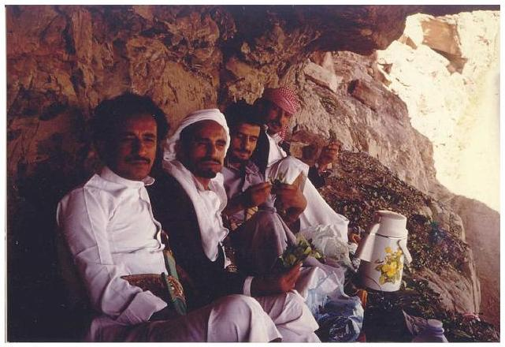

Khat picnic in Yemen Wikimedia Commons CC BY 2.0.

Despite these high rates of use in refugee camps, the few studies in the United States have found very low rates of alcohol use and disorders. In a study of substance use among all newly arriving adult refugees in a Texas city, reported rates of current smoking (38.5\%) and alcohol use (23\%) were very low (Barnes, Harrison, \& Heneghan, 2004). The authors note that substance consumption may have been underreported, at least among some ethnicities. The study's Bosnian interpreter and cultural consultant, for example, believed that the $20 \%$ alcohol use rate reported by Bosnians underrepresented use in that community.

Two studies have assessed substance use disorders among refugees. In a national study of refugee children and adolescents receiving treatment through the national child traumatic stress network, less than $4 \%$ had a substance use disorder (Betancourt et al., 2012). Similarly, a random sample of Cambodian refugees found that four percent had an alcohol use disorder (Marshall, Schell, Elliott, Berthold, \& Chun, 2005).

For refugees, patterns of use differ significantly across the trajectory of displacement. These transitions can be demonstrated in the stories told by Karen refugees (McCleary, 2013; McCleary \& Wieling, in press). When the Karen lived in Burma, their country oforigin, there were cultural structures that protected most people from harmful alcohol use and consequent problems. However, once people fled to Thailand, alcohol use increased significantly and the problems resulting from harmful use increased. New problems such as violence between unrelated adult men, intimate partner violence, and suicide increased, and were all related to alcohol use. After resettlement, patterns of use changed again. For some people, rates of use increased due to resettlement stress and loss of roles. Alcohol-related problems were worse in the settlement location than in the camps because legal consequences such as DUIs, loss of licenses, fines and jail time were more significant. For other people, alcohol use dropped significantly because harmful alcohol use carried so much more risk (e.g., loss of job, loss of housing, loss of driving privileges). Additionally, in refugee camps, religious and community leaders acted as social supports for many refugees to address alcohol-related problems. However, in the United States, many religious and community leaders feel overwhelmed and unable to support their community members with substance use related concerns.

# 33.3 Risk Factors 

Substances may be used as a means of coping with previous or ongoing trauma, stress, isolation, and uncertainty (Ezard, 2012; United Nations, 2014; Weaver \& Roberts, 2010). Each of these phenomena can be a risk factor for substance use and related disorders in immigrant communities. Additionally, particular practices and cultural norms in the country of origin along with acculturation stressors related to local customs in the United States can put immigrants at an increased risk for substance use.

Exposure to traumatic stress and mental health. Many immigrants, particularly refugees, have been exposed to violence and traumatic events in their home countries and duringresettlement (Porter \& Haslam, 2005; United Nations, 2014). Trauma exposure increases the risk of mental health disorders (Porter \& Haslam, 2005; Johnson \& Thompson, 2008). Research indicates that some immigrants and refugees are at higher risk for posttraumatic stress disorder (PTSD), anxiety, depression, psychosis, complicated grief and suicide (Akinsulure-Smith \& O'Hara, 2012; Birman, \& Tran, 2008; Jamil, Hakim-Larson, Farrag, Kafaji, \& Jamil, 2002; Jensen, 1996; Kandula Kersey, \& Lurie, 2004). These mental health disorders in turn can increase the risk of substance abuse (Ezard, 2012; Weaver \& Roberts, 2010). For more information about mental health among immigrants and refugees, see Chapter 5.

However, many immigrants and refugees avoid substance use even after traumatic exposure and distress. In a study of Cambodian refugees 20 years after arrival, alcohol use disorder was positively related to trauma exposure since arriving in the United States, but not to trauma exposure prior to arrival (Marshall, Schell, Elliott, Berthold, \& Chun, 2005). A low rate (4\%) of alcohol use disorder was found in spite of high rates of PTSD (62\%) and major depression disorder (51\%) in this community. Similarly, in focus groups conducted with Karen refugees, trauma was described as a much more influential factor in substance use in the refugee camps than in the United States.

Stresses after resettlement. Immigrants face significant stressors as they seek employment and a new life in the United States, particularly when they face discrimination along the way. These stressors are associated with increased substance use. For example, migrant workers report that three of their most common reasons for drinking are isolation from family, boredom, and stress, along with work constraints that lead to lack of dry recreation or opportunities for social connection (Organista, 2007). Furthermore, immigrants' experiences of unfair treatment and perceived discrimination in finding work are associated with alcohol disorders, prescription drug abuse, and illicit drug use (Gee, Delva, \& Takeuchi, 2007).

Immigrants also face stressors linked to the legal consequencesof substance use. Within the United States, individuals who abuse alcohol and identify as being from racial minority backgrounds are seen as "doubly vulnerable" (Gwyn \& Colin 2010, p. 38). The legal ramifications for racial minority communities are more severe than for majority communities, such as criminal charges (Iguchi, Bell, Ramchand \& Fain, 2005) and increased involvement with social service related organizations (i.e., Child Protective Services, Department of Social Services; Roberts \& Nuru-Jeter, 2012). Legal proceedings are often expensive and difficult to understand for those without a formal legal education. For people who have language and cultural barriers, this process may become additionally challenging. Immigrants and refugees often experience these additional challenges. Differences in culture, religion, acculturation process, gender roles, hierarchy, collectivism/ individualism, and family structures and dynamics often exacerbate the amount of stressors these families face (Rastogi \& Wadhwa, 2006). Each of these challenges requires consideration in research, policy, and intervention.

Norms in country of origin and acculturation to local customs. The norms from the country of origin frequently play a role in an immigrant's substance use and abuse after arrival. For example, in a study of Asian American immigrants, the detrimental drinking pattern (or the "extent to which frequent heavy drinking, drunkenness, festive drinking at community celebrations, drinking with meals, and drinking in public places are common") in the country of origin was significantly associated with the risk of frequent drunkenness and alcohol-abuse symptoms (Cook, Bond, Karriker-Jaffe, \& Zemore, 2013, p. 533). Drinking prevalence (or the "extent to which alcohol consumption is integrated into society as an ordinary occurrence") in the country of origin was associated with alcohol dependence symptoms (Cook et al., 2013, p. 533). Acculturation to the United States consumption behaviors can also increase the risk of substance abuse (Ezard, 2012; Bacio, Mays, \& Lau, 2012; Kam, 2011; Prado et al., 2009). Pumariega, Millsaps, Rodriguez, Moser, \& Pumariega (2007), for example, found thatadolescents may be at an increased risk of substance abuse due to the challenges of acculturation and adopting 'Americanized' activities.

Brao woman making rice wine in a jarWikimedi a
Commons CC BY-SA 3.0.

Knowing the various risk factors immigrants face, it is surprising that immigrants report less drug use (i.e., alcohol, cigarette, intravenous drugs, and other illegal drugs) than United States-born individuals (Hussey et al., 2007). This phenomenon of immigrants doing better than United States-born individuals has been termed the immigration paradox (for greater detail, see Chapter 8) because it contradicts assumptions that difficult transitions to a new country increase the likelihood of substance abuse. For example, one study found adolescents in neighborhoods of historical Mexican heritage (e.g., mostly non-immigrants) were at higher risk for alcohol and marijuana use; these neighborhoods tended to have higher rates of crime, poverty, and residential insecurity. However, youth living in neighborhoods that had higher numbers of immigrants reported lower use of alcohol, cigarettes, and marijuana. This suggests that there was something about neighborhoods withmore of an immigrant presence that may act as a protective factor in adolescent substance use (Kulis et al., 2007). While this paradox does not hold true for all immigrant groups (Hernandez, Denton, MaCartney, \& Blanchard, 2012), many researchers are puzzled at these findings. Recent literature suggests that family support may explain why this is the case.

# Video 

Sunny Chanthanouvong, Executive Director, Lao Assistance Center of Minnesota, discusses mental health as it relates to migration and resettlement (0:00-2:18).

One or more interactive elements has been excluded from this version of the text. You can view them online
here: https://uark.pressbooks.pub/
humanbehaviorandthesocialenvironment2/?p=473\#oembed-1

### 33.4 Family Influences on Substance Abuse

Family involvement and cohesion are key protective factors for substance abuse among immigrants (Bacio, Mays, \& Lau, 2012; Kam, 2011; Prado et al., 2009; Pumariega, Millsaps, Rodriguez, Moser, \& Pumariega, 2007). For example, the research team who conducted the neighborhood study addressed above hypothesized that the main protective characteristic against substance use and abuse was family involvement and cohesion. General family and ecological systems theories posit that family members influence each otheras they interact on a regular basis. This might be especially true in the case of recently arrived immigrant families who are turn to each other for support.

Parenting style is one strong protective factor. For Latino/a adolescents, parenting style patterns were related to adolescent alcohol use or abstention (Driscoll, Russell, \& Crockett, 2008). Driscoll et al. (2008) indicated that there was an increased amount of permissive parenting with successive generations of immigrants, and this parenting style was related to increased alcohol use among adolescents. Those that had authoritative parents did not have an increased risk of alcohol use (Driscoll et al., 2008). This suggests that parenting styles that are high on expectations and support (i.e., authoritative parenting; Baumrind, 1971) may serve as a protective factor against alcohol use for adolescents.

In addition to parenting being important, the general family environment can also influence substance use. For example, Schwartz, Mason, Pantin, \& Szapocznik, (2008) indicated that family functioning influenced identity formation, and that adolescents in immigrant families with higher levels of identity confusion were more likely to initiate cigarette and alcohol use, in addition to initiating early sexual experiences. These findings indicate that family functioning can also serve as a protective factor in terms of initiating drug and alcohol behavior. It is important to put this into context as family cohesion pre-immigration has also been negatively correlated with drug use of young adults (Dillon, De La Rosa, Sanchez, \& Schwartz, 2012).

The parent-child dyad seems to be of particular importance in the transmission of and uptake of substance abuse (Farrell \& White, 1998). Farrel \& White (1998) found that when mother-adolescent distress was high, risk of drug use increased among adolescents. In the context of displaced families, while high family cohesion is a protective factor, acculturated adolescents may see this cohesion as a challenge to their independence. If left unresolved, this can become a problem. Conflict between parents and children in immigrant Latinx families predicted lifetime use of alcohol andbinge drinking behaviors (Marsiglia, Kulis, Parsai, Villar, \& Garcia, 2009). It is important to note that not all families immigrate together and the experience of separation can also impact substance use. For example, when mother-child separates there is an increased risk in terms of drug and alcohol use for adolescents (Mena, Mitrani, Muir, \& Santisteban 2008). A second kind of separation can also influence risk factors. Conceptually, this separation relates to ambiguous loss (Boss, 1991), in that they occur when the parent is unable to care for the child due to financial, health (both physical and mental), and substance abuse problems (Mena et al., 2008).

# 33.5 Theoretical Frameworks 

Considering the theoretical background of research about substance abuse among immigrant and refugee populations within the United States is an important part of understanding the current literature; however, there are some difficulties in the conceptualization of theory for these populations within the context of substance abuse. In the existing literature, there are several theories that are used to frame substance abuse within immigrant communities, thus adding to the difficulties as well. It would be unreasonable to expect all authors to subscribe to only one theory, however, the variety of theories found increases the difficulty of a comprehensive discussion. It is beyond the scope of this chapter to mention all of the theories that have been identified to conceptualize this area of literature; instead, a few theoretical frameworks and societal factors that have been used repeatedly in relation to substance abuse and which might be useful in providing additional clarity to these extant complexities will be discussed.# Ecodevelopmental Theory 

One approach that has been frequently utilized in the literature is ecodevelopmental theory (Szapocznik \& Coatsworth, 1999). This theory takes tenets of ecological systems (Bronfenbrenner, 1977) and developmental theories such as stages highlighted in the expanded family life cycle model (Carter \& McGoldrick, 2005) in an attempt to explain the complexities of substance abuse within immigrant and refugee populations. This enables a discussion of surrounding systems that influence the individual, while also taking into account the stages of life many individuals and families experience. For example, Bronfrenbrenner (1977) discussed development as a series of systems that mimicked concentric circles. The circle closest to the individual is the micro-system, which consists of people and environments that influence the individual on a regular basis (i.e., family members, friends, colleagues, work environment, etc.). Each of these micro-systems interacts with each other, and this interaction creates the meso-system. The next two systems are the exo- and macro-systems. The exo-system consists of the larger influences of economics, politics, education, government, and religion, while the macro-system consists of overarching values and beliefs that a person has. This whole system then moves through time and this element of time is termed the chronosystem. Immigrants and refugees may have similar types of micro-systems, however their interaction with their macro-system may be a bit different due to experiences during displacement or migration, language, culture, and law.

The second piece of ecodevelopmental theory is the Family Lifecycle Model. The Family Lifecycle Model describes the normative stages that a family goes through (i.e., initial coupling, marriage/commitment, transitioning to parenthood, etc.). Combining each of these concepts into one theory allows for an understanding of both external and internal influences. Ecological systems theory focuses more on the outside systems with whichan individual interacts (i.e., peer and familial influence and work and/or school environment) and the family lifecycle provides an understanding of important internal influences such as stages of life (i.e., childhood, adolescents, coupling, etc.).

# Assimilation (or Acculturation) Model 

One model that focuses more on the population (i.e., immigrants and refugees) than on the problem (i.e., substance abuse) is the assimilation (or acculturation) model. This model describes newcomers (i.e., immigrants and refugees) as adopting the host country's customs and patterns of substance use. This means that immigrants and refugees may likely adopt substance use habits that are more reflective of their current surroundings rather than their country of origin. This is not definitive, however, and the literature is mixed. Both D'Avanzo (1997) and Rebhun (1998) reported that people might simply continue the substance abuse patterns that they participated in while living in their country of origin. This may explain the immigrant paradox discussed previously; the longer that immigrants and refugees and their families stay in the United States, the higher their risk for substance abuse. This would make sense as first-generation migrant peoples would have a foreign country of origin, but second-generation would be living in their country of origin and thus only have their current location (with all of its influences, culture, etc.) as a frame of reference.

## Biopsychosocial Theory

While the assimilation (or acculturation model) focuses more on the population rather than the problem, the biopsychosocial theory takes another angle. This theory integrates aspects of psychologyand sociality to expand the explanation and understanding of biological factors (Engel, 1977), and in utilizing this theory, the problem (substance abuse) is placed as the primary focus. Marlatt (1992) first used this theory to describe substance abuse in an effort to explain the influence of substance abuse on the entirety of a person. According to Marlatt (1992) addictive behaviors are influenced by the combination of biological, psychological, and sociocultural factors. Biological determinants may include genetic predispositions to addiction (Palmer et al., 2015) and the way in which the substance physically affects the body. The biological portion of the experience of substance abuse greatly influences the psychological and social experiences (Marlatt, 1992). Psychological risk may include beliefs or values, mental health, exposure of psychological trauma, and expectations of substance effects. The sociocultural influences include both the influence received from and given to others. Each of these determinants interact with and influence each other, and provide a complex picture of how substance abuse might be experienced.

# Health Disparity 

Socially disadvantaged populations, such as racial or ethnic minorities, face health disparities. They are more likely to have health problems, less likely to have access to health care, and more likely to receive substandard care (Institute of Medicine, 2002). These disparities result partially from differences in socioeconomic status, education, employment and housing stability. In terms of substance abuse, ethnic minorities are less likely to use or to complete substance abuse treatment (Chartier \& Caetano, 2011). This theory suggests that as a disadvantaged population, immigrants and refugees face disparities in access to and use of substance abuse treatment. Consequently, the outcomes of substance use in these populations would be more severe.# Historical Trauma 

A historical trauma perspective reminds us that traumatic experiences can lead to wounds that extend across generations (Sotero, 2006). When a community experiences systematic trauma, such as genocide and forced removal from the community, the community as a whole suffers substantial loss and social disadvantages. For example, displacement can lead to reduced socioeconomic status as possessions are left behind and displaced persons must look for employment in a new location. For the individuals in the community, exposure to trauma often leads to psychological symptoms such as PTSD, depression, or anxiety. These trauma-impacted individuals must find a way to cope, and they are likely to turn to substance abuse or other self-destructive behaviors to numb pain. Their parenting and family functioning are likely to be negatively impacted, and their families are likely to be alienated from external supports. These effects will impact their children in turn. Among children of Holocaust survivors, for example, those children who perceived greater parental burden (i.e., the extent to which parents required care from their children due to the parent's distress from traumatic exposure) had greater symptoms of PTSD (Letzter-Pouw, Shrira, Ben-Ezra, \& Palgi, 2014). The children see the ongoing effects of the original trauma.

This framework can be very useful in understanding substance abuse in refugee and other trauma-impacted communities. A refugee community, for example, suffers substantial losses, which impact their ability to function as parents and family members and which increase their chances of turning to substance use to cope with ongoing losses. Children in these families may experience a powerful combination of ineffective parenting, family norms of substance use, socioeconomic disadvantages, and a sense of loss or disconnection related to the original traumatic events and stressors. These children are at risk to turn to substances.

Each of these theories could be helpful in explaining theimmigrant or refugee experience of substance abuse. While it is not necessary for a professional to consider using all of these in guiding his/her work, examining each more closely would be beneficial. Each has something to add and to enable consideration of immigrants' and refugees' needs regarding substance abuse.

# 33.6 Policy on Legal Consequences on Substance Abuse 

In addition to a host of complexities related to displacement, immigrants to the United States also potentially face additional legal challenges if their behavior is disclosed to the Immigration and Naturalization Service (INS). Substance use can lead to a rejection of an application for admission to the United States, or to deportation. Immigration laws classify three types of substance use: abusers, addicts, and persons convicted of drug-related offenses (Mautino, 2002). While the first two are difficult to determine, for immigrants convictions often result in the individual being deported. Additionally, Mautiono (2002) reports that individuals in any of these three categories may be deemed "inadmissible," which means that they would not qualify to immigrate to the United States and cannot qualify for a nonimmigrant (temporary) visa (p.1). It is important to note, that if the INS determines an immigrant to be an "abuser" or "addict" the immigrant is deportable without a drugrelated conviction (Mautino, 2002). An immigrant is typically labeled as an "abuser" if s/he admits to using at least one illegal substance on one occasion within the past three years (Mautino, 2002). Drug convictions are generally related to possession, transportation, and trafficking illegal substances, and can happen in or outside of the United States; such convictions need not happen within the United States and are cause for deportation or being considered inadmissible (Mautino, 2002).# 33.7 Substance Abuse Prevention \& Intervention 

Substance abuse prevention and intervention programs within the United States are prevalent for both adolescents and adults. However, very few programs have been adapted for specific ethnic groups. There are no programs for refugees that incorporate the additional context of conflict-related displacement. In this section, we address the barriers to substance abuse treatment use among immigrants and refugees, suggestions for professionals providing substance abuse treatment for immigrants and refugees, and programs that have tried to address the barriers to treatment.

Barriers to treatment use and effective treatments. There are many barriers that prevent immigrant and refugee populations from receiving and/or seeking substance abuse treatment. There is common stigmatization of substance abuse, particularly given the potential legal consequences for immigrants determined to be drug abusers. When individuals choose to look into treatment options, they are likely to find a lack of culturally relevant evidence-based treatments and trained providers from various immigrant and refugee backgrounds (e.g., people who identify themselves as members within the community of interest; Amodeo et al., 2004). There may not be limited services available in the immigrant's language. All of these factors can combine to prevent immigrants and refugees seeking treatment. For example, Arfken, Berry, and Owens (2009) conducted a study to investigate the barriers that prevent Arab Americans from beginning and remaining in substance abuse treatment programs. What they discovered is that the stigma of having a substance abuse problem and seeking treatment as well as language barriers prevented this group from receiving adequate treatment. In poor communities where there's lack of information, immigrants can also opt not to seek treatment based on inadequate resources for their overall healthcare and their perception of how various laws and policies affect them (Moya \& Shedlin, 2008).In addition to a lack of culturally appropriate treatments and treatment providers, there are few to no culturally appropriate assessments for substance use. Most assessments for alcohol abuse, for example, ask about frequency of drink consumption. People from different countries tend to drink substances of different potencies and in different sizes. Effective measures must adapt the beverage referred to, the drink sizes assumed, and the amount of time asked about to be appropriate for the cultural background (WHO, 2000). For example, some assessments ask about drink usage in the past 7 days. These assessments would not be culturally appropriate for individuals from rural Mexico, who drink heavily only at seasonal fiestas (WHO, 2000).

# Suggestions for professionals providing treatment for immigrants and refugees 

Community professionals must be able to provide necessary services in as culturally responsible manner as possible. There are often limitations to providing such culturally tailored treatments (i.e., resources, training, money, etc.). When working with immigrants and refugees, it is important to focus on models that are inclusive of the family and systemic values (i.e., multiple causal factors, multidirectionality) because familial relationships promote protective factors for immigrants (Kim, Zane, \& Hong, 2002). Different types of family-based treatments have been developed some focusing on helping many families at one time, while others focus on individual families.

Group-based treatment. Group-based treatment can be helpful for immigrants because it provides a community context for healing. Social support is an essential part of behavior change (Mendenhall et al., 2012). Immigrants have often left behind important sources of social support (Pantin et al., 2003), which can be hard to duplicate in their new country. Effective treatments willrebuild some social support networks. Karen refugees, for example, report a direct connection between rebuilding communities and cultures that have been devastated by conflict, flight, displacement and resettlement and solving community-wide problems like substance use, intimate partner violence and stressed parent-child relationships. In focus groups, many Karen participants said that community rebuilding would be an essential part of recovery from harmful alcohol use (McCleary, 2013; McCleary \& Wieling, in press).

Interventions that are group-based may involve the entire family or just specific members to experience the intervention. For example, an intervention may focus on the parents with the intent of participants implementing their new knowledge when they go back into their own family. Others may follow the protocols that include engaging the entire family in the intervention. Pantin et al. (2003) implemented a study to prevent substance use among immigrant adolescents which highlighted the needs of parents; the program included key variables of parenting, such as, communication, parenting behavioral problems, and parental involvement. These key variables seemed to be common in many interventions that focus on parents. For example, in a family treatment, Litrownik et al. (2000) focused on parent-child communication. Additional variables unique to this study included providing psychosocial information and social skills training. Marsiglia et al. (2010) similarly found familial communication to be helpful when working with adolescents of Mexican heritage. Adolescents were also taught decision making and risk assessment. Clearly adults and adolescents have some common needs (e.g., communication), but given their differing developmental levels (Carter \& McGoldrick, 2005), it is appropriate that there be some differences in treatment also.

Family Therapy. Another route for intervention may be the treatment of the individual family. While this mode of treatment will be different depending on the provider and the family receiving services, there are some key components to keep in mind for treatment. Immigrant and refugee peoples may be in need of specialconsideration for potential differences in family structure and dynamics, religious considerations, language challenges, collectivism/individualism, hierarchy, gender roles, acculturation, and ethnic identity exploration (Rastogi \& Wadhwa, 2006). Additionally, the provider must also focus on the identified problem the family wishes to address. Clearly this makes for complex needs and increases the need for clinicians to be culturally aware.

# Culturally adapted programs 

A small number of articles have described how they altered traditional substance abuse treatment programs to fit specific populations. Morelli, Fong, and Oliveira (2001) conducted a study on a residential, culturally competent substance abuse treatment for Asian/Pacific Islander mothers in Hawaii in which children could be with their mothers over the course of the program. The treatment program included traditional healing practices, infant healthcare services, and community elders lead the women in "infant-mother bonding" time. The women in the program found it especially helpful to, among other things, incorporate a blend of traditional healing practices along with conventional treatment methods, allowing mothers to be with their children in a nonjudgmental environment and working with "consistent and competent" staff members.

Another study illustrated how Alcoholics Anonymous (AA) was adapted to suit immigrants from Central America. Hoffman (1994) reported factors such as location of AA meetings, adapting treatment to fit subpopulations within the Latino/a community in Los Angeles and incorporating the traditional 12 steps with groupspecific values. The location of these AA meetings was crucial in getting young Latinx males involved in the programs. Some meetings were held in churches, others in storefront buildings, and others in more traditional rental spaces. These decisions werecarefully made to ensure the groups' abilities to reach their targeted populations. Some groups utilized a theme of Machismo in Terapia Dura (Rough Therapy) to remind members of the negative impact alcohol can have on their lives. Some elements of Terapia Dura include aggressiveness and competitiveness. Groups varied in their use of Machismo based on levels of acculturation and group values. Though such groups were not culturally sensitive to women's and homosexual members' needs, they provided a way to treat a specific group of people who have previously been shown to do poorly in traditional AA groups.
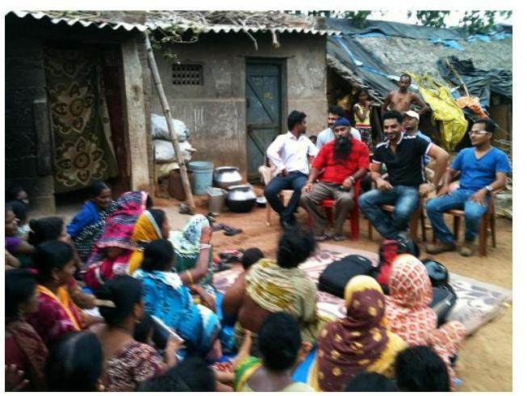

An Alcoholics Anonymous group. Wikimedia Commons CC BY-SA 3.0.

Amodeo, Peou, Grigg-Saito, Berke, Pin-Riebe, and Jones (2004) described a culturally specific treatment for Cambodian immigrants. The study implemented culturally significant techniques such as utilizing acupuncture, providing therapy in the participants' native language, incorporating Buddhist believes, consulting with an advisory board of members of the Cambodian community, emphasizing relationships, cultural values, and coping mechanisms, as well as doing home visits and utilizing culturally relevant data gathering questionnaires. This treatment approach also took into consideration the location services would beprovided. They chose a location that was respected and well known in the Cambodian community.

# 33.8 End-of-Chapter Summary 

As previously stated, the topic of substance abuse prevalence and treatment within immigrant and refugee communities is complex as it involves many different types of populations representing different cultures, resources, traditions, and challenges. For some populations, family connection has been found to be a protective factor against substance abuse, but there is simply an overall dearth of research on the topic. It is clear that more research is needed across each of the areas discussed in this chapter specific to immigrant and refugee communities: theoretical, policy, familial, methodological and intervention-based. Additionally, it has been several years since the United States has published a comprehensive study on prevalence rates for substance abuse among immigrants and refugees (Brown et al., 2005). Given how much our country has changed politically, economically, and demographically in the past decade, it may be timely for the National Surveys on Drug Use and Health to publish the prevalence rates within the more recent 2013 survey and for other researchers to focus on substance use among immigrant and refugee populations.

## Case Study

Jon is a 23-year-old first-generation Laotian man whohas been using heroin for the past two years. Recently, he has been evaluated and recommended to attend drug treatment. Jon's parents struggle to understand what addiction is. Historically, Jon's father has struggled with alcohol abuse; his family reframes his drinking as normal behavior.

Prior to his heroin use, Jon used marijuana exclusively. Fifteen years ago, John came with his family (i.e., parents, younger brother, and older sister) from Vietnam as a refugee.

Jon states that he must return to work in order to help his family pay for living expenses (i.e., rent, food, transportation, medication). The family also supports extended family members back home in Vietnam; these family members are dependent on these financial remittances. Jon agrees that he needs to change, but struggles knowing how to make changes and with his motivation to change.

Jon appears to use the fact that he is proficient in English to his advantage. When communicating with employees at the treatment facility and with court representatives, he communicates different information to different staff members. He also continues this pattern with his family members. Jon does this by leaving out important details for his family and not translating his parents' express wishes for his discharge. Jon states that his family does not understand addiction and therefore, do not need to be involved in his discharge recommendation planning.

- How might the living situation of newly immigrated refugees influence Jon's substance use and treatment?- Can you list 2-3 services in your community that would address Jon and his family needs on different subsystems? Would these resources be culturally sensitive and appropriate?
- What are some common intervention strategies that may encourage Jon's family to engage in his treatment?
- How has traumatic stress potentially contributed to Jon's substance abuse? How do you believe traumatic stress has impacted other generations of Jon's family?
- What are some cultural barriers Jon faces in seeking treatment?

# Helpful Links 

Drug and Alcohol Use in Refugee Communities

- https://practicetransformation.umn.edu/webinars/ drug-and-alcohol-use-in-refugee-communities/
- This webinar by Dr. Simmelink McCleary describes how immigrants and refugees understand substance use and trauma, with guidelines for treatment providers.# References 

Akinsulure-Smith, A. M. \& O'Hara, M. (2012). Working with forced migrants: Therapeutic issues and considerations for mental health counselors. Journal of Mental Health Counseling, 34, 38-55.
Almeida, J., Johnson, R. M., Matsumoto, A., \& Godette, D. (2012). Substance use, generation and time in the United States: The modifying role of gender for immigrant urban adolescents. Social Science \& Medicine, 75(12), 2069-2075. http://doi.org/10.1016/ j.socscimed.2012.05.016.
American Psychiatric Association. (2013). Diagnostic and statistical manual of mental disorders: DSM-5. Washington, D.C: American Psychiatric Association.
Amodeo, M., Peou, S., Grigg-Saito, D, Berke, H., Pin-Riebe, S., \& Jones, L. K. (2004). Providing culturally specific substance abuse services in refugee and immigrant communities: Lessons from a Cambodian treatment and demonstration project. Journal of Social Work Practice in Addictions, 4(2) 23-46.
Arfken, C. L., Berry, A., \& Owens, D. (2009). Pathways for Arab Americans to substance abuse treatment in southeastern Michigan. Journal of Muslim Mental Health, 4(1), 31-46. doi: 10.1080/15564900902785457.

Bacio, G. A., Mays, V. M., \& Lau, A. S. (2012). Drinking initiation and problematic drinking among Latino adolescents: Expectations of the immigrant paradox. Psychology of Addictive Behaviors, October, 1-9.
Barnes, D. M., Harrison, C., \& Heneghan, R. (2004). Health Risk and Promotion Behaviors in Refugee Populations. Journal of Health Care for the Poor and Underserved, 15(3), 347-356.
Baumrind, D. (1971). Current patterns of parental authority. Developmental Psychology, 4, 1-103. http://psycnet.apa.org/doi/10.1037/h0030372.
Betancourt, T. S., Abdi, S., Ito, B. S., Lilienthal, G. M., Agalab, N., \& Ellis, H. (2015). We left one war and came to another: Resourceloss, acculturative stress, and caregiver-child relationships in Somali refugee families. Cultural Diversity and Ethnic Minority Psychology, 21(1), 114-125. http://dx.doi.org.ezp2.lib.umn.edu/ 10.1037/a0037538.

Betancourt, T. S., Newnham, E. A., Layne, C. M., Kim, S., Steinberg, A. M., Ellis, H., \& Birman, D. (2012), Trauma History and Psychopathology in War-Affected Refugee Children Referred for Trauma-Related Mental Health Services in the United States. Journal of Traumatic Stress, 25, 682-690. doi: 10.1002/ jts. 21749.
Birman, D., \& Tran, N. (2008). Psychological distress and adjustment of Vietnamese refugees in the United States: Association with pre- and post-migration factors. American Journal of Orthopsychiatry, 78(1), 109-120.
Boss, P. (1991). Ambiguous loss. In Walsh, F., \& McGoldrick, M. (Eds.), Living beyond loss: Death in the family. W.W. Norton \& Company: New York, NY.
Breslau, J., \& Chang, D.F. (2006). Psychiatric disorders among foreign-born and us-born Asian Americans in a us national survey. Social Psychiatry and Psychiatric Epidemiology, 41(12), 943-950.
Bronfenbrenner, U. (1977). Toward the experimental ecology of human development. American Psychologist, July, 513-531.
Brown, J. M., Council, C. L., Penne, M. A., \& Gfroerer, J. C. (2005). Immigrants and substance use: Findings from the 1999-2001 National Surveys on Drug Use and Health (DHHS Publication No. SMA 04-3909, Analytic Series A-23). Rockville, MD: Substance Abuse and Mental Health Services Administration, Office of Applied Studies.
Carter, B., \& McGoldrick, M. (2005). The expanded family life cycle: Individual, family, and social perspectives (3rd Ed.). New York, NY: Allyn \& Bacon.
Centers for Disease Control and Prevention. (2015). Excessive drinking costs U.S. \$223.5 billion. Retrieved from http://www.cdc.gov/features/alcoholconsumption/.
Chartier, K. G., \& Caetano, R. (2011). Trends in alcohol servicesutilization from 1991-1992 to 2001-2002: ethnic group differences in the US population. Alcoholism: Clinical and Experimental Research, 35(8), 1485-1497.
Cook, W. K., Bond, J., Karriker-Jaffe, K., J., \& Zemore, S (2013). Who's at risk? Ethnic drinking cultures, foreign nativity, and problem drinking among Asian American young adults. Journal of Studies on Alcohol and Drugs, 74(4), 532-541.
D'Avanzo, C.E. (1997). Southeast Asians: Asian-Pacific Americans at risk for substance misuse. Substance Use \& Misuse, 32(7-8), 829-848. doi: 10.3109/10826089709055861.
Dillon, F. R., de la Rosa, M., Sanchez, M., \& Schwartz, S. J. (2012). Preimmigration family cohesion and drug/alcohol abuse among recent Latino immigrants. The Family Journal, 20(3) 256-266.
Driscoll, A. K., Russell, S. T., \& Crockett, L. J. (2008). Parenting styles and youth well-being across immigrant generations. Journal of Family Issues, 29, 185-209.
Engel, G. L. (1977). The need for a new medical model: A challenge for biomedicine. Science, 196(4286), 129-136. doi: 10.1126/ science. 847460 .
Escobar, J. I., Nervi, C.H., \& Gara, M.A. (2000). Immigration and mental health: Mexican Americans in the united states. Harvard Review of Psychiatry, 8(2), 64-72.
Ezard, N. (2012). Substance use among populations displaced by conflict: A literature review. Disasters, 36(3), 533-557. doi: 10.1111/ j.1467-7717.2011.01261.x

Ezard, N., Oppenheimer, E., Burton, A., Schilperoord, M., Macdonald, D., Adelekan, M., \&Van Ommeren, M. (2011). Six rapid assessments of alcohol and other substance use in populations displaced by conflict. Conflict and Health, 5(1). doi: 10.1186/1752-1505-5-1.
Farrell, A.D., \& White, K.S. (1998). Peer influences and drug use among urban adolescents: Family structure and parentadolescent relationship as protective factors. Journal of Consulting and Clinical Psychology, 66(2), 248-258. http://psycnet.apa.org/doi/10.1037/ 0022-006X.66.2.248.Gee, G. C., Delva, J., \& Takeuchi, D. T. (2007). Relationships between self-reported unfair treatment and prescription medication use, illicit drug use, and alcohol dependence among Filipino Americans. American Journal of Public Health, 97(5), 933-940.
Gwyn, P. G., \& Colin, J. M. (2010). Research with the doubly vulnerable population of individuals who abuse alcohol. Journal of Psychosocial Nursing, 48(2) 38-43.
Hernandez, D. J., Denton, N. A., Macartney, S., \& Blanchard, V. L. (2012). Children in immigrant families: Demography, policy, and evidence for the immigrant paradox. In C.G. Coll \& A.K. Marks (Eds.), The immigrant paradox in children and adolescents: Is becoming American a developmental risk? (pp. 17-36). Washington, DC: American Psychological Association.
Hoffman, F. (1994). Cultural adaptations of alcoholics anonymous to serve Hispanic populations. International Journal of Addictions, 29(4), 445-460. doi: 10.3109/10826089409047392.
Hussey, J. M., Hallfors, D. D., Waller, M. W., Iritani, B. J., Halpern, C. T., \& Bauer, D. J. (2007), Sexual behavior and drug use among Asian and Latino adolescent: Association with immigrant status. Journal of Immigrant Health, 9, 85-94.
Iguchi, M.Y., Bell, J., Ramchand, R.N., \& Fain, T. (2005). How criminal system racial disparities may translate into health disparities. Journal of Health Care for the Poor and Underserved, 16(4), 48-56. doi: 10.1353/hpu.2005.0114.
Institute of Medicine. (2002). Unequal Treatment: What healthcare providers need to know about racial and ethnic disparities in health care. Retrieved from: https://www.nap.edu/catalog/10260/ unequal-treatment-confronting-racial-and-ethnic-disparities-in-health-care
Jamil, H., Hakim-Larson, J., Farrag, M., Kafaji, T., Jamil, L. (2002). A retrospective study of Arab American mental health clients: Trauma and the Iraqi refugees. American Journal of Orothpsychatry, 72(3), 355-361.
Jensen, S. B. (1996). Mental health under war conditions during the1991-1995 war in the former Yugoslavia. World Health Statistics Quarterly, 49, 213-217.
Johnson, H., \& Thompson, A. (2008). The development and maintenance of post-traumatic stress disorder (PTSD) in civilian adult survivors of war trauma and torture: A review. Clinical Psychology Review, 28(1). 36-47. http://dx.doi.org/10.1016/ j.cpr.2007.01.017.

Kam, J. A. (2011). The effects of language brokering frequency and feelings on Mexican-heritage youth's mental health and risky behaviors. Journal of Communication, 61, 455-475.
Kandula, N. R., Kersey, M., \& Lurie, N. (2004). Assuring the health of immigrants: What the leading health indicators tell us. Annual Reviews of Public Health, 25, 357-376.
Kim, I. J., Zane, N. W., \& Hong, S. (2002). Protective factors against substance use among Asian American youth: A test of the peer cluster theory. Journal of Community Psychology, 30(5), 565-584.
Kulis, S., Marsiglia, F. F., Sicotte, D., \& Nieri, T. (2007). Neighborhood effects on youth substance us in a southwestern city. Sociological Perspectives, 50(2) 273-301.
Letzter-Pouw, S. E., Shrira, A., Ben-Ezra, M., \& Palgi, Y. (2014). Trauma transmission through perceived parental burden among Holocaust survivors' offspring and grandchildren. Psychological Trauma: Theory, Research, Practice, and Policy, 6(4), 420-429. doi:10.1037/a0033741.
Litrownik, A. J., Elder, J. P., Campbell, N. R., Ayala, G. X., Slymen, D. J., Parra-Medina, D., Zavala, F. B., \& Lovato, C. Y. (2000). Evaluation of a tobacco and alcohol use prevention program for Hispanic migrant adolescents: Promoting the protective factor of parentchild communication. Preventative Medicine, 31, 124-133.
Luitel, N. P., Jordans, M., Murphy, A., Roberts, B., \& McCambridge, J. (2013). Prevalence and patterns of hazardous and harmful alcohol consumption assessed using the AUDIT among Bhutanese refugees in Nepal. Alcohol and Alcoholism, 48(3), 349-355. http://dx.doi.org/10.1093/alcalc/agt009.
Marlatt, G. A. (1992). Substance abuse: Implications of abiopsychosocial model for prevention, treatment, and relapse prevention. In J. Grabowski \& G.R. VandenBos (Eds.), Psychopharmacology: Basic Mechanisms and Applied Interventions (pp. 131-162). Washington, DC: American Psychological Association.
Marshall, G. N., Schell, T. L., Elliott, M. N., Berthold, S., \& Chun, C. (2005). Mental Health of Cambodian Refugees 2 Decades After Resettlement in the United States. JAMA, 294(5):571-579. doi:10.1001/jama.294.5.571.
Marsiglia, F. F., Kulis, S., Parsai, M., Villar, P., \& Garcia, C. (2009). Cohesion and conflict: family influences on adolescent alcohol use in immigrant Latino families. Journal of Ethnicity in Substance Abuse, 8, 400-412.
Marsiglia, F. F., Kulis, S., Yabiku, S. T., Nieri, T. A., \& Coleman, E. (2010). When to intervene: Elementary school, middle school or both? Effects of keepin' it REAL on Substance use trajectories of Mexican heritage youth. Prevention Science, 12, 48-62.
Mautino, K. S. (2002). Immigrants, immigration, and substance use and abuse. Journal of Immigrant Health, 4(1) 1-3.
McCleary, J. S. (2013). An exploration of alcohol use in Karen refugee communities in the context of conflict-related displacement. Unpublished doctoral dissertation. University of Minnesota.
McClearly, J. S., \& Wieling, E. (in press). Forced displacement and alcohol use in two Karen refugee communities: A comparative qualitative study. The British Journal of Social Work.
Mena, M. P., Mitrani, V. B., Muir, J. A., \& Santisteban, D. A. (2008). Extended parent-child separations: Impact on substance-abusing Hispanic adolescents. Journal for Specialists in Pediatric Nursing, 13(1) 50-52.
Mendenhall, T. J., Seal, K.L., GreenCrow, B. A., LittleWalker, K. N., \& BrownOwl, S. A. (2012). The family education diabetes series: Improving health in an urban-dwelling American Indian community. Qualitative Health Research, 22, 1524-1534.
Morelli, P. T., Fong, R., \& Oliveira, J. (2001). Culturally competentsubstance abuse treatment for asian/pacific islander women. Journal of Human Behavior in the Social Environment, 3(3-4), 263-280. doi: 10.1300/J137v03n03_16.
Moya, E. M., \& Shedlin, M. G. (2009). Policies and laws affecting Mexican-origin immigrant access and utilization of substance abuse treatment: Obstacles to recovery and immigrant health. Substance Use \& Misuse, 43(12-13), 1747-1769. doi: 10.1080/ 10826080802297294.

National Drug Intelligence Center (NDIC). (2011). National drug threat assessment. Retrieved from https://www.justice.gov/ archive/ndic/pubs44/44849/44849p.pdf
Organista, K. C. (2007). Towards a structural-environmental model of risk for HIV and problem drinking in Latino labor migrants: the case of day laborers. Journal of Ethnic \& Cultural Diversity in Social Work, 16(1-2), 95-125.
Palmer, R. H. C., Brick, L., Nugent, N. R., Bidwell, L. C., McGeary, J. E., Knopik, V. S., \& Keller, M. C. (2015). Examining the role of common genetic variants on alcohol, tobacco, cannabis and illicit drug dependence: genetics of vulnerability to drug dependence. Addiction, 110(3), 530-537. doi: 10.1111/add.12815.
Pantin, H., Schwartz, S. J., Sullivan, S., Coatsworth, J. D., \& Szapocznik, J. (2003). Preventing substance abuse in Hispanic immigrant adolescents: An ecodevelopmental, parent-centered approach. Hispanic Journal of Behavioral Sciences, 25, 469-500.
Porter, M., \& Haslam, N. (2005). Predisplacement and postdisplacement factors associated with mental health of refugees and internally displaced persons. The Journal of the American Medical Association, 294(5), 602-612. doi: 10.1001/ jama.294.5.602.
Prado, G., Huang, S., Schwartz, S. J., Maldonado-Molina, M. M., Bandiera, F. C., de la Rosa, M., \& Pantin, H. (2009). What accounts for differences in substance use among U.S.-born and immigrant Hispanic adolescents? Results from a longitudinal prospective cohort study. Journal of Adolescent Health, 45, 118-125.
Pumariega, A. J., Millsaps, U., Rodriguez, L., Moser, M., \& Pumariega,J. B. (2007). Substance abuse in immigrant Latino youth in Appalachia. Addictive Disorders \& Their Treatment, 6(4) 157-165.
Rastogi, M., \& Wadhwa, S. (2006). Substance abuse among Asian Indians in the United States: A consideration of cultural factors in etiology and treatment. Substance Use \& Misuse, 41, 1239-1249.
Rebhun, L. A. (1998). Substance use among immigrants to the united states. In S. Loue (Ed.), Handbook of Immigrant Health (pp. 493-519). New York, NY: Springer US.
Roberts, S., \& Nuru-Jeter, A. (2012). Universal screening for alcohol and drug disparities in child protective services reporting. Journal of Behavioral Health Services \& Research, 39(1) 3-16.
Salas-Wright, C. P., Vaughn, M. G., Clark, T. T., Terzis, L. D., \& Cordova, D. (2014). Substance use disorders among first- and second-generation immigrant adults in the United States: evidence of an immigrant paradox? Journal of Studies on Alcohol and Drugs, 75(6), 958-987.
Schwartz, S. J., Mason, C. A., Pantin, H., \& Szapocznik, J. (2008). Effects of family functioning and identity confusion on substance use and sexual behavior in Hispanic immigrant early adolescents. Identity: An International Journal of Theory and Research, 8(2), 107-124.
Sotero, M. (2006). A conceptual model of historical trauma: Implications for public health practice and research. Journal of Health Disparities Research and Practice, 1(1), 93-108.
Streel, E., \& Schilperoord, M. (2010). Perspectives on alcohol and substance abuse in refugee settings: Lessons from the Field. Intervention, 8(3) 268-275.
Szaflarski, M., Cubbins, L.A., \& Ying, J. (2011). Epidemiology of alcohol abuse among us immigrant populations. Journal of Immigrant and Minority Health, 13(4), 647-658. doi: 10.1007/s10903-010-9394-9.
Szapocznik, J. \& Coatsworth, J. D. (1999). An ecodevelopmental framework for organizing the influences on drug abuse: A developmental model of risk and protection. In Glantz, M. D. \& Hartel, C. R. (Eds). Drug abuse: Origins \& Interventions. American Psychological Association: Washington D. C.United Nations. (2014). Global trends 2013. Geneva, Switzerland: Author.
United States Department of Health and Human Services (USDHHS). (2014). The health consequences of smoking-50 years of progress: A report from the Surgeon General. Retrieved from: http://www.surgeongeneral.gov/library/reports/ 50-years-of-progress/full-report.pdf
Weaver, H., \& Roberts, B. (2010). Drinking and displacement: A systematic review of the influence of forced displacement on harmful alcohol use. Substance Use \& Misuse, 45(13), 2340-2355. doi: $10.3109 / 10826081003793920$.
World Health Organization. (2000). International guide for monitoring alcohol consumption and related harm. Retrieved from: http://apps.who.int/iris/bitstream/10665/66529/1/ WHO_MSD_MSB_00.4.pdf.

# Attribution 

Adapted from Chapters 1 through 9 from Immigrant and Refugee Families, 2nd Ed. by Jaime Ballard, Elizabeth Wieling, Catherine Solheim, and Lekie Dwanyen under the Creative Commons Attribution-NonCommercial 4.0 International License, except where otherwise noted.# Chapter 32: Resilience in Immigrant \& Refugee Families 

## Learning Objectives

- Learn from the national and global perspectives of resilience in immigrant and refugee families.
- Recognizing that the world is constantly and rapidly changing.
- Recognizing that Global/national/international events can have an impact on individuals, families, groups, organizations, and communities.
- Global implications dictate that we foster international relationships and opportunities to address international concerns, needs, problems, and actions to improve the well-being of not only U.S. citizens, but global citizens.# 34.I Introduction 

## Ghetto Statistics

By Chay Douangphouxay
We were 4th and
Dupont
North side projects
Second-class refugee We were 1st of the month
Welfare checks
Food stamps
W.I.C.We were just kids

Community centers
Study groups
Basketball hoops They were broken school systems
Crooked cops
Drug dealers
Grave diggers I was supposed to be
Gang member
Prostitute
Dead before fifteen I proved them through
Church groups
Get out of the hood
College degree

The immigrant paradox has been highlighted in recent years as researchers have increasingly noted the resilience of immigrants in the face of challenges and adversity (Hernandez, Denton, Macartney, \& Blanchard, 2012). Resilience refers to the process or outcomes of positive development in the context of adverse circumstances (Luthar \& Cicchetti, 2000; Masten, Burt, \& Coatsworth, 2006). Within families, Walsh (2006) views resilience as the capacity to rebound and grow from challenging experiences,building strength and resources. According to this perspective, essential elements to the process of resiliency are making meaning of adversity and supportive relationships. The challenges immigrants and refugees face are many, including loneliness and isolation in a new country (Campbell, 2008; Narchal, 2012), economic challenges (Fuligni, 2012; Parra-Cardona, Cordova, Holtrop, Villaruel, \& Wieling, 2006), and poor educational opportunities (Crosnoe, 2012). Refugees often face further challenges of coping with multiple exposures to traumatic events that led them to flee their home countries along with displacement and resettlement stressors (Shannon, Wieling, Simmelink, \& Becher, 2014; Weine et al., 2004). However, a resilience framework invites a consideration of the strengths and protective factors that allow immigrant families to overcome adversity.

The immigrant paradox is defined as the tendency for first and second-generation immigrants to do better in many areas than United States-born individuals (Hernandez et al., 2012). This trend has been observed in physical health, psychological health, and education. Fuligni (2012) outlines two considerations that increase immigrants' abilities to thrive in the transition to a new culture and home, and then describes a third consideration that can pose barriers. First, immigrant families tend to be highly motivated and value work and education. Second, children of immigrants are protected by family connection and obligation. Finally, in spite of high educational aspirations, immigrant families have varied access to the resources and opportunities needed to achieve success. This review examines research on the strengths and the resilience of immigrant families in the United States in each of these three areas.

Jennifer Doty (Family Medicine and Community Health, University of Minnesota)

# 34.2 Family Motivation: Value of Work \&# Education 

Consistent with a family resilience framework (Walsh, 2006), the value of family provides a powerful motivation among immigrants to work hard and gain an education. A sense of family identity can provide a sense of belonging and social identity (Fuligni, 2011). Furthermore, family identity promotes eudamonic well-being in minority populations, a sense of purpose, motivation, and meaning (Fuligni, 2011). For example, one young woman from a refugee family explains how her mother instilled the value of family identity to provide a compass for navigating her life:

The resounding words, "YOU ARE BETTER THAN THAT," penned and embedded by my mother in the fiber of my being, echoed in the ear drums of my soul, brought me back to sanity. It was like the blinders were opened and the light of truth penetrated the darkness of my world. For the first time, I saw myself for who I really am and wanted to be. I was no longer ashamed of my uniqueness (Douangphouxay, 2012, p. 1).

Family often provides motivation to immigrate. In one study, Latino/a immigrants cited their desire to be reunited with families as a motivator for immigration (Campbell, 2008). Other reasons for leaving their home country have included dreams of an education and future for their children, a need to protect children from violence, and a desire to achieve financial stability in order to provide the family with basic necessities (Solheim, Rojas-Garcia, Olson, \& Zuiker, 2012). This section reviews immigrant and refugee families' motivation to work hard and provide education for their children.# Value of Work 

Across the literature, there is evidence that immigrant families emphasize the value of working hard to support their families. The opportunity to work hard in order to support the family has not only been cited as a reason for immigrating to the United States, but qualitative studies have also illustrated immigrants' feelings of cultural pride in giving their best for their loved ones (ParraCardona, Bulock, Imiq, Villarruel, \& Gold, 2006; Solheim et al., 2012). Immigrant families described enduring an anti-immigration environment in their country of destination because of economic opportunities and the possibility of upward social mobility for their loved ones (Valdez, Lewis Valentine, \& Padilla, 2013). In another study of migrant workers, the demands of long hours and challenging schedules were noted, but the opportunity to work and be independent was highly valued (Parra-Cardona et al., 2006). In comparison to previous experiences in their home country, participants expressed satisfaction in having an income that was adequate for basic necessities. Imagining a better future was described as a coping strategy for immigrant participants (ParraCardona et al., 2008).

Mural to honor migrant workers at the Gundlach-Bundschu winery. Chris deRham - honoring the vineyard workers - CC BY-NC-ND 2.0.

Data from the Census Bureau's American Community Survey suggest that work patterns among immigrant fathers differ by level of language fluency. Among immigrant fathers in English fluent families, $95 \%$ to $96 \%$ worked to support their families, a level comparable to United States-born families (Hernandez et al., 2012). Among those who were English language learners, more than $85 \%$ of fathers worked to support their families. Exceptions were found in Southeast Asian, Armenian, and Iraqi refugee families where rates were between $70-84 \%$. This may be because refugee families from these conflict-ridden parts of the world are likely to have suffered more traumatic events and therefore may experience greater functioning and work-related barriers (See also Chapter 5).

Hernandez et al., (2012) found that the majority of immigrant families in their study also had a mother who contributed to thefamily finances. Campbell (2008) illustrated the pride that immigrant women took in their jobs, even if they were low paying. Several women demonstrated an entrepreneurial spirit, running businesses based on traditional roles of women (baking, sewing, etc.). The motivations for these efforts were often framed as dedication to the welfare of their families, and obstacles were seen as challenges to be overcome rather than insurmountable barriers. In another qualitative study, one woman shared her pride in balancing work and family as she obtained her GED, found a new job, built a new home with her spouse, and supported her children's education (Parra-Cardona et al., 2006). Women also supported their spouses and took pride in their work ethic and sacrifices. One woman in Parra-Cardona et al.'s (2006) study noted that she was proud of her husband for getting a promotion in a factory for \$9/ hour; she was proud that his 70 hour work weeks and sacrifices over the years were recognized (Parra-Cardona et al., 2006).

Children are a source of inspiration as immigrants work hard to face challenges and adversity (Ayón \& Naddy, 2013; Valdez et al., 2013; Walsh, 2006). Qualitative research emphasized that well-being of children was a priority among immigrant workers, and being a good parent was their "central life commitment," even a sacred responsibility (Parra-Cardona et al., 2008). These sentiments were illustrated when immigrant parents expressed desire to cover basic needs of their families without spending excessive time away from family. In another study, Southeast Asian adolescents, the majority of whom were children of immigrants, recognized that their parents shared affection by trying to provide for them (Xiong, Detzner, \& Cleveland, 2004). They saw that their parents wanted them to do better than they had, sharing that their parents' low paying jobs served as motivation to do better.# Videos 

Ruben Parra-Cardona, Ph.D., LMFT discusses employment and parenting (14:13-14:52).

One or more interactive elements has been excluded from this version of the text. You can view them online
here: https://uark.pressbooks.pub/
humanbehaviorandthesocialenvironment2/?p=475\#oembed-1

Paul Orieny, Sr. Clinical Advisor for Mental Health, The Center for Victims of Torture (CVT), discusses the education and employment success of immigrants.

One or more interactive elements has been excluded from this version of the text. You can view them online
here: https://uark.pressbooks.pub/
humanbehaviorandthesocialenvironment2/?p=475\#oembed-2

## Value of Education

Research has also emphasized how much immigrant parents value education for their children. In a qualitative study of Mexican American undocumented women in South Carolina, mothers were unanimous in their desire for children's educational success (Campbell, 2008). As parents, they had given up life in Mexico for the sake of their children's education. Many of these mothers investedin their own education to become better parents and to model the importance of education for their children (Campbell, 2008). In a longitudinal study, immigrant children of diverse backgrounds were found to have higher GPAs on average if their parents had listed education as a reason for immigrating, which suggests that parents' motivations may have an impact on their children (Hagelskamp, Suarez-Orozco, \& Hughes, 2010). Planning for children's education was found to be a source of life satisfaction for immigrant migrant parents (Parra-Cardona et al., 2006).

In spite of early disadvantages, first-generation immigrant adolescents appear to have an advantage over second-generation or third-generation children of immigrants, an often-cited example of the immigrant paradox. Using data from the Educational Longitudinal Study, Pong and Zeiser (2012) found first-generation immigrant students in 10th grade had higher GPAs and more positive attitudes toward school than subsequent generations. These tendencies held true across race/ethnicity including White, Latino/a ${ }^{1}$, Black, and Asian immigrant children. Family influences may help account for these results as evidence connects immigrant and refugee parents' aspirations to children's academic outcomes. For example, Pong and Zeiser (2012) also found that parents' expectations were related to 10th-grade math results. For Hmong men, having greater family conflict is linked to being more likely to complete the first year of college. In families like these, family conflict may reflect the parents' investment in their child's academic lives (Lee, Jung, Su, Tran, \& Bahrassa, 2009). Portes and FernandezKelly (2008) discussed the strict parenting practices in immigrant families that are often at odds with the parenting styles of the majority population. They concluded, "While such rearing practices will be surely frowned upon by many educational psychologists, they have the effect of protecting children from the perils of street life in their immediate surroundings and of keeping them in touch with their cultural roots" (p. 8).# Value of a Second Language 

Although the challenge of learning English is great, studies have found that the ability to speak a second language represents advantages for many children in immigrant families. Children in families who promote learning in two languages benefit in academic achievements, cognitive gains, self-esteem, and family cohesion (Espinosa, 2008; Han, 2012). However, the importance of mastering English must be stressed. In a sample of Latino/a and Asian children, Han (2012) found that bilingual children dominant in the English language performed at an academic level similar to White monolingual children, controlling for other factors, while bilingual children who were not dominant in English or did not speak two languages performed at lower levels. In addition, first and secondgeneration bilingual children performed better than thirdgeneration bilingual students providing further evidence for an immigrant paradox. Although it can be a stressful obligation, children of immigrants often express pride in their bi-lingual abilities and in being able to translate for their parents (Kasinitz, Mollenkopf, Waters, \& Holdaway, 2008). In addition, speaking one's native language allows children in immigrant and refugee families to connect with extended family members and ties them to their ethnic heritage (Costigan \& Koryzma, 2011; Nesteruk \& Marks, 2009). Espinosa (2008) advocated promoting rich language experiences in one's native language during the first three years of life and then adding second language after the age of 3 .
${ }^{1}$ The term Latino/a is used throughout this chapter, though some original studies used the term Hispanic.

### 34.3 Family Connectedness \& Identity

Fuligni (2011) argued that because immigrant groups face barriersin their access to resources, family and ethnic identity is a salient protective factor in immigrant families. Family connection remains highest over time among the immigrant families facing the most stress, suggesting that families are a particularly important support for immigrants struggling in the new culture (Ibanez et al., 2015). The protection provided by family connectedness and identity may be one explanation for the immigrant paradox. In Latino/a families, the tradition of family connectedness and obligation is known as "familismo," (Parra-Cardona et al., 2006). In a qualitative study to better understand parenting needs, Latina/o parents reported that "familismo" was a strong motivation to adopt more effective parenting practices (Parra-Cardona, Lappan, Escobar-Chew, \& Whitehead, 2015). In Asian families, family cohesion stems from Confucian values (Walton \& Takeuchi, 2010). Among Black Caribbean immigrants, gatherings of family and friends called "liming" sessions reinforce family and cultural identities through storytelling (Brooks, 2013).

Several aspects of family connectedness described in the following sections may serve as a source of resilience for both adults and children in immigrant families: family cohesion, a sense of family obligation, and an emphasis on ethnic heritage.

# Family cohesion 

Family cohesion is how emotionally close and supportive the members of a family are. An emphasis on family connection is reflected in the structure of immigrant families, which are more likely to include married couples and to be inclusive of extended family members. Immigrants, in general, are more likely than the United States-born to marry and less likely to divorce (Quian, 2013). According to the Census Bureau's American Community Survey, $82 \%$ of children of immigrants live with two parents, whereas $71 \%$ of children in United States-born families are in living with twoparents (Hernandez et al., 2012). This emphasis on cohesion reflected in the immediate and extended family structure could provide protective influences for both children and adults.

Immediate family. Family cohesion in immediate immigrant families is linked to positive outcomes for children and adolescents. In studies of Latinx immigrant families, family cohesion predicts child social skills and self-efficacy and protects against conduct problems and alcohol use (Leidy, Guerra, \& Toro, 2012; Marsiglia, Parsai, \& Kulis, 2009). Family cohesion may also help immigrants cope with the challenges of living in a new country and culture. For example, a study by Juang and Alvarez (2010) found that Chinese American youth who experienced discrimination felt loneliness and anxiety, but family cohesion buffered this negative effect. Family cohesion was particularly powerful for youth who experienced high levels of discrimination. Similarly, among adolescent refugees from Kmer who had been exposed to significant violence, family support protected against mental health and personal risk behavior problems (Berthold, 2000).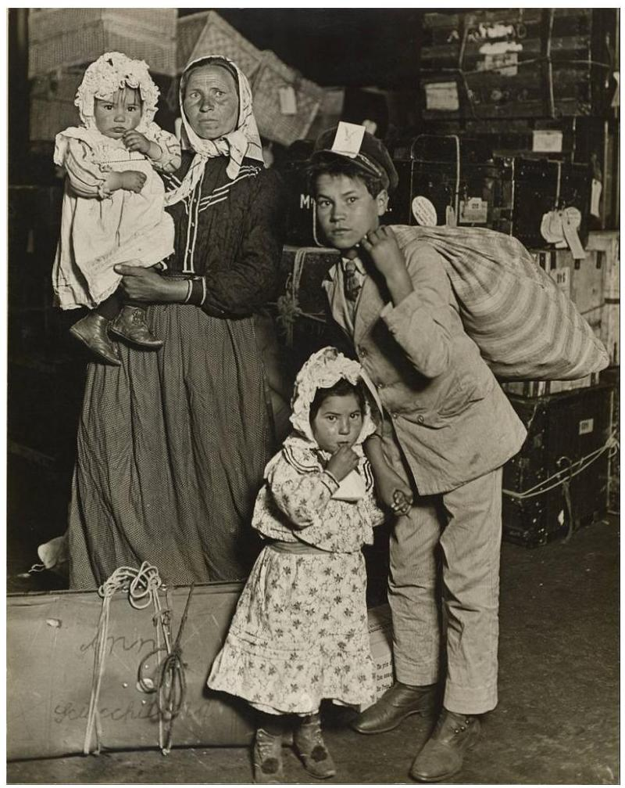

Immigrant Family in the Baggage Room of Ellis Island.
Wikimedia Commons - public domain.

Immediate families continue to provide needed support during the transition to adulthood and, later, to parenthood. A study by Kasinitz et al., (2008) found that in comparison to their UnitedStates-born peers, young adult children of immigrants were more likely to live at home, which enabled many to attend college without burdensome debt and save for a home. In several studies, immigrant adults relied on their parents when they themselves became parents. Even if new mothers had previously been critical of their own mothers, when second-generation women transitioned into parenting, they often relied heavily on their mothers for support and advice (Foner \& Dreby, 2011; Ornelas et al., 2009). When their mothers remained in their home country, transnational phone calls were one important form of support (Ornelas et al., 2009).

Extended family. Another source of resilience for immigrant families is found in extended family cohesion. In several studies, extended family members were a crucial support during the transition time following migration, providing food, giving support, and helping pay bills until the recently arrived family could get established (Ayón \& Naddy, 2013; DeJonckheere, Vaughn, \& Jacquez, 2014; Parra-Cardona et al., 2006). For example, a Latino youth explained, "When we first came here my cousin and I told a lot of secrets, and he's the one I trust" (p. 15). Campbell (2008) described how the undocumented women in the study depended on extended family members to help them navigate the system in order to buy a house, and how they relied on family members to look after their properties back home in Mexico. In a quantitative study of risk and resilience among immigrant Latina mothers, social capital, described as a network of family and friends, was related to life satisfaction and food security (Raffaelli, Tran, Wiley, Garlaza-Heras, \& Lazarevic, 2012).

Extended family provided needed support in raising children. When immigrant new mothers were separated from their parents, they relied on other extended family members also living in the country of destination, especially in the time period immediately after giving birth (Ornelas et al., 2009). In a study of Eastern European immigrants, grandparents and other relatives played important roles in raising Unite States-born children (Nesteruk \&Marks, 2009), often travelling to the United States for six months at a time to assist new parents after a child was born.

When children are older, relatives often provide child-rearing support for immigrant families. Xiong and colleagues (2004) reported that Hmong families living in the United States may send their children away to live with relatives to avoid the dangers of an unsafe neighborhood. Similar examples are found outside the United States. Vietnamese refugee parents in Norway depended on kin networks to provide support and protection to troubled youth (Tingvold, Hauff, Allen, \& Middelthon, 2012). In order to maintain intergenerational ties, Eastern European immigrant families described making sacrifices to move closer to kin or send their children abroad to stay with grandparents in the summer (Nesteruk \& Marks, 2009). Grandparents often played a key role in raising grandchildren in immigrant families, adding instrumental support especially in dual-career families (Treas \& Mazumdar, 2004; Xie \& Xia, 2011). Given the importance of many grandparents in immigrant families' lives, Foner and colleagues (2011) suggest that intergenerational research among immigrant families with three generations in one household is needed.

# Family Obligation 

Family identity implies having a sense of obligation toward kin and striving to be valued, contributing members of one's family (Fuligni, 2011). Even after controlling for socio-economic variables, immigrant adolescents and young adults from Filipino, Mexican, Latin American, and Central/South-American backgrounds were much more likely than European youth to report a sense of family obligation in the areas of assisting family, spending time with family, considering family members' opinions and desires, and supporting family (Fuligni, 2011). Although foreign-born students had a higher level of obligation than United States-born students, second andthird-generation youth from Asian and Latinx backgrounds were more likely to have a higher sense of obligation than those from European backgrounds. Ethnic differences in emotional closeness or conflict, however, were not found. Evidence suggests that these levels of obligation were connected to adolescents' sense of ethnic identity, a topic explored later in this chapter.

Feelings of family obligation consistently predicted academic motivations in Latino/a and Asian immigrant children (Fuligni, 2011). Immigrant children with a strong sense of family obligation tended to believe that education was important and useful. This suggests that family obligation may help promote a higher level of engagement in school than socio-economic barriers and actual achievement levels would predict. However, no relationship between family obligation and achievement in terms of grades was found.

Parenting practices may contribute to a sense of family obligation. Xiong et al.'s (2004) study found that Southeast Asian adolescents perceived a parental emphasis on proper behaviors and academic success. One Cambodian participant in the study reported constant messages from parents to "stay in school, stay out of trouble, don't go out with friends all the time to do bad things, be on time [when coming back home]" (p. 9). Adolescents also reported that parents often communicated the connection between education and opportunity. These findings imply that parents' clear communication of family values contributes to the academic resilience of immigrant children, perhaps compensating for other challenges.

Family obligation appears to contribute to the mental health of immigrant children. One study of Latino families found that familism values contributed to lower rates of externalizing behavior (German, Gonzales, \& Dumka, 2009). Also, family identity and obligation has been found to contribute to positive emotional wellbeing and personal self-efficacy in immigrant children (Fuligni, 2011; Kuperminc, Wilkins, Jurkovic, \& Perilla, 2013). Feeling like a good family member has been found to mediate a relationship betweenhelping at home and elevated levels of happiness in youth from Latino/a, Asian, and immigrant backgrounds, although increased helping is also related to feelings of burden (Telzer \& Fuligni, 2009). A sense of fairness regarding family obligations was also an important predictor of declines in psychological distress among Latinx immigrant youth (Kuperminc et al., 2013). Most recently, engaging in family assistance has been found to be associated with ventral striatum activation in the brain, suggesting a neurological benefit associated with decreased risk-taking (Telzer, Fuligni, Lieberman, \& Galván, 2013). Several studies have found that lower instances of risky behaviors such as early sex, violence, delinquency, and substance abuse have been reported in adolescent immigrant youth across race and ethnicity (Hernandez et al., 2012; Kao, Lupiya, \& Clemen-Stone, 2014). While family obligations may be challenging at times, immigrant youth often benefit from these obligations.

# Ethnic Heritage 

A sense of ethnic identity developed through socialization in families and cultural communities may provide protective influence. For example, a strong ethnic identity was found to contribute to academic motivation in immigrant children (Fuligni, 2011). Turney and Kao (2012) found that immigrant parents were more likely to talk with their children about their racial and ethnic traditions than United States-born parents. Religiosity and spirituality, often integrated with one's ethnic identity, rituals, and traditions, appear to play a significant role as a protective factor in the immigrant paradox among Latino/a and Somali youth (Areba, 2015; Ruiz \& Steffen, 2011). Also, participation in a religious community was a key means of connecting children of Vietnam refugees with their ethnic heritage and building cultural capital (Tingvold et al., 2012). Among refugees, contact with those of the same ethnic background may be protective. Sudanese children living without any contactwith other Sudanese were more likely to have PTSD than those who had fostered with Sudanese families (Geltman et al., 2005). In one study, ties to tradition and Somali culture were adaptive for Somali girls, but assimilation to the United States host country culture was adaptive for boys (Fazel, Reed, Panter-Brick, \& Stein, 2012). Ethnic heritage appears to be a protective factor for many immigrants, although it is influenced by contextual factors such as gender.

# 34.4 Role of Resources in Achieving Aspirations 

An ecological approach to resiliency invites us to consider the strengths of individuals and families as well as the ways that context contributes to the barriers and support of success (Parra-Cardona et al., 2008). Walsh (2006) cautions, "In advancing an understanding of personal or family resilience, we must be cautious not to blame those who succumb to adversity for lacking 'the right stuff', especially when they are struggling with overwhelming conditions beyond their control" (p. 6). This section examines differences in families' access to the resources that allow them to overcome adversity, specifically focusing on social stratification, contextual risk exposure, and acculturation.

## Social Stratification

Kasinitz and colleagues (2009) point out that many groups of immigrants experience economic success. In New York, children of Chinese and Russian Jew immigrants have levels of income similar to United States-born White European Americans, children of West Indian immigrants have higher income levels than United States-born African Americans, and children of Dominican Republicans and South Americans have higher income levels than United Statesborn Puerto Ricans. However, Parra Cardona and colleagues (2006) paint a stark contrast to this picture of upward mobility for immigrants. Migrant workers earned lower levels of income than other groups in poverty ( $\$ 7,500 /$ year), with little opportunity for upward mobility despite their hard work (Parra-Cardona et al., 2006). These families were often required to move across the country without any advance notice; as they moved north to new work locations, schools were less likely to provide bilingual support.

Expectations of financial success in the United States often fall short of expectations. Families from Mexico reported that the cost of living in the United States was higher than expected, and the families could not save for goals as quickly as they had hoped (Solheim et al., 2012). A quantitative study of Latinx families unexpectedly found that human capital was associated with lower life satisfaction; this suggests a gap between reality and expectations based on the level of education and skill (Raffaelli et al., 2012). Although family influences can be protective, family needs and obligations may present a barrier for reaching goals among young adults. For example, one single young man had come to the United States to better his personal circumstances but supported his mother back in Mexico at the expense of his own education (Solheim et al., 2012). This is consistent with larger trends in research, where first-generation immigrant young adults were more likely than second or third-generation young adults to provide financial assistance to their families (Fuligni, 2011). Those immigrant youth who provided financial help to families were less likely to complete a 2 or 4 -year degree. Similarly, in families whose primary motivation for immigrating was work prospects rather than educational prospects, children's grades were more likely to decline over five years (Hagelskamp et al., 2010). This suggests that in families where family employment and work concerns are pressing, individual educational goals can suffer. These findings suggest that a hierarchy of needs may exist where basic needs are more importantthan education and limit upward mobility (Hagelskamp et al., 2010). Together, these studies suggest that high levels of family obligation may interfere with academic success.

Educational attainment. Some of the variations in achieving financial success may depend on the level of parents' education upon arrival to the United States, which is a reminder that immigration is a selective process (Fuligni, 2012). Many immigrants are able to migrate because they have higher resources than their peers at home. In one study, Black immigrant heads of household had higher levels of education than Black United States-born heads of household (Thomas, 2011). Zhou (2008) found that many Chinese immigrant families had higher education than other immigrant groups and built a community of support for educational experiences, which benefited families with lower levels of SES as well. In another study, Chinese fathers were more educated that immigrant fathers from Central America, Dominican Republic, Mexico, or Haiti, and these Chinese families cited work prospects as motivation to migrate less often than those from other countries of origin (Hagelskamp et al., 2010). Children from Chinese families also tended to have higher grades. In contrast, those from Haiti and Central America were more likely to be fleeing political chaos and mentioned education less as a reason for migrating. In refugee samples outside the United States, parents' education may be a long-term protective factor (Montgomery, 2010), but those who are educated may also be targeted in violent conflicts and suffer more as a result (Fazel et al., 2012).

Many of the examples of the immigrant paradox throughout the literature rely on data that controls for SES, but these may not have real world application if socioeconomic status is strongly related to outcomes. Crosnoe (2012) responded to this concern by examining educational outcomes over time for first- and second-generation immigrants as well as United States-born groups in two nationally representative samples, but without controlling for SES. The results showed that White European American children of third-generation-plus families scored well above all other groups. Amonghigh school students, second-generation Latinx students outpaced third-generation Latinx students; first-generation were inbetween, but not significantly different from either the secondor third-generation. Among elementary students, third-generationplus Latinx students scored above first- and second-generation immigrants but this gap decreased as the children reached fifth grade. In a study of younger children, access to early education has been found to be limited for some groups of immigrants (Hernandez et al., 2012). Although some cited family and cultural barriers to obtaining early education, research shows the differences were largely accounted for by socioeconomic barriers for both immigrant and United States-born families from Central America and Southeast Asia (Hernandez et al., 2012). Thus, education barriers may vary across generations and across immigrant communities.

# Contextual Risk Exposure 

Contextual risk exposures can stem from numerous sources, but some of the most salient are local policies, neighborhoods, and discrimination. One study found that pro-immigrant local policies and integration among immigrants and other groups in 2000 was related to the availability of diverse job opportunities for immigrant families (Lester \& Nguyen, 2015). In these contexts, immigrants were less likely to lose their jobs and had higher incomes in 2010, implying that they were more resilient to the economic stress of the Great Recession.

Immigrant families often settle in poor, high crime areas with lower quality schools and limited access to resources (Fuligni, 2011; Xiong et al., 2004). Ponger and Hao (2007) found that the schools Latinx immigrant children attended had a higher record of problem behaviors and poor learning climate compared to schools where Asian immigrant children attended. Portes and Raumbaut (2001) reported that immigrant children from Laos, Vietnam, or Cambodiawere likely to attend unsafe schools. This research was substantiated by a large national study which found that schools immigrant children attended were more chaotic and had lower levels of academic expectations and challenges than schools that second- or third-generation students attended (Pong \& Zeiser, 2012). Comparisons with children from non-immigrant families were not made, however, which may have shown an even greater difference. Furthermore, Southeast Asian adolescents of immigrant parents felt that their parents frequently lacked the resources to advocate for their children in a school environment because they were socially isolated (Xiong et al., 2004).

In addition to impoverished, low-resource communities, many immigrants face discrimination. Kasinitz and colleagues (2009) reported that children of immigrants from Indian or Latinx backgrounds faced more discrimination than other groups of immigrants in New York, which may have influenced their ability to access local resources. For example, criminal justice systems tend to give more lenient sentences to White adolescents than to Latino or Black adolescents for the same crimes, and these adolescents also have fewer economic and family resources to navigate their sentences. In a qualitative study, immigrants expressed more discrimination barriers than United States-born Latinxs; they felt a sense of isolation in communities where Latinxs were a minority and experienced discrimination rooted in language barriers (ParraCardona et al., 2006). In that same study, immigrant migrant workers experienced extreme discrimination, including from employers who reneged on the original agreement for compensation. Few employees received health care, and taking a day off for health or family reasons was punished by extra days of work. Parents felt that their children were disadvantaged in schools by being placed in a slow learning track and negatively labeled (Parra-Cardona et al., 2006). A study of Somali refugee children found those who perceived discrimination were more likely to report symptoms of depression and PTSD (Ellis et al., 2008). In contrast, those who felt safe at school or a sense of belonging wereless likely to report depression or PTSD (Geltman et al., 2005). Even if discrimination is not obvious, social stereotypes created barriers to resources with long-term implications for mental and physical health (Fuligni et al., 2007). For example, East Asian immigrants tended to have higher incomes that allow high school students to enroll in higher-level courses and receive higher grades than peers from Latin American or Filipino backgrounds. In turn, these courses and grades predict college enrollment (Fulgini et al., 2007).

# Acculturation Gap 

Levels of acculturation may also affect access to resources. Adolescents and young adults who combine aspects of both their family of origin culture and the new culture and speak both languages tend to adjust better than those who either stay steeped in their root culture only or assimilate completely to their new culture (Kasinitz et al., 2008; Portes \& Rumbaut, 2001).

In some cases, an acculturation gap between parents and their more quickly acculturated children leads to family conflict. As a result, family relationships become a risk factor rather than a protective factor (Lee et al., 2009; Xiong et al., 2004; Lazarevic, Wiley, \& Pleck, 2012). When patterns of parent and child acculturation are similar to each other, parent-child relationships and youth well-being may benefit (Portes \& Rubaut, 2001; Lazarevic et al., 2012). In a Canadian study, parenting efficacy mediated the relationship between acculturation into the new culture and psychological adjustment of both Chinese mothers and fathers (Costigan \& Koryzma, 2011). A direct relationship between maintaining an orientation toward Chinese culture and positive psychological adjustment was found for women but not for men.

Research suggests that parents' acculturation and adjustments in parenting that align with the demands of the new culture may have some protective factors for children in immigrant families. However,research also shows that subsequent generations do less well. It may be that over time as acculturation and opportunities increase, there is an erosion of a strong sense of family identity which diminishes the protection these connections provide.

Video

True Thao, MSW, LICSW discusses refugee resilience despite adjustment challenges and generational strains (0:00-1:43).

One or more interactive elements has been excluded from this version of the text. You can view them online here: https://uark.pressbooks.pub/ humanbehaviorandthesocialenvironment2/?p=475\#oembed-3

# 34.5 Emerging Directions 

Immigrant and refugee families may respond with resilience to challenging circumstances and adversity, particularly when policies and resources are in place to support them. Indeed, pro-immigrant policies have been shown to create economic opportunities for immigrant families (Lester \& Nguyen, 2015) which allows them to provide for their family's needs, raise healthy and successful children, and pursue their goals. Although barriers exist, as a whole, immigrants are highly motivated to invest in their families through hard work and education and often express a sense of pride in their independence. Another strength of immigrant communities is a sense of family identity and obligation that often serve as protective factors.

Scholars have pointed to several gaps in the literature onimmigrant families. There is a lack of research regarding several specific subgroups in the United States, including Southeast Asian populations and immigrants from the Middle East (Xiong et al., 2004; Foner \& Dreby, 2011). Also, research on refugee resilience is lacking in the United States. Research on couples in immigrant and refugee families is also needed (Helms et al., 2011). A focus on resilience offers a new lens that focuses on strengths and protective factors that provide an environment in which immigrant and refugee families can thrive and contribute to a continually changing and increasingly diverse United States society.

# 34.6 End-of-Chapter Summary 

## Case Study \#I

Juan Morales stood at the grocery counter watching the clerk ring out each item while his mother looked through her purse to find her wallet. The clerk looked up and asked, "How are you folks doing?"
His mother answered with her thick accent, "Good, good." "That will be \$28.51, ma'am." The clerk looked expectantly at Mrs. Morales, who turned to her son.
"Cuanto es, mi hijo?" she asked. He told his mother the amount in Spanish, and she reached into her purse to give him a ten and a twenty. When the clerk gave change of $\$ 11.49$, she refused the amount and told her eleven-year-old son to communicate the change was too much.Juan turned bright red while the customers behind them formed a line. "You gave us too much change." The clerk tried to explain that he was giving change for forty dollars, but Mrs. Morales insisted that she should get change for thirty dollars. In the end, the clerk thanked them for their honesty.
As Juan and his mother walked away, Mrs. Morales gave her son a quick hug. She told him how proud she was of him, studying so hard and speaking good English. "Por eso venimous aqui," she said-that's why we came here, so you could study hard and have a better life than we had in Colombia.

# Case Study \#2 

Ayon ran down the sidewalk, dodging people walking briskly in the afternoon rush hour. She had to get to the Western Union before it closed. Slightly out of breath, she reached her destination and wired money back home to her grandmother in Somalia. Then she stopped by a store to grab a contribution to the family meal that night. Her cousins were coming over and her mom wanted to have a big meal. She was looking forward to a night with the family, even if it meant that she would be up late studying for exams that she had to take the next day.

When she got home, her family was gathered around her younger sister. She was crying because a girl at school hadchallenged her to take off her hijab, the headdress that the women in the family wore for modesty. Ayon smiled at her and said, "Don't listen to them. They asked me the same thing." Their cousin chimed in, and before long the girls were laughing and talking. Ayon smiled with a deep contented sigh.

# Discussion Questions 

1. What are some examples of the immigrant paradox in immigrant and refugee families?
2. How would you explain the attitude toward work and education of most immigrant and refugee families? What do you think is behind these attitudes?
3. Discuss the role families play in promoting resilience among immigrants and refugees? In what ways might family obligations be a barrier to resilience at times?
4. Why should a community worker or practitioner be careful to refrain from judging immigrant and refugee families negatively?
5. What is an acculturation gap? How could an acculturation gap affect resilience?# Helpful Links 

- Two Generational Strategies to Improve Immigrant Family and Child Outcomes http://www.aecf.org/ resources/two-generational-strategies-to-improve-immigrant-family-and-child-outcomes/
- This is a summary of policy and practice reforms that would help support children in immigrant families. It was developed by the Center for Law and Social Policy.
- What "MacFarland USA" says about immigration
- http://variety.com/2015/biz/news/poppolitics-what-mcfarland-usa-says-about-immigration-birth-of-a-nation-at-100-listen-1201438321/
- MacFarland USA is a 2015 movie about a teacher who starts a cross-country team with students from migrant families. This article talks about how the movie reflects the wide contributions of migrant workers, and includes several audio clips with the director.

## References

Areba, M. E. (2016). Divine solutions for our youth: a conversation with Imam Hassan Mohamud. Creative Nursing, 22(1), 29-32.
Ayón, C., \& Naddy, M. B. G. (2013). Latino immigrant families' socialsupport networks: Strengths and limitations during a time of stringent immigration legislation and economic insecurity. Journal of Community Psychology, 41(3), 359-377.
Berthold, S. M. (2000). War traumas and community violence. Journal of Multicultural Social Work, 8(1-2), 15-46.
Brooks, L. J. (2013). The Black survivors: Courage, strength, creativity and resilience in the cultural traditions of Black Caribbean immigrants. In J.D. Sinnott (Ed.) Positive Psychology (pp. 121-134). New York: Springer.
Campbell, W. S. (2008). Lessons in resilience undocumented Mexican women in South Carolina. Affilia, 23(3), 231-241.
Costigan, C. L., \& Koryzma, C. M. (2011). Acculturation and adjustment among immigrant Chinese parents: Mediating role of parenting efficacy. Journal of Counseling Psychology, 58(2), 183-196.
Crosnoe, R. (2012). Studying the immigrant paradox in the Mexicanorigin population. In
C.G.Coll \& A.K. Marks (Eds.), The immigrant paradox in children and adolescents: Is becoming American a developmental risk? (pp. 62-76). Washington, DC: American Psychological Association.
DeJonckheere, M. J., Vaughn, L. M., \& Jacquez, F. (2014). Latino immigrant youth living in a
nontraditional migration city: A social-ecological examination of the complexities of $\backslash$
stress and resilience. Urban Education. doi:10.1177/ 0042085914549360
Douangphouxay, C. (2012). Remission: Finding light in the midst of social darkness. Council on
Asian Pacific Minnesotans and the Minnesota Humanities Center: Minneapolis, MN.
Ellis, B. H., MacDonald, H. Z., Lincoln, A. K., \& Cabral, H. J. (2008). Mental health of Somali adolescent refugees: The role of trauma, stress, and perceived discrimination. Journal of Consulting and Clinical Psychology, 76(2), 184-193.Espinosa, L. M. (2008). Challenging common myths about young English language learners. FCD Policy Brief, Advancing PK-3, (8).
Fazel, M., Reed, R. V., Panter-Brick, C., \& Stein, A. (2012). Mental health of displaced and refugee children resettled in high-income countries: Risk and protective factors. The Lancet, 379(9812), 266-282.
Foner, N., \& Dreby, J. (2011). Relations between the generations in immigrant families. Annual Review of Sociology, 37, 545-564.
Fuligni, A. J. (2007). Family obligation, college enrollment, and emerging adulthood in Asian and Latin American families. Child Development Perspectives, 1(2), 96-100.
Fuligni, A. J. (2011). Social identity, motivation, and well-being among adolescents from Asian and Latin American backgrounds. In G. Carlo, N. J. Crockett, M. Carranza (Eds.) Health Disparities in Youth and Families (pp. 97-120). Nebraska Symposium on Motivation, 57.
Fuligni, A. J. (2012). The intersection of aspirations and resources in the development of children from immigrant families. In C.G.Coll \& A.K. Marks (Eds.), The immigrant paradox in children and adolescents: Is becoming American a developmental risk? (pp. 299-307). Washington, DC: American Psychological Association.
Geltman, P. L., Grant-Knight, W., Mehta, S. D., Lloyd-Travaglini, C., Lustig, S., Landgraf, J. M., \& Wise, P. H. (2005). The "Lost Boys of Sudan": Functional and behavioral health of unaccompanied refugee minors resettled in the United States. Archives of Pediatrics \& Adolescent Medicine, 159(6), 585-591.
Germán, M., Gonzales, N. A., \& Dumka, L. (2009). Familism values as a protective factor for
Mexican-origin adolescents exposed to deviant peers. The Journal of Early Adolescence, 29(1), 16-42.
Hagelskamp, C., Suárez-Orozco, C., \& Hughes, D. (2010). Migrating to opportunities: How
family migration motivations shape academic trajectories among newcomer immigrant youth. Journal of Social Issues, 66(4), 717-739.
Han, W. J. (2012). Bilingualism and academic achievement: Does generation status make adifference? In C.G.Coll \& A.K. Marks (Eds.), The immigrant paradox in children and adolescents: Is becoming American a developmental risk? (pp. 161-184). Washington, DC: American Psychological Association.
Helms, H. M., Supple, A. J., \& Proulx, C. M. (2011). Mexican-origin couples in the early years of parenthood: Marital well-being in ecological context. Journal of Family Theory \& Review, 3(2), 67-95.
Hernandez, D. J., Denton, N. A., Macartney, S., \& Blanchard, V. L. (2012). Children in immigrant families: Demography, policy, and evidence for the immigrant paradox. In C.G.Coll \& A.K. Marks (Eds.), The immigrant paradox in children and adolescents: Is becoming American a developmental risk? (pp. 18-36) Washington, DC: American Psychological Association.
Ibanez, G. E., Dillon, F., Sanchez, M., de la Rosa, M., Tan, L., \& Villar, M. E. (2015). Changes in family cohesion and acculturative stress among recent Latino immigrants. Journal of Ethnic, Cultural Diversity in Social Work, 24(3), 219-243. doi: 10.1080/ 15313204.2014.991979

Juang, L. P., \& Alvarez, A. A. (2010). Discrimination and Adjustment Among Chinese American Adolescents: Family Conflict and Family Cohesion as Vulnerability and Protective Factors. American Journal of Public Health, 100(12), 2403-2409. doi: 10.2105/ AJPH.2009.185959
Kao, T. S. A., Lupiya, C. M., \& Clemen-Stone, S. (2014). Family efficacy as a protective factor
against immigrant adolescent risky behavior: A literature review. Journal of Holistic Nursing. doi: 10.1177/0898010113518840.
Kasinitz, P., Mollenkopf, J. H., M., C.Waters, \& J. Holdaway. (2008). Inheriting the city: The children of immigrants come of age. New York: Russell Sage Foundation.
Kuperminc, G. P., Wilkins, N. J., Jurkovic, G. J., \& Perilla, J. L. (2013). Filial responsibility, perceived fairness, and psychological functioning of Latino youthfrom immigrant families. Journal of Family Psychology, 27(2), 173-182.
Lazarevic, V., Wiley, A., \& Pleck, J. H. (2012). Associations of acculturation with family and
individual wellbeing in Serbian refugee young adults in the United States. Journal of Comparative Family Studies, 43(2), 218-236.
Lee, R. M., Jung, K. R., Su, J. C., Tran, A. G. T. T., \& Bahrassa, N. F. (2009). The family life and adjustment of Hmong American sons and daughters. Sex Roles, 60(7), 549-558.
Leidy, M. S., Guerra, N. G., \& Toro, R. I. (2012). Positive parenting, family cohesion, and child social competence among immigrant Latino families. Journal of Latina/o Psychology, 1(S), 3-13. doi:10.1037/2168-1678.1.S.3
Lester, T. W., \& Nguyen, M. T. (2015). The economic integration of immigrants and regional
resilience. Journal of Urban Affairs, 50, 627-633.
Luthar, S. S., \& Cicchetti, D. (2000). The construct of resilience: Implications for interventions and social policies. Development and Psychopathology, 12(4), 857-885.
Marsiglia, F. F., Parsai, M., \& Kulis, S. (2009). Effects of familism and family cohesion on problem behaviors among adolescents in Mexican immigrant families in the southwest United States. Journal of Ethnic, Cultural Diversity in Social Work, 18(3), 203-220. doi: 10.1080/153.14200903070965.
Masten, A. S., Burt, K. B., \& Coatsworth, J. D. (2006). Competence and psychopathology in development. Developmental Psychopathology, (2)3, 696-738.
Montgomery, E. (2010). Trauma and resilience in young refugees: A 9-year follow-up study. Development and Psychopathology, 22(2), 477-489.
Narchal, R. (2012). Migration loneliness and family links: A case narrative. In Proceedings of
World Academy of Science, Engineering and Technology (No. 64). World Academy of Science, Engineering and Technology.
Nesteruk, O., \& Gramescu, A. (2012). Dating and mate selectionamong young adults from immigrant families. Marriage \& Family Review, 48(1), 40-58.
Nesteruk, O., \& Marks, L. (2009). Grandparents across the ocean: Eastern European immigrants' struggle to maintain intergenerational relationships. Journal of Comparative Family Studies, 77-95.
Ornelas, I. J., Perreira, K. M., Beeber, L., \& Maxwell, L. (2009). Challenges and strategies to maintaining emotional health qualitative perspectives of Mexican immigrant mothers. Journal of Family Issues, 30(11), 1556-1575.
Parra-Cardona, J. R., Bulock, L. A., Imig, D. R., Villarruel, F. A., \& Gold, S. J. (2006). "Trabajando duro todos los días": Learning from the life experiences of Mexican-origin migrant families. Family Relations, 55(3), 361-375.
Parra-Cardona, J. R., Córdova, D., Holtrop, K., Villarruel, F. A., \& Wieling, E. (2008). Shared ancestry, evolving stories: Similar and contrasting life experiences described by foreign born and US born Latino parents. Family Process, 47(2), 157-172.
Parra-Cardona, J. R., Lappan, S., Escobar-Chew, A. R., \& Whitehead, M. (201). Risk and resilience among Latino families: Implications for community-based programs of services and cultural adaptation research. In J. A. Arditti (Ed.), Family problems: Stress, risk, and resilience (pp. 320-336). Malden, MA: John Wiley \& Sons.
Pong, S., \& Hao, L. (2007). Neighborhood and school factors in the school performance of immigrants' children. International Migration Review, 41(1), 206-241.
Pong, S., \& Zeiser, K. L. (2012). Student engagement, school climate, and academic achievement of immigrants' children. In C.G. Coll \& A.K. Marks (Eds.), The Immigrant paradox in children and adolescents: Is becoming American a developmental risk? (pp. 209-232). Washington, DC: American Psychological Association.
Portes, A., \& Fernandez-Kelly, P. (2008). No margin for error: Educational and occupational achievement among disadvantaged children of immigrants. TheAnnals of the American Academy of Political and Social Science, 620(1), 12-36.
Portes, A., \& Rumbaut, R. G. (2001). Legacies: The story of the immigrant second generation. Berkeley: University of California Press.
Qian, Z. (2013). Divergent paths of American families. US2010 Project. Retrieved from: http://www.s4.brown.edu/us2010/ Data/Report/report09112013.pdf
Raffaelli, M., Tran, S. P., Wiley, A. R., Galarza-Heras, M., \& Lazarevic, V. (2012). Risk and resilience in rural communities: The experiences of immigrant Latina mothers. Family Relations, 61(4), $559-570$.
Ruiz, J. M., \& Steffen, P. R. (2011). Latino health. In H. S. Friedman (Ed.), The Oxford Handbook of Health Psychology (pp. 807-825). New York: Oxford University Press.
Shannon, P., Wieling, E., Simmelink, J., \& Becher, E. (2014). Exploring the mental health effects of political trauma with newly arrived refugees. Qualitative Health Research. 1-15. doi: 10.1177/ 1049732314549475.

Solheim, C. A., Rojas-García, G., Olson, P. D., \& Zuiker, V. S. (2012). Family influences on goals, remittance use, and settlement of Mexican immigrant agricultural workers in Minnesota. Journal of Comparative Family Studies (43)2, 237-259.
Telzer, E. H., \& Fuligni, A. J. (2009). Daily family assistance and the psychological well-being of adolescents from Latin American, Asian, and European backgrounds. Developmental Psychology, 45(4), 1177-1189.
Telzer, E. H., Fuligni, A. J., Lieberman, M. D., \& Galván, A. (2013). Ventral striatum activation to prosocial rewards predicts longitudinal declines in adolescent risk taking. Developmental Cognitive Neuroscience, 3, 45-52.
Thomas, K. 2011. Poverty among young children in Black immigrant, US-born Black, and non-Black immigrant families: The role of familial contexts. University of Kentucky Center for PovertyResearch Discussion Paper Series, DP2010-02. Retrieved from http://www.ukcpr.org/Publications/DP2010-02.pdf.
Tingvold, L., Hauff, E., Allen, J., \& Middelthon, A. L. (2012). Seeking balance between the past and the present: Vietnamese refugee parenting practices and adolescent well-being. International Journal of Intercultural Relations, (36), 536-574.
Treas, J., \& Mazumdar, S. (2004). Kinkeeping and caregiving: Contributions of older people in immigrant families. Journal of Comparative Family Studies, 35(1), 105-122.
Turney, K., \& Kao, G. (2012). Behavioral outcomes in early childhood: Immigrant paradox or disadvantage? In C.G. Coll \& A.K. Marks (Eds.), The Immigrant paradox in children and adolescents: Is becoming American a developmental risk? (pp. 79-107).
Washington, DC: American Psychological Association.
Valdez, C. R., Lewis Valentine, J., \& Padilla, B. (2013). "Why we stay": Immigrants' motivations for remaining in communities impacted by anti-immigration policy. Cultural Diversity and Ethnic Minority Psychology, 19(3), 279-287.
Walsh, F. (2006). Strengthening family resilience. Guilford Publication.
Walton, E., \& Takeuchi, D. T. (2010). Family structure, family processes, and well-being among Asian Americans: Considering gender and nativity. Journal of Family Issues, 31(3), 301-332.
Weine, S., Muzurovic, N., Kulauzovic, Y., Besic, S., Lezic, A., Mujagic, Ware, N. (2004). Family consequences of refugee trauma. Family Process, 43(2), 147-160.
Xie, X., \& Xia, Y. (2011). Grandparenting in Chinese immigrant families. Marriage \& Family Review, 47(6), 383-396.
Xiong, Z. B., Detzner, D. F., \& Cleveland, M. J. (2004). Southeast Asian adolescents' perceptions of immigrant parenting practices. Hmong Studies Journal, 5, 1-20.
Zhou, M. (2008). The ethnic system of supplementary education: Non-profit and for-profit institutions in Los Angeles' Chinese immigrant community. M. Shin \& H. Yoshikawa (Eds.), Towardpositive youth development: Transforming schools and community programs (pp. 229-251). New York : Oxford University Press.

# Attribution 

Adapted from Chapters 1 through 9 from Immigrant and Refugee Families, 2nd Ed. by Jaime Ballard, Elizabeth Wieling, Catherine Solheim, and Lekie Dwanyen under the Creative Commons Attribution-NonCommercial 4.0 International License, except where otherwise noted.# Chapter 33: Embracing a New Home: Resettlement Research \& the Family 

## Learning Objectives

- Learn from the national and global perspectives of immigrants and refugees resettling.
- Recognizing that the world is constantly and rapidly changing.
- Recognizing that Global/national/international events can have an impact on individuals, families, groups, organizations, and communities.
- Global implications dictate that we foster international relationships and opportunities to address international concerns, needs, problems, and actions to improve the well-being of not only U.S. citizens, but global citizens.# 35.I Introduction 

The movement of people to the United States from all parts of the world has resulted in a very diverse and ever-evolving nation that can perhaps be described as a mosaic of cultures, races, and ethnicities. How does a nation achieve social cohesion in the midst of evolving diversity? How do individuals and families hold the complexities of honoring their home culture and reaching their goals in the new country and culture?

Because migration experiences are diverse, the process of resettlement is also varied and must be examined through lenses of race, ethnicity, nativity, gender, political orientation, religion, and sexuality, among others. In this chapter, we will conduct a historical review of the theories that have been used to assess the processes of resettlement. We begin by describing assimilation, acculturation, and multiculturalism - early theories that emphasized group processes. We will then describe the transition to intersectionality, and its focus on individual process. Finally, we will identify family theories and their potential role in the future of research on resettlement.

Blendine Perreire Hawkins (Family Social Science, University of Minnesota) and Jaime Ballard (Family Social Science, University of Minnesota)

## 35.2 Assimilation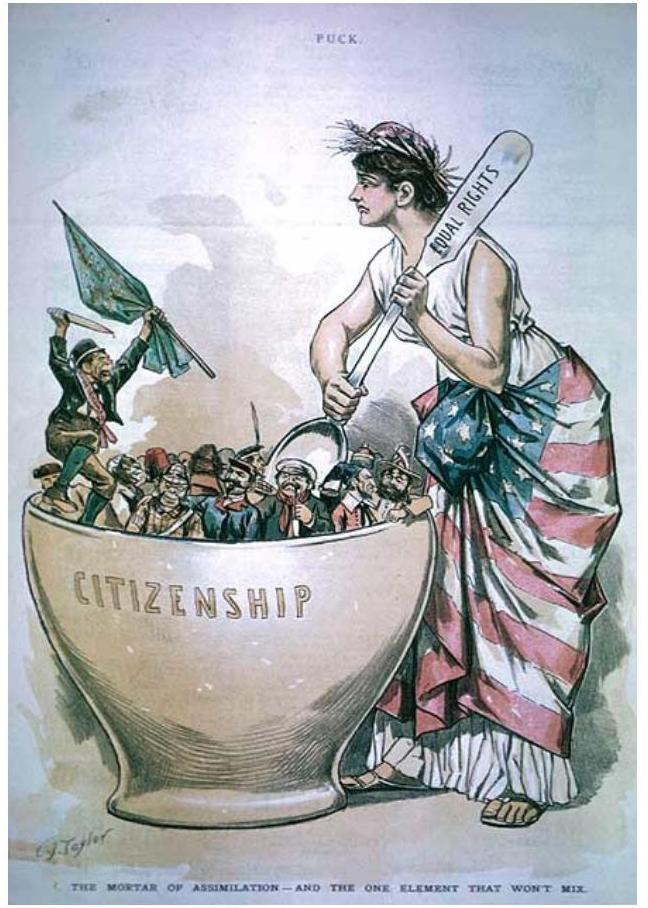

The Mortar of
Assimilation and the One Element that Won't Mix Cartoon from PUCK J une 26, 1889 - public domain.

Classic assimilation theory or straight-line assimilation theory can be dated back to the 1920s originating from the Chicago School of Sociology (Park, Burgess, \& McKenzie, 1925; Waters, Van, Kasinitz, \& Mollenkopf, 2010). This early assimilation model set forth by Park (1928) described how immigrants followed a straight line of convergence in adopting "the culture of the native society" (Scholten, 2011). In many ways, assimilation was synonymous with 'Americanization' and interpreted as 'becoming more American' or conforming to norms of the dominant Euro-American culture(Kazal, 1995). Assimilation theory posited that immigrant assimilation was a necessary condition for preserving social cohesion and thus emphasized a one-sided, mono-directional process of immigrant enculturation leading to upward social mobility (Warner \& Srole 1945). Assimilation ideas have been criticized for lacking the ability to differentiate the process of resettlement for diverse groups of immigrants; they fail to consider interacting contextual factors (van Tubergen, 2006).

Segmented assimilation theory emerged in the 1990s as an alternative to classical assimilation theories (Portes \& Zhou, 1993; Waters et al., 2010). Segmented assimilation theory posits that depending on immigrants' socioeconomic statuses, they may follow different trajectories. Trajectories could also vary based on other social factors such as human capital and family structure (Xie \& Greenman, 2010). This new formulation accounted for starkly different trajectories of assimilation outcomes between generations and uniquely attended to familial effects on assimilation. The term often employed when one group is at a greater advantage and is able to make shifts more readily is segmented assimilation (Boyd, 2002).

Later, Alba and Nee (2003) formulated a new version of assimilation, borrowing from earlier understandings yet rejecting the prescriptive assertions that later generations must adopt Americanized norms (Waters et al., 2010). Within their conceptualization, assimilation is the natural but unanticipated consequence of people pursuing such practical goals of getting a good education, a good job, moving to a good neighborhood and acquiring good friends (Alba \& Nee, 2003).

Numerous studies have utilized assimilation theories to guide their inquiry with diverse foci like adolescent educational outcomes, college enrollment, self-esteem, depression and psychological wellbeing, substance use, language fluency, parental involvement in school, and intermarriage among other things (Waters \& Jimenez, 2005; Rumbaut, 1994). Despite such widespread use of assimilation, some scholars have noted that the theory may not adequately explain immigrants' diverse and dynamic experiences (Glazer, 1993)

1266 | Chapter 33: Embracing a New Home: Resettlement Research \& the Familyand some note that other theories such as models of self-esteem or social identity may be added to assimilation to bolster its value (Bernal, 1993; Phinney, 1991).

A further critique is that a push for assimilation may mask an underlying sentiment that immigrants and refugees are unwelcome guests who have to compete for scarce resources (Danso, 1999; Danso \& Grant, 2000). These sentiments can impact the reception and adaptation experiences of immigrant populations in the receiving country (Esses, Dovidio, Jackson, \& Armstrong, 2001). Extreme nationalism and a sense of fear may encourage ideals of conformity that defines 'successful integration' or 'successful resettlement' as full adoption of the receiving country's ways and beliefs while giving up old cultures and traditions. There is little or no support for the maintenance of cultural or linguistic differences, and groups' rights may be violated. This belief can lead to misunderstandings when new United States residents speak, act, and believe differently than the dominant culture. It can result in an unwelcoming environment and prevent the development and offering of culturally and linguistically appropriate services for immigrant and refugee families, erecting barriers to their opportunity to adapt and thrive in their new homes. Assimilation may implicitly assume that some cultures and traits are inferior to the dominant White-European culture of the receiving nation and therefore should be abandoned for ways more sanctioned by that privileged group.

# Acculturation and Adaptation 

Later Milton Gordon's newer multidimensional formulation of assimilation theory provided that 'acculturation,' which refers to one's adoption of the majority's cultural patterns, happens first and inevitably (1964). Contemporary acculturation models embrace some of the previous ideas of assimilation but can be less one-dimensional (Berry, 1990). At times, the terms assimilation and acculturation have been used interchangeably. John Berry employed the concept of acculturation and identified 4 modes: integration (where one accepts one's old culture and accepts one's new culture), assimilation (where one rejects one's old culture and accepts one's new culture), separation (where one accepts one's old culture and rejects one's new culture), and marginalization (where one rejects one's old culture and also rejects one's new culture) (Berry, 1990). This understanding of acculturation proposes that immigrants employ one of these four strategies by asking how it may benefit them to maintain their identity and/or maintain relationships with the dominant group, and does not assume that there is a typical one-dimensional trajectory they would follow.

While assimilation is applied to the post-migration experience generally, acculturation refers to the psychological or intrapersonal processes that immigrants experience (Berry, 1997). Hence, the concept of acculturative stress -linked to psychological models of stress (Lazarus \& Folkman, 1984) arose to describe how incompatible behaviors, values, or patterns create difficulties for the acculturating individual (Berry, Kim, Minde, \& Mok, 1987). Adaptation has been used in recent years to refer to internal and external psychological outcomes of acculturating individuals in their new context, such as a clear sense of personal identity, personal satisfaction in one's cultural context, and an ability to cope with daily problems (Berry, 1997).

Much of the discourse concerning adaptation has focused on the socio-economic adaptation of immigrants as measured by English language proficiency, education, occupation, and income. When culture is included, the emphasis is typically on concepts of ethnic intermarriage and language proficiency (van Tubergen, 2006). Much less attention has been paid to how immigrants form attachments to their new society, subjective conceptions of 'success' in the new country, or to the factors that lead some immigrants to retain distinct characteristics and identities but adopt to new ways ofbeing. Some have gone further to identify three types of adaptation: psychological, sociocultural, and economic (Berry, 1997).

# Videos 

Paul Orieny, Sr. Clinical Advisor for Mental Health, The Center for Victims of Torture (CVT), discusses the challenges of coping with the magnitude of change encountered during resettlement $(0: 00-4: 28)$.
$\square$One or more interactive elements has been excluded
from this version of the text. You can view them online
here: https://uark.pressbooks.pub/
humanbehaviorandthesocialenvironment2/?p=477\#oembed-1

True Thao, MSW, LICSW discusses cultural change and adaptations experienced by immigrants and refugees (1:43-2:40)

One or more interactive elements has been excluded from this version of the text. You can view them online here: https://uark.pressbooks.pub/
humanbehaviorandthesocialenvironment2/?p=477\#oembed-2# Multiculturalism and Pluralism 

Theories of assimilation, acculturation, and adaptation are all focused on the immigrant. This is not to say that these theories have not included the receiving society or the dominant group's influence on the immigrant. However, a different way to conceptualize the post-migration experience may be by exploring how any society can support multicultural individuals both, United States-born and foreign-born, and how adjustments and accommodations are made by both the receiving culture and the immigrant culture to aid resettlement.

Critical Making Wikimedia Commons - CC BY-SA 4.0.

Multiculturalism and pluralism are often understood as the opposite of assimilation (Scholten, 2011), emphasizing a culturally open and neutral understanding of society. These ideas purport that diverse 1270 | Chapter 33: Embracing a New Home: Resettlement Research \& the Familypeople need freedom to determine their method of resettlement and the degree to which they will integrate. A nation that embraces a multicultural view may promote the preservation of diverse ethnic identities, provide political representation, and protect rights of minority populations (Alba, 1999; Alexander, 2001). There are those, especially more liberally minded groups that support the idea that immigrant groups should not be judged according to their religion, skin color, ability or willingness to assimilate, language, or what is deemed culturally useful. Because multiculturalism acknowledges differences and responds to inequality in a society, critics charge that it is a form of ethnic or "racial particularism" that goes against the solidarity on which the United States democracy stands (Alexander, 2001, p. 238). Behind every policy are assumptions that implicitly or explicitly support a vast theoretical and ideological continuum. With the ebb and flow of immigration throughout the history of this country, some of these ideological positions have shifted, and also residuals of traditional nationalistic ideals remain.

# Intersectionality Theory 

The lessons learned from earlier conceptualizations of immigrant resettlement are 1) that an accurate understanding of resettlement is flexible, dynamic, and heterogeneous; 2) that resettlement itself is a synergistic process between the newcomer and the receiving society; and 3) that ultimately the knowledge of how resettlement is experienced is best understood from the standpoint of an immigrant. Thus in many ways, the discourse about immigrant experiences has shifted from an emphasis on group processes to individual processes. Contemporary scholars are beginning to explore the theory of intersectionality as a lens to understand immigrant identities and adaptation to receiving countries (Cole, 2009; Shields, 2008). Intersectionality theory allows for an understanding of the complex intersections of an individual'sidentities shaped by the groups to which an individual belongs or to which $s /$ he is perceived to belong, along with the interacting effects of an individual and the different contexts they are in. Intersectionality theory does not claim to be apolitical; it posits that an accurate understanding of the experiences of marginalization requires knowledge of broad historical, socio-political, cultural, and legal contexts. While theories of assimilation and acculturation tend to endorse integration - a stage in which an immigrant has successfully integrated their culture or origin and new culture (Sakamoto, 2007), intersectionality theory proposes that structural issues such as discrimination, migration policy, and disparity inaccessibility of resources based on language or nationality, affect an immigrant's ability or desire to integrate.

Intersectionality is a feminist sociological theory developed by Kimberlé Crenshaw (1989), which posits that one, cannot truly arrive at an adequate understanding of a marginalized experience by merely adding the categories such as gender plus race, plus class, etc. Rather these identity categories must be examined as interdependent modes of oppression structures that are interactive and mutually reinforcing.

Intersectionality rests on three premises. First, it is believed that people live in a society that has multiple systems of social stratification. They are afforded resources and privileges depending on one's location in this hierarchy (Berg, 2010). Social stratification can best be understood by accepting the premise that there are forms of social division in society that are based on identities or attributes, such as gender, race, nativity, class, etc. Within society, some of these social divisions are more valued than others, thus creating a hierarchy, or in cruder terms, a pecking order. These divisions and hierarchy are arbitrary in that they are socially constructed and have no essential meaning but have been established by those in power and maintained by society historically. Those deemed higher on the hierarchy and having more 'status' are provided with power and privileges and those deemed lower on the hierarchy are not (Anthias, 2001). Much research has

1272 | Chapter 33: Embracing a New Home: Resettlement Research \& the Familybeen conducted on gender inequalities (Pollert 1996, Gottfried, 2000), ethnic inequalities (Modood et al., 1997) and class inequalities (Anthias \& Yuval Davis, 2005; Bradley, 1996), providing evidence for the social constraints in the shape of sexism, racism, classism, etc.

The second premise on which intersectionality rests is that social stratification systems are interlocked. Every individual may hold different positions in different systems of stratification at the same time; there is not only variation among groups of people but within groups of people (Weber, 1998). The implications of this premise for immigrant populations are profound; individuals within immigrant communities may not have the same experiences adjusting to a new society given the varied positions they hold within different contexts based on their identities and attributes.

Within intersectionality theory, an individual has multiple intersecting identities. These identities are informed by group memberships such as gender, class, race, sexuality, ethnicity, ability, religion, nativity, gender identity, and more (Case, 2013). Intersecting identities place an individual at a particular social location. Individuals may have similar experiences with other individuals within one community, such as similar experiences to others of their nation of origin, but their experiences may also be quite different depending on other identities they hold.
For example, an immigrant is not only from Central American and female but is a Latina woman, two identities that when combined, create her unique experience.

There are pressures to conform to the expectations of each social group to which an individual belongs. Each cultural community has images, expectations, and norms associated with it. These ideas vary by culture and generation because they are constructed for that time, group, and purpose. Conformity to expectations of a social group has both tangible and intangible benefits (Cialdini, 2001), not the least of these is the benefit of affiliation (Cialdini \& Trost 1998). There has been much research about conflict and dissonance that can arise from an individual's pressure to identify with the larger social groups and contexts, and also reaffirm theiridentity within their family's cultural group or the culture of their country of origin (Farver, Narang, \& Bhadha, 2002; Phinney, Horenczyk, Liebkind, \& Vedder, 2001; Rumbaut, 1994).
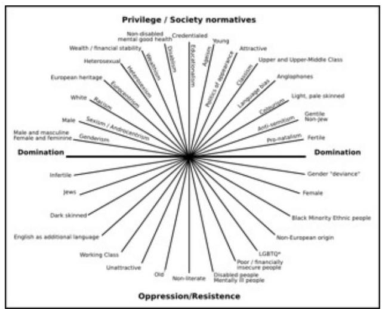

Adapted by Natalya D. From Morgan, K. P. (1996). Describing the Emporaro's New Clothes: Three Myths of Education (In)Equality. In A. Diller (ed). The Gender Question in Education: Theory, Pedagogy EPolitics. Boul der, CO: Westview. Image available at: sites.googl e.com/site/ natalyadell/ home/ intersectiona lity.

The third premise of intersectionality is that where one is located within this complex social stratification system will consequently influence one's worldview. This is logical given that each individual has different experiences depending on where they are located within the social stratification system (Demos \& Lemelle, 2006). This speaks to one's positionality - a person's location across various axes of social group identities which are interrelated,interconnected, and intersecting. One's position informs one's unique standpoint. Furthermore, these identities may be external/ visible, such as race and gender, or internal/invisible, such as sexuality or nativity, and carry privileges or limit choices depending upon one's positionality. Thus one's position and standpoint may be the most suitable way in which to frame and understand the discussion of immigrant resettlement. An example would be how research has indicated that skin color, often a physical feature that indicates identity, affects how immigrant experiences and adapts to their new society (Telzer \& Garcia, 2009; Viruell-Fuentes, 2007).

The concept of intersectionality has been revolutionary in conceptualizing the lived experiences of people existing on the margins of society, a place where immigrants and refugees often find themselves existing. Specifically, intersectionality highlights ways in which "social divisions are constructed and intermeshed with one another in specific historical conditions to contribute to the oppression" of certain groups (Oleson, 2011, p. 134). Many hail the usefulness of intersectionality as a methodological tool that allows researchers to explore the interacting effects of multiple identities (Weldon, 2006). For example, research could examine ways that an immigrant may make decisions based on several important aspects of her/his identity such as race, gender, social class position, religion, and nationality.

This theory has been used to explore immigrants' economic success, their experience of internalized classism, and their power and access to resources (Ali, Fall, \& Hoffman, 2012; Cole, 2009). Intersectionality may be a unifying theory that illuminates the immigrant experience in a way that increases understanding of the role of the larger society, informs the efforts of each community, and provides a framework for policy.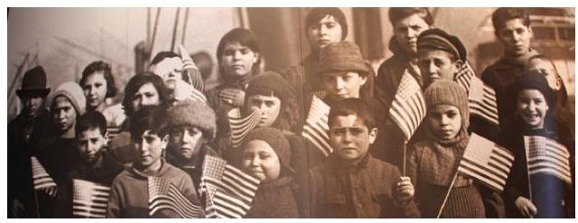

David
Fulmer -
Picture this!
Immigrant
Children (at
Ellis Island)

- CC BY 2.0.

# 35.3 Family Theories: A New Direction for Research with Resettled Populations 

The discourse about immigrant experiences has shifted over time from an emphasis on fairly simple group processes, such as a unidimensional model of assimilation from one culture to another, to complex individual processes, such as intersectionality. Processes that occur at the family level have been largely absent from this discussion.

As we have identified in this textbook, families play a key role in the goals, resources, coping processes, and choices of the resettlement process. Falicov (2005) described how family relationships and ethnic identity during resettlement are "not separate experiences, but they interact with and influence each other in adaptive or reactive ways" (p. 402). Parents, grandparents, siblings, and children all influence one another in their choices about what to retain from their original culture in individual and family life, as well as what to learn and adapt from the new culture. There are many theories within the family and social science fields that can address the complexities of immigrant families through the resettlement process. In this section, we identify several family theories and their application to immigrant families.# System Theory 

General systems theory (Von Bertalanffy, 1950) assumes that a family must be understood as a whole. Each family is more than the sum of its parts; the family has characteristics, behavior patterns, and cycles beyond how individual family members might act on their own. Individual members and family subsystems are interdependent and have mutual influence. This theory assumes that studying one member is insufficient to understand the family system. In order to assess patterns of adjustment in immigrant families, we must look both at the structure of the family unit and the processes that occur within that family system. For example, one study collected data from both parents and children in Vietnamese and Cambodian immigrant families in order to assess the role of family processes in clashes over cultural values. The researchers found that cultural clashes were linked to parent-child conflict, which in turn was linked to reduced parent-child bonding, both of which increase adolescent behavioral problems (Choi, He, \& Harachi, 2008). This demonstrates one family pattern related to resettlement that can only be understood at the family system level.

Previous frameworks (e.g., structural functionalism) assumed that families always sought to maintain homeostasis (or "stick to the status quo"). General systems theory was the first to address how change occurs within families by acknowledging that although families often seek to maintain homeostasis, they will also promote change away from homeostasis. Systems such as families also have tendencies towards change (morphogenesis) or stability (morphostasis) and for families resettling in a new country and making decisions on what to preserve and how to adapt, there is a balance of the two. Families are able to examine their own processes and to set deliberate goals. Change occurs as the family system acknowledges that a particular family pattern is dysfunctional and identifies new processes that support their goals. Resettlement isone example of a large change that a family system could choose or be forced to make.

# Human Ecology Framework 

The human ecology framework (Bronfenbrenner, 1979) assumes that families interact within multiple environments that mutually influence each other. These environments include the biophysical (personal variables), the microsystem (the systems in immediate surroundings, such as family, neighborhood, church, work, or school), the mesosystem (the ways these immediate systems connect, such as the relationships between family and work), the exosystem (the larger social system, such as the stress of another family member's job), and the macrosystem (the cultural values and the larger social system, such as immigrant and immigration policy that influences admission and social system access). In the context of a refugee family, a family might be influenced by the biophysical (e.g., whether or not members were injured as they fled the persecution), their microsystem (e.g., parental conflict while fleeing), their mesosystem (e.g., teachers and school personnel who are struggling with their own trauma from fleeing conflict and thus their ability to provide robust services is impaired), the exosystem (e.g., local leaders who do not consult with women living in shelters regarding their resources needs and don't provide feminine hygiene products or children's toys), and countless other environments (examples adapted from Hoffman \& Kruczek, 2011). The family may have access to and be able to directly influence the mesosystem and at the same time feel powerless to make changes in the exosystem. Each of these environments will contribute to their coping.

With its focus on interaction with multiple environments, s the human ecology framework is an incredibly useful lens to employ cross-cultural contexts such as when considering immigrant families. For example, a researcher could ask, "How do Hmong

1278 | Chapter 33: Embracing a New Home: Resettlement Research \& the Familyimmigrant families manage financial resources in their new environment in the United States?" and "How did Hmong families manage their financial resources while still living in Laos?" The assumptions and central concepts of human ecology theory would apply equally in either culture. The needs, values, and environment would be sensitively identified within each culture (See Solheim \& Yang, 2010).
Additionally, human ecology theory assumes that families are intentional in their decision-making, and that they work towards biological sustenance, economic maintenance, and psychosocial function. As patterns in the social environment are more and more threatening to the family's quality of life in these three areas, the system will be more and more likely to seek change, possibly by a move to a new country. The family system has certain needs, including physical needs for resources and interpersonal needs for relationships. If their current situation is not meeting these needs, the family system will engage in management to meet these needs within their value system.

Fibonacci
Blue

- Minneapoli
s protest
against
Arizona
immigrant
law SB
1070. - CC

BY 2.0.

# Double ABC-X Stress ModelThe double ABC-X model (McCubbin \& Patterson, 1983) describes the impact of crises on a family. It states that the combination of stressors (A), the family's resources (B), and the family's definition of the event (C) will produce the family's experience of a crisis (X). The family's multiple environments inform each component of the model, consistent with the human ecology framework. The double ABC-X suggests that there are multiple paths of recovery following a crisis, and these paths will be determined by the family's resources and coping processes, both personal and external.

This model is relevant to immigrant and refugee families, as all of these families go through a significant transition in the process of resettlement. Whether or not this transition, or the events that precipitate it, are interpreted as crises will depend on the family's other stressors (such as employment, housing, and healthcare availability and family conflict), resources (such as socioeconomic resources, family support, and access to community resources), and family meaning making (such as cultural and family values surrounding the decision).

# Resilience Framework 

The family resilience framework (Walsh, 2003) highlights the ways families withstand and rebound from adversity. Families cope together through their shared belief systems (such as making meaning of their situation, promoting hope, and finding spiritual strength) and family organization (flexible structure, cohesion, and social and economic resources). This framework also draws from the Carter and McGoldrick (1999) family lifecycle model to describe how families transition through stages and major life events, with specific vulnerabilities and resilience factors at each stage. Research that uses the resilience framework with immigrant and refugee families can highlight families' strengths and identify the ways theythrive through challenges. Chapter 8 is an excellent example of how this framework applies to immigrant and refugee families.

# Ambiguous Loss Theory 

The family theories listed above can apply broadly to immigrant and refugee families of all backgrounds. Many immigrant and refugee families have a shared background of loss and trauma, and there are family theories that specifically can address these contexts. Ambiguous loss theory (Boss, 2006) describes the ambiguity that immigrant families can feel when they are separated, when family members are physically absent but psychologically very present. This ambiguity and separation can lead to great distress (See Solheim, Zaid, \& Ballard, 2015). For a greater description of this theory in immigrant and refugee families, please see Chapter 2 and Chapter 5.

## Video

Sunny Chanthanouvong, Executive Director, Lao Assistance Center of Minnesota, discusses cultural differences and perspectives between Lao children and parents (0:00-2:28).

One or more interactive elements has been excluded from this version of the text. You can view them online here: https://uark.pressbooks.pub/
humanbehaviorandthesocialenvironment2/?p=477\#oembed-3# 35.4 Critical Theories 

Critical theories offer an important contribution to the conceptualization of immigrant and refugee families. These theories assume that thought is mediated by power relationships, which are both socially and historically constructed (Kincheloe, McLaren, \& Steinberg, 2011). They focus both on the individual's experience and on how that experience developed through interactions with multiple environments (consistent with the human ecology framework; Chase, 2011; Olesen, 2011). Critical theories have emerged from a variety of disciplinary fields and with profound influence in the social sciences. Most prominently, feminist theory, queer theory, and critical race theory have challenged dominant discourses of social interactions. Researchers who operate from these critical approaches are committed to challenging constructed social divisions, and to acknowledging how structural mechanisms produce inequalities (Chase, 2011; McDowell \& Shi Ruei, 2007; Olesen, 2011).

Critical theories are important lenses to employ in research with immigrant and refugee families specifically because they aim to amplify marginalized voices. Critical researchers actively look for the silent or subjugated voices, and seek to facilitate volume. Because immigrant and refugee groups are often marginalized within the new host culture, researchers can use critical research approaches to collaboratively advocate for these communities.

### 35.5 Cultural Values to Consider in Resettlement Research

Family theories hold promise for assessing the complex web offactors that influence family resettlement processes. As students, researchers, and/or clinicians, we must consider the values represented by the theories we choose to use. We offer several considerations as you evaluate potential theories.

In general, past and current ideas about the resettlement process place great responsibility for resettlement on the immigrants and their families. These ideas are grounded in the viewpoint that because these individuals and families choose to migrate, often to improve their life prospects, they should be held accountable for their success. However, underlying this viewpoint is a cultural bias towards personal responsibility and self-reliance. Although sometimes well-meaning, it can be at odds with different beliefs and practices held by immigrant communities. The bias towards personal responsibility and self-reliance is rooted in ideals of meritocracy that is widely accepted in the (commonly labeled) individualistic United States society. Meritocracy assumes that success and material possession results from an individual's hard work and initiative within a fair and just society, and thus all privilege is attributed to one's own hard work (Case, 2013). The argument against placing some responsibility on the larger society for the successful resettlement of immigrants emerges from the possible cultural incompatibility with this individualistic, capitalistic way of life. Most immigrant families arrive with hopes for achieving a better life and are prepared to continue to make sacrifices and work hard to do so. However, adapting to a new context with no frame of reference, little ability to communicate, and scarce resources may be a daunting task without external help.

Ludovic
Bertron

- Ellis

Island - CC
BY 2.0.

Immigrants have described their experiences of loss and disruption, which is magnified when they are visible minorities in their receiving country (Abbott, Wong, Williams, Au, \& Young, 2005). Indepth studies with immigrant men and women reported that almost all initial interactions they had with members of the dominant group were experienced as condescending with messages of superiority and discrimination (Muwanguzi \& Musambira, 2012). One very direct way that local community receptions and perceptions can negatively impact resettlement experiences for immigrants is parent-school involvement and immigrant children's scholastic achievement. Studies have consistently shown that parent school involvement for immigrant families has been low (Kao, 1995, 2004; Nord \& Griffin, 1999; Turney \& Kao, 2009). Kwon (2006) found that Korean immigrant mothers felt disempowered in their role and involvement with the school system, specifically related to their identity, cultural differences, and English skills. Focusing solely on conventional ways of parental involvement can overlook and underestimate immigrant parent strengths and efforts to support their children academically (Tiwana, 2012). In sum, the assumptions and expectations from commonly held values, when not critically

1284 | Chapter 33: Embracing a New Home: Resettlement Research \& the Familyanalyzed, can act as barriers to immigrant families' abilities to thrive in a new society.

# Videos 

True Thao, MSW, LICSW describes best practices for working with immigrant and refugee families (0:00-1:44).

One or more interactive elements has been excluded from this version of the text. You can view them online here: https://uark.pressbooks.pub/
humanbehaviorandthesocialenvironment2/?p=477\#oembed-4

True Thao discusses children's and parents' perspectives on migration and culture (0:00-2:42).

One or more interactive elements has been excluded from this version of the text. You can view them online here: https://uark.pressbooks.pub/
humanbehaviorandthesocialenvironment2/?p=477\#oembed-5

### 35.6 Future Directions

It is crucial that researchers use a theoretical framework thatappropriately positions immigrant individuals and families within a "historical, political and socioeconomic context that accounts for their experiences" when supporting these populations (DomenechRodriguez \& Wieling, 2004, p. 8). Interventionists, policymakers, and researchers must adopt a multidimensional approach to understanding resettlement processes. There are contraindications for applying generalizations to diverse groups and research is limited when it focuses on outcomes that may be myopic. Exploring the multiple intersecting identities of each individual and the engendering experiences of oppression is one way to move beyond a one-dimensional understanding of an immigrant's experience. Additionally, utilizing a family lens to assess the impact of family resettlement is another important step in developing a comprehensive understanding of immigrant and refugee communities. Moreover, prevention and intervention programs designed to address longstanding health, economic, and social disparities within these families cannot be effectively implemented without careful consideration of the family and the complexities of their resettlement experiences.

# 35.7 End-of-Chapter 

Immigrant resettlement is a complex topic, requiring the consideration of historical perspectives of intergroup relations, the interactive and non-linear nature of acculturation, the contextual elements of a state's and nation's socio-eco-political situations, and a deep introspection of the philosophies guiding our stance. Research continues to lack a clear understanding of resettlement efforts, particularly the processes within families. Creativity and flexibility is needed to reach a level of sophistication in our research and intervention to meet the needs of the increasingly diverse population in the United States. Intersectionality and family theories offer useful lenses for studying and understanding complex

1286 | Chapter 33: Embracing a New Home: Resettlement Research \& the Familyimmigrant experiences; they can also inform practical strategies and policies to support successful immigrant resettlement.

# Case Study 

Nadia moved to the United States to get her BA in Psychology 12 years ago. When she met her partner (Adbul) in college, it was an easy decision to get married and apply for her citizenship. She was raised in Indonesia, while her husband was a second-generation immigrant from Saudi Arabia and shared her religious faith as a Muslim. Despite their shared faith, her husband's family had initially expressed concern, and some even overtly expressing displeasure of his choice to marry her. After they were married, she continued to feel the pressure to meet certain expectations from her new family, which felt incongruent with her own culture and self. The one thing that seemed particularly important to her parents-in-law was that she begin wearing the hijab (traditional Muslim head covering). She had never been opposed to the idea and thus chose to wear it. After starting to wear the hijab, she noticed a positive change in the way people in her and Abdul's religious community treated her. She felt more accepted and respected. She often reflects on how different her parents had raised her from her husband's parents; back in Indonesia, her parents were not particularly wealthy, she remembered growing up alongside peers from different ethnicities and religions, and they practiced their religion with less restriction from both outside their religious group and within. Abdul, while raised in the United States seemedto be less open to making connections and forging relationships with others outside of his parent's religious community. He often asked how he could be more accepting when others were not accepting of him.

Within the academic setting, Nadia felt confident in how well she was able to 'adapt' to the learning community. She spoke English well as her second language and presented in a very professional way. She was told by her faculty advisor, after deciding to start wearing a hijab that she would 'have it easier' if she did not. She graduated with a masters in Nursing and began to apply for jobs. She was offered many jobs but chose to accept one in a hospital in Oklahoma because it was the only job in the specialization that she wanted to pursue and also was somewhat relieved to be able to build her life with her husband on their own. Abdul was not particularly happy to move away from his family especially when he heard one of his cousins comment about how 'small' of a man he was to follow his wife around while she worked on her career, but similarly, he felt that forging a life away from his family may have some value. Additionally, he worked in a large tech company with branches nationwide and could transfer to the office in Tulsa.

Nadia and Abdul moved into their lovely new home in a suburb. She had felt eyes on her as they were unloading the moving truck and decided to walk over to her new neighbors to introduce herself. She convinced Abdul that this would be a good idea. No one answered the first door she knocked even though she was sure she remembered seeing them come home. Her other neighbor was very pleasant however she noticed that she made efforts to avoid eye contact with her and her husband.Nadia was shocked at one her first experiences while training at her new job when a patient exclaimed loudly to their family after she left their room that it was a shame that the hospital employed a person 'like that'. Additionally, almost all of her coworkers didn't ever seem to want to have lunch with her. Abdul also was taken aback when upon presenting for his first workday his immediate supervisor asked him to list out all his qualifications and training when this seemed strange for a job transfer. Nadia began to fear whether relocating was the right choice.

When asked about her resettlement as an immigrant, Nadia would explain it as a complex journey, where her identities as woman, person of color, and foreign-born individual, including her religious affiliation, were integral. How Nadia is perceived, and what expectations are placed on her within the different spheres of her life contributes to how she would continue to construct her own identity and then choose to interact with these external contexts. Her family's values of openness and flexibility that have allowed her to interact successfully in her academic context may be at odds with her partner's strong boundaries with others and her experiences in her new milieu. She may not talk about acculturating or it being a progression towards assimilation, and in various relationships and contexts in her life, she may not even have similar goals for integrating. It may make sense to her to think about intersections, both of her identities and how her identities intersect with her partners' identities and the different contexts she is in. Getting the sense that her neighbor felt some discomfort interacting with her as an immigrant woman of color, with an accent, wearing a hijab, and in a marriage relationship with a Muslim man, (albeitbased on possible erroneous assumptions) is Nadia's unique experience because of the identities that she appears and/ or does inhabit. Thus in discussing resettlement as a social, familial, and individual process, Nadia's resettlement is informed by these complex experiences.

# Discussion Questions 

1. How have ideas about immigrant resettlement shifted through the years?
2. How could the use of a family theory in future research add to our understanding of resettlement?
3. Using the $A B C-X$ model, identify the stressors, resources, and definition of the problem associated with Nadia and Abdul's move to Oklahoma. Do you think they would consider it a crisis?
4. What about Nadia's story would stand out to you if you looked at it from the systems lens? From an assimilation lens? From an intersectionality lens?

## References

Abbott, M. W., Wong, S., Williams, M., Au, M. K., \& Young, W. (2000). Recent Chinese migrants' health, adjustment to life in NewZealand and primary health care utilization. Disability and Rehabilitation 22(1/2): 43-56.
Alba, R. (1999). Immigration and the American realities of assimilation and multiculturalism. Sociological Forum, 14(1), 3-25.
Alba, R., \& Nee, V. (2009). Remaking the American mainstream: Assimilation and contemporary immigration. Massachusetts: Harvard University Press.
Alexander, J. C. (2001). Theorizing the "Modes of incorporation": Assimilation, hyphenation, and multiculturalism as varieties of civil participation. Sociological Theory, 19(3), 237-249.
Ali, S. R., Fall, K., \& Hoffman, T. (2012). Life without work: Understanding social class changes and unemployment through theoretical integration. Journal of Career Assessment, 1, 1-16.
Anthias, F. (2001). The concept of social division and theorising social stratification: Looking at ethnicity and class. Sociology, 35(4), 835-854.
Anthias, F., \& Yuval-Davis, N. (2005). Racialized boundaries: Race, nation, gender, colour and class and the anti-racist struggle. New York: Routledge.
Berg, J. A. (2010), Race, class, gender, and social space: Using an Intersectional approach to study immigration attitudes. The Sociological Quarterly, 51, 278-302. doi: 10.1111/ j.1533-8525.2010.01172.x
Bernal, M. E. (1993). Ethnic identity: Formation and transmission among Hispanics and other minorities. NY: SuNY Press.
Berry. J.W. (1990). Psychology of acculturation. In J. Berman (Ed.), Cross-cultural perspectives: Nebraska Symposium on Motivation (pp. OI-234). Lincoln: University of Nebraska Press.
Berry, J. W. (1997). Immigration, acculturation, and adaptation. Applied Psychology, 46(1), 5-34.
Berry, J. W., Kim. U., Minde, T., \& Mok, D. (1987). Comparative studies of acculturative stress. International Migration Review, 21, 491-51.
Boss, P. (2006). Loss, Trauma, and Resilience. New York: W.W. Norton.
Boyd, M. (2002). Educational attainment of immigrant offspring:Success or segmented assimilation. International Migration Review, 36:1037-60.
Bradley, H. (1996). Fractured identities: Changing patterns of inequality. Polity.
Bronfenbrenner, U. (1979). The ecology of human development: Experiments in nature and design. Cambridge, MA: Harvard University Press.
Carter, B., \& McGoldrick, M. (1999). The expanded family life-cycle: Individual, family, and social perspectives (3rd ed.). Needham Hill: Allyn \& Bacon.
Case, K. (2013). Deconstructing privilege: Teaching and learning as allies in the classroom. New York: Routledge.
Chase, S. E. (2011). Narrative Inquiry: Still a field in the making. In N. K. Denzin \& Y. S. Lincoln (Eds.), The SAGE handbook of qualitative research (pp. 421-434). Thousand Oaks, CA: SAGE Publications.
Choi, Y., He, M., \& Harachi, T.W. (2008). Intergenerational cultural dissonance, family conflict, parent-child bonding, and youth antisocial behaviors among Vietnamese and Cambodian immigrant families. Journal of Youth and Adolescence, 37(1), 85-96.
Cialdini, R. B., \& Trost, M. R. (1998). Social influence: social norms, conformity, and compliance. In Ed. D. T. Gilbert, S. T. Fiske, G. Lindzey, The Handbook of Social Psychology (4th ed.), 151-92. Boston: McGraw-Hill.
Cialdini, R. B. (2001). Influence: Science and Practice, 4th ed. Boston, MA: Allyn \& Bacon.
Cole, E. R. (2009). Intersectionality and research in psychology. American Psychologist, 64, 170-180. doi:10.1037/ a0014564
Crenshaw, K. (1989). Demarginalizing the intersection of race and sex: A Black feminist critique of antidiscrimination doctrine, feminist theory and antiracial politics. The University of Chicago Legal Forum, 140, 139-167.
Danso, R. (1999). Hosting the 'Unwanted' Guests: Public Reaction and Print Media Portrayal of Cross- border Migration in the New SouthAfrica. Paper presented at the annual conference of the Canadian Association of African Studies. Lennoxville, Québec, June 7.
Danso R., \& Grant, M., (2000). Access to housing as an adaptive strategy for immigrant groups: Africans in Calgary. Canadian Ethnic Studies, 32(3): 19-43.
Demos, V., \& Lemelle, A. J. (2006). Introduction: Race, gender, and class for what. Race, Gender, and Class, 13(3/4), 4-15.
Domenech-Rodríguez, M., \& Wieling, E. (2004). Developing culturally appropriate, evidence-based treatments for interventions with ethnic minority populations. In Voices of color: First person accounts of ethnic minority therapists (313-333).
Esses, V. M., Dovidio, J. F., Jackson, L. M., \& Armstrong, T. L. (2001). The immigration dilemma: The role of perceived group competition, ethnic prejudice, and national identity. Journal of Social Issues, 57(3), 389-412.
Falicov, C. J. (2005). Emotional transnationalism and family identities. Family Process, 44, 399-406.
Farver, J. A. M., Narang, S. K., \& Bhadha, B. R. (2002). East meets west: ethnic identity, acculturation, and conflict in Asian Indian families. Journal of Family Psychology, 16(3), 338.
Glazer, N. (1993). Is assimilation dead? The annals of the American academy of political and social science, 530(1), 122-136.
Gordon, M. M. (1964). Assimilation in American life: The role of race, religion and national origins. Oxford University Press.
Gottfried, H. (2000). Compromising positions: emergent neoFordisms and embedded gender contracts. The British Journal of Sociology, 51(2), 235-259.
Hoffman, M. A., \& Kruczek, T. (2011). A bioecological model of mass trauma: individual, community, and societal effects. The Counseling Psychologist, 39(8), 1087-1127. doi: 10.1177/ 0011000010397932
Kao, G. (1995). Asian Americans as model minorities? A look at their academic performance. American Journal of Education, 103, $121-159$.Kao, G. (2004). Parental influences on the educational outcomes of immigrant youth. International Migration Review, 38, 427-450.
Kazal, R. A. (1995). Revisting assimilation: The rise, fall, and reappraisal of a concept in American ethnic history. American Historical Review, 100(2), 437-471.
Kincheloe, J. L., McLaren, P., \& Steinberg, S. (2011). Critical pedagogy and qualitative research: Moving to the bricolage. In N. K. Denzin \& Y. S. Lincoln (Eds.), The SAGE handbook of qualitative research (4th ed., pp. 163-178). Thousand Oaks, CA: Sage Publications.
Kwon, Y. J. (2012). Empowerment/disempowerment issues in immigrant parents' school involvement experiences in their children's schooling: Korean immigrant mothers' perceptions. Doctoral dissertation, University of Texas at Austin. Available from https://repositories.lib.utexas.edu/ handle/2152/ETD-UT-2012-05-5742
Lazarus. R.S. \& Folkman. S. (1984). Stress, appraisal and coping. New York: Springer.
McCubbin, H. I., \& Patterson, J. M. (1983). The family stress process: The Double ABCX Model of family adjustment and adaptation. In H. I. McCubbin, M. Sussman, \& J. M. Patterson (Eds.), Social stress and the family: Advances and developments in family stress theory and research (pp. 7-37). New York: Haworth.
Modood, T., Berthoud, R., Lakey, J., Nazroo, J., Smith, P., Virdee, S., \& Beishon, S. (1997). Ethnic minorities in Britain: diversity and disadvantage (No. 843). Policy Studies Institute.
Muwanguzi, S., \& Musambira, G. W. (2012). Communication experiences of Ugandan immigrants during acculturation to the United States. Journal of Intercultural Communication. Available from: http://immi.se/intercultural/nr30/muwanguzi.html
Nord, C. W., \& Griffin, J. A. (1999). Educational profile of 3- to 8-year-old children of immigrants. In D. J. Hernandez (Ed.), Children of immigrants: Health, adjustment, and public assistance (pp. 91-131). Washington, DC: National Academies Press.
Olesen, V. (2011). Feminist qualitative research in the millenium's

1294 | Chapter 33: Embracing a New Home: Resettlement Research \& the Familyfirst decade: Developments, challenges, prospects. In N. K. Denzin \& Y. S. Lincoln (Eds.), The SAGE handbook of qualitative research (pp. 129-146). Thousand Oaks, CA: SAGE Publications.
Passel, J., \& Cohn, D. (2009, April 14). A Portrait of Unauthorized Immigrants in the United States. Pew Hispanic Center Chronicling Latinos Diverse Experiences in a Changing America. Available from: https://www.pewresearch.org/hispanic/2009/ 04/14/a-portrait-of-unauthorized-immigrants-in-the-unitedstates/
Park, R. E. (1928). Human migration and the marginal man. American Journal of Sociology, 33. 881-893.
Park, R. E., Burgess, E. W., \& McKenzie, R. D. (1925). The City. University of Chicago Press, 1, 925.
Phinney, J. S. (1991). Ethnic identity and self-esteem: A review and integration. Hispanic journal of behavioral sciences, 13(2), 193-208.
Phinney, J. S., Horenczyk, G., Liebkind, K., \& Vedder, P. (2001). Ethnic identity, immigration, and well-being: An interactional perspective. Journal of Social Issues, 57(3), 493-510.
Pollert, A. (1996). Gender and class revisited; or, the poverty of patriarchy. Sociology, 30(4), 639-659.
Portes, A., \& Zhou, M. (1993). The new second generation: segmented assimilation and its variants. The ANNALS of the American Academy of Political and Social Sciences, 530, 74-96.
Portes, A., \& Rumbaut, R. G. (2001). Legacies: The story of the immigrant second generation. Berkely, CA: University of California Press.
Rumbaut, R. G. (1994). The crucible within: Ethnic identity, selfesteem, and segmented assimilation among children of immigrants. International Migration Review, 28(4), 748-794.
Sakamoto, I. (2007). A critical examination of immigrant acculturation: Toward an anti-oppressive social work model with immigrant adults in a pluralistic society. British Journal of Social Work, 37, 515-535. doi:10.1093/bjsw/bcm024
Scholten, P. (2011). Framing immigrant integration: Dutch research-policy dialogues in comparative perspective. Amsterdam: Amsterdam University Press.
Shields, S. A. (2008). Gender: An intersectionality perspective. Sex Roles, 59, 301-311.
Solheim, C. A., \& Yang, P. N. D. (2010). Understanding generational differences in financial literacy in Hmong immigrant families. Family and Consumer Sciences Research Journal 38(4), $435-454$.
Solheim, C. A., *Zaid, S., \& Ballard*, J. (2015). Ambiguous loss experienced by transnational Mexican immigrant families. Family Process. doi:10.1111/famp. 12130
Telzer, E. H., \& Garcia, H. A. V. (2009). Skin color and selfperceptions of immigrant and US-born Latinas: The moderating role of racial socialization and ethnic identity. Hispanic Journal of Behavioral Sciences, 31(3), 357-374.
Tiwana, R. K. (2012). Shared immigrant journeys and inspirational life lessons: Critical reflections on immigrant Punjabi Sikh mothers' participation in their children's schooling. UC Los Angeles Electronic Theses and Dissertations. Available from: http://escholarship.org/uc/item/71z3v45z
Turney, K., \& Kao, G. (2009): Barriers to school involvement: Are immigrant parents disadvantaged?, The Journal of Educational Research, 102(4), 257-271.
van Tubergen, F. (2006). Immigrant integration: A cross-national study. NY: LBF Scholarly Publishing LLC.
Viruell-Fuentes, E. A. (2007). Beyond acculturation: immigration, discrimination, and health research among Mexicans in the United States. Social Science \& Medicine, 65(7), 1524-1535.
Von Bertalanffy, L. (1950). An outline of general system theory. British Journal for the Philosophy of science.
Walsh, F. (2003). Family resilience: A framework for clinical practice. Family Process, 42(1), 1-18.
Warner, W. L., \& Srole, L. (1945). The social systems of American ethnic groups. New Haven, CT: Yale University Press.
Waters, M. C., Van, V. C., Kasinitz, P., \& Mollenkopf, J. H. (2010).
1296 | Chapter 33: Embracing a New Home: Resettlement Research \& the FamilySegmented assimilation revisited: types of acculturation and socioeconomic mobility in young adulthood. Ethnic and Racial Studies, 33(7), 1168-1193.
Waters, M. C., \& Jiménez, T. R. (2005). Assessing immigrant assimilation: New empirical and theoretical challenges. Annual review of sociology, 105-125.
Weber, L. (1998). A conceptual framework for understanding race, class, gender, and sexuality. Psychology of Women Quarterly, 22(1), $13-32$.
Weldon, S. L. (2006. The structure of intersectionality: A comparative politics of gender. Politics and Gender, 2(2), 235-248.
Xie, Y., \& Greenman, E. (2010). The social context of assimilation: Testing implications of segmented assimilation theory. Social Science Research, 40, 965-984.

# Attribution 

Adapted from Chapters 1 through 9 from Immigrant and Refugee Families, 2nd Ed. by Jaime Ballard, Elizabeth Wieling, Catherine Solheim, and Lekie Dwanyen under the Creative Commons Attribution-NonCommercial 4.0 International License, except where otherwise noted.1298 | Chapter 33: Embracing a New Home: Resettlement Research \& the Family# PART X 

## ADDITIONAL RESOURCES

Below you will find additional resource links. Follow these links to learn more!

## Links for Traditional and Dominant Perspectives:

- http://www.npr.org/2016/01/05/461997711/hidden-factors-in-brain-help-to-shape-beliefs-on-income-inequality

## Links for Alternative Perspectives on Individuals:

- http://www.npr.org/2016/11/30/503825338/what-food-stamps-and-drunk-driving-stats-have-to-do-with-each-other
- http://www.npr.org/sections/ed/2017/01/16/509325266/ how-the-systemic-segregation-of-schools-is-maintained-by-individual-choices
- https://www.npr.org/2018/07/11/628000131/once-militantly-anti-abortion-evangelical-minister-now-lives-withregret
- https://www.npr.org/2018/06/06/617676310/california-voters-recall-judge-who-gave-brock-turner-a-6-monthsentence
- https://www.genderbread.org/resource/genderbread-person-v4-0
- https://www.youtube.com/watch?v=P_SlAzsXa7E
- https://www.npr.org/2019/06/28/733500331/why-we-remember-stonewall
- https://www.npr.org/2019/05/25/723192364/what-we-dont-talk-about-when-we-talk-about-porn
- https://uark.kanopy.com/video/zoom
- https://www.imdb.com/title/tt8106570/- https://highline.huffingtonpost.com/articles/en/everything-you-know-about-obesity-is-wrong/
- https://www.npr.org/sections/health-shots/2017/08/23/ 545289168/abstinence-education-is-ineffective-and-unethical-report-argues
- https://www.npr.org/sections/health-shots/2019/02/19/ 695687400/white-house-plan-to-stop-hiv-faces-a-tough-road-in-oklahoma

# Links for Perspectives on Families: 

- https://www.theatlantic.com/video/index/504626/tinder-wont-change-love/
- https://www.cdc.gov/violenceprevention/ childabuseandneglect/acestudy/aboutace.html
- https://www.ncjfcj.org/sites/default/files/ Finding\%20Your\%20ACE\%20Score.pdf
- https://acestoohigh.com/got-your-ace-score/
- https://www.npr.org/sections/health-shots/2019/09/09/ 759031061/positive-childhood-experiences-may-buffer-against-health-effects-of-adverse-one
- https://www.ted.com/talks/ robert_waldinger_what_makes_a_good_life_lessons_from the_longest_study_on_happiness

## Links for Groupthink:

- https://www.thisamericanlife.org/668/the-long-fuse/act-two-5
- Burnette. J., Pollack, J., \& Forsyth, D. (2011). Leadership in extreme contexts: a groupthink analysis of the May 1996 Mount Everest Disaster. Journal of Leadership Studies, 4(4), 29-40.

## Links for Perspectives on Organizations:- http://www.npr.org/2013/05/15/180300236/stay-at-home-dads-breadwinner-moms-and-making-it-all-work
- http://www.npr.org/2017/10/10/556578593/the-nra-wasnt-always-against-gun-restrictions

# Links for Perspectives on Communities: 

- https://www.youtube.com/watch?v=gDYFPaZjEXc
- https://www.youtube.com/watch?v=rNHKzSyliAQ
- https://www.npr.org/sections/codeswitch/2015/09/23/ 435293852/an-atlanta-neighborhood-tries-to-redefinegentrification
- https://www.npr.org/2016/01/23/464010848/-1-22-a-gallon-cheap-gas-raises-fears-of-urban-sprawl
- https://www.npr.org/2015/02/12/385474414/with-porches-and-parks-a-texas-community-aims-for-urban-utopia
- http://www.pbs.org/video/finding-america-2-6rvupj/https://www.wbur.org/hereandnow/2018/ 07/10/flint-water-crisis-poisoned-city
- https://uark.kanopy.com/video/70-acres-chicago-cabrinigreen

## Links for Communities and Police Relations:

- https://www.npr.org/2017/05/30/530677906/mass-incarceration-is-a-major-u-s-issue-georgetown-law-professor-says
- https://www.npr.org/sections/thetwo-way/2017/07/21/ 538598008/judge-promises-reduced-jail-time-if-tennessee-inmates-get-vasectomies
- https://www.npr.org/2015/08/21/433478728/one-lawyers-fight-for-young-blacks-and-just-mercy
- https://www.ted.com/talks/ tracie keesee how police and the public can create saf# er_neighborhoods_together 

- Warde, B. (2012). Black male disproportionality in the criminal justice systems of the USA, Canada, and England: A comparative analysis of incarceration. Journal of African American Studies, 17, 461-479.# Ancillaries 

Slides and Example Syllabus1304 | Ancillaries# Adopt this book! 

Adopting this book? Please let us know!# Versioning and Update History 

| July 2021 | Ancillaries added; Broken links   corrected. |
| :-- | :-- |
|  |  |
|  |  |
|  |  |