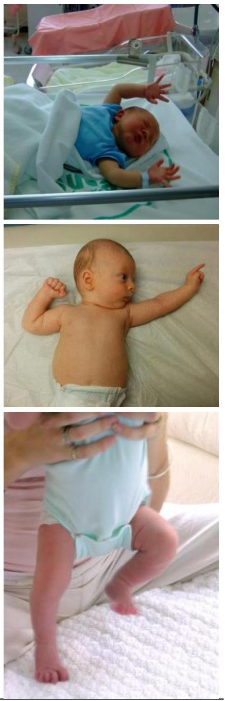
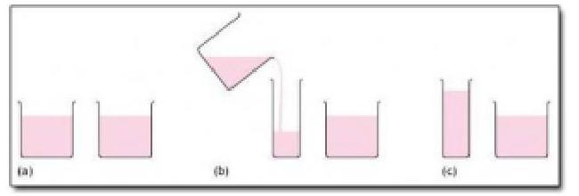
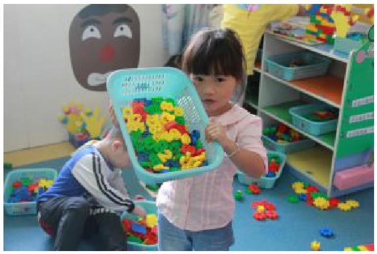
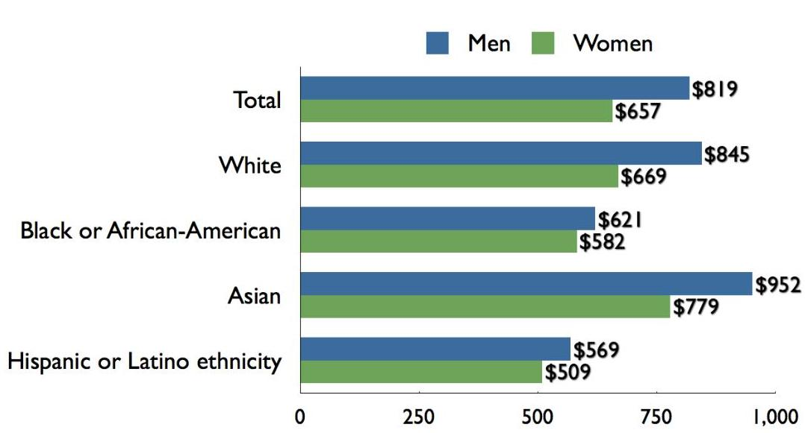
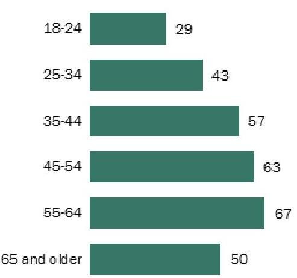
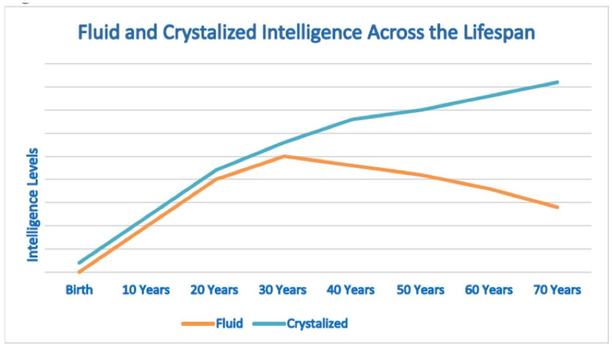
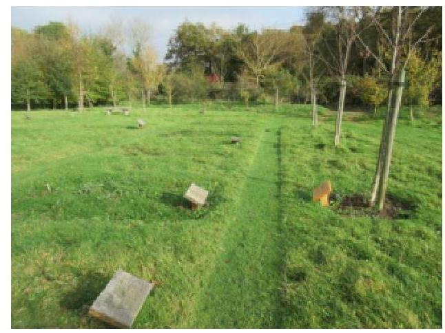

Human Development# Human Development 

THE HUMAN DEVELOPMENT TEACHING \& LEARNING GROUP# (○) (1) (2) 

Human Development Copyright (© 2020 by Human Development Teaching \& Learning Group is licensed under a Creative Commons Attribution-NonCommercial-ShareAlike 4.0 International License, except where otherwise noted..# Contents 

Introduction ..... 1
Unit I: Meta-theories
What is Development? ..... 7
Unit 2: Research Methods
How Do We Learn How to Promote Development? ..... 27
Ellen Skinner; Julia Dancis; and The Human Development Teaching \& Learning Group
Lifespan Developmental Research Methodologies ..... 34
Ellen Skinner; Julia Dancis; and The Human Development Teaching \& Learning Group
Descriptive and Explanatory Designs ..... 43
Ellen Skinner; Julia Dancis; and The Human Development Teaching \& Learning Group
Unit 3: Infancy
Beginnings: Conception and Prenatal Development ..... 68
Attachment ..... 91
Temperament ..... 103
Language \& Cognition ..... 110
Unit 4: Family
Parenting ..... 133
Parenting and Families: Creating Supportive Higher Order Contexts ..... 138
Ellen Skinner and Kristen Raine
Divorce ..... 149
Maltreatment, Adversity, and Resilience ..... 155
Unit 5: Early Childhood
Self-Regulation ..... 164
Cognitive Development ..... 169
Unit 6: Middle Childhood
Play and Peers ..... 185Cognitive Development ..... 195
Moral Development ..... 201
Gender Development ..... 206
Unit 7: Adolescence
Intelligence, Education, \& Motivational Development ..... 232
Puberty \& Cognition ..... 247
Identity Development during Adolescence ..... 262
Unit 8: Early Adulthood
Emerging Adulthood \& Cognition ..... 284
Vocational Development ..... 293
Heather Brule and Ellen Skinner
Love and Relationships ..... 305
Family Life Cycle ..... 317
Unit 9: Middle Adulthood
Middle Adulthood: Generativity, Intelligence, Personality ..... 344
Unit 10: Late Adulthood
Late Adulthood ..... 361
Death, Dying, \& Bereavement ..... 398# Introduction 

Welcome to Human Development across the Lifespan! You have been on a fascinating developmental journey your whole life long, and now you are going to have the opportunity to learn about the study of human development from birth to death. This course provides a bird's eye view of major milestones and developmental tasks during each age period, starting at conception and ending with old age. As you discover age periods that you would like to learn more about, we invite you take any of the 400-level series of developmental courses covering specific developmental periods in more depth: Infancy, Early Childhood Development, Child Psychology, Adolescent Development, and Adult Development and Aging.

We are delighted to share this class with you. To get started, we'd like to give you an overview of how the course is put together. It is organized into two broad learning goals. Within each, we focus on three main learning objectives. Let's look at them all together first, and then go through each one in more detail, to see how the course is structured to meet those broad goals and more specific objectives.

## Core Curriculum: Learn Everything

1. Fascinating developmental journey. Master core knowledge on theories and research explaining the ways people and their relationships change across the life span.
a. Apply. Connect developmental ideas to your own past, present, and future.
2. Role of context and culture. Learn about ways social contexts foster or undermine development, especially parents, families, peers, education, work, and aging.
a. Apply. Engage with the developmental ideas that appear in daily life.
3. Centrality of research methods. Understand how knowledge about development is constructed and become a thoughtful user of developmental research.
a. Apply. Visit research to learn more about developmental ideas important to you.

## Hidden Curriculum: Question Everything

1. Surface developmental meta-theories. Identify and critique the assumptions we all hold about human development.
a. Stretch. See how our own and society's assumptions and default settings operate in our everyday lives.
2. Reinvent a better world. Use developmental science as a springboard to critique and re-imagine major societal institutions.
a. Stretch. Discover groups who are already working toward those goals. Explore your own role in bringing about a better world.
3. Revolutionize developmental science. Critique developmental science today, and identify problems, blind spots, and limitations.
a. Stretch. Explore alternative critical approaches that incorporate additional rich ways of knowing.

## Core Curriculum: Learn Everything

The first broad goal of the class centers on core knowledge about human development, and is divided into three learning objectives.

1. Fascinating developmental journey. The course covers a defined content core, focused on major developmentalmilestones from birth to death. The learning of this core content is motivated by the driving question of the class, namely, "How can we promote optimal human development?" and the demonstrated importance of this question to students in the class, including:
a. the careers toward which you are working (e.g., teaching, social work, nursing, coaching) in which you will be shaping others' development as part of your profession,
b. key social roles in your current and future personal lives (as parents, spouses, voters, and citizens) in which you will be influencing the development of your children, nieces, nephews, spouses, and so on, and
c. as contributors to your own development through your actions and decisions about college, vocations, romantic partners, hobbies, substance use, etc.

This driving question creates a "need to know" situation about the nature of optimal development and how to promote it, which are the central components of the class content. Student learning is aided by definitions of "optimal development" as involving the whole person in realizing their full human potential, and organizing the lifespan according to "developmental tasks." Key insights about how to promote optimal development are based on the use of cumulative research findings and "evidence-based practices" to figure out how to identify and create "person-centered" contexts and interactions ("child-centered" parenting or "student-centered" teaching) across the lifespan.
2. The role of context and culture. A core principle guiding the class is that development takes place in multi-level changing societal and historical contexts. We decided to focus on two higher-order contexts throughout the class- poverty and racism - as two important societal conditions that exert downward pressure on optimal human development. This thread is woven throughout the textbook and revisited again and again in class. We provide supplementary readings, including Gary Evan's The Environment of Childhood Poverty and the American Academy of Pediatrics article on The Impact of Racism on Child and Adolescent Health.

The impact of poverty and racism is examined at each developmental level. We explore their effects on parenting and child maltreatment, on schools and schooling, on adolescent identity and risky behavior, on aging and life expectancy. To offset the grim realities of their potentially deleterious effects, we also focus on their antidotes: societal changes, educational programs, and interventions that have been demonstrated to prevent, ameliorate, or buffer the consequences of poverty and racism on development.
3. Centrality of research methods. It is easy for students to undervalue research methods, seeing them as some technical information that is not really relevant to them. So the arc on research methods is motivated by the idea of "evidence-based practices," an idea which is coming or has already arrived in all professions based on the social sciences, such as teaching, nursing, and social work, toward which most of the students in the class are headed. You are continually encouraged to ask "How do we know what we know?" and we wrote a new chapter on research methods for the OER textbook organized around that question. We also constructed a series of "detail detective" in-class exercises dispersed throughout the course, in which students detect conceptual and methodological flaws in research design and interpretation. The instructor presents the essentials of a real study and its real (and wrong) interpretation in the literature. Students discuss the problems in small groups and articulate the problematic aspects of the designs or interpretations and suggest future studies to correct or investigate these alternatives.

The learning of core content is supported by the OER textbook and a set of supplemental readings selected by the team. For each class period, we have created PowerPoint slides, lecture segments, targeted video clips, and in-class individual and group activities to stimulate "heads-on" engagement and provide feedback about attendance and learning to the instructor. Core content learning is supported by a study guide and in-class review sessions; and is assessed by two carefully calibrated multiple-choice exams. Core content learning is rounded out by brief reflective assignments:- Developmental Journal. An ongoing weekly journal entry that allows you to anchor your understanding of course material by writing relatively informal short responses about the ways that key concepts and core ideas presented in class or readings connect to your own life. By reflecting, exploring, applying, and integrating course material, you can scaffold your own learning about the concepts and ideas most important to you.
- For example, students use class concepts to describe their own developmental path through the past and present, and into the future, including examples of how they might use some of their knowledge about developmental stages to interpret the challenges of particular times of their lives.
- This assignment is scaffolded by offering example entries and providing students carefully developed rubrics that communicate what will be important to include.

# Hidden Curriculum: Question Everything 

The second broad goal of the class takes students "behind the curtain" of conventional science, practice, and societal functioning to surface and critique underlying assumptions about humans and how they develop. These assumptions, of which we are often unaware or which are intentionally hidden from us, nevertheless have a profound impact on developmental research and on the contexts (personal, professional, and societal) that influence development during every age period.

This broad goal is also divided into three learning objectives.

1. Surface developmental meta-theories. This strand focuses on critical thinking by providing a learning arc on developmental meta-theories, which refer to the implicit assumptions we all hold about the nature of human development (e.g., intrinsically good, inherently bad, or blank slate), how development proceeds (e.g., continuously or in qualitatively different stages), and where development comes from (e.g., nature versus nurture). These include scientific perspectives which dominate the field at a particular historical moment (e.g., behaviorism or neuroscience) as well as stereotypes about development and aging which dominate a society (e.g., "you can't teach an old dog new tricks") or a practice or profession (e.g., assumptions in teaching that motivation comes from external sources).
2. Reinvent a better world. Throughout the class, students are encouraged to use knowledge about human development as a platform to reimagine a world that better supports development all across the lifespan. The class focuses especially on status hierarchies created by all societies that rank order subgroups of people according to their inherent worth. These hierarchies give people differential access to opportunities, resources, and power, and so create serious problems for people at the bottom. Hierarchies produce objective living conditions that are developmentally hazardous to children and families (and youth, adults, and the elderly), sponsor entrenched myths about the inferiority of targeted subgroups, and defend cover stories that blame them for their situation and deny their everyday experiences of discrimination and prejudice. In readings and class sessions, we repeatedly explore how status hierarchies create risk factors for healthy development and brainstorm alternative societal structures that would be more supportive.
3. Revolutionize developmental science. A strength of science as a way of knowing is its openness to improvement, and throughout this class we highlight critiques of developmental science- both past and present. The identification of blind spots, problems, and limitations encourages students (as budding developmentalists) to see themselves as informed consumers of social science research, and to remain skeptical and open to critical perspectives and alternative sources of knowledge.

The broad goal of "questioning everything" is supported by multiple sections in the textbook, such as an introductory chapter that explicitly explains the idea of meta-theories, and a research methods chapter that identifies multiple limitations of developmental science. Students read additional original material on these topics, and this textbook includes sections at the end of every chapter that provide a range of optional additional readings and videos that followup on critiques and alternative perspectives. Class sessions include developmentally-graded practice in identifying and critiquing assumptions underlying developmental theories, research methodologies, professional practices, and students' own thinking.

The class views human development as an applied science and highlights the application of developmental research to solving real world problems. This strand is supported by in-class segments about how to create contexts that support the development of the people who inhabit them (e.g., families, schools, workplaces, and so on), including multiple examples drawn from intervention efforts designed to improve these contexts, such as early childhood programs or cognitive training for the elderly. This learning arc is supported by a major class project in which groups of students reinvent a specific developmental context so it better fosters human development.

- Reimagining Developmental Contexts. This project gives you the opportunity to take the social context of your choice (e.g., preschool, hospital, foster care) and imagine how it can be improved so that it more successfully supports the development of its inhabitants. Students pick a target context that is important to them personally, and work together with other students who are also interested in that context.
- Together you identify problems and brainstorm solutions using meta-theories, class concepts, information about community organizations, and your imaginations. Students are supported through a series of scaffolded steps, including discussion posts, outlines, and rough drafts. You receive feedback about your ideas from the members of their group and the instructor, and then individually write a persuasive essay about how you would re-make that context so it better supports healthy development. This paper ends with students describing one next step they could take to use their knowledge about developmentally-supportive contexts to foster development for themselves and/or others, whether in career, family, or elsewhere.

# The Human Development Teaching and Learning Group 

Human Development is a core course in Psychology, and one of the largest enrolling courses at Portland State University, serving over 1000 students a year. It is an important course for Psychology majors and a gateway to upper division developmental courses on specific age periods. It is also a university studies cluster course, a popular elective, and a requirement for many other majors and minors, including education, nursing, social work, and child and family studies.

The size and reach of Human Development make it an important target for high quality teaching and learning. We are proud of the high student ratings this course receives ( 5.2 to 5.7 on a 6-point scale). And building on that foundation, we decided about a decade ago to create a "master class" for Human Development, that is, a course that incorporates best practices from master teachers, past and present. In that spirit, in 2011, we formed the Human Development Teaching and Learning Group. The team was organized around 3 master teachers with decades of experience teaching the course, and 2 new graduate instructors and 6 doctoral teaching assistants.

Using their combined expertise covering all periods of development, the team hammered out common learning objectives, course content, a textbook and required readings, learning activities, assignments, exam questions, and so on. Because the course is regularly taught by faculty and doctoral students from the department's concentration in Developmental Science and Education, decisions were also informed by motivational research, social science pedagogy, and current thinking about the best ways to teach large classes. The team worked together for 18 months to create the course and refine it on 11 sections of Human Development, involving over 1200 students. Four years later, in the spring of 2015, the team conducted a major overhaul, revising the complexity of the written assignments, and reworking the exam questions.

In summer 2020, the Human Development Teaching and Learning Group came together again. This time the team included 4 experienced instructors and 6 doctoral students who had TA-ed the class multiple times. The primary goal was to convert the class away from a standard textbook to the Open Educational Resources you are now reading. At thesame time, we decided to reinvent core assignments, and added a strong through line on racism and social justice. Over the decade since Human Development was converted to a master class, it has benefited from over a hundred years of combined teaching experience and been modified based on feedback from thousands of students who have taken the class.

Ongoing improvements. This is a living class that is passed on to next generations of instructors who benefit from the work that has gone before, and also add to and improve the class as they teach it. Teachers are in touch with each other via e-mail or in person over the quarter, and we act as resources for each other when questions or problems arise. We regularly meet to discuss changes and improvements to the class. The project is ongoing, and provides a rich context for the development of instructors, teaching assistants, and the class itself. We actively encourage students to join this project by providing feedback about what is working well in the course and suggestions for how it can be improvedright now and in future iterations.

Members of the Human Development Teaching and Learning Group. The team members who created the original master class include: previous faculty instructors, Cathleen Smith and Gabriella Martorell; faculty team leader, Ellen Skinner; Adjunct Faculty, Glen Richardson and Shannon Myrick; Graduate Instructors, Cynthia Taylor, Jennifer Pitzer; Graduate teaching assistants, Heather Brule, Cailin Currie, Rita Yelverton, Jeff Beers, Jessica Harrison, and Justin Vollet.

The most recent revision of the course was undertaken by faculty team leader, Ellen Skinner; adjunct faculty Cynthia Taylor, Heather Brule, and Julia Dancis; and doctoral teaching assistants (and future instructors) Dan Grimes, James Delaney, Brandy Brennan, Eli Labinger, Kristen Raine, and Brielle Petit. We also benefited from the contributions of Jaime Wood and the Office of Academic Innovation at Portland State University, who provided logistical, financial, and pedagogical support for the conversion to Open Educational Resources.

These OER materials were converted to a Pressbook under the direction of Kristen Raine, and with the help of Heather Brule and James Delaney.# UNIT I: META-THEORIES# What is Development? 

Human Development or Lifespan Development is the scientific study of the ways in which people change, as well as remain the same, from conception to death. You will discover that the field, known more broadly as developmental science, examines changes and stability across multiple domains of psychological and social functioning. These include physical and neurophysiological processes, cognition, language, emotion, personality, moral, and psychosocial development, including our relationships with others.

Originally concerned with infants and children, the field has expanded to include adolescence and more recently, aging and the entire life span. Previously, the message was once you are 25 , your development is essentially completed. Our academic knowledge of the lifespan has changed, and although there is still less research on adulthood than on childhood, adulthood is gaining increasing attention. This is particularly true now that the large cohort known as the "baby boomers" are beginning to enter late adulthood. The assumption that early childhood experiences dictate our future is also being called into question. Instead, we have come to appreciate that growth and change continues throughout life and experience continues to have an impact on who we are and how we relate to others. We now recognize that adulthood is a dynamic period of life marked by continued cognitive, social, and psychological development.

You will also discover that developmental psychologists investigate key questions, such as whether children are qualitatively different from adults or simply lack the experience that adults draw upon. Other issues they consider include the question of whether development occurs through the gradual accumulation of

Figure 1.1
knowledge or through qualitative shifts from one stage of thinking to another, or if children are born with innate knowledge or figure things out through experience, and whether development is driven by the social context or something inside each child. From these questions, you may already be thinking that developmental psychology is related to other applied fields. You are right. Developmental science informs many applied fields, including, educational psychology, developmental psychopathology, and intervention science. It also complements several other basic research fields in psychology including social psychology, cognitive psychology, and cross-cultural psychology. Lastly, it draws from the theories and research of several scientific fields including biology, sociology, health care, nutrition, and anthropology.

## Learning Objectives: Lifespan Perspective

- Explain the lifespan perspective and its assumptions about development
- Differentiate periods of human development
- Identify key assumptions and major meta-theories underlying lifespan development
- Identify major historical and contemporary theories focusing on lifespan development# Lifespan Perspective 

Paul Baltes identified several underlying principles of the lifespan perspective (Baltes, 1987; Baltes, Lindenberger, \& Staudinger, 2006).

1. Development is lifelong. Lifespan theorists believe that development is life-long, and change is apparent across the lifespan. No single age period is more crucial, characterizes, or dominates human development. Consequently, the term lifespan development will be used throughout the textbook.
2. Development is multidirectional and multidimensional. Lifespan researchers hold that different people follow different developmental pathways, and proceed along pathways at different rates. Even within the same person, different dimensions or domains of development can change in different ways.
3. Development includes both gains and losses. Lifespan theorists do not agree with the traditional view of development that childhood is a period characterized by developmental gains, whereas old age is a time of loss. Instead, the lifespan approach holds that at every age, we may show gains in some areas of development, while showing losses in other areas. Every change, whether it is finishing high school, getting married, or becoming a parent, entails both growth and loss.
4. Development is characterized by plasticity. Plasticity is about malleability, or our potential to change and to follow a wide range of developmental pathways. For instance, plasticity is illustrated in the brain's ability to learn from experience and the many ways it can recover from injury.
5. Development is embedded in historical and cultural contexts. Lifespan researchers believe that development is influenced by the many social contexts in which it unfolds. How people develop will depend on their societal and cultural contexts, and on the historical period during which their development takes place.
6. Development is multiply determined. Lifespan theorists argue that development is caused by multiple factors, and is always shaped by both biological and environmental factors. In addition, the individual plays an active role in their own development.
7. Development is multidisciplinary. As mentioned at the start of the chapter, human development is such a vast topic of study that it requires the theories, research methods, and knowledge bases of many academic disciplines.

Contextualism as paradigm. Baltes (1987) identified three specific developmental systems of influence, all of which include biological and environmental forces.

- Normative age-graded influences: An age-grade is a specific age group, such as toddler, adolescent, or senior. Humans experience particular age-graded social experiences (e.g., starting school) and biological changes (e.g., puberty).
- Normative history-graded influences: The time period in which you are born (see Table 1.1) shapes your experiences. A cohort is a group of people who are born at roughly the same period in a particular society. These people travel through life often experiencing similar historical changes at similar ages. History-graded influences include both environmental determinants (e.g., historical changes in the job market) and biological determinants (e.g., historical changes in life expectancy).
- Non-normative influences: People's development is also shaped by specific influences that are not organized by age or historical time, such as immigration, accidents, or the death of a parent. These can be environmental (e.g., parental mental health issues) or biological (e.g., life threatening illness).# Table 1.1. Which generation (cohort) are you? 

| Generation | Born between... |
| :-- | :-- |
| Silent Generation | 1928 and 1945 |
| Baby Boomers | 1946 and 1964 |
| Generation X | 1965 and 1980 |
| Millenials | 1982 and 1996 |
| Generation Z | 1997 and 2009 |
| Generation Alpha | 2010 and 2024 |

adapted from Lally \& Valentine-French, 2019
Domains of development. We change across three general domains/dimensions; physical, cognitive, and psychosocial. The physical domain includes changes in height and weight, sensory capabilities, the nervous system, as well as the propensity for disease and illness. The cognitive domain encompasses the changes in intelligence, wisdom, perception, problem-solving, memory, and language. The psychosocial domain focuses on changes in emotion, self-perception and interpersonal relationships with families, peers, and friends. All three domains influence each other. It is also important to note that a change in one domain may cascade and prompt changes in the other domains. For instance, an infant who has started to crawl or walk will encounter more objects and people, thus fostering developmental change in the child's understanding of the physical and social world.

Contextual perspectives, like the lifespan approach, highlight societal contexts that influence our development. An important societal factor is our social standing, socioeconomic status, or social class. Socioeconomic status (SES) is a way to identify families and households based on their shared levels of education, income, and occupation. While there is certainly individual variation, members of a social class tend to share similar privileges, opportunities, lifestyles, patterns of consumption, parenting styles, stressors, religious preferences, and other aspects of daily life. All of us born into a class system are socially located, and we may move up or down depending on a combination of both socially and individually created limits and opportunities.

Families with higher socioeconomic status usually are in occupations (e.g., attorneys, physicians, executives) that not only pay better, but also grant them a certain degree of freedom and control over their job. Having a sense of autonomy or control is a key factor in experiencing job satisfaction, personal happiness, and ultimately health and well-being (Weitz, 2007). Those families with lower socioeconomic status are typically in occupations that are more routine, more heavily supervised, and require less formal education. These occupations are also more subject to job disruptions, including lay-offs and lower wages.

Poverty level is an income amount established by the federal government that is based on a set of thresholds that vary by family size (United States Census Bureau, 2016). If a family's income is less than the government threshold, that family is considered in poverty. Those living at or near poverty level may find it extremely difficult to sustain a household with this amount of income. Poverty is associated with poorer health and a lower life expectancy due to poorer diet, less healthcare, greater stress, working in more dangerous occupations, higher infant mortality rates, poorer prenatal care, greater iron deficiencies, greater difficulty in school, and many other problems. Members of higher income status may fear losing that status, but the poor may have greater concerns over losing housing.

Today we are more aware of the variations in development and the impact that culture and the environment have on shaping our lives. Culture is the totality of our shared language, knowledge, material objects, and behavior. It includes ideas about what is right and wrong, what to strive for, what to eat, how to speak, what is valued, as well as what kinds of emotions are called for in certain situations. Culture teaches us how to live in a society and allows us to advancebecause each new generation can benefit from the solutions found and passed down from previous generations. Culture is learned from parents, schools, houses of worship, media, friends and others throughout a lifetime. The kinds of traditions and values that evolve in a particular culture serve to help members function and value their own society. We tend to believe that our own culture's practices and expectations are the right ones. This belief that our own culture is superior is called ethnocentrism and is a normal by-product of growing up in a culture. It becomes a roadblock, however, when it inhibits understanding of cultural practices from other societies. Cultural relativity is an appreciation for cultural differences and the understanding that cultural practices are best understood from the standpoint of that particular culture.

Culture is an extremely important context for human development and understanding development requires being able to identify which features of development are culturally based. This understanding is somewhat new and still being explored. Much of what developmental theorists have described in the past has been culturally bound and difficult to apply to various cultural contexts. The reader should keep this in mind and realize that there is still much that is unknown when comparing development across cultures.

Lifespan vs. Life expectancy: At this point you must be wondering what the difference between lifespan and life expectancy is, according to developmentalists. Lifespan, or longevity, refers to the maximum age any member of a species can reach under optimal conditions. For instance, the grey wolf can live up to 20 years in captivity, the bald eagle up to 50 years, and the Galapagos tortoise over 150 years (Smithsonian National Zoo, 2016). The longest recorded lifespan for a human was Jean Calment who died in 1994 at the age of 122 years, 5 months, and 14 days (Guinness World Records, 2016). Life expectancy is the average number of years a person born in a particular time period can typically expect to live (Vogt \& Johnson, 2016).

# Conceptions of Age 

How old are you? Chances are you would answer that question based on the number of years since your birth, or what is called your chronological age. Ever felt older than your chronological age? Some days we might "feel" like we are older, especially if we are not feeling well, are tired, or are stressed out. We might notice that a peer seems more emotionally mature than we are, or that they are physically more capable. So years since birth is not the only way we can conceptualize age.

Biological age: Another way developmental researchers can think about the concept of age is to examine how quickly the body is aging, this is your biological age. Several factors determine the rate at which our body ages. Our nutrition, level of physical activity, sleeping habits, smoking, alcohol consumption, how we mentally handle stress, and the genetic history of our ancestors, to name but a few.

Psychological age: Our psychologically adaptive capacity compared to others of our chronological age is our psychological age. This includes our cognitive capacity along with our emotional beliefs about how old we are. An individual who has cognitive impairments might be 20 years of age, yet has the mental capacity of an 8-year-old. A 70-year-old might be travelling to new countries, taking courses at college, or starting a new business. Compared to others of our age group, we may be more or less active and excited to meet new challenges. Remember you are as young or old as you feel.

Social age: Our social age is based on the social norms of our culture and the expectations our culture has for people of our age group. Our culture often reminds us whether we are "on target" or "off target" for reaching certain social milestones, such as completing our education, moving away from home, having children, or retiring from work. However, there have been arguments that social age is becoming less relevant in the 21st century (Neugarten, 1979; 1996). If you look around at your fellow students at college you might notice more people who are older than traditional aged college students, those 18 to 25 . Similarly, the age at which people are moving away from the home of their parents, starting their careers, getting married or having children, or even whether they get married or have children at all, is changing.

Those who study lifespan development recognize that chronological age does not completely capture a person's age.Our age profile is much more complex than this. A person may be physically more competent than others in their age group, while being psychologically immature. So, how old are you?

# Table 1.2 Age Periods of Development 

| Age Period | Description |
| :-- | :-- |
| Prenatal | Starts at conceptions, continues through implantation in the uterine wall by the embryo, and ends at   birth. |
| Infancy and Toddlerhood | Starts at birth and continues to two years of age. |
| Early Childhood | Starts at two years of age until six years of age. |
| Middle and Late   Childhood | Starts at six years of age and continues until the onset of puberty. |
| Adolescence | Starts at the onset of puberty until 18 |
| Emerging Adulthood | Starts at 18 until 25. |
| Early Adulthood | Starts at 25 until 40-45. |
| Late Adulthood | Starts at 65 onward. |

adapted from Lally \& Valentine-French, 2019
Table 1.2 shows the developmental periods that will be explored in this book, starting with prenatal development and continuing thought late adulthood to death. Both childhood and adulthood are divided into multiple developmental periods. So, while both an 8 -month old and an 8 -year-old are considered children, they have very different motor abilities, social relationships, and cognitive skills. Their nutritional needs are different and their primary psychological concerns are also distinctive. The same is true of an 18-year-old and an 80-year-old, even though both are considered adults.

Prenatal Development: Conception occurs and development begins. All of the major structures of the body are forming, and the health of the mother is of primary concern. Understanding nutrition, teratogens, or environmental factors that can lead to birth defects, and labor and delivery are primary concerns.

Figure 1.2
the physical world.

Infancy and Toddlerhood: The first two years of life are ones of dramatic growth and change. A newborn, with a keen sense of hearing but very poor vision, is transformed into a walking, talking toddler within a relatively short period of time. Caregivers are also transformed from someone who manages feeding and sleep schedules to a constantly moving guide and safety inspector for a mobile, energetic child.

Early Childhood: This period is also referred to as the preschool years and consists of the years that follow toddlerhood and precede formal schooling. As a two to six-year-old, the child is busy learning language, gaining a sense of self and greater independence, and beginning to understand the workings of

Middle and Late Childhood: The ages of six to the onset of puberty comprise middle and late childhood, and much of what children experience at this age is connected to their involvement in the early grades of school. Now the worldbecomes one of learning and testing new academic skills, and assessing one's abilities and accomplishments by making comparisons between self and others.

Adolescence: Adolescence is a period of dramatic physical change marked by an overall growth spurt and sexual maturation, known as puberty. It is also a time of cognitive change as the adolescent begins to think of new possibilities and to consider abstract concepts such as love, fear, and freedom. At the same time, adolescents have a sense of invincibility that puts them at greater risk of accidents or contracting sexually transmitted infections that can have lifelong consequences.

Emerging Adulthood: The period of emerging adulthood is a transitional time between the end of adolescence and before individuals acquire all the benchmarks of adulthood. Continued identity exploration and preparation for full independence from parents are negotiated. Although at one's physiological peak, emerging adults are most at risk for involvement in violent crimes and substance abuse.

Early Adulthood: The twenties and thirties are identified as early adulthood. Intimate relationships, establishing families (of all shapes and sizes), and work are primary concerns at this stage of life. For adults with children, developmental changes can become organized around the family life cycle.

Middle Adulthood: The forties through the mid-sixties are referred to as middle adulthood. This is a period in which aging becomes more noticeable and when many people are at their peak of productivity in love and work. At this age, some people are negotiating adolescent children and aging parents at the same time.

Late Adulthood: Late adulthood is sometimes subdivided into two categories: The young-old who are from 65-84 years and the oldestold who are 85 years and older. One of the primary differences between these groups is that the young-old are still relatively healthy, productive, active, and the majority continue to live independently. With both age groups the risks of diseases such as arteriosclerosis, cancer, and cerebral vascular disease increase substantially.

## Meta-theories of Human Development

Figure 1.3

The study of development is guided by the assumptions researchers hold about the nature of humans and their development. These assumptions are called meta-theories. "Meta" means "above" or "beyond," like "meta-physics." Other terms used to describe meta-theories are "world views," "cosmologies," "perspectives," or "paradigms," as in "paradigm shifts." Explicit discussions of meta-theories are found most often in philosophy.

# What are meta-theories of human development? 

Meta-theories (or world views or paradigms) of human development are sets of assumptions people hold about the nature of humans and the meaning of development- what it looks like, how it happens, what causes it. These assumptions are important because everyone has them, including researchers, but they are often implicit, meaning we are not always consciously aware of them. In the study of development, such assumptions influence everything about how research is conducted: the questions we ask, the measures and methods that are used, and the interpretation of data. For example, if researchers assume that development ends at 18, they do not look for developmental changes after that age. Or, ifresearchers assume that aging is a process of decline, then they never look for characteristics that might improve as people get older.

All researchers have meta-theories, since assumptions are baked into the theories and methodologies they use. But researchers are often unaware of them, and so these assumptions are rarely acknowledged. It is important to note that meta-theories are not just cold cognitions. They are often deeply held convictions that researchers will fiercely defend. Typically researchers think that their assumptions are self-evident truths. They are often convinced that their assumptions are right and everyone else's are wrong.

Researchers holding different meta-theories can have difficulty communicating with each other. Since they are asking different questions and using different truth criteria for research, they often argue past each other or misunderstand each other. One group of researchers will offer what they consider to be irrefutable proof of their ideas, which other researchers then dismiss as irrelevant. Discrepancies, inconsistencies, arguments, and furor often characterize an area of study in which researchers from multiple meta-theories are working.

# What kinds of assumptions guide the study of human development? 

We consider six key assumptions. You may have heard of many of them, since they are perennial issues in the study of development. They include:

1. Assumptions about human nature: whether people are born as blank slates (tabula rasa) or whether people are inherently good or inherently bad.
2. Assumptions about the causes of development: whether development is determined by nature (genes, biology) or determined by nurture (environment, learning).
3. Assumptions about the role of the individual in his or her own development: whether people are passive participants, reacting to external forces or whether they are active in choosing and shaping their own development.
4. Assumptions about stability vs. change: whether traits, characteristics, and experiences early in life have permanent effects or whether people are malleable and open to change throughout life.
5. Assumptions about continuity vs. discontinuity: whether development involves quantitative incremental change or qualitative shifts.
6. Assumptions about universality vs. context specificity: whether development follows a universal pathway or depends more on specific experiences and environmental contexts.

Nature of humans. What is the nature of humans? These assumptions refer to beliefs about the underlying qualities of our species- whether humans are born as blank slates (tabula rasa) or whether we all bring intrinsic human characteristics with us into the world. For example, these different assumptions are readily apparent in alternative conceptualizations of motivation-some theories assume that motives and motivation are all acquired, whereas others assume that all humans come with intrinsic motivations.

Nature and Nurture: Why are you the way you are? As you consider some of your features (height, weight, personality, being diabetic, etc.), ask yourself whether these features are a result of heredity or environmental factors, or both. Chances are, you can see the ways in which both heredity and environmental factors (such as lifestyle, diet, and so on) have contributed to these features. For decades, scholars have carried on the "nature/nurture" debate. For any particular feature, those on the side of nature would argue that heredity plays the most important role in bringing about that feature. Those on the side of nurture would argue that one's environment is most significant in shaping the way we are. This debate continues in all aspects of human development, and most scholars agree that there is a constantinterplay between the two forces. It is difficult to isolate the root of any single behavior as a result solely of nature or nurture.

Active versus Passive: How much do you play a role in your own developmental path? Are you at the whim of your genetic inheritance or the environment that surrounds you? Some theorists see humans as playing a much more active role in their own development. Piaget, for instance believed that children actively explore their world and construct new ways of thinking to explain the things they experience. In contrast, many behaviorists view humans as being more passive in the developmental process.

Stability versus Change: How similar are you to how you were as a child? Were you always as out-going or reserved as you are now? Some theorists argue that the personality traits of adults are rooted in the behavioral and emotional tendencies of the infant and young child. Others disagree, and believe that these initial tendencies are modified by social and cultural forces over time.

Figure 1.4. The tree represents continuous development while the ladybug represents discontinuous development

Continuity versus Discontinuity: Is human development best characterized as a slow, gradual process, or is it best viewed as one of more abrupt change? The answer to that question often depends on which developmental theorist you ask and what topic is being studied. The theories of Freud, Erikson, Piaget, and Kohlberg are called stage theories. Stage theories or discontinuous development assume that developmental change occurs in distinct stages that are qualitatively different from each other, and that unfold in a set, universal sequence. At each stage of development, children and adults have different qualities and characteristics. Thus, stage theorists assume development is discontinuous. Others, such as the behaviorists, Vygotsky, and information processing theorists, assume development is a more slow and gradual process known as continuous development. For instance, they would see the adult as not possessing new skills, but as using more advanced skills that were already present in some form in the child. Brain development and environmental experiences contribute to the acquisition of more developed skills.

Universal vs. context specific. A final assumption focuses on whether pathways of development are presumed to be (1) normative and universal, meaning that all people pass through them in the same sequence, or (2) differential and specific, meaning that a variety of different patterns and pathways of developmental change are possible depending on the individual and the context. Some theorists, like Piaget or Erickson, assume that everyone progresses through the same stages of cognitive development in the same order, or that everyone negotiates the same set of developmental tasks at about the same ages. Other theorists, who endorse lifespan or ecological systems approaches, believe that development can take on a wide variety of patterns and pathways, depending on the specific cultural, historical, and societal under which it unfolds.

# What are the guiding meta-theories in human development? 

These six basic assumptions are clustered into "packages" that go together. Clusters are organized around metaphors, which are at the root of meta-theories of humans and their development. We consider four meta-theories, each with its own metaphor: (1) humans as seeds, as depicted by Maturational meta-theories; (2) humans as machines, as depicted in Mechanistic meta-theories (3) humans as butterflies, as depicted in Organismic meta-theories; and (4) humans as participants in a tennis game, conversation, or dance, as depicted by Contextualist meta-theories. For an overview of these guiding meta-theories, see this chart [pdf].

1. Maturational meta-theory: Maturational meta-theories can be understood using the plant as a metaphor. It is as if humans develop the same way as plants. The important thing to study is people's "seeds," that is, their geneticmake-up. People are assumed to be passive, the product of their genes. The environment can provide support and nutrition (rain, sun, and soil), but can't change a person's nature (poppy seeds will always produce poppies). The role of the person is to be reactive-to their genes. The course of development will be continuous or discontinuous depending on the genetic program, although acorns always grow into oak trees.
2. Mechanistic meta-theory: Mechanistic meta-theories can be understood using the machine as a metaphor. It is as if humans change the same way as machines. People are assumed to be made up of pieces that can be studied apart from the rest of them. They are passive, with the energy coming from outside (like gasoline for a car). Development is continuous and people do not develop into something else (a car stays a car). The person can only react to the environment that is controlling them (like a car responding to the gas pedal or the brake). All causes for development come from the outside, from environmental forces.
3. Organismic meta-theory: Organismic meta-theories can be understood using the butterfly as a metaphor. It is as if humans develop the same way as butterflies. People are assumed to be made up of structured wholes. Their nature is to be curious, interested, and open to growth. They are active and develop through discontinuous qualitatively different stages (like the caterpillar, chrysalis, and butterfly). People construct their own next steps in development based on the affordances and opportunities provided by the environment. Development is caused by imbalances that lead to structural reorganizations. Development is progressive (gets better) and only goes in one direction (from caterpillar toward butterfly) and not the reverse.
4. Contextual meta-theory: Contextual meta-theories can be understood using the tennis game (or dance) as a metaphor. It is as if humans' development is like a game of tennis or a dance. The important thing to study is the back and forth between the person and his or her context, both of which are assumed to be proactive and acting on their own agendas. Development can be continuous or discontinuous depending on how the game is played. Both person and environment are active partners in the system, which can lead to transformations in both.

# What are examples of theories that fall within each meta-theory? 

Nested within each higher-order meta-theory are sets of lower-level approaches or theories called "families" of perspectives or theories to denote that they share common properties, based on their similarity to the root metaphors and characteristics of the guiding meta-theories. This table contains several examples of "big" theories of development and provides an analysis of their defining features according to the meta-theoretical assumptions we have been discussing [pdf]. Based on this analysis, we indicate the higher-order family to which we think each big theory or approach belongs.

Although maturational meta-theories were prevalent in the beginning of the 20th century, their popularity has waxed and waned since then, and they have taken on many different forms. These include some formulations of behavioral genetics, sociobiology, evolutionary, ethological, neuroscience, temperament, and personality theories. Maturational assumptions are signaled by concepts such as "trait," the search for "the aggression gene," the discovery of the brain system, hormone, or neurotransmitter responsible for a specific condition, or any other terms that suggest development is solely the product of innate or immutable characteristics of individuals. Although they are not typically referred to as "maturational," there are many kinds of theories that place all the active ingredients of behavior or development inside the head (or more specifically the social cognitions) of the person. Even if they are not direct descendants, these theories can be considered cousins of Maturational meta-theories because they are exclusively focused on the role of the individual.

The prototypic Mechanistic theories are behaviorist, operant, and classical conditioning learning theories, like social learning theory. This family of theories dominated psychology from the early to the mid-20th century, but Mechanistic theories are still alive and well in many areas, such as learning and motivation, and especially in many theories that have been adapted for use in educational systems. New kinds of machines serve as prototypes for mechanistic theories of memory, learning, and automatic functioning-focusing on the computer, the robot, and the automaton.Such assumptions have even pervaded our understanding of biological systems, as seen in metaphors like "the brain is a computer." And although the "cognitive revolution" was supposed to have overthrown behaviorist assumptions, some cognitivistic theories treat humans as if they were information processing machines.

Perhaps surprisingly, there are also mechanistic assumptions embedded in certain progressive analyses of the effects of societal and social conditions, such as poverty, oppression, racism, and discrimination, which sometimes seem to imply that these external forces are the sole determinants of the development of stereotypes or implicit attitudes. In this case, because all people are presumed to passively internalize these societal prejudices, psychological phenomena are modeled after the metaphor of the "Xerox machine." Just as in Maturational meta-theories, where humans could be seen as "hosts" to their genes, who were really running the show, in Mechanistic meta-theories, humans can be seen as "hosts" to their own behaviors, which are automatically reflexively produced based on previous social programming.

The prototypical Organismic theory is Piaget's constructivist theory of cognitive and affective development, and the several neo-constructivist theories that were inspired by Piaget, for example, Kohlberg's theory of the development of moral reasoning. Other theories living under the Organismic umbrella include Werner's comparative psychology, focusing on the orthogenetic principle of differentiation and integration, and Erikson, who posited universal agegraded developmental tasks. Other theories that claim kinship with Organismic meta-theories (e.g., theories of intrinsic motivation) do not typically include notions of universal stages or tasks, but focus instead on Organismic assumptions about the nature of humans, specifically, that humans are innately active, curious, and interested, and inherently desire to explore, understand, and fit in with their social and physical environments. With the rise of radical contextualism and cultural relativism in psychology, theories of "universal" anything (e.g., psychological needs, stages, developmental tasks) have come increasingly under attack.

Some of the better-known members of the Contextualist family include Bronfenbrenner's bio-ecological model and the lifespan approach, both of which arose in reaction to dominant meta-theories of their day (experimental child psychology and Piagetian psychology, respectively), with their almost exclusive focus on the child as a developing individual. The "contextualist" moniker reflects these perspectives' insistence that development unfolds within and is shaped by higher-order multi-level ecological or contextual forces outside the individual, such as microsystem settings, and societal, cultural, and historical contexts.

# Does the field of psychology have meta-theories? 

During different historical periods, specific meta-theories dominated the field of psychology. For example, during the 1940s and 1950s, behaviorism held sway. In the 1960s, Piaget's theories were introduced to the United States and captured the field's attention. Some fierce theoretical and empirical battles were fought between behaviorists and Piagetians.

When a specific meta-theory governs the field, it becomes very difficult for researchers from opposing meta-theories to work-they have trouble getting funding, they have trouble getting their research findings published, and they are marginalized by other researchers. For example, when the area of motivation was dominated by behaviorists (who believed that all behavior was motivated by rewards and punishments), it was very difficult for researchers to study and publish research on intrinsic motivation.

## What is the dominant meta-theory in the field today?

"Cognitivism" is a guiding meta-theory in the field of psychology today. "Cognitivism" is the assumption that all the causal factors that shape human behavior and development are inside the mind or belief system of the person. You can hear the assumptions in the theories of the field: self-efficacy, self-esteem, attributions, perceived social support, values, sense of purpose, goal orientations, internal working model, identity, and so on.

The paradigm that is currently taking over the field of psychology is neuroscience. That is, the brain is in charge ofbehavior, and neurobiology is destiny. Some branches of neuroscience are predominantly Maturational, as seen in discussions of the brain systems responsible for certain actions, predilections, and characteristics. Other branches are more Contextual, for example, research on neuroplasticity, which examines the way that social contexts and interactions shape the developing brain.

News flash: In the field of psychology outside developmental, most researchers assume that people don't develop. In personality, social, cognitive, and industrial-organizational psychology, researchers largely examine individual differences as indicators of people's permanent characteristics.

# Who else has meta-theories? 

Everyone has meta-theories about human nature and development: parents, teachers, nurses, social workers, doctors, business people, artists, politicians, and so on.

For example,

- doctors assume that weight loss is all about diet and exercise (nurture), so no one can do research on physiological differences in metabolism (nature).
- teachers have assumptions about whether students come with motivation (nature) or have to be motivated from the outside (nurture), and organize their classrooms accordingly.
- parents often argue about the nature of children's development, whether it's just the child's personality (maturational), or the child is going through a normal stage (organismic), or if they are rewarding the wrong behavior (mechanistic).

## What is the meta-theory that guides our class and this book?

Our class endorses a life-span perspective on human development, a contextualist perspective that fought its way through the dominant perspectives in child psychology (e.g., development ends at age 18), starting in the 1980s to become one of the dominant meta-theories governing the field of developmental science today. Note that your instructors chose your book, so their meta-theory is influencing the meta-theoretical filter through which you are learning about development.

## What is the correct meta-theory?

There is no single correct definition of development or meta-theory. Really. Even the lifespan approach has its drawbacks.

However, as research accumulates, many theories derived from certain meta-theories have been found to be incomplete-so far researchers have not found any significant aspect of development that is caused only by nature or only by nurture. Therefore, most researchers currently say they favor interactionist metatheories, like contextualist or systems meta-theories. However, it is important to look carefully at researchers' actual work, because sometimes they say that they have one meta-theory, but their work seems to be guided by assumptions from a different meta-theory.

## Do I have a meta-theory about development?

Yes, you do. And you can figure out what it is. Although it's not easy, you can discern your own assumptions about development-by thinking about which assumptions make the most sense to you. You can also see which kinds of theories you prefer and what kinds of recommendations you would make about how to structure development, like how people should parent, teach, or make policies. The hardest part about discovering your own meta-theory is realizing that it is made up of assumptions you have (based on your experiences and messages from society)-that aren't necessarily true. Our meta-theories sure seem true to each of us!# How do I get rid of my meta-theory? 

It's not really possible to get rid of all of our assumptions. It is our goal to be aware of our own assumptions or metatheories, to realize that they are not the truth but are our current working models of how the world operates and people develop. The most important thing is to be explicit about our assumptions and to be cognizant of how they are guiding our actions. It is a goal of this class to help students figure out their own assumptions and to help them become (or remain) open to alternative viewpoints.

Adapted from: Ellen Skinner, Glen Richardson, Jennifer Pitzer, and Cynthia Taylor. Portland State University. July 2011.

## Historical Theories of Development

Preformationist View: Well into the 18th century, children were merely thought of as little adults. Preformationism, or the belief that a tiny, fully formed human is implanted in the sperm or egg at conception and then grows in size until birth, was the predominant early theory. Children were believed to possess all their sensory capabilities, emotions, and mental aptitude at birth, and as they developed these abilities unfolded on a predetermined schedule (Thomas, 1979). The environment was thought to play no role in determining development.

John Locke (1632-1704): Locke, a British philosopher, refuted the idea of innate knowledge and instead proposed that children are largely shaped by their social environments, especially their education as adults teach them important knowledge. He believed that through education a child learns socialization, or what is needed to be an appropriate member of society. Locke advocated thinking of a child's mind as a tabula rasa or blank slate, and whatever comes into the child's mind comes from the environment. Locke emphasized that the environment is especially powerful in the child's early life because he considered the mind the most pliable then. Locke indicated that the environment exerts its effects through associations between thoughts and feelings, behavioral repetition, imitation, and rewards and punishments (Crain, 2005). Locke's ideas laid the groundwork for the behavioral perspective and subsequent learning theories of Pavlov, Skinner and Bandura.

Jean-Jacques Rousseau (1712-1778): Like Locke, Rousseau also believed that children were not just little adults. However, he did not believe they were blank slates, but instead developed according to a natural plan which unfolded in different stages (Crain, 2005). He did not believe in teaching them the correct way to think, but believed children should be allowed to think by themselves according to their own ways and an inner, biological timetable. This focus on biological maturation resulted in Rousseau being considered the father of developmental psychology. Followers of Rousseau's developmental perspective include Gesell, Montessori, and Piaget.

Arnold Gesell (1880-1961): Gesell spent 50 years at the Yale Clinic of Child Development, and with his colleagues he studied the neuromotor development of children. Gesell believed that the child's development was activated by genes and he called this process maturation (Crain, 2005). Further, he believed that development unfolded in fixed sequences, and he opposed efforts to teach children ahead of schedule as he believed they will engage in behaviors when their nervous systems had sufficiently matured.

Figure 1.6. Sigmund Freud
about as challenges to Freud's views.

Sigmund Freud (1856-1939): Freud was a very influential figure in the area of development. Freud emphasized the importance of early childhood experiences in shaping our personality and behavior. In our natural state, we are biological beings and are driven primarily by instincts. During childhood, however, we begin to become social beings as we learn how to manage our instincts and transform them into socially acceptable behaviors. His assumptions were that personality formed during the first few years of life. The ways in which parents or other caregivers interacted with children were assumed to have a long-lasting impact on children's emotional states. His beliefs formed the psychodynamic perspective and his theories of psychosexual development and psychopathology dominated the field of psychiatry until the growth of behaviorism in the 1950s.

However, Freud's theory has been heavily criticized for several reasons. One is that it is very difficult to test scientifically (Crews, 1998). Freud suggested that much of what determines our actions were unknown to us, and as scientists we cannot measure these unconscious concepts. A second criticism is that Freud's case studies were not validated and cannot be used as evidence for his theories. Many later theories, particularly behaviorism and humanism, came

# Contemporary Theories on Development 

Erikson (1902-1994) and Psychosocial Theory: Now, let's turn to a less controversial psychodynamic theorist, Erik Erikson. Erikson presents eight developmental stages that encompass the entire lifespan. For that reason, Erikson's psychosocial theory forms the foundation for much of our discussion of psychosocial development.

Erikson (1950) proposed a model of lifespan development that provides a useful guideline for thinking about the changes we experience throughout life. Erikson broke with Freud's emphasis on sexuality as the cornerstone of social-emotional development and instead suggested that social relationships fostered development. Erikson proposed that each period of life has a unique challenge or crisis that the person who reaches it must face, referred to as psychosocial crises. According to Erikson, successful development involves dealing with and resolving the goals and demands of each of these psychosocial crises in a positive way. These crises are usually called stages, although that is not the term Erikson used. If a person does not resolve a stage successfully, it may hinder their ability to deal with later stages. For example, the person who does not develop a sense of trust (Erikson's first stage) may find it challenging as an adult to form a positive intimate relationship (Erikson's sixth stage). Or an individual who does not develop a clear sense of purpose and identity (Erikson's fifth stage) may become selfabsorbed and stagnate rather than work toward the betterment of others (Erikson's seventh stage).

However, most individuals are able to successfully complete the eight stages of his theory (See Table 1.3).Table 1.3 Erikson's Psychosocial Stages

| Age range | Psychosocial crisis | Positive resolution of crisis |
| :--: | :--: | :--: |
| Birth to 12 to 18 months | Trust versus Mistrust | The child develops a feeling of trust in caregivers. |
| 18 months to 3 years | Autonomy versus   Shame/Doubt | The child learns what can and cannot be controlled and develops a sense of free will. |
| 3 to 6 years | Initiative versus Guilt | The child learns to become independent by exploring, manipulating, and taking action. |
| 6 to 12 years | Industry versus Inferiority | The child learns to do things well or correctly according to standards set by others, particularly in school. |
| 12 to 18 years | Identity versus Role Confusion | The adolescent develops a well-defined and positive sense of self in relationship to others. |
| 19 to 40 years | Intimacy versus Isolation | The person develops the ability to give and receive love and to make long-term commitments. |
| 40 to 65 years | Generativity versus Stagnation | The person develops an interest in guiding the development of the next generation, often by becoming a parent. |
| 65 to death | Ego Integrity versus Despair | The person develops acceptance of how one has lived. |

adapted from Lally \& Valentine-French, 2019
Erikson's theory has been criticized for focusing so heavily on crises and assuming that the completion of one crisis is a prerequisite for the next crisis of development. His theory also focused on the social expectations that are found in certain cultures, but not in all. For instance, the idea that adolescence is a time of searching for identity might translate well in the middle-class culture of the United States, but not as well in cultures where the transition into adulthood coincides with puberty through rites of passage and where adult roles offer fewer choices.

Learning Theory: Also known as Behaviorism, is based on the premise that it is not possible to objectively study the mind, and therefore psychologists should limit their attention to the study of behavior itself. The most famous behaviorist was Burrhus Frederick (B. F.) Skinner (1904-1990), who expanded the principles of behaviorism and also brought them to the attention of the public at large. Skinner used the ideas of stimulus and response, along with the application of rewards or reinforcements, to train pigeons and other animals. In addition, he used the general principles of behaviorism to develop theories about how best to teach children and how to create societies that were peaceful and productive (Skinner, 1957, 1968, 1972).

The behaviorists made substantial contributions to psychology by identifying the principles of learning. Although the behaviorists were incorrect in their beliefs that it was not possible to measure thoughts and feelings, their ideas provided new insights that helped further our understanding regarding the nature-nurture debate as well as the question of free will. The ideas of behaviorism are fundamental to psychology and have been developed to help us better understand the role of prior experiences in a variety of areas of psychology.

Social Learning Theory, or learning by watching others, was developed by Albert Bandura (1977). His theory calls our attention to the ways in which many of our actions are not learned through conditioning, as suggested by Skinner. Young children frequently learn behaviors through imitation. Especially when children do not know what else to do, they learn by modeling or copying the behavior of others.

Bandura (1986) suggests that there is interplay between the environment and the individual. We are not just the product of our surroundings, rather we influence our surroundings. There is interplay between our personality and the way we interpret events and how they influence us. This concept is called reciprocal determinism. An example of this might be the interplay between parents and children. Parents not only influence their child's environment, perhaps intentionallythrough the use of reinforcement, etc., but children influence parents as well. Parents may respond differently with their first child than with their fourth. Perhaps they try to be the perfect parents with their firstborn, but by the time their last child comes along they have very different expectations, both of themselves and their child. Our environment creates us and we create our environment.

Other social influences: TV or not TV? Bandura, Ross and Ross (1963) began a series of studies to look at the impact of television on the behavior of children. Bandura began by conducting an experiment in which he showed children a film of a woman hitting an inflatable clown or "bobo" doll. Then the children were allowed in the room, where they found the doll and during their play they began to hit it. The children also demonstrated novel ways of being aggressive toward the doll that were not demonstrated by those children who did not see the aggressive model. Bandura's research raised concerns about the impact of violence on young children. Since then, considerable research has been conducted on the impact of violent media on children's aggression including playing video games.

Cognitive Theory: The cognitive theories focus on how our mental processes or cognitions change over time. Three important theories are Jean Piaget's, Lev Vygotsky's, and Information-processing.

Jean Piaget (1896-1980) was one of the most influential cognitive theorists in development. He was inspired to explore children's ability to think and reason by watching his own children's development. He was one of the first to recognize and map

Figure 1.8. A bobo doll
out the ways in which children's intelligence differs from that of adults (Piaget, 1929). He became interested in this area when he was asked to test the IQ of children and began to notice that there was a pattern in their wrong answers. He believed that children's intellectual skills change over time and that maturation, rather than training, brings about that change. Children of differing ages interpret the world differently. Piaget theorized that children progressed through four stages of cognitive development (see Table 1.4).

# Table 1.4 Piaget's Stages of Cognitive Development 

| Stage | Approximate age range | Characteristics | Stage attainments |
| :--: | :--: | :--: | :--: |
| Sensorimotor | Birth to about 2 years | Children experience the world through their fundamental senses of seeing, hearing, touching, and tasting. | Object permanence |
| Preoperational | 2 to 7 years | Children acquire the ability to internally represent the world through language and mental imagery. They also start to see the world from other people's perspectives. | Theory of mind; rapid increase in language ability |
| Concrete operational | 7 to 11 years | Children become able to think logically. They can increasingly perform operations on objects that are real | Conservation |
| Formal operational | 11 years to adulthood | Adolescents can think systematically, can reason about abstract concepts, and can understand ethics and scientific reasoning. | Abstract logic |

adapted from Lally \& Valentine-French, 2019
Piaget has been criticized for overemphasizing the role that physical maturation plays in cognitive development and in underestimating the role that culture and experience plays. Looking across cultures reveals considerable variation inwhat children are able to do at various ages. Research has shown considerable overlap among the four stages and that development is more continuous.

Lev Vygotsky (1896-1934) was a Russian psychologist who wrote in the early 1900s, but whose work was not discovered by researchers in the United States until the 1960s and became more widely known in the 1980s (Crain, 2005). His sociocultural theory emphasizes the importance of culture and interaction in the development of cognitive abilities. Vygotsky differed with Piaget in that he believed that a person not only has a set of abilities, but also a set of potential abilities that can be realized if given the proper guidance from others. Vygotsky developed theories on teaching that have been adopted by educators today.

Information Processing is not the work of a single theorist, but based on the ideas and research of several cognitive scientists studying how individuals perceive, analyze, manipulate, use, and remember information. This approach assumes that humans gradually improve in their processing skills; that is, cognitive development is continuous rather than stagelike. The more complex mental skills of adults are built from the primitive abilities of children. We are born with the ability to notice stimuli, store, and retrieve information. Brain maturation enables advancements in our information processing system. At the same time, interactions with the environment also aid in our development of more effective strategies for processing information.

Urie Bronfenbrenner (1917-2005) developed the Ecological Systems Theory, which provides a framework for understanding and studying the many influences on human development (Bronfenbrenner, 1979). Bronfenbrenner recognized that human interaction is influenced by larger social forces and that an understanding of these forces is essential for understanding an individual. The individual is impacted by several systems including:

- Microsystem includes the individual's setting and those who have direct, significant contact with the person, such as parents or siblings. The input of those is modified by the cognitive and biological state of the individual as well. These influence the person's actions, which in turn influence systems operating on him or her.
- Mesosystem includes the larger organizational structures, such as school, the family, or religion. These institutions impact the microsystems just described. The philosophy of the school system, daily routine, assessment methods, and other characteristics can affect the child's self-image, growth, sense of accomplishment, and schedule thereby impacting the child, physically, cognitively, and emotionally.
- Exosystem includes the larger contexts of community. A community's values, history, and economy can impact the organizational structures it houses. Mesosystems both influence and are influenced by the exosystem.
- Macrosystem includes the cultural elements, such as global economic conditions, war, technological trends, values, philosophies, and a society's responses to the global community.
- Chronosystem is the historical context in which these experiences occur. This relates to the different generational time periods previously discussed, such as the baby boomers and millennials.

In sum, a child's experiences are shaped by larger forces, such as the family, schools, religion, culture, and time period. Bronfenbrenner's model helps us understand all of the different environments that impact each one of us simultaneously. Despite its comprehensiveness, Bronfenbrenner's ecological system's theory is not easy to use. Taking into consideration all the different influences makes it difficult to research and determine the impact of all the different variables (Dixon, 2003). Consequently, psychologists have not fully adopted this approach, although they recognize the importance of the ecology of the individual. Figure 1.9 is a model of Bronfenbrenner's Ecological Systems Theory.

Figure 1.9. Bronfenbrenner's Ecological Systems Theory

# Supplemental Materials 

- This article discusses the importance of critical reflection on the underlying assumptions of developmental psychology as a science.

Teo, T. (1997). Developmental Psychology and the Relevance of a Critical Metatheoretical Reflection. Human Development, 40(4), 195-210. https://doi.org/10.1159/000278723# References 

Baltes, P. B. (1987). Theoretical propositions of life span developmental psychology: On the dynamics between growth and decline. Developmental Psychology, 23, 611-626.

Baltes, P. B., Lindenberger, U., \& Staudinger, U. M. (2006). Life span theory in developmental psychology. In W. Damon, \& R. M. Lerner (Eds.), Handbook of child psychology, 6th edition (pp. 569-664). Hoboken, NJ: John Wiley \& Sons.

Bandura, A. (1977). Social learning theory. New York: General Learning Press.
Bandura, A. (1986). Social foundations of thought and action: A social-cognitive theory. Upper Saddle River, NJ: Prentice Hall.

Bandura, A, Ross, D. \&. Ross S. (1963). Imitation of film-mediated aggressive models. Journal of Abnormal and Social Psychology, 66, 3-11.

Bronfenbrenner, U. (1979). The ecology of human development: Experiments by nature and design. Cambridge, MA: Harvard University Press.

Crain, W. (2005). Theories of development concepts and applications (5th ed.). New Jersey: Pearson.
Crews, F. C. (1998). Unauthorized Freud: Doubters confront a legend. New York, NY: Viking Press.
Dixon, W. E. (2003). Twenty studies that revolutionized child psychology. Upper Saddle River, NJ: Prentice Hall.
Erikson, E. H. (1950). Childhood and society. New York: Norton.
Guinness World Records. (2016). Oldest person (ever). Retrieved from http://www.guinnessworldrecords.com/ search?term=oldest+person $+\% 28$ ever $\% 29$

Neugarten, B. L. (1979). Policy for the 1980s: Age or need entitlement? In J. P. Hubbard (Ed.), Aging: Agenda for the eighties, a national journal issues book (pp. 48-52). Washington, DC: Government Research Corporation.

Neugarten, D. A. (Ed.) (1996). The meanings of age. Chicago, IL: The University of Chicago Press.
Piaget, J. (1929). The child's conception of the world. NY: Harcourt, Brace Jovanovich.
Smithsonian National Zoo. (2016). Retrieved from http://nationalzoo.si.edu/
Skinner, B. (1957). Verbal behavior. Acton, MA: Copley.
Skinner, B. (1968). The technology of teaching. New York, NY: Appleton-Century-Crofts.
Skinner, B. (1972). Beyond freedom and dignity. New York, NY: Vintage Books.
Thomas, R. M. (1979). Comparing theories of child development. Santa Barbara, CA: Wadsworth.
United States Census Bureau. (2016). Poverty. Retrieved from http://www.census.gov/topics/income-poverty/ poverty/about/glossary.html

Vogt, W.P., \& Johnson, R.B. (2016). The SAGE dictionary of statistics and methodology. Los Angeles, CA: Sage
Webb, S. J., Dawson, G., Bernier, R., \& Panagiotides, H. (2006). ERP evidence of atypical face processing in young children with autism. Journal of Autism and Developmental Disorders, 36, 884-890. doi: 10.1007/s10803-006-0126-xWeitz, R. (2007). The sociology of health, illness, and health care: A critical approach, (4th ed.). Belmont, CA: Thomson.

OER Attribution: "Lifespan Development: A Psychological Perspective, Second Edition" by Martha Lally and Suzanne Valentine-French is licensed under a CC-BY-NC-SA-3.0

Additional written material (Meta-theories of Human Development) by Ellen Skinner, Glen Richardson, Jennifer Pitzer, and Cynthia Taylor, Portland State University is licensed under a CC BY-NC-SA 4.0.

# Media Attributions 

- Private: jana-sabeth-snDUMdYF7o8-unsplash © Jana Sabeth is licensed under a CC0 (Creative Commons Zero) license
- Private: garrett-jackson-oOnJWBMlb5A-unsplash © Garrett Jackson is licensed under a Public Domain license
- Private: 6152423507_009b2626cd_o © Woody Hibbard is licensed under a CC BY (Attribution) license
- Private: original © Noba Project is licensed under a CC BY-NC-SA (Attribution NonCommercial ShareAlike) license
- Private: Preformation is licensed under a Public Domain license
- Private: Sigmund_Freud,_by_Max_Halberstadt_(cropped) © Max Halberstadt is licensed under a Public Domain license
- Private: Erik_Erikson © Unknown is licensed under a Public Domain license
- Private: original © Semhur is licensed under a CC BY-SA (Attribution ShareAlike) license
- Private: Bronfenbrenner's_Ecological_Theory_of_Development_(English) © Hchokr at English Wikipedia is licensed under a CC BY-SA (Attribution ShareAlike) license# UNIT 2: RESEARCH METHODS# How Do We Learn How to Promote Development? 

ELLEN SKINNER; JULIA DANCIS; AND THE HUMAN DEVELOPMENT TEACHING \& LEARNING GROUP

Learning Objectives: How do we learn how to promote development?

- What are evidence-informed "best" practices, and why are they important?
- Why are all best practices culturally-attuned?
- Explain why science is a powerful way of knowing and process of learning about ourselves and the world.
- Identify limitations and areas of improvement for science as a social enterprise.

A primary goal of this course is to help you learn more about how to constructively influence development. Whether we are aware of it or not, all of us are shaping development every day through our decisions and actions. Sometimes this is obvious when we are raising children or teaching preschoolers. In these situations, we know we are trying to help our children and students learn and grow. We think carefully about how we were raised or taught, about our professional training. We take these responsibilities seriously. We know what a difference people in our lives have made to our development. However, in cases where we are not explicitly charged with promoting development, we may not think as carefully about our effects on others like our friends, romantic partners, or parents. We may not think about our own development, the ways we nurture or disparage ourselves.

In this class, we are calling all the ways we influence development "developmental practices." By this, we mean all the decisions and actions we take in our professional and personal lives that shape our own and others' development. When we hear the word "practices," we often think about professional practices. But we also include personal practices, like how we parent, make decisions about vocations, and nurture our friends. From this perspective, we are all developmental "practitioners" even though we may not feel like we really understand how best to do this job. Developmental science, along with other important sources of information, contribute to our understanding of "best developmental practices." Science is a powerful process of learning, but it also has its limitations. Science uses multiple kinds of methodologies, ways of collecting information, and designs, each with its strengths and limitations and its hidden assumptions. Since research methods are central in producing valid and useful knowledge, we have to be thoughtful and critical about the processes and tools of science. Learning more about research methods in developmental science can also contribute to your learning more about important ways to promote healthy development, both your own and others.

## What is science and how does it fit with other ways of knowing?

At its core, science is a way of knowing: a set of practices for learning about the world. There are many other ways of knowing, including our intuition, emotions, and observations; the beliefs and customs of our families and neighbors; the opinions of friends and peers; communications from political and religious authorities; and messages from the media. If we bundle all these other sources of information together, they make up our"personal experience." From this history, we form opinions about the contents of development: how people change and remain the same, what is "normal," the causes of healthy and unhealthy development, and what we should do to be good parents, educators, and friends.Our experiences are embedded in particular cultural and historical contexts. These contexts have many strengths, but they also have their own implicit biases. Our personal convictions, based on a lifetime of experiences in these societal contexts and historical times, are naturally very compelling. We even have a name for the sets of gripping assumptions that underlie them: Naïve meta-theories of human development.

A second source of information about how to support development can be called "professional experience." Many callings and professions shape development, like parenting, education, nursing, social work, coaching, and so on. And each comes with its own set of trainings, traditions, and practices. Some of these practices are drawn from research (as we will discuss shortly), others from personal experience of what has worked in the past, and others are simply "the way things have always been done." Take, for example, the practices you see in our classroom: Learning takes place in groups, with a leader called the teacher, and involves readings, assignments, and grades. Such practices are based on a society's history of carrying out these tasks, and they are reinforced by educational and training programs. Professional experiences are also embedded in the institutions of our time and place, as seen in schools, health care systems, human services, and other workplaces. These organizations, and our education and training, provide us with skills and information. At the same time, they have their own implicit biases. And, just like personal experience, professional experience has its own baked in assumptions about humans and how they develop.

# What are the limitations of personal and professional experience? 

The limitations of personal and professional experience are easiest to see in the past, when for example, doctors used procedures, like blood-letting, to treat patients that were not effective, or schools employed corporal punishment, or women were not allowed into certain professions. Our personal experiences can also be limiting. Often the ways we were raised seem right to us, even though all of us have absorbed implicit biases and none of us were raised by perfect caregivers. We often sense that our caregivers made mistakes, even as we find ourselves repeating those same parenting practices. Professionally and personally, we are not always sure how to shake free of our past and do things a better way.

Our personal and professional experiences are important sources of information about development. But the growing recognition of their limitations has led to the rise of what are called "evidence-based" or "evidence-informed" practices. Seen most clearly in medicine, these practices come out of the scientific study of alternative ways to care for patients and treat different conditions. Whole centers are dedicated to studying and compiling best medical practices. And doctors, as professionals, are expected to adhere to them. As knowledge about medicine progresses, these "best practices" are continually updated with new evidence.

## Where do "best" practices for promoting development come from?

Best practices emerge at the intersection between the scientific study of development and the knowledge of expert practitioners. Lessons about best developmental practices are gathered, not from individual studies that test explanations and interventions, but from whole lines of work that over time replicate findings from multiple perspectives. These are called "bodies of evidence," and they converge on insights about the most effective ways to support development. For example, even though pediatricians in the 1950s warned mothers that picking babies up when they cry reinforces their crying and spoils them, a body of evidence on attachment revealed this advice to be wrong. Infants cry less and are more secure if caregivers respond consistently and sensitively to their needs. That's why science-based practices are called "evidence-informed."

In a complementary fashion, expert practitioners bring knowledge about what works. Experts emerge from everyday walks of life, like wise and skilled elders, teachers, caregivers, coaches, and social workers. As we are reinventing practices, we can reflect on and bring forward their insights and lessons. For example, many cultural traditions highlight the precious nature of children and the elderly, as treasures to be cherished, and underscore the centrality of family, community, and cultural heritage in supporting their well-being and development. These insights can beused to critique and reconsider our current practices, in which those who care for children and the elderly are often undervalued, underpaid, and not well supported by the larger community.

The lessons gained from scientific evidence and expert practitioners are called "best practices," and they are transforming all the callings and professions that shape development. A whole area of research, called "implementation science," studies methods to promote the adoption and integration of evidence-based practices, interventions, and policies into routine settings. Sometimes practitioners need support to help them adopt these practices because evidence-informed ways of doing things run counter to conventional practice, or require more effort to learn or more work to execute. Or they can be introduced in ways that alienate practitioners. However, if implementation scientists create respectful and collaborative partnerships with parents, professionals, and other stakeholders, they can together contribute to and learn about such best practices. In the long run, best practices help all practitioners (including people not usually considered "practitioners"- like caregivers, romantic partners, and friends) become more reflective and effective in their efforts to promote their own and others' development.

# Where does the idea of culture fit into the search for evidence-informed best practices? 

One important lesson learned from implementation science is that best practices have to be culturally attuned to the people and places where they are adopted. Sometimes, "good" practices are narrowly defined and reflect evidence from the study of white middle class participants. It does not make sense to treat these practices as a module that should be inserted everywhere. Many different cultural variations on a given practice are "good." As a result, interventionists have been pressed to identify the "essential ingredients" in effective practices and study how those ingredients can be incorporated in very different ways by people from different cultural, ethnic, and socioeconomic backgrounds. That doesn't mean, however, that every common practice from every culture is good for development.

The complexity of incorporating culture into best practices can be seen in the example of nutrition and diet. On the one hand, science has identified the combination of essential nutrients that all humans need to support the development of healthy bodies and minds. On the other hand, there are as many variations of healthy diets as there are cultures around the world. Any diet that provides all the micronutrients that humans need are examples of best practices. On the third hand, however, it is not true that any old foods caregivers give children represent a healthy diet. The scientific study of nutrition provides a set of criteria we can use to scrutinize and critique foods- like sugary soft drinks or fast food- for their nutritional value. From this perspective, we can identify dietary practices, even ones that are very common, that we can conclude are not good for development.

Almost everyone agrees that practitioners should be using culturally-attuned evidence-informed practices. At the same time, there is vigorous debate about what these best practices really are. The tension between science, practice, and culture is productive. In general, science is good at finding narrow, relatively specific, explanations and optimization strategies. Cultures offer critiques of these strategies as well as many variations on how they can be implemented. And practitioners create more wholistic ways to integrate specific strategies, along with many other practices, into their daily interactions with developing people. Wise culturally-attuned practitioners are always pushing science- to ask questions that apply more directly to the problems they are trying to solve and the people they are trying to support. This kind of science is sometimes called "applied science" because it is purpose-driven and aims to study and help solve important social problems.

## Are all recommended practices based on good science?

No. Many people claim scientific backing for their ideas and advice, when it does not really exist. This is called "pseudoscience" or simply- bad popular science. There are many ways to recognize bad popular science, as explained in this supplementary section.

Pseudoscience or Bad Popular Science [pdf]# Science as a Powerful Way of Knowing 

Science is not perfect and it needs to be guided by strong ethical principles, but nevertheless it is a powerful way of knowing and an important source of knowledge. Science is based on the assumption that careful and systematic observation and thought are processes we can use to better understand ourselves and our world. The process of science describes a way of learning. Scientific knowledge is built by testing ideas using evidence gathered from the social and natural world. Initially, these ideas are tentative intuitions, but as they cycle through the process of science again and again, they are examined and tested in different ways, so we become increasingly confident about their validity. Through this same recursive process, the ideas themselves are clarified, revised, and integrated into more powerful understandings. Over time, this process serves to construct complex scientific knowledge that can be used for many purposes: to solve everyday problems, address societal issues, develop tools and technology, and make informed decisions. Such understandings satisfy our curiosity and lead to new questions.

The work of science has many strengths. First, it is a public enterprise. It takes place as part of a scientific community that scrutinizes, questions, and evaluates everyone's work. This international community is composed of peer experts, who are charged with thinking through the quality of the research, the validity of the findings, and interpretations of the evidence. Scientists are trained to be skeptical problem-solvers and when bad science is introduced, it is usually detected and called out by experts. When independent scientists from all over the world come to the same conclusion, this strengthens our confidence in the quality of the evidence.

Second, science is informed by deep reservoirs of accumulated knowledge, but it is also inherently open, challenged daily by new ideas and updated with new evidence. Scientists spend their adult lives developing expertise, learning everything there is to know about their areas of study. As part of research teams, they construct dense, detailed, and rich understandings of complex phenomena. They use their curiosity, creativity, and determination to produce new knowledge and insights. At the same time, scientists question everything. They remain skeptical. They look for flaws and limitations in their own and others' work and consider alternatives. When research is done ethically, a scientist's goal should not be to prove their own theories right. They should be committed to finding out what is really happening, even if that means proving their ideas wrong. The best science, which is not as common as it should be, is dedicated to this higher pursuit.

Third, science continuallycritiques and reinvents itself. Scientists create new tools and strategies that allow us to see more and learn more from what we are seeing. In research on human development, these innovative methods and technologies range from new devices to collect data daily, to new laboratory experiments and simulations, and new ways to learn about what babies are thinking. Some of the most exciting breakthroughs are produced by new tools for collecting and integrating information. This way of learning also leads to major shifts in scientific understanding, called "scientific revolutions" or "paradigm shifts," when accepted theories are stood on their heads and we must reconsider everything we thought we knew.

Science is a challenging and fascinating process. The evidence it produces, messy and confusing at times, leads cumulatively to insights and understanding. It is an important way of knowing and learning- this collective public process of observing and making sense of what we see and then, based on this new way of thinking, going back and taking a second (and third and fourth) look. Over the last 100 years, much has been learned about humans and how we develop, but many more questions remain. We strongly encourage you to incorporate the knowledge that developmental science has gleaned in your own everyday decision-making and practices. In fact, you might even consider a career in developmental science!One or more interactive elements has been excluded from this version of the text. You can view them online here: https://pdx.pressbooks.pub/humandevelopment/?p=86\#oembed-1

# What are the shortcomings of science as a way of knowing? 

Science is embedded in particular sociohistorical contexts and so is subject to all the shortcomings of any social enterprise. Serious critiques focus on the assumptions underlying western science today, and the ways they contribute to exclusion and distortion in ongoing scientific work. Science today is dominated by researchers from the United States, Canada, and northern Europe. The most prestigious scientific journals are published in English, which is also considered the "international language" at conferences. Psychologists routinely study phenomena from a Eurocentric perspective (Teo \& Febrarro, 2003), but they assume that this position is the default- both normal and universal. They are often unaware of the perspectives of non-western psychologists, and dismiss knowledge from non-western researchers. Such research is sometimes called "African psychology" or "Turkish psychology" without labeling western science as "Euroamerican psychology."

Second, scientists often assume that science has a monopoly on ways of knowing. However, many disciplines outside of the social and natural sciences reveal important insights about the nature of humans and how they change and grow. These include the humanities and arts, like creative writing, (e.g., memoirs, novels, science fiction), theatre arts (e.g., plays, motion pictures), music (e.g., songs, drumming, and choral singing), and dance. These are sometimes called illuminative tools, and can be useful in capturing and sharing insights about the human experience. In the same vein, many cultures have accumulated knowledge about a wide range of human activities, like teaching and rearing children, and supporting families. This knowledge is often more wholistic, systemic, and better attuned to humanistic values, like environmental stewardship and social justice. However, scientists often dismiss or exclude this knowledge from teaching and learning (Pillay, 2017). Systemic practices that exclude specific groups of people from science and universities narrow the range of talent, cultural expertise, and lived experience researchers can bring to bear on these important issues.

A third critique focuses on assumptions commonly held by scientists from the dominant culture that distort the scientific study of marginalized or minoritized groups. Scientists (often unknowingly) accept entrenched societal myths about marginalized groups. For example, until 1973, homosexuality was classified as a mental illness in the American Psychological Association's Diagnostic and Statistical Manual of Mental Disorders. Such problems are also obvious in deeply troubling programs of research that explain achievement gaps and differential drop-out rates for children and youth from ethnic and minority backgrounds, by arguing for "deficiencies" in children or "cultural disadvantage" in families (Valencia \& Solórzano, 1997). These issues are explained as individual or family problems, instead of being studied as the accumulated results of systemic societal inequities. The resilience and strengths of families and communities in the face of these inequities (Yosso, 2005) are often either dismissed or relied upon as the sole avenue of intervention, rendering discriminatory institutions invisible.

These biased diatribes have a long history in the scientific community. Such disinformation, which is both harmful and dangerous, continues to appear in mainstream scientific outlets today and is used to justify and protect anti-Black racist policies and institutions. In condemning such research, it is important to reflect not only on the individual prejudices that underlie these research programs, but also on the larger scientific and academic systems that sponsor, publish, and amplify this work. An important source of insights and critique can be found in the interdisciplinary work in Black or Africana Studies, Indigenous Nation Studies, Chicano/Latino Studies, and Women, Gender, and Sexualities Studies.By decentering study from the dominant culture, scientists, humanists, and researchers in these fields surface and challenge default assumptions, and offer alternative critical sociohistorically-informed accounts of development.

Fourth, current theories and research methods have been critiqued from inside developmental science based on their underlying assumptions about humans and their development (e.g., Overton, 2015). You have seen how theories fall into meta-theoretical camps and the use of specific theories creates a kind of tunnel vision about our target phenomena. It turns out that research methods also have meta-theoretical assumptions baked into them. For example, if we bring children into the lab to learn more about them, we are assuming that we can remove a person from their natural context and still understand their functioning. For this reason, we often refer to "research methodologies," instead of "research methods," to acknowledge that all methods bring along with them their own assumptions about ways of knowing or epistemologies. Individual scientists, as well as the research community as a whole, must regularly and actively reflect on and critique our methods, to understand the role they play in shaping our understanding of developmental processes.

Epistemology is the branch of philosophy concerned with ways of knowing. Epistemologies are theories of knowledge: what can be known, what qualifies as valid knowledge, how knowledge is gained, what kinds of methods or tools can be used for learning, who can be a knowledge builder, and so on. Each meta-theory of human development not only has its own assumptions about the nature of people and their development, but also its own assumptions about epistemology, or ways of knowing. For example, mechanistic metatheories assume that people and contexts are made up of parts, so they can be taken apart and studied separately. In contrast, contextual meta-theories assume that person-context interactions are the basis of all development, so they must be studied together; if you take them apart to study them you destroy your target phenomenon.

Developmental science will be stronger to the extent that scientists intentionally and openly discuss, criticize, and improve the process of science itself. Scientists must open their collective minds to international researchers, multiple disciplines, and a wide range of cultures as important sources of knowledge. Universities, as institutions that practice science and train scientists, must also open their collective doors, by more actively welcoming, recruiting, nurturing, and learning from researchers from a broad range of backgrounds, especially those who have been historically marginalized and excluded. As science and universities are more successful in their inclusion efforts, researchers should also be ready to participate in cultural transformations within the scientific enterprise. Global and multidisciplinary hubs along with university-community partnerships create platforms that support complementary ways of knowing, and can enrich and transform processes of developmental science.

# Take Home Messages about Science as a Way of Knowing and Learning about the World 

We would underscore four big ideas from this section:

1. A primary reason science is a crucial way of knowing is that it complements other ways of knowing, like personal and professional experience, which together help us identify and test "best practices" for promoting our own and others' development. By "practices," we mean our decisions and actions, not only at work but also at home (e.g., in our parenting, how we relate to and support ourselves, our family members and friends, contribute to our communities and political systems, and so on).
2. All ways of knowing, including science and experience, are historically and culturally embedded, and so best practices need to be continually scrutinized for biases and attuned culturally when they are collaboratively adapted to improve personal or professional practices. Cultures and current practices are rich sources of developmental knowledge.3. Science is a powerful way of knowing because it is a process that relies on careful thought and observation of the social and natural world, is carried out by the scientific community as a public enterprise, and is inherently open and continually critiquing andreinventing itself.
4. Science itself is a historically- andculturally-embedded social enterprise and so has serious shortcomings. Critiques focus on the exclusion ofcertain kinds of research (e.g., non-Euroamerican) and ways of knowing (e.g., non-scientific), the harmful effects of researchers from dominant cultures' deficit-based andindividualistic analyses of the development and functioning of people from marginalized and oppressed groups, and the metatheoretical assumptions baked into conventional scientific methods. Science and universities will benefit from ongoing openness andinclusion, reflection, critique, reform, and transformation of its practices and institutions.

Adapted from: Skinner, E. A., Kindermann, \& Mashburn, A. J. (2019). Lifespan developmental systems: Metatheory, methodology, and the study of applied problems. An Advanced Textbook. New York, NY: Routledge.

# References 

Overton, W. F. (2015). Processes, relations and Relational-Developmental-Systems. In W. F. Overton \& P. C. M. Molenaar (Eds.). Theory and Method. Volume 1 of the Handbook of child psychology and developmental science (pp. 9-62) (7th ed.), R. M. Lerner (Editor-in-Chief). Hoboken, NJ: Wiley.

Pillay, S. R. (2017). Cracking the fortress: Can we really decolonize psychology? South African Journal of Psychology, 47 (3), $135-140$.

Teo, T., \& Febbraro, A. R. (2003). Ethnocentrism as a form of intuition in psychology. Theory \& Psychology, 13(5), 673-694.
Valencia, R. R., \& Solórzano, D. G. (1997). Contemporary deficit thinking. The evolution of deficit thinking: Educational thought and practice, 160-210.

Yosso, T. J. (2005). Whose culture has capital? A critical race theory discussion of community cultural wealth. Race ethnicity and education, 8(1), 69-91.

Video Attribution:
Why Developmental Science? by the Society for Research in Child Development is licensed All Rights Reserved and is embedded here according to YouTube terms of service.# Lifespan Developmental Research Methodologies 

ELLEN SKINNER; JULIA DANCIS; AND THE HUMAN DEVELOPMENT TEACHING \& LEARNING GROUP

## Learning Objectives: Lifespan Developmental Methodologies

- Explain the importance of complementary multidisciplinary methodologies and converging operations.
- Recognize the steps in deductive, inductive, and collaborative methodologies.
- Be familiar with the many methods developmentalists use to gather information, including observations and self-reports, psychological tests and assessments, laboratory tasks, psychophysiological assessments, archival data or artifacts, case studies, and enthnographies.
- Identify the general strengths and limitations of different methods (e.g., reactivity, social desirability, accessibility, generalizability).

Because interventionists and practitioners use bodies of scientific evidence to transform systems and change practices in the world, it is crucial that researchers produce the highest quality evidence possible, and evaluate and critique it thoughtfully. The tools that scientists use to generate such knowledge are called research methods or methodologies. Many textbooks describe "the" scientific method, as if there were only one way of knowing scientifically. Just as lifespan development spans multiple disciplines, each with their own preferred epistemologies and methodologies, we believe that there are multiple scientific methods, or multiple perspectives, each one providing a complementary line of sight on a given target phenomenon. Social and developmental sciences have been critiqued for our reliance on a narrow range of methodologies, favoring methods that quantify observations (e.g., via surveys, ratings, or numerical codings) and control extraneous variables or confounds, either statistically or, for example, by bringing people into the lab. Social scientists often seem to favor these more quantitative methods, and to discount methodologies that are more situated, contextualized, and wholistic, sometimes called qualitative methods.

Figure 2.1

However, it has become clear that these methodologies are not antagonistic. Instead, they are complementary ways of knowing or lines of sight on target phenomena, each whole and important in its own right, but incomplete. We think about these multiple perspectives the same way that they are described in the parable of the six blind men and the elephant. In this story, each person makes contact with a different part of the elephant and comes to his own conclusions- the one who encounters its legs explains that elephants are tree trunks, the ears reveal it to be a fan, the flank a wall, the tail a rope, the trunk a snake, and the tusk a spear.

Each one's understanding is correct, but unknown to all of them, each is also incomplete. They need the views from all of these perspectives, what we sometimes call $360^{\circ}$ lines of sight, to fully appreciate the elephant in its wholeness and complexity. In the same way, multiple cross-disciplinary, interdisciplinary, and multi-disciplinary methodologies are needed to understand our developmental phenomena in their wholeness and complexity. We find a lifespan developmental systems perspective especially useful in articulating this view (Baltes, Reese, \& Nesselroade, 1977; Cairns, Elder, \& Costello, 2001; Lerner, 2006; Overton, 2010; Overton \& Molenaar, 2015; Skinner, Kindermann, \& Mashburn, 2019). The best research and graduate training programs in human development teach their doctoral students about a wide range of epistemologies and methodologies and see them all as parts of "converging operations."

# What is meant by converging operations? 

This was an idea, brought to the attention of developmentalists almost 50 years ago (Baer, 1973), to help deal with the unsettling realization that every method ever devised to conduct scientific studies has serious shortcomings. The main idea is that good science needs a wide variety of differing methodologies, so that the strengths of one can compensate for the limitations of others. From this perspective, a body of evidence is much stronger when findings from multiple complementary methodologies converge on the same conclusions. That is why we favor developmental science that incorporates methodologies from many disciplines, and continues to question and critique those methodologies as part of its reflective practice.

## Deductive Methodologies

In discussions of scientific methods, the procedure that is often highlighted is the deductive method- in which a scientist starts with a falsifiable hypothesis and then conducts a series of observations to test whether the specifics on the ground are consistent with this hypothesis. In this process, the scientist foregrounds "thinking" (the theory) and follows this up with figuring out how to "look" (i.e., conduct the study or observation) in ways that test the validity of this theory. This process unfolds in multiple recursive or circular steps, including:

1. Formulate a question. Use initial observations to articulate a research question:
a. Review previous studies (known as a literature review) to determine what has been found to date
b. Identify the deficiencies or gaps in previous research
c. Formulate a working theory of the target phenomenon and propose a hypothesis
2. Conduct a study. Select or create a method of gathering information relevant to the hypothesis:
a. Who? Sampling. Determine the people to be includedb. What? Measurement. Determine the measures to be used to capture the phenomena of interest
c. Where? Setting. Determine the setting where the study will take place
d. How? andWhen? Design. Determine the study design
3. Interpret the results. In light of everything you know, examine what the findings likely mean:
a. Consider the limitations of the study
b. Draw conclusions, including rejecting the hypothesis and revising the original theory
c. Suggest future studies
4. Publish. Make the findings available to others:
a. Share information with the scientific community
b. Invite scrutiny of work by other experts

# Inductive Methodologies 

A second set of procedures is more inductive. This process, often called grounded theory, starts with a general question and then constructs a theory of the phenomenon based, not on the scientific community's or researcher's preconceived notions, but on the researcher's actual observations of many specific experiences on the ground. As you can see, in the process, the scientist foregrounds "looking" (the observations and experiences in the target setting) and uses this process to scaffold "thinking" (i.e., theorizing or building a mental model of what has been observed). This process also unfolds in multiple recursive or circular steps, including:

1. Find a question. Begin with a broad area of interest and identify a research problem:
a. Review the literature to justify the importance of the problem
b. See how the problem fits into a larger set of issues
c. Identify the deficiencies or gaps in other work on the topic
2. Gather information. Through extended first hand engagement, learn about the target:
a. Who? andWhere? Gain entrance into a group and natural setting relevant to the problem of study
b. What? Ask open-ended, broad "grand tour" types of questions when interviewing and observing participants; focus on participant perspectives
c. How? Gather field notes about the setting, the people, the structure, the activities or other areas of interest; collect artifacts, pictures
d. Reflect. Modify research questions as the study evolves and follow the emergent questions
3. Make sense of the information. In light of all the specifics, reflect on what your observations likely mean:
a. Note own participation and biases
b. Note patterns or consistencies, uncover themes, categories, interrelationships
c. Focus on centrality of meaning of the participants
d. Explore new areas deemed important by participants
4. Report findings. Put together a coherent narrative that incorporates the themes and connections uncovereda. Check back in with participants to get their perspectives on your interpretations
5. Publish. Make the findings available to others:
a. Share information with the scientific community
b. Invite scrutiny of work by other experts

# Collaborative Methodologies 

A third set of methodologies is based on the assumption that knowledge, research, and effective social action can best be co-constructed among researchers and community participants, incorporating the strengths and perspectives of all the stakeholders involved in a particular set of issues. This approach, often called community-based participatory action research, holds that complex social issues cannot be well understood or resolved by "expert" research, pointing to interventions from outside of the community which often have disappointing results or unintended side effects. In collaborative approaches, researchers and community partners build a genuine trusting relationship, and this cooperative partnership is the basis on which all decisions about the project are made: from articulating a set of research questions, to identifying data collection strategies, analysis and interpretation of information, and dissemination and application of findings.

The process is inherently:

1. Community-based. Researchers build a collaborative partnership with community members who are already living with, involved in, or working on the problem of interest. Hence, this work is situated within neighborhoods and community organizations or groups, and builds on their strengths and priorities. Instead of taking individuals out of communities and into lab settings for study or providing individualized therapy to "fix" broken individuals, the goal of this work is to help facilitate change within the community itself, making it a more supportive context for all its inhabitants.
2. Participatory. As the collaboration develops, members discuss and learn more about each other so that together they can co-create and frame a common agenda for research and action. These projects incorporate researchers' expertise and goals, but they foreground the knowledge, concerns, and needs of community partners. For example, researchers interested in homeless youth could reach out to youth-serving organizations and begin conversations exploring whether they would like to work together. These conversations would also soon involve the homeless youth themselves, consistent with the slogan popularized by the disability rights movement, "Nothing about us without us!" Community knowledge is considered irreplaceable as it provides key insights about target issues.
3. Action. All research activities are anchored and oriented by the larger goal of enhancing strategic action that leads to social change and community transformation as part of the research program. Community action make take the form of public education surrounding community issues (e.g., information campaigns, teach-ins), changing existing policies that harm groups of people (e.g., harsh discipline policies at school), creating new public spaces (e.g., community gardens and farmers' markets), and so on.
4. Research. The community action plan is informed by organizing existing information and collecting new information from key stakeholders relevant to the community issues under scrutiny. Methods to conduct these studies are planned together in ways that researchers believe will produce high quality information and that collaborators believe will be useful to them in making progress on their agenda. All partners are also involved in the scrutiny, visualization, discussion, and interpretation of data, and make joint decisions about how it should be disseminated and used going forward. These efforts feed into next steps in both research and action.
5. Ongoing collaboration. Such university-community partnerships typically last for many years. Researchers are thoughtful about how to bring them successfully to a close, making sure that an ongoing goal of the collaborationis to build capacity within the community partnership so members can sustain collective action after the research team leaves.

A good way to become more familiar with these collaborative, inductive, and deductive research methods is to look at journal articles. You will see that they are written in sections that follow the steps in the scientific process. In general, the structure includes: (1) abstract (summary of the article), (2) introduction or literature review, (3) methods explaining how the study was conducted, (4) results of the study, (5) discussion and interpretation of findings, and (6) references (a list of studies cited in the article).

# Methods of Gathering Information 

"Methods" is also a name given to many different procedures scientists use to make their observations or collect information. Since developmentalists are interested in a wide range of human capacities, they want to know not only about people's actions and thoughts, as expressed in words and deeds, but also about underlying processes, like abilities, emotions, desires, intentions, and motivations. Moreover, they want to go deeper, looking into biological and neurophysiological processes, and they want to consider many factors outside the person of study, looking at social relationships and interactions, as well as environmental materials, tasks, and affordances, and societal contexts. And, as lifespan researchers, they want to study these capacities at all ages, from the tiniest babies to the oldest grandmothers. No wonder developmental scientists need so many tools, and are inventing more all the time.

Every time you come across a conclusion in a textbook or research article (for example, when you read that "18-montholds do not yet have a sense of self'), you should stop and ask, "How do you know that?" That is a great question. And a great scientific attitude. Over and over, we will want to scrutinize the evidence scientists are using to make their conclusions, considering carefully the extent to which the methods scientists use justify the conclusions they make. If a baby can't yet talk, how would we know whether they have a sense of self? And even when a child can talk, what is the connection between what they are telling us and what they are truly thinking? You can be sure that these kinds of questions stoke lively debates in scientific circles.

As with methodologies more generally, science is strengthened by the use of a variety of approaches to collecting information. The shortcomings of one can be compensated for by the strengths of others. If we find that a new mother says that she is feeling stressed, and her best friend agrees, and we see elevated cortisol levels, and her survey results are higher than usual, and she becomes irritated when her two-year-old makes a mess- well, we think we have captured something meaningful here. We are always in favor of multiple sources of data, and we especially appreciate methods that get us thick, rich information, as close to lived experience in context as possible.

Here are some examples of methods commonly used in developmental research today:

## Observations: Looking at People and their Actions

Often considered the basic building blocks of developmental science, observational methods are those in which the researcher carefully watches participants, noting what they are doing, saying, and expressing, both verbally and nonverbally. Researchers can observe participants doing just about anything, including working on tasks, playing with toys, reading the newspaper, or interacting with others. Observations are ideal for gathering information about people's verbal and physical behavior, but it is less clear whether internal states, like emotions and intentions, can be unambiguously discerned through observation.

- Naturalistic observations take place when researchers conduct observations in the regular settings of everyday life. This method allows researchers to get very close to the phenomenon as it actually unfolds, but researchersworry that their participation may impact participants' behaviors (a problem called reactivity). And, since researchers have little control over the environment, they realize that the different behaviors they observe may be due to differences in situational factors.

- Laboratory observations, in contrast, take place in a specialized setting created by the researcher, that is, the lab. For example, researchers bring babies and their caregivers to the lab in a systematic procedure known as the strange situation, which you will learn about in the section on attachment. Observing in the lab allows researchers to set up a specific space and to have control over situational factors. However, researchers worry that the artificial nature of the situation may have an impact on people's behavior, and that the behaviors people show in the lab are not typical of the ones they show in regular contexts of daily life (a problem called generalizability).
- Video or audio observations can be gathered using automatic recording devices that collect information even when a researcher is not present. For example, researchers ask caregivers to record family dinners or teachers to tape class sessions; or place a small recording device on a young child's chest that records every word the child says or hears. These records can then be watched or listened to by researchers. Such procedures reduce reactivity, but the resultant recordings are narrower in scope than what researchers could hear or see if they were present observing in the actual context.
- Local expert observers can provide researchers with information about the verbal and non-verbal behavior of participants they have observed or interacted with many times. For example, caregivers and teachers can report on their children and students, and even children can provide their perspectives. Reports from others typically incorporate many more observations than a researcher could collect (e.g., a teacher sees a child in class every week day), so the information is more representative of the target's typical behavior. However, researchers worry that information could be distorted, for example, because reporters are biased or are not trained to observe or categorize the behaviors they have witnessed.
- Participant observations, which are especially common in anthropology and sociology, take place when researchers gain entrance into a setting, not as an observer, but as a participant, with the aim of gaining a close and intimate familiarity with a given group of individuals or a particular community, and their behaviors, relationships, and practices. These observations are usually conducted over an extended period of time, sometimes months or years, which means that the observer can directly observe variations and changes in actions and interactions. Such observations provide rich and detailed information, but are limited to the specific setting.

# Self-reports: Listening to People and their Thoughts 

When researchers are studying people, one of the most common ways of gathering information about them is by asking them, via self-report methods. These can range from informal open-ended interviews or requests for participants to write responses to prompts, all the way to surveys, when participants can only choose among researcher-generated options. Self-report data are ideal for learning about people's inner thoughts or opinions, but researchers worry that participants may distort the truth to present themselves in a favorable light (a problem called social desirability). There is also debate about whether participants have access to some of their internal processes, like their genuine motivations.

- Surveys gather information using standardized questionnaires, which can be administered either verbally or in writing. Surveys capture an enormous range of psychological and social processes, and their items can be tested for their reliability and validity (called psychometric properties), but they typically yield only surface information. Researchers worry that participants may misinterpret questions and realize that the information so collected is restricted to exactly those pre-packaged questions and responses.
- Standardized, structured, or semi-structured interviews involve researchers directly asking a series of predetermined questions. Because researchers are present, they can ask follow up questions and participants can ask for clarification. This allows researchers to learn more from participants than they could from standardizedquestionnaires, but researchers worry that their presence could cause reactivity, such as when participants want to provide more socially desirable responses in a face-to-face setting than on an anonymous survey.

- Open-ended interviews typically use targeted questions or prompts to get the conversation flowing, and then follow the interview where ever it leads. This allows for more customized questioning and in-depth answers, as researchers probe responses for greater clarity and understanding. However, since each respondent participates in a different interview conversation, it can be difficult to compare responses from person to person.
- Focus groups involve group open-ended interviews, in which a small number of people (6-10) discuss a series of questions or prompts in guided or open discussion with a trained facilitator. In this format, focus group members listen and can react to each other's comments and build discussion at the group level.
- Responses to prompts are used when researchers ask participants to write down their thoughts. These can range from relatively unstructured free writes to short answers to a series of well-structured questions. Daily diaries, often organized electronically, allow participants to respond to online questions or prompts many days in a row.

# Psychological Tests and Assessments: Mental Capacities and Conditions 

Most of us are familiar with tests that measure, for example, IQ or other mental abilities, and with diagnostic assessments that classify people according to psychological conditions. When you read about the aging of intelligence, for example, some of those studies utilize measures of crystalized and fluid intelligence. Tests to measure mental abilities have been created for people of all ages, although it is not always clear how the measures used at different ages are connected to each other.

## Laboratory Tasks: Interactions that Elicit or Capture Psychological Processes

Researchers create and invent all manner of tasks for participants to work on, either in the lab or in real life settings (e.g., at home or school). These tasks allow researchers to set up activities that can assess a range of psychological attributes for people of all ages, ranging from problem-solving abilities to regulatory capacities (e.g., using the "Heads, Shoulders, Knees, and Toes" task), prosocial behaviors, learned helplessness, theories of mind, social information processing, rejection sensitivity, and so on. Many YouTube videos show children and adolescents participating in these tasks, and it is instructive to try to figure out exactly what is captured in each one. If you would like to see an example, you can watch a video of The Shopping Cart Study (not required, bonus information).

## Psychophysiological Assessment: Underlying Neurophysiological Functioning

Researchers also use a range of methods to capture information about neurophysiological functioning across the lifespan, including technology that can measure heart rate, blood pressure, hormone levels, and many kinds of brain activity to help explain development. These assessments provide information about what is happening "under the skin," and researchers can see how these biological processes are connected to behavioral development. Usually connections are bidirectional- neurophysiology contributes to the development of behavior, and behaviors shape physiological functioning and development.

## Archival Data or Artifacts: Information from Business as Usual

Researchers sometimes utilize information that has already been collected as a regular part of daily life. Such data include, for example, students' grades and achievement tests scores, documents or other media, drawings, work products, or other materials that might provide information about participants' developmental progress or causal factors contributing to their development. These kinds of data have the advantage of low reactivity and high authenticity, in that they were created or gathered in the normal course of events, but it is sometimes unclear exactly what they mean or what constructs they measure.

## Case Study: All of the Above with Carefully Selected Participants or SettingsOne of the best ways to gather in depth information about a person or group of people (e.g., a classroom, school, or neighborhood) is through a research methodology called the case study. Researchers focus on only one or a small number of target units, usually carefully selected for specific characteristics (e.g., an individual identified as wise, a homeless teenager, a very effective school, or a workplace with high turnover rates), and amass everything they can about that person or place. Researchers typically conduct in-depth open-ended interviews with people, including friends or family of the target person, and collect archival data and artifacts, which they might discuss in depth with participants. For example, they might go through the person's photo albums and discuss memories of their early life. Classical examples of case studies are the so-called baby diaries, in which researchers like Jean Piaget and William Stern conducted extensive observations on their individual children and took detailed notes about every aspect of their behavior and development. They also tested some of their hypotheses about development, by giving their babies toys to play with or engaging them in interesting tasks. These case studies were conducted over years. When case studies also extend into the past of the individual (for example, when researchers are interested in life review processes), they can be called biographical methods.

Sometimes researchers who focus on a group of individuals or a setting are particularly interested in the cultural context and its functioning. These studies can be called ethnographies. Drawn originally from anthropology, ethnographic methods describe an approach in which researchers carefully study and document people and their cultural settings, usually through extensive participant-observation, interviews, and engagement in the setting. In these studies, as in all scientific investigations, researchers are the students and the people in the setting are the teachers. Researchers strive to create a wholistic, higher-order narrative account that privileges the perspectives of the people studied.

# Take Home Messages about Lifespan Developmental Methodologies 

We would highlight four main themes from this section:

1. Because interventionists and practitioners use bodies of scientific evidence to transform systems and change practices in the world, it is crucial that researchers produce the highest quality evidence possible, and evaluate and critique it thoughtfully.
2. Developmental science incorporates multiple methodologies from many disciplines, and these deductive, inductive, and collaborative methodologies make our conclusions stronger because they provide complementary lines of sight on our target phenomena.
3. Science is also strengthened by the use of a variety of approaches (or methods) for collecting information, including observations, self-reports, and other strategies, because together they provide a richer picture of our target developing phenomena.
4. The advantages of using multiple methodologies and sources of information are highlighted by the idea of "converging operations," which points out that this practice allows the shortcomings of one method to be compensated for by the strengths of others, and reminds us that bodies of evidence are stronger when findings from multiple complementary methodologies and sources of information converge on the same conclusions.

Adapted from: Skinner, E. A., Kindermann, \& Mashburn, A. J. (2019). Lifespan developmental systems: Metatheory, methodology, and the study of applied problems. An Advanced Textbook. New York, NY: Routledge.# References 

Baer, D. M. (1973). The control of developmental process: Why wait? In J. R. Nesselroade \& H. W. Reese (Eds.), Lifespan developmental psychology: Methodological issues (pp. 187-193). New York: Academic Press.

Baltes, P. B., Reese, H. W., \& Nesselroade, J. R. (1977). Life-span developmental psychology: Introduction to research methods. Oxford, England: Brooks/Cole.

Cairns, R. B., Elder, G. H., \& Costello, E. J. (Eds.). (2001). Developmental science. New York: Cambridge University Press.
Lerner, R. M. (2006). Developmental science, developmental systems, and contemporary theories of human development. In R. M. Lerner (Vol. Ed.) and R. M. Lerner \& W. E. Damon (Eds-in-Chief.). Handbook of child psychology: Vol 1, Theoretical models of human development(pp. 1-17). John Wiley \& Sons Inc.

Overton, W. F. (2010). Life-span development: Concepts and issues. In W. F. Overton (Vol. Ed.) R.M. Lerner (Ed.-in-Chief), The handbook of life-span development: Vol. 1. Cognition, biology, and methods (pp. 1-29). Hoboken, NJ: Wiley.

Overton, W. F., \& Molenaar, P. (2015). Handbook of child psychology and developmental science (R. M. Lerner, Ed.-in-Chief): Vol 1, Theory and method. John Wiley \& Sons Inc.

Skinner, E. A., Kindermann, \& Mashburn, A. J. (2019). Lifespan developmental systems: Meta-theory, methodology, and the study of applied problems. An Advanced Textbook. New York, NY: Routledge.

## Media Attributions

- Blind_men_and_elephant# Descriptive and Explanatory Designs 

ELLEN SKINNER; JULIA DANCIS; AND THE HUMAN DEVELOPMENT TEACHING \& LEARNING GROUP

## Learning Objectives: Descriptive and Explanatory Designs

- Compare and contrast the three goals of lifespan developmental science.
- Define the three descriptive designs, namely, cross-sectional, longitudinal, andsequential, and identify their fatal flaws/confounds, strengths andlimitations.
- Explain how sequential designs deal with the fatal flaws of the two basic designs, and how each design fits into a program of developmental research.
- Define the two explanatory designs, namely, naturalistic/correlational and experimental, show how they can be used in laboratory or field settings, and identify their strengths and limitations.
- Describe explanatory designs that extend these two and compensate for some of their limitations.

## Goals of Lifespan Developmental Science

Research methods are tools that serve scientific ways of knowing, and their utility depends on the extent to which they can help researchers reach their scientific goals. From a lifespan perspective, developmental science has three primary goals: to describe, explain, and optimize human development (Baltes, Reese, \& Nesselroade, 1977; see Table 1.1). Because these goals are embedded within the larger meta-theory created by the lifespan perspective, they target two kinds of development: (1) patterns of normative change and stability; and (2) patterns of differential change and stability. When researchers say they are interested in understanding normative stability and change, they mean typical or regular agegraded patterns of individual change and constancy. When researchers want to understand differential development, they mean the different pathways that people can follow over time, including differences in the amount, nature, and direction of change. Moreover, researchers understand that some development entails quantitative changes (often called "trajectories") and others involve qualitative shifts, such as the reorganization of existing forms or the emergence of new forms.

Description is the most basic task for all scientists. For developmental scientists, description involves depicting, portraying, or representing patterns of development in their target phenomena. This includes description of normative development, or typical quantitative and qualitative age-graded changes and continuities, as well as identifying the variety of different quantitative and qualitative pathways the phenomena can take. Explanations refer to explicit accounts of the factors that cause, influence, or produce the patterns of changes and stability that have been described. These are completely different from descriptions themselves. Descriptions answer questions like "what?" (i.e., the nature of the target phenomena), "how?" (i.e., the ways in which phenomena can change or remain the same), and "when?" (i.e., the ways in which these patterns appear as a function of age or time), whereas explanations focus on "why?".The goal of optimization refers to research and intervention activities designed to figure out how to promote healthy development (also referred to as flourishing or thriving) and the development of resilience. This task goes beyond description and explanation in two ways. First, in order to optimize development, trajectories and pathways must be identified as targets-targets that represent "optimal" development. These kinds of trajectories are often better than normative development, and so represent rare or even imaginary pathways, especially for groups living in highly risky environments. The search for optimal pathways reflects the assumption that individuals hold much more potential and plasticity in their development than is typically expressed or observed. The second way that optimization goes beyond description and explanation is that even when explanatory theories and research have identified all the conditions needed to promote optimal development, researchers and interventionists must still discover the strategies and levers that can consistently bring about these developmental conditions. One way to understand the difference between explanation and optimization is that, if explanations focus on the antecedents of a developmental phenomenon, then optimization efforts focus on the antecedents of these antecedents.

To learn more about these three goals, have a look at the expanded reading at this link.
Describe. Explain. Optimize [pdf]

# Goals of Lifespan Developmental Science 

1. DESCRIBE development across the lifespan
a. Delineate, depict, identify patterns of:
i. Normative stability and change: How do people typically develop and remain the same?
ii. Differential stability and change: What are the variety of different pathways that development (and stability) can follow?
b. Target questions:
i. "What?": the nature of the target phenomena.
ii. "How?": the ways in which phenomena can change or remain the same.
iii. "When?": the ways in which these patterns appear as a function of age or time.
2. EXPLAIN development across the lifespan
a. Causal factors that shape:
i. Normative stability and development: Why do people develop along a typical path?
ii. Differential stability and change: What accounts for different patterns of development?
b. Target questions:
i. "Why?": What are the underlying or overarching causes or factors that shape development?
ii. "Causality:" Influence, factors, promote, undermine, foster, nurture, support.
3. OPTIMIZE development across the lifespana. Identify optimal pathways of development (thriving, flourishing, resilience)
i. Including changes and stability
ii. Typical and a variety of pathways
iii. Can be rare or imaginary
b. Create or sustain conditions that will support optimal development
i. Identify causal factors needed to support optimal development
ii. Locate "levers" to shift systems so that they sustain these positive causal factor

The term design refers to "when," "where," and "how" data are collected, so the term can be used in three different ways.
Descriptive developmental designs refer to when data are collected. These included cross-sectional, longitudinal, and sequential designs. Explanatory designs refer to how and where data are collected, so they include experimental vs. naturalistic (or correlational) designs, and data collected in laboratory vs. field settings. As a result, designs combine all three of these features, for example, researchers conduct longitudinal field experiments, cross-sectional lab experiments, and naturalistic longitudinal field studies. In the next sections, these kinds of designs are explained in more detail.

| Kinds of Study Designs: When, How, and Where Are Data Collected? |  |  |  |
| :-- | :-- | :-- | :-- |
| Descriptive Developmental   Designs | When? | Cross-   sectional | Data collected at one time point (from multiple cohorts) |
|  |  | Longitudinal | Data collected at multiple time points (from one cohort) |
|  |  | Sequential | Data collected at multiple time points (from multiple cohorts) |
| Explanatory   Causal Designs | How? | Experimental | Study in which researcher administers the potential causal variable |
|  |  | Naturalistic | Study in which researcher observes and records data as it unfolds |
|  | Where? | Laboratory | Data collected at a designated location set up for research   purposes |
|  |  | Field | Data collected in the natural settings of everyday life |

# Describing Development: Cross-Sectional, Longitudinal, and Sequential Designs 

Developmental designs are ways of collecting data (information) about people that allow the researcher to see how people differ or change with age. There are two simple developmental designs: cross-sectional and longitudinal.# Why is it challenging to figure how people differ or change with age? 

It is challenging because people's lives are always embedded in historical time. As soon as a person is born, he or she is inserted into a specific historical moment. And, as the person ages and changes, society is changing right along with them. For example, if you were born in 1990, I know exactly how old you were when the Twin Towers fell, when the Great Recession hit, and when iTunes opened. From a research design perspective, we can say that peoples' development is confounded with historical changes (that is, with the specific historical events and general societal trends that occur during their lifetimes). The problem with either of the simple developmental designs is that they do not allow clear inferences about (1) whether differences between age groups are really due to age or to historical differences, or (2) whether changes in people over time are really due to age changes or to historical changes. That is why lifespan researchers need to use designs that give them more information than simple cross-sectional or longitudinal studies do, such as sequential designs.

## Can you remind me about the cross-sectional design?

A CROSS-SECTIONAL DESIGN collects information (1) at one point in time (one time of measurement) on (2) groups of people who are different ages.

Design for a cross-sectional (CS) study: (1) conducted in 1960, using (2) six age groups:

The good news about cross-sectional studies is that we get information about a wide range of age differences in a short period of time (one time of measurement), and we get information about differences between groups of people of different ages.

From a developmental perspective, however, the bad news about cross-sectional studies is that we don't get any information about the thing we are most interested in, that is, change. Cross sectional studies provide no information (1) about how people change, (2) about pathways (or trajectories) different people take; or (3) about how earlier events or experiences predict later functioning.

## What is the problem with cross-sectional designs?

The problem is that you CANNOT infer that differences between the age groups are the same as age changes.

## Why not?

Because differences between age groups could be generational differences. What looks like age differences could really be cohort differences. Generational cohorts are groups of people who were born at the same time. They are sometimesjust called "generations" and have been given labels, like the baby boomers, generation $X$, the millennial generation, and so on.

# What are COHORT effects? 

"Cohort effects" are the lifelong effects of belonging to a specific generation. They reflect the idea that being born at a specific time influences your development. Each of us has a series of experiences based on growing up during a specific historical period. Cohort effects also reflect the idea that specific historical events and trends have a different impact on people depending on how old they are. The Great Recession may have a very different effect on your development if you were 8 or 18 or 28 or 80 . "Cohort effects" are the idea that people's developmental pathways may differ based on the cumulative effects of these differences in experiences. If you want to learn more about different generations, you could watch this video about Generations throughout History (not required, bonus information).

## What problem does that create for cross-sectional designs?

The problem is that the people in the different age groups also belong to different cohorts. In cross-sectional studies age is always confounded with cohort. Differences between the groups COULD be age differences or they COULD be cohort differences. You can see this confounding in the cross-sectional study depicted below. The participants who are 30 also belong to the 1930 birth cohort; the participants who are 40 also belong to the 1920 birth cohort, and so on. If we know the person's age and the time of measurement, we can figure out their birth cohort.

| COHORT | TIMES of MEASUREMENT |  |  |  |  |  |
| :-- | :--: | :--: | :--: | :--: | :--: | :--: |
|  | 1960 |  |  |  |  |  |
|  |  |  |  |  |  |  |
|  |  |  |  |  |  |  |
| 1930 | 30 |  |  |  |  |  |
| 1920 | 40 |  |  |  |  |  |
| 1910 | 50 |  |  |  |  |  |
| 1900 | 60 |  |  |  |  |  |
| 1890 | 70 |  |  |  |  |  |
| 1880 | 80 |  |  |  |  |  |
|  | CS |  |  |  |  |  |

Developmental researchers want to know if people differ according to their ages. But the fatal flaw with cross-sectional studies is that any differences between the groups in this design could be EITHER age differences OR generational (cohort) differences. Ages are completely confounded with cohorts (years of birth or generations). Any cross-sectional study could also be called an intergenerational study.

## What is a LONGITUDINAL design?

It's a study that examines (1) one group of people (2) repeatedly over multiple time points. Here is a longitudinal (LONG) study design that includes six times of measurement:| COHORT | TIMES of MEASUREMENT |  |  |  |  |  |  |
| :--: | :--: | :--: | :--: | :--: | :--: | :--: | :--: |
|  | $\begin{gathered} 1 \\ 1960 \end{gathered}$ | $\begin{gathered} 2 \\ 1970 \end{gathered}$ | $\begin{gathered} 3 \\ 1980 \end{gathered}$ | $\begin{gathered} 4 \\ 1990 \end{gathered}$ | $\begin{gathered} 5 \\ 2000 \end{gathered}$ | $\begin{gathered} 6 \\ 2010 \end{gathered}$ |  |
|  |  |  |  |  |  |  |  |
| 1950 | $10->$ | $20->$ | $30->$ | $40->$ | $50->$ | $60->$ | LONG |
| 1940 |  |  |  |  |  |  |  |
| 1930 |  |  |  |  |  |  |  |
| 1920 |  |  |  |  |  |  |  |
| 1910 |  |  |  |  |  |  |  |
| 1900 |  |  |  |  |  |  |  |
| 1890 |  |  |  |  |  |  |  |
| 1880 |  |  |  |  |  |  |  |
|  |  |  |  |  |  |  |  |

The good news about a longitudinal study is that it provides information about how people CHANGE or DEVELOP, as well as information about different people's pathways or trajectories. It also allows researchers to see whether earlier experiences or events predict later outcomes.

# BUT- are these really age changes? 

Maybe, but they could also be historical changes. The fatal flaw with longitudinal studies is that changes in people over time could be EITHER due to age changes OR historical changes between times of measurement. As people age, the historical time they inhabit changes right along with them. Age and time of measurement are completely confounded, because all lives are embedded in historical time.

|  | TIMES of MEASUREMENT |  |  |  |  |  |  |
| :--: | :--: | :--: | :--: | :--: | :--: | :--: | :--: |
| COHORT | $\begin{gathered} 1 \\ 1960 \end{gathered}$ | $\begin{gathered} 2 \\ 1970 \end{gathered}$ | $\begin{gathered} 2 \\ 1980 \end{gathered}$ | $\begin{gathered} 3 \\ 1990 \end{gathered}$ | $\begin{gathered} 4 \\ 2000 \end{gathered}$ | $\begin{gathered} 5 \\ 2010 \end{gathered}$ |  |
|  |  |  |  |  |  |  |  |
| 1950 | $10->$ | $20->$ | $30->$ | $40->$ | $50->$ | $60->$ | LONG |
| 1940 |  |  |  |  |  |  |  |
| 1930 |  |  |  |  |  |  |  |
| 1920 |  |  |  |  |  |  |  |
| 1910 |  |  |  |  |  |  |  |
| 1900 |  |  |  |  |  |  |  |
| 1890 |  |  |  |  |  |  |  |
| 1880 |  |  |  |  |  |  |  |Can you see that age change is confounded with historical change in this longitudinal study? People who were 10 were also living in 1960, when they were 20, they were living in 1970, and so on. So, when people were changing from age 10 to age 20, the society they were living in also changed from 1960 to 1970. Therefore, people's changes COULD be due to age (i.e., development), OR they could be due to historical changes over the times during which data were collected, or both.

# If the simple developmental designs don't work, what kinds of designs can developmental researchers use? 

SEQUENTIAL designs are one good answer. They allow researchers to look at BOTH age changes and historical changes for multiple cohorts. There are many kinds of sequential designs. The one that we will learn about is called a Crosssequential design. It provides the most developmental information in the shortest amount of time. It allows researchers to look at differences between people in terms of cohorts, and also to examine historical changes.

## Simple Developmental Designs: Advantages, Disadvantages, and Fatal Flaws

## Cross-sectional

Advantages - Provides an overview of age differences

- Suggests windows where changes may be occurring
- Quick \& inexpensive to conduct

Fatal Flaw - What looks like age differences could really be cohort or generational differences (confound)

Disadvantages - Pattern of age differences might not hold at other times of measurement (generalizability)

- No information about age changes or effects of early experiences

## Longitudinal

Advantages - Provides information about actual change with age

- Shows how people can develop differentially
- Reveals connections between early and later development

Fatal Flaw - What looks like age changes could really be historical changes (confound)

Disadvantages - Pattern of age changes might not hold for other cohorts (generalizability)

- Have to deal with effects of repeated testing and drop out
- Measures are also aging, may be obsolete
- Expensive and time consuming to conduct

## What is a CROSS-SEQUENTIAL design?

Cross-sequential designs combine cross-sectional and longitudinal designs. A cross-sequential study starts with a cross-sectional study that the researcher then follows up longitudinally for multiple measurement points. Here is a cross-sequential design (in green) that has 3 times of measurement, with 3 cross-sections (shown in the bottom row in yellow) and 8 longitudinal sequences (shown in the last column in blue).|  | TIMES of MEASUREMENT |  |  |  |  |  |  |
| :--: | :--: | :--: | :--: | :--: | :--: | :--: | :--: |
| COHORT | $\begin{gathered} 1 \\ 1960 \end{gathered}$ | $\begin{gathered} 2 \\ 1970 \end{gathered}$ | $\begin{gathered} 3 \\ 1980 \end{gathered}$ | $\begin{gathered} 4 \\ 1990 \end{gathered}$ | $\begin{gathered} 5 \\ 2000 \end{gathered}$ | $\begin{gathered} 6 \\ 2010 \end{gathered}$ |  |
| 1950 | $10 \rightarrow$ | $20 \rightarrow$ | 30 |  |  |  | LONG- 1 |
| 1940 | $20 \rightarrow$ | $30 \rightarrow$ | 40 |  |  |  | LONG-2 |
| 1930 | $30 \rightarrow$ | $40 \rightarrow$ | 50 |  |  |  | LONG- 3 |
| 1920 | $40 \rightarrow$ | $50 \rightarrow$ | 60 |  |  |  | LONG- 4 |
| 1910 | $50 \rightarrow$ | $60 \rightarrow$ | 70 |  |  |  | LONG- 5 |
| 1900 | $60 \rightarrow$ | $70 \rightarrow$ | 80 |  |  |  | LONG- 6 |
| 1890 | $70 \rightarrow$ | $80 \rightarrow$ | 90 |  |  |  | LONG- 7 |
| 1880 | $80 \rightarrow$ | $90 \rightarrow$ | 100 |  |  |  | LONG- 8 |
|  | CS-1 | CS-2 | CS-3 |  |  |  |  |

The good news about a cross-sequential study is that this allows the researcher to compare longitudinal sequences across the same ages for different cohorts. So, for example, the researcher can compare what it's like to go from age 20 to age 30 from 1960 to 1970 (LONG-2) with what it's like to go from age 20 to age 30 from 1970 to 1980 (LONG-1). This way, the researcher can determine whether changes were due to age or tocohort differences.

This design also allows you to see if people who are the same age but from different cohorts are different from each other. For example, whether the 30-year-olds from the 1950 cohort are different from the 30-year-olds from the 1940 cohort or the 1930 cohort. If the age groups do not differ, you can zip the different longitudinal sequences together:

|  | TIMES of MEASUREMENT |  |  |  |  |  |  |
| :--: | :--: | :--: | :--: | :--: | :--: | :--: | :--: |
| COHORT | $\begin{gathered} 1 \\ 1960 \end{gathered}$ | $\begin{gathered} 2 \\ 1970 \end{gathered}$ | $\begin{gathered} 3 \\ 1980 \end{gathered}$ |  |  |  |  |
| 1950 | $10 \rightarrow$ | $20 \rightarrow$ | 30 |  |  |  | LONG- 1 |
|  |  | 1 | 2 | 3 |  |  |  |
| 1940 |  | $20 \rightarrow$ | $30 \rightarrow$ | 40 |  |  | LONG-2 |
|  |  |  | 1 | 2 | 3 |  |  |
| 1930 |  |  | $30 \rightarrow$ | $40 \rightarrow$ | 50 |  | LONG- 3 |
|  |  |  |  | 1 | 2 | 3 |  |
| 1920 |  |  |  | $40 \rightarrow$ | $50 \rightarrow$ | 60 | LONG- 4 |
| 1910 | $50 \rightarrow$ | $60 \rightarrow$ | 70 |  |  |  | LONG- 5 |
| 1900 | $60 \rightarrow$ | $70 \rightarrow$ | 80 |  |  |  | LONG- 6 |
| 1890 | $70 \rightarrow$ | $80 \rightarrow$ | 90 |  |  |  | LONG- 7 |
| 1880 | $80 \rightarrow$ | $90 \rightarrow$ | 100 |  |  |  | LONG- 8 |
|  | CS-1 | CS-2 | CS-3 |  |  |  |  |

In this way, you can get imaginary long-term longitudinal information pretty quickly. That's why the cross-sequentialdesign is also called an "accelerated longitudinal design" or the "most efficient design." The bad news about crosssequential designs is that they are complex to conduct and to analyze.

# Do SEQUENTIAL DESIGNS get rid of all the problems with developmental designs? 

No, but they do allow you to look at them. It may be that age differences ARE generational differences or that age changes ARE shaped by historical changes.

If you are a contextualist, that's the phenomenon you are actually interested in. However, you may need a historian to make sense of historical and cohort effects, and you may need to collect historical information as you go.

## 1. SIMPLE DEVELOPMENTAL DESIGNS: Have their problems, but:

## 1a. Cross-sectional.

Quick overview of possible age differences.

Helpful in collecting initial information about a new area of study because it can show where the developmental action might be.

May be okay if there aren't big cohort differences (e.g., in one-year age increments in school).

Can repeat the CS study again soon to see if it replicates.

## 1b. Longitudinal.

Good for developmentalists.

Helpful if you want to see age changes.

Helpful if you want to see different pathways or trajectories.

Helpful if you want to see how early events shape later development.

## 2. SEQUENTIAL DESIGNS: Most complete information.

## 2a. Cross-sequential.

Good for developmentalists because it does provide longitudinal data.

Can see if age changes replicate over cohorts.

Because of zipping, they do not take your whole life.

Allows you to locate transition points and beginnings.

Then you can focus on where interesting changes are taking place.# Explaining Development: Experimental and Naturalistic Designs 

Description is the task of depicting, portraying, or representing patterns of development in the target phenomena, including patterns of normative age-graded changes and continuities, as well as the variety of different quantitative and qualitative pathways. In contrast, explanation refers to an account of the causes that together are sufficient to produce the patterns of changes and stability that we have described: What sets of factors cause, influence, or produce these different patterns of normative and differential change or stability over time? Explanation focuses on the weighty question of "Why?".

## Goals of Explanatory Studies in Lifespan Development

Basically, explanatory studies are trying to answer two questions:

- What are the causes of normative and differential patterns of development as they unfold in the actual contexts of daily life?
- What are the mechanisms by which those causes exert their effects in shaping development?

Of the many features of research designs, the ones most relevant to explanation refer to the "where" and "how" of collecting data, so next we consider studies that use experimental and naturalistic designs conducted in the lab and field. In order to answer the causal questions of interest to lifespan developmental researchers, we want to create designs that allow us to make valid inferences about causes and effects as they unfold in the actual contexts of daily life. This is the information we will need to take with us into our optimization efforts. Let's consider the four possible combinations of designs and settings (see Table below), one at a time.

| Combinations of Settings and Designs. |  |  |
| :--: | :--: | :--: |
| Designs | Settings |  |
|  | Laboratory Setting | Field Setting |
| Experimental design | 1. Lab experiments | 3. Field experiments |
| Naturalistic design | 2. Naturalistic lab studies | 4. Naturalistic field studies |

## LABORATORY EXPERIMENTS

## What is an experimental design?

The defining features of an experimental design are twofold. The researcher (1) decides exactly what the causal agent (treatment) will be, and (2) determines who will get it (treatment group) and who will not (control group). So the challenges are also twofold: (1) to create a beautiful package of causal agents and (2) to ensure that the treatment and control groups are identical on everything but the treatment. Creating a plausible treatment that contains the causal ingredient is always an art, but researchers have become increasingly sophisticated in (1) isolating the putative cause by creating control groups who receive every single part of the experience of the treatment group except the specified causal agent; and (2) ensuring that control groups are identical to the treatment group on preexisting attributes, bothknown (which can be equated via matching or controlling for measured attributes) and unknown (which can be equated via random assignment; Campbell \& Stanley, 1963; Shadish, Cook, \& Campbell, 2002).

In many design classes, you will learn that the best design (and some will say the only design) for demonstrating causality is the experiment. So, for some researchers, the experiment (and not the time machine) is considered the "gold standard." And, in the olden days, it was often assumed that experiments only happen in the laboratory, so experimental designs and laboratory settings are often merged in students' minds. So let's take a minute to consider experiments in labs.

# Do labs provide advantages for detecting causality? 

Indeed they do. They cannot be beat for settings in which the researcher has complete control over both key design features. Researchers can ensure that assignment to experimental or control conditions is completely random; and they can guarantee that the hypothesized causal variable is administered exactly as prescribed. Labs also provide very clear lines of sight on our phenomena-both potential causes and potential effects.

## Do lifespan developmental researchers care about random assignment?

Yes. Huge problems are created by the fact that in the contexts of daily life people are not randomly assigned to causal conditions-there are particular personal characteristics that belong to the people who get in the way of particular causal forces, or who participate in them directly. And so, if we are going to distinguish pre-existing conditions that launched someone on a particular developmental trajectory from the causal factors that we are interested in discerning, we have to create groups that are "the same on everything" before we start our causal show. Randomized assignment is one strategy to accomplish this, as well as its more systematic options, such as block randomization (randomly assigning different categories of people), matching, propensity score matching, and so on.

## Why are we so excited about exact control of the causal factor?

Well, that's the magic of experimental designs. The researcher is like the fairy godmother who waves her wand and introduces the potentially new future for the treatment group. So the researcher knows that the treatment group got the potential causal factor, and how much of the factor, and so on. And then the researcher has approximately a bazgillion control groups, who got shades of everything but the hypothesized active ingredient. These can be very creative, the control group with nothing, with only attention, with a visit to the lab but no causal factor, with a causal factor that looks like the actual causal factor but really isn't. Remember "placebos," which were added to drug trials so that the control group even gets the experience of taking a pill?

## NATURALISTIC LAB STUDIES

## Are there lab studies that do not involve experiments?

Yes. They are called naturalistic lab studies because researchers bring participants into the lab setting, but do not administer a dose of a potential causal agent.

## What would be some uses for naturalistic lab studies?

One important use is to measure constructs that you can't capture outside of the lab. There are some phenomena of great interest that are not visible without specialized instrumentation or procedures that can be administered only in the lab setting. All manner of neurophysiological constructs can only be measured in the lab using complex equipment, like $f M R I$, as well as the assessment of internal states and capacities, like executive function or delay of gratification or implicit bias. Researchers can work with their participants in the lab in order to make these internal processes morevisible. One great example is the "talk aloud protocol," in which individuals (even children) are trained to narrate their mental processes as they work on a task or watch a demonstration. These protocols provide stream of consciousness information that would not be accessible in any other way.

A second important reason researchers might turn to lab settings is to create conditions where they can trigger and then observe interactions that are relatively rare in field settings. For example, research on learned helplessness often brings children into controlled settings where researchers can watch them work with solvable and then with unsolvable puzzles, mazes, and concept tasks, while monitoring their strategies, efforts, and actions over time. (And, of course they always end with success experiences.) Another example is the Strange Situation in which researchers trigger the attachment system in the living-room-like lab setting, by sending in a stranger and asking the caregiver to leave, and then observing the child's actions.

These experiences are both rigorously standardized and intuitively compelling for participants. They can simulate transgressions (e.g., when a child hears a child in the next room knock over her block creation), competitions (e.g., when two children are playing a videogame and one messes up), exclusion (e.g., when a child is left out of a ball tossing game), and so on. Such standardization creates comparability among participants. It allows researchers to be sure that their differential responses are not due to differential provocations, but to their individual reactions to identical experiences.

In all these cases, naturalistic observation may seem more desirable, but social processes can be impossible to tease apart as they unfold in daily contexts. For example, mastery-oriented children run into fewer tasks they cannot solve than helpless-prone children and so it is harder to catch them in failure situations, and in schools teachers do not assign impossible tasks, and so observers could go for weeks without seeing their phenomena. And, by the way, after about five years of age, kids are busy trying to hide their true reactions to negative events (a phenomenon called "masking"), which makes it harder for observers to actually detect undesired states (like anxiety or boredom) in the field. In fact, precisely because people and their contexts are so intertwined, we sometimes bring our participants into the lab to see what they can do without the scaffolds or interference of social partners.

# What are the main advantages of experimental and naturalistic lab studies? 

Their claims to fame are control and precision. Because we have exact control of the causal factor and exact control over who receives it, we can make unambiguous causal inferences. These may be especially appreciated when we are trying to untangle the directions of effects in reciprocal proximal processes or transactions. Moreover, we have precision in our measurement or observation of the targets-both causes and effects. We can see below the surface (into neurophysiology or cognitive functioning). We can even trigger phenomena that are rare or hard to see in the wild, and record their details using our video cameras or talk aloud protocols.

## What are the disadvantages of studies conducted in lab settings?

Well, for lifespan developmental researchers, they have some pretty serious limitations. Let's think about three big ones. First, labs and fields are more than settings to us. They are contexts. And contexts are not just geographic and architectural locations, in the sense that you can simply pick people up and "set" them down in new places. Contexts have tentacles that reach out and wind themselves around people, and people have roots that reach down into places. They are connected, mutually created, interpenetrated even, so that our most likely causal forces, our proximal processes, cannot even be constituted when we look at only one without the other. When researchers split the child from his or her context, it destroys the phenomenon itself, like removing the heart from the body in order to see how it works. You can't. Once you remove it, it doesn't work anymore. So we worry that lab studies can alter or distort our phenomena.

## So developmentalists don't conduct research in laboratory settings?

Not at all. Contextualists are just very wary about the idea of the "setting" and very aware of what is lost by leavingthe "scene of the crime," that is, the contexts of daily life. The "field" is an intrinsic and crucial part of the target we are trying to understand, and if we are going to bring our whole phenomenon into the lab, we have to know all the relevant elements of the context and effectively simulate them in the lab. Otherwise, this kind of distortion can be a threat to internal validity.

# What is the second limitation of laboratory studies? 

Second, we assume that all our causal factors are embedded in contexts and shaped by them. Instead of thinking about the lab as a place where researchers can get more pristine information about their target phenomena (the child and their behavior), the lab has come to be regarded as one context with its own attributes (e.g., novelty) and set of social partners (i.e., the experimenter) that are exerting their own effects on the child. So if we are looking at the functioning of proximal processes in the lab, we can be sure that the lab context is shaping then, which means we can't be sure that they actually operate the same way in the contexts of daily life. As a result, we always have to admit that any causal links we may have created in the lab have to be couched as "can cause" our target and not as "does cause" our target. We have to wait and see if these same processes are operating in the actual contexts that form the natural microsystems for our participants. Otherwise, this kind of artificiality can be a threat to external validity.

Third, the time span over which developmentalists assume that causal effects accumulate cannot be easily simulated in the lab. The causal processes of interest to developmentalists unfold over months and years and decades, across multiple contexts, so although we can use the lab to measure the long-term effects of causal factors by bringing our participants back to the lab as many times as we want to, if we want to actually lookat the causal processes having their effects over months or years, it will be difficult to achieve that in the lab setting.

## And are there corresponding disadvantages with experimental designs?

Well, for some developmentalists, they do have a fatal flaw. As noted by many methodologists, the seemingly insurmountable problem with experimental designs is that it is not possible to randomly assign or manipulate the causal forces that are of biggest interest to developmentalists. No one can randomly assign their participants to a particular age group ("I have flipped a coin and you will be in the five-year-old group" "Oh no, I wanted to be 10!") or to a particular cohort or developmental history.

In fact, most of the causal factors that are of interest to us can't ethically be manipulated at all-the happy singleparent family versus the unhappily married parents, the delinquent peer group versus theatre-obsessed friends, school failure versus success, peer rejection versus popularity, high stress reactivity, dangerous neighborhoods, or height. Before you ask, we will just add that this same issue applies to all areas of psychology. Many applied problems cannot be manipulated-divorce, PTSD, dangerous job conditions, psychopathology, work-family conflict, serious medical diagnosis, intimate partner violence, and so on. So there are serious limitations to how much experimental designs can help applied researchers study the conditions and causes that matter most to them.

## FIELD EXPERIMENTS

## Wait! What about field experiments designed to promote development?

Yes, indeed. And these field experiments can even be conducted as randomized controlled trials (RCTs; Shadish \& Cook, 2009). And, yes, we can ethically study any old target we please as long as we are trying to promote development-to remediate unfavorable developmental trajectories, to maintain resilient ones, and in general to prevent adverse and promote healthy development.

## What are randomized controlled trials?As you may know, this methodology was borrowed from clinical trials of medical treatments, and it is cool in many ways. It has time in its design, which is always welcome news to developmentalists. RCTs compare (at least) two groups who should be equivalent to each other (based on random assignment), one of which has received the treatment and the other a placebo, so that researchers can examine the effects of the treatment over and above the effects of knowing that one is being treated. Then after a sufficient amount of time for the treatment to do its work, changes in the treatment and control group can be compared over however many time points the design includes. In recent decades, RCTs in field settings have become de rigueur for settling causal claims about "evidence-based" practices, programs, and policies. RCT field experiments provide a standard of proof that has made them essential to both the scientific community and to applied decision makers and stakeholders (e.g., see the What Works Clearinghouse).

# Do these kinds of studies have certain advantages? 

Indeed, they do. Some researchers see field experiments as the best of both worlds. On the one hand, studies get to keep all the compelling features of experimental designs that are so helpful in making unambiguous causal inferences. But on the other hand, we have escaped from the lab setting and returned to the contexts of everyday life, so they generally evince higher authenticity and external validity. Often treatments are even administered by natural social partners in everyday contexts. Parents, teachers, bosses, coaches, or mentors receive systematic training and then bring their newly acquired attributes back into the settings of homes, classrooms, and workplaces, where researchers can determine whether they subsequently change the proximal processes and the development that takes place there.

## Are there disadvantages to field experiments?

Many researchers consider RCTs to be "the gold standard," but they have three important limitations for developmentalists. First, the very thing we like about them-getting out of the lab and into the field-can make the administration of the causal factor somewhat messy. We lose some of our beloved control and precision. Especially if researchers decide that the treatment (often an intervention program) will be administered through intermediaries (like teachers or caregivers or social workers), it can be a giant headache. A whole area of study, called "implementation research," focuses on "implementation fidelity"-or how to make sure that participants actually make contact with the active ingredients of the potential causal factor.

Moreover, in the real world, participants can drop out of the treatment (e.g., the teacher or parent training) any time they want, but they do not drop out of the treatment group in our design. To maintain the equivalence between treatment and control groups accomplished by our initial random assignment, participants cannot voluntarily switch groups-or we have suddenly introduced bias. So the treatment group is often labeled the "intent to treat" group, meaning that participants were initially assigned to this group, even if they end up receiving no treatment whatsoever. It's like doctors who send the treatment pills home with their patients and then hope for the best, but never get to count the pills that are left in the bottle at the end of the trial. If patients do not improve, they can't really say whether the drug didn't work or whether the patients just didn't take their pills. Unsettling from a causal inference perspective.

A second limitation, and one that field experiments share with lab experiments, is that they cannot tell us what caused these unhealthy pathways of development in the first place, any more than studying aspirin can tell us what causes headaches or how to prevent them. So additional work will always be needed to fill in the causal puzzle of the factors that contribute to and maintain non-optimal development or lead to psychopathology. Such studies would be essential to prevention efforts.

Third, RCTs (in both lab and field) have inherent limitations in providing causal explanations. At the end of the day, the only thing that this design can tell you is "yes" or "no." That is, the only information it yields is whether the two groupstreatment and control- are different. You can add many features, for example, many indicators of disease or health, you can measure dosage and its effects, over several time periods, and so on. However, developmentalists would say that, after all this work, the only thing we have in our hands is a causal description but not the thing that we most want, thatis, a causal explanation. For the drug companies, everything they want to know about causal explanations is contained in the drug itself. To the extent that they care about how the drug works, its mechanisms of effects have already been studied (and of course, we take many drugs that are effective, but whose mechanisms of effects are unknown).

But as developmentalists, our interventions contain hundreds of potential active ingredients. And so we want to poke our heads under the hood and look all around, watching the cogs engage and the wheels turn. We want to watch the tennis game or the dance, and see who is hitting the ball the hardest and how the players adapt to each other's style over time and who is playing the music. In other words, we are on the trail of causal explanation and so we can't really be satisfied with "yes" or "no." We will forever be asking "Why?" or "Why not?" and especially "How did that work?". So we will always be supplementing experimental and lab studies, and even RCT studies, with studies using designs that can provide us with more complex process-oriented accounts of the multiple causes of differential developmental trajectories and transformations.

# Take Home Messages about Different Explanatory Designs and Settings 

All designs, including experimental lab and field designs, have advantages and disadvantages (see Table). Your job is to conduct each kind of study using the very best methods available (that's the "looking" part of a scientist's role) and then to keep straight on what you can and cannot see (that's the "thinking" part of a scientist's role). That way, you will learn what there really is to be learned using experimental designs, and then start longing for what can be seen using alternative designs that provide other lines of sight.| Laboratory   Experiment | Advantages | Control and precision   Unambiguous causal inference.   Precise control of hypothesized causal factor.   Precise measure of hypothesized effect.   Treatment and control group are the same on known and unknown attributes (potential confounders). |
| :--: | :--: | :--: |
|  | Disadvantages | Artificiality   May change phenomena.   Limited to "can cause" versus "does cause" causal conclusions.   May or may not work in actual contexts.   Many potential causal factors cannot be manipulated. |
| Naturalistic Laboratory Study | Advantages | Precision   Measure constructs that are "below the surface" (e.g., neurophysiology, capacities, knowledge).   Can observe proximal processes more closely.   Can observe proximal processes without typical scaffolding or interference of social partners.   Can trigger phenomenon that are rare or masked in the field. |
|  | Disadvantages | Distortion   Splitting of person from context may have destroyed causal factors.   Hard to locate "active ingredient" of causal packages.   Artificiality and novelty of context, instrument, or trigger distorts causal phenomena. |
| Field Experiment | Advantages | Control and Actual context   Potential for causal inference.   Potential to see how causes operate in situ.   Potential to see effects in situ. |
|  | Disadvantages | Messiness   Hard to precisely control the implementation of the potential causal factor. ||  |  | Especially if delivery agents are also naturalistic (i.e., caregivers, teachers, social workers).   Limited to "can cause" versus "does cause" causal conclusions.   Most potential causal factors cannot be manipulated.   Limited account of causal process. |
| :--: | :--: | :--: |
| Naturalistic Field Study | Advantages | Authenticity   Whole phenomenon is intact.   Can discover causes that were not expected. |
|  | Disadvantages | Murkiness   Hard to specify "active ingredient" of causal packages.   Impossible to control all selection effects.   Limited to "may cause" versus "does cause" causal conclusions. |

# NATURALISTIC FIELD STUDIES 

What we appreciate about naturalistic field studies is obvious from the limitations we encountered with lab and experimental designs: In naturalistic studies we can examine the effects of potential causes we can't possibly administer (e.g., maltreatment, ability tracking, peer rejection). Moreover, we can watch these processes operate in their authentic multi-level contexts, and we can follow them for months and years.

## But aren't experiments the only way to show causality?

Yes, experiments can provide important evidence of causal processes. But let's consider the kinds of causal evidence that can be provided by naturalistic studies.

## Are we talking about correlational studies? Because we know for a fact that "correlation does not prove causation."

Right, it is correct that correlation by itself does not prove causation. But let's take a minute to understand why this is true, and then to see whether there are some things that researchers can do to improve the designs of their studies so that naturalistic studies, using more than correlations, can provide evidence about causes. Because, remember-correlation may not prove causation, but causal processes do generate correlations: Since causes produce effects, effects covary with their causes. In fact, this covariation is a defining condition of causality (see box). As a result, correlations (or covariation or contingencies, however you want to label them) may be the smoke that leads us to our causal fires. The problem is that many things besides causation lead to correlations, and so we have to work hard to decipher the causal evidence among all the other kinds of covariation information we are examining.To establish causality, three basic conditions must be met:

- The presumed effects(s) must covary with their presumed cause(s);
- The presumed cause(s) must precede their effects in time; and
- All other plausible alternative explanations for the effect must be excluded.

# Okay, can you break down the reasons that correlations do not prove causation? 

Yes, let's start with a consideration of a typical correlation between two variables, and let's pick variables that tap constructs we think could be causally connected, say, teacher involvement and student engagement (see figure below). Let's say that in this research we get a robust correlation between good measures of both variables. Why can't we conclude that teacher involvement influences student engagement? There are two main reasons. First, as also shown in the figure below, the connection between these two variables could be due to a reciprocal causal effect, in which student engagement influences teacher involvement. This direction of effects is conceptually plausible, since more engaged students could attract more positive teacher attention whereas more disaffected students could lead teachers to withdraw or treat students more harshly. Of course, the correlation could be due to both feedforward (i.e., teachers' influences on students) and feedback (i.e., students' influences on teachers) effects.

## Correlation and Causation

Figure 2.2

The second possibility is that there is no causal effect at all between these two variables (forward or backward). Instead, they are both actually produced by a completely different cause (the ominously named "third variable"); and they covary only because they are both effects from the same cause. In our example, also shown in the figure, we selected students' gender as our third variable because gender is a plausible cause of both variables. In general, girls are more engaged and teachers show more involvement with them, whereas boys generally tend to be less engaged and teachers show less warmth toward them. In this scenario, as in all other scenarios involving concurrent correlations, there are a very large number of third variables (alternative causes of both) that could be in play-it could be achievement (engaged students perform better in school and teachers attend more to high performing students) or social class or student sense of relatedness-as well as a large number of third variables that we can't immediately imagine. So in naturalistic designs, we use the term "third variable" as shorthand for all the alternative causal explanations that could underlie the connections between our hypothesized antecedent and its possible consequence.

## Is there anything we can do to help solve these problems?

Yes, including time in the design of our naturalistic studies helps us out quite a bit.

## What do you mean by "adding time" to a design?

When we say we are "adding time" to a design, we mean that we are adding "occasions" or "times of measurement" or "repeated measures" to a design.

Like in a longitudinal study?Yes, but maybe the most general description is "time series" because the design includes a series of different times of measurement.

# What are the advantages of adding time? 

Let's say that we add just one more time of measurement, so we have two waves in our study. The first advantage is that now we have a way to check the first condition of causality, namely, that causes precede their effects. So we can check out a time-ordered correlation. Continuing with our example, with time in the design, we can look at whether the potential cause at Time 1 predicts the potential outcome at Time 2. This is depicted in the figure below. So we are excited to be able to use the word "predict" correctly to describe our correlation. However, this is still just a zero-order bivariate correlation, so it does not allow a causal inference-it still has all the problems with those dreaded "third variables" or alternative causal explanations. But we can use our two time points to start looking at how our target outcome is changing from Time 1 to Time 2 and to see whether those changes can be predicted from where each person was on the potential cause at Time 1.

## Correlation, Causation, and Time

Figure 2.3

## So what do we like about this kind of design?

We get to look at developmental trajectories as our outcomes (and if we add more time points, they will look more like trajectories), we are looking directly at individual differences in trajectories, and we are looking at predictors of individual differences in those trajectories. So, in our example, we can ask, "Does teacher involvement at the beginning of the school year predict changes in students' engagement from the beginning to the end of the school year?". And if the empirical answer is "yes" (i.e., the antecedent is a significant predictor of change from Time 1 to Time 2), we can say things like "Students whose teachers were warmer and more involved with them at the beginning of the school year, also showed increases in their engagement over the school year; whereas students whose teachers were less involved with them at the beginning of the school year, showed corresponding declines in their engagement as the year progressed." This is a descriptive statement, but it is consistent with a causal hypothesis.

## Any other advantages?

Yes. We can also, using the same design, look at the "reciprocal" predictions, in that we can take our antecedent variable and examine how it changes from Time 1 to Time 2, and see whether the variable we had been thinking of as a consequence (which we now consider as a possible antecedent) predicts these changes-see the figure above. In our example, we would be asking "Do students' initial levels of engagement at the beginning of the year predict changes in how much involvement their teachers provide them over the year?" And, if the empirical answer is "yes," we can say things like "Students who were more engaged in fall experienced increasing involvement from their teachers as the year progressed, whereas students who were initially higher in disaffection experienced declines in their teachers' involvement from fall to spring." One of the most important things about a design with two points of measurement (remember, we just added one more point) is that it allows researchers to begin to pull apart the different directions of effects. A concurrent correlation contains information about both directions of effects, which cannot logically be untangled, but the two analyses that we just ran can get the job done-the first looks at the feed forward prediction of teacher involvement on changes in subsequent student engagement, whereas the second looks at the feedbackprediction of student engagement on changes in subsequent teacher involvement. So the answers to the questions posed by these two sets of analyses could be different-we could get two "yes"s or two "no"s or one of each. And if we get two "yes"s, we have the possibility of a feedback loop, which feels like we are getting some hints about potential dynamics in the system.

# What about all those pesky third variables, those alternative explanations? 

Well, we have good news and bad news about them.

## What is the good news?

The good news is that we have reduced them some. If you start thinking about the third variables in the concurrent correlation in our illustration, that is, all the factors that are positively correlated with both teacher involvement and student engagement, an enormous number come to mind (e.g., achievement, SES, supportive caregivers, IQ, a sense of relatedness, and so on). And here is the kicker, these are only the ones we can imagine, there are also unknown confounders. However, when we include in our design and analyses intra-individual change over time, we are using people as their own controls. This means that out of our potential consequence at Time 2, we are taking each participant's starting value of the consequence at Time 1, which has in it by definition everything (known and unknown) that led up to the consequence at Time 1 (e.g., achievement, SES, supportive caregivers, IQ, a sense of relatedness, and so on) as well as all the unknowns that created or predicted the consequence at Time 1.

So, for example, if we think that achievement is a possible alternative causal explanation for the zero-order correlation between teacher involvement at Time 1 and student engagement at Time 2 (meaning that high performing students are more engaged and teachers pay more attention to them), when we control for student engagement Time 1, we take out all of the achievement that was responsible for engagement up to that point, so we have controlled for that as a potential confounder. By controlling for the same variable at an earlier point in time, we have scraped off all the known and unknown predictors of engagement up until Time 1 that could be a potential confounder, or a plausible pre-existing difference, or an alternative causal chain.

## So then what is the bad news?

The bad news is that the notorious third variables are not completely eliminated. Since we are still looking at a kind of correlation-specifically the correlation between teacher involvement at Time 1 and changes in student engagement from Time 1 to Time 2- we are still on the hunt for possible alternative causes of both. Remember, before we were looking for things that were correlated with both teacher involvement and student engagement, but now, with this design, we can narrow our candidates for third variables down to those that are correlated with both teacher involvement and changes in student engagement.

## What should we be thinking about in adding time to our study design?

Let's start with some basic questions that we almost never know the answers to-What are the right windows and the right time gaps between measurement points? We ran into this problem, called "time and timing" (Lerner, Schwartz, \& Phelps, 2009), in the chapter on descriptive longitudinal designs, when we had to pick the developmental window (time) over which we thought our target change was likely to occur, and then decide on the spacing between measurement points (timing) needed to capture its hypothesized rate and pattern of change. In descriptive designs, we ask these questions about the developmental outcomes, but in explanatory designs, we also ask them about the causal process: "During what developmental window (time) are our target causal processes likely to be active?" and "What spacing (timing) should we use to capture the rate at which this causal process is likely to generate its effects (both feedforward and feedback)?". For example, if we are thinking about teacher involvement and student engagement, it seems like the beginning of a new school year would be a good moment for them to be calibrating to each other (time), but how longwould that take (timing)-a week, a month, six weeks? Who knows? One rule of thumb is to use more measurement points than you think you will need, so you can look over different time gaps for your possible process.

## Correlation, Causation, and Change over Time

Figure 2.4

What do you mean "more"? Weren't we excited to be adding just one more time of measurement?

Well, two is qualitatively better than one, so that's good. But more really is merrier. Additional times of measurement allow researchers to look at these predictors of change across additional time gaps, for example, from a predictor at Time 2 to changes from Time 2 to Time 3 (as depicted in the figure). Multiple time points also open up a new world-one filled with trajectories of mean level change as the outcomes of our causal processes.

A first step in this direction has been referred to as a "launch" model because it tries to examine whether an individuals' initial levels on an antecedent can predict the individuals' trajectory on the target consequence. The term "launch" is used because such a model assumes that the initial levels of the potential causal variable may act like a catapult or rocket launcher to create the direction and angle of change in the object that is hurled, that is, the target outcome.

# Can we even use these designs to look at how changes in our antecedents predict changes in our outcomes? 

Yes, these have been called "change-to-change" models), but you can't really use the word "predict" to describe these connections. They are actually like correlations between growth curves, and then we land back in our concurrent correlations puddle-where we still don't know who is preceding whom. So it would probably be better to look at the connections between time-lagged growth curves, for example, the connections between a growth curve from Time 1 to Time n to predict an outcome from Time 2 to Time $\mathrm{n}+1$. Then you could also look at reciprocal change-to-change effects by switching around your antecedents and consequences. Just like with the designs that incorporate only two measurement points, these two analyses can provide different estimates of the connections between the different portions of the growth curves.

## What is happening with all our third variables in these analyses?

We can control for them, but it may be more interesting to look directly at their effects, by organizing our data into a "niche" study, where we look at the connections we are interested in for subgroups of children-for boys or girls separately or for students high or low in achievement. If the connection between teacher involvement and student engagement is due to gender, it will disappear when we look at boys and girls separately. As you know, looking directly at the developmental patterns of different groups is more consistent with a lifespan developmental systems perspective, which holds that development is differentially shaped by the characteristics of the people and their contexts.# Transition to Middle School: Stage-Environment Fit 

What is responsible for the dramatic losses observed in students' motivation, engagement, academic performance, and selfconfidence across the transition to middle school?

Researchers were interested in the factors that could explain these regular and significant declines in functioning. One group of researchers begin by examining the characteristics of schools that shifted from the organization of elementary schools to middle schools, things like larger student bodies, harsher discipline, and school days chopped up into shorter subject-specific periods taught by different teachers. Because school transitions take place across specific age ranges, a competing explanation was neurophysiological development-the idea that declines were the result of the tolls of puberty and adolescence, which would have taken place with or without a school transition.

Clever researchers used study designs that allowed them to separate the age changes of adolescence from the environmental transition across middle school. Researchers compared students from school districts that were organized in three different ways: (1) K-8 schools in which buildings included kindergarten through eighth grade; (2) elementary and middle schools in which districts reshuffled students from all elementary schools (K-5) into larger middle schools (6-8); and (3) elementary and junior high schools in which districts reshuffled students from all elementary schools (K-6) into larger junior high schools (7-8).

The results of these kinds of studies were definitive (Eccles \& Midgley, 1989). Adolescence was not the primary risk factor for declines in functioning-precipitous drops were apparent at whatever age the school transition took place ( $6^{\text {th }}$ grade for districts with middle schools or $7^{\text {th }}$ grade for those with junior high schools) and, most important, such drops were not seen (or were greatly reduced) across the same ages in districts that did not require school transitions ( $\mathrm{K}-8$ schools).

The best account of these issues seems to be provided by stage-environment fit (Eccles et al., 1993) in which the changes students typically experience over the transition to middle or junior high school include features (e.g., more distant and less caring teacher-student relationships, more competitive and performance-oriented learning goals, more impersonal discipline, and fewer choices about academic work) that turn out to be a very bad match for the changing needs of adolescents (for stronger adult relationships outside the family, more intrinsic motivation, and greater autonomy in learning).

## These design ideas for naturalistic studies seem much less systematic than the strategies we learned about for experimental studies.

Yes, it can sometimes feel like the wild west out here on the frontier where we are trying to extract valid causal inferences from naturalistic studies. But keep in mind that you are not alone. Researchers from many other disciplines, like epidemiology, sociology, and economics (e.g., Gangl, 2010; Heckman, 2008), are also developing useful methods for tracking down causal processes, because they can no more create controlled experiments- in which they crash stock markets or start epidemics or shift social mores-than can developmental scientists. As part of this search, they are uncovering an important set of tools for causal inferences in the careful application of sound statistical methods (e.g., Madigan et al., 2014; see box).

## Take Home Messages for Naturalistic Field Studies

We would highlight four.

1. The first is a resounding "Yes!" to the question of whether naturalistic field studies can contribute to rich causal accounts of development. These are studies that contain everything you want to know about your target phenomenon, so it is worthwhile to figure out how to decipher that information in ways that yield valid causal accounts.
2. The second take home is a resounding "Whoa!" because the ways that causes likely operate in the complex dynamic system of which our target phenomenon is a part can be truly mind-bending. So we need to pause and get our meta-theoretical glasses firmly on our noses before we start sifting through designs and strategies.
3. Third, our most trusty tool is time itself-the times of measurement in longitudinal and time series designs, the time windows over which we choose to hover, and the timing (spacing) of our measurements so they map onto the pace of our causal processes.4. Our final take-home is that the search for design ideas for wresting causal information out of naturalistic field studies will take you into some beautiful and uncharted territory. When you encounter a complex problem (like historical embeddedness or cohort effects), your immediate reaction may "How do I avoid this problem?" or "How do I solve this problem?" But instead of resorting to coping, we would encourage you to react with curiosity. In other words, the best advice that lifespan developmental researchers can give themselves is always "Don't ignore. Don't evade. Turn around and look." These are not methodological problems you have encountered. They are messages from your target developmental phenomena. And, if you have ears to hear, you can learn a great deal by walking directly towards them.

# Take Home Messages for the Goals of Developmental Science and Descriptive and Explanatory Designs 

Take home messages are also contained in the summary tables for the three goals of developmental science, and the tables describing (1) cross-sectional, longitudinal, and sequential designs, and for (2) experimental and correlational designs in the laboratory and the field. For the designs, we would like you to be able to define each one, identify the advantages and disadvantages of each, and discuss when it would make sense to use each of them in a program of research. Be sure to revisit the concept of converging operations - it helps pull together the idea that the strengths of each design can help compensate for the weaknesses of other designs!

Adapted from: Skinner, E. A., Kindermann, \& Mashburn, A. J. (2019). Lifespan developmental systems: Metatheory, methodology, and the study of applied problems. An Advanced Textbook. New York, NY: Routledge.

## Supplemental Materials

- This chapter discusses the use of qualitative methods in psychology and the ways in which qualitative inquiry has participated in a radical tradition.

Kidder, L.H., \& Fine, M. (1997). Qualitative inquiry in psychology: A radical tradition. In D. Fox and I. Prilleltensky (Eds.) Critical psychology: An introduction (pp. 34-50). Thousand Oaks, CA: Sage.

- This article discusses the approach and method of Youth-led Participatory Action Research and implications for promoting healthy development.

Ozer, E. J. (2017). Youth-led participatory action research: Overview and potential for enhancing adolescent development. Child Development Perspectives, 11(3), 173-177. doi:http://dx.doi.org/10.1111/cdep. 12228

- The following article examines systematic racial inequality within the context of psychological research.

Roberts, S. O., Bareket-Shavit, C., Dollins, F. A., Goldie, P. D., \& Mortenson, E. (2020). Racial inequality in psychological research: Trends of the past and recommendations for the future. Perspectives on Psychological Science, 1745691620927709.# References 

Baltes, P. B., Reese, H. W., \& Nesselroade, J. R. (1977). Life-span developmental psychology: Introduction to research methods. Oxford, England: Brooks/Cole.

Campbell, D. T. \& Stanley, J. C. (1963). Experimental and quasi-experimental designs for research. Boston: Houghton Mifflin.

Case, R. (1985). Intellectual development. New York: Academic Press.
Eccles, J. S., \& Midgley, C. (1989). Stage/environment fit: Developmentally appropriate classrooms for early adolescents. In R. Ames \& C. Ames (Eds.), Research on motivation in education (Vol. 3, pp. 139-181). New York: Academic Press.

Eccles. J. S., Midgley, C., Wigfield, A., Buchanan, C. M., Reuman, D., Flanagan, C., \& McIver, D. (1993). Development during adolescence: The impact of stage-environment fit on adolescents' experiences in schools and families. American Psychologist, 48, 90-101.

Gangl, M. (2010). Causal inference in sociological research. Annual Review of Sociology, 36, 21-47.
Heckman, J. J. (2008). Econometric causality. International Statistical Review, 76(1), 1-27.
Lerner, R. M., Schwartz, S. J., \& Phelps, E. (2009). Problematics of time and timing in the longitudinal study of human development: Theoretical and methodological issues. Human Development, 52(1), 44-68.

Madigan, D., Stang, P. E., Berlin, J. A., Schuemie, M., Overhage, J. M., Suchard, M. A., ... \& Ryan, P. B. (2014). A systematic statistical approach to evaluating evidence from observational studies. Annual Review of Statistics and Its Application, 1, 11-39.

Mill, J.S. (1843). A system of logic. London: Parker.
Shadish, W. R., \& Cook, T. D. (2009). The renaissance of field experimentation in evaluating interventions. Annual Review of Psychology, 60, 607-629.

Shadish, W. R., Cook, T. D., \& Campbell, D. T. (2002). Experimental and quasi-experimental designs for generalized causal inference. Wadsworth Cengage learning.

## Media Attributions

- correlation © Ellen Skinner
- correlation+time © Ellen Skinner
- chaneovertime © Ellen Skinner# UNIT 3: INFANCY# Beginnings: Conception and Prenatal Development 

## Behavioral Genetics

Behavioral Genetics is the scientific study of the interplay between genetic and environmental contributions to behavior. Often referred to as the nature/nurture debate, Gottlieb $(1998,2000,2002)$ suggests an analytic framework for this debate that recognizes the interplay between the environment, behavior, and genetic expression. This bidirectional interplay indicates that the environment can affect the expression of genes just as genetic predispositions can impact a person's potentials. Additionally, environmental circumstances can trigger symptoms of a genetic disorder. For example, a person who has sickle cell anemia, a recessive gene linked disorder, can experience a sickle cell crisis under conditions of oxygen deprivation. Or, someone predisposed genetically to type-two diabetes can trigger the disease through poor diet and little exercise.

Research has shown how the environment and genotype interact in several ways. Genotype-Environment Correlations refer to the processes by which genetic factors contribute to variations in the environment (Plomin, DeFries, Knopik, \& Niederhiser, 2013). There are three types of genotype-environment correlations:

Figure 3.1

Passive genotype-environment correlations occur when children passively inherit both the genes and the environments their family provides. Certain behavioral characteristics, such as being athletically inclined, may run in families. Children in these families have inherited both the genes that would enable success at these activities, and an environment that encourages them to engage in sports. Figure 3.1 highlights this correlation by demonstrating how a family passes on water skiing skills through both genetics and environmental opportunities.

Evocative genotype-environment correlations refer to how the social environment reacts to individuals based on their inherited characteristics. For example, whether children have a more outgoing or shy temperament will affect how they are treated by others.

Active genotype-environment correlations occur when individuals seek out environments that support their genetic tendencies. This is also referred to as niche picking. For example, children who are musically inclined seek out music instruction and opportunities that then facilitate their natural musical ability.

Conversely, genotype-environment interactions involve genetic susceptibility to the environment. Adoption studies provide evidence for genotype-environment interactions. For example, the Early Growth and Development Study (Leve, Neiderhiser, Scaramella, \& Reiss, 2010) followed 360 adopted children and their adopted and biological parents in a longitudinal study. Results have shown that children whose biological parents exhibited psychopathology, exhibited significantly fewer behavior problems when their adoptive parents used more structured (vs. unstructured) parenting. Additionally, higher levels of psychopathology in adoptive parents increased the risk that children would develop behavior problems, but only when the biological parents' psychopathology was also high. Consequently, these results show that environmental effects on behavior differ based on the individual's genotype, especially the effects of stressful environments on genetically at-risk children.

Lastly, the study of epigenetics examines modifications in DNA that affect gene expression and are passed on when the cells divide. Environmental factors, such as nutrition, stress, and teratogens are thought to change gene expressionby switching genes on and off. These gene changes can then be inherited by daughter cells. This would explain why monozygotic or identical twins may increasingly differ in gene expression with age. For example, Fraga et al. (2005) found that when examining differences in DNA, a group of monozygotic twins were indistinguishable during the early years. However, when the twins were older there were significant discrepancies in their gene expression, most likely due to different experiences. These differences included a range of personal characteristics, including susceptibilities to disease.

# Box 3.1 The Human Genome Project 

In 1990 the Human Genome Project (HGP), an international scientific endeavor, began the task of sequencing the 3 billion base pairs that make up the human genome. In April of 2003, more than two years ahead of schedule, scientists gave us the genetic blueprint for building a human. Since then, using this information from the HGP, researchers have discovered the genes involved in over 1800 diseases. In 2005 the HGP amassed a large data base called HapMap that catalogs genetic variations in 11 global populations. Data on genetic variation can improve our understanding of differential risk for disease and reactions to medical treatments, such as drugs. Pharmacogenomic researchers have already developed tests to determine whether a patient will respond favorably to certain drugs used in the treatment of breast cancer, lung cancer, or HIV by using information from HapMap (NIH, 2015).

Future directions for the HGP include identifying the genetic markers for all 50 major forms of cancer (The Cancer Genome Atlas), continuing to create more effective drugs for the treatment of disease, and examining the legal, social and ethical implications of genetic knowledge (NIH, 2015).

From the outset, the HGP established ethical issues one of their main concerns. Part of the HGP's budget supports research and holds workshops that address these concerns. Who owns this information, and how the availability of genetic information may influence healthcare and its impact on individuals, their families, and the greater community are just some of the many questions being addressed (NIH, 2015).

Learning Objectives: Prenatal Development

- Describe the changes that occur in the three periods of prenatal development
- Describe what occurs during prenatal brain development
- Define teratogens and describe the factors that influence their effects
- List and describe the effects of several common teratogens
- Explain maternal and paternal factors that affect the developing fetus
- Explain the types of prenatal assessment
- Describe both the minor and major complications of pregnancy
- Describe two common procedures to assess the condition of the newborn- Describe problems newborns experience before, during, and after birth

# Prenatal Development 

Now we turn our attention to prenatal development which is divided into three periods: (1) the germinal period, (2) the embryonic period, and (3) the fetal period. The following is an overview of some of the changes that take place during each period.

## The Germinal Period

Figure 3.2. Sperm and ovum at conception

The germinal period (about 14 days in length) lasts from conception to implantation of the fertilized egg in the lining of the uterus (see Figure 3.2). At ejaculation millions of sperm are released into the vagina, but only a few reach the egg and typically only one fertilizes the egg. Once a single sperm has entered the wall of the egg, the wall becomes hard and prevents other sperm from entering. After the sperm has entered the egg, the tail of the sperm breaks off and the head of the sperm, containing the genetic information from the father, unites with the nucleus of the egg. The egg is typically fertilized in the top section of the fallopian tube and continues its journey to the uterus. As a result, a new cell is formed. This cell, containing the combined genetic information from both parents, is referred to as a zygote.

During this time, the organism begins cell division through mitosis. After five days of mitosis there is a group of 100 cells, which is now called a blastocyst. The blastocyst consists of both an inner and outer group of cells. The inner group of cells, or embryonic disk will become the embryo, while the outer group of cells, or trophoblast, becomes the support system which nourishes the developing organism. This stage ends when the blastocyst fully implants into the uterine wall (U.S. National Library of Medicine, 2015a). Approximately 50-75\% of blastocysts do not implant in the uterine wall (Betts et al., 2019).

Mitosis is a fragile process and fewer than half of all zygotes survive beyond the first two weeks (Hall, 2004). Some of the reasons for this include the egg and sperm do not join properly, meaning that their genetic material does not combine; there is too little or damaged genetic material; the zygote does not replicate; or the blastocyst does not implant into the uterine wall. The failure rate is higher for in vitro conceptions. Figure 3.3 illustrates the journey of the ova from its release to its fertilization, cell duplication, and implantation into the uterine lining.

Figure 3.3. Germinal Period

# The Embryonic Period 

Figure 3.4. The embryo

Starting the third week the blastocyst has implanted in the uterine wall. Upon implantation this multi-cellular organism is called an embryo. Now blood vessels grow, forming the placenta. The placenta is a structure connected to the uterus that provides nourishment and oxygen from the mother to the developing embryo via the umbilical cord. During this period, cells continue to differentiate. Growth during prenatal development occurs in two major directions: from head to tail called cephalocaudal development and from the midline outward referred to as proximodistal development. This means that those structures nearest the head develop before those nearest the feet and those structures nearest the torso develop before those away from the center of the body (such as hands and fingers). The head develops in the fourth week and the precursor to the heart begins to pulse. In the early stages of the embryonic period, gills and a tail are apparent. However, by the end of this stage they disappear and the organism takes on a more human appearance. Some organismsfail during the embryonic period, usually due to gross chromosomal abnormalities. As in the case of the germinal period, often the gestational parent does not yet know that they are pregnant.

It is during this stage that the major structures of the body are taking form making the embryonic period the time when the organism is most vulnerable to the greatest amount of damage if exposed to harmful substances. Potential mothers are not often aware of the risks they introduce to the developing embryo during this time. The embryo is approximately 1 inch in length and weighs about 8 grams at the end of eight weeks (Betts et al., 2019). The embryo can move and respond to touch at this time.

# The Fetal Period 

From the ninth week until birth, the organism is referred to as a fetus. During this stage, the major structures are continuing to develop. By the third month, the fetus has all its body parts including external genitalia. In the following weeks, the fetus will develop hair, nails, teeth and the excretory and digestive systems will continue to develop. The fetus is about 3 inches long and weighs about 28 grams.

During the 4th - 6th months, the eyes become more sensitive to light and hearing develops. The respiratory system continues to develop, and reflexes such as sucking, swallowing and hiccupping, develop during the 5th month. Cycles of sleep and wakefulness are present at this time as well. The first chance of survival outside the womb, known as the age of viability is reached at about 24 weeks (Morgan, Goldenberg, \& Schulkin, 2008). The majority of the neurons in the brain have developed by 24 weeks, although they are still rudimentary, and the glial or nurse cells that support neurons continue to grow. At 24 weeks the fetus can feel pain (Royal College of Obstetricians and Gynecologists, 1997).

Between the 7th - 9th months, the fetus is primarily preparing for birth. It is exercising its muscles and its lungs begin to expand and contract. The fetus gains about 5 pounds and 7 inches during this last trimester of pregnancy, and during the 8th month a layer of fat develops under the skin. This layer of fat serves as insulation and helps the baby regulate body temperature after birth.

At around 36 weeks the fetus is almost ready for birth. It weighs about 6 pounds and is about 18.5 inches long. By week 37 all of the fetus's organ systems are developed enough that it could survive outside the mother's uterus without many of the risks associated with premature birth. The fetus continues to gain weight and grow in length until approximately 40 weeks. By then the fetus has very little room to move around and birth becomes imminent. The progression through the stages is shown in Figure 3.5.

9 weeks
Fetal stage begins

20 weeks
Hearing begins

32 weeks
Bones fully develop

12 weeks
Sex organs differentiate

24 weeks
Lungs begin to develop

36 weeks
Muscles fully develop

28 weeks
Brain grows rapidly

40 weeks
Full-term development

Figure 3.5. Prenatal development age milestones

# Prenatal Brain Development 

Prenatal brain development begins in the third gestational week with the differentiation of stem cells, which are capable of producing all the different cells that make up the brain (Stiles \& Jernigan, 2010). The location of these stem cells in the embryo is referred to as the neural plate. By the end of the third week, two ridges appear along the neural plate first forming the neural groove and then the neural tube. The open region in the center of the neural tube forms the brain'sventricles and spinal canal. By the end of the embryonic period, or week eight, the neural tube has further differentiated into the forebrain, midbrain, and hindbrain.

Brain development during the fetal period involves neuron production, migration, and differentiation. From the early fetal period until midgestation, most of the 85 billion neurons have been generated and many have already migrated to their brain positions. Neurogenesis, or the formation of neurons, is largely completed after five months of gestation. One exception is in the hippocampus, which continues to develop neurons throughout life. Neurons that form the neocortex, or the layer of cells that lie on the surface of the brain, migrate to their location in an orderly way. Neural migration is mostly completed in the cerebral cortex by 24 weeks (Poduri \& Volpe, 2018).

Once in position, neurons begin to produce dendrites and axons that begin to form the neural networks responsible for information processing. Regions of the brain that contain the cell bodies are referred to as the gray matter because they look gray in appearance. The axons that form the neural pathways make up the white matter because they are covered in myelin, a fatty substance that is white in appearance. Myelin aids in both the insulation and efficiency of neural transmission. Although cell differentiation is complete at birth, the growth of dendrites, axons, and synapses continue for years.

# Teratogens 

Good prenatal care is essential for healthy development. The developing child is most at risk for severe problems during the first three months of development. Unfortunately, this is a time when many gestational parents are unaware that they are pregnant. Today, we know many of the factors that can jeopardize the health of the developing child. The study of factors that contribute to birth defects is called teratology. Teratogens are environmental factors that can contribute to birth defects, and include some parental diseases, pollutants, drugs and alcohol.

Factors influencing prenatal risks. There are several considerations in determining the kind and amount of damage that can result from exposure to a particular teratogen (Berger, 2005). These include:

- The timing of the exposure. Structures in the body are vulnerable to the most severe damage when they are forming. If a substance is introduced during a particular structure's critical period (time of development), the damage to that structure may be greater. For example, the ears and arms reach their critical periods at about 6 weeks after conception. If a mother exposes the embryo to certain substances during this period, its ears and arms may be malformed.
- The amount of exposure. Some substances are not harmful unless the amounts reach a certain level. The critical level depends in part on the size and metabolism of the mother.
- The number of teratogens. Fetuses exposed to multiple teratogens typically have more problems than those exposed to only one.
- Genetics. Genetic make-up also plays a role in the impact a particular teratogen has on a child. This is suggested by research showing that fraternal twins exposed to the same prenatal environment, do not always experience the same teratogenic effects. The genetic make-up of the mother can also have an effect; some gestational parents may be more resistant to teratogenic effects than others.
- Being male or female. Males are more likely to experience damage due to teratogens than are females. It is believed that the Y chromosome, which contains fewer genes than the X, may make males more vulnerable.

Figure 3.6 illustrates the timing of teratogen exposure and the types of structural defects that can occur during the prenatal period.

Figure 3.6. Critical periods of prenatal development

Alcohol. One of the most common teratogens is alcohol, and because half of all pregnancies in the United States are unplanned, it is recommended that people of child-bearing age take great caution against drinking alcohol when not using birth control or when pregnant (CDC, 2005). Alcohol use during pregnancy is the leading preventable cause of intellectual disabilities in children in the United States (Maier \& West, 2001). Alcohol consumption at any point during pregnancy, but particularly during the second month of prenatal development, may lead to neurocognitive and behavioral difficulties that can last a lifetime.

In extreme cases, alcohol consumption during pregnancy can lead to fetal death, but also can result in Fetal Alcohol Spectrum Disorders (FASD), which is an umbrella term for the range of effects that can occur due to alcohol consumption during pregnancy (March of Dimes, 2016a). The most severe form of FASD is Fetal Alcohol Syndrome (FAS). Children with FAS share certain physical features such as flattened noses, small eye holes, and small heads (see Figure 3.7). Cognitively, these children have poor judgment, poor impulse control, higher rates of ADHD, learning issues, and lower IQ scores. These developmental problems and delays persist into adulthood (Streissguth, Barr, Kogan, \& Bookstein, 1996) and contribute to criminal behavior, psychiatric problems, and unemployment (CDC, 2016a). Based on animal studies, it has been hypothesized that a gestational parent's alcohol consumption during pregnancy may predispose their child to like alcohol (Youngentob, Molina, Spear, \& Youngentob, 2007). Binge drinking, or 4 or more drinks in 2 to 3 hours, during pregnancy increases the chance of having a baby with FASD (March of Dimes, 2016a).

Figure 3.7

Tobacco. Another widely used teratogen is tobacco; in fact, in 2016, more than 7\% of pregnant women smoked in 2016 (Someji \& Beltrán-Sánchez, 2019). According to Tong et al. (2013) in conjunction with the Centers for Disease Control and Prevention, data from 27 sites in 2010 representing $52 \%$ of live births, showed that among women with recent live births:

- About $23 \%$ reported smoking in the 3 months prior to pregnancy.
- Almost $11 \%$ reported smoking during pregnancy.
- More than half (54.3\%) reported that they quit smoking by the last 3 months of pregnancy.
- Almost $16 \%$ reported smoking after delivery.

When comparing the ages of women who smoked:

- Women $<20,13.6 \%$ smoked during pregnancy
- Women $20-24,17.6 \%$ smoked during pregnancy
- Women $25-34,8.8 \%$ smoked during pregnancy
- Women $\geq 35,5.7 \%$ smoked during pregnancy

The findings among racial and ethnic groups indicated that smoking during pregnancy was highest among American Indians/Alaska Natives (26.0\%) and lowest among Asians/Pacific Islanders (2.1\%).

When a pregnant person smokes, the fetus is exposed to dangerous chemicals including nicotine, carbon monoxide, and tar, which lessen the amount of oxygen available to the fetus. Oxygen is important for overall growth and development. Tobacco use during pregnancy has been associated with ecotopic pregnancy (fertilized egg implants itself outside of the uterus), placenta previa (placenta lies low in the uterus and covers all or part of the cervix), placenta abruption (placenta separates prematurely from the uterine wall), preterm delivery, low birth weight, stillbirth, fetal growth restriction, sudden infant death syndrome (SIDS), birth defects, learning disabilities, and early puberty in girls (Center for Disease Control, 2015d).When gestational parents are exposed to secondhand smoke during pregnancy, this also increases the risk of low-birth weight infants. In addition, exposure to thirdhand smoke, or toxins from tobacco smoke that linger on clothing, furniture, and in locations where smoking has occurred, can have a negative impact on infants' lung development. Rehan, Sakurai, and Torday (2011) found that prenatal exposure to thirdhand smoke played a greater role in altered lung functioning than postnatal exposure.

Prescription/Over-the-counter Drugs: About 70\% of pregnant people take at least one prescription drug (March of Dimes, 2016e). A person should not be taking any prescription medication during pregnancy unless it was prescribed by a health care provider who knows that person is pregnant. Some prescription drugs can cause birth defects, problems in overall health, and development of the fetus. Over-the-counter drugs are also a concern during the prenatal period because they may cause certain health problems. For example, the pain reliever ibuprofen can cause serious blood flow problems to the fetus during the last three months.

Illicit Drugs: Common illicit drugs include marijuana, cocaine, ecstasy and other club drugs, heroin, and prescription drugs that are abused. It is difficult to fully determine the effects of particular illicit drugs on a developing fetus because most mothers who use, use more than one substance and have other unhealthy behaviors. These include smoking, drinking alcohol, not eating healthy meals, and being more likely to get a sexually transmitted disease.

However, several problems seem clear. The use of cocaine is connected with low birth weight, stillbirths, and spontaneous abortion. Heavy marijuana use is associated with problems in brain development (March of Dimes, 2016c). If a baby's gestational parent used an addictive drug during pregnancy that baby can get addicted to the drug before birth and go through drug withdrawal after birth, also known as Neonatal abstinence syndrome (March of Dimes, 2015d). Other complications of illicit drug use include premature birth, smaller than normal head size, birth defects, heart defects, and infections. Additionally, babies born to gestational parents who use drugs may have problems later in life, including death from sudden infant death syndrome, slower than normal growth, and learning and behavior difficulties. Children of substance abusing parents are also considered at high risk for a range of biological, developmental, academic, and behavioral problems, including developing substance abuse problems of their own (Conners, et al., 2003).

# Box 3.2 Should People Who Use Drugs During Pregnancy Be Arrested and Jailed? 

People who use drugs or alcohol during pregnancy can cause serious lifelong harm to their children. Some people have advocated mandatory screenings for people who become pregnant and have a history of drug abuse, and if the people continue using, to arrest, prosecute, and incarcerate them (Figdor \& Kaeser, 1998). This policy was tried in Charleston, South Carolina 20 years ago. The policy was called the Interagency Policy on Management of Substance Abuse During Pregnancy and had disastrous results.

The Interagency Policy applied to patients attending the obstetrics clinic at MUSC, which primarily serves patients who are indigent or on Medicaid. It did not apply to private obstetrical patients. The policy required patient education about the harmful effects of substance abuse during pregnancy. A statement also warned patients that protection of unborn and newborn children from the harms of illegal drug abuse could involve the Charleston police, the Solicitor of the Ninth Judicial Court, and the Protective Services Division of the Department of Social Services (DSS). (Jos, Marshall, \& Perlmutter, 1995, pp. 120-121).

Rather than helping newborns, this policy seemed to deter gestational parents from seeking prenatal care and to deter them from seeking other social services. And because this policy was applied solely to lowincome people, it also resulted in lawsuits. The program was canceled after 5 years, during which time 42gestational parents were arrested. A federal agency later determined that the program involved human experimentation without the approval and oversight of an institutional review board (IRB).

In July 2014, Tennessee enacted a law that allows people who illegally use a narcotic drug while pregnant to be prosecuted for assault if her infant is harmed or addicted to the drug (National Public Radio, 2015). According to the National Public Radio report, a baby is born dependent on a drug every 30 minutes in Tennessee, which is a rate three times higher than the national average. However, since the law took effect the number of babies born having drug withdrawal symptoms has not diminished. Critics contend that the criminal justice system should not be involved in what is considered a healthcare problem. What do you think? Do you consider the issue of gestational parents using illicit drugs more of a legal or a medical concern?

Pollutants. There are more than 83,000 chemicals used in the United States with little information on their effects on unborn children (March of Dimes, 2016b).

- Lead poisoning. An environmental pollutant of significant concern is lead, which has been linked to fertility problems, high blood pressure, low birth weight, prematurity, miscarriage, and delayed neurological development. Grossman and Slutsky (2017) found that babies born in Flint Michigan, an area identified with high lead levels in the drinking water, were premature, weighed less than average, and gained less weight than normal.
- Pesticides. Chemicals in certain pesticides are also potentially damaging and may lead to miscarriage, low birth weight, premature birth, birth defects, and learning problems, (March of Dimes, 2014).
- Bisphenol A. Prenatal exposure to bisphenol A (BPA), a chemical commonly used in plastics and food and beverage containers, may disrupt the action of certain genes contributing to particular birth defects (March of Dimes, 2016b).
- Radiation. If a gestational parent is exposed to radiation, it can get into the bloodstream and pass through the umbilical cord to the fetus. Radiation can also build up in body areas close to the uterus, such as the bladder. Exposure to radiation can cause result in miscarriage, affect brain development, slow the baby's growth, or cause birth defects or cancer.
- Mercury. Mecury, a heavy metal, can cause brain damage and affect the baby's hearing and vision. This is why people are cautioned about the amount and type of fish they consume during pregnancy.

Toxoplasmosis. The tiny parasite, toxoplasma gondii, causes an infection called toxoplasmosis. According to the March of Dimes (2012d), toxoplasma gondii infects more than 60 million people in the United States. A healthy immune system can keep the parasite at bay resulting in no symptoms, so most people do not know they are infected. As a routine prenatal screening frequently does not test for the presence of this parasite, pregnant people may want to talk to their health-care provider about being tested. Toxoplasmosis can cause premature birth, stillbirth, and can result in birth defects to the eyes and brain. While most babies born with this infection show no symptoms, ten percent may experience eye infections, enlarged liver and spleen, jaundice, and pneumonia. To avoid being infected,

Figure 3.8gestational parents should avoid eating undercooked or raw meat and unwashed fruits and vegetables, touching cooking utensils that touched raw meat or unwashed fruits and vegetables, and touching cat feces, soil, or sand. If people think they may have been infected during pregnancy, they should have their newborn tested.

Sexually transmitted diseases. Gonorrhea, syphilis, and chlamydia are sexually transmitted infections that can be passed to the fetus by an infected gestational parent. Gestational parents should be tested as early as possible to minimize the risk of spreading these infections to their unborn children. Additionally, the earlier the treatment begins, the better the health outcomes for parent and baby (CDC, 2016d). Sexually transmitted diseases (STDs) can cause an ectopic pregnancy, miscarriage, premature rupture of the amniotic sac, premature birth, still births. and birth defects (March of Dimes, 2013). Although some STDs can cross the placenta and infect the developing fetus, most babies become infected with STDS while passing through the birth canal during delivery.

Human Immunodeficiency Virus (HIV). One of the most potentially devastating teratogens is HIV. HIV and Acquired Immune Deficiency Syndrome (AIDS) are leading causes of illness and death in the United States (Health Resources and Services Administration, 2015). One of the main ways children under age 13 become infected with HIV is via mother-to-child transmission of the virus prenatally, during labor, or by breastfeeding (CDC, 2016c). There are measures that can be taken to lower the chance the child will contract the disease. HIV positive gestational parents who take antiviral medications during their pregnancy greatly reduce the chance of passing the virus to the fetus. The risk of transmission is less than $2 \%$; in contrast, if the gestational parent does not take antiretroviral drugs, the risk is elevated to $25 \%$ (CDC, 2016b). However, the long-term risks of prenatal exposure to the medication are not known. It is recommended that people with HIV deliver the child by c-section, and that after birth they avoid breast feeding.

German measles (or rubella). Rubella, also called German measles, is an infection that causes mild flu-like symptoms and a rash on the skin. Rubella in the gestational parent has been associated with a number of birth defects. If the gestational parent contracts the disease during the first three months of pregnancy, damage can occur in the eyes, ears, heart or brain of the unborn child. if the pregnant person has German measles before the 11th week of prenatal development, deafness is almost certain and brain damage can also result. People in the United States are much less likely to be afflicted with rubella, because most receive childhood vaccinations which protect them from the disease.

# Maternal Factors 

Gestational parent over 35. Most people over 35 who become pregnant are in good health and have healthy pregnancies. However, according to the March of Dimes (2016d), people over age 35 have an increased risk of:

- Fertility problems
- High blood pressure
- Diabetes
- Miscarriages
- Placenta Previa
- Cesarean section
- Premature birth
- Stillbirth
- A baby with a genetic disorder or other birth defects

Because a gestational parent is born with all their eggs, environmental teratogens can affect the quality of the eggs as they get older. Also, their reproductive system ages which can adversely affect the pregnancy. Some people over 35choose special prenatal screening tests, such as a maternal blood screening, to determine if there are any health risks for the baby.

Figure 3.9.

Although there are medical concerns associated with having a child later in life, there are also many positive consequences to being a more mature parent. Older parents are more confident, less stressed, and typically married, which can provide family stability. Their children perform better on math and reading tests, and they are less prone to injuries or emotional troubles (Albert, 2013). People who choose to wait are often well educated and lead healthy lives. According to Gregory (2007), older women are more stable, demonstrate a stronger family focus, possess greater self-confidence, and have more money. Having a child later in one's career equals overall higher wages. In fact, for every year a gestational parent delays becoming a parent, they make $9 \%$ more in lifetime earnings. Lastly, gestational parents who delay having children actually live longer. Sun et al. (2015) found that women who had their last child after the age of 33 doubled their chances of living to age 95 or older than women who had their last child before their 30th birthday. A gestational parent's natural ability to have a child at a later age indicates that their reproductive system is aging slowly, and consequently so is the rest of their body.

Teenage pregnancy. A teenage gestational parent is at a greater risk for complications during pregnancy, including anemia and high blood pressure. These risks are even greater for those under age 15. Infants born to teenage gestational parents have a higher risk of being born prematurely and having low birthweight or other serious health problems. Premature and low birthweight babies may have organs that are not fully developed which can result in breathing problems, bleeding in the brain, vision loss, and serious intestinal problems. Very low birthweight babies (less than $31 / 3$ pounds) are more than 100 times as likely to die, and moderately low birthweight babies (between $31 / 3$ and $51 / 2$ pounds) are more than 5 times as likely to die in their first year, than normal weight babies (March of Dimes, 2012c). Again, the risk is highest for babies of gestational parents under age 15. A primary reason for these health issues is that teenagers are the least likely of all age groups to get early and regular prenatal care. Additionally, they may engage in risky behaviors during pregnancy, including eating unhealthy food, smoking, drinking alcohol, and taking drugs. Additional concerns for teenagers are repeat births. About $25 \%$ of teen gestational parents under age 18 have a second baby within 2 years after the first baby's birth.

Gestational diabetes. Seven percent of pregnant people develop gestational diabetes (March of Dimes, 2015b). Diabetes is a condition where the body has too much glucose in the bloodstream. Most pregnant people have their glucose level tested at 24 to 28 weeks of pregnancy. Gestational diabetes usually goes away after the gestational parent gives birth, but it might indicate a risk for developing diabetes later in life. If untreated, gestational diabetes can cause premature birth, stillbirth, infant breathing problems at birth, jaundice, or low blood sugar. Babies born to mothers with gestational diabetes can also be considerably heavier (more than 9 pounds) making the labor and birth process more difficult. For expectant mothers, untreated gestational diabetes can cause preeclampsia (high blood pressure and signs that the liver and kidneys may not be working properly) discussed later in the chapter. Risk factors for gestational diabetes include age (being over age 25), being overweight or gaining too much weight during pregnancy, a family history of diabetes, having had gestational diabetes with a prior pregnancy, and race and ethnicity (mothers who are African-American, Native American, Hispanic, Asian, or Pacific Islander have a higher risk). Eating healthy food and maintaining a healthy weight during pregnancy can reduce the chance of gestational diabetes. People who already have diabetes and become pregnant need to attend all their prenatal care visits, and follow the same advice as those for people with gestational diabetes as the risk of preeclampsia, premature birth, birth defects, and stillbirth are the same.High blood pressure (Hypertension). Hypertension is a condition in which the pressure against the wall of the arteries becomes too high. There are two types of high blood pressure during pregnancy, gestational and chronic. Gestational hypertension only occurs during pregnancy and goes away after birth. Chronic high blood pressure refers to people who already had hypertension before the pregnancy or to those who developed it during pregnancy and it continued after birth. According to the March of Dimes (2015c) about 8 in every 100 pregnant people have high blood pressure. High blood pressure during pregnancy can cause premature birth and low birth weight (under five and a half pounds), placental abruption, and mothers can develop preeclampsia.

Rh disease. Rh is a protein found in the blood. Most people are Rh positive, meaning they have this protein. Some people are Rh negative, meaning this protein is absent. Gestational parents who are Rh negative are at risk of having a baby with a form of anemia called Rh disease (March of Dimes, 2009). A father who is Rh-positive and gestational parent who is Rhnegative can conceive a baby who is Rh-positive. Some of the fetus's blood cells may get into the mother's bloodstream and her immune system is unable to recognize the Rh factor. The immune system starts to produce antibodies to fight off what it thinks is a foreign invader. Once the pregnant person's body produces immunity, the antibodies can cross the placenta and start to destroy the red blood cells of the developing fetus. As this process takes time, often the first Rh positive baby is not harmed, but because the pregnant person's body continues to produce antibodies to the Rh factor across their lifetime, subsequent pregnancies can pose greater risk for an Rh positive baby. In newborns, Rh disease can lead to jaundice, anemia, heart failure, brain damage and death.

Weight gain during pregnancy. According to March of Dimes (2016f) during pregnancy most people need only an additional 300 calories per day to aid in the growth of the fetus. Gaining too little or too much weight during pregnancy can be harmful. People who gain too little may have a baby who is low-birth weight, while those who gain too much are likely to have a premature or large baby. There is also a greater risk for the gestational parent developing preeclampsia and diabetes, which can cause further problems during the pregnancy. Table 3.1 shows the healthy weight gain during pregnancy. Putting on the weight slowly is best. Gestational parents who are concerned about their weight gain should talk to their health care provider.

# Table 3.1 Weight gain during pregnancy 

| If you were a healthy weight before pregnancy | If you were underweight before pregnancy | If you were overweight before pregnancy | If you were obese before pregnancy |
| :--: | :--: | :--: | :--: |
| - gain 25-35lbs   - 1-41/2lbs in the first trimester and llb per week in the second and third trimesters | - gain 28-40lbs   - 1-41/2lbs in the first trimester and a little more than llb per week thereafter | - gain 12-25 lbs   - 1-41/2lbs in the first trimester and a little more than $1 / 2 \mathrm{lb}$ per week in the second and third trimesters | - 11-20lbs   - 1-41/2lbs in the first trimester and less than $1 / 2 \mathrm{lb}$ per week in the second and third trimesters |
| Mothers of twins need to gain more in each category |  |  |  |

Stress. It is common to feel stressed during pregnancy, but high levels of stress can cause complications including having a premature or low-birthweight baby. Babies born early or too small are at an increased risk for health problems. Stress-related hormones may cause these complications by affecting a gestational parent's immune systems resulting in an infection and premature birth. Additionally, some people deal with stress by smoking, drinking alcohol, or taking drugs, which can lead to problems in the pregnancy. High levels of stress in pregnancy have also been correlated with problems in the baby's brain development and immune system functioning, as well as childhood problems such as trouble paying attention and anxiety (March of Dimes, 2012b).

Depression. Depression is a significant medical condition in which feelings of sadness, worthlessness, guilt, and fatigue interfere with one's daily functioning. Depression can occur before, during, or after pregnancy, and 1 in 7 pregnantpeople are treated for depression sometime between the year before pregnancy and the year after pregnancy (March of Dimes, 2015a). Women who have experienced depression previously are more likely to have depression while pregnant. Consequences of depression include the baby being born prematurely, having a low birthweight, being more irritable, less active, less attentive, and having fewer facial expressions. About 13\% of pregnant people take an antidepressant during pregnancy. It is important that pregnant people taking antidepressants discuss the medication with a health care provider as some medications can cause harm to the developing organism. In fact, birth defects are about 2 to 3 times more likely in people who are prescribed certain Selective Serotonin Reuptake Inhibitors (SSRIs) for their depression.

Paternal impact. The age of fathers at the time of conception is also an important factor in health risks for children. According to Nippoldt (2015) offspring of men over 40 face an increased risk of miscarriage, autism, birth defects, achondroplasia (bone growth disorder) and schizophrenia. These increased health risks are thought to be due to chromosomal aberrations and mutations that accumulate during the maturation of sperm cells in older men (Bray, Gunnell, \& Smith, 2006). However, like older women, the overall risks are small.

In addition, men are more likely than women to work in occupations where hazardous chemicals, many of which have teratogenic effects or may cause genetic mutations, are used (Cordier, 2008). These may include petrochemicals, lead, and pesticides that can cause abnormal sperm and lead to miscarriages or diseases. Men are also more likely to be a source of secondhand smoke for their developing offspring. As noted earlier, smoking by either the mother or around the mother can impede prenatal development.

# Assessing the Neonate 

The Apgar assessment is conducted at one minute and five minutes after birth. This is a very quick way to assess the newborn's overall condition. Five measures are assessed: Heart rate, respiration, muscle tone (assessed by touching the baby's palm), reflex response (the Babinski reflex is tested), and color. A score of 0 to 2 is given on each feature examined. An Apgar of 5 or less is cause for concern. The second Apgar should indicate improvement with a higher score (see Figure 3.11).

Another way to assess the condition of the newborn is the Neonatal Behavioral Assessment Scale (NBAS). The baby's motor development, muscle tone, and stress response are

[^0]

Figure 3.11
assessed. This tool has been used around the world to further assess newborn, especially those with low Apgar scores, and to make comparisons of infants in different cultures (Brazelton \& Nugent, 1995).

## Problems of the Newborn

[^0]:    APGAR Evaluation of newborn infants

Figure 3.12. Newborn in neonatal unit

Anoxia. Anoxia is a temporary lack of oxygen to the brain. Difficulty during delivery may lead to anoxia which can result in brain damage or in severe cases, death. Babies who suffer both low birth weight and anoxia are more likely to suffer learning disabilities later in life as well.

Low birth weight. We have been discussing a number of teratogens associated with low birth weight such as alcohol, tobacco, and so on. A child is considered low birth weight if he or she weighs less than 5 pounds 8 ounces (2500 grams). About 8.2 percent of babies born in the United States are of low birth weight (Center for Disease Control, 2015a). A low birth weight baby has difficulty maintaining adequate body temperature because it lacks the fat that would otherwise provide insulation. Such babies are also at more risk for infection, and 67 percent of these babies are also preterm which can increase their risk for respiratory infection. Very low birth weight babies ( 2 pounds or less) have an increased risk of developing cerebral palsy.

Additionally, Pettersson, Larsson, D'Onofrio, Almqvist, and Lichtenstein (2019) analyzed fetal growth and found that reduced birth weight was correlated with a small, but significant increase in several psychiatric disorders in adulthood. These include attention-deficit/hyperactivity disorder, autism, depression, and obsessive-compulsive disorder. Pettersson et al. theorized that "reduced fetal growth compromises brain development during a critical period, which in turn slightly increases the risk not only for neurodevelopmental disorders but also for virtually all mental health conditions" (p. 540). An insufficient supply of oxygen and nutrients for the developing fetus are proposed as factors that increased the risk for neurodevelopmental disorders.

Preterm. A newborn might also have a low birth weight if it is born at less than 37 weeks gestation, which qualifies it as a preterm baby (CDC, 2015c). Early birth can be triggered by anything that disrupts the mother's system. For instance, vaginal infections can lead to premature birth because such infection causes the mother to release anti-inflammatory chemicals which, in turn, can trigger contractions. Smoking and the use of other teratogens can lead to preterm birth. The earlier a woman quits smoking, the lower the chance that the baby will be born preterm (Someji \& Beltrán-Sánchez, 2019). A significant consequence of preterm birth includes respiratory distress syndrome, which is characterized by weak and irregular breathing (United States National Library of Medicine, 2015b).

Figure 3.13. Saybie

Saybie (name given to her by the hospital), a baby girl born in San Diego, California is now considered the world's smallest baby ever to survive (Chiu, 2019). She was born in December 2018 at 23 weeks and 3 days weighing only 8.6 ounces (same size as an apple). After five months in the hospital, Saybie went home in May 2019 weighing 5 pounds.

Small-for-date infants. Infants that have birth weights that are below expectation based on their gestational age are referred to as small-for-date. These infants may be full term or preterm, but still weigh less than $90 \%$ of all babies of the same gestational age. This is a very serious situation for newborns as their growth was adversely affected. Regev et al. (2003) found that small-for-date infants died at rates more than four times higher than other infants. Remember that many causes of low birth weight and preterm births are preventable with proper prenatal care.# Supplemental Materials 

- This documentary follows four babies from different parts of the globe as they navigate their first year of life.

Balmès, T., Chabat, Alain, Billot, Amandine, Rouxel, Christine, Bertrand, Reynald, McKay, Craig, . . . Swank Motion Pictures, Inc., distributor. (2014). Babies. Montreal: Alliance.

- The following video explains how In Vitro Fertilization (IVF) works as a solution for couples who cannot conceive naturally (e.g., some older couples and some queer couples).

One or more interactive elements has been excluded from this version of the text. You can view them online here: https://pdx.pressbooks.pub/humandevelopment/?p=88\#oembed-1

- This U.S. Department of Health and Human Services website shows infant mortality rate statistics by ethnicity. https://minorityhealth.hhs.gov/omh/browse.aspx?lvl=4\&lvlid=23
- This Ted Talk features a doula and journalist, Miriam Zoila Pérez, who explores the relationship between race, class. and illness. Further, Pérez discusses a radically compassionate prenatal care program that can buffer pregnant women from the stress that people of color face every day.

One or more interactive elements has been excluded from this version of the text. You can view them online here: https://pdx.pressbooks.pub/humandevelopment/?p=88\#oembed-2

- This book provides a troubling study of the role that medical racism plays in the lives of black women who have given birth to premature and low birth weight infants.

Davis, D. (2019). Reproductive Injustice (Vol. 7). New York: NYU Press.

- This article details the experience of Dr. Tressie McMillan Cottom, a professor who dealt with pregnancy and birthing complications due to systemic racism.
https://thewestsidegazette.com/i-was-pregnant-and-in-crisis-all-the-doctors-and-nurses-saw-was-an-incompetent-black-woman/
- This website provides resources related to Black women and prenatal and maternal health.
https://everymothercounts.org/anti-racist-reading/
- The Center for Disease Control (CDC) has started a program called "Hear Her" to create awareness and provide better medical support for women of color.
https://www.cdc.gov/hearher/index.html# References 

Albert, E. (2013). Many more women delay childbirth into 40 s due to career constraints. Milwaukee Journal Sentinel. Retrieved from http://www.jsonline.com/news/health/many-more-women-delay-childbirth-into-40s-due-to-career-constraints-b9971144z1-220272671.html

American Pregnancy Association. (2015). Epidural anesthesia. Retrieved from http://americanpregnancy.org/labor-and-birth/epidural/

American Psychiatric Association. (2013). Diagnostic and statistical manual of mental disorders, 5th edition (DSM-5). Washington, DC: Author.

American Society of Reproductive Medicine. (2015). State infertility insurance laws. Retrieved from http://www.reproductivefacts.org/insurance.aspx

Berger, K. S. (2005). The developing person through the life span (6th ed.). New York: Worth.
Berk, L. (2004). Development through the life span (3rd ed.). Boston: Allyn and Bacon. 66
Betts, J. G., DeSaix, P., Johnson, E., Johnson, J. E., Korol, O., Kruse, D. H., Poe, B., Wise, J. A., \& Young, K. A. (2019). Anatomy and physiology (OpenStax). Houston, TX: Rice University.

Bortolus, R., Parazzini, F., Chatenoud, L., Benzi, G., Bianchi, M. M., \& Marini, A. (1999). The epidemiology of multiple births. Human Reproduction Update, 5, 179-187.

Bray, I., Gunnell, D., \& Smith, G. D. (2006). Advanced paternal age: How old is too old? Journal of Epidemiology E Community Health, 60(10), 851-853. Doi: 10.1136/jech.2005.045179

Brazelton, T. B., \& Nugent, J. K. (1995). Neonatal behavioral assessment scale. London: Mac Keith Press.
Bregel, S. (2017). The lonely terror of postpartum anxiety. Retrieved from https://www.thecut.com/2017/08/the-lonely-terror-of-postpartum-anxiety.html

Carrell, D. T., Wilcox, A. L., Lowry, L., Peterson, C. M., Jones, K. P., \& Erikson, L. (2003). Elevated sperm chromosome aneuploidy and apoptosis in patients with unexplained recurrent pregnancy loss. Obstetrics and Gynecology, 101(6), $1229-1235$.

Carroll, J. L. (2007). Sexuality now: Embracing diversity (2nd ed.). Belmont, CA: Thomson.
Centers for Disease Control and Prevention. (2005). Surgeon's general's advisory on alcohol use during pregnancy. Retrieved from https://www.cdc.gov/ncbddd/fasd/documents/surgeongenbookmark.pdf

Centers for Disease Control and Prevention. (2014). Pelvic inflammatory disease. Retrieved from http://www.cdc.gov/ std/pid/stdfact-pid-detailed.htm

Centers for Disease Control and Prevention. (2015a). Birthweight and gestation. Retrieved from http://www.cdc.gov/ nchs/fastats/birthweight.htm

Centers for Disease Control and Prevention. (2015b) Genetic counseling. Retrieved from: http://www.cdc.gov/ncbddd/ genetics/genetic_counseling.html

Centers for Disease Control and Prevention. (2015c). Preterm birth. Retrieved from http://www.cdc.gov/ reproductivehealth/maternalinfanthealth/pretermbirth.htmCenters for Disease Control and Prevention. (2015d). Smoking, pregnancy, and babies. Retrieved from http://www.cdc.gov/tobacco/campaign/tips/diseases/pregnancy.html

Centers for Disease Control and Prevention. (2016a). Fetal alcohol spectrum disorders. Retrieved from http://www.cdc.gov/ncbddd/fasd

Centers for Disease Control and Prevention. (2016b). HIV/AIDS prevention. Retrieved from http://www.cdc.gov/hiv/ basics/prevention.html

Centers for Disease Control and Prevention. (2016c). HIV transmission. Retrieved from http://www.cdc.gov/hiv/basics/ transmission.html

Centers for Disease Control and Prevention. (2016d). STDs during pregnancy. Retrieved from http://www.cdc.gov/std/ pregnancy/stdfact-pregnancy.htm

Centers for Disease Control and Prevention. (2019). Pregnancy-related deaths. Retrieved from https://www.cdc.gov/ vitalsigns/maternal-deaths/

Chiu, A. (2019, May 30). 'She's a miracle': Born weighing about as much as 'a large apple,' Saybie is the world's smallest surviving baby. The Washington Post. Retrieved from https://www.washingtonpost.com/nation/2019/05/30/world-smallest-surviving-baby-saybie-miracle/?noredirect=on\&utm_term=.7c8d0bb6acf7 67

Conners, N.A., Bradley, R.H., Whiteside-Mansell, L., Liu, J.Y., Roberts, T.J., Burgdorf, K., \& Herrell, J.M. (2003). Children of mothers with serious substance abuse problems: An accumulation of risks. The American Journal of Drug and Alcohol Abuse, 29 (4), 743-758.

Cordier, S. (2008). Evidence for a role of paternal exposure in developmental toxicity. Basic and Clinical Pharmacology and Toxicology, 102, 176-181.

Eisenberg, A., Murkoff, H. E., \& Hathaway, S. E. (1996). What to expect when you're expecting. New York: Workman Publishing.

Figdor, E., \& Kaeser, L. (1998). Concerns mount over punitive approaches to substance abuse among pregnant women. The Guttmacher report on public policy, 1(5), 3-5.

Fraga, M. F., Ballestar, E., Paz, M. F., Ropero, S., Setien, F., Ballestar, M. L., ... Esteller, M. (2005). Epigenetic differences arise during the lifetime of monozygotic twins. Proceedings of the National Academy of Science (USA), 102, 10604-10609. DOI:10.1073/pnas. 0500398102

Gottlieb, G. (1998). Normally occurring environmental and behavioral influences on gene activity: From central dogma to probabilistic epigenesis. Psychological Review, 105, 792-802.

Gottlieb, G. (2000). Environmental and behavioral influences on gene activity. Current Directions in Psychological Science, 9, 93-97.

Gottlieb, G. (2002). Individual development and evolution: The genesis of novel behavior. New York: Oxford University Press.

Gould, J. L., \& Keeton, W. T. (1997). Biological science (6th ed.). New York: Norton.
Gregory, E. (2007). Ready: Why women are embracing the new later motherhood. Philadelphia, PA: Basic Books.
Grossman, D., \& Slutsky, D. (2017). The effect of an increase in lead in the water system on fertility and birth outcomes:The case of Flint, Michigan. Economics Faculty Working Papers Series. Retrieved from http://www2.ku.edu/ kuwpaper/2017Papers/201703.pdf

Hall, D. (2004). Meiotic drive and sex chromosome cycling. Evolution, 58(5), 925-931. Health Resources and Services Administration. (2015). HIV screening for pregnant women. Retrieved from http://www.hrsa.gov/quality/toolbox/ measures/hivpregnantwomen/index.html

Jos, P. H., Marshall, M. F., \& Perlmutter, M. (1995). The Charleston policy on cocaine use during pregnancy: A cautionary tale. The Journal of Law, Medicine, and Ethics, 23(2), 120-128.

Leve, L. D., Neiderhiser, J. M., Scarmella, L. V., \& Reiss, D. (2010). The early growth and development study: Using the prospective adoption design to examine genotype-interplay. Behavior Genetics, 40, 306-314. DOI: 10.1007/s10519-010-9353-1

MacDorman, M., Menacker, F., \& Declercq, E. (2010). Trends and characteristics of home and other out of hospital births in the United States, 1990-2006 (United States, Center for Disease Control). Retrieved from http://www.cdc.gov/nchs/ data/nvsr/nvsr58;nvsr58_11.PDF

Maier, S.E., \& West, J.R. (2001). Drinking patterns and alcohol-related birth defects. Alcohol Research \& Health, 25(3), $168-174$.

March of Dimes. (2009). Rh disease. Retrieved from http://www.marchofdimes.org/complications/rh-disease.aspx
March of Dimes. (2012a). Rubella and your baby. Retrieved from http://www.marchofdimes.org/baby/rubella-and-yourbaby.aspx 68

March of Dimes. (2012b). Stress and pregnancy. Retrieved from http://www.marchofdimes.org/pregnancy/stress-andpregnancy.aspx

March of Dimes. (2012c). Teenage pregnancy. Retrieved from http://www.marchofdimes.org/materials/teenagepregnancy.pdf

March of Dimes. (2012d). Toxoplasmosis. Retrieved from http://www.marchofdimes.org/complications/ toxoplasmosis.aspx

March of Dimes. (2013). Sexually transmitted diseases. Retrieved http://www.marchofdimes.org/complications/ sexually-transmitted-diseases.aspx

March of Dimes. (2014). Pesticides and pregnancy. Retrieved from http://www.marchofdimes.org/pregnancy/ pesticides-and-pregnancy.aspx

March of Dimes. (2015a). Depression during pregnancy. Retrieved from http://www.marchofdimes.org/complications/ depression-during-pregnancy.aspx

March of Dimes. (2015b). Gestational diabetes. Retrieved from http://www.marchofdimes.org/complications/ gestational-diabetes.aspx

March of Dimes. (2015c). High blood pressure during pregnancy. Retrieved from http://www.marchofdimes.org/ complications/high-blood-pressure-during-pregnancy.aspx

March of Dimes. (2015d). Neonatal abstinence syndrome. Retrieved from http://www.marchofdimes.org/complications/ neonatal-abstinence-syndrome-(nas).aspxMarch of Dimes. (2016a). Fetal alcohol spectrum disorders. Retrieved from http://www.marchofdimes.org/ complications/fetal-alcohol-spectrum-disorders.aspx

March of Dimes. (2016b). Identifying the causes of birth defects. Retrieved from http://www.marchofdimes.org/research/ identifying-the-causes-of-birth-defects.aspx

March of Dimes. (2016c). Marijuana and pregnancy. Retrieved from http://www.marchofdimes.org/pregnancy/ marijuana.aspx

March of Dimes. (2016d). Pregnancy after age 35. Retrieved from http://www.marchofdimes.org/pregnancy-after-age-35.aspx

March of Dimes. (2016e). Prescription medicine during pregnancy. Retrieved from http://www.marchofdimes.org/ pregnancy/prescription-medicine-during-pregnancy.aspx

March of Dimes. (2016f). Weight gain during pregnancy. Retrieved from http://www.marchofdimes.org/pregnancy/ weight-gain-during-pregnancy.aspx

Martin, J. A., Hamilton, B. E., Osterman, M., Curtin, S. C., \& Mathews, T. J. (2015). Births: Final data for 2013. National Vital Statistics Reports, 64(1), 1-65.

Mayo Clinic. (2014). Labor and delivery, postpartum care. Retrieved from http://www.mayoclinic.org/healthy-lifestyle/ labor-and-delivery/ in-depth/inducing-labor/art-20047557

Mayo Clinic. (2015). Male infertility. Retrieved from http://www.mayoclinic.org/diseases-conditions/male-infertility/ basics/definition/con-20033113

Mayo Clinic. (2016). Episiotomy: When it's needed, when it's not. Retrieved from http://www.mayoclinic.org/healthylifestyle/labor-and-delivery/in-depth/episiotomy/art-20047282

Morgan, M.A., Goldenberg, R.L., \& Schulkin, J. (2008) Obstetrician-gynecologists' practices regarding preterm birth at the limit of viability. The Journal of Maternal-Fetal and Neonatal Medicine, 21, 115-121.

National Institute of Child Health and Human Development. (2013). Preeclampsia. Retrieved from https://www.nichd.nih.gov/health/topics/preeclampsia/conditioninfo/Pages/risk.aspx 69

National Institute of Health (2015). An overview of the human genome project. Retrieved from http://www.genome.gov/ 12011238

National Institute of Health. (2019). Klinefelter syndrome. Retireived from https://ghr.nlm.nih.gov/condition/klinefeltersyndrome\#statistics

National Public Radio. (Producer). (2015, November 18). In Tennessee, giving birth to a drug-dependent baby can be a crime [Audio podcast]. Retrieved from http://www.npr.org/templates/transcript.php?storyld=455924258

Nippoldt, T.B. (2015). How does paternal age affect a baby's health? Mayo Clinic. Retrieved from http://www.mayoclinic.org/healthy-lifestyle/getting-pregnant/expert-answers/paternal-age/faq- 20057873

Pettersson, E., Larsson, H., D'Onofrio, B., Almqvist, C., \& Lichtenstein, P. (2019). Association of fetal growth with general and specific mental health conditions. JAMA Psychiatry, 76(5), 536-543. Doi:10.1001jamapsychiatry.2018.4342

Plomin, R., DeFries, J. C., Knopik, V. S., \& Niederhiser, J. M. (2013). Behavioral genetics (6th edition). NY: Worth Publishers.
Poduri, A., \& Volpe, J. (2018). Volpe's neurology of the newborn (6th edition). Amsterdam, Netherlands: Elsevier.Regev, R.H., Lusky, T. Dolfin, I. Litmanovitz, S. Arnon, B. \& Reichman. (2003). Excess mortality and morbidity among small-for-gestational-age premature infants: A population based study. Journal of Pediatrics, 143, 186-191.

Rehan, V. K., Sakurai, J. S., \& Torday, J. S. (2011). Thirdhand smoke: A new dimension to the effects of cigarette smoke in the developing lung. American Journal of Physiology: Lung Cellular and Molecular Physiology, 301(1), L1-8.

Royal College of Obstetricians and Gynecologists. (1997). Fetal awareness: Review of research and recommendations. Retrieved from https://www.rcog.org.uk/en/guidelines-research-services/guidelines/fetal-awareness-review-of-research-and-recommendations-for-practice/

Someji, S., \& Beltrán-Sánchez, H. (2019). Association of maternal cigarette smoking and smoking cessation with preterm birth. JAMA Network Open, 2(4), e192514. doi:10.1001/jamanetworkopen. 2019.2514

Stiles, J. \& Jernigan, T. L. (2010). The basics of brain development. Neuropsychology Review, 20(4), 327-348. doi: 10.1007/ s11065-010-9148-4

Streissguth, A.P., Barr, H.M., Kogan, J. \& Bookstein, F. L. (1996). Understanding the occurrence of secondary disabilities in clients with Fetal Alcohol Syndrome (FAS) and Fetal Alcohol Effects (FAE). Final Report to the Centers for Disease Control and Prevention (CDC), August. Seattle: University of Washington, Fetal Alcohol \& Drug Unit, Tech. Rep. No. 96-06.

Sun, F., Sebastiani, P., Schupf, N., Bae, H., Andersen, S. L., McIntosh, A., Abel, H., Elo, I., \& Perls, T. (2015). Extended maternal age at birth of last child and women's longevity in the Long Life Family Study. Menopause: The Journal of the North American Menopause Society, 22(1), 26-31.

Tong, V. T., Dietz, P.M., Morrow, B., D'Angelo, D.V., Farr, S.L., Rockhill, K.M., \& England, L.J. (2013). Trends in smoking before, during, and after pregnancy - Pregnancy Risk Assessment Monitoring System, United States, 40 Sites, 2000-2010. Surveillance Summaries, 62(SS06), 1-19. Retrieved from http://www.cdc.gov/mmwr/preview/ mmwrhtml/ss6206a1.htm

United States National Library of Medicine. (2014). In vitro fertilization. Retrieved from https://medlineplus.gov/ency/ article/007279.htm

United States National Library of Medicine. (2015a). Fetal development. Retrieved from https://www.nlm.nih.gov/ medlineplus/ency/article/002398.htm

United States National Library of Medicine. (2015b). Neonatal respiratory distress syndrome. Retrieved from https://medlineplus.gov/ency/article/001563.htm 70

World Health Organization. (2010, September 15). Maternal deaths worldwide drop by a third, WHO. Retrieved from http://www.who.int/mediacentre/news/releases/2010/maternal_mortality_20100915/en/index.html

Youngentob, S. L., Molina, J. C., Spear, N. E., \& Youngentob, L. M. (2007). The effect of gestational ethanol exposure on voluntary ethanol intake in early postnatal and adult rats. Behavioral Neuroscience, 121(6), 1306-1315. doi.org/10.1037/ 0735-7044.121.6.1306

OER Attribution:
"Lifespan Development: A Psychological Perspective, Second Edition" by Martha Lally and Suzanne Valentine-French is licensed under a CC-BY-NC-SA-3.0Video Attributions:
How in vitro fertilization (IVF) works by TED is licensed CC BY-NC-ND 4.0
How racism harms pregnant women - and what can help by TED is licensed CC BY-NC-ND 4.0

# Media Attributions 

- waterski © Martha Lally and Suzanne Valentine-French is licensed under a CC BY-NC-SA (Attribution NonCommercial ShareAlike) license
- Sperm-egg © Unknown is licensed under a Public Domain license
- Human Fertilization © Ttrue12 is licensed under a CC BY-SA (Attribution ShareAlike) license
- Human Embryo _ Approximately 8 weeks estimated gestational age © Lunar Caustic is licensed under a CC BY (Attribution) license
- prenataldev © Martha Lally and Suzanne Valentine-French is licensed under a CC BY-NC-SA (Attribution NonCommercial ShareAlike) license
- criticalperiods © Laura Overstreet is licensed under a CC BY-NC-SA (Attribution NonCommercial ShareAlike) license
- Photo of baby with FAS © Teresa Kellerman is licensed under a CC BY-SA (Attribution ShareAlike) license
- catbox © Tom Thai is licensed under a CC BY (Attribution) license
- camylla-battani-son4VHt4Ld0-unsplash © Camylla Battani is licensed under a CC0 (Creative Commons Zero) license
- Hazardous-pesticide © Unknown is licensed under a Public Domain license
- APGAR score © Dr.Vijaya chandar is licensed under a CC BY-SA (Attribution ShareAlike) license
- Human Infant in Incubator © Zerbey at the English language Wikipedia is licensed under a CC BY-SA (Attribution ShareAlike) license
- saybie3jpeg# Attachment 

Learning Objectives: Attachment during Infancy

- Use Erikson's theory to characterize psychosocial development during infancy.
- Describe Bowlby ethological theory of attachment.
- Describe Ainsworth's theory of attachment styles, and contrast four styles assessed using the Strange Situation Technique.
- Explain the factors that influence attachment.
- Explain how the effects of attachment can be carried forward by children's internal working models.

## Developmental Task of Infancy: Trust vs. Mistrust

As discussed in Chapter 1, Erik Erikson formulated a theory of psychosocial development that posited that development is organized around eight age-graded developmental tasks. At each age, infants, children, adolescents, and adults, negotiate target developmental tasks that are specific to that period of development. When the target task is negotiated successfully, it creates a foundation for future healthy development and provides a basis for the successful negotiation of future developmental tasks. When a task is not well resolved, this makes continued healthy development more difficult.

The developmental task of infancy is trust vs. mistrust, and it is negotiated in the establishment of a secure attachment relationship with the caregiver. Erikson maintained that during the first year to year and a half of life the most important goal is the development of a basic sense of trust in one's caregivers (Erikson, 1982). Infants are dependent and must rely on others to meet their basic physical and psychological needs. A caregiver who consistently meets these needs instills a sense of trust or the belief that the world is a trustworthy place. Caregivers should not worry about overly indulging an infant's need for comfort, contact, or stimulation. Caregiver responsiveness communicates to infants that their needs will be taken care of, and so is essential in supporting the development of a sense of trust.

Problems establishing trust: Erikson (1982) believed that basic mistrust could interfere with many aspects of psychosocial development and make it more difficult to build love and fellowship with others. Consider the implications for establishing trust if a caregiver is unavailable or is upset and ill-prepared to care for a child. Or if a child is born prematurely, is unwanted, or has physical problems that make him or her less attractive to a parent. Under these circumstances, we cannot assume that the parent is going to care for the child in ways that support the development of trust. As you will read later, it is possible to rework mental models of insecure early relationships, but close and caring relationships with primary caregivers make it much easier for infants to negotiate this first developmental task.# What Babies Come With 

Newborns are equipped with a number of reflexes which are involuntary movements in response to stimulation (see Table 3.2). Some of the more common reflexes, such as the sucking reflex and rooting reflex, are important to feeding. The grasping and stepping reflexes are eventually replaced by more voluntary behaviors. Within the first few months of life these reflexes disappear, while other reflexes, such as the eye-blink, swallowing, sneezing, gagging, and withdrawal reflex stay with us as they continue to serve important functions. Reflexes offer pediatricians insight into the maturation and health of the nervous system. In preterm infants and those with neurological impairments, some of these reflexes may be absent at birth. Once present, they may persist longer than in a neurologically healthy infant (El-Dib, Massaro, Glass \& Aly, 2012). Reflexes that persist longer than they should can impede normal development (Berne, 2006).Table 3.2 Some Common Infant Reflexes| Reflex | Description |
| :-- | :-- |

Sucking Suck on anything that touches the lips

Rooting Turning the head when the cheek is touched

Grasp Fingers automatically grip anything the touches the palm of the hand

Babinski The toes will fan out and curl when the sole of the foot is stroked from heel to toe
| Reflex | Description |
| :-- | :-- |

Moro A sudden noise or loss of support to the head will cause infants to spread out their arms and legs then quickly contract the limbs inward

Tonic
Neck

When lying on the back with the head to one side infants will extend the arm and leg on that side while flexing the limbs on the opposite side (looks like a fencer pose)

Stepping Legs move in stepping like motion when feet touch a smooth surface

Image

adapted from Lally \& Valentine-French, 2019

Figure 3.14. Mutually enjoyable interactions promote infant bonding

Attachment is a strong affectionate bond that binds an infant to a specific intimate caregiver, and from which the infant derives a sense of security. The formation of attachments in infancy has been the subject of considerable research since attachments are viewed as foundations for future relationships. Additionally, attachments form the basis for confidence and curiosity as toddlers, and are important influences on self-concept.

Freud's Psychoanalytic Theory. According to Freud (1938) infants are oral creatures who obtain pleasure from sucking and mouthing objects. Freud believed the infant will become attached to a person or object that provides this pleasure. Consequently, infants were believed to become attached to their mother because she was the one who satisfied their oral needs and provided pleasure. Freud further believed that infants will become attached to their mothers "if the mother is relaxed and generous in her feeding practices, thereby allowing the child a lot of oral pleasure," (Shaffer, 1985, p. 435). Was Freud correct in his explanation for why infants became attached?

Harlow's Research. In a classic study testing whether feeding was the most important factor in attachment, Wisconsin University psychologists Harry and Margaret Harlow investigated the responses of young monkeys. Infant monkeys were separated from their biological mothers, and two surrogate mothers were introduced into their cages. One, the wire mother, consisted of a round wooden head, a mesh of cold metal wires, and a bottle of milk from which the baby monkey could drink. The second mother was a foam-rubber form wrapped in a heated terry-cloth blanket. The infant monkeys went to the wire mother for food, but they overwhelmingly preferred and spent significantly more time with the warm terry-cloth mother. The warm terry-cloth mother provided no food but did provide comfort (Harlow, 1958). The infant's need for physical closeness and touching is referred to as contact comfort. Contact comfort is believed to be the foundation for attachment. The Harlows' studies confirmed that babies have social as well as physical needs. Both monkeys and human babies need a secure base that allows them to feel safe. From this base, they can gain the confidence they need to venture out and explore their worlds.

Bowlby's Theory. Building on the work of ethologists (who study animal behavior under natural conditions), John Bowlby developed a theory of attachment. He defined attachment as the affectional bond or tie that an infant forms with the caregiver (Bowlby, 1969). This bond provides a basis for normal neurophysiological, social, and emotional development. In addition, Bowlby proposed that this attachment bond is very powerful and continues throughout life. He used the concept of a secure base to define a healthy attachment between parent and child (Bowlby, 1982). A secure base is a parental presence that gives the child a sense of safety as the child explores the surroundings.

Bowlby said that two things are needed for a healthy attachment: The caregiver must be responsive to the child's physical, social, and emotional needs; and the caregiver and child must engage in mutually enjoyable interactions (Bowlby, 1969). Additionally, Bowlby observed that infants would go to extraordinary lengths to prevent separation from their parents, such as crying, refusing to be comforted, and waiting for the caregiver to return. He observed that these same expressions were common to many other mammals, and consequently argued that these negative responses to separation serve an evolutionary function. Because mammalian infants cannot feed or protect themselves, they are dependent upon the care and protection of adults for survival. Thus, those infants who were able to maintain proximity to an attachment figure were more likely to survive and reproduce.# Four Stages of Attachment 

Please watch the video below for a description of the four developmental stages of attachment.

One or more interactive elements has been excluded from this version of the text. You can view them online here:
https://pdx.pressbooks.pub/humandevelopment/?p=50\#oembed-1

## Mary Ainsworth and the Strange Situation Technique

Developmental psychologist Mary Ainsworth, a student of John Bowlby, continued studying the development of attachment in infants. Ainsworth and her colleagues created a laboratory test that measured an infant's attachment to his or her parent. The test is called The Strange Situation Technique because it is conducted in a context that is unfamiliar to the child and therefore likely to heighten the child's need for his or her parent (Ainsworth, 1979).

During the procedure, that lasts about 20 minutes, the parent and the infant are first left alone, while the infant explores the room full of toys. Then a strange adult enters the room and talks for a minute to the parent, after which the parent leaves the room. The stranger stays with the infant for a few minutes, and then the parent again enters, and the stranger leaves the room. During the entire session, a video camera records the child's behaviors, which are later coded by trained coders. The investigators were especially interested in how the child responded to the caregiver leaving and returning to the room, referred to as the "reunion." On the basis of their behaviors, the children are categorized into one of four groups where each group reflects a different kind of attachment relationship with the caregiver. One style is secure and the other three styles are referred to as insecure.

- A child with a secure attachment style usually explores freely while the caregiver is present and may engage with the stranger. The child will typically play with the toys and bring one to the caregiver to show and describe from time to time. The child may be upset when the caregiver departs but is also happy to see the caregiver return.
- A child with a resistant (sometimes called ambivalent) attachment style is wary about the situation in general, particularly the stranger, and stays close or even clings to the caregiver rather than exploring the toys. When the caregiver leaves, the child is extremely distressed and is ambivalent when the caregiver returns. The child may rush to the caregiver, but then fails to be comforted when picked up. The child may still be angry and even resist attempts to be soothed.
- A child with an avoidant attachment style will avoid or ignore the mother, showing little emotion when the mother departs or returns. The child may run away from the mother when she approaches. The child will not explore very much, regardless of who is there, and the stranger will not be treated much differently from the mother.
- A child with a disorganized/disoriented attachment style seems to have an inconsistent way of coping with the stress of the strange situation. The child may cry during the separation, but avoid the mother when she returns, or the child may approach the mother but then freeze or fall to the floor.Table 3.3 Strange Situation

| Stages | Event | Secure | Insecure-Avoidant | Insecure-Resistant | Insecure-Disorganized |
| :--: | :--: | :--: | :--: | :--: | :--: |
| 1 | Exploration with caregiver in room | Explores freely | High exploration, but unfocused | Stays close to caregiver | Chaotic exploration |
| 2 | Stranger enters room and talks with caregiver | May interact with stranger | Indifferent to stranger | Afraid of stranger when caregiver present | Afraid or uncertain about stranger |
| 3 | Caregiver leaves room and child is left alone with stranger | May be upset when caregiver leaves | Not upset when caregiver leaves | High distress when alone with stranger | Unpredictable (may be upset or not) |
| 4 | Reunion with caregiver | Happy to see caregiver return | Ignores or avoids caregiver | Ambivalent: wants contact with caregiver but is upset at them | Reacts to return of caregiver with distress |

How common are the attachment styles among children in the United States? It is estimated that about 65 percent of children in the United States are securely attached. Twenty percent exhibit avoidant styles and 10 to 15 percent are ambivalent. Another 5 to 10 percent may be characterized as disorganized (Ainsworth, Blehar, Waters, \& Wall, 1978).

Some cultural differences in attachment styles have been found (Rothbaum, Weisz, Pott, Miyake, \& Morelli, 2000). For example, German parents value independence and Japanese mothers are typically by their children's sides. As a result, the rate of insecure-avoidant attachments is higher in Germany and insecure-resistant attachments are higher in Japan. These differences reflect cultural variation rather than true insecurity, however (van Ijzendoorn and Sagi, 1999). Overall, secure attachment is the most common type of attachment seen in every culture studied thus far (Thompson, 2006).

# Caregiver Interactions and the Formation of Attachment 

Most developmental psychologists argue that a child becomes securely attached when there is consistent contact from one or more caregivers who meet the physical and emotional needs of the child in a responsive and appropriate manner. However, even in cultures where mothers do not talk, cuddle, and play

Figure 3.15
with their infants, secure attachments can develop (LeVine et. al., 1994).

The insecure resistant (or ambivalent) style occurs when the parent is insensitive and responds inconsistently to the child's needs. Consequently, the infant is never sure that the world is a trustworthy place or that he or she can rely on others without some anxiety. A caregiver who is unavailable, perhaps because of marital tension, substance abuse, or preoccupation with work, may send a message to the infant he or she cannot rely on having needs met. An infant who receives only sporadic attention when experiencing discomfort may not learn how to calm down. The child may cry if separated from the caregiver and also cry upon their return. They seek constant reassurance that never seems to satisfy their doubt. Keep in mind that clingy behavior can also just be part of a child's natural disposition or temperament and does not necessarily reflect some kind of parental neglect. Additionally, a caregiver that attends to a child's frustration can help teach them to be calm and to relax.

The insecure avoidant style is marked by insecurity, but this style is also characterized by a tendency to avoid contactwith the caregiver and with others. This child may have learned that needs typically go unmet and learns that the caregiver does not provide care and cannot be relied upon for comfort, even sporadically. An insecure avoidant child learns to be more independent and disengaged.

The insecure disorganized/disoriented style represents the most insecure style of attachment and occurs when the child is given mixed, confused, and inappropriate responses from the caregiver. For example, a mother who suffers from schizophrenia may laugh when a child is hurting or cry when a child exhibits joy. The child does not learn how to interpret emotions or to connect with the unpredictable caregiver. This type of attachment is also often seen in children who have been abused. Research has shown that abuse disrupts a child's ability to regulate their emotions (Main \& Solomon, 1990).

Fig 3.16

Support for caregivers. Sometimes parents need help in responding consistently to their infant's needs. A positive and strong support group can help a parent and child build a strong foundation by offering assistance and positive attitudes toward the newborn and parent. In a direct test of this idea, Dutch researcher van den Boom (1994) randomly assigned some babies' mothers to a training session in which they learned to better respond to their children's needs. The research found that these mothers' babies were more likely to show a secure attachment style in comparison to the mothers in a control group that did not receive training.

Social Deprivation. Severe deprivation of parental attachment can lead to serious problems. Infants who, perhaps because of being in orphanages with inadequate care, have not had the opportunity to attach in infancy may still form initial secure attachments several years later. However, they may have more emotional problems of depression, anger, or be overly friendly as they interact with others (O'Connor et. al., 2003). According to studies of children who have not been given warm, nurturing care, they may show developmental delays, failure to thrive, and attachment disorders (Bowlby, 1982). Non-organic failure to thrive is the diagnosis for an infant who does not grow, develop, or gain weight on schedule and there is no known medical explanation for this failure. Poverty, neglect, inconsistent parenting, and severe family dysfunction are correlated with non-organic failure to thrive. In addition, postpartum depression can cause even a wellintentioned mother to neglect her infant.

Reactive Attachment Disorder: Children who experience social neglect or deprivation, repeatedly change primary caregivers that limit opportunities to form stable attachments or are reared in unusual settings (such as institutions) that limit opportunities to form stable attachments can certainly have difficulty forming attachments. According to the Diagnostic and Statistical Manual of Mental Disorders, 5th edition (American Psychiatric Association, 2013), those children experiencing neglectful situations and also displaying markedly disturbed and developmentally inappropriate attachment behavior, such as being inhibited and withdrawn, minimal social and emotional responsiveness to others, and limited positive affect, may be diagnosed with reactive attachment disorder. This disorder often occurs with developmental delays, especially in cognitive and language areas. Fortunately, the majority of severely neglected children do not develop reactive attachment disorder, which occurs in less than $10 \%$ of such children. The quality of the caregiving environment after serious neglect affects the development of this disorder.# Internal Working Models of Attachment 

As research accumulated showing the long-term effects of the quality of attachment between young children and their caregivers, researchers became very interested in the question of why - as in "Why does attachment at an early age predict later aspects of social, emotional, and cognitive development?" To answer this question, they began exploring possible mediating mechanisms, looking for the pathways through which attachment exerts its effects. Research has uncovered several mechanisms, including neurophysiological pathways (e.g., children in securely attached dyads have lower levels of stress reactivity), but among the most interesting are young children's (and the later older children's, adolescents', and adults') internal working models of close relationships (Crittenden, 1999; Dykas \& Cassidy, 2011; Main, Kaplan, \& Cassidy, 1985).

As attachment develops, day-to-day interactions between infant and caregiver form the basis of the infant's internal working model - a set of beliefs and expectations they build about the availability and reliability of their attachment figures (Sherman, Rice, \& Cassidy, 2015). These internal working models are constructed starting at a very young age, about the age of four months, as soon as children have the capacity to mentally represent their experiences. It is as if over the first few years of life infants are "taking mental notes" about how these important relationships function, and the effects of these expectations can be seen in the ways infants wait after sending out distress signals to see if their caregiver is on the way or they need to escalate their communications. The specific, repeated experiences babies have with their caregivers become more generalized and internalized over time, indicating whether the attachment figure can be counted on for dependable comfort and protection in times of distress, and so can serve as a secure base from which the infant can explore the world. This inner representation then informs what types of behavior can be expected from others, i.e., whether a person will pick them up when they are upset or should be turned to for comfort when they are sad.

As children start to interact and form relationships with others, like other family members, preschool teachers, and peers, their internal working models forms the basis of their expectations for how people will respond to them, and therefore shape their own behavior in relationships. Negative experiences with one caregiver may, for example, create the expectation that people are not to be trusted, and so young children are less able to be their authentic selves, or reach out to others when they are upset and need comfort. Because these internal working models influence children's behavior, they may shape the quality of their subsequent relationships, all the way up until adolescence and young adulthood (Allen \& Miga, 2010). For example, adolescents with insecure-resistant internal working models may show ambivalence about close romantic relationships, both intensely wanting them but also being resentful about the extent to which their needs are being met (Mikulincer, Shaver, Bar-On, \& Ein-Dor, 2010).

Though these inner representations tend to stay somewhat stable for children with secure attachments, they can continue to grow and change as children age and gather more social experiences. For example, consistent, warm, and caring interactions with other attachment figures, such as grandmothers or preschool teachers, have the power to change those beliefs allowing children to rework a negative internal working model into a positive one. Internal working models can be reworked at any age, as children encounter family members, neighbors, teachers or other adults who provide high quality care. For adolescents, close and caring friendships can provide opportunities to reconsider and expand their understanding of relationships. The good news is that, as adults, we can become aware of our own internal working models of relationships and see how we may be bringing things from previous relationships into subsequent ones, in ways that are causing us problems. Then we can intentionally rework our expectations about others in ways that make it easier for us to form secure relationships with our friends, romantic partners, and eventually our own children.# References 

Ainsworth, M. (1979). Infant-mother attachment. American Psychologist, 34(10), 932-937.
Ainsworth, M., Blehar, M., Waters, E., \& Wall, S. (1978). Patterns of attachment. Hillsdale, NJ: Erlbaum.
Akimoto, S. A., \& Sanbinmatsu, D. M. (1999). Differences in self-effacing behavior between European and Japanese Americans: Effect on competence evaluations. Journal of Cross-Cultural Psychology, 30, 159-177.

Allen, J. P. \& Miga, E. M. (2010). Attachment in adolescence: A move to the level of emotion regulation. Journal of Social and Personal Relationships, 27, 181-190. doi:10.1177/0265407509360898

American Psychiatric Association. (2013). Diagnostic and statistical manual of mental disorders, 5th edition (DSM-5). Washington, DC: Author.

Berk, L. E. (2007). Development through the life span (4th ed.). Boston: Allyn and Bacon.
Berne, S. A. (2006). The primitive reflexes: Considerations in the infant. Optometry \& Vision Development, 37(3), 139-145.
Bowlby, J. (1969). Attachment and loss. London: Hogarth Press.
Bowlby, J. (1982). Attachment (2nd ed.). New York: Basic Books.
Crittenden, P. M. (1999). Internal representational models of attachment relationships. Infant Mental Health Journal, 11, 259-277. doi:10.1002/1097-0355(199023)11:3<259::AID-IMHJ2280110308>3.0.CO;2-J

Dykas, M. J., \& Cassidy, J. (2011). Attachment and the processing of social information across the life span: Theory and evidence. Psychological Bulletin, 137, 19-46. doi:10.1037/a0021367

Erikson, E. (1982). The life cycle completed. NY: Norton \& Company.
Freud, S. (1938). An outline of psychoanalysis. London: Hogarth.
Gillath, O., Shaver, P. R., Baek, J. M., \& Chun, D. S. (2008). Genetic correlates of adult attachment style. Personality \& Social Psychology Bulletin, 34, 1396-1405.

Harlow, H. F. (1958). The nature of love. American Psychologist, 13, 673-685.
Main, M., Kaplan, N., \& Cassidy, J. (1985). Security in infancy, childhood, and adulthood: A move to the level of representation. In I. Bretherton \& E. Waters (Eds.), Growing points in attachment theory and research. Monographs of the Society for Research in Child Development, 50, 66-106. doi:10.2307/3333827

Main, M., \& Solomon, J. (1990). Procedures for identifying infants as disorganized/disoriented during the Ainsworth Strange Situation. In M. T. Greenberg, D. Cicchetti, \& E. M. Cummings (Eds.), Attachment in the Preschool Years (pp. 121-160). Chicago, IL: University of Chicago Press.

Mikulincer, M., Shaver, P. R., Bar-On, N., \& Ein-Dor, T. (2010). The pushes and pulls of close relationships: Attachment insecurities and relational ambivalence. Journal of Personality and Social Psychology, 98,450-468. doi:10.1037/a0017366

O'Connor, T. G., Marvin, R. S., Rotter, M., Olrich, J. T., Britner, P. A., \& The English and Romanian Adoptees Study Team. (2003). Child-parent attachment following early institutional deprivation. Development and Psychopathology, 15, 19-38.

Rothbaum, F., Weisz, J., Pott, M., Miyake, K., \& Morelli, G. (2000). Attachment and culture: Security in the United States and Japan. American Psychologist, 55, 1093-1104.Seifer, R., Schiller, M., Sameroff, A., Resnick, S., \& Riordan, K. (1996). Attachment, maternal sensitivity, and infant temperament during the first year of life. Developmental Psychology, 32, 12-25.

Sherman, L. J., Rice, K., \& Cassidy, J. (2015). Infant capacities related to building internal working models of attachment figures: A theoretical and empirical review. Developmental Review, 37, 109-141. doi:10.1016/j.dr.2015.06.001
van den Boom, D. C. (1994). The influence of temperament and mothering on attachment and exploration: An experimental manipulation of sensitive responsiveness among lower-class mothers with irritable infants. Child Development, 65, 1457-1477.

Van Ijzendoorn, M. H., \& Sagi, A. (1999). Cross-cultural patterns of attachment. In J. Cassidy \& P. R. Shaver (Eds.), Handbook of attachment: Theory, research, and clinical applications (pp. 713-734). New York: Guilford.

OER Attribution:
"Lifespan Development: A Psychological Perspective, Second Edition" by Martha Lally and Suzanne Valentine-French is licensed under a CC-BY-NC-SA-3.0 / additional material (Internal Working Model of Attachment; Table 3.3 Strange Situation) by Ellen Skinner \& Kristen Raine, Portland State University is licensed under a CC-BY-NC-SA-4.0

Video Attribution:
How babies form attachments by Psychology Unlocked is licensed All Rights Reserved and is embedded here according to YouTube terms of service.

# Media Attributions 

- Breastfeeding_infant © Ken Hammond - USDA is licensed under a Public Domain license
- Rooting © Patty2 at English Wikipedia is licensed under a Public Domain license
- grasp © Raul Luna is licensed under a CC BY (Attribution) license
- Babinski-newborn © Medicus of Borg is licensed under a CC BY-SA (Attribution ShareAlike) license
- Moro_Reflex2 © tawamie is licensed under a CC BY-SA (Attribution ShareAlike) license
- Asymmetrical_tonic_neck_reflex_(ATNR)_at_Two_Months © Mjlissner is licensed under a CC0 (Creative Commons Zero) license
- newborn_stepreflex_BRAND-PH_EN
- larry-crayton-e2qz2V0SMpo-unsplash © Larry Crayton is licensed under a CC0 (Creative Commons Zero) license
- attachment is licensed under a Public Domain license
- caregiverconsistency is licensed under a Public Domain license# Temperament 

## Learning Objectives: Temperament in Infancy

- Use Erikson's theory to characterize psychosocial development during toddlerhood.
- Describe theories of temperament and their dimensions.
- Explain goodness-of-fit, and how to provide a good fit for children with differing temperaments.
- Describe infant emotions, self-awareness, stranger wariness, and separation anxiety.
- Explain how a sense of self emerges at the end of toddlerhood.

## Developmental Task of Toddlerhood: Autonomy vs. Shame and Doubt

As the child begins to walk and talk, an interest in independence or autonomy replaces a concern for trust. If infants have built a secure attachment with caregivers, they can use that secure base to explore the world and establish themselves as independent persons, with their own goals and interests. It is the job of the toddler to exert his or her will, and to test the limits of what can be touched, said, and explored. Erikson (1982) believed that toddlers should be encouraged to explore their environments as freely as safety allows, and in so doing develop a sense of independence that will later grow to support self-esteem, initiative, and confidence. If a caregiver is overly anxious about the toddler's actions for fear that the child will get hurt or is overly critical and controlling about the mistakes they make, the child will get the message that he or she should be ashamed of who they are and instill a sense of doubt in their capacities. Parenting advice based on these ideas would be to keep toddlers safe but to validate their desires for exploration and independence, and to encourage them to learn by doing.

## Temperament

Perhaps you have spent time with a number of infants. How were they alike? How did they differ? How do you compare with your siblings or other children you have known well? Have you heard stories from your parents or grandparents about what you were like as a baby? If you have any videos of yourself as a baby, how do you seem to be regarding the world? You may have noticed that some infants seem to be more comfortable or sociable or in a better mood than others, and that some are more sensitive to noise or more easily distracted than others. These differences may be attributed to temperament. Temperament refers to innate neurophysiologically-based characteristics of infants, including mood, activity level, and emotional reactivity, noticeable soon after birth.

In a landmark study started in 1956, Chess and Thomas (1996) evaluated 141 children's temperament based on parental interviews. Referred to as the New York Longitudinal Study, infants were assessed on 9 dimensions of temperament including: activity level, rhythmicity (regularity of biological functions), approach/withdrawal (how children deal withnew things), adaptability to situations, intensity of reactions, threshold of responsiveness (how intense a stimulus has to be for the child to react), quality of mood, distractibility, attention span, and persistence. Based on the infants' behavioral profiles, they were categorized into three general types of temperament:

- Easy Child (40\%) who is able to quickly adapt to routine and new situations, remains calm, is easy to soothe, and usually is in a positive mood.
- Difficult Child (10\%) who reacts negatively to new situations, has trouble adapting to routine, is usually negative in mood, and cries frequently.
- Slow-to-Warm-Up Child (15\%) has a low activity level, adjusts slowly to new situations and is often negative in mood.

# Table 3.4 Types of Temperament 

| Type | Percentage | Description |
| :--: | :--: | :--: |
| Easy | $40 \%$ | - Able to quickly adapt to routine and new situations   - Remains calm   - Easy to soothe   - Usually in positive mood |
| Difficult | $10 \%$ | - Reacts negatively to new situations   - Has trouble adapting to routine   - Usually negative in mood   - Cries frequently |
| Slow-to-warm | $15 \%$ | - Low activity level   - Adjusts slowly to new situations   - Often negative in mood |

As can be seen the percentages do not equal $100 \%$ as some children were not able to be placed neatly into one of the categories. No single type of temperament is invariably good or bad, however, infants with difficult temperaments are more likely than other babies to develop emotional problems, especially if their mothers are depressed or anxious (Garthus-Niegel et al., 2017). Children's long-term adjustment actually depends on the goodness-of-fit of their particular temperament to the nature and demands of the environment in which they find themselves. Therefore, what appears to be more important than child temperament is how caregivers respond to it.

Think about how you might approach each type of child in order to improve your interactions with them. An easy or flexible child will not need much extra attention unless you want to find out whether they are having difficulties that have gone unnoticed. A slow-to-warm-up child may need to be given advance warning if new people or situations are going to be introduced. A difficult or feisty child may need to be given extra time to burn off their energy. A caregiver's ability to accurately read and work well with the child will determine the goodness-of-fit between the child's temperament and parenting. The goal for parents to provide a good fit or a good match, meaning their styles align well and communication and interaction can flow. The temperamentally active children can do well with parents who support their curiosity but could have problems in a more rigid family.

It is this goodness-of-fit between child temperament and parental demands and expectations that can cause struggles. Rather than believing that discipline alone will bring about improvements in children's behavior, our knowledge of temperament may help a parent, teacher or other caregiver gain insight to work more effectively with a child. It is helpful to view temperamental differences as varying styles that can be responded to accordingly, as opposed to 'good' or 'bad' behavior. For example, a persistent child may be difficult to distract from forbidden things such as electrical cords, but this persistence may serve her well in other areas such as problem-solving. Positive traits can beenhanced and negative traits can be channeled. The child's underlying style of reaction, however, is unlikely to change. Temperament doesn't change dramatically as we grow up, but if we are lucky, we learn how to work with and manage our temperamental qualities.

Parenting is bidirectional. Not only do parents affect their children, children influence their parents. Child characteristics, such as temperament, affect parenting behaviors and roles. For example, an infant with an easy temperament may enable parents to feel more effective, as they are easily able to soothe the child and elicit smiling and cooing. On the other hand, a cranky or fussy infant elicits fewer positive reactions from his or her parents and may result in parents feeling less effective in the parenting role (Eisenberg et al., 2008). Over time, parents of more difficult children may become more punitive and less patient with their children (Clark, Kochanska, \& Ready, 2000; Eisenberg et al., 1999; Kiff, Lengua, \& Zalewski, 2011). Parents who have a fussy, difficult child are less satisfied with their marriages and have greater challenges in balancing work and family roles (Hyde, Else-Quest, \& Goldsmith, 2004). Thus, child temperament is one of the child characteristics that influences how parents behave with their children.

Temperament and later personality. Temperament is largely biologically based, although that does not mean that it is genetically determined. Even at birth, a newborn's neurophysiology has been shaped by the prenatal environment and birth process they experience. Moreover, during the first few months of life, the quality of an infant's attachment and their experience of early adversity can have marked neurophysiological effects. Even if temperament does not change dramatically as we grow up, it may be modulated as one contributor to our childhood and adult personality. In contrast to temperament, personality, defined as an individual's consistent pattern of feeling, thinking, and behaving, is the result of the continuous interplay between this initial biological disposition and experience.

Personality also develops from temperament in other ways (Thompson, Winer, \& Goodwin, 2010). As children mature biologically, temperamental characteristics are woven into subsequent developments. For example, a newborn with high reactivity may show high levels of impulsive behavior, but as brain-based capacities for self-control mature, these newfound regulatory capacities may reduce impulsive behavior. Or, a newborn who cries frequently does not necessarily have a grumpy personality; over time, with sufficient parental support and an increased sense of security, the child might be less likely to experience and express distress.

In addition, personality is made up of many other features besides temperament. Children's developing self-concept, their motivations to achieve or to socialize, their values and goals, their coping styles, their sense of responsibility and conscientiousness, and many other qualities are encompassed into personality. These qualities are influenced by biological dispositions, but even more by the child's experiences with others, particularly in close relationships, that guide the growth of individual characteristics. Indeed, personality development begins with the biological foundations of temperament but becomes increasingly elaborated, extended, and refined over time. The newborn that parents gazed upon becomes an adult with a personality of depth and nuance.

# Infant Emotions 

At birth, infants exhibit two emotional responses: Attraction and withdrawal. They show attraction to pleasant situations that bring comfort, stimulation, and pleasure, and they withdraw from unpleasant stimulation such as bitter flavors or physical discomfort. At around two months, infants exhibit social engagement in the form of social smiling as they respond with joy to those who engage their positive attention (Lavelli \& Fogel, 2005).

Figure 3.17

Social smiling becomes more stable and organized as infants learn to use their smiles to engage their parents in interactions. Pleasure is expressed as laughter at 3 to 5 months of age, and displeasure becomes more specific and differentiated as fear, sadness, or anger between ages 6 and 8 months. Anger or frustration is often expressed in reaction to being prevented from obtaining a goal, such as a toy being removed (Braungart-Rieker, Hill-Soderlund, \& Karrass, 2010). In contrast, sadness is typically the response when infants are deprived of a caregiver (Papousek, 2007). Fear is often associated with the presence of a stranger, known as stranger wariness, or the departure of significant others known as separation anxiety. Both appear sometime between 6 and 15 months after object permanence has been acquired. Further, there is some indication that infants may experience jealousy as young as 6 months of age (Hart \& Carrington, 2002).

Emotions are often divided into two general categories: Basic emotions, such as interest, happiness, anger, fear, surprise, sadness and disgust, which appear first, and self-conscious emotions, such as envy, pride, shame, guilt, doubt, and embarrassment. Unlike primary emotions, secondary emotions appear as children start to develop a self-concept and receive social instruction on when to feel such emotions. The situations in which children learn self-conscious emotions varies from culture to culture. Individualistic cultures teach us to feel pride in personal accomplishments, while in more collective cultures children are taught to not call attention to themselves, unless you wish to feel embarrassed for doing so (Akimoto \& Sanbinmatsu, 1999).

Facial expressions of emotion are important regulators of social interaction. In the developmental literature, this has been investigated under the concept of social referencing; that is, the process whereby infants seek out information from others to clarify a situation and then use that information to act (Klinnert, Campos, \& Sorce, 1983). To date, the strongest demonstration of social referencing comes from work on the visual cliff. In the first study to investigate this concept, Sorce, Emde, Campos, and Klinnert (1985) placed mothers on the far end of the "cliff" from the infant. Mothers first smiled to the infants and placed a toy on top of the safety glass to attract them; infants invariably began crawling to their mothers. When the infants were in the center of the table, however, the mother then intentionally displayed an expression of fear, sadness, anger, interest, or joy. The results were clearly different for the different facial expressions; no infant crossed the table when the mother showed fear; only $6 \%$ did when the mother showed anger, $33 \%$ crossed when the mother showed sadness, and approximately $75 \%$ of the infants crossed when the mother expressed joy or interest.

Other studies provide similar support for facial expressions as regulators of social interaction. Experimenters displayed facial expressions of neutral, anger, or disgust toward babies as they moved toward an object and measured the amount of inhibition the babies showed in touching the object (Bradshaw, 1986). The results for 10- and 15-month olds were the same: Anger produced the greatest inhibition, followed by disgust, with neutral the least. This study was later replicated using joy and disgust expressions, altering the method so that the infants were not allowed to touch the toy (compared with a distractor object) until one hour after exposure to the expression (Hertenstein \& Campos, 2004). At 14 months of age, significantly more infants touched the toy when they saw joyful expressions, but fewer touched the toy when the infants saw disgust.

A final emotional change is in self-regulation. Emotional self-regulation refers to strategies we use to control our emotional states so that we can attain goals (Thompson \& Goodvin, 2007). This requires effortful control of emotionsand initially requires assistance from caregivers (Rothbart, Posner, \& Kieras, 2006). Young infants have very limited capacity to adjust their emotional states and depend on their caregivers to help soothe themselves. Caregivers can offer distractions to redirect the infant's attention and comfort to reduce the emotional distress. As areas of the infant's prefrontal cortex continue to develop, infants can tolerate more stimulation. By 4 to 6 months, babies can begin to shift their attention away from upsetting stimuli (Rothbart et al, 2006). Older infants and toddlers can more effectively communicate their need for help and can crawl or walk toward or away from various situations (Cole, Armstrong, \& Pemberton, 2010). This aids in their ability to self-regulate. Temperament also plays a role in children's ability to control their emotional states, and individual differences have been noted in the emotional self-regulation of infants and toddlers (Rothbart \& Bates, 2006).

Development of sense of self. During the second year of life, children begin to recognize themselves as they gain a sense of self as object. In a classic experiment by Lewis and Brooks (1978) children 9 to 24 months of age were placed in front of a mirror after a spot of rouge was placed on their nose as their mothers pretended to wipe something off the child's face. If the child reacted by touching his or her own nose rather that of the "baby" in the mirror, it was taken to suggest that the child recognized the reflection as him- or herself. Lewis and Brooks found that somewhere between 15 and 24 months most infants developed a sense of selfawareness. Self-awareness is the realization that you are separate from others (Kopp, 2011). Once a child has achieved self-awareness, the child is moving toward understanding social emotions such as guilt, shame or embarrassment, as well as, sympathy or empathy.

Figure 3.18

# References 

Akimoto, S. A., \& Sanbinmatsu, D. M. (1999). Differences in self-effacing behavior between European and Japanese Americans: Effect on competence evaluations. Journal of Cross-Cultural Psychology, 30, 159-177.

Bradshaw, D. (1986). Immediate and prolonged effectiveness of negative emotion expressions in inhibiting infants' actions (Unpublished doctoral dissertation). Berkeley, CA: University of California, Berkeley.

Braungart-Rieker, J. M., Hill-Soderlund, A. L., \&Karrass, J. (2010). Fear, anger reactivity trajectories from 4 to 16 months: The roles of temperament, regulation, and maternal sensitivity. Developmental Psychology, 46, 791-804.

Chess, S., \& Thomas, A. (1996). Temperament: Theory and practice. New York: Brunner/Mazel.
Clark, L. A., Kochanska, G., \& Ready, R. (2000). Mothers' personality and its interaction with child temperament as predictors of parenting behavior. Journal of Personality and Social Psychology, 79, 274-285.

Cole, P. M., Armstrong, L. M., \& Pemberton, C. K. (2010). The role of language in the development of emotional regulation.In S. D. Calkins \& M. A. Bell (Eds.). Child development at intersection of emotion and cognition (pp. 59-77). Washington D.C.: American Psychological Association.

Eisenberg, N., Fabes, R. A., Shepard, S. A., Guthrie, I.K., Murphy, B.C., \& Reiser, M. (1999). Parental reactions to children's negative emotions: Longitudinal relations to quality of children's social functioning. Child Development, 70, 513-534.

Eisenberg, N., Hofer, C., Spinrad, T., Gershoff, E., Valiente, C., Losoya, S. L., Zhou, Q., Cumberland, A., Liew, J., Reiser, M., \& Maxon, E. (2008). Understanding parent-adolescent conflict discussions: Concurrent and across-time prediction from youths' dispositions and parenting. Monographs of the Society for Research in Child Development, 73, (Serial No. 290, No. 2), 1-160.

Erikson, E. (1982). The life cycle completed. NY: Norton \& Company.
Garthus-Niegel, S., Ayers, S., Martini, J., von Soest, T. \& Eberhard-Gran, M. (2017). The impact of postpartum posttraumatic stress disorder symptoms on child development: A population based, 2-year follow-up study. Psychological Medicine, 47(1), 161-170.

Hart, S., \& Carrington, H. (2002). Jealousy in 6-month-old infants. Infancy, 3(3), 395-402.
Hertenstein, M. J., \& Campos, J. J. (2004). The retention effects of an adult's emotional displays on infant behavior. Child Development, 75(2), 595-613.

Hyde, J. S., Else-Quest, N. M., \& Goldsmith, H. H. (2004). Children's temperament and behavior problems predict their employed mothers' work functioning. Child Development, 75, 580-594.

Kiff, C. J., Lengua, L. J., \& Zalewski, M. (2011). Nature and nurturing: Parenting in the context of child temperament. Clinical Child and Family Psychology Review, 14, 251-301. doi: 10.1007/s10567-011-0093-4

Klinnert, M. D., Campos, J. J., \& Sorce, J. F. (1983). Emotions as behavior regulators: Social referencing in infancy. In R. Plutchik \& H. Kellerman (Eds.), Emotion: Theory, research, and experience (pp. 57-86). New York, NY: Academic Press.

Kopp, C. B. (2011). Development in the early years: Socialization, motor development, and consciousness. Annual Review of Psychology, 62, 165-187.

Lavelli, M., \& Fogel, A. (2005). Developmental changes in the relationships between infant attention and emotion during early face-to-face communications: The 2 month transition. Developmental Psychology, 41, 265-280.

Lewis, M., \& Brooks, J. (1978). Self-knowledge and emotional development. In M. Lewis \& L. A. Rosenblum (Eds.), Genesis of behavior (Vol. 1, pp. 205-226). New York: Plenum Press.

Papousek, M. (2007). Communication in early infancy: An arena of intersubjective learning. Infant Behavior and Development, 30, 258-266.

Rothbart, M. K., \& Bates, J. E. (2006). Temperament. In N. Eisenberg (Ed.). Handbook of child psychology: Vol. 3: Social, emotional, and personality development (6th ed., pp. 99-116). Hoboken, NJ: Wiley. 113

Rothbart, M. K., Posner, M. I. \& Kieras, J. (2006). Temperament, attention, and the development of self-regulation. In M. McCartney \& D. Phillips (Eds.) Blackwell handbook of early childhood development (pp. 3338-357). Malden, MA: Blackwell.

Sorce, J. F., Emde, J. J., Campos, J. J., \& Klinnert, M. D. (1985). Maternal emotional signaling: Its effect on the visual cliff behavior of 1-year-olds. Developmental Psychology, 21, 195-200.Thompson, R. A. (2006). The development of the person. In W. Damon \& R. Lerner (Eds.), Handbook of child psychology (6th Ed.). New York: Wiley. 114

Thompson, R. A., \& Goodvin, R. (2007). Taming the tempest in the teapot. In C. A. Brownell \& C. B. Kopp (Eds.). Socioemotional development in the toddler years: Transitions and transformations (pp. 320-342). New York: Guilford.

Thompson, R. A., Winer, A. C., \& Goodvin, R. (2010). The individual child: Temperament, emotion, self, and personality. In M. Bornstein \& M. E. Lamb (Eds.), Developmental science: An advanced textbook (6th ed., pp. 423-464). New York, NY: Psychology Press/Taylor \& Francis.

OER Attribution:
"Lifespan Development: A Psychological Perspective, Second Edition" by Martha Lally and Suzanne Valentine-French is licensed under a CC-BY-NC-SA-3.0

Lifespan Development by Lumen Learning is licensed under a Creative Commons Attribution 4.0 International License
Child Growth and Development by College of the Canyons, Jennifer Paris, Antoinette Ricardo, and Dawn Rymond and is used under a CC BY 4.0 international license

# Media Attributions 

- smiling infant is licensed under a Public Domain license
- Mirror_baby (© roseoftimothywoods is licensed under a CC BY (Attribution) license# Language \& Cognition 

## Motor Development

Motor development occurs in an orderly sequence as infants move from reflexive reactions (e.g., sucking and rooting) to more advanced motor functioning. As mentioned during the prenatal section, development occurs according to the Cephalocaudal (from head to tail) and Proximodistal (from the midline outward) principles. For instance, babies first learn to hold their heads up, then to sit with assistance, then to sit unassisted, followed later by crawling, pulling up, cruising or walking while holding on to something, and then unassisted walking (Eisenberg, Murkoff, \& Hathaway, 1989). As motor skills develop, there are certain developmental milestones that young children should achieve. For each milestone there is an average age, as well as a range of ages in which the milestone should be reached. An example of a developmental milestone is a baby holding up its head. Babies on average are able to hold up their heads at 6 weeks old, and $90 \%$ of babies achieve this between 3 weeks and 4 months old. On average, most babies sit alone at 7 months. Sitting involves both coordination and muscle strength, and $90 \%$ of babies achieve this milestone between 5 and 9 months old. If the child is displaying delays on several milestones, that is reason for concern, and the parent or caregiver should check in with the child's pediatrician. Developmental delays can be identified and addressed through early intervention.

Figure 3.19. Infant displaying the palmer grasp.

Motor Skills refer to our ability to move our bodies and manipulate objects. Gross motor skills focus on large muscle groups that control our head, torso, arms and legs and involve larger movements (e.g., balancing, running, and jumping). These skills begin to develop first. Examples include moving to bring the chin up when lying on the stomach, moving the chest up, and rocking back and forth on hands and knees. But it also includes exploring an object with one's feet as many babies do as early as 8 weeks of age if seated in a carrier or other device that frees the hips. This may be easier than reaching for an object with the hands, which requires much more practice (Berk, 2007). Sometimes an infant will try to move toward an object while crawling and surprisingly move backward because of the greater amount of strength in the arms than in the legs.

Fine motor skills focus on the muscles in our fingers, toes, and eyes, and enable coordination of small actions (e.g., grasping a toy, writing with a pencil, and using a spoon). Newborns cannot grasp objects voluntarily but do wave their arms toward objects of interest. At about 4 months of age, the infant is able to reach for an object, first with both arms and within a few weeks, with only one arm. At this age grasping an object involves the use of the fingers and palm, but no thumbs. This is known as the Palmer Grasp. The use of the thumb comes at about 9 months of age when the infant is able to grasp an object using the forefinger and thumb. Now the infant uses a Pincer Grasp, and this ability greatly enhances the ability to control and manipulate an object. Infants take great delight in this newfound ability. They may spend hours picking up small objects from the floor and placing them in containers. By 9 months, an infant can also watch a moving object, reach for it as it approaches, and grab it.

## Sensory Capacities

Throughout much of history, the newborn was considered a passive, disorganized being who possessed minimalabilities. William James, an early psychologist, had described the newborn's world as "a blooming, buzzing confusion" (Shaffer, 1985). However, current research techniques have demonstrated just how developed the newborn is with especially organized sensory and perceptual abilities.

Vision. The womb is a dark environment void of visual stimulation. Consequently, vision is one of the most poorly developed senses at birth, and time is needed to build neural pathways between the eyes and the brain (American Optometric Association [AOA], 2019). Newborns typically cannot see further than 8 to 10 inches away from their faces (AOA, 2019). An 8-week old's vision is 20/300. This means an object 20 feet away from an infant has the same clarity as an object 300 feet away from an adult with normal vision. By 3-months visual acuity has sharpened to 20/200, which would allow them the see the letter E at the top of a standard eye chart (Hamer, 2016). As a result, the world initially looks blurry to young infants (Johnson \& deHaan, 2015).

Why is visual acuity so poor in the infant? The fovea, which is the central field of vision in the retina and allows us to see sharp detail, is not fully developed at birth, and does not start to reach adult levels of development until 15 months ( Li \& Ding, 2017). Even by 45 months some of the sensory neurons (cones) of the fovea are still not fully grown. Can babies see color? Young infants can perceive color, but the colors need to be very pure forms of basic colors, such as vivid red or green rather than weaker pastel shades. Most studies report that babies can see the full spectrum of colors by five months of age (AOA, 2019).

Newborn infants prefer and orient to face-like stimuli more than they do other patterned stimuli (Farroni et al., 2005). They also prefer images of faces that are upright and not scrambled (Chien, 2011). Infants also quickly learn to distinguish the face of their mother from faces of other women (Bartrip, Morton, \& De Schonen, 2001). When viewing a person's face, one-month olds fixate on the outer edges of the face rather than the eyes, nose, or mouth, but two-month olds gaze more at the inner features, especially the eyes (Hainline, 1978). Researchers have examined the development of attention and tracking in the visual system and have found the following for young infants:

- One-month-olds have difficulty disengaging their attention and can spend several minutes fixedly gazing at a stimulus (Johnson \& deHaan, 2015).
- Aslin (1981) found that when tracking an object visually, the eye movements of newborns and one-month olds are not smooth but saccadic, that is step-like jerky movements. Aslin also found that eye movements lag behind an object's motion. This means young infants do not anticipate the trajectory of the object. By two months of age, their eye movements are becoming smoother, but they still lag behind the motion of the object and will not achieve this until about three to four months of age (Johnson \& deHaan, 2015).
- Newborns also orient more to the visual field toward the side of the head, than to the visual field on either side of the nose (Lewis, Maurer, \& Milewski, 1979). By two to three months, stimuli in both fields are now attended to equally (Johnson \& deHaan, 2015).

Binocular vision, which requires input from both eyes, is evident around the third month and continues to develop during the first six months (Atkinson \& Braddick, 2003). By six months infants can perceive depth perception in pictures as well (Sen, Yonas, \& Knill, 2001). Infants who have experience crawling and exploring will pay greater attention to visual cues of depth and modify their actions accordingly (Berk, 2007).Hearing. The infant's sense of hearing is very keen at birth, and the ability to hear is evidenced as soon as the seventh month of prenatal development. Newborns prefer their mother's voices over another female even if speaking the same material (DeCasper \& Fifer, 1980). Additionally, they will register in utero specific information heard from their mother's voice. DeCasper and Spence (1986) tested 16 infants (average age of 55.8 hours) whose mothers had previously read to them prenatally. The mothers read several passages to their fetuses, including the first 28 paragraphs of the Cat in the Hat, beginning when they were 7 months pregnant. The fetuses had been exposed to the stories an average of 67 times or 3.5 hours. When the experimental infants were tested, the target stories (previously heard) were more reinforcing than the novel story as measured by their rate of sucking. However, for control infants, the target stories were not more reinforcing than the novel story indicating that the experimental infants had heard them before.

Figure 3.20

An infant can distinguish between very similar sounds as early as one month after birth and can distinguish between a familiar and non-familiar voice even earlier. Infants are especially sensitive to the frequencies of sounds in human speech and prefer the exaggeration of infant-directed speech, which will be discussed later. Additionally, infants are innately ready to respond to the sounds of any language, but between six and nine months they show preference for listening to their native language (Jusczyk, Cutler, \& Redanz, 1993). Their ability to distinguish the sounds that are not in the language around them diminishes rapidly (Cheour-Luhtanen, et al., 1995).

Touch and pain. Immediately after birth, a newborn is sensitive to touch and temperature, and is also highly sensitive to pain, responding with crying and cardiovascular responses (Balaban \& Reisenauer, 2013). Newborns who are circumcised, which is the surgical removal of the foreskin of the penis, without anesthesia experience pain as demonstrated by increased blood pressure, increased heart rate, decreased oxygen in the blood, and a surge of stress hormones (United States National Library of Medicine, 2016). Research has demonstrated that infants who were circumcised without anesthesia experienced more pain and fear during routine childhood vaccines. Fortunately, today many local pain killers are currently used during circumcision.

Figure 3.21

Taste and smell. Studies of taste and smell demonstrate that babies respond with different facial expressions, suggesting that certain preferences are innate. Newborns can distinguish between sour, bitter, sweet, and salty flavors and show a preference for sweet flavors. Newborns also prefer the smell of their mothers. An infant only 6 days old is significantly more likely to turn toward its own mother's breast pad than to the breast pad of another baby's mother (Porter, Makin, Davis, \& Christensen, 1992), and within hours of birth an infant also shows a preference for the face of its own mother (Bushnell, 2001; Bushnell, Sai, \& Mullin, 1989).

Intermodality. Infants seem to be born with the ability to perceive the world in an intermodal way; that is, through stimulation from more than one sensory modality. For example, infants who sucked on a pacifier with either a smooth or textured surface preferred to look at a corresponding (smooth or textured) visual model of the pacifier. By 4 months,infants can match lip movements with speech sounds and can match other audiovisual events. Sensory processes are certainly affected by the infant's developing motor abilities (Hyvärinen, Walthes, Jacob, Nottingham Chapin, \& Leonhardt, 2014). Reaching, crawling, and other actions allow the infant to see, touch, and organize his or her experiences in new ways.

How are infants tested. Habituation procedures, that is measuring decreased responsiveness to a stimulus after repeated presentations, have increasingly been used to evaluate infants in studies of the development of perceptual and memory skills. Phelps (2005) describes a habituation procedure used when measuring the rate of the sucking reflex. Researchers first measure the initial baseline rate of sucking to a pacifier equipped with transducers that measure muscle contractions. Next, an auditory stimulus is presented, such as a human voice uttering a speech sound such as "da." The rate of sucking will typically increase with the new sound, but then decrease to baseline levels as "da" is repeatedly presented, showing habituation. If the sound "ma" was then presented, the rate of sucking would again increase, demonstrating that the infant can discriminate between these two stimuli.

Additionally, the speed or efficiency with which infants show habituation has been shown to predict outcomes in behaviors, such as language acquisition and verbal and nonverbal intelligence. Infants who show difficulty during habituation, or habituate at slower than normal rates, have been found to be at an increased risk for significant developmental delays. Infants with Down syndrome, teratogen-exposed infants, malnourished infants, and premature infants have all been studied. Researchers have found that at the age of 16 months, high-risk infants show rates of habituation comparable to newborn infants (Phelps, 2005).

Learning Objectives: Cognitive Development in Infancy and Toddlerhood

- Explain the Piagetian concepts of schema, assimilation, and accommodation.
- List and describe the six substages of sensorimotor intelligence.
- Describe the characteristics of infant memory.
- Describe components and developmental progression of language.
- Identify and compare the theories of language.

# Piaget and the Sensorimotor Stage 

Piaget believed that children, even infants, actively try to make sense of their environments. He viewed intelligence, not as knowledge or facts we acquire, but as the processes through which we adapt to our environment. He argued that differences between children and adults are not based on the fact that children know less than adults, but because they think in different ways the adults do. Piaget used the clinical method in which he closely observed individual children in great detail over long periods of time in their natural environment. From these observations he developed his theory of cognitive development, which posits four qualitatively different stages (Piaget, 1954).

Schema, assimilation and accommodation. In addition to descriptions of different stages, Piaget was also very interested in the processes by which people come to understand the world (and in the process, to understandthemselves). He was focused on universal physical properties of environments, like time, space, and causality, which he called logic-mathematical thought. He argued that people make sense of the world by interacting with it. He assumed that all people, even infants, are active, curious, energetic, and intrinsically motivated, and it is through their active attempts to "make things happen" that they learn about natural laws. Piaget held that, as they go, infants and children construct models of how the world works, which are partial, incomplete, and not totally correct. He called these models, schema, which an be thought of as frameworks for organizing information. As we continue interacting with the world, we keep trying out our mental models, and eventually encounter experiences that contradict them. These contradictions allow us to revise our models so that they can better account for the interactions we are experiencing. As models are revised, they are more adaptive- meaning that they guide our actions more effectively as we try to reach our goals.

Children develop their models, that is, their schemata, through processes of assimilation and accommodation. When faced with something new, a child may demonstrate assimilation, which is fitting the new information into an existing schema, such as calling all animals with four legs "doggies" because he or she has the concept of doggie. When it becomes clear that the new information no longer fits into the old schema, instead of assimilating the information, the child may demonstrate accommodation, which is expanding the framework of knowledge to accommodate the new situation and thus learning a new concept to more accurately name the animal. For example, recognizing that a horse is different than a zebra means the child has accommodated, and now the child has both a zebra schema and a horse schema. Even as adults we continue to try and "make sense" of new situations by determining whether they fit into our old way of thinking (assimilation) or whether we need to modify our thoughts (accommodation).

Figure 3.22

Piaget also described a process of organization, in which we combine existing schemes into new and more complex ones. By grouping and re-arranging schemas, and connecting them together, we can grow and refine our knowledge structures. Finally, he pointed to the process of disequilibration, where we detect discrepancies or contradictions between the models we are constructing and the experiences we are having in our interactions with the world. These contradictions can produce confusion or frustration, but they are developmentally helpful, because they lead to attempts to readjust actions and models so they are in better alignment, though a process called equilibration. Disequilibration and equilibration can also be applied to models themselves, as we detect that sub-parts of models contradict each other or are not in alignment. Though processes of equilibration we can re-organize models so that they are more internally consistent and coherent.

Cognitive development during infancy. Piaget's theories revolutionized the way that developmentalists thought about infants. He was one of the first researchers to argue that infants are intelligent and they are busily constructingtheir own understandings of the world through their interactions with the environment. According to the Piagetian perspective, infants learn about the world primarily through their senses and motor abilities (Harris, 2005). These basic motor and sensory abilities provide the foundation for the cognitive skills that will emerge during the subsequent stages of cognitive development. The first stage of cognitive development is referred to as the sensorimotor stage and it occurs through six substages. Table 3.5 identifies the ages typically associated with each substage.

# Table 3.5 Infant Ages for the Six Substages of the Sensorimotor Stage 

| Substage 1 | Reflexes $(0-1$ month $)$ |
| :-- | :-- |
| Substage 2 | Primary Circular Reactions (1-4 months) |
| Substage 3 | Secondary Circular Reactions (4-8 months) |
| Substage 4 | Coordination of Secondary Circular Reactions (8-12 months) |
| Substage 5 | Tertiary Circular Reactions (12-18 months) |
| Substage 6 | Beginning of Representational Thought (18-24 months) |

adapted from Lally \& Valentine-French, 2019
Substage 1: Reflexes. Newborns learn about their world through the use of their reflexes, such as when sucking, reaching, and grasping. Eventually the use of these reflexes becomes more deliberate and purposeful.

Substage 2: Primary Circular Reactions. During these next 3 months, the infant begins to actively involve his or her own body in some form of repeated activity. An infant may accidentally engage in a behavior and find it interesting such as making a vocalization. This interest motivates the infant to try to do it again and helps the infant learn a new behavior that originally occurred by chance. The behavior is identified as circular because of the repetition, and as primary because it centers on the infant's own body.

Substage 3: Secondary Circular Reactions. The infant begins to interact with objects in the environment. At first the infant interacts with objects (e.g., a crib mobile) accidentally, but then these contacts with the objects are deliberate and become a repeated activity. The infant becomes more and more actively engaged in the outside world and takes delight in being able to make things happen. Repeated motion brings particular interest as, for example, the infant is able to bang two lids together from the cupboard when seated on the kitchen floor.

Substage 4: Coordination of Secondary Circular Reactions. The infant combines these basic reflexes and simple behaviors

Figure 3.23
and uses planning and coordination to achieve a specific goal. Now the infant can engage in behaviors that others perform and anticipate upcoming events. Perhaps because of continued maturation of the prefrontal cortex, the infant become capable of having a thought and carrying out a planned, goal-directed activity. For example, an infant sees a toy car under the kitchen table and then crawls, reaches, and grabs the toy. The infant is coordinating both internal and external activities to achieve a planned goal.

Substage 5: Tertiary Circular Reactions. The toddler is considered a "little scientist" and begins exploring the world in a trial-and-error manner, using both motor skills and planning abilities. For example, the child might throw her ball down the stairs to see what happens. The toddler's active engagement in experimentation helps them learn about their world.

Figure 3.24

Substage 6: Beginning of Representational Thought. The sensorimotor period ends with the appearance of symbolic or representational thought. The toddler now has a basic understanding that objects can be used as symbols. Additionally, the child is able to solve problems using mental strategies, to remember something heard days before and repeat it, and to engage in pretend play. This initial movement from a "hands-on" approach to knowing about the world to the more mental world of substage six marks the transition to preoperational thought.

Development of object permanence. A critical milestone during the sensorimotor period is the development of object permanence. Object permanence is the understanding that even if something is out of sight, it still exists (Bogartz, Shinskey, \& Schilling, 2000). According to Piaget, young infants cannot represent objects mentally, so they do not remember it after it has been removed from sight. Piaget studied infants' reactions when a toy was first shown to them and then hidden under a blanket. Infants who had already developed object permanence would reach for the hidden toy, indicating that they knew it still existed, whereas infants who had not developed object permanence would appear confused. Piaget emphasizes this construct because it is an objective way for children to demonstrate how they mentally represent their world. Children have typically acquired this milestone by 8 months. Once toddlers have mastered object permanence, they enjoy games like hide and seek, and they realize that when someone leaves the room they are still in the world. Toddlers also point to pictures in books and look in appropriate places when you ask them to find objects.

In Piaget's view, around the same time children develop object permanence, they also begin to exhibit stranger anxiety, which is a fear of unfamiliar people (Crain, 2005). Babies may demonstrate this by crying and turning away from a stranger, by clinging to a caregiver, or by attempting to reach their arms toward familiar faces, such as parents. Stranger anxiety results when a child is unable to assimilate the stranger into an existing schema; therefore, she cannot predict what her experience with that stranger will be like, which results in a fear response.

Critique of Piaget. Piaget thought that children's ability to understand objects, such as learning that a rattle makes a noise when shaken, was a cognitive skill that develops slowly as a child matures and interacts with the environment. Today, developmental psychologists question the timetables Piaget laid out. Researchers have found that even very young children understand objects and how they work long before they have experience with those objects (Baillargeon, 1987; Baillargeon, Li, Gertner, \& Wu, 2011). For example, Piaget believed that infants did not fully master object permanence until substage 5 of the sensorimotor period (Thomas, 1979). However, infants seem to be able to recognize that objects have permanence at much younger ages. Diamond (1985) found that infants show earlier knowledge if the waiting period is shorter. At age 6 months, they retrieved the hidden object if their wait for retrieving the object is no longer than 2 seconds, and at 7 months if the wait is no longer than 4 seconds.

Figure. 3.25. In Baillargeon's (1987) study, infants observed a truck (a) roll down an unobstructed track, (b) roll down an unobstructed track with an obstruction (box) beside it, and (c) roll down and pass through what appeared to be an obstruction.# Development of Memory during Infancy 

Memory requires the capacity to mentally represent experience, so it should not be surprising that infant memory is rather fleeting and fragile. As a result, older children and adults experience infantile amnesia, the inability to recall memories from the first few years of life. Several hypotheses have been proposed for this amnesia. From the biological perspective, it has been suggested that infantile amnesia is due to the immaturity of the infant brain, especially those areas that are crucial to the formation of autobiographical memory, such as the hippocampus. From the cognitive perspective, it has been suggested that the lack of linguistic skills of babies and toddlers limit their ability to mentally represent events; thereby, reducing their ability to encode memory. Moreover, even if infants do form such early memories, older children and adults may not be able to access them because they may be employing very different, more linguistically based, retrieval cues than infants used when forming largely photographic or visual memories. Finally, social theorists argue that episodic memories of personal experiences may hinge on an understanding of "self", something that is clearly lacking in infants and young toddlers.

However, in a series of clever studies Carolyn Rovee-Collier and her colleagues have demonstrated that infants can remember events from their life, even if these memories are short-lived. Three-month-old infants were taught that they could make a mobile hung over their crib shake by kicking their legs. The infants were placed in their crib, on their backs. A ribbon was tied to one foot and the other end to a mobile. At first infants made random movements, but then came to realize that by kicking they could make the mobile shake. After two 9-minute sessions with the mobile, the mobile was removed. One week later the mobile was reintroduced to one group of infants and most of the babies immediately started kicking their legs, indicating that they remembered their prior experience with the mobile. A second group of infants was shown the mobile two weeks later, and the babies made only random movements. The memory had faded (Rovee-Collier, 1987; Giles \& Rovee-Collier, 2011). Rovee-Collier and Hayne (1987) found that 3-month-olds could remember the mobile after two weeks if they were shown the mobile and watched it move, even though they were not tied to it. This reminder helped most infants to remember the connection between their kicking and the movement of the mobile. Like many researchers of infant memory, Rovee-Collier (1990) found infant memory to be very context dependent. In other words, the sessions with the mobile and the later retrieval sessions had to be conducted under very similar circumstances or else the babies would not remember their prior experiences with the mobile. For instance, if the first mobile had had yellow blocks with blue letters, but at the later retrieval session the blocks were blue with yellow letters, the babies would not kick.

Infants older than 6 months of age can retain information for longer periods of time; they also need less reminding to retrieve information in memory. Studies of deferred imitation, that is, the imitation of actions after a time delay, can occur as early as six-months of age (Campanella \& Rovee-Collier, 2005), but only if infants are allowed to practice the behavior they were shown. By 12 months of age, infants no longer need to practice the behavior in order to retain the memory for four weeks (Klein \& Meltzoff, 1999).

## Language Development

Our vast intelligence also allows us to have language, a system of communication that uses symbols in a regular way to create meaning. Language gives us the ability to communicate our thoughts to others by talking, reading, and writing. Although other species have at least some ability to communicate, as far as we know, none of them have language. There are many components of language that will now be reviewed.

## Components of Language

Phoneme: A phoneme is the smallest unit of sound that makes a meaningful difference in a language. The word "bit"has three phonemes. In spoken languages, phonemes are produced by the positions and movements of the vocal tract, including our lips, teeth, tongue, vocal cords, and throat, whereas in sign languages phonemes are defined by the shapes and movement of the hands.

There are hundreds of unique phonemes that can be made by human speakers, but most languages only use a small subset of the possibilities. English contains about 45 phonemes, whereas other languages have as few as 15 and others more than 60. The Hawaiian language contains fewer phonemes as it includes only 5 vowels (a, e, i, o, and u) and 7 consonants ( $\mathrm{h}, \mathrm{k}, \mathrm{l}, \mathrm{m}, \mathrm{n}, \mathrm{p}$, and w ).

Infants are born able to detect all phonemes, but they lose their ability to do so as they get older; by 10 months of age a child's ability to recognize phonemes becomes very similar to that of the adult speakers of the native language. Phonemes that were initially differentiated come to be treated as equivalent (Werker \& Tees, 2002).

Morpheme: Whereas phonemes are the smallest units of sound in language, a morpheme is a string of one or more phonemes that makes up the smallest units of meaning in a language. Some morphemes are prefixes and suffixes used to modify other words. For example, the syllable "re-" as in "rewrite" or "repay" means "to do again," and the suffix "-est" as in "happiest" or "coolest" means "to the maximum."

Semantics: Semantics refers to the set of rules we use to obtain meaning from morphemes. For example, adding "ed" to the end of a verb makes it past tense.

Syntax: Syntax is the set of rules of a language by which we construct sentences. Each language has a different syntax. The syntax of the English language requires that each sentence have a noun and a verb, each of which may be modified by adjectives and adverbs. Some syntaxes make use of the order in which words appear. For example, in English the meaning of the sentence "The man bites the dog" is different from "The dog bites the man."

Pragmatics: The social side of language is expressed through pragmatics, or how we communicate effectively and appropriately with others. Examples of pragmatics include turn-taking, staying on topic, volume and tone of voice, and appropriate eye contact.

Lastly, words do not possess fixed meanings, but change their interpretation as a function of the context in which they are spoken. We use contextual information, the information surrounding language, to help us interpret it. Examples of contextual information include our knowledge and nonverbal expressions, such as facial expressions, postures, and gestures. Misunderstandings can easily arise if people are not attentive to contextual information or if some of it is missing, such as it may be in newspaper headlines or in text messages.

# Language Developmental Progression 

An important aspect of cognitive development is language acquisition. The order in which children learn language structures is consistent across children and cultures (Hatch, 1983). Starting before birth, babies begin to develop language and communication skills. At birth, babies recognize their mother's voice and can discriminate between the language(s) spoken by their mothers and foreign languages, and they show preferences for faces that are moving in synchrony with audible language (Blossom \& Morgan, 2006; Pickens et al., 1994; Spelke \& Cortelyou, 1981).Do newborns communicate? Of course, they do. They do not, however, communicate with the use of oral language. Instead, they communicate their thoughts and needs with body posture (being relaxed or still), gestures, cries, and facial expressions. A person who spends adequate time with an infant can learn which cries indicate pain and which ones indicate hunger, discomfort, or frustration.

Intentional vocalizations. In terms of producing spoken language, babies begin to coo almost immediately. Cooing is a one-syllable combination of a consonant and a vowel sound (e.g., coo or ba). Interestingly, babies replicate sounds from their own languages. A baby whose parents speak French will coo in a different tone than a baby whose parents speak Spanish or Urdu. These gurgling, musical vocalizations can serve as a source of entertainment to an infant who has been laid down for a nap or seated in a carrier on a car ride. Cooing serves as practice for vocalization, as well as the infant hears the sound of his or her own voice and tries to repeat sounds that are entertaining. Infants also begin to learn the pace and pause of conversation as they alternate their vocalization with that of someone else and then take their turn again when the other person's vocalization has stopped.

At about four to six months of age, infants begin making even more elaborate vocalizations that include the sounds required for any language. Guttural sounds, clicks, consonants, and vowel sounds stand ready to equip the child with the ability to repeat whatever sounds are characteristic of the language heard. Eventually, these sounds will no longer be used as the infant grows more accustomed to a particular language.

At about 7 months, infants begin babbling, engaging in intentional vocalizations that lack specific meaning and comprise a consonant-vowel repeated sequence, such as ma-ma-ma, da-da-da. Children babble as practice in creating specific sounds, and by the time they are a 1 year old, the babbling uses primarily the sounds of the language that they are learning (de Boysson-Bardies, Sagart, \& Durand, 1984). These vocalizations have a conversational tone that sounds meaningful even though it is not. Babbling also helps children understand the social, communicative function of language. Children who are exposed to sign language babble in sign by making hand movements that represent real language (Petitto \& Marentette, 1991).

Gesturing. Children communicate information through gesturing long before they speak, and there is some evidence that gesture usage predicts subsequent language development (Iverson \& Goldin-Meadow, 2005). Deaf babies also use gestures to communicate wants, reactions, and feelings. Because gesturing seems to be easier than vocalization for some toddlers, sign language is sometimes taught to enhance an infant's ability to communicate by making use of the ease of gesturing. The rhythm and pattern of language is used when deaf babies sign, just as it is when hearing babies babble.

Understanding. At around ten months of age, the infant can understand more than he or she can say, which is referred to as receptive language. You may have experienced this phenomenon as well if you have ever tried to learn a second language. You may have been able to follow a conversation more easily than contribute to it. One of the first words that children understand is their own name, usually by about 6 months, followed by commonly used words like "bottle," "mama," and "doggie" by 10 to 12 months (Mandel, Jusczyk, \& Pisoni, 1995). Infants shake their head "no" around 6-9 months, and they respond to verbal requests to do things like "wave bye-bye" or "blow a kiss" around 9-12 months. Children also use contextual information, particularly the cues that parents provide, to help them learn language. Children learn that people are usually referring to things that they are looking at when they are speaking (Baldwin, 1993), and that that the speaker's emotional expressions are related to the content of their speech.Holophrasic speech. Children begin using their first words at about 12 or 13 months of age and may use partial words to convey thoughts at even younger ages. These one-word expressions are referred to as holophrasic speech. For example, the child may say "ju" for the word "juice" and use this sound when referring to a bottle. The listener must interpret the meaning of the holophrase, and when this is someone who has spent time with the child, interpretation is not too difficult. But someone who has not been around the child will have trouble knowing what is meant. Imagine the parent who to a friend exclaims, "Ezra's talking all the time now!" The friend hears only "ju ga da" to which the parent explains means, "I want some milk when I go with Daddy."

Language Errors: The early utterances of children contain many errors, for instance, confusing /b/ and /d/, or /c/ and $/ \mathrm{z} /$. The words children create are often simplified, in part because they are not yet able to make the more complex sounds of the real language (Dobrich \& Scarborough, 1992). Children may say "keekee" for kitty, "nana" for banana, and "vesketti" for spaghetti because it is easier. Often these early words are accompanied by gestures that may also be easier to produce than the words themselves. Children's pronunciations become increasingly accurate between 1 and 3 years, but some problems may persist until school age.

A child who learns that a word stands for an object may initially think that the word can be used for only that particular object, which is referred to as underextension. Only the family's Irish Setter is a "doggie", for example. More often, however, a child may think that a label applies to all objects that are similar to the original object, which is called overextension. For example, all animals become "doggies". The first error is often the result of children learning the meaning of a word in a specific context, while the second language error is a function of the child's smaller vocabulary.

First words and cultural influences. If the child is using English, first words tend to be nouns. The child labels objects such as cup, ball, or other items that they regularly interact with. In a verb-friendly language such as Chinese, however, children may learn more verbs. This may also be due to the different emphasis given to objects based on culture. Chinese children may be taught to notice action and relationships between objects, while children from the United States may be taught to name an object and its qualities (color, texture, size, etc.). These differences can be seen when comparing interpretations of art by older students from China and the United States (Imai et al., 2008).

Two-word sentences and telegraphic (text message) speech. By the time they become toddlers, children have a vocabulary of about 50-200 words and begin putting those words together in telegraphic speech, such as "baby bye-bye" or "doggie pretty". Words needed to convey messages are spoken, but the articles and other parts of speech necessary for grammatical correctness are not yet used. These expressions sound like a telegraph, or perhaps a better analogy today would be that they read like a text message. Telegraphic speech/text message speech occurs when unnecessary words are not used. "Give baby ball" is used rather than "Give the baby the ball."

Infant-directed speech. Why is a horse a "horsie"? Have you ever wondered why adults tend to use "baby talk" or that sing-song type of intonation and exaggeration used when talking to children? This represents a universal tendency and is known as infant-directed speech. It involves exaggerating the vowel and consonant sounds, using a high-pitched voice, and delivering the phrase with great facial expression (Clark, 2009). Why is this done? Infants are frequently more attuned to the tone of voice of the person speaking than to the content of the words themselves and are aware of the target of speech. Werker, Pegg, and McLeod (1994) found that infants listened longer to a woman who was speaking to a baby than to a woman who was speaking to another adult. Adults may use this form of speech in order to clearly articulate the sounds of a word so that the child can hear the sounds involved. It may also be because when this type of speech is used, the infant pays more attention to the speaker and this sets up a pattern of interaction in which the speaker and listener are in tune with one another.

# Theories of Language Development 

Psychological theories of language learning differ in terms of the importance they place on nature and nurture. Remember that we are a product of both nature and nurture. Researchers now believe that language acquisition ispartially inborn and partially learned through our interactions with our linguistic environment (Gleitman \& Newport, 1995; Stork \& Widdowson, 1974). First to be discussed are the biological theories, including nativist, brain areas and critical periods. Next, learning theory and social pragmatics will be presented.

Nativism. The linguist Noam Chomsky is a believer in the nature approach to language, arguing that human brains contain a language acquisition device (LAD) that includes a universal grammar that underlies all human language (Chomsky, 1965, 1972). According to this approach, each of the many languages spoken around the world (there are between 6,000 and 8,000 ) is an individual example of the same underlying set of procedures that are hardwired into human brains. Chomsky's account proposes that children are born with a knowledge of general rules of syntax that determine how sentences are constructed. Language develops as long as the infant is exposed to it. No teaching, training, or reinforcement is required for language to develop as proposed by Skinner.

Figure 3.27. Noam Chomsky

Chomsky differentiates between the deep structure of an idea; that is, how the idea is represented in the fundamental universal grammar that is common to all languages, and the surface structure of the idea or how it is expressed in any one language. Once we hear or express a thought in surface structure, we generally forget exactly how it happened. At the end of a lecture, you will remember a lot of the deep structure (i.e., the ideas expressed by the instructor), but you cannot reproduce the surface structure (the exact words that the instructor used to communicate the ideas).

Although there is general agreement among psychologists that babies are genetically programmed to learn language, there is still debate about Chomsky's idea that there is a universal grammar that can account for all language learning. Evans and Levinson (2009) surveyed the world's languages and found that none of the presumed underlying features of the language acquisition device were entirely universal. In their search they found languages that did not have noun or verb phrases, that did not have tenses (e.g., past, present, future), and even some that did not have nouns or verbs at all, even though a basic assumption of a universal grammar is that all languages should share these features.

Brain areas for language. For the $90 \%$ of people who are right-handed, language is stored and controlled by the left cerebral cortex, although for some left-handers this pattern is reversed. These differences can easily be seen in the results of neuroimaging studies that show that listening to and producing language creates greater activity in the left hemisphere than in the right. Broca's area, an area in front of the left hemisphere near the motor cortex, is responsible for language production (Figure 3.28). This area was first localized in the 1860s by the French physician Paul Broca, who studied patients with lesions to various parts of the brain. Wernicke's area, an area of the brain next to the auditory cortex, is responsible for language comprehension.

Figure 3.28. Drawing of Brain Showing Broca's and Wernicke's Areas
For most people the left hemisphere is specialized for language. Broca's area, near the motor cortex, is involved in language production, whereas Wernicke's area, near the auditory cortex, is specialized for language comprehension.

Figure 3.29. Victor

Is there a critical period for learning language? Psychologists believe there is a critical period, a time in which learning can easily occur, for language. This critical period appears to be between infancy and puberty (Lenneberg, 1967; Penfield \& Roberts, 1959), but isolating the exact timeline has been elusive. Children who are not exposed to language early in their lives will likely never grasp the grammatical and communication nuances of language. Case studies, including Victor the "Wild Child," who was abandoned as a baby in 18th century France and not discovered until he was 12, and Genie, a child whose parents kept her locked away from 18 months until 13 years of age, are two examples of children who were deprived of language. Both children made some progress in socialization after they were rescued, but neither of them ever developed a working understanding of language (Rymer, 1993). Yet, such case studies are fraught with many confounds. How much did the years of social isolation and malnutrition contribute to their problems in language development?

A better test for the notion of critical periods for language is found in studies of children with hearing loss. Several studies show that the earlier children are diagnosed with hearing impairment and receive treatment, thebetter the child's long-term language development. For instance, Stika et al. (2015) reported that when children's hearing loss was identified during newborn screening, and subsequently addressed, the majority showed normal language development when later tested at 12-18 months. Fitzpatrick, Crawford, Ni, and Durieux-Smith (2011) reported that early language intervention in children who were moderately to severely hard of hearing, demonstrated normal outcomes in language proficiency by 4 to 5 years of age. Tomblin et al. (2015) reported that children who were fit with hearing aids by 6 months of age showed good levels of language development by age 2 . Those whose hearing was not corrected until after 18 months showed lower language performance, even in the early preschool years. However, this study did reveal that those whose hearing was corrected by toddlerhood had greatly improved language skills by age 6 . The research with hearing impaired children reveals that this critical period for language development is not exclusive to infancy, and that the brain is still receptive to language development in early childhood. Fortunately, it is has become routine to screen hearing in newborns, because when hearing loss is not treated early, it can delay spoken language, literacy, and impact children's social skills (Moeller \& Tomblin, 2015).

Figure 3.30. B.F. Skinner

Learning theory. Perhaps the most straightforward explanation of language development is that it occurs through the principles of learning, including association and reinforcement (Skinner, 1953). Additionally, Bandura (1977) described the importance of observation and imitation of others in learning language. There must be at least some truth to the idea that language is learned through environmental interactions or nurture. Children learn the language that they hear spoken around them rather than some other language. Also supporting this idea is the gradual improvement in language skills over time. It seems that children modify their language through imitation and reinforcement, such as parental praise and being understood. For example, when a two-year-old child asks for juice, he might say, "me juice," to which his mother might respond by giving him a cup of apple juice. However, language cannot be entirely learned. For one, children learn words too fast for them to be learned through reinforcement. Between the ages of 18 months and 5 years, children learn up to 10 new words every day (Anglin, 1993). More importantly, language is more generative than it is imitative. Language is not a predefined set of ideas and sentences that we choose when we need them, but rather a system of rules and procedures that allows us to create an infinite number of statements, thoughts, and ideas, including those that have never previously occurred. When a child says that she "swimmed" in the pool, for instance, she is showing generativity. No adult speaker of English would ever say "swimmed," yet it is easily generated from the normal system of producing language.Other evidence that refutes the idea that all language is learned through experience comes from the observation that children may learn languages better than they ever hear them. Deaf children whose parents do not communicate using ASL very well nevertheless are able to learn it perfectly on their own and may even make up their own language if they need to (GoldinMeadow \& Mylander, 1998). A group of deaf children in a school in Nicaragua, whose teachers could not sign, invented a way to communicate through madeup signs (Senghas, Senghas, \& Pyers, 2005). The development of this new Nicaraguan Sign Language has continued and changed as new generations of students have come to the school and started using the language. Although the original system was not a real language, it is becoming closer and closer every year, showing the development of a new language in modern times.

Social pragmatics. Another view emphasizes the very social nature of human language. Language from this view is not only a cognitive skill, but also a social one. Language is a tool humans use to communicate, connect to, influence, and inform others. Most of all, language comes out of a need to cooperate. The social nature of language has been demonstrated by a number of studies

Figure 3.31. Albert Bandura
showing that children use several pre-linguistic skills (such as pointing and other gestures) to communicate not only their own needs, but what others may need. So, a child watching her mother search for an object may point to the object to help her mother find it. Eighteen-month to 30-month-olds have been shown to make linguistic repairs when it is clear that another person does not understand them (Grosse, Behne, Carpenter \& Tomasello, 2010). Grosse et al. (2010) found that even when the child was given the desired object, if there had been any misunderstanding along the way (such as a delay in being handed the object, or the experimenter calling the object by the wrong name), children will make linguistic repairs. This would suggest that children are using language not only as a means of achieving some material goal, but also to make themselves understood in the mind of another person.

# Supplemental Materials 

## Planful Problem-solving during Late Infancy

To give you a sense of what infants' cognitive capacities allow them to do, here are some video clips of planful problemsolving at 8 months and about a year old:

How do I get off this bed?
How can I stack these blocks?
How do I get into the zoo?
How do we both get on the bed?# Optional Reading: The Brain in the First Two Years 

Some of the most dramatic physical change that occurs during this period is in the brain. We are born with most of the brain cells that we will ever have; that is, about 85 billion neurons whose function is to store and transmit information (Huttenlocher \& Dabholkar, 1997). While most of the brain's neurons are present at birth, they are not fully mature. During the next several years dendrites, or branching extensions that collect information from other neurons, will undergo a period of exuberance. Because of this proliferation of dendrites, by age two a single neuron might have thousands of dendrites. Synaptogenesis, or the formation of connections between neurons, continues from the prenatal period forming thousands of new connections during infancy and toddlerhood. This period of rapid neural growth is referred to as synaptic blooming.

The blooming period of neural growth is then followed by a period of synaptic pruning, where neural connections are reduced thereby making those that are used much stronger. It is thought that pruning causes the brain to function more efficiently, allowing for mastery of more complex skills (Kolb \& Whishaw, 2011). Experience will shape which of these connections are maintained and which of these are lost. Ultimately, about 40 percent of these connections will be lost (Webb, Monk, and Nelson, 2001). Blooming occurs during the first few years of life, and pruning continues through childhood and into adolescence in various areas of the brain.

Another major change occurring in the central nervous system is the development of myelin, a coating of fatty tissues around the axon of the neuron (Carlson, 2014). Myelin helps insulate the nerve cell and speed the rate of transmission of impulses from one cell to another. This enhances the building of neural pathways and improves coordination and control of movement and thought processes. The development of myelin continues into adolescence but is most dramatic during the first several years of life.

The infant brain grows very fast. At birth the brain is about 250 grams (half a pound) and by one year it is already 750 grams (Eliot, 1999). Comparing to adult size, the newborn brain is approximately $33 \%$ of adult size at birth, and in just 90 days, it is already at $55 \%$ of adult size (Holland et al., 2014). Most of the neural activity is occurring in the cortex or the thin outer covering of the brain involved in voluntary activity and thinking. The cortex is divided into two hemispheres, and each hemisphere is divided into four lobes, each separated by folds known as fissures. If we look at the cortex starting at the front of the brain and moving over the top (see Figure 3.3), we see first the frontal lobe (behind the forehead), which is responsible primarily for thinking, planning, memory, and judgment. Following the frontal lobe is the parietal lobe, which extends from the middle to the back of the skull and which is responsible primarily for processing information about touch. Next is the occipital lobe, at the very back of the skull, which processes visual information. Finally, in front of the occipital lobe, between the ears, is the temporal lobe, which is responsible for hearing and language (Jarrett, 2015).

Although the brain grows rapidly during infancy, specific brain regions do not mature at the same rate. Primary motor areas develop earlier than primary sensory areas, and the prefrontal cortex, that is located behind the forehead, is the least developed (Giedd, 2015). As the prefrontal cortex matures, the child is increasingly able to regulate or control emotions, to plan activities, strategize, and have better judgment. This is not fully accomplished in infancy and toddlerhood, but continues throughout childhood, adolescence and into adulthood.

Lateralization is the process in which different functions become localized primarily on one side of the brain. For example, in most adults the left hemisphere is more active than the right during language production, while the reverse pattern is observed during tasks involving visuospatial abilities (Springer \& Deutsch, 1993).This process develops over time, however, structural asymmetries between the hemispheres have been reported even in fetuses (Chi, Dooling, \& Gilles, 1997; Kasprian et al., 2011) and infants (Dubois et al., 2009).

Lastly, neuroplasticity refers to the brain's ability to change, both physically and chemically, to enhance its adaptability to environmental change and compensate for injury. The control of some specific bodily functions, such as movement, vision, and hearing, is performed in specified areas of the cortex, and if these areas are damaged, the individual will likely lose the ability to perform the corresponding function. The brain's neurons have a remarkable capacity to reorganize and extend themselves to carry out these particular functions in response to the needs of the organism, and to repair any damage. As a result, the brain constantly creates new neural communication routes and rewires existing ones. Both environmental experiences, such as stimulation and events within a person's body, such as hormones and genes, affect the brain's plasticity. So too does age. Adult brains demonstrate neuroplasticity, but they are influenced less extensively than those of infants (Kolb \& Fantie, 1989; Kolb \& Whishaw, 2011).

# References 

American Optometric Association. (2019). Infant vision: Birth to 24 months of age. Retrieved from https://www.aoa.org/ patients-and-public/good-vision-throughout-life/childrens-vision/infant-vision-birth-to-24-months-of-age

Anglin, J. M. (1993). Vocabulary development: A morphological analysis. Monographs of the Society for Research in Child Development, 58 10), v-165.

Atkinson, J., \& Braddick, O. (2003). Neurobiological models of normal and abnormal visual development. In M. de Haan \& M. H. Johnson (Eds.), The cognitive neuroscience of development (pp. 43- 71). Hove: Psychology Press.

Aslin, R. N. (1981). Development of smooth pursuit in human infants. In D. F. Fisher, R. A. Monty, \& J. W. Senders (Eds.), Eye movements: Cognition and visual perception (pp. 31- 51). Hillsdale, NJ: Erlbaum.

Baillargeon, R. (1987. Object permanence in $31 / 2$ and $4 \frac{1}{2}$ year-old infants. Developmental Psychology, 22, 655-664.
Baillargeon, R., Li, J., Gertner, Y, \& Wu, D. (2011). How do infants reason about physical events? In U. Goswami (Ed.), The Wiley-Blackwell handbook of childhood cognitive development. MA: John Wiley.

Balaban, M. T. \& Reisenauer, C. D. (2013). Sensory development. In N. J. Salkind (Ed.), Encyclopedia of human development (pp. 1144-1147). New, York: Sage Publications.

Baldwin, D. A. (1993). Early referential understanding: Infants' ability to recognize referential acts for what they are. Developmental Psychology, 29(5), 832-843.

Bandura, A. (1977). Social learning theory. Englewood Cliffs, NJ: Prentice Hall.
Bartrip J, Morton J, \& De Schonen S. (2001). Responses to mother's face in 3-week to 5-month-old infants. British Journal of Developmental Psychology, 19, 219-232Berk, L. E. (2007). Development through the life span (4th ed.). Boston: Allyn and Bacon.
Blossom, M., \& Morgan, J. L. (2006). Does the face say what the mouth says? A study of infants' sensitivity to visual prosody. In 30th annual Boston University conference on language development, Somerville, MA.

Bushnell, I. W. R. (2001) Mother's face recognition in newborn infants: Learning and memory. Infant Child Development, $10,67-94$.

Bushnell, I. W. R., Sai, F., Mullin, J. T. (1989). Neonatal recognition of mother's face. British Journal of Developmental Psychology, 7, 3-15.

Campanella, J., \& Rovee-Collier, C. (2005). Latent learning and deferred imitation at 3 months. Infancy, 7(3), 243-262.
Cheour-Luhtanen, M., Alho. K., Kujala, T., Reinikainen, K., Renlund, M., Aaltonen, O., ... \& Näätänen R. (1995). Mismatch negativity indicates vowel discrimination in newborns. Hearing Research, 82, 53-58.

Chien S. (2011). No more top-heavy bias: Infants and adults prefer upright faces but not top-heavy geometric or face-like patterns. Journal of Vision, 11(6):1-14.

Chomsky, N. (1965). Aspects of the theory of syntax. Cambridge, MA: MIT Press.
Chomsky, N. (1972). Language and mind. NY: Harcourt Brace.
Clark, E. V. (2009). What shapes children's language? Child-directed speech and the process of acquisition. In V. C. M. Gathercole (Ed.), Routes to language: Essays in honor of Melissa Bowerman. NY: Psychology Press.

Crain, W. (2005). Theories of development concepts and applications (5th ed.). NJ: Pearson.
de Boysson-Bardies, B., Sagart, L., \& Durand, C. (1984). Discernible differences in the babbling of infants according to target language. Journal of Child Language, 11(1), 1-15.

DeCasper, A. J., \& Fifer, W. P. (1980). Of human bonding: Newborns prefer their mother's voices. Science, 208, 1174-1176.
DeCasper, A. J., \& Spence, M. J. (1986). Prenatal maternal speech influences newborns' perception of speech sounds. Infant Behavior and Development, 9, 133-150.

Diamond, A. (1985). Development of the ability to use recall to guide actions, as indicated by infants' performance on AB. Child Development, 56, 868-883.

Dobrich, W., \& Scarborough, H. S. (1992). Phonological characteristics of words young children try to say. Journal of Child Language, 19(3), 597-616.

Eisenberg, A., Murkoff, H. E., \& Hathaway, S. E. (1989). What to expect the first year. New York: Workman Publishing.
Evans, N., \& Levinson, S. C. (2009). The myth of language universals: Language diversity and its importance for cognitive science. Behavioral and Brain Sciences, 32(5), 429-448.

Farroni, T., Johnson, M.H. Menon, E., Zulian, L. Faraguna, D., Csibra, G. (2005). Newborns' preference for face-relevant stimuli: Effects of contrast polarity. Proceedings of the National Academy of Sciences of the United States of America, 102(47), 17245-17250.

Fitzpatrick, E.M., Crawford, L., Ni, A., \& Durieux-Smith, A. (2011). A descriptive analysis of language and speech skills in 4-to-5-yr-old children with hearing loss. Ear and Hearing, 32(2), 605-616.Giles, A., \& Rovee-Collier, C. (2011). Infant long-term memory for associations formed during mere exposure. Infant Behavior and Development, 34 (2), 327-338.

Gleitman, L. R., \& Newport, E. L. (1995). The invention of language by children: Environmental and biological influences on the acquisition of language. An Invitation to Cognitive Science, 1, 1-24.

Goldin-Meadow, S., \& Mylander, C. (1998). Spontaneous sign systems created by deaf children in two cultures. Nature, 391(6664), 279-281.

Grosse, G., Behne, T., Carpenter, M., \& Tomasello, M. (2010). Infants communicate in order to be understood. Developmental Psychology, 46(6), 1710-1722.

Hainline L. (1978). Developmental changes in visual scanning of face and nonface patterns by infants. Journal of Experimental Child Psychology, 25, 90-115.

Hamer, R. (2016). The visual world of infants. Scientific American, 104, 98-101.
Hatch, E. M. (1983). Psycholinguistics: A second language perspective. Rowley, MA: Newbury House Publishers.
Hyvärinen, L., Walthes, R., Jacob, N., Nottingham Chaplin, K., \& Leonhardt, M. (2014). Current understanding of what infants see. Current Opthalmological Report, 2, 142-149. doi:10.1007/s40135-014-0056-2.

Imai, M., Li, L., Haryu, E., Hirsh-Pasek, K., Golinkoff, R. M., \& Shigematsu, J. (2008). Novel noun and verb learning in Chinese, English, and Japanese children: Universality and language-specificity in novel noun and verb learning. Child Development, 79, 979-1000.

Iverson, J. M., \& Goldin-Meadow, S. (2005). Gesture paves the way for language development. Psychological science, 16(5), 367-371.

Johnson, M. H., \& deHaan, M. (2015). Developmental cognitive neuroscience: An introduction. Chichester, West Sussex: UK, Wiley \& Sons.

Jusczyk, P.W., Cutler, A., \& Redanz, N.J. (1993). Infants' preference for the predominant stress patterns of English words. Child Development, 64, 675-687.

Klein, P. J., \& Meltzoff, A. N. (1999). Long-term memory, forgetting, and deferred imitation in 12-month-old infants. Developmental Science, 2(1), 102-113.

Lenneberg, E. (1967). Biological foundations of language. New York, NY: John Wiley \& Sons.
Lewis, T. L., Maurer, D., \& Milewski, A. (1979). The development of nasal detection in young infants. Investigative Ophthalmology and Visual Science Supplement, 19, 271.

Li, Y., \& Ding, Y. (2017). Human visual development. In Y. Liu., \& W. Chen (Eds.), Pediatric lens diseases (pp. 11-20). Singapore: Springer.

Mandel, D. R., Jusczyk, P. W., \& Pisoni, D. B. (1995). Infants' recognition of the sound patterns of their own names. Psychological Science, 6(5), 314-317.

Moeller, M.P., \& Tomblin, J.B. (2015). An introduction to the outcomes of children with hearing loss study. Ear and Hearing, 36 Suppl (0-1), 4S-13S.

Penfield, W., \& Roberts, L. (1959). Speech and brain mechanisms. Princeton, NJ: Princeton University Press.Petitto, L. A., \& Marentette, P. F. (1991). Babbling in the manual mode: Evidence for the ontogeny of language. Science, 251(5000), 1493-1496.

Phelps, B. J. (2005). Habituation. In N. J. Salkind (Ed.), Encyclopedia of human development (pp. 597-600). New York: Sage Publications.

Piaget, J. (1954). The construction of reality in the child. New York: Basic Books.
Pickens, J., Field, T., Nawrocki, T., Martinez, A., Soutullo, D., \& Gonzalez, J. (1994). Full-term and preterm infants' perception of face-voice synchrony. Infant Behavior and Development, 17(4), 447-455.

Porter, R. H., Makin, J. W., Davis, L. M., Christensen, K. (1992). Responsiveness of infants to olfactory cues from lactating females. Infant Behavior and Development, 15, 85-93.

Rovee-Collier, C. (1987). Learning and memory in infancy. In J. D. Osofsky (Ed.), Handbook of infant development, (2nd, ed., pp. 98-148). New York: Wiley.

Rovee-Collier, C. (1990). The "memory system" of prelinguistic infants. Annuals of the New York Academy of Sciences, 608, 517-542. doi: 10.1111/j.1749-66231990.tb48908.

Rovee-Collier, C., \& Hayne, H. (1987). Reactivation of infant memory: Implications for cognitive development. In H. W. Reese (Ed.), Advances in child development and behavior. (Vol. 20, pp. 185-238). London, UK: Academic Press.

Rymer, R. (1993). Genie: A scientific tragedy. Harmondsworth: Penguin.
Sen, M. G., Yonas, A., \& Knill, D. C. (2001). Development of infants' sensitivity to surface contour information for spatial layout. Perception, 30, 167-176.

Senghas, R. J., Senghas, A., \& Pyers, J. E. (2005). The emergence of Nicaraguan Sign Language: Questions of development, acquisition, and evolution. In S. T. Parker, J. Langer, \& C. Milbrath (Eds.), Biology and knowledge revisited: From neurogenesis to psychogenesis (pp. 287-306). Mahwah, NJ: Lawrence Erlbaum Associates.

Shaffer, D. R. (1985). Developmental psychology: Theory, research, and applications. Belmont, CA: Wadsworth, Inc.
Skinner, B. F. (1953). Science and human behavior. NY: Free Press.
Spelke, E. S., \& Cortelyou, A. (1981). Perceptual aspects of social knowing: Looking and listening in infancy. Infant social cognition, 61-84.

Stika, C.J., Eisenberg, L.S., Johnson, K.C. Henning, S.C., Colson, B.G., Ganguly, D.H., \& DesJardin, J.L. (2015). Developmental outcomes of early-identified children who are hard of hearing at 12 to 18 months of age. Early Human Development, $9(1), 47-55$.

Thomas, R. M. (1979). Comparing theories of child development. Santa Barbara, CA: Wadsworth.
Tomblin, J. B., Harrison, M., Ambrose, S. E., Walker, E. A., Oleson, J. J., \& Moeller, M. P. (2015). Language outcomes in young children with mild to severe hearing loss. Ear and hearing, 36 Suppl 1(0 1), 76S-91S.

Werker, J. F., Pegg, J. E., \& McLeod, P. J. (1994). A cross-language investigation of infant preference for infant-directed communication. Infant Behavior and Development, 17, 323-333.

Werker, J. F., \& Tees, R. C. (2002). Cross-language speech perception: Evidence for perceptual reorganization during the first year of life. Infant Behavior and Development, 25, 121-133.United States National Library of Medicine. (2016). Circumcision. Retrieved from https://medlineplus.gov/ circumcision.html

OER Attribution: "Lifespan Development: A Psychological Perspective, Second Edition" by Martha Lally and Suzanne Valentine-French is licensed under a CC-BY-NC-SA-3.0

# Media Attributions 

- palmergrasp © jelly is licensed under a CC0 (Creative Commons Zero) license
- alireza-attari-mp FNJYcjBM-unsplash © Alireza Attari is licensed under a CC0 (Creative Commons Zero) license
- 640px-Baby Face © Avsar Aras is licensed under a CC BY-SA (Attribution ShareAlike) license
- assimilation © Lally \& Valentine-French is licensed under a CC BY-NC-SA (Attribution NonCommercial ShareAlike) license
- tai-s-captures-y4cV-gQqmVI-unsplash-2 © Tai's Captures is licensed under a CC0 (Creative Commons Zero) license
- stage6
- Baillargeon © Lally \& Valentine-French is licensed under a CC BY-NC-SA (Attribution NonCommercial ShareAlike) license
- 640px-Human-Male-White-Newborn-Baby-Crying © Evan-Amos is licensed under a Public Domain license
- Noam Chomsky_ © Augusto Starita is licensed under a CC BY-SA (Attribution ShareAlike) license
- brocasarea © Lally \& Valentine-French is licensed under a CC BY-NC-SA (Attribution NonCommercial ShareAlike) license
- VictorofAveyron © Unknown is licensed under a Public Domain license
- B.F. Skinner at Harvard circa 1950 © Silly rabbit is licensed under a CC BY (Attribution) license
- 339px-Albert Bandura Psychologist © Albert Bandura is licensed under a CC BY-SA (Attribution ShareAlike) license# UNIT 4: FAMILY# Parenting 

## Parenting Styles

Figure 4.1

Relationships between parents and children continue to play a significant role in children's development during early childhood. As children mature, parent-child relationships naturally change. Preschool and grade-school children are more capable, have their own preferences, and sometimes refuse or seek to compromise with parental expectations. This can lead to greater parent-child conflict, and how conflict is managed by parents further shapes the quality of parent-child relationships.

Baumrind (1971) identified a model of parenting that focuses on the level of control/ expectations that parents have regarding their children and how warm/responsive they are. This model resulted in four parenting styles. In general, children develop greater competence and self-confidence when parents have high, but reasonable expectations for children's behavior, communicate well with them, are warm, loving and responsive, and use reasoning, rather than coercion as preferred responses to children's misbehavior. This kind of parenting style has been described as authoritative (Baumrind, 2013). Authoritative parents are supportive and show interest in their kids' activities but are not overbearing and allow them to make constructive mistakes. Parents allow negotiation where appropriate, and consequently this type of parenting is considered more democratic.

Authoritarian is the traditional model of parenting in which parents make the rules and children are expected to be obedient. Baumrind suggests that authoritarian parents tend to place maturity demands on their children that are unreasonably high and tend to be aloof and distant. Consequently, children reared in this way may fear rather than respect their parents and, because their parents do not allow discussion, may take out their frustrations on safer targets-perhaps as bullies toward peers.

Permissive parenting involves holding expectations of children that are below what could be reasonably expected from them. Children are allowed to make their own rules and determine their own activities. Parents are warm and communicative but provide little structure for their children. Children fail to learn self-discipline and may feel somewhat insecure because they do not know the limits.

Uninvolved parents are disengaged from their children. They do not make demands on their children and are nonresponsive. These children can suffer in school and in their relationships with their peers (Gecas \& Self, 1991).

Keep in mind that most parents do not follow any model completely. Real people tend to fall somewhere in between these styles. Sometimes parenting styles change from one child to the next or in times when the parent has more or less time and energy for parenting. Parenting styles can also be affected by concerns the parent has in other areas of his or her life. For example, parenting styles tend to become more authoritarian when parents are tired and perhaps more authoritative when they are more energetic. Sometimes parents seem to change their parenting approach when others are around, maybe because they become more self-conscious as parents or are concerned with giving others the impression that they are a "tough" parent or an "easy-going" parent. Additionally, parenting styles may reflect the type of parenting someone saw modeled while growing up.Culture. The impact of culture and class cannot be ignored when examining parenting styles. The model of parenting described above assumes that the authoritative style is the best because this style is designed to help the parent raise a child who is independent, self-reliant and responsible. These are qualities favored in "individualistic" cultures such as the United States, particularly by the middle class. However, in "collectivistic" cultures such as China or Korea, being obedient and compliant are favored behaviors. Authoritarian parenting has been used historically and reflects cultural need for children to do as they are told. African-American, Hispanic, and Asian parents tend to be more authoritarian than non-Hispanic whites. In societies where family members' cooperation is necessary for survival, rearing children who are independent and who strive to be on their own makes no sense. However, in an economy based on being mobile in order to find jobs and where one's earnings are based on education, raising a child to be independent is very important.

In a classic study on social class and parenting styles, Kohn (1977) explains that parents tend to emphasize qualities that are needed for their own survival when parenting their children. Working class parents are rewarded for being obedient, reliable, and honest in their jobs. They are not paid to be independent or to question the management; rather, they move up and are considered good employees if they show up on time, do their work as they are told, and can be counted on by their employers. Consequently, these parents reward honesty and obedience in their children. Middle class parents who work as professionals are rewarded for taking initiative, being self-directed, and assertive in their jobs. They are required to get the job done without being told exactly what to do. They are asked to be innovative and to work independently. These parents encourage their children to have those qualities as well by rewarding independence and self-reliance. Parenting styles can reflect many elements of culture.

# Spanking 

Spanking is often thought of as a rite of passage for children, and this method of discipline continues to be endorsed by the majority of parents (Smith, 2012). Just how effective is spanking, however, and are there negative consequences? After reviewing the research, Smith (2012) states "many studies have shown that physical punishment, including spanking, hitting and other means of causing pain, can lead to increased aggression, antisocial behavior, physical injury and mental health problems for children" (p. 60). Gershoff, (2008) reviewed decades of research and recommended that parents and caregivers make every effort to avoid physical punishment and called for the banning of physical discipline in all U.S. schools.

In a longitudinal study that followed more than 1500 families from 20 U.S. cities, parents' reports of spanking were assessed at ages three and five (MacKenzie, Nicklas, Waldfogel, \& Brooks-Gunn, 2013). Measures of externalizing behavior and receptive vocabulary were assessed at age nine. Results indicated that those children who were spanked at least twice a week by their mothers scored 2.66 points higher on a measure of aggression and rule-breaking than those who were never spanked. Additionally, those who were spanked less, still scored 1.17 points higher than those never spanked. When fathers did the spanking, those spanked at least two times per week scored 5.7 points lower on a vocabulary test than those never spanked. This study revealed the negative cognitive effects of spanking in addition to the increase in aggressive behavior. 146

Internationally, physical discipline is increasingly being viewed as a violation of children's human rights. According to Save the Children (2019), 46 countries have banned the use of physical punishment, and the United Nations Committee on the Rights of the Child (2014) called physical punishment "legalized violence against children" and advocated that physical punishment be eliminated in all settings.

Many alternatives to spanking are advocated by child development specialists and include:

- Praising and modeling appropriate behavior- Providing time-outs for inappropriate behavior
- Giving choices
- Helping the child identify emotions and learning to calm down
- Ignoring small annoyances
- Withdrawing privileges

# Optional further reading: 

Here is an article summarizing current research on the effects of spanking, which concludes with the recommendation that "parents should avoid physical punishment, psychologists should advise and advocate against it, and policymakers should develop means of educating the public about the harms of and alternatives to physical punishment" (Gershoff et al., 2018, p. 626)

Gershoff, E. T., Goodman, G. S., Miller-Perrin, C. L., Holden, G. W., Jackson, Y., \& Kazdin, A. E. (2018). The strength of the causal evidence against physical punishment of children and its implications for parents, psychologists, and policymakers. American Psychologist, 73(5), 626-638.

## Sibling Relationships

Siblings spend a considerable amount of time with each other and offer a unique relationship that is not found with same-age peers or with adults. Siblings play an important role in the development of social skills. Cooperative and pretend play interactions between younger and older siblings can teach empathy, sharing, and cooperation (Pike, Coldwell, \& Dunn, 2005), as well as, negotiation and conflict resolution (Abuhatoum \& Howe, 2013). However, the quality of sibling relationships is often mediated by the quality of the parentchild relationship and the psychological adjustment of the child (Pike et al., 2005). For instance, more negative interactions between siblings have been reported in families where parents had poor patterns of communication with their children (Brody,

Figure 4.2

Stoneman, \& McCoy, 1994). Children who have emotional and behavioral problems are also more likely to have negative interactions with their siblings. However, the psychological adjustment of the child can sometimes be a reflection of the parent-child relationship. Thus, when examining the quality of sibling interactions, it is often difficult to tease out the separate effect of adjustment from the effect of the parentchild relationship.

While parents want positive interactions between their children, conflicts are going to arise, and some confrontations can be the impetus for growth in children's social and cognitive skills. The sources of conflict between siblings often depend on their respective ages. Dunn and Munn (1987) revealed that over half of all sibling conflicts in early childhood were disputes about property rights. By middle childhood this starts shifting toward control over social situations, suchas what games to play, disagreements about facts or opinions, or rude behavior (Howe, Rinaldi, Jennings, \& Petrakos, 2002).

Researchers have also found that the strategies children use to deal with conflict change with age, but this is also tempered by the nature of the conflict. Abuhatoum and Howe (2013) found that coercive strategies (e.g., threats) were more common when the dispute centered on property rights, while reasoning was more likely to be used by older siblings and in disputes regarding control over the social situation. However, younger siblings also use reasoning, frequently bringing up the concern of legitimacy (e.g., "You're not the boss") when in conflict with an older sibling. This is a very common strategy used by younger siblings and is possibly an adaptive strategy in order for younger siblings to assert their autonomy (Abuhatoum \& Howe, 2013). A number of researchers have found that children who can use non-coercive strategies are more likely to have a successful resolution, whereby a compromise is reached and neither child feels slighted (Ram \& Ross, 2008; Abuhatoum \& Howe, 2013). Not surprisingly, friendly relationships with siblings often lead to more positive interactions with peers. The reverse is also true. A child can also learn to get along with a sibling, with, as the song says, "a little help from my friends" (Kramer \& Gottman, 1992).

# Supplemental Materials 

- This episode of VICE takes a journey to Sweden and follows a gender non-conforming family to find out what it's like to grow up without the gender binary.

One or more interactive elements has been excluded from this version of the text. You can view them online here: https://pdx.pressbooks.pub/humandevelopment/?p=5\#oembed-1

- This study explores how the typical parenting styles may not capture Latinx families well and underscores the importance of incorporating cultural context in any study of parenting.

Domenech Rodriguez, M. M., Donovick, M. R., \& Crowley, S. L. (2009). Parenting styles in a cultural context: Observations of "protective parenting" in first-generation Latinos. Family Process, 48, 195-210.

## References

Abuhatoum, S., \& Howe, N. (2013). Power in sibling conflict during early and middle childhood. Social Development, 22, $738-754$.

Baumrind, D. (1971). Current patterns of parental authority. Developmental Psychology Monograph, 4(1), part 2.
Baumrind, D. (2013). Authoritative parenting revisited: History and current status. In R. E. Larzelere, A. Sheffield, \& A. W. Harrist (Eds.). Authoritative parenting: Synthesizing nurturance and discipline for optimal child development (pp. 11-34). Washington, DC: American Psychological Association.Dunn, J., \& Munn, P. (1987). Development of justification in disputes with mother and sibling. Developmental Psychology, 23, 791-798.

Gecas, V., \& Seff, M. (1991). Families and adolescents. In A. Booth (Ed.), Contemporary families: Looking forward, looking back. Minneapolis, MN: National Council on Family Relations.

Gershoff, E. T. (2008). Report on physical punishment in the United States: What research tell us about its effects on children. Columbus, OH: Center for Effective Discipline.

Howe, N., Rinaldi, C. M., Jennings, M., \& Petrakos, H. (2002). "No! The lambs can stay out because they got cozies": Constructive and destructive sibling conflict, pretend play, and social understanding. Child Development, 73, $1406-1473$.

Kohn, M. L. (1977). Class and conformity. (2nd ed.). Chicago: University of Chicago Press.
Kramer, L., \& Gottman, J. M. (1992). Becoming a sibling: "With a little help from my friends." Developmental Psychology, 28, 685-699.

MacKenzie, M. J., Nicklas, E., Waldfogel, J., \& Brooks-Gunn, J. (2013). Spanking and child development across the first decade of life. Pediatrics, 132(5), e1118-e1125.

Ram, A., \& Ross, H. (2008). "We got to figure it out": Information-sharing and siblings' negotiations of conflicts of interest. Social Development, 17, 512-527.

Save the Children. (2019). Child protection. Retrived from https://www.savethechildren.net/what-we-do/childprotection

Smith, B. L. (2012). The case against spanking. Monitor on Psychology, 43(4), 60.
United Nations. (2014). Committee on the rights of the child. Retrieved from http://tbinternet.ohchr.org/Treaties/CRC/ Shared\%20Documents/VAT/CRC_C_VAT_CO_2_16302_E.pdf

OER Attribution:
"Lifespan Development: A Psychological Perspective, Second Edition" by Martha Lally and Suzanne Valentine-French is licensed under a CC-BY-NC-SA-3.0

Video Attribution:
Raised without gender by VICE is licensed All Rights Reserved and is embedded here according to YouTube terms of service.

# Media Attributions 

- kelly-sikkema-FqqaJ19OxMI-unsplash-2 © Kelly Sikkema is licensed under a CC0 (Creative Commons Zero) license
- brothers-444924 640 © Siggy Nowak# Parenting and Families: Creating Supportive Higher Order Contexts 

ELLEN SKINNER AND KRISTEN RAINE

## Learning Objectives: Higher-order Contexts that Support Parents and Families

- What are "higher-order contexts of parenting" and why are they important?
- Explain three ways higher-order contexts can influence parenting and families.
- Give multiple examples of inequities in living conditions based on poverty (Evans reading) and racism (Trent et al. reading).
- In what ways can stress have an impact on parenting?
- Describe the assets and resiliency of families who raise children in developmentally hazardous contexts.
- Describe three ways we can improve higher-order contexts so they better support families.

Contextualist perspectives on development, like lifespan, ecological, and developmental systems approaches, highlight the important roles that social contexts play in all of our development. For example, research on child and adolescent development documents the central roles of parents, caregivers, and extended families. At the same time, parenting and families have social contexts of their own. Research on the cultural and societal forces that influence family functioning can help identify some of the contextual factors that make the task of parenting easier or harder.

The term "higher-order contexts of parenting" refers to factors that are operating on the "next level up" (i.e., higherorder) from parents themselves. So they could also be called "higher-level contexts" or "higher-order systems." These higher-order contexts can include marital relationship, families, extended families, neighborhoods, and communities. They keep going up to include cultural and societal structures or forces (like legal, educational, political, and economic systems). Parents are embedded in these contexts and we are interested in them because they can influence they way that individuals parent. In a systems view of parenting, research that includes these higher-order systems (like extended families) can provide a fuller explanation of why people parent the way they do.

We are especially interested in what Bronfenbrenner calls macrosystem factors, by which we mean societal and cultural factors that have an impact on families and parenting. To better understand the idea of "higher-order contexts of parenting," we examine two higher-order societal factors that exert a downward pressure on parenting, namely, status hierarchies of class (i.e., wealth and education or socioeconomic status, SES) and race (i.e., socially-assigned categories based on outward appearance).

By status hierarchies, we mean that all societies endorse more or less explicit rank orderings of the value of different subgroups of people (Ridgeway, 2014). These societal ladders, which place subgroups on higher or lower rungs, matter to development because rank orderings grant subgroups more or less access to opportunitiesand resources. Societies treat subgroups at the top and bottom of such hierarchies very differently and these inequities produce disparities in livingconditions, health, and functioning. Based on entrenched myths (i.e., prejudice and stereotypes), such disparities are often used as evidence of the inherent superiority of subgroups at the top and the inferiority of subgroups at the bottom. If subgroups object to the injustice of hazardous conditions and entrenched myths, they are handed cover stories, which insist that people at the bottom have only themselves to blame for these inequities. In trying to raise their families, parents have to deal with both hazardous objective living conditions, and the effects of entrenched myths and cover stories.

There are three major ways that status hierarchies, like those organized around class and race, make parenting harder:

1. Inequities create objective living conditions that are developmentally hazardous to children and families;
2. Hardships and discrimination force people to parent under stressful conditions; and
3. Families must expend effort to counteract the pervasive effects of discrimination and prejudice on the development of their children and adolescents.

# Optional Reading: Macrosystems of Development 

If you would to learn more about societal status hierarchies, for example, how they are created and enforced, and the kinds of research that document their effects, we have created an optional supplementary essay that delves deeper into these issues. [Macrosystems of Development (pdf)]

## Developmentally Hazardous Living Conditions

Status hierarchies based on class and race mean that, depending on where a family falls on these ladders, they are parenting in different worlds. Children and families at the bottom of multiple status hierarchies are particularly at risk for developmentally hazardous living conditions and other inequities. The compounding of environmental risk is especially troubling because racial/ethnic minority children are up to three times more likely than their white counterparts to be living in families with incomes below the poverty line. For example, according to the US Census Bureau, in 2018, of all the white children in this country under the age of $6,9.1 \%$ lived in families with incomes at or below the poverty line; of Asian-American children, 11.2\%. However, among Latinx children, more than twice as many, 24.3\%, lived in poverty, and for Black children, more than three times, or $32.4 \%$; this rate is probably similar for Indigenous children.

Poverty and racism create objectively different living conditions for children and youth. As summarized in the required readings (Evans, 2004; Trent, Dooley, \& Dougé, 2019), inequities start with differential access to the basics of life: healthy food, secure housing, and health care. Poor children are exposed to more violence, instability, chaos, turmoil, and family separation. Neighborhoods with higher concentrations of poverty are more dangerous, offer fewer municipal services, suffer greater physical deterioration, and contain fewer amenities (e.g., community centers, playgrounds, parks). Schools and daycare are of lower quality. Disparities by class and race are found in opportunities for higher education, employment, and economic advancement. There are even differences in the quality of the air children breathe and the water they drink (Taylor, 2014). Such disparities are so significant that they register in differential physical health and mortality rates for children from different racial/ethnic groups and levels of SES (e.g., Council on Community Pediatrics, 2016). All of these objective disparities make the job of caring for a family more difficult. Researchers have concluded that it is not any one factor, but the accumulation of multiple environmental risks that make these living conditions so risky (e.g., Evans, Li, \& Whipple, 2013).The developmentally hazardous conditions in which many poor and minority children grow up can be thought of as societally sanctioned. By this we mean that our society has decided that children only get as much of the basics needed for their healthy development as their families can afford. Outside the US, many societies have decided that all children should breathe clean air and drink clean water, by enforcing statutes that make pollution illegal and thereby preventing concentrations of pollution in neighborhoods with high concentrations of poverty. Or they legislate mixed-income housing, so there are no neighborhoods with concentrations of poverty. Or they decide that everyone should have access to healthy food, secure housing, and affordable health care. Some societies invest in the infrastructure and safety of all communities, so that low wealth neighborhoods still have community centers, farmer's markets, and parks. Or they fully fund all schools and provide free access to a high-quality college education. In some societies, there is a threshold below which the living conditions of children and families are not allowed to fall. All families have the right to these developmental basics. In these societies, the disparities in living conditions between the richest and poorest children are not as stark, and conditions for the poorest children are not developmentally dangerous.

# REQUIREDReading: Integration of research on the effects of childhood poverty 

Evans, G. (2004). The environment of childhood poverty. American Psychologist, 59, 77-92.
This short paper by Gary Evans (Evans, 2004) is a required reading for human development because it summarizes the developmentally hazardous conditions experienced by children at the bottom of the SES hierarchy. This report is especially sobering because the poorest subgroup in the US is made up of childrenchildren under the age of 6 to be exact (National Center for Children in Poverty, 2018). It can be discouraging to read about the long list of risky conditions that poor children face, but this information is a crucial step toward deciding as a society the kinds of living conditions in which we want our children to grow up.

Although this paper was written in 2004, the conditions it describes continue to be true TODAY.

## REQUIRED Reading: Integration of research on the effects of racism on child and adolescent health and development

Trent, M., Dooley, D. G., \& Dougé, J. (2019). The impact of racism on child and adolescent health. Pediatrics, 144(2), e20191765.

This short paper, commissioned by the American Academy of Pediatrics (AAP), is a required reading for this class because it provides an overview of research on the harmful effects of racism on child and adolescent health and development. It ends with a series of recommendations for ways in which pediatricians and the AAP can help to protect children and adolescents from these effects, and at the same time transform pediatric training and practice to work toward more just and equitable healthcare systems.

Tip for class projects. The recommendations at the end of this paper provide a good example of how developmental contexts can be improved, and may inspire you and your group as you work on plans to reimagine and reinvent your target developmental contexts.

## Parenting Under StressA second way that status hierarchies exert a downward pressure on children and families is that people are forced to do their caregiving under very stressful conditions. The objective hardships, discrimination, and prejudice some families face create an unsupportive context for the important job of parenting and providing for a family, which are challenging tasks even under the best of circumstances. Most parents and families rise to these challenges, but few people parent their best under such adversity.

When studying parents and families, and especially when examining parenting practices that seem problematic, it is essential to view them in context. Some practices, for example, extremely strict parenting, are connected with authoritarian styles (a combination of high demands for obedience with low warmth and affection) and undesirable outcomes in white middle class children and youth. In other racial/ethnic groups, however, extremely strict parenting is often accompanied by high parental warmth and affection (creating a parenting style not yet captured in standard typologies that might be called "protective"). Children and adolescents may see their parents as demanding but fair, their behavior grounded in love and genuine concern for their welfare. For example, an indigenous practice endorsed by native and immigrant Chinese parents called "training" is rooted in Confucian tradition and emphasizes strict parental control and guidance of children's behaviors through parental devotion, involvement, and monitoring (Chao, 2000). In these cases, "harsh" parenting may have different consequences. As well as different antecedents- within communities of color and immigrant communities, parents may prioritize keeping children safe under dangerous conditions where disobedience can have serious consequences.

All children need and deserve high quality parenting, and are not to blame if their parents and families are not able to meet their needs. An idea relevant to everyone, but especially important to students whose families are at the bottom of multiple status hierarchies, is the concept of "inter-generational trauma" [pdf]. This notion is especially useful for conceptualizing the ways that histories of discrimination and prejudice, as seen in the childhoods and lives of their parents and grandparents, can help students understand some of the ways that unresolved post-traumatic stress may have shaped their families while they were growing up. During the period of emerging adulthood, young people begin to be able to see their parents as whole people, operating within powerful histories and societal forces not of their own making. We try to help students understand that at every rung in our status hierarchies all parents at times show behaviors that are self-centered, neglectful, inconsistent, or unfair. And that parents who are sometimes harsh or rejecting, are also sometimes loving, caring, warm, and affectionate. All parents make mistakes, and most recognize and regret any harm they have done to their children. Like everyone else, parents are growing and developing.

Over time, many students come to appreciate and admire what their parents have been able to accomplish, and respect their protective efforts and the lessons they tried to teach, while also acknowledging the work we all still have to do on unresolved issues left over from our childhood experiences. Students are reassured by research showing that most people, even those who experience extreme adversity as children, are resilient, able to recover and heal, and go on to lead productive adult lives and provide excellent parenting for their own children. Many people report that some of the most theraputic activities involve beginning to create families of their own that provide children and youth (whether biological, adopted, foster, nieces, nephews, or neighborhood children) stable and loving childhood experiences.

# Counteracting Prejudice and Discrimination 

A third way that status hierarchies make parenting harder is that parents must work to protect their offspring from the effects of entrenched myths societies hold about subgroups on the lower rungs. Families must teach children and adolescents how to cope constructively with prejudice and discrimination (e.g., Jones et al., 2020).

For example, research on implicit bias suggests that societal prejudices about race and class are widespread. Now think of all the people with whom children and youth interact in the settings of their everyday lives: At school (classmates, peers, teachers, guidance counselors), in the neighborhood (friends, neighbors, shopkeepers, medical professionals, social workers, police officers, prosecutors, judges), and eventually at universities and work. We can keep on going up the levels of the macrosystem, considering social media, politics, science, and so on. Parents are right to worry aboutwhat happens when their offspring spend much of their lives being taught, guided, judged, and hired by people who unconsciously regard them as "less than." Parents spend a great deal of time and energy working with these systems to make sure that their children and youth are treated fairly.

One of the most eye-opening effects of status hierarchies is that children are introduced to the core idea underlying them, namely, that some subgroups of people are of greater value than others. Few endorse this idea in the abstract. Most people would never say that boys are worth more than girls, or people with a lot of money are better than people without, or white people are more valuable than people of color. But we have to come to grips with the fact that, whether we admit it or not, status hierarchies clearly communicate these messages to children (e.g., Ruck, Mistry, \& Flanagan, 2019).

Since categories are socially constructed, children first have to be taught to recognize them. They slowly learn, for example, that this society makes a big deal of the characteristics we call "race" and the qualities we assign to "money." Then, as children directly experience and observe the ways that people are treated differently based on category membership, they begin to understand what it means to belong to different ranks on that category. Finally, as children come to see where they themselves fall on those rankings, for example, on subgroups we call "race," we can say that children have been "racialized." They see themselves and their identity in terms of those categories and the values they have been assigned. They are introduced to the societal idea of hierarchies of human value, and they are shown where they belong on these different hierarchies.

Research shows that, to counteract these potentially harmful influences, poor and minority families draw on a variety of strengths and assets, including proficiencies and protective factors not typically found in the repertoire of white middle class families, such as processes through which families constructively deal with ongoing racial/ethnic discrimination (e.g., Gaylord-Harden, Burrow, \& Cunningham, 2012). Chief among these assets are supportive extended family networks, close-knit communities, cultural traditions and practices, familial racial/ethnic socialization, and social activism.

Families prioritize and cherish their children and youth, and together, these community strengths contribute to the development of positive racial/ethnic identities, instill cultural pride, teach adaptive ways of coping with adversity, and model civic participation in movements for social justice.

# REQUIRED Video: The Story We Tell about Poor People Isn't True 

To continue the process of reworking entrenched myths, we ask students to watch this short video by Mia Birdsong, who focuses her TED talk on the true story of the creativity, resourcefulness, grit, and determination shown by poor people. Her goal is to change attitudes of decision-makers so that policies and practices can more equitably support poor people in finding ways to generate income while supporting their communities.

One or more interactive elements has been excluded from this version of the text. You can view them online here: https://pdx.pressbooks.pub/humandevelopment/?p=706\#oembed-1# Incorporating Traditional Culture into Positive Youth Development for American Indian and Alaska Native Youth 

Fascinating frameworks focus on the positive development of American Indian and Alaska Native (AI/AN) children and youth (e.g., Kenyon and Hanson, 2012) and highlight ways that traditional worldviews, values, rituals, and practices can provide a scaffold for interventions, programs, and practices that support children and adolescents. To give youth a strong sense of tribal heritage, identity, and belonging, programs are anchored in relational native worldviews and include activities like elders' instruction in tribal history, storytelling, drumming, singing, language, traditional art and craftwork, sacred ceremonies, outdoor activities, cultural events, and social justice projects. From this perspective, deep connections to culture and heritage are prevention, meaning that engaging AI /AN youth in cultural practices and reinforcing traditional Native worldviews serve to bolster positive development.

Kenyon, D. B., \& Hanson, J. D. (2012). Incorporating traditional culture into positive youth development programs with American Indian/Alaska Native youth. Child Development Perspectives, 6(3), 272-279.

## Critiques and Next Steps in the Study of Higher-order Contexts of Parenting

Over the last several decades mainstream developmental science has been actively criticized for its approach to studying the development of poor and minority children, youth, and families (e.g., Coll et al., 1996; Spencer, 1990). Three sets of serious critiques have been leveled.

## Inclusive Models of Higher-order Contexts

First, developmental models of higher-order contexts rarely included the dominant social hierarchies created by race/ ethnicity and class (and gender, sexual orientation, etc.). These societal conditions create troubling realities involving prejudice and discrimination that children and adolescents encounter on a daily basis, and without them, it is impossible to construct a full account of the causal forces shaping their development. These same factors also affect children from dominant groups, who in many ways are the beneficiaries of systems that advantage the subgroups to which they belong. Yet up until recently these forces seemed to be largely invisible to mainstream researchers, who are overwhelmingly white and middle class.

More inclusive contextual models incorporate these realities, for example, the phenomenological variant of ecological systems theory (PVEST; Spencer, 2006; Spencer, Dupree, \& Hartmann, 1997) [pdf], and the integrative model for the study of developmental competencies in minority children (Coll et al., 1996). Drawing on social stratification theory and other sociological approaches, they highlight the role of positionality or intersectionality (an individual's, family's, or subgroup's location in a particular societal context on the multiple status hierarchies of race, class, gender, and so on; Crenshaw, 1989, 1991) in determining access to power, resources, and opportunities, and in shaping identities and corresponding biases and viewpoints. These more complex conceptualizations of higher-order contexts enrich our understanding of the development of all children and families.

## Cultural Wealth of Poor and Minority Children, Youth, and Families

Second, mainstream researchers have been taken to task for bringing a predominantly deficit lens (Valencia \& Solórzano, 1997) to the study of the development of poor and minority children and families. Researchers largely focused on the problems these subgroups experience, describing children and youth as "at-risk" and "vulnerable." Moreover, researchers often argued (typically without evidence) that the disparities they found in children's outcomes weredue to problems stemming from children themselves or from their parents, families, or cultures, labeling them as "disadvantaged." Researchers seemed to forget that the majority of poor and minority children develop along adaptive and healthy pathways, and to overlook the strengths and assets of their families and communities.

In response to these deficit assumptions, there has been a push to study the positive development of minority children and youth (e.g., Cabrera, 2013; Cabrera, Beeghly, \& Eisenberg, 2012). This approach, as seen in the recent publication of the first Handbook on Positive Development of Minority Children and Youth (Cabrera \& Leyendecker, 2017), highlights a strength-based view that focuses on positive adaptation, competence, and resilience and the factors that enable such healthy development. As feminists pointed out in the study of girls, growing up female and raising female children within higher-order systems that label and treat girls differently even before they are born is a challenging task (Robnett, Daniels, \& Leaper, 2018). One way researchers can help is by assuming that girls' families and communities are finding multiple creative and courageous ways to support their girls and young women so they grow up into strong and resilient people, whole and magnificent, who will be ready to do their parts to change these discriminatory societal conditions and narratives. Poor and minority children and families deserve the same clarity of understanding.

To counteract deficit assumptions, the last few decades have seen an outpouring of research documenting the cultural wealth of historically marginalized communities (e.g., Yosso, 2005 [pdf]). Some of the most interesting research on children and families today lifts up and learns from the cultural resources created and preserved by Black, Native, Latinx, Asian-American, immigrant, deaf, and LGBTQ+ communities, as well as countless others. Their cultural knowledge and wisdom enable them to prepare children not only to negotiate the developmental tasks faced by all children and youth, but also to deal with obstacles that families higher on the status hierarchy do not have to face, such as coping constructively with ongoing inequities and entrenched myths. Communities also have a wealth of knowledge and experience in resisting oppression and fighting for social justice, valuable expertise that is often lacking in mainstream families. Minority, immigrant, and poor communities have much to offer children and youth, and also the larger society of which they have always been an integral part and to which they have always made crucial, although often unacknowledged, contributions.

# Future Directions 

Developmentalists who study the effects of higher-order contexts on the functioning of children and families must be very thoughtful. On the one hand, they want to catalog as accurately and clearly as they can the human costs of growing up and trying to raise children in developmentally dangerous conditions. They hope that the pervasive inequities they document can be used as a basis for supporting collective efforts at societal change. On the other hand, they do not want to be cogs in the societal machine that reinforces entrenched prejudices and stereotypes. They do not want their research to be used to imply that children and families are "less than" in any way. On the third hand, researchers cannot let the positive development of most poor and minority children and the cultural and family strengths of racial/ethnic and low wealth communities be used as an excuse not to tackle the status hierarchies that produce poverty and racism head on (Brown, Mistry, \& Yip, 2019; Killen, Rutland, \& Yip, 2016).

## Research as a Call to Action

Research on widespread inequities and their effects on children and families motivate researchers to participate in collective action to right these injustices. There are severalstrategies societies can use.

- We can de-couple families' positions on status hierarchies from access to the basic conditions their children need for healthy development. For example, we can ensure that all neighborhoods are safe, and include affordable housing and access to healthy food.
- For hierarchies like class, we can work to get rid of such big disparities between the rungs, by prioritizing actions that reduce income inequality. For example, we can increase the minimum wage to a living wage, focus on job creation and training, and increase opportunities for meaningful employment. Key to both these strategies isaccess to free high-quality education from cradle to college graduation, because educational achievement is the most effective way to move up societal ladders.

- The most important strategy, of course, is to reinvent higher-order contexts themselves by surfacing and demolishingsocietal hierarchies of human worth. From this perspective the two strategies described above are first steps toward this ultimate goal. Researchers who favor this strategy actively critique other interventions that focus on "fixing" individuals (e.g., children or their parents) and then plonking them back into hazardous developmental conditions. Researchers argue that strategies focused on transforming higher-order contexts are both more equitable and more effective, so in the end, they are much less expensive- in terms of both monetary and human costs.

# Poor People's Campaign: A Call for Basic Human Rights 

If you are interested in learning more about grassroots political movements aimed at lifting people out of poverty and providing basic necessities for everyone, a great place to start is with the website for the Poor People's Campaign. https://www.poorpeoplescampaign.org/

## Take Home Messages about Higher-Order Contexts of Parenting

We emphasize four big ideas from this reading:

1. Poverty and racism create objectively different living conditions for children and youth. Caregivers and families at the bottom of hierarchies (especially at the bottom of multiple hierarchies) face unnecessary hardships in the objective living conditions under which they are forced to raise their children. Using Bronfenbrenner's ecological terms, the effects of poverty and racism pervade all the microsystems that shape the development of children and youth (homes, schools, neighborhood, social work, juvenile justice system, etc.).
2. The objective hardships, discrimination, and prejudice some families face create an unsupportive context for the important tasks of parenting and providing for a family, which are challenging even in the best of circumstances. Most parents and families rise to these challenges, but few people parent their best under such hardships and stresses. The notion of "inter-generational trauma" may be useful for conceptualizing how histories of discrimination and prejudice, as seen in the childhoods and lives of parents and grandparents, can help to explain some of the ways that unresolved post-traumatic stress shapes families and parenting.
3. Through their strength and resilience, minority and low wealth communities protect and support children and youth, and help them build developmental competencies. Among these cultural assets are supportive extended family networks, close-knit communities, cultural traditions and practices, familial racial/ethnic socialization, and social activism. Families prioritize and cherish their children and youth, and contribute to the development of positive racial/ethnic identities, instill cultural pride, teach adaptive ways of coping with adversity, and model civic participation in social justice movements.
4. Over the last several decades developmentalists have more fully incorporated the roles of status hierarchies into their models of lifespan development, replacing deficit lenses with more accurate understandings of the positive development of minority children and youth, and their supportive extended families, communities, and cultures. Because of the hazardous developmental conditions status hierarchies create, many developmentalists are working on a transformation agenda, to reinvent societal systems so they can be more supportive of all children, youth, and families.# References 

Brown, C. S., Mistry, R. S., \& Yip, T. (2019). Moving from the margins to the mainstream: Equity and justice as key considerations for developmental science. Child Development Perspectives, 13(4), 235-240.

Cabrera, N. J. (2013). Positive development of minority children and commentaries. Social Policy Report, 27(2), 1-30.
Cabrera, N. J., \& Leyendecker, B. (Eds.). (2017). Handbook on positive development of minority children and youth. New York, NY: Springer.

Cabrera, N. J., Beeghly, M., \& Eisenberg, N. (2012). Positive development of minority children: Introduction to the special issue. Child Development Perspectives, 6(3), 207-209.

Chao, R. K. (2000). The parenting of immigrant Chinese and European American mothers: Relations between parenting styles, socialization goals, and parental practices. Journal of Applied Developmental Psychology, 21, 233-248.

Coll, C. G., Crnic, K., Lamberty, G., Wasik, B. H., Jenkins, R., Garcia, H. V., \& McAdoo, H. P. (1996). An integrative model for the study of developmental competencies in minority children. Child Development, 67(5), 1891-1914.

Council on Community Pediatrics. (2016). Poverty and child health in the United States. Pediatrics, 137(4), e20160339
Crenshaw, K. (1989). Demarginalizing the intersection of race and sex: A Black feminist critique of antidiscrimination doctrine, feminist theory and antiracist politics. The University of Chicago Legal Forum, 140, 139-167.

Crenshaw, K. (1991). Mapping the margins: Intersectionality, identity politics, and violence against women of color. Stanford Law Review, 43(6), 1241-1299.

Evans, G. (2004). The environment of childhood poverty. American Psychologist, 59, 77-92.
Evans, G. W., Li, D., \& Whipple, S. S. (2013). Cumulative risk and child development. Psychological Bulletin, 139(6), $1342-1396$

Gaylord-Harden, N. K., Burrow, A. L., \& Cunningham, J. A. (2012). A cultural-asset framework for investigating successful adaptation to stress in African American youth. Child Development Perspectives, 6(3), 264-271.

Harrison, A. O., Wilson, M. N., Pine, C. J., Chan, S. Q., \& Buriel, R. (1990). Family ecologies of ethnic minority children. Child Development, 61(2), 347-362.

Jones, S. C., Anderson, R. E., Gaskin-Wasson, A. L., Sawyer, B. A., Applewhite, K., \& Metzger, I. W. (2020). From "crib to coffin": Navigating coping from racism-related stress throughout the lifespan of Black Americans. American Journal of Orthopsychiatry, 90(2), 267-282.

Kenyon, D. B., \& Hanson, J. D. (2012). Incorporating traditional culture into positive youth development programs with American Indian/Alaska Native youth. Child Development Perspectives, 6(3), 272-279.

Killen, M., Rutland, A., \& Yip, T. (2016). Equity and justice in developmental science: Discrimination, social exclusion, and intergroup attitudes. Child Development, 87(5), 1317-1336.

Pinquart, M., \& Kauser, R. (2018). Do the associations of parenting styles with behavior problems and academic achievement vary by culture? Results from a meta-analysis. Cultural Diversity and Ethnic Minority Psychology, 24(1), 75 .

Ridgeway, C. L. (2014). Why status matters for inequality. American Sociological Review, 79(1), 1-16.Robnett, R. D., Daniels, E. A., \& Leaper, C. (2018). Growing up gendered: Feminist perspectives on development. In C. B. Travis, J. W. White, A. Rutherford, W. S. Williams, S. L. Cook, \& K. F. Wyche (Eds.), APA handbooks in psychology®. APA handbook of the psychology of women: History, theory, and battlegrounds (p. 437-454). American Psychological Association. https://doi-org.proxy.lib.pdx.edu/10.1037/0000059-022

Ruck, M. D., Mistry, R. S., \& Flanagan, C. A. (2019). Children's and adolescents' understanding and experiences of economic inequality: An introduction to the special section. Developmental Psychology, 55(3), 449-456.

Spencer, M. B. (1990). Development of minority children: An introduction. Child Development, 61, 267-269.
Spencer, M. B., Dupree, D., \& Hartmann, T. (1997). A phenomenological variant of ecological systems theory (PVEST): A self-organization perspective in context.

Spencer, M.B. (2006). Phenomenology and ecological systems theory: Development of diverse groups. In W. Damon, \& R. Lerner (Eds.), Handbook of child psychology, vol. 1 (R. Lerner, Ed.): Theoretical models of human development (6th ed.), (pp. 829-893). New York: Wiley.

Taylor, D. (2014). Toxic communities: Environmental racism, industrial pollution, and residential mobility. NYU Press.
Trent, M., Dooley, D. G., \& Dougé, J. (2019). The impact of racism on child and adolescent health. Pediatrics, 144(2), e20191765.

Valencia, R. R., \& Solórzano, D. G. (1997). Contemporary deficit thinking. The evolution of deficit thinking: Educational thought and practice, 160-210.

Valencia, R. R., \& Solórzano, D. G. (1997). Contemporary deficit thinking. The evolution of deficit thinking: Educational thought and practice, 160-210.

Vélez-Agosto, N. M., Soto-Crespo, J. G., Vizcarrondo-Oppenheimer, M., Vega-Molina, S., \& García Coll, C. (2017). Bronfenbrenner's bioecological theory revision: Moving culture from the macro into the micro. Perspectives on Psychological Science, 12(5), 900-910.

Yosso, T. J. (2005). Whose culture has capital? A critical race theory discussion of community cultural wealth. Race Ethnicity and Education, 8(1), 69-91.

# Supplementary Learning Materials 

We invite you to find readings on cultural assets that appeal to you. Select ones that focus on a community to which you belong or one about which you would like to learn more. Here are some papers on parenting and families in ethnic/ minority and immigrant communities and you can easily locate more readings and videos. We encourage you dive right in!

- The Cultural-Asset Framework focuses on the resources and practices that support the positive development of African American children and youth in the face of racial discrimination (Gaylord-Harden et al., 2012). For example, it highlights the protective roles of racial socialization, strong and positive racial identities, and culturally-relevant forms of adaptive coping, such as communalistic and spiritually-based coping strategies.

Gaylord-Harden, N. K., Burrow, A. L., \& Cunningham, J. A. (2012). A cultural-asset framework for investigating successful adaptation to stress in African American youth. Child Development Perspectives, 6(3), 264-271.- Interesting frameworks also focus on positive development of Asian-American (AA) children and youth (e.g., Zhou et al., 2012). Assets and protective factors for AA youth have been found within children themselves (e.g., maintenance of heritage culture, bilingualism, coping, and emotion regulation), as well as in families (e.g., authoritative parenting and parental support) and neighborhoods (e.g., ethnic composition).

Zhou, Q., Tao, A., Chen, S. H., Main, A., Lee, E., Ly, J., ... \& Li, X. (2012). Asset and protective factors for Asian American children's mental health adjustment. Child Development Perspectives, 6(3), 312-319.

- Other researchers provide reviews of specific socializers, for example, Cabrera and Bradley (2012) focus on the important and changing role of Latino fathers.

Cabrera, N. J., \& Bradley, R. H. (2012). Latino fathers and their children. Child Development Perspectives, 6(3), $232-238$.

- This handbook provides dozens of chapters focusing on the positive development of minority children and youth. Pick your favorite topic!

Cabrera, N. J., \& Leyendecker, B. (Eds.). (2017). Handbook on positive development of minority children and youth. New York, NY: Springer.

Video Attribution:
The story we tell about poverty isn't true by TED is licensed CC-BY-NC-ND 4.0# Divorce 

Family structures have changed significantly over the years. In 1960, 92\% of children resided with married parents, while only $5 \%$ had parents who were divorced or separated and $1 \%$ resided with parents who had never been married. By 2008, $70 \%$ of children resided with married parents, $15 \%$ had parent who were divorced or separated, and $14 \%$ resided with parents who had never married (Pew Research Center, 2010). In 2017, only $65 \%$ of children lived with two married parents, while $32 \%$ ( 24 million children younger than 18) lived with an unmarried parent (Livingston, 2018). Some 3\% of children were not living with any parents, according to the U.S. Census Bureau data.

Most children in unmarried parent households in 2017 were living with a solo mother (21\%), but a growing share were living with cohabiting parents (7\%) or a sole father (4\%) (see Figure 4.3). The increase in children living with solo or cohabiting parents is thought to be due to overall declines in marriage, combined with increases in divorce. Of concern is that children who live with a single parent are also more likely to be living in reduced socioeconomic circumstances. Specifically, while only $8 \%$ of married couples live below the poverty line, $30 \%$ of solo mothers, $17 \%$ of solo fathers, and $16 \%$ of families with a cohabitating couple live in poverty (Livingston, 2018).

## About one-in-five children are living with a solo mom

\% of children younger than 18 living with ...

Note: Children who are not living with any parents are not shown. Data regarding cohabitation available since 1997 only. Source: Pew Research Center analysis of Current Population Survey March Supplement (IPUMS).
PEW RESEARCH CENTER

Figure 4.3

Divorce and its effects on children. Research suggests that divorce typically is difficult for children. For example, Weaver and Schofield (2015) selected a subsample of families from the National Institute of Child Health and Human Development (NICHD) Study of Early Child Care and Youth Development, and found that children from divorced families had significantly more behavior problems than those from a matched sample of children from non-divorced families. These problems were evident immediately after the separation and also in early and middle adolescence. An analysis of the factors that make adjustment to divorce easier or harder indicated that children exhibited more externalizing behaviors if the family had fewer financial resources before the separation. Researchers suggested that perhaps a lower income and lack of educational and community resources contributed to the stress involved in the divorce. Additional factors predicting fewer behavior problems included a post-divorce home that was more supportive and stimulating, and a mother who was more sensitive and less depressed.

Certain losses are inevitable in a divorce. Children miss the parent they no longer see as frequently, as well as any other family members who become estranged because of the divorce. Children may grieve the loss of the family as aunit, and reminisce about "the good old days" when the whole family lived together. The process of divorce is typically accompanied by change, disruption, and confusion, as well as increased family conflict. Because they are themselves dealing with the divorce, parents are typically stressed out and fewer resources are available for parenting.

Very often, divorce also means a change in the amount of money coming into the household. Custodial mothers experience a $25 \%$ to $50 \%$ drop in their family income, and even five years after the divorce they have reached only $94 \%$ of their pre-divorce family income (Anderson, 2018). As a result, children experience new constraints on spending or entertainment. School-aged children, especially, may notice that they can no longer have toys, clothing or other items to which they have grown accustomed. Or it may mean that there is less eating out or participation in recreational activities. The custodial parent may experience stress at not being able to rely on child support payments or having the same level of income as before. This can affect decisions regarding healthcare, vacations, rents, mortgages and other expenditures, and the stress can result in less happiness and relaxation in the home. The parent who has to take on more work may also be less available to the children. Children may also have to adjust to other changes accompanying a divorce. The divorce might mean moving to a new home and changing schools or friends. It might mean leaving a neighborhood that has meant a lot to them as well.

Short-term consequences. The initial consequences of divorce can be relatively serious for children. They often express anger and other indicators of distress and, and show increased problems in major areas of functioning: more unruly and demanding behavior at home, poorer school performance, and more difficulty with peers. Children may also lose some of their confidence, trust, and security in relationships. About twice as many children show serve problems following divorce (20-25\%), compared to a normative base rate of about 10\%. Difficulties typically peak at about one year, leading some researchers to conclude that, in terms of familial problems, the consequences of divorce are second only to parental death. However, not all children of divorce suffer negative consequences (Hetherington \& Kelly, 2002). Children may be given more opportunity to discover their own abilities and gain independence that fosters self-esteem. If divorce means a reduction in family conflict, children may feel relief. Furstenberg and Cherlin (1991) believe that the primary factor influencing the way that children adjust to divorce is the way the custodial parent adjusts. If that parent is adjusting well, children will benefit. This may explain a good deal of the variation we find in children of divorce.

Child characteristics. Certain characteristics of the child can also make post-divorce adjustment easier or harder. Specifically, children with an easygoing temperament, who problem-solve well, and seek social support manage better after divorce. Children who have a difficult temperament may experience more difficulties. Boys typically display more overt problems than girls, and may increasingly act out during the transition. A further protective factor for children is intelligence (Weaver \& Schofield, 2015). Children with higher IQ scores appear to be buffered from the effects of divorce. Children's ability to deal with a divorce may also depend on their age. Infants and preschool-age children may suffer the heaviest impact from the loss of routine that the marriage offered (Temke 2006). Younger children often take divorce harder because they blame themselves; and can break their parent hearts a little if they promise to be good if only their parents will get back together again. Research has found that divorce may be most difficult for school-aged children, as they are old enough to understand the separation but not old enough to understand the reasoning behind it. Older teenagers are more likely to recognize the conflict that led to the divorce but may still feel fear, loneliness, guilt, and pressure to choose sides. Older children often turn to peers and their families to escape from their home situation.

Long-term consequences. Although children show much recovery following divorce, small effects persist. Compared to children from never-divorced families, children of divorce show lower levels of achievement in school, self-esteem, and social competence, as well as slightly elevated levels of emotional and behavioral problems (boys show externalizing and girls internalizing behavior). During adolescence, children of divorce also have slightly higher rates sexual activity and pregnancy, are less likely to graduate from high school, and more troubled romantic relationships.

To some extent, the relationships of adult children of divorce have also been found to be more problematic than those of adults from intact homes. For 25 years, Hetherington and Kelly (2002) followed a large sample of children of divorce and those whose parents stayed together. The results indicated that $25 \%$ of adults whose parents had divorced experiencedsocial, emotional, or psychological problems compared with only $10 \%$ of those whose parents remained married. For example, children of divorce have more difficulty forming and sustaining intimate relationships as young adults, are more dissatisfied with their marriages, and consequently more likely to get divorced themselves (Arkowitz \& Lilienfeld, 2013). One of the most commonly cited long-term effects of divorce is that children of divorce may have lower levels of education and occupational status (Richter \& Lemola, 2017). This may be a consequence of lower income and resources for funding education rather than to divorce per se. In those households where economic hardship does not occur, there may be no impact on long-term economic status (Drexler, 2005).

Helping children adjust to divorce. According to Arkowitz and Lilienfeld (2013), long-term harm from parental divorce is not inevitable, however, and children can navigate the experience successfully. A variety of factors can positively contribute to the child's adjustment. For example, children manage better when parents limit conflict, and provide warmth, emotional support and appropriate discipline. Further, children cope better when they reside with a wellfunctioning parent and have access to social support from peers and other adults. Those at a higher socioeconomic status may fare better because some of the negative consequences of divorce are a result of financial hardship rather than divorce per se (Anderson, 2014; Drexler, 2005). It is important when considering the research findings on the consequences of divorce for children to consider all the factors that can influence the outcome, as some of the negative consequences associated with divorce are due to preexisting problems (Anderson, 2014). Although they may experience more problems than children from non-divorced families, most children of divorce lead happy, well-adjusted lives and develop strong, positive relationships with their custodial parent (Seccombe \& Warner, 2004).

In a study of college-age respondents, Arditti (1999) found that increasing closeness and a movement toward more democratic parenting styles were experienced following divorce. Children from single-parent families also talk to their mothers more often than children of two-parent families (McLanahan \& Sandefur, 1994). Others have also found that relationships between mothers and children become closer and stronger (Guttman, 1993) and suggest that greater equality and less rigid parenting is beneficial after divorce (Stewart, Copeland, Chester, Malley, \& Barenbaum, 1997).

For more information on how to help children adjust, here is guide from the American Academy of Pediatrics on Helping Children and Families Deal with Divorce.

For advice to parents, here is a set of informal recommendations.

Is cohabitation and remarriage more difficult than divorce for children? The remarriage of a parent may be a more difficult adjustment for a child than the divorce of a parent (Seccombe \& Warner, 2004). Parents and children typically have different ideas about how the stepparent should behave. Parents and stepparents are more likely to see the stepparent's role as that of parent. A more democratic style of parenting may become more authoritarian after a parent remarries. Biological parents are more likely to continue to be involved with their children jointly when neither parent has remarried. They are least likely to jointly be involved if the father has remarried and the mother has not. Cohabitation can be difficult for children to adjust to because cohabiting relationships in the United States tend to be short-lived. About 50 percent last less than 2 years (Brown, 2000). A child who starts a relationship with the parent's live-in partner may have to sever this relationship later. Even in long-term cohabiting relationships, once it is over, continued contact with the child is rare.

Figure 4.4. Blended Family

Blended families. One in six children (16\%) live in a blended family (Pew Research Center, 2015). As can be seen in Figure 4.5, Hispanic, black and white children are equally likely to be living in blended families. In contrast, children of Asian descent are more likely to be living with two married parents, often in their first marriage. Blended families are not new. In the 1700-1800s there were many blended families, but they were created because one parent (usually the mother) died and the other parent remarried. Most blended families today are a result of divorce and remarriage, and such origins lead to new considerations. Blended families are different from intact families and more complex in a number of ways that can pose unique challenges to those who seek to form successful blended family relationships (Visher \& Visher, 1985). Children may be a part of two households, and if each has different rules, the situation can be confusing.

Members in blended families may not be as sure that others care and may require more demonstrations of affection for reassurance. For example, stepparents expect more gratitude and acknowledgment from the stepchild than they would with a biological child. Stepchildren experience more uncertainty/insecurity in their relationship with the parent and fear the parents will see them as sources of tension. Stepparents may feel guilty for a lack of feelings they may initially have toward their partner's children. Children who are required to respond to the parent's new mate as though they were the child's "real" parent often react with hostility, rebellion, or withdrawal. This occurs especially if there has not been sufficient time for the relationship to develop organically.

## One-in-six kids is living in a blended family

$\%$ of children living with a stepparent, stepsibling or halfsibling

Note: Whites, blacks and Asians include only single-race non-Hispanics. Hispanics are of any race.

Source: U.S. Census Bureau, Survey of Income and Program Participation (SIPP) 2009 estimates
PEW RESEARCH OENTER

Figure 4.5

# References 

Anderson, J. (2018). The impact of family structure on the health of children: Effects of divorce. The Linacre Quarterly 81(4), 378-387.Arditti, J. A. (1999). Rethinking relationships between divorced mothers and their children: Capitalizing on family strengths. Family Relations, 48, 109-119.

Arkowicz, H., \& Lilienfeld. (2013). Is divorce bad for children? Scientific American Mind, 24(1), 68-69.
Brown, S. L. (2000). Union transitions among cohabitors: The significance of relationship assessments and expectations. Journal of Marriage and the Family, 62, 833-846.

Drexler, P. (2005). Raising boys without men. Emmaus, PA: Rodale.
Furstenberg, F. F., \& Cherlin, A. J. (1991). Divided families: What happens to children when parents part. Cambridge, MA: Harvard University Press.

Guttmann, J. (1993). Divorce in psychosocial perspective: Theory and research. Hillsdale, NJ: L. Erlbaum Associates.
Hetherington, E. M., \& Kelly, J. (2002). For better or for worse: Divorce reconsidered. New York: W.W. Norton.
Livingston, G. (2018). About one-third of U.S. children are living with an unmarried parent. Retrieved from https://www.pewresearch.org/fact-tank/2018/04/27/about-one-third-of-u-s-children-are-living-with-anunmarried-parent/

McLanahan, S., \& Sandefur, G. D. (1994). Growing up with a single parent: What hurts, what helps. Cambridge, MA: Harvard University Press.

Pew Research Center. (2010). New family types. Retrieved from http://www.pewsocialtrends.org/2010/11/18/vi-new-family-types/

Pew Research Center. (2015). Parenting in America. Retrieved from https://www.pewresearch.org/wp-content/ uploads/sites/3/2015/12/2015-12-17_parenting-in-america_FINAL.pdf

Richter, D, \& Lemola, S. (2017). Growing up with a single mother and life satisfaction in adulthood: A test of mediating and moderating factors. PLOS ONE 12(6): e0179639. Retrieved from https://journals.plos.org/plosone/article?id=10.1371/ journal.pone. 0179639

Seccombe, K., \& Warner, R. L. (2004). Marriages and families: Relationships in social context. Belmont, CA: Wadsworth/ Thomson Learning.

Stewart, A. J., Copeland, Chester, Malley, \& Barenbaum. (1997). Separating together: How divorce transforms families. New York: Guilford Press.

Temke, Mary W. 2006. "The Effects of Divorce on Children." Durham: University of New Hampshire. Retrieved January 16, 2012.

Visher, E. B., \& Visher, J. S. (1985). Stepfamilies are different. Journal of Family Therapy, 7(1), 9-18.
Weaver, J. M., \& Schofield, T. J. (2015). Mediation and moderation of divorce effects on children's behavior problems. Journal of Family Psychology, 29(1), 39-48. doi:http://dx.doi.org/10.1037/fam0000043

OER Attribution:
"Lifespan Development: A Psychological Perspective, Second Edition" by Martha Lally and Suzanne Valentine-French is licensed under a CC-BY-NC-SA-3.0Introduction to Sociology 2e by Rice University is licensed under a CC BY-NC-SA 4.0 License.
Additional written material by Ellen Skinner, Portland State University is licensed under a CC BY-NC-SA 4.0

# Media Attributions 

- FT 18.04.11 UnmarriedParents © Pew Research Center - Click for image reuse policy
- 7301109548 85824d740b_w (c) moodboard is licensed under a CC BY (Attribution) license
- ST 2015-12-17 parenting-14 © Pew Research Center - Click for image reuse policy# Maltreatment, Adversity, and Resilience 

"Adverse childhood experiences are the single greatest unaddressed public health threat facing our nation today." - Dr. Robert Block, former President of American Academy of Pediatrics

Since the inception of the field over a century ago, developmental researchers have examined the potentially harmful effects of early childhood experiences on development. Following the historical trends of their day, developmentalists investigated the impact of maternal separation due to war, hospitalization, and death; the effects of institutional care; and the multiple risks experienced by children living in poverty (e.g., Evans, 2004). As certain topics lost their taboo and moved into the mainstream, researchers focused more closely on problems that can interfere with family functioning, like divorce, maternal depression and other forms of mental illness, familial substance abuse, intimate partner violence, incarceration, and child neglect and maltreatment. Adverse experiences rooted in family functioning are especially problematic for children because they not only create stressful experiences, but they can also disrupt the primary systems (i.e., parenting and family) that are supposed to protect and buffer children from major stressors.

Adversity and resilience. To make sense of research on the developmental consequences of divorce, maltreatment, and other adverse childhood experiences (several of which are covered later in this reading and in class), we rely on a framework organized around the twin concepts of adversity and resilience. The notion of adversity highlights the genuine impact of early traumatic childhood experiences. Such clarity can be useful to people who experienced such events as children, helping them make sense of the way past events may be continuing to vibrate in their bodies and minds. For example, research documenting common neurophysiological effects of adverse experiences is useful to survivors because it can alert them to some of the behavioral and emotional outcomes they may already be experiencing (e.g., increased stress reactivity, emotional dysregulation, impulsivity, vulnerability to substance abuse). It verifies that what happened to them is real and serious, but not their fault. These are side-effects of their early life experiences and not evidence of character defects or lack of self-control.

The notion of resilience is complementary to adversity, and focuses on the strength and buoyancy of developmental systems in the face of extreme stress. In order to motivate widespread efforts to eliminate adverse childhood experiences, researchers and practitioners rightly underscore the severity of their harmful effects on child development. Such messages, however, can inadvertently communicate to adults whose childhoods included these experiences, especially those exposed to multiple adverse experiences, that they should be pessimistic about their own developmental prospects. Nothing could be further from the truth. Research documents enormous capacity for healing and recovery at every age. In other words, frameworks that focus only on harms of adverse experiences often make their effects seem toxic and inevitable, while underplaying the hardiness and resilience of developmental systems even in the face of serious adversity. Most useful are frameworks that consider both adversity and resilience as two sides of the same coin.

In the following sections, we present research on child abuse (also called maltreatment), then describe and critique a perspective on adverse childhood experiences (ACEs) that is currently popular for both research and practice, and finish by exploring some of the processes of resilience that are shown by individuals and their communities.

## Child Maltreatment

The Child Abuse Prevention and Treatment Act defines Child Abuse and Neglect as: Any recent act or failure to act on the part of a parent or caretaker which results in death, serious physical or emotional harm, sexual abuse or exploitation; or an act or failure to act, which presents an imminent risk of serious harm (United States Department of Health and Human Services, 2020). Each state has its own definition of child abuse based on the federal law, and most states recognize fourmajor types of maltreatment: neglect, physical abuse, psychological maltreatment, and sexual abuse. Each of the forms of child maltreatment may be identified alone, but they can occur in combination.

Prevalence of Child Abuse. According to the United States Department of Health and Human Services (HHS) (2019), during 2017 (the most recent year data has been collected) Child Protective Services (CPS) agencies received an estimated 4.1 million referrals for abuse involving approximately 7.5 million children. This is a rate of 31.8 per 1,000 children in the national population. Professionals made $65.7 \%$ of alleged child abuse and neglect reports, and they included law enforcement (18.3\%), educational (19.4\%) and social services personnel (11.7\%). Nonprofessionals, such as friends, neighbors, and relatives, submitted $17.3 \%$ of the reports. Approximately 3.5 million children were the subjects of at least one report.

What should you do if someone reports abuse to you? This presentation from one of our former instructors has some suggestions. [pdf]

Child abuse comes in several forms. By far the most common is neglect (78\%; United States Department of Health and Human Services, 2013), followed by physical abuse (18\%), sexual abuse (9 percent), psychological maltreatment (8.5\%), and medical neglect ( $2.3 \%$ ). Some children suffer from a combination of these forms of abuse. The majority of perpetrators are parents ( $80.3 \%$ ) or other relatives ( $6.1 \%$ ). The majority of victims consisted of three ethnicities: White (44.6\%), Hispanic (22.3\%), and African-American (20.7\%). Children in their first year of life had the highest rate of victimization ( 25.3 per 1,000 children of the same age). In 2017 an estimated 1,720 children died from abuse and neglect, and $71.8 \%$ of all child fatalities were younger than 3 years old. Boys had a higher child fatality rate ( 2.68 per 100,000 boys), while girls died of abuse and neglect at a rate of 2.02 per 100,000 girls. More than $88 \%$ of child fatalities were comprised of White (41.9\%), African-American (31.5\%), and Hispanic (15.1\%) victims (United States Department of Health and Human Services, 2019).

For more information on the most common form of maltreatment, namely neglect, you can click here to look at this report from Harvard's Center on the Developing Child.

Sexual abuse. Childhood sexual abuse is defined as any sexual contact between a child and an adult or a much older child. Incest refers to sexual contact between a child and family members. In each of these cases, the child is exploited by an older person without regard for the child's developmental immaturity and inability to understand the sexual behavior (Steele, 1986). Research estimates that 1 out of 4 girls and 1 out of 10 boys have been sexually abused (Valente, 2005). The median age for sexual abuse is 8 or 9 years for both boys and girls (Finkelhorn, Hotaling, Lewis, \& Smith, 1990). Most boys and girls are sexually abused by a male. Although rates of sexual abuse are higher for girls than for boys, boys may be less likely to report abuse because of the cultural expectation that boys should be able to take care of themselves and because of the stigma attached to homosexual encounters (Finkelhorn et al., 1990). Girls are more likely to be abused by family member and boys by strangers. Sexual abuse can create feelings of self-blame, betrayal, shame and guilt in children (Valente, 2005). Sexual abuse is particularly damaging when the perpetrator is someone the child trusts. Metaanalyses of the long-term effects of childhood sexual abuse indicate that survivors have an small increased lifetime risk for some physical and mental health conditions (e.g., depression, anxiety, problems with intimacy, and suicide), but that much recovery is possible (Chen et al., 2010; Hillberg, Hamilton-Giachritsis, \& Dixon, 2011; Irish, Kobayashi, \& Delahanty, 2010; Valente, 2005). The presence and severity of long-term effects depend on a host of factors, including the nature and duration of the abuse, and the co-occurance of other forms of negect or maltreatment. Sexual abuse is considered aserious adverse childhood experience, but consistent with work on resilience, most survivors experience much recovery once the abuse has been terminated and some show no lasting harmful effects.

Effects of toxic stress on young children. Children experience different types of stressors. Normal, everyday stress can provide an opportunity for young children to build coping skills and poses little risk to development. Even more long-lasting stressful events, such as changing schools or losing a loved one, can be managed fairly well. However, when children experience chronic neglect or abuse over long periods of time, researchers refer to this as toxic stress because it can produce long-lasting effects. Some of the most concerning are neurobiological (see box, below). Young children exposed to violence and aggression may blame themselves for neglect or abuse. Children with a history of maltreatment may also show disturbances in attachment, delays in cognitive and language development, as well as deficits in behavioral and emotional self-regulatory skills.

Long-term, neurophysiological impairments can contribute to higher stress reactivity, emotional dysregulation (e.g., anxiety and depression), and social difficulties such as problems relating to others, lower levels of empathy and sympathy, poorer social skills and peer relationships. Neurobiological impairments may also undermine cognitive development, including working memory and executive functioning, contributing to poorer academic motivation and performance. By adolescence, children with a history of abuse are more likely to show aggressive anti-social behavior, substance abuse, and involvement in delinquency, gangs, and violent crime. Given the complex nature of abuse, it is often difficult to sort out the precise mechanisms of effects.

The current prevalence of maltreatment underscores the need for more research on processes of healing, recovery, and resilience during adolescence and adulthood. Especially encouraging are studies focusing on reversal of and recovery from some of the biobehavioral impairments associated with early exposure to toxic stress. For example, studies of the long-term effects of massive trauma such as was experienced by some infants in

For links to hundreds of resources related to trauma-informed practice (ranging from selfcare to the workplace to systemic and disciplinespecific resources) see this page from the Eugene-based Trauma Healing Project.
Romanian orphanages has shown the healing power of subsequent experiences in stable, loving, and enriched homes (e.g., Audet \& Le Mare, 2011). At the same time, research documenting the potentially serious and negative long-term effects associated with childhood maltreatment underscore the importance of efforts to prevent, detect, stop, and treat neglect and abuse at the youngest ages possible, using all the public health tools at our disposal.

# Adverse Childhood Experiences (ACEs) 

Over the last 20 years, a framework has become popular that gathers up a variety of sources of early stress, and considers them together as adverse childhood experiences (or ACEs; CDC, 2019; Merrick, Ford, Ports, \& Guinn, 2018; Petruccelli, Davis, \& Berman, 2019). This area of study was initiated when researchers created a scale that listed the most common of these early developmental risks (i.e., neglect; verbal, physical, and sexual abuse; and family dysfunction based on mental health, substance abuse, and domestic violence) and asked adults to report whether they had experienced any of them before they turned 18. Researchers then counted the number of experiences (creating an index of cumulative risk) and examined whether people with different numbers of ACEs also showed differences in physical or psychological functioning. This line of work revealed two things: ACEs are common- about 70\% of adults have experienced at least one, and $25 \%$ at least three. And the number of ACEs, especially when it reaches 4 or more, is a strong predictor of a range of psychological and physical health problems. Researchers sometimes even estimate the cost of ACEs in the number of years they subtract from a person's average life expectancy.

By drawing together events as diverse as maternal death and physical abuse, researchers have learned that these experiences tend to co-occur and that their effects are cumulative. This means, for example, that intimate partnerviolence is often accompanied by maternal depression, neglect, and physical abuse; and it is this combination of events that take their toll. This suggests that it is not possible to understand the effects of any one adverse experience without considering the entire profile to which a child has been exposed. The more chronic and widespread the experiences, the more serious their impact on development.

Moreover, an overarching framework has allowed researchers who study different kinds of adversity to realize that many of these early experiences influence subsequent development through a common set of pathways. Many of these experiences interfere with the healthy development of the neurophysiological systems that deal with stress. The two primary pathways through which early adversity registers in long-term health effects seem to be (1) increases in behavioral risk, in which changes in brain systems render individuals more susceptible to substance abuse and other behaviors that pose health risks; and (2) over and above the effects of risky behaviors, early insult to the immune and other biological system leads to greater vulnerability to health conditions later in life (e.g., cardiovascular disease, cancer, diabetes, and autoimmune conditions like asthma).

Neurophysiological effects of early adversity. The stress systems that govern "fight-flight-or-freeze" responses are complex, and involve the endocrine and immune systems; the centers of the brain that regulate fear (e.g., the amygdala), pleasure (e.g., the nucleus accumbens), and memory (e.g., the hippocampus); and the brain areas that that serve intentional self-regulation, decision-making, and planning. (i.e., the prefrontal cortex).When children are chronically overwhelmed by stress, the healthy development of all of these neurobiological systems can be compromised, often at the epigenetic level. An impaired stress regulation system interferes broadly with normal cognitive, social, emotional, and physical development and may even undermine long-term psychological and physical health and functioning.

ACEs are found across all demographic groups, but as you might expect from readings on higher-order contexts, those who are low income or de-valued by society may be at higher risk: A study by Merrick and colleagues (2018) found significantly higher ACE exposure for those who identified as Black, multiracial, lesbian/gay/bisexual, or reported being low income or unemployed or having less than a high school education.

Figure 4.6.
Images like this, which highlight long term physical, psychological, and society risks associated with adverse childhood experiences (ACEs) are helpful in highlighting how important it is to prevent ACEs and support people who have experienced them. An unintentional effect of such images can be making it seem like early adversity inevitably leads to these outcomes-which is not the case. It is important to consider the role of factors that protect and buffer children as well as the incredible human capacity for resilience and recovery.

Early prevention and intervention. By connecting ACEs to later physical health, this framework has captured the attention of pediatricians, who have come to view the prevalence of early adversity as a major public health crisis. Many pediatricians call for early detection and treatment by routinely screening for ACEs as part of children's well-baby visits starting in infancy (e.g., see Dr. Nadine Burke Harris' TED Talk). Pediatricians often screen mothers retrospectively for ACEs as well, and argue for "two generation" treatment in which they work to prevent traumatization of young children by treating the effects of ACEs in their mothers.

This screening also provides an entry point for engaging at-risk mothers in reflection about their own childhoods and the childhoods they wish to provide for their infants. Research documenting the effects of screening is just beginning (Ford et al., 2019), but meta-analyses of interventions designed to reduce the biological impacts of childhood adversity are promising (Boparai et al., 2018). Multicomponent interventions target the reduction of ACEs by utilizing professionals to provide parenting education, mental health counseling, social service referrals, and social support. Such programs, which largely target children aged $0-5$ years, have been shown to both improve parent-child relationships and reduce reduce/reverse many neurophysiological effects in children.

To learn more about best evidence for prevention, have a look at this interesting report from the Centers for Disease Control.

Critiques of the ACEs framework. Although the ACEs framework has been useful for practice, it has received a great deal of criticism from researchers, largely because it oversimplifies the study of early adversity. Critiques include controversy about what qualifies as an ACE, whether counting is sufficient to account for the interactions among different ACEs, and the exclusion in its calculations of any positive childhood experiences that could protect or buffer children fromsome or all of these neurobiological impacts (Lacey \& Minnis, 2020; Sege \& Browne, 2017). Many researchers also point out the problems with retrospective studies (e.g., people currently in a negative state can more easily recall negative childhoods events). As a result, most researchers call for more prospective longitudinal studies that examine different kinds of adverse experiences separately. They point out that the effects of different events, like divorce versus sexual abuse, may be quite different; and that it is important to examine both the severity and chronicity of these events as well as their combination with other positive and negative experiences. As these more differentiated programs of study progress, the ACEs perspective could then provide an integrative framework within which these strands of work could be compared, contrasted, and eventually woven together.

# Resilience 

Just as important as research on adversity is the study of resilience. To date, such research reveals that, no matter the adversity, there is always room for recuperation, gains, and work-arounds to foster improvement in mental and physical functioning. For example, a recent framework, called "HOPE: Health Outcomes from Positive Experiences" focuses on four broad categories of experiences that can buffer the effects early adversity and contribute to healthy development and wellbeing: (1) nurturing, supportive relationships; (2) living, developing, playing, and learning in safe, stable, protective, and equitable environments; (3) having opportunities for constructive social engagement and connectedness; and (4) learning social and emotional competencies (Sege \& Browne, 2017). In fact, the same brain characteristics that contribute to early vulnerability (i.e., malleability, meaning that the brain's development is open to the effects of adverse experiences) also contribute to later resilience. Such "neuroplasticity" means that the developing brain can also be reshaped by subsequent positive experiences, in this case, enriching and healing social, physical, and psychological experiences. Continued exploration of the most effective components of treatment, and whether they are age-graded, is an important topic of study in this area.

For an overview of work on resilience, here is a report by Harvard University's Center of the Developing Child. You can find three short videos explaining key ideas about resilience here.

Societal responsibility for ACEs. As research on ACEs has become more popular, it has been subject to another major critique that also applies to all the other areas of study that focus on child maltreatment: Such work typically fails to acknowledge the role that societal factors play in creating and enabling harmful childhood experiences (e.g., Cox et al., 2018; Walsh, McCartney, Smith, \& Armour, 2019). The single biggest predictor of family dysfunction and child maltreatment is the toxic stress of poverty. In the US, poverty is overrepresented in families from ethnic/racial minority backgrounds and in female-headed households, and these subgroups are subject to additional stressors and inequities based on prejudice and discrimination.

As discussed in the reading from the previous class on higher-order contexts of parenting, such hazardous conditions exert a downward pressure on people's capacity to provide for a family and take care of children. Although most poor and minority parents accomplish these tasks successfully, it is very challenging to protect and buffer children from all of these potential risks. The developmentally dangerous conditions in which many poor children are raised can be thought of as societally-sanctioned in that society has agreed that children should only receive as many of the developmental basics they need, such as food and shelter, as their families can afford. One way to significantly reduce the prevalence of ACEs would be to enact societal policies that reduce poverty. Given the expenses otherwise incurred by potential longterm behavioral and medical outcomes, such policies would not only protect and promote child health and development, they would also save a great deal of money# References 

American Psychological Association. (2019). Immigration. Retrieved from https://www.apa.org/advocacy/immigration
Audet, K., \& Le Mare, L. (2011). Mitigating effects of the adoptive caregiving environment on inattention/overactivity in children adopted from Romanian orphanages. International Journal of Behavioral Development, 35(2), 107-115.

Boparai, S. K. P., Au, V., Koita, K., Oh, D. L., Briner, S., Harris, N. B., \& Bucci, M. (2018). Ameliorating the biological impacts of childhood adversity: a review of intervention programs. Child Abuse \& Neglect, 81, 82-105.

Centers for Disease Control and Prevention. (2019). About adverse childhood experiences. Retrived from https://www.cdc.gov/violenceprevention/childabuseandneglect/acestudy/aboutace.html

Chen, L. P., Murad, M. H., Paras, M. L., Colbenson, K. M., Sattler, A. L., Goranson, E. N., ... \& Zirakzadeh, A. (2010, July). Sexual abuse and lifetime diagnosis of psychiatric disorders: Systematic review and meta-analysis. In Mayo Clinic Proceedings (Vol. 85, No. 7, pp. 618-629). Elsevier.

Cox, K. S., Sullivan, C. G., Olshansky, E., Czubaruk, K., Lacey, B., Scott, L., \& Van Dijk, J. W. (2018). Critical conversation: Toxic stress in children living in poverty. Nursing Outlook, 66(2), 204-209.

Felitti, V. J., Anda, R.F., Nordenberg, D., Williamson, D. F., Spitz, A., Edwards, V., Koss, M. P., \& Marks, J. S. (1998). Relationship of childhood abuse and household dysfunction to many of the leading causes of death in adults: The Adverse Childhood Experiences (ACE) Study. American Journal of Preventive Medicine, 14(4), 245-258. doi:10.1016/ S0749-3797(98)00017-8

Finkelhorn, D., Hotaling, G., Lewis, I. A., \& Smith, C. (1990). Sexual abuse in a national survey of adult men and women: Prevalence, characteristics, and risk factors. Child Abuse and Neglect, 14(1), 19-28.

Ford, K., Hughes, K., Hardcastle, K., Di Lemma, L. C., Davies, A. R., Edwards, S., \& Bellis, M. A. (2019). The evidence base for routine enquiry into adverse childhood experiences: A scoping review. Child Abuse \& Neglect, 91, 131-146.

Harvard University. (2019). Center on the developing child: Toxic stress. Retrieved from https://developingchild.harvard.edu/science/key-concepts/toxic-stress/

Hillberg, T., Hamilton-Giachritsis, C., \& Dixon, L. (2011). Review of meta-analyses on the association between child sexual abuse and adult mental health difficulties: A systematic approach. Trauma, Violence, \& Abuse, 12(1), 38-49.

Irish, L., Kobayashi, I., \& Delahanty, D. L. (2010). Long-term physical health consequences of childhood sexual abuse: A meta-analytic review. Journal of Pediatric Psychology, 35(5), 450-461.

Lacey, R. E., \& Minnis, H. (2020). Practitioner Review: Twenty years of research with adverse childhood experience scores-Advantages, disadvantages and applications to practice. Journal of Child Psychology and Psychiatry, 61(2), $116-130$.

Merrick, M. T., Ford, D. C., Ports, K. A., \& Guinn, A. S. (2018). Prevalence of adverse childhood experiences from the 20112014 Behavioral Risk Factor Surveillance System in 23 States. Early JAMA Pediatrics, 172(11), 1038-1044.

Middlebrooks, J. S., \& Audage, N. C. (2008). The effects of childhood stress on health across the lifespan. (United States, Center for Disease Control, National Center for Injury Prevention and Control). Atlanta, GA.

Petruccelli, K., Davis, J., \& Berman, T. (2019). Adverse childhood experiences and associated health outcomes: A systematic review and meta-analysis. Child Abuse \& Neglect, 97, 104127.Sege, R. D., \& Browne, C. H. (2017). Responding to ACEs with HOPE: Health outcomes from positive experiences. Academic Pediatrics, 17(7), S79-S85.

Society for Research in Child Development. (2018). The Science is clear: Separating families has long-term damaging psychological and health consequences for children, families, and communities. Retrieved from https://www.srcd.org/ policy-media/statements-evidence

Steele, B.F. (1986). Notes on the lasting effects of early child abuse throughout the life cycle. Child Abuse \& Neglect 10(3), 283-291.

United States Department of Health and Human Services. (2013). Child Maltreatment 2012. Retrieved from http://www.acf.hhs.gov/programs/cb/research-data-technology/statistics-research/child-maltreatment.

United States Department of Health and Human Services. (2019). Child Maltreatment 2017. Retrieved from https://www.acf.hhs.gov/cb/resource/child-maltreatment-2017

United States Department of Health and Human Services. (2020). What is child abuse or neglect? What is the definition of child abuse and neglect? Retrieved from https://www.hhs.gov/answers/programs-for-families-and-children/what-is-child-abuse/index.html

Valente, S. M. (2005). Sexual abuse of boys. Journal of Child and Adolescent Psychiatric Nursing, 18, 10-16. doi:10.1111/ j.1744-6171.2005.00005.x

Walsh, D., McCartney, G., Smith, M., \& Armour, G. (2019). Relationship between childhood socioeconomic position and adverse childhood experiences (ACEs): A systematic review. Journal Epidemiol Community Health, 73(12), 1087-1093.

OER Attribution:
"Lifespan Development: A Psychological Perspective, Second Edition" by Martha Lally and Suzanne Valentine-French is licensed under a CC-BY-NC-SA-3.0 /modified and adapted by Ellen Skinner \& Heather Brule, Portland State University

Introduction to Sociology 2e by Rice University is licensed under a CC BY-NC-SA 4.0 License. / modified and adapted by Ellen Skinner \& Heather Brule, Portland State University

Additional written material by Ellen Skinner, Portland State University is licensed under CC BY-NC-SA 4.0

# Media Attributions 

- ACEs-consequences-large-compacthb2 © Center for Disease Control - Click for image reuse policy adapted by Authors of this textbook: made image more compact, adjusted color# UNIT 5: EARLY CHILDHOOD# Self-Regulation 

## Developmental Task of Early Childhood: Initiative vs. Guilt

The trust and autonomy of previous stages develop into a desire to take initiative or to think of ideas and initiate action (Erikson, 1982). Once children reach the preschool stage (ages 3-6 years), they are capable of initiating activities and asserting control over their world through social interactions and play. According to Erikson, preschool children must resolve the task of initiative vs. guilt. By learning to plan and achieve goals while interacting with others, preschool children can master this task. Children may want to build a fort with the cushions from the living room couch or open a lemonade stand in the driveway or make a zoo with their stuffed animals and issue tickets to those who want to come. Or they may just want to get themselves ready for bed without any assistance. Initiative, a sense of ambition and responsibility, occurs when parents allow a child to explore within limits and then support the child's choice. To reinforce taking initiative, caregivers should offer praise for the child's efforts and avoid being critical of messes or mistakes. Placing pictures of drawings on the refrigerator, purchasing mud pies for dinner, and admiring towers of legos will facilitate the child's sense of initiative. These children will develop self-confidence and feel a sense of purpose. Those who are unsuccessful at this stage-with their initiative misfiring or stifled by over-controlling parents-may develop feelings of inadequacy and guilt.

## Behavioral and Emotional Self-Regulation

One of the places that the developmental task of initiative vs. guilt is negotiated involves preschoolers' struggles to learn to control their behaviors and emotions. Behavioral self-regulation refers broadly to the self-control individuals use to modify their actions. Sometimes, behaviors need to be modified to so that they are socially appropriate to the context (e.g., minding parents or following preschool rules), and sometimes so that they better meet an individual's own goals (e.g., getting a fort built or joining a pretend game). Adaptive behavioral regulation involves staying in touch with your genuine goals while at the same time making intentional decisions about the actions you are going to show in service of those goals.

Self-regulation of behavior refers to both:

1. "Do" regulation: The performance of actions desired by others that we don't really want to do ("Put away your toys"), and
2. "Don't" regulation: Stopping ourselves from doing something we really want to do ("Don't eat that cookie!").

During toddlerhood, we see the start of behavioral self-regulation, and it is one of the central tasks of early childhood, but these processes take many years to fully develop. Executive function refers to self-regulatory processes, such as the ability to inhibit a behavior or cognitive flexibility, that enable adaptive responses to new situations or to reach a specific goal. Executive function skills gradually emerge during early childhood and continue to develop throughout childhood and adolescence. Like many cognitive changes, brain maturation, especially the prefrontal cortex, along with experience influence the development of executive function skills. As executive function improves, children become less impulsive (Traverso, Viterbori, \& Usai, 2015). Children show higher executive function skills when parents are warm and responsive, use scaffolding when the child is trying to solve a problem, and provide cognitively stimulating environments (Fay-Stammbach, Hawes \& Meredith, 2014).When do children start self-regulating and what affects how it develops? Children start regulating their behaviors in infancy, beginning with physiological regulation and consistency in patterns of behavior, such as sleeping and eating. However, as infants move into toddlerhood, they are faced with the challenge of regulating their behavior as it relates to others in social situations. This type of self-regulation is typically not seen with any degree of consistency until a child's second year. However, the capacity to self- regulate may develop earlier or later depending on:

1. Developmental progress in other areas, such as cognition and working memory, which help children become aware of what constitutes acceptable social behavior.
2. The child's temperament, both reactivity and effortful control.
3. The quality of parent-child interactions.
4. The quality of the general home and/or school (day-care) environment.

Why is self-regulation important? Being good at behavioral self-regulation (compared to having difficulty regulating one's behavior) is associated with numerous positive outcomes for children, including:

1. More success in the transition to school and better academic achievement once they start school.
2. Higher levels of social competence, as seen in greater success developing school-based peer relationships.
3. Fewer problems with externalizing behaviors such as anger and impulsivity.
4. Higher levels of pro-social behaviors as children move from infancy into toddlerhood and early childhood, and increases in prosocial behavior throughout childhood.

In the now classic "Marshmallow Test" (Mischel, Ebbesen, \& Zeiss, 1972) children are confronted with the choice of a small immediate reward (a single marshmallow) and a larger delayed reward (several marshmallows). Walter Mischel and his colleagues over the years have found that the ability to delay gratification at the age of four predicted better academic performance and health later in life (Mischel, et al., 2011).

How do we study it? The developmental trajectory for self-regulation can be investigated by directly observing the nature and frequency of children's compliant behaviors. Compliance, simply stated, is a child's cooperation or "going along with" the rules and standards of behavior for their immediate environment (e.g., home or school).

Internalization: How do self-regulation and compliance develop? As a child's ability to self-regulate develops, so does the nature of compliant behavior. Let's use getting ready to eat a meal as an example:

1. When self-regulated behavior is beginning to emerge, compliant behavior requires a high degree of caregiver support: A very young child will need assistance with hand washing, putting on a bib, and getting seated
2. Compliance needs less support as self-regulation continues to develop. A child of two may be able to perform these tasks with less or no assistance, but will likely require a reminder and perhaps direct supervision to do them.
3. Compliance needs very little direct support as children develop more and more self-regulatory skills.
4. Self-regulatory competence: An older child will be able to get ready for a meal without prompting or assistance.

In other words, as a child develops the ability to self-regulate their behavior, the nature of compliance shifts from assisted, externally motivated behavior to independent, internally motivated behavior. The development of independent, internally motivated compliance is referred to as "internalization" and represents a child's acceptance and understanding of, and willingness to behave in accordance with, the rules and standards of their environment.

Emotional self-regulation. Emotional self-regulation refers specifically to an individual's ability to recognize and name how they are feeling, and to express their emotions constructively. Adaptive emotion regulation involves staying intouch with how you are genuinely feeling while at the same time making intentional decisions about how you are going to express those feelings. Three- and four-year-olds learn new ways of expressing their feelings verbally. They also learn how to cope with negative emotions in ways that make themselves feel better-they put their heads down to reduce sensory input that may be overwhelming or unpleasant, they talk out loud to reassure themselves that things will be okay, and they recalibrate their goals or desires to match the options that are available to them, rather than to continue asking for something they cannot have (Thompson \& Goodwin, 2007). These strategies, and others, reduce the frequency and severity of tantrums, feelings of loneliness, and other unpleasant emotional responses. They can also help children remain calm when they are very excited or happy.

The same cognitive processes related to self-control and executive function (response initiation, response inhibition, delayed gratification, effortful control, and cognitive flexibility) are responsible for regulating children's emotions. However, caretakers can help facilitate adaptive behavior regulation by using goal-focused language (e.g., want, need, don't like) in everyday conversations, by validating children's goals and preferences as real and important, by explaining prosocial strategies that allow everyone in a given transaction to have their goals and preferences taken into consideration (e.g. by taking turns or sharing), and by being patient. Compared with children with poor behavioral regulation skills, those who learn adaptive behavioral and emotional regulation strategies learn more, like school better, and are disciplined less frequently. They are also less anxious and stressed, more empathetic, and get along better with parents, teachers, and peers (Chang et al., 2003; Colman et al., 2006; Eisenberg et al., 2005; Morris et al., 2011; Raikes et al., 2007; Rothbart et al., 2006).

Talking about Emotions
Here you have a little clip of a young child talking about his feelings. It may seem a little staged (or edited) but it's great to see such a young one in touch with those complex things we call emotions.
https://www.youtube.com/watch?v=UfApzcvPVlg

# Social and Emotional Competence 

Social and personality development is built from social, biological, and representational influences. These influences result in important developmental outcomes that matter to children, parents, and society: a young adult's capacity to engage in socially constructive actions (helping, caring, sharing with others), to curb hostile or aggressive impulses, to live according to meaningful moral values, to develop a healthy identity and sense of self, and to develop talents and achieve success in using them. These are some of the developmental outcomes that denote social and emotional competence.

These achievements of social and personality development derive from the interaction of many social, biological, and representational influences. Consider, for example, the development of conscience, which is an early foundation for moral development.

Conscience consists of the cognitive, emotional, and social influences that cause young children to create and act consistently with internalized standards of right and wrong (Kochanska, 2002). It emerges from young children's experiences with parents, particularly in the development of a mutually responsive relationship that motivates young children to respond constructively to the parents' requests and expectations. Biologically-based temperament is involved, as some children are temperamentally more capable of motivated self-regulation (a quality called effortful control) than are others, while some children are more prone to the fear and anxiety that parental disapproval can evoke.The development of conscience is influenced by having a good fit between the child's temperamental qualities and the ways parents communicate and reinforce behavioral expectations.

Conscience development also expands as young children begin to represent moral values and think of themselves as moral beings. By the end of the preschool years, for example, young children develop a "moral self" by which they think of themselves as people who want to do the right thing, who feel badly after misbehaving, and who feel uncomfortable when others misbehave. In the development of conscience, young children become more socially and emotionally competent in a manner that provides a foundation for later moral conduct (Thompson, 2012).

# References 

Chang, L., Schwartz, D., Dodge, K. A., \& McBride-Chang, C. (2003). Harsh parenting in relation to child emotion regulation and aggression. Journal of Family Psychology, 17(4), 598-606. doi:http://dx.doi.org.proxy.lib.pdx.edu/ $10.1037 / 0893-3200.17 .4 .598$

Colman, R. A., Hardy, S. A., Albert, M., Raffaelli, M., \& Crockett, L. (2006). Early predictors of self-regulation in middle childhood. Infant and Child Development, 15(4), 421-437.

Eisenberg, N., Sadovsky, A., \& Spinrad, T. L. (2005). Associations of emotion-related regulation with language skills, emotion knowledge, and academic outcomes. New directions for child and adolescent development, 2005(109), 109-118.

Dougherty, D.M., Marsh, D.M., Mathias, C.W., \& Swann, A.C. (2005). The conceptualization of impulsivity: Bipolar disorder and substance abuse. Psychiatric Times, 22(8), 32-35.

Erikson, E. (1982). The life cycle completed. NY: Norton \& Company.
Fay-Stammbach, T., Hawes, D. J., \& Meredith, P. (2014). Parenting influences on executive function in early childhood: A review. Child Development Perspectives, 8(4), 258-264.

Kochanska, G. (2002). Mutually responsive orientation between mothers and their young children: A context for the early development of conscience. Current Directions in Psychological Science, 11(6), 191-195.

Mischel, W., Ayduk, O., Berman, M. G., Casey, B. J., Gotlib, I. H., Jonides, J., \& ... Shoda, Y. (2011). 'Willpower' over the life span: Decomposing self-regulation. Social Cognitive \& Affective Neuroscience, 6(2), 252-256. doi:10.1093/scan/nsq081

Mischel, W., Ebbesen, E. B., \& Zeiss, A. R. (1972). Cognitive and attentional mechanisms in delay of gratification. Journal of Personality and Social Psychology, 21, 204-218.

Morris, A. S., Silk, J. S., Morris, M. D., Steinberg, L., Aucoin, K. J., \& Keyes, A. W. (2011). The influence of mother-child emotion regulation strategies on children's expression of anger and sadness. Developmental psychology, 47(1), 213.

Raikes, H. A., Robinson, J. L., Bradley, R. H., Raikes, H. H., \& Ayoub, C. C. (2007). Developmental trends in self-regulation among low-income toddlers. Social Development, 16(1), 128-149.

Rothbart, M. K., Sheese, B. E., Rueda, M. R., \& Posner, M. I. (2011). Developing mechanisms of self-regulation in early life. Emotion review, 3(2), 207-213.

Thompson, R. A. (2012). Whither the preconventional child? Toward a life-span moral development theory. Child development perspectives, 6(4), 423-429.Thompson, R. A., \& Goodwin, R. (2007). Taming the tempest in the teapot. Socioemotional development in the toddler years: Transitions and transformations, 320-341.

Traverso, L., Viterbori, P., \& Usai, M. C. (2015). Improving executive function in childhood: Evaluation of a training intervention for 5-year-old children. Frontiers in Psychology, 6, 1-14. doi:10.3389/fpsyg.2015.00525

OER Attribution:
"Lifespan Development: A Psychological Perspective, Second Edition" by Martha Lally and Suzanne Valentine-French is licensed under a CC-BY-NC-SA-3.0

Lifespan Development by Lumen Learning is licensed under a Creative Commons Attribution 4.0 International License
Additional materials (Behavioral and Emotional Regulation) by Ellen Skinner \& Eli Labinger, Portland State University is licensed under a CC-BY-NC-SA-4.0

Child Growth and Development by College of the Canyons, Jennifer Paris, Antoinette Ricardo, and Dawn Rymond and is used under a CC BY 4.0 international license# Cognitive Development 

## Piaget's Preoperational Stage

Building on the accomplishments of the first stage of cognitive development, which takes place during infancy and involves sensorimotor regulations, preschoolers enter the second stage of cognitive development, called the preoperational stage, which is organized around symbolic regulations. According to Piaget, this stage occurs from the age of 2 to 7 years. In the preoperational stage, children use symbols to represent words, images, and ideas, which is why children in this stage engage in pretend play. A child's arms might become airplane wings as she zooms around the room, or a child with a stick might become a brave knight with a sword. Children also begin to use language in the preoperational stage, but they cannot understand adult logic or mentally manipulate information. The term operational refers to logical manipulation of information, so children at this stage are considered pre-operational. Children's logic is based on their own personal knowledge of the world so far, rather than on conventional knowledge.

The preoperational period is divided into two stages:

1. The symbolic function substage occurs between 2 and 4 years of age and is characterized by gains in symbolic thinking, in which the child is able to mentally represent an object that is not present, and a dependence on perception in problem solving.
2. The intuitive thought substage, lasting from 4 to 7 years, is marked by greater dependence on intuitive thinking rather than just perception (Thomas, 1979). This implies that children think automatically without using evidence. At this stage, children ask many questions as they attempt to understand the world around them using immature reasoning. Let us examine some of Piaget's assertions about children's cognitive abilities at this age.

Figure 5.1

Pretend play. Pretending is a favorite activity at this time. A toy has qualities beyond the way it was designed to function and can now be used to stand for a character or object unlike anything originally intended. A teddy bear, for example, can be a baby or the queen of a faraway land. Piaget believed that pretend play helped children practice and solidify new schemata they were developing cognitively. This play, then, reflected changes in their conceptions or thoughts. However, children also learn as they pretend and experiment. Their play does not simply represent what they have learned (Berk, 2007).

Symbolic representation. In addition to ushering in an era of pretend play, the development of symbolic representation revolutionizes the way young children can think and act. Representational capacities underlie the emergence of language which opens up channels of communication with others and provides young children words and concepts for their inner experiences (like emotion labels). Symbolic capacities also scaffold the development of memory, and allow young children to remember and discuss autobiographical events. They become very interested in two dimensional representations, like photographs and computer screens, and can interact with grandparents and others using these tools.

As seen at the end of the sensorimotor period, toddlers begin to use primitive representations to solve problems in their heads. During the preschool years, cognitive advances allow them to get better and better at trying out strategiesmentally before taking action. Hence, planning and problem-solving become central activities. Problem-solving can be used to facilitate physical play (e.g., planning how to build a castle), solve interpersonal conflicts (e.g., two children want the same toy), or figure out how to comfort oneself when one is sad.

Mental representations are also key to the advances in executive function and self-regulation described earlier. When children can hold goals in their minds that are different from the ones that spontaneously emerge, they use representations of what they are supposed to do to modulate or manage what they want to do. Young children show an outpouring of representational activities, including language, pretend play, story telling, singing, drawing, looking a photos, and discussing the past and present. They love to engage in joint problem-solving and be read to, often asking for the same book or video over and over again, pouring over and discussing the story, until they can repeat every word.

Despite the many advances that symbolic thought brings to young children, there are still several significant limitations to their thinking, including egocentrism, perceptual salience, and animism. When parents see behaviors typical of the preoperational stage, it is important that they correctly interpret their meaning. Young children are not being hard to get along with. These behaviors are the result of genuine limitations in their cognitive functioning. Young children can understand many ideas and follow rules, but for the best developmental outcomes, adults should temper their expectations and demands so that they are reasonable, and explain their thinking using language that is developmentally attuned to children's current cognitive capacities.

Egocentrism. Egocentrism in early childhood refers to the tendency of young children not to be able to take the perspective of others, and instead the child thinks that everyone sees, thinks, and feels just as they do. Egocentric children are not able to infer the perspective of other people and instead attribute their own perspective to everyone in the situation. For example, ten-year-old Keiko's birthday is coming up, so her mom takes 3-year-old Kenny to the toy store to choose a present for his sister. He selects an Iron Man action figure for her, thinking that if he likes the toy, his sister will too.

Piaget's classic experiment on egocentrism involved showing children a three-dimensional model of a mountain and asking them to describe what a doll that is looking at the mountain from a different angle might see (see Figure 5.2). Children tend to choose a picture that represents their own, rather than the doll's view. By age 7 children are less self-centered. However, even younger children when speaking to others tend to use different sentence structures and vocabulary when addressing a younger child or an older adult. This indicates some awareness of the views of others.

Perceptual salience. Perceptual salience means that children reason, not based on what they know, but based on what they perceive (ie.g., see and hear) in the present local context. This cognitive limitation is on display every Halloween, when parents dress up, especially if they use masks. For a preoperational child, the mask is so perceptually salient that

Figure 5.2. What does dolly see?
even if the parent continues to talk and the child can recognize their voice, their experience is overwhelmed by the transformation of the parent's face, that they react to the masked parent as if they were a stranger. At this age, children's understanding is halfway between the reasoning based on action of the sensorimotor period and the reasoning based on logic of the concrete operational period. During the preoperational period, reasoning is based on empirical reality, that is, information provided by the senses.

Animism. Animism refers to attributing life-like qualities to objects. The cup is alive, the chair that falls down and hits the child's ankle is mean, and the toys need to stay home because they are tired. Cartoons frequently show objects thatappear alive and take on lifelike qualities. Young children do seem to think that objects that move may be alive, but after age three, they seldom refer to objects as being alive (Berk, 2007).

Intuitive substage (age 4-7 years). During the intuitive substage, children begin to move toward logical thinking. They show some signs of logical reasoning, but can't explain how or why they think as they do. This is an age filled with questions, as children begin to make sense of their worlds. Parents should know that children's ceaseless "why?" questions do not require detailed explanations. They are looking for brief and simple explanations. For example, if children ask "Why do I have to wear a helmet when I ride a bicycle?" they are not looking for a lecture on legal issues, but just a simple "To keep your head safe." Likewise, if they come back from a bike ride and say "Well, I didn't fall down, so now I don't need to wear a helmet any more", you can explain the idea of risk through an everyday example, saying, "You have to wear it every time, because you could fall down." If you want to try a metaphor, you could explain, " Your head is like a glass, it could get broken. Does a glass break every time you drop it? No. But does that mean that it's a good idea to drop it? No. We want to keep your head safe."

Centration. The primary limitation of thought during the intuitive substage is called centration. Centration means that understanding is dominated (i.e., centered on) a single feather- the most perceptually salient one. At this age, children cannot hold or coordinate two features of an object at the same time. Piaget demonstrated this aspect of preoperational thought in a series of experiments. They showed that young children do not yet have the logical notion of conservation, which refers to the ability to recognize that aspects like quantity remain the same, even when over transformations in appearance.

Inability to conserve. Using Kenny and Keiko again, dad gave a slice of pizza to 10-year-old Keiko and another slice to 3-year-old Kenny. Kenny's pizza slice was cut into five pieces, so Kenny told his sister that he got more pizza than she did. Kenny did not understand that cutting the pizza into smaller pieces did not increase the overall amount. This was because Kenny exhibited centration when he focused on only one characteristic (the number of pieces) to the exclusion of others (total amount). Kenny's reasoning was based on his five pieces of pizza compared to his sister's one piece even though the total amount of pizza each had was the same. Keiko was able to consider several characteristics of an object than just one. Because children have not developed this understanding of conservation, they cannot perform mental operations.

Figure 5.3. Conservation of Liquid. Does pouring liquid in a tall, narrow container make it have more?

The classic Piagetian experiment associated with conservation involves liquid (Crain, 2005). As seen on the left side of Figure 5.3 , the child is shown two glasses which are filled to the same level and asked if they have the same amount. Usually the child agrees they have the same amount. The experimenter then pours the liquid in one glass to a taller and thinner glass (as shown in the center of Figure 5.3). The child is again asked if the two glasses have the same amount of liquid. The preoperational child will typically say the taller glass now has more liquid because it is taller (as shown on the right side). The child has centrated on the height of the glass and fails to conserve.

Classification errors. Preoperational children also demonstrate centration when they have difficulty understanding that an object can be classified in more than one way. For example, if shown three white buttons and four black buttons and asked whether there are more black buttons or buttons, the child is likely to respond that there are more black buttons. They focus on the most salient feature (black buttons) and cannot keep in mind the the general class of buttons, so they compare black versus white buttons, instead of part versus whole. Because young children lack these general classes, their reasoning is typically transductive, that is, making faulty inferences from one specific example to another. For example, Piaget's daughter Lucienne stated she had not had her nap, therefore it was not afternoon. She did not understand that afternoons are a time period and her nap was just one of many events that occurred in the afternoon(Crain, 2005). As the child's capacity to mentally represent and coordinate multiple features improves, the ability to classify objects emerges.

Critique of Piaget. Similar to the critique of the sensorimotor period, several psychologists have attempted to show that Piaget also underestimated the intellectual capabilities of the preoperational child. For example, children's specific experiences can influence when they are able to conserve. Children of pottery makers in Mexican villages know that reshaping clay does not change the amount of clay at much younger ages than children who do not have similar experiences (Price-Williams, Gordon, \& Ramirez, 1969). Crain (2005) also showed that under certain conditions preoperational children can think rationally about mathematical and scientific tasks, and they are not always as egocentric as Piaget implied. Research on theory of mind (discussed later in the chapter) shows that some children overcome egocentrism by 4 or 5 years of age, which is sooner than Piaget indicated. As with sensorimotor development, Piaget seemed to be right about the exact sequence and the processes involved in cognitive development, as well as when these steps are typically observable under naturalistic conditions. But current research has provided more accurate estimates of the exact ages when underlying capacities emerge, which could only be revealed by working with children in specific experimental conditions that removed barriers to their performance.

# Vygotsky's Sociocultural Theory: Changes in Thought with Guidance 

Figure 5.4. Lev Vygotsky

Modern social learning theories stem from the work of Russian psychologist Lev Vygotsky, who produced his ideas as a reaction to existing conflicting approaches in psychology (Kozulin, 1990). Vygotsky's ideas are most recognized for identifying the role of social interactions and culture in the development of higher-order thinking skills. His theory is especially valuable for the insights it provides about the dynamic "interdependence between individual and social processes in the construction of knowledge" (JohnSteiner \& Mahn, 1996, p. 192). Vygotsky's views are often considered primarily as developmental theories, focusing on qualitative changes in behavior over time, that attempt to explain unseen processes of development in thought, language, and higher-order thinking skills. Although Vygotsky's intent was mainly to understand higher psychological processes in children, his ideas have many practical applications for learners of all ages.

Three themes are often identified with Vygotsky's ideas of sociocultural learning: (1) human development and learning originate in social, historical, and cultural interactions, (2) the use of psychological tools, particularly language, mediates the development of higher mental functions, and (3) learning occurs within the Zone of Proximal Development. While we discuss these ideas separately, they are closely interrelated.

Sociocultural theory. Vygotsky's sociocultural theory emphasizes the importance of culture and social interaction in the development of cognitive abilities. Vygotsky contended that thinking has social origins, social interactions play a critical role especially in the development of higher-order thinking skills, and cognitive development cannot be fully understood without considering the social and historical context within which it is embedded. He explained, "Every function in the child's cultural development appears twice: first, on the social level, and later, on the individual level; first between people (interpsychological) and then inside the child (intrapsychological)" (Vygotsky, 1978, p. 57). It is through working with others on a variety of tasks that a learner adopts socially shared experiences and associated effects and acquires useful strategies and knowledge (Scott \& Palincsar, 2013).Rogoff (1990) refers to this process as guided participation, where a learner actively acquires new culturally valuable skills and capabilities through a meaningful, collaborative activity with an assisting, more experienced other. It is critical to notice that these culturally mediated functions are viewed as being embedded in sociocultural activities rather than being self-contained. Development is a "transformation of participation in a sociocultural activity" not a transmission of discrete cultural knowledge or skills (Matusov, 2015, p. 315). For example, young children learn problem-solving skills, not by sitting alone at a desk trying to solve arbitrary problems, but by working alongside parents or older siblings as they work on actual culturally-relevant tasks, like preparing a family meal or repairing a fence. Working together, the dyad or group encounter social or physical problems, and discuss their possible solutions before taking action. Through participation in joint problem-solving, young children develop these skills.

Language as a developmental tool. In his sociocultural view of development, Vygotsky highlighted the tools that the culture provides to support the development of higher order thought. Chief among them is language. For Vygotsky, children interact with the world through the tool of language. For Piaget, children use schemas that they construct and organize on the mental plane, but for Vygotsky, language, a social medium, was the mechanism through which we build knowledge of the world. He believed that with development, the language we acquire from our environment shapes the ways in which we think and behave. With development, language becomes internalized as thought (i.e., cognition, or reasoning) and children use this internalized language to guide their action.

Scaffolding and the "Zone of Proximal Development." Vygotsky differed with Piaget in that he believed that a person not only has a set of actual abilities, but also a set of potential abilities that can be realized if given the proper guidance from others. He believed that through guided participation known as scaffolding, with a teacher or capable peer, a child can learn cognitive skills within a certain range known as the zone of proximal development. Both Piaget and Vygotsky highlighted the importance of interactions with the social and physical world as the sources of developmental change, Piaget's ideas of cognitive development emphasized universal stages progressing toward increasing cognitive complexity. Vygotsky presents a more culturally-embedded view in which situated participatory learning drives development. The idea of learning driving development, rather than being determined by the developmental level of the learner, fundamentally changes our understanding of the learning process and has significant instructional and educational implications (Miller, 2011).

Have you ever taught a child to perform a task? Maybe it was brushing their teeth or preparing food. Chances are you spoke to them and described what you were doing while you demonstrated the skill and let them work along with you throughout the process. You gave them assistance when they seemed to need it, but once they knew what to do, you stood back and let them go. This is scaffolding. This approach to teaching has also been adopted by educators. Rather than assessing students on what they are doing, they should be understood in terms of what they are capable of doing with the proper guidance and mentoring.

This difference in assumptions has significant implications for the design and development of learning experiences. If we believe as Piaget did that development precedes learning, then we will introduce children to learning activities involving new concepts and problems, but follow their lead, allowing learners to initiate participation when they are ready or interested. On the other hand, if we believe as Vygotsky did that learning drives development and that development occurs as we learn a variety of concepts and principles, recognizing their applicability to new tasks and new situations, then our instructional design will look very different.

# Section Glossary 

Scaffolding: a process in which adults or capable peers model or demonstrate how to solve a problem, and then step back, offering support as needed.

Sociocultural Theory: Vygotsky's theory that emphasizes how cognitive development proceeds as a result of social interactions between members of a culture, and relies on cultural tools like language.Zone of Proximal Development: what a learner can do with help from more competent others; sits in the gap between what a learner can do alone without help, and what the learner cannot yet do.

# Theory of Mind 

Theory of mind refers to the ability to think about other people's thoughts (also known as meta-cognition-that is, thinking about thinking). Theory of mind is the understanding that other people experience mental states (for instance, thoughts, beliefs, feelings, or desires) that are different from our own, and that their mental states are what guide their behavior. This skill, which emerges in early childhood, helps humans to infer, predict, and understand the reactions of others, thus playing a crucial role in social development and in promoting competent social interactions.

One common method for determining if a child has reached this mental milestone is called the false belief task. The research began with a clever experiment by Wimmer and Perner (1983), who tested whether children can pass a falsebelief test (see Figure 5.5). The child is shown a picture story of Sally, who puts her ball in a basket and leaves the room. While Sally is out of the room, Anne comes along and takes the ball from the basket and puts it inside a box. The child is then asked where Sally thinks the ball is located when she comes back to the room. Is she going to look first in the box or in the basket? The right answer is that she will look in the basket, because that is where she put it and thinks it is; but we have to infer this false belief against our own better knowledge that the ball is in the box. This is very difficult for children before the age of four because of the cognitive effort it takes.

Three-year-olds have difficulty distinguishing between what they once thought was true and what they now know to be true. They feel confident that what they know now is what they have always known (Birch \& Bloom, 2003). You could say that their perspectives are fused: whatever is actually true is what they and everyone else thinks. Even adults need to think through this task (Epley, Morewedge, \& Keysar, 2004). To be successful at solving this type of task, the child must separate three things: (1) what is true; (2) what they themselves think (which can be false); and (3) what someone else thinks (which can be different from what they think as well as different from reality). Can you see why this task is so complex?In Piagetian terms, children must give up a tendency toward egocentrism. The child must also understand that what guides people's actions and responses are what they believe rather than what is actually true. In other words, people can mistakenly believe things that are false (called false beliefs) and will act based on this false knowledge. Consequently, prior to age four children are rarely successful at solving such tasks (Wellman, Cross \& Watson, 2001).

Researchers examining the development of theory of mind have been concerned by the overemphasis on the mastery of false belief as the primary measure of whether a child has attained theory of mind. Two-year-olds understand the diversity of desires, yet as noted earlier it is not until age four or five that children grasp false beliefs, and often not until middle childhood do they understand that people may hide how they really feel. In part, because children's understanding is fused: in early childhood children do not differentiate genuine feelings from the expression of feelings. They have difficulty hiding how they really feel (e.g., saying thank you for a gift they do not really like). Wellman and his colleagues (Wellman, Fang, Liu, Zhu \& Liu, 2006) suggest that theory of mind is comprised of a number of components, each with its own developmental timeline (see Table 5.1).

## Table 5.I Components of Theory of Mind

Figure 5.5. Sally-Anne task to test children's ability to infer false beliefs.

| Stage, Component | Description |
| :-- | :-- |
| Desire Psychology (ages 2-3) | Understanding that two people may have different desires regarding the same   object. |
| Diverse-desires | Understanding that two people may hold different beliefs about an object. |
| Belief Psychology (ages 3 or 4 to 5) | Understanding that people may or may not have access to information. |
| Diverse-beliefs | Understanding that someone might hold a belief based on false information. |
| Knowledge access (knowledge/   ignorance) |  |Those in early childhood in the US, Australia, and Germany develop theory of mind in the sequence outlined in Table 4.2. Yet, Chinese and Iranian preschoolers acquire knowledge access before diverse beliefs (Shahaeian, Peterson, Slaughter \& Wellman, 2011). Shahaeian and colleagues suggested that cultural differences in child-rearing may account for this reversal. Parents in collectivistic cultures, such as China and Iran, emphasize conformity to the family and cultural values, greater respect for elders, and the acquisition of knowledge and academic skills more than they do autonomy and social skills (Frank, Plunkett \& Otten, 2010). This could reduce the degree of familial conflict of opinions expressed in the family. In contrast, individualistic cultures encourage children to think for themselves and assert their own opinion, and this could increase the risk of conflict in beliefs being expressed by family members. As a result, children in individualistic cultures would acquire insight into the question of diversity of belief earlier, while children in collectivistic cultures would acquire knowledge access earlier in the sequence. The role of conflict in aiding the development of theory of mind may account for the earlier age of onset of an understanding of false belief in children with siblings, especially older siblings (McAlister \& Petersen, 2007; Perner, Ruffman \& Leekman, 1994).

This awareness of the existence of theory of mind is part of social intelligence, such as recognizing that others can think differently about situations. It helps us to be self-conscious or aware that others can think of us in different ways and it helps us to be able to be understanding or be empathic toward others. Moreover, this "mind reading" ability helps us to anticipate and predict people's actions. The awareness of the mental states of others is important for communication and social skills.

# Language Development 

The development of symbolic representation during the second year of life leads to an explosion of language growth during toddlerhood and early childhood.

Vocabulary growth. Between the ages of two to six, a child's vocabulary expands from about 200 words to over 10,000 words. This "vocabulary spurt" typically involves 10-20 new words per week and is accomplished through a process called fast-mapping. Words are easily learned by making connections between new words and concepts already known. The parts of speech that are learned depend on the language and what is emphasized. Children speaking verb-friendly languages, such as Chinese and Japanese, learn verbs more readily, while those speaking English tend to learn nouns more readily. at the same time, children learning less verb-friendly languages, such as English, seem to need assistance in grammar to master the use of verbs (Imai et al., 2008).

Literal meanings. Children can repeat words and phrases after having heard them only once or twice, but they do not always understand the meaning of the words or phrases. This is especially true of expressions or figures of speech which are taken literally. For example, a classroom full of preschoolers hears the teacher say, "Wow! That was a piece of cake!" The children may begin asking "Cake? Where is my cake? I want cake!" Or when a young child falls down and scrapes her knee, and she hears a parent say "Oh your poor knee" as they put on a band-aid, the parent should not be surprised if, when the child falls down and scapes an elbow, she shows it to the parent and says- "Oh, man, I got another knee."

Overregularization. Children learn rules of grammar as they learn language but may apply these rules inappropriately at first. For instance, a child learns to add "ed" to the end of a word to indicate past tense. Then forms a sentence such as "I goed there. I doed that." This is typical at ages two and three. Even without any correction, those mistakes will soon disappear, and they will learn new words such as "went" and "did" to be used in those situations.

The impact of training. Remember Vygotsky and the Zone of Proximal Development? Children can be assisted in learning language by others who listen attentively, model more accurate pronunciations and encourage elaboration. The child exclaims, "I'm goed there!" and the adult responds, "You went there? Where did you go?" No corrections are needed. Children may be ripe for language as Chomsky suggests, but active participation in helping them learnis important for language development as well. The process of scaffolding is one in which the guide provides needed assistance to the child as a new skill is learned.

# Bilingualism 

Although monolingual speakers often do not realize it, the majority of children around the world are bilingual, meaning that they understand and use two languages (Meyers-Sutton, 2005). Even in the United States, which is a relatively monolingual society, more than 60 million people ( $21 \%$ ) speak a language other than English at home (Camarota \& Zeigler, 2014; Ryan, 2013). Children who are dual language learners are one of the fastest growing populations in the United States (Hammer et al., 2014). They make up nearly $30 \%$ of children enrolled in early childhood programs, like Head Start. By the time they enter school, they are very heterogeneous in their language and literacy skills, with some children showing delays in proficiency in either one or both languages (Hammer et al., 2014). Hoff (2018) reports language competency is dependent on the quantity, quality, and opportunity to use a language. Dual language learners may hear the same number of words and phrases (quantity) overall, as do monolingual children, but it is split between two languages (Hoff, 2018). Thus, in any single language they may be exposed to fewer words. They will show higher expressive and receptive skills in the language they come to hear the most.

In addition, the quality of the languages spoken to the child may differ in bilingual versus monolingual families. Place and Hoff (2016) found that for many immigrant children in the United States, most of the English heard was spoken by a non-native speaker of the language. Finally, many children in bilingual households will sometimes avoid using the family's heritage language in favor of the majority language (DeHouwer, 2007, Hoff, 2018). A common pattern in SpanishEnglish homes, is for the parents to speak to the child in Spanish, but for the child to respond in English. As a result, children may show little difference in the receptive skills between English and Spanish, but better expressive skills in English (Hoff, 2018).

There are several studies that have documented the advantages of learning more than one language in childhood for cognitive executive function skills. Bilingual children consistently outperform monolinguals on measures of inhibitory control, such as ignoring irrelevant information (Bialystok, Martin \& Viswanathan, 2005). Studies also reveal an advantage for bilingual children on measures of verbal working memory (Kaushanskaya, Gross, \& Buac, 2014; Yoo \& Kaushanskaya, 2012) and non-verbal working memory (Bialystok, 2011). However, it has been reported that among lower SES populations the working memory advantage is not always found (Bonifacci, Giombini, Beloocchi, \& Conteno, 2011).

There is also considerable research to show that being bilingual, either as a child or an adult, leads to greater efficiency in the word learning process. Monolingual children are strongly influenced by the mutual-exclusivity bias, the assumption that an object has only a single name (Kaushanskaya, Gross, \& Buac, 2014). For example, a child who has previously learned the word car, may be confused when this object is referred to as an automobile or sedan. Research shows that monolingual children find it easier to learn the name of a new object, than acquiring a new name for a previously labelled object. In contrast, bilingual children and adults show little difficulty with either task (Kaushanskaya \& Marian, 2009). This finding may be explained by the experience bilinguals have in translating between languages when referring to familiar objects.

Educational programs should take advantage of the preschool years as a time when children are developmentally primed to learn more than one language. The practice in the US of waiting until middle or high school to learn a second language flies in the face of the natural developmental progression of language learning. Systematic instruction, practice, reading, and writing in multiple languages would allow young children to become bilingual and bi-literate during a developmental period when that is relatively easy. That is why many school districts offer immersion programs in multiple languages starting in preschool or Kindergarten. School districts who serve many children who speak first languages other than English can take advantage of their skills and support bilingualism in all their pupils.# Early Childhood Education 

Providing universal preschool has become an important lobbying point for federal, state, and local leaders throughout our country. In his 2013 State of the Union address, President Obama called upon congress to provide high quality preschool for all children. He continued to support universal preschool in his legislative agenda, and in December 2014 the President convened state and local policymakers for the White House Summit on Early Education (White House Press Secretary, 2014). However, universal preschool covering all four-year olds in the country would require significant funding. Further, how effective preschools are in preparing children for elementary school, and what constitutes high quality preschool have been debated.

To set criteria for designation as a high-quality preschool, the National Association for the Education of Young Children (NAEYC) identifies 10 standards (NAEYC, 2016). These include:

- Positive and caring relationships among all children and adults are promoted.
- The curriculum supports learning and development in social, emotional, physical, language, and cognitive areas.
- Teaching approaches are developmentally, culturally, and linguistically attuned.
- Children's progress is assessed to provide information on their learning and development.
- Children's health and nutrition are promoted, while they are protected from illness and injury.
- Teachers possess the educational qualifications, knowledge, and commitment to promote children's learning.
- Collaborative relationships with families are established and maintained.
- Relationships with agencies and institutions in the children's communities are established to support the program's goals.
- Indoor and outdoor physical environments are safe and well-maintained.
- Leadership and management personnel are well qualified, effective, and maintain licensure status with the applicable state agency.

Parents should review preschool programs using criteria such as those set by NAEYC as a guide and template for asking questions that will assist them in choosing the best program for their child. Selecting the right preschool is also difficult because there are so many types of preschools available. Zachry (2013) identified Montessori, Waldorf, Reggio Emilia, High Scope, Parent Co-Ops and Bank Street as types of preschool programs, approaches, and curricula that focus on children learning through discovery. Teachers act as guides and create activities based on the child's developmental level.Head Start. For children who live in poverty, Head Start has been providing preschool education since 1965 when it was begun by President Lyndon Johnson as part of his war on poverty. It currently serves nearly one million children and annually costs approximately 7.5 billion dollars (United States Department of Health and Human Services, 2015). However, concerns about the effectiveness of Head Start have been ongoing since the program began. Armor (2015) reviewed existing research on Head Start and found there were no lasting gains, and the average child in Head Start had not learned more than children who did not receive preschool education. One study showed that 3-and 4-year-old children in Head Start received "potentially positive effects" on general reading achievement, but no noticeable effects on math achievement and social-emotional development (Barshay, 2015).

Nonexperimental designs are a significant problem in determining the effectiveness of Head Start programs because a control group is needed to show group differences that would demonstrate educational benefits. Because of ethical reasons, low income children are usually provided with some type of pre-school programming in an alternative setting. Additionally, Head Start programs are different depending on the location, and these differences include the length of the day or qualification of the teachers. Lastly, testing young children is difficult and strongly dependent on their language skills and comfort level with an evaluator (Barshay, 2015).

Despite the challenges in researching the effectiveness of Head Start, the social and economic benefits of investing in universal preschool cannot be overstated. This is especially true for preschool programs that serve disadvantaged children and communities. Researchers and economists have estimated that investing in the cost of Head Start for a single child-about \$17,000-can yield a return to society of between \$300,000 and \$500,000 over that child's lifetime (Heckman et al., 2010). This substantial economic return (potentially saving our society billions of dollars in the long run) comes in the form of lower high school dropout rates, lower unemployment rates, and lower rates of incarceration-all of which have been documented for individuals who had academic and social supports during early childhood (Heckman et al., 2010). Similar to the concept of preventative healthcare, the benefits of investing in early education for children in poor or underserved communities today will add up over time, and will yield greater societal benefits than we would expect from programs that implement interventions after problems emerge (for example, remedial schooling, job retraining, or substance abuse rehabilitation; Heckman, 2006).

# Supplemental Materials 

- This Ted Talk features a seasoned school teacher, who discusses the importance of building strong and positive relationships with students.

One or more interactive elements has been excluded from this version of the text. You can view them online here: https://pdx.pressbooks.pub/humandevelopment/?p=99\#oembed-1- This Ted Talk given by queer educator, Lindsay Amer, discusses why kids need to learn about gender and sexuality.

One or more interactive elements has been excluded from this version of the text. You can view them online here: https://pdx.pressbooks.pub/humandevelopment/?p=99\#oembed-2

- This website offers queer educator, Lindsay Amer's teaching videos and resources to educate kids about gender and sexuality.
http://queerkidstuff.com/videos
- This study explores maternal involvement in the preschool years for Black families across three generations.

Jarrett, R. L. \& Coba-Rodriguez, S. (2015). "My Mother Didn't Play about Education": Low- income, African American Mothers' Early School Experiences and Their Impact on School Involvement for Preschoolers Transitioning to Kindergarten. The Journal of Negro Education, 84 (3 ), 457-472.

- This article compares Piaget and Vygotsky's perspectives on learning and development in a deep dive on constructivism.

Vianna, E., \& Stetsenko, A. (2006). Embracing History through Transforming It: Contrasting Piagetian versus Vygotskian (Activity) Theories of Learning and Development to Expand Constructivism within a Dialectical View of History. Theory \& Psychology, 16(1), 81-108. https://doi.org/10.1177/ 0959354306060108

# References 

Armor, D. J. (2015). Head Start or false start. USA Today Magazine. Retrieved from https://www.questia.com/magazine/ 1G1-429736352/head-start-or-false-start

Barshay, J. (2015). Report: Scant scientific evidence for Head Start programs' effectiveness. U.S. News and World Report. Retrieved from http://www.usnews.com/news/articles/ 2015/08/03/report-scant-scientific-evidence-for-headstart-programs-effectiveness

Bialystok, E. (2011). Coordination of executive functions in monolingual and bilingual children. Journal of Experimental Child Psychology, 110, 461-468.

Bialystok, E., Martin, M.M., \& Viswanathan, M. (2005). Bilingualism across the lifespan: The rise and fall of inhibitory control. International Journal of Bilingualism, 9, 103-119.

Birch, S., \& Bloom, P. (2003). Children are cursed: An asymmetric bias in mental-state attribution. Psychological Science, 14(3), 283-286.

Bonifacci, P., Giombini, L., Beloocchi, S., \& Conteno, S. (2011). Speed of processing, anticipation, inhibition and working memory in bilinguals. Developmental Science, 14, 256-269.Camarota, S. A., \& Zeigler, K. (2015). One in five U. S. residents speaks foreign language at home. Retrieved from https://cis.org/sites/default/files/camarota-language-15.pdf

Crain, W. (2005). Theories of development concepts and applications (5th ed.). New Jersey: Pearson.
De Houwer, A. (2007). Parental language input patterns and children's bilingual use. Applied Psycholinguistics, 28, 411-422.
Epley, N., Morewedge, C. K., \& Keysar, B. (2004). Perspective taking in children and adults: Equivalent egocentrism but differential correction. Journal of Experimental Social Psychology, 40, 760-768.

Frank, G., Plunkett, S. W., \& Otten, M. P. (2010). Perceived parenting, self-esteem, and general self-efficacy of Iranian American adolescents. Journal of Child \& Family Studies, 19, 738-746.

Hammer C. S., Hoff, E., Uchikosh1, Y., Gillanders, C., Castro, D., \& Sandilos, L. E. (2014). The language literacy development of young dual language learners: A critical review. Early Child Research Quarterly, 29(4), 715-733.

Heckman, J. J., Moon, S. H., Pinto, R., Savelyev, P. A., \& Yavitz, A. (2010). The rate of return to the HighScope Perry Preschool Program. Journal of public Economics, 94(1-2), 114-128.

Heckman, J. J. (2006). Skill formation and the economics of investing in disadvantaged children. Science, 312(5782), 1900-1902.

Hoff, E. (2018). Bilingual development in children of immigrant families. Child Development Perspectives, 12(2), 80-86.
Imai, M., Li, L., Haryu, E., Hirsh-Pasek, K., Golinkoff, R. M., \& Shigematsu, J. (2008). Novel noun and verb learning in Chinese, English, and Japanese children: Universality and language-specificity in novel noun and verb learning. Child Development, 79, 979-1000.

John-Steiner, V., \& Mahn, H. (1996). Sociocultural approaches to learning and development: A Vygotskian framework. Educational psychologist, 31(3-4), 191-206.

Kaushanskaya, M., Gross, M., \& Buac, M. (2014). Effects of classroom bilingualism on task-shifting, verbal memory, and word learning in children. Developmental Science, 17(4), 564-583.

Kaushanskaya, M., \& Marian, V. (2009). Bilingualism Reduces Native-Language Interference During Novel-Word Learning. Journal of Experimental Psychology. Learning, Memory, and Cognition, 35(3), 829-835. https://doi.org/ 10.1037/a0015275

Kozulin, A. (1990). The concept of regression and Vygotskian developmental theory. Developmental review, 10(2), 218-238.
Matusov, E. (2015). Comprehension: A dialogic authorial approach. Culture \& Psychology, 21(3), 392-416.
McAlister, A. R., \& Peterson, C. C. (2007). A longitudinal study of siblings and theory of mind development. Cognitive Development, 22, 258-270.

Meyers-Sutton, C. (2005). Multiple voices: An introduction ot bilingualism. Malden, MA: Blackwell Publishers.
Miller, R. (2011). Vygotsky in perspective. Cambridge university press.
National Association for the Education of Young Children. (2016). The 10 NAEYC program standards. Retrieved from http://families.naeyc.org/accredited-article/10-naeyc-program-standards

Perner, J., Ruffman, T., \& Leekam, S. R. (1994). Theory of mind is contagious: You catch from your sibs. Child Development, $65,1228-1238$.Place, S., \& Hoff, E. (2016). Effects and non-effects of input in bilingual environments on dual language skills in 2 1/ 2-year-olds. Bilingualism: Language and Cognition, 19, 1023-1041.

Price-Williams, D.R., Gordon, W., \& Ramirez, M. (1969). Skill and conservation: A study of pottery making children. Developmental Psychology, 1, 769.

Rogoff, B. (1990). Apprenticeship in thinking: Cognitive development in social context. Oxford university press.
Ryan, C. (2013). Language use in the United States: 2011. Retrieved from https://www2.census.gov/library/publications/ 2013/acs/acs-22/acs-22.pdf

Scott, S., \& Palincsar, A. (2013). Sociocultural theory. Education. com, 1-4.
Shahaeian, A., Peterson, C. C., Slaughter, V., \& Wellman, H. M. (2011). Culture and the sequence of steps in theory of mind development. Developmental Psychology, 47(5), 1239-1247.

Thomas, R. M. (1979). Comparing theories of child development. Santa Barbara, CA: Wadsworth. Berk, L. E. (2007). Development through the life span (4th ed.). Boston: Allyn and Bacon.

United States Department of Health and Human Services. (2015). Head Start program facts fiscal year 2013. Retrieved from http://eclkc.ohs.acf.hhs.gov/hslc/data/factsheets/docs/hs-program-fact-sheet-2013.pdf

Vygotsky, L. S. (1978). Socio-cultural theory. Mind in society.
Wimmer, H., \& Perner, J. (1983). Beliefs about beliefs: Representation and constraining function of wrong beliefs in young children's understanding of deception. Cognition, 13, 103-128.

Wellman, H.M., Cross, D., \& Watson, J. (2001). Meta-analysis of theory of mind development: The truth about false belief. Child Development, 72(3), 655-684.

Wellman, H. M., Fang, F., Liu, D., Zhu, L, \& Liu, L. (2006). Scaling theory of mind understandings in Chinese children. Psychological Science, 17, 1075-1081.

White House Press Secretary. (2014). Fact Sheet: Invest in US: The White House Summit on Early Childhood Education. Retrieved from https://www.whitehouse.gov/the-press-office/2014/12/10/fact-sheet-invest-us-white-house-summit-early-childhood-education

Yoo, J., \& Kaushanskaya, M. (2012). Phonological memory in bilinguals and monolinguals. Memory \& Cognition, 40, $1314-1330$.

Zachry, A. (2013). 6 Types of Preschool Programs. Retrieved from http://www.parents.com/toddlers-preschoolers/ starting -preschool/preparing/types-of-preschool-programs/

OER Attribution:
"Lifespan Development: A Psychological Perspective, Second Edition" by Martha Lally and Suzanne Valentine-French is licensed under a CC-BY-NC-SA-3.0 / additional written material by Ellen Skinner \& Eli Labinger, Portland State University is licensed under a CC-BY-NC-SA-4.0

Lifespan Development by Lumen Learning is licensed under a Creative Commons Attribution 4.0 International License Video Attributions:Every kid needs a champion by TED is licensed CC-BY-NC-ND 4.0
Why kids need to learn about gender and sexuality by TED is licensed CC-BY-NC-ND 4.0

# Media Attributions 

- sandy-millar-nuS2GDpCDol-unsplash © Sandy Millar is licensed under a CC0 (Creative Commons Zero) license
- 14457048196_be28bebd62_b
- conservation © Lally \& Valentine-French is licensed under a CC BY-NC-SA (Attribution NonCommercial ShareAlike) license
- Vygotsky © Unknown is licensed under a Public Domain license
- theoryofmind © Bertram Malle is licensed under a CC BY-NC-SA (Attribution NonCommercial ShareAlike) license
- HeadstartStudents © HHS is licensed under a Public Domain license# UNIT 6: MIDDLE CHILDHOOD# Play and Peers 

Learning Objectives: The Role of Play in Development

- Describe Erikson's fourth stage of industry vs. inferiority.
- Define play.
- Describe the six types of play that emerge over time.
- Define pretend play and describe how it contributes to development.
- Describe the ways that children benefit from play.
- Explain how we can promote healthy play.

## Developmental Task of Middle Childhood: Industry vs. Inferiority

According to Erikson, children in middle and late childhood are very busy or industrious (Erikson, 1982). They are constantly doing, planning, playing, getting together with friends, and achieving. This is a very active time, and a time when they are gaining a sense of how they measure up when compared with peers. Erikson believed that if these industrious children can be successful in their endeavors, they will get a sense of confidence for future challenges. If instead, a child feels that they are not measuring up to their peers, feelings of inferiority and self-doubt will develop. These feelings of inferiority can, according to Erikson, lead to an inferiority complex that lasts into adulthood. To help children successfully negotiate this stage, they should be encouraged to explore their abilities. They should be given authentic feedback as well. Failure is not necessarily a horrible thing according to Erikson. Indeed, failure is a type of feedback which may help a child form a sense of modesty. A balance of competence and modesty is ideal for creating a sense of competence in the child.# The Role of Play in Development 

Figure 6.1

What is Play? Play is spontaneous fun activity found at all ages and in all cultures. Play begins in infancy. Freud analyzed play in terms of emotional development. Vygotsky and Piaget saw play as a way for children to develop their intellectual abilities (Dyer \& Moneta, 2006). Piaget called play "a child's work." Subsequent research has shown that play provides many positive outcomes for children in all domains of development. The activity of play provides children opportunities to exercise all their developing capacities: physical, cognitive, emotional, and social. Play is spontaneous; children are intrinsically motivated to play. Play may be done alone or with others. It often involves pretending and make-believe.

Types of Play. In a classic study, Parten (1932) observed two to five-year-old children and noted six types of play: Three labeled as non-social play (unoccupied, solitary, and onlooker) and three categorized as social play (parallel, associative, and cooperative). The following Table describes each type of play. Younger children engage in non-social play more than older children; by age five associative and cooperative play are the most common forms of play (Dyer \& Moneta, 2006).

## Table 6.I Parten's Classification of Types of Play in Preschool Children

| Category | Description |
| :-- | :-- |
| Unoccupied   Play | Children's behavior seems more random and without a specific goal. This is the least common form of play. |
| Solitary Play | Children play by themselves, do not interact with others, nor are they engaging in similar activities as the children   around them. |
| Onlooker   Play | Children are observing other children playing. They may comment on the activities and even make suggestions, but   will not directly join the play. |
| Parallel Play | Children play alongside each other, using similar toys, but do not directly act with each other. |
| Associative   Play | Children will interact with each other and share toys, but are not working toward a common goal. |
| Cooperative   Play | Children are interacting to achieve a common goal. Children may take on different tasks to reach that goal. |

adapted from Paris, Ricardo, \& Rymond, 2019
Pretend Play. Pretense is a familiar characteristic of play. Pretend play can be combined with physical play or playing with objects. When pretending, children act as-if; they engage in make-believe. Their words and actions are not literal, but evoke something beyond what is concretely present (Lillard, Lerner, Hopkins, Dore, Smith, and Palmquist, 2015). In his study of cognitive development, Piaget was interested in pretend play and he documented the way in which it involved symbolic thought, that is, the ability to have a symbol represent something in the real world. A toy, for example, has qualities beyond the way it was designed to function, and can be used to stand for a character or a completely different object. A banana can be used as a telephone. As seen in the study of early childhood, symbolic thought is an important capability developed at the end of the sensorimotor stage that paves the way for the development of language. But pretend play uses capabilities that go beyond symbolic thought and mental representation.Pretend play also requires the use of fantasy and imagination (Sobel \& Lillard, 2001). Imagination is distinct from, but jointly engaged during play with executive function, including the developing capabilities of memory, inhibition, and attention shifting (Carlson \& White, 2013). A complex form of pretend play emerges in Parten's last two stages, associative play, and cooperative play. This new form is sociodramatic play, which is make-believe play with others, involving objects and actions woven into some kind of imagined situation or story. It is often scaffolded in play with adults or older children. As the development of sociodramatic play progresses, children begin acting out roles. They use situated imaginary identities as the

Figure 6.2
basis of action and to create story lines. Through the creation of settings, roles, and narrative, imagination is used to explore ideas about what follows what, and about how things unfold in the world (Deunk, Berenst, \& De Glopper, 2008). Perspective taking is improved through this social form of pretend play. Emotional development also is also fostered by sociodramatic play, as children choose imagined interpretations and responses to imagined emotions in pretend situations, and responds to emotions that arise in actual conflict generated between playmates. Perspective taking and dealing with emotions during pretend play contribute to the development of self-regulation (Gioia \& Tobin, 2020).

# Benefits of Play 

"Play in all its rich variety is one of the highest achievements of the human species," says Dr. David Whitebread from Cambridge University's Faculty of Education. "It underpins how we develop as intellectual, problem-solving, emotional adults and is crucial to our success as a highly adaptable species." International bodies like the United Nations and the European Union have begun to develop policies concerned with children's right to play, and to consider implications for leisure facilities and educational programs.

Thanks to the Centre for Research on Play in Education, Development and Learning (PEDaL) at Cambridge, Whitebread, Baker, Gibson and a team of researchers are accumulating evidence on the role played by play in how a child develops. "A strong possibility is that play supports the early development of children's selfcontrol," explains Baker, ". . . our abilities to develop awareness of our own thinking processes." If playful experiences do facilitate this aspect of development, say the researchers, it could be extremely significant for educational practices because the ability to self-regulate has been shown to be a key predictor of academic performance.

Gibson adds: "Playful behaviour is also an important indicator of healthy social and emotional development. In my previous research, I investigated how observing children at play can give us important clues about their well-being and can even be useful in the diagnosis of neurodevelopmental disorders like autism."

Source: Plays the Thing, Cambridge University https://www.cam.ac.uk/research/features/plays-thething is licensed under a CC BY 4.0

## Sports and Physical Education

Figure 6.3. Sports participation in childhood

Middle childhood seems to be a great time to introduce children to organized sports, and in fact, many parents do. Nearly 3 million children play soccer in the United States (United States Youth Soccer, 2012). This activity promises to help children improve athletically, learn a sense of competition, and build social skills. However, it has been suggested that the emphasis on competition and athletic skill can be counterproductive and lead children to grow tired of the game and want to quit. In many respects, it appears that children's activities are no longer children's activities once adults become involved and approach the games as adults rather than children. The U. S. Soccer Federation recently advised coaches to reduce the amount of drilling engaged in during practice and to allow children to play more freely and to choose their own positions. The hope is that this will build on their love of the game and foster their natural talents.

Sports are important for children. Children's participation in sports has been linked to:

- Higher levels of satisfaction with family and overall quality of life in children
- Improved physical and emotional development
- Better academic performance

Yet, a study on children's sports in the United States (Sabo \& Veliz, 2008) has found that gender, poverty, location, ethnicity, and disability can limit opportunities to engage in sports. Girls were more likely to have never participated in any type of sport. They also found that fathers may not be providing their daughters as much support as they do their sons. While boys rated their fathers as their biggest mentors who taught them the most about sports, girls rated coaches and physical education teachers as their key mentors. Sabo and Veliz also found that children in suburban neighborhoods had a much higher participation of sports than boys and girls living in rural or urban centers. In addition, Caucasian girls and boys participated in organized sports at higher rates than minority children.

Students don't always persist in their participation in extracurricular and other organized sports activities. Sabo and Veliz asked children who had dropped out of organized sports why they left. For both girls and boys, the number one answer was that it was no longer any fun (see Table 6.2). According to the Sport Policy and Research Collaborative (SPARC) (2013), almost 1 in 3 children drop out of organized sports, and while there are many factors involved in the decisions to drop out, one suggestion has been the lack of training that coaches of children's sports receive may be contributing to this attrition (Barnett, Smoll \& Smith, 1992). Several studies have found that when coaches receive proper training, the drop-out rate is about 5\% instead of the usual 30\% (Fraser-Thomas, Côté, \& Deakin, 2005; SPARC, 2013).# Table 6.2 Top Reasons Dropped Out or Stopped Playing Organized/Team Sports 

| Girls | Boys |  |  |
| :-- | :-- | :-- | :-- |
| I was not having fun | $38 \%$ | I was not having fun | $39 \%$ |
| I wanted to focus more on studying and grades | $36 \%$ | I had a health problem or injury | $29 \%$ |
| I had a health problem or injury | $27 \%$ | I wanted to focus more on studying and grades | $26 \%$ |
| I wanted to focus more on other clubs or activities | $22 \%$ | I did not like or get along with the coach | $22 \%$ |
| I did not like or get along with the coach | $18 \%$ | I wanted to focus more on other clubs or activities | $18 \%$ |
| I did not like or get along with others on the team | $16 \%$ | I did not like or get along with others on the team | $16 \%$ |
| I was not a good enough player | $15 \%$ | I was not a good enough player | $15 \%$ |
| My family worried about me getting hurt or injured while |  | My family worried about me getting hurt or injured while | $12 \%$ |
| playing sports |  | playing sports |  |

Source: Sabo, D., \& Veliz, P. (2008). Go Out and Play: Youth Sports in America. East Meadows, NY: Women's Sports
Physical Education. For many children, physical education in school is a key component in introducing children to sports and regular physical activity. After years of schools cutting back on physical education programs, there has been a turnaround, prompted by concerns over childhood obesity and related health issues. Despite these changes, currently only the state of Oregon and the District of Columbia meet PE guidelines of a minimum of 150 minutes per week of physical activity in elementary school and 225 minutes in middle school (SPARC, 2016). There is also controversy about physical education. Some experts recommend changing the content of these classes. Training on competitive sports, often a high priority, is unlikely to reach the least physically fit youngsters. Instead, programs could emphasize cooperation, enjoyable informal games, and individual exercise.

Learning Objectives: Friendships and Peer Relationships

- Identify three research traditions that study children's relationships with agemates.
- Describe differences in boys' and girls' friendships.
- Describe benefits of friendship. How do friendships differ from peer relationships?
- Describe sociometric assessment. Identify the categories of sociometric status and describe how children in these categories differ from each other.

## Friendship and Peer Relationships

Friendships and peer relationships are voluntary associations characterized by some degree of simalarity and affiliation. Three research traditions focus on the study of friendship and peer relationships. First, there is the study of friendships, which are dyadic relationships involving closeness and reciprocity. Second, another tradition studies groups of affiliatedpeers. In adolescence, these include cliques and crowd. Third, a separate tradition researches agemate status and popularity, a tradition known as sociometrics. Let's look at each of these separately.

# Friendship 

Figure 6.4

As toddlers, children may begin to show a preference for certain playmates (Ross \& Lollis, 1989). However, peer interactions at this age often involve more parallel play rather than intentional social interactions (Pettit, Clawson, Dodge, \& Bates, 1996). By age four, many children use the word "friend" when referring to certain children and do so with a fair degree of stability (Hartup, 1983). However, among young children "friendship" is often based on proximity, such as they live next door, attend the same school, or it refers to whomever they happen to be playing with at the time (Rubin, 1980).

Friendships take on new importance to one's feelings of worth, competence, and attractiveness in middle and late childhood. Friendships provide the opportunity for learning social skills, such as how to communicate with others and how to negotiate differences. Children get ideas from one another about how to perform certain tasks, how to gain popularity, what to wear or say, and how to act. This society of children marks a transition from a life focused on the family to a life concerned with peers. During middle and late childhood, peers play an increasingly important role. For example, peers play a key role in a child's self-esteem at this age as any parent who has tried to console a rejected child will tell you. No matter how complimentary and encouraging the parent may be, being rejected by friends can only be remedied by renewed acceptance. Children's conceptualization of what makes someone a "friend" changes from a more egocentric understanding to one based on mutual trust and commitment. Both Bigelow (1977) and Selman (1980) believe that these changes are linked to advances in cognitive development.

Bigelow and La Gaipa (1975) outline three stages in children's conceptualizations of friendship. In stage one, rewardcost, friendship focuses on mutual activities. Children in early, middle, and late childhood all emphasize similar interests as the main characteristics of a good friend. Stage two, normative expectation focuses on conventional morality; that is, the emphasis is on a friend as someone who is kind and shares with you. Clark and Bittle (1992) found that, compared to third or eighth graders, fifth graders emphasized this more in a friend. In the final stage, empathy and understanding, friends are people who are loyal, committed to the relationship, and share intimate information. Clark and Bittle (1992) reported eighth graders emphasized this most in a friend. They also found that as early as fifth grade, girls were starting to include sharing of secrets, and not betraying confidences as crucial to someone who is a friend.

Selman (1980) outlines five stages of friendship from early childhood through to adulthood:

- Momentary physical interaction, a friend is someone who you are playing with at this point in time. Selman notes that this is typical of children between the ages of three and six. These early friendships are based more on circumstances (e.g., a neighbor) than on genuine similarities.
- One-way assistance, a friend is someone who does nice things for you, such as saving you a seat on the school bus or sharing a toy. However, children in this stage, do not always think about what they are contributing to the relationships. Nonetheless, having a friend is important and children will sometimes put up with a not so nice friend, just to have a friend. Children as young as five and as old as nine may be in this stage.
- Fair-weather cooperation, children are very concerned with fairness and reciprocity, and thus, a friend is someone returns a favor. In this stage, if a child does something nice for a friend there is an expectation that the friend will do something nice for them at the first available opportunity. When this fails to happen, a child may break off thefriendship. Selman found that some children as young as seven and as old as twelve are in this stage.

- Intimate and mutual sharing, typically between the ages of eight and fifteen, a friend is someone who you can tell them things you would tell no one else. Children and teens in this stage no longer "keep score" and do things for a friend because they genuinely care for the person. If a friendship dissolves in the stage it is usually due to a violation of trust. However, children in this stage do expect their friend to share similar interests and viewpoints and may take it as a betrayal if a friend likes someone that they do not.
- Autonomous interdependence, a friend is someone who accepts you and that you accept as they are. In this stage children, teens, and adults accept and even appreciate differences between themselves and their friends. They are also not as possessive, so they are less likely to feel threatened if their friends have other relationships or interests. Children are typically twelve or older in this stage.

# Peer Groups 

In addition to their friendships, children also interact with other children their own age, referred to as peers. Peers include children encountered at school, in the neighborhood, or through family associations. Not all peers are friends. Some are acquaintances, and others are non-affiliated, but still part of the social context. Collections of peers that hang out or repeatedly engage in joint activities are referred to as peer groups, or cliques.

## Sociometrics and Popularity

Sociometric assessment measures social status and acceptance among members of a group, such as a classroom of students. In sociometric research children are asked to mention the three children they like to play with the most, and those they do not like to play with. The number of times a child is nominated for each of the two categories (like, do not like) is tabulated. Popular children receive many votes in the "like" category, and very few in the "do not like" category. In contrast, rejected children receive more unfavorable votes, and few favorable ones. Controversial children are mentioned frequently in each category, with several children liking them and several children placing them in the "do not like" category. Neglected children are rarely mentioned in either category, and the average child has a few positive votes with very few negative ones (Asher \& Hymel, 1981).

Figure 6.5

Most children want to be liked and accepted by their friends. Some popular children are nice and have good social skills. These popular-prosocial children tend to do well in school and are cooperative and friendly. Popular-antisocial children may gain popularity by acting tough or spreading rumors about others (Cillessen \& Mayeux, 2004). Rejected children are sometimes excluded because they are rejected-withdrawn. These children are shy and withdrawn and are easy targets for bullies because they are unlikely to retaliate when belittled (Boulton, 1999). Other rejected children are rejected-aggressive and are ostracized because they are aggressive, loud, and confrontational. The aggressive-rejected children may be acting out of a feeling of insecurity. Unfortunately, their fear of rejection only leads to behavior that brings further rejection from other children. Children who are not accepted are more likely to experience conflict, lack confidence, and have trouble adjusting (Klima \& Repetti, 2008; Schwartz, Lansford, Dodge, Pettit, \& Bates, 2014).

Long-Term Consequences of Popularity. Childhood popularity researcher Mitch Prinstein has found that likability in childhood leads to positive outcomes throughout one's life (as cited in Reid, 2017). Adults who were accepted in childhood have stronger marriages and work relationships, earn more money, and have better health outcomes than those who were unpopular. Further, those who were unpopular as children, experienced greater anxiety, depression,substance use, obesity, physical health problems and suicide. Prinstein found that a significant consequence of unpopularity was that children were denied opportunities to build their social skills and negotiate complex interactions, thus contributing to their continued unpopularity. Further, biological effects can occur due to unpopularity, as social rejection can activate genes that lead to an inflammatory response.

# Supplemental Materials 

- This video gives a brief history and significance of jump rope, particularly for Black girls in the U.S.

One or more interactive elements has been excluded from this version of the text. You can view them online here: https://pdx.pressbooks.pub/humandevelopment/?p=101\#oembed-1

## References

Asher, S. R., \& Hymel, S. (1981). Children's social competence in peer relations: Sociometric and behavioral assessment. In J. K. Wine \& M. D. Smye (Eds.), Social competence (pp. 125-157). New York: Guilford Press.

Barnett, N. P., Smoll, F. L., \& Smith, R. E. (1992). Effects of enhancing coach-athlete relationships on youth sport attrition. The Sport Psychologist, 6, 111-127.

Bigelow, B. J. (1977). Children's friendship expectations: A cognitive developmental study. Child Development, 48, 246-253.
Bigelow, B. J., \& La Gaipa, J. J. (1975). Children's written descriptions of friendship: A multidimensional analysis. Developmental Psychology, 11(6), 857-858.

Boulton, M. J. (1999). Concurrent and longitudinal relations between children's playground behavior and social preference, victimization, and bullying. Child Development, 70, 944-954.

Carlson, S. M., \& White, R. E. (2013). Executive function, pretend play, and imagination. In The Oxford handbook of the development of imagination (pp. 161-174). Oxford University Press.

Cillessen, A. H., \& Mayeaux, L. (2004). From censure to reinforcement: Developmental changes in the association between aggression and social status. Child Development, 75, 147-163.

Clark, M. L., \& Bittle, M. L. (1992). Friendship expectations and the evaluation of present friendships in middle childhood and early adolescence. Child Study Journal, 22, 115-135.

Deunk, M., Berenst, J., \& De Glopper, K. (2008). The development of early sociodramatic play. Discourse Studies, 10(5), $615-633$.Dyer, S., \& Moneta, G. B. (2006). Frequency of parallel, associative, and cooperative play in British children of different socio-economic status. Social Behavior and Personality, 34(5), 587-592.

Erikson, E. (1982). The life cycle completed. NY: Norton \& Company.
Fraser-Thomas, J. L., Côté, J., \& Deakin, J. (2005). Youth sport programs: An avenue to foster positive youth development. Physical Education \& Sport Pedagogy, 10, 19-40.

Gioia, K. A., \& Tobin, R. M. (2010). Role of sociodramatic play in promoting self-regulation. In Play therapy for preschool children (pp. 181-198). American Psychological Association.

Klima, T., \& Repetti, R. L. (2008). Children's peer relations and their psychological adjustment: Differences between close friends and the larger peer group. Merrill-Palmer Quarterly, 54, 151-178.

Lillard, A. S., Lerner, M. D., Hopkins, E. J., Dore, R. A., Smith, E. D., \& Palmquist, C. M. (2013). The impact of pretend play on children's development: A review of the evidence. Psychological Bulletin, 139(1), 1-34.

Parten, M. B. (1932). Social participation among preschool children. Journal of Abnormal and Social Psychology, 27, 243-269.

Pettit, G. S., Clawson, M. A., Dodge, K. A., \& Bates, J. E. (1996). Stability and change in peer-rejected status: The role of child behavior, parenting, and family ecology. Merrill-Palmer Quarterly, 42(2), 267-294.

Reid, S. (2017). 4 questions for Mitch Prinstein. Monitor on Psychology, 48(8), 31-32.
Ross, H. S., \& Lollis, S. P. (1989). A social relations analysis of toddler peer relations. Child Development, 60, 1082-1091.
Rubin, R. (1980). Children's friendships. Cambridge, MA: Harvard University Press.
Sabo, D., \& Veliz, P. (2008). Go out and play: Youth sports in America. East Meadow, NY: Women's Sports Foundation .
Schwartz, D., Lansford, J. E., Dodge, K. A., Pettit, G. S., \& Bates, J. E. (2014). Peer victimization during middle childhood as a lead indicator of internalizing problems and diagnostic outcomes in late adolescence. Journal of Clinical Child and Adolescent Psychology, 44, 393-404.

Selman, R. L. (1980). The growth of interpersonal understanding. London: Academic Press.
Sobel, D. M., \& Lillard, A. S. (2001). The impact of fantasy and action on young children's understanding of pretence. British Journal of Developmental Psychology, 19(1), 85-98.

Sport Policy and Research Collaborative (SPARC, 2013). What is the status of youth coach training in the U.S.? University of Florida. Retrieved from https://assets.aspeninstitute.org/content/uploads/files/content/upload/ Project\%20Play\%20Research\%20Brief\%20Coaching\%20Education\%20-\%20FINAL.pdf

Sport Policy and Research Collaborative (SPARC, 2016). State of play 2016: Trends and developments. The Aspen Institute. Retrieved from https://www.aspeninstitute.org/publications/state-play-2016-trends-developments/

United States Youth Soccer. (2012). US youth soccer at a glance. Retrieved from http://www.usyouthsoccer.org/ media_kit/ataglance/

OER Attributions:"Lifespan Development: A Psychological Perspective, Second Edition" by Martha Lally and Suzanne Valentine-French is licensed under a CC-BY-NC-SA-3.0

Lifespan Development by Lumen Learning is licensed under a Creative Commons Attribution 4.0 International License
Child Growth and Development by College of the Canyons, Jennifer Paris, Antoinette Ricardo, and Dawn Rymond and is used under a CC BY 4.0 international license

Plays the Thing, Cambridge University is licensed under a CC BY 4.0
Additional written material by Dan Grimes \& Brandy Brennan, Portland State University, and is licensed CC-BY-NC-SA-4.0

Video Attributions:
How the jump rope got its rhythm by TED is licensed CC-BY-NC-ND 4.0

# Media Attributions 

- peter-idowu-xA0HEsQTcpc-unsplash © Peter Idowu is licensed under a CC0 (Creative Commons Zero) license
- soraya-irving-9UEu-pyGOJU-unsplash © Soraya Irving is licensed under a CC0 (Creative Commons Zero) license
- sports
- aman-shrivastava-w6caoaJzXIE-unsplash © Aman Shrivastava is licensed under a CC0 (Creative Commons Zero) license
- benjamin-voros-RGLGPcMr19Y-unsplash © Benjamin Voros is licensed under a CC0 (Creative Commons Zero) license# Cognitive Development 

## Learning Objectives: Cognitive Development during Middle Childhood

- Name three major advances in cognitive development that occur with the shift to concrete operational thinking.
- What do these developments allow that thinking during the preoperational stage did not?
- Provide some examples of how concrete operational thought is seen in children's everyday functioning during middle childhood.
- What are the limitations of concrete operational thought?

Recall from the last chapter that during early childhood children are in Piaget's preoperational stage, and during this stage, children are learning to think symbolically about the world. As children continue into elementary school, they develop the ability to represent ideas and events more flexibly and logically. Their rules of thinking still seem very basic by adult standards and usually operate unconsciously, but they allow children to solve problems more systematically than before, and therefore to be successful with many academic tasks. In the concrete operational stage, for example, a child may unconsciously follow the rule: "If nothing is added or taken away, then the amount of something stays the same." This simple principle helps children to understand certain arithmetic tasks, such as in adding or subtracting zero from a number, as well as to do certain classroom science experiments, such as ones involving judgments of the amounts of liquids when mixed. Piaget called this period the concrete operational stage because children mentally "operate" on concrete objects and events.

## Concrete Operational Thought

From ages 7 to 11, children are in what Piaget referred to as the concrete operational stage of cognitive development (Crain, 2005). This involves mastering the use of logic in concrete ways. The word concrete refers to that which is tangible; that which can be seen, touched, or experienced directly. The concrete operational child is able to make use of logical principles in solving problems involving the physical world. For example, the child can understand principles of cause and effect, size, and distance.

The child can use logic to solve problems tied to their own direct experience, but has trouble solving hypothetical problems or considering more abstract problems. The child uses inductive reasoning, which is a logical process in which multiple premises believed to be true are combined to obtain a specific conclusion. For example, a child has one friend who is rude, another friend who is also rude, and the same is true for a third friend. The child may conclude that friends are rude. We will see that this way of thinking tends to change during adolescence as deductive reasoning emerges. We will now explore three of the major capacities that the concrete operational child exhibits.

Thought becomes multidimensional. Concrete operational children no longer focus on only one dimension of any object (such as the height of the glass) and instead can coordinate multiple dimensions simultaneously (such as the width of the glass). (That is, they are no longer limited by centration, which is why this gain is also known by the term"decentration"). Multidimensionality allows children to take multiple perspectives at the same time, to understand partwhile relationships, and to cross classify objects using multiple features.

Figure 6.13. Children looking at these glasses demonstrate multidimensional thinking when looking at more than one attribute i.e. tall, short, and wide narrow.

- Multiple perspectives. Remember our discussion of pre-operational thought- when young children were asked to describe the Three Mountain display from the perspective of someone sitting across the table form them? They could only report on the view form one perspective- their own. With the emergence of connote operations, children can now understand that people looking from different vantage points, see different features. They can coordinate multiple perspectives. This skill is very useful, and can be practiced, while playing with peers and settling peer disputes.
- Part-whole relationships. Think back to preoperational thought, where if you showing a long child a bouquet of six daisies and 3 roses, and asked them whether there were more daisies or flowers, they would typically answer"daisies"? They could not coordinate the two perspectives of "part" and "whole." Now in middle childhood, these questions seem silly- of course there are more flowers, flowers include both daisies and roses. At the age, the correct answer is obvious- it's a logical necessity.
- Classification. As children's experiences and vocabularies grow, they build schemata and are able to organize objects in many different ways. They also understand classification hierarchies and can arrange objects into a variety of classes and subclasses.

Figure 6.7. This child might use classification if she sorts these toys by color.

Thought becomes operational. A second major shift in cognitive development during middle childhood coccus when thought becomes operational, by which Piaget meant that it consists of reversible, organized systems of mental actions. These systems allow children to mentally undo actions (reversibility) and to understand that certain properties of objects (like their number, mass, volume, and so on) remain constant despite transformations in appearance (conservation).

- Reversibility. The child learns that some things that have been changed can be returned to their original state. Water can be frozen and then thawed to become liquid again, but eggs cannot be unscrambled. Arithmetic operations are reversible as well: $2+3=5$ and $5-3=2$. Many of these cognitive skills are incorporated into the school's curriculum through mathematical problems and in worksheets about which situations are reversible or irreversible.
- Conservation. Remember the example in our last chapter of preoperational children thinking that a tall beaker filled with 8 ounces of water was "more" than a short, wide bowl filled with 8 ounces of water? Concrete operational children can understand the concept of conservation which means that changing one quality (in this example, height or water level) can be compensated for by changes in another quality (width). Consequently, there is the same amount of water in each container, although one is taller and narrower and the other is shorter and wider.

Figure 6.12. Beakers displaying the idea of conservation.

Thought becomes logical. A third major accomplishment of concrete operational development is that thought becomes logical, and children can reason logically about concrete events.

- Inferring higher-order characteristics. Where young children's reasoning was focused on perceptual cues, older children can now consider a variety of specific cues and from, use the power of inference, to reach a logical conclusion about higher-order characteristics. This capacity is seen in children's understanding of their own and other people's capacities and personalities. For example, after a child does well on multiple multiple assignments in math, she may conclude that she is high in math ability.
- Identify defining features. Whereas young children's understanding was dominated by the most perceptually salient features of objects, with concrete operational thought, children in middle childhood focus instead on the defining features of particular objects or states. They are not distracted by the most salient features; they recognize the underlying defining features. For example, young children might think that bicycles and toasters are alive (a kind of thought called "animism," remember?) because they move. By middle childhood, however, children understand that even though many mechanical devices (e.g., cars, fireworks) and natural objects move (e.g., the sun, the tides), only plants and animals have a life force, which is the defining feature of being alive.
- Seriation. Arranging items along a quantitative dimension, such as length or weight, in a methodical way is now demonstrated by the concrete operational child. For example, they can methodically arrange a series of differentsized sticks in order by length. This is a complicated task that requites multidimensional thinking, because each object must be placed so that it is bigger than the one before it, but smaller than the one after it. These capacities allow children to make social comparisons as well, estimating who is bigger or better along some attribute or capacity (e.g., spelling ability, soccer skills, drawing). Social comparison plays a role in the shift in children's estimates of their capacities; they change from the rosy overestimates of early childhood (where everyone sees themselves as "good" at everything regardless of performance) to a more accurate view that corresponds to external referents (e.g., school grades) during middle childhood.

Figure 6.14. Putting these squares from smallest to largest is an example of seriation.

- Transitive inference. Being able to understand how objects are related to one another is referred to as transitivity, or transitive inference. This means that if one understands that a dog is a mammal, and that a poodle is a dog, then a poodle must be a mammal.

Figure 6.15. Transitivity allows children to understand that this poodle is a dog and a mammal

Limitations of concrete operational thought. These new cognitive skills increase the child's understanding of the physical world, however according to Piaget, they still cannot think in abstract ways. Additionally, they do not think in systematic scientific ways. For example, when asked which variables influence the period that a pendulum takes to complete its arc and given weights they can attach to strings in order to do experiments, most children younger than 12 perform biased experiments from which no conclusions can be drawn (Inhelder \& Piaget, 1958).# References 

Crain, W. (2005). Theories of development (5th ed.). Upper Saddle River, NJ: Pearson.
Inhelder, B., \& Piaget, J. (1958). The growth of logical thinking from childhood to adolescence. New York: Basic Books.

OER Attribution:
"Lifespan Development: A Psychological Perspective, Second Edition" by Martha Lally and Suzanne Valentine-French is licensed under a CC-BY-NC-SA-3.0
"Educational Psychology" by Kevin Seifert, OpenStax CNX, is licensed under a Creative Commons Attribution License 3.0 license / One sentence rephrased /Download for free at http://cnx.org/contents/ ce6c5eb6-84d3-4265-9554-84059b75221e@2.1.
"Understanding the Whole Child: Prenatal Development Through Adolescence" by Jennifer Paris, Antoinette Ricardo, and Dawn Rymond, College of the Canyons is licensed under CC BY 4.0 / A derivative from the original work

Cognitive Development in Childhood by Boundless is licensed under CC BY-SA 4.0

## Media Attributions

- 640px-Conservation2 © Waterlily16 is licensed under a CC BY-SA (Attribution ShareAlike) license
- snowflake puzzle nursery_play_toys-1365697.jpg!d is licensed under a CC0 (Creative Commons Zero) license
- 23746727113 8d110feafd_w © John Liu is licensed under a CC BY (Attribution) license
- Conservation of Liquid © Ydolem2689 is licensed under a CC BY-SA (Attribution ShareAlike) license
- 556px-Seriation task w shapes © MehreenH is licensed under a CC BY-SA (Attribution ShareAlike) license
- ezequiel-garrido-Gj7mfnSqzvE-unsplash © Ezequiel Garrido is licensed under a CC0 (Creative Commons Zero) license# Moral Development 

Learning Objectives: Development of Moral Reasoning

- According to Kohlberg's theory, what are the three stages of moral reasoning?
- How do these stages correspond to Piaget's stages of cognitive development?
- What are the substages within each one and how do they differ?
- What factors influence the development of moral reasoning?
- What are the primary critiques of Kohlberg's theory?
- Do you think that the development of a strong moral compass can provide a foundation for future collective action on behalf of social justice?

## Kohlberg's Stages of Moral Development

Kohlberg (1963) built on the work of Piaget and was interested in finding out how our moral reasoning changes as we get older. He wanted to find out how people decide what is right and what is wrong. Just as Piaget believed that children's cognitive development follows specific age-graded stages, Kohlberg (1984) argued that we learn our moral values through active thinking and reasoning, and that moral development follows a series of qualitatively different stages. Kohlberg's six stages are generally organized into three levels of moral reasons. To study moral development, Kohlberg posed moral dilemmas to children, teenagers, and adults, such as the following:

A man's wife is dying of cancer and there is only one drug that can save her. The only place to get the drug is at the store of a pharmacist who is known to overcharge people for drugs. The man can only pay $\$ 1,000$, but the pharmacist wants \$2,000, and refuses to sell it to him for less, or to let him pay later. Desperate, the man later breaks into the pharmacy and steals the medicine. Should he have done that? Was it right or wrong? Why? (Kohlberg, 1984)

Level 1. Preconventional Morality. Reasoning during Level one, which is broken into two stages, is based on what would happen to the man as a result of the act, that is, on the consequences of the act. In Stage 1, moral reasoning is based on concepts of punishment. The child believes that if the consequence for an action is punishment, then the action was wrong. For example, they might say the man should not break into the pharmacy because the pharmacist might find him and beat him. In Stage 2, the child bases his or her thinking on self-interest and reward. "You scratch my back, I'll scratch yours." They might say that the man should break in and steal the drug and his wife will give him a big kiss. Right or wrong, both decisions were based on what would physically happen to the man as a result of the act. This is a self-centered approach to moral decision-making. He called this most superficial understanding of right and wrong preconventional morality. Preconventional morality focuses on self-interest. Punishment is avoided, and rewards are sought. Adults can also fall into these stages, particularly when they are under pressure.

Level 2. Conventional Morality. Those tested who based their answers on authority, that is, based on what other people would think of the man as a result of his act, were placed in Level Two. For instance, they might say he should break into the store, and then everyone would think he was a good husband, or he should not because it is against the law. Ineither case, right and wrong is determined by what other people think. In Stage 3, the person reasons based on mutual expectations and relationships. They want to please others. At Stage 4, the person acknowledges the importance of social norms or laws and wants to be a good member of the group or society. A good decision is one that gains the approval of others or one that complies with the law. This he called conventional morality, people care about the effect of their actions on others. Some older children, adolescents, and adults use this reasoning.

Level 3. Postconventional Morality. Right and wrong are based on social contracts established for the good of everyone and that can transcend the self and social convention. For example, the man should break into the store because, even if it is against the law, the wife needs the drug and her life is more important than the consequences the man might face for breaking the law. Alternatively, the man should not violate the principle of the right of property because this rule is essential for social order. In either case, the person's judgment goes beyond what happens to the self. It is based on a concern for others; for society as a whole, or for an ethical standard rather than a legal standard. This level is called postconventional moral development because it goes beyond convention or what other people think to a higher, universal ethical principle of conduct that may or may not be reflected in the law. Notice that such thinking is the kind Supreme Court justices do all day when deliberating whether a law is moral or ethical, which requires being able to think abstractly. Often this is not accomplished until a person reaches adolescence or adulthood. In the Stage 5, laws are recognized as social contracts. The reasons for the laws, like justice, equality, and dignity, are used to evaluate decisions and interpret laws. In the Stage 6, individually determined universal ethical principles are weighed to make moral decisions. Kohlberg said that few people ever reach this stage. The six stages can be reviewed in Table 6.3.

# Table 6.3: Lawrence Kohlberg's Levels of Moral Reasoning 

| Moral Level | Age | Description |
| :--: | :--: | :--: |
| Preconventional morality | Young childrenusually prior to age 9 | Stage 1: Focus is on self-interest and punishment is avoided. The man shouldn't steal the drug, as he may get caught and go to jail.   Stage 2: Rewards are sought. A person at this level will argue that the man should steal the drug because he does not want to lose his wife who takes care of him. |
| Conventional morality | Older children, adolescents, and most adults | Stage 3: Focus is on how situational outcomes impact others and wanting to please and be accepted. The man should steal the drug because that is what good husbands do. Stage 4: People make decisions based on laws or formalized rules. The man should obey the law because stealing is a crime. |
| Postconventional morality | Rare with adolescents and few adults | Stage 5: Individuals employ abstract reasoning to justify behaviors. The man should steal the drug because laws can be unjust, and you have to consider the whole situation.   Stage 6: Moral behavior is based on self-chosen ethical principles. The man should steal the drug because life is more important than property. |

Adapted from Lally \& Valentine-French, 2019.

## Influences on Moral Development

What influences moral development? Kohlberg argued that moral development was not an automatic, maturational process, nor was it mechanistic, in that moral development couldn't simply be taught (Crain, 1985). Instead, he proposed that it develops through repeated practice in situations where children must think together with adults or peers about moral problems: where their viewpoints are challenged or questioned; where they have to consider others' perspectives and perhaps revise their own; and where they must try to coordinate their own desires and those of others with the help of moral rules. Moreover, it is our active engagement with these thought processes that helps our development (Berkowitz \& Gibbs, 1983). This engagement can occur in many contexts; three notable ones are our caregivers, our schooling, and our peers (Berk, 2014, p. 326).Studies suggest that caregivers' use of an authoritative parenting style helps children reach higher stages of moral reasoning (Pratt, Skoe, \& Arnold, 2010). This style emphasizes care, consistent and fair expectations, and support for autonomy in ways such as discussing the reasoning for rules and encouraging children's own perspectives. These aspects of parenting can help children practice their own moral reasoning, allow them to internalize true moral principles, and over time to act on them under conditions of greater difficulty (aka temptation). On the other hand, use of threats and lectures do not help moral reasoning (Walker \& Taylor, 1991). Studies suggest that children remember the negative affect and exertion of force, which interferes with the internalization of moral principles

Education is another important venue for practicing moral reasoning. In general, the more years individuals dedicate to schooling, the higher their average level of moral reasoning (Dawson, 2002). In particular, schools help promote moral reasoning when they offer students exposure to diverse experiences and ways of being, role-taking and perspectivetaking opportunities, and chances to discuss and defend their own viewpoints (Comunian \& Gielen, 2006; Mason \& Gibbs, 1993).

Within schools and outside of them, peers are important relational partners for developing moral reasoning. As opposed to conversations with parents or teachers, which are hierarchical, peers are on more-equal footing. With peers, individuals need to practice communicating their own needs and considering the needs of their friends to reach decisions and resolve conflicts (Killen \& Nucci, 1995).

Critiques. Although research has supported Kohlberg's idea that moral reasoning changes from an early emphasis on punishment and social rules and regulations to an emphasis on more general ethical principles, as with Piaget's approach, Kohlberg's stage model is probably too simple. For one, people may use higher levels of reasoning for some types of problems but revert to lower levels in situations where doing so is more consistent with their goals or beliefs (Rest, 1979). Second, it has been argued that the stage model is particularly appropriate for Western, rather than nonWestern, samples in which allegiance to social norms, such as respect for authority, may be particularly important (Haidt, 2001). In addition, there is frequently little correlation between how we score on the moral stages and how we behave in real life.

Perhaps the most important critique of Kohlberg's theory is that it emphasizes justice without incorporating compassion and other moral considerations, and in doing so might describe the moral development of males better than it describes that of females (who were not represented in Kohlberg's initial research). Gilligan (1982) has argued that, because of differences in their socialization, males tend to value principles of justice and rights, whereas females value caring for and helping others. She argued for an "ethic of care," emphasizing our human responsibilities to one another and consideration for others. Although there is little evidence for a gender difference in Kohlberg's stages of moral development (Turiel, 1998), there is some evidence that girls and women tend to focus more on issues of caring, helping, and connecting with others than do boys and men (Jaffee \& Hyde, 2000). Despite these trends in the relative priorities of caring and justice, evidence suggests that people of all genders consider both justice and caring to some extent in their moral decisions (Berk, 2014; Walker, 1995).

Development of an internal moral compass as a prerequisite for social activism. Researchers have become increasingly interested in the childhood antecedents of adolescent and adult action on behalf of social and racial justice (Killen, Rutland, \& Yip, 2016). These are complex cognitive, social, and motivational processes, that likely are shaped by a host of specific experiences, such as family participation in civil engagement activities (e.g., volunteering and protest movements). However, an important prerequisite would include the development of a strong moral compass during early and middle childhood. Internalization of moral principles of honesty, fairness, and accountability would be useful for helping adolescents and young adults recognize inequities and feel morally responsible for doing their part to see justice done. This will be an interesting area for further study (Killen et al., 2016).# References 

Berkowitz, M., \& Gibbs, J. (1983). Measuring the Developmental Features of Moral Discussion. Merrill-Palmer Quarterly, 29(4), 399-410. Retrieved September 9, 2020, from http://www.jstor.org/stable/23086309

Comunian, A. L., \& Gielen, U. P. (2006). Promotion of moral judgement maturity through stimulation of social role-taking and social reflection: An Italian intervention study. Journal of Moral Education, 35(1), 51-69.

Dawson, T. L. (2002). New tools, new insights: Kohlberg's moral judgement stages revisited. International Journal of Behavioral Development, 26(2), 154-166.

Gilligan, C. (1982). In a different voice: Psychological theory and women's development. Cambridge, MA: Harvard University Press.

Haidt, J. (2001). The emotional dog and its rational tail: A social intuitionist approach to moral judgment. Psychological Review, 108(4), 814-834.

Jaffee, S., \& Hyde, J. S. (2000). Gender differences in moral orientation: A meta-analysis. Psychological Bulletin, 126(5), $703-726$.

Killen, M., Rutland, A., \& Yip, T. (2016). Equity and justice in developmental science: Discrimination, social exclusion, and intergroup attitudes. Child Development, 87(5), 1317-1336.

Kohlberg, L. (1963). The development of children's orientations toward a moral order: Sequence in the development of moral thought. Vita Humana, 16, 11-36.

Kohlberg, L. (1968). The child as a moral philosopher. Psychology today 25-30).
Kohlberg, L. (1984). The psychology of moral development: Essays on moral development (Vol. 2, p. 200). San Francisco, CA: Harper \& Row.

Mason, M. G., \& Gibbs, J. C. (1993). Social Perspective Taking and Moral Judgment among College Students. Journal of Adolescent Research, 8(1), 109-123. https://doi.org/10.1177/074355489381008

Pratt, M., Skoe, E., \& Arnold, M. L. (2004). Care reasoning development and family socialisation patterns in later adolescence: A longitudinal analysis. International Journal of Behavioral Development, 28(2), 140-147.

Turiel, E. (1998). The development of morality. In W. Damon (Ed.), Handbook of child psychology: Socialization (5th ed., Vol. 3, pp. 863-932). New York, NY: John Wiley \& Sons.
W.C. Crain. (1985). Theories of Development. Prentice-Hall. pp. 118-136.

Walker, L. J. (1995). Sexism in Kohlberg's moral psychology? In W. M. Kurtines \& J. L. Gerwitz (Eds.), Moral development: An introduction (pp. 83-107). Boston: Allyn and Bacon.

Walker, L. J., \& Taylor, J. H. (1991). Stage transitions in moral reasoning: A longitudinal study of developmental processes. Developmental Psychology, 27(2), 330-337. https://doi.org/10.1037/0012-1649.27.2.330

OER Attribution:"Lifespan Development: A Psychological Perspective, Second Edition" by Martha Lally and Suzanne Valentine-French is licensed under a CC-BY-NC-SA-3.0

Additional written material by Ellen Skinner \& Heather Brule, Portland State University is licensed under CC BY-NC-SA 4.0# Gender Development 

Learning Objectives: Gender Development

- What is the overall developmental task of constructing a "gender identity"?
- What is the difference between "sex" and "gender"?
- Be able to define multiple facets of a society's "gender curriculum," including gender roles and gender stereotyping.
- What is "psychological androgyny" and how is it connected to adjustment, flexibility, and well-being?
- Summarize four major theories explaining gender development, namely, social learning theory, neurophysiological bases, cognitive developmental theory, and gender schema theory.
- What meta-theory underlies each theory?
- How does a dynamic systems approach incorporate all four of these theories?
- What are the six major age-graded milestones in gender development?
- Name the six areas in which gender differences in psychological functioning have typically been found. How big are these differences?

The task of gender development is a complex biopsychosocial process that takes place in concert with societal stereotypes and the local social contexts they shape. The empirical picture is not complete, but it seems that gender identities are complex internalized cognitive and emotional representations that children and youth construct for themselves over time, based on the biological and temperamental givens that each one comes with and their cumulative interactions with the social worlds of family, school, peers, and society. Much of gender development seems to reflect cognitive changes that allow children to successively realize and try to make sense of different aspects of gender identity, but the whole kit-n-caboodle seems to be built on a foundation created by biological or neurophysiological givens. We will trace the main age-graded milestones that children experience in constructing their own gender identities, in order to suggest ways in which parents (and other adults) can support children's and adolescents' healthy development.

Gender development is a fascinating process because it is deeply rooted in biology, profoundly shaped by societal expectations, and actively constructed by individuals over and over again at different developmental levels. All theories of gender identity posit that the processes shaping its development are both biological and societal, so it is important to get straight on those biological and social processes before we turn to development. This is also a fascinating historical moment to study gender development because science is revealing more and more about its biological and psychological complexity, just as society is undergoing a gender revolution in which people are questioning, exploring, and recognizing a much broader spectrum of gender and sexual identities.

## Biopsychosocial Processes of GenderThe terms sex and gender are often used interchangeably, although they have different meanings. In this context, sex refers to biological categories (traditionally, either male or female) as defined by physical differences in genetic composition and in reproductive anatomy and function. On the other hand, gender refers to the cultural, social, and psychological meanings that are associated with particular biopsychosocial categories, like masculinity and femininity (Wood \& Eagly, 2002), which vary depending on other intersectional factors, like race, ethnicity, and culture.

Historically, the terms gender and sex have been used interchangeably. Because of this, gender is often viewed as a binary - a person is either male or female - and it is assumed that a person's gender matches their biological sex. However, recent research challenges both of those assumptions. Although most people identify with the gender that matches their natal sex (cisgender), some of the population (estimates range from 0.6 to 3 percent) identify with a gender that does not match the sex they were assigned at birth (transgender; Flores, Herman, Gates, \& Brown, 2016; see box). For example, an individual assigned as male based on biological characteristics may identify as female, or vice versa. Researchers have also been increasingly examining the long-held assumption that biological sex is binary (e.g., Carothers \& Reis, 2013; Hyde, Bigler, Joel, Tate, \& van Anders, 2019). Although it has always been clear that there are more than two biological sexes, for example individuals who are intersex (see box), more recently scientists have identified dozens of markers of sexuality outside of the reproductive system (e.g., genetic, epigenetic, hormonal, endocrine, neurophysiological, psychological, social). People have a range of different combinations of these characteristics, suggesting that biological sex is more complex and multifaceted than a binary category.

# Beyond the Binary in Biological Sex 

Some individuals are intersex or sex diverse; that is born with either an absence or some combination of male and female reproductive organs, sex hormones, or sex chromosomes (Jarne \& Auld, 2006). In humans, intersex individuals make up a small but significant proportion of world's population; with recent estimates ranging between .05 and 2 percent (Blackless et al., 2000). There are dozens of intersex conditions, and intersex individuals demonstrate some of the diverse variations of biological sex. Some examples of intersex conditions include:

- Turner syndrome or the absence of, or an imperfect, second X chromosome
- Congenital adrenal hyperplasia or a genetic disorder caused by an increased production of androgens
- Androgen insensitivity syndrome or when a person has one X and one Y chromosome, but is resistant to the male hormones or androgens

Greater attention to the rights of children born intersex is occurring in the medical field, and intersex children and their parents should work closely with specialists to ensure these children develop positive gender identities.

Research has also begun to conceptualize gender in ways beyond the gender binary. Genderqueer or gender nonbinary are umbrella terms used to describe a wide range of individuals who do not identify with and/or conform to the gender binary. These terms encompass a variety of more specific terms that individuals may use to describe themselves. Some common terms are genderfluid, agender, and bigender. An individual who is genderfluid may identify as male, female, both, or neither at different times and in different circumstances. An individual who is agender may have no gender or describe themselves as having a neutral gender, while bigender individuals identify as two genders.

It is important to remember that sex and gender do not always match and that gender is not always binary; however, a large majority of prior research examining gender has not made these distinctions. As such, many of the followingsections will discuss gender as a binary. Throughout, we will consider the development of "gender-nonconforming" children. This is a broad and heterogeneous group of children and adults whose gender development does not fit within societal dictates. Because societal expectations are so narrow, there are many ways not to conform, and we mention a few here, just to give a flavor of these alternative pathways. All of them are healthy and positive, but children and adolescents who follow these pathways need social validation and protection from gender discrimination and bullying. Activists are leading global movements that will push society to reinvent its views of the wide variety of sexualities and gender identities that have always been with us.

# Transgender Children 

Many young children do not conform to the gender roles modeled by the culture and push back against assigned roles. However, a small percentage of children actively reject the toys, clothing, and anatomy of their assigned sex and state they prefer the toys, clothing, and anatomy of the opposite sex. A recent study suggests that approximately three percent of youth identify as transgender or identifying with a gender different from their natal sex (Rider, McMorris, Gower, Coleman, \& Eisenberg, 2018). Many transgender adults report that they identified with the opposite gender as soon as they began talking (Russo, 2016). Some of these children may experience gender dysphoria, or distress accompanying a mismatch between one's gender identity and biological sex (APA, 2013), while other children do not experience discomfort regarding their gender identity.

As they grow up, some transgender individuals alter their bodies through medical interventions, such as surgery and hormonal therapy, so that their physical being is better aligned with their gender identity. However, not all transgender individuals choose to alter their bodies or physically transition. Many maintain their original anatomy but present themselves to society as a different gender, often by adopting the dress, hairstyle, mannerisms, or other characteristics typically assigned to a certain gender. It is important to note that people who cross-dress, or wear clothing that is traditionally assigned to the opposite gender, such as transvestites, drag kings, and drag queens, do not necessarily identify as transgender (although some do). People often confuse the term transvestite, which is the practice of dressing and acting in a style or manner traditionally associated with another sex (APA, 2013) with transgender. Cross-dressing is typically a form of self-expression, entertainment, or personal style, and not necessarily an expression of one's gender identity.

## Sexual Orientation

A person's sexual orientation is their emotional and sexual attraction to a particular gender. It is a personal quality that inclines people to feel romantic or sexual attraction (or a combination of these) to persons of a given sex or gender. According to the American Psychological Association (APA) (2016), sexual orientation also refers to a person's sense of identity based on those attractions, related behaviors, and membership in a community of others who share those attractions. Sexual orientation is independent of gender; for example, a transgender person may identify as heterosexual, homosexual, bisexual, pansexual, polysexual, asexual, or any other kind of sexuality, just like a cisgender person.

Sexual Orientation on a Continuum. Sexuality researcher Alfred Kinsey was among the first to conceptualize sexuality as a continuum rather than a strict dichotomy of gay or straight. To classify thiscontinuum of heterosexuality and homosexuality, Kinsey et al. (1948) created a seven-point rating scale that ranged from exclusively heterosexual to exclusively homosexual. Research conducted over several decades has supported this idea that sexual orientation ranges along a continuum, from exclusive attraction to the opposite sex/gender to exclusive attraction to the same sex/gender (Carroll, 2016).

However, sexual orientation can be defined in many ways. Heterosexuality, which is often referred to as being straight, is attraction to individuals of the opposite sex/gender, while homosexuality, being gay or lesbian, is attraction to individuals of one's own sex/gender. Bisexuality was a term traditionally used to refer to attraction to individuals of either male or female sex, but it has recently been used in nonbinary models of sex and gender (i.e., models that do not assume there are only two sexes or two genders) to refer to attraction to any sex or gender. Alternative terms such as pansexuality and polysexuality have also been developed, referring to attraction to all sexes/genders and attraction to multiple sexes/genders, respectively (Carroll, 2016).

Asexuality refers to having no sexual attraction to any sex/gender. According to Bogaert (2015) about one percent of the population is asexual. Being asexual is not due to any physical problems, and the lack of interest in sex does not necessarily cause the individual any distress. Asexuality is being researched as a distinct sexual orientation.

# Societal Expectations about Gender: Gender Roles and Stereotypes 

Children develop within cultures that have a "gender curriculum" that prescribes what it means to be male and female. These include gender roles and gender stereotypes. Gender roles are the expectations associated with being male or female. Children learn at a young age that there are distinct behaviors and activities deemed to be appropriate for boys and for girls. These roles are acquired through socialization, a process through which children learn to behave in a particular way as dictated by societal values, beliefs, and attitudes. Gender stereotyping goes one step further: it involves overgeneralizing about the attitudes, traits, or behavior patterns of women or men. For boys and men, expectations and stereotypes include characteristics like "tough" or "brave" or "assertive", and for girls and women characteristics like "nice" and "nurturing" and "affectionate." You might be saying to yourself, "but I can be most of those things, sometimes"-and you are right. People of all genders frequently enact roles that are stereotypically assigned to only men or women.

Psychological androgyny. One area of research on gender expectations has examined differences between people who identify with typically masculine or feminine gender roles. Researchers gave men and women lists of positive masculine traits (emphasizing agency and assertiveness) and feminine traits (emphasizing gentleness, compassion, and awareness of others' feelings), and asked them to rate the extent to which those traits applied to them. Some people reported identifying highly with mostly masculine traits or identifying highly with mostly feminine traits, but some people did not identify strongly with either (this group was called "undifferentiated"), and a final group identified strongly with both masculine and feminine traits; this last group was called "androgynous" (Bem, 1977). Psychological androgyny is when people display both traditionally male and female gender role characteristics - people who are both strong and emotionally expressive, both caring and confident.

Which group reported the best psychological functioning? On the one hand, those with more "masculine" traits (the masculine and androgynous groups) tend to have higher self-esteem and lower internalizing symptoms (Boldizar, 1991; DiDonato \& Berenbaum 2011). (This may be because "masculine" traits like being self-reliant, self-assured, and assertive are closely related to these outcomes.) On the other hand, there is a cost to missing out on "feminine" traits as well, since things like relationships, emotions, and communication are central to human well-being. In general, studies findthat psychologically androgynous people, who report high levels of both male and female characteristics are more adaptable and flexible (Huyck, 1996; Taylor \& Hall, 1982), and seem to fare better in general, when considering many areas of adjustment (compared to those with masculine or feminine traits alone; Pauletti, et al. 2017). It may be no surprise that, in general, it is most adaptive to be able to draw on the whole spectrum of human traits (Berk, 2014).

# Processes of Gender Development 

Four major psychological theories highlight multiple explanatory processes through which children develop gender identities. Most of these theories focus ongender typing, which depicts the processes through which children become aware of their gender, and adopt the values, attributes, objects, and activities of members of the gender they identify as their own.

1. A primary perspective on gender development is provided by social learning theory. Consistent with mechanistic meta-theories, this theory argues that behavior is learned through observation, modeling, reinforcement, and punishment (Bandura, 1997). Each society has its own "gender curriculum," which leads to differential expectations and treatment starting at birth. Children are rewarded and reinforced for behaving in concordance with gender roles and punished for breaking gender roles. Social learning theory also posits that children learn many of their gender roles by observing and modeling the behavior of older children and adults, and in doing so, learn the behaviors that are appropriate for each gender. In this process, fathers seem to play a particularly important role.
2. A second perspective, consistent with maturational meta-theories, focuses on biological and neurophysiological factors that are present at birth. This theory underscores the idea, present in research on gender expression, sexual orientation, and gender identity, that children come with a firm biological foundation for their gender and sexual preferences; these include genes, chromosomes, and hormones (Roselli, 2018). Like temperament, infants seem to come with "gender stuff" that, depending how well it matches current social categories, can influence how they respond to expectations and pressures for conformity.
3. A third perspective, consistent with organismic meta-theories, focuses on cognitive developmental theory. This approach holds that children's understanding about gender and its meaning depend completely on their current stage of cognitive development. At birth, children have no idea that gender as a category even exists or that they may belong to one of them. As their developmental capacities grow, toddlers and then young children can successively represent and understand more and more complex aspects of gender-related identity. These cognitive stages provide some of the clearest age-graded milestones in the development of gender identity, such as the emergence of gender awareness (i.e., the recognition of one's own gender) and gender constancy (i.e., the belief that gender is a fixed characteristic), which are described in more detail below.
4. A fourth major theory, which emphasizes the active role of the child in constructing a gender identity, is called gender schema theory. Consistent with contextualist meta-theories, gender schema theory argues that children are active learners who essentially socialize themselves. In this case, children actively organize the behavior, activities, and attributes they observe into gender categories, which are known as schemas. These schemas then affect what children notice and remember later. People of all ages are more likely to remember schema-consistent behaviors and attributes than those that are schema-inconsistent. So, when they think of firefighters, people are more likely to remember men, and forget women. They also misremember schema-inconsistent information. If research participants are shown pictures of someone standing at the stove, they are more likely to remember the person to be cooking if depicted as a woman, and the person to be repairing the stove if depicted as a man. By remembering only schema-consistent information, gender schemas are strengthened over time.

All four processes highlighted in these theories play a role in gender development, which can be considered a biopsychosocial process: (1) as depicted by social learning theory, it is shaped by the society's gender curriculum, through processes of observation, modeling, reinforcement, and punishment; (2) as depicted by biological theories, it is built on a strong neurophysiological foundation of preferences in gender expression, sexual orientation, and genderidentity; (3) as explained by cognitive developmental theory, children's understanding of gender shifts regularly as the complexity of their cognition grows; and (4) as explained by gender schema theory, a child's gender identity is a work in progress, actively constructed through their own efforts and engagement with their social worlds.

Most recently, researchers have drawn on broader more integrative dynamic systems approaches to understand the development of gender identity (e.g., Fausto-Sterling, 2012; Martin \& Ruble, 2010). These approaches attempt to explain how complex patterns of gender-related thought, behavior, and experience undergo qualitative shifts, including disruption, transformation, and reorganization, during different developmental windows. Researchers argue that "children's ongoing physical interactions and psychological experiences with parents, peers, and culture fundamentally shape and reshape their experience of gender developmentally, as different brain and body systems couple and uncouple over time... In the end, gender is not a stable achievement, but rather 'a pattern in time' (Fausto-Sterling, 2012, p. 405) continually building on prior dynamics and adapting to current environments" (Diamond, p. 113).

# Age-graded Milestones in Gender Development 

1. Intrinsic gender and temperament. Research seems to suggest that newborns come with a neurophysiological package of "gender stuff" that provides an internal anchor for their preferences-including (at least) gender identity and sexual orientation, and perhaps temperamental characteristics, such as activity level, aggression, effortful control, and emotional reactivity. These internal anchors and expressive preferences seem to be part of an individual's core identity. Scientists are not exactly sure what determines these intrinsic anchors; so far evidence suggests both genetic influences (e.g., as seen in twin studies, which find that sexual orientation and sexual non-conformity run in families; Van Beijsterveldt, Hudziak, \& Boomsma, 2006) and the influence of the prenatal environment (e.g., maternal levels of androgens, antibodies to male hormones; Cohen-Bendahan, van de Beek, \& Berenbaum, 2005).

Although each individual's core identity likely exhibits some degree of malleability, which may make it easier for children to conform to society's dictates, LGBTQ+ advocates and parents of gender-expansive children are rock-solid on one thing: These core identities are often clear to children and they cannot be ignored, subverted, or transformed through external pressures (Besser et al., 2006). Moreover, it violates children's rights as humans, when parents or other members of society attempt to do so.

## Development of Sexual Orientation

According to current scientific understanding, individuals are usually aware of their sexual orientation between middle childhood and early adolescence. However, this is not always the case, and some do not become aware of their sexual orientation until much later in life. It is not necessary to participate in sexual activity to be aware of these emotional, romantic, and physical attractions; people can be celibate and still recognize their sexual orientation. Some researchers argue that sexual orientation is not static and inborn but is instead fluid and changeable throughout the lifespan.

There is no scientific consensus regarding the exact reasons why an individual holds a particular sexual orientation. Research has examined possible biological, developmental, social, and cultural influences on sexual orientation, but there has been no evidence that links sexual orientation to only one factor (APA, 2016). However, evidence for biological explanations, including genetics, birth order, and hormones, will be summarized since many scientists argue that biological processes occurring during the embryonic and and early postnatal life play the central organizing role in sexual orientation (Balthazart, 2018).

Genetics. Using both twin and familial studies, heredity provides one biological explanation for same-sex orientation. Bailey and Pillard (1991) studied pairs of male twins and found that the concordance rate foridentical twins was 52\%, while the rate for fraternal twins was only 22\%. Bailey, Pillard, Neale, and Agyei (1993) studied female twins and found a similar difference with a concordance rate of $48 \%$ for identical twins and $16 \%$ for fraternal twins. Schwartz, Kim, Kolundzija, Rieger, \& Sanders (2010) found that gay men had more gay male relatives than straight men, and sisters of gay men were more likely to be lesbians than sisters of straight men.

Fraternal Birth Order. The fraternal birth order effect indicates that the probability of a boy identifying as gay increases for each older brother born to the same mother (Balthazart, 2018; Blanchard, 2001). According to Bogaret et al. "the increased incidence of homosexuality in males with older brothers results from a progressive immunization of the mother against a male specific cell-adhesion protein that plays a key role in cell-cell interactions, specifically in the process of synapse formation," (as cited in Balthazart, 2018, p. 234). A meta-analysis indicated that the fraternal birth order effect explains the sexual orientation of between $15 \%$ and $29 \%$ of gay men.

Hormones. Excess or deficient exposure to hormones during prenatal development has also been theorized as an explanation for sexual orientation. One-third of females exposed to abnormal amounts of prenatal androgens, a condition called congenital adrenal hyperplasia (CAH), identify as bisexual or lesbian (CohenBendahan, van de Beek, \& Berenbaum, 2005). In contrast, too little exposure to prenatal androgens may affect male sexual orientation by not masculinizing the male brain (Carlson, 2011).
2. Gender awareness. At about age 2-3, toddlers' cognitive development allows them to begin to create representational categories to organize their conceptual thinking about the world. Gender is one of these categories. The ability to classify oneself as male or female is called "gender awareness." Children's biological and sexual profiles are built during conception and prenatal development, so they are typically assigned a biological sex at birth, but before toddlers develop the cognitive capacity to categorize, they are blissfully unaware of their gender. Although they have likely been receiving differential treatment from family members since they were born, it is not until they are able to recognize this category and apply it to themselves, that gender becomes psychologically real. Once small children become aware of gender categories, they begin taking notes about the differences between people in these two categories: names, colors, toys, jewelry, clothes, hair length, voices, behavior, and so on.

Baby X. It is important to note that, in a world without a gender curriculum, the list children would make of the differences between males and females would be very short: It would include only secondary sexual characteristics of adults and adolescents who are post-puberty. Babies and pre-pubescent children would not be distinguishable by gender- because they have no secondary sexual characteristics. We can imagine a thought experiment in which no one is subject to a gender curriculum. Imagine that each of us receives an envelope at birth with information about our biologically assigned sex inside, but we are not allowed to open it until it becomes relevant, that is, until we reach puberty. In this thought experiment, our parents and society would have to raise us so we would be ready to take on either gender role. They would have to select gender-neutral names, colors for the nursery and our clothes, toys, and so on. Many students find this idea intriguing but also a bit unsettling.

A similar thought experiment was described in an article in 1972 in Ms. Magazine entitled "The Story of X," which describes parents who decided to raise their child without revealing its gender to the world (Gould,1972). Several real parents, in Europe and the US, have also decided to raise their children without revealing their gender. It is fascinating to see how this kind of decision has been received by the media and by other parents. In each case, the firestorm of media attention was so dramatic that parents decided to withdraw their stories (and their children) from scrutiny by the press. Although developmentalists (and parents) can argue about the decision to shield children from society's stereotypes as opposed to helping them recognize, counter, and transcend these stereotypes, the hysteria surrounding decisions to conceal a child's gender are very telling about society's view of the centrality of gender to every child's identity, and society's "right to know."

Gender malleability. When "gender awareness" emerges during early childhood, a key part of the gender schema young children construct includes the notion that any gender categories that they observe are malleable. Because small children in the preoperational stage of cognitive development are not capable of inferring the essential underlying characteristics of gender (just as they cannot infer the defining characteristics of other categories, like animate objects), they see gender assignments as temporary and changeable. Most young children believe that a person can change from female to male (or vice versa) by cutting their hair or changing their clothes. Little boys often report that they will grow up to be Moms with babies in their tummies; little girls that they will grow up to be Dads. Many adults can remember this state of awareness. For example, one of our students told us about her preschool class in which all the 4 -year-olds were boys; she thought that when she turned 4 , she would also become a boy. She was looking forward to the transformation, the same way children look forward to getting taller or older or better at riding a bike.

Because many children discuss their desires (and plans) to cross gender lines, parents of gender-non-conforming or transgender children often see these kinds of declarations as a "phase" that children will get over. Parents cannot easily tell when children's statements reflect real underlying convictions that they do not internally identify with the gender roles or expressions that have been assigned to them. However, some gender variant or transgender adults report that their real gender identity was already very clear to them at this age, and parents of such children also confirm that their children were letting them know through word and deed. In fact, the clarity and insistence on a gender variant identity at such a young age (and in the face of such enormous pressure to conform) provides some of the most convincing evidence that children come pre-loaded with their own gender and sexual orientation. At the same time, this narrative does not describe the only pathway. Some gender variant adults report that it was not until they were much older (and sometimes with the aid of therapeutic support) that they were able to understand what was/is happening to them in terms of gender identity and development.

Gender expression. The specific gender differences that show up in a child's gender schema at this age depend on the local social context that the child experiences, which is why many parents decide to minimize young children's exposure to gender-stereotypes . At the same time, for parents who do expect their children to conform to cultural prescriptions for gender-typical dress, toys, and activities, this is the age at which some parents of gender non-conforming or gendervariant children may begin to notice that their child has not gotten the cultural memo. Parents report unease about their boys' exploration of female-stereotyped clothes (such as dresses, tutus, tiaras), accessories (such as high heels, purses, barrettes), toys (especially dolls and doll clothes), and colors-which is why these children have sometimes been dubbed "pink boys."

Note that there has been no parallel study of "blue girls," because tomboys do not as frequently alarm their parents at this age. Girls who play with masculine toys often do not face the same ridicule from adults or peers that boys face when they want to play with feminine toys (Leaper, 2015). Girls also face less ridicule when playing a masculine role (like doctor) as opposed to a boy who wants to take a feminine role (like caregiver). For an interesting segment on CNN, see "Why girls can be boyish but boys can't be girlish." As explained by Padawer (2012), "That's because girls gain status bymoving into "boy" space, while boys are tainted by the slightest whiff of femininity. 'There's a lot more privilege to being a man in our society,' says Diane Ehrensaft, a psychologist at the University of California, San Francisco, who supports allowing children to be what she calls gender creative. 'When a boy wants to act like a girl, it subconsciously shakes our foundation, because why would someone want to be the lesser gender?' Boys are up to seven times as likely as girls to be referred to gender clinics for psychological evaluations. Sometimes the boys' violation is as mild as wanting a Barbie for Christmas. By comparison, most girls referred to gender clinics are far more extreme in their atypicality: they want boy names, boy pronouns and, sometimes, boy bodies."

Creation of a "middle space." One surprisingly simple rule for parents who wish to encourage gender exploration and expansion is that "Colors are just colors, clothes are just clothes, and toys are just toys," meaning that these societal prescriptions are not developmentally real or meaningful. Researchers refer to the overlap between male and female expectations and stereotypes as "the middle space," and suggest that an important role for adults to take on is the expansion of this "middle space." With the sanctioning of the "tomboy" identity, society has begun to allow girls to take up residence in this middle space. Its expansion for girls and its creation for boys are next steps for all of us. In general, the wider the gender expression enjoyed by children of all genders (e.g., girls in sports, boys in cooking, and so on), the healthier everyone's gender identity development is likely to be.
3. Gender constancy. When children reach the concrete operational stage of cognitive development (between ages 5 and 7), they are able to infer that, according to societal dictates, the essential defining feature of maleness and femaleness is, traditionally, based on genitalia. This is also the age at which children are able to infer the inverse principle: If genitalia dictate gender, then all males by necessity have penises and all females have vaginas-which they are often happy to announce at Kindergarten or in other public places. Following from this discovery, children also begin to grasp the fact that their assignment into gender categories is permanent, unchangeable, or constant.

The realization that one is a life-time member of the "boys club" or the "girls club" typically leads to greater interest and more focus on the membership requirements for their particular club. In stereotyped social contexts, children's attitude toward conformity to "gender-appropriate" markers may shift from descriptive to prescriptive, in which children so highly identify with markers from their own club, that they begin to denigrate or become repelled by markers of the "wrong" club. These behaviors become visible in boy's resistance to being asked to wear "girl colors" or play "girl games." It is also noticeable in children's attempts to enforce these categories on others-either directly through instructions ("you have to ride a girl's bike") and statements of fact ("this slide is only for boys,"), or indirectly through teasing, taunting, criticism, and ridicule towards any child who crosses the lines.

For gender-nonconforming children or transgender children, this is an age where the psychological costs of society's gender boxes and lines can become apparent. At this age, children can start to sense (or clearly know) that they have been permanently assigned to a biological sex that comes with a narrow gender expression or an eventually genderedbody whose physicality is not consonant with their own internal needs or identity. If so, then confusion or (more or less strong) feelings of gender dissonance may emerge. In the clinical literature, these feelings are sometimes labeled "gender dysphoria" to indicate the sadness and desperation that children may feel when they realize that they have been permanently assigned to the "wrong" gender expression, gender identity, and/or biological sex.The dangers of pushing children into boxes. LGBTQ advocates point out how crucial it is to create some space for children around these issues to allow them to figure out for themselves where they stand on the many dimensions of gender. For some children, exploring gender expression is just that-they need to spend time in the "middle space." If we have to categorize, these children are gender non-conforming in expression, but gender-conforming in identity and sexual orientation. This can be seen in how annoyed some "pink boys" who wear dresses and long hair become when people mistake them for girls (Padawer, 2012). When asked why this was so annoying, one little guy named P.J. told the reporter about a boy in his third-grade class who is a soccer fanatic. "He comes to school every day in a soccer jersey and sweat pants," P. J. said, "but that doesn't make him a professional soccer player." It's as if these children need to remind adults about the essential defining features of male and female biological sex. P.J. could say, "Duh-I still have a penis, so I am still a boy."

For other children, exploring gender expression is the beginning of the realization that their sexual orientation may not be heterosexual, that they may be gay, lesbian, and/or bisexual. Some writers have tried to quantify the numbers of gender-nonconforming boys, suggesting that 2-7\% of boys display nonconforming gender behavior, and of these 60-80\% grow up to be gay men (Padawer, 2012). The same tendency is suggested for lesbian women, most of whom identified as "tomboys." It seems that these numbers would be very difficult to confirm, given that more than $75 \%$ of women identify as "tomboys" and most of them are heterosexual, and given the stringent attempts to shove gender nonconforming boys back into their boxes which means that we are only observing the most determined and tenacious nonconforming boys.

For some children, gender non-conforming behavior is the beginning of the realization that they are transgender. Some children are very clear on this early on, and insist on names, pronouns, and gender expressions that are consonant with their own internal convictions about their actual gender. Other children need the opportunity to explore and question, and they may not become clear on their sexual orientation or transgender status until they reach puberty or later.

Parents of gender non-conforming children. Gender non-conforming children may be more or less clear about why they need to explore the "middle space," but some parents are just confused. Most of us have been fully socialized in the current gender curriculum and so any activity outside those lines and boxes may seem deeply "wrong" or even "unnatural." That is always the way with strong societal norms. In the 1800s, if a woman showed a glimpse of ankle, she was considered to be immoral; in the 1920s, women wearing pants and short hair were seen as "unnatural;" in the 1960s, boys whose hair touched their collars were suspended from school.

Gender non-conforming children provide their adults with the opportunity and motivation to improve society in ways that are more positive for everyone. The need that all children have for their parents' full love and support encourages adults to grow outside of their comfort zones, and to develop into better parents. As Brill and Pepper (2008) point out, "It takes courage to follow the path of love." They provide many good strategies and resources for
"It's not their job to make sure we're all comfortable."

- Parent of a gender non-conforming child.
parents who are trying to follow this path. They point out that some of parents' reluctance can be based on their fear of others looking down on them and criticizing their parenting. We think that many parents can relate to this fear-even in little ways, such as when a child throws a fit in the store or we are called into school for a child's infraction. We areworried that our parenting is inadequate or that others will think we are inferior parents. That is one important reason why Brill and Pepper (2008) insist that parents get support for themselves (from therapists or groups of like-minded parents) so the they will be able in turn to provide acceptance and support for their children.

Some of the reluctance of parents of transgender children can be based in grief over the loss of their previous child. We think that many parents can also relate to this feeling-when we look at photos of our children as babies and young children, we miss those darling little versions of our children. At the same time, we know that they are still there in the core identity of our older children. And parents of gender variant children can be comforted with the idea that the essence of their child, their child's core, is still there, and still intact. Most parents also feel vindicated when they see their child's distress and depression lift (some children are actually suicidal), and watch them bloom in their new affirmed identity, showing joy and delight in the free expression of their authentic selves.

Dealing with discrimination and bullying. An important part of parents' reluctance to support gender variant children can be based on fears about the reactions their children may encounter in school, church, or other public places. Parents are not wrong about these reactions, and their desire to protect their children is understandable. These same issues have been faced by parents of children who belong to racial, ethnic, and cultural minorities-who also have to face messages of hate, discrimination, and oppression. One difference may be that some parents feel that their gender variant child could avoid all these upsetting experiences if only they would conform, whereas most Black parents do not see the solution to racism as encouraging their children to "pass" as white. Research on parenting children from racial and ethnic minority backgrounds suggests that the most helpful approach involves proud support for a child's minority status and engaged participation with minority communities, combined with realistic training about how to deal constructively with incidents of intolerance. Some parenting guides suggest strategies organized around the notions of: (1) Talk: speak up for what you believe; (2) Walk: find a safe space; and (3) Squawk: find someone who will support you.

At the same time, many parents may surprise themselves by becoming staunch advocates for their children's rights and activists in the larger societal movement for gender respect and equality. Luckily, as parents work hard to see that their children are treated fairly everywhere they go, there are good programs that can be used to improve schools. These programs train teachers, administrators, and staff how to celebrate and support gender diversity. The good news is that such trainings can have positive effects for everyone involved.
4. Gender latency. A fourth major developmental milestone takes place during middle childhood, sometimes referred to as the "latency" stage or phase, and loosely modeled after Freud's description of children's psychosexual stages. During this period (about ages 8 or 9 until puberty), children seem to be less active in working out issues explicitly connected to gender or sexual identity. In general, children seem to be more mellow or laid back about the whole "gender thing," largely recognizing that scripts about gender-appropriate signifiers (like colors, behaviors, or activities) are societal conventions and not true moral issues. At this age, children seem to relax their enforcement of gender rules and the "yuckiness" of the opposite sex begins to fade. Many gender variant children, during this period, also seem to relax, maybe deciding that non-conformity is more trouble than it is worth, and so (at least temporarily) adopting conventional signifiers that are more aligned with their biological sex.

For parents who are worried about the effects of hetero-normative gender stereotypes, it can feel like your child has made it safely through the gender curriculum and come out whole on the other side. For parents who are worried about their gender-nonconforming children, it can also feel like the "problem" has been solved and it was (after all) just a phase.5. Puberty and the gender police. A fifth major milestone in gender development is ushered in by puberty, which usually starts between ages 10-12 for girls and between ages 12-14 for boys. The reality of biological changes in both primary and secondary sexual characteristics seems to trigger a major shift, not only in children's neurophysiology, but also in their psychological systems and social relationships. When puberty strikes, the issue of what it means to be male and female in this historical moment seems to come to center stage, and teenagers in middle school and early high school seem to be trying to enact and rigidly enforce all of society's current stereotypes about gender. This process is labeled "gender intensification" and it will be more or less "intense" depending on the local culture, their stereotypes, and the rigidity with which they are viewed.

Gender intensification. This is the moment at which adolescents seem to want to wring any gender variation out of themselves and their peers, and this goes for kids who vary on expression, identity, sexual orientation, and transgender status-which basically includes everyone. So pressure is exerted on girls to look and act more like girls-and we see girls try to bring themselves into line with cultural stereotypes about the value of beauty through increased use of make-up, clothes, and hairstyles as well as through a focus on diet, exercise, and eating disorders; we also see normative losses in self-esteem as girls find themselves unable to reach these idealized female appearances and increasingly internalize a negative body image. The pressure that is exerted on boys to look and act like boys can be observed as boys try to bring themselves into line with cultural stereotypes about the value of power, through adolescents' increased use of aggression and bullying, boys' frequent lapses into silence, as well as increased focus on body building and the abuse of steroids. Both genders are at risk for commodifying the opposite sex-girls can regard "boyfriends" as status objects just as boys can regard girls as sexual targets. Perhaps surprisingly, the local external pressures to adhere to societal gender stereotypes seem to originate largely within gender, in that girls tighten the screws on other girls to conform whereas boys are the ones who are pressuring other boys. During early adolescence, some researchers refer to the phase of gender intensification as a period that is run by the "gender police."

It is important to note that the gender harassment and bullying that is still so common in schools and neighborhoods is often aimed at heterosexual youth who do not conform to societal boxes and lines, such as late-maturing boys who are small, slight, and shy. Of course, the further that a child strays over gender lines, the more they are likely to become targets of harassment and bullying, not only by peers but also by parents, teachers, and societal institutions.

Gender contraction. In a way this phase could also be referred to as a period of "gender contraction," in that some adolescents fall over themselves to jump back into the boxes and over the lines prescribed by society, especially in terms of gender expression. However, the onset of puberty also brings additional biological information to some adolescents, indicating (or verifying) that they may be (or definitely are) gay, lesbian, bisexual, queer, or transgender. This new information (or clarity) comes at exactly the same time that the external world brings increased pressure for them to conform. Such social pressures (and the internal pressures they can create) can collide with adolescents' natural sexual urges to create confusion and internal gridlock. For some youth, when their internal states (biological urges, gender identity, and sexual orientation) are aligned, they may achieve internal clarity-"Ah-ha, I'm gay (or lesbian or bisexual)!" Some adults describe this process as "coming out to oneself." But for many gender variant youth, external pressure and homophobia can make this process feel very confusing and dangerous. For these children, their adolescent peers (and often parents, siblings, and teachers) feel more like "gender Nazis."

Pause on puberty. For some youth, the beginnings of puberty may trigger an awareness of (or verify) their transgender status-"My body is going the wrong direction here-wait!" In fact, one cutting edge strategy for children who may be transgender is to stop the transformation-literally using hormone blockers that halt the onset of puberty. This strategy creates a space that preserves children's options. It is much easierphysiologically to transition to another gender before puberty has been completed. This allows for a transition that is more complete and requires fewer surgeries. For parents of transgender children who want to give their child the opportunity to make an autonomous informed decision, the use of hormone blockers allows children to continue developing cognitively so that their decision can be made using all the capacities of formal operations. Families also benefit from the participation of experienced therapists and physicians, who can help guide them in the sequence and timing of each step.
LGBTQ advocates also insist that it is important to follow the child's lead, and not to get ahead of them. Some families can be so confused by a child's non-conforming gender expression that they pressure the child to change their biological sex in order to produce a child who is culturally "aligned" in expression, identity, and biology. In fact, as previously mentioned, many transgender individuals do not choose to make a physical transition at all.
In every case, children need full family support in order to negotiate the external pressures they will likely experience and otherwise internalize. If transgender teens decide to transition during high school, some experts recommend allowing the child to take a year off from school or be home-schooled for a year, so that they are sheltered from external scrutiny. Some families also decide that the child should then return with their new identity to a different school, but other transgender teens report that an important part of the process of self-acceptance is the experience of winning over support from their current peers. In their stories of transition (Kuklin, 2014), some teens seem remarkably understanding of the reluctance and flak they experience in forging a new identity, even though all of them make clear that such resistance (and in many cases overt hostility) causes real pain and suffering.
6. Identity development during college and the freedom to explore and expand. For many youth, the full development of an authentic gender identity doesn't take place until after high school, which is why the college years are such a common time for gender confirming and non-conforming youth to be working on issues of gender identity and sexual orientation. Developmentally, these are good years for many reasons. In most strata of society, the "gender police" start to fade during mid-adolescence and, by emerging adulthood, most forms of gender expression are again viewed as conventions and not as moral prescriptions, so the previously intense external pressures are often more relaxed (again-depending on local geographical and religious perspectives).

Youth themselves have newly emerging meta-cognitive capacities to reflect on their own internalized stereotypes and shame, allowing them to be able to rework for themselves their own attitudes about gender and sexuality. Because many students are working on these issues, college is also a place where questioning youth can more easily find open and understanding social and sexual partners with whom they can safely explore these issues. Moreover, college campuses can be places that provide formal resources (e.g., Queer Resource Center, LGBTQ groups) and informal role models, that encourage youth to discover, liberate, and celebrate their authentic selves.

Exploration and commitment. During the years of emerging adulthood, many youth are figuring out that they can create their own narratives about what it means to be male and female in society. Many will affirm a positive appraisal of their assigned sex as an anchor of their gender identity, but at the same time accept and enjoy a wide-ranging set of expressions, activities, and roles that are vastly expanded compared to societal stereotypes. In fact, increasingly, many will come to view the "middle space" as occupying pretty much all the space depicting gender roles, so much so that for many young adults, the issues surrounding biological sex, that is, being male or female, begin to shrink until gender is a very small, almost incidental, part of their identity. Of course, young adults often return to these issues and whatthey mean as they approach the developmental task of "intimacy," which is often worked on in the context of sexual relationships.

Some LGBTQ youth report that emerging adulthood was a good time for them to deal with these issues because they needed to wait until they had worked out other less-contested aspects of their identity so they could be strong and self-confident enough to face and explore issues of sexual orientation and gender identity in a society that is so openly hostile to gender expansion. For example, some youth reported feeling mixed up about gender identity and sexual orientation. Some transgender youth felt that they were not allowed to be sexually attracted to people who were of the sex opposite to their original biological sex. For example, if I am assigned a female biological sex at birth and later realize that I am an affirmed (transgender) male, what does it mean if I am attracted to biological males? Does that threaten my identity as an affirmed male? During early adulthood, transgender youth can come to accept what LGBTQ experts confirm-that transgender status and sexual orientation are separate issues. An affirmed male who is attracted to other men is a gay transgender male person. All combinations are possible.

# Sex/Gender Differences 

As part of the study of gender development, researchers are also interested in examining sex/gender differences in psychological characteristics and behaviors. Researchers who favor different meta-theoretical perspectives often assume that gender differences are due to underlying differences in biology (consistent with maturational metatheories) or differences in socialization (consistent with mechanistic meta-theories). However, consistent with contextualist meta-theories, to date most of the differences that have been found have turned out to be a complex combination of neurophysiological sex differences (e.g. the effects of sex hormones on behavior), gender roles (i.e., differences in how men and women are supposed to act), gender stereotypes (i.e., differences in how we think men and women are), and gender socialization.

What are these gender differences? Research suggests that they are concentrated in six areas.

1. Activity level. In terms of temperament, boys show higher activity levels starting at birth, as seen in differences in muscle tone, muscle mass, and movement; as they get older, boys remain somewhat more active and have more difficulty in activities that require holding still. Some of the biggest differences involve the play styles of children. Boys frequently play organized rough-and-tumble games in large groups, while girls often play less-physical activities in much smaller groups (Maccoby, 1998).
2. Verbal ability. Girls develop language skills earlier and know more words than boys. They show slightly higher verbal abilities, including reading and writing, all throughout school, and are somewhat more emotionally expressive (of fear and sadness, but not anger).
3. Visuo-spatial ability. Boys perform slightly better than girls on tests of visuo-spatial ability (e.g., tests of mentally rotating 3-D objects), differences which can later be seen in activities like map reading or sports that require spatial orientation.
4. Verbal and physical aggression. Starting at about the age of 2, boys exhibit higher rates of unprovoked physical aggression than girls, although no gender differences have been found in provoked aggression (Hyde, 2005). At every age, boys show higher levels of physical aggression, but starting in adolescence, girls show higher levels of relational aggression (e.g., social shunning, gossiping, power exertion).
5. Self-regulation and prosocial behavior. At about the same age that gender differences in aggression emerge (approximately age 2), gender differences also emerge in levels of self-regulation, compliance, empathy, and prosocial behavior. Girls show better behavioral and emotional self-regulation, whereas boys have more trouble minding and following rules and routines. As they get older boys are also slightly less able to suppress inappropriate responses and slightly more likely to blurt things out than girls (Else-Quest, Hyde, Goldsmith, \& Van Hulle, 2006). At the same time, girls are also more likely to offer praise, to agree with the person they're talking to,and to elaborate on the other person's comments; boys, in contrast, are more likely to assert their opinion and offer criticisms (Leaper \& Smith, 2004). The combination of higher levels of aggression and lower levels of selfregulation is a primary reason why, compared to girls, boys at every age are more likely to be disciplined (as well as suspended and expelled) in school.
6. Developmental vulnerability. One of the biggest and most consistent set of sex/gender differences between girls and boys is found in the area of developmental vulnerability. Boys are more likely than girls to show markers of a wide range of biological and psychological vulnerabilities, including prenatal and perinatal stress and disease (e.g., lower survival rates in premature birth, higher rates of infant mortality and death from SIDS), learning disabilities (e.g., dyslexia, speech defects, mental retardation), neurological conditions (e.g., autism, attention deficit disorder, hyperactivity), and mental health conditions (e.g., opposition/defiant disorder, schizophrenia). Starting in early adolescence, compared to girls, boys are more likely to be involved in acts of anti-social behavior, delinquency, and violent crime, and to be incarcerated. Unlike differences in psychological characteristics, which tend to be small and inconsistent, gender differences in these markers of vulnerability tend to be large and robust. For example, rates of ADHD and autism are 3-5 times higher in boys, and over $90 \%$ of inmates are male. Differences in diagnosis may represent actual differences in incidence, or conditions may present differently in girls than in boys.

The only mental health conditions more prevalent in girls are internalizing disorders (i.e., depression and anxiety) but boys have higher rates of completed suicide at every age, with an increasing gap over adulthood, until by age 65 over $70 \%$ of suicides are committed by men. https://www.bbc.com/future/article/20190313-why-more-men-kill-themselves-than-women

Magnitude of gender differences. It is important to note that, with the exception of sex/gender differences in physical characteristics (e.g., height and muscle mass) and developmental vulnerability, sex/gender differences in psychological characteristics and behaviors tend to be quite small, inconsistent, and change over historical time. Even where sex/ gender differences are found, there is a great deal of variation among females and among males, meaning that individual boys are very different from one another as are individual girls. As a result, knowing someone's gender does not help much in predicting their actual attributes or behaviors. For example, in terms of activity level, boys are considered more active than girls. However, $42 \%$ of girls are more active than the average boy (but so are $50 \%$ of boys). Figure 1 depicts this phenomenon in a comparison of male and female self-esteem. The two bell-curves show the range in self-esteem scores within boys and within girls, and there is enormous overlap. The average gender difference, shown by the arrow at the top of the figure, is tiny compared to the variation within gender.

Figure 6.16. While our gender stereotypes paint males and females as drastically different from each other, even when a difference exists, there is considerable overlap in the levels of that trait between genders. This graph shows the average difference in self-esteem between boys and girls. Boys have a higher average self-esteem than girls, but the average scores are much more similar than different. This visualization was created based on Hyde, 2005 and Cohen's D effect sizes reported in Kling et al, 1999.Furthermore, few gender differences reflect innate biological differences, but instead reflect complex mixtures of neurophysiological and social factors, with a special emphasis on the specific societal and familial gender curriculum that creates sets of differential opportunities, treatment, and experiences for girls and boys. For example, one small gender difference is that boys show better spatial abilities than girls. However, Tzuriel and Egozi (2010) gave girls the chance to practice their spatial skills (by imagining a line drawing was different shapes) and discovered that, with practice, this gender difference completely disappeared. Likewise, those differences also disappear in groups of girls who are involved in sports which require spatial practice. The fact that gender differences that previously were significant (e.g., boys performed better on math achievement tests during early adolescence) have disappeared over time suggests that they are largely a function of environmental differences (in this case, the number of math classes taken).

Some of the most interesting research on sex/gender differences today critiques this entire area of work and argues that many domains that we assume differ across genders, including some described here in your textbook, are really based on gender stereotypes and not actual differences. Researchers conducted large meta-analyses (statistical analyses that allow researchers to systematically combine findings across an entire body of studies) of thousands of studies across more than a million participants, and concluded that: Girls are not more fearful, shy, or scared of new things than boys; boys are not more angry than girls and girls are not more emotional than boys; boys do not perform better at math than girls; and girls are not more talkative than boys (Hyde, 2005). These meta-analyses have also been conducted on studies involving adults, with much the same conclusion (Carothers \& Reis, 2013; Hyde, Bigler, Joel, Tate, \& van Anders, 2019).

# Liberating Society from Status Hierarchies of Gender and Sexuality 

Societies play a crucial role in gender development by trying to dictate hierarchies of human worth based on gender and sexuality. Gender is multi-faceted and so status hierarchies cover biological sex, gender expression, sexual orientation, and identity. Hierarchies are apparent in the relative value placed on males versus females, on people who are heterosexual versus lesbian, gay, bisexual, queer, and transgender, and on people who conform to the gender binary versus people who do not. Some of these hierarchies are enshrined in law, for example, when women were not allowed to vote, or homosexuality was illegal, or laws refuse to recognize the legitimacy of transgender sexual identities.

These status hierarchies are enforced in all the ways we discussed in previous readings on higher-order contexts of development, including implicit bias, prejudice, stereotypes, segregation, exclusion, and discrimination. Discrimination persists throughout the lifespan in the form of obstacles to education, or lack of access to political, financial, and social power. Status hierarchies also involve entrenched myths about subgroups who fall into different rungs of the societal ladders of these hierarchies, and cover stories that membership in some of these groups is voluntary and something youth should "get over." The negative stories society tells are hurtful, especially if children and youth internalize them. At the same time, the development of people at the top of these hierarchies can also be adversely affected, as when narrow definitions of masculinity can impede the development of boys and men, and narrow definitions of heterosexuality can interfere with the sexual exploration of youth.

Societal myths about gender minorities are especially harmful when they infect parents and families who are supposed to be protecting children and promoting their development. For children from racial and ethnic minority backgrounds, their staunchest supporters typically are parents, extended family, and racial and ethnic communities, who counteract these myths and provide counter-narratives of positivity, pride, and cultural heritage. However, for children from gender minorities, parents and families may not serve this vital role. Because parents often do not share their child's gender identity, and may sometimes even harbor entrenched myths of revulsion, children from gender minorities do not always have the layers of protection provided by extended family, that serve to buffer them from the worst of society's prejudices. In fact, some of the most hurtful messages may come from family and friends. These status hierarchies and the entrenched myths used to enforce them create hazardous conditions for the development of children and youth. A growing realization of their extent and severity should create an even greater sense urgency for taking collective actionto abolish them. In the meantime women's groups and the LGBTQ+ community are creating safe spaces where their members can experience the support and validation they deserve and develop strategies for resistance and resilience.

These issues are of global concern (WHO, 2011). Although we are rightfully worried about status hierarchies in the US, many countries around the world have much worse (and sometimes life-threatening) conditions for women and girls, LGBTQ+ youth and adults, and gender minorities. For example, in some countries where gender preferences are pronounced, it is no longer legal to give parents information on the sex of their fetus because selective abortion of females has created a gender imbalance that is noticeable at the national level. In many cultures, women do not have access to basic rights (e.g., to education, freedom of movement, choice of spouses and sexual partners, etc.), and sexual minorities who express their preferences openly do so at risk of imprisonment and death.

# What are the impacts of enforcing gender stereotypes and valuing or devaluing particular gender identities? 

Like all status hierarchies, these societal conditions exert a downward pressure on healthy development. In the United States, the stereotypes that boys should be strong, forceful, active, dominant, and rational, and that girls should be pretty, subordinate, unintelligent, emotional, and talkative are portrayed in children's toys, books, commercials, video games, movies, television shows, and music. These messages dictate not only how people should act, but also the opportunities they are given, how they are treated, and the extent to which they can grow into their full potential. Even into college and professional school, women are less vocal in class and much more at risk for sexual harassment from teachers, coaches, classmates, and professors. These patterns are also found in social interactions and in media messages. In adulthood, these differences are reflected in income gaps between men and women (women working fulltime earn about 74 percent the income of men), in higher rates of women targeted for rape and domestic violence, higher rates of eating disorders for females, and in higher rates of violent death for men in young adulthood.

The effects of discrimination and bullying can also be seen in disparities in physical and mental health for youth who belong to minority gender identities and sexual orientations (see boxes). Although researchers and other adults are rightfully concerned about these disparities, it is important not to buy into deficit assumptions, where researchers assume that children and youth at the bottom of these status hierarchies (i.e., females and those with minority gender identities and sexual orientations) are somehow "at risk," "vulnerable," or "less than." We need to protect all children and youth from social contextual conditions that are dangerous for their development, but just like youth from ethnic and racial minorities, youth from sexual and gender minorities generally grow up whole, healthy, and resilient.

## Optional Reading:

In this brief article, authors Leaper and Brown (2018) summarize findings on the impact that gender-and specifically gender roles, stereotypes, and discrimination-have on children's development. In three sections (beginning on page 2), their paper reviews recent research on how these factors impact development in areas of gender identity and expression, academic achievement, and harassment, respectively.
Click here to read: Leaper, C., \& Brown, C. S. (2018). Sexism in childhood and adolescence: Recent trends and advances in research. Child development perspectives, 12(1), 10-15.

Note: There is some disagreement among researchers on the exact meaning of the term "sexism." The authors of this paper use the term "sexism" to refer to gender roles, stereotypes, discrimination, biases (positive and negative), and gender differences, as well as general beliefs, cognitions, and expectations about gender. We prefer the more-common usage of "sexism" as referring to gender discrimination in line with the status hierarchy defined above (i.e. with women and LGBTQ individuals at the bottom), that gender discriminationrefers to any discrimination on the basis of gender (e.g. against men or women), and although concepts such as gender roles and gender cognitions are related to sexism, they are distinct ideas and better referred to with more precise terms.

Discrimination based on Sexual Orientation. The United States is heteronormative, meaning that society supports heterosexuality as the norm. Consider, for example, that homosexuals are often asked, "When did you know you were gay?" but heterosexuals are rarely asked, "When did you know you were straight?" (Ryle, 2011). Living in a culture that privileges heterosexuality has a significant impact on the ways in which nonheterosexual people are able to develop and express their sexuality.

Open identification of one's sexual orientation may be hindered by homophobia which encompasses a range of negative attitudes and stereotypes toward homosexuality or people who are identified or perceived as being lesbian, gay, bisexual, or transgender (LGBT). It can be expressed as antipathy, contempt, prejudice, aversion, or hatred; it may be based on irrational fear and is sometimes related to religious beliefs (Carroll, 2016). Homophobia is observable in critical and hostile behavior, such as discrimination and violence on the basis of sexual orientations that are non-heterosexual. Recognized types of homophobia include institutionalized homophobia, such as religious and state-sponsored homophobia, and internalized homophobia in which people with same-sex attractions internalize, or believe, society's negative views and/or hatred of themselves.

Sexual minorities regularly experience stigma, harassment, discrimination, and violence based on their sexual orientation (Carroll, 2016). Research has shown that gay, lesbian, and bisexual teenagers are at a higher risk of depression and suicide due to exclusion from social groups, rejection from peers and family, and negative media portrayals of homosexuals (Bauermeister et al., 2010). Discrimination can occur in the workplace, in housing, at schools, and in numerous public settings. Major policies to prevent discrimination based on sexual orientation have only come into effect in the United States in the last few years.

The majority of empirical and clinical research on LGBT populations are done with largely white, middleclass, well-educated samples. This demographic limits our understanding of more marginalized subpopulations that are also affected by racism, classism, and other forms of oppression. In the United States, non-Caucasian LGBT individuals may find themselves in a double minority, in which they are not fully accepted or understood by Caucasian LGBT communities and are also not accepted by their own ethnic group (Tye, 2006). Many people experience racism in in the dominant LGBT community where racial stereotypes merge with gender stereotypes.

Discrimination based on Gender Minority status. Gender nonconforming people are much more likely to experience harassment, bullying, and violence based on their gender identity; they also experience much higher rates of discrimination in housing, employment, healthcare, and education (Borgogna, McDermott, Aita, \& Kridel, 2019; National Center for Transgender Equality, 2015). Transgender individuals of color face additional financial, social, and interpersonal challenges, in comparison to the transgender community as awhole, as a result of structural racism. Black transgender people reported the highest level of discrimination among all transgender individuals of color. As members of several intersecting minority groups, transgender people of color, and transgender women of color in particular, are especially vulnerable to employment discrimination, health disparities, harassment, and violence. Consequently, they face even greater obstacles than white transgender individuals and cisgender members of their own race.

Effects of Gender Minority Discrimination on Mental Health. Using data from over 43,000 college students, Borgona et al. (2019) examined mental health disparities among several gender groups, including those identifying as cisgender, transgender, and gender nonconforming. Results indicated that participants who identified as transgender and gender nonconforming had significantly higher levels of anxiety and depression than those identifying as cisgender. Bargona et al. explained the higher rates of anxiety and depression using the minority stress model, which holds that an unaccepting social environment results in both external and internal stress which can take a toll on mental health. External stressors include discrimination, harassment, and prejudice, while internal stressors include negative thoughts, feelings and emotions resulting from societal messages about one's identity. Borgona et al. recommend that mental health services be made accessible that are sensitive to both gender minority and sexual minority status.

# How do we create gender-affirming social contexts for children and youth? 

Starting at birth, children learn the social meanings of gender from their society and culture. Gender roles and expectations are especially portrayed in children's toys, books, commercials, video games, movies, television shows and music (Knorr, 2017). Therefore, when children make choices regarding their gender identification, expression, or behavior that do not conform to gender stereotypes, it is important that they feel supported by the caring adults in their lives. This support allows children to feel valued, resilient, and develop a secure sense of self (American Academy of Pediatricians, 2015). People who care about the healthy gender development of children and youth, like their parents, families, friends, classmates, schools, and communities, can create local contexts of celebration and validation that allow all children to form complex and multifaceted gender identities. Collective social movements around LGBTQ+ and women's rights are having many positive effects in changing current status hierarchies, which will result in social contextual conditions that are better for all our development.

Developmental psychologists, psychiatrists, and pediatricians can play important roles in creating gender-affirming support for children, youth, and families. For example, in a recent paper on the development of transgender youth, Diamond (2020) points out that, "physicians' and psychologists' lack of knowledge about transgender and nonbinary identities can be a significant barrier to competent care (American Psychological Association, 2015). Current practice guidelines for both the medical and psychological treatment of transgender youth adopt a gender-affirmative model of care, which views gender variation as a basic form of human diversity rather than an inherent pathology, and which takes a multifaceted approach to supporting and affirming youth's experienced gender identity and reducing psychological distress... Providing youth-and parents-with more time, support, and information about the full range of gender diversity, and the fact that gender expressions and identities may change dynamically across different stages of development, may help facilitate more effective decisions about social and medical transitions" (p.112).

Developmental researchers can also make contributions by continuing to explore these complex issues. For example, few studies have been conducted to date, and so more research is needed, on the development of ingroup/outgroup biases (preferences for one's own gender), reactions to gender norm violations, awareness of preferential treatment, gender prejudice and discrimination, and bullying based on gender variation (Martin \& Ruble, 2010). Interventionists can work to identify the conditions that promote healthy gender and sexual development. Such studies have shown,for example, the beneficial effects of inclusive sex education programs in school that foster awareness and acceptance of gender diversity. As Diamond (2020) concludes, "studies suggest that the most beneficial intervention approaches involve creating safe and supportive spaces for all youth to give voice to diverse experiences of gender identity and expression; educating peers, schools, communities, and families about the validity of transgender and nonbinary identities; and providing youth with access to supportive and informed care... In light of the complexity of adolescent gender variation, the best course of action for all youth might involve expanding the gender-affirmative model beyond the conventional gender binary, thereby providing a broader range of options for identity and expression, and affirming and supporting the experiences of youth with complex, nonbinary identities... Whether a child identifies as male, female, transgender, gender fluid, or nonbinary, environments that foster self-acceptance, validation, openness, broadmindedness, and support regarding gender expression will yield lasting benefits." (p. 113)

# Optional Reading: 

Current research is now looking at those young children who identify as transgender and have socially transitioned. In 2013, a longitudinal study following 300 socially transitioned transgender children between the ages of 3 and 12 began (Olson \& Gülgöz, 2018). Socially transitioned transgender children identify with the gender opposite to the one they were assigned at birth, and they change their appearance and pronouns to reflect their gender identity. Findings from the study indicated that the gender development of these socially transitioned children looked similar to the gender development of cisgender children, or those whose gender is aligned to the sex they were assigned at birth. These socially transitioned transgender children exhibited similar gender preferences and gender identities as their gender matched peers. Further, these children, who were living every day according to their gender identity and were supported by their families, exhibited positive mental health.

Click here to read: Olson, K. R., \& Gülgöz, S. (2018). Early findings from the Transyouth Project: Gender development in transgender children. Child Development Perspectives, 12(2), 93-97.

Olson and Gülgöz' study not only echoes an increasing consensus among pediatricians and other experts in child development that affirming non-conforming children in their own felt sense of gender seems to be the best course for promoting children's development (e.g. Rafferty, Donaldson, \& Forcier, 2020) and also underlines an important takeaway lesson: Increasingly, it seems that it is possible to reduce the negative outcomes reported previously for gender nonconforming children if children are supported by their families, schools, and societies in developing into their authentic selves.

## Complexity, Truth, and Beauty

Gender development is inherently complex, involving many dimensions of biological sex, gender expression and identity, as well as temperament, intrinsic interests, cognitive constructions, social relationships, and changing historical and societal frames. Together, these forces create an infinite number of unique and individual pathways, which cannot be captured by two boxes and cannot be nurtured by drawing and enforcing arbitrary lines. Notions like gender expansion, creativity, and fluidity can become goals that we both support and strive for in our own development and in the development of all those whose nurturance has been entrusted to us.# Supplemental Materials 

- Learn about GLSEN, whose mission is to create safe and gender-inclusive schools for LGBTQ+ youth.
https://www.gisen.org
- This Ted talk features a non-binary pre-teen, who discusses their gender journey.

One or more interactive elements has been excluded from this version of the text. You can view them online here: https://pdx.pressbooks.pub/humandevelopment/?p=109\#oembed-1

## References

American Academy of Pediatrics. (2015). Gender identity development in children. Retrieved from https://www.healthychildren.org/English/ages-stages/ gradeschool/Pages/Gender-Identity-and-Gender-Confusion-In-Children.aspx

American Psychiatric Association. (2013). Diagnostic and statistical manual of mental disorders, 5th edition (DSM-5). Washington, DC: Author.

American Psychological Association. (2016). Sexual orientation and homosexuality. Retrieved from http://www.apa.org/ topics/lgbt/orientation.aspx

Bailey, J. M., Pillard, R. C., Neale, M. C. \& Agyei, Y. (1993). Heritable factors influence sexual orientation in women. Archives of General Psychology, 50, 217-223.

Bailey, J. M., Pillard, R. C., Neale, M. C. \& Agyei, Y. (1993). Heritable factors influence sexual orientation in women. Archives of General Psychology, 50, 217-223.

Balthazart, J. (2018). Fraternal birth order effect on sexual orientation explained. Proceedings of the National Academy of Sciences of the United States of America, 115(2), 234-236.

Bandura, A. (1997). Self-efficacy: The exercise of control. New York: Freeman.
Bauermeister, J. A., Johns, M. M., Sandfort, T. G., Eisenberg, A., Grossman, A. H., \& D'Augelli, A. R. (2010). Relationship trajectories and psychological well-being among sexual minority youth. Journal of Youth and Adolescence, 39(10), $1148-1163$.

Bem, S. L. (1977). On the utility of alternative procedures for assessing psychological androgyny. Journal of Consulting and Clinical Psychology, 45, 196-205.

Berk, Laura E. (2014). Exploring lifespan development (3rd ed.). Boston: Pearson.
Besser, M., Carr, S., Cohen-Kettenis, P. T., Connolly, P., De Sutter, P., Diamond, M., ... \& Wylie, K. (2006). Atypical gender development-a review. International Journal of Transgenderism, 9(1), 29-44.Blackless, M., Charuvastra, A., Derryck, A., Fausto-Sterling, A., Lauzanne, K., \& Lee, E. (2000). How sexually dimorphic are we? Review and synthesis. American Journal of Human Biology, 12, 151-166.

Blanchard, R. (2001). Fraternal birth order and the maternal immune hypothesis of male homosexuality. Hormones and Behavior, 40, 105-114.

Bogaert, A. F. (2015). Asexuality: What it is and why it matters. Journal of Sex Research, 52(4), 362-379. doi:10.1080/ 00224499.2015 .1015713

Boldizar, J. P. (1991). Assessing sex typing and androgyny in children: The Children's Sex Role Inventory. Developmental Psychology, 27(3), 505.

Borgogna, N. C., McDermott, R. C., Aita, S. L., \& Kridel, M. M. (2019). Anxiety and depression across gender and sexual minorities: Implications for transgender, gender nonconforming, pansexual, demisexual, asexual, queer and questioning individuals. Psychology of Sexual Orientation and Gender Diversity, 6(1), 54-63.

Brill, S., \& Pepper, R. (2008). The transgender child: A handbook for families and professionals. San Francisco, CA: Cleis Press.

Carlson, N. R. (2011). Foundations of behavioral neuroscience (8th ed.). Boston, MA: Pearson Education.
Carothers, B. J., \& Reis, H. T. (2013). Men and women are from Earth: Examining the latent structure of gender. Journal of Personality and Social Psychology, 104(2), 385.

Carothers, B. J., \& Reis, H. T. (2013). Men and women are from Earth: Examining the latent structure of gender. Journal of personality and social psychology, 104(2), 385.

Carroll, J. L. (2016). Sexuality now: Embracing diversity (5th ed.). Boston, MA: Cengage Learning.
Cohen-Bendahan, C., van de Beek, C., \& Berenbaum, S. A. (2005). Prenatal sex hormone effects on child and adult sextyped behavior: Methods and findings. Neuroscience \& Biobehavioral Reviews, 29(2), 353-384.

Cohen-Bendehan, C. C., van de Beek, C. \& Berenbaum, S. A. (2005). Prenatal sex hormone effects on child and adult sextyped behavior: Methods and findings. Neuroscience and Biobehavioral Reviews, 47, 230-237.

Diamond, L. M. (2020). Gender fluidity and nonbinary gender identities among children and adolescents. Child Development Perspectives, 14(2), 110-115.

DiDonato, M. D., \& Berenbaum, S. A. (2011). The benefits and drawbacks of gender typing: How different dimensions are related to psychological adjustment. Archives of sexual behavior, 40(2), 457-463.

Else-Quest, N. M., Hyde, J. S., Goldsmith, H. H., \& Van Hulle, C. A. (2006). Gender differences in temperament: A metaanalysis. Psychological Bulletin, 132(1), 33-72. doi: 10.1037/0033-2909.132.1.33

Fausto-Sterling, A. (2012). The dynamic development of gender variability. Journal of homosexuality, 59(3), 398-421.
Flores, A.R., Herman, J.L., Gates, G.J., \& Brown, T.N.T. (2016). How Many Adults Identify as Transgender in the United States? Los Angeles, CA: The Williams Institute.

Gould, L. (1972). The story of X. Ms. Magazine, December.
Huyck, M. H. (1996). Continuities and discontinuities in gender identity in midlife. In V. L. Bengston (Ed.), Adulthood and aging (pp. 98-121). New York: Springer-Verlag.Hyde, J. S. (2005). The gender similarities hypothesis. American Psychologist, 60(6), 581-592. doi: 10.1037/ 0003-066X.60.6.581

Hyde, J. S., Bigler, R. S., Joel, D., Tate, C. C., \& van Anders, S. M. (2019). The future of sex and gender in psychology: Five challenges to the gender binary. American Psychologist, 74(2), 171.

Jarne, P., \& Auld, J. R. (2006). Animals mix it up too: The distribution of self-fertilization among hermaphroditic animals. Evolution, 60, 1816-1824.

Kinsey, A., Pomeroy, W.B., \& Martin, C. E. (1948). Sexual behavior in the human male. Philadelphia, PA: Saunders.
Kling, K. C., Hyde, J. S., Showers, C. J., \& Buswell, B. N. (1999). Gender differences in self-esteem: A meta-analysis. Psychological Bulletin, 125, 470-500.

Knorr, C. (2017). Gender stereotypes are messing with your kid. Retrieved from https://www.commonsensemedia.org/ blog/gender-stereotypes-are-messing-with-your-kid

Kuklin, S. (2014). Beyond magenta: Transgender teens speak out. Somerville, MA: Candlewick Press.
Leaper, C. (2015). Gender and social-cognitive development. In R. M. Lerner (Series Ed.), L. S. Liben, \& U. Muller (Vol. Eds.), Handbook of child psychology and developmental science (Vol. 2, 7th ed., pp. 806-853). New York, NY: Wiley.

Leaper, C., \& Brown, C. S. (2018). Sexism in childhood and adolescence: Recent trends and advances in research. Child development perspectives, 12(1), 10-15.

Leaper, C., \& Smith, T. E. (2004). A meta-analytic review of gender variations in children's language use: Talkativeness, affiliative speech, and assertive speech. Developmental Psychology, 40(6), 993-1027. doi: 10.1037/0012-1649.40.6.993

Maccoby, E. E. (1998). The two sexes: Growing up apart, coming together. Cambridge, MA: Belknap Press/Harvard University Press.

Martin, C. L., \& Ruble, D. N. (2010). Patterns of gender development. Annual Review of Psychology, 61, 353-381.
Martin, C. L., Ruble, D. N., \& Szkrybalo, J. (2002). Cognitive theories of early gender development. Psychological Bulletin, 128(6), 903-933. doi: 10.1037/0033-2909.128.6.903

National Center for Transgender Equality. (2015). National transgender discrimination survey. Retrieved from http://www.transequality.org/issues/national-transgender-discrimination-survey

Olson, K. R., \& Gülgöz, S. (2018). Early findings from the Transyouth Project: Gender development in transgender children. Child Development Perspectives, 12(2), 93-97.

Olson, K. R., \& Gülgöz, S. (2018). Early findings from the transyouth project: Gender development in transgender children. Child Development Perspectives, 12(2), 93-97.

Padawer, R. (2012). What's so bad about a boy who wants to wear a dress? The New York Times Magazine, August 8. http://www.nytimes.com/2012/08/12/magazine/whats-so-bad-about-a-boy-who-wants-to-wear-adress.html?pagewanted=all\&_r=0

Pauletti, R. E., Menon, M., Cooper, P. J., Aults, C. D., \& Perry, D. G. (2017). Psychological androgyny and children's mental health: A new look with new measures. Sex Roles, 76(11), 705-718.

Rafferty, J. R., Donaldson, A. A., \& Forcier, M. (2020). Primary care considerations for transgender and gender-diverse youth. Pediatrics in Review, 41(9), 437-454.https://doi.org/10.1542/pir.2018-0194Rider, G. N., McMorris, B. J., Gower, A. L., Coleman, E., \& Eisenberg, M. E. (2018). Health and care utilization of transgender and gender nonconforming youth: A population-based study. Pediatrics, 141(3).

Roselli C. E. (2018). Neurobiology of gender identity and sexual orientation. Journal of Neuroendocrinology, 30(7), e12562. https://doi.org/10.1111/jne. 12562

Russo, F. (2016). Debate growing about how to meet the urgent needs of transgender kids. Scientific American Mind, 27(1), 27-35.

Ryle, R. (2011). Questioning gender. Los Angeles, CA: Sage Publishing.
Schwartz, G., Kim, R., Kolundzija, A., Rieger, G., \& Sanders, A. (2010). Biodemographic and physical correlates of sexual orientation in men. Archives of Sexual Behavior, 39, 93-109.

Taylor, M. C., \& Hall, J. A. (1982). Psychological androgyny: Theories, methods, and conclusions. Psychological bulletin, 92(2), 347 .

Tye, M. H. (2006). Social inequality and well-being: Race-related stress, self-esteem, and life satisfaction among African American gay and bisexual men. Dissertation Abstracts International: Section B, 67(4-B), 0419-4217.

Tzuriel, D., \& Egozi, G. (2010). Gender differences in spatial ability of young children: The effects of training and processing strategies. Child Development, 81(5), 1417-1430. doi: 10.1111/j.1467-8624.2010.01482.x

Van Beijsterveldt, C. E. M., Hudziak, J. J., \& Boomsma, D. I. (2006). Genetic and environmental influences on cross-gender behavior and relation to behavior problems: A study of Dutch twins at ages 7 and 10 years. Archives of Sexual behavior, 35(6), 647-658.

Wood, W., \& Eagly, A. H. (2002). A cross-cultural analysis of the behavior of women and men: Implications for the origins of sex differences. Psychological Bulletin, 128(5), 699-727. doi: 10.1037/0033-2909.128.5.699

World Health Organization. (2011). Preventing gender-biased sex selection: an interagency statement-OHCHR, UNFPA, UNICEF, UN Women and WHO. World Health Organization.

OER Attribution:
"Lifespan Development: A Psychological Perspective, Second Edition" by Martha Lally and Suzanne Valentine-French is licensed under a CC-BY-NC-SA-3.0

Lifespan Development by Lumen Learning is licensed under a Creative Commons Attribution 4.0 International License
Gender by Christia Spears Brown, Jennifer A. Jewell, and Michelle J. Tam is licensed under a Creative Commons Attribution-NonCommercial-ShareAlike 4.0 International License

Additional written material by Ellen Skinner \& Heather Brule, Portland State University is licensed under CC BY-NC-SA 4.0

Video Attribution:
Toilets, bowties, gender, and me by TEDx is licensed CC-BY-NC-ND 4.0# Media Attributions 

- Self-esteem © Magnusson, K:Interpreting Cohen's d effect size: An interactive visualization (Version 2.1.2) [Web App is licensed under a CC0 (Creative Commons Zero) license# UNIT 7: ADOLESCENCE# Intelligence, Education, \& Motivational Development 

## Development of Self-Understanding

#### Abstract

Self-concept refers to beliefs about general personal identity (Seiffert, 2011). These beliefs include personal attributes, such as one's age, physical characteristics, behaviors, and competencies. Children in middle and late childhood have a more realistic sense of self than do those in early childhood, and they better understand their strengths and weaknesses. This can be attributed to greater experience in comparing their own performance with that of others, and to greater cognitive flexibility. Children in middle and late childhood are also able to include other peoples' appraisals of them into their self-concept, including parents, teachers, peers, culture, and media. Internalizing others' appraisals and creating social comparison affect children's self-esteem, which is defined as an evaluation of one's identity. Children can have individual assessments of how well they perform a variety of activities and also develop an overall global self-assessment. If there is a discrepancy between how children view themselves and what they consider to be their ideal selves, their self-esteem can be negatively affected.

Figure 7.1. Hopefully these children have self-efficacy about playing the violin

Another important development in self-understanding is selfefficacy, which is the belief that you are capable of carrying out a specific task or of reaching a specific goal (Bandura, 1977, 1986, 1997). Large discrepancies between self-efficacy and ability can create motivational problems for the individual (Seifert, 2011). If a student believes that he or she can solve mathematical problems, then the student is more likely to attempt the mathematics homework that the teacher assigns. Unfortunately, the converse is also true. If a student believes that he or she is incapable of math, then the student is less likely to attempt the math homework regardless of the student's actual ability in math. Since self-efficacy is self-constructed, it is possible for students to miscalculate or misperceive their true skill, and these misperceptions can have complex effects on students' motivations. It is possible to have either too much or too little self-efficacy, and according to Bandura (1997) the optimum level seems to be either at, or slightly above, one's true ability.# Theories of Intelligence 

Psychologists have long debated how to best conceptualize and measure intelligence (Sternberg, 2003). These questions include: How many types of intelligence there are, the role of nature versus nurture in intelligence, how intelligence is represented in the brain, and the meaning of group differences in intelligence.

General (g) versus Specific (s) Intelligences. From 1904-1905 the French psychologist Alfred Binet (1857-1914) and his colleague Théodore Simon (1872-1961) began working on behalf of the French government to develop a measure that would identify children who would not be successful with the regular school curriculum. The goal was to help teachers better educate these students (Aiken, 1994). Binet and Simon developed what most psychologists today regard as the first intelligence test, which consisted of a wide variety of questions that included the ability to name objects, define words, draw pictures, complete sentences, compare items, and construct sentences.

Figure 7.2. Alfred Binet

Binet and Simon (Binet, Simon, \& Town, 1915; Siegler, 1992) believed that the questions they asked the children all assessed the basic abilities to understand, reason, and make judgments. It turned out that the correlations among these different types of measures were in fact all positive; that is, students who got one item correct were more likely to also get other items correct, even though the questions themselves were very different.

On the basis of these results, the psychologist Charles Spearman (1863-1945) hypothesized that there must be a single underlying construct that all of these items measure. He called the construct that the different abilities and skills measured on intelligence tests have in common the General Intelligence Factor (g). Virtually all psychologists now believe that there is a generalized intelligence factor, "g", that relates to abstract thinking and that includes the abilities to acquire knowledge, to reason abstractly, to adapt to novel situations, and to benefit from instruction and experience (Gottfredson, 1997; Sternberg, 2003). People with higher general intelligence learn faster.

Soon after Binet and Simon introduced their test, the American psychologist Lewis Terman at Stanford University (1877-1956) developed an American version of Binet's test that became known as the Stanford-Binet Intelligence Test. The Stanford-Binet is a measure of general intelligence made up of a wide variety of tasks, including vocabulary, memory for pictures, naming of familiar objects, repeating sentences, and following commands.

Although there is general agreement among psychologists that "g" exists, there is also evidence for specific intelligence or"s", a measure of specific skills in narrow domains. One empirical result in support of the idea of "s" comes from intelligence tests themselves. Although the different types of questions do correlate with each other, some items correlate more highly with each other than do other items; they form clusters or clumps of intelligences.

Triarchic Theory. One advocate of the idea of multiple intelligences is the psychologist Robert Sternberg. Sternberg has proposed a triarchic (three-part) theory of intelligence which holds that people may display more or less analytical intelligence, creative intelligence, and practical intelligence. Sternberg $(1985,2003)$ argued that traditional intelligence tests assess analytical intelligence, academic problem solving and performing calculations, but that they do not typically assess creative intelligence, the ability to adapt to new situations and create new ideas, and/or practical intelligence, the ability to demonstrate common sense and street-smarts.

As Sternberg proposed, research has found that creativity is not highly correlated with analytical intelligence (Furnham\& Bachtiar, 2008) and exceptionally creative scientists, artists, mathematicians, and engineers do not score higher on intelligence than do their less, creative peers (Simonton, 2000).

Furthermore, the brain areas that are associated with convergent thinking, thinking that is directed toward finding the correct answer to a given problem, are different from those associated with divergent thinking, the ability to generate many different ideas or solutions to a single problem (Tarasova, Volf, \& Razoumnikova, 2010). On the other hand, being creative often takes some of the basic abilities measured by " $g$ ", including the abilities to learn from experience, to remember information, and to think abstractly (Bink \& Marsh, 2000). Ericsson (1998), Weisberg (2006), Hennessey and Amabile (2010) and Simonton (1992) studied creative people and identified at least five components that are likely to be important for creativity as listed in Table 7.1.

# Table 7.I Important Components for Creativity 

| Component | Description |
| :-- | :-- |
| Expertise | Creative people have studied and learned about a topic |
| Imaginative Thinking | Creative people view problems in new and different ways |
| Risk Taking | Creative people take on new, but potentially risky approaches |
| Intrinsic Interest | Creative people take on projects for interest not money |
| Working in Creative | The most creative people are supported, aided, and challenged by other people working on |
| Environments | similar projects |

adapted from Lally \& Valentine-French, 2019
The last aspect of the triarchic model, practical intelligence, refers primarily to intelligence that cannot be gained from books or formal learning. Practical intelligence represents a type of "street smarts" or "common sense" that is learned from life experiences. Although a number of tests have been devised to measure practical intelligence (Sternberg, Wagner, \& Okagaki, 1993; Wagner \& Sternberg, 1985), research has not found much evidence that practical intelligence is distinct from " $g$ " or that it is predictive of success at particular tasks (Gottfredson, 2003). Practical intelligence may include, at least in part, certain abilities that help people perform well at specific jobs, and these abilities may not always be highly correlated with general intelligence (Sternberg et al., 1993).

Theory of Multiple Intelligences. Another champion of the idea of specific types of intelligences rather than one overall intelligence is the psychologist Howard Gardner (1983, 1999). Gardner argued that it would be evolutionarily functional for different people to have different talents and skills, and proposed that there are eight intelligences that can be differentiated from each other. Table 7.2 lists Gardner's eight specific intelligences.# Table 7.2 Howard Gardner's Eight Specific Intelligences 

| Intelligence | Description |
| :-- | :-- |
| Linguistic | The ability to speak and write well |
| Logical-mathematical | The ability to use logic and mathematical skills to solve problems |
| Spatial | The ability to think and reason about objects in three dimensions |
| Musical | The ability to perform and enjoy music |
| Kinesthetic (body) | The ability to move the body in sports, dance or other physical activities |
| Interpersonal | The ability to understand and interact effectively with others |
| Intrapersonal | The ability to have insight into the self |
| Naturalistic | The ability to recognize, identify, and understand animals, plants, and other living things |

Adapted from Gardner, H. (1999). Intelligence reframed: Multiple intelligences for the 21st century. New York, NY: Basic Books.

Gardner identified these 8 intelligences using multiple sources of evidence. He conducted psychometric analyses of tests designed to capture different kinds of intelligence. He also examined evidence from studies of children who were talented in one or more areas, and from studies of adults who suffered brain damage from strokes that compromised capacities in some areas, but not in others. Gardner also noted that some evidence for multiple intelligences comes from the abilities of autistic savants, people who score low on intelligence tests overall, but who nevertheless may have exceptional skills in a given domain, such as math, music, art, or in being able to recite statistics in a given sport (Treffert \& Wallace, 2004). A potential ninth intelligence; that is, existential intelligence, still needs empirical support.

The idea of multiple intelligences has been influential in the field of education, and teachers have used these ideas to try to teach differently to different students. For instance, to teach math problems to students who have particularly good kinesthetic intelligence, a teacher might encourage the students to move their bodies or hands according to the numbers. On the other hand, some have argued that these "intelligences" sometimes seem more like "abilities" or "talents" rather than real intelligence. There is no clear conclusion about how many intelligences there are. Are sense of humor, artistic skills, dramatic skills, and so forth also separate intelligences? Furthermore, and again demonstrating the underlying power of a single intelligence, the many different intelligences are, in fact, correlated and thus represent, in part, "g" (Brody, 2003).

## Measuring Intelligence: Standardization and the Intelligence Quotient

The goal of most intelligence tests is to measure "g", the general intelligence factor. Good intelligence tests are reliable, meaning that they are consistent over time, and also demonstrate validity, meaning that they actually measure intelligence rather than something else. Because intelligence is such an important individual difference dimension, psychologists have invested substantial effort in creating and improving measures of intelligence, and these tests are now considered the most accurate of all psychological tests. In fact, the ability to accurately assess intelligence is one of the most important contributions of psychology to everyday public life.

Intelligence changes with age. A 3-year-old who could accurately multiply 183 by 39 would certainly be intelligent, but a 25 -year-old who could not do so would be seen as unintelligent. Thus, understanding intelligence requires that we know the norms or standards in a given population of people at a given age. The standardization of a test involves giving it to a large number of people at different ages and computing the average score on the test at each age level.

It is important that intelligence tests be standardized on a regular basis, because the overall level of intelligence in a population may change over time. The Flynn effect refers to the observation that scores on intelligence tests worldwidehave increased substantially over the past decades (Flynn, 1999). Although the increase varies somewhat from country to country, the average increase is about 3 IQ points every 10 years. There are many explanations for the Flynn effect, including better nutrition, increased access to information, and more familiarity with multiple-choice tests (Neisser, 1998). Whether people are actually getting smarter, however, is debatable (Neisser, 1997). Most of the increase in IQ occurred during the second half of the 20th century. Recent research has found a reversal of the Flynn effect in several nations around the world, although some nations still show an increase in IQ scores (Dutton, van der Linden, \& Lynn, 2016).

Once the standardization has been accomplished, we have a picture of the average abilities of people at different ages and can calculate a person's mental age, which is the age at which a person is performing intellectually. If we compare the mental age of a person to the person's chronological age, the result is the Intelligence Quotient (IQ), a measure of intelligence that is adjusted for age. A simple way to calculate IQ is by using the following formula:

# IQ = mental age $\div$ chronological age $\times 100$. 

Thus a 10-year-old child who does as well as the average 10-year-old child has an IQ of $100(10 \div 10 \times 100)$, whereas an 8 -year-old child who does as well as the average 10-year-old child would have an IQ of $125(10 \div 8 \times 100)$. Most modern intelligence tests are based on the relative position of a person's score among people of the same age, rather than on the basis of this formula, but the idea of an intelligence "ratio" or "quotient" provides a good description of the score's meaning.

Wechsler Scales. A number of scales are based on the IQ. The Wechsler Adult Intelligence Scale (WAIS) is the most widely used intelligence test for adults (Watkins, Campbell, Nieberding, \& Hallmark, 1995). The current version of the WAIS, the WAIS-IV, was standardized on 2,200 people ranging from 16 to 90 years of age. It consists of 15 different tasks, each designed to assess intelligence, including working memory, arithmetic ability, spatial ability, and general knowledge about the world. The WAIS-IV yields scores on four domains: verbal, perceptual, working memory, and processing speed. The reliability of the test is high (more than 0.95 ), and it shows substantial construct validity. The WAIS-IV is correlated highly with other IQ tests such as the Stanford-Binet, as well as with criteria of academic and life success, including college grades, measures of work performance, and occupational level. It also shows significant correlations with measures of everyday functioning among people with intellectual disabilities.

The Wechsler scale has also been adapted for preschool children in the form of the Wechsler Primary and Preschool Scale of Intelligence-Fourth Edition (WPPSI-IV) and for older children and adolescents in the form of the Wechsler Intelligence Scale for Children-Fifth Edition (WISC-V).

Bias in Tests of Intelligence. Intelligence tests and psychological definitions of intelligence have been heavily criticized since the 1970s for being biased in favor of Anglo-American, middle-class respondents and for being inadequate tools for measuring non-academic types of intelligence or talent. Intelligence changes with experience, and intelligence quotients or scores do not reflect that ability to change. What is considered smart varies culturally as well, and most intelligence tests do not take this variation into account. For example, in the West, being smart is associated with being quick. A person who answers a question the fastest is seen as the smartest, but in some cultures being smart is associated with considering an idea thoroughly before giving an answer. A well-thought out, contemplative answer is the best answer.

- This required video explores the history of intelligence tests, including their initial creation, their use to justify eugenics practices, and their inherent flaws.One or more interactive elements has been excluded from this version of the text. You can view them online here: https://pdx.pressbooks.pub/humandevelopment/?p=111\#oembed-1

# Education 

Remember the ecological systems model (Bronfenbrenner, 1979) that we explored in chapter one? This model helps us understand an individual by examining the contexts in which the person lives and the direct and indirect influences on that person's life. School becomes a very important component of children's lives during middle and late childhood, and parents and the culture contribute to children's educational experiences through their interaction with teachers and schools.

Gender. The stereotypes held by parents and teachers can influence children's self-efficacy in various domains. For example, teachers who hold the view that girls are better at reading (Retelsdorf, Schwartz, \& Asbrock, 2015) or boys are better at math (Plante, de la Sablonnière, Aronson, \& Théorêt, 2013) often find that their students' performance in these areas mirror these stereotypes, despite the children's actual ability, or the ability of children in the classrooms of teachers who do not hold such stereotypes. While not all children will internalize the views of others, those who do are more likely to show declines in their performance consistent with the stereotypes (Plante, et al., 2013; Retelsdorf et al., 2015).

Parental Involvement in School. Parents vary in their level of involvement with their children's schools. Teachers often complain that they have difficulty getting parents to participate in their child's education and devise a variety of techniques to keep parents in touch with daily and overall progress. For example, parents may be required to sign a behavior chart each evening to be returned to school or may be given information about the school's events through websites and newsletters. There are other factors that need to be considered when looking at parental involvement. To explore these, first ask yourself if all parents who enter the school with concerns about their child will be received in the same way?

Horvat (2004) found that teachers seek a particular type of involvement from particular types of parents. While teachers thought they were open and neutral in their responses to parental involvement, in reality teachers were most receptive to support, praise, and agreement coming from parents who were most similar in race and social class with the teachers. Parents who criticized the school or its policies were less likely to be given voice. Parents who have higher levels of income, occupational status, and other qualities favored in society have family capital. This is a form of power that can be used to improve a child's education. Parents who do not have these qualities may find it more difficult to be effectively involved. The authors suggest that teachers closely examine their biases about different kinds of parents. Schools may also need to examine their ability to dialogue with parents about school policies in more open ways. Any efforts to improve effective parental involvement should address these concerns.

## Cultural Differences in the Classroom

Bilingualism in Schools. In 2013, approximately 20\% of school aged children and adolescents spoke a language other than English in the home (Camarota \& Zeigler, 2014). The majority of bilingual students speak Spanish, but the rest represent more than three hundred different language groups from around the world. In larger communities throughout the United States, it is therefore common for a single classroom to contain students from several different languagebackgrounds at the same time. In classrooms, as in other social settings, bilingualism exists in different forms and degrees. At one extreme are students who speak both English and another language fluently; at the other extreme are those who speak only limited versions of both languages. In between are students who speak their home (or heritage) language much better than English, as well as others who have partially lost their heritage language in the process of learning English (Tse, 2001). Commonly, a student may speak a language satisfactorily, but be challenged by reading or writing it. That is, children can be bilingual without being biliterate. Whatever the case, each bilingual student brings unique strengths and poses unique challenges to teachers.

The student who speaks both languages fluently has a definite cognitive advantage. As you might suspect, and research confirms, a fully fluent bilingual student is in a better position to express concepts or ideas in more than one way, and to be aware of doing so (Jimenez, Garcia, \& Pearson, 1995; Francis, 2006). Unfortunately, the bilingualism of many students is unbalanced in the sense that they are either still learning English, or else they have lost some earlier ability to use their original, heritage language. Losing one's original language is a concern as research finds that language loss limits students' ability to learn English as well or as quickly as they could do. Having a large vocabulary in a first language has been shown to save time in learning vocabulary in a second language (Hansen, Umeda \& McKinney, 2002). Preserving the first language is important if a student has impaired skill in all languages and therefore needs intervention or help from a speech-language specialist. Research has found, in such cases, that the specialist can be more effective if the specialist speaks and uses the first language as well as English (Kohnert, Yim, Nett, Kan, \& Duran, 2005).

Figure 7.3. Image by unique hwang from Pixabay

Cultures and ethnic groups differ not only in languages, but also in how languages are used. Since some of the patterns differ from those typical of middle class American classrooms, they can create misunderstandings between teachers and students (Cazden, 2001; Rogers, et al., 2005). Consider these examples:

Speaking. In some cultures, it is considered polite or even intelligent not to speak unless you have something truly important to say. Chitchat, or talk that simply affirms a personal tie between people, is considered immature or intrusive (Minami, 2002). In a classroom, this habit can make it easier for a child to learn not to interrupt others, but it can also make the child seem unfriendly.

- Eye contact. Eye contact varies by culture. In many African American and Latin American communities, it is considered appropriate and respectful for a child not to look directly at an adult who is speaking to them (TorresGuzman, 1998). In classrooms, however, teachers often expect a lot of eye contact (as in "I want all eyes on me!") and may be tempted to construe lack of eye contact as a sign of indifference or disrespect.
- Social distance. Social distance varies by culture. In some cultures, it is common to stand relatively close when having a conversation; in others, it is more customary to stand relatively far apart (Beaulieu, 2004). Problems may happen when a teacher and a student prefer different social distances. A student who expects a closer distance than does the teacher may seem overly familiar or intrusive, whereas one who expects a longer distance may seem overly formal or reserved.
- Wait time. Wait time varies by culture. Wait time is the gap between the end of one person's comment or question and the next person's reply or answer. In some cultures wait time is relatively long, as long as three or four seconds (Tharp \& Gallimore, 1989). In others it is a negative gap, meaning that it is acceptable, even expected, for a person to interrupt before the end of the previous comment. In classrooms the wait time is customarily about one second; after that, the teacher is likely to move on to another question or to another student. A student who habitually expects a wait time longer than one second may seem hesitant, and not be given many chances to speak. A student who expects a negative wait time, on the other hand, may seem overeager or even rude.- Questions. In most non-Anglo cultures, questions are intended to gain information, and it is assumed that a person asking the question truly does not have the information requested (Rogoff, 2003). In most classrooms, however, teachers regularly ask test questions, which are questions to which the teacher already knows the answer and that simply assess whether a student knows the answer as well (Macbeth, 2003). The question: "How much is $2+2$ ?" for example, is a test question. If the student is not aware of this purpose, he or she may become confused, or think that the teacher is surprisingly ignorant. Worse yet, the student may feel that the teacher is trying deliberately to shame the student by revealing the student's ignorance or incompetence to others.
- Preference for activities that are cooperative rather than competitive. Many activities in school are competitive, even when teachers try to de-emphasize the competition. Once past the first year or second year of school, students often become attentive to who receives the highest marks on an assignment, for example, or who is the best athlete at various sports or whose contributions to class discussions gets the most verbal recognition from the teacher (Johnson \& Johnson, 1998). A teacher deliberately organizes important activities or assignments competitively, as in "Let's see who finishes the math sheet first". Classroom life can then become explicitly competitive, and the competitive atmosphere can interfere with cultivating supportive relationships among students or between students and the teacher (Cohen, 2004). For students who give priority to these relationships, competition can seem confusing at best and threatening at worst. A student may wonder, "What sort of sharing or helping with answers is allowed?" The answer to this question may be different depending on the cultural background of the student and teacher. What the student views as cooperative sharing may be seen by the teacher as laziness, freeloading, or even cheating.

# What happened to No Child Left Behind? 

Children's academic performance is often measured with the use of standardized tests. Achievement tests are used to measure what a child has already learned. Achievement tests are often used as measures of teaching effectiveness within a school setting and as a method to make schools that receive tax dollars (such as public schools, charter schools, and private schools that receive vouchers) accountable to the government for their performance. In 2001, President Bush signed into effect Public Law 107-110, better known as the No Child Left Behind Act mandating that schools administer achievement tests to students and publish those results so that parents have an idea of their children's performance. Additionally, the government would have information on the gaps in educational achievement between children from various social class, racial, and ethnic groups. Schools that showed significant gaps in these levels of performance were mandated to work toward narrowing these gaps. Educators criticized the policy for focusing too much on testing as the only indication of student performance. Target goals were considered unrealistic and set by the federal government rather than individual states. Because these requirements became increasingly unworkable for schools, changes to the law were requested. On December 12, 2015 President Obama signed into law Every Student Succeeds Act (ESSA) (United States Department of Education, 2017). This law is statedriven and focuses on expanding educational opportunities and improving student outcomes, including in the areas of high school graduation, drop-out rates, and college attendance.

# The Development of Motivation: Mindsets 

Mindsets are organized sets of beliefs people have about the nature of ability and what they themselves are capable of learning. They are convictions people come to hold about how competent they are and whether there are limits to how much more competent they can become.

## Where do mindsets come from?

According to theories of mastery motivation, babies are born active and curious, ready to learn about the world and see how it works. As a result, infants are highly motivated and busy trying to make things happen-they love to "create effects," for example, by waving their arms around, dropping spoons, splashing in the bath, pulling on earrings, and so on. Mastery motivation (sometimes called intrinsic motivation) is like a motor that sets in motion thousands of these exploratory interactions, and through them, babies learn an enormous amount about how to be effective in producing desired and preventing undesired outcomes.

## How do mindsets develop?

As children learn about their environments, however, they are also learning something about themselves: that they are competent, efficacious little people, capable of making things happen. They take these beliefs with them into other learning contexts, like school, and such beliefs provide an underlying source of confidence, determination, and persistence, especially when children run into problems or setbacks.

This sense of confidence and competence is called a mastery orientation, and it is one basis for children's constructive engagement with challenging learning activities. When children with a mastery orientation make mistakes or can't solve problems right away, they roll up their sleeves and work harder, their concentration and strategizing increases, they turn on the effort and don't give up. As a result, they learn from their mistakes and benefit from challenges and difficulties. They not only feel more competent and efficacious, they actually become more competent as a result. Over time, these experiences strengthen their mastery orientation.

## Do all children have a mastery orientation?

No, unfortunately, many infants and young children grow up in environments where they do NOT have experiences of competence and control. Their parents are not responsive, they do not come when babies call, or comfort them when they are upset. Parents may even be downright hostile. Children soon learn that their actions don't matter, that they have no control over their little worlds. This is called a learned helplessness orientation, and it can be seen in infants as young as 4 months old.

## What are the effects of a learned helplessness orientation?

Children take helpless attitudes with them into learning contexts, too. Unlike the mastery oriented children, however, children with a learned helplessness orientation react to obstacles or setbacks with helplessness, which means that they behave as if there is nothing they can do to solve the problem: They become upset and anxious, they give up and don't even try. They avoid challenges and don't want to try anything new or difficult. As a result, they don't learn very much.These experiences undermine their confidence even more. Over time, by avoiding challenge and giving up when the going gets tough, they learn less and start to lose ground. Eventually, they not only feel less competent, they actually become objectively less competent. It is a vicious cycle.

# What are the mindsets that underlie mastery and helpless orientations? 

A researcher named Carol Dweck (Dweck, 2006) has done a lot of research on the kinds of mindsets that children (and adults) develop. She has argued that the experiences that we have in achievement contexts (like schools) communicate to us the meaning of "intelligence" or "smart-ness."

According to her work, people tend to develop one of two kinds of mindsets based on their cumulative history of experiences:

- Fixed Mindset (aka an entity view of intelligence). In this mindset, people view intelligence as an unchangeable thing (an entity). Each of us has a certain amount of ability or talent, and these traits are "fixed," meaning that they can't be expanded or improved. In this mindset, children are always trying to "measure up," and they worry about revealing how big (or small) their intelligence actually is. Such children never want to let anyone see when they don't understand something, so they don't ask questions. Mistakes and failures are to be avoided because they show how "dumb" you are, and having to exert extra effort means that you must not be as "naturally" smart. Since every low performance is considered a shameful failure, individuals with this view tend to prefer tasks that they can already do well and to avoid those where they might have to try hard, or where they might make mistakes.
- Growth Mindset (aka an incremental view of intelligence). In this mindset, people view intelligence and abilities as expandable with effort. There is no fixed amount of intelligence that people come with. Instead, there's just the level of competence we have currently attained. Everyone can always get "smarter," through effort, hard work, practice, and more effective strategies. In this view, effort expands the capacity to learn, and mistakes are an opportunity to learn even more. Such children do not need to worry about whether they "measure up;" they focus instead on figuring out how to take the next steps to improve their skills. Since "failure" is considered an opportunity to learn more, individuals with this view tend to prefer tasks that are challenging, even if it means they make mistakes at first, because that is how they will learn the most.

## Why do mindsets matter?

Even throughout adulthood, mindsets profoundly affect your life and the way you approach the world. For example, they affect your goals, how you strive to achieve them, and your motivations for pursuing them. They also impact your definitions of success versus failure and your reactions to obstacles and challenges.

Learning Goals (associated with a growth mindset). For those with a learning orientation, the goal is to acquire/improve new skills and knowledge. In general, individuals who hold these views enjoy challenges, set high goals for themselves, exert high effort, and concentrate on the task at hand. When failure is encountered, they tend to view it as information about how they can improve their performance in the future rather than as an assault on their personal abilities. When dealing with obstacles, people with learning goals tend to respond with more determination and persistence, show less distress, and initiate more proactive patterns of action such as planning, studying, and practicing.

Performance Goals (associated with a fixed mindset). For those with a performance orientation, the goal is to gain approval from others (e.g., the teacher) by demonstrating one's high ability or hiding one's low ability. In general, individuals who hold these views often avoid challenge, set less specific goals for themselves, and are easily distracted. They tend to do just enough to get by and experience more self-derogatory thoughts. When dealing with these setbacks, people with performance goals tend to give up quickly, avoid help, ruminate on their failures, and give excuses for their performance.

## Can mindsets be changed?Absolutely! The key idea of a growth mindset is that we can develop our abiities through effort. Change doesn't happen over night, but beliefs and mindsets can slowly be changed. When you encounter challenge, what can be learned from it? If we can give up the desire to always appear to be "smart" and embrace the struggles and setbacks that are an essential part of the learning process (and teach our children/students to do so as well), we will be more likely to pursue more challenging and fulfilling goals, and to become more competent over time.

It's important to note that having a growth mindset doesn't mean you can never feel bad about things that have gone wrong. You can, for a little while. But, feeling bad does not need to keep you from taking the next, growth-minded steps of figuring out how to improve in the future and trying again.

# How can I promote a growth mindset in my children or students? 

Feedback from parents and teachers can play a big role in the development of children's beliefs about themselves. There is a lot of research about how to set up classrooms so that they promote "learning goals" and a growth mindset. Perhaps the most important thing is the mindset of the adult. If a teacher believes that children's abilities are fixed, then he or she focuses on meauring intelligence, sorting children accordingly, and offering different opportunities to each group. Parents who label their children as this is my "smart child" and this is my "artistic child" communicate to both of them that their fixed talents have been measured and that they should limit themselves to what they would be good at.

Adults can help by providing a wide range of learning opportunities (especially in areas that children aren't already good at), accompanied by lots of encouragement for effort, hard work, and practice. When children encounter setbacks, they can benefit from cooperative examination of their mistakes, supportive coaching, and suggestions about more effective strategies for learning. Even subtle things can make a difference: Praising a child for getting a perfect score on an exam can send a message about the importance of getting the correct answer the first time (associated with a fixed mindset), whereas praising their effort can emphasize the importance of developing and learning (associated with a growth mindset). Likewise, expressing sympathy at a low performance or encouraging children to drop an activity when they do not excel right away suggests that there is nothing they can do (associated with a fixed mindset), whereas mild irritation and support for continued practice can communicate the expectation that children can improve if they apply themselves (associated with a growth mindset).

## Reflect on your own development (or the development of someone you know):

1. What tends to motivate you?

- Getting a good grade?
- Learning new things?

2. How do you feel when you make a mistake?

- Like an idiot?
- Like you are about to learn something?

3. How do you cope with obstacles and setbacks?

- Do you give up?
- Do you try harder the next time?

4. What are your beliefs about intelligence?

- Is it fixed?- Can it change with effort?

5. Can you influence your own development?

- In what ways could you be your own (positive or negative) social context?

# Supplemental Materials 

- This video illustrates Erikson's stage of Industry. It features a 9-year old girl in Minneapolis who makes and sells bracelets with the proceeds going to support building black businesses \& those in need bc of covid-19.

One or more interactive elements has been excluded from this version of the text. You can view them online here: https://pdx.pressbooks.pub/humandevelopment/?p=III\#oembed-2

- This video shows an 8-year-old child, nick-named Kid President, who inspires people to be industrious and contribute to a better world.
- This article discusses the unique challenges of navigating the U.S. school system for minoritized students whose families do not subscribe to the White, middle class culture socialized in most schools.

Phelan, P., Davidson, A.L., \& Cao, H.T. (1991). Students' multiple worlds: Negotiating the boundaries of family, peer, and school cultures. Anthropology \& Education Quarterly, 22, 224-250.

- This article provides an overview of the history of research on children's mindsets, as told by one of the researchers who uncovered the concept.

Dweck, C. S. (2017). The journey to children's mindsets-and beyond. Child Development Perspectives, 11(2), 139-144.

- This documentary by Shakti Butler explores the school-to-prison-pipeline and the impact of the criminal legal system on minoritized populations.
https://www.world-trust.org/healing-justice
- This article discusses how harsh discipline school policies impact Black girls.

Hines-Datiri, D., \& Carter Andrews, D. J. (2017). The Effects of Zero Tolerance Policies on Black Girls. Urban Education, 0042085917690204. https://doi.org/10.1177/0042085917690204

## References

Aiken, L. R. (1994). Psychological testing and assessment (8th ed.). Needham Heights, MA: Allyn and Bacon.Bandura, A. (1977). Self-efficacy: Toward a unifying theory of behavioral change. Psychological Review, 84, 191-215.
Bandura, A. (1986). Social foundations of thought and action: A social cognitive theory. Englewood Cliffs, NJ: Prentice Hall.
Bandura, A. (1997). Self-efficacy: The exercise of control. New York: Freeman.
Beaulieu, C. (2004). Intercultural study of personal space: A case study. Journal of Applied Social Psychology, 34(4), 794-805. Binet, A., Simon, T., \& Town, C. H. (1915). A method of measuring the development of the intelligence of young children (3rd ed.) Chicago, IL: Chicago Medical Book.

Bink, M. L., \& Marsh, R. L. (2000). Cognitive regularities in creative activity. Review of General Psychology, 4(1), 59-78. Brody, N. (2003). Construct validation of the Sternberg Triarchic Abilities Test: Comment and reanalysis. Intelligence, 31(4), 319-329.

Bronfenbrenner, U. (1979). The ecology of human development: Experiments by nature and design. Cambridge, MA: Harvard Univeristy Press.

Camarota, S. A., \& Zeigler, K. (2015). One in five U. S. residents speaks foreign language at home. Retrieved from https://cis.org/sites/default/files/camarota-language-15.pdf

Cazden, C. (2001). Classroom discourse, (2nd ed.). Portsmouth, NH: Heineman Publishers.
Cohen, E. (2004). Teaching cooperative learning: The challenge for teacher education. Albany, NY: State University of New York Press.

Dutton, E., van der Linden, D., Lynn, R. (2016). The negative Flynn effect: A systematic literature review. Intelligence, 59, 163-169.

Dweck, C. S. (2006). Mindset: the new psychology of success (1st ed.). Random House.
Ericsson, K. (1998). The scientific study of expert levels of performance: General implications for optimal learning and creativity. High Ability Studies, 9(1), 75-100.

Erikson, E. (1982). The life cycle completed. NY: Norton \& Company.
Flynn, J. R. (1999). Searching for justice: The discovery of IQ gains over time. American Psychologist, 54(1), 5-20.
Francis, N. (2006). The development of secondary discourse ability and metalinguistic awareness in second language learners. International Journal of Applied Linguistics, 16, 37-47.

Furnham, A., \& Bachtiar, V. (2008). Personality and intelligence as predictors of creativity. Personality and Individual Differences, 45(7), 613-617.

Gardner, H. (1983). Frames of mind: The theory of multiple intelligences. New York: Basic Books.
Gardner, H. (1999). Intelligence reframed: Multiple intelligences for the 21st century. New York, NY: Basic Books.
Gottfredson, L. S. (1997). Mainstream science on intelligence: An editorial with 52 signatories, history and bibliography. Intelligence, 24(1), 13-23.

Gottfredson, L. S. (2003). Dissecting practical intelligence theory: Its claims and evidence. Intelligence, 31(4), 343-397.
Hansen, L., Umeda, Y., \& McKinney, M. (2002). Savings in the relearning of second language vocabulary: The effects of time and proficiency. Language Learning, 52, 653-663.Hennessey, B. A., \& Amabile, T. M. (2010). Creativity. Annual Review of Psychology, 61, 569-598.
Horvat, E. M. (2004). Moments of social inclusion and exclusion: Race, class, and cultural capital in family-school relationships. In A. Lareau (Author) \& J. H. Ballantine \& J. Z. Spade (Eds.), Schools and society: A sociological approach to education (2nd ed., pp. 276-286). Belmont, CA: Wadsworth.

Jimenez, R., Garcia, G., \& Pearson. D. (1995). Three children, two languages, and strategic reading: Case studies in bilingual/monolingual reading. American Educational Research Journal, 32 (1), 67-97.

Johnson, D., \& Johnson, R. (1998). Learning together and alone: Cooperative, competitive, and individualistic learning, (5th ed.). Boston: Allyn \& Bacon.

Kohnert, K., Yim, D., Nett, K., Kan, P., \& Duran, L. (2005). Intervention with linguistically diverse preschool children. Language, Speech, and Hearing Services in Schools, 36, 251-263.

Macbeth, D. (2003). Hugh Mehan's Learning Lessons reconsidered: On the differences between naturalistic and critical analysis of classroom discourse. American Educational Research Journal, 40 (1), 239-280.

Minami, M. (2002). Culture-specific language styles: The development of oral narrative and literacy. Clevedon, UK: Multilingual Matters.

Neisser, U. (1997). Rising scores on intelligence tests. American Scientist, 85, 440-447.
Neisser, U. (1998). The rising curve. Washington, DC: American Psychological Association.
Plante, I., De la Sablonnière, R., Aronson, J. M., \& Théorêt, M. (2013). Gender stereotype endorsement and achievementrelated outcomes: The role of competence beliefs and task values. Contemporary Educational Psychology, 38(3), $225-235$.

Retelsdorf, J., Asbrock, F., \& Schwartz, K. (2015). "Michael can't read!" teachers' gender stereotypes and boys' reading self-concept. Journal of Educational Psychology, 107, 186-194.

Rogers, R., Malancharuvil-Berkes, E., Mosely, M., Hui, D., \& O'Garro, G. (2005). Critical discourse analysis in education: A review of the literature. Review of Educational Research, 75 (3), 365-416.

Rogoff, B. (2003). The culture of human development. New York: Oxford University Press.
Seifert, K. (2011). Educational psychology. Houston, TX: Rice University.
Siegler, R. S. (1992). The other Alfred Binet. Developmental Psychology, 28(2), 179-190.
Simonton, D. K. (2000). Creativity: Cognitive, personal, developmental, and social aspects. American Psychologist, 55(1), $151-158$.

Sternberg, R. J. (1985). Beyond IQ: A triarchic theory of human intelligence. New York, NY: Cambridge University Press.
Sternberg, R. J. (2003). Contemporary theories of intelligence. In W. M. Reynolds \& G. E. Miller (Eds.), Handbook of psychology: Educational psychology (Vol. 7, pp. 23-45). Hoboken, NJ: John Wiley \& Sons.

Sternberg, R. J., Wagner, R. K., \& Okagaki, L. (1993). Practical intelligence: The nature and role of tacit knowledge in work and at school. In J. M. Puckett \& H. W. Reese (Eds.), Mechanisms of everyday cognition (pp. 205-227). Hillsdale, NJ: Lawrence Erlbaum Associates.

Tarasova, I. V., Volf, N. V., \& Razoumnikova, O. M. (2010). Parameters of cortical interactions in subjects with high and low levels of verbal creativity. Human Physiology, 36(1), 80-85.Tharp, R. \& Gallimore, R. (1989). Rousing minds to life. New York: Cambridge University Press.
Torres-Guzman, M. (1998). Language culture, and literacy in Puerto Rican communities. In B. Perez (Ed.), Sociocultural contexts of language and literacy. Mahwah, NJ: Erlbaum.

Treffert, D. A., \& Wallace, G. L. (2004). Islands of genius. Scientific American, 14-23. Retrieved from http://gordonresearch.com/articles_autism/SciAm-Islands_of_Genius.pdf

Tse, L. (2001). Why don't they learn English? New York: Teachers' College Press.
Wagner, R., \& Sternberg, R. (1985). Practical intelligence in real-world pursuits: The role of tacit knowledge. Journal of Personality and Social Psychology, 49(2), 436-458.

Watkins, C. E., Campbell, V. L., Nieberding, R., \& Hallmark, R. (1995). Contemporary practice of psychological assessment by clinical psychologists. Professional Psychology: Research and Practice, 26(1), 54-60.

Weisberg, R. (2006). Creativity: Understanding innovation in problem solving, science, invention, and the arts. Hoboken, NJ: John Wiley \& Sons.

OER Attribution:
"Lifespan Development: A Psychological Perspective, Second Edition" by Martha Lally and Suzanne Valentine-French is licensed under a CC-BY-NC-SA-3.0

The Development of Motivation: Mindsets by Jennifer Pitzer Graham is licensed CC-BY-NC-SA-4.0
Video Attribution:
9-year-old makes bracelets to raise money for Minneapolis by Good Morning America is licensed All Rights Reserved and is embedded here according to YouTube terms of service.

The dark history of IQ tests by TED is licensed CC-BY-NC-ND 4.0

# Media Attributions 

- 512px-Children Playing Violin Suzuki Institute 2011 © Stilfehler is licensed under a CC BY-SA (Attribution ShareAlike) license
- 560px-Alfred_Binet is licensed under a Public Domain license
- school-class-401519 640
- 5139721621 7d1fd7aa67 o © The Documentary Group is licensed under a CC BY-NC-ND (Attribution NonCommercial NoDerivatives) license# Puberty \& Cognition 

Adolescence is a period that begins with puberty and ends with the transition to adulthood (lasting approximately from ages 10-18). Physical changes associated with puberty are triggered by hormones. Changes happen at different rates in distinct parts of the brain and increase adolescents' propensity for risky behavior. Cognitive changes include improvements in complex and abstract thought. Adolescents' relationships with parents go through a period of redefinition in which adolescents become more autonomous. Peer relationships are important sources of support, but companionship during adolescence can also promote problem behaviors. Identity formation occurs as adolescents explore and commit to different roles and ideological positions. Because so much is happening in these years, psychologists have focused a great deal of attention on the period of adolescence.

## Physical Development in Adolescence

Learning Objectives: Physical Development in Adolescence

- Identify physical transformations in adolescence.
- Describe the effects associated with early and late onset of puberty, and how they differ for boys and girls.
- Identify three major brain developments in adolescence.
- Explain the asynchrony in two of the brain developments and how it is responsible for certain adolescent behaviors.
- Explain why sleep is important for adolescents.

Puberty is a period of rapid growth and sexual maturation. These changes begin sometime between age eight and fourteen. Girls begin puberty at around ten years of age and boys begin approximately two years later. Pubertal changes take around three to four years to complete. Adolescents experience an overall physical growth spurt. The growth proceeds from the extremities toward the torso. This is referred to as distal-proximal development. First the hands grow, then the arms, and finally the torso. The overall physical growth spurt results in 10-11 inches of added height and 50 to 75 pounds of increased weight. The head begins to grow sometime after the feet have gone through their period of growth. Growth of the head is preceded by growth of the ears, nose, and lips. The difference in these patterns of growth result in adolescents appearing awkward and out-of-proportion. As the torso grows, so do the internal organs. The heart and lungs experience dramatic growth during this period.

During childhood, boys and girls are quite similar in height and weight. However, gender differences become apparent during adolescence. From approximately age ten to fourteen, the average girl is taller, but not heavier, than the average boy. After that, the average boy becomes both taller and heavier, although individual differences are certainly apparent. As adolescents physically mature, weight differences are more noteworthy than height differences. At eighteen years ofage, those that are heaviest weigh almost twice as much as the lightest, but the tallest teens are only about $10 \%$ taller than the shortest (Seifert, 2012).

Both height and weight can certainly be sensitive issues for some teenagers. Most modern societies, and the teenagers in them, tend to favor relatively short women and tall men, as well as a somewhat thin body build, especially for girls and women. Yet, neither socially preferred height nor thinness is the destiny for most individuals. Being overweight, in particular, has become a common, serious problem in modern society due to the prevalence of diets high in fat and lifestyles low in activity (Tartamella, Herscher, \& Woolston, 2004). The educational system has, unfortunately, contributed to the problem as well by gradually restricting the number of physical education classes in the past two decades.

Average height and weight are also related somewhat to racial and ethnic background. In general, children of Asian background tend to be slightly shorter than children of European and North American background. The latter in turn tend to be shorter than children from African societies (Eveleth \& Tanner, 1990). Body shape differs slightly as well, though the differences are not always visible until after puberty. Asian background youth tend to have arms and legs that are a bit short relative to their torsos, and African background youth tend to have relatively long arms and legs. The differences are only averages, as there are large individual differences as well.

# Sexual Development 

Typically, this spurt in physical growth is followed by the development of sexual maturity. Sexual changes are divided into two categories: Primary sexual characteristics and secondary sexual characteristics. Primary sexual characteristics are changes in the reproductive organs. For females, primary characteristics include growth of the uterus and menarche or the first menstrual period. The female gametes, which are stored in the ovaries, are present at birth, but are immature. Each ovary contains about 400,000 gametes, but only 500 will become mature eggs (Crooks \& Baur, 2007). Beginning at puberty, one ovum ripens and is released about every 28 days during the menstrual cycle. Stress and higher percentage of body fat can bring menstruation at younger ages. For males, this includes growth of the testes, penis, scrotum, and spermarche or first ejaculation of semen. This occurs between 11 and 15 years of age.

Figure 7.5. First time shaving

Secondary sexual characteristics are visible physical changes that signal sexual maturity but are not directly linked to reproduction. For females, breast development occurs around age 10, although full development takes several years. Hips broaden, and pubic and underarm hair develops and also becomes darker and coarser. For males this includes broader shoulders and a lower voice as the larynx grows. Hair becomes coarser and darker, and hair growth occurs in the pubic area, under the arms and on the face.

Effects of Pubertal Age. The age of puberty is getting younger for children throughout the world. According to Euling et al. (2008) data are sufficient to suggest a trend toward an earlier breast development onset and menarche in girls. A century ago the average age of a girl's first period in the United States and Europe was 16, while today it is around 13. Because there is no clear marker of puberty for boys, it is harder to determine if boys are also maturing earlier. In addition to better nutrition, less positive reasons associated with early puberty for girls include increased stress, obesity, and endocrine disrupting chemicals.

Cultural differences are noted with African American girls enter puberty the earliest. Hispanic girls start puberty the second earliest, while European-American girls rank third in their age of starting puberty, and Asian-American girls, onaverage, develop last. Although African-American girls are typically the first to develop, they are less likely to experience negative consequences of early puberty when compared to European-American girls (Weir, 2016).

Research has demonstrated mental health problems linked to children who begin puberty earlier than their peers. For girls, early puberty is associated with depression, substance use, eating disorders, disruptive behavior disorders, and early sexual behavior (Graber, 2013). Early maturing girls demonstrate more anxiety and less confidence in their relationships with family and friends, and they compare themselves more negatively to their peers (Weir, 2016).

Problems with early puberty seem to be due to the mismatch between the child's appearance and the way she acts and thinks. Adults especially may assume the child is more capable than she actually is, and parents might grant more freedom than the child's age would indicate. For girls, the emphasis on physical attractiveness and sexuality is emphasized at puberty and they may lack effective coping strategies to deal with the attention they receive, especially from older boys.

Additionally, mental health problems are more likely to occur when the child is among the first in his or her peer group to develop. Because the preadolescent time is one of not wanting to appear different, early developing children stand out among their peer group and gravitate toward those who are older. For girls, this results in them interacting with older peers who engage in risky behaviors such as substance use and early sexual behavior (Weir, 2016).

Boys also see changes in their emotional functioning at puberty. According to Mendle, Harden, Brooks-Gunn, and Graber (2010), while most boys experienced a decrease in depressive symptoms during puberty, boys who began puberty earlier and exhibited a rapid tempo, or a fast rate of change, actually increased in depressive symptoms. The effects of pubertal tempo were stronger than those of pubertal timing, suggesting that rapid pubertal change in boys may be a more important risk factor than the timing of development. In a further study to better analyze the reasons for this change, Mendle, Harden, Brooks-Gunn and Graber (2012) found that both early maturing boys and rapidly maturing boys displayed decrements in the quality of their peer relationships as they moved into early adolescence, whereas boys with more typical timing and tempo

Figure 7.6. Emotional functioning changes in puberty
development actually experienced improvements in peer relationships. The researchers concluded that the transition in peer relationships may be especially challenging for boys whose pubertal maturation differs significantly from those of others their age. Consequences for boys attaining early puberty were increased odds of cigarette, alcohol, or another drug use (Dudovitz, et al., 2015). However, from the outside, early maturing boys are also often perceived as welladjusted, popular, and tend to hold leadership positions.

# The Adolescent Brain 

The brain undergoes dramatic changes during adolescence. Although it does not get larger, it matures by becoming more interconnected and specialized (Giedd, 2015). The myelination and development of connections between neurons continues. This results in an increase in the white matter of the brain that allows the adolescent to make significant improvements in their thinking and processing skills. Different brain areas become myelinated at different times. For example, the brain's language areas undergo myelination during the first 13 years. Completed insulation of the axons consolidates these language skills but makes it more difficult to learn a second language. With greater myelination, however, comes diminished plasticity as a myelin coating inhibits the growth of new connections (Dobbs, 2012).

Even as the connections between neurons are strengthened, synaptic pruning occurs more than during childhood asthe brain adapts to changes in the environment. This synaptic pruning causes the gray matter of the brain, or the cortex, to become thinner but more efficient (Dobbs, 2012). The corpus callosum, which connects the two hemispheres, continues to thicken allowing for stronger connections between brain areas. Additionally, the hippocampus becomes more strongly connected to the frontal lobes, allowing for greater integration of memory and experiences into our decision making.

The limbic system, which regulates emotion and reward, is linked to the hormonal changes that occur at puberty. The limbic system is also related to novelty seeking and a shift toward interacting with peers. In contrast, the prefrontal cortex which is involved in the control of impulses, organization, planning, and making good decisions, does not fully develop until the mid-20s. According to Giedd (2015), an important outcome of the early development of the limbic system combined with the later development of the prefrontal cortex is the "mismatch" in timing between the two. The approximately ten years that separate the development of these two brain areas can result in increases in risky behavior, poor decision making, and weak emotional control for the adolescent. When puberty begins earlier, this mismatch lasts even longer.

# The Limbic System 

Figure 7.7. Blausen.com staff (2014). "Medical gallery of Blausen Medical 2014". WikiJournal of Medicine 1 (2). DOI:10.15347/wjm/ 2014.010. ISSN 2002-4436.

Teens typically take more risks than adults and according to research it is because they weigh risks and rewards differently than adults do (Dobbs, 2012). The brain's sensitivity to the neurotransmitter dopamine peaks during adolescence, and dopamine is involved in reward circuits, so adolescents may judge that the possible rewards outweigh the risks. Adolescents respond especially strongly to social rewards during activities, and they prefer the company of others their same age. Chein et al. (2011) found that peers sensitize brain regions associated with potential rewards. For example, adolescent drivers make more risky driving decisions when with friends to impress them, and teens are muchmore likely to commit crimes together in comparison to adults (30 and older) who commit them alone (Steinberg et al., 2017). In addition to dopamine, the adolescent brain is affected by oxytocin which facilitates bonding and makes social connections more rewarding. With both dopamine and oxytocin engaged, it is no wonder that adolescents seek peers and excitement in their lives that could actually end up endangering them.

Because of all the changes that occur in the brain during adolescence, the chances for abnormal development, including the emergence of mental illness, also rise. In fact, $50 \%$ of all mental illnesses occur by the age 14 and $75 \%$ occur by age 24 (Giedd, 2015). Additionally, during this period of development the adolescent brain is especially vulnerable to damage from drug exposure. For example, repeated exposure to marijuana can affect cellular activity in the endocannabinoid system. Consequently, adolescents are more sensitive to the effects of repeated marijuana exposure (Weir, 2015).

However, researchers have also focused on the highly adaptive qualities of the adolescent brain which allow the adolescent to move away from the family towards the outside world (Dobbs, 2012; Giedd, 2015). Novelty seeking and risk taking can generate positive outcomes including meeting new people and seeking out new situations. Separating from the family and moving into new relationships and different experiences are actually quite adaptive- for adolescents and for society.

# Optional Reading: 

Social cognitive development during adolescence.
Suparna Choudhury, Sarah-Jayne Blakemore, Tony Charman Social Cognitive and Affective Neuroscience, Volume 1, Issue 3, December 2006, Pages 165-174, https://doi.org/10.1093/scan/nsl024

## Adolescent Sleep

According to the National Sleep Foundation (NSF; 2016), to function their best, adolescents need about 8 to 10 hours of sleep each night. The most recent Sleep in America poll in 2006 indicated that adolescents between sixth and twelfth grade were not getting the recommended amount of sleep. On average, adolescents slept only $71 / 2$ hours per night on school nights with younger adolescents getting more than older ones ( 8.4 hours for sixth graders and only 6.9 hours for those in twelfth grade). For the older adolescents, only about one in ten ( $9 \%$ ) get an optimal amount of sleep, and those who don't are more likely to experience negative consequences the following day. These include depressed mood, feeling tired or sleepy, being cranky or irritable, falling asleep in school, and drinking caffeinated beverages (NSF, 2016). Additionally, sleep deprived adolescents are at greater risk for substance abuse, car crashes, poor academic performance, obesity, and a weakened immune system (Weintraub, 2016).

Troxel et al. (2019) found that insufficient sleep in adolescents is also a predictor of risky sexual behaviors. Reasons given for this include that those adolescents who stay out late, typically without parental supervision, are more likely to engage in a variety of risky behaviors, including risky sex, such as not using birth control or using substances before/during sex. An alternative explanation for risky sexual behavior is that the lack of sleep increases impulsivity while negatively affecting decision-making processes.

Figure 7.8. Adolescent circadian rhythms change

Why don't adolescents get adequate sleep? In addition to known environmental and social factors, including work, homework, media, technology, and socializing, the adolescent brain is also a factor. As adolescent go through puberty, their circadian rhythms change and push back their sleep time until later in the evening (Weintraub, 2016). This biological change not only keeps adolescents awake at night, it makes it difficult for them to wake up. When they are awakened too early, their brains do not function optimally. Impairments are noted in attention, academic achievement, and behavior while increases in tardiness and absenteeism are also seen.

To support adolescents' later circadian rhythms, the Centers for Disease Control and Prevention recommends that school begin no earlier than 8:30 a.m. Unfortunately, over $80 \%$ of American schools begin their day earlier than 8:30 a.m. with an average start time of 8:03 a.m. (Weintraub, 2016). Psychologists and other professionals have been advocating for later start times, based on research demonstrating better student outcomes for later start times. More middle and high schools have changed their start times to better reflect the sleep research. However, the logistics of changing start times and bus schedules are proving too difficult for some schools, leaving many adolescent vulnerable to the negative consequences of sleep deprivation. Troxel et al. (2019) cautions that adolescents should find a middle ground between sleeping too little during the school week and too much during the weekends. Keeping consistent sleep schedules of too little sleep will result in sleep deprivation but oversleeping on weekends can affect the natural biological sleep cycle making it harder to sleep on weekdays

# Cognitive Development in Adolescence 

Learning Objectives: Cognitive Development in Adolescence

- Describe Piaget's formal operational stage and the characteristics of formal operational thought.
- Identify the advances and limitations of formal operational thought.
- Describe metacognition.
- Describe adolescent egocentrism.
- Describe the limitations of adolescent thinking.
- Explain the reason school transitions are difficult for adolescents.
- Describe the developmental mismatch between adolescent needs and school contexts.

Adolescence is a time of rapid cognitive development. Biological changes in brain structure and connectivity in the brain interact with increased experience, knowledge, and changing social demands to produce rapid cognitive growth.These changes generally begin at puberty or shortly thereafter, and some skills continue to develop as an adolescent ages. Development of executive functions, or cognitive skills that enable the control and coordination of thoughts and behavior, are generally associated with the prefrontal cortex area of the brain. The thoughts, ideas, and concepts developed at this period of life greatly influence one's future life and play a major role in character and personality formation.

Improvements in basic thinking abilities generally occur in several areas during adolescence:

- Attention. Improvements are seen in selective attention (the process by which one focuses on one stimulus while tuning out another), as well as divided attention (the ability to pay attention to two or more stimuli at the same time).
- Memory. Improvements are seen in working memory and long-term memory.
- Processing speed. Adolescents think more quickly than children. Processing speed improves sharply between age five and middle adolescence, levels off around age 15, and then remains largely the same between late adolescence and adulthood.

# Formal Operational Thought 

In the last of the Piagetian stages, the young adolescent becomes able to reason not only about tangible objects and events, but also about hypothetical or abstract ones. Hence, it has the name formal operational stage-the period when the individual can "operate" on "forms" or representations. This allows an individual to think and reason with a wider perspective. This stage of cognitive development, which Piaget called formal operational thought, marks a movement from an ability to think and reason from concrete visible events to an ability to think hypothetically and entertain whatif possibilities about the world. An individual can solve problems through abstract concepts and utilize hypothetical and deductive reasoning. Adolescents initially use trial and error to solve problems, but the ability to systematically solve a problem in a logical and methodical way emerges.

## Hypothetical and Abstract Thinking

One of the major advances of formal operational thought is the capacity to think of possibility, not just reality. Adolescents' thinking is less bound to concrete events than that of children; they can contemplate possibilities outside the realm of what currently exists. One manifestation of the adolescent's increased facility with thinking about possibilities is the improvement of skill in deductive reasoning (also called top-down reasoning), which leads to the development of hypothetical thinking. This provides the ability to plan ahead, see the future consequences of an action and to provide alternative explanations of events. It also makes adolescents more skilled debaters, as they can reason against a friend's or parent's position. Adolescents also develop a more sophisticated understanding of probability.

## Formal Operational Thinking in the Classroom

School is a main contributor in guiding students towards formal operational thought. With students at this level, the teacher can pose hypothetical (or contrary-to-fact) problems: "What if the world had never discovered oil?" or "What ifthe first European explorers had settled first in California instead of on the East Coast of the United States?" To answer such questions, students must use hypothetical reasoning, meaning that they must manipulate ideas that vary in several ways at once, and do so entirely in their minds.

The hypothetical reasoning that concerned Piaget primarily involved scientific problems. His studies offormal operational thinking therefore often look like problems that middle or high school teachers pose in science classes. In one problem, for example, a young person is presented with a simple pendulum, onto which different amounts of weight can be hung (Inhelder \& Piaget, 1958). The experimenter asks: "What determines how fast the pendulum swings: the length of the string holding it, the weight attached to it, or the distance that it is pulled to the side?" The young person is not allowed to solve this problem by trial-and-error with the materials themselves, but must reason a way to the solution mentally. To do so systematically, he or she must imagine varying each factor separately, while also imagining the other factors that are held constant. This kind of thinking requires facility at manipulating mental representations of the relevant objects and actions-precisely the skill that defines formal operations.

As you might suspect, students with an ability to think hypothetically have an advantage in many kinds of school work: by definition, they require relatively few "props" to solve problems. In this sense they can in principle be more self-directed than students who rely only on concrete operations-certainly a desirable quality in the opinion of most teachers. Note, though, that formal operational thinking is desirable but not sufficient for school success, and that it is far from being the only way that students achieve educational success. Formal thinking skills do not ensure that a student is motivated or well-behaved, for example, nor does it guarantee other desirable skills. The fourth stage in Piaget's theory is really about a particular kind of formal thinking, the kind needed to solve scientific problems and devise scientific experiments. Since many people do not normally deal with such problems in the normal course of their lives, it should be no surprise that research finds that many people never achieve or use formal thinking fully or consistently, or that they use it only in selected areas with which they are very familiar (Case \& Okomato, 1996). For teachers, the limitations of Piaget's ideas suggest a need for additional theories about cognitive developments-ones that focus more directly on the social and interpersonal issues of childhood and adolescence.

- Propositional thought. The appearance of more systematic, abstract thinking also allows adolescents to comprehend higher order abstract ideas, such as those inherent in puns, proverbs, metaphors, and analogies. Their increased facility permits them to appreciate the ways in which language can be used to convey multiple messages, such as satire, metaphor, and sarcasm. (Children younger than age nine often cannot comprehend sarcasm at all). This also permits the application of advanced reasoning and logical processes to social and ideological matters such as interpersonal relationships, politics, philosophy, religion, morality, friendship, faith, fairness, and honesty. This newfound ability also allows adolescents to take other's perspectives in more complex ways, and to be able to better think through others' points of view.
- Metacognition. Meta-cognition refers to "thinking about thinking." This often involves monitoring one's own cognitive activity during the thinking process. Adolescents are more aware of their own thought processes and can use mnemonic devices and other strategies to think and remember information more efficiently. Metacognition provides the ability to plan ahead, consider the future consequences of an action, and provide alternative explanations of events.
- Relativism. The capacity to consider multiple possibilities and perspectives often leads adolescents to the conclusion that nothing is absolute- everything appears to be relative. As a result, teens often start questioning everything that they had previously accepted- such as parent and family values, authority figures, religious practices, school rules, and political events. They may even start questioning things that took place when they were younger, like adoption or parental divorce. It is common for parents to feel that adolescents are just being argumentative, but this behavior signals a normal phase of cognitive development.

# Adolescent EgocentrismAdolescents' newfound meta-cognitive abilities also have an impact on their social cognition, as it results in increased introspection, self-consciousness, and intellectualization. Adolescents are much better able to understand that people do not have complete control over their mental activity. Being able to introspect may lead to forms of egocentrism, or self-focus, in adolescence. Adolescent egocentrism is a term that David Elkind used to describe the phenomenon of adolescents' inability to distinguish between their perception of what others think about them and what people actually think in reality. Elkind's theory on adolescent egocentrism is drawn from Piaget's theory on cognitive developmental stages, which argues that formal operations enable adolescents to construct imaginary situations and abstract thinking.

Accordingly, adolescents are able to conceptualize their own thoughts and conceive of other people's thoughts. However, Elkind pointed out that adolescents tend to focus mostly on their own perceptions, especially on their behaviors and appearance, because of the "physiological metamorphosis" they experience during this period. This leads to adolescents' belief that other people are as attentive to their behaviors and appearance as they are themselves (Elkind, 1967; Schwartz, P. D., Maynard, A. M., \& Uzelac, S. M., 2008). According to Elkind, adolescent egocentrism results in two distinct problems in thinking: the imaginary audience and the personal fable. These likely peak at age fifteen, along with self-consciousness in general.

Imaginary audience is a term that Elkind used to describe the phenomenon that an adolescent anticipates the reactions of other people to him/herself in actual or impending social situations. Elkind argued that this kind of anticipation could be explained by the adolescent's conviction that others are as admiring or as critical of them as they are of themselves. As a result, an audience is created, as the adolescent believes that he or she will be the focus of attention. However, more often than not the audience is imaginary because in actual social situations individuals are not usually the sole focus of public attention. Elkind believed that the construction of imaginary audiences would partially account for a wide variety of typical adolescent behaviors and experiences; and imaginary audiences played a role in the self-consciousness that emerges in early adolescence. However, since the audience is usually the adolescent's own construction, it is privy to his or her own knowledge of him/herself. According to Elkind, the notion of imaginary audience helps to explain why adolescents usually seek privacy and feel reluctant to reveal themselves-it is a reaction to the feeling that one is always on stage and constantly under the critical scrutiny of others.

Elkind also suggested that adolescents have another complex set of beliefs: They are convinced that their own feelings are unique and they are special and immortal. Personal fable is the term Elkind used to describe this notion, which is the complement of the construction of an imaginary audience. Since an adolescent usually fails to differentiate their own perceptions and those of others, they tend to believe that they are of importance to so many people (the imaginary audiences) that they come to regard their feelings as something special and unique. They may feel that they are the only ones who have experienced strong and diverse emotions, and therefore others could never understand how they feel. This uniqueness in one's emotional experiences reinforces the adolescent's belief of invincibility, especially to death.

This adolescent belief in personal uniqueness and invincibility becomes an illusion that they can be above some of the rules, constraints, and laws that apply to other people; even consequences such as death (called the invincibility fable). This belief that one is invincible removes any impulse to control one's behavior (Lin, 2016). Therefore, adolescents will engage in risky behaviors, such as drinking and driving or unprotected sex, and feel they will not suffer any negative consequences.

# Intuitive and Analytic Thinking 

Piaget emphasized the sequence of cognitive developments that unfold in four stages. Others suggest that thinking does not develop in sequence, but instead, that advanced logic in adolescence may be influenced by intuition. Cognitive psychologists often refer to intuitive and analytic thought as the dual-process model; the notion that humans have two distinct networks for processing information (Kuhn, 2013.)

Intuitive thought is automatic, unconscious, and fast, and it is more experiential and emotional. In contrast, analyticthought is deliberate, conscious, and rational (logical). Although these systems interact, they are distinguishable (Kuhn, 2013). Intuitive thought is easier, quicker, and more commonly used in everyday life. The discrepancy between the maturation of the limbic system and the prefrontal cortex, as discussed in the section on adolescent brain development earlier in this module, may make teens more prone to emotional intuitive thinking than adults.

As adolescents develop, they gain in logic/analytic thinking ability but may sometimes regress, with social context, education, and experiences becoming major influences. Simply put, being "smarter" as measured by an intelligence test does not advance or anchor cognition as much as having more experience, in school and in life (Klaczynski \& Felmban, 2014).

# Risk-taking 

Because most injuries sustained by adolescents are related to risky behavior (alcohol consumption and drug use, reckless or distracted driving, and unprotected sex), a great deal of research has been conducted to examine the cognitive and emotional processes underlying adolescent risk-taking. In addressing this issue, it is important to distinguish three facets of these questions: (1) whether adolescents are more likely to engage in risky behaviors (prevalence), (2) whether they make risk-related decisions similarly or differently than adults (cognitive processing perspective), or (3) whether they use the same processes but weigh facets differently and thus arrive at different conclusions. Behavioral decisionmaking theory proposes that adolescents and adults both weigh the potential rewards and consequences of an action. However, research has shown that adolescents seem to give more weight to rewards, particularly social rewards, than do adults. Adolescents value social warmth and friendship, and their hormones and brains are more attuned to those values than to a consideration of long-term consequences (Crone \& Dahl, 2012).

Some have argued that there may be evolutionary benefits to an increased propensity for risk-taking in adolescence. For example, without a willingness to take risks, teenagers would not have the motivation or confidence necessary to leave their family of origin. In addition, from a population perspective, is an advantage to having a group of individuals willing to take more risks and try new methods, counterbalancing the more conservative elements typical of the received knowledge held by older adults.

## Education in Adolescence

Adolescents spend more waking time in school than in any other context (Eccles \& Roeser, 2011). Secondary education denotes the school years after elementary school (known as primary education) and before college or university (known as tertiary education). Adolescents who complete primary education (learning to read and write) and continue on through secondary and tertiary education tend to also have better health, wealth, and family life (Rieff, 1998). Because the average age of puberty has declined over the years, middle schools were created for grades 5 or 6 through 8 as a way to distinguish between early adolescence and late adolescence, especially because these adolescents differ biologically, cognitively and emotionally and definitely have different needs.

Figure 7.9. Middle school transition involves new freedom, responsibility, and social pressure.

Transition to middle school is stressful and the transition is often complex. When students transition from elementary to middle school, many students are undergoing physical, intellectual, social, emotional, and moral changes as well (Parker, 2013). Research suggests that early adolescence is an especially sensitive developmental period (McGill et al., 2012). Some students mature faster than others. Students who are developmentally behind typically experience more stress than their counterparts (U.S. Department of Education, 2008). Consequently, they may earn lower grades and display decreased academic motivation, which may increase the rate of dropping out of school (U.S. Department of Education, 2008). For many middle school students, academic achievement slows down and behavioral problems can increase.

Regardless of a student's gender or ethnicity, middle school can be challenging. Although young adolescents seem to desire independence, they also need protection, security, and structure (Brighton, 2007). Baly, Cornell, and Lovegrove (2014) found that bullying increases in middle school, particularly in the first year. Just when egocentrism is at its height, students are worried about being thrown into an environment of independence and responsibility. Additionally, unlike elementary school, concerns arise regarding structural changes- students typically go from having one primary teacher in elementary school to multiple different teachers during middle school. They are expected to get to and from classes on their own, manage time wisely, organize and keep up with materials for multiple classes, be responsible for all classwork and homework from multiple teachers, and at the same time develop and maintain a social life (Meece \& Eccles, 2010). Students are trying to build new friendships and maintain ones they already have. As noted throughout this module, peer acceptance is particularly important. Another aspect to consider is technology. Typically, adolescents get their first cell phone at about age 11 and, simultaneously, they are also expected to research items on the Internet.Social media use and texting increase dramatically and the research finds both costs and benefits to this use (Coyne et al., 2018).

Stage-environment Fit. A useful perspective that explains much of the difficulty faced by early adolescents in middle school, and the declines found in classroom engagement and academic achievement, is stage-environment fit theory (Eccles, Midgley, Wigfield, Buchanan, Reuman, Flanagan, \& MacIver, 1993). This theory highlights the developmental mismatch between the needs of adolescents and the characteristics of the middle school context. At the same time that teens are developing greater needs for cognitive challenges, autonomy, independence, and stronger relationships outside the family, schools are becoming more rigid, controlling, and unstimulating. The middle school environment is experienced as less supportive than elementary school, with multiple teachers and less closeness and warmth in teacher-student relationships. Disciplinary concerns can make classrooms more controlling, while standardized testing and organizational constraints make curriculum more uniform, and less challenging and interesting. Existing relationships with peers are often disrupted and students find themselves in a larger and more complex social context. This poor fit between the needs of students at certain stages and their school contexts is more pronounced over school transitions, but continues all throughout secondary education.

As adolescents enter into high school, their continued cognitive development allows them to think abstractly, analytically, hypothetically, and logically, which is all formal operational thought. High school emphasizes formal thinking in attempt to prepare graduates for college where analysis is required. Overall, high school graduation rates in the United States have increased steadily over the past decade, reaching 83.2 percent in 2016 after four years in high school (Gewertz, 2017). Additionally, many students in the United States do attend college. Unfortunately, though, about half of those who go to college leave without completing a degree (Kena et al., 2016). Those that do earn a degree, however, do make more money and have an easier time finding employment. The key here is understanding adolescent development and supporting teens in making decisions about college or alternatives to college after high school.

Academic achievement during adolescence is predicted by factors that are interpersonal (e.g., parental engagement in adolescents' education), intrapersonal (e.g., intrinsic motivation), and institutional (e.g., school quality). Academic achievement is important in its own right as a marker of positive adjustment during adolescence but also because academic achievement sets the stage for future educational and occupational opportunities. The most serious consequence of school failure, particularly dropping out of school, is the high risk of unemployment or underemployment in adulthood that follows. High achievement can set the stage for college or future vocational training and opportunities.

# References 

Baly, M.W., Cornell, D.G., \& Lovegrove, P. (2014). A longitudinal investigation of self and peer reports of bullying victimization across middle school. Psychology in the Schools, 51(3), 217-240.

Brighton, K. L. (2007). Coming of age: The education and development of young adolescents. Westerville, OH: National Middle School Association.

Case, R. and Okamoto, Y. 1996. The role of central conceptual structures in the development of children's thought. Monographs of the Society for Research in Child Development, 61, (1-2, Serial No. 246).

Chein, J., Albert, D., O'Brien, L., Uckert, K., \& Steinberg, L. (2011). Peers increase adolescent risk taking by enhancing activity in the brain's reward circuitry. Developmental Science, 14(2), F1-F10.Coyne, S.M., Padilla-Walker, L.M., \& Holmgren, H.G. (2018). A six-year longitudinal study of texting trajectories duringadolescence. Child Development, 89(1), 58-65.

Crone, E.A., \& Dahl, R.E. (2012). Understanding adolescence as a period of social-affective engagement and goal flexibility. Nature Reviews Neuroscience, 13(9), 636-650.

Crooks, K. L., \& Baur, K. (2007). Our sexuality (10th ed.). Belmont, CA: Wadsworth.
Dobbs, D. (2012). Beautiful brains. National Geographic, 220(4), 36.
Eccles, J. S., Midgley, C., Wigfield, A., Buchanan, C. M., Reuman, D., Flanagan, C., \& Maclver, D. (1993). Development during adolescence: The impact of stage-environment fit on young adolescents' experiences in schools and in families. American Psychologist, 48(2), 90-101.

Eccles, J. S., \& Roeser, R. W. (2011). Schools as developmental contexts during adolescence. Journal of Research on Adolescence, 21(1), 225-241.

Elkind, D. (1967). Egocentrism in adolescence. Child Development, 38, 1025-1034.
Euling, S. Y., Herman-Giddens, M.E., Lee, P.A., Selevan, S. G., Juul, A., Sorensen, T. I., Dunkel, L., Himes, J.H., Teilmann, G., \& Swan, S.H. (2008). Examination of US puberty-timing data from 1940 to 1994 for secular trends: panel findings. Pediatrics, 121, SI72-91. doi: 10.1542/peds.2007-1813D.

Eveleth, P. \& Tanner, J. (1990). Worldwide variation in human growth (2nd edition). New York: Cambridge University Press.
Gewertz, C. (2017, May 3). Is the high school graduation rate inflated? No, study says (Web log post). Education Week.
Giedd, J. N. (2015). The amazing teen brain. Scientific American, 312(6), 32-37.
Graber, J. A. (2013). Pubertal timing and the development of psychopathology in adolescence and beyond. Hormones and Behavior, 64, 262-289.

Inhelder, B. \& Piaget, J. (1958). The growth of logical thinking from childhood to adolescence. NY: Basic Books.
Kena, G., Hussar, W., McFarland, J., de Brey, C., Musu-Gillette, L., Wang, X., \& Dunlop Velez, E. (2016). The condition of education 2016. Washington, DC: U.S. Department of Education, National Center for Education Statistics.

Klaczynski, P. (2001). Analytic and heuristic processing influences on adolescent reasoning and decision-making. Child Development, 72 (3), 844-861.

Klaczynski, P.A. \& Felmban, W.S. (2014). Heuristics and biases during adolescence: Developmental reversals and individual differences. In Henry Markovitz (Ed.), The developmental psychology of reasoning and decision making, pp. 84-111. NY: Psychology Press.

Kuhn, D. (2013). Reasoning. In. P.D. Zelazo (Ed.), The Oxford handbook of developmental psychology. (Vol. 1, pp. 744-764). New York NY: Oxford University Press.

Linn, P. (2016). Risky behaviors: Integrating adolescent egocentrism with the theory of planned behavior. Review of General Psychology, 20(4), 392-398.

McGill, R.K., Hughes, D., Alicea, S., \& Way, N. (2012). Academic adjustment across middle school: The role of public regard and parenting. Developmental Psychology, 48(4), 1003-1008.

Meece, J.L. \& Eccles, J.S. (Eds.). (2010). Handbook on research on schools, schooling, and human development. New York, NY: Routledge.Mendle, J., Harden, K. P., Brooks-Gunn, J., \& Graber, J. A. (2010). Development's tortoise and hare: Pubertal timing, pubertal tempo, and depressive symptoms in boys and girls. Developmental Psychology, 46,1341-1353.

Mendle, J., Harden, K. P., Brooks-Gunn, J., \& Graber, J. A. (2012). Peer relationships and depressive symptomatology in boys at puberty. Developmental Psychology, 48(2), 429-435.

National Sleep Foundation. (2016). Teens and sleep. Retrieved from https://sleepfoundation.org/sleep topics/teens-andsleep

Parker, A. K. (2013). Understanding and supporting young adolescents during the transition into middle school. In P. G. Andrews (Ed.), Research to guide practice in middle grades education, pp. 495-510. Westerville, OH: Association for Middle Level Education.

Rieff, M.I. (1998). Adolescent school failure: Failure to thrive in adolescence. Pediatrics in Review, 19(6).
Ryan, A. M., Shim, S. S., \& Makara, K. A. (2013). Changes in academic adjustment and relational self-worth across the transition to middle school. Journal of Youth and Adolescence, 42, 1372-1384.

Schwartz, P. D., Maynard, A. M., \& Uzelac, S. M. (2008). Adolescent egocentrism: A contemporary view. Adolescence, 43, $441-447$.

Seifert, K. (2012). Educational psychology. Retrieved from http://cnx.org/content/col11302/1.2
Steinberg, L., Icenogle, G., Shulman, E.P., et al. (2018). Around the world, adolescence is a time of heightened sensation seeking and immature self-regulation. Developmental Science, 21, e12532.

Tartamella, L., Herscher, E., \& Woolston, C. (2004). Generation extra large. Basic Books.
Troxel, W. M., Rodriquez, A., Seelam, R., Tucker, J. Shih, R., \& D’Amico. (2019). Associations of longitudinal sleep trajectories with risky sexual behavior during late adolescence. Health Psychology. Retrieved from https://psycnet.apa.org/doiLanding?doi=10.1037\%2Fhea0000753
U.S. Department of Education Mentoring Resource Center (2008). Making the transition to middle school: How mentoring can help. MRC: Mentoring Resource Center Fact Sheet, No. 24. Retrieved from http://fbmentorcenter.squarespace.com/storage/MiddleSchoolTransition.pdf.

Weintraub, K. (2016). Young and sleep deprived. Monitor on Psychology, 47(2), 46-50.
Weir, K. (2015). Marijuana and the developing brain. Monitor on Psychology, 46(10), 49-52.
Weir, K. (2016). The risks of earlier puberty. Monitor on Psychology, 47(3), 41-44.

OER Attribution:
"Lifespan Development: A Psychological Perspective, Second Edition" by Martha Lally and Suzanne Valentine-French is licensed under a CC-BY-NC-SA-3.0/modified and adapted by Ellen Skinner \& Dan Grimes, Portland State University

Lifespan Development by Lumen Learning is licensed under a Creative Commons Attribution 4.0 International License/modified and adapted by Ellen Skinner \& Dan Grimes, Portland State University

Additional written materials by Dan Grimes \& Brandy Brennan, Portland State University and are licensed under a CC-BY-NC-SA-4.0# Media Attributions 

- firsttimeshaving © Antiporda Productions LV, LLC is licensed under a CC BY (Attribution) license
- young-people-563026 640 © Christoph Müller
- LimbicSystem (© Bruce Blaus is licensed under a CC BY (Attribution) license
- 512px-Sleeping_while_studying © Psy3330 WA is licensed under a CC BY-SA (Attribution ShareAlike) license
- 22263040962 57a6478394 c © woodleywonderworks is licensed under a CC BY-SA (Attribution ShareAlike) license# Identity Development during Adolescence 

## Social and Emotional Development during Adolescence

Learning Objectives: Social and Emotional Development in Adolescence

- Summarize the primary psychosocial task of adolescence - identity versus role confusion.
- What are the four identity statuses Marcia posits?
- In what domains does identity development take place?
- What is the nature of the typical parent-teen relationship during adolescence?
- Discuss the importance of autonomy and attachment in parent-teen relationships.
- Explain the importance of peers in adolescence.

## Developmental Task of Adolescence: Identity vs. Role Confusion

Erikson believed that the primary psychosocial task of adolescence was establishing an identity. As formal operational thinking unfolds, bringing with it adolescent self-consciousness and the ability to reflect on one's own attributes and behaviors, teens often struggle with the question "Who am I?" This includes questions regarding their appearance, vocational choices and career aspirations, education, relationships, sexuality, political and social views, personality, and interests. Erikson saw this as a period of uncertainty, confusion, exploration, experimentation, and learning regarding identity and one's life path. Erikson suggested that most adolescents experience psychological moratorium, where teens put on hold commitment to an identity while exploring their options. The culmination of this exploration is a more coherent view of oneself. Those who are unsuccessful at resolving this stage may either withdraw further into social isolation or become lost in the crowd. However, more recent research, suggests that few leave the adolescent period with identity achievement, and that for most of us the process of identity formation continues all during the years of emerging and young adulthood (Côté, 2006).

Exploration and commitment. Expanding on Erikson's theory, James Marcia (2010) identified two key processes of identity development: exploration and commitment. By exploration, he meant the processes though which youth imagine, consider, try out, and try on different possible facets of their identity, experimenting with a variety of attitudes, looks, activities, friends, school subjects, and hobbies. If you happen to have photos of yourself at ages 13, 14, 15, and 16, you may see some pretty big changes in the way you were dressing and acting at those ages. Those different "personas" you were trying on, that would be a process of exploration. Exploration of different facets of identity may also be staggered over the adolescent, emerging adulthood, and early adult years (and beyond) as you initially work on appearance, attitude, and friendships, and then move on to romantic relationships and vocation. Commitment refers to a consolidation and acceptance of who you truly are, as you begin to recognize, understand, and feel comfortable with your multi-faceted authentic self, both in its individual facets (e.g., of personality, sexual orientation, ethnic/ racial, gender identity, and so on) and in an overall picture of how each of those dimensions of identity fit together,complement each other, and are integrated (e.g., how your sexual orientation fits with your religious beliefs). You can see why the process of commitment is an ongoing work in progress for so many years!

Marcia identified four identity statuses that represent the four possible combinations of the dimensions of commitment and exploration (see Table 7.3). You can think of them as snapshots of where adolescents and young adults are in the identity development process at any given moment.

# Table 7.3 Marcia's Four Identity Statuses 

|  | Exploration |  |  |
| :-- | :-- | :-- | :-- |
|  |  | **Absent** | **Present** |
|  | **Absent** | Identity Diffusion | Identity Moratorium |
|  | **Present** | Identity Foreclosure | Identity Achievement |

adapted from Lally \& Valentine-French, 2019
The least mature status, and one common in many children, is identity diffusion. Identity diffusion is a status that characterizes those who have neither explored their options, nor made a commitment to an identity. Those who persist in this identity throughout adolescence and young adulthood have basically not taken on the crucial developmental task of grappling with who they are and who they want to become, so they run the risk of drifting aimlessly with little connection to those around them or having little sense of purpose in life.

Figure 7.10. Identity development

Those in identity foreclosure have made a commitment to an identity without having explored the options. Some parents may make these decisions for their children and do not grant their teen the opportunity to participate in these choices. In other instances, teens may strongly identify with parents and others in their life and wish to follow in their footsteps. The potential problems with foreclosure are twofold. On the one hand, without active exploration, the adolescent or young adult may have missed the opportunity to really get to know themselves- their passions, preferences, and interests in life. Without this information, they may make a commitment to a (vocational, sexual, political, etc.) identity that is not really a good fit for their true self. On the other hand, even if the identity to which they are committed is authentic, it is possible that, without active and intentional consideration of multiple alternatives, their commitment may not be as strong or durable.

Identity moratorium is a status that describes those who are activity exploring in an attempt to construct an identity but have yet to make any commitment. This can be an anxious and emotionally tense time as the adolescent experiments with different roles and explores various beliefs. Nothing is certain and there are many questions, but few answers. As discussed later, identity development is a highly social process, influenced by parents, extended family, peers, friends, classmates, teachers, coaches, mentors, social media, and societal messages. For many adolescents, aspects of their identity are not necessarily viewed as acceptable by these social partners. For example, an adolescent who has a passion for art and theatre is part of an extended family who expects her to go into medicine or business. Such mismatches between internal information about who you feel you really are and what the social world wants you to be can extend the period of moratorium for specific aspects of identity development, while the adolescent or young adult attempts to negotiate and reconcile these mismatches.Identity achievement refers to those who after exploration have made a commitment. This is a long process and, as mentioned previously, is not typically achieved by the end of adolescence.

Changes in identity status. During high school and the college years, teens and young adults move from identity diffusion and foreclosure toward moratorium and achievement. The biggest gains in the development of identity typically take place in college, as college students are exposed to a greater variety of career choices, lifestyles, and beliefs. Exposure to so many alternatives is likely to spur questions regarding identity. A great deal of the identity work we do in adolescence and young adulthood is about values and goals, as we strive to articulate a personal vision or dream for what we hope to accomplish in the future (McAdams, 2013). During these later periods, emerging adults also focus some of their energy in the task of identity development on achieving more coherence and integration among the different facets of one's identity, striving to fit passions (like music) into a vocation that will support them financially, or finding a balance between family, school, and work.

Even after an identity has been established, life events during adulthood and even into old age can reignite the process of identity development. For example, when a middle-aged man loses his job and it seems as if that line of work is being phased out, he may begin the process of reimagining a new vocational identity. Or when a middle-aged woman's children move out of the house, she may begin to rekindle the parts of her identity that were fascinated by creative writing or building a business. Retirement is a common time for couples to figure out who they want to be and what they want to do in the next chapter of their lives.

Because identity development can be considered an ongoing process that we revisit and re-examine at many times in our lives, researchers have given this process its own name: MAMA cycling or moving back and forth between moratorium and achievement. This cycling between exploration and achievement is common in identity formation (Grotevant, 1987) and considered a normal and healthy process of development.

# What is Identity? 

One of the fascinating things about human psychology is our ability to reflect on ourselves as objects of our own thinking. We have seen how this ability makes it possible, starting in early childhood, to have thoughts about the self and to develop a self-concept that includes the "I" self and the "Me" self. In adolescence, our thinking about ourselves begins to involve more abstract categories and characteristics. Identity occurs in multiple areas of our life. These domains include academic, religious, ethnic, and social identity. Identity encompasses our personal preferences and characteristics and our group memberships.
Identity has been described as the individual's answer to the question, "Who am I?" It has been depicted as a mental structure or representation of the self. But identity is only partially about who and what we are. It also includes what we do, what we like, and even how we feel. So identity is more than a mental model. It is full of meanings, emotions, desires, and goals. Identity is only partially stable, because it is also flexible across situations and malleable over time. Identity is somewhat like a thing and a lot like a process. It is our conceptualization of a network of associations and mental events that we use to think about and talk about ourselves and other people.

The multiple personal and social identities we hold play out in a variety of domains and situations in complex ways. One way in which we incorporate the social world into our views of ourselves is through our positionality in the social hierarchies in our society. This suggests that a useful approach to understanding this complexity and unraveling some of the interconnections is to examine identity in terms of the intersections between aspects of our positions, such as where we fall in terms of race, gender, and class(Crenshaw, 1989; 1991). From this perspective, it is the intersection among our positions on these hierarchies (as well as others, such as immigrant and disability status, age, and so on) that influence our experiences (e.g., the conditions under which we live, the opportunities we enjoy, and how we are treated) as well as how we see ourselves (based in part on society's messages about our value). For example, the experiences of black women may be different in many ways from those of black men. And the experiences of rich black women will be different from those lower in socioeconomic status. These experiences involve overlapping and interacting systems of social structure and meaning, where layers of identity are not just additive or compounded, but instead create specific niches that are emergent and unique (as well as changing as society's prejudices and hierarchies shift). The intersectionality approach has been applied in research on identity processes, antecedents, and consequences, and has resulted in many fascinating and unexpected empirical findings.

Some researchers who study the self insist that it is not a fixed entity or trait at all, but instead a dynamic system that is held in place partly by our beliefs that it is real. From this perspective, a possible direction for identity development would be to "get over" or "transcend" the ego-centric idea of a unitary isolated self, and expand one's dynamic agentic presence to connect with other people, the natural world, and the past and future. What a mind-blowing idea!

# Facets of Identity Development 

Developmental psychologists have researched multiple different areas of identity development. Some of the main areas include:

- Ethnic-Racial identity refers to how people come to terms with who they are based on their ethnic and/or racial ancestry. "The task of ethnic identity formation involves sorting out and resolving positive and negative feelings and attitudes about one's own ethnic group and about other groups and identifying one's place in relation to both" (Phinney, 2006, p. 119). When groups differ in status in a culture, those from the non-dominant group are typically cognizant of the customs and values of those from the dominant culture. The reverse is rarely the case. This makes ethnic-racial identity far less salient for members of the dominant culture. In the United States, those of European ancestry engage in less exploration of ethnicracial identity, than do those of non-European ancestry (Phinney, 1989). However, according to the U.S. Census (2012) more than $40 \%$ of Americans under the age of 18 are from ethnic and racial minorities. For many ethnic and racial minority teens, discovering one's ethnic-racial identity is an important part of identity formation.
- Cultural/Bicultural/Multiracial Identity. Ethnic minorities must wrestle with the question of how, and to what extent, they will identify with the culture of their family and with the dominant culture of the surrounding society. Phinney (2006) suggests that people may handle this negotiation in different ways. Some may keep these identities separate, others may combine them in some way, while others may reject some of them. Bicultural identity means the individual sees himself or herself as part of both the ethnic minority group and the larger society. Those who are multiracial, that is whose parents come from two or more ethnic or racial groups, have a more challenging task in current society. In some cases, their appearance may be ambiguous. This can lead to others constantly askingthem to categorize themselves. Phinney (2006) notes that the process of identity formation may start earlier and take longer to accomplish in those who are not mono-racial. For both multicultural and multiracial adolescents, the task of identity development is made more complicated by society's current difficulty in recognizing these identities as legitimate. Some adolescents are continually asked "No, which one are you really?" or are categorized according to their phenotypic appearance. Sometimes their identity is challenged if they do not embody the prototype of a category (e.g., are not fluent in their heritage language). Luckily, society is starting to shift in its understanding of multi-ethnic, -racial, and -cultural identities, as seen, for example, in questions about race/ ethnicity, where people are allowed to "check all that apply" instead of being forced to select only one category.

It is also important to note that those who do commit to an ethnic-racial identity may periodically reexamine the issues of race and ethnicity. It is especially common to do so when you have children, at which time you may reflect on the values, history, and traditions of your ethnic and racial heritage that you wish to pass on to your children. This cycling between exploration and achievement is common not only for racial and ethnic identity formation, but in other aspects of identity development (Grotevant, 1987) and as mentioned previously is referred to as MAMA cycling or moving back and forth between moratorium and achievement.

- Gender identity: Acquiring a gender identity is becoming an increasingly prolonged task as attitudes and norms regarding gender keep changing. The roles appropriate for males and females are evolving, and the lack of a gender binary allow adolescents more freedom to explore various aspects of gender. Some teens may foreclose on a gender identity as a way of dealing with this uncertainty, and they may adopt more stereotypic male or female roles (Sinclair \& Carlsson, 2013). For youth who attend college, exposure to a wider variety of options and role models may allow them to re-open questions about their own gender identity, initiating further exploration and new commitments.
- Sexual identity: According to Carroll (2016), by age 14 most adolescents become interested in intimate relationships, and they may begin sexual experimentation. Many adolescent feel pressure to express interest in opposite-sex relationships, even if they are not ready to do so. This pressure can be especially stressful for those adolescents who are gay, lesbian, bisexual or questioning their sexual identity. Many non-heterosexual adolescents struggle with negative peer and family reactions during their exploration. A lack of parental acceptance can have especially adverse effects on the gay, lesbian or bisexual adolescent's emerging sexual identity, and can result in feelings of self-doubt, depression, and alienation. In cases where families are unsupportive, adolescents may seek support from online communities or wait until they leave home to work on this aspect of their identity. In contrast, adolescents whose families and peers support open exploration of their sexual identities have better psychological and mental health outcomes.
- Vocational identity. While adolescents in earlier generations envisioned themselves as working in a particular job, and often worked as an apprentice or part-time in such occupations as teenagers, this is rarely the case today. Vocational identity takes longer to develop, as most of today's occupations require specific skills and knowledge that will require additional education or are acquired on the job itself. In addition, many of the jobs held by teens are not in occupations that most teens will seek as adults. Rapid changes in the nature of employment, and the fact that most adults will hold multiple jobs over their working lives, also suggest that this identity may be renegotiated several times over the lifespan.
- Religious identity. Adolescence is a time when teens normatively question their participation in religious practices. At the same time, most teens end up adopting religious views that are similar to those of their families (Kim-Spoon, Longo, \& McCullough, 2012). Most teens may question specific customs, practices, or ideas in the faith of their parents, but few completely reject the religion of their families.
- Political identity. The political ideology of teens is also influenced by their parents' political beliefs. A new trend in the 21st century is a decrease in party affiliation among adults. Many adults do not align themselves with either the Democratic or Republican parties but view themselves as more of an "independent." Their teenage children areoften following suit or become more apolitical (Côté, 2006). Trends in voting among young adults suggest that most of them are questioning whether it is meaningful to participate in the current political system.

- Negative Identity. A negative identity is the adoption of norms and values that are the opposite of one's family and culture, and it is assumed to be one of the more problematic outcomes of identity development in young people (Hihara, Umemura, \& Sigimura, 2019). Those with a negative identity hold dichotomous beliefs, and consequently divide the world into two categories (e.g., friend or foe, good or bad). Hihara et al. suggest that this may be because teens with a negative identity cannot integrate information and beliefs that exist in both their inner and outer world. In addition, those with a negative identity are generally hostile and cynical toward society, often because they do not trust the world around them. These beliefs may lead teens to engage in delinquent and criminal behavior and prevent them from engaging in more positive prosocial acts that could be beneficial to society

# Developmental Processes in the Task of Identity Formation 

As we discussed in the class on gender identity, all these features of identity have their start in early childhood, as children are taught to make distinctions among identity-relevant categories (e.g., male vs. female or Black vs. Latinx) and then locate themselves among those categories. During early childhood, these processes, sometimes called identification, are largely declarative and descriptive, as children figure out who belongs to which "club" and the concrete differences in club members' appearance, behaviors, activities, and equipment (e.g., toys, games). Although children notice differences in valence, status, and privileges, it is as if youngsters are just taking notes and not necessarily reflecting on or evaluating the categories to which they have been assigned or the differences in treatment they observe and experience.

However, as the cognitive developments of formal operations begin to emerge during adolescence, thinking becomes more abstract, psychological, complex, and integrated. With increased skills at perspective taking, adolescents are more able to see themselves through the eyes of imagined others, which also makes them more self-aware, self-conscious, self-evaluative, and prone to social comparison. It is as if, during the shift to formal operations, adolescents "wake up" to these features and categories of identity, and how they are viewed in society. This newfound awareness imbues them with deeply personal meaning, value, and emotion. Depending on the messages that children and adolescents have received about their attributes and the categories to which they belong, the process of negotiating an identity can be more or less complex and rocky.

Although the development of an identity of one's own seems like a very personal and private task, it is also highly social, shaped as much by external and interpersonal factors as it is by internal intrapersonal ones. In fact, we can say that this task is negotiated at the nexus between internal and external forces. Internally, adolescents have access to their history of interests, preferences, impulses, proclivities, temperament, and intrinsic motivations, in other words, all the interactions that provide them with information about the nature of their genuine and authentic self. These experiences are now evaluated more analytically and translated into psychological constructs, like personality traits or values, that are nominated for inclusion into a personal identity. At the same time, this information, much of which is based on social interactions and experiences, is filtered through the lens of the messages adolescents receive about the salience and value of these attributes and identity categories. Society even has opinions about what categories are available for use in constructing identities, for example, as mentioned previously, society is only just catching up with categories like multiracial or multicultural, and multiple genders and sexualities. Close relationships, including relationships with parents, siblings, and other family members, play a major role and as children approach and go through adolescence, peers, friends, and classmates play increasingly important roles as well.

Strands of identity development. The task of identity development is complex because it involves the integration of three different strands.

1. First, adolescents are seeking an identity that is authentic, that is, that reflects their true and genuine self. From this perspective, their identity needs to correspond with information they are receiving about themselves fromdeep temperamental, emotional, and motivational processes- what they like (to do, play, learn about, read, etc.), how they spontaneously react to various situations, their interests and passions, their gifts and faults. To be satisfying, a personal identity needs to be anchored in what is real and true about an adolescent's individuality. This first strand could be labeled "Who I discover myself to be," with the goal of "To thine own self be true."

# How Do I Know What My "Authentic Self" Really Is? 

It is not easy to come to know our true selves. By the time we start thinking about these questions in adolescence, we already have many years and hundreds of thousands of experiences incorporated into our multi-faceted view of who we are. These include information from our true selves, but they are wrapped in layers of messages and social evaluations we have experienced and observed.

When people wonder about the nature of their "real" and "true" self, researchers sometimes send them back to photos and memories of their 10-year-old selves. At that age, many of our actual characteristics and interests are at the surface, because we have not yet developed the self-consciousness that tells us to hide features of who we really are in order to fit in. As adults are doing identity work, they can sometimes be aided by photos of their 10-year-old selves, often fully and unself-consciously expressing a range of opinions, interests, and identities, and bursting with confidence. Photos and memories of that time period can serve as guides about what it might mean to be truly authentic.

Other people can "get in touch with themselves" through creative acts, like journaling about your thoughts and feelings, expressing yourself by writing songs or short stories, painting, reading or improvisational theatre. Another interesting activity is the illustrated discovery journal, where you just find photos, drawings, poems, or sayings that speak to you, and put them into a collage, journal, or sketchbook. These images and words, collected for no reason other than you like them, can provide windows that help you get to know yourself better.

Other people get to know themselves through activities. They look for ways to be involved in the world that seem fun and meaningful, like gardening, building houses for Habitat for Humanity, dropping into the community center and taking a class, or volunteering somewhere. The most important aspect here is to look at options until you find something that resonates- something you really want to do. That impulse saying, "Wow, that would be fun, I really want to do that," can be seen as a message from your true self. And don't worry, since your true self is developing too, you will have plenty of time to get reacquainted over and over again!
2. At the same time however, there is a second strand, now available to adolescents through their new-found perspective-taking skills. This set of processes is based on social desirability and acceptance- what others (real and imagined) think about me, my personality, appearance, interests, and societal categories (gender, sexual orientation, race and ethnicity, class, and so on). This strand involves adolescents coming to grips with the societal messages that they have already learned about these various attributes and categories. Up to now, the catalogues of social evaluations children have experienced and observed have been understood as largely descriptive (e.g., society likes their girls pretty and their boys strong), but now they are becoming deeply personal and meaningful"Am I pretty enough?" "Am I strong enough?" Adolescents are tasked with constructing an identity that is socially acceptable, one that family, friends, classmates, teachers, online communities, and society at large will validate as "good." If the first strand is labeled, "Who I think I am," then this second strand can be called, "Who others think I am" or more precisely, "Who I think others think I am."
3. The third strand of identity is kind of a " 35,000 -foot view" of both of these strands and how they fit together. Itconsists of a summative personal and social evaluation of this whole identity that the adolescent has put together"Do I feel good about myself?" You can see how these three strands can be in tension or conflict, and how fitting them together might require some active negotiation. This is especially true when authentic characteristics of children (like their sexual orientation, appearance, ethnic background, disability status, or grand passions) are stigmatized, devalued, or evaluated by society as "less than," or even dismissed as non-existent (e.g., gender fluidity or transgender identities). Adolescents are faced with an impossible choice: They can either be true to themselves or create an identity that is socially valued. Initially it seems that all the options here are problematic. Adolescents can deny or dismiss the parts of themselves that society devalues, leading to a socially-acceptable identity that, from the adolescents' internal perspective feels hollow or fake. Unsatisfying and inauthentic. Or they can be true to themselves, accept society's judgements about people like themselves, and conclude that this self they have been handed is authentic but inferior. In this case, we can say that adolescents have internalized the stigma and biases imposed by families, friends, or society in general.

However, there are other options for healthy identity development. For adolescents to successfully negotiate these dilemmas, they need local social contexts that believe and communicate messages that are very different from the ones broadcast by society more generally. These are messages such as "girl power," the treasure of racial and ethnic heritage and tradition, LGBTQ+ pride, disability rights, and the inherent value and worth of all people. Parents and families play key roles in these efforts, by providing racial and ethnic (gender, sexual, religious, disability, etc.) socialization that counteracts biased messages, instills pride, and teaches children about histories of struggle against unjust treatment and discriminatory social narratives. Such socialization allows youth to externalize harmful societal messages, and come to view these characteristics as badges of honor, motivating them to affiliate with similar others and to participate in social justice movements. When families of origin are not supportive, young adults often create their own "families of choice" when they leave home. These families can include older adult mentors and role models, peers and close friends who adore them for exactly who they are, and younger adolescents whom they can mentor through processes of identity development. You can see why social contexts are such integral parts of identity development.

# Social Factors in the Development of Identity 

To provide a framework for thinking about social factors, we can turn to contextualist views, like Bronfenbrenner's bioecological model and Spencer's phenomenological variant of ecological systems theory. These models remind us that ecologies are complex and multi-layered. We can begin by considering the important role of microsystems, like families, peer groups, and schools. But we should also consider mesosystem forces, and especially, factors from macrosystems that are structured according to societal status hierarchies, such as those based on race and ethnicity, class, and gender. We will review some general information about the crucial roles of parents, peers, and schools. And then consider in more detail the development of ethnic and racial identity, where the best research has been conducted to date on the role of societal status hierarchies. This body of research is relatively recent, because developmentalists, who were largely white, did not recognize the centrality of ethnic-racial identity development. We conclude with some thoughts on ethnic-racial identity in white adolescents, about which not much is currently known.

Parents. Much of the research on social influences on identity development focuses on caregivers. When all goes well, caregivers are the ones who can, starting with attachment processes, communicate warmth, affection, and unconditional love. They get to know a child's inborn temperament, come to value them as complex interesting individuals, and find ways to provide a good match to their idiosyncrasies and quirks. Through emotion coaching, they help children develop the vocabulary to talk about their genuine feelings and desires, and work with them to develop strategies for seeing that their own needs are considered while also considering the needs of others. They provide role models and offer young children opportunities to play, explore their favorite activities, and follow their own interests.

Using the idea of the "styles of parenting," we can see that adolescents whose parents employ a largely authoritative parenting style, will likely have an easier time with the tasks of identity development. These adolescents have generallyreceived strong messages of love and support for their genuine selves, while also learning how to follow true moral rules and act with kindness, honesty, and responsibility. The role of autonomy support is equally important, as adolescents are given both freedom and parental support when they explore different facets of their personal identities.

It is also clear that other kinds of parenting may contribute to a rockier process of identity development. Parents who are more authoritarian, and do not allow deviation from rigid standards can make it more difficult for children to participate in the exploratory processes that are so central to this task. Strong negative views of particular identities (e.g., sexual orientation, gender, political views) can throw up roadblocks to the adolescent's authentic self. You can imagine that this style of parenting could lead to premature foreclosure when the adolescent just submits to parental wishes, or moratorium when youth get stuck in committing to an identity they cannot really endorse. Or even rebellion, when adolescents then lose some of the close connections with family that can provide them support during this process.

So called "helicopter" parents, who prevent children from taking risks and trying out new things, likewise curtail independence and exploratory activities, thus interfering with key processes of identity development. There are parts of permissive or indulgent parenting that may seem like they could facilitate identity development (e.g., warmth, love, and a philosophy of "anything goes") by encouraging children to do whatever feels right to them. However, as we discussed in the lectures on parenting, limits are good for children. Firm and reasonable limits help children learn to get along with others and respect others' rights. Children with permissive parents tend toward immaturity, self-centeredness, and lack of achievement and mastery. These attributes can interfere with the adolescent's eventual decisions to commit to values, activities, and relationships that are important parts of identity development.

Finally, neglectful caregivers, who basically ignore children, undermine the development of the security, selfconfidence, and self-knowledge adolescents will need to make good decisions about who they are and who they want to become. Sometimes this history can leave adolescents wandering in "identity diffusion" where they are somewhat aimless and do not really take ownership for the next steps in their life.

Peers. Much has been made about the importance of peers to processes of identity development, and for good reason. Relationships with friends and with members of peer groups are an important context for the development of identity during adolescence. Communication and interactions with peers provide opportunities to elaborate on possibilities, play out tentative exploration, and test commitments against others' perspectives. Friendships and peer groups can be safe contexts for exploration, made up of freely chosen and mutually supportive equals.

Peers are important to all three strands of identity development. In the first strand, the process of self-discovery, adolescents communicate honestly with each other within these relationships. By giving and receiving information, they become more aware of the diversity of characteristics, preferences, and viewpoints found among their agemates. Through this communication, they develop clarity about their own characteristics and get a better sense of who they are. Research has found that adolescents who have higher quality peer relationships, who interact more frequently with their peers, and are more involved in activities with agemates also experience greater identity development and commitment.

In the second strand, as a local social context of being seen, heard, and responded to by others, peer relationships are crucial sources of recognition, validation, and support for autonomy, as well as feedback about social desirability of attributes and preferences. Through processes of mirroring and social comparison, adolescents become aware of both similarities and differences to their own friends and peer groups, and with other agemates. There is a desire to bond with like others and to find affinities, but this does not necessarily lead to blind conformity. Adolescents also embrace ways in which they are individually distinctive. They have a desire to be unique. The dynamic tension between similarity and individuality varies between individuals and changes across development. Most teens seek, to some extent, both to fit in and to stand out. Early adolescents are usually more susceptible to peer influence and conformity, while laterin adolescence distinctiveness tends to be more highly valued, even within relationships primarily based on affinity or similarity.

In the third strand of identity development, at the societal level of factors and processes that affect identity development, peers also play a part. Adolescents share their perspectives and react to societal norms, values, lifestyle choices, and social hierarchies within their peer relationships. These interactions affect identity development by helping teens clarify their own beliefs and preferences. Peers can also be agents for the impact of negative social forces, when they express stigma, prejudice, or discrimination. This can come from other non-affiliated agemates in the social context, and sometimes even from within an individual's own group.

As it has been in relationships with parents, identification is also a process at work in adolescent peer relationships, and it contributes to identity formation. Identification involves being drawn to and seeing your potential self in admired others, and then emulating their behaviors and characteristics. A good friend or popular peer group member, for example, may serve as a role model. In connection with the burgeoning importance of social aspects of life at this age, adolescent identity development also involves social identification, the valuing and adoption of group behaviors and group characteristics. Teens often adopt the dress, slang, mannerisms, attitudes, and activities of a crowd, which is a larger group or social category within their school context, or they may jointly emulate values and behaviors from a segment of popular culture.

Schools. Although we talk more about schools in the section on education, it is important to emphasize here that, although schools may not always think of themselves as important socializers of identity, they nevertheless play key roles in identity construction. They provide experiences, interaction partners, and messages to children about their academic identities (e.g., how smart they are), interests (e.g., writing, robotics, math, music), and vocational identities (whether they are college bound or able to hold certain jobs). These experiences happen in and out of class, with teachers and classmates, and include after school, extra-curricular, and recreational activities. Schools can facilitate identity development when they offer rich and varied opportunities for exploration that expose children to different communities of learners and do-ers (e.g., community organizers, professionals, scientists, gardeners, plumbers, childcare workers, creative artists). Especially meaningful are extra-curricular activities with real responsibilities and opportunities to take leadership roles.

Middle and high school can be tricky places for the healthy development of all students, but they can be especially problematic for adolescents who do not meet all the narrow societal "norms" endorsed by status hierarchies. Parents and educators are often horrified at the vicious social messages that come from adolescents and target other adolescents who are perceived to be lower on social status hierarchies. However, if you wonder where adolescents get their ammunition, adults should examine the higher-order hierarchies of human worth that are currently endorsed by the larger society at this historical moment. Adolescents may be the "police" who enforce these rigid values, but they are enabled and trained by society at large. It is not an accident that adolescence is a time during which youth start to actively question and sometimes reject the social messages that society prescribes about the value, status, and privileges associated with particular personality characteristics, activities, physical appearances, and status categories.

For many parents, their goals are to get their adolescents out of these school contexts as soon as possible, to protect them from experiences of bullying and peer discrimination, and to find alternative more supportive subcultures for them in other settings (like creative arts centers or workplaces). For some students, online communities allow them to find like-minded friends and peers, and adults also create social messages, such as the "It gets better" campaign aimed at LGBTQ+ youth. The importance of "schools" continues on after high school, since universities often provide a wide range of role models and opportunities for students to explore and engage in identity development activities. Students who attend rigid narrow high schools are often astonished at the freedoms they find at college, where they can discover and explore many facets of their identities through friendships, clubs, and classes. Especially important, they can seek out and choose their own "family" of adults (teachers, advisors, mentors, etc.) and peers, who encourage them to be themselves and love them for exactly who they are.To continue up the layers of social contexts, we turn to the higher-order contexts we have been discussing throughout this class. One area in which a great deal of important theorizing and research has been conducted focuses on a specific aspect of identity, namely, the development of ethnic-racial identity during adolescence and emerging adulthood.

# Structural Racism and the Study of Ethnic-Racial Identity 

The study of ethnic-racial identity within the field of developmental psychology has undergone a series of transformations in response to a growing awareness of the social-structural and historical contexts and related challenges adolescents face in negotiating this task. Several perspectives have emerged, with each providing unique insights and generating relevant empirical findings. Three major contributions are: (1) Phinney's model of ethnic identity formation (Phinney, 1990), based on Marcia's developmental process dimensions of exploration and commitment; (2) extended bioecological models inspired by Bronfenbrenner, including Spencer's PVEST (Phenomenological Variant of Ecological Systems Theory), and Garcia Coll and colleagues' Integrative Model for the Study of Developmental Competencies in Minority Children; and (3) multidimensional conceptualizations, which focus on the content and structure of ethnic-racial identity. An overview of each of these approaches follows. Additional information is available in the supplemental readings given at the end of the chapter.

Phinney's model of ethnic identity formation is based on Erikson's and Marcia's model of identity formation (Phinney, 1990; Syed \& Juang, 2014). Through process of exploration and commitment, individuals come to understand and create an ethnic identity. Phinney suggests three stages or statuses with regard to ethnic identity:

1. Unexamined Ethnic Identity. Adolescents and adults who have not been exposed to ethnic identity issues may be in the first stage, unexamined ethnic identity. This is often characterized by a default preference for the dominant culture, or where the individual has given little thought to the question of their ethnic or cultural heritage. This is similar to diffusion in Marcia's model of identity. Included in this group are also those who have adopted the ethnicity of their parents and other family members with little thought about the issues themselves, similar to Marcia's foreclosure status (Phinney, 1990).
2. Ethnic Identity Search. Adolescents and adults who are exploring the customs, culture, and history of their ethnic group are in the ethnic identity search stage, similar to Marcia's moratorium status (Phinney, 1990). Often some event "awakens" a teen or adult to their ethnic group: perhaps a personal experience with prejudice, a highly profiled case in the media, or even a more positive event that highlights the contributions of someone from the individual's ethnic group. Teens and adults in this stage will immerse themselves in their ethnic culture. For some, "it may lead to a rejection of the values of the dominant culture" (Phinney, 1990, p. 503).
3. Achieved Ethnic Identity. Those who have actively explored their culture are likely to have a deeper appreciation and understanding of their ethnic heritage, resulting in progress toward an achieved ethnic identity (Phinney, 1990). An achieved ethnic identity does not necessarily imply that the individual is highly involved in the customs and values of their ethnic culture. One can be confident in their ethnic identity without wanting to maintain the language or other customs. The development of ethnic identity takes time, with about $25 \%$ of youth from ethnic minority backgrounds having explored and resolved these issues by tenth grade (Phinney, 1989). The more ethnically homogeneous the high school, the less adolescents explore and achieve an ethnic identity (UmanaTaylor, 2003). Moreover, even in more ethnically diverse high schools, teens tend to spend more time with their own group, reducing exposure to other ethnicities. This may explain why, for many, college becomes the time of ethnic identity exploration. "[The] transition to college may serve as a consciousness-raising experience that triggers exploration" (Syed \& Azmitia, 2009, p. 618). Colleges can facilitate this process by requiring ethnic studies courses as part of their core curricula, and by supporting ethnic studies programs and student centers organized around ethnic affiliation.

Extended bioecological systems models, inspired by Bronfenbrenner. There are two of these models, the first being the Phenomenological Variant of Ecological Systems Theory (PVEST), developed by Margaret Beale Spencer (2006). PVSETis an identity-focused developmental theory that situates identity formation within the social context, where risk and protective factors act as supports or stressors and create individual vulnerability, based on social position and personal experiences, as well as culture. Individuals play an active role in coping with their perceptions and vulnerability and forming identities that make sense in response to their experiences. PVEST is a model of overlapping and interacting systems. PVEST includes the role of individual experiences and perceptions and active responses and sense-making, and the reciprocal effects of the individual on their context and future experiences.

The Integrated Model of Garcia-Coll and colleagues incorporates the social and contextual factors of position and structure, risk and promotion, and emphasizes the role of adaptive cultures and the family context, as well as individual child characteristics, in the production of various competencies as positive developmental outcomes for minoritized children and youth (García Coll, Lamberty, Jenkins, McAdoo, Crnic, Wasik, \& Garcia, 1996). The Integrated Model includes ethnic-racial identity as both a component of adaptive cultures and as an important positive outcome of development. A large body of research over several decades has applied these extended bioecological models to the study of marginalized, minority, and immigrant youth, and produced solid empirical evidence of the importance of contextual factors and individual responses, as well as evidence of the benefits of strong ethnic-racial socialization and identity (Hughes, Watford, \& Del Toro, 2016).

Multidimensional conceptualizations of ethnic-racial identity have their roots in attempts to create scales to measure ethnic-racial identity. A productive approach has been the five dimensions described by Sellers and colleagues, who developed a questionnaire measure of Black racial identity for use in studies of antecedents, consequences, and optimizing social programs and interventions (Sellers, Smith, Shelton, Rowley, \& Chavous, 1998). This approach focuses on the structure and content, rather than on the development of ethnic-racial identity. The five dimensions described by Sellers and colleagues are:

1. Centrality or the importance of ethnic-racial identity to self-definition;
2. Salience or importance of ethnic-racial identity in the situation;
3. Public regard or perceptions of others evaluations of one's ethnic-racial group(s);
4. Private regard or self-evaluations of one's own ethnic-racial group(s); and
5. Ideology or beliefs about how the group(s) should behave.

Differences have arisen in how these dimensions have been applied to different racial and ethnic groups and how they are considered to be related to developmental processes. For example, the Ethnic Identity Scale, which is widely used in the study of multiple ethnicities, includes two subscales, namely, exploration and resolution, that assess the developmental process of identity, and a third subscale, affirmation, that assesses evaluative identity content (UmañaTaylor, Yazedjian, \& Bámaca-Gómez, 2004).

The Ethnic and Racial Identity in the 21st Century Study Group undertook a comprehensive review and reconceptualization of racial and ethnic identity that resulted in the publication of a new integrative multidimensional conceptualization (Umaña-Taylor, Quintana, Lee, Cross, Rivas-Drake, Schwartz, Syed, Yip, \& Seaton, 2014). This new perspective includes the multiple dimensions of both identity content and developmental processes, and is applicable to both racial and ethnic categories. An important contribution of the 21st Century Study Group was to combine the concepts of ethnic identity and racial identity into a single hyphenated construct, referred to as ethnic-racial identity. Historically, the concept of race has been applied to the study of US-born blacks and whites, but it has become clear that racial categories are socially constructed when specific characteristics and group affinities are "racialized." Ethnicity, on the other hand, is a concept applied to a multitude of groups of people with shared cultural heritage, values, and traditions, and sometimes language, and is transmitted across generations.

Both race and ethnicity have consequences for social experience and psychological development. They are oftenoverlapping and interdependent. The hyphenated term, ethnic-racial identity, indicates that both race, as racialized categories within society, and ethnicity, as cultural heritage, are relevant, and that they are closely related in terms of similar processes and outcomes. This perspective underscores the principle of intersectionality, in that it highlights the specificity of ethnic-racial identities as particular combinations of racialized characteristics, ethnicity, cultural background, and immigration status (Crenshaw, 1989, 1991). It would suggest, for example, that Black adolescents night have very different identities (along with experiences and treatment) if they come from families who have lived in the US for centuries, compared to recent Jamaican or Haitian immigrants. This perspective encourages researchers to acknowledge and examine the wide heterogeneity inside groups that up to now may have been combined into categories like "Black," "Latinx," or "Asian American."

# Required Reading: Development of a Strong Positive Ethnic-Racial Identity as a Protective Factor for Children and Youth 

This short paper provides an overview of the importance of positive ethnic-racial identities and ethnicracial socialization for the healthy development of children and youth. These assets protect children and youth from discriminatory experiences and messages, and provide a strong foundation for long-term resilience and thriving.

Abstract. Experiences of racial and ethnic discrimination pose significant threats to the development and wellbeing of racial and ethnic minority children. Fortunately, not all youth who experience discrimination are susceptible to its harmful effects. Growing evidence points to several racial and ethnic factors that promote positive youth development and protect against the potentially damaging effects of racial and ethnic adversity. This article summarizes emerging research trends and conclusions regarding the "promotive" and "protective" effects of racial and ethnic identity, ethnic-racial socialization, and cultural orientation, as well as some of the mechanisms that may account for their salutary properties. The article concludes with a brief discussion of important considerations and directions for the future study of racial and ethnic resilience processes in ethnic minority youth.

Neblett Jr, E. W., Rivas-Drake, D., \& Umaña-Taylor, A. J. (2012). The promise of racial and ethnic protective factors in promoting ethnic minority youth development. Child Development Perspectives, 6(3), 295-303.

## Do White People Possess an Ethnic-Racial Identity?

Researchers who study ethnic-racial identity often say that in the US, many white people are "un-racialized" in that their race is not a salient part of their identity, and they have not examined or explored their own experiences and treatment through a racial lens. Historically, many white Americans have focused on their ethnic identity- they or their ancestors are members of specific immigrant and religious groups, many of whom have experienced oppression and marginalization, including Jewish, Irish, Polish, and Italian immigrants. But white adolescents have typically thought much less about their racial heritage. Dominant groups, who assume that they are the default or prototype group in a given society, often racialize outgroup members (i.e., non-white groups) while resisting the idea that they too have a racial identity. For example, you will notice that African-Americans and Asian-Americans are often referred to using ahyphenated label, whereas we read much less about European-Americans. Social movements today provide white European-Americans opportunities to reflect on and construct a racialized identity.

Today, there are a subgroup of white people who are experiencing a different kind of awareness of their ethnic-racial identity, based on perceived threats stemming from rapid social change and uncertainty about status and privilege. Although the source and nature of these experiences may not be readily apparent, we don't want to underestimate their psychological and social consequences in the lived experiences of real people and those with whom they interact. Experiences of threatened evaluative status of personal and group identity are familiar to members of marginalized groups. This area has been studied by psychologists using several concepts and theoretical perspectives. One important concept is stereotype threat, which is a process by which people internalize (usually negative) messages from others about their own subgroups (i.e., stereotypes), then when their identity is made salient or they are faced with challenging tasks, those internalized evaluations are triggered. The mental activation of stereotypes (i.e., threat) can have adverse personal consequences, such as increased self-doubt, reduced performance, or giving up. Social psychologists have emphasized responses to threat by members of threatened or marginalized groups that take the form of increasing the status of one's own group (ingroup) or derogating members of other groups (outgroup).

Threats to identity are particularly relevant in adolescence and early adulthood, when identity is crystallizing, and in times of change and transition, either personal or societal. Perceived threat is complex and challenging to study when it occurs in the experience of privileged groups. For example, a research literature has emerged focused on the study of threats to masculinity. Some of the research on white ethnic-racial identity comes under the heading of whiteness studies. Whiteness is a concept that attempts to capture the shared experience of the social and historical interpretations and consequences of being white in a particular society at a particular time. Recently, these lenses have been used to try to understand the appeal a white supremacist identity, which seems to attract some marginalized white youth, especially males who did not complete their education.

# Self-concept and Self-esteem during Adolescence 

In adolescence, teens' self-concepts continue to develop. Their ability to think of the possibilities and to reason more abstractly may explain the further differentiation of the self during adolescence. However, the teen's understanding of self is often full of contradictions. Young teens may see themselves as outgoing but also withdrawn, happy yet often moody, and both smart and completely clueless (Harter, 2012). These contradictions, along with the teen's growing recognition that their personality and behavior seem to change depending on who they are with or where they are, can lead the young teen to feel like a fraud. With their parents they may seem angry and sullen, with their friends they are more outgoing and goofier, and at work they are quiet and cautious. "Which one is really me?" may be the refrain of the young teenager. Harter (2012) found that adolescents emphasize traits such as being friendly and considerate more than do children, highlighting their increasing concern about how others may see them. Harter also found that older teens add values and moral standards to their self-descriptions.

As self-concept differentiates, so too does self-esteem. In addition to the academic, social, appearance, and physical/ athletic dimensions of self-esteem in middle and late childhood, teens also add perceptions of their competencies in romantic relationships, on the job, and in close friendships (Harter, 2006). Self-esteem often drops when children transition from one school setting to another, such as shifting from elementary to middle school, or junior high to high school (Ryan, Shim, \& Makara, 2013). These declines are usually temporary, unless there are additional stressors such as parental conflict, or other family disruptions (De Wit, Karioja, Rye, \& Shain, 2011). Self-esteem rises from mid to lateadolescence for most teenagers, especially if they feel competent in their peer relationships, appearance, and athletic abilities (Birkeland, Melkivik, Holsen, \& Wold, 2012).

# Parents and Teens: Autonomy and Attachment 

It appears that most teens do not experience adolescent "storm and stress" to the degree once famously suggested by G. Stanley Hall, a pioneer in the study of adolescent development. Only small numbers of teens have major conflicts with their parents (Steinberg \& Morris, 2001), and most disagreements are minor. For example, in a study of over 1,800 parents of adolescents from various cultural and ethnic groups, Barber (1994) found that conflicts occurred over day-to-day issues such as homework, money, curfews, clothing, chores, and friends. These disputes typically occur because an adolescent's desire for independence and autonomy conflicts with parental supervision and control. These types of arguments tend to decrease as teens develop (Galambos \& Almeida, 1992).

Teens report more conflict with their mothers (than their fathers), as many mothers believe they should still have some control over many of these areas, but at the same time teens often report that their mothers are also more encouraging and supportive (Costigan, Cauce, \& Etchison, 2007). As teens grow older, more compromise is reached between parents and teenagers (Smetana, 2011). Teenagers begin to behave more responsibly and parents increasingly recognize their need for autonomy. Parents are more controlling of daughters, especially early maturing girls, than they are sons (Caspi, Lynam, Moffitt, \& Silva, 1993). In addition, culture and ethnicity also play a role in how restrictive parents are with the daily lives of their children (Chen, Vansteenkiste, Beyers, Soensens, \& Van Petegem, 2013).

Teenagers benefit from supportive, less conflict-ridden relationships with parents. Research on attachment in adolescence find that teens who are still securely attached to their parents have fewer emotional problems (Rawatlal, Kliewer \& Pillay, 2015), are less likely to engage in drug abuse and other criminal behaviors (Meeus, Branje \& Overbeek, 2004), and have more positive peer relationships (Shomaker \& Furman, 2009).

## Peers

Figure 7.12. Peers associate on the basis of similarity

As children become adolescents, they usually begin spending more time with their peers and less time with their families, and these peer interactions are increasingly unsupervised by adults. Children's notions of friendship often focus on shared activities, whereas adolescents' notions of friendship increasingly focus on intimate exchanges of thoughts and feelings. This increase in intimacy, mutuality, and reciprocity characterizes both teen friendships and relationships with members of adolescent peer groups. During adolescence, peer groups evolve from primarily single-sex to mixed-sex. Adolescents within a peer group tend to be similar to one another in behavior and attitudes, which has been explained as a function of homophily, that is, adolescents who are similar to one another choose to spend time together in a "birds of a feather flock together" way. Adolescents who spend time together also shape each other's behavior and attitudes. Peers serve as important sources of social support and companionship during adolescence, and adolescents with positive peer relationships are happier and better adjusted than those who are socially isolated or have conflictual peer relationships.

Crowds are an emerging level of peer relationships in adolescence. In contrast to friendships, which are reciprocal dyadic relationships, and cliques, which refer to groups of individuals who interact frequently, crowds are characterized more by shared reputations or images than actual interactions (Brown \& Larson, 2009). These crowds reflect different prototypic identities, such as jocks or brains, and are often linked with adolescents' social status and peers' perceptions of their values or behaviors.# Peers and Socially Undesirable Behavior 

Peers can serve both positive and negative functions during adolescence. Negative peer pressure can lead adolescents to make riskier decisions or engage in more problematic behavior than they would alone or in the presence of their family. For example, adolescents are much more likely to drink alcohol, use drugs, and commit crimes when they are with their friends than when they are alone or with their family. One negative aspect of adolescent peer influence is known as deviant peer contagion (Dishion \& Tipsord, 2011), which is the process by which peers reinforce problem behavior by laughing or showing other signs of approval that then increase the likelihood of future problem behavior.

Parents and other adults are often concerned about these potential negative influences of peers, which can affect behavior, attitudes, and identity development. Peers can be associated with the adoption of unhealthy or antisocial behaviors, and also with the adoption of negative attitudes toward school, or socially undesirable norms and values. Often this is a transient rebellious phase, something some teens go through. But longer term, there is concern that these events may ultimately lead to patterns of antisocial or criminal behavior and identity. The biggest challenge for researchers is to sort out the relative importance of selection and influence in these circumstances. To what extent do adolescents select similar others on the same developmental path as themselves, and to what extent are they influenced by those in whose proximity they find themselves? It's complicated. We are faced with a chicken or egg problem. Which came first, the bad influence of undesirable behavior by others, or a desire for defiant behavior? Unhealthy and delinquent behaviors and negative attitudes toward societal norms and values are preexisting within larger societal contexts and may be freely chosen by some teens, but they are also adopted within local social contexts where intragroup processes and social influence are at play. Aggressive or rebellious youth sometimes take a leadership role and become role models within peer groups. Individual differences are also at play. Adolescent development in peer contexts involves the individual's own previous personal history. It involves their social experiences of acceptance and rejection on different attributes. It overlaps with their negotiation of personal and social identities that make sense and work for the individual. Within this complex reality, it is hard to make generalizations about cause and effect. We can, however, share the concern for finding ways to promote optimal development and well-being, and look forward to continuing research efforts focused on the dark side of peer relationships and adolescent development.

## Romantic Relationships

Figure 7.13. Romantic relationships contribute to adolescent adjustment

Adolescence is the developmental period during which romantic relationships typically first emerge. By the end of adolescence, most American teens have had at least one romantic relationship (Dolgin, 2011). However, culture does play a role as Asian Americans and Latinas are less likely to date than other ethnic groups (Connolly, Craig, Goldberg, \& Pepler, 2004). Dating serves many purposes for teens, including having fun, companionship, status, socialization, sexual experimentation, intimacy, and (for those in late adolescence) partner selection (Dolgin, 2011).

There are several stages in the dating process beginning with engaging in mixed-sex group activities in early adolescence (Dolgin, 2011). The same-sex peer groups that were common during childhood expand into mixed-sex peer groups that are more characteristic of adolescence. Romantic relationships often form in the context of these mixed-sex peer groups (Connolly, Furman, \& Konarski, 2000). Interacting in mixed-sex groups is easier for teens as they are among a supportive group of friends, can observe others interacting, and are kept safe from a too early intimate relationship. By middle adolescence teens are engaging in brief, casual dating or in group dating with established couples (Dolgin, 2011). Then in late adolescence dating involves exclusive, intense relationships. These relationships tend to be long-lasting and continue for a year or longer, however, they may also interfere with friendships. Although romantic relationships duringadolescence are often short-lived rather than long-term committed partnerships, their importance should not be minimized. Adolescents spend a great deal of time focused on romantic relationships, and their positive and negative emotions are tied more to romantic relationships, or lack thereof, than to friendships, family relationships, or school (Furman \& Shaffer, 2003). Romantic relationships contribute to adolescents' identity formation, changes in family and peer relationships, and emotional and behavioral adjustment.

Furthermore, romantic relationships are centrally connected to adolescents' emerging sexuality. Parents, policymakers, and researchers have devoted a great deal of attention to adolescent sexuality, in large part because of concerns related to sexual intercourse, sexually-transmitted diseases, contraception, and preventing teen pregnancies. However, sexuality involves more than this narrow focus. For example, adolescence is often the time when individuals who are lesbian, gay, bisexual, or transgender come to recognize themselves as such (Russell, Clarke, \& Clary, 2009). Thus, romantic relationships are a domain in which adolescents experiment with new behaviors and identities.

However, a negative dating relationship can adversely affect an adolescent's development. Soller (2014) explored the link between relationship inauthenticity and mental health. Relationship inauthenticity refers to an incongruence between thoughts/feelings and actions within a relationship. Desires to gain partner approval and demands in the relationship may negatively affect an adolescent's sense of authenticity. Because of the high status our society places on romantic relationships, especially for girls, adolescents sometimes allow themselves to be pressured into behaviors with which they are not really comfortable, and experience tension between their desires to be in a relationship and their need to set boundaries in the face of their partner's wishes or demands. Soller found that relationship inauthenticity was positively correlated with poor mental health, including depression, suicidal ideation and suicide attempts, especially for females.

# Supplemental Materials 

- This documentary by Shakti Butler explores the school-to-prison-pipeline and the impact of the criminal legal system on minoritized populations.
https://www.world-trust.org/healing-justice
- This article discusses how harsh discipline school policies impact Black girls.

Hines-Datiri, D., \& Carter Andrews, D. J. (2017). The Effects of Zero Tolerance Policies on Black Girls. Urban Education, 0042085917690204. https://doi.org/10.1177/0042085917690204

- This article explores racial identity in Black adolescents and how issues of respectability contribute to that identity development.

Duncan, G. A., \& McCoy, H. (2007). Black adolescent racial identity and respectability. Negro Educational Review, $58(1 / 2), 35$.

- This article reviews the literature on racial identity development of Black adolescents and discusses the role of education in fostering positive racial identity development.

DeCuir-Gunby, J. T. (2009). A Review of the Racial Identity Development of African American Adolescents: The Role of Education. Review of Educational Research, 79(1), 103-124. https://doi.org/10.3102/0034654308325897

- This article discusses the "promotive" and "protective" effects of racial and ethnic identity, ethnic-racialsocialization, and cultural orientation on youth of color.
Neblett, E. W., Rivas-Drake, D., \& Umana-Taylor, A. D. (2012.) The promise of racial and ethnic protective factors in promoting ethnic minority youth development. Child Development Perspectives, 6(3), 295-303.

- This chapter discusses the field of youth organizing as an area of research.

Christens, B. D., \& Kirshner, B. (2011). Taking stock of youth organizing: An interdisciplinary perspective. New Directions for Child and Adolescent Development, 2011(134), 27-41. https://doi.org/10.1002/cd. 309

- This short video informs teens how to get involved in youth activism.

One or more interactive elements has been excluded from this version of the text. You can view them online here: https://pdx.pressbooks.pub/humandevelopment/?p=1165\#oembed-1

# References 

American Psychiatric Association. (2013). Diagnostic and statistical manual of mental disorders (Fifth Edition). Washington, D. C.: Author.

Barber, B. K., Olsen, J. E., \& Shagle, S. C. (1994). Associations between parental psychological and behavioral control and youth internalized and externalized behaviors. Child development, 65(4), 1120-1136.

Birkeland, M. S., Melkivik, O., Holsen, I., \& Wold, B. (2012). Trajectories of global self-esteem during adolescence. Journal of Adolescence, 35, 43-54.

Brown, B. B., \& Larson, J. (2009). Peer relationships in adolescence. In R. M. Lerner \& L. Steinberg (Eds.), Handbook of adolescent psychology (pp. 74-103). New York, NY: Wiley.

Carroll, J. L. (2016). Sexuality now: Embracing diversity (5th ed.). Boston, MA: Cengage Learning.
Caspi, A., Lynam, D., Moffitt, T. E., \& Silva, P. A. (1993). Unraveling girls' delinquency: Biological, dispositional, and contextual contributions to adolescent misbehavior. Developmental Psychology, 29(1), 19-30.

Chen, B., Vansteenkiste, M., Beyers, W., Soensens, B., \& Van Petegem, S. (2013). Autonomy in family decision making for Chinese adolescents: Disentangling the dual meaning of autonomy. Journal of Cross-Cultural Psychology, 44, 1184-1209.

Connolly, J., Craig, W., Goldberg, A., \& Pepler, D. (2004). Mixed-gender groups, dating, and romantic relationships in early adolescence. Journal of Research on Adolescence, 14, 185-207.

Connolly, J., Furman, W., \& Konarski, R. (2000). The role of peers in the emergence of heterosexual romantic relationships in adolescence. Child Development, 71, 1395-1408.

Costigan, C. L., Cauce, A. M., \& Etchinson, K. (2007). Changes in African American mother-daughter relationships during adolescence: Conflict, autonomy, and warmth. In B. J. R. Leadbeater \& N. Way (Eds.), Urban girls revisited: Building strengths (pp. 177-201). New York NY: New York University Press.Côté, J. E. (2006). Emerging adulthood as an institutionalized moratorium: Risks and benefits to identity formation. In J. J. Arnett \& J. T. Tanner (Eds.), Emerging adults in America: Coming of age in the 21st century, (pp. 85-116). Washington D.C.: American Psychological Association Press.

Crenshaw, K. (1989). Demarginalizing the intersection of race and sex: A Black feminist critique of antidiscrimination doctrine, feminist theory and antiracist politics. The University of Chicago Legal Forum, 140, 139-167.

Crenshaw, K. (1991). Mapping the margins: Intersectionality, identity politics, and violence against women of color. Stanford Law Review, 43(6), 1241-1299.

De Wit, D. J., Karioja, K., Rye, B. J., \& Shain, M. (2011). Perceptions of declining classmate and teacher support following the transition to high school: Potential correlates of increasing student mental health difficulties. Psychology in the Schools, 48, 556-572.

Dishion, T. J., \& Tipsord, J. M. (2011). Peer contagion in child and adolescent social and emotional development. Annual Review of Psychology, 62, 189-214.

Dolgin, K. G. (2011). The adolescent: Development, relationships, and culture (13th ed.). Boston, MA: Pearson.
Furman, W., \& Shaffer, L. (2003). The role of romantic relationships in adolescent development. In P. Florsheim (Ed.), Adolescent romantic relations and sexual behavior: Theory, research, and practical implications (pp. 3-22). Mahwah, NJ: Erlbaum.

Galambos, N. L., \& Almeida, D. M. (1992). Does parent-adolescent conflict increase in early adolescence?. Journal of Marriage and the Family, 737-747.

García Coll, C., Lamberty, G., Jenkins, R., McAdoo, H., Crnic, K., Wasik, B., \& García, H. (1996). An integrative model for the study of developmental competencies in minority children. Child Development, 67, 1891-1914.

Grotevant, H. (1987). Toward a process model of identity formation. Journal of Adolescent Research, 2, 203-222
Harter, S. (2006). The self. In N. Eisenberg (Ed.), Handbook of child psychology: Vol. 3 Social, emotional, and personality development (6th ed., pp. 505-570). Hoboken, NJ: Wiley.

Harter, S. (2012). Emerging self-processes during childhood and adolescence. In M. R. Leary \& J. P. Tangney, (Eds.), Handbook of self and identity (2nd ed., pp. 680-715). New York: Guilford.

Hihara, S., Umemura, T., \& Sigimura, K. (2019). Considering the negatively formed identity: Relationships between negative identity and problematic psychosocial beliefs. Journal of Adolescence, 70, 24-32.

Hughes, D. L., Watford, J. A., \& Del Toro, J. (2016). A transactional/ecological perspective on ethnic-racial identity, socialization, and discrimination. In S.S. Horn, M.D. Ruck, \& L.S. Liben (Eds.), Equity and justice in developmental science: Implications for young people, families, and communities; Advances in child development and behavior, Vol. 51. New York: Elsevier.

Kim-Spoon, J., Longo, G.S., \& McCullough, M.E. (2012). Parent-adolescent relationship quality as moderator for the influences of parents' religiousness on adolescents' religiousness and adjustment. Journal or Youth \& Adolescence, 41 (12), 1576-1578.

Lamb (Eds.), Developmental science (7th ed.). NY: Psychology Press.
Marcia, J. (2010). Life transitions and stress in the context of psychosocial development. In T.W. Miller (Ed.), Handbook of stressful transitions across the lifespan (Part 1, pp. 19-34). New York, NY: Springer Science \& Business Media.McAdams, D. P. (2013). Self and Identity. In R. Biswas-Diener \& E. Diener (Eds), Noba textbook series: Psychology. Champaign, IL: DEF publishers. Retrieved from: nobaproject.com.

Meeus, W., Branje, S., \& Overbeek, G. J. (2004). Parents and partners in crime: A six-year longitudinal study on changes in supportive relationships and delinquency in adolescence and young adulthood. Journal of Child Psychology \& Psychiatry, 45(7), 1288-1298.

Mendle, J., Harden, K. P., Brooks-Gunn, J., \& Graber, J. A. (2010). Development's tortoise and hare: Pubertal timing, pubertal tempo, and depressive symptoms in boys and girls. Developmental Psychology, 46,1341-1353.

Neblett Jr, E. W., Rivas-Drake, D., \& Umaña-Taylor, A. J. (2012). The promise of racial and ethnic protective factors in promoting ethnic minority youth development. Child Development Perspectives, 6(3), 295-303.

Phinney, J. S. (1989). Stages of ethnic identity development in minority group adolescents. Journal of Early Adolescence, $9,34-49$.

Phinney, J. S. (1990). Ethnic identity in adolescents and adults: Review of research. Psychological Bulletin, 108(3), 499-514. doi:10.1037/0033-2909.108.3.499

Phinney, J. S. (2006). Ethnic identity exploration. In J. J. Arnett \& J. L. Tanner (Eds.) Emerging adults in America: Coming of age in the 21st Century. (pp. 117-134) Washington DC: American Psychological Association.

Rawatlal, N., Kliewer, W., \& Pillay, B. J. (2015). Adolescent attachment, family functioning and depressive symptoms. South African Journal of Psychiatry, 21(3), 80-85. doi:10.7196/SAJP. 8252

Russell, S. T., Clarke, T. J., \& Clary, J. (2009). Are teens "post-gay"? Contemporary adolescents' sexual identity labels. Journal of Youth and Adolescence, 38, 884-890.

Ryan, A. M., Shim, S. S., \& Makara, K. A. (2013). Changes in academic adjustment and relational self-worth across the transition to middle school. Journal of Youth and Adolescence, 42, 1372-1384.

Sellers, R. M., Smith, M. A., Shelton, J. N., Rowley, S. A., \& Chavous, T. M. (1998). Multidimensional model of racial identity: A reconceptualization of African American racial identity. Personality and Social Psychology Review, 2(1), 18-39.

Shomaker, L. B., \& Furman, W. (2009). Parent-adolescent relationship qualities, internal working models, and attachment styles as predictors of adolescents' interactions with friends. Journal or Social and Personal Relationships, 2, 579-603.

Sinclair, S., \& Carlsson, R. (2013). What will I be when I grow up? The impact of gender identity threat on adolescents' occupational preferences. Journal of Adolescence, 36(3), 465-474.

Smetana, J. G. (2011). Adolescents, families, and social development. Chichester, UK: Wiley-Blackwell.
Soller, B. (2014). Caught in a bad romance: Adolescent romantic relationships and mental health. Journal of Health and Social Behavior, 55(1), 56-72.

Spencer, M. B. (2006). Phenomenology and ecological systems theory: Development of diverse groups. In R.M. Lerner \& W. Damon (Eds.), Handbook of child psychology, vol. I: Theoretical models of human development (6th ed., pp. 829-893). New York: Wiley Publishers.

Steinberg, L., \& Morris, A. S. (2001). Adolescent development. Annual review of psychology, 52(1), 83-110.
Syed, M., \& Azmitia, M. (2009). Longitudinal trajectories of ethnic identity during the college years. Journal of Research on Adolescence, 19, 601-624.Syed, M., \& Juang, L. P. (2014). Ethnic identity, identity coherence, and psychological functioning: Testing basic assumptions of the developmental model. Cultural Diversity and Ethnic Minority Psychology, 20(2), 176-190.

Umana-Taylor, A. (2003). Ethnic identity and self-esteem. Examining the roles of social context. Journal of Adolescence, $27,139-146$.

Umaña-Taylor, A. J., Quintana, S. M., Lee, R. M., Cross, W. E., Rivas-Drake, D, Schwartz, S. J., Syed, M., Yip, T., \& Seaton, E., Ethnic and Racial Identity in the 21st Century Study Group (2014). Ethnic and racial identity during adolescence and into young adulthood: An integrated conceptualization. Child Development, 85(1), 21-39.

Umaña-Taylor, A. J., Yazedjian, A., \& Bámaca-Gómez, M. Y. (2004). Developing the Ethnic Identity Scale using Eriksonian and social identity perspectives. Identity, 4, 9-38.

United States Census. (2012). 2000-2010 Intercensal estimates. Retrieved from http://www.census.gov/popest/data/ index.html

OER Attribution:
"Lifespan Development: A Psychological Perspective, Second Edition" by Martha Lally and Suzanne Valentine-French is licensed under a CC-BY-NC-SA-3.0/modified and adapted by Dan Grimes \& Ellen Skinner, Portland State University

Lifespan Development by Lumen Learning is licensed under a Creative Commons Attribution 4.0 International License/modified and adapted by Dan Grimes \& Ellen Skinner, Portland State University

Additional written materials by Dan Grimes \& Brandy Brennan, Portland State University and are licensed under a CC-BY-NC-SA-4.0

Video Attribution:
Want to be a youth activist? Here are some tips by CBC Kids News is licensed All Rights Reserved and is embedded here according to YouTube terms of service.

# Media Attributions 

- adolescent identity (○) Sangudo is licensed under a CC BY-NC-ND (Attribution NonCommercial NoDerivatives) license
- identity (c) Devanth
- Young Muslim Women
- 640px-YoungCoupleEmbracing-20070508 © Kelley Boone is licensed under a CC BY-SA (Attribution ShareAlike) license# UNIT 8: EARLY ADULTHOOD# Emerging Adulthood \& Cognition 

Emerging Adulthood

Historically, early adulthood was considered to last from approximately the age of 18 (the end of adolescence) until 40 or 45 (the beginning of middle adulthood). More recently, developmentalists have divided this 25 year age period into two separate stages: Emerging adulthood followed by early adulthood. Although these age periods differ in their physical, cognitive, and social development, overall the age period from 18 to 40 is a time of peak physical capabilities and the emergence of more mature cognitive development, financial independence, and the establishment of intimate relationships.

## Emerging Adulthood Defined

Emerging adulthood is the period between the late teens and early twenties; ages 18-25, although some researchers have included up to age 29 in their definitions (Society for the Study of Emerging Adulthood, 2016). Jeffrey Arnett (2000) argues that emerging adulthood is neither adolescence nor is it young adulthood. Individuals in this age period have left behind the relative dependency of childhood and adolescence but have not yet taken on the responsibilities of adulthood. "Emerging adulthood is a time of life when many different directions remain possible, when little about the future is decided for certain, when the scope of independent exploration of life's possibilities is greater for most people than it will be at any other period of the life course" (Arnett, 2000, p. 469). Arnett identified five characteristics of emerging adulthood that distinguish it from adolescence and young adulthood (Arnett, 2006).

1. It is the age of identity exploration. In 1950, Erik Erikson proposed that it was during adolescence that humans wrestled with the question of identity. Yet, even Erikson (1968) commented on a trend during the 20th century of a "prolonged adolescence" in industrialized societies. Today, most identity development occurs during the late teens and early twenties rather than adolescence. It is during emerging adulthood that people are exploring their career choices and ideas about intimate relationships, setting the foundation for adulthood.
2. Arnett also described this time period as the age of instability (Arnett, 2000; Arnett, 2006). Exploration generates uncertainty and instability. Emerging adults change jobs, relationships, and residences more frequently than other age groups.
3. This is also the age of self-focus. Being self-focused is not the same as being "self-centered." Adolescents are more self-centered than emerging adults. Arnett reports that in his research, he found emerging adults to be very considerate of the feelings of others, especially their parents. They now begin to see their parents as people not just parents, something most adolescents fail to do (Arnett, 2006). Nonetheless, emerging adults focus more on themselves, as they realize that they have few obligations to others and that this is the time where they can do what they want with their life.
4. This is also the age of feeling in-between. When asked if they feel like adults, more 18 to 25 year-olds answer "yes and no" than do teens or adults over the age of 25 (Arnett, 2001). Most emerging adults have gone through the changes of puberty, are typically no longer in high school, and many have also moved out of their parents' home. Thus, they no longer feel as dependent as they did as teenagers. Yet, they may still be financially dependent on their parents to some degree, and they have not completely attained some of the indicators of adulthood, such as finishing their education, obtaining a good full-time job, being in a committed relationship, or being responsible for others. It is not surprising that Arnett found that $60 \%$ of 18 to 25 year-olds felt that in some ways they were adults, but in some ways, they were not (Arnett, 2001).5. Emerging adulthood is the age of possibilities. It is a time period of optimism as more 18 to 25 year-olds feel that they will someday get to where they want to be in life. Arnett $(2000,2006)$ suggests that this optimism is because these dreams have yet to be tested. For example, it is easier to believe that you will eventually find your soul mate when you have yet to have had a serious relationship. It may also be a chance to change directions, for those whose lives up to this point have been difficult. The experiences of children and teens are influenced by the choices and decisions of their parents. If the parents are dysfunctional, there is little a child can do about it. In emerging adulthood, however, people can move out and move on. They have the chance to transform their lives and move away from unhealthy environments. Even those whose lives were happy and fulfilling as children, now have the opportunity in emerging adulthood to become independent and make their own decisions about the direction they would like their lives to take.

Socioeconomic Class and Emerging Adulthood. The theory of emerging adulthood was initially criticized as only reflecting upper middle-class, college-attending young adults in the United States and not those who were working class or poor (Arnett, 2016). Consequently, Arnett reviewed results from the 2012 Clark University Poll of Emerging Adults, whose participants were demographically similar to the United States population. Results primarily indicated consistencies across aspects of the theory, including positive and negative perceptions of the time-period and views on education, work, love, sex, and marriage. Two significant differences were found, the first being that emerging adults from lower socioeconomic classes identified more negativity in their emotional lives, including higher levels of depression. Secondly, those in the lowest socioeconomic group were more likely to agree that they had not been able to find sufficient financial support to obtain the education they believed they needed. Overall, Arnett concluded that emerging adulthood exists wherever there is a period between the end of adolescence and entry into adult roles, but also acknowledged that social, cultural, and historical contexts were important.

Cross-cultural Variations. The five features proposed in the theory of emerging adulthood originally were based on research involving Americans between ages 18 and 29 from various ethnic groups, social classes, and geographical regions (Arnett, 2004, 2016). To what extent does the theory of emerging adulthood apply internationally?

The answer to this question depends greatly on what part of the world is considered. Demographers make a useful distinction between the developing countries that comprise the majority of the world's population and the economically developed countries that are part of the Organization for Economic Co-operation and Development (OECD), including the United States, Canada, Western Europe, Japan, South Korea, Australia, and New Zealand. The current population of OECD countries (also called developed countries) is 1.2 billion, about 18\% of the total world population (United Nations Development Programme, 2011). The rest of the population resides in developing countries, which have much lower median incomes, much lower median educational attainment, and much higher incidence of illness, disease, and early death. Let us consider emerging adulthood in other OECD countries as little is known about the experiences of 18-25 year-olds in developing countries.

The same demographic changes as described above for the United States have taken place in other OECD countries as well. This is true of increasing participation in postsecondary education, as well as increases in the median ages for entering marriage and parenthood (UNdata, 2010). However, there is also substantial variability in how emerging adulthood is experienced across OECD countries. Europe is the region where emerging adulthood is longest and most leisurely. The median ages for entering marriage and parenthood are near 30 in most European countries (Douglass, 2007). Europe today is the location of the most affluent, generous, and egalitarian societies in the world, in fact, in human history (Arnett, 2007). Governments pay for tertiary education, assist young people in finding jobs, and provide generous unemployment benefits for those who cannot find work. In northern Europe, many governments also provide housing support. Emerging adults in European societies make the most of these advantages, gradually making their way to adulthood during their twenties while enjoying travel and leisure with friends.

The lives of emerging adults in developed Asian countries, such as Japan and South Korea, are in some ways similar to the lives of emerging adults in Europe and in some ways strikingly different. Like European emerging adults, Asianemerging adults tend to enter marriage and parenthood around age 30 (Arnett, 2011). Like European emerging adults, Asian emerging adults in Japan and South Korea enjoy the benefits of living in affluent societies with generous social welfare systems that provide support for them in making the transition to adulthood, including free university education and substantial unemployment benefits.

However, in other ways, the experience of emerging adulthood in Asian OECD countries is markedly different than in Europe. Europe has a long history of individualism, and today's emerging adults carry that legacy with them in their focus on self-development and leisure during emerging adulthood. In contrast, Asian cultures have a shared cultural history emphasizing collectivism and family obligations.

Although Asian cultures have become more individualistic in recent decades, as a consequence of globalization, the legacy of collectivism persists in the lives of emerging adults. They pursue identity explorations and selfdevelopment during emerging adulthood, like their American and European counterparts, but within narrower boundaries set by their sense of obligations to others, especially their parents (Phinney \& Baldelomar, 2011). For example, in their views of the most important criteria for becoming an adult, emerging adults in the United States and Europe consistently rank financial independence among the most important markers of adulthood. In contrast, emerging adults with an Asian cultural background especially emphasize becoming capable of supporting parents financially as among the most important criteria (Arnett, 2003; Nelson, Badger, \& Wu, 2004). This sense of family obligation may curtail their identity explorations in emerging adulthood to some extent, and compared to emerging adults in the West, they pay more heed to their parents' wishes about what they should study, what job they should take, and where they should live (Rosenberger, 2007).

When Does Adulthood Begin? According to Rankin and Kenyon (2008), in years past the process of becoming an adult was more clearly marked by rites of passage. For many, marriage and parenthood were considered entry into adulthood. However, these role transitions are no longer considered the important markers of adulthood (Arnett, 2001). Economic and social changes have resulted in more young adults attending college (Rankin \& Kenyon, 2008) and delaying marriage and having children (Arnett \& Taber, 1994; Laursen \& Jensen-Campbell, 1999) Consequently, current research has found financial independence and accepting responsibility for oneself to be the most important markers of adulthood in Western culture across age (Arnett, 2001) and ethnic groups (Arnett, 2004).

In looking at college students' perceptions of adulthood, Rankin and Kenyon (2008) found that some students still view rites of passage as important markers. College students who placed more importance on role transition markers, such as parenthood and marriage, belonged to a fraternity/sorority, were traditionally aged (18-25), belonged to an ethnic minority, were of a traditional marital status (i.e., not cohabitating), or belonged to a religious organization, particularly for men. These findings supported the view that people holding collectivist or more traditional values place more importance on role transitions as markers of adulthood. In contrast, older college students and those cohabitating did not value role transitions as markers of adulthood as strongly.

Young Adults Living Arrangements. In 2014, for the first time in more than 130 years, adults 18 to 34 were more likely to be living in their parents' home than they were to be living with a spouse or partner in their own household (Fry, 2016). The current trend is that young Americans are not choosing to settle down romantically before age 35 . Since 1880, livingwith a romantic partner was the most common living arrangement among young adults. In 1960, 62\% of America's 18- to 34-year-olds were living with a spouse or partner in their own household, while only $20 \%$ were living with their parents.

By 2014, 31.6\% of early adults were living with a spouse or partner in their own household, while $32.1 \%$ were living in the home of their parent(s). Another $14 \%$ of early adults lived alone, were a single parent, or lived with one or more roommates. The remaining $22 \%$ lived in the home of another family member (such as a grandparent, in-law, or sibling), a non-relative, or in group quarters (e.g., college dormitories). Comparing ethnic groups, $36 \%$ of black and Hispanic early adults lived at home, while $30 \%$ of white young adults lived at home.

As can be seen in Figure 20.2, gender differences in living arrangements were also noted in that young men were living with parents at a higher rate than young women. In 2014, 35\% of young men were residing with their parents, while $28 \%$ were living with a spouse or partner in their own household. Young women were more likely to be living with a spouse or partner (35\%) than living with their parents (29\%). Additionally, more young women (16\%) than young men (13\%) were heading up a household without a spouse or partner, primarily because women are more likely to be single parents living with their children. Lastly, young men (25\%) were more likely than young women (19\%) to be living in the home of another family member, a non-relative, or in some type of group quarters (Fry, 2016).

What are some factors that help explain these changes in living arrangements? First, early adults are increasingly postponing marriage or choosing not to marry or cohabitate. Lack of employment and lower wages have especially contributed to males residing with their parents. Men who are employed are less likely to live at home. Wages for young men (adjusting for inflation) have been falling since 1970 and correlate with the rise in young men living with their parents. The recent recession and recovery (2007-present) has also contributed to the increase in early adults living at home. College enrollments increased during the recession, which further increased early adults living at home. However, once early adults possess a college degree, they are more likely to establish their own households (Fry, 2016).

## Young men are now more likely to live with a parent than to live with a spouse or partner; not so for women

\% of 18- to 34-year-olds

Note: "Living in parent(s)' home" means residing in a household headed by a parent regardless of the young adult's partnership status.

Source: Pew Research Centertabulations of the 1880-2000 U.S. decennial censuses and 2010 and 2014 American Community Surveys (IPUMS)

PEW RESEARCH CENTER

Figure 8.2

# Cognitive Development in Early Adulthood 

Emerging adulthood brings with it the consolidation of formal operational thought, and the continued integration of theparts of the brain that serve emotion, social processes, and planning and problem solving. As a result, rash decisions and risky behavior decrease rapidly across early adulthood. Increases in epistemic cognition are also seen, as young adults' meta-cognition, or thinking about thinking, continues to grow, especially young adults who continue with their schooling.

Perry's Scheme. One of the first theories of cognitive development in early adulthood originated with William Perry (1970), who studied undergraduate students at Harvard University. Perry noted that over the course of students' college years, cognition tended to shift from dualism (absolute, black and white, right and wrong type of thinking) to multiplicity (recognizing that some problems are solvable and some answers are not yet known) to relativism (understanding the importance of the specific context of knowledge-it's all relative to other factors). Similar to Piaget's formal operational thinking in adolescence, this change in thinking in early adulthood is affected by educational experiences.

# Table 8.I Stages of Perry's Scheme 

| Stage | Summary of Position in Perry's Scheme | Basic Example |
| :--: | :--: | :--: |
| Dualism |  |  |
|  | The authorities know | "the tutor knows what is right and wrong" |
|  | The true authorities are right, the others are frauds | "my tutor doesn't know what is right and wrong but others do" |
|  | There are some uncertainties and the authorities are working on them to find the truth | "my tutors don't know, but somebody out there is trying to find out" |
| Multiplicity |  |  |
|  | (a) Everyone has the right to their own opinion | "different tutors think different things" |
|  | (b) The authorities don't want the right answers. They want us to think in a certain way | "there is an answer that the tutors want and we have to find it" |
|  | Everything is relative but not equally valid | "there are no right and wrong answers, it depends on the situation, but some answers might be better than others" |
|  | You have to make your own decisions | "what is important is not what the tutor thinks but what I think" |
| Relativism |  |  |
|  | First commitment | "for this particular topic I think that..." |
|  | Several Commitments | "for these topics I think that...." |
|  | Believe own values, respect others, be ready to learn | "I know what I believe in and what I think is valid, others may think differently and I'm prepared to reconsider my views" |

Adapted from Lifespan Development by Lumen Learning
Some researchers argue that a qualitative shift in cognitive development tales place for some emerging adults during their mid to late twenties. As evidence, they point to studies documenting continued integration and focalization of brain functioning, and studies suggesting that this developmental period often represents a turning point, when young adults engaging in risky behaviors (e.g., gang involvement, substance abuse) or an unfocused lifestyle (e.g., drifting from job to job or relationship to relationship) seem to "wake up" and take ownership for their own development. It is a common point for young adults to make decisions about completing or returning to school, and making and following through on decisions about vocation, relationships, living arrangements, and lifestyle. Many young adults can actually remember these turning points as a moment when they could suddenly "see" where they were headed (i.e., the likely outcomes of their risky behaviors or apathy) and actively decided to take a more self-determined pathway.# Optional Reading: Current Trends in Post-secondary Education 

According to the National Center for Higher Education Management Systems (NCHEMS) (2016a, 2016b, 2016c, 2016d), in the United States:

- $84 \%$ of 18 to 24 year olds and $88 \%$ of those 25 and older have a high school diploma or its equivalent
- $36 \%$ of 18 to 24 year olds and $7 \%$ of 25 to 49 year olds attend college
- $59 \%$ of those 25 and older have completed some college
- $32.5 \%$ of those 25 and older have a bachelor's degree or higher, with slightly more women (33\%) than men (32\%) holding a college degree (Ryan \& Bauman, 2016).

The rate of college attainment has grown more slowly in the United States than in a number of other nations in recent years (OCED, 2014). This may be due to fact that the cost of attaining a degree is higher in the U.S. than in most other nations.

In 2017, 65\% of college seniors who graduated from private and public nonprofit colleges had student loan debt, and nationally owed an average of $\$ 28,650$, a $1 \%$ decline from 2016 (The Institute for College Access \& Success (TICAS), 2018).

According to the most recent TICAS annual report, the rate of debt varied widely across states, as well as between colleges. The after graduation debt ranged from $\$ 18,850$ in Utah to $\$ 38,500$ in Connecticut. Lowdebt states are mainly in the West, and high-debt states in the Northeast. In recent years there has been a concern about students carrying more debt and being more likely to default when attending for-profit institutions. In 2016, students at for-profit schools borrowed an average of $\$ 39,900$, which was $41 \%$ higher than students at non-profit schools that year. In addition, $30 \%$ of students attending for-profit colleges default on their federal student loans. In contrast, the default level of those who attended public institutions is only $4 \%$ (TICAS, 2018).

College student debt has become a key political issue at both the state and federal level, and some states have been taking steps to increase spending and grants to help students with the cost of college. However, $15 \%$ of the Class of 2017's college debt was owed to private lenders (TICAS, 2018). Such debt has less consumer protection, fewer options for repayment, and is typically negotiated at a higher interest rate. See Table 7.1 for a debt comparison of 6 U.S. States.

Graduate School: Larger amounts of student debt actually occur at the graduate level (Kreighbaum, 2019). In 2019, the highest average debts were concentrated in the medical fields. Average median debt for graduate programs included:

- $\$ 42,335$ for a master's degree
- $\$ 95,715$ for a doctoral degree
- $\$ 141,000$ for a professional degree

Worldwide, over $80 \%$ of college educated adults are employed, compared with just over $70 \%$ of those with ahigh school or equivalent diploma, and only $60 \%$ of those with no high school diploma (OECD, 2015). Those with a college degree will earn more over the course of their life time. Moreover, the benefits of college education go beyond employment and finances. The OECD found that around the world, adults with higher educational attainment were more likely to volunteer, felt they had more control over their lives, and thus were more interested in the world around them. Studies of U.S. college students find that they gain a more distinct identity and become more socially competent and less dogmatic and ethnocentric compared to those not in college (Pascarella, 2006).

Is college worth the time and investment? College is certainly a substantial investment each year, with the financial burden falling on students and their families in the U.S., and covered mainly by the government in many other nations. Nonetheless, the benefits both to the individual and the society outweighs the initial costs. As can be seen in Figure 7.18, those in America with the most advanced degrees earn the highest income and have the lowest unemployment.

# References 

Arnett, J. J. (2000). Emerging adulthood: A theory of development from late teens through the twenties. American Psychologist, 55, 469-480.

Arnett, J. J. (2001). Conceptions of the transitions to adulthood: Perspectives from adolescence to midlife. Journal of Adult Development, 8, 133-143.

Arnett, J. J. (2003). Conceptions of the transition to adulthood among emerging adults in American ethnic groups. New Directions for Child and Adolescent Development, 100, 63-75.

Arnett, J. J. (2004). Conceptions of the transition to adulthood among emerging adults in American ethnic groups. In J. J. Arnett \& N. Galambos (Eds.), Cultural conceptions of the transition to adulthood: New directions in child and adolescent development. San Francisco: Jossey-Bass.

Arnett, J. J. (2006). G. Stanley Hall's adolescence: Brilliance and non-sense. History of Psychology, 9, 186-197.
Arnett, J. J. (2011). Emerging adulthood(s): The cultural psychology of a new life stage. In L.A. Jensen (Ed.), Bridging cultural and developmental psychology: New syntheses in theory, research, and policy (pp. 255-275). New York, NY: Oxford University Press.

Arnett, J. J. (2016). Does emerging adulthood theory apply across social classes? National data on a persistent question. Emerging Adulthood, 4(4), 227-235.

Arnett, J. J., \& Taber, S. (1994). Adolescence terminable and interminable: When does adolescence end? Journal of Youth and Adolescence, 23, 517-537.

Arnett, J.J. (2007). The long and leisurely route: Coming of age in Europe today. Current History, 106, 130-136.Basseches, M. (1984). Dialectical thinking and adult development. Norwood, NJ: Ablex Pub.
Douglass, C. B. (2007). From duty to desire: Emerging adulthood in Europe and its consequences. Child Development Perspectives, I, 101-108.

Erikson, E. H. (1950). Childhood and society. New York: Norton.
Erikson, E. H. (1968). Identity: Youth and crisis. New York: Norton.
Fry, R. (2016). For first time in modern era, living with parents edges out other living arrangements for 18- to 34- year-olds. Washington, D.C.: Pew Research Center. https://www.pewsocialtrends.org/2016/05/24/for-first-time-in-modern-era-living-with-parents-edges-out-other-living-arrangements-for-18-to-34-year-olds/st_2016-05-24_young-adults-living-03/

Fry, R. (2018). Millenials are the largest generation in the U. S. labor force. Washington, D.C.: Pew Research Center. Retrieved from: https://www.pewresearch.org/fact-_tank/2018/04/11/millennials-largest-generation-us-laborforce/

Laursen, B., \& Jensen-Campbell, L. A. (1999). The nature and functions of social exchange in adolescent romantic relationships. In W. Furman, B. B. Brown, \& C. Feiring (Eds.), The development of romantic relationships in adolescence (pp. 50-74). New York: Cambridge University Press.

Nelson, L. J., Badger, S., \& Wu, B. (2004). The influence of culture in emerging adulthood: Perspectives of Chinese college students. International Journal of Behavioral Development, 28, 26-36.

Perry, W.G., Jr. (1970). Forms of ethical and intellectual development in the college years: A scheme. New York, NY: Holt, Rinehart, and Winston.

Phinney, J. S. \& Baldelomar, O. A. (2011). Identity development in multiple cultural contexts. In L. A. Jensen (Ed.), Bridging cultural and developmental psychology: New syntheses in theory, research and policy (pp. 161-186). New York, NY: Oxford University Press.

Rankin, L. A. \& Kenyon, D. B. (2008). Demarcating role transitions as indicators of adulthood in the 21st century. Who are they? Journal of Adult Development, 15(2), 87-92. doi: 10.1007/s10804-007-9035-2

Rosenberger, N. (2007). Rethinking emerging adulthood in Japan: Perspectives from long-term single women. Child Development Perspectives, 1, 92-95.

Sinnott, J. D. (1998). The development of logic in adulthood. NY: Plenum Press.
Society for the Study of Emerging Adulthood (SSEA). (2016). Overview. Retrieved from http://ssea.org/about/index.htm
UNdata (2010). Gross enrollment ratio in tertiary education. United Nations Statistics Division. Retrieved November 5, 2010, from http://data.un.org/Data.aspx?d=GenderStat\&f=inID:68

OER Attribution:
"Lifespan Development: A Psychological Perspective, Second Edition" by Martha Lally and Suzanne Valentine-French is licensed under a CC-BY-NC-SA-3.0

Lifespan Development by Lumen Learning is licensed under a Creative Commons Attribution 4.0 International License# Media Attributions 

- Han River Riders - Seoul, South Korea (©) Patrick Rodwell is licensed under a CC BY-NC-ND (Attribution NonCommercial NoDerivatives) license
- ST 2016.05.24 young-adults-living-02 © Pew Research Center - Click for image reuse policy# Vocational Development 

HEATHER BRULE AND ELLEN SKINNER

Learning Objectives: Vocational Development

- Define the primary task of vocational choice.
- What are the main theories (and underlying meta-theories) describing vocational development?
- What are the three periods of vocational development?
- What are the substages of the last period?
- What are the main factors that influence vocational decision making?
- What is the role of personality and vocational interests?
- What is the role of families?
- What is the role of societal and cultural factors?
- How is vocational decision making different for youth who are not college bound?

A primary task of early adulthood is vocational choice. The process of defining occupational goals and launching a career are challenging, and involve a whole series of decisions and actions that culminate in most people settling into a job or profession sometime during their twenties. Like so many developmental processes, this one starts at a very young age, proceeds through several typical steps, and can take a variety of pathways. Work represents a crucial life domain, and plays an important role all during middle and late adulthood, potentially influencing psychological and economic well-being, sense of purpose, cognitive and social development, and how the psychosocial task of generativity versus stagnation will be negotiated during middle adulthood.

As young adults will tell you, it can be challenging to find meaningful work that (1) fits well with your own passions and strengths; (2) allows you to independently support yourself; and (3) can be integrated with other commitments, like family, friends, children, and recreational pastimes. Many factors at the personal, interpersonal, and societal levels contribute to this process, and make vocational decision-making easier or harder. Many young people are confronted with discrimination and exclusion as they negotiate this process. Status hierarchies organized around class, ethnicity, gender, and other socially-assigned categories produce inequities in college attendance, employment opportunities, and levels of pay. Macrosystem factors, like historical changes in the cost of college, the national economic outlook (e.g., the Great Recessions of 2008 and 2020), and the changing job market, also play big roles. For example, compared to their grandparents, youth of today are much more likely to hold multiple kinds of jobs over their lifetimes, making vocational development more than ever a lifelong process.

## Development of Vocational Decision-making

Like many aspects of identity development, selecting a work role is a gradual process that begins in early childhood. Itis complex and includes factors highlighted by multiple meta-theories: (1) as suggested by maturational meta-theorists, it involves people's intrinsic interests and talents; (2) consistent with mechanistic metatheories, it is also shaped by processes of social learning and socialization (i.e., expectations, demands, and rewards of the local and distal social context); and (3) as organismic meta-theories remind us, the cognitive processes employed by children youth, and young adults show qualitative shifts, meaning that their understanding, decision making, and participation in this process show regular age-graded changes. Hence, a contextual lifespan developmental approach which incorporates all these factors, as well as the historical and social forces mentioned previously, provides a good framework for thinking about processes of vocational development. Major theories hold that children and youth normatively move through three age-graded periods along this pathway (Gottfredson, 2005; Super, 1990, 1994).

1. Fantasy period. Starting in early childhood, young children become aware of the world of work, and the options and status connected to particular vocations. Across early and middle childhood, children explore job options largely through imagination and fantasy (Howard \& Walsh, 2010). Using pretend play, stories, discussions about the future, and even their choice of Halloween costumes, young children try out a variety of occupations, selecting ones with which they are familiar that sound exciting and fun. In answer to the question "What do you want to be when you grow up?", young children are likely to name the jobs held by their families and neighbors, or exciting or high-status jobs, like firefighter and rock star. But they are just as likely to select imaginary options, like superhero, dragon keeper, or quidditch player. For most young children, these initial preferences provide a window on the child's socialization experiences and have little to do with the decisions they will eventually make.

# Preparing Young Children for the World of Work 

Two ways that parents can help prepare young children for the world of work are (1) encouraging them to help out with chores around the house starting when they are toddlers, and (2) giving them their own money to manage in the form of an allowance, starting at the age of 3 or 4 years old. Many middle class parents underestimate children's ability to participate fully in these activities at such young ages, but if parents have the patience to allow toddlers to really help out when they are most interested in doing so, they can reap the reward of children's continuing willingness and pride in taking on family responsibilities, as described in this article on How to Get your Kids to Do Chores. And if children manage their own allowances starting at a young age, they learn more quickly about saving money and making informed decisions about spending.
2. Tentative period. Starting at the end of middle childhood, with the onset of formal operations, adolescents begin to understand vocational decision making in more complex ways. Between the ages of 11 and 16, as young adolescents are working on the task of identity development more generally, they begin to think about their own part in the vocational equation: (1) what they like to do (i.e., their interests, passions, and values); and (2) what they are good at. Advances in cognition at this age bring with it an increased capacity for social comparison, and youth begin to evaluate how their skills and abilities in specific areas stack up compared to those of their agemates. Increasing understanding of the requirements of certain jobs provides a template for understanding whether particular vocational pathways are likely to be options for them. Unfortunately, this is the same age at which messages from teachers and from society at large (about who is smart enough or good enough at math and science) can discourage youth (especially young women and adolescents from ethnic minority backgrounds) from pursuing careers that require advanced training or degrees. In conversations with youth about their future careers, parents and other adults can hear the complexity of their considerations. For example, at the end of high school Leona says, "On the one hand, I really do love music, writing songs is such a comfort when I'm down. I can play 3 or 4 instruments and I want to play in a band forever. On the other hand, I sure enjoy kids, babysitting issuch fun. I wish all kids could make music together. Maybe I'll be a music teacher or work at the Rock and Roll Camp for Girls."
3. Realistic period. Starting in their late teens and early twenties, youth consolidate their own side of the vocational equation (i.e., their interests, abilities, and values), and begin figuring out how these fit with the occupational options provided in their geographic region. Society's side of the vocational equation is grounded in hard practical and economic realities of the job market: what kinds of work society will pay you to do. During this period, youth learn about the categories of jobs that are available, how hard they are to get, and the qualifications needed to be eligible for specific careers. Some of these realizations come from the school of hard knocks, as teenagers look at the jobs that their family members and neighbors hold and as they themselves apply for summer or after-school jobs. This is the period of vocational development when occupational search begins in earnest.

A first step during this period is further exploration, when youth gather more information about how a range of potential careers might align with their personal preferences. If young adults are in college (about $70 \%$ of high school graduates enroll), this might include taking a variety of courses that interest them to investigate potential majors, talking to other students and career advisors, joining clubs and participating in extracurricular activities, seeking out internships, or volunteering at nonprofits or other organizations. In the final phase, crystallization, young adults settle on a general occupational category, and then experiment further until they decide on a specific job (Stringer, Kerpelman, \& Skorikov, 2011).

The Realistic period can be discouraging for youth from low income and ethnic minority families, who may encounter diminished educational and employment opportunities, and discrimination in college admissions and hiring. Status hierarchies organized around class (wealth and education, or socioeconomic status, SES) mean that the processes of vocational choice differ markedly between youth from rich and poor backgrounds. Some young people from low-wealth backgrounds do not have the privilege of attending college or exploring career options. Many work throughout high school and once they graduate, they need to get whatever full-time jobs they can to help support their families. For some youth who live in economically depressed areas (e.g., some rural regions or Native reservations), these dawning realizations may lead them to leave their families for cities or regions with greater economic opportunities.

Career opportunities for people of color may be limited by societal expectations and discrimination in areas ranging from guidance counseling and hiring to professional networking, mentorship and promotion, with the result that Black and Hispanic people, along with other groups of people of color, are under-represented in higher-status and higher-paying jobs (Hotchkiss \& Borow, 1990; Walsh et al, 2001; Worthington, Flores, \& Navarro, 2005). The intersectionality between class and ethnicity is particularly pronounced in vocational development: On one hand, SES plays a large role, in that disparities in educational quality due to inadequate school funding directly inhibit career choices. On the other hand, some of the most pronounced ethnic differences in employment and opportunities are actually found when comparing members of different ethnic groups who are of a similar SES - those who are college-educated, or middle-class, for example (e.g., Wilson, Tienda, and Wu, 1995).

Just like identity development, vocational decision-making can be re-opened at later ages for any number of reasons: dissatisfaction with a current line of work, lay-offs or recessions, geographical relocation, emergence of new job sectors, or changes in other life domains (e.g., divorce or birth of a child). These changes can initiate additional rounds of vocational decision making, including reflection about one's interests, talents, and values, exploration of alternative possible career choices, and identification of new lines of work. When such decision-making takes place during middle age, job seekers may be especially attuned to the ways in which careers allow them to engage with the developmental task of generativity. That is, middle-age people may focus especially on issues of value, meaning, and purpose, so they can find career pathways that allow them to mentor and guide others, and make lasting contributions to society.# Factors that Influence Vocational Decision-making 

Although most youth proceed along the normative path of vocational development described above, other pathways are possible. Some young people identity their chosen profession at a very young age (often following in familial footsteps) and directly pursue that goal all throughout high school and college. Others make up and then change their minds multiple times, even going so far as to start different careers before figuring out what is right for them, while others remain undecided for long periods of time, and may support themselves with a series of low level jobs while they make progress on this task. Others may pick a calling for which society provides little remuneration (e.g., artist or social activist) and then find ways to support themselves on the side. Young people who attend college are provided additional time and scaffolding, since college is designed to help students learn about their own interests and values, and gain knowledge and credentials relevant to specific vocations. Youth from lower SES families may have fewer choices and feel more pressure to begin work as soon as possible, making it more difficult for them to attend college or explore vocational options.

Although vocational choice is considered to be the result of decision-making processes, it is important to emphasize that discerning one's vocation is not a cold calculation, in which people rationally weigh their skills, interest, and values against multiple job options to come up with the "logical choice." Instead vocational development is a process that is deeply entwined with identity development, and so includes dimensions focused on meaning, value, motivation, emotion, and social relationships. It is a task that is actively negotiated and can be fraught with confusion, anxiety, and frustration. The extent to which this task will progress in a positive direction depends on a wide variety of individual, social, and societal factors.

## Vocational Interests and Personalities

People are drawn to particular vocations based on the fit between their own interests (or vocational personalities) and the nature of specific work environments. One of the most influential theories of vocational personalities was developed by John Holland (Holland, 1985, 1997). It was introduced in 1959 (Holland, 1959) and is still in use in many areas today, such as career counseling (Nauta, 2010; Click here to view article). The theory's core idea is that people typically fall into one of six "vocational personality" types, each of which is characterized by a profile of interests, preferred activities, beliefs, abilities, values, and characteristics. These interest profiles can be used to identify the kinds of jobs that might be a good match for people with different vocational personalities. It is important to note that many people have more than one set of interests, and would do well in a variety of professions (Holland, 1997; Spokane \& Cruza-Guet, 2005).

1. Realistic. People who like solving real world problems; working with their hands; building, fixing, or making things; and operating equipment, tools or machines. May be a good fit for mechanical and manual occupations like engineering, electrician, horticulturist, or farmer.
2. Investigative. People who like to discover and research ideas; observe, investigate and experiment; ask questions and solve problems. May be a good fit for science, research, journalism, medical and health occupations.
3. Artistic. People who enjoy creating or designing things; using art, music, writing, or drama to express themselves; and communicate or perform. Often a good fit to choose occupations in the creative arts, writing, photography, design.
4. Social. People who like people and are concerned for others' well-being and welfare; and like working with others to teach, train, inform, help, treat, heal, cure, and serve. May be most comfortable in helping or human service professions, like teaching, social work, or counseling.
5. Enterprising. People who are adventurous; and like meeting, leading, and influencing others; like planning and strategizing. Are drawn to business, management, supervisory positions, sales, or politics.
6. Conventional. People who enjoy working indoors at tasks that involve organizing, following procedures, workingwith data or numbers, planning work and events. May be good fit for fields like business, librarian, office worker, or computer operator.

If you would like to see where you fall on these personality types, you can take Holland's assessment on the Bureau of Labor's webpage: https://www.mynextmove.org/explore/ip

Occupational decisions are based, not only on people's interests and values, but also on other factors in their lives, such as financial circumstances, familial influences, and current educational and job opportunities. For example, during the Great Recession that started in 2008, many people who could not find work decided to attend to college and gained additional skills and qualifications. During that same time period, presumably based on economic uncertainty, more undergraduates opted to major in occupational sectors showing job growth and higher salaries, like business, the natural sciences, computing, and engineering (U.S, Department of Education, 2012).

# Familial Influences 

Families pave the way for their children's vocational choices, starting before they are born. One of the most important predictors of a young adult's eventual occupation is the SES of their family of origin. Children from high SES backgrounds have more and better educational opportunities, in the form of higher quality schools with better academic programs, more enrichment activities (e.g., extracurricular activities, clubs, and summer camps focused on topics like science, engineering, computer programming, and robotics), greater access to better quality higher education, and better networks of social capital for seeking internships and jobs (Kalil, Levine, \& Ziol-Guest, 2005).

Parents with more wealth and education (and especially mothers with more education) confer a host of advantages on their offspring and these eventually translate into better academic performance at all levels of school, which is one of the strongest predictors of occupational attainment. Families also influence vocational decision-making processes indirectly by the status and range of occupations they model, as well as directly by trying to persuade youth to consider or follow specific career pathways. High SES families also buffer their offspring when young people chose sporadic employment or low paying professions (e.g., artist, musician) by financially subsidizing their career choices.

Parenting style. Research on parenting styles suggests that authoritative parenting provides the greatest support for constructive vocational decision-making since it both encourages youth to discover their own interests and passions, while also helping them develop tools like self-discipline and achievement orientations that will enable them to make progress along their chosen route. Authoritarian parenting, with its rigid demands for obedience and compliance, may interfere with exploratory efforts and lead to premature foreclosure on parentally-specified options. These heavyhanded tactics may sometimes lead to higher occupational attainment (as seen, for example, in some Asian-American or Jewish families) but they can also undermine some of the long-term development fostered by career choices that are a better match for individuals' interests and proclivities. In other cases, family obligations may lead students to drop out in order to help with financial support (as seen in some Latinx youth, who as a group have the lowest educational attainment but the highest rates of employment of all racial/ethnic groups). Permissive parenting may interfere with young people's capacities to come to terms with the realities of the job market and delay decision making, whereas neglectful parenting robs youth of the support and scaffolding they need for constructive exploration and decision making, and so may contribute to unemployment or sporadic employment in low skilled jobs.

Upward social mobility. In general, children and youth tend to prefer the kinds of occupations that they see in their parents and neighbors. As a result, youth from high SES families are more likely to prefer and pursue high-status white color professions, such as medicine, law, or academia, whereas those from low SES families are more likely to favor and go into blue collar careers, some of which are high skill (like plumbing, electrician, preschool teacher) and some of which are low skill (food service worker, cashier, delivery driver), but all of which have a lower pay scale. The correspondence in occupations between parents and children is only partly a function of familiarity, persuasion, andsimilarity in personality and interests (Ellis \& Bonin, 2003; Schoon \& Parsons, 2002). It also reflects the extent to which high and low SES families can "launch" children into higher status careers.

All parents can foster high educational and occupational aspirations. Over and above the effects of SES, career attainment is predicted by parental guidance, high demands and expectations to succeed in school, and pressure toward high-status jobs (Bryant, Zvonkovic, \& Reynolds, 2006; Stringer \& Kerpelman, 2010). In a process called upward mobility, a young person can break out of the SES level of their family of origin, as seen for example, in the great success of many first generation college students. Based on multiple societal trends, however, upward social mobility has gotten increasingly difficult over the last several decades.

# Societal and Cultural Factors 

Many of the factors that are typically described as "family influences" on vocational decision making also reflect powerful societal and political forces that shape young people's educational and occupational opportunities. For example, trends in politics and business have reduced well-paying employment opportunities in the blue collar sector over the last several decades. These trends include the loss of manufacturing jobs, increases in automation, the growth of the information economy, the stagnation of the minimum wage, weakening or breaking up unions, economic recessions and patterns of unemployment or underemployment that disproportionately disadvantage low SES and minority workers.

Alternative societal decisions would make it much easier for young people to find meaningful work and to be able to support themselves and their families on their wages. Successful strategies employed in other countries include policies designed to promote job growth, reduce income inequality, provide access to free high-quality higher education and job (re)training, maintaining the minimum wage at a level that keeps up with the cost of living, subsidizing child care, and making sure that healthcare is free or affordable and not tied to specific jobs. These decisions influence the vocational options (and quality of life) open, not only to young people entering the job market, but to workers all across the lifespan.

## Teacher Support and Encouragement

Many youth who go on to careers that require prolonged education or training report that their vocational decision making process was influenced by their teachers. During high school or college, their teachers took a special interest, and mentored or otherwise encouraged them to continue along certain occupational pathways (Bright et al., 2005; Reddin, 1997). High school students that go on to college tend to have more positive connections with teachers than non-college-bound students, and such close relationships promote higher career aspirations, especially in young women (Wigfield et al., 2002). Such connections are especially important to first generation students and students from underrepresented minority backgrounds who may not have many role models in their immediate family.

## Gender Stereotypes

Gender disparities in occupational status and income have steadily decreased over the last several decades, as more and more women enter the labor force. Gender-role attitudes are changing, and girls show greater interest in maledominated professions, but progress has been slow. Although girls typically outperform boys academically all throughout school, and graduate from college at higher rates (both overall and within every racial/ethnic group), they reach high school less confident in their academic competence, more likely to underestimate their achievement, and less interested in careers in mathematics, natural science, and engineering (Ceci \& Williams, 2010; Parker et al., 2012). During college, many women's career aspirations further decline as they worry about their capacity to succeed in challenging classes and careers in science and mathematics, and wonder whether they will be able to combine a highpowered career with responsibilities of children and families (Chhin, Bleeker, \& Jacobs, 2008; Wigfield et al., 2006)

Women are still concentrated in a subset of college majors and in lower-status and less-well-paid occupations (US Census Bureau, 2019). Untangling this problem requires a two-fold solution. First, high school and college teachers mustbe sensitized to the roadblocks, discrimination, and prejudice girls and women face based on entrenched myths about their natural aptitude for male dominated subjects and professions. To reverse internalized biases, girls and women would also benefit from some support in reworking these narratives to counteract their own concerns and insecurities. Many programs are now in place to increase the participation and success of women and ethnic minority students in STEM fields. These programs typically include active recruitment, mentoring, creation of supportive peer cohorts, and guided research experiences, and have been somewhat successful at increasing graduation rates for some subgroups of students.

A second correction to gender disparities in income involves improving the status and salary levels for traditionally female occupations, like childcare, eldercare, teaching, social work, and nursing. These occupations are of great benefit to society, yet workers are not paid in ways commensurate with this value. Society needs to reexamine its priorities, when someone who trades in financial markets where nothing of value is produced are paid hundreds of times more than people whose dedication keeps premature infants alive or supports the frail elderly during their twilight years.

Figure 8.3. Median weekly earnings of full-time wage and salary workers, by gender, race, and ethnicity, 2009. (Based on data from U.S. Bureau of Labor Statistics.)

Compared to women, men have changed little in their occupational choices; few pursue nontraditional careers, such as nursing or teaching elementary school. Those who do are less gender-typed, more liberal in their social attitudes, less concerned with social status, and more interested in working with and helping people (Dodson \& Borders, 2006; Jome, Surething, \&Taylor, 2005). Men in non-traditional careers generally report high satisfaction in their work, but also note that they have to deal with biases and stigma about their decisions to pursue lower-status occupations, especially from other men.

# Non-College-Bound Youth 

According to the US Census, the highest level of education completed by $28.1 \%$ of the labor force (i.e., population age 25 and older) is high school, whereas $22.5 \%$ finished four years of college. Rates vary significantly by race/ethnicity: According to the US Bureau of Labor Statistics, the share of the labor force with at least a high school diploma was more than $90 \%$ each for Whites, Blacks, and Asians; but 76\% for Hispanics. And 63\% of Asians in the labor force had a bachelor's degree and higher, compared with $41 \%$ of Whites, $31 \%$ of Blacks, and $21 \%$ of Hispanics.

As a result, approximately one-third of young people who graduate high school do not go to college. This decision has a big impact on their career options. Most of them find it difficult to secure a job other than the ones they held duringhigh school. Although high school graduates are more likely to find employment than young people who dropped out of high school, they have fewer occupational opportunities than their counterparts from earlier cohorts. During times of recession, those prospects worsen as positions that become available are taken by (sometimes overqualified) college graduates. Before the recession created by the pandemic in 2020, unemployment rates for 24-35 year-olds who dropped out of high school were about $43 \%$; for those who graduated high school about $26 \%$, and for those who graduated college about 13\% (National Center for Education Statistics).

The discouraging prospects of non-college bound youth are also a product of societal decisions about the educational and occupational tracks available in US schools. In contrast, Germany, Austria, Denmark, Switzerland, and several Eastern European countries have intentionally created national apprenticeship programs that facilitate the transition from high school to work. For example, about two-thirds of German students do not attend college preparatory high schools. Instead, starting in middle school, they head down a vocational track toward one of the most successful workstudy apprenticeship programs for entering business and industry in the world. At age 15 or 16 , during the last two years of compulsory education, they begin a program that combines part-time vocational courses with an apprenticeship that is jointly sponsored by educators and employers (Deissinger, 2007). Students who finish the program and pass a qualifying exam are certified as skilled workers and enter occupations whose wages are set and protected by unions.

Industries provide funding for these apprenticeship programs because it is clear that they provide a dependable supply of motivated and skilled workers (Kerckhoff, 2002). In addition, such programs encourage students to stay in school and allow young people to begin productive work lives directly after high school. Providing a pipeline between the worlds of school and work not only benefits youth themselves, but also provides value to the rest of society by contributing to national economic growth. To date, only small-scale work-study programs are attempting to bridge this gap in the US, but larger scale national programs are needed.

Vocational development is an important task for young adults, but the process of defining occupational goals and launching a career are challenging. Young people know that their occupational choices can have lifelong consequences. Jobs are sources of income and so influence living conditions and recreational options; they are how people spend much of their time and so fill their waking hours; workplaces can become extended "neighborhoods" or "families;" and they can provide a source of meaning and identity. No wonder young people may feel that the stakes are high. To constructively negotiate this task, they need the support of family, schools, workplaces, and the larger society.

# Supplemental Materials 

- This Ted Talk inspires young folks to get involved with acitvist work, through the story of one young woman's work against child soldiers.

One or more interactive elements has been excluded from this version of the text. You can view them online here: https://pdx.pressbooks.pub/humandevelopment/?p=600\#oembed-1

- This video details university students' resistance to Hitler's Nazi Germany.One or more interactive elements has been excluded from this version of the text. You can view them online here: https://pdx.pressbooks.pub/humandevelopment/?p=600\#oembed-2

- This article illustrates a Participatory Action Research initiative that examines the experiences of students with disabilities as they transition to college.

Paiewonsky, M. (2011). Hitting the Reset Button on Education: Student Reports on Going to College. Career Development for Exceptional Individuals, 34(1), 31-44. https://doi.org/10.1177/0885728811399277

- This book defines the concept of White Immunity, as it relates to structural racism and the context of college campuses. Cabrera utilizes interviews with White, male students to bring forth the myth of post-racial higher education.

Cabrera, N. L. (2019). White guys on campus: Racism, white immunity, and the myth of "post-racial" higher education.

- This Ted Talk discusses how to create an inclusive college classroom that supports students of color and reduces imposter syndrome.

One or more interactive elements has been excluded from this version of the text. You can view them online here: https://pdx.pressbooks.pub/humandevelopment/?p=600\#oembed-3

- This article discusses college campus racial climate and how microaggressions play a key role.

Yosso, T. J., Smith, W. A., Ceja, M., \& Solórzano, D. G. (2009). Critical race theory, racial microaggressions, and campus racial climate for Latina/o undergraduates. Harvard Educational Review, 79, 659-690.

# References 

Bright, J. E., Pryor, R. G., Wilkenfeld, S., \& Earl, J. (2005). The role of social context and serendipitous events in career decision making. International journal for educational and vocational guidance, 5(1), 19-36.

Bryant, B. K., Zvonkovic, A. M., \& Reynolds, P. (2006). Parenting in relation to child and adolescent vocational development. Journal of Vocational Behavior, 69(1), 149-175.

Ceci, S. J., \& Williams, W. M. (2009). The mathematics of sex: How biology and society conspire to limit talented women and girls. New York: Oxford University Press.

Chhin, C. S., Bleeker, M. M., \& Jacobs, J. E. (2008). Gender-typed occupational choices: The long-term impact ofparents' beliefs and expectations. In H. M. Watt \& J. S. Eccles (Eds.), Gender and occupational outcomes: Longitudinal assessments of individual, social, and cultural influences. Washington DC: American Psychological Association.

Deissinger, T. (2007). "Making schools practical": Practice firms and their function in the full-time vocational school system in Germany. Education+ Training, 49, 364-378.

Dodson, T. A., \& Di Borders, L. A. (2006). Men in traditional and nontraditional careers: Gender role attitudes, gender role conflict, and job satisfaction. The Career Development Quarterly, 54(4), 283-296.

Ellis, L., \& Bonin, S. L. (2003). Genetics and occupation-related preferences. Evidence from adoptive and non-adoptive families. Personality and Individual Differences, 35(4), 929-937.

Gottfredson, L. S. (2005). Applying Gottfredson's theory of circumscription and compromise in career guidance and counseling. Career development and counseling: Putting theory and research to work, (p. 71-100). Hoboken, NJ: Wiley.

Holland, J. L. (1959). A theory of vocational choice. Journal of Counseling Psychology, 6, 35-45.
Holland, J. L. (1985). Making vocational choices: A theory of vocational personalities and work environments. Englewood Cliffs, NJ: Prencice-Hall.

Holland, J. L. (1997). Making vocational choices: A theory of vocational personalities and work environments (3rd ed.). Odessa, FL: Psychological Assessment Resources.

Hotchkiss, L., \& Borow, H. (1990). Sociological perspectives on career choice and attainment. In D. Brown, L. Brooks \& Associates (Eds.), Career choice and development (2nd ed., pp. 137-168). San Francisco: Jossey-Bass.

Howard, K. A., \& Walsh, M. E. (2010). Conceptions of career choice and attainment: Developmental levels in how children think about careers. Journal of Vocational Behavior, 76(2), 143-152.

Jome, L. M., Surething, N. A., \& Taylor, K. K. (2005). Relationally oriented masculinity, gender nontraditional interests, and occupational traditionality of employed men. Journal of Career Development, 32(2), 183-197.

Kalil, A., Levine, J.A., \& Ziol-Guest, K. M. (2005). Following in their parents' footsteps: How characteristics of parental work predict adolescents' interest in parents' working jobs. In B. Schneider \& L. J. Waite (Eds.), Being together, working apart: Dual-career families and the work-life balance (pp. 422-442). New York: Cambridge University Press.

Kerckhoff, A. C. (2002). The transition from school to work. In J. T. Mortimer \& R. Larson (Eds.), The changing adolescent experience: Societal trends and the transition to adulthood, (pp. 52-87). New York: Cambridge University Press.

Nauta, M. M. (2010). The development, evolution, and status of Holland's theory of vocational personalities: Reflections and future directions for counseling psychology. Journal of Counseling Psychology, 57(1), 11-22.

Nauta, M. M. (2010). The development, evolution, and status of Holland's theory of vocational personalities: Reflections and future directions for counseling psychology. Journal of counseling psychology, 57(1), 11.

Parker, P. D., Schoon, I., Tsai, Y. M., Nagy, G., Trautwein, U., \& Eccles, J. S. (2012). Achievement, agency, gender, and socioeconomic background as predictors of postschool choices: A multicontext study. Developmental psychology, 48(6), 1629-1642.

Reddin, J. (1997). High-achieving women: Career development patterns. In H. S. Farmer (Ed.), Diversity and women's career development (pp. 95-126). Thousand Oaks, CA: Sage.

Schoon, I., \& Parsons, S. (2002). Teenage aspirations for future careers and occupational outcomes. Journal of Vocational Behavior, 60(2), 262-288.Spokane, A. R., \& Cruza-Guet, M. C. (2005). Holland's theory of vocational personalities in work environments. In S. D. Brown \& R. W. Lent (Eds.), Career development and counseling: Putting theory and research to work, (pp. 24-41). Hoboken, NK: Wiley.

Stringer, K., Kerpelman, J., \& Skorikov, V. (2011). Career preparation: A longitudinal, process-oriented examination. Journal of Vocational Behavior, 79(1), 158-169.

Super, D. E. (1990). A life-span, life-space approach to career development. In D. Brown \& L. Brooks, The Jossey-Bass management series and The Jossey-Bass social and behavioral science series. Career choice and development: Applying contemporary theories to practice (p. 197-261). Jossey-Bass.

Super, D. E. (1994). A life span, life space perspective on convergence. In M. L. Savikas \& R. W. Lent (Eds.), Convergence in career development theories: Implications for science and practice (p. 63-74). CPP Books.
U.S. Census Bureau. (2019). Educational attainment in the United States: 2018. Retrieved from https://www.census.gov/ data/tables/2018/demo/education-attainment/cps-detailed-tables.html
U.S. Department of Education (2012). Digest of education statistics: 2011. Washington, DC: U.S. Government printing office. Retrieved from https://nces.ed.gov/pubs2012/2012001.pdf

Walsh, W. B., Bingham, R. P., Brown, M. T., \& Ward, C. M. (2001). Career counseling for African Americans. Mahwah, NJ: Erlbaum.

Wigfield, A., Battle, A., Keller, L. B., \& Eccles, J. S. (2002). Sex differences in motivation, self-concept, career aspiration, and career choice: Implications for cognitive development. In A. McGillicuddy-De Lisi \&R. De Lisi (Eds.), Biology, society, and behavior: The development of sex differences in cognition (pp. 93-124). Westport, CT: Ablex.

Wigfield, A., Eccles, J. S., Schiefele, U., Roeser, R. W., \& Davis-Kean, P. (20076. Development of achievement motivation. In N. Eisenberg (Ed.), Handbook of child psychology: Vol 3. Social, emotional, and personality development (6th ed., pp. 933-1002). Hoboken, NJ: Wiley.

Wilson, F. D., Tienda, M., \& Wu, L. (1995). Race and unemployment: Labor Market experiences of black and white men, 1968-1988. Work and Occupations, 22, 245-270.

Worthington, R. L., Flores, L. Y., \& Navarro, R. L. (2005). Career Development in Context: Research with People of Color. In S. D. Brown \& R. W. Lent (Eds.), Career development and counseling: Putting theory and research to work (p. 225-252). John Wiley \& Sons, Inc.

OER Attribution:
"Lifespan Development: A Psychological Perspective, Second Edition" by Martha Lally and Suzanne Valentine-French is licensed under a CC-BY-NC-SA-3.0

Video Attributions:
Being young and making an impact by TED is licensed CC-BY-NC-ND 4.0
The secret student resistance to hitler by TED is licensed CC-BY-NC-ND 4.0
How students of color confront imposter syndrome by TED is licensed CC-BY-NC-ND 4.0# Media Attributions 

- US gender pay gap, by sex, race-ethnicity-2009 © Sonicyouth86 is licensed under a CC BY-SA (Attribution ShareAlike) license# Love and Relationships 

## Developmental Task of Early Adulthood: Intimacy vs. Isolation

Erikson's $(1950,1968)$ sixth stage of psychosocial development focuses on establishing intimate relationships or risking social isolation. Intimate relationships are more difficult if one is still struggling with identity. Achieving a sense of identity is a life-long process, as there are periods of identity crisis and stability. Once a sense of identity is established, young adults' focus often turns to intimate relationships. The word "intimacy" is often used to describe romantic or sexual relationships, but it also refers to the closeness, caring, and personal disclosure that can be found in many other types of relationships as well- and, of course, it is possible to have sexual relationships that do not include psychological intimacy or closeness. The need for intimacy can be met in many ways, including with friendships, familial relationships, and romantic relationships.

## Friendships

Friendships provide one common way to achieve a sense of intimacy. In early adulthood, healthy friendships continue to be important for development, providing not only a source of support in tough times, but also improved self-esteem and general well-being (Berk, 2014; Collins \& Madsen, 2006; Deci et al, 2006). As is the case in adolescence, friendships rich in intimacy, mutuality, and closeness are especially important for development (Blieszner \& Roberto, 2012). Studies suggest that women's friendships are characterized by somewhat more emotional intimacy in general, whereas men's friendships tend to grow more emotionally close and include more personal disclosures the longer the friendships last (Berk, 2014; Sherman, de Vries, \& Lansford, 2000). Friendships can tend to take a backseat when adults enter marriages and long-term partnerships, with more self-disclosures between romantic partners rather than between friends outside the partnership. At the same time, maintaining healthy friendships after marriage and the birth of children remains important for well-being (Berk, 2014; Birditt \& Antonucci, 2007).

Workplace friendships. Friendships often take root in the workplace, since people spend as much, or more, time at work as they do with their family and friends (Kaufman \& Hotchkiss, 2003). Often, it is through these relationships that people receive mentoring and obtain social support and resources, but they can also experience conflicts and the potential for misinterpretation when sexual attraction is an issue. Indeed, Elsesser and Peplau (2006) found that many workers reported that friendships grew out of collaborative work projects, and these friendships made their days more pleasant. In addition to those benefits, Riordan and Griffeth (1995) found that people who work in an environment where friendships can develop and be maintained are more likely to report higher levels of job satisfaction, job involvement, and organizational commitment, and they are more likely to remain in that job. Similarly, a Gallup poll revealed that employees who had "close friends" at work were almost $50 \%$ more satisfied with their jobs than those who did not (Armour, 2007).

Internet friendships. What influence does the Internet have on friendships? It is not surprising that people use the Internet with the goal of meeting and making new friends (Fehr, 2008; McKenna, 2008). Researchers have wondered whether virtual relationships (compared to ones conducted face-to-face) reduce the authenticity of relationships, or whether the Internet actually allows people to develop deep, meaningful connections. Interestingly, research has demonstrated that virtual relationships are often as intimate as in-person relationships; in fact, Bargh and colleagues found that online relationships are sometimes more intimate (Bargh et al., 2002). This can be especially true for those individuals who are socially anxious and lonely-such individuals are more likely to turn to the Internet to find newand meaningful relationships (McKenna, Green, \& Gleason, 2002). McKenna et al. (2002) suggest that for people who have a hard time meeting and maintaining relationships, due to shyness, anxiety, or lack of face-to-face social skills, the Internet provides a safe, nonthreatening place to develop and maintain relationships. Similarly, Benford (2008) found that for high-functioning autistic individuals, the Internet facilitates communication and relationship development with others, which would be more difficult in face-to-face contexts, leading to the conclusion that Internet communication can be empowering for those who feel dissatisfied when communicating face to face.

# Relationships with Parents and Siblings 

In early adulthood the parent-child relationship transitions by necessity toward a relationship between two adults. This involves a reappraisal of the relationship by both parents and young adults. One of the biggest challenges for parents, especially during emerging adulthood, is coming to terms with the adult status of their children. Aquilino (2006) suggests that parents who are reluctant or unable to do so may hinder young adults' identity development. This problem becomes more pronounced when young adults still reside with their parents and are financially dependent on them. Arnett (2004) reported that leaving home often helped promote psychological growth and independence in early adulthood.

Sibling relationships are one of the longest-lasting bonds in people's lives. Yet, there is little research on the nature of sibling relationships in adulthood (Aquilino, 2006). What is known is that the nature of these relationships change, as adults have a choice as to whether they will create or maintain a close bond and continue to be a part of the life of a sibling. Siblings must make the same reappraisal of each other as adults, as parents have to with their adult children. Research has shown a decline in the frequency of interactions between siblings during early adulthood, as presumably peers, romantic relationships, and children become more central to the lives of young adults. Aquilino (2006) suggests that the task in early adulthood may be to maintain enough of a bond so that there will be a foundation for this relationship in later life. Those who are successful can often move away from the "older-younger" sibling conflicts of childhood, toward a more egalitarian relationship between two adults. Siblings that were close to each other in childhood are typically close in adulthood (Dunn, 1984, 2007), and in fact, it is unusual for siblings to develop closeness for the first time in adulthood. Overall, the majority of adult sibling relationships are close (Cicirelli, 2009).

## Beginning Close Romantic Relationships: Factors influencing Attraction

Because most of us enter into a close romantic relationship at some point, it is useful to know what psychologists have learned about the principles of liking and loving. A major interest of psychologists is the study of interpersonal attraction, or what makes people like, and even love, each other.

Proximity. One important factor in initiating relationships is proximity, or the extent to which people are physically near us. Research has found that we are more likely to develop friendships with people who are nearby, for instance, those who live in the same dorm that we do, and even with people who just happen to sit nearer to us in our classes (Back, Schmukle, \& Egloff, 2008).

Proximity has its effect on liking through the principle of mere exposure, which is the tendency to prefer stimuli (including, but not limited to people) that we have seen more frequently. The effect of mere exposure is powerful and occurs in a wide variety of situations. Infants tend to smile at a photograph of someone they have seen before more than they smile at a photograph of someone they are seeing for the first time (Brooks-Gunn \& Lewis, 1981), and people prefer side-to-side reversed images of their own faces over their normal (nonreversed) face, whereas their friends prefer theirnormal face over the reversed one (Mita, Dermer, \& Knight, 1977). This is expected on the basis of mere exposure, since people see their own faces primarily in mirrors, and thus are exposed to the reversed face more often.

Mere exposure may well have an evolutionary basis. We have an initial fear of the unknown, but as things become familiar, they seem more similar and safer, and thus produce more positive affect and seem less threatening and dangerous (Harmon-Jones \& Allen, 2001; Freitas, Azizian, Travers, \& Berry, 2005). When the stimuli are people, there may well be an added effect. Familiar people become more likely to be seen as part of the ingroup rather than the outgroup, and this may lead us to like them more. Zebrowitz and her colleagues found that we like people of our own race in part because they are perceived as similar to us (Zebrowitz, Bornstad, \& Lee, 2007).

Similarity. An important determinant of attraction is a perceived similarity in values and beliefs between the partners (Davis \& Rusbult, 2001). Similarity is important for relationships because it is more convenient if both partners like the same activities and because similarity supports one's values. We can feel better about ourselves and our choice of activities if we see that our partner also enjoys doing the same things that we do. Having others like and believe in the same things we do makes us feel validated in our beliefs. This is referred to as consensual validation and is an important aspect of why we are attracted to others.

Self-Disclosure. Liking is also enhanced by self-disclosure, the tendency to communicate frequently, without fear of reprisal, and in an accepting and empathetic manner. Friends are friends because we can talk to them openly about our needs and goals and because they listen and respond to our needs (Reis \& Aron, 2008). However, self-disclosure must be balanced. If we open up about our concerns that are important to us, we expect our partner to do the same in return. If the self-disclosure is not reciprocal, the relationship may not last.

# Love 

Philosophers and poets have wondered about the nature of love for centuries, and psychologists have also theorized about definitions, components, and kinds of love. Sternberg (1988) suggests that there are three main components of love: Passion, intimacy, and commitment (see figure, below). Love relationships vary depending on the presence or absence of each of these components. Passion refers to the intense, physical attraction partners feel toward one another. Intimacy involves the ability the share feelings, psychological closeness and personal thoughts with the other. Commitment is the conscious decision to stay together. Passion can be found in the early stages of a relationship, but intimacy takes time to develop because it is based on knowledge of and sharing with the partner. Once intimacy has been established, partners may resolve to stay in the relationship. Although many would agree that all three components are important to a relationship, many love relationships do not consist of all three. Let's look at other possibilities.

Figure 8.4. Sternberg's Triarchic Theory of Love

Liking. In this kind of relationship, intimacy or knowledge of the other and a sense of closeness is present. Passion and commitment, however, are not. Partners feel free to be themselves and disclose personal information. They may feel that the other person knows them well and can be honest with them and let them know if they think the person is wrong. These partners are friends. However, being told that your partner "thinks of you as a friend" can be a painful blow if you are attracted to them and seeking a romantic involvement.

Infatuation. Perhaps, this is Sternberg's version of "love at first sight" or what adolescents would call a "crush." Infatuation consists of an immediate, intense physical attraction to someone. A person who is infatuated finds it hard to think of anything but the other person. Brief encounters are played over and over in one's head; it may be difficult to eat and there may be a rather constant state of arousal. Infatuation is typically short-lived, however, lasting perhaps only a matter of months or as long as a year or so. It tends to be based on physical attraction and an image of what one "thinks" the other is all about.

Fatuous Love. However, some people who have a strong physical attraction push for commitment early in the relationship. Passion and commitment are aspects of fatuous love. There is no intimacy and the commitment is premature. Partners rarely talk seriously or share their ideas. They focus on their intense physical attraction and yet one, or both, is also talking of making a lasting commitment. Sometimes insistence on premature commitment follows from a sense of insecurity and a desire to make sure the partner is locked into the relationship.

Empty Love. This type of love may be found later in a relationship or in a relationship that was formed to meet needs other than intimacy or passion, including financial needs, childrearing assistance, or attaining/maintaining status. Here the partners are committed to staying in the relationship for the children, because of a religious conviction, or because there are no alternatives. However, they do not share ideas or feelings with each other and have no (or no longer any) physical attraction for one another.

Romantic Love. Intimacy and passion are components of romantic love, but there is no commitment. The partners spend much time with one another and enjoy their closeness, but have not made plans to continue. This may be truebecause they are not in a position to make such commitments or because they are looking for passion and closeness and are afraid it will die out if they commit to one another and start to focus on other kinds of obligations.

Companionate Love. Intimacy and commitment are the hallmarks of companionate love. Partners love and respect oneanother and they are committed to staying together. However, their physical attraction may have never been strong or may have just died out over time. Nevertheless, partners are good friends and committed to one another.

Consummate Love. Intimacy, passion, and commitment are present in consummate love. This is often perceived by western cultures as "the ideal" type of love. The couple shares passion; the spark has not died, and the closeness is there. They feel like best friends, as well as lovers, and they are committed to staying together.

# Attachment in Young Adulthood 

Hazan and Shaver (1987) described the attachment styles of adults, using the same three general categories proposed by Ainsworth's research on young children: secure, avoidant, and anxious/ambivalent. Hazan and Shaver developed three brief paragraphs describing the three adult attachment styles. Adults were then asked to think about romantic relationships they were in and select the paragraph that best described the way they felt, thought, and behaved in these relationships (See table, below).

## Table 8.2 Attachment in Young Adulthood

Which of the following best describes you in your romantic relationships?

## Attachment Style

Secure

Avoidant

Anxious/Resistant

## Response

I find it relatively easy to get close to others and am comfortable depending on them and having them depend on me. I don't often worry about being abandoned or about someone getting too close to me.

I am somewhat uncomfortable being close to others; I find it difficult to trust them completely, difficult to allow myself to depend on them. I am nervous when anyone gets too close, and often, love partners want me to be more intimate than I feel comfortable being.

I find that others are reluctant to get as close as I would like. I often worry that my partner doesn't really love me or won't stay with me. I want to merge completely with another person, and this sometimes scares people away.

Adapted from Lally \& Valentine-French, 2019 and Hazan \& Shaver, 1987
Bartholomew (1990) challenged the categorical view of attachment in adults and suggested that adult attachment was best described as varying along two dimensions; attachment related-anxiety and attachment-related avoidance. Attachment-related anxiety refers to the extent to which an adult worries about whether their partner really loves them. Those who score high on this dimension fear that their partner will reject or abandon them (Fraley, Hudson, Heffernan, \& Segal, 2015). Attachment-related avoidance refers to whether an adult can open up to others, and whether they trust and feel they can depend on others. Those who score high on attachment-related avoidance are uncomfortable with opening up and may fear that such dependency may limit their sense of autonomy (Fraley et al., 2015). According to Bartholomew (1990) this would yield four possible attachment styles in adults; secure, dismissing, preoccupied, and fearful-avoidant (see Figure, below.)

Figure 8.5. Four-Category Model with the Two-Dimensions of Attachment (Adapted from Fraley, et al., 2015. p. 355)

Securely attached adults score lower on both dimensions. They are comfortable trusting their partners and do not worry excessively about their partner's love for them. Adults with a dismissing style score low on attachment-related anxiety, but higher on attachment-related avoidance. Such adults dismiss the importance of relationships. They trust themselves, but do not trust others, thus do not share their dreams, goals, and fears with others. They do not depend on other people and feel uncomfortable when they have to do so.

Those with a preoccupied attachment are low in attachment-related avoidance, but high in attachment-related anxiety. Such adults are often prone to jealousy and worry that their partner does not love them as much as they need to be loved. Adults whose attachment style is fearful-avoidant score high on both attachment-related avoidance and attachment-related anxiety. These adults want close relationships, but do not feel comfortable getting emotionally close to others. They have trust issues with others and often do not trust their own social skills in maintaining relationships.

Research on attachment in adulthood has found that:

- $\cdot$Adults with insecure attachments report lower satisfaction in their relationships (Butzer, \& Campbell, 2008; Holland, Fraley, \& Roisman, 2012).
- Those high in attachment-related anxiety report more daily conflict in their relationships (Campbell, Simpson, Boldry, \& Kashy, 2005).
- Those with avoidant attachment exhibit less support to their partners (Simpson, Rholes, Oriña, \& Grich, 2002).
- $\cdot$ Young adults show greater attachment-related anxiety than do middle-aged or older adults (Chopik, Edelstein, \& Fraley, 2013).
- Some studies report that young adults show more attachment-related avoidance (Schindler, Fagundes, \& Murdock, 2010), while other studies find that middle-aged adults show higher avoidance than younger or older adults (Chopik et al., 2013).- Young adults with more secure and positive relationships with their parents make the transition to adulthood more easily than do those with more insecure attachments (Fraley, 2013).
- Young adults with secure attachments and authoritative parents were less likely to be depressed than those with authoritarian or permissive parents or who experienced an avoidant or ambivalent attachment (Ebrahimi, Amiri, Mohamadlou, \& Rezapur, 2017).

Do people with certain attachment styles attract those with similar styles? When people are asked what kinds of psychological or behavioral qualities they are seeking in a romantic partner, a large majority of people indicate that they are seeking someone who is kind, caring, trustworthy, and understanding, that is, who has the kinds of attributes that characterize a "secure" caregiver (Chappell \& Davis, 1998). However, we know that people do not always end up with others who meet their ideals. Are secure people more likely to end up with secure partners, and, vice versa, are insecure people more likely to end up with insecure partners? The majority of the research that has been conducted to date suggests that the answer is "yes." Frazier, Byer, Fischer, Wright, and DeBord (1996) studied the attachment patterns of more than 83 heterosexual couples and found that, if the man was relatively secure, the woman was also likely to be secure.

One important question is whether these findings exist because (a) secure people are more likely to be attracted to other secure people, (b) secure people are likely to create security in their partners over time, or (c) some combination of these possibilities. Existing empirical research strongly supports the first alternative. For example, when people have the opportunity to interact with individuals who vary in security in a speed-dating context, they express a greater interest in those who are higher in security than those who are more insecure (McClure, Lydon, Baccus, \& Baldwin, 2010). It also is likely that secure people, who have the characteristics that many consider make an ideal partner, have their choice of partners so they select ones who are also closer to the ideal, namely, secure people. However, there is also some evidence that people's attachment styles mutually shape one another in close relationships. For example, in a longitudinal study, Hudson, Fraley, Vicary, and Brumbaugh (2012) found that, if one person in a relationship experienced a change in security, his or her partner was likely to experience a change in the same direction.

Do early experiences as children shape adult attachment? The majority of research on this issue is retrospective; that is, it relies on adults' reports of what they recall about their childhood experiences. This kind of work suggests that secure adults are more likely to describe their early childhood experiences with their parents as being supportive, loving, and kind (Hazan \& Shaver, 1987). A number of longitudinal studies are emerging that demonstrate prospective associations between early attachment experiences and adult attachment styles and/or interpersonal functioning in adulthood. For example, Fraley, Roisman, Booth- LaForce, Owen, and Holland (2013) found in a sample of more than 700 individuals studied from infancy to adulthood that maternal sensitivity across development prospectively predicted security at age 18. Simpson, Collins, Tran, and Haydon (2007) found that attachment security, assessed in infancy in the strange situation, predicted peer competence in grades one to three, which, in turn, predicted the quality of friendship relationships at age 16, which, in turn, predicted the expression of positive and negative emotions in their adult romantic relationships at ages 20 to 23 . You can see how positive relationships with both parents and peers contribute to higher quality relationships with romantic partners.

It is easy to come away from such findings with the mistaken assumption that early experiences "determine" later outcomes. To be clear, attachment theorists assume that the connection between early experiences and subsequent outcomes is probabilistic, not deterministic. Having supportive and responsive experiences with caregivers early in life is assumed to set the stage for positive social development, but that does not mean that attachment patterns are set in stone. In short, even if an individual has far from optimal experiences in early life, attachment theory suggests that it is possible for that individual to develop well-functioning adult relationships. People are able to rework the effects of their early experiences through a number of corrective pathways, including relationships with siblings, other family members, teachers, and close friends. Security is best viewed as an accumulation of a person's attachment history ratherthan a reflection of his or her early experiences alone. Those early experiences are considered important, not because they determine a person's fate, but because they provide the foundation for subsequent experiences.

# Relationships 101: Predictors of Marital Harmony 

Advice on how to improve one's marriage is centuries old. One of today's experts on marital communication is John Gottman. Gottman (1999) differs from many marriage counselors in his belief that having a good marriage does not depend on compatibility. Rather, he argues that the way partners communicate with one another is crucial. At the University of Washington in Seattle, Gottman has conducted some of the most thorough and interesting studies of marital relationships. His research team measured the physiological responses of thousands of couples as they discuss issues of disagreement. Fidgeting in one's chair, leaning closer to or further away from the partner while speaking, and increases in respiration and heart rate are all recorded and analyzed along with videotaped recordings of the partners' exchanges. Gottman is trying to identify aspects of communication patterns that can accurately predict whether or not a couple will stay together. In marriages destined to fail, partners engage in the "marriage killers": Contempt, criticism, defensiveness, and stonewalling. Each of these undermines the caring and respect that healthy marriages require. To some extent, all partnerships include some of these behaviors occasionally, but when these behaviors become the norm, they can signal that the end of the relationships is near; for that reason, they are known as "Gottman's Four Horsemen of the Apocalypse". Contempt, which it entails mocking or derision and communicates the other partner is inferior, is seen of the worst of the four because it is the strongest predictor of divorce. (Click here for a suggestions on diffusing your own contempt.)

Gottman, Carrere, Buehlman, Coan, and Ruckstuhl (2000) researched the perceptions newlyweds had about their partner and marriage. The Oral History Interview used in this study, which looks at eight variables in marriage including: Fondness/affection, we-ness, expansiveness/ expressiveness, negativity, disappointment, and three aspects of conflict resolution (chaos, volatility, glorifying the struggle), was able to predict the stability of the marriage (vs. divorce) with $87 \%$ accuracy at the four to six year-point and $81 \%$ accuracy at the seven to nine year-point. Gottman (1999) developed workshops for couples to strengthen their marriages based on the results of the Oral History Interview. Interventions include increasing positive regard for each other, strengthening their friendship, and improving communication and conflict resolution patterns.

Accumulated Positive Deposits to the "Emotional Bank Account." When there is a positive balance of relationship deposits this can help the overall relationship in times of conflict. For instance, some research indicates that a husband's level of enthusiasm in everyday marital interactions was related to a wife's affection in the midst of conflict (Driver \& Gottman, 2004), showing that being friendly and making deposits can change the nature of conflict. Gottman and Levenson (1992) also found that couples rated as having more pleasant interactions, compared with couples with less pleasant interactions, reported higher marital satisfaction, less severe marital problems, better physical health, and less risk for divorce. Finally, Janicki, Kamarck, Shiffman, and Gwaltney (2006) showed that the intensity of conflict with a spouse predicted marital satisfaction, unless there was a record of positive partner interactions, in which case the conflict did not matter as much. Again, it seems as though having a positive balance through prior positive deposits helps to keep relationships strong even in the midst of conflict.

Many additional techniques for maintaining healthy relationships, such as building love maps, turning towards our partner's "bids" for affection and attention, managing conflict, and changing how we interpret conflict, can be found on the Gottman Institute Website.# References 

Aquilino, W. S. (2006). Family relationships and support systems in emerging adulthood. In J. J. Arnett \& J. L. Tanner (Eds.), Emerging adults in America: Coming of age in the 21st century (pp. 193-217). Washington, DC: American Psychological Association.

Armour, S. (2007, August 2). Friendships and work: A good or bad partnership? USA Today. Retrieved from http://usatoday30.usatoday.com/money/workplace/2007-08-01-work-friends N.htm

Back, M. D., Schmukle, S. C., \& Egloff, B. (2008). Becoming friends by chance. Psychological Science, 19(5), 439-440.
Bargh, J. A., McKenna, K. Y. A, \& Fitsimons, G. G. (2002). Can you see the real me? Activation and expression of the true self on the Internet. Journal of Social Issues, 58, 33-48.

Bartholomew, K. (1990). Avoidance of intimacy: An attachment perspective. Journal of Social and Personal Relationships, 7, 147-178. DOI: 10.1037/0022-3524.61.2.226.

Benford, P. (2008). The use of Internet-based communication by people with autism (Doctoral dissertation, University of Nottingham).

Berk, Laura E. (2014). Exploring lifespan development (3rd ed.). Boston: Pearson.
Birditt, K. S., \& Antonucci, T. C. (2007). Relationship quality profiles and well-being among married adults. Journal of Family Psychology, 21(4), 595.

Blieszner, R., \& Roberto, K. A. (2012). Partners and friends in adulthood. In S. K. Whitbourne \& M. J. Sliwinski (Eds.), Handbooks of developmental psychology. The Wiley-Blackwell handbook of adulthood and aging (p. 381-398). WileyBlackwell. https://doi.org/10.1002/9781118392966.ch19

Brannan, D. \& Mohr, C. D. (2020). Love, friendship, and social support. In R. Biswas-Diener \& E. Diener (Eds), Noba textbook series: Psychology. Champaign, IL: DEF publishers. Retrieved from http://noba.to/s54tmp7k

Brooks-Gunn, J., \& Lewis, M. (1981). Infant social perception: Responses to pictures of parents and strangers. Developmental Psychology, 17(5), 647-649.

Butzer, B., \& Campbell, L. (2008). Adult attachment, sexual satisfaction, and relationship satisfaction: A study of married couples. Personal Relationships, 15, 141-154.

Campbell, L., Simpson, J. A., Boldry, J., \& Kashy, D. A. (2005). Perceptions of conflict and support in romantic relationships: The role of attachment anxiety. Journal of Personality and Social Psychology, 88, 510-532.

Chappell, K. D., \& Davis, K. E. (1998). Attachment, partner choice, and perception of romantic partners: An experimental test of the attachment-security hypothesis. Personal Relationships, 5, 327-342.

Chopik, W. J., Edelstein, R. S., \& Fraley, R. C. (2013). From the cradle to the grave: Age differences in attachment from early adulthood to old age. Journal or Personality, 81 (2), 171-183 DOI: 10.1111/j. 1467-6494.2012.00793Cicirelli, V. (2009). Sibling relationships, later life. In D. Carr (Ed.), Encyclopedia of the life course and human development. Boston, MA: Cengage.

Collins, W. A., \& Madsen, S. D. (2006). Personal Relationships in Adolescence and Early Adulthood. In A. L. Vangelisti \& D. Perlman (Eds.), The Cambridge handbook of personal relationships (p. 191-209). Cambridge University Press. https://doi.org/10.1017/CBO9780511606632.012

Davis, J. L., \& Rusbult, C. E. (2001). Attitude alignment in close relationships. Journal of Personality \& Social Psychology, 81(1), 65-84.

Deci, E. L., La Guardia, J. G., Moller, A. C., Scheiner, M. J., \& Ryan, R. M. (2006). On the benefits of giving as well as receiving autonomy support: Mutuality in close friendships. Personality and social psychology bulletin, 32(3), 313-327.

Driver, J., \& Gottman, J. (2004). Daily marital interactions and positive affect during marital conflict among newlywed couples. Family Process, 43, 301-314.

Dunn, J. (2007). Siblings and socialization. In J. E. Grusec \& P. D. Hastings (Eds.), Handbook of socialization. New York: Guilford.

Ebrahimi, L., Amiri, M., Mohamadlou, M., \& Rezapur, R. (2017). Attachment styles, parenting styles, and depression. International Journal of Mental Health, 15, 1064-1068.

Elsesser, L., \& Peplau, L. A. (2006). The glass partition: Obstacles to cross-sex friendships at work. Human Relations, 59(8), 1077-1100.

Erikson, E. H. (1950). Childhood and society. New York: Norton.
Erikson, E. H. (1968). Identity: Youth and crisis. New York: Norton.
Fehr, B. (2008). Friendship formation. In S. Sprecher, A. Wenzel, \& J. Harvey (Eds.), Handbook of Relationship Initiation (pp. 29-54). New York, NY: Psychology Press.

Fraley, R. C., Hudson, N. W., Heffernan, M. E., \& Segal, N. (2015). Are adult attachment styles categorical or dimensional? A taxometric analysis of general and relationship-specific attachment orientations. Journal of Personality and Social Psychology, 109 (2), 354-368.

Fraley, R. C., Roisman, G. I., Booth-LaForce, C., Owen, M. T., \& Holland, A. S. (2013). Interpersonal and genetic origins of adult attachment styles: A longitudinal study from infancy to early adulthood. Journal of Personality and Social Psychology, 104, 8817-838.

Frazier, P. A, Byer, A. L., Fischer, A. R., Wright, D. M., \& DeBord, K. A. (1996). Adult attachment style and partner choice: Correlational and experimental findings. Personal Relationships, 3, 117-136.

Freitas, A. L., Azizian, A., Travers, S., \& Berry, S. A. (2005). The evaluative connotation of processing fluency: Inherently positive or moderated by motivational context? Journal of Experimental Social Psychology, 41(6), 636-644.

Gottman, J. M. (1999). Couple's handbook: Marriage Survival Kit Couple's Workshop. Seattle, WA: Gottman Institute.
Gottman, J. M., \& Levenson, R. W. (1992). Marital processes predictive of later dissolution: Behavior, physiology and health. Journal of Personality and Social Psychology, 63, 221-233.

Gottman, J. M., Carrere, S., Buehlman, K. T., Coan, J. A., \& Ruckstuhl, L. (2000). Predicting marital stability and divorce in newlywed couples. Journal of Family Psychology, 14(1), 42-58.Harmon-Jones, E., \& Allen, J. J. B. (2001). The role of affect in the mere exposure effect: Evidence from psychophysiological and individual differences approaches. Personality \& Social Psychology Bulletin, 27(7), 889-898.

Hazan, C., \& Shaver, P. (1987). Romantic love conceptualized as an attachment process. Journal of Personality and Social Psychology, 52 (3), 511-524.

Hendrick, C., \& Hendrick, S. S. (Eds.). (2000). Close relationships: A sourcebook. Thousand Oaks, CA: Sage.
Holland, A. S., Fraley, R. C., \& Roisman, G. I. (2012). Attachment styles in dating couples: Predicting relationship functioning over time. Personal Relationships, 19, 234-246. doi: 10.1111/j.1475-6811.2011.01350.x

Hudson, N. W., Fraley, R. C., Vicary, A. M., \& Brumbaugh, C. C. (2012). Attachment coregulation: A longitudinal investigation of the coordination in romantic partners' attachment styles. Manuscript under review.

Janicki, D., Kamarck, T., Shiffman, S., \& Gwaltney, C. (2006). Application of ecological momentary assessment to the study of marital adjustment and social interactions during daily life. Journal of Family Psychology, 20, 168-172.

Kaufman, B. E., \& Hotchkiss, J. L. 2003. The economics of labor markets (6th ed.). Mason, OH: Thomson South-Western.
McClure, M. J., Lydon., J. E., Baccus, J., \& Baldwin, M. W. (2010). A signal detection analysis of the anxiously attached at speed-dating: Being unpopular is only the first part of the problem. Personality and Social Psychology Bulletin, 36, 1024-1036.

McKenna, K. A. (2008) MySpace or your place: Relationship initiation and development in the wired and wireless world. In S. Sprecher, A. Wenzel, \& J. Harvey (Eds.), Handbook of relationship initiation (pp. 235-247). New York, NY: Psychology Press.

McKenna, K. Y. A., Green, A. S., \& Gleason, M. E. J. (2002). Relationship formation on the Internet: What's the big attraction? Journal of Social Issues, 58, 9-31.

Mita, T. H., Dermer, M., \& Knight, J. (1977). Reversed facial images and the mere-exposure hypothesis. Journal of Personality \& Social Psychology, 35(8), 597-601.

Reis, H. T., \& Aron, A. (2008). Love: What is it, why does it matter, and how does it operate? Perspectives on Psychological Science, 3(1), 80-86.

Riordan, C. M., \& Griffeth, R. W. (1995). The opportunity for friendship in the workplace: An underexplored construct. Journal of Business and Psychology, 10, 141-154.

Schindler, I., Fagundes, C. P., \& Murdock, K. W. (2010). Predictors of romantic relationship formation: Attachment style, prior relationships, and dating goals. Personal Relationships, 17, 97-105.

Sherman, A. M., De Vries, B., \& Lansford, J. E. (2000). Friendship in childhood and adulthood: Lessons across the life span. The International Journal of Aging and Human Development, 51(1), 31-51.

Simpson, J. A., Collins, W. A., Tran, S., \& Haydon, K. C. (2007). Attachment and the experience and expression of emotions in adult romantic relationships: A developmental perspective. Journal of Personality and Social Psychology, 92, 355-367.

Simpson, J. A., Rholes, W. S., Oriña, M. M., \& Grich, J. (2002). Working models of attachment, support giving, and support seeking in a stressful situation. Personality and Social Psychology Bulletin, 28, 598-608.

Sternberg, R. (1988). A triangular theory of love. New York: Basic.
Tannen, D. (1990). You just don't understand: Women and men in conversation. New York: Morrow.Zebrowitz, L. A., Bronstad, P. M., \& Lee, H. K. (2007). The contribution of face familiarity to in group favoritism and stereotyping. Social Cognition, 25(2), 306-338.

OER Attribution:
"Lifespan Development: A Psychological Perspective, Second Edition" by Martha Lally and Suzanne Valentine-French is licensed under a CC-BY-NC-SA-3.0

Love, Friendship, and Social Support by Debi Brannan and Cynthia D. Mohr is licensed under a Creative Commons Attribution-NonCommercial-ShareAlike 4.0 International License.

Additional written material by Ellen Skinner \& Heather Brule, Portland State University is licensed under CC BY-NC-SA 4.0

# Media Attributions 

- 1024px-Triangular Theory of Love.svg (c) Lnesa is licensed under a Public Domain license
- four category model is licensed under a CC BY-SA (Attribution ShareAlike) license# Family Life Cycle 

## Learning Objectives: Family Life Cycle

- Identify the overarching individual objective or task of the family life cycle.
- Describe the phases of the family life cycle.
- Describe new parenthood.
- Identify the factors that affect adjustment to new parenthood.
- Explain changes in marital satisfaction across the family life cycle.
- Describe a common change in marital satisfaction that accompanies the "empty nest."
- Describe changes in gender roles across the family life cycle.
- Describe the role of grandparents in the family life cycle.
- Describe the changes in family relationships during middle adulthood.
- Describe changes and concerns in relationships with aging parents.

The family life cycle is conventionally represented as a sequence of stages typical of many adults, moving from independence from the family of origin, through forming one's own family unit, raising kids, and becoming grandparents. Of course, many people do not follow the traditional sequence or pattern shown in this conventional family life cycle. It can be useful to broaden our definition of family life so it includes all varieties of domestic arrangement. If we do, "family" encompasses most of our activities in adult life other than work, friendships, and me-time. For many people, close friends are considered part of family.

We know that some families involve intimate relationships and children, but there are also other important facets. Family life revolves around the home. An important aspect of life for every adult is where they live and who lives with them. Another aspect is "home-making"-cooking, cleaning, and maintenance. Who does what? Family life also involves doing things together and enjoying a sense of community. For most adults in most cultures, the primary organizing factor in their lives is family, hence, the phrase "family life." Much of development during adulthood revolves around where a person finds themselves in the family life cycle, in terms of moving through a sequence of finding a partner, forming a household family unit, and having or not having and raising children.

Family life cycle patterns differ across cultures and subcultures, and shift with historical time. The overarching objective or task of the family life cycle is to create the life that fits and works for the individual, that is consistent with their personal characteristics and preferences, the life they want. Successful navigation of the family life cycle means finding a life that is personally meaningful and fulfilling for you and that works for the rest of your family (however constituted) as well.# Single Adulthood 

Singlehood. Being single is the most common lifestyle for people in their early 20s, and there has been an increase in the number of adults choosing to remain single. In 1960, only about 1 in 10 adults age 25 or older had never been married, in 2012 that had risen to 1 in 5 (Wang \& Parker, 2014). While just over half (53\%) of unmarried adults say they would eventually like to get married, 32 percent are not sure, and 13 percent do not want to get married.

It is projected that by the time people who are currently young adults reach their mid-40s and 50s, almost $25 \%$ of them may never have married. The U.S. is not the only country to see a rise in the number of single adults. The table below lists some of the reasons young adults give for staying single. In addition, adults are marrying later in life, cohabitating, and raising children outside of marriage in greater numbers than in previous generations. Young adults also have other priorities, such as education, and establishing their careers.

## Table 8.3 Reasons for Staying Single

| Have not met the right person | $30 \%$ |
| :-- | :-- |
| Do not have financial stability | $27 \%$ |
| Not ready to settle down | $22 \%$ |
| Too young to marry | $22 \%$ |

adapted from Lally \& Valentine-French, 2019
Historical trends in lifestyles and priorities may be reflected in changes in attitudes about the importance of marriage. In a recent Pew Research survey of Americans, respondents were asked to indicate which of the following statements came closer to their own views:

- "Society is better off if people make marriage and having children a priority."
- "Society is just as well off if people have priorities other than marriage and children."

Slightly more adults endorsed the second statement (50\%) than those who chose the first (46\%), with the remainder either selecting neither, both equally, or not responding (Wang \& Parker, 2014). Young adults age 18-29 were more likely to endorse this second view than adults age 30 to $49 ; 67 \%$ and $53 \%$ respectively. In contrast, those age 50 or older were more likely to endorse the first statement (53\%).

## Committed Relationships and Marriage

Cohabitation. In American society, as well as in a number of other cultures, cohabitation has become increasingly commonplace (Gurrentz, 2018). For many emerging adults, age 18-24, cohabitation has become more common than marriage, as can be seen in Figure 8.6 below. While marriage is still a more common living arrangement for those 25-34, cohabitation has increased, while marriage has declined, as can be seen in Figure 8.7. Gurrentz also found that cohabitation varies by socioeconomic status. Those who are married tend to have higher levels of education, and thus higher earnings, or earning potential.

Figure 8.6.

Cobabitation has become more common among 25 - to 34 -year-olds.
Living Arrangements of Young Adults Ages 25 to 34

Figure 8.7.

Copen, Daniels, and Mosher (2013) found that from 1995 to 2010 the median length of the cohabitation relationship hadincreased regardless of whether the relationship resulted in marriage, remained intact, or had since dissolved. In 1995 the median length of the cohabitation relationship was 13 months, whereas by 2010 it was 22 months. Cohabitation for all racial/ethnic groups, except for Asian women increased between 1995 and 2010 (see Table 8.4). Forty percent of the cohabitations transitioned into marriage within three years, $32 \%$ were still cohabitating, and $27 \%$ of cohabitating relationships had dissolved within the three years.

# Table 8.4 Percentage of women by race/ethnicity whose first union was cohabitation 

|  | 1995 | 2006-2010 |
| :-- | :-- | :-- |
| Hispanic | $30 \%$ | $47 \%$ |
| White | $35 \%$ | $49 \%$ |
| Black | $35 \%$ | $49 \%$ |
| Asian | $22 \%$ | $22 \%$ |

adapted from Lally \& Valentine-French, 2019
Based on data from Copen et al., 2013
Three explanations have been given for the rise of cohabitation in Western cultures. The first notes that the increase in individualism and secularism, and the resulting decline in religious observance, has led to greater acceptance and adoption of cohabitation (Lesthaeghe \& Surkyn, 1988). Moreover, the more people observe couples cohabitating, the more normal this relationship seems, and the more couples will then cohabitate. Thus, cohabitation is both a cause and the effect of greater cohabitation.

A second explanation focuses on the economic changes. The growth of industry and the modernization of many cultures has improved women's social status, leading to greater gender equality and sexual freedom, with marriage no longer being the only long-term relationship option (Bumpass, 1990). A final explanation suggests that changes in employment requirements, with many jobs now requiring more advanced education, has led to a delay in marriage while youth pursue post-secondary education (Yu \& Xie, 2015). Since most people marry soon after they have competed their highest level of education (e.g., people who complete only high school generally marry at 18-19 years old whereas people who graduate college typically marry at age 24-25), this might account for the increase in the age of first marriage in many nations.

Taken together, the greater acceptance of premarital sex, and the economic and educational changes would lead to a transition in relationships. Overall, cohabitation may become a step in the courtship process or may, for some, replace marriage altogether. Similar increases in cohabitation have also occurred in other industrialized countries. For example, rates are high in Great Britain, Australia, Sweden, Denmark, and Finland. In fact, more children in Sweden are born to cohabiting couples than to married couples. The lowest rates of cohabitation in industrialized countries are in Ireland, Italy, and Japan (Benokraitis, 2005).

Cohabitation in Non-Western Cultures, the Philippines and China. Similar to other nations, young people in the Philippines are more likely to delay marriage, to cohabitate, and to engage in premarital sex as compared to previous generations (Williams, Kabamalan, \& Ogena, 2007). Despite these changes, however, many young people are still not in favor of these practices. Moreover, there is still a persistence of traditional gender norms as there are stark differences in the acceptance of sexual behavior out of wedlock for men and women in Philippine society. Young men are given greater freedom. In China, young adults are cohabitating in higher numbers than in the past (Yu \& Xie, 2015). Unlike many Western cultures, in China adults with higher, rather than lower, levels of education are more likely to cohabitate. Yu and Xie suggest this may be because cohabitation is seen as more "innovative" or "modern," and that those who are more highly educated may have had more exposure to Western cultures.Marriage Worldwide. Cohen (2013) reviewed data assessing most of the world's countries and found that rates of marriage have declined universally during the last several decades. Although this decline has occurred in both poor and rich countries, the countries with the biggest drops in marriage were mostly rich: France, Italy, Germany, Japan and the U.S. Cohen argues that these declines are due not only to individuals delaying marriage, but also to higher rates of nonmarital cohabitation. Delays or decreases in marriage are associated with higher income and lower fertility rates that are observed worldwide.

Marriage in the United States. In 1960, 72\% of adults age 18 or older were married, in 2010 this number had dropped to barely half (Wang \& Taylor, 2011). At the same time, the age of first marriage has been increasing for both men and women. In 1960, the average age for first marriage was 20 for women and 23 for men. By 2010 this had increased to 26.5 for women and nearly 29 for men (see Figure 8.8). Many of the explanations for increases in singlehood and cohabitation provided previously (especially increasing number of years of education) can also account for the drop and delay in marriage.

Figure 8.8. Marriage in the U.S.

Figure 8.9

## Median Age at First Marriage, 1960-2011

In years

Source: Current Population Survey, March and Annual Social and Economic Supplements.
Pew Research Center

Same-Sex Marriage. In June 26, 2015, the United States Supreme Court ruled that the Constitution guarantees samesex marriage. The decision indicated that limiting marriage to only heterosexual couples violated the 14th amendment's guarantee of equal protection under the law. This ruling occurred 11 years after same-sex marriage was first made legal in Massachusetts, and at the time of the high court decision, 36 states and the District of Columbia had legalized same sex marriage. Worldwide, 29 countries currently have national laws allowing gays and lesbians to marry (Pew Research Center, 2019).

Cultural Influences on Marriage. Many cultures have both explicit and unstated rules that specify who is an appropriate mate. Consequently, mate selection is not completely leftto the individual. Rules of endogamy indicate the groups we should marry within and those we should not (Witt, 2009). For example, many cultures specify that people marry within their own race, social class, age group, or religion. For example, for most of its history, the US upheld laws that criminalized marriage between people from different races; the last such laws were struck down by a Supreme Court ruling in 1967. Endogamy reinforces the cohesiveness of the group. Additionally, these rules encourage homogamy or marriage between people who share social characteristics. The majority of marriages in the U.S. are homogamous with respect to race, social class, age and to a lesser extent, religion. Homogamy is also seen in couples with similar personalities and interests.

Arranged Marriages and Elopement. Historically, marriage was not a personal choice, but one made by one's family. Arranged marriages often ensured proper transference of a family's wealth and the support of ethnic and religious customs. Such marriages were considered a marriage of families rather than of individuals. In Western Europe, starting in the 18th century, the notion of personal choice in a marital partner slowly became the norm. Arranged marriages were seen as "traditional" and marriages based on love "modern." Many of these early "love" marriages were accomplished by eloping (Thornton, 2005).

Around the world, more and more young couples are choosing their own partners, even in nations where arranged marriages are still the norm, such as India and Pakistan. Desai and Andrist (2010) found that in India only 5\% of the women they surveyed, aged 25-49, had a primary role in choosing their partner. Only $22 \%$ knew their partner for more than one month before they were married. However, the younger cohort of women was more likely to have been consulted by their families before their partner was chosen than were the older cohort, suggesting that family views are changing about personal choice. Allendorf (2013) reports that this 5\% figure may also underestimate young people's choice, as only women were surveyed. Many families in India are increasingly allowing sons veto power over the parents' choice of his future spouse, and some families give daughters the same say.

Happiness and Marital Satisfaction. Although research frequently suggests that marriage is associated with higher rates of happiness, this does not guarantee that getting married will make you happy! The quality of one's marriage matters greatly. When a person remains in a problematic marriage, it takes an emotional toll. Indeed, a large body of research shows that people's overall life satisfaction is affected by their satisfaction with their marriage (Umberson, Williams, Powers, Chen, \& Campbell, 2005; Proulx, Helms, \& Buehler, 2007). Marital satisfaction has peaks and valleys during the course of the family life cycle. Rates of happiness are highest in the years prior to the birth of the first child. It hits a low point with the arrival of the second (or more) child. Children bring new demands and expectations to the marital relationship, along with more financial hardships and stress. Many people who are comfortable with their roles as partners find added parental duties and expectations more challenging to meet. Some couples elect not to have children, for a variety of reasons. These child-free couples, for example, may choose to focus more time and attention on their partners, careers, and interests.

Gender Role Changes. With the coming of the first child, gender roles in committed relationships typically become more traditional. In western countries, women often take on more domestic responsibilities and childrearing duties at this time (Cooke, 2010; Saginak \& Saginak, 2005). for many women, this shift away from a largely egalitarian relationship may be one of the reasons that martial satisfaction suffers. The most egalitarian gender roles typically occur when children are older, and in the empty nest stage.

# Parenthood 

Parenthood is undergoing changes in the United States and elsewhere in the world. Women in the United States have fewer children than they did previously, and children are less likely to be living with both parents. The average fertility rate of women in the United States was about seven children in the early 1900s and has remained relatively stable at2.1 since the 1970s (Hamilton, Martin, \& Ventura, 2011; Martinez, Daniels, \& Chandra, 2012). Not only are parents having fewer children, the context of parenthood has also changed. Parenting outside of marriage has increased dramatically among most socioeconomic, racial, and ethnic groups, although college-educated women are substantially more likely to be married at the birth of a child than are mothers with less education (Dye, 2010).

People are having children at older ages, too. This is not surprising given that many of the age markers for adulthood have been delayed, including marriage, completing an education, establishing oneself at work, and gaining financial independence. In 2014, the average age for American first-time mothers was 26.3 years (CDC, 2015). The birth rate for women in their early 20s has declined in recent years, while the birth rate for women in their late 30s has risen. In 2011, $40 \%$ of births were to women ages 30 and older. For Canadian women, birth rates are even higher for women in their late 30s than in their early 20s. In 2011, 52\% of births were to women ages 30 and older, and the average first-time Canadian mother was 28.5 years old (Cohn, 2013). Improved birth control methods have also enabled women to postpone motherhood. Despite the fact that young people are more often delaying childbearing, most 18- to 29-year-olds want to have children and say that being a good parent is one of the most important things in life (Wang \& Taylor, 2011).

Influences on Parenting. Parenting is a complex process in which parents and children influence one another. There are many reasons that parents behave the way they do. The multiple influences on parenting are still being explored. Proposed influences on parenting include: Parent characteristics, child characteristics, and contextual and sociocultural characteristics. (Belsky, 1984; Demick, 1999).

Figure 8.10

Parent Characteristics. Parents bring unique traits and qualities to the parenting relationship that affect their decisions as parents. These characteristics include the age of the parent, gender, beliefs, personality, developmental history, knowledge about parenting and child development, and mental and physical health. Parents' personalities affect parenting behaviors. Mothers and fathers who are more agreeable, conscientious, and outgoing are warmer and provide more structure to their children. Parents who are more agreeable, less anxious, and less negative also support their children's autonomy more than parents who are anxious and less agreeable (Prinzie, Stams, Dekovic, Reijntes, \& Belsky, 2009). Parents who have these personality traits appear to be better able to respond to their children positively and provide a more consistent, structured environment for their children.

Parents' developmental histories, or their experiences as children, also affect their parenting strategies. Parents may learn parenting practices from their own parents. Fathers whose own parents provided monitoring, consistent and ageappropriate discipline, and warmth were more likely to provide this constructive parenting to their own children (Kerr, Capaldi, Pears, \& Owen, 2009). Patterns of negative parenting and ineffective discipline also appear from one generation to the next. However, parents who are dissatisfied with their own parents' approach may be more likely to change their parenting methods with their own children.

Child Characteristics. Parenting is bidirectional. Not only do parents affect their children, children influence their parents. Child characteristics, such as gender, birth order, temperament, and health status, affect parenting behaviors and roles. For example, an infant with an easy temperament may enable parents to feel more effective, as they are easily able to soothe the child and elicit smiling and cooing. On the other hand, a cranky or fussy infant elicits fewer positive reactions from his or her parents and may result in parents feeling less effective in the parenting role (Eisenberg et al., 2008). Over time, parents of more difficult children may become more punitive and less patient with their children (Clark, Kochanska, \& Ready, 2000; Eisenberg et al., 1999; Kiff, Lengua, \& Zalewski, 2011). Parents who have a fussy, difficultchild are less satisfied with their marriages and have greater challenges in balancing work and family roles (Hyde, ElseQuest, \& Goldsmith, 2004). Thus, child temperament is one of the child characteristics that influences how parents behave with their children.

Another child characteristic is the gender of the child. Parents respond differently to boys and girls. Parents talk differently with their sons and daughters, providing more scientific explanations to their sons and using more emotion words with their daughters (Crowley, Callanan, Tenenbaum, \& Allen, 2001). Parents also often assign different household chores to their sons and daughters. Girls are more often responsible for caring for younger siblings and household chores, whereas boys are more likely to be asked to perform chores outside the home, such as mowing the lawn (Grusec, goodnow, \& Cohen, 1996).

Contextual Factors and Sociocultural Characteristics. The parent-child relationship does not occur in isolation. As we discussed in the previous section on families and parenting, parenting is influenced by higher-order sociocultural contexts. Sociocultural characteristics, including economic hardship, religion, politics, neighborhoods, schools, and social support, also influence parenting. Parents who experience economic hardship are more easily frustrated, depressed, and sad, and these emotional characteristics affect their parenting skills (Conger \& Conger, 2002).

Culture also influences parenting behaviors in fundamental ways. Although promoting the development of skills necessary to function effectively in one's community is a universal goal of parenting, the specific skills necessary vary widely from culture to culture. Thus, parents have different goals for their children that partially depend on their culture (Tamis-LeMonda et al., 2008). Parents vary in how much they emphasize goals for independence and individual achievements, maintaining harmonious relationships, and being embedded in a strong network of social relationships. Culture is also a contributing contextual factor. For example, Latina mothers who perceived their neighborhood as more dangerous showed less warmth with their children, perhaps because of the greater stress associated with living a threatening environment (Gonzales et al., 2011).

Other important contextual characteristics, such as the neighborhood, school, and social networks, also affect parenting, even though these settings do not always include both the child and the parent (Brofenbrenner, 1989). This would be a good time to go back and re-re the section in Unit 4: Family on higher-order contexts of parenting, and the two papers that examined the ways that poverty and structural racism make parenting more challenging. As you may remember, there are three major ways that status hierarchies, like those organized around class and race, make parenting more difficult:

1. Inequities create objective living conditions that are developmentally hazardous to children and families;
2. Hardships and discrimination force people to parent under stressful conditions; and
3. Families must expend effort to counteract the pervasive effects of discrimination and prejudice on the development of their children and adolescents.

Pay special attention to the recommendations provided in that section about how to make higher-order contexts more supportive of the important jobs of parenting and providing for a family, which are challenging tasks even under the best of circumstances

The many factors that influence parenting are depicted in the following figure.

Figure 8.11. Influences on parenting

# Family Life in Middle Adulthood 

The sandwich generation refers to adults who have at least one parent age 65 or older and are either raising their own children or providing support for their grown children. According to a recent Pew Research survey, $47 \%$ of middle-aged adults are part of this sandwich generation (Parker \& Patten, 2013). In addition, 15\% of middle-aged adults are providing financial support to an older parent while raising or supporting their own children (see Figure 8.12). According to the same survey, almost half (48\%) of middle-aged adults, have supported their adult children in the past year, and $27 \%$ are the primary source of support for their grown children.

Seventy-one percent of the sandwich generation is age $40-59,19 \%$ were younger than 40 , and $10 \%$ were 60 or older. Hispanics are more likely to find themselves supporting two generations: $31 \%$ have parents 65 or older and a dependent child, compared with $24 \%$ of whites and $21 \%$ of blacks (Parker \& Patten, 2013). Women are more likely to take on the role of care provider for older parents in the U.S. and Germany (Pew Research, 2015). About 20\% of women say they have helped with personal care, such as getting dressed or bathing, of aging parents in the past year, compared with $8 \%$ of men in the U.S. and $4 \%$ in Germany. In contrast, in Italy men are just as likely (25\%) as women (26\%) to have provided personal care.## Financial Stress and the Sandwich Generation

Q: How would you describe your household's financialsituation? (\%)

|  | Sandwich Generation   Supporting supporting   parent 65+ parent 65+ |  |
| :-- | :--: | :--: |
| Live comfortably | 28 | 41 |
| Meet basic expenses with   a little left over | 30 | 31 |
| Just meet basic expenses | 30 | 17 |
| Don't have enough to   meet basic expenses | 11 | 10 |
| Notes: Based on "sandwich generation," $n=553$. First   column refers to those who gave financial support to a   parent within the past year; the second column refers to   those who did not. "Don't know/Refused" responses not   shown. |  |  |

The Pew survey found that almost $33 \%$ of the sandwichgeneration adults were more likely to say they always feel rushed, while only $23 \%$ of other adults said this. However, the survey suggests that those who were supporting both parents and children reported being just as happy as those middleaged adults who did not find themselves in the sandwich generation (Parker \& Patten, 2013). Adults who are supporting both parents and children did report greater financial strain (see Figure 8.13). Only $28 \%$ reported that they were living comfortably versus $41 \%$ of those who were not also supporting their parents. Almost $33 \%$ were just making ends meet, compared with $17 \%$ of those who did not have the additional financial burden of aging parents.

Empty nest. The empty nest, or post-parental period refers to the time period when children are grown up and have left home (Dennerstein, Dudley \& Guthrie, 2002). For most parents this occurs during midlife. This time is recognized as a "normative event" as parents are aware that their children will become adults and eventually leave home (Mitchell \& Lovegreen, 2009). The empty nest creates complex emotions, both positive and negative, for many parents. Some theorists suggest this is a time of role loss for parents, others suggest it is one of role strain relief (Bouchard, 2013).

The role loss hypothesis predicts that when people lose an important role in their life they experience a decrease in emotional well-being. It is from this perspective that the concept of the empty nest syndrome emerged, which refers to great emotional distress experienced by parents, typically mothers, after children have left home. The empty nest syndrome is linked to the absence of alternative roles for the parent in which they could establish their identity (Borland, 1982). In Bouchard's (2013) review of the research, she found that few parents reported loneliness or a big sense of loss once all their children had left home.

In contrast, the role stress relief hypothesis suggests that the empty nest period should lead to more positive changes for parents, as the responsibility of raising children has been lifted. The role strain relief hypothesis was supported by many studies in Bouchard's (2013) review. A consistent finding throughout the research literature is that raising children has a negative impact on the quality of martial relationships (Ahlborg, Misvaer, \& Möller, 2009; Bouchard, 2013). Most studies report that martial satisfaction often increases during the launching phase of the empty nest period, and that this satisfaction endures long after the last child has left home (Gorchoff, John, \& Helson, 2008).

However, most of the research on the post-parental period has been with American parents. A number of studies in China suggest that empty-nesters, especially in more rural areas of China, report greater loneliness and depression than their counterparts with children still at home (Wu et al., 2010). Family support for the elderly by their children is a cherished Chinese tradition (Wong \& Leung, 2012). The fact that children move from the rural communities to the larger cities for education and employment may explain the more negative reaction of Chinese parents compared to American samples. The loss of an adult child in a rural region may mean a loss of family income and support for aging parents. Empty-nesters in urban regions of China did not report the same degree of distress (Su et al., 2012), suggesting that it not so much the event of children leaving, but the additional hardships this may place on aging parents.## Millennials are the generation most likely to live at home

\% of 25- to 35-year-olds living in parent(s)' home

| Millennials in 2016 | $15 \%$ |
| :--: | :--: |
| Gen Xers in 2000 | 10 |
| Late Boomers in 1990 | 11 |
| Early Boomers in 1981 | 8 |
| Silents in 1964 | 8 |

Note: "Living in parent(s)' home" means residing in a household headed by a parent.
Source: Pew Research Center analysis of 1964, 1981, 1990, 2000 and 2016 Current Population Survey, Annual Social and Economic Supplements.

## PEW RESEARCH CENTER

Figure 8.14

Boomerang Kids. Young adults are living with their parents for a longer duration and in greater numbers than previous generations. In addition to those in early adulthood who are not leaving the home of their parents, there are also boomerang kids, a term used to refer to young adults who return after having lived independently outside the home. The first Figure 8.14 shows the number of American young people 25-35 who were living at home based on their generation (Fry, 2017). The second Figure 8.15 with the European map, shows that more young adults 18-34 in Europe are also living with their parents (Desilver, 2016). Many of the same financial reasons that are influencing young people's decisions to delay exit from the home of their parents are underlying their decisions to return home. In addition, to financial reasons, some boomerang kids are returning because of emotional distress, such as mental health issues (Sandberg-Thoma, Snyder, \& Jang, 2015).

What is the effect on parents when their adult children return home? Certainly, there is considerable research that shows that the stress of raising children can have a negative impact on parents' wellbeing, and that when children leave home many couples experience less stress and greater life satisfaction (see the section on the empty nest). Early research in the 1980s and 1990s supported the notion that boomerang children, along with those who were failing to exit the home, placed greater financial hardship on the parents, and the parents reported more negative perceptions of this living arrangement (Aquilino, 1991).

Recent surveys suggest that today's parents are more tolerant of this, perhaps because this is becoming a more normative experience than in the past. Moreover, children who return are more likely to have had good relationships with their parents growing up, so there may be less stress between parents and their adult children who return (Sandberg-Thoma et al., 2015). Parents of young adults who have moved back home because of economic reasons report that they are just as satisfied with their life as are parents whose adult children are still living independently (Parker, 2012). Parker found that adult children age 25 and older are more likely to contribute financially to the family or complete chores and other household duties. Parker also found that living in a multigenerational household may be acting as an economic safety net for youngadults. In comparison to young adults who were living outside of the home, those living with their parents were less likely to be living in poverty ( $17 \%$ versus $10 \%$ ).

So far, we have considered the impact that adult children who have returned home or have yet to leave the nest have on the lives of middle-aged parents. What about the effect on parents who have adult children dealing with personal problems, such as alcoholism, chronic health concerns, mental health issues, trouble with the law, poor social relationships, or academic or job-related problems, even if they are not living at home? The life course perspective proposes the idea of linked lives (Greenfield \& Marks, 2006). The notion that people in important relationships, such as children and parents, mutually influence each other's developmental pathways. In previous chapters you have read about the effects that parents have on their children's development, but this relationship is bidirectional. The problems faced by children, even when those children are adults, influence the lives of their parents. Greenfield and Marks found in their study of middle-aged parents and their adult children, those parents whose children were dealing with personal problems reported more negative affect, lower self-acceptance, poorer parent-child interactions, and more family relationship stress. The more problems the adult children were facing, the worse the lives and emotional health of their parents, with single parents faring the worst.

# Committed Relationships in Middle Adulthood 

Singlehood. According to a Pew Research study, 16 per 1,000 adults age 45 to 54 and 7 per 1000 age 55 and over have never-married in the U. S. (Wang \& Parker, 2014). However, some of them may be living with a partner. In addition, some singles at midlife may be single through divorce or widowhood. DePaulo (2014) has challenged the idea that singles, especially the always single, fare worse emotionally and in health when compared to those married. DePaulo suggests there is a bias in how studies examine the benefits of marriage. Most studies focus on comparisons between married versus not married, which do not include a separate comparison between those always single, and those who are single because of divorce or widowhood. Her research has found that those who are married may be more satisfied with life than the divorced or widowed, but there is little difference between married and always single, especially when comparing those who are recently married with those who have been married for four or more years. It appears that once the initial blush of the honeymoon wears off, those who are wedded are no happier or healthier than those who remained single. This also suggests that it could be problematic for studies to consider the "married" category to be a homogeneous group.

Online Dating. Montenegro (2003) surveyed over 3,000 singles aged 40-69, and almost half of the participants reported their most important reason for dating was to have someone to talk to or do things with. Additionally, sexual fulfillment was also identified as an important goal for many. Alterovitz and Mendelsohn (2013) reviewed online personal ads for men and women over age 40 and found that romantic activities and sexual interests were mentioned at similar rates among the middle-age and young-old age groups, but less for the old-old age group.Marriage. Trends seen in early adulthood also show up in relationships during middle adulthood, including declines in the rate of marriage, as more people are cohabitating, more are deciding to stay single, and more are getting married at a later age. As you can see in the Figure 8.16, $48 \%$ of adults age $45-54$ are married; either in their first marriage ( $22 \%$ ) or have remarried ( $26 \%$ ). This makes marriage the most common relationship status for middle-aged adults in the United States.

Marital satisfaction tends to increase for many couples in midlife as children are leaving home (Landsford, Antonucci, Akiyama, \& Takahashi, 2005). Not all researchers agree. They suggest that those who are unhappy with their marriage are likely to have gotten divorced by now, making the quality of marriages later in life only look more satisfactory (Umberson, Williams, Powers, Chen, \& Campbell, 2005).

## Age Composition, by Present Marital Status

$\%$

Note: "Remarried" includes only those who are currently in a second or higher order marriage. "Divorced" includes all currently divorced adults, including those who had been in a remarriage. Figures may not add to $100 \%$ due to rounding.
Source: Pew Research Center analysis of 2013 American Community Survey (1\% (RUMS)
REW RESEARCH CENTER

Figure 8.16
Divorce. Livingston (2014) found that $27 \%$ of adults age 45 to 54 were divorced (see Figure 8.32). Additionally, $57 \%$ of divorced adults were women. This reflects the fact that men are more likely to remarry than are women. Two-thirds of divorces are initiated by women (AARP, 2009). Most divorces take place within the first 5 to 10 years of marriage. This time line reflects people's initial attempts to salvage the relationship. After a few years of limited success, the couple may decide to end the marriage. It used to be that divorce after having been married for 20 or more years was rare, but in recent years the divorce rate among more long-term marriages has been increasing. Brown and Lin (2013) note that while the divorce rate in the U.S. has declined since the 1990s, the rate among those 50 and older has doubled.

They suggest several reasons for the "graying of divorce". There is less stigma attached to divorce today than in the past. Some older women are out-earning their spouses, and thus may be more financially capable of supporting themselves, especially as most of their children have grown. Finally, given increases in human longevity, the prospect of living several more years or decades with an incompatible spouse may prompt middle-aged and older adults to leave the marriage. Gottman and Levenson (2000) found that divorces in early adulthood were angrier and more conflictual, with each partner blaming the other for the failures in the marriage. In contrast, they found that at midlife divorces tended to be more about having grown apart, or a cooling off of the relationship.

A survey by AARP (2009) found that men and women had diverse motivations for getting a divorce. Women reported concerns about the verbal and physical abusiveness of their partner (23\%), drug/alcohol abuse (18\%), and infidelity (17\%). In contrast, men mentioned they had simply fallen out of love (17\%), no longer shared interests or values (14\%), and infidelity ( $14 \%$ ). Both genders felt their marriage had been over long before the decision to divorce was made, with many of the middle-aged adults in the survey reporting that they stayed together because they were still raising children. Females also indicated that they remained in their marriage due to financial concerns, including the loss of health care (Sohn, 2015). However, only 1 in 4 adults regretted their decision to divorce.

The effects of divorce are varied. Overall, young adults struggle more with the consequences of divorce than do those at midlife, as they have a higher risk of depression or other signs of problems with psychological adjustment (Birditt \& Antonucci, 2013). Divorce at midlife is more stressful for women. In the AARP (2009) survey, $44 \%$ of middle-aged women mentioned financial problems after divorcing their spouse; in comparison, only $11 \%$ of men reported such difficulties. However, a number of women who divorce in midlife report that they felt a great release from their day-to-day sense of unhappiness. Hetherington and Kelly (2002) found that among the divorce enhancers, those who had used the experienceto better themselves and seek more productive intimate relationships, and the competent loners, those who used their divorce experience to grow emotionally, but who choose to stay single, the overwhelming majority were women.

Dating Post-Divorce. Most divorced adults have dated by one year after filing for divorce (Anderson et al., 2004; Anderson \& Greene, 2011). One in four recent filers report having been in or were currently in a serious relationship, and over half were in a serious relationship by one year after filing for divorce. Not surprisingly, younger adults were more likely to be dating than were middle aged or older adults, no doubt due to the larger pool of potential partners from which they could to draw. Of course, these relationships will not all end in marriage. Teachman (2008) found that more than two thirds of women under the age of 45 had cohabited with a partner between their first and second marriages.

Dating for adults with children can be more of a challenge. Courtships are shorter in remarriage than in first marriages. When couples are "dating", there is less going out and more time spent in activities at home or with the children. So, the couple gets less time together to focus on their relationship. Anxiety or memories of past relationships can also get in the way. As one Talmudic scholar suggests "when a divorced man marries a divorced woman, four go to bed" (Secombe \& Warner, 2004).

Post-divorce parents gatekeep, that is, they regulate the flow of information about their new romantic partner to their children, in an attempt to balance their own needs for romance with consideration regarding the needs and reactions of their children. Anderson et al. (2004) found that almost half (47\%) of dating parents gradually introduce their children to their dating partner, giving both their romantic partner and children time to adjust and get to know each other. Many parents who use this approach do so to protect their children from having to keep meeting someone new until it becomes clear that this relationship might be a lasting one. It might also help if the adult relationship is on firmer ground so it can weather any initial push back from children when it is revealed. Forty percent of people are open and transparent with their children about the new relationship right from the outset. Thirteen percent do not reveal the relationship until it is clear that cohabitation and or remarriage is likely. Anderson and colleagues suggest that practical matters influence which gatekeeping method parents may use. Parents may be able to successfully shield their children from a parade of partners if there is reliable childcare available. The age and temperament of the child, along with concerns about the reaction of the ex-spouse, may also influence when parents reveal their romantic relationships to their children.Rates of re-marriage. The rate for remarriage, like the rate for marriage, has been declining overall. In 2013 the remarriage rate was approximately 28 per 1,000 adults 18 and older. This represents a $44 \%$ decline since 1990 and a $16 \%$ decline since 2008 (Payne, 2015). Brown and Lin (2013) found that the rate of remarriage dropped more for younger adults than middle aged and older adults, and Livingston (2014) found that as we age, we are more likely to have remarried (see Figure 8.17). This is not surprising as it takes some time to marry, divorce, and then find someone else to marry. However, Livingston found that unlike those younger than 55, those 55 and up are remarrying at a higher rate than in the past. In 2013, 67\% of adults 55-64 and 50\% of adults 65 and older had remarried, up from $55 \%$ and $34 \%$ in 1960, respectively.

Men have a higher rate of remarriage at every age group starting at age 25 (Payne, 2015). Livingston (2014) reported that in 2013, $64 \%$ of divorced or widowed men compared with $52 \%$ of divorced or widowed women had remarried. However, this gender gap has narrowed over time. Even though more men still remarry, they are remarrying at a slower rate. In contrast, women are remarrying today more than they did in 1980. This gender gap has closed mostly among young and middle-aged adults, but still persists among those 65 and older.

## Remarriage by Age

$\%$ of the previously married who ever remarried

Note: Previously married are those eligible for remarriage.
Source: Pew Research Center analysis of 2013 American Community Survey (1\% IPUMS)
PEW RESEARCH CENTER
Figure 8.17

In 2012, Whites who were previously married were more likely to remarry than were other racial and ethnic groups (Livingston, 2014). Moreover, the rate of remarriage has increased among Whites, while the rate of remarriage has declined for other racial and ethnic groups. This increase is driven by White women, whose rate of remarriage has increased, while the rate for White males has declined.

Figure 8.18

Success of Re-marriage. Research is mixed as to the happiness and success of remarriages. While some remarriages are more successful, especially if the divorce motivated the adult to engage in self-improvement and personal growth (Hetherington \& Kelly, 2002), a number of divorced adults end up in very similar marriages the second or third time around (Hetherington \& Kelly, 2002). Remarriages have challenges not found in first marriages and they can create additional stress in the marital relationship.

There can also be a general lack of clarity in family roles and expectations when trying to incorporate new kin into the family structure. Even determining the appropriate terms for these kin, along with their roles, can be a challenge. Partners may have to carefully navigate their role when dealing with their partners' children. All of this may lead to greater dissatisfaction and even resentment among family members. Even though remarried couples tend to have more realistic expectations for marriage, they tend to be less willing to stay in unhappy situations. The rate of divorce among remarriages is higher than among first marriages (Payne, 2015), which can add additional burdens, especially when children are involved.Children's Influence on Re-partnering. Do children affect whether a parent remarries? Goldscheider and Sassler (2006) found children residing with their mothers reduces the mothers' likelihood of marriage, only with respect to marrying a man without children. Further, having children in the home appears to increase single men's likelihood of marrying a woman with children (Stewart, Manning, \& Smock, 2003). There is also some evidence that individuals who participated in a stepfamily while growing up may feel better prepared for stepfamily living as adults. Goldscheider and Kaufman (2006) found that having experienced family divorce as a child is associated with a greater willingness to marry a partner with children.

When children are present after divorce, one of the challenges the adults encounter is how much influence the child will have in the selection a new partner. Greene, Anderson, Hetherington, Forgatch, and DeGarmo (2003) identified two types of parents. The child-focused parent allows the child's views, reactions, and needs to influence the repartnering. In contrast, the adult-focused parent expects that their child can adapt and should accommodate to parental wishes. Anderson and Greene (2011) found that divorced custodial mothers identified as more adult focused tended to be older, more educated, employed, and more likely to have been married longer. Additionally, adult-focused mothers reported having less rapport with their children, spent less time in joint activities with their children, and the child reported lower rapport with their mothers. Lastly, when the child and partner were resisting one another, adult-focused mothers responded more to the concerns of the partner, while the child-focused mothers responded more to the concerns of the child. Understanding the implications of these two differing perspectives can assist parents in their attempts to repartner.

# Grandparents 

In addition to maintaining relationships with their children and aging parents, many people in middle adulthood take on yet another role, becoming a grandparent. The role of grandparent varies around the world. In multigenerational households, grandparents may play a greater role in the day-to-day activities of their grandchildren. While this family dynamic is more common in Latin America, Asia, and Africa, it has been on the increase in the U.S. (Pew Research Center, 2010). Around the world, even when not cohabitating with their children and grandchildren, grandparents are usually a major source of support for new parents and young families.

Figure 8.20. Grandparents are an important source of support for young families

The degree of grandparent involvement depends on the proximity of the grandparents' home to the grandchildren. In developed nations, greater societal mobility means that many grandparents live long distances from their grandchildren. Technology has brought grandparents and their more distant grandchildren together. Sorenson and Cooper (2010) found that many of the grandfathers they interviewed would text, email, or Skype with their grandchildren in order to stay in touch.

Cherlin and Furstenberg (1986) described three styles of grandparents. Thirty percent of grandparents were remote because they rarely saw their grandchildren. Usually they lived far away from the grandchildren but may also have had a distant relationship. Contact was typically made on special occasions, such as holidays or birthdays. Fifty-five percent of grandparents were described as companionate because they did things with their grandchildren but had little authority or control over them. They preferred to spend time with them without interfering in parenting. They were more like friends to their grandchildren. Fifteen percent of grandparents were described as involved because they took a very active role in their grandchild's life. The involved grandparent had frequent contact with and authority over the grandchild, and their grandchildren might even live with them. Depending on the circumstances (which sometimes involve problems with the grandchildren's parents, such as illness or addiction), taking over the parenting role for grandchildren can be stressful or it can be rewarding, or both. Grandmothers, more so than grandfathers, played this role. In contrast, more grandfathers than grandmothers saw their role as family historian and family advisor (Neugarten and Weinstein, 1964). Bengtson (2001) suggests that grandparents adopt different styles with different grandchildren, and over time may change styles as circumstances in the family change. Today more grandparents are the sole care providers for grandchildren or may step in at times of crisis.

# Family Caregivers 

A disabled child, spouse, parent, or other family member is part of the lives of some midlife adults. According to the National Alliance for Caregiving (2015), 40 million Americans provide unpaid caregiving for family members. The typical caregiver is a 49-year-old female currently caring for a 69 year-old female who needs care because of a long-term physical condition. Looking more closely at the age of the recipient of caregiving, the typical caregiver for those 18-49 years of age is a female ( $61 \%$ ) caring mostly for her own child ( $32 \%$ ) followed by a spouse or partner ( $17 \%$ ). When looking at older recipients ( $50+$ ) who receive care, the typical caregiver is female ( $60 \%$ ) caring for a parent ( $47 \%$ ) or spouse ( $10 \%$ ).

Caregiving places an enormous burden on the caregiver, and is one of the most demanding and stressful roles that people can take on. Caregiving for a young or adult child with special needs is associated with poorer global health and more physical symptoms among both fathers and mothers (Seltzer, Floyd, Song, Greenberg, \& Hong, 2011). Marital relationships are also a factor in how caregiving affects stress and chronic conditions. Fathers who were caregivers reported more chronic health conditions than non-caregiving fathers, regardless of marital quality. In contrast, caregiving mothers reported higher levels of chronic conditions when they also reported a high level of marital strain (Kang \& Marks, 2014). Age can also make a difference in how one is affected by the stress of caring for a child with special needs. Using data from the Study of Midlife in the Unites States, Ha, Hong, Seltzer and Greenberg (2008) found that older parents were significantly less likely to experience the negative effects of having a disabled child than younger parents. They concluded that an age-related weakening of the stress occurred over time, as other non-disabled children became independent and left home. The general trend of greater emotional stability noted at midlife may also have played a role.Currently 25\% of adult children, mainly baby boomers, provide personal or financial care to a parent (Metlife, 2011). Daughters are more likely to provide basic care and sons are more likely to provide financial assistance. Adult children $50+$ who work and provide care to a parent are more likely to have fair or poor health when compared to those who do not provide care. Some adult children choose to leave the work force to care for a parent, however, the cost of leaving the work force early is high. For females, lost wages and social security benefits equals $\$ 324,044$, while for men it equals $\$ 283,716$ (Metlife, 2011). This loss can jeopardize the adult child's financial future. Consequently, there is a need for greater workplace flexibility for working caregivers.

Spousal Care. Certainly, caring for a disabled spouse can be a difficult experience that can negatively affect one's health. However, research indicates that there can also be positive health effects for caring for a disabled spouse. Beach, Schulz, Yee and Jackson (2000) evaluated health related outcomes in four groups: Spouses with no caregiving needed (Group 1), living with a disabled spouse but not providing care (Group 2), living with a disabled spouse and providing care (Group 3), and helping a disabled spouse while reporting caregiver strain, including elevated levels of emotional and physical stress (Group 4). Not surprisingly, the participants in Group 4 were the least healthy and identified poorer perceived health, an increase in health-risk behaviors, and an increase in anxiety and depression symptoms. However, those in Group 3 who provided care for a spouse, but did not identify caregiver strain, actually reported decreased levels of anxiety and depression compared to Group 2 and were actually similar to those in Group 1. It appears that greater caregiving involvement was related to better mental health as long as the caregiving spouse did not feel strain. The beneficial effects of helping reported by the participants were consistent with previous research (Krause, Herzog, \& Baker, 1992; Schulz et al., 1997).

When caring for a disabled spouse, gender differences have also been found. Female caregivers of a spouse with dementia experienced more burden, had poorer mental and physical health, exhibited increased depressive symptomatology, took part in fewer health-promoting activities, and received fewer hours of help than male caregivers (Gibbons et al., 2014). This study was consistent with previous research findings that women experience more caregiving burden than men, despite similar caregiving situations (Torti, Gwyther, Reed, Friedman, \& Schulman, 2004; Yeager, Hyer, Hobbs, \& Coyne, 2010). A primary factor contributing to women's poorer caregiving outcomes is that disabled males are more aggressive than females, especially males with dementia who display more physical and sexual aggression toward their caregivers (Eastley \& Wilcock, 1997; Zuidema, de Jonghe, Verhey, \& Koopmans, 2009). Explanations for why women are not offered or do not use more external support, which may alleviate some of the burden, include society's expectations that they should assume caregiving roles (Torti et al, 2004) and women's concerns with the opinions of others (Arai, Sugiura, Miura, Washio, \& Kudo, 2000). Female caregivers are certainly at risk for negative consequences of caregiving, and greater support needs to be available to them.

According to the Institute of Medicine (2015), it is estimated that 66 million Americans, or 29\% of the adult population, are caregivers for someone who is dying or chronically ill. Two-thirds of these caregivers are women. This care takes its toll physically, emotionally, and financially. Family caregivers may face the physical challenges of lifting, dressing, feeding, bathing, and transporting a dying or ill family member. They may worry about whether they are performing all tasks safely and properly, as they receive little training or guidance. Such caregiving tasks may also interfere with their ability to take care of themselves and meet other family and workplace obligations. Financially, families often face high out of pocket expenses (IOM, 2015).

As can be seen in the table below, most family caregivers are providing care by themselves with little professional intervention, are employed, and have provided care for more than 3 years. In 2013, the annual loss of productivity in the U.S. was $\$ 25$ billion as a result of work absenteeism due to providing this care. As the prevalence of chronic disease rises, the need for family caregivers is growing. Unfortunately, the number of potential family caregivers is declining as the large baby boomer generation enters into late adulthood (Redfoot, Feinberg, \& Houser, 2013).# Table 8.5 Characteristics of family caregivers in the United States 

| Characteristic | Percentages |
| :-- | :-- |
| No home visits by health care professionals | $69 \%$ |
| Caregivers are also employed | $72 \%$ |
| Duration of employed workers who have been caregiving for 3+ years | $55 \%$ |
| Caregivers for the elderly | $67 \%$ |

adapted from Lally \& Valentine-French, 2019 and IOM, 2015

## Friendships in Middle Adulthood

Adults of all ages who reported having a confidante or close friend with whom they could share personal feelings and concerns, believed these friends contributed to a sense of belonging, security, and overall wellbeing (Dunér \& Nordstrom, 2007). Having a close friend is a factor in significantly lower odds of psychiatric morbidity including depression and anxiety (Harrison, Barrow, Gask, \& Creed, 1999; Newton et al., 2008). The availability of a close friend has also been shown to lessen the adverse effects of stress on health (Kouzis \& Eaton, 1998; Hawkley et al., 2008; Tower \& Kasl, 1995). Additionally, poor social connectedness in adulthood is associated with a larger risk of premature mortality than cigarette smoking, obesity, and excessive alcohol use (Holt-Lunstad, Smith, \& Layton, 2010).

Figure 8.21. Importance of friendships in middle adulthood

Female friendships and social support networks at midlife contribute significantly to a woman's feeling of life satisfaction and well-being (Borzumato-Gainey, Kennedy, McCabe, \& Degges-White, 2009). Degges-White and Myers (2006) found that women who have supportive people in their lives experience greater life satisfaction than do those who live a more solitary life. A friendship network or the presence of a confidante have both been found to be important to women's mental health (Baruch \& Brooks-Gunn, 1984). Unfortunately, with numerous caretaking responsibilities at home, it may be difficult for women to find time and energy to enhance the friendships that would provide an increased sense of life satisfaction (Borzumato-Gainey et al., 2009). Emslie, Hunt and Lyons (2013) found that for men in midlife, the shared consumption of alcohol was important to creating and maintaining male friends. Drinking with friends was justified as a way for men to talk to each other, provide social support, relax, and improve mood. Although the social support provided when men drink together can be helpful, the role of alcohol in male friendships can lead to health damaging behavior from excessive drinking.

The importance of social relationships begins in early adulthood by laying down a foundation for strong social connectedness and facilitating comfort with intimacy (Erikson, 1959). To determine the impact of the quantity and quality of social relationships in young adulthood on middle adulthood, Carmichael, Reis, and Duberstein (2015) assessed individuals at age 50 on measures of social connection (types of relationships and friendship quality) and psychological outcomes (loneliness, depression, psychological well-being). Results indicated that the quantity of social interactions at age 20 and the quality, but not quantity, of social interaction at age 30 predicted midlife social interactions. Those individuals who had high levels of social information seeking (quantity) at age 20 followed by fewer social relationships but greater emotional closeness (quality), ended up showing the most positive psychosocial adjustment at midlife.# References 

AARP. (2009). The divorce experience: A study of divorce at midlife and beyond. Washington, DC: AARP
Ahlborg, T., Misvaer, N., \& Möller, A. (2009). Perception of marital quality by parents with small children: A follow-up study when the firstborn is 4 years old. Journal of Family Nursing, 15, 237-263.

Allendorf, K. (2013). Schemas of marital change: From arranged marriages to eloping for love. Journal of Marriage and Family, 75, 453-469.

Alterovitz, S. S., \& Mendelsohn, G. A. (2013). Relationship goals of middle-aged, young-old, and old-old Internet daters: An analysis of online personal ads. Journal of Aging Studies, 27, 159-165.

Anderson, E. R., \& Greene, S. M. (2011). "My child and I are a package deal": Balancing adult and child concerns in repartnering after divorce. Journal of Family Psychology, 25(5), 741-750.

Anderson, E.R., Greene, S.M., Walker, L., Malerba, C.A., Forgatch, M.S., \& DeGarmo, D.S. (2004). Ready to take a chance again: Transitions into dating among divorced parents. Journal of Divorce and Remarriage, 40, 61-75.

Aquilino, W. (1991). Predicting parents' experiences with coresidence adult children. Journal of Family Issues, 12(3), $323-342$.

Arai, Y., Sugiura, M., Miura, H., Washio, M., \& Kudo, K. (2000). Undue concern for other's opinions deters caregivers of impaired elderly from using public services in rural Japan. International Journal of Geriatric Psychiatry, 15(10), 961-968.

Beach, S. R., Schulz, R., Yee, J. L., \& Jackson, S. (2000). Negative and positive health effects of caring for a disabled spouse: Longitudinal findings from the caregiver health effects study. Psychology and Aging, 15(2), 259-271.

Belsky, J. (1984). The determinants of parenting: A process model. Child Development, 55, 83-96.
Bengtson, V. L. (2001). Families, intergenerational relationships, and kinkeeping in midlife. In N. M. Putney (Author) \& M. E. Lachman (Ed.), Handbook of midlife development (pp. 528-579). New York: Wiley.

Benokraitis, N. V. (2005). Marriages and families: Changes, choices, and constraints (5th ed.). Upper Saddle River, NJ: Pearson.

Birditt, K. S., \& Antonucci, T.C. (2012). Till death do us part: Contexts and implications of marriage, divorce, and remarriage across adulthood. Research in Human Development, 9(2), 103-105.

Borland, D. C. (1982). A cohort analysis approach to the empty-nest syndrome among three ethnic groups of women: A theoretical position. Journal of Marriage and the Family, 44, 117-129.

Bouchard, G. (2013). How do parents reaction when their children leave home: An integrative review. Journal of Adult Development, 21, 69-79.

Bronfenbrenner, U. (1989). Ecological systems theory. In R. Vasta (Ed.), Annals of Child Development, Vol. 6 (pp. 187-251). Greenwich, CT: JAI Press.Brown, S. L., \& Lin, I. (2013). The gray divorce revolution: Rising divorce among middle aged and older adults 1990-2010. National Center for Family \& Marriage Research Working Paper Series. Bowling Green State University. https://www.bgsu.edu/content/dam/BGSU/college-of-arts-and- sciences/NCFMR/ documents/Lin/The-GrayDivorce.pdf

Bumpass, L. L. (1990). What's happening to the family? Interactions between demographic and institutional change. Demography, 27(4), 483-498.

Carmichael, C. L., Reis, H. T., \& Duberstein, P. R. (2015). In your 20s it's quantity, in your 30s it's quality: The prognostic value of social activity across 30 years of adulthood. Psychology and Aging, 30(1), 95-105.

Centers for Disease Control and Prevention (2015a). Births and natality. Retrieved from http://www.cdc.gov/nchs/ fastats/births.htm

Cherlin, A. J., \& Furstenberg, F. F. (1986). The new American grandparent: A place in the family, a life apart. New York: Basic Books.

Clark, L. A., Kochanska, G., \& Ready, R. (2000). Mothers' personality and its interaction with child temperament as predictors of parenting behavior. Journal of Personality and Social Psychology, 79, 274-285.

Cohen, P. (2013). Marriage is declining globally. Can you say that? Retrieved from https://familyinequality.wordpress.com/2013/06/12/marriage-is-declining/

Cohn, D. (2013). In Canada, most babies now born to women 30 and older. Pew Research Center.
Conger, R. D., \& Conger, K. J. (2002). Resilience in Midwestern families: Selected findings from the first decade of a prospective longitudinal study. Journal of Marriage and Family, 64, 361-373.

Cooke, L. P. (2010). The politics of housework. In J. Treas \& S.Drobnic (Eds.), Dividing the domestic: Men, women, and household work in cross-national perspective (pp. 59-78). Standford, CA: Stanford University Press.

Copen, C.E., Daniels, K., \& Mosher, W.D. (2013) First premarital cohabitation in the United States: 2006-2010 National Survey of Family Growth. National health statistics reports; no 64. Hyattsville, MD: National Center for Health Statistics.

Crowley, K., Callanan, M. A., Tenenbaum, H. R., \& Allen, E. (2001). Parents explain more often to boys than to girls during shared scientific thinking. Psychological Science, 12, 258-261.

Demick, J. (1999). Parental development: Problem, theory, method, and practice. In R. L. Mosher, D. J. Youngman, \& J. M. Day (Eds.), Human development across the life span: Educational and psychological applications (pp. 177-199). Westport, CT: Praeger.

Dennerstein, L., Dudley, E., \& Guthrie, J. (2002). Empty nest or revolving door? A prospective study of women's quality of life in midlife during the phase of children leaving and re-entering the home. Psychological Medicine, 32, 545-550.

DePaulo, B. (2014). A singles studies perspective on mount marriage. Psychological Inquiry, 25(1), 64-68.
Desai, S., \& Andrist, L. (2010). Gender scripts and age at marriage in India. Demography, 47, 667-687.
Desilver, D. (2016). In the U. S. and abroad, more young adults are living with their parents. Retrieved from: https://www.pewresearch.org/fact-tank/2016/05/24/in-the-u-s-and-abroad-more-young-adults-are-living-with-their-parents/Dye, J. L. (2010). Fertility of American women: 2008. Current Population Reports. Retrieved from www.census.gov/prod/ 2010pubs/p20-563.pdf.

Eastley, R., \& Wilcock, G. K. (1997). Prevalence and correlates of aggressive behaviors occurring in patients with Alzheimer's disease. International Journal of Geriatric Psychiatry, 12, 484-487.

Eisenberg, N., Fabes, R. A., Shepard, S. A., Guthrie, I.K., Murphy, B.C., \& Reiser, M. (1999). Parental reactions to children's negative emotions: Longitudinal relations to quality of children's social functioning. Child Development, 70, 513-534.

Eisenberg, N., Hofer, C., Spinrad, T., Gershoff, E., Valiente, C., Losoya, S. L., Zhou, Q., Cumberland, A., Liew, J., Reiser, M., \& Maxon, E. (2008). Understanding parent-adolescent conflict discussions: Concurrent and across-time prediction from youths' dispositions and parenting. Monographs of the Society for Research in Child Development, 73, (Serial No. 290, No. 2), 1-160.

Emslie, C., Hunt, K., \& Lyons, A. (2013. The role of alcohol in forging and maintaining friendships amongst Scottish men in midlife. Health Psychology, 32(10, 33-41.

Erikson, E. (1950). Childhood and society. New York: Norton \& Company.
Erikson, E. (1959). Identity and the life cycle. New York: Norton \& Company.
Erikson, E. (1982). The life cycle completed. New York: Norton \& Company.
Fehr, B. (2008). Friendship formation. In S. Sprecher, A. Wenzel, \& J. Harvey (Eds.), Handbook of Relationship Initiation (pp. 29-54). New York, NY: Psychology Press.

Gibbons, C., Creese, J., Tran, M., Brazil, K., Chambers, L., Weaver, B., \& Bedard, M. (2014). The psychological and health consequences of caring for a spouse with dementia: A critical comparison of husbands and wives. Journal of Women $\varepsilon$ Aging, 26, 3-21.

Goldscheider, F., \& Kaufman, G. (2006). Willingness to stepparent: Attitudes about partners who already have children. Journal of Family Issues, 27, 1415 - 1436.

Goldscheider, F., \& Sassler, S. (2006). Creating stepfamilies: Integrating children into the study of union formation. Journal of Marriage and Family, 68, 275 - 291.

Gonzales, N. A., Coxe, S., Roosa, M. W., White, R. M. B., Knight, G. P., Zeiders, K. H., \& Saenz, D. (2011). Economic hardship, neighborhood context, and parenting: Prospective effects on Mexican-American adolescent's mental health. American Journal of Community Psychology, 47, 98-113.

Gorchoff, S. M., John, O. P., \& Helson, R. (2008). Contextualizing change in marital satisfaction during middle age. Psychological Science, 19, 1194-1200.

Gottman, J. M., \& Levenson, R. W. (2000). The timing of divorce: Predicting when a couple will divorce over a 14-year period. Journal of Marriage $\varepsilon$ the Family, 62, 737-745.

Greene, S. M., Anderson, E. R., Hetherington, E., Forgtch, M. S., \& DeGarmo, D. S. (2003). Risk and resilience after divorce. In F. Walsh (Ed.), Normal family processes: Growing diversity and complexity (3rd ed., pp. 96-120). New York: Guilford Press.

Greenfield, E. A., \& Marks, N. F. (2006). Linked lives: Adult children's problems and their parents' psychological and relational well-being. Journal of Marriage and Family, 68, 442-454.Grusec, J. E., Goodnow, J. J., \& Cohen, L. (1996). Household work and the development of concern for others. Developmental Psychology, 32, 999-1007.

Gurrentz, B. (2018). For young adults, cohabitation is up, and marriage is down. US. Census Bureau. Retrieved from https://www.census.gov/library/stories/2018/11/cohabitaiton-is-up-marriage-is-down-for-young-adults.html.

Ha, J., Hong, J., Seltzer, M. M., \& Greenberg, J. S. (2008). Age and gender differences in the well-being of midlife and aging parents with children with mental health or developmental problems: Report of a national study. Journal of Health and Social Behavior, 49, 301-316.

Hamilton, B. E., Martin, J. A., \& Ventura, S. J. (2011). Births: Preliminary data for 2010. National Vital Statistics Reports, 60(2). Hyattsville, MD: U.S. Department of Health and Human Services.

Hawkley, L. C., Hughes, M. E., Waite, L. J., Masi, C. M., Thisted, R. A., \& Cacioppo, J. T. (2008). From social structural factors to perceptions of relationship quality and loneliness: The Chicago health, aging, and marital status transitions and health outcomes social relations study. The Journals of Gerontology: Series B: Psychological Sciences and Social Sciences, 63, 375-384.

Hayslip Jr., B., Henderson, C. E., \& Shore, R. J. (2003). The Structure of Grandparental Role Meaning. Journal of Adult Development, 10(1), 1-13.

Hetherington, E. M. \& Kelly, J. (2002). For better or worse: Divorce reconsidered. New York, NY: Norton.
Holt-Lunstad, J., Smith, T. B., \& Layton, J. B. (2010). Social relationships and mortality risk: a meta-analytic review. PLoS Medicine, 7(7), e1000316.

Hyde, J. S., Else-Quest, N. M., \& Goldsmith, H. H. (2004). Children's temperament and behavior problems predict their employed mothers' work functioning. Child Development, 75, 580-594.

Institute of Medicine. (2015). Dying in America: Improving quality and honoring individual preferences near end of life. Washington, DC: The National Academies Press.

Kang, S. W., \& Marks, N. F. (2014). Parental caregiving for a child with special needs, marital strain, and physical health: Evidence from National Survey of Midlife in the U.S. 2005. Contemporary Perspectives in Family Research, 8A, 183-209.

Kerr, D. C. R., Capaldi, D. M., Pears, K. C., \& Owen, L. D. (2009). A prospective three generational study of fathers' constructive parenting: Influences from family of origin, adolescent adjustment, and offspring temperament. Developmental Psychology, 45, 1257-1275.

Kiff, C. J., Lengua, L. J., \& Zalewski, M. (2011). Nature and nurturing: Parenting in the context of child temperament. Clinical Child and Family Psychology Review, 14, 251-301.

Krause, N. A., Herzog, R., \& Baker, E. (1992). Providing support to others and well-being in later life. Journal of Gerontology: Psychological Sciences, 47, P300-311.

Lachman, M. E. (2004). Development in midlife. Annual Review of Psychology, 55(1), 305-331.
Landsford, J. E., Antonucci, T.C., Akiyama, H., \& Takahashi, K. (2005). A quantitative and qualitative approach to social relationships and well-being in the United States and Japan. Journal of Comparative Family Studies, 36, 1-22.

Lesthaeghe, R. J., \& Surkyn, J. (1988). Cultural dynamics and economic theories of fertility change. Population and Development Review 14(1), 1-45.

Livingston, G. (2014). Four in ten couples are saying I do again. In Chapter 3. The differing demographic profiles of first-time marries, remarried and divorced adults. Pew Research Center. Retrieved from http://www.pewsocialtrends.org/ 2014/11/14/chapter-3-the-differing-demographic-profiles-of-first-time-married-remarried-and-divorced-adults/

Lucas, R. E. \& Donnellan, A. B. (2011). Personality development across the life span: Longitudinal analyses with a national sample from Germany. Journal of Personality and Social Psychology, 101, 847-861

Martinez, G., Daniels, K., \& Chandra, A. (2012). Fertility of men and women aged 15-44 years in the United States: National Survey of Family Growth, 2006-2010. National Health Statistics Reports, 51(April). Hyattsville, MD: U.S., Department of Health and Human Services.

Metlife. (2011). Metlife study of caregiving costs to working caregivers: Double jeopardy for baby boomers caring for their parents. Retrieved from http://www.caregiving.org/wp-content/uploads/2011/06/mmi-caregiving-costs-workingcaregivers.pdf

Mitchell, B. A., \& Lovegreen, L. D. (2009). The empty nest syndrome in midlife families: A multimethod exploration of parental gender differences and cultural dynamics. Journal of Family Issues, 30, 1651-1670.

Montenegro, X. P. (2003). Lifestyles, dating, and romance: A study of midlife singles. Washington, DC: AARP.
National Alliance for Caregiving. (2015). Caregiving in the U.S. 2015. Retrieved from http://www.caregiving.org/ caregiving2015.

Neugarten, B. L., \& Weinstein, K. K. (1964). The changing American grandparent. Journal of Marriage and the Family, 26, 199-204.

Newton, T., Buckley, A., Zurlage, M., Mitchell, C., Shaw, A., \& Woodruff-Borden, J. (2008). Lack of a close confidant: Prevalence and correlates in a medically underserved primary care sample. Psychology, Health \& Medicine, 13, 185-192.

Parker, K. \& Patten, E. (2013). The sandwich generation: Rising financial burdens for middle-aged Americans. Pew Research Center. Retrieved from http://www.pewsocialtrends.org/2013/01/30/the-sandwich-generation/

Payne, K. K. (2015). The remarriage rate: Geographic variation, 2013. National Center for Family \& Marriage Research. Retrieved from http://bgsu.edu/ncfmr/resources/data/family-profiles/payne-remarriage-rate-fp-15-08.html

Pew Research Center. (2010). The return of the multi-generational family household. Retrieved from http://www.pewsocialtrends.org/2010/03/18/the-return-of-the-multi-generational-family-household/

Pew Research Center. (2010a). How the great recession has changed life in America. Retrieved from http://www.pewsocialtrends.org/2010/06/30/how-the-great-recession-has-changed-life-in-america/

Pew Research Center. (2010b). Section 5: Generations and the great recession. Retrieved from http://www.peoplepress.org/2011/11/03/section-5-generations-and-the-great-recession/

Pew Research Center. (2015). Caring for aging parents. Family support in graying societies. Retrieved from http://www.pewsocialtrends.org/2015/05/21/4-caring-for-aging-parents/

Pew Research Center. (2019). Same-sex marriage around the world. Retrieved from https://www.pewforum.org/fact-sheet/gay-marriage-around-the-world/

Prinzie, P., Stams, G. J., Dekovic, M., Reijntjes, A. H., \& Belsky, J. (2009). The relations between parents' Big Five personality factors and parenting: A meta-review. Journal of Personality and Social Psychology, 97, 351-362.

Proulx, C. M., Helms, H. M., \& Buehler, C. (2007). Marital Quality and Personal Well-Being: A Meta-Analysis. Journal of Marriage and Family, 69(3), 576-593Saginak, K. A., \& Saginak, M. A. (2005). Balancing work and family: Equity, gender, and marital satisfaction. Counseling and Therapy for Couples and Families, 13, 162-166.

Sandberg-Thoma, S. E., Synder, A. R., \& Jang, B. J. (2015). Exiting and returning to the parental home for boomerang kids. Journal of Marriage and Family, 77, 806-818.

Schulz, R., Newsom, J., Mittelmark, M., Burton, L., Hirsch, C., \& Jackson, S. (1997). Health effects of caregiving: The caregiver health effects study. Annals of Behavioral Medicine, 19, 110-116.

Seccombe, K., \& Warner, R. L. (2004). Marriages and families: Relationships in social context. Belmont, CA: Wadsworth/ Thomson Learning.

Seltzer, M. M., Floyd, F., Song, J., Greenberg, J., \& Hong, J. (2011). Midlife and aging parents of adults with intellectual and developmental disabilities: Impacts of lifelong parenting. American Association on Intellectual and Developmental Disability, 116, 479-499.

Stewart, S. D., Manning, W. D., \& Smock, P. J. (2003). Union formation among men in the US: Does having prior children matter? Journal of Marriage and Family, 65, 90 - 104.

Tamis-LeMonda, C. S., Way, N., Hughes, D., Yoshikawa, H., Kalman, R. K., \& Niwa, E. Y. (2008). Parents' goals for children: The dynamic coexistence of individualism and collectivism in cultures and individuals. Social Development, $17,183-209$.

Teachman, J. (2008). Complex life course patterns and the risk of divorce in second marriages. Journal of Marriage and Family, 70, 294 - 305.

Thornton, A. (2005). Reading history sideways: The fallacy and enduring impact of the developmental paradigm on family life. Chicago: University of Chicago Press.

Torti, F. M., Gwyther, L. P., Reed, S. D., Friedman, J. Y., \& Schulman, K. A. (2004). A multinational review of recent trends and reports in dementia caregiver burden. Alzheimer Disease and Associated Disorders, 18(2), 99-109.

Umberson, D., Williams, K., Powers, D., Chen, M., \& Campbell, A. (2005). As good as it gets? A life course perspective on marital quality. Social Forces, 81, 493-511.

Wang, W., \& Parker, K. (2014). Record share of Americans have never married: As values, economics and gender patterns change. Washington, DC: Pew Research Center. http://www.pewsocialtrends.org/files/2014/09/2014-09-24_Never-Married-Americans.pdf

Wang, W., \& Taylor, P. (2011). For Millennials, parenthood trumps marriage. Washington, DC: Pew Research Center.
Williams, L., Kabamalan, M., \& Ogena, N. (2007). Cohabitation in the Philippines: Attitudes and behaviors among young women and men. Journal of Marriage and Family, 69(5), 1244-1256.

Witt, J. (2009). SOC. New York: McGraw Hill.
Wu, Z., Sun, L., Sun, Y., Zhang, X., Tao, F., \& Cui, G. (2010). Correlation between loneliness and social relationship among empty nest elderly in Anhui rural area, China. Aging and Mental Health, 14, 108-112.

Yeager, C. A., Hyer, L. A., Hobbs, B., \& Coyne, A. C., (2010). Alzheimer's disease and vascular dementia: The complex relationship between diagnosis and caregiver burden. Issues in Mental Health Nursing, 31(6), 376-384.

Yu, J., \& Xie, Y. (2015). Cohabitation in China: Trends and determinants. Population \& Development Review, 41 (4), $607-628$.Zuidema, S. U., de Jonghe, J. F., Verhey, F. R., \& Koopman, R. T. (2009). Predictors of neuropsychiatric symptoms in nursing home patients: Influence of gender and dementia severity. International Journal of Geriatric Psychiatry, 24(10), 1079-1086.
"Lifespan Development: A Psychological Perspective, Second Edition" by Martha Lally and Suzanne Valentine-French is licensed under a CC-BY-NC-SA-3.0/modified (new introduction text) by Dan Grimes, Portland State University

Lifespan Development by Lumen Learning is licensed under a Creative Commons Attribution 4.0 International License

# Media Attributions 

- cohab1 © US Census Bureau is licensed under a Public Domain license
- cohab2 © US Census Bureau is licensed under a Public Domain license
- maritalstatus © Pew Research Center
- in-lieu-in-view-photography-13BEGiZ2fw-unsplash-2 © In Lieu In View Photography is licensed under a CC0 (Creative Commons Zero) license
- eye-for-ebony-zQQ6Y5 RtHE-unsplash-2 © Eye for Ebony is licensed under a CC0 (Creative Commons Zero) license
- influences parenting © Marissa L. Diener is licensed under a CC BY-NC-SA (Attribution NonCommercial ShareAlike) license
- sandwichgen © Pew Research Center
- finanacialstrain © Pew Research Center
- FT 17.05.03 livingAtHome byGen2 © Pew Research Center
- FT 16.05.20 livingWithParents Europe © Pew Research Center
- agemaritalstatus © Pew Research Center
- ST 2014-11-14 remarriage-06 © Pew Research Center is licensed under a All Rights Reserved license
- anthony-tran-rvdlDBID68c-unsplash © Anthony Tran is licensed under a CC0 (Creative Commons Zero) license
- jude-beck-a-nWU0o73r4-unsplash © Jude Beck is licensed under a CC0 (Creative Commons Zero) license
- ekaterina-shakharova-L4nwL3195U0-unsplash © Ekaterina Shakharova is licensed under a CC0 (Creative Commons Zero) license
- o-OLD-WOMEN-BEST-FRIENDS-facebook# UNIT 9: MIDDLE ADULTHOOD# Middle Adulthood: Generativity, Intelligence, Personality 

## Learning Objectives: Middle Adulthood

- Describe Erikson's developmental task of middle adulthood, generativity vs. stagnation.
- Describe how the perception of time changes as we age.
- Explain why "midlife crisis" is not an appropriate interpretation of middle adulthood.
- Describe how differences between cross-sectional, longitudinal, and sequential research designed have contributed to our understanding of the development of intelligence.
- Define crystallized and fluid intelligence.
- Explain how intelligence changes with age.
- Define creativity. Describe the stages in the creative process.
- Discuss how creativity changes with age, and how we can promote creativity.
- Explain why work is important to middle-aged adults.
- Identify expertise and describe why it is important.
- Explain the importance of everyday problem-solving in work competence.
- Describe how ageism shows up at work and discuss research findings on ageism in the workplace.
- List and define the five factors of the Big Five personality inventory.
- Describe how personality develops over time.
- Explain the stability that is often found in personality over time.
- Describe the causes of personality change over time.

## Developmental Task of Middle Age: Generativity vs. Stagnation

According to Erikson $(1950,1982)$ generativity encompasses procreativity, productivity, creativity, and legacy. This stage includes the generation of new beings, new ideas or creations, and lasting contributions, as well as self-generation concerned with further identity development. Erikson believed that the stage of generativity, which lasts from the 40s to the 60 s, during which one established a family and career, was the longest of all the stages. Individuals at midlife are primarily concerned with leaving a positive legacy of themselves, and parenthood is the primary generative type.Erikson understood that work and family relationships may be in conflict due to the obligations and responsibilities of each, but he believed it was overall a positive developmental time. In addition to being parents and working, Erikson also described individuals as being involved in the community during this stage, for example, providing mentoring, coaching, community service, or taking leadership in church or other community organizations. A sense of stagnation occurs when one is not active in generative matters, however, stagnation can motive a person to redirect energies into more meaningful activities.

Erikson identified "virtues" for each of his eight stages, and the virtue emerging when one achieves generativity is "care". Erikson believed that those in middle adulthood should "take care of the persons, the products, and the ideas one has learned to care for" (Erikson, 1982, p. 67). Further, Erikson believed that the strengths gained from the six earlier stages are essential for the generational task of cultivating strength in the next generation. Erikson further argued that generativity occurred best after the individual had resolved issues of identity and intimacy (Peterson \& Duncan, 2007).

Research has demonstrated that generative adults possess many positive characteristics, including good cultural knowledge and healthy adaptation to the world (Peterson \& Duncan, 2007). Using the Big 5 personality traits, generative women and men scored high on conscientiousness, extraversion, agreeableness, openness to experience, and low on neuroticism (de St. Aubin \& McAdams, 1995; Peterson, Smirles, \& Wentworth, 1997). Additionally, women scoring higher on generativity at age 52, were rated higher in positive personality characteristics, reported higher satisfaction with marriage and motherhood, and showed more successful aging at age 62 (Peterson \& Duncan, 2007). Similarly, men rated higher on generativity at midlife also showed stronger global cognitive functioning (e.g., memory, attention, calculation), stronger executive functioning (e.g., response inhibition, abstract thinking, cognitive flexibility), and lower levels of depression in late adulthood (Malone, Liu, Vaillant, Rentz, \& Waldinger, 2016).

Erikson (1982) indicated that at the end of this demanding stage, individuals may withdraw as generativity is no longer expected in late adulthood. This releases elders from the task of caretaking or working. However, not feeling needed or challenged may result in stagnation, and consequently one should not fully withdraw from generative tasks as they enter Erikson's last stage in late adulthood.

# Challenges at Midlife 

There are many socioemotional changes that occur in how middle-aged adults perceive themselves. While people in their early 20s may emphasize how old they are to gain respect or to be viewed as experienced, by the time people reach their 40 s they tend to emphasize how young they are. For instance, few 40-year olds cut each other down for being so young stating: "You're only 43? I'm 48!" A previous focus on the future gives way to an emphasis on the present. Neugarten (1968) notes that in midlife, people no longer think of their lives in terms of how long they have lived. Rather, life is thought of in terms of how many years are left.

Figure 9.1

Midlife Crisis? Daniel Levinson's 1978 book entitled The Seasons of a Man's Life presented a theory of development in adulthood. Levinson's work was based on in-depth interviews with 40 men between the ages of 35-45. Levinson (1978) indicated that adults go through stages and have an image of the future that motivates them. This image is called "the dream" and for the men interviewed, it was a dream of how their career paths would progress and where they would be at midlife. According to Levinson the midlife transition (40-45) was a time of reevaluating previous commitments; making dramatic changes if necessary; giving expression to previously ignored talents or aspirations; and feeling more of a sense of urgency about life and its meaning. By the time these men entered middle adulthood (45-50), they generally had committed to the new choices they made and channeled their energies into these commitments.

Levinson believed that a midlife crisis was a normal part of development as the person is more aware of how much time has gone by and how much time is left. The future focus of early adulthood gives way to an emphasis on the present in midlife, and the men interviewed had difficulty reconciling the "dream" they held about the future with the reality they currently experienced. Consequently, they felt impatient and were no longer willing to postpone the things they had always wanted to do. Although Levinson believed his research demonstrated the existence of a midlife crisis, his work has been criticized for its research methodology, including its focus on men only, its small sample size, narrow age range, and concerns about a cohort effect. In fact, other research does not support his theory of the midlife crisis.

Vaillant (2012) believed that it was the cross-sectional design of Levinson's study that led to the erroneous conclusion of an inevitable midlife crisis. Instead, he believed that the longitudinal study of an individual's entire life was needed to determine the factors associated with optimum health and potential. Vaillant was one of the main researchers in the 75 year long Harvard Study of Adult Development, and he considered a midlife crisis to be a rare occurrence among the participants (Vaillant, 1977). Additional findings of this longitudinal study will be discussed in the next chapter on late adulthood.

Most research suggests that the majority of people in the United States today do not experience a midlife crisis. Results of a 10-year longitudinal study conducted by the MacArthur Foundation Research Network on Successful Midlife Development, based on telephone interviews with over 3,000 midlife adults, suggest that the years between 40 and 60 are typically marked by a sense of well-being. Only $23 \%$ of their participants reported experiencing a midlife crisis. The crisis tended to occur among highly educated men and was typically triggered by a major life event rather than out of a fear of aging (Research Network on Successful Midlife Development, 2007).

# Intelligence in Middle Adulthood 

The brain at midlife has been shown to not only maintain many of the abilities of young adults, but also gain new ones. Some individuals in middle age actually have improved cognitive functioning (Phillips, 2011). The brain continues to demonstrate plasticity and rewires itself in middle age based on experiences. Research has demonstrated that older adults use more of their brains than younger adults. In fact, older adults who perform the best on tasks are more likely to demonstrate bilateralization than those who perform worst. Additionally, the amount of white matter in the brain, which is responsible for forming connections among neurons, increases into the 50 s before it declines.Emotionally, the middle-aged brain is calmer, less neurotic, more capable of managing emotions, and better able to negotiate social situations (Phillips, 2011). Older adults tend to focus more on positive information and less on negative information than do younger adults. In fact, they also remember positive images better than those younger. Additionally, the older adult's amygdala responds less to negative stimuli. Lastly, adults in middle adulthood make better financial decisions, a capacity which seems to peak at age 53, and show better economic understanding. Although greater cognitive variability occurs among middle aged adults when compared to those both younger and older, those in midlife who experience cognitive improvements tend to be more physically, cognitively, and socially active.

Crystalized versus Fluid Intelligence. Intelligence is influenced by heredity, culture, social contexts, personal choices, and certainly age. One distinction in specific intelligences noted in adulthood, is between fluid intelligence, which refers to the capacity to learn new ways of solving problems and performing activities quickly and abstractly, and crystallized intelligence, which refers to the accumulated knowledge of the world we have acquired throughout our lives (Salthouse, 2004). These intelligences are distinct, and show different developmental pathways as pictured in Figure 9.2. Fluid intelligence tends to decrease with age (staring in the late 20s to early 30s), whereas crystallized intelligence generally increases all across adulthood (Horn, Donaldson, \& Engstrom, 1981; Salthouse, 2004).

Fluid intelligence, sometimes called the mechanics of intelligence, tends to rely on perceptual speed of processing, and perceptual speed is one of the primary capacities that shows age-graded declines starting in early adulthood, as seen not only in cognitive tasks but also in athletic performance and other tasks that require speed. In contrast, research demonstrates that crystallized intelligence, also called the pragmatics of intelligence, continues to grow all during adulthood, as older adults acquire additional semantic knowledge, vocabulary, and language. As a result, adults generally outperform younger people on tasks where this information is useful, such as measures of history, geography, and even on crossword puzzles (Salthouse, 2004). It is this superior knowledge, combined with a slower and more complete processing style, along with a more sophisticated understanding of the workings of the world around them, that gives older adults the advantage of "wisdom" over the advantages of fluid intelligence which favor the young (Baltes, Staudinger, \& Lindenberger, 1999; Scheibe, Kunzmann, \& Baltes, 2009).

Adapted from Horn, Donaldson and Engstrom (1981)
Figure 9.2

These differential changes in crystallized versus fluid intelligence help explain why older adults do not necessarily show poorer performance on tasks that also require experience (i.e., crystallized intelligence), although they show poorer memory overall. A young chess player may think more quickly, for instance, but a more experienced chess player has more knowledge to draw upon.

Seattle Longitudinal Study. The Seattle Longitudinal Study has tracked the cognitive abilities of adults since 1956. Every seven years the current participants are evaluated, and new individuals are also added. Approximately 6000 people have participated thus far, and 26 people from the original group are still in the study today. Current results demonstrate that middle-aged adults perform better on four out of six cognitive tasks than those same individuals did when they were young adults. Verbal memory, spatial skills, inductive reasoning (generalizing from particular examples), and vocabulary increase with age until one's 70s (Schaie, 2005; Willis \& Shaie, 1999). In contrast, perceptual speed declines starting in early adulthood, and numerical computation shows declines starting in middle and late adulthood (see Figure 9.3).

Figure 9.3. Seattle longitudinal study results

Cognitive skills in the aging brain have been studied extensively in pilots, and similar to the Seattle Longitudinal Study results, older pilots show declines in processing speed and memory capacity, but their overall performance seems to remain intact. According to Phillips (2011) researchers tested pilots age 40 to 69 as they performed on flight simulators. Older pilots took longer to learn to use the simulators but subsequently performed better than younger pilots at avoiding collisions.

Tacit knowledge is knowledge that is pragmatic or practical and learned through experience rather than explicitly taught, and it also increases with age (Hedlund, Antonakis, \& Sternberg, 2002). Tacit knowledge might be thought of as "knowhow" or "professional instinct." It is referred to as tacit because it cannot be codified or written down. It does not involve academic knowledge, rather it involves being able to use skills and to problem-solve in practical ways. Tacit knowledge can be seen clearly in the workplace and underlies the steady improvements in job performance documented across age and experience, as seen for example, in the performance of both white and blue collar workers, such as carpenters, chefs, and hair dressers.

Middle Adults Returning to College. Midlife adults in the United States often find themselves in university classrooms. In fact, the rate of enrollment for older Americans entering college, often part-time or in the evenings, is rising faster than that of traditionally aged students. Students over age 35, accounted for $17 \%$ of all college and graduate students in 2009, and are expected to comprise $19 \%$ of that total by 2020 (Holland, 2014). In some cases, older students are developing skills and expertise in order to launch a second career, or to take their career in a new direction. Whether they enroll in school to sharpen particular skills, to retool and reenter the workplace, or to pursue interests that have previously been neglected, older students tend to approach the learning process differently than younger college students (Knowles, Holton, \& Swanson, 1998).

The mechanics of cognition, such as working memory and speed of processing, gradually decline with age. However, they can be easily compensated for through the use of higher order cognitive skills, such as forming strategies to enhance memory or summarizing and comparing ideas rather than relying on rote memorization (Lachman, 2004). Although older students may take a bit longer to learn material, they are less likely to forget it as quickly. Adult learners tend to look for relevance and meaning when learning information. Older adults have the hardest time learningmaterial that is meaningless or unfamiliar. They are more likely to ask themselves, "Why is this important?" when being introduced to information or when trying to memorize concepts or facts.

Older adults are more task-oriented learners and want to organize their activity around problem-solving or making contributions to real world issues. Rubin et al. (2018) surveyed university students aged 17-70 regarding their satisfaction and approach to learning in college. Results indicated that older students were more independent, inquisitive, and intrinsically motivated compared to younger students. Additionally, older women processed information at a deeper learning level and expressed more satisfaction with their education. Just as at younger ages, during middle adulthood, more women than men are likely to attend and graduate from college.

To address the educational needs of those over 50, The American Association of Community Colleges (2016) developed the Plus 50 Initiative that assists community colleges in creating or expanding programs that focus on workforce training and new careers for the plus-50 population. Since 2008 the program has provided grants for programs in 138 community colleges affecting over 37, 000 students. The participating colleges offer workforce training programs that prepare 50 plus adults for careers such as early childhood educators, certified nursing assistants, substance abuse counselors, adult basic education instructors, and human resources specialists. These training programs are especially beneficial because $80 \%$ of people over the age of 50 say they will retire later in life than their parents or continue to work in retirement, including work in a new field.

# Creativity 

Erikson defined the developmental task of generativity as one that included creativity. But what is creativity? Better yet, what do you think creativity is? Perhaps take a second and reflect on cultural monuments, architecture, artworks, music, theatre, and literature. Take the Mona Lisa and then compare it to the Starry Night, in the figure below. Is one of these more creative than the other? If so, what makes one piece more creative than the other?

Figure 9.4

There are many definitions of creativity, both scientific and non-scientific. Franken (2001) defines creativity as "the tendency to generate or recognize ideas, alternatives, or possibilities that may be useful in solving problems... andentertaining ourselves and others." Does this definition change your answer to the question posed in the previous paragraph?

Psychologists who study creativity largely agree on three components. First, creativity involves a great deal of divergent thinking, that is, the ability to look at things from different perspectives. Secondly, creativity involves a unique perspective or some element of originality. Finally, creativity must have functionality in that a creative work serves some function or some value. While paintings such as the Mona Lisa and Starry Night both display various degrees of originality and divergent thinking, their functionality may not be as transparent as other creative works, such as unique architectural designs.

Aside from the elements of creativity, researchers are also interested in the creative process. There are four steps to this process that are generally agreed upon. First is the period of preparation, that is, the conscious and effortful practice of studying and gathering information on a creative endeavor. A second step is the incubation period; a largely unconscious process whereby the mind makes new connections and processes knowledge 'behind the scenes.' A third step is illumination, or the 'Aha!' moment, that is, an insight generated from conscious and unconscious processes. Finally, revision refers to the part of the processes whereby a creative work is revisited before it is finalized in order to ensure it accomplishes its original goals.

Developmental scientists have found common trajectories in the development of creativity. Generally, we see creativity increase into the 30's and middle adulthood, as we are developing expertise, motivation, and cognition. This is not to say that creative output follows the same patterns across all fields of work and study. In mathematics heavy disciplines, for example, creativity generally peaks soon after formal training and at a very young age. This makes sense when we consider the early decreases in working memory capacity and processing speed, which are two elements of math heavy work such as physics and engineering.

Developmental trajectories in creativity in mathematics are opposite to those in fields such as the humanities, social sciences, and the arts, where we find that creativity often peaks later in life, as more life experience and knowledge accumulate. Nevertheless, typical trajectories for the development of creativity are just that - average experiences. This is not to say that there are not exceptions to these rules. For example, engineers such as Elon Musk make some of their most creative contributions later in life, whereas social scientists, such as Jean Piaget, made contributions to their fields at exceedingly early ages. As with most areas of development, the study of creativity is not without its mysteries and there is much room for theoretical development and empirical study.

# Work and Careers in Middle Adulthood 

Expertise refers to specialized skills and knowledge that pertain to a particular topic or activity. In contrast, a novice is someone who has limited experiences with a particular task. Everyone develops some level of "selective" expertise in vocational activities or other areas that are personally meaningful to them, such as making bread, quilting, gardening, computer programming, or caring for children. Expert thought is often characterized as intuitive, automatic, strategic, and flexible.

- Intuitive. Novices follow particular steps and rules when problem solving, whereas experts can call upon a vast amount of knowledge and past experience. As a result, their actions appear more intuitive than formulaic. Novice cooks may slavishly follow the recipe step by step, while chefs may glance at recipes for ideas and then follow their own procedure.
- Automatic. Complex thoughts and actions become more routine for experts. Their reactions appear instinctive over time, and this is because expertise allows us to process information faster and more holistically andeffectively (Crawford \& Channon, 2002).

- Strategic. Experts have more effective strategies than non-experts. For instance, while both skilled and novice doctors generate several hypotheses within minutes of an encounter with a patient, the more skilled clinicians' conclusions are likely to be more accurate. In other words, they generate better hypotheses than the novice. This is because they are able to discount misleading symptoms and other distractors and hone in on the most likely problem the patient is experiencing (Norman, 2005). Consider how your note taking skills may have changed after being in school over a number of years. Chances are you do not write down everything the instructor says, but instead extract and note the most central ideas. You may have even come up with your own short forms for commonly mentioned words in a course, allowing you to take down notes faster and more efficiently than someone who may be a novice academic note taker.
- Flexible. Experts in all fields are more curious and creative. They enjoy a challenge and experiment with new ideas or procedures. The only way for experts to grow in their knowledge is to take on more challenging, rather than routine tasks.

Gaining Expertise. Developing expertise takes time. It is a long process, resulting from repeated experience and protracted practice (Ericsson, Feltovich, \& Prietula, 2006). When they are faced with a problem, middle-aged adults often find that, with their store of knowledge and experience, they have encountered something similar before. This allows them to ignore the irrelevant and focus on the important aspects of the issue. The development of expertise is one reason why many people often reach the top of their career in middle adulthood.

However, expertise cannot fully make-up for all losses in general cognitive functioning as we age. The superior performance of older adults in comparison to younger novices appears to be task specific (Charness \& Krampe, 2006). As we age, we also need to be more deliberate in our practice of skills in order to maintain them. Charness and Krampe (2006) in their review of the literature on aging and expertise, also note that the rate of return for our effort diminishes as we age. In other words, increasing practice does not recoup the same advances in older adults as similar efforts do at younger ages.

Climate in the Workplace for Middle-aged Adults. A number of studies have found that job satisfaction tends to peak in middle adulthood (Besen, Matz-Costa, Brown, Smyer, \& Pitt-Catsouphers, 2013; Easterlin, 2006). This satisfaction stems not only from higher wages, but also often from greater involvement in decisions that affect the workplace as middle aged adults move up from worker to supervisor or manager. Job satisfaction is also influenced by being able to do the job well, and after years of experience at a job many people are more effective and productive. Another reason for this peak in job satisfaction is that at midlife many adults lower their expectations and goals (Tangri, Thomas, \& Mednick, 2003). Middle-aged employees may realize that they have arrived at the highest level they are likely to reach in their career. This satisfaction at work translates into lower absenteeism, greater productivity, and less job hopping in comparison to younger adults (Easterlin, 2006).

However, not all middle-aged adults are happy in the workplace. Women may find themselves bumping up against the glass ceiling. This may explain why females employed at large corporations are twice as likely to quit their jobs as are men (Barreto, Ryan, \& Schmitt, 2009). Another problem older workers may encounter is job burnout, defined as unsuccessfully managed workplace stress (World Health Organization, 2019). Burnout consists of:

- Feelings of energy depletion or exhaustion
- Increased mental distance from one's job, or feelings of job negativism or cynicism
- Reduced feelings of professional effectiveness or efficacy

American workers may experience burnout more often than workers in many other developed nations, because mostdeveloped nations guarantee by law a set number of paid vacation days (International Labour Organization, ILO, 2011), whereas the United States does not (U.S. Department of Labor, 2016).

In addition, in comparision to workers in many other developed nations, American workers work more hours per year (Organisation for Economic Cooperation and Development, OECD, 2016). Not all employees in the US are covered under overtime pay laws (U.S. Department of Labor, 2016). This is important when you considered that the 40 -hour work week is a myth for most Americans. Only 4 in 10 U.S. workers work the typical 40 -hour work week. The average work week for many is almost a full day longer ( 47 hours), with $39 \%$ working 50 or more hours per week (Saad, 2014). As can be seen in Figure 9.5, Americans work more hours than most European nations, especially western and northern Europe, although they work fewer hours than workers in other nations, especially Mexico.

Figure 9.5 Average Annual Hours Actually Worked per Worker

Challenges in the Workplace for Middle-aged Adults. In recent years middle aged adults have been challenged by economic downturns, starting in 2001, and again in 2008 and 2020. During the recession of 2008, fifty-five percent of adults reported some problems in the workplace, such as fewer hours, pay-cuts, having to switch to part-time, etc. (Pew Research Center, 2010a). While young adults took the biggest hit in terms of levels of unemployment, middle-aged adults also saw their overall financial resources suffer as their retirement nest eggs disappeared and house values shrank, while foreclosures increased (Pew Research Center, 2010b). Not surprisingly, this age group, especially those age 50-64, reported that the recession hit them worse than did other age groups.

Middle-aged adults who find themselves unemployed are likely to remain so longer than those in early adulthood (U.S. Government Accountability Office, 2012). Agism is a common complaint in the workplace. For example, in the eyes of employers, it may seem more cost effective to hire a young adult, despite their limited experience, as they would be starting out at lower levels on the pay scale. In addition, hiring someone who is 25 and has many years of work ahead of them versus someone who is 55 and will likely retire in 10 years may also be part of the decision to hire a younger worker (Lachman, 2004). It may surprise employers to learn that older workers typically stay on the job longer, as younger workers are more geographically mobile and more likely to switch jobs as more attractive opportunities appear. Older adults also demonstrate lower rates of absenteeism and greater investment in their work. American workers are also competing with global markets and changes in technology. Those who are able to keep up with all these changes or are willing to uproot and move around the country or even the world have a better chance of finding work. The decision to move may be easier for people who are younger and have fewer obligations to others.

Figure 9.6

If you remember from our study of infancy, temperament is defined as the innate characteristics of the infant, including mood, activity level, and emotional reactivity, noticeable soon after birth. Does one's temperament remain stable through the lifespan? Do shy and inhibited babies grow up to be shy adults, while the sociable child continues to be the life of the party? Like most developmental research the answer is more complicated than a simple yes or no. Chess and Thomas (1987), who identified children as easy, difficult, or slow-to-warm-up, found that children identified as easy grew up to became well-adjusted adults, while those who exhibited a difficult temperament were not as well-adjusted as adults.

Kagan (2002) studied the temperamental category of "inhibition to the unfamiliar" in young children. Inhibited infants exposed to unfamiliarity reacted strongly to the stimuli and cried loudly, pumped their limbs, and had an increased heart rate. Research has indicated that these highly reactive children show temperamental stability into early childhood, and Bohlin and Hagekull (2009) found that shyness in infancy was linked to social anxiety in adulthood. An important aspect of the research on inhibition was looking at the response of the amygdala, which is important for fear and anxiety, especially when confronted with possible threatening events in the environment. Using functional magnetic resonance imaging (FMRIs) young adults identified as strongly inhibited when they were toddlers showed heightened activation of the amygdala when compared to those identified as uninhibited when toddlers (Davidson \& Begley, 2012).

This research does seem to indicate that temperamental stability holds for many individuals through the lifespan, yet we know that one's environment can also have a significant impact. Recall from our discussion on epigenesis that environmental factors modify gene expression by switching genes on and off. Many cultural and environmental factors can affect one's temperament, including exposure to teratogens in utero, early exposure to harsh parenting, adversity, or child abuse, supportive child-rearing, stable homes, illnesses, socioeconomic status, etc. Additionally, individuals often choose environments that align with their temperaments, which in turn further strengthens them (Cain, 2012). Individuals are also active in other ways. As they get older, adults can choose how they wish to express their temperaments, deciding for example, that they will not let an inhibited temperament stop them from experiencing adventures, such as travel. In summary, because temperament is neurophysiological, biology appears to be a main reason why temperament remains stable into adulthood. In contrast, the environment appears mainly responsible for changes or modifications in temperament (Clark \& Watson, 1999).

Everybody has their own unique personality, that is, their characteristic manner of thinking, feeling, behaving, and relating to others (John, Robins, \& Pervin, 2008). Personality traits refer to these characteristic, routine ways of thinking, feeling, and relating to others. Personality integrates one's temperament with cultural and environmental influences. Consequently, there are signs or indicators of these traits in childhood, but they become particularly evident when the person is an adult. Personality traits are integral to each person's sense of self, as they involve what people value, how they think and feel about things, what they like to do, and, basically, what they are like most every day throughout much of their lives.# Table 9.I Descriptions of the Big Five Personality Traits 

| Dimension | Description | Examples of behaviors predicted by the trait |
| :--: | :--: | :--: |
| Openness to experience | A general appreciation for art, emotion, adventure, unusual ideas, imagination, curiosity, and variety of experience. | Individuals who are highly open to experience tend to have distinctive and unconventional decorations in their home. They are also likely to have books on a wide variety of topics, a diverse music collection, and works of art on display. |
| Conscientiousness | A tendency to show self- discipline, act dutifully, and aim for achievement. | Individuals who are conscientious have a preference for planned rather than spontaneous behavior. |
| Extraversion | The tendency to experience positive emotions and to seek out stimulation and the company of others. | Extroverts enjoy being with people. In groups they like to talk, assert themselves, and draw attention to themselves. |
| Agreeableness | A tendency to be compassionate and cooperative rather than suspicious and antagonistic toward others; reflects individual differences in general concern for social harmony. | Agreeable individuals value getting along with others. They are generally considerate, friendly, generous, helpful, and willing to compromise their interests with those of others. |
| Neuroticism | The tendency to experience negative emotions, such as anger, anxiety, or depression; sometimes called "emotional instability." | Those who score high in neuroticism are more likely to interpret ordinary situations as threatening and minor frustrations as hopelessly difficult. They may have trouble thinking clearly, making decisions, and coping effectively with stress. |

adapted from Lally \& Valentine-French (2019) and John, Naumann, \& Soto (2008)
Five-Factor Model. There are hundreds of different personality traits, and all of these traits can be organized into the broad dimensions referred to as the Five-Factor Model (John, Naumann, \& Soto, 2008). These five broad domains include: Openness, Conscientiousness, Extraversion, Agreeableness, and Neuroticism. (You can use "OCEAN" as a mnemonic to remember them.) This applies to traits that you may use to describe yourself.

Does personality change throughout adulthood? Previously the answer was no, but contemporary research shows that although some people's personalities are relatively stable over time, others are not (Lucas \& Donnellan, 2011; Roberts \& Mroczek, 2008). Longitudinal studies reveal average changes during adulthood in the expression of some traits (e.g., neuroticism and openness decrease with age and conscientiousness increases) and individual differences in these patterns due to idiosyncratic life events (e.g., divorce, illness). Longitudinal research also suggests that adult personality traits, such as conscientiousness, predict important life outcomes including job success, health, and longevity (Friedman et al., 1993; Roberts, Kuncel, Shiner, Caspi, \& Goldberg, 2007).

Research in the Harvard Health Letter (2012) documents correlations between conscientiousness and many positive health outcomes, such as lower blood pressure, lower rates of diabetes and stroke, fewer joint problems, being less likely to engage in harmful behaviors, and being more likely to stick to healthy behaviors and avoid stressful situations. Conscientiousness also appears positively related to career choices, friendships, and stability of marriage. Lastly, a person possessing both self-control and organizational skills, both of which are related to conscientiousness, may withstand the effects of aging better and have stronger cognitive skills than one who does not possess these qualities.

## Supplemental Materials

- This Ted Talk discusses how working-class people can organize and own the businesses they work for, making decisions for themselves and enjoying the fruits of their labor.One or more interactive elements has been excluded from this version of the text. You can view them online here: https://pdx.pressbooks.pub/humandevelopment/?p=530\#oembed-1

- This Ted Talk discusses ways to cultivate inclusion and encourage diversity in the workplace.

One or more interactive elements has been excluded from this version of the text. You can view them online here: https://pdx.pressbooks.pub/humandevelopment/?p=530\#oembed-2

- This podcast interviews Dr. Pauline Boss on her concept of ambiguous loss.
https://podcasts.apple.com/us/podcast/pauline-boss-navigating-loss-without-closure/ id150892556?i=1000485211124

# References 

American Association of Community Colleges (2016). Plus 50 community colleges: Ageless learning. Retrieved from http://plus50.aacc.nche.edu/Pages/Default.aspx

Baltes, P. B., Staudinger, U. M., \& Lindenberger, U. (1999). Lifespan Psychology: Theory and Application to Intellectual Functioning. Annual Review of Psychology, 50, 471-507.

Barreto, M., Ryan, M. K., \& Schmitt, M. T. (2009). The glass ceiling in the 21st century: Understanding the barriers to gender equality. Washington, DC: American Psychological Association.

Besen, E., Matz-Costa, C., Brown, M., Smyer, M. A., \& Pitt-Catsouphers, M. (2013). Job characteristics, core selfevaluations, and job satisfaction. International Journal of Aging \& Human Development, 76(4), 269-295.

Bohlin, G., \& Hagekull, B. (2009). Socio-emotional development from infancy to young adulthood. Scandinavian Journal of Psychology, 50, 592-601.

Cain, S. (2012). Quiet. New York: Crown Publishing Group.
Charness, N., \& Krampe, R. T. (2006). Aging and expertise. In K. Ericsson, N. Charness \& P. Feltovich (Eds.), Cambridge Handbook of expertise and expert performance. Cambridge, United Kingdom: Cambridge University Press.

Chess, S., \& Thomas, A. (1996). Temperament: Theory and practice. New York: Brunner/Mazel.
Clark, L. A. \& Watson, D. (1999). Temperament: A new paradigm for trait theory. In L.A. Pervin \& O. P. John (Eds.), Handbook of personality. NY: Guilford.

Crawford, S. \& Channon, S. (2002). Dissociation between performance on abstract tests of executive function and problem solving in real life type situations in normal aging. Aging and Mental Health, 6, 12-21.Davidson, R. J. \& Begley, S. (2012). The emotional life of your brain. New York: Penguin.
de St. Aubin, E., \& Mc Adams, D. P. (1995). The relation of generative concern and generative action to personality traits, satisfaction/happiness with life and ego development. Journal of Adult Development, 2, 99-112.

Easterlin, R. A. (2006). Life cycle happiness and its sources: Intersections of psychology, economics, and demography. Journal of Economic Psychology, 27, 463-482.

Ericsson, K. A., Feltovich, P. J., \& Prietula, M. J. (2006). Studies of expertise from psychological perspectives. In K. Ericsson, N. Charness \& P. Feltovich (Eds.), Cambridge Handbook of expertise and expert performance. Cambridge, UK: Cambridge University Press.

Erikson, E. (1950). Childhood and society. New York: Norton \& Company.
Erikson, E. (1982). The life cycle completed. New York: Norton \& Company.
FRANKEN C (2001) A.S. Byatt: art, authorship, creativity. Palgrave, Basingstoke, UK.
Friedman, H. S., Tucker, J. S., Tomlinson-Keasey, C., Schwartz, J. E., Wingard, D. L., \& Criqui, M. H. (1993). Does childhood personality predict longevity? Journal of Personality and Social Psychology, 65, 176-185.

Harvard Health Letter. (2012). Raising your conscientiousness. Retrieved from http://www.helath.harvard.edu
Hedlund, J., Antonakis, J., \& Sternberg, R. J. (2002). Tacit knowledge and practical intelligence: Understanding the lessons of experience. Retrieved from http://www.au.af.mil/au/awc/awcgate/army/ari tacit knowledge.pdf

Holland, K. (2014). Why America's campuses are going gray. CNBC. Retrieved from http://www.cnbc.com/2014/08/28/ why-americas-campuses-are-going-gray.html

Horn, J. L., Donaldson, G., \& Engstrom, R. (1981). Apprehension, memory, and fluid intelligence decline in adulthood. Research on Aging, 3(1), 33-84.

International Labour Organization. (2011). Global Employment Trends: 2011. Retrieved from http://www.ilo.org/wcmsp5/ groups/public/@dgreports/@dcomm/@publ/documents/publication/wcms 150440.pdf

John, O. P., Naumann, L. P., \& Soto, C. J. (2008). Paradigm shift to the integrative Big Five trait taxonomy: History, measurement, and conceptual issues. In O. P. John, R. R. Robins, \& L. A. Pervin (Eds.), Handbook of personality. Theory and research (3rd ed., pp. 114-158). New York, NY: Guilford Press. 302

John, O. P., Robins, R. W., \& Pervin, L. A. (2008). Handbook of personality. Theory and research (3rd ed.). New York, NY: Guilford Press.

Knowles, M. S., Holton, E. F., \& Swanson, R. A. (1998). The adult learner: A neglected species. Houston: Gulf Pub., Book Division.

Lachman, M. E. (2004). Development in midlife. Annual Review of Psychology, 55(1), 305-331.
Levinson, D. J. (1978). The seasons of a man's life. New York: Knopf.
Lucas, R. E. \& Donnellan, A. B. (2011). Personality development across the life span: Longitudinal analyses with a national sample from Germany. Journal of Personality and Social Psychology, 101, 847-861.

Malone, J. C., Liu, S. R., Vaillant, G. E., Rentz, D. M., \& Waldinger, R. J. (2016). Midlife Eriksonian psychosocial development: Setting the stage for late-life cognitive and emotional health. Developmental Psychology, 52(3), 496-508.Neugarten, B. L. (1968). The awareness of middle aging. In B. L. Neugarten (Ed.), Middle age and aging (pp. 93-98). Chicago: University of Chicago Press.

Norman, G. (2005). Research in clinical reasoning: Past history and current trends. Medical Education, 39, 418-427.
Organisation for Economic Cooperation and Development. (2016). Average annual hours actually worked per worker. OECD Stat. Retrieved from http://stats.oecd.org/Index.aspx?DataSetCode=ANHRS

Peterson, B. E. \& Duncan, L. E. (2007). Midlife women's generativity and authoritarianism: Marriage, motherhood, and 10 years of aging. Psychology and Aging, 22(3), 411-419.

Peterson, B. E., Smirles, K. A., \& Wentworth, P. A. (1997). Generativity and authoritarianism: Implications for personality, political involvement, and parenting. Journal of Personality and Social Psychology, 72, 1202-1216.

Pew Research Center. (2010a). How the great recession has changed life in America. Retrieved from http://www.pewsocialtrends.org/2010/06/30/how-the-great-recession-has-changed-life-in-america/

Pew Research Center. (2010b). Section 5: Generations and the great recession. Retrieved from http://www.people-press.org/2011/11/03/section-5-generations-and-the-great-recession/

Phillips, M. L. (2011). The mind at midlife. American Psychological Association. Retrieved from http://www.apa.org/ monitor/2011/04/mind-midlife.aspx

Research Network on Successful Midlife Development. (2007, February 7). Midlife Research - MIDMAC WebSite. Retrieved from http://midmac.med.harvard.edu/research.html

Roberts, B. W., Kuncel, N., Shiner, R., N., Caspi, A., \& Goldberg, L. R. (2007). The power of personality: The comparative validity of personality traits, socioeconomic status, and cognitive ability for predicting important life outcomes. Perspectives on Psychological Science, 2(4), 313-345. doi:10.1111/j.1745-6916.2007.00047.

Roberts, B. W., \& Mroczek, D. K. (2008). Personality trait change in adulthood. Current Directions in Psychological Science, $17,31-35$.

Rubin, M., Scevak, J., Southgate, E., Macqueen, S., Williams, P., \& Douglas, H. (2018). Older women, deeper learning, and greater satisfaction at university: Age and gender predict university students' learning approach and degree satisfaction. Diversity in Higher Education, 11(1), 82-96.

Saad, L. (2014). The 40 hour work week is actually longer - by 7 hours. Gallop. Retrieved from http://www.gallup.com/ poll/175286/hour-workweek-actually-longer-seven-hours.aspx

Salthouse, T. A. (2004). What and when of cognitive aging. Current Directions in Psychological Science, 13, 140-144.
Schaie, K. W. (2005). Developmental influences on adult intelligence the Seattle longitudinal study. Oxford: Oxford University Press.

Scheibe, S., Kunzmann, U. \& Baltes, P. B. (2009). New territories of Positive Lifespan Development: Wisdom and Life Longings. In C. R. Snyder \& S. J. Lopez (Eds.), Oxford handbook of Positive Psychology (2nd ed.). New York: Oxford University Press.

Tangri, S., Thomas, V., \& Mednick, M. (2003). Prediction of satisfaction among college-educated African American women. Journal of Adult Development, 10, 113-125.
U.S. Department of Labor (2016). Vacation Leave. Retrieved from https://www.dol.gov/general/topic/workhours/ vacation leaveU.S. Government Accountability Office. (2012). Unemployed older workers: Many experience challenges regaining employment and face reduced retirement security. Retrieved from http://www.gao.gov/products/GAO-12-445

Vaillant, G. E. (1977). Adaptation of life. Boston, MA: Little, Brown
Vaillant, G. E. (2012). Triumphs of experience. Cambridge, MA: Harvard University Press.
Willis, S. L., \& Schaie, K. W. (1999). Intellectual functioning in midlife. In S. L. Willis \& J. D. Reid (Eds.), Life in the Middle: Psychological and Social Development in Middle Age (pp. 233-247). San Diego: Academic.

World Health Organization. (2018). Top 10 causes of death. Retrieved from https://www.who.int/gho/ mortality_burden_disease/causes_death/top_10/en/

OER Attribution:
"Lifespan Development: A Psychological Perspective, Second Edition" by Martha Lally and Suzanne Valentine-French is licensed under a CC-BY-NC-SA-3.0

Creativity by Ellen Skinner \& Dan Grimes, Portland State University is licensed under a CC-BY-NC-SA-4.0
Video Attribution:
When workers own companies, the economy is more resilient by TED is licensed CC-BY-NC-ND 4.0
How to get serious about diversity and inclusion in the workplace by TED is licensed CC-BY-NC-ND 4.0

# Media Attributions 

- kayla-farmer-Wh4CGblGImg-unsplash © Kayla Farmer is licensed under a CC0 (Creative Commons Zero) license
- fluidcrystalizedintell is licensed under a CC BY-NC-SA (Attribution NonCommercial ShareAlike) license
- seattlelongstudy © Lally \& Valentine-French is licensed under a CC BY-NC-SA (Attribution NonCommercial ShareAlike) license
- creativity
- AvgHoursWorked © Lally \& Valentine-French is licensed under a CC BY-NC-SA (Attribution NonCommercial ShareAlike) license
- humphrey-muleba-Dw3whwM1Q3g-unsplash © Humphrey Muleba# UNIT io: LATE ADULTHOOD# Late Adulthood 

Late adulthood spans the time when we reach our mid-sixties until death. This is the longest developmental stage across the lifespan. In this chapter, we will consider the growth in numbers for those in late adulthood, how that number is expected to change in the future, and the consequences this will have for both the United States and the world. We will also examine several theories of human aging, the physical, cognitive, and socioemotional changes that occur with this population, and the vast diversity among those in this developmental stage. Further, ageism and many of the myths associated with those in late adulthood will be explored.

## Late Adulthood in America

Late adulthood, which includes those aged 65 years and above, is the fastest growing age division of the United States population (Gatz, Smyer, \& DiGilio, 2016). Currently, one in seven Americans is 65 years of age or older. The first of the baby boomers (born from 1946-1964) turned 65 in 2011, and approximately 10,000 baby boomers turn 65 every day. By the year 2050, almost one in four Americans will be over 65, and will be expected to live longer than previous generations. According to the U. S. Census Bureau (2014b) a person who turned 65 in 2015 can expect to live another 19 years, which is 5.5 years longer than someone who turned 65 in 1950. This increasingly aged population has been referred to as the "graying of America". This "graying" is already having significant effects on the nation in many areas, including work, health care, housing, social security, caregiving, and adaptive technologies. Table 10.1 shows the 2012, 2020, and 2030 projected percentages of the U.S. population ages 65 and older.

## Table 10.1 Percent of United States Population 65 Years and Older

| Percent of United States Population | 2012 | 2020 | 2030 |
| :-- | :--: | :--: | :--: |
| 65 Years and Older | $13.7 \%$ | $16.8 \%$ | $20.3 \%$ |
| $65-69$ | $4.5 \%$ | $5.4 \%$ | $5.6 \%$ |
| $70-74$ | $3.2 \%$ | $4.4 \%$ | $5.2 \%$ |
| $75-79$ | $2.4 \%$ | $3.0 \%$ | $4.1 \%$ |
| $80-84$ | $1.8 \%$ | $1.9 \%$ | $2.9 \%$ |
| 85 Years and Older | $1.9 \%$ | $2.0 \%$ | $2.5 \%$ |

adapted from Lally \& Valentine-French (2019) and compiled from data from An Aging Nation: The older population in the United States. United States Census Bureau. https://www.census.gov/prod/2014pubs/p25-1140.pdf

## The "Graying" of the World

Even though the United States is aging, it is still younger than most other developed countries (Ortman, Velkoff, \& Hogan, 2014). Germany, Italy, and Japan all had at least 20\% of their population aged 65 and over in 2012, and Japan had the highest percentage of elderly. Additionally, between 2012 and 2050, the proportion aged 65 and over is projected to increase in all developed countries. Japan is projected to continue to have the oldest population in 2030 and 2050. Table 10.2 shows the percentages of citizens aged 65 and older in select developed countries in 2012 and projected for 2030 and 2050 .# Table 10.2 Percentage of Citizens 65 Years and Older in Six Developed Countries 

| Percent of Population 65 and Older | $\mathbf{2 0 1 2}$ | $\mathbf{2 0 3 0}$ | $\mathbf{2 0 5 0}$ |
| :-- | :-- | :-- | :-- |
| America | $13.7 \%$ | $20.3 \%$ | $22 \%$ |
| Japan | $24 \%$ | $32.2 \%$ | $40 \%$ |
| Germany | $20 \%$ | $27.9 \%$ | $30 \%$ |
| Italy | $20 \%$ | $25.5 \%$ | $31 \%$ |
| Canada | $16.5 \%$ | $25 \%$ | $26.5 \%$ |
| Russia | $13 \%$ | $20 \%$ | $26 \%$ |

adapted from Lally \& Valentine-French (2019) and compiled from data from An Aging Nation: The older population in the United States. United States Census Bureau. https://www.census.gov/prod/2014pubs/p25-1140.pdf

Figure 10.1. Age is increasing worldwide

According to the National Institute on Aging (NIA, 2015b), there are 524 million people over 65 worldwide. This number is expected to increase from $8 \%$ to $16 \%$ of the global population by 2050. Between 2010 and 2050, the number of older people in less developed countries is projected to increase more than $250 \%$, compared with only a $71 \%$ increase in developed countries. Declines in fertility and improvements in longevity account for the percentage increase for those 65 years and older. In more developed countries, fertility fell below the replacement rate of two live births per woman by the 1970s, down from nearly three children per woman around 1950. Fertility rates also fell in many less developed countries from an average of six children in 1950 to an average of two or three children in 2005. In 2006, fertility was at or below the two-child replacement level in 44 less developed countries (NIA, 2015d).

In total number, the United States is projected to have a larger older population than the other developed nations, but a smaller older population compared with China and India, the world's two most populous nations (Ortman et al., 2014). By 2050, China's older population is projected to grow larger than the total U.S. population today. As the population ages, concerns grow about who will provide for those requiring long-term care. In 2000, there were about 10 people 85 and older for every 100 persons between ages 50 and 64 . These midlife adults are the most likely care providers for their aging parents. The number of old requiring support from their children is expected to more than double by the year 2040 (He, Sengupta, Velkoff, \& DeBarros, 2005). These families will certainly need external physical, emotional, and financial support in meeting this challenge.

## Age Periods during Late Adulthood

Late adulthood encompasses a long period, from age 60 potentially to age 120- sixty years! Researchers recognize that within that time period, from age 60 until death, there are multiple ages or sub-periods, that can be distinguished based on differences in peoples' typical physical health and mental functioning during those age periods. In this chapter, we will be dividing the stage into four age periods: Young-old (60-74), old-old (75-84), the oldest-old (85-99), andcentenarians (100+). These categories are based on the conceptions of aging including, biological, psychological, social, and chronological differences. They also reflect the increase in longevity of those living to this latter stage.

Figure 10.2. Young-old experience positive well-being

Young-old (60-74). Generally, this age span includes many positive aspects and is considered the "golden years" of adulthood. When compared to those who are older, the youngold experience relatively good health and social engagement (Smith, 2000), knowledge and expertise (Singer, Verhaeghen, Ghisletta, Lindenberger, \& Baltes, 2003), and adaptive flexibility in daily living (Riediger, Freund, \& Baltes, 2005). The young-old also show strong performance in attention, memory, and crystallized intelligence. In fact, those identified as young-old are more similar to those in midlife. This group is less likely to require long-term care, to be dependent or poor, and more likely to be married, working for pleasure rather than income, and living independently. Overall, those in this age period feel a sense of happiness and emotional well-being that is better than at any other period of adulthood (Carstensen, Fung, \& Charles, 2003; George, 2009; Robins \& Trzesniewski, 2005). It is also an unusual age in that people are considered both in old age and not in old age (Rubinstein, 2002).

Old-old (75-84). Adults in this age period are likely to be living independently, but often experience physical impairments since chronic diseases increase after age 75 . For example, congestive heart failure is 10 times more common in people 75 and older, than in younger adults (National Library of Medicine, 2019). In fact, half of all cases of heart failure occur in people after age 75 (Strait \& Lakatta, 2012). In addition, hypertension and cancer rates are also more common after 75, but because they are linked to lifestyle choices, they typically can be can prevented, lessoned, or managed (Barnes, 2011b).

Oldest-old (85-99). Among the older adult population. this age group often includes people who have more serious chronic ailments. In the U.S., the oldest-old represented $14 \%$ of the older adult population in 2015 (He, Goodkind, \& Kowal, 2016). This age group is one of the fastest growing worldwide and is projected to increase more than $300 \%$ over its current levels (NIA, 2015b). It is projected that there will be nearly 18 million in oldest-old age group by 2050, or about $4.5 \%$ of the U. S. population, compared with less than $2 \%$ of the population today. Females comprise more than $60 \%$ of those 85 and older, but they also suffer from more chronic illnesses and disabilities than older males (Gatz et al., 2016).

While this age group accounts for only $2 \%$ of the U. S. population, it accounts for $9 \%$ of all hospitalizations (Levant, Chari \& DeFrances, 2015). In a study of over 64,000 patients age 65 and older who visited an emergency department, the admission rates increased with age. Thirty-five percent of admissions after an emergency room visit were the young old, almost $43 \%$ were the old-old, and nearly half were the oldest-old (Lee, Oh, Park, Choi, \& Wee, 2018). The most common reasons for hospitalization for the oldest-old were congestive heart failure, pneumonia, urinary tract infections, septicemia, stroke, and hip fractures. In recent years, hospitalizations for many of these medical problems have been reduced. However, hospitalization for urinary tract infections and septicemia has increased for those 85 and older Levant et al., 2015). The mortality rate was also higher with age.

Those 85 and older are more likely to require long-term care and to be in nursing homes than the youngest-old. Almost $50 \%$ of the oldest-old require some assistance with daily living activities (APA, 2016). However, most still live in the community rather than a nursing home (Stepler, 2016b). The oldest-old are less likely to be married and living with a spouse compared with the majority of the young-old (APA, 2016; Stepler, 2016c). Gender is also an important factor in the likelihood of being married or living with one's spouse.Centenarians (100+). A segment of the oldest-old are centenarians, that is, 100 or older, and some are also referred to as supercentarians, those 110 and older (Wilcox, Wilcox \& Ferrucci, 2008). In 2015 there were nearly half a million centenarians worldwide, and it is estimated that this age group will grow to almost 3.7 million by 2050. The U. S. has the most centenarians, but Japan and Italy have the most per capita (Stepler, 2016e). Most centenarians tended to be healthier than many of their peers as they were growing older, and often there was a delay in the onset of any serious disease or disability until their 90s. Additionally, $25 \%$ reached 100 with no serious chronic illnesses, such as depression, osteoporosis, heart disease, respiratory illness, or dementia (Ash et al. 2015). Centenarians are more likely to experience a rapid terminal decline in later life, meaning that for most of their adulthood, and even older adult years, they are relatively healthy in comparison to many other older adults (Ash et al., 2015; Wilcox et al., 2008). According to Guinness World Records (2016), Jeanne Louise Calment has been documented to be the longest living person at 122 years and 164 days old (See Figure 10.2).

Figure 10.2. Jeanne Louise Calment from France

# Psychosocial Development during Late Adulthood 

## Developmental Task of Late Adulthood: Integrity vs. Despair

Erikson framed the last part of the lifespan with the developmental task of Integrity versus Despair. In terms of psychosocial development, the tasks of adulthood were about becoming the self that you want to become (i.e., Identity) and creating the life you want to live, including establishing or maintaining the close interpersonal relationships that will be crucial to your physical and psychological health and well -being (i.e., Intimacy). The value of that life project is negotiated during middle adulthood in the search for meaning and a purpose larger than yourself that will contribute to your legacy (i.e., Generativity). So in old age, this final task basically comes down to whether you have built a life and constructed a self that is sufficient to withstand the disintegration of your physical body, the death of many of those you love, and eventually and inevitably, strong enough to face your own impending death with dignity and grace.

Like all psychosocial tasks, this one has two potential resolutions: Integrity, or a sense of self-acceptance, contentment with life and imminent death versus Despair, or a lack of fulfillment or peace and the inability to come to terms with life, aging, and approaching death. Development during elderhood, as during all developmental periods, is a bio-psychosocial process that takes place in specific societal and historical contexts. But this task, at the end of life, offers offers us the prospect of lifting off of those geographical, societal, and temporal limitations. We have the potential to transcend them, to establish a sense of wholeness and acceptance by getting in touch with our universal connection to humanity, past, present, and future. Like birth, death is a journey that every single one of us will take.

## Erikson's Ninth Stage of Psychosocial Development

Erikson collaborated with his wife, Joan, throughout much of his work on psychosocial development. In the Eriksons' older years, they re-examined the eight stages and generated additional ideas about how development evolves during a person's 80s and 90s. After Erik Erikson passed away in 1994, Joan published a chapter on the ninth stage of development, in which she proposed (from her own experiences and Erikson's notes) that older adults revisit the previous eight stages and deal with the previous conflicts in new ways, as they cope with the physical and social changes of growing old. In the first eight stages, all of the conflicts are presented in a syntonic-dystonic matter, meaning that the first termlisted in the conflict is the positive, sought-after achievement and the second term is the less-desirable goal (i.e., trust is more desirable than mistrust and integrity is more desirable than despair) (Perry et al., 2015).

During the ninth stage, the Erikson's argue that the dystonic, or less desirable outcome, come to take precedence again. For example, an older adult may become mistrustful (trust vs. mistrust), feel more guilt about not having the abilities to do what they once did (initiative vs. guilt), feel less competent compared with others (industry vs. inferiority), lose a sense of identity as they become dependent on others (identity vs. role confusion), become increasingly isolated (intimacy vs. isolation), and feel that they have less to offer society (generativity vs. stagnation) (Gusky, 2012). The Eriksons found that those who successfully come to terms with these changes and adjustments in later life make headway towards gerotranscendence, a term coined by gerontologist Lars Tornstam to represent a greater awareness of one's own life and connection to the universe, increased ties to the past, and a positive, transcendent, perspective about life.

# Theories of Successful Aging 

Psychologists and sociologist have long wondered how people manage to age successfully, and many theories have been put developed that highlight the keys to successful aging. We examine five: (1) Activity theory; (2) Continuity theory; (3) Socioemotional selectivity theory; (4) Selective optimization with compensation; and (5) Developmental self-regulation theory.

1. Developed by Havighurst and Albrecht in 1953, activity theory addresses the issue of how persons can best adjust to the changing circumstances of old age-e.g., retirement, illness, loss of friends and loved ones through death, and so on. In addressing this issue, they recommend that older adults involve themselves in voluntary and leisure organizations, child care and other forms of social interaction. Activity theory thus strongly supports the avoidance of a sedentary lifestyle and considers it essential to health and happiness that the older person remains active physically and socially. In other words, the more active older adults are the more stable and positive their self-concept will be, which will then lead to greater life satisfaction and higher morale (Havighurst \& Albrecht, 1953). Activity theory suggests that many people are barred from meaningful experiences as they age, but older adults who continue find ways to remain active can work toward replacing lost opportunities with new ones (Nilsson et al., 2015).
2. Continuity theory suggests as people age, they continue to view the self in much the same way as they did when they were younger. An older person's approach to problems, goals, and situations is much the same as it was when they were younger. They are the same individuals, but simply in older bodies. Consequently, older adults continue to maintain their identity even as they give up previous roles. For example, a retired Coast Guard commander attends reunions with shipmates, stays interested in new technology for home use, is meticulous in the jobs he does for friends or at church, and displays mementos from his experiences on the ship. He is able to maintain a sense of self as a result. People do not give up who they are as they age. Hopefully, they are able to share these aspects of their identity with others throughout life. Focusing on what a person is still able to do and pursuing those interests and activities is one way to optimize and maintain self-identity.
3. The Socioemotional Selectivity Theory focuses on changes in motivation for actively seeking social contact with others (Carstensen, 1993; Carstensen, Isaacowitz \& Charles, 1999). This theory proposes that with increasing age, our motivational goals change based on how much time we have left to live. Rather than focusing on acquiring information from many diverse social relationships, as adolescents and young adults tend to do, older adults focus on the emotional aspects of relationships. To optimize the experience of positive affect, older adults actively restrict their social life to prioritize time spent with emotionally close significant others. In line with this theory, older marriages are found to be characterized by enhanced positive and reduced negative interactions and olderpartners show more affectionate behavior during conflict discussions than do middle-aged partners (Carstensen, Gottman, \& Levenson, 1995). Research showing that older adults have smaller networks compared to young adults, and tend to avoid negative interactions, also supports this theory.
4. Selective Optimization with Compensation is a strategy for improving health and well being in older adults and a model for successful aging. It is recommended that seniors select and optimize their best abilities and most intact functions while compensating for declines and losses. This means, for example, that a person who can no longer drive, is able to find alternative transportation, or a person who is compensating for having less energy, learns how to reorganize the daily routine to avoid over-exertion. Perhaps nurses and other allied health professionals working with this population will begin to focus more on helping patients remain independent by optimizing their best functions and abilities rather than simply treating illnesses. Promoting health and independence are essential for successful aging.
5. Developmental Self-regulation Theory is a dual-process model that could have been based on St. Augustine's serenity prayer. On the one hand, is primary control, or the strength and courage to take action to change the things that can be changed. This includes a sense of self-efficacy to take action needed to make lifestyle changes or undergo treatments that optimize functioning, such as a healthy diet, exercise, medical treatments (like taking one's insulin or cataract surgery), or adopting outside aids like a cane or walker. The second process is called accommodation, and it involves the grace to accept the things that cannot be changed. This attitude of willing acceptance includes understanding, gratitude for times past, and a focus on the positive things that still remain. Such accommodation can be contrasted with furious resentment or depressed resignation to the losses of aging. In fact, some researchers argue that depression in old age is often due, not to the losses of control aging inevitably entails, but from an inability to accommodate, that is, to relinquish activities and goals that are no longer feasible.

## Generativity in Late Adulthood

People in late adulthood continue to be productive in many ways. These include work, education, volunteering, family life, and intimate relationships. Older adults also experience generativity (recall Erikson's previous stage of generativity vs. stagnation) through voting, forming and helping social institutions like community centers, churches and schools. Thinking of the issue of legacy, psychoanalyst Erik Erikson wrote "I am what survives me" (Havey, 2015).

## Productivity in Work

Some older people continue to be productive in work. Mandatory retirement is now illegal in the United States.

Figure 10.3. 82-year old body builder Ernestine Shepard is quoted with saying. "You're not getting old; you're getting ready".

However, many do choose retirement by age 65 . Most people leave work by choice, and the primary factors that influence decisions about when to retire are health status, finances, and satisfaction at work. Those who do leave by choice adjust to retirement more easily. Chances are, they have prepared for a smoother transition by gradually giving more attention to an avocation or interest as they approach retirement. And they are more likely to be financially ready to retire. Those who must leave abruptly for health reasons or because of layoffs or downsizing have a more difficult time adjusting to their new circumstances. Men, especially, can find unexpected retirement difficult.

Women may feel less of an identify loss after retirement because much of their identity may have come from familyroles as well. At the same time, however, women tend to have poorer retirement funds accumulated from work and if they take their retirement funds in a lump sum (be that from their own or from a deceased husband's funds), are more at risk of outliving those funds. Because they will on average live longer, women need better financial planning in retirement. Sixteen percent of adults over 65 were in the labor force in 2008 (U. S. Census Bureau 2011). Globally, 6.2\% are in the labor force and this number is expected to reach 10.1 million by 2016. Many adults 65 and older continue to work either full-time or part-time either for income or pleasure or both. In 2003, 39\% of full-time workers over 55 were women over the age of 70; $53 \%$ were men over 70 . This increase in numbers of older adults is likely to mean that more will continue to part of the workforce in years to come (He, et al., 2005).

# Volunteering: Face-to-face and Virtually 

About $40 \%$ of older adults are involved in some type of structured, face-to-face, volunteer work. But many older adults, about $60 \%$, engage in a sort of informal type of volunteerism, helping out neighbors or friends rather than working in an organization (Berger, 2005). They may help a friend by taking them somewhere or shopping for them, etc. Some do participate in organized volunteer programs but interestingly enough, those who do tend to work part-time as well. Those who retire and do not work are less likely to feel that they have a contribution to make. (It's as if when one gets used to staying at home, one's confidence to go out into the world diminishes.) And those who have recently retired are more likely to volunteer than those over 75 years of age. New opportunities exist for older adults to serve as virtual volunteers by dialoguing online with others from around their world and sharing their support, interests, and expertise. According to an article from the American Association of Retired Persons (AARP), virtual volunteerism has increased from 3,000 participants in 1998 to over 40,000 in 2005. These volunteer opportunities range from helping teens with their writing to communicating with 'neighbors' in villages in developing countries. Virtual volunteering is available to those who cannot engage in face-to-face interactions and opens up a new world of possibilities and ways to connect, maintain identity, and be productive (Uscher, 2006).

## Relationship with Adult Children

Many older adults provide financial assistance and/or housing to adult children. at this point in history, there is more support going from the older parent to the younger adult children than in the other direction (Fingerman \& Birditt, 2011). In addition to providing for their own children, many elders are raising their grandchildren. Consistent with socioemotional selectivity theory, older adults seek, and are helped by, their adult children providing emotional support (Lang \& Schütze, 2002). Lang and Schütze, as part of the Berlin Aging Study (BASE), surveyed adult children (mean age 54) and their aging parents (mean age 84). They found that the adult children of older parents who provided emotional support, such as showing tenderness toward their parent, cheering the parent up when he or she was sad, tended to report greater life satisfaction. In contrast, older adults whose children provided informational support, such as providing advice to the parent, reported less life satisfaction. Lang and Schütze found that older adults wanted their relationship with their children to be more emotionally meaningful, but they did not want their children telling them what to do. Daughters and adult children who were younger, tended to provide such support more than sons and adult children who were older. Lang and Schütze also found that adult children who were more autonomous rather than emotionally dependent on their parents, had more emotionally meaningful relationships with their parents, from both the parents' and adult children's point of view.

## Friendships

Friendships are not formed in order to enhance status or careers, and may be based purely on a sense of connection or the enjoyment of being together. Most elderly people have at least one close friend. These friends may provide emotional as well as physical support. Being able to talk with friends and rely on others is very important during this stage of life. Bookwala, Marshall, and Manning (2014) found that the availability of a friend played a significant role in protecting women's health from the impact of widowhood. Specifically, those who became widowed and had a friend as a confidante, reported significantly lower somatic depressive symptoms, better self-rated health, and fewer sick days inbed than those who reported not having a friend as a confidante. In contrast, having a family member as a confidante did not provide health protection for those recently widowed.

# Education 

Twenty percent of people over 65 have a bachelors or higher degree. And over 7 million people over 65 take adult education courses (U. S. Census Bureau, 2011). Enriching experiences of lifelong learning are offered through continuing education programs on college campuses or programs known as "Elderhostels" which allow older adults to travel abroad, live on campus, and study. Academic courses as well as practical skills such as computer classes, foreign languages, budgeting, and holistic medicines are among the courses offered. Older adults who have higher levels of education are more likely to take continuing education. But offering more educational experiences to a diverse group of older adults, including those who are institutionalized in nursing homes, can enhance elder students' quality of life.

## Religious Activities

People tend to become more involved in prayer and religious activities as they age. This provides a social network as well as a belief system which can combat the fear of death. Religious activities provide a focus for volunteerism and other activities as well. For example, one elderly woman prides herself on knitting prayer shawls that are given to those who are sick. Another serves on the alter guild and is responsible for keeping robes and linens clean and ready for communion.

## Political Activism

The elderly are very politically active. They have high rates of voting and engage in letter writing to congress on issues that not only affect them, but on a wide range of domestic and foreign concerns. In the past three presidential elections, over 70 percent of people 65 and older showed up at the polls to vote (U. S. Census Bureau, 2011).

## Loneliness or Solitude

Loneliness is the discrepancy between the social contact a person has and the contacts a person wants (Brehm, Miller, Perlman, \& Campbell, 2002). It can result from social or emotional isolation. Women tend to experience loneliness due to social isolation; men from emotional isolation. Loneliness can be accompanied by a lack of self-worth, impatience, desperation, and depression. Being alone does not always result in loneliness. For some, being alone means solitude. Solitude involves gaining self-awareness, taking care of the self, being comfortable alone, and pursuing one's interests (Brehm et al., 2002). In contrast, loneliness is perceived social isolation.

For those in late adulthood, loneliness can be especially detrimental. Novotney (2019) reviewed the research on loneliness and social isolation and found that loneliness was linked to a $40 \%$ increase in the risk for dementia and a $30 \%$ increase in the risk of stroke or coronary heart disease. This was hypothesized to be due to reasons that were both biological (e.g., a rise in stress hormones), psychological (e.g., depression and anxiety), as well as social (e.g., the individual lacks encouragement from others to engage in healthy behaviors). In contrast, older adults who take part in social clubs and church groups have a lower risk of death. Opportunities to reside in mixed age housing and continuing to feel like a productive member of society have also been found to decrease feelings of social isolation, and thus loneliness.

## Late Adult Lifestyles

Marriage. As can be seen in Figure 10.4, the most common living arrangement for older adults in 2017 was marriage(AOA, 2017). This status was more common for older men than for older women, who based on differences in average life expectancy, typically outlive their husbands.

Figure 10.4. Marital status: Age 65+ in 2017

Divorce. As noted previously, older adults are divorcing at higher rates than in prior generations. However, adults age 65 and over are still less likely to divorce than middle-aged and young adults (Wu \& Schimmele, 2007). Divorce poses a number of challenges for older adults, especially women, who are more likely to experience financial difficulties and are more likely to remain single than are older men (McDonald \& Robb, 2004). However, in both America (Lin, 2008) and England (Glaser, Stuchbury, Tomassini, \& Askham, 2008), studies have found that the adult children of divorcing parents offer more support and care to their mothers than their fathers. While divorced, older men may be better off financially and are more likely to find another partner, so they may receive less support from their adult children.

Dating. Due to changing social norms and shifting cohort demographics, it has become more common for single older adults to be involved in dating and romantic relationships (Alterovitz \& Mendelsohn, 2011). An analysis of widows and widowers ages 65 and older found that 18 months after the death of a spouse, $37 \%$ of men and $15 \%$ of women were interested in dating (Carr, 2004a). Unfortunately, opportunities to develop close relationships often diminish in later life as social networks decrease because of retirement, relocation, and the death of friends and loved ones (de Vries, 1996). Consequently, older adults, much like those younger, are increasing their social networks using technologies, including e-mail, chat rooms, and online dating sites (Fox, 2004; Wright \& Query, 2004; Papernow, 2018).

Interestingly, older men and women parallel online dating information as those younger. Alterovitz and Mendelsohn (2011) analyzed 600 internet personal ads from different age groups, and across the life span, men sought physical attractiveness and offered status-related information more than women. With advanced age, men desired women increasingly younger than themselves, whereas women desired older men until ages 75 and over, when they sought men younger than themselves. Research has previously shown that older women in romantic relationships are not interested in becoming a caregiver or becoming widowed for a second time (Carr, 2004a).

Additionally, older men are more eager to repartner than are older women (Davidson, 2001; Erber \& Szuchman, 2015). Concerns expressed by older women included not wanting to lose their autonomy, care for a potentially ill partner, ormerge their finances with someone (Watson \& Stelle, 2011). Older dating adults also need to know about threats to sexual health, including being at risk for sexually transmitted diseases, including chlamydia, genital herpes, and HIV. Nearly $25 \%$ of people living with HIV/AIDS in the United States are 50 or older (Office on Women's Health, 2010b). Githens and Abramsohn (2010) found that only $25 \%$ of adults 50 and over who were single or had a new sexual partner used a condom the last time they had sex. Robin (2010) stated that $40 \%$ of those 50 and over have never been tested for HIV. These results indicate that educating all individuals, not just adolescents, on healthy sexual behavior is important.

Remarriage and Cohabitation. Older adults who remarry often find that their remarriages are more stable than those of younger adults. Kemp and Kemp (2002) suggest that greater emotional maturity may lead to more realistic expectations regarding marital relationships, leading to greater stability in remarriages in later life. Older adults are also more likely to be seeking companionship in their romantic relationships. Carr (2004a) found that older adults who have considerable emotional support from their friends were less likely to seek romantic relationships. In addition, older adults who have divorced often desire the companionship of intimate relationships without marriage. As a result, cohabitation is increasing among older adults, and like remarriage, cohabitation in later adulthood is often associated with more positive consequences than it is in younger age groups (King \& Scott, 2005). No longer being interested in raising children, and perhaps wishing to protect family wealth, older adults may see cohabitation as a good alternative to marriage. In 2014, 2\% of adults age 65 and up were cohabitating (Stepler, 2016b).

Living Apart Together. In addition to cohabiting there has been an increase in living apart together (LAT), which is " $a$ monogamous intimate partnership between unmarried individuals who live in separate homes but identify themselves as a committed couple" (Benson \& Coleman, 2016, p. 797). This trend has been found in several nations and is motivated by:

- A strong desire to be independent in day-to-day decisions
- Maintaining their own home
- Keeping boundaries around established relationships
- Maintaining financial stability

Besides the desire to be autonomous, there is also a need for companionship, sexual intimacy, and emotional support. According to Bensen and Coleman, there are differences in LAT among older and younger adults. Those who are younger often enter into LAT out of circumstances, such as the job market, and they frequently view this arrangement as a transitional stage. In contrast, $80 \%$ of older adults reported that they did not wish to cohabitate or marry. For some it was a conscious choice to live more independently. For instance, older women desired the LAT lifestyle as a way of avoiding the traditional gender roles that are often inherent in relationships where couples live together. However, some older adults become LATs because they fear social disapproval from others if they were to live together.

# Gay and Lesbian Elders 

Approximately 3 million older adults in the United States identify as lesbian or gay (Hillman \& Hinrichsen, 2014). By 2025 that number is expected to rise to more than 7 million (National Gay and Lesbian Task Force, 2006). Despite the increase in numbers, older lesbian and gay adults are one of the least researched demographic groups, and the research there is portrays a population faced with discrimination. According to the Centers for Disease Control and Prevention (2011), compared to heterosexuals, lesbian and gay adults experience disparities in both physical and mental health. More than $40 \%$ of lesbian and gay adults ages 50 and over suffer from at least one chronic illness or disability and compared to heterosexuals they are more likely to smoke and binge drink (Hillman \& Hinrichsen, 2014). Additionally, gay older adults have an increased risk of prostate cancer (Blank, 2005) and infection from HIV and other sexually transmitted illnesses (Centers for Disease Control and Prevention, 2008). When compared to heterosexuals, lesbian and gay elders have less support from others as they are twice as likely to live alone and four times less likely to have adult children (Hillman \& Hinrichsen, 2014).Lesbian and gay older adults who belong to ethnic and cultural minorities, conservative religions, and rural communities may face additional stressors. Ageism, heterocentrism, sexism, and racism can combine cumulatively and impact the older adult beyond the negative impact of each individual form of discrimination (Hillman \& Hinrichsen, 2014). David and Knight (2008) found that older gay black men reported higher rates of racism than younger gay black men and higher levels of perceived ageism than older gay white men.

LGBT Elder Care. Approximately 7 million LGBT people over age 50 will reside in the United States by 2030, and 4.7 million of them will need elder care. Decisions regarding elder care is often left for families, and because many LGBT people are estranged from their families and do not have children of their own, they are left in a vulnerable position when seeking living arrangements (Alleccia \& Bailey, 2019). A history of discriminatory policies, such as housing restricted to married individuals involving one man and one woman, and stigma associated with LGBT people make them especially vulnerable to negative housing experiences when looking for elder care.

Although lesbian and gay older adults face many challenges, more than $80 \%$ indicate that they engage in some form of wellness or spiritual activity (Fredrickson-Goldsen et al., 2011). They also gather social support from friends and "family members by choice" rather than legal or biological relatives (Hillman \& Hinrichsen, 2014). This broader social network provides extra support to gay and lesbian elders.

An important consideration when reviewing the development of gay and lesbian older adults is the cohort in which they grew up (Hillman \& Hinrichsen, 2014). The oldest lesbian and gay adults came of age in the 1950's when there were no laws to protect them from victimization. The baby boomers, who grew

Figure 10.5
up in the 1960's and 1970's, began to see states repeal laws that criminalized homosexual behavior. Future lesbian and gay elders will have different experiences due to the legal right for same-sex marriage and greater societal acceptance. Consequently, just like all those in late adulthood, understanding that gay and lesbian elders are a heterogeneous population is important when understanding their overall development.

Optional Reading: Work, Retirement and Leisure

# Physical Development 

## Physical Changes of Aging

The Baltimore Longitudinal Study on Aging (BLSA) (NIA, 2011b) began in 1958 and has traced the aging process in 1,400 people from age 20 to 90 . Researchers from the BLSA have found that the aging process varies significantly from individual to individual and from one organ system to another. However, some key generalization can be made including:

- Heart muscles thicken with age
- Arteries become less flexible- Lung capacity diminishes
- Kidneys become less efficient in removing waste from the blood
- Bladder loses its ability to store urine
- Brain cells also lose some functioning, but new neurons can also be produced.

Many of these changes are determined by genetics, lifestyle, and disease. Other changes in late adulthood include:
Body Changes. Everyone's body shape changes naturally as they age. According to the National Library of Medicine (2014) after age 30 people tend to lose lean tissue, and some of the cells of the muscles, liver, kidney, and other organs are lost. Tissue loss reduces the amount of water in the body and bones may lose some of their minerals and become less dense (a condition called osteopenia in the early stages and osteoporosis in the later stages). The amount of body fat goes up steadily after age 30, and older individuals may have almost one third more fat compared to when they were younger. Fat tissue builds up toward the center of the body, including around the internal organs.

Skin, Hair and Nails. With age skin loses fat, and becomes thinner, less elastic, and no longer looks plump and smooth. Veins and bones can be seen more easily, and scratches, cuts, and bumps can take longer to heal. Years of exposure to the sun may lead to wrinkles, dryness, and cancer. Older people may bruise more easily, and it can take longer for these bruises to heal. Some medicines or illnesses may also cause bruising. Gravity can cause skin to sag and wrinkle, and smoking can wrinkle skin as well. Also, seen in older adulthood are age spots, previously called "liver spots". They look like flat, brown spots and are often caused by years in the sun. Skin tags are small, usually flesh-colored growths of skin that have a raised surface. They become common as people age, especially for women, but both age spots and skin tags are harmless (NIA, 2015f).

Nearly everyone has hair loss as they age, and the rate of hair growth slows down as many hair follicles stop producing new hairs (U.S. National Library of Medicine, 2019). The loss of pigment and subsequent graying begun in middle adulthood continues during late adulthood. The body and face also lose hair. Facial hair may grow coarser. For women this often occurs around the chin and above the upper lip. For men the hair of the eyebrows, ears, and nose may grow longer. Nails, particularly toenails, may become hard and thick. Lengthwise ridges may develop in the fingernails and toenails. However, pits, lines, changes in shape or color of fingernails should be checked by a healthcare provider as they can be related to nutritional deficiencies or kidney disease (U.S. National Library of Medicine).

Height and Weight. The tendency to become shorter as one ages occurs among all races and both sexes. Height loss is related to aging changes in the bones, muscles, and joints. A total of 1 to 3 inches in height is lost with aging. People typically lose almost one-half inch every 10 years after age 40, and height loss is even more rapid after age 70. Changes in body weight vary for men and woman. Men often gain weight until about age 55, and then begin to lose weight later in life, possibly related to a drop in the male sex hormone testosterone. Women usually gain weight until age 65, and then begin to lose weight. Weight loss later in life occurs partly because fat replaces lean muscle tissue, and fat weighs less than muscle. Diet and exercise are important factors in weight changes in late adulthood (National Library of Medicine, 2014).

Sarcopenia is the loss of muscle tissue as a natural part of aging. Sarcopenia is most noticeable in men, and physically inactive people can lose as much as $3 \%$ to $5 \%$ of their muscle mass each decade after age 30 , but even people who are active still lose muscle (Webmd, 2016). Symptoms include a loss of stamina and weakness, which can decrease physical activity and subsequently shrink muscles further. Sarcopenia typically increases around age 75, but it may also speed up as early as 65 or as late as 80 . Factors involved in sarcopenia include a reduction in nerve cells responsible for sending signals to the muscles from the brain to begin moving, a decrease in the ability to turn protein into energy, and not receiving enough calories or protein to sustain adequate muscle mass. Any loss of muscle is important because it lessens strength and mobility, and sarcopenia is a factor in frailty and the likelihood of falls and fractures in olderadults. Maintaining strong leg and heart muscles are important for independence. Weight-lifting, walking, swimming, or engaging in other cardiovascular exercises can help strengthen muscles and prevent atrophy.

# Sensory Changes in Late Adulthood 

Vision. In late adulthood, all the senses show signs of decline, especially among the oldest-old. In the last chapter, you read about the visual changes that were beginning in middle adulthood, such as presbyopia, dry eyes, and problems seeing in dimmer light. By later adulthood these changes are much more common. Three serious eyes diseases are also more common in older adults: cataracts, macular degeneration, and glaucoma. Only the first can be effectively cured in most people.

Cataracts are a clouding of the lens of the eye. The lens of the eye is made up of mostly water and protein. The protein is precisely arranged to keep the lens clear, but with age some of the protein starts to clump. As more of the protein clumps together the clarity of the lens is reduced. While some adults in middle adulthood may show signs of cloudiness in the lens, the area affected is usually small enough not to interfere with vision. More people have problems with cataracts after age 60 (NIH, 2014b) and by age 75, 70\% of adults will have problems with cataracts (Boyd, 2014). Cataracts also cause a discoloration of the lens, tinting it more yellow and then brown, which can interfere with the ability to distinguish colors such as black, brown, dark blue, or dark purple.

Figure 10.6

Risk factors besides age include certain health problems such as diabetes, high blood pressure, and obesity, behavioral factors such as smoking, other environmental factors such as prolonged exposure to ultraviolet sunlight, previous trauma to the eye, long-term use of steroid medication, and a family history of cataracts (NEI, 2016a; Boyd, 2014). Cataracts are treated by removing and replacing the lens of the eye with a synthetic lens. In developed countries, such as the United States, cataracts can be easily treated with surgery.

However, in developing countries, access to such operations are limited, making cataracts the leading cause of blindness in late adulthood in the least developed countries (Resnikoff, Pascolini, Mariotti \& Pokharel, 2004). As shown in Figure 10.6, in areas of the world with limited medical treatment for cataracts, people are living more years with a serious disability. For example, of those living in the darkest red color on the map, more than 990 out of 100,00 people have a shortened lifespan due to the disability caused by cataracts.

Older adults are also more likely to develop age-related macular degeneration, which is the loss of clarity in the center field of vision, due to the deterioration of the macula, the center of the retina. Macular degeneration does not usually cause total vision loss, but the loss of the central field of vision can greatly impair day-today functioning. There are two types of macular degeneration: dry and wet. The dry type is the most common form and occurs when tiny pieces of a fatty protein called drusen form beneath the retina. Eventually the macular becomes thinner and stops working properly (Boyd, 2016). About 10\% of people with macular degeneration have the wet type, which causes more damage to their central field of vision than the dry form. This form is caused by an abnormal development of blood vessels beneath the retina. These vessels may leak fluid or blood causing more rapid loss of vision than the dry form.

The risk factors for macular degeneration include smoking, which doubles your risk (NIH, 2015a); race, as it is more common among Caucasians than African Americans or Hispanics/Latinos; high cholesterol; and a family history ofmacular degeneration (Boyd, 2016). At least 20 different genes have been related to this eye disease, but there is no simple genetic test to determine your risk, despite claims by some genetic testing companies (NIH, 2015a). At present, there is no effective treatment for the dry type of macular degeneration. Some research suggests that some patients may benefit from a cocktail of certain antioxidant vitamins and minerals, but results are mixed at best. They are not a cure for the disease nor will they restore the vision that has been lost. This "cocktail" can slow the progression of visual loss in some people (Boyd, 2016; NIH, 2015a). For the wet type, medications that slow the growth of abnormal blood vessels and surgery, such as laser treatment to destroy the abnormal blood vessels, may be used. Unfortunately, only $25 \%$ of those with the wet version typically see improvement with these procedures (Boyd, 2016).

A third vision problem that increases with age is glaucoma, which is the loss of peripheral vision, frequently due to a buildup of fluid in eye that damages the optic nerve. As we age the pressure in the eye may increase causing damage to the optic nerve. The exterior of the optic nerve receives input from retinal cells on the periphery, and as glaucoma progresses more and more of the peripheral visual field deteriorates toward the central field of vision. In the advanced stages of glaucoma, a person can lose their sight entirely. Fortunately, glaucoma tends to progresses slowly (NEI, 2016b).

Figure 10.7. A normal range of vision

Figure 10.8. View with macular degeneration

Figure 10.9. View with glaucoma Figure 10.10. View with cataracts

Glaucoma is the most common cause of blindness in the U.S. (NEI, 2016b). African Americans over age 40, and everyone else over age 60, have a higher risk for glaucoma. Those with diabetes, and with a family history of glaucoma also have a higher risk (Owsley et al., 2015). There is no cure for glaucoma, but its rate of progression can be slowed, especially with early diagnosis. Routine eye exams to measure eye pressure and examination of the optic nerve can detect both the risk and presence of glaucoma (NEI, 2016b). Those with elevated eye pressure are given medicated eye drops. Reducing eye pressure lowers the risk of developing glaucoma or slow its progression in those who already have it.

Hearing. As you read previously, our hearing declines both in terms of the frequencies of sound we can detect, and the intensity of sound needed to hear as we age. These changes continue in late adulthood. Almost 1 in 4 adults aged 65 to 74 and 1 in 2 aged 75 and older have disabling hearing loss (NIH, 2016). Table 10.3 lists some common signs of hearing loss.

# Table 10.3 Common Signs of Hearing Loss 

[^0]
[^0]:    *Have trouble hearing over the telephone
    *Find it hard to follow conversations when two or more people are talking
    *Often ask people to repeat what they are saying
    *Need to turn up the TV volume so loud that others complain
    *Have a problem hearing because of background noise
    *Think that others seem to mumble
    *Cannot understand when women and children are speakingPreshycusis is a common form of hearing loss in late adulthood that results in a gradual loss of hearing. It runs in families and affects hearing in both ears (NIA, 2015c). Older adults may also notice tinnitus, a ringing, hissing, or roaring sound in the ears. The exact cause of tinnitus is unknown, although it can be related to hypertension and allergies. It may come and go or persist and get worse over time (NIA, 2015c). The incidence of both presbycusis and tinnitus increase with age and males around the world have higher rates of both (McCormak, Edmondson-Jones, Somerset, \& Hall, 2016).

Your auditory system has two jobs: To help you to hear, and to help you maintain balance. Your balance is controlled when the brain receives information from the shifting of hair cells in the inner ear about the position and orientation of the body. With age, the functionality of the inner ear declines, which can lead to problems with balance when sitting, standing, or moving (Martin, 2014).

Taste and Smell. Our sense of taste and smell are part of our chemical sensing system. Our sense of taste, or gustation, appears to age well. Normal taste occurs when molecules that are released by chewing food stimulate taste buds along the tongue, the roof of the mouth, and in the lining of the throat. These cells send messages to the brain, where specific tastes are identified. After age 50, we start to lose some of these sensory cells. Most people do not notice any changes in taste until their 60s (NIH: Senior Health, 2016b). Given that the loss of taste buds is very gradual, even in late adulthood, many people are often surprised that their loss of taste is most likely the result of a loss of smell.

Our sense of smell, or olfaction, decreases with age, and problems with the sense of smell are more common in men than in women. Almost 1 in 4 males in their 60s have a disorder with the sense of smell, compared to 1 in 10 women (NIH: Senior Health, 2016b). This loss of smell due to aging is called presbyosmia. Olfactory cells are located in a small area high in the nasal cavity. These cells are stimulated via two pathways: when we inhale through the nose, or via the connection between the nose and the throat when we chew and digest food. It is a problem with this second pathway that explains why some foods such as chocolate or coffee seem tasteless when we have a head cold. There are several types of loss of smell. Total loss of smell, or anosmia, is extremely rare.

Problems with our chemical senses can be linked to other serious medical conditions such as Parkinson's, Alzheimer's, or multiple sclerosis (NIH: Senior Health, 2016a). Any sudden changes in sensory sensitivity should be checked out. Loss of smell can change a person's diet, with either a loss of enjoyment of food and eating too little for balanced nutrition, or adding sugar and salt to foods that are becoming blander to the palette.

# Table 10.4 Types of Smell Disorders 

| Presbyosmia | Smell loss due to aging |
| :-- | :-- |
| Hyposmia | Loss of only certain odors |
| Anosmia | Total loss of smell |
| Dysosmia | Change in the perception of odors.   Familiar odors are distorted |
| Phantosmia | Smell odors that are not present |

adapted from NIH Senior Health: Problems with Smell
Touch. Research has found that with age, people may experience reduced or changed sensations of vibration, cold, heat, pressure, and pain (Martin, 2014). Many of these changes are also consistent with a number of medical conditions that are more common among the elderly, such as diabetes. However, there are also changes in touch sensations among healthy older adults. The ability to detect changes in pressure have been shown to decline with age, with morepronounced losses during the 6th decade and diminishing further with advanced age (Bowden \& McNelty, 2013). Yet, there is considerable variability, with almost $40 \%$ of the elderly showing sensitivity that is comparable to younger adults (Thornbury \& Mistretta, 1981). However, the ability to detect the roughness/ smoothness or hardness/softness of an object shows no appreciable change with age (Bowden \& McNulty, 2013). Those who show decreasing sensitivity to pressure, temperature, or pain are at risk for injury (Martin, 2014), as they can injure themselves without detecting it.

Pain. According to Molton and Terrill (2014), approximately 60\%-75\% of people over the age of 65 report at least some chronic pain, and this rate is even higher for those individuals living in nursing homes. Although the presence of pain increases with age, older adults are less sensitive to pain than younger adults (Harkins, Price, \& Martinelli, 1986). Farrell (2012) looked at research studies that included neuroimaging techniques involving older people who were healthy and those who experienced a painful disorder. Results indicated that there were age-related decreases in brain volume in those structures involved in pain. Especially noteworthy were changes in the prefrontal cortex, brainstem, and hippocampus.

Women are more likely to report feeling pain than men (Tsang et al., 2008). Women have fewer opioid receptors in the brain, and women also receive less relief from opiate drugs (Garrett, 2015). Because pain serves an important indicator that there is something wrong, a decreased sensitivity to pain in older adults is a concern because it can conceal illnesses or injuries requiring medical attention.

Chronic health problems, including arthritis, cancer, diabetes, joint pain, sciatica, and shingles are responsible for most of the pain felt by older adults (Molton \& Terrill, 2014). Cancer is a special concern, especially "breakthrough pain" which is a severe pain that comes on quickly while a patient is already medicated with a long-acting painkiller. It can be very upsetting, and after one attack many people worry it will happen again. Some older individuals worry about developing an addiction to pain medication, but if medicine is taken exactly as prescribed, addiction should not be a concern (NIH, 2015b). Lastly, side effects from pain medicine, including constipation, dry mouth, and drowsiness, may occur that can adversely affect the elder's life.

Some older individuals put off going to the doctor because they think pain is just part of aging and nothing can help. Of course, this is not usually true. Managing pain is crucial to ensure feelings of well-being for the older adult. When chronic pain is not managed, the individual tends to restrict their movements for fear of feeling pain or injuring themselves further. This lack of activity will result in more restriction, further decreased participation, and greater disability (Jensen, Moore, Bockow, Ehde, \& Engel, 2011). A decline in physical activity because of pain is also associated with weight gain and obesity in adults (Strine, Hootman, Chapman, Okoro, \& Balluz, 2005). Additionally, sleep and mood disorders, such as depression, can occur (Moton \& Terrill, 2014). Learning to cope effectively with pain is an important consideration in late adulthood and working with one's primary physician or a pain specialist is recommended (NIH, 2015b).

Of those 65 and older, 35\% have a disability. Figure 10.11 identifies the percentage of those who have a disability based on the type.

Figure 10.11 Percentage of adults 65 and older with a disability in 2017

# Brain Functioning 

Research has demonstrated that the brain loses $5 \%$ to $10 \%$ of its weight between 20 and 90 years of age (Fjell \& Walhovd, 2010). This decrease in brain volume appears to be due to the shrinkage of neurons, decreases in the number of synapses, and increasingly shorter axon lengths. According to Garrett (2015), normal declines in cognitive ability throughout the lifespan are associated with brain changes, including reduced activity of genes involved in memory storage, synaptic pruning, plasticity, and glutamate and GABA (neurotransmitters) receptors.

There is also a loss in white matter connections between brain areas. Without myelin, neurons demonstrate slower conduction and impede each other's actions. A loss of synapses occurs in specific brain areas, including the hippocampus (involved in memory) and the basal forebrain region. Older individuals also activate larger regions of their attentional and executive networks, located in the parietal and prefrontal cortex, when they perform complex tasks. This increased activation coincides with reduced performance on both executive tasks and tests of working memory when compared to that of younger people (Kolb \& Whishaw, 2011).

Continued Neurogenesis. Researchers at the University of Chicago found that new neurons continue to form into old age. Tobin et al. (2019) examined post-mortem brain tissue of individuals between the ages of 79 and 99 (average age 90.6) and found evidence of neurogenesis in the hippocampus. Approximately 2000 neural progenitor cells and 150, 000 developing neurons were found per brain, although the number of developing neurons was lower in people with cognitive impairments or Alzheimer's disease. Tobin et al. hypothesized that the lower levels of neurogenesis in the hippocampus were associated with symptoms of cognitive decline and reduced synaptic plasticity.

The brain in late adulthood also exhibits considerable plasticity, and through practice and training, the brain can be modified to compensate for any age-related changes (Erber \& Szuchman, 2015). Park and Reuter-Lorenz (2009) proposed the Scaffolding Theory of Aging and Cognition which states that the brain adapts to neural atrophy (dying of brain cells) by building alternative connections, referred to as scaffolding. This scaffolding allows older brains to retain high levels of performance. Brain compensation is especially noted in the additional neural effort demonstrated by those individuals who are aging well. For example, older adults who performed just as well as younger adults on a memory taskused both prefrontal areas, while only the right prefrontal cortex was used in younger participants (Cabeza, Anderson, Locantore, \& McIntosh, 2002). Consequently, this decrease in brain lateralization appears to assist older adults with their cognitive skills.

Healthy Brain Functioning. In longitudinal studies, Cheng (2016) found that both physical activity and stimulating cognitive activity resulted in significant reductions in the risk of neurocognitive disorders. Physical activity, especially aerobic exercise, is associated with less age-related gray and white matter loss, as well and diminished neurotoxins in the bra

Overall, physical activity preserves the integrity of neurons and brain volume. Cognitive training improves the efficiency of the prefrontal cortex and executive functions, such as working memory, and strengthens the plasticity of neural circuits. Both activities support cognitive reserve, or "the structural and dynamic capacities of the brain that buffer against atrophies and lesions" (Cheng, 2016, p. 85). Although it is optimal to begin physical and cognitive activities earlier in life, it is never too late to start these programs to improve one's cognitive health, even in late adulthood.

Figure 10.12 Exercise is important to brain functioning

Can we improve brain functioning? Many training programs have been created to improve brain functioning. ACTIVE (Advanced Cognitive Training for Independent and Vital Elderly), a study conducted between 1999 and 2001 in which 2,802 individuals age 65 to 94 , suggests that the answer is "yes". These racially diverse participants received 10 group training sessions and 4 follow up sessions to work on tasks of memory, reasoning, and speed of processing. These mental workouts improved cognitive functioning even 5 years later. Many of the participants believed that this improvement could be seen in everyday tasks as well (Tennstedt et al., 2006).

However, programs for the elderly on memory, reading, and processing speed training demonstrate that there is improvement on the specific tasks trained, but there is no generalization to other abilities (Jarrett, 2015). Further, these programs have not been shown to delay or slow the progression of Alzheimer's disease. Although these programs are not harmful, "physical exercise, learning new skills, and socializing remain the most effective ways to train your brain" (p. 207). These activities appear to build a reserve to minimize the effects of primary aging of the brain.

# Women and Aging 

In Western society, aging for women is much more stressful than for men as society emphasizes youthful beauty and attractiveness (Slevin, 2010). The description that aging men are viewed as "distinguished" and aging women are viewed as "old" is referred to as the double standard of aging (Teuscher \& Teuscher, 2006). Since women have traditionally been valued for their reproductive capabilities, they may be considered old once they are postmenopausal. In contrast, men have traditionally been valued for their achievements, competence, and power, and therefore are not considered old until decades later when they are physically unable to work (Carroll, 2016). Consequently, women experience more fear, anxiety, and concern about their identity as they age, and may feel pressure to prove themselves as productive and valuable members of society (Bromberger, Kravitz, \& Chang, 2013).

Attitudes about aging, however, do vary by race, culture, and sexual orientation. In some cultures, aging women gain greater social status. For example, as Asian women age they attain greater respect and have greater authority in the household (Fung, 2013). Compared to white women, Black and Latina women possess fewer stereotypes about aging (Schuler et al., 2008). Lesbians are also more positive about aging and looking older than heterosexual women (Slevin,2010). The impact of media certainly plays a role in how women view aging by selling anti-aging products and supporting cosmetic surgeries to look younger (Gilleard \& Higgs, 2000).

Optional Reading: Chronic Conditions

# Cognition, Wisdom, and Spirituality 

## How Does Aging Affect Information Processing?

There are many stereotypes regarding older adults- as forgetful and confused, but what does the research on memory and cognition in late adulthood reveal? Memory comes in many types, such as working, episodic, semantic, implicit, and prospective. There are also many processes involved in memory. Thus it should not be a surprise that there are declines in some types of memory and memory processes, while other areas of memory are maintained or even show some improvement with age. In this section, we will focus on changes in memory, attention, problem solving, intelligence, post-formal cognition, and wisdom, including the effects of stereotypes that exaggerate these losses in the elderly.

## Memory

Changes in Working Memory. Working memory is the more active, effortful part of our memory system. Working memory is composed of three major systems: The phonological loop that maintains information about auditory stimuli, the visuospatial sketchpad, that maintains information about visual stimuli, and the central executive, that oversees working memory, allocating resources where needed and monitoring whether cognitive strategies are being effective (Schwartz, 2011).

Schwartz reports that it is the central executive that typically shows the most marked declines with age. In tasks that require allocation of attention between different stimuli, older adults fare worse than do younger adults. In a study by Göthe, Oberauer, and Kliegl (2007) older and younger adults were asked to learn two tasks simultaneously. Young adults eventually managed to learn and perform both tasks without any loss in speed and efficiency, although it did take considerable practice. None of the older adults were able to accomplish this. Yet, when asked to learn each task individually, older adults could perform just as well as young adults. Having older adults learn and perform both tasks together was just too taxing for the central executive. In contrast, in working memory tasks that do not require much input from the central executive, such as the digit span test, which predominantly uses the phonological loop, older adults perform on par with young adults (Dixon \& Cohen, 2003).

Changes in Long-term Memory. Long-term memory is divided into semantic (knowledge of facts), episodic (memories of specific events), and implicit (stored procedural skills, classical conditioning, and priming) memory. Semantic and episodic memory are part of the explicit memory system, which requires conscious effort to create and retrieve. Several studies consistently reveal that episodic memory shows greater age-related declines than semantic memory (Schwartz, 2011; Spaniol, Madden, \& Voss, 2006).

It has been suggested that episodic memories may be harder to encode and retrieve because they contain at least two different types of memory (1) the event and (2) when and where the event took place. In contrast, semantic memories are not tied to any particular geography or time line. Thus, only the knowledge needs to be encoded or retrieved (Schwartz, 2011). Spaniol et al. (2006) found that retrieval of semantic information was considerably faster for both younger andolder adults than the retrieval of episodic information, with there being little difference between the two age groups for retrieval of semantic memories. They note that older adults' poorer performance on episodic memory appeared to be related to slower processing of the information and the difficulty of the task. They found that as tasks became more difficult, the gap between the two age groups' performance widened, but more so for tasks involving episodic than semantic memory tasks.

Studies that examine general knowledge (semantic memory) of topics such as politics and history (Dixon, Rust, Feltmate, \& See, 2007) or vocabulary/lexical memory (Dahlgren, 1998) often find that older adults outperform younger adults. However, older adults do find that they experience more "blocks" at retrieving information that they know. In other words, they experience more tip-of-the-tongue (TOT) events than do younger adults (Schwartz, 2011). memory blocks are especially common for the retrieval of "nonsense words"or specific concept labels. Unfortunately for older adults, nonsense words include the names of people, places, and things (like movies, restaurants, or books)- which represent many common topics of conversation.

Implicit memory requires little conscious effort and often involves skills or more habitual patterns of behavior. This type of memory shows few declines with age. Many studies assessing implicit memory measure the effects of priming. Priming refers to changes in behavior as a result of frequent or recent experiences. for example, if you were shown pictures of food and asked to rate their appearance and then later were asked to complete words such as s_ _ p, you may be more likely to write "soup" than "soap" or "ship." The images of food "primed" your memory for words connected to food. Does this type of memory and learning change with age? The answer is typically "no" for most older adults (Schacter, Church, \& Osowiecki, 1994).

Prospective memory refers to remembering things we need to do in the future, such as remembering a doctor's appointment or to take medication before bedtime. It has been described as "the flip-side of episodic memory" (Schwartz, 2011, p. 119). Episodic memories are the recall of events in our past, while the focus of prospective memories is of events in our future. In general, humans are fairly good at prospective memory if they have little else to do in the meantime. However, when there are competing tasks that also demand our attention, this type of memory rapidly declines. One explanation given for this phenomenon is that this form of memory draws on the central executive of working memory, and when this component of working memory is absorbed in other tasks, our ability to remember to do something else in the future is more likely to slip out of memory (Schwartz, 2011).

Figure 10.15. Aids for prospective memory

However, prospective memories are often divided into time-based prospective memories, such as having to remember to do something at a future time, or event-based prospective memories, such as having to remember to do something when a certain event occurs. When age-related declines are found, they are more likely to be time-based, rather than event-based, and in laboratory settings rather than in the real-world, where older adults can show comparable or slightly better prospective memory performance (Henry, MacLeod, Phillips \& Crawford, 2004; Luo \& Craik, 2008). This should not be surprising given the tendency of older adults to be more selective in where they place their physical, mental, and social energy. Having to remember a doctor's appointment is of greater concern than remembering to hit the space-bar on a computer every time the word "tiger" is displayed, and outside the lab many more compensatory aids (e.g., post-it notes, calendars, phone alarms) are readily available.

Recall versus Recognition. Memory performance often depends on whether older adults are asked to simply recognize previously learned material or recall material on their own. Generally, for all humans, recognition tasks are easierbecause they require less cognitive energy. Older adults show roughly equivalent memory to young adults when assessed with a recognition task (Rhodes, Castel, \& Jacoby, 2008). However, in recall tasks, older adults show memory deficits in comparison to younger adults. While the effect is initially not that large, starting at age 40 adults begin to show regular age-graded declines in recall memory compared to younger adults (Schwartz, 2011).

The Age Advantage. Fewer age differences are observed when memory cues are available, such as for recognition memory tasks, or when individuals can draw upon acquired knowledge or experience. For example, older adults often perform as well if not better than young adults on tests of word knowledge or vocabulary. Expertise often comes with age, and research has pointed to areas where aging experts perform quite well. For example, older typists were found to compensate for age-related declines in speed by looking farther ahead at printed text (Salthouse, 1984). Compared to younger players, older chess experts focus on a smaller set of possible moves, leading to greater cognitive efficiency (Charness, 1981). Accrued knowledge of everyday tasks, such as grocery prices, can also help older adults make better decisions than young adults (Tentori, Osheron, Hasher, \& May, 2001).

# Attention and Problem Solving 

Changes in Attention in Late Adulthood. Changes in sensory functioning and speed of processing information in late adulthood often translate into changes in attention (Jefferies et al., 2015). Research has shown that older adults are less able to selectively focus on information while ignoring distractors (Jefferies et al., 2015; Wascher, Schneider, Hoffman, Beste, \& Sänger, 2012), although Jefferies and her colleagues found that when given double time, older adults could perform at the same level as young adults. Other studies have also found that older adults have greater difficulty shifting their attention between objects or locations (Tales, Muir, Bayer, \& Snowden, 2002).

Consider the implication of these attentional changes for older adults. How does maintenance or loss of cognitive ability affect older adults' everyday lives? Researchers have studied cognition in the context of several different everyday activities. One example is driving. Although older adults often have more years of driving experience, cognitive declines related to reaction time or attentional processes may pose limitations under certain circumstances (Park \& Gutchess, 2000). In contrast, research on interpersonal problem solving suggests that older adults use more effective strategies than younger adults to navigate through social and emotional problems (Blanchard-Fields, 2007). In the context of work, researchers rarely find that older individuals perform more poorly on the job (Park \& Gutchess, 2000). Similar to everyday problem solving, older workers may develop more efficient strategies and rely on expertise to compensate for cognitive declines.

Problem Solving. Declines with age are found on problem-solving tasks that require processing non-meaningful information quickly- a kind of task that might be part of a laboratory experiment on mental processes. However, many real-life challenges facing older adults do not rely on speed of processing or making choices on one's own. Older adults resolve everyday problems by relying on input from others, such as family and friends. They are also less likely than younger adults to delay making decisions on important matters, such as medical care (Strough, Hicks, Swenson, Cheng \& Barnes, 2003; Meegan \& Berg, 2002).

What might explain these deficits as we age? The processing speed theory, proposed by Salthouse (1996, 2004), suggests that as the nervous system slows with advanced age our ability to process information declines. This slowing of processing speed may explain age differences on a variety of cognitive tasks. For instance, as we age, working memory becomes less efficient (Craik \& Bialystok, 2006). Older adults also need longer time to complete mental tasks or make decisions. Yet, when given sufficient time (to compensate for declines in speed), older adults perform as competently as do young adults (Salthouse, 1996). Thus, when speed is not imperative to the task, healthy older adults generally do not show cognitive declines.

In contrast, inhibition theory argues that older adults have difficulty with tasks that require inhibitory functioning, or the ability to focus on certain information while suppressing attention to less pertinent information (Hasher \& Zacks,1988). Evidence comes from directed forgetting research. In directed forgetting people are asked to forget or ignore some information, but not other information. For example, you might be asked to memorize a list of words but are then told that the researcher made a mistake and gave you the wrong list and asks you to "forget" this list. You are then given a second list to memorize. While most people do well at forgetting the first list, older adults are more likely to recall more words from the "directed-to-forget" list than are younger adults (Andrés, Van der Linden, \& Parmentier, 2004).

Aging stereotypes exaggerate cognitive losses. While there are information processing losses in late adulthood, many argue that research exaggerates normative losses in cognitive functioning during old age (Garrett, 2015). One explanation is that the type of tasks that people are tested on tend to be meaningless. For example, older individuals are not motivated to remember a random list of words in a study, but they are motivated for more meaningful material related to their life, and consequently perform better on those tests. Another reason is that researchers often estimate age declines from age differences found in cross-sectional studies. However, when age comparisons are conducted longitudinally (thus removing cohort differences from age comparisons), the extent of loss is much smaller (Schaie, 1994).

A third possibility is that losses may be due to the disuse of various skills. When older adults are given structured opportunities to practice skills, they perform as well as they had previously. Although diminished speed is especially noteworthy during late adulthood, Schaie (1994) found that when the effects of speed are statistically removed, fewer and smaller declines are found in other aspects of an individual's cognitive performance. In fact, Salthouse and Babcock (1991) demonstrated that processing speed accounted for all but $1 \%$ of age-related differences in working memory when testing individuals from ages 18 to 82 . Finally, it is well established that hearing and vision decline as we age. Longitudinal research has found that deficits in sensory functioning explain age differences in a variety of cognitive abilities (Baltes \& Lindenberger, 1997). Not surprisingly, more years of education, higher income, and better health care (which go together) are associated with higher levels of cognitive performance and slower cognitive decline (Zahodne, Stern, \& Manly, 2015).

# Beyond Formal Operational Thought: Post-formal Development? 

As mentioned previously, according to Piagetian theory, formal operational thought emerges during adolescents. The hallmark of this type of thinking is the ability to think abstractly or to consider possibilities and ideas about circumstances not directly experienced. Thinking abstractly is only one characteristic of adult thought, however. If you compare a 15 year-old with someone in their late 30s, you would probably find that the latter considers not only what is possible, but also what is likely. Why the change? The adult has gained experience and understands that possibilities do not always become realities. They learn to base decisions on what is realistic and practical, not idealistic, and can make adaptive choices. Adults are also not as influenced by what others think.

In addition to moving toward more practical considerations, thinking in adulthood may also become more relativistic, dialectical, and systemic. These advanced ways of thinking are referred to as Postformal Thought (Sinnott, 1998). Relativistic thinking refers to the appreciation of multiple perspectives, and the understanding that knowledge depends on the perspective of the knower. In later life, adults are able to continue to entertain multiple perspectives simultaneously, and also at the same time, in the face of all those possibilities, to make a decision, commit to a specific course of action, and carry it out. This suggests that such post-formal thought goes beyond cognition to the integration of thought and action.

Dialectical Thought. Abstract ideas that the adolescent believes in firmly may become standards by which the adultevaluates reality. Adolescents tend to think in dichotomies; ideas are true or false; good or bad; and there is no middle ground. However, with experience, the adult comes to recognize that there is some right and some wrong in each position, some good or some bad in a policy or approach, some truth and some falsity in a particular idea. This ability to appreciate essential paradox and to bring together salient aspects of two opposing viewpoints or positions is referred to as dialectical thought and is considered one of the most advanced aspects of postformal thinking (Basseches, 1984). Such thinking is more realistic because very few positions, ideas, situations, or people are completely right or wrong. So, for example, parents who were considered angels or devils by their adolescent children, to adult children, eventually become just people with strengths and weaknesses, endearing qualities, and faults.
Systemic thinking refers to the capacity to think about entire systems of knowledge or ideas. This way of thinking recognizes the complexity of the world around us, based on the inter-connectedness of multiple subsystems at multiple levels. As you can imagine, such thinking is useful for tackling complex problems, and creating mental models that suggest entry points or levers for solving them. When combined with expertise and experience, these modes of thought can be very powerful. Two good examples of systemic thinking in this class are the notion of meta-theories and the idea of higher-order contexts of development. Both require thinking about complex multi-level systems- like systems of theories and ecological perspectives.

Does everyone reach postformal or even formal operational thought? Formal operational thought involves being able to think abstractly; however, this ability does not apply to all situations or all adults. Formal operational thought is influenced by experience and education. Some adults lead lives in which they are not challenged to think abstractly about their world. Many adults do not receive any formal education and are not taught to think abstractly about situations they have never experienced. Further, many people are not exposed to conceptual tools used to formally analyze hypothetical situations. Those who do think abstractly may be able to do so more easily in some subjects than others. For example, psychology majors may be able to think abstractly about psychology but be unable to use abstract reasoning in physics or chemistry. Abstract reasoning in a particular field requires a knowledge base that no one has in all areas. Consequently, our ability to think abstractly also depends on our experiences.

# Intelligence and Wisdom 

When looking at scores on traditional intelligence tests, tasks measuring verbal skills show minimal or no age-related declines, while scores on performance tests, which measure solving problems quickly, decline with age (Botwinick, 1984). This profile mirrors crystalized and fluid intelligence. As you recall from last chapter, crystallized intelligence encompasses abilities that draw upon experience and knowledge. Measures of crystallized intelligence include vocabulary tests, solving number problems, and understanding texts. Fluid intelligence refers to information processing abilities, such as logical reasoning, remembering lists, spatial ability, and reaction time. Baltes (1993) introduced two additional types of intelligence to reflect cognitive changes in aging. Pragmatics of intelligence are cultural exposure to facts and procedures that are maintained as one ages and are similar to crystalized intelligence. Mechanics of intelligence are dependent on brain functioning and decline with age, similar to fluid intelligence. Baltes indicated that pragmatics of intelligence show little decline and typically increase with age whereas mechanics decline steadily, staring at a relatively young age. Additionally, pragmatics of intelligence may compensate for the declines that occur with mechanics of intelligence. In summary, global cognitive declines are not typical as one ages, and individuals typically compensate for some cognitive declines, especially processing speed.

Wisdom has been defined as "expert knowledge in the fundamental pragmatics of life that permits exceptional insight, judgment and advice about complex and uncertain matters" (Baltes \& Smith, 1990). A wise person is insightful and has knowledge that can be used to overcome obstacles in living. Does aging bring wisdom? While living longer brings experience, it does not always bring wisdom. Paul Baltes and his colleagues (Baltes \& Kunzmann, 2004; Baltes \& Staudinger, 2000) suggest that wisdom is rare. In addition, the emergence of wisdom can be seen in late adolescence and young adulthood, with there being few gains in wisdom over the course of adulthood (Staudinger \& Gluck, 2011). This would suggest that factors other than age are stronger determinants of wisdom. Occupations and experiencesthat emphasize others rather than self, along with personality characteristics, such as openness to experience and generativity, are more likely to provide the building blocks of wisdom (Baltes \& Kunzmann, 2004). Age combined with a certain types of experience and/or personality brings wisdom.

# Religion and Spirituality 

Grzywacz and Keyes (2004) found that in addition to personal health behaviors, such as regular exercise, healthy weight, and not smoking, social behaviors, including involvement in religious-related activities, have been shown to be positively related to optimal health. However, it is not only those who are involved in a specific religion that benefit, but so too do those who identified themselves as being spiritual. According to Greenfield, Vaillant, and Marks (2009) religiosity refers to engaging with a formal religious group's doctrines, values, traditions, and co-members. In contrast, spirituality refers to an individual's intrapsychic sense of connection with something transcendent (that which exists apart from and not limited by the material universe) and the subsequent feelings of awe, gratitude, compassion, and forgiveness. Research has demonstrated a strong relationship between spirituality and psychological well-being, irrespective of an individual's religious participation (Vaillant, 2008). Additionally, Sawatzky, Ratner, \& Chiu (2005) found that spirituality was related to a higher quality of life for both individuals and societies.

Based on reports from the 2005 National Survey of Midlife in the United States, Greenfield et al. (2009) found that higher levels of spirituality were associated with lower levels of negative affect and higher levels of positive affect, personal growth, purpose in life, positive relationships with others, self-acceptance, environmental mastery, and autonomy. In contrast, formal religious participation was associated with lower levels of autonomy but, among older adults, also with higher levels of purpose in life and personal growth. In summary, it appears that formal religious participation and spirituality relate differently to an individual's overall psychological well-being.

Age. Older individuals identify religion/spirituality as being more important in their lives than those younger (BeitHallahmi \& Argyle, 1998). This age difference has been explained by several factors including the likelihood that religion and spirituality provide opportunities for socialization and social support in later life, and assist older individuals in coping with age-related losses. These age differences may also reflect cohort differences in that older individuals were typically socialized to be more religious and spiritual than those younger (Greenfield et al., 2009).

Gender. In the United States, women report identifying as being more religious and spiritual than men do (de Vaus \& McAllister, 1987). According to the Pew Research Center (2016), women in the United States are more likely to say religion is very important in their lives than are men ( $60 \%$ vs. $47 \%$ ). American women are also more likely than American men to say they pray daily ( $64 \%$ vs. $47 \%$ ) and attend religious services at least once a week ( $40 \%$ vs. $32 \%)$. Theories to explain these gender difference include the notion that women may benefit more from the socialrelational aspects of religion/spirituality because social relationships more strongly influence women's mental health. Additionally, compared to men, women have been socialized more to internalize the behaviors linked with religious values, such as cooperation and nurturance (Greenfield et al., 2009).

Worldwide. To measure the religious beliefs and practices of men and women around the world, the Pew Research Center (2016) conducted surveys of the general population in 84 countries between 2008 and 2015. Overall, an estimated $83 \%$ of women worldwide identified with a religion compared with $80 \%$ of men. This equaled 97 million more women than men identifying with a religion. There were no countries in which men were more religious than women by 2 percentage points or more. Among Christians, women reported higher rates of weekly church attendance and higher rates of daily prayer. In contrast, Muslim women and Muslim men showed similar levels of religiosity, except frequency of attendance at worship services. Because of religious norms, Muslim men worshiped at a mosque more often than Muslim women. Similarly, Jewish men attended synagogue more often than Jewish women. In Orthodox Judaism, communal worship services cannot take place unless a minyan, or quorum of at least 10 Jewish men, is present, thus ensuring that men will have high rates of attendance. Only in Israel, where roughly $22 \%$ of all Jewish adults self-identify as Orthodox, did a higher percentage of men than women report engaging in daily prayer.# Optional Reading: Neurocognitive Disorders 

## Supplemental Materials

- This Ted Talk defines ageism and discusses the impacts of ageist thinking and structures, as well as ways to disrupt ageism.

One or more interactive elements has been excluded from this version of the text. You can view them online here: https://pdx.pressbooks.pub/humandevelopment/?p=122\#oembed-1

- This short interview with Dr. David Williams discusses how racism shows up in the medical profession and the importance of combatting it.

One or more interactive elements has been excluded from this version of the text. You can view them online here: https://pdx.pressbooks.pub/humandevelopment/?p=122\#oembed-2

- This link connects to Healthy People 2030, a government initiative to improve health for everyone. It has an excellent section on social determinants of health.
https://health.gov/healthypeople
- This link connects to the Illinois Alliance for Welcoming Health Care, which brings together health care providers and community organizations to reach out to underserved immigrant communities.
https://www.ilalliancehealth.org
- This TED talk discusses the four phases of a satisfying and productive retirement.
https://www.youtube.com/watch?v=DMHMOQ_054U
- This TED Talk discusses the impact of menopause on brains.One or more interactive elements has been excluded from this version of the text. You can view them online here: https://pdx.pressbooks.pub/humandevelopment/?p=122\#oembed-3

# References 

Alleccia, J., \& Bailey, M. (2019, June 12). A concern for LGBT boomers. The Chicago Tribune, pp. 1-2.
Alterovitz, S. S., \& Mendelsohn, G. A. (2011). Partner preferences across the lifespan: Online dating by older adults. Psychology of Popular Media Culture, 1, 89-95.

Alzheimer's Association. (2016). Know the 10 signs. Early detection matters. Retrieved from: http://www.alz.org/national/ documents/tenwarnsigns.pdf

American Lung Association. (2018). Taking her breath away: The rise of COPD in women. Retrieved from https://www.lung.org/assets/documents/research/rise-of-copd-in-women-full.pdf

American Psychiatric Association. (2013). Diagnostic and Statistical Manual of Mental Disorders (5th ed.). Washington, DC: Author.

American Psychological Association. (2016). Older adults' health and age-related changes. Retrieved from http://www.apa.org/pi/aging/resources/guides/older.aspx

Andrés, P., Van der Linden, M., \& Parmentier, F. B. R. (2004). Directed forgetting in working memory: Age-related differences. Memory, 12, 248-256.

Arthritis Foundation. (2017). What is arthritis? Retrieved from http://www.arthritis.org/about-arthritis/understanding-arthritis/what-is-arthritis.php

Ash, A. S., Kroll-Desroisers, A. R., Hoaglin, D. C., Christensen, K., Fang, H., \& Perls, T. T. (2015). Are members of long-lived families healthier than their equally long-lived peers? Evidence from the long life family study. Journal of Gerontology: Series A: Biological Sciences and Medical Sciences. Advance online publication. doi:10.1093/gerona/glv015

Atchley, R. C. (1994). Social forces and aging (7th ed.). Belmont, CA: Wadsworth.
Baltes, P. B. (1993). The aging mind: Potential and limits. The Gerontologist, 33, 580-594.
Baltes, P.B. \& Kunzmann, U. (2004). The two faces of wisdom: Wisdom as a general theory of knowledge and judgment about excellence in mind and virtue vs. wisdom as everyday realization in people and products. Human Development, 47(5), 290-299.

Baltes, P. B. \& Lindenberger, U. (1997). Emergence of powerful connection between sensory and cognitive functions across the adult life span: A new window to the study of cognitive aging? Psychology and Aging, 12, 12-21.

Baltes, P. B., \& Smith, J. (1990). Toward a psychology of wisdom and its ontogenesis. Wisdom: Its nature, origins, and development, 1, 87-120.Baltes, P. B., \& Staudinger, U. M. (2000). Wisdom: A metaheuristic (pragmatic) to orchestrate mind and virtue toward excellence. American Psychologist, 55 (1), 122-136.

Beit-Hallahmi, B., \& Argyle, M. (1998). Religious behavior, belief, and experience. New York: Routledge.
Bennett, K. M., Hughes, G. M., \& Smith, P. T. (2005). Psychological response to later life widowhood: Coping and the effects of gender. Omega, 51, 33-52.

Benson, J.J., \& Coleman, M. (2016). Older adults developing a preference for living apart together. Journal of Marriage and Family, 18, 797-812.

Blanchard-Fields, F. (2007). Everyday problem solving and emotion: An adult development perspective. Current Directions in Psychoogical Science, 16, 26-31

Balducci, L., \& Extermann, M. (2000). Management of cancer if the older person: A practical approach. The Oncologist. Retrieved from http://theoncologist.alphamedpress.org/content/5/3/224.full

Barnes, S. F. (2011b). Third age-the golden years of adulthood. San Diego State University Interwork Institute. Retrieved from http://calbooming.sdsu.edu/documents/TheThirdAge.pdf

Berger, K. S. (2005). The developing person through the life span (6th ed.). New York: Worth.
Berger, N. A., Savvides, P., Koroukian, S. M., Kahana, E. F., Deimling, G. T., Rose, J. H., Bowman, K. F., \& Miller, R. H. (2006). Cancer in the elderly. Transactions of the American Clinical and Climatological Association, 117, 147-156.

Blank, T. O. (2005). Gay men and prostate cancer: Invisible diversity. American Society of Clinical Oncology, 23, 2593-2596. doi:10.1200/ JCO.2005.00.968

Bookwala, J., Marshall, K. I., \& Manning, S. W. (2014). Who needs a friend? Marital status transitions and physical health outcomes in later life. Health Psychology, 33(6), 505-515.

Botwinick, J. (1984). Aging and behavior (3rd ed.). New York: Springer.
Bowden, J. L., \& McNulty, P. A. (2013). Age-related changes in cutaneous sensation in the healthy human hand. Age
(Dordrecht, Netherlannds), 35(4), 1077-1089.
Boyd, K. (2014). What are cataracts? American Academy of Ophthalmology. Retrieved from http://www.aao.org/eye-health/diseases/what-are-cataracts

Boyd, K. (2016). What is macular degeneration? American Academy of Ophthalmology. Retrieved from http://www.aao.org/eye-health/diseases/amd-macular-degeneration

Brehm, S. S., Miller, R., Perlman, D., \& Campbell, S. (2002). Intimate relationships (3rd ed.). Boston: McGraw-Hill Higher Education.

Cabeza, R., Anderson, N. D., Locantore, J. K., \& McIntosh, A. R. (2002). Aging gracefully: Compensatory brain activity in high- performing older adults. Neurolmage, 17, 1394-1402.

Carlson, N. R. (2011). Foundations of behavioral neuroscience (8th ed.). Boston, MA: Pearson Education.
Carr, D. (2004a). The desire to date and remarry among older widows and widowers. Journal of Marriage and Family, 66, 1051- 1068.

Carr, D. (2004b). Gender, preloss marital dependence, and older adults' adjustment to widowhood. Journal of Marriage and Family, 66, 220-235.Carstenson, L. L., Fung, H. H., \& Charles, S. T. (2003). Socioemotional selectivity theory and the regulation of emotion in the second half of life. Motivation and Emotion, 27, 103-123.

Caruso, C., Accardi, G., Virruso, C., \& Candore, G. (2013). Sex, gender and immunosenescence: A key to understand the different lifespan between men and women? Immunity \& Ageing, 10, 20.

Centers for Disease Control and Prevention. (2008). Persons age 50 and over: Centers for disease control and prevention. Atlanta, GA: Author.

Centers for Disease Control and Prevention. (2009). Percent of U. S. adults 55 and over with chronic conditions. Retrieved from http://www.cdc.gov/nchs/health_policy/adult_chronic_conditions.htm

Carstensen, L. L. (1993). Motivation for social contact across the life span: A theory of socioemotional selectivity. In J. E. Jacobs (Ed.), Nebraska Symposium on Motivation, 1992: Developmental perspectives on motivation (pp. 209-254). Lincoln, NE: University of Nebraska Press.

Carstensen, L. L., Gottman, J. M., \& Levensen, R. W. (1995). Emotional behavior in long-term marriage. Psychology and Aging, 10, 140-149.

Carstensen, L. L., Isaacowitz, D. M., \& Charles, S. T. (1999). Taking time seriously: A theory of socioemotional selectivity. American Psychologist, 54, 165-181.

Centers for Disease Control and Prevention. (2014). National Diabetes Statistics Report, 2014. Retrieved from http://www.cdc.gov/diabetes/pubs/statsreport14/national-diabetes-report-web.pdf

Centers for Disease Control and Prevention. (2016b). Older Persons' Health. Retrieved from http://www.cdc.gov/nchs/ fastats/older-american-health.htm

Charness, N. (1981). Search in chess: Age and skill differences. Journal of Experimental Psychology: Human Perception and Performance, 7, 467.

Cheng, S. (2016). Cognitive reserve and the prevention of dementia: The role of physical and cognitive activities. Current Psychiatry Reports, 18(9), 85.

Cohen, D., \& Eisdorfer, C. (2011). Integrated textbook of geriatric mental health. Baltimore: Johns Hopkins University Press.
Craik, F. I., \& Bialystok, E. (2006). Cognition through the lifespan: mechanisms of change. Trends in Cognitive Sciences, $10,131-138$.

Cumming, E., \& Henry, W. E. (1961). Growing old, the process of disengagement. Basic books.
Dahlgren, D. J. (1998). Impact of knowledge and age on tip-of-the-tongue rates. Experimental Aging Research, 24, 139-153. Dailey, S., \& Cravedi, K. (2006). Osteoporosis information easily accessible NIH senior health. National Institute on Aging. Retrieved from https://www.nia.nih.gov/newsroom/2006/01/osteoporosis-information-easily-accessible-nihseniorhealth

David, S., \& Knight, B. G. (2008). Stress and coping among gay men: Age and ethnic differences. Psychology and Aging, 23, 62- 69. doi:10.1037/ 0882-7974.23.1.62

Davidson, K. (2001). Late life widowhood, selfishness and new partnership choices: A gendered perspective. Ageing and Society, 21, 297-317.

De Vaus, D. \& McAllister, I. (1987). Gender differences in religion: A test of the structural location theory. American Sociological Review, 52, 472-481.de Vries, B. (1996). The understanding of friendship: An adult life course perspective. In C. Magai \& S. H. McFadden (Eds.), Handbook of emotion, adult development, and aging (pp. 249-268). San Diego, CA: Academic Press.

DiGiacomo, R. (2015). Road scholar, once elderhostel, targets boomers. Retrieved from https://www.forbes.com/sites/ nextavenue/2015/10/05/road-scholar-once-elderhostel-targets-boomers/\#fcb4f5b64449

Dixon R. A., \& Cohen, A. L. (2003). Cognitive development in adulthood. In R. M. Lerner, M. A. Easterbrokks \& J. Misty (Eds.), Handbook of psychology (pp. 443-461). Hoboken NJ: John Wiley.

Dixon, R. A., Rust, T. B., Feltmate, S. E., \& See, S. K. (2007). Memory and aging: Selected research directions and application issues. Canadian Psychology, 48, 67-76.

Elwert, F., \& Christakis, N. (2008). The effect of widowhood on mortality by the causes of death of both spouses. American Journal of Public Health, 98, 2092-2098.

Erber, J. T., \& Szuchman, L. T. (2015). Great myths of aging. West Sussex, UK: John Wiley \& Sons. Erikson, E. H. (1982). The life cycle completed. New York, NY: Norton \& Company.

Fingerman, K. L., \& Birditt, K. S. (2011). Relationships between adults and their aging parents. In K. W. Schaie \& S. I Willis (Eds.). Handbook of the psychology of aging (7th ed.) (pp 219-232). SanDiego: Elsevier Academic Press.

Fjell, A. M., \& Walhovd, K. B. (2010). Structural brain changes in aging: Courses, causes, and cognitive consequences. Reviews in the Neurosciences, 21, 187-222.

Fox, S. (2004). Older Americans and the Internet. PEW Internet \& American Life Project. Retrieved from http://www.pewinternet.org/report_display.asp?r_117

Fredriksen-Goldsen, K. I., Kim, H. J., Emlet, C. A., Muraco, A., Erosheva, E. A., Hoy-Ellis, C. P.,... Petry, H. (2011). The aging and health report: disparities and resilience among lesbian, gay, bisexual, and transgender older adults. Seattle, WA: Institute for Multigenerational Health.

Garrett, B. (2015). Brain and behavior (4th ed.) Thousand Oaks, CA: Sage.
Gatz, M., Smyer, M. A., \& DiGilio, D. A. (2016). Psychology's contribution to the well-being of older Americans. American Psychologist, 71(4), 257-267.

George, L.K. (2009). Still happy after all these years: research frontiers on subjective well-being in later life. Journal of Gerontology: Social Sciences, 65B (3), 331-339. doi:10.1093/geronb/gbq006

Githens, K., \& Abramsohn, E. (2010). Still got it at seventy: Sexuality, aging, and HIV. Achieve, 1, 3-5.
Glaser, K., Stuchbury, R., Tomassini, C., \& Askham, J. (2008). The long-term consequences of partnership dissolution for support in later life in the Unites Kingdom. Ageing \& Society, 28(3), 329-351.

Göthe, K., Oberauer, K., \& Kliegl, R. (2007). Age differences in dual-task performance after practice. Psychology and Aging, 22, 596-606.

Graham, J. (2019, July 10). Why many seniors rate their health positively. The Chicago Tribune, p. 2.
Greenfield, E. A., Vaillant, G. E., \& Marks, N. F. (2009). Do formal religious participation and spiritual perceptions have independent linkages with diverse dimensions of psychological well-being? Journal of Health and Social Behavior, 50, 196-212.

Grzywacz, J. G. \& Keyes, C. L. (2004). Toward health promotion: Physical and social behaviors in complete health. Journal of Health Behavior, 28(2), 99-111.Guinness World Records. (2016). Oldest person (ever). Retrieved from http://www.guinnessworldrecords.com/ search?term=oldest+person $+\% 28$ ever $\% 29$

Gusky, Judith (2012). Why aren't they screaming? A counselor's reflection on aging. Counseling Today. Retrieved from https://ct.counseling.org/2012/04/why-arent-they-screaming-a-counselors-reflection-on-aging/

Ha, J. H. (2010). The effects of positive and negative support from children on widowed older adults' psychological adjustment: A longitudinal analysis. Gerontologist, 50, 471-481.

Harkins, S. W., Price, D. D. \& Martinelli, M. (1986). Effects of age on pain perception. Journal of Gerontology, 41, 58-63. Harvard School of Public Health. (2016). Antioxidants: Beyond the hype. Retrieved from https://www.hsph.harvard.edu/nutritionsource/antioxidants

Hasher, L. \& Zacks, R. T. (1988). Working memory, comprehension, and aging: A review and a new view. In G.H. Bower (Ed.), The Psychology of Learning and Motivation, (Vol. 22, pp. 193-225). San Diego, CA: Academic Press.

Havey, Elizabeth A. (2015). "What's Generativity and Why It's Good for You." Huffington Post. Retrieved from https://www.huffpost.com/entry/whats-generativity-and-why-its-good-
foryou_b_7629174?guccounter=1\&guce_referrer=aHR0cHM6Ly93d3cuZ29vZ2xILmNvbS8\&guce_referrer_sig=AQAA AISJrz_B9ylovtOxRuUNpAiqtA6GZvMM8nUxuyG0eL1AwbMX0F2fEIL6QyV_cF4SYXbn9OyhdIzXtdHBUwJqn73I0rFzpLKpv35gT

Havighurst, R. J., \& Albrecht, R. (1953). Older people.
He, W., Goodkind, D., \& Kowal, P. (2016). An aging world: 2015. International Population Reports. U.S. Census Bureau.
He, W., Sengupta, M., Velkoff, V., \& DeBarros, K. (2005.). U. S. Census Bureau, Current Popluation Reports, P23-209, 65+ in the United States: 2005 (United States, U. S. Census Bureau). Retrieved from http://www.census.gov/prod/1/pop/ p23- 190/p23-190.html

Henry, J. D., MacLeod, M. S., Phillips, L. H., \& Crawford, J. R. (2004). A meta-analytic review of prospective memory and aging. Psychology and Aging, 19, 27-39.

Heron, M. (2018). Deaths: Leading causes 2016. National Vital Statistics Reports, 67(6), 1-77.
Hillman, J., \& Hinrichsen, G. A. (2014). Promoting and affirming competent practice with older lesbian and gay adults. Professional Psychology: Research and Practice, 45(4), 169-277.

Holland, K. (2014). Why America's campuses are going gray? Retrieved from http://www.cnbc.com/2014/08/28/why-americas- campuses-are-going-gray.html

Holmes, T. H., \& Rahe, R. H. (1967). The social readjustment rating scale. Journal of psychosomatic research, II, 213.
James, J. B., Matz-Costa, C., \& Smyer, M. A. (2016). Retirement security: It's not just about the money. American Psychologist, 71(4), 334-344.

Jarrett, C. (2015). Great myths of the brain. West Sussex, UK: John Wiley \& Sons.
Jefferies, L. N., Roggeveen, A. B., Ennis, J. T., Bennett, P. J., Sekuler, A. B., \& Dilollo, V. (2015). On the time course of attentional focusing in older adults. Psychological Research, 79, 28-41.

Jensen, M. P., Moore, M. R., Bockow, T. B., Ehde, D. M., \& Engel, J. M. (2011). Psychosocial factors and adjustment to persistent pain in persons with physical disabilities: A systematic review. Archives of Physical Medicine \& Rehabilitation, 92, 146-160. doi:10.1016/j.apmr.2010 .09.021Holth, J., Fritschi, S., Wang, C., Pedersen, N., Cirrito, J., Mahan, T.,...Holtzman, D. 2019). The sleep-wake cycle regulates brain interstitial fluid tau in mice and CSF tau in humans. Science, 363(6429), 880-884.

Kaskie, B., Imhof, S., Cavanaugh, J., \& Culp, K. (2008). Civic engagement as a retirement role for aging Americans. The Gerontologist, 48, 368-377.

Kemp, E. A., \& Kemp, J. E. (2002). Older couples: New romances: Finding and keeping love in later life. Berkeley, CA: Celestial Arts.

King, V., \& Scott, M. E. (2005). A comparison of cohabitating relationships among older and younger adults. Journal of Marriage and Family, 67(2), 271-285.

Kolb, B., \& Whishaw, I. Q. (2011). An introduction to brain and behavior (3rd ed.). New York, NY: Worth Publishers.
Journal Kowalski, S. D., \& Bondmass, M. D. (2008). Physiological and psychological symptoms of grief in widows. Research in Nursing of Elder Abuse and Neglect, 26, 207-222. and Health, 31(1), 23-30.

Lang, F. R., \& Schütze, Y. (2002). Adult children's supportive behaviors and older adults' subjective well-being: A developmental perspective on intergenerational relationships. Journal of Social Issues, 58, 661-680.

Lee, S.B., Oh, J.G., Park, J.H., Choi, S.P., \& Wee, J.H. (2018). Differences in youngest-old, middle-old, and oldest-old patients who visit the emergency department. Clinical and Experimental Emergency Medicine, 5(4), 249-255.

Lin, I. F. (2008). Consequences of parental divorce for adult children's support of their frail parents. Journal of Marriage and Family, 70(1), 113-128.

Levant, S., Chari, K., \& DeFrances, C. J. (2015). Hospitalizations for people aged 85 and older in the United States 2000-2010. Centers for Disease Control. Retrieved from http://www.cdc.gov/nchs/data/databriefs/db182.pdf

Livingston, G. (2019). Americans 60 and older are spending more time in front of their screens than a decade ago. Retrieved from: https://www.pewresearch.org/fact-tank/2019/06/18/americans-60-and-older-are-spending-more-time-in-front-of- their-screens-than-a-decade-ago/

Luo, L., \& Craik, F. I. M. (2008). Aging and memory: A cognitive approach. Canadian Journal of Psychology, 53, 346-353. Martin, L. J. (2014). Age changes in the senses. MedlinePlus. Retrieved from https://medlineplus.gov/ency/article/ 004013.htm

Mayer, J. (2016). MyPlate for older adults. Nutrition Resource Center on Nutrition and Aging and the U. S. Department of Agriculture Human Nutrition Research Center on Aging and Tufts University. Retrieved from http://nutritionandaging.org/my-plate-for-older-adults/

McCormak A., Edmondson-Jones M., Somerset S., \& Hall D. (2016) A systematic review of the reporting of tinnitus prevalence and severity. Hearing Research, 337, 70-79.

McCrae, R. R., \& Costa, P. T. (1988). Physiological resilience among widowed men and women: A 10 year follow-up study of a national sample. Journal of Social Issues, 44(3), 129-142.

McDonald, L., \& Robb, A. L. (2004). The economic legacy of divorce and separation for women in old age. Canadian Journal on Aging, 23, 83-97.

McEntarfer, E. (2018). Older people working longer, earning more. Retrieved from http://thepinetree.net/new/?p=58015
Meegan, S. P., \& Berg, C. A. (2002). Contexts, functions, forms, and processes of collaborative everyday problem solving in older adulthood. International Journal of Behavioral Development, 26(1), 6-15. doi: 10.1080/01650250143000283National Eye Institute. (2016a). Cataract. Retrieved from https://nei.nih.gov/health/cataract/
National Eye Institute. (2016b). Glaucoma. Retrieved from https://nei.nih.gov/glaucoma/
National Gay and Lesbian Task Force. (2006). Make room for all: Diversity, cultural competency and discrimination in an aging America. Washington, DC: The Policy Institute of the National Gay and Lesbian Task Force.

National Institutes of Health. (2011). What is alpha-1 antitrypsin (AAT) deficiency? Retrieved from http://www.nhlbi.nih.gov/health/health-topics/topics/aat

National Institutes of Health. (2014b). Cataracts. Retrieved from https://medlineplus.gov/cataract.html
National Institutes of Health. (2015a). Macular degeneration. Retrieved from https://medlineplus.gov/ maculardegeneration.html National Institutes of Health. (2015b). Pain: You can get help. Retrieved from https://www.nia.nih.gov/health/publication/pain

Natanson, H. (2019, July 14). To reduce risk of Alzheimer's play chess and ditch red meat. The Chicago Tribune, p. 1.
National Council on Aging. (2019). Healthy aging facts. Retrieved from https://www.ncoa.org/news/resources-for-reporters/get- the-facts/healthy-aging-facts/

National Institutes of Health. (2016). Quick statistics about hearing. Retrieved from https://www.nidcd.nih.gov/health/ statistics/quick-statistics-hearing

National Institutes of Health: Arthritis and Musculoskeletal and Skin Diseases. (2014). Arthritis and rheumatic diseases. Retrieved from https://www.niams.nih.gov/Health_Info/Arthritis/arthritis_rheumatic.asp

National Institutes of Health: Senior Health. (2013). What is COPD? Retrieved from http://nihseniorhealth.gov/copd/ whatiscopd/01.html

National Institutes of Health: Senior Health. (2015). What is osteoporosis? http://nihseniorhealth.gov/osteoporosis/ whatisosteoporosis/01.html

National Institutes of Health: Senior Health (2016a). Problems with smell. Retrieved from https://nihseniorhealth.gov/ problemswithsmell/aboutproblemswithsmell/01.html

National Institutes of Health: Senior Health (2016b). Problems with taste. Retrieved from https://nihseniorhealth.gov/ problemswithtaste/aboutproblemswithtaste/01.html

National Institute on Aging. (2011b). Baltimore Longitudinal Study of Aging Home Page. (2011). Retrieved from http://www.grc.nia.nih.gov/branches/blsa/blsa.htm

National Institute on Aging. (2015a). The Basics of Lewy Body Dementia. Retrieved from https://www.nia.nih.gov/ alzheimers/publication/lewy-body-dementia/basics-lewy-body-dementia

National Institute on Aging. (2015c). Hearing loss. Retrieved from https://www.nia.nih.gov/health/publication/hearingloss National Institute on Aging. (2015d). Humanity's aging. Retrieved from https://www.nia.nih.gov/research/ publication/global- health-and-aging/humanitys-aging

National Institute on Aging. (2015e). Shingles. Retrieved from https://www.nia.nih.gov/health/publication/shingles
National Institute on Aging. (2015f). Skin care and aging. Retrieved from https://www.nia.nih.gov/health/publication/ skin-care- and-agingNational Library of Medicine. (2014). Aging changes in body shape. Retrieved from https://medlineplus.gov/ency/ article/003998.htm

National Library of Medicine. (2019). Aging changes in the heart and blood vessels. Retrieved from https://medlineplus.gov/ency/article/004006.htm

National Osteoporosis Foundation. (2016). Preventing fractures. Retrieved from https://www.nof.org/prevention/ preventing- fractures/

National Institute on Aging. (2012). Heart Health. Retrieved from https://www.nia.nih.gov/health/publication/hearthealth

Nilsson, H., Bülow, P.H., Kazemi, A. (2015). Europe's Journal of Psychology, 2015, Vol. 11(3), doi:10.5964/ejop.v11i3.949.
Novotney, A. (2019). Social isolation: It could kill you. Monitor on Psychology, 50(5), 33-37. Office on Women's Health. (2010a). Raising children again. Retrieved from http://www.womenshealth.gov/aging/caregiving/raising-childrenagain.html

Office on Women's Health. (2010b). Sexual health. Retrieved from http://www.womenshealth.gov/aging/sexual-health/
Olanow, C. W., \& Tatton, W. G. (1999). Etiology and pathogenesis of Parkinson's disease. Annual Review of Neuroscience, $22,123-144$.

Ortman, J. M., Velkoff, V. A., \& Hogan, H. (2014). An aging nation: The older population in the United States. United States Census. Retrieved from http://www.census.gov/prod/2014pubs/p25-1140.pdf

Owsley, C., Rhodes, L. A., McGwin Jr., G., Mennemeyer, S. T., Bregantini, M., Patel, N., ... Girkin, C. A. (2015). Eye care quality and accessibility improvement in the community (EQUALITY) for adults at risk for glaucoma: Study rationale and design. International Journal for Equity in Health, 14, 1-14. DOI 10:1186/s12939-015-0213-8

Papernow, P. L. (2018). Recoupling in midlife and beyond: From love at last to not so fast. Family Processes, 57(1), 52-69.
Park, D. C. \& Gutchess, A. H. (2000). Cognitive aging and everyday life. In D.C. Park \& N. Schwarz (Eds.), Cognitive Aging: A Primer (pp. 217-232). New York: Psychology Press.

Perry, T. E., Ruggiano, N., Shtompel, N., \& Hassevoort, L. (2015). Applying Erikson's wisdom to self-management practices of older adults: findings from two field studies. Research on aging, 37(3), 253-274. doi:10.1177/0164027514527974

Quinn, J. F., \& Cahill, K. E. (2016). The new world of retirement income security in America. American Psychologist, 71(4), 321-333.

Resnikov, S., Pascolini, D., Mariotti, S. P., \& Pokharel, G. P. (2004). Global data on visual impairment in the year 2002. Bulletin of the World Health Organization, 82, 844-851.

Rhodes, M. G., Castel, A. D., \& Jacoby, L. L. (2008). Associative recognition of face pairs by younger and older adults: The role of familiarity-based processing. Psychology and Aging, 23, 239-249.

Riediger, M., Freund, A.M., \& Baltes, P.B. (2005). Managing life through personal goals:Intergoal facilitation and intensity of goal pursuit in younger and older adulthood. Journals of Gerontology, 60B, P84-P91.

Robins, R.W., \& Trzesniewski, K.H. (2005). Self-esteem development across the lifespan. Current Directions in Psychological Science, 14 (3), 158-162. DOI: 10.1111/j.0963- 7214.2005.00353xRubinstein, R.L. (2002). The third age. In R.S. Weiss \& S.A. Bass (Eds.), Challenges of the third age; Meaning and purpose in later life (pp. 29-40). New York: Oxford University Press.

Ruckenhauser, G., Yazdani, F., \& Ravaglia, G. (2007). Suicide in old age: Illness or autonomous decision of the will? Archives of Gerontology and Geriatrics, 44(6), S355-S358.

Salthouse, T. A. (1984). Effects of age and skill in typing. Journal of Experimental Psychology: General, 113, 345.
Salthouse, T. A. (1996). The processing-speed theory of adult age differences in cognition. Psychological Review, 103, $403-428$.

Salthouse, T. A. (2004). What and when of cognitive aging. Current Directions in Psychological Science, 13(4), 140-144.
Salthouse, T. A., \& Babcock, R. L. (1991). Decomposing adult age differences in working memory. Developmental Psychology, 27, 763-776.

Sawatzky, R., Ratner, P. A., \& Chiu, L. (2005). A meta-analysis of the relationship between spirituality and quality of life. Social Indicators Research, 72, 153-188.

Schacter, D. L., Church, B. A., \& Osowiecki, D. O. (1994). Auditory priming in elderly adults: Impairment of voice-specific implicit memory. Memory, 2, 295-323.

Schaie, K. W. (1994). The course of adult intellectual development. American Psychologist, 49, 304-311.
Schwartz, B. L. (2011). Memory: Foundations and applications. Thousand Oaks, CA: Sage Publications.
Shokri-Kojori, E., Wang, G., Wiers, C., Demiral, S., Guo, M., Kim, S.,...Volkow, N. (2018). $\beta$-amyloid accumulation in the human brain after one night of sleep deprivation. Proceedings of the National Academy of Sciences of the United States of America, 115(17), 4483-4488.

Singer, T., Verhaeghen, P., Ghisletta, P., Lindenberger, U., \& Baltes, P.B. (2003). The fate of cognition in very old age: Sixyear longitudinal findings in the Berlin Aging Study (BASE). Psychology and Aging, 18, 318-331.

Smith, J. (2000). The fourth age: A period of psychological mortality? Max Planck Forum, 4, 75-88. Social Security Administration. (2016). Retirement planner: Benefits by year of birth. Retrieved from https://www.ssa.gov/planners/ retire/agereduction.html

Spaniol, J., Madden, D. J., \& Voss, A. (2006). A diffusion model analysis of adult age differences in episodic and semantic long- term memory retrieval. Journal of Experimental Psychology, 32(1). 101-117.

Staudinger, U. M., \& Gluck, J. (2011). Psychological wisdom research: Commonalities and differences in a growing field. Annual Review of Psychology, 62, 215-241.

Stepler, R. (2016b). Living arrangements of older adults by gender. Pew Research Center Retrieved from http://www.pewsocialtrends.org/2016/02/18/2-living-arrangements-of-older-americans-by-gender/

Stepler, R. (2016c). Smaller share of women 65 or older are living alone. Pew Research Center. Retrieved from http://www.pewsocialtrends.org/2016/02/18/smaller-share-of-women-ages-65-and-older-are-living-alone/

Stepler, R. (2016e). World's centenarian population projected to grow eightfold by 2050. Pew Research Center. Retrieved from http://www.pewresearch.org/fact-tank/2016/04/21/worlds-centenarian-population-projected-to-grow-eightfold-by- 2050/Strait, J.B., \& Lakatta, E.G. (2012). Aging-associated cardiovascular changes and their relationship to heart failure. Heart Failure Clinics, 8(1), 143-164.

Strine, T. W., Hootman, J. M., Chapman, D. P., Okoro, C. A., \& Balluz, L. (2005). Health-related quality of life, health risk behaviors, and disability among adults with pain-related activity difficulty. American Journal of Public Health, 95, 2042-2048. doi:10.2105/AJPH. 2005 . 066225

Strough, J., Hicks, P. J., Swenson, L. M., Cheng, S., \& Barnes, K. A. (2003). Collaborative everyday problem solving: Interpersonal relationships and problem dimensions. International Journal of Aging and Human Development, 56, 4366 .

Subramanian, S. V., Elwert, F., \& Christakis, N. (2008). Widowhood and mortality among the elderly: The modifying role of neighborhood concentration of widowed individuals. Social Science and Medicine, 66, 873-884.

Sullivan, A. R., \& Fenelon, A. (2014). Patterns of widowhood mortality. Journal of Gerontology Series B: Psychological and Social Sciences, 69B, 53-62.

Tales, A., Muir, J. L., Bayer, A., \& Snowden, R. J. (2002). Spatial shifts in visual attention in normal aging and dementia of the Alzheimer type. Neuropsychologia, 40, 2000-2012.

Tennstedt, S., Morris, J., Unverzagt, F., Rebok, G., Willis, S., Ball, K., \& Marsiske, M. (2006). ACTIVE: Advanced Cognitive Training for Independent and Vital Elderly Clinical Trial. Clinical Trials Database and Worldwide Listings. Retrieved from http://www.clinicaltrialssearch.org/active-advanced-cognitive-training-for-independent-and-vital-elderlynct00298558.html

Tentori, K., Osherson, D., Hasher, L., \& May, C. (2001). Wisdom and aging: Irrational preferences in college students but not older adults. Cognition, 81, B87-B96.

Thornbury, J. M., \& Mistretta, C. M. (1981). Tactile sensitivity as a function of age. Journal of Gerontology, 36(1), 34-39.
Tsang, A., Von Korff, M., Lee, S., Alonso, J., Karam, E., Angermeyer, M. C., . . . Watanabe, M. (2008). Common persistent pain conditions in developed and developing countries: Gender and age differences and comorbidity with depressionanxiety disorders. The Journal of Pain, 9, 883-891. doi:10.1016/j.jpain.2008.05.005

Tobin, M., K., Musaraca, K., Disouky, A., Shetti, A., Bheri, A. Honer, W. G.,...Lazarov, O. (2019). Human hippocampal neurogenesis persists in aged adults and Alzheimer's disease patients. Cell Stem Cell, 24(6), 974-982.

United States Census Bureau. (2018, April 10). The Nation's Older Population Is Still Growing, Census Bureau Reports. Retrieved from https://www.census.gov/newsroom/press-releases/2017/ cb17-100.html

United States Census Bureau. (2018, August 03). Newsroom. Retrieved from https://www.census.gov/newsroom/facts-for-features/2017/cb17-ff08.html

United States National Library of Medicine. (2019). Aging changes in hair and nails. Retrieved from https://medlineplus.gov/ency/article/004005.htm

Uscher, J. (2006, January). How to make a world of difference-without leaving home. AARP The Magazine - Feel Great. Save Money. Have Fun. Retrieved May 07, 2011, from http://www.aarpmagazine.org/lifestyl...unteering.html

Vaillant, G. E. (2008). Spiritual evolution: A scientific defense of faith. New York: Doubleday Broadway.
Watson, W. K., \& Stelle, C. (2011). Dating for older women: Experiences and meanings of dating in later life. Journal of Women and Aging, 23, 263-275.Webmd. (2016). Sarcopenia with aging. Retrieved from http://www.webmd.com/healthy- aging/sarcopenia-with-aging
Wilcox, B. J. Wilcox, D. C., \& Ferrucci, L. (2008). Secrets of healthy aging and longevity from exceptional survivors around the globe: Lessons from octogenarians to supercentenarians. Journal of Gerontology, 63(11), 1181-1185.

Wright, K. B., \& Query, J. L. (2004). Online support and older adults: A theoretical examination of benefits and limitations of computer-mediated support networks for older adults and possible health outcomes. In J. Nussbaum \& J. Coupland (Eds.), Handbook of communication and aging research (2nd ed., pp. 499-519). Mahwah, NJ: Erlbaum.

Wu, Z., \& Schimmele, C. M. (2007). Uncoupling in late life. Generations, 31(3), 41-46.
Washington University School of Medicine. (2019). Alzheimer's missing link ID'd, answering what tips brain's decline. Retrieved from https://medicalxpress.com/news/2019-06-alzheimer-link-idd-brain-decline.tml

Wasscher, E., Schneider, D., Hoffman, S., Beste, C., \& Sänger, J. (2012). When compensation fails: Attentional deficits in healthy ageing caused by visual distraction. Neuropsychologia, 50, 3185-31-92.

Wu, C., Odden, M. C., Fisher, G. G., \& Stawski, R. S. (2016). Association of retirement age with mortality: a populationbased longitudinal study among older adults in the USA. Journal of Epidemiology and Community Health. doi:10.1136/ jech- 2015-207097

Zahodne, L. B., Stern, Y., \& Manly, J. (2015). Differing effects of education on cognitive decline in diverse elders with low versus high educational attainment. Neuropsychology, 29(4), 649-657.

OER Attribution:
"Lifespan Development: A Psychological Perspective, Second Edition" by Martha Lally and Suzanne Valentine-French is licensed under a CC-BY-NC-SA-3.0

Lifespan Development by Lumen Learning is licensed under a Creative Commons Attribution 4.0 International License Video Attribution:

Let's end ageism by TED is licensed CC-BY-NC-ND 4.0
How can providers reduce unconscious bias? by Institute for Healthcare Improvement - IHI is licensed All Rights Reserved and is embedded here according to YouTube terms of service.

How menopause affects the brain by TED is licensed CC-BY-NC-ND 4.0

# Media Attributions 

- 512px-Habibaadansalat © Trocaire is licensed under a CC BY (Attribution) license
- Lally Fig.9.6.pg. 377 (2) is licensed under a Public Domain license
- Lally Fig.9.9.p. 379 (2)
- Lumen_Fig1_pg. 460 (2) is licensed under a All Rights Reserved license
- maritalstatus65 is licensed under a Public Domain license- Lally_Fig.9.47.pg. 421 (2) is licensed under a Public Domain license
- cataracts (c) Lokal_Profil is licensed under a CC BY-SA (Attribution ShareAlike) license
- disability is licensed under a Public Domain license
- exercisebrain (C) Willian Murphy is licensed under a CC BY-SA (Attribution ShareAlike) license
- memoryaids is licensed under a CC0 (Creative Commons Zero) license
- 512px-Happy_Old_Man © Marg is licensed under a CC BY (Attribution) license# Death, Dying, \& Bereavement 

The last phase of the lifespan includes death and dying. Most other developments across the rest of the lifespan represent sets of options, but this last step is not optional. It is where all our earthly journeys end. In this chapter, we explain differences in life expectancy and the factors that influence length of life, as well as theories of aging itself. We consider the end of life and how it is approached in different cultures. We examine the ways that conceptions of death differ and develop across childhood and adolescence, as well as processes of grief and bereavement and the factors that influence how they unfold and are resolved.

## Lifespan and Life Expectancy: Healthy Aging

## Life Expectancy vs. Lifespan

Lifespan or maximum lifespan refer to the greatest age reached by any member of a given species (or population). For humans, the lifespan is currently between 120 and 125. Life expectancy is defined as the average number of years that members of a species (or population) live. According to the World Health Organization (WHO) (2019) global life expectancy for those born in 2019 is 72.0 years, with females reaching 74.2 years and males reaching 69.8 years. Women live longer than men around the world, and the gap between the sexes has remained the same since 1990. Overall life expectancy ranges from 61.2 years in the WHO African Region to 77.5 years in the WHO European Region. Global life expectancy increased by 5.5 years between 2000 and 2016. Improvements in child survival and access to antiretroviral medication for the treatment of HIV are considered the main reasons for this increase. However, life expectancy in low-income countries ( 62.7 years) is 18.1 years lower than in high-income countries ( 80.8 years). In high-income countries, the majority of people who die are old, while in low-income countries almost one in three deaths are in children under 5 years of age. According to the Central Intelligence Agency (2019) the United States ranks 45th in the world for life expectancy.

World Healthy Life Expectancy. A better way to appreciate the diversity of people in late adulthood is to go beyond chronological age and examine how well the person is aging. Many in late adulthood enjoy better than average health and social well-being and so are aging at an optimal level. In contrast, others experience poor health and dependence to a greater extent than would be considered typical. When looking at large populations, the WHO (2019) measures how many equivalent years of full health on average a newborn baby is expected to have. This age, called The Healthy Life Expectancy, takes into account current age-specific mortality, morbidity, and disability risks. In 2016, the global Healthy Life Expectancy was 63.3 years up from 58.5 years in 2000. The WHO African Region had the lowest Healthy Life Expectancy at 53.8 years, while the WHO Western Pacific Region had the highest at 68.9 years.

Figure 10.17. Life expectancies around the world in 2015

Life Expectancy in America. The overall life expectancy for a baby born in 2017 in the United States is 78.6 years, decreasing from 78.7 years in 2016 and 78.8 years in 2015 (Arias \& Xu, 2019). The decrease from 2016 occurred for males, changing from 76.2 years to 76.1 years, while it did not change for females ( 81.1 years). Life expectancy at birth decreased by 0.1 year for the non-Hispanic white population ( 78.6 to 78.5). Life expectancy at birth did not change from 2016 for the non-Hispanic black population (74.9), and the Hispanic population (81.8). Before this unprecedented two-year decline, life expectancy had been increasing steadily for decades. Reasons given by the CDC for this decrease in life expectancy include deaths from drug overdoses, an increase in liver disease, and a rise in suicide rates (Saiidi, 2019). Figure 10.18 shows the United States life expectancy from 2006-2017 by ethnicity and sex.Figure 9.2 2017 U. S. Life Expectancy by Sex and Ethnicity

Figure 10.18. US Life Expectancy by Sex and Ethnicity

American Healthy Life Expectancy. To determine the current United States Healthy Life Expectancy (HLE), factors were evaluated in 2007-2009 to determine how long an individual currently at age 65 will continue to experience good health (CDC, 2013). The highest Healthy Life Expectancy (HLE) was observed in Hawaii with 16.2 years of additional good health, and the lowest was in Mississippi with only 10.8 years of additional good health. Overall, the lowest HLE was among southern states. Females had a greater HLE than males at age 65 years in every state and DC. HLE was greater for whites than for blacks in DC and all states from which data were available, except in Nevada and New Mexico.

# BLUE ZONES 

Recent research on longevity reveals that people in some regions of the world live significantly longer than people elsewhere. Efforts to study the common factors between these areas and the people who live there is known as blue zone research. Blue zones are regions of the world where Dan Buettner claims people live much longer than average. The term first appeared in his November 2005 National Geographic magazine cover story, "The Secrets of a Long Life." Buettner identified five regions as "Blue Zones": Okinawa (Japan); Sardinia (Italy); Nicoya (Costa Rica); Icaria (Greece); and the Seventh-day Adventists in Loma Linda,California. He offers an explanation, based on data and first hand observations, for why these populations live healthier and longer lives than others.

The people inhabiting blue zones share common lifestyle characteristics that contribute to their longevity. The Venn diagram below (Figure 10.19) highlights the following six shared characteristics among the people of Okinawa, Sardinia, and Loma Linda blue zones. Though not a lifestyle choice, they also live as isolated populations with a related gene pool.

- Family - put ahead of other concerns
- Less smoking
- Semi-vegetarianism - the majority of food consumed is derived from plants
- Legumes commonly consumed
- Constant moderate physical activity - an inseparable part of life
- Social engagement - people of all ages are socially active and integrated into their communities

In his book, Buettner provides a list of nine lessons, covering the lifestyle of blue zones people:

- Moderate, regular physical activity.
- Life purpose.
- Stress reduction.
- Moderate caloric intake.
- Plant-based diet.
- Moderate alcohol intake, especially wine.
- Engagement in spirituality or religion.
- Engagement in family life.
- Engagement in social life.

Figure 10.19. Blue zones share many common healthy habits contributing to longer lifespans.

Although improvements have occurred in overall life expectancy, children born in America today may be the first generation to have a shorter life span than their parents. Much of this decline has been attributed to the increase in sedentary lifestyle and obesity. Since 1980, the obesity rate for children between the ages of 2 and 19 has tripled, as $20.5 \%$ of children were obese in 2014 compared with 5\% in 1980 (American Medical Association, 2016). Obesity in children is associated with many health problems, including high blood pressure, type 2 diabetes, elevated blood cholesterol levels, and psychological concerns including low self-esteem, negative body image, and depression. Excess weight is associated with an earlier risk of obesity-related diseases and death. In 2007, former Surgeon General Richard Carmona stated, "Because of the increasing rates of obesity, unhealthy eating habits and physical inactivity, we may see the first generation that will be less healthy and have a shorter life expectancy than their parents" (p.1).

# Gender Differences in Life Expectancy 

Several explanations have been offered for the gender differences in average life expectancy that emerged in the late 1800s- one focused on nature and the other on nurture.

Biological Explanations. Biological differences in sex chromosomes and different pattern of gene expression are theorized as one reason why females live longer (Chmielewski, Boryslawski, \& Strzelec, 2016). Males are heterogametic (XY), whereas females are homogametic (XX) with respect to sex chromosomes. Males can only express the X chromosome genes that come from the mother, while females have the advantage of being able to select the "better" X chromosome from their mother or father, while inactivating the "worse" X chromosome. This process of selection for "better" genes is impossible in males and results in the greater genetic and developmental stability of females.

In terms of developmental biology, women are the "default" sex, which means that the creation of a male individual requires a sequence of events at a molecular level. According to Chmilewski et al. (2016), these events are initiated by the activity of the SRY gene located on the Y chromosome. This activity and change in the direction of development results in a greater number of disturbances and developmental disorders, because the normal course of development requiresmany different factors and mechanisms, each of which must work properly and at a specific stage of the development (p. 134).

Men are more likely to contract viral and bacterial infections, and their immunity at the cellular level decreases significantly faster with age. Although women are slightly more prone to autoimmune and inflammatory diseases, such as rheumatoid arthritis, the gradual deterioration of the immune system is slower in women (Caruso, Accardi, Virruso, \& Candore, 2013; Hirokawa et al., 2013).

Looking at the influence of hormones, estrogen levels in women appear to have a protective effect on their heart and circulatory systems (Viña, Borrás, Gambini, Sastre, \& Pallardó, 2005). Estrogens also have antioxidant properties that protect against harmful effects of free radicals, which damage cell components, cause mutations, and are in part responsible for the aging process. Testosterone levels are higher in men than in women and are related to more frequent cardiovascular and immune disorders. The level of testosterone is also responsible, in part, for male behavioral patterns, including increased level of aggression and violence (Martin, Poon, \& Hagberg, 2011; Borysławski \& Chmielewski, 2012).

Another factor responsible for risky behavior is the frontal lobe of the brain. The frontal lobe, which controls judgment and consideration of an action's consequences, develops more slowly in boys and young men. This lack of judgment affects lifestyle choices, and consequently many more boys and men die by smoking, excessive drinking, accidents, drunk driving, and violence (Shmerling, 2016).

Lifestyle Factors. Certainly not all the reasons women live longer than men are biological. As previously mentioned, male behavioral patterns and lifestyle play a significant role in the shorter lifespans for males. One significant factor is that males work in more dangerous jobs, including police, fire fighters, and construction, and they are more exposed to violence. According to the Federal Bureau of Investigation (2014) there were 11,961 homicides in the U.S. in 2014 (last year for full data) and of those $77 \%$ were males. Further, males serve in the military in much larger numbers than females. According to the Department of Defense (2015), in 2014 83\% of all officers in the Services (Navy, Army, Marine Corps and Air Force) were male, while $85 \%$ of all enlisted service members were male. Males are also more than three times as likely to commit suicide (CDC, 2016a).

Additionally, men are less likely than women to have health insurance, develop a regular relationship with a doctor, or seek treatment for a medical condition (Scott, 2015). As mentioned in the middle adulthood chapter, women are more religious than men, which is associated with healthier behaviors (Greenfield, Vaillant \& Marks, 2009). Lastly, social contact is also important as loneliness is considered a health hazard. Nearly $20 \%$ of men over 50 have contact with their friends less than once a month, compared to only $12 \%$ of women who see friends that infrequently (Scott, 2015). Hence, men's lower life expectancy appears to be due to both biological and lifestyle factors.

# Theories of Aging 

Why do we age? There are many theories that attempt to explain how we age, but researchers still do not fully understand what factors contribute to the human lifespan (Jin, 2010). Research on aging is constantly evolving and includes a variety of studies involving genetics, biochemistry, animal models, and human longitudinal studies (NIA, 2011a). According to Jin (2010), modern biological theories of human aging involve two categories. The first is Programmed Theories that follow a biological timetable, possibly a continuation of childhood development. This timetable would depend on "changes in gene expression that affect the systems responsible for maintenance, repair, and defense responses," (p. 72). The second category includes Damage Theories which emphasize environmental factors that cause cumulative damage in organisms. Examples from each of these categories will be discussed.

## Primary Aging: Programmed TheoriesGenetics. Genetic make-up certainly plays a role in longevity, but scientists are still attempting to identify which genes are responsible. Based on animal models, some genes promote longer life, while other genes limit longevity.

Figure 10.20

Specifically, longevity may be due to genes that better equip someone to survive a disease. For others, some genes may accelerate the rate of aging, while others slow that rate. To help determine which genes promote longevity and how they operate, researchers scan the entire genome and compare genetic variants in those who live longer with those who have an average or shorter lifespan. For example, a National Institutes of Health study identified genes possibly associated with blood fat levels and cholesterol, both risk factors for coronary disease and early death (NIA, 2011a). Researchers believe that it is most likely a combination of many genes that affect the rate of aging.

Cellular Clock Theory. This theory suggests that biological aging is due to the fact that normal cells cannot divide indefinitely. This is known as the Hayflick limit, and is evidenced in cells studied in test tubes, which divide about 40-60 times before they stop (Bartlett, 2014). But what is the mechanism behind this cellular senescence? At the end of each chromosomal strand is a sequence of DNA that does not code for any particular protein, but protects the rest of the chromosome, which is called a telomere.

With each replication, the telomere gets shorter. Once it becomes too short the cell does one of three things. It can stop replicating by turning itself off, called cellular senescence. It can stop replicating by dying, called apoptosis. Or, as in the development of cancer, it can continue to divide and become abnormal. Senescent cells can also create problems. While they may be turned off, they are not dead, thus they still interact with other cells in the body and can lead to an increase risk of disease. When we are young, senescent cells may reduce our risk of serious diseases such as cancer, but as we age they increase our risk of such problems (NIA, 2011a). The question of why cellular senescence changes from being beneficial to being detrimental is still under investigation. The answer may lead to some important clues about the aging process.

DNA Damage. Over time DNA, which contains the genetic code for all organisms, accumulates damage. This is usually not a concern as our cells are capable of repairing damage throughout our life. Further, some damage is harmless. However, some damage cannot be repaired and remains in our DNA. Scientists believe that this damage, and the body's inability to fix itself, is an important part of aging (NIA, 2011a). As DNA damage accumulates with increasing age, it can cause cells to deteriorate and malfunction (Jin, 2010). Factors that can damage DNA include ultraviolet radiation, cigarette smoking, and exposure to hydrocarbons, such as auto exhaust and coal (Dollemore, 2006).

Mitochondrial Damage. Damage to mitochondrial DNA can lead to a decaying of the mitochondria, which is a cell organelle that uses oxygen to produce energy from food. The mitochondria convert oxygen to adenosine triphosphate (ATP) which provides the energy for the cell. When damaged, mitochondria become less efficient and generate less energy for the cell and can lead to cellular death (NIA, 2011a).Free Radicals. When the mitochondria use oxygen to produce energy, they also produce potentially harmful byproducts called oxygen free radicals (NIA, 2011a). The free radicals are missing an electron and create instability in surrounding molecules by taking electrons from them. There is a snowball effect (A takes from B and then B takes from C, etc.) that creates more free radicals which disrupt the cell and causes it to behave abnormally (See Figure 10.22). Some free radicals are helpful as they can destroy bacteria and other harmful organisms, but for the most part they cause damage in our cells and tissue. Free radicals are identified with disorders seen in those of advanced age, including cancer, atherosclerosis, cataracts, and neurodegeneration. Some research has suggested that adding antioxidants to our diets can help counter the effects of free radical damage because the antioxidants can donate an electron that can neutralize damaged molecules. However, the research on the effectiveness of antioxidants is not conclusive (Harvard School of Public Health, 2016).

Barack Obama 2008

Barack Obama 2012
Figure 10.23. Former President Obama

Immune and Hormonal Stress Theories. Ever notice how quickly U.S. presidents seem to age? Before and after photos reveal how stress can play a role in the aging process. When gerontologists study stress, they are not just considering major life events, such as unemployment, death of a loved one, or the birth of a child. They are also including metabolic stress, the life sustaining activities of the body, such as circulating the blood, eliminating waste, controlling body temperature, and neuronal firing in the brain. In other words, all the activities that keep the body alive also create biological stress.

To understand how this stress affects aging, researchers note that both problems with the innate and adaptive immune system play key roles. The innate immune system is made up of the skin, mucous membranes, cough reflex, stomach acid, and specialized cells that alert the body of an impending threat. With age these cells lose their ability to communicate as effectively, making it harder for the body to mobilize its defenses. The adaptive immune system includes the tonsils, spleen, bone marrow, thymus, circulatory system and the lymphatic system that work to produce and transport T cells. Tcells, or lymphocytes, fight bacteria, viruses, and other foreign threats to the body. T-cells are in a "naïve" state before they are programmed to fight an invader and become "memory cells". These cells now remember how to fight a certain infection should the body ever come across this invader again. Memory cells can remain in your body for many decades, which is why the measles vaccine you received as a child is still protecting you from this virus today. As older adults produce fewer new T-cells to be programmed, they are less able to fight off new threats and new vaccines work less effectively. The reason why the shingles vaccine works well with older adults is because they already have some existing memory cells against the varicella virus. The shingles vaccine is acting as a booster (NIA, 2011a).

Hormonal Stress Theory, also known as Neuroendocrine Theory of Aging, suggests that as we age the ability of the hypothalamus to regulate hormones in the body begins to decline leading to metabolic problems (American Federation of Aging Research (AFAR) 2011). This decline is linked to excessive levels of the stress hormone cortisol. While many of the body's hormones decrease with age, cortisol does not (NIH, 2014a). The more stress we experience, the more cortisol we release, and the more hypothalamic damage that occurs. Changes in hormones have been linked to several metabolic and hormone related problems that increase with age, such as diabetes (AFAR, 2011), thyroid problems (NIH, 2013), osteoporosis, and orthostatic hypotension (NIH, 2014a).# Secondary Aging: Damage Theories 

A second set of theories focuses on aging as an outcome of the wear and tear our bodies receive as part of our daily lives. Damage theories examine the parts of aging and death that come from the outside. This perspective scrutinizes the nurture or environmental side of the equation, and holds that the body wears out through the cumulative effects of a host of life events and lifestyle factors, such as disease, disuse, abuse, stress, and environmental toxins. Evidence to support this position comes from three sources.

Lifestyle Factors that Predict Aging and Death. The first body of research supporting the role of nurture in aging examines the effects of a variety of physical factors, such as poor diet, lack of exercise, and substance abuse, as well as psychological factors, such as stress, social inactivity, and pessimistic outlook. Studies show that these factors can predict both how healthy people will be and how long they will live. Such forces can cause biological damage, which is repaired more and more slowly as we age. From this perspective aging results from the accumulation of such damage.

Exposure to Environmental Toxins. A second body of evidence shows that aging can be shaped by exposure to environmental pollution, as caused for example by pesticides, air pollutants, and radiation, or by harmful substances added to our food and water. When we metabolize these toxins, they do damage, not only to our bodies, but also to our our genetic DNA material at the cellular level. As our organ systems deteriorate and become more vulnerable, errors pile up- and our body's ability to repair them slows down. Toxins can cause allergic reactions and auto-immune diseases, as seen in the upswing in Type II adult-onset diabetes and other chronic conditions. Effects of environmental toxins are also seen in inflammatory processes involved in life threatening medical conditions, like cardiovascular disease, arthritis, and cancer.

Historical Increases in Average Life Expectancy. A third source of evidence that aging can be speeded up or slowed down by external factors comes from documentation of steady historical increases in average life expectancy. These increases follow from changes in external factors, mostly related to public health. They include historical reductions in the number of people in extreme poverty as well as improvements in nutrition, quality and access to medical care, sanitation, child birth procedures, and the invention of antibiotics. These historical changes did not result in evolutionary changes in human biology. They produced recent changes in environmental factors that are shaping the rate of aging and the timing of death.

In sum, as you can see that aging and death are processes that are multiply determined- by biological, psychological, social, and contextual factors. Theories of primary aging are correct that we have the seeds of our aging programmed into our bodies. But theories of secondary aging are also correct- the environment also speeds-up and slows down our aging and dying via the damage it does to our increasingly vulnerable biology. And, of course, lifespan researchers would remind us that the active individual also plays a role through the decisions they make about behavioral risks, like smoking, drinking, and using or abusing substances, as well as via more positive routes, especially a healthy diet, exercise, and continued participation in positive social and cognitive activities.

## Dying and Grieving in Children and Adolescents: Developmental Concepts of Death

When we think of death and dying, we naturally focus on the elderly, and when we think of children in this process, we typically think of adult children, who often act as caregivers for their aging and dying parents. However, children and adolescents are also involved in both dying and bereavement. An understanding of age-appropriate grief reactions and conceptions of death are important when assessing a child's response to their own terminal illness and how they are dealing with the death of a loved one. This section reviews key developmental concepts and describes strategies for supporting children and adolescents who are grieving as well as those who are dying.Children grieve differently than adults. They often grieve in spurts and can re-grieve at new developmental stages as their understanding of death and perceptions of the world change. Childhood grief may be expressed as behavioral changes and/or emotional expression. The two most important predictive factors of a child's successful resolution after suffering a loss are the availability of one significant adult and the provision of a safe physical and emotional environment.

# Dying and Grieving during Infancy ( $0-2$ years) 

Children at this age have no cognitive understanding of death. If they themselves are dying, they are not aware of this fact. Their reactions are based completely on local conditions, including their contact with caregivers and their own current levels of pain and suffering. Infants can be comforted by the presence of secure attachment figures and palliative care to reduce pain. The process of dying is much more psychologically painful for caregivers than for infants, but hospitals and hospice care know how important the active participation of a caring and responsive attachment figure can be, one who is making medical decisions based on the balance between the probability that a treatment will be effective (vs. prolong the dying process) and the pain that treatments cause.

In terms of infants' reactions to the death of a loved one, even if infants are not cognitively aware of death, they are cognizant of separation and loss, and so separation anxiety and grief reactions are possible. Behavioral and developmental regression can occur as children have difficulty identifying and dealing with their loss; they may react in concert with the distress experienced by their caregiver. There is a need to maintain routines and to avoid separation from significant others.

If the death is the primary attachment figure, the presence of grief and the severity of the infant's reaction will depend on their age and the quality of care they receive from their new primary caregiver. Before the age of 6 months, the long term effects of maternal death depend almost entirely on whether a sensitive responsive substitute caregiver can be found who can take over immediately. For children older than 6 months, who have formed a specific attachment to the primary caregiver, expressions of grief and loss are common, but the transition is easier if the new primary caregiver is someone who the infant or toddler knows and with whom they already have a trusting relationship (e.g., father, aunt, grandmother). As mentioned previously, children may repeatedly revisit and re-grieve the loss of a primary caregiver at successive ages as they develop cognitive capacities that allow them to to reflect on the loss in qualitatively different ways.

## Dying and Grieving during Early Childhood (2-6 years)

Preschool age children see death as temporary and reversible. They interpret their world in a literal manner and may ask questions reflecting this perspective. When children themselves are facing death, they take their cues about what is happening almost entirely from their caregivers and the other people around them. They have typical developmentallygraded concerns about attachment and abandonment, and have a hard time understanding why they have to accept painful treatments and why they can't just go home and get back to life as usual. They can have tantrums and difficulty regulating their emotions and behaviors, and it can be hard for parents to discipline or set limits with a terminally ill child. However, the same kinds of high quality parenting that are good for children in other circumstances, namely, love (affection, caring, and concern) combined with firm and reasonable limits, and autonomy support (validation and opportunities for free expression of preferences and perspectives), are helpful for young children in these situations. Young children should be protected from adult anguish, but they can sense when adults are upset. Small children benefit from familiar routines, assurances that familiar adults are going to be with them the whole time, support for whatever emotions children are actually experiencing, and developmentally-attuned explanations and answers to young children's questions.

When preschool aged children are dealing with the death of a loved one, especially a central person in their lives, like a mother, father, or sibling, their conception of death makes the process of grieving more difficult. They may believethat death can be caused by thoughts and provide magical explanations, often blaming themselves for the death. The conviction that death is reversible makes it difficult for preschoolers to cognitively accept the death as final. They sometimes beg parents to go get the dead person and bring them back home, and they can become frantic if they are told that the person has been buried. In the context of this conception of death, it is challenging to provide simple and straightforward explanations that emphasize that the child is not to blame, that the loved one cannot return even though they did not want to go, and that the absent person still loves the child.

Even when adults avoid euphemisms and try to correct misperceptions, preschool children often regard death like a kidnapping (with the dead person taken far away against their will) until they reach the concrete operational stage of cognitive development, when they rework their understanding of the death. It is this combination of developmental characteristics- when a young child has a full-blown attachment to a primary caregiver and a conception of death that makes it impossible to accept death as final- that puts children this age at particular risk for complicated grief and long-term negative neurophysiological and psychological effects. As with infants, the greatest protection against developmental risk is provided by the immediate presence of a loving and stable attachment figure, preferably one to whom the young child is already securely attached.

# Dying and Grieving during the Stage of Concrete Operational Development 

Middle childhood (6-8 years). When children reach the concrete operational stage of cognitive development, they understand that death is final and irreversible but do not believe that it is universal or could happen to them. Death is often personalized and/or personified. Expressions of anger towards the deceased or towards those perceived to have been unable to save the deceased can occur. Anxiety, depressive symptoms, and somatic complaints may be present. The child often has fears about death and concerns about the safety of their other loved ones. In addition to giving clear, realistic information, offer to include the child in funeral ceremonies. Notifying the school will help teachers understand the child's reaction and provide additional adult support.

Preadolescence (8-12 years). Children at this age have an adult understanding of death - that it is final, irreversible, and universal. They are able to understand the biological aspects of death as well as cause-and-effect relationships. They tend to intellectualize death as many have not yet learned to identify and deal with feelings. They may develop a morbid curiosity and are often interested in the physical details of the dying process as well as religious and cultural traditions surrounding death. The ability to identify causal relationships can lead to feelings of guilt; such feelings should be explored and addressed. To facilitate identification with emotions, it may prove useful to talk about your own emotions surrounding death and to offer opportunities for the child to discuss death. The child should also be allowed to participate, as much as they feel comfortable, in seeing the dying patient and participating in activities surrounding the death.

During middle childhood and preadolescence, children have a concrete operational understanding of death. When children in this stage are themselves terminally ill and facing their own death, their concrete understanding of death can lead to a relatively matter-of-fact acknowledgement of the actual situation. At this age, adults should still follow the child's lead in terms of questions and explanations, and share their own grief and sadness only as appropriate. Children may show a wide variety of emotions, but they still have developmentally-graded concerns focused, for example, on keeping up with their friends and their schoolwork. To the extent that the parents of a child's friends are willing to let them keep the dying child company, the presence of friends can provide both distraction and comfort to the child. Connections with friends can also be maintained through letters, notes, phone conversations, and virtual meetings, where the friends can play games or work together on their homework.

## Dying and Grieving during Adolescence (12-18 years)

Adolescents also have an adult understanding of death. At the same time, however, they are also developing the ability to think abstractly and are often curious of the existential implications of death. They often reject adult rituals and supportand feel that no one understands them. They may engage in high-risk activities in order to more fully challenge their own mortality. They often have strong emotional reactions and may have difficulty identifying and expressing feelings. It is important that adults support independence and access to peers, but also provide emotional support when needed.

When adolescents face their own deaths, they also have full blown emotional and psychological reactions. Like adults, they can grieve the lives and possibilities that are lost with death at a young age. Parents and peers can help them create legacy projects, like blogs, videos, music, or books, that can enable adolescents to feel that they have accomplished at least some parts of their life purposes. However, they remain adolescents, with developmentally-appropriate concerns and problems. For example, the emotional instability and need for autonomy that is characteristic of adolescence can sometimes make it difficult for parents to provide helpful support under such circumstances. Adolescents can get into arguments with parents about whether or not they will accept certain medical treatments, especially if the treatments affect their physical appearance. Adolescents, especially young adolescents, can find life-threatening diseases embarrassing, because it makes them different from their peers during a time when they are concerned with peer conformity. However, adults can rest assured that even if they do not always acknowledge it, adolescents count on the presence, wisdom, and support of their parents.

In sum, the generalizations and strategies provided here only serve as a framework when helping a child come to terms with their own death or that of a loved one. The overarching message is that children and adolescents have age-graded conceptions of death, and developmentally-appropriate concerns and challenges in dealing with grieving and dying. They also need individually and developmentally attuned supports during these processes, which can be demanding for their adults. When in doubt, seek help from pediatricians, child-life specialists, mental health professionals, and others specializing in bereavement.

# Loss during Childhood 

Loss of a family member. For a child, the death of a parent, without support to manage the effects of the grief, may result in long-term psychological harm. This is more likely if adult caregivers are struggling with their own grief and are psychologically unavailable to the child. The surviving parent or caregiver plays a crucial role in helping the child adapt to a parent's death. Studies have shown that losing a parent at a young age does not just lead to negative outcomes; there are also some potentially positive effects. Some children showed increased maturity, better coping, and improved communications skills. Adolescents who have lost a parent value other people more than those who have not experienced such a close loss (Ellis \& Lloyd-Williams, 2008).

The loss of a parent, grandparent, or sibling can be very troubling in childhood, but even in childhood there are age differences in relation to the loss. A very young child, under six months of age, may have no reaction if a caregiver dies, but older children are typically affected by the loss. This is especially true if the loss occurs during the time when trust and dependency are formed. During critical periods such as $8-12$ months, when attachment and separation anxiety are at their height, even a brief separation from a parent or other person who cares for the child can cause distress.

Even as a child grows older, death is still difficult to fathom and this affects how a child responds. For example, younger children see death more as a separation, and may believe death is curable or temporary. Reactions can manifest themselves in "acting out" behaviors: a return to earlier behaviors such as sucking thumbs, clinging to a toy or angry behavior; though they do not have the maturity to mourn as an adult, they feel the same intensity. As children enter pre-teen and teen years, there is a more mature understanding, but strong emotional reactions are still normal.

Loss of a friend or classmate. Children may experience the death of a friend or a classmate through illness, accidents, suicide, or violence. Loss from sudden violence, like drive by or school shootings, are particularly traumatic. Initial support involves reassuring children that they are safe, that their emotional and physical feelings are normal, and that support is available. Schools are advised to plan for these possibilities in advance. Planning and participating in ritualsand memorials may be helpful, but will also challenging. Some children choose to continue visiting with the parents or family of their dead friend or classmate, to keep the connection, share the loss, and comfort the family.

Other forms of loss. Children can experience grief as a result of losses due to causes other than death. For example, children may grieve losses connected with divorce and pine for the original family that has been forever lost. As with other losses, they may re-grieve this transition as they get older and have more sophisticated cognitive capacities to reflect on and rework the meaning of the divorce. Relocations can also cause children significant grief particularly if they are combined with other difficult circumstances such as neglectful or abusive parental behaviors, other significant losses, etc. It is also possible for children who have been physically, psychologically, or sexually abused to grieve over the damage to or the loss of their ability to trust. Since such children usually have no support or acknowledgement from any source outside the family unit, this is likely to be experienced as disenfranchised grief.

# End-of-Life 

## Kübler-Ross' Stages of Loss

Based on her work and interviews with terminally ill patients, Kübler-Ross (1975) described five stages of loss experienced by someone who faces the news of their impending untimely death. These "stages" are not really stages that a person goes through in order or only once; nor are they stages that occur with the same intensity. Indeed, the process of death is influenced by a person's life experiences, the timing of their death in relation to life events, the predictability of their death based on health or illness, their belief system, and their assessment of the quality of their own life. Nevertheless, these stages provide a framework to help us to understand and recognize some of what a dying person experiences psychologically. And by understanding, we are more equipped to support that person as they die and to face death ourselves when our time comes (Kübler-Ross, 1975).

Denial is often the first reaction to overwhelming, unimaginable news. Denial, or disbelief or shock, protects us by allowing such news to enter slowly and to give us time to come to grips with what is taking place. The person who receives positive test results for a life-threatening condition may question the diagnosis, seek second opinions, or may simply feel a sense of psychological disbelief even though they know that the results are true.

Anger also provides us with protection in that being angry energizes us to fight against something and gives structure to a situation that may be thrusting us into the unknown. It is much easier to be angry than to be sad or in pain or depressed. It helps us to temporarily believe that we have a sense of control over our future and to feel that we have at least expressed our rage about how unfair life can be. Anger can be focused on a person, a health care provider, at God, or at the world in general. And it can be expressed over issues that have nothing to do with our death; consequently, being in this stage of loss is not always obvious.

Bargaining involves trying to think of what could be done to turn the situation around. Living better, devoting oneself to a cause, being a better friend, parent, or spouse, are all agreements one might willingly commit to if doing so would lengthen life. Asking to just live long enough to witness a family event or finish a task are examples of bargaining.

Depression is sadness and sadness is appropriate for such an event. Feeling the full weight of loss, crying, and losing interest in the outside world is an important part of the process of dying. This depression makes others feel very uncomfortable and family members may try to console their loved one. Sometimes hospice care may include the use of antidepressants to reduce depression during this stage.

Acceptance involves learning how to carry on and to incorporate this aspect of the life span into daily existence. Reaching acceptance does not in any way imply that people who are dying are happy about it or content with it. It meansthat they are facing it and continuing to make arrangements and to say what they wish to say to others. Some terminally ill people find that they live life more fully than ever before after they come to this stage.

In some ways, these five stages serve as coping mechanisms, allowing the individual to make sense of the situation while coming to terms with what is happening. They are, in other words, the mind's way of gradually recognizing the implications of one's impending death and giving him or her the chance to process it. These stages provide a type of framework in which dying is experienced, although it is not exactly the same for every individual in every case. when death is on time and comes at the an advanced age, people have had more opportunity to come to grips with impending death and so may show only acceptance. In fact, research shows that as people age, they become less and less afraid of death, so that for many who are old-old (i.e., $85+$ years), death seems like a natural next step.

Since Kübler-Ross presented these stages of loss, several other models have been developed. These subsequent models, in many ways, build on that of Kübler-Ross, offering expanded views of how individuals process loss and grief. While Kübler-Ross' model was restricted to dying individuals, subsequent theories tended to focus on loss as a more general construct. This ultimately suggests that facing one's own death is just one example of the grief and loss that human beings can experience, and that other loss or grief-related situations tend to be processed in a similar way.

# Cultural Differences in End-of-Life Decisions 

Cultural factors strongly influence how doctors, other health care providers, and family members communicate bad news to patients, the expectations regarding who makes the health care decisions, and attitudes about end-of-life care (Ganz, 2019; Searight \& Gafford, 2005a). In Western medicine, doctors take the approach that patients should be told the truth about their health. Blank (2011) reports that $75 \%$ of the world's population do not conduct medicine by the same standards. Thus, outside Western nations, and even among certain racial and ethnic groups within the those nations, doctors and family members may conceal the full nature of a terminal illness, as revealing such information is viewed as potentially harmful to the patient, or at the very least is seen as disrespectful and impolite. Chattopadhyay and Simon (2008) reported that in India doctors routinely abide by the family's wishes and withhold information from the patient, while in Germany doctors are legally required to inform the patient. In addition, many doctors in Japan and in numerous African nations used terms such as "mass," "growth," and "unclean tissue" rather than referring to cancer when discussing the illness to patients and their families (Holland, Geary, Marchini, \&Tross, 1987). Family members also actively protect terminally ill patients from knowing about their illness in many Hispanic, Chinese, and Pakistani cultures (Kaufert \& Putsch, 1997; Herndon \& Joyce, 2004).

In western medicine, we view the patient as autonomous in health care decisions (Chattopadhyay \& Simon, 2008; Searight \& Gafford, 2005a). However, in other nations the family or community plays the main role, or decisions are made primarily by medical professionals, or the doctors in concert with the family make the decisions for the patient. For instance, in comparison to European Americans and African Americans, Koreans and Mexican-Americans are more likely to view family members as the decision makers rather than just the patient (Berger, 1998; Searight \& Gafford, 2005a). In many Asian cultures, illness is viewed as a "family event", not just something that impacts the individual patient (Blank, 2011; Candib, 2002; Chattopadhyay \& Simon, 2008). Thus, there is an expectation that the family has a say in the health care decisions. As many cultures attribute high regard and respect for doctors, patients and families may defer some of the end-of-life decision making to the medical professionals (Searight \& Gafford, 2005b).

The notion of advanced directives, which spell out a patient's wishes for end-of-life-care, hold little or no relevancein many cultures outside of western society (Blank, 2011). For instance, in India advanced directives are virtually nonexistent, while in Germany they are regarded as a major part of health care (Chattopadhyay \& Simon, 2008). Moreover, end-of-life decisions involve how much medical aid should be used. In the United States, Canada, and most European countries artificial feeding is more commonly used once a patient has stopped eating, while in many other nations lack of eating is seen as a sign, rather than a cause, of dying and do not consider using a feeding tube (Blank, 2011).

Figure 10.25

According to a Pew Research Center Survey (Lipka, 2014), while death may not be a comfortable topic to ponder, $37 \%$ of their survey respondents had given a great deal of thought about their end-of-life wishes, with $35 \%$ having put these in writing. Yet, over $25 \%$ had given no thought to this issue. Lipka (2014) also found that there were clear racial and ethnic differences in end-of-life wishes (see Figure 10.25). Whites are more likely than Blacks and Hispanics to prefer to have treatment stopped if they have a terminal illness. In contrast, the majority of Blacks (61\%) and Hispanics (55\%) prefer that everything be done to keep them alive. Searight and Gafford (2005a) suggest that the low rate of completion of advanced directives among non-whites may reflect a distrust of the U.S. health care system as a result of the health care disparities non-whites have experienced. Among Hispanics, patients may also be reluctant to select a single family member to be responsible for end-of-life decisions out of a concern of isolating the person named and of offending other family members, as this is commonly seen as a "family responsibility" (Morrison, Zayas, Mulvihill, Baskin, \& Meier, 1998).

# Religious Practices after Death 

Funeral rites are expressions of loss that reflect personal and cultural beliefs about the meaning of death and the afterlife. Ceremonies provide survivors a sense of closure after a loss. These rites and ceremonies send the message that the death is real and allow friends and loved ones to express their love and respect for those who die. Under circumstances in which a person has been lost and presumed dead or when family members were unable to attend a funeral, there can continue to be a lack of closure that makes it difficult to grieve and to learn to live with loss. Although many people are still in shock when they attend funerals, the ceremony still provides a marker of the beginning of a new period of one's life as a survivor. The following are some of the religious practices regarding death, however, individual religious interpretations and practices may occur (Dresser \& Wasserman, 2010; Schechter, 2009).

Hinduism. The Hindu belief in reincarnation accelerates the funeral ritual, and deceased Hindus are cremated as soon as possible. After being washed, the body is anointed, dressed, and then placed on a stand decorated with flowers ready for cremation. Once the body has been cremated, the ashes are collected and, if possible, dispersed in one of India's holy rivers.

Judaism. Among the Orthodox, the deceased is first washed and then wrapped in a simple white shroud. Males are also wrapped in their prayer shawls. Once shrouded the body is placed into a plain wooden coffin. The burial must occur as soon as possible after death, and a simple service consisting of prayers and a eulogy is given. After burial the family members typically gather in one home, often that of the deceased, and receive visitors. This is referred to as "sitting shiva".

Muslim. In Islam the deceased are buried as soon as possible, and it is a requirement that the community be involved in the ritual. The individual is first washed and then wrapped in a plain white shroud called a kafan. Next, funeral prayers are said followed by the burial. The shrouded dead are placed directly in the earth without a casket and deep enough not to be disturbed. They are also positioned in the earth, on their right side, facing Mecca, Saudi Arabia.Roman Catholic. Before death an ill Catholic individual is anointed by a priest, commonly referred to as the Anointing of the Sick. The priest recites a prayer and applies consecrated oil to the forehead and hands of the ill person. The individual also takes a final communion consisting of consecrated bread and wine. The funeral rites consist of three parts. First is the wake that usually occurs in a funeral parlor. The body is present, and prayers and eulogies are offered by family and friends. The funeral mass is next which includes an opening prayer, bible readings, liturgy, communion, and a concluding rite. The funeral then moves to the cemetery where a blessing of the grave, scripture reading, and prayers conclude the funeral ritual.

# Green Burial 

In 2017, the median cost of an adult funeral with viewing and burial was $\$ 8,775$. The median cost for viewing and cremation was \$6,260 (National Funeral Directors Association (NFDA), 2019). The same NFDA survey found that nearly half of all respondents had attended a funeral in a non-traditional setting, such as an outdoor setting that was meaningful to the deceased, and over half of the respondents said they would be interested in exploring green funeral options (NFDA, 2017).

According to the Green Burial Council (GBC) (2019) Americans bury over 64 thousand tons of steel, 17 thousand tons of copper and bronze, 1.6 million tons of concrete, 20 million feet of wood, and over 4 million gallons of embalming fluid every year. As a

Figure 10.26 Green burial site in the UK
result, there has been a growing interest in green or natural burials. Green burials attempt to reduce the impact on the environment at every stage of the funeral. This can include using recycled paper, biodegradable caskets, cotton shroud in the place of any casket, formaldehyde free, or no embalming, and trying to maintain the natural environment around the burial site (GBC, 2019). According to the NFDA (2017), many cemeteries have reported that consumers are requesting green burial options, and since many of the addons of a traditional burial, such as a concrete vault, embalming, and casket are not required, the cost can be substantially less.

## Optional Reading:

## Curative, Palliative, and Hospice Care

When individuals become ill, they need to make choices about the treatment they wish to receive. One's age, type of illness, and personal beliefs about dying affect the type of treatment chosen (Bell, 2010).

Curative care is designed to overcome and cure disease and illness (Fox, 1997). Its aim is to promote complete recovery, not just to reduce symptoms or pain. An example of curative care would be chemotherapy. While curing illness and disease is an important goal of medicine, it is not its only goal. As a result, some have criticized the curative model as ignoring the other goals of medicine, including preventing illness, restoring functional capacity, relieving suffering, and caring for those who cannot be cured.

Palliative care focuses on providing comfort and relief from physical and emotional pain to patients throughout their illness, even while being treated (NIH, 2007). In the past, palliative care was confined to offering comfort for the dying. Now it is offered whenever patients suffer from chronic illnesses, such as cancer or heart disease (IOM, 2015). Palliative care is also part of hospice programs.Hospice emerged in the United Kingdom in the mid-20th century as a result of the work of Cicely Saunders. This approach became popularized in the U.S. by the work of Elizabeth Kübler-Ross (IOM, 2015), and by 2012 there were 5,500 hospice programs in the U.S. (National Hospice and Palliative Care Organization (NHPCO), 2013).

Hospice care whether at home, in a hospital, nursing home, or hospice facility involves a team of professionals and volunteers who provide terminally ill patients with medical, psychological, and spiritual support, along with support for their families (Shannon, 2006). The aim of hospice is to help the dying be as free from pain as possible, and to comfort both the patients and their families during a difficult time.

In order to enter hospice, a patient must be diagnosed as terminally ill with an anticipated death within 6 months (IOM, 2015). The patient is allowed

Figure 10.28
to go through the dying process without invasive treatments. Hospice workers try to inform the family of what to expect and reassure them that much of what they see is a normal part of the dying process.

According to the National Hospice and Palliative Care Organization (2019) there are four types of hospice care in America:

- Routine hospice care, where the patient has chosen to receive hospice care at home, is the most common form of hospice.
- Continuous home care is predominantly nursing care, with caregiver and hospice aides supplementing this care, to manage pain and acute symptom crises for 8 to 24 hours in the home.
- Inpatient respite care is provided by a hospital, hospice, or long-term care facility to provide temporary relief for family caregivers.
- General inpatient care is provided by a hospital, hospice, or long-term care facility when pain and acute symptom management can on be handled in other settings.

In 2017, an estimated 1.5 million people residing in America received hospice care (NHPCO, 2019). The majority of patients on hospice were patients suffering from dementia, heart disease, or cancer, and typically did not enter hospice until the last few weeks prior to death. Almost one out of three patients were on hospice for less than a week.

According to Shannon (2006), the basic elements of hospice include:

- Care of the patient and family as a single unit
- Pain and symptom management for the patient
- Having access to day and night care
- Coordination of all medical services- Social work, counseling, and pastoral services
- Bereavement counseling for the family up to one year after the patient's death

Although hospice care has become more widespread, these new programs are subject to more rigorous insurance guidelines that dictate the types and amounts of medications used, length of stay, and types of patients who are eligible to receive hospice care (Weitz, 2007). Thus, more patients are being served, but providers have less control over the services they provide, and lengths of stay are more limited. In addition, a recent report by the Office of the Inspector General at U.S. Department of Health and Human Services (2018) highlighted some of the vulnerabilities of the hospice system in the U.S. Among the concerns raised were that hospices did not always provide the care that was needed and sometimes the quality of that care was poor, even at Medicare certified facilities.

Not all racial and ethnic groups feel the same way about hospice care. African-American families may believe that medical treatment should be pursued on behalf of an ill relative as long as possible and that only God can decide when a person dies. Chinese-American families may feel very uncomfortable discussing issues of death or being near the deceased family member's body. The view that hospice care should always be used is not held by everyone, and health care providers need to be sensitive to the wishes and beliefs of those they serve (Coolen, 2012).

# Family Caregivers 

According to the Institute of Medicine (2015), it is estimated that 66 million Americans, or 29\% of the adult population, are caregivers for someone who is dying or chronically ill. Two-thirds of these caregivers are women. This care takes its toll physically, emotionally, and financially. Family caregivers may face the physical challenges of lifting, dressing, feeding, bathing, and transporting a dying or ill family member. They may worry about whether they are performing all tasks safely and properly, as they receive little training or guidance. Such caregiving tasks may also interfere with their ability to take care of themselves and meet other family and workplace obligations. Financially, families may face high out of pocket expenses (IOM, 2015).

As can be seen in Table 10.6, most family caregivers are providing care by themselves with little professional intervention, are employed, and have provided care for more than 3 years. The annual loss of productivity in the U.S. was $\$ 25$ billion in 2013 as a result of work absenteeism due to providing this care. As the prevalence of chronic disease rises, the need for family caregivers is growing. Unfortunately, the number of potential family caregivers is declining as the large baby boomer generation enters into late adulthood (Redfoot, Feinberg, \& Houser, 2013).# Table 10.6 Characteristics of Family Caregivers in the United States 

| Characteristic | Percentages |
| :-- | :-- |
| No home visits by health care professionals | $69 \%$ |
| Caregivers are also employed | $72 \%$ |
| Duration of employed workers who have been caregiving for 3+ years | $55 \%$ |
| Caregivers for the elderly | $67 \%$ |

adapted from Lally \& Valentine-French (2019) and IOM (2015)

## Advanced Directives

Advanced care planning refers to all documents that pertain to end-of-life care. These include advance directives and medical orders. Advance directives include documents that mention a health care agent and living wills. These are initiated by the patient. Living wills are written or video statements that outline the health care initiates the person wishes under certain circumstances. Durable power of attorney for health care names the person who should make health care decisions in the event that the patient is incapacitated. In contrast, medical orders are crafted by a medical professional on behalf of a seriously ill patient. Unlike advanced directives, as these are doctor's orders, they must be followed by other medical personnel. Medical orders include Physician Orders for Life-sustaining Treatment (POLST), do-not-resuscitate, do-not-incubate, or do-not-hospitalize. In some instances, medical orders may be limited to the facility in which they were written. Several states have endorsed POLST so that they are applicable across heath care settings (IOM, 2015).

Despite the fact that many Americans worry about the financial burden of end-of-life care, "more than onequarter of all adults, including those aged 75 and older, have given little or no thought to their end-of-life wishes, and even fewer have captured those wishes in writing or through conversation" (IOM, 2015, p. 18).

## Grief, Bereavement, and Mourning

The terms grief, bereavement, and mourning are often used interchangeably, however, they have different meanings. Grief is the normal process of reacting to a loss. Grief can be in response to a physical loss, such as a death, or a social loss including a relationship or job. Bereavement is the period after a loss during which grief and mourning occurs. The time spent in bereavement for the loss of a loved one depends on the circumstances of the loss and the level of attachment to the person who died. Mourning is the process by which people adapt to a loss. Mourning is greatly influenced by cultural beliefs, practices, and rituals (Casarett, Kutner, \& Abraham,2001).

## The Process of Grieving

Typical grief reactions involve emotional, mental, physical, and social responses. These reactions can include feelings of numbness, anger, guilt, anxiety, sadness, and despair. The individual can experience difficulty concentrating, sleepand eating problems, loss of interest in formerly pleasurable activities, physical problems, and even illness. Research has demonstrated that the immune systems of individuals grieving is suppressed and their healthy cells behave more sluggishly, resulting in greater susceptibility to illnesses (Parkes \& Prigerson, 2010). However, the intensity and duration of typical grief symptoms do not match those seen in severe grief reactions, and symptoms typically diminish within 6-10 weeks (Youdin, 2016).

Figure 10.27.

Prolonged and Complicated Grief. After the loss of a loved one, however, some individuals experience complicated grief, which includes atypical grief reactions (Newson, Boelen, Hek, Hofman, \& Tiemeier, 2011). Symptoms of complicated grief include: Feelings of disbelief, a preoccupation with the dead loved one, distressful memories, feeling unable to move on with one's life, and a yearning for the deceased. Additionally, these symptoms may last six months or longer and mirror those seen in major depressive disorder (Youdin, 2016).

According to the Diagnostic and Statistical Manual of Mental Disorders (5th ed.; American Psychiatric Association, 2013), distinguishing between major depressive disorder and complicated grief requires clinical judgment. The psychologist needs to evaluate the client's individual history and determine whether the symptoms are focused entirely on the loss of the loved one and represent the individual's cultural norms for grieving, which would be appropriate. Those who seek assistance for complicated grief usually have experienced traumatic forms of bereavement, such as unexpected, multiple and violent deaths, or those due to murders or suicides (Parkes \& Prigerson, 2010).

Anticipatory Grief. Grief that occurs when a death is expected, and survivors have time to prepare to some extent before the loss is referred to as anticipatory grief. Such anticipation can make adjustment after a loss somewhat easier (KüblerRoss \& Kessler, 2005). Anticipatory grief can include the same denial, anger, bargaining, depression, and acceptance experienced in loss one might experience after a death; this can make adjustment after a loss somewhat easier, although a person may then go through the stages of loss again after the death. A death after a long-term, painful illness may bring family members a sense of relief that the suffering is over or the exhausting process of caring for someone who is ill is over. At the same time, when a person has organized all their waking hours around the care of a dying loved one, upon their death the caregiver may experience feelings of emptiness and disorientation in addition to relief.

Survivor's guilt (also called survivor's syndrome) is a mental condition that occurs when a person blames themselves for surviving a traumatic event when others did not. It may be found among survivors of combat, natural disasters, epidemics, among the friends and family of those who have died by suicide, and in non-mortal situations such as among those whose colleagues are laid off.

Disenfranchised Grief. Social support from others plays an important role in processes of grieving. However, grief that is not socially recognized is referred to as disenfranchised grief (Doka, 1989). Examples of disenfranchised grief include death due to AIDS, the suicide of a loved one, perinatal deaths, abortions, the death of a pet, lover, or ex-spouse, and psychological losses, such as divorce or a partner developing Alzheimer's disease. Due to the type of loss, there is no formal mourning practices or recognition by others that would comfort the grieving individual. Consequently, individuals experiencing disenfranchised grief may suffer intensified symptoms due to the lack of social support (Parkes \& Prigerson, 2010).

Patterns of grief. It has been said that intense grief lasts about two years or less, but grief is felt throughout life. One loss triggers the feelings that surround another. People grieve with varied intensity throughout the remainder of their lives. It does not end. But it eventually becomes something that a person has learned to live with. As long as we experienceloss, we experience grief. Over time, grief becomes interlaced with gratitude for the presence of the loved one in our lives and the cherished memories that remain.

There are layers of grief. Initial denial, marked by shock and disbelief in the weeks following a loss may become an expectation that the loved one will walk in the door. And anger directed toward those who could not save our loved one's life, may become resentment and bitterness that life did not turn out as we expected. There is no right way to grieve. A bereavement counselor expressed it well by saying that grief touches all of us on the shoulder from time to time throughout life.

Grief and mixed emotions go hand in hand. A sense of relief is accompanied by regrets, and periods of reminiscing about our loved ones are interspersed with feeling haunted by them in death. Our outward expressions of loss are also sometimes contradictory. We want to move on but at the same time are saddened by going through a loved one's possessions and giving them away. We may no longer feel sexual arousal or we may want sex to feel connected and alive. We need others to befriend us but may get angry at their attempts to console us. These contradictions are normal and we need to allow ourselves and others to grieve in their own time and in their own ways.

The "death-denying, grief-dismissing world" is often the approach to grief in our modern society. We are asked to grieve privately, quickly, and to medicate our suffering. Employers grant us 3 to 5 days for bereavement, if our loss is that of an immediate family member. And such leaves are sometimes limited to no more than one per year. Yet grief takes much longer and the bereaved are seldom ready to perform well on the job. It becomes a clash between life having to continue, and the individual being unready for it to do so. One coping mechanism that can help smooth out this conflict is called the fading affect bias. Based on a collection of similar findings, the fading affect bias suggests that negative events, such as the death of a loved one, tend to lose their emotional intensity at a faster rate than pleasant events (Walker et al., 2003). This is believed to help enhance pleasant experiences and avoid the negative emotions associated with unpleasant ones, thus helping the individual return to his or her normal daily routines following a loss.

# Factors that Affect Grief and Bereavement 

Grief reactions vary depending on whether a loss was anticipated or unexpected (e.g., parents do not expect to lose their children), and whether or not it occurred suddenly or after a long illness, and whether or not the survivor feels responsible for the death. Struggling with the question of responsibility is particularly felt by those who lose a loved one to suicide or overdose (Gibbons et al., 2018). These survivors may torment themselves with endless "what ifs," even if they know cognitively that there was nothing more that could have been done.

And family members may also hold one another responsible for the loss. The same may be true for any sudden or unexpected death, making conflict an added complication to the grieving process. Much of this laying of blame is an effort to

Figure 10.29. Bereavement is the term to describe those who have lost a loved one-everyone deals with this is different ways, although there are some common threads shared by many who experience this loss.
think that we have some control over these losses; the assumption being that if we do not repeat the same mistakes, we can control what happens in our life and prevent such losses in the future. While grief describes the response to loss, bereavement describes the state of being following the death of someone.As we've already learned in terms of attitudes toward death, individuals' own lifespan developmental stage and cognitive level can influence their emotional and behavioral reactions to the death of someone they know. But what about the impact of the type of death or age of the deceased or relationship to the deceased upon bereavement?

# Death of a Child 

Death of a child can take the form of a loss in infancy such as miscarriage or stillbirth or neonatal death, SIDS. Alternatively, death can take an older child, adolescent, or adult child. In most cases, parents find the grief almost unbearably devastating, and the death of a child tends to hold greater risk for negative psychical and psychological outcomes than any other loss. This loss also begins a lifelong process: One does not "get over" the death but instead must bear, assimilate, and live with it. Intervention and comforting support can make a big difference to the survival of a parent in this type of grief but, the risk for negative outcomes is great and may include family breakup, depression, or suicide. Feelings of guilt, whether legitimate or not, are pervasive, and the dependent nature of the relationship predisposes parents to feelings of responsibility, and hence to a variety of problems as they seek to cope with this great loss. Parents who suffer miscarriage or a regretful or coerced abortion may experience resentment towards others who experience successful pregnancies. And seeing other children who are the age that the child would have been had they lived can be painful and triggering.

## Suicide and Drug Overdoses

Suicide rates are growing worldwide and over the last thirty years there has been international research to gather knowledge about who is "at-risk" and to find out how to successfully intervene to curb this phenomenon. When a parent loses their child through suicide (and suicide is the second leading cause of death during adolescence), it is traumatic, sudden, and impacts all those who loved this child. Suicide leaves many unanswered questions and leaves most parents feeling hurt, angry, and deeply saddened by such a loss. Parents may feel they can't openly discuss their grief and feel their emotions because of how their child died and how the people around them may perceive the situation. Parents, family members and service providers have all confirmed the unique nature of suicide-related bereavement following the loss of a child. They report that "a wall of silence" goes up around them that shapes how people interact with them. One of the best ways to grieve and move on from this type of loss is to find a support group of other parents who have suffered a similar loss, and to find ways to keep that child as an active part of their lives. It might be privately at first but as parents move away from the silence they can move into a more proactive healing time.

When adolescents or other family members die from a drug overdose, the grieving process can also be prolonged and complicated, with patterns similar to grieving someone who committed suicide. Survivors may experience feelings of guilt, anger, resentment, and helplessness; and may not receive the sympathy and social support from others that they otherwise would. Survivors may worry about the person's reputation and the value placed on them by society because they committed suicide or died from an accidental overdose, and so may feel defensive, inhibited, or worried about sharing their experience of loss.

## Death of a Spouse

The death of a spouse is usually a particularly powerful loss. A spouse often becomes part of the other in unique ways. Many widows and widowers describe losing "half of themselves" and losing their past selves as well. The days, months, and years after the loss of a spouse can echo with emptiness, and learning to live without them may be harder than the survivor expects. The grief experience is unique to each person. Sharing and building a life with another human being, then learning to live alone, can be an adjustment that is more complex than those providing support may realize. Depression and loneliness are very common. Feeling bitter and resentful are also normal feelings for the spouse who is "left behind." Oftentimes, the widow/widower may feel it necessary to seek professional help in dealing with their new life.

After a long marriage, at older ages, the elderly may find it a very difficult transition to begin anew; but at younger agesas well, the death of a spouse is unexpected and off-time. A marriage relationship is often a profound anchor around which one's life is organized, and the loss can completely disrupt the life of the survivor. Furthermore, most couples have a division of 'tasks' or 'labor', (e.g., the husband mows the yard, the wife pays the bills, etc.) which, in addition to dealing with great grief and life changes, means added responsibilities for the bereaved. Immediately after the death of a spouse, there are tasks that must be completed. Planning and financing a funeral can be very difficult if pre-planning was not completed. Changes in insurance, bank accounts, claiming of life insurance, securing childcare are just some of the issues that can be intimidating to someone who is grieving. If there are children still at home, the survivor must take care of them, support them in their grieving processes, and still find time to take care of themselves as well. Social isolation may also become an issue, as many groups composed of couples find it difficult to adjust to the new identity of the bereaved, and the bereaved themselves have great challenges in reconnecting with others. In fact, seeing other couples still together may be intensely painful. Widows in many cultures, for instance, wear black for the rest of their lives to signify the loss of their spouse and their ongoing grief. Only in more recent decades has this tradition been reduced to shorter periods of time.

# Death of a Parent 

When an adult child loses a parent in later adulthood, it is considered to be "timely" and so a normative life course event. This allows the adult children to feel a permitted level of grief. However, research shows that the death of a parent in an adult's midlife is not experienced as a simple "normative life event" by any measure, but instead represents a major life transition that can trigger an evaluation of one's own life or mortality. Others may shut out friends and family in processing the loss of someone with whom they have had the longest relationship (Marshall, 2004). And the grieving process can be especially challenging if the parent-child relationship was contentious or difficult, and many issues were unresolved.

## Death of a Sibling

The loss of a sibling can be a devastating life event. Despite this, sibling grief is often the most disenfranchised or overlooked of the four main forms of grief, especially with regard to adult siblings. Grieving siblings are often referred to as the 'forgotten mourners' who are made to feel as if their grief is not as severe as their parents' grief. However, the sibling relationship tends to be the longest significant relationship since it can last for the lifespan, and siblings who have been part of each other's lives since birth, such as twins, help form and sustain each other's identities. With the death of one sibling comes the loss of that part of the survivor's identity because "your identity is based on having them there."

The sibling relationship is a unique one, as they share a special bond and a common history from birth, have a certain role and place in the family, often complement each other, and share genetic traits. Siblings who enjoy a close relationship participate in each other's daily lives and special events, confide in each other, share joys, spend leisure time together (whether they are children or adults), and have a relationship that not only exists in the present but often looks toward a future together (even into retirement). Surviving siblings lose this "companionship and a future" with their deceased siblings (White, 2006).

## Conclusion

Death and dying, like every other developmental task across the lifespan, are biological, psychological, and social processes. All lifespan perspectives begin at conception and end at death, so textbooks cover from the cradle to the grave, or from "sperm to worm" or from "womb to tomb." Many philosophers and spiritual guides suggest that you should "Let death be your advisor." This phase has many meanings, but as Carlos Castaneda explains, "Death is the only wise advisor that we have. Whenever you feel, as you always do, that everything is going wrong and you're about to be annihilated, turn to your death and ask if that is so. Your death will tell you that you're wrong; that nothing really matters outside its touch. Your death will tell you, 'I haven't touched you yet." Death helps us keep life in perspective, reminds uswhat is really important, encourages us to treasure and make good use of the time we have remaining, and ties us to all of living things, past, present, and future.

# Supplemental Materials 

- In this Ted Talk, Dr. David Williams explains the health outcomes of chronically experiencing racism.

One or more interactive elements has been excluded from this version of the text. You can view them online here: https://pdx.pressbooks.pub/humandevelopment/?p=124\#oembed-1

- This article discusses systemic racism, substance dependence, and health disparities.
https://www.theatlantic.com/magazine/archive/2018/07/being-black-in-america-can-be-hazardous-to-your-health/561740/
- This link connect you to a website called BetterDeaths, a Portland collective that provides trauma-informed and gender-inclusive end of life doula services focused on death planning and care. It has links to other similar groups.
https://www.betterdeaths.com

## References

American Psychiatric Association. (2013). Diagnostic and Statistical Manual of Mental Disorders (5th ed.). Washington, DC: Author.

Arias, E., \& Xu, J. (2019). United States life tables, 2017. National Vital Statistics Reports, 68(7), 1-66.
Bell, K. W. (2010). Living at the end of life. New York: Sterling Ethos.
Berger, J. T. (1998). Cultural discrimination in mechanisms for health decisions: A view from New York. Journal of Clinical Ethics, 9, 127-131.

Blank, R.H. (2011). End of life decision making across cultures. Journal of Law, Medicine \& Ethics, 39(2), 201-214.
Boelen, P. A., \& Prigerson, H. G. (2007). The influence of symptoms of prolonged grief disorder, depression, and anxiety on quality of life among bereaved adults. Eur. Arch. Psychiatry Clin. Neurosci., 257, 444-452.

Borysławski, K., \& Chmielewski, P. (2012). A prescription for healthy aging. In: A Kobylarek (Ed.), Aging: Psychological, biological and social dimensions (pp. 33-40). Wrocław: Agencja Wydawnicza.Candib, L. M. (2002). Truth telling and advanced planning at end of life: problems with autonomy in a multicultural world. Family System Health, 20, 213-228.

Caruso, C., Accardi, G., Virruso, C., \& Candore, G. (2013). Sex, gender and immunosenescence: A key to understand the different lifespan between men and women? Immunity \& Ageing, 10, 20.

Casarett, D., Kutner, J. S., \& Abrahm, J. (2001). Life after death: a practical approach to grief and bereavement. Annals of Internal Medicine, 134(3), 208-15.

Centers for Disease Control and Prevention. (2013). State-Specific Healthy Life Expectancy at Age 65 Years - United States, 2007-2009. Retrieved from https://www.cdc.gov/mmwr/preview/mmwrhtml/mm6228a1.htm

Centers for Disease Control and Prevention. (2016a). Increase in Suicide in the United States, 1999-2014. Retrieved from http://www.cdc.gov/nchs/products/databriefs/db241.htm

Chattopadhyay, S., \& Simon, A. (2008). East meets west: Cross-cultural perspective in end-of-life decision making from Indian and German viewpoints. Medicine, Health Care and Philosophy, II, 165-174.

Chmielewski, P., Boryslawski, K., \& Strzelec, B. (2016). Contemporary views on human aging and longevity. Anthropological Review, 79(2), 115-142.

Coolen, P. R. (2012). Cultural relevance in end-of-life care. EthnoMed, University of Washington. Retrieved from https://ethnomed.org/clinical/end-of-life/cultural-relevance-in-end-of-life-care

Department of Defense. (2015). Defense advisory committee on women in the services. Retrieved from http://dacowits.defense.gov/Portals/48/Documents/Reports/2015/Annual\ Report/ 2015\%20DACOWITS\%20Annual \%20Report_Final.pdf

Doka, K. (1989). Disenfranchised grief. Lexington, MA: Lexington Books.
Dresser, N. \& Wasserman, F. (2010). Saying goodbye to someone you love. New York: Demos Medical Publishing.
Ellis, J, Lloyd-Williams, M (2008). Perspectives on the impact of early parent loss in adulthood in the UK: narratives provide the way forward. European Journal of Cancer Care. 17 (4): 317-318. doi:10.1111/j.1365-2354.2008.00963.x. PMID 18638179.

Fox, E. (1997). Predominance of the curative model of medical care: A residual problem. Journal of the American Medical Association, 278(9), 761-764. Retrieved from: http://www.fammed.washington.edu/palliativecare/requirements/ FOV1- 00015079/PCvCC.htm\#11

Ganz, F. D. (2019). Improving Family Intensive Care Unit Experiences at the End of Life: Barriers and Facilitators. Critical Care Nurse, 39(3), 52-58.

Gibbons, J. A., Lee, S. A., Fehr, A. M., Wilson, K. J., \& Marshall, T. R. (2018). Grief and avoidant death attitudes combine to predict the fading affect bias. International Journal of Environmental Research and Public Health, 15(1736), 1-19.

Green Burial Council. (2019). Green burial defined. Retrieved from https://www.greenburialcouncil.org/ green_burial_defined.html

Greenfield, E. A., Vaillant, G. E., \& Marks, N. F. (2009). Do formal religious participation and spiritual perceptions have independent linkages with diverse dimensions of psychological well-being? Journal of Health and Social Behavior, 50, 196-212.

Herndon, E., \& Joyce, L. (2004). Getting the most from language interpreters. Family Practice Management, II, 37-40.Holland, J. L., Geary, N., Marchini, A., \& Tross, S. (1987). An international survey of physician attitudes and practices in regard to revealing the diagnosis of cancer. Cancer Investigation, 5, 151-154.

Hirokawa K., Utsuyama M., Hayashi, Y., Kitagawa, M., Makinodan, T., \& Fulop, T. (2013). Slower immune system aging in women versus men in the Japanese population. Immunity \& Ageing, 10(1), 19.

Institute of Medicine. (2015). Dying in America: Improving quality and honoring individual preferences near end of life. Washington, DC: The National Academies Press.

Kaufert, J. M., \& Putsch, R. W., (1997). Communication through interpreters in healthcare: Ethical dilemmas arising from differences in class, culture, language, and power. Journal of Clinical Ethics, 8, 71-87.

Kübler-Ross, E. (1975). Death: The final stage of growth. Englewood Cliffs, N.J.: Prentice-Hall.
Kübler-Ross, E., \& Kessler, D. (2005). On grief and grieving. New York: Schribner.
Lipka, M. (2014). 5 facts about Americans' views on life and death issues. Pew Research Institute. Retrieved from http://www.pewresearch.org/fact-tank/2014/01/07/5-facts-about-americans-views-on-life-and-death-issues/

Marshall, H (2004). Midlife loss of parents: The Transition from Adult Child to Orphan. Ageing International, 29 (4): 351-367. doi:10.1007/s12126-004-1004-5

Martin, P., Poon, L.W., \& Hagberg, B. (2011). Behavioral factors of longevity. Journal of Aging Research, 2011/2012, 1-207.
Morrison, R. S., Zayas, L. H., Mulvihill, M., Baskin, S. A., \& Meier, D. E. (1998). Barriers to completion of healthcare proxy forms: A qualitative analysis of ethnic differences. Journal of Clinical Ethics, 9, 118-126.

National Funeral Directors Association. (2019). Statistics. Retrieved from http://www.nfda.org/news/statistics.
National Hospice and Palliative Care Organization. (2013). NHPCO's facts and figures: Hospice care in America 2013 edition. Retrieved from http://www.nhpco.org/sites/default/files/public/Statistics_Research/ 2013_Facts_Figures.pdf

Newson, R. S., Boelen, P. A., Hek, K., Hofman, A., \& Tiemeier, H. (2011). The prevalence and characteristics of complicated grief in older adults. Journal of Affective Disorders, 132(1-2), 231-238.

Parkes, C. M., \& Prigerson, H. G. (2010). Bereavement: Studies of grief in adult life. New York: Routledge.
Redfoot, D., Feinberg, L., \& Houser, A. (2013). The aging of the baby boom and the growing care gap: A look at future declines in the availability of family caregivers. AARP. Retrieved from http://www.aarp.org/content/dam/aarp/ research/public_policy_institute/ltc/2013/baby-boom-and-the-growing-care-gap- insight-AARP-ppi-ltc.pdf

Saiidi, U. (2019). US life expectancy has been declining. Here's why. Retrieved from https://www.cnbc.com/2019/07/09/ us-life- expectancy-has-been-declining-heres-why.html

Schechter, H. (2009). The whole death catalog. New York: Ballantine Books.
Scott, P. J. (2015). Save the Males. Men's Health. Retrieved from http://www.menshealth.com
Searight, H. R., \& Gafford, J. (2005a). Cultural diversity at end of life: Issues and guidelines for family physicians. American Family Physician, 71(3), 515-522.

Searight, H. R., \& Gafford, J. (2005b). "It's like playing with your destiny": Bosnian immigrants' views of advance directives and end-of-life decision-making. Journal or Immigrant Health, 7(3), 195-203.Shannon, J. B. (2006). Death and dying sourcebook. Detroit, MI: Omnigraphics.
Shmerling, R. H. (2016). Why men often die earlier than women. Harvard Health Publications. Retrieved from http://www.health.harvard.edu/blog/why-men-often-die-earlier-than-women-201602199137

Viña, J., Borrás, C., Gambini, J., Sastre, J., Pallardó, F.V. (2005). Why females live longer than males: Control of longevity by sex hormones. Science of Aging Knowledge Environment, 23, 17.

Walker, W. R.; Skowronski, J. J.; Gibbons, J. A.; Vogl, R. J.; Thompson, C. P. (2003). On the emotions that accompany autobiographical memories: dysphoria disrupts the fading affect bias. Cognitive Emotion, 17, 703-723.

Weitz, R. (2007). The sociology of health, illness, and health care: A critical approach (4th ed.). Belmont, CA: Thomson/ Wadsworth.

White, P.G. (2006). Sibling Grief: Healing After the Death of a Sister or Brother. iUniverse.
World Health Organization. (2019). World health statistics 2019. Retrieved from: https://apps.who.int/iris/bitstream/ handle/10665/324835/9789241565707-eng.pdf

Youdin, R. (2016). Psychology of aging 101. New York: Springer Publishing Company.

OER Attributions:
"Lifespan Development: A Psychological Perspective, Second Edition" by Martha Lally and Suzanne Valentine-French is licensed under a CC-BY-NC-SA-3.0

Lifespan Development by Lumen Learning is licensed under a Creative Commons Attribution 4.0 International License
"Grief in Children and Developmental Concepts of Death" by Adam Himebauch, Robert Arnold MD, and Carol May is licensed under a CC-BY-NC-4.0

Video Attributions:
How racism makes us sick by TED is licensed CC-BY-NC-ND 4.0

# Media Attributions 

- 1280px-Countries_by_average_life_expectancy_2015
- lally_figure.9.2 (2) © NCHS
- bluezone © The RedBurn is licensed under a CC BY-SA (Attribution ShareAlike) license
- lally_f9.10.pp.380 (3) is licensed under a CC0 (Creative Commons Zero) license
- lally_f9.11.p.381 (6) is licensed under a Public Domain license
- lally_f9.12.p.382 (3) is licensed under a Public Domain license
- lally_f9.13.p.382 (3) © Pete Souza is licensed under a Public Domain license- family-caregivers-older-patients-inline is licensed under a Public Domain license
- endoflifepref © Pew Research Center is licensed under a All Rights Reserved license
- greenburial © Peter Holmes is licensed under a CC BY-SA (Attribution ShareAlike) license
- hospice-1793998 640 © truthseeker08
- complicatedgrief © jazbeck is licensed under a CC BY (Attribution) license
- funeral-2511124 640 © Johana Peña is licensed under a CC0 (Creative Commons Zero) license