# Introduction to Psychology.# Introduction to Psychology 

Moving Towards Diversity and Inclusion

## JESSICA MOTHERWELL MCFARLANE; AMELIA LIANGZI SHI; DINESH RAMOO; AND TAREQ YOUSEF

BCCAMPUS
VICTORIA, B.C.# (○) (1) (3) 

Introduction to Psychology Copyright © 2024 by Jessica Motherwell McFarlane, Amelia Liangzi Shi, Dinesh Ramoo, and Tareq Yousef is licensed under a Creative Commons Attribution-NonCommercial-ShareAlike 4.0 International License, except where otherwise noted.

The Creative Commons licence permits you to retain, reuse, copy, redistribute, and revise this book-in whole or in part-for free providing it is for non-commercial purposes, the Creative Commons license is retained, and the authors are attributed as follows:

Introduction to Psychology: Moving Towards Diversity and Inclusion by Jessica Motherwell McFarlane, Amelia Liangzi Shi, Dinesh Ramoo, and Tareq Yousef is licensed under a CC BY-NC-SA 4.0 licence.

This textbook is a major remix and adaptation. It draws on content originally published in the following open textbooks:

- Introduction to Psychology \& Neuroscience (2nd Edition) edited by Leanne Stevens, Jennifer Stamp, \& Kevin LeBlanc and licensed under a CC BY 4.0 licence.
- Psychology - 1st Canadian Edition by Sally Walters and licensed under a CC BY-NC-SA 4.0 licence.
- Introduction to Psychology - 1st Canadian Edition by Charles Stangor and Jennifer Walinga and licensed under a CC BY-NC-SA 4.0 licence.
- Introduction to Psychology (A critical approach) edited by Jill Grose-Fifer and licensed under a CC BY 4.0 licence
- Introduction to Human Sexuality by Ericka Goerling and Emerson Wolfe and licensed under a CC BY-NC-SA 4.0 licence.

More specific attribution statements are provided at the end of each part in the chapters titled "Chapter Resources" to specify what content was adapted from where.

If you redistribute all or part of this book, it is recommended the following statement be added to the copyright page so readers can access the original book at no cost: Download for free from the B.C. Open Collection.

Sample APA-style citation (7th Edition):

McFarlane, J.M., Shi, A.L., Ramoo, D., \& Yousef, T. (2024). Introduction to psychology: Moving towards diversity and inclusion. BCcampus. https://opentextbc.ca/psychologymtdi/

Cover image attribution:"Brain Art" by Betty Lee (Ars Electronica) is licensed under a CC BY-NC-ND 2.0 licence.

Ebook ISBN: 978-1-77420-257-9
Print ISBN: 978-1-77420-256-2
Visit BCcampus Open Education to learn about open education in British Columbia.
This book was produced with Pressbooks (https://pressbooks.com) and rendered with Prince..# Contents 

Accessibility Statement ..... xix
Acknowledgements ..... xxiii
About BCcampus Open Education ..... xxvii
Instructors: How to Use This Textbook ..... xxix
Learners: How to Use This Textbook ..... xxxiii
About the Supplement ..... xxxvii
Chapter 1. Introduction
Introduction ..... 3
Jessica Motherwell McFarlane
What is Psychology? ..... 7
Jessica Motherwell McFarlane
Subdisciplines in Psychology ..... 13
Jessica Motherwell McFarlane
Conclusion ..... 27
Jessica Motherwell McFarlane
Chapter Resources ..... 29
Jessica Motherwell McFarlane
Chapter 2. History of Psychology
History of Psychology Introduction ..... 33
Jessica Motherwell McFarlane
Creative Tensions in Psychology ..... 37
Jessica Motherwell McFarlane
Conclusion: Remember Our Two Questions ..... 51
Jessica Motherwell McFarlaneChapter Resources ..... 53
Jessica Motherwell McFarlane
Chapter 3. Psychological Science
Psychological Science Introduction ..... 57
Amelia Liangzi Shi
The Basic Process of Scientific Research ..... 59
Amelia Liangzi Shi
Designing Research in Psychology ..... 67
Amelia Liangzi Shi
Conducting Ethical Research ..... 85
Amelia Liangzi Shi
Interpreting Research ..... 91
Amelia Liangzi Shi
Critical Thinking: It Takes Practice ..... 101
Amelia Liangzi Shi
Chapter Resources ..... 109
Amelia Liangzi Shi
Chapter 4. Biological Basis of Behaviour
Biological Basis of Behaviour Introduction ..... 115
Tareq Yousef
Cells of the Nervous System ..... 117
Tareq Yousef
Parts of the Nervous System ..... 131
Tareq Yousef
The Brain and Spinal Cord ..... 137
Tareq Yousef
Chapter Resources ..... 167
Tareq Yousef# Chapter 5. Sensation and Perception 

Sensation and Perception Introduction ..... 177
Jessica Motherwell McFarlane
Gestalt Principles of Perception ..... 191
Jessica Motherwell McFarlane
Psychophysics ..... 195
Jessica Motherwell McFarlane
Vision ..... 201
Jessica Motherwell McFarlane
Hearing ..... 207
Jessica Motherwell McFarlane
The Other Senses ..... 213
Jessica Motherwell McFarlane
Conclusion ..... 229
Jessica Motherwell McFarlane
Chapter Resources ..... 231
Jessica Motherwell McFarlane
Chapter 6. States of Consciousness
States of Consciousness Introduction ..... 235
Jessica Motherwell McFarlane
What is Consciousness ..... 239
Jessica Motherwell McFarlane
Biological Rhythms ..... 249
Jessica Motherwell McFarlane
Sleep and Why We Need Sleep ..... 257
Jessica Motherwell McFarlane
Drugs and Altered Consciousness ..... 277
Jessica Motherwell McFarlane
Other States of Consciousness ..... 299
Jessica Motherwell McFarlaneConclusion ..... 307
Jessica Motherwell McFarlane
Aria's Story (Part 2) ..... 309
Aria Presents with Severe Insomnia ... Continued
Jessica Motherwell McFarlane
Chapter Resources ..... 313
Jessica Motherwell McFarlane
Chapter 7. Memory
Memory Introduction ..... 317
Amelia Liangzi Shi
Memory Models and Systems ..... 321
Amelia Liangzi Shi
Long-Term Memory: Categories and Structure ..... 337
Amelia Liangzi Shi
Forgetting and Memory Errors ..... 347
Amelia Liangzi Shi
Chapter Resources ..... 359
Amelia Liangzi Shi
Chapter 8. Learning
Learning Introduction ..... 365
Dinesh Ramoo
What is Learning? ..... 367
Dinesh Ramoo
Classical Conditioning ..... 371
Dinesh Ramoo
Operant Conditioning ..... 387
Dinesh Ramoo
Observational Learning ..... 405
Dinesh Ramoo
Chapter Resources ..... 411
Dinesh Ramoo# Chapter 9. Cognition 

Cognition Introduction ..... 417
Dinesh Ramoo
The Elements of Cognition ..... 419
Dinesh Ramoo
Problem-Solving: Heuristics and Algorithms ..... 437
Dinesh Ramoo
Cognitive Processes That May Lead to Inaccuracy ..... 443
Dinesh Ramoo
Chapter Resources ..... 451
Dinesh Ramoo
Chapter 10. Intelligence and Language
Intelligence and Language Introduction ..... 457
Dinesh Ramoo
What is Intelligence? ..... 459
Dinesh Ramoo
Defining and Measuring Intelligence ..... 461
Dinesh Ramoo
Individual Differences in Intelligence ..... 479
Dinesh Ramoo
Communicating With Others: Development and Use of Language ..... 491
Dinesh Ramoo
Chapter Resources ..... 523
Dinesh Ramoo
Chapter 11. Lifespan Development
Lifespan Development Introduction ..... 529
Jessica Motherwell McFarlane
Big Picture Models of Lifespan Development ..... 541
Jessica Motherwell McFarlaneFocused Perspectives on Lifespan Development ..... 547
Jessica Motherwell McFarlane
Ages, Stages, and Milestones of Development ..... 573
Jessica Motherwell McFarlane
Chapter Resources ..... 601
Jessica Motherwell McFarlane
Chapter 12. Emotion
Emotion Introduction ..... 605
Jessica Motherwell McFarlane
What are Emotions? ..... 611
Jessica Motherwell McFarlane
Theories of Emotions ..... 619
Jessica Motherwell McFarlane
Biology of Emotions ..... 635
Jessica Motherwell McFarlane
Facial Expression and Recognizing Emotions ..... 643
Jessica Motherwell McFarlane
Are Women More Emotional Than Men? ..... 651
Jessica Motherwell McFarlane
Chapter Resources ..... 655
Jessica Motherwell McFarlane
Chapter 13. Motivation
Motivation Introduction ..... 659
Jessica Motherwell McFarlane
What is Motivation? ..... 663
Jessica Motherwell McFarlane
Psychological Theories of Motivation ..... 667
Jessica Motherwell McFarlane
Drive Reduction Theory ..... 677
Jessica Motherwell McFarlaneHunger, Eating, and the Motivation Behind Our Food Choices ..... 681
Jessica Motherwell McFarlane
The Optimal Arousal Model ..... 695
Jessica Motherwell McFarlane
Blackstock's and Maslow's Theories of Needs and Motivations ..... 699
Jessica Motherwell McFarlane
Procrastination ..... 711
Jessica Motherwell McFarlane
Chapter Resources ..... 721
Jessica Motherwell McFarlane
Chapter 14. Personality
Personality Introduction ..... 725
Amelia Liangzi Shi
Psychodynamic and Humanistic Views of Personality ..... 731
Amelia Liangzi Shi
Cognitive-Behaviourist Perspectives on Personality ..... 745
Amelia Liangzi Shi
Traits, Temperaments, and Heritability ..... 751
Amelia Liangzi Shi
Personality and Culture ..... 763
Amelia Liangzi Shi
Personality Assessment ..... 767
Amelia Liangzi Shi
Chapter Resources ..... 777
Amelia Liangzi Shi
Chapter 15. Psychology in Our Social Lives
Psychology in Our Social Lives Introduction ..... 783
Amelia Liangzi Shi
Making Sense of Ourselves and Others ..... 785
Amelia Liangzi ShiBehaving in the Presence of Others ..... 799
Amelia Liangzi Shi
Interacting with Others ..... 817
Amelia Liangzi Shi
Chapter Resources ..... 829
Amelia Liangzi Shi
Chapter 16. Gender and Sexuality
Gender and Sexuality Introduction ..... 835
Jessica Motherwell McFarlane
Some Foundational Issues ..... 837
Jessica Motherwell McFarlane
Introduction to Gender ..... 853
Jessica Motherwell McFarlane
Introduction to Sexuality ..... 873
Jessica Motherwell McFarlane
Development of Our Sexuality ..... 885
Jessica Motherwell McFarlane
Sexual Response and Romantic Love ..... 899
Jessica Motherwell McFarlane
A Closing Note on Gender, Sexuality, and Respect ..... 907
Jessica Motherwell McFarlane
Chapter Resources ..... 909
Jessica Motherwell McFarlane
Chapter 17. Well-being
Well-being Introduction ..... 913
Jessica Motherwell McFarlane
Happiness ..... 917
Jessica Motherwell McFarlane
Stress and Health ..... 935
Jessica Motherwell McFarlaneStress and Illness ..... 955
Jessica Motherwell McFarlane
Mind-Body Psychophysiological Disorders ..... 963
Jessica Motherwell McFarlane
Regulation of Stress ..... 975
Jessica Motherwell McFarlane
Chapter Resources ..... 995
Jessica Motherwell McFarlane
Chapter 18. Psychological Disorders
Psychological Disorders Introduction ..... 999
Leanne Stevens; Jennifer Stamp; Kevin LeBlanc (editors - original chapter); and Jessica Motherwell McFarlane (editor - adapted chapter)
What are Psychological Disorders? ..... 1003
Leanne Stevens; Jennifer Stamp; Kevin LeBlanc (editors - original chapter); and Jessica Motherwell McFarlane (editor - adapted chapter)
Diagnosing and Classifying Psychological Disorders ..... 1011
Leanne Stevens; Jennifer Stamp; Kevin LeBlanc (editors - original chapter); and Jessica Motherwell McFarlane (editor - adapted chapter)
Perspectives on Psychological Disorders ..... 1017
Leanne Stevens; Jennifer Stamp; Kevin LeBlanc (editors - original chapter); and Jessica Motherwell McFarlane (editor - adapted chapter)
Neurodiversity ..... 1023
Leanne Stevens; Jennifer Stamp; Kevin LeBlanc (editors - original chapter); and Jessica Motherwell McFarlane (editor - adapted chapter)
Schizophrenia ..... 1045
Leanne Stevens; Jennifer Stamp; Kevin LeBlanc (editors - original chapter); and Jessica Motherwell McFarlane (editor - adapted chapter)
Mood Disorders ..... 1053
Leanne Stevens; Jennifer Stamp; Kevin LeBlanc (editors - original chapter); and Jessica Motherwell McFarlane (editor - adapted chapter)
Anxiety Disorders ..... 1067
Leanne Stevens; Jennifer Stamp; Kevin LeBlanc (editors - original chapter); and Jessica Motherwell McFarlane (editor - adapted chapter)Obsessive-Compulsive Related Disorders ..... 1077
Leanne Stevens; Jennifer Stamp; Kevin LeBlanc (editors - original chapter); and Jessica Motherwell McFarlane (editor - adapted chapter)
Post-Traumatic Stress Disorder ..... 1083
Leanne Stevens; Jennifer Stamp; Kevin LeBlanc (editors - original chapter); and Jessica Motherwell McFarlane (editor - adapted chapter)
Dissociative Disorders ..... 1091
Leanne Stevens; Jennifer Stamp; Kevin LeBlanc (editors - original chapter); and Jessica Motherwell McFarlane (editor - adapted chapter)
Personality Disorders ..... 1095
Leanne Stevens; Jennifer Stamp; Kevin LeBlanc (editors - original chapter); and Jessica Motherwell McFarlane (editor - adapted chapter)
Neurodegenerative Diseases ..... 1107
Leanne Stevens; Jennifer Stamp; Kevin LeBlanc (editors - original chapter); and Jessica Motherwell McFarlane (editor - adapted chapter)
Chapter Resources ..... 1115
Leanne Stevens; Jennifer Stamp; Kevin LeBlanc (editors - original chapter); and Jessica Motherwell McFarlane (editor - adapted chapter)
Chapter 19. Treatment of Psychological Disorders
Treatment of Psychological Disorders Introduction ..... 1135
Leanne Stevens; Jennifer Stamp; Kevin LeBlanc (editors - original chapter); and Jessica Motherwell McFarlane (editor - adapted chapter)
Mental Health Treatment: Past and Present ..... 1137
Leanne Stevens; Jennifer Stamp; Kevin LeBlanc (editors - original chapter); and Jessica Motherwell McFarlane (editor - adapted chapter)
Types of Treatment ..... 1147
Leanne Stevens; Jennifer Stamp; Kevin LeBlanc (editors - original chapter); and Jessica Motherwell McFarlane (editor - adapted chapter)
Psychological Approaches to Treatment ..... 1155
Leanne Stevens; Jennifer Stamp; Kevin LeBlanc (editors - original chapter); and Jessica Motherwell McFarlane (editor - adapted chapter)
Biological Approaches to Treatment ..... 1171
Leanne Stevens; Jennifer Stamp; Kevin LeBlanc (editors - original chapter); and Jessica Motherwell McFarlane (editor - adapted chapter)Leanne Stevens; Jennifer Stamp; Kevin LeBlanc (editors - original chapter); and Jessica Motherwell McFarlane (editor - adapted chapter)

Versioning History.# Accessibility Statement 

BCcampus Open Education believes that education must be available to everyone. This means supporting the creation of free, open, and accessible educational resources. We are actively committed to increasing the accessibility and usability of the resources we produce.

## Accessibility of This Resource

The web version of this resource has been designed to meet Web Content Accessibility Guidelines 2.0, level AA. In addition, it follows all guidelines in Appendix A: Checklist for Accessibility of the Accessibility Toolkit - 2nd Edition.Accessibility Checklist

| Element | Requirements | Pass? |
| :-- | :-- | :-- |
| Headings | Content is organized under headings and subheadings that are used sequentially. | Yes |
| Images | Images that convey information include alternative text descriptions. These <br> descriptions are provided in the alt text field, in the surrounding text, or linked to as a <br> long description. | Yes |
| Images | Images and text do not rely on colour to convey information. | Yes |
| Images | Images that are purely decorative or are already described in the surrounding text <br> contain empty alternative text descriptions. (Descriptive text is unnecessary if the <br> image doesn't convey contextual content information.) | Yes |
| Tables | Tables include row and/or column headers that have the correct scope assigned. | Yes |
| Tables | Tables include a title or caption. | Yes |
| Tables | Tables do not have merged or split cells. | Yes |
| Tables | Tables have adequate cell padding. | Yes |
| Links | The link text describes the destination of the link. | Yes |
| Links | Links do not open new windows or tabs. If they do, a textual reference is included in <br> the link text. | Yes |
| Links | Links to files include the file type in the link text. | Yes |
| Audio | All audio content includes a transcript that includes all speech content and relevant <br> descriptions of non-speech audio and speaker names/headings where necessary. | Yes |
| Video | All videos include high-quality (i.e., not machine generated) captions of all speech <br> content and relevant non-speech content. | Yes |
| Video | All videos with contextual visuals (graphs, charts, etc.) are described audibly in the <br> video. | Yes |
| Font | Font size is 12 point or higher for body text. | Yes |
| Font | Font size is 9 point for footnotes or endnotes. | Yes |
| Font | Font size can be zoomed to 200\% in the webbook or eBook formats. | Yes |

# Known Accessibility Issues and Areas for Improvement 

There are currently no known accessibility issues.# Let Us Know if You are Having Problems Accessing This Book 

We are always looking for ways to make our resources more accessible. If you have problems accessing this resource, please contact us to let us know so we can fix the issue.

Please include the following information:

- The name of the resource
- The location of the problem by providing a web address or page description.
- A description of the problem
- The computer, software, browser, and any assistive technology you are using that can help us diagnose and solve your issue (e.g., Windows 10, Google Chrome (Version 65.0.3325.181), NVDA screen reader)

You can contact us one of the following ways:

- Web form: BCcampus Open Ed Help
- Web form: Report an Error

This statement was last updated on August 22, 2024.
The Accessibility Checklist table was adapted from one originally created by the Rebus Community and shared under a CC BY 4.0 licence.xxii | Introduction to Psychology# Acknowledgements 

This adaptation was made possible with a grant provided by BCcampus, generously funded by the Hewlett Foundation.

## Lead Author: Jessica Motherwell McFarlane

## Chapters:

- Introduction
- History of Psychology
- Sensation and Perception
- States of Consciousness
- Lifespan Development
- Emotion
- Motivation
- Gender and Sexuality
- Well-being


## Authors

## Amelia Shi

## Chapters:

- Psychological Science
- Memory


## Dinesh Ramoo

## Chapters:

- Learning
- Cognition
- Intelligence and Language# Tareq Yousef 

Chapter:

- Biological Basis of Behaviour


## Editors

## Shirley Hutchinson

Reviewed all chapters of the book and provided feedback to authors.

## Chelsea Bell Eady

Graphic Design and User Experience, Inclusive Design and Accessibility Advisor responsible for: Grant writing; workshop on inclusive design for authors; inclusive design and user experience advice for authors; mentoring and supervision of CapU undergraduate graphic design students; and art direction, colour design, and editing of student generated images.

## Contributors

We would like to recognize the following contributors:

## Justice Institute British Columbia, Centre for Teaching, Learning and Innovation

Project Management; Instructional Design; Technical Design and Development; and Pressbooks development.

## BCcampus Open Education

Project Management; Pressbooks development and publishing; and Accessibility.# Marie Bartlett - Illustrator, Instructional Designer 

For her stunning visual translations of complex concepts, beautifully designed images, lightning-fast turnarounds, and the always kind presence and compassion she brought to every meeting.

## Karen Kelm - Copy Editor

For her invaluable copy editor's expertise, meticulous attention to detail, and insightful suggestions, which have not only significantly enhanced the quality of our writing but also brought our diverse content and writing styles into a harmonious and cohesive whole.

## Jason La Rochelle, Skeweqsalalexw - Indigenous Pedagogy, Protocol and Practice Consultant

For his invaluable expertise, wisdom, and compassionate mentorship, which have profoundly guided our team in the inclusion of Indigenous content throughout the book.

## Darcye Lovsin - Open Education and Copyright Librarian

For her librarian superpowers in securing copyright permissions, meticulously verifying references, and impeccably maintaining the foundation of scientific and academic rigour upon which this entire textbook rests.

## Rachel Lu - Illustrator

New illustrations created by Rachel Lu with grant funding provided by The Office of Creative Activity, Research and Scholarship (CARS) at Capilano University under faculty supervision of Chelsea Bell Eady.

## Chanelle Tye - EDI Consultant

For leading a workshop on positionality statements for authors, reviewing a select chapter for each author and providing vital feedback and guidance.# Student Reviewers 

A special thank you to students from UBC-O and CNC for reviewing and providing feedback on select chapters.# About BCcampus Open Education 

Introduction to Psychology: Moving Towards Diversity and Inclusion by Jessica Motherwell McFarlane, Amelia Liangzi Shi, Dinesh Ramoo, and Tareq Yousef was funded by BCcampus Open Education via a grant provided by the Hewlett Foundation.

BCcampus Open Education began in 2012 as the B.C. Open Textbook Project with the goal of making post-secondary education in British Columbia more accessible by reducing students' costs through the use of open textbooks and other OER. BCcampus supports the post-secondary institutions of British Columbia as they adapt and evolve their teaching and learning practices to enable powerful learning opportunities for the students of B.C. BCcampus Open Education is funded by the Ministry of Post-Secondary Education and Future Skills and the Hewlett Foundation.

Open educational resources (OER) are teaching, learning, and research resources that, through permissions granted by the copyright holder, allow others to use, distribute, keep, or make changes to them. Our open textbooks are openly licensed using a Creative Commons licence and are offered in various eBook formats free of charge, or as printed books that are available at cost.

For more information about open education in British Columbia, please visit the BCcampus Open Education website. If you are an instructor who is using this book for a course, please fill out our Adoption of an Open Textbook form.xxviii | Introduction to Psychology# Instructors: How to Use This Textbook 

Welcome to the newly adapted edition of Introduction to Psychology: Moving Towards Diversity and Inclusion. This guide highlights how this textbook has been enhanced to make it a valuable resource for both teaching and learning.

## Supporting Your Teaching

This textbook contains updated scientific evidence and has been expanded to include the contributions of scholars and elders whose voices have been overlooked by past European, colonial, white, male-centred psychology textbooks. Whether you're creating lesson plans, building assessments, or facilitating discussions, this textbook provides ready-to-use materials and ideas. For example, you can use the Deep Dives and case studies in the Supplement to help you design interactive, diversity-informed learning experiences, ensuring your content remains culturally and socially relevant while maintaining scientific rigour.

This textbook is openly licensed, so feel free to adapt and customize the materials to fit your teaching style and course objectives. Assign teams or individual learners to present Deep Dives or case studies and ask them to engage deeply with the content and share their insights with their peers. Encourage learners to follow their own curiosity and read Deep Dives on topics they are passionate about. Use the resources provided to foster a collaborative and inclusive classroom environment where every learner has the opportunity to contribute and learn.

## Key Features of This Textbook

- Updated Scientific Evidence: Each chapter, except for two, has been updated with the latest scientific evidence, and reference citations have been audited for accuracy. These updates ensure that your lectures and discussions are grounded in current research, helping you present up-to-date information and maintain scientific rigour. Due to project scope limitations, the "Psychological Disorders" and "Treatment of Psychological Disorders" chapters have only had minor scientific updates; they still need a thorough scientific auditbecause many of the references cited were published a decade or more ago.

- Expert Contributions from a Team of Specialized Authors: Each chapter is written by an expert in their specific field of psychology. These contributions bring a deep understanding and personal passion to each topic. Authors have included experiences from working with clients or conducting research in their own labs, ensuring the content is both academically informed and practically relevant. You can use this specialized knowledge to enrich your lectures and provide real-world examples.
- Plain Language Descriptions: The textbook includes plain language descriptions throughout to clarify complex concepts. These explanations simplify difficult topics, making it easier for you to prepare lesson plans that are accessible to all learners.
- Inclusion of Diverse Voices: The textbook incorporates contributions from scholars who identify as women, BIPOC, queer, and/or disabled. This ensures the textbook covers critically important, previously missing theories and discusses the diversity in psychological research and practice. You can use these perspectives to broaden discussions and include diverse viewpoints in your teaching.
- Indigenous Perspectives: Discussions on the psychological impacts of colonization and genocidal policies on Indigenous Peoples in Canada are included. This broadens the curriculum and helps you create lesson plans and projects that address historical and cultural issues traditionally overlooked in psychology textbooks.
- Traditional Knowledge: Indigenous and other traditional knowledges are integrated into the lessons, providing a more comprehensive view of psychological concepts influenced by diverse cultural insights. This feature can deepen your learners' understanding and appreciation of these perspectives.
- Learner-Generated and Inclusive Images: Illustrations created by Capilano University IDEA School of Design learners feature diverse races, skin tones, clothing, genders, and ages. These images serve as visual aids in your lectures and as prompts for discussions on representation and inclusivity in psychological educational materials.
- Enhanced Accessibility: The textbook and supplement include comprehensive alternative text for all images, ensuring accessibility for learners who use screen readers and other assistive technologies. This feature helps you create an inclusive learning environment for all learners.
- Customizability: The textbook content can be customized to fit your course and learners' needs. Due to the book's open licence, you can add, remove, or modify sections to align with your teaching objectives. For example, Deep Dives or case studies can be included directly in the narrative to provide specific examples and practical applications relevant to your course.
- Deep Dives: Deep Dives provide detailed exploration of subjects, keeping you informed about the latest scientific research and developments. These sections offer resources for building assessments and projects that require critical thinking, analysis, and application of psychological principles. They also link to other relevant resources, provide a preview ofwhat is covered in 2nd- or 3rd-year courses, or cover topics that are often included in mainstream introductory psychology textbooks but were moved out of the main narrative in this book to conserve word count. You can assign Deep Dives to individual learners or learner teams for presentations during breakout discussions, fostering peer-to-peer learning and engagement.

- Case Studies: Case studies illustrate how psychological concepts apply in real-world scenarios. These can help you design assessments and projects that bridge theoretical knowledge and practical application. Case studies provide step-by-step illustrations that can enhance your lesson plans and facilitate a deeper understanding of psychological theories. You can assign case studies to groups or individual learners for presentations or discussions, creating opportunities for collaborative learning and problem-solving.

With all these features, you can have confidence that you are providing your introduction to psychology learners with a textbook that consistently maintains high standards of scientific rigour, and while at the same time allowing you to create engaging and inclusive learning experiences for your learners.xxxii | Introduction to Psychology# Learners: How to Use This Textbook 

Welcome to the newly adapted edition of Introduction to Psychology: Moving Towards Diversity and Inclusion. This guide highlights how this textbook has been enhanced to make it a valuable resource for your learning journey.

## Key Features of This Textbook

- Updated Scientific Evidence: Each chapter has updated scientific evidence. This ensures that the information you're studying is current and accurate, helping you stay up to date with the latest research in psychology.
- Expert Contributions from Specialized Authors: Each chapter is written by an expert in their specific field of psychology. These authors bring their personal passion and real-world experiences to the topics, making the content both academically solid and practically relevant.
- Plain Language Descriptions: The textbook includes plain language descriptions to clarify complex concepts. These explanations simplify difficult topics, making it easier for you to understand and remember the material.
- Inclusion of Diverse Voices: The textbook features contributions from scholars - traditionally overlooked in past psychology textbooks - who identify as women, BIPOC, queer, and/or disabled. You can benefit from learning from these newly included theories, giving you a broader perspective on the field.
- Indigenous Perspectives: Discussions on the psychological impacts of colonization and genocidal policies on Indigenous Peoples in Canada are included. This helps you understand historical and cultural issues that are often overlooked.
- Traditional Knowledge: Indigenous and other traditional knowledges are integrated into the chapters, providing a richer view of psychological concepts influenced by diverse cultural insights.
- Learner-Generated and Inclusive Images: Illustrations created by Capilano University IDEA School of Design students feature diverse races, skin tones, clothing, genders, and ages. These inclusive images will help to remedy the overrepresentation of white people in other psychology textbooks.
- Enhanced Accessibility: The textbook includes comprehensive alternative text for all images, ensuring accessibility for learners who use screen readers and other assistive technologies. This helps create an inclusive learning environment for everyone.- Deep Dives: Deep Dives offer detailed explorations of subjects, keeping you informed about the latest scientific research and developments. These sections link to other resources, provide a simplified preview of what is covered in more advanced courses, or cover topics that couldn't fit in the main narrative. Read these to dive deeper into topics that interest you.
- Case Studies: Case studies show how psychological concepts apply in real-world scenarios. These help bridge theoretical knowledge and practical application, providing step-by-step illustrations to enhance your understanding of psychological theories.


# Tips for Using This Textbook 

1. Follow Your Curiosity: If a topic catches your interest, explore the Deep Dives. They are designed to give you a deeper understanding and can be really engaging.
2. Engage with Indigenous and Traditional Knowledge: Learn from the sections on Indigenous and traditional knowledge to gain a broader and more inclusive understanding of psychology. These insights can provide you with a more holistic view of psychological practices and theories.
3. Use Case Studies: When studying a concept, check out the case studies. They help you see how the theory applies in real life, making it easier to remember and understand.
4. Embrace the Diversity: Pay attention to the diverse voices and perspectives included in this textbook. They will enrich your understanding of psychology.
5. Use Plain Language Descriptions: When you come across a difficult topic, refer to the plain language descriptions. They break down complex ideas into more understandable terms, making your study sessions more efficient.
6. Access the Supplemental Materials: Don't forget to check out the supplemental materials, like Deep Dives and case studies. These resources are there to help deepen your understanding and provide additional context.
7. Stay Current: The textbook is updated with the latest scientific evidence, so make sure to use it to keep your knowledge up to date. This will not only help you in exams but also in understanding how psychology is evolving.

By making the most of these features, you can enhance your learning experience, stay engaged with the material, and build a strong foundation in psychology. Dive into the textbook, explore the diverse perspectives, and enjoy your journey through the fascinating world of psychology!# Textbook Formats 

This textbook is available in the following formats:

- Online webbook. You can read this textbook online on a computer or mobile device in one of the following browsers: Chrome, Firefox, Edge, and Safari.
- PDF. You can download this book as a PDF to read on a computer (Digital PDF) or print it out (Print PDF).
- Mobile. If you want to read this textbook on your phone or tablet, you can use the EPUB (eReader) file.
- HTML. An HTML file can be opened in a browser. It has very little style so it doesn't look very nice, but some people might find it useful.

For more information about the accessibility of this textbook, see the Accessibility Statement.
You can access the online webbook and download any of the formats for free here: Introduction to Psychology: Moving Towards Diversity and Inclusion. To download the book in a different format, look for the "Download this book" drop-down menu and select the file type you want.

How can I use the different formats?

| Format | Internet <br> required? | Device | Required apps | Accessibility Features | Screen <br> reader <br> compatible |
| :-- | :-- | :-- | :-- | :-- | :-- |
| Online <br> webbook | Yes | Computer, <br> tablet, <br> phone | An Internet <br> browser (Chrome, <br> Firefox, Edge, or <br> Safari) | WCAG 2.0 AA compliant, option to <br> enlarge text, and compatible with <br> browser text-to-speech tools | Yes |
| PDF | No | Computer, <br> print copy | Adobe Reader (for <br> reading on a <br> computer) or a <br> printer | Ability to highlight and annotate <br> the text. If reading on the <br> computer, you can zoom in. | Unsure |
| EPUB | No | Computer, <br> tablet, <br> phone | An eReader app | Option to enlarge text, change <br> font style, size, and colour. | Unsure |
| HTML | No | Computer, <br> tablet, <br> phone | An Internet <br> browser (Chrome, <br> Firefox, Edge, or <br> Safari) | WCAG 2.0 AA compliant and <br> compatible with browser <br> text-to-speech tools. | Yes |

## Tips for Using This Textbook

- Search the textbook.- If using the online webbook, you can use the search bar in the top right corner to search the entire book for a key word or phrase. To search a specific chapter, open that chapter and use your browser's search feature by hitting [Cntr] + [f] on your keyboard if using a Windows computer or [Command] + [f] if using a Mac computer.
- The [Cntr] + [f] and [Command] + [f] keys will also allow you to search a PDF, HTML, and EPUB files if you are reading them on a computer.
- If using an eBook app to read this textbook, the app should have a built-in search tool.
- Navigate the textbook.
- This textbook has a table of contents to help you navigate through the book easier. If using the online webbook, you can find the full table of contents on the book's homepage or by selecting "Contents" from the top menu when you are in a chapter.
- Annotate the textbook.
- If you like to highlight or write on your textbooks, you can do that by getting a print copy, using the Digital PDF in Adobe Reader, or using the highlighting tools in eReader apps.


# Webbook vs. All Other Formats 

The webbook includes some YouTube videos. If you are not using the webbook to access this textbook, this content will not be included. Instead, your copy of the text will provided a link to where you can access that content online.

Even if you decide to use a PDF or a print copy to access the textbook, you can access the webbook and download any other formats at any time.# About the Supplement 

A collection of Deep Dives and Case Studies have been developed to accompany this textbook. They are compiled in the following resource: Introduction to Psychology: Supplemental Readings and Resources.

The Deep Dives provide detailed exploration of subjects, exploring the latest scientific research and developments. The Case Studies illustrate how psychological concepts apply in real-world scenarios. These readings can be used to build assessments and projects that require critical thinking, analysis, and application of psychological principles, whether for individual learners or learner teams.

## Deep Dives

Deep Dives in this textbook are structured to enrich learning for both students and instructors. Here's how they serve this purpose:

- Enhanced Coverage: They provide detailed exploration of subjects, allowing learners to gain a more comprehensive grasp of complex psychological concepts and theories.
- Skill Development: Through engaging with Deep Dives, students practice critical thinking, analysis, and application of psychological principles, enhancing their academic and practical skills in psychology.
- Current Insights: Deep Dives keep instructors informed about the latest scientific research and developments in psychology, ensuring that teaching content remains current and relevant.
- Resource Linking: Additionally, Deep Dives connect learners to external resources, offering further background and extended learning opportunities. This includes access to academic journals, relevant articles, and multimedia content that deepen understanding and contextualise the material within real-world scenarios.

Deep Dives can be a valuable tool for deepening knowledge, refining skills, staying updated with current research, and exploring psychology beyond the confines of the textbook.# Case Studies 

Case studies in this textbook are designed to bridge the gap between theoretical knowledge and practical application. Here are the purposes for including case studies:

- Application of Concepts: Each case study provides a step-by-step illustration of how psychological concepts can be applied in real-world scenarios, helping students see the relevance and utility of what they learn.
- Problem-Solving Skills: Engaging with case studies encourages students to think critically and develop problem-solving skills by analysing situations, identifying psychological principles at play, and considering possible outcomes.
- Deepened Understanding: By examining specific examples, students can better grasp the complexities and nuances of psychological theories, leading to a deeper and more integrated understanding of the subject matter.

Overall, case studies are interesting applications of psychological theories and concepts, designed to enhance comprehension, foster critical thinking, and equip students with the ability to apply psychological concepts in various contexts. In some cases, it may help learners to read the case study first to appreciate a real world application before reading the theoretical discussion.# CHAPTER 1. INTRODUCTION2 | Introduction to Psychology# Introduction 

JESSICA MOTHERWELL MCFARLANE

Approximate reading time: 6 minutes

## Asking the Right Questions: Why? What? and How?

In psychology, the questions "Why?", "What?", and "How?" are foundational. They guide us to explore behaviours, observe details, and understand processes. This questioning approach is essential for uncovering insights into human nature and behaviour.

## The Importance of "Why?"

At the heart of psychology lies a simple yet profound question: "Why?" This isn't just about curiosity; it's the cornerstone of psychological inquiry that we use to understand human nature.

As you begin your study of psychology, you'll discover that "Why?" is more than a question. It's a deliberate and strategic approach to thinking - an inquiring mindset. It represents a practice of curiosity, a keen interest in the world, and an acknowledgment of our right, perhaps even responsibility, to ask "why." This inquiring mindset is crucial for anyone aspiring to be a psychology professional; it drives us to look beyond the surface and uncover deeper meanings and motivations behind human actions and thoughts.

Supplement IP.1: Deep Dive - Just For Fun: 20 Songs with "Why?" in the title [New Tab]

But "Why?" doesn't stand alone. It's complemented by two equally important questions: "What?" and "How?"

## "What?": The Art of Observation

The question "What?" calls for our careful, detailed, and unbiased observation. It requires us to gather facts and see the world as it is, not as we assume it to be. In psychology, this meansobserving behaviour, emotions, thoughts, and interactions with an open mind. This textbook will guide you in building observational skills, teaching you to notice the subtleties and complexities of human behaviour. Without a clear understanding of "what" is happening, we cannot hope to answer "why" it happens. For example, "What happens physically, emotionally and mentally just before someone breaks out into a nervous laugh?" must come before we can answer, "Why do some people laugh when they are nervous?"

# "How?": Understanding Mechanisms 

The question, "How?" demands our exploration of the processes and mechanisms that explain all the phenomena that we can observe. It compels us to delve into the underlying workings and understand the precursors (i.e., what must be present before anything can happen), the step-bystep sequence of events, and the cause and effect - not just as it appears on the surface but at every level. In psychology, answering "how" often requires expert training and sometimes the use of specialised technology to reveal the processes of the human mind and body. This textbook will introduce you to some of the methods and tools psychology professionals use to understand how thoughts, feelings and behaviours are learned, processed, and expressed. From following a long chain of neural pathways to mapping family dynamics and social influences, you'll learn how it is that many variables and contexts come to shape us.

## Learning Activity: Flex your Question-Storming Muscles


Figure IP.1. A student studies at a desk.Here are some questions to get you started asking your own "why, what, and how" questions and growing your question-storming "muscles." First, read these sample questions. Then set your timer for two minutes and write down as many psychology-related questions (that you do not currently know the answer to) as you can think of in that time. Don't censor yourself. Don't let your fingers pause. Just go. Reset your timer and repeat three times: once for "Why?" once for "What?" and once for "How?" Share your questions with someone. What questions did you like the best? What questions made you laugh? What questions did you most want to know the answers to?

# Why 

- Why can't we tickle ourselves?
- Why do we yawn when we see someone else yawning?
- Why do we enjoy watching scary movies?
- Why do some people have a fear of clowns?
- Why do we find it hard to resist kittens and puppies?
... Your turn. You have 2 minutes. Go!


## What

- What causes us to laugh?
- What causes us to have a "favourite colour"?
- What goes on in our minds when we are daydreaming?
- What causes "brain freeze" when we eat something cold too quickly?
- What causes our faces to scrunch up just before we sneeze?
... Your turn. You have 2 minutes. Go!


## How

- How can we suddenly remember a forgotten memory out of nowhere?
- How does sleep deprivation affect exam grades?
- How can certain scents change our mood?
- How do we develop a"sense of direction" and navigate spaces?
- How does a song get stuck in your head and manage to play on an endless loop?
... Your turn. You have 2 minutes. Go!


## Your Role: Embracing Why? What? and How?

As you read through this textbook, remember that you have a crucial role to play. Beyond learning from theorists and researchers, you need to bring your own 'Why? What? and How?'questions to the discussion. Let these questions be a constant companion in your exploration of psychology. These are the kinds of personal questions that can lead to profound psychological discoveries. Look for patterns, question social systems, and recognise injustices. Remember, every question you ask, every curiosity you pursue adds to the field of psychology.

If you are curious, you can watch the three videos in Supplement IP. 2 to discover some of the quirkier questions and answers in psychology.

Supplement IP.2: Deep Dive - Three videos that delve into the quirky side of psychology [New Tab]

# Section Summary 

In this section, we explore the importance of questions in leading psychological inquiry. "Why?" allows us to dig deeper into the causes of human behaviours. "What?" emphasises the importance of observation, urging us to collect unbiased facts to accurately perceive the world around us. "How?" allows us to learn the mechanisms and processes behind observable phenomena.

## Image Attributions

Figure IP.1. Photo by Min An is licensed under the Pexels license.

## (0) (0) (0)

Introduction Copyright © 2024 by Jessica Motherwell McFarlane is licensed under a Creative Commons Attribution-NonCommercial-ShareAlike 4.0 International License, except where otherwise noted.# What is Psychology? 

JESSICA MOTHERWELL MCFARLANE

Approximate reading time: 11 minutes
Psychology is all about studying how we think, feel and act. It's not just about what's going on in our minds. It's about how our bodies react, how we respond emotionally, and how we behave, as both social and biological beings. Psychology researchers look into why we see things the way we do, why we think certain thoughts, why our feelings can change, and why we act differently in different places and with different people. They use scientific and other methods to understand these phenomena. They don't just guess; they do careful observations, studies, and research. This careful inquiry helps us understand ourselves and others better, no matter where we are or who we're with. Psychologists may be professionally trained and licensed therapists, qualified to diagnose and treat individuals experiencing neurological, behavioural, or psychological challenges. Other psychologists may work in research and education.

In the late 1800s, before the formal establishment of psychology as a distinct academic discipline, the exploration of the mind and human behaviour was deeply rooted in ancient wisdom traditions and Indigenous knowledge systems. These early foundations of psychological thought, spanning various cultures and continents, provided rich insights into the human condition.

In Asia, for instance, the teachings of Buddhism and Hinduism offered profound psychological insights thousands of years ago. Buddhist philosophy, with its focus on the mind and meditation, delved into concepts of mindfulness and the nature of suffering and happiness. Similarly, Hindu texts like the Bhagavad Gita explored the self, consciousness, and the interaction of emotions and duty.

Indigenous North American cultures also held sophisticated understandings of psychology. For example, many tribes viewed mental health as a balance between the individual, their community, and the natural world. Healing practices often involved community rituals, storytelling, and a deep connection with nature, reflecting a holistic approach to mental wellbeing.

Ancient civilizations, such as those in Greece and Egypt, also contributed to early psychological thought. Greek philosophers like Plato and Aristotle pondered questions of the mind, sensation, and perception, laying early groundwork for psychological inquiry. In Egypt, the concept of the soul and its journey after death, as depicted in the Book of the Dead, reflects an early form of psychological exploration.These ancient and Indigenous perspectives on mind and behaviour were integral to the development of modern psychology. They underscore the diverse roots of psychological thought and highlight the importance of considering a wide range of cultural and historical perspectives in understanding the human mind and behaviour.

Modern psychology's journey to becoming a recognised academic discipline is a unique story. Before the late 1800s, the exploration of the mind was primarily a job for philosophers. They pondered questions about human thought, emotion, and behaviour, laying the groundwork for what would eventually become psychology.

As scientific methods began to evolve and the study of human behaviour became more systematic, psychology began to emerge as its own discipline. Today, we see psychology as a fundamental science, on par with fields like medicine, physics, and mathematics.

At its core, psychology delves into behaviours that have biological roots, aligning it with natural sciences such as biology. This connection highlights the concept that our behaviours are deeply intertwined with our biological makeup. Psychology, however, extends beyond just the biological aspect. It also encompasses the social dimension of human existence. Our behaviours are significantly shaped by our interactions with others, situating psychology firmly within the realm of social sciences as well.

This blended biological and social nature of psychology sets it apart from disciplines like literature, history, and sociology. Psychology uses naturalistic observation, rigorous scientific methods, including experimentation, and analysis, to understand the complexities of the human mind and behaviour. Modern psychology is a unique and vital science, bridging the biological and social aspects of human life.

As we trace the evolution of psychology from its ancient roots and philosophical beginnings to its recognition as a distinct scientific discipline, we gain a deeper appreciation for its complexity and breadth. An integral part of psychology requires us to learn about the tools and methods we use to conduct our inquiries. Let's briefly examine the inquiry methods that psychologists use to better understand ourselves and the world around us.

# Inquiry Methods used in Psychology 

Understanding the discipline of psychology requires a closer look at the tools and techniques that psychology professionals use. Just as a painter uses a variety of brushes and colours to create a masterpiece, psychologists use a diverse array of methods to paint a detailed picture ofhuman experiences and interactions. These methods each have their own unique focus and strength; each method provides valuable insights into our psychological makeup.

# Collaborative and Inclusive Approaches 

Collaborative and inclusive approaches involve communities as active participants in the research process, fostering shared understanding and mutual learning. This method ensures that research reflects the experiences and perspectives of the community involved, making the research more relevant and beneficial to those communities. Respecting participants and their communities during the data collection process is the highest priority in psychological research, a caution we are reminded of after the ethical concerns raised by the research conducted with the Havasupai Tribe (Go to Supplement IP. 3 for more on this story). A collaborative and inclusive approach, where communities are engaged as active participants, is essential. This ensures that research is conducted ethically, reflecting the experiences and perspectives of those involved, and contributing positively to the communities. Such an approach not only reduces ethical risks but also improves the quality of the research process and data collected.

## Case Studies

Case studies involve an in-depth study of individuals or small groups over time. This method allows psychologists to deeply explore complex psychological issues by focusing on finer details that help to uncover unique, individual patterns and small group insights.

## Observational Studies

Observational studies involve observing behaviour in natural settings without interference. This method is key for understanding how people behave in their usual environments and can provide real-world insights into human behaviour, capturing the spontaneity and authenticity of real-life situations.

## Surveys and Questionnaires

Surveys and questionnaires involve collecting data from many people to find common patterns.This method is widely used in various fields of psychology, such as social psychology, to measure public opinions and attitudes about products or collect feedback after an event.

# Interviews 

Interviews in psychology gather personal experiences through conversations. They provide qualitative (word-based) data that is descriptive and not numerical. This method helps psychologists to understand individual thoughts, feelings, and experiences. Examples include studying the different ways in which people experience grief, gaining an understanding of empathy by studying the ways in which individuals relate to others' feelings, and exploring the content and emotional impact of dreams. These topics are complex and subjective, making interviews a suitable method for in-depth exploration.

## Ethnography

Ethnography involves immersing oneself in a community or culture to understand it from an insider's perspective. Psychologists use this method to gain a deep, thorough understanding of social interactions, traditions, and behaviours in specific cultural settings, often through participant observation and interviews.

## Qualitative Analysis

Qualitative analysis focuses on the quality of experiences, often through analysing texts or observational data. This method is used in psychology to understand complex phenomena that are difficult to quantify (i.e., measure with numbers), and provides a deeper understanding of the subjective aspects of human psychology.

## Longitudinal Studies

Longitudinal studies follow the same individuals over a long period to observe changes. This method is crucial for understanding how people change over time, whether in response to life events, developmental stages, or other factors, and offers insights into the dynamics of psychological development.

## Cross-Cultural Studies

Cross-cultural studies compare behaviour across different cultures. This method helpspsychologists understand how cultural contexts influence human behaviour, revealing both universal human traits and culturally specific patterns, thereby enhancing our understanding of human diversity.

# Experimental Methods 

Experimental methods involve conducting experiments in controlled or natural settings to test hypotheses. This approach allows psychologists to establish cause-and-effect relationships (understanding what causes what) by manipulating variables and observing the outcomes, thereby providing a scientific basis for psychological theories.

## Psychobiological Methods

Psychobiological methods focus on studying the biological bases of behaviour, like brain imaging (techniques for visualising the brain's structure and function) and genetic testing. These methods are essential for understanding the interaction between biological processes (such as brain activity and genetic factors) and psychological phenomena.

Now that we have discussed the diverse tools and techniques that form the foundation of psychological practice, we can see how these methods are applied in real-life scenarios. Each technique, from detailed observations to engaging directly with individuals, plays a pivotal role in deepening our understanding of the interactions between human biology, behaviour, and mental processes.

## Two case studies: Researching cinnamon versus chocolate in a dorm

Read Supplement IP. 4 and IP. 5 to follow the story of Siddharth, a psychology student who shows how to practically apply methods of inquiry and psychological research methods. Siddharth develops a unique approach to fostering community within his dormitory. He uses his expert baking skills to tempt his roommates out of their dorm rooms to hang out and form friendships. Siddharth's case study gives us an overview of how psychological methods can be creatively used to help with everyday challenges. You can read the conclusion to Siddharth's story at the end of the next chapter, Psychological Science.

Supplement IP.4: Case Study (Part 1) - Examples of Methods of Inquiry: Siddharth Bakes to BuildSupplement IP.5: Case Study (Part 2) - Example of the Scientific Method: Siddharth's Baking Experiment [New Tab]

# Section Summary 

In this section we discussed the methods of inquiry used in psychology. These methods each provide a different way to collect data and understand human behaviour. They are applied in research to draw accurate conclusions about psychological phenomena. This knowledge is essential for conducting your own research and evaluating the findings of others, ensuring a solid foundation in scientific inquiry within the field of psychology.

## (○) (1) (2)

What is Psychology? Copyright © 2024 by Jessica Motherwell McFarlane is licensed under a Creative Commons Attribution-NonCommercial-ShareAlike 4.0 International License, except where otherwise noted.# Subdisciplines in Psychology 

JESSICA MOTHERWELL MCFARLANE

Approximate reading time: 40 minutes
The field of psychology encompasses a wide range of sub-disciplines, each focusing on different aspects of human behaviour and mental processes. This section provides an overview of various specialised areas within psychology. These sub-disciplines collectively contribute to our comprehensive understanding of human nature and behaviour, and the many ways in which they influence our daily lives. This is not meant to be an exhaustive list. It will provide insight into the major areas of research and practice of modern-day psychologists.

- Abnormal Psychology: The study of mental disorders and psychopathology, delving into the causes and treatments of various psychological disorders such as mood, anxiety, and psychotic disorders.
- Anti-Racism Psychology: An emerging field, this study focuses on understanding and combating racial prejudice and discrimination.
- Biopsychology (behavioural neuroscience): The study of the biological underpinnings of behaviour and mental processes, including brain structure, neurotransmitters, and the nervous system, often focusing on neural mechanisms of behaviour.
- Clinical Psychology: The diagnosis and treatment of mental health disorders, usinge therapeutic interventions to assist individuals in coping with psychological challenges and enhancing well-being.
- Cognitive Psychology: The study of mental processes such as perception, memory, biases and problem-solving, and language, that aims to understand how people think, reason, and make decisions.
- Community Psychology: The study of the influences that foster positive community change and those that break down communities. This field addresses social justice, poverty, and mental health issues through collaborative strategies for empowerment and social transformation.
- Comparative Psychology: The study of the behaviour and cognitive processes of non-human animals.
- Consumer Psychology: The study of consumer behaviour and decision-making processes, which explores the ways in which factors like advertising, branding, and consumer satisfaction influence marketplace choices.
- Counselling Psychology: The study of the ways in which therapies support individuals, families, and groups facing personal and emotional challenges, that focuses on improvingmental health and well-being.

- Critical Psychology: The study of the role of power, privilege, and oppression in psychology, which aims to challenge and change oppressive systems both within psychology and in broader society.
- Cross-Cultural Psychology: The comparison of the psychological phenomena across cultures, which aims to identify universal and culture-specific behaviours, and focuses on the ways in which cultural variations influence social behaviour and decision-making.
- Cultural Psychology: The study of the ways in which cultural beliefs, values, and practices shape thoughts, emotions, and behaviours, which examines the impact of culture on perception, cognition, and social interaction.
- Cyberpsychology: The study of the impact of emerging technology, including virtual reality and social media, on human behaviour and mental processes.
- Developmental Psychology: The study of changes and development across the lifespan, including cognitive and moral development, socialisation, and ageing.
- Educational Psychology: The study of the psychological processes involved in learning and education, which examines learning theories and the ways in which individuals acquire new behaviours and skills.
- Engineering Psychology: The application of psychological principles to enhance the design of technology, equipment, and interfaces for optimal human performance and safety.
- Environmental Psychology: The study of the relationship between individuals and their physical environments, which studies the ways in which different settings affect human behaviour and well-being.
- Feminist Psychology: The study of gender, sexism (sex-based discrimination), and patriarchy and their effects on human development and experiences. This discipline includes advocating for gender equity.
- Forensic Psychology: The application of psychological principles to legal and criminal justice systems, which provides expert testimony on psychological factors in legal cases.
- Gerontology (Psychology of Aging): The study of the psychological and social aspects of ageing, which explores topics like successful ageing and memory changes.
- Group Dynamics: The study of how individuals behave in groups and how group processes affect individual behaviour, which examines group cohesion, leadership, and conflict resolution.
- Health Psychology: The study of the psychological factors influencing physical health and well-being, which focuses on stress, behaviour change, and the mind-body connection.
- Human Factors Psychology: The application of psychological principles to designing userfriendly and safe products and systems, considering human abilities and limitations in design and engineering.
- Indigenous Psychology: The study of the unique psychological perspectives, practices, and traditions of indigenous communities, which studies their psychological experiences andwell-being.

- Industrial-Organisational Psychology: The application of psychological principles in the workplace, which addresses employee motivation, job satisfaction, and organisational behaviour.
- Media Psychology: the study of the impact of media (e.g., TV, gaming, radio, virtual and augmented reality, etc.) on human behaviour and cognition, including the effects of media violence on aggression.
- Military Psychology: The study of the mental health and well-being of military personnel and veterans, addressing issues like post-traumatic stress disorder (PTSD) and combat stress reactions.
- Motivation and Emotion Psychology: The study of the factors driving behaviour and influencing emotional experiences, which studies motivation theories and emotional regulation.
- Multicultural Psychology: The study of the behaviour of individuals in different cultural settings and the ways in which cultural factors influence mental health.
- Music Psychology: The study of the psychological processes involved in music perception and production, and the impact of music on emotions and cognition.
- Neuropsychology: The study of the relationship between brain function and behaviour, which assesses cognitive deficits resulting from brain injuries or neurological conditions.
- Personality Psychology: The study of individual differences in personality traits, behaviours, and characteristics, which explores various personality theories and assessment methods.
- Political Psychology: The study of the psychological factors influencing political beliefs, behaviours, and decision-making, which examines political attitudes and voting behaviour.
- Positive Psychology: The study of the situations and experiences that promote human strengths, well-being, and happiness, which researches resilience and well-being interventions.
- Psycholinguistics: The study of the development and mechanics of learning and producing language.
- Psychometrics: The development of psychological tests and measurement tools, which ensure that assessments are reliable and valid.
- Rehabilitation Psychology: The application of psychological principles and research evidence to support individuals with disabilities or chronic health conditions, which help them to adapt and improve their quality of life.
- Religious Psychology: The study of the impact of religion and spirituality on mental health and well-being, which explores faith, and religious identity and practices.
- School (Educational) Psychology: The application of psychological principles and research evidence to support students' mental health, academic success, and well-being within educational settings, which focuses on interventions for academic and behavioural challenges.- Sensation and Perception Psychology: The study of how sensory organs receive and interpret environmental information, which focuses on vision, hearing, and touch perception.
- Social Psychology: The study of how social interactions and group dynamics influence individual behaviour and attitudes, which explores topics like prejudice, conformity, and social influence.
- Space Psychology: The study of how astronauts and cosmonauts are psychologically affected by long-duration missions in space travel and environments. This discipline examines factors like isolation, confinement, microgravity, risk, and the effects of a unique and challenging environment on mental health, behaviour, and cognitive functioning.
- Sport and Exercise Psychology: The application of psychological and research evidence to support athletes and individuals to enhance performance, motivation, and well-being in sports and physical activity.
- Traffic Psychology: The study of drivers' behaviours and road safety, which works on interventions to promote safe driving and reduce traffic-related accidents.

In summary, this list of sub-disciplines of psychology offers us a glimpse into the many ways to explore psychology. Whether it's in examination of individual behaviours, societal influences, biological underpinnings, or the unique challenges of specific environments, each area contributes valuable insights. Together, they form a cohesive understanding that helps us appreciate the complexity of the human mind and behaviour in various contexts.

Moving from the exploration of psychology's subdisciplines, we now turn our attention to the professional associations that play a crucial role in defining and shaping the field. These organisations are instrumental in advancing psychological research, practice, and education, ensuring the discipline's integrity and evolution within Canada and beyond.

# Professional Associations in Psychology 

This overview provides a brief look into the organisations that shape and define the field of psychology in Canada, highlighting their roles, missions, and contributions to the discipline. Each organisation plays a pivotal role in the development and application of psychological knowledge and practice, both within Canada and on a global stage.

The Canadian Psychological Association (CPA) was established as the premier organisation for psychologists in Canada, mirroring the role of the American Psychological Association (APA) in the United States, with a distinct focus on the Canadian context. The CPA's primary mission is tofoster the advancement of psychology as a science, as a profession, and as a means of promoting health and human welfare (Canadian Psychological Association, 2020).

The CPA comprises various sections, paralleling the divisions within the APA, each dedicated to a specific area of psychological study and practice. The CPA's membership is diverse, encompassing individuals at various stages of their psychology careers, from students to doctoral-level professionals. These members contribute to a range of sectors such as education, healthcare, government, and private practice, highlighting the wide-reaching impact of psychology in society (Canadian Psychological Association, 2020).

The American Psychological Association (APA), established in 1892, is a leading professional organisation for psychologists in the United States and has significant influence in Canada and other countries. It plays a crucial role in setting ethical standards, advocating for the profession, and disseminating psychological knowledge through its comprehensive publishing program, including the Publication Manual of the American Psychological Association. This manual outlines the APA citation style, a cornerstone of scholarly writing in psychology and many related disciplines. The APA's efforts extend beyond publication, encompassing the development of educational standards, public outreach, and policy advocacy to advance the field and promote mental health and well-being globally.

A parallel organisation, the Association for Psychological Science (APS), founded in 1988, aims to promote a scientific approach to psychology. Emerging from a divergence in focus within the APA, the APS emphasises research and education in psychology, publishing five notable research journals and actively engaging in advocacy (Association for Psychological Science, 2020). While its membership is predominantly based in the United States, it has a significant international presence.

Additionally, various organisations, including the National Latina/o Psychological Association (NLPA), the Asian American Psychological Association (AAPA), the Association of Black Psychologists (ABPsi), and the Society of Indian Psychologists (SIP), provide valuable networking and collaboration opportunities for psychologists from diverse ethnic and racial backgrounds. These groups are instrumental in addressing psychological and social issues that may be overlooked in mainstream discussion of psychology (NLPA, 2020; AAPA, 2020; ABPsi, 2020; SIP, 2020).

The Registered Psychological Association (RPA) serves a critical function in the field of psychology, primarily focusing on the regulation and standardisation of professional practice. Its core purpose is to maintain high standards of competence and ethical behaviour among practicing psychologists. The RPA achieves this by setting rigorous criteria for registration and licensure, ensuring that only qualified individuals are permitted to practice psychology. This registration process typically involves verifying educational credentials, assessing professionaltraining, and sometimes requiring the passing of a licensing examination. Furthermore, the RPA provides ongoing professional development opportunities and resources to its members, fostering a commitment to lifelong learning and advancement in the field. By upholding these standards, the RPA plays a vital role in protecting the public by ensuring that psychological services are provided by competent and ethical professionals (Registered Psychological Association, 2020).

In summary, the field of psychology in Canada is shaped and supervised by various organisations, each contributing uniquely to the discipline. These organisations collectively ensure the growth, integrity, and application of psychological knowledge. Their efforts not only enhance the field of psychology but also ensure that the services provided to the public are of the highest standard, reflecting the evolving needs and diversity of Canadian society.

# Careers in Psychology 

Psychologists can work in many different places doing many different things. In general, anyone wishing to continue a career in psychology at a 4-year institution of higher education will have to earn a doctoral degree in psychology for some specialties and at least a master's degree for others. In most areas of psychology, this means earning a Ph.D. in a relevant area of psychology. "Ph.D."refers to a doctor of philosophy degree, but here, philosophy does not refer to the field of philosophy per se. Rather, philosophy in this context refers to many different disciplinary perspectives that would be housed in a traditional college of liberal arts and sciences.

## Why a Doctorate in Philosophy is Not Necessarily about Philosophy

The Ph.D. designation traces its origins back to the medieval European universities where the term "philosophy" did not refer solely to the study of philosophical thought as it is often understood today. Instead, "philosophy" was used in a broader sense, meaning the "love of wisdom". It encompassed all areas of scholarly pursuit and was considered the foundation of all knowledge. This historical context helps explain why the term "Doctor of Philosophy" is applied to doctoral degrees in many disciplines, including psychology (Verger, 1999).

The requirements to earn a Ph.D. vary from country to country and even from school to school, but usually, individuals earning this degree must complete a dissertation. A dissertation isessentially a research paper or bundled published articles describing research that was conducted as a part of the candidate's doctoral training. In Canada, a dissertation generally has to be defended before a committee of expert reviewers before the degree is conferred.

Once someone earns a Ph.D., they may seek a faculty appointment at a university or college. Being on the faculty of a university or college often involves dividing time between teaching, research, and service to the institution and profession. The amount of time spent on each of these primary responsibilities varies dramatically from school to school, and it is not uncommon for faculty to move from place to place in search of the best personal fit among various academic environments.

Figure IP. 2 shows the proportion (percent) of people with Ph.D.s employed in various work environments.

# Percent of 2009 Psychology Doctorates Employed in Different Sectors 


Source: Michalski, Kohout, Wicherski, \& Hart, 2011

Figure IP.2. Individuals earning a Ph.D. in psychology have a range of employment options.

## Other Careers in Academic Settings

Oftentimes, schools offer more courses in psychology than their full-time faculty can teach. Inthese cases, it is not uncommon to bring in an adjunct faculty member or instructor. Adjunct faculty members and instructors usually have an advanced degree in psychology, but they often have primary careers outside of academia and serve in this role as a secondary job. Alternatively, they may not hold the doctoral degree required by most 4-year institutions and use these opportunities to gain experience in teaching.

Some people earning Ph.D.s prefer to research in an academic setting and may not be interested in teaching. These individuals might take on faculty positions that are exclusively devoted to conducting research. This type of position would be more likely an option at large, research-focused universities.

In some areas in psychology, it is common for individuals who have recently earned their Ph.D. to seek out positions in postdoctoral training programs that are available before going on to serve as faculty. In most cases, scientists in training will complete one or two postdoctoral programs before applying for a full-time faculty position. Postdoctoral training programs allow young scientists to further develop their research programs and broaden their research skills under the supervision of other professionals in the field.

# Career Options Outside of Academic Settings 

Individuals who wish to become practicing clinical psychologists have another option for earning a doctoral degree, which is known as a Psy.D.. Psy.D. programs generally place less emphasis on research-oriented skills and focus more on application of psychological principles in the clinical context (Norcorss \& Castle, 2002).

Regardless of whether they are earning a Ph.D. or Psy.D., in most provinces, an individual wishing to practice as a licensed clinical or counselling psychologist may complete postdoctoral work under the supervision of a licensed psychologist. After an individual has met the provincial requirements, their credentials are evaluated to determine whether they can sit for the licensure exam. Only individuals that pass this exam can call themselves licensed clinical or counselling psychologists (Norcross, n.d.). Licensed clinical or counselling psychologists can then work in a number of settings, ranging from private clinical practice to hospital settings. It should be noted that clinical psychologists and psychiatrists do different things and receive different types of education. While both can conduct therapy and counselling, clinical psychologists have a Ph.D. or a Psy.D., whereas psychiatrists have a doctor of medicine degree (MD). Licensed clinical psychologists can administer and interpret psychological tests. Psychiatrists can prescribe medications.

Individuals earning a Ph.D. can work in a variety of settings, depending on their areas of specialisation. For example, someone trained as a biopsychologist might work in apharmaceutical company to help test the efficacy of a new drug. Someone with a clinical background might become a forensic psychologist and work within the legal system to make recommendations during criminal trials and parole hearings, or serve as an expert in a court case.

While earning a doctoral degree in psychology is a lengthy process, usually taking between 5-6 years of graduate study (DeAngelis, 2010), there are a number of careers that can be attained with a master's degree in psychology. People who wish to provide psychotherapy can become licensed to serve as various types of professional counsellors (Hoffman, 2012). Relevant master's degrees are also sufficient for individuals seeking careers as school psychologists (National Association of School Psychologists, n.d.), in some capacities related to sport psychology (American Psychological Association, 2014), or as consultants in various industrial settings (Landers, 2011, June 14). Undergraduate coursework in psychology may be applicable to other careers such as psychiatric social work or psychiatric nursing, where assessments and therapy may be a part of the job.

As mentioned in the opening section of this chapter, an undergraduate education in psychology is associated with a knowledge base and skill set that many employers find desirable. It should come as no surprise, then, that individuals earning bachelor's degrees in psychology find themselves in a number of different careers, as shown in Table IP.1. Examples of a few such careers can involve serving as case managers, working in sales, working in human resource departments, and teaching in high schools. The rapidly growing realm of healthcare professions is another field in which an education in psychology is helpful and sometimes required. For example, the Medical College Admission Test (MCAT) exam that people must take to be admitted to medical school now includes a section on the psychological foundations of behaviour.Table IP.1. Top Occupations Employing Graduates with a BA in Psychology

| Ranking | Occupation |
| :--: | :-- |
| 1 | Mid- and top-level management <br> (executive, administrator) |
| 2 | Sales |
| 3 | Social work |
| 4 | Other management positions |
| 5 | Human resources (personnel, training) |
| 6 | Other administrative positions |
| 7 | Insurance, real estate, business |
| 8 | Marketing and sales |
| 9 | Healthcare (nurse, pharmacist, therapist) |
| 10 | Finance (accountant, auditor) |

Table IP. 1 Adapted from Fogg, Harrington, Harrington, \& Shatkin (2012).
Watch this video: The Truth about Getting a Psychology Degree (7 minutes)

One or more interactive elements has been excluded from this version of the text. You can view them online here:
https://opentextbc.ca/psychologymtdi/?p=38\#oembed-1
"The Truth about Getting a Psychology Degree" video by Phil's Guide to Psy.D. is licensed under the Standard YouTube licence.

Watch this video: 10 Psychology Careers To Know About (6.5 minutes)

One or more interactive elements has been excluded from this version of the text. You can view them online here:
https://opentextbc.ca/psychologymtdi/?p=38\#oembed-2
"10 Psychology Careers To Know About" video by Psych2Go is licensed under the Standard YouTube licence.# Psychology is an Imperfect Science with Some Problematic Words 

Psychological science, like any field of study, is not perfect. One significant challenge we face in psychology involves our terminology. Some terms, despite being scientifically debatable or ethically problematic, have become deeply ingrained in both our scientific and everyday language. In this textbook, we will discuss many issues important to human psychology. Occasionally, we're compelled to use terms that, despite being scientifically discredited as inaccurate or harmful, persist in our discussions. Yet, these words have become inextricably woven into how we define ourselves and talk about our social relationships; these words are "dead things walking" like ghosts, or remnants of past understandings that continue in our vocabulary. Since we have no words - yet - to substitute for these terms, we still need to use them. When using these problematic words, however, we must always remember that these terms have dubious, unethical, or unscientific origins.

## Some Problematic Words Used in Psychology

## Race

Scientifically, the human species does not possess enough genetic variation to justify the categorisation into distinct races (Sussman, 2014). Yet, the social construct of race, rooted in historical inaccuracies and prejudices, has led to significant social and psychological consequences. The legacy of race, intertwined with false narratives, racial discrimination, and eugenic and anti-BIPOC (Black, Indigenous, People of Colour) violence, has perpetuated unequal access to resources and opportunities. This impacts the lived experiences of racialized individuals in profound ways. While there is no genetic basis for human race, racial identity and race-based prejudice, race-biased systems are very real and require that we continue to use the term "race" in our scientific and social conversations. We have to understand that "race" in psychology does not refer to the genetic meaning of race.# "Heterosexual" and "homosexual" 

The terms "heterosexual" and "homosexual" were first introduced in the late 19th century by a pseudonymous author likely to be Daniel von Kászony (Janssen, 2021). These terms were initially used to classify individuals based on their sexual preferences, often with moral judgments attached, categorising people into "good" or "bad" based on their sexual orientation. This binary classification system has been criticised for its oversimplification of human sexuality and its contribution to the stigmatisation of non-heteronormative (not strictly heterosexual) sexual orientations.

Furthermore, the term "straight," used in everyday language to denote heterosexuality, implies a normative or "correct" sexual orientation, thus marginalising and invalidating other forms of sexual identity and expression. Such terminology reflects the political and unethical origins of these concepts, which continue to influence societal attitudes and biases. Even though terms like homosexual, heterosexual and straight are problematic, they are frequently used in scientific and everyday discussions.

As psychologists, it is crucial to acknowledge the impact of these and other problematic terms. Clearly we also need to develop more scientifically accurate terminology. It is essential to critically examine the origins, implications, and ethical considerations of the language we use. By doing so, we can work towards a more inclusive and respectful discourse that acknowledges the diversity of human experiences and identities. Being mindful of the origins of the terms we use is a step towards ending systemic biases and injustices.

## Section Summary

In this section we focus on the diverse subdisciplines within psychology, offering insights into the broad range of topics available for study. We showcase some of psychology's breadth and diversity. We continue with a discussion of the roles of professional associations and the variety of career paths within psychology. We learn about the contributions of organisations like the Canadian Psychological Association to the advancement of the discipline and outline the myriad career opportunities available to psychology graduates, spanning from academic research to clinical practice and beyond.

We conclude by acknowledging that psychology, like any science, has its flaws, especially in its use of language. Terms considered scientifically inaccurate or ethically questionable, such as race, homosexual, heterosexual, and straight are still used in both academic and everyday contexts. These terms, lacking a solid scientific basis and promoting oversimplified views, are rooted in historical inaccuracies and prejudices, leading to discrimination and systemic biases. Psychologists must critically evaluate and update their terminology to more accurately reflect human diversity - without prejudice - and promote an inclusive and ethical practice. Despite thecurrent lack of substitutes for these terms, we must use them while simultaneously remaining aware of their problematic origins.

# Image Attributions 

Figure IP.2. Figure IP. 19 as found in Introduction to Psychology \& Neuroscience (2nd Edition) is licensed under a CC BY 4.0 License.

## (0) (1) (2)

Subdisciplines in Psychology Copyright © 2024 by Jessica Motherwell McFarlane is licensed under a Creative Commons Attribution-NonCommercial-ShareAlike 4.0 International License, except where otherwise noted.26 | Chapter 1. Introduction# Conclusion 

JESSICA MOTHERWELL MCFARLANE

Approximate reading time: 2 minutes
In this chapter, we've seen how essential it is to ask the right questions and use rigorous methods to understand human behaviour. We're also reminded of the importance of reevaluating the language we use in psychology, pushing for terms that truly reflect human diversity and foster an ethical practice. This discussion highlights our collective responsibility to ensure the field of psychology continues to evolve, emphasising adaptability and inclusiveness as key to its progress.

After you have finished this textbook and your introduction to psychology course, take a moment to revisit the beginning of this chapter. Think back to the questions you pondered and the curiosities that sparked your interest. How many of the questions that you generated in the earlier question-storming learning activity were answered in the chapters you've read? Have any of the chapters contributed pieces to the puzzle, offering explanations and insights into your questions?

Sometimes in psychology, however, not all questions have straightforward answers. Some of your questions may still remain unanswered. Your unanswered questions are opportunities, encouraging you to delve deeper, conduct research, and perhaps choose a career in psychology to find those answers yourself.

Remember that your role as a student of psychology is not just to absorb information but to actively engage with it. The "Why? What? and How?" questions are not just academic exercises; they are tools that empower you to critically analyse, to explore, and to contribute to the field of psychology. Your curiosity, your questions, and your learning are what will drive psychology forward, making it a continually evolving and socially relevant discipline. Keep asking, keep wondering, keep exploring, and let your inquiring mindset lead you to new psychological discoveries.

## $\odot$ (0) $\odot$ (0)

Conclusion Copyright © 2024 by Jessica Motherwell McFarlane is licensed under a Creative Commons Attribution-NonCommercial-ShareAlike 4.0 International License, except where otherwise noted.28 | Chapter 1. Introduction# Chapter Resources 

JESSICA MOTHERWELL MCFARLANE

## References

The reference list for this chapter has been excluded from this file to reduce page count. The full reference list can be viewed online at opentextbc.ca/psychologymtdi/chapter/introduction-chapter-resources/.

## Chapter Attribution

"Introduction" was written and adapted by Jessica Motherwell McFarlane and is licensed under a CC BY-NC-SA 4.0 license. It includes a few sections that were adapted from "Careers in Psychology" chapter published in the Introduction to Psychology \& Neuroscience (2nd Edition) edited by Leanne Stevens, Jennifer Stamp, \& Kevin LeBlanc, which is licensed under a CC BY 4.0 license.

## About the Author: Jessica Motherwell McFarlane

## Justice Institute of British Columbia

I am an uninvited guest working and living on the stolen territories of the xwməӨkwəẏəm (Musqueam), Skwxwú7mesh-ulh Temíxw (Squamish), and səíilwata7t təməxw (Tsleil-Waututh) peoples. My ancestors were Celtic, British, and Germanic. As I a white, heterosexual, cisgender, able-bodied, healthy, middle class woman, I am committed to increasing my awareness of my advantages in life and using my privilege to benefit others. I have more than 30 years experience as a feminist scholar, instructor, researcher, and counsellor with a specialization in women's development, gender, EDI and decolonization. I am the program developer and director of Life Outside the Box - a JIBC initiative - that focuses on using visual narratives (stick figure comics) to teach about oppression, anti-oppression best practices, and other social justicelearning issues. I am a deeply spiritual, Nature-loving, Unitarian Universalist. My spiritual and religious beliefs inform my values around protecting the Earth; honouring the inherent worth and dignity of each person; committing myself to ending oppressive systems and actions; and supporting the rights of 2SLGBTQIA+ people. I have a fundamental commitment to conducting myself with supreme kindness and radical inclusivity in all my relationships. I adore spending time around children and babies which was one of the reasons I chose to earn a Ph.D. in developmental psychology. I have been honoured to teach many hundreds of students in my career - all of whom have taught me about my mistakes, trusted me to improve, and celebrated when I got it right. Every day, I am grateful for my husband, child, family - and cats - who fill my life with adventure, beauty, and love.

Jessica's Dedication
I dedicate my chapters to the memory of Dr. Tannis MacBeth, who taught me everything I know about scholarly excellence and standing up for equity and social justice. I will always be grateful for her belief in me, and especially for her gift of covering my first drafts with red ink corrections so that I could learn to be better. Dr. Tannis taught me that our best chance to succeed against oppressive systems and social harms is to take supremely good care of ourselves, so we can remain empowered to continue making the difficult changes needed for a long time into the future.

# (○) (1) (2) (3) 

Chapter Resources Copyright © 2024 by Jessica Motherwell McFarlane is licensed under a Creative Commons Attribution-NonCommercial-ShareAlike 4.0 International License, except where otherwise noted.# CHAPTER 2. HISTORY OF PSYCHOLOGY32 | Introduction to Psychology# History of Psychology Introduction 

JESSICA MOTHERWELL MCFARLANE

Approximate reading time: 8 minutes


Figure HP.1. Hammer and nail.

## The Hammer and the Singing Daisy

How can you tell if your theory is ready for psychological testing? How can you tell when and with whom to apply your theories? I will share two stories that will give you critical strategies to help you find the answers to these questions. The first story involves a hammer, and helps us answer the question, "What are you trying to do?" The second story about a singing daisy will help us remember the question, "Who is not in the picture?" After learning the key takeaways from these stories, you will have two of the most important questions you will need to critically understand the history of psychology presented in this chapter.# What Are You Trying to Do? - The Hammer 

Think about the last time you saw or held a hammer in your hand. It is a simple, effective tool, ideal for certain tasks like joining two pieces of wood. A hammer is precise, reliable, and powerfully useful in construction. My father used a hammer to build our five bedroom family home, a sturdy shelter for 50 years for our family of nine. But, there are limits to what a hammer can do. For example, what would happen if we tried using a hammer to join two pieces of broken porcelain or to stitch two sides of a gash in your skin? It wouldn't work because you need glue to join two pieces of broken porcelain, and you need thread to stitch back together two sides of a gash in your skin. In these scenarios, the hammer, no matter how skillful the hand that wields it, is not just inadequate; it's potentially harmful.

A theory is a tool, like a hammer. It is a tool we use to guide our observations, design our experiments, and interpret our results. And just like a hammer, a theory - a tool - is only beneficial in certain circumstances. If we apply a theory appropriately, it can be powerful enough to build a solid base of information to advance our knowledge. If, however, the theory is over-generalised, or used for the wrong people, or applied in the wrong circumstances, we can misunderstand human behaviour, or worse, hurt the people we are trying to help. For example, if we over-apply a theory that awarding bonus point rewards in education (i.e., extrinsic motivation) always increases learning, we could undermine students' natural, internal drive to learn (i.e., intrinsic motivation), which would be like over-using a hammer.

In the realm of psychology, theories are not our only tools. Professionals in this field also use various investigative methods, psychological assessments, and diagnostic technologies. Each of these tools, like a theory, excels at specific uses and contexts. The hammer principle applies here as well; it is crucial to use the right tool in the right situation. Just as a hammer is not suitable for all tasks, a single theory or assessment method may not be universally applicable. Understanding when and how to use these tools is key to effectively studying and addressing the complexities of human behaviour. In psychology, understanding the limitations and appropriate applications of a tool like a hammer leads us to a crucial question: how does one develop the expertise to choose the right tool for a given situation in professional practice? To learn the answer to this question check out Deep Dive HP.1.

Supplement HP.1: Deep Dive - How do you get good at choosing the right tools for the job? [New Tab]# Who is Not in the Picture? - The Singing Daisy 

Now we are ready to consider our second story. Imagine that you have come to a Grade 1 school play to see your 5-year-old cousin play the part of the Singing Daisy in the musical "Inch by Inch, Row by Row", a story about the adventure and growth in a magic garden. The stage is bustling with little actors, as bees, gardeners, the sun, and a rain cloud appear in turn. There, in the last row on the far right, is your adorable cousin, the Singing Daisy. His 30-second singing solo is delightful and full of energy. Your whole family is there, phone cameras in hand, ready to capture his magical daisy dance. The auditorium is also filled with the parents of the other Grade 1 children. Each parent has their camera poised to record their child's moment. A journalist from the local paper is present too, focusing on the award-winning children's choir director who will be featured in an upcoming issue.

The show is over-the-top cute, and the children are bursting with pride about their performance. Here is an important question for you, at the end of the night: since everyone attended the same concert, listened to the same songs, and saw the same dance routines, will everyone have the same photos in their camera rolls? The answer is that it would be very unlikely because everyone has a different person who is the most important one to focus on.

For you, it is your adorable little cousin-the Singing Daisy. For each parent in the audience, it will be their own child. And for the journalist, it is the award-winning choir director. Is it right or wrong to focus your photos only on the most important one for you? Of course, it is OK to focus on your important one if you are only saving memories for your family. While each person's camera captures what's most important to them, it necessarily leaves out others. That is why it is important for us to make a practice of asking, "Who is not in the picture?" or "Who has not been included?".

This school musical can be our metaphor for understanding what has happened throughout the early history of psychology. Historically, psychology professionals have often focused their lens narrowly, predominantly on white males, and have erroneously extended those findings to describe everyone. Meanwhile, the stories of women, BIPOC (Black, Indigenous, People of Colour), people with disabilities and other marginalised groups were rarely included, if at all. This selective focus has led to decades of misunderstandings of human behaviour.

Just as in the school play, where each audience member's focus determines what's captured on their camera, the field of psychology's focus has determined what's been studied and understood. The key question we must ask ourselves, as the field continues to evolve, is: 'Who is not in the picture?' By broadening our focus, we can avoid the harm caused by exclusion and over-generalisation, and instead capture a more complete and inclusive picture of the human experience.In the this chapter, in addition to the names often referenced in introductory psychology, there are two Deep Dives (HP. 2 and HP.3) to explore the important contributions of those who have been left out of the mainstream narrative about psychology. We'll see how their insights and methods can offer a more complete and inclusive understanding of the human mind and behaviour. This chapter is not just a recounting of history; it's an invitation to view psychology through multiple lenses, appreciating the value of each perspective and the depth it adds to our understanding. Rather than trying to find the one theory that explains all human experience, we will learn to appreciate the value in holding the creative tensions among theories.

# Image Attributions 

Figure HP. 1 Hammer and nail by Rachel Lu is licensed under a CC BY-NC-SA license.

## (0) (0) (0)

History of Psychology Introduction Copyright © 2024 by Jessica Motherwell McFarlane is licensed under a Creative Commons Attribution-NonCommercial-ShareAlike 4.0 International License, except where otherwise noted.# Creative Tensions in Psychology 

JESSICA MOTHERWELL MCFARLANE

Approximate reading time: 66 minutes
Now that we have our two important questions, "What are we trying to do with our theories?" and "Who is not in the picture (has been excluded)?" we are ready to read this chapter. First, we will learn about the major theories. Each theory, like a tool in a toolbox, has its specific purpose and context. Just as a hammer is not suitable for every task, each psychological theory has its strengths and limitations, applicable in certain scenarios but not in others. Our exploration will reveal how these theories, when applied judiciously, contribute to a thorough understanding of human behaviour and mental processes.

Second, the Singing Daisy: Who is not in the picture? story reminds us to be aware of how each historical psychologist limited their focus to special groups or made efforts to broaden their focus for greater inclusivity. Historically, psychology has often focused on a narrow segment of the population, for example, White males, leaving out many other voices and experiences. As we examine each theory, we have a responsibility to also consider who has been historically excluded from these theories and related research. By conscientiously asking our guiding question: "Who is not in the picture?", we can remind ourselves to include marginalised people and help to build a more comprehensive understanding of psychology of humans who widely differ in abilities, ages, genders, sexualities, personalities, and other ways.

You are also about to discover in this chapter that there is a creative tension - a friction between theories that may appear contradictory or opposite. This tension is not about conflict, but rather about how these differing perspectives can complement and enrich each other and offer us a better understanding of complex psychological phenomena.

For example, there is a creative tension between biopsychology and cultural psychology. Biopsychology, with its focus on the biological underpinnings of behaviour, such as brain function and genetics, might seem to be the opposite of cultural psychology, which emphasises the influence of cultural and societal factors on behaviour. Considering the research from both biopsychology and cultural psychology helps us to grow a more complete understanding of the many internal and external influencers of human behaviour. Together, they provide a more comprehensive view, acknowledging both the innate and environmental factors that shape human psychology.

In summary, this apparent creative tension in psychology is not about choosing one theory over another. It's about benefiting from the strengths and being mindful of the weaknesses of eachapproach to gain a deeper understanding of the human mind and behaviour. Our embracing this creative tension is our way of acknowledging that psychology is too complex to be fully explained by any single theory.

Table HP.1. Overview of Psychological Theories

| Theory | Description |
| :-- | :-- |
| Functionalism | Studies mental life and emphasises adaptation to environments. |
| Structuralism | Analyses consciousness, breaking it into elemental structures. |
| Behaviourism | Observes behaviour, ignoring internal mental state analysis. |
| Cognitivism | Emphasises internal mental processes, beyond observable behaviour. |
| Humanism | Focuses on individual potential, emphasising personal growth. |
| Gestalt Psychology | Studies the mind's holistic processing of patterns. |
| Feminism | Explores systemic sexist discrimination and gender dynamics, advocating <br> for women's equality. |
| Indigenous Psychology | Centres on Indigenous rights, traditions, and practices in understanding <br> psychological processes. |
| Racial Theory and Identity | Explores systemic racial discrimination and race's impact on identity and <br> experiences. |
| Multicultural Psychology | Explores diverse cultural influences on individual psychology. |
| Cross-Cultural Psychology | Compares psychological phenomena across different cultural contexts. |

# Structuralism versus Functionalism 

Structuralism is a psychological approach that aims to understand the mind's structure by dissecting its components, such as sensations, feelings, and images. This approach is particularly effective in controlled settings where introspection is used to identify and categorise the basic elements of mental processes. However, structuralism's reliance on introspection can lead to subjective results, meaning that the findings can be influenced by personal feelings or opinions, and thus difficult to verify objectively. It also faces challenges in explaining dynamic mental processes, which are the constantly changing and evolving aspects of how the mind works, such as how we think or feel in response to different situations.

Functionalism, on the other hand, focuses on the purpose and function of consciousness and behaviour. It views mental life and behaviour through the lens of adaptation to the environment. Functionalism excels in exploring the reasons behind mental processes, especially in contexts that consider natural and evolutionary factors. However, this approach may notdelve deeply into the underlying structure of these processes, sometimes missing the finer details of the mental components.

# The Creative Tension 

The creative tension between structuralism and functionalism lies in their contrasting approaches to understanding the mind. Structuralism provides an in-depth analysis of mental processes, similar to zooming in on the fine details of the mind's components. In contrast, functionalism adopts a broader lens, focusing on the overarching purpose and function of these processes in relation to the environment. Together, these two theories offer a more comprehensive understanding of psychology, merging the detailed examination of mental components with an appreciation of their broader functional roles in the context of human adaptation and behaviour.

## Case Study Part 1: Jamie Transfers to a New School

Jamie, a 9-year-old South Asian male-identified child, recently transferred from India to a new school in BC. Since the transition, Jamie has been displaying aggressive behaviour on the playground, often getting into conflicts with other children.

## Structuralism perspective

From a structuralist viewpoint, Jamie's aggression would be analysed by breaking down the experience into basic elements of consciousness. This approach might involve examining Jamie's sensations, feelings, and images associated with the school transition and playground incidents. The focus would be on identifying the fundamental components of Jamie's aggressive behaviour, such as specific triggers or thoughts preceding the aggression. To address Jamie's aggression, a structuralist might encourage introspective techniques to help Jamie identify and articulate the specific sensations and thoughts associated with his aggressive behaviour. The intervention could involve guided reflection or journaling to dissect and understand the fundamental components of the aggression.

## Functionalism perspective

Functionalism would look at Jamie's aggressive behaviour in terms of its purpose or function. This perspective might explore how aggression serves as an adaptive response to the stress of changing schools. It could consider the role of aggression in helping Jamie cope with feelings of insecurity or in establishing a place in the new social hierarchy. Intervention, from a functionalist perspective, would involve helping Jamie find alternative, more adaptive behaviours that fulfil the same function as the aggression. This could include developing coping strategies for stress or facilitating positive social interactions that provide a sense of security and belonging.# 0 

One or more interactive elements has been excluded from this version of the text. You can view them online here: https://opentextbc.ca/psychologymtdi/?p=47\#oembed-1
"Structuralism \& Functionalism" video by Skepsy is licensed under the Standard YouTube licence.

## Behaviourism versus Humanism, Gestalt Theory, and Psychoanalysis

Behaviourism is a theory of learning based on the idea that all behaviours are acquired through conditioning and that the environment shapes behaviour. It is powerful in settings where behaviour can be observed and measured, such as in conditioning and learning. However, behaviourism falls short of addressing internal experiences like emotions, thoughts, and motivations.

Humanism and gestalt theory emphasise individual potential, self-actualisation (achieving one's fullest potential), perception, and problem-solving, suggesting that we experience things as unified wholes. These theories excel in understanding subjective (based on personal feelings or opinions), holistic aspects of human experience, but may lack the empirical rigour and objectivity found in behaviourism.

## The Creative Tension

The creative tension between behaviourism and humanism and gestalt theory lies in their contrasting focuses. Behaviourism's strength is in its objective analysis of observable behaviours and the influence of the environment, while humanism and gestalt theory delve into the subjective experiences and internal processes of individuals. This contrast highlights the need for a more complex approach in psychology, integrating both the measurable aspects of behaviour and the deeper, experiential dimensions of the human psyche.# Behaviourism perspective 

A behaviourist would focus on observable behaviours and external stimuli. In Jamie's case, the behaviourist might examine how the new environment and interactions with peers reinforce aggressive behaviour. For instance, if Jamie's aggression results in gaining attention or control over playground activities, these outcomes might be reinforcing the behaviour. A behaviourist would likely use reinforcement strategies to reduce aggression. This intervention could involve a reward system for non-aggressive behaviour or implementing consequences that discourage aggression, thereby modifying Jamie's behaviour through environmental stimuli.

## Humanism perspective

Humanistic psychology would emphasise Jamie's individual experience and potential for growth. This perspective might explore how Jamie's aggression is a response to unmet needs, such as the need for belonging or self-esteem. The focus would be on understanding Jamie's subjective experience and fostering an environment that supports self-actualisation and positive social interactions. Humanistic intervention would focus on creating an environment that meets Jamie's emotional needs, thereby reducing the need for aggression. This might involve counseling sessions where Jamie can express feelings and concerns, or activities that build self-esteem and a sense of belonging.

## Gestalt theory perspective

In the Gestalt therapy approach, the therapist would help Jamie understand and manage his aggression by focusing on his present experiences and feelings at school, emphasising the holistic principle that behaviour is influenced by the entirety of one's life experiences, not isolated incidents. Using role-playing and other creative activities like the empty chair technique, Jamie would act out situations that lead to his aggressive behaviour, helping him express and process his feelings. The therapist would engage Jamie in a direct and open conversation, encouraging him to explore different sides of his feelings-like anger versus a desire for friendship. By guiding Jamie to be aware of his emotions and reactions as they happen, and understanding how various parts of his school life contribute to his behaviour, the therapy aims to integrate these insights, helping Jamie respond more positively in his environment.

## Watch this video: Behaviorism: Pavlov, Watson, and Skinner (5 minutes)

One or more interactive elements has been excluded from this version of the text. You can view them online here:
https://opentextbc.ca/psychologymtdi/?p=47\#oembed-2"Behaviourism: Pavlov, Watson, and Skinner" video by Alana Snow is licensed under the Standard YouTube licence.

Watch this video: Clip from Rorschach and Freudians: Crash Course Psychology \#21(2 minutes) Video clip starts at 9:25 - please watch until 11:23.

One or more interactive elements has been excluded from this version of the text. You can view them online here: https://opentextbc.ca/psychologymtdi/?p=47\#oembed-3
"Rorschach and Freudians: Crash Course Psychology \#21" video by CrashCourse is licensed under the Standard YouTube licence.

Watch this video: Gestalt Psychology (3 minutes)

One or more interactive elements has been excluded from this version of the text. You can view them online here: https://opentextbc.ca/psychologymtdi/?p=47\#oembed-4
"Gestalt Psychology" video by Portia Smith is licensed under the Standard YouTube licence.

# The Cognitive Revolution versus Feminist, Indigenous, and Race Theories 

## The Cognitive Revolution

The Cognitive Revolution, a pivotal shift in psychology that began in the 1950s, emphasises the study of internal mental processes such as thinking, decision-making, language, and memory. This revolution marked a significant move towards understanding the human mind, focusing on how these internal processes govern our interactions and interpretations of the world.

Watch this video: Cognitive Psychology explained in less than 5 minutes (5 minutes)One or more interactive elements has been excluded from this version of the text. You can view them online here: https://opentextbc.ca/psychologymtdi/?p=47\#oembed-5
"Cognitive Psychology explained in less than 5 minutes" video by Psychology Unlocked is licensed under the Standard YouTube licence.

# Feminist, Indigenous, and Race Theories 

Feminist, Indigenous, and Race Theories have emerged to challenge the cognitive revolution. These theories focus on the external, socio-cultural factors that significantly influence mental processes. They explore how cultural context, gender dynamics, racial identity, and systemic discrimination interact with and shape cognitive processes. For instance, feminist psychologists and theorists challenge traditional cognitive approaches by emphasising how stereotypes about gender can shape cognitive processes. They investigate how societal expectations and biases influence the way individuals think, feel, and behave. Similarly, Indigenous and race theories emphasise the importance of cultural and racial contexts in psychological processes, exploring intersectionality (how one thing influences and then, in turn, is influenced by another thing), racial identity, and the psychology of racism.

## The Creative Tension

The creative tension between the cognitive revolution and these socio-cultural theories lies in their differing but complementary approaches. While the cognitive revolution delves into how we think, feminist, Indigenous, and race theories highlight the external influences that shape these cognitive processes. This 'friction' between these two approaches creates a more holistic understanding of psychology, acknowledging the importance of both internal cognitive mechanisms and the external socio-cultural environments that shape them.

Do you think that the way we think and solve problems is mostly the same for everyone, regardless of their background (like The Cognitive Revolution might suggest), or do you believe that our cultures, genders, and histories change how we see the world (as Feminist, Indigenous, and Race Theories would argue)? Can you think of an example from your life or someone you know that backs up your answer?# Cognitive perspective 

From a cognitive standpoint, the focus would be on Jamie's internal thought processes and how they contribute to aggressive behaviour. This approach might explore how Jamie interprets interactions with peers or how cognitive biases and distortions (like perceiving neutral actions as hostile) are influencing behaviour. Cognitive intervention would focus on changing Jamie's thought patterns. This could involve cognitivebehavioural therapy to help Jamie recognise and alter distorted thinking that leads to aggression, such as teaching Jamie to interpret peer interactions more accurately.

## Feminist theory perspective

Feminist theory would examine Jamie's behaviour through the lens of gender dynamics, power structures, and societal expectations around masculinity and femininity. This perspective might consider how societal norms and stereotypes about gender and aggression are influencing Jamie's interactions on the playground. For instance, if Jamie identifies with a gender that is socially expected to be aggressive, this might be contributing to the behaviour. Feminist interventions would focus on challenging and deconstructing these harmful stereotypes and norms. This could involve discussions and activities that promote gender equality and teach healthy, non-violent ways of expressing emotions and resolving conflicts. The aim would be to empower Jamie to adopt behaviours that are not constrained by harmful gender norms.

## Racial theory perspective

From a racial theory standpoint, Jamie's behaviour could be explored in the context of racial identity and the experiences of racism or microaggressions. This perspective would consider how Jamie's South Asian identity might affect interactions with peers and feelings of belonging in the new school environment. Racial theory would emphasise understanding the impact of racial dynamics on Jamie's aggressive behaviour. Interventions might include creating a supportive school environment that acknowledges and celebrates racial diversity, along with providing Jamie and peers with education on racial awareness and anti-racism. This approach aims to reduce racial tensions and promote a sense of belonging and acceptance for Jamie, potentially mitigating the aggression.

## Indigenous theories perspective

Indigenous theories would bring a unique lens, focusing on the importance of community, connection to land, and the holistic well-being of individuals. Although Jamie is South Asian, applying an indigenous perspective can offer valuable insights into fostering a sense of belonging and community. This perspective might explore how disconnection from cultural roots and community in the new school setting could be influencing Jamie's behaviour. Indigenous interventions could involve incorporating practices that strengthen community bonds, respect for all living beings, and a deep sense of belonging. This might include community circles where Jamie and classmates share stories and experiences, fostering mutual respect and understanding. The goal wouldbe to create a school environment where Jamie feels a strong sense of community and interconnectedness, reducing the need for aggression as a form of expression or self-defence.

Watch this video: Indigenous psychology (20.5 minutes)

One or more interactive elements has been excluded from this version of the text. You can view them online here: https://opentextbc.ca/psychologymtdi/?p=47\#oembed-6
"Indigenous psychology" video by Yopina G Pertiwi is licensed under the Standard YouTube licence.

# Biopsychology and Neuropsychology versus Multicultural and Cross-Cultural Psychology 

Biopsychology and neuropsychology delve into the biological aspects of human behaviour and mental processes, emphasising the roles of brain function, neurotransmitters, and genetics. This approach offers valuable insights into the physiological mechanisms underlying various psychological phenomena. However, it tends to focus more on the internal, biological factors, potentially overlooking the broader cultural and environmental influences.

On the other hand, multicultural psychology and cross-cultural psychology focus on the external influences on human behaviour and mental processes. These fields examine how cultural contexts and societal norms shape and influence psychological phenomena, providing a more comprehensive understanding of behaviour and mental processes in different cultural settings. This approach broadens the scope beyond the biological aspects, considering the significant impact of cultural and environmental factors.

## The Creative Tension

The creative tension between biopsychology and neuropsychology, and multicultural and crosscultural psychology, gives us the basis for the age old question in psychology: "Are humans more influenced by nature or nurture?" Biopsychology and neuropsychology delve into the "nature" aspect, exploring the biological and genetic underpinnings of behaviour. In contrast,multicultural and cross-cultural psychology focus on the "nurture" side, examining how cultural and societal contexts shape psychological processes. This back and forth between nature and nurture creates a more complete understanding of human psychology, acknowledging both our biological makeup and the environmental influences that shape our behaviour and mental processes.

Case Study Part 4: Jamie Transfers to a New School

# Biopsychology and neuropsychology perspective 

A biopsychological or neuropsychological approach to Jamie's aggression would be to look at biological factors that might be influencing his acting out. This could include examining neurological or hormonal factors that affect behaviour, or considering any genetic predispositions to aggressive behaviour. Intervention from a biopsychological standpoint might involve a medical evaluation to check for any neurological or hormonal imbalances. If biological factors are influencing Jamie's aggression, appropriate medical treatments or dietary changes could be recommended.

From a multicultural and cross-cultural psychology perspective, understanding Jamie's aggressive behaviour involves examining the cultural and societal influences at play, particularly how Jamie's South Asian background interacts with the new school's cultural norms. This approach highlights the importance of cultural identity and the potential challenges of cultural misunderstandings or biases, such as racism or exclusion. Interventions would focus on enhancing cultural competence within the school, including training for teachers and students on cultural awareness, and providing Jamie with culturally responsive counselling. By promoting an inclusive environment that celebrates diversity and supports students from diverse backgrounds, the school can better support Jamie's adjustment and well-being, addressing the root cultural and environmental factors contributing to their behaviour.

Watch this video: What is Biological Psychology? \#Alevel \#Revision (Themes in Psychology Explained) (4 minutes)

One or more interactive elements has been excluded from this version of the text. You can view them online here: https://opentextbc.ca/psychologymtdi/?p=47\#oembed-7
"What is Biological Psychology? \#Alevel \#Revision (Themes in Psychology Explained)" video by StartStudying is licensed under the Standard YouTube licence.# Psychoanalytic Theory 

Psychoanalytic theory centres on the influence of the unconscious mind on behaviour, highlighting the importance of early life experiences in personality development. This theory offers valuable insights into the unconscious aspects of the human psyche that are particularly useful in clinical settings. However, it has faced criticism for its over emphasis on sexuality, early life experiences, and historical sexist biases.

Feminist contributions to psychoanalytic theory have addressed these biases, broadening its scope and applicability. This has led to a more inclusive understanding of human behaviour and mental processes, integrating diverse experiences and perspectives.

## The Creative Tension

The creative tension here lies in the different focuses between psychoanalytic theory and other psychological theories like the cognitive revolution, behaviourism, humanism, Gestalt theory, and socio-cultural theories. Psychoanalytic theory delves into the universal aspects of the unconscious mind, while other theories such as the cognitive revolution focus on conscious mental processes. Socio-cultural theories emphasise external societal and cultural influences, and behaviourism looks at observable behaviours influenced by the environment. Humanism and gestalt theories concentrate on individual experiences and perceptions.

If someone is afraid of dogs, do you think it's more helpful to know about a scary experience they might have forgotten from when they were very little (Psychoanalytic Theory) or to work on changing their reaction to dogs now through practice (Behaviourism)? Why?

Case Study Part 5: Jamie Transfers to a New School

## Psychoanalytic theory perspective

From a psychoanalytic viewpoint, Jamie's aggression might be seen as an expression of unconscious conflicts, possibly stemming from the stress of changing schools. This perspective might explore underlying fears or anxieties that are being manifested as aggression. A psychoanalytic approach to intervention might involve therapy sessions where Jamie can explore and articulate unconscious fears or anxieties related to the school transition. The therapist would help Jamie uncover and work through underlying emotional conflicts driving the aggressive behaviour.# Case study summary 

In summary, each psychological theory offers a unique lens through which to understand and address Jamie's aggressive behaviour. By considering the different perspectives, a more comprehensive understanding of Jamie's situation can be achieved, leading to more effective strategies for support and intervention. Each of these theoretical approaches offers a different strategy for intervening in Jamie's aggressive behaviour, providing a range of options for understanding and addressing the challenges Jamie faces in the new school environment.

This variety in focus creates a rich, complex field in psychology. Each theory contributes unique insights, combining to form a more comprehensive understanding of human psychology. It is essential for students and practitioners in psychology to be prepared to apply, when applicable, the psychoanalytic theories about the unconscious, to create a broader spectrum of perspectives to understand the human mind and behaviour.

## Summary

This section introduces the concept of historical and present day creative tensions in psychology, emphasising the importance of diverse theories and perspectives. It highlights how different psychological theories, each with its specific strengths and limitations, contribute to our deeper understanding of human behaviour and mental processes. It encourages you to consider who has been historically excluded from psychological research and theory development, advocating for a more inclusive approach that acknowledges the contributions of marginalised groups. No single theory can fully explain the full breadth and complexity of human psychology. Thus, we discover the value of studying many theories that may seem contradictory, such as behaviourism and humanism, or biopsychology and cultural psychology, because these creative tensions can lead us to a more holistic understanding of psychology and what it means to be human.

Supplement HP.2: Deep Dive - Eight Influential Pioneers in Psychology [New Tab].Supplement HP.3: Deep Dive - More Influential Pioneers and Theories in Psychology [New Tab]

# (○) (○) (○) 

Creative Tensions in Psychology Copyright © 2024 by Jessica Motherwell McFarlane is licensed under a Creative Commons Attribution-NonCommercial-ShareAlike 4.0 International License, except where otherwise noted.50 | Chapter 2. History of Psychology# Conclusion: Remember Our Two Questions 

JESSICA MOTHERWELL MCFARLANE

Approximate reading time: 2 minutes
As we close this chapter, remember the hammer, Singing Daisy, and our guiding questions: "What am I trying to do?" and "Who is not in the picture?" These questions are vital as you continue in your study of psychology.

From the detailed analysis of structuralism to the broad perspective of functionalism, and from the internal focus of the cognitive revolution to the external emphasis of indigenous, racial and feminist theories, each approach offers unique insights into the human mind and behaviour.

The creative tensions among these theories - the struggle between the internal and the external, nature and nurture - enrich our understanding of psychology. They remind us that no single theory can capture the entire complexity of human experience. As a student of psychology, you will need to embrace these tensions. They are not just academic concepts; they are tools that will help you understand human thoughts, emotions, behaviours, relationships, and spiritual experiences.

Remember, psychology is not just about theories; it's about people. As you study these theories, always ask yourself, "what are they trying to do?" and "Who - or what - is not in the picture?". These questions will guide you to consider perspectives that, historically, have been overlooked, ensuring that your understanding of psychology is inclusive and representative of all human experiences.

In summary, this chapter is not just a collection of theories; it is a story of our growing knowledge about human psychologies and the errors and omissions we made along the way. I invite you to humbly embrace this imperfect process, celebrate the certainties and mysteries of being human, and always stay curious. This is just the beginning of your journey in psychology.

## 〇(0) 〇

Conclusion: Remember Our Two Questions Copyright © 2024 by Jessica Motherwell McFarlane is licensed under a Creative Commons Attribution-NonCommercial-ShareAlike 4.0 International License, except where otherwise noted.52 | Chapter 2. History of Psychology# Chapter Resources 

JESSICA MOTHERWELL MCFARLANE

## References

The reference list for this chapter has been excluded from this file to reduce page count. The full reference list can be viewed online at opentextbc.ca/psychologymtdi/chapter/history-chapterresources/.

## Chapter Attribution

"History of Psychology" by Jessica Motherwell McFarlane is licensed under a CC BY-NC-SA 4.0 licence.

## About the Author: Jessica Motherwell McFarlane

## Justice Institute of British Columbia

I am an uninvited guest working and living on the stolen territories of the xwməӨkwəẏəm (Musqueam), Skwxwú7mesh-ulh Temíxw (Squamish), and səíilwəta7t təməxw (Tsleil-Waututh) peoples. My ancestors were Celtic, British, and Germanic. As I a white, heterosexual, cisgender, able-bodied, healthy, middle class woman, I am committed to increasing my awareness of my advantages in life and using my privilege to benefit others. I have more than 30 years experience as a feminist scholar, instructor, researcher, and counsellor with a specialization in women's development, gender, EDI and decolonization. I am the program developer and director of Life Outside the Box - a JIBC initiative - that focuses on using visual narratives (stick figure comics) to teach about oppression, anti-oppression best practices, and other social justice learning issues. I am a deeply spiritual, Nature-loving, Unitarian Universalist. My spiritual and religious beliefs inform my values around protecting the Earth; honouring the inherent worth and dignity of each person; committing myself to ending oppressive systems and actions; andsupporting the rights of 2SLGBTQIA+ people. I have a fundamental commitment to conducting myself with supreme kindness and radical inclusivity in all my relationships. I adore spending time around children and babies which was one of the reasons I chose to earn a Ph.D. in developmental psychology. I have been honoured to teach many hundreds of students in my career - all of whom have taught me about my mistakes, trusted me to improve, and celebrated when I got it right. Every day, I am grateful for my husband, child, family - and cats — who fill my life with adventure, beauty, and love.

# Jessica's Dedication 

I dedicate my chapters to the memory of Dr. Tannis MacBeth, who taught me everything I know about scholarly excellence and standing up for equity and social justice. I will always be grateful for her belief in me, and especially for her gift of covering my first drafts with red ink corrections so that I could learn to be better. Dr. Tannis taught me that our best chance to succeed against oppressive systems and social harms is to take supremely good care of ourselves, so we can remain empowered to continue making the difficult changes needed for a long time into the future.

## (○) (1) (3)

Chapter Resources Copyright © 2024 by Jessica Motherwell McFarlane is licensed under a Creative Commons Attribution-NonCommercial-ShareAlike 4.0 International License, except where otherwise noted.# CHAPTER 3. PSYCHOLOGICAL SCIENCE56 | Introduction to Psychology# Psychological Science Introduction 

AMELIA LIANGZI SHI

Approximate reading time: 3 minutes
In this chapter, you will learn about some basic characteristics of research in psychology. Some psychological research is basic research, and it answers important questions about how people behave. For example, biopsychologists study how nerves carry messages from our skin to our brain, while cognitive psychologists look at how our brains remember and use information. On the other hand, there is applied research. It looks into real-life issues and tries to find solutions to everyday problems. Applied researchers study things like how to help people with depression, which advertisements could reduce drug and alcohol abuse, what makes someone a successful manager, and how to tell if government programs are working. Basic and applied research complement each other and help us learn more about how we think and act.

The results of psychological research are reported primarily in research articles published in scientific journals. The research reported in scientific journals has been evaluated, critiqued, and improved by scientists in the field through the process of peer review. In this book, there are many citations of original research articles, and you are encouraged to read those reports when you find a topic interesting. It is only by reading the original reports that you will really see how the research process works. Your college or university library is likely to subscribe to PsycINFO, which is a database that indexes all scholarly work in psychology. You are encouraged to browse PsycINFO to see what information it has on topics of interest to you.

## $\odot$ (0) $\odot$ (0)

Psychological Science Introduction Copyright © 2024 by Amelia Liangzi Shi is licensed under a Creative Commons Attribution-NonCommercial-ShareAlike 4.0 International License, except where otherwise noted.58 | Chapter 3. Psychological Science# The Basic Process of Scientific Research 

AMELIA LIANGZI SHI

Approximate reading time: 28 minutes

## Learning Objectives

By the end of this section, you will be able to:

- Describe the principles of the scientific method
- Differentiate hypotheses from predictions
- Describe why operational definitions are important
- Understand why we need peer review before publishing our research findings

Psychologists are not the only people who seek to understand human behaviour and solve social problems. Philosophers, religious leaders, and politicians, among others, also strive to provide explanations for human behaviour. However, psychologists believe that research is the best tool for understanding human beings and their relationships with others. Rather than accepting the claim that people do or do not have free will, a psychologist would collect data to empirically test whether or not people are able to actively control their own behaviour. Rather than accepting an argument that creating or abandoning a new centre for mental health will improve the lives of individuals in the inner city, a psychologist would empirically assess the effects of receiving mental health treatment on quality of life. The statements made by psychologists are empirical, which means they are based on systematic collection and analysis of data.

## The Scientific Method

The scientific method can be simplified into a series of steps. Basically, ideas (in the form of theories and hypotheses) are tested against the real world (in the form of empirical observations). Then, those empirical observations lead to more ideas that are tested against thereal world, and so on. In this sense, the scientific process is circular. As psychologists learn more about something, that knowledge generates further questions that can be turned into hypotheses. As our knowledge is expanded, we may have to change a theory to account for it.

# The Scientific Method as an Ongoing Process 


Figure PS.1. The Scientific Method as an Ongoing Process. A scientific approach to knowledge acquisition starts with proposing a research question followed by a testable and tentative hypothesis. Then data will be gathered to verify or potentially falsify the hypothesis. [Image Description]

A theory is a well-developed set of ideas that proposes an explanation for observed phenomena. Theories are repeatedly checked against the world, but they tend to be too complex to be tested all at once; instead, researchers create hypotheses to test specific aspects of a theory. A hypothesis is a testable prediction about how the world will behave, and it is often worded as an if-then statement (e.g., if I study all night, then I will get a passing grade on the test). The hypothesis is extremely important as it bridges the gap between the realm of ideas and the real world. Psychological researchers may form their hypotheses based on both deductive and inductive processes. In the scientific context, deduction refers to testing theories against empirical observations. Imagine you want to deductively test the general idea that "playingvideo games will make people happy." You observe your friend Bob, who plays video games every day. You want to see whether he always seems happy during these gaming sessions. In this case, you are applying a general theory specifically to Bob. Induction, on the other hand, refers to using empirical observations to formulate theories. Let's say several of your friends all mention feeling happy while playing video games. From these specific observations, you may inductively propose a hypothesis like, "People tend to feel happy when playing video games." In this case, you are forming a theory based on the specific instances you've encountered.


Figure PS.2. Deductive and Inductive Processes. Scientific research involves both deductive and inductive processes. For example, case studies are closely associated with inductive processes as researchers gather massive amounts of observations and seek interesting patterns in the data. On the other hand, the experimental approach places great emphasis on deductive reasoning, where researchers design experiments to test their hypotheses.

In addition to requiring that science be empirical, the scientific method demands that the procedures used be objective, that is to say, free from the personal bias or emotions of the researcher. The scientific method prescribes the process for researchers to collect and analyze data, draw conclusions, and share their findings. By following these rules, other researchers can understand exactly how the data was collected and analyzed. They can draw their own conclusions and not rely solely on the interpretations of the original research. This promotes transparency and allows for diverse perspectives in scientific research. Some new research also aims to replicate previous findings. They can repeat, add to, modify or even falsify earlier findings. In this way, scientific knowledge grows as researchers report their findings, and other researchers add to or modify the procedures through continuous research and sharing of ideas.

The goal of research in psychology is to explain and predict relationships within a certain area of study. A good theory should offer a simple explanation of a phenomenon (that is, be parsimonious) and suggest ideas for future research. Most importantly, a good theory must be falsifiable, which means that the hypotheses generated from this theory are capable of beingshown to be incorrect. Recall from the introductory chapter that Sigmund Freud had lots of interesting ideas to explain human behaviours. However, a major criticism of Freud's work is that many of his ideas were not falsifiable; for example, it is impossible to imagine how we could measure the three elements of personality described in Freud's theories - the id, the ego, and the superego. How could we verify or falsify their existence?

A good hypothesis is a testable prediction about relationships between clearly defined variables. Suppose that we want to test this idea: sleep is important for memory. Can you think of three different testable hypotheses? For example:

People who get more than seven hours of sleep will get a higher score on the ABC Memory Test than people who get less than seven hours.

There is a positive association between the amount of time students sleep and their grade point average.
People suffering from insomnia show an increased ABC Memory Test score when they are successfully treated for insomnia.

# Operational Definitions 

As you read through these examples, you may have noticed that we use very specific methods to measure sleep and memory. Psychologists use the term "operational definition" to describe exactly how a variable is being measured. In contrast to the abstract concepts, the operational definitions are very specific. For example, we could measure sleep in many different ways: selfreported number of hours of sleep according to brain waves measured in a sleep lab, the number of hours of sleep reported by a fitness tracking device worn by participants, and so on. If we were measuring temperature, we would need to define what we mean by temperature: degrees Fahrenheit, degrees Celsius, or simply our best guess. Having clear operational definitions is crucial because. If a variable is not precisely defined, others may misunderstand the data collected, making it hard for future researchers to replicate the study.

Here are some operational definitions (OD) of variables that have been used in psychological research:- Concept = "aggression"
- OD1: number of presses of a button that administers shock to another student
- OD2: number of seconds taken to honk the horn at the car ahead after a stoplight turns green
- Concept = "interpersonal attraction"
- OD1: number of inches that an individual places his or her chair away from another person
- OD2: number of millimeters of pupil dilation when one person looks at another
- Concept = "employee satisfaction"
- OD1: number of days per month an employee shows up to work on time
- OD2: rating of job satisfaction from 1 (not at all satisfied) to 10 (extremely satisfied)
- Concept = "depression"
- OD1 = number of negative words used in a creative story
- OD2 = number of appointments made with a psychotherapist


# Peer Review 

When psychologists complete a research project, they generally want to share their findings with other scientists. The American Psychological Association (APA, 2020) publishes a manual detailing how to write a paper for submission to peer-reviewed, scientific journals. The Online Writing Lab (OWL) at Purdue University can walk you through the APA writing guidelines.

Peer review is an important part of publishing research findings in many scientific disciplines. A peer-reviewed journal article is read by several other scientists (generally anonymously) with expertise in the subject matter. These peer reviewers provide feedback to both the author and the journal editor regarding the quality of the draft. Peer reviewers look for a strong rationale for the research being described, a clear description of how the research was conducted, and evidence that the research was conducted in an ethical manner. They also look for flaws in the study's design, methods, and statistical analyses. They check that the conclusions drawn by the authors seem reasonable given the observations made during the research. Peer reviewers also comment on how valuable the research is in advancing the discipline's knowledge. This helps prevent unnecessary duplication of research findings in the scientific literature and, to some extent, ensures that each research article provides new information. Ultimately, the journal editor will compile all of the peer reviewer feedback and determine whether the article will bepublished in its current state (a rare occurrence), published with revisions, or not accepted for publication.

Peer review provides some degree of quality control for psychological research. Poorly conceived or executed studies can be weeded out, well-designed research can be improved, and ideally, studies can be described clearly enough to allow other scientists to replicate them, which helps to maintain reliability.

So why would we want to replicate a study? Imagine that our version of the Bobo doll study is done exactly the same as the original, only using a different set of participants and researchers. We use the same operational definitions, manipulations, measurements, and procedures, and our groups are equivalent in terms of their baseline levels of aggression. In our replication however, we receive completely different results and the children do not imitate aggressive behaviours any more than they would at the level of chance. If our experimental manipulation is exactly the same, then the difference in results must be attributable to something else that is different between our study and the original, which might include the researchers, participants, and location. If on the other hand, we were able to replicate the results of the original experiment using different researchers and participants at a different location, then this would provide support for the idea that the results were due to the manipulation and not to any of these other variables. The more we can replicate a result with different samples, the more reliable it is.

In recent years, there has been increasing concern about a "replication crisis" that has affected a number of scientific fields, including psychology. One study found that only about $62 \%$ of social science studies reviewed were replicable, and even then their effect sizes were reduced by half (Cramerer et al, 2018). In fact, even a famous Nobel Prize-winning scientist has recently retracted a published paper because she had difficulty replicating her results (BBC, 2020). These kinds of outcomes have prompted some scientists to begin to work together and more openly. One example of this more collaborative approach is the Psychological Science Accelerator, a network of over 500 laboratories, representing 82 countries. This network allows researchers to pre-register their study designs, which minimises any cherry-picking that might happen along the way to boost results. Cherry-picking is a biased approach where researchers selectively report data that supports a researcher's hypothesis, while ignoring any findings that do not support it. The network also facilitates data collection across multiple labs, allowing for the use of large, diverse samples and more wide-spread sharing of results. Hopefully with a more collaborative approach, we can develop a better process for replicating and checking the quality of research. If you'd like to learn more about the Psychological Sciences Accelerator, you can check out Psychological Science Accelerator's website.

Watch this video: The Scientific Method (15 minutes)One or more interactive elements has been excluded from this version of the text. You can view them online here: https://opentextbc.ca/psychologymtdi/?p=57\#oembed-1
"The Scientific Method: Crash Course Biology \#2" video by CrashCourse is licensed under the Standard YouTube licence.

# Image attributions 

Figure PS.1. Scientific Method 3 by Whatiguana is used under a CC BY-SA 4.0 license.
Figure PS.2. Original image created for this text and has a CC BY-NC-SA license.

## Image Descriptions

Figure PS.1. The Scientific Method as an Ongoing Process image description:

1. Make Observations: What do I see in nature? This can be from one's own experiences, thoughts, or reading.
2. Think of Interesting Questions: What does that pattern occur?
3. Formulate Hypotheses: What are the general causes of the phenomenon I am wondering about?
4. Develop Testable Predictions: If my hypothesis is correct, then I expect a, b, c, ...
5. Gather Data to Test Predictions: Relevant data can come from the literature, new observations or formal experiments. Thorough testing requires replication to verify results. (Go to Step 6 or Step 7)
6. Refine, Alter, Expand or Reject Hypotheses. (Go to Step 4)
7. Develop General Theories: General Theories must be consistent with most or all available data and with other current theories. [Return to Figure PS.1]

## $\odot$ (0) $\odot$

The Basic Process of Scientific Research Copyright © 2024 by Amelia Liangzi Shi is licensed under a Creative Commons Attribution-NonCommercial-ShareAlike 4.0 International License, except where otherwise noted.66 | Chapter 3. Psychological Science# Designing Research in Psychology 

AMELIA LIANGZI SHI

Approximate reading time: 48 minutes

## Learning Objectives

After reading this chapter, you will be able to:

- Describe the different research methods used by psychologists
- Discuss the strengths and weaknesses of case studies, naturalistic observation, surveys, and archival research
- Contrast correlation and causation

Researchers have different research designs to choose from when testing their predictions. A research design is the specific way a researcher collects, analyzes, and interprets data. Psychologists mainly use three types of research design, and each is crucial for scientific investigation. Descriptive research aims to give a snapshot of the present situation. It includes case studies, surveys and tests, naturalistic observation, and laboratory observation. It helps researchers understand what is happening at a given time. Correlational research, on the other hand, aims to find relationships between and among two or more variables. It helps researchers see how variables might be related to each other. Experimental research, the third type, is focused on assessing cause and effect. By conducting experiments, researchers can determine if one variable directly influences another.

## Descriptive Research

In 2011, the New York Times published a feature story on Krista and Tatiana Hogan, Canadian twins. These particular twins are unique because Krista and Tatiana are conjoined twins, connected at the head. There is evidence that the two girls are connected in a part of the brain called the thalamus, which is a major sensory relay centre. Most incoming sensory information is sent through the thalamus before reaching higher regions of the cerebral cortex for processing. The potential connection in their brains suggests that one twin might feel thesensations of the other (Egnor, 2017). For example, if Krista finds something funny on TV, Tatiana might smile or laugh, even if she isn't watching the show. This has caught the attention of neuroscientists who want to understand how the brain handles sensory information. Since their condition is very rare, it is likely that as long as their family agrees, scientists will follow these girls very closely throughout their lives to gain as much information as possible (Dominus, 2011). Watch this CBC video to learn more about Krista and Tatiana's lives.

In descriptive research, researchers are conducting a case study when they focus on one person or just a few individuals, to gain an in-depth understanding of the individuals and the particular phenomenon being studied. Case studies allow researchers to describe what could happen. Sometimes a single case may challenge the validity of an existing theory. However, case studies bring some challenges when it comes to interpreting the data. This method is often used to study individuals with rare characteristics. Therefore, the individuals who serve as the focus of case studies are not like most other people. If scientists ultimately want to explain all behaviour, focusing attention on such a special group of people can make it difficult to generalise any observations to the larger population as a whole. Generalisation refers to the ability to apply the findings of a particular research project to larger segments of society. Again, case studies provide enormous amounts of information, but since the cases are so specific, the potential to apply what's learned to the average person may be very limited.

The data from descriptive research projects can also come in the form of a survey. Surveys are lists of questions to be answered by research participants and can be delivered as paper-andpencil questionnaires, administered electronically, or conducted verbally in forms of interviews.


Figure PS.3. Electronic survey. Surveys can be administered in a number of ways, including electronically administered research shown here.

Surveys help researchers collect information from a larger group of people than other research methods. The people chosen to participate in the research, known as the sample, are selected to be representative of all the people that the researcher wishes to know about, known as thepopulation. Researchers study the sample to make generalisations about the population. The representativeness of samples is enormously important. For example, a representative sample of Canadians must reflect Canada's demographic make-up in terms of age, sex, gender orientation, socioeconomic status, ethnicity and cultural backgrounds, and so on. Research based on unrepresentative samples is limited in generalisability, meaning it will not apply well to anyone who was not represented in the sample.

Historically, psychological researchers have been publishing results collected entirely from Western, Educated, Industrialized, Rich, and Democratic (WEIRD) samples, probably with an assumption that there is little variation across human populations. However, the majority of the world's population is not WEIRD. Henrich and colleagues (2010) reviewed the databases across behavioural sciences and concluded that WEIRD samples are not representative for making generalisations about humans, particularly on some basic psychological processes, such as visual perception, reasoning, moral development, self-concepts, social abilities, and intelligence. Psychological researchers should strive to include more diverse groups of people in their studies, beyond just WEIRD samples, to ensure that their findings are more representative and generalisable to the entire spectrum of human experiences.

There are both strengths and weaknesses in using a survey when compared to case studies. Psychologists use surveys to measure a wide variety of behaviours, attitudes, opinions, and facts. By using surveys, we can collect information from a larger sample of people, more quickly. A larger sample is better able to reflect the actual diversity of the population, thus allowing better generalisability. These days, many surveys are available online, and they tend to be aimed at a wide audience. Statistics Canada is a rich source of surveys of Canadians on a diverse array of topics. Their databases are searchable and downloadable, and many deal with topics of interest to psychologists, such as mental health, wellness, and so on. Psychologists may use these existing databases, rather than conducting their own surveys, for their research. This is called archival research. Explore the Statistics Canada website and look for profiles of the marginalised populations in Canada, such as Indigenous People and non-permanent residents.

Figure PS.4. Archival data. Researchers can gain access to large amounts of data without interacting with a single research participant. Archival research is based on data archived (a) as hardcopy or (b) electronically.

Even though survey data can be generalised to a large population more confidently than information from case studies, we cannot get as much detailed information about each person. There is another potential weakness of surveys - people might not always tell the truth or remember things correctly. They could answer questions in a way that they think makes them look good. For example, a study found that people's answers in a tourism survey were affected by the nationality of the interviewer asking the questions (Dahlgren \& Hansen, 2015).

Surveys are only useful if they are valid and reliable. Validity means a survey actually measures what you think it measures (e.g., participants' results from a self-reported anxiety scale indeed indicate their level of anxiety). Reliability means a survey gives similar answers over time or in different situations. For example, if you take a test to measure your intelligence three times and get different scores each time, the test is not reliable. Psychometrics is a branch of psychology devoted to understanding not only how to demonstrate that tests and surveys are valid and reliable, but also how to improve them.

If you want to understand how behaviour occurs, one of the best ways to gain information is simply to observe the behaviour in its natural context. However, people might change their behaviour in unexpected ways if they know they are being observed. How do researchers obtain accurate information when people tend to hide their natural behaviour? For example, imagine your teacher asks the class who always donates money to charity when asked. Many might raise their hands, but do all of them actually do it? To find out, we have another option. We could place a charity donation box at the cashier and send a classmate to secretly watch if everyone donates money. But our observer should blend in, perhaps by standing at the cashier andpretending to do something while secretly taking notes. This type of research design is called naturalistic observation: observing behaviour in its natural setting.

It is critical that the observer be as unobtrusive as possible: when people know they are being watched, they are less likely to behave naturally. To better understand "peer exclusion," Fanger and colleagues (2012) observed the behaviour of preschool children on a playground. How did the observers remain unobtrusive over the duration of the study? They equipped a few of the children with wireless microphones (which the children quickly forgot about) and observed while taking notes from a distance. Also, the children in that particular preschool (a "laboratory preschool") were accustomed to having observers on the playground.

It should be pointed out that naturalistic observation is not limited to research involving humans. Scientists have used this technique to study social hierarchies and interactions among animals ranging from ground squirrels to gorillas. The information provided by these studies is invaluable in understanding how those animals organise socially and communicate with one another. The anthropologist Jane Goodall, for example, spent nearly five decades observing the behaviour of chimpanzees in Africa.


Figure PS.5. Jane Goodall. Jane Goodall made a career of conducting naturalistic observations of chimpanzee behaviour.

The greatest benefit of naturalistic observation is the validity of information collected unobtrusively in a natural setting. Having individuals behave as they normally would in a given situation creates a higher degree of ecological validity, or realism, than we might achieve with other research approaches. Therefore, our ability to generalise the findings of the research to real-world situations is enhanced. If we conduct the observation correctly, we need not worry about people or animals modifying their behaviour simply because they are being observed.The major downside of naturalistic observation, however, is that they are often difficult to set up and control. In our charity donation study, what if you stood by the charity box all day, ready to record people's donation behaviour, and no one came in? Or, what if you have been closely observing a troop of gorillas for weeks only to find that they migrated to a new place while you were sleeping in your tent? As a researcher you have no control of whether and when you have behaviour to observe.

Sometimes, researchers conducting observational research move out of the natural world and into a laboratory. In these cases, people are observed while engaging in set, specific tasks. Laboratory observation (also called structured or controlled observation) allows much more control over the situation and setting in which the participants will be observed. An excellent example of laboratory observation comes from the Strange Situation experiment by Mary Ainsworth. The Strange Situation experiment evaluates attachment styles that exist between an infant and caregiver. In this scenario, caregivers bring their infants into a room filled with toys. The Strange Situation experiment involves a number of phases, including a stranger coming into the room, the caregiver leaving the room, and the caregiver's return to the room. The infant's behaviour is closely monitored at each phase, but it is the behaviour of the infant upon being reunited with the caregiver that is most telling in terms of characterising the infant's attachment style with the caregiver. Moving observation into a laboratory potentially reduces ecological validity - participants are less likely to behave naturally in the laboratory settings, so controlled observations may fail to capture the real-world behaviour.

Another potential problem in observational research is observer bias. Generally, people who act as observers are closely involved in the research project and may unconsciously skew their observations to fit their research goals or hypotheses. To protect against this type of bias, researchers should set clear criteria before collecting data, specifying the behaviours to be recorded and how those behaviours should be classified. In addition, researchers often compare observations of the same event by multiple observers, in order to test inter-rater reliability: a measure of reliability that assesses the consistency of observations by different observers.

# Correlational Research 

Correlation means that there is a relationship between two or more variables (such as height, weight, shoe size, and hours of sleep), but this relationship does not necessarily imply cause and effect. When two variables are correlated, it simply means that as one variable changes, so does the other. We can measure correlation by calculating a statistic known as a correlation coefficient. A correlation coefficient is a number from -1 to +1 that indicates the strength anddirection of the relationship between variables. The correlation coefficient is usually denoted by the letter $r$.

The number portion of the correlation coefficient indicates the strength of the relationship. The closer the number is to 1 , the more strongly related the variables are, and the more predictable changes in one variable will be as the other variable changes. The closer the number is to zero, the weaker the relationship, and the less predictable the relationships between the variables. For instance, a correlation coefficient of 0.9 indicates a far stronger relationship than a correlation coefficient of 0.3 , and a correlation coefficient of +0.9 is as strong as a correlation coefficient of -0.9 . If the variables are not related to one another at all, the correlation coefficient is 0 .

The sign—positive or negative-of the correlation coefficient indicates the direction of the relationship. A positive correlation means that the variables move in the same direction. Put another way, it means that as one variable increases so does the other, and conversely, when one variable decreases so does the other. A negative correlation means that the variables move in opposite directions. If two variables are negatively correlated, a decrease in one variable is associated with an increase in the other and vice versa.

As an illustration, we might expect a positive correlation between a person's height and weight, and conversely, we might predict a negative correlation between tiredness during the day and the hours of sleep from the night before - when tiredness ratings are high, sleep time from the night before is low. Remember, a negative correlation does not mean there is no connection at all. Manipulate this interactive scatterplot to practice your understanding of positive and negative correlation.
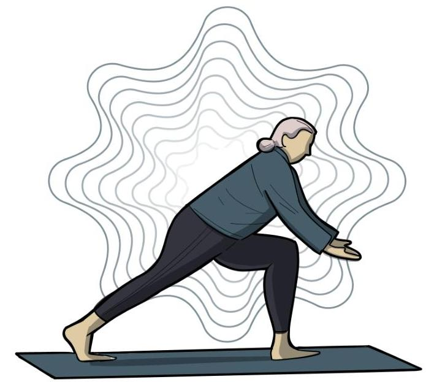

Figure PS.6. Scatterplots. Scatterplots are graphical views of the strength and direction of correlations. The stronger the correlation, the closer the data points are to a straight line. In these examples, we see that there is (a) a positive correlation between weight and height, (b) a negative correlation between tiredness and hours of sleep, and (c) no correlation between shoe size and hours of sleep.Correlational research designs are often used by psychological researchers as they are affordable, time-efficient, and usually can be conducted without much equipment. Online survey platforms have made data collection easier than ever. Correlational research does not even necessitate collecting data if researchers have access to archival databases. We can also use correlational designs to make predictions. For example, if you're on a team that decides who gets into a graduate program, and there are lots of applications but only a few spots, you could use correlations between current students' GPA and their scores on standardized tests like the GRE or GMAT to predict which applicants might succeed in the graduate program.

Correlational results can suggest new directions for further research, but such information tells us little about cause and effect; in other words, we cannot know what causes what in correlational research. Consider a researcher who hypothesizes violent TV causes more aggressive play in children. They collect data from Grade 4 children on Variable 1: the hours of violent TV shows watched by each child weekly and Variable 2: how aggressively each child plays on the school playground. A positive correlation between Variable 1 and Variable 2 appears to support the researcher's hypothesis, but it cannot be taken to indicate that viewing violent television causes aggressive behaviour, as other explanations exist: aggression at school might lead to violent TV preference, or a third variable, such as parenting style, could influence both variables. For example, permissive parents might permit violent TV and be less strict about children's aggressive actions.


Figure PS.7. Violent TV watching and aggression. A positive correlation between violent TV watching and aggression can be interpreted in three ways: (1) Watching violent TV shows causes children to act aggressively. (2) Children who act aggressively also like to watch violent TV shows. (3) Other factors, such as permissive parenting style, cause more violent TV-watching and more aggressive behaviour in children.To recap, whenever we find a correlation between two variables, $X$ and $Y$, that is not zero, there are three possible ways of explaining this result: (1) $X$ might cause $Y$; (2) $Y$ might cause $X$; (3) some uninvestigated third variables (e.g., Z) might cause both $X$ and $Y$. For the below examples, can you provide three different interpretations? In each case, identify variables $X, Y$, and $Z$ :

- A positive correlation between dark chocolate consumption and health.
- A negative correlation between sleep and smartphone use.
- A positive correlation between self confidence and test scores.

A negative association between time spent exercising and consumption of junk food.Unfortunately, people mistakenly make causal conclusions from correlational findings all the time. For example, recent research found that people who eat cereal on a regular basis achieve healthier weights than those who rarely eat cereal (De La Hunty \& Ashwell, 2007; Frantzen et al., 2013). Guess how the cereal companies report this finding. Does eating cereal really cause an individual to maintain a healthy weight, or are there other possible explanations, such as, someone at a healthy weight is more likely to regularly eat a healthy breakfast than someone who avoids meals in an attempt to diet? Again, correlation does not mean causation. The only way to establish that there is a cause-and-effect relationship between two variables is to conduct a scientific experiment.

# Experimental Research 

The goal of experimental research design is to provide potential explanations about the causal relationships among the variables. The most basic experimental design involves two groups: the experimental group and the control group. The two groups are designed to be the same except for one difference - experimental manipulation: the experimental group gets the treatment being tested and the control group does not. Since experimental manipulation is the only difference between the experimental and control groups, we can be sure that any differences between the two are due to experimental manipulation rather than by chance.

To investigate the relationship between observed aggression and imitated aggressive behaviour in children, our experimental manipulation will be to allow children to observe an adult modeling aggressive behaviour. We might have the children in our experimental group play in a room where they are able to observe adults playing aggressively with toys, hitting, pushing andyelling at them. The study we are describing here is actually a simplified version of Bandura and colleagues' (1961) famous Bobo doll study.
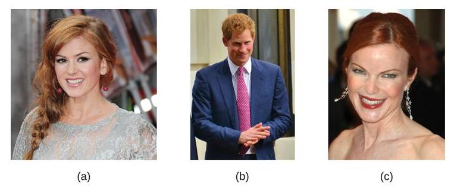

Figure PS.8. The Bobo doll. The Bobo doll, a bowling pin shaped inflatable toy with a clown printed on it. The toy is heavier at the base than it is at the top, so it rocks back and forth without falling over when pushed or struck.

In our experimental condition, children will observe an adult playing with the Bobo doll in an aggressive way, whereas children assigned to our control condition will see the adult playing with the doll in a non-aggressive way. The two conditions will be the same in all other ways, such as children's gender ratio, the adult model's gender, the location of the Bobo doll in the room, and the length of time for observation. At the beginning of our experiment, we must randomly assign the participants into these two conditions. This is called manipulation of the independent variable. With the current design, we only have one independent variable - the type of behaviour observed by the children, which varies across two conditions: experimental (aggressive) and control (non-aggressive). We may also include a second independent variable the match between the adult model's gender and the child observer's gender. However, since researchers cannot use random assignment to manipulate many variables, such as gender, age, cultural background, and educational level, we don't use the word "manipulate" for these participant variables. Instead, we "compare" the condition when the model's gender matches the child' gender (e.g., assigning a female model to a female observer) and the condition when their genders are unmatched (e.g., assigning a male model to a female observer). We also need toidentify and measure our dependent variables. The dependent variable is the outcome on the measure of interest that is dependent on the actions of the independent variable. In our example, the dependent variable is the number of modelled aggressive behaviours our participants imitate.

One of the most important parts of a scientific study is having a clear description of how each variable is measured. Researchers often create different operational definitions of the same variable. In our Bobo doll study, we need to decide how we can measure aggression, which could be described in a variety of ways. For example, one might define aggression as a destructive tendency caused by frustration. Then we could measure aggression by asking how frustrated participants feel. Self-report is often used when the variable is not externally observable. Alternatively, we may operationally define aggression with physiological measures; we can test participants' physiological arousal (such as heart rate or blood pressure) in response to a frustrating situation. For the purposes of our current experiment, we could define aggressive behaviour as overt actions that have the potential to cause harm to the Bobo doll, including kicking the doll, throwing it, or saying things like "stupid doll," which imitate our adult models' aggressive behaviour observed earlier. In this case, we are using behavioural measures.

To illustrate how complicated operational definitions can be, let's look at another variable investigated in the original Bobo doll study. Bandura and colleagues were not only interested in whether children would imitate aggressive behaviours, they also wanted to know if observing same-sex adults would have a greater impact on children's behaviour than observing adults of a different sex. To clarify, we now use "sex" to refer to the different biological categories people might fit into, while "gender" refers to the socially constructed characteristics we assign to those categories and is something an individual must define for themselves.

- Option 1 - Behavioural Measures. In this approach, researchers would record "sex" based on their visual assessment of the clothed participant. This might work for many individuals, but it may not be generalised to a broader population. There are female humans with beards, male humans without Adam's apples, and of course, transgender, non-binary, and intersex people whose bodies may not fit these assumed categories.
- Option 2 - Archival Data. Sex may be assessed simply by looking at participants' medical records or birth certificates. However, biological sex assignment of infants at birth is often based on a visual assessment of external genitals, which is used to categorise the infant as "male" or "female." A larger problem is that this method of sex assignment at birth has been incredibly harmful to intersex people.
- Option 3 - Self-Report. To avoid the issues described above, it may seem reasonable to ask participants to self-identify. However, the validity of self-report is reliant upon the researchers providing appropriate categories (e.g., has intersex been included as an option) and the participant being truthful. Participants may not readily volunteer this information.- Option 4 - Physiological Measures. The biological sex of an individual is determined by more than their external genitals. Some other determinants of biological sex include the internal gonads (ovaries or testes), predominant hormones (testosterone or estrogen), and chromosomal DNA (e.g., XX, XY). Physiological measures may provide the most objective, reliable, and valid data compared to other methods. The biggest challenge of using physiological measures is that researchers must have the knowledge to choose the proper device and interpret the data.

It is worth exploring the details of the methods to understand how researchers have actually measured biological sex and whether their approach may impact the validity of their conclusions. In the original Bobo doll study, participants were divided into male-female categories. There is no mention of biological measures being taken so we can assume that sex categorisation was based on visual assessment or by report from the children's parents.

We know now that this is not an accurate way to measure biological sex, so we should consider why sex was even included in the experiment. Given that children were found to perceive their parents as having preferences for them to behave in 'sex appropriate' ways (e.g., girls playing with dolls and boys playing with trucks), the researchers hypothesized their participants would be more likely to imitate the behaviour of a same-sex model than a model of a different sex. They were interested in the effect that socially reinforced gender roles would have on imitated behaviour, so the assumed sex of the children was all that mattered, as this would determine what behaviours would be discouraged or reinforced by adults. It's ok that no biological measures were taken for this study because biological sex wasn't actually relevant, but terms like sex and gender have often been used interchangeably in research, so it's important to think critically about how constructs are being operationally defined and measured. If Bandura and colleagues were to replicate this study today, we should hope that they would be more accurate and specific with their terminology and use something like "assumed sex/gender" rather than "sex" to refer to the variable they were interested in. After all, this kind of specificity in language allows for more accurate understanding and replication, which can increase our confidence in their original conclusion.

Manipulating the independent variable causes the change of the dependent variable. In other words, the dependent variable depends on the independent variable. In our Bobo doll study, the children observing aggressive behaviour will act aggressively and the children observing nonaggressive behaviour will not act aggressively.

Figure PS.9. The Bobo doll - aggressive behaviour. Manipulations of the independent variable are expected to result in changes in the dependent variable. In the Bobo doll study, after observing an adult interacting with the doll in an aggressive way, the children also played with the doll aggressively.

As we know, we can only say that observing an adult's aggressive behaviour is the cause of children's aggression if it is the only difference between the experimental and control groups. This means we must control all the confounding variables that may also influence the study's results.

Now, let's explore some examples of confounding variables. To begin with, participants must be randomly assigned to the conditions so that there are no differences between the groups. This should also be a single-blind procedure - participants are unaware as to which group they are in (experiment or control group) while the researcher who developed the experiment knows which participants are in each group.

Ideally, the people who count imitated behaviours are unaware of who was assigned to the experimental or control group, in order to control for experimenter bias. Experimenter bias refers to the tendency that a researcher might interpret the results in favour of their hypotheses. If the observers know which child is in which group, it will influence how they interpret ambiguous responses, such as squeezing the doll. With the double-blind procedure, both the researchers and the participants are blind to group assignments, which allows us to control for both experimenter and participant expectations.

A well-known example of the power of expectations is the placebo effect. The placebo effect occurs when people's expectations or beliefs influence their experience in a given situation. In other words, simply expecting something to happen can actually make it happen. As a result, we might use a placebo control, where the only difference between the experimental condition and the control condition is the critical treatment. In medical research, a placebo is a type ofmedication that looks like the real drug but is actually chemically inert, sometimes referred to as a "sugar pill." The placebo control is necessarily followed by a single/double-blind procedure. If participants know whether they have received the drug, we will not be able to tell whether the effects were due to expectations about drug efficacy or to the actual drug. Similarly, if the researchers know which participants are receiving the drug, they may treat participants differently, which will alter the way participants respond.


Figure PS.10. Placebo effect. Providing the control group with a placebo treatment protects against bias caused by expectancy, or a "placebo effect."

Researchers may manipulate independent variables between subjects or within subjects. In a between-subject design, participants are randomly assigned to one of the conditions. This way, we can assume the experimental group and the control group are equivalent prior to experimental manipulation. Alternatively, we may ask each participant to fulfill all the conditions. This is called a within-subject design. For example, suppose that you are preparing for an exam and want to find out which method leads to a better recall: A, reading the material aloud by yourself or B, listening to someone read it to you. To compare these two methods, you can memorise a short essay using Method A and take a test on it; then, memorise another short essay using Method B, and test it. Within-subject designs are less affected by individual differences among participants because the participants are compared to themselves. In addition, fewer participants are required because each participant will provide data for all the conditions. However, if researchers use within-subject design, they must control the possible confounding variables by counterbalancing the sequence of conditions. For example, half of participants first experience Treatment A and then Treatment B, while the other half experience Treatment B first and then Treatment A. In many cases, within-subject design is not feasible.Take our Bobo doll study for instance. Once the children learn how to play with the doll aggressively, can they unlearn the behaviour?

In contrast to correlational research, experimental designs have two very nice features. For one, they guarantee that the independent variable occurs prior to the measurement of the dependent variable. This eliminates the possibility of reverse causation. Second, the influence of confounding variables is controlled, and thus eliminates the possibility that the confound caused the results, not the independent variable.

Despite the advantage of determining causation, experiments do have limitations. One is that they are often conducted in laboratory situations rather than in the everyday lives of people. Therefore, we do not know whether results that we find in a laboratory setting will necessarily hold up in everyday life. Often researchers are forced to balance the need for experimental control with the use of laboratory conditions that can somewhat mimic real life. Additionally, it is very important to understand that a large proportion of psychology research is not experimental for a variety of practical and ethical reasons. For example, examining the effect of eating on development can't be tested in a lab as it would be unethical to have one group eat while another group doesn't, and then see the difference present.

# Summary 

The Table PS. 1 summarises the strengths and weaknesses for each type of research.
Table PS.1. Advantages and disadvantages of three major research designs

| Research Design | Advantages | Disadvantages |
| :--: | :-- | :-- |
| Descriptive | Provides a relatively complete <br> picture of what is occurring at a <br> given time. Allows the <br> development of questions for <br> further study. | Does not assess relationships <br> among variables. Cannot be used <br> to draw inferences about cause <br> and effect. |
| Correlational | Allows testing of expected <br> relationships between and <br> among variables and the making <br> of predictions. Can assess these <br> relationships in everyday life <br> events. | Cannot be used to draw <br> inferences about cause and <br> effect. |
| Experimental | Allows conclusions to be drawn <br> about the causal relationships <br> among variables. | Cannot experimentally <br> manipulate many important <br> variables. May be unethical or <br> time-consuming. |Table adapted from Stangor (2011).
Watch this video: Psychological Research: Crash Course Psychology \#2 (11 minutes)

One or more interactive elements has been excluded from this version of the text. You can view them online here: https://opentextbc.ca/psychologymtdi/?p=67\#oembed-1
"Psychological Research: Crash Course Psychology \#2" video by CrashCourse is licensed under the Standard YouTube licence.

# Image Attributions 

Figure PS.3. "Gizmodo Survey - Media" by avlxyz is licensed under CC BY-SA 2.0.
Figure PS.4. Credit "paper files": modification of work by "Newtown graffiti"/Flickr licensed under a CC BY 2.0 license; "computer": modification of work by INPIVIC Family/Flickr licensed under a CC BY 2.0 license.

Figure PS.5. From Jane Goodall, by M. Neugebauer, n.d. (https://denstoredanske.lex.dk/ Jane_Goodall by Michael Neugebauer, courtesy of The Jane Goodall Institute). Public Domain image.

Figure PS.6. Figure 2.12 as found in Psychology 2e by OpenStax is licensed under a CC BY 4.0 license.

Figure PS.7. Original image created for this text and is under a CC BY-NC-SA license.
Figure PS.8. "Bobo doll" by Sémhur, TilmannR is licensed under CC BY-SA 4.0.
Figure PS.9. Bobo Doll Deneyi by Okhanm from Wikimedia Commons, licensed under a CC BY-SA 4.0 license.

Figure PS.10. "Cebocap" from the National Institute of Health, donated by Elaine and Arthur Shapiro, is in the public domain.Designing Research in Psychology Copyright © 2024 by Amelia Liangzi Shi is licensed under a Creative Commons Attribution-NonCommercial-ShareAlike 4.0 International License, except where otherwise noted.84 | Chapter 3. Psychological Science# Conducting Ethical Research 

AMELIA LIANGZI SHI

Approximate reading time: 11 minutes

Learning Objectives

By the end of this section, you will be able to:

- Discuss how research involving human subjects is regulated
- Summarise the processes of informed consent and debriefing
- Explain how research involving animal subjects is regulated


## Research Involving Humans

Any experiment involving the participation of human subjects is governed by extensive, strict guidelines designed to ensure that the experiment does not result in harm. In Canada, there are two bodies that provide guidelines for ethical human research that must be adhered to. The Canadian Psychological Association has a code of ethics that members must follow (Canadian Psychological Association, 2017). The Tri-Council Policy Statement 2 (TCPS 2) is the most recent set of guidelines for ethical standards in research adhered to by those doing research with human subjects (Canadian Institutes of Health Research, Natural Sciences and Engineering Research Council of Canada, \& Social Sciences and Humanities Research Council of Canada, 2022). The TCPS 2 is based on three core principles: respect for persons, concern for welfare, and justice. Details on these core principles are found in TCP2 Article 1.1.

Any research institution that receives federal support for research involving human participants must have access to an institutional review board (IRB). The IRB is a committee of individuals often made up of members of the institution's administration, scientists, and community members. The purpose of the IRB is to review proposals for research that involves human participants. The IRB reviews these proposals with the principles mentioned above in mind, and generally, approval from the IRB is required in order for the experiment to proceed.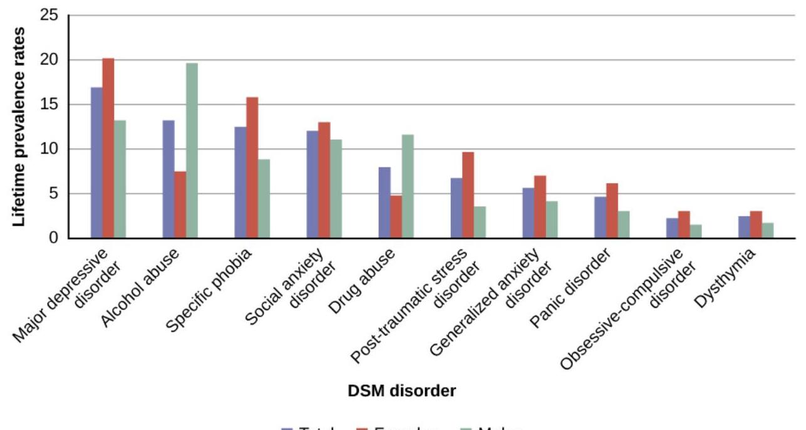

Figure PS.11. Institutional review board meeting. An institution's IRB meets regularly to review experimental proposals that involve human participants.

An institution's IRB requires several components in any experiment it approves. For one, each participant must provide an informed consent before they can participate in the experiment. In cases where research participants are under the age of 18, the parents or legal guardians are required to sign the informed consent form. An informed consent form contains a written description of what participants can expect during the experiment, like potential risks and implications of the research. It also lets participants know that their involvement is completely voluntary and can be discontinued without penalty at any time. Students in psychology classes may be allowed, or even required, to participate in research, but they are also always given an option to perform other activities instead. Additionally, once an experiment begins, the research participant is always free to leave the experiment if they wish. Concerns with free choice also occur in institutional settings such as schools, hospitals, corporations and prisons, when individuals are required by the institutions to take certain tests or when employees are told to participate in research.

Furthermore, the informed consent guarantees that any data collected in the experiment will remain completely confidential. In some cases, data can be kept anonymous by not having the respondents put any identifying information on their questionnaires. In other cases, the data cannot be anonymous because the researcher needs to keep track of which respondent contributed the data. In this case, one technique is to have each participant use a unique code number to identify their data, such as the last four digits of the student ID number. In this way, the researcher can keep track of which person completed which questionnaire, but no one will be able to connect the data with the individual who contributed them.

While the informed consent form should be as honest as possible in describing exactly whatparticipants will be doing, sometimes deception is necessary to prevent participants' knowledge of the exact research question from influencing the results of the study. Deception involves purposely misleading experiment participants in order to maintain the integrity of the experiment, but not to the point where the deception could be considered harmful. For example, if we are interested in how our opinion of someone is affected by their attire, we might use deception in describing the experiment to prevent that knowledge from affecting participants' responses. Researchers must balance the use of deception, like not disclosing the true purpose of the study, with potential harm to the participants. The use of deception must be justified. In cases where deception is involved, participants must receive a full debriefing upon conclusion of the study: complete, honest information about the purpose of the experiment, the ways in which the data collected will be used, the reasons why deception was necessary, and the process to obtain additional information about the study.

Today, scientists agree that good research is ethical in nature and guided by a basic respect for human dignity and safety. Unfortunately, the ethical guidelines that exist for research today were not always applied in the past. In 1932 poor, rural, Black, male sharecroppers from Tuskegee, Alabama, were recruited to participate in an experiment conducted by the US Public Health Service, with the aim of studying syphilis in Black men. In exchange for free medical care, meals, and burial insurance, 600 men agreed to participate in the study - 399 who tested positive for syphilis and 201 who did not have the disease. However, those individuals that tested positive were never informed that they had the disease. While there was no treatment for syphilis when the study began, by 1947 penicillin was recognised as an effective treatment for the disease. Despite this, no penicillin was administered to the participants in this study, and the participants were not allowed to seek treatment at any other facilities if they continued in the study. Over the course of 40 years, many of the participants unknowingly spread syphilis to their wives (and subsequently their children born from their wives) and eventually died because they never received treatment for the disease. This study was discontinued in 1972 when the experiment was discovered by the National Press (Tuskegee University, n.d.). The resulting outrage over the experiment led directly to the National Research Act of 1974 and the strict ethical guidelines for research on humans. Visit the CDC's Tuskegee Timeline to learn more.

Figure PS.12. Untreated syphilis study at Tuskegee. For 40 years starting in 1932, medical workers in the segregated South withheld treatment for unsuspecting men infected with syphilis, simply so doctors could track the effects of the illness and examine their bodies after death.

# Research Involving Animals 

Many psychologists conduct research involving animal subjects. Because many basic processes in animals are sufficiently similar to those in humans, these animals are acceptable substitutes for research that would be considered unethical in human participants. However, this does not mean that animal researchers are exempt from ethical concerns. The following are the Canadian Psychological Association's (2017) guidelines on research with animals.

Research involving animals must:

- Treat animals humanely and not expose them to unnecessary discomfort, pain, or disruption.
- Not use animals in their research unless there is a reasonable expectation that the research will increase understanding of the structures and processes underlying behaviour, or increase understanding of the particular animal species used in the study, or result in benefits to the health and welfare of humans or other animals.
- Keep themselves up to date with animal care legislation, guidelines, and best practices, if using animals in direct service, research, teaching, or supervision.
- Use a procedure subjecting animals to pain, stress, or privation only if an alternative procedure is unavailable and the goal is justified by its prospective scientific, educational, or applied value.
- Submit any research that includes procedures that subject animals to pain, stress, orprivation to an appropriate review panel or committee for review.

- Make every effort to minimise the discomfort, illness, and pain of animals. This would include using appropriate anaesthesia, analgesia, tranquilization and/or adjunctive relief measures sufficient to prevent or alleviate animal discomfort, pain, or distress, when using a procedure or condition likely to cause more than short-term, low-intensity suffering. It also would include, if killing animals at the termination of a research study, doing so as compassionately and painlessly as possible.
- Use animals in classroom demonstrations only if the instructional objectives cannot be achieved through the use of electronic recordings, films, computer simulations or other methods, and if the type of demonstration is warranted by the anticipated instructional gain." (p. 24)

Animal experimental proposals are reviewed by an Institutional Animal Care and Use Committee (IACUC). An IACUC consists of institutional administrators, scientists, veterinarians, and community members. No animal research project can proceed without the committee's approval. This committee also conducts semi-annual inspections of all animal facilities to ensure that the research protocols are being followed.


Figure PS.13. Research on animals. Psychologists may use animals in their research, but they make reasonable efforts to minimise the discomfort the animals experience.

Opinions about using animals in research vary from wanting to completely stop using animals for research to strongly supporting it (Ormandy \& Schuppli, 2014). Some people argue that it is morally unacceptable to experiment on animals, while others recognise the importance of animal research. For instance, drugs that can reduce the incidence of cancer or AIDS may be tested on animals first, and surgical procedures that can save human lives may be practiced on animals first. Furthermore, research on animals has contributed to a better understanding ofthe physiological reasons behind depression, phobias, stress, and various other illnesses. Considering the benefits that animal research brings, many scientists believe that this kind of research can and should continue, as long as we ensure the humane treatment of the animals involved.

# Image Attributions 

Figure PS.11. "IHA Board Meeting 56" by International Hydropower Association is licensed under a CC BY 2.0 license.

Figure PS.12. "Photograph of Participants in the Tuskegee Syphilis Study" by the Department of Health, Education, and Welfare, n.d., in the National Archives Catalogue is in the public domain.

Figure PS.13. "Wistar rat" by Janet Stephens is in the public domain.

## (0) (0)

Conducting Ethical Research Copyright © 2024 by Amelia Liangzi Shi is licensed under a Creative Commons Attribution-NonCommercial-ShareAlike 4.0 International License, except where otherwise noted.# Interpreting Research 

AMELIA LIANGZI SHI

Approximate reading time: 12 minutes

## Learning Objectives

By the end of this section, you will be able to:

- Understand descriptive statistics and know how to produce them.
- Understand inferential statistics and why they are used.

Once data is collected from the research participants, a set of statistical analyses is conducted to interpret the results. Descriptive statistics organise and summarise some important properties of the data set. Researchers usually describe the central tendency and variability of a data set; this allows them to quickly make some basic interpretations about the results of a large sample of people. They may also use frequency distributions and histograms to visualize the data set. Inferential statistics provide researchers with the tools to make inferences about the meaning of the results, specifically about generalising from the sample they used in their research to the greater population that the sample represents. In experimental studies, researchers run inferential statistics to determine the likelihood that the effect of treatment is due to chance (and thus not meaningful). Generally, psychologists consider differences to be statistically significant if there is less than a five percent chance of observing them if the groups did not actually differ from one another. Stated another way, psychologists want to limit the chances of making false-positive claims to five percent or less.

## Descriptive Statistics

Let's work through a hypothetical example to show how descriptive statistics help researchers to understand their data. Let's assume that we have asked 40 people to report how many hours of moderate-to-intense physical activity they get each week. Let's begin by constructing a frequency distribution of our hypothetical data that will show quickly and graphically what scores we have obtained.Table PS.2. Descriptive statistics

| Hours of exercise | Number of participants |
| :-- | :-- |
| 1 | 3 |
| 2 | 5 |
| 3 | 8 |
| 4 | 7 |
| 5 | 8 |
| 6 | 7 |
| 7 | 2 |
| 8 | 1 |

We can now plot a histogram that will show the frequency (i.e., number of participants) as a function of exercise hours. Note how easy it is to see the shape of the frequency distribution of scores.


Figure PS.13. Histogram. Histogram of exercise frequency.

Many variables that interest psychologists have distributions where most of the scores arelocated near the centre of the distribution, the distribution is symmetrical, and it is bell-shaped. A data distribution that is shaped like a bell is known as a normal distribution. Normal distributions are common in human traits, such as intelligence, height, and shoe size. Relatively few people are either extremely high or low scorers, and most people fall somewhere near the middle.


Figure PS.14. Normal Distribution. The distribution of the heights of the students in a class will form a normal distribution. In this sample the mean $(M)=67.12$ inches $(170.48 \mathrm{~cm})$ and the standard deviation $(S D)=2.74$ inches $(6.96 \mathrm{~cm})$. [Image Description]

A distribution can be described in terms of its central tendency - that is, the point in the distribution around which the data are centred - and its variability or spread. The arithmetical average, or mean, denoted by the letter $M$, is the most commonly used measure of central tendency. It is computed by calculating the sum of all the scores of the variable and dividing this sum by the number of participants in the distribution, denoted by the letter N. In the data presented in Figure PS.14, the mean height of the students is 67.12 inches ( 170.48 cm ).

In some cases, however, the data distribution is not symmetrical. This occurs when there are one or more extreme scores, known as outliers, at one end of the distribution. In Figure PS.15, you can see the variable of family income, which includes an outlier at a value of $\$ 3,800,000$. In this case, the mean is not a good measure of central tendency. It appears from the histogram that the central tendency of the family income variable should be around $\$ 70,000$. But again, because of the outlier, the mean family income is actually $\$ 223,960$. The single very extreme income has a disproportionate impact on the mean, resulting in a value that does not well represent the central tendency.

Figure PS.15. Non-Symmetrical Distribution. The distribution of family incomes is likely to be non-symmetrical because some incomes can be very large in comparison to most incomes. In this case, the median or the mode is a better indicator of central tendency than is the mean. [Image Description]

The median is used as an alternative measure of central tendency when distributions are not symmetrical. The median is the score in the centre of the distribution, meaning that $50 \%$ of the scores are greater than the median and $50 \%$ of the scores are less than the median. In our case, the median household income of $\$ 73,000$ is a much better indication of central tendency than is the mean household income of $\$ 223,960$.

A final measure of central tendency, known as the mode, represents the value that occurs most frequently in the distribution. You can see from the histogram that the mode for the family income variable is $\$ 93,000$; it appears four times.

In addition to summarising the central tendency of a distribution, descriptive statistics convey information about how the scores of the variable are spread around the central tendency. Variability of a data set refers to the extent to which individual data points or values in the set differ from each other or from a central measure, such as the mean or median. In other words, it measures the spread or range of values within the data set. A data set with low variability has data points that are relatively close to each other, while a data set with high variability has data points that are more widely dispersed.

Figure PS.16. Low Variability and High Variability. When data are normally distributed, it is easy to see the difference between (a) a data set with low variability and (b) a data set with high variability.

One simple way to measure variability is to find the maximum score (i.e., the largest number in the data set) and the minimum score (i.e., the smallest number in the data set) and to compute the range of the variable as the maximum observed score minus the minimum observed score. In the previous example (Figure PS.14), the range of height is $72-62=10$.

The standard deviation, or SD, is the most commonly used measure of variability around the mean. Distributions with a larger standard deviation have more spread. Those with small deviations have scores that do not stray very far from the average score. Thus, standard deviation is a good measure of the average deviation from the mean in a set of scores. In the examples above, the SD of height is 2.74 , and the SD of family income is 745,337 . Standard deviation can be useful to compare the variability across samples. For example, a professor can keep track of student grades over many semesters. If the standard deviations are similar from semester to semester, this indicates that the amount of variability in student performance is fairly constant. A standard deviation that suddenly goes up indicates that there are more students with very low scores, very high scores, or both.

The standard deviation in the normal distribution has some interesting properties.
Approximately 68\% of the data fall within 1 standard deviation above or below the mean score: $34 \%$ fall above the mean, and $34 \%$ fall below. In other words, if a variable is normally distributed (e.g., height and IQ), approximately $2 / 3$ of the population are within 1 standard deviation around the mean. Likewise, the 2 standard deviations account for $95 \%$ of the population, and the 3 standard deviations include almost everyone (99.73\%).

Figure PS.17. Standard Deviation. For the normal distribution, $68.27 \%$ of the scores are within 1 standard deviation from the mean; while $95.45 \%$ are within 2 standard deviations from the mean; and 3 standard deviations account for $99.73 \%$ of the scores.

# Inferential Statistics 

Descriptive statistics are useful in providing an initial way to describe and summarise a data set, but they are limited in informing us how meaningful the data are. The second step in analyzing data requires inferential statistics, such as $t$-tests. These tests are commonly used to assess the probability that observed results were due to chance. They allow researchers to generalise from the sample they used in their research to the greater population that the sample represents. Effect sizes are commonly used to estimate how large an effect has been obtained.

In the simplest, non-mathematical terms, the $t$-test is the researcher's estimate of how likely it is that the observed group differences were statistically significant, as opposed to simply the result of chance. The $t$-test goes beyond just comparing means and can determine statisticalsignificance even when the differences between experimental conditions are small; conversely, it might not find significance even when differences seem large. This shows the importance of considering inferential statistics like the $t$-test in evaluating the significance of experimental findings.

Typically, if a $t$-test shows that a result has a less than $5 \%$ probability of being due to chance alone, the result is considered to be real and to generalise to the population. If it shows that the probability of chance causing the outcome is greater than $5 \%$, it is considered to be a nonsignificant result and, consequently, of little value; non-significant results are more likely to be chance findings and, therefore, should not be generalised to the population. Most researchers use $p$ values to indicate the statistical significance: $p<.05$ means the probability of being caused by chance is less than $5 \%$ and therefore the result is "significant." Although $p$ values provide information about the presence of an effect, they are of little value for informing how large an effect is. For that, we need some measure of effect size. To learn more about why and how to report effect size, read this article: Using Effect Size-or Why the P Value Is Not Enough (Sullivan \& Feinn, 2012).

In summary, statistics are an important tool in helping researchers understand the data that they have collected. Once the statistics have been calculated, the researchers interpret their results. Thus, while statistics are heavily used in the analysis of data, the interpretation of the results requires a researcher's knowledge, analysis, and expertise.

# Image Descriptions 

Figure PS.14. Normal Distribution image description:The height of students in a class

| Height in inches | Number of students |
| :-- | :-- |
| 62 | 2 |
| 63 | 1 |
| 64 | 2 |
| 65 | 1 |
| 66 | 2 |
| 67 | 6 |
| 68 | 4 |
| 69 | 3 |
| 70 | 1 |
| 71 | 1 |
| 72 | 2 |

[Return to Figure PS.14]
Figure PS.15. Non-symmetrical Distribution image description:The family income of families surveyed (Mean $=223,960$ )

| Family income in dollars | Number of families |
| :-- | :-- |
| $\$ 44000$ | 1 |
| $\$ 46000$ | 1 |
| $\$ 48000$ | 2 |
| $\$ 49000$ | 1 |
| $\$ 51000$ | 1 |
| $\$ 56000$ | 1 |
| $\$ 57000$ | 1 |
| $\$ 64000$ | 1 |
| $\$ 67000$ | 1 |
| $\$ 68000$ | 1 |
| $\$ 70000$ | 1 |
| $\$ 73000$ (Median) | 2 |
| $\$ 84000$ | 1 |
| $\$ 93000$ (Mode) | 4 |
| $\$ 94000$ | 1 |
| $\$ 107000$ | 2 |
| $\$ 110000$ | 1 |
| $\$ 110000$ | 1 |
| $\$ 3800000$ | 1 |

[Return to Figure PS.15]

# Image Attributions 

Figure PS.13. Original image created for this textbook and is under a CC BY-NC-SA license.
Figure PS.14. "Normal Distribution" is licensed under CC BY-NC-SA 3.0 license. The creator has asked that they not receive attribution.

Figure PS.15. "Non-Symmetrical Distribution" is licensed under CC BY-NC-SA 3.0 license. The creator has asked that they not receive attribution.Figure PS.16. "Low Variability and High Variability" is licensed under CC BY-NC-SA 3.0 license. The creator has asked that they not receive attribution.

Figure PS.17. Empirical Rule by Dan Kernler is used under a CC BY-SA 4.0 license.

# (1) (1) (1) 

Interpreting Research Copyright © 2024 by Amelia Liangzi Shi is licensed under a Creative Commons Attribution-NonCommercial-ShareAlike 4.0 International License, except where otherwise noted.# Critical Thinking: It Takes Practice 

AMELIA LIANGZI SHI

Approximate reading time: 21 minutes

Learning Objectives

By the end of this section, you will be able to:

- Describe the critical thinking processes
- Appreciate how scientific research can be important in making personal decisions

Critical thinking is a skill essential not only for psychology professionals but for everyone. Critical thinking is the skill you might use when deciding to buy a computer. You might start by considering your brand options, budget, and the features you need. This kind of thinking is about more than just logical reasoning; it involves understanding your values and emotional responses and recognising the biases and assumptions that shape your thoughts. The following is a list of critical thinking practices that will teach you how to ask the right questions, define problems in their full context, and seek out reliable, empirical evidence. It will also remind you to analyze your own biases, integrate your emotional wisdom with a rational analysis, and understand the importance of looking at what might be missing. You'll learn to consider alternative interpretations and embrace the uncertainty that often accompanies complex issues. By the end of this section, you'll have a deeper appreciation of how critical thinking is not just a scientific tool but a valuable life skill. The following is an updated version of Carole Wade's (1995) critical thinking processes.

## Ask Questions and Be Willing to Wonder

Curiosity precedes all scientific discoveries and is the basis for acquiring knowledge. For example, suppose you are interested in exploring what makes people happier: giving or receiving. Questions you might be wondering about could include: Are there certain types of giving that are more likely to lead to happiness? Does receiving gifts make people happier than receiving services? How do you measure happiness anyway? This curiosity and questioning iscrucial in psychology, as it drives the research. In the context of our example, 'Which makes us happier, giving or receiving?', start by questioning common perceptions about happiness linked to giving and receiving. Explore whether societal or cultural norms influence our understanding of happiness in these contexts.

# Define the Problem 

We need to think about exactly what we want to know about the relationship between giving and receiving and happiness. There are many ways to define giving: it might mean donating money to charity for some people, volunteering time for others, or giving gifts to loved ones. Similarly, happiness can be interpreted in various ways, from a fleeting sense of joy to a deeper sense of fulfillment. We need to define the issue or question we are interested in. Clear definitions are vital for conducting focused and meaningful research. For our example, you will need to clarify what aspects of giving and receiving you want to examine. Are you considering emotional, material, or time-based giving? How are you defining happiness in this context - as a momentary feeling or a long-term state of well-being?

## Practice Rigorous Fact-Checking

Always verify the facts and data you encounter, especially when they form the basis of your arguments or conclusions. Consult primary sources such as peer-reviewed journal articles, official reports, and government databases to ensure accuracy and reliability. If the option is available, the best primary source is going to be the first person who made the comment or created the content. This fact-checking practice is foundational in maintaining the integrity and credibility of psychological research. Coming back to our example of the effect of giving and receiving on happiness, you will need to ensure that the data come from credible sources. Look for studies that specifically address these aspects and critically consider their methodologies and conclusions.

## Examine the Evidence

Empirical evidence is essential for critical thinking. While personal stories, like someone feelinghappier after donating to a charity, are interesting, they're just individual experiences and might not apply to everyone. For reliable evidence, we need to look at well-conducted research studies. In psychology, a valuable resource for this is PsycINFO, accessible through university libraries. PsycINFO is a comprehensive database that includes a wide range of scholarly work in psychology. It allows users to search for and often download original research articles, providing a solid foundation for understanding psychological concepts. Empirical evidence helps in distinguishing between anecdotal experiences and scientifically validated facts. For our example, you will need to seek out empirical studies that have investigated the relationship between giving, receiving, and happiness, and compare findings from different studies to see if there is a consensus or if results vary significantly.

# Analyze Assumptions and Biases 

Whenever we are reasoning about an idea, we are bound to begin with certain assumptions. For example, we might assume that giving is more likely to lead to happiness because of the common saying, "It's better to give than to receive." It helps if we can identify how we feel or think about an idea. All people are prone, to some degree, to confirmation bias, which is the tendency to look for evidence that supports your belief while at the same time discounting any that contradicts it. This type of bias might be reflected in the social media accounts we follow; we follow people who think like us and do not follow people who might have opposing, although possibly valid, points of view. Being aware of these biases is a crucial step in critical thinking, as it allows us to question our own perspectives and consider a broader range of viewpoints. So while you are planning the example research topic, reflect on any personal biases you might have regarding the effects of giving and receiving on happiness. Consider how your own experiences, religious beliefs, or cultural background might influence your interpretation of the data.

## Integrate Emotional Awareness with Critical Analysis

Acknowledge and reflect on the emotional responses you have to the content you are considering. Understand that emotions can provide valuable insights. At the same time, you will need to maintain a balance between your emotional experience and your logical reasoning. Unfortunately, it is impossible to think about anything in a completely objective manner. Having a vested interest in an issue or personal knowledge about it often creates an emotional bias thatwe may not even be well aware of. Feeling strongly about something can actually get in the way of our ability to think logically. Consider any issue you feel strongly about. How easy is it to separate your emotions from your objectivity? This integration is essential in psychology, where understanding human behaviour often requires a blend of emotional intelligence and rational analysis. For example, while analyzing studies on giving and receiving, be aware of how your own feelings towards these acts might influence your understanding. Does it make you uncomfortable to accept gifts and favours? Do you like or dislike doing favours for others? Is it easy or hard for you to know what to give? Strive to balance these emotional responses with objective analysis of the research.

# Avoid Oversimplification 

Simplicity is comfortable, but it may not be accurate. We often strive for simple explanations for events because it saves us from the mental work required to understand the issue(s). Thinking is hard work. We may also oversimplify because we may not have access to all of the information we need to fully understand the issue. This limitation can lead us to overlook critical aspects that are essential for a comprehensive understanding. For instance, the act of giving might seem to lead to happiness for one obvious reason, but in reality, it could be influenced by a complex interplay of personal values, cultural norms, and individual psychological factors.

It's important to resist the temptation to settle for the first explanation that comes to mind. Instead, we should cultivate the habit of digging deeper and asking clarifying questions that get at the complexity of an issue. By doing so, we can develop a more complete and full understanding of the issues. Complexity is a natural part of human psychology, and embracing it can lead to more profound and insightful conclusions. Resist the temptation to draw simple conclusions like 'giving always makes people happier than receiving'. Consider the complexities and variables involved, such as the context of giving/receiving and individual differences in what brings happiness.

## Consider What You Don't Know

Sometimes it is easier to see what is in front of us than to imagine what is not in front of us. We should be asking ourselves, "What don't I know about this issue?" Or, "Who is not yet part of this discussion but should be?" Or, "Have I consulted elders and experts who have more experiencewith this issue than I do?" What practices can help you find and pay close attention to what is missing from the discussion? Acknowledging the limits of our knowledge is a sign of intellectual humility and openness, both of which are key in the pursuit of psychological understanding. For our example, question what aspects of the relationship between giving, receiving, and happiness are still unclear or under-researched. Are there cultural or demographic groups whose experiences haven't been adequately studied?

# Consider Alternative Interpretations 

Whenever you hear a news story telling you that something is good for you, it is wise to dig a little deeper. Imagine you come across a news story highlighting a study that claims giving to others improves mental health. A critical thinker would want to know more about how those studies were done. Look beyond the surface of such claims. Investigate how the study was conducted: What was the sample size? Were the participants predominantly from a specific age group or background? Consider the possibility that the type of giving (material versus emotional support) might play a role in mental health outcomes.

It's also important to explore whether there are other factors, like the giver's financial status or personal motivations, that could have influenced these findings. This kind of critical examination helps you understand the complexities behind psychological research and its reporting in the media. Exploring these alternative interpretations can reveal the multifaceted nature of psychological phenomena and prevent oversimplified conclusions. When encountering research that suggests a straightforward relationship between giving/receiving and happiness, consider alternative explanations. Could other factors like social support, personal values, or life circumstances be influencing this relationship?

## Tolerate Uncertainty

Uncertainty is uncomfortable. We want to know why things happen, and for good reasons. We are always trying to make sense of the world, and we look for explanations. However, sometimes things are complicated and uncertain, or we don't yet have an explanation for them. Sometimes we just have to accept that we don't yet have a full picture of why something happens or what causes it. We need to remain open to more information. It is helpful to be able to point out what we don't know as well as what we do. Embracing this uncertainty encouragesus to continue exploring, researching, and learning. It allows us to approach psychological phenomena with a sense of curiosity and humility, acknowledging that our current understanding is incomplete and always evolving. This tolerance for uncertainty is a cornerstone of scientific inquiry, especially in psychology, where human behaviour and mental processes are often not black and white. Acknowledge that the relationship between giving, receiving, and happiness may not be fully understood and that research in this area is ongoing. Be open to new findings and perspectives that might challenge or refine current understanding.

# Siddharth's Critical Thinking in Action 

After the success of his empirical baking experiment, Siddharth reflects on the critical thinking skills he employed throughout his project. His journey in building a community through baking had been more than just mixing ingredients; it was a testament to the power of critical thinking in real-life scenarios.

## Ask Questions and Be Willing to Wonder

Siddharth's project began with curiosity. He wondered how his love for baking could help foster connections among his dorm mates. Questions like "Which baked goods will bring people together?" and "Can the aroma of baking enhance social interactions?" were the seeds that grew into his project.

## Define the Problem

Siddharth needed to pinpoint what he wanted to achieve. He defined his problem as: "How to use baking to create a more socially interactive and inclusive environment in the dorm?" This clear definition guided his entire project.

## Practice Rigorous Fact-Checking

Before starting, Siddharth researched the psychological effects of different aromas and their impact on social behaviour. He called his father who is a renowned professional baker and consulted other credible sources, ensuring his baking choices were backed by scientific evidence.# Examine the Evidence 

Siddharth understood that personal anecdotes about baking bringing people together were not enough. He needed empirical evidence, which led to his methodical approach in Part 2, where he observed and recorded the effects of different baked goods on social interaction.

## Analyze Assumptions and Biases

Initially, Siddharth assumed that chocolate chip cookies would be the most effective in promoting social interaction. However, he recognised this bias and set up his experiment to test this assumption against cinnamon buns, allowing the data to lead to conclusions.

## Integrate Emotional Awareness with Critical Analysis

Siddharth was passionate about baking, but he knew that he needed to balance this enthusiasm with objective analysis. His emotional connection to baking enriched his project, but his critical approach ensured that the results were valid and reliable.

## Avoid Oversimplification

Understanding human behaviour is complex. Siddharth resisted the urge to oversimplify his findings. He acknowledged that factors like time of day, type of baked goods, and individual preferences all played a role in the outcome of his experiment.

## Consider What You Don't Know

Siddharth constantly asked himself what he might be missing. This led him to consider other factors like cultural preferences and dietary restrictions, which influenced his choice of international recipes.

## Consider Alternative Interpretations

When analyzing his results, Siddharth remained open to different interpretations. He understood that while his findings suggested certain trends, they were not definitive answers but rather insights into a complex question.# Tolerate Uncertainty 

Finally, Siddharth embraced the uncertainty inherent in human behaviour studies. He accepted that his project was just a small piece in the vast puzzle of understanding social dynamics and that there was much more to explore and learn.

Through his baking project, Siddharth not only brought his dorm mates together but also honed his critical thinking skills. He realised that these skills were invaluable, not just in academic pursuits but in everyday life.

Watch this video: 5 tips to improve your critical thinking (4.5 minutes)

One or more interactive elements has been excluded from this version of the text. You can view them online here: https://opentextbc.ca/psychologymtdi/?p=81\#oembed-1
"5 tips to improve your critical thinking - Samantha Agoos" video by TED-Ed is licensed under the Standard YouTube licence.

## (0) (0) (0)

Critical Thinking: It Takes Practice Copyright © 2024 by Amelia Liangzi Shi is licensed under a Creative Commons Attribution-NonCommercial-ShareAlike 4.0 International License, except where otherwise noted.# Chapter Resources 

AMELIA LIANGZI SHI

## Key Takeaways

## Key Takeaways

1. The scientific method involves testing ideas (theories and hypotheses) against real-world observations.
2. Theories explain observed phenomena and are tested through hypotheses that predict behaviour.
3. A good theory is parsimonious, suggests future research, and is falsifiable.
4. Hypotheses bridge abstract concepts and the real world, often using if-then statements.
5. Deduction tests theories against observations, while induction formulates theories from observed patterns.
6. Operational definitions specify how variables are measured to ensure clarity and replication.
7. Peer-reviewed journals maintain quality control by having experts assess research quality and ethical conduct.
8. Replication of studies is crucial to assessing reliability and preventing unnecessary duplication of research. The field faces a replication crisis, with some studies not replicating or showing reduced effect sizes. Collaborative efforts, like the Psychological Science Accelerator, aim to enhance study design transparency and data sharing for more reliable results.
9. Researchers use case studies to deeply understand individuals or phenomena. Surveys gather information through questionnaires, ensuring a broader perspective.
10. Observing behaviour in its natural context (naturalistic observation) or a controlled environment (laboratory observation) helps researchers understand real-life actions. Naturalistic observation offers realistic insights, but setting up and controlling such studies can be challenging. Conducted in a controlled environment, this method allows more control but may sacrifice ecological validity.
11. Surveys collect data from a sample, representing a larger population. However, unrepresentative samples limit the generalisability of findings. Researchers historically focused on WEIRD samples, but diverse samples are crucial for more accurate psychological generalisations.
12. Utilising existing databases (archival research) can provide a wealth of information without direct participant interaction.
13. Affordable and time-efficient, correlational research is employed for predictions and exploring relationships. While it suggests associations, it cannot determine causation. Multiple explanations, such as third variables, may exist.
14. A correlation coefficient indicates the strength (the absolute value) and direction (the sign) of relationships between variables. The closer the coefficient is to 1 , the stronger the relationship. Positivecorrelations mean that variables move together, while negative correlations indicate opposite movements.
15. People often mistake correlation for causation, leading to misleading conclusions. True cause-and-effect relationships require scientific experiments.
16. Experimental research aims to explain causal relationships among variables. The independent variable (manipulated) influences the dependent variable (measured outcome).
17. Factors that can influence study results must be controlled. Random assignment, placebo controls, single-blind, and double-blind procedures help to reduce bias.
18. In an experiment, participants experience either one condition (between-subject) or multiple conditions (within-subject). Counterbalancing helps to control for sequence effects in within-subject designs.
19. Clear descriptions of how variables are measured consider various methods like self-report, physiological measures, and behavioural observations.
20. Not all research can be experimental, due to ethical concerns or impracticality, emphasising the importance of diverse research methods.
21. While experimental research provides valuable insights into causation, researchers must navigate limitations and balance control with real-world applicability.
22. Researchers follow guidelines from organisations like the Tri-Council Policy Statement 2. These guidelines emphasise respect, concern for welfare, and justice.
23. Any research institution getting federal support must have an Institutional Review Board (IRB). The IRB reviews proposals, ensuring that they align with ethical principles before experiments proceed.
24. Participants must agree willingly and be informed about the study's details, potential risks, and implications. Parents sign for participants under the age of 18. Participants can leave the study anytime without penalty. Data collected must remain confidential.
25. Sometimes researchers use deception to prevent biases. Deception must be justified and balanced with potential harm. Participants must receive full debriefing afterward.
26. Research should benefit the understanding of animal behaviour or human/animal health. Opinions about animal research vary. Some argue against it on moral grounds, while others highlight its importance in medical advancements.
27. Careful consideration is given to minimising discomfort, pain, and distress in animals.
28. Descriptive statistics help researchers understand and summarise data collected from participants. Researchers use measures like central tendency (mean, median, mode) to understand the location of data centers. Variability measures (range, standard deviation) show the spread of data points.
29. Many variables in psychology follow a bell-shaped, symmetrical pattern called a normal distribution.
30. Outliers (extreme scores) can affect the mean, making the median or mode more suitable in nonsymmetrical distributions.
31. Inferential statistics help researchers make inferences about the population based on their sample. Researchers use $t$-tests to assess the probability that observed results are not due to chance. If the probability is less than $5 \%$, the result is considered significant.
32. Effect size measures the size of an effect, beyond statistical significance. It provides information about the practical significance of the results.
33. While statistics analyze data, interpretation requires a researcher's knowledge and expertise.
34. Critical thinking is a vital life skill, essential for everyday decision-making, not just for professionals.
35. It involves logical reasoning, understanding values, emotional awareness, and recognising biases and assumptions.# Student Engagement Ideas 

1. Imagine you're a researcher planning a study. Sketch out the details of your experiment, considering variables, groups, and what you want to find out. Share and discuss your designs with the class.
2. Read and analyze articles from psychological journals. Understand how research is communicated in scholarly settings. Discuss the structure, language, and key components of research articles.
3. Explore cross-cultural research. Discuss how cultural factors can influence research outcomes. Analyze studies conducted in different cultural contexts and consider the implications for generalisability.
4. Start a critical thinking journal. Reflect on your thoughts about research methodologies, biases, and assumptions. Challenge yourself to think critically and question your own perspectives.

## References

The reference list for this chapter has been excluded from this file to reduce page count. The full reference list can be viewed online at opentextbc.ca/psychologymtdi/chapter/psychological-sciences-chapter-resources/.

## Chapter Attribution

"Psychological Science" was written and adapted by Amelia Liangzi Shi and is licensed under a CC BY-NC-SA 4.0 licence. It was adapted and remixed from "1.1 Psychology as a Science" and "Chapter 2. Psychological Science" in Psychology - 1st Canadian Edition by Sally Walters, which is licensed under a CC BY-NC-SA 4.0 licence, and "Psychological Research" in Introduction to Psychology \& Neuroscience (2nd Edition) edited by Leanne Stevens, Jennifer Stamp, \& Kevin LeBlanc, which is licensed under a CC BY 4.0 licence.# About the Author: Amelia Liangzi Shi 

## College of New Caledonia

I — Amelia Liangzi Shi (Chinese: 石靚子) — am a Chinese Canadian woman, and I bring a diverse range of experiences and perspectives to my role as a psychology instructor at the College of New Caledonia (CNC) on the traditional lands of the Lheidli T'enneh. I completed my Ph.D. in Cognitive Psychology at the University of Alberta, located in Treaty 6 territory, focusing my research on metamemory and autobiographical memory. I currently teach courses at CNC in introductory psychology, research methods, cognition, personality, and social psychology. Driven by a genuine desire to support and empower the students of introductory psychology, I am committed to recognising the unique needs and experiences of Indigenous students, People of Colour, individuals under the rainbow umbrella, individuals with disabilities, international students, and other marginalised voices.

## (0) (1) (2)

Chapter Resources Copyright © 2024 by Amelia Liangzi Shi is licensed under a Creative Commons Attribution-NonCommercialShareAlike 4.0 International License, except where otherwise noted.# CHAPTER 4. BIOLOGICAL BASIS OF BEHAVIOUR114 | Introduction to Psychology# Biological Basis of Behaviour Introduction 

TAREQ YOUSEF

Approximate reading time: 6 minutes
You hold the scalpel in your hand, first timidly, then commit to an initial cut. Relief washes over you. The next cut might be harder as now you are deeper into the brain, eager to expose the structure involved in our experience of emotion - you think yours must be extremely active right now.

You think about who this brain belongs to. Good thing they can't feel anything since there are no pain or touch receptors in the brain! After all, this is your first time cutting through a brain. Then, you remember that the individual this brain belonged to wanted you to do this! With a few more cuts you have completed the tasks set out for you on your laboratory handout. You look around you and several other people are finishing up with cutting their allocated brains as well.

Phew! That was an exhilarating first brain anatomy laboratory experience. Thousands of life sciences and medical professions students around the world feel this same excitement and nervousness each year as they explore generously donated human body remains, including brains. Historically, the way humans learned about the brain was not much different - relying on organs gifted for science.

Though ethical issues around medical research persist, modern standards are extremely strict and people like us (interested in psychology!) benefit from fully consenting donors to broaden our own learning of the nervous system (the brain, spinal cord, and the nerves extended through to the body's various tissues). Psychologists work to find the connection between these inner biological workings of the human body and the external expression of those workings (our behaviours). These physiological and anatomical foundations are the basis for many areas of psychology. In this chapter, you will become familiar with the structure and function of the nervous system as it relates to human behaviour.

## Reflection Questions

- How did that passage make you feel?- Did you think that the passage was initially about a surgery?
- After reading this chapter, you should have an idea of which brain region the main character of our story was attempting to reach. Come back to this passage and answer, which region is it?
- Can you think of why learning about anatomy from donor bodies is a significant privilege? Can you think of another time in your life when your learning was a privilege?


# (○) (1) (3) 

Biological Basis of Behaviour Introduction Copyright © 2024 by Tareq Yousef is licensed under a Creative Commons Attribution-NonCommercial-ShareAlike 4.0 International License, except where otherwise noted.# Cells of the Nervous System 

TAREQ YOUSEF

## Learning Objectives

By the end of this section, you will be able to:

- Appreciate some of the history associated with studying the brain
- Be aware of the basic parts of a neuron and familiarise yourself with the vocabulary of the nervous system
- Consider how neurons communicate with each other
- Recognise how drugs act as agonists or antagonists for a given neurotransmitter system


## The History of Studying Brains is Old!

Present day psychologists and neuroscientists interested in the workings of the brain have access to advanced technology (covered in-depth later in this chapter) to attempt to answer questions about the brain's workings. But, their efforts did not reach this modern state without guidance from scientists before them. Less credit is given to some of the earlier neuroanatomists (those who study the anatomy of the nervous system) like Hasan Ibn alHaytham, also known as Alhazen (born 965). A Persian scientist, al-Haytham is credited with what is possibly the world's first known illustration of the nervous system.

Figure BB.1. Illustration of the early visual system by Hasan Ibn al-Haytham's "Kitab al-Manazir". This image comes from an 11th century copy of al-Haytham's manuscript held in the Süleymaniye Library in Istanbul, Turkey (MS Fatih 3212, vol. 1, fol. 81b, Süleymaniye Mosque Library, Istanbul). The structure of the human eye according to al-Haytham. Eyeballs are depicted connecting via presumed optic nerves to another system (presumably the brain as part of the nervous system).

Interested in vision, al-Haytham argued against hundreds of years of theories by Euclid and Ptolemy, renowned Greek and Alexandrian scholars respectively, that suggested vision was due to our eyes emitting light (Lindberg, 1967). By theorising that vision requires light to actually enter our eyes, al-Haytham got closer to what modern scientists have confirmed.

The illustration of the beginnings of the visual system credited to al-Haytham depicts broadly the components of the eye (which you will become familiar with later in this chapter) but also the eye's physical connection with something behind it... the processing of the brain! In fact, you will learn that the light-sensitive tissue at the back of the eye, the retina, is just an outgrowth from our brain that extends during early development. This image and the writing of alHaytham are the only historical evidence, an indication that curiosity about the brain is much older than the invention of the microscope.# Modern Understanding of the Human Brain 

Psychologists striving to understand the human mind may study the nervous system. Learning how the body's cells and organs function can help us understand the biological basis of human psychology. The nervous system is composed of two basic cell types: glia and neurons. Glia (a single one is a glial cell) are traditionally thought to play a supportive role to neurons, both physically and metabolically (i.e., supplying nutrients and maintaining their function). Glia provide scaffolding on which the nervous system is built, help neurons line up closely with each other to allow neuronal communication, provide insulation to neurons, transport nutrients and waste products, and mediate immune responses.

For years, researchers believed that there were many more glia than neurons; however, more recent work from Suzanna Herculano-Houzel's laboratory has called this long-standing assumption into question and has provided important evidence that there may be a nearly 1:1 ratio of glia to neurons. This is important because it suggests that human brains are more similar to other primate brains than previously thought (Azevedo et al, 2009; Hercaulano-Houzel, 2012; Herculano-Houzel, 2009). Neurons, on the other hand, serve as interconnected information processors that are essential for all of the tasks of the nervous system. This means that these cells can act as different parts of a machine (the entire nervous system) to carry out a function (like moving your leg, or retrieving a memory). This section briefly describes the structure and function of neurons.

## Neuron Structure

Neurons are the central building blocks of the nervous system, 100 billion strong at birth. Like all cells, neurons consist of several different parts, each serving a specialised function (Figure BB.2). A neuron's outer surface is made up of a semipermeable membrane. The semipermeable nature of the membrane allows smaller molecules and molecules without an electrical charge to pass through it, while stopping larger or highly charged molecules.

Figure BB.2. Prototypical neuron. This illustration shows a prototypical neuron, which is being myelinated by glia. (credit: Molly Wells Art)

The nucleus of the neuron is located in the soma, or cell body. The soma has branching extensions known as dendrites. The neuron is a small information processor, and dendrites serve as input sites where signals are received from other neurons. These signals are transmitted electrically across the soma and down a major extension from the soma known as the axon, which ends at multiple terminal buttons (also commonly referred to as boutons-the French word for buttons). The terminal buttons contain synaptic vesicles that house neurotransmitters, the chemical messengers of the nervous system.

Axons range in length from a fraction of an inch to several feet. In some axons, glia form a fatty substance known as the myelin sheath, which coats the axon and acts as an insulator, increasing the speed at which the signal travels. The myelin sheath is not continuous and there are small gaps that occur down the length of the axon. These gaps in the myelin sheath are known as the Nodes of Ranvier. The myelin sheath is crucial for the normal operation of the neurons within the nervous system; the loss of the insulation it provides can be detrimental to normal function.To understand how this works, let's consider an example. Phenylketonuria (fen-ul-key-toe-NU-ree-uh), also called PKU, causes a reduction in myelin and abnormalities in white matter cortical and subcortical structures (regions of the brain below the surface). This disorder is associated with a variety of issues including severe cognitive deficits (i.e., difficulties with everyday functioning or learning), exaggerated reflexes, and seizures (Anderson \& Leuzzi, 2010; Huttenlocher, 2000). Another disorder, multiple sclerosis (MS), an autoimmune disorder, involves a large-scale loss of the myelin sheath on axons throughout the nervous system. The resulting interference in the electrical signal prevents the quick transmission of information by neurons and can lead to a number of symptoms, such as dizziness, fatigue, loss of motor control, and sexual dysfunction. While some treatments may help to modify the course of the disease and manage certain symptoms, there is currently no known cure for multiple sclerosis.

Watch this video: Tricky Topics: Neuronal Structure (17.5 minutes)

One or more interactive elements has been excluded from this version of the text. You can view them online here: https://opentextbc.ca/psychologymtdi/?p=93\#oembed-1
"Tricky Topics: Neuronal Structure" video by FirstYearPsych Dalhousie is licensed under the Standard YouTube licence.

Here is the Tricky Topics: Neuronal Structure transcript.
In typically functioning nervous systems, the neuronal signal moves rapidly down the axon to the terminal buttons, where synaptic vesicles release neurotransmitters into the synaptic cleft (Figure BB.3). The synaptic cleft is a very small space between two neurons and is an important site where communication between neurons occurs. Once neurotransmitters are released into the synaptic cleft, they travel across it and bind with corresponding receptors on the dendrite of an adjacent neuron. Receptors, proteins on the cell surface where neurotransmitters attach, vary in shape, with different shapes matching different neurotransmitters.

How does a neurotransmitter know which receptor to bind to? The neurotransmitter and the receptor have what is referred to as a lock-and-key relationship - specific neurotransmitters fit specific receptors similar to how a key fits a lock. The neurotransmitter binds to any receptor that it fits.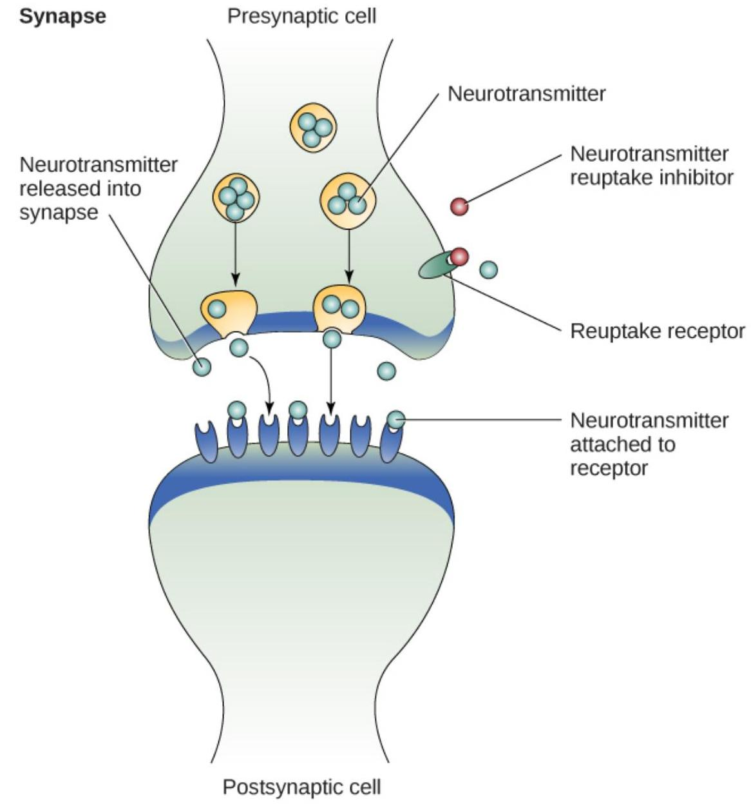

Figure BB.3. Neurotransmitter. The synaptic cleft is the space between the terminal button of one neuron and the dendrite of another neuron. (b) In this pseudo-coloured image from a scanning electron microscope, a terminal button (green) has been opened to reveal the synaptic vesicles (orange and blue) inside. Each vesicle contains about 10,000 neurotransmitter molecules.Watch this video: Tricky Topics: Synaptic Transmission (9 minutes)

One or more interactive elements has been excluded from this version of the text. You can view them online here: https://opentextbc.ca/psychologymtdi/?p=93\#oembed-2
"Tricky Topics: Synaptic Transmission" video by FirstYearPsych Dalhousie is licensed under the Standard YouTube licence.

Here is the Tricky Topics: Synaptic Transmission transcript.

# Neuronal Communication 

Now that we have learned about the basic structures of the neuron and the role that these structures play in neuronal communication, let's take a closer look at the signal itself — how it moves through the neuron and then jumps to the next neuron, where the process is repeated.

We start our journey at the neuronal membrane. The neuron exists in a fluid environment; it is surrounded by fluid outside the cell, called extracellular fluid, and contains fluid inside the cell,known as intracellular fluid or cytoplasm. The neuronal membrane acts as a barrier, keeping these two fluids separate. This role is crucial because the electrical signal passing through the neuron relies on the electrical difference between the intra- and extracellular fluids. This charge difference, called the membrane potential, supplies the energy for the signal.

The electrical charge of the fluids is caused by charged molecules (ions) dissolved in the fluid. The semipermeable nature of the neuronal membrane somewhat restricts the movement of these charged molecules, and, as a result, some of the charged particles tend to become more concentrated either inside or outside the cell.

Between signals, the neuron membrane's potential is held in a state of readiness, called the resting potential. The typical resting potential of a neuron is -70 millivolts (mV). Like a rubber band stretched out and waiting to spring into action, ions line up on either side of the cell membrane, ready to rush across the membrane when the neuron goes active and the membrane opens its gates (i.e., a sodium-potassium pump that allows movement of ions across the membrane). Ions in high-concentration areas are ready to move to low-concentration areas in a process called osmosis (you may have come across the term before), and positive ions are ready to move to areas with a negative charge. This is a fundamental process, where negatively charged particles are attracted to positive charges, just like the interaction of two magnets.

In the resting state, sodium ( $\mathrm{Na}+$ ) is at higher concentrations outside the cell, so it will tend to move into the cell. Potassium ( $\mathrm{K}+$ ), on the other hand, is more concentrated inside the cell, and will tend to move out of the cell (Figure BB.4). In addition, the inside of the cell is slightly negatively charged compared to the outside. This difference in charge, known as the electrochemical gradient, acts on sodium, causing it to move into the cell.

Figure BB.4. Electrochemical gradient. At resting potential, Na+ (blue pentagons) is more highly concentrated outside the cell in the extracellular fluid (shown in blue), whereas K+ (purple squares) is more highly concentrated near the membrane in the cytoplasm or intracellular fluid. Other molecules, such as chloride ions (yellow circles) and negatively charged proteins (brown squares), help contribute to a positive net charge in the extracellular fluid and a negative net charge in the intracellular fluid.

From this resting potential state, the neuron receives a signal and its state changes abruptly (Figure BB.5). When a neuron receives signals at the dendrites - due to neurotransmitters from an adjacent neuron binding to its receptors - small pores, or gates, open on the neuronal membrane, allowing Na+ ions, propelled by both charge and concentration differences, to move into the cell. With this influx of positive ions, the internal charge of the cell becomes more positive. If that charge reaches a certain level, called the threshold of excitation, the neuron becomes active and the action potential begins.

Several additional pores open, leading to a massive influx of positively charged sodium ions creating a significant spike in the membrane potential, the peak of the action potential. At this peak, the sodium gates close, and the potassium gates open. Positively charged potassium ions start to exit the cell rapidly, initiating the process of repolarization. Initially, the cell becomes more negative than its resting potential, known as hyperpolarization, and then it stabilises, returning to its resting potential.

Figure BB.5. Membrane potential graph. During the action potential, the electrical charge across the membrane changes dramatically.

This positive spike represents the action potential: the electrical signal that typically moves from the cell body down the axon to the axon terminals. The electrical signal moves down the axon with the impulses jumping in a leapfrog fashion between the Nodes of Ranvier. The Nodes of Ranvier are natural gaps in the myelin sheath. At each point, some of the sodium ions that enter the cell diffuse to the next section of the axon, raising the charge past the threshold of excitation and triggering a new influx of sodium ions. The action potential moves all the way down the axon in this way until reaching the terminal buttons.

The action potential is an all-or-none phenomenon. In simple terms, this means that an incoming signal from another neuron is either sufficient or insufficient to reach the threshold of excitation. There is no in-between, and there is no turning off an action potential once it starts. Think of it like sending an email or a text message. You can think about sending it all you want, but the message is not sent until you hit the send button. Furthermore, once you send the message, there is no stopping it.

Since it's an all-or-none response, the action potential is reproduced, or propagated, at its full strength along every point of the axon. Imagine it like a lit fuse on a firecracker - it doesn't lose intensity as it travels down the axon. This all-or-none property explains why your brain perceives an injury to a distant body part, such as your toe, as equally painful as one to your nose (which is closer to your brain).As noted earlier, when the action potential arrives at the terminal button, the synaptic vesicles release their neurotransmitters into the synaptic cleft. The neurotransmitters travel across the synapse and bind to receptors on the dendrites of the adjacent neuron, and the process repeats itself in the new neuron (assuming the signal is sufficiently strong to trigger an action potential). Once the signal is delivered, excess neurotransmitters in the synaptic cleft drift away, break down into inactive fragments (degradation), or are reabsorbed in a process known as reuptake.

Reuptake involves the neurotransmitter being pumped back into the neuron that released it, in order to clear the synapse (Figure BB.6). Clearing the synapse serves both to provide a clear "on" and "off" state between signals and to regulate the production of neurotransmitter (full synaptic vesicles signal that no additional neurotransmitters need to be produced). The synapse can also be cleared via degradation of the neurotransmitter, which typically involves an enzyme breaking the neurotransmitter down into its components, so that it can no longer interact with the receptors on the postsynaptic neuron.


Figure BB.6. Reuptake. Reuptake involves moving a neurotransmitter from the synapse back into the axon terminal from which it was released.

Neuronal communication is often referred to as an electrochemical event. The movement of the action potential down the length of the axon is an electrical event, and movement of theneurotransmitter across the synaptic space represents the chemical portion of the process. However, there are some specialised connections between neurons that are entirely electrical. In such cases, the neurons are said to communicate via an electrical synapse. In these cases, two neurons physically connect to one another via gap junctions that allow the current from one cell to pass into the next. There are far fewer electrical synapses in the brain, but those that do exist are much faster than the chemical synapses that have been described above (Connors \& Long, 2004).

Watch this video: Tricky Topics: Action Potentials (18 minutes)

One or more interactive elements has been excluded from this version of the text. You can view them online here: https://opentextbc.ca/psychologymtdi/?p=93\#oembed-3
"Tricky Topics: Action Potentials" video by FirstYearPsych Dalhousie is licensed under the Standard YouTube licence.

Here is the Tricky Topics: Action Potentials transcript.

# Neurotransmitters and Drugs 

There are several different types of neurotransmitters released by different neurons, and we can speak in broad terms about the kinds of functions associated with different neurotransmitters (Table BB.1). Much of what psychologists know about the functions of neurotransmitters comes from research on the effects of drugs in psychological disorders. Psychologists who take a biological perspective and focus on the physiological causes of behaviour assert that psychological disorders like depression and schizophrenia are associated with imbalances in one or more neurotransmitter systems. From this perspective, psychotropic medications can help improve the symptoms associated with these disorders. Psychotropic medications are drugs that treat psychiatric symptoms by restoring neurotransmitter balance.Table BB. 1 Major neurotransmitters and how they affect behaviour

| Neurotransmitter | Involved in | Potential effect on behaviour |
| :-- | :-- | :-- |
| Acetylcholine | Muscle activity, memory | Increased arousal, enhanced <br> cognition |
| Beta-endorphin | Pain, pleasure | Decreased anxiety, decreased <br> tension |
| Dopamine | Mood, sleep, learning | Increased pleasure, suppressed <br> appetite |
| Gamma-aminobutyric acid <br> (GABA) | Inhibitory control, sleep | Decreased anxiety, decreased <br> tension |
| Glutamate | Memory, learning | Increased learning, enhanced <br> memory |
| Norepinephrine | Heart function, intestinal <br> function, alertness | Increased arousal, suppressed <br> appetite |
| Serotonin | Mood, sleep | Modulated mood, suppressed <br> appetite |

Psychoactive drugs can act as agonists or antagonists for a given neurotransmitter system. Agonists are chemicals that mimic a neurotransmitter at the receptor site. An antagonist, on the other hand, blocks or impedes the normal activity of a neurotransmitter at the receptor. Agonists and antagonists represent drugs that are prescribed to correct the specific neurotransmitter imbalances underlying a person's condition. For example, Parkinson's disease, a progressive nervous system disorder, is associated with low levels of dopamine. Therefore, a common treatment strategy for Parkinson's disease involves using dopamine agonists, which mimic the effects of dopamine by binding to dopamine receptors.

Specific symptoms of schizophrenia are linked to increased dopamine neurotransmission. The medications used to treat these symptoms are called antipsychotics. They work as dopamine antagonists, which means they block dopamine's effects by attaching to its receptors without activating them. As a result, they prevent dopamine released by one neuron from transmitting information to nearby neurons.

In contrast to agonists and antagonists, which both operate by binding to receptor sites, reuptake inhibitors prevent unused neurotransmitters from being transported back to the neuron. This allows neurotransmitters to remain active in the synaptic cleft for longer durations, increasing their effectiveness. Depression, which has been consistently linked with reduced serotonin levels, is commonly treated with selective serotonin reuptake inhibitors (SSRIs). By preventing reuptake, SSRIs strengthen the effect of serotonin, giving it more time to interact with serotonin receptors on dendrites. Common SSRIs include Prozac, Paxil, and Zoloft. The drug LSD is structurally very similar to serotonin, and it affects the same neurons and receptors as serotonin.Psychotropic drugs are not instant solutions for people suffering from psychological disorders. Often, an individual must take a drug for several weeks before seeing improvement, and many psychoactive drugs have significant negative side effects. Furthermore, individuals vary dramatically in how they respond to drugs. To improve chances for success, it is not uncommon for people receiving pharmacotherapy (drugs for therapeutic purposes) to undergo psychological and/or behavioural therapies as well. Some research suggests that combining drug therapy with other forms of therapy tends to be more effective than any one treatment alone (for one such example, see March et al., 2007).

# Image Attributions 

Figure BB.1. Alhazen1652.png is in the public domain.
Figure BB. 2 created by Molly Wells Art as found in Introduction to Psychology \& Neuroscience (2nd Edition) is licensed under a CC BY 4.0 License.

Figure BB.3. Figure 3.9 as found in Psychology 2e by OpenStax is licensed under a CC BY 4.0 License and contains modifications of the following works: a) Neurotransmitter activity by OpenStax is licensed under a CC BY-NC-SA 4.0 license. b) modification of work by Tina Carvalho, NIH-NIGMS; scale-bar data from Matt Russell. Image is in the public domain.

Figure BB.4. Figure 3.10 as found in Psychology 2e by OpenStax is licensed under a CC BY 4.0 License.

Figure BB.5. Figure 3.11 as found in Psychology 2e by OpenStax is licensed under a CC BY 4.0 License.

Figure BB.6. Figure 3.12 as found in Psychology 2e by OpenStax is licensed under a CC BY 4.0 License.

## (0) (0) (0)

Cells of the Nervous System Copyright © 2024 by Tareq Yousef is licensed under a Creative Commons Attribution-NonCommercial-ShareAlike 4.0 International License, except where otherwise noted.130 | Chapter 4. Biological Basis of Behaviour# Parts of the Nervous System 

TAREQ YOUSEF

## Approximate reading time: 7 minutes

## Learning Objectives

By the end of this section, you will be able to:

- Consider the difference between the central and peripheral nervous systems
- Express the difference between the somatic and autonomic nervous systems
- Acknowledge differences between the sympathetic and parasympathetic divisions of the autonomic nervous system

The nervous system can be divided into two major subdivisions: the central nervous system (CNS) and the peripheral nervous system (PNS), shown in Figure BB.7. The CNS comprises the brain and spinal cord; the PNS connects the CNS to the rest of the body. In this section, we focus on the peripheral nervous system; later, we look at the brain and spinal cord.

Figure BB.7. The nervous system. The nervous system is divided into two major parts: (a) the Central Nervous System and (b) the Peripheral Nervous System.

# Peripheral Nervous System 

The peripheral nervous system is made up of thick bundles of axons, called nerves, carrying messages back and forth between the CNS and the muscles, organs, and senses in the periphery of the body (i.e., everything outside the CNS). The PNS has two major subdivisions: the somatic nervous system and the autonomic nervous system.

The somatic nervous system is associated with activities thought of as conscious or voluntary. It is involved in the relay of sensory and motor information to and from the CNS; therefore, it consists of motor neurons and sensory neurons. Motor neurons, carrying instructions from the CNS to the muscles, are efferent fibres (efferent means "moving away from"). Sensory neurons, carrying sensory information to the CNS, are afferent fibres (afferent means "moving toward"). Ahelpful way to remember this is that efferent = exit and afferent = arrive. Each nerve is basically a bundle of neurons forming a two-way superhighway, containing thousands of axons, both efferent and afferent.

There is another type of neuron, called an interneuron, which is by far the most common type of neuron, located primarily within the CNS responsible for communicating among the neurons. Interneurons allow the brain to combine the multiple sources of available information to create a coherent picture of the sensory information being conveyed.

The autonomic nervous system controls our internal organs and glands and is generally considered to be outside of our voluntary control. It can be further subdivided into the sympathetic and parasympathetic divisions (Figure [below]).

# The Divisions of the Autonomic Nervous System 

The sympathetic nervous system is involved in preparing the body for stress-related activities; the parasympathetic nervous system is associated with returning the body to routine, day-today operations. The two systems have complementary functions, operating in tandem to maintain the body's homeostasis. Homeostasis is a state of equilibrium, or balance, in which biological conditions (such as body temperature) are maintained at optimal levels.

Figure BB.8. Sympathetic and parasympathetic nervous system. The sympathetic and parasympathetic divisions of the autonomic nervous system have the opposite effects on various systems.

The sympathetic nervous system is activated when we are faced with stressful or high-arousal situations. The activity of this system was adaptive for our ancestors, increasing their chances of survival. Imagine, for example, that one of our early ancestors suddenly disturbs a large bear with cubs. At that moment, our ancestor's body undergoes a series of changes - a direct function of sympathetic activation - preparing the hunter to face the threat. The hunter's pupilsdilate (expand), their heart rate and blood pressure increase, their bladder relaxes (to reduce the chance of needing a bathroom break!), their liver releases glucose (a sugar readily used by the body for energy), and adrenaline surges into the hunter's bloodstream. This constellation of physiological changes, known as the fight or flight response, allows the body access to energy reserves and heightened sensory capacity so that it might fight off a threat or run away to safety.

While it is clear that such a response would be critical for survival for our ancestors, who lived in a world full of real physical threats, many of the high-arousal situations we face in the modern world are more psychological in nature. For example, think about how you feel when you have to stand up and give a presentation in front of a roomful of people, or right before taking a big test. You are in no real physical danger in those situations, and yet you have evolved to respond to a perceived threat with the fight or flight response.

This kind of response is not nearly as adaptive in the modern world; in fact, we suffer negative health consequences when faced constantly with psychological threats that we can neither fight nor flee. Recent research suggests that an increase in susceptibility to heart disease (Chandola, Brunner, \& Marmot, 2006) and impaired function of the immune system (Glaser \& KiecoltGlaser, 2005) are among the many negative consequences of persistent and repeated exposure to stressful situations. Some of this tendency for stress reactivity can be wired by early experiences of trauma.

After the threat has been resolved, the parasympathetic nervous system takes charge and restores bodily functions to a relaxed state. Our ancestor's heart rate and blood pressure return to normal, their pupils constrict (become small), they regain control of their bladder, and the liver starts storing glucose as glycogen (a modified form of glucose that is easier to store) for future use. These restorative processes happen due to the activation of the parasympathetic nervous system.

# Image Attributions 

Figure BB.7. Figure 3.13 as found in Psychology 2e by OpenStax is licensed under a CC BY 4.0 License.

Figure BB.8. Figure 3.14 as found in Psychology 2e by OpenStax is licensed under a CC BY 4.0 License.Parts of the Nervous System Copyright © 2024 by Tareq Yousef is licensed under a Creative Commons Attribution-NonCommercial-ShareAlike 4.0 International License, except where otherwise noted.# The Brain and Spinal Cord 

TAREQ YOUSEF

## Learning Objectives

By the end of this section, you will be able to:

- Recognise the anatomy and functions of the spinal cord
- Express the major areas of the hindbrain, midbrain, and forebrain, and describe their main functions
- Be aware of the anatomical and functional divisions of the cortex
- Be aware of the anatomy and function of the corpus callosum
- Appreciate diversity and inclusion in brain research
- Acknowledge brain lateralization and give examples of lateralization in humans
- Be aware of differences in the roles of Broca's area and Wernicke's area in language ability
- Observe how neuroscientists measure brain activity

The brain is a complex organ with billions of interconnected neurons and glia. These cells are the basis of communication in the nervous system, which is organised into specialised structures that provide the foundation for thought, emotion, and behaviour. In this section, we discuss the overall organisation of the nervous system and the functions associated with different areas, beginning with the spinal cord.

## The Spinal Cord

The spinal cord connects the brain to the outside world. It works like a relay station to direct messages to and from the brain, and also has its own system of automatic processes, called reflexes.

The top of the spinal cord is a bundle of nerves that merges with the brain stem, where many basic life processes, like breathing and digestion, are controlled. The spinal cord itself ends just below the ribs while its nerves extend all the way to the base of the spine. It's functionally organised into 31 segments, each connected to a specific part of the body through theperipheral nervous system. Nerves branch out from the spine at each vertebra: sensory nerves bring messages in; motor nerves send messages out to the muscles and organs.

The spinal cord is set up to make simple decisions about incoming sensory messages without requiring input from the brain. This is the basis of several types of reflexes, such as knee jerk and pain withdrawal reflexes. When a sensory message meets certain parameters, its signal passes from the sensory nerve to a spinal interneuron, which then activates a motor neuron to initiate movement. This happens before the brain receives information about the painful stimulus, so this automatic spinal reflex allows the body to react very quickly (and minimise injury!).

The spinal cord is protected by bony vertebrae and cushioned in cerebrospinal fluid, but injuries can still occur. When the spinal cord is damaged in a particular segment, all lower segments are cut off from the brain, usually causing paralysis and loss of sensation. Therefore, someone with a severe spinal injury at the level of the hips will keep motor control and sensation in more body parts than someone with a spinal injury at the level of the shoulders. The higher the damage occurs, the greater the loss of function and sensation. Below we will discuss the hindbrain, midbrain, and forebrain, as well as some important functional regions of the brain.

# Hindbrain Structure 

The hindbrain is located at the back of the head and looks like an extension of the spinal cord. It contains the medulla, pons, and cerebellum (Figure BB.9). The medulla controls the automatic processes of the autonomic nervous system, such as breathing, blood pressure, and heart rate. The word pons literally means "bridge," and as the name suggests, the pons connects the hindbrain to the rest of the brain. Acting as a bridge, the pons contains several "highways" that send information about body sensations to the brain and brings directions for body movement down to the spinal cord. The pons is also involved in regulating sleep and pain signals. The medulla and pons are part of the brain stem, which extends to the thalamus in the forebrain.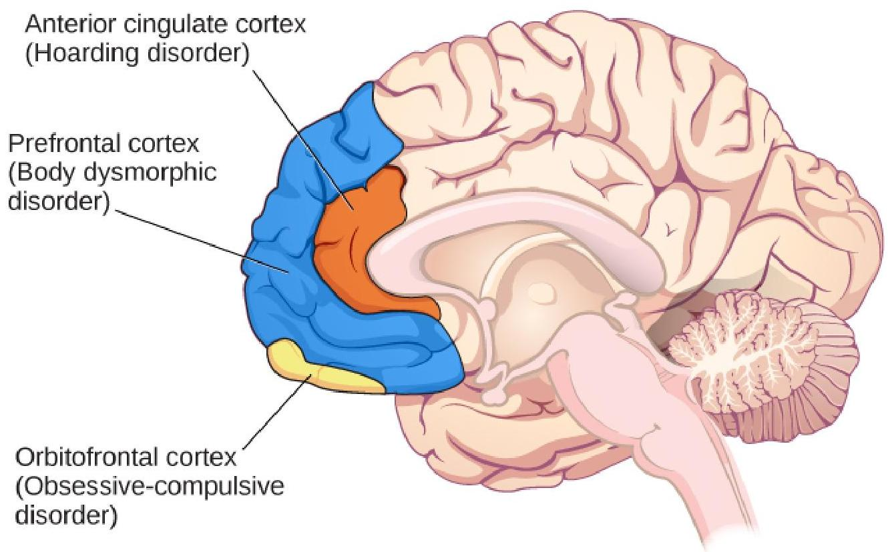

Figure BB.9. The hindbrain. The pons, medulla, and cerebellum make up the hindbrain.

# Midbrain Structures 

The midbrain, located between the forebrain and the hindbrain, is home to a curious collection of structures involved in diverse functions. The superior colliculus is important in directing eye movements towards important aspects of a visual scene, while the inferior colliculus is involved in sound localization. Both structures direct behaviours to parts of the environment that are relevant to an individual at that moment in time. The midbrain also contains structures that are involved in the sleep/wake cycle, arousal, and motor activity.

These structures include the substantia nigra (Latin for "black substance") and the ventral tegmental area (VTA) (Figure BB.10), which both contain cell bodies that produce the neurotransmitter dopamine and project to areas of the forebrain. The substantia nigra is important for planning and control of voluntary movement, and degeneration of these dopaminergic ("-ergic" means that those neurons contain and can release the neurotransmitter, here, dopamine) neurons is thought to be the main cause of the neurological disorder, Parkinson's disease (Parent \& Parent, 2010). In terms of the VTA, it sends parallel projections tothe forebrain and is involved in reward and motivation. Alterations in the neuronal signalling in this pathway is linked to addictive behaviours, such as substance misuse and gambling (George \& Le Moal, 2012).


Figure BB.10. The midbrain. The substantia nigra and ventral tegmental area (VTA) are located in the midbrain.

# Forebrain Structures 

The surface of the forebrain is dominated by the cerebral cortex, with its distinctive pattern of folds or bumps, known as gyri (singular: gyrus), and grooves, known as sulci (singular: sulcus), shown in Figure BB.11. These gyri and sulci allow us to separate the brain into functional centres. The most prominent sulcus, known as the longitudinal fissure, is the deep groove that separates the brain into two halves or hemispheres: the left and the right.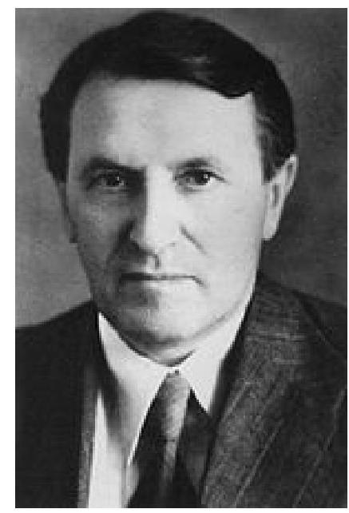

Figure BB.11. The Forebrain. The surface of the brain is covered with gyri and sulci. A deep sulcus is called a fissure, such as the longitudinal fissure that divides the brain into left and right hemispheres.

The cerebral cortex makes up the majority of the forebrain (Figure BB.12), the largest part of the brain. In addition to the cortex the forebrain contains a number of other subcortical structures including the thalamus, hypothalamus, pituitary gland, and a collection of areas called the limbic system. We will elaborate on these terms below, but first we will map out the lobes of the cerebral cortex.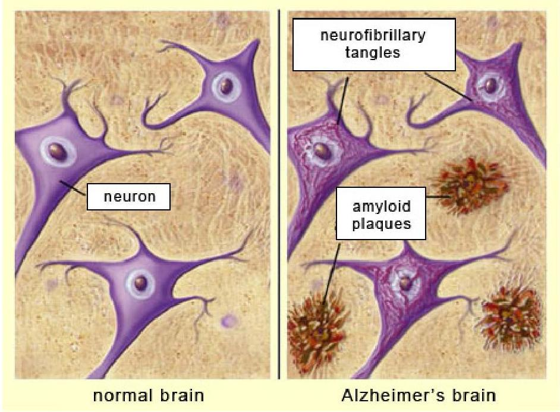

Figure BB.12. The Brain's Three Main Categories. The brain and its parts can be divided into three main categories: the forebrain, midbrain, and hindbrain.

Watch this video: Tricky Topics: Cortical Anatomy (11 minutes)

One or more interactive elements has been excluded from this version of the text. You can view them online here: https://opentextbc.ca/psychologymtdi/?p=117\#oembed-1
"Tricky Topics: Cortical Anatomy" video by FirstYearPsych Dalhousie is licensed under the Standard YouTube licence.

Here is the Tricky Topics: Cortical Anatomy transcript.

# Lobes of the Cerebral Cortex 

There are four lobes on each side of the cerebral cortex: frontal, parietal, temporal, and occipital (Figure BB.13). As its name suggests, the frontal lobe is located at the front and extends back to a fissure called the central sulcus, which separates it from the parietal lobe just behind. Thetemporal lobe begins below the lateral sulcus and extends backward towards the occipital lobe, which makes up most of the back part of the brain. The cortex can be described anatomically in terms of these lobes and sulci; size, shape, and location are all anatomical features that help us further map out different regions. Different areas of the cortex can also be described functionally, in terms of what they do. By the end of this section, you should be able to describe and compare different areas of the cortex both functionally and anatomically.


Figure BB.13. Lateral view of the human brain.

The size and location of the cerebral cortex makes it vulnerable to damage from injury and disease, however this is not usually fatal. In fact, most of what we've learned about the human cortex comes from observations of people living with damage to specific areas. If someone loses function after a brain injury, the damaged area was probably involved in that function.

Potentially the most famous case of brain damage is Phineas Gage: On September 13, 1848, 25-year old Gage was working as a railroad foreman. He and his crew were using an iron rod totamp explosives into a blasting hole to remove rock along the railway's path. Unfortunately, this created a spark and the rod exploded out of the hole, into Gage's face, and through his skull (Figure BB.14). It passed through the left frontal lobe and exited between the parietal and frontal bones of the skull.


Figure BB.14. Phineas Gage. (a) Phineas Gage holds the iron rod that penetrated his skull in an 1848 railroad construction accident. (b) Gage's prefrontal cortex was severely damaged in the left hemisphere. The rod entered Gage's face on the left side, passed behind his eye, and exited through the top of his skull, before landing about 80 feet away.

Remarkably, Gage was conscious and capable of moving and talking within minutes. In the following months he had a severe fungal infection of the brain (that could have resulted in more damage) and was cared for by doctor John Martyn Harlow (Harlow, 1848). Harlow's notes provide the most direct information on Gage's recovery.

In the months following the injury, Harlow wrote that Gage was improving, but he had trouble with self control. His friends also noted this with reports of overspending and inappropriate social behaviour, like swearing (Harlow, 1968). Within three months Gage was healthy enough to move home, but hadn't recovered enough to resume his duties as a foreman. However, just four years later he moved to Chile to establish a line of stage coaches. The job involved scheduling, managing finances, and interacting with passengers during long journeys - requiring a lot ofpatience and perseverance! It seems unlikely that this would have been possible for the rude, unpredictable man often described in this case (Macmillan \& Lena, 2010).

Harlow didn't have access to imaging technology so we aren't sure what structures were affected by Gage's injury, or which structures adapted so he could recover. Luckily, we can use modern techniques to make an educated guess about what happened to Gage's brain. A study from 2012 (Van Horn et al., 2012) used Gage's skull along with imaging data from similar living subjects to model the damage based on the rod's trajectory (Figure BB.15). This model suggested that the left orbitofrontal cortex in the frontal lobe was severely damaged. The majority of connective pathways from the left frontal lobe to other areas, including the limbic system, were also affected. Further inspection of Gage's skull indicates that there may have also been some direct damage to the amygdala (Szczepanski \& Knight, 2014).

Figure BB.15. Model of Phineas Gage. (a) Phineas Gage's skull, displayed at Harvard Medical School. b) CT images of the skull and the dimensions of the rod used to model the path it may have taken through Gage's skull. c) Gage's skull with the most likely rod path and example fibre pathways damaged by the rod in the left hemisphere. d) A view of the inside of the skull with pathways intersected by the rod, also showing the movement of Gage's left eye.So what kind of impairments do we commonly see after damage to these areas? Patients with damage to similar areas of the prefrontal cortex show higher scores on tests of impulsivity, taking less time to consider tasks and plan action, and making more errors. These patients are also less likely to change their behaviour in response to consequences, report more inappropriate social behaviours, and more feelings of anger (Berlin et al., 2004, Szepanski \& Knight, 2015), similar to what Gage experienced. In fact, Harlow's research with Gage prompted him to coin the term Frontal Lobe Syndrome, a term describing deficits in motivation, planning, social behaviour, and language production that can appear after damage to the prefrontal cortex (Pirau \& Lui, 2021). Gage's case provides a memorable demonstration of frontal lobe function, but it also shows the brain's remarkable ability to adapt and regain function after injury.

Brain damage studies provide important information about the cortex but advancements in medicine and technology have since given us more precise methods for investigating the brain. A foundational example comes from neurosurgeon Wilder Penfield, who systematically studied the effects of electrical stimulation on different parts of the cortex. At the very back end of the frontal lobe, just before the central sulcus, is a strip of cortex called the precentral gyrus and is home to the primary motor cortex, an area that activates movements after we decide to make them. Most of what we know about this part of the brain comes from classic research in epilepsy patients done by Penfield and associates Theodore Rassmussen and Edwin Boldrey.

Some patients don't respond to anti-seizure drugs, so in severe cases the seizure-inducing part of the brain is removed. To ensure that only the problematic brain tissue was removed, these researchers stimulated the brains of awake, anaesthetised patients with a mild electric current and asked them to report their sensations. When he stimulated neurons in the primary motor cortex, patients reported movements of body parts on the opposite side. In other words, the right primary motor cortex controls movement of body parts on the left and the left primary motor cortex controls movement on the right. This arrangement is referred to as contralateral, meaning opposite side. These movement-controlling areas can be understood as representations of the body parts they activate, and stimulation studies indicate that they are laid out in the brain in the same order as they appear in the body. For example, finger neurons are located next to hand neurons which are located next to arm neurons. (Figure BB.16) (Penfield \& Boldrey, 1937). This is called somatotopy, the concept that parts of the body correspond to specific parts of the cortex.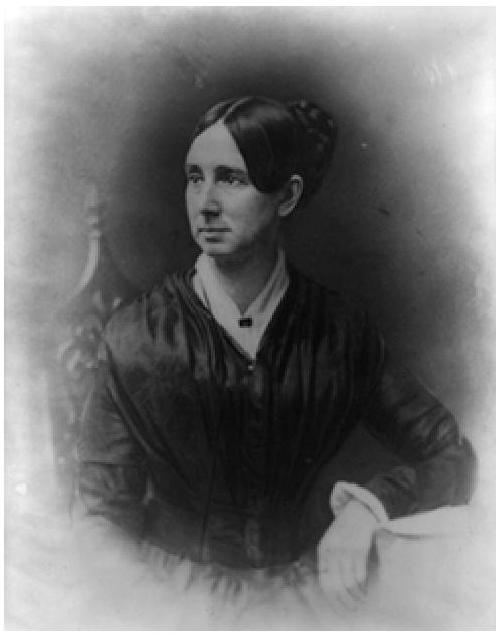

Figure BB.16. Somatotopy. (a) A 2D illustration of Penfield's somatosensory and (b) motor homunculi adapted from Penfield \& Boldrey (1937). The original illustrations were created by an artist named H.P Cantile (Griggs, 1988).

Just behind the motor cortex on the other side of the central sulcus is the primary somatosensory (involved in sensation of the body) cortex. This strip of cortex is at the beginning of the parietal lobe, and it plays an essential role in the perception of touch, temperature, and pain. Penfield discovered that electrical stimulation of this area produces tactile sensations in different regions of the body on the contralateral side. Like in the primary motor cortex, neurons in the primary somatosensory cortex are also grouped by body part, so that the arrangement in the body is maintained on the surface of the cortex (Figure BB.16).

Note that the size of body parts on both these motor and touch maps is distorted, with huge amounts of cortical space devoted to the fingers, hands, and mouth compared to the arms, legs, and torso (Penfield \& Boldery, 1937; Penfield \& Rasmussen, 1950). The areas of the body that we have more control over or which are more sensitive have the most cortical space. For example, the fingers have more cortical space than the chin, which is much less sensitive and can't carry out coordinated movement.

Penfield's representation of the brain's somatosensory "touch map" as a two-dimensional homunculus or 'little man' is one of the most recognisable images in neuroscience. Every introductory Psychology textbook has some version of it, along with its twin, the "motor map", located next door in the frontal lobe. These images demonstrate that 1) the map of the body is retained in the brain and 2) the size of a body part's representation is related to its functionrather than its physical size. These features are key to understanding the way movement and somatosensation are coded in the brain. See the end of this section for a section on homunculus representation and how rewiring of the neurons in the brain (an important indicator of change after injury, or even something positive like learning!) can be studied from diverse perspectives.

Just like the sense of touch, other senses send information to the cortex in an organised, maplike arrangement. The primary visual cortex is located at the back end of the brain in the occipital lobe, and is the first bit of cortex to receive visual information from the eyes. Unlike the somatosensory system, which sends signals separately from each side of the body, the visual system is a little different because the left and right eyes each capture images from the left and right sides of visual space (Figure BB.17). This bit of detail is beyond what al-Haytham (who hypothesised how vision works at the beginning of this chapter) envisioned but you should be able to see the similarities between his depiction and our modern understanding of the beginnings of the visual pathway! The inside part of the right eye and the outside part of the left eye both detect stimuli in the right visual field and the optic nerves carry information from the eye to the brain so the right visual world ALL ends up in the left side of the brain. If you follow the lines in the figure you can see the same arrangement is true for the left visual field.


Figure BB.17. The visual pathway. Pathway from the eye to the primary visual cortex. Note that left and right visual space are sent to the contralateral (opposite side) hemisphere.The primary auditory cortex is the main area responsible for processing incoming auditory information from the ears, and is located within the temporal lobe, tucked inside the lateral fissure. The primary gustatory cortex is responsible for the perception of taste and is found deeper within the lateral fissure that includes a portion of the frontal lobe as well as a structure called the insula. The sense of smell is sent from receptors in the nose to the olfactory bulb that runs along the bottom of the frontal lobe and then to the primary olfactory area in the piriform cortex.

These primary sensory areas are important for categorising and integrating sensory information, which are the first steps in conscious perception and therefore can be considered the main sites of input from the environment. The primary motor area is responsible for voluntary movement, so it is one of the main sites of output by the brain. Collectively, these functional areas make up only a small proportion of the total cortical tissue, the rest is referred to as association cortex. It integrates information gathered from other areas to regulate complex thought processes such as problem-solving, decision-making, and language. Unlike the primary sensory and motor areas, electrical stimulation of association cortex does not produce simple movement or sensation.

# Other Areas of the Forebrain 

Other areas of the forebrain, located beneath the cerebral cortex, include the thalamus and the limbic system. The thalamus is a sensory relay for the brain. All of our senses, with the exception of smell, are routed through the thalamus before being directed to other areas of the brain for processing (Figure BB.18).

Figure BB.18. Thamalus. The thalamus serves as the relay centre of the brain where most senses are routed for processing.

The limbic system is involved in processing both emotion and memory. The limbic system is made up of a number of different structures, but three of the most important are the hippocampus, the amygdala, and the hypothalamus (Figure BB.19). The hippocampus is an essential structure for learning and memory. The amygdala is involved in our experience of emotion and in tying emotional meaning to our memories. The hypothalamus regulates a number of homeostatic processes, including the regulation of body temperature, appetite, and blood pressure. The hypothalamus also serves as an interface between the nervous system and the endocrine system and in the regulation of sexual motivation and behaviour, all things that can also influence our emotion and learned behaviours (i.e., creation of new memories). You will read more about how learning happens shortly, and later on in this book!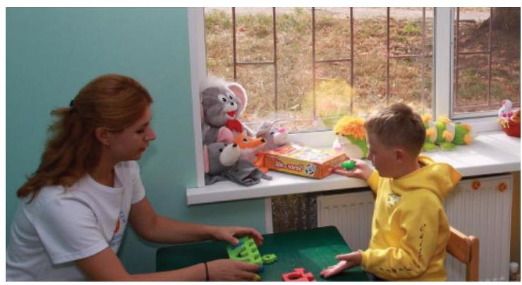

Figure BB.19. The limbic system. The limbic system is involved in mediating emotional response and memory.

# The Case of Henry Molaison (H. M.) 

In 1953, Henry Gustav Molaison (H. M.) was a 27-year-old man who experienced severe seizures. In an attempt to control his seizures, H. M. underwent brain surgery to remove his hippocampus and amygdala. Following the surgery, H.M's seizures became much less severe, but he also suffered some unexpected - and devastating - consequences of the surgery: he lost his ability to form many types of new memories. For example, he was unable to learn new facts, such as who was the president of the United States.

He was able to learn new skills, but afterward he had no recollection of learning them. For example, while he might learn to use a computer, he would have no conscious memory of ever having used one. He could not remember new faces, and he was unable to remember events, even immediately after they occurred. Researchers were fascinated by his experience, and he is considered one of the most studied cases in medical and psychological history (Hardt, Einarsson, \& Nader, 2010; Squire, 2009). Indeed, his case has provided tremendous insight into the role that the hippocampus plays in the consolidation of new learning into explicit memory.# Does the Classic Homunculus Represent Us All? 

The somatosensory homunculus is a popular depiction of somatotopy for mainstream culture. You might have seen one of these three-dimensional figures in a museum or at themed exhibits like Ripley's Believe It or Not. Often, the homunculus is presented as a demonstration of neural organisation in a neutral human body, even though it depicts a person with a penis and testicles. What about bodies that don't have those parts? Glaringly, Penfield didn't make a homunculus with breasts, vagina, clitoris, uterus or ovaries (Di Noto et al., 2012), even though he studied people with those body parts.


Figure BB.20. 3D model of the H.P. Cantiles somatosensory homunculus. This sculpture depicts the homunculus as an anatomically distorted 'little man', with the sizes of body parts corresponding to the amount of representation they have in the somatosensory cortex.

It's possible that Penfield and associates didn't make a map representing those without a penis because they didn't have a big enough sample of people with that anatomy, but it's likely that this exclusion was also influenced by gender or sex-based bias. This bias can be demonstrated in the language these researchers chose. He/him pronouns were always used to refer to patients, even though some of them would have been assigned she/her pronouns at birth instead (Penfield \& Rasmussen, 1950). This bias has long been present in biomedical research, and persists today. In neuroscience specifically, studies that only use assumed male patients outnumber studies using assumed female patients 5.5:1 (Plevkova et al., 2020).

Furthermore, many transgender people describe feelings of disconnection with sexed body parts and some experience phantom limb-like sensations from sexed body parts they weren't born with. It isn't surprising that these experiences could relate to differences in the neural representation of those body parts (Ramachandran, 2008; McGeoch et al., 2011). Case et al. (2017) used magnetoencephalography imaging to record brain activity during stimulation of the breast, a body part that many trans men feel disconnected from. Their findings suggest that feelings of disconnection from gender-incongruent body parts in trans men could be related todifferences in the neural representation of the body. Mapping the AFAB (assigned female at birth) brain might also have implications for other pain conditions like hysterectomy, vulvodynia, and fibromyalgia (Di Noto et al., 2012).

There have been recent attempts to create a somatosensory homunculus that represents the AFAB body, for example Di Noto et al. (2012) used existing data to create an illustration of AFAB anatomy in Penfield's 2D homunculus. However, this version is not as precise as the existing homunculus. In 2020, Wright and Foerder created the first 3D somatosensory homunculus to include breasts, nipples, vagina, and clitoris. As of 2022, there is still no comprehensive 2-D map displaying where AFAB body parts are precisely located in the somatosensory cortex. Currently, many of these attempts are being called the hermunculus, but it should be noted that this term could be more inclusive. Trans men and non-binary people who don't use she/her pronouns would also have their bodies represented by it. Given the erasure of transgender people in medical settings and the negative health outcomes associated (Bauer et al., 2009), it would be ideal to work towards using terminology that doesn't force anyone to identify with the wrong gender in order to receive medical care.

This gap in the research isn't just an issue of representation; it has medical implications that lead to the neglect of large portions of the world's population. Importantly, the somatosensory cortex is a focus of research on neuroplasticity because representations of body parts can change if the way they are used is altered. Neuroplasticity is a word used to describe the capacity of the brain's neurons to change their connections-an indication of some sort of learning or change in an individual. For example, after amputation of an arm, sensory input from the face starts to activate the area of the somatosensory cortex that used to represent the hand. This change in neural representation can also cause changes in perceptual experience like phantom limb syndrome, where an individual experiences sensations or pain that feel like they are coming from the missing limb (Ramachandran \& Rogers-Ramachandran, 2000). Without a somatosensory map that represents the bodies of people who were assigned female at birth (AFAB), we can't assess neuroplasticity after changes to their anatomy.

Consider a common procedure like the mastectomy, the removal of breast tissue. Mastectomies are used to treat breast cancer and also as a gender affirming surgery for trans men and other trans and non-binary people with breasts (Dutta, 2015; Case et al., 2017). Data from people undergoing mastectomy indicates that about 33\% of patients show changes in the neural representation of the breast, but we don't know what that change causes perceptually for those patients (Aglioti et al., 1993; Aglioti et al., 1994; Dutta, 2015). In other words, how does an individual's own sensation and feeling change after gender affirming surgery? Studies of plasticity that centre on decolonisation can help us understand this.# Understanding Changes in the Brain: Indigenous Perspectives 

Dr. Michael Yellow Bird, a Professor from the University of Manitoba describes neurodecolonisation as a term that "involves combining mindfulness approaches with traditional and contemporary secular and sacred contemplative practices to replace negative patterns of thought, emotion and behaviour with healthy productive ones" (Yellow Bird, n.d.).

This "replacement" suggests a change like that described as neuroplasticity-an indication that decolonising work, though it may be done with the intent to support others, requires the individual (importantly, the settler) to change their ways of thinking. For example, neurodecolonisation would work to support individuals dealing with the trauma of colonialism (cultural genocide associated with residential schools) and would also expand the work of neuroscience to broader perspectives including exploring colonially marginalised experiences such as those of two-spirit or transgender individuals.

Incorporating Indigenous perspectives can and ought to start at the beginning of the scientific process. Engaging in scientific research usually relies on settler-dominant spaces such as the research institutions across Canada. Two-eyed seeing (etuaptmumk) was conceived by Mi'kmaw Elder Albert Marshall (Bartlett, Marshall, \& Marshall, 2012). This concept encourages researchers to use the strengths of mainstream Western knowledge and Indigenous knowledge and ways of knowing together. Two-eyed seeing is one path toward neuro-decolonisation and has been recognised by the Canadian Brain Research Strategy as a path toward greater diversity in the field (Perreault et al., 2021). The strength in this neuro-decolonising practice is expected to, among other things, enrich brain health and associated human rights (i.e., justice and support for those with mental health issues) (Harding et al., 2022).

Considering multiple perspectives should feel like the appropriate thing to do, given that the brain's plasticity is an indication of changes at biological levels (changes in synapses and brain function), sometimes as a response to something external like an amputation or having a new experience (for example, learning an instrument). The fact that experience shapes our brain can also be addressed from a decolonised way. The indigenous group, the Pirahã of the Amazon region of Brazil, have numbers for one, two, and "many" - a different way of conceptualising numbers than for those who grew up learning one of the predominantly spoken languages of the world. The Pirahã people's experience of counting in this way has likely shaped brain synapses that result in different experiences with managing large numbers yielding a heavier reliance on estimation (Gordon, 2004).# Lateralization 

You may be familiar with the idea that the right and left hemispheres have different abilities or specialised functions, referred to as lateralization. Some of the earliest evidence of lateralization comes from Paul Broca. Broca identified a structure in the frontal lobe now known as Broca's area, which typically appears on the left hemisphere (Figure BB.21). This discovery came from work with patients with a particular set of language impairments after damage in the Broca's area, called Broca's aphasia.

Consider Louis Leborgne or 'Tan', Broca's first patient with damage in this area. Leborgne was described as intelligent, and understood language but wasn't able to reply with anything other than "tan" or a single swear word if he was angry. Leborgne's primary communication was a combination of gestures and "tan", spoken in a variety of tones depending on context (Devinsky \& Samuels, 2016). This is why Broca's aphasia is also called expressive aphasia, because people affected by it cannot produce communicative language in a verbal or written form, though they have no problems with comprehension.

Wernicke's area, important for speech comprehension, is also located in the left hemisphere, close to the primary auditory cortex. Whereas individuals with damage to Broca's area have difficulty producing language, those with damage to Wernicke's area can produce words, but they aren't able to understand language or combine words in sensible ways (Figure BB.21). In most people, both Broca's area and Wernicke's area are located in the left hemisphere.


Figure BB.21. Broca's area and Wernicke's area. Damage to either Broca's area or Wernicke's area can result in language deficits. The types of deficits are very different, however, depending on which area is affected.These kinds of cases indicate that the left hemisphere may have some specialised control of verbal language. For most people, the left hemisphere is needed for verbal language, while the right hemisphere may be better at some kinds of comprehension and symbol recognition (Taylor \& Regard, 2003). It's likely that both hemispheres need to interact to produce a full range of language functions.

More evidence for lateralization comes from Michael Gazzaniga and his colleagues, who studied the function of each hemisphere independently in patients who had undergone 'split-brain' surgery. This surgery is used to stop the spread of seizures from one hemisphere to the other in some cases of severe epilepsy. To accomplish this the surgeon must cut the corpus callosum, a band of about 200 million axons that allows for communication between the two hemispheres (Figure BB.22). Because the two sides normally share the information they have processed, we aren't aware of the different roles they play in day-to-day function.

This is not the case for split-brain patients. For instance, if you show a picture to the patient's left visual field only, they won't be able to name it because the information is only available in the largely nonverbal right hemisphere. However, they can recreate the picture with their left hand, which is also controlled by the right hemisphere. When the more verbal left hemisphere sees the picture that the hand drew, the patient is able to name it (assuming the left hemisphere can interpret what was drawn by the left hand).


Figure BB.22. Corpus Callosum. (a, b) The corpus callosum connects the left and right hemispheres of the brain. (c) A scientist spreads this dissected sheep brain apart to show the corpus callosum between the hemispheres. (credit c: modification of work by Aaron Bornstein)

More data from Gazzinga and associates suggests that a variety of functions show patterns indicating some degree of hemispheric dominance (Gazzaniga, 2005). For example, the left hemisphere may be superior for forming associations in memory, selective attention, and positive emotions. The right hemisphere, on the other hand, may be superior in pitch perception, arousal, and negative emotions (Ehret, 2006). It's tempting to conclude that certainbehaviours can be attributed to one hemisphere or the other, but research in this area produces inconsistent results and there's a natural variation of brain organisation in every population of humans (Banich \& Heller, 1998).

Watch this video: Tricky Topic: Hemispheric Lateralization (9 minutes)

One or more interactive elements has been excluded from this version of the text. You can view them online here: https://opentextbc.ca/psychologymtdi/?p=117\#oembed-2
"Tricky Topics: Hemispheric Lateralization" video by FirstYearPsych Dalhousie is licensed under the Standard YouTube licence.

Here is the Tricky Topics: Hemispheric Lateralization transcript.

# Brain Imaging 

You have learned how brain injury can provide information about the functions of different parts of the brain. Increasingly, however, we are able to obtain that information using brain imaging techniques on individuals who have not suffered brain injury. In this section, we take a more indepth look at some of the techniques that are available for imaging the brain, including techniques that rely on radiation, magnetic fields, or electrical activity within the brain.

## Techniques Involving Radiation

A computerised tomography (CT) scan involves taking a number of x-rays of a particular section of a person's body or brain (Figure BB.23). The x-rays pass through tissues of different densities at different rates, allowing a computer to construct an overall image of the area of the body being scanned. A CT scan is often used to determine whether someone has a tumour or significant brain damage. Different types of tissues will show up differently in CT scans as they can be more or less dense.

Figure BB.23. Computerized tomography (CT) scan. CT scan can be used to show brain tumours. (a) The image on the left shows a healthy brain, whereas (b) the image on the right indicates a brain tumour in the left frontal lobe. (credit a: modification of "CT-scan-4th-and-3rd-ventricles" by "Aceofhearts1968"/Wikimedia Commons, which is licensed ; credit b: modification of work by Roland Schmitt et al)

Figure BB.23. Figure 3.26 as found in Psychology 2e by OpenStax is licensed under a CC BY 4.0 License.

Positron emission tomography (PET) scans create pictures of the active brain (Figure BB.24). An individual receiving a PET scan drinks or is injected with a mildly radioactive substance, called a tracer. Once in the bloodstream, the amount of tracer in any given region of the brain can be monitored. As a brain area becomes more active, more blood flows to that area and more of the tracer is visible.

A computer monitors the movement of the tracer and creates a rough map of active and inactive areas of the brain during a given behaviour. PET scans show little detail, are unable to pinpoint events precisely in time, and require that the brain be exposed to radiation; therefore, this technique has been replaced by newer technologies (see below). However, combined with CT, PET technology is still being used in certain contexts. For example, CT/PET scans allow better imaging of the activity of neurotransmitter receptors and open new avenues in schizophrenia research. In this hybrid CT/PET technology, CT contributes clear images of brain structures, while PET shows the brain's activity.

Figure BB.24. Positron Emission Tomography (PET) scan. PET scan is helpful for showing activity in different parts of the brain. (credit: Health and Human Services Department, National Institutes of Health)

# Techniques Involving Magnetic Fields 

In magnetic resonance imaging (MRI), a person is placed inside a machine that generates a strong magnetic field. The magnetic field causes the hydrogen atoms in the body's cells to move. When the magnetic field is turned off, the hydrogen atoms emit electromagnetic signals as they return to their original positions. Tissues of different densities give off different signals, which a computer interprets and displays on a monitor.

Functional magnetic resonance imaging (fMRI) operates on the same principles as MRIs, but it shows changes in brain activity over time by tracking blood flow and oxygen levels. The fMRI provides more detailed images of the brain's structure, as well as better accuracy in time than is possible in PET scans (Figure BB.25). With their high level of detail, MRI and fMRI are often used to compare the brains of healthy individuals to the brains of individuals with psychological disorders. This comparison helps determine what structural and functional differences exist between these populations.

Figure BB.25. Functional Magnetic Resonance Imaging (fMRI). An fMRI shows activity in the brain over time. This image represents a single frame from an fMRI. (credit: modification of work by Kim J, Matthews NL, Park S.)

# Techniques Involving Electrical Activity 

In some situations, it is helpful to gain an understanding of the overall activity of a person's brain, without needing information on the actual location of the activity.

Electroencephalography (EEG) serves this purpose by measuring a brain's electrical activity. An array of electrodes is placed around a person's head (Figure BB.26). The signals received by the electrodes result in a printout of the electrical activity of their brain, or brainwaves, showing both the frequency (number of waves per second) and amplitude (height) of the recorded brainwaves, with an accuracy within milliseconds. Such information is especially helpful to researchers studying sleep patterns among individuals with sleep disorders.

Figure BB.26. Electroencephalography (EEG). Using caps with electrodes, modern EEG research can study the precise timing of overall brain activities. (credit: SMI Eye Tracking)

By the end of this chapter, you are encouraged to take time to reflect on the physical parts of you that make you who you are. The sum of all of the parts of your nervous system (from the neurotransmitters to the synapses they target, the axons of neurons that carry electrical signals, and beyond) make up a vastly complex organism that not only responds to its environment, but has thoughts and feelings. How vast and brilliant! Many psychologists aim to understand how this all works, an opportunity you will have if you continue on in this field.

# Summary 

## Cells of the Nervous System

Glia and neurons are the two cell types that make up the nervous system. While glia generally play supporting roles, the communication between neurons is fundamental to all of the functions associated with the nervous system. Neuronal communication is made possible by the neuron's specialised structures. The soma contains the cell nucleus, and the dendrites extend from the soma in tree-like branches. The axon is another major extension of the cell body; axons are often covered by a myelin sheath, which increases the speed of transmission of neural impulses. At the end of the axon are terminal buttons that contain synaptic vesicles filled with neurotransmitters.

Neuronal communication is an electrochemical event. The dendrites contain receptors for neurotransmitters released by nearby neurons. If the signals received from other neurons aresufficiently strong, an action potential will travel down the length of the axon to the terminal buttons, resulting in the release of neurotransmitters into the synaptic cleft. Action potentials operate on the all-or-none principle and involve the movement of sodium ( $\mathrm{Na}+$ ) and potassium $(\mathrm{K}+$ ) across the neuronal membrane.

Different neurotransmitters are associated with different functions. Often, psychological disorders involve imbalances in a given neurotransmitter system. Therefore, psychotropic drugs are prescribed in an attempt to bring the neurotransmitters back into balance. Drugs can act either as agonists or as antagonists for a given neurotransmitter system.

# Parts of the Nervous System 

The brain and spinal cord make up the central nervous system. The peripheral nervous system comprises the somatic and autonomic nervous systems. The somatic nervous system transmits sensory and motor signals to and from the central nervous system. The autonomic nervous system controls the function of our organs and glands, and can be divided into the sympathetic and parasympathetic divisions. Sympathetic activation prepares us for fight or flight, while parasympathetic activation is associated with normal functioning under relaxed conditions.

## The Brain and Spinal Cord

The brain consists of two hemispheres, each controlling the opposite side of the body. Each hemisphere can be subdivided into different lobes: frontal, parietal, temporal, and occipital. In addition to the lobes of the cerebral cortex, the forebrain includes the thalamus (sensory relay) and limbic system (emotion and memory circuit). The midbrain contains the substantia nigra and ventral tegmental area. These structures are important for movement, reward, and addictive processes. The hindbrain contains the structures of the brainstem (medulla, pons, and midbrain), which control automatic functions like breathing and blood pressure. The hindbrain also contains the cerebellum, which helps coordinate movement and certain types of memories.

Individuals with brain damage have been studied extensively to provide information about the role of different areas of the brain, and recent advances in technology allow us to obtain similar information by imaging brain structure and function. These techniques include CT, PET, MRI, fMRI, and EEG.# Image Attributions 

Figure BB.9. Figure 3.25 as found in Psychology 2e by OpenStax is licensed under a CC BY 4.0 License.

Figure BB.10. Figure 3.24 as found in Psychology 2e by OpenStax is licensed under a CC BY 4.0 License.

Figure BB.11. Figure 3.15 as found in Psychology 2e by OpenStax is licensed under a CC BY 4.0 License and contains modification of work by Bruce Blaus.

Figure BB.12. Figure 3.17 as found in Psychology 2e by OpenStax is licensed under a CC BY 4.0 License.

Figure BB.13. Figure 3.18 as found in Introduction to Psychology \& Neuroscience (2nd Edition) is licensed under a CC BY 4.0 License and was adapted for this book by adding the cerebellum label.

Figure BB.14. Figure 3.19 as found in Psychology 2e by OpenStax is licensed under a CC BY 4.0 License and contains modification of work by Jack and Beverly Wilgus.

Figure BB.15. "Simulated Connectivity Damage of Phineas Gage" by Van Horn JD, Irimia A, Torgerson CM, Chambers MC, Kikinis R, et al., 2012, is licensed under a CC BY 2.5 license.

Figure BB. 16 as found in Introduction to Psychology \& Neuroscience (2nd Edition) is licensed under a CC BY 4.0 License.

Figure BB.17. A simplified schema of the human visual pathway By Miquel Perello Nieto is licensed under a CC BY-SA 4.0 license.

Figure BB.18. Figure 3.22 as found in Psychology 2e by OpenStax is licensed under a CC BY 4.0 License.

Figure BB.19. Figure 3.23 as found in Psychology 2e by OpenStax is licensed under a CC BY 4.0 License.

Figure BB. 20 (a) is an adaptation of the following works: Sensory Homunculus Figure by Mpj29 is licensed under a CC BY-SA 4.0 License; Front of Sensory Homunculus Figure by Mpj29 is licensed under a CC BY-SA 4.0 License; Rear of Sensory Homunculus Figure by Mpj29 is licensed under a CC BY-SA 4.0 License.Figure BB.21. Figure 3.21 as found in Psychology 2e by OpenStax is licensed under a CC BY 4.0 License.

Figure BB.22. Figure 3.16 as found in Psychology 2e by OpenStax is licensed under a CC BY 4.0 License.

Figure BB.23. Figure 3.26 as found in Psychology 2e by OpenStax is licensed under a CC BY 4.0 License.

Figure BB.24. Figure 3.27 as found in Psychology 2e by OpenStax is licensed under a CC BY 4.0 License.

Figure BB.25. Figure 3.28 as found in Psychology 2e by OpenStax is licensed under a CC BY 4.0 License.

Figure BB.26. Figure 3.29 as found in Psychology 2e by OpenStax is licensed under a CC BY 4.0 License.

# (○) (1) (2) (3) 

The Brain and Spinal Cord Copyright © 2024 by Tareq Yousef is licensed under a Creative Commons Attribution-NonCommercial-ShareAlike 4.0 International License, except where otherwise noted.166 | Chapter 4. Biological Basis of Behaviour# Chapter Resources 

## TAREQ YOUSEF

## Key Terms

- action potential: electrical signal that moves down the neuron's axon
- agonist: drug that mimics or strengthens the effects of a neurotransmitter
- all-or-none: phenomenon that incoming signal from another neuron is either sufficient or insufficient to reach the threshold of excitation
- amygdala: structure in the limbic system involved in our experience of emotion and tying emotional meaning to our memories
- antagonist: drug that blocks or impedes the normal activity of a given neurotransmitter
- association cortex: areas of the cortex that are not primary sensory areas, responsible for more complex processing and combining information from multiple senses
- auditory cortex: strip of cortex in the temporal lobe that is responsible for processing auditory information
- autonomic nervous system: controls our internal organs and glands
- axon: major extension of the soma
- biological perspective: view that psychological disorders like depression and schizophrenia are associated with imbalances in one or more neurotransmitter systems
- Broca's area: region in the left hemisphere that is essential for language production
- central nervous system (CNS): brain and spinal cord
- central sulcus: a deep groove separating the temporal lobe and the frontal and parietal lobes
- cerebellum: hindbrain structure that controls our balance, coordination, movement, and motor skills, and it is thought to be important in processing some types of memory
- cerebral cortex: surface of the brain that is associated with our highest mental capabilities
- computerised tomography (CT) scan: imaging technique in which a computer coordinates and integrates multiple x-rays of a given area
- contralateral: a term that refers to something on the opposite side of the body from a particular structure or phenomenon, e.g., the left hemisphere is contralateral to the right hand.
- corpus callosum: thick band of neural fibres connecting the brain's two hemispheres
- degradation: the process by which an enzyme breaks down neurotransmitters in the synaptic cleft into their components so that they can no longer interact with the receptors on the postsynaptic neuron.
- dendrite: branch-like extension of the soma that receives incoming signals from other neurons
- electroencephalography (EEG): recording the electrical activity of the brain via electrodes on the scalp
- fight or flight response: activation of the sympathetic division of the autonomic nervous system, allowing access to energy reserves and heightened sensory capacity so that we might fight off a given threat or run away to safety
- forebrain: largest part of the brain, containing the cerebral cortex, the thalamus, and the limbic system, among other structures- frontal lobe: part of the cerebral cortex involved in reasoning, motor control, emotion, and language; contains motor cortex
- Frontal Lobe Syndrome: a set of common symptoms that can occur after damage to the frontal lobe, affecting motivation, planning, social behaviour, and language/speech production
- functional magnetic resonance imaging (fMRI): MRI that shows changes in metabolic activity over time
- glia: nervous system cells that provides physical and metabolic support to neurons, including neuronal insulation and communication, and nutrient and waste transport
- gyrus: (plural: gyri) bump or ridge on the cerebral cortex
- hemisphere: left or right half of the brain
- hindbrain: division of the brain containing the medulla, pons, and cerebellum
- hippocampus: structure in the temporal lobe associated with learning and memory
- homeostasis: state of equilibrium - biological conditions, such as body temperature, are maintained at optimal levels
- homunculus: a human figure in which the size of different parts represents the relative amount of cortical space that corresponds to each body part
- hypothalamus: forebrain structure that regulates sexual motivation and behaviour and a number of homeostatic processes; serves as an interface between the nervous system and the endocrine system
- lateralization: concept that each hemisphere of the brain is associated with specialised functions
- limbic system: collection of structures involved in processing emotion and memory
- longitudinal fissure: deep groove in the brain's cortex
- magnetic resonance imaging (MRI): magnetic fields used to produce a picture of the tissue being imaged
- medulla: hindbrain structure that controls automated processes like breathing, blood pressure, and heart rate
- membrane potential: difference in charge across the neuronal membrane
- midbrain: division of the brain located between the forebrain and the hindbrain
- motor cortex: strip of cortex involved in planning and coordinating movement
- myelin sheath: fatty substance that insulates axons
- Neuro-decolonisation: An Indigenous perspective for the conduct of neuroscience research that emphasises the plasticity associated with moving beyond colonial trauma
- neuron: cells in the nervous system that act as interconnected information processors, which are essential for all of the tasks of the nervous system
- neuroplasticity: nervous system's ability to change
- neurotransmitter: chemical messenger of the nervous system
- Nodes of Ranvier: open spaces that are found in the myelin sheath that encases the axon
- occipital lobe: part of the cerebral cortex associated with visual processing; contains the primary visual cortex
- parasympathetic nervous system: associated with routine, day-to-day operations of the body
- parietal lobe: part of the cerebral cortex involved in processing various sensory and perceptual information; contains the primary somatosensory cortex
- peripheral nervous system (PNS): connects the brain and spinal cord to the muscles, organs and senses in the periphery of the body
- pituitary gland: secretes a number of key hormones, which regulate fluid levels in the body, and a number of messenger hormones, which direct the activity of other glands in the endocrine system
- pons: hindbrain structure that connects the brain and spinal cord; involved in regulating brain activityduring sleep

- positron emission tomography (PET) scan: involves injecting individuals with a mildly radioactive substance and monitoring changes in blood flow to different regions of the brain
- prefrontal cortex: area in the frontal lobe responsible for higher-level cognitive functioning
- primary gustatory cortex: an area that includes a portion of the frontal lobe as well as the insula, buried inside the lateral fissure and responsible for processing information about flavour
- primary olfactory area: an area on the ventral surface of the frontal lobe that is responsible for processing information about smells
- primary visual cortex: an area at the back of the occipital lobe that is responsible for processing visual information
- psychotropic medication: drugs that treat psychiatric symptoms by restoring neurotransmitter balance
- receptor: protein on the cell surface where neurotransmitters attach
- resting potential: the state of readiness of a neuron membrane's potential between signals
- reuptake: neurotransmitter is pumped back into the neuron that released it
- semipermeable membrane: cell membrane that allows smaller molecules or molecules without an electrical charge to pass through it, while stopping larger or highly charged molecules
- soma: cell body
- somatic nervous system:relays sensory and motor information to and from the CNS
- somatosensory cortex: essential for processing sensory information from across the body, such as touch, temperature, and pain
- somatotopy: the matching arrangement of body parts and their representation in the cerebral cortex
- substantia nigra: midbrain structure where dopamine is produced; involved in control of movement
- sulcus: (plural: sulci) depressions or grooves in the cerebral cortex
- sympathetic nervous system: involved in stress-related activities and functions
- synaptic cleft: small gap between two neurons where communication occurs
- synaptic vesicle: storage site for neurotransmitters
- temporal lobe: part of cerebral cortex associated with hearing, memory, emotion, and some aspects of language; contains primary auditory cortex
- terminal button: axon terminal containing synaptic vesicles
- thalamus: sensory relay for the brain
- threshold of excitation: level of charge in the membrane that causes the neuron to become active
- ventral tegmental area (VTA): midbrain structure where dopamine is produced: associated with mood, reward, and addiction
- Wernicke's area: important for speech comprehension# Review Questions 

Multiple Choice Questions

1. The $\qquad$ receive(s) incoming signals from other neurons.
a. soma
b. terminal buttons
c. myelin sheath
d. dendrites
2. $A(n)$ $\qquad$ facilitates or mimics the activity of a given neurotransmitter system.
a. axon
b. myelin sheath
c. agonist
d. antagonist
3. Multiple sclerosis involves a breakdown of the $\qquad$ .
a. soma
b. myelin sheath
c. synaptic vesicles
d. dendrites
4. An action potential involves $\mathrm{Na}+$ moving $\qquad$ the cell and $\mathrm{K}+$ moving $\qquad$ the cell.
a. inside; outside
b. outside; inside
c. inside; inside
d. outside; outside
5. Our ability to make our legs move as we walk across the room is controlled by the $\qquad$ nervous system.
a. autonomic
b. somatic
c. sympathetic
d. parasympathetic
6. If your $\qquad$ is activated, you will feel relatively at ease.
a. somatic nervous system
b. sympathetic nervous system
c. parasympathetic nervous system
d. spinal cord
7. The central nervous system comprises $\qquad$ .a. sympathetic and parasympathetic nervous systems
b. organs and glands
c. somatic and autonomic nervous systems
d. brain and spinal cord
8. Sympathetic activation is associated with $\qquad$ .
a. pupil dilation
b. storage of glucose in the liver
c. decreased heart rate
d. constricted bladder
9. The $\qquad$ is a sensory relay station where all sensory information, except for smell, goes before being sent to other areas of the brain for further processing.
a. amygdala
b. hippocampus
c. hypothalamus
d. thalamus
10. Damage to the $\qquad$ disrupts one's ability to comprehend language, but it leaves one's ability to produce words intact.
a. amygdala
b. Broca's Area
c. Wernicke's Area
d. occipital lobe
11. $A(n)$ $\qquad$ uses magnetic fields to create pictures of a given tissue.
a. EEG
b. MRI
c. PET scan
d. CT scan
12. Which of the following is not a structure of the forebrain?

1. thalamus
2. hippocampus
3. amygdala
4. substantia nigra

Critical Thinking Questions
13. Cocaine has two effects on synaptic transmission: it impairs reuptake of dopamine and it causes more dopamine to be released into the synaptic cleft. Would cocaine be classified as an agonist or antagonist? Why?
14. Drugs such as lidocaine and novocaine act as Na+ channel blockers. In other words, they prevent sodium from moving across the neuronal membrane. Why would this particular effect make these drugs such effective localanaesthetics (drugs that reduce pain in the immediate area they are administered)?
15. Examine BB.8, illustrating the effects of sympathetic nervous system activation. How would all of these things play into the fight or flight response?
16. Before the advent of modern imaging techniques, scientists and clinicians relied on autopsies of people who suffered brain injury with resultant change in behaviour to determine how different areas of the brain were affected. What are some of the limitations associated with this kind of approach?
17. In what ways could two-eyed seeing be incorporated into modern studies of the brain?
18. Compare and contrast our modern understanding of the visual pathway and al-Haytham's depiction.

# Personal Application Questions 

19. Think about someone who has been prescribed psychotropic medication. What side effects were associated with the treatment?
20. You read about H. M.'s memory deficits following the bilateral removal of his hippocampus and amygdala. Have you encountered a character in a book, television program, or movie that suffered memory deficits? How was that character similar to and different from H. M.?
21. How much does our knowledge of psychology and neuroscience rely on other people?

## References

The reference list for this chapter has been excluded from this file to reduce page count. The full reference list can be viewed online at opentextbc.ca/psychologymtdi/chapter/biological-behaviour-chapter-resources.

## Chapter Attribution

"Biological Basis of Behaviour" was written and adapted by Tareq Yousef and is licensed under a CC BY-NC-SA 4.0 licence. It was adapted from "III. Biological Basis of Behaviour" in Introduction to Psychology and Neuroscience (2nd Edition) edited by Leanne Stevens, Jennifer Stamp, \& Kevin LeBlanc, which is licensed under a CC BY 4.0 licence. That text was adapted from Psychology 2e from OpenStax. Max Dysart and Dr. Jennifer Stamp reworked and rewrote large portions of this section of the Biological Basis of Behaviour chapter. 'Does the Classic Homunculus Represent Us All?', was based on the Introduction and Discussion sections of Saisha Rankaduwa's Honours Thesis (BScH Neuroscience, Dalhousie University).# About the Author: Tareq Yousef 

University of British Columbia Okanagan

I am an uninvited immigrant settler privileged to live on the unceded land of the Syilx Okanagan Nation, where I work as a lecturer at UBC Okanagan. I grew up on the east coast of Turtle Island on the unceded land of the Mi'kmaq peoples, in K'jipuktuk (Halifax) where I received my Ph.D. in Anatomy and Neurobiology from Dalhousie University for work on retinal neuromodulation and physiology. My positionality encompasses some intersectionality including my identity as a queer person of colour. This informs how I seek to use whatever privilege I have as an instructor to benefit others on and off my campus. My aim is to deliver strengths-based educational experiences that centre on anti-oppression and scientific inquiry, in a way that is accessible (including financially), meaningful, and joyful for all.

A note on equity, diversity, and inclusion: Black people, Indigenous people, people of colour and various marginalised communities continue to face obstacles in the scientific world in the form of denial of access to equitable opportunities. Psychology and neuroscience are no exception; they also have a history of misogyny, ableism, and anti-LGBTQIA2S+ discrimination. My academic approach takes these systemic barriers into consideration. I will strive to provide safe and welcoming opportunities to learn about the science behind these issues and discuss equitable ways forward. Let us make the world a better place to live!

## (0) (0) (0)

Chapter Resources Copyright © 2024 by Tareq Yousef is licensed under a Creative Commons Attribution-NonCommercialShareAlike 4.0 International License, except where otherwise noted.174 | Chapter 4. Biological Basis of Behaviour# CHAPTER 5. SENSATION AND PERCEPTION176 | Introduction to Psychology# Sensation and Perception Introduction 

JESSICA MOTHERWELL MCFARLANE

Approximate reading time: 41.5 minutes
Close your eyes and picture a pink elephant floating on a cloud. Can you see it? How vivid is it? Now, try to imagine a creature you've never seen or heard of - harder, isn't it?

There's an age-old saying: "seeing is believing". We've been conditioned to trust what we see and remain sceptical of the unseen. Yet, in the realm of psychology, particularly sensation and perception, our scientific evidence tells us the reverse is true: "believing is seeing".

When our beliefs dictate what we see, it's not merely a trick of the mind or a creation of our imagination. Our brain is like a masterful editor, cutting, pasting, and altering the raw footage of the world based on our beliefs, experiences, and expectations. As an example, let's look at how gaming can change beliefs, which can then alter our perceptions of the world.

You're nestled into your chair, controller in hand, eyes fixed on the screen. The sounds of the virtual world surround you, and for the next few hours, you're not just playing a game - you're in the game. The line between reality and the digital realm blurs. But did you know that these gaming experiences can reshape how you sense and perceive the real world?

Recent research has found that avid video gamers often demonstrate enhanced visual attention, improved hand-eye coordination, enhanced ability to distinguish shades of grey, and even altered depth perception (Bavelier et al., 2012). Perception is about more than just enhanced abilities, however. Gamers often report instances where, after prolonged play, the real world briefly takes on a game-like quality. A phenomenon termed game transfer phenomena manifests as gamers experience involuntary game-related perceptions, thoughts, and behaviours in their everyday lives; these can range from visual or auditory illusions, dreaming about the game, and involuntary movements mimicking game controls, to verbal outbursts related to the game. Of particular interest here is that some players might momentarily perceive the real world through the logic or physics of the game world. For instance, perceiving realworld structures as if they were constructed in a game environment, or expecting real-world objects to behave as they do in a game. Total immersion in their game has momentarily changed their created game-based beliefs, which then change perceptions of the world. Game elements can bleed into real-world cognition, showing just how profoundly our beliefs and experiences can shape perception (de Gortari, 2019; Ortiz de Gortari \& Griffiths, 2014).What we expect or believe can powerfully shape what we perceive. It's not about disregarding the information our senses provide, but rather understanding that our brain has the final say in the narrative we construct from that information. This is why we must always examine the stories we tell ourselves and others because those stories can radically change how we - and others - perceive our world. In this chapter, we'll dive deep into the science of our senses and discover how and why our perceptions are formed by our beliefs.


Figure SP.1. Classical piano. If you were standing in the midst of this street scene, you would be absorbing and processing numerous pieces of sensory input.

Picture yourself standing on a street in a city. You might notice a lot of things moving, like cars and people busy with their day. You might hear music from someone playing on the street or a car horn far away. You could smell the gas from cars or food from a nearby place selling snacks. And you might feel the hard ground under your shoes.

We use our senses to get important information about what's around us. This helps us move around safely, find food, look for a place to stay, make friends, and stay away from things that could be dangerous.

This chapter will provide an overview of how sensory information is received and processed by the nervous system and how that affects our conscious experience of the world. We begin by learning the distinction between sensation and perception. Then we consider the physical properties of light and sound stimuli, along with an overview of the basic structure and function of the major sensory systems. We will discuss the historically important Gestalt theory of perception and how it can teach us how we are able to understand visual narratives (comics).Then, we will explore the skin senses of touch, temperature and pain. Next we will consider the senses of balance and proprioception. We will conclude our chapter the often overlooked sense of interoception - the ability to sense about what is happening inside our bodies.

# Sensation 

What does it mean to sense something? Sensory receptors are specialised neurons that respond to specific types of stimuli. When sensory information is detected by a sensory receptor, sensation has occurred. For example, light that enters the eye causes chemical changes in cells that line the back of the eye. These cells relay messages, in the form of action potentials (as you learned when studying biopsychology), to the central nervous system. The conversion from sensory stimulus energy to action potential is known as transduction.

We used to teach, in error, that humans have only five senses: vision, hearing (audition), smell (olfaction), taste (gustation), and touch (somatosensation). We actually have at least 12 senses, each one providing unique information about our inner and outer realities. Below is a mnemonic and definitions to help you learn about these twelve of our senses:

## Very Happy Tigers Snuggle Tiny Pandas Inside Velvet Tents Near Old Elephants

- "Very" stands for Vision: Vision is the capacity to detect and interpret visual information from the environment through light perceived by the eyes.
- "Happy" stands for Hearing: Hearing is the sense that allows perception of sound by detecting vibrations through an organ, such as the ear.
- "Tigers" stands for Taste: Taste is the sense that perceives different flavours in substances, such as sweet, sour, salty, bitter, and umami, through taste buds in the mouth.
- "Snuggle" stands for Smell: Smell, or olfaction, is the ability to detect and identify different odours, which are chemical substances in the air, through receptors in the nose.
- "Tiny" stands for Touch: Touch, or tactile sense, involves perceiving pressure, vibration, temperature, pain, and other sensations on the skin.
- "Pandas" stands for Proprioception: Proprioception is the sense that allows the body to perceive its own position, motion, and equilibrium, even without visual cues.
- "Inside" stands for Interoception: Interoception is the sense of the internal state of the body, which can include feelings of hunger, thirst, digestion, or heart rate.
- "Velvet" stands for Vestibular sense: The vestibular sense involves balance and spatial orientation, maintained by detecting gravitational changes, head movement, and body movement.- "Tents" stands for Thermoception: Thermoception is the sense of heat and the absence of heat (cold) perceived by the skin.
- "Near" stands for Nociception: Nociception is the sensory nervous system's response to harmful or potentially harmful stimuli, often resulting in the sensation of pain.
- "Old" stands for Oleogustus: Oleogustus is the unique taste of fat, recognised as a distinct taste alongside sweet, sour, salty, bitter, and umami.
- "Elephants" stands for Equilibrioception: Equilibrioception, often considered a part of the vestibular sense, is the physiological sense that helps prevent animals from falling over when walking or standing still.


# What is Psychophysics? 

Psychophysics is a part of psychology that looks at how physical things around us, like light and sound, affect what we sense and how we think. Gustav Fechner, a German psychologist, started this field. He was the first to explore how the strength of something we sense, like a bright light or a loud sound, is linked to our ability to notice it (Macmillan \& Creelman, 2005).

Fechner and other scientists developed ways to measure how well we can sense things. One key thing they look at is how we notice very faint or weak things. The absolute threshold is the lightest, quietest, or least intense thing we can just barely sense. For example, think about a hearing test where you have to say if you hear a very soft sound or not (Wickens, 2002).

## The Challenge of Faint Signals

When signals are very faint, it's hard to be sure if we're sensing them or not. Our ears always pick up some background noise, so sometimes we might think we heard something when there was nothing, or we might miss a sound that was there. The job is to figure out if what we're sensing is just background noise or an actual sound mixed in with the noise. This is where signal detection analysis comes in. It's a method to figure out how well someone can tell the difference between real signals and just noise (Macmillan \& Creelman, 2005; Wickens, 2002).

## Understanding Signal Detection Analysis

The problem for us is that the very faint signals create uncertainty. Because our ears areconstantly sending background information to the brain, you will sometimes think that you heard a sound when none was there, and you will sometimes fail to detect a sound that is there. Your task is to determine whether the neural activity that you are experiencing is due to the background noise alone or is the result of a signal within the noise. The responses that you give on the hearing test can be analysed using signal detection analysis. Signal detection analysis is a technique used to determine the ability of the perceiver to separate true signals from background noise (Macmillan \& Creelman, 2005; Wickens, 2002). As you can see in Figure SP.2, "Outcomes of a signal detection analysis," each judgement trial creates four possible outcomes. A hit occurs when you, as the listener, correctly say "yes" when there is a sound. A false alarm occurs when you respond "yes" to no signal. In the other two cases you respond "no" - either a miss (saying "no" when there was a signal) or a correct rejection (saying "no" when there was in fact no signal).


Figure SP.2. Outcomes of a signal detection analysis. Our ability to accurately detect stimuli is measured using a signal detection analysis. Two of the possible decisions (hits and correct rejections) are accurate; the other two (misses and false alarms) are errors.

The analysis of the data from a psychophysics experiment creates two measures. One measure, known as sensitivity, refers to the true ability of the individual to detect the presence or absence of signals. People who have better hearing will have higher sensitivity than will those withpoorer hearing. The other measure, response bias, refers to a behavioural tendency to respond "yes" to the trials, which is independent of sensitivity.

# Understanding Sensitivity and Response Bias in Psychophysics Experiments 

In psychophysics experiments, we focus on two key concepts: sensitivity and response bias. Sensitivity is about how well someone can detect signals. For instance, someone with excellent hearing is more sensitive and can detect sounds better than someone with average hearing. Signal detection analysis separates true signals from background noise and evaluates the ability to detect faint signals. On the other hand, response bias is about a person's tendency to say "yes, I noticed something" during tests, which is not necessarily linked to their actual sensitivity. In other words, a response bias is the degree of eagerness a person has to find and report a signal whether it is present or not.

Example of Sensitivity in Medical Scenarios: Another application of signal detection occurs when medical technicians study body images for the presence of cancerous tumours. Again, a miss (in which the technician incorrectly determines that there is no tumour) can be very costly, but false alarms (referring patients who do not have tumours to further testing) also have consequences, such as unnecessary exposure to radiation. The ultimate decisions that the technicians make are based on the quality of the signal (clarity of the image), their experience and training (the ability to recognise certain shapes and textures of tumours), and their best guesses about the relative costs of misses versus false alarms.

Example: Response bias in real life - the forest fire warden

Imagine being a seasoned forest fire warden, in charge of monitoring a vast, vulnerable woodland. Your duty revolves around detecting the tiniest signs of a potential fire, such as a hint of smoke in the distance, a lightning strike, or a spark from a neglected campfire. In this scenario, sounding a false alarm about a possible fire may seem less severe than overlooking a small warning sign that could ignite a full-blown forest blaze. Accordingly, you adopt an extremely cautious response bias, alerting your team at the slightest suspicion, even amid uncertainties. This might mean your precision could be low due to recurrent false alarms, but it's a sacrifice made for the greater goal of preserving the forest. Despite the risk of numerous false alarms, this heightened vigilance underlines the critical role fire wardens play, potentially saving entire forests through their unwavering alertness to the smallest shifts in their surroundings.# Weber's Law and Just Noticeable Difference 

Another important idea is the difference threshold, or just noticeable difference (JND). This is about how small a change in something needs to be before we can notice it. Ernst Weber, a German physiologist, found out that noticing differences depends more on the ratio of the change to the original thing than on the size of the change itself (Weber, 1834/1996). For example, adding a teaspoon of sugar to a cup of coffee that already has a lot of sugar won't make much difference. But if the coffee had very little sugar to begin with, you'll notice the extra teaspoon more.

Example: Weber's Law in daily life

Weber's Law also applies to everyday things, like playing a video game. If the game is already loud and the volume goes up a little, you might not notice. But if the game is quiet and the volume increases by the same amount, you'll probably notice the change. So, how much we notice a change depends not just on the change itself, but on how big that change is compared to what we started with.

Supplement SP.1: Deep Dive - Are you under the influence of subliminal signals? [New Tab]

## Perception

What is the difference between sensation and perceptions? You walk into a kitchen and smell the scent of baking naan, the sensation is the scent receptors detecting the odour of yummy, hot naan, but the perception may be "Mmm, this smells like the naan Grandma used to bake when the family gathered for holidays." In this example, sensation is a physical process, whereas perception is psychological. Then there is the reciprocal back and forth between sensation and perception when the smell of naan makes us think of Grandma's naan, which reminds us of her hugs, which motivates us to stay in the kitchen longer so we can breathe in more yummy naan smells and linger in the memories we have about the loving times we had with Grandma.

While our sensory receptors are constantly collecting information from the environment, it is ultimately how we interpret that information that affects how we interact with the world.Perception refers to the way sensory information is organised, interpreted, and consciously experienced. Perception involves enviro-bodily, self-in-search, and reciprocal processing. Envirobodily (formerly called bottom-up) processing refers to sensory information coming from the environment or our own physical body to our senses. (e.g., Gregory, 1966). Self-in-search (formerly called top-down) processing refers to our knowledge and expectancy inspiring our active search of the environment or our own physical body to find something (Egeth \& Yantis, 1997; Fine \& Minnery, 2009; Neisser, 1976; Yantis \& Egeth, 1999). A reciprocal (an influence that goes back and forth) - process refers to the environment or our body offering up sensory information that then changes our ability to sense more - or less - of the environment or our body.

- Enviro-body processing (also known as "bottom-up"): Imagine that you and some friends are sitting in a crowded restaurant eating lunch and talking. It is very noisy, and you are concentrating on your friend's face to hear what she is saying. Then the sound of breaking glass and clang of metal pans hitting the floor rings out; the server dropped a large tray of food. Although you were attending to your meal and conversation, that crashing sound would likely get through your attentional filters and capture your attention. You would have no choice but to notice it. That attentional capture would be caused by the sound from the environment: it would be enviro-bodily processing.
- Self-in search processing (also known as "top-down"): Alternatively, self-in-search processes are generally goal directed, slow, deliberate, effortful, and under your control (Fine \& Minnery, 2009; Miller \& Cohen, 2001; Miller \& D'Esposito, 2005). For instance, if you misplaced your keys, how would you look for them? If you had a yellow key fob, you would probably look for yellowness of a certain size in specific locations, such as on the counter, coffee table, and other similar places. You would not look for yellowness on your ceiling fan, because you know keys are not normally lying on top of a ceiling fan. That act of searching for a certain size of yellowness in some locations and not others would be self-in-search under your control and based on your experience.
- Reciprocal processing: Imagine you're taking a leisurely stroll through a serene forest. As you walk, you notice the rustling leaves and the gentle breeze brushing against your skin. The environment offers up its calming sights and sounds, shaping your perceptual experience. In return, your newly refreshed attentive presence in the forest allows you to notice more subtle shifts in nature - the chirping of birds and the scent of pine, enriching the environment with your own sensory inputs. This mutual exchange of information between your ever-changing body and a living environment exemplifies reciprocal perception (Smith \& Thelen, 2003). This process allows you to grow a different quality of presence in the environment where both you and the surroundings actively contribute to the unfolding perceptual experience, creating a dynamic and interconnected relationship (Witherington, 2005). Eleanor Gibson referred to this form of reciprocal processing as theecological approach to perception (Gibson, 2000).

Supplement SP.2: Deep Dive - Eleanor Gibson: Pioneer in Perceptual Learning and Development [New Tab]

How Emotions Affect Our Perceptions

Imagine you're watching a suspenseful movie and suddenly every sound seems louder, or you're walking after a scary story and the shadows seem darker. Ever wondered why? Elizabeth Phelps might have an answer for that. She and her colleagues found that our feelings - whether we're scared, happy, sad, or excited - can change the way we perceive and remember things (Phelps, Ling, \& Carrasco, 2006).

Phelps and her team realised that when something makes us feel a certain way (like that jump scare in a horror movie), it's not just that we remember it better, but it also stands out more at that moment (Phelps, Ling, \& Carrasco, 2006). It's like our emotions put on a pair of magnifying glasses that change the way we see the world.

Since then, other researchers have validated that emotions can influence our perception (e.g., Riggs, Fujioka, Chan, McQuiggan, and Anderson, 2019). For example, some researchers found that when we're feeling emotions, we pay more attention, especially if the content is negative; think about why we can't look away from a car crash (Pool, Brosch, Delplanque, \& Sander, 2016). Others note that when we're emotionally charged, our focus gets a super-boost, making everything clearer (Bocanegra \& Zeelenberg, 2017). According to Mather and Schoeke (2011), the more emotional an event is, the better it sticks in our memory, kind of like how we can't forget that one embarrassing moment from high school.

In sum, emotions aren't just about 'feels.' Emotions powerfully shape the way we see and interact with everything around us. Think of it as your emotions giving you a personalised, experiential tour of the world. We will discuss more about this in the chapter on emotion.

# Predictive coding in perception 

Andy Clark (2013) presents another kind of reciprocal (back and forth) model of the perception based on prediction. This concept, known as predictive coding, suggests that our brains constantly formulate hypotheses or predictions about our environment, and that these hypotheses are continually updated, based on incoming sensory information. This is a significant departure from the traditional, passive model of perception, where the brain is seen as merely reacting to sensory stimuli. Furthermore, Clark integrates this concept with the theory of embodied cognition, which emphasises the role of our physical bodies and the environment in shaping cognitive processes. In essence, cognition isn't merely a product of internal brain computations but is also influenced by our interactions with the world around us.Returning to our example of the lost keys but looking through the lens of predictive coding, if you misplaced your keys, you would probably start to predict where you might have left them based on your past behaviours and the layout of your environment. For example, if you typically drop your keys on the kitchen counter when you get home, your brain will predict that this is the most likely location and direct your attention there first. As you search for your keys, your brain constantly updates its predictions based on the incoming sensory information. If you don't find your keys on the kitchen counter, this discrepancy between your prediction (keys on the counter) and the actual sensory input (no keys on the counter) generates a prediction error.

Your brain uses this prediction error to update its model of the world. It might now predict that the keys are in your coat pocket, if that's another place you often leave them. You'll continue this cycle of prediction and error correction until you locate your keys. This is predictive coding at work: your brain makes educated guesses about where your keys are, then refines those guesses based on what you actually find as you search. It's a dynamic process of hypothesis testing, with your brain continuously updating its predictions to align with the reality of your sensory input.

# Sensory adaptation 

Even though our perceptions are formed from our sensations, it's not the case that all sensations lead to perception. Actually, we frequently don't notice stimuli that remain fairly steady over long periods. This is referred to as sensory adaptation. Imagine you're at a concert, and you've secured a spot right next to the speakers. The music is extremely loud, to the point where it's nearly deafening. You're initially worried about whether you'll be able to endure the concert at such a high volume. However, as the night goes on and you become heavily focused on the performance, the music seems to become less overpowering. The speakers are still blaring and your ears are still picking up the sound, but you're no longer as aware of the loudness as you were at the start of the concert. This lack of awareness despite the constant loud music is an example of sensory adaptation. It illustrates that while sensation and perception are closely linked, they're not the same thing.# Did You See the Gorilla?: Divided attention, perceptual inattention, and change inattention 

## Attention

Attention (the cognitive process of selectively concentrating on one aspect of the environment while ignoring other things) significantly influences the interaction between sensation and perception. As an example, consider a university student sitting in a lecture, absorbed in checking their emails on their phone. The hum of the professor's voice, the shuffling of feet, and the occasional whisper from classmates all register as background noise that the student's senses pick up but their attention filters out. Suddenly, the professor mentions something about an "exam" in the next class. This keyword acts like a spark, instantly redirecting the student's attention. Although the professor's voice had been a constant stimulus, it's only now, with their attention refocused, that the student truly perceives what the professor is saying. Attention has the power to shape our perception from the numerous sensations we continuously encounter (Broadbent, 1958).

## Divided Attention

Divided attention, also known as multitasking, refers to the cognitive ability to concentrate on two or more tasks at the same time. This kind of attention is critical in our daily lives, enabling us to process different streams of information concurrently (Treisman, 1960). For example, you might be listening to music while preparing a meal or having a conversation while driving.

The effectiveness of divided attention can vary based on the difficulty and familiarity of the tasks. If at least one task is simple and/or well-practiced, divided attention may be effective. For instance, many people can successfully walk (a well-practiced task) while having a conversation (a potentially complex task) (Spelke, Hirst, \& Neisser, 1976). Some researchers suggest, however, that when two tasks are complex and/or unfamiliar, they compete for cognitive resources, often leading to decreased performance on one or both tasks (Pashler, 1994).

In today's digital age, the concept of divided attention is even more relevant, as we frequently switch between different tasks and media. However, this can also lead to a phenomenon known as "cognitive overload", in which the demands of multitasking exceed our cognitive capacity, resulting in decreased efficiency and productivity (Sweller, 1988). It's important to note that despite divided attention being commonplace in our lives, multitasking can lead to errors and can be less efficient than focusing on one task at a time, especially for more complex tasks (Salvucci \& Taatgen, 2008).# Perceptual Inattention 

Perceptual inattention, or what used to be called "inattention blindness" is the failure to perceive a stimulus in the environment. The term "blindness" is specific to vision. We can, however, be inattentive to any incoming sensory stimulus like a bad smell, or noisy kitchen sounds, or a room that is getting too cold. Since the term "blindness" is not comprehensive enough to describe the entire phenomenon, we will use the term perceptual inattentiveness in this textbook.

One of the most interesting demonstrations of the importance of attention in determining our perception of the environment occurred in a famous study conducted by Daniel Simons and Christopher Chabris (1999). In this study, participants watched a video of people dressed in black and white passing basketballs. Participants were asked to count the number of times the team dressed in white passed the ball. During the video, a person dressed in a black gorilla costume walks among the two teams. You would think that someone would notice the gorilla, right? Nearly half of the people who watched the video didn't notice the gorilla at all, despite the fact that he was clearly visible for nine seconds. Because participants were so focused on the number of times the team dressed in white was passing the ball, they completely tuned out other visual information. Perceptual inattention is the failure to notice something that is completely visible because the person was actively attending to something else and did not pay attention to other things (Mack \& Rock, 1998; Simons \& Chabris, 1999).

Watch the video: The Invisible Gorilla (featuring Daniel Simons) (5 minutes)

One or more interactive elements has been excluded from this version of the text. You can view them online here: https://opentextbc.ca/psychologymtdi/?p=1051\#oembed-1
"The Invisible Gorilla (featuring Daniel Simons) (EMMY Winner)" video by BeckmanInstitute is licensed under the Standard YouTube licence.

## Change inattention

Change inattention, which used to be known as "change blindness", is a phenomenon where significant changes in a visual scene go unnoticed by observers, especially when these changes occur amidst visual disruptions or when the observer's focus is elsewhere. Research indicates that high rates of change inattention are present during driving simulations across different age groups, suggesting that this phenomenon affects a wide range of real-world tasks (Saryazdi, Bak, \& Campos, 2019).Further investigation into the spatial dimensions of attention reveals that the detection of unexpected objects significantly increases when they appear outside the primary focus area, challenging traditional theories of attentional focus (Kreitz, Hüttermann, \& Memmert, 2020). How does our attention to space around us affect our ability to notice unexpected changes or objects in our visual field? Traditional theories of attention, such as the spotlight model, suggest that our attention works like a spotlight that highlights a specific area of our visual field. Anything within this spotlight is processed in detail, while information outside of it receives less attention or might be ignored.

However, research by Kreitz, Hüttermann, \& Memmert (2020) challenges this view by showing that people are more likely to detect unexpected objects when these objects appear outside of their primary focus area - outside the spotlight, contrary to what traditional theories would predict. This suggests that our attentional focus is not just a simple spotlight on a fixed area. Instead, it might be more flexible or distributed in a way that allows for the detection of significant stimuli even outside of the central area of focus.

This finding has implications for how we understand human attention and perception. It suggests that while we may focus our attention on a particular task or area, our perceptual system remains alert to important or novel stimuli that occur outside of this focus area. This could be an adaptive feature, allowing us to notice potentially relevant or threatening stimuli in our environment, enhancing our ability to respond to unexpected events.

Watch the video: Why You Miss Big Changes Right Before Your Eyes | NOVA | Inside NOVA:(4 minutes)

One or more interactive elements has been excluded from this version of the text. You can view them online here: https://opentextbc.ca/psychologymtdi/?p=1051\#oembed-2
"Why You Miss Big Changes Right Before Your Eyes | NOVA | Inside NOVA:" video by NOVA PBS Official is licensed under the Standard YouTube licence.

Supplement SP.3: Deep Dive - Beliefs, values, prejudices, expectations, and life experiences affect perceptions [New Tab]Supplement SP.4: Case Study - Bringing it all together: Amari and their lost phone [New Tab]

# Image Attributions 

Figure SP.1. "Amazing classical piano player" by Josh Appel on Unsplash.
Figure SP.2. Outcomes of a Signal Detection Analysis by Jennifer Walinga and Charles Stangor is licensed under a Creative Commons Attribution-NonCommercial-ShareAlike 4.0 International License.

## (0) (0) (0)

Sensation and Perception Introduction Copyright © 2024 by Jessica Motherwell McFarlane is licensed under a Creative Commons Attribution-NonCommercial-ShareAlike 4.0 International License, except where otherwise noted.# Gestalt Principles of Perception 

JESSICA MOTHERWELL MCFARLANE

Approximate reading time: 26 minutes
In the early part of the 20th century, Max Wertheimer published a paper demonstrating that individuals perceived motion in rapidly flickering static images - an insight that came to him as he used a child's toy tachistoscope (a device used to display images for very short periods of time). Wertheimer, and his assistants Wolfgang Köhler and Kurt Koffka, who later became his partners, believed that perception involved more than simply combining sensory stimuli. This belief led to a new movement within the field of psychology known as Gestalt psychology. The word "gestalt" literally means form or pattern, but its use reflects the idea that the whole is different from the sum of its parts. In other words, the brain creates a perception that is more than simply the sum of available sensory inputs, and it does so in predictable ways. Gestalt psychologists translated these predictable ways into principles by which we organise sensory information. As a result, Gestalt psychology has been extremely influential in the area of sensation and perception (Rock \& Palmer, 1990).

Supplement SP.5: Deep Dive - Gestalt Principles of Form Perception [New Tab]

According to Gestalt theorists, pattern perception, or our ability to discriminate among different figures and shapes, occurs by following the principles described above. You probably feel fairly certain that your perception accurately matches the real world, but this is not always the case. Our perceptions are based on perceptual hypotheses: educated guesses that we make while interpreting sensory information. These hypotheses are informed by a number of factors, including our personalities, experiences, and expectations. We use these hypotheses to generate our perceptual set. For instance, research has demonstrated that those who are given verbal priming produce a biased interpretation of complex ambiguous figures (Goolkasian \& Woodbury, 2010).

[^0]
[^0]:    "Closure" Puts the Magic in Comics
    "This phenomenon of observing the parts but perceiving the whole has a name. It's called closure. In our daily lives,we often commit closure, mentally completing that which is incomplete based on past experience." - Scott McCloud, Understanding Comics: The Invisible Art

Scott McCloud shows us how our brains play a key role in getting the most out of comics. Think about how we naturally love to spot patterns and fill in blanks - that's what Gestalt psychology is all about. In comics, this means we're excellent at linking together separate images and bits of story to make a smooth, flowing tale. It's like our minds are built to connect the dots between comic panels, turning a collection of still pictures into a lively story.

Each picture in a comic doesn't just standing alone in our minds; we see it as part of a bigger picture, influenced by what comes before and after it. Our knack for seeking order and continuity is what takes comics from being just a series of drawings to an engaging story. The real charm of comics is in this mix of what's shown and what's not. It's our ability to 'close the gaps' in-between comics that turns these bits and pieces into a complete, awesome story. So, when you're flipping through a comic, remember, it's your brain's love for making connections and filling in the blanks that makes the whole thing come alive!

You may wish to read The Understanding Comics by Scott McCloud book.

Watch this video: Perceiving is Believing: Crash Course Psychology \#7 (10 mins)

One or more interactive elements has been excluded from this version of the text. You can view them online here:
https://opentextbc.ca/psychologymtdi/?p=127\#oembed-1
"Perceiving is Believing: Crash Course Psychology \#7" video by CrashCourse is licensed under the Standard YouTube licence.

# When Seeing and Believing Go Wrong: Bias, Prejudice, and Cultural Factors 

In this chapter, you've learned that perception isn't merely a passive registration of sensory input. Instead, it is an active process influenced by our past experiences, biases, prejudices, and cultures. Given this dynamic nature of perception, it's unsurprising that individuals may perceive identical situations in vastly different ways, depending on their own personal background and societal influences.

Implicit biases, particularly racial prejudices and stereotypes, are strong influencers of perception. Implicit bias refers to the attitudes or stereotypes that affect our understanding, actions, and decisions in an unconscious manner. These biases are pervasive, or something that is widespread or found everywhere, often clashing with our conscious values and leading to unintended outcomes.There's a growing body of evidence suggesting that implicit racial biases can shape how people perceive and react to objects or situations. One clear example is the influence of race on weapon identification. Payne (2001) found that participants were quicker and more likely to mistakenly say a harmless object was a weapon when they first viewed Black faces compared to first viewing white faces. This "weapons bias" was further corroborated in subsequent studies (Payne, Shimizu, \& Jacoby, 2005; Todd et al., 2021).

These biases aren't restricted to lab-based reaction time tasks; they extend to more life and death decisions like the decision to shoot. Correll, Park, Judd, \& Wittenbrink (2002) and Correll, Urland, \& Ito (2006) showcased this with a video game simulation where participants had to decide whether to shoot potentially armed targets. White participants were faster to shoot armed Black targets than white ones, revealing a decision bias influenced by the race of the target.

The real-world implications of these findings are staggering. Over the past decades, numerous high-profile incidents have occurred where BIPOC individuals, especially young Black men and children - for example, Trayvon Martin, Michael Brown, and Tamir Rice - were fatally shot by individuals claiming they believed the victims were armed or posed a direct threat, even when they were unarmed. This emphasises the critical importance of understanding and addressing implicit biases in perception and decision-making, especially in contexts with life-or-death implications.

# (○) (C) (c) 

Gestalt Principles of Perception Copyright © 2024 by Jessica Motherwell McFarlane is licensed under a Creative Commons Attribution-NonCommercial-ShareAlike 4.0 International License, except where otherwise noted.194 | Chapter 5. Sensation and Perception# Psychophysics 

JESSICA MOTHERWELL MCFARLANE

Approximate reading time: 35 minutes
Let's focus on how we see light and hear sound. Both of these come to us in waves, but they are different kinds of waves. Even though they are different, these waves have some things in common that are important for how we see and hear.

When we talk about waves, we look at two main things: amplitude and wavelength. Amplitude is how high or low the wave goes. Imagine a wave in the ocean: the amplitude is the height from the middle of the wave to the top. Wavelength is how long the wave is from one peak to the next (Figure SP.3).


Figure SP.3. Amplitude and wavelength. The amplitude or height of a wave is measured from the crest to the trough. The wavelength is measured from peak to peak.

These two things, amplitude and wavelength, help us understand things like how loud a sound is or what colour something is. For example, a loud sound has a high amplitude. The colour red has a long wavelength, while blue has a shorter one (Figure SP.4).

Figure SP.4. Wavelengths and frequencies. This figure illustrates waves of differing wavelengths/frequencies. At the top of the figure, the red wave has a long wavelength/ short frequency. Moving from top to bottom, the wavelengths decrease and frequencies increase.

In this section, we're going to learn more about how waves work and how they affect what we see and hear. Remember, even though this might sound complex, it's all about understanding the waves that make up the sights and sounds around us.

# Sound Waves 

The physical properties of sound waves are associated with various aspects of our perception of sound. The frequency of a sound wave is associated with our perception of that sound's pitch. We measure sound in hertz $(\mathrm{Hz})$, which tell us how many waves pass a point in a second. Highpitched sounds have a lot of waves in a second (high frequency), and low-pitched sounds have fewer (low frequency). In humans, the audible range of sound frequencies is between 20 and $20,000 \mathrm{~Hz}$, with greatest sensitivity to those frequencies that fall in the middle of this range.

Other species show differences in their audible ranges. For instance, chickens have a very limited audible range, from 125 to 2000 Hz . Mice have an audible range from 1000 to $91,000 \mathrm{~Hz}$, and the beluga whale's audible range is from 1000 to $123,000 \mathrm{~Hz}$. Our pet dogs and cats have audible ranges of about $70-45,000 \mathrm{~Hz}$ and $45-64,000 \mathrm{~Hz}$, respectively (Strain, 2003).

The loudness of a given sound is closely associated with the amplitude of the sound wave. Higher amplitudes are associated with louder sounds. Loudness is measured in terms of decibels (dB), a unit of sound intensity. A typical conversation would correlate with 60 dB ; a rock concert might check in at 120 dB (Figure SP.9). A whisper 5 feet away or rustling leaves are at the low end of our hearing range; sounds like a window air conditioner, a normal conversation, and even heavy traffic or a vacuum cleaner are within a tolerable range. However,there is the potential for hearing damage from about 80 dB to 130 dB : These are sounds of a food processor, power lawn mower, heavy truck ( 25 feet away), subway train ( 20 feet away), live rock music, and a jackhammer. About one-third of all hearing loss is due to noise exposure, and the louder the sound, the shorter the exposure needed to cause hearing damage (Le, Straatman, Lea, \& Westerberg, 2017). Listening to music through earbuds at maximum volume (around 100-105 decibels) can cause noise-induced hearing loss after 15 minutes of exposure. Although listening to music at maximum volume may not seem to cause damage, it increases the risk of age-related hearing loss (Kujawa \& Liberman, 2006). The threshold for pain is about 130 dB , which can be seen with a jet plane taking off or a revolver firing at close range (Dunkle, 1982).


Figure SP.5. Sound and decibels. This figure illustrates the loudness of common sounds.# Watch this video: Sound: Wavelength, Frequency and Amplitude. (6 minutes) 

One or more interactive elements has been excluded from this version of the text. You can view them online here:
https://opentextbc.ca/psychologymtdi/?p=134\#oembed-1
"Sound: Wavelength, Frequency and Amplitude." video by Science Sauce is licensed under the Standard YouTube licence.

Of course, different musical instruments can play the same musical note at the same level of loudness, yet they still sound quite different. This is known as the timbre of a sound. Timbre refers to a sound's purity, and it is affected by the complex interplay of frequency, amplitude, and timing of sound waves. Sound, specifically hearing, will be discussed later in this section.

## Light Waves

The visible spectrum is the portion of the larger electromagnetic spectrum that we can see. As Figure SP. 6 shows, the electromagnetic spectrum encompasses all of the electromagnetic radiation that occurs in our environment and includes gamma rays, x-rays, ultraviolet light, visible light, infrared light, microwaves, and radio waves. The visible spectrum in humans is associated with wavelengths that range from 380 to 740 nm - a very small distance, since a nanometer ( nm ) is one billionth of a metre. Other species can detect other portions of the electromagnetic spectrum. For instance, honeybees can see light in the ultraviolet range (Wakakuwa, Stavenga, \& Arikawa, 2007), and some snakes can detect infrared radiation in addition to more traditional visual light cues (Chen, Deng, Brauth, Ding, \& Tang, 2012; Hartline, Kass, \& Loop, 1978).

Figure SP.6. Visible spectrum. Light that is visible to humans makes up only a small portion of the electromagnetic spectrum.

In humans, light wavelength is associated with perception of colour (Figure SAP.11). Within the visible spectrum, our experience of red is associated with longer wavelengths, greens are intermediate, and blues and violets are shorter in wavelength. (An easy way to remember this is the mnemonic ROYGBIV: red, orange, yellow, green, blue, indigo, violet.) The amplitude of light waves is associated with our experience of brightness or intensity of colour, with larger amplitudes appearing brighter. Brighter colours have higher amplitudes.


Figure SP.7. Wavelengths and colours. Different wavelengths of light are associated with our perception of different colours.

Watch this video: Sensation and Perception: Crash Course Psychology \#5 (11 minutes)

One or more interactive elements has been excluded from this version of the text. You can view them online here:
https://opentextbc.ca/psychologymtdi/?p=134\#oembed-2"Sensation and Perception: Crash Course Psychology \#5" video by CrashCourse is licensed under the Standard YouTube licence.

# Image Attributions 

Figure SP.3. Figure 5.5 as found in Psychology 2e by OpenStax is licensed under a CC BY 4.0 License.

Figure SP.4. Figure 5.6 as found in Psychology 2e by OpenStax is licensed under a CC BY 4.0 License.

Figure SP.5. Figure 5.9 as found in Psychology 2e by OpenStax is licensed under a CC BY 4.0 License and contains modifications of the following works: "planes" by Max Pfandl is licensed under a CC BY 2.0 licence; "crowd" by Christian Holmér is licensed under a CC BY 2.0 licence; "earbuds" by Skinny Guy Lover is in the public domain; "traffic" by islandworks is licensed under a Pixabay license; "talking" by Joi Ito is licensed under a CC BY 2.0 licence; "leaves" by Aurelijus Valeiša is licensed under a CC BY 2.0 licence.

Figure SP.6. Figure 5.7 as found in Psychology 2e by OpenStax is licensed under a CC BY 4.0 License.

Figure SP.7. Figure 5.8 as found in Psychology 2e by OpenStax is licensed under a CC BY 4.0 License and contains modifications of the following works: "Humanly Visible Spectrum" by Johannes Ahlmann is licensed under a CC BY 2.0 licence.

## (0) (1) (2)

Psychophysics Copyright © 2024 by Jessica Motherwell McFarlane is licensed under a Creative Commons Attribution-NonCommercial-ShareAlike 4.0 International License, except where otherwise noted.# Vision 

JESSICA MOTHERWELL MCFARLANE

Approximate reading time: 12 minutes
The visual system constructs a mental representation of the world around us (Figure SP.8). This contributes to our ability to successfully navigate through physical space and interact with important individuals and objects in our environments. This section will provide an overview of the basic anatomy and function of the visual system. In addition, we will explore our ability to perceive colour and depth.


Figure SP.8. Vision. Our eyes take in sensory information that helps us understand the world around us.

## Anatomy of the Visual System

The eye is the major sensory organ involved in vision (Figure SP.9). Light waves are transmitted across the cornea and enter the eye through the pupil. The cornea is the transparent covering over the eye. It serves as a barrier between the inner eye and the outside world, and is involved in focusing light waves that enter the eye. The pupil is the small opening in the eye through which light passes, and the size of the pupil can change as a function of light levels as well as emotional arousal. When light levels are low, the pupil will become dilated, or expanded, to allow more light to enter the eye. When light levels are high, the pupil will constrict, or become smaller, to reduce the amount of light that enters the eye. The pupil's size is controlled by muscles that are connected to the iris, which is the coloured portion of the eye.

Figure SP.9. Human eye. The eye is the major sensory organ involved in vision.

After passing through the pupil, light crosses the lens, a curved, transparent structure that serves to provide additional focus. The lens is attached to muscles that can change its shape to aid in focusing light that is reflected from near or far objects. As our gaze shifts from near to distant objects, accommodation occurs. Accommodation refers to the process of changing the curvature of the lens to keep light entering the eye focused on the retina. In a normal-sighted individual, the lens will focus images perfectly on a small indentation in the back of the eye known as the fovea, which is part of the retina, the light-sensitive lining of the eye. The fovea contains densely packed specialised photoreceptor cells (Figure SAP.14).
These photoreceptor cells, known as cones, are light-detecting cells. The cones are specialised types of photoreceptors that work best in bright light conditions. Cones are very sensitive to acute detail and provide tremendous spatial resolution. They also are directly involved in our ability to perceive colour.

While cones are concentrated in the fovea, where images tend to be focused, rods, another typeof photoreceptor, are located throughout the remainder of the retina. Rods are specialised photoreceptors that work well in low light conditions, and while they lack the spatial resolution and colour function of the cones, they are involved in our vision in dimly lit environments as well as in our perception of movement on the periphery of our visual field.


Figure SP.10. Photoreceptors. The two types of photoreceptors are shown in this image. (Molly Wells Art).

We have all experienced the different sensitivities of rods and cones when making the transition from a brightly lit environment to a dimly lit environment. Imagine going to see a movie on a clear summer day. As you walk from the brightly lit lobby into the dark theatre, you notice that you immediately have difficulty seeing much of anything. After a few minutes, you begin to adjust to the darkness and can see the interior of the theatre. In the bright environment, your vision was dominated primarily by cone activity. As you move to the dark environment, rod activity dominates, but there is a delay in transitioning between the phases. If your rods do not transform light into nerve impulses as easily and efficiently as they should, you will have difficulty seeing in dim light, a condition known as night blindness.

Rods and cones are connected (via several interneurons) to retinal ganglion cells. Axons fromthe retinal ganglion cells converge and exit through the back of the eye to form the optic nerve. The optic nerve carries visual information from the retina to the brain. There is a point in the visual field called the blind spot: Even when light from a small object is focused on the blind spot, we do not see it. We are not consciously aware of our blind spots for two reasons: First, each eye gets a slightly different view of the visual field; therefore, the blind spots do not overlap. Second, our visual system fills in the blind spot so that although we cannot respond to visual information that occurs in that portion of the visual field, we are also not aware that information is missing.


Figure SP.11. The visual pathway. Pathway from the eye to the primary visual cortex. Note that left and right visual space are sent to the contralateral (opposite side) hemisphere.

The optic nerve from each eye merges just below the brain at a point called the optic chiasm. As Figure SP. 11 shows, the optic chiasm is an X-shaped structure that sits just below the cerebral cortex at the front of the brain. At the point of the optic chiasm, information from the right visual field (which comes from both eyes) is sent to the left side of the brain, and information from the left visual field is sent to the right side of the brain.

Once inside the brain, visual information is sent via a number of structures, such as the lateral geniculate nucleus (LGN), to the occipital lobe at the back of the brain for processing. The LGN is a cluster of neuron cell bodies located in the thalamus. Visual information might be processed inparallel pathways which can generally be described as the "what pathway" and the "where/how" pathway. The "what pathway" (ventral stream) is involved in object recognition and identification, while the "where/how pathway" (dorsal stream) is involved with location in space and how one might interact with a particular visual stimulus (Milner \& Goodale, 2008; Ungerleider \& Haxby, 1994). For example, when you see a ball rolling down the street, the "what pathway" identifies what the object is, and the "where/how pathway" identifies its location or movement in space.

Usually, if we have healthy vision, we do not see the world in black and white; neither do we see it as two-dimensional (2D) or flat (just height and width, no depth). Read Supplement SP.6: Deep Dive - Colour Vision and Depth Perception to learn how colour vision works and how we perceive three dimensions (height, width, and depth).

Watch this video: Tricky Topics: Visual Pathway (3.5 minutes)

One or more interactive elements has been excluded from this version of the text. You can view them online here: https://opentextbc.ca/psychologymtdi/?p=139\#oembed-1
"Tricky Topics: Visual Pathway" video by FirstYearPsych Dalhousie is licensed under the Standard YouTube licence.

Supplement SP.6: Deep Dive - Colour Vision and Depth Perception [New Tab]

# Blindsight 

"Blindsight" happens when part of the brain that processes vision is damaged. People with blindsight can't consciously see things, but they can still answer questions about what's around them, like where something is or if it's moving (Weiskrantz, 1997). It's like their brain knows what's there, even if they don't consciously realise it.# Image Attributions 

Figure SP.8. Figure 5.10 credit "top left": Image by ha11ok from Pixabay; credit "top right": Image by Vitor Vitinho from Pixabay; credit "middle left": Image by lisa runnels from Pixabay,; credit "middle right":Image by iris Vallejo from Pixabay; credit "bottom left": Image by Kenny Elijah from Pixabay; credit "bottom right": Image by bess.hamiti@gmail.com from Pixabay, all licensed under the Pixabay Content License.

Figure SP.9. Human eye by Rachel Lu is licensed under a CC BY-NC-SA license.
Figure SP.10. Figure SAP. 14 created by Molly Wells Art as found in Introduction to Psychology \& Neuroscience (2nd Edition) is licensed under a CC BY 4.0 License.

Figure SP.11. A simplified schema of the human visual pathway By Miquel Perello Nieto is licensed under a CC BY-SA 4.0 license.

## (0) (1) (2)

Vision Copyright © 2024 by Jessica Motherwell McFarlane is licensed under a Creative Commons Attribution-NonCommercialShareAlike 4.0 International License, except where otherwise noted.# Hearing 

JESSICA MOTHERWELL MCFARLANE

Approximate reading time: 20 minutes
Our auditory system converts pressure waves into meaningful sounds. This translates into our ability to hear the sounds of nature, to appreciate the beauty of music, and to communicate with one another through spoken language. This section will provide an overview of the basic anatomy and function of the auditory system. It will include a discussion of how sensory stimulus is translated into neural impulses, where in the brain that information is processed, how we perceive pitch, and how we know where sound is coming from.

## Anatomy of the Auditory System

The ear can be separated into multiple sections. The outer ear includes the pinna, which is the visible part of the ear that extends from our heads, the auditory canal, and the tympanic membrane (also known as the eardrum). The middle ear contains three tiny bones known as the ossicles, which are named the malleus (or hammer), incus (or anvil), and the stapes (or stirrup). The inner ear contains the semicircular canals, which are involved in balance and movement (the vestibular sense), and the cochlea. The cochlea is a fluid-filled, snail-shaped structure that contains the sensory receptor cells (hair cells) of the auditory system. Within the cochlea lies the basilar membrane, a critical component that plays a key role in hearing. This membrane runs the entire length of the cochlea and vibrates in response to sound waves. The vibrations of the basilar membrane are crucial for the conversion of sound waves into electrical signals that can be interpreted by the brain. Different frequencies of sound waves cause specific regions of the basilar membrane to vibrate, allowing for the perception of a wide range of sounds. This precise mechanism enables the auditory system to distinguish between various pitches and tones (Figure SP.12).

Figure SP. 12. Auditory system. The ear is divided into outer (pinna and tympanic membrane), middle (the three ossicles: malleus, incus, and stapes), and inner (cochlea and basilar membrane) divisions. (credit: Molly Wells Art)

Sound waves travel along the auditory canal and strike the tympanic membrane, causing it to vibrate. This vibration results in movement of the three ossicles (malleus, incus, stapes). As the ossicles move, the stapes presses into a thin membrane of the cochlea known as the oval window. As the stapes presses into the oval window, the fluid inside the cochlea begins to move, which in turn stimulates hair cells, which are auditory receptor cells of the inner ear embedded in the basilar membrane. The basilar membrane is a thin strip of tissue within the cochlea.

The activation of hair cells is a mechanical process: the stimulation of the hair cell ultimately leads to activation of the cell. As hair cells become activated, they generate neural impulses that travel along the auditory nerve to the brain. Auditory information is shuttled to the inferior colliculus, the medial geniculate nucleus of the thalamus, and finally to the auditory cortex in the temporal lobe of the brain for processing. Like the visual system, there is also evidence suggesting that information about auditory recognition and localization is processed in parallel streams (Rauschecker \& Tian, 2000; Renier et al., 2009).

Watch this video: Hearing \& Balance: Crash Course Anatomy \& Physiology \#17 (10.5 minutes)

One or more interactive elements has been excluded from this version of the text. You can view them online here:
https://opentextbc.ca/psychologymtdi/?p=143\#oembed-1"Hearing \& Balance: Crash Course Anatomy \& Physiology \#17" video by CrashCourse is licensed under the Standard YouTube licence.

Supplement SP.7: Deep Dive - Pitch Perception and Sound Localization [New Tab]

# Hearing Loss 

Deafness is the partial or complete inability to hear. Some people are born without hearing, which is known as congenital deafness. Other people have conductive hearing loss, which is due to a problem delivering sound energy to the cochlea. Causes for conductive hearing loss include blockage of the ear canal, a hole in the tympanic membrane, problems with the ossicles, or fluid in the space between the eardrum and cochlea. Another group of people experience sensorineural hearing loss, which is the most common form of hearing loss. Sensorineural hearing loss can be caused by many factors, such as ageing, head or acoustic trauma, infections and diseases (such as measles or mumps), medications, environmental effects such as noise exposure (noise-induced hearing loss, as shown in Figure SP.13), tumours, and toxins (such as those found in certain solvents and metals).

Figure SP.13. Environment and sound. Environmental factors that can lead to sensorineural hearing loss include regular exposure to loud music or construction equipment. (a) Musical performers and (b) construction workers are at risk for this type of hearing loss.

Given the mechanical nature by which the sound wave stimulus is transmitted from the eardrum through the ossicles to the oval window of the cochlea, some degree of hearing loss is inevitable. With conductive hearing loss, hearing deficits are associated with a lack of vibration of the eardrum and/or movement of the ossicles. These symptoms can be alleviated by using devices like hearing aids that amplify incoming sound waves to make vibration of the eardrum and movement of the ossicles more likely to occur.

When the hearing problem is associated with a failure to transmit neural signals from the cochlea to the brain, it is called sensorineural hearing loss. One disease that results in sensorineural hearing loss is Ménière's disease. Although not well understood, Ménière's disease results in a degeneration of inner ear structures that can lead to hearing loss, tinnitus (constant ringing or buzzing), vertigo (a sense of spinning), and an increase in pressure within the inner ear (Semaan \& Megerian, 2011). This kind of loss cannot be treated with hearing aids, but some individuals might be candidates for a cochlear implant as a treatment option.# Deaf Culture 

In Canada, the United States, and other places around the world, Deaf people have their own language, schools, and customs. This is called Deaf Culture. In Canada, there are two official sign languages: American Sign Language (ASL) and Quebec Sign Language, la langue des signes quebecoise (LSQ). ASL has no verbal component and is based entirely on visual signs and gestures. The primary mode of communication is signing. One of the values of Deaf Culture is to continue traditions like using sign language rather than teaching Deaf children to try to speak, read lips, or have cochlear implant surgery.

Deafness, traditionally viewed as a handicap leading to discrimination, has been redefined through the idea of "deaf gain" introduced by Bauman and Murray (2014). Recent research affirms that sign language and Deaf Culture are essential for the social, emotional, and cognitive development of Deaf individuals (Bogdanova, 2021; Humphries, et al., 2023; Tomaszewski, et al., 2019).

## Deaf Gain

Deaf gain is a concept that reframes deafness, highlighting the unique advantages and perspectives it offers rather than viewing it solely as a loss of hearing. It suggests that the absence of sound can enhance other senses and modes of communication, leading to enriched visual and tactile sensitivities and advanced skills in visual-spatial tasks and sign language. Deaf gain also celebrates the cultural and social contributions of the Deaf community, emphasising its rich art, history, and values. This perspective encourages a broader understanding of sensory perception, informed by individual experiences and beliefs, and underscores the importance of diversity and accessible communication in enriching society.

Sign language is much more than a mere literal translation of spoken languages; it is the practical and social centre of Deaf Culture. With unique syntax and semantics, it's a distinct language in its own right (Padden \& Humphries, 2005). There are hundreds of sign languages worldwide, each with its own structure, grammar, and vocabulary. Studies reveal that sign language not only supports cognitive development and social skills but can also enhance spoken language development for native signing children with cochlear implants (Humphries et al., 2012).

Cochlear implants are electronic devices that consist of a microphone, a speech processor, and an electrode array. The device receives incoming sound information and directly stimulates the auditory nerve to transmit information to the brain. Cochlear implants have been met with a mixof acceptance and resistance within the Deaf community. While some parents of deaf children may embrace this technology as a tool for facilitating communication in a predominantly hearing world, others within the Deaf community may reject such interventions, viewing them as incompatible with their Deaf identity and culture (Sparrow, 2005). This divide reflects broader debates about deafness, identity, and the importance of preserving Deaf culture and sign language (Kusters et al., 2017; Leigh, 2010).

The rights of Deaf people are supported by the United Nations Convention on the Rights of Persons with Disabilities (CRPD), which acknowledges sign language as equal to spoken language (United Nations, 2006). Engaging with the Deaf community means understanding and respecting their culture and language. This involves practicing appropriate etiquette, such as maintaining eye contact during conversation, ensuring adequate lighting for clear sign visibility, and getting attention in a respectful manner, like a gentle tap on the shoulder or a wave (Stewart \& Akamatsu, 2002). Learning basic sign language helps in communicating effectively with Deaf individuals and fosters a sense of understanding and appreciation for their unique culture.

# Image Attributions 

Figure SP.12. Figure SAP. 18 created by Molly Wells Art as found in Introduction to Psychology \& Neuroscience (2nd Edition) is licensed under a CC BY 4.0 License.

Figure SP.13. Figure 5.9 as found in Psychology 2e by OpenStax is licensed under a CC BY 4.0 License and contains modifications of the following works: (a) Beyonce I am... Tour 2009 Live in Berlin by GillyBerlin is licensed under a CC BY 2.0 License. (b) Image by c_badeja is used under the Pixabay Content License.

## 〇(1) 〇(3)

Hearing Copyright © 2024 by Jessica Motherwell McFarlane is licensed under a Creative Commons Attribution-NonCommercialShareAlike 4.0 International License, except where otherwise noted.# The Other Senses 

JESSICA MOTHERWELL MCFARLANE

Approximate reading time: 39 minutes
Vision and hearing have received an incredible amount of attention from researchers over the years. While there is still much to be learned about how these sensory systems work, we have a much better understanding of them than of our other important sensory modalities. In this section, we will explore our chemical senses (taste and smell) and our body senses of touch (proprioception), temperature (thermoception), pain (nociception), balance (equilibrioception), body position (vestibular sense), and inner body sensations (interoception).

## Taste and Smell: Chemical-based senses

Taste (gustation) and smell (olfaction) are called chemical senses because both have sensory receptors that respond to molecules in the food we eat or in the air we breathe. There is a pronounced interaction between our chemical senses. For example, when we describe the flavour of a given food, we are really referring to both gustatory and olfactory properties of the food working in combination.

## Taste (Gustation)

You may have learned since elementary school that there are four basic groupings of taste: sweet, salty, sour, and bitter. Research demonstrates, however, that we have at least six taste groupings. Umami is our fifth taste. Umami is a Japanese word that roughly translates to yummy, and it is associated with a taste for monosodium glutamate (Kinnamon \& Vandenbeuch, 2009). There is also a growing body of experimental evidence suggesting that we possess a taste for the fatty content of a given food (Mizushige, Inoue, \& Fushiki, 2007). The term for this sixth taste is oleogustus.Monosodium glutamate (MSG) is a flavour enhancer that imparts a savoury taste to food, often described as umami, which is considered one of the six basic tastes alongside sweet, sour, bitter, salty and oleogustus. MSG is found naturally in some foods and is also added to others to enhance their flavour. Here are some examples of foods that contain MSG:

# Naturally occurring MSG 

- Tomatoes and tomato products like tomato sauce and tomato paste.
- Parmesan and other aged cheeses.
- Seaweed, particularly kombu, used in making dashi (a Japanese broth).
- Soy sauce and fermented soy products like miso and tempeh.
- Mushrooms, especially shiitake mushrooms.


## Processed foods with added MSG

- Packaged snacks such as chips and flavoured crackers.
- Instant noodle products and soup mixes.
- Frozen or canned meals, including frozen pizzas and TV dinners.
- Processed meats, including sausages, hot dogs, and canned meats.
- Seasoning blends and stock cubes.

MSG enhances the umami flavour, making foods taste more savoury and satisfying.
While it's a subject of controversy regarding health effects, it is generally recognised as safe by food safety authorities when consumed in typical amounts found in foods.

Molecules from the food and beverages we consume dissolve in our saliva and interact with taste receptors on our tongue and in our mouth and throat. Taste buds are formed by groupings of taste receptor cells with hair-like extensions that protrude into the central pore of the taste bud (Figure SP.14). Taste buds have a life cycle of ten days to two weeks, so even destroying some by burning your tongue won't have any long-term effect; they just grow right back. Taste molecules bind to receptors on this extension and cause chemical changes within the sensory cell that result in neural impulses being transmitted to the brain via different nerves, depending on where the receptor is located. Taste information is transmitted to the medulla, thalamus, and limbic system, and to the gustatory cortex, which is tucked underneath the overlap between the frontal and temporal lobes (Maffei, Haley, \& Fontanini, 2012; Roper, 2013). There are even methods for quantifying individual differences in taste perception, which lead us to the detection of 'supertasters.' (Bartoshuk, et al., 2004)

Figure SP.14. Taste. (a) Taste buds are composed of a number of individual taste receptors cells that transmit information to nerves. (b) This micrograph shows a close-up view of the tongue's surface. (credit a: Molly Wells Art)

The concept of "supertasters" refers to individuals with an inherited heightened sensitivity to taste, particularly to the taste of certain bitter compounds. This heightened taste sensitivity can influence a wide range of taste-related behaviours and preferences, from food choices to brand loyalty in taste tests. Supertasters are characterised by having a higher density of taste papillae on their tongues, which contributes to their increased taste sensitivity. The phenomenon of supertasting suggests that genetic factors play a significant role in individual differences in taste perception, affecting not only dietary habits but also potentially marketing outcomes and product development strategies in the food and beverage industry (LaTour, Latour, \& Wansink, 2017).


Figure SP.15. Eating.# How you can tell if you are supertaster? 

Here are some of the criteria used to detect super tasters (Hayes, \& Keast, 2011):

1. PROP Test: Supertasters can be identified using a test that compares the bitterness of a substance called PROP (6-n-propylthiouracil) to the saltiness of salt ( NaCl ). In this test, supertasters perceive PROP as much more bitter compared to how salty they find salt. This high level of bitterness is what sets supertasters apart.
2. Intensity Ratings: Another way to identify supertasters is by asking them to rate how strong the bitterness of PROP is on a special scale. Supertasters will give very high ratings for the bitterness, indicating that they find PROP extremely bitter.
3. Taste Bud Density: Although not the main method, people with a higher number of taste buds (specifically, those on the small bumps on their tongue called fungiform papillae) are often supertasters. These extra taste buds make them more sensitive to tastes, including the bitterness of PROP. Blue food dye is used to make taste buds more visible so their densities can be calculated. To measure the density of your fungiform papillae read the instructions in McMahon, 2007 (you will need blue food dye and a round loose leaf paper hole reinforcement sticker.
4. Avoiding bitter foods. Supertasters avoid eating bitter vegetables and fruits.

Smell is another important way we understand the world. Just like taste, smell involves special cells that react to the things around us. These cells are in our nose and they help us recognise different smells. When we smell something, these cells send messages to our brain, telling us what we're smelling. This is similar to how our taste buds work with taste. So, as we move from discussing taste to exploring smell, we'll see how these two senses are different, but also how they work together to help us experience food and our environment.

## Smell (Olfaction)

Olfactory receptor cells are located in a mucous membrane at the top of the nose. Small hair-like extensions from these receptors serve as the sites for odour molecules dissolved in the mucus to interact with chemical receptors located on these extensions (Figure SP.16). Once an odour molecule has bound to a given receptor, chemical changes within the cell result in signals being sent to the olfactory bulb: a bulb-like structure at the tip of the frontal lobe where the olfactory nerves begin. From the olfactory bulb, information is sent to regions of the limbic system and to the primary olfactory cortex, which is located very near the gustatory cortex (Lodovichi \& Belluscio, 2012; Spors et al., 2013).

Figure SP.16. Olfactory receptors. Olfactory receptors are the hair-like parts that extend from the olfactory bulb into the mucous membrane of the nasal cavity. (credit: Molly Wells Art)

There is tremendous variation in the sensitivity of the olfactory systems of different species. We often think of dogs as having far superior olfactory systems than our own, and indeed, dogs can do some remarkable things with their noses. There is some evidence to suggest that dogs can "smell" dangerous drops in blood glucose levels as well as cancerous tumours (Wells, 2010). Dogs' extraordinary olfactory abilities may be due to the increased number of functional genes for olfactory receptors (between 800 and 1200), compared to the fewer than 400 observed in humans and other primates (Niimura \& Nei, 2007).

Many species respond to chemical messages, known as pheromones, sent by another individual (Wysocki \& Preti, 2004). Pheromonal communication often involves providing information about the reproductive status of a potential mate. So, for example, when a female rat is ready to mate, she secretes pheromonal signals that draw attention from nearby male rats. Pheromonal activation is actually an important component in eliciting sexual behaviour in the male rat (Furlow, 1996, 2012; Purvis \& Haynes, 1972; Sachs, 1997). Pheromones work in the same way across many species of animals.# The nose knows: Olfaction and brain health 

Did you know that our sense of smell has a deep connection to our brain's health and our cognitive abilities? As people grow older, they often find that their ability to detect scents starts to fade before they notice changes in their thinking skills (Doty et al., 1984). That's not just a random observation; decreased olfaction has been linked to some notable changes in the brain, including reductions in both grey and white brain matter (Bitter et al., 2010a,b; Segura et al., 2013). More than just a nose issue, this decline in our sense of smell can sometimes give us early hints about bigger health concerns, like the onset of Alzheimer's or Parkinson's diseases (Conti et al., 2013; Ponsen et al., 2004).

Interestingly, olfaction also offers a pathway to intervention. Through 'olfactory enrichment,' which involves exposing individuals to a diverse range of scents, there's potential not only to improve olfactory ability but also to induce positive changes in brain structure and function (Konstantinidis et al., 2013; Al Aïn et al., 2019; Gellrich et al., 2017; Han et al., 2021). The process, particularly when done at night, can influence key neural pathways like the uncinate fasciculus, crucial for memory and learning (Morikawa et al., 2010).

Cynthia Woo and her colleagues (2023) studied a group of participants, aged between 60 and 85, who were exposed to essential oil scents such as rose, orange, eucalyptus, lemon, peppermint, rosemary, or lavender for 2 hours every night or were part of a control group with minimal odour exposure (trace amounts of odourant). Over 6 months, the aim was to assess whether olfactory stimulation could influence cognitive performance. Cognitive assessments were carried out at the start of the study and after 6 months.

The research of Woo et al (2023) yielded remarkable results! The olfactory-enriched group demonstrated a 226\% improvement in performance compared to the control group. To put that astounding improvement into perspective, we psychology researchers might be impressed to find a 50\% increase with any given intervention. Woo and colleagues' olfactory enrichment caused an effect more than four times that amount. Furthermore, brain imaging techniques in the Woo et al. (2023) study revealed significant changes in the left uncinate fasciculus among participants in the olfactory enrichment group. Validating that the olfactory enrichment specifically stimulated growth in brain cells.

How exactly does olfactory enrichment work on memory? Olfactory enrichment involves exposing the brain to various scents (one single scent per night and then changing the scent every day or so) which can enhance cognitive functions. This exposure triggers the release of noradrenaline, a chemical that aids in learning and attention. This process leads to brain plasticity, where new neural connections form, improving memory and cognitive flexibility. Essentially, smelling a range of scents can make the brain more efficient and adaptable, offering a simple method to support brain health, especially with ageing (Terrier et al., 2023).These findings underscore the profound relationship between olfaction and cognitive health. Olfactory enrichment, particularly during the night, holds promise as a potential strategy to support cognitive functions and maintain optimal brain health. As we further our understanding of this relationship, it's evident that our sense of smell offers more than mere sensory experiences; it's intrinsically linked to the health and vitality of our brains.

Supplement SP.8: Deep Dive - Do you want to try the olfactory enrichment technique for your studying? [New Tab]

Watch this video: Taste \& Smell: Crash Course Anatomy \& Physiology \#16 (10.5 minutes)

One or more interactive elements has been excluded from this version of the text. You can view them online here: https://opentextbc.ca/psychologymtdi/?p=151\#oembed-1
"Taste \& Smell: Crash Course Anatomy \& Physiology \#16" video by CrashCourse is licensed under the Standard YouTube licence.

# Skin senses: Touch, Thermoception, and Nociception 

A number of receptors are distributed throughout the skin to respond to various touch-related stimuli: mechanoreceptors, thermoreceptors, and nociceptors (Abraira \& Ginty, 2013).

- Mechanoreceptors: These are specialised types of sensory receptors that are sensitive to mechanical pressure or distortion. They are found in various areas throughout the body, including the skin, bones, muscles, and internal organs. For example, when you touch a surface or feel vibration, mechanoreceptors in your skin detect these sensations. Mechanoreceptors also play key roles in proprioception, which is your body's sense of its own position in space, and in the sensations of muscle stretching and force.
- Thermoreceptors: These receptors are responsible for detecting changes in temperature. They are found in the skin, as well as in other deeper tissues of the body, and even in certain organs such as the hypothalamus of the brain, which monitors body temperature. There are two kinds of thermoreceptors: ones that respond to cold (found in the epidermis, the outer layer of skin) and ones that respond to warmth (found a little deeper in the skin).- Nociceptors: These are sensory receptors that are activated by harmful or potentially harmful stimuli. They can respond to extreme temperatures (hot or cold), high pressure or mechanical deformation, and chemical substances released from tissue damage. When nociceptors are activated, they send signals to the brain that are interpreted as pain.This helps to protect the body by alerting it to potential damage or injury.

A number of receptors are distributed throughout the skin to respond to various touch-related stimuli (Figure SP.17). These various receptors respond to: moderate pressure and lower frequency vibrations, transient pressure and higher frequency vibrations, light pressure, and stretching (Abraira \& Ginty, 2013).

In addition to the receptors located in the skin, there are also a number of free nerve endings that serve sensory functions. These nerve endings respond to a variety of different types of touch-related stimuli and serve as sensory receptors for both thermoception (temperature perception) and nociception (a signal indicating potential harm and maybe pain) (Garland, 2012; Petho \& Reeh, 2012; Spray, 1986). Sensory information collected from the receptors and free nerve endings travels up the spinal cord and is transmitted to regions of the medulla, thalamus, and ultimately to the somatosensory cortex, located in the parietal lobe.

Figure SP.17. Skin senses. A number of receptors are distributed throughout the skin to respond to various touch-related stimuli: mechanoreceptors, thermoreceptors, and nociceptors (Abraira \& Ginty, 2013).

Watch this video: Types of Sensory Receptors (7.5 minutes)

One or more interactive elements has been excluded from this version of the text. You can view them online here: https://opentextbc.ca/psychologymtdi/?p=151\#oembed-2
"Types of Sensory Receptors" video by Drbeen Medical Lectures is licensed under the Standard YouTube licence.# Pain Perception 

Pain is an unpleasant experience that involves both physical and psychological components. It plays a vital role, serving as a biological alarm system to notify us of potential harm or existing injury. The experience of pain can also discourage additional injury by prompting us to be cautious or reduce movement in the affected area (Raja et al., 2020; Aydede, 2020; De Ridder, et al., 2021; Love-Jones, 2019; Del Sordo, et al., 2020).

Pain is generally categorised into two types: inflammatory and neuropathic. Inflammatory pain is often acute, acting as the immediate response to tissue damage, which can be associated with injuries to the body (somatic: e.g., a sprained ankle or a tooth infection) or organs (visceral: e.g., appendicitis or tonsillitis). In contrast, neuropathic pain usually stems from an injury to, or dysfunction within, the nervous system (e.g., sciatica or shingles). This neuropathic pain leads to a state where pain signals are amplified and pain can be felt even without a specific trigger (Costigan, Scholz, \& Woolf, 2009). Indeed, Pustilnik (2019) advocates that we consider chronic pain a sensory disability. She explores how understanding pain in this way can inform legal and moral perspectives.

Management strategies for pain are diverse due to its physical and psychological complexity. These can range from non-pharmacological interventions such as physical therapy and mindfulness-based therapies, to drug treatments. Medications like opioids, non-steroidal antiinflammatory drugs (NSAIDs), and certain antidepressants and anticonvulsants are commonly used for pain relief (Turk, Wilson, \& Cahana, 2011).

The complexities of pain perception and its management play significant roles in our health, often becoming intertwined with mental health conditions and leading to substance use disorders. The alarming rise in opioid-related deaths across Canada serves as a stark reminder of the profound societal and public health implications of opioid misuse. It is vital for us to understand the mechanisms of pain, the interactions between pain, mental health, and substance use, as well as the potential life-saving role of interventions such as naloxone. See the Well-being chapter for more on this topic). This understanding is the first step in developing effective strategies to combat the current opioid crisis, provide help to those in need, and ultimately save lives.

## The senses of 3D space: Vestibular sense and proprioception

The vestibular sense contributes to our ability to maintain balance and body posture. As Figure SP. 18 shows, the major sensory organs (utricle, saccule, vestibule, and the three semicircular canals, horizontal, posterior, superior) of this system are located next to the cochlea, basilarmembrane, and hair cells in the inner ear. The vestibular organs are fluid-filled and have hair cells, similar to the ones found in the auditory system, which respond to movement of the head and gravitational forces. When these hair cells are stimulated, they send signals to the brain via the vestibular nerve. Although we may not be consciously aware of our vestibular system's sensory information under normal circumstances, its importance is apparent when we experience motion sickness and/or dizziness related to infections of the inner ear (Khan \& Chang, 2013).


Figure SP.18. Vestibular system. The major sensory organs of the vestibular system are located next to the cochlea in the inner ear. These include the utricle, saccule, and the three semicircular canals (posterior, superior, and horizontal).

Here is a mnemonic to help you memorise the anatomy of the inner ear.
"Under Violet Skies, Hairy Squirrels Perform Outrageous Wild Cartwheels, Ballet Moves, and Happy Calls"

- Under (Utricle)
- Violet (Vestibule)- Skies (Saccule)
- Hairy (Horizontal Canal)
- Squirrels (Superior Canal)
- Perform (Posterior Canal)
- Outrageous Wild (Oval Window)
- Cartwheels, (Cochlea)
- Ballet Moves, (Basilar Membrane)(and)
- Happy Calls (Hair Cells)

In addition to maintaining balance, the vestibular system collects information critical for controlling movement and the reflexes that move various parts of our bodies to compensate for changes in body position. Therefore, both proprioception (perception of body position) and kinesthesia (perception of the body's movement through space) interact with information provided by the vestibular system.

These sensory systems also gather information from receptors that respond to stretch and tension in muscles, joints, skin, and tendons (Lackner \& DiZio, 2005; Proske, 2006; Proske \& Gandevia, 2012). Proprioceptive and kinesthetic information travels to the brain via the spinal column. Several cortical regions in addition to the cerebellum receive information from and send information to the sensory organs of the proprioceptive and kinesthetic systems.

# Interoception 

Interoception is our ability to perceive internal bodily sensations such as hunger or changes in heart rate. This capability is fundamental to self-awareness and significantly influences both our physical and mental health. This idea, first put forth by Sherrington [1906] and developed by Craig [2002; 2007], demonstrates how bodily signals like hunger and pain have a significant impact on our emotions and daily interactions. How we detect, interpret, and respond to these internal cues can shape our emotions and interactions with the environment [Garfinkel et al., 2015; Parker, 2022a]

Figure SP.19. Interoception. Interoception is our ability to perceive internal bodily sensations such as hunger or changes in heart rate.# Why should we learn about interoception? 

Understanding interoception is essential because it impacts our physical, emotional, and mental well-being. Recognising and responding to internal bodily signals is vital for our health, and impaired interoceptive awareness is linked to mental health disorders such as depression and anxiety [Duquette, 2017]. Therefore, it is important for clinicians to assess clients' interoceptive awareness during mental health evaluations and to consider clients' interoceptive strengths and weaknesses when planning psychotherapeutic treatments.

Interoception helps us recognise and respond to internal bodily signals, such as hunger, thirst, or changes in heart rate. If our interoceptive awareness is impaired, it may contribute to mental health disorders, including depression and anxiety (Duquette, 2017). For example, when we can't accurately sense and understand our increased heart rate, we might misinterpret it as a sign of danger or panic, even if there isn't a real threat. This misunderstanding can make us feel more stressed and anxious, potentially leading to an anxiety episode because our brain thinks something is wrong based on the confusing signal from our body. Teach clients to improve their sense of interoception can be an important component of mental health evaluations and psychological treatments.

Mindfulness and similar practices significantly enhance our ability to understand and respond to internal bodily signals (Farb et al., 2015). Initially, our perceptions of these signals might be biased and inaccurate, affecting our emotional responses in ways we might not fully realise.

By engaging in mindfulness, we can correct these biases and achieve a more accurate understanding of our bodily sensations (Farb et al., 2015). For example, noticing when your heartbeat quickens or you start sweating could indicate anxiety or nervousness. Recognising and understanding these signs is crucial for managing them effectively.

As we become more attuned to these internal cues, we improve our emotional awareness and control. This awareness allows us to connect physical sensations to emotions, helping us identify what triggers our responses (Aspell \& Todd, 2023). For instance, if you recognise that social settings accelerate your heartbeat, indicating anxiety, you can prepare by using relaxation techniques or reframing your thoughts about these situations (Duquette and Ainley, 2019).

Instead of acting impulsively as a result of unchecked emotions, you can make more thoughtful decisions about how to act or respond, thanks to this improved understanding of your emotions. In therapy, this capability allows individuals to discuss their feelings more precisely and work through them constructively, leading to meaningful changes and better emotional health (Aspell \& Todd, 2023; Duquette \& Ainley, 2019). Such improved emotional comprehension and control can facilitate significant therapeutic progress.# How do we experience interoception? 

Here are several ways we can experience interoception:

- Interoceptive awareness: This is when we can consciously notice things happening inside our body. For example, feeling your heart beat faster when you're nervous, like before speaking in front of people (Pollatos \& Schandry, 2008).
- Interoceptive coherence: This is about how well our physical feelings match up with what we think we're feeling. Like when you're grumpy because you're hungry, even if you don't realise you're hungry (Garfinkel et al., 2015).
- Interoceptive attention tendency: This is how much we notice and think about certain inner feelings. For example, someone might constantly be aware of how their stomach feels to decide if they need to eat or if they're getting sick. This means they're really paying attention to this specific type of body signal (Mehling, 2016).
- Interoceptive sensitivity: This is about how quickly we notice changes in our body. Some people can feel even small changes in their heartbeat when they exercise (Garfinkel et al., 2015).
- Interoceptive accuracy: This is how well we can identify specific feelings from all the other things we're feeling. For instance, noticing that a fast heartbeat is due to feeling anxious about an upcoming test, rather than because you just ran up some stairs (Garfinkel et al., 2015).
- Interoceptive sensibility: This is about how well a person can feel and be certain about their inner sensations. For example, someone who can recognise that they are tired and need to stop working for the day because they are no longer able to concentrate has a high interoceptive sensibility (Mehling et al., 2018).
- Interoceptive regulation: This is our ability to change our internal feelings to match what we want to feel, like using deep breathing to calm down when you're feeling panicked (Duschek et al., 2015).

Supplement SP.9: Case study - Interoception: Ruòxl is anxious about her job search [New Tab]

Supplement SP.10: Deep Dive - How to grow your interoception superpowers [New Tab]

Interoception is like having a friend who helps you better understand your feelings and circumstances. It's the racing of your heart when you're excited, the butterflies in your stomach before something big, and the warmth you feel in happy moments. These feelings are your body's way of talking to you. Listening to these signals can help you make better choices, enjoy life more, and connect with others. So, take a deep breath now and listen. What is your bodysaying to you? This inner conversation is one of the most valuable ones you'll ever have (Parker, 2022).

# Image Attributions 

Figure SP.14. Figure SAP. 21 (a) created by Molly Wells Art as found in Introduction to Psychology \& Neuroscience (2nd Edition) is licensed under a CC BY 4.0 License and foliate papillae is in the public domain.

Figure SP.15. Image credit: "Eat!" by Joshua Rappeneker is licensed under CC BY-SA 2.0.
Figure SP.16. Figure SAP. 22 created by Molly Wells Art as found in Introduction to Psychology \& Neuroscience (2nd Edition) is licensed under a CC BY 4.0 License.

Figure SP.17. Skin senses by Marie Bartlett is licensed under a CC BY 4.0 license.
Figure SP.18. Figure 5.24 as found in Psychology 2e by OpenStax is licensed under a CC BY 4.0 License.

Figure SP.19. Interoception by Marie Bartlett is licensed under a CC BY 4.0 license.

## (0) (1) (2)

The Other Senses Copyright © 2024 by Jessica Motherwell McFarlane is licensed under a Creative Commons Attribution-NonCommercial-ShareAlike 4.0 International License, except where otherwise noted.# Conclusion 

JESSICA MOTHERWELL MCFARLANE

Approximate reading time: 4 minutes
As we've examined the domain of sensation and perception, a central theme emerges: our external and internal experiences are deeply interconnected, and profoundly affected by our beliefs. Vision, driven by light waves and receptors, can sometimes be misled by visual illusions, not because of the imperfections of our eyes, but because of the preconceived notions we carry. Similar to this, our ability to hear is more than just the processing of sound waves; it also has a strong influence on our expectations and beliefs, which can shape what we perceive even before we are consciously aware of hearing it. Olfaction does more than just detect scents-it interacts with our cognitions, leading to enriched experiences or misinterpretations.

Similarly, Gestalt theory explains a fundamental aspect of human cognition: our brain's desire for wholeness and understanding. We actively seek to fill in gaps, not just because of innate perceptual mechanisms but also because of the stories and contexts we hold in our minds. The closure we experience as we read comics - panel by panel - is just one manifestation of our ability to create wholeness out of pieces.

Finally, the complex interactions of skin sensations, receptors, and our understanding of pain highlight the profound effect our beliefs and experiences have on perception. How we accommodate and care for people who experience chronic pain may change as a result of our growing understanding of the disability it causes. Interoception is not only a pathway to understanding our internal, physiological states, it also plays a pivotal role in the feedback loop that informs our mental well-being.

Let's recall the effects of immersed gaming on perception mentioned at the opening of this chapter. We have a surprising capacity for our beliefs, shaped by immersive experiences, to alter our sensory interpretation of the real world. Game transfer phenomena, in which gamers perceive elements of the real world through the lens of their gaming experiences, is a demonstration of the relationship between belief and perception. Game transfer phenomena teach us that virtual stories we immerse ourselves in directly affect our sensory experiences in the real world.

In essence, while our sensations provide raw data from the world, it's our perceptions - deeply informed and modified by our beliefs, experiences, and narratives - that shape and make sense of that data. In understanding the world around us, we must recognise that the stories we tell ourselves play as much or more of a role as the stimuli we encounter.# Still a Mystery 

In our examination of sensation and perception, we've discovered how what we feel and see intertwines with the stories we tell ourselves. Now, as you pause and reflect, consider this: Is there a story you've been telling yourself, one that you recognise may not align with objective reality, yet it continues to shape your perceptions? This is the mysterious power of narrative, its ability to sculpt and twist our perceptions even when confronted with opposing evidence. As we step into the world each day, we are presented with an invitation - an invitation to challenge these narratives, to unearth them, and consciously choose which stories we allow to define our understanding. What's one deeply-held narrative you're willing to examine and potentially rewrite to shift your perception of something you deeply care about?

## (0) (1) (2)

Conclusion Copyright © 2024 by Jessica Motherwell McFarlane is licensed under a Creative Commons Attribution-NonCommercial-ShareAlike 4.0 International License, except where otherwise noted.# Chapter Resources 

JESSICA MOTHERWELL MCFARLANE

## References

The reference list for this chapter has been excluded from this file to reduce page count. The full reference list can be viewed online at opentextbc.ca/psychologymtdi/chapter/sensation-perception-chapter-resources/.

## Chapter Attribution

"Sensation and Perception" was written and adapted by Jessica Motherwell McFarlane and is licensed under a CC BY-NC-SA 4.0 licence. It was adapted from "Sensation \& Perception" in Introduction to Psychology \& Neuroscience (2nd Edition) edited by Leanne Stevens, Jennifer Stamp, \& Kevin LeBlanc, which is licensed under a CC BY 4.0 licence. In some cases, significant changes were made replacing the original text. Some of the original paragraphs remain intact. New content has been added.

## About the Author: Jessica Motherwell McFarlane

## Justice Institute of British Columbia

I am an uninvited guest working and living on the stolen territories of the xwməӨkwəẏəm (Musqueam), Skwxwú7mesh-ulh Temíxw (Squamish), and səliilwata7t təməxw (Tsleil-Waututh) peoples. My ancestors were Celtic, British, and Germanic. As I a white, heterosexual, cisgender, able-bodied, healthy, middle class woman, I am committed to increasing my awareness of my advantages in life and using my privilege to benefit others. I have more than 30 years experience as a feminist scholar, instructor, researcher, and counsellor with a specialization in women's development, gender, EDI and decolonization. I am the program developer and director of Life Outside the Box - a JIBC initiative - that focuses on using visual narratives (stickfigure comics) to teach about oppression, anti-oppression best practices, and other social justice learning issues. I am a deeply spiritual, Nature-loving, Unitarian Universalist. My spiritual and religious beliefs inform my values around protecting the Earth; honouring the inherent worth and dignity of each person; committing myself to ending oppressive systems and actions; and supporting the rights of 2SLGBTQIA+ people. I have a fundamental commitment to conducting myself with supreme kindness and radical inclusivity in all my relationships. I adore spending time around children and babies which was one of the reasons I chose to earn a Ph.D. in developmental psychology. I have been honoured to teach many hundreds of students in my career - all of whom have taught me about my mistakes, trusted me to improve, and celebrated when I got it right. Every day, I am grateful for my husband, child, family - and cats - who fill my life with adventure, beauty, and love.

Jessica's Dedication
I dedicate my chapters to the memory of Dr. Tannis MacBeth, who taught me everything I know about scholarly excellence and standing up for equity and social justice. I will always be grateful for her belief in me, and especially for her gift of covering my first drafts with red ink corrections so that I could learn to be better. Dr. Tannis taught me that our best chance to succeed against oppressive systems and social harms is to take supremely good care of ourselves, so we can remain empowered to continue making the difficult changes needed for a long time into the future.

# (○) (1) (2) (3) 

Chapter Resources Copyright © 2024 by Jessica Motherwell McFarlane is licensed under a Creative Commons Attribution-NonCommercial-ShareAlike 4.0 International License, except where otherwise noted.# CHAPTER 6. STATES OF CONSCIOUSNESS234 | Introduction to Psychology# States of Consciousness Introduction 

JESSICA MOTHERWELL MCFARLANE

Approximate reading time: 7 minutes

## Aria's Story (Part 1): Aria's Struggles with Insomnia

Let's begin our exploration of states of consciousness with Aria, a university student struggling with severe insomnia, and Rohan, a psychology intern ready to apply his learning to real-life challenges. Their story not only begins our discussion about consciousness but also highlights the impact of sleep disorders on daily life. Through Aria's experiences, we'll explore the triggers of insomnia and the importance of treatments grounded in science. Aria's journey may even resonate with you, and offer strategies to improve your own sleep.

## Introduction to Clinical Psychology Intern, Rohan

Rohan is embarking on his first clinical psychology practicum at a psychology clinic. Assigned to Aria's case, he's tasked with designing and implementing a treatment plan for her insomnia, under the guidance of professional psychologists. This internship is Rohan's opportunity to translate his academic knowledge into practical skills, significantly improve Aria's sleep and prove the effectiveness of his clinical skills. (Note: Later in this chapter you will be able to read the sleep science Rohan studied to design his treatment plan for Aria.)# Client's Background and Presenting Problem 


Figure SC.1. Insomnia. Aria reports difficulty falling asleep, often staying awake until 2 or 3 AM.

Aria, an 18-year-old university student, has been experiencing severe insomnia for the past six months. As a first year university student, Aria has found the transition to university life challenging, with increased academic pressures and a new social environment.

Aria reports difficulty falling asleep, often staying awake until 2 or 3 AM. Her sleeplessness is made worse by habits such as scrolling through social media and watching videos on her phone in bed. Because she feels exhausted in the morning, Aria relies on coffee and energy drinks to stay awake during classes. To combat restlessness at night, Aria occasionally resorts to snacking, alcohol, or cannabis, hoping these will induce sleepiness. And so the cycle of staying up late at night and being too sleepy during the day continues.

Psychology intern, Rohan, begins by conducting an intake interview with Aria.

## Supplement SC.1: Deep Dive - Step 1: Rohan conducts an intake interview with Aria [New Tab]

When Rohan has finished his intake interview with Aria, he has a better understanding of herstruggles with insomnia. The intake interview revealed that Aria has challenges with her latenight screen time, her reliance on coffee and energy drinks and other substances, and her irregular sleep patterns. Rohan's task now is to sift through this information and craft a treatment plan that addresses Aria's unique needs. His approach will blend scientifically proven practical strategies (which we will cover in this chapter), and aim to guide Aria towards healthier sleep habits and improved well-being.

This case study introduces our exploration of states of consciousness in the following chapter. In addition to learning about the nature of consciousness and altered states of consciousness, we will delve into the science of sleep, the psychological impacts of insomnia, and the effectiveness of various treatment strategies. As we explore these topics, keep Aria's story in mind. It gives us a real-world application of the theories and concepts we'll be discussing. How would you treat Aria's insomnia? At the end of the chapter, we'll return to Aria and Rohan to see how their story unfolds and whether Rohan's treatment plan leads to Aria's much-needed relief for insomnia.

# Introduction 

In this chapter, we explore the various states of consciousness, from everyday moments of wakefulness and sleep to extraordinary realms brought on by meditation, drugs, and near-death experiences. Have you ever wondered why some nights are spent tossing and turning, or why some dreams blur the lines between real and imaginary? We'll delve into the science behind our sleep patterns, the cognitive functions of sleep, and the mysterious stages of REM and NREM sleep.

We'll also discuss how substances like caffeine and alcohol can disrupt our sleep, and explore the therapeutic potential and dangers of drugs. Furthermore, we'll look at parasomnias such as sleepwalking and talking, to understand more about what these phenomena indicate about our sleep health.

Additionally, we'll examine how practices like meditation, hypnosis, and trance, as well as neardeath experiences, influence our perception and thought processes. These experiences show us how our awareness can change and adapt to different situations and influences.

By the end of this chapter, you'll appreciate the complexity and crucial role of consciousness in your daily life. You'll see how everyday habits shape your mental state, affecting everything from the quality of your sleep to the vividness and meaning of your dreams. We'll explore practical insights that reveal how your mind works, directly linking these concepts to everyday experiences and decisions.

Figure SC.2. Sleep. Sleep, which we all experience, is a quiet and mysterious pause in our daily lives.

# Image Attributions 

Figure SC.1. Insomnia by Rachel Lu is licensed under a CC BY-NC-SA license.
Figure SC.2. Image by PublicDomainPictures is used under the Pixabay Content License.

## (0) (0) (0)

States of Consciousness Introduction Copyright © 2024 by Jessica Motherwell McFarlane is licensed under a Creative Commons Attribution-NonCommercial-ShareAlike 4.0 International License, except where otherwise noted.# What is Consciousness 

JESSICA MOTHERWELL MCFARLANE

## Approximate reading time: 37 minutes

We experience different states of consciousness and different levels of awareness on a regular basis. We might even describe consciousness as a continuum that ranges from full awareness to deep sleep. Sleep is a state marked by relatively low levels of physical activity and reduced sensory awareness that is distinct from periods of rest that occur during wakefulness. Wakefulness is characterised by high levels of sensory awareness, thought, and behaviour.

Beyond being awake or asleep, people experience many other states of consciousness. These include daydreaming, intoxication, and unconsciousness due to anaesthesia. Often, we are not completely aware of our surroundings, even when we are fully awake.

For instance, have you ever found yourself lost in thought while walking to class or back to your room? You navigate the campus, avoid obstacles, and maybe even greet friends, all without actively thinking about these actions. You're able to perform all these complex tasks while your mind is elsewhere. This is an example of how many of our processes, much like a lot of psychological behaviours, are deeply rooted in our biology.

Anaesthesia is a medical treatment that helps prevent or reduce pain during surgery or other medical procedures. It can make you partially or completely unconscious, so you don't feel pain or discomfort.

Figure SC.3. Consciousness continuum. Consciousness can be understood as a continuum, with varying levels of wakefulness and awareness.

# Consciousness States Defined 

- Awareness: The state or ability to perceive, feel, or be conscious of events, objects, or sensory patterns. In this context, it refers to the level of consciousness and cognitive function.
- Coma: A state of deep unconsciousness in which a person fails to respond normally to painful stimuli, light, or sound, lacks a normal wake-sleep cycle, and does not initiate voluntary actions. (See footnote below on medically-induced coma)
- Conscious Wakefulness: A state of being awake and aware of one's surroundings, thoughts, and feelings.
- Deep Sleep: A stage of sleep characterised by slow brain waves and a lack of eye movement and muscle activity. It is a period of heavy sleep from which it is difficult to wake up.- Drowsiness: A state of feeling sleepy or being on the verge of sleep.
- General Anaesthesia: A medically induced coma with loss of protective reflexes, resulting from the administration of one or more general anaesthetic agents.
- Light Sleep: A stage of sleep where the person is in a lighter state of sleep and can be awakened easily.
- Lucid Dreaming: A type of dreaming where the dreamer is aware that they are dreaming and may have some control over their dreams.
- Minimally Conscious State: A condition of severely altered consciousness but with some signs of self-awareness or awareness of one's environment.
- REM Sleep (Rapid Eye Movement Sleep): A unique phase of sleep characterised by random rapid movement of the eyes, low muscle tone throughout the body, and the propensity of the sleeper to dream vividly.
- Vegetative State: A condition where a person is awake but showing no signs of awareness.
- Wakefulness: The state or quality of being awake. In the context of the graph, it refers to the degree of alertness or the ability to respond to stimuli.

Watch this video: Consciousness: Crash Course Psychology (9.5 minutes)

One or more interactive elements has been excluded from this version of the text. You can view them online here: https://opentextbc.ca/psychologymtdi/?p=163\#oembed-1
"Consciousness: Crash Course Psychology \#8" video by CrashCourse is licensed under the Standard YouTube licence.

# Coma 

A coma is a deep state of unconsciousness where an individual does not respond to external stimuli like light or sound (Young, 2009). It differs from sleep because the person cannot be woken. Comas are caused by an injury to the brain, which can be due to various reasons such as severe head injury, stroke, brain tumour, drug or alcohol intoxication, or an underlying illness like diabetes or an infection (Stevens, Cadena, \& Pineda, 2015).

In a coma, the patient shows minimal to no voluntary activities and does not respond to pain, light, or sound in a normal way. They also might not have normal reflex responses and may not be able to breathe without assistance (Rappaport, Dougherty, \& Kelting, 1992). Coma durations can vary widely, presenting a range from very brief periods to extended lengths of time. The shortest recorded comas, often resulting from mild traumatic brain injuries, can last less than 15 minutes (Gennarelli et al., 1982).On the other end of the spectrum, the longest comas, typically associated with severe traumatic and hypoxic brain injuries, have been documented to last for over two years (Klimash and Zhanaidarov (2017). Recovery depends on the severity of the brain injury and the cause of the coma; some patients may regain full function, while others may sustain permanent brain damage or never regain consciousness (Dalmau \& Graus, 2018).

Watch this video: Tricky Topics: Measuring Consciousness (11.5 minutes)

One or more interactive elements has been excluded from this version of the text. You can view them online here: https://opentextbc.ca/psychologymtdi/?p=163\#oembed-2
"Tricky Topics: Measuring Consciousness" video by FirstYearPsych Dalhousie is licensed under the Standard YouTube licence.

# Attention and Vigilance 

Attention and vigilance are key concepts in psychology that help us understand how we interact with the world. Attention is about how we focus on certain things around us. Attention shapes our experiences and who we are. It comes in different forms, like being able to focus on one thing for a long time or manage several things at once. Vigilance is about keeping this focus for longer periods, especially when it's important to notice rare or unexpected events (Warm, Parasuraman, \& Matthews, 2008). Together, these two processes help us process information, whether it's for a short moment or over a longer time.

## Attention

"Attention is the beginning of devotion." Mary Oliver (2016).
"Your life, who you are, what you think, feel, and do, what you love - is the sum of what you focus on." Winifred Gallagher (2009).
"Millions of items of the outward order are present to my senses which never properly enter into my experience. Why? Because they have no interest for me. My experience is what I agree toattend to. Only those items which I notice shape my mind. Without selective interest, experience is an utter chaos." William James (1890, pp. 403-404).

The above authors teach us that there is a conscious aspect of our attention. While our awareness is often controlled by us, sometimes outside events grab our attention. These authors remind us that our ability to process information is limited. We can only focus on a relatively small amount of information at any time.

Attention is a set of processes that guide psychological and neural processing to identify and select relevant events against competing distractions (Nobre, 2015). In simpler terms, attention is like a mental spotlight that our brain uses to focus on specific things while filtering out others. It helps us concentrate on what is important at a given moment, whether it's a conversation, a task, or something we're observing, by tuning out irrelevant or less important information and distractions around us.

There are different kinds of attention. Sustained attention is about staying focused on one task for a long time. Divided attention is about how well we can focus on many things at once. Spatial attention is about how we focus on one part of our environment and then shift our focus to other parts. All these types involve selective attention, where we focus on some information and ignore other information (Cherry, 1953; Moray, 1959).

Selective attention means choosing specific things in our environment to focus on, while ignoring others. To understand how attention works, think about being at a party. There are many people, colours, sounds, and smells. Many conversations are happening. How do we focus on just one? We might be listening to gossip while pretending not to. Once we're in a conversation, we can't focus on others at the same time. We might not notice how tight our shoes are or the smell of cookies baking in the oven nearby. But if someone mentions our name, we usually notice and might start listening to that conversation. This shows that we can focus on one thing even with many distractions. But we can't focus on everything at once. This highlights how our brain picks and chooses what to focus on, using our attention to filter out less important details and concentrate on what matters most.

Using the context of a person winning a video game can be a great way to explain the different types of attention. Here's a mnemonic that aligns with this theme:

[^0]
[^0]:    Study Hint: "Stick-to-it, Divide, Scan, Select"

Figure 5C.4. Paying Attention to a video game.

Photo by Alena Darmel is licensed under the Pexels license.

- Stick-to-it (Sustained Attention): Like a gamer staying focused on a long strategy game, sustained attention is about maintaining concentration on a single task for an extended period without getting distracted.
- Divide (Divided Attention): Imagine a player simultaneously handling multiple challenges in a fast-paced game. This is divided attention, where one manages to focus on several tasks at once.
- Scan (Spatial Attention): Like a player scanning a game map to keep track of enemies and objectives, spatial attention involves shifting focus across different areas within the environment.
- Select (Selective Attention): Similar to a gamer selecting the most crucial information on the screen during a chaotic battle, selective attention is about filtering out less important stimuli to focus on what's most important in the current context.

The party situation is a classic example of selective attention. Early researchers tried to mimic this party phenomenon in labs to understand attention's role in perception (Cherry, 1953; Moray, 1959). They used dichotic listening and shadowing tasks. Dichotic listening means listening to two different messages at the same time, one in each ear. In shadowing, a person repeats one of those messages as they hear it.

# Example 

Dichotic Listening. Imagine Nahanee, wearing the same special headphones, hears a favourite podcast in her left ear and an interesting story in her right ear. Instead of being asked to repeat the story in one ear,Nahanee is asked to listen to both simultaneously and then report what she heard from both the podcast and the story afterward."

In this scenario, Nahanee would have to split her attention between both ears, trying to process both the podcast and the story at the same time. This tests her ability to perceive and recall information from both audio streams, which is characteristic of dichotic listening experiments.

Shadowing. Imagine Nahanee, wearing special headphones, hears a favourite podcast in her left ear and an interesting story in her right ear. Nahanee is asked to repeat the story that she hears in her right ear. Can Nahanee complete this without letting her favourite podcast (in her left ear) distract her?

People can get good at the above shadowing task. They can remember the message they focused on. But what about the message they ignored? Usually, they can only describe the voice's pitch but not its content. In Nahanee's situation that would mean she will have to relisten to her podcasts because she will not have been able to pay close enough attention to understand the podcast.

These studies highlight the highly selective nature of our attention. Often, we may not notice significant changes in our environment, such as failing to realise when a speaker's voice changes in the background. Classic research by Cherry (1953) and Moray (1959) demonstrated that people frequently overlook a change in the language of a message they are not focusing on, or even if the same word is repeated multiple times in an unattended message. This indicates that while we can concentrate on certain details, we might miss others.

In sum, attention allows us to gather the information we need to understand our world. Next we will explore how vigilance takes attention a step further by requiring us to maintain this focus over longer periods, often in situations where the stakes are high, and the cost of errors is significant.

# Vigilance 

Vigilance in psychology is defined as the capacity to maintain attention and alertness over extended periods, particularly when tasked with detecting infrequent or unpredictable events or changes in an environment (Warm, Parasuraman, \& Matthews, 2008). This concept is crucial in scenarios where the occurrence of these events is rare, but the consequences of missing them are significant. Contrary to the belief that prolonged vigilance deteriorates performance, it's actually interruptions by pop-up tasks that can lead to mind wandering and missed monitoring opportunities (Casner \& Schooler, 2015).Imagine training a support dog for blind people to maintain the dog's focus on their person's needs while walking in a busy park. The main task for the dog is to watch for and act on specific cues from the trainer. When a squirrel dashes past, however, the dog's attention instantly shifts from the task to the squirrel. The tempting distraction of a squirrel temporarily breaks the dog's concentration and hinders the dog's training progress.

This example highlights how even a single unexpected distraction can be a threat to maintaining vigilance. Remember, in your studies, think of distractions as the' squirrels' that you need to manage to keep your focus sharp!

There are several important types of vigilance.

# Types of vigilance 

- Sustained Attention requires prolonged focus, differing from tasks that require short-term, intense concentration (Warm, Parasuraman, \& Matthews, 2008).
- Signal Detection involves identifying specific, often rare stimuli among a background of non-significant stimuli, requiring heightened perceptual sensitivity (Discussed in the Sensation and Perception chapter; See, 2014).
- Mental Endurance is the repetitive and monotonous nature of vigilance tasks that demands considerable mental stamina to remain attentive (Hancock \& Warm, 1989).
- Error Sensitivity is the potential for significant consequences from errors, such as missed signals or false alarms, a critical aspect of vigilance tasks (Warm, Parasuraman, \& Matthews, 2008). This sensitivity to errors is a critical aspect of vigilance tasks, where the cost of errors can be significant. Error sensitivity refers to the potential impact or consequences of errors made during a task. It's about how critical an error can be and the severity of its consequences.


## What impacts vigilance?

- Vigilance decrement happens when, over time, the ability to maintain vigilance tends to decrease. It is characterised by reduced signal detection (Warm, Parasuraman, \& Matthews, 2008; Claypoole et al., 2017).
- Psychophysiological factors: Cognitive and physiological factors like fatigue, boredom, or stress can impact vigilance, with individual differences affecting performance (Hancock \& Warm, 1989).- Environmental and task influences: Task design and environmental factors, including task complexity, can significantly affect vigilance (See, 2014).

Some of these types of vigilance is further explained in Supplement SC.1.

Supplement SC.2: Case Study - Air traffic control [New Tab]

# Summary 

In summary, attention and vigilance are closely linked but different parts of how we think and process information. Attention is the first step - it helps us choose and think about the information we take in from everything around us. It prepares us for more complex tasks, like focusing, dividing our attention, and picking out important details. Vigilance builds on this by emphasising the need to keep this focus for a long time, especially when it's crucial to notice rare things. These processes are important in many situations, from social gatherings to critical jobs like air traffic control. They shape our experiences and help us stay safe and effective in both everyday life and in more demanding tasks.

This section introduces the intricate nature of consciousness, focusing on its various states and how they impact our daily lives and understanding of the self. It outlines the fundamental aspects of consciousness, including the conditions that alter or affect it, such as comas, and delves into the cognitive processes of attention and vigilance. These topics are explored to shed light on how individuals process and respond to their environment, emphasising the importance of sustained attention in both routine tasks and critical ones, like air traffic control. The narrative aims to provide a comprehensive overview of consciousness, from its definition to the practical implications of its different states on human behaviour and mental processes.

## Image Attributions

Figure SC.3. Figure SC. 2 as found in Introduction to Psychology \& Neuroscience (2nd Edition) is licensed under a CC BY 4.0 License.

Figure SC.4. Photo by Alena Darmel is licensed under the Pexels license.# (1) (1) (1) 

What is Consciousness Copyright © 2024 by Jessica Motherwell McFarlane is licensed under a Creative Commons Attribution-NonCommercial-ShareAlike 4.0 International License, except where otherwise noted.# Biological Rhythms 

JESSICA MOTHERWELL MCFARLANE

Approximate reading time: 13 minutes
Biological rhythms are internal rhythms of activity that occur within the body. The menstrual cycle is an example of a biological rhythm - a recurring, cyclical pattern of bodily changes. One complete menstrual cycle takes about 29 days - approximately the same length as a lunar month - but many biological cycles are much shorter. For example, body temperature fluctuates cyclically over a 24 -hour period (Figure SC.5). Higher body temperatures are often associated with increased alertness, while lower body temperatures can be linked to increased sleepiness (Lack, Gradisar, van Someren, Wright, \& Lushington, 2008; Mavjee, \& Horne,1994)

The average menstrual cycle length is often cited as 28 days, but recent studies suggest that this is a simplification. The average cycle length can actually be closer to 29 days for many women. Cycle lengths can vary significantly among individuals, typically ranging from 21 to 35 days in adults and from 21 to 45 days in young teens (Office on Women's Health, n.d.).

The average length of a lunar cycle, also known as a lunar month, is approximately 29.5 days. This is the time it takes for the Moon to complete one orbit around Earth and pass through all of its phases (new moon, first quarter, full moon, and last quarter) (NASA, n.d.).# Circadian Change in Body Temperature (Source: Waterhouse et al., 2012) 


Figure SC.5. Circadian change in body temperature. This chart illustrates the circadian change in body temperature over 28 hours in a group of eight young men. Body temperature rises throughout the waking day, peaking in the afternoon, and falls during sleep with the lowest point occurring during the very early morning hours.

This daily pattern of temperature changes is a classic example of a circadian rhythm. A circadian rhythm is a natural cycle that lasts about 24 hours, influencing not just our sleep-wake pattern, which aligns with the day-night cycle, but also our heart rate, blood pressure, blood sugar, and body temperature. These rhythms are crucial to regulating changes in our consciousness.

So, do we have a biological clock? In the brain, the hypothalamus, situated above the pituitary gland, plays a key role in maintaining homeostasis - keeping things balanced within our body.

Within the hypothalamus, there's a specific area called the suprachiasmatic nucleus (SCN). This is our brain's clock. It gets information from light-sensitive neurons in the retina about the amount of light around us, helping this internal clock stay in sync with the external environment (Kiessling, Sollars, \& Pickard, 2014; Klein, Moore, \& Reppert, 1991; Meijer, Michel, \& Vansteensel, 2007; McGlashan, Poudel, Vidafar, Drummond, \& Cain, 2018; Welsh, Takahashi, \& Kay, 2010).

When our eyes are exposed to light, the retina sends signals to the SCN, which then tells the pineal gland to reduce its melatonin production. Melatonin is a hormone that makes us feelsleepy. As it gets darker in the evening, the SCN's stimulation decreases, leading to more melatonin being released, making us feel drowsy and relaxed.


Figure SC.6. The suprachiasmatic nucleus (SCN). The suprachiasmatic nucleus (SCN) serves as the brain's clock mechanism. The clock sets itself with light information received through projections from the retina.

Melatonin supplements have been found to effectively reduce the time it takes to go to sleep, and improve sleep quality across various age groups, including children with autism spectrum disorders (Auld et al., 2017; Bueno et al., 2021). Additionally, melatonin plays a significant role in regulating circadian rhythms and sleep quality, potentially beneficial for sleep disturbances related to aging and COVID-19 (Poza et al., 2018; Wichniak et al., 2021).

Watch this video: Reprogramming Our Circadian Rhythms for the Modern World (3.5 minutes)
"Reprogramming Our Circadian Rhythms for the Modern World" video by Big Think is licensed under the Standard YouTube licence.

Supplement SC.3: Deep Dive - Early birds and Night Owls [New Tab]# Disruptions of Normal Biorhythms 

Whether you're an early bird, a night owl, or somewhere in between, there are times when your body's internal clock falls out of sync with the outside world. This often happens when you travel across multiple time zones, leading to jet lag. Jet lag includes symptoms like fatigue, sluggishness, irritability, and insomnia, which means having trouble falling or staying asleep at least three nights a week for a month (Roth, 2007).

Supplement SC.4: Deep Dive - Jet Lag: Coping Strategies [New Tab]

## Shift Work

People who work rotating shifts also tend to have their circadian rhythms disrupted. This kind of work involves changing work hours frequently, from early to late shifts, on a daily or weekly basis. For instance, someone might work from 7:00 a.m. to 3:00 p.m. on Monday, switch to 3:00 a.m. to 11:00 a.m. on Tuesday, and then work 11:00 a.m. to 7:00 p.m. on Wednesday. Such frequent changes can make it hard to maintain a regular sleep-wake cycle, often leading to sleep issues and signs of depression and anxiety (Hung et al., 2016; Hsieh et al., 2011; Ferreira et al., 2021). These schedules are common in healthcare and service industries and can result in constant exhaustion and irritability, increasing the likelihood of mistakes at work (Gold et al., 1992; Presser, 1995).

The impact of rotating shift work extends beyond just sleep patterns. It significantly affects personal lives, as seen in a study of middle-aged nurses working rotating shifts (West, Boughton \& Byrnes, 2009). Many nurses reported that their irregular work hours negatively impacted their family time. One nurse shared, "If you've had a partner who works a regular 9 to 5 job... finding quality time to spend together when you're not completely exhausted is a challenge I've faced." (West et al., 2009, p. 114).

## Insufficient Sleep

When people have difficulty getting sleep due to their work or the demands of day-to-day life, they accumulate a sleep debt. A person with a sleep debt does not get sufficient sleep on a continuing basis. The consequences of sleep debt include decreased levels of alertness and mental efficiency. Interestingly, since the advent of electric light, the amount of sleep that people get has declined. While we certainly welcome the convenience of having the darkness litup, we also suffer the consequences of reduced amounts of sleep because we are more active during the nighttime hours than our ancestors were. As a result, many of us sleep less than 7-8 hours a night and accrue a sleep debt. While there is tremendous variation in any given individual's sleep needs, the National Sleep Foundation (n.d.) cites research to estimate that newborns require the most sleep (between 12 and 18 hours a night) and that this amount declines to just 7-9 hours by the time we are adults.

If you lie down to take a nap and fall asleep very easily, chances are you may have sleep debt. Given that college students are notorious for suffering from significant sleep debt (Hicks, Fernandez, \& Pelligrini, 2001; Hicks, Johnson, \& Pelligrini, 1992; Miller, Shattuck, \& Matsangas, 2010), chances are that you and your classmates deal with sleep debt-related issues on a regular basis. In 2015, the National Sleep Foundation updated their sleep duration hours, to better accommodate individual differences. Table SC. 1 shows the new recommendations, which describe sleep durations that are "recommended", "may be appropriate", and "not recommended".

Table SC.1. Sleep needs at different ages ${ }^{1}$

| Age | Recommended | May be appropriate | Not recommended |
| :-- | :-- | :-- | :-- |
| $0-3$ months | $14-17$ hours | $11-13$ hours <br> $18-19$ hours | Fewer than 11 hours <br> More than 19 hours |
| $4-11$ months | $12-15$ hours | $10-11$ hours <br> $16-18$ hours | Fewer than 10 hours <br> More than 18 hours |
| $1-2$ years | $11-14$ hours | $9-10$ hours <br> $15-16$ hours | Fewer than 9 hours <br> More than 16 hours |
| $3-5$ years | $10-13$ hours | $8-9$ hours <br> 14 hours | Fewer than 8 hours <br> More than 14 hours |
| $6-13$ years | $9-11$ hours | $7-8$ hours <br> 12 hours | Fewer than 7 hours <br> More than 12 hours |
| $14-17$ years | $8-10$ hours | 7 hours <br> 11 hours | Fewer than 7 hours <br> More than 11 hours |
| $18-25$ years | $7-9$ hours | 6 hours <br> $10-11$ hours | Fewer than 6 hours <br> More than 11 hours |
| $26-64$ years | $7-9$ hours | 6 hours <br> 10 hours | Fewer than 6 hours <br> More than 10 hours |
| $\geq 65$ years | $7-8$ hours | $5-6$ hours <br> 9 hours | Fewer than 5 hours <br> More than 9 hours |

Sleep debt and sleep deprivation have significant negative psychological and physiological

1. Table adapted from OpenStax Introduction to Psychology 2e.consequences (Figure SC.7). As mentioned earlier, lack of sleep can result in decreased mental alertness and cognitive function. In addition, sleep deprivation often results in depression-like symptoms. Sleep deprivation is associated with obesity, increased blood pressure, increased levels of stress hormones, and reduced immune functioning (Banks \& Dinges, 2007; De Lorenzo et al., 2018; Kuetting, et al., 2019). These effects can occur as a function of accumulated sleep debt or in response to more acute periods of sleep deprivation.


Figure SC.7. Sleep deprivation. This figure illustrates some of the negative consequences of sleep deprivation. While cognitive deficits may be the most obvious, many body systems are negatively impacted by lack of sleep. (credit: modification of work by Mikael Häggström).

A sleep-deprived individual generally will fall asleep more quickly than if they were not sleepdeprived. Some sleep-deprived individuals have difficulty staying awake when they stop moving, such as when sitting and watching television or driving a car. That is why individuals suffering from sleep deprivation can put themselves and others at risk if they "drive drowsy" (see Supplement SC. 4 for more about drowsy driving) or work with dangerous machinery.

Supplement SC.5: Deep Dive - Dangers of driving drowsy [New Tab]

Some research suggests that sleep deprivation affects cognitive and motor function as much as, if not more than, alcohol intoxication (Williamson \& Feyer, 2000). Research shows that the mostsevere effects of sleep deprivation occur when a person stays awake for more than 24 hours (Killgore \& Weber, 2014; Killgore et al., 2007), or following repeated nights with fewer than four hours in bed (Wickens, Hutchins, Lauk, Seebook, 2015). For example, irritability, distractibility, and impairments in cognitive and moral judgment can occur with fewer than four hours of sleep. If someone stays awake for 48 consecutive hours, they could start to hallucinate.

To hallucinate means to see, hear, or feel things that aren't really there. It's like experiencing a dream while you're awake. These sensations can seem very real to the person experiencing them, even though they're created by the mind.

Have you ever stayed awake so long that you started to hallucinate?

# Summary 

This section delves into the concept of biological rhythms, focusing on how our internal clocks are integral to our well-being and how modern life often disrupts these natural patterns. It begins by exploring the science behind circadian rhythms, which regulate sleep, wakefulness, and numerous physiological processes.

Disruptions of normal biorhythms, such as those caused by jet lag or shift work, are examined, emphasising the impact on physical and mental health. Discussions of strategies for coping with these disruptions provide practical advice for minimising their adverse effects. The section also addresses the widespread issue of insufficient sleep, underscoring the importance of understanding sleep needs at different stages of life and the risks associated with not meeting these needs, including the dangers of drowsy driving.

## Image Attributions

Figure SC.5. Figure 4.2 as found in Psychology 2e by OpenStax is licensed under a CC BY 4.0 License.

Figure SC.6. Figure 4.3 as found in Psychology 2e by OpenStax is licensed under a CC BY 4.0 License.

Figure SC.7. Figure 4.5 as found in Psychology 2e by OpenStax is licensed under a CC BY 4.0 License.# (1) (1) (1) 

Biological Rhythms Copyright © 2024 by Jessica Motherwell McFarlane is licensed under a Creative Commons Attribution-NonCommercial-ShareAlike 4.0 International License, except where otherwise noted.# Sleep and Why We Need Sleep 

JESSICA MOTHERWELL MCFARLANE

Approximate reading time: 47 minutes
We spend approximately one-third of our lives sleeping. Given that the average life expectancy for Canadian citizens is about 82 years of age (Statistics Canada, 2018), we can expect to spend approximately 25+ years of our lives sleeping. Some animals never sleep (e.g., some fish and amphibian species); other animals sleep very little without apparent negative consequences (e.g., giraffes). Why do we devote so much time to sleeping? Is it absolutely essential that we sleep? This section will consider these questions and explore various explanations for why we sleep.


Figure SC.8. Napping. Clearly a powerful need to nap has interrupted their study session.

## What is Sleep?

You have read that sleep is distinguished by low levels of physical activity and reduced sensory awareness. As discussed by Siegel (2008), a definition of sleep must also include mention of the back and forth actions of the circadian (daily cycles) and homeostatic (balancing) mechanismsthat regulate sleep. Homeostatic regulation of sleep is evidenced by sleep rebound following sleep deprivation. Sleep rebound refers to the fact that a sleep-deprived individual will fall asleep more quickly during subsequent opportunities for sleep. Sleep is characterised by certain patterns of activity of the brain that can be visualized using electroencephalography (EEG), and different phases of sleep can be differentiated using EEG as well.

Sleep-wake cycles seem to be controlled by multiple brain areas acting in conjunction with one another. Some of these areas include the thalamus, the hypothalamus, and the pons. As mentioned previously, the hypothalamus contains the SCN - the biological clock of the body in addition to other nuclei that, in conjunction with the thalamus, regulate slow-wave sleep. The pons is important for regulating rapid eye movement (REM) sleep (National Institutes of Health, n.d.).

Sleep is also associated with the secretion and regulation of a number of hormones from several endocrine glands including: melatonin, follicle stimulating hormone (FSH), luteinising hormone (LH), and growth hormone (National Institutes of Health, n.d.). You have read that the pineal gland releases melatonin during sleep (Figure SC.9). Melatonin is thought to be involved in the regulation of various biological rhythms and the immune system (Hardeland et al., 2006). During sleep, the pituitary gland also secretes both FSH and LH, which are important in regulating the reproductive system (Christensen et al., 2012; Sofikitis et al., 2008). The pituitary gland also secretes growth hormone during sleep, which plays a role in physical growth and maturation as well as other metabolic processes (Bartke, Sun, \& Longo, 2013).

An illustration of a brain shows the locations of the hypothalamus, thalamus, pons, suprachiasmatic nucleus, pituitary gland, and pineal gland.

Figure SC.9. Hormones during sleep. The pineal and pituitary glands secrete a number of hormones during sleep.

# Why Do We Sleep? 

Given the central role that sleep plays in our lives and the number of adverse consequences that have been associated with sleep deprivation, one would think that we would have a clear understanding of why it is that we sleep. Unfortunately, this is not the case.

## Cognitive Function of Sleep

One theory regarding why we sleep involves sleep's importance for cognitive function and memory formation (Rattenborg, Lesku, Martinez-Gonzalez, \& Lima, 2007; Schreiner, Lehmann, \& Rasch, 2017). We know that sleep deprivation disrupts cognition and creates memory deficits (Brown, 2012), leading to impairments in our abilities to maintain attention, make decisions, and recall long-term memories. These impairments become more severe as the amount of sleep deprivation increases (Alhola \& Polo-Kantola, 2007). Furthermore, slow-wave sleep after learning a new task can improve resultant performance on that task (Huber, Ghilardi, Massimini, \&Tononi, 2004) and seems essential for effective memory formation (Stickgold, 2005). Given this strong association between sleep and cognitive performance we could theorise that one purpose of sleep is to promote memory and optimal cognitive performance. Perhaps cramming all night for a test may not be effective, and could even prove counterproductive.

It is possible that sleep serves no single universally adaptive function; there are many benefits associated with adequate amounts of sleep. Different species have evolved different patterns of sleep in response to their unique evolutionary pressures.

Getting the optimal amount of sleep has also been associated with other cognitive benefits. Research indicates that these possible benefits include: increased capacities for creative thinking (Cai, Mednick, Harrison, Kanady, \& Mednick, 2009; Wagner, Gais, Haider, Verleger, \& Born, 2004);, language learning (Fenn, Nusbaum, \& Margoliash, 2003; Gómez, Bootzin, \& Nadel, 2006; Kurdziel, Mantua, \& Spencer, 2017); and inferential judgments (Ellenbogen, Hu, Payne, Titone, \& Walker, 2007). Interestingly, one study found that a 90-minute nap after vocabulary learning significantly improved performance compared to rest or interference (Heim et al., 2017). It is possible that even the processing of emotional information is influenced by certain aspects of sleep (Walker, 2009).

Do you notice benefits in your ability to study if you take a 90-minute nap?
Watch this video: To Sleep, Perchance to Dream: Crash Course Psychology \#9 (10.5 minutes)

One or more interactive elements has been excluded from this version of the text. You can view them online here: https://opentextbc.ca/psychologymtdi/?p=179\#oembed-1
"To Sleep, Perchance to Dream: Crash Course Psychology \#9" video by CrashCourse is licensed under the Standard YouTube licence.

# Stages of Sleep 

## Glossary of Sleep Terms

- Alpha Waves: These are brain waves that are present when a person is relaxed and awake, but not actively processing information. They are typically seen when someone is calm, meditative, or just beginning to drift off to sleep.- Delta Waves: These are the slowest and highest amplitude brain waves, characteristic of deep, restorative sleep. They dominate during the deepest stages of non-REM sleep, and are crucial for feeling refreshed and restored upon waking.
- Theta Waves: These brain waves are associated with the early stages of sleep, particularly stages 1 and 2 of non-REM sleep. They represent a state of light sleep or drowsiness, where a person can be easily awakened.
- K-complexes: These are singular, high amplitude waves that occur during stage 2 of non-REM sleep. Kcomplexes are thought to represent a mechanism for maintaining sleep in the presence of external stimuli and aiding in sleep-based memory consolidation.
- Sleep Spindles: These are bursts of rapid, rhythmic brain activity that occur during stage 2 of non-REM sleep. Sleep spindles are believed to play a role in integrating and processing memories and information learned throughout the day.
- Non-REM Sleep: This phase encompasses the first four stages of the sleep cycle. It begins with light sleep (stages 1 and 2), marked by theta waves, and progresses into deep sleep, characterised by delta waves. Non-REM sleep is crucial for physical restoration and memory consolidation.
- REM Sleep (Rapid Eye Movement Sleep): This is a unique phase of sleep characterised by rapid movements of the eyes, low muscle tone, and the propensity to dream vividly. It occurs cyclically throughout the night, with longer periods towards the morning. REM sleep is essential for cognitive functions like memory, learning, and creativity.

Sleep is not a uniform state of being. Instead, sleep is composed of several different stages that can be differentiated from one another by the patterns of brain wave activity that occur during each stage. These changes in brain wave activity can be visualised using Electroencephalography (EEG — see text box for definition) and are distinguished from one another by both the frequency and amplitude of brain waves (Figure SC.8).

What are Waves and Herts (Hz)?

First, think of waves as patterns of energy moving through space or along a medium, like the ripples on a pond after you throw a stone into it. These waves can be measured in several ways, but two key aspects are their frequency and amplitude.

Frequency refers to how many waves pass a certain point in a specific amount of time. Imagine standing by the pond and counting how many ripples pass by you in one second. In the context of brain waves, we measure frequency in hertz $(\mathrm{Hz})$, which is the unit of measurement for frequency. One hertz equals one wave cycle per second. So, when we say brain waves are 8 Hz , it means eight cycles of that wave pattern occur in one second.

Amplitude is about the height of the waves. In our pond analogy, it's how big the ripples are. For brain waves, a higher amplitude means a stronger or more pronounced wave.# Tools for Measuring Brain Waves 

Scientists use a tool called an EEG (electroencephalogram) to measure brain waves. This device (which looks like a cap with many wires attached) can detect the electrical activity in your brain by using small sensors attached to the scalp. The EEG records the brain's activity and shows it as wavy lines on a monitor or paper. By looking at these lines, scientists can measure the frequency and amplitude of your brain waves.

## Why It Matters

Understanding the frequency and amplitude of brain waves helps scientists and doctors learn about different states of consciousness, like being awake, relaxed, or in various stages of sleep. It also helps in diagnosing and treating certain brain-related conditions. By measuring these waves, we gain insights into how the brain works, how we think, feel, and process the world around us. It's a crucial part of neuroscience that helps unravel the mysteries of the human brain.

Sleep can be divided into two different general phases: REM sleep and non-REM (NREM) sleep. Rapid eye movement (REM) sleep is characterised by darting movements of the eyes under closed eyelids. Brain waves during REM sleep appear very similar to brain waves during wakefulness. In contrast, non-REM (NREM) sleep is subdivided into three stages distinguished from each other and from wakefulness by characteristic patterns of brain waves. The first three stages of sleep are NREM sleep, while the fourth and final stage of sleep is REM sleep. In this section, we will discuss each of these stages of sleep and their associated patterns of brain wave activity.


Figure SC.10. Stages of sleep. Brainwave activity changes dramatically across the different stages of sleep. (credit "sleeping": modification of work by Ryan Vaarsi)# NREM Sleep 

## Stage N1 - Transition to sleep

The first stage of NREM sleep is known as stage 1 sleep. Stage 1 sleep is a transitional phase that occurs between wakefulness and sleep, the period during which we drift off to sleep. During this time, there is a slowdown in both the rates of respiration and heartbeat. In addition, stage 1 sleep involves a marked decrease in both overall muscle tension and core body temperature.

In terms of brain wave activity, stage 1 sleep is associated with both alpha and theta waves. The early portion of stage 1 sleep produces alpha waves, which are relatively low frequency (8-13 Hz ), high amplitude patterns of electrical activity (waves) that become synchronized (Figure SC.11). This pattern of brain wave activity resembles that of someone who is very relaxed, yet awake. As an individual continues through stage 1 sleep, there is an increase in theta wave activity. Theta waves are even lower frequency ( $4-7 \mathrm{~Hz}$ ), higher amplitude brain waves than alpha waves. It is relatively easy to wake someone from stage 1 sleep; in fact, people often report that they have not been asleep if they are awoken during stage 1 sleep.

Figure SC.11. Brainwaves during sleep. Brainwave activity changes dramatically across the different stages of sleep.

# Stage N2 - Light Sleep 

As we move into stage 2 sleep, the body goes into a state of deep relaxation. Theta waves still dominate the activity of the brain, but they are interrupted by brief bursts of activity known as sleep spindles (Figure SC.12). A sleep spindle is a rapid burst of higher frequency brain waves that may be important for learning and memory (Fogel \& Smith, 2011; Poe, Walsh, \& Bjorness, 2010). In addition, the appearance of K-complexes is often associated with stage 2 sleep. A Kcomplex is a very high amplitude pattern of brain activity that may in some cases occur in response to environmental stimuli. Thus, K-complexes might serve as a bridge to higher levels of arousal in response to what is going on in our environments (Halász, 1993; Steriade \& Amzica, 1998).

Figure SC.12. Stage 2 sleep. Stage 2 sleep is characterised by the appearance of both sleep spindles and K-complexes.

# Stage N3 - Deep sleep (formerly Stage 3+4) 

Non-REM sleep is often referred to as deep sleep or slow-wave sleep because this stage is characterised by low frequency (less than 3 Hz ), high amplitude delta waves (Figure SC.13). During this time, an individual's heart rate and respiration slow dramatically. It is much more difficult to wake someone from deep sleep during non-REM than during earlier stages. Interestingly, individuals who have increased levels of alpha brain wave activity (more often associated with wakefulness and transition into stage 1 sleep) during non-REM often report that they do not feel refreshed upon waking, regardless of how long they slept (Stone, Taylor, McCrae, Kalsekar, \& Lichstein, 2008). It is worth noting that sometimes you may see slow-wave sleep divided into two stages, rather than just one. Previously, researchers distinguished between stages 3 and 4 as being characterised by increased delta waves. However, it is now accepted as a single stage, non-REM, known as slow-wave sleep.

Figure SC.13. Deep sleep. (a) Delta waves, which are low frequency and high amplitude, characterise (b) slow-wave non-REM sleep.

# REM Sleep 

As mentioned earlier, REM sleep is marked by rapid movements of the eyes. The brain waves associated with this stage of sleep are very similar to those observed when a person is awake, as shown in Figure SC.14; this is the period of sleep in which dreaming occurs. It is also associated with paralysis of muscle systems in the body, with the exception of those that make circulation and respiration possible. Therefore, no voluntary movement of muscles occurs during REM sleep in a normal individual; REM sleep is often referred to as paradoxical sleep because of this combination of high brain activity and lack of muscle tone. Like NREM sleep, REM has been implicated in various aspects of learning and memory (Wagner, Gais, \& Born, 2001; Siegel, 2001).

Figure SC.14. REM sleep. (a) A period of rapid eye movement is marked by the short red line segment. The brain waves associated with REM sleep, outlined in the red box in (a), look very similar to those seen in (b) during wakefulness.

If people are deprived of REM sleep and then allowed to sleep without disturbance, they will spend more time in REM sleep in what would appear to be an effort to recoup the lost time in REM. This is known as the REM rebound, and it suggests that REM sleep is also homeostatically regulated. Aside from the role that REM sleep may play in processes related to learning and memory, REM sleep may also be involved in emotional processing and regulation. In such instances, REM rebound may actually represent an adaptive response to stress in nondepressed individuals by suppressing the emotional salience of aversive events that occurred in wakefulness (Suchecki, Tiba, \& Machado, 2012). Sleep deprivation in general is associated with a number of negative consequences (Brown, 2012). The hypnogram below (Figure SC.15) shows a person's passage through the stages of sleep.

Figure 5C.15. Stages of sleep. A hypnogram is a diagram of the stages of sleep as they occur during a period of sleep. This hypnogram illustrates how an individual moves through the various stages of sleep.

This is a hypnogram showing the transitions of the sleep cycle during a typical eight hour period of sleep. Table SC. 2 explains what brain waves and behaviours we might be seeing with this hypnogram.Table SC.2. Dom's sleep journey - Brain waves \& behaviours: Bedtime $=10$ p.m.; Wake up $=6$ a.m.

| Time of Night | Stage of Sleep | Type of Sleep | Experiences | Type of Brain Wave | Physical Signs or Behaviours |
| :--: | :--: | :--: | :--: | :--: | :--: |
| 10pm-11pm | N1 to <br> N2 | Transition to Light Sleep | Dom starts to fall asleep, transitioning from light dozing to a more stable light sleep. | Theta waves | Slow rolling eye movements, reduced muscle activity |
| 11pm-12am | N3 | Deep <br> Sleep | Dom enters deep sleep, crucial for physical restoration and memory consolidation. | Delta waves | Minimal movement, deep breathing |
| 12am-12:30am | N3 to <br> REM | Deep to REM Sleep | Transition from deep sleep to the first REM period, marked by vivid dreams. | Mixed frequency brain waves transitioning to REM-specific waves | From minimal movement to rapid eye movements and muscle atonia (paralysis) |
| 12:30 a.m. 1:00 a.m. | REM | REM Sleep | Dom experiences intense dreaming as brain activity increases; body remains immobile to prevent acting out dreams. | Mixed frequency brain waves | Rapid eye movements, muscle paralysis (REM atonia) |
| 1am-130am | Awake | Brief Awakening | Dom briefly wakes up, possibly due to disturbances or the end of a sleep cycle. | Alpha and beta waves | Possible turning or adjusting in bed, brief eye opening |
| 1:30 a.m. 2:30 a.m. | N2 to <br> REM | Light to REM Sleep | After falling back asleep, Dom quickly enters REM sleep, experiencing more vivid dreams. | Theta waves transitioning to mixed frequency brain waves | Sleep spindles and K complexes, followed by rapid eye movements and REM atonia |
| 2:30 a.m. 3:00 a.m. | REM to Awake | REM to Brief Awakening | Ends REM sleep with a brief awakening, similar to the earlier pattern. | Mixed frequency brain waves to alpha and beta waves | Rapid eye movements, brief muscle activity upon waking |
| 3:00 a.m. 4:00 a.m. | N2 to <br> REM | Light to REM Sleep | Dom cycles back into light sleep and then into another REM period, with dreams becoming more fragmented. | Theta waves transitioning to mixed frequency brain waves | Sleep spindles and K complexes, followed by rapid eye movements and REM atonia |
| 4am-6am | N2, Awake, REM | Fluctuating Sleep Stages | The cycle of light sleep, brief awakenings, and REM sleep repeats with shortening intervals until Dom fully awakens at 6:00 AM. | Theta waves, alpha and beta waves during awake periods | Varying physical signs including sleep spindles, brief muscle activity during awakenings, and rapid eye movements in REM |# Sleep Problems and Disorders 

Many people experience disturbances in their sleep at some point in their lives. Depending on the population and sleep disorder being studied, between 30 percent and 50 percent of the population suffer from a sleep disorder at some point in their lives (Bixler, Kales, Soldatos, Kaels, \& Healey, 1979; Hossain \& Shapiro, 2002; Ohayon, 1997, 2002; Ohayon \& Roth, 2002). This section will describe several sleep disorders as well as some of their treatment options.

## Insomnia

Insomnia, a consistent difficulty in falling or staying asleep, is the most common of the sleep disorders. Individuals with insomnia often experience long delays between the times that they go to bed and when they actually fall asleep. In addition, these individuals may wake up several times during the night, only to find that they have difficulty getting back to sleep. One of the criteria for insomnia involves experiencing these symptoms for at least three nights a week for at least one month's time (Roth, 2007).

There are many reasons why people, and students in particular, might find it hard to sleep. Feeling stressed, anxious, or depressed can make it difficult to fall asleep or stay asleep (Albasheer et al., 2020). Also, habits like using social media or other electronic devices before bed can disrupt sleep (Abdalqader et al., 2018). This is because of the effects of blue light on the brain, which are discussed later on in this section.

Sleep hygiene is important. This means having good sleep habits, like a quiet, dark place to sleep and a regular bedtime. Poor sleep hygiene can lead to insomnia. The prevalence of students with symptoms of insomnia was high (39.7\%; Carrión-Pantoja et al., 2022). Sometimes, students worry a lot at bedtime. This worry, or cognitive arousal, can keep them awake (Lethbridge \& Pidgeon, 2017). Other factors, like headaches or feeling unhappy with life, can also affect students' sleep (Angelone et al., 2011).

In short, many things can cause insomnia in university students. It's not just about feeling stressed or anxious. It's also about their habits, like using phones at night, and their overallhealth and happiness. Understanding these causes can help find ways to improve sleep for students.

Supplement SC.7: Deep Dive - What makes insomnia worse or better? [New Tab]

Watch this video: What causes insomnia? - Dan Kwartler (5 minutes)

One or more interactive elements has been excluded from this version of the text. You can view them online here: https://opentextbc.ca/psychologymtdi/?p=179\#oembed-2
"What causes insomnia? - Dan Kwartler" video by TED-Ed is licensed under the Standard YouTube licence.

Watch this video: SLEEP HYGIENE - ITS IMPORTANCE \& METHODS TO PRACTICE GOOD SLEEP HYGIENE (10.5 minutes)

One or more interactive elements has been excluded from this version of the text. You can view them online here: https://opentextbc.ca/psychologymtdi/?p=179\#oembed-3
"SLEEP HYGIENE - ITS IMPORTANCE \& METHODS TO PRACTICE GOOD SLEEP HYGIENE" video by MEDSimplified is licensed under the Standard YouTube licence.

# Parasomnias 

A parasomnia is one of a group of sleep disorders in which unwanted, disruptive motor activity and/or experiences during sleep play a role. Parasomnias can occur in either REM or NREM phases of sleep. Sleepwalking, restless leg syndrome, and night terrors are all examples of parasomnias (Mahowald \& Schenck, 2000).

## Sleepwalking

In sleepwalking, or somnambulism, the sleeper engages in relatively complex behaviours ranging from wandering about to driving an automobile. Sleepwalking most often occurs duringslow-wave sleep, but it can occur at any time during a sleep period in some affected individuals (Mahowald \& Schenck, 2000).

Supplement SC.8: Deep Dive - REM Sleep Behaviour Disorder (RBD) [New Tab]

# Restless leg syndrome 

A person with restless leg syndrome (RLS) has uncomfortable sensations in the legs during periods of inactivity or when trying to fall asleep. Restless leg syndrome is quite common. The main reasons for RLS are not completely known, but it seems to involve both genes and the environment. Two important factors are not having enough iron in the body and problems with dopamine, a chemical in the brain (Connor et al., 2017; Earley et al., 2017).

Restless leg syndrome can sometimes be reduced with changes in daily habits or in some cases with drugs. Changing daily habits is an important start to treatment. This includes getting regular exercise and improving sleep hygiene to gain more hours and better quality of sleep. Caffeine and alcohol can make RLS worse and should be avoided (Ryan \& Slevin, 2007).

## Night terrors

Night terrors, also known as sleep terrors, are distressing episodes characterised by screaming, intense fear, and flailing while still asleep, often accompanied by sleepwalking (Mahowald \& Schenck, 2000). Although individuals suffering from night terrors appear to be awake, they generally have no memories of the events that occurred, and attempts to console them are ineffective. Typically, individuals suffering from night terrors will fall back asleep again within a short time. Generally, treatment for night terrors is unnecessary unless there is some underlying medical or psychological condition that is contributing to the night terrors (Mayo Clinic, n.d.)

## Sleep apnea

Recent studies have found that snoring and sleep apnea significantly impact sleep quality. Snoring is often a symptom of sleep apnea syndrome, a condition where breathing intermittently stops and starts during sleep, leading to reduced blood oxygen levels and serious health complications (Lu et al., 2009).

Sleep apnea is characterised by episodes where a sleeper's breathing stops, often associated with brief periods of lighter sleep or wakefulness (Henry \& Rosenthal, 2013). Sleep apnea ismore common in individuals who are over a healthy weight, and is frequently associated with loud snoring. Treatments for sleep apnea include the use of continuous positive airway pressure (CPAP) devices, which have proven effective for mild to severe cases (McDaid et al., 2009).


Figure SC.16. Sleep apnea equipment. (a) A typical CPAP device used in the treatment of sleep apnea is (b) affixed to the head with straps, and a mask that covers the nose and mouth.

Supplement SC.9: Deep Dive - Narcolepsy [New Tab]

# Parasomnia summary 

In summary, parasomnias are a category of sleep disorders characterised by unwanted behaviours or experiences during sleep, affecting individuals during both REM and NREM sleep phases. Common types include sleepwalking, where individuals might perform complex activities like walking or driving, often without any memory of the event. Restless Leg Syndrome (RLS) involves uncomfortable leg sensations and an irresistible urge to move the legs, impacting the ability to fall asleep. Night terrors, marked by intense fear and screaming, occur without the sufferer's awareness. These disorders, while disruptive, can often be managed with treatments ranging from medication to lifestyle changes, depending on the severity and underlying causes.

Watch this video: Parasomnias Overview (.5 minutes)One or more interactive elements has been excluded from this version of the text. You can view them online here:
"Parasomnias Overview" video by A Path To Better Sleep is licensed under the Standard YouTube licence.

Supplement SC.10: Case Study - Worst Sleepover Ever! — A fill-in-the-blank study game. [New Tab]

# Summary: Sleep Problems and Disorders 

Section 4 provides an in-depth look at sleep, its essential functions, and the common disorders that disrupt it. It begins by defining sleep and exploring the reasons why sleep is crucial for our health, particularly its role in cognitive function. The section then outlines the stages of sleep, including NREM (Non-Rapid Eye Movement) stages and REM (Rapid Eye Movement) sleep, detailing the characteristics and importance of each stage for restorative rest.

The discussion extends to sleep problems and disorders, highlighting insomnia and parasomnias such as sleepwalking, restless leg syndrome, and night terrors. It emphasises the impact of these conditions on individuals' well-being and the importance of managing them effectively. Sleep apnea is also covered, underscoring its potential health implications.

The section concludes with a summary of parasomnias and a case study presented as a fill-in-the-blank study game, designed to reinforce understanding of sleep disorders in an interactive manner.

## Image Attributions

Figure SC.8. Photo by RDNE Stock project is used under the Pexels Content License.
Figure SC.9. Figure 4.6 as found in Psychology 2e by OpenStax is licensed under a CC BY 4.0 License.Figure SC.10. Figure 4.7 as found in Psychology 2e by OpenStax is licensed under a CC BY 4.0 License. It is a derivative of "Perchance" by Ryan Vaarsi, which is licensed under a CC BY 2.0 license.

Figure SC.11. Figure 4.8 as found in Psychology 2e by OpenStax is licensed under a CC BY 4.0 License.

Figure SC.12. Figure 4.9 as found in Psychology 2e by OpenStax is licensed under a CC BY 4.0 License.

Figure SC.13. Figure 4.10 as found in Psychology 2e by OpenStax is licensed under a CC BY 4.0 License.

Figure SC.14. Figure 4.11 as found in Psychology 2e by OpenStax is licensed under a CC BY 4.0 License.

Figure SC.15. Figure 4.12 as found in Psychology 2e by OpenStax is licensed under a CC BY 4.0 License.

Figure SC.16. Figure 5.5 as found in Psychology 2e by OpenStax is licensed under a CC BY 4.0 License.

# (○) (1) (3) (9) 

Sleep and Why We Need Sleep Copyright © 2024 by Jessica Motherwell McFarlane is licensed under a Creative Commons Attribution-NonCommercial-ShareAlike 4.0 International License, except where otherwise noted.276 | Chapter 6. States of Consciousness# Drugs and Altered Consciousness 

JESSICA MOTHERWELL MCFARLANE

Approximate reading time: 80 minutes

Content Disclosure and Reader Advisory
This section contains discussions on the psychological and physiological impacts of drug use, including detailed information on drug side effects, overdose, addiction, and treatment. It covers a range of substances and includes descriptions of addiction, withdrawal, and the potential for life-threatening situations, which may be distressing or triggering for some readers. The content is presented with a trauma-informed approach and includes both scientific terminology and plain language explanations. Please consider your comfort level with these topics before reading.

Everyone regularly experiences different states of consciousness, especially during sleep. However, some people also use substances, like drugs, that change their state of consciousness. Some use these substances primarily for their medical benefits, despite knowing they can also alter consciousness. Others deliberately use them to achieve a change in their mental state. In this section, we'll explore various psychoactive drugs-substances that affect the mind-and discuss their therapeutic and side effects on both our physical health and mental states. We'll look at how these drugs influence our bodies and minds, providing insights into their broader impacts.

## Drug Effects and Side Effects

Let's begin by defining some scientific terms for various drug effects.

## Drug Effects Glossary

Psychoactive drugs exert significant effects on the body, affecting both physical and psychological functions. To understand these effects comprehensively, it's essential to define key terms related to drug use, such as drug withdrawal, drug dependency, and tolerance.Reuptake is like the brain's way of recycling unused neurotransmitters. After brain cells send signals to each other with chemicals called neurotransmitters, reuptake is the process of these chemicals being pulled back into the original cell. This stops the signal and gets the cell ready to send the next message. It's like ending one conversation before starting another.

An agonist is like a key that fits into a lock (which in this case is a receptor in the body). When the key turns the lock, it activates the receptor, causing a specific action or effect in the body. For example, if the lock controls a door that releases happiness (like the release of a feel-good chemical in the brain), turning the key with an agonist opens the door and makes you feel happy.

An antagonist, on the other hand, also fits into the lock but doesn't turn it. Instead, it blocks the lock so that the usual key can't open the door anymore. This stops normal action from happening. If we use the same door analogy, an antagonist would prevent the door that releases happiness from being opened, no matter how many times the usual key tries to turn it. This can stop or reduce a specific action or effect in the body that would normally occur.

# Study Hint 

If it's an agonist, think of it amplifying ( $\diamond$ ).
If it's an antagonist, think of it opposing and blocking ( $\diamond$ ).

Physical Dependence refers to the body's adaptation to a drug, leading to changes in normal bodily functions. When the drug use is reduced or stopped, individuals experience withdrawal symptoms due to the body's reliance on the substance for maintaining normal function.

Psychological Dependence is characterised by an emotional or mental need for the drug, which people frequently use to relieve psychological distress. Unlike physical dependence, psychological dependence focuses on the mental craving for the substance, which can be just as compelling and difficult to overcome.

Drug Withdrawal encompasses a range of negative symptoms that occur when a person stops using a drug after becoming physically dependent on it. These symptoms are typically the opposite of the drug's effects. For instance, withdrawal from sedatives can result in increased arousal and agitation, highlighting the body's adjusted state to the presence of the drug.

Tolerance develops as a result of physiological dependence, where the individual requires increasingly larger doses of the drug to achieve the same effects they once obtained withsmaller amounts. This escalation can lead to dangerous levels of consumption, risking overdose and death.

It's important to remember that tolerance and withdrawal symptoms can occur even with drugs that are not abused, indicating that physical dependence alone does not necessarily equate to a substance use disorder. The inclusion of psychological dependence, or drug craving, in the diagnostic criteria for Substance Use Disorder in the DSM-5 underscores the complexity of diagnosing and understanding substance-related issues.

# Drug Categories 

Psychoactive drugs interact with the body's neurotransmitter systems in complex ways, leading to various effects on consciousness and physiological states. This section categorises these drugs based on their interactions with our neurotransmitter systems, as detailed in Table SC.3. Understanding the role of agonists and antagonists is crucial here.Table SC.3. Drugs and their effects

| Class of Drug | Examples | Effects on the Body | Effects When Used | Psychologically <br> Addicting? |
| :--: | :--: | :--: | :--: | :--: |
| Stimulants | Cocaine, amphetamines (including some ADHD medications such as Adderall), methamphetamines, MDMA ("Ecstasy" or "Molly") | Increased heart rate, blood pressure, body temperature | Increased alertness, mild euphoria, decreased appetite in low doses. High doses increase agitation, paranoia, can cause hallucinations. Some can cause heightened sensitivity to physical stimuli. High doses of MDMA can cause brain toxicity and death. | Yes |
| Sedative-Hypnotics ("Depressants") | Alcohol, barbiturates (e.g., secobarbital, pentobarbital), Benzodiazepines (e.g., Xanax) | Decreased heart rate, blood pressure | Low doses increase relaxation, decrease inhibitions. High doses can induce sleep, cause motor disturbance, memory loss, decreased respiratory function, and death. | Yes |
| Opiates | Opium, Heroin, Fentanyl, Morphine, Oxycodone, Vicoden, methadone, and other prescription pain relievers | Decreased pain, pupil dilation, decreased gut motility, decreased respiratory function | Pain relief, euphoria, sleepiness. High doses can cause death due to respiratory depression. | Yes |
| Hallucinogens | Marijuana, LSD, Peyote, mescaline, DMT, dissociative anaesthetics including ketamine and PCP | Increased heart rate and blood pressure that may dissipate over time | Mild to intense perceptual changes with high variability in effects based on strain, method of ingestion, and individual differences | Yes |

Watch this video: Tricky Topics: Drug Mechanisms (20.5 minutes)One or more interactive elements has been excluded from this version of the text. You can view them online here: https://opentextbc.ca/psychologymtdi/?p=186\#oembed-1
"Tricky Topics: Drug Mechanisms" video by FirstYearPsych Dalhousie is licensed under the Standard YouTube licence.

# Drug Safety Ratio 

When it comes to medication, knowing how much is helpful versus how much is harmful is crucial. This is where the concept of a drug safety ratio comes into play. Also known as a "therapeutic index" or "safety margin," this ratio helps gauge a drug's safety by comparing the effective dose to the potentially harmful dose. Think of it as a balance scale: on one side is the dose you need to feel better (effective dose), and on the other side is the dose that could cause side effects or harm (harmful dose). A high safety ratio indicates a wide gap between these doses, suggesting the drug is generally safer because there's a lower risk of overdose. For instance, cannabis has a very high safety ratio of over 1000. Conversely, a low safety ratio, like alcohol's 10, means there's a smaller buffer, requiring more caution in dosing.

Here's a quick look at the safety ratios for various drugs. It's important to understand that "safer" in this context doesn't equate to being completely "safe." Even drugs with high safety ratios can be risky if misused or allowed to interact with other substances, or if an individual has specific health conditions that make them more susceptible to side effects. In addition, some drugs with a relatively high safety ratio may have a higher risk for different genders or ages. That is, what is relatively safe for one gender or age may not be as safe for another. For example, there is evidence that cannabis use disorder in some young men, more so than in women, is linked to schizophrenia (National Institute on Drug Abuse, 2023b). Therefore, while a high safety ratio can provide some reassurance about the relative risk of overdose or adverse effects, it does not eliminate the need for cautious and informed use of the drug.

According to Gable RS. (2004), here are the safety ratios for some of the more commonly used drugs.Table SC.4. Safety ratios for commonly used drugs

| Drug | Safety Ratio (the bigger the ratio, the safer the <br> drug. Note "safer "does not mean "safe") |
| :-- | :-- |
| Cannabis | $>1000$ |
| Psilocybin | 1000 |
| LSD | 1000 |
| Prozac | 100 |
| Ketamine | 38 |
| Codeine | 20 |
| Methadone | 20 |
| MDMA | 16 |
| Cocaine | 16 |
| Alcohol | 10 |
| Methamphetamine | 10 |
| GHB | 8 |
| Heroine | 6 |

# Depressants 

A depressant is a drug that tends to suppress central nervous system activity (Figure SC.17). Some depressants include alcohol, barbiturates, and benzodiazepines. These drugs share their ability to serve as agonists of the gamma-Aminobutyric acid (GABA) neurotransmitter system. Because GABA has a quieting effect on the brain, GABA agonists also have a quieting effect; these types of drugs are often prescribed to treat both anxiety and insomnia.

An illustration of a GABA-gated chloride channel in a cell membrane shows receptor sites for barbiturate, benzodiazepine, GABA, alcohol, and neurosteroids, as well as three negativelycharged chloride ions passing through the channel. Each drug type has a specific shape, such as triangular, rectangular or square, which corresponds to a similarly shaped receptor spot.

Figure 5C.17. GABA-gated chloride channel. The GABA-gated chloride (Cl-) channel is embedded in the cell membrane of certain neurons. The channel has multiple receptor sites where alcohol, barbiturates, and benzodiazepines bind to exert their effects. The binding of these molecules opens the chloride channel, allowing negatively-charged chloride ions (Cl-) into the neuron's cell body. Changing its charge in a negative direction pushes the neuron away from firing; thus, activating a GABA neuron has a quieting effect on the brain.

# Alcohol (Ethanol) 

Ethanol, which we commonly refer to as alcohol, is in a class of psychoactive drugs known as depressants. Alcohol (ethanol) consumption results in a variety of changes to consciousness. At rather low doses, alcohol use is associated with feelings of euphoria. As the dose increases,people report feeling sedated. Generally, alcohol is associated with decreases in reaction time and visual acuity, lowered levels of alertness, and reduction in behavioural control. With excessive alcohol use, a person might experience a complete loss of consciousness and/or difficulty remembering events that occurred during a period of intoxication (McKim \& Hancock, 2013). In addition, if a pregnant person consumes alcohol, the infant may be born with a cluster of birth defects and symptoms collectively called fetal alcohol spectrum disorder (FASD) or fetal alcohol syndrome (FAS). With repeated use of many central nervous system depressants, such as alcohol, a person becomes physically dependent upon the substance and will exhibit signs of both tolerance and withdrawal. Psychological dependence on these drugs is also possible. Therefore, the abuse potential of central nervous system depressants is relatively high. Drug withdrawal is usually an aversive (very distressing) experience, and it can be a life-threatening process in individuals who have a long history of very high doses of alcohol and/or barbiturates. This is of such concern that people who are trying to overcome addiction to these substances should only do so under medical supervision.

On a global scale, alcohol is often ranked high among the most lethal drugs. A study published in The Lancet ranked alcohol as more harmful than heroin and crack cocaine when considering both the harm to the individual and to others. This ranking is based on a comprehensive analysis of the physical, psychological, and social harms caused by these substances (Nutt, King, Saulsbury, \& Blakemore, 2010).

# Barbiturates and Benzodiazepines 

These drugs, also depressants, are often prescribed for anxiety and insomnia. They work by enhancing the quieting effect of GABA. However, with prolonged use, individuals can develop physical and psychological dependence, making withdrawal potentially dangerous and necessitating medical supervision (McKim \& Hancock, 2013).

In summary, depressants and stimulants affect neurotransmitters in the brain, leading to their respective calming or stimulating effects. Understanding their mechanisms and impacts is crucial for safe use and effective treatment of related disorders.

## Cannabis: THC and CBD

Cannabis, often called marijuana, includes several chemicals that impact both the brain and body. The most notable are THC (tetrahydrocannabinol) and CBD (cannabidiol).

- THC (Tetrahydrocannabinol): THC is what makes people feel "high" when they use marijuana. It works by attaching to specific parts of brain cells called cannabinoid receptors,which are involved in mood, memory, and how we feel pain. When THC activates these receptors, it can change how we perceive things, our mood, and even our thinking processes. This can lead to feelings of happiness, a distorted sense of time, and increased hunger (Volkow et al., 2014).

- CBD (Cannabidiol): CBD is different from THC because it doesn't cause a high. It's known for its potential health benefits. CBD might affect the brain's cannabinoid system in a less direct way than THC, which could be why it can help with pain, anxiety, and inflammation without making people feel intoxicated (Iffland \& Grotenhermen, 2017).
- Biological and Psychological Differences: On a biological level, THC and CBD affect the brain's cannabinoid receptors differently. THC directly triggers these receptors, leading to its mind-altering effects. CBD, however, might work more indirectly or on other body systems, which is why it can have health benefits without the high. Psychologically, THC can impact thinking and mood, sometimes causing short-term memory problems, poor judgment, or even anxiety or paranoia in some cases. CBD, on the other hand, is being researched for its potential to help with mental health issues like anxiety and depression, without the mindaltering effects of THC (Blessing et al., 2015).
- Cannabis on the Lethal Drug Scale: Compared to drugs like opioids or alcohol, cannabis is generally seen as less dangerous in terms of overdose risk or addiction. The chance of dying from a cannabis overdose is very low, especially when compared to other substances. In terms of harm to the individual and others, cannabis usually ranks lower on the drug lethality scale than substances like alcohol, heroin, or cocaine (Nutt et al., 2010). (Note: Refer to the section on schizophrenia in the Psychological Disorders chapter to learn about the significant findings linking cannabis use disorder with an increased risk of developing schizophrenia in some young men.)


# Stimulants 

Stimulants are drugs that tend to increase overall levels of neural activity. Many of these drugs act as agonists of the dopamine neurotransmitter system. Dopamine activity is often associated with reward and craving; therefore, drugs that affect dopamine neurotransmission often have abuse liability. Drugs in this category include cocaine, amphetamines (including methamphetamine), cathinones (i.e., bath salts), MDMA (ecstasy), nicotine, and caffeine. Cocaine can be taken in multiple ways. While many users snort (sniff up the nose) cocaine, intravenous injection and inhalation (smoking) are also common. The freebase version of cocaine, known as crack, is a potent, smokable version of the drug. Like (with the salt removed so it is smokable) many other stimulants, cocaine agonizes the dopamine neurotransmitter system by blocking the reuptake of dopamine in the neuronal synapse.

Figure SC.18. Stimulants. As one of their mechanisms of action, cocaine and amphetamines block the reuptake of dopamine from the synapse into the presynaptic cell.

Stimulants are substances that increase neural activity. Many act as agonists of the dopamine neurotransmitter system, which is associated with reward and craving. This category includes drugs like cocaine, amphetamines, methamphetamine, MDMA (ecstasy), nicotine, and caffeine. Cocaine, for example, increases dopamine levels by blocking its reuptake in the neuronal synapse (Jayanthi \& Ramamoorthy, 2005; Rothman, Blough, \& Baumann, 2007). Cocaine is ranked relatively high on the lethal drug scale due to its potential for overdose and addiction. It poses significant health risks, including cardiovascular problems and neurological effects (Degenhardt \& Hall, 2012).# Methamphetamine 

Known as "crystal meth," this highly addictive drug quickly reaches the brain, producing intense euphoria. Its addictive nature leads to prolonged binges, neglecting basic needs like food and sleep. Methamphetamine use can result in severe health issues, including dental problems, skin abrasions, memory loss, and hallucinations (NIDA, 2019). Methamphetamine in its smokable form, often called "crystal meth" due to its resemblance to rock crystal formations, is highly addictive. The smokable form reaches the brain very quickly to produce an intense euphoria that dissipates almost as fast as it arrives, prompting users to continue taking the drug. Users often consume the drug every few hours across days-long binges called "runs," in which the user forgoes food and sleep.

In the wake of the opiate epidemic, many drug cartels in Mexico are shifting from producing heroin to producing highly potent but inexpensive forms of methamphetamine. The low cost coupled with lower risk of overdose than with opiate drugs is making crystal meth a popular choice among drug users today (NIDA, 2019).

Using crystal meth poses a number of serious long-term health issues, including dental problems (often called "meth mouth"), skin abrasions caused by excessive scratching, memory loss, sleep problems, violent behaviour, paranoia, and hallucinations.

Methamphetamine addiction produces an intense craving that is difficult to treat. In recent years, methamphetamine (meth) use has become increasingly widespread. Methamphetamine is a type of amphetamine that can be made from ingredients that are readily available (e.g., medications containing pseudoephedrine, a compound found in many over-the-counter cold and flu remedies). Despite recent changes in laws designed to make obtaining pseudoephedrine more difficult, methamphetamine continues to be an easily accessible and relatively inexpensive drug option (Shukla, Crump, \& Chrisco, 2012).

Methamphetamine is also ranked high on the lethal drug scale. Its addictive nature and the severe health consequences associated with its use, such as cardiovascular and neurological damage, make it a particularly dangerous drug (NIDA, 2019).

## Amphetamines

Similar to cocaine, amphetamines block dopamine reuptake and stimulate its release. While they are often abused, they are also prescribed for ADHD, because they increase neurotransmitter activity in brain areas associated with impulse control (Jayanthi \& Ramamoorthy, 2005; Rothman, Blough, \& Baumann, 2007). That is, by increasing the control of impulse control the ADHD prescribed drugs help improve cognitive processing and decision making. While prescriptionamphetamines for ADHD are lower on the scale when used as prescribed, illicit use of amphetamines ranks them higher due to the risks of addiction and adverse health effects (Hart, Marvin, Silver, \& Smith, 2012). Amphetamines have a mechanism of action quite similar to cocaine in that they block the reuptake of dopamine in addition to stimulating its release (Figure SC.16). While amphetamines are often abused, they are also commonly prescribed to children diagnosed with attention deficit hyperactivity disorder (ADHD). It may seem counterintuitive that stimulant medications are prescribed to treat a disorder that involves hyperactivity, but the therapeutic effect comes from increases in neurotransmitter activity within certain areas of the brain associated with impulse control. These brain areas include the prefrontal cortex and basal ganglia.

# MDMA 

MDMA (3,4-methelynedioxy-methamphetamine, commonly known as "ecstasy" or "Molly") is a mild stimulant with perception-altering effects. It is typically consumed in pill form. Users experience increased energy, feelings of pleasure, and emotional warmth. Repeated use of these stimulants can have significant adverse consequences. Users can experience physical symptoms that include nausea, elevated blood pressure, and increased heart rate. In addition, these drugs can cause feelings of anxiety, hallucinations, and paranoia (Fiorentini et al., 2011). Normal brain functioning is altered after repeated use of these drugs. MDMA (Ecstasy/Molly): MDMA is considered to have a moderate risk on the lethal drug scale. While it has a lower risk of fatal overdose compared to drugs like heroin or methamphetamine, it still poses significant health risks, particularly in unregulated settings (Parrott, 2013).

## Caffeine

Caffeine, the most widely consumed stimulant worldwide, is present in a variety of beverages, foods, medications, and cosmetics. Its primary pharmacological effect is to antagonise adenosine receptors, thereby inhibiting the action of adenosine, a neurotransmitter that promotes sleep and relaxation. This action of caffeine results in increased alertness and arousal, making it a popular choice for individuals seeking to maintain high levels of wakefulness (Herman \& Herman, 2013; Porkka-Heiskanen, 2011).

Despite its benefits, excessive intake of caffeine can lead to adverse health effects, including insomnia, agitation, muscle twitching, nausea, irregular heartbeat, and in extreme cases, death (Reissig, Strain, \& Griffiths, 2009; Wolt, Ganetsky, \& Babu, 2012). While caffeine's impact on dopamine neurotransmission is considered indirect, its role as an adenosine antagonist highlights its significant influence on sleep and wakefulness mechanisms (Porkka-Heiskanen, 2011).Given its widespread availability in medicines, particularly those aimed at weight loss, and its incorporation into various consumer products, understanding caffeine's pharmacological actions and potential risks is crucial for safe consumption (Herman \& Herman, 2013).

The most widely used stimulant, caffeine, found in many beverages and medications, primarily acts by antagonising adenosine activity, promoting wakefulness. High caffeine levels can cause insomnia and other health issues (Herman \& Herman, 2013; Porkka-Heiskanen, 2011; Reissig, Strain, \& Griffiths, 2009; Wolt, Ganetsky, \& Babu, 2012).

Caffeine's primary biological mechanism of action in the body involves its interaction with adenosine receptors. Adenosine is a neurotransmitter that plays a key role in promoting sleep and suppressing arousal. Under normal circumstances, adenosine accumulates in the brain during waking hours, binding to its receptors and leading to feelings of drowsiness as the day progresses.

When caffeine is consumed, it acts as an adenosine antagonist, meaning it binds to the adenosine receptors without activating them. This prevents adenosine from attaching to its receptors and exerting its sleep-promoting effects. As a result, the natural sleepiness that would occur from adenosine's action is blocked, leading to increased alertness and wakefulness.

Furthermore, caffeine's blockade of adenosine receptors indirectly influences other neurotransmitter systems, including the dopaminergic and noradrenergic systems. By inhibiting adenosine's action, caffeine allows for increased activity of these neurotransmitters, which further contributes to arousal, alertness, and can even enhance mood. These complex interactions of neurotransmitter systems underlies the stimulant effects of caffeine and explains its widespread use as an aid to counteract fatigue and enhance mental performance.

Supplement SC.11: Deep Dive - Addicted to caffeinated soda [New Tab]

Caffeine is low on the lethal drug scale. While it is widely used and has some mild addictive properties, the health risks associated with caffeine are generally less severe than those associated with other substances listed here (Reissig, Strain, \& Griffiths, 2009).

# Nicotine 

Nicotine is highly addictive, and the use of tobacco products is associated with increased risks of heart disease, stroke, and a variety of cancers. Nicotine exerts its effects through its interactionwith acetylcholine receptors. Acetylcholine functions as a neurotransmitter in motor neurons. In the central nervous system, it plays a role in arousal and reward mechanisms.

Nicotine is most commonly used in the form of tobacco products like cigarettes or chewing tobacco; therefore, there is a tremendous interest in developing effective smoking cessation techniques. To date, people have used a variety of nicotine replacement therapies in addition to various psychotherapeutic options in an attempt to discontinue their use of tobacco products.

In general, smoking cessation programs may be effective in the short term, but it is unclear whether these effects persist (Cropley, Theadom, Pravettoni, \& Webb, 2008; Levitt, Shaw, Wong, \& Kaczorowski, 2007; Smedslund, Fisher, Boles, \& Lichtenstein, 2004). Vaping as a means to deliver nicotine is becoming increasingly popular, especially among teens and young adults. Vaping uses battery-powered devices, sometimes called e-cigarettes, that deliver liquid nicotine and flavourings as a vapour. Originally reported as a safe alternative to the known cancercausing agents found in cigarettes, vaping is now known to be very dangerous and has led to serious lung disease and death in users.

Nicotine, particularly in the form of tobacco products, is high on the lethal drug scale due to its strong addictive properties and the well-documented health risks, including cancer, heart disease, and stroke (U.S. Department of Health and Human Services, 2014).

# Opioids and the Opioid Crisis 

In our bodies, there's a natural system designed to manage pain and boost feelings of pleasure. This system produces its own opioid-like substances in small amounts. These substances work by attaching to special areas in the brain known as opioid receptors, helping to lessen pain and create a sense of happiness or euphoria (Pasternak \& Pan, 2013). This is why drugs classified as opioids, which are designed to imitate this natural pain relief process, can be highly addictive.

Figure 5C.19. Opioids. A field of poppies (latin: papaver somniferum) before they are harvested to make heroin.

Opioids derived from the opium poppy plant are called opiates. Besides these plant-based opiates, there are also human-made (synthetic) opioids. Opioids are a type of pain relief medication that include drugs like heroin, morphine, methadone, codeine, and oxycodone. These synthetic drugs are very effective at relieving pain but, like their plant-based counterparts, can be misused and lead to addiction due to their strong effects.

Heroin, for example, can be snorted, smoked, or injected intravenously. Heroin produces intense feelings of euphoria and pleasure, which are amplified when the heroin is injected intravenously. Following the initial "rush," users experience 4-6 hours of "going on the nod," alternating between conscious and semiconscious states. Heroin users often shoot the drug directly into their veins; some people who have injected many times into their arms will show "track marks," while other users will inject into areas between their fingers or between their toes, so as not to show obvious track marks. People who use intravenous drugs have an increased risk of contracting both tuberculosis and HIV.

Figure SC.20. Opioid drugs. (a) Common paraphernalia for heroin preparation and use are shown here in a needle exchange kit. (b) Heroin is cooked on a spoon over a candle. (credit a: modification of work by Todd Huffman)

Opioid use can be risky as it may lead to dependence (a physical need for the drug) and overdose (taking too much of the drug, which can be fatal). Over time, the body can get used to opioids and require more to get the same effect, a situation known as tolerance. Misusing opioids can lead to opioid use disorder, a medical condition involving the inability to stop using the drug despite harmful consequences.

# The Rise of the Opioid Crisis 

The opioid crisis, particularly severe in North America, began in the 1990s with the overprescription of opioid pain relievers like OxyContin. These drugs were incorrectly marketed as non-addictive, leading to widespread use and addiction (Canadian Centre on Substance Use and Addiction, 2019; CIHI, 2020; Van Zee, 2009). (The crisis has led to a significant increase in opioidrelated deaths, especially in Canada and the United States. For instance, in Canada, more than 3,800 opioid-related deaths were reported in 2019 alone, a 26\% increase from the previous year (Public Health Agency of Canada, 2020).

Supplement SC.12: Deep Dive - Dopesick: TV mini series [New Tab]

## Impact of the Crisis

The opioid crisis has had a devastating impact, particularly in British Columbia (BC), Canada. From 2016 to 2018, BC experienced a dramatic increase in opioid-related overdose deaths, withfentanyl, a very potent synthetic opioid, involved in many cases (Kestler et al., 2019; Krausz et al., 2020). The crisis has affected people of all ages, including young people and children.

# Public Health Responses and Naloxone 

In response to the crisis, public health initiatives have focused on treatment, recovery services, and the use of Naloxone, an opioid antagonist. Naloxone is a medication that can quickly reverse the effects of an opioid overdose. It works by blocking the opioids from acting on the brain (McDonald \& Strang, 2016). (Note: It may take several doses of Naloxone to reverse an opiate overdose.) Programs like the British Columbia Take Home Naloxone (BCTHN) have been effective in reversing overdoses and saving lives (Banjo et al., 2014; Irvine et al., 2019; Young et al., 2019; Karamouzian et al., 2019; Deonarine et al., 2016).

## You can train to deliver life-saving Nalaxone

Anyone can train to use naloxone kits; the training is easy, readily available online. Nalaxone will not cause harm if a person hasn't taken opioids. The kits can be picked up at your local pharmacy.

Will you take the Naloxone training and get a Naloxone kit? You just might save a life.
Watch this video: What causes opioid addiction, and why is it so tough to combat? - Mike Davis (8.5 minutes)

One or more interactive elements has been excluded from this version of the text. You can view them online here: https://opentextbc.ca/psychologymtdi/?p=186\#oembed-2
"What causes opioid addiction, and why is it so tough to combat? - Mike Davis" video by TED-Ed is licensed under the Standard YouTube licence.# Hallucinogens and Their Psychological Effects 


Figure SC.21. Hallucinogens. Psychedelic images like this are often associated with hallucinogenic compounds.

Hallucinogens are a group of substances that can significantly alter perception, mood, and thought processes. Drugs like LSD, Psilocybin, and DMT mainly affect the brain's serotonin system, leading to vivid visual hallucinations, changes in thought, and feelings of deep insight. These experiences can range from enlightening to disorienting, with users reporting everything from intense emotional swings to a distorted sense of time. Other hallucinogens, such as PCP and ketamine, interact with different brain receptors, resulting in effects like dissociation, where users feel detached from their bodies or reality. This can be therapeutic but also confusing or disorienting.

Hallucinogens work by interacting with the brain's serotonin system, particularly affecting receptors that influence mood and perception. When substances like LSD, Psilocybin, and DMT bind to these receptors, they alter the normal functioning of brain cells, leading to changes in consciousness. This can result in vivid visual hallucinations, altered thought processes, and a sense of deep insight or spiritual experience. Beyond serotonin, these drugs can also impact other neurotransmitters like dopamine and glutamate, further influencing emotions and how different parts of the brain communicate with each other. This complex interaction between hallucinogens and the brain's chemistry is what leads to their powerful and varied effects on the mind.

In addition to their recreational use, some hallucinogens have a long history in Indigenous medicine for spiritual and healing purposes, guided by strict cultural practices. Recently, there's growing interest in the potential of substances like psilocybin and ketamine as treatments formental health disorders, including depression and PTSD. Ketamine, for example, has been found to quickly reduce symptoms of severe depression. This shift towards exploring the therapeutic benefits of hallucinogens marks a significant change in how these drugs are viewed in psychology and medicine.

Hallucinogens in Indigenous Medicine

# Purpose and Use 

- Cultural and Spiritual Significance: In many Indigenous cultures, hallucinogens have been used for centuries for spiritual, medicinal, and ritual purposes. These substances, such as peyote, ayahuasca, and psilocybin mushrooms, are often integral to religious ceremonies and healing practices.
- Healing and Insight: Spiritual leaders or shamans typically guide the indigenous use of hallucinogens, which is believed to facilitate healing, provide spiritual insight, and connect individuals with the natural world and the spiritual realm.


## Control and Respect

- Regulated Use: The use of hallucinogens in Indigenous medicine is highly controlled and respected within these cultures. It is not recreational but rather a part of a structured, often sacred practice.
- Integration with Rituals: Skilled practitioners frequently use these substances in specific ritualistic contexts alongside customary songs, prayers, and guidance.


## Contemporary Recognition and Challenges

- Legal Recognition: In some regions, the use of certain hallucinogens in Indigenous practices is legally recognised, acknowledging their cultural and spiritual importance. However, this recognition varies by country and region.
- Conservation and Sustainability: The increased interest in these substances poses challenges in terms of conservation and sustainable use, particularly for plants like peyote, which are at risk of over-harvesting.

In psychology, it is crucial to understand the psychological effects of hallucinogens and the therapeutic potential of drugs like ketamine. These substances, once viewed solely as recreational drugs, are now being recognised for their potential in treating complex mental health conditions.

To learn more about some of the most commonly abused drugs, check out the Commonly Abused Drugs Chart and the Commonly Abused Prescription Drugs Chart, both from the National Institute on Drug Abuse.Watch this video: How Ketamine Treats Depression (5 minutes)

One or more interactive elements has been excluded from this version of the text. You can view them online here: https://opentextbc.ca/psychologymtdi/?p=186\#oembed-3
"How Ketamine Treats Depression" video by rainFacts.org is licensed under the Standard YouTube licence.

Watch this video: Altered States: Crash Course Psychology \#10 (11 minutes)

One or more interactive elements has been excluded from this version of the text. You can view them online here: https://opentextbc.ca/psychologymtdi/?p=186\#oembed-4
"Altered States: Crash Course Psychology \#10" video by CrashCourse is licensed under the Standard YouTube licence.

Supplement SC.13: Deep Dive - More About the Effects of Hallucinogens [New Tab]

Supplement SC.14: Case Study - Pool Shark X's Multiverse Challenge - Understanding Drug Effects [New Tab]

# Summary: Drugs and Altered Consciousness 

This section explores the complex relationship between drugs and altered states of consciousness, detailing the effects of various substances on the human mind and body. It begins by outlining the general effects drugs can have, including changes in perception, mood, and behaviour. Then we categorise drugs into several groups, providing a detailed table ofdrugs and their specific effects to give readers a clear understanding of the wide range of available substances and their impact.

We also discuss depressants, such as alcohol, barbiturates, and benzodiazepines, explaining how these substances slow down brain activity and can lead to relaxation or sedation. The section on cannabis focuses on the compounds THC and CBD, highlighting their effects and the ongoing debate surrounding their use. Stimulants, including methamphetamine, amphetamines, MDMA, caffeine, and nicotine, are examined for their ability to increase alertness, energy, and attention, albeit with potential for abuse and addiction.

This section addresses the opioid crisis through an exploration of opioids' pain-relieving properties and the devastating impact of addiction and overdose, supplemented by a video on the causes of opioid addiction. Hallucinogens are discussed next, with attention to their profound effects on perception and consciousness, including the use of substances like ketamine in treating depression and PTSD, and the role of hallucinogens in indigenous medicine.

Overall, this section covers the diverse effects of drugs on consciousness and mental health, supported by case studies and videos that further explain and illustrate the therapeutic and harmful potentials of these substances.

# Image Attributions 

Figure SC.17. Figure 4.15 as found in Psychology 2e by OpenStax is licensed under a CC BY 4.0 License.

Figure SC.18. Figure 4.16 as found in Psychology 2e by OpenStax is licensed under a CC BY 4.0 License.

Figure SC.19. Photo by Catalin M is licensed under the Pexels Content License.
Figure SC.20. Figure 4.17 as found in Psychology 2e by OpenStax is licensed under a CC BY 4.0 License and contains modifications of the following work: Needle Exchange by Todd Huffman is licensed under a CC BY 2.0 License.

Figure SC.21. Figure 4.18 as found in Psychology 2e by OpenStax is licensed under a CC BY 4.0 License and contains modifications of the following work: psychedelic curl by new 1lluminati is licensed under a CC BY 2.0 License.# (1) (1) (1) 

Drugs and Altered Consciousness Copyright © 2024 by Jessica Motherwell McFarlane is licensed under a Creative Commons Attribution-NonCommercial-ShareAlike 4.0 International License, except where otherwise noted.# Other States of Consciousness 

JESSICA MOTHERWELL MCFARLANE

Approximate reading time: 28 minutes
Our states of consciousness change as we move from wakefulness to sleep. We can also alter our consciousness through the use of various psychoactive drugs. This final section will consider dance-induced trances, meditation, hypnosis, and near-death experiences as additional examples of altered states of consciousness experienced by some individuals.

## Dance as a Method to Induce Trance

Dance has been recognised as a powerful means to reach altered states of consciousness, a unique mental state different from our normal waking condition. This phenomenon is not just a modern discovery but has roots in ancient practices, such as shamanic rituals, and extends to contemporary dance forms.

Research shows that dance can trigger changes in the brain, particularly in the prefrontal cortex, which is responsible for complex behaviours and decision making. This change is similar to what happens in altered states of consciousness (Dietrich, 2003). For example, the San trance dance, a traditional practice, combines intense physical activity and emotional expression, leading to altered perceptions and a sense of distortion in the body's experience (Campbell, 2022).

Supplement SC.15: Deep Dive - San Trance Dance [New Tab]

Supplement SC.16: Deep Dive - The Whirling Dervish [New Tab]

Modern dance therapies also utilise these principles. They focus on using dance as a form of embodied consciousness, helping individuals reconnect with their bodies and emotions, often aiding in healing psychological and physical traumas (Barrero González, 2018).

Dance can bring about states similar to meditation or trance. This is seen in various culturalpractices, including ceremonials of Indigenous People and Balinese dance rituals, where dance is a medium for spiritual and therapeutic experiences (Wilson \& Ward, 1991; White, 2018).

Dance combined with drumming to create an altered state

Canadian Indigenous drumming and dance are integral parts of the cultural and spiritual practices of many Indigenous communities in Canada. These practices are often used to induce altered states of consciousness, serving as a bridge to the spiritual world and a means to facilitate healing, community bonding, and the transmission of traditions and stories.

# Drumming 

- Spiritual Significance: Drumming in Indigenous cultures is not just a musical activity; it holds deep spiritual significance. The drum is often considered a sacred object, symbolising the heartbeat of Mother Earth and the pulse of the universe.
- Inducing Altered States: The repetitive and rhythmic beating of the drum can lead to trance-like states. These states are characterised by a heightened sense of awareness, a feeling of connection to something greater than oneself, and sometimes visions or spiritual experiences.
- Healing and Community: Drumming is frequently used in healing ceremonies and community gatherings. The sound of the drum is believed to have healing properties, aligning the physical and spiritual realms and bringing the community together in a shared experience.


## Dance

- Cultural Expression: Dance in Indigenous cultures is a powerful form of expression. It's used to tell stories, celebrate important events, and honour ancestral traditions.
- Spiritual Connection: Like drumming, dance is also a means to connect with the spiritual world. Dancers often enter into a meditative, trance-like state where they can communicate with spirits, seek guidance, or perform healing.
- Variety of Forms: There are many forms of Indigenous dance, each with its own unique style, purpose, and significance. These can include ceremonial dances, social dances, and dances that are part of storytelling.


## Combined Effect

- When drumming and dance are combined, they create a powerful synergy that enhances the experience of altered states of consciousness. The drumbeat provides a steady, trance-inducing rhythm that guides the dancers, helping them to focus, meditate, and connect with the spiritual realm.

In summary, Canadian Indigenous drumming and dance are much more than cultural performances. They are deeply spiritual practices that facilitate altered states of consciousness, providing pathways for healing, spiritual connection, and the preservation of Indigenous heritage and wisdom.In essence, dance (and drumming), in its many forms, is not just an art or a form of exercise. It's a gateway to experiencing different levels of consciousness, offering both therapeutic benefits and a deeper understanding of the human psyche. This connection between dance and altered states of consciousness highlights the profound impact of cultural and artistic practices on mental health and well-being.

Watch this video: How Shamanic Dancing Leads to Altered States of Consciousness (4 minutes)

One or more interactive elements has been excluded from this version of the text. You can view them online here: https://opentextbc.ca/psychologymtdi/?p=189\#oembed-1
"How Shamanic Dancing Leads to Altered States of Consciousness" video by Gaia is licensed under the Standard YouTube licence.

# Meditation 

Meditation is the act of focusing on a single target (such as the breath or a repeated sound) to increase awareness of the moment. Meditation can be practiced alone. Often, however, people wishing to learn to meditate receive some training in techniques to achieve a meditative state. Although there are a number of different techniques in use, the central feature of all meditation is clearing the mind in order to achieve a state of relaxed awareness and focus (Chen et al., 2013; Lang et al., 2012). Meditation, once considered a complementary and integrative technique, has gained substantial recognition in the scientific community for its benefits in promoting balance, relaxation, self-control, and consciousness development (Sampaio, Lima, \& Ladeia, 2017). These benefits extend across various domains of health and well-being.

Mantra-based meditation techniques have been shown to produce small-to-moderate significant reductions in symptoms such as anxiety, depression, stress, and post-traumatic stress (Álvarez-Pérez et al., 2022). This finding is crucial, as it underscores the potential of meditation as a non-pharmacological intervention in managing various mental health conditions. Furthermore, mindfulness meditation, a specific form of meditation practice, has been positively linked to mental and physical health improvements, particularly in stress coping mechanisms (Trousselard, Steiler, Claverie, \& Canini, 2014).

From a neurobiological perspective, meditation has been found to reduce stress-related autonomic and endocrine measures while increasing the regulation of brain regions involved in affect regulation and attention control (Rubia, 2009). These changes suggest that meditation canpotentially improve mental and physical health by altering the way our brain responds to stress and emotional stimuli.

Additionally, meditation's impact on cognitive processes cannot be overlooked. Different meditation techniques, such as focused attention, open monitoring, and loving kindness, have been observed to have differential effects on cognitive processes like attentional selection and conflict monitoring (Lippelt, Hommel, \& Colzato, 2014). This indicates that meditation, depending on the type of practice, can enhance certain cognitive abilities.

The methodological challenges of studying meditation, however, are noteworthy. Current methods for studying meditation's brain activity changes are methodologically challenging, and technical considerations impact one's interpretation. This suggests a need for more refined research methodologies in future studies to better understand the complex effects of meditation (Deolindo et al., 2020).

In conclusion, the recent scientific literature presents a compelling case for the inclusion of meditation in psychological practices and interventions. Its diverse benefits, ranging from mental health improvements to cognitive enhancements, make it a valuable tool in the field of psychology.

# Types of meditation 

- Mantra-based meditation involves the repetition of a specific word, phrase, or sound, known as a mantra. This repetition is used as a tool to focus and calm the mind.
- Mindfulness meditation is about being fully present in the moment, observing thoughts, feelings, and sensations without judgment.
- Focused attention meditation is a form of meditation where the individual focuses on a single object, thought, sound, or visualization. It emphasises concentrating on a particular target, such as breath, a mantra, or a visual object.
- Open monitoring meditation, often contrasted with focused attention meditation, involves nonreactively monitoring the content of experience from moment to moment. The practitioner pays attention to their thoughts, feelings, and sensations without focusing on a specific object.
- Loving kindness meditation focuses on developing feelings of goodwill, kindness, and warmth towards others.

Supplement SC.17: Deep Dive - Mediation's Effectiveness: Research Evidence [New Tab]

In conclusion, meditation is a powerful tool in psychology and personal health. It has roots inreligious practices but is now widely used for health benefits. Studies show it can help with blood pressure, stress, sleep, mood, anxiety, and pain management. Different types of meditation, like focusing on a word or being aware of the present, have different benefits. This makes meditation a valuable practice for both mental and physical health.

Watch this video: Scans 'show mindfulness meditation brain boost' (3 minutes)

# Hypnosis 

Hypnosis is a psychological phenomenon characterised by heightened focus, reduced peripheral awareness, and an enhanced capacity to respond to suggestion. This state involves extreme selffocus with minimal attention to external stimuli. Clinicians in therapeutic settings often employ relaxation and suggestion to influence a client's thoughts and perceptions. Despite its occasional use in attempting to enhance memory recall, it's crucial to acknowledge the lack of strong evidence supporting hypnosis's efficacy in this area.

Historically, hypnosis has been viewed with a mix of intrigue and skepticism, partly due to its portrayal in popular media and entertainment (Figure SC.22). It's important to differentiate between hypnosis as a scientifically supported therapeutic technique and its depiction as entertainment. This distinction clarifies hypnosis's real potential in clinical and research contexts. Brain imaging studies confirm that hypnotic states induce global changes in brain function, showcasing its significant impact on the mind (Del Casale et al., 2012; Guldenmund et al., 2012; Landry et al., 2017; Tuominen et al., 2019; Coco Marinella et al., 2019). Contrary to common myths, individuals under hypnosis typically remember their experiences and remain in control of their actions.

Research into the effectiveness of hypnosis reveals its limitations and potential risks, especially in forensic contexts where it can lead to memory distortion (Dasgupta, Juza, White, \& Maloney, 1994; Kebbell \& Wagstaff, 1998). While hypnosis may prompt earlier autobiographical memories, this does not guarantee accuracy and may increase susceptibility to false information (Green, 1999; Klatzky \& Erdelyi, 1985).

As a therapy, hypnotherapy has been shown to be very good at helping with irritable bowel syndrome (IBS) and is showing promise as an alternative to cognitive behavioural therapy for depression and psychosomatic disorders (Galovski \& Blanchard, 1998; Gonsalkorale, 2006; Chiarioni, Palsson, \& Whitehead, 2008; Agrawal \& Whorwell, 2005; Schaefert et al., 2014; Fuhr et al., 2021; Flammer \& Alladin, 2007). These findings highlight hypnotherapy's potential as a complementary treatment across various medical and psychological conditions.

In summary, hypnosis works by carefully mixing attention and suggestibility. Empirical research supports the value of hypnosis in both psychological and medical interventions. Its study offersus insights into human consciousness, illustrating the many ways in which our minds can be influenced and healed.


Figure SC.22. Hypnosis. Popular portrayals of hypnosis have led to some widely-held misconceptions.

Supplement SC.18: Deep Dive - How do you get hypnotized? [New Tab]

Supplement SC.19: Deep Dive - How does hypnosis work? [New Tab]

Supplement SC.20: Case Study - Jabari's Hypnotic Experience Through Different Theoretical Lenses [New Tab]One or more interactive elements has been excluded from this version of the text. You can view them online here: https://opentextbc.ca/psychologymtdi/?p=189\#oembed-2
"Tricky Topics: Hypnosis" video by FirstYearPsych Dalhousie is licensed under the Standard YouTube licence.

# Near-Death Experiences 

Recent research into near-death experiences (NDEs) has significantly expanded our understanding of altered states of consciousness, particularly in life-threatening situations like cardiac arrest. Studies have shown that during cardiac arrest, individuals may experience vivid recollections, encounters with deceased loved ones, or sensations of moving through a tunnel towards a bright light. These experiences, often described as more "real" than everyday life, challenge the belief that consciousness ceases when the heart stops. Evidence suggests that the brain can remain active and capable of complex cognitive processes, even in the absence of a detectable heartbeat. This research provides insight into the resilience and capabilities of the human brain under extreme stress and opens new avenues for exploring consciousness beyond traditional physiological boundaries.

The implications of NDE research are profound, offering a new lens through which to view consciousness. Unlike states induced by dance, meditation, or hypnosis, which are actively sought or cultivated, NDEs are spontaneous and unexpected, providing unique insights into the nature of consciousness. This area of study enriches psychological understanding of altered states and offers a new perspective on life and consciousness at the edge of death. As we continue to study NDEs we will uncover more about the relationship between the brain, consciousness, and what it means to be alive.

Supplement SC.21: Deep Dive - More About Near-Death Experiences: Another type of altered state [New Tab]# Summary: Other States of Consciousness 

This section begins with an exploration of dance as a pathway to trance, highlighting traditional practices like the San trance dance and the Whirling Dervish. These examples illustrate how dance, especially when combined with drumming, serves as a powerful tool for reaching altered states of consciousness. These practices are sacred, possessing deep cultural and spiritual significance within their communities.

Meditation is then discussed as a method for altering consciousness, with a focus on its benefits for mental well-being and cognitive enhancement. Scientific research demonstrates that meditation has a significant impact on the brain, underscoring its beneficial effects. Several types of meditation are discussed.

Another fascinating state of consciousness that exhibits increased suggestibility and focused attention is hypnosis. The section touches on the therapeutic potential of hypnosis, suggesting its ability to alter perceptions, behaviours, and emotional states in significant ways.

The phenomenon of near-death experiences (NDEs) is also explored. One hypothesis suggests that during a near-death experience, when the brain flatlines, it removes natural inhibitory systems, potentially allowing access to new dimensions of reality and enabling vivid recall of memories spanning from early childhood to death. Contrary to common belief, the brain does not die immediately after oxygen deprivation, which opens possibilities for developing treatments to restart the heart or prevent brain injury in patients who have technically experienced death.

## Image Attributions

Figure SC.22. Figure 4.20 as found in Psychology 2e by OpenStax is licensed under a CC BY 4.0 License.

## (0) (1) (3)

Other States of Consciousness Copyright © 2024 by Jessica Motherwell McFarlane is licensed under a Creative Commons Attribution-NonCommercial-ShareAlike 4.0 International License, except where otherwise noted.# Conclusion 

JESSICA MOTHERWELL MCFARLANE

Approximate reading time: 2 minutes
In wrapping up this chapter on states of consciousness, it's essential to recognise the challenges faced by many with sleep disorders, drug dependencies, and the quest for mental clarity and peace. Sleep, a fundamental aspect of our health, can often elude those of us struggling with stress, anxiety, and past traumas. The dire statistics of deaths due to drug addiction are a stark reminder of how consciousness-altering drugs that many use in search of relief are also dangerous in ways that deeply affect individuals and their loved ones. Yet, amidst these disorders, coping strategies, and drug crises that we discussed, there is hope.

Emerging research and practices offer promising pathways to healing and understanding. Meditation, exercise, and cultural-specific practices like dance and drumming, for example, stand out as powerful tools for transforming our state of mind, offering solace, a sense of control over our mental turmoil, and a greater understanding of meaning. These practices not only help in cultivating a peaceful inner experience but also in enhancing our resilience against life's challenges. Furthermore, advancements in medical interventions, such as the use of naloxone for opioid overdoses and hallucinogens for PTSD, demonstrate society's growing commitment to saving lives and providing second chances.

The exploration of consciousness highlights the wide range of human experience and meaning. The topics covered in this chapter offer a reminder not only of our shared vulnerability but also of our incredible capacity for recovery and growth. As we listen to others' experiences of these varied states of being, let's approach each story with empathy and an open heart, recognising the strength and courage it takes for them to navigate these difficult paths. In doing so, we not only enrich our understanding of our own consciousness but also contribute to a more compassionate and supportive society.

## $\odot$ (0) $\odot$

Conclusion Copyright © 2024 by Jessica Motherwell McFarlane is licensed under a Creative Commons Attribution-NonCommercial-ShareAlike 4.0 International License, except where otherwise noted.308 | Chapter 6. States of Consciousness# Aria's Story (Part 2) 

## Aria Presents with Severe Insomnia ... Continued

JESSICA MOTHERWELL MCFARLANE

Approximate reading time: 3 minutes
Let's revisit the clinical case introduced at the beginning of this chapter, where Aria struggled with severe insomnia, and Rohan, her intern, applied his knowledge and compassion. Over the weeks, they've implemented a step-by-step, evidence-based approach to address her insomnia. Here's a closer look at Rohan's treatment plan, which his supervising team approved, with each step backed by scientific evidence and assessed for feasibility for Aria (see Supplement SC. 22 for Rohan's references and Supplement SC. 23 for Rohan's session notes).

## Treatment Plan for Aria's Insomnia by Rohan (Intern)

1. Sleep Hygiene Education: Establish a consistent sleep schedule and a conducive sleep environment. Very Easy.
2. Environmental Adjustments: Make the sleep environment more restful. Easy.
3. Electronic Device Management: Limit exposure to blue light before bedtime. Moderately Easy.
4. Dietary Adjustments: Optimize diet for better sleep. Moderate.
5. Exercise Plan: Include moderate aerobic exercise. Moderately Challenging.
6. Napping Management: Regulate napping habits. Moderately Challenging.
7. Stress Management Techniques: Use mindfulness to reduce stress. Challenging.
8. Caffeine and Energy Drink Reduction: Decrease caffeine intake. More Challenging.
9. Alcohol and Cannabis Use Reduction: Cut down on alcohol and cannabis. Quite Challenging.
10. Cognitive Behavioural Therapy for Insomnia (CBT-I): Engage in CBT-I with a psychologist. Most Challenging.
11. Regular Follow-ups: Monitor progress and make necessary adjustments. Easiest.Aria's journey from battling severe insomnia to showing noticeable improvement is a testament to the effectiveness of a well-structured treatment plan. Rohan's sympathetic and knowledgeable guidance, which aided in her progress, emphasises the value of combining theoretical knowledge with practical tactics. See Supplement SC. 24 for Aria's reflections on her progress in overcoming insomnia.

Supplement SC.24: Deep Dive - Aria's Story (Part 2): Aria's Reflection on Overcoming Insomnia [New Tab]

Rohan's practicum ends with commendations for his evidence-based approach and empathetic care (see Supplement SC. 25 to read Rohan's supervisor's feedback on his clinical work with Aria). Aria's success story not only marks her triumph over insomnia but also emphasises the value of a scientific and compassionate approach to treatment.

Supplement SC.25: Deep Dive - Professional Feedback for Intern Rohan [New Tab]

# Conclusion: Lessons from Aria and Rohan's Story 

Aria and Rohan's journey illustrates the critical role of evidence-based treatment in overcoming insomnia. From troubling sleepless nights to the reestablishment of restful sleep, their story is instructive for anyone struggling with similar challenges. It underscores the transformative potential of evidence-informed and compassionate care.

This chapter, including Aria's case study, has taken us through the complexities of consciousness. Remember, your own experiences with various states of consciousness can significantly influence your well-being. How might you apply the insights from this chapter to inform your own struggles with sleep problems and choose practices that enhance your own health and wellness?Aria's Story (Part 2) Copyright © 2024 by Jessica Motherwell McFarlane is licensed under a Creative Commons Attribution-NonCommercial-ShareAlike 4.0 International License, except where otherwise noted.312 | Chapter 6. States of Consciousness# Chapter Resources 

JESSICA MOTHERWELL MCFARLANE

## References

The reference list for this chapter has been excluded from this file to reduce page count. The full reference list can be viewed online at opentextbc.ca/psychologymtdi/chapter/states-of-conciousness-chapter-resources/.

## Chapter Attribution

"States of Consiousness" was written and adapted by Jessica Motherwell McFarlane and is licensed under a CC BY-NC-SA 4.0 licence. It was adapted from "States of Consciousness" in Introduction to Psychology \& Neuroscience (2nd Edition) edited by Leanne Stevens, Jennifer Stamp, \& Kevin LeBlanc, which is licensed under a CC BY 4.0 licence. In some cases, significant changes were made replacing the original text. Some of the original paragraphs remain intact. New content has been added.

## About the Author: Jessica Motherwell McFarlane

## Justice Institute of British Columbia

I am an uninvited guest working and living on the stolen territories of the xwməӨkwəẏəm (Musqueam), Skwxwú7mesh-ulh Temíxw (Squamish), and səliilwata7t təməxw (Tsleil-Waututh) peoples. My ancestors were Celtic, British, and Germanic. As I a white, heterosexual, cisgender, able-bodied, healthy, middle class woman, I am committed to increasing my awareness of my advantages in life and using my privilege to benefit others. I have more than 30 years experience as a feminist scholar, instructor, researcher, and counsellor with a specialization in women's development, gender, EDI and decolonization. I am the program developer and director of Life Outside the Box - a JIBC initiative - that focuses on using visual narratives (stickfigure comics) to teach about oppression, anti-oppression best practices, and other social justice learning issues. I am a deeply spiritual, Nature-loving, Unitarian Universalist. My spiritual and religious beliefs inform my values around protecting the Earth; honouring the inherent worth and dignity of each person; committing myself to ending oppressive systems and actions; and supporting the rights of 2SLGBTQIA+ people. I have a fundamental commitment to conducting myself with supreme kindness and radical inclusivity in all my relationships. I adore spending time around children and babies which was one of the reasons I chose to earn a Ph.D. in developmental psychology. I have been honoured to teach many hundreds of students in my career - all of whom have taught me about my mistakes, trusted me to improve, and celebrated when I got it right. Every day, I am grateful for my husband, child, family - and cats - who fill my life with adventure, beauty, and love.

Jessica's Dedication
I dedicate my chapters to the memory of Dr. Tannis MacBeth, who taught me everything I know about scholarly excellence and standing up for equity and social justice. I will always be grateful for her belief in me, and especially for her gift of covering my first drafts with red ink corrections so that I could learn to be better. Dr. Tannis taught me that our best chance to succeed against oppressive systems and social harms is to take supremely good care of ourselves, so we can remain empowered to continue making the difficult changes needed for a long time into the future.

# (○) (1) (2) 

Chapter Resources Copyright © 2024 by Jessica Motherwell McFarlane is licensed under a Creative Commons Attribution-NonCommercial-ShareAlike 4.0 International License, except where otherwise noted.# CHAPTER 7. MEMORY316 | Introduction to Psychology# Memory Introduction 

AMELIA LIANGZI SHI

Approximate reading time: 4 minutes


Figure ME.1. Picture of Kim Peak.

This chapter focuses on memory, defined as the ability to store and retrieve information over time. Our memories allow us to do relatively simple things, such as remembering where we parked our car or the name of the current Prime Minister of Canada. We also form complex memories, such as how to ride a bicycle or write a computer program. Our memories function to allow us to make good decisions. Our memories define us as individuals - they are our experiences, our relationships, our successes, and our failures. Without our memories, we would not have a life.

For some people, memory is truly amazing. For example, Kim Peek was the inspiration for the Academy Award-winning film Rain Man (1988). Peek's IQ was only 87, significantly below the average of about 100. It is estimated that he memorised more than 10,000 books in his lifetime (Wisconsin Medical Society, n.d.; Kim Peek, 2004). Highly superior autobiographic memory (HSAM) is the clinical term for a relatively newly-recognised condition. HSAM is characterised by accurate autobiographical memory for every day of one's life. You can read more in the Scientific Reports on Highly Superior Autobiographical Memory. Memory for public events has typicallybeen used as a screening criterion for HSAM. However, these tests rely heavily on participants' culturally specific knowledge and expertise correlated with their age.

Although we have very good memories for some things, our memories are far from perfect (Schacter, 1996). The errors that we make are due to the fact that our memories are not simply recording devices that input, store, and retrieve the world around us. Rather, we actively process and interpret information as we remember and recollect it. These cognitive processes influence what we remember and how we remember it. Because memories are constructed, not recorded, when we remember events, we do not reproduce exact replicas of those events (Bartlett, 1932). For example, people read the words "bed, rest, tired, dream, snooze, and yawn." Then they are asked to recall the words. Many think that they saw the word "sleep" even though that word was not in the list (Roediger \& McDermott, 1995).

In the real world, wrongful convictions may be caused by misled eyewitness identification. In 1995, police received a tip about a series of robberies implicating Jason Hill, an Indigenous man with a past arrest record. Detective Matthews, who recognised Hill from a surveillance photo of the suspect, despite discrepancies in physical descriptions, made him the prime focus of the investigation. Detective Loft's team, including Officer McLaughlin, released Hill's photo to the media, labeling him as a suspect. In a photo line-up, Hill was the only Indigenous person among 11 Caucasian foils, leading some witnesses to identify him as the culprit (see Canadian Registry of Wrongful Convictions: Jason Hill).

What is clear in the study of memory is that memory can be both accurate and fallible. Psychologists have been working to identify not only how and why memories are made and kept, but also how and when they fail to be stored, are remembered wrongly, or are recreated. This chapter will challenge your understanding of autobiographical memory but will also give you some insight into how to make your memory better.

# Image Attributions 

Figure ME.1.Kim Peek by Dmadeo is under a Creative Commons Attribution-ShareAlike 3.0 Unported.Memory Introduction Copyright © 2024 by Amelia Liangzi Shi is licensed under a Creative Commons Attribution-NonCommercial-ShareAlike 4.0 International License, except where otherwise noted.320 | Chapter 7. Memory# Memory Models and Systems 

AMELIA LIANGZI SHI

Approximate reading time: 23 minutes

## Learning Objectives

By the end of this section, you will be able to:

- Describe the steps to the information-processing model of memory
- Describe the Atkinson-Shiffrin model of memory
- Explain how the Baddeley and Hitch (1974) working-memory model expands the concept of short-term memory
- Explain how maintenance rehearsal and elaborative rehearsal can improve your studying

Memory is an information processing system; therefore, we often compare it to a computer (Figure ME.2). Memory is the set of processes used to encode, store, and retrieve information over different periods of time.


Figure ME.2. Encoding, storage and retrieval. Encoding involves the input of information into the memory system. Storage is the retention of the encoded information. Retrieval is the process of getting the information out of memory and back into awareness.# Encoding 

We get information into our brains through a process called encoding. Encoding is the input of information into the memory system. Once we receive sensory information from the environment, our brains label or code it. We organise the information with other similar information and connect new concepts to existing concepts. Encoding information occurs through automatic processing and effortful processing.

If someone asks you what you ate for lunch today, more than likely you could recall this information quite easily. This is known as automatic processing. Automatic processing is usually done without any conscious awareness, like the encoding of details like time, space, frequency, and the source of information. On the other hand, studying the material for a test requires a lot of work and attention on your part. This is known as effortful processing.


Figure ME.3. Encoding. When you first learn new skills such as driving a car, you have to put forth effort and attention to encode information about how to start a car, how to brake, how to handle a turn, and so on. Once you know how to drive, you can encode additional information about this skill automatically.

Visual encoding is the encoding of images, and verbal encoding is the encoding of sounds, words in particular. To see how visual encoding works, read over this list of words: car, level, dog, truth, book, value. If you were asked later to recall the words from this list, which ones do you think you would most likely remember? You would probably have an easier time recalling the words car, dog, and book, and a more difficult time recalling the words level, truth, and value. Why is this? Because you can recall images (mental pictures) more easily than words alone. When you read the words car, dog, and book you created images of these things in yourmind. These are concrete, high-imagery words. On the other hand, abstract words like level, truth, and value are low-imagery words. High-imagery words are encoded both visually and verbally (Paivio, 1991), thus building a stronger memory.

Words that had been encoded semantically were better remembered than those encoded visually or phonemically. Semantic encoding involves a deeper level of processing than the shallower visual or verbal encoding. In Craik and Tulving's (1975) classic study, participants were shown words and asked questions that required superficial structural processing of a word (e.g., is the word, TABLE, in capital letters?), somewhat deep phonemic processing (e.g., does the word, CRATE, rhyme with WEIGHT?, or deep semantic processing (e.g., would the word, FRIEND, fit the sentence: He met a $\qquad$ in the street?). Deep processing increased later recognition of the words in a long list.

# \% correctly recognized 


Figure ME.4. Craik and Tulving's (1975) Experiment 2. Data are adapted from Craik and Tulving's (1975) Experiment 2. In the structural processing condition, participants judged whether the target word was in uppercase or lowercase letters. In the phonemic processing condition, participants were asked whether or not the target word rhymed with another word provided by the researchers. In the semantic processing condition, participants were asked if the target word fitted into a sentence provided by the researchers (Craik \& Tulving, 1975).Craik and Tulving (1975) concluded that we process verbal information best through semantic encoding, especially if we apply what is called the self-reference effect. The self-reference effect is the tendency for an individual to have better memory for information that relates to oneself in comparison to material that has less personal relevance (Rogers et al., 1977). Could semantic encoding be beneficial to you as you attempt to memorise the concepts in this chapter?

# Storage 

One way of understanding memory is to think about it in terms of storage. The model of memory that has dominated this field for the last 50 years is the three-store memory model (Atkinson \& Shiffrin, 1968). The Atkinson-Shiffrin model of memory, also called the three-store model, describes the active process of how information is encoded and retained. According to this model, information begins in sensory memory, moves to short-term memory, and eventually moves to long-term memory. However, not all information makes it through all three stages; most of it is forgotten. Whether the information moves from shorter-duration memory into longer-duration memory, or whether it is lost from memory entirely, depends on how the information is attended to and rehearsed.


Figure ME.5. Atkinson-Shiffrin Model. Memory can be characterised in terms of stages - the length of time that information remains available to us (Atkinson \& Shiffrin, 1968).

Sensory memory (or sensory register) refers to the brief storage of sensory information. Sensory memory is a memory buffer that lasts only very briefly. Unless it is attended to and passed on for more processing, it is forgotten. The purpose of sensory memory is to give the brain some time to process the incoming sensations and perceptions. Visual sensory memory is known asiconic memory. The duration of iconic memory was found to be 250 milliseconds (Sperling, 1960). In other words, people can hold visual information in their sensory memory for only about 1/4th of a second. Auditory sensory memory is known as echoic memory. Iconic memories decay very rapidly. In contrast, echoic memories can last as long as four seconds (Cowan et al., 1990). Echoic memory allows you to remember the words that you said at the beginning of a long sentence when you get to the end of it, and to take notes on your psychology professor's most recent statement even after they have finished saying it.


Figure ME.6. Sensory Memory. Sperling showed his participants displays such as this one for only 1/ 20th of a second. He found that when he cued the participants to report one of the three rows of letters, they could do it, even if the cue was given shortly after the display had been removed. The research demonstrated the existence of iconic memory (Sperling, 1960).

Most of the information that gets into sensory memory is forgotten. We only process things that we pay attention to into our short-term memory. Short-term memory (STM) is the theoretical place where small amounts of information can be temporarily kept for more than a few seconds but usually for less than one minute (Baddeley et al., 1990; Peterson \& Peterson, 1959). Information in short-term memory is not stored permanently, but it becomes available for us to process. The processes that we use to make sense of, modify, interpret, and store information in STM are known as working memory.Atkinson and Shiffrin's (1968) model is not the only model of memory. Baddeley and Hitch (1974) proposed a working memory model. In their model, shortterm memory has different forms. Storing memories in short-term memory is like openingdifferent files on a computer and adding information. The type of short-term memory (or computer file) depends on the type of information received. There are memories in visual-spatial form, as well as memories of spoken or written material, and they are stored in three short-term systems: a visuospatial sketchpad, an episodic buffer (Baddeley, 2000), and a phonological loop. According to Baddeley and Hitch (1974), a central executive part of memory supervises or controls the flow of information to and from the three short-term systems, and the central executive is responsible for moving information into long-term memory.

Watch this video: Tricky Topics: Atkinson-Shiffrin Model (5 minutes)

One or more interactive elements has been excluded from this version of the text. You can view them online here: https://opentextbc.ca/psychologymtdi/?p=210\#oembed-1
"Tricky Topics: Atkinson-Shiffrin Model" video by FirstYearPsych Dalhousie is licensed under the Standard YouTube licence.

Here is the Tricky Topics: Atkinson-Shiffrin Model transcript.

Figure ME.7. Remembering three-letter words. Peterson and Peterson (1959) found that when people were asked to remember a list of three-letter strings and then were immediately asked to perform a distracting task (e.g., counting backward by threes), the material was quickly forgotten, such that by 18 seconds it was virtually gone.

Watch this video: Tricky Topics: Baddeley \& Hitch Working Memory Model (3.5 minutes)

One or more interactive elements has been excluded from this version of the text. You can view them online here: https://opentextbc.ca/psychologymtdi/?p=210\#oembed-2
"Tricky Topics: Baddeley \& Hitch Working Memory Model" video by FirstYearPsych Dalhousie is licensed under the Standard YouTube licence.

Here is the Tricky Topics: Baddeley \& Hitch Working Memory Model transcript.
Short-term memory is limited in both how long and how much information it can hold. One way to prevent the decay of information from short-term memory is to use working memory to rehearse it. Maintenance rehearsal is the process of repeating information mentally or aloudwith the goal of keeping it in memory. We engage in maintenance rehearsal to keep something that we want to remember (e.g., a person's name, email address, or phone number) in mind long enough to write it down, use it, or potentially transfer it to long-term memory (LTM).

If we continue to rehearse information, it will stay in STM until we stop rehearsing it. But there is also a capacity limit to STM. Try reading each of the following rows of numbers, one row at a time, at a rate of about one number each second. Then, when you have finished each row, close your eyes and write down as many of the numbers as you can remember.

019
3586
10295
861059
1029384
75674834
657874104
6550423897

If you are like the average person, you will have found that on this digit span test of short-term memory, you did pretty well up to about the fourth line and then started having trouble. You likely missed some of the numbers in the last three rows and did pretty poorly on the last one.

The digit span of most adults is between five and nine digits, with an average of about seven. Miller (1956) referred to "seven plus or minus two" pieces of information as the magic number in short-term memory. Yet, if we can only hold a maximum of about nine digits in short-term memory, then how can we remember larger amounts of information than this? For instance, how can we ever remember a 10-digit phone number long enough to dial it?

According to Craik and Tulving's (1975) findings, if we want to remember a piece of information, we should think about it more deeply and link it to other memories to make it more meaningful. This is called elaborative rehearsal. For instance, one way we are able to expand our short-term memory ability is chunking. Chunking is the process of organising information into smaller groupings (i.e., chunks), thereby increasing the number of items that can be held in short-term memory.

Try to remember this string of 12 letters:You probably will not do that well because the number of letters is more than the magic number of seven. Now try again with this one:

CTVCBCTSNHBO

Would it help if you knew that the material in this string could be chunked into four sets of three letters each? It likely would, because instead of remembering 12 letters, you would only have to remember the names of four television stations: CTV, CBC, TSN, and HBO. In this case, chunking changes the number of items you have to remember from 12 to only four.

You could also employ mnemonics like ROYGBIV, which is an anagram containing the letter of the first word of all colours in the visual spectrum, or CANOE, which is another anagram of first letters, but this time for the five personality factors in the "Big Five" model. For more examples, see McCabe's (2011) article Integrating Mnemonics into Psychology Instruction. Students often rely on reading or highlighting the textbook to encode material into long term memory; however, this is a relatively poor strategy because it is passive, and it can "feel" like you have accomplished something when, really, the material has not been meaningfully encoded.

Figure ME.8. Knuckle Mnemonic. This is a knuckle mnemonic to help you remember the number of days in each month. Months with 31 days are represented by the protruding knuckles and shorter months fall in the spots between knuckles.

If information makes it past short-term memory, it may enter long-term memory (LTM). Information in LTM can be held for days, months, and years. The capacity of LTM is large. There is no known limit to what we can remember (Wang et al., 2003). Although we may forget at least some information after we learn it, other things will stay with us forever. In Section 10.2, we will discuss different types of long-term memory.

# Retrieval 

Even when information has been adequately encoded and stored, it does not do us any good if we cannot retrieve it. Retrieval refers to the process of reactivating information that has been stored in memory. There are two ways you can retrieve information out of your long-term memory storage system: recall and recognition. Recall is what we most often think about whenwe talk about memory retrieval: it means you can access information without cues. For example, you would use recall for an essay test. Recognition happens when you identify information that you have previously learned after encountering it again. It involves a process of comparison. When you take a multiple-choice test, you are relying on recognition to help you choose the correct answer.

You may find multiple-choice questions are easier than essay questions because the former typically provide more retrieval cues. A retrieval cue is a stimulus that activates information stored in long-term memory. The best retrieval cues come from associations we form at the time we encode a memory. The encoding specificity principle helps us understand how cues specific to an event or person will most effectively trigger that memory. It predicts that we are more likely to be able to retrieve items from memory when conditions at retrieval are similar to the conditions under which we encoded them.

Context-dependent memory refers to an increase in retrieval when the external situation in which information is learned matches the situation in which it is remembered. Researchers tested the memory of scuba divers to learn and retrieve information in different contexts and found strong evidence for context-dependent memory (Godden \& Baddeley, 1975). They asked the divers to learn a list of words either when they were on land or when they were underwater. Then, they tested the divers on their memory, either in the same or the opposite situation. The divers' memory was better when they were tested in the same context in which they had learned the words than when they were tested in the other context. You can see that context-dependent memory might also be important in improving your memory. For instance, you might want to try to study for an exam in an environment that is similar to the one in which you are going to take the exam.

Table ME.1. Context-dependent memory in scuba divers

| During Learning | During Recall | Average percent of words <br> recalled |
| :--: | :--: | :--: |
| Underwater | Underwater | $32 \%$ |
| Underwater | On land | $23 \%$ |
| On land | On land | $38 \%$ |
| On land | Underwater | $24 \%$ |

Table adapted from Jern (2020).
Whereas context-dependent memory refers to a match in the external situation between learning and remembering, state-dependent memory refers to superior retrieval of memories when the individual is in the same internal or psychological state as during encoding. Research discovered that fewer mistakes in memory occurred when participants were under the influenceof alcohol during both study and test sessions compared to when they were only under the influence during the study session (Goodwin et al., 1969). However, it's important to remember that studying and testing without being intoxicated is always a better choice! Research with humans finds that bilinguals remember better when tested in the same language in which they learned the material (Marian \& Neisser, 2000). In particular, research on mood-congruent memory indicates that it is easier to recall unpleasant memories than pleasant ones when we are sad, and easier to recall pleasant memories than unpleasant ones when we are happy (Eich \& Metcalfe, 1989).

Learning sequence also predicts retrieval. If we show people a list of words one by one, like on flashcards, and then ask them to remember the words, they can remember more words from the beginning and the end of the list compared to the words in the middle of the list. This pattern, known as the serial position curve, is caused by two retrieval phenomena: primacy effect and recency effect. The primacy effect refers to a tendency to better remember items presented early in a list. The recency effect refers to the tendency to better remember items presented at the end of the list.

There are a number of explanations for primacy and recency effects, but one of them is in terms of the effects of rehearsal on short-term and long-term memory (Baddeley et al., 2009). Because we can keep the last words that we learned in the presented list in short-term memory by rehearsing them before the memory test begins, they are relatively easily remembered. So, the recency effect can be explained in terms of maintenance rehearsal in short-term memory. As well, the primacy effect may also be due to rehearsal - when we hear the first word in the list we start to rehearse it, making it more likely that it will be moved from short-term to long-term memory.


Figure ME.9. Serial position curve. The serial position curve is the result of both primacy effects and recency effects.The ultimate strategy for enhancing long-term memory is likely practice retrieval, which is supported by the testing effect (Roediger \& Karpicke, 2006). After the initial learning phase, participants in the "restudy" condition learned the previous materials again, whereas those in the "testing" condition took a quiz on the learned materials. Although "restudy" and "testing" yielded similar performances on the recall tests immediately following the restudy/testing phase, "testing" led to much better recall than "restudy" on the final exams with a two-day or one-week delay. Likewise, with more practice quizzes, participants performed better in the delayed recall tests (but not in the immediate recall tests). Practice retrieval is considered to be a better strategy than restudying the materials over and over again, because in the real world, the exams almost always come with a long delay.


Figure ME.10. Testing Effect. The testing effect predicts a better long-term retention when using practice retrieval as a rehearsal strategy, in comparison with restudying the materials (Roediger \& Karpicke, 2006).

To obtain the best outcome of practice testing, you may want to consider the spacing effect learning is better if it is spread out over periods of time than if it occurs closer together or at the same time. This means that you will learn more if you study continually throughout the semester - a little bit every day is best - than if you wait to cram at the last minute before your exam. Another good strategy is to study and wait as long as you can before you forget the material. Then, review the information and again wait as long as you can before you forget it.This will probably be a longer period of time than the first time. Repeat, and repeat again. The spacing effect is usually considered in terms of the difference between distributed practice (i.e., practice that is spread out over time) and massed practice (i.e., practice that comes in one block), with the former approach producing better memory.


Figure ME.11. The spacing effect. The spacing effect refers to the fact that memory is better when it is distributed rather than massed. Leslie, Lee Ann, and Nora all studied for four hours total, but the students who spread out their practice into smaller sessions did better on the exam.

Our memory works like a smart information system, doing three main jobs: putting info in (encoding), keeping it for a while (storage), and bringing it back out when we need it (retrieval). In the next part, we'll explore the different types of long-term memory to understand how our brain stores various kinds of information.

# Image Attributions 

Figure ME.2. Encoding, Storage and Retrieval is licensed under a CC BY-NC-SA license.
Figure ME.3. Photo by JESHOOTS.com is licensed under the Pexels license.Figure ME.4. Craik and Tulving's (1975) Experiment 2 is licensed under a CC BY-NC-SA license.
Figure ME.5. Figure 10.2 as found in Psychology - 1st Canadian Edition is licensed under a CC BY-NC-SA License.

Figure ME.6. Figure 10.3 as found in Psychology - 1st Canadian Edition is licensed under a CC BY-NC-SA License.

Figure ME.7. Figure 10.4 as found in Psychology - 1st Canadian Edition is licensed under a CC BY-NC-SA License.

Figure ME.8. Figure 8.18 as found in Psychology 2e by OpenStax is licensed under a CC BY 4.0 License and contains modifications of work by Cory Zanker.

Figure ME.9. Serial position curve is licensed under a CC BY-NC-SA License.
Figure ME.10. Testing Effect is licensed under a CC BY-NC-SA License.
Figure ME.11. The spacing effect is licensed under a CC BY-NC-SA License.

# (○) (1) (3) 

Memory Models and Systems Copyright © 2024 by Amelia Liangzi Shi is licensed under a Creative Commons Attribution-NonCommercial-ShareAlike 4.0 International License, except where otherwise noted.336 | Chapter 7. Memory# Long-Term Memory: Categories and Structure 

AMELIA LIANGZI SHI

Approximate reading time: 19 minutes

## Learning Objectives

By the end of this section, you will be able to:

- Describe and contrast explicit and implicit memory
- Describe how long-term memory may be categorised, structured, and investigated
- Respect the value of semantic knowledge and autobiographical memory
- Acknowledge the functions of visual encoding and spatial memory in the daily life


## Categories of Long-Term Memories

Although it is useful to hold information in sensory and short-term memory, we often rely on our long-term memory (LTM). Long-term memories fall into two broad categories:

## Explicit Memory

Explicit memory - also referred to as declarative memory - refers to knowledge or experiences that can be consciously remembered. There are two types of explicit memory: episodic and semantic. Episodic memory refers to the firsthand experiences that we have had (e.g., recollections of our high school graduation day or of the fantastic dinner we had in Vancouver last year). Semantic memory refers to our knowledge of facts and concepts about the world (e.g., that the capital city of Canada is Ottawa and that one definition of the word "affect" is "the experience of feeling or emotion"). Explicit memory is assessed using measures in which the individual being tested must consciously attempt to remember the information. A recall test is a measure of explicit memory that involves bringing from memory information that has previously been remembered. We rely on our recall memory when we take an essay exam,because this test requires us to generate previously remembered information. A multiple-choice test is an example of a recognition test, a measure of explicit memory that involves determining whether information has been seen or learned before.

# Implicit Memory 

Implicit memory - also referred to as non-declarative memory - refers to things we can remember without awareness of having learned them. Implicit memory is important because it can affect our behaviour without us being aware of how. Procedural memory refers to our often knowledge of how to do things. Procedural memory can be implicit, because we are not required to consciously process the procedural steps for engaging in the activity (e.g., brushing your teeth or riding a bike). A second type of implicit memory involves classical conditioning. Our brains are amazing at connecting things without us even realising it. Imagine smelling something and suddenly thinking of a tasty food you love. That's our brain making a link between the smell and the food. It happens without us trying, and it can make us feel happy or make our mouths water. Our brain loves to create these connections, even if we're not paying attention to them.

Implicit memory can also be shown by studies on priming, or changes in behaviour as a result of experiences that have happened frequently or recently. Priming refers both to the activation of association (e.g., we can prime the concept of kindness by presenting people with words related to kindness) and to the influence of that activation on behaviour (e.g., people who are primed with the concept of kindness may act more kindly). The key point about implicit priming is that memories we are not consciously aware of can still affect our feelings and behaviour.

One measure of the influence of priming on implicit memory is the word fragment test, in which a person is asked to fill in missing letters to make words. You can try this yourself. First, try to complete the following word fragments, but work on each one for only three or four seconds. Do any words pop into mind quickly?

```
_ i b_a_y
_ h_s__i_n
_ o k
_ h_ i s_
```

Now, read the following sentence carefully:"He got his materials from the shelves, checked them out, and then left the building." Returning to the list above, try again to make words out of the word fragments.

You might find that it is easier to complete fragments 1 and 3 as "library" and "book," respectively, after you read the sentence than it was before you read it. However, reading the sentence did not really help you to complete fragments 2 and 4 as "physician" and "chaise." This difference in implicit memory probably occurred because as you read the sentence, the concept of "library" and perhaps "book" was primed, even though they were never mentioned explicitly. Once a concept is primed, it influences our behaviours. For example, if you are primed by the information you receive in the news, it may, unbeknownst to you, prompt your decision-making later on about buying a product, voting for a candidate, and so on.

Our everyday behaviours are influenced by priming in both positive and negative ways. When people are exposed to race-related news stories in the media, it can activate racial stereotypes in their minds. However, teaching people to be critical of what they see in the media and showing them news stories that challenge stereotypes can help reduce racism and counteract this priming effect (Ramasubramanian, 2007).

# Semantic Knowledge and Schemas 

Memories that are stored in LTM are not isolated but rather are linked together into categories - networks of associated memories that have features in common with each other. Forming categories, and using categories to guide behaviour, is a fundamental part of human nature. Associated concepts within a category are connected through spreading activation, which occurs when activating one element of a category activates other associated elements. For instance, because favourable traits are associated in a category, reminding people of the word "honest" will help them remember the word "kind." In other words, if they have just remembered the word "honest," spreading activation means they are more likely to remember the word "kind" than they are to remember a word in a different category such as "stupid" (Srull \& Wyer, 1989). We can take advantage of spreading activation as students: we are able to link new words to previously learned concepts with a larger knowledge base because there is more capacity to activate concepts within a category.

Experts rely on prior knowledge to help them organise complex information. William Simon and Herbert Chase (1973) showed chess experts and chess novices various positions of pieces on achessboard for a few seconds each. The experts did a lot better than the novices in remembering the positions because they were able to see the "big picture." They did not have to remember the position of each of the pieces individually but chunked the pieces into several larger layouts. However, when the researchers showed both groups random chess positions positions that would be very unlikely to occur in real games - both groups did equally poorly, because in this situation the experts lost their ability to organise the layouts.


Figure ME.12. Spreading activation - Chess demonstration. Experienced chess players are able to recall the positions of the game on the right much better than those who are chess novices, but the experts do no better than the novices in remembering the positions on the left, which cannot occur in a real game.

Semantic knowledge is sometimes referred to as schemas - clusters of knowledge in semantic memory that help us organise information. We have schemas about objects (e.g., a triangle has three sides and may take on different angles), about people (e.g., Sam is friendly, likes to golf, and always wears sandals), about events (e.g., the particular steps involved in ordering a meal at a restaurant), and about social groups (i.e., stereotypes). Schemas can be used as mental shortcuts; if seeing someone or something activates a schema, we may think we know more about the thing or person specifically than we actually do.

Schemas are important in part because they help us remember new information by providing an organisational structure for it. Read the following paragraph, and then try to write down everything you can remember:"The procedure is actually quite simple. First you arrange things into different groups. Of course, one pile may be sufficient depending on how much there is to do. If you have to go somewhere else due to lack of facilities, that is the next step; otherwise you are pretty well set. It is important not to overdo things. That is, it is better to do too few things at once than too many. In the short run, this may not seem important, but complications can easily arise. A mistake can be expensive as well. At first, the whole procedure will seem complicated. Soon, however, it will become just another facet of life. It is difficult to foresee any end to the necessity for this task in the immediate future, but then one never can tell. After the procedure is completed, one arranges the materials into different groups again. Then, they can be put into their appropriate places. Eventually, they will be used once more, and the whole cycle will then have to be repeated. However, that is part of life." (Bransford \& Johnson, 1972, p. 722)

It turns out that people's memory for this information is quite poor. However, when they have been told ahead of time that the information describes "doing the laundry," their memory for the material is much better. This demonstration of the role of schemas in memory shows how our existing knowledge can help us organise new information and how this organisation can improve encoding, storage, and retrieval.

# Autobiographical Memory 

Autobiographical memory refers to one's memory for specific experiences from their daily life. Traditionally, autobiographical memory is considered to be one type of episodic memory. However, in a broad sense, autobiographical memory may also include one's self-knowledge (also called autobiographical knowledge) and memories of generic, non-specific events. Autobiographical memory serves at least three important functions (Williams et al., 2008): It allows us to use our past experiences to solve current problems, to share personal stories and bond with other people, and most importantly, to develop and maintain our self-image.

Qi Wang (2016) points out that young children learn what to remember, how to remember, and why to remember it, primarily through parent-child dialogues. The development of autobiographical memory is affected by not only one's social contexts but also their cultural dynamics.

Indeed, we constantly retain memories of our personal past based on cultural beliefs, learn about our cultural identities, and adapt to the environment shaped by our cultures. For instance, researchers have found robust evidence for the lasting impact of residential schools on Indigenous communities in Canada and how trauma can be transmitted through generations(Wilk, 2017). It is unfortunate that the pain from these schools continues to affect the current generation, leading to a crisis of youth suicides. The experiences of residential schools can go beyond mere recollection of events and become deeply ingrained in individuals' biology, affecting the health of the next generation (Chief Moon-Riley et al., 2019). It may be a pattern of stress response that affects the adult children of survivors, causing problems in how their bodies handle stress.

Maria Yellow Horse Brave Heart dedicated her career to studying historical trauma and unresolved grief among Indigenous people. Historical trauma response refers to the emotional and psychological wounds from catastrophic events faced by specific groups. This collective trauma has led to social issues like high rates of suicide and alcoholism in Indigenous communities. Historical unresolved grief is closely related, representing unexpressed pain that continues to impact individuals and communities across generations. Brave Heart developed psycho-educational group interventions rooted in Indigenous healing practices to help individuals understand the sources of their distress, connect with their cultural history, express and process their grief, and develop coping strategies to heal and build resilience. Here is a video with Dr. Brave Heart talking about her research.

Watch this video: Maria Yellow Horse Brave Heart: Historical Trauma in Native American Populations (31 minutes)

One or more interactive elements has been excluded from this version of the text. You can view them online here: https://opentextbc.ca/psychologymtdi/?p=215\#oembed-1
"Maria Yellow Horse Brave Heart: Historical Trauma in Native American Populations" video by Smith College School for Social Work is licensed under the Standard YouTube licence.

# Spatial Memory 

An important job of our memory system is to keep track of locations where our experiences happen; they act as anchors for our personal memories. Consider this: all of your cherished personal memories happened in a particular place and it is difficult to imagine the event without it. In order to recall a location later, it must be encoded quickly at the time an event is happening, along with many other details you will need in order to recall the experience later. Because we are mobile creatures, the places where memories happen are constantly changing, so our memory systems are designed to create mental maps quickly. Not only is spatial memoryencoded quickly, but it is also quite accurate. The image below was drawn from memory by Shanawdithit, an Indigenous woman who was thought to be the last known survivor of the Beothuk people, an Indigenous population who formerly inhabited territory colonially known as Newfoundland and Labrador (Canada). Although Shanawdithit had no prior experience with pen and paper, she was able to recreate the physical space with detailed accuracy using her memory.


Figure ME.13. Kidnapping of Demasduwit (Mary March). Depiction of the kidnapping of Indigenous (Beothuk) woman Demasduwit (Mary March) in 1829, drawn by her niece Shanawdithit (Nancy April) in territory now known as Newfoundland and Labrador (Canada).

Our cognitive map-making abilities are the basis of some tried and true memory enhancing techniques. The method of loci approach, or memory palace, was used by the ancient Greeks and Romans to remember long speeches. To do this, the individual forms mental images of words or objects and places them in specific locations along a familiar route. To retrieve this information, the individual takes a mental stroll through the familiar space. Memory contest champions use this technique, which can be easily mastered with some practice. In fact, after covering the American Memory Championship as a journalist, Joshua Foer practiced this and other memory techniques and returned to win the competition the following year. Joshua Foer isa science writer who 'accidentally' won the US Memory Championships. Watch his TED Talk, Feats of Memory Anyone Can Do, in which he explains the method of loci approach.

An even older spatial memory technique used by Indigenous populations living in Australia (i.e., Aboriginal peoples living in Australia) involves creating a story in an actual physical space and using elements in the environment as part of the narrative. Among Aboriginal populations living in Australia, these stories tend to remain consistent over decades and centuries. Likely, because the stories are diligently learned, protected and "passed down" by Aboriginal Elders. One study compared this Aboriginal spatial memory technique to the memory palace technique as a way for medical students to learn the cellular reactions of the tricarboxylic acid cycle (Reser et al., 2021). Their findings indicate that the incorporation of spatial memory skills into education could help improve memorisation, because they take advantage of our natural ability for encoding and storing spatial information.

# \% perfectly recall 


Figure ME.14. Australian Aboriginal memory technique. In Reser and colleagues' (2021) study, students who were guided by an Indigenous educator through a landscape-based narrative outperformed those who were taught the memory palace technique and untrained controls (Reser et.al., 2021).

Further categorisations have been explored in the study of long-term memory. For instance, in contrast to retrospective memory, which involves remembering people, events, or words that have been encountered in the past, prospective memory is a form of memory that involves remembering to perform a planned action or recall a planned intention at some future point in time (Burgess \& Shallice, 1997). Older adults usually perform worse than younger individuals in prospective memory tasks (Henry et al., 2004; Uttl, 2008). As individuals age, they mayencounter increased challenges in remembering to perform tasks at a future time, such as taking medications at specific designated times, or setting out the garbage cans on the appointed day. In parallel to explicit and implicit memory, researchers also investigate the distinction between involuntary memory (e.g., cues encountered in everyday life evoke recollections of the past without conscious effort; Berntsen, 1996) and voluntary memory (e.g., a deliberate effort to recall what you have learned about spatial memory). In addition to remembering information itself, the ability to accurately recall the source of learned information, referred to as source memory or source monitoring, is also very important, because the source of information can influence people's judgment of the credibility of information and their decision-making (Kumkale \& Albarracín, 2004).

# Image Attributions 

Figure ME.12. Figure 10.5 as found in Psychology - 1st Canadian Edition is licensed under a CC BY-NC-SA License.

Figure ME.13. From Vanished Peoples: The Archaic Dorset \& Beothuk People of Newfoundland by P. Such, 1978, NC Press. Public domain image 1829 by Shanawdithit.

Figure ME.14. Australian Aboriginal memory technique is licensed under a CC BY-NC-SA License.

## (0) (0) (0)

Long-Term Memory: Categories and Structure Copyright © 2024 by Amelia Liangzi Shi is licensed under a Creative Commons Attribution-NonCommercial-ShareAlike 4.0 International License, except where otherwise noted.346 | Chapter 7. Memory# Forgetting and Memory Errors 

AMELIA LIANGZI SHI

Approximate reading time: 34 minutes

Learning Objectives

By the end of this section, you will be able to:

- Describe the role of the hippocampus in the formation of memories
- Appreciate the impact on a person when memory starts to fail
- Describe the forgetting curve and the processes that impede memory
- Relate to the constructive and reconstructive nature of memory


## Biology of Memory

Just as information is stored on digital media, the information in long-term memory (LTM) must be stored in the brain. The ability to maintain information in LTM involves a gradual strengthening of the connections among the neurons in the brain. When pathways in these neural networks are frequently and repeatedly activated, the synapses become more efficient in communicating with each other, and these changes create memory. This process, known as long-term potentiation (LTP), refers to the strengthening of the synaptic connections between neurons as a result of frequent stimulation (Lynch, 2004). Drugs that block LTP reduce learning, whereas drugs that enhance LTP increase learning (Lynch, 2002). Because the new patterns of activation in the synapses take time to develop, LTP happens gradually. The period of time in which LTP occurs and in which memories are stored is known as the period of consolidation.

Long-term potentiation occurs as a result of changes in the synapses, which suggests that chemicals, particularly neurotransmitters and hormones, must be involved in memory. There is quite a bit of evidence that this is true. Glutamate is perhaps the most important neurotransmitter in memory (McEntee \& Crook, 1993). When animals, including people, are under stress, more glutamate is secreted, and this glutamate can help them remember (McGaugh, 2003). Estrogen, a sex hormone, also seems critical for memory for both sexes(Cheung et al., 2013; Korol \& Pisani, 2015; Maki \& Resnick, 2000; Sherwin, 2012). Interestingly, women who are experiencing menopause, along with a reduction in estrogen, frequently report memory difficulties (Phillips \& Sherwin, 1992). From an evolutionary perspective, emotion plays a highly adaptive role in memory. If you survive a frightening encounter with a bear, for example, you are likely to remember to avoid bears in the future. For this, we can thank the amygdala, as well as stress-related chemicals such as epinephrine (adrenalin) and cortisol.


Figure ME.15. Stress and Memory. Stressful events trigger the release of stress hormones and related neurotransmitters, which act on the amygdala and hippocampus to strengthen memory for emotionally-relevant experiences. Contrary to the myth that we forget or repress memories of stressful events, we are more likely to remember them. [Image Description]

Our knowledge of the role of biology in memory suggests that it might be possible to use drugsto improve our memories. Yet, controlled studies comparing memory enhancers, such as Ritalin, methylphenidate, ginkgo biloba, and amphetamines, with placebo drugs find very little evidence for their effectiveness (Gold et al., 2002; McDaniel et al., 2002). Memory supplements are usually no more effective than drinking a sugary soft drink, which also releases glucose and thus improves memory slightly. This is not to say that we cannot someday create drugs that will significantly improve our memory. It is likely that this will occur in the future, but the implications of these advances are as yet unknown (Farah et al., 2004).

Although the most obvious potential use of drugs is to attempt to improve memory, drugs might also be used to help us forget. This might be desirable in some cases, such as for those suffering from post-traumatic stress disorder (PTSD) who are unable to forget disturbing memories (Pitman et al., 2002). Although there are no existing therapies that involve using drugs to help people forget, it is possible that they will be available in the future. These possibilities will raise some important ethical issues: is it ethical to erase memories, and if it is, is it desirable to do so? Perhaps the experience of emotional pain is a part of being a human being, and perhaps the experience of emotional pain may help us cope with the trauma.

Where in the brain are memories made and stored? This is not an easy question to answer. Unlike physical storage devices, the brain cannot add another filing cabinet or hard drive. Instead, the many different neural systems that overlap and influence each other to create and retrieve memories make it complicated to study. As a result, scientists combine techniques that allow the study of areas in isolation with techniques that allow the study of memory systems.

One way to study an isolated region is to intentionally damage or remove it, a technique called ablation or lesioning. If the subject shows impaired performance on a memory task after lesioning, then the damaged area was likely involved in that task. Because it would be unethical to create lesions in healthy human subjects, lesion experiments are performed in non-human animals, often to create a model of human systems. This technique allows scientists to assess memory before damage occurs, ensuring that changes in performance are a result of the lesion. Experimental lesions are also specific in location, which is not often the case with naturally occurring brain injury. In contrast, studies of brain damage in humans rely on individuals who already have brain damage, or who are having brain regions removed for medical purposes. In these cases, we cannot be sure which effects result from the damage, or which specific regions are responsible.

Still, people with rare brain injuries can provide unique information about the nature of memory systems by examining the abilities that they lost. One famous case study of memory comes from a man named Henry Molaison, known as patient H.M., and his collaboration with researcher, Brenda Milner. H.M. suffered severe seizures from his temporal lobes, which were unresponsive to high-dose anticonvulsants. In 1955, he underwent experimental neurosurgery. Specific portions of his medial temporal lobes, including the anterior hippocampus and amygdala, wereremoved. Although the surgery controlled his epilepsy, it led to unexpected memory impairments (Milner, 2005). After the surgery, H.M. was unable to retain new experiences for more than 30 seconds. Every time H.M. met Milner, he introduced himself as if they had never met before. He was only able to remember small chunks of information through maintenance rehearsal (i.e., continuously repeating that information and keeping it alive in his working memory). However, H.M. could gradually form some new information through repeated exposure. For example, it took about five years to navigate the inside of the house he moved to after his operation. Likewise, he learned how to play tennis, although he could not remember being taught the skills and denied that he knew how when asked. He completed a motor task where he had to copy a drawing by only looking at a reflection of his hand through a mirror. After 30 trials over three days, he had no conscious awareness of doing the task before, but his performance improved significantly.
H.M.'s case helps to link the medial temporal lobe with explicit memory function and aids in distinguishing different types of memory. The hippocampus helps us encode and consolidate information into LTM, especially spatial and temporal relationships, the context in which events were experienced, and the associations among memories. Damage to the hippocampus results in the inability to transfer information from short-term into long-term memory, making it impossible to form new memories. This is known as anterograde amnesia.

In contrast, retrograde amnesia is a memory disorder that produces an inability to retrieve events that occurred before the trauma.


Figure ME.16. Retrograde Amnesia versus Anterograde Amnesia. Memory problems that extend back in time before the injury and prevent retrieval of information previously stored in long-term memory are known as retrograde amnesia. Conversely, memory problems that extend forward in time from the point of injury and prevent the formation of new memories are called anterograde amnesia.

Imagine that you were in a car accident, suffered a head injury, and now have retrograde amnesia and do not remember anything about your life before waking up in the hospital. There are people surrounding your bed claiming to be your spouse, your children, and your parents but you do not recognise any of them. Hollywood has been fascinated with the amnesia plot for nearly a century, going all the way back to the film Garden of Lies from 1915 to more recent movies such as the Jason Bourne spy thrillers. However, for real-life sufferers of retrogradeamnesia, like former NFL football player Scott Bolzan, the story is not a Hollywood movie. Bolzan fell, hit his head, and deleted 46 years of his life in an instant. He is now living with one of the most extreme cases of retrograde amnesia on record.

Watch this video: Scott Bolzan on Pat's Portraits (7 minutes)

One or more interactive elements has been excluded from this version of the text. You can view them online here: https://opentextbc.ca/psychologymtdi/?p=221\#oembed-1
"Scott Bolzan on Pat's Portraits" video by KTAR News is licensed under the Standard YouTube licence.

The hippocampus is important for laying down certain types of explicit memories, but its absence does not affect the ability to create implicit memories, such as procedural memory, motor learning, and classical conditioning. Three brain areas have been identified as critical for implicit procedural learning: cerebellum, basal ganglia, and frontal lobe (Vidoni \& Boyd, 2007). Research shows that animals and humans with damage to the cerebellum have more difficulty in classical conditioning studies (Krupa et al., 1993; Woodruff-Pak et al., 2000). The basal ganglia and the frontal lobe are found to be involved in both explicit and implicit learning. For instance, people with basal ganglia stroke have difficulty in using explicit instructions to perform implicit motor tasks (Boyd \& Winstein, 2004).

Why are some types of memory easier to remember than others? For example, why are emotionally arousing memories like your first kiss or your pet passing away easier to remember than your breakfast last week? Emotions provide a "boost" to our memory, but how? Neuroimaging studies show that the amygdala becomes highly active when viewing emotionally stimulating events. For example, one study had participants watch emotionally negative film clips (e.g., a violent crime), and emotionally neutral ones (e.g., court proceedings). Recall was better for emotional films and was positively correlated with amygdala activation, as measured by PET imaging (Cahill et al., 1996).

# Forgetting 

In ordinary life, we do not remember everything we experience. As we discussed earlier, we simply do not encode a lot of what we experience, but what about memories that we do encode but later forget? Being able to forget is adaptive; if our consciousness was continuallybombarded with memories, it would be difficult to cope with reality. What happens to the information that was encoded, stored, and then forgotten? Is it lost for all time? Many students will have had the experience of learning something thoroughly for a course, but then later on, perhaps only months later, be unable to remember more than a few facts. Let us look at some of the processes that might be responsible for forgetting.

Encoding failure. Much of what we sense we never notice, and what we fail to encode, we will never remember. You probably have seen the Apple computer logo thousands of times. Can you draw it? As Adam Blake and colleagues' (2015) study suggested, only 1 of the 85 undergraduates could do so accurately.

Storage decay. Probably the most intuitive way of understanding forgetting is "use it or lose it": if we do not think about something for a long time, then we tend to forget it. Hermann Ebbinghaus's (1885/1913) forgetting curve is evidence in the short term of decay theory - the notion that memories decay over time. He practiced memorising lists of nonsense syllables, such as DIF, LAJ, LEQ, and MUV, and tried to recall them over varying time intervals. He originally wanted to plot how many of the syllables he could remember against the time that had elapsed, but because his recall had failed completely after long delays, he had to invent another method: he measured the number of trials required to fully remember a list in the initial learning, and the number of trials required to relearn the lists. The difference is called "savings." For example, if the initial learning required 10 trials and relearning required 7 trials, the savings was $30 \%$. Then he plotted savings as a function of elapsed time and discovered an important principle of memory: memory decays rapidly at first, but the degree of decay levels off with time.


Figure ME.17. Forgetting curve. Hermann Ebbinghaus (1913) found that memory for information drops off rapidly at first, but then levels off after time.Retrieval failure. In some cases, forgetting is not memories faded, but memories unretrieved. We have all experienced retrieval failure in the form of the frustrating tip-of-the-tongue phenomenon, in which we are certain that we know something that we are trying to recall but cannot quite produce it. Forgotten words are particularly prone to the tip-of-the-tongue phenomenon. We might think of words that are similar in sound, have the same number of syllables, or mean the same thing - but we cannot bring the actual word to mind. The tip-of-the-tongue experience is a very good example of the inability to retrieve information that is actually stored in memory, although the word "tip-of-the-tongue" is a bit misleading - people with hearing impairments also experience a parallel "tip-of-the-finger" phenomenon in sign language (Thompson et al., 2005).

Retrieval failures may be caused by a lack of retrieval cues. For instance, we discussed moodcongruent memory earlier, which works for forgetting as well: when we are in a good mood, we tend to forget or ignore memories of things that are incongruent with happiness, and when we are unhappy, we tend to forget happy memories. This interplay of emotion and cognition is complex, but it may help to explain why some things are forgotten by some people but not others, or at certain times but not others. This congruence effect may broaden to other aspects of the situation; the less similar the recall context is to the context in which something was learned, the more we are likely to forget. Locations, times, people, facts, and pictures can all aid as memory cues to elicit memories. Most adults are not able to remember anything before ages three or four. This phenomenon is called infantile amnesia (or childhood amnesia). Infantile amnesia may be attributed to, among other explanations, a mismatch between the context upon encoding and the context at retrieval (Schachtel, 1947).

Retrieval failures may also stem from interference. As you collect more and more information, one retrieval cue may lead to multiple items in your memory. Retroactive interference occurs when learning something new impairs our ability to retrieve information that was learned earlier. For example, if you have learned to program in one computer language, and then you learn to program in another similar one, you may start to make mistakes programming the first language that you never would have made before you learned the new one. In this case, the new memories work backward (i.e., retroactively) to influence retrieval from memory that is already in place. The earlier memories were encoded and used, but then they were "forgotten" as they were interfered with by new information. In contrast, proactive interference works in a forward direction. Proactive interference occurs when earlier learning impairs our ability to encode information that we try to learn later. For example, if we have learned French as a second language, this knowledge may make it more difficult, at least in some respects, to learn a third language (e.g., Spanish), which involves similar but not identical vocabulary. In this case, we forget new information because the old memories have interfered.

Retroactive and proactive interference can both cause retrieval failure:Retroactive interference works backward and interferes with retrieval:

- Learn Spanish
- Learn French
- Remember Spanish
- one = uno
- one = une
- one = ?
- man = hombre
- man = homme
- man = ?
- cherry = cereza
- cherry = cerise
- cherry = ?

Proactive interference works forward and interferes with encoding:

- Learn Spanish
- Learn French
- one = uno
- one = une? uno?
- man = hombre
- man = homme? hombre?
- cherry = cereza
- cherry = cerise? cereza?


# False Memory 

Memory is constructive and reconstructive. Despite a widespread belief that memory is like the replaying of a videotape, the evidence suggests that our memories are active reconstructions. For example, you might think you remember something from childhood, but it might actually have been an event that was experienced by a sibling. The family stories have been unknowingly reconstructed with vividness. The likelihood of such reconstructions increases when a story is told and retold many times - perhaps over several years. The more colourful the story, the easier it is to imagine.

One potential error in memory involves source misattribution, which refers to mistakes in differentiating the sources of information. Unintentional plagiarism may occur due to source misattribution, wherein an author mistakenly attributes other people's ideas as their own. For instance, George Harrison of The Beatles claimed that he was unaware that the melody of his song "My Sweet Lord" was almost identical to a song called "He's so Fine" published seven years earlier by Ronnie Mack and popularized by The Chiffons. You can easily find versions of both tunes online and compare them for yourself. The judge in the copyright suit against Harrison ruled that Harrison did not intentionally commit the plagiarism. Harrison's source misattribution is clearly expressed in his memoir:
"I wasn't consciously aware of the similarity between 'He's So Fine' and 'My Sweet Lord' when I wrote the song, as it was more improvised and not so fixed," Harrison wrote in I Me Mine. "Although when my version of the song came out and started to get a lot ofairplay, people started talking about it, and it was then I thought, 'Why didn't I realise?' It would have been very easy to change a note here or there and not affect the feeling of the record." (Mastropolo, 2016, para. 6)

Generally speaking, false memory refers to the phenomenon where someone recalls something that did not happen or recalls it differently from the way it actually happened. False memories can be elicited by presenting subjects with a list of words that are related to each other (e.g., bed, rest, tired, dream, snooze, yawn) and then testing them with a critical lure, which is, a word that is not from the original list but semantically related to the list words (e.g., sleep). This approach is referred to as the Deese-Roediger-McDermott (DRM) paradigm (Roediger \& McDermott,1995).

A particular problem for eyewitnesses is that our memories are often influenced by the things that occur to us after we have learned the information (Loftus, 1979, 2005). This newer information can distort our original memories such that we are no longer sure what is the original and what was provided later. The misinformation effect refers to errors in memory that occur when new information influences existing memories.

In an experiment by Elizabeth Loftus and John Palmer (1974), participants viewed a film of a traffic accident and then randomly answered one of three questions:

- "About how fast were the cars going when they hit each other?"
- "About how fast were the cars going when they smashed each other?"
- "About how fast were the cars going when they contacted each other?"

Although all the participants saw the same accident, their estimates of the cars' speed varied by condition. Participants in the "smashed" condition estimated the highest average speed at 40.8 miles per hour, and those in the "contacted" condition estimated the lowest average speed at 30.8 miles per hour.

Figure ME.18. Misinformation effect. Participants viewed a film of a traffic accident and then answered a question about the accident. According to random assignment, the verb in the question was filled by either "hit," "smashed," or "contacted" each other. The wording of the question influenced the participants' memory of the accident (Loftus \& Palmer, 1974).

In addition to distorting our memories for events that have actually occurred, misinformation may lead us to falsely remember information that never occurred. In Elizabeth Loftus and Jacqueline Pickrell's (1995) famous "getting lost in the mall" study, the researchers first obtained three true events that happened to each participant (e.g., moving to a new house) from their close relative, and added a false event that did not happen (e.g., being lost in a shopping mall). The participants were then asked to provide details for each event. Out of the 24 participants, six "remembered" the false event. After being told that one of the four events was false and asked to identify it, 19 participants were able to identify the getting-lost memory as false, while the remaining five incorrectly thought that one of the true events was false. This study was replicated in 2023. The researchers found that $35 \%$ of the 123 participants generated a false memory for getting lost in a mall in childhood (Murphy et al., 2023).

The misinformation effect can have serious consequences in the criminal justice system if incorrect information is given to witnesses, causing them to change their memories, or to jurors, who may misremember evidence presented in court. In a study by William Crozier and colleagues (2020), mock jurors misremembered evidence from a police report containing misleading information. Exposure to misinformation made them believe more strongly in the suspect's guilt. Even when warned about the presence of misinformation, the effect persisted, showing how robust this memory distortion can be.

Eyewitnesses to crimes are frequently overconfident in their memories, and there is only a small correlation between memory accuracy and the subjective confidence about the memory.

Depending on your age, you may have a clear memory of when you first heard about the 9/11 attacks in the United States in 2001, or the passing of Queen Elizabeth II in 2022. This type of memory, which we experience along with a great deal of emotion, is known as a flashbulb memory - a vivid and emotional memory of an unusual event that people believe theyremember very well (Brown \& Kulik, 1977). People are very certain of their memories of these important events, and they are frequently overconfident. Jennifer Talarico and David Rubin (2003) tested the accuracy of flashbulb memories by asking students to recall their memories of how they learned about either the September 11, 2001 terrorist attacks or an everyday event that occurred around the same time. The researchers recorded these memories on September 12, 2001, and then asked the participants to recall them again after one, six, or 32 weeks. As time passed, the accuracy of both emotional and everyday memories declined, but the participants' confidence in their memory of learning about the attacks remained high and even became overconfident after 32 weeks. This study highlights how overconfidence can lead us to falsely believe that our memories are correct.

Do you think people can repress their traumatic memories? How reliable are the memories recovered during therapies using dream interpretation and hypnosis? This is referred to as the "Recovered Memory Debate" (Lindsay \& Read, 2001). Studies indicate that individuals who have experienced childhood trauma may sometimes have difficulty recalling clear memories of those experiences (Dalenberg et al., 2020; Kate et al., 2021). The "repression" position states that such traumatic events are necessarily repressed and remain in the unconscious (Freyd, 1996; Solinski, 2020). Other researchers argue that painful memories, like sexual abuse, can naturally fade away over time due to decay or interference (rather than repression), much like other early childhood memories (McNally, 2007, 2012), and can be retrieved spontaneously by later encountering a reminder in the daily life (i.e., delayed recall, Elliott \& Briere, 1995). In contrast, proponents of the "false memory" position argue that the procedures used by the therapists to recover the memories are more likely to actually implant false memories, leading the patients to erroneously recall events that did not actually occur (e.g., Loftus \& Ketcham, 1994; Otgaar et al., 2022). This line of research challenges the accuracy of recovered memories and calls for a more careful investigation of the recovered memories (Geraerts et al., 2007). For example, cognitive interview techniques are shown to effectively help therapists reduce their clients' memory errors upon retrieval (Memon et al., 2010).

# Image Descriptions 

Figure ME.15. Stress and Memory image description:

1. Stress (Go to step 2 or step 3)
2. Hypothalamus, Pituitary (gland), Adrenal cortex
3. Glutamate, Epiinephrine, Cortisol, Estrogen, etc.
4. Hippocampus, Amygdala5. Processing
6. Long-term Memory [Return to Figure ME.15]

# Image Attributions 

Figure ME.15. Image created for this textbook, credit of bear Photo by mana5280 on Unsplash.
Figure ME.16. Figure 8.10 as found in Psychology 2e by OpenStax is licensed under a CC BY 4.0 License.

Figure ME.17. Figure 8.14 as found in Psychology 2e by OpenStax is licensed under a CC BY 4.0 License.

Figure ME.18. Figure 8.19 as found in Introduction to Psychology (Libretexts) is shared under a CC BY-NC-SA 3.0 license.

## (0) (1) (2)

Forgetting and Memory Errors Copyright © 2024 by Amelia Liangzi Shi is licensed under a Creative Commons Attribution-NonCommercial-ShareAlike 4.0 International License, except where otherwise noted.# Chapter Resources 

AMELIA LIANGZI SHI

## Key Takeaways

## Key Takeaways

1. Memory is like a computer in that it processes and stores information over time. Memory involves three main processes: encoding (inputting information), storage (retaining information), and retrieval (getting information back).
2. Encoding happens automatically for things like what you had for lunch, but it takes effort for complex information like studying for a test. Visual encoding (images) and verbal encoding (words) affect memory differently, with high-imagery words being remembered better.
3. Memory is stored in stages, including sensory memory, short-term memory, and long-term memory. Short-term memory is limited in capacity and duration but can be improved with strategies like chunking. Long-term memory has a large capacity, and there's no known limit to what can be remembered.
4. Retrieval is the process of recalling information from memory, and it can happen through recall (accessing information without cues) or recognition (identifying learned information).
5. Retrieval cues, such as context or mood, can affect memory recall.
6. The serial position curve demonstrates primacy (remembering early items) and recency (remembering recent items) effects in memory.
7. Practice retrieval, or testing, enhances long-term memory and is more effective than repeated studying. Spacing out practice sessions over time (distributed practice) is better for learning than cramming (massed practice).
8. Long-term memory consists of two primary categories: explicit memory (declarative memory) and implicit memory (non-declarative memory).
9. Explicit memory is consciously remembered information, with two types: episodic and semantic memory. Episodic memory pertains to personal experiences, while semantic memory involves factual knowledge about the world.
10. Implicit memory operates without conscious awareness. Procedural memory enables us to perform tasks automatically, while classical conditioning associates neutral stimuli with responses.
11. Priming influences behaviour based on previous experiences.
12. Schemas are mental shortcuts that help organise and improve memory for new information. Semantic memories are grouped into categories based on shared features, connected through spreading activation. Semantic encoding, connecting information to existing knowledge, leads to better memorythan shallow encoding.
13. Autobiographical memory includes specific daily experiences, self-knowledge, and generic events. It serves functions like problem-solving, social bonding, and self-image development. Cultural and social factors influence its development.
14. Spatial memory is crucial for remembering the locations of past experiences. It's encoded quickly and accurately and plays a vital role in personal memories. Visual memory techniques like the method of loci can enhance memorisation.
15. Prospective memory involves remembering to perform planned actions in the future.
16. Involuntary memory occurs when cues trigger past memories effortlessly, whereas voluntary memory requires a deliberate effort to recall information.
17. Long-term memory involves strengthening neural connections in the brain over time, resulting in memory formation. Long-term potentiation refers to the strengthening of synaptic connections through frequent stimulation, contributing to memory.
18. Neurotransmitters like glutamate and hormones like estrogen play crucial roles in memory. Stress can lead to increased glutamate secretion, aiding memory in stressful situations. The amygdala and stressrelated chemicals like epinephrine and cortisol enhance memory for emotionally relevant experiences.
19. Research on memory-enhancing drugs like Ritalin, ginkgo biloba, and amphetamines has shown limited effectiveness in controlled studies. Memory supplements are often no more effective than consuming sugared soft drinks. Future advances in memory-enhancing drugs may hold promise, but their implications remain uncertain.
20. While drugs may be used to enhance memory, they may also be explored for helping individuals forget traumatic memories, such as in post-traumatic stress disorder. The ethical implications of erasing memories raise questions about the role of emotional pain in human experience.
21. Memory storage in the brain is complex due to the overlapping nature of neural systems. Ablation or lesioning studies in non-human animals help identify memory-related brain areas.
22. Individuals, like H.M., who have rare brain injuries provide valuable insights into memory systems. The hippocampus is critical for explicit memory but not implicit memory; other brain areas are involved in different types of learning.
23. Emotionally arousing memories are more memorable, and the amygdala plays a role in this phenomenon. Mood-congruent memory influences what we remember based on our emotional state.
24. Infantile amnesia prevents most adults from recalling events before age 3 or 4.
25. Retroactive and proactive interference can lead to retrieval failure.
26. Memory is reconstructive, and false memories can be created, often influenced by subsequent information.
27. Source misattribution involves mistakes in differentiating the sources of information.
28. The misinformation effect occurs when new information distorts existing memories.
29. Flashbulb memories, despite high confidence, can be inaccurate over time.
30. The "Recovered Memory Debate" involves controversies regarding the accuracy of recovered traumatic memories.# Student Engagement Ideas 

1. Summarise the strategies to boost long-term retrieval (e.g., elaborative rehearsal, encoding specificity, and practice testing). Apply these strategies in your everyday studying. Create a feasible plan using each strategy to prepare for a comprehensive examination.
2. Find a person or a character (from a movie, a book, or real life) who suffers from a memory disorder; observe their symptoms and create a brief description of what you observed that matches what you have read in the chapter.
3. Do you believe that we can encourage children who do not like vegetables to eat brussels sprouts, or help smokers quit smoking, by manipulating their memories? Develop a plan using Loftus's misinformation paradigm. Discuss the feasibility and potential risks of your plan.

## References

The reference list for this chapter has been excluded from this file to reduce page count. The full reference list can be viewed online at opentextbc.ca/psychologymtdi/chapter/memory-chapterresources/.

## Chapter Attribution

"Memory" was written and adapted by Amelia Liangzi Shi and is licensed under a CC BY-NC-SA 4.0 licence. It was adapted and remixed from "Chapter 10. Memory" in Psychology - 1st Canadian Edition by Sally Walters, which is licensed under a CC BY-NC-SA 4.0 licence, and includes a few sections from "Memory" in Introduction to Psychology \& Neuroscience (2nd Edition) edited by Leanne Stevens, Jennifer Stamp, \& Kevin LeBlanc, which is licensed under a CC BY 4.0 licence.

## About the Author: Amelia Liangzi Shi

College of New CaledoniaI — Amelia Liangzi Shi (Chinese: 石靚子) — am a Chinese Canadian woman, and I bring a diverse range of experiences and perspectives to my role as a psychology instructor at the College of New Caledonia (CNC) on the traditional lands of the Lheidli T'enneh. I completed my Ph.D. in Cognitive Psychology at the University of Alberta, located in Treaty 6 territory, focusing my research on metamemory and autobiographical memory. I currently teach courses at CNC in introductory psychology, research methods, cognition, personality, and social psychology. Driven by a genuine desire to support and empower the students of introductory psychology, I am committed to recognising the unique needs and experiences of Indigenous students, People of Colour, individuals under the rainbow umbrella, individuals with disabilities, international students, and other marginalised voices.

# (○) (1) (2) (3) 

Chapter Resources Copyright © 2024 by Amelia Liangzi Shi is licensed under a Creative Commons Attribution-NonCommercialShareAlike 4.0 International License, except where otherwise noted.# CHAPTER 8. LEARNING364 | Introduction to Psychology# Learning Introduction 

DINESH RAMOO

Approximate reading time: 2 minutes


Figure LE.1. Learning to swim. Loggerhead Sea turtle hatchlings are born knowing how to find the ocean and how to swim. Unlike the sea turtle, humans must learn how to swim (and surf).

The summer sun shines brightly on a deserted stretch of beach. Suddenly, a tiny grey head emerges from the sand, then another and another. Soon the beach is teeming with loggerhead sea turtle hatchlings (Figure LE.1). Although only minutes old, the hatchlings know exactly what to do. Their flippers are not very efficient for moving across the hot sand, yet they continue onward, instinctively. Some are quickly snapped up by gulls circling overhead and others become lunch for hungry ghost crabs that dart out of their holes. Despite these dangers, the hatchlings are driven to leave the safety of their nest and find the ocean.

Not far down this same beach, Yao and their child, Naomi, paddle out into the ocean on surfboards. A wave approaches. Naomi crouches on their board, then jumps up and rides the wave for a few seconds before losing their balance. Then, Naomi emerges from the water in time to watch Yao ride the face of the wave.

Unlike baby sea turtles that know how to find the ocean and swim with no help from their parents, we are not born knowing how to swim (or surf). Yet we humans pride ourselves on our ability to learn. In fact, over thousands of years and across cultures, we have created institutions devoted entirely to learning. But have you ever asked yourself how exactly it is that we learn? What processes are at work as we come to know what we know? This chapter focuses on the primary ways in which learning occurs.Figure LE.1. Figure 5.5 as found in Psychology 2e by OpenStax is licensed under a CC BY 4.0 License and contains modifications of the following works: "Turtle" by Nicholas/Intricate Explorer, and "Surfer" by Brian Matangelo.

# (○) (T) (3) 

Learning Introduction Copyright © 2024 by Dinesh Ramoo is licensed under a Creative Commons Attribution-NonCommercialShareAlike 4.0 International License, except where otherwise noted.# What is Learning? 

DINESH RAMOO

Approximate reading time: 8 minutes

## Learning Objectives

By the end of this section, you will be able to:

- Explain how learned behaviours are different from instincts and reflexes
- Define learning
- Recognise and define three basic forms of learning-classical conditioning, operant conditioning, and observational learning

Birds build nests and migrate as winter approaches. Infants suckle at their parent's breast. Dogs shake water off wet fur. Salmon swim upstream to spawn, and spiders spin intricate webs. What do these seemingly unrelated behaviours have in common? They all are unlearned behaviours. Both instincts and reflexes are innate (unlearned) behaviours that organisms are born with. Reflexes are a motor or neural reaction to a specific stimulus in the environment. They tend to be simpler than instincts, involve the activity of specific body parts and systems (e.g., the kneejerk reflex and the contraction of the pupil in bright light), and involve more primitive centres of the central nervous system (e.g., the spinal cord and the medulla). In contrast, instincts are innate behaviours that are triggered by a broader range of events, such as maturation and the change of seasons. They are more complex patterns of behaviour, involve movement of the organism as a whole (e.g., sexual activity and migration), and involve higher brain centres.

Both reflexes and instincts help an organism adapt to its environment and do not have to be learned. For example, every healthy human baby has a sucking reflex, present at birth. Babies are born knowing how to suck on a nipple, whether artificial (from a bottle) or human. Nobody teaches the baby to suck, just as no one teaches a sea turtle hatchling to move toward the ocean. In terms of evolutionary pressure, genetic coding for such behaviour is adaptive. Newborns cannot survive if they have to learn to do these things. Babies need to feed and cannot learn to suck on something put into their mouth as this will not be feasible. Similarly, turtles need to reach the waters of the ocean immediately after hatching if they are to survive. Learning, like reflexes and instincts, allows an organism to adapt to its environment. But unlike instincts and reflexes, learned behaviours involve change and experience; learning is a relativelypermanent change in behaviour or knowledge that results from experience. In contrast to the innate behaviours discussed above, learning involves acquiring knowledge and skills through experience. Looking back at our surfing scenario, Naomi will have to spend much more time training with their surfboard before they learn how to ride the waves like their parent, Yao. Learning requires a much more complex nervous system and is more expensive when viewed through the lens of evolution. However, there is an advantage; learning allows an organism to acquire a wider range of behavioural responses to changing environments. If sea levels recede but mother turtles continue to lay their eggs at the same locations as they did before, the instinct to reach the ocean will make hatchlings continue their genetically coded behaviour and they will have to travel farther and farther to reach the ocean, resulting in more deaths., earned behaviour will change and adapt as the environment changes, making the species more resistant to sudden fluctuations in their environment.

Learning to surf, like any complex learning process (e.g., learning about the discipline of psychology), involves a complex interaction of conscious and unconscious processes. Learning has traditionally been studied in terms of its simplest components-the associations our minds automatically make between events. Our minds have a natural tendency to connect events that occur closely together or in sequence. Associative learning occurs when an organism makes connections between stimuli or events that occur together in the environment. You will see that associative learning is central to all three basic learning processes discussed in this chapter: classical conditioning tends to involve unconscious processes; operant conditioning tends to involve conscious processes; and observational learning adds social and cognitive layers to all the basic associative processes, both conscious and unconscious. These learning processes will be discussed in detail later in the chapter, but a brief overview of each will help you as you begin to explore how learning is understood from a psychological perspective.

In classical conditioning, also known as Pavlovian conditioning, organisms learn to associate events, or stimuli, that repeatedly happen together. We experience this process throughout our daily lives. For example, you might see a flash of lightning in the sky during a storm and then hear a loud boom of thunder. The sound of the thunder naturally makes you jump (loud noises stimulate that reflex). Because lightning reliably predicts the impending boom of thunder, you might associate the two and jump when you see lightning. Psychological researchers study this associative process by focusing on what can be seen and measured: behaviours. Researchers ask, "if one stimulus triggers a reflex, can we train a different stimulus to trigger that same reflex?" In operant conditioning, organisms learn, again, to associate events: a behaviour and its consequence (reinforcement or punishment). A pleasant consequence encourages more of that behaviour in the future, whereas a punishment deters the behaviour. Imagine you are teaching your dog, Hodor, to sit. You tell Hodor to sit, and give them a treat when they do. After repeated experiences, Hodor begins to associate the act of sitting with receiving a treat. Hodor learns that the consequence of sitting is that he gets a doggie biscuit (Figure LE.2). Conversely, if the dog ispunished when exhibiting a behaviour, it becomes conditioned to avoid that behaviour (e.g., receiving a small shock when crossing the boundary of an invisible electric fence).


Figure LE.2. Operant conditioning. In operant conditioning, a response is associated with a consequence. This dog has learned that certain behaviours result in receiving a treat.

Observational learning extends the effective range of both classical and operant conditioning. In contrast to classical and operant conditioning, in which learning occurs only through direct experience, observational learning is the process of watching others and then imitating what they do. A lot of learning among humans and other animals comes from observational learning. To get an idea of the extra effective range that observational learning brings, consider Yao and their child, Naomi, from the introduction. How might observation help Naomi learn to surf, as opposed to learning by trial and error alone? By watching their parent, Naomi can imitate the moves that bring success and avoid the moves that lead to failure. Can you think of something you have learned how to do after watching someone else?

All of the approaches covered in this chapter are part of a particular tradition in psychology, called behaviourism, which we discuss in the next section. However, these approaches do not represent the entire study of learning. Separate traditions of learning have taken shape within different fields of psychology, such as memory and cognition, so you will find that other chapters round out your understanding of the topic. Over time these traditions tend to converge. For example, in this chapter you will see how cognition has come to play a larger rolein behaviourism, whereas more extreme adherents once insisted that behaviours are triggered by the environment with no intervening thought.

# Image Attributions 

Figure LE.2. Photo by Ahmet Kurt on Unsplash.

## (0) (0) (0)

What is Learning? Copyright © 2024 by Dinesh Ramoo is licensed under a Creative Commons Attribution-NonCommercialShareAlike 4.0 International License, except where otherwise noted.# Classical Conditioning 

DINESH RAMOO

Approximate reading time: 28 minutes

## Learning Objectives

By the end of this section, you will be able to:

- Explain how classical conditioning occurs
- Summarise the processes of acquisition, extinction, spontaneous recovery, generalisation, and discrimination


## Ivan Pavlov

Does the name Ivan Pavlov ring a bell? Even if you are new to the study of psychology, chances are that you have heard of Pavlov and his famous dogs.

Pavlov (1849-1936), a Russian scientist, performed extensive research on dogs and is best known for his experiments in classical conditioning (Figure L.3). As we discussed briefly in the previous section, classical conditioning is a process by which we learn to associate stimuli with results and, consequently, to anticipate events.

Figure LE.3. Ivan Pavlov. Ivan Pavlov's research on the digestive system of dogs unexpectedly led to his discovery of the learning process now known as classical conditioning.

Pavlov came to his conclusions about how learning occurs completely by accident. Pavlov was a physiologist, not a psychologist. Physiologists study the life processes of organisms, from the molecular level to the level of cells, organ systems, and entire organisms. Pavlov's area of interest was the digestive system (Hunt, 2007). He was the first Russian to win the Nobel Prize for his contributions to medicine. In his studies with dogs, Pavlov measured the amount of saliva produced in response to various foods. Over time, Pavlov (1927) observed that the dogs began to salivate not only at the taste of food, but also at the sight of food, at the sight of an empty food bowl, and even at the sound of the laboratory assistants' footsteps. Salivating to food in the mouth is reflexive, so no learning is involved. However, dogs don't naturally salivate at the sight of an empty bowl or the sound of footsteps.

These unusual responses intrigued Pavlov, and he wondered what accounted for what he called the dogs' "psychic secretions" (Pavlov, 1927). To explore this phenomenon objectively, Pavlov designed a series of carefully controlled experiments to see which stimuli would cause the dogs to salivate. He was able to train the dogs to salivate in response to stimuli that clearly hadnothing to do with food, such as the sound of a bell, a light, and a touch on the leg. Through his experiments, Pavlov realised that an organism has two types of responses to its environment: (1) unconditioned (unlearned) responses, or reflexes, and (2) conditioned (learned) responses.

In Pavlov's experiments, the dogs salivated each time meat powder was presented to them. The meat powder in this situation was an unconditioned stimulus (US): a stimulus that elicits a reflexive response in an organism. The dogs' salivation was an unconditioned response (UCR): a natural (unlearned) reaction to a given stimulus. Before conditioning, think of the dogs' stimulus and response like this:

Meat powder (US) $\rightarrow$ Salivation (UCR)
In classical conditioning, a neutral stimulus is presented immediately before an unconditioned stimulus. Pavlov would sound a tone (like a bell ringing) and then give the dogs the meat powder (Figure L.4). The tone was the neutral stimulus (NS), which is a stimulus that does not naturally elicit a response. Prior to conditioning, the dogs did not salivate when they just heard the tone because the tone had no association for the dogs.

Tone (NS) + Meat Powder (US) $\rightarrow$ Salivation (UCR)
When Pavlov paired the tone with the meat powder over and over again, the previously neutral stimulus (the tone) also began to elicit salivation from the dogs. Thus, the neutral stimulus became the conditioned stimulus (CS), which is a stimulus that elicits a response after repeatedly being paired with an unconditioned stimulus. Eventually, the dogs began to salivate to the tone alone, just as they previously had salivated at the sound of the assistants' footsteps. The behaviour caused by the conditioned stimulus is called the conditioned response (CR). In the case of Pavlov's dogs, they had learned to associate the tone (CS) with being fed, and they began to salivate (CR) in anticipation of food.# Before Conditioning 


During Conditioning


After Conditioning


Figure LE.4. Conditioning. Before conditioning, an unconditioned stimulus (food) produces an unconditioned response (salivation), and a neutral stimulus (bell) does not produce a response. During conditioning, the unconditioned stimulus (food) is presented repeatedly just after the presentation of the neutral stimulus (bell). After conditioning, the neutral stimulus alone produces a conditioned response (salivation), thus becoming a conditioned stimulus.

View this video about Pavlov and his dogs to learn more: Pavlov's Classical Conditioning (6 minutes)

One or more interactive elements has been excluded from this version of the text. You can view them online here: https://opentextbc.ca/psychologymtdi/?p=238\#oembed-1
"Pavlov's Classical Conditioning" video by Sprouts is licensed under the Standard YouTube licence.# Real World Application of Classical Conditioning 

How does classical conditioning work in the real world?
Let's say you have a cat named Zelda, who is quite spoiled. You keep Zelda's food in a separate cabinet, and you also have a special electric can opener that you use only to open cans of cat food. For every meal, Zelda hears the distinctive sound of the electric can opener ("zzhzhz") and then gets her food. Zelda quickly learns that when she hears "zzhzhz" that means it's feeding time. What do you think Zelda does when she hears the electric can opener? Zelda will likely get excited and run to where you are preparing their food. This is an example of classical conditioning. In this case, what are the US, CS, UCR, and CR?

What if the cabinet holding Zelda's food becomes squeaky? In that case, Zelda hears "squeak" (the cabinet), "zzhzhz" (the electric can opener), and then she gets the food. Zelda will learn to get excited when she hears the "squeak" of the cabinet. Pairing a new neutral stimulus ("squeak") with the conditioned stimulus ("zzhzhz") is called higher-order conditioning, or second-order conditioning. This means you are using the conditioned stimulus of the can opener to condition another stimulus: the squeaky cabinet (Figure L.5). It is hard to achieve anything above second-order conditioning. For example, if you ring a bell, open the cabinet ("squeak"), use the can opener ("zzhzhz"), and then feed Zelda, Zelda will likely never get excited when hearing the bell alone.# Higher-Order / Second-Order Conditioning 


Figure LE.5. Higher-order/Second-order conditioning. In higher-order conditioning, an established conditioned stimulus is paired with a new neutral stimulus (the second-order stimulus), so that eventually the new stimulus also elicits the conditioned response, without the initial conditioned stimulus being presented.

Now consider the case of Farah, who was diagnosed with cancer. When Farah received their first chemotherapy treatment, they vomited shortly after the chemicals were injected. In fact, on every trip to the doctor for chemotherapy treatment, shortly after the drugs were injected,Farah vomited. Farah's treatment was a success and their cancer went into remission. Now, when Farah visits their oncologist's office every 6 months for a check-up, they become nauseous. In this case, the chemotherapy drugs are the unconditioned stimulus (US), vomiting is the unconditioned response (UCR), the doctor's office is the conditioned stimulus (CS) after being paired with the US, and nausea is the conditioned response (CR). Let's assume that the chemotherapy drugs that Farah takes are given through a syringe injection. After entering the doctor's office, Farah sees a syringe, and then gets their medication. In addition to the doctor's office, Farah will learn to associate the syringe with the medication and will respond to syringes with nausea. This is an example of higher-order (or second-order) conditioning, when the conditioned stimulus (the doctor's office) serves to condition another stimulus (the syringe). Because it is hard to achieve anything above second-order conditioning, if someone rang a bell, for example, every time Farah received a syringe injection of chemotherapy drugs in the doctor's office, Farah likely would not get sick in response to the bell.

Classical conditioning even applies to babies. For example, Logan buys formula in blue canisters for their six-month-old baby, Reagan. Whenever Logan takes out a formula container, Reagan gets excited, tries to reach toward the food, and most likely salivates. Why does Reagan get excited when they see the formula canister? What are the US, CS, UCR, and CR here?

So far, all of the examples have involved food, but classical conditioning extends beyond the basic need to be fed. Consider our earlier example of a dog whose owners install an invisible electric dog fence. A small electrical shock (unconditioned stimulus) elicits discomfort (unconditioned response). When the unconditioned stimulus (shock) is paired with a neutral stimulus (the edge of a yard), the dog associates the discomfort (unconditioned response) with the edge of the yard (conditioned stimulus) and stays within the set boundaries. In this example, the edge of the yard elicits fear and anxiety in the dog. Fear and anxiety are the conditioned response.

Everyday Connection: Classical Conditioning at Stingray City

Kate and her spouse recently vacationed in the Cayman Islands, and booked a boat tour to Stingray City, where they could feed and swim with the southern stingrays. The boat captain explained how the normally solitary stingrays have become accustomed to interacting with humans. About 40 years ago, fishermen began to clean fish and conch (unconditioned stimulus) at a particular sandbar near a barrier reef, and large numbers of stingrays would swim in to eat (unconditioned response) what the fishermen threw into the water; this continued for years. By the late 1980s, word of the large group of stingrays spread among scuba divers, who then started feeding them by hand. Over time, the southern stingrays in the area were classically conditioned much like Pavlov's dogs. When they hear the sound of a boat engine (neutral stimulus that becomes a conditioned stimulus), they know that they will get to eat (conditioned response).As soon as they reached Stingray City, over two dozen stingrays surrounded their tour boat. The couple slipped into the water with bags of squid, the stingrays' favourite treat.

The swarm of stingrays bumped and rubbed up against their legs like hungry cats (Figure L.6). Kate was able to feed, pet, and even kiss (for luck) these amazing creatures. Then all the squid was gone, and so were the stingrays.


Figure LE.6. Classical conditioning. Kate holds a southern stingray at Stingray City in the Cayman Islands. These stingrays have been classically conditioned to associate the sound of a boat motor with food provided by tourists. (credit: Kathryn Dumper)

# General Processes in Classical Conditioning 

## Acquisition

Now that you know how classical conditioning works and have seen several examples, let's take a look at some of the general processes involved. In classical conditioning, the initial period of learning is known as acquisition, when an organism learns to connect a neutral stimulus and an unconditioned stimulus. During acquisition, the neutral stimulus begins to elicit the conditioned response, and eventually the neutral stimulus becomes a conditioned stimulus capable of eliciting the conditioned response by itself. Timing is important for conditioning to occur. Typically, there should be only a brief interval between presentation of the conditioned stimulus and the unconditioned stimulus. Depending on what is being conditioned, sometimes thisinterval is as little as five seconds (Chance, 2009). However, with other types of conditioning, the interval can be up to several hours.

Taste aversion is a type of conditioning in which an interval of several hours may pass between the conditioned stimulus (something ingested) and the unconditioned stimulus (nausea or illness). Here's how it works. Between classes, you and a friend grab a quick lunch from a food cart on campus. You share a dish of chicken curry and head off to your next class. A few hours later, you feel nauseous and become ill. Although your friend is fine and you determine that you have intestinal flu (the food is not the culprit), you've developed a taste aversion; the next time you are at a restaurant and someone orders curry, you immediately feel ill. While the chicken dish is not what made you sick, you are experiencing taste aversion: you've been conditioned to be averse to a food after a single, bad experience.

How does conditioning occur based on a single instance and involving an extended time lapse between the event and the negative stimulus? Research into taste aversion suggests that this response may be an evolutionary adaptation designed to help organisms quickly learn to avoid harmful foods (Garcia \& Rusiniak, 1980; Garcia \& Koelling, 1966). Not only may this contribute to species survival via natural selection, but it may also help us develop strategies for challenges, such as helping cancer patients through the nausea induced by certain treatments (Holmes, 1993; Jacobsen et al., 1993; Hutton, Baracos, \& Wismer, 2007; Skolin et al., 2006). But why would a person develop an aversion to the taste or smell of a food rather than to all the other stimuli that accompanied the food? Why not the cutlery or the music that was playing at the time?

Garcia and Koelling (1966) showed not only that taste aversions could be conditioned, but also that there were biological constraints to learning. In their study, separate groups of rats were conditioned to associate either a flavour with illness, or lights and sounds with illness. Results showed that all rats exposed to flavour-illness pairings learned to avoid the flavour, but none of the rats exposed to lights and sounds with illness learned to avoid lights or sounds. This added evidence to the idea that classical conditioning could contribute to species survival by helping organisms learn to avoid stimuli that posed real dangers to health and welfare.

Robert Rescorla demonstrated how powerfully an organism can learn to predict the US from the CS. Take, for example, the following two situations. Tafadawa's family always has dinner on the table every day at 6:00. Hai's family switches it up so that some days they eat dinner at 6:00, some days they eat at 5:00, and other days they eat at 7:00. For Tafadawa, 6:00 reliably and consistently predicts dinner, so Tafadawa will likely start feeling hungry every day right before 6:00, even if he's had a late snack. Hai, on the other hand, will be less likely to associate 6:00 with dinner, since 6:00 does not always predict that dinner is coming. Rescorla, along with his colleague at Yale University, Alan Wagner, developed a mathematical formula that could be used to calculate the probability that an association would be learned given the ability of a conditioned stimulus to predict the occurrence of an unconditioned stimulus and other factors;today this is known as the Rescorla-Wagner model (Rescorla \& Wagner, 1972). We also know that conditioning can be unrelated to food. It can also trigger an emotional response, rather than a physical one. For example, if an experimenter sounds a tone just before applying a mild shock to a rat's feet, the tone will elicit fear or anxiety after one or two pairings. Similar fear conditioning plays a role in creating many anxiety disorders in humans, such as phobias and panic disorders, where people associate cues (such as closed spaces, or a shopping mall) with panic or other emotional trauma. Here, rather than a physical response (like drooling), the CS triggers an emotion.

# Extinction 

Once we have established the connection between the unconditioned stimulus and the conditioned stimulus, how do we break that connection and get the dog, cat, or child to stop responding? In Zelda's case, imagine what would happen if you stopped using the electric can opener for her food and began to use it only for human food. Now, Zelda would hear the can opener, but she would not get food. In classical conditioning terms, you would be giving the conditioned stimulus, but not the unconditioned stimulus. Pavlov explored this scenario in his experiments with dogs: sounding the tone without giving the dogs the meat powder. Soon the dogs stopped responding to the tone. Extinction is the decrease in the conditioned response when the unconditioned stimulus is no longer presented with the conditioned stimulus. When presented with the conditioned stimulus alone, the dog, cat, or other organism would show a weaker and weaker response, and finally no response. In classical conditioning terms, there is a gradual weakening and disappearance of the conditioned response.

What happens when learning is not used for a while-when what was learned lies dormant? As we just discussed, Pavlov found that when he repeatedly presented the bell (conditioned stimulus) without the meat powder (unconditioned stimulus), extinction occurred; the dogs stopped salivating to the bell. However, after a couple of hours of resting from this extinction training, the dogs again began to salivate when Pavlov rang the bell. What do you think would happen with Zelda's behaviour if your electric can opener broke, and you did not use it for several months? When you finally got it fixed and started using it to open Zelda's food again, Zelda would remember the association between the can opener and food-she would get excited and run to the kitchen when she heard the sound. The behaviour of Pavlov's dogs and Zelda illustrates a concept Pavlov called spontaneous recovery: the return of a previously extinguished conditioned response following a rest period (Figure L.7).

Figure LE.7. Curve of acquisition, extinction and spontaneous recovery. This is the curve of acquisition, extinction, and spontaneous recovery. The rising curve shows the conditioned response quickly getting stronger through the repeated pairing of the conditioned stimulus and the unconditioned stimulus (acquisition). Then the curve decreases, which shows how the conditioned response weakens when only the conditioned stimulus is presented (extinction). After a break or pause from conditioning, the conditioned response reappears (spontaneous recovery).

Of course, these processes also apply in humans. For example, let's say that every day when you walk to campus, an ice cream truck passes your route. Day after day, you hear the truck's music (neutral stimulus), so you finally stop and purchase a chocolate ice cream bar. You take a bite (unconditioned stimulus) and then your mouth waters (unconditioned response). This initial period of learning is known as acquisition, when you begin to connect the neutral stimulus (the sound of the truck) and the unconditioned stimulus (the taste of the chocolate ice cream in your mouth). During acquisition, the conditioned response gets stronger and stronger through repeated pairings of the conditioned stimulus and unconditioned stimulus. Several days (and ice cream bars) later, you notice that your mouth begins to water (conditioned response) as soon as you hear the truck's musical jingle-even before you bite into the ice cream bar. Then one day you head down the street. You hear the truck's music (conditioned stimulus), and your mouth waters (conditioned response). However, when you get to the truck, you discover that they are all out of ice cream. You leave disappointed. The next few days you pass by the truck and hear the music, but don't stop to get an ice cream bar because you're running late for class. You begin to salivate less and less when you hear the music, until by the end of the week, your mouth no longer waters when you hear the tune. This illustrates extinction. The conditionedresponse weakens when only the conditioned stimulus (the sound of the truck) is presented, without being followed by the unconditioned stimulus (chocolate ice cream in the mouth). Then the weekend comes. You don't have to go to class, so you don't pass the truck. Monday morning arrives and you take your usual route to campus. You round the corner and hear the truck again. What do you think happens? Your mouth begins to water again. Why? After a break from conditioning, the conditioned response reappears, which indicates spontaneous recovery.

Acquisition and extinction involve the strengthening and weakening, respectively, of a learned association. Two other learning processes-stimulus discrimination and stimulus generalisation-are involved in determining which stimuli will trigger learned responses. Animals (including humans) need to distinguish between stimuli-for example, between sounds that predict a threatening event and sounds that do not-so that they can respond appropriately (such as running away if the sound is threatening). When an organism learns to respond differently to various stimuli that are similar, it is called stimulus discrimination. In classical conditioning terms, the organism demonstrates the conditioned response only to the conditioned stimulus. Pavlov's dogs discriminated between the basic tone that sounded before they were fed and other tones (e.g., the doorbell) because the other sounds did not predict the arrival of food. Similarly, Zelda, the cat, discriminated between the sound of the can opener and the sound of the electric mixer. When the electric mixer is going, Zelda is not about to be fed, so she does not come running to the kitchen looking for food. In our other example, Farah, the cancer patient, discriminated between oncologists and other types of doctors. Farah learned not to feel ill when visiting doctors for other types of appointments, such as their annual physical.

On the other hand, when an organism demonstrates the conditioned response to stimuli that are similar to the condition stimulus, it is called stimulus generalisation, the opposite of stimulus discrimination. The more similar a stimulus is to the condition stimulus, the more likely the organism is to give the conditioned response. For instance, if the electric mixer sounds very similar to the electric can opener, Zelda may come running after hearing its sound. But if you do not feed Zelda following the electric mixer sound, and you continue to feed her consistently after the electric can opener sound, Zelda will quickly learn to discriminate between the two sounds (provided they are sufficiently dissimilar that she can tell them apart). In our other example, Farah continued to feel ill whenever visiting other oncologists or other doctors in the same building as their oncologist.

# Behaviourism 

John B. Watson, shown in Figure L.8, is considered the founder of behaviourism. Behaviourism isa school of thought that arose during the first part of the 20th century, incorporating elements of Pavlov's classical conditioning (Hunt, 2007). In many ways, behaviourism arose as a response to what many saw as the unscientific, even mystical direction that psychology was taking in the early 20th century. Psychoanalysis postulated quite a few unfalsifiable and unquantifiable entities such as the unconscious, impulses, the ego, and the id, among others. Psychologists were being presented with conclusions from case studies done by Freud and his colleagues as evidence but there was no way to replicate those findings. In stark contrast with Freud, who considered the reasons for behaviour to be hidden in the unconscious, Watson championed the idea that all behaviour can be studied as a simple stimulus-response reaction, without regard for internal processes. Such processes were observable and measurable. The experiments could be replicated by other psychologists to test whether the postulates were universal. Watson argued that, in order for psychology to become a legitimate science, it must shift its concern away from internal mental processes because mental processes cannot be seen or measured. Instead, he asserted that psychology must focus on outward observable behaviour that can be measured.


Figure LE.8. John B. Watson. John B. Watson used the principles of classical conditioning in the study of human emotion.

Watson's ideas were influenced by Pavlov's work. According to Watson, human behaviour, just like animal behaviour, is primarily the result of conditioned responses. Whereas Pavlov's work with dogs involved the conditioning of reflexes, Watson believed the same principles could beextended to the conditioning of human emotions (Watson, 1919). Thus began Watson's work with his graduate student Rosalie Rayner and a baby called Little Albert. Through their experiments with Little Albert, Watson and Rayner (1920) demonstrated how fears can be conditioned.

In 1920, Watson was the chair of the psychology department at Johns Hopkins University. Through his position at the university he came to meet Little Albert's mother, Arvilla Merritte, who worked at a campus hospital (DeAngelis, 2010). Watson offered her a dollar to allow her son to be the subject of his experiments in classical conditioning. Through these experiments, Little Albert was exposed to and conditioned to fear certain things. Initially he was presented with various neutral stimuli, including a rabbit, a dog, a monkey, masks, cotton wool, and a white rat. He was not afraid of any of these things. Then Watson, with the help of Rayner, conditioned Little Albert to associate these stimuli with an emotion-fear. For example, Watson handed Little Albert the white rat, and Little Albert enjoyed playing with it. Then Watson made a loud sound, by striking a hammer against a metal bar hanging behind Little Albert's head, each time Little Albert touched the rat. Little Albert was frightened by the sound-demonstrating a reflexive fear of sudden loud noises-and began to cry. Watson repeatedly paired the loud sound with the white rat. Soon Little Albert became frightened by the white rat alone. In this case, what are the US, CS, UCR, and CR? Days later, Little Albert demonstrated stimulus generalisation-he became afraid of other furry things: a rabbit, a furry coat, and even a Santa Claus mask (Figure LE.9). Watson had succeeded in conditioning a fear response in Little Albert, thus demonstrating that emotions could become conditioned responses. It had been Watson's intention to produce a phobia-a persistent, excessive fear of a specific object or situation- through conditioning alone, thus countering Freud's view that phobias are caused by deep, hidden conflicts in the mind. However, there is no evidence that Little Albert experienced phobias in later years. Little Albert's mother moved away, ending the experiment. While Watson's research provided new insight into conditioning, it would be considered unethical by today's standards.


Figure LE.9. Little Albert. Through stimulus generalisation, Little Albert came to fear furry things, including Watson in a Santa Claus mask.View scenes from this video on John Watson's experiment in which "Little Albert" was conditioned to respond in fear to furry objects, to learn more.

Watch this video: Baby Albert Experiments (3.5 minutes)

One or more interactive elements has been excluded from this version of the text. You can view them online here: https://opentextbc.ca/psychologymtdi/?p=238\#oembed-2
"Baby Albert Experiments" video by Jaap van der Steen is licensed under the Standard YouTube licence. The footage is in the public domain.

# Image Attributions 

Figure LE.3. "Ivan Pavlov NLM3" is in the public domain.
Figure LE.4. Figure 6.4 as found in Psychology 2e by OpenStax is licensed under a CC BY 4.0 License.

Figure LE.5. Figure 6.5 as found in Psychology 2e by OpenStax is licensed under a CC BY 4.0 License.

Figure LE.6. Figure 6.6 as found in Psychology 2e by OpenStax is licensed under a CC BY 4.0 License.

Figure LE.7. Figure 6.7 as found in Psychology 2e by OpenStax is licensed under a CC BY 4.0 License.

Figure LE.8. "John B. Watson" from the Johns Hopkins Gazette is in the public domain.
Figure LE.9. "Little Albert" from the Akron Psychology Archives is in the public domain.

## $\odot$ ( (2)

[^0]
[^0]:    Classical Conditioning Copyright © 2024 by Dinesh Ramoo is licensed under a Creative Commons Attribution-NonCommercialShareAlike 4.0 International License, except where otherwise noted.386 | Chapter 8. Learning# Operant Conditioning 

DINESH RAMOO

## Learning Objectives

By the end of this section, you will be able to:

- Define operant conditioning
- Explain the difference between reinforcement and punishment
- Distinguish between reinforcement schedules
- Define insight and latent learning

The previous section of this chapter focused on the type of associative learning known as classical conditioning. Remember that in classical conditioning, something in the environment triggers a reflex automatically, and researchers train the organism to react to a different stimulus. Now we turn to the second type of associative learning, operant conditioning. In operant conditioning, organisms learn to associate a behaviour and its consequence (Table LE.1). A pleasant consequence makes that behaviour more likely to be repeated in the future. For example, Spirit, a dolphin at the National Aquarium in Baltimore, does a flip in the air when Spirit's trainer blows a whistle. The consequence is that Spirit gets a fish.

Table LE.1. Classical and operant conditioning compared

|  | Classical Conditioning | Operant Conditioning |
| :-- | :-- | :-- |
| Conditioning <br> approach | An unconditioned stimulus (such as <br> food) is paired with a neutral stimulus <br> (such as a bell). The neutral stimulus <br> eventually becomes the conditioned <br> stimulus, which brings about the <br> conditioned response (salivation). | The target behaviour is followed by <br> reinforcement or punishment to either <br> strengthen or weaken it, so that the <br> learner is more likely to exhibit the <br> desired behaviour in the future. |
| Stimulus timing | The stimulus occurs immediately before <br> the response. | The stimulus (either reinforcement or <br> punishment) occurs soon after the <br> response. |

Psychologist B. F. Skinner saw that classical conditioning is limited to existing behaviours that are reflexively elicited, and it doesn't account for new behaviours such as riding a bike. He proposed a theory about how such behaviours come about. Skinner believed that behaviour ismotivated by the consequences we receive for the behaviour: the reinforcements and punishments. His idea that learning is the result of consequences is based on the law of effect, which was first proposed by psychologist Edward Thorndike. He worked with puzzle boxes within which he put street cats. The cats were incentivised to escape the boxes with food incentives. However, in order to escape the boxes, the cats had to do a series of moves like pulling a level and touching a button. Thorndike found that behaviours that led to escape increased with time but the cats did not get an insight that led to repeating the behaviours without errors (the number of errors just went down with each repetition). Thorndike called this the Law of Effect. According to the law of effect, behaviours that are followed by consequences that are satisfying to the organism are more likely to be repeated, and behaviours that are followed by unpleasant consequences are less likely to be repeated (Thorndike, 1911). Essentially, if an organism does something that brings about a desired result, the organism is more likely to do it again. If an organism does something that does not bring about a desired result, the organism is less likely to do it again. An example of the law of effect is in employment. One of the reasons (and often the main reason) we show up for work is because we get paid to do so. If we stop getting paid, we will likely stop showing up—even if we love our job.

Working with Thorndike's law of effect as his foundation, Skinner began conducting scientific experiments on animals (mainly rats and pigeons) to determine how organisms learn through operant conditioning (Skinner, 1938). He placed these animals inside an operant conditioning chamber, which has come to be known as a "Skinner box" (Figure LE.10). A Skinner box contains a lever (for rats) or disk (for pigeons) that the animal can press or peck for a food reward via the dispenser. Speakers and lights can be associated with certain behaviours. A recorder counts the number of responses made by the animal.

Figure LE.10. Operant Conditioning. (a) B. F. Skinner developed operant conditioning for systematic study of how behaviours are strengthened or weakened according to their consequences. (b) In a Skinner box, a rat presses a lever in an operant conditioning chamber to receive a food reward.

In discussing operant conditioning, we use several everyday words—positive, negative, reinforcement, and punishment-in a specialised manner. In operant conditioning, positive and negative do not mean good and bad. Instead, positive means you are adding something, and negative means you are taking something away. Reinforcement means you are increasing a behaviour, and punishment means you are decreasing a behaviour. Reinforcement can be positive or negative, and punishment can also be positive or negative. All reinforcers (positive or negative) increase the likelihood of a behavioural response. All punishers (positive or negative) decrease the likelihood of a behavioural response. Now let's combine these four terms: positive reinforcement, negative reinforcement, positive punishment, and negative punishment (Table LE.2).

Table LE.2. Positive and negative reinforcement and punishment

|  | Reinforcement | Punishment |
| :-- | :-- | :-- |
| Positive | Something is added to increase the <br> likelihood of a behaviour. | Something is added to decrease the <br> likelihood of a behaviour. |
| Negative | Something is removed to increase the <br> likelihood of a behaviour. | Something is removed to decrease the <br> likelihood of a behaviour. |# Reinforcement 

The most effective way to teach a person or animal a new behaviour is with positive reinforcement. In positive reinforcement, a desirable stimulus is added to increase a behaviour.

For example, you tell your five-year-old child, Karson, that if they clean their room, they will get a toy. Karson quickly cleans their room because they want a new art set. Let's pause for a moment. Some people might say, "Why should I reward my child for doing what is expected?" But in fact we are constantly and consistently rewarded in our lives. Our pay cheques are rewards, as are high grades and acceptance into our preferred school. Being praised for doing a good job and for passing a driver's test is also a reward. Positive reinforcement as a learning tool is extremely effective. It has been found that one of the most effective ways to increase achievement in school districts with below-average reading scores was to pay the children to read. Specifically, second-grade students in Dallas were paid $\$ 2$ each time they read a book and passed a short quiz about the book. The result was a significant increase in reading comprehension (Fryer, 2010). What do you think about this program? If Skinner were alive today, he would probably think this was a great idea. He was a strong proponent of using operant conditioning principles to influence students' behaviour at school. In fact, in addition to the Skinner box, he also invented what he called a teaching machine that was designed to reward small steps in learning (Skinner, 1961)—an early forerunner of computer-assisted learning. His teaching machine tested students' knowledge as they worked through various school subjects. If students answered questions correctly, they received immediate positive reinforcement and could continue; if they answered incorrectly, they did not receive any reinforcement. The idea was that students would spend additional time studying the material to increase their chance of being reinforced the next time (Skinner, 1961).

In negative reinforcement, an undesirable stimulus is removed to increase a behaviour. For example, car manufacturers use the principles of negative reinforcement in their seatbelt systems, which go "beep, beep, beep" until you fasten your seatbelt. The annoying sound stops when you exhibit the desired behaviour, increasing the likelihood that you will buckle up in the future. Negative reinforcement is also used frequently in horse training. Riders apply pressure-by pulling the reins or squeezing their legs-and then remove the pressure when the horse performs the desired behaviour, such as turning or speeding up. The pressure is the negative stimulus that the horse wants to remove.# Punishment 

Many people confuse negative reinforcement with punishment in operant conditioning, but they are two very different mechanisms. Remember that reinforcement, even when it is negative, always increases a behaviour. In contrast, punishment always decreases a behaviour. In positive punishment, you add an undesirable stimulus to decrease a behaviour. An example of positive punishment is scolding a student to get the student to stop texting in class. In this case, a stimulus (the reprimand) is added in order to decrease the behaviour (texting in class). In negative punishment, you remove a pleasant stimulus to decrease behaviour. For example, when a child misbehaves, a parent can take away a favourite toy. In this case, a stimulus (the toy) is removed in order to decrease the behaviour.

Punishment, especially when it is immediate, is one way to decrease undesirable behaviour. For example, imagine that your four-year-old, Sasha, hit another child. You have Sasha write 100 times "I will not hit other children" (positive punishment). Chances are Sasha won't repeat this behaviour. While strategies like this are common today, in the past children were often subject to physical punishment, such as spanking. It's important to be aware of some of the drawbacks in using physical punishment on children. First, punishment may teach fear. Sasha may become fearful of the street, but Sasha also may become fearful of the person who delivered the punishment-you, the parent. Similarly, children who are punished by teachers may come to fear the teacher and try to avoid school (Gershoff et al., 2010). Consequently, most schools in the United States have banned corporal punishment. Second, punishment may cause children to become more aggressive and prone to antisocial behaviour and delinquency (Gershoff, 2002). They see their parents resort to spanking when they become angry and frustrated, so, in turn, they may act out this same behaviour when they become angry and frustrated. For example, because you spank Sasha when you are angry with them for misbehaving, Sasha might start hitting their friends when they won't share their toys.

While positive punishment can be effective in some cases, Skinner suggested that the use of punishment should be weighed against the possible negative effects. Today's psychologists and parenting experts favour reinforcement over punishment-they recommend that you catch your child doing something good and reward them for it.

## Shaping

In his operant conditioning experiments, Skinner often used an approach called shaping.Instead of rewarding only the target behaviour, in shaping, we reward successive approximations of a target behaviour. Why is shaping needed? Remember that in order for reinforcement to work, the organism must first display the behaviour. Shaping is needed because it is extremely unlikely that an organism will display anything but the simplest of behaviours spontaneously. In shaping, behaviours are broken down into many small, achievable steps. The specific steps used in the process are the following:

1. Reinforce any response that resembles the desired behaviour.
2. Then reinforce the response that more closely resembles the desired behaviour. You will no longer reinforce the previously reinforced response.
3. Next, begin to reinforce the response that even more closely resembles the desired behaviour.
4. Continue to reinforce closer and closer approximations of the desired behaviour.
5. Finally, only reinforce the desired behaviour.

Shaping is often used in teaching a complex behaviour or chain of behaviours. Skinner used shaping to teach pigeons not only such relatively simple behaviours as pecking a disk in a Skinner box, but also many unusual and entertaining behaviours, such as turning in circles, walking in figure eights, and even playing ping pong; the technique is commonly used by animal trainers today. An important part of shaping is stimulus discrimination. Recall Pavlov's dogs; he trained them to respond to the tone of a bell, and not to similar tones or sounds. This discrimination is also important in operant conditioning and in shaping behaviour. Watch this video of Skinner's pigeons playing ping pong to learn more.

Watch this video: BF Skinner Foundation - Pigeon Ping Pong Clip (1 minute)

One or more interactive elements has been excluded from this version of the text. You can view them online here: https://opentextbc.ca/psychologymtdi/?p=246\#oembed-1
"BF Skinner Foundation - Pigeon Ping Pong Clip" video by bfskinnerfoundation is licensed under the Standard YouTube licence.

It's easy to see how shaping is effective in teaching behaviours to animals, but how does shaping work with humans? Let's consider a parent whose goal is to have their child learn to clean their room. The parent uses shaping to help the child master steps toward the goal. Instead of performing the entire task, they set up these steps and reinforce each step. First, the child cleans up one toy. Second, the child cleans up five toys. Third, the child chooses whether topick up ten toys or put their books and clothes away. Fourth, the child cleans up everything except two toys. Finally, the child cleans their entire room.

# Primary and Secondary Reinforcers 

Rewards such as stickers, praise, money, toys, and more can be used to reinforce learning. Let's go back to Skinner's rats again. How did the rats learn to press the lever in the Skinner box? They were rewarded with food each time they pressed the lever. For animals, food would be an obvious reinforcer.

What would be a good reinforcer for humans? For your child Karson, it was the promise of a toy when they cleaned their room. How about Sydney, the soccer player? If you gave Sydney a piece of candy every time Sydney scored a goal, you would be using a primary reinforcer. Primary reinforcers are reinforcers that have innate reinforcing qualities. These kinds of reinforcers are not learned. Water, food, sleep, shelter, sex, and touch, among others, are primary reinforcers. Pleasure is also a primary reinforcer. Organisms do not lose their drive for these things. For most people, jumping in a cool lake on a very hot day would be reinforcing and the cool lake would be innately reinforcing; the water would cool the person off (a physical need), as well as provide pleasure.

A secondary reinforcer has no inherent value and only has reinforcing qualities when linked with a primary reinforcer. Praise, linked to affection, is one example of a secondary reinforcer, as when you called out "Great shot!" every time Sydney made a goal. Another example, money, is only worth something when you can use it to buy other things-either things that satisfy basic needs (food, water, shelter-all primary reinforcers) or other secondary reinforcers. If you were on a remote island in the middle of the Pacific Ocean and you had stacks of money, the money would not be useful if you could not spend it. What about the stickers on the behaviour chart? They also are secondary reinforcers.

Sometimes, instead of stickers on a sticker chart, a token is used. Tokens, which are also secondary reinforcers, can then be traded in for rewards and prizes. Entire behaviour management systems, known as token economies, are built around the use of these kinds of token reinforcers. Token economies have been found to be very effective at modifying behaviour in a variety of settings such as schools, prisons, and mental hospitals. For example, a study by Cangi and Daly (2013) found that use of a token economy increased appropriate social behaviours and reduced inappropriate behaviours in a group of autistic school children. Autistic children tend to exhibit disruptive behaviours such as pinching and hitting. When the children in the study exhibited appropriate behaviour (not hitting or pinching), they received a "quiethands" token. When they hit or pinched, they lost a token. The children could then exchange specified amounts of tokens for minutes of playtime.

Everyday Connection: Behaviour Modification in Children

Parents and teachers often use behaviour modification to change a child's behaviour. Behaviour modification uses the principles of operant conditioning to accomplish behaviour change so that undesirable behaviours are switched for more socially acceptable ones. Some teachers and parents create a sticker chart, in which several behaviours are listed (Figure L.11). Sticker charts are a form of token economies, as described in the text. Each time children perform the behaviour, they get a sticker, and after a certain number of stickers, they get a prize, or reinforcer. The goal is to increase acceptable behaviours and decrease misbehaviour.

Remember, it is best to reinforce desired behaviours, rather than to use punishment. In the classroom, the teacher can reinforce a wide range of behaviours, from students raising their hands, to walking quietly in the hall, to turning in their homework. At home, parents might create a behaviour chart that rewards children for things such as putting away toys, brushing their teeth, and helping with dinner. In order for behaviour modification to be effective, the reinforcement needs to be connected with the behaviour; the reinforcement must matter to the child and be done consistently.


Figure LE.11. Positive reinforcement. Sticker charts are a form of positive reinforcement and a tool for behaviour modification. Once this child earns a certain number of stickers for demonstrating a desired behaviour, she will be rewarded with a trip to the ice cream parlour.

Time-out is another popular technique used in behaviour modification with children. It operates on the principle of negative punishment. When a child demonstrates an undesirable behaviour, she is removed from the desirable activity at hand (Figure LE.12). For example, say that Paton and their sibling Bennet are playing with building blocks. Paton throws some blocks at Bennet, so you give Paton a warning that they will go to time-out if they do it again. A few minutes later, Paton throws more blocks at Bennet. You remove Paton from the room for a few minutes. When Paton comes back, they don't throw blocks.

There are several important points that you should know if you plan to implement time-out as a behaviourmodification technique. First, make sure the child is being removed from a desirable activity and placed in a less desirable location. If the activity is something undesirable for the child, this technique will backfire because it is more enjoyable for the child to be removed from the activity. Second, the length of the time-out is important. The general rule of thumb is one minute for each year of the child's age. Sophia is five; therefore, she sits in a time-out for five minutes. Setting a timer helps children know how long they have to sit in timeout. Finally, as a caregiver, keep several guidelines in mind over the course of a time-out: remain calm when directing your child to time-out; ignore your child during time- out (because caregiver attention may reinforce misbehaviour); and give the child a hug or a kind word when time-out is over.


Figure LE.12. Behaviour modification. Time-out is a popular form of negative punishment used by caregivers. When a child misbehaves, they are removed from a desirable activity in an effort to decrease the unwanted behaviour. For example, (a) a child might be playing on the playground with friends and push another child; (b) the child who misbehaved would then be removed from the activity for a short period of time.

# Reinforcement Schedules 

Remember, the best way to teach a person or animal a behaviour is to use positive reinforcement. For example, Skinner used positive reinforcement to teach rats to press a lever in a Skinner box. At first, the rat might randomly hit the lever while exploring the box, and out would come a pellet of food. After eating the pellet, what do you think the hungry rat did next? It hit the lever again, and received another pellet of food. Each time the rat hit the lever, a pellet of food came out. When an organism receives a reinforcer each time it displays a behaviour, it is called continuous reinforcement. This reinforcement schedule is the quickest way to teach someone a behaviour, and it is especially effective in training a new behaviour. Let's look back at the dog that was learning to sit earlier in the chapter. Now, each time the dog sits, you give thedog a treat. Timing is important here: you will be most successful if you present the reinforcer immediately after the dog sits, so that the dog can make an association between the target behaviour (sitting) and the consequence (getting a treat).

Watch this video clip of veterinarian Dr. Sophia Yin shaping a dog's behaviour using the steps outlined above, to learn more.

Watch this video: Free Shaping with an Australian Cattledog (3 minutes)
https://youtu.be/L0XuafyPwkg
"Free Shaping with an Australian CattleDog | drsophiayin.com" video by CattleDog Publishing® is licensed under the Standard YouTube licence.

Once a behaviour is trained, researchers and trainers often turn to another type of reinforcement schedule—partial reinforcement. In partial reinforcement, also referred to as intermittent reinforcement, the person or animal does not get reinforced every time they perform the desired behaviour. There are several different types of partial reinforcement schedules (Table LE.3). These schedules are described as either fixed or variable, and as either interval or ratio. Fixed refers to the number of responses between reinforcements, or the amount of time between reinforcements, which is set and unchanging. Variable refers to the number of responses or amount of time between reinforcements, which varies or changes. Interval means the schedule is based on the time between reinforcements, and ratio means the schedule is based on the number of responses between reinforcements.Table LE.3. Reinforcement Schedules

| Reinforcement Schedule | Description | Result | Example |
| :-- | :-- | :-- | :-- |
| Fixed Interval | Reinforcement is <br> delivered at predictable <br> time intervals (e.g., after <br> $5,10,15$, and 20 <br> minutes). | Moderate response rate <br> with significant pauses <br> after reinforcement | Hospital patient uses <br> patient-controlled, <br> doctor-timed pain relief |
| Variable Interval | Reinforcement is <br> delivered at <br> unpredictable time <br> intervals (e.g., after 5, 7, <br> 10, and 20 minutes). | Moderate yet steady <br> response rate | Checking Instagram for <br> notifications |
| Fixed Ratio | Reinforcement is <br> delivered after a <br> predictable number of <br> responses (e.g., after 2, <br> 4, 6, and 8 responses). | High response rate with <br> pauses after <br> reinforcement | Piecework-factory <br> worker getting paid for <br> every x number of items <br> manufactured |
| Variable Ratio | Reinforcement is <br> delivered after an <br> unpredictable number <br> of responses (e.g., after <br> $1,4,5$, and 9 responses). | High and steady <br> response rate | Gambling |

Now let's combine these four terms:

- A fixed interval reinforcement schedule is when behaviour is rewarded after a set amount of time. For example, June undergoes major surgery in a hospital. During recovery, June is expected to experience pain and will require prescription medications for pain relief. June is given an IV drip with a patient-controlled painkiller. June's doctor sets a limit: one dose per hour. June pushes a button when pain becomes difficult, and they receive a dose of medication. Since the reward (pain relief) only occurs on a fixed interval, there is no point in exhibiting the behaviour when it will not be rewarded.
- With a variable interval reinforcement schedule, the person or animal gets the reinforcement based on varying amounts of time, which are unpredictable. Say that Tate is the manager at a fast-food restaurant. Every once in a while someone from the quality control division comes to Tate's restaurant. If the restaurant is clean and the service is fast, everyone on that shift earns a $\$ 20$ bonus. Tate never knows when the quality control person will show up, so they always try to keep the restaurant clean and ensure that their employees provide prompt and courteous service. Tate's productivity regarding prompt service and keeping a clean restaurant are steady because Tate wants their crew to earn the bonus.
- With a fixed ratio reinforcement schedule, there are a set number of responses that must occur before the behaviour is rewarded. Reed sells glasses at an eyeglass store, and earns a commission every time they sell a pair of glasses. Reed always tries to sell people more pairsof glasses, including prescription sunglasses or a backup pair, so they can increase their commission. Reed does not care if the person really needs the prescription sunglasses, they just want the bonus. The quality of what Reed sells does not matter because Reed's commission is not based on quality; it's only based on the number of pairs sold. This distinction in the quality of performance can help determine which reinforcement method is most appropriate for a particular situation. Fixed ratios are better suited to optimize the quantity of output, whereas a fixed interval, in which the reward is not quantity based, can lead to a higher quality of output.

- In a variable ratio reinforcement schedule, the number of responses needed for a reward varies. This is the most powerful partial reinforcement schedule. An example of the variable ratio reinforcement schedule is gambling. Imagine that Quinn-generally a smart, thrifty person-visits Las Vegas for the first time. Quinn is not a gambler, but out of curiosity they put a quarter into the slot machine, and then another, and another. Nothing happens. Two dollars in quarters later, Quinn's curiosity is fading, and they are just about to quit. But then, the machine lights up, bells go off, and Quinn gets 50 quarters back. That's more like it! Quinn gets back to inserting quarters with renewed interest, and a few minutes later they have used up all the gains and are $\$ 10$ in the hole. Now might be a sensible time to quit. And yet, Quinn keeps putting money into the slot machine because they never know when the next reinforcement is coming. Quinn keeps thinking that with the next quarter they could win $\$ 50$, or $\$ 100$, or even more. Because the reinforcement schedule in most types of gambling has a variable ratio schedule, people keep trying and hoping that the next time they will win big. This is one of the reasons that gambling is so addictive-and so resistant to extinction.

In operant conditioning, extinction of a reinforced behaviour occurs at some point after reinforcement stops, and the speed at which this happens depends on the reinforcement schedule. In a variable ratio schedule, the point of extinction comes very slowly, as described above. But in the other reinforcement schedules, extinction may come quickly. For example, if June presses the button for the pain relief medication before the allotted time their doctor has approved, no medication is administered. June is on a fixed interval reinforcement schedule (dosed hourly), so extinction occurs quickly when reinforcement doesn't come at the expected time. Among the reinforcement schedules, variable ratio is the most productive and the most resistant to extinction. Fixed interval is the least productive and the easiest to extinguish (Figure L.13).

Figure LE.13. Reinforcement schedules. The four reinforcement schedules yield different response patterns. The variable ratio schedule is unpredictable and yields high and steady response rates, with little if any pause after reinforcement (e.g., gambler). A fixed ratio schedule is predictable and produces a high response rate, with a short pause after reinforcement (e.g., eyeglass saleswoman). The variable interval schedule is unpredictable and produces a moderate, steady response rate (e.g., restaurant manager). The fixed interval schedule yields a scallop-shaped response pattern, reflecting a significant pause after reinforcement (e.g., surgery patient).

# Dig Deeper: Gambling and the Brain 

Skinner (1953) stated, "If the gambling establishment cannot persuade a patron to turn over money with no return, it may achieve the same effect by returning part of the patron's money on a variable- ratio schedule" (p. 397).

Skinner uses gambling as an example of the power of the variable-ratio reinforcement schedule for maintaining behaviour even during long periods without any reinforcement. In fact, Skinner was so confident in his knowledge of gambling addiction that he even claimed he could turn a pigeon into a pathological gambler ("Skinner's Utopia," 1971). It is indeed true that variable-ratio schedules keep behaviour quite persistent—just imagine the frequency of a child's tantrums if a parent gives in even once to the behaviour. The occasional reward makes it almost impossible to stop the behaviour.

Recent research in rats has failed to support Skinner's idea that training on variable-ratio schedules alone causes pathological gambling (Laskowski et al., 2019). However, other research suggests that gambling does seem to work on the brain in the same way as most addictive drugs, and so there may be some combination of brain chemistry and reinforcement schedule that could lead to problem gambling (Figure L.14). Specifically, modern research shows the connection between gambling and the activation of the reward centres of the brain that use the neurotransmitter (brain chemical) dopamine (Murch \& Clark, 2016).Interestingly, gamblers don't even have to win to experience the "rush" of dopamine in the brain. "Near misses," or almost winning but not actually winning, also have been shown to increase activity in the ventral striatum and other brain reward centres that use dopamine (Chase \& Clark, 2010). These brain effects are almost identical to those produced by addictive drugs like cocaine and heroin (Murch \& Clark, 2016). Based on the neuroscientific evidence showing these similarities, the DSM-5 now considers gambling an addiction, while earlier versions of the DSM classified gambling as an impulse control disorder.

In addition to dopamine, gambling also appears to involve other neurotransmitters, including norepinephrine and serotonin (Potenza, 2013).

Norepinephrine is secreted when a person feels stress, arousal, or thrill. It may be that pathological gamblers use gambling to increase their levels of this neurotransmitter. Deficiencies in serotonin might also contribute to compulsive behaviour, including a gambling addiction (Potenza, 2013).


Figure LE.14. Gambling. Some research suggests that pathological gamblers use gambling to compensate for abnormally low levels of the hormone norepinephrine, which is associated with stress and is secreted in moments of arousal and thrill.

It may be that pathological gamblers' brains are different than those of other people, and perhaps this difference may somehow have led to their gambling addiction, as these studies seem to suggest. However, it is very difficult to ascertain the cause because it is impossible to conduct a true experiment (it would be unethical to try to turn randomly assigned participants into problem gamblers). Therefore, it may be that causation actually moves in the opposite direction-perhaps the act of gambling somehow changes neurotransmitter levels in some gamblers' brains. It also is possible that some overlooked factor, or confounding variable, played a role in both the gambling addiction and the differences in brain chemistry.

# Other Types of Learning 

John B. Watson and B. F. Skinner were behaviourists who believed that all learning could be explained by the processes of conditioning-that is, that associations, and associations alone,influence learning. But some kinds of learning are very difficult to explain using only conditioning. Thus, although classical and operant conditioning play a key role in learning, they constitute only a part of the total picture. One type of learning that is not determined only by conditioning occurs when we suddenly find the solution to a problem, as if the idea just popped into our head. This type of learning is known as insight, the sudden understanding of a solution to a problem. The German psychologist Wolfgang Köhler (1957-1925) carefully observed what happened when he presented chimpanzees with a problem that was not easy for them to solve, such as placing food in an area that was too high in the cage to be reached. He found that the chimps first engaged in trial-and-error attempts at solving the problem, but when these failed they seemed to stop and contemplate for a while. Then, after this period of contemplation, they would suddenly seem to know how to solve the problem, for instance, by using a stick to knock the food down or by standing on a chair to reach it. Köhler argued that it was this flash of insight, not the prior trial-and-error approaches that were so important for conditioning theories, that allowed the animals to solve the problem.

Strict behaviourists like Watson and Skinner focused exclusively on studying behaviour rather than cognition (such as thoughts and expectations). In fact, Skinner was such a staunch believer that cognition didn't matter that his ideas were considered radical behaviourism. Skinner considered the mind a "black box"-something completely unknowable-and, therefore, something not to be studied. However, another behaviourist, Edward C. Tolman, had a different opinion. Tolman's experiments with rats demonstrated that organisms can learn even if they do not receive immediate reinforcement (Tolman \& Honzik, 1930; Tolman, Ritchie, \& Kalish, 1946). This finding was in conflict with the prevailing idea at the time that reinforcement must be immediate in order for learning to occur, thus suggesting a cognitive aspect to learning.

Edward Tolman studied the behaviour of three groups of rats that were learning to navigate through mazes (Tolman \& Honzik, 1930). The first group always received a reward of food at the end of the maze but the second group never received any reward. The third group did not receive any reward for the first 10 days and then began receiving rewards on the 11th day of the experimental period. As you might expect when considering the principles of conditioning, the rats in the first group quickly learned to negotiate the maze, while the rats of the second group seemed to wander aimlessly through it. The rats in the third group, however, although they wandered aimlessly for the first 10 days, quickly learned to navigate to the end of the maze as soon as they received food on day 11. By the next day, the rats in the third group had caught up in their learning to the rats that had been rewarded from the beginning. Tolman argued that this was because as the unreinforced rats explored the maze, they developed a cognitive map: a mental picture of the layout of the maze (Figure LE.15). As soon as the rats became aware of the food (beginning on the 11th day), they were able to find their way through the maze quickly, just as quickly as the comparison group, which had been rewarded with food all along. This is knownas latent learning: learning that occurs but is not observable in behaviour until there is a reason to demonstrate it.


Figure LE.15. Cognitive maps. Psychologist Edward Tolman found that rats use cognitive maps to navigate through a maze. Have you ever worked your way through various levels on a video game? You learned when to turn left or right, move up or down. In that case you were relying on a cognitive map, just like the rats in a maze.

Latent learning also occurs in humans. Children may learn by watching the actions of their parents but only demonstrate it at a later date, when the learned material is needed. For example, suppose that Zan's parent drives Zan to school every day. In this way, Zan learns the route from their house to their school, but Zan's never driven there themselves, so they have not had a chance to demonstrate that they've learned the way. One morning Zan's parent has to leave early for a meeting, so they can't drive Zan to school. Instead, Zan follows the same route on their bike that Zan's parent would have taken in the car. This demonstrates latent learning. Zan had learned the route to school, but had no need to demonstrate this knowledge earlier.

# Image Attributions 

Figure LE.10. Figure 6.10 as found in Psychology 2e by OpenStax is licensed under a CC BY 4.0 License and contains modifications of the following works: B.F. Skinner at Harvard circa 1950 (cropped) by Silly rabbit is licensed under a CC BY 30 Unported license and Skinner box scheme 01 by AndreasJS is licensed under a CC BY-SA 3.0 licence.Figure LE.11. "Sticker chart" by Abigail Batchelder is licensed under a CC BY 2.0 licence.
Figure LE.12. (a) "Kids on test climb rock" by Rachel is licensed under an Unsplash licence, (b) "boy sitting on concrete bench" by Kelly Sikkema is licensed under an Unsplash licence.

Figure LE.13. "Schedule of reinforcement" is in the public domain.
Figure LE.14. "Playing cards on brown wooden table" by Aidan Howe is licensed under an Unsplash licence.

Figure LE.15. Figure 6.15 as found in Psychology 2e by OpenStax is licensed under a CC BY 4.0 License and contains modifications of the following works: "Maze Puzzle (Blender)" by FutUndBeidl is licensed under a CC BY 2.0 licence.

# (1) (1) (1) 

Operant Conditioning Copyright © 2024 by Dinesh Ramoo is licensed under a Creative Commons Attribution-NonCommercialShareAlike 4.0 International License, except where otherwise noted.404 | Chapter 8. Learning# Observational Learning 

DINESH RAMOO

Approximate reading time: 10 minutes

## Learning Objectives

By the end of this section, you will be able to:

- Define observational learning
- Discuss the steps in the modelling process
- Explain the prosocial and antisocial effects of observational learning

Previous sections of this chapter focused on classical and operant conditioning, which are forms of associative learning. Human beings are not driven by just unconscious associative conditioning or even voluntary operant conditioning. We also learn from our peers and elders. Teaching is perhaps as innate a human (and even mammalian) characteristic as you can find. We are born helpless and our survival depends on learning from other people. Such cultural transmission is what allows human beings to spread throughout the world from the hot Sahara Desert to the icy stretches of Siberia. Like most traditional societies, Indigenous pedagogies rely on experiential learning. This means learning to do things through observation and imitation.

In observational learning, we learn by watching others and then imitating, or modelling, what they do or say. For instance, have you ever gone to YouTube to find a video showing you how to do something? The individuals performing the imitated behaviour are called models. Research suggests that this imitative learning involves a specific type of neuron, called a mirror neuron (Hickock, 2010; Rizzolatti, Fadiga, Fogassi, \& Gallese, 2002; Rizzolatti, Fogassi, \& Gallese, 2006). Humans and other animals are capable of observational learning. As you will see, the phrase "monkey see, monkey do" really is accurate (Figure LE.16). The same could be said about other animals. For example, in a study of social learning in chimpanzees, researchers gave juice boxes with straws to two groups of captive chimpanzees. The first group dipped the straw into the juice box, and then sucked on the small amount of juice at the end of the straw. The second group sucked through the straw directly, getting much more juice. When the first group, the "dippers," observed the second group, "the suckers," what do you think happened? All of the "dippers" in the first group switched to sucking through the straws directly. By simply observingthe other chimps and modelling their behaviour, they learned that this was a more efficient method of getting juice (Yamamoto, Humle, and Tanaka, 2013).


Figure LE.16. Observational learning. This spider monkey learned to drink water from a plastic bottle by seeing the behaviour modelled by a human.

Like Tolman, whose experiments with rats suggested a cognitive component to learning, psychologist Albert Bandura's ideas about learning were different from those of strict behaviourists. Bandura and other researchers proposed a brand of behaviourism called social learning theory, which took cognitive processes into account. According to Bandura, pure behaviourism could not explain why learning can take place in the absence of external reinforcement. He felt that internal mental states must also have a role in learning and that observational learning involves much more than imitation. In imitation, a person simply copies what the model does. Observational learning is much more complex. According to Lefrançois (2012) there are several ways that observational learning can occur:

1. You learn a new response. After watching your coworker get chewed out by your boss for coming in late, you start leaving home 10 minutes earlier so that you won't be late.
2. You choose whether or not to imitate the model depending on what you saw happen to the model. Remember Naomi and their parent, Yao? When learning to surf, Naomi might watch how Yao pops up successfully on their surfboard and then attempt to do the same thing. On the other hand, Naomi might learn not to touch a hot stove after watching Yao get burned on a stove.
3. You learn a general rule that you can apply to other situations.

Bandura identified three kinds of models: live, verbal, and symbolic. A live model demonstrates a behaviour in person, as when Yao stood up on their surfboard so that Naomi could see how they did it. A verbal instructional model does not perform the behaviour, but instead explains or describes the behaviour, as when a soccer coach tells their young players to kick the ball withthe side of the foot, not with the toe. A symbolic model can be fictional characters or real people who demonstrate behaviours in books, movies, television shows, video games, or Internet sources (Figure LE.17).


Figure LE.17. Learning from a model. (a) Yoga students learn by observation as their yoga instructor demonstrates the correct stance and movement for her students (live model). (b) Models don't have to be present for learning to occur: through symbolic modelling, this child can learn a behaviour by watching someone demonstrate it on a phone.

# Steps in the Modelling Process 

Of course, we don't learn a behaviour simply by observing a model. Bandura described specific steps in the process of modelling that must be followed if learning is to be successful: attention, retention, reproduction, and motivation. First, you must be focused on what the model is doing-you have to pay attention. Next, you must be able to retain, or remember, what you observed; this is retention. Then, you must be able to perform the behaviour that you observed and committed to memory; this is reproduction. Finally, you must have motivation. You need to want to copy the behaviour, and whether or not you are motivated depends on what happened to the model. If you saw that the model was reinforced for their behaviour, you will be more motivated to copy them. This is known as vicarious reinforcement. On the other hand, if you observed the model being punished, you would be less motivated to copy them. This is called vicarious punishment. For example, imagine that four-year-old Lake watched their older sibling Opal playing with their parent's makeup, and then saw Opal get a time out when their parent came in. After their parent left the room, Lake was tempted to play in the make-up, but did not want to get a time-out from their parent. What do you think Lake did? Once you actually demonstrate the new behaviour, the reinforcement you receive plays a part in whether or not you will repeat the behaviour.Bandura researched modelling behaviour, particularly children's modelling of adults' aggressive and violent behaviours (Bandura, Ross, \& Ross, 1961). He conducted an experiment with a fivefoot inflatable doll that he called a Bobo doll. In the experiment, children's aggressive behaviour was influenced by whether the teacher was punished for their behaviour. In one scenario, a teacher acted aggressively with the doll, hitting, throwing, and even punching the doll, while a child watched. There were two types of responses by the children to the teacher's behaviour. When the teacher was punished for their bad behaviour, the children decreased their tendency to act as the teacher had. When the teacher was praised or ignored (and not punished for her behaviour), the children imitated what the teacher did, and even what the teacher said. They punched, kicked, and yelled at the doll.

Watch this clip about the famous Bobo doll experiment to see a portion of the experiment and an interview with Albert Bandura (more about this experiment can be found in the Psychological Research chapter).

Watch this video: Social Learning Theory: Bandura's Bobo Beatdown Experiments (5 mins)

One or more interactive elements has been excluded from this version of the text. You can view them online here: https://opentextbc.ca/psychologymtdi/?p=250\#oembed-1
"Social Learning Theory: Bandura's Bobo Beatdown Experiments" video by Sprouts is licensed under the Standard YouTube licence.

What are the implications of this study? Bandura concluded that we watch and learn, and that this learning can have both prosocial and antisocial effects. Prosocial (positive) models can be used to encourage socially acceptable behaviour. Parents in particular should take note of this finding. If you want your children to read, then read to them. Let them see you reading. Keep books in your home. Talk about your favourite books. If you want your children to be healthy, then let them see you eat right and exercise, and spend time engaging in physical fitness activities together. The same holds true for qualities like kindness, courtesy, and honesty. The main idea is that children observe and learn from their parents, even their parents' morals, so be consistent and toss out the old adage "Do as I say, not as I do," because children tend to copy what you do instead of what you say. Besides parents, many public figures, such as Martin Luther King, Jr. and Mahatma Gandhi, are viewed as prosocial models who are able to inspire global social change. Can you think of someone who has been a prosocial model in your life?

The antisocial effects of observational learning are also worth mentioning. Research suggests that this learning may help to explain why children who experienced abuse often grow up to abuse others (Murrell, Christoff, \& Henning, 2007). Children who experience abuse, who growup witnessing their parents deal with anger and frustration through violent and aggressive acts, often learn to behave in that manner themselves. Sadly, it's a vicious cycle that's difficult to break.

# Image Attributions 

Figure LE. 16 "spider monkey drinks water" by US Air Force, Senior Airman Kasey Close is in the public domain in the United States.

Figure LE. 17 is a modification of the following works: "a group of women sitting on top of yoga mats" by Natalia Blauth is licensed under an Unplash licence; "woman in white long sleeve shirt holding black smartphone" by zhenzhong liu is licensed under an Unsplash licence.

## (0) (1) (2)

Observational Learning Copyright © 2024 by Dinesh Ramoo is licensed under a Creative Commons Attribution-NonCommercialShareAlike 4.0 International License, except where otherwise noted.410 | Chapter 8. Learning# Chapter Resources 

DINESH RAMOO

## Key Terms

## Key Terms

- acquisition: period of initial learning in classical conditioning in which a human or an animal begins to connect a neutral stimulus and an unconditioned stimulus so that the neutral stimulus will begin to elicit the conditioned response
- associative learning: form of learning that involves connecting certain stimuli or events that occur together in the environment (classical and operant conditioning)
- classical conditioning: learning in which the stimulus or experience occurs before the behaviour and then gets paired or associated with the behaviour
- cognitive map: mental picture of the layout of the environment
- conditioned response (CR): response caused by the conditioned stimulus
- conditioned stimulus (CS): stimulus that elicits a response due to its being paired with an unconditioned stimulus
- continuous reinforcement: rewarding a behaviour every time it occurs
- extinction: decrease in the conditioned response when the unconditioned stimulus is no longer paired with the conditioned stimulus
- fear conditioning: a type of classical conditioning that elicits a fear response
- fixed interval reinforcement schedule: behaviour is rewarded after a set amount of time
- fixed ratio reinforcement schedule: set number of responses must occur before a behaviour is rewarded
- higher-order conditioning (second-order conditioning): using a conditioned stimulus to condition a neutral stimulus
- insight: the sudden understanding of a solution to a problem
- instinct: unlearned knowledge, involving complex patterns of behaviour; instincts are thought to be more prevalent in lower animals than in humans
- latent learning: learning that occurs, but may not be evident until there is a reason to demonstrate it
- law of effect: behaviour that is followed by consequences satisfying to the organism will be repeated and behaviours that are followed by unpleasant consequences will be discouraged
- learning: change in behaviour or knowledge that is the result of experience
- model: person who performs a behaviour that serves as an example (in observational learning)
- negative punishment: taking away a pleasant stimulus to decrease or stop a behaviour
- negative reinforcement: taking away an undesirable stimulus to increase a behaviour- neutral stimulus (NS): stimulus that does not initially elicit a response
- observational learning: type of learning that occurs by watching others
- operant conditioning: form of learning in which the stimulus/experience happens after the behaviour is demonstrated
- partial reinforcement: rewarding behaviour only some of the time
- positive punishment: adding an undesirable stimulus to stop or decrease a behaviour
- positive reinforcement: adding a desirable stimulus to increase a behaviour
- primary reinforcer: has innate reinforcing qualities (e.g., food, water, shelter, sex)
- punishment: implementation of a consequence in order to decrease a behaviour
- radical behaviourism: staunch form of behaviourism developed by B. F. Skinner that suggested that even complex higher mental functions like human language are nothing more than stimulus-outcome associations
- reflex: unlearned, automatic response by an organism to a stimulus in the environment
- reinforcement: implementation of a consequence in order to increase a behaviour
- secondary reinforcer: has no inherent value unto itself and only has reinforcing qualities when linked with something else (e.g., money, gold stars, poker chips)
- shaping: rewarding successive approximations toward a target behaviour
- spontaneous recovery: return of a previously extinguished conditioned response
- stimulus discrimination: ability to respond differently to similar stimuli
- stimulus generalisation: demonstrating the conditioned response to stimuli that are similar to the conditioned stimulus
- unconditioned response (UCR): natural (unlearned) behaviour to a given stimulus
- unconditioned stimulus (US): stimulus that elicits a reflexive response
- variable interval reinforcement schedule: behaviour is rewarded after unpredictable amounts of time have passed
- variable ratio reinforcement schedule: number of responses differ before a behaviour is rewarded
- vicarious punishment: process where the observer sees the model punished, making the observer less likely to imitate the model's behaviour
- vicarious reinforcement: process where the observer sees the model rewarded, making the observer more likely to imitate the model's behaviour


# References 

The reference list for this chapter has been excluded from this file to reduce page count. The full reference list can be viewed online at opentextbc.ca/psychologymtdi/chapter/learning-chapterresources/.# Chapter Attribution 

"Learning" by Dinesh Ramoo is licensed under a CC BY-NC-SA 4.0 licence. It was adapted from the "Learning" chapter in Introduction to Psychology \& Neuroscience (2nd Edition) edited by Leanne Stevens, Jennifer Stamp, \& Kevin LeBlanc, which is licensed under a CC BY 4.0 licence.

## About the Author: Dinesh Ramoo

## College of New Caledonia

I am a heterosexual, cisgendered male who is a first generation immigrant in Canada. I was born in Sri Lanka into a South Indian immigrant family and lived in the UK where I completed my higher education. My research has focused on communities that have traditionally been overlooked within the field of cognitive psychology. I have worked with Hindi stroke patients with aphasia in India as well as with minority communities in Canada, UK, Sri Lanka and Turkey. I have explored Indigenous knowledge for treating neurological disorders and have worked with Indigenous communities to increase awareness about dementia. This work has involved travelling to Indigenous communities in Northern BC and talking with Elders and community leaders. I was born into a Hindu family and am now an atheist.

## (0) (0) (0)

Chapter Resources Copyright © 2024 by Dinesh Ramoo is licensed under a Creative Commons Attribution-NonCommercialShareAlike 4.0 International License, except where otherwise noted.414 | Chapter 8. Learning# CHAPTER 9. COGNITION416 | Introduction to Psychology# Cognition Introduction 

DINESH RAMOO

Approximate reading time: 4 minutes
Cognition is defined as the processes of acquiring and using knowledge. For most of the early and mid-twentieth century, the dominant school of psychology was behaviourism. The nearmystical theories of Freud and Jung had soured more empirically-minded psychologists, who began to look for objective ways of studying the mind. This led to them focus only on observable phenomena, such as behaviour, and ignore mental constructs and thinking. This changed in the 1950s with the popularization of the digital computer (initiated by Alan Turing's work) and criticisms of behaviourist theories of language acquisition (by Noam Chomsky). The cognitive approach became the most important school of psychology during the 1960s, and the field of psychology has been enormously influenced by this approach. Cognitive psychologists are interested not just in the content of our thoughts, but in the processes of thinking: reasoning, problem-solving, interpreting, imagining, and so on. The study of these mental processes, and how they relate to our feelings and behaviour, is the focus of cognitive psychology.

The cognitive school was greatly influenced by the development of the computer, and although the differences between computers and the human mind are vast, cognitive psychologists have used the computer as a model for understanding the workings of the mind.

Consider the differences between brains and computers:Table CO.1. The differences between brains and computers.

| Computers | Brains |
| :-- | :-- |
| Information can be accessed only if one knows the <br> exact location of the memory. | Information can be accessed through spreading <br> activation from closely related concepts. |
| Most computers are primarily serial, meaning they <br> finish one task before they start another. | Operate primarily in parallel, meaning that they are <br> multitasking on many different actions at the same <br> time. |
| Short-term, random-access memory is a subset of <br> long-term, read-only memory. | The processes of short-term memory and <br> long-term memory are distinct. |
| The mechanical aspects are different from the <br> programs. | There is no difference between hardware and <br> software. |
| Transistors are fast but less complex compared to <br> neurons and their synapses. | Synapses, which operate using an electrochemical <br> process, are much slower but also vastly more <br> complex and useful. |
| Memory in the hard drive is differentiated from <br> processing in the central processing unit. Existing <br> memory is not used to interpret and store <br> information. Retrieval does not modify stored <br> memory. | There is no distinction between memory and <br> processing. Existing memory is used to interpret <br> and store incoming information, and retrieving <br> information from memory changes the memory <br> itself. |
| Cannot self-organise or self-repair. | Self-organising and self-repairing. |
| Fairly simple in its organisation compared to the <br> brain. | Significantly bigger than any current computer. <br> There are 25 million billion interactions among <br> axons, dendrites, neurons, and neurotransmitters, <br> and that doesn't include the approximately 1 <br> trillion glial cells that may also be important for <br> information processing and memory. |

Although cognitive psychology began in earnest at about the same time that the electronic computer was first being developed, and cognitive psychologists have frequently used the computer as a model for understanding how the brain operates, research in cognitive neuroscience has revealed many important differences between brains and computers. For more on this, neuroscientist Chris Chatham (2007) wrote "10 Important Differences Between Brains and Computers," which you might want to check out along with the responses to it.

# (○) (1) (3) 

Cognition Introduction Copyright © 2024 by Dinesh Ramoo is licensed under a Creative Commons Attribution-NonCommercialShareAlike 4.0 International License, except where otherwise noted.# The Elements of Cognition 

DINESH RAMOO

Approximate reading time: 38 minutes

Learning Objectives

By the end of this section, you will be able to:

- Discuss the problems with attempting to define categories
- Define typicality and fuzzy category boundaries
- Describe theories of the mental representation of concepts
- Explain how knowledge may influence concept learning
- Describe how we use schemas to mentally represent knowledge

Consider the following set of objects: some dust, papers, a computer monitor, two pens, a cup, and an orange. What do these things have in common? Only that they all happen to be on my desk as I write this. This set of things can be considered a category, a set of objects that can be treated as equivalent in some way. However, most of our categories seem much more informative; they share many properties. For example, consider the following categories: trucks, wireless devices, weddings, psychopaths, and trout. Although the objects in a given category are different from one another, they have many commonalities. When you know something is a truck, you know quite a bit about it. The psychology of categories concerns how people learn, remember, and use informative categories such as trucks or psychopaths.

Figure CO.1. Categories. Although you've likely never seen this particular truck before, you know a lot about it because of the knowledge you've accumulated in the past about the features in the category of trucks.

The mental representations we form of categories are called concepts. There is a category of trucks in the world, and I also have a concept of trucks in my head. We assume that people's concepts correspond more or less closely to the actual category, but it can be useful to distinguish the two, as when someone's concept is not really correct.

Concepts are at the core of intelligent behaviour. One aspect of working with concepts is relationality. This is an Indigenous concept about how we relate to each other and to the natural worlds (Antoine et al., 2018). Relationality is a vital part of how human beings interact with each other and their environment. For example, we expect people to be able to know what to do in new situations and when confronting new objects. If you go into a new classroom and see chairs, a blackboard, a projector, and a screen, you know what these things are and how they will be used. You'll sit on one of the chairs and expect the instructor to write on the blackboard or project something onto the screen. You do this even if you have never seen any of these particular objects before, because you have concepts of classrooms, chairs, projectors, and so forth, that tell you what they are and what you're supposed to do with them. Furthermore, if someone tells you a new fact about the projector - for example, that it has a halogen bulb you are likely to extend this fact to other projectors you encounter. In short, concepts allow you to extend what you have learned about a limited number of objects to a potentially infinite set of entities.

You know thousands of categories, most of which you have learned without careful study or instruction. Although this accomplishment may seem simple, we know that it isn't, because it isdifficult to program computers to solve such intellectual tasks. If you teach a learning program that a robin, a swallow, and a duck are all birds, it may not recognise a cardinal or peacock as a bird. As we'll shortly see, the problem is that objects in categories are often surprisingly diverse. One aspect of such human categorisation is holism. Within Indigenous perspectives, holism encompasses the idea of viewing and categorising the world based on relationships and taking into account the whole picture (Blackstock, 2007). The interconnectedness of objects and living beings within their environment may go part of the way towards explaining why different cultures classify things in different ways. For example, the Bible classifies bats with birds (because they are all flying creatures) while biologists might classify them as mammals (because they share more traits with animals that give birth to live young and breastfeed them).

Simpler organisms, such as animals and human infants, also have concepts (Mareschal, Quinn, \& Lea, 2010). Squirrels may have a concept of predators, for example, that is specific to their own lives and experiences. However, animals likely have many fewer concepts and cannot understand complex concepts, such as mortgages or musical instruments.

# Nature of Categories 

Traditionally, it has been assumed that categories are well-defined. This means that you can give a definition that specifies what is in and out of the category. Such a definition has two parts. First, it provides the necessary features for category membership; what must objects have in order to be in it? Second, those features must be jointly sufficient for membership; if an object has those features, then it is in the category. For example, if a dog is defined as a four-legged animal that barks, this would mean that every dog is four-legged, an animal, and barks, and also that anything that has all those properties is a dog.

Figure CO.2. Nature of categories. Here is a very good dog, but one that does not fit perfectly into a well-defined category where all dogs have four legs.

Unfortunately, it has not been possible to find definitions for many familiar categories. Definitions are neat and clear-cut, but the world is messy and often unclear. For example, consider our definition of dogs. In reality, not all dogs have four legs, and not all dogs bark. Some dogs lose their bark with age, which might be seen as an improvement for some, but no one would doubt that a barkless dog is still a dog. It is often possible to find some necessary features (e.g., all dogs have blood and breathe), but these features are generally not sufficient to determine category membership (e.g., you also have blood and breathe but are not a dog).

Even in domains where one might expect to find clear-cut definitions, such as science and law, there are often problems. For example, many people were upset when Pluto was downgraded from its status as a planet to a dwarf planet in 2006.

Upset turned to outrage when they discovered that there was no hard-and-fast definition of planethood: "Aren't these astronomers scientists? Can't they make a simple definition?" In fact, they couldn't. After an astronomical organisation tried to make a definition for planets, a number of astronomers complained that it might not include accepted planets such as Neptune and refused to use it. If everything looked like our planet, our moon, and our sun, it would be easy to give definitions of planets, moons, and stars, but the universe has sadly not conformed to this ideal. This may explain why Indigenous pedagogies emphasise experiential learning. This involves learning by doing rather than through abstraction. Categorising the world occurs through observation, action, and reflection. We see this in the translation of information fromEnglish into Indigenous languages. For example, the Cree translation of the Lord's Prayer did not initially include the abstract term "debt" preferring the more concrete term "shortcomings" or " $\sigma \cdot \sigma \sigma \cap \Delta \sigma \dot{\alpha} \alpha$ " resulting in the phrase "forgive us our shortcomings" $\nabla \vee \subset C L \Delta \dot{\alpha} \dot{\text { L }} \dot{\mathrm{b}} \sigma$ - $\sigma \cdot \cap \Delta \sigma \dot{\alpha} \alpha$ (Kepin, 2015).

# Borderline Items 

Experiments also showed that the psychological assumptions of well-defined categories were not correct. James Hampton (1979) asked subjects to judge whether a number of items were in different categories. Hampton found that items were neither clear members nor clear nonmembers. Instead, many items were just barely considered category members and others were just barely not members, with much disagreement among subjects. Sinks were barely included as members of the kitchen utensil category, and sponges were barely excluded. People just included seaweed as a vegetable and just barely excluded tomatoes and gourds. Hampton found that members and nonmembers formed a continuum, with no obvious break in people's membership judgments. If categories were well defined, such examples should be very rare. Many studies since then have found such borderline members that are not clearly in or clearly out of the category.

Michael McCloskey and Sam Glucksberg (1978) found further evidence for borderline membership by asking people to judge category membership twice, separated by two weeks. They found that when people made repeated category judgments - such as "Is an olive a fruit?" or "Is a sponge a kitchen utensil?" - they changed their minds about borderline items, up to $22 \%$ of the time. So, not only do people disagree with one another about borderline items, they disagree with themselves! As a result, researchers often say that categories are fuzzy, that is, they have unclear boundaries that can shift over time. Throughout history, people have used context as a way to define what goes where. For example, Indigenous pedagogies connect specific places, experiences and groups of people to learning (Antoine, 2018). This allows categories and concepts to be linked to a local place. A good example of this is the Australian Aboriginal techniques for memorisation which recorded seasonal food sources, political relationships, and tool use without the need for a written script (Reser et al., 2021). However, the limitation of such an approach is that knowledge is limited to one's geographic location and there may be limitations in conceptualising universal concepts outside one's own experiential space.

## Typicality

A related finding that turns out to be most important is that even among items that clearly are in a category, some seem to be "better" members than others (Rosch, 1973). Among birds, forexample, robins and sparrows are very typical. In contrast, ostriches and penguins are very atypical, meaning not typical. If someone says, "There's a bird in my yard," the image you have will likely be of a smallish, passerine bird, such as a robin, and probably not an eagle, hummingbird, or turkey.

Here are two categories with members of that category ordered by typicality (Rosch \& Mervis, 1975).

- Furniture
- chair
- table
- desk
- bookcase
- lamp
- cushion
- rug
- stove
- picture
- vase
- Fruit
- orange
- banana
- pear
- plum
- strawberry
- pineapple
- lemon
- honeydew
- date
- tomato

Typically, you can find out which category members belong in, merely by asking people. Category members may be listed in order of their rated typicality. Typicality is perhaps the most important variable in predicting how people interact with categories, but there are other influences of typicality.

Here are some ways that typicality influences cognition:

- Typical items are judged category members more often (Hampton, 1979).
- Speed of categorisation is faster for typical items (Rips, Shoben, \& Smith, 1973).
- Typical members are learned before atypical ones (Rosch \& Mervis, 1975).
- Learning a category is easier if typical examples are provided (Mervis \& Pani, 1980).
- In language comprehension, references to typical members are understood more easily (Garrod \& Sanford, 1977).
- In language production, people tend to say typical items before atypical ones (e.g., "apples and lemons" rather than "lemons and apples") (Onishi, Murphy, \& Bock, 2008).

We can understand the two phenomena of borderline members and typicality as two sides of the same coin. Think of the most typical category member; this is often called the category prototype. Items that are less and less similar to the prototype become less and less typical. At some point, these less typical items become so atypical that you start to doubt whether they belong in the category at all. Is a rug really an example of furniture? It's in the home like chairs and tables, but it's also different from most furniture in its structure and use. From day to day,you might change your mind as to whether this atypical example belongs in or out of the category. So, changes in typicality ultimately lead to borderline members.

# Source of Typicality 

Intuitively, it is not surprising that robins are better examples of birds than penguins are or that a table is a more typical kind of furniture than a rug is. However, given that robins and penguins are known to be birds, why should one be more typical than the other? One possible answer is the frequency with which we encounter the object. We see a lot more robins than penguins, so they must be more typical. Frequency does have some effect, but it is actually not the most important variable (Rosch, Simpson, \& Miller, 1976). For example, one may see both rugs and tables every single day, but one of them is much more typically seen as furniture than the other.

The best account of what makes something typical comes from the family resemblance theory, which proposes that items are likely to be typical if they have the features that are frequent in the category and do not have features frequent in other categories (Rosch \& Mervis, 1975). Let's compare two extremes: robins and penguins. Robins are small flying birds that sing, live in nests in trees, migrate in winter, hop around on your lawn, and so on. Most of these properties are found in many other birds. In contrast, penguins do not fly, do not sing, do not live in nests nor in trees, and do not hop around on your lawn. Furthermore, they have properties that are common in other categories, such as swimming expertly and having wings that look and act like fins. These properties are more often found in fish than in birds. Indigenous communities often classify animals and plants based on typicality. The identity of an animal or plant is often tied to specific social groups. This allows someone who is living within that culture to identify any animal or plant through observation, as their relationship to other animals and groups allows for easy classification. This does have the limitation of working only within the macroscopic world.

Figure CO.3. Resemblance. When you think of "bird," how closely does the Japanese robin resemble your general figure?

According to the family resemblance theory, it is not because a robin is a very common bird that makes it typical. Rather, it is because the robin has the shape, size, body parts, and behaviours that are very common among birds - and not common among fish, mammals, bugs, and so forth.

In a classic experiment, Eleanor Rosch and Carolyn Mervis (1975) made up two new categories, each with arbitrary features. Subjects viewed example after example and had to learn which example belonged in which category. Rosch and Mervis constructed some items that had features that were common in the category and other items that had features less common in the category. The subjects learned the first type of item before they learned the second type. Furthermore, they then rated the items with common features as more typical. In another experiment, Rosch and Mervis constructed items that differed in the number of features that were shared with a different category. The more features that were shared, the longer it took subjects to learn which category the item belonged in. These experiments, and many later studies, support both parts of the family resemblance theory.

# Category Hierarchies 

Many important categories fall into hierarchies, in which more concrete categories are nestedinside larger, abstract categories. For example, consider the following categories: brown bear, bear, mammal, vertebrate, animal, and entity. Clearly, all brown bears are bears, all bears are mammals, all mammals are vertebrates, and so on. Any given object typically does not fall into just one category; it could be in a dozen different categories, some of which are structured in this hierarchical manner. Examples of biological categories come to mind most easily, but within the realm of human artifacts, hierarchical structures can readily be found, as in the following categories: desk chair, chair, furniture, artifact, and object.

Roger Brown (1958), a child language researcher, was perhaps the first to note that there seems to be a preference for which category we use to label things. If your office desk chair is in the way, you'll probably say, "Move that chair," rather than, "Move that desk chair" or "piece of furniture." Brown thought that the use of a single, consistent name probably helped children to learn the name for things. Indeed, children's first labels for categories tend to be exactly those names that adults prefer to use (Anglin, 1977).

This preference is referred to as a preference for the basic level of categorisation, and it was first studied in detail by Eleanor Rosch and her students (Rosch, Mervis, Gray, Johnson, \& BoyesBraem, 1976). The basic level represents a kind of Goldilocks effect in which the category used for something is not too small (e.g., northern brown bear) and not too big (e.g., animal), but it is just right (e.g., bear). The simplest way to identify an object's basic-level category is to discover how it would be labelled in a neutral situation. Rosch and her students showed subjects pictures and asked them to provide the first name that came to mind. They found that 1,595 names were at the basic level, with 14 more specific names (i.e., subordinates) used. Only once did anyone use a more general name (i.e., superordinate). Furthermore, in printed text, basic-level labels are much more frequent than most subordinate or superordinate labels (e.g., Wisniewski \& Murphy, 1989).

The preference for the basic level is not merely a matter of labelling. Basic-level categories are usually easier to learn. As such, people are faster at identifying objects as members of basiclevel categories (Rosch, Mervis et al., 1976).

As Brown noted (1958), children use these categories first in language learning, and superordinates are especially difficult for children to fully acquire. This is a controversial claim, as some say that infants learn superordinates before anything else (Mandler, 2004). However, if true, then it is very puzzling that older children have great difficulty learning the correct meaning of words for superordinates, as well as in learning artificial superordinate categories (Horton \& Markman, 1980; Mervis, 1987). As a result, it seems fair to say that the answer to this question is not yet fully known.

Figure CO.4. Hierarchically organised categories. This is a highly simplified illustration of hierarchically organised categories, with the superordinate, basic, and subordinate levels labelled. Keep in mind that there may be even more specific subordinates (e.g., rose-ringed parakeet) and more general superordinates (e.g., living thing). [Image Description]

Rosch and colleagues (Rosch, Mervis et al., 1976) initially proposed that basic-level categories cut the world at its joints, that is, merely reflect the big differences between categories like chairs and tables or between cats and mice that exist in the world. However, it turns out that the determination of a basic level is not universal. North Americans are likely to use names like "tree," "fish," and "bird" to label natural objects, but people in less industrialized societies seldom use these labels and instead use more specific words, equivalent to "elm," "trout," and "finch" (Berlin, 1992). Because Canadians and many other people living in industrialized societies typically know so much less than our ancestors did about the natural world, our basic level has moved up to what would have been the superordinate level a century ago. Furthermore, experts in a domain often have a preferred level that is more specific than that of non-experts. For example, birdwatchers see sparrows rather than just birds, and carpenters see roofing hammers rather than just hammers (Tanaka \& Taylor, 1991). This all suggests that the preferred level is not only based on how different categories exist in the world, but that people's knowledge and interest in the categories has an important effect.One explanation of the basic-level preference is that basic-level categories are more differentiated. The category members are similar to one another, but they are different from members of other categories (Murphy \& Brownell, 1985; Rosch, Mervis et al., 1976). The alert reader will note a similarity to the explanation of typicality provided above. However, here we are talking about the entire category and not individual members. Chairs are pretty similar to one another, sharing a lot of features (e.g., legs, a seat, a back, similar size and shape, etc.), and they also do not share that many features with other furniture. Superordinate categories are not as useful because their members are not very similar to one another. What features are common to most furniture? There are very few. Subordinate categories are not as useful because they are very similar to other categories. For example, desk chairs are quite similar to dining room chairs and easy chairs. As a result, it can be difficult to decide which subordinate category an object belongs in (Murphy \& Brownell, 1985). Experts can differ from novices, in that they use categories that are more differentiated because they know different things about the categories;, therefore the categories have different degrees of similarity.

# Theories of Concept Representation 

Now that we know these facts about the psychology of concepts, the question arises of how concepts are mentally represented. There have been two main answers. The first, somewhat confusingly called the prototype theory, suggests that people have a summary representation of the category, a mental description that is meant to apply to the category as a whole. The significance of summary will become apparent when the next theory is described. This description can be represented as a set of weighted features (Smith \& Medin, 1981). The features are weighted by their frequency in the category. For the category of birds, having wings and feathers would have a very high weight; eating worms would have a lower weight; living in Antarctica would have a lower weight still, but not zero, as some birds do live there.

Figure CO.5. Prototype theory. If you were asked what kind of animal this is, according to prototype theory, you would consult your summary representations of different categories and select the one that is most similar to this image - probably a lizard.

The idea behind prototype theory is that when you learn a category, you learn a general description that applies to the category as a whole. For example, birds have wings and usually fly, some eat worms, and some swim underwater to catch fish. People can state these generalisations, and sometimes we learn about categories by reading or hearing such statements as "The komodo dragon can grow to be 10 feet long."

When you try to classify an item, you see how well it matches that weighted list of features. For example, if you saw something with wings and feathers fly onto your front lawn and eat a worm, you could unconsciously consult your concepts and see which ones contained the features you observed. This example possesses many of the highly weighted bird features, so it should be easy to identify as a bird.

This theory readily explains the phenomena we discussed earlier. Typical category members have more, or higher-weighted, features. Therefore, it is easier to match them to your conceptual representation. In contrast, less typical items have fewer, or lower-weighted, features, and they may have features of other concepts. Therefore, they don't match your representation as well. This makes people less certain in classifying such items. Borderline items may have features in common with multiple categories or may not be very close to any of them. For example, edible seaweed does not have many of the common features of vegetables but also is not close to any other food concept - such as meat, fish, fruit, and so on - making it hard to know what kind of food it is.

A very different account of concept representation is the exemplar theory, with the wordexemplar simply being a fancy name for an example (Medin \& Schaffer, 1978). This theory denies that there is a summary representation. Instead, the theory claims that your concept of vegetables consists of remembered examples of vegetables you have seen. This could, of course, include hundreds or thousands of exemplars over the course of your life, although we don't know for sure how many exemplars you actually remember.

How does this theory explain classification? When you see an object, you unconsciously compare it to the exemplars in your memory, and you judge how similar it is to exemplars in different categories. For example, if you see an object on your plate and want to identify it, it will probably activate memories of vegetables, meats, fruit, and so on. In order to categorise this object, you calculate how similar it is to each exemplar in your memory. These similarity scores are added up for each category. Perhaps the object is very similar to a large number of vegetable exemplars, moderately similar to a few fruits, and only minimally similar to some exemplars of meat you remember. These similarity scores are compared, and the category with the highest score is chosen. That being said, the decision regarding which category is chosen is more complex than this, but the full details are beyond this discussion.

Why would someone propose such a theory of concepts? One answer is that in many experiments studying concepts, people learn concepts by seeing exemplars over and over again until they learn to classify them correctly. Under such conditions, it seems likely that people eventually memorise the exemplars (Smith \& Minda, 1998). There is also evidence that close similarity to well-remembered objects has a large effect on classification. Scott Allen and Lee Brooks (1991) taught people to classify items by following a rule. However, they also had their subjects study the items, which were richly detailed. In a later test, the experimenters gave people new items that were very similar to one of the old items but were in a different category. That is, they changed one property so that the item no longer followed the rule. They discovered that people were often fooled by such items. Rather than following the category rule they had been taught, they seemed to recognise the new item as being very similar to an old one and so put it, incorrectly, into the same category.

Many experiments have been done to compare the prototype and exemplar theories. Overall, the exemplar theory seems to have won most of these comparisons. However, the experiments are somewhat limited in that they usually involve a small number of exemplars that people view over and over again. It is not so clear that exemplar theory can explain real-world classification in which people do not spend much time learning individual items (e.g., how much time do you spend studying squirrels or chairs?). Also, given that some part of our knowledge of categories is learned through general statements we read or hear, it seems that there must be room for a summary description separate from exemplar memory.

Many researchers would now acknowledge that concepts are represented through multiple cognitive systems. For example, your knowledge of dogs may be based in part on generaldescriptions such as "dogs have four legs," but you probably also have strong memories of some exemplars, such as your family dog or other dogs you have known, that influence your categorisation. Furthermore, some categories also involve rules (e.g., a strike in baseball). How these systems work together is the subject of current study.

# Knowledge 

The final topic has to do with how concepts fit with our broader knowledge of the world. We have been talking very generally about people learning the features of concepts. For example, they see a number of birds and then learn that birds generally have wings, or perhaps they remember bird exemplars. From this perspective, it makes no difference what those exemplars or features are - people just learn them. However, consider two possible concepts of buildings and their features (see Table CO.2).

Table CO.2. Examples of two fictional concepts

| Donker | Blegdav |
| :-- | :-- |
| has thick windows | has steel windows |
| is red | is purple |
| divers live there | farmers live there |
| is under water | is in the desert |
| get there by submarine | get there by submarine |
| has fish as pets | has polar bears as pets |

Imagine you had to learn these two concepts by seeing exemplars of them, each exemplar having some of the features listed for the concept as well as some idiosyncratic features. Learning the donker concept would be pretty easy. It seems to be a kind of underwater building, perhaps for deep-sea explorers. Its features seem to go together. In contrast, the blegdav doesn't really make sense. If it is in the desert, how can you get there by submarine, and why do they have polar bears as pets? Why would farmers live in the desert or use submarines? What good would steel windows do in such a building? This concept seems peculiar. In fact, if people are asked to learn new concepts that make sense, such as donkers, they learn them quite a bit faster than concepts such as blegdavs that don't make sense (Murphy \& Allopenna,1994). Furthermore, the features that seem connected to one another, such as being underwater and getting there by submarine, are learned better than features that do not seem related to the others, such as being red.Such effects demonstrate that when we learn new concepts, we try to connect them to the knowledge we already have about the world. If you were to learn about a new animal that does not seem to eat or reproduce, you would be very puzzled and think that you must have gotten something wrong. By themselves, the prototype and exemplar theories do not predict this. They simply say that you learn descriptions or exemplars, and they do not put any constraints on what those descriptions or exemplars are. However, the knowledge approach to concepts emphasises that concepts are meant to tell us about real things in the world, and so our knowledge of the world is used in learning and thinking about concepts.

We can see this effect of knowledge when we learn about new pieces of technology. For example, most people could easily learn about tablet computers (e.g., iPads) when they were first introduced by drawing on their knowledge of laptops, cell phones, and related technology. Of course, this reliance on past knowledge can also lead to errors, as when people don't learn about features of their new tablet that weren't present in their cell phone or expect the tablet to be able to do something it can't.

Schemas are a way for us to cognitively organise the knowledge that we have amassed about specific things: people, activities, categories, events, and so on. For example, you may have a complex and highly detailed schema about using an iPad if you have a lot of experience. Your knowledge about using it is organised, and integrating new knowledge (e.g., using a new app) is likely to be much easier than it is for someone whose schema is limited to the basics. Schemas provide a cognitive structure for us to organise and use knowledge; for example, your schema for what to do on a first date is likely to be affected by things like your age, cultural background, experience, and so on. Schemas are cognitive, but they interact with feelings and behaviour. We will return to schema later in this chapter.

# Establishing Concepts 

Concepts are central to our everyday thought. When we are planning for the future or thinking about our past, we think about specific events and objects in terms of their categories. If you're visiting a friend with a new baby, you have some expectations about what the baby will do, what gifts would be appropriate, how you should behave toward it, and so on. Knowing about the category of babies helps you to effectively plan and behave when you encounter this child you've never seen before.

Learning about those categories is a complex process that involves seeing exemplars (e.g., babies), hearing or reading general descriptions (e.g., "babies like black-and-white pictures"), general knowledge (e.g., babies have kidneys), and learning the occasional rule (e.g., all babies have a rooting reflex). Current research is focusing on how these different processes take placein the brain. It seems likely that these different aspects of concepts are accomplished by different neural structures (Maddox \& Ashby, 2004).

Another interesting topic is how concepts differ across cultures. As different cultures have different interests and different kinds of interactions with the world, it seems clear that their concepts will somehow reflect those differences. On the other hand, the structure of categories in the world also imposes a strong constraint on what kinds of categories are actually useful. A great example of this would be the difference between analytic versus holistic reasoning. Analytical reasoning examines problems by breaking it up into its constituent parts. This narrows the focus to objects rather than to their context. On the other hand, holistic reasoning is marked by dialectic thinking where the large-scale patterns and context within which a problem emerges are seen as the source of the solution as well. In other words, the big picture is important for holistic thinkers, while how the parts make up the whole is important for analytical thinkers. In attention tasks, where participants were given images with a focal object on a background, North Americans were found to focus on the focal object while East Asians considered the context within which the focal object was found (Masuda \& Nisbett, 2001).The social orientation of a culture also affects cognition. Northern China has historically been home to wheat farming while the South is more likely to be useful for rice growing. Rice cultivation requires extensive cooperation within a community and cannot be done without community engagement and social coordination. Wheat farming on the other hand is more individualistic and requires less help and input from the community. Talhelm et al. (2014) found that even today, Chinese in rice-growing regions were more holistic and interdependent in their thinking compared to people in wheat-growing regions. Now this may be of interest for historical reasons, but such issues also affect decision-making in the modern world. For instance, holistically oriented Chinese managers were found to take context into account in decisionmaking compared to their more analytical American counterparts (Maddux, 2006). This also affected how entrepreneurs considered uncertainty about new products in the market. While holistic thinkers were more likely to wait and consider other background factors that could be affecting market performance at any given time, analytical thinkers were more likely to focus on only the uncertainty of the moment (Liu \& Almor, 2014).

Some researchers have suggested that differences between Eastern and Western modes of thought have led to qualitatively different kinds of concepts (e.g., Norenzayan, Smith, Kim, \& Nisbett, 2002). Although such differences are intriguing, we should also remember that different cultures seem to share common categories such as chairs, dogs, parties, and jars, so the differences may not be as great as suggested by experiments designed to detect cultural effects. The interplay of culture, the environment, and basic cognitive processes in establishing concepts has yet to be fully investigated.# Image Descriptions 

Figure CO.4. Hierarchically Organised Categories image description: A simplified illustration of hierarchically organised categories levels labelled as follows:

Animal

- Mammal (Superordinate)
- Deer (Basic)
- Dog (Basic)
- Terrier (Subordinate)
- Spanish (Subordinate)
- Fish (Superordinate)
- Shark (Basic)
- Trout (Basic)
- Rainbow trout (Subordinate)
- Brown trout (Subordinate) [Return to Figure CO.4]


## Image Attributions

Figure CO.1. "truck on highway during daytime" by Rhys Moult is licensed under an Unsplash licence.

Figure CO.2. Hemi - In His Harness by State Farm is used under a CC BY 2.0 license.
Figure CO.3. Japanese Robin by unknown author is used under a CCO license.
Figure CO.4. Figure 8.6 in Psychology (Noba) is shared under a CC BY-NC-SA 4.0 license and was authored, remixed, and/or curated by NOBA (The Noba Project) via source content that was edited to the style and standards of the LibreTexts platform][Source: Psychology (Noba) (Chapter 7.8)]

Figure CO.5. "a large lizard sitting on the ground in the grass" by Noppon Meenuch is licensed under an Unsplash licence.The Elements of Cognition Copyright © 2024 by Dinesh Ramoo is licensed under a Creative Commons Attribution-NonCommercial-ShareAlike 4.0 International License, except where otherwise noted.# Problem-Solving: Heuristics and Algorithms 

DINESH RAMOO

Approximate reading time: 11 minutes

Learning Objectives

By the end of this section, you will be able to:

- Describe the differences between heuristics and algorithms in information processing

When faced with a problem to solve, should you go with intuition or with more measured, logical reasoning? Obviously, we use both of these approaches. Some of the decisions we make are rapid, emotional, and automatic. Daniel Kahneman (2011) calls this "fast" thinking. By definition, fast thinking saves time. For example, you may quickly decide to buy something because it is on sale; your fast brain has perceived a bargain, and you go for it quickly. On the other hand, "slow" thinking requires more effort; applying this in the same scenario might cause us not to buy the item because we have reasoned that we don't really need it, that it is still too expensive, and so on. Using slow and fast thinking does not guarantee good decision-making if they are employed at the wrong time. Sometimes it is not clear which is called for, because many decisions have a level of uncertainty built into them. In this section, we will explore some of the applications of these tendencies to think fast or slow.

## Heuristics

We will look further into our thought processes, more specifically, into some of the problemsolving strategies that we use. Heuristics are information-processing strategies that are useful in many cases but may lead to errors when misapplied. A heuristic is a principle with broad application, essentially an educated guess about something. We use heuristics all the time, for example, when deciding what groceries to buy from the supermarket, when deciding what to wear before going out, when choosing the best route to drive through town to avoid trafficcongestion, and so on. Heuristics can be thought of as aids to decision making; they allow us to reach a solution without a lot of cognitive effort or time.

The benefit of heuristics in helping us reach decisions fairly easily is also the potential downfall: the solution provided by the use of heuristics is not necessarily the best one. Let's consider some of the most frequently applied, and misapplied, heuristics in Table CO. 3 below.

Table CO.3. Heuristics that pose threats to accuracy.

| Heuristic | Description | Examples of Threats to Accuracy |
| :-- | :-- | :-- |
| Representativeness | A judgment that something that is <br> more representative of its category is <br> more likely to occur | We may overestimate the likelihood that <br> a person belongs to a particular <br> category because they resemble our <br> prototype of that category. |
| Availability | A judgment that what comes easily to <br> mind is common | We may overestimate the crime statistics <br> in our own area because these crimes <br> are so easy to recall. |
| Anchoring and <br> adjustment | A tendency to use a given starting <br> point as the basis for a subsequent <br> judgment | We may be swayed towards or away <br> from decisions based on the starting <br> point, which may be inaccurate. |

In many cases, we base our judgments on information that seems to represent, or match, what we expect will happen, while ignoring other potentially more relevant statistical information. When we do so, we are using the representativeness heuristic. Consider, for instance, the data presented in the lists below. Let's say that you went to a hospital, and you checked the records of the babies that were born on that given day. Which pattern of births do you think you are most likely to find?

- List A
- 6:31 a.m. - Girl
- 8:15 a.m. - Girl
- 9:42 a.m. - Girl
- 1:13 p.m. - Girl
- 3:39 p.m. - Boy
- 5:12 p.m. - Boy
- 7:42 p.m. - Boy
- 11:44 p.m. - Boy
- List B
- 6:31 a.m. - Boy
- 8:15 a.m. - Girl
- 9:42 a.m. - Boy
- 1:13 p.m. - Girl
- 3:39 p.m. - Girl
- 5:12 p.m. - Boy
- 7:42 p.m. - Girl
- 11:44 p.m. - Boy

Using the representativeness heuristic may lead us to incorrectly believe that some patterns of observed events are more likely to have occurred than others.

Most people think that list B is more likely, probably because list B looks more random, and matches - or is "representative of" - our ideas about randomness, but statisticians know that any pattern of four girls and four boys is mathematically equally likely. Whether a boy or girl is born first has no bearing on what sex will be born second; these are independent events, eachwith a 50:50 chance of being a boy or a girl. The problem is that we have a schema of what randomness should be like, which does not always match what is mathematically the case. Similarly, people who see a flipped coin come up "heads"five times in a row will frequently predict, and perhaps even wager money, that "tails" will be next. This behaviour is known as the gambler's fallacy. Mathematically, the gambler's fallacy is an error;: the likelihood of any single coin flip being "tails" is always 50\%, regardless of how many times it has come up "heads" in the past. Think of how people choose lottery numbers. People who follow the lottery often have the impression that numbers that were chosen before are unlikely to reoccur even though the selection of numbers is random and not dependent on previous events. But the gambler's fallacy is so strong in most people that they follow this logic all the time.

The representativeness heuristic may explain why we judge people on the basis of appearance. Suppose you meet your new next-door neighbour, who drives a loud motorcycle, has many tattoos, wears leather, and has long hair. Later, you try to guess their occupation. What comes to mind most readily? Are they a teacher? Insurance salesman? IT specialist? Librarian? Drug dealer? The representativeness heuristic will lead you to compare your neighbour to the prototypes you have for these occupations and choose the one that they seem to represent the best. Thus, your judgment is affected by how much your neighbour seems to resemble each of these groups. Sometimes these judgments are accurate, but they often fail because they do not account for base rates, which is the actual frequency with which these groups exist. In this case, the group with the lowest base rate is probably drug dealer.

Our judgments can also be influenced by how easy it is to retrieve a memory. The tendency to make judgments of the frequency or likelihood that an event occurs on the basis of the ease with which it can be retrieved from memory is known as the availability heuristic (MacLeod \& Campbell, 1992; Tversky \& Kahneman, 1973). Imagine, for instance, that I asked you to indicate whether there are more words in the English language that begin with the letter "R" or that have the letter "R" as the third letter. You would probably answer this question by trying to think of words that have each of the characteristics, thinking of all the words you know that begin with "R" and all that have "R" in the third position. Because it is much easier to retrieve words by their first letter than by their third, we may incorrectly guess that there are more words that begin with "R," even though there are in fact more words that have "R" as the third letter.

The availability heuristic may explain why we tend to overestimate the likelihood of crimes or disasters; those that are reported widely in the news are more readily imaginable, and therefore, we tend to overestimate how often they occur. Things that we find easy to imagine, or to remember from watching the news, are estimated to occur frequently. Anything that gets a lot of news coverage is easy to imagine. Availability bias does not just affect our thinking. It can change behaviour. For example, homicides are usually widely reported in the news, leading people to make inaccurate assumptions about the frequency of murder. In Canada, the murderrate has dropped steadily since the 1970s (Statistics Canada, 2018), but this information tends not to be reported, leading people to overestimate the probability of being affected by violent crime. In another example, doctors who recently treated patients suffering from a particular condition were more likely to diagnose the condition in subsequent patients because they overestimated the prevalence of the condition (Poses \& Anthony, 1991). After the attack on 9/11, more people died from car accidents because more people drove instead of flying in a plane. Even though the attack was an isolated incident and even though flying is statistically safer than driving, the mere fact of seeing the attack on television again and again made people think that flying was more dangerous than it is.

The anchoring and adjustment heuristic is another example of how fast thinking can lead to a decision that might not be optimal. Anchoring and adjustment is easily seen when we are faced with buying something that does not have a fixed price. For example, if you are interested in a used car, and the asking price is $\$ 10,000$, what price do you think you might offer? Using $\$ 10,000$ as an anchor, you are likely to adjust your offer from there, and perhaps offer $\$ 9000$ or $\$ 9500$. Never mind that $\$ 10,000$ may not be a reasonable anchoring price. Anchoring and adjustment happens not just when we're buying something. It can also be used in any situation that calls for judgment under uncertainty, such as sentencing decisions in criminal cases (Bennett, 2014), and it applies to groups as well as individuals (Rutledge, 1993).

# Algorithms 

In contrast to heuristics, which can be thought of as problem-solving strategies based on educated guesses, algorithms are problem-solving strategies that use rules. Algorithms are generally a logical set of steps that, if applied correctly, should be accurate. For example, you could make a cake using heuristics - relying on your previous baking experience and guessing at the number and amount of ingredients, baking time, and so on - or using an algorithm. The latter would require a recipe which would provide step-by-step instructions; the recipe is the algorithm. Unless you are an extremely accomplished baker, the algorithm should provide you with a better cake than using heuristics would. While heuristics offer a solution that might be correct, a correctly applied algorithm is guaranteed to provide a correct solution. Of course, not all problems can be solved by algorithms.

As with heuristics, the use of algorithmic processing interacts with behaviour and emotion. Understanding what strategy might provide the best solution requires knowledge and experience. As we will see in the next section, we are prone to a number of cognitive biases that persist despite knowledge and experience.Problem-Solving: Heuristics and Algorithms Copyright © 2024 by Dinesh Ramoo is licensed under a Creative Commons Attribution-NonCommercial-ShareAlike 4.0 International License, except where otherwise noted.442 | Chapter 9. Cognition# Cognitive Processes That May Lead to Inaccuracy 

DINESH RAMOO

Approximate reading time: 20 minutes

## Learning Objectives

By the end of this section, you will be able to:

- Discuss why cognitive biases are used
- Explain confirmation bias, how to avoid it, and its role in stereotypes
- Explain hindsight bias
- Explain functional fixedness
- Explain the framing effect
- Explain cognitive dissonance


## Cognitive Biases: Efficiency Versus Accuracy

We have seen how our cognitive efforts to solve problems can make use of heuristics and algorithms. Research has shown that human thinking is subject to a number of cognitive processes; we all use them routinely, although we might not be aware that we do. While these processes provide us with a level of cognitive efficiency in terms of time and effort, they may result in problem-solving and decision-making that is flawed. In this section, we will discover a number of these processes.

Cognitive biases are errors in memory or judgment that are caused by the inappropriate use of cognitive processes. Refer to Table CO. 4 for specific examples. The study of cognitive biases is important, both because it relates to the important psychological theme of accuracy versus inaccuracy in perception and because being aware of the types of errors that we may make can help us avoid them, thereby improving our decision-making skills.Table CO.4. Cognitive processes that pose threats to accuracy.

| Cognitive Process | Description | Examples of Threats to Accurate <br> Reasoning |
| :-- | :-- | :-- |
| Confirmation bias | The tendency to verify and confirm our <br> existing memories rather than to <br> challenge and disconfirm them | Once beliefs become established, they <br> become self-perpetuating and difficult <br> to change, regardless of their accuracy. |
| Functional <br> fixedness | When schemas prevent us from seeing <br> and using information in new and <br> nontraditional ways | Creativity may be impaired by the <br> overuse of traditional, expectancy-based <br> thinking. |
| Counterfactual <br> thinking | When we "replay" events such that they <br> turn out differently, especially when only <br> minor changes in the events leading up <br> to them make a difference | We may feel particularly bad about <br> events that might not have occurred if <br> only a small change had occurred before <br> them. |
| Hindsight Bias | The tendency to reconstruct a narrative <br> of the past that includes our ability to <br> predict what happened | Knowledge is reconstructive. |
| Salience | When some stimuli (e.g., those that are <br> colourful, moving, or unexpected) grab <br> our attention, making them more likely <br> to be remembered | We may base our judgments on a single <br> salient event while we ignore hundreds <br> of other equally informative events that <br> we do not see. |

Confirmation bias is the tendency to verify and confirm our existing beliefs and ignore or discount information that disconfirms them. For example, one might believe that organic produce is inherently better: higher in nutrition, lower in pesticides, and so on. Even though there is no difference between white eggs and brown eggs, people often think that the latter are healthier for you. Religious people are often quick to notice inconsistencies and errors in religions other than their own while not noticing the same in the one they happen to follow. Adhering to confirmation bias would mean paying attention to information that confirms the superiority of organic produce and ignoring or not believing any accounts that suggest otherwise or believing one's own religion is superior and true whereas every other religion is man-made. Confirmation bias is psychologically comfortable, such that we can proceed to make decisions with our views unchallenged. However, just because something "feels" right, does not necessarily make it so. Confirmation bias can make people make poor decisions because they fail to pay attention to contrary evidence.

A good example of confirmation bias is seen in people's attention to political messaging. Jeremy Frimer, Linda Skitka, and Matt Motyl (2017) found that both liberal and conservative voters in Canada and the United States were averse to hearing about the views of their ideological opponents. Furthermore, the participants in their studies indicated that their aversion was not because they felt well-informed, but rather because they were strategically avoiding learning information that would challenge their pre-existing views. A similar phenomenon would be a study done on the Colbert Report. The Colbert Report was a comedy show created as a satire on conservative talk shows in the United States. LaMarre et al. (2009) showed segments of the showto a sample of 332 people and asked for their opinion. They found that participants who had a conservative political leaning were more likely to state that Colbert was only pretending to be joking and that he genuinely meant it when he criticized liberal policies. You may be able to think of more modern examples in our world of podcasts and online news sharing platforms. As researchers point out, confirmation bias can result in people on all sides of the political scene remaining within their ideological bubbles, avoiding dialogue with opposing views, and becoming increasingly entrenched and narrow-minded in their positions.

Avoiding confirmation bias and its effects on reasoning requires, first of all, understanding of its existence and, secondly, working to reduce its effects by actively and systematically reviewing disconfirmatory evidence (Lord, Lepper, \& Preston, 1984). For example, someone who believes that vaccinations are dangerous might change their mind if they wrote down the arguments for vaccination after considering some of the evidence.

It must be evident that confirmation bias has a role to play in stereotypes, which are a set of beliefs, or schemas, about the characteristics of a group. John Darley and Paget Gross (1983) demonstrated how schemas about social class could influence memory. In their research, they gave participants a picture and some information about a Grade 4 girl named Hannah. To activate a schema about her social class, Hannah was pictured sitting in front of a nice suburban house for one-half of the participants and pictured in front of an impoverished house in an urban area for the other half. Next, the participants watched a video that showed Hannah taking an intelligence test. As the test went on, Hannah got some of the questions right and some of them wrong, but the number of correct and incorrect answers was the same in both conditions. Then, the participants were asked to remember how many questions Hannah got right and wrong. Demonstrating that stereotypes had influenced memory, the participants who thought that Hannah had come from an upper-class background remembered that she had gotten more correct answers than those who thought she was from a lower-class background. You can imagine how the stereotypes that we have against certain groups can affect our behaviour with members of those groups.

All of us, from time to time, fall prone to the feeling, "I knew it all along!" This tendency is called hindsight bias, and it refers to the narrative that is constructed about something that happened in the past that helps us make sense of the event. Hindsight bias is the brain's tendency to rewrite one's knowledge of history after it happens. The tendency to feel like "I knew it all along" is coupled with an inability to reconstruct the lack of knowledge that formerly existed. Thus, we overestimate our ability to predict the future because we have reconstructed an illusory past (Kahneman, 2011).

Functional fixedness occurs when people's schemas prevent them from using an object in new and nontraditional ways. Karl Duncker (1945) gave participants a candle, a box of thumbtacks, and a book of matches; participants were then asked to attach the candle to the wall so that itdid not drip onto the table underneath it (Figure CO.6). Few of the participants realised that the box could be tacked to the wall and used as a platform to hold the candle. The problem again is that our existing memories are powerful, and they bias the way we think about new information. Because the participants were fixated on the box's normal function of holding thumbtacks, they could not see its alternative use.


Figure CO.6. Functional fixedness. In the candle-tack-box problem, functional fixedness may lead us to see the box only as a box and not as a potential candleholder.Humans have a tendency to avoid risk when making decisions. The framing effect is the tendency for judgments to be affected by the framing, or wording, of the problem. When asked to choose between two alternatives, one framed in terms of avoiding loss and the second framed in maximising gain, people will make different choices about the same problem. Furthermore, emotional reactions to the same event framed differently are also different. For example, the probability of recovery from an illness is $90 \%$ is more reassuring than being told that the mortality rate of the illness is 10\% (Kahneman, 2011).

Amos Tversky and Daniel Kahneman (1981) devised an example to show the framing effect:
Imagine that the United States is preparing for the outbreak of an unusual disease, which is expected to kill 600 people. Two alternative programs to combat the disease have been proposed. Assume that the exact scientific estimate of the consequences of the programs are as follows:

- If Program A is adopted, 200 people will be saved. [72\%]
- If Program B is adopted, there is $1 / 3$ probability that 600 people will be saved and $2 / 3$ probability that no people will be saved. [28\%]

Which of the two programs would you favour?
The majority of participants chose Program A as the best choice. Clearly, they favoured a sure thing over a gamble. In another version of the same problem, the options were framed differently:

- If Program C is adopted, 400 people will die. [22\%]
- If Program D is adopted, there is $1 / 3$ probability that nobody will die and $2 / 3$ probability that 600 people will die. [78\%]

Which of the two programs would you favour?
This time, the majority of participants chose the uncertain response of Program D as the best choice, but look closely, and you will note that the consequences of Programs $A$ and $C$ are identical, as are the consequences of programs B and D. In the first problem, participants chose the sure gain over the riskier, though potentially more lifesaving, option. In the second problem, the opposite choice was made; this time participants favoured the risky option of 600 people dying over the sure thing that 400 would die. In other words, choices involving potential losses are risky, while choices involving gains are risk averse. The important message here is that it is only the framing of the problem that causes people to shift from risk aversion to risk accepting; the problems are identical. As Daniel Kahneman (2011) pointed out, even trained medical and policy professionals reason using the framing effects above, demonstrating that education and experience may not be powerful enough to overcome these cognitive tendencies.

All of us are prone to thinking about past events and imagine that they may have turned out differently. If we can easily imagine an outcome that is better than what actually happened, then we may experience sadness and disappointment; on the other hand, if we can easily imagine that a result might have been worse than what actually happened, we may be more likely to experience happiness and satisfaction. The tendency to think about and experience eventsaccording to "what might have been" is known as counterfactual thinking (Kahneman \& Miller, 1986; Roese, 2005).

Imagine, for instance, that you were participating in an important contest, and you finished in second place, winning the silver medal. How would you feel? Certainly, you would be happy that you won the silver medal, but wouldn't you also be thinking about what might have happened if you had been just a little bit better - you might have won the gold medal! On the other hand, how might you feel if you won the bronze medal for third place? If you were thinking about the counterfactuals - that is, the "what might have beens" - perhaps the idea of not getting any medal at all would have been highly accessible; you'd be happy that you got the medal that you did get, rather than coming in fourth.

Victoria Medvec, Scott Madey, and Thomas Gilovich (1995) investigated this idea by videotaping the responses of athletes who won medals in the 1992 Summer Olympic Games (Figure CO.7). They videotaped the athletes both as they learned that they had won a silver or a bronze medal and again as they were awarded the medal. Then, the researchers showed these videos, without any sound, to raters who did not know which medal which athlete had won. The raters were asked to indicate how they thought the athlete was feeling, using a range of feelings from "agony" to "ecstasy." The results showed that the bronze medalists were, on average, rated as happier than were the silver medalists. In a follow-up study, raters watched interviews with many of these same athletes as they talked about their performance. The raters indicated what we would expect on the basis of counterfactual thinking - the silver medalists talked about their disappointments in having finished second rather than first, whereas the bronze medalists focused on how happy they were to have finished third rather than fourth.


Figure CO.7. Counterfactual thinking. Counterfactual thinking might be a factor here. Does the bronze medalist look happier to you than the silver medalist? Medvec, Madey, and Gilovich (1995) found that, on average, bronze medalists were happier.You might have experienced counterfactual thinking in other situations. If you were driving across the country and your car was having some engine trouble, you might feel an increased desire to make it home as you approached the end of your journey; you would have been extremely disappointed if the car broke down only a short distance from your home. Perhaps you have noticed that once you get close to finishing something, you feel like you really need to get it done. Counterfactual thinking has even been observed in juries. Jurors who were asked to award monetary damages to others who had been in an accident offered them substantially more in compensation if they barely avoided injury than they offered if the accident seemed inevitable (Miller, Turnbull, \& McFarland, 1988).

# Psychology in Everyday Life: Cognitive Dissonance and Behviour 

One of the most important findings in social-cognitive psychology research was made by Leon Festinger more than 60 years ago. Festinger (1957) found that holding two contradictory attitudes or beliefs at the same time, or acting in a way that contradicts a pre-existing attitude, created a state of cognitive dissonance, which is a feeling of discomfort or tension that people actively try to reduce. The reduction in dissonance could be achieved by either changing the behaviour or by changing what is believed. For example, a person who smokes cigarettes while at the same time believing in their harmful effects is experiencing incongruence between actions and behaviour; this creates cognitive dissonance. The person can reduce the dissonance by either changing their behaviour (e.g., giving up smoking) or by changing their belief (e.g., convincing themselves that smoking isn't that bad, rationalising that lots of people smoke without harmful effect, or denying the evidence against smoking). Another example could be a parent who spanks their child while also expressing a belief that spanking is wrong. The dissonance created here can similarly be reduced by either changing their behaviour (e.g., quitting spanking) or by changing their belief (e.g., rationalising that the spanking was a one-off situation, adopting the view that spanking was occasionally justified, or rationalising that many adults were spanked as children).

Cognitive dissonance is both cognitive and social because it involves thinking, and sometimes, social behaviours. Festinger (1957) wanted to see how believers in a doomsday cult would react when told the end of the world was coming, and later, when it failed to happen. By infiltrating a genuine cult, Festinger was able to extend his research into the real world. The cult members devoutly believed that the end was coming but that they would be saved by an alien spaceship, as told to them in a prophecy by the cult leader. Accordingly, they gave away their possessions, quit their jobs, and waited for rescue. When the prophecised end and rescue failed to materialize, one might think that the cult members experienced an enormous amount of dissonance; their strong beliefs, backed up by their behaviour, was incongruent with the rescue and end that failed to materialize. However, instead of reducing their dissonance by ceasing to believe that the end of the world was nigh, the cult members actually increased their faith by altering it to include a view that the world has in fact been saved by the demonstration of their faith. They became even more evangelical.

You might be wondering how cognitive dissonance operates when the inconsistency is between two attitudes or beliefs. For example, suppose the family wage-earner is a staunch supporter of the Green Party, believes inthe science of climate change, and is generally aware of environmental issues. At the same time, the family wage-earner loses their job. They send out many job applications, but nothing materializes until there is an offer of full-time employment from a large petroleum company to manage the town's gas station. Here, we would see one's environmental beliefs pitted against the need for a job at a gas station: cognitive dissonance in the making. How would you reduce your cognitive dissonance in this situation? Take the job and rationalise that environmental beliefs can be set aside this time, that one gas station is not so bad, or that there are no other jobs? Turn down the job knowing your family needs the money but retaining your environmental beliefs?

# Image Attributions 

Figure CO.6. Figure 8.18 as found in Introduction to Psychology is shared under a CC BY-NC-SA 4.0 license and was authored, remixed, and/or curated by Jorden A. Cummings via source content that was edited to the style and standards of the LibreTexts platform. [Source chapter: 8.4: Accuracy and Inaccuracy in Memory and Cognition]

Figure CO.7. 2010 Winter Olympic Men's Snowboard Cross medalists by Laurie Kinniburgh is used under a CC BY 2.0 license.

## $\odot$ (T) $\odot$

Cognitive Processes That May Lead to Inaccuracy Copyright © 2024 by Dinesh Ramoo is licensed under a Creative Commons Attribution-NonCommercial-ShareAlike 4.0 International License, except where otherwise noted.# Chapter Resources 

DINESH RAMOO

## Key Takeaways

## Key Takeaways

1. Categories are sets of equivalent objects, but they are not always well-defined.
2. The mental representations of categories are called concepts. Concepts allow us to behave intelligently in new situations. They involve prototypes and exemplars.
3. Some category members are seen as prototypical.
4. Many categories fall into hierarchies. Basic categories are more likely to be used.
5. We build on existing knowledge when learning new concepts.
6. Schemas are organised knowledge structures.
7. We use a variety of shortcuts in our information processing, such as the representativeness, availability, and anchoring and adjustment heuristics. These help us to make fast judgments but may lead to errors.
8. Algorithms are problem-solving strategies that are based on rules rather than guesses. Algorithms, if applied correctly, are far less likely to result in errors or incorrect solutions than heuristics.
9. Algorithms are based on logic.
10. A variety of cognitive biases influence the accuracy of our judgments.
11. Overcoming cognitive bias may take awareness of their existence and active work.
12. Cognitive dissonance occurs when there is an inconsistency between two cognitions or between cognition and behaviour. People are motivated to reduce cognitive dissonance.

## Exercises and Critical Thinking

1. Pick a couple of familiar categories, and try to come up with definitions for them. When you evaluate each proposal, consider whether it is, in fact, accurate as a definition and if it is a definition that people might actually use in identifying category members.
2. For the same categories, can you identify members that seem to be "better" and "worse" members? What about these items makes them typical and atypical?3. Look around the room. Point to some common objects, including things people are wearing or brought with them, and identify what the basic-level category is for that item. What are superordinate and subordinate categories for the same items?
4. Draw an image that represents your schema for doing laundry. Then, do the same thing for studying for a final exam. What have you included in your studying schema?

# References 

The reference list for this chapter has been excluded from this file to reduce page count. The full reference list can be viewed online at opentextbc.ca/psychologymtdi/chapter/cognition-chapterresources/.

## Chapter Attribution

"Cognition" by Dinesh Ramoo is licensed under a CC BY-NC-SA 4.0 licence. It was adapted from the "Chapter 8. Cognition" chapter in Psychology - 1st Canadian Edition by Sally Walters, which is licensed under a CC BY-NC-SA 4.0 licence.

## About the Author: Dinesh Ramoo

## College of New Caledonia

I am a heterosexual, cisgendered male who is a first generation immigrant in Canada. I was born in Sri Lanka into a South Indian immigrant family and lived in the UK where I completed my higher education. My research has focused on communities that have traditionally been overlooked within the field of cognitive psychology. I have worked with Hindi stroke patients with aphasia in India as well as with minority communities in Canada, UK, Sri Lanka and Turkey. I have explored Indigenous knowledge for treating neurological disorders and have worked with Indigenous communities to increase awareness about dementia. This work has involved travelling to Indigenous communities in Northern BC and talking with Elders and community leaders. I was born into a Hindu family and am now an atheist.# (1) (1) (1) 

Chapter Resources Copyright © 2024 by Dinesh Ramoo is licensed under a Creative Commons Attribution-NonCommercialShareAlike 4.0 International License, except where otherwise noted.454 | Chapter 9. Cognition# CHAPTER 10. INTELLIGENCE AND LANGUAGE456 | Introduction to Psychology# Intelligence and Language Introduction 

DINESH RAMOO

Approximate reading time: 5 minutes
Cognitive psychologists study a wide range of mental processes. We have already delved into the subfields of sensation and perception, attention, and learning and memory. In this chapter, we will focus on other higher aspects of cognition; we will look at language and intelligence, and briefly discuss how language can affect thinking. Language is a remarkable human ability that lies at the heart of our communication and cognitive processes. Moreover, language and culture cannot be separated. In this chapter, we will explore the use and development of language, how language shapes our identities, and how we think. We will also look at the various ways that psychologists have conceptualised and measured intelligence. We will discuss psychology's hateful role in the eugenics movement, in which misguided theories of intelligence and biased testing were used to justify discriminatory practices that unjustly marginalised women, BIPOC individuals, sexual minorities, and those with mental illness.

## Research Focus

How do we talk, or not talk, about intelligence?
In January 2005, the President of Harvard University, Lawrence H. Summers, sparked an uproar during a presentation at an economic conference on women and minorities in the science and engineering workforce. During his talk, Summers proposed three reasons why there are so few women with careers in math, physics, chemistry, and biology. One explanation was that it might be due to discrimination against women in these fields, and a second was that it might be a result of women's preference for raising families rather than for competing in academia. However, Summers also argued that women might be less genetically capable of performing science and mathematics - that they may have less "intrinsic aptitude" than men do.

Summers's comments on genetics set off a flurry of responses. One of the conference participants, a biologist at the Massachusetts Institute of Technology, walked out on the talk, and other participants said that they were deeply offended. Summers replied that he was only putting forward hypotheses based on the scholarly work assembled for the conference and that research has shown that genetics have been found to be very important in many domains compared with environmental factors. As an example, he mentioned autism, which was once believed to be a result of parenting but is now known to be primarily genetic in origin.

The controversy did not stop with the conference. Many Harvard faculty members were horrified that a prominent person could even consider the possibility that mathematical skills were determined by genetics,and the controversy and protests that followed the speech led to a first-ever faculty vote for a motion expressing a lack of confidence in a Harvard president. Summers resigned his position, in large part as a result of the controversy, in 2006 (Goldin, Goldin, \& Foulkes, 2005).

Researchers at the University of Western Ontario in Canada (Vingilis-Jaremko \& Vingilis, 2006), while conducting a meta-analysis of three decades of research on gender differences in performance and participation within the science, technology, engineering, and math (STEM) areas, stated: "clearly, gender stereotypic messages and priming can have negative effects. Unfortunately, gender stereotypic messages are widespread in the 21st century. Much work has yet to be done" (p. 6).

Yet, the 2010 Pan-Canadian Assessment Program (PCAP) from the Council of Ministers of Education in Canada shows that in studying 32,000 Grade 8 students from across Canada, female Grade 8 students outperformed their male counterparts on reading and science, with no significant difference between the two genders in math skills. Researchers believe that the cultural shift to making math and science more gender-neutral may be an influencing factor. Girls scored better than boys in both science and reading. Researchers hypothesised that boys appear to believe that reading and writing is a feminine act and are therefore reluctant to engage fully in these subject areas. Stereotype threat (the lowering of performance on tasks when reminded of the participant's race, gender or age or the reduction in performance of individuals who belong to negatively stereotyped groups) seems to apply to both genders (Council of Ministers of Education Canada, 2011). In discussing intelligence in the rest of this chapter, we should keep in mind these issues as they have a direct impact on how we interpret the data.

In this section we consider how psychologists conceptualise and measure human intelligence the ability to think, to learn from experience, to solve problems, and to adapt to new situations. We'll consider whether intelligence involves a single ability or many different abilities, how we measure intelligence, what intelligence predicts, and how cultures and societies define the term. We'll also consider intelligence in terms of nature versus nurture and in terms of similarities versus differences among people.

# (○) (1) (3) 

Intelligence and Language Introduction Copyright © 2024 by Dinesh Ramoo is licensed under a Creative Commons Attribution-NonCommercial-ShareAlike 4.0 International License, except where otherwise noted.# What is Intelligence? 

DINESH RAMOO

Approximate reading time: 5 minutes
Defining intelligence is a highly controversial process. The conceptualisation of intelligence varies widely across the world and is heavily influenced by cultural values (Sternberg \& Grigorenko, 2004). Some cultures emphasise practical skills and the ability to adapt to the challenges of everyday life, and some place particular value on the ability to communicate and empathise with others. Collectivistic cultures value collective intelligence: the ability to contribute to group cohesion by working collaboratively and communicating effectively. Other cultures (e.g., Native Americans and people from Africa) particularly respect the elders in their community because they believe that wisdom comes from life experiences. Anglo-European/ American cultures commonly emphasise cognitive abilities that are related to academic achievement, such as rapid information processing, memory, language skills, mathematical aptitude, and logical reasoning (Sternberg \& Grigorenko, 2004). However, even Western psychologists disagree on a single definition of intelligence. In this chapter we will discuss how different psychologists conceptualise intelligence, but we will particularly emphasise how psychology has contributed to the oppression of large groups of people (especially people of colour), through the misuse and misinterpretation of intelligence tests.

There is a long history of unfounded prejudicial attitudes about the intelligence of people of colour. Africans were engaging in sophisticated practices, such as bronze casting, iron making, and pyramid building, long before the Europeans did. However, Europeans arriving in the continent of Africa assumed that Black and Brown people were uncivilized and had low levels of intelligence (Guthrie, 1998). These dehumanising views were used to justify a long history of colonisation and the enslavement of African people in Europe and the United States. Even after slavery was abolished, psychologists in the United States used questionable "scientific" evidence to perpetuate racist beliefs (Guthrie, 1998). As you will read in this chapter, their "science" was based on poorly designed studies and biased tests (Guthrie, 1998). Even today, modern intelligence tests and other cognitive aptitude tests (including the SAT) are frequently criticised as being culturally unfair, and their continued use excludes many people belonging to marginalised groups from multiple educational and career opportunities (Helms, 2012; Washington et al., 2016).

IQ tests have historically included items with numerous confounding variables. In other words, IQ tests measure a wide variety of other variables (such as socio-economic background, and urban versus rural upbringing) making it difficult to differentiate which behaviour is due to IQand which is due to other factors. For example, intelligence is more strongly related than any other individual difference variable to successful educational, occupational, economic, and social outcomes. Scores on intelligence tests predict academic and military performance, as well as success in a wide variety of jobs (Ones, Viswesvaran, \& Dilchert, 2005; Schmidt \& Hunter, 1998). Intelligence is also negatively correlated with criminal behaviours - the average intelligence quotient (IQ) of delinquent adolescents is about seven points lower than that of other adolescents (Wilson \& Herrnstein, 1985) — and positively correlated with health-related outcomes, including longevity (Gottfredson, 2004; Gottfredson \& Deary, 2004). At least some of this latter relationship may be due to the fact that people who are more intelligent are better able to predict and avoid accidents and to understand and follow instructions from doctors or on drug labels.

The advantages of having a higher IQ increase as life settings become more complex. As we shift towards a more knowledge-based economy from a production-based economy, higher IQ will continue to predict better life outcomes such as financial well-being and life satisfaction. The correlation between IQ and job performance is higher in more mentally demanding occupations, such as physician or lawyer, than in less mentally demanding occupations, like clerk or newspaper delivery person (Salgado et al., 2003). Although some specific personality traits, talents, and physical abilities are important for success in some jobs, intelligence predicts performance across all types of jobs.

Our vast intelligence also allows us to have language, defined as a system of communication that uses symbols in a regular way to create meaning. Language gives us the ability to communicate our intelligence to others by talking, reading, and writing. According to psychologist Steven Pinker (1994), language is the jewel in the crown of cognition. Although other species have at least some abilities to communicate, none of them have language. In the last section of this chapter, we will consider the structure and development of language, as well as its vital importance to human beings.

# (○) (1) (3) 

What is Intelligence? Copyright © 2024 by Dinesh Ramoo is licensed under a Creative Commons Attribution-NonCommercialShareAlike 4.0 International License, except where otherwise noted.# Defining and Measuring Intelligence 

DINESH RAMOO

Approximate reading time: 38 minutes

## Learning Objectives

By the end of this section, you will be able to:

- Define intelligence and list the different types of intelligences that psychologists study.
- Summarise the characteristics of a scientifically valid intelligence test.
- Describe how IQ is normally distributed.
- Outline the biological and environmental determinants of intelligence.

Psychologists have long debated how best to conceptualise and measure intelligence (Sternberg, 2003a). These questions include how many types of intelligence there are, the role of nature versus nurture in intelligence, how intelligence is represented in the brain, and the meaning of group differences in intelligence.

## General versus specific intelligences

Many psychology textbooks suggest that the first intelligence tests were developed in France during the early 20th century. However, the earliest known intelligence tests were actually conducted 3,000 years ago in China, where people wrote essays to determine whether they would be hired as a civil servant (a civil servant is someone appointed to work for any level of government). The tests were later expanded to include problem solving questions similar to some modern-day intelligence tests (Saklofske et al., 2015). It was not until the 20th century, that intelligence testing came to the Western world. In France in 1905, self-trained psychologist, Alfred Binet, and a doctor, Theophile Simon, developed one of the first Western intelligence tests-the Binet-Simon Scale. They hoped that it could be used to identify students who might struggle in school with the aim of providing additional support (Gredler, 2020). Binetconceptualised intelligence as the ability to engage in focused, but flexible thinking, and so the test questions consisted of basic everyday problems designed to evaluate attention, memory, and verbal skills (Guthrie, 1998; National Institutes of Health, 2014). However, Binet warned that this measure could only be considered a test of intelligence if comparisons were made among children from similar backgrounds, because disparities in education or socioeconomic status (SES) would affect the scores (Guthrie, 1998).

The goal was to help teachers better educate these two groups of students. Binet and Simon developed what most psychologists today regard as the first intelligence test (Figure IL.1), which consisted of a wide variety of questions that included the ability to name objects, define words, draw pictures, complete sentences, compare items, and construct sentences.

Binet and Simon (1915; Siegler, 1992) believed that the questions they asked their students, even though they were on the surface dissimilar, all assessed the basic abilities to understand, reason, and make judgments. It turned out that the correlations among these different types of measures were, in fact, all positive; students who got one item correct were more likely to also get other items correct, even though the questions themselves were very different.


Figure IL.1. Intelligence tests. This child is completing an intelligence test by answering questions about pictures.

On the basis of these results, psychologist Charles Spearman (1863-1945) hypothesized that there must be a single underlying construct that all of these items measure. Spearman called the construct that the different abilities and skills measured on intelligence tests that they have in common the general intelligence factor $(g)$. Virtually all psychologists now believe that there is a generalised intelligence factor, $g$, that relates to abstract thinking and that includes theabilities to acquire knowledge, to reason abstractly, to adapt to novel situations, and to benefit from instruction and experience (Gottfredson, 1997; Sternberg, 2003a). People with higher general intelligence learn faster. This may be due to the fact that $g$ is a combination of a number of specific abilities (s). These specific abilities include working memory,recall, and encoding abilities.

Soon after Binet and Simon introduced their test, American psychologist Lewis Terman (1877-1956) developed an American version of Binet's test that became known as the StanfordBinet Intelligence Test. The Stanford-Binet is a measure of general intelligence made up of a wide variety of tasks including vocabulary, memory for pictures, naming of familiar objects, repeating sentences, and following commands.

Although there is general agreement among psychologists that $g$ exists, there is also evidence for specific intelligence (s), which is a measure of specific skills in narrow domains. One empirical result in support of the idea of $s$ comes from intelligence tests themselves. Although the different types of questions do correlate with each other, some items correlate more highly with each other than do other items; they form clusters or clumps of intelligences. As seen in Figure IL.2, Carroll (1993) argued for three levels for cognition: narrow abilities, broad abilities, and general abilities. The last level refers to the general intelligence factor or g. If we are going to use levels to align with the figure, we need to also include examples of narrow abilities.

Broad abilities include:

- General memory and learning (Gy)
- Comprehension-Knowledge (Gc): the breadth and depth of one's acquired knowledge.
- Fluid intelligence (Gf): the ability to reason and solve problems using new information.
- Crystalized intelligence: the ability to solve problems using past experience.
- Quantitative knowledge (Gq): the ability to comprehend quantitative concepts and manipulate quantitative knowledge (Flanagan et al., 2007). Quantitative knowledge includes numerical abilities such as addition and multiplication.
- Reading \& Writing Ability (Grw): the ability to read and write.
- Short-Term Memory (Gsm): the ability to hold information temporarily in short-term memory.
- Broad Retrieval Ability (Gr): the ability to store information and retrieve it.
- Broad Visual Perception (Gv): the ability to perceive, analyze, synthesize, and think with visual information.
- Broad Auditory Processing (Gu): the ability to analyze, synthesize, and discriminate auditory information.
- Broad cognitive Speed (Gs): the ability to perform cognitive tasks quickly.

Figure 1L.2. Carroll's Three Stratum Model of Human Intelligence. General intelligence (g) fluid intelligence (Gf), crystallized intelligence (Gc), general memory and learning (Gy), broad visual perception (Gv), broad auditory perception (Gu), broad retrieval ability (Gr), broad cognitive speediness (Gs), and processing speed (Gt). [Image Description]

One distinction is between fluid intelligence, which refers to the capacity to learn new ways of solving problems and performing activities, and crystallized intelligence, which refers to the accumulated knowledge of the world we have acquired throughout our lives (Salthouse, 2004). One argument supporting that these intelligences are different is the understanding that crystallized intelligence increases with age - older adults are as good as or better than young people in solving crossword puzzles - whereas fluid intelligence tends to decrease with age (Horn, Donaldson, \& Engstrom, 1981; Salthouse, 2004).

Other researchers have proposed even more types of intelligences. Louis Thurstone (1938) proposed that there were seven clusters of primary mental abilities, made up of word fluency, verbal comprehension, spatial ability, perceptual speed, numerical ability, inductive reasoning, and memory. However, even these dimensions tend to be at least somewhat correlated, showing again the importance of $g$.

One advocate of the idea of multiple intelligences is the psychologist Robert Sternberg, who proposed a triarchic theory of intelligence, focusing on three types of intelligence, and that people may display analytical intelligence, creative intelligence, and practical intelligence. Sternberg $(1985,2003 b)$ argued that traditional intelligence tests assess analytical intelligence, the ability to answer problems with a single right answer, but that they do not assess creativitywell, like the ability to adapt to new situations and create new ideas, or practicality, like the ability to write good memos or to effectively delegate responsibility.

As Sternberg proposed, research has found that creativity is not highly correlated with analytical intelligence (Furnham \& Bachtiar, 2008), and exceptionally creative scientists, artists, mathematicians, and engineers do not score higher on intelligence than do their less creative peers (Simonton, 2000). Furthermore, the brain areas that are associated with convergent thinking, which is thinking that is directed toward finding the correct answer to a given problem, are different from those associated with divergent thinking (Tarasova, Volf, \& Razoumnikova, 2010), which is the ability to generate many different ideas for or solutions to a single problem (Figure IL.3). On the other hand, being creative often takes some of the basic abilities measured by $g$, including the abilities to learn from experience, to remember information, and to think abstractly (Bink \& Marsh, 2000).

The triarchic theory of intelligence has been criticized for lacking empirical support (Gottfredson, 2003). Sternberg's assertion that existing intelligence tests fail to measure practical intelligence has also been questioned. Given that high IQ predicts higher income and career potential, it may be argued that it includes what is called "street smarts" or practical intelligence. Executive functioning may better account for some kinds of creative intelligence such as divergent thinking and that this may be separate from analytical thinking (Nusbaum, 2011).


Figure IL.3. Divergent thinking. Test your divergent thinking. How many uses for a paper clip can you think of?Studies of creative people suggest at least five components that are likely to be important for creativity:

1. Expertise - Creative people have carefully studied and know a lot about the topic that they are working in. Creativity comes with a lot of hard work (Ericsson, 1998; Weisberg, 2006).
2. Imaginative thinking - Creative people often view a problem in a visual way, allowing them to see it from a new and different point of view.
3. Risk taking - Creative people are willing to take on new but potentially risky approaches.
4. Intrinsic interest - Creative people tend to work on projects because they love doing them, not because they are paid for them. In fact, research has found that people who are paid to be creative are often less creative than those who are not (Hennessey \& Amabile, 2010).
5. Working in a creative environment - Creativity is in part a social phenomenon. Dean Simonton (1992) found that the most creative people were supported, aided, and challenged by other people working on similar projects.

The last aspect of the triarchic model, practical intelligence, refers primarily to intelligence that cannot be gained from books or formal learning. Practical intelligence represents a type of common sense that is learned from life experiences. Although a number of tests have been devised to measure practical intelligence (Sternberg, Wagner, \& Okagaki, 1993; Wagner \& Sternberg, 1985), research has not found much evidence that practical intelligence is distinct from $g$ or that it is predictive of success at any particular tasks (Gottfredson, 2003). Practical intelligence may include, at least in part, certain abilities that help people perform well at specific jobs, and these abilities may not always be highly correlated with general intelligence (Sternberg, Wagner, \& Okagaki, 1993). On the other hand, these abilities or skills are very specific to particular occupations and thus do not seem to represent the broader idea of intelligence.

Another supporter of the idea of multiple intelligences is the psychologist Howard Gardner. Gardner $(1983,1999)$ argued that it would be evolutionarily functional for different people to have different talents and skills. Additionally, Gardner proposed that there are eight intelligences that can be differentiated from each other, as seen in the table below. Gardner noted that some evidence for multiple intelligences comes from the abilities of "autistic savants," people who may score low on intelligence tests overall but who nevertheless may have exceptional skills in a given domain, such as math, music, art, or in being able to recite statistics in a given sport (Treffert \& Wallace, 2004). Zohar (1997) suggested that there may be a 9th intelligence called "spiritual intelligence". Gardener (2000) did not include this in his list of multiple intelligences due to a lack of quantifiable data while acknowledging that "existential intelligence" might be an option (Allen \& Shearer, 2013). This intelligence has been hypothesized to include self-awareness, being a visionary, showing compassion, and sense of purpose (Zohar, 2000).Table IL.1. Howard Gardner's Eight Specific Intelligences

| Intelligence | Description |
| :-- | :-- |
| Linguistic | The ability to speak and write well |
| Logico-mathematical | The ability to use logic and mathematical skills to solve problems |
| Spatial | The ability to think and reason about objects in three dimensions |
| Musical | The ability to perform and enjoy music |
| Kinesthetic (body) | The ability to move the body in sports, dance, or other physical activities |
| Interpersonal | The ability to understand and interact effectively with others |
| Intrapersonal | The ability to have insight into the self |
| Naturalistic | The ability to recognise, identify, and understand animals, plants, and other <br> living things |

Table adapted from Gardner (1999).
The idea of multiple intelligences has been influential in the field of education, and teachers have used these ideas to try to teach differently to different students (Figure IL.4). For instance, to teach math problems to students who have particularly good kinesthetic intelligence, a teacher might encourage the students to move their bodies or hands according to the numbers. On the other hand, some have argued that these intelligences sometimes seem more like abilities or talents rather than real intelligence, and there is no clear conclusion about how many intelligences there are. Are sense of humour, artistic skills, dramatic skills, and so forth also separate intelligences? Furthermore, and again demonstrating the underlying power of a single intelligence, the many different intelligences are in fact correlated and thus represent, in part, the general intelligence factor (Brody, 2003).

In addition, there is limited empirical evidence for multiple intelligences. (Visser et al., 2006). Gottfredson (2006) shows that the empirical support for multiple intelligences is weak while IQ appears to predict numerous life outcomes.

Figure IL.4. The G Factor. Although intelligence is often conceptualised in a general way, known as the g factor, a variety of specific skills can be useful for particular tasks.

# Measuring intelligence: Standardization and the intelligence quotient 

The goal of most intelligence tests is to measure $g$, the general intelligence factor. Good intelligence tests are reliable, meaning that they are consistent over time, and also demonstrate construct validity, meaning that they actually measure intelligence rather than something else. Because intelligence is such an important individual difference dimension, psychologists have invested substantial effort in creating and improving measures of intelligence, and these tests are now some of the most accurate of all psychological tests. In fact, the ability to accurately assess intelligence is one of the most important contributions of psychology to everyday life. Numerous statistical procedures that are used today come from the early attempts to study intelligence and measure it accurately. While these early intelligence tests may not have been accurate and have often contributed to negative group stereotypes, the statistical and experimental procedures that they helped to establish are of use today.

Intelligence changes with age. A three-year-old who could accurately multiply 183 by 39 would certainly be intelligent, but a 25 -year-old who could not do so would be seen as unintelligent. Thus, understanding intelligence requires that we know the norms or standards in a given population of people at a given age. The standardization of a test involves giving it to a largenumber of people at different ages and computing the average score on the test at each age level. Once a large enough representative sample of people have been tested, any individual's score can be compared to norms that are based on the population.

The results of studies assessing the measurement of intelligence show that IQ is distributed in the population in the form of a normal distribution (or bell curve), which is the pattern of scores usually observed in a variable that clusters around its average. In a normal distribution, the bulk of the scores fall toward the middle, with many fewer scores falling at the extremes. The normal distribution of intelligence shows that on IQ tests, as well as on most other measures, the majority of people cluster around the average, where IQ = 100, and fewer are either very intelligent or have intellectual challenges (Figure IL.5). Because the standard deviation of an IQ test is about 15 , this means that about $2 \%$ of people score above an IQ of 130, often considered the threshold for giftedness, and about the same percentage score below an IQ of 70, often being considered the threshold for intellectual disability.


Figure IL.5. Normal IQ scores distribution. The normal distribution of IQ scores in the general population shows that most people have about average intelligence, while very few have extremely high or extremely low intelligence.

It is important that intelligence tests be standardized on a regular basis because the overall level of intelligence in a population may change over time. The Flynn effect refers to the observation that scores on intelligence tests worldwide have increased substantially over the past decades (Flynn, 1999). Although the increase varies somewhat from country to country, the average increase is about three intelligence points in IQ test scores every 10 years. There are many explanations for the Flynn effect, including better nutrition, increased access to information, and more familiarity with multiple-choice tests (Neisser, 1998), but whether people are actuallygetting smarter is debatable (Neisser, 1997). However, there have been some studies that have found a possible end to the progression of the Flynn effect. Studies in Norway (Sundet et al., 2004), Denmark (Teasdale \& Owen, 2005), Australia (Cotton et al., 2005) and the United Kingdom (Flynn, 2009) showed a no increase or a slight decrease in IQ scores in recent years (especially since the 1990s). There are no clear explanations for this phenomenon though air pollution has been part of some speculations (Wuebbles et al. 2019).Once the standardization has been accomplished, we have a picture of the average abilities of people at different ages and can calculate a person's mental age, which is the age at which a person is performing intellectually. If we compare the mental age of a person to the person's chronological age, the result is the IQ, a measure of intelligence that is adjusted for age. A simple way to calculate IQ is by using the following formula:

$$
\mathrm{IQ}=\text { mental age } \div \text { chronological age } \times 100
$$

Thus, a 10-year-old child who does as well as the average 10-year-old child has an IQ of 100 ( $10 \div 10 \times 100$ ), whereas an eight-year-old child who does as well as the average 10-year-old child would have an IQ of $125(10 \div 8 \times 100)$. Most modern intelligence tests are based the relative position of a person's score among people of the same age, rather than on the basis of this formula, but the idea of an intelligence ratio, or intelligence quotient, provides a good description of the score's meaning.

A number of scales are based on IQ. The Wechsler Adult Intelligence Scale (WAIS) is the most widely used intelligence test for adults (Watkins, Campbell, Nieberding, \& Hallmark, 1995). The current version of the WAIS, the WAIS-IV, was standardized on 2,200 people ranging from 16 to 90 years of age. It consists of 15 different tasks, each designed to assess intelligence, including working memory, arithmetic ability, spatial ability, and general knowledge about the world (Figure IL.6). The WAIS-IV yields scores on four domains: verbal, perceptual, working memory, and processing speed. The reliability of the test is high, more than $95 \%$, and it shows substantial construct validity. The WAIS-IV is correlated highly with other IQ tests such as the Stanford-Binet, as well as with criteria of academic and life success, including grades, measures of work performance, and occupational level. It also shows significant correlations with measures of everyday functioning among the intellectually disabled.

The Wechsler scale has also been adapted for preschool children, in the form of the Wechsler Primary and Preschool Scale of Intelligence (WPPSI-III), and for older children and adolescents, in the form of the Wechsler Intelligence Scale for Children (WISC-IV).# Verbal: 

- General information: What day of the year is Canada day?
- Arithmetic reasoning: If eggs cost $\$ 6$ a dozen, what does 1 egg cost?
- Vocabulary: Tell me the meaning of corrupt.
- Comprehension: Why do people buy fire insurance?
- Digit span:
- Listen carefully, and when I am through, say the numbers right after me.

734186
Now I am going to say some more numbers, but I want you to say them backward:
38416
Visual:

- Block design: Using the four blocks, make one just like this.

- Object assembly: If these pieces are put together correctly, they make something. Go ahead and put them together as quickly as you can.

1. Adapted from Thorndike, R. L., \& Hagen, E. P. (1997). Cognitive Abilities Test (Form 5): Research handbook. Chicago, IL: Riverside Publishing.

The intelligence tests that you may be most familiar with are aptitude tests, which are designed to measure one's ability to perform a given task, such as doing well in undergraduate, graduate, or post-graduate training. Canadian post-secondary institutions request official high school transcripts demonstrating minimum grade admission requirements, while most American colleges and universities require students to take the Scholastic Assessment Test (SAT) or the American College Test (ACT). Post-graduate schools in both countries sometimes require the Graduate Record Examination (GRE), Graduate Management Admission Test (GMAT), Medical College Admissions Test (MCAT), or the Law School Admission Test (LSAT). These tests are useful for selecting students because they predict success in the programs that they are designed for, particularly in the first year of the program (Kuncel, Hezlett, \& Ones, 2010). These aptitude tests also measure, in part, intelligence. Meredith Frey and Douglas Detterman (2004) found that the SAT correlated highly (i.e., between about $r=.7$ and $r=.8$ ) with standard measures of intelligence.Intelligence tests are also used by industrial and organisational psychologists in the process of personnel selection. Personnel selection is the use of structured tests to select people who are likely to perform well at given jobs (Schmidt \& Hunter, 1998). The psychologists begin by conducting a job analysis in which they determine what knowledge, skills, abilities, and personal characteristics (KSAPs) are required for a given job. This is normally accomplished by surveying or interviewing current workers and their supervisors. Based on the results of the job analysis, the psychologists choose selection methods that are most likely to be predictive of jobperformance. Measures include tests of cognitive and physical ability and job knowledge tests, as well as measures of IQ and personality.

# The biology of intelligence 

The brain processes underlying intelligence are not completely understood, but current research has focused on four potential factors: brain size, sensory ability, speed and efficiency of neural transmission, and working memory capacity.

There is at least some truth to the idea that smarter people have bigger brains. Studies that have measured brain volume using neuroimaging techniques find that larger brain size is correlated with intelligence (McDaniel, 2005), and intelligence has also been found to be correlated with the number of neurons in the brain and with the thickness of the cortex (Haier, 2004; Shaw et al., 2006). It is important to remember that these correlational findings do not mean that having more brain volume causes higher intelligence. It is possible that growing up in a stimulating environment that rewards thinking and learning may lead to greater brain growth (Garlick, 2003), and it is also possible that a third variable, such as better nutrition, causes both brain volume and intelligence.

Another possibility is that the brains of more intelligent people operate faster or more efficiently than the brains of the less intelligent. Some evidence supporting this idea comes from data showing that people who are more intelligent frequently show less brain activity, suggesting that they need to use less capacity, than those with lower intelligence when they work on a task (Haier, Siegel, Tang, \& Abel, 1992), and the brains of more intelligent people also seem to run faster than the brains of the less intelligent. Research has found that the speed with which people can perform simple tasks - such as determining which of two lines is longer or pressing, as quickly as possible, one of eight buttons that is lighted - is predictive of intelligence (Deary, Der, \& Ford, 2001). Intelligence scores also correlate at about $r=.5$ with measures of working memory (Ackerman, Beier, \& Boyle, 2005), and working memory is now used as a measure of intelligence on many tests.

Although intelligence is not located in a specific part of the brain, it is more prevalent in some brain areas than others. John Duncan and colleagues (Duncan et al., 2000) administered a variety of intelligence tasks and observed the places in the cortex that were most active. Although different tests created different patterns of activation (Figure IL.7), these activated areas were primarily in the outer parts of the cortex, the area of the brain most involved in planning, executive control, and short-term memory.

Figure IL.7. Functional Magnetic Resonance Imaging (fMRI).Functional magnetic resonance imaging (fMRI) studies have found that the areas of the brain most related to intelligence are in the outer parts of the cortex (Duncan et al., 2000).

# Is intelligence nature or nurture? 

Intelligence has both genetic and environmental causes, and these have been systematically studied through a large number of twin and adoption studies (Neisser et al., 1996; Plomin,2003). These studies have found that between $40 \%$ and $80 \%$ of the variability in IQ is due to differences in genes, meaning that overall, genetics plays a bigger role than environment does in creating IQ differences among individuals (Plomin \& Spinath, 2004). The IQs of identical twins correlate very highly, where $r=.86$, which is much higher than do the scores of fraternal twins who are less genetically similar, where $r=.60$, and the correlations between the IQs of parents and their biological children, where $r=.42$, is significantly greater than the correlation between parents and adopted children, where $r=.19$. The role of genetics gets stronger as children get older. The intelligence of very young children that are less than 3 years old does not predict adult intelligence, but by age 7 it does, and IQ scores remain very stable in adulthood (Deary, Whiteman, Starr, Whalley, \& Fox, 2004).

There is also evidence for the role of nurture, indicating that individuals are not born with fixed, unchangeable levels of intelligence. Twins raised together in the same home have more similar IQs than do twins who are raised in different homes, and fraternal twins have more similar IQs than do non-twin siblings, which is likely due to the fact that they are treated more similarly than non-twin siblings are.

The fact that intelligence becomes more stable as we get older provides evidence that early environmental experiences matter more than later ones. Environmental factors also explain a greater proportion of the variance in intelligence for children from lower-class households than they do for children from upper-class households (Turkheimer, Haley, Waldron, D'Onofrio, \& Gottesman, 2003). This is because most upper-class households tend to provide a safe, nutritious, and supporting environment for children, whereas these factors are more variable in lower-class households. For example, upper-class households tend to be in areas with more security and police protection. They are also less likely to be in food deserts. Lower income neighbourhoods are more likely to have fewer options for buying food or may be in food deserts where there are no convenient places to buy food within walking distance.

Social and economic deprivation can adversely affect IQ. Children from households in poverty have lower IQs than do children from households with more resources even when other factors such as education, race, and parenting are controlled (Brooks-Gunn \& Duncan, 1997). Poverty may lead to diets that are less nourishing or lacking in appropriate vitamins, and poor children may also be more likely to be exposed to toxins such as lead in drinking water, dust, or paint chips (Bellinger \& Needleman, 2003). These factors can slow brain development and reduce intelligence.

If impoverished environments can impact intelligence, we might wonder whether enriched environments can improve it. Government-funded after-school programs such as Head Start are designed to help children learn. Head Start is a government initiative in the United States which is aimed at providing early childhood education, nutrition, and other services to low-income families. Research has found that attending such programs may increase intelligence for a shorttime, but these increases rarely last after the programs end (McLoyd, 1998; Perkins \& Grotzer, 1997). Other studies suggest that Head Start and similar programs may improve emotional intelligence and reduce the likelihood that children will drop out of school or be held back a grade (Reynolds, Temple, Robertson, \& Mann 2001).

Intelligence is improved by education; the number of years a person has spent in school correlates at about $r=.6$ with IQ (Ceci, 1991). In part, this correlation may be due to the fact that people with higher IQ scores enjoy taking classes more than people with low IQ scores, and thus they are more likely to stay in school. In large classes, teachers are not able to give enough of their time to students who do not perform well in academic subjects. This in turn leads to the students getting discouraged with school and academia in general. However, education also has a correlational effect on IQ. Comparisons between children who are almost exactly the same age but who just do or just do not make a deadline for entering school in a given school year show that those who enter school a year earlier have higher IQ than those who have to wait until the next year to begin school (Baltes \& Reinert, 1969; Ceci \& Williams, 1997). Children's IQs tend to drop significantly during summer vacations (Huttenlocher, Levine, \& Vevea, 1998), a finding that suggests that a longer school year, as is used in Europe and East Asia, is beneficial.

It is important to remember that the relative roles of nature and nurture can never be completely separated. A child who has higher than average intelligence will be treated differently than a child who has lower than average intelligence, and these differences in behaviours will likely amplify initial differences. This means that modest genetic differences can be multiplied into big differences over time.

# Psychology in Everyday Life 

## Emotional intelligence

Although most psychologists have considered intelligence a cognitive ability, people also use their emotions to help them solve problems and relate effectively to others. While there are different models of emotional intelligence, the term encompasses the ability to accurately identify, assess, and understand emotions, both of oneself and others, and to effectively regulate one's own emotions (Ackley, 2016).

The idea of emotional intelligence is seen in Howard Gardner's interpersonal intelligence (the capacity to understand the emotions, intentions, motivations, and desires of other people) and intrapersonal intelligence (the capacity to understand oneself, including one's emotions). Public interest in, and research on, emotional intelligence became widely prevalent following the publication of Daniel Goleman's best-selling book, Working With Emotional Intelligence (1998).One problem with emotional intelligence tests is that they often do not show a great deal of reliability or construct validity (Føllesdal \& Hagtvet, 2009). Although it has been found that people with higher emotional intelligence are also healthier (Martins, Ramalho, \& Morin, 2010), findings are mixed about whether emotional intelligence predicts life success, for instance, in job performance (Harms \& Credé, 2010). Other researchers have questioned the construct validity of the measures, arguing that emotional intelligence really measures knowledge about what emotions are, but not necessarily how to use those emotions (Brody, 2004). These same researchers claim that emotional intelligence is actually a personality trait, a part of the general intelligence factor, or a skill that can be applied in some specific situations, for instance, academic and work situations (Landy, 2005).

Although measures of the ability to understand, experience, and manage emotions may not predict effective behaviours, another important aspect of emotional intelligence -emotion regulation - does. Emotion regulation refers to the ability to control and productively use one's emotions. Research has found that people who are less impulsive and better able to override their impulses to seek immediate gratification also have higher cognitive and social intelligence. They have better test scores, are rated by their friends as more socially adept, and cope with frustration and stress better than those with less skill at emotion regulation (Ayduk et al., 2000; Eigsti et al., 2006; Mischel \& Ayduk, 2004).

Because emotional intelligence seems so important, many school systems have designed programs to teach it to their students. However, the effectiveness of these programs has not been rigorously tested, and we do not yet know whether emotional intelligence can be taught or if learning it would improve the quality of people's lives (Mayer \& Cobb, 2000). Many businesses and corporations have an interest in emotional intelligence in relation to job performance, leadership, and flexibility (Ackley, 2016).

# Image Descriptions 

Figure IL. 2 Carroll's Three Stratum Model of Human Intelligence image description: It is organised into three categories: General (Stratum III), Broad (Stratum II), and Narrow (Stratum I).

- g - General (Stratum III)
- Gf - Broad (Stratum II)
- f1 - Narrow (Stratum I)
- f2
- f...
- Gc - Broad (Stratum II)
- c1 - Narrow (Stratum I)
- c2
- c...
- Gy - Broad (Stratum II)
- y1 - Narrow (Stratum I)
- y2
- y...
- Gv - Broad (Stratum II)
- v1 - Narrow (Stratum I)
- v2
- v...
- Gu - Broad (Stratum II)
- u1 - Narrow (Stratum I)
- u2
- u...- Gr - Broad (Stratum II)
- r1 - Narrow (Stratum I)
- r2
- r...
- Gs - Broad (Stratum II)
- s1 - Narrow (Stratum I)
- s2
- s...
- Gt - Broad (Stratum II)
- t1 - Narrow (Stratum I)
- t2
- t... [Return to Figure IL.2]


# Image Attributions 

Figure IL.1. Az-Writing Boy E-Citizen by Moonsun1981 is used under a CC BY-SA 3.0 license.
Figure IL.2. From Three-Stratum Theory, by T. Bates, 2013. Carroll's Three Stratum Model of Human Intelligence by Tim bates is licensed under a CC BY-SA 3.0 license.

Figure IL.3. Wanzikia by Hawyih is in the public domain.
Figure IL.4. Klutz the Clown by Herald Post is used under a CC BY-NC 2.0 license; Women Heptathlon LJ French Athletics Championships 2013 t144221 by Marie-Lan Nguyen is used under a CC BY 3.0 license; Street Painter by Pedro Ribeiro Simões is used under a CC BY 2.0 license; Vardan Mamikonyan Armenian Pianist by Chaojoker is used under a CC BY-SA 3.0 license; Teacher at Chalkboard by cybrarian77 is used under a CC BY-NC 2.0 license.\

Figure IL.5. Figure 5.13 as found inLifespan Development chapter: Extremes of Intelligence: Intellectual Disability and Giftedness is licensed under a CC BY-NC-SA 4.0 license.

Figure IL.6. Figure 9.1.4 as found in Introduction to Psychology (Libretexts) is shared under a CC BY-NC-SA 3.0 license and was authored, remixed, and/or curated by Anonymous via source content that was edited to the style and standards of the LibreTexts platform.

Figure IL.7. Figure 9.1.5 as found in Introduction to Psychology (Libretexts) is shared under a CC BY-NC-SA 3.0 license and was authored, remixed, and/or curated by Anonymous via source content that was edited to the style and standards of the LibreTexts platform.

## (0) (1) (2)

Defining and Measuring Intelligence Copyright © 2024 by Dinesh Ramoo is licensed under a Creative Commons Attribution-NonCommercial-ShareAlike 4.0 International License, except where otherwise noted.# Individual Differences in Intelligence 

DINESH RAMOO

Approximate reading time: 29 minutes

## Learning Objectives

By the end of this section, you will be able to:

- Explain how very high and very low intelligence is defined and what it means to be highly intelligent or not.
- Explain how intelligence testing can be used to justify political or racist ideologies.
- Define stereotypes and explain how they might influence scores on intelligence tests.

Intelligence is defined by the culture in which it exists. Most people in Western cultures tend to agree with the idea that intelligence is an important personality variable that should be admired in those who have it. People from Eastern cultures tend to place less emphasis on individual intelligence and are more likely to view intelligence as reflecting wisdom and the desire to improve the society as a whole rather than only themselves (Baral \& Das, 2004; Sternberg, 2007). In some cultures, it is seen as unfair and prejudicial to argue, even at a scholarly conference, that men and women might have different abilities in domains such as math and science, and that these differences might be caused by context, environment, culture, and genetics. In short, although psychological tests may accurately measure intelligence, a culture interprets the meanings of those tests and determines how people with differing levels of intelligence are treated.

## Extremes of intelligence: Extremely low intelligence

One end of the normal distribution of intelligence scores is defined by people with very low IQ. Intellectual disability is the term used to describe those individuals who have an IQ below 70, who have experienced deficits since childhood, and who have trouble with basic life skills, suchas dressing and feeding themselves and communicating with others (Switzky \& Greenspan, 2006). About 1\% of the Canadian population, most of them males, fulfill the criteria for intellectual disability, but some children who are diagnosed as mentally disabled lose the classification as they get older and better learn to function in society. People with low IQ are particularly vulnerable to being taken advantage of by others; this is an important aspect of the definition of intellectual disability (Greenspan, Loughlin, \& Black, 2001). Intellectual disability is divided into four categories: mild, moderate, severe, and profound. These are not quantifiable categories; they are described in qualitative terms based on the level of impact they have on daily functioning. Severe and profound intellectual disabilities are usually caused by genetic mutations or accidents during birth, whereas mild forms have both genetic and environmental influences.

One cause of intellectual disability is Down syndrome, a chromosomal disorder caused by the presence of all or part of an extra 21st chromosome. The incidence of Down syndrome is estimated at one per 800 to 1,000 births, although its prevalence rises sharply in those born to older mothers (Figure IL.8). People with Down syndrome typically exhibit a distinctive pattern of physical features, including a flat nose, upwardly slanted eyes, a protruding tongue, and a short neck.


Figure IL.8. Down syndrome. About one in every 800 to 1,000 children has Down syndrome.

Societal attitudes toward individuals with intellectual disabilities have changed over the past decades. We no longer use terms such as moron, idiot, or imbecile to describe these people, although these were the official psychological terms used to describe degrees of intellectual disability in the past. Laws, such as the Canadians with Disabilities Act, have made it illegal to discriminate on the basis of mental and physical disability, and there has been a trend to bring the intellectually disabled out of institutions and into our workplaces and schools.# Extremes of intelligence: Extremely high intelligence 

Having extremely high IQ can be just as problematic as having extremely low IQ. It is often assumed that school children who are labelled as gifted may have adjustment problems that make it more difficult for them to create social relationships. To study gifted children, Lewis Terman and Melita Oden (1959) selected about 1,500 high school students who scored in the top 1\% on the Stanford-Binet and similar IQ tests (i.e., who had IQs of about 135 or higher), and tracked them for more than seven decades; the children became known as the "termites" (named after Lewis Terman) and are still being studied today. This study found, first, that these students were not unhealthy or poorly adjusted but rather were above average in physical health and were taller and heavier than individuals in the general population. The students also had above average social relationships - for instance, being less likely to divorce than the average person (Seagoe, 1975).

Terman's study also found that many of these students went on to achieve high levels of education and entered prestigious professions, including medicine, law, and science. Of the sample, $7 \%$ earned doctoral degrees, $4 \%$ earned medical degrees, and $6 \%$ earned law degrees. These numbers are all considerably higher than what would have been expected from a more general population. Another study of young adolescents who had even higher IQs found that these students ended up attending graduate school at a rate more than 50 times higher than that of the general population (Lubinski \& Benbow, 2006).

As you might expect based on our discussion of intelligence, children who are gifted have higher scores on general intelligence $(g)$, but there are also different types of giftedness. Some children are particularly good at math or science, some at automobile repair or carpentry, some at music or art, some at sports or leadership, and so on. There is a lively debate among scholars about whether it is appropriate or beneficial to label some children as gifted and talented in school and to provide them with accelerated special classes and other programs that are not available to everyone. Although doing so may help the gifted kids (Colangelo \& Assouline, 2009), it also may isolate them from their peers and make such provisions unavailable to those who are not classified as gifted.

## Sex Differences in Intelligence

The introduction to this chapter addresses Lawrence Summers's assertion regarding the underrepresentation of women in the hard sciences. His claim partially rests on the belief thatenvironmental factors, like gender discrimination or societal norms, play a significant role. He also considers the possibility that genetic differences may render women less capable of certain tasks compared to men. These claims, and the responses they provoked, provide another example of how cultural interpretations of the meanings of IQ can create disagreements and even guide public policy.

Assumptions about sex differences in intelligence are increasingly challenged in the research. In Canada, recent statistics show that women outnumber men in university degrees earned. People with university degrees generally tend to score higher on IQ tests (but remember that scoring high on an IQ test is not the same as being highly intelligent). The Organisation for Economic Cooperation and Development (OECD) published its Education at a Glance 2013 report, which showed Canada leading 34 OECD countries in the proportion of adults who have completed a tertiary (post-secondary) education. It reported that in 2011, 51\% of Canadian adults aged 25 to 64 had attained a post-secondary education (Organisation for Economic Cooperation and Development, 2013). Additionally, the report highlighted the fact that Canadian women had significantly higher rates of tertiary education attainment than men, with $56 \%$ of women versus $46 \%$ of men, marking a 16 percentage-point disparity between genders among the younger adult population.

There are also observed sex differences on some particular types of tasks. Women tend to do better than men on some verbal tasks, including spelling, writing, and pronouncing words (Halpern et al., 2007); they also have better emotional intelligence, in the sense that they are better at detecting and recognising the emotions of others (McClure, 2000). On average, men do better than women on tasks requiring spatial ability (Voyer, Voyer, \& Bryden, 1995), such as the mental rotation tasks (Figure IL.9). Boys tend to do better than girls on both geography and geometry tasks (Vogel, 1996).

Figure IL.9. Men versus women. Men outperform women on measures of spatial rotation, such as this task requires, but women are better at recognising the emotions of others (Halpern, et al., 2007).

Although these differences are real, and can be important, keep in mind that like virtually all sexgroup differences, the average difference between men and women is small compared with the average differences within each sex (Lynn \& Irwing, 2004). There are many women who are better than the average man on spatial tasks, and many men who score higher than the average woman in terms of emotional intelligence. Sex differences in intelligence allow us to make statements only about average differences and do not say much about any individual person. Social influences may also play a role in terms of the academic disciplines or areas in which boys and girls show an early interest. This, in turn, may influence their performance on IQ tests.

The origins of sex differences in intelligence are not clear. Differences between men and women may be in part genetically determined, perhaps by differences in brain lateralisation or by hormones (Kimura \& Hampson, 1994; Voyer, Voyer, \& Bryden, 1995), but nurture is also likely important (Newcombe \& Huttenlocher, 2006). As infants, boys and girls show no or few differences in spatial or counting abilities, suggesting that the differences occur at least in part as a result of socialisation (Spelke, 2005). Furthermore, the number of women entering the hard sciences has been increasing steadily over the past years, again suggesting that some of the differences may have been due to gender discrimination and societal expectations about the appropriate roles and skills of women.# Racial Differences in Intelligence 

One of the most controversial and divisive areas of research in psychology has been to look for evidence of racial differences in intelligence (e.g., Lynn \& Vanhanen, 2002; 2006). Firstly, the concept of race as a biological category is problematic. Things like skin colour and facial features might define social or cultural conceptions of race but are biologically not very meaningful (Chou, 2017; Yudell, 2014). Secondly, intelligence interacts with a host of factors such as socioeconomic status and health; factors that are also related to race. Wealth in North America has traditionally been linked to land ownership. European settlers were originally given land to settle, which could then be sold or used as collateral to acquire loans. On the other hand, Indigenous Peoples were deprived of their land, and other ethnic minorities (such as Black Americans) were not given the same land rights as European settlers. Later developments that allowed people to get government-backed mortgages were also systematically denied to minorities. This history explains the wide wealth disparity between white people and other races, which in turn influences IQ test performance. Thirdly, intelligence tests themselves may be worded or administered in ways that favour the experiences of some groups (e.g., white Americans), thus maximising their scores, while failing to represent the experiences of other groups (e.g., Black Americans), thus lowering their scores.

In the United States, differences in the average scores of white and Black Americans have been found consistently. For several decades, the source of this difference has been contentious, with some arguing that it must be genetic (e.g., Reich, 2018) while others argue that it is nothing of the sort (e.g., Turkheimer, Harden, \& Nisbett, 2017). Interestingly, this debate among scholars is playing out in a nontraditional manner; as well as in scholarly journals, the debate has become more widely accessible due to the use of social and online media.

When average differences in intelligence have been observed between groups, these observations have, at times, led to discriminatory treatment of people from different races, ethnicities, and nationalities (Lewontin, Rose, \& Kamin, 1984). One of the most horrifying examples was the spread of eugenics, the proposal that one could improve the human species by encouraging or permitting reproduction of only those people with genetic characteristics judged desirable. This was broadly understood as white Europeans versus other ethnicities. However, even within white populations, eugenicists advocated for restricted reproduction rights for poor people as they considered poverty being a consequence of some perceived biological characteristics.# Intelligence Testing and the Eugenics Movement 

In the first half of the 20th century, many psychologists, along with huge numbers of other influential people in society, including President Roosevelt, embraced the horrific field of eugenics. The eugenics movement was founded by an English scientist called Francis Galton, who misappropriated Charles Darwin's work on evolution and Gregor Mendel's work on heritable traits in plants and animals, by arguing that these ideas could be extended to human traits. Eugenicists believed that genes, not environment, determined intelligence (among other traits), and that people with low intelligence should be prevented from "spreading their genes". These beliefs were extremely widespread across Europe and the United States (US). Many of the Western psychologists involved in developing intelligence tests were eugenicists, including Spearman in the UK, and Terman in the US. As a result, intelligence testing was weaponized as evidence of low intelligence among people with little formal education. This included women, people of colour, and people living in poverty (Guthrie, 1998). Eugenics was used to promote and justify social and economic inequalities in the US, the United Kingdom, and the countries that they colonized. The long-term consequences of eugenics-inspired oppressive socioeconomic policies still persist today.

In addition to his eugenicist beliefs, Spearman (1904) also popularised the idea that intelligence could be adequately measured by a single score that represented a person's general intelligence (Boake, 2002; Guthrie, 1998). Spearman justified this approach because he had found that people who were proficient in one intellectual domain, e.g., verbal skills, were often equally adept in other domains, such as quantitative reasoning (Biswas-Diener, 2018; Guthrie, 1998).

In the 1940s, Raymond Cattell proposed that intelligence consists of two major factors: crystallised intelligence and fluid intelligence (Cattell, 1963). Crystallised intelligence is characterised as the ability to retrieve knowledge related to your educational and life experiences. When you learn, remember, and recall information in your classes, you are using crystallised intelligence. Fluid intelligence on the other hand, encompasses the ability to cope with new situations, see complex relationships, and solve abstract problems (Cattell, 1963). More recent theories suggest that intelligence consists of multiple different domains that go beyond cognitive skills; a person may be strong in one, but not others (Gardner, 1983; Sternberg 1999). The first widely used intelligence test in the US was designed to measure general intelligence, and so minimised the strengths of people who were not good "all-rounders". The test was developed in 1916 by Lewis Terman, a eugenicist and a professor at Stanford University. Terman adapted the Binet-Simon Scale for use in the US and renamed it the Stanford-Binet scale. Scores on the Stanford-Binet scale were referred to as the intelligence quotient or IQ (Guthrie, 1998). Terman standardised the Stanford-Binet scale using data from 1000 children and 400 adults in the US (Guthrie, 1998), all of whom were white.Standardisation is a commonly used procedure when developing psychological tests. Raw scores are converted so that they fall in a normal distribution, which is shaped like a "bell curve" to allow for easy comparisons between individuals (Biswas-Diener, 2018). It is therefore important that the scores are standardised using a large sample of people who are representative of the population. In the Stanford-Binet (and other subsequent IQ tests) the mean IQ score is set at 100. In the standardised sample, $68 \%$ of people have an IQ between 85 and 115, and $96 \%$ of people have an IQ of between 70 and 130. There are very few people at the extremes of the scale. You probably have taken at least one standardised aptitude test (like the SAT) in your life. The scores on these tests are standardised in a similar way, but the average score is set around 500 on each SAT subtest.

Excluding people of colour from the standardisation process was a serious flaw in Terman's Stanford-Binet intelligence test, as the standardised scores were not representative of the population (Guthrie, 1998). The test relied heavily on verbal skills and asked questions that reflected middle-class values, so children with little schooling were often misclassified as having low intelligence. The same issues that made the Stanford-Binet test culturally unfair for less educated children also plagued the adult intelligence tests that were developed for the army during the First World War (Guthrie, 1998).

In 1917, Yerkes (another eugenicist), Terman, and other psychologists from the American Psychological Association helped to design intelligence tests for the US army. These were used to determine work assignments for army recruits (Guthrie, 1998). Not only were the tests culturally biased, but the military psychologists who administered them were all white men; many of them were blatantly racist, which probably influenced their scoring (Guthrie, 1998). The army then released reports based on the test scores, stating that non-whites, Jews, and Eastern and Southern European immigrants were intellectually inferior to whites. Moreover, they reported that people with darker skins were less intelligent than light-skinned people (Guthrie, 1998). This misguided report was widely disseminated and was used to further justify and promote many harmful socioeconomic policies. In the US, interracial marriages were banned, and racial segregation was strongly enforced, to decrease the potential development of interracial relationships. Policies such as redlining (a discriminatory practice in which financial services are withheld from neighbourhoods that have significant numbers of racial and ethnic minorities) and racially segregating schools, increased wealth and resources for whites and reduced economic opportunities and educational resources for people of colour. The 1924 Immigration law severely restricted the admittance of Jews, Eastern and Southern Europeans, and people who were mentally ill, to the United States (Guthrie, 1998).

In keeping with eugenicist ideals, by 1944 40,000 people had been subjected to forced sterilisation in the United States, and 30 states had passed laws legalising this practice. Forced sterilisation targeted mostly poor Black women and immigrants and included people living ininstitutions for the mentally ill, people accused of crimes, and people with disabilities or chronic illnesses. Scandinavia and Canada also embraced forced sterilisation during the same general time period (Kevles, 1999). Adolf Hitler and other German eugenicists were inspired by the widespread ways that the US embraced white supremacy through its sterilisation and immigration laws. However, the policies that Germany subsequently created were even more extreme; they mandated killing young children with physical or mental disabilities. Eugenics was also used to justify the persecution and mass murders of six million Jews during the Holocaust (Guthrie, 1998). Sterilisations in the United States declined dramatically in the aftermath of the atrocities of the Holocaust and in the light of new studies showing that intelligence and mental illness are not solely determined by genes. However, even as laws began to change, the US still carried out about 22,000 more forced sterilisations across 27 states between 1943 and 1963. Some of these sterilisations occurred in some southern and mid-Western states shortly after World War II, when reproductive clinics began offering sterilisation as a method of birth control to young, mostly Black, poor women in rural areas, and to young native American women. Many of these sterilisations were coerced or done without the woman's consent (Reilly, 2015). It was not until the 60s and 70s that US sterilization laws were largely repealed (Sofair \& Kaldjian, 2000; Suarez-Balcazar, 2022). However, reproductive injustice continues even today. In 2020, a nurse working for Immigration and Customs Enforcement (ICE) made it publicly known that several Latina women were coerced into having unnecessary hysterectomies during their detention by ICE (Suarez-Balcazar, 2022).

Eugenics became popular in Canada and the United States in the early 20th century and was supported by many prominent psychologists, including Sir Francis Galton (1822-1911). Dozens of universities offered courses in eugenics, and the topic was presented in most high school and university biology texts (Selden, 1999). Belief in the policies of eugenics led the Canadian legislatures in Alberta (1928) and British Columbia (1933) to pass sterilisation laws that led to the forced sterilisation of approximately 5000 people deemed to be "unfit." Those affected were mainly youth and women, and people of Indigenous or Metis identity were disproportionately targeted. This practice continued for several decades before being completely abandoned and the laws repealed. This dark chapter in Canadian history shows how intelligence testing has been used to justify political and racist ideologies.

# Research Focus 

## Stereotype threat

Although intelligence tests may not be culturally biased, the situation in which one takes a test may be. One environmental factor that may affect how individuals perform and achieve is their expectations about their ability at a task. In some cases, these beliefs may be positive, having the effect of making us feel moreconfident and thus better able to perform tasks. For instance, research has found that because Asian students are aware of the cultural stereotype that "Asians are good at math", reminding them of this fact before they take a difficult math test can improve their performance on the test (Walton \& Cohen, 2003).

On the other hand, sometimes these beliefs are negative and create negative self-fulfilling prophecies, leading to poorer performance just because of our knowledge about the stereotypes. Claude Steele and Joshua Aronson (1995) tested the hypothesis that the differences in performance on IQ tests between Black and white Americans might be due to the activation of negative stereotypes. Because Black students are aware of the stereotype that Blacks are intellectually inferior to whites, this stereotype might create a negative expectation, which might interfere with their performance on intellectual tests through fear of confirming that stereotype.

The experiments supported the hypothesis by showing that Black university students' performance on standardised test questions declined compared to their previous scores when the task was presented as an assessment of their verbal abilities, thereby making the stereotype pertinent. Their performance, however, was not influenced when the same questions were described as an exercise in problem-solving. In another study, the researchers found that when Black students were asked to indicate their race before they took a math test, again activating the stereotype, they performed more poorly than they had on prior exams, whereas white students were not affected by first indicating their race.

Researchers concluded that thinking about negative stereotypes that are relevant to a task that one is performing creates stereotype threat, i.e., it creates performance decrements caused by the knowledge of cultural stereotypes. They argued that the negative impact of race on standardised tests may be caused, at least in part, by the performance situation itself.

Research has found that stereotype threat effects can help explain a wide variety of performance decrements among those who are targeted by negative stereotypes. When stereotypes are activated, children with low socioeconomic status perform more poorly in math than do those with high socioeconomic status, and psychology students perform more poorly than do natural science students (Brown, Croizet, Bohner, Fournet, \& Payne, 2003; Croizet \& Claire, 1998). Even groups who typically enjoy advantaged social status can be made to experience stereotype threat. For example, white men perform more poorly on a math test when they are told that their performance will be compared with that of Asian men (Aronson, Lustina, Good, Keough, \& Steele, 1999), and whites perform more poorly than Blacks on a sport-related task when it is described to them as measuring their natural athletic ability (Stone, 2002; Stone, Lynch, Sjomeling, \& Darley, 1999).

Research has found that stereotype threat is caused by both cognitive and emotional factors (Schmader, Johns, \& Forbes, 2008). On the cognitive side, individuals who are experiencing stereotype threat show an increased vigilance toward the environment as well as increased attempts to suppress stereotypic thoughts. Engaging in these behaviours takes cognitive capacity away from the task. On the affective side, stereotype threat occurs when there is a discrepancy between our positive concept of our own skills and abilities and the negative stereotypes that suggest poor performance. These discrepancies create stress and anxiety, and these emotions make it harder to perform well on the task.

Stereotype threat is not, however, absolute; we can get past it if we try. What is important is to reduce the anxieties that are activated when we consider the negative stereotypes. Manipulations that affirm positive characteristics about the self or one's social group are successful at reducing stereotype threat (Marx \& Roman, 2002; McIntyre, Paulson, \& Lord, 2003). In fact, just knowing that stereotype threat exists and may influence our performance can help alleviate its negative impact (Johns, Schmader, \& Martens, 2005).

In summary, although there is no definitive answer to why IQ bell curves differ across racial andethnic groups, and most experts believe that environment is important in pushing the bell curves (normal distribution) apart, genetics can also be involved. It is important to realise that although IQ is heritable, this does not mean that group differences are caused by genetics. Although some people are naturally taller than others, since height is heritable, people who get plenty of nutritious food are taller than people who do not, and this difference is clearly due to environment. This is a reminder that group differences may be created by environmental variables but the size of the difference can be reduced through appropriate environmental actions such as equitable educational and training programs.

# Image Attributions 

Figure IL.8. The Down Syndrome Association of Central Florida's Step Up for Down Syndrome by Rich Johnson is licensed under a CC BY-NC-SA 2.0 licence.

Figure IL.9. Figure 9.8 is adapted from Halpern, et al. (2007), found in Introduction to Psychology, and shared under a CC BY-NC-SA 4.0 license and was authored, remixed, and/or curated by Jorden A. Cummings via source content that was edited to the style and standards of the LibreTexts platform.

## (0) (0)

Individual Differences in Intelligence Copyright © 2024 by Dinesh Ramoo is licensed under a Creative Commons Attribution-NonCommercial-ShareAlike 4.0 International License, except where otherwise noted.490 | Chapter 10. Intelligence and Language# Communicating With Others: Development and Use of Language 

DINESH RAMOO

Approximate reading time: 70 minutes

## Learning Objectives

By the end of this section, you will be able to:

- Review the components and structure of language.
- Describe the process by which people can share new information by using language.
- Characterise the typical content of conversation and its social implications.
- Characterise psychological consequences of language use and give an example.
- Describe how children acquire language.
- Describe theories of language development.
- Explain the biological underpinnings of language.
- Describe the use of language in non-human animals.

Human language is the most complex behaviour on the planet and, at least as far as we know, in the universe. Language involves both the ability to comprehend spoken and written words and to create communication in real time when we speak or write. Most languages are oral, generated through speaking. Speaking involves a variety of complex cognitive, social, and biological processes, including operation of the vocal cords and the coordination of breath with movements of the throat, mouth, and tongue.

Other languages are sign languages, in which the communication is expressed by movements of the hands. The most common sign language is American Sign Language (ASL), commonly used in many countries across the world and adapted for use in varying countries. The other main sign language used in Canada is la Langue des Signes Québécoise (LSQ); there is also a regional dialect, Maritime Sign Language (MSL).

Although language is often used for the transmission of information (e.g., "turn right at the next light and then go straight" or "place tab A into slot B"), this is only its most basic function. Language also allows us to access existing knowledge, to draw conclusions, to set andaccomplish goals, and to understand and communicate complex social relationships. Language is fundamental to our ability to think; without it we would be much less intelligent than we are.

Language can be conceptualised in terms of sounds, meaning, and the environmental factors that help us understand them. Phonemes are the elementary sounds of our language; morphemes are the smallest units of meaning in a language; syntax is the set of grammatical rules that control how words are put together; and contextual information consists of the elements of communication that are not part of the content of language but that help us understand its meaning.

Speech requires the use of the vocal tract. The vocal tract, as seen in Figure IL.10, is composed of the parts of the mouth and nose through which air flows. The larynx provides the voice or vibration to the sounds we produce. Moving the tongue, lips, and other parts of the vocal tract modifies the airflow and allows us to produce all the sounds found in human languages.


Figure IL.10. Human vocal tract.# The Components of Language 

The complexity of language comes from the fact that it is made up of interconnected levels and units that interact with each other. Therefore, when you are studying language (or linguistics), you can study it at different levels depending on the context. The study of the sound patterns of language is known as phonology; the study of meaningful units is called morphology; the study of meaning is called semantics and the way language is used beyond these constraints in different contexts is known as pragmatics.

Phonology is the field of linguistics dealing with phonemes. A phoneme is the smallest unit of sound that makes a meaningful difference in a language. In transcription, phonemes are placed between slashes. For example, the word "bit" has three phonemes: /b/, /i/, and /t/. The word "pit" also has three: /p/, /i/, and /t/. The only difference between 'pit' and 'bit' is the first sound. Such words that differ in only one sound are called minimal pairs and are useful in discovering all the phonemes that exist in a language. In spoken languages, phonemes are produced by the positions and movements of the vocal tract, including our lips, teeth, tongue, vocal cords, and throat, whereas in sign languages, phonemes are defined by the shapes and movement of the hands.

Phonemes can be classified into vowels and consonants. Phonemes that are produced without any obstruction to the flow of air are called vowels. Phonemes that are produced with some kind of disruptions to the airflow are called consonants. Of course, nature is not as clear-cut as all that and we do make some sounds that are somewhere in between these two categories. These are called semivowels but are usually classified alongside consonants (e.g., initial phonemes in well and yawn).

There are hundreds of unique phonemes that can be made by human speakers, but most languages only use a small subset of the possibilities. English contains about 45 phonemes, whereas other languages have as few as 15 and others more than 60. The Hawaiian language contains only about a dozen phonemes, including five vowels - a, e, i, o, and u - and seven consonants - h, k, l, m, n, p, and w. Figure IL. 11 and Figure IL. 12 shows the vowels and consonants found in the English language. The outline in Figure IL. 11 is called a tongue map. It shows the shape and positions of the tongue when we articulate each vowel. Each black circle is situated in the position of the tongue when that vowel is pronounced. You can check this yourself by saying 'ee' and 'aa' and feel how your tongue moves upwards for the former and downwards for the latter. Similarly try saying 'ee' and 'oo' repeatedly and feel how your tongue moved forwards for the former and backwards for the latter. Vowels are the most variable across different dialects in a language. Therefore, one of the main ways we differentiate between various dialects in a language (such as Standard Canadian, American Southern, BritishReceived Pronunciation, or General America) is in the nature of their vowels when pronouncing the same words.


Figure IL.11. English Vowels. Blue o is the RP in British English.

Figure IL. 12 shows the consonants in English. Consonants tend to be quite stable across the various dialects of a language with some minor variations. The figure shows the consonants arranged according to their manner and place of articulation. Manner of articulation refers to how the airflow escapes through the vocal tract. For example, when you say 'pit' or 'kit' you briefly stop the airflow for the first sound in each word. Therefore, these sounds are called stops. Fricatives such as the first sounds in 'ship', 'sip', and 'fin' obstruct the flow of air but do not stop it. Affricates are the blend of one stop and one fricative sound. So /t/ and /sh/ together create /ch/. Nasal sounds such as /m/ and /n/ release the airflow through the nasal cavity as well as the mouth (oral cavity).Place of articulation refers to what parts of the vocal tract come into contact when producing the consonant. Bilabial sounds such as /p/, /b/ and /m/ are produced with two (bi) lips (labia) coming into contact with each other. Dental sounds, as the name implies, are produced with the tongue touching the upper teeth. The alveolar ridge is a hard bit just behind the teeth. The tongue touching this region produces alveolar sounds such as $/ \mathrm{n} /, / \mathrm{t} /, / \mathrm{s} /$, and $/ \mathrm{l} /$. The going just behind the alveolar ridge (post-alveolar) produces sounds such as /sh/ as well as the 's' in 'measure'. The top of the tongue touching the top of the mouth or soft palate produces palatal sounds such as /y/ while the back of the tongue touching the velum or hard palate produces sounds such as $/ \mathrm{k} /$ and $/ \mathrm{g} /$.

|  | Bilabial | Labio-dental | Dental | Alveolar | Post-alveolar | Palatal | Velar | Glottal |
| :--: | :--: | :--: | :--: | :--: | :--: | :--: | :--: | :--: |
| Nasal | mum |  |  | nip |  |  | sing |  |
| Stop | pot bin |  |  | tip dip |  |  | kit get |  |
| Affricate |  |  |  |  | chip jet |  |  |  |
| Fricative |  | fan van | thin this | sip zip | ship vision |  | (loch) | hip |
| Approximant |  |  |  |  | rose | yawn | wet |  |
| Lateral |  |  |  | lip |  |  |  |  |

Figure IL.12. English consonants. Red ch is only found in some dialects in Scotland. [Image Description]

Because phonemes are actually a category of sounds that are treated alike within the language, speakers of different languages are able to hear the difference between only some phonemes but not others. This is known as the categorical perception of speech sounds. English speakers can differentiate the /r/ phoneme from the /l/ phoneme, and thus "rake" and "lake" are heard as different words. In Japanese, however, /r/ and /l/ are the same phoneme, and thus speakers of that language are not likely to tell the difference between the word "rake" and the word "lake." Try saying the words "cool" and "keep" out loud. Can you hear the difference between the two /k/ sounds? To monolingual English speakers they both sound the same, but to speakers of Arabic, these represent two different phonemes (Figure IL.13).Infants are born able to understand all phonemes, but they lose their ability to do so as they get older; by 10 months of age, a child's ability to recognise phonemes becomes very similar to that of the adult speakers of the native language of the child's culture. Phonemes that were initially differentiated come to be treated as equivalent (Werker \& Tees, 2002).


Voice onset time (ms)
Figure IL.13. Phonemes. When adults hear speech sounds that gradually change from one phoneme to another, they do not hear the continuous change; rather, they hear one sound until they suddenly begin hearing the other. In this case, the change is from /ba/ to /pa/ (Wood, 1976).

Whereas phonemes are the smallest units of sound in language, a morpheme is a string of one or more phonemes that makes up the smallest units of meaning in a language. Some morphemes, such as one-letter words like "I" and "a," are also phonemes, but most morphemes are made up of combinations of phonemes. Some morphemes are prefixes and suffixes used to modify other words. For example, the syllable "re-" as in "rewrite" or "repay" means "to do again," and the suffix "-est" as in "happiest" or "coolest" means "to the maximum."

Languages differ in terms of how they combine units of meaning (morphemes) to create new words. Figure IL. 14 shows four types of morphology. Isolating languages do not combine morphemes but keep them isolated. Therefore, the word for an American is not a combination of 'America' and '-an' but 'beautiful' 'country' and 'person'. Agglutinative languages such as Salish and most Indigenous languages of Canada glue morphemes together but do not transform them. This means each morpheme is clearly observable even after combining to form a new word. On the other hand, when the fusing of morphemes leads to the resulting word changing the morpheme, this is a fusional or inflectional morphology (as seen in English or Spanish). There are some other interesting morphologies, such as Mohawk (spoken in the Eastern parts of Canada), which fuse lots of morphemes together to form extremely long words. Such polysynthetic morphologies are rare.

Figure IL.14. Different types of Morphology.[Image Description]

Syntax is the set of rules of a language by which we construct sentences. Each language has a different syntax. The syntax of the English language requires that each sentence have a noun and a verb, each of which may be modified by adjectives and adverbs. Figure IL. 15 shows the syntax for a simple sentence in English with its syntactic categories: determiners (DET), nouns $(\mathrm{N})$, verbs $(\mathrm{V})$, noun phrases (NP) and verb phrases (VP). Some syntaxes make use of the order in which words appear, while others do not. In English, "The man bites the dog" is different from "The dog bites the man." In German, however, only the article endings before the noun matter. "Der Hund beisst den Mann" means "The dog bites the man" but so does "Den Mann beisst der Hund."

Figure IL.15. Sentence Structure in English. [Image Description]

Words do not possess fixed meanings, but change their interpretation as a function of the context in which they are spoken. We use contextual information - the information surrounding language - to help us interpret it. Examples of contextual information include the knowledge that we have and that we know other people have, and nonverbal expressions such as facial expressions, postures, gestures, and tone of voice. Misunderstandings can easily arise if people are not attentive to contextual information or if some of it is missing, such as it may be in newspaper headlines or in text messages.

The following are examples of headlines in which syntax is correct, but the interpretation can be ambiguous:- Grandmother of Eight Makes Hole in One
- "hole in one" can refer to an achievement in golf or to literally making a hole in one of the children
- Milk Drinkers Turn to Powder
- People who drink milk choose powdered milk or they literally turned to powder
- Farmer Bill Dies in House
- A government bill for farmers is voted down in the US House of Representatives or a farmer named Bill dies in a house
- Old School Pillars Are Replaced by Alumni
- The "pillars" could refer to columns or a reference to esteemed people of the school
- Two Convicts Evade Noose, Jury Hung
- "Hung" could refer to being hanged with a noose or being indecisive
- Include Your Children When Baking Cookies
- Include children in the activity of baking or literally include them as an ingredient when baking


# How do we use language? 

If language is so ubiquitous, how do we actually use it? To be sure, some of us use it to write diaries and poetry, but the primary form of language use is interpersonal. That's how we learn language, and that's how we use it. We exchange words and utterances to communicate with each other. Let's consider the simplest case of two people, Adam and Ben, talking with each other. Judging from their clothing, they are young businessmen, taking a break from work. They have this exchange:

Adam: "You know, Gary bought a ring."
Ben: "Oh yeah? For Mary, isn't it?"
Adam nods.

According to Herbert Clark (1996), in order for them to carry out a conversation, they must keep track of common ground. Common ground is a set of knowledge that the speaker and listener share and they think, assume, or otherwise take for granted that they share. So, when Adamsays, "Gary bought a ring," he takes for granted that Ben knows the meaning of the words he is using, who Gary is, and what buying a ring means. When Ben says, "For Mary, isn't it?" he takes for granted that Adam knows the meaning of these words, who Mary is, and what buying a ring for someone means. All these are part of their common ground.


Figure IL.16. Common ground. Common ground in a conversation helps people coordinate their language use, and as conversations progress, common ground shifts and changes as the participants add new information and cooperate to help one another understand.

Note that, when Adam presents the information about Gary's purchase of a ring, Ben responds by presenting his inference about who the recipient of the ring might be, namely, Mary. In conversational terms, Ben's utterance acts as evidence for his comprehension of Adam's utterance - "Yes, I understood that Gary bought a ring" - and Adam's nod acts as evidence that he now has understood what Ben has said too - "Yes, I understood that you understood that Gary has bought a ring for Mary." This new information is now added to the initial common ground. Thus, the pair of utterances by Adam and Ben, called an adjacency pair, together with Adam's affirmative nod jointly completes one proposition, "Gary bought a ring for Mary," and adds this information to their common ground. This way, common ground changes as we talk, gathering new information that we agree on and have evidence that we share. It evolves as people take turns to assume the roles of speaker and listener and actively engage in the exchange of meaning.Common ground helps people coordinate their language use. For instance, when a speaker says something to a listener, they take into account their common ground, that is, what the speaker thinks the listener knows. Adam said what he did because he knew Ben would know who Gary was. He'd have said, "A friend of mine is getting married," to another colleague who wouldn't know Gary. This is called audience design (Fussell \& Krauss, 1992); speakers design their utterances for their audiences by taking into account the audience's knowledge. If their audience is seen to be knowledgeable about an object, such as Ben about Gary, they tend to use a brief label of the object (i.e., Gary); for a less knowledgeable audience, they use more descriptive words (e.g., "a friend of mine") to help the audience understand their utterances.

In systematic research on audience design, Susan Fussell and Robert Krauss (1992) found that, when communicating about public figures, speakers included more descriptive information (e.g., physical appearances and occupation) about lesser known and less identifiable people (e.g., Kevin Kline or Carl Icahn) than better known ones (e.g., Woody Allen or Clint Eastwood), so that their listeners could identify them. Likewise, Ellen Isaacs and Herbert Clark (1987) showed that people who were familiar with New York City (NYC) could gauge their audience's familiarity with NYC soon after they began conversation and adjusted their descriptions of NYC landmarks to help the audience identify such landmarks as the Brooklyn Bridge and Yankee Stadium more easily. More generally, Paul Grice (1975) suggested that speakers often follow certain rules, called conversational maxims, by trying to be informative (e.g., maxim of quantity), truthful (e.g., maxim of quality), relevant (e.g., maxim of relation), and clear and unambiguous (e.g., maxim of manner).

So, language use is a cooperative activity, but how do we coordinate our language use in a conversational setting? To be sure, we have a conversation in small groups. The number of people engaging in a conversation at a time is rarely more than four. By some counts (e.g., Dunbar, Duncan, \& Nettle, 1995; James, 1953), more than 90\% of conversations happen in a group of four or fewer individuals. Certainly, coordinating conversation among four is not as difficult as coordinating conversation among 10, but even among only four people, if you think about it, everyday conversation is an almost miraculous achievement. We typically have a conversation by rapidly exchanging words and utterances in real time in a noisy environment. Think about your conversation at home in the morning, at a bus stop, in a shopping mall. How can we keep track of our common ground under such circumstances?

Martin Pickering and Simon Garrod (2004) argue that we achieve our conversational coordination by virtue of our ability to interactively align each other's actions at different levels of language use: lexicon (i.e., words and expressions), syntax (i.e., grammatical rules for arranging words and expressions together), as well as speech rate and accent. For instance, when one person uses a certain expression to refer to an object in a conversation, others tend to use the same expression (e.g., Clark \& Wilkes-Gibbs, 1986). Furthermore, if someone says "thecowboy offered a banana to the robber," rather than "the cowboy offered the robber a banana," others are more likely to use the same syntactic structure (e.g., "the girl gave a book to the boy" rather than "the girl gave the boy a book") even if different words are involved (Branigan, Pickering, \& Cleland, 2000). Finally, people in conversation tend to exhibit similar accents and rates of speech, and they are often associated with people's social identity (Giles, Coupland, \& Coupland, 1991). So, if you have lived in different places where people have somewhat different accents (e.g., the United States and the United Kingdom), you might have noticed that when you speak with Americans you use an American accent but when you speak with Britons you use a British accent.

Pickering and Garrod (2004) suggest that these interpersonal alignments at different levels of language use can activate similar situation models in the minds of those who are engaged in a conversation. Situation models are representations about the topic of a conversation. So, if you are talking about Gary and Mary with your friends, you might have in your mind a situation model of Gary giving Mary a ring. Pickering and Garrod's theory suggests that as you describe a situation using language, others in the conversation begin to use similar words and grammar, and many other aspects of language use converge. As you all do so, similar situation models begin to be built in everyone's mind through the mechanism known as priming. Priming occurs when your thinking about one concept (e.g., ring) reminds you about other related concepts (e.g., marriage or wedding ceremony). So, if everyone in the conversation knows about Gary, Mary, and the usual course of events associated with a ring - involving engagement, wedding, marriage, and so on - everyone is likely to construct a shared situation model about Gary and Mary. Thus, making use of our highly developed interpersonal ability to imitate (i.e., executing the same action as another person) and cognitive ability to infer (i.e., one idea leading to other ideas), we humans coordinate our common ground, share situation models, and communicate with each other.

# What Do We Talk About? 

What are humans doing when they are talking? Surely, we can communicate about ordinary things such as what to have for dinner, but also more complex and abstract things such as the meaning of life and death, liberty, equality, fraternity, and many other philosophical thoughts. When naturally occurring conversations were actually observed (Dunbar, Marriott, \& Duncan, 1997), a staggering 60-70\% of everyday conversation, for both men and women, turned out to be gossip - people talk about themselves and others whom they know (Figure IL.17). Just like Adam and Ben, more often than not, people use language to communicate about their social world.

Figure IL.17. Gossip. Studies show that people love to gossip. By gossiping, humans can communicate and share their representations about their social world - who their friends and enemies are, what the right thing to do is under what circumstances, and so on.

Gossip may sound trivial and seem to belittle our noble ability for language, surely one of the most remarkable human abilities of all that distinguish us from other animals. On the contrary, some have argued that gossip - activities used to think and communicate about our social world - is one of the most critical uses to which language has been put. Robin Dunbar speculated that gossiping is the human equivalent of grooming, that is, when monkeys and primates attend to each other by cleaning each other's fur. Dunbar (1996) argued that it is an act of socialising, signaling the importance of one's partner. Furthermore, by gossiping, humans can communicate and share their representations about their social world: who their friends and enemies are, what the right thing to do is under what circumstances, and so on. By doing that, they can regulate their social world, making more friends and enlarging their own group often called the ingroup, the group to which one belongs - against other groups - known as outgroups - that are more likely to be one's enemies. Dunbar has argued that it is these social effects that have given humans an evolutionary advantage and larger brains, which, in turn, help humans to think more complex and abstract thoughts and, more importantly, maintain larger ingroups. Dunbar (1993) estimated an equation that predicts average group size of nonhuman primate genera from the size of their average neocortex, which is the part of thebrain that supports higher order cognition. In line with his social brain hypothesis, Dunbar showed that those primate genera that have larger brains tend to live in larger groups. Furthermore, using the same equation, Dunbar was able to estimate the group size that human brains can support, which turned out to be about 150 - approximately the size of modern hunter-gatherer communities. Dunbar's argument is that language, brain, and human group living have co-evolved; language and human sociality are inseparable.

Dunbar's hypothesis is controversial. Nonetheless, our everyday language use often ends up maintaining the existing structure of intergroup relationships. Language use can have implications for the ways in which we construe our social world. For one thing, there are subtle cues that people use to convey the extent to which someone's action is just a special case in a particular context or a pattern that occurs across many contexts, like a character trait. According to Gün Semin and Klaus Fiedler (1988), someone's action can be described by an action verb that describes a concrete action (e.g., she runs), a state verb that describes the actor's psychological state (e.g., she likes running), an adjective that describes the actor's personality (e.g., she is athletic), or a noun that describes the actor's role (e.g., she is an athlete). Depending on whether a verb, an adjective, or a noun is used, speakers can convey the permanency and stability of an actor's tendency to act in a certain way - verbs convey particularity, whereas adjectives convey permanency. Intriguingly, people tend to describe positive actions of their ingroup members using adjectives (e.g., she is generous) rather than verbs (e.g., she gave a tall man some change), and negative actions of outgroup members using adjectives (e.g., she is cruel) rather than verbs (e.g., she kicked a dog). Anne Maass, Daniela Salvi, Luciano Arcuri, and Gün Semin (1989) called this a linguistic intergroup bias, which can produce and reproduce the representation of intergroup relationships by painting a picture favouring the ingroup. That is, ingroup members are typically good, and if they do anything bad, that's more an exception in special circumstances; in contrast, outgroup members are typically bad, and if they do anything good, that's more an exception.

People tend to tell stories that evoke strong emotions (Rimé, Mesquita, Boca, \& Philoppot, 1991). Such emotive stories can then spread far and wide through people's social networks. When a group of 33 psychology students visited a city morgue - no doubt an emotive experience for many - they each told their experience to about six people on average; each of the people who heard about it told one person, who in turn told another person on average. By the third retelling of the morgue visit, 881 people had heard about this in their community within 10 days. If everyone in society is connected with one another by six degrees of separation (Travers \& Milgram, 1969) and if a chain letter can travel hundreds of steps via the Internet (Liben-Nowell \& Kleinberg, 2008), the possibility of emotive gossip traveling through a vast social network is not a fantasy. Indeed, urban legends that evoke strong feelings of disgust tend to spread in cyberspace and become more prevalent on the Internet (Heath, Bell, \& Sternberg, 2001).In addition, when people exchange their gossip, it can spread through broader social networks. If gossip is transmitted from one person to another, the second person can transmit it to a third person, who then transmits it to a fourth, and so on through a chain of communication. This often happens for emotive stories. If gossip is repeatedly transmitted and spread, it can reach a large number of people. When stories travel through communication chains, they tend to become conventionalised (Bartlett, 1932). A Native American tale (the cultural origin of the tale is not specified) of the "War of the Ghosts" recounts a warrior's encounter with ghosts traveling in canoes and his involvement with their ghostly battle. He is shot by an arrow but doesn't die, returning home to tell the tale. After his narration, however, he becomes still, a black thing comes out of his mouth, and he eventually dies. When it was told to a student in England in the 1920s and retold from memory to another person, who, in turn, retold it to another and so on in a communication chain, the mythic tale became a story of a young warrior going to a battlefield, in which canoes became boats, and the black thing that came out of his mouth became simply his spirit (Bartlett, 1932). In other words, information transmitted multiple times was transformed to something that was easily understood by many; information was assimilated into the common ground shared by most people in the linguistic community. More recently, Yoshihisa Kashima (2000) conducted a similar experiment using a story that contained a sequence of events that described a young couple's interaction that included both stereotypical and counter-stereotypical actions (e.g., a man watching sports on TV on Sunday as opposed to a man vacuuming the house). After the retelling of this story, much of the counter-stereotypical information was dropped, and stereotypical information was more likely to be retained. Because stereotypes are part of the common ground shared by the community, this finding too suggests that conversational retellings are likely to reproduce conventional content.

# Psychological Consequences of Language Use 

What are the psychological consequences of language use? When people use language to describe an experience, their thoughts and feelings are profoundly shaped by the linguistic representation that they have produced rather than the original experience (Holtgraves \& Kashima, 2008). For example, Jamin Halberstadt (2003) showed a picture of a person displaying an ambiguous emotion and examined how people evaluated the displayed emotion. When people verbally explained why the target person was expressing a particular emotion, they tended to remember the person as feeling that emotion more intensely than when they simply labelled the emotion.

Figure IL.18. Verbalising emotions. By verbalising our own emotional experiences, such as in a conversation with a close friend, we can improve our psychological well-being.

Thus, constructing a linguistic representation of another person's emotion apparently biased the speaker's memory of that person's emotion. Furthermore, linguistically labelling one's own emotional experience appears to alter the speaker's neural processes. When people linguistically labelled negative images, the amygdala - a brain structure that is critically involved in the processing of negative emotions such as fear - was activated less than when they were not given a chance to label them (Lieberman et al., 2007). Potentially because of these effects of verbalising emotional experiences, linguistic reconstructions of negative life events can have some therapeutic effects on those who suffer from the traumatic experiences (Pennebaker \& Seagal, 1999). Sonja Lyubomirsky, Lorie Sousa, and Rene Dickerhoof (2006) found that writing and talking about negative past life events improved people's psychological wellbeing, but just thinking about them worsened it. Furthermore, if a certain type of language use (i.e., linguistic practice) is repeated by a large number of people in a community, it can potentially have a significant effect on their thoughts and actions (Holtgraves \& Kashima, 2008). This notion is often called Sapir-Whorf hypothesis (Sapir, 1921; Whorf, 1956). For instance, if you are given a description of a man, Steven, as having greater than average experience of the world (e.g., well-traveled, varied job experience), a strong family orientation, and well-developed social skills, how do you describe Steven? Do you think you can remember Steven's personality five days later? It will probably be difficult, but if you know Chinese and are reading about Steven in Chinese (the original paper does not specify whether this is Mandarin or Cantonese), as Curt Hoffman, Ivy Lau, and David Johnson (1986) showed, the chances are that you can remember him well. This is because English does not have a word to describe this kind of personality, whereas Chinese does: shì gù. This way, the language you use can influence yourcognition. In its strong form, it has been argued that language determines thought, but this is probably wrong. Language does not completely determine our thoughts - our thoughts are far too flexible for that - but habitual uses of language can influence our habit of thought and action. For instance, some linguistic practice seems to be associated even with cultural values and social institutions, like dropping pronouns. Pronouns such as "I" and "you" are used to represent the speaker and listener of a speech in English. In an English sentence, these pronouns cannot be dropped if they are used as the subject of a sentence. So, for instance, "I went to the movie last night" is fine, but "Went to the movie last night" is not in standard English. However, in other languages such as Japanese, pronouns can be, and in fact often are, dropped from sentences. It turns out that people living in those countries where pronoun drop languages are spoken tend to have more collectivistic values (e.g., employees having greater loyalty toward their employers) than those who use non-pronoun drop languages such as English (Kashima \& Kashima, 1998). It was argued that the explicit reference to "you" and "I" may remind speakers of the distinction between the self and other, and it may remind speakers of the differentiation between individuals. Such a linguistic practice may act as a constant reminder of the cultural value, which, in turn, may encourage people to perform the linguistic practice.

An example of evidence for Sapir-Whorf hypothesis comes from a comparison between English and Mandarin speakers (Boroditsky, 2000). In English, time is often metaphorically described in horizontal terms. For instance, good times are ahead of us, or hardship can be left behind us. We can move a meeting forward or backward. Mandarin speakers use similar horizontal metaphors too, but vertical metaphors are also used. So, for instance, the last month is called shàng gè yuè or "above month," and the next month, xià gè yuè or "below month." To put it differently, the arrow of time flies horizontally in English, but it can fly both horizontally and vertically in Chinese. Does this difference in language use affect English and Chinese speakers' comprehension of language?

This is what Boroditsky (2000) found. First, English and Mandarin speakers' understanding of sentences that use a horizontal positioning (e.g., June comes before August) did not differ much. When they were first presented with a picture that implies a horizontal positioning (e.g., the black worm is ahead of the white worm), they could read and understand them faster than when they were presented with a picture that implies a vertical positioning (e.g., the black ball is above the white ball). This implies that thinking about the horizontal positioning, when described as ahead or behind, equally primed (i.e., reminded) both English and Chinese speakers of the horizontal metaphor used in the sentence about time. However, English and Chinese speakers' comprehension differed for statements that do not use a spatial metaphor (e.g., August is later than June). When primed with the vertical spatial positioning, Chinese speakers comprehended these statements faster, but English speakers more slowly, than when they were primed with the horizontal spatial positioning. Apparently, English speakers were not used to thinking about months in terms of the vertical line, when described as above or below.Indeed, when they were trained to do so, their comprehension was similar to Chinese speakers (Boroditsky, Fuhrman, \& McCormick, 2010).

The idea that language and its structures influence and limit human thought is called linguistic relativity. The most frequently cited example of this possibility was proposed by Benjamin Whorf (1897-1941), a linguist who was particularly interested in Aboriginal languages. Whorf argued that the Inuit people of Canada had many words for snow, whereas English speakers have only one, and that this difference influenced how the different cultures perceived snow. Whorf argued that the Inuit perceived and categorised snow in finer details than English speakers possibly because the English language constrained perception. Although the idea of linguistic relativism seemed reasonable, research has suggested that language has less influence on thinking than might be expected. For one, in terms of perceptions of snow, although it is true that the Inuit do make more distinctions among types of snow than English speakers do, the latter also make some distinctions (e.g., think of words like powder, slush, whiteout, and so forth). It is also possible that thinking about snow may influence language, rather than the other way around.

In a more direct test of the possibility that language influences thinking, Eleanor Rosch (1973) compared people from the Dani culture of New Guinea, who have only two terms for colour, dark and bright, with English speakers who use many more terms. Rosch hypothesised that if language constrains perception and categorisation, then the Dani should have a harder time distinguishing colours than English speakers would. However, Rosch's research found that when the Dani were asked to categorise colours using new categories, they did so in almost the same way that English speakers did. Similar results were found by Michael Frank, Daniel Everett, Evelina Fedorenko, and Edward Gibson (2008), who showed that the Amazonian tribe known as the Pirahã, who have no linguistic method for expressing exact quantities, not even the number one, were nevertheless able to perform matches with large numbers without problem.

Although these data led researchers to conclude that the language we use to describe colour and number does not influence our understanding of the underlying sensation, another more recent study has questioned this assumption. Debi Roberson, Ian Davies, and Jules Davidoff (2000) conducted another study with Dani participants and found that, at least for some colours, the names that they used to describe colours did influence their perceptions of the colours. Other researchers continue to test the possibility that our language influences our perceptions, and perhaps even our thoughts (Levinson, 1998), and yet the evidence for this possibility is, as of now, mixed.# Development of Language 

In the fall of 1970, a social worker in the Los Angeles area found a 13-year-old girl who was being raised in extremely neglectful and abusive conditions. The girl, who came to be known as Genie, had lived most of her life tied to a potty chair or confined to a crib in a small room that was kept closed with the curtains drawn. For a little over a decade, Genie had virtually no social interaction and no access to the outside world. As a result of these conditions, Genie was unable to stand up, chew solid food, or speak (Fromkin, Krashen, Curtiss, Rigler, \& Rigler, 1974; Rymer, 1993). The police took Genie into protective custody.

Genie's abilities improved dramatically following her removal from her abusive environment, and early on, it appeared she was acquiring language - much later than would be predicted by critical period hypotheses that had been posited at the time (Fromkin et al., 1974). Genie managed to amass an impressive vocabulary in a relatively short amount of time. However, she never mastered the grammatical aspects of language (Curtiss, 1981). Perhaps being deprived of the opportunity to learn language during a critical period impeded Genie's ability to fully acquire and use language. Genie's case, while not conclusive, suggests that early language input is needed for language learning. This is also why it is important to determine quickly if a child is deaf and to begin immediately to communicate in sign language in order to maximise the chances of fluency (Mayberry, Lock, \& Kazmi, 2002).

All children with typical brains who are exposed to language will develop it seemingly effortlessly. They do not need to be taught explicitly how to conjugate verbs, they do not need to memorise vocabulary lists, and they will easily pick up any accent or dialect that they are exposed to. Indeed, children seem to learn to use language much more easily than adults do. You may recall that each language has its own set of phonemes that are used to generate morphemes, words, and so on. Babies can discriminate among the sounds that make up a language (e.g., they can tell the difference between the "s" in vision and the "ss" in fission), and they can differentiate between the sounds of all human languages, even those that do not occur in the languages that are used in their environments. However, by the time that they are about one year old, they can only discriminate among those phonemes that are used in the language or languages in their environments (Jensen, 2011; Werker \& Lalonde, 1988; Werker \& Tees, 2002).# Learning Language 

Language learning begins even before birth because the fetus can hear muffled versions of speaking from outside the womb. Christine Moon, Robin Cooper, and William Fifer (1993) found that infants only two days old sucked harder on a pacifier when they heard their mothers' native language being spoken - even when strangers were speaking the languages - than when they heard a foreign language. Babies are also aware of the patterns of their native language, showing surprise when they hear speech that has different patterns of phonemes than those they are used to (Saffran, Aslin, \& Newport, 2004).

During the first year or so after birth, long before they speak their first words, infants are already learning language. One aspect of this learning is practice in producing speech. By the time they are six to eight weeks old, babies start making vowel sounds (e.g., ooohh, aaahh, goo) as well as a variety of cries and squeals to help them practice.

At about seven months, infants begin babbling, which is to say they are engaging in intentional vocalisations that lack specific meaning. Children babble as practice in creating specific sounds, and by the time they are one year old, the babbling uses primarily the sounds of the language that they are learning (de Boysson-Bardies, Sagart, \& Durand, 1984). These vocalisations have a conversational tone that sounds meaningful even though it is not. Babbling also helps children understand the social, communicative function of language (Figure IL.19). Children who are exposed to sign language babble in sign by making hand movements that represent real language (Petitto \& Marentette, 1991).


Figure IL.19. Baby vocal exchanges. Babies often engage in vocal exchanges to help them practice language.At the same time that infants are practicing their speaking skills by babbling, they are also learning to better understand sounds and eventually the words of language. One of the first words that children understand is their own name, usually by about six months, followed by commonly used words like "bottle," "mama," and "doggie" by 10 to 12 months (Mandel, Jusczyk, \& Pisoni, 1995).

The infant usually produces their first words at about one year of age. It is at this point that the child first understands that words are more than sounds - they refer to particular objects and ideas. By the time children are two years old, they have a vocabulary of several hundred words, and by kindergarten their vocabularies have increased to several thousand words. By Grade 5, most children know about 50,000 words; by the time they are in university, most know about 200,000. This may vary for people who don't attend university or complete higher education.

The early utterances of children contain many errors, for instance, confusing /b/ and /d/, or /c/ and $/ z /$, and the words that children create are often simplified, in part because they are not yet able to make the more complex sounds of the real language (Dobrich \& Scarborough, 1992). Children may say "keekee" for kitty, "nana" for banana, and "vesketti" for spaghetti in part because it is easier. Often these early words are accompanied by gestures that may also be easier to produce than the words themselves. Children's pronunciations become increasingly accurate between one and three years, but some problems may persist until school age.

Most of a child's first words are nouns, and early sentences may include only the noun. "Ma" may mean "more milk please," and "da" may mean "look, there's Fido." Eventually the length of the utterances increases to two words (e.g., "mo ma" or "da bark"), and these primitive sentences begin to follow the appropriate syntax of the native language.

Because language involves the active categorisation of sounds and words into higher level units, children make some mistakes in interpreting what words mean and how to use them. In particular, they often make overextensions of concepts, which means they use a given word in a broader context than appropriate. For example, a child might at first call all adult men "daddy" or all animals "doggie."

Children also use contextual information, particularly the cues that parents provide, to help them learn language. Infants are frequently more attuned to the tone of voice of the person speaking than to the content of the words themselves and are aware of the target of speech. Janet Werker, Judith Pegg, and Peter McLeod (1994) found that infants listened longer to a woman who was speaking to a baby than to a woman who was speaking to another adult.

Children learn that people are usually referring to things that they are looking at when they are speaking (Baldwin, 1993) and that the speaker's emotional expressions are related to the content of their speech. Children also use their knowledge of syntax to help them figure outwhat words mean. If a child sees an adult point to a strange object and hears them say, "this is a dirb," they will infer that a "dirb" is a thing, but if they hear them say, "this is a one of those dirb things," they will infer that it refers to the colour or another characteristic of the object. Additionally, if they hear the word "dirbing," they will infer that "dirbing" is something that we do (Waxman, 1990).

# How Children Learn Language: Theories of Language Acquisition 

Psychological theories of language learning differ in terms of the importance they place on nature versus nurture, yet it is clear that both matter. Children are not born knowing language; they learn to speak by hearing what happens around them. Human brains, unlike those of any other animal, are wired in a way that leads them, almost effortlessly, to learn language.

Perhaps the most straightforward explanation of language development is that it occurs through principles of learning, including association, reinforcement, and the observation of others (Skinner, 1965). There must be at least some truth to the idea that language is learned because children learn the language that they hear spoken around them rather than some other language. Also supporting this idea is the gradual improvement of language skills with time. It seems that children modify their language through imitation, reinforcement and shaping, as would be predicted by learning theories.

However, language cannot be entirely learned. For one, children learn words too fast for them to be learned through reinforcement. Between the ages of 18 months and five years, children learn up to 10 new words every day (Anglin, 1993). More importantly, language is more generative than it is imitative. Generativity refers to the fact that speakers of a language can compose sentences to represent new ideas that they have never before been exposed to. Language is not a predefined set of ideas and sentences that we choose when we need them, but rather a system of rules and procedures that allows us to create an infinite number of statements, thoughts, and ideas, including those that have never previously occurred. When a child says that they "swimmed" in the pool, for instance, they are showing generativity. No native speaker of English would ever say "swimmed," yet it is easily generated from the normal system of producing language.

Other evidence that refutes the idea that all language is learned through experience comes from the observation that children may learn languages better than they ever hear them. Deaf children whose parents do not use sign language very well nevertheless are able to learn it perfectly on their own, and they may even make up their own language if they need to (GoldinMeadow \& Mylander, 1998). A group of deaf children in a school in Nicaragua, whose teachers could not sign, invented a way to communicate through made-up signs (Senghas, Senghas, \&Pyers, 2005). The development of this new Nicaraguan Sign Language has continued and changed as new generations of students have come to the school and started using the language. Although the original system was not a real language (i.e., it was created from scratch and did not descend from our ancestral past), it is becoming closer and closer every year, showing the development of a new language in modern times.

The linguist Noam Chomsky is a believer in the nature approach to language, arguing that human brains contain a language acquisition device that includes a universal grammar that underlies all human language (Chomsky, 1965, 1972). According to this approach, each of the many languages spoken around the world - there are between 6,000 and 8,000 - is an individual example of the same underlying set of procedures that are hardwired into human brains. Chomsky's account proposes that children are born with a knowledge of general rules of syntax that determine how sentences are constructed and then coordinate with the language the child is exposed to.

Chomsky differentiates between the deep structure of an idea - how the idea is represented in the fundamental universal grammar that is common to all languages - and the surface structure of the idea - how it is expressed in any one language. Once we hear or express a thought in surface structure, we generally forget exactly how it happened. At the end of a lecture, you will remember a lot of the deep structure (i.e., the ideas expressed by the instructor), but you cannot reproduce the surface structure (i.e., the exact words that the instructor used to communicate the ideas).

Although there is general agreement among psychologists that babies are genetically programmed to learn language, there is still debate about Chomsky's idea that there is a universal grammar that can account for all language learning. Nicholas Evans and Stephen Levinson (2009) surveyed the world's languages and found that none of the presumed underlying features of the language acquisition device were entirely universal. In their search, they found languages that did not have noun or verb phrases, that did not have tenses (e.g., past, present, future), and even some that did not have nouns or verbs at all, even though a basic assumption of a universal grammar is that all languages should share these features.

# Bilingualism and Cognitive Development 

Bilingualism, which is the ability to speak two languages, is becoming more and more frequent in the modern world. Nearly one-half of the world's population, including 17\% of Canadian citizens, grows up bilingual.

In Canada, education is under provincial jurisdiction; however, the federal government has been a strong supporter of establishing Canada as a bilingual country and has helped pioneer theFrench immersion programs in the public education systems throughout the country. In contrast, many US states have passed laws outlawing bilingual education in schools based on the idea that students will have a stronger identity with the school, the culture, and the government if they speak only English. This is, in part, based on the idea that speaking two languages may interfere with cognitive development. There appears to be little evidence for such an assertion. In fact, throughout most of human history, human beings have lived in multilingual societies. In literate societies, it was common for people to use one language for everyday use and another for official or literary purposes (Sanskrit in Ancient India and Southeast Asia, Greek in the Roman empire, Latin in Western Europe, Persian in the Ottoman and Mughal empires, and Classical Arabic in the Islamic World were all used as academic language while other languages were used in day-to-day interactions).

A variety of minority language immersion programs are now offered across the country depending on need and interest. In British Columbia, for instance, the city of Vancouver established a new bilingual Mandarin Chinese-English immersion program in 2002 at the elementary school level in order to accommodate Vancouver's both historic and present strong ties to the Mandarin-speaking world. Similar programs have been developed for both Hindi and Punjabi to serve the large South Asian cultural community in the city of Surrey. By default, most schools in British Columbia teach in English, with French immersion options available. In both English and French schools, one can study and take government exams in Japanese, Punjabi, Mandarin, French, Spanish, and German at the secondary level.

Some early psychological research showed that, when compared with monolingual children, bilingual children performed more slowly when processing language, and their verbal scores were lower. However, these tests were frequently given in English, even when this was not the child's first language, and the children tested were often of lower socioeconomic status than the monolingual children (Andrews, 1982).

More current research that has controlled for these factors has found that, although bilingual children may, in some cases, learn language somewhat more slowly than do monolingual children (Oller \& Pearson, 2002), bilingual and monolingual children do not significantly differ in the final depth of language learning, nor do they generally confuse the two languages (Nicoladis \& Genesee, 1997). In fact, participants who speak two languages have been found to have better cognitive functioning, cognitive flexibility, and analytic skills in comparison to monolinguals (Bialystok, 2009). Research has also found that learning a second language produces changes in the area of the brain in the left hemisphere that is involved in language (Figure IL.20), such that this area is denser and contains more neurons (Mechelli et al., 2004). Furthermore, the increased density is stronger in those individuals who are most proficient in their second language and who learned the second language earlier. Thus, rather than slowing language development, learning a second language seems to increase cognitive abilities.(a)


Bright areas show brain regions where bilingual children have increased gray matter density in comparison to monolinguals

Figure IL.20A. Bilingual children and gray matter. Andrea Mechelli and colleagues (Mechelli et al., 2004) found that children who were bilingual had increased gray matter density (i.e., more neurons) in cortical areas related to language in comparison to monolinguals (panel a).(b)


Second language proficiency
Figure IL.20B. Bilingual children and gray matter. They found that gray matter density correlated positively with second language proficiency (panel b).


Age at which second language was learned
Figure IL.20C. Bilingual children and gray matter. They found that gray matter density correlated negatively with the age at which the second language was learned (panel c).# Biology of Language 

For the 90\% of people who are right-handed, language is stored and controlled by the left cerebral cortex, while for some left-handers this pattern is reversed. These differences can easily be seen in the results of neuroimaging studies that show that listening to and producing language creates greater activity in the left hemisphere than in the right. Broca's area, an area in front of the left hemisphere near the motor cortex, is responsible for language production (Figure IL.21). This area was first localized in the 1860s by the French physician Paul Broca, who studied patients with lesions to various parts of the brain. Wernicke's area, an area of the brain next to the auditory cortex, is responsible for language comprehension.


Figure IL.21. Broca's Area and Wernicke's Area. Drawing of the human brain showing Broca's area and Wernicke's area.

Evidence for the importance of Broca's area and Wernicke's area in language is seen in patients who experience aphasia, a condition in which language functions are severely impaired. People with Broca's aphasia have difficulty producing speech, whereas people with damage toWernicke's area can produce speech, but what they say makes no sense, and they have trouble understanding language.

# Can Animals Learn Language? 

Nonhuman animals have a wide variety of systems of communication. Some species communicate using scents; others use visual displays, such as baring the teeth, puffing up the fur, or flapping the wings; and still others use vocal sounds. Male songbirds, such as canaries and finches, sing songs to attract mates and to protect territory, and chimpanzees use a combination of facial expressions, sounds, and actions, such as slapping the ground, to convey aggression (de Waal, 1989). Honeybees use a waggle dance to direct other bees to the location of food sources (von Frisch, 1956). The language of vervet monkeys is relatively advanced in the sense that they use specific sounds to communicate specific meanings. Vervets make different calls to signify that they have seen either a leopard, a snake, or a hawk (Seyfarth \& Cheney, 1997). Despite their wide abilities to communicate, efforts to teach animals to use language have had only limited success. One of the early efforts was made by Catherine and Keith Hayes (1952), who raised a chimpanzee named Viki in their home along with their own children, but Viki learned little and could never speak. Researchers speculated that Viki's difficulties might have been, in part, because she could not create the words in her vocal cords. Subsequent attempts were made to teach primates to speak using sign language or boards on which they could point to symbols.

In another famous case, an African grey parrot called Alex was able to identify and name certain objects, and even categorise them in terms of shape or colour (Pepperberg, 2010). Alex used the words he had been taught and eventually began to use other words that he had not been trained for; this was evidence that he was picking up words and using them correctly merely by being exposed to them. Alex was also able to make rudimentary phrases without being taught them specifically.

Allen and Beatrix Gardner worked for many years to teach a chimpanzee named Washoe to sign using ASL. Washoe, who lived to be 42 years old, could label up to 250 different objects and make simple requests and comments, such as "please tickle" and "me sorry" (Fouts, 1997). Washoe's adopted daughter Loulis, who was never exposed to human signers, learned more than 70 signs simply by watching her mother sign.

The most proficient nonhuman language user is Kanzi, a bonobo who lives at the Language Learning Center at Georgia State University (Savage-Rumbaugh \& Lewin, 1994; Raffaele, 2006).The following YouTube link shows that Kanzi has a propensity for language that is in many ways similar to humans.

Watch this video: Kanzi and Novel Sentences (2 minutes)

One or more interactive elements has been excluded from this version of the text. You can view them online here: https://opentextbc.ca/psychologymtdi/?p=305\#oembed-1
"Kanzi and Novel Sentences" video by IowaPrimate .LearningSanctuary is licensed under the Standard YouTube licence.

Kanzi learned faster when he was younger than when he got older. He learns by observation, and he can use symbols to comment on social interactions rather than simply for food treats. Kanzi can also create elementary syntax and understand relatively complex commands. Kanzi can make tools and can even play the video game Pac-Man.

Yet even Kanzi does not have a true language in the same way that humans do. Human babies learn words faster and faster as they get older, but Kanzi does not. Each new word he learns is almost as difficult as the one before. Kanzi usually requires many trials to learn a new sign, whereas human babies can speak words after only one exposure. Kanzi's language is focused primarily on food and pleasure and only rarely on social relationships. Although he can combine words, he generates few new phrases and cannot master syntactic rules beyond the level of about a two-year-old human child (Greenfield \& Savage-Rumbaugh, 1991).

In summary, although many animals communicate, none of them has a true language. With some exceptions, the information that can be communicated in nonhuman species is limited primarily to displays of liking or disliking and related to basic motivations of aggression and mating. Humans also use this more primitive type of communication - in the form of nonverbal behaviours such as eye contact, touch, hand signs, and interpersonal distance - to communicate their like or dislike for others, but they, unlike animals, also supplant this more primitive communication with language. Although other animal brains share similarities to ours, only the human brain is complex enough to create language. What is perhaps most remarkable is that although language never appears in nonhumans, language is universal in humans. All humans, unless they have a profound brain abnormality or are completely isolated from other humans, learn language.

Source: Adapted from Kashima (2020).# Image Descriptions 

Figure IL.12. English Consonants image description: The consonants are between two brackets ().

|  | Bilabial | Labio-dental | Dental | Alveolar | Post-alveolar | Palatal | Velar | Glottal |
| :-- | :-- | :-- | :-- | :-- | :-- | :-- | :-- | :-- |
| Nasal | $(\mathrm{m})$ um |  |  | $(\mathrm{n})$ ip |  |  | $\mathrm{s}($ ing) |  |
| Stop | $(\mathrm{p})$ ot, <br> $(\mathrm{b}) \mathrm{in}$ |  |  | $(\mathrm{t}) \mathrm{ip}$, <br> $(\mathrm{d}) \mathrm{ip}$ |  |  | $(\mathrm{k}) \mathrm{it}$, <br> $(\mathrm{g}) \mathrm{et}$ |  |
| Affricate |  |  |  |  | $(\mathrm{ch}) \mathrm{ip},(\mathrm{j}) \mathrm{et}$ |  |  |  |
| Fricative |  | $(\mathrm{f}) \mathrm{an},(\mathrm{v}) \mathrm{an}$ | $(\mathrm{th}) \mathrm{in}$, <br> $(\mathrm{th}) \mathrm{is}$ | $(\mathrm{s}) \mathrm{ip}$, <br> $(\mathrm{z}) \mathrm{ip}$ | ship, vision |  | $\mathrm{lo}(\mathrm{ch})$ <br> (only <br> found in <br> some <br> dialects <br> in <br> Scotland) | $(\mathrm{h}) \mathrm{ip}$ |
| Approximant |  |  |  | $(\mathrm{r})$ ose | $(\mathrm{r})$ ose | $(\mathrm{y})$ awn | $(\mathrm{w})$ et |  |
| Lateral |  |  |  | $(\mathrm{l}) \mathrm{ip}$ |  |  |  |  |

[Return to Figure IL.12]
Figure IL.14. Different type of morphology image description:
Provides examples of the morphological typology of Mandarin, an isolating language, Tamil, an agglutinative language, Spanish, a fusional language, and Mohawk, a polysynthetic language. The image illustrates the meanings of the morpheme components of the words or phrases, and how they combine to express meaning.

- Isolating language (Mandarin): měi (America), guó (country), and rén (person) combined into měi guó rén which means "American".
- Agglutinative language (Tamil): pe:su (speak), kir (present), and e:n (1st person singular) combined into pe:su kir e:n which means "I am speaking".
- Fusional (Spanish): ind (present indicative), hablar (speak) and yo (1st person singular) combined into hablo which means "I speak".
- Polysynthetic (Mohawk): s (again), a (past), hụwa(she/him), nho (door), tụ (close), kw (un), ahs (for), e? (perfective) combined into sahụwanhotukwahse? which means "she opened the door for him again".Figure IL.15. Sentence Structure in English image description:

- S
- NP
- DET
- The
- N
- dog
- VP
- V
- likes
- NP
- John
[Return to Figure IL.15]


# Image Attributions 

Figure IL.10. Human Vocal Tract is an edited version of Mouth Anatomy by Patrick J. Lynch, medical illustrator, is licensed under a CC BY 2.5 licence.

Figure IL.11. Original image by Dinesh Ramood is licensed under a CC BY-NC-SA 4.0 license.
Figure IL.12. Original image by Dinesh Ramood is licensed under a CC BY-NC-SA 4.0 license.
Figure IL.13. Adapted from Wood, 1976, by Dinesh Ramood and is licensed under a CC BY-NC-SA 4.0 license.

Figure IL.14. Original image by Dinesh Ramood is licensed under a CC BY-NC-SA 4.0 license.
Figure IL.15. Original image by Dinesh Ramood is licensed under a CC BY-NC-SA 4.0 license.
Figure IL.16. CFF_3232 by Converse College is used under a CC BY-NC-ND 2.0 license.
Figure IL.17. Business Secrets News by Aqua Mechanical is used under a CC BY 2.0 license.
Figure IL.18. Over Coffee by Drew Herron is used under a CC BY-NC-SA 2.0 license.Figure IL.19. Lucas, Age 21/2, On the Phone to Mama by Lars Plougmann is used under a CC BY-SA 2.0 license.

Figure IL.20. Original image by Dinesh Ramood is licensed under a CC BY-NC-SA 4.0 license.
Figure IL.21. Original image by Dinesh Ramood is licensed under a CC BY-NC-SA 4.0 license.

# (1) (1) (1) 

Communicating With Others: Development and Use of Language Copyright © 2024 by Dinesh Ramoo is licensed under a Creative Commons Attribution-NonCommercial-ShareAlike 4.0 International License, except where otherwise noted.# Chapter Resources 

DINESH RAMOO

## Key Takeaways

## Key Takeaways

- Intelligence is the ability to think, to learn from experience, to solve problems, and to adapt to new situations. Intelligence is important because it has an impact on many human behaviours.
- Psychologists believe that there is a construct, known as general intelligence (g), that accounts for the overall differences in intelligence among people.
- There is also evidence for specific intelligences (s), which are measures of specific skills in narrow domains, including creativity and practical intelligence.
- The intelligence quotient (IQ) is a measure of intelligence that is adjusted for age. The Wechsler Adult Intelligence Scale (WAIS) is the most widely used IQ test for adults.
- Brain volume, speed of neural transmission, and working memory capacity are related to IQ.
- Between $40 \%$ and $80 \%$ of the variability in IQ is due to genetics, meaning that overall genetics plays a bigger role than environment does in creating IQ differences among individuals.
- Intelligence is improved by education and may be hindered by environmental factors such as poverty.
- Emotional intelligence refers to the ability to identify, assess, manage, and control one's emotions. People who are better able to regulate their behaviours and emotions are also more successful in their personal and social encounters.
- Intellectual disability is a generalised disorder for people who have an IQ below 70, who have experienced deficits since childhood, and who have trouble with basic life skills, such as dressing and feeding themselves and communicating with others. One cause of intellectual disability is Down syndrome.
- Men and women have almost identical intelligence, but men have more variability in their IQ scores than women do.
- The observed average differences in intelligence between racial and ethnic groups is controversial.
- Intelligence is a controversial topic in Psychology. The field of eugenics spread misinformation about intelligence and race/ethnicity and gender, which has contributed to the long-lasting oppression of BIPOC people.
- Definitions of intelligence vary across cultures. In the West, intelligence is conceptualised as a complex characteristic of cognition.
- Various theories have been developed to explain what intelligence is and how it works. Sternberg generated his Triarchic theory of intelligence, whereas Gardner suggests that intelligence is comprisedof many factors. Still others focus on the importance of emotional intelligence.

- The situation in which one takes a test may create stereotype threat, whereby performance decrements are caused by the knowledge of cultural stereotypes.
- Language involves both the ability to comprehend spoken and written words and to speak and write. Some languages are sign languages, in which the communication is expressed by movements of the hands.
- Phonemes are the elementary sounds of our language, morphemes are the smallest units of meaningful language, syntax is the grammatical rules that control how words are put together, and contextual information is the elements of communication that help us understand its meaning.
- Gossip is a large part of how language is used.
- Infants are able to discriminate amongst all sounds but lose this ability after the first year and become adult-like in sound perception.
- Children acquire language in a predictable sequence.
- One explanation of language development is that it occurs through principles of learning, including association, reinforcement, and the observation of others.
- Noam Chomsky argues that human brains contain a language acquisition module that includes a universal grammar that underlies all human language. Chomsky differentiates between the deep structure and the surface structure of an idea.
- Broca's area is responsible for language production, wheareas Wernicke's area is responsible for language comprehension.
- Although other animals communicate and may be able to express ideas, only the human brain is complex enough to create real language.


# References 

The reference list for this chapter has been excluded from this file to reduce page count. The full reference list can be viewed online at opentextbc.ca/psychologymtdi/chapter/intelligence-language-chapter-resources/.

## Chapter Attribution

"Intelligence and Language" by Dinesh Ramoo is licensed under a CC BY-NC-SA 4.0 licence. It was adapted and remixed from "Chapter 9. Intelligence and Language" in Psychology - 1st Canadian Edition by Sally Walters, which is licensed under a CC BY-NC-SA 4.0 licence, and"Chapter 8. Higher order cognition: Language and Intelligence" in Introduction to Psychology (A critical approach) edited by Jill Grose-Fifer, which is licensed under a CC BY 4.0 licence.

# About the Author: Dinesh Ramoo 

## College of New Caledonia

I am a heterosexual, cisgendered male who is a first generation immigrant in Canada. I was born in Sri Lanka into a South Indian immigrant family and lived in the UK where I completed my higher education. My research has focused on communities that have traditionally been overlooked within the field of cognitive psychology. I have worked with Hindi stroke patients with aphasia in India as well as with minority communities in Canada, UK, Sri Lanka and Turkey. I have explored Indigenous knowledge for treating neurological disorders and have worked with Indigenous communities to increase awareness about dementia. This work has involved travelling to Indigenous communities in Northern BC and talking with Elders and community leaders. I was born into a Hindu family and am now an atheist.

## (0) (0) (0)

Chapter Resources Copyright © 2024 by Dinesh Ramoo is licensed under a Creative Commons Attribution-NonCommercialShareAlike 4.0 International License, except where otherwise noted.526 | Chapter 10. Intelligence and Language# CHAPTER 11. LIFESPAN DEVELOPMENT528 | Introduction to Psychology# Lifespan Development Introduction 

JESSICA MOTHERWELL MCFARLANE

Approximate reading time: 23 minutes

## Story Part 1 - Children's So Called 'Errors' and Dr J's Perspective

A colleague told me this true story and gave me permission to share it. I have shared it in comic form and changed some details to make it anonymous and protect privacy.

Figure LD.1. National Spelling Bee Winners. National Spelling Bee Winners by Jessica Motherwell-McFarlane is licensed under a CC BY-NC-SA license.

In this opening comic story, an adult wants to connect with a child who has shown great skill in a spelling bee. The adult asks: "What is the biggest word you know?" But what the adult really means is, "What is the longest word you know?" The child interprets the adult's question as, "What is the biggest thing you know?" This story reveals that the child is in a concrete operational stage of cognition and is not yet ready to imagine the actual question the adult meant to ask. This child responds to the adult's literal meaning of the question. Guessing what the adult meant to ask would require the cognitive skill of formal operational thinking.When Jean Piaget observed these apparent 'mistakes' or 'misunderstandings' that children make, he saw their responses as reflections of the child's stage of thinking. That is, the child's responses were not so much "errors" but more like sneak peeks into the workings of the child's mind at that given point in time and in their development.

Each person in this story reveals the limits of their imagination and the style of their thinking. The adult is clearly surprised by the child's answer, as they were expecting something different. When we are surprised by another person's unexpected answer, we have the opportunity to learn just as much about our own minds as theirs.

My take on this story. When we are surprised when 'children say the cutest things,' we also learn just as much about our own thinking, the limitations in our imagination, and the shortcomings in our ability to ask precise questions. When we are surprised by what someone says, it is likely that we have our own expectations - or biases - about how the question should be answered. Every time we are surprised by someone's response, we have an opportunity to think about our own cognitive processes and our preconceived ideas.

In a way, it is a form of "adultism" - or hubris - for us to label the child's answer as an 'error' or 'misunderstanding' and not at the same time question our own assumptions, failing to account for lived experiences and individual biases. Personally, I have learned that the greatest joy and biggest reward of being curious and asking many questions is that I can experience wonderful moments of surprise, confusion, and/or hilarity that reveal just as much about the limits or 'errors' of my mind as of the person I am in conversation with.

In this story, I find the child's answer, "sky", to be mystical and wise. Brilliant! A true 'mic drop' answer. I am grateful that I was given permission to share this story with you. Now, it is your turn to look at lifespan development with a fresh perspective and marvel at the many ways we change - and stay the same - as we journey through life.

Lifespan Developmental psychology is a scientific epic story of human growth from infancy to late adulthood. This chapter introduces the foundational concepts and research methods in developmental psychology, including naturalistic observation, case studies, and controlled experiments. We delve into what constitutes "normal" development and tackle pressing issues such as the continuous versus discontinuous nature of development, the interaction of nature and nurture, and the diversity of developmental pathways.

Our discussion extends to the steps, stages, phases, and seasons of lifespan development, providing a structured framework to understand the progression of human growth. We then transition to "Big Picture Models of Lifespan Development," where we explore the Indigenous Connectedness Framework and Bronfenbrenner's Ecological Systems Theory, offering insights into the relational, social, and environmental and systemic aspects of development.We will then explore "Focused Perspectives on Lifespan Development," examining key studies and theories that have shaped our understanding of human development. This includes the famous doll experiment by Mamie and Kenneth Clark, Vygotsky's sociocultural theory of cognition, and Erikson's stages of psychosocial development. We also review Piaget's stages of cognitive development and delve into moral development through the lens of Kohlberg and Gilligan, alongside discussions on racial identity, feminist identity, and spiritual development.

We finish this chapter by exploring the stages of biological development from prenatal stages to adolescence, and the emerging adulthood phase. We give special attention to the impact of the Indian Residential School System on healthy development, highlighting the importance of understanding the impacts of harm and the vital role of resilience within developmental contexts.

Through this comprehensive overview, our goal is to give you a deep understanding of the nature of human development, encouraging a holistic and inclusive approach to studying the human lifespan.

# Research Methods in Developmental Psychology 

In a previous chapter we discussed a variety of research methods used by psychologists. Developmental psychologists use many of these approaches in order to better understand how individuals change mentally and physically over time. These methods include naturalistic observations, case studies, surveys, and experiments, among others. Here is a brief refresher of some of these research methods used by developmental psychologists.

## Naturalistic Observation

Naturalistic observations involve observing behaviour in its natural context. A developmental psychologist might observe how children behave on a playground, at a daycare centre, or in the child's own home. While this research approach provides detailed information into how children behave in their natural settings, researchers also have very little control over the types and/or frequencies of displayed behaviour. One important, naturalistic study on the impacts of TV on children's development was conducted in British Columbia by Tannis MacBeth and her colleagues (Heilbronn \& Williams, 1987). MacBeth's internationally famous work has even been made into a full-length graphic novel.Supplement LD.1: Deep Dive - Read the full length graphic narrative about the MacBeth, et al. TV study [New Tab]

# Case Study Methodology 

In a case study, developmental psychologists collect a great deal of information from one individual in order to better understand physical and psychological changes over the individual's lifespan. This particular approach is an excellent way to better understand individuals who are exceptional in some way, but it is especially prone to researcher bias in interpretation, and it is difficult to generalise conclusions to the larger population.

## Survey Method

The survey method asks individuals to self-report important information about their thoughts, experiences, and beliefs. This particular method can provide large amounts of information in relatively short amounts of time; however, validity of data collected in this way relies on honest self-reporting, and the data is relatively shallow when compared to the depth of information collected in a case study.

## Controlled Experiments

Experiments involve significant control over extraneous (not relevant or related to the subject) variables and manipulation of the independent variable. As such, experimental research allows developmental psychologists to make causal statements about certain variables that are important for the developmental process. Because experimental research must occur in a controlled environment, researchers must be cautious about whether behaviours observed in the laboratory translate to an individual's natural environment.

## What is "Normal" Development?

It is natural for us to ask, "what is normal development?" When we try to answer this question from an evidence-based approach, we discover that what is "normal" for children of a certain age varies by race, gender, culture, economic resource, access to health care, experiences with significant stressors, and so on. Historically, normative psychologists studied large numbers of children from predominantly WEIRD backgrounds (see definition in textbox) at various ages toattempts to establish norms (i.e., average ages) of when most children reach specific developmental milestones in each of the three domains (Gesell, 1933, 1939, 1940; Gesell \& Ilg, 1946; Hall, 1904). By being mindful of the errors that can happen when we over-generalise western norms, we can use these age-related averages as imperfect guidelines to compare children with same-age peers to determine the approximate ages at which they may reach specific normative events called developmental milestones (e.g., crawling, walking, writing, dressing, naming colours, speaking in sentences, and starting puberty).

Note: WEIRD stands for Western, Educated, Industrialized, Rich, and Democratic.
This term is used to describe the type of backgrounds that a lot of psychological research is based on. Historically, many studies have focused on people from countries or societies that are wealthy, have high levels of education, and democratic governments. The problem is that not everyone in the world lives in these kinds of places or has these experiences.

# Issues in Developmental Psychology 

In this chapter, we will explore various theoretical perspectives on human development that seek to explain how people change over time. Our discussions will cover key debates, such as the continuous or discontinuous nature of development, the universality or individuality of developmental pathways, and the interplay between genetics and environment. We will also delve into the pros and cons of a broad perspective versus focused details; understand the practical and therapeutic applications of lifespan theories; examine the disproportionate impact of discriminatory, social, environmental, and health factors on minorities' development; reflect on how challenges can be forces that foster growth; and acknowledge the need for improving research practices in lifespan studies.

## Is Development Continuous or Discontinuous?

Continuous development is an additive or cumulative process, gradually improving on existing skills. For example, as a flower grows, we see millimetres added to its height day by day. Discontinuous development, in contrast, happens in distinct stages and occurs at specific times or ages, such as a butterfly's growth from egg to larva, pupa, and adult butterfly, respectively (Figure LD.2).

Figure LD.2. Continuous development. The concept of continuous development can be visualized as a smooth slope of progression, whereas discontinuous development sees growth in more discrete stages. The difference between continuous and stage-based development

# Is There One Course of Development or Many? 

Does child development follow a universal pattern, or is it individualized, shaped by each child's unique genetic makeup and environment? Some stage theorists predict that the course of development is universal, with growth occurring in both predictable continuous sequences and spurts of discontinuous growth. Yet we live in diverse contexts that have a unique effect on each of us. For example, researchers once believed that motor development follows one course for all children, regardless of culture. However, child care practices vary by culture, and different practices have been found to alter the timing of developmental milestones such as sitting, crawling, and walking (Karasik, Adolph, Tamis-LeMonda, \& Bornstein, 2010).

For example, let's look at the Aché society in Paraguay. They spend a significant amount of time foraging in forests. While foraging, Aché mothers carry their young children, rarely putting them down, in order to protect them from getting hurt in the forest. Consequently, their children walk much later, at around 23 to 25 months old, in comparison to infants in Western cultures who begin to walk at around 12 months old. However, as Aché children become older, they are allowed more freedom to move about, and by about age 9 , their motor skills surpass those of American children of the same age; 9-year-old Aché children are able to climb trees up to 25 feet tall and use machetes to chop their way through the forest (Kaplan \& Dove, 1987). So,development can be influenced by different contexts, but the functions themselves are present in all societies (Figure LD.3).


Figure LD.3. Children enjoying the beach. All children across the world enjoy exploring sand, sunshine, and the sea.

# How Do Nature and Nurture Influence Development? 

To what extent do nature (biology and genetics) and nurture (environment and culture) contribute to development? We are all born with specific genetic traits inherited from our parents, such as eye colour, height, and certain personality traits. There are also important interactions between our genes and our environment; our unique experiences in our environment influence if and how particular traits are expressed, and at the same time, our genes influence how we interact with our environment (Diamond, 2009; Lobo, 2008). In the early years of psychology it was popular to debate Nature or Nurture. In contrast, this chapter will show that there is a reciprocal, back and forth interaction between nature and nurture as they both shape who we become, but the debate continues as to the relative contributions of each.

## The Hard Choice Between Big Picture versus Focused Details

It is not possible to see all the ways in which we humans change, in every circumstance, in every social and environmental setting, and during every year of our lives, all at once. If we are tounderstand the patterns of human growth, we necessarily need to focus on one observable piece of the mystery - one part of the story of human change at a time. We need to create a model.

A model is a simplified, often visualized narrative or story that helps guide our observations and analyses as we actively seek out behaviours. A model could be a big-picture overview of human development in a holistic web of environmental, community, intergenerational, family, cultural, and spiritual interconnections - for example, Indigenous Interconnectedness Framework. A model could also be the highly interactive interdependent relations and dynamics at play with the human systems that surround an individual as they grow (e.g., Bronfenbrenner's Ecological Systems Theory).

In addition, a model can also be focused on the fine details of one human capacity (e.g., Piaget's stages of cognitive development, Kohlberg's stages of moral development, and Fowler's stages of spiritual development).

There is tension when we adopt any model, however. On the one hand, in a big-picture overview we may not see the intricacies afforded by focusing on the fine details. On the other hand, when we focus on a single human capacity or other more precise details, we may miss understanding how the big picture influences our interpretations. This tension is both a blessing and a challenge when we have to use models and create narratives about human development.

# Social and Environmental and Health Factors Impact Minorities Harder 

Developmental delays, significantly impeding (slowing down or stopping) healthy growth, can be caused by factors such as poverty, neglect, and racism, each introducing unique challenges that gradually undermine development and wellness. Poverty restricts access to essential resources, limiting opportunities for growth and negatively affecting academic achievement (Haushofer \& Fehr, 2014; Kim \& Rouse, 2011). Neglect, characterised by a lack of physical and emotional support from caregivers, leaves lasting scars that negatively affect emotional well-being and contribute to psychological disorders and cognitive impairments (Norman et al., 2012; Gilbert et al., 2009). Racism not only hinders educational advancement and increases academic disparities (gaps) but also adversely affects mental and physical health, with the chronic stress from racial discrimination leading to biological wear and tear, known as allostatic load, thereby fostering long-term health disparities (Gershenson et al., 2016; Trent et al., 2019).# Counter-Intuitively, Challenges Can Stimulate More Growth than Calm 

Growth and learning fundamentally come from our responses to challenge, conflict, or provocation. While it might seem intuitive to associate growth and learning with comfort and stability, many psychological and philosophical theories actually underscore the crucial role of conflict, challenge, and provocation in stimulating these processes (Dweck, 2006; Nietzsche, 1888; Csikszentmihalyi, 1990). If we are always comfortable and all our needs were always met, there would be no reason for us to grow or learn. Lifespan developmental scientists and therapists celebrate and dig deeper into our moments of challenge. For example, our sudden surprise while encountering something new, our experience of threat and fear, our wish for something more, our pain after a great loss, and our accommodating to our changing biology can all provoke our growth and learning. When philosopher Nietzsche said, "what does not kill me, makes me stronger," (Nietzsche, 1886/1998) he was summing up one of the paradoxes in our discipline - that positive change requires challenge and conflict as much, or more, than comfort and stability. Of course, to thrive as happy, healthy humans, we need to find a balance between challenge/conflict and comfort/stability (Ryff, 1989; Seligman \& Csikszentmihalyi, 2000).

As we work through this chapter, it is important to start on common ground by understanding some basic terminology used within our field. Let's begin by defining the terms 'steps'/sequences,' 'stages', 'phases', and 'seasons' of lifespan development, which we will be using frequently throughout this chapter.

## Steps, Stages, Phases, and Seasons of Lifespan Development

Outside of lifespan development, terms such as "steps/sequences," "stages," "phases," and "seasons" might be used interchangeably, but within the context of lifespan developmental science, these terms have significant differences in meaning.

## Steps or Sequences

Steps or sequences (i.e., adding skill upon skill) often refer to specific, measurable tasks or actions within a larger process, that usually, but not always, need to be performed in a sequential order. For instance, in the realm of child development, the ability to walk is a crucial step that usually comes after crawling (Berger, 2014).# Stages 

Stages (transformations) imply a broader view of development. They are typically associated with theory-based models of lifespan development such as stages of psychosocial (Erikson, 1950), cognitive (Piaget, 1952) and moral development (Kohlberg, 1981). Each stage represents a unique set of developmental tasks or conflicts that must be resolved before an individual can move to the next stage. Because there is a qualitative transformation, by definition, it is theoretically impossible to return to a prior stage (except in the case of brain injury). For example, once you are born, there is no going back into the womb.

## Phases

Phases, in the context of development, are less strictly defined than steps/sequences and stages. Phases can be thought of as broader periods or epochs in an individual's life where certain characteristics, behaviours, or experiences are more prevalent (Neugarten, 1979).

## Seasons

Seasons (recurring rhythms of change) in lifespan development represent cyclical, recurrent, or natural periods that capture the fluid and rhythmic progression of life. For example, our human life span can be described as the physical seasons of nature: Spring (birth), Summer (youth), Autumn (middle age), and Winter (elder years). This perspective underscores the continuous cycle of growth and transformation throughout the lifespan (Levinson, 1986; Hodge, Struthers, \& Geishirt Cantrell, 2002).

These terms provide a framework for understanding both the continuous, discontinuous, and recurring patterns of human development, yet it is crucial to recognise that individual experiences can vary significantly and might not always adhere to these structured concepts (Lerner, 2006).

## Conclusion

In concluding this section on developmental psychology's basics, we recognise that studying human development is both complex and intriguing. We have covered various research methods, the nature versus nurture debate, developmental stages, and the influence of societal and environmental factors. This examination reveals the diversity and complexity of humangrowth, enhancing our understanding of both ourselves and others. Moving forward, it's important to remember that developmental study goes beyond merely noting changes; it involves understanding the many experiences that shape and define us as we grow. With this knowledge, we can better understand patterns of growth, address life's challenges and achievements, and appreciate our interdependent connection to the broader world.

# Next 

Moving from research methods in developmental psychology, we now focus on "Big Picture Models of Lifespan Development." This section examines human development through cultural lenses and theoretical frameworks. We start with the Indigenous Connectedness Framework, which sheds light on a child's relational identity and the role of culture and environment in development. We also review Bronfenbrenner's Ecological Systems Theory, placing individual development within a network of relationships influenced by various environmental levels. These are just two of several other Big Picture Models that facilitate our search for the many individual, social, and environmental influences that affect human development.

## Image Attributions

Figure LD.1. National Spelling Bee Winners by Jessica Motherwell-McFarlane is licensed under a CC BY-NC-SA license.

Figure LD.2. Cyanocorax adapted by Dinesh Ramoo is licensed under a CC0 (Creative Commons Zero) license.

Figure LD.3. (a) Image by Michelle Raponi from Pixabay and (b) Image by Tania Dimas from Pixabay are used under the Pixabay Content License.

## (0) (0)

Lifespan Development Introduction Copyright © 2024 by Jessica Motherwell McFarlane is licensed under a Creative Commons Attribution-NonCommercial-ShareAlike 4.0 International License, except where otherwise noted.# Big Picture Models of Lifespan Development 

JESSICA MOTHERWELL MCFARLANE

Approximate reading time: 7 minutes

## Indigenous Connectedness Framework

The Indigenous Connectedness Framework explores Indigenous lifespan development within Indigenous communities, emphasising the role of intergenerational, family, community, environmental, and spiritual connections in wellbeing. It underlines cultural values, knowledge sharing, and collective identity in nurturing individuals and communities. There are five major domains that shape a child's relational identity.

- Intergenerational connectedness underscores the value of being part of a continuous history and the duty towards future generations. It helps children understand their roots and develop a strong sense of identity linked to their ancestors, enhancing a collective sense of duty and interconnectedness.
- Family connectedness extends to a wide network of biological and spiritual relationships, key to cultural identity and value transmission. It focuses on extended family, especially grandparents imparting knowledge and traditions, reinforcing a sense of belonging and mutual support within the community.
- Community connectedness involves social groups providing a sense of belonging and shaping both individual and collective identities. Through shared celebrations, ceremonies, and communal activities, these connections reinforce community cohesion and support the holistic development of its members.
- Environmental connectedness acknowledges the profound and inseparable relationship between Indigenous Peoples and their natural surroundings. This physical and spiritual bond, underscoring the land's significance in cultural identity and wellbeing, and teaching children the importance of living in harmony with nature.
- Spiritual connectedness weaves together the various threads of connectedness, integrating mind, body, and spirit in cultural practices and ceremonies. This level of connectedness fosters a deep sense of unity with all beings and the natural world, promoting a collectivewellbeing and respect for life's interdependence.

Spiritual" refers to a connection beyond the physical, involving inner feelings, beliefs, and a sense of belonging to something greater. It encompasses unity with mind, body, spirit, and a bond with the world, including people, nature, and possibly a higher power.

A spiritual connection brings with it an appreciation of the interdependence of all life and a duty to respect the delicate balance of life.

The Indigenous Connectedness Framework offers a holistic perspective on lifespan development within Indigenous communities. By understanding the interactions among intergenerational, family, community, environmental, and spiritual connections, we appreciate the richness of Indigenous cultures and the profound impact of interconnectedness on individuals' lives. This framework highlights the significance of cultural values, knowledge transmission, and the fostering of collective identity for the wellbeing of Indigenous communities.# Bronfenbrenner's Ecological Systems Theory 


Figure LD.4. Bronfenbrenner's Ecological Systems Theory. [Image Description]

Urie Bronfenbrenner's Ecological Systems Theory provides a framework for understanding human development by illustrating how various environmental systems influence growth throughout a person's life. This theory identifies five key systems:

- Microsystem — "Me and My Crew": Directly surrounds the individual, incorporating immediate relationships and activities, such as interactions and interdependence with family, school, and peers. A change in the family, like a divorce, can affect a child's academic performance and peer relationships.
- Mesosystem — "Web of Relation:": Encompasses the connections between the microsystems, highlighting how different areas of a person's life interact, like the relationship between a child's educators and their parents. Positive mesosystem interactions can enhance a child's feeling of security and support.- Exosystem — "Invisible Impact": Consists of broader social settings that indirectly influence the individual, including parental workplaces and community services. Changes in this layer, such as a parent's job loss, can indirectly impact the child's microsystem by altering family dynamics or financial stability.
- Macrosystem — "Cultural Code": Reflects the overarching cultural values, laws, and societal norms that shape an individual's development. Cultural expectations around milestones like marriage can influence personal goals and societal participation, affecting one's self-esteem and life choices.
- Chronosystem — "Time's Tango": Incorporates the dimension of time, recognising the impact of life transitions and societal changes on an individual's development. It includes both external events, such as historical changes, and internal changes, like physiological aging, highlighting how timing affects development.

Bronfenbrenner's theory emphasises the dynamic interactions between these systems and their collective impact on an individual's development, underscoring the interconnected nature of human experiences that shape growth from childhood to adulthood.

# Conclusion 

As we wrap up our exploration of the Big Picture models of lifespan development, we need to remember that development involves interconnected personal, social, historical, and environmental influences as shown in the Indigenous Connectedness Framework and Bronfenbrenner's Ecological Systems Theory. These models challenge us to think beyond conventional boundaries, encouraging a more inclusive and comprehensive understanding of human development.

## Next

In this next section we will explore several focused perspectives on lifespan development. Specifically we will learn that:

1. The famous Clarks' doll experiment teaches us about the effects of racism on children.
2. Vygotsky's social construction theory teaches us about the necessary conditions for learning.
3. Erikson's psychosocial theory teaches us about how our social lives shape our development.
4. Piaget's stages of cognitive development teach us how we learn to problem-solve.5. Kohlberg's theory of moral development teaches us how we establish our sense of good and bad, and learn ethical thinking and behaviour.
6. Tatum's racial identity theory teaches us about how people in minority groups develop their racial identity and how we all can step up to anti-racist social action.
7. Downing and Rouche teach us the stages of developing a feminist identity and engaging in community action to achieve gender equity.
8. Fowler's stages of spiritual development teach us that humans' spiritual development includes many back and forth steps and many choices.

We will learn that by examining each of these focused perspectives we increase our understanding of the intricate ways individuals change, grow and interact with their environments as they navigate their developmental paths.

# Image Descriptions 

Figure LD.4. Bronfenbrenner's Ecological Systems Theory image description: A concentric circle diagram with three levels of circles, as well as text outside of that.

Innermost circle: Individual
2nd circle: (Micro)

- Work
- Neighbours
- School
- Family
- Friends

Third circle (Meso):
Fourth circle (Exo):

- Local Governments
- Extended Family
- Parents
- Mass Media
- Friends

Fifth circle (Macro):

- Social norms
- Culture
- Economic Systems
- Political Systems

Sixth/outermost circle:

- Chronosystem
- Time# Image Attributions 

Figure LD.4. Bronfenbrenner's Ecological Systems Theory by Marie Bartlett is licensed under a CC BY 4.0 License.

## (○) (1) (3)

Big Picture Models of Lifespan Development Copyright © 2024 by Jessica Motherwell McFarlane is licensed under a Creative Commons Attribution-NonCommercial-ShareAlike 4.0 International License, except where otherwise noted.# Focused Perspectives on Lifespan Development 

JESSICA MOTHERWELL MCFARLANE

Approximate reading time: 48 minutes

## Mamie and Kenneth Clark's Famous Doll Experiment

Mamie and Kenneth Clark's doll experiment in the 1940s made a pivotal contribution to our understanding of lifespan development, particularly in the context of racial bias and its influence on self-perception from an early age. This experiment was designed to explore the psychological impact of segregation on African-American children by presenting them with two dolls, identical except for their skin and hair colour, and asking the children to choose based on preference and the attribution of positive traits. The majority of children — both Black and white — preferred the white doll, associating it with positive characteristics. This preference indicated an early internalisation (inner sense of self) of racial bias and a negative self-perception among Black children, influenced by societal norms of racial discrimination.

The findings from this experiment underscore the profound effect of societal factors, like discrimination, on a child's self-esteem and self-image, illustrating how early experiences of bias can impact development and mental health throughout life. The Clarks' work emphasised the importance of the early environment in shaping an individual's development, highlighting the need for societal changes to address these biases.

Their study significantly influenced the Brown versus Board of Education Supreme Court case in 1954, which led to school desegregation in the US. It underscored the importance of inclusive environments for positive child development and influenced educational policies and environments for future generations.

The Clarks' experiment revealed the impact of societal factors on self and others' perception, informing interventions to support healthy development across the lifespan.# Vygotsky and the Sociocultural Construction of Cognition 

Lev Vygotsky's sociocultural theory of development emphasises the significant role of culture and social interactions in shaping cognitive development. Central to his theory are three distinct zones that describe the steps of learning and development, which can be simplified to: "What I Cannot Do Yet", "What I Can Do With Help (Zone of Proximal Development)", and "What I Can Do By Myself (Zone of Achieved Development)". Let's look at each step.

Prior to entering the Zone of Development (What I Cannot Do Yet) there are tasks and concepts that lie beyond an individual's current capabilities and understanding. These represent areas of future learning and growth, highlighting the potential for development as foundational skills are strengthened and more complex tasks are approached.

Figure LD.5. Scaffolding and the Zone of Proximal Development.

Zone of Proximal Development (What I Can Do With Help) is the core of Vygotsky's theory. This zone defines the difference between what a learner can achieve independently and what they can accomplish with guidance and encouragement from someone more knowledgeable, such as a teacher, parent, or peer. It's in this zone that the concept of scaffolding plays a crucial role. Scaffolding involves step by step, customized support provided by the more knowledgeable other, which is gradually withdrawn as the learner gains independence. Tasks within the zone of proximal development are slightly beyond the learner's current reach but are attainable with the appropriate support, facilitating significant learning and cognitive development.

Zone of Achieved Development (What I Can Do By Myself) encompasses the tasks and concepts an individual can perform or understand without any external assistance. This zone reflects the learner's current level of independent competence, showcasing the skills and knowledge they have already mastered. It serves as the foundation for future learning, as the skills acquiredindependently become the basis for tackling more challenging tasks within the Zone of Proximal Development.

By identifying these three learning zones, Vygotsky highlights how important mentors, Elders, and knowledgeable peers are to our ability to learn and grow. Through this framework, Vygotsky provides a comprehensive model for understanding how individuals progress from potential development to actualised skills and knowledge.

Supplement LD.2: Case Study: Twin Journeys through Vygotsky's Zones - Ivan and Natalia [New Tab]

# Psychosocial Development: Erikson 

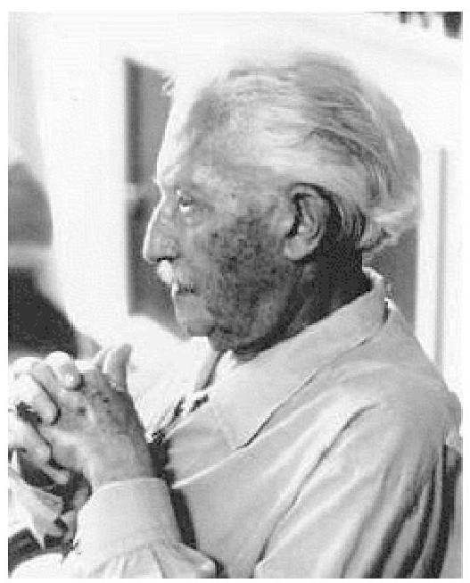

Figure LD.6. Erik Erikson. Erik Erikson proposed the psychosocial theory of development. In each stage of Erikson's theory, there is a psychosocial task that we must master in order to feel a sense of competence.

Erik Erikson's (1902-1994) (Figure Above) psychosocial development theory emphasises the social nature of our development. Erikson (1963) proposed that we are motivated by a need toachieve competence in certain areas of our lives. According to psychosocial theory, we experience eight stages of development over our lifespan, from infancy through late adulthood. At each stage, there is a conflict, or task, that we need to resolve. Successful completion of each developmental task results in a sense of competence and a healthy personality. Failure to master these tasks leads to feelings of inadequacy. Let's look at Erikson's eight stages of psychosocial development:

- Infancy (birth to 12 months): Trust versus mistrust is the core conflict, where responsive care fosters trust in infants while neglect leads to mistrust. Infants are dependent upon their caregivers, so caregivers who are responsive and sensitive to their infant's needs help their baby to develop a sense of trust; their baby will see the world as a safe, predictable place. Unresponsive caregivers who do not meet their baby's needs can engender feelings of anxiety, fear, and mistrust; their baby may see the world as unpredictable.
- Toddlerhood (1-3 years): The stage of autonomy versus shame and doubt, where toddlers learn independence through choices, enhancing autonomy; over-restriction fosters doubt. This is the "I do it" stage.
- Preschool (3-6 years): Initiative versus guilt, where children develop self-confidence and purpose through initiating activities; excessive criticism leads to guilt. Those who do will develop self-confidence and feel a sense of purpose.
- Elementary School (7-11 years): Industry versus inferiority, where children build pride and accomplishment through skills and activities; failure to match peers can cause feelings of inferiority. They either develop a sense of pride and accomplishment in their schoolwork, sports, social activities, and family life, or they feel inferior and inadequate when they don't measure up.
- Adolescence (12-18 years): Identity versus role confusion, focusing on developing a strong sense of self; failure results in confusion about identity and future roles. Adolescents struggle with questions such as "Who am I?" and "What do I want to do with my life?" Along the way, most adolescents try on many different selves to see which ones fit. Adolescents who are successful at this stage have a strong sense of identity and are able to remain true to their beliefs and values in the face of problems and other people's perspectives. Others might feel unsure of their identity and confused about the future.
- Early Adulthood (20s to early 40s): Intimacy versus isolation, where forming intimate relationships is key; failure leads to isolation. After we have developed a sense of self in adolescence, we are ready to share our life with others. Erikson said that we must have a strong sense of self before developing intimate relationships with others.
- Middle Adulthood (40s to mid-60s): Generativity versus stagnation, involving contributing to others' development; failure results in a sense of stagnation. Generativity involves finding your life's work and contributing to the development of others, through activities such as volunteering, mentoring, and raising children.- Late Adulthood (mid-60s onward): Integrity versus despair, where reflecting on life achievements can lead to satisfaction; failure may result in regret and despair. People in late adulthood reflect on their lives and feel either a sense of satisfaction or a sense of failure. People who feel proud of their accomplishments have a sense of integrity, and they can look back on their lives with few regrets. However, people who are not successful at this stage may feel as if their lives have been wasted.

Table LD.1. Erikson's stages of psychosocial development

| Stage | Age <br> (years) | Developmental Task | Description |
| :-- | :-- | :-- | :-- |
| 1 | $0-1$ | Trust versus <br> mistrust | Develop trust (or mistrust) that basic needs, such as nourishment <br> and affection, will be met. |
| 2 | $1-3$ | Autonomy versus <br> shame/doubt | Develop a sense of independence in many tasks. |
| 3 | $3-6$ | Initiative versus <br> guilt | Take initiative on some activities; may develop guilt when <br> unsuccessful or boundaries overstepped. |
| 4 | $7-11$ | Industry versus <br> inferiority | Develop self-confidence in abilities when competent or sense of <br> inferiority when not. |
| 5 | $12-18$ | Identity versus <br> confusion | Experiment with and develop identity and roles. |
| 6 | $19-29$ | Intimacy versus <br> isolation | Establish intimacy and relationships with others. |
| 7 | $30-64$ | Generativity versus <br> stagnation | Contribute to society and be part of a family. |
| 8 | $65-$ | Integrity versus <br> despair | Assess and make sense of life and meaning of contributions. |

Table Source: Erikson, E. H. (1950). Erikson's stages of psychosocial development. In Childhood and society (pp. 247-274). W. W. Norton \& Company.

Jean Piaget (1896-1980) is another stage theorist who studied childhood development (Figure LD.7). Instead of approaching development from a psychosocial perspective, Piaget focused on children's cognitive growth. He believed that thinking is a central aspect of development and that children are naturally inquisitive. However, he said that children do not think and reason like adults (Piaget, 1930, 1932). His theory of cognitive development suggests that our cognitive abilities develop through specific stages, which is an example of the discontinuity of development, i.e., as we progress to a new stage, there is a distinct and irreversible shift in how we think and reason.

Figure LD.7. Piaget. Jean Piaget spent over 50 years studying children and how their minds develop. Public domain image

Piaget said that children develop schemata to help them understand the world. Schemata are concepts (mental models) that are used to help us categorise and interpret information. By the time children have reached adulthood, they have created schemata for almost everything. When children learn new information, they adjust their schemata through two processes: assimilation and accommodation. First, they assimilate new information or experiences in terms of their current schemata: assimilation is when they take in information that is comparable to what they already know; accommodation describes when they change their schemata based on new information. This process continues as children interact with their environment.

For example, 2-year-old Majd learned the schema for dogs because his family has a Labrador Retriever. When Majd sees other dogs in his picture books, he says to his parents, "Dog!" So Majd has assimilated them into his schema for dogs. One day, Majd sees a sheep for the first time and says to his parent, "Dog!" Having a basic schema that a dog is an animal with four legs and fur, Majd thinks all furry, four-legged creatures are dogs. When Majd's parent tells him that the animal he sees is a sheep, not a dog, Majd must accommodate his schema for dogs to include more information based on his new experiences. Majd's schema for dog was too broad,since not all furry, four-legged creatures are dogs. He now modifies his schema for dogs and forms a new one for sheep.

Like Erikson, Piaget thought that development unfolds in a series of stages approximately associated with age ranges. He proposed a theory of cognitive development that unfolds in four stages: sensorimotor, pre-operational, concrete operational, and formal operational (Table LD.2).

Table LD.2. Piaget's Stages of Cognitive Development

| Age <br> (years) | Stage | Description | Developmental <br> issues |
| :-- | :-- | :-- | :-- |
| $0-2$ | Sensorimotor | World experienced through senses and actions. | Object <br> permanence; <br> Stranger anxiety |
| $2-6$ | Preoperational | Use words and images to represent things, but lack <br> logical reasoning. | Pretend play; <br> Egocentrism; <br> Language <br> development |
| $7-11$ | Concrete <br> operational | Understand concrete events and analogies logically; <br> perform arithmetical operations | Conservation; <br> Mathematical <br> transformations |
| $12-$ | Formal <br> operational | Formal operations; <br> utilise abstract reasoning | Abstract logic; <br> Moral reasoning |

Table source: Piaget, J. (2001). Piaget's stages of cognitive development. In B. Inhelder, H. H. Chipman, \& C. Zwingmann (Eds.), The essential Piaget (pp. 241-246). Basic Books.

# Stage 1 - Sensorimotor Stage 

The first stage is the sensorimotor stage, which lasts from birth to about 2 years old.

- During this stage, children learn about the world through their senses and motor behaviour.
- Young children put objects in their mouths to see if the items are edible, and once they can grasp objects, they may shake or bang them to see if they make sounds.
- Between 5 and 8 months old, the child develops object permanence, which is the understanding that even if something is out of sight, it still exists (Bogartz, Shinskey, \& Schilling, 2000). According to Piaget, young infants do not remember an object after it has been removed from sight. Piaget studied infants' reactions when a toy was first shown to an infant and then hidden under a blanket. Infants who had already developed object permanence would reach for the hidden toy, indicating that they knew it still existed, whereas infants who had not developed object permanence would appear confused.# Watch this video: What is Object Permanence? (4 minutes) 

One or more interactive elements has been excluded from this version of the text. You can view them online here:
https://opentextbc.ca/psychologymtdi/?p=322\#oembed-1
"What is Object Permanence?" video by Psy vs. Psy is licensed under the Standard YouTube licence.

In Piaget's view, around the same time children develop object permanence, they also begin to exhibit stranger anxiety, which is a fear of unfamiliar people. Babies may demonstrate this by crying and turning away from a stranger, by clinging to a caregiver, or by attempting to reach their arms toward familiar faces such as parents. Stranger anxiety results when a child is unable to assimilate the stranger into an existing schema; therefore, the child can't predict what their experience with that stranger will be like, which results in a fear response.

## Stage 2 - Preoperational Stage

Piaget's second stage is the preoperational stage, which is from approximately 2 to 7 years old. In this stage, children can:

- Use symbols to represent words, images, and ideas, which is why children in this stage engage in pretend play.
- Use language in the preoperational stage, but they cannot understand adult logic or mentally manipulate information (the term operational refers to logical manipulation of information, so children at this stage are considered to be preoperational). Children's logic is based on their own personal knowledge of the world so far, rather than on conventional knowledge.
- Cannot perform mental operations because they have not developed an understanding of conservation, which is the idea that even if you change the appearance of something, it is still equal in size as long as nothing has been removed or added.

Watch this video: A typical child on Piaget's conservation tasks (4 minutes)

One or more interactive elements has been excluded from this version of the text. You can view them online here:
https://opentextbc.ca/psychologymtdi/?p=322\#oembed-2"A typical child on Piaget's conservation tasks" video by munakatay is licensed under the Standard YouTube licence.

# Stage 3 - Concrete Operational Stage 

Piaget's third stage is the concrete operational stage, which occurs from about 7 to 11 years old. In this stage, children can:

- Think logically about real (concrete) events; they have a firm grasp on the use of numbers and start to employ memory strategies;
- Perform mathematical operations and understand transformations, such as the fact that addition is the opposite of subtraction, and multiplication is the opposite of division; and
- Master the concept of conservation: even if something changes shape, its mass, volume, and number stay the same.

Children in the concrete operational stage also understand the principle of reversibility, which means that objects can be changed and then returned back to their original form or condition. Take, for example, water that you poured into the short, wide glass; you can pour that same volume of water from the short, wide glass into a new thin, tall glass and still have the same amount (minus a couple of drops).

## Stage 4 - Formal Operational Stage

The fourth, and last, stage in Piaget's theory is the formal operational stage, which is from about age 11 to adulthood. Children in the formal operational stage can:

- Deal with abstract ideas and hypothetical situations; this is because they tend to think more flexibly and creatively;
- Use abstract thinking to problem-solve, look at alternative solutions, and test these solutions.


## Stage 5 - Beyond Formal Operational Thought

As with other major contributors of theories of development, several of Piaget's ideas have come under criticism; several contemporary studies support a model of development that is more continuous than Piaget's discrete stages (Courage \& Howe, 2002; Siegler, 2005, 2006). Many others suggest that children reach cognitive milestones earlier than Piaget describes (Baillargeon, 2004; de Hevia \& Spelke, 2010).According to Piaget, the highest level of cognitive development is formal operational thought, which develops between 11 and 20 years old. However, many developmental psychologists disagree with Piaget, suggesting a fifth stage of cognitive development, known as the postformal stage (Basseches, 1984; Commons \& Bresette, 2006; Sinnott, 1998).

In postformal thinking, decisions are made based on situations and circumstances, and logic is integrated with emotion as adults develop principles that depend on contexts. One way that we can see the difference between an adult in postformal thought and an adolescent in formal operations is in terms of how they handle emotionally charged issues.

Supplement LD.3: Case Study: Li Wei - A Journey through Cognitive Stages [New Tab]

Watch this video: Tricky Topics: Piaget's Developmental Stages (9 minutes)

One or more interactive elements has been excluded from this version of the text. You can view them online here: https://opentextbc.ca/psychologymtdi/?p=322\#oembed-3
"Tricky Topics: Piaget's Developmental Stages" video by FirstYearPsych Dalhousie is licensed under the Standard YouTube licence.

# Moral Development: Kohlberg and Gilligan 

## Kohlberg's Stages of Moral Development

A major task, beginning in childhood and continuing into adolescence, is distinguishing right from wrong. Lawrence Kohlberg (1927-1987) attempted to extend Piaget's ideas about stages of cognitive development to moral development, suggesting that morality, too, was developed over a series of stages throughout life. To develop this theory, Kohlberg posed moral dilemmas to people of all ages and placed them in particular stages based upon analysis of their answers.

Kohlberg divided moral development into three main levels: pre-conventional, conventional, and post-conventional, each reflecting a different way of thinking about morals and ethics.One or more interactive elements has been excluded from this version of the text. You can view them online here: https://opentextbc.ca/psychologymtdi/?p=322\#oembed-4
"Kohlberg's 6 Stages of Moral Development" video by Sprouts is licensed under the Standard YouTube licence.

# Pre-conventional level 

At the pre-conventional level, there is an understanding of morality based on consequences and personal benefits. This is the initial stage of moral development, primarily seen in children.

- Stage 1: Obedience and punishment orientation ("Do right to avoid trouble"). At this stage, children see rules as fixed and absolute. They obey rules not because they understand them, but because they fear punishment. For example, a child may refrain from stealing a toy because they fear being reprimanded or punished.
- Stage 2: Individualism and exchange ("What's in it for me?"). Here, children realise that different individuals have different viewpoints. They start to consider what's in it for them. Rules are followed if they align with their immediate personal interest. For instance, a child might do a chore in exchange for a reward.


## Conventional level

At the conventional level, moral decisions are based on societal norms (staying within social and cultural conventions) and the desire to maintain order and good relationships. This level is typical in adolescence and adulthood.

- Stage 3: Good interpersonal relationships ("Be a good person"). At this stage, people strive for social approval and good relationships. They try to be "good" by living up to social expectations and roles. For example, a worker might go the extra mile on a task not because they think it's right, but because they want to be seen as a good employee.
- Stage 4: Maintaining the social order ("Law and order"). People start to consider society as a whole. They recognise the importance of obeying laws and respect authority for maintaining social order. An example is a citizen paying taxes not just because it's the law, but because they understand the role of taxes in societal functioning.# Post-conventional level 

At the post-conventional level, there is a questioning of authority and societal norms (going beyond social and cultural conventions) and decisions based on personal principles of justice and human rights.

- Stage 5: Social contract and individual rights ("Questioning authority"). Here, people understand that while rules and laws exist for the good of the majority, there are times when those laws can work against the rights of some individuals. They begin to account for different values, opinions, and beliefs. For instance, someone may support civil disobedience to challenge laws they see as unjust.
- Stage 6: Universal principles ("Moral compass"). At this stage, people have developed their own set of moral guidelines which may or may not align with societal laws. These principles are abstract and ethical, not concrete rules. They're upheld regardless of official rules and laws and applied universally. An example might be a person who believes in and practices non-violence, even when it's legally permissible or advantageous to be violent.

Supplement LD.4: Deep Dive - Heinz Dilemma Kohlberg's stages of Moral Development [New Tab]

It's important to note that Kohlberg believed individuals could only progress through these stages in the order listed, and that moral understanding is linked to cognitive development. However, not everyone reaches the post-conventional level; some people stop at earlier stages and spend their whole lives there. Critics have argued that Kohlberg's stages are overly focused on justice and don't sufficiently incorporate other important moral values, such as compassion and care.Table LD.3. Kohlberg's Stages of Moral Development

| Level | Stage | Description |
| :-- | :-- | :-- |
| Pre-Conventional | 1: Obedience and Punishment <br> Orientation | Children see rules as fixed and absolute, <br> obeying to avoid punishment. |
| Pre-Conventional | 2: Individualism and Exchange | Children start to see that different <br> individuals have different viewpoints, <br> following rules if it aligns with their <br> interests. |
| Conventional | 3: Good Interpersonal Relationships | People strive for social approval and <br> good relationships, trying to be 'good' <br> by living up to expectations. |
| Conventional | 4: Maintaining the Social Order | People consider society as a whole, <br> recognising the importance of laws and <br> authority for social order. |
| Post-Conventional | 5: Social Contract and Individual Rights | People understand that laws exist for <br> the majority's good, but can challenge <br> them if they infringe on individual <br> rights. |
| Post-Conventional | 6: Universal Principles | People follow their own set of moral <br> guidelines, which may not align with <br> societal laws, based on universal <br> principles. |

Table Source: Kohlberg, L. (1971). Kohlberg's stages of moral development. In W. C. Crain (Ed.), Theories of Development (pp. 118-136). Pearson Education.

Supplement LD.5: Case Study - Willo's Journey Through Kohlberg's Stages of Moral Development [New Tab]

# Carol Gilligan and the Ethic of Care 

Using this framework, Kohlberg erroneously claimed that more males than females reach higher stages and that females seem to be deficient in their moral reasoning abilities (1969). Carol Gilligan, who worked with Kohlberg, challenged his framework (Gilligan, 1982). Kohlberg studied predominantly upper-middle class, white males and Gilligan pointed out the obvious bias inherent in basing a theory on such a narrowly defined group of people. Using female participants, she redefined Kohlberg's stages to allow moral problems to be considered from different perspectives.

Although an improvement over Kohlberg's theories, the dilemma-based tasks used by Gilligan assessed moral reasoning, which is different from moral behaviour. Sometimes what we say we'd do in a situation ("talk the talk") is not what we actually do ("walk the walk"). So, how exactlydoes one define moral behaviour? The definition of what makes a "good person" has long been the subject of philosophical debate and is unlikely to reach consensus anytime soon. As a tool for measuring moral development, neither Kohlberg's nor Gilligan's dilemmas are feasible in young children, who do not have the language comprehension required for these tests. In fact, Kohlberg lumped all children under the age of 10 in the same level of moral development.

A more evidence-based approach is to measure specific components of morality which are easier to define, like prosocial behaviour, defined as any behaviour done with the intention of benefiting someone else. This includes acts such as helping, consoling, and sharing, and can be assessed using simple behavioural tests. For example, participants can be asked to allocate resources to themselves and others under different conditions. Research using these simpler tasks has revealed that helping behaviour and sharing are evident in children as young as 2 years old, and that the nature of these prosocial behaviours changes over the course of development (Warneken \& Tomasello, 2006; Williams et al., 2014).

One 2019 study compared rates at which infants demonstrated prosocial behaviours (i.e., caring for others) across a range of three different ages: 16-, 19-, and 24-months-old. To do this, infants were placed in a situation where a researcher, using verbal communication and body language, indicated that they needed help with a basic task, such as finding a hidden toy. They then recorded the infants' prosocial behaviour according to three different categories: instrumental helping (such as offering the researcher a different object), comforting (such as hugging the upset researcher), and indirect helping (such as asking another adult in the room for help). The study found that the 24 -month old children were significantly more likely to demonstrate prosocial behaviours than the 16- and 19-month-olds, particularly when it came to comforting. This suggests that the second year of life is an extremely important period in the development of this important component of morality (Holvoet, et al. 2019).

This approach remedies some of the problems with Kohlberg's studies, in that he didn't define specific "good" or "bad" behaviours. Rather he assumed that his own ideas about good versus bad behaviour were true, and incorporated these assumptions into the design of his studies. Therefore, the outcomes of Kohlberg's studies were strongly influenced by his culturallyinformed ideas about morality. Instead focusing on one aspect of morality, like prosocial behaviour (described above), it allows researchers to assess developmental changes without judging this aspect as morally good or bad. This approach also ensures that judgements about what constitutes "good" behaviour doesn't colour the scientific data being collected or the design of the studies being done.# Lawrence Walker's Evidence-Based Critique of Stages of Moral Development 

Lawrence Walker studied how people develop their sense of right and wrong and how their moral thinking affected their moral behaviour. He focused specifically on exploring and building upon the ideas put forward by Lawrence Kohlberg and Carol Gilligan, both of whom suggested different theories about this topic. Walker's investigations generally corroborated Kohlberg's six stages of moral development, demonstrating that individuals indeed advance through these stages sequentially (Colby, Kohlberg, Gibbs, \& Lieberman, 1983; Walker, 1989). His research provided empirical proof that moral reasoning undergoes maturation and evolution over time, aligning closely with cognitive maturity. Furthermore, Walker established a correlation between higher stages of moral reasoning, as suggested by Kohlberg, and pro-social behaviours and attitudes (Walker, 2006). This research offered much needed empirical support for Kohlberg's theory.

In contrast, Carol Gilligan proposed a gender-based theory of moral development, suggesting that women tend to approach moral issues from an "ethics of care" perspective, while men adopt an "ethics of justice" viewpoint (Gilligan, 1982). Walker's research revealed a more subtle picture. His studies suggested that although there were slight differences in the moral reasoning of women and men, these were neither as pronounced nor as consistent as Gilligan had theorised (Walker, 1989). According to Walker, the "ethics of care" and "ethics of justice" are not gender-specific but rather represent two distinct moral orientations that any individual, regardless of gender, might adopt, depending on the situation (Walker, 2006). This added a layer of complexity to our understanding of moral development, indicating that it can be multifaceted and context-dependent instead of strictly stage-based.

While understanding moral development is crucial for grasping how individuals determine right from wrong. We will now explore how people develop their sense of racial identity. Just as moral development involves navigating personal and societal values, racial identity development involves understanding and responding to one's racial and cultural background. Beverly Daniel Tatum expanded on William Cross's Nigrescence Model, which originally focused on African Americans, to include all marginalized or non-white groups. Tatum's work helps us understand how people develop their racial identity and empowerment, facing pressures from dominant cultures and racist experiences.# Racial Identity Development 

Beverly Daniel Tatum expands on Cross's Nigrescence Model (Cross, 1978) work by broadening the understanding of racial identity development beyond just African Americans, making it relevant to people from marginalised or other non-white groups. Rather than being age-based like Cross' model, Tatum's 5-step model enables us to gain a broader understanding of how people from marginalised or non-white groups develop their sense of racial identity and empowerment as they navigate the pressures that come from dominant white cultures and encounters with racist practices and systems.

## Pre-Encounter

Individuals at this stage have not yet recognised the impact of race on their lives. They may have internalised negative stereotypes about their own racial group, possibly preferring the dominant racial group's culture, or they may not "see colour", with little awareness of racial significance.

## Encounter

This stage involves a situation or series of situations that force the individual to acknowledge the impact of race. It could be a specific racial incident or the accumulation of microaggressions that sparks this realisation. The encounter causes cognitive dissonance, challenging their previous beliefs and attitudes about race.

## Defining microaggression

A "microaggression" is like a small, often unnoticed action or comment that can hurt someone because it makes a negative assumption about them based on things like their race, gender, or culture. It's often not meant to be mean, but it can still feel disrespectful or hurtful to the person it's directed at.

## Immersion/Emersion

The individual begins to immerse themselves in their own racial identity, actively seeking to connect with their racial group and learning about their history and culture. There's a sense ofbelonging and community. At the same time, they may reject or avoid the dominant group, often out of anger or resentment created by the encountered experience.

# Internalisation 

The person feels secure in their racial identity and no longer feels the need to avoid or reject other racial groups. There's an acceptance of oneself and others. However, this doesn't mean they ignore racism; they acknowledge its existence but also recognise the value of building cross-racial alliances.

## Internalisation-Commitment

The final stage is where the individual not only accepts their racial identity but is also actively committed to social justice causes related to race. This commitment could manifest in various ways, such as advocacy, teaching, or activism.

## Supplement LD.6: Case Study - Anaya's journey through the racial identity stages [New Tab]

Understanding racial identity development relies on analysing how radicalized people build their identity under societal pressures. Similarly, the following Feminist Identity Development (FID) theory by Downing and Roush explains how women develop a feminist identity, moving from accepting traditional roles to actively supporting feminist principles as a result of the impacts of societal pressures, restrictions and aggressions. Both theories highlight the journey individuals take to understand and assert their identities, whether it's in the face of racial or gender-based challenges.

## Feminist Identity Development

Feminist Identity Development (FID) theory was proposed by Downing and Roush (1985), emphasising the five stage process that women undergo to develop a positive feminist identity. This developmental process is similar to other social identity development theories in that it describes a progression from lack of awareness about oppression to an integration of one's social identity into one's self-concept (Downing \& Roush, 1985). In addition, many people who identify as women may not engage with feminism at all (Fischer et al., 2003).# Passive Acceptance ("Agreeing Without Question") 

People in this stage who identify as women:

- Exhibit unconscious acceptance of traditional gender roles and lack of awareness regarding gender-based oppression; and
- Are likely to believe in and follow stereotypical roles, essentially reflecting the dominant cultural values and norms about gender.


## Revelation ("Waking Up")

- Begins when a person who identifies as a woman experiences a revelation event that exposes them to the realities of gender oppression, leading to increased awareness of sexism. The catalyst could be a personal experience of discrimination, exposure to feminist thought, or socialization with feminist peers.
- Is characterised by strong emotional responses such as anger or fear.


## Embeddedness-Emanation ("Connection and Expression")

- Involves deep engagement with feminist communities, which can provide emotional support and reinforce the evolving feminist identity of the person who identifies as a woman.
- Includes the recognition, over time, of the individual differences among people who identify as women (the emanation part of this stage) and an understanding that these experiences are not monolithic, but vary with intersecting identities like race, sexual orientation, socioeconomic status, and more.


## Synthesis ("Coming Together")

- Integrates f a feminist identity with other aspects of the self, leading to a more holistic selfconcept.
- Involves holding multiple identities without conflict, and exhibiting less extreme reactions to sexist events, focusing more on proactive strategies for change.


## Active Commitment ("Let's Do This!")

- Involves ongoing commitment to feminist principles, which can be expressed throughactions such as political activism, career choices, or personal relationships.

- Expresses an enduring commitment to feminist principles rather than the temporary emotional responses that characterised earlier stages.

Supplement LD.7: Case Study - Maya's Path to Feminist Identity Development [New Tab]

Feminist Identity Theory is not without its limitations. Critics argue that it may oversimplify the process of developing a feminist identity and fail to adequately account for the complexity and diversity of all women's experiences (Rickard, 1989). Reid (2003) proposed an intersectionality model of feminist identity, extending beyond the focus on gender alone in Downing and Roush's model. Reid's emphasis is on the multiple intersecting identities that each woman has, including race, class, age, ability, sexual orientation, and nationality, among others. Reid argues that these intersecting identities are inseparable and that they interact with gender in shaping a woman's feminist identity (Ludvig, 2006).

Feminist Identity Development (FID) theory and Reid's intersectional approach all highlight the complex journey towards a feminist identity. These theories, though valuable, should be seen as potential pathways rather than universal scripts, reflecting the unique experiences of each individual. Embracing the complexity of feminism calls for acknowledging the importance of social activism, personal perspectives, and the intersection of multiple identities. It's important to note that Reid's approach is less a step-by-step model and more a framework for understanding the complex, interwoven nature of identity and oppression.

# Spiritual development: Issues and Stages 

Spiritual development is an intrinsic part of being human, encompassing the growth of one's capacity for self-transcendence and the search for connectedness, meaning, and purpose (Benson, Roehlkepartain, \& Rude, 2003; Benson \& Roehlkepartain, 2008). It extends beyond religious traditions, shaping the human experience in diverse ways. This section on spirituality and development explores the transformative nature of spiritual development, the cultural shifts driving the search for meaning, the role of spirituality in well-being and resilience, and some of the stages of spiritual development.# Spirituality as a Human Capacity Shared by Majority of Humans Around the World 

It is not uncommon to find our youth and adults alike on a journey of self-discovery and spiritual evolution. It is important for us to realise just how common it is for humans of all ages to wonder about and explore spirituality.

International researchers surveyed 6725 children, youth, and young adults aged 12 to 25 . This study measured spirituality across nations and faith traditions. They found the majority of young individuals are actively nurturing their spiritual growth, often without heavily engaging in formal religious or spiritual practices (Benson et al., 2012).

In addition, another survey of adults from 20 countries revealed that, on average, $71 \%$ of respondents occasionally or often reflect on life's meaning, a crucial aspect of spiritual understanding (Campbell \& Curtis, 1996). Adopting a more conventional religious lens, a 1999 Gallup International Association poll involving 50,000 adults from 60 countries found that an average of $63 \%$ of respondents said that God is highly significant in their lives. Additionally, a significant $75 \%$ expressed belief in either a personal God or some form of spiritual or life energy (Benson, Roehlkepartain, \& Rude, 2003).

These consistent findings from various countries revealed that a significant proportion of children, youth, and young adults are actively engaged in spiritual meaning-making. Regardless of the absence of heavy engagement in formal religious practices, spiritual development is a vibrant and active process. This exploration of spirituality across age groups not only reflects our collective quest for purpose and understanding but also underscores the importance of spirituality in shaping our lives and societies.

Feminist Identity Development (FID) theory, proposed by Downing and Roush, outlines how women progress through stages to develop a positive feminist identity, from passive acceptance of gender roles to active commitment to feminist principles. Similarly, we will learn in the next section that spiritual development involves progressing through stages of understanding, from basic trust and imaginative beliefs in early childhood to more complex and selfless faith in adulthood, as described by James Fowler. Both theories highlight the importance of personal growth, self-awareness, and the integration of one's identity with broader social and moral values. Whether it's developing a feminist identity or a spiritual one, both processes emphasize the journey of self-discovery, the impact of societal influences, and the pursuit of a more profound sense of meaning and purpose.# Stages of Spiritual Development 

In addition to the concepts discussed, various theories propose stages of spiritual development. One such model of spiritual development is James Fowler's stages of faith development. He mapped out individuals' progress through different stages of belief and spirituality, from simplistic adherence to external authority to a more complex, internally synthesized understanding of one's faith (Fowler, 1981). Similarly, Lawrence Kohlberg's theory of moral development suggests that individuals may progress through stages of moral reasoning that intersect with spiritual growth (Kohlberg, 1981). These stages provide insights into the complexity and depth of spiritual development.

Fowler developed a theory of the stages of faith development in which he outlined six stages that individuals move through as their faith matures. Fowler drew inspiration from the works of developmental psychologists like Jean Piaget, Lawrence Kohlberg, and Robert Selman, among others. Here are Fowler's stages of faith:

Table LD.4. Fowler's stages of spiritual development

| Age | Label of Stage | Description |
| :-- | :-- | :-- |
| Birth to 2 years | Primal or Undifferentiated Faith <br> "Baby Trust Stage" | Babies' care shapes their view of the world as <br> safe or dangerous. |
| Ages 3-7 | Intuitive-Projective Faith <br> "Imaginative Belief Stage" | Family traditions shape children's blend of <br> imaginative and real beliefs. |
| Ages 8-12 | Mythic-Literal Faith "Literal Faith <br> Stage" | Individuals' beliefs solidify, reflecting their <br> peers' views on divinity. |
| Adolescence | Synthetic-Conventional Faith <br> "Group Belief Stage" | Youth conform their beliefs to fit social <br> expectations. |
| Young adulthood | Individuative-Reflective Faith <br> "Personal Belief Stage" | Young adults critically form their own beliefs, <br> independent of peers. |
| Mid-life | Conjunctive Faith "Mysterious <br> Faith Stage" | Mid-life acceptance of life's mysteries and <br> contradictions. |
| Usually midlife <br> and beyond | Universalising Faith "Selfless Faith <br> Stage" | The final stage is marked by selfless altruism <br> and dedication to others. |

Table Source: Fowler, J. W. (1981). Stages of faith: The psychology of human development and the quest for meaning. Harper \& Row.

## Primal or undifferentiated faith - "Baby trust stage" (birth to 2 years)

- A baby learns whether the world around them is safe and comforting or scary and harmful,based on how they are taken care of.

- A baby who is well fed, cleaned, and cuddled will develop a trusting view of the world and a feeling of divine safety.


# Intuitive-projective faith - "Imaginative belief stage" (ages 3-7) 

- Children's understanding of faith is shaped by their parents and family traditions.
- Their view of the world is a blend of imagination and reality, much like how they might believe in Santa Claus or the Tooth Fairy.


## Mythic-literal faith - "Literal faith stage" (ages 8-12)

- Individuals start to understand the world in more concrete terms, like their friends and community do.
- They might believe in God or the Creator because their friends at school do, and they see a Higher Power in a very straightforward, literal way.


## Synthetic-conventional faith - "Group belief stage" (adolescence)

- Teenagers often follow the religious beliefs and behaviours that their family, friends, and community expect from them.
- It's like wearing the same clothes as their friends to fit in, but with beliefs.


## Individuative-reflective faith - "Personal belief stage" (young adulthood)

- People start to question and think deeply about their beliefs, forming their own opinions.
- It's like realising they don't have to like the same music as their friends and can have their own taste.


## Conjunctive faith - "Mysterious faith stage" (mid-life)

- People understand that life can't always be explained logically and start accepting its mysteries and contradictions.- It's like appreciating a beautiful piece of abstract art that doesn't have a clear meaning.


# Universalising faith - "Selfless faith stage" (usually midlife and beyond) 

- This final stage is rare and marked by individuals who devote their lives to helping others, free from worries or doubts.
- It's like a person who spends their retirement volunteering at a food bank because they genuinely want to make a difference.

Supplement LD.8: Case Study - "Ethan's Journey Through Faith: Unfolding Spirituality of Ethan, a White, Gay Male" [New Tab]

It is important to note that these stages are not necessarily linear and that individuals may move back and forth between them in response to life events and changes in their personal beliefs and values.

A spiritual journey allows individuals to awaken to their interconnectedness with themselves, others, and the universe, cultivating identity, meaning, and purpose. Seeking significance in relationships, searching for interdependence with a greater existence, and living by narratives that provide meaning further facilitates this spiritual process (Kosasih \& Hermawan, 2023). By embracing spirituality and its various stages of development, we can increase our holistic wellbeing and grow our resilience in the face of setbacks, transcend individualistic boundaries and embrace the richness of the human experience.

## Conclusion

In concluding our look at "Focused Perspectives on Lifespan Development," we've examined a range of theories and concepts that enhance our understanding of human development. We've discussed intersectionality, power, and diverse viewpoints, along with Vygotsky's sociocultural theory and the impact of technology on young people. This section highlighted various factors that shape development, including Erikson's theories, Piaget's cognitive stages, and the areas of moral and racial identity, feminist identity, and spiritual development.

Each topic has shown how individuals interact with their surroundings, emphasising the role ofcontext, culture, and social dynamics in development. Through various analyses, we've observed how both challenges and opportunities enrich human development across the lifespan.

Moving forward, we recognise development as a multifaceted process, shaped by social, cultural, and psychological factors. This section has provided the tools to critically understand and appreciate human development's complexity, promoting a comprehensive and inclusive view of the developmental journey from infancy to adulthood.

# Next 

After exploring "Focused Perspectives on Lifespan Development", we move to "Ages, Stages, and Milestones of Development". This section transitions to the chronological aspects of human development, covering biological, cognitive, and psychosocial milestones across life phases.

In this section, we detail biological development from prenatal stages to emerging adulthood, highlighting key growth periods and milestones, supported by current research and visual aids to improve understanding.

We'll cover cognitive development, attachment theories, self-concept formation, and adolescence's challenges and achievements, focusing on inclusivity and diversity to represent all developmental experiences accurately.

As we continue, remember the interconnectedness of developmental stages and the importance of a holistic view of each person's development. This section aims to deepen appreciation for the complexity and richness of human development across the lifespan.

## Image Attributions

Figure LD.5. Scaffolding and the Zone of Proximal Development by Marie Bartlett is licensed under a CC BY 4.0 license.

Figure LD.6. Public domain image.
Figure LD.7. Public domain image

## (0) (0) (0)

Focused Perspectives on Lifespan Development Copyright © 2024 by Jessica Motherwell McFarlane is licensed under a Creative Commons Attribution-NonCommercial-ShareAlike 4.0 International License, except where otherwise noted.572 | Chapter 11. Lifespan Development# Ages, Stages, and Milestones of Development 

JESSICA MOTHERWELL MCFARLANE

Approximate reading time: 51 minutes
Development from conception into a fully grown human involves major alterations to anatomy, physiology, cognition, and behaviour, and many of these changes follow a predictable, agebased progression. This section will discuss prenatal, infant, child, adolescent, and adult development across three domains: physical, cognitive, and psychosocial.

9 weeks
Fetal stage begins


20 weeks
Hearing begins


32 weeks
Bones fully develop


36 weeks
Muscles fully develop

16 weeks
Fingers and toes develop


28 weeks
Brain grows rapidly


40 weeks
Full-term development

Figure LD.8. Development. During the fetal stage, the baby's brain develops and the body adds size and weight, until the fetus reaches full-term development.

# Prenatal Development 

How did you come to be who you are? From your beginning as a one-cell structure to your birth,your prenatal development occurred in an orderly and delicate sequence. There are three main stages of prenatal development: germinal, embryonic, and fetal. Let's explore what happens to the developing baby in each of these stages.

# Germinal Stage (Conception to Week 2) 

- Each biological parent contributes DNA at conception, when sperm and egg unite to form a single-celled zygote.
- Growth and development of the zygote are guided by genetic instructions, coded in DNA within 46 chromosomes, 23 from each parent.
- In mammals, sex is determined by specific chromosome contributions: females are typically $X X$ and males are typically $X Y$.
- As shown in Figure LD.9, (a) Sperm and ovum fuse at conception. (b) 23 pairs of human chromosomes, showing sex chromosomes: one large $X$ and a smaller $Y$.
- The zygote divides and multiplies through mitosis, becoming more specialised and forming different organs and body parts.
- Fewer than one-half of all zygotes survive beyond the first two weeks (Hall, 2004).


## Embryonic Stage (Weeks 2 to 8)

- After dividing to about 150 cells, the organism implants in the uterus lining and is called an embryo.
- The placenta forms, connecting to the uterus to provide nourishment and oxygen via the umbilical cord.
- Basic structures develop into areas that will become the head, chest, and abdomen.
- Organs form and begin to function, with a detectable heartbeat and the neural tube developing into the spinal cord and brain.


## Fetal Stage (Week 8/9 and Onward)

- The embryo becomes a fetus, taking on the recognisable form of a human being.
- Sex organs begin to differentiate; by 16 weeks, fingers, toes, and fingerprints are fully developed.
- By 24 weeks, the fetus weighs up to 1.4 pounds and can respond to sounds.
- By 36 weeks, the fetus is almost ready for birth, weighing about 6 pounds and is about 18.5 inches long.
- By week 37, all organ systems are developed enough for survival outside the uterus.# Prenatal Toxins and Other Influences 

- The placenta provides nourishment and oxygen, but also allows passage of substances ingested by the pregnant parent.
- Teratogens are environmental agents that cause damage to the developing embryo or fetus, with significant impact during early pregnancy.
- Lead exposure can cause cognitive impairments and is a global health concern (Koller et al., 2004).
- In the United States, lead poisoning deaths are comparable to those caused by smoking tobacco (O'Connor et al., 2020).
- Recreational drugs like alcohol and tobacco, radiation, and viruses such as HIV, herpes, and rubella are considered teratogens.
- High stress during pregnancy can lead to children with enhanced stress responses (Leung et al., 2010).


Figure LD.9. Pre-natal development. (a) Sperm and ovum fuse at the point of conception. (b) 23 pairs of human chromosomes inherited from each parent, box displays the sex chromosomes; one large $X$ and a smaller $Y$ in this individual.

Watch this video: Prenatal Development - From Conception to Birth - Germinal Stage, Embryonic Stage, Fetal Stage (29 minutes)

One or more interactive elements has been excluded from this version of the text. You can view them online here: https://opentextbc.ca/psychologymtdi/?p=333\#oembed-1
"Prenatal Development - From Conception to Birth - Germinal Stage, Embryonic Stage, Fetal Stage" video by Psych Explained is licensed under the Standard YouTube licence.# Infancy Through Childhood 

The average newborn weighs approximately 7.5 pounds. Although small, a newborn is not completely helpless because their reflexes and sensory capacities help them interact with the environment from the moment of birth. All healthy babies are born with newborn reflexes: inborn automatic responses to specific forms of stimulation. Reflexes help the newborn survive until they're capable of more complex behaviours; these reflexes are crucial to survival. They are present in babies whose brains are developing normally and usually disappear around 4-5 months old.

## Let's Take a Look at Some of These Newborn Reflexes

The rooting reflex is the newborn's response to anything that touches their cheek; when you stroke a baby's cheek, they naturally turn their head in that direction and begin to suck. The sucking reflex is the automatic, unlearned, sucking motions that infants do with their mouths. You can observe the grasping reflex if you put your finger into a newborn's hand, they automatically grasp anything that touches their palms.

The Moro reflex is the newborn's response when a baby feels like they are falling. The baby spreads their arms, pulls them back in, and then (usually) cries. How do you think these reflexes promote survival in the first months of life?

Watch this video, created by the Inter-Tribal Council of Michigan, describing and showing newborn reflexes, to learn more.

Watch this video: Newborn Reflexes: The Power of Your Newborn (5 minutes)

One or more interactive elements has been excluded from this version of the text. You can view them online here: https://opentextbc.ca/psychologymtdi/?p=333\#oembed-2
"Newborn Reflexes: The Power of Your Newborn" video by Inter-Tribal Council of Michigan is licensed under the Standard YouTube licence.

## What Can Young Infants See, Hear, and Smell?

Newborn infants' sensory abilities are significant, but their senses are not yet fully developed. Many of a newborn's innate preferences facilitate interaction with caregivers and other humans.- Although vision is their least developed sense, newborns already show a preference for faces.
- Babies who are just a few days old also prefer human voices; they will listen to voices longer than sounds that do not involve speech (Vouloumanos \& Werker, 2004). They seem to prefer the voice of the parent in whose womb the baby developed over a stranger's voice (Mills \& Melhuish, 1974).
- 3-week-old babies were given pacifiers that played a recording of the pregnant parent's voice and of a stranger's voice. When the infants heard their parent's voice, they sucked more strongly at the pacifier (Mills \& Melhuish, 1974).

Newborns also have a strong sense of smell.

- Newborn babies can distinguish the smell of the parent who was pregnant from that of others.
- 1-week-old babies who were being breastfed were placed between two gauze pads. One gauze pad was from the bra of a nursing parent who was a stranger, and the other gauze pad was from the bra of the infant's own nursing parent. More than two-thirds of the weekold babies turned toward the gauze pad with their own nursing parent's scent (MacFarlane (1978).


# Physical Development 

During infancy, toddlerhood, and early childhood, the body's physical development is rapid. On average, newborns weigh between 5 and 10 pounds. By the age of 2 , this weight will have quadrupled, with most 2-year-olds weighing between 20 and 40 pounds
(WHO Multicentre Growth Reference Study Group, 2006). Growth slows between 4 and 6 years old. During this time children gain 5-7 pounds and grow about 2-3 inches per year.


Figure LD.10. Physical development. Children experience rapid physical changes through infancy and early childhood.The nervous system continues to grow and develop after birth; each neural pathway forms thousands of new connections during infancy and toddlerhood. This period of rapid neural growth is called blooming. The blooming period of neural growth is then followed by a period of pruning, where neural connections are reduced. It is thought that pruning allows the brain to function more efficiently, allowing for mastery of more complex skills (Hutchinson, 2011). Blooming occurs during the first few years of life, and pruning continues through childhood and into adolescence in various areas of the brain.

The size of our brains increases rapidly.

- The brain of a 2-year-old is $55 \%$ of its adult size, and by the age of 6 the brain is about $90 \%$ of its adult size (Tanner, 1978).
- During early childhood (ages 3-6), the frontal lobes grow rapidly. The frontal lobes are associated with planning, reasoning, memory, and impulse control.
- Through the elementary school years, the frontal, temporal, occipital, and parietal lobes all grow in size.
- The brain growth spurts experienced in childhood tend to follow Piaget's sequence of cognitive development, so that significant changes in neural functioning are associated with cognitive advances (Kolb \& Whishaw, 2009; Overman, Bachevalier, Turner, \& Peuster, 1992).


# Movement 

Motor development occurs in an orderly sequence as infants move from reflexive reactions (e.g., sucking and rooting) to more advanced motor functioning.

Motor skills refer to our ability to move our bodies and manipulate objects.
Fine motor skills focus on the muscles in our fingers, toes, and eyes, and enable coordination of small actions (e.g., grasping a toy, writing with a pencil, and using a spoon).

Gross motor skills focus on large muscle groups that control our arms and legs and involve larger movements (e.g., balancing, running, and jumping). As motor skills develop, there are certain developmental milestones that young children typically achieve at certain age ranges (Table LD.5).

- An example of a developmental milestone is sitting. On average, most babies sit alone at 7 months old. Sitting involves both coordination and muscle strength, and 90 percent of babies achieve this milestone between 5 and 9 months old.
- Babies on average are able to hold up their head at 6 weeks old, and 90 percent of babies achieve this between 3 weeks and 4 months old.Caregivers should be concerned about a child who is displaying delays on several milestones, since some developmental delays can be identified and addressed through early intervention.

Table LD.5. Developmental milestones, ages 2-5 years

| Age (years) | Physical | Personal/Social | Language | Cognitive |
| :-- | :-- | :-- | :-- | :-- |
| 2 | Kicks a ball; walks <br> up and down stairs | Plays alongside <br> other children; <br> copies adults | Points to objects <br> when named; puts <br> 2-4 words <br> together in a <br> sentence | Sorts shapes and <br> colours; follows <br> 2-step instructions |
| 3 | Climbs and runs; <br> pedals tricycle | Takes turns; <br> expresses many <br> emotions; dresses <br> self | Names familiar <br> things; uses <br> pronouns | Plays make <br> believe; works toys <br> with parts (levers, <br> handles) |
| 4 | Catches balls; uses <br> scissors | Prefers social play <br> to solo play; knows <br> likes and interests | Knows songs and <br> rhymes by <br> memory | Names colours and <br> numbers; begins <br> writing letters |
| 5 | Hops and swings; <br> uses fork and <br> spoon | Distinguishes real <br> from pretend; likes <br> to please friends | Speaks clearly; <br> uses full sentences | Counts to 10 or <br> higher; prints <br> some letters and <br> copies basic <br> shapes |

# Cognitive Development 

In addition to rapid physical growth, young children also exhibit significant development of their cognitive abilities. Piaget thought that a child's ability to understand objects, such as learning that a rattle makes a noise when shaken, is a cognitive skill that develops slowly as a child matures and interacts with the environment.

Today, developmental psychologists think Piaget was incorrect about that. Researchers have found that even very young children understand physical properties of objects long before they have direct experience with those objects (Baillargeon, 1987; Baillargeon, Li, Gertner, \& Wu, 2011). For example, children as young as 3 months old demonstrated knowledge of the properties of objects that they had only viewed and did not have prior experience with them.

In one study, 3-month-old infants were shown a truck rolling down a track and behind a screen. The box, which appeared solid but was actually hollow, was placed next to the track. The truck rolled past the box as would be expected. Then the box was placed on the track to block the path of the truck. When the truck was rolled down the track this time, it continued unimpeded. The infants spent significantly more time looking at this impossible event (Figure LD.11). Baillargeon(1987) concluded that the infants knew that solid objects cannot pass through each other.Baillargeon's findings suggest that very young children have an understanding of objects and how they work, which Piaget (1954) would have said is beyond their cognitive abilities due to their limited experiences in the world.


Figure LD.11. Baillargeon's study. In Baillargeon's study, infants observed a truck (a) roll down an unobstructed track, (b) roll down an unobstructed track with an obstruction (box) beside it, and (c) roll down and pass through what appeared to be an obstruction.

Like physical milestones, there are also cognitive milestones children typically reach at certain ages. For example, infants shake their head "no" around 6-9 months, and they respond to verbal requests to do things like "wave bye-bye" or "blow a kiss" around 9-12 months. Remember Piaget's ideas about object permanence? We can expect children to grasp the concept that objects continue to exist even when they are not in sight by around 8 months old. Because toddlers (i.e., 12-24 months old) have mastered object permanence, they enjoy games like hide and seek, and they realise that when someone leaves the room they will come back (Loop, 2013). Toddlers also point to pictures in books and look in appropriate places when you ask them to find objects.

Preschool-age children (i.e., 3-5 years old) also make steady progress in cognitive development. Not only can they count, name colours, and tell you their name and age, but they can also make some decisions on their own, such as choosing an outfit to wear. Preschool-age children understand basic time concepts and sequencing (e.g., before and after), and they can predict what will happen next in a story. They also begin to enjoy the use of humour in stories. Because they can think symbolically, they enjoy pretend play and inventing elaborate characters and scenarios. One of the most common examples of their cognitive growth is their blossoming curiosity. Preschool-age children love to ask "Why?"

An important cognitive change occurs in children this age. Recall that Piaget described 2-3 year olds as egocentric, meaning that they do not have an awareness of others' points of view. Between 3 and 5 years old, children come to understand that people have thoughts, feelings, and beliefs that are different from their own. This is known as theory-of-mind (TOM). Children can use this skill to tease others, persuade their parents to purchase a candy bar, or understandwhy a sibling might be angry. When children develop TOM, they can recognise that others have false beliefs (Dennett, 1987; Callaghan et al., 2005).

Watch this video outlining the basics of Theory of Mind and showing young children engaging in a classic 'false belief' or ToM activity - the 'Sally-Anne' test.

Watch this video: Theory of Mind (4 minutes)

One or more interactive elements has been excluded from this version of the text. You can view them online here: https://opentextbc.ca/psychologymtdi/?p=333\#oembed-3
"Theory of Mind" video by BrainFacts.org is licensed under the Standard YouTube licence.
Cognitive skills continue to expand in middle and late childhood (6-11 years old):

- The child's thought processes become more logical and organised when dealing with concrete information.
- The child understands concepts such as the past, present, and future, giving them the ability to plan and work toward goals.
- The child can process complex ideas such as addition and subtraction and cause-and-effect relationships.


Figure LD.12. Soccer player.# Language Development 

One well-researched aspect of cognitive development is language acquisition. The order in which children learn language structures is consistent across children and cultures (Hatch, 1983).

- Starting before birth, babies begin to develop language and communication skills.
- At birth, babies apparently recognise the voice of their birth parent, and can discriminate between the language(s) spoken by their birth parent and foreign languages, and they show preferences for faces that are moving in synchrony with audible language (Blossom \& Morgan, 2006; Pickens, 1994; Spelke \& Cortelyou, 1981).
- Children communicate information through gesturing long before they speak, and there is some evidence that gesture usage predicts subsequent language development (Iverson \& Goldin-Meadow, 2005).
- Babies begin to coo almost immediately. Cooing is a one-syllable combination of a consonant and a vowel sound (e.g., coo or ba).
- Babies replicate sounds from their own languages. A baby whose parents speak French will coo in a different tone than a baby whose parents speak Spanish or Urdu.

After cooing, the baby starts to babble. Babbling begins with repeating a syllable, such as mama, da-da, or ba-ba.

- When a baby is about 12 months old, we expect them to say their first word for meaning, and to start combining words for meaning at about 18 months.
- At about 2 years old, a toddler uses between 50 and 200 words; by 3 years old they have a vocabulary of up to 1,000 words and can speak in sentences.

During the early childhood years, children's vocabulary increases at a rapid pace. This is sometimes referred to as the "vocabulary spurt" and has been claimed to involve an expansion in vocabulary at a rate of 10-20 new words per week.

- Recent research may indicate that while some children experience these spurts, it is far from universal (as discussed in Ganger \& Brent, 2004).
- 5-year-olds understand about 6,000 words, speak 2,000 words, and can define words and question their meanings. They can rhyme and name the days of the week.
- Seven-year-olds speak fluently and use slang and clichés (Stork \& Widdowson, 1974).

You can read more about the development of language in the Intelligence and Language chapter.# Attachment 

Psychosocial development happens as children build relationships, interact with others, and learn to handle their emotions. A key part of social and emotional growth is forming strong attachments, especially in infancy. Attachment refers to a deep emotional connection with others, typically between a child and their caregiver. This bond is crucial and forms more easily in the early years, indicating a sensitive period for emotional development. Developmental psychologists explore important questions about this process, such as: How do bonds between parents and infants develop? What impact does neglect have on these bonds? Why do children form different types of attachments?

Researchers John Bowlby and Mary Ainsworth conducted studies designed to answer these questions. In the 1950s, Bowlby developed the concept of attachment theory. He defined attachment as the affectional bond that an infant forms with the parent who birthed them (Bowlby, 1969). An infant must form this bond with a primary caregiver in order to have normal social and emotional development. In addition, Bowlby proposed that this attachment bond is very powerful and continues throughout life. He used the concept of secure base to define a healthy attachment between parent and child (Bowlby, 1988). A secure base is a parental presence that gives the child a sense of safety as they explore their surroundings.

Bowlby said that two things are needed for a healthy attachment:

1. The caregiver must be responsive to the child's physical, social, and emotional needs.
2. The caregiver and child must engage in mutually enjoyable interactions (Bowlby, 1969) (Figure LD.13).


Figure LD.13. Mutually enjoyable interactions. Mutually enjoyable interactions promote the parent-infant bond.While Bowlby thought attachment was an all-or-nothing process, Mary Ainsworth's (1970) research showed otherwise. Ainsworth wanted to know if children differ in the ways they bond, and if so, why. To find the answers, she used the Strange Situation procedure to study attachment between parents and their infants (Ainsworth \& Bell, 1970). In the Strange Situation, the primary caregiver and child (age 12-18 months) are placed in a room together. There are toys in the room, and the caregiver and child spend some time alone in the room. After the child has had time to explore their surroundings, a stranger enters the room. The caregiver then leaves the baby with the stranger. After a few minutes, the caregiver returns to comfort their child.

Based on how the infants/toddlers responded to the separation and reunion, Ainsworth identified three types of parent-child attachments: secure, avoidant, and resistant (Ainsworth \& Bell, 1970). A fourth style, known as disorganised attachment, was later described (Main \& Solomon, 1990).

# Secure attachment 

- Most common type of attachment.
- Toddler prefers their parent (the attachment figure) over a stranger.
- Toddler uses the attachment figure as a secure base to explore the environment.
- Toddler seeks out parent in times of stress.
- Children are distressed when caregivers leave the room in the Strange Situation experiment but happy upon their return.
- Caregivers are sensitive and responsive to their needs.


## Avoidant attachment

- Child is unresponsive to the parent.
- Child does not use the parent as a secure base.
- Child does not appear to care if the parent leaves.
- Child reacts to the parent the same way they react to a stranger.
- Child is slow to show a positive reaction when the parent returns.


## Resistant attachment

- Children show clingy behaviour but reject attachment figure's attempts to interact.
- Children do not explore the toys in the room due to fear.
- Children become extremely disturbed and angry with the parent during separation in theStrange Situation.

- Children are difficult to comfort when the parent returns.


# Disorganised attachment 

- Children behave oddly in the Strange Situation, such as freezing, running around erratically, or trying to run away when the caregiver returns.
- Is most often seen in children who have been abused - which disrupts a child's ability to regulate their emotions (Main \& Solomon, 1990).


Figure LD.14. Secure attachment. In secure attachment, the parent provides a secure base for the toddler, allowing them to securely explore their environment.

While Ainsworth's research has found support in subsequent studies, it has also met criticism. Some researchers have pointed out that a child's temperament may have a strong influence on attachment (Gervai, 2009; Harris, 2009), and others have noted that attachment varies from culture to culture, a factor not accounted for in Ainsworth's research (Rothbaum, Weisz, Pott, Miyake, \& Morelli, 2000; van Ijzendoorn \& Sagi-Schwartz, 2008).

The next video explains and shows the process involved with the strange situation test, originally developed by Ainsworth.

Watch this video: The Strange Situation | Mary Ainsworth, 1969 | Developmental Psychology (4.5 minutes)One or more interactive elements has been excluded from this version of the text. You can view them online here: https://opentextbc.ca/psychologymtdi/?p=333\#oembed-4
"The Strange Situation | Mary Ainsworth, 1969 | Developmental Psychology" video by Psychology Unlocked is licensed under the Standard YouTube licence.

Just as attachment is the main psychosocial milestone of infancy, the primary psychosocial milestone of childhood is the development of a positive sense of self. How does self-awareness develop? If you place a baby in front of a mirror, they will reach out to touch their image, thinking it is another baby. However, by about 18 months a toddler will recognise that the person in the mirror is them. How do we know this? In a well-known experiment, a researcher placed a red dot of paint on children's noses before putting them in front of a mirror (Amsterdam, 1972). Commonly known as the mirror test, this behaviour is demonstrated by humans and a few other species and is considered evidence of self-recognition (Archer, 1992).

At 18 months old they would touch their own noses during the mirror test when they saw the paint, surprised to see a spot on their faces.

By 24-36 months old children can name and/or point to themselves in pictures, clearly indicating self-recognition.

Children from 2-4 years old display a great increase in social behaviour once they have established a self-concept.

- They enjoy playing with other children, but they have difficulty sharing their possessions.
- through play children practice performing gender roles (Chick, Heilman-Houser, \& Hunter, 2002).

By 4 years old, children can cooperate with other children, share when asked, and separate from parents with little anxiety.

- Children at this age also exhibit autonomy, initiate tasks, and carry out plans.
- When children experience success in these areas, it contributes to a positive sense of self.

Once children reach 6 years old, they can identify themselves in terms of group memberships: "I'm a first grader!"

- School-age children compare themselves to their peers and discover that they are competent in some areas and less so in others (recall Erikson's task of industry versusinferiority).

- At this age, children recognise their own personality traits as well as some other traits they would like to have.

Development of a positive self-concept is important to healthy development. Children with a positive self-concept tend to be:

- More confident
- Do better in school,
- Act more independently,
- More willing to try new activities (Maccoby, 1980; Ferrer \& Fugate, 2003).

Formation of a positive self-concept begins in Erikson's toddlerhood stage, when children establish autonomy and become confident in their abilities. Development of self-concept continues in elementary school, when children compare themselves to others. When the comparison isfavourable, children feel a sense of competence and are motivated to work harder and accomplish more. Self-concept is re-evaluated in Erikson's adolescence stage, as teens form an identity. They internalise the messages they have received regarding their strengths and weaknesses, keeping some messages and rejecting others. Adolescents who have achieved identity formation are capable of contributing positively to society (Erikson, 1968).

One behavioural aspect that contributes to children's developing sense of self-identity is play. Children spend a significant portion of their day playing; preschoolers often spend most of the day engaged in some sort of play activity.

- Play is an important aspect of social and cognitive development, as it makes social learning something children desire to engage in.
- Play also provides the space for children to begin practicing social skills, such as humour, which has been found to influence peer acceptance and perceived social competence.
- It has even been argued that play is an essential element in the acquisition of language and concept meaning.

Given the integral role of play in children's lives, it becomes evident that activities such as play are not merely for entertainment but are pivotal in the development of self-concept, motivation, learning, and the establishment of secure relationships. Through play, children not only engage in essential social and cognitive development but also explore and affirm their identities, preferences, and abilities. This exploration is crucial for fostering a positive self-concept, which in turn supports confidence, independence, and a willingness to embrace new experiences. As children navigate through various stages of development, from recognising themselves in mirrors to identifying with group memberships and evaluating their competencies, play servesas a constant, enriching backdrop that enhances their understanding of themselves and their place in the world.

# Adolescence 

## Physical Development

Adolescence begins with puberty. While the sequence of physical changes in puberty is predictable, the onset and pace of puberty vary widely.

## Sexual Development

Several physical changes occur during puberty, specifically the maturing of the:

- adrenal glands;
- sex glands;
- primary sexual characteristics (organs specifically needed for reproduction, like the uterus, ovaries, and testes); and
- secondary sexual characteristics (physical signs of sexual maturation that do not directly involve sex organs, such as development of breasts and hips, development of facial hair and a deepened voice).

A more complete description of sexual and gender identity development is given in the chapter on Gender and Sexuality.

## Brain Development

The adolescent brain also remains under development. Up until puberty, brain cells continue to bloom in the frontal region. Adolescents engage in increased risk-taking behaviours and emotional outbursts, possibly because the frontal lobes of their brains are still developing (Figure LD.14). Recall that this area is responsible for judgment, impulse control, and planning, and it is still maturing into early adulthood (Casey, Tottenham, Liston, \& Durston, 2005).

Figure LD.15. Brain development. Brain growth continues into the early 20s. The development of the frontal lobe, in particular, is important during this stage.

Watch this video: Tricky Topics: Myelination of the Prefrontal Cortex (4 minutes)

One or more interactive elements has been excluded from this version of the text. You can view them online here: https://opentextbc.ca/psychologymtdi/?p=333\#oembed-5
"Tricky Topics: Myelination of the Prefrontal Cortex" video by FirstYearPsych Dalhousie is licensed under the Standard YouTube licence.

# Cognitive Development 

More complex thinking abilities emerge during adolescence. Some researchers suggest that this is due to increases in processing speed and efficiency rather than as the result of an increase in mental capacity; in other words, due to improvements in existing skills rather than development of new ones (Bjorkland, 1987; Case, 1985). During adolescence, teenagers move beyond concrete thinking and become capable of abstract thought. Recall that Piaget refers to this stage as formal operational thought. Teen thinking is also characterised by the ability to consider multiple points of view, imagine hypothetical situations, debate ideas and opinions (e.g., politics,religion, and justice), and form new ideas (Figure LD.16). In addition, it's not uncommon for adolescents to question authority or challenge established societal norms.

Cognitive empathy, also known as theory-of-mind (which we discussed earlier with regard to egocentrism), relates to the ability to take the perspective of others and feel concern for others (Shamay-Tsoory, Tomer, \& Aharon-Peretz, 2005). Cognitive empathy begins to increase in adolescence and is an important component of social problem-solving and conflict avoidance.


Figure LD.16. Problem solving. More complex thinking abilities emerge during adolescence. Some researchers suggest that this is due to increases in processing speed and efficiency rather than as the result of an increase in mental capacity; in other words, due to improvements in existing skills rather than development of new ones (Bjorkland, 1987; Case, 1985).

# Psychosocial Development 

Adolescents continue to refine their sense of self as they relate to others. Erikson referred to the task of the adolescent as one of identity versus role confusion. Thus, in Erikson's view, an adolescent's main questions are "Who am I?" and "Who do I want to be?" Some adolescents adopt the values and roles that their parents expect of them. Other teens develop identities that are in opposition to their parents but align with a peer group. This is common as peer relationships become a central focus in adolescents' lives.

As adolescents work to form their identities, they pull away from their parents, and the peer group becomes very important (Shanahan, McHale, Osgood, \& Crouter, 2007). Despite spending less time with their parents, most teens report positive feelings toward them (Moore, Guzman,Hair, Lippman, \& Garrett, 2004). Warm and healthy parent-child relationships have been associated with positive child outcomes, such as better grades and fewer school behaviour problems, in the United States as well as in other countries (Hair et al., 2005). It appears that most teens don't experience adolescent storm and stress to the degree once famously suggested by G. Stanley Hall, a pioneer in the study of adolescent development. Only small numbers of teens have major conflicts with their parents (Steinberg \& Morris, 2001), and most disagreements are minor. For example, in a study of over 1,800 parents of adolescents from various cultural and ethnic groups, Barber (1994) found that conflicts occurred over day-today issues such as homework, money, curfews, clothing, chores, and friends. These types of arguments tend to decrease as teens develop (Galambos \& Almeida, 1992).

There is emerging research on the adolescent brain. Galvan, Hare, Voss, Glover, and Casey (2007) examined its role in risk-taking behaviour. They used fMRI to assess the readings' relationship to risk-taking, risk perception, and impulsivity. The researchers found that there was no correlation between brain activity in the neural reward centre and impulsivity or risk perception. However, activity in that part of the brain was correlated with taking risks. In other words, risk-taking adolescents experienced brain activity in the reward centre. The idea, however, that adolescents are more impulsive than other demographics was challenged in their research, which included children and adults.

# Emerging Adult (Ages 18 to 29) 

Let's now consider the relatively new-to-psychology concept of "emerging adulthood". This developmental stage covers psychological, social, and spiritual development between ages 18 and 29. Jeffrey Arnett, a psychology researcher, proposed this distinct phase in human development (Arnett, 2000). The emergence of this developmental stage can be attributed to various societal shifts, such as later ages of marriage and parenthood and extended periods spent in higher education (Arnett, 2000). Our understanding of emerging adulthood and its impact on later life stages is still developing.

This Emerging Adult stage acts as a developmental crucible where patterns are formed that can shape a person's entire life path. It acts as a developmental crucible where patterns are formed that can shape a person's entire life trajectory (Arnett, 2000). Behaviours, values, relationships, and more are moulded during this time.

There are five primary characteristics that define this developmental stage: identity exploration, instability, self-focus, feeling 'in-between', and possibilities. Identity exploration stands at the centre, with the other four elements extending from it. This exploration stage involves emergingadults navigating new identities around love, work, and worldview, influencing their long-term life directions and commitments (Arnett, 2000).

1. Identity Exploration: This is when young adults explore different aspects of who they are, trying out various roles, beliefs, and career paths to find what fits them best. It's a time of questioning and discovering oneself in areas like love, work, and personal beliefs.
2. Instability: This refers to the changes and uncertainties in life during emerging adulthood, such as moving frequently, changing jobs, or experiencing shifts in relationships. It's a period marked by transitions and a lack of permanence in various aspects of life.
3. Self-focus: During this stage, individuals focus more on themselves as they make decisions that will shape their future. It's a time of independence, where there's less concern about others' expectations and more emphasis on personal growth and self-discovery.
4. Feeling 'In-Between': This is the sensation of being caught between adolescence and fullfledged adulthood. Emerging adults often feel they are no longer teenagers but not yet fully adults, navigating a middle ground as they work towards adult responsibilities and independence.
5. Possibilities: This characteristic highlights the optimism and sense of opportunity prevalent in emerging adulthood. It's a time when individuals feel that many paths are open to them, and they can envision numerous potential futures, filled with hope for achieving their dreams.

In conclusion, emerging adulthood is a relatively modern societal phenomenon in response to delaying parenthood and extended years in higher education. Arnett argues that emerging adulthood is an integral and unique phase in human development. It is a period where lifelong patterns are set, identities are explored, and significant transitions are made, ultimately shaping an individual's future life trajectory (Arnett, 2000). While the emerging adult stage is useful, it is problematic that it is built upon young adults living in the gap before having a family (individualistic and exclusionary of people who raise children in their early 20s) and the requirement of staying in higher education (elitist and expensive) for a longer period.

# Technology's Impact on the Development of Children and Youth 

The impact of technology on the development of children and youth is significant, touching on various aspects of their lives. This summary provides a general overview of how television, cell phones, social media, and video games affect young people.# Television 

Television has both positive and negative effects on children. Educational programs, like "Sesame Street", can promote learning and improve academic skills (Linebarger \& Walker, 2005). However, watching too much TV can cut into reading time, which leads to lower reading scores and attention problems in children (Williams, 1986). This means that when children spend a lot of time watching TV, they might not do as well in school or might have trouble focusing. Also, watching violent TV shows is linked to an increase in aggressive behaviours under some circumstances (Anderson et al., 2001).

Supplement LD.9: Deep Dive - TV's Impact on Children and Youth [New Tab]

## Cell Phones

Cell Phones are everywhere and are used by children and teenagers for talking, texting, and going online. They can be useful for staying in touch with friends and family and for learning. But, using cell phones too much can distract users from homework and lead to stress (Lepp et al., 2015). For young people who feel left out or different, cell phones can offer support through social networks. However, since cell phones are a major way that children and youth access social media, these devices can also be a way for people who bully to target young phone users (Hinduja \& Patchin, 2010).

Supplement LD.10: Deep Dive - Cell Phones' Impact on Children and Youth [New Tab]

## Social Media

Social Media platforms like Instagram and Snapchat allow children and teenagers to express themselves, share photos, and connect with friends. These platforms can be especially important for young people who feel marginalised, giving them a space to find others with similar experiences (Craig \& McInroy, 2014). But, spending a lot of time on social media is linked to feeling anxious, depressed, and lonely (Twenge et al., 2018). This is because constant comparison with others online can make young people feel bad about themselves.# Video Games 

Video Games can be fun and can also teach problem-solving skills. However, games with violent content might make children more likely to act aggressively (Anderson et al., 2010). The world of video games often lacks diversity, which means that not all children see themselves represented in the games they play. This can make some feel left out or stereotyped (Williams et al., 2009). Games that include different kinds of characters and stories can help make gaming a more positive experience for everyone.

## Supplement LD.12: Deep Dive - The Impact of Video Game on Children and Youth [New Tab]

In summary, technology can help children learn and stay connected, but it also has downsides like distraction, stress, and exposure to harmful content. It's important for children to have a balanced approach to using technology. This means enjoying the benefits of technology while also being aware of the risks and knowing how to manage them. Parents, teachers, and caregivers can help by setting limits on screen time, talking about what children are watching or playing, and encouraging them to spend time offline too.

## When Harm Impacts Healthy Development: The Impact of the Indian Residential School System

Content Disclosure: This section contains discussions on the psychological and physiological impacts of stress, with a focus on the historical trauma experienced by Indigenous communities, particularly related to Indian Residential Schools. It includes descriptions of trauma, cultural genocide, and abuse, which may be distressing or triggering for some readers. The content is presented with a trauma-informed approach and includes both scientific terminology and plain language explanations. Please consider your comfort level with these topics before reading.Childhood and adolescence are life stages pivotal to a person's developmental maturation (Cabral \& Patel, 2020; Cassidy \& Shaver, 2018; White et al., 2017). Experiences such as adversity, loss, trauma, and/or maltreatment have been linked to feelings of anxiety and depression (Hovens et al., 2015; Jurena et al., 2020) as well as issues with attachment in older adult relationships (Cohen et al., 2012; Lo et al., 2017), issues in development (Sege et al., 2017), and other health problems (Asselmann et al., 2018; Nelson et al., 2020; Rojo-Wissar et al., 2021).

Since confederation (1867), the Canadian federal government has continued to forcefully attempt total assimilation of Indigenous Peoples into "Euro-Canadian culture and society" (Truth and Reconciliation Commission [TRC], 2015). One of the ways in which the government attempted to do this was through the Indian Residential School (IRS) system (TRC, 2015). The IRS system in Canada has often been referred to as a series of concentration camps (TRC, 2015) or "boarding schools"used to house Indigenous children. Unlawful and immoral acts perpetuated in the IRSs have been termed "cultural genocide" at the international level (TRC, 2015; United Nations Declaration on the Rights of Indigenous Peoples [UNDRIP], 2007).

# Impact on Attachment 

From 1876 to 1996, the Canadian government took hundreds of thousands of Indigenous children, some as young as 4, from their families and placed them in residential schools (IRSs) (TRC, 2015). If Indigenous parents or family members tried to stop the police from taking their children, they could be jailed or even killed (Bombay et al., 2014ab; Facing History and Ourselves, 2021; TRC, 2015). At these schools, children were often forced to change their appearance drastically and were not allowed to use their names or speak their native languages. Instead, they were given numbers and punished if they spoke their own language, which for many was the only language they knew (TRC, 2015). Being separated from family under such stressful conditions can cause long-term health issues. Research shows that short-term separations can harm health later in life (Räikkönen et al., 2011), and longer separations increase the risk of depression (Bohman et al., 2017; Coffino, 2009) and anxiety (Bryant et al., 2017; Lähdepuro et al., 2019).

## Intergenerational Impacts

Federal, institutional and academic inquiries into the IRS system continue to highlight various atrocities that many IRS Survivors experienced, such as spiritual, verbal, emotional, physical and sexual assault, abuse and violence (TRC, 2015). Trauma of this magnitude continues to impact not only the Survivors, but their children, grandchildren, and other relatives (Bombay et al., 2014ab; Bombay et al., 2014ab; Lehrner \& Yehuda, 2018). For example, Indigenous children of IRS Survivors are more likely to have poor psychological health because of the IRS impacts ontheir parents' psychosocial functioning and health (Bombay et al., 2011; 2014ab; 2018; Elias et al., 2012).

# Biopsychosocial Framework 

The Biopsychosocial Framework shows how our health is influenced by a mix of biological, psychological, and social factors. It's a tool that helps health professionals understand why certain physical or mental health problems happen (Karunamuni et al., 2020). This approach reveals that the education provided by many residential schools was substandard, with poor teaching, inadequate resources, and a high level of racism (Barnes \& Josefowitz, 2019; TRC, 2015). As a result, many survivors left school without the necessary academic skills, such as language proficiency, and were often unprepared for work as adults (Miller, 1996; TRC, 2015; Barnes et al., 2006). The deep trauma from their experiences at these schools has led many survivors to face challenges with their mental and physical health, their ability to connect with Indigenous cultural practices and communities, and their overall well-being (Barnes \& Josefowitz, 2019; Ogle et al., 2013; Miller, 1996; TRC, 2015; Vachon et al., 2015).

You can read more about the effects of trauma and stress in the chapter on Well-being.

## Cultural Resilience

While Indigenous Peoples in Canada continue to face premeditated colonial assimilation tactics, such as the child welfare crisis or "modern day IRS system" (Ma et al., 2019; McMillan, 2021; Mitchell, 2019), resilience among Indigenous populations in Canada continues to be researched (Bombay et al., 2010; 2011; Paul et al., 2022). To date, various facets of cultural identity among Indigenous populations in Canada, such as the sense of belonging to a cultural community, provide protection against the negative effects of colonization (Bombay et al., 2014ab; First Nations Health Authority, 2019; Paul et al., 2022). While it has been suggested that Indigenous culture helps to improve and maintain good health and happiness for Indigenous individuals, continued research is needed to better understand precisely how these cultural wisdoms and practices can be used in care models that are most suitable for and respectful of Indigenous People.

## Summary

In our exploration of "Ages, Stages, and Milestones of Development", we have studied humangrowth from the earliest moments of conception to the phase of emerging adulthood. This section has highlighted the biological, cognitive, and psychosocial transformations that occur, each stage building upon the last to shape the complex individuals we become. By examining attachment, self-concept, and the unique challenges of adolescence, we've gained a holistic understanding of the developmental process. It is also important to be mindful of how technologies such as TV, cell phones, social media, and video games can benefit and interfere with healthy development.

The profound impact of the Indian Residential School system on Indigenous communities underscores the importance of understanding how adverse experiences shape developmental pathways. Childhood and adolescence are critical stages for building healthy attachments and self-concepts, but trauma and loss can significantly hinder this process.

Our lifespan involves many developmental pathways, from prenatal factors to societal impacts, that contribute to our physical, emotional, mental, social, and spiritual growth. Rather than being solely negative influences in our lives, developmental challenges and setbacks can inspire us to look for solutions, build resilience, and open us up to new learning experiences, enriching our journey through life's varied stages and seasons.

# Chapter Conclusion 

In this chapter, we explored lifespan developmental science, examining how individuals grow and change from birth to old age. We started by reviewing key research methods in developmental psychology, including naturalistic observation, case studies, and controlled experiments. These methods help us understand human development patterns and provide evidence-based insights into how people evolve over time.

We then looked at major debates and theories in human development, discussing whether development is continuous or occurs in distinct stages and the roles of genetics (nature) and environment (nurture) in shaping individuals. We introduced the concept of normal development, encouraging consideration of the wide range of human growth and influencing factors.

Significant Big Picture models of development include the Indigenous Connectedness Framework and Bronfenbrenner's Ecological Systems Theory. These theories highlight the role of social and environmental contexts, offering a holistic view of individual and community interconnectedness.In this chapter we also discussed several focused perspectives on lifespan development. In particular, the social construction of cognition (Vygotsky) and stages of psychosocial (Erikson), cognitive (Piaget), and moral development (Kohlberg and Gilligan) showing how our thinking, social relationships, and moral reasoning change over time. We also examined theories on Racial, Feminist, and Spiritual identity formation as well as biological development stages from prenatal growth to adulthood, emphasising genetics and environmental impacts on growth. We also discussed the factors that influence the development of attachment styles and self-concept.

Next we looked at the impact of technologies like television, cell phones, social media, and video games. We finished this chapter with a critical discussion of the impact of catastrophic harms on the development of survivors of the Indian Residential School system and the attempted cultural genocide of Indigenous Peoples in Canada.

Concluding the chapter, we gained a deep appreciation for the complexity and diversity of human development. This journey through life's stages, supported by scientific research and theoretical frameworks, broadens our understanding of the human experience. This chapter has laid the foundation of the science of developmental psychology and given us a deep understanding of the nature of human growth. Along the way we have learned the importance of practicing a holistic, interrelated, interdependent, and inclusive approach to studying the human lifespan.

# Story Part 2 - Returning to the Child Who Said "Sky" 

As we conclude this chapter I want to return to the story in the opening comic. I think it gives us more than just an anecdote; it is a metaphor for the entire field of developmental psychology. Just as the child's answer, "sky", opened a window into their stage of cognitive development, each theory and research method we explored offers insights into the vast "sky" of human growth and change. From the naturalistic observations that capture behaviour in its most genuine form to the controlled experiments that discover the important details of development, we've seen the many ways in which individuals evolve from infancy through to old age.

As we close this chapter, inspired by the child's profound yet simple answer, we're reminded of the importance of approaching the study of lifespan development with openness, curiosity, and a willingness to be surprised. The field invites us to look beyond our preconceptions and biases, to question the 'errors' and 'misunderstandings' not just in others but within ourselves, and to embrace the vastness of the human experience with the same wonder and wisdom with which a child sees the sky. This chapter has laid a foundation not just for academic inquiry but for a lifelong journey of discovery about how we grow, adapt, and thrive throughout our lives,encouraging us to keep looking up, always ready to be amazed by the endless possibilities of development. I hope this exploration into lifespan development has kindled in you a curiosity to view your own "errors" as stepping stones and to pursue your personal growth with the same passion that has fueled my career in this fascinating field.

# Image Attributions 

Figure LD.8. Figure 9.8 as found in Psychology 2e by OpenStax is licensed under a CC BY 4.0 License.

Figure LD.9. Figure 9.7 as found in Psychology 2e by OpenStax is licensed under a CC BY 4.0 License, and Figure LD.6 (b) as found in Introduction to Psychology \& Neuroscience (2nd Edition) is licensed under a CC BY 4.0 License.

Figure LD.10. Image by Tú Nguyễn from Pixabay, Image by b13923790 from Pixabay, Image by Alisa Dyson from Pixabay and Image by hansdakfamilyministry from Pixabay are used under the Pixabay Content License.

Figure LD.11. Figure 9.11 as found in Psychology 2e by OpenStax is licensed under a CC BY 4.0 License.

Figure LD.12. Soccer player by Marie Bartlett is licensed under a CC BY 4.0 license.
Figure LD.13. utually enjoyable interactions promote the parent-infant bond. Image by balouriarajesh from Pixabay.

Figure LD.14. Figure 9.14 by Kerry Ceszyk as found in Psychology 2e by OpenStax is licensed under a CC BY 4.0 License.

Figure LD.15. Figure 9.16 as found in Psychology 2e by OpenStax is licensed under a CC BY 4.0 License.

Figure LD.16. Problem solving by Marie Bartlett is licensed under a CC BY 4.0 license.

## (0) (1) (2)

Ages, Stages, and Milestones of Development Copyright © 2024 by Jessica Motherwell McFarlane is licensed under a Creative Commons Attribution-NonCommercial-ShareAlike 4.0 International License, except where otherwise noted.# Chapter Resources 

JESSICA MOTHERWELL MCFARLANE

## References

The reference list for this chapter has been excluded from this file to reduce page count. The full reference list can be viewed online at opentextbc.ca/psychologymtdi/chapter/development-chapter-resources/.

## Chapter Attribution

"Lifespan Development" by Jessica Motherwell McFarlane is licensed under a CC BY-NC-SA 4.0 licence. It includes sections adapted from the "Development" chapter in the Introduction to Psychology \& Neuroscience (2nd Edition) edited by Leanne Stevens, Jennifer Stamp, \& Kevin LeBlanc, which is licensed under a CC BY 4.0 licence. Some of the original paragraphs remain intact.

## About the Author: Jessica Motherwell McFarlane

## Justice Institute of British Columbia

I am an uninvited guest working and living on the stolen territories of the xwməӨkwəẏəm (Musqueam), Skwxwú7mesh-ulh Temíxw (Squamish), and səiiilwata7t təməxw (Tsleil-Waututh) peoples. My ancestors were Celtic, British, and Germanic. As I a white, heterosexual, cisgender, able-bodied, healthy, middle class woman, I am committed to increasing my awareness of my advantages in life and using my privilege to benefit others. I have more than 30 years experience as a feminist scholar, instructor, researcher, and counsellor with a specialization in women's development, gender, EDI and decolonization. I am the program developer and director of Life Outside the Box - a JIBC initiative - that focuses on using visual narratives (stick figure comics) to teach about oppression, anti-oppression best practices, and other social justicelearning issues. I am a deeply spiritual, Nature-loving, Unitarian Universalist. My spiritual and religious beliefs inform my values around protecting the Earth; honouring the inherent worth and dignity of each person; committing myself to ending oppressive systems and actions; and supporting the rights of 2SLGBTQIA+ people. I have a fundamental commitment to conducting myself with supreme kindness and radical inclusivity in all my relationships. I adore spending time around children and babies which was one of the reasons I chose to earn a Ph.D. in developmental psychology. I have been honoured to teach many hundreds of students in my career - all of whom have taught me about my mistakes, trusted me to improve, and celebrated when I got it right. Every day, I am grateful for my husband, child, family - and cats - who fill my life with adventure, beauty, and love.

Jessica's Dedication
I dedicate my chapters to the memory of Dr. Tannis MacBeth, who taught me everything I know about scholarly excellence and standing up for equity and social justice. I will always be grateful for her belief in me, and especially for her gift of covering my first drafts with red ink corrections so that I could learn to be better. Dr. Tannis taught me that our best chance to succeed against oppressive systems and social harms is to take supremely good care of ourselves, so we can remain empowered to continue making the difficult changes needed for a long time into the future.

# (○) (1) (2) (3) 

Chapter Resources Copyright © 2024 by Jessica Motherwell McFarlane is licensed under a Creative Commons Attribution-NonCommercial-ShareAlike 4.0 International License, except where otherwise noted.# CHAPTER 12. EMOTION604 | Introduction to Psychology# Emotion Introduction 

JESSICA MOTHERWELL MCFARLANE

Approximate reading time: 12 minutes

## Dr J's Story: Part 1

In the 1980s, 1990s, and beyond, a pervasive myth claimed that women were more emotional than men. This stereotype, often voiced in popular media, workplaces, and classrooms, had profound societal implications, particularly in undermining women's professional advancement and devaluing their personal experiences.

I was a direct witness to this misconception. Growing up with five brothers and a sister, I saw emotions expressed across the gender spectrum. For example, at my own wedding, I was full of emotion, tears streaming as I recited my vows and expressed my love for my husband. In truth, my sister said I did not cry - I "blubbered!" A decade later, my younger brother displayed a similar emotional intensity as he cried at his wedding, expressing his love and vows to his partner. Such observations taught me that emotions are not the exclusive domain of one gender. My lifetime of living with many brothers taught me that sometimes men in my family cry, other times they do not. Similarly, sometimes women in my family cry, other times they do not.

I realised early on that the stereotype of 'women being too emotional' was not only misleading but potentially harmful. It not only devalued women's experiences and hindered their professional advancements, but it also dangerously underestimated the emotional lives of men. This injustice propelled me to delve deeper into the topic, and to begin an academic journey through researching my Master's and Ph.D.

We will pause my research story here to start your exploration of emotions. At the end of this chapter, I will return to share an overview of my research (see section: 'Are women more emotional than men? The short answer: No.') and tell you what I learned about the universality of emotional experience.
${ }^{606}$ | Chapter 12. EmotionFigure EM.1. Emotions. Emotions are complex physiological (physical) states that arise in response to specific stimuli or events.

In our everyday language, the terms emotions, feelings, and moods are often used interchangeably. In psychological settings, these terms represent distinct psychological phenomena that play pivotal roles in shaping our reaction to and understanding of the world. In previous chapters, we looked at how our bodies are able to sense and perceive the world around us. In this chapter, we are going to look at how we make personal meaning out of those incoming external stimuli through our emotions, feelings, and moods.

First, we'll dive into the scientific vocabulary that psychology researchers use to discuss emotions. After that, we will discuss some of the early academic/scientific theories about emotions and compare them to recent research findings. We will discover that there are several theories of emotions, some that contradict others. It is important for us to examine emotions from all perspectives. Our goal is not to find out, "which theory of emotion is most correct?" but rather ask, "which theory is useful in what contexts?"

We will broaden our review to include a brief overview of the theory of emotions in Traditional Chinese medicine. We will learn that emotions deeply interact with our organs and Nature's elements.

Next, we'll learn about the biology of emotions and the role of the amygdala and hippocampus.
We'll explore emotional geographies - how our emotions may exist outside of us and do not surface until we come in contact with a certain place, time, or event. Understanding emotional geographies will also allow us to comprehend what Indigenous scholars mean when they say that the Land is a teacher and provides important lessons. By the end of this chapter, you'll see how understanding our emotions is not just about what's going on inside us, but also is highly interconnected to the world around us.

By understanding these ideas, we can appreciate the different ways people express and understand emotions. This knowledge is especially useful for those studying psychology, as it shows the variety of human experiences.

Additionally, we'll delve into an interesting parallel to facial recognition: the struggles people with Autism Spectrum Disorder have with recognising emotions through facial expressions; and the role of emojis in writing as a mirror to our expressions, potentially enhancing our grasp and appreciation of subtle emotional details.

We will finish the chapter by answering the question, "Are women more emotional than men?"In this section, I share my (Dr J) journey from recording personal observations to researching with rigorous methodology to dispel this stereotype.

# The Scientific Language of Emotion 

Before we look at the selected theories, let's start by scientifically defining some emotion-related terms that will give you a general overview of emotions before we look at each theory in detail.

## Emotions

Emotions are complex physiological (physical) states that arise in response to specific stimuli or events. They are typically short-lived, intense, and have a clear cause or trigger, such as a specific event or situation (Garrido, 2015). For instance, the sudden rush of adrenaline you feel when confronted with danger or the warmth that envelopes you upon hearing good news are both manifestations of emotions. Emotions can encompass both positive and negative experiences.

## Feelings a.k.a. "The feels"

Feelings, on the other hand, are our conscious experiences or subjective interpretations of these physiological-based emotions. For example, while an emotion might cause your heart to race, the feeling would be your conscious awareness or interpretation of this physiological response, such as recognising that you're scared or excited (Barrett, 2017). For example, a person might say this to describe their feelings while listening to their favourite song. "Listening to that new song from my favourite artist gave me all the feels; it's so relatable to what I'm going through right now!" We will discuss the important role of cognitive appraisal in depth later in this chapter.

## Moods

Moods are longer-lasting affective states that might not have a clear cause. Unlike the transient nature of emotions, moods can linger, setting the tone for our day or even longer periods. They are often described as less intense but more persistent than emotions, subtly colouring our perceptions and behaviours over time (Garrido, 2015). For instance, while a feeling might be a sudden burst of happiness from receiving a compliment, a mood might be a general sense of contentment or melancholy that persists throughout the day.# Meta-moods 

Mayer and Gaschke (1988) suggest that moods are composed of two parts: the immediate sensation of the mood itself and a reflective layer where one thinks and feels about that mood. They call this second layer "meta-moods" as it describes our internal dialogues and reflections on the moods we experience. For example, a meta-mood might be: "I seem to be always feeling anxious these days. I used to be so happy." (Note: in psychology, "meta" is used to indicate we are 'thinking about' something, e.g., "meta-cognition" means thinking about how we think).

## Emodiversity

Emodiversity refers to the variety and relative abundance of emotions, signifying more than just increased positive or decreased negative feelings. Quoidbach et al. (2014) investigated 37,000 participants over two studies, and found that participants who experienced a wider range of emotions had less depression and fewer visits to medical doctors than those who experienced a narrower range of emotions. Emodiversity can be seen when different people move through their emotions at different rates and intensities (Figure EM.2)


Figure EM.2. Toddler emotions. Toddlers can cycle through emotions quickly, being (a) extremely happy one moment and (b) extremely sad the next.

These studies on emodiversity add to the already large amount of research that has demonstrated the advantages of leading a varied, genuine, and complex emotional life (e.g., Barrett, 2009, 2013; Barrett \& Bliss-Moreau, 2009).In essence, using an ocean metaphor, as we navigate the ocean of human experience:

- Emotions can be seen as waves that splash upon us
- Feelings are our personalized interpretations of and reactions to these waves
- Moods are the underlying currents that subtly push and pull our boat after the initial splashes
- Meta-moods are the stories we write in our journal about our ocean-based adventure
- Emodiversity comprises the overall changes in sizes of the splashes and waves that we encounter during moments of high and low tides.

Understanding these scientific terms for emotional experiences not only enriches our understanding of psychology but also provides insights into our own lives, enhancing our selfawareness.

Supplement EM.1: Case Study - Praveen: Emotions, feelings, moods, meta-moods, emodiversity and losing a video game [New Tab]

# Image Attributions 

Figure EM.1. Emotions by Rachel Lu is licensed under a CC BY-NC-SA license.
Figure EM.2. Toddler emotions by Marie Bartlett is licensed under a CC BY 4.0 license.

## (0) (0) (0)

Emotion Introduction Copyright © 2024 by Jessica Motherwell McFarlane is licensed under a Creative Commons Attribution-NonCommercial-ShareAlike 4.0 International License, except where otherwise noted.# What are Emotions? 

JESSICA MOTHERWELL MCFARLANE

Approximate reading time: 10 minutes

## What are the Basic and Secondary Emotions?

The most basic emotions in the scientific literature are anger, disgust, fear, happiness, sadness, and surprise. These basic emotions help us make rapid judgments about stimuli and to quickly guide appropriate behaviour (LeDoux, 2000). The basic emotions are determined in large part by one of the oldest parts of our brain, the limbic system, including the amygdala, the hypothalamus, and the thalamus. (Note: We will explore the biology of emotions in greater depth later on in this chapter.) Basic emotions are experienced and displayed in much the same way across cultures (Ekman, 1992; Elfenbein \& Ambady, 2002; Fridland, Ekman, \& Oster, 1987), and people, on average, are quite accurate at judging the facial expressions of people from different cultures.

Not all of our emotions come from the old parts of our brain; we also interpret our experiences to create a more complex array of emotional experiences. For instance, the amygdala may sense fear when it senses that the body is falling, but that fear may be interpreted completely differently, perhaps even as excitement, when we are falling on a roller-coaster ride than when we are falling from the sky in an airplane that has lost power. The cognitive interpretations that accompany emotions - known as cognitive appraisal - allow us to experience a much larger and more complex set of secondary emotions (Figure EM.3). Although they are in large part cognitive, our experiences of the secondary emotions are determined in part by arousal, as seen on the vertical axis of Figure EM.3, and in part by whether they are pleasant or unpleasant feelings - termed valence - as seen on the horizontal axis of Figure EM.3.

Disgust, the learned - and unlearned - instinct. Disgust acts as a natural defense mechanism, guiding humans away from potentially harmful substances and situations that could lead to illness. For example, the instinctive reaction to avoid eating spoiled food or to steer clear of people showing signs of sickness, like sneezing, has been essential for survival. However, this response system isn't perfect; it often errs on the side of caution, potentially leading us to feel disgust even towards harmless things. This oversensitivity means that while disgust can protect us, it also has the potential to cause unnecessary avoidance based onthe mere perception of risk rather than actual danger (Oaten et al., 2018; Sparks et al., 2018).

The study of disgust, pioneered by researchers like Paul Rozin, reveals its complex nature and societal implications. Rozin's experiments demonstrate how disgust can be triggered by simple association, regardless of any real threat of contamination. For instance, most people would refuse to eat chocolate fudge shaped like dog poop, even knowing it was delicious chocolate, illustrating Rozin's Law of Similarity: "If it looks like an X, it's an X" (Aarøe, Petersen, \& Arceneaux, 2017).

Disney's Pixar Studio brilliantly plays with our sense of disgust in "Ratatouille," a movie about an unlikely talented chef, a rat named Remy, who befriends and mentors a novice human cook at a prestigious Parisian restaurant. Initially, this movie prompts us to recoil at the thought of a rat in the kitchen, "Eeew!" However, the movie then challenges us to confront our ingrained disgust towards rats. As we watch Remy cook, our initial revulsion turns into admiration for his skill and passion. The film demonstrates that our feelings of disgust can be unlearned or changed through new experiences and understanding, aligning with the notion that disgust, while a natural defense mechanism, is also deeply influenced by social and cultural factors (Bhikram, Abi-Jaoude, \& Sandor, 2017).

Supplement EM.2: Deep Dive - How our feeling of disgust can be used to reinforce racial, gender, sexual and other prejudices [New Tab]

Supplement EM.3: Deep Dive - Disgust: Why it's both a necessity and a problem [New Tab]

Figure EM.3. Secondary emotions. The secondary emotions are those that have a major cognitive component. They are determined by both their level of arousal, ranging from mild to intense, and their valence, ranging from pleasant to unpleasant (Russell, 1980). [Image Description]

Emotions play a vital role in our everyday experiences and decision-making processes. They help us react to events quickly and understand our deeper feelings about situations. For instance, when something good happens, we might feel joy and satisfaction, while negative events can bring about feelings like anger or sadness. Understanding how our brains process these emotions can give us insight into why we react the way we do. This section explores thedifference between primary and secondary emotions and how our brain's pathways contribute to these emotional experiences.

Primary emotions, such as fear, anger, happiness, and sadness, are our initial, instinctive responses to stimuli and are typically quick and automatic. These emotions are fundamental and are often shared across different cultures. Secondary emotions, on the other hand, are more complex and arise from our interpretations and evaluations of situations. They are influenced by our thoughts, experiences, and social contexts, leading to feelings like pride, guilt, jealousy, and embarrassment. Understanding the distinction between these two types of emotions can help us better manage our reactions and interactions with others.

For example, when you succeed in reaching an important goal, you might spend some time enjoying your secondary emotions, perhaps the experience of joy, satisfaction, and contentment. But when your close friend wins a prize that you thought you deserved, you might also experience a variety of secondary emotions like anger, sadness, resentment or shame. You might even think about the event for weeks or even months, experiencing these negative emotions each time you think about it (Martin \& Tesser, 2006).

The difference between the primary and the secondary emotions has a parallel in the neuroanatomy of two brain pathways: a fast pathway and a slow pathway (Damasio, 2000; LeDoux, 2000; Ochsner, Bunge, Gross, \& Gabrieli, 2002). The thalamus acts as the major gatekeeper in this process (Figure EM.4), meaning that it decides what sensory information gets passed on to the brain. Our response to the basic emotion of fear, for instance, is primarily determined by the fast pathway through the limbic system. When a car pulls out in front of us quickly on the highway, the thalamus activates and sends an immediate message to the amygdala. We quickly move our foot to the brake pedal.

Secondary emotions are determined more by the slow pathway through the frontal lobes in the cortex. When we are jealous of someone our partner has a crush on, or remember our win playing a video game, the process is more complex. Information moves from the thalamus to the frontal lobes for cognitive analysis and integration, and then from there to the amygdala. We experience the arousal of emotion, but it is accompanied by a more complex cognitive appraisal, producing more refined emotions and behavioural responses.

Figure EM.4. The brain's two emotional pathways. There are two emotional pathways in the brain - one slow and the other fast - both of which are controlled by the thalamus.

Both emotions and cognitions can help us make effective decisions. In some cases, we take action after rationally processing the costs and benefits of different choices, but in other cases, we rely on our emotions. Emotions become particularly important in guiding decisions when the alternatives between many complex and conflicting alternatives present us with a high degree of uncertainty and ambiguity, making a complete cognitive analysis difficult. In these cases, we often rely on our emotions to make decisions, and these decisions may in many cases be more accurate than those produced by cognitive processing (Damasio, 1994; Dijksterhuis, Bos, Nordgren, \& van Baaren, 2006; Nordgren \& Dijksterhuis, 2009; Wilson \& Schooler, 1991).# Summary: Scientific Language of Emotions/ Basic and Secondary Emotions 

This section delves into the intricate world of emotions, distinguishing between emotions, feelings, moods, and meta-moods, and introduces the concept of emodiversity. It defines emotions as complex reactions to significant life events, feelings as the personal experience of these emotions, moods as longer-lasting emotional states not directly linked to a specific cause, and meta-moods as our awareness and contemplation of our own emotional states.
Emodiversity is highlighted as the variety and richness of emotions an individual can experience, which is crucial for psychological resilience and overall well-being.

Furthermore, the section outlines the basic and secondary emotions, providing insight into the broad spectrum of human emotional experiences. This foundational knowledge sets the stage for understanding how emotions play a critical role in our lives, influencing our behaviour, decision-making, and interpersonal relationships.

Now that we have explained the general overview of emotion-related terminology, in the next sections, we will go on to explore several scientific theories of emotion in detail.

In this chapter rather than using the term "Western theories," I will use "Modernity" or "Modern theories" as distinct from traditional or Indigenous theories. "Western" is problematic because, of course, there are Indigenous nations who live in the "West."

## Image Descriptions

Figure EM.3. Secondary Emotions image description: A graph that places emotions on two axes. The $Y$ axis is from Mild to Intense and the $X$ axis is from Unpleasant to Pleasant.

Intense and unpleasant: (Generally listed from most unpleasant and most mild to most pleasant and most intense)

1. Distressed
2. Frustrated
3. Annoyed
4. Angry5. Tense
6. Afraid
7. Alarmed

Intense and pleasant: (Generally listed from most unpleasant and most intense to most pleasant and most mild)

1. Astonished
2. Excited
3. Amused
4. Happy
5. Delighted
6. Glad
7. Pleased

Mild and unpleasant: (Generally listed from most unpleasant and most intense to most pleasant and most mild)

1. Miserable
2. Depressed
3. Sad
4. Gloomy
5. Bored
6. Droopy

Mild and pleasant: (Generally listed from most unpleasant and most mild to most pleasant and most intense)

1. Tired
2. Sleepy
3. Relaxed
4. Serene
5. Calm
6. At ease
7. Satisfied
8. Content
[Return to Figure EM.3]# Image Attributions 

Figure EM.3. Figure 11.2 as found in Psychology - 1st Canadian Edition is licensed under a CC BY-NC-SA License.

Figure EM.4. Figure 11.3 as found in Psychology - 1st Canadian Edition is licensed under a CC BY-NC-SA License.

## (○) (1) (3)

What are Emotions? Copyright © 2024 by Jessica Motherwell McFarlane is licensed under a Creative Commons Attribution-NonCommercial-ShareAlike 4.0 International License, except where otherwise noted.# Theories of Emotions 

JESSICA MOTHERWELL MCFARLANE

Approximate reading time: 40 minutes

## James-Lange Theory of Emotion

The James-Lange theory of emotion, proposed independently by psychologists William James and Carl Lange in the late 19th century, offers a surprising perspective on how we experience emotions. Instead of the common belief that we cry because we are sad, this theory suggests that we feel sad because we cry. In essence, these theorists claim that physiological reactions in our body, such as a racing heart or sweaty palms, come before and cause the emotional experiences like fear, joy, or anger. (Ratcliffe, 2005).

Recent scientific findings have supported this theory. Laird and Lacasse (2014) provided evidence suggesting that bodily feedback, combined with our perceptions of situational cues (clues from the environment or context that help us understand what's happening around us), significantly shape our emotional feelings. This aligns with the James-Lange theory's emphasis on the intertwined nature of physiological changes and emotional experiences.

However, the James-Lange theory has its critics. Hutto, Robertson, and Kirchhoff's (2018) critique proposes a more complex framework. They acknowledge the value of the James-Lange theory but suggest that emotions are not just biological but also deeply embedded in our interactions with the environment (Hutto et al., 2018). This means that what we typically think of as internal experiences, like emotions, can't be fully understood just by looking at what's happening inside our bodies; we also need to consider how we're engaged with our environment. It's like saying that to understand why you're dancing, you can't just look at the movement of your muscles; you have to hear the music and see the dance floor too.

Another example of this environmental issue is when you're feeling nervous before giving a speech. According to the James-Lange theory, you might feel nervous because your heart is racing and your palms are sweaty. But Hutto and colleagues would argue that your nervousness is also influenced by seeing the audience, the pressure of the situation, and remembering past experiences of public speaking. So, to fully understand your nervousness, you need to consider both your body's reactions and your interactions with the environment around you. We willcome back to this concept that the environment may shape our emotional experience when we discuss emotional geographies later in the chapter.

Supplement EM.4: Deep Dive - Part 1: At the movies - The James-Lange Theory in Action [New Tab]

# Cannon-Bard Theory of Emotions 

The Cannon-Bard Theory of emotion, developed by Walter Cannon and later expanded upon by Philip Bard, suggests that emotional and physiological reactions to stimuli occur simultaneously. Unlike the James-Lange theory, which suggests that physiological reactions come before emotional experiences, the Cannon-Bard theory asserts that the thalamus in the brain sends signals simultaneously to the cortex (leading to conscious emotion) and to the autonomic nervous system (leading to physiological arousal). When an individual encounters an emotioninducing stimulus, for example, a scary barking dog, two parallel processes occur simultaneously: the emotional experience (e.g., feeling afraid) and the physiological response (e.g., increased heart rate). These processes are independent, meaning that one does not cause the other. In essence, when you see a threatening stimulus, you simultaneously feel fear at the same time as your body prepares for a fight-or-flight response. This perspective contrasts with the James-Lange theory, which suggests that physiological reactions lead to emotional experiences. Recent research, such as that by Bagur et al. (2021) has shown results consistent with the Cannon-Bard theory.

Despite having some empirical support, the Cannon-Bard theory is not without its criticisms. Critics point to the complexity and variability of emotional experiences, which the theory might not fully address. Loaiza (2020) suggests that the theory might oversimplify the nature of emotions and fail to consider cultural influences (e.g., in some cultures, the dog might be seen as a protector, reducing fear), individual differences (e.g., a person who has had negative experiences with dogs in the past might feel more intense fear), and context-specific effects (e.g., they might feel less fear if the dog is on a leash beside its owner).

Supplement EM.5: Case Study - Part 2: At the movies - The Cannon-Bard Theory in action [New Tab]# Schachter-Singer Two-Factor Theory of Emotion 

The Schachter-Singer two-factor theory of emotion is another variation on theories of emotions that takes into account both physiological arousal and the emotional experience. According to this theory, emotions are composed of two factors: physiological and cognitive. In other words, physiological arousal is interpreted in context to produce the emotional experience. In revisiting our example involving the barking dog, the two-factor theory maintains that the dog elicits sympathetic nervous system activation that is labeled as fear given the context, and our experience is that of fear. If you had labeled your sympathetic nervous system activation as joy, you would have experienced joy. The Schachter-Singer two-factor theory depends on labeling the physiological experience, which is a type of cognitive appraisal.

Magda Arnold was the first theorist to offer an exploration of the meaning of appraisal, and to present an outline of what the appraisal process might be and how it relates to emotion (Roseman \& Smith, 2001). The key idea of appraisal theory is that you have thoughts (a cognitive appraisal) before you experience an emotion, and the emotion you experience depends on the thoughts you had (Frijda, 1988; Lazarus, 1991). If you think something is positive, you will have more positive emotions about it than if your appraisal was negative, and the opposite is true. Appraisal theory explains the way two people can have two completely different emotions regarding the same event. For example, suppose your psychology instructor selected you to lecture on emotion; you might see that as positive, because it represents an opportunity to be the centre of attention, and you would experience happiness. However, if you dislike speaking in public, you could have a negative appraisal and experience discomfort.

Schachter and Singer believed that physiological arousal is very similar across the different types of emotions that we experience, and therefore, the cognitive appraisal of the situation is critical to the actual emotion experienced. In fact, it might be possible to misattribute arousal to an emotional experience if the circumstances were right (Schachter \& Singer, 1962). They performed a clever experiment to test their idea. Participants were randomly assigned to one of several groups. Some of the participants received injections of epinephrine that caused bodily changes that mimicked the fight-or-flight response of the sympathetic nervous system; however, only some of these participants were told to expect these reactions as side effects of the injection. The other participants that received injections of epinephrine were told either that the injection would have no side effects or that it would result in a side effect unrelated to a sympathetic response, such as itching feet or headache. After receiving these injections, participants waited in a room with someone else they thought was another subject in the research project. In reality, the other person was a confederate of the researcher. The confederate engaged in scripted displays of euphoric or angry behaviour (Schachter \& Singer, 1962).When those participants who were told that they should expect to feel symptoms of physiological arousal were asked about any emotional changes that they had experienced related to either euphoria or anger (depending on the way the confederate behaved), they reported none. However, the participants who weren't expecting physiological arousal as a function of the injection were more likely to report that they experienced euphoria or anger as a function of their assigned confederate's behaviour. While everyone who received an injection of epinephrine experienced the same physiological arousal, only those who were not expecting the arousal used context to interpret the arousal as a change in emotional state (Schachter \& Singer, 1962).

Strong emotional responses are associated with strong physiological arousal, which caused some theorists to suggest that the signs of physiological arousal, including increased heart rate, respiration rate, and sweating, might be used to determine whether someone is telling the truth or not (Klein Selle, Agari, \& Ben-Shakhar, 2019; Lazarus, Speisman, \& Mordkoff, 1963; Sosnowski, Nurzynska, \& Połeć, 1991). The assumption is that most of us would show signs of physiological arousal if we were being dishonest with someone. A polygraph, or lie detector test, measures the physiological arousal of an individual responding to a series of questions. Someone trained in reading these tests would look for answers to questions that are associated with increased levels of arousal as potential signs that the respondent may have been dishonest on those answers. While polygraphs are still commonly used, their validity and accuracy are highly questionable because there is no evidence that lying is associated with any particular pattern of physiological arousal (Saxe \& Ben-Shakhar, 1999).

Supplement EM.6: Deep Dive - Part 3: At the movies -The Schachter-Singer Two-Factor Theory in action [New Tab]

Student studying hint: What is the key difference between Cannon-Bard and Schachter-Singer?CannonBard theory says that when something exciting or scary happens, two things happen at the same time: you feel the emotion (like happiness or fear) and your body reacts (like your heart beating faster). So, if you see a scary dog, you feel scared and your heart races at the same time.

Schachter-Singer theory is a bit more complex. It says that when something happens, your body reacts first (like your heart racing), but you don't feel the emotion right away. You look around and try to understand why your body is reacting that way. Once you figure it out (like realising the scary dog is why your heart is racing), that's when you feel the emotion (fear). So, it's not just the scary dog that makes you feel afraid, but also your understanding of the situation.# The Cognitive-Mediational Model 


#### Abstract

"Model" refers to the specific framework or representation of the process by which cognitive appraisal (how we mentally assess and interpret situations) mediates (influences or changes) emotional responses (our feelings and reactions). "Theory" refers to the overarching scientific explanation that includes this model among its components. It is a broader concept that explains how and why things happen. Therefore, Lazarus developed the "cognitive-mediational theory" (a comprehensive explanation of how emotions are processed), which includes the "Cognitive-Mediational Model" (a detailed framework showing the steps involved) as a part of its explanation on how emotions are processed.


The relationship between our experiencing of emotions and our cognitive processing of them, and the order in which these occur, remains a topic of research and debate. Lazarus (1991) developed the cognitive-mediational theory, which asserts that our emotions are determined by our appraisal of the stimulus. This appraisal mediates works in between the stimulus and the emotional response, and it is immediate and often unconscious. In contrast to the SchachterSinger model, the appraisal comes before a cognitive label. You will learn more about Lazarus's appraisal concept when you study stress, health, and lifestyle. However, there are other views of emotions that also emphasise the cognitive processes.

Mauss and her colleagues studied automatic emotion regulation (AER), which refers to the nondeliberate control of emotions. It is simply not reacting with your emotions, and AER can affect all aspects of emotional processes. AER can influence the things you attend to, your appraisal, your choice to engage in an emotional experience, and your behaviours after an emotion is experienced (Mauss, Bunge, \& Gross, 2007; Mauss, Levenson, McCarter, Wilhelm, \& Gross, 2005). AER is similar to other automatic cognitive processes in which sensations activate knowledge structures that affect functioning. These knowledge structures can include concepts, schemas, or scripts.

The idea of AER is that people develop an automatic process that works like a script or schema, and the process does not require deliberate thought to regulate emotions. AER works like riding a bicycle.Once you develop the process, you just do it without thinking about it. AER can be adaptive (helpful and beneficial for dealing with situations) or maladaptive (harmful and counterproductive, making situations worse) and has important health implications (Hopp, Troy, \& Mauss, 2011). Adaptive AER leads to better health outcomes than maladaptive AER, primarily due to experiencing or mitigating stressors better than people with maladaptive AERs (Hopp, Troy, \& Mauss, 2011). Alternatively, maladaptive AERs may be critical for maintaining somepsychological disorders (Hopp, Troy, \& Mauss, 2011). Mauss and her colleagues found that strategies could reduce negative emotions, which in turn should increase psychological health (Mauss, Cook, Cheng, \& Gross, 2007; Mauss, Cook, \& Gross, 2007; Shallcross, Troy, Boland, \& Mauss, 2010; Troy, Shallcross, \& Mauss, 2013; Troy, Wilhelm, Shallcross, \& Mauss, 2010). Mauss has also suggested there are problems with the way emotions are measured, but she believes most of the aspects of emotions that are typically measured are useful (Mauss, et al., 2005; Mauss \& Robinson, 2009). However, another way of considering emotions challenges our entire understanding of emotions.

After about three decades of interdisciplinary research, Barrett (watch her TED talk below) argued that we do not understand emotions. She proposed that emotions were not built into your brain at birth, but rather they were constructed based on your experiences. Emotions in the constructivist theory are predictions that construct your experience of the world. In a prior chapter, you learned that concepts are categories or groupings of linguistic information, images, ideas, or memories, such as life experiences. Barrett extended that to include emotions as concepts that are predictions (Barrett, 2017). Two identical physiological states can result in different emotional states depending on your predictions. For example, your brain predicting a grumbling stomach in a bakery could lead your brain to construct hunger. However, your brain predicting a grumbling stomach while you were waiting for medical test results could lead your brain to construct worry. Thus, you can construct two different emotions from the same physiological sensations. Rather than emotions being something over which you have no control, you can control and influence your emotions.

Supplement EM.7: Deep Dive - Part 4: At the movies -The Cognitive-Mediational Model at the Movies [New Tab]

Student studying hint: What is the key difference between Schachter-Singer and cognitive mediational theories?

Imagine emotions like a movie that happens inside you when you experience something. Both SchachterSinger and cognitive mediational theories are like different explanations about how this movie gets made and played inside you.

The Schachter-Singer theory, also known as the two-factor theory, says that when something happens, your body reacts first (like your heart beating faster if you're scared), and then your brain quickly looks around to figure out why your body is reacting this way. After that quick look around, your brain decides what emotion you're feeling based on what's happening outside and how your body reacted.

On the other hand, the cognitive mediational theory says your brain is the director of the movie. It saysthat when something happens, your brain first thinks about it, decides if it's good, bad, or not important, and then tells your body how to react. Your emotion comes from your brain's decision about the situation.

So, the big difference is about who's in charge of starting the movie of emotion inside you. SchachterSinger theory says it's your body reacting first, then your brain making sense of it. Cognitive mediational theory says your brain is the boss, deciding first, and then telling your body how to react. In other words, the Cognitive mediational theory says that you aren't at the mercy of your emotions - your brain creates them.

Watch this video: Tricky Topics: Theories of Emotion (4.5 minutes)

One or more interactive elements has been excluded from this version of the text. You can view them online here: https://opentextbc.ca/psychologymtdi/?p=352\#oembed-1
"Tricky Topics: Theories of Emotion" video by FirstYearPsych Dalhousie is licensed under the Standard YouTube licence.

# Raw "Gut Feeling": Emotions as Perceptual Experiences 

Emotions can also be understood as "raw gut feelings." This perspective suggests that emotions can be experienced in a manner similar to how we perceive sensory stimuli, like sights or sounds. Just as we can see or hear something without necessarily understanding or naming it, we can feel emotions in a similar raw, uninterpreted manner (de Sousa, 1987; Tappolet, 2000; Tappolet, 2016; Döring, 2003; Zajonc, 1998). Recent research has echoed these theories of emotion, emphasising the integration (the process of combining or bringing together) of sensory and motor signals in emotion (Caruana Fausto, 2019). Zajonc's idea of an instantaneous and unexplainable "gut feeling" or like/dislike for someone or something (Zajonc, 1980) aligns with the understanding that emotions emerge from bodily dispositions conditioned by a specific social context (Scheer, 2012).

LeDoux also views some emotions as requiring no cognition; some emotions completely bypass contextual interpretation. His research into the neuroscience of emotion has demonstrated the amygdala's primary role in fear (Cunha, Monfils, \& LeDoux, 2010; LeDoux 1996, 2002). A fearstimulus is processed by the brain through one of two paths: from the thalamus (where it is perceived) directly to the amygdala, or from the thalamus through the cortex and then to the amygdala. The first path is quick, while the second enables more processing about details of the stimulus. In the following section, we will look more closely at the neuroscience of emotional response.

Supplement EM.8: Deep Dive - Part 5: At the movies raw "gut feeling" [New Tab]

# Emotions Explained by Traditional Chinese Medicine 


#### Abstract

Authors of textbooks often privilege or give special importance to the values of Modernity, including European/ Colonial theories and practices, to the exclusion of all others. This bias ignores or dismisses many valid and ancient theories of emotion - some that have existed for thousands of years - from various (often non-white) cultures.


In this section, we will learn about a perspective not typically seen in Introduction to Psychology textbooks. We will explore emotions as explained by Traditional Chinese Medicine (TCM) - a culturally dominant (widely accepted and practiced) healthcare system for the 1.4 billion people in China (World Bank, 2024) and likely many more patients around the world. When we understand emotions through the lens of TCM, we will gain two perspectives not included in the previous scientific theories discussed so far. First, we can understand how emotions may be situated in specific locations in our body and go far beyond generalised "gut feelings." Second, TCM deeply integrates the connection between emotions and Nature, specifically, the elements of fire, wood, earth, metal and water. In discussing the physical location of emotions and the broader connection to Nature and basic elements, TCM has parallels to emotional geographies discussed in the next section and holistic Indigenous theories of well-being.

Traditional Chinese Medicine is a holistic system of health care with its roots in ancient China that dates back more than 2000 years (Unschuld, 1985). In TCM, emotions are considered a fundamental aspect of health and well-being, closely interlinked with the physical state of the body. Each emotion is believed to be associated with a specific organ system, and imbalances in these emotions can lead to physical and psychological disturbances (Maciocia, 2009).

In TCM, qi - the vital life force flowing through the body - is deeply interconnected withemotions, each influencing and reflecting the state of the other. Emotions are not just mental experiences but also physiological ones that resonate with specific organ systems, potentially affecting the flow of qi. For instance, persistent stress or anger can disrupt the smooth flow of liver qi, leading to physical symptoms and further emotional imbalance. Conversely, a blockage or imbalance in qi can manifest as emotional disturbances, illustrating a bidirectional relationship. TCM practices like acupuncture (a technique of inserting thin needles into specific points on the body) and Qigong (a system of coordinated body-posture and movement, breathing, and meditation used for health, spirituality, and martial arts training) aim to harmonize qi flow (the circulation of life energy), thereby promoting both physical health and emotional balance. This intrinsic link highlights the TCM perspective that emotional well-being is a critical component of overall health, as emotions are both a reflection and determinant of the body's energetic harmony.

According to TCM, there are five primary emotions that correspond to the five elements and their associated organs:

- Joy (Fire - Heart): Joy is the emotion of the heart and the fire element. The emotions of love, happiness, and joy are felt here. In moderation, joy is beneficial and can nourish the heart. However, excessive joy or excitement is believed to scatter the heart's qi (vital energy; for example, a manic episode, which is an extremely high and overly excited state that can affect a person's thoughts and behaviours), leading to restlessness and insomnia (O'Connor \& Bensky, 1981). The heart directly influences mental and emotional states. Anxiety related to the heart often manifests as restlessness, palpitations, and insomnia.

Figure EM.5. Joy (Fire-Heart). Joy is the emotion of the heart and the fire element.

- Anger (Wood — Liver): Anger, frustration, and resentment are associated with the liver and the wood element. TCM suggests that anger can cause qi to rise, potentially leading to headaches, dizziness, and other health issues (Maciocia, 2009). The emotions of peace, kindness, and harmony are the positive aspects associated with the liver.

Figure EM.6. Anger (Wood-Liver). Anger, frustration, and resentment are associated with the liver and the wood element.

In TCM, emotions are often viewed more broadly and can include states of being or qualities of the mind that may not strictly align with the Modern categorisation of emotions. (Maciocia, 2009).

- Worry and Overthinking (Earth - Spleen): Worry and overthinking are tied to the spleen and the earth element. These emotions can lead to an imbalance in the spleen's ability to transform and transport nutrients, potentially causing digestive issues ( $\mathrm{Ni}, 1995$ ). Trust and openness are the positive aspects associated with the spleen.

Figure EM.7. Worry and Overthinking (Earth-Spleen). Worry and overthinking are tied to the spleen and the earth element.

- Sadness and Grief (Metal — Lung): Sadness and grief are associated with the lungs and the metal element. Excessive grief can deplete the lung's qi, affecting respiratory functions and possibly leading to fatigue and susceptibility to colds (Flaws, 2007). Courage and righteousness are the positive aspects associated with the lungs.

Figure EM.8. Sadness and Grief (Metal-Lung). Sadness and grief are associated with the lungs and the metal element.

- Fear (Water — Kidney): Fear is linked to the kidneys and the water element. Chronic fear can weaken the kidneys, potentially leading to lower back pain, tinnitus, and in severe cases, incontinence ( $\mathrm{Ni}, 1995$ ). Wisdom and gentleness are the positive aspects associated with the kidneys.

Figure EM.9. Fear (Water-Kidney). Fear is linked to the kidneys and the water element.

TCM's perspective on emotions is largely theoretical and based on traditional medical practices and theory that have existed for millenia. While some modern studies have investigated the efficacy of TCM practices like acupuncture and herbal medicine, the specific theories about emotions and organ systems have not been extensively validated through scientific research as understood in academic/scientific medicine. This is partly due to the difficulty of quantifying and testing the concepts of qi and organ-emotion correspondences within a scientific framework.

Some research has explored the physiological effects of emotions and their potential impact on health, which indirectly supports certain aspects of TCM theory. For example, stress (which could be linked to TCM concepts of worry or anger) has been shown to have various detrimental effects on health, including impairing digestive and immune functions (Segerstrom \& Miller, 2004).

Supplement EM.9: Deep Dive - Part 6: At the movies Emotions in Traditional Chinese Medicine at the Movies [New Tab]

Although TCM's understanding of the interplay between emotions, organ systems, and qi flow remains largely unvalidated by academic, scientific standards, TCM's comprehensive framework continues to inform alternative health practices and offers a complementary approach toemotional and physical health. As the dialogue between traditional and Modern medical systems evolves, TCM's insights into emotional well-being may offer valuable perspectives, encouraging a more integrated approach to health that honours the complex interconnections between mind, body, and environment.

Watch this video: The 5 Organs and 5 Emotions: What Your Body is Saying (6.5 minutes)

One or more interactive elements has been excluded from this version of the text. You can view them online here: https://opentextbc.ca/psychologymtdi/?p=352\#oembed-2
"The 5 Organs and 5 Emotions: What Your Body is Saying" video by Dr. Alex Heyne Acupuncture and Chinese Medicine is licensed under the Standard YouTube licence.

# Summary: Theories of Emotions 

This section explores various theories of emotions, offering a comprehensive look at how emotions are conceptualised and understood within psychological science. It begins with the James-Lange Theory of Emotion, which posits that physiological reactions precede emotional experiences, suggesting that our feelings are a result of our body's responses to stimuli. The Cannon-Bard Theory challenges this by arguing that emotions and physiological responses occur simultaneously, not sequentially. The Schachter-Singer two-factor theory adds another layer, proposing that emotions arise from physiological arousal and cognitive interpretation of that arousal. The Cognitive-Mediational Model further refines this idea by emphasising the role of cognitive appraisal in the experience of emotion, suggesting that our thoughts about an event affect how we feel about it.

Additionally, the section touches on the concept of "Raw Gut Feeling," which describes emotions as perceptual experiences directly tied to our bodily sensations. Traditional Chinese Medicine (TCM) offers a unique perspective, linking emotions to the balance and health of the body's organs, as explored in the "Emotions explained by Traditional Chinese Medicine" segment. This holistic approach underscores the interconnectedness of physical health and emotional wellbeing, as further illustrated in the accompanying video on the 5 Organs and 5 Emotions.# Image Attributions 

Figure EM.5. Joy (Fire-Heart) by Rachel Lu is licensed under a CC BY-NC-SA license.
Figure EM.6. Anger (Wood-Liver) by Rachel Lu is licensed under a CC BY-NC-SA license.
Figure EM.7. Worry and Overthinking (Earth-Spleen) by Rachel Lu is licensed under a CC BY-NCSA license.

Figure EM.8. Sadness and Grief (Metal-Lung) by Rachel Lu is licensed under a CC BY-NC-SA license.

Figure EM.9. Fear (Water-Kidney) by Rachel Lu is licensed under a CC BY-NC-SA license.

## (0) (1) (2)

Theories of Emotions Copyright © 2024 by Jessica Motherwell McFarlane is licensed under a Creative Commons Attribution-NonCommercial-ShareAlike 4.0 International License, except where otherwise noted.# Biology of Emotions 

JESSICA MOTHERWELL MCFARLANE

Approximate reading time: 35 minutes
In this section, we delve deeper into the biology of the limbic system, the brain region that governs emotion and memory (Kensinger \& Schacter, 2005; Li et al., 2016). Please refer to Figure EM. 4 in What are Emotions? for a visual representation. The limbic system comprises the hypothalamus, thalamus, amygdala, and hippocampus. The hypothalamus is instrumental in activating the sympathetic nervous system, a key player in all emotional responses (Takeda et al., 2009). The thalamus acts as a sensory relay station, with neurons that extend to the amygdala and higher cortical areas for advanced processing (Onoda et al., 2008). The amygdala is pivotal in the processing of emotional information before conveying it onward (Fossati, 2012). Meanwhile, the hippocampus is essential for merging emotional experiences with cognitive functions (Femenía, Gómez-Galán, Lindskog, \& Magara, 2012; Wittmann et al., 2008). Functional connectivity within limbic-frontal circuitry is also important during emotion regulation (Banks et al., 2007), and the limbic system's role in emotional salience modulates processes engaged during accurate retrieval of memories (Kensinger \& Schacter, 2005).

Supplement EM.10: Deep Dive - Explore the Brain anatomy [New Tab]

## The Amygdala: The Brain's Emotional Communication Centre

The amygdala plays a central role in processing emotions, especially those related to fear and anxiety (LeDoux, 2007). It acts as our brain's rapid-response alarm system, alerting us to potential threats even before our conscious mind has had a chance to react. For a university student, think of the amygdala as that friend who always jumps to conclusions without getting the full story. For instance, during a surprise quiz, it's the amygdala that might make your heart race and palms sweat, even if you've studied well.

But the amygdala's responsibilities don't end with sensing danger. It's intricately involved in a spectrum of emotions, from the joy of acing an exam to the sorrow of a breakup (Hamann, Ely,Hoffman, \& Kilts, 2002). Moreover, this structure is linked to our attention and sensitivity toward emotionally charged events, making us remember them more vividly (Anderson, 2007).

The amygdala has received a lot of of attention from researchers interested in understanding the biological reasons for emotions, especially fear and anxiety (Blackford \& Pine, 2012; Goosens \& Maren, 2002; Maren, Phan, \& Liberzon, 2013). The amygdala is made up of various subnuclei, including the basolateral complex and the central nucleus (Figure EM.10). The basolateral complex has dense connections with a variety of sensory areas of the brain. It is critical for classical conditioning and for attaching emotional value to learning processes and memory. The central nucleus plays a role in attention, and it has connections with the hypothalamus and various brainstem areas to regulate the autonomic nervous and endocrine systems' activity (Pessoa, 2010).


Figure EM.10. Amygdala. The anatomy of the basolateral complex and central nucleus of the amygdala are illustrated in this diagram. Figure 10.23 as found in Psychology 2e by OpenStax is licensed under a CC BY 4.0 LicenseOur life experiences, especially those in early life, can shape the amygdala's function. Children who experience neglect or high levels of stress may undergo changes in how their amygdala responds to emotional situations (Dannlowski et al., 2013). Even prenatal experiences, like when a mother undergoes depression during pregnancy, can influence the amygdala's connectivity in the child, emphasising the profound impact of early environments on our emotional processing (Qiu et al., 2015).

Research also suggests a relationship between the amygdala and psychological disorders of mood or anxiety. Changes in amygdala structure and function have been observed in adolescents who are either at-risk or have been diagnosed with various mood and/or anxiety disorders (Miguel-Hidalgo, 2013; Qin et al., 2013). It has also been suggested that functional differences in the amygdala could serve as a biomarker to differentiate individuals suffering from bipolar disorder from those suffering from major depressive disorder (Fournier, Keener, Almeida, Kronhaus, \& Phillips, 2013).

# Hippocampus and Emotional Processing 

As mentioned earlier, the hippocampus is also involved in emotional processing. Like the amygdala, researchers have discovered that hippocampal structure and function are linked to a variety of mood and anxiety disorders. Individuals suffering from post traumatic stress disorder (PTSD) show marked reductions in the volume of several parts of the hippocampus, which may result from decreased levels of neurogenesis and dendritic branching (the generation of new neurons and the generation of new dendrites in existing neurons, respectively) (Wang et al., 2010; Kitayama et al., 2005; Levy-Gigi et al., 2015; Woon et al., 2010; van Rooij et al., 2015; Dennis et al., 2019; Irle et al., 2009). While it is impossible to make a causal claim with correlational studies like these, researchers have observed behavioural improvements and hippocampal volume increases following either pharmacological (prescribed drugs) or cognitive-behavioural therapy in individuals suffering from PTSD (Bremner \& Vermetten, 2004; Levy-Gigi, Szabó, Kelemen, \& Kéri, 2013; Moustafa, 2013).

## The "Orchestra" Model of Emotions

More recent research reveals that emotions are not just localized in subcortical areas, challenging several contemporary theories of emotion (Wager et al., 2015). For example,Saarimäki, et al. (2018) studied 14 emotions and found that "all emotions engaged a multitude of brain areas." To understand this in simpler terms, consider the analogy of a concert orchestra. Traditional theorists might have seen emotions as being played by one specific section of the orchestra (e.g., the strings). However, newer research suggests that the entire orchestra plays a part in producing the "music" of emotions, with different sections contributing at different times.

Watch this video: Feeling All the Feels: Crash Course Psychology \#25 (11 minutes)

One or more interactive elements has been excluded from this version of the text. You can view them online here: https://opentextbc.ca/psychologymtdi/?p=355\#oembed-1
"Feeling All the Feels: Crash Course Psychology \#25" video by CrashCourse is licensed under the Standard YouTube licence.

# Emotional Geographies 

Moving on from the intricate workings of the brain's emotional centres to the expansive realm of emotional geographies requires us to take another shift in perspective from the internal to the external, from the biological to the environmental. We've explored the limbic system's role in mediating our emotional responses, delving into the amygdala's function as the brain's emotional communication centre and the hippocampus's involvement in emotional processing. This journey through the brain's emotional orchestra has highlighted the complex interaction between various neural structures in shaping our emotional experiences.

According to emotional geographic theories, emotions are not solely individual experiences; they are also shaped by societal, spatial, and environmental contexts (Smith, Davidson, Cameron, \& Bondi, 2009). The field of emotional geographies emphasises the interaction between emotions and the places we inhabit, the times we live through, the people we encounter, and the events we have experienced (Anderson \& Smith, 2001). Recognising that some emotions are anchored outside ourselves and that some external stimuli can trigger our emotional responses allows us to begin to comprehend what Indigenous scholars mean when they assert that the Land offers lessons to us and can not only speak to us but also teach us about ourselves.

Let's begin with a clarification. Even though the following concepts all come under the category of emotional geographies, there is far more to this concept than place-based experiences. Inthis case, the term "geography" is being used to describe "that which is external to ourselves." Here is a list of some of the emotional geographies you may encounter or already have encountered.

- Emotion and Place Interaction: Emotions are deeply influenced by the external world, particularly the places we frequent (Davidson, Bondi, \& Smith, 2005). The profound connection between emotions and places has been well-documented, with certain locations evoking specific emotions based on past experiences or cultural narratives.
- Social and Cultural Dimensions: Emotional geographies, rooted in feminist theory, emphasise that emotions are not just individual experiences but are shaped by cultural, social, and historical contexts (Bondi, 2005). Different cultures and societies understand, express, and experience emotions in relation to places differently.
- Embodied Emotions: Our bodies are the primary vessels through which we experience emotions. The physical sensations we feel in various places in our bodies (like our cranky, creaky back) play a crucial role in our emotional experiences (Davidson \& Milligan, 2004).
- Emotions in Everyday Spaces and Objects: Everyday spaces, like our homes or local grocery stores, and sentimental objects play a pivotal role in our emotional well-being (Duff, 2010). These spaces and objects, often overlooked, are reservoirs of memories, experiences, and feelings.
- Emotions evoked by music and other media: Music and songs are often seen as emotional geographies because they can evoke, represent, and even shape the emotional landscapes of individuals and communities. Songs and shows can powerfully evoke sentimental emotions (Brown, 2016)
- Power Dynamics and Feminist Theory in Emotional Geographies: Feminist theory has played a significant role in shaping the discussion around emotional geographies, particularly in understanding how societal power dynamics influence our emotional experiences in spaces (Longhurst, 2005). Factors like gender, race, class, and sexuality play a significant role in shaping these perceptions. For example, see Black feminist perspectives.
- Black feminist or womanist perspective on emotions focuses on how our feelings are shaped by the mix of our gender, race, class, and whom we love (Rodgers, 2017). This view points out that our emotions are deeply connected to our community and the people we come from, like our mothers and grandmothers (Applebaum, 2017). It also suggests that the place we live and our environment play a big role in how we feel (González-Hidalgo \& Zografos, 2020). This approach understands that the society we live in, especially the unjust parts about race and gender, can change the way we express and experience our emotions (Åhäll, 2018; Kulbaga \& Spencer, 2021). By looking at emotions through this lens, we can better understand the emotional lives of Black women and other minoritised groups often left out of the academic consideration (Doharty, 2020). This gives us a fuller, more detailed picture of how different people experience and show their feelings.Emotional geographies offer a holistic perspective on emotions, emphasising their interconnectedness with the external world. As we navigate through various spaces, we carry with us myriad emotions, each shaped by our personal experiences, cultural backgrounds, and societal norms.

Supplement EM.11: Case Study - Eleanor's Journey Through Emotional Geographies [New Tab]

Watch this video: Emotional Georgraphies of the Weight Room (8 minutes)

One or more interactive elements has been excluded from this version of the text. You can view them online here: https://opentextbc.ca/psychologymtdi/?p=355\#oembed-2
"Emotional Georgraphies of the Weight Room" video by Caitlin DiCara is licensed under the Standard YouTube licence.

# Emotional Geographies also Give Us a Beginning Understanding of Indigenous Wisdom about the Land 

Extending the concept of emotional geographies into the realm of Indigenous wisdom deepens our understanding of the profound interconnectedness between the human spirit and the Land. Indigenous scholars and elders often speak of the Land not merely as a physical space but as a living, breathing entity that communicates and teaches. This dialogue with the Land reflects a symbiotic relationship where emotions are not solely human experiences but are shared with and influenced by the Land itself. The Land, with its rivers, mountains, forests, deserts, and Living Ones is seen as an ancestral repository holding centuries of wisdom, stories and emotional imprints that are accessible to those who listen deeply and respectfully (Fernández - Llamazares, \& Cabeza, 2018; Hak, Underhill-Sem, \& Ngin, 2021; Jacobs, 1994; Konishi, 2015). This concept challenges the dominant scientific perspective that often views emotions as internal, individualistic experiences. For Indigenous Peoples, emotions are a shared language between humans and the Land.# Summary: Biology of Emotions and Emotional Geographies 

In this section, we delve into the biology of emotions, exploring how our brains process and experience emotions. We start by examining the amygdala, often referred to as the brain's emotional communication center, which plays a crucial role in how we perceive and react to emotional stimuli. Next, we look at the hippocampus and its significant role in emotional processing, particularly in forming and retrieving emotional memories.

We also introduce the "orchestra" model of emotions, a metaphor that illustrates how various brain regions work together harmoniously to produce the complex experience of emotions. This model helps us understand that emotions are not the result of isolated brain activities but are the outcome of intricate interactions within our neural networks.

Furthermore, we explore the concept of emotional geographies, which extends our understanding of emotions beyond the biological to the spatial and environmental. Emotional geographies examine how our feelings are influenced by, and interact with, the spaces and places we inhabit. This concept opens up discussions about the connection between emotions and our environment, including how Indigenous wisdom about the land can offer profound insights into our emotional well-being.

## Image Attributions

Figure EM.10. Figure 10.23 as found in Psychology 2e by OpenStax is licensed under a CC BY 4.0 License
@(1)@(3)

[^0]
[^0]:    Biology of Emotions Copyright © 2024 by Jessica Motherwell McFarlane is licensed under a Creative Commons Attribution-NonCommercial-ShareAlike 4.0 International License, except where otherwise noted.642 | Chapter 12. Emotion# Facial Expression and Recognizing Emotions 

JESSICA MOTHERWELL MCFARLANE

Approximate reading time: 16 minutes
Culture influences how people exhibit emotions. A cultural display rule is a standard within a set of culturally specific norms that dictate the acceptable types and frequencies of emotional expression (Malatesta \& Haviland, 1982). Consequently, individuals from different cultural backgrounds may adhere to distinct cultural display rules concerning emotions. For instance, studies indicate that people in the United States openly express negative emotions such as fear, anger, and disgust, both when alone and in company, whereas, on average, Japanese individuals tend to do so only in private (Matsumoto, 1990). Moreover, those from cultures that prioritize social harmony are more inclined to suppress emotional responses to assess the most fitting reaction for the situation (Matsumoto, Yoo, \& Nakagawa, 2008).

Paul Ekman researched facial expressions for more than four decades. Despite different emotional display rules, our ability to recognise and produce facial expressions of emotion appears to be universal (Martinez, 2017; Sato, et al., 2019). In fact, even people who are blind from birth make the same facial expression of emotions, despite their never having the opportunity to observe these facial displays of emotion in other people. This would seem to suggest that the pattern of activity in facial muscles involved in generating emotional expressions is universal. In fact, there is substantial evidence for seven universal emotions that are each associated with distinct facial expressions. These include: happiness, surprise, sadness, fright (fear), disgust, contempt, and anger (Figure EM.24) (Ekman \& Keltner, 1997).

Figure EM.11. Seven universal facial expressions. The seven universal facial expressions of emotion are shown.

There is evidence to suggest that the universality of recognition of emotional facial expressions can be modified by cultural and contextual variables. Researchers have found that cultural differences can influence the perception and intensity ratings of emotions (Engelmann \& Pogosyan, 2013; Fang, Sauter, \& van Kleef, 2017; Hess, Blaison, \& Kafetsios, 2016). Furthermore, while some research supports the universality of emotional expression recognition, others highlight the importance of cultural specificity, suggesting a complex interplay between universal human attributes and culturally specific experiences (Wolfgang \& Cohen, 1988; Matsumoto et al., 2009). This understanding emphasises the importance of considering cultural contexts in psychological research on emotion, as facial expressions are not interpreted in isolation but through a lens shaped by cultural norms and individual experiences (Gendron et al., 2020).

# Do Face Masks Affect Recognition of Emotions? 

Thomas and Caharel (2023) discovered that face masks significantly affect the recognition of expressions of disgust, happiness, and sadness. This impact leads to reduced accuracy and a higher rate of misinterpretations for both subtle and pronounced expressions. Conversely, therecognition of anger, fear, and neutral expressions appears to be less affected by the wearing of masks.

During the COVID-19 pandemic, which began in late 2019 and affected the world significantly in the following years, wearing face masks became a common practice globally. Governments and health organisations recommended or mandated the use of masks in public spaces to reduce the spread of the virus. This led to a widespread and prolonged period where the general population wore masks whenever they were outside their homes, especially in crowded places, public transport, and indoor settings such as stores and offices. The practice of mask-wearing varied by region and over time, depending on the severity of outbreaks and local public health guidelines. However, for much of 2020 and 2021, and into 2022 in some areas, mask-wearing was a part of daily life for billions of people worldwide. This context is important for understanding the research by Thomas and Caharel (2023), as the widespread use of masks during this period had a significant impact on social interactions, including the recognition of emotional expressions.


Figure EM.12. Masks and emotions. Thomas and Caharel (2023) discovered that face masks significantly affect the recognition of expressions of disgust, happiness, and sadness.# Can Facial Expressions Change the Way We Feel? 

Does smiling make you happy or does being happy make you smile? The facial feedback hypothesis proposes that your facial expression can actually affect your emotional experience (Adelman \& Zajonc, 1989; Boiger \& Mesquita, 2012; Buck, 1980; Capella, 1993; Soussignan, 2001; Strack, Martin, \& Stepper, 1988).

- Research investigating the facial feedback hypothesis suggested that suppression of facial expression of emotion lowered the intensity of some emotions experienced by participants (Davis, Senghas, \& Ochsner, 2009).
- Botox injections to paralyze facial muscles and limit facial expressions, including frowning, and they found that depressed people reported less depression after their frowning muscles were paralyzed (Havas, Glenberg, Gutowski, Lucarelli, and Davidson, 2010).
- Other research found that the intensities of facial expressions affected the emotional reactions (Soussignan, 2002; Strack, Martin, \& Stepper, 1988). In other words, if something insignificant occurs and you smile as if you just won the lottery, you will actually be happier about the little thing than you would be if you only had a tiny smile. Conversely, if you walk around frowning all the time, it might cause you to have less positive emotions than you would if you had smiled.


## Can Body Language Change the Way We Feel?

Emotional expression extends beyond transient facial expressions to encompass a range of cues, including vocal tone and the subtleties of our posture. While facial expressions are often the most noticeable aspect of emotional communication, body language - encompassing our bodily positions and movements - plays a crucial role in the complex interplay of emotional expression. The stance of a person can reveal nervousness despite a smile, or the nature of a hug can communicate genuine joy or offer consolation. This is the unique language of the body in action.

Researchers have found that we are quite attuned to the emotional information conveyed by body language, even when it is not consciously perceived (de Gelder, 2006; Tamietto et al., 2009). In general, we are adept at interpreting emotional information from body language, frequently on a subconscious level (de Gelder, 2006; Tamietto et al., 2009). For example, our impression of someone's emotional state can be significantly shaped by their body language, sometimes even more than by their facial expressions (Meeren et al., 2005). Imagine someonesharing a joyful anecdote, yet their posture is hunched and their movements are lethargic. Such incongruence (mismatch) can profoundly shift the emotional message we perceive.

# Autism Spectrum Disorder and Expression of Emotions 

Autism Spectrum Disorder (ASD) encompasses a range of neurodevelopmental disorders marked by repetitive behaviours and challenges in communication and social interaction. Recent research reveals that individuals with ASD often experience difficulty in recognising the emotional states of others, potentially due to an impaired ability to differentiate between nonverbal expressions of emotion, such as facial expressions (Whitaker et al., 2017). Moreover, there is a consensus that Autistic individuals with autism spectrum disorder may also struggle with expressing emotions, both through tone of voice and facial expressions (Rosenblau et al., 2016). These challenges with emotional recognition and expression are likely to contribute to the core social interaction and communication difficulties associated with ASD. To mitigate or overcome these challenges, a variety of therapeutic strategies, including educational programs, cognitive-behavioural therapies, and pharmacological interventions, have been researched and show promise in assisting individuals with ASD to process emotional information more effectively (Kerr-Gaffney et al., 2020; Santiesteban et al., 2020).

In conclusion, the emotional expression and recognition is woven with threads of cultural norms, biological underpinnings, and individual differences. Ekman's research supports the concept of universal facial expressions, suggesting that certain emotions are expressed similarly across diverse cultures, reflecting a common aspect of human emotional experience. However, cultural display rules and recent findings on the effects of face masks illustrate that the expression and recognition of emotions can be significantly influenced by cultural norms and situational factors. The facial feedback hypothesis further reveals the bidirectional relationship between our expressions and emotions, suggesting that our faces do not merely reflect our internal states but can also shape them.

This interaction between internal experience and external expression is particularly noticeable in the context of Autism Spectrum Disorder (ASD), where challenges in emotional recognition and expression can profoundly affect social interactions. In simple terms, people with ASD often find it hard to understand and show emotions. This can make social situations challenging for them. Researchers are working on ways to help individuals with ASD better express and experience emotions. This work is crucial because it helps us learn more about emotions in general. As weget better at this, we can create a more understanding and supportive world for everyone, especially those with ASD.

# Emojis, Emoticons, and Emotions 

The birth of digital communication has brought about new ways in which individuals express emotions, with emojis emerging as a significant element in this landscape. Emojis are used as a digital extension of facial expressions, capturing emotions in a form that transcends the barriers of textual communication (Erle et al., 2021). While they may not convey the full range of social cues inherent in face-to-face interactions, emojis do produce neural responses similar to those observed with real facial expressions, suggesting a functional equivalence in digital contexts (Gantiva et al., 2020). Emojis can affect the interpretation of text-based messages, adding layers of emotional depth and clarity that might otherwise be absent in plain text (Holtgraves \& Robinson, 2020).

Emoticons (like :o) or :o( ) and emojis (like $($ or $($ ) are more than playful extras in our digital messages; they reflect our innate human need to express and interpret emotions, a need that grows as we rely more and more on digital communication. Researchers have found that emojis can increase our understanding of indirect replies, especially when conveying negative information, by providing emotional cues that text alone may not fully communicate (Holtgraves \& Robinson, 2020). For instance, a message that says "Sure, we can go with your plan @" uses the sweat smile emoji to add a layer of meaning that suggests the sender is agreeing but may have hesitations or is feeling awkward about the situation.

The integration of emojis into digital communication has been found to induce affective states in recipients, influencing both the emotional tone and the perceived intent of the message (Gantiva et al., 2021). This suggests that emojis do more than simply stand in for facial expressions; they actively work to maintain and enhance social relationships by performing emotion work within text-based communication (Riordan, 2017). Thompson et al. (2016) studied the effects of emoticons and found they evoke real emotions, influencing arousal and facial expressions. Their participants showed higher arousal, reduced frowning, and enhanced smiling for messages with emoticons rather than without. This intricate relationship between facial expressions, emojis, and emotions underscores the idea that our faces, and face-like emojis not only display our feelings but can also shape them (Namba et al., 2017; Recio, Schacht, \& Sommer, 2014; Israelashvili, Hassin, \& Aviezer, 2019).

The science behind emotions and emojis reveals a complex interplay where these digital symbols serve as a bridge between what we want to communicate and the maintenance ofsocial relationships, effectively conveying a range of emotions and intentions that enrich our online interactions.

Supplement EM.12: Deep Dive - A 3-Step Emoji Experiment for You to Try [New Tab]

Supplement EM.13: Deep Dive - Curiology: The Science of Emojis with Various Emoji Experts [New Tab]

# Summary: Facial Expressions, Body Language, ASD, and Emojis 

In this section, we delve into the fascinating world of facial expressions, body language, and their profound impact on emotion recognition and expression. We start by exploring how facial expressions serve as universal signals of emotion, bridging communication gaps across different cultures. The discussion then shifts to the intriguing question of whether face masks, a common sight in recent times, hinder our ability to recognise emotions in others. This leads to an examination of the feedback theory, which suggests that our own facial expressions can influence our emotional state, highlighting the interplay between expression and feeling.

The conversation extends to body language, another pivotal aspect of non-verbal communication, exploring how our posture and movements can reflect and even alter our emotional landscape. This section also addresses the unique challenges faced by individuals with Autism Spectrum Disorder (ASD) in expressing and interpreting emotions, underscoring the importance of empathy and understanding in our interactions.

Lastly, we touch upon the modern phenomenon of emojis and emoticons, digital age tools that enrich our text-based communications by conveying emotions, intentions, and tone. This part of the discussion illuminates how these symbols have become integral to our online interactions, offering a glimpse into the evolving landscape of emotional expression.# Image Attributions 

Figure EM.11. Figure EM. 11 contains: Happiness Image by Hoàng Đông Trịnh Lê from Pixabay and Surprise Image by abkamta from Pixabay are used under the Pixabay Content License. Sadness Photo by Alena Darmel, Fright Photo by MART PRODUCTION, Disgust Photo by Polina Zimmerman, Contempt Photo by Andrea Piacquadio and Anger Photo by MART PRODUCTION are licensed under the Pexels license.

Figure EM.12. Masks and emotions by Rachel Lu is licensed under a CC BY-NC-SA license.

## (0) (1) (2)

Facial Expression and Recognizing Emotions Copyright © 2024 by Jessica Motherwell McFarlane is licensed under a Creative Commons Attribution-NonCommercial-ShareAlike 4.0 International License, except where otherwise noted.# Are Women More Emotional Than Men? 

JESSICA MOTHERWELL MCFARLANE

The short answer: No.

## Dr J's Story: Part 2: Challenging Stereotypes: My Journey Through the Emotional Landscape of Men and Women


#### Abstract

If I was conducting this research in 2023, I would ask each participant how they identified: women, nonbinary, transgender, men, or other. Then I would report my results accordingly. Back in the late 1980s, however, the discipline of psychology was only just introducing concepts around all genders (as opposed to false gender binaries). To be faithful to the evidence we did and did not collect, I need to continue referring to "women" and "men" in the following discussion.


Now I will return to my opening story about witnessing the stereotyping that women are more emotional than men - a stereotype that is mostly false and harmful to both women and men. Because I was driven by a deep commitment to fairness, social justice, and scientific rigour, I wanted to put this stereotype to a scientific test for both my Master's (McFarlane, Martin, \& Williams, 1988) and Ph.D. research (McFarlane, \& Williams, (1990). I was curious to discover whether I would confirm or disconfirm the above stereotype if I measured women's and men's moods each day.

My research career began when I partnered with Dr. Carol Martin and Dr. Tannis MacBeth at UBC to conduct a study of 27 women and 15 men for 70 days. None of the participants knew the purpose of the study, which was to record their moods daily so we could look for menstrual and weekly patterns. We asked participants to graph their moods at the same time each day using a mood grid (Russell, et al. 1989).Moods over the menstrual cycle. Our findings from this initial study were revealing: contrary to popular belief, women's moods, on average, fluctuated less over the menstrual cycle than over the days of the week (McFarlane, Martin, Williams, 1988). Women, on average, did not experience statistically significant emotional changes according to menstrual cycle. In marked contrast, they remembered experiencing premenstrual and menstrual emotional lows and an after menstruation high as compared with other phases of the menstrual cycle. Apparently these women were influenced by the ill-founded stereotype of 'women are emotional before their periods.'

Moods over the day of the week cycle. Overall, women and men experienced significant weekly highs on Fridays and Saturdays and slightly low moods at the beginning of the week relative to other days of the week. We found that, on average, women were not statistically more emotional than men. When asked to remember the pattern of their moods over the 70 days of the study, both women and men recalled weekend highs relative to other days of the week. (McFarlane, Martin \& Williams, 1988). Apparently the "Hurray, at last it's Friday!" stereotype is well-founded in evidence.

But what if our sample wasn't large enough or we did not study participants long enough to find stereotypical mood patterns? To answer that concern, for my Ph.D. under the supervision of Dr. Tannis MacBeth, we recruited 60 women and 10 men (more than double the sample size) from the UBC community and studied them for approximately 90 days ( 20 days longer than our previous study). Our results were strikingly similar to our previous study; we found that mood fluctuations by day of the week were common and similar among both men and women. When examining day-to-day reports, women were not more emotional than men. In addition, women, on average did not show premenstrual emotional lows in their day-by-day reports. This result challenged the stereotype of premenstrual syndrome (PMS) as a predominant factor in these women's mood changes (Motherwell McFarlane, \& MacBeth Williams, 1994) (To clarify, women with PMS were not specifically recruited into our study nor did we observe any PMS patterns. This does not invalidate PMS as a clinically-valid experience, however).

However, when it came to remembering their moods, both men and women exaggerated the highs and lows of their past moods, aligning their recollections with common stereotypes rather than their actual experiences. This was particularly evident in women's recollections of their menstrual cycles, where they reported mood dips that were not supported by day-to-day reports.

It turns out that my hunch when I was growing up, that women are not more emotional than men, was validated by my Master's and Ph.D.'s rigorously conducted studies. The evidence revealed the critical role of empirical research in debunking societal myths, highlighting a discrepancy between actual emotional experiences and retrospective memories swayed by stereotypes.As first-year psychology students embarking on your academic journey, I invite you to reflect on what you are observing in your life today. Do you hear any claims that are possibly a result of illfounded stereotypes or popular myths that you would want to put to the test? I hope that sharing my personal observations and research story will empower you to contribute to scientifically sound approaches to understanding the psychology of human emotions and other experiences.

# Conclusion 

The goal of this chapter was to explore the science behind emotions and their impact on personal and social life. In this chapter, we talked about how we feel and why it matters. We started by looking at the difference between emotions (like happiness or anger), feelings (what you sense inside when you're emotional), moods (how you feel over time), meta-moods (how you think about your feelings), and emo-diversity (range in intensity and types of emotions). This helps us understand ourselves better and talk about our feelings more clearly. This is important information that helps us think about our lives. In addition, knowing about different emotions and how complex they are makes us better at understanding and getting along with people from different backgrounds.

We also looked at how our bodies and brains play a big part in our emotions. For example, we studied the role of the amygdala and hippocampus in our emotional experiences. We introduced how Traditional Chinese Medicine links emotions and our mental health with our bodies organs and the elements of Nature. We also explored emotional geographies and learned how our emotions can be anchored outside of our physical bodies in a memorable song, sentimental object, or even a place in nature. We also learned about how we show our emotions without speaking, like through facial expressions, body language, and even emojis when we text. Understanding all these things is key to getting why we feel the way we do and how we can share those feelings with others, even when it's hard to put them into words.

Emotional experiences can be complicated. Have you ever found yourself inexplicably crying at a commercial or after a kind gesture from someone and wondered where all the feels came from? Have you ever laughed until you cried, but then, because you were crying, your tears opened up the door to some sad feelings? Have you ever felt a sudden rush of nostalgia from the smell of cooking or baking, bringing both warmth and a pang of sadness for times gone by? This mix of joy for the memory and sorrow for its passage illustrates how emotions can layer and get mixed together into a complex experience. Emotions always want to be in motion, moving us from oneinner truth about how we feel to another. We can harm ourselves-or others-if we try to stop moving emotion or place pressure on ourselves-or others-to not cry.

The information about emotions in this chapter isn't just for self-reflection, however. Have you ever finally understood someone else's emotions (or misinterpreted them) and that significantly impacted your relationship (had an unexpected outcome)? Knowing the science of emotions can help us have better interactions with others. Being able to read facial expressions and body language is crucial, as it helps us pick up on what others are feeling, even when they don't say it out loud. Have you ever noticed how your understanding of someone's feelings changed after you paid closer attention to their non-verbal cues? For some of us, reading these non-verbal signals can be hard. Luckily, we can use strategies to help us work around this lack of emotional perception, such as focusing on tone of voice or asking open-ended questions to clarify feelings to get the emotional context we need. There are many ways to connect and communicate.

We also touched on how biases about emotions can lead to false beliefs, like the idea that one gender is more emotional than another. Recognising and challenging biases and assumptions is important if we are to improve our accuracy in understanding emotions. By applying what we've learned in this chapter, we can improve our ability to communicate and connect with a wide range of people, making our social world more inclusive and empathetic. How might you use your new understanding of emotions to grow deeper relationships with yourself, your friends, and family? How can you take what you have learned in this chapter and apply it in your future career?

Supplement EM.14: Deep Dive - A Concluding Poem to Help You Study [New Tab]

# (0) (0) (0) 

Are Women More Emotional Than Men? Copyright © 2024 by Jessica Motherwell McFarlane is licensed under a Creative Commons Attribution-NonCommercial-ShareAlike 4.0 International License, except where otherwise noted.# Chapter Resources 

JESSICA MOTHERWELL MCFARLANE

## References

The reference list for this chapter has been excluded from this file to reduce page count. The full reference list can be viewed online at opentextbc.ca/psychologymtdi/chapter/emotion-chapterresources/.

## Chapter Attribution

"Emotion" by Jessica Motherwell McFarlane and is licensed under a CC BY-NC-SA 4.0 licence. It includes sections adapted from "11.1 The Experience of Emotion" in Psychology - 1st Canadian Edition by Sally Walters, which is licensed under a CC BY-NC-SA 4.0 licence, and "91. Emotion" in Introduction to Psychology \& Neuroscience (2nd Edition) edited by Leanne Stevens, Jennifer Stamp, \& Kevin LeBlanc, which is licensed under a CC BY 4.0 licence.

## About the Author: Jessica Motherwell McFarlane

## Justice Institute of British Columbia

I am an uninvited guest working and living on the stolen territories of the xwməӨkwəẏəm (Musqueam), Skwxwú7mesh-ulh Temíxw (Squamish), and səiiilwata7t təməxw (Tsleil-Waututh) peoples. My ancestors were Celtic, British, and Germanic. As I a white, heterosexual, cisgender, able-bodied, healthy, middle class woman, I am committed to increasing my awareness of my advantages in life and using my privilege to benefit others. I have more than 30 years experience as a feminist scholar, instructor, researcher, and counsellor with a specialization in women's development, gender, EDI and decolonization. I am the program developer and director of Life Outside the Box - a JIBC initiative - that focuses on using visual narratives (stick figure comics) to teach about oppression, anti-oppression best practices, and other social justicelearning issues. I am a deeply spiritual, Nature-loving, Unitarian Universalist. My spiritual and religious beliefs inform my values around protecting the Earth; honouring the inherent worth and dignity of each person; committing myself to ending oppressive systems and actions; and supporting the rights of 2SLGBTQIA+ people. I have a fundamental commitment to conducting myself with supreme kindness and radical inclusivity in all my relationships. I adore spending time around children and babies which was one of the reasons I chose to earn a Ph.D. in developmental psychology. I have been honoured to teach many hundreds of students in my career - all of whom have taught me about my mistakes, trusted me to improve, and celebrated when I got it right. Every day, I am grateful for my husband, child, family - and cats - who fill my life with adventure, beauty, and love.

Jessica's Dedication
I dedicate my chapters to the memory of Dr. Tannis MacBeth, who taught me everything I know about scholarly excellence and standing up for equity and social justice. I will always be grateful for her belief in me, and especially for her gift of covering my first drafts with red ink corrections so that I could learn to be better. Dr. Tannis taught me that our best chance to succeed against oppressive systems and social harms is to take supremely good care of ourselves, so we can remain empowered to continue making the difficult changes needed for a long time into the future.

# (○) (1) (2) (3) 

Chapter Resources Copyright © 2024 by Jessica Motherwell McFarlane is licensed under a Creative Commons Attribution-NonCommercial-ShareAlike 4.0 International License, except where otherwise noted.# CHAPTER 13. MOTIVATION658 | Introduction to Psychology# Motivation Introduction 

JESSICA MOTHERWELL MCFARLANE

Approximate reading time: 5 minutes
Let's begin this chapter in a creative way. Imagine we have been asked review a script for a new animated feature designed to teach students about motivation. The script is titled, "The Procrastinaut's Journey to Success: Part 1." In it, we are introduced to Angel, a student battling the all-too-familiar challenge of procrastination. This story isn't just about delaying work, however. It's a template for understanding the deeper concepts of motivation that this chapter explores. Angel's journey from procrastination to action (or inaction) perfectly illustrates the crucial link between our needs and how they drive us to do things - or put them off. As we follow Angel's story, we begin to see why understanding our needs is the first step. It's the key to unlocking our motivation, which in turn, dictates whether we take action or stall. This opening scene from our story sets the stage for a more complete consideration of the psychology of motivation. It shows us why it's essential to grasp how our needs can lead us to achieve our goals or hinder our progress.

The Procrastinaut's Journey: Script for an animated feature - Part 1

Procrastinaut (Richardson, 2023): a hero who resembles an astronaut in the sense that they spend considerable time and space navigating the realm of procrastination.

## Scene 1: Monday - Term paper deadline, five days remaining

The scene opens in a cosy, cluttered dorm room. A calendar on the wall has a big red circle around a term paper deadline - five days away.

Narrator (Voice Over, V.O.): "Meet Angel, a bright student who often waits until the last minute, now facing a big challenge. They need to write a 30-page term paper on a topic they like. They've waited too long to start and now they just want to finish it and pass the course.

Angel, wanting to do well, sits at their desk on a Monday evening. They open their laptop, ready to begin. But first, they decide to eat a big meal to get ready for a night of writing...# Scene 2: Monday - Later that Night (still five days remaining) 

Angel is found sleeping at their desk, surrounded by empty plates.
Narrator (V.O.): "A big meal meant to help them think turned into a nap. One day gone, and the essay is still not started."

## Scene 3: Tuesday - Four Days Remaining

The scene shifts to Angel's room. The calendar shows four days left until the term paper is due. Angel is at their desk again, ready to work. But then, a notification appears: "Cute Cat Compilation \#37."

Angel (whispering to self): "I'll watch five minutes of cat videos for a break."
Hours later, Angel is still watching videos.
Narrator (V.O.): "Instead of reading articles for their paper, Angel watched cat videos, which led to watching other videos. Their attempt to get started has failed."

## Scene 4: Wednesday - Three Days Remaining

Angel is ready to work again. As they open their textbook, a message from friends invites them to play an online game.

Angel (excitedly): "I know I'll work faster after playing some games!"
The scene shows Angel playing and laughing. Time passes quickly. After losing in the game, the term paper is forgotten for today.

Narrator (V.O.): "Playing games with friends took over their plan to work. Angel's chance to finish their paper is getting slim."

The camera focuses on a clock as tense music plays.
Narrator (V.O.): "Time is running out on Wednesday night. Angel, caught up in games and fun, doesn't notice how much time they're losing. Their school project, once exciting, is adding pressure to their life. Will Angel find a way to focus and start working? Can they turn the pressure of the deadline into a push to get things done? Angel's success is uncertain as we wait to see if they can overcome these distractions."

The scene fades to black, leaving the outcome unknown.

You will be able to read the exciting conclusion to our Procrastinaut's adventure at the end of this chapter. Angel's story is a good example of what this chapter is all about. We all have times when we avoid doing what we need to do. This chapter looks into why that happens and what we can do about it. It talks about the science behind our basic physiological, emotional, social, and community-based needs and motivations. For now, we will press pause on Angel's story, so we can learn about the science behind our needs, instincts, motivations, drives. We will take aclose look at hunger and eating as one example of a foundational human drive. And we will study the science of procrastination and the strategies for overcoming it.

# (○) (1) (2) 

Motivation Introduction Copyright © 2024 by Jessica Motherwell McFarlane is licensed under a Creative Commons Attribution-NonCommercial-ShareAlike 4.0 International License, except where otherwise noted.662 | Chapter 13. Motivation# What is Motivation? 

JESSICA MOTHERWELL MCFARLANE

Approximate reading time: 7 minutes

## Intrinsic and Extrinsic Motivation

Why do we act the way we do? What drives our choices and behaviours? Motivation is the key to understanding these questions. It's the force that directs our behaviour towards goals, shaped by our wants and needs. Motivation isn't just about our biological needs; it also involves intrinsic and extrinsic factors. Intrinsic motivation comes from within us, driven by personal satisfaction and fulfillment. Extrinsic motivation, on the other hand, is influenced by external rewards or pressures.

Intrinsic motivation is deeply personal. For instance, if you're in college because you love learning and want to grow as a person, that's intrinsic motivation. Extrinsic motivation is more about external outcomes, like pursuing a degree for a high-paying job or to meet family expectations.

Our motivations often blend intrinsic and extrinsic elements, and this mix can shift over time. The saying, "Choose a job you love, and you'll never work a day in your life," captures this idea. However, research shows that this isn't always straightforward. When we receive extrinsic rewards, like payment, for something we love, it can start to feel more like work and less enjoyable. This phenomenon, known as the overjustification effect, suggests that extrinsic rewards can diminish intrinsic motivation [Deci et al., 1999].

Figure MO.1. Intrinsic motivation. Intrinsic motivation comes from within the individual, while extrinsic motivation comes from outside the individual. Figure 11.7 as found in Psychology - 1st Canadian Edition is licensed under a CC BY 4.0 License.

For example, consider Lei, who loves baking (Figure MO.2). Initially, he bakes for fun, but when he starts baking professionally, his motivation changes because now he is baking for external rewards. This shift illustrates how extrinsic rewards can transform an enjoyable activity into a job, altering our intrinsic motivation.


Figure MO.2. Baking. Research suggests that when something we love to do, like icing cakes, becomes our job, our intrinsic and extrinsic motivations to do it may change. (credit: Agustín Ruiz)

Yet, not all extrinsic rewards undermine intrinsic motivation. Verbal praise, for example, can actually enhance it [Arnold, 1976; Cameron \& Pierce, 1994]. If Lei receives compliments for hisbaking, his passion for baking might stay strong. The impact of rewards on motivation depends on their nature and our expectations. Tangible, physical rewards like money can have a more negative effect on intrinsic motivation than intangible, non-physical rewards like praise. Also, if we expect a reward, it can reduce our intrinsic motivation. But if the reward is a surprise, our intrinsic motivation might remain unaffected [Deci et al., 1999].

In educational settings, intrinsic motivation flourishes when students feel respected and part of the classroom community. This sense of belonging can be enhanced by reducing the focus on evaluations and giving students some control over their learning. Challenging yet achievable tasks, coupled with clear reasons for engaging in them, can also boost intrinsic motivation [Niemiec \& Ryan, 2009].

Supplement MO.1: Case Study - 15-year-old Robyn wants to quit school [New Tab]

# Why Talk About Needs in a Chapter on Motivation? 

Needs are the basic things that every person must have to live a healthy and satisfying life. These include food, water, shelter, and safety. Imagine you're playing a video game, and your character needs certain items to survive and move to the next level. In real life, we also have needs that keep us alive and well.

Motivations, on the other hand, are the reasons behind why we do what we do. It's like having a personal mentor in your mind that encourages you to achieve your goals. These goals can be anything from finding safe affordable housing or making friends, to learning a new skill. Motivation is what pushes you out of bed in the morning to tackle the day ahead.

Why do we talk about needs in a chapter about motivation? Well, it's because our needs are closely linked to our motivations. Think of it this way: if you're really hungry (a need), you're motivated to find something to eat; if you feel unsafe (a need), you're motivated to find a safe place. Our needs often set the stage for our motivations. They are like the roots of a tree, while motivations are the branches that grow because of those roots.

In psychology, understanding needs is crucial because it helps us figure out what motivates people. By knowing what a person needs, we can better understand why they act in certainways. For example, if someone is working hard in school, it might be because they have a need for achievement or they're motivated by the desire to make their family proud.

# Instinct as Motivation 

Motivation is a complex interaction of internal desires and external influences. Understanding this dynamic is crucial for fostering environments that support healthy, effective motivation in various contexts, from education to the workplace. Let's now survey some of the many things that can be significant motivators for us humans.

William James (1842-1910) was an important contributor to early research into motivation. James theorised that behaviour was driven by a number of instincts that aid survival (Figure EM.4). From a biological perspective, an instinct is a species-specific pattern of behaviour that is not learned. There was, however, considerable controversy among James and his contemporaries over the exact definition of instinct. James proposed several dozen special human instincts, but many of his contemporaries had their own lists that differed. A parent's protection of their baby, the urge to lick sugar, and hunting prey were among the human behaviours proposed as true instincts during James's era. This view that human behaviour is driven by instincts received a fair amount of criticism because learning — not just instinct — shapes all sorts of human behaviour.

## Image Attributions

Figure MO.1. Figure 11.7 as found in Psychology - 1st Canadian Edition is licensed under a CC BY 4.0 License.

Figure MO.2. Figure 10.3 by Agustín Ruiz as found in Psychology 2e by OpenStax is licensed under a CC BY 4.0 License.

## (0) (1) (2)

What is Motivation? Copyright © 2024 by Jessica Motherwell McFarlane is licensed under a Creative Commons Attribution-NonCommercial-ShareAlike 4.0 International License, except where otherwise noted.# Psychological Theories of Motivation 

JESSICA MOTHERWELL MCFARLANE

Approximate reading time: 26 minutes
In this section we will discuss some of the psychological theories of what motivates us. Each theorist has attempted to describe the core issues that drive us to keep going and stay engaged with the world. We begin with theories that fall under these broader categories: basic physiological and safety needs; social and interpersonal needs; personal growth and selfactualisation needs; recreational needs; and legacy needs. Tables MO. 1 - MO. 5 provides a quick overview of each theory. We will then explore each theory in more detail. Note: The appearance of the same theorist across different sections highlights various aspects of their work that span several categories.

As you read through these theories, closely consider the second column, "What Motivates Us?" and ask yourself these questions: Which of the following are strong motivations for you? Which of your strong motivators are not listed below? Which don't motivate you at all?

Table MO.1. Basic physiological and safety needs

| What motivates <br> us? | Name of theorist | Name of theory | Brief description of theory |
| :-- | :-- | :-- | :-- |
| Living in Balance <br> with Natural <br> Resources and All <br> Relations | Blackstock, <br> Schultz, Sirgy \& <br> Wu, Zhang-min | Balance | Living in balance is a powerful <br> motivation that encompasses <br> environmental stewardship, respect for <br> all forms of life, and the pursuit of a <br> harmonious and sustainable existence. |
| Survival and Safety | Abraham Maslow | Hierarchy of Needs | Places physiological needs and safety at <br> the foundation of the hierarchy, <br> emphasising their primal importance in <br> human motivation. |Table MO.2. Social and interpersonal needs

| What motivates <br> us? | Name of theorist | Name of theory | Brief description of theory |
| :-- | :-- | :-- | :-- |
| Belonging and <br> Love | Maslow | Hierarchy of Needs | Identifies the human need for <br> interpersonal relationships and <br> affection, crucial for motivation. |
| Intimacy | McAdams | Intimacy <br> Motivation | Individuals' motivation for intimate, <br> warm, and close relationships impacts <br> their behaviour and interpersonal <br> interactions (McAdams, 1980; McAdams <br> \& Constantian, 1983). |
| Community <br> Generosity, Trust, <br> and Cooperation | Blackfoot | Community <br> Generosity, Trust, <br> and Cooperation | Creating a culture of generosity, trust, <br> and cooperation, rather than one of <br> inequality and individualism. |
| Achievement, <br> Power, and <br> Affiliation. | McClelland | Theory of Needs or <br> Acquired-Needs <br> Theory | Needs are acquired over time and <br> shaped by one's life experiences. Need <br> for achievement (nAch), need for <br> affiliation (nAff), and need for power <br> (nPow) influence a person's motivation <br> in various job functions or life situations <br> (Clayton \& Ritter, 2023). |
| Esteem and <br> Recognition | Alfred Adler, <br> Maslow | Inferiority Complex <br> and Esteem Needs | Highlight the human desire for respect <br> and recognition from peers. |Table MO.3. Personal growth and self-actualisation

| What motivates <br> us? | Name of theorist | Name of theory | Brief description of theory |
| :-- | :-- | :-- | :-- |
| Curiosity and <br> Knowledge | Jean Piaget | Cognitive <br> Development <br> Theory | Underscores the human drive to <br> explore, learn, and make sense of the <br> world. |
| Autonomy and <br> Control | Edward Deci and <br> Richard Ryan | Self-Determination <br> Theory | Emphasises the intrinsic human need <br> for autonomy and control over one's life. |
| Purpose and <br> Meaning | Viktor Frankl | Logotherapy | Suggests that the search for meaning is <br> a primary human drive. |
| Achievement and <br> Mastery | Carol Dweck | Mindset Theory | Suggests that the belief in the ability to <br> develop skills through effort motivates <br> individuals to seek mastery and <br> personal improvement. |
| Believing in <br> Oneself | Albert Bandura | Self-Efficacy <br> Theory | Believing in one's capabilities to achieve <br> goals fuels motivation, driving <br> individuals to tackle challenges with <br> confidence. |
| Creativity and <br> Expression | Carl Rogers | Humanistic <br> Psychology | Highlights the importance of <br> self-expression and creativity in <br> personal fulfilment. |

Table MO.4. Recreational and legacy needs

| What motivates <br> us? | Name of theorist | Name of theory | Brief description of theory |
| :-- | :-- | :-- | :-- |
| Play and Leisure | Stuart Brown | Research on play | Emphasises play's significance <br> throughout life, essential for cognitive <br> development, social skills, and overall <br> well-being. |Table MO.5. Cultural perpetuity, conservation, and legacy

| What motivates <br> us? | Name of theorist | Name of theory | Brief description of theory |
| :-- | :-- | :-- | :-- |
| Cultural <br> Perpetuity, <br> Conservation, and <br> Legacy | Erik Erikson | Stages of <br> Psychosocial <br> Development | Suggests that adults are motivated to <br> contribute to the next generation and <br> leave a lasting impact. |

# Basic Physiological and Safety Needs 

## Living in Balance with Natural Resources and All Relations

Living in balance is a powerful motivation that involves environmental stewardship, respect for all forms of life, and the pursuit of a harmonious and sustainable existence. Without sustainable harvesting and peaceful co-existence, our survival is threatened at a basic level (Blackstock, 2021; Schultz, 2002; Sirgy \& Wu, 2009; Zhang-min, 2009). In other words, trying to live in balance means that we really care about taking care of the environment, respecting all kinds of life, and living together in a way that can keep going for a long time. An example of taking action on this need/motivation is when you decide to use a reusable water bottle instead of buying plastic ones, to reduce waste and live more sustainably.

## Survival and Safety

Abraham Maslow's 'Hierarchy of Needs' places physiological needs and safety at the foundation of the hierarchy, emphasizing their primal importance in human motivation. These basic needs for physical survival and security must be met before pursuing higher-level desires or ambitions, highlighting their motivational role in human behaviour (Carducci, 2020; Cui, 2023; Wei \& Ma, 2022). An example of taking action on this need/motivation is when you install smoke detectors in your home to feel safer and more secure.# Social and Interpersonal Needs 

## Belonging and Love

Abraham Maslow also identifies the human need for interpersonal relationships and affection, which are crucial for motivation. The desire for belonging and love drives human behaviour, influencing social interactions and personal development (Silton et al., 2011; Baumeister \& Leary, 1995; Montag et al., 2020). An example of taking action on this need/motivation is when you join a campus club to meet new friends and feel a sense of community.

## Intimacy

Dan McAdams explored how individuals' motivation for intimate, warm, and close relationships impacts their behaviour and interpersonal interactions. McAdams studied intimacy motivation, and found that it influenced personal relationships and psychological well-being (McAdams, 1980; McAdams \& Constantian, 1983). An example of taking action on this need/motivation is when you join a dating event in your pursuit of a love interest.

## Community Generosity, Trust, and Cooperation

Cindy Blackfoot's Breath of Life Theory focuses on creating a culture of generosity, trust, and cooperation, rather than one of inequality and individualism. Learning to cooperate, forgiving wrongdoing, and pursuing the sharing of resources and wisdom make life more livable (Ravilochan, 2021). An example of taking action on this need/motivation is when you volunteer at a local food bank to help those in need, building trust and cooperation in your community.

## Achievement, Affiliation, and Intimacy

David McClelland's Theory of Needs (or Acquired-Needs Theory) proposes that an individual's specific needs are acquired over time and shaped by one's life experiences. McClelland identified three primary types of motivational needs: the need for achievement (nAch), the need for affiliation (nAff), and the need for power (nPow). He suggested that these needs influence a person's motivation and effectiveness in various job functions or life situations (Clayton \& Ritter, 2023). For example, imagine a young entrepreneur starting a small business. Driven by a high need for achievement, she sets ambitious sales targets and works tirelessly to develop innovative products. Her strong need for affiliation leads her to build a close-knit team, fostering a supportive and collaborative work environment. Additionally, her need for power is evident asshe takes charge in making strategic decisions and aspires to influence industry standards. This combination of needs motivates her to not only strive for personal and business success but also to create a positive and influential presence in her community.

# Esteem and Recognition 

Alfred Adler's "Inferiority Complex" and Maslow's "Esteem Needs" both highlight the human desire for respect and recognition from peers. This need for esteem and validation is a powerful motivator in human behaviour, influencing personal and professional pursuits (Mosak \& Maniacci, 2013; Grey, 1998; Ansbacher, 1971). An example of taking action on this need/ motivation is when you post a video of yourself playing a guitar cover of a popular song on social media, hoping for likes and positive comments from your followers and friends.

## Personal Growth and Self-Actualisation

## Curiosity and Knowledge

Jean Piaget's "Cognitive Development Theory" underscores the human drive to explore, learn, and make sense of the world. This innate curiosity is a key motivator for cognitive development and lifelong learning (Miller, 2010; Babakr et al., 2019; Sanghvi, 2020). An example of taking action on this need/motivation is when you start learning a new language on a mobile app because you're curious about the culture and want to travel there someday.

## Autonomy and Control

Edward Deci and Richard Ryan's "Self-Determination Theory" emphasises the intrinsic human need for autonomy and control over one's life. Feeling a sense of agency in actions is a significant motivator, affecting personal satisfaction and fulfilment (Deci et al., 1994; Daly Wagner \& French, 2010; Vallerand et al., 1995). An example of taking action on this need/ motivation is when you plan and embark on a solo hiking trip, choosing the trail and pace yourself, and enjoying the freedom of making your own decisions along the way.

## Purpose and Meaning

Viktor Frankl's "Logotherapy" suggests that the search for meaning is a primary human drive.Aligning actions with deeper existential goals (i.e., goals that relate to the meaning of life) provides a strong motivation for living a purposeful life (Kimble, 2014; Brencio, 2016; Costello, 2015). An example of taking action on this need/motivation is when you volunteer for a cause you care about deeply, finding personal fulfilment in making a difference.


Figure MO.4. Purpose and meaning. An example of taking action on this need/motivation is when you volunteer for a cause you care about deeply, finding personal fulfilment in making a difference.

# Achievement and Mastery 

Carol Dweck's "Mindset Theory" suggests that the belief in the ability to develop skills through effort motivates individuals to seek mastery and personal improvement. This growth mindset is a key driver in the pursuit of achievement (Dweck, 2021; Brooks \& Goldstein, 2013; Maratos \& Venos, 2021). An example of taking action on this need/motivation is when you decide to learn how to cook by starting with simple recipes and gradually tackling more complex dishes, believing that with practice, you'll master cooking.

## Belief in Your Abilities

Albert Bandura's "Self-Efficacy" theory highlights the power of believing in one's capability to achieve goals. Bandura (1994) suggests that this belief fuels motivation, driving individuals to tackle challenges with confidence. According to him, trusting in your abilities encourages persistence in the face of obstacles, much like persisting in a difficult video game level until yousucceed. An example of taking action on this need/motivation is when you sign up for a marathon, continuing to train regularly and believe in your ability to finish the race, even when the training gets tough.

Supplement MO.2: Case Study - Maya's Journey: Harnessing Self-Efficacy and Social Motives in Entrepreneurship [New Tab]

# Creativity and Self-Expression 

Carl Rogers's "Humanistic Psychology" highlights our need for self-expression and for us to be creative. Understanding ourselves and expressing who we are can make us feel fulfilled. Research shows that believing in our own creative abilities and seeing ourselves as creative people are important parts of our personal growth (Karwowski, 2016). Also, doing things we enjoy, like hobbies, can help us express ourselves and figure out who we are (Whiting \& Hannam, 2015). In school, having the chance to learn in our own way can boost our creativity and help us get more involved in creative projects (Morris, 2020). An example of taking action on this need/motivation is when you join a community art class to explore painting and enjoy the process of bringing your unique ideas to life on the canvas.

## Recreational and Legacy Needs

## Play and Leisure

Stuart Brown's theory underscores the importance of play across the human lifespan, not merely during childhood. Brown posits that play is a core element of the human experience, integral to decision-making, problem-solving, collaboration, and managing conflicts. He suggests that an innate desire for play is crucial for the development of cognitive abilities, social competencies, and overall well-being, arguing that the absence or suppression of play represents a significant shortfall in societal structures (Donahoo, 2016; Yogman et al., 2018). Supporting evidence highlights play's pivotal role in advancing cognitive development and enhancing social skills, demonstrating its significance in the formal operational stage of cognitive development (Ahmad et al., 2016) and its correlation with language development and cognitive abilities (Osman \& Farag, 2019). An illustrative example of engaging in this essentialactivity is taking a break from homework to enjoy a role-playing adventure game with friends, fostering laughter and relaxation.


Figure MO.5. Play and leisure. A parent and a child play school together.

# Cultural Perpetuity, Conservation, and Legacy 

Erik Erikson's "Stages of Psychosocial Development," specifically the "Generativity versus Stagnation" stage, suggests that adults are motivated to contribute to the next generation and leave a lasting impact. This drive manifests in various ways, from raising children to creating enduring works or institutions. An example of taking action on this need/motivation is when you start a blog to document and share your family's cultural traditions with others, contributing to the preservation of your heritage.

Watch this video: The Power of Motivation: Crash Course Psychology \#17 (11.5 minutes)

One or more interactive elements has been excluded from this version of the text. You can view them online here: https://opentextbc.ca/psychologymtdi/?p=373\#oembed-1
"The Power of Motivation: Crash Course Psychology \#17" video by CrashCourse is licensed under the Standard YouTube licence.# Summary: Psychological Theories of Motivation 

As we conclude our exploration of the psychological theories of motivation, we've discussed some of the foundational needs that motivate us to focus on survival, connection, personal achievement, and the legacy we hope to leave. We've learned how diverse motivations shape our engagement with the world. The discussion on social and interpersonal needs, esteem, and the pursuit of creativity, expression, play and recreational needs revealed more aspects that can motivate us.

Were you able to think of values that motivate you that are not listed in this section? This section is designed to encourage you to reflect on our own needs and motivations. As you read on in this chapter, consider how these theories resonate with your experiences. Whether it's the quest for balance with nature, the need for belonging, the drive for personal growth, or the desire to contribute to future generations, understanding these motivations offers valuable insights into our behaviours and the choices we make.

## Image Attributions

Figure MO.4. Purpose and meaning by Marie Bartlett is licensed under a CC BY 4.0 license.
Figure MO.5. Photo by Natasha Hall on Unsplash.

## (0) (0)

Psychological Theories of Motivation Copyright © 2024 by Jessica Motherwell McFarlane is licensed under a Creative Commons Attribution-NonCommercial-ShareAlike 4.0 International License, except where otherwise noted.# Drive Reduction Theory 

JESSICA MOTHERWELL MCFARLANE

Approximate reading time: 7 minutes
Drive Reduction Theory, developed by Clark Hull in the 1940s, is a significant concept in understanding human motivation. It is rooted in the idea that our primary drives, such as hunger, thirst, sleep, temperature regulation, elimination, sexual satiation, breathing, and pain avoidance, are crucial in directing our behaviour (Hull, 1943). These drives are essential for maintaining homeostasis, the body's tendency to maintain a balance or optimal level within its biological systems. Think of homeostasis as your body's way of keeping everything in balance, just like how you might try to balance your study, sleep, and social life. For example, at a summer music festival, you're overwhelmed by intense thirst after hours in the sun, a clear sign that your body is out of balance. Desperately seeking hydration, you find a stand selling iced lemonade. The moment you drink it, the sweet, cold liquid quenches your thirst, instantly reducing the physiological tension and restoring your body's homeostasis, perfectly illustrating Hull's concept of balancing primary drives like thirst. This theory not only highlights the importance of physiological needs but also sets the stage for understanding more complex motivations that drive our actions, such as the pursuit of achievement, the need for belonging, and the search for emotional fulfillment. These additional drives, while not as immediately linked to physical survival, are equally vital in shaping our behaviour and guiding us toward a fulfilling and balanced life.

Figure MO.6. Primary drives.
Desperately seeking hydration, you find a stand selling iced lemonade. The moment you drink it, the sweet, cold liquid quenches your thirst, instantly reducing the physiological tension and restoring your body's homeostasis, perfectly illustrating Hull's concept of balancing primary drives like thirst. Photo by Emmanuel Ben-Paul on Unsplash

Here is a list of examples of some human drives:

- Hunger: The drive to consume food to obtain energy and nutrients. Remember how you feel when you skip breakfast and then can't concentrate in your morning class? That's this theory in action.
- Thirst: The drive to drink water to maintain hydration.
- Sleep: The drive to rest and rejuvenate the body and mind.
- Temperature Regulation: The drive to maintain an optimal body temperature.
- Elimination: The drive to excrete waste products, including urination and defecation.
- Sexual Satiation: The drive for engaging in sexual activity.
- Breath: The drive to intake oxygen and expel carbon dioxide, although this is so fundamental that it's often taken for granted.
- Pain Avoidance: The drive to avoid physical injury and psychological harm.

The hypothalamus plays a crucial role in homeostasis. It receives signals from various receptorsthroughout the body, which are complex networks of neurons sensitive to different types of internal changes. For example, osmoreceptors in the hypothalamus monitor the body's hydration level, while glucose-sensitive neurons detect blood sugar levels. Upon receiving signals from these receptors, the hypothalamus communicates with other parts of the brain and body to initiate response mechanisms. These responses can involve activating other neural pathways or signalling endocrine glands to release hormones. For instance, when blood sugar levels drop, the hypothalamus can trigger the release of hormones that signal the body to feel hungry, prompting eating behaviour to restore glucose levels.

Drive reduction theory suggests that deviations from homeostasis (when systems get unbalanced) create physiological needs, leading to psychological drive states that direct behaviour to meet these needs and restore balance. For instance, a drop in blood sugar levels induces a physiological need for food, leading to the drive state of hunger, which motivates the individual to eat. Eating then eliminates hunger, returning blood sugar levels to normal.


Figure MO.7. Homeostasis. Hunger and subsequent eating are the result of complex physiological processes that maintain homeostasis.

Beyond basic needs, secondary drives like seeking social approval, and habits formed from repeated actions like checking your phone, also influence our behaviour. Observing our daily routines, such as phone-checking, reveals how even non-survival actions are driven by underlying motivations.

While drive-reduction theory has been influential in understanding human motivation, it's important to note its limitations. It does not fully explain behaviours not directly linked to biological needs, such as curiosity-driven behaviours, and it may not account for why people engage in activities that increase tension or arousal, like thrill-seeking. This leads us to ask more questions about human motivation and behaviour, which is what psychology is all about!

Overall, drive-reduction theory provides a foundational understanding of how physiological needs, such as hunger, thirst, and the need for sleep, create psychological drives that powerfullyinfluence our behaviour to meet these needs. In simple terms, this theory helps us understand why we feel driven to do things like eat, drink, and sleep: our body signals a physical need, and our mind pushes us to take action to meet that need.

We will now focus on one particular motivational drive: hunger. In this next section we will look at various aspects of hunger and other motivations for eating - or intentionally not eating. We will ask why we feel hungry, how our bodies signal us to eat, and what role hunger plays in our overall health. We'll look at the science behind hunger, the debate around body weight, and the way society influences our eating habits. By focusing on hunger, we aim to understand not just the biological urge to eat but also how psychological and social factors play into our eating behaviours. Our exploration of hunger sheds light on not only this basic survival mechanism, but also the intricate web of motivations that drive our behaviours. We will discover that even our most primal needs depend on our psychological desires and our social relationships.

# Image Attributions 

Figure MO.6. Photo by Emmanuel Ben-Paul on Unsplash.
Figure MO.7. Photo a by Jill Wellington and Photo b by Utopix Pictures Pictures are licensed under the Pexels license.

## (0) (0) (0)

Drive Reduction Theory Copyright © 2024 by Jessica Motherwell McFarlane is licensed under a Creative Commons Attribution-NonCommercial-ShareAlike 4.0 International License, except where otherwise noted.# Hunger, Eating, and the Motivation Behind Our Food Choices 

JESSICA MOTHERWELL MCFARLANE

Approximate reading time: 40 minutes

Content Disclosure and Reader Advisory
This section delves into topics related to hunger, eating behaviours, body weight, and the complex psychological and physiological underpinnings of these experiences. We will explore the mechanisms of hunger and satiety, the scientific and societal debates surrounding body weight, including the distinctions between 'normal' weight and 'healthy' weight, and the critical issues of obesity, eating disorders, and weight bias discrimination.

Please be aware that discussions on these topics might be sensitive for some readers, particularly those with personal experiences related to eating disorders, weight discrimination, or body image concerns. If you find any topic particularly challenging, we encourage you to approach this content with care and seek support if needed. This section is designed to inform and educate, and foster a deeper awareness of the motivations behind our food choices and the societal factors that influence our relationship with food and body image.

Let's look more closely at one of our many human drives - hunger. In this discussion of hunger and eating, we're not just going to talk about why your stomach rumbles before lunch. We will explore the physiological mechanisms that drive our hunger; the debate between the set-point theory and the settling point model in understanding body weight; and the distinction between "normal" weight and "healthy" weight; obesity; the often-overlooked problem of weight bias discrimination, and eating disorders.

There are several physiological mechanisms that underlie hunger. When our stomachs are empty, they contract, causing hunger pangs and the secretion of chemical messages that travel to the brain, signalling the need to initiate feeding behaviour. Additionally, when our blood glucose levels drop, the pancreas and liver produce chemical signals that induce hunger (Konturek et al., 2003; Novin, Robinson, Culbreth, \& Tordoff, 1985), prompting us to eat.# Satiety and Its Role in Eating Motivation 

Satiety is the feeling of being full and satisfied after eating food. It's what can signal to you to stop you from wanting to eat more once you've had enough.


Figure MO.8. Hunger and eating. Hunger and eating are regulated by a complex interplay of hunger and satiety signals integrated in the brain.

For many individuals, eating leads to satiation, a sense of fullness and satisfaction, which halts their eating behaviour. Like the initiation of eating, satiation is regulated by several physiological mechanisms. As blood glucose levels rise, the pancreas and liver send signals to suppresshunger and eating (Drazen \& Woods, 2003; Druce, Small, \& Bloom, 2004; Greary, 1990). The passage of food through the gastrointestinal tract also sends important satiety signals to the brain (Woods, 2004), and fat cells release leptin, a hormone that promotes satiety.

The various hunger and satiety signals involved in regulating eating are integrated in the brain. Research indicates that several areas of the hypothalamus and hindbrain are particularly crucial for this integration (Ahima \& Antwi, 2008; Woods \& D'Alessio, 2008). Ultimately, it is brain activity that determines if we engage in feeding behaviour.

Supplement MO.3: Deep Dive - Balancing Hunger and Fullness with Ghrelin and Leptin [New Tab]

Traditionally, hunger has been viewed primarily as a physiological drive, a biological signal indicating the need for food for energy and survival. However, more recent theorists suggest that hunger is not solely a biological experience but is also deeply intertwined with cultural and psychological factors. Schwartzman (2015) suggests that hunger includes not only the physical need for food but also psychological and social components, such as emotional fulfilment and societal norms around eating. This perspective suggests that a comprehensive understanding of hunger requires a broader lens, encompassing gender dynamics and cultural influences.

Supplement MO.4: Deep Dive - Hungry for More: When Your Stomach Craves a Snack and Your Brain Craves Paper Clips [New Tab]

Supplement MO.5: Deep Dive - Hunger Games: When Wanting Beats Liking in the Fast-Food Arena [New Tab]

# Metabolism and Body Weight 

"Normal weight" is not the same as "healthy weight.""Normal weight" and "healthy weight" are terms often used when discussing body weight, but they don't mean the same thing.

- Normal weight refers to the statistical average weight of a specific population. It's a figure that represents the most common weight among a group of people. However, being average doesn't necessarily equate to being healthy.
- Healthy weight, on the other hand, is a weight range associated with the lowest health risks and optimal health outcomes. Unlike "normal weight," which is purely statistical, "healthy weight" considers various factors that influence health, including age, sex, muscle-fat ratio, and bone density. This range is linked to a minimal risk of weight-related diseases and conditions, such as heart disease, diabetes, and hypertension (Willett et al., 1995; Yi et al., 2015).

The distinction is crucial because a weight that is "normal" or average within a population might not be ideal for health. For instance, the average weight for Canadian adults might be higher than what is considered healthy based on Body Mass Index (BMI) guidelines. This discrepancy highlights that "normal" weight can sometimes be misleading if used as a health standard (Adhikari, 2016; Statistics Canada, 2015; Williamson, 1993).

In addition, the term "normal" can be problematic because it reflects mainstream cultural norms, which do not represent everyone. For example, body weights that are common in other cultures might not align with what is considered "normal" in European-settler culture, leading to unfair and inaccurate health assessments (Saguy, Gruys, \& Gong, 2010; Pyke, 2000). This is particularly evident in the differing perceptions of "normal body weight" among AfricanAmerican women compared to government health guides (Gore, 1999; Kumanyika, 1995).

Therefore, focusing on "healthy weight" is more scientifically accurate and culturally informed than saying "normal weight" when discussing health. This "healthy weight" approach prioritises well-being over statistical norms or cultural expectations, making it more inclusive and relevant to individuals from diverse backgrounds.

Supplement MO.6: Deep Dive - Comparison of Average and Healthy Weights for Canadian Adults [New Tab]

Our body weight is influenced by various factors, including gene-environment interactions and the balance between the number of calories we consume and the number of calories we burn through daily activities. If our caloric intake exceeds our caloric use, our bodies store the excess energy as fat. Conversely, if we consume fewer calories than we burn, stored fat is converted into energy. Our energy expenditure is obviously affected by our activity levels, but our body'smetabolic rate also plays a role. A person's metabolic rate is the amount of energy expended over a given period, and there is significant individual variability in metabolic rates. People with high metabolic rates can burn off calories more easily than those with lower rates.

We all experience weight fluctuations from time to time, but generally, most people's weights remain within a narrow range unless there are extreme changes in diet and/or physical activity. This observation led to the proposal of the set-point theory of body weight regulation. The setpoint theory states that each individual has an ideal body weight, or set point, that is resistant to change. This set point is thought to be genetically predetermined, and efforts to significantly alter our weight from this set point are met with compensatory changes in energy intake and/or expenditure (Speakman et al., 2011). However, some predictions from this theory have not been empirically supported. For instance, there are no changes in metabolic rate between individuals who have recently lost significant amounts of weight and a control group (Weinsier et al., 2000). Additionally, the set-point theory does not fully account for the influence of social and environmental factors in the regulation of body weight (Martin-Gronert \& Ozanne, 2013; Speakman et al., 2011).

Newer models like the settling point model challenge the set-point theory, suggesting that body weight settles based on a combination of genetic predisposition, environmental factors, and lifestyle, rather than a predefined set point (Keijer et al., 2014). Furthermore, the distinction between metabolic and hedonic obesity adds depth to our understanding of body weight regulation. Metabolic obesity is characterised by an increased body weight due to a higher metabolic set point, where the body naturally maintains a higher weight despite normal energy intake and expenditure. In contrast, hedonic obesity is driven by overeating due to external cues and pleasure-seeking behaviours, often unrelated to energy needs. This distinction indicates that factors beyond a simple set point, such as behavioural and environmental influences, play a significant role in body weight regulation (Yu et al., 2015).

Despite these limitations and challenges, set-point theory is still often used as a straightforward, intuitive explanation for how body weight is regulated.

# Body Dysmorphic Disorder 

Body dysmorphic disorder (BDD) is a mental health condition where a person can't stop thinking about one or more perceived defects or flaws in their appearance - a flaw that, to others, could even be minor or not observable. This worry about perceived 'defects' can cause significant distress and may lead to hours spent examining themselves in a mirror, seeking reassurance, oreven undergoing cosmetic procedures with little satisfaction in the results (American Psychiatric Association, 2013).

People with BDD often have a hard time controlling their negative thoughts and spend a lot of their day worried about their appearance. This worry isn't just vanity; it's a serious anxiety that can affect someone's ability to live a normal life. For example, they might avoid social situations, leading to loneliness and isolation, or they might miss work or school because of their intense focus on their appearance (Phillips, 2005).

For individuals whose felt sense of gender does not align with their external appearance, BDD can be particularly distressing. The incongruence between their internal gender identity and their body shape or features can exacerbate feelings of dysphoria and lead to heightened anxiety and depression. Compassionate and gender-affirming care is crucial in these cases, as addressing both the body image concerns and the underlying gender dysphoria can help alleviate some of the intense distress associated with BDD.

Treatment for BDD usually involves a combination of psychotherapy and medication (or in the case of gender-related BDD, gender affirming care). Cognitive-behavioural therapy (CBT) has been shown to be effective in helping individuals to challenge and change their negative thoughts about their body image and learn healthier ways to cope with their concerns (Wilhelm et al., 2014). If you or someone you know might be struggling with BDD, it's important to seek help from a mental health professional. Understanding and addressing this disorder early can significantly improve a person's quality of life.

Content disclosure: This video is age-restricted because it includes discussion of eating disorders, self harm, illness, and deaths as a result of anorexia and other eating disorders. For example, "anorexia has what's often estimated to be the highest rate of mortality of any psychiatric disorder. (at 3:52)"

Watch this video: Eating and Body Dysmorphic Disorders: Crash Course Psychology \#33 (10 minutes)
"Eating and Body Dysmorphic Disorders: Crash Course Psychology \#33" video by CrashCourse is licensed under the Standard YouTube licence.# Obesity 

## Understanding Obesity

Obesity has often been narrowly viewed as a result of individual lifestyle choices and lack of selfcontrol. Contemporary feminist theories challenge this individualistic view and highlight the role of societal and cultural factors in obesity. Aston et al. (2012) argue that obesity must be understood within its broader environmental and cultural contexts, where societal norms and media representations play a significant role (Aston et al., 2012).

Obesity is a complex topic in the medical and psychology community, with ongoing debates about whether it should be classified as a disease. Those in favour of this classification argue that obesity involves specific genetic and environmental factors that lead to harmful health conditions, such as insulin resistance and cardiovascular diseases. By recognizing obesity as a disease, they believe it would provide more medical legitimacy, improve healthcare access, and reduce societal stigma.

On the other hand, critics argue that labeling obesity as a disease could undermine personal responsibility, encourage unhealthy lifestyles, and lead to overdiagnosis and unnecessary treatments. They also point out that BMI, often used to define obesity, doesn't account for individual health differences and could inaccurately categorize people as obese.

A balanced approach acknowledges that obesity can be both a disease and a risk factor. The Lancet Diabetes \& Endocrinology Commission is working to establish clinical criteria for diagnosing obesity based on biological and clinical signs, rather than solely on BMI. This effort aims to better identify and treat obesity, improve public health strategies, and reduce weightrelated stigma (Rubino, et al., 2023).

[^0]Body Mass Index (BMI) is a way to figure out if a person's weight is healthy for their height. It's calculated by taking someone's weight in kilograms and dividing it by their height in metres squared. The result gives a number that helps health professionals understand if a person is underweight, at a healthy weight, overweight, or obese. BMI is like a quick math check to see how your weight matches up with your height.


[^0]:    Body Mass Index (BMI)

Figure MO.9. Adult BMI. This chart shows how adult BMI is calculated. Individuals find their height on the y-axis and their weight on the $x$-axis to determine their BMI. While BMI is widely used and does provide some indications of health, it does not account for differences in people's body composition. The American Medical Association has recommended it be de-emphasised as a measure of health.

# Definitions 

When someone weighs more than what is generally accepted by physicians as healthy for a given height, they are considered overweight or obese. According to the Centers for Disease Control and Prevention (CDC), an adult with a body mass index (BMI) between 25 and 29.9 is considered overweight. An adult with a BMI of 30 or higher is considered obese (Centers for Disease Control and Prevention [CDC], 2012). People who are so overweight that they are at risk for death are classified as morbidly obese, defined as having a BMI over 40 (Figure MO.9).

There is a problem with BMI. Although BMI has been used as a healthy weight indicator by theWorld Health Organization (WHO), the CDC, and other groups, its value as an assessment tool has been questioned. The BMI is most useful for studying populations, which is the work of these organisations. It is less useful, however, in assessing an individual, since height and weight measurements fail to account for important factors like fitness level. An athlete, for example, may have a high BMI because the tool doesn't distinguish between the body's percentage of fat and muscle.

Weight and BMI is not sufficient for diagnosis. BMI is not the best indicator of obesity because it does not differentiate between muscle and fat mass, nor does it consider fat distribution or overall body composition. This can lead to misclassification, where individuals with high muscle mass are labeled as obese, while those with high body fat but normal BMI are overlooked. Thus, relying solely on BMI can result in inaccurate assessments of an individual's health (Nuttall, 2015). In addition, recent research suggests that Body Mass Index (BMI) might not be the best measure of obesity for people aged 40 and older. BMI is a simple calculation based on height and weight, but it doesn't tell us how much of a person's weight is fat versus muscle. As we age, we tend to lose muscle and gain fat, which BMI doesn't account for. A study found that using a BMI of 27, instead of the traditional 30, more accurately identified middle-aged and older adults with obesity (McCall, 2024). This is important because excess body fat, rather than just high body weight, is linked to higher risks of diseases like diabetes and heart disease. For a more accurate assessment of obesity in older adults, therefore, considering body fat percentage and using additional measures like waist circumference can be more effective.

# Health Risks 

Being extremely overweight or obese is a risk factor for several negative health consequences, including cardiovascular disease, stroke, Type 2 diabetes, liver disease, sleep apnea, various cancers, infertility, and arthritis (Roever-Borges \& Resende Es, 2015; Poirier et al., 2006; George et al., 2021; Safdar et al., 2003). Being overweight and/or obese are significant health concerns in Canada, with a large portion of the adult population affected (Kolahdooz et al., 2017; Reid \& Hoens, 2012).

## Environmental Factors and Lifestyle

Environmental factors, such as living in impoverished, crime-ridden neighbourhoods or having limited access to nutritious food, can contribute to obesity. Understanding the causes of being overweight and/or obese involves considering a mix of genetic, environmental, and lifestyle factors. Typically, consuming more calories than burned leads to fat storage.# Treatment Approaches 

Typically, individuals who are overweight or obese are advised to reduce their weight through diet and exercise. While some achieve significant success with these methods, many find it challenging to lose excess weight. In situations where an individual has not succeeded with repeated weight reduction attempts or faces a risk of death due to obesity, bariatric surgery may be considered. This type of surgery, aimed specifically at weight reduction, involves altering the gastrointestinal system to limit food intake and/or absorption (Mayo Clinic, 2013). A recent meta-analysis indicates that bariatric surgery is more effective than non-surgical treatments for obesity in the first two years following the procedure, although long-term studies are not yet available (Gloy et al., 2013).

Talking about obesity in a chapter on motivation is important because it shows us that being overweight isn't just about personal choices. It's also about the world we live in: what food is available, how our communities are built, and what we see in the media. This section tells us that blaming people for being overweight is too simple. Instead, we should look at all the things that influence someone's weight, including their genetics, surroundings and lifestyle. By understanding this bigger picture, we can see how making healthier choices isn't just up to one person. It's about everyone working together to make it easier to choose good food and stay active. This way, when we talk about motivation, we're not just asking people to try harder. We're also talking about how society can help everyone make better choices for their health.

## Eating Disorders: Causes and Motivation to Overeat or Not Eat

## Eating Disorder Scientific Terms

- Anorexia Nervosa: A condition where someone doesn't eat enough because they see themselves as overweight even if they're very thin. They are scared of gaining weight and can go to extreme lengths to lose more weight, which can be very harmful to their health.
- Bulimia Nervosa: A condition where someone eats a lot of food in a short time (bingeing) and then tries to get rid of the food or calories (purging) by making themselves vomit, using laxatives, or exercising a lot. This cycle can be harmful to their physical and mental health.
- Binge-Eating Disorder: A condition where someone frequently eats large amounts of food in a short period and feels unable to stop or control their eating. Unlike bulimia, they don't regularly purge aftereating, but they might feel guilty or ashamed afterward.

- Body Dysmorphia: When someone is very focused on and worried about a flaw in their appearance that might be minor or not noticeable to others. This can make them feel very unhappy and anxious about how they look.
- Compensatory Behaviours: Actions someone takes to try to make up for or undo something they feel guilty about, like eating too much. In eating disorders, this can mean exercising a lot or making oneself vomit after eating.
- Coping Mechanism: The ways in which someone deals with difficult situations or emotions. Eating a lot or not eating at all can be ways some people try to handle stress, sadness, or other tough feelings.

Eating disorders, including anorexia nervosa, bulimia nervosa, and binge-eating disorder, present complex challenges to our understanding of motivation, particularly the motivation to not eat. Contrary to the perception that eating disorders solely result in underweight conditions, research shows that individuals across a spectrum of body weights can experience these disorders, with significant medical and psychological consequences (Swenne, 2016; Nagata et al., 2018; McCuen - Wurst et al., 2018).

The motivation to not eat, especially in disorders like anorexia nervosa, often stems from a distorted body image and an intense fear of gaining weight, leading individuals to restrict food intake severely (Mayo Clinic, 2012a). Not merely a personal failing, this fear is influenced by broader societal pressures and cultural norms that idealise thinness, contributing to the development of eating disorders (Smink et al., 2012; Collier \& Treasure, 2004).

In bulimia nervosa, the cycle of binge eating followed by compensatory behaviours such as purging or excessive exercise reflects a complex interplay of motivations. While individuals may engage in binge eating as a coping mechanism for emotional distress, the subsequent guilt and fear of weight gain can motivate behaviours aimed at undoing the perceived "damage" of binge eating (Mayo Clinic, 2012b).

Binge-eating disorder highlights a different aspect of the motivation to not eat, where the distress following binge episodes can lead to periods of food restriction in an attempt to control weight, despite the absence of compensatory behaviours (American Psychiatric Association [APA], 2013).

These disorders underscore a critical point: the motivation to not eat is deeply intertwined with psychological, social, and cultural factors. The fear of gaining weight, influenced by societal ideals and personal body image distortions, drives individuals to engage in harmful behaviours. Understanding these motivations is crucial for addressing the root causes of eating disorders and developing effective treatments.Eating disorders have traditionally been viewed as psychological disorders characterised by abnormal eating habits, and often linked to issues of control and self-esteem. Newer theories expand this view by incorporating the roles of societal pressures and gender norms. Malson and Burns (2009) suggest that eating disorders should be understood in the context of cultural norms around body image and the societal expectations placed on women. Young women in our society are inundated with images of extremely thin models (sometimes accurately depicted and sometimes digitally altered to make them look even thinner). This perspective highlights how cultural pressures to conform to certain body standards can contribute to the development of eating disorders. Additionally, feminist theories advocate for a more detailed understanding of eating disorders that goes beyond individual pathology and considers the broader social and cultural dynamics at play (Colăcel, 2016).

# Conclusion 

The motivation to not eat, as seen in eating disorders, challenges our understanding of motivation as solely driven by physiological needs. It highlights the powerful influence of psychological factors, societal pressures, and cultural norms on our behaviours. Recognising and addressing these influences is essential in treating eating disorders and supporting individuals in achieving a healthier relationship with food and their bodies.

## What Do Metabolism and Body Weight Have to Do with Motivation?

- Biological Basis of Motivation: Understanding metabolism and body weight provides insight into the biological underpinnings of motivation. The body's need to maintain energy balance influences our behaviours and choices, driving us to seek food when energy is needed and to stop eating when the energy requirement is met. This biological motivation is fundamental to survival, and influences daily decisions about food and activity levels.
- Impact of Environmental and Psychological Factors: While metabolism and body weight are influenced by biological factors, they are also significantly affected by environmental and psychological factors. For example, access to food, societal norms, and emotional states can all motivate eating behaviours that may not align with biological needs. Recognising theseinfluences can help individuals make more informed choices about their health and wellbeing.

- Health Motivation: The distinction between "normal weight" and "healthy weight" underscores the importance of aiming for a weight that minimises health risks rather than conforming to societal or statistical norms. This shift in focus can motivate individuals to adopt healthier eating and exercise habits for long-term health benefits rather than shortterm aesthetic goals.
- Understanding and Challenging Theories: Theories like the set-point theory and the settling point model offer frameworks for understanding how body weight is regulated and how individuals can be motivated to maintain a healthy weight. Discussing these theories can challenge simplistic notions of willpower and highlight the complex interactions of factors that motivate our eating and exercise behaviours.


# Weight Bias Discrimination 

Weight bias discrimination or weight stigma refers to the negative attitudes and behaviours directed at individuals because of their weight. This kind of stigma can worsen health issues and increase emotional distress, impacting a person's life severely (World Health Organization, 2021; Puhl \& Heuer, 2009; Tomiyama et al., 2018). Weight bias is common in healthcare, workplaces, and even within families. It can lead to poorer healthcare for obese patients (Phelan et al., 2015), increased stress, weight gain, and decreased motivation for physical activities (Hunger et al., 2015; Tomiyama et al., 2018). Experiencing or internalising weight bias can lead to lower selfesteem, body dissatisfaction, and various psychological disorders (Pearl \& Puhl, 2018; Durso \& Latner, 2008). Perceived weight discrimination has also been linked to weight gain (Jackson, Beeken, \& Wardle, 2015). It is crucial to address weight bias comprehensively and empathetically when developing effective strategies for obesity management and prevention.

Watch this video: The Very Real Consequences of Weight Discrimination (5 minutes)

One or more interactive elements has been excluded from this version of the text. You can view them online here: https://opentextbc.ca/psychologymtdi/?p=381\#oembed-1
"The Very Real Consequences of Weight Discrimination" video by SciShow Psych is licensed under the Standard YouTube licence.# Summary: Hunger and Eating 

In this section we examine the relationship between hunger and eating behaviours. In addition, we discover the motivations behind our food choices. First, we examine the physiological mechanisms that drive hunger and satiety, highlighting how these processes influence our motivation to eat.

Then we learn about metabolism and body weight, challenging the notion that "normal weight" equates to "healthy weight". A comparison of average and healthy weights for Canadian adults is presented, alongside a discussion on how metabolism and body weight relate to motivation, particularly in the context of eating and body dysmorphic disorders.

Obesity and eating disorders are addressed, focusing on the causes and motivations behind excessive eating or the refusal to eat. The section underscores the complexity of these conditions, including the psychological, social, and physiological factors involved.

## Image Attributions

Figure MO.8. Figure 10.9 as found in Psychology 2e by OpenStax is licensed under a CC BY 4.0 License.

Figure MO.9. Figure 10.10 as found in Psychology 2e by OpenStax is licensed under a CC BY 4.0 License.

## (0) (0) (0)

Hunger, Eating, and the Motivation Behind Our Food Choices Copyright © 2024 by Jessica Motherwell McFarlane is licensed under a Creative Commons Attribution-NonCommercial-ShareAlike 4.0 International License, except where otherwise noted.# The Optimal Arousal Model 

JESSICA MOTHERWELL MCFARLANE

Approximate reading time: 3 minutes
Optimal Arousal Model builds on what we know about motivation. It says that we all have a "just right" level of alertness and energy that helps us do our best (Figure MO.10). If we're not alert enough, we get bored and look for something to wake us up. If we're too alert, or stressed, we try to find ways to relax (Berlyne, 1960). You've probably felt this during your time at school. Think about the end of the spring semester when everything seems to pile up. You might be stressed, trying to finish all your work. Then, summer comes, and you relax. But after a while, you start to feel bored. By the time Fall rolls around, maybe you are actually ready to get back to school. That's the Optimal Arousal Model in action.


Figure MO.10. Optimal arousal. The concept of optimal arousal in relation to performance on a task is depicted here. Performance is maximised at the optimal level of arousal, and it tapers off during under- and over-arousal. This figure shows this idea. It says that we do our best when our level of alertness is just right. If we're too relaxed or too stressed, we don't do as well.

So, what's this perfect level of alertness? Researchers have found that it is usually somewhere in the middle between really relaxed and really stressed (Yerkes \& Dodson, 1908). Think about how you feel when you're taking an exam. If you're too relaxed, you might not do well because you don't care enough. But if you're too nervous, you might freeze up and not do well either. It's likea softball team that's so sure they'll win, they don't get pumped up for the game and end up losing to a team that's not as good.

But it's not always as simple as finding a middle ground. Researchers Robert Yerkes and John Dodson found that the best level of alertness depends on how hard the task is (Figure MO.11). They say that for easy tasks, it's better to be more alert. But for hard tasks, it's better to be less alert. This relationship is known as Yerkes-Dodson law, which holds that a simple task is performed best when arousal levels are relatively high and complex tasks are best performed when arousal levels are lower.


Figure MO.11. Yerkes-Dodson law. Task performance is best when arousal levels are in a middle range, with difficult tasks best performed under lower levels of arousal and simple tasks best performed under higher levels of arousal. It says that for tough tasks, you do better when you're not too stressed. But for simple tasks, a bit more excitement can help you do better. Figure 10.7 as found in Psychology 2e by OpenStax is licensed under a CC BY 4.0 License.

Figure 10.7 as found in Psychology 2e by OpenStax is licensed under a CC BY 4.0 License.

Supplement MO.8: Case Study - Organising a Wilderness Camping Trip [New Tab]# Image Attributions 

Figure MO.10. Figure 10.6 as found in Psychology 2e by OpenStax is licensed under a CC BY 4.0 License.

Figure MO.11. Figure 10.7 as found in Psychology 2e by OpenStax is licensed under a CC BY 4.0 License.

## (○) (1) (3)

The Optimal Arousal Model Copyright © 2024 by Jessica Motherwell McFarlane is licensed under a Creative Commons Attribution-NonCommercial-ShareAlike 4.0 International License, except where otherwise noted.698 | Chapter 13. Motivation# Blackstock's and Maslow's Theories of Needs and Motivations 

JESSICA MOTHERWELL MCFARLANE

Approximate reading time: 23 minutes
This section contrasts the perspectives of Blackstock's Breath of Life Theory and Maslow's Hierarchy of Needs, offering a rich exploration of human needs and motivations from distinct viewpoints. First, we introduce Cindy Blackstock and the Breath of Life Theory, rooted in the interconnectedness and communal well-being emphasised by Indigenous cultures, challenging the traditional hierarchical models of needs. Next, we revisit Maslow's well-known theory, examining its evolution and the common misinterpretations that have simplified its complexity over time. Finally, we compare these two theories side by side, highlighting their differences in focus, structure, and cultural inclusivity, and what these differences mean for understanding human motivation. This section aims to broaden our perspective on what drives us, acknowledging the diversity of human experience and the importance of cultural context in shaping our motivations.

## Blackstock's Breath of Life Theory: Balance as Purpose

Cindy Blackstock, a prominent member of the Gitxsan First Nation, is a celebrated advocate for Indigenous children's rights in Canada. Her work, deeply rooted in her Indigenous heritage, has significantly guided our understanding of psychology, particularly in understanding human needs and motivations. The Breath of Life Theory both challenges and expands upon traditional European/settler psychological models like Maslow's Hierarchy of Needs.

## What is the Breath of Life Theory?: The Four B's

The Breath of Life Theory calls us to shift our understanding of human needs and motivations. It emphasises a holistic view of human existence, underscoring the interconnectedness of individuals within their communities and with their ancestors. The Breath of Life Theory says that human needs are not hierarchical but are interconnected and equally importantthroughout life (Blackstock, 2011; 2019; 2021). This perspective aligns with many Indigenous cultures' views, which often emphasise the importance of community, the interconnectedness of all life forms, and the continuity of knowledge and wisdom across generations.

Seeking balance as our primary motivation

Blackstock teaches us that the overall abiding purpose of our lives is to live in balance. Balance is possible with the ongoing, equitable, "deliberate and thoughtful actions made by people who position their own survival as codependent with the health of other people across generations and with the universe." Our growth as humans involves always seeking balance in all relationships, while fully realising that we are blessed, always blossoming, held in an interconnected web of belonging, and that our gift back to all is our being of service (Blackstock, 2011; 2019; 2021).

# BREATHE OF LIFE THEORY: PURPOSE AND BALANCE 


Figure MO.12. Breath of Life theory. A visualisation of Blackstock's (2011; 2019; 2021) explanation of Blackfoot Nation's Breath of Life theory. [Image Description]

Here is Blackstock's theory summarised, using words that start with "B".The Breath of Life Theory introduces us to four kinds of human needs and motivations that interconnect to shape our lives:

1. Blessed. First, it emphasises that we are blessed with the Earth's abundance, highlighting our inseparable and interdependent relationship with nature.
2. Becoming. Second, it teaches us that we are always blossoming, born fully developed, or niita'pitapi, a term meaning "someone who is completely developed, or who has arrived" (cited in Ravilochan, 2021). In Blackfoot culture, "it's like you're credentialed at the start. You're treated with dignity for that reason, but you spend your life living up to that." (Ravilochan, 2021).
3. Belonging. Third, the theory underscores the importance of belonging - our connections to community, family, land, water, and all living beings - fostering trust, harmony, and cooperation.
4. Being of Service. Fourth, it involves seeking a fair balance in all relationships across physical, emotional, cognitive, and spiritual dimensions, and considering the past, present, and future.

Similar ideas can be seen among other Indigenous groups in North America. For example, Mi'kmaq (First Nations) peoples (Meeg-mah) are the main Indigenous Peoples of Atlantic Canada. Mi'kmaq peoples have an important concept of Netukulimk (Neh-doo-goo-limbk) in their culture. This concept highlights how communities are inseparable from the land and the land's resources, as they are interconnected and must support one another (Prosper, 2011). In this way, land is a community. This is expressed by the Mi'kmaq saying Msit No'kmaq (mm-sit-no-goh-mah), or "all my relations", which means that all living things and pieces of the earth are Mi'kmaq relatives (Hurley \& Jackson, 2020). Another value involving cultural perpetuity comes from the Haudenosaunee (Hoe-dee-no-show-nee) peoples, also known as Iroquois or the Six Nations, which are a group of Indigenous Peoples living in the United States and Canada. The Haudenosaunee peoples have the Seven Generation Principle, which is similar to that of cultural perpetuity; this principle highlights how important it is for community members to make decisions that will result in a sustainable world for the next seven generations (Mclester, 2017).

Blackstock's theory, deeply grounded in Indigenous perspectives, underscores the interconnectedness of all life's aspects, weaving together spiritual, emotional, physical, and cognitive dimensions. She says that one of our primary motivations is meeting human needs. This is a communal endeavour, firmly anchored in ancestral wisdom and the sustainability of future generations. This holistic and communal approach sharply diverges from the model proposed by Maslow, which is next in our discussion. Maslow's model, in contrast, is characterised by a hierarchical structure that prioritises individual development and fulfilment. It suggests a progression of needs, where higher needs emerge once lower ones are satisfied,focusing primarily on the individual rather than the collective well-being and interconnectedness emphasised by Blackstock.

# Maslow's Hierarchy of Needs 

In this section we will discover how a renowned psychological theory has been changed and misinterpreted over time. Imagine playing the game of "telephone," where a message gets distorted as it is whispered from person to person. This analogy aptly describes the changes and errors introduced into Abraham Maslow's Hierarchy of Needs, a theory that has been reshaped and misunderstood over time.
"A musician must make music, an artist must paint, a poet must write, if (they) are to be ultimately happy. What a (person) can be, (they) must be. This need we may call selfactualisation. (Maslow, 1943)"# Self-Transcendence 

## SelfActualization

## Esteem

## Belonging

## Safety

## Physiological

Figure MO.13. Maslow's hierarchy of needs. Famously drawn in error as a pyramid or triangle. In some versions of Maslow's model, cognitive and aesthetic needs are also included between esteem and self-actualisation.

When it was first published, Maslow's theory did not make a significant impact in the psychological community. However, it caught the attention of the business management world, where McDermid (1960) oversimplified Maslow's model for practical use in workplace training. This simplified 'pyramid' version, stripped of Maslow's complexities, became very popular in the business realm and eventually found its way back to psychology, but in a distorted, oversimplified form. For over 70 years, this misrepresentative model has been widely discussed and depicted as a pyramid, with basic needs at the base and advanced needs at the peak. This image, however, is not what Maslow intended (Maslow, 1943).

Maslow's original hierarchy, as he proposed in 1943, was more complex. He later expanded it to include cognitive and aesthetic needs and introduced the concept of self-transcendence, themotivation to pursue goals beyond oneself, such as altruism and spirituality (Koltko-Rivera, 2006).

A more accurate visualisation of Maslow's Hierarchy of Needs might be a staircase that one can ascend or descend depending on positive or negative life events. Contrary to progressing through our needs in irreversible stages, Maslow theorised that we can ascend the "stairs" of the hierarchy based on the success of personal choices, social and material privileges, personal health history, and various external pressures. When stresses are significant, we may have to move down the stairs. Conversely, when life events are favourable, we move up the stairs of the hierarchy. Our life events deeply affect if and how we self-actualise and at what pace.

Maslow's Hierarchy of Needs (with 1970 updates by Maslow)

- Physiological Needs: These are the basic survival needs such as food, water, and shelter. Example: grabbing a sandwich and a bottle of water to satisfy hunger and thirst.
- Safety Needs: This level includes the need for security and safety. Example: locking your doors at night to feel secure in your home.
- Belongingness and Love Needs: These needs encompass relationships, love, and affection. Example: spending time with friends or family to feel connected and loved.
- Esteem Needs: This level covers the need for self-esteem, respect, and recognition. Example: receiving praise at work for a job well done, which boosts your self-confidence.
- Cognitive Needs: This addition reflects the desire for knowledge and understanding. Example: reading a book or researching a topic online to satisfy your curiosity.
- Aesthetic Needs: This step includes the appreciation of beauty and form. Example: visiting an old growth forest to admire its beauty and experience a sense of awe.
- Self-Actualisation: This is the need to realise one's full potential and abilities. Example: pursuing a lifelong dream, like travelling the world or starting a business, to fulfil your personal goals.
- Self-Transcendence: This final step, added later, involves the pursuit of goals beyond the self, like altruism and spirituality. Example: volunteering at a local shelter, finding fulfilment in helping others, and contributing to a greater cause.

Figure MO.14. Abraham Maslow. Abraham Maslow sitting next to on-reserve traditional housing (Blackfoot) in the late 1930s. (Credit: Glenbow Archives).

An important aspect that is often overlooked in discussions about Maslow's work is his failure to acknowledge the influence of the Blackfoot nation, who hosted him and likely contributed to his understanding of self-actualisation and community-focused values. This omission highlights a broader issue in the field of psychology, where Indigenous and non-European/Settler contributions are often underrepresented or unrecognised.

Understanding the evolution of Maslow's Hierarchy of Needs offers a valuable lesson in how theories can be changed and misinterpreted over time. It also underscores the importance of cultural context in psychological theories and the need to recognise and integrate diverse perspectives and give credit where credit is due.

If you want to read more about the process of rediscovering Blackfoot science and their influence on Maslow, read this article published by the Government of Canada's Social Sciences and Humanities Research Council: Rediscovering Blackfoot Science: How First Nations Helped Develop a Keystone of Modern Psychology.

Critics have pointed out that Maslow's theory, despite its revisions, is heavily influenced by European/Settler values and may not accurately reflect the needs and motivations of people from different cultural backgrounds (Bouzenita \& Boulanouar, 2016; Zhang, 2017; Gambrel \& Cianci, 2003). This ethnocentric bias, when someone thinks their own culture or group is betteror more important than others, is a significant limitation that overlooks the diverse ways in which different cultures understand and prioritise human needs.

Watch this video: Sailing Towards Transcendence | Scott Barry Kaufman (5.5 minutes)

One or more interactive elements has been excluded from this version of the text. You can view them online here: https://opentextbc.ca/psychologymtdi/?p=390\#oembed-1
"Sailing Towards Transcendence | Scott Barry Kaufman" video by APB Speakers is licensed under the Standard YouTube licence.

# Blackstock's Compared to Maslow's Theories 

The following comparison of the Breath of Life Theory with Maslow's Hierarchy of Needs (see Table MO.6) shows that they differ in several key ways:

Table MO.6. Blackstock's compared to Maslow's theory of needs and motivations

| Perpective | Blackstock | Maslow |
| :-- | :-- | :-- |
| Individual versus <br> Communal Focus | Includes communal well-being and <br> interconnectedness of individuals within <br> their community and with their <br> ancestors (Blackstock, 2007). | Primarily focuses on individual <br> development and fulfilment (Maslow, <br> 1970). |
| Hierarchy versus <br> Holism | Views needs as inherently <br> interconnected and equally important <br> throughout life, without a hierarchical <br> structure (Blackstock, 2007). | Suggests a progression of needs, where <br> higher needs emerge once lower ones <br> are satisfied (Maslow, 1943). |
| Cultural Context <br> and Inclusivity | Offers a more culturally inclusive and <br> contextually rich perspective <br> (Blackstock, 2007). | Primarily rooted in Western values, and <br> may not fully encompass the cultural <br> dimensions of motivation and needs <br> present in Indigenous cultures (Maslow, <br> 1970). |
| Concept of <br> Self-Actualisation | Redefines self-actualisation as an <br> inherent trait present in everyone from <br> birth, emphasising the role of <br> community and cultural perpetuity in <br> personal development (Blackstock, <br> 2007). | Self-actualisation is seen as the pinnacle <br> of personal development, achieved after <br> satisfying other lower-level needs <br> (Maslow, 1970). |

Our comparison of these two theories shows that Blackstock's principles prioritise interconnectedness and well-being, and take a holistic view of human needs. Maslow's principlescentre on the individual, are hierarchical, and focus on becoming one's best self and giving back to younger generations.

Supplement MO.9: Deep Dive - Learn more about Cindy Blackstock, a Canadian Hero [New Tab]

# Kaufman's Sailboat Metaphor for Maslow's Hierarchy of Needs 

Scott Barry Kaufman (2021) moves away from Maslow's pyramid to introduce the sailboat metaphor as a fresh perspective on our needs. In this metaphor, life's journey is likened to sailing. The boat represents our basic needs for safety and security, while the sail, capturing the wind, symbolises our drive for personal growth, including exploration, love, and purpose. At the highest level, transcendence is envisioned as a seabird soaring above, symbolising goals beyond oneself like altruism and spirituality. This model, updated with Maslow's 1970 enhancements and McFarlane's (2024) addition of grit and resilience represented by the sailboat's mast, emphasises the dynamic nature of our needs and growth.

Unlike the static pyramid, the sailboat suggests that navigating life involves balancing foundational security with the pursuit of growth and transcendence, adapting to the challenges we encounter.

## Summary: Blackstock's and Maslow's Theories of Needs and Motivations

Blackfoot's Breath of Life Theory provides a culturally rich and holistic perspective on human needs and motivations. It challenges the traditional European/Settler-biassed psychological models and encourages a more inclusive, communal, and interconnected understanding of human psychology. Maslow's theory and the Breath of Life theory differ fundamentally in their approaches to human needs and motivation. While Maslow's revised hierarchy focuses on individual development, the Breath of Life theory emphasises communal well-being and interconnectedness. Maslow suggests a progression of needs, whereas the Breath of Life theory views needs as inherently interconnected and equally important throughout life, and says thatone theory is not necessarily better than the other. Both theories can teach us about our human needs and sources of motivation.

# Image Descriptions 

Figure MO.12. Breath of Life theory image description:
Title: Breathe of Life Theory: Purpose and Balance.
Cultural Perpetuity: With interconnected multiple dimensions of reality, space, and time.

- Community: Each person is born Earth-blessed, inseparable, interdependent, and niitá'pitapi (someone who is completely developed, or who has arrived).
- Ancestors
- Belonging
- Trust
- Spirituality
- Cooperation
- Sharing
- Equity
- Harmony
- Land/Place
- Breathe in: Learning from ancestors, elders and life experiences. Quote: For tens of thousands of years, people have been "... caring for human beings... peace building (and engaging in) science". We ought to learn from past knowledge. (Blackstock 2021, Minute 9:22-9:27).
- Breathe out: Passing on ancestral teachings and adding communal wisdom. Quote: You need to "fall in love with the generation you'll never know". (Blackstock 2021, Minute 25:37). [Return Figure MO.12]


## Image Attributions

Figure MO.12. Breath of Life theory by Rachel Lu is licensed under a CC BY-NC-SA license.Figure MO.13. Figure EM. 8 as found in Introduction to Psychology \& Neuroscience (2nd Edition) is licensed under a CC BY 4.0 License.

Figure MO.14. Credit: Glenbow Archives. Public domain image.

# (○) (T) (3) 

Blackstock's and Maslow's Theories of Needs and Motivations Copyright © 2024 by Jessica Motherwell McFarlane is licensed under a Creative Commons Attribution-NonCommercial-ShareAlike 4.0 International License, except where otherwise noted.710 | Chapter 13. Motivation# Procrastination 

JESSICA MOTHERWELL MCFARLANE

Approximate reading time: 25 minutes
We have discussed several theories about why we are motivated to achieve our goals, fulfil our duties or pursue hobbies. But what explains why we procrastinate and do not do our work or other activities, even when there is an urgent deadline or other looming consequences? Let's take a moment to explore the frustrating world of NOT doing and then explore the science about how to get motivated again to "just do it".

## Why Do We Procrastinate?

Procrastination is defined as delaying an intended course of action despite expecting to be worse off for the delay. Procrastination is not a "one size fits all" problem. We procrastinate for a variety of different reasons. The first step in tackling procrastination is to do some detective work: to figure out, without judgement, why it might be that you procrastinate.

## Reasons for Procrastination

People procrastinate for a variety of reasons:

- Not being sure of how to do the task at hand. If a task seems difficult, or if you're not sure you know how to complete it, it is natural to avoid tackling it.
- Lack of interest in the task to be done doesn't interest you; if it seems preferable to work on tasks (e.g., other courses) that are more in line with your personal interests, you may lack motivation to work on the task.
- Fear of not doing well on the task. Trying hard at a task and failing might seem worse than failing because you didn't try. Often a root cause of this type of procrastination is perfectionism.
- Or, you might fear the opposite. Some people fear being too successful, because the result of this success is that people will expect more of you the next time.# Are You a "Procrastinaut"? 

A "procrastinaut" (Richardson, 2023) (i.e., an invented word that sounds similar to astronaut) spends considerable time and space "traveling" in the realm of procrastination. Procrastinauts often desire to break free from their habit of procrastinating but might struggle to find a way out. For our purposes here, this playful term is an improvement over "procrastinator" because "procrastinaut" shifts our focus towards someone who is actively exploring and struggling in the "universe"of procrastination. In contrast, the term "procrastinator" tends to focus more on the individual, potentially shaming the person who is stuck in procrastination. The term "procrastinator" does not immediately draw our attention to the significant external factors that could be influencing the individual.

Next, we introduce the Pomodoro Technique, a practical method to help break the cycle of delay and improve productivity through focused work sessions and regular breaks. This technique offers a straightforward approach to gaining momentum and making progress on our tasks. After that we will look at evidence-based practices to prevent distraction recommended by Eyal (2019)

## The Pomodoro Technique

A key aspect of overcoming procrastination is developing strategies to get started. Often, committing to complete one small task can be enough to begin moving ahead. For example, just taking out your laptop, creating a document, and typing the title can create some forward momentum.

A well-known technique for managing time that can help with procrastination is called the Pomodoro Technique. This technique is a method of managing procrastination by breaking down your work periods into small, manageable units.

## How to Do the Pomodoro Technique

1. Choose the task you want to accomplish.
2. Set a timer for 25 minutes; no interruptions are allowed!
3. Work until the timer rings.
4. Take a short break.
5. Do up to 4 Pomodoros and then take a longer break.# Why the Pomodoro Technique Works 

The Pomodoro technique can help you push past procrastination and create forward momentum because it requires you to commit to only a small, manageable period of work. In addition, it can help you discipline yourself to work without interruptions, and can create awareness of how much time individual tasks take. Lastly, the method allows you to reward yourself with frequent breaks, which maintains motivation.

Try it!

1. Take some concrete steps this week to defeat procrastination.
2. Of the reasons listed above, why do you tend to procrastinate? What is one step you will take this week to move ahead on your project?
3. Try the Pomodoro technique once this week. Do you find that it helps you get started and stay focused?

## Being Indistractable

Indistractability is the ability to be as present as possible in any given moment. It involves understanding what you are doing and why you are doing it, and not allowing distractions to pull you away from your goals and intentions. Indistractability is closely linked to motivation. When we understand and manage our motivation, we can better focus and avoid distractions. Eyal (2019) emphasises that being indistractable does not mean never getting distracted, but rather having the ability to manage and control distractions effectively.

Here are some of the strategies that Eyal (2019) suggests we try in an effort to stop procrastination and increase the likelihood we meet our goals.

## How to be Indistractible

If you find yourself stuck in a cycle of procrastination, consider applying these strategies suggested by Eyal (2019), each supported by relevant research, to motivate yourself to take action:

1. Set Clear, Achievable Goals: Start by setting specific and achievable goals for what you need to accomplish. Research by Locke and Latham (2015) shows that goal-setting is linked to higher motivation and achievement.2. Break Tasks into Smaller Steps: Divide your tasks into smaller, more manageable steps. This approach aligns with Bandura's (2015) emphasis on mastery experiences, where small successes build confidence and motivation.
3. Create a Supportive Environment: Organise your workspace to minimise distractions. Nir Eyal's work suggests that controlling external triggers can significantly reduce procrastination.
4. Use Time Management Techniques: Implement time management strategies, such as the Pomodoro Technique, to enhance focus and productivity. This method aligns with Eyal's emphasis on managing internal triggers.
5. Focus on Effort, Not Perfection: Concentrate on the effort you are putting into the task rather than striving for perfection. Kamins and Dweck (2015) highlight the importance of focusing on effort and strategies to enhance a growth mindset.
6. Seek Feedback and Guidance: Don't hesitate to ask for feedback or guidance. Constructive feedback, as noted by Dweck (2015), can provide new perspectives and enhance motivation.
7. Practice Self-Compassion: Be kind to yourself when facing setbacks. Self-compassion is a key factor in maintaining motivation and resilience, as Ryan and Deci (2015) suggest.
8. Visualise Success: Spend time visualising the successful completion of your tasks. Visualisation can create a sense of achievement and motivation, as indicated by Bandura's (2015) research on mastery experiences.
9. Reward Progress: Give yourself small rewards for making progress. This aligns with the concept of extrinsic motivation enhancing intrinsic motivation under certain conditions [Deci et al., 1999].
10. Reflect on Your Purpose: Remind yourself why the task is important to you. Understanding the purpose behind your actions can enhance intrinsic motivation [Niemiec \& Ryan, 2009].

By incorporating these strategies into your routine, you can create a more productive and motivated approach to overcoming procrastination.

# Why Being Indistractible Works 

Being indistractible offers a powerful advantage in achieving our goals, especially when we are tempted by so many potential distractions. Here's why adopting an indistractible approach works:

- Recognise Internal Triggers: Our emotions often drive our behaviour. If we feel anxious or bored, we might look for distractions. By understanding these internal triggers, we can address our emotional needs and stay motivated by our tasks.
- Embrace Traction: Traction is about actions that pull us towards our goals, reflecting our intrinsic motivation. By planning our day with activities that align with our goals, we ensurethat our actions are driven by our internal desires, not by external distractions.

- Optimise the Environment: A supportive environment enhances our ability to stay motivated and focused. By removing external distractions, like noisy spaces or digital interruptions, we create a setting that nurtures our intrinsic motivation and helps us maintain focus.
- Use Pre-Commitments: Setting rules for ourselves in advance can bolster our motivation. For instance, committing to a study session without checking social media is a precommitment that aligns our actions with our intrinsic goals, helping us stay on track.

In summary, indistractability isn't just about avoiding distractions; it's about understanding and harnessing our motivation to stay focused on our goals. By managing both internal and external factors, we can create a conducive environment for sustained attention and achievement. This is particularly valuable for students navigating the challenges of academic life amidst numerous distractions

Watch this video: What makes some technology so habit-forming? | Nir Eyal | TED Institute (13.5 minutes)

One or more interactive elements has been excluded from this version of the text. You can view them online here: https://opentextbc.ca/psychologymtdi/?p=392\#oembed-1
"What makes some technology so habit-forming? | Nir Eyal | TED Institute" video by TED Institute is licensed under the Standard YouTube licence.

# Summary: Procrastination 

In this section we wrestle with the problem of procrastination. We start by examining why we procrastinate, identifying factors such as fear of failure, a lack of motivation, and the allure of immediate gratification that often lead us to postpone tasks. We then study the Pomodoro Technique, a time management method that breaks work into short, focused intervals separated by brief breaks. This technique not only helps in enhancing productivity but also explains why segmenting work into manageable chunks can lead to more effective task completion. We then look at Eyal's (2019) evidence-proven methods for being "Indistractable," which provides insights into how cultivating a mindset and environment conducive to focus can shield us from the distractions that lead to procrastination.

Procrastination, often seen as a barrier to achieving our goals, can stem from various underlyingreasons, including fear of failure, lack of interest, or even fear of success. It reflects a conflict between our immediate desires and long-term objectives, underscoring the importance of understanding our deeper motivations and how they drive our behaviour. On the other hand, when we aim to become indistractable, we focus on harnessing our ability to stay committed to our intentions despite the myriad of distractions that vie for our attention. This involves understanding and managing our internal triggers, setting clear goals, and creating an environment conducive to focus. Together, these concepts not only provide insight into why we might struggle to take action towards our goals but also offer strategies to align our actions with our deeper needs and motivations. Ultimately, the goal of this section is to provide you with the tools to work through procrastination and meet your needs.

Supplement MO.10: Deep Dive - Procrasti-NOT website: More ways to stop procrastinating [New Tab]

# Summary 

This chapter on motivation covers essential ground, from defining motivation and exploring its psychological theories to offering practical strategies for overcoming procrastination. It starts by explaining what motivation is and why it's crucial for success and living a meaningful life. Then we cover how instincts and needs drive us. We talk about how our needs motivate us to take action. The discussion includes various psychological theories that help us understand more about our needs and motivations. We also discuss the biological aspects of motivation, and take an in-depth look at hunger and eating as one example of a drive. Addressing a significant problem that seems to affect us all at one time or another, we examine procrastination. We finish by considering some practical tools for overcoming procrastination, with the hope of preparing us to better meet our needs and achieve our goals.

The topics we have covered in this chapter on motivation can help us better understand how to meet our foundational needs, approach important challenges, set goals, and make decisions in our lives. It explains why we sometimes leap into action and other times drag our feet. The next time you find yourself in a full stop when your agenda says you should "Go!", how can you be curious about the causes of your procrastination and be creative about working through it?

By exploring different theories of motivation, we learn not just why we act, but how we can act better. For students, professionals, or anyone aiming to improve their daily life, this chapter provides the knowledge to transform needs and desires into action. It's about making choicesthat reflect our true selves, facing challenges head-on, and deeply understanding what drives us and the people around us to act.

Our exploration of motivation has given us an understanding of the intricate relationship between our needs and actions, and the tools to navigate through procrastination. The narrative of Angel's journey, which we began at the start of the chapter, not only mirrors the challenges we all face but also serves as a practical illustration of ways to apply these concepts in real life.

Now, as we transition back to "The Procrastinaut's Journey: Script for an animated feature - Part 2," we find Angel at a pivotal moment. Armed with the knowledge and strategies discussed, including the Pomodoro Technique and the principles of being indistractable, Angel is poised to tackle their procrastination head-on. This continuation of Angel's story not only brings to life the theories and practices we've delved into but also showcases the transformative power of understanding and applying motivation to overcome procrastination. Let's see how Angel applies these lessons by moving from understanding to action, and perhaps, through their journey, find inspiration to apply to our own lives.

The Procrastinaut's Journey: Script for an animated feature - Part 2
...continued from the start of this chapter
Narrator (V.O.): "Last time on "The Procrastinaut's Journey to Success": Angel got caught up watching cat videos and playing games late into the night, letting time slip away. Now, with the essay deadline close, Angel hasn't made much progress because of these delays and distractions. But as a new day starts on Thursday, Angel is ready to try again. They look to their psychology textbook for help. Can the Pomodoro Technique help Angel focus and finish their work? It's time to see if Angel can stop procrastinating and get things done."

Cut to Angel, opening their textbook determinedly, to the page about the Pomodoro Technique.

# Scene 5: Thursday - Two Days Remaining 

Angel, feeling the pressure, thinks back to the Pomodoro Technique they read about.
Narrator (V.O.): "Deep in procrastination, Angel finds a bit of hope - the Pomodoro Technique."
Angel sets a timer for 25 minutes and starts to write. But soon, distractions start to appear: a new message, a sudden need to clean their desk, and then, another cat video...

Narrator (V.O.): "Angel tries hard, but distractions keep pulling them away."

## Scene 6: Friday - One Day Remaining

Angel looks at their textbook again, this time focusing on the idea of "Being Indistractable" by Eyal (2019).
Narrator (V.O.): "With the deadline getting closer, Angel looks for advice on how to avoid distractions."Angel gets ready to work by turning off their phone and cleaning up their workspace. They make a plan for the day, breaking the essay into smaller parts.

Narrator (V.O.): "By cutting out distractions and setting a clear goal, Angel starts to change."

# Scene 7: Sunday - Deadline Day 

Time goes quickly, and Angel writes steadily, keeping focused and managing not to get sidetracked.
Narrator (V.O.): "Angel moves from procrastination to being focused and productive."
Just before midnight, Angel finishes and submits their essay.
Narrator (V.O.): "Angel beats the clock and overcomes procrastination. Their journey ends here, but their new way of working is just starting."

The animation fades to black. We hear an audience cheer loudly, clapping in celebration!

As the curtains close on Angel's story, we're left with more than just a tale of triumph over procrastination; we've been given a mirror that reflects our own struggles and victories. Angel's journey from distraction to dedication is a powerful reminder that the path to achieving our goals is rarely straight. It's filled with cat videos, unexpected naps, and last-minute rushes. Yet, it's also paved with opportunities for growth, learning, and self-discovery.

Motivation isn't just about getting things done. It's about understanding your needs, knowing what truly matters to you and finding ways to align your actions with your values. It's about recognising when you're stuck, having the courage to try new strategies, and being kind to yourself when things don't go as planned. And yes, it's about celebrating the small victories, like finishing a term paper or simply starting a task you've been putting off.

So, as you move forward, keep in mind that every moment of procrastination is also an invitation to begin - or begin again. After reading this chapter, you are equipped with the tools and the knowledge to transform your intentions into achievable actions. Remember, however, that your role extends beyond merely achieving goals and completing tasks. Your deeper purpose involves acknowledging and extending compassion towards both your own and others' vulnerabilities, recognising the fundamental human needs that drive us, and understanding the motivations that move us forward. Rather than allowing shame-based, negative self-talk and thinking to stop you, fully appreciate and embrace life in all its complexity, complete with its distractions, deadlines, and yes, even those irresistible cat videos. You can not only benefit from knowing the science and psychology of motivation, you will be ready to extend greater compassion to yourself and others when it's needed most.Procrastination Copyright © 2024 by Jessica Motherwell McFarlane is licensed under a Creative Commons Attribution-NonCommercial-ShareAlike 4.0 International License, except where otherwise noted.720 | Chapter 13. Motivation# Chapter Resources 

JESSICA MOTHERWELL MCFARLANE

## References

The reference list for this chapter has been excluded from this file to reduce page count. The full reference list can be viewed online at opentextbc.ca/psychologymtdi/chapter/motivation-chapter-resources/.

## Chapter Attribution

"Motivation" by Jessica Motherwell McFarlane is licensed under a CC BY-NC-SA 4.0 licence. It includes sections adapted from "88. Motivation" and "89. Hunger and Eating" in Introduction to Psychology \& Neuroscience (2nd Edition) open textbook edited by Leanne Stevens, Jennifer Stamp, \& Kevin LeBlanc, which is licensed under a CC BY 4.0 licence.

## About the Author: Jessica Motherwell McFarlane

## Justice Institute of British Columbia

I am an uninvited guest working and living on the stolen territories of the xwməӨkwəẏəm (Musqueam), Skwxwú7mesh-ulh Temíxw (Squamish), and səliiwətaH təməxw (Tsleil-Waututh) peoples. My ancestors were Celtic, British, and Germanic. As I a white, heterosexual, cisgender, able-bodied, healthy, middle class woman, I am committed to increasing my awareness of my advantages in life and using my privilege to benefit others. I have more than 30 years experience as a feminist scholar, instructor, researcher, and counsellor with a specialization in women's development, gender, EDI and decolonization. I am the program developer and director of Life Outside the Box - a JIBC initiative - that focuses on using visual narratives (stick figure comics) to teach about oppression, anti-oppression best practices, and other social justice learning issues. I am a deeply spiritual, Nature-loving, Unitarian Universalist. My spiritual andreligious beliefs inform my values around protecting the Earth; honouring the inherent worth and dignity of each person; committing myself to ending oppressive systems and actions; and supporting the rights of 2SLGBTQIA+ people. I have a fundamental commitment to conducting myself with supreme kindness and radical inclusivity in all my relationships. I adore spending time around children and babies which was one of the reasons I chose to earn a Ph.D. in developmental psychology. I have been honoured to teach many hundreds of students in my career - all of whom have taught me about my mistakes, trusted me to improve, and celebrated when I got it right. Every day, I am grateful for my husband, child, family - and cats — who fill my life with adventure, beauty, and love.
Jessica's Dedication
I dedicate my chapters to the memory of Dr. Tannis MacBeth, who taught me everything I know about scholarly excellence and standing up for equity and social justice. I will always be grateful for her belief in me, and especially for her gift of covering my first drafts with red ink corrections so that I could learn to be better. Dr. Tannis taught me that our best chance to succeed against oppressive systems and social harms is to take supremely good care of ourselves, so we can remain empowered to continue making the difficult changes needed for a long time into the future.

# (○) (1) (3) 

Chapter Resources Copyright © 2024 by Jessica Motherwell McFarlane is licensed under a Creative Commons Attribution-NonCommercial-ShareAlike 4.0 International License, except where otherwise noted.# CHAPTER 14. PERSONALITY724 | Introduction to Psychology# Personality Introduction 

AMELIA LIANGZI SHI

Approximate reading time: 10 minutes

## Twins Separated at Birth

Paula Bernstein and Elyse Schein were identical twins who were adopted into separate families immediately after their births in 1968. It was only at the age of 35 that the twins were reunited and discovered how similar they were to each other.

Paula Bernstein grew up in a happy home in suburban New York. She loved her adopted parents and older brother and even wrote an article titled "Why I Don't Want to Find My Birth Mother." Elyse's childhood, also a happy one, was followed by university and then film school abroad.

In 2003, 35 years after she was adopted, Elyse, acting on a whim, inquired about her biological family at the adoption agency. The response came back: "You were born on October 9, 1968, at 12:51 p.m., the younger of twin girls. You've got a twin sister named Paula, and she's looking for you."
"Oh, my God. I'm a twin! Can you believe this? Is this really happening?" Elyse cried.
Elyse dialed Paula's phone number: "It's almost like I'm hearing my own voice in a recorder back at me," she said.
"It's funny because I feel like in a way I was talking to an old, close friend I never knew I had. We had an immediate intimacy, and yet, we didn't know each other at all," Paula said.

The two women met for the first time at a café for lunch and talked until the late evening. "We had 35 years to catch up on," said Paula. "How do you start asking somebody, 'What have you been up to since we shared a womb together?' Where do you start?" With each new detail revealed, the twins learned about their remarkable similarities. They'd both gone to graduate school in film. They both loved to write, and they had both edited their high school yearbooks. They have similar taste in music.
"I think, you know, when we met it was undeniable that we were twins. Looking at this person, you are able to gaze into your own eyes and see yourself from the outside. This identicalindividual has the exact same DNA and is essentially your clone. We don't have to imagine," Paula said.

Now they finally feel like sisters. "But it's perhaps even closer than sisters," Elyse said, "because we're also twins."

The following YouTube video provides further details about the experiences of Paula Bernstein and Elyse Schein.

Watch this video: Identical Twins Separated at Birth (9 minutes)

One or more interactive elements has been excluded from this version of the text. You can view them online here: https://opentextbc.ca/psychologymtdi/?p=1084\#oembed-1
"Identical Twins Separated at Birth" video by Strombo is licensed under the Standard YouTube licence.

# Introduction to Personality 

In this chapter, we will consider the wide variety of personality traits found in human beings. We'll consider how and when personality influences our behaviour and how well we perceive the personalities of others. We will also consider how psychologists measure personality and the extent to which personality is caused by nature versus nurture. The fundamental goal of personality psychologists is to understand what makes people different from each other by studying individual differences, but also what makes them similar, as is the case with people who share genes, such as Paula Bernstein and Elyse Schein.

Figure PE.1. What characteristics describe your personality? Happy, sad, impatient, shy, fearful, curious, helpful. What characteristics describe your personality?

Personality is defined as an individual's consistent patterns of feeling, thinking, and behaving (John et al., 2008). The word personality comes from the Latin word persona. In the ancient world, a persona was a mask worn by an actor. When we say that Bill is fun, that Marian is shy, or that Frank is helpful, we mean that we believe that these people have stable individual characteristics - their personalities.

Understanding personality is part of our human nature, and helps us in life. It can help us understand why people do the things they do. Knowing a person's personality may also enable us to predict how they might act in the future and in different situations.

The concept of personality has been studied for at least 2,000 years, beginning with Hippocrates (460-370 BC). Hippocrates theorised that personality traits and human behaviours are based on four separate temperaments associated with four fluids ("humours") of the body: choleric (yellow bile from the liver), melancholic (black bile from the kidneys), sanguine (red blood from the heart), and phlegmatic (white phlegm from the lungs). Based on Hippocrates's theory, another ancient Greek physician, surgeon, and philosopher, Galen (c. AD 129-200), suggested that personality differences could be explained by imbalances in the humours and that each person exhibits one of the four temperaments. For example, the choleric person is passionate, ambitious, and bold; the melancholic person is reserved, anxious, and unhappy; the sanguine person is joyful, eager, and optimistic; and the phlegmatic person is calm, reliable, and thoughtful. Galen's theory was prevalent for over 1,000 years and continued to be popular through the Middle Ages.

In 1780, Franz Gall, a German physician, proposed that the distances between bumps on the skull informed us whether a person was friendly, prideful, murderous, kind, good withlanguages, and so on. Gall's approach, known as phrenology, was very popular; however, because careful scientific research did not validate the predictions of the theory, phrenology has now been discredited in contemporary psychology.


Figure PE.2. Phrenology. This definition of phrenology with a chart of the skull appeared in Webster's Academic Dictionary, circa 1895.

Another approach, known as somatology, championed by the psychologist William H. Sheldon (1898-1977), was based on the idea that we could determine personality from people's body types. Sheldon (1940) argued that people with more body fat and a rounder physique (i.e., endomorphs) were more likely to be assertive and bold, whereas thinner people (i.e., ectomorphs) were more likely to be introverted and intellectual. As with phrenology, scientific research did not validate the predictions of the theory, and somatology has now too been discredited in contemporary psychology.

Figure PE.3. Somatology. William Sheldon erroneously believed that people with different body types had different personalities.

# Image Attributions 

Figure PE.1. Figure 11.2 as found in Psychology 2e by OpenStax is licensed under a CC BY 4.0 License

Figure PE.2. 1895-Dictionary-Phrenolog by unknown author is in the public domain.
Figure PE.3. Figure 14.2 as found in Psychology - 1st Canadian Edition is licensed under a CC BY-NC-SA License

## (○) (1) (3)

Personality Introduction Copyright © 2024 by Amelia Liangzi Shi is licensed under a Creative Commons Attribution-NonCommercial-ShareAlike 4.0 International License, except where otherwise noted.730 | Chapter 14. Personality# Psychodynamic and Humanistic Views of Personality 

AMELIA LIANGZI SHI

Approximate reading time: 25 minutes

## Learning Objectives

After reading this chapter, you will be able to:

- Recognise the key concepts in Freudian, Adlerian, Jungian, Horney's, Fromm's, Erikson's, and Rogers's theory
- Critique the Freudian theories
- Respect the accomplishments of the neo-Freudians and Rogers

One of the most important psychological approaches to understanding personality is based on the theory of the Austrian physician and psychologist Sigmund Freud (1856-1939). His approach, known as psychodynamics, focuses on the role of unconscious thoughts, feelings, and memories. Freud is probably the best known of all psychologists, in part because of his impressive observation and analysis of personality. Freud built his theory of personality by studying patients, mostly women, who were experiencing a condition called hysteria. Hysteria, a historical term, was a mix of emotional and physical symptoms like chronic pain, fainting, seizures, and paralysis. Some hysterical patients, when under hypnosis, revealed they had gone through traumatic sexual experiences as children. During these sessions, patients often experienced strong emotions, known as catharsis, and their symptoms improved afterward. Freud believed that these issues were more related to a person's mind than their body. Like many theories, some of Freud's clever ideas have been shown to be partly wrong, but some parts of his theories still have an impact on psychology today.

In terms of free will, Freud did not believe that we were able to control our own behaviours. Rather, he believed that all behaviours are predetermined by motivations that lie outside our awareness, in the unconscious. These forces show themselves in our dreams, in neurotic symptoms such as obsessions, while we are under hypnosis, and in Freudian "slips of the tongue" in which people reveal their unconscious desires in language. Freud argued that we rarely understand why we do what we do. For Freud, the mind was like an iceberg. In thisanalogy, the unconscious is much larger, but also out of sight, in comparison to the conscious of which we are aware.


Figure PE.4. Conscious and subconscious. In Sigmund Freud's conceptualisation of mind, the unconscious is the major part of an iceberg under water.

# Id, Ego, and Superego 

Freud proposed that the mind is divided into three components - id, ego, and superego - and that the interactions and conflicts among the components create personality (Freud, 1923/1949). According to Freudian theory, the id is the component of personality that forms the basis of ourmost primitive impulses. The id is entirely unconscious, and it drives our most important motivations, including the sexual drive (i.e., libido) and the aggressive drive. According to Freud, the id is driven by the pleasure principle, which is the desire for immediate gratification of our sexual and aggressive urges. The id is why we smoke cigarettes, drink alcohol, view pornography, tell mean jokes about people, and engage in other fun or harmful behaviours.

In contrast to the id, the function of the ego is based on the reality principle, which is the idea that we must delay gratification of our basic motivations until the appropriate time with the appropriate outlet. The ego is the largely conscious controller. We may wish to scream, yell, or hit, and yet our ego normally tells us to wait, reflect, and choose a more appropriate response.

The superego represents our sense of right and wrong. The superego tells us all the things that we shouldn't do, based on our interpretation of the duties and obligations of society. The superego strives for perfection, and when we fail to live up to its demands, we feel guilty.

Freud believed that psychological disorders, and particularly the experience of anxiety, occur when there is conflict or imbalance among the id, ego, and superego. When the ego finds that the id is pressing too hard for immediate pleasure, it attempts to correct for this problem, often through the use of defence mechanisms, which are unconscious psychological strategies used to cope with anxiety and maintain a positive self-image.

Freud believed that the defence mechanisms were essential for effective coping with everyday life, but that any of them could be overused. For example, let's say Joe is a high school football player. Deep down, Joe feels sexually attracted to males. His conscious belief is that being gay is immoral and that if he were gay, his family would disown him and he would be rejected by his peers. Therefore, there is a conflict between his conscious beliefs (being gay will result in social rejection) and his unconscious urges (attraction to males). The idea that he might be gay causes Joe to have feelings of anxiety. How can he decrease his anxiety? Joe may find himself making gay jokes or picking on a school peer who is gay.

There are several different types of defence mechanisms. For instance, in repression, anxietycausing memories from consciousness are blocked. As an analogy, let's say your car is making a strange noise, but because you do not have the money to get it fixed, you just turn up the radio so that you no longer hear the strange noise. Eventually you forget about it. Similarly, in the human mind, if a memory is too overwhelming to deal with, it might be repressed and thus removed from conscious awareness (Freud, 1920). The table below identifies the major Freudian defence mechanisms.Table PE.1. The major Freudian defence mechanisms

| Defence <br> Mechanism | Description | Example |
| :-- | :-- | :-- |
| Repression | Pushing anxiety-arousing thoughts into <br> the unconscious | A person who witnesses the death of a loved <br> one is later unable to remember anything <br> about the event. |
| Displacement | Diverting threatening impulses away <br> from the source of the anxiety and <br> toward a more acceptable source | A student who is angry at her professor for a <br> low grade lashes out at her roommate, who <br> is a safer target of her anger. |
| Projection | Disguising threatening impulses by <br> attributing them to others | A man with powerful unconscious sexual <br> desires for women claims that women use <br> him as a sex object. |
| Rationalisation | Justifying one's own negative behaviour <br> in an irrational way | A drama student convinces herself that <br> getting the part in the play wasn't that <br> important after all. |
| Reaction <br> formation | Making unacceptable motivations <br> appear as their exact opposite | Jane is sexually attracted to Jake, but she <br> claims in public that she intensely dislikes <br> him. |
| Regression | Retreating to an earlier, more childlike, <br> and safer stage of development | A university student who is worried about an <br> important test begins to bite his nails. |
| Sublimation | Channeling unacceptable sexual or <br> aggressive desires into acceptable <br> activities | A person creates music or art to express <br> sexual drives. |

The most controversial part of Freudian theory is its explanations of personality development. Freud argued that personality is developed through a series of psychosexual stages, each focusing on pleasure from a different part of the body. The table below provides details on stages of psychosexual development. Freud believed that sexuality started when you were a baby, and how you dealt with each stage affected how your personality developed as you grew up.

Table PE.2. Freud's stages of psychosexual development

| Stage | Age range | Description |
| :-- | :-- | :-- |
| Oral | Birth to 18 <br> months | Pleasure comes from the mouth in the form of sucking, biting, and chewing |
| Anal | 18 months to <br> 3 years | Pleasure comes from bowel and bladder elimination, and conflict is with the <br> constraints of toilet training. |
| Phallic | 3 to 5 years | Pleasure comes from the genitals, and the conflict is with sexual desires for the <br> opposite-sex parent. |
| Latency | 5 years to <br> puberty | Sexual feelings are less important. |
| Genital | Puberty and <br> older | If prior stages have been properly reached, mature sexual orientation <br> develops. |During the oral stage (from birth to 18 months), the infant obtains sexual pleasure by sucking and drinking. If a baby doesn't get enough or gets too much oral gratification, they might get stuck or fixated in this stage. Even as adults, when they feel stressed, they might act like they did when they were babies. According to Freud, a child who was underfed or neglected will become orally dependent as an adult and be likely to manipulate others to fulfill their needs rather than becoming independent. On the other hand, the child who was overfed or overly gratified will resist growing up and try to return to the prior state of dependency by acting helpless, demanding satisfaction from others, and acting in a needy way.

During the anal stage (from about 18 months to 3 years old), children desire to experience pleasure through bowel movements, but they are also being toilet trained to delay this gratification. Freud believed that if this toilet training was either too harsh or too lenient, children would become fixated in the anal stage and become likely to regress to this stage under stress as adults. If the child received too little anal gratification (i.e., if the parents had been very harsh about toilet training), the adult personality will be anal retentive, showing a tendency to be stingy and a compulsive seeking of order and tidiness. On the other hand, if the parents had been too lenient, the anal expulsive personality results, characterised by a lack of self-control and a tendency toward messiness and carelessness.

During the phallic stage (from 3 to about 5 years old), the genitals (i.e., the penis and the clitoris) become the main source of sexual pleasure. According to Freud, at this time children develop an unconscious attraction for the opposite-sex parent and a desire to replace the same-sex parent. Freud based his theory of sexual development on boys. He called this powerful desire the Oedipus complex, based on the Greek mythological character Oedipus, who unknowingly killed his father and married his mother before gouging his own eyes out when he learned what he had done. Freud argued that boys would normally abandon their love of the mother, eventually, and instead identify with the father, taking on the father's personality characteristics. However, boys who do not successfully resolve the Oedipus complex will experience psychological problems later in life. Freud believed that a girl would also develop a sexual desire for her father and a sense of competition with her mother for his attention. Unlike boys, girls would experience penis envy, or a feeling of deprivation. Freud suggested that this feeling could affect girls' thoughts and attitudes, particularly in their relationships with boys and men.

The latency stage is a period of relative calm that lasts from about 5 to 12 years old. Freud believed that sexual impulses were repressed at this time.

The genital stage begins at about 12 years of age. According to Freud, sexual impulses return at this time. If everything has been going well in a person's development until now, they should be able to start forming mature romantic relationships. However, if there were problems that weren't fixed earlier in their growing up, it might be hard for them to make close, loving connections with others.# Strengths and Limitations of Freudian Theories 

Freud has probably had a greater impact on the public's understanding of personality than any other thinker, and he has also in large part defined the early field of psychology. Although Freudian psychologists no longer talk about oral, anal, or genital fixations, they do continue to believe that our childhood experiences shape our personalities and our attachments with others, and they still make use of psychodynamic concepts when they conduct psychological therapy.

Nevertheless, Freud's theories are less influential now than they have been in the past (Crews, 1998; Yeung, 2021). The problems are, first, testing Freudian theory is difficult because its predictions, especially about defense mechanisms, are often vague and unfalsifiable, and second, the aspects of the theory that can be tested often have not received much empirical support.

Figure PE.5. Freudian theories. The percentage of psychiatry papers citing Freud's works has decreased over the years. CPs = citing papers. (Yeung, 2021).

For example, although Freud claimed that children exposed to overly harsh toilet training would become fixated in the anal stage and thus be prone to excessive neatness, stinginess, and stubbornness in adulthood, research has found few reliable associations between toilet training practices and adult personality (Fisher \& Greenberg, 1996).There is also little scientific support for some of the Freudian defence mechanisms. For example, studies have failed to yield evidence for the existence of repression. People who are exposed to traumatic experiences in war have been found to remember their traumas only too well (Kihlstrom, 1997). Although we may attempt to push information that is anxiety-arousing into our unconscious, this often has the ironic effect of making us think about the information even more strongly than if we hadn't tried to repress it (Newman et al., 1997). While children remember little of their childhood experiences, this is true of both negative and positive experiences, and probably is better explained in terms of the brain's inability to form long-term memories than in terms of repression. On the other hand, Freud's important idea that expressing or talking through one's difficulties can be psychologically helpful has been supported in current research (Baddeley \& Pennebaker, 2009) and has become a mainstay of psychological therapy.

A particular problem for testing Freudian theories is that almost anything that conflicts with a prediction based in Freudian theory can be explained away in terms of the use of a defence mechanism. A man who expresses a lot of anger toward his father may be seen via Freudian theory to be experiencing the Oedipus complex, which includes conflict with the father, but a man who expresses no anger at all toward the father also may be seen as experiencing the Oedipus complex by repressing the anger. Because Freud hypothesized that either was possible but did not specify when repression would or would not occur, the theory is difficult to falsify.

In terms of the important role of the unconscious, Freud seems to have been at least in part correct. Research demonstrates that a large part of everyday behaviour is driven by processes that are outside our conscious awareness (Kihlstrom, 2008). Although our unconscious motivations influence every aspect of our learning and behaviour, Freud probably overestimated the extent to which these unconscious motivations are primarily sexual and aggressive.

Taken together, it is fair to say that Freudian theory is largely unfalsifiable; the id, ego, and superego, for example, are concepts that are difficult to define, observe, and measure. Freud's ideas about the unconscious and its effects on human functioning are impossible to solidify into a set of rules for interpretation. Much of his theory has not been well supported by research; however, the fundamental ideas about personality that Freud proposed are nevertheless still major influences in popular culture, philosophy, art, film, and so on. Additionally, clinical psychologists frequently apply psychodynamic assumptions about the existence of an unconscious and the importance of early childhood in therapy. It is for these reasons that we still discuss Freudian approaches in the context of personality.# The Neo-Freudians 

Freudian theory was so popular that it led to a number of followers, including many of Freud's own students, who developed, modified, and expanded his theories. Taken together, these approaches are known as neo-Freudian theories. The neo-Freudians still think that early experiences are important in shaping who we are, but they're more positive about the chances for adults to develop and change their personalities.

## Alfred Adler

Alfred Adler (1870-1937) was a follower of Freud but he developed his own theory of personality. Adler proposed that the primary motivation in human personality was not sex or aggression but rather the striving for success and superiority. According to Adler, we create our unique lifestyle to achieve our life goals. For example, we may attempt to satisfy our need for success through our school or professional accomplishments. Adler believed that psychological disorders began in early childhood. He argued that children who were either overly nurtured or overly neglected by their parents were later likely to develop an inferiority complex, which is a psychological state in which people feel that they are not living up to expectations, leading them to have low selfesteem, with a tendency to try to overcompensate for the negative feelings. People with an inferiority complex often attempt to demonstrate their superiority to others at all costs. According to Adler, most psychological disorders result from misguided attempts to compensate for the inferiority complex in order to meet the goal of superiority. For Adler, the underlying motivation that guides successful personality is social interest. He said, "The happiness of mankind lies in working together, in living as if each individual had set himself the task of contributing to the common welfare" (Adler, 1964, p. 255).

## Carl Jung

Carl Jung (1875-1961) was another student of Freud's. Jung agreed with Freud about the power of the unconscious but felt that Freud overemphasised the importance of sexuality. Jung argued that in addition to the personal unconscious, there was also a collective unconscious, or a collection of shared ancestral memories. Jung believed that the collective unconscious contains a variety of archetypes, or cross-culturally universal symbols that explain the similarities among people in their emotional reactions to many stimuli (Jung, 1928). Important archetypes include the mother, the goddess, the hero, and the mandala or circle, which Jung believed symbolised a desire for wholeness or unity. For Jung, the underlying motivation that guides successfulpersonality is self-realisation, which is learning about and developing the self to the fullest possible extent.


Figure PE.6. Mother archetype. According, Carl Jung, the mother archetype can be found in every culture.

# Karen Horney 

Karen Horney (1855-1952) was a German physician who applied Freudian theories to create a personality theory that she thought was more balanced between men and women. Horney believed that parts of Freudian theory (e.g., penis envy) were biased against women. Horney argued that women's sense of inferiority was not due to their lack of a penis but rather to their dependency on men, an approach that the culture made it difficult for them to break from (Horney, 1923/1967). For Horney, the underlying motivation that guides personality development is the desire for security - the ability to develop appropriate and supportive relationships with others.

## Erich Fromm

Another important neo-Freudian was Erich Fromm (1900-1980). Fromm's focus was on the negative impact of technology. According to Fromm, technology brings us independence,freedom, and power, but the use of technology makes us feel increasingly isolated from others. As we desire to become closer to others, we also create the need to escape from freedom that is brought by technology.

# Erik Erikson 

Erik Erikson (1902-1994) agreed with Freud about the psychosexual stages, but focused on the parent-child relationship and gave more importance to the role of the ego rather than the id. As you learned when you studied lifespan development, Erikson later proposed a psychosocial theory of development, suggesting that an individual's personality develops throughout the lifespan, different from Freud's view that personality is fixed in early life. In his theory, Erikson emphasised the social relationships that are important at each stage of personality development, in contrast to Freud's emphasis on sex. Erikson identified eight stages, each of which represents a conflict or developmental task (see Table PE.3). The development of a healthy personality and a sense of competence depend on the successful completion of each task.

Table PE.3. Erikson's Psychosocial Stages of Development

| Stage | Age <br> (years) | Developmental <br> Task | Description |
| :-- | :-- | :-- | :-- |
| 1 | $0-1$ | Trust versus <br> mistrust | Learns to trust (or mistrust) that basic needs, such as <br> nourishment and affection, will be met |
| 2 | $2-3$ | Autonomy versus <br> shame/doubt | Develops a sense of independence in many tasks |
| 3 | $3-5$ | Initiative versus <br> guilt | Takes initiative on some activities; may develop guilt when <br> success not met or boundaries overstepped |
| 4 | $6-11$ | Industry versus <br> inferiority | Develops self-confidence in abilities when competent or sense of <br> inferiority when not |
| 5 | $12-18$ | Identity versus <br> confusion | Experiments with and develops identity and roles |
| 6 | $19-29$ | Intimacy versus <br> isolation | Establishes intimacy and relationships with others |
| 7 | $30-64$ | Generativity versus <br> stagnation | Contributes to society and becomes part of a family |
| 8 | $65-$ | Integrity versus <br> despair | Assesses and makes sense of life and meaning of contributions |# Carl Rogers and the Self 

Carl Rogers (1902-1987) was a humanistic psychologist. Like other humanistic psychologists, he emphasised the potential for good that exists within all people. One of Rogers's main ideas about personality regards self-concept, which refers to our thoughts and feelings about ourselves. How would you respond to the question, "Who am I?" Your answer can show how you see yourself. If your response is primarily positive, then you tend to feel good about who you are, and you see the world as a safe and positive place. If your response is mainly negative, then you may feel unhappy with who you are. Rogers further divided the self into two categories: the ideal self and the real self. The ideal self is the person that you would like to be; the real self is the person you actually are. Rogers focused on the idea that we need to achieve consistency between these two selves. We experience congruence when our thoughts about our real self and ideal self are very similar. High congruence leads to a greater sense of self-worth and a healthy, productive life. Parents can help their children achieve this by giving them unconditional positive regard, or unconditional love. According to Rogers (1980), "As persons are accepted and prized, they tend to develop a more caring attitude towards themselves" (p. 116). Conversely, when there is a great discrepancy between our ideal and actual selves, we experience a state Rogers called incongruence, which can lead to maladjustment. Rogers believed that people made their free choices, and he did think personality is "determined" by biology.

It's important to note that psychodynamic and humanistic approaches share a common ground. While they prove valuable in psychotherapy, some of their ideas are hard to test and prove wrong. This lack of falsifiability can make it challenging to scientifically measure and confirm their assumptions. Now, shifting our focus to the next section, let's delve into cognitivebehaviourist theories. Unlike the previous approaches, cognitive-behaviourism stands out for its emphasis on testable ideas and measurable concepts.

## Image Attributions

Figure PE.4. Figure 14.14 as found in Psychology - 1st Canadian Edition is licensed under a CC BY-NC-SA License.

Figure PE.5. Figure 2 as found in Is the Influence of Freud Declining in Psychology and Psychiatry? A Bibliometric Analysis by Andy Wai Kan Yeung is licensed under a CC BY License.

Figure PE.6. Mother archetype by Rachel Lu is is licensed under a CC BY-NC-SA license.Psychodynamic and Humanistic Views of Personality Copyright © 2024 by Amelia Liangzi Shi is licensed under a Creative Commons Attribution-NonCommercial-ShareAlike 4.0 International License, except where otherwise noted.744 | Chapter 14. Personality# Cognitive-Behaviourist Perspectives on Personality 

AMELIA LIANGZI SHI

Approximate reading time: 15 minutes

Learning Objectives

By the end of this section, you will be able to:

- Contrast Skinner's and Bandura's approaches to understanding personality
- Recognise the key concepts in Bandura's, Rotter's, and Mischel's theories

In contrast to the Freudians and neo-Freudians, who relate personality to inner and hidden processes, the learning approaches discussed in this section focus only on observable behaviour. This illustrates a significant advantage of the learning approaches over psychodynamics. Because learning approaches involve observable and measurable phenomena, they can be scientifically tested.

Behaviourists do not believe in biological determinism; they do not see personality as inborn. Instead, they view personality as significantly shaped by the reinforcements and consequences outside of the organism. In other words, people behave in a consistent manner based on prior learning. B. F. Skinner, a radical behaviourist, believed that the environment was solely responsible for all behaviour, including the enduring, consistent behaviour patterns studied by personality theorists.

As you may recall from your study on the psychology of learning, Skinner proposed that we demonstrate consistent behaviour patterns because we have developed certain response tendencies (Skinner, 1953). In other words, we learn to behave in particular ways. We increase the behaviours that lead to positive consequences, and we decrease the behaviours that lead to negative consequences. Skinner disagreed with Freud's idea that personality is fixed in childhood. According to Skinner, personality develops over our entire life, not only in the first few years. Our responses can change as we come across new situations; therefore, we can expect more variability over time in personality than Freud would anticipate. For example, consider a young woman, Greta, a risk taker. She drives fast and participates in dangeroussports such as hang gliding and kiteboarding, but after she has children, the system of reinforcements and punishments in her environment changes. Speeding and extreme sports are no longer reinforced, so she no longer engages in those behaviours. In fact, Greta now describes herself as a cautious person.

# Albert Bandura and Reciprocal Determinism 

Albert Bandura agreed with Skinner that personality developed through learning. He disagreed, however, with Skinner's radical behaviourist approach to personality development because he felt that how we interpret a situational event is more important than the event itself. He presented a social-cognitive theory of personality that emphasises both learning and cognition as sources of individual differences in personality. In social-cognitive theory, the concepts of reciprocal determinism, observational learning, and self-efficacy all play a part in personality development.

In contrast to Skinner's idea that the environment alone determines behaviour, Bandura (1986) proposed the concept of reciprocal determinism, in which cognitive processes, behaviour, and context all interact, each factor influencing and being influenced by the others simultaneously. Cognitive factors refer to all characteristics previously learned, including beliefs, expectations, and personality characteristics. Behaviour refers to anything that we do that may be rewarded or punished. Finally, the context in which the behaviour occurs refers to the environment or situational factors, which includes rewarding and punishing stimuli. Consider, for example, that you're at a festival, and one of the attractions is bungee jumping from a bridge. Do you do it? Your answer may depend on behaviour - your past and current learning experiences with bungee jumping, situation - whether there are rewards for going, such as peer approval, and cognition - your beliefs about whether you will get rewarded for going and how well you can bungee jump. According to reciprocal determinism, all of these factors are in play.

Figure PE.7. Reciprocal determinism. Albert Bandura proposed the idea of reciprocal determinism in which our behaviour, cognitive processes, and situational context all influence each other.

Bandura's key contribution was the idea that learning could be vicarious. We learn by observing someone else's behaviour and its consequences, which Bandura called observational learning. He felt that this type of learning also plays a part in the development of our personality. Just as we learn individual behaviours, we learn new behaviour patterns when we see them performed by other people or models. Drawing on the behaviourists' ideas about reinforcement, Bandura suggested that whether we choose to replicate a model's behaviour depends on whether we see the model reinforced or punished. Through observational learning, we come to learn what behaviours are rewarded in our culture, and we also learn to inhibit socially unacceptable behaviours by seeing what behaviours are punished.

Self-efficacy is a core cognitive factor that influences learning and personality development (Bandura, 1977, 1995).

Self-efficacy refers to our level of confidence in our own ability to fulfill a task, developed through our social experiences. Self-efficacy affects how we approach challenges and reach goals. People who have high self-efficacy believe that their goals are within reach, maintain a positive view of challenges by seeing them as tasks to be mastered, develop a deep interest in and strong commitment to the activities in which they are involved, and quickly recover from setbacks. Conversely, people with low self-efficacy avoid challenging tasks because they doubt their ability to be successful, tend to focus on failure and negative outcomes, and lose confidence in their abilities if they experience setbacks. Feelings of self-efficacy are specific tocertain situations. For instance, a student might feel confident in their ability in English class but much less so in math class, or vice versa.

# Julian Rotter and Locus of Control 

Julian Rotter (1966) proposed the concept of locus of control, another cognitive factor that affects learning and personality development. Distinct from self-efficacy, which involves our belief in our own abilities, locus of control refers to our beliefs about the power we have over our lives. In Rotter's view, people possess either an internal or an external locus of control. Those of us with an internal locus of control tend to believe that most of our outcomes are the direct result of our efforts. Those of us with an external locus of control tend to believe that our outcomes are outside of our control and are instead controlled by other people, luck, or chance. For example, say you didn't spend much time studying for your psychology test and went out to dinner with friends instead. When you receive your test score, you see that you earned a D. If you possess an internal locus of control, you will most likely admit that you failed because you didn't spend enough time studying and decide to study more for the next test. On the other hand, if you possess an external locus of control, you may conclude that the test was too hard and not bother studying for the next test because you figure you will fail it anyway. Researchers have found that people with an internal locus of control perform better academically and are better able to cope with stress than people who have an external locus of control (Benassi et al., 1988; Lefcourt et al., 1981; Whyte, 1977, 1978). You may take the locus of control test.


Figure PE.8. Locus of control. Locus of control occurs on a continuum from internal to external.

## Walter Mischel and Self-Control

Walter Mischel (1930-2018) argued that understanding personality ought to be understood in the context of situations in which it is used. According to Mischel, it's not really your personality that stays the same, but rather the way you act in similar situations that tends to happen overand over again (Mischel, 1968). If we look closely at people's behaviour across many different situations, the consistency is really not that impressive. For example, children who cheat on tests at school may steadfastly follow all rules when playing games and may never tell a lie to their parents. Mischel thought that personality psychologists should focus on people's unique reactions to specific situations. For example, some kids might be more likely to cheat on a test when the chances of getting caught are low and the rewards for cheating are high. On the other hand, some kids might be drawn to the excitement of taking a risk, even if the rewards aren't that great. So, a child's actions are influenced by how they see the risks and rewards in that moment, as well as their own abilities and values. This is why the same child might act very differently in different situations. Mischel thought that specific behaviours are shaped by the interaction between the unique features of a situation, how a person perceives it, and their abilities to handle it. Mischel argued that these social-cognitive processes are what make people react consistently when the situations are similar.

Among Mischel's most notable contributions were his ideas on self-control. Self-control refers to the ability to control your impulses, emotions and behaviours in order to achieve long-term goals. When we talk about self-control, we tend to think of it as the ability to delay gratification. Would you be able to resist getting a small reward now in order to get a larger reward later? This is the question Mischel investigated in his marshmallow test.

In the marshmallow study, Mischel and colleagues (1972) placed a preschool child in a room with one marshmallow on the table. The child was told that they could either eat the marshmallow now or wait until the researcher returned to the room, and then they could have two marshmallows. This was repeated with hundreds of preschoolers. What the researchers found was that young children differed in their degree of self-control. Mischel and colleagues continued to follow this group of preschoolers through high school, and what do you think they discovered? The children who had more self-control in preschool - that is, the ones who waited for the bigger reward - were more successful in high school. They had higher SAT scores, had positive peer relationships, and were less likely to have substance abuse issues; as adults, they also had more stable marriages (Mischel et al., 1989, 2011).

A more recent study using a larger and more representative sample found associations between early delay of gratification (Watts et al., 2018) and measures of achievement in adolescence. However, researchers also found that the associations were not as strong as those reported during Mischel's initial experiment and were quite sensitive to situational factors such as early measures of cognitive capacity, family background, and home environment. This research suggests that consideration of situational factors is important to better understand personality.

In the years after the publication of Mischel's (1968) book, debates raged about whether personality truly exists, and if so, how it should be studied. It is certainly true, as Mischel pointed out, that a person's behaviour in one specific situation is not a good guide to how that personwill behave in a very different specific situation. Someone who is talkative at a party may be quiet in class. However, this doesn't mean that personality isn't real, and it doesn't mean that people's behaviour is completely determined by situations. Personality traits can give an idea of how someone usually acts, but they might not be great at telling us exactly how a person will act in a specific moment. So, to understand traits better, we have to look at behaviours over time and in many different situations. In the next section, we'll talk about trait theories that try to explain the lasting qualities that influence how people act in lots of different situations.

# Image Attributions 

Figure PE.7. Figure P. 11 as found in Introduction to Psychology \& Neuroscience (2nd Edition) is licensed under a CC BY 4.0 License.

Figure PE.8. Figure P. 12 as found in Introduction to Psychology \& Neuroscience (2nd Edition) is licensed under a CC BY 4.0 License.

## (ㄷ) (4) (3)

Cognitive-Behaviourist Perspectives on Personality Copyright © 2024 by Amelia Liangzi Shi is licensed under a Creative Commons Attribution-NonCommercial-ShareAlike 4.0 International License, except where otherwise noted.# Traits, Temperaments, and Heritability 

AMELIA LIANGZI SHI

Approximate reading time: 25 minutes

Learning Objectives

By the end of this section, you will be able to:

- Contrast Big Five, 16 Personality Factors, and the Eysenck's extroversion-stability model.
- Acknowledge the power of biological inheritance on personality

Trait theorists believe personality can be understood with a set of basic traits. Personality traits reflect people's characteristic patterns of thoughts, feelings, and behaviours. Personality traits imply consistency and stability; for example, someone who scores high on extraversion is expected to be sociable in different situations and over time. Do you tend to be sociable or shy? Passive or aggressive? Optimistic or pessimistic? Moody or even-tempered? These personality traits reflect basic dimensions on which people differ. According to trait psychologists, there are a limited number of these dimensions - dimensions like extraversion, conscientiousness, or agreeableness - and each individual falls somewhere on each dimension, meaning that they could be low, medium, or high on any specific trait.

An important feature of personality traits is that they reflect continuous distributions rather than distinct personality types. This means that when personality psychologists talk about introverts and extraverts, they are not really talking about two distinct types of people who are completely and qualitatively different from one another. Instead, they are talking about people who score relatively low or relatively high along a continuous distribution (i.e., a continuum). In fact, when personality psychologists measure traits like extraversion, they typically find that most people score somewhere in the middle, with smaller numbers showing more extreme levels. From a survey of thousands of people, the distribution of extraversion scores indicates that most people report being moderately, but not extremely, extraverted, with fewer people reporting very high or very low scores.

Figure PE.9. Extraversion scores. The distribution of extraversion scores in a sample shows that most people score towards the middle of the extraversion scale, with fewer people who are highly extraverted or highly introverted.

Early trait theorists tried to describe all human personality traits. For example, one trait theorist, Gordon Allport (Allport \& Odbert, 1936), found 4,500 words in the English language that could describe people. He organised these personality traits into three categories: cardinal traits, central traits, and secondary traits. A cardinal trait is one that dominates your entire personality, and hence your life, such as Mother Theresa's altruism and Ebenezer Scrooge's greed. Cardinal traits are not very common: few people have personalities dominated by a single trait. Instead, our personalities typically are composed of multiple central traits. Central traits are those that make up our personalities, such as loyal, kind, agreeable, friendly, sneaky, wild, and grouchy. Secondary traits are those that are not quite as obvious or as consistent as central traits. They are present under specific circumstances and include preferences and attitudes. For example, one person gets angry when people try to tickle them; another can only sleep on the left side of the bed; and yet another always orders their salad dressing on the side. And you - althoughnot normally an anxious person - feel nervous before making a speech in front of your English class.

# The 16 Personality Factors 

In an effort to make the list of traits more manageable, Raymond Cattell (1957) identified 16 factors or dimensions of personality:

- warmth,
- reasoning,
- emotional stability,
- dominance,
- liveliness,
- rule-consciousness,
- social boldness,
- sensitivity,
- vigilance,
- abstractedness,
- privateness,
- apprehension,
- openness to change,
- self-reliance,
- perfectionism, and
- tension.

He developed a personality assessment based on these 16 factors, called the 16PF. Instead of a trait being present or absent, each dimension is scored over a continuum, from high to low. For example, your level of warmth describes how warm, caring, and nice to others you are. If you score low on this index, you tend to be more distant and cold. A high score on this index signifies you are supportive and comforting. Take this assessment based on Cattell's 16PF, to see which traits may dominate your personality.

## Temperament: Extroversion-Stability Model

Psychologists Hans and Sybil Eysenck focused on temperament, the inborn, genetically-based personality differences. The Eysencks (Eysenck \& Eysenck, 1963) viewed people as having two specific personality dimensions: extroversion/introversion and neuroticism/stability. They believed personality is largely governed by biology.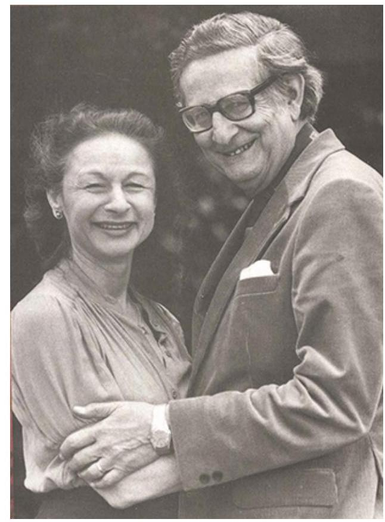

Figure PE.10. Hans and Sybil Eysenck. Hans and Sybil Eysenck believed that our personality traits are influenced by our genetic inheritance.

According to their theory, people high on the trait of extroversion are sociable and outgoing, and readily connect with others. By contrast, people high on introversion experienced too much sensory stimulation and arousal, which made them want to seek out quiet settings, engage in solitary behaviours, and limit their interactions with others. In the neuroticism/stability dimension, people high on neuroticism tend to be anxious; they tend to have an overactive sympathetic nervous system and, even with low stress, their bodies and emotional state tend to go into a flight-or-fight reaction. In contrast, people high on stability tend to need more stimulation to activate their flight-or-fight reaction and are considered more emotionally stable.

More recently, Jeffrey Gray suggested that these two broad traits are related to fundamental reward and avoidance systems in the brain. Extraverts might be motivated to seek reward, and thus exhibit assertive, reward-seeking behaviour, whereas people high in neuroticism might be motivated to avoid punishment, and thus may experience anxiety as a result of their heightened awareness of the threats in the world around them (Gray, 1981). This model has since been updated (Gray \& McNaughton, 2000).Based on these two dimensions, the Eysencks' theory divides people into four quadrants. These quadrants are sometimes compared with the four temperaments described by the Greeks: melancholic, choleric, phlegmatic, and sanguine.


Figure PE.11. Two personality factors. The Eysencks described two factors to account for variations in our personalities: extroversion/introversion and emotional stability/instability.

Later, the Eysencks added a third dimension: psychoticism versus superego control. In this dimension, people who are high on psychoticism tend to be independent thinkers, cold, nonconformists, impulsive, antisocial, and hostile, whereas people who are high on superego control tend to have high impulse control - they are more altruistic, empathetic, cooperative, and conventional (Eysenck et al., 1985).# The Big Five 

While Cattell's 16 factors may be too broad, the Eysencks' two-factor system has been criticized for being too narrow. Another personality theory, called the Big Five, effectively hits a middle ground, with its five factors referred to as the Big Five personality factors. It is the most popular theory in personality psychology today and the most accurate approximation of the basic personality dimensions (Funder, 2001). The five factors are: openness to experience, conscientiousness, extroversion, agreeableness, and neuroticism. A helpful way to remember the factors is by using the mnemonic CANOE.

The following YouTube link shows Gabriela Cintron's student-made video, which cleverly describes common behavioural characteristics of the Big Five personality traits through song:

Watch this video: 5 Factors of Personality (OCEAN Song) (3 minutes)

One or more interactive elements has been excluded from this version of the text. You can view them online here: https://opentextbc.ca/psychologymtdi/?p=414\#oembed-1
"5 Factors of Personality (OCEAN Song)" video by Vy Nguyen is licensed under the Standard YouTube licence.

In the Big Five, each person has each factor, but they occur along a continuum.

1. Openness to experience is characterised by imagination, feelings, actions, and ideas. People who score high on this factor tend to be curious and have a wide range of interests.
2. Conscientiousness is characterised by competence, self-discipline, thoughtfulness, and achievement-striving (goal- directed behaviour). People who score high on this factor are hardworking and dependable. Numerous studies have found a positive correlation between conscientiousness and academic success (Akomolafe, 2013; Chamorro-Premuzic \& Furnham, 2008; Conrad \& Patry, 2012; Noftle \& Robins, 2007; Wagerman \& Funder, 2007).
3. Extroversion is characterised by sociability, assertiveness, excitement-seeking, and emotional expression. People who score high on this factor are usually described as outgoing and warm. Not surprisingly, people who score high on both extroversion and openness are more likely to participate in adventure and risky sports due to their curious and excitement-seeking nature (Tok, 2011).
4. Agreeableness refers to the tendency to be pleasant, cooperative, trustworthy, and goodnatured. People who score low on agreeableness tend to be described as rude and uncooperative, yet one recent study reported that men who scored low on this factoractually earned more money than men who were considered more agreeable. This negative correlation between agreeableness and income was not supported in women (Judge et al., 2012).
5. Neuroticism refers to the tendency to experience negative emotions. People high on neuroticism tend to experience emotional instability and are characterised as angry, impulsive, and hostile. People reporting high levels of neuroticism often report feeling anxious and unhappy (Watson \& Clark,1984). In contrast, people who score low in neuroticism tend to be calm and even-tempered.

The Big Five personality factors each represent a range between two extremes. In reality, most of us tend to lie somewhere midway along the continuum of each factor, rather than at polar ends. It's important to note that the Big Five factors are relatively stable over our lifespan, with some tendency for the factors to increase or decrease slightly. Researchers have found that conscientiousness increases through young adulthood into middle age, as we become better able to manage our personal relationships and careers (Donnellan \& Lucas, 2008). Agreeableness also increases with age, peaking between 50 to 70 years (Terracciano et al., 2005). Neuroticism and extroversion tend to decline slightly with age (Donnellan \& Lucas, 2008; Terracciano et al., 2005). Additionally, the Big Five factors have been shown to exist across ethnicities, cultures, and ages, and may have substantial biological and genetic components (Jang et al., 1996, 2006; McCrae \& Costa, 1997; Schmitt et al., 2007).

Below is a short scale to assess the five-factor model of personality (Donnellan et al., 2006). You can take this test to see where you stand in terms of your Big Five scores.

# The Mini-IPR Scale 

Below are phrases describing people's behaviours. Use the rating scale below to describe how accurately each statement describes you. Describe yourself as you generally are now, not as you wish to be in the future. Describe yourself as you honestly see yourself, in relation to other people you know of the same sex and roughly your same age. Read each statement carefully, and put a number from 1 to 5 next to it to describe how accurately the statement describes you.

## Scale

$1=$ Very inaccurate
2 = Moderately inaccurate
3 = Neither inaccurate nor accurate
4 = Moderately accurate# Questions 

1. Am the life of the party (E)
2. Sympathize with others' feelings (A)
3. Get chores done right away (C)
4. Have frequent mood swings ( N )
5. Have a vivid imagination (O)
6. Don't talk a lot (E)
7. Am not interested in other people's problems (A)
8. Often forget to put things back in their proper place (C)
9. Am relaxed most of the time ( N )
10. Am not interested in abstract ideas (O)
11. Talk to a lot of different people at parties (E)
12. Feel others' emotions (A)
13. Like order (C)
14. Get upset easily ( N )
15. Have difficulty understanding abstract ideas (O)
16. Keep in the background (E)
17. Am not really interested in others (A)
18. Make a mess of things (C)
19. Seldom feel blue ( N )
20. Do not have a good imagination (O)

## How to Analyze Results

To analyse the results, first reverse the score for items $6,7,8,9,10,15,16,17,18,19$ and 20 by subtracting the number you gave yourself from 6 . For instance, your score of 4 will become a $2(6-4=2)$. Replace your original score (4) with the new number (2). ().

Next, add up the scores for each of the five CANOE scales, as indicated by the letter following each item: C, A, N, O or E. Each letter score will be the sum of four items. Place the sum next to each scale below.

- Conscientiousness: Add items 3, 8, 13, 18
- Agreeableness: Add items 2, 7, 12, 17
- Neuroticism: Add items 4, 9,14, 19
- Openness: Add items 5, 10, 15, 20
- Extraversion: Add items 1, 6, 11, 16

Compare your scores to the norms below to see where you stand on each scale. If you are low on a trait, it means you are the opposite of the trait label. For example, low on extraversion is introversion, low on openness is conventional, and low on agreeableness is assertive.

19-20 Extremely High, 17-18 Very High, 14-16 High, 11-13 Neither high nor low, 8-10 Low, 6-7 Very low, 4-5 Extremely low(Trait theorists agree that personality traits are important in understanding behaviour, but there are still debates on the exact number and composition of the traits that are most important. For example, Michael Ashton and Kibeom Lee (2005) argued that one important class of individual differences was omitted from the Big Five model. Their HEXACO model adds honesty-humility as a sixth dimension of personality. People high in honesty-humility are sincere, fair, and modest, whereas those low in this trait are manipulative, narcissistic, and self-centred. You may go to the HEXACO website to learn more about the HEXACO model and download the scales in different languages.

# Adaptive Traits 

Like trait theorists, evolutionary psychologists look at personality traits that are universal. In this view, adaptive differences have evolved and then provide a survival and reproductive advantage. David Buss (1991) has identified five adaptive traits:

1. Surgency indicates a person's preference in a hierarchy. A surgent person tends to dominate and lead others.
2. Agreeableness marks a person's willingness to cooperate; however, it is not always maladaptive to be selfish and hostile toward others.
3. Conscientiousness signals to others whom we can trust and whom we can depend on; however, being less conscientious and dependent on others is not maladaptive.
4. Emotional stability indicates one's ability to handle stress. Although hypersensitivity to stress may disrupt everyday functioning and thus is less favoured, vigilance and anxiety may be adaptive and necessary to avoid harm and threat.
5. In ancestral times, openness (or intellect) might be expressed in one's willingness to explore new territories for food and shelter and one's creativity in solving problems.

Figure PE.12. Algerian desert petroglyph. We inherited some personality traits from our ancestors because those traits were useful for them to solve survival and reproductive problems.

# Heritability of Traits and Temperament 

Most contemporary psychologists believe temperament has a biological basis due to its appearance very early in our lives (Rothbart, 2011). Thomas and Chess (1977) found that babies could be categorised into one of three temperaments: easy, difficult, or slow to warm up. Mary Rothbart and colleagues proposed two temperaments in adulthood - reactivity and selfregulation (Rothbart et al., 2000). Reactivity refers to how we respond to new or challenging environmental stimuli; self-regulation refers to our ability to control that response (Rothbart et al., 2011). For example, one person may immediately respond to new stimuli with a high level of anxiety, while another barely notices it.

In the field of behavioural genetics, the Minnesota Study of Twins Reared Apart - a well-known study of the genetic basis for personality - conducted research with twins from 1979 to 1999. In studying 350 pairs of twins, including pairs of identical and fraternal twins reared together and apart, researchers found that identical twins, whether raised together or apart, have very similar personalities (Bouchard, 1994; Bouchard et al.,1990; Segal, 2012). These findings suggest the heritability of some personality traits. Heritability refers to the proportion of difference among people that is attributable to genetics. Some of the traits that the study reported as having more than a 0.50 heritability ratio include leadership, obedience to authority, a sense of well-being, alienation, resistance to stress, and fearfulness. The implication is that some aspects of our personalities are largely controlled by genetics; however, it's important to point out that traits are not determined by a single gene, but by the complex relationship among the various genes, as well as a variety of random factors. Genetic factors work with environmental factors to createpersonality. Having a given pattern of genes does not necessarily mean that a particular trait will develop because some traits might occur only in some environments. For example, a person may have a genetic variant that is known to increase their risk for developing emphysema from smoking, but if that person never smokes, then emphysema most likely will not develop.

One question that is exceedingly important for the study of personality concerns the extent to which it is the result of nature or nurture. If nature is more important, then our personalities will form early in our lives and may be difficult to change later. If nurture is more important, then our experiences are likely to be particularly important, and our personalities may change in response to experiences over time. While identical twins Paula Bernstein and Elyse Schein turned out to be very similar even though they had been raised separately, those traits that they share are likely to be the result of genes, but environments, particularly those that are unique to individuals, are important in shaping personality as well. In the next section, we will see how personality can be influenced by environments.

# Image Attributions 

Figure PE.9. Figure 14.8 as found in Psychology - 1st Canadian Edition is licensed under a CC BY-NC-SA License.

Figure PE.10. Hans and Sybil Eysenck by Sirswindon is licensed under a CC BY 3.0 license.
Figure PE.11. Figure 11.13 as found in Psychology 2e by OpenStax is licensed under a CC BY 4.0 License.

Figure PE.12. Algerian Desert by Gruban is licensed under a CC BY-SA 2.0 Generic license.

## (0) (0)

Traits, Temperaments, and Heritability Copyright © 2024 by Amelia Liangzi Shi is licensed under a Creative Commons Attribution-NonCommercial-ShareAlike 4.0 International License, except where otherwise noted.762 | Chapter 14. Personality# Personality and Culture 

AMELIA LIANGZI SHI

## Learning Objectives

By the end of this section, you will be able to:

- Acknowledge personality differences of people from collectivist and individualist cultures.
- Respect different approaches to studying personality in a cultural context.

As you have learned in this chapter, personality is shaped by both genetic and environmental factors. The culture in which you live is one of the most important environmental factors that shapes your personality (Triandis \& Suh, 2002). The term culture refers to all of the beliefs, customs, art, and traditions of a particular society. Culture is transmitted to people through language as well as through the modelling of culturally acceptable and unacceptable behaviours that are either rewarded or punished (Triandis \& Suh, 2002).

Why might it be important to consider cultural influences on personality? Western ideas about personality may not be applicable to other cultures (Benet-Martínez \& Oishi, 2008). On the other hand, evolutionary psychologists argue that the five factors in the Big Five reflect universal responses to environmental challenges that existed throughout humans' ancestral environment and over millennia. According to this view, all humans should share some universal personality traits.

Two approaches that can be used to study personality in a cultural context are the culturalcomparative approach and the Indigenous approach. Because ideas about personality have a Western basis, the cultural-comparative approach seeks to test Western ideas about personality in other cultures to determine whether they can be generalised and if they have cultural validity (Cheung et al., 2011). For example, recall from the trait perspective discussed earlier in this chapter that researchers used the cultural-comparative approach to test the universality of McCrae and Costa's five-factor model.

Asian cultures are more collectivist, and people in these cultures tend to be less extroverted. In contrast, people in Central and South American cultures tend to score higher on openness to experience, whereas Europeans score higher on neuroticism (Benet-Martínez \& Karakitapoğlu-Aygün, 2003). Individualist cultures and collectivist cultures place emphasis on different basic values. People who live in individualist cultures tend to believe that independence, competition, and personal achievement are important. Individuals in Western nations such as the United States, England, and Australia score high on individualism (Oyserman et al., 2002). People who live in collectivist cultures value social harmony, respectfulness, and group needs over individual needs. These values influence personality. For example, Kuo-Shu Yang (2006) found that people in individualist cultures displayed more personally oriented personality traits, whereas people in collectivist cultures displayed more socially oriented personality traits.

The Indigenous approach came about in reaction to the dominance of Western approaches to the study of personality in non-Western settings (Cheung et al., 2011). Personality traits may be understood differently or have unique expressions in Indigenous cultures, possibly influenced by language and cultural contexts (Heine \& Buchtel, 2009). The Indigenous model emphasises developing assessment instruments based on constructs relevant to the specific culture being studied. This approach involves translating personality assessment instruments into other languages, considering cultural perspectives, and incorporating Indigenous views on personality traits and development.

Jacob Burack, Erin Gurr, Emily Stubbert, and Vanessa Weva (2019) argue that Indigenous identity in Canada is poorly understood because there is enormous variety in the culture, language, and traditions of Indigenous communities in Canada. The history before, during, and after the colonization by Europeans differs between Indigenous communities, as do social and economic conditions, resources, and geography. Indigenous Peoples in Canada share a history of colonization, oppression, displacement from traditional territories, forced cultural assimilation, and genocide. The Canadian government and its representatives subjected Indigenous communities to forced relocation, family separation, and residential schools which were frequent sources of psychological, sexual, physical, and emotional abuse. Thus, the collective history, trauma, and resilience of Indigenous Peoples in Canada provides multiple sources of influence on personality development that may have intergenerational effects.

As well as the influence of collective historical effects, personality is also shaped within one's own Indigenous community and its understanding of personality development, which may include concepts unfamiliar to people outside of that culture. Instead of thinking that Indigenous experience is all the same, to understand personality development, we need to know about the particular culture and its shared history (Burack et al., 2019). Furthermore, in the development of personality, Indigenous youth must navigate a relationship with mainstream Canadian society and its environmental influences. Taken together, understanding personality in a culture different to one's own requires a careful and systematic study of all of the historical, shared, and individual environmental influences that shape personality. With respect to Canadian Indigenous communities, this requires a willingness to seek to understandthe consequences of a long history of colonization, oppression, and resilience that followed an even longer history of self-sufficiency, sovereignty, and cultural and linguistic traditions.

Keeping in mind the limitations of personality assessment tools rooted in Western theories, let's explore some of these widely used assessments in the following section.

# (○) (5) (3) 

Personality and Culture Copyright © 2024 by Amelia Liangzi Shi is licensed under a Creative Commons Attribution-NonCommercial-ShareAlike 4.0 International License, except where otherwise noted.766 | Chapter 14. Personality# Personality Assessment 

AMELIA LIANGZI SHI

Approximate reading time: 15 minutes

## Learning Objectives

By the end of this section, you will be able to:

- Describe the Minnesota Multiphasic Personality Inventory
- Recognise and describe common projective tests used in personality assessment

Personality testing is often used to screen applicants for employment and job training. Personality tests are also used in criminal cases, custody battles, and assessments of psychological disorders. This section explores the best known among the many different types of personality tests and discusses the strengths and criticisms of each type.

## Self-Report Inventories

Personality inventories are objective, standardized, and norm-based tests used to assess personality. They typically use multiple-choice items or numbered scales, which represent a range from 1, signalling strong disagreement, to 5, identifying strong agreement. They often are called Likert scales after their developer, Rensis Likert (1932).|  | Strongly <br> Disagree | Somewhat <br> Disagree | No <br> Opinion | Somewhat <br> Agree | Strongly <br> Agree |
| :-- | :--: | :--: | :--: | :--: | :--: |
| I am easygoing. | $\mathbf{0}$ | $\mathbf{0}$ | $\mathbf{0}$ | $\mathbf{0}$ | $\mathbf{0}$ |
| I have high standards. | $\mathbf{0}$ | $\mathbf{0}$ | $\mathbf{0}$ | $\mathbf{0}$ | $\mathbf{0}$ |
| I enjoy time alone. | $\mathbf{0}$ | $\mathbf{0}$ | $\mathbf{0}$ | $\mathbf{0}$ | $\mathbf{0}$ |
| I work well with others. | $\mathbf{0}$ | $\mathbf{0}$ | $\mathbf{0}$ | $\mathbf{0}$ | $\mathbf{0}$ |
| I dislike confrontation. | $\mathbf{0}$ | $\mathbf{0}$ | $\mathbf{0}$ | $\mathbf{0}$ | $\mathbf{0}$ |
| I prefer crowds over <br> intimacy. | $\mathbf{0}$ | $\mathbf{0}$ | $\mathbf{0}$ | $\mathbf{0}$ | $\mathbf{0}$ |

Figure PE.13. Likert-type scale. If you've ever taken a survey, you are probably familiar with Likert-type scale questions. Most personality inventories employ these types of response scales.

# Minnesota Multiphasic Personality Inventory (MMPI) 

One of the most widely used personality inventories is the Minnesota Multiphasic Personality Inventory (MMPI), first published in 1943, with 504 true-false questions, and updated to the MMPI-2 in 1989, with 567 questions. In 2020, the test was again revised to the MMPI-3, with only 335 questions. Responses are scored to produce a clinical profile composed of 52 scales. The original MMPI was developed using an empirical or criterion keying approach, with clinical scales derived by selecting items that were endorsed by patients known to have been diagnosed with certain pathologies. The original MMPI was based on a small, limited sample, composed mostly of Minnesota farmers and psychiatric patients; the revised inventories were based on a more representative, national sample to allow for better standardization.

Watch this video: Advantages of the MMPI-3 (1.5 minutes)

One or more interactive elements has been excluded from this version of the text. You can view them online here:
https://opentextbc.ca/psychologymtdi/?p=423\#oembed-1"Advantages of the MMPI-3" video by Pearson Assessments US is licensed under the Standard YouTube licence.

|  | True | False |
| :-- | :--: | :--: |
| 1. I like gardening magazines. | 0 | 0 |
| 2. I am unhappy with my sex life. | 0 | 0 |
| 3. I feel like no one understands me. | 0 | 0 |
| 4. I think I would enjoy the work of a teacher. | 0 | 0 |
| 5. I am not easily awakened by noise. | 0 | 0 |

Figure PE.14. True-false questions. These true-false questions resemble the kinds of questions you would find on the MMPI. Although the MMPI was originally developed to assist in the clinical diagnosis of psychological disorders, it is now also used for occupational screening, such as in law enforcement, and in college, career, and marital counselling (Ben-Porath \& Tellegen, 2008).

In addition to clinical scales, the tests also have validity and reliability scales. Recall the concepts of reliability and validity from your study of psychological research. One of the validity scales, the Lie Scale, or "L" Scale, consists of 15 items and is used to decide whether the respondent is "faking good" (i.e., presenting themselves in a favourable light). For example, if someone responds "yes" to a number of unrealistically positive items such as "I have never told a lie," they may be trying to "fake good" or appear better than they actually are.

Reliability tests an instrument's consistency over time, assuring that if you take the MMPI-3 today and then again five years later, your two scores will be similar. Beutler and colleagues (1988) gave the MMPI to newly recruited police officers and then to the same police officers two years later. After two years on the job, police officers' responses indicated an increased vulnerability to alcoholism, somatic symptoms (i.e., vague, unexplained physical complaints), and anxiety. When the test was given an additional two years later - four years after starting on the job - the results suggested high risk for alcohol-related difficulties.# NEO Personality Inventory 

Unlike MMPI, which was developed with an empirical approach, Paul Costa and Robert McCrae created NEO-PI questions based on the Big Five model. The NEO inventory originally covered only three traits: Neuroticism, Extraversion, and Openness. Later on, they added two more: Agreeableness and Conscientiousness (Costa \& McCrae, 1985). Each trait or "domain" contains six "facets". The inventory has been updated over time. In 2005, McCrae and colleagues made NEO-PI-3, which is better for adolescents and adults with lower reading levels. The NEO-PI-3 has 240 personality questions and some validity questions. Instead of presenting true or false items like in MMPI, NEO-PI uses a 5-point Likert scale (from strongly disagree to strongly agree). NEOPIs are highly reliable and valid. They have been used in different places for counseling, hiring, and education (McCrae et al., 2005).

Domains and facets measured by the NEO-PI-3:

- Extraversion (E) facets
- E1: Warmth
- E2: Gregariousness
- E3: Assertiveness
- Agreeableness (A) facets
- A1: Trust
- A2: Straightforwardness
- A3: Altruism
- Neuroticism (N) facets
- N1: Anxiety
- N2: Angry Hostility
- N3: Depression
- Openness (O) facets
- O1: Fantasy
- O2: Aesthetics
- O3: Feelings
- Conscientiousness (C) facets
- C1: Competence
- C2: Order
- C3: Dutifulness
- E4: Activity
- E5: Excitement-Seeking
- E6: Positive Emotions
- A4: Compliance
- A5: Modesty
- A6: Tender-Mindedness
- N4: Self-Conciousness
- N5: Impulsiveness
- N6: Vulnerability
- O4: Actions
- O5: Ideas
- O6: Values
- C4: Achievement Striving
- C5: Self-Discipline
- C6: Deliberation# Projective Tests 

Another method for the assessment of personality is projective testing. Projective tests rely on one of Freud's defence mechanisms - projection - as a way to assess unconscious processes. In projective tests, a series of ambiguous cards is shown to the person being tested, who then is encouraged to project their feelings, impulses, and desires onto the cards, by telling a story, interpreting an image, or completing a sentence. The results are then interpreted by the test administrator. Many projective tests have undergone standardization procedures (e.g., Exner, 2002) and can be used to assess whether someone has unusual thoughts, a high level of anxiety, or is likely to become vulnerable to certain disorders.

## Rorschach Inkblot Test

The Rorschach Inkblot Test was developed in 1921 by a Swiss psychologist named Hermann Rorschach. It is a series of symmetrical inkblot cards that are presented to a client by a psychologist. Upon presentation of each card, the psychologist asks the client, "What might this be?" What the test-taker sees reveals unconscious feelings and struggles (Piotrowski, 1987; Weiner, 2003). The Rorschach has been standardized and is effective in measuring depression, psychosis, and anxiety.

Figure PE.15. Rorschach Inkblot Test. The Rorschach Inkblot Test is a projective test designed to assess psychological disorders.

# Thematic Apperception Test (TAT) 

A second projective test is the Thematic Apperception Test (TAT), created in the 1930s by Henry Murray and Christiana Morgan. A person taking the TAT is shown eight to twelve ambiguous pictures and is asked to tell a story about each picture. The stories give insight into their social world, revealing hopes, fears, interests, and goals. The storytelling format helps to lower a person's resistance to reveal unconscious personal details (Cramer, 2004). The TAT has been used in clinical settings to evaluate psychological disorders; more recently, it has been used in counselling settings to help clients gain a better understanding of themselves and achieve personal growth. Standardization of test administration is virtually nonexistent among clinicians, and the test tends to be modest to low on validity and reliability (Aronow et al., 2001; Lilienfeld et al., 2000). Despite these shortcomings, the TAT has been one of the most widely used projective tests.# Rotter Incomplete Sentences Blank (RISB) 

A third projective test is the Rotter Incomplete Sentences Blank (RISB) developed by Julian Rotter in 1950. There are three forms of this test for use with different age groups: the school form, the college form, and the adult form. The tests include 40 incomplete sentences that people are asked to complete with one to two words in length. This test is similar to a word association test, and like other types of projective tests, it is presumed that responses will reveal desires, fears, and struggles. The RISB has been used in screening college students for adjustment problems and in career counselling (Holaday et al., 2010; Rotter \& Rafferty 1950).

| 1. I feel... |  |
| :-- | :-- |
| 2. I regret... |  |
| 3. At home... |  |
| 4. My mother... |  |
| 5. My greatest worry... |  |

Figure PE.16. Rotter Incomplete Sentences Blank (RISB). These incomplete sentences resemble the types of questions on the RISB. How would you complete these sentences?

## Projective Tests and Cultural Diversity

For many decades, these traditional projective tests have been used in cross-cultural personality assessments. Michelle Hoy-Watkins and Valata Jenkins-Monroe (2008) pointed out that the test bias restricted how well we can measure the behaviours and lifestyles of people from different cultural backgrounds. This happens when the questions in the test are based on information from just one culture or race, making it hard to accurately understand and assess individuals from diverse ethnocultural groups. For example, when the TAT was used with African American test-takers, the result was often shorter story length and low levels of cultural identification (Duzant, 2005). So, it was important to create different personality tests that looked into things like race, language, and how well someone has adapted to a new culture.# Contemporized-Themes Concerning Blacks Test (C-TCB) 

To address this need, Robert Williams developed the first culturally specific projective test designed to reflect the everyday life experiences of African Americans. The updated version of the instrument is the Contemporized-Themes Concerning Blacks Test (C-TCB), which contains 20 colour images that show scenes of African American lifestyles (Williams, 1972). When the C-TCB was compared with the TAT for African Americans, it was found that use of the C-TCB led to increased story length, higher degrees of positive feelings, and stronger identification with the C-TCB (Hoy, 1997; Hoy-Watkins \& Jenkins-Moore, 2008).


Figure PE.17. Thematic Apperception Tests (TAT). This image from the Thematic Apperception Tests (TAT) can be used in counselling settings.

## TEMAS Multicultural Thematic Apperception Test

The TEMAS Multicultural Thematic Apperception Test is another tool designed to be culturally relevant to minority groups, especially Hispanic youths. TEMAS stands for "Tell Me a Story," but it's also a play on the Spanish word temas (themes). TEMAS tries to make pictures and prompts that connect with both minority and nonminority children. It aims to show scenes that are familiar to everyone from everyday life in cities (Costantino \& Malgady, 1999).

## Evidence on Projective Tests

Despite their widespread use, the empirical evidence supporting the use of projective tests is mixed (Karon, 2000; Wood et al., 2003). The reliability of the measures is low because people often produce very different responses on different occasions. The validity of the measures isalso questionable. There are very few consistent associations between Rorschach scores or TAT scores and most personality traits. The projective tests often fail to distinguish between people with psychological disorders and those without, and they often fail to correlate with other measures of personality or with behaviour. As such, projective tests are more useful as icebreakers to get to know a person better, to make the person feel comfortable, and to get some ideas about topics that may be of importance to that person rather than for accurately diagnosing personality.

# Image Attributions 

Figure PE.13. Figure 11.16 as found in Psychology 2e by OpenStax is licensed under a CC BY 4.0 License.

Figure PE.14. Figure 11.17 as found in Psychology 2e by OpenStax is licensed under a CC BY 4.0 License.

Figure PE.15. Rorschach Blot 02 by Hermann Rorschach is in the public domain; Rorschach Blot 08 by Hermann Rorschach is in the public domain; Rorschach Blot 09 by Hermann Rorschach is in the public domain; Rorschach Blot 10 by Hermann Rorschach is in the public domain.

Figure PE.16. Figure 11.19 as found in Psychology 2e by OpenStax is licensed under a CC BY 4.0 License.

Figure PE.17. 'girls with yarn drawing' by Rick\&Brenda Beerhorst is published under a CC BY 2.0 Deed Attribution 2.0 Generic license.

## (0) (0)

Personality Assessment Copyright © 2024 by Amelia Liangzi Shi is licensed under a Creative Commons Attribution-NonCommercial-ShareAlike 4.0 International License, except where otherwise noted.776 | Chapter 14. Personality# Chapter Resources 

AMELIA LIANGZI SHI

## Key Takeaways

## Key Takeaways

1. The word "personality" comes from the Latin word "persona," which means a mask worn by actors. It helps us predict how people might think, feel, and act.
2. Personality has been studied for over 2,000 years, starting with Hippocrates and his theory of temperaments.
3. Phrenology and somatology were early attempts to link personality to physical features, but they have been discredited.
4. Freud's psychodynamic theory focused on unconscious thoughts, feelings, and memories. He introduced the id, ego, and superego as components of personality. Defence mechanisms, like repression and displacement, help cope with conflicts among these components.
5. Freud's psychosexual stages describe how personality develops through different pleasure-focused body parts.
6. Adler focused on the striving for success and superiority as the main motivation of behaviour.
7. Jung introduced the collective unconscious and archetypes.
8. Horney balanced Freudian theories regarding women and emphasised the desire for security.
9. Erikson extended Freud's stages, emphasising social relationships.
10. Rogers focused on self-concept, including the ideal and real self. Achieving consistency between these selves leads to congruence. Unconditional positive regard, or unconditional love, helps individuals develop a healthy self-concept.
11. Psychodynamic and humanistic approaches, while valuable in therapy, are harder to test and prove scientifically. The lack of falsifiability makes it challenging to measure and confirm their assumptions.
12. Behaviourism studies what people do, not hidden thoughts. Behaviourists like Skinner think the way we act is learned from what happens around us, not something we're born with.
13. According to Bandura, we learn by watching others, and if we see them rewarded, we might copy their actions. Self-efficacy also affects how we approach challenges and reach goals.
14. According to Rotter, some people believe they control their lives (internal locus), while others think their lives are controlled by luck or others (external locus).
15. According to Mischel, it's not just your personality that matters, but also the situations you're in, and that's what makes people act the same way in similar situations. Mischel's marshmallow test shows that children who wait for a bigger reward do better later in life, proving that self-control matters.16. Personality traits reflect consistent patterns of thoughts, feelings, and behaviours. Traits like extraversion, conscientiousness, and agreeableness represent dimensions on which people differ.
17. Personality traits are seen as continuous distributions, not distinct types. For example, introverts and extraverts are not two completely different types but exist along a continuum.
18. Allport categorised traits into cardinal, central, and secondary traits.
19. Cattell identified 16 factors of personality, like warmth, reasoning, and emotional stability, measured on a continuum.
20. The Eysencks proposed two dimensions, extroversion/introversion and neuroticism/stability, with a third added later. These dimensions are related to fundamental reward and avoidance systems in the brain.
21. The Big Five model includes openness, conscientiousness, extroversion, agreeableness, and neuroticism. Each factor exists on a continuum, and people fall somewhere in the middle of each trait. The Big Five factors are relatively stable over the lifespan, with some changes in conscientiousness and agreeableness over time.
22. The HEXACO model adds honesty-humility as a sixth dimension.
23. Evolutionary psychologists, like David Buss, identify adaptive traits that evolved for survival and reproduction.
24. Both genetic and environmental factors play a role in shaping personality.
25. Temperament has a biological basis, appearing early in life. The Minnesota Study of Twins Reared Apart suggests a heritability factor in personality traits.
26. Culture is a significant environmental factor for shaping personality. Cultural influences are crucial to consider because Western ideas about personality may not apply universally.
27. The cultural-comparative approach tests Western ideas about personality in other cultures to determine their generalisability and cultural validity. For instance, researchers used this approach to test the universality of McCrae and Costa's five-factor model. Asian cultures tend to be more collectivist, with lower levels of extroversion. Central and South American cultures score higher on openness, while Europeans score higher on neuroticism.
28. Personality traits may be understood differently or have unique expressions in Indigenous cultures. Indigenous identity in Canada is diverse due to variations in culture, language, and traditions among Indigenous communities. History, colonization, oppression, displacement, and forced assimilation have influenced Indigenous Peoples' collective history, trauma, and resilience.
29. The Indigenous approach reacts against the dominance of Western approaches in non-Western settings. The Indigenous approach involves developing assessment instruments based on constructs relevant to the specific culture being studied. It includes translation into local languages, considering cultural perspectives, and incorporating Indigenous views on personality.
30. Personality tests are commonly used in various contexts, including employment screening, job training, criminal cases, custody battles, and psychological disorder assessments.
31. Personality inventories are standardized tests assessing personality. The Minnesota Multiphasic Personality Inventory (MMPI) is a widely used inventory, with clinical profiles derived from responses. The NEO-PI was developed based on the Big Five model.
32. Projective testing assesses personality using Freud's defense mechanism of projection. Rorschach Inkblot Test, Thematic Apperception Test (TAT), and Rotter Incomplete Sentences Blank (RISB) are examples of projective tests.
33. Traditional projective tests have been criticized for test bias in cross-cultural assessments. Culturally specific projective tests may better capture the thoughts and feelings of people from non-Western cultures. Contemporized-Themes Concerning Blacks Test (C-TCB) and Tell-Me-A-Story MulticulturalThematic Apperception Test are examples of culturally specific projective tests.

# Student Engagement Ideas 

1. Engage in a debate or discussion on the continued relevance of Freudian theories, such as the Oedipus complex and penis envy. Explore evidence both supporting and challenging these concepts in understanding human development and personality.
2. Compare and contrast Freud's original ideas with those of neo-Freudians like Erikson or Adler. Explore how these differences enhance or limit our understanding of personality development. Provide examples to illustrate key points.
3. Consider different combinations of Big Five traits (e.g., Low Openness, High Conscientiousness, Low Extraversion, High Agreeableness, Low Neuroticism). Speculate on what a person with these traits might be like. Discuss whether you know anyone with similar traits and rate public figures accordingly.
4. Take a closer look at your own personality using the trait perspective. Identify aspects of the Big Five and discuss how these traits might explain your strengths and weaknesses.
5. Dive into an analysis of projective tests like the Rorschach Inkblot Test or the Thematic Apperception Test. Discuss the strengths and limitations of these tests and consider whether you find them useful for understanding personality.
6. Find resources explaining the culture in a First Nation community in Canada. Speculate on the role of culture in the development of personality within that community. Think critically about how cultural factors shape individuals' personalities.
7. Reflect on the historical influences on personality development, particularly in Indigenous communities in Canada. Consider how historical events and trauma may have intergenerational effects on personality.

## References

The reference list for this chapter has been excluded from this file to reduce page count. The full reference list can be viewed online at opentextbc.ca/psychologymtdi/chapter/chapter-resourcespersonality/.# Chapter Attribution 

"Personality" was written and adapted by Amelia Liangzi Shi and is licensed under a CC BY-NC-SA 4.0 licence. It was adapted and remixed from "Chapter 14. Personality" in Psychology - 1st Canadian Edition by Sally Walters, which is licensed under a CC BY-NC-SA 4.0 licence, and "XI. Personality" in Introduction to Psychology \& Neuroscience (2nd Edition) edited by Leanne Stevens, Jennifer Stamp, \& Kevin LeBlanc, which is licensed under a CC BY 4.0 licence.

## About the Author: Amelia Liangzi Shi

## College of New Caledonia

I — Amelia Liangzi Shi (Chinese: 石靚子) — am a Chinese Canadian woman, and I bring a diverse range of experiences and perspectives to my role as a psychology instructor at the College of New Caledonia (CNC) on the traditional lands of the Lheidli T'enneh. I completed my Ph.D. in Cognitive Psychology at the University of Alberta, located in Treaty 6 territory, focusing my research on metamemory and autobiographical memory. I currently teach courses at CNC in introductory psychology, research methods, cognition, personality, and social psychology. Driven by a genuine desire to support and empower the students of introductory psychology, I am committed to recognising the unique needs and experiences of Indigenous students, People of Colour, individuals under the rainbow umbrella, individuals with disabilities, international students, and other marginalised voices.

## 〇(0) 〇

Chapter Resources Copyright © 2024 by Amelia Liangzi Shi is licensed under a Creative Commons Attribution-NonCommercialShareAlike 4.0 International License, except where otherwise noted.# CHAPTER 15. PSYCHOLOGY IN OUR SOCIAL LIVES782 | Introduction to Psychology# Psychology in Our Social Lives Introduction 

AMELIA LIANGZI SHI


Figure SL.1. Former Kamloops Indian Residential School. A section of the former Kamloops Indian Residential School is seen on Tk'emlups te Secwépemc First Nation in Kamloops, B.C. The remains of 215 children have been found buried on the site.

Canada has a long history of immigration from all parts of the world. Over time, many of these groups have experienced prejudice and discrimination, for instance, Japanese immigrants during World War II and Chinese labourers building the railroads. However, immigrants to Canada and their offspring have also shown prejudice and discrimination towards, for example, Indigenous Peoples. In the past, Indigenous Peoples were treated unfairly through colonization policies. They were viewed as less important, and therefore they didn't get the same rights as others. For over a century, their children were removed from families and placed in residential schools where they were punished for using their native language and practicing their culture, and were frequently sexually and physically abused by church members and others whoadministered the schools. Other political policies had widespread and negative consequences for the lives of Indigenous Peoples.

In 2007, a Truth and Reconciliation Commission was established to facilitate reconciliation among former students at Residential Schools, their families, their communities, and Canadians in general (Government of Canada, 2019). The process, which involved 6500 people testifying to their experiences, resulted in a six-volume final report that included 94 calls to action for increasing reconciliation between Indigenous Peoples and all Canadians. Visit the National Centre for Truth and Reconciliation Reports to read the recent annual reports.

Social psychology has a role to play in the reduction of cultural biases. Social psychology is the scientific study of how we feel about, think about, and behave toward the other people around us, and how those people influence our thoughts, feelings, and behaviour. In this chapter, we will learn about how we form impressions of other people, and what makes us like or dislike them. We'll explore how we understand and predict the behaviour of ourselves and others. We'll also see how our attitudes influence, and are influenced by, our behaviour. Then, we'll explore how people behave in groups. We'll see what helps or makes it harder for groups to work well together and make good decisions. Finally, we will consider the social psychology of interpersonal relationships. For example, why do people help each other or sometimes act aggressively when they feel threatened?

# Image Attributions 

Figure SL.1. Kamloops Indian Residential School photo by BCcampus is licensed under a CC BY 4.0 license.

## (1) (1) (1)

Psychology in Our Social Lives Introduction Copyright © 2024 by Amelia Liangzi Shi is licensed under a Creative Commons Attribution-NonCommercial-ShareAlike 4.0 International License, except where otherwise noted.# Making Sense of Ourselves and Others 

AMELIA LIANGZI SHI

Approximate Reading Time: 29 minutes

## Learning Objectives

By the end of this section, you will be able to:

- Describe the challenges of forming judgments about other people, such as different forms of prejudice and attribution errors
- Explain how attitudes change, and how they relate to behaviour

Social cognition refers to the process of understanding what people are thinking and feeling, and why they do the things they do. It helps us make sense of social situations, like why someone might be happy or sad, and how we can interact with others in a way that makes sense to them. One important aspect of social cognition involves forming impressions of other people. Making these judgments quickly and accurately guides our behaviour and helps us to interact appropriately with others. Understanding why someone may treat us unfairly allows us to address and resolve issues; figuring out how to positively influence people's attitudes can contribute to making the world a better place.

## Perceiving Others

Our initial judgments of others are based in large part on what we see. Although it may seem inappropriate or shallow, we are strongly influenced by the physical features of other people particularly their gender, race, age, and our perception of their physical attractiveness. In many cases physical attractiveness is the most important determinant of our initial liking for other people (Walster et al., 1966). Infants who are only a year old prefer to look at faces that adults consider to be attractive than at those considered to be unattractive (Langlois et al., 1991). Evolutionary psychologists have argued that our belief that "what is beautiful is also good" maybe because we use attractiveness as a cue for health; people whom we find more attractive may also have been healthier, evolutionarily (Zebrowitz et al., 2003). Psychologists have identified three physical indicators of health:

- Youth. Leslie Zebrowitz and colleagues $(1991,2009)$ have found that people who have baby faces are seen as more attractive than people who are not baby-faced. The baby-face features include large, round, and widely spaced eyes, a small nose and chin, prominent cheekbones, and a large forehead.
- Symmetry. People with symmetrical faces are perceived as healthier than asymmetrical faces. However, facial asymmetry does not seem to be related to their actual health (Rhodes et al., 2001).
- Averageness. Although you might think that we would prefer faces that are unusual or unique, in fact the opposite is true. Judith Langlois and Lori Roggman (1990) showed university students the faces of men and women. The faces were composites made up of the average of $2,4,8,16$, or 32 faces. The researchers found that the more faces that were averaged into the stimulus, the more attractive it was judged.

People across different cultures tend to like faces that look young, symmetrical, and average. However, each culture might also have its own ideas about what makes a face attractive. For example, in modern Western cultures, people prefer those who have little excess fat (Crandall et al., 2009). Other cultures do not show such a strong preference for thinness (Sugiyama, 2005). The need to be thin to be attractive is particularly strong for women. The desire to maintain a low body weight can lead to low self-esteem, eating disorders, and other health-impairing behaviours. However, the norm of thinness has not always been in place; the preference for women with slender, masculine, and athletic looks has become stronger over the past 50 years.

# Sterotypes, Prejudice, and Discrimination 

We frequently use people's appearances to form our judgments about them and to determine our responses to them. The tendency to attribute personality characteristics to people on the basis of their external appearance or their social group memberships is known as stereotyping. Our stereotypes about physically attractive people lead us to see them as more dominant, sexually warm, mentally healthy, intelligent, and socially skilled than we perceive physically unattractive people (Langlois et al., 2000). The physically attractive are more successful on job interviews (Hosoda et al., 2003). They even receive lighter sentences in court judgments than their less attractive counterparts (Zebrowitz \& McDonald, 1991). In addition to stereotypes about physical attractiveness, we also regularly stereotype people on the basis of their group membership.Prejudice is a negative attitude and feeling toward an individual based solely on their membership in a particular social group. Can you think of a prejudiced attitude you have held toward a group of people? How did your prejudice develop? Prejudice often begins with overgeneralising a stereotype, where we apply a stereotype to everyone in that group. For example, someone holding prejudiced attitudes toward older adults, may believe that older adults are slow and incompetent (Cuddy et al., 2005), even though many individuals of advanced age are in fact lively and intelligent. Another example of a well-known stereotype involves beliefs about racial differences among athletes. Black male athletes are often believed to be more athletic, yet less intelligent, than their white male counterparts (Hodge et al., 2008). These beliefs persist despite a number of high-profile examples to the contrary. Sadly, such beliefs often influence how these athletes are treated by others and how they view themselves and their own capabilities.

Some stereotypes may be accurate in part. Research has found, for instance, that attractive people are actually more sociable, more popular, and less lonely than less attractive individuals (Langlois et al., 2000). Consistent with the stereotype that women are "emotional," women are, on average, considered to be more empathic and tuned in to the emotions of others than men are (Hall \& Mast, 2008). Group differences in personality traits may occur, in part, because people act toward others on the basis of their stereotypes, creating a self-fulfilling prophecy. A self-fulfilling prophecy occurs when our expectations about the personality characteristics of others lead us to behave toward those others in ways that make those beliefs come true. If I believe a stereotype that attractive people are friendly, then I may act in a friendly way toward people who are attractive. This friendly behaviour may be reciprocated by the attractive person, and if many other people also engage in the same positive behaviours with the person, in the long run they may actually become friendlier.

Sometimes people will act on their prejudiced attitudes toward a group of people.
Discrimination is negative action toward an individual as a result of holding negative beliefs (stereotypes) and negative attitudes (prejudice) about a particular group. People often treat the target of their prejudice poorly, for example, excluding older adults from their circle of friends due to the prejudice described above. In the late 1880s, Mary Whiton Calkins, a psychologist, faced gender discrimination. Even though Harvard, where she studied, didn't accept women, she got special permission to attend graduate seminars. She excelled in her studies under the renowned psychologist William James, meeting all the PhD requirements and earning praise as "one of the strongest professors of psychology in this country" by psychologist Hugo Münsterberg. Unfortunately, Harvard denied Calkins a PhD solely because she was a woman (Harvard University, 2019). Have you ever been the target of discrimination? If so, how did this negative treatment make you feel?Table SL.1. The characteristics of stereotypes, prejudice, and discrimination

| Item | Function | Connection | Example |
| :-- | :-- | :-- | :-- |
| Stereotype | Cognitive; thoughts <br> about people | Overgeneralised beliefs <br> about people may lead <br> to prejudice | "Toronto Maple Leafs <br> fans are arrogant and <br> obnoxious." |
| Prejudice | Affective; feelings about <br> people | Feelings may influence <br> treatment of others, <br> leading to <br> discrimination. | "I hate Leafs fans; they <br> make me angry." |
| Discrimination | Behaviour; treatment of <br> others | Holding stereotypes and <br> harbouring prejudice <br> may lead to excluding, <br> avoiding, and biased <br> treatment of group <br> members. | "I would never hire nor <br> become friends with a <br> person if I knew he or <br> she were a Leafs fan." |

Even if attractive people are on average friendlier than unattractive people, not all attractive people are friendlier than all unattractive people. Even if women are, on average, more emotional than men, not all men are less emotional than all women. Social psychologists believe that it is better to treat people as individuals, rather than rely on our stereotypes and prejudices, because stereotyping and prejudice are always unfair and often inaccurate. Furthermore, many of our stereotypes and prejudices occur outside of our awareness, to the extent that we do not even know that we are using them. You might want to test your own stereotypes and prejudices by completing the Implicit Association Test. It contributes to the study of unconscious stereotyping in areas like religion, disability, gender, sexuality, weight, race, age, and others.

# Common types of prejudice in modern society 

We may spot different forms of prejudice and discrimination. Below are some common types of prejudice in modern society.

- Racism. Racism exists for many racial and ethnic groups. For example, Blacks are significantly more likely to have their vehicles searched during traffic stops than whites, particularly when Blacks are driving in predominantly white neighbourhoods, a phenomenon often termed "DWB" or "driving while Black" (Rojek, Rosenfeld, \& Decker, 2012). Mexican Americans and other Latino groups also are targets of racism from the police and other members of the community. For example, when purchasing items with a personal check, Latino shoppers are more likely than white shoppers to be asked to show formal identification (Dovidio et al., 2010).
- Sexism. Common forms of sexism in modern society include gender role expectations. For example, women are expected to be friendly, passive, and nurturing. Women often aredisliked for violating their gender role. Women are less likely to be hired or promoted in male-dominated professions (Ceci \& Williams, 2011). Research by Laurie Rudman (1998) finds that when female job applicants self-promote, they are likely to be viewed as competent, but they may be disliked and are less likely to be hired because they violated gender expectations for modesty. Have you ever experienced or witnessed sexism? Think about your family members' jobs or careers. Why do you think there are differences in the jobs women and men have, such as more women nurses but more male surgeons (Betz, 2008)?


Figure SL.2. The National Guard. Women now have many jobs previously closed to them, though they still face challenges in male-dominated occupations.

- Ageism. Think of expectations you hold for older adults. How could someone's expectations influence the feelings they hold toward individuals from older age groups? In some cultures, like Indigenous, Asian, Latino, and African American cultures, it's a tradition to treat older adults with respect and honour. However, a common ageist attitude toward older adults is that they are incompetent, less attractive, physically weak, and slow. E-Shien Chang and colleagues (2020) studied ageism over a 40-year-plus period from various countries. Their results suggest that when you are over 50, you will more likely be denied access to health services and work opportunities. Ageism can also occur toward younger adults. Does society expect younger adults to be immature and irresponsible? Michelle Raymer and colleagues (2017) examined ageism against younger workers. They discovered that older workers tend to have negative views of younger workers, thinking they have more workrelated issues like incompetence.
- Homophobia. Homophobia is a widespread prejudice that is tolerated by many people (Herek, 2009). Negative feelings often result in discrimination, such as the exclusion of lesbian, gay, bisexual, transgender, and queer (LBGTQ+) people from social groups and the avoidance of LGBTQ+ neighbours and co-workers. This discrimination also extends to employers deliberately declining to hire qualified LGBTQ+ job applicants. Have youexperienced or witnessed homophobia? If so, what stereotypes, prejudiced attitudes, and discrimination were evident?

# Overcoming stereotypes and prejudice 

We may be evolutionarily disposed to stereotyping. Because our primitive ancestors needed to accurately separate members of their own kin group from those of others, categorising people into "us" (i.e., the ingroup) and "them" (i.e., the outgroup) was useful and even necessary (Neuberg et al., 2010). We might use stereotypes, but it doesn't mean we should. Stereotypes, prejudice, and discrimination can make it hard for some to contribute to society. In Canada, it's a legal requirement to overcome prejudices, according to the Canadian Charter of Rights and Freedoms of 1982.

Prejudice can be reduced. Some people are more likely to confront and control their stereotypes and prejudices whereas others apply them more freely (Czopp et al., 2006). We can lessen stereotypes and prejudices by making friends with people from different groups and practicing not using stereotypes, and through education (Hewstone, 1996). For example, intergroup contact has been found to reduce prejudice, but contact by itself is not enough (Pettigrew \& Tropp, 2006). Groups should experience real chances to collaborate on goals and activities they both find important (Molina, et al., 2016). The shift from an "us versus them" to a "we" thinking requires mutual trust and empathy.

## Making Causal Attributions of Behaviour

Attribution refers to the process of trying to determine the causes of people's behaviour. If Frank hits Joe, we might wonder if Frank is naturally aggressive or if perhaps Joe had provoked him. If Leslie leaves a big tip for the waitress, we might wonder if she is a generous person or if the service was particularly excellent.

Sometimes we may decide that the behaviour was caused primarily by the person; this is called making a dispositional attribution. At other times, we may determine that the behaviour was caused primarily by the situation; this is called making a situational attribution. Ultimately, we may decide that the behaviour was caused by both the person and the situation.

While people are pretty good at explaining their own and others' behaviour, they are far from perfect. We often make a mistake when judging ourselves by thinking positively about the reasons behind our actions. This is called self-serving bias. Suppose you did well on a test. Youwill probably attribute that success to personal causes (e.g., "I'm smart" or "I studied really hard"). But if you do poorly on the test, you are more likely to make situational attributions (e.g., "The test was hard" or "I had bad luck").

Another common mistake is called the fundamental attribution error. It occurs when we try to attribute other people's behaviour. Instead of considering the situation, we quickly think it's about their personality. For example, we are more likely to say, "Leslie left a big tip, so she must be generous" than "Leslie left a big tip, but perhaps that was because the service was really excellent." An important moral about perceiving others applies here: we should not be too quick to judge other people. It's common to think poor people are lazy or that harsh words mean someone is unfriendly. But these attributions may overemphasise the role of the person and increase the tendency to blame the victim (Tennen \& Affleck, 1990). Sometimes people are lazy and rude, but these people may also be influenced by the situation in which they find themselves. Poor people may find it more difficult to get work and education because of the environment they grow up in. People may say rude things because they are feeling threatened or are in pain.


Figure SL.3. Fundamental attribution error. The fundamental attribution error is the tendency to make personal attributions (e.g., poor people are lazy) for the behaviours of others, even where situational factors such as poor education and growing up in poverty might be better explanations. Homeless Man by Matthew Woitunski is used under a CC BY 3.0 license; Homeless New York 2008 by JMSuarez is used under a CC BY 2.0 license.

When you find yourself making strong dispositional attributions for the behaviours of others, stop and think more carefully. Would you want other people to make personal attributions for your behaviour in the same situation, or would you prefer that they more fully consider the situation surrounding your behaviour? Are you perhaps making the fundamental attribution error?

Research shows cultural differences in attributions. In individualistic cultures like the US and the UK, people tend to make the fundamental attribution error. They focus on individual achievement and autonomy, thinking a person's disposition is the main reason for theirbehaviour. By contrast, in collectivistic cultures like the east Asian countries, the focus is on the group more than on the individual (Nisbett et al., 2001). They tend to take into account both situational and cultural influences on behaviour. Therefore, people from collectivistic cultures are less likely to commit the fundamental attribution error (Triandis, 2001).


Figure SL.4. Collectivist cultures. People from collectivistic cultures, such as some Asian cultures, are more likely to emphasize relationships with others than to focus primarily on the individual. Activities such as (a) preparing a meal, or (b) playing a game engage people in a group.

# Changing Attitudes 

Attitudes refer to our relatively enduring evaluations of people and things. Attitudes are important because they frequently predict behaviour. If we know that a person has a more positive attitude toward Frosted Flakes than toward Cheerios, then we will naturally predict that they will buy more Frosted Flakes when grocery shopping. Because attitudes often predict behaviour, people who wish to change behaviour frequently try to change attitudes through the use of persuasive communications.

There are two main routes that play a role in delivering a persuasive message: central and peripheral.

Figure SL.5. Persuasion paths. Persuasion can take one of two paths, and the durability of the end result depends on the path.

# Central Route 

The central route is logic driven and uses data and facts to convince people of an argument's worthiness. For example, a car company seeking to persuade you to purchase their model will emphasise the car's safety features and fuel economy. This is a direct route to persuasion that focuses on the quality of the information. In order for the central route of persuasion to be effective in changing attitudes, the argument must be strong and, if successful, will result in lasting attitude change. The central route to persuasion works best when the audience is analytical and willing to engage in processing the information. From an advertiser's perspective, what products would best be sold using the central route to persuasion? What audience would most likely be influenced to buy the product? One example is buying a computer. It is likely that small business owners might especially be influenced by the focus on the computer's qualities and features such as processing speed and memory capacity.

## Peripheral Route

The peripheral route is an indirect route that uses peripheral cues to associate a positive feeling with the message. Instead of focusing on the facts and a product's quality, the peripheral route relies on association with positive characteristics such as celebrity endorsement. For example, having a popular athlete advertise athletic shoes is a common method used to encourage young adults to purchase the shoes. This route to attitude change does not require much effort or information processing. This method of persuasion may promote positivity toward the message or product, but it typically results in less permanent attitude change. The audience does not need to be analytical or motivated to process the message. In fact, a peripheral route topersuasion may not even be noticed by the audience, for example in the strategy of product placement. Product placement refers to putting a product with a clear brand name or brand identity in a TV show or movie to promote the product. For example, one season of the reality series American Idol prominently showed the panel of judges drinking out of cups that displayed the Coca-Cola logo. What other products would best be sold using the peripheral route to persuasion? Another example is clothing: A retailer may focus on celebrities that are wearing the same style of clothing.

# Successful Persuasion Strategies 

Researchers have tested many persuasion strategies that are effective in selling products and changing people's attitude and behaviours. One effective strategy is the foot-in-the-door technique. First, the persuader gets a person to agree to a small request, only to later ask for a larger favour. The foot-in-the-door technique was demonstrated in a study by Freedman and Fraser (1966) in which participants who agreed to post a small sign in their yard or sign a petition were more likely to agree to put a large sign in their yard than people who declined the first request.


Figure SL.6. Foot-in-the-Door technique. With the foot-in-the-door technique, getting someone to agree to a small request such as (a) wearing a campaign button can make them more likely to agree to a larger request, such as (b) putting campaign signs in their yard.

A variation of foot-in-the-door is called low-balling technique. The persuader starts with a favourable request. After the audience agrees, they reveal some unfavourable details or additional conditions. Cialdini et al. (1978) demonstrated the effect of low-balling in a class of first-year psychology students. He asked them to participate in a study on cognition, and that they would meet at 7:00 in the morning. Asked directly, only $1 / 4$ of the students were willing to participate. When the meeting time wasn't initially mentioned, more than half of the studentsagreed to participate. Later, when they were informed about the early time, most students who had already agreed didn't change their minds.

Alternatively, the persuader may start with a large request that will certainly be turned down, then present a smaller, more feasible request (which is the true request). People tend to agree to the second, smaller request. This is called door-in-the-face technique. Cialdini et al (1975) asked college students if they were willing to supervise a group of teenagers on a day trip to the zoo. When directly asked, over 80\% refused. However, when they began with a challenging request, asking for a commitment of two years where nobody agreed, the real request came next, seeming much more reasonable compared to the first one. As a result, half of the students agreed to supervise the zoo trip.

One difficulty of persuasion is that attitudes do not always predict the actual behaviour. Behaviours are more likely to be consistent with attitudes when the social situation in which the behaviour occurs is similar to the situation in which the attitude is expressed (Ajzen, 1991). Imagine the case of Magritte, a 16-year-old high school student, who tells her parents that she hates the idea of smoking cigarettes. How sure are you that Magritte's attitude will predict her behaviour? Would you be willing to bet that she'd never try smoking when she's out with her friends? The problem here is that Magritte's attitude is being expressed in one social situation (i.e., when she is with her parents) whereas the behaviour (i.e., trying a cigarette) would occur in a very different social situation (i.e., when she is out with her friends). Magritte's friends might be able to convince her to try smoking by applying peer pressure.

You might expect that our attitudes predict what we do, but it can be surprising that what we do can also affect our attitudes. It makes sense that if I like Frosted Flakes I'll buy them, because my positive attitude toward the product influences my behaviour. However, my attitude toward Frosted Flakes may also become more positive if I decide - for whatever reason - to buy some.

Behaviours influence attitudes, in part, through the process of self-perception. Self-perception occurs when we use our own behaviour as a guide to help us determine our own thoughts and feelings (Bem, 1972). In one demonstration of the power of self-perception, Gary Wells and Richard Petty (1980) assigned their research participants to shake their heads either up and down or side to side as they read newspaper editorials. The participants who had shaken their heads up and down later agreed with the content of the editorials more than the people who had shaken them side to side. In other words, the participants used their own head-shaking behaviours to determine their attitudes about the editorials.

Persuaders may use the principles of self-perception to change attitudes. Imagine someone decides to cut back on drinking. Instead of saying, "I'm quitting forever," they might start by saying, "I'm going to take a break for a week." As they successfully avoid drinking for that week, they begin to see themselves as someone who can control their drinking. This positive self-perception may encourage them to extend the break, eventually leading to a longer-term decision to quit drinking altogether.

Behaviour also influences our attitudes through a more emotional process known as cognitive dissonance. Cognitive dissonance refers to the discomfort we feel when we act in ways that we think are wrong (Festinger, 1957). If we feel that we have wasted our time or acted against our own moral principles, we experience dissonance and may change our attitudes about the behaviour to reduce this discomfort. In one demonstration of the power of cognitive dissonance, Elliot Aronson and Judson Mills (1959) studied whether the discomfort from an initiation process could explain how committed students felt to a group. Female university students volunteered for a psychology of sex discussion group. Some were told to do an embarrassing initiation (reading explicit content in public), while others were spared. Later, everyone listened to a dull group conversation. The results showed that those with the embarrassing initiation reported liking the group more. The effort creates dissonant cognitions (e.g., "I did all this work to join the group"), which are then justified by creating more consonant ones (e.g., "Okay, this group is really pretty fun").

Generally speaking, when people put in more effort, they become more committed. When we put in effort for something - an initiation, a big purchase price, or even some of our precious time - we will likely end up liking the activity more than we would have if the effort had been less; not doing so would lead us to experience the unpleasant feelings of dissonance. After we buy a product, we convince ourselves that we made the right choice because the product is excellent. If we hurt someone else's feelings, we may even decide that they are bad people who deserve our negative behaviour. To escape from feeling poorly about themselves, people may believe that "If I had it all to do over again, I would not change anything important."

# Image Attributions 

Figure SL.2. Unnamed image by The National Guard is licensed under a CC BY 2.0 license.
Figure SL.3. Homeless Man by Matthew Woitunski is used under a CC BY 3.0 license; Homeless New York 2008 by JMSuarez is used under a CC BY 2.0 license.

Figure SL.4. Figure 12.4 as found in Psychology 2e by OpenStax is licensed under a CC BY 4.0 License and contains modifications of the following works: credit a: modification of Danau Tamblingan, family picnic by Arian Zwegers; and (b) modification of China Tuanshan - women playing Mahjongg by Anja Disseldorp which are both licensed under a CC BY 2.0 License.Figure SL.5. Figure 12.15 as found in Psychology 2e by OpenStax is licensed under a CC BY 4.0 License.

Figure SL.6. (a) Vote Obama 08 by Mykl Roventine is licensed under a CC BY-NC-SA 2.0 license. (b) hope-ium" by "shutterblog" is licensed under a CC BY 2.0 licence.

# (○) (5) (3) 

Making Sense of Ourselves and Others Copyright © 2024 by Amelia Liangzi Shi is licensed under a Creative Commons Attribution-NonCommercial-ShareAlike 4.0 International License, except where otherwise noted.798 | Chapter 15. Psychology in Our Social Lives# Behaving in the Presence of Others 

AMELIA LIANGZI SHI

## Learning Objectives

After reading this chapter, you will be able to:

1. Describe the advantages and disadvantages of working together in groups to perform tasks and make decisions
2. Apply the techniques to increase group productivity
3. Explain the reasons for conformity and obedience to authority

People today still spend a great deal of time in groups. We study together in groups, we work together on production lines, and we decide the fates of others in courtroom juries. Group work can be beneficial. During a complex surgery, a team works together so effectively that the outcome wouldn't be possible if each person worked alone. However, group performance is almost never as good as we would expect, given the number of individuals in the group. In some cases, it might be worse than what one or more group members could achieve alone. What factors determine whether we work better or worse in front of others, or as a group? In this chapter, we will learn the factors that increase and decrease group productivity, and how our behaviours are influenced by peers and authority figures.


Figure SL.7. Working groups. Working groups are used to perform tasks and make decisions, but are they effective?# Social Facilitation and Social Loafing 

In an early social psychological study, Norman Triplett (1898) found that bicycle racers who were competing with other bicyclers on the same track rode significantly faster than bicyclers who were racing alone. This led Triplett to hypothesize that people perform tasks better when there are other people present than they do when they are alone. The tendency to perform tasks better or faster in the presence of others is known as social facilitation.

However, it seems that the conclusion that being with others increases performance is not entirely true. Perhaps you remember an experience when you performed a task (e.g., playing the piano, shooting basketball free throws, giving a public presentation) very well alone but poorly with, or in front of, others. The tendency to perform tasks more poorly or more slowly in the presence of others is known as social inhibition.

Robert Zajonc (1965) explained the phenomena using the idea of physiological arousal. When we're with others, we feel more aroused than when we're alone. When the task to be performed is relatively easy, or if the individual has learned to perform the task very well (e.g., riding a bike), the increase in arousal caused by the presence of others will create social facilitation. On the other hand, when the task is difficult or not well learned (e.g., giving a public speech), the increase in arousal will hinder performance.

A great deal of experimental research has now confirmed these predictions. A meta-analysis by Charles Bond and Linda Titus (1983), which looked at the results of over 200 studies using over 20,000 research participants, found that the presence of others significantly increased the performance on simple tasks and decreased the performance on complex tasks.

Other factors have been proposed to account for social facilitation and social inhibition. For example, we are particularly influenced by others when we perceive that the others are evaluating us or competing with us. Strube and colleagues' (1981) findings support this idea. In their study, the presence of spectators increased joggers' speed only when the spectators were facing the joggers, so that the spectators could see the joggers and assess their performance. The presence of others did not influence joggers' performance when the joggers were facing in the other direction and thus could not see them.

A common group process loss is social loafing, where members may not contribute as much as they should. In one of the earliest social psychology experiments, Max Ringelmann (1913; reported in Kravitz \& Martin, 1986) had men pull on ropes, either individually or in groups. While larger groups pulled harder than one person, there was also a significant loss. Groups of three men pulled at only $85 \%$ of their expected capability, and groups of eight pulled at just $37 \%$. Thiskind of loss, where group productivity drops as the group size increases, happens on many tasks.


Number of men pulling
Figure SL.8. Social loafing. Group process loss in Ringelmann's (1913) study. Although more men pulled harder on a rope than fewer men did, there was a significant process loss in comparison to what would have been expected on the basis of their individual performances. [Image Description]

# Groupthink and Group Polarization 

Group process losses can also occur when group members conform to each other rather than expressing their own divergent ideas. Groupthink occurs when a group, even if its members are smart and capable, ends up making a poor decision, as a result of a flawed group process and strong peer pressures. Groupthink is more likely to occur (a) when members feel a strong group identity (e.g., the Stanley Cup riots of 1994 and 2011 in Vancouver), (b) when there is a strong and directive leader, (c) when the group needs to make an important decision quickly, and (d) when the group is prevented from making a fully informed decision (e.g., members have no access to additional information). Groups suffering from groupthink become unwilling to seek out contradictory information and group members do not express contradictory opinions. The group begins to see itself as extremely valuable and important, highly capable of making highquality decisions, and invulnerable. The group members begin to feel that they are superior and do not need to seek outside information. Such a situation is conducive to terrible decision making. Groupthink was involved in a number of well-known and important, but very poor, decisions made by government and business groups, including the crashes of two Space Shuttle missions in 1986 and 2003.# Antecedent conditions 

- Time pressures and stress
- High cohesiveness and social identity
- Isolation from other sources of information
- Directive, authoritative leadership


## Symptoms of groupthink

- Illusions of invulnerability
- Illusions of unanimity
- In-group favoritism
- Little search for new information
- Belief in morality of the group
- Pressure on dissenters to conform to group normsFigure SL.9. Groupthink. Causes and outcomes of groupthink. [Image
Description]

Another phenomenon that occurs within group settings is group polarization. Group polarization occurs when a group's original attitude gets stronger after they talk about their opinions. That is, if a group initially favours a certain viewpoint, after discussion the group consensus is likely a stronger endorsement of that viewpoint. Conversely, if the group was initially opposed to a viewpoint, group discussion would likely lead to stronger opposition. Group polarization explains many actions taken by groups that would not be undertaken by individuals alone. For example, group polarization might be the reason for the strong political divisions that are very common in today's society. Because people often choose news sources that match their own political beliefs, they don't often come across different viewpoints. This makes their own views stronger over time and can lead to prejudice and discrimination towards people with different political ideas (Iyengar \& Westwood, 2015).

Working in groups has both positive and negative outcomes. On the positive side, it's smart to use groups for decisions because they can achieve more together than one person can alone. Besides, once a group decides on something, it's often easier to get others to follow because people think decisions by groups are fairer. However, groups often face problems that make them less effective. Group members often do not realise that the process losses are occurring around them. For example, people in brainstorming groups may feel they've been more productive than they would have been if they were working alone, even if the group didn't do very well (Nijstad et al., 2006). The tendency for group members to overvalue the productivity of the groups they work in is known as the illusion of group productivity. Group members hear many ideas, making it seem like the group is doing great. Also, the sense of group belongingness makes members believe the group is strong and doing well. We can use some techniques to increase process gains and reduce process losses. Table SL. 2 summarises some of these techniques.Table SL.2. The Illusion of Group Productivity. Techniques that can be used to improve group performance.

| Technique | Example |
| :-- | :-- |
| Provide <br> rewards for <br> performance | Rewarding employees and team members with bonuses will increase their effort toward <br> the group goal. People will also work harder in groups when they feel that they are <br> contributing to the group goal rather than when they feel that their contributions are not <br> important. |
| Keep group <br> member <br> contributions <br> identifiable | If they feel that their contributions to the group are known and potentially seen positively <br> by the other group members, group members will work harder than they will if their <br> contributions are summed into the group total and thus unknown (Szymanski \& Harkins, <br> 1987). |
| Maintain <br> equity | Workers who feel that their rewards are proportional to their efforts in the group will be <br> happier and work harder than workers who feel that they are underpaid (Geurts et al., <br> 1994) |
| Keep groups <br> small | Larger groups are more likely to suffer from coordination problems and social loafing. <br> The most effective working groups are of relatively small size - about four or five <br> members. |
| Create <br> positive <br> group norms | Group performance is increased when the group members care about the ability of the <br> group to do a good job. On the other hand, some groups develop norms that prohibit <br> members from working to their full potential and thus encourage loafing. |
| Improve <br> information <br> sharing | Leaders must work to be sure that each member of the group is encouraged to present <br> the information that they have in group discussions. One approach to increasing full <br> discussion of the issues is to have the group break up into smaller subgroups for <br> discussion. |
| Allow plenty <br> of time | Groups need time to reach consensus, and allowing plenty of time will help keep the <br> group from coming to premature consensus and making an unwise choice. Time to <br> consider the issues fully also allows the group to gain new knowledge by seeking <br> information and analysis from outside experts. |
| Set specific <br> and <br> attainable <br> goals | Groups that set specific, difficult, yet attainable goals (e.g., "improve sales by 10\% over <br> the next six months") are more effective than groups that are given goals that are not <br> very clear (e.g., "let's sell as much as we can!") (Locke \& Latham, 2006). |

# Social Dilemmas 

According to behaviourism, people act in ways that maximise the benefits. A social dilemma is a situation in which the behaviour that creates the most positive outcomes for the individual may in the long term lead to negative consequences for the group as a whole. In the context of social dilemmas, it is easy to be selfish, because the personally beneficial choice, such as using water during a water shortage or catching as many fish as you want on your fishing trip, produces immediate reinforcements for the individual. The long-term negative outcome (e.g., the extinction of fish species) is far away in the future. It is difficult for an individual to see how many costs there really are. Each individual might prefer to make use of public resources forthemselves, whereas the best outcome for the group as a whole is to use the resources more slowly and wisely.

Consider a situation known as the commons dilemma (Hardin, 1968). The commons refer to public resources that are shared by the group members. Commons dilemmas can be found in many contemporary issues, including the use of limited natural resources, air pollution, and public land. In large cities, most people may prefer the convenience of driving their own car to work each day rather than taking public transportation, yet this behaviour uses up public resources, like the space on limited roadways, crude oil reserves, and clean air. People are lured into the dilemma by short-term rewards, seemingly without considering the potential long-term costs of the behaviour, such as air pollution and the necessity of building even more highways.

Psychologists have been using a game called the prisoner's dilemma (Poundstone, 1992) to study social dilemmas in the lab. In this game, people face a social dilemma where their own goals clash with the goals of someone else or the whole group. Just like in any social dilemma, we assume each player in the prisoner's dilemma game would aim to maximise their own benefit.

In the original game, two prisoners named Frank and Malik are accused of a crime. Even though the police believe they worked together, they only have enough evidence for a smaller crime for each. To get more evidence, the police question each prisoner separately. They hope that by promising a shorter sentence, one of the prisoners will confess to the bigger crime. Each prisoner can make either the cooperative choice by not confessing, or the competitive choice by confessing.

Figure SL. 10 shows a payoff matrix that tells the two game players what might happen based on the choices made. The top part of the matrix is for Malik's choices - to confess or not confess. The side is for Frank's choices - to confess or not confess. The payoffs that each prisoner receives, given the choices of each of the two prisoners, are shown in each of the four squares. If both Malik and Frank don't confess, they each get three years in prison. If only one of them confesses, the confessor gets no years in prison while the person who did not confess gets 30 years in prison. If they both confess, they each get 10 years in prison.# Malik 

## Don't confess


Sentence in years

Figure SL.10. Prisoner's dilemma. In the prisoner's dilemma game, two suspected criminals are interrogated separately. The matrix indicates the outcomes for each prisoner, measured as the number of years each is sentenced to prison, as a result of each combination of cooperative decisions (i.e., not confess) and competitive decisions (i.e., confess). Outcomes for Malik are in black, and outcomes for Frank are in grey. [Image Description]

The prisoner's dilemma is helpful in studying social dilemmas due to two key features. First, a positive outcome for one player doesn't necessarily mean a negative outcome for the other. You may think if you cooperate (don't confess) while the other player competes (confesses), you will lose and the confessor wins. However, if both of you cooperate by staying quiet, you will bothreceive a lighter sentence, resulting in a win-win. Second, the matrix pushes each player to compete. Imagine your goal is to maximise your benefits. Looking at the matrix values, if you think the other player will confess, you should confess too (to get 10 years instead of 30). If you think the other player won't confess, you should still confess (to get no time instead of 3 years). Thus, the matrix suggests that the "best" choice for each player is to make the competitive choice (confess).

This setup mimics a real-life dilemma: each person is better off doing what's best for them right away, but if everyone just thinks about themselves, everyone ends up worse off. The prisoner's dilemma can be used to predict behaviour in many different types of dilemmas involving two or more parties, including choices of helping and not helping, working and loafing, and paying and not paying debts. For example, it may help us understand roommates' decisions on housework. Each roommate seems to be better off if they rely on the other to clean the house (the competitive choice). But if neither of them makes an effort to clean the house(the cooperative choice), the house becomes a mess, and they will both be worse off.

# Conformity and Obedience 

When we decide on what courses to enroll in by asking for advice from our friends, change our behaviours as a result of the ideas that we hear from others, or binge drink because our friends are doing it, we are engaging in conformity. Conformity refers to a change in behaviour that occurs as the result of the presence of the other people around us. We conform for two reasons: informational conformity, thinking others have good information and wanting to gain knowledge, and normative conformity, wanting to be liked. The typical outcome of conformity is that our behaviours become more similar to those of others around us. However, some situations create more conformity than others. Table SL. 3 summarises some of the factors that contribute to conformity.Table SL.3. Variables that increase conformity.

| Variable | Description | Example |
| :-- | :-- | :-- |
| Number in <br> majority | As the number of people who are <br> engaging in a behaviour increases, the <br> tendency to conform to those people <br> also increases. | People are more likely to stop and look <br> up in the air when many, rather than <br> few, people are also looking up (Milgram <br> et al., 1969). |
| Unanimity | Conformity reduces greatly when any <br> one person deviates from the norm. | In line-matching research, when any one <br> person gave a different answer, <br> conformity was eliminated (Asch, 1955). |
| Status and <br> authority | People who have higher status, such as <br> those in authority, create more <br> conformity. | Conformity in obedience studies was <br> greatly reduced when the person giving <br> the command to shock was described as <br> an "ordinary man" rather than a scientist <br> at Yale University (Milgram, 1974). |

At times, conformity occurs in a relatively spontaneous and unconscious way. Robert Cialdini and colleagues (1990) found that university students were more likely to throw litter on the ground themselves when they had just seen another person throw some paper on the ground. Clara Michelle Cheng and Tanya Chartrand (2003) found that people unconsciously mimicked the behaviours of others, such as by rubbing their face or shaking their foot.

Muzafer Sherif (1936) studied how norms develop in ambiguous situations. In one experiment, college students were in a dark room with a single light point. They had to say how much the light seemed to move each time it turned on. The apparent movement happens due to eye movements. Each person in the group spoke their answer aloud in a different random order. Sherif discovered a conformity effect. Over time, group members' responses became more similar, and after four days, they settled on a common norm. When interviewed later, participants said they didn't realise they were conforming.

Figure SL.11. Conformity effect. The participants in Sherif's (1936) study had different beliefs about the light movements on the first day. As they shared their beliefs with other group members over several days, a common group norm developed.

In the research of Solomon Asch (1955), male university students participated in what they thought was a test of visual abilities. Seated in front of a board with visual stimuli, they had 18 trials. Each trial presented two cards, and participants had to compare a single line on the standard card with three lines on the test card (Figure SL.12). The judgments that group members were asked to make were not ambiguous at all. Yet, their results still showed a strong conformity effect. The group answered aloud, proceeding from one end to the other. Unbeknownst to the real participant, other members were experimental confederates. A confederate is not a genuine participant but plays a specific role as directed by the researchers. On some trials, all confederates purposely chose the wrong answer. For example, even though the correct answer was Line 1, they would all say it was Line 2. Thus, when it became the participant's turn to answer, they could either give the clearly correct answer or conform to the incorrect responses of the confederates. About 76\% of the 123 men gave at least one incorrect response, showing the power of conformity. However, $24 \%$ never conformed, and only 5\% conformed on all 12 critical trials. The following YouTube link provides a demonstration of Asch's line studies.

Watch this video: The Asch Line Study - Conformity Experiment (6 minutes)

One or more interactive elements has been excluded from this version of the text. You can view them online here: https://opentextbc.ca/psychologymtdi/?p=444\#oembed-1"The Asch Line Study - Conformity Experiment" video by Practical Psychology is licensed under the Standard YouTube licence.


# Standard card 

Figure SL.12. Asch's Line Study. In Asch's (1955) study, the standard card has a single line that was to be judged, and the test card has three lines that varied in length between about 5 and 25 centimetres.

Stanley Milgram's (1974) studies explored obedience, the tendency to conform to authority. He designed a test to see whether people would listen to someone acting like an authority figure, even if it meant doing harm to others. He recruited men (and, in one of his studies, women) from diverse backgrounds through newspaper ads. Participants met a "fellow participant," who was actually a confederate working with the experimenter. Participants were told that the research aimed to study punishment effects on learning. One of them would be the teacher, and the other the learner. They were each given a slip of paper, asked to open it, and indicate what itsaid. Both were labeled as "teachers," ensuring the real participant was always the teacher. The learner was taken to a shock room and strapped to an electrode. The teacher's task was to read word pairs, with the learner remembering which words went together. For example, if the word pair was "blue sofa," the teacher would say the word "blue" on the testing trials, and the learner would have to indicate which of four possible words - "house," "sofa," "cat," or "carpet" — was the correct answer by pressing one of four buttons in front of them. Before they started the experiment, the teacher first received a mild shock to demonstrate that the shocks really were painful. The participant read words to the learner, then started the test. The learner sat in another room. The experimenter, standing behind the teacher, told them to give shocks to the learner for each mistake. The shock level increased with every mistake, making each shock stronger.

Figure SL.13. Obedience. The shock machine used in Milgram's (1974) experiments on obedience. The shocks at 315 volts and above are marked as "danger: severe shock."

Once the learner (the confederate) was alone in the other room, he unstrapped himself from the shock machine and brought out a tape recorder that he used to play a prerecorded series of responses that the teacher could hear through the wall of the room. The teacher heard the learner say "ugh!" after the first few shocks. After the next few mistakes, when the shock level reached 150 volts (V), the learner was heard to exclaim, "Let me out of here. I have hearttrouble!" When the shock hit around 270 volts, the learner's protests got stronger. After 300 volts, the learner said they wouldn't answer any more questions. From 330 V and up, the learner was silent. The experimenter responded to participants' questions, if any, with a scripted response indicating that they should continue reading the questions and applying increasing shock when the learner made a mistake or did not respond.

The results of Milgram's research were quite shocking. Although some participants refused to continue after about 150 V despite the insistence of the experimenter's demands, $65 \%$ of the participants gave the shock to the learner all the way up to the 450 V maximum. Note that the shock at this level was marked as "danger: severe shock" and no response had been heard from the participant for several trials. In other words, over half of the participants shocked another person to death.

In case you are thinking that such high levels of obedience would not be observed in today's modern culture, there is evidence that they would. Milgram's findings were almost exactly replicated, using men and women from a wide variety of ethnic groups, in a study conducted in the first decade of this century at Santa Clara University (Burger, 2009). In this replication of the Milgram experiment, $67 \%$ of the men and $73 \%$ of the women agreed to administer increasingly painful electric shocks when an authority figure ordered them to do so. The participants in this study were not, however, allowed to go beyond the 150 V shock switch.

While it might seem like Burger's and Milgram's experiments show that people are naturally bad and willing to harm others, the behaviour is more about the social situation than the people themselves. When Milgram created variations on his original procedure, he found that conformity was significantly reduced (a) when people were allowed to freely choose their shock level, (b) when the experimenter communicated by phone from another room, and (c) when they noticed another teacher refuse to give the shock.

Further argument of the power of role expectations was given in the infamous Stanford Prison Experiment. Philip Zimbardo and colleagues (Haney et al., 1973; Zimbardo, n.d.) designed a study that randomly assigned male university students to the roles of prisoner or guard in a simulated prison located in the basement of a building at Stanford University. The study was set to run for two weeks. The "prisoners" were picked up at home by real police officers and subjected to a variety of humiliating procedures designed to replicate real-life arrest procedures. The "guards" were given uniforms, nightsticks, and mirror sunglasses and were encouraged to act out their roles authentically. Within a short period of time, the prisoners began to experience mental and physical distress, while some of the guards became punitive and cruel. The study had to be ended in only six days.

The Stanford Prison Experiment results have been widely reported for nearly 50 years as evidence that situational requirements can be powerful in eliciting behaviour that is out ofcharacter. However, a recent investigation by Le Texier (2019) has challenged these conclusions. For example, the prison guards in fact were given specific instructions about the treatment of the prisoners. The guards considered themselves research assistants and did not know that they were also subjects. The prisoners were not allowed to leave at the beginning. Given the importance of the Stanford Prison Experiment in psychology, it is surprising that Le Texier's (2019) review is the first to do a thorough examination of all of the archival material. The Stanford Prison Experiment is a good example for showing how biased research can lead to unjustified conclusions. You are encouraged to visit the Stanford Prison Experiment website, and then to read Le Texier's re-examination of its conclusions.

Conformity typically occurs as an impact of the majority. However, there are cases in which the minority is able to create conformity. For example, Charlan Nemeth and Julianne Kwan's (1987) research shows that exposure to dissenting minority viewpoints can positively impact decisionmaking. It is a good thing that minorities can be influential; otherwise, the world would be pretty boring indeed.

The research that we have discussed to this point suggests a powerful conformity effect, but it is not always the case that we blindly conform. Sometimes people don't conform, especially when they think someone is trying to control them. If they believe their freedom is at risk but can still push back, they might feel strongly against the desires of the influencer. This resistance is called psychological reactance (Brehm, 1966). James Pennebaker and Deborah Sanders (1976) attempted to get people to stop writing graffiti on the walls of campus restrooms. In the first group of restrooms, they put a sign that read, "Do not write on these walls under any circumstances" whereas in the second group they placed a sign that simply said, "Please don't write on these walls." Two weeks later, the researchers returned to the restrooms to see if the signs had made a difference. They found that there was significantly less graffiti in the second group of restrooms than in the first one. Reactance represents a desire to restore freedom that is being threatened. A child who feels that their parents are forcing them to eat asparagus may react with a strong refusal to touch the plate. An adult who feels that they are being pressured by a car salesperson might feel the same way and leave the showroom entirely.

# Image Descriptions 

Figure SL.8. Social Loafing image description:| Number of men pulling | Actual weight pulled | Expected weight pulled |
| :-- | :-- | :-- |
| 1 | 80 pounds | 80 pounds |
| 2 | 140 pounds | 145 pounds |
| 3 | 180 pounds | 205 pounds |
| 8 | 275 pounds | 560 pounds |

[Return to Figure SL.8]
Figure SL.9. Groupthink image description: A flowchart that identifies the flow of the causes and outcomes of groupthink.

1. Antecedent conditions

- Time pressures and stress
- High cohesiveness and social identity
- Isolation from other sources of informatioin
- Directive, authoritative leadership

2. Symptoms of groupthink

- Illusions of invulnerability
- Illusions of unanimity
- In-group favouritism
- Little search for new information
- Belief in morality of the group
- Pressure on dissenters to conform to group norms

3. Poor decision making [Return to Figure SL.9]

Figure SL.10. Prisoner's Dilemma image description:
If both Malik and Frank don't confess, they each get three years in prison. If only one of them confesses, the confessor gets no years in prison while the person who did not confess gets 30 years in prison. If they both confess, they each get 10 years in prison.[Return to Figure SL.10]# Image Attributions 

Figure SL.7. Operating Room by John Crawford is in the public domain; Revision 3's Friday Afternoon Staff Meeting by Robert Scoble is used under a CC BY 2.0 license.

Figure SL.8. Figure 7.15 as found in Psychology - 1st Canadian Edition is licensed under a CC BY-NC-SA License.

Figure SL.9. Figure 7.16 as found in Psychology - 1st Canadian Edition is licensed under a CC BY-NC-SA License.

Figure SL.10. Figure 7.18 as found in Psychology - 1st Canadian Edition is licensed under a CC BY-NC-SA License.

Figure SL.11. Figure 7.17 as found in Psychology - 1st Canadian Edition is licensed under a CC BY-NC-SA License.

Figure SL.12. Figure 7.11 as found in Psychology - 1st Canadian Edition is licensed under a CC BY-NC-SA License.

Figure SL.13. Figure 7.12 as found in Psychology - 1st Canadian Edition is licensed under a CC BY-NC-SA License.

## (0) (1) (2)

Behaving in the Presence of Others Copyright © 2024 by Amelia Liangzi Shi is licensed under a Creative Commons Attribution-NonCommercial-ShareAlike 4.0 International License, except where otherwise noted.# Interacting with Others 

AMELIA LIANGZI SHI

## Learning Objectives

After reading this section, you will be able to:

- Appreciate the importance of affiliation and altruism
- Explain the causes of human aggression

As humans, we've gained a range of social skills that help us connect with others effectively. Building connections with people, forming relationships, is a crucial part of our lives. We naturally tend to be supportive and lend a helping hand, even when it means making sacrifices for ourselves. However, there are times when we might find ourselves in situations where aggression becomes a response, depending on the circumstances. In this chapter, we'll explore these aspects - relationships, helping, and aggression - to better understand the dynamics of interacting with others.

## Forming Relationships

One of the most important tasks faced by humans is to develop successful relationships with others. These relationships can be casual, like acquaintanceships and friendships. They can also be more serious, like long-term intimate and romantic relationships, such as in a marriage. It is useful to know what psychologists have learned about the principles of liking and loving.

Figure SL.16. Interpersonal attraction. Intimate relationships are characterised by responsiveness, disclosure, intimacy, equity, and passion.

One important factor is a perceived similarity in values and beliefs between the partners (Davis \& Rusbult, 2001). Similarity is important for relationships, both because it is more convenient (e.g., it's easier if both partners like to ski or go to the movies than if only one does) and because similarity supports our values (e.g., I can feel better about myself and my choice of activities if I see that you also enjoy doing the same things that I do).

Liking is also enhanced by self-disclosure, which is the tendency to communicate frequently without worrying about getting into trouble, and in an accepting and empathetic manner. Friends are friends because we can talk to them openly about our needs and goals and because they listen to and respond to our needs. When the partners in a relationship feel that they are close, and when they indicate that the relationship is based on caring, warmth, acceptance, and social support, we can say that the relationship is intimate (Reis \& Aron, 2008). For the relationship to endure, self-disclosure must be reciprocal. If I open up to you about the concerns that are important to me, I expect you to do the same in return.

Another important determinant of liking is proximity, which is the extent to which people are physically near us. You are more likely to develop friendships with people who are nearby, such as those who live in your dorm, or those who just happen to sit nearer to you in the classrooms (Back et al., 2008).

Proximity has its effect on liking through the principle of mere exposure - the tendency to prefer stimuli (e.g., a person or an object) that we have seen more frequently. Richard Moreland and Scott Beach (1992) studied mere exposure by having female confederates attend a large lecture class of over 100 students $0,5,10$, or 15 times during a semester. At the end of the term, the other students in the class were shown pictures of the confederates and asked to indicate both if they recognised them and also how much they liked them. The number of times theconfederates had attended class did not influence the other students' ability to recognise them, but it did influence their liking for them.


Figure SL.17. Mere exposure. Moreland and Beach (1992) had female confederates visit classrooms 0, 5, 10, or 15 times over the course of a semester. Then, the students rated their liking of the confederates. As predicted by the principles of mere exposure, confederates who had attended class more often were also liked more.

The effect of mere exposure is powerful in a wide variety of situations. Infants tend to smile at a photograph of someone they have seen before more than they smile at a photograph of someone they are seeing for the first time (Brooks-Gunn \& Lewis, 1981). People like mirrorimage pictures of their faces more than the direct image that others see, but their friends prefer non-mirror-image pictures (Mita et al., 1977). This happens because people are used to seeing their own face in a mirror.

Mere exposure may well have an evolutionary basis. We have an innate fear of the unknown, but as things become more familiar, they seem less threatening and dangerous (Freitas et al., 2005), and thus produce more positive affect (Harmon-Jones \& Allen, 2001). In addition, familiar people become more likely to be seen as part of the ingroup rather than the outgroup, and this may lead us to like them more. Leslie Zebrowitz and colleagues (2007) point out that we like people of our own racial group, in part because we perceive them as similar to us.

In the most successful relationships, the two people begin to see themselves as a single unit. Arthur Aron and colleagues (1992) assessed the role of closeness in relationships using the Inclusion of Other in the Self Scale (Figure SL.18). You can take this measure yourself for some different people that you know, like your family members, friends, or significant other. The measure is simple to interpret. If the circles that show you and the other person overlap a lot, it means your relationship is close. But if the circles have less overlap, it means your relationship isnot as close. Although this closeness measure is very simple, Aron and colleagues $(1991,1995)$ discovered that it can predict people's satisfaction with their close relationships and couples' tendency to stay together.


Figure SL.18. The inclusion of other in the self scale. The Inclusion of Other in the Self Scale is used to determine how close two partners feel to each other. The respondent simply circles which of the seven figures they feel best characterises the relationship (Aron et al., 1992).

Sometimes intimacy lies in the growing interdependence between partners as they navigate shared responsibilities in managing a household, raising children, and caring for elderly parents. The partners increasingly turn to each other for help in coordinating activities, remembering dates and appointments, and accomplishing tasks. Relationships are close, in part, because the couple becomes highly interdependent, relying on each other to meet important goals. In relationships where partners get along well, they naturally feel committed to each other. Commitment refers to the feelings and actions that keep partners working together to maintain the relationship. Partners who are really committed to each other are less interested in other people as possible partners (Lydon et al., 1999). According to Margaret Clark and Edward Lemay (2010), a crucial factor in successful relationships is a sense of responsiveness - knowing that the other person understands, validates, and cares for them. This mutual and unconditional exchange of love promotes the well-being of both partners and creates a secure foundation for their growth and happiness together.

Robert Sternberg (1986) proposed that there are three components of love: intimacy, passion, and commitment. These three components form a triangle that defines multiple types of love: this is known as the triangular theory of love. Intimacy is the sharing of details and intimate thoughts and emotions. Passion is the physical attraction - the flame in the fire. Commitment is standing by the person - the "in sickness and health" part of the relationship. Sternberg (1986) states that a healthy relationship will have all three components of love - intimacy, passion, andcommitment - which is described as consummate love. However, different aspects of love might be more prevalent at different life stages. Other forms of love include liking, which is defined as having intimacy but no passion or commitment. Infatuation is the presence of passion without intimacy or commitment. Empty love is having commitment without intimacy or passion. Companionate love, which is characteristic of close friendships and family relationships, consists of intimacy and commitment but no passion. Romantic love is defined by having passion and intimacy, but no commitment. Finally, fatuous love is defined by having passion and commitment, but no intimacy, such as a long-term sexual love affair. Can you think of examples of relationships that fit these different types of love?


Figure SL.19. Sternberg's Triangular Theory of Love. According to Sternberg's triangular theory of love, seven types of love can be described from combinations of three components: intimacy, passion, and commitment.

People are sometimes motivated to maximise the benefits and minimise the costs of relationships. According to social exchange theory, we act as naïve economists in keeping a tally of the ratio of costs and benefits of forming and maintaining a relationship with others (Rusbult \& Van Lange, 2003). When deciding to commit to a romantic relationship, you likely weighed the benefits and costs of your choice. What are the benefits of being in a committed romantic relationship? You might have considered companionship, intimacy, and passion, along with thecomfort of being with someone you know well. What are the costs of being in a committed romantic relationship? You might worry about potential boredom over time from being with only one person, and there could be expenses for shared activities like going to movies and having dinner. However, as long as the benefits of being with your romantic partner outweigh the costs, you will continue the relationship.

# Helping Others 

Altruism helps create harmonious relationships. Altruism means doing things to make someone else's life better, especially when you don't get something for yourself in return. It's like when we help a person in need on the highway, volunteer at a homeless shelter, or give to a charity. In Canada, 79\% of people aged 15 and older volunteered (Statistics Canada, 2018). There are a variety of explanations for why we help. Table SL. 4 summarises some of the variables that are known to increase helping.

Table SL.4. Variables known to increase helping

| Variable | Effect |
| :-- | :-- |
| Mood | We help more when we are in a good mood (Guéguen \& De Gail, 2003). We may also <br> help in order to reduce our negative feelings caused by other people's sufferings <br> (Cialdini et al.,1973). |
| Similarity | We help people whom we see as similar to us, e.g., those who mimic our behaviours <br> (van Baaren et al., 2004). |
| Empathy | We help more when we feel empathy for the other person (Batson et al., 1983). |
| Responsibility | We are more likely to help when we assume a responsibility to help (Markey, 2000). |
| Self-esteem | We are more likely to help if we can feel good about ourselves by doing so (Snyder et <br> al., 2004). |
| Reputation | We may help in order to show others that we are good people (Hardy and Van Vugt, <br> 2006). |

The tendency to help others in need is an evolutionary adaptation. Although helping others can be costly to us as individuals, helping people who are related to us can help to pass on our own genes (Madsen et al., 2007; Stewart-Williams, 2007). Eugene Burnstein and colleagues (1994) found that students indicated they would be more likely to help a person who was closely related to them (e.g., a sibling, parent, or child) than they would be to help a person who was more distantly related (e.g., a niece, nephew, uncle, or grandmother). People are more likely todonate kidneys to relatives than to strangers (Borgida et al., 1992). Even children indicate that they are more likely to help their siblings than they are to help a friend (Tisak \& Tisak, 1996).

Why would we help people to whom we are not related? One explanation is based on the reciprocity norm. On one side, we often help people who have helped us (Whatley et al., 1999); on the flip side, we also expect that those we've helped will be there for us in the future. The reciprocity norm is found in everyday adages such as "Scratch my back, and I'll scratch yours" as well as in the Golden Rule: "Do unto others as you would have them do unto you." When we help each other, it boosts our chances of survival and reproduction. Over the course of evolution, those who help and expect help in return tend to have more opportunities to reproduce than those who don't, thus enabling this kind of altruism to continue.

We also learn to help through reinforcement and modelling. Sandi Smith and colleagues (2006) found that $73 \%$ of TV shows had some altruism and that about three altruistic behaviours were shown every hour. The prevalence of altruism was particularly high in children's shows. We are more likely to help when we receive rewards for doing so and less likely to help when helping is costly. For example, parents praise their children who share their toys with others. A potential reward is the status we gain as a result of helping. When we act altruistically, we gain a reputation as a person with high status who is able and willing to help others, and this status makes us more desirable in the eyes of others (Hardy \& Van Vugt, 2006).

Helping based on the reciprocity norm and reinforcement might not seem like true altruism. We might hope that our children adopt a different social norm that feels more genuinely altruistic: the social responsibility norm. The social responsibility norm tells us that we should help others who need it, even without expecting anything in return. Many religions teach this norm, emphasising that as good human beings, we should lend a hand to others whenever we can.

Two social psychologists, John Darley and Bibb Latané (1968), studied the bystander effect what makes people choose not to help in the presence of others. They created a model that considered how the social situation plays a crucial role in deciding whether people choose to help or not. Many studies have tested this model, and there is strong evidence supporting its validity.

Figure SL.20. The bystander effect. The Darley and Latané's (1968) model of the bystander effect. A variety of situational factors can influence whether or not we help.

The two prerequisites are noticing the event and interpreting it as an emergency. Latané and Darley (1968) demonstrated the important role of the social situation in noticing the event. They had some people answer questions alone, while others worked in small groups with two more people. After a few minutes, they let white smoke into the room. The researchers timed how long it took for the first person to notice the smoke and call for help.

When people were working alone, they noticed the smoke in about five seconds, and within four minutes, $75 \%$ of them took some action. In contrast, in groups, the first person took over 20 seconds on average to notice the smoke. Only $12 \%$ of the groups took actions eventually. In 3 out of the 8 groups, no one reported the smoke even after it filled the room. When we are unsure how to interpret an event, we normally look to others to help us understand them, and at the same time, they are looking to us for information. The problem is that each bystander thinks that other people aren't acting because they don't see an emergency. Believing that the others know something that they don't, each observer concludes that help is not required.

Noticing the emergency does not necessarily mean that we will come to the rescue of the person in need. We still need to decide if it is our responsibility to do something. The problem is that when we see others around, it is easy to assume that they are going to do something. Diffusion of responsibility occurs when we assume that others will take action, so we do not take action ourselves. People are more likely to help when they are the only ones in the situation than when there are others around (Darley \& Latané, 1968). Have you ever been in an online group where you ask for help? Did you find it easier to get help when you asked one person instead of a lot of people? Patrick Markey (2000) found that people received help more quickly,in about 37 seconds, when they asked for help by specifying a participant's name than when no name was specified, which took about 51 seconds.

The final factor is knowing how to help. For many of us, the ways to best help another person in an emergency are not that clear. We are not professionals, and we have little training in how to help in emergencies. People who have training in emergencies are more likely to help, while the rest of us might not know what to do and may just walk by. However, nowadays, many people have cell phones, and a quick call can make a big difference.

# Aggression 

Aggression is behaviour that is intended to harm another individual. Aggression can happen suddenly, like when a jealous person gets really angry or when sports fans cause trouble after a big game. On the other hand, it can also be more deliberate and planned, like a bully taking someone's toys, a terrorist harming civilians for attention, or a hired assassin killing for money. Not all aggression is physical. Nonphysical aggression includes things like excluding others, calling them names, spreading rumors, or cyberbullying. According to Julie Paquette and Marion Underwood (1999), both boys and girls indicated that nonphysical aggression, like name-calling, made them feel more "sad and bad" compared to physical aggression.

Aggression is often viewed as an adaptive behaviour and part of human nature. Aggression allows us to gain access to valuable resources such as food, territory, and desirable mates, or perhaps to protect ourselves from direct attack by others. If aggression helps in the survival of our genes, then the process of natural selection may well have caused humans, as it would any other animal, to be aggressive (Buss \& Duntley, 2006).

One of the primary functions of the amygdala is to help us learn to associate stimuli with the rewards and the punishment that they may provide. The amygdala is particularly activated in our responses to stimuli that we see as threatening and fear-arousing. When the amygdala is stimulated, in either humans or in animals, the organism becomes more aggressive.

The prefrontal cortex serves as a control centre on aggression. When it is more highly activated, we are more able to control our aggressive impulses. Research has found that the cerebral cortex is less active in murderers and death row inmates, suggesting that violent crime may be caused in part by reduced ability to regulate aggression (Davidson et al., 2000).

Hormones are also important in regulating aggression. The male sex hormone testosterone is associated with increased aggression in both males and females (Dabbs et al., 1996). There is aculturally universal tendency for men to be more physically violent than women (Archer \& Coyne, 2005). These sex differences do not imply that women are never aggressive. The differences between men and women are smaller after they have been frustrated, insulted, or threatened (Bettencourt \& Miller, 1996).

Consuming alcohol increases aggression. Even people who are not normally aggressive may react with aggression when they are intoxicated (Graham et al., 2006). Drinking alcohol makes it harder for people to control their anger. When people are drunk, they become more focused on themselves and less aware of the usual social rules that stop them from acting aggressively (Bushman \& Cooper, 1990).

Have you ever felt angry and ended up acting aggressively? It probably happened when you were angry, in a bad mood, tired, in pain, sick, or frustrated. One important determinant of aggression is frustration. When we're frustrated, we might end up taking out our anger on others, even if they aren't the ones who caused the frustration. Frustration may arise from social rejection. Research has shown that people who are rejected by others are more likely to act aggressively when provoked (Twenge et al., 2001). Hot weather can make people more aggressive. In a study by William Griffit and Russell Veitch (1971), students filled out surveys in rooms with a regular temperature or ones hotter than 30 degrees Celsius. The students in the hotter rooms showed a lot more hostility. People tend to be more aggressive on hot days compared to cooler days, and this holds true for hot years versus cooler years (Bushman et al., 2005). In addition to high temperature, pain may also trigger aggression (Berkowitz, 1993).

If we're aware of feeling negative emotions, we might think we could release those feelings in a relatively harmless way, like punching a pillow or kicking something. This act, called catharsis, suggests that engaging in less harmful aggressive actions can release our aggressive tendencies, possibly reducing the likelihood of being aggressive in a more harmful way later. Many considered catharsis as a way to decrease violence. It was a significant part of Sigmund Freud's theories.

As far as social psychologists have been able to determine, however, catharsis simply does not work. Rather than decreasing aggression, engaging in aggressive behaviours increases the likelihood of later aggression. Brad Bushman and his colleagues (1999) made people in their study upset by having someone insult them. Half of the participants were allowed to engage in a cathartic behaviour: they were given boxing gloves and had a chance to hit a punching bag for two minutes. Then, all the participants played a game with the person who had insulted them earlier. In the game, they had a chance to blast the person with a painful blast of white noise. Contrary to the catharsis hypothesis, the students who had punched the punching bag set a higher noise level and delivered longer bursts of noise than the participants who did not get a chance to hit the punching bag. It seems that if we hit a punching bag, punch a pillow, orscream as loud as we can to release our frustration, the opposite may occur - rather than decreasing aggression, these behaviours in fact increase it.

Research evidence makes it very clear that, on average, people who watch violent behaviour become more aggressive. The evidence supporting this relationship comes from many studies conducted over many years using both correlational designs as well as laboratory studies in which people have been randomly assigned to view either violent or nonviolent material (Anderson et al., 2010). Viewing violent behaviour increases aggression, in part through observational learning. One example is in the studies of Albert Bandura. In his studies, children who witnessed violence were more likely to be aggressive. Continually viewing violence can also lead to desensitization to violence (Bartholow et al., 2006). When we first see violence, we are likely to be shocked, aroused, and even repulsed by it. However, over time, as we see more and more violence, we become habituated to it, such that subsequent exposures produce fewer and fewer negative emotional responses.

# Image Attributions 

Figure SL.16. From left to right: Photo by Helena Lopes is licensed under the Pexels license; photo by Tim Samuel is licensed under the Pexels license; photo by Steshka Willems is licensed under the Pexels license.

Figure SL.17. Figure 7.4 as found in Psychology - 1st Canadian Edition is licensed under a CC BY-NC-SA License.

Figure SL.18. Figure 7.5 as found in Psychology - 1st Canadian Edition is licensed under a CC BY-NC-SA License.

Figure SL.19. Figure 12.28 as found in Psychology 2e by OpenStax is licensed under a CC BY 4.0 License and contains modification of "The three components, labeled on the vertices of a triangle, interact with each other so as to form seven different kinds of love experiences" by "Lnesa" which is in the public domain.

Figure SL.20. Figure 7.8 as found in Psychology - 1st Canadian Edition is licensed under a CC BY-NC-SA License.

## (0) (0)

Interacting with Others Copyright © 2024 by Amelia Liangzi Shi is licensed under a Creative Commons Attribution-NonCommercial-ShareAlike 4.0 International License, except where otherwise noted.828 | Chapter 15. Psychology in Our Social Lives# Chapter Resources 

AMELIA LIANGZI SHI

## Key Takeaways

## Key Takeaways

- Physical attractiveness plays a significant role in our initial liking for others, with features like youth, symmetry, and averageness being valued.
- Stereotyping is the tendency to attribute personality characteristics to people based on their appearance or social group memberships. Prejudice is a negative attitude toward an individual based solely on their membership in a particular social group. Common types of prejudice include racism, sexism, ageism, and homophobia. Discrimination involves negative actions toward an individual due to stereotypes and prejudiced attitudes about their group.
- Attribution is the process of determining the causes of people's behaviour. Dispositional attribution attributes behaviour to the person's traits, while situational attribution attributes behaviour to the situation.
- People tend to create a self-serving bias by attributing success to personal causes and failure to situational factors.
- The fundamental attribution error occurs when attributing other people's behaviour to their personality rather than considering the situation.
- Cultural differences influence attribution styles, with individualistic cultures focusing more on dispositional attributions and collectivistic cultures considering situational factors.
- Attitudes are enduring evaluations of people and things that often predict behaviour.
- Persuasive communication involves two routes: central and peripheral. The central route is effective for lasting attitude change when the audience is analytical, while the peripheral route relies on peripheral cues for less permanent change.
- Persuasion strategies include the foot-in-the-door technique, low-balling, and door-in-the-face technique.
- Behaviours influence attitudes through self-perception and cognitive dissonance. Self-perception occurs when our behaviour guides our thoughts and feelings, while cognitive dissonance is the discomfort from acting against our beliefs, leading to attitude change.
- Effort invested in an activity increases commitment and likelihood of positive attitudes toward the activity.
- Working in groups can enhance or hinder individual performance, depending on factors like task difficulty.- The presence of others can boost performance on easy tasks (social facilitation) but may hinder performance on challenging tasks.
- Social loafing is when individuals contribute less effort in a group, leading to productivity losses.
- Groupthink can lead to poor decisions when groups prioritize conformity over critical thinking.
- Group polarization makes group attitudes more extreme after discussing them, which can contribute to social divisions.
- Social dilemmas arise when individual choices, beneficial in the short term, harm the group in the long run. Examples include overusing resources, contributing to issues like pollution or resource depletion.
- Conformity is adjusting behaviour to fit with others, influenced by factors like group size and authority.
- Obedience to authority can lead individuals to act against their moral values, as seen in influential studies like the Stanford Prison Experiment.
- Successful relationships are built on shared values, self-disclosure, and physical proximity. Intimate relationships involve closeness, acceptance, and mutual support. Commitment, responsiveness, and a sense of unity contribute to the longevity of relationships.
- Altruism enhances relationships by promoting a sense of community and well-being. Various factors like mood, empathy, and responsibility influence our likelihood to help.
- Social norms, such as reciprocity and social responsibility, play a role in shaping helping behaviour.
- Aggression is a complex behaviour influenced by evolutionary, neural, and hormonal factors. Frustration, negative emotions, and environmental conditions can trigger aggressive responses.
- Catharsis, as a means to reduce aggression, is not supported by research. Exposure to violence may increase aggressive behaviour.


# Student Engagement Ideas 

- Watch a short video clip or read a scenario, and discuss with your peers how fundamental attribution errors might influence people's interpretations of the characters' actions. How could recognising this bias lead to more accurate judgments?
- Choose a social issue that you're passionate about. Design a poster or a short presentation using appealing techniques to encourage others to join your cause. Discuss with your classmates which strategies were most effective.
- Share personal experiences or examples of prejudice you've witnessed or encountered. Discuss how these instances made you feel and whether they changed your perspective.
- Consider a time when you worked together with others in a group. Do you think the group experienced group process gains or group process losses? If there were challenges, propose specific actions you would take now to foster better teamwork and enhance group performance.
- Based on our knowledge about altruism and aggression, make a list of the strategies to promote prosocial behaviour and reduce anti-social behaviour. Apply and evaluate these strategies in your everyday experiences to observe their effectiveness.# References 

The reference list for this chapter has been excluded from this file to reduce page count. The full reference list can be viewed online at opentextbc.ca/psychologymtdi/chapter/social-psycology-chapter-resources/.

## About the Author: Amelia Liangzi Shi

## College of New Caledonia

I — Amelia Liangzi Shi (Chinese: 石靚子) — am a Chinese Canadian woman, and I bring a diverse range of experiences and perspectives to my role as a psychology instructor at the College of New Caledonia (CNC) on the traditional lands of the Lheidli T'enneh. I completed my Ph.D. in Cognitive Psychology at the University of Alberta, located in Treaty 6 territory, focusing my research on metamemory and autobiographical memory. I currently teach courses at CNC in introductory psychology, research methods, cognition, personality, and social psychology. Driven by a genuine desire to support and empower the students of introductory psychology, I am committed to recognising the unique needs and experiences of Indigenous students, People of Colour, individuals under the rainbow umbrella, individuals with disabilities, international students, and other marginalised voices.

## 〇(0) 〇

Chapter Resources Copyright © 2024 by Amelia Liangzi Shi is licensed under a Creative Commons Attribution-NonCommercialShareAlike 4.0 International License, except where otherwise noted.832 | Chapter 15. Psychology in Our Social Lives# CHAPTER 16. GENDER AND SEXUALITY834 | Introduction to Psychology# Gender and Sexuality Introduction 

JESSICA MOTHERWELL MCFARLANE

Approximate reading time: 2 minutes
This chapter delves into a broad spectrum of topics concerning gender and sexuality, starting with the essentials of sex education and the pivotal role of consent. There is an in-depth exploration of gender, beginning with foundational definitions of gender and sex. It highlights the diversity of gender identities, with special attention to Indigenous perspectives. The discussion extends to the definition of various genders, the development of gender identity, and the impact of societal norms and media on gender socialisation.

The chapter outlines the Circles of Sexuality model, offering a holistic view of the various dimensions of human sexuality, including sensuality, intimacy, sexual identity, and the dynamics of sexual health and reproduction. It critically examines sexual orientation, advocating for a broad and inclusive understanding that transcends traditional binaries. Additionally, the chapter addresses the physiological and emotional aspects of sexual development, anatomical sexual differentiation, and sexual responses, alongside the biochemistry of romantic relationships.

Content Disclosure and Reader Advisory
This content is intended to inform and educate on the complexities and diversities of human gender and sexuality. Some topics, such as gender dysphoria and the ethical considerations in gender identity research, may evoke strong emotions or discomfort. We encourage readers to approach this material with an open mind and a respect for the experiences of others. If you find any topic particularly challenging, please practice self-care by taking breaks, reflecting on what you've learned, or discussing your thoughts and feelings with a trusted individual. Remember, learning about these aspects of human identity is a step towards fostering a more inclusive and understanding society.

## $\odot$ (0) $\odot$

Gender and Sexuality Introduction Copyright © 2024 by Jessica Motherwell McFarlane is licensed under a Creative Commons Attribution-NonCommercial-ShareAlike 4.0 International License, except where otherwise noted.836 | Chapter 16. Gender and Sexuality# Some Foundational Issues 

JESSICA MOTHERWELL MCFARLANE

Approximate reading time: 42 minutes

## Dr J's Story: My Sex Education Training and How that Changed Me as a Teacher

When I was in my third year of undergraduate psychology studies, I began volunteering at Planned Parenthood. My role primarily involved teaching youth and young adults about various contraception methods, including ways to prevent pregnancy and sexually transmitted infections. Professional nurses trained me to educate clients on using condoms, diaphragms, IUDs (intrauterine devices), hormonal implants, and birth control pills, and to discuss menstruation, pregnancy, and abortion. My mentors stressed the importance of creating a compassionate and welcoming learning environment. They guided me in delivering detailed, accurate information about reproductive anatomy, sexual activity, and the mechanics and biochemistry of each contraception method. I was taught to discuss sex with individuals and small groups without embarrassment and with good humour. I learned the correct scientific terms for sexual anatomy and different sexual behaviours. I learned to welcome and celebrate people of all gender identities and sexual orientations and to speak joyfully and freely about sexual pleasure and health.

My mentors taught me another crucial skill: how to set aside my personal values and focus on highlighting the clients' values. Honestly, sometimes my choices and values differed from those of the clients visiting the clinic. My values, however, were meant to guide me, not the clients. I learned that validating and working with the clients' values was the most important thing I could do to empower them and increase their likelihood of adopting healthy sexual behaviours. In this chapter, I will be inviting you to reflect on your values and compare those with the values of another person. Will you find it challenging or easy to acknowledge your values and, at the same time, focus on and work within the ethics of the other person's values?

I was fortunate to be mentored by the renowned Meg Hickling, an extraordinary person who taught sex education classes in many elementary and high schools across British Columbia for decades. I observed Meg teaching at the clinic, in Grade 3 classes, and at school assemblies. She was kind, compassionate, fun, and always smiled and joked during her lessons. I was so inspiredby Meg that I modelled my university lecture teaching style after her straightforward, joyous, heartfelt approach (see Supplement GS. 1 to watch Meg speak). Her consistent message was that people, especially young children, need to understand the science of how their bodies work to make informed choices.

Supplement GS.1: Deep Dive - VIDEO: Meg Hickling - Is it time to modernize sex ed? [New Tab]

My volunteer work at Planned Parenthood was the perfect outlet for sharing my passion for biology and my desire to be of service to others. Surprisingly, I loved teaching about sexual health, reproduction, and contraception so much that I volunteered for weekly shifts and stayed for five years, and later, after earning my Ph.D., continued teaching the Psychology of Gender for 20 more years.

What made teaching at this clinic so special? The clients were seeking a safe place to learn evidence-based information in plain language, free from judgement or shame. Initially, some clients were shy or embarrassed. But soon, they relaxed and felt comfortable asking very private questions about sexual anatomy, sexual activity, and how to choose the most suitable contraceptive method for them.

Here are my takeaways from those sex education days. Everyone I met in those settings:

- Had a human body with human needs and vulnerabilities.
- Had a right to know all about their bodies, including how to experience sensual/sexual pleasure and how to stay safe and healthy.
- Had questions they were too shy to ask about and often showed relief, and sometimes even laughter, when they received the much-needed information.
- Felt empowered by the sex education and health information, and sometimes even taught what they learned to others.
- Sought validation, respect, close physical contact - and love.

Writing this chapter about gender and sexuality has revived many fond memories of my time at Planned Parenthood. For this chapter, I have drawn upon those same essential skills I learned in my sex education training.

During my time at Planned Parenthood, I learned the importance of accurate information and consent in sexual health education. It's crucial to both provide correct information and respect each person's right to make informed decisions about their body and relationships. This highlights two key principles in discussions about gender and sexuality: being informed and understanding consent.# Informed 

Staying informed about gender and sexuality is not simple. These topics are constantly evolving with new research and changing societal perspectives. In this chapter, we explore gender and sexuality in order to provide a foundational understanding of these complex subjects. The science and social realities surrounding gender and sexuality change rapidly, necessitating frequent updates. Each year, outdated language needs to be replaced with new terminology to remain relevant and respectful to all. Of all the topics I have taught in my career, the subjects of gender and sexuality require the most reading, research, and fact-checking to stay current. For example, while other psychology courses might need updating every 3-5 years, the content on gender and sexuality requires significant updates every year. This chapter, therefore, is designed to equip you with the knowledge to understand the current evidence-based science and psychological theories about gender and sexuality, and to encourage you to continue updating your knowledge going forward.

## Consent

Before we learn the science and theories about gender or sexuality, let's begin with a discussion about consent, as it is the foundation of all respectful and healthy interactions. In short, discussing consent first establishes a responsible and respectful context for the rest of the chapter.

Understanding consent is a fundamental aspect of not only psychology, but all relationships and interactions. Consent is an agreement to participate in an activity. It's about saying a clear, enthusiastic 'yes' to being involved in something, especially in intimate contexts. Remember, consent isn't just a one-time question; it's an ongoing conversation, flexible and subject to change at any point. It is vital to recognize situations where consent cannot be given. This includes when a person is underage, uncommunicative (cannot speak or is not capable of understanding the question), unconscious, or under the influence of substances.

## Consent: more than just "no" means "no"

Consent goes beyond a simple "yes" or "no." It is about the dynamics of human behaviour and communication. When consent is obtained through pressure or coercion, it's not considered genuine. We need to remember that power dynamics within relationships play a large role in our ability to obtain consent. The concept of agency, referring to each person's ability to make independent choices about their body and actions, is also intertwined with consent. Agency is an individual's legal and practical capacity to make independent decisions free from coercion.Consent is more than a legal requirement; it is an everyday practice rooted in respect and empathy.

# Consent needs time and patience 

Understanding consent also involves recognising that our responses to sexual advances may not always be immediately knowable. Sometimes, it takes a moment to truly understand what we want. This is where the concept of interoception comes into play. Interoception is our ability to sense and interpret the signals our body is sending us. It's about tuning into our inner feelings to determine whether we're feeling a definite "yes", an uncertain "maybe", or a clear "no". You may recall that interoception relies on sending messages about internal organs through unmyelinated nerves. These nerves, without myelin wrapping, are deeply interconnected with other nerves. Signals from unmyelinated nerves take a slower pathway, requiring more time to reach consciousness than signals from myelin-wrapped nerves. This process requires time and space to connect with our own physical and emotional responses, therefore it's essential to allow adequate time for consent. Consent must also be seen as reversible; if upon deeper reflection we realise that we feel a "no" after an initial "yes", this change of heart must be respected. More than that, in the context of enjoyable and loving sex, consent should be a continuous negotiation. We must stay aware of our body's moment-tomoment messages, allowing space in our relationships to request changes or stop sexual activity as desired. Consent is not just a momentary agreement but an ongoing, responsive physical and emotional conversation with ourselves and others.

Supplement GS.2: Deep Dive - What is the biology behind why consent takes time? [New Tab]

The psychology of consent

How do we decide if we should say "yes" or "no" to something someone offers us? There are several skills involved with the psychology of consent, that you should know and practice before you make your decision:

- Knowing yourself - What you're okay with, what you're not, and what matters to you.
- Being informed - Do you have science-based or other reliable information you need to make your decision?
- Feeling no pressure - Are you feeling pressured to make this decision?
- Making an educated guess about your reaction - What is your best prediction of how you will respond or react?- Knowing the extent to which you can back out - Can you change your mind if you start to have a negative experience?

Table GS. 1 (below) can help us practice applying these skills. Let's start by imagining two different hypothetical examples:

- Example \#1 Peanut Butter - Someone offers you a spoonful of peanut butter to taste, which carries a small risk of an allergic reaction. You can stop tasting it at any time.
- Example \#2 Hellevator ride - Someone invites you to ride the "Hellevator", a scream-worthy, sheer drop amusement park ride in Vancouver. It has no known allergy risks. Some people find it terrifying, and some, thrilling. The ride cannot be stopped once it starts (except in case of emergency).

Note: for these two hypothetical examples let's pretend that you have never tried peanut butter or ridden the Hellevator ride, so you cannot rely on any past experiences to inform your decisions in these examples.

Table GS.1. The Psychology of Consent: Applying skills with two examples

| Aspect of Consent | Explanation | General Examples | Peanut Butter <br> Example | Hellevator Ride <br> Example |
| :-- | :-- | :-- | :-- | :-- |


| Self Knowledge | Understanding your <br> own values, <br> preferences, <br> boundaries, health <br> status, cultural or <br> religious beliefs, and <br> family history. | Deciding not to <br> participate in an <br> activity that conflicts <br> with your personal <br> values, health <br> conditions, etc. | Considering whether <br> trying peanut butter <br> aligns with your <br> dietary preferences or <br> restrictions.(e.g., have <br> you ever tried and <br> liked other nut <br> butters?) | Reflecting on your <br> personal limits and <br> excitement for <br> thrill-seeking activities <br> before deciding to <br> board the Hellevator. |
| :-- | :-- | :-- | :-- | :-- |
| Facts and Side Effects | Being informed about <br> what is being offered <br> to you, including any <br> known side effects <br> and the source's <br> safety. | Choosing a <br> prescribed <br> medication over a <br> street drug because <br> the street drug may <br> have unknown or <br> dangerous additives. | Researching peanut <br> allergies and potential <br> reactions before <br> deciding to try <br> (remember in this <br> hypothetical example <br> you have never tried <br> peanut butter before). | Investigating the <br> Hellevator's safety <br> record and design to <br> assess risks before <br> you decide to take the <br> plunge. |
| No Pressure | Feeling free from <br> external pressures to <br> consent. | Declining a drink at a <br> party despite peer <br> pressure, prioritising <br> your personal <br> comfort and safety. | Choosing to try or not <br> try peanut butter <br> based on your <br> personal interest, not <br> because of others' <br> encouragement. | Deciding <br> independently, <br> without succumbing <br> to peer pressure, <br> whether to face the <br> Hellevator. |
| Your Best Guess | Anticipating and <br> predicting how you <br> might respond to an <br> experience, including <br> potential biological, <br> emotional, cognitive, <br> and spiritual <br> reactions. | Predicting that trying <br> a new sport might be <br> challenging but <br> ultimately rewarding, <br> based on your past <br> experiences and your <br> personal resilience. | Speculating on <br> whether peanut <br> butter will last will be <br> good or bad, or if you <br> might have an allergic <br> reaction. | Estimating your <br> emotional readiness <br> and excitement <br> versus fear for the <br> Hellevator. |
| Backing Out | Knowing what the <br> options are for you to <br> stop the activity to <br> withdraw consent if <br> the experience is not <br> as expected or is <br> negative. | Stopping participation <br> in a study or trial if it <br> becomes <br> uncomfortable or <br> distressing. | Knowing you can start <br> by taking a small taste <br> of peanut butter and <br> if you don't like it you <br> can stop. If you have <br> a rare allergic <br> reaction you can get <br> medical help. | Knowing that you can <br> exit the Hellevator <br> queue anytime before <br> the ride starts but <br> once it starts you <br> cannot back out. |Planned Parenthood has created the helpful mnemonic "FRIES" to summarise the steps involved in consent.

# Consent "FRIES" 

Consent is a crucial concept in all our interactions, ensuring that everyone feels safe, respected, and understood. Another way to make understanding consent easier, we can use the acronym "FRIES" (Planned Parenthood, 2022). This simple yet powerful guide breaks down the essential elements of consent into five key points: Freely Given, Reversible, Informed, Enthusiastic, and Specific. Each aspect highlights a different part of what it means to truly agree to something. By keeping these principles in mind, we can all contribute to healthier, more respectful relationships and interactions.

- Freely Given: Consent must be given without any pressure, force, or manipulation. It means everyone involved agrees by their own choice.
- Reversible: Anyone can change their mind at any time. Just because someone agreed before doesn't mean they have to keep agreeing.
- Informed: Everyone must fully understand what they are agreeing to. This means having all the necessary information before making a decision.
- Enthusiastic: Consent should be given with excitement and eagerness. It's not just the absence of a "no" but the presence of a clear "yes".
- Specific: Consent is for a specific action at a specific time. Agreeing to one thing doesn't mean agreeing to others.

Understanding these points helps to ensure that all interactions are respectful and comfortable for everyone involved.

In the following videos, we further explore the concept of consent in a way that is clear, straightforward, and relevant to real-world situations. In the first video, "Let's Talk About Consent", we look at consent in different contexts. How do we recognise when consent is not given, especially in situations where coercion or pressure might come into play? We explore the dynamics of saying "yes" or "no", understanding that consent is not just about the words spoken, but also about the freedom and capacity to make those choices. In the second video, we will look at the "consent is like tea" analogy, which provides an accessible introduction to the idea that consent must be freely given and can be withdrawn at any time.

Watch this video: Let's Talk About Consent (4 minutes)One or more interactive elements has been excluded from this version of the text. You can view them online here: https://opentextbc.ca/psychologymtdi/?p=461\#oembed-1
"Let's Talk About Consent" video by hashtagNYU is licensed under the Standard YouTube licence.
Watch this video: Tea Consent (Clean) (3 minutes)

One or more interactive elements has been excluded from this version of the text. You can view them online here: https://opentextbc.ca/psychologymtdi/?p=461\#oembed-2
"Tea Consent (Clean)" video by Blue Seat Studios is licensed under the Standard YouTube licence.

Supplement GS.3: Deep Dive - Video: Consent - Its not as simple as tea! [New Tab]

Through these discussions, we aim to empower you with a finely detailed understanding of consent. This knowledge equips you to navigate relationships with respect, empathy and awareness. Consent is about more than just avoiding harm; it's about fostering healthy, positive interactions based on mutual respect and understanding.

Now, before we can explore gender and sexuality in more detail, we need to address the error of thinking about these concepts in terms of strict binaries or continuums.

# Important Maths Lesson: Learning about Binary, Continuum, and Sliding Scale Models: The Juice Bar Survey 

Before we can talk more about gender and sexuality, I need to explain some math concepts to you. Don't worry though, because I will make this math lesson simple and fun. Our lesson begins with a hypothetical, popular juice bar. I will explain these math concepts using the examples of customers' taste preferences at a juice bar.
(Note: we need to agree at the beginning that, when we move from discussing this juice barexample to gender and sexuality, we will be careful not to infer that these important aspects of our humanity are a matter of preference. In this chapter, we will discover that, far from being a matter of preference, what determines our gender and sexuality is complex, different for each individual, and still not yet fully understood by psychologists and medical professionals.)

Imagine that there is a local juice bar in your neighbourhood so popular that there are line-ups going out the door on weekends as people wait to buy this award-winning juice. The juice bar chef's secret is a perfect blend of fresh pressed apple mixed with freshly-squeezed orange juice. This secret juice recipe is the base for all the wonderful fruit and veggie juice blends on the menu. The customers all agree that the flavours of the apple and orange juice bring out the best in each other - the blended juice is neither too tart nor too plain. No matter how many other fruits are added, the customers know that all the juice smoothies on the menu will be a success if they are based on the fresh apple and orange juice blend.


Figure GS.1. Juice bar.

Now imagine the juice bar chef is thinking of expanding the menu. A psychologist has been hired to conduct a survey of the customers' fruit preferences. Her job is to survey all the regular customers in the line-up and ask them to rate their preferences for fruit. Our job will be to judge the effectiveness of each of the survey designs. We need to see which survey best captures the complete story of the fruit preferences for these thirsty customers. Are you ready? Let's begin.

The first survey the psychologist designs is simple. There are two checkboxes. Each customer will check one of the boxes.# Forced Choice/ Binary Model 

Which fruit do you prefer? (You must check ONE)
[ ] apples
[ ] oranges

In psychology, we might call this kind of question a forced choice or a binary decision. How well do you think this "apple or orange" survey will measure the customers' fruit preferences? This straightforward survey is met with discontent from the line of customers because many found it challenging to choose between apples and oranges, since they enjoyed both flavours equally. This dilemma among the patrons revealed a significant limitation in the survey's design, failing to account for those who favoured the blend of both fruits in their juice.

After listening carefully to the feedback about the survey design, the psychologist designs a new survey based on a continuum. This time she writes the question: "Please place a mark on this continuum that best describes your fruit preference. On one end of the scale is 'I really like apples the best' and on the other end of the scale is 'I really like oranges the best."

## Continuum Model

| I like <br> apples the <br> best |  |  |  |  |  |  | I like <br> oranges <br> the best |
| :-- | :-- | :-- | :-- | :-- | :-- | :-- | :-- |

By allowing customers to show their preference for a blend of apple and orange juices, this continuum improves upon her previous, more limited forced-choice/binary survey. While you observe customers filling out this new continuum-style survey, you notice they struggle because they really like both apples and oranges. Unfortunately, the psychologist's apple/orange continuum forces them to choose whether they like apple juice more than orange juice or orange juice more than apple juice. In addition, the middle of the apple to orange continuum is a neutral zone - neither apple nor orange. These customers have no way to rate their passion for both apple and orange juices - indicating they like both equally or to say they dislike both apples and oranges. As a result, you ask the psychologist to rewrite the survey.Responding to earlier concerns, the psychologist's new continuum-based survey initially seemed more accommodating, allowing customers to express a more specific preference for apple or orange juice. However, as they interacted with this model, a new issue emerged. While the continuum allowed for a more graduated expression of preference, it still compelled customers to lean towards one fruit over the other. This constraint was particularly problematic for those who cherished the unique blend of both apple and orange flavors equally.

# Several Sliding Scales Model 

Taking your feedback, the psychologist comes back with a new survey form. This time she has created sliding scales, one for each kind of fruit offered at the juice bar. Customers in the line-up can now rate their preferences from not eh one end of the scale "I really do not like this fruit" to the other end of the scale: "I really like this fruit". There is a sliding scale for apples and another for oranges, and she has even added two extra sliding scales for berries and tropical fruits. How easy or hard will it be for the sliding scales to capture the customers' true fruit preferences?

Customers found this method more reflective of their actual preferences, as they were no longer constrained to choose between apples and oranges, but could instead rate their affection for each fruit separately. This was particularly beneficial for those who had previously struggled with the forced choice and continuum models, as they could now acknowledge their equal appreciation for both apple and orange juices, as well as other fruits.

| I really do not <br> like apples |  |  |  |  |  |  | I really like <br> apples |
| :-- | :-- | :-- | :-- | :-- | :-- | :-- | :-- |
| I really do not <br> like oranges |  |  |  |  |  |  | I really like <br> oranges |
| I really do not <br> like berries |  |  |  |  |  |  | I really like <br> berries |
| I really do not <br> like tropical <br> fruit |  |  |  |  |  |  | I really like <br> tropical fruit |

After carefully considering the feedback on the previous surveys, the psychologist evolved her approach to better capture the precise preferences of the juice bar's customers. Moving away from the restrictive binary and continuum models, she introduced a new survey form featuring several sliding scales - one for each fruit. This innovative method allowed customers to expresstheir individual preferences for apples, oranges, berries and tropical fruits without compromising or restricting their response.


Figure GS.2. Fruit stand.

The metaphor of the fruit juice bar and its various survey methods offers us a way to understand the limitations of binary and continuum models in capturing complex other human values and attitudes such as those related to gender identity and sexual orientation. Let's extend this maths metaphor to understand these concepts better.

# Binary Model (Forced-Choice) 

In the binary model, like the first survey with only two options (apple or orange), individuals are forced to choose between two distinct categories. This is akin to traditional views on gender (female OR male) and sexual orientation (queer (homosexual) OR straight (heterosexual). However, this binary model fails to represent those who identify with aspects of both categories or neither. Just as some juice bar customers might like a blend of apple and orange, many individuals find that a simple binary choice doesn't fully represent their complex experience of gender and sexuality. When was the last time you were torn because you had to make a choice but neither option fully suited you?

## Continuum Model

The continuum model, represented by the second survey, offers a scale (like apple to orange),suggesting a fluid range between two alternatives. In the case of gender a range from female to male. In the case of sexual orientation a range from queer (homosexual) to straight (heterosexual). More inclusive than the binary model, this approach acknowledges that people can experience a mix of these identities. However, it still implies a linear progression from one identity to another and centres on a neutral midpoint, which might not accurately reflect the intensity of an individual's identification with multiple aspects and both ends of the scale simultaneously. In gender and sexuality terms, this model suggests a single line, step-by-step progression from, say, female to male or homosexual to heterosexual, which oversimplifies the diversity of gender identity and sexual orientation experiences. Think of a subject that you are interested in. Now imagine writing one continuum scale where you could rate your liking for your favourite subject, say football on one end and hockey on the other end of the scale. Do you think a single line is enough to capture all the aspects of what you like about these two subjects? Why or why not?

The Kinsey Scale compared to Vrangalova and Savin-Williams (2012)

Some key work on sexuality was conducted in the 1940s and 1950s by the biologist Alfred Kinsey. Alfred Kinsey pioneered research in human sexuality through thousands of interviews and the development of "The Kinsey Scale" of human sexual preferences. The Kinsey Scale is a 7-point metric that categorises individuals from 0 (exclusively heterosexual) to 6 (exclusively homosexual), and includes the midpoint 3 (equally homosexual and heterosexual). What do you think about Kinsey's scale?
Vrangalova and Savin-Williams (2012) found evidence for five different categories of sexual orientation which they described on the following continuum:
Heteosexual - Mostly Heterosexual - Bisexual - Mostly Gay/Lesbian - Gay/Lesbian
Does this continuum seem like an improvement over the Kinsey Scale? Why or why not? What would not fit on these two continuum scales?

# Several Sliding Scales Model 

The several sliding scales model, like the juice bar psychologist's third survey with separate scales for different fruits, allows for a more individualised expression of preferences. In the context of our juice bar, the several sliding scales model is like giving customers the freedom to fully express their preference for each fruit individually. Just as they can rate their enjoyment of apples, oranges, berries and tropical fruits separately, this model allows individuals to recognise and express the diverse aspects of their gender identity (e.g., female, intersex, male, gendernon binary, neutrois, gender fluid - see Table GS.2. Gender Identification: Several sliding scales model) and sexual orientation (same-gender sexual attraction, different-gender sexualattraction, or no sexual attraction, etc. - see Table GS.3. Sexual Identification and Behaviours: Several sliding scales model) without being confined to a single choice or a continuum. If you were to create a set of sliding scales for your own interests and personality traits, what would some of those scales represent? How does this idea help you to understand the benefits of the several sliding scales model in capturing the diversity of human identity?

Now that we have examined the measurement issues involved in designing the juice bar surveys, let's reflect on how our assumptions are revealed in the questions we ask and the survey design choices we make.

# Assumptions at the Juice Bar 

Our hard-working psychologist is well-prepared with clipboards and surveys, ready to uncover the juice bar customers' fruit preferences. Did you notice that there are assumptions in each of the psychologist's survey designs? At first, when our psychologist asks customers to use the forced-choice survey, it is as though she was saying, "You must choose to be a team apple or team orange fan, with no middle ground." This kind of questioning — apples or oranges — reveals that the psychologist may have the assumption that folks can't possibly like both apples and oranges equally. In terms of gender this would be like assuming everyone must fit neatly into "female" or "male" boxes, with no room for a blend of both or a rejection of both. Or it is like assuming that everyone must fit neatly into queer or "straight" boxes in sexual orientation, with no room for a blend of both.

The assumption in the continuum survey, gently hints that if you're starting to prefer apples, you must be starting to dislike oranges. Extending this assumption to gender, it is as if the more you identify with masculinity, the less you must feel feminine, or vice versa. In terms of sexual orientation, the more you identify as homosexual, the less you must identify as heterosexual, or vice versa. The continuum model does not allow that a person to like one aspect without starting to downgrade their liking for the other aspect on the continuum.

Finally, our psychologist has an "aha" moment and rolls out the many sliding scales survey. This approach celebrates the idea that loving apples doesn't dim your passion for oranges, berries or even those exotic tropical fruits. Each preference is independent and equally valid. This mirrors the understanding that someone's gender identity or sexual orientation isn't a trade-off between fixed categories. Instead, it's a spectrum of diverse and independent experiences, where you can embrace multiple identities simultaneously, just like savouring a fruit salad with all your favourite flavours! $\diamond \diamond \diamond \diamond$# Conclusion 

The many sliding scales model, therefore, offers a more inclusive and accurate representation of the complex and intertwined nature of gender identity and sexual orientation. This model recognises that these aspects of identity are not mutually exclusive (continuum) or fixed (forced choice/binary) but can be experienced in varying degrees and combinations. This approach respects the individuality of each person's experience, much like acknowledging each customer's unique fruit juice preferences at the juice bar. By moving beyond binary and continuum models, we can embrace a more holistic understanding of human identity, one that celebrates diversity and complexity.

Our important maths lesson about the binary, continuum, and sliding scale survey models from our juice bar example have highlighted the diverse and complex nature of individual preferences and choices. We also learned about the importance of knowing the psychology of concept of consent. It is a crucial practice in our discussions about sexuality and gender. It emphasises the need to recognise and respect each person's unique choices and personal boundaries. The juice bar surveys served as a metaphor for the variety of preferences people have.

As a final reminder, it's important that we remember that gender and sexuality are essential, complex, foundational parts of our identity. Unlike choosing between apples and oranges in our juice bar example, gender and sexuality are not about what we prefer. This chapter will show us that the factors influencing our gender and sexuality are complex, formative, change over the lifespan, vary from person to person and are not yet completely understood by psychologists and medical experts.

Let's set the tone of this chapter on gender and sexuality in a powerful and brave way, by listening to transgender poet and activist, Alok Vaid-Menon.
"... I heard a story once
about people who had
the audacity to
love even in the face of
profound grief and
despair.
I think I think those peoplewere called humans."
Watch this video: "I think those people are called humans..." (1 minute)

# Image Attributions 

Figure GS.1. Photo by Polina Tankilevitch is licensed under the Pexels license.
Figure GS.2. Photo by cottonbro studio is licensed under the Pexels license.
(0) (0)

Some Foundational Issues Copyright © 2024 by Jessica Motherwell McFarlane is licensed under a Creative Commons Attribution-NonCommercial-ShareAlike 4.0 International License, except where otherwise noted.852 | Chapter 16. Gender and Sexuality# Introduction to Gender 

JESSICA MOTHERWELL MCFARLANE

Approximate reading time: 49 minutes
In this section, we will explore gender, unravelling the distinctions between sex, gender, and sexual orientation. When was the last time you encountered a questionnaire asking for your gender? Did it make you think about the deeper meaning behind these categories? Our goal is to shed light on these concepts, often clouded by misconceptions and societal norms.

We will learn about the limitations of the traditional binary system of gender identification. We'll explore the various genders including non-binary and genderqueer. We will also consider TwoSpirit and other gender perspectives in Indigenous cultures.

This section also discusses gender dysphoria and its impact on mental health. We'll look at how gender identity develops from childhood through adulthood, guided by both social and biological influences. This section is more than a collection of terms and theories; it's an invitation for you to understand and embrace the wide diversity of human gender experiences.

## What Do We Mean by "Gender" and "Sex"?

In popular media and everyday conversations, the terms gender and sex are often used as if they mean the same thing. However, in academic research and data collection, these terms have distinct and important meanings. Understanding these differences is crucial for a clear and accurate discussion about identity and biology.

## Sex

Sex refers to the biological attributes of a person. This includes a range of physical and physiological features such as chromosomes, hormone levels, internal and external reproductive organs, and secondary sex characteristics. Generally, sex is categorised as female, intersex, or male and these categorisations are usually made at birth, based on visible anatomy.# Gender 

Gender is a socially constructed concept. It relates to the roles, behaviours, activities, and attributes that a given culture considers appropriate for men and women. Gender is more about how society labels and categorises individuals rather than their biological characteristics. It encompasses a range of identities, including man, woman, a blend of both, neither, or anywhere in the 'gender galaxy' - a term we discuss below.

## Gender galaxy

Gender Galaxy is a model that helps us understand the variety of gender identities and expressions. Just as a galaxy contains many different stars and objects connected by gravity, gender includes many identities linked by personal experiences and societal influences. Like space objects that can look alike but be different, or look different but be similar, people's gender identities can be diverse regardless of appearance. Like space there is room for vast definitions and formations of gender - no need to limit the experience of gender by using restrictive binaries or categories. Some genders stay the same or change predictably, while others shift in more complex ways, similar to how celestial bodies move and change in space. For more refer to Trans Language Primer

The concept of gender involves three interrelated aspects: body, identity, and social role.

1. Gendered body refers to the physical experience of being female, intersex, or male. This includes how individuals perceive their own bodies and how society assigns gender based on physical attributes.
2. Gender identity is our internal understanding and personal experience of our own gender. This may or may not align with the sex assigned at birth. For example, someone assigned to the female gender at birth may identify as a man, or someone assigned to the male gender at birth may identify as non-binary.
3. Gender role expression involves how we present our gender to the world through our behaviour, clothing, and interactions.This expression can vary greatly and may or may not conform to societal expectations of gender roles.

Watch this video: What is Gender-Inclusive Language? (1 minute)
https://www.youtube.com/watch?v=7JiJUeRS-80
"What is Gender-Inclusive Language?" video by University of Nebraska System is licensed under the Standard YouTube licence.

It's important to recognise that gender identity is a deeply personal aspect of who we are. It'sabout how we understand ourselves and navigate our place in the world. Our understanding of our own gender can evolve over time and is influenced by a complex mix of societal, cultural, and personal factors.

# Gender expansiveness 

What is gender expansiveness? Imagine a world where there are no social or financial privileges or punishments attached to your gender identification. Imagine you and everyone else are guaranteed equitable access to food, shelter, education, and jobs. Imagine that you did not have to be in a special gender group to receive special privileges. Perhaps in this world, at the moment of your birth the answer to, "Is it a boy or a girl?" doesn't decide who will be first to inherit your family's assets. Imagine that babies born with a penis and scrotum are no more or less treasured than babies born with a clitoris and vulva or babies born with intersexappearing genitals. In this world your gender is yours to define, develop, design and redesign. Your gender is an essential part of you that becomes part of how you experience your physical, emotional, cognitive, and spiritual being.

This world gives us an example of what gender expansiveness looks like. Gender expansiveness is a diverse, fluid, creative, changeable identity. Gender expansiveness might have something to do with femaleness, intersexness, or maleness, or all of the above. It also can include people who feel gender is an irrelevant (not applicable) identification for them. Gender expansive (that is, gender beyond a strict female/male binary system) ideas are not new. There are modern cultures and societies, such as some Indigenous communities where gender expansiveness is actively practiced.

Gender expansiveness is being applied in real-world policies. A prime example of this application can be seen in Canada's progressive steps towards gender inclusivity, particularly in the realm of official documentation.

Supplement GS.4: Deep Dive - Video: Alok: The Urgent Need for Compassion | The Man Enough Podcast [New Tab]

Supplement GS.5: Deep Dive - Gender Vocabulary [New Tab]

Supplement GS.6: Deep Dive - Gender-neutral language around the world [New Tab]# Gender Identities 

Genderqueer
Genderqueer describes a gender identity that doesn't fit within the traditional categories of "female" or "male," encompassing experiences that may be a mix of both, neither, or something entirely different. Genderqueer individuals may use a variety of pronouns, such as they/them, she/her, he/him, or others, depending on what feels most affirming to them.

## Gender Binary and Its Impact

In many societies, the gender binary system, with its strict female/male dichotomy, historically grants power and resources predominantly to males, often marginalising those who do not conform. This binary perspective not only shapes societal structures but also poses significant challenges for non-binary and genderqueer individuals. In societies adhering rigidly to this binary system, these individuals frequently face barriers in accessing resources, employment opportunities, and social acceptance.

However, there have been many exceptions to this strict gender binary system in the past. Matriarchal (women-dominated) cultures, Indigenous, and other collectivistic societies are structured so that all food and wealth are shared equitably among the members of the community. A value system in which males receive resources first would be a bizarre concept to members of a collectivistic society.

The limitations imposed by a binary misunderstanding of gender highlight the need for a more inclusive approach that recognises and respects the all-gender identities.

## Indigenous Perspectives on Gender Diversity and the Two-Spirit Identity

Many Indigenous societies historically recognise more than two genders, offering a more inclusive and fluid view of gender beyond the binary model. In these cultures, gender is often seen as dynamic, allowing individuals to move between roles and be valued for their unique contributions. This broad understanding of gender diversity is exemplified in the concept of "Two-Spirit", a term used by some Indigenous communities in Turtle Island/North America to describe folks whose identities blend female-ness/femininity and male-ness/masculinity). (Note:see below for a discussion of some of the problems with the term Two-Spirit.) Two-Spirit individuals often hold esteemed positions, navigating between traditional gender roles and carrying spiritual significance. Historically, before colonisation, Indigenous societies, including women, intersex individuals, and men, enjoyed equitable social status and thrived on a system of reciprocity and shared resources, challenging conventional notions of property and gender segregation. The Two-Spirit identity, therefore, is not just a label for a non-binary experience but a reflection of the rich, complex Indigenous understandings of gender.

Supplement GS.7: Deep Dive - Diversity of Indigenous Gender Systems: 3-, 4-, and 5-genders [New Tab]

# Two-spirit: Indigenous non-binary genders 

"A few things Two-Spirit people from all Native Nations have in common are that we can embody, literally, masculinity and femininity roles with strength: we can play with our genders, sexes, and sexualities to point out how serious all of us can be; we're sexy, hot, and fierce; and unfortunately, we have had our experiences appropriated, misunderstood, categorised, diagnosed, institutionalized, neglected and hated simply because we exist. The things that bind us are not separate from each other. Of course we have always been fabulous, but we've become ultra-fierce since having to deal with being hated by our families and living in cities with our new families." (Cruz, 2011. p. 54)

In 1990, Indigenous communities adopted the term "Two-Spirit" to reclaim and revitalize Indigenous gender systems that had been severely disrupted and nearly erased due to the colonization, violent occupation, and cultural genocide perpetrated by European colonists. The purposes of adopting the term Two-Spirit were, first, to discard the derogatory term "berdache" and, second, to restore respect, recognition, and understanding to the wide diversity of Indigenous gender identities (Vowel, 2016). There are advantages and disadvantages to the term Two-Spirit, which originated from the Anishinaabemowin language, where "neizh" means "two" and "manitoog" means "spirit" (Medicine, 2002; Vowel, 2016; Robinson, 2020). The term "Two-Spirit," however, is an imperfect, incomplete, modern term that is designed to help European settlers, who likely see the world through female/male binary gender lenses, better understand that traditional gender identities are very different from 2SLGBTQIA+ identities. The term "Two-Spirit" is widely recognised and helps reconnect Indigenous individuals with their cultural roles, but it also risks oversimplifying complex identities and may be misunderstood as reinforcing a binary view of gender.The term "berdache", historically used by European anthropologists for Indigenous non-conforming gender identities, is now considered offensive and inaccurate.

In conclusion, the term "Two-Spirit" serves as a bridge, allowing for an initial understanding and appreciation of non-binary genders within Indigenous cultures, while also highlighting the need for respect and recognition of these diverse identities. This acknowledgment paves the way for creating more specific language to describe non-binary Indigenous gender identities. "Indigiqueer" is one term introduced as an alternative to Two-Spirit.

# Indigiqueer 

"Indigiqueer", introduced as an alternative to "Two-Spirit", is a term that resonates more with their identity, reflecting the evolving nature of gender and sexual identities in Indigenous cultures.
The term "Indigiqueer" is most credited to Dr. Qwo-Li Driskill, a Two-Spirit, queer, and mixed-race Cherokee poet, scholar, and activist. Driskill's work in Indigenous and Two-Spirit studies has significantly contributed to the visibility and understanding of Indigenous queer identities. (Driskill et al., 2011).

## Adding the " 2 S " for inclusion

In this textbook, we will use the acronym 2SLGBTQIA+ to represent a diverse range of sexual and gender identities. The inclusion of " 2 S " at the beginning of the acronym specifically highlights "Two-Spirit"as a distinct identity, separate from LGBTQIA+ categories. This distinction is crucial, as "Two-Spirit" is a term unique to Indigenous cultures, encompassing a range of traditional gender identities and roles that do not necessarily align with Modern LGBTQIA+ concepts. By placing " 2 S " first, we acknowledge and respect the unique cultural, spiritual and historical significance of Two-Spirit/Indigiqueer identities within Indigenous communities, while also embracing the broader spectrum of sexual and gender diversity represented in the LGBTQIA+ community.

In conclusion, "Two-Spirit" is an important term in Indigenous cultures, providing a perspective on gender that goes beyond the usual binary categories. Although it doesn't fully capture the complexity of traditional Indigenous gender roles, its use has paved the way for other terms like "Indigiqueer". These newer terms continue to evolve, highlighting the diverse and changingnature of gender and sexual identities in Indigenous communities and emphasising the need to respect these varied identities.

Watch this video: What Does "Two-Spirit" Mean? | InQueery | them. (6 minutes)

One or more interactive elements has been excluded from this version of the text. You can view them online here: https://opentextbc.ca/psychologymtdi/?p=464\#oembed-1
"What Does "Two-Spirit" Mean? | InQueery | them." video by them is licensed under the Standard YouTube licence.

Supplement GS.8: Deep Dive - Missing and Murdered Indigenous Women, Girls, and Two-Spirit Peoples [New Tab]

Supplement GS.9: Deep Dive - Gender Discrimination in the Indian Act [New Tab]

Supplement GS.10: Deep Dive - Global Gender Diversity [New Tab]

# Canada's Gender-Inclusive Passport Policy 

As of August 2017, Canada introduced an "X" gender designation on passports for individuals who do not wish to specify their gender as female or male. This move was part of broader efforts to recognise and accommodate non-binary, intersex, and transgender Canadians (Government of Canada, 2017).# Genders Defined 

## Cisgender

When we talk about gender, it's important to understand the term "cisgender". Cisgender refers to individuals whose gender identity matches the sex they were assigned at birth. In simpler terms, if you were born with female anatomy and identify as a woman, or were born with male anatomy and identify as a man, you're cisgender.

What does "cis" and "trans" mean?
"Cis" means "same" in Latin. In the context of the term "cisgender", it is used to denote that a person's gender identity corresponds to or is the same as their sex assigned at birth. This is in contrast to "trans", used in "transgender", which comes from Latin and means "across", "beyond" or "on the opposite side". These prefixes help one to understand the relationship between one's gender identity and their sex assigned at birth, in both cisgender and transgender individuals.

Some people have a gender identity that aligns with their birth-assigned sex, others might have a gender identity that differs from it.

## Transgender

Transgender - or trans - refers to individuals whose gender identity does not align with the sex they were assigned at birth. Simply put, if someone was born with female anatomy but identifies as a man, or was born with male anatomy but identifies as a woman, they are transgender. In addition, transgender identities aren't necessarily bound by this reversal of binaries. Trans can be an umbrella term that encompasses non-binary, agender, and gender fluid people, too.

## Gender Non-binary

Non-binary is a term that is often used to describe a gender identity that doesn't fit within the traditional binary of female or male. People who identify as non-binary may see themselves as a blend of both genders, as neither, or may even experience a fluid gender identity (Richards et al., 2016). Example: A person may not feel strictly male or female, but a mix of the two. Theydon't necessarily align with 'woman' or 'man' but somewhere in between or completely outside these categories, and so they identify as non-binary.

# Gender Fluid 

Gender fluid refers to a gender identity which varies over time. A gender fluid person may at any time identify as female, male, neutrois, or any other non-binary identity, or some combination of identities (Richards et al., 2016). Example: Someone might feel more 'female' some days and more 'male' on others, or they may feel that their gender identity changes over time rather than being constant, identifying as gender fluid.

## Neutrois

Neutrois is a term used to describe a non-binary gender identity characterised by a lack of connection to or alignment with the traditional binary concepts of female or male. Neutrois individuals may experience a sense of neutrality, absence of gender, or a gender that is neither female nor male. In other words, they perceive their gender as irrelevant to their identity or personality (Westbrook \& Saperstein, 2015). Example: A person might feel that their interests, behaviours, and personal characteristics aren't related to the concept of gender at all, thus identifying as gender irrelevant or neutrois.

## Gender Non-conforming

Gender non-conforming refers to individuals whose gender expression or identity deviates from societal expectations associated with their assigned sex at birth. It encompasses diverse presentations and may or may not be associated with identifying as transgender.

## Self-reflection Activity

Now that you have read the definitions of gender, take a moment to complete Table GS. 2 and record how you currently identify. Remember your answers today may change over time or stay the same.Table GS.2. Gender identification: several sliding scales model.

| I identify as... | Not at all | A little | Somewhat/Sometimes | Often | Very much |
| :-- | :-- | :-- | :-- | :-- | :-- |
| A Woman |  |  |  |  |  |
| A Man |  |  |  |  |  |
| Gender Fluid |  |  |  |  |  |
| Intersex |  |  |  |  |  |
| Gender Non-Binary |  |  |  |  |  |
| Neutrois |  |  |  |  |  |
| Transgender |  |  |  |  |  |
| Cisgender |  |  |  |  |  |
| Gender Non-Conforming |  |  |  |  |  |

As our psychological science gets more gender-expansive we will be able to add more rows to Table GS.2. Gender Identification: Several sliding scales model to reflect new categories of gender identifications. For more expansive gender identification information, study the Gender Galaxy (Action Canada for Sexual Health and Rights: Gender and Sexuality Galaxies - Comprehensive Sexual Health Education Tool.

Figure GS.3. Gender galaxy. Gender Galaxy is used with permission from the copyright holder. Permission is granted for reuse in future iterations of Introduction to Psychology: Moving Towards Diversity and Inclusion. [Image Description]

Watch this video: 10 Gender Identities Beyond Male And Female (4.5 minutes)

One or more interactive elements has been excluded from this version of the text. You can view them online here: https://opentextbc.ca/psychologymtdi/?p=464\#oembed-2
"10 Gender Identities Beyond Male And Female" video by TheThings Celebrity is licensed under the Standard YouTube licence.Gender dysphoria is a condition where a person feels discomfort or distress because their gender identity does not match the sex they were assigned at birth (Dhejne, 2017; Faheem, Balasubramanian, \& Menon, 2022). It's important to note that not all transgender or non-binary people experience gender dysphoria, and it can also occur in some cisgender individuals (Cooper, Russell, Mandy, \& Butler, 2020).

Gender dysphoria is recognised as a mental health diagnosis and is often a prerequisite for receiving hormone therapy and other gender-affirming treatments (Bhinder \& Upadhyaya, 2021; Claahsen - van der Grinten, Verhaak, Steensma, Middelberg, Roeffen, \& Klink, 2020). Gender dysphoria can lead to serious mental health issues like anxiety, depression, and thoughts of suicide, making professional support crucial (Mohideen, et. al., 2022).

Treatment for gender dysphoria can significantly improve a person's psychological well-being and quality of life (Schmidt \& Levine, 2015; Ristori, Fisher, Castellini, \& Maggi, 2018). However, it's a complex issue influenced by societal factors like misgendering (when someone refers to a person's gender inappropriately or uses pronouns for that person that are incorrect for their gender) and transphobia, or prejudice against transgender people (Cooper et al., 2020).

In summary, gender dysphoria is a significant condition that affects many individuals. It requires a thoughtful approach to diagnosis and treatment, focusing on improving the lives and mental health of those affected.

Watch this video: Gender dysphoria: definition, diagnosis, treatment and challenges (5.5 minutes)

One or more interactive elements has been excluded from this version of the text. You can view them online here: https://opentextbc.ca/psychologymtdi/?p=464\#oembed-3
"Gender dysphoria: definition, diagnosis, treatment and challenges" video by Demystifying Medicine McMaster is licensed under the Standard YouTube licence.

# Development of Gender Identity 

## Gender Socialisation: Evidence

Early theories of gender development recognised the importance of environmental or familial influence. However, each theory has a slightly different perspective on how that may occur. Wewill discuss a few of those briefly, but will focus more on major concepts and generally accepted processes.

What is the earliest memory you have of labelling or understanding your own gender (e.g., as a girl, boy, non-binary person, etc.)? Does that label still fit today? Why has it changed or stayed the same? Reflecting on your personal experience can provide insight into how deeply ingrained and complex gender identity development is. It highlights the interaction of individual perception, societal norms, and cultural influences in shaping our understanding of gender from an early age.

The idea that the development of gender identity is the same worldwide, across different countries and cultures (for example, comparing Traditional to Modern cultures) has faced criticism. While some acknowledge that biology can play a role in shaping gender identity, they emphasise the ideas that environmental and social influences are significantly more impactful. This perspective is consistent across various areas of development, including the formation of gender identity. It revisits the classic "nature versus nurture" debate, concluding that both genetic and environmental factors are involved. To overlook either aspect is to misunderstand how development works (Magnusson and Marecek, 2012). In this section, we will delve into the social, environmental, and cultural factors that contribute to the development of gender identity.

# Early life 

Infants do not prefer gendered toys initially, but by age 2, they begin to show preferences for such toys (Bussey, 2014; Servin, Bhlin, \& Berlin, 1999). By age 2, children correctly use words like "girl" and "boy" and can accurately point to a female or male when hearing a gender label. This indicates that children first learn to label others' gender, then their own, and eventually understand that there are shared qualities and behaviour for each gender (Bussey, 2014; Leinbach \& Fagot, 1986).

By a child's second year of life, they begin to display knowledge of gender stereotypes, a finding observed even in preverbal children (Fagot, 1974). After being shown a gendered item, such as a doll or a truck, they will stare longer at a photograph of the "matching gender" (Serbin, PoulinDubois, Colburne, Sen, \& Eichstedt, 2001). Children's approach to gender stereotypes and play changes over time. Initially, their interpretations and adherence to these stereotypes are very rigid. As they reach middle childhood, their approach becomes more flexible, but they often become rigid again in adolescence. Generally, girls are more flexible and boys are more rigid with gender stereotypes (Blakemore et al., 2009; Bussey, 2014). Boys may be more rigid with gender stereotypes as a result of boys experiencing more negative consequences for their gender-non-conforming behaviours.Gender socialisation is the process in which children learn about gender roles and expectations from their surroundings. Parents often start this process even before a child is born, through choices like specific colours for the nursery or toys deemed appropriate for the child's gender. As children grow, they pick up cues from their peers about the behaviours that are considered appropriate for girls or boys. TV shows, movies and video games often contribute to gender socialisation by showing female and male characters in stereotypical roles. In schools, teachers may unknowingly encourage these stereotypes through different expectations and interactions with girls and boys. We will next explore how all these factors in combination influence the ways in which children perceive gender and their role in society.

# Parents 

Parents begin to socialise children to gender long before children can label their own gender. Think about the first moment someone says they are pregnant. One of the first questions is "How far along are you?" and then "Are you going to find out the sex of the baby?" We begin to socialise children to gender before they are even born! We pick out girl and boy names, we choose particular colours for nurseries, types of clothing, and decor, all based on a child's gender, often before they are ever born (Bussey, 2014).

Infants are born into a gendered world. As they grow, they are often not given the opportunity to develop their own preferences for toys, clothes, and activities, which may or may not align with the gendered categories preferred by their parents. Instead, it is the parents and caregivers who immediately shape these preferences for them (Boe \& Woods, 2018; Mesman \& Groeneveld, 2018). Parents even respond to a child differently, based on their gender.

For example, in a study in which adults observed an infant that was crying, adults described the infant to be afraid when they were told the infant was a girl. However, they described the baby as angry or irritable when told the infant was a boy (Parsons et al., 2017). Moreover, parents often reinforce dependence in girls and independence in boys. They also overestimate their sons' abilities and underestimate their daughters' abilities (Endendijk et al., 2017). Research has also revealed that prosocial behaviours are encouraged more in girls than boys (Chu et al., 2022).

On average, boys are more gender-typed and fathers place more focus on this (Bvunzawabaya, 2017). As children develop, parents also tend to continue gender-norm expectations. For example, boys are encouraged to play outside (cars, sports, balls) and build (Legos, blocks), etc., and girls are encouraged to play in ways that develop housekeeping skills (dolls, kitchen sets) (Bussey, 2014). What parents talk to their children about is different, based on gender, as well. For example, they may talk to daughters more about emotions and have more empathicconversations, whereas they may have more knowledge and science-based conversations with boys (Bussey, 2014).

Parental expectations can have significant impacts on a child's own beliefs and outcomes including psychological adjustment, educational achievement, and financial success (Bvunzawabaya, 2017). When parents adopt more gender-equal or neutral interactions, research shows positive outcomes (Bussey, 2014). For example, girls tend to do better academically when their parents adopt a gender-equal or neutral approach. This approach contrasts with gendertraditional families.

# Peers 

Peers have a strong influence on gender and how children play, which increases as children get older. In early childhood, peers are pretty direct about guiding gender-typical behaviours. As children get older, their corrective feedback becomes subtler. So how do peers socialise gender? Non-conforming gender behaviour (e.g., girls playing with trucks, boys playing with dolls) is often ridiculed by peers, and children may even be actively excluded for this behaviour. This situation influences the child to conform more closely to gender-traditional expectations (e.g., girl stops playing with a truck and picks up the doll).

Children tend to play in sex-segregated peer groups. We notice that girls prefer to play in pairs while boys prefer larger group play. Boys also tend to use more threats and physical force whereas girls do not prefer this type of play. Thus, there are natural reasons to not play in mixed-gender groups and to instead tend towards segregation (Bussey, 2014). The more a child plays with same-gender peers, the more their behaviour becomes gender-stereotyped. By age 3, peers will reinforce one another for engaging in what is considered to be gender-typed or gender-expected play. Likewise, they will criticise, and perhaps even reject, a peer who engages in play that is inconsistent with gender expectations.

## Media and advertising

Media includes movies, television, cartoons, commercials, the internet, video games, and print media (e.g., newspapers, magazines). In general, the media tends to portray women as dependent and emotional, low in status, in the home rather than employed, and their appearance is often a focus, whereas males are portrayed as more direct, assertive, muscular, in authority roles, and employed. We have seen a slight shift in this in many media forms, although it is still very prevalent, that began to occur in the mid- to late 1980s and 1990s (Stever, 2017; Torino, 2017). Television's impact on children is significant. The more they watch TV, the more they develop gender stereotypical beliefs (Durkin \& Nugent, 1998; Kimball 1986). Even videogames have gender-stereotyped focuses. Females in video games tend to be sexualised and males are portrayed as aggressive (Stever, 2017; Torino, 2017).

# School influences 

Research tends to indicate that teachers place a heavier focus, in general, on males - this means that they not only get more praise, they also receive more correction and criticism (Simpson \& Erickson, 1983). Teachers also tend to praise girls and boys for different behaviours. For example, girls are acknowledged for more domestic qualities such as having a tidy work area, whereas boys are praised more for their educational successes (e.g., grades, skill acquisition) (Eccles, 1987). Overall, teachers place less emphasis on girls' academic accomplishments and focus more on their cooperation, cleanliness, obedience, and quiet/ passive play. Boys, however, are encouraged to be more active, and there is certainly more of a focus on academic achievements (Torino, 2017).

For example, in adolescence, girls tend to be more focused on relationships, whereas boys are more career-focused (again, this aligns with the emphasis that educators place on children, based on their gender). Girls may also be oriented toward relationships and their appearance rather than careers and academic goals if they are very closely identifying with traditional gender roles. They are more likely to avoid science, technology, engineering, and math (STEM)focused classes, whereas boys seek out STEM classes more frequently than girls do. This can impact major choices for girls who go to university, since they may not have experiences in STEM to foster STEM-related majors (Torino, 2017). As such, the focus educators place on children can have lasting impacts. Although we are focusing on the negative, think about what could happen if we saw a shift in that focus!

Having examined the evidence for gender socialisation, in Supplement GS. 11 we discuss theories and explain how and why we learn and adopt gender roles and identities. First, we discuss Bandura's Social Learning Theory, which suggests that we learn gender behaviours by watching and copying others (Ata, 2018; Onay \& Kıylıoğlu, 2021; Grusec, 2020). Next, we look at the ways in which social cognitive theory builds on this idea by highlighting how feedback and direct teaching shape our understanding of gender norms. We also examine cognitive theories, like Lawrence Kohlberg's Cognitive Developmental theory, which proposes that children actively search for information about gender, and the Gender Schema theory, which explains how children develop mental scripts or shortcuts for understanding gender. Finally, we'll look at the genetic theory of gender identity formation, which provides a different angle on the psychological perspectives.Moving from theoretical discussions to a real-world example, Supplement GS. 12 discusses the case of David Reimer and provides a crucial perspective on gender socialisation and research ethics. While theories like Social Learning theory and Gender Schema theory offer insights into how we learn gender roles, Reimer's story highlights the complex interaction between upbringing and biology in shaping gender identity. His experience in which a medical accident led to him being raised as a girl before he chose to live as a male challenges the notion that gender identity is solely determined by socialisation. This case shows that not only is gender identity influenced by both our environment and our biology, but also that Dr. Money could be so convinced of his theory that he was willing to commit crimes against David in search of evidence to support Money's theory.

Supplement GS.12: Deep Dive - Ethics and Gender Identity Research: David Reimer mistreated by John Money [New Tab]

# Summary: Introduction to Gender 

This section provides a comprehensive overview of gender, starting with the basic concepts of "gender" and "sex" and expanding into gender inclusivity and diversity. It introduces the ideas of gender expansiveness, and a gender galaxy challenging traditional views and encouraging a broader understanding of gender beyond the binary classification.

The section on gender identities dives into the impact of the gender binary system and highlights indigenous perspectives on gender diversity, including the Two-Spirit identity and Indigiqueer concepts. It explores various gender identities such as cisgender, transgender, gender non-binary, gender fluid, and more, through definitions and examples. Gender dysphoria is explained with an explanation of its definition, diagnosis, treatment, and challenges

The development of gender identity is explored through the lens of gender socialisation, presenting evidence from early life, parental influence, peers, media, and school.Supplement GS.13: Deep Dive - 2SLGBTQIA+ Legal precedent [New Tab]

Supplement GS.14: Deep Dive - Coming Out/Inviting In [New Tab]

Supplement GS.15: Deep Dive - Trailblazers and Change-Makers: Celebrating 10 Canadian 2SLGBTQIA+ Pioneers and Activists [New Tab]

Supplement GS.16: Deep Dive - "Should I come out?" [New Tab]

# Image Descriptions 

Figure GS.3. Gender Galaxy image description: Two suns with planets revolving around them and an asteroid belt separating them. The first sun is labelled "Assigned Sex" and three planets revolve around it, labelled "Male", "Female", and "Intersex". The second sun is labelled "Gender Identity" and ten planets revolve around it, labelled "Transgender", "Androgynous", "Trans", "Neutrois", "Non-Binary", "Genderfluid", "Cisgender", "3rd Gender", "Genderqueer", and "Agender". The asteroid belt has the words "Feminine", "Masculine", and "Gender Expression = Infinite Possibilities". In the foreground, there is a rocket ship with the text "Add your own planet (comet or moon)! Make your own solar system or galaxy!". In the distance, there is the "Two Spirit Galaxy" and the "Sexuality Galaxy". [Return to Figure GS.3]

## Image Attributions

Figure GS.3. Gender Galaxy is used with permission from the copyright holder. Permission isgranted for reuse in future iterations of Introduction to Psychology: Moving Towards Diversity and Inclusion.

# (○) (1) (3) 

Introduction to Gender Copyright © 2024 by Jessica Motherwell McFarlane is licensed under a Creative Commons Attribution-NonCommercial-ShareAlike 4.0 International License, except where otherwise noted.872 | Chapter 16. Gender and Sexuality# Introduction to Sexuality 

JESSICA MOTHERWELL MCFARLANE

Approximate reading time: 36 minutes

## Circles of Sexuality

The Circles of Sexuality model, developed by Dr. Dennis Dailey, offers a detailed and easy framework for understanding human sexuality. This model simplifies this complex topic by dividing it into six interconnected circles, each representing a different aspect of sexual experience and expression. Dr. Dailey's work was famous for its positive approach. He encouraged a celebration of each person's sexual pleasure and strengths and empowered clients and professionals alike. His strengths-based model, plain language, and unembarrassed conversational manner was a significant improvement over the traditional, problem-centred views of sexuality prominent in his era (i.e., the 1980's) The model's six circles cover a range of subjects and provide a comprehensive overview of the many facets of human sexuality.

Note: I (Dr J) have updated some of the language of the Circles of Sexuality to make it more relevant for our current sexual issues and practices. Otherwise the basic model remains just as relevant and helpful today as it was when Dr. Dailey first presented it forty years ago.

## Sensuality Circle

One's level of awareness, acceptance, and enjoyment of one's own and others' bodies.

The Sensuality Circle encompasses our relationship with our own bodies and the sensory experiences associated with them. This includes body image, which is how we perceive and feel about our physical appearance. For example, a person feeling confident and comfortable intheir skin, regardless of societal beauty standards, demonstrates a positive body image. Sensual awareness, on the other hand, involves being in tune with one's senses, such as enjoying the scent of a flower or the taste of a well-cooked meal. The sexual response, a significant part of this circle, refers to the physiological reactions our bodies have to sexual stimulation, like arousal. An example here could be the physical excitement one feels when engaging in intimate activities with a partner. Skin hunger, the need for physical touch, is also part of this circle. It's satisfied through simple acts like hugging a friend or holding hands, demonstrating our inherent need for physical contact.

# Intimacy Circle 

The experience of closeness with another or others.

The Intimacy Circle is about creating deep connections with others, extending beyond just physical closeness. Emotional intimacy involves sharing feelings and emotions with someone, like confiding in a friend about personal challenges. Intellectual intimacy is about connecting on a mental level, such as having meaningful conversations about beliefs or ideas. Physical intimacy, while often confused with sexual acts, can be as simple as sitting close to someone or sharing a comforting embrace. How do different forms of intimacy (emotional, intellectual, physical) contribute to our relationships, and why is it important to balance them?

Shared activities, another aspect of this circle, involve participating together in tasks or hobbies that strengthen bonds through common interests. Spiritual intimacy, in which individuals share religious or spiritual beliefs, can be seen in activities like attending a service together or discussing personal spiritual views. These forms of intimacy contribute to strong, well-rounded relationships. Can you think of examples where intimacy is present without sexual activity, and how do these situations impact our understanding of relationships?

## Sexual Identity Circle

How we perceive ourselves as sexual beings.

This circle focuses on how we identify and express ourselves in terms of gender and sexuality.Gender identity is our internal understanding of our gender, which might align with or differ from the sex we were assigned at birth. For example, a transgender person whose gender identity differs from their assigned sex is exploring this aspect of the Sexual Identity Circle. Sexual orientation refers to who we are attracted to emotionally, romantically or sexually. An individual realising that they are attracted to the same gender is an example of exploring sexual orientation. Gender roles, influenced by societal norms, involve how we express our gender through behaviours and activities.

# Sexual Health and Reproduction Circle 

Attitudes and behaviours related to the sexual and reproductive systems, health and hygiene, the health consequences of sexual behaviours, the biology of producing children.

This circle deals with aspects of sexual functioning, reproductive health, and choices related to these areas. It includes understanding and navigating sexual reproduction, such as planning to conceive a child. Contraception is another key aspect, e.g., someone researching different birth control methods and ways to prevent sexually transmitted diseases to make informed decisions about their sexual health. Sexual health care involves seeking and receiving medical care related to sexual and reproductive health, like regular sexual infection screenings or physical check-ups.

## Sexualization Circle

How sex and sexualized media can be used to manipulate or influence others.

The Sexualization Circle explores how sexuality is expressed and perceived in society, encompassing both positive and potentially harmful aspects. It focuses on how sexual behaviour and attraction are depicted and influenced by media and societal norms, e.g., the ways in which relationships portrayed in movies impact our expectations of romance and intimacy. This circle also addresses serious issues like sexual exploitation and harassment, emphasising the importance of consent and respect for boundaries.

Flirting and seduction, when respectful and consensual, are considered positive aspects of this circle, illustrating the playful and affectionate side of human sexuality. It is vital to include topicssuch as sexual exploitation, sexual harassment, and sexual abuse of vulnerable (i.e., underage or incapacitated) people in comprehensive sexual education to raise awareness and promote healthy attitudes, safe behaviours, and personal sexual empowerment.

This circle is crucial to a holistic understanding of sexuality; it acknowledges the complex interaction of media, societal norms, and personal experiences in shaping sexual attitudes and behaviours. It also serves as a key educational tool, empowering individuals to be aware to what extent the media and other social discourses affect our values around healthy/consensual sexuality relationships and our awareness of and tolerance for unhealthy/nonconsensual sexual relationships. The Sexualization Circle is about understanding our rights and agency in sexual contexts.

# Values Circle 

The set of beliefs, actions, and moral standards that influence our attitudes and behaviours towards sexuality.

The Values Circle is about the beliefs and moral standards that people espouse regarding sex and sexuality. Notice that the Values Circle touches (informs) every other circle. It includes what individuals and cultures think is right or wrong, and acceptable or unacceptable in sexual behaviour and relationships. These values are influenced by various factors like religion, culture, personal experiences, and ethics. They play a big role in the ways in which people make decisions about their sexual activities, whom they choose as partners, and how they view different sexual orientations and practices. It's important to understand that these values can change over time and are shaped by learning, experiences, and exposure to different viewpoints. The "Values Circle" is essential because it affects people's sexual health and emotional well-being. Aligning sexual behaviour with personal values can lead to a sense of selfrespect and emotional balance, while conflicts between them can cause stress and guilt. In psychology, discussing this circle helps students and therapists understand the importance of respecting diverse sexual values and the impact these values have on individual and societal levels. See Supplement GS. 17 for an activity to guide you through analysing your own values around gender and sexuality.

Supplement GS.17: Deep Dive - Understanding Your Values and Honouring Others' Values: A reflectionUnderstanding these circles helps us see the big picture of sexuality. It's not just about one aspect; it's about how everything from our personal feelings to the way society views sex connects and affects us. This Circles of Sexuality model is a useful tool for anyone who wants to get a clearer, fuller picture of what sexuality is all about. It's especially useful for teachers, counsellors, or anyone trying to better understand their own sexual experiences. By looking at all these circles, we can make sense of our own experiences and feel more confident in talking about and dealing with sexual issues.

Supplement GS.18: Case Study - Jay's Experience with the Circles of Sexuality [New Tab]

Watch this video: Let's Talk About Sex: Crash Course Psychology \#27 (11.5 minutes)

One or more interactive elements has been excluded from this version of the text. You can view them online here: https://opentextbc.ca/psychologymtdi/?p=467\#oembed-2
"Let's Talk About Sex: Crash Course Psychology \#27" video by CrashCourse is licensed under the Standard YouTube licence.

# Sexual Orientation 

In the diverse world of human sexuality, understanding different sexual orientations and identities is key. This section breaks down terms like queer (homosexual), straight (heterosexual), bisexual, pansexual, polyamorous and asexual. Each term represents a unique aspect of human sexuality, reflecting the complexity and richness of human experiences and preferences.Sexuality Galaxy is a model that helps visualize the diversity of sexual orientations and attractions. Just as a galaxy consists of countless interconnected stars and celestial bodies, the Sexuality Galaxy includes a wide range of orientations such as queer (homosexual), bisexual, pansexual, asexual, straight (heterosexual). Similar to how space objects can look alike but be fundamentally different, or look different but share common elements, people's sexual orientations can vary widely regardless of outward behaviour. Like space there is room for vast definitions and formations of sexuality - no need to limit the experience of sexual expression and orientation by using restrictive binaries or categories. Some sexualities and orientations remain constant or change predictably, while others evolve over a lifespan in more complex patterns. For more refer to Action Canada for Sexual Health and Rights.

Let's begin our discussion of sexuality and sexual orientation by watching this empowering video by transgender, poet and activist Alok Vaid-Menon and then move on to discuss the meanings and types of sexual orientations.

Watch this video: "What We Are is Free" Alok Vaid-Menon at the New York LGBT Center Dinner (5 minutes)

One or more interactive elements has been excluded from this version of the text. You can view them online here: https://opentextbc.ca/psychologymtdi/?p=467\#oembed-3
""What We Are is Free" Alok Vaid-Menon at the New York LGBT Center Dinner" video by ALOK is licensed under the Standard YouTube licence.

# What Do We Mean by "Sexual Orientation"? 

Sexual Orientation is an umbrella term used to refer to patterns of attraction - sexual, romantic, or both. Under this umbrella, individuals may sort themselves into categories such as homosexual, bisexual, pansexual, asexual, and heterosexual, .

## Queer/homosexual (lesbian and gay)

Queer sexuality or homosexuality refers to a sexual orientation where individuals may be romantically or sexually attracted to people of the same gender and/or with the same sexual anatomy. It is important to note that people who identify as queer rarely refer to themselves ortheir community as "homosexual." The term "lesbian" is specifically used for women who may be attracted to women, while "gay" is often used for men who may be attracted to men, and can also be a general term for homosexual individuals. Homosexuality challenges the heteronormative assumptions (i.e., the idea that being straight is "normal" and anything else is not) of society and has been central to lifting up 2SLGBTQIA+ rights and visibility.

# Straight/heterosexual 

The terms "straight" and "heterosexual" describe a sexual orientation in which individuals feel romantic or sexual attraction to people of a different gender. However, labelling this orientation as "straight" can be problematic. This term, along with "heterosexual", carries with it the weight of historical biases and unscientific origins. Initially, the concept of heterosexuality was framed within a context that lacked a scientific basis, emerging more from societal norms and prejudices than from an understanding of human sexuality. (See Supplement GS. 19 for more on this)

Supplement GS.19: Deep Dive - The terms "heterosexual" and "homosexual" are imperfect language with dubious, unscientific origins [New Tab]

Moreover, referring to heterosexuality as "straight" implies a directness or correctness, which feeds into heteronormativity. Heteronormativity is the belief that heterosexuality is the societal standard, suggesting that any other form of sexual orientation is deviant or abnormal. This not only marginalises 2SLGBTQIA+ identities but also overlooks the substantial scientific evidence of the many combinations of human sexual and romantic attraction. It simplifies the complex nature of attraction, reducing it to a binary concept that doesn't accurately reflect the diversity of human experiences.

We are currently lacking respectful and inclusive psychological terms to describe people who are attracted to those of a different gender or who have sexual anatomy that differs from their own. The challenge lies in our developing language that acknowledges the spectrum of sexual orientation without reinforcing outdated or discriminatory notions. This shift in language currently in process in academic and other social groups - is a crucial step in challenging the systemic biases that have long influenced how we think about and discuss sexual orientation.Queer is a term that encompasses a spectrum of non-normative sexual and gender identities. It is often used as an inclusive umbrella term for individuals who may not strictly identify as heterosexual or cisgender, including those who may identify as lesbian, gay, bisexual, transgender, and queer. Historically, "queer" was used pejoratively, but it has been largely reclaimed by many within the 2SLGBTQIA+ community as a term of empowerment and resistance against heteronormativity. The reclamation of "queer" symbolises a defiance of binary categorisations of sexuality and gender. However, it's important to note that some individuals still find the term offensive due to its historical connotations.

Watch this video: Tyler Ford Explains The History Behind the Word "Queer" | InQueery | them. (3.5 minutes)

One or more interactive elements has been excluded from this version of the text. You can view them online here: https://opentextbc.ca/psychologymtdi/?p=467\#oembed-1
"Tyler Ford Explains The History Behind the Word "Queer" | InQueery | them." video by them is licensed under the Standard YouTube licence.

You'll note from the definitions the use of qualifiers such as "may," and "often." This language is used to reinforce that sexual orientation is COMPLICATED, and our understanding of the diversity of presentations is quickly changing and not strictly defined.

# Bisexual 

Bisexual refers to a sexual orientation where an individual may experience attraction to more than one gender. This attraction does not necessarily have to be equally split or fit into a binary understanding of gender (female and male). Bisexuality acknowledges the existence of multiple genders and the potential for attraction beyond the gender binary. The bisexual community is diverse, and individuals within it may experience their attractions in various ways, challenging traditional notions of sexuality.

## Pansexual

Pansexual is a sexual orientation characterised by the potential for attraction to individuals ofany gender identity. This includes attraction to people who may identify as female, male, both, neither, or anywhere in the gender galaxy. Pansexuality is distinct from bisexuality in that it explicitly includes attraction to all gender identities, emphasising the fluidity of sexual attraction and its independence from gender binaries.

# Polyamorous 

Polyamory, often abbreviated as "poly", refers to the practice of engaging in multiple romantic or sexual relationships with the consent and knowledge of all parties involved. Polyamorous relationships are characterised by a rejection of monogamy and an openness to multiple partners. These relationships vary greatly and are based on principles of honesty, communication, and respect. Polyamory challenges traditional societal norms regarding relationships and emphasises the ability to love more than one person simultaneously.

## Asexual

Asexual, often abbreviated as "ace", describes a sexual orientation where an individual may experience little to no sexual attraction to others. Asexuality is a diverse spectrum, and individuals within the community may experience varying levels of sexual attraction and desire. Asexual people may still engage in romantic relationships and form deep emotional connections, distinguishing between sexual and romantic attraction. The asexual community includes various sub-identities, reflecting the wide range of experiences within asexuality.

It is also healthy and normal to have seasons in life that are more asexual and seasons that are more sexual. People's experiences with sexual attraction and desire can change due to various factors such as age, stress, health, parenting, relationship dynamics, and personal and spiritual growth. Embracing these changes without judgment allows individuals to honour their authentic selves at different times in their lives.

In summary, the landscape of sexual orientation and identity is vast and varied. Recognising and respecting this diversity is crucial for fostering an inclusive and understanding society. As we explore these terms, it's important to remember that each individual's experience with their sexuality and identity is personal and valid. Embracing this diversity not only enriches our understanding of human sexuality but also promotes a more accepting and open-minded world.Now that you have read the definitions of various sexual orientations, take a moment to complete Table GS. 3 and record how you currently identify. Remember your answers today may change over time or stay the same.

Table GS.3. Sexual Identification and Behaviours: Several sliding scales model

| I identify as... | Not at all | A little | Somewhat/Sometimes | Often | Very much |
| :-- | :-- | :-- | :-- | :-- | :-- |
| Bisexual |  |  |  |  |  |
| Pansexual |  |  |  |  |  |
| Polyamorous |  |  |  |  |  |
| Asexual |  |  |  |  |  |
| Queer/Homosexual |  |  |  |  |  |
| Straight/Heterosexual |  |  |  |  |  |

As our psychological science gets more sexually expansive we will be able to add more rows to Table GS. 3 to reflect new categories of sexual identifications and behaviours. For more expansive sexuality information, study the Gender and Sexual Galaxy (Action Canada for Sexual Health and Rights: Gender and Sexuality Galaxies - Comprehensive Sexual.

Figure GS.4. Sexuality galaxy. Sexuality Galaxy is used with permission from the copyright holder. Permission is granted for reuse in future iterations of Introduction to Psychology: Moving Towards Diversity and Inclusion. [Image Description]

# Image Descriptions 

Figure GS.4. Sexuality Galaxy image description: Two suns with planets revolving around it and an asteroid belt separating them. The first sun is labelled "Romantic Orientation" and five planets revolve around it, labelled "Queer Platonic", "Demiromantic", "Polyamorous", "Monoromantic", and "Aromantic". The second sun is labelled "Sexual Orientation" and twelve planets revolve around it, labelled "Asexual/Ace", "Queer", "Pansexual", "Gay", "Polysexual", "Lesbian", "Heterosexual", "Demisexual", "Gray-Asexual", "Bisexual", "Monosexual", and "Questioning". In the foreground, there is a robot rocket ship with the text "Add your own planet(comet or moon)! Make your own solar system or galaxy!". In the distance, there is the "Two Spirit Galaxy" and "Gender Galaxy". [Return to Figure GS.4]

# Image Attributions 

Figure GS.4. Sexuality Galaxy is used with permission from the copyright holder. Permission is granted for reuse in future iterations of Introduction to Psychology: Moving Towards Diversity and Inclusion.

## (1) (1) (1)

Introduction to Sexuality Copyright © 2024 by Jessica Motherwell McFarlane is licensed under a Creative Commons Attribution-NonCommercial-ShareAlike 4.0 International License, except where otherwise noted.# Development of Our Sexuality 

JESSICA MOTHERWELL MCFARLANE

Approximate reading time: 25 minutes
While sex and sexuality are often linked to late adolescence/early adulthood, this section explores sexuality throughout the entire lifespan. Elements of sexuality are present at all ages, from newborns to elders. Although the context varies based on age and experience, there are considerable domains to explore. These include sensual experiences, genital awareness, maturation, and individual and/or partnered sexual interactions. We will use a biopsychosocial approach, incorporating aspects of psychodynamic theory. Our exploration will cover elements of sex and sexuality that may occur throughout one's lifetime. Sexual education is commonly taught in middle or high school, except in abstinence-only programs. But could open discussions about sex and lifelong learning about relationships and sexual satisfaction be beneficial to everyone?

Let's examine the research evidence around sexual development across the lifespan. Historically, there was a belief that children were either innocent or incapable of sexual feelings. However, research shows that physical signs of sexual arousal are present from birth. It's important to remember that these early signs of sexuality in children are purely physical responses, not connected to adult concepts of sexuality like love or lust.

## Early Childhood Sexual Development

Historically, children were seen as innocent or incapable of sexual arousal (Aries, 1962). The physical dimension of sexual arousal is present from birth, however it would be inappropriate to associate adult meanings of sexuality, like seduction, power, love, or lust, with these early expressions. Childhood sexuality begins as a response to physical states and sensation. It is not similar to adult sexuality in any way (Carroll, 2007).

## Infancy

Babies can experience erections and vaginal lubrication even before birth (Martinson, 1981). Arousal can indicate overall physical contentment. It often accompanies feeding or warmth.Infants begin to explore their bodies as soon as they develop sufficient motor skills. They touch their genitals for comfort or to relieve tension, not to reach orgasm (Carroll, 2007).

# Early Childhood 

Self-stimulation is common in early childhood. Curiosity about the body and others' bodies is natural at this stage. As children grow, they often show their genitals to siblings or peers. They also may undress and touch each other (Okami, Olmstead, \& Abramson, 1997). Toddlers (ages $1-3$ years) explore their world and learn to control their actions.

During preschool years, children's awareness of their bodies increases. This can lead to individual and peer-to-peer sexual play. Physical exploration games are common among young children. Between 50 to 85 percent of children engage in games that involve fantasy sexual play, exposure, or stimulation of genitals (O'Donovan, 2010). The way adult caregivers respond to this play has a formative role in later, mature sexual experiences. As we move from the early years of childhood into the middle childhood phase, the nature and understanding of sexuality continue to evolve.

## Middle Childhood Sexual Development

Children this age may not have the curiosity of earlier years. Yet, they also may not have entered puberty. Regardless of sexual orientation, people reported an average age of their first sexual attraction around 10 years old (Lehmiller, 2018). This suggests that more factors impact schoolaged children than early theories suggested.

In middle childhood, some school-aged children receive their first educational information about changing bodies, puberty, and reproduction. For trans youth, this time can be challenging. They may have concerns about physical changes at the onset of puberty. Early messages about bodies, sex, and sexuality affect later attitudes and behaviour. Comprehensive sex education before young people become sexually active can delay the onset of sexual activity. It also increases sexual well-being (O'Donovan, 2010). Additionally, support for trans youth in terms of health options is critical for their physical and mental health outcomes (Turban, King, Carswell, \& Keuroghlian, 2020). Moving on from middle childhood, we next explore the complexities and significant changes of adolescent sexual development.# Adolescent Sexual Development 

The adolescent growth spurt is typically followed by the process of sexual maturation. Sexual changes fall into two categories: primary and secondary sexual characteristics. Primary characteristics are changes in the reproductive organs. For some, primary characteristics include growth of the uterus and the first menstrual period. For others, this includes growth of the testes, penis, scrotum, and the first ejaculation of semen. This occurs around 9-14 years old (Breehl \& Caban, 2020). The timing of puberty has significant social implications. It impacts selfesteem, and this interaction is context-dependent. While typical adolescent development follows a certain trajectory, it's important to consider variations such as precocious and delayed puberty and their implications.

Supplement GS.20: Deep Dive - Freud's Theory of Sexual Development [New Tab]

Supplement GS.21: Deep Dive - Precocious and Delayed Puberty [New Tab]

Supplement GS.22: Case Study - Mei and Kelly's Journey Through Sexual Development [New Tab]

Supplement GS.23: Deep Dive - Sexuality and Ability [New Tab]

## Anatomical Sexual Differentiation

Humans come in a variety of shades, sizes and proportions, yet in total, our bodies are more similar to each other than they are different. In fact the human body shares similarities with bodies across the diversity of life.

Sex differentiation, also referred to as sexual differentiation, is the process in which genitals and reproductive organs develop within the womb as a result of complex hormonal processesaltering neutral tissues to develop along female and male lines and in which varying combinations are possible as well. Secondary sex characteristics begin to develop further as part of the sex differentiation process during puberty. Therefore, prenatal development, as well as changes that further occur during puberty, create a cascade of events that results in physical changes to the body. Chromosomes, genes, gonads, hormones, and hormone receptor sites play key roles within the endocrine system that influences sex development. Sex is both a genetic and environmental experience in which epigenetic factors can alter the way that genes function, resulting in changes to hormone production and hormone receptor sites at different points across the lifespan.

# Prenatal 

## Chromosomes and genetic sex

The first step in differentiation of the reproductive organs happens with a sexless collection of cells at an area called the germinal ridge. In mammals, the main determinant of the pathway the germinal ridge follows is the SRY gene on the $Y$ chromosome. This gene leads to the growth and specialisation of cells in the inner portion of the germinal ridge, which eventually become the testes. In the absence of this gene, the outer part of the germinal ridge develops into ovaries. Both the testes and ovaries are gonads - reproductive organs that contain reproductive hormones and gametes (sperm or eggs). In most XY individuals, high levels of fetal androgens, like testosterone, released from the testes promote development of the external genitals into a penis. In the absence of testosterone, this same tissue becomes a vagina. You cannot always tell the genetic sex of a newborn by observing their external genitalia, however. The practice of sexing newborn infants by visual inspection of genitals historically led to some misclassification of intersex people. The terms assigned female at birth (AFAB) and assigned male at birth (AMAB) are used to describe biological sex more accurately than the terms female and male. AFAB and AMAB is more evidence-based language because it acknowledges that the person making the first sex assignment does not have all the facts about the biological sex of the infant. This AFAB and AMAB terminology is preferred by many members of transgender, intersex and non-binary communities since it acknowledges an individual may be intersex but have external genitals that "look female" or "look male".

## Commonalities between female, intersex, and male reproductive anatomy

During embryonic development the female and male fetus are indistinguishable before about 10 weeks of pregnancy. Fetal tissues begin in an undifferentiated state, and based on geneticsignals and the intrauterine environment the reproductive organs usually differentiate into structures typical of females and males. This means that for most of the reproductive parts there is an analogous part in the other sex that arose from the same original tissues. For example, testes and ovaries develop from the same tissue, originally located in the abdomen. Testes typically move down and outside the abdomen as they develop; ovaries remain internal. Some structures (such as the oviducts) have a structure that was common in early development, but completely or partially disappears in later development; other structures (such as the uterus) have analogues that are very subtle structures what's typically called the male anatomy. See Table GS. 4 (below) for a list of analogous structures in female, intersex and male anatomy.

Table GS.4. Comparison of female, intersex, and male analogous sexual and reproductive anatomy.

| Female | Intersex | Male |
| :-- | :-- | :-- |
|  | Could look more like female or <br> more like male anatomy or be <br> somewhere in-between. Intersex <br> anatomy can vary. | glans (head of the penis) |
| v-shaped internal structure of the <br> clitoris | Could look more like female or <br> more like male anatomy or be <br> somewhere in-between. Intersex <br> anatomy can vary. | penis shaft |
| clitoral hood | Could look more like female or <br> more like male anatomy or be <br> somewhere in-between. Intersex <br> anatomy can vary. | foreskin |
| labia minor | Could look more like female or <br> more like male anatomy or be <br> somewhere in-between. Intersex <br> anatomy can vary. | penis skin |
| ovary | Could look more like female or <br> more like male anatomy or be <br> somewhere in-between. Intersex <br> anatomy can vary. | testicle |
| labia majora | Could look more like female or <br> more like male anatomy or be <br> somewhere in-between. Intersex <br> anatomy can vary. | scrotum |

Figure GS.5. Phenotypic differentiation of the external genitalia in male and female embryos.# Secondary Sexual Characteristics 

Table GS.5. Development of secondary sexual characteristics.

| Female | Intersex | Male |
| :-- | :-- | :-- |
| Deposition of fat, predominantly <br> in breasts and hips | Varies widely due to the diverse <br> nature of intersex conditions, <br> including combinations of <br> characteristics typically <br> associated with female and male <br> bodies | Increased larynx size and <br> deepening of the voice |
| Breast development | Influenced by individual <br> hormonal levels, which might <br> differ from typical female or male <br> hormonal profiles | Increased muscular development |
| Broadening of the pelvis and <br> growth of axillary, pubic and <br> body hair | Varies widely due to the diverse <br> nature of intersex conditions, <br> including combinations of <br> characteristics typically <br> associated with female and male <br> bodies. May undergo medical or <br> surgical interventions to alter <br> characteristics; experiences and <br> identities are diverse, reflecting a <br> wide range of expressions | Growth of facial, axillary, and <br> pubic hair, and increased growth <br> of body hair |

Something to keep in mind as well is that people can experience varying degrees of muscular, breast and hair development depending upon their genetic and environmental makeup. For instance, some youth at the beginning of puberty may see breast tissue growth as well as other body fat increases, and others may have facial and body hair growth. One example in this complex process is how unused endogenous (naturally occurring) testosterone is converted to estrogen, for instance, making it not about how much testosterone is present and rather how that testosterone is being used or unused in the body. Also, hormone receptor sites in female cells are often more reactive to lower levels of testosterone. Intersex individuals, females and males all have estrogen and testosterone influencing the changing body during puberty. It is incorrect to view testosterone as a strictly "male" hormone and estrogen as a strictly "female" hormone.

As a child with XX chromosomes reaches puberty, typically the first visible change is the development of the breast tissue. This is followed by the growth of axillary (e.g., armpit and leg) and pubic hair. A growth spurt normally starts at approximately age 9 to 11, and may last two years or more. During this time, their height can increase 3 inches a year. The next step in puberty is menarche, the start of menstruation.

For some, the growth of the testes is typically the first physical sign of the beginning of puberty,which is followed by growth and pigmentation of the scrotum and growth of the penis. The next step is the growth of hair, including armpit, pubic, chest and facial hair. Testosterone stimulates the growth of the larynx and thickening and lengthening of the vocal folds, which causes the voice to drop in pitch. The first fertile ejaculations typically appear at approximately 15 years of age, but this age can vary widely across individuals. Unlike the early growth spurt observed in females, the male growth spurt occurs toward the end of puberty, at approximately age 11 to 13, and a child with XY chromosomes can increase in height as much as 4 inches a year. In for some adolescents with XY chromosomes, pubertal development can continue through the early 20s.

# How can Hormone Blockers Help Prevent Harm? 

Hormone blockers for transgender children and youth is a medical strategy aimed at pausing puberty. This pause is important as it prevents the emergence of unwanted, permanent, and gender-incongruent secondary sex characteristics that can lead to significant dysphoria and mental health challenges for transgender individuals. There are many opinions regarding the administration of hormone blockers. Concerns are often raised about the decision-making capabilities of young individuals and the extent to which parental consent should play a role.

Notwithstanding these debates, scientific evidence shows hormone blockers are a vital intervention for supporting transgender children and youth. These treatments offer a crucial respite/time out, permitting individuals to navigate their gender identity without the compounding stress of undesired physical changes. Studies consistently show that hormone blockers can lead to markedly better mental health outcomes and a reduced risk of self-harm among transgender youth (Chen et al., 2021; Eisenberg et al., 2022; Turban et al., 2020). Furthermore, evidence suggests that early support and gender-affirming care, including the use of hormone blockers, are associated with lower rates of depression and suicidal thoughts. Medical professionals and transgender health advocates highlight that transgender identities often become evident in early childhood and are enduring. They contend that the advantages of hormone blockers, notably in affirming a young person's gender identity and lowering mental health risks, significantly outweigh the concerns.

In summary, while discussions around hormone blockers are complex, the evidence strongly advocates for their role in enhancing the well-being of transgender children and youth, emphasising the necessity for informed, compassionate, and supportive healthcare practices.

Watch this video: Human Physiology - Reproduction: Sex Determination and Differentiation (3 minutes)One or more interactive elements has been excluded from this version of the text. You can view them online here: https://opentextbc.ca/psychologymtdi/?p=470\#oembed-1
"Human Physiology - Reproduction: Sex Determination and Differentiation" video by Janux is licensed under the Standard YouTube licence.

# Intersex Anatomy 

About 1 in 1,000-1,500 people will be born noticeably intersex, with partial evidence of both a penis and vulva. Other intersex conditions, however, may not show up until later, e.g., during puberty or when trying to conceive children, making this number higher. Some estimates show that some intersex conditions can be as high as 1 in 59. The prevalence of intersex conditions, including those not immediately apparent at birth, can be as high as $1.7 \%$ of the population when considering a broader definition that includes all variations at the chromosomal, gonadal, hormonal, or genital level (Saulnier, Gallois, \& Joly, 2021).

The term intersex is an umbrella term that encompasses many different variations to sex. Some intersex individuals have variations in their sex chromosomes. In some instances, a male can have $X X$ chromosomes and a female can have $X Y$ chromosomes. Other variations are possible as well (X0, XXY, XYY, XXX). According to Dr. Charmian Quigley with the Intersex Society of North America (2008a), "The last time I counted, there were at least 30 genes that have been found to have important roles in the development of sex in humans. Of these 30 or so genes 3 are located on the $X$ chromosome, 1 on the $Y$ chromosome and the rest are on other chromosomes, called autosomes...In light of this, sex should be considered not a product of our chromosomes, but rather, a product of our total genetic makeup, and of the functions of these genes during development." (para. 11-12) Therefore, we need to be conscientious when we oversimplify this process and relate sex to $X X$ or $X Y$ chromosomes only and remember there is far more to the genetics of sexual development.

## How Common or Rare is Intersex?

Just how rare or common is an incidence rate of $1.7 \%$ for intersex conditions? While this $1.7 \%$ rate is relatively uncommon, it is not exceedingly rare, indicating that out of every 59 individuals, one is likely to be intersex. Table GS. 6 aims to place the incidence of intersex conditions incontext by comparing it to other human traits and conditions, ranging from the rare ability of perfect pitch ( $0.01 \%$ of the population) to the more common trait of left-handedness (10\%). This comparison reveals that being intersex is as prevalent as having green eyes or ambidexterity and is more common than having red hair or female colour blindness.Table GS.6. Comparing the incidence rates of intersex with other human traits and conditions.

| Trait | Description | Incidence Rate | Percent of <br> Population | Disclaimers or <br> Exceptions |
| :-- | :-- | :-- | :-- | :-- |
| Perfect Pitch | Ability to identify <br> musical notes <br> without reference | 1 in 10,000 | 0.01 |  |
| Ambiguous <br> genitals at birth | Newborns who <br> have genitalia that <br> do not allow <br> doctors to easily <br> assign them as <br> female or male | 1 in 1,500 to 2,000 | $0.05-0.07$ |  |
| Identical Twins | Twins from the <br> same egg, <br> identical <br> genetically | 1 in 250 | 0.4 |  |
| Red Hair | Rare hair colour, <br> most common in <br> people of Northern <br> European descent | 1 in 200 | 0.5 | World wide; <br> greater incidence <br> in places like <br> Scotland |
| Colour Blindness <br> (Females) | Difficulty <br> distinguishing <br> colours, less <br> common in <br> females | 1 in 200 | 0.5 | X-linked recessive <br> trait |
| Ambidexterity | Ability to use both <br> hands equally well | 1 in 100 | 1 |  |
| Green Eyes | Rare eye colour, <br> more common in <br> women | 1 in 100 | 1 |  |
| Peanut allergy | Body's immune <br> system mistakenly <br> identifies peanuts <br> as harmful | 1 in 71 | 1.4 | Sicherer, et al., <br> 2010 || Intersex (All genital <br> ambiguities, and <br> chromosomal, <br> hormonal, and <br> other anatomical <br> variations) | Individuals born <br> with reproductive <br> or sexual <br> chromosomes, <br> hormones, and <br> anatomy that goes <br> beyond strict <br> medical definitions <br> for female or male <br> anatomy or <br> genetics | 1 in 59 | 1.7 | Saulnier et al. <br> (2021) |
| :-- | :-- | :-- | :-- | :-- |
| Fraternal Twins | Twins from <br> separate eggs, <br> genetically distinct | 1 in 42 | 2.38 |  |
| Colour Blindness <br> (Males) | Difficulty <br> distinguishing <br> colours, more <br> common in males | 1 in 12 | 8 | X-linked recessive <br> trait |
| Left-Handedness | Preference for <br> using the left hand <br> for tasks | 1 in 10 | 10 |  |

Watch this video: What It's Like To Be Intersex (3.5 minutes)

One or more interactive elements has been excluded from this version of the text. You can view them online here:
https://opentextbc.ca/psychologymtdi/?p=470\#oembed-2
"What It's Like To Be Intersex" video by As/Is is licensed under the Standard YouTube licence.

Supplement GS.24: Deep Dive - Sexology: Sex Research [New Tab]

# Image Attributions 

Figure GS.5.Image by Lecturio as found in Introduction to Human Sexuality is licensed under a CC BY-NC-SA 4.0 license.Development of Our Sexuality Copyright © 2024 by Jessica Motherwell McFarlane is licensed under a Creative Commons Attribution-NonCommercial-ShareAlike 4.0 International License, except where otherwise noted.898 | Chapter 16. Gender and Sexuality# Sexual Response and Romantic Love 

JESSICA MOTHERWELL MCFARLANE

Approximate reading time: 21 minutes

## Sexual Response

If you recall the 'Circles of Sexuality' or revisit them, you'll notice the significant role of sensuality in our sexual experiences. Sensuality is intricately linked with intimacy, sexual identity, sexual health and reproduction, and sexualization. To understand sensuality's role in sexuality, we'll examine physiological responses while also considering the broader context. This approach helps us understand how various interconnected factors influence individuals' interpretations of their physical and bodily experiences.

The changes to brain chemistry, the hormones that rush through the bloodstream, the sensory neurons behind that electric and tingling feeling of intimate touch, the role of erogenous zones in enhancing pleasure, and the pheromones that we broadcast that are picked up without conscious awareness by others all play a role in our sexual responses. Society, culture, and personal perspectives also shape our psychological interpretation of the physical changes during arousal and orgasm, influencing how we understand these experiences.

Sexual response is influenced by both biological factors, such as hormonal levels and neurological responses (Kruger, Giraldi, \& Tenbergen, 2020; Rowland, 2006), and socialisation factors, including cultural norms and personal experiences (Hoyer \& Velten, 2017; Alimohammadi, Zarei, \& Mirghafourvand, 2017). Each individual person has a natural degree to which they become aroused in response to sexual stimuli, similar to how some people react more intensely to loud sounds or have a low to high pain tolerance (Basson, 2015).

[^0]Sensuality begins with the enjoyment and pursuit of physical pleasure, involving the use of the senses to


[^0]:    Sexuality Response Cycle Explainedexperience connection and gratification. In a sexual context, this involves touch, sight, smell, taste, and sound, each contributing to the overall sense of pleasure and connection.
Arousal marks the first phase of the sexual response. During this phase, there is an increase in sexual interest and excitement. Physiologically, changes include increased heart rate, blood pressure, and muscle tension. Individuals may experience various physiological reactions such as genital lubrication and swelling, erection of erectile tissues, and heightened sensitivity in erogenous zones. This phase also involves psychological arousal, characterized by heightened desire and anticipation.
Skin hunger plays a significant role in the Arousal phase. It refers to the deep emotional and physical longing for human touch. This craving for physical contact and connection can heighten the sensations experienced during arousal, making touch and physical closeness even more pleasurable and significant. Physical touch releases hormones such as oxytocin, which promote feelings of bonding and reduce stress, thereby enhancing the overall sexual experience.
As the individual transitions into the Plateau phase, sexual tension continues to build. The physiological changes initiated during arousal intensify. There is an increase in breathing rate, pulse, and blood pressure. The genital areas, including the clitoris, vaginal walls, and penis experience increased blood flow and sensitivity. Muscle contractions may begin rhythmically in the pelvic region, enhancing the sensation of sexual pleasure and preparing the body for orgasm.
The Orgasm phase is the climax of the sexual response cycle, characterized by peak pleasure and the release of sexual tension. During orgasm, individuals experience rapid contractions of the pelvic muscles. These contractions may lead to ejaculation in individuals with penises, while those with vaginas may experience contractions of the vaginal walls. The sensation of orgasm is often described as intense and euphoric, involving a complete release of built-up sexual tension.
Following orgasm, the body enters the Resolution phase, gradually returning to its normal state. Muscle tension, blood pressure, and heart rate decrease. Individuals may experience varying refractory periods; some may be able to achieve subsequent orgasms shortly after, while others may need more time. This phase brings a sense of relaxation and well-being as the body recovers from the heightened sexual state.
Throughout the entire sexual response cycle, stimulation of Erogenous Zones-areas of the body that are particularly sensitive to touch—plays a significant role. These zones vary widely among individuals and can include both genital and non-genital areas such as the neck, ears, inner thighs, and nipples. The stimulation of these zones can enhance arousal and contribute to the overall sexual experience.

While our biology sets the stage for sexual response, our personal and cultural experiences add another layer of complexity. Life experiences, including early sexual education, cultural background, and personal relationships, continually shape and modify our sexual responses over time (Bhugra \& de Silva, 1993; Heinemann, Atallah, \& Rosenbaum, 2016). Individual differences, such as varying levels of libido or sexual preferences, significantly impact how one perceives and desires to engage in different sexual behaviours (Baumeister, 2000). Social factors, such as the stigma or shame associated with certain sexual behaviours in different cultures, can profoundly affect how individuals perceive and experience touch and sexual contact (Polak et al., 2019).

Figure GS.6. Sexual response. Some of the many regions of the brain and brainstem activated during pleasure experiences.

When we think about what parts of our body give us pleasure, we often think of the clitoris and penis first. But actually, our brain and nervous system play a much bigger role in feeling pleasure. Many parts of the brain are involved when we feel good. These include areas like the insula, temporal cortex, limbic system, nucleus accumbens, basal ganglia, superior parietal cortex, dorsolateral prefrontal cortex, and cerebellum (Ortigue et al., 2007).

Studies using brain imaging have shown that these brain areas are active not just when the skin is touched, but also during orgasms that happen without any touch (Fadul et al., 2005) and when people touch their own erogenous zones (Komisaruk et al., 2011). Erogenous zones are parts of the skin that are especially sensitive to touch and are connected to the somatosensory cortex in the brain (described next section), which is the part that processes touch.Supplement GS.26: Deep Dive - Body Image - Harms done by false beauty ideals [New Tab]

Supplement GS.27: Deep Dive - Techniques to Heal Unhealthy Body Image [New Tab]

Supplement GS.28: Case Study - Emile's Path to Accepting His Body [New Tab]

Supplement GS.29: Deep Dive - The Effects of Sexual Violence on Sexual Wellness and Behaviour [New Tab]

# Love and Heartbreak: Biochemistry 

Love is deeply biological. Have you ever considered why we feel such intense happiness when we're in love? Love is a complex emotion influenced by our brain's biology. It involves feelings of trust, belief, pleasure and reward, and is affected by brain chemicals like oxytocin, vasopressin, dopamine and serotonin (Esch \& Stefano, 2005). Recent scientific research has begun to provide a physiological explanation for love. Romantic love activates the brain's limbic structures, which are also involved in managing fear, anxiety and other neurotransmitter changes (Marazziti, Palermo, \& Mucci, 2021). The brain "in love" is flooded with sensations, often transmitted by the vagus nerve, and creating much of what we experience as emotion. The modern cortex struggles to interpret love's messages, and weaves a story (narrative) around incoming skin and body (visceral) experiences, potentially reacting to that story rather than to the physical reality.

Love touches every part of our lives and has inspired many pieces of art. It also deeply affects how we think and feel, both in our minds and bodies (Marazziti, Palermo, \& Mucci, 2021). Have you ever wondered why a breakup feels physically painful? Consider a friend who has just gone through a tough breakup. What might be happening in their brain to cause such deep emotional and physical pain? A "broken heart" or a failed relationship can have disastrous effects; bereavement disrupts human physiology and may even lead to death (Stroebe, Schut, \& Stroebe, 2007). Without loving relationships, humans fail to flourish, even if all of their other basic needs are met (Friedman, 1993). As such, love is clearly not "just" an emotion; it is abiological process that is both dynamic and vital on several dimensions (Esch \& Stefano, 2005). Social interactions between individuals, for example, trigger cognitive and physiological processes that influence emotional and mental states. In turn, these changes influence future social interactions. Similarly, the maintenance of loving relationships requires constant feedback through sensory and cognitive systems; the body seeks love and responds constantly to interactions with loved ones or to the absence of such interactions. Now, let's examine how oxytocin, a key love hormone, influences our relationships (Campbell, 2008).

# Oxytocin's Influence in Human Relationships 

Why do you think a simple hug can make us feel better? Oxytocin, often referred to as the "love hormone" plays a significant role in social bonding and trust in both romantic and platonic relationships. The hormone oxytocin is produced in the hypothalamus. Oxytocin fosters trust and affection, essential in both romantic and platonic relationships (Ramalheira \& Conde Moreno, 2022). In romantic contexts, higher oxytocin levels are linked to stronger feelings of love and a greater appreciation of a partner's supportive actions (Algoe, Kurtz, \& Grewen, 2017). Interestingly, oxytocin's role extends beyond human interactions, as it also strengthens the bond between humans and animals, like dogs (MacLean \& Hare, 2015). Think about a time when you felt a strong bond with a pet. How might oxytocin have played a role in forming this connection?

Supplement GS.30: Case Study - Anjali and the Science of Heartbreak [New Tab]

Watch this video: The science of falling in love - Shannon Odell (6.5 minutes)

One or more interactive elements has been excluded from this version of the text. You can view them online here: https://opentextbc.ca/psychologymtdi/?p=473\#oembed-1
"The science of falling in love - Shannon Odell" video by TED-Ed is licensed under the Standard YouTube licence.

It's clear that our sexual experiences are shaped by both our biology and our social environment. Just like we all react differently to things like loud noises or pain, we also have our own unique ways of experiencing sexual feelings. These experiences are influenced by our life's journey and can change over time.We've learned that sexual response isn't just about our bodies reacting; it's also about how we think and feel about these reactions. Our brains play a huge role in this. They process the sensations from our skin and can make us feel pleasure. We've seen that areas like the lips have a big part of the brain, the somatosensory cortex, dedicated to them. This means they can give us strong feelings of pleasure.

Remember, the way we understand and interpret these feelings can be affected by our society and culture. What we think is normal or acceptable can change how we feel about our own sexual responses. It's important to keep an open mind and understand that everyone's experience is unique.

Sexual response, at its core, is our body's celebration of pleasure, joy, excitement and fun. It's a dance of sensations and emotions that can elevate our experiences to new heights of happiness and fulfilment. This kind of ecstatic enjoyment is deeply rooted in mutual, respectful and consensual relationships. It thrives in an environment where vulnerability is embraced, intimacy is shared, and communication is open and honest. In such a setting, sexual response becomes more than just a physical reaction; it can facilitate connection to self (during masturbation) or another during sexual activity. This joyous exploration of sexuality in relationships founded in trust and respect, not only enhances our physical pleasure but also strengthens our emotional bonds, enriching our lives with a deeper sense of satisfaction and happiness.

# Summary for Introduction to Sexuality 

Introduction to Sexuality, explores human sexuality, starting with the "Circles of Sexuality". This model breaks down sexuality into six distinct areas: Sensuality, Intimacy, Sexual Identity, Sexual Health and Reproduction, Sexualization, and Values. Each circle represents a crucial aspect of sexuality, from the personal acceptance and enjoyment of one's body (Sensuality) to the beliefs and moral standards that shape our attitudes towards sexuality (Values). This comprehensive framework encourages a holistic understanding of sexuality, emphasising the importance of awareness, acceptance and ethical considerations in sexual behaviours and attitudes.

The section on Sexual Orientation expands the discussion by exploring various identities, including queer (homosexual), straight (heterosexual), bisexual, pansexual, polyamorous and asexual. It explains the wide diversity in the sexuality galaxy and highlights the diversity within sexual orientation and the significance of understanding and respecting this diversity.
"Our Sexual Development" explores sexual development across different life stages, from infancy to adolescence.The role of puberty-delaying hormone blockers for transgenderindividuals is also discussed. This part provides a scientific and compassionate overview of sexual development, emphasising the diversity of experiences and the importance of understanding and supporting individuals through their developmental journeys.

Anatomical Sex Differentiation examines the biological and genetic factors that contribute to sex development, including intersex anatomy. It provides a scientific basis for understanding the commonalities and differences between female and male reproductive anatomy, supported by videos that offer further insights into sex determination and differentiation.

We explore the physiological and psychological aspects of sexual response and the importance of touch, or "skin hunger", in our emotional and physical well-being. It discusses how sensuality, arousal, orgasm and resolution are integral parts of the sexual experience, influenced by both biological factors and social contexts. The role of erogenous zones and the brain in sexual pleasure is examined, highlighting how our sexual responses are deeply interconnected with our perceptions and societal influences.

Finally, we discuss how love is a complex emotion deeply rooted in our biology, influenced by brain chemicals like oxytocin, vasopressin, dopamine, and serotonin. Romantic love activates the brain's limbic structures, creating intense emotional experiences. This biological process explains why love brings happiness and why a breakup can cause deep emotional and physical pain, sometimes described as a "broken heart." Oxytocin, known as the "love hormone," plays a significant role in social bonding and trust, enhancing feelings of love and connection in both romantic and platonic relationships. It also strengthens bonds between humans and animals. Understanding the biochemistry of love underscores its profound impact on our mental and physical health, highlighting its vital role in human relationships.

As we conclude this section, it's clear that the study of sexuality is not just an academic pursuit but a deeply personal journey that touches on every aspect of our being at every age. The knowledge gained here serves as a foundation for further exploration, understanding and acceptance of the diverse expressions of human sexuality. In what ways might exploring your own sexual identity and preferences contribute to your personal growth and well-being? How can you support and advocate for the rights and well-being of individuals with diverse sexual orientations and gender identities in your community? For those eager to delve deeper into these topics, the journey doesn't end here. The field of sexuality is ever-evolving, with new research, perspectives, and narratives emerging that continue to enrich our understanding and appreciation of this fundamental aspect of human life.Figure GS.6. This image was adapted by UPEI Introduction to Psychology 1 by adding identifying marks to an image by Frank Gaillard which is licensed under a CC-BY-SA 3.0 license.

# (○) (1) (3) 

Sexual Response and Romantic Love Copyright © 2024 by Jessica Motherwell McFarlane is licensed under a Creative Commons Attribution-NonCommercial-ShareAlike 4.0 International License, except where otherwise noted.# A Closing Note on Gender, Sexuality, and Respect 

JESSICA MOTHERWELL MCFARLANE

Approximate reading time: 2 minutes
As we conclude this chapter on gender and sexuality, I'm reminded of the vibrant and diverse faces I encountered at Planned Parenthood those many years ago. Each person who walked through those doors taught me something precious about the human experience. Just like them, you too have been on a journey through this chapter, exploring gender and sexuality.

Remember, the world of gender and sexuality is as varied and ever-changing as the people we meet. It's a realm where one size does not fit all, and that's the beauty of it. Embrace the diversity of human gender and sexuality with the same open-mindedness and curiosity. The knowledge you've gained in this chapter is just the beginning. Like a trusty compass, it will guide you in understanding and respecting not only your own identity and choices but also those of others around you.

And let's not forget understanding the psychology of consent and when to say "yes", "no", or "maybe" is not just about making your choices; it's about respecting the choices of others, too.

So, as you move on from this chapter and continue your journey in psychology and life, keep your mind open, your information updated, and your respect for others unwavering. And hey, don't be afraid to laugh a little along the way - after all, learning about ourselves, each other, and how to enjoy the sensual and sexual pleasures life has to offer is one of the greatest experiences in life.

Stay curious, stay informed, and most importantly, stay you!

## $\odot$ (1) $\odot$ (3)

A Closing Note on Gender, Sexuality, and Respect Copyright © 2024 by Jessica Motherwell McFarlane is licensed under a Creative Commons Attribution-NonCommercial-ShareAlike 4.0 International License, except where otherwise noted.908 | Chapter 16. Gender and Sexuality# Chapter Resources 

JESSICA MOTHERWELL MCFARLANE

## References

The reference list for this chapter has been excluded from this file to reduce page count. The full reference list can be viewed online at opentextbc.ca/psychologymtdi/chapter/gender-sexualityresources/.

## Chapter Attribution

"Gender and Sexuality" by Jessica Motherwell McFarlane is licensed under a CC BY-NC-SA 4.0 licence. It includes a few sections that were adapted from the chapters "Sex Differentiation, Anatomy, and Physiology" and "Sexual Response and the Biochemistry of Love" in Introduction to Human Sexuality by Erika Goerling and Emerson Wolfe, which is licensed under a CC BY-NC-SA 4.0 licence.

## About the Author: Jessica Motherwell McFarlane

## Justice Institute of British Columbia

I am an uninvited guest working and living on the stolen territories of the xwməӨkwəẏəm (Musqueam), Skwxwú7mesh-ulh Temíxw (Squamish), and səiiilwata7t təməxw (Tsleil-Waututh) peoples. My ancestors were Celtic, British, and Germanic. As I a white, heterosexual, cisgender, able-bodied, healthy, middle class woman, I am committed to increasing my awareness of my advantages in life and using my privilege to benefit others. I have more than 30 years experience as a feminist scholar, instructor, researcher, and counsellor with a specialization in women's development, gender, EDI and decolonization. I am the program developer and director of Life Outside the Box - a JIBC initiative - that focuses on using visual narratives (stick figure comics) to teach about oppression, anti-oppression best practices, and other social justicelearning issues. I am a deeply spiritual, Nature-loving, Unitarian Universalist. My spiritual and religious beliefs inform my values around protecting the Earth; honouring the inherent worth and dignity of each person; committing myself to ending oppressive systems and actions; and supporting the rights of 2SLGBTQIA+ people. I have a fundamental commitment to conducting myself with supreme kindness and radical inclusivity in all my relationships. I adore spending time around children and babies which was one of the reasons I chose to earn a Ph.D. in developmental psychology. I have been honoured to teach many hundreds of students in my career - all of whom have taught me about my mistakes, trusted me to improve, and celebrated when I got it right. Every day, I am grateful for my husband, child, family - and cats - who fill my life with adventure, beauty, and love.

Jessica's Dedication
I dedicate my chapters to the memory of Dr. Tannis MacBeth, who taught me everything I know about scholarly excellence and standing up for equity and social justice. I will always be grateful for her belief in me, and especially for her gift of covering my first drafts with red ink corrections so that I could learn to be better. Dr. Tannis taught me that our best chance to succeed against oppressive systems and social harms is to take supremely good care of ourselves, so we can remain empowered to continue making the difficult changes needed for a long time into the future.

# (○) (1) (2) (3) 

Chapter Resources Copyright © 2024 by Jessica Motherwell McFarlane is licensed under a Creative Commons Attribution-NonCommercial-ShareAlike 4.0 International License, except where otherwise noted.# CHAPTER 17. WELL-BEING912 | Introduction to Psychology# Well-being Introduction 

JESSICA MOTHERWELL MCFARLANE

Approximate reading time: 6 minutes

## Comic

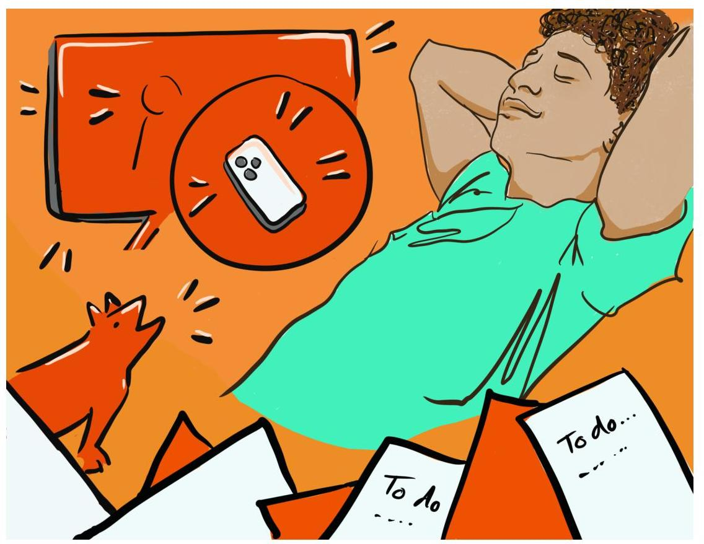

Figure WB.1.
Well-being.

## Dr J's Story: Embracing Well-Being in the Midst of Lockdown

On March 17, 2020, as the world around me began to close its doors and retreat into COVID 19 lockdown, I found myself stepping into a new reality. There I was, in my home on the West Coastof Canada, with my husband and our two cats, facing a reality that seemed to shift with each passing day. The courses I had been passionately teaching were now pivoting to Zoom. The professional development workshops I had planned were abruptly cancelled. My in-person counselling clients also had to shift to online sessions. The world as I knew it was changing, and a long, stressful journey lay ahead, marked by a rising tide of infections and a death toll that seemed to climb relentlessly.

In the midst of this unfolding chaos, I felt a deep need to anchor myself and find a beacon of light in the darkness. It was then that I decided to enrol in Dr. Laurie Santos's The Science of WellBeing free online course at Yale University. My choice was partly driven by my curiosity and a desire to peek into the award-winning lesson plans of the most popular psychology course on the planet. But little did I know, this decision would become a rising tide that would give me some buoyancy in the dark, sinking times of the pandemic.

Eager to share this experience, I extended an invitation to some of my colleagues: my sister, friends, and nieces, to join me in this learning adventure. Without a study group to help keep me on track, I knew I might not have the dedication to finish the course on my own. We formed a study group, a virtual gathering where we could learn about happiness and stress reduction while staying connected. Not all of us stayed in the course, but our discussions about the videos and assignments kept us engaged and connected. We became each other's long-distance social support group, a circle of care and learning that extended beyond the confines of our individual lockdowns. Some of us even joined a gentle stretch class online so we could stay physically active. And the time we spent learning with each other kept us from watching the never-ending bad news about the rising number of COVID 19 infections in the province.

Our Zoom-based study group became a haven of routine, casual conversation, and constructive advice. We delved into the science of positive psychology and stress reduction. We found solace and strength in shared experiences and insights. Our group, born out of a need for connection in a time of isolation, brought a sense of normalcy and added some joy to our days. It was a reminder that even in the darkest times, there are opportunities for growth, learning, and connection.

As the course progressed, I found myself deeply immersed in the lessons, applying the principles of well-being to my own life. The "rewiring the brain" exercise and data collection was transformative, leading me to a deeper understanding of how I can cultivate gratitude amidst adversity. In the end, I even chose to pay the extra fee to receive a certificate of completion, proof that I finished a course at Yale.

Writing this chapter on well-being has reminded me of some of my experiences during lockdown. The themes in this chapter mirror my personal lockdown experiences of loss, disruption, fear, and loneliness. But I was also reminded of some of the positive experiences Ihad during lockdown - learning new health-giving skills and receiving the social support of my friends and family as we studied Dr. Santos's The Science of Well-Being during unprecedented times.

In this chapter on well-being, we'll explore the science of well-being in ways that you may find applicable to your everyday challenges and stresses. This isn't just about academic theories; it's about real tools that you can use to navigate your personal experiences. We'll look at simple, yet powerful strategies that can help you find balance and happiness, even when times are tough. I'm excited to share these insights with you, not just as a teacher/author, but also as someone who has been applying these lessons in daily life. This well-being journey is about transforming understanding into action. It's an opportunity for us all to grow, not just intellectually, but in ways that make a tangible difference in how we live and interact with the world around us.

# Image Attributions 

Figure WB.1. Well-being by Marie Bartlett is licensed under a CC BY 4.0 license.

## (0) (0)

Well-being Introduction Copyright © 2024 by Jessica Motherwell McFarlane is licensed under a Creative Commons Attribution-NonCommercial-ShareAlike 4.0 International License, except where otherwise noted.916 | Chapter 17. Well-being# Happiness 

JESSICA MOTHERWELL MCFARLANE

## Approximate reading time: 33 minutes

Welcome to our exploration of happiness and well-being, vital areas in the study of psychology that touch every aspect of our lives. In this section on happiness we will discuss the biology, experiences, and theories that attempt to define our sense of happiness and overall well-being.

We explore the elements of happiness, looking at what truly makes us happy and how we can cultivate the pleasant life, the good life, and the meaningful life. We attempt to answer the question, "What Really Makes Us Happy?" We discuss how close relationships, money, education and religion may or may not enhance well-being.

Next, we attempt to answer the question, "Can we make ourselves happier?" The good news is that we can actively work on improving our happiness. We consider positive psychology, which shifts the focus from treating mental illness to enhancing well-being. This field looks at what makes life worth living, exploring aspects like empathy, creativity, and positive emotions. It's about building on our strengths and fostering those qualities that contribute to a fulfilling and happy life. We also explore Seligman's PERMA model, which breaks down the building blocks of a fulfilling life through Positive Emotions, Engagement, Relationships, Meaning, and Accomplishment.

We then examine the concept of negativity bias, which is our brain's tendency to focus more on negative experiences than positive ones. By consciously acknowledging and savoring positive experiences, we can counteract this bias and improve our mental health and well-being. This involves seeking out positive moments, savoring them, soaking in the good experiences, and sustaining these practices regularly.

In addition, we discuss the role of gratitude in enhancing happiness. Practicing gratitude can significantly enhance happiness. By focusing on what we are thankful for, even in challenging times, we can shift our perspective and improve our overall satisfaction with life.

Finally, we discuss the pursuit of happiness from different cultural perspectives. Different cultures view happiness differently. In individualistic cultures, happiness is often seen as something to pursue and achieve. In collectivistic cultures, happiness is more about being content with what you have and your place in the community. Understanding these perspectives can enrich our own approach to finding contentment and joy.Through these discussions, we aim to provide a comprehensive understanding of what constitutes happiness and how we can cultivate it in our lives. Are you ready to learn about happiness? Let's begin!

# Elements of Happiness 

Psychologists say happiness has three parts: the pleasant life, the good life, and the meaningful life (Seligman, 2002; Seligman, Steen, Park, \& Peterson, 2005). The pleasant life is about enjoying everyday pleasures that bring fun and excitement, like beach walks or a satisfying love life. The good life happens when we use our unique skills and get really into our work or hobbies. The meaningful life comes from using our talents for a greater cause, like helping others or improving the world. Generally, the happiest people focus on all three parts (Seligman et al., 2005).

## Pleasant life

enjoying daily pleasures

Good life using skills for enrichment

## Meaningful life

contributing to the greater good

Figure WB.2. Happiness. Happiness is an enduring state of well-being involving satisfaction in the pleasant, good, and meaningful aspects of life.To put it simply, happiness is a lasting feeling of joy, contentment, and the sense that your life is valuable (Lyubomirsky, 2001). It's more than just feeling good temporarily; it's about feeling good in the long run, known as subjective well-being.

Supplement WB.1: Deep Dive - Karim's Journey Towards a Happier Life [New Tab]

# What Really Makes Us Happy? 

Researchers have spent years trying to figure out what makes us truly happy, examining factors such as money, appearance, possessions, enjoyable jobs, and strong relationships. Here's a summary of their findings:

As people age, they generally feel more satisfied with life, and this sense of happiness doesn't really differ among the genders. Being in close relationships, such as a happy marriage, significantly boosts happiness. Those in strong marriages or with solid social connections are often happier than those who are single, divorced, or widowed. Money does play a role in happiness, but only up to a point. People in wealthier countries and those with higher incomes tend to be happier, but this only holds true until around $\$ 75,000$ per year. Beyond that, more money doesn't necessarily add to happiness and can even make it harder to enjoy the simple pleasures in life.

Education and meaningful employment are linked to happiness, with graduates and those in fulfilling jobs reporting higher levels of satisfaction. However, intelligence by itself doesn't guarantee happiness. Religion can contribute to happiness, especially in tougher living conditions, with religious people often reporting greater well-being. Cultural fit also matters; people whose personalities and values align with their culture's tend to be happier.

Interestingly, having children and physical attractiveness don't have a strong connection to happiness. Studies suggest that people without children can be just as happy, if not happier, than people with children, and feeling good about one's appearance is more important than actual looks. This research highlights that happiness stems from a mix of factors, including quality relationships, financial security up to a point, fulfilling work, and a good cultural and personal fit, rather than from wealth, looks, or other external factors alone.

Supplement WB.2: Deep Dive - The science of happiness: Research findings [New Tab]It's important to know that we're not always great at predicting our future emotions, a concept called affective forecasting (Wilson \& Gilbert, 2003). For instance, most newlyweds think they'll stay as happy as they are or become even happier, but a study found that their happiness actually went down over four years (Lavner, Karner, \& Bradbury, 2013). We also often guess wrong about how big life events will change our happiness. For example, we might think winning the lottery or dating a famous person would make us forever happy, or that we'd be forever sad if we had a bad accident or a breakup.

But, just as our senses adjust to new situations (like our eyes getting used to bright light after exiting from a dark movie theatre), our emotions adjust to big changes in our lives (Brickman \& Campbell, 1971; Helson, 1964). Initially, something good or bad can make us feel very happy or very sad. But over time, we get used to these changes, and our happiness level often goes back to what it was before. So, even exciting events like winning the lottery or your favourite team winning a big game eventually become normal (Brickman, Coats, \& Janoff-Bulman, 1978).

# Can We Make Ourselves Get Happier? 

Some studies show that we can actually change our happiness levels for the better. For example, well-designed happiness programs can help people feel happier for a long time, not just for a moment. These programs can work for individuals, groups, or whole societies (Diener et al., 2006). One study found that simple activities like writing down three good things each day made people happier for over six months (Seligman et al., 2005).

If we measure happiness across societies, it can tell policy makers whether or not people are happy, and why. Research shows that a country's average level of happiness is linked to six things: the country's wealth (GDP), support from others, choices in how to live one's life, a long, healthy life, government and businesses that people trust, and personal generosity (Helliwell et al., 2013). Understanding why people are happy or not can help governments create programs to make their societies happier (Diener et al., 2006). Decisions about important issues like poverty, taxes, healthcare, housing, clean environment, and income differences should consider how they will affect people's happiness.

Supplement WB.3: Deep Dive - Where in the world are the happiest people? [New Tab]

Supplement WB.4: Deep Dive - Unlocking Happiness: Is It All in Your Mind or Shaped by the World Around You? [New Tab]# Positive Psychology 


Figure WB.3. Positive psychology. Positive psychology aims to enhance the well-being and flourishing of individuals by understanding and promoting enduring aspects of human experience that contribute to a fulfilling life (Compton, 2005).

Positive psychology, pioneered by Seligman in 1998, represents a significant shift in the focus of psychological research and practice. Unlike traditional psychology, which often centres on addressing mental illness and emotional difficulties, positive psychology aims to enhance the well-being and flourishing of individuals by understanding and promoting enduring aspects of human experience that contribute to a fulfilling life (Compton, 2005). This field explores valuable experiences like well-being, contentment and happiness. Positive Psychology also examines positive traits, such as the ability to love, have courage, be creative, develop wisdom, be kind, forgive, show positive emotions, improve immune system health, develop character virtues and enjoy life. (Compton, 2005).

The scope of positive psychology includes research areas like altruism (being of service to others), empathy, creativity, and the impact of positive emotions on immune system functioning, as well as how savouring life's moments and developing virtues contribute toauthentic happiness. Positive Psychology also focuses on how to resolve conflict and foster peace and well-being at the community and global level (Cohrs, Christie, White, \& Das, 2013).

# PERMA Model + Flow 

Seligman's PERMA model is a way to understand what makes life most fulfilling and happy. "PERMA" stands for Positive Emotions, Engagement, Relationships, Meaning, and Accomplishment. These five aspects plus Flow (when you're really into something you're doing, so much that you forget about time and everything else around you) are key ingredients for a good life, according to positive psychology, a branch of psychology that focuses on what makes life worth living.

- Positive Emotions: Feeling good and experiencing joy, gratitude, optimism, and other positive feelings that uplift us.
- Engagement: Being deeply involved and absorbed in activities that challenge and utilise our skills and interests.
- Relationships: Building strong, supportive connections with others that bring love, belonging, and social support.
- Meaning: Finding a sense of purpose and understanding that we are part of something bigger than ourselves.
- Accomplishment: Pursuing goals, overcoming challenges, and achieving success that contributes to a sense of fulfilment and pride.

Both flow and engagement help us feel more connected to what we are doing and give us a sense of satisfaction. They are crucial for our well-being because they make us feel alive and part of something bigger. When we experience flow and engagement, we are using our strengths and abilities to their fullest, which is a key part of being happy and fulfilled.

Supplement WB.5: Deep Dive - Finding Your Flow and Focusing on Engagement: Our Two Paths to Fulfillment [New Tab]

Supplement WB.6: Deep Dive - Positive affect brightens your days, while optimism lights up your path forward [New Tab]# Rewiring for Happiness: Overcoming the Brain's Negativity Bias 

Understanding how to rewire our brains for happiness involves recognising a concept known as the negativity bias. This term refers to our brain's tendency to give more attention and weight to negative experiences than to positive ones (Hanson \& Mendius, 2009; Rozin \& Royzman, 2001). This bias isn't merely a result of our genetic makeup; it's also shaped by our experiences throughout life. It manifests in various ways, including our stronger reactions to negative events and our tendency to recall unpleasant experiences more vividly than pleasant ones (Monterrubio, Andriotis, \& Rodríguez-Muñoz, 2020; Everly Jr. \& Lating, 2019).

While our negativity bias has roots in our evolutionary past - serving as a survival mechanism by making us more alert to potential threats - its usefulness extends into modern life. Our negativity bias can prompt us to evaluate risks carefully and make decisions that protect us from harm. This cautious approach can be beneficial in complex social situations and professional environments, where anticipating challenges and preparing for possible mistakes or complications can lead to better outcomes.

However, the harms caused by our negativity bias are significant and can affect various aspects of our lives. Overemphasis on negative experiences can cause us to experience chronic stress, anxiety, and depression. It can distort our perceptions, making us more likely to see threats where none exist and undervalue positive aspects of our lives. This skewed perspective can hinder our personal growth, strain our relationships, and reduce our overall life satisfaction. Furthermore, in professional settings, a strong negativity bias might stifle creativity and innovation, as the fear of failure or criticism can prevent us from taking the necessary creative risks.

It's crucial for us to balance our in born negativity bias with a conscious effort to acknowledge and savour positive experiences. By doing so, we can lessen the impact of negativity bias on our mental health and overall well-being. Developing a more balanced perspective allows us to enjoy a fuller, more satisfying life in which we're not focused just on avoiding the bad but also embracing the good. By actively working to balance our perspective, we can mitigate these negative effects. This involves practices such as mindfulness, gratitude journaling, and positive reframing, which help us to notice and appreciate the positive aspects of our experiences. Over time, these practices can help rewire our brains to become more attuned to positivity, fostering a healthier, more resilient mindset.# Experience-Dependent Neuroplasticity: Shaping the Brain 

In this section, we will explore the biological and psychological ways our negativity bias, neuroplasticity (physical brain changes) and our experiences, especially those we're conscious of, interact and actively shape the structure of our brain. We will also explore the pivotal role of a process called experience-dependent neuroplasticity in reshaping our neural pathways (Hanson, 2013).

## Negativity Bias

As mentioned above, the concept of negativity bias refers to the phenomenon of negative events that have a greater impact on one's psychological state and processes than do positive or neutral events. This bias is thought to have an evolutionary basis, providing an advantage for survival by prioritising the avoidance of harmful stimuli over seeking potential benefits (Vaish, Grossmann, \& Woodward, 2008). At the neurobiological level, the amygdala, a part of the brain known for processing emotions, especially fear and threat, plays a significant role in negativity bias. When negative stimuli are encountered, the amygdala activates more intensely compared to positive or neutral stimuli, leading to stronger and more lasting emotional and cognitive impacts (Cisler \& Koster, 2010). This heightened amygdala response results in stronger memory formation of negative events and a tendency for these memories to be more easily recalled, further reinforcing the bias (Roozendaal, McEwen, \& Chattarji, 2009).

Experience-based neuroplasticity refers to the brain's capability to structurally and functionally evolve in response to experiences. This involves the principle whereby neurons that frequently activate together strengthen their connections, enhancing efficiency and likelihood of simultaneous activation. Key to this process are the amygdala and hippocampus. The amygdala processes emotions, impacting how emotional experiences shape the brain, while the hippocampus, vital for memory formation, collaborates with the amygdala to solidify and preserve emotional memories. These interactions enable continuous emotional experiences to instigate enduring alterations in the brain's architecture and functionality (LeDoux, 2000).

Supplement WB.7: Deep Dive - What defines positive and negative experiences? [New Tab]

Neuroplasticity is the brain's way of being flexible and adaptable, enabling learning and memory, as well as recovery from brain damage. It operates through mechanisms such as longterm potentiation (LTP, a process that strengthens the connections between neurons when they are frequently used together) and long-term depression (LTD, a process that weakens theconnections between neurons when they are less frequently used). This process is significantly influenced by brain chemicals like glutamate and specific receptors (Bear, Connors, \& Paradiso, 2007), which act like messengers and locks that control the flow of signals in the brain. The basolateral complex of the amygdala (BLA, a part of the brain involved in processing emotions) also plays a crucial role in this dynamic by modulating (adjusting) memory formation through its interactions with the hippocampus, an area of the brain critical for memory. This not only affects memory but also impacts synaptic connectivity (how neurons connect and communicate with each other) and gene functionality within the hippocampus (Maren \& Quirk, 2004).

The concept of "neurons that fire together, wire together" sums up the lasting and brainchanging impact of frequent and conscious thoughts or activity patterns on our brain, similar to how a river shapes its bed over time. Essentially, the more often certain neurons activate together, the stronger their connection becomes, shaping our brain's structure and function. As such, the thoughts and actions we repeatedly engage in physically sculpt our brain over time. This aspect of neuroplasticity highlights the importance of focusing on positive experiences and thoughts, as doing so can cultivate (develop and strengthen) a brain that is more resilient (better at recovering from stress or trauma), optimistic, and positive.

By understanding and applying these principles, we can actively work towards rewiring our brains for happiness, counteracting our natural negativity bias. This process involves not just ignoring out doom-related, improbable, negative possibilities and scenarios, but also, actively strengthening our positive thoughts, leading to lasting changes in our neural networks (the complex web of neuron connections) and overall well-being.

# Practical Steps to Rewire the Brain 

Now that we have discussed the process of neuroplasticity and the concept of negativity bias, let's look at practical steps to apply this knowledge. This section introduces a simple mnemonic to help us remember the rewiring steps recommended by Hanson and backed up by research evidence about how to rewire our brains from a negativity bias towards a practice of happiness.

Here is a simple mnemonic to help you remember the four steps Hanson outlines to help us to rewire our brains away from a negativity bias toward a new happiness outlook: Seek. Savour. Soak. Sustain.

1. SEEK. Experience Positive Moments: Hanson (2013) emphasises the importance of actively seeking and engaging in positive experiences. These can range from simple physical sensations like relishing the taste of good coffee to enjoying positive social interactions and appreciating the beauty in our surroundings.
2. SAVOUR. Deepen the Experience: To counteract the negativity bias, it's essential to savour these positive experiences. Hanson suggests staying with a positive experience for 20-30 seconds, feeling it in the body and emotions. This practice aligns with research showing that emotional intensity and duration ofawareness strengthen neural connections and memory traces (Goldstein-Piekarski et al., 2021; Qasim, Mohan, Stein, \& Jacobs, 2021; McGaugh, 2015).
3. SOAK. Soak in the Good Experience: Beyond just savouring, Hanson (2013) advises allowing the positive experience to deeply embed itself in our consciousness. This process involves a more passive and receptive state of mind, where we let the positive feelings seep into our awareness, contributing to longterm emotional memory.
4. SUSTAIN. Practice Regularly: Regular practice of these steps in various situations can help rewire the brain to respond more positively or neutrally to unexpected events, reducing anxiety and fostering a more balanced approach to life's uncertainties (Hanson, 2013).

Supplement WB.8: Case Study - Karim rewires his brain for happiness using "Seek, Savour, Soak, Sustain" [New Tab]

The PERMA Model (discussed above and refer to Supplement WB.9), offers a comprehensive framework that goes beyond the brain's wiring to encompass the various dimensions of a fulfilling life. This model doesn't just focus on internal cognitive processes but extends to external aspects of our lives, including our relationships, achievements, and sense of purpose. As we transition from the individual-focused strategies of rewiring our brains, the PERMA Model invites us to consider the wider sources of connections that contribute to our overall happiness and life satisfaction (Seligman, 2018)

Supplement WB.9: Deep Dive - More about Seligman's PERMA model of happiness [New Tab]

In the realm of positive psychology, Seligman's PERMA model stands out as a comprehensive framework for understanding well-being and happiness. Seligman invites us to not just survive, but to truly thrive. This model is particularly useful in helping us understand that well-being. It's a tool for individuals and communities to assess their well-being and to find areas for enhancement and growth. It encourages a holistic approach to building a fulfilling life, combining emotional well-being with engagement, relationships, meaning, and accomplishment.

Supplement WB.10: Case Study - Do Over story of Karim this time through his PERMA Journey [New Tab]Rewiring for happiness through the lenses of PERMA Model + Flow provides an explanation of what it means to live a fulfilled and happy life. We are reminded that happiness is not just a state of mind influenced by our neurological pathways but also a holistic experience shaped by our relationships, activities, achievements, and sense of purpose. Where we direct our energy plays a big role in our experience of happiness or stress.

# Uplifts and Hassles. Glimmers and Triggers. 

Navigating the ups and downs of daily life often feels like a balancing act between positive and negative experiences. In this section, we delve into the concepts of uplifts and hassles, as well as glimmers and triggers, to understand how they shape our well-being. Uplifts are those small, positive moments that brighten our day, such as a kind word from a colleague or a personal accomplishment. In contrast, hassles are the daily stressors and annoyances that can accumulate and weigh us down. Understanding how these experiences affect us can provide valuable insights into maintaining a healthy and balanced life.

We also explore Polyvagal Theory, which explains how our nervous system responds to feelings of safety or threat through glimmers and triggers. Glimmers are subtle cues that promote a sense of calm and connection, while triggers can activate stress and defensive responses. By recognizing and fostering glimmers and managing triggers, we can enhance our resilience and overall well-being.

## Uplifts and Hassles

Uplifts are positive experiences that can counterbalance the negative effects of hassles. These include experiences of accomplishment, positive interactions with colleagues, recognition, and support from management. Uplifts can also come from praying, thinking fondly about the past, feeling safe, laughing, socializing, and gossiping. Such positive experiences can significantly enhance an individual's sense of well-being and job satisfaction, providing a buffer against stress and burnout (Miller \& Wilcox, 1986).

Hassles refer to the daily irritations, frustrations, and stressful demands that employees encounter. These can range from minor annoyances like paperwork and routine tasks to more significant stressors such as conflicts with colleagues or overwhelming workloads. When these hassles accumulate, they can lead to chronic stress and negatively impact mental and physical health (Delongis et al., 1982).# Polyvagal Theory 

Polyvagal Theory, developed by Dr. Stephen Porges, explains how the autonomic nervous system regulates our physiological state in response to perceived safety or threat (Porges, 2011). According to this theory, our nervous system operates through three primary states: the ventral vagal state (associated with safety and social engagement), the sympathetic state (associated with fight or flight responses), and the dorsal vagal state (associated with shutdown or freeze responses).

Glimmers and triggers are concepts within Polyvagal Theory (suggested by Dana, 2018) that describe the small moments or cues that can either promote a sense of safety (glimmers) or trigger a defensive response (triggers).Glimmers are those positive, often subtle, experiences that can shift us towards the ventral vagal state, enhancing our sense of connection, calm, and well-being. Glimmers might include a friendly smile from a colleague, a compliment from a supervisor, or even the satisfaction of completing a task. Recognizing and fostering these glimmers can help create a supportive and positive work environment.

In personal life, glimmers can also play a crucial role in enhancing our sense of well-being. These can include small, positive experiences such as receiving a warm hug from a loved one, hearing your favourite song, spending time in nature, or engaging in a hobby. Even simple acts like petting an animal, cooking a favourite meal, or receiving a thoughtful message from a friend can serve as glimmers. These moments help shift us towards a state of calm and connection, contributing to our overall resilience and happiness.

Triggers, on the other hand, are cues that can activate our sympathetic or dorsal vagal responses, leading to stress, anxiety, or feelings of overwhelm. These might include a critical remark from a manager, a looming deadline, or a tense meeting with a colleague. Understanding these triggers and how they affect our physiological state can help us develop strategies to manage our responses more effectively (Porges, 2011).

In personal life, triggers can include everyday stressors such as arguments with family members, financial worries, traffic jams, or even unexpected bills. Negative interactions on social media, feeling overwhelmed by household chores, or receiving bad news can also serve as triggers. Recognizing these triggers helps us to better manage our reactions, thereby reducing stress and promoting a more balanced and healthy life.

By promoting uplifts and recognizing the positive effects of glimmers, we maintain a balanced our autonomic state, supporting our overall health and productivity. We can amplify the effects of glimmers by practising mindfulness, taking regular breaks, and engaging in positive social interactions.We can manage or diminish the effects of triggers by identifying and understanding them, which allows us to develop effective coping strategies. Techniques such as deep breathing exercises, physical activity, and seeking social support can help reduce the impact of triggers. Additionally, practicing self-compassion and reframing negative thoughts can further mitigate the stress and anxiety caused by these triggers. By balancing the promotion of uplifts and glimmers with the management of triggers, we enhance our overall well-being and resilience.

In exploring uplifts and hassles, and glimmers and triggers, we gain a deeper appreciation for the small yet powerful influences on our daily lives. By focusing on the positive experiences and managing the negative ones, we can create a more balanced and fulfilling life. Understanding the physiological basis of our responses through Polyvagal Theory empowers us to foster environments, both at work and at home, that support our mental and physical health. As we move forward, let's remember we can cultivate our glimmers and reduce the impact of our triggers to increase our well-being and resilience.

What simple uplifts and glimmers can you incorporate into your daily routine to transform your sense of well-being and resilience?

# Gratitude 

Next in our exploration of happiness and well-being is a podcast episode featuring Dr. Laurie Santos, a distinguished Yale Psychology Professor and the voice behind The Happiness Lab podcast. In this episode, Dr. Santos delves into the role of gratitude in enhancing happiness. She sheds light on how nurturing a sense of gratitude can lead to higher levels of happiness and satisfaction in life. The episode goes beyond the surface, distinguishing between authentic gratitude practices and the concept of toxic positivity. It offers practical advice on integrating mindfulness and gratitude into daily life, emphasising the importance of acknowledging life's blessings, even in challenging times.

Figure WB.4. Gratitude. Children can also have a daily gratitude practice.

Watch this video: Podcast: The Power of Gratitude with Dr. Laurie Santos (5 minutes)

One or more interactive elements has been excluded from this version of the text. You can view them online here:
https://opentextbc.ca/psychologymtdi/?p=486\#oembed-1
"Podcast: The Power of Gratitude with Dr. Laurie Santos" video by Headspace is licensed under the Standard YouTube licence.

Figure WB.5. Gratitude practice. It is hard to feel sad when you are feeling grateful. Try to practice giving thanks, even for something small, every day.

Supplement WB.11: Deep Dive - Uplifts and Hassles: A Balancing Act [New Tab]

Supplement WB.12: Deep Dive - Everyday Uplifts and Hassles: How Collectivistic and Individualistic Cultures Experience Life's Little Moments [New Tab]

Supplement WB.13: Deep Dive - We need to Use a Cultural Lens: Happiness and Stress [New Tab]The term "pursuit of happiness" describes how some people with individualistic values think about happiness. They can often believe that happiness is something they need to chase after or work hard to get. They think being free, showing who they really are, and achieving their goals will make them happy. But this idea also means that happiness is something you have to chase, and you might not always catch it.

In other parts of the world, like Asia, Africa, and Latin America, and in Indigenous cultures, people see happiness differently. For these collectivistic cultures, happiness isn't really about chasing after things. Instead, it's about how people feel about their life as it is. They find happiness in living in the moment and being part of their community. It's not about doing specific things to be happy; it's more about feeling content with where you are and who you're with.

# Summary 

In this section, we explore the different aspects of happiness and how they contribute to a fulfilling life. Psychologists have identified three main components of happiness: the pleasant life, the good life, and the meaningful life. The pleasant life involves enjoying everyday pleasures like a walk on the beach or a satisfying love life. The good life comes from using our unique skills and getting absorbed in work or hobbies we love. The meaningful life is about using our talents to contribute to a greater cause, such as helping others or improving the world.

Research shows that strong relationships, meaningful work, and a good cultural fit are key factors in happiness. Close relationships, like a happy marriage or solid friendships, significantly boost our happiness. Money also plays a role, but only up to a point. Education and fulfilling jobs are linked to higher satisfaction, while intelligence alone does not guarantee happiness. Interestingly, having children and physical attractiveness are not strong indicators of happiness. Instead, feeling good about oneself and having quality relationships are more important.

We also look into how happiness can be cultivated. Simple practices like writing down three good things each day can lead to long-term improvements in happiness. Positive psychology, pioneered by Martin Seligman, focuses on enhancing well-being by promoting positive traits and experiences.

The PERMA model, which stands for Positive Emotions, Engagement, Relationships, Meaning, and Accomplishment, helps us understand what makes life fulfilling. Engaging deeply inactivities we enjoy - experiencing flow - and building strong relationships are crucial for wellbeing.

We also discuss the concept of negativity bias, where our brains tend to focus more on negative experiences than positive ones. Balancing this bias by acknowledging and savoring positive experiences can help improve our mental health. Experience-dependent neuroplasticity shows how our brains can change in response to our thoughts and activities, highlighting the importance of focusing on positive experiences.

Practical steps to rewire our brains for happiness include seeking out positive moments, savoring them, soaking in the good experiences, and practicing these steps regularly.

Additionally, we explore the concepts of uplifts and hassles, and glimmers and triggers. Uplifts are small, positive moments that brighten our day, while hassles are daily stressors. Glimmers are subtle cues that promote a sense of calm and connection, while triggers activate stress responses. By promoting uplifts and recognizing glimmers, we can maintain a balanced autonomic state and support our overall health and productivity. Managing triggers involves identifying them and developing effective coping strategies.

Finally, we discuss gratitude and how nurturing a sense of gratitude can lead to higher levels of happiness and satisfaction. Understanding the different ways cultures view happiness helps us appreciate diverse perspectives and approaches to achieving well-being.

In the next section we discuss stress and health.

# Image Attributions 

Figure WB.2. Figure 14.25 as found in Psychology 2e by OpenStax is licensed under a CC BY 4.0 License.

Figure WB.3. Positive psychology by Rachel Lu is licensed under a CC BY-NC-SA license.
Figure WB.4. Photo by Santi Vedrí on Unsplash.
Figure WB.5. Photo by madison lavern on Unsplash.

## (0) (0)

Happiness Copyright © 2024 by Jessica Motherwell McFarlane is licensed under a Creative Commons Attribution-NonCommercial-ShareAlike 4.0 International License, except where otherwise noted.934 | Chapter 17. Well-being# Stress and Health 

JESSICA MOTHERWELL MCFARLANE

Approximate reading time: 51 minutes
Few would deny that today's university students are under a lot of pressure. In addition to the usual stresses and strains inherent to the university experience, such as exams and term papers, students today face increased tuition, burdensome debt, and the prospect of difficulty finding employment after graduation. A significant population of university students may face additional stressors, such as raising children or holding down a full-time job while working toward a degree.

Life is filled with many additional challenges beyond those found in university or in the workplace. We might have concerns with financial security, difficulties with friends or neighbours, responsibilities to our family, and not enough time to do the things we want to do. Even minor hassles, such as losing things, traffic jams, and loss of internet service, involve pressure and demands that can make life seem like a struggle and compromise our sense of well-being.

In this section of the chapter, we start by defining stress, a complex phenomenon influenced by both external situations and our internal responses. Stress can stem from feeling overwhelmed by exams, deadlines, and societal pressures, impacting our mental and physical health. It can be viewed through two main lenses: as specific external triggers or as our physical and emotional reactions to these demands.

Next, we explore the Lazarus Appraisal Model of Stress, which emphasises individual appraisal in the experience of stress. This model introduces the concepts of primary and secondary appraisal, helping us understand how our interpretation of events influences our stress levels. Using a practical scenario of encountering a barking dog on a forest path, we delve deeper into the Lazarus model. This section illustrates how individual perceptions significantly influence stress responses, showing the subjective nature of stress.

We then discuss the dual nature of stress, distinguishing between eustress (positive stress) and distress (negative stress). Understanding the difference helps us harness the motivating aspects of eustress while minimising the harmful effects of distress on our mental and physical health. This section explores the relationship between stress and performance, highlighting how moderate stress can enhance performance and well-being, but excessive stress can lead to burnout and decreased performance.We examine common stressors and their effects on our daily lives, noting how stress can manifest physically and mentally, influencing behaviours and health outcomes. Health psychology focuses on understanding how stress and other psychological factors impact health. This section delves into how health psychologists study and address the connection between stress and illness, aiming to promote healthier behaviours and lifestyles.

Walter Cannon's fight-or-flight response theory is introduced, explaining how our bodies react to perceived threats with physiological changes that prepare us to confront or escape danger. We transition to Hans Selye's concept of the General Adaptation Syndrome (GAS), which examines the prolonged effects of stress on the body. This model outlines how our bodies cope with sustained stress through stages of alarm, resistance, and exhaustion.

We learn the physiological mechanisms behind stress, focusing on the sympathetic nervous system and the hypothalamic-pituitary-adrenal (HPA) axis. We explore how these systems respond to stress and the implications for our health. Life changes, whether positive or negative, can act as significant stressors. We discuss the Social Readjustment Rating Scale (SRRS) developed by Holmes and Rahe, which quantifies the impact of life events on stress and health.

# What is Stress? 

Stress, a prevalent aspect of modern life, especially for university students grappling with academic pressures, financial burdens, and personal challenges, is a complex phenomenon influenced by both external situations and our internal responses. It encompasses a range of experiences from feeling overwhelmed by exams and deadlines to navigating societal pressures, all of which can significantly impact our mental and physical health. Broadly defined, stress can be viewed from two perspectives: specific external triggers or our physical and emotional reaction to these demands (Lyon, 2012), underscoring the intricate interplay between our environment and how we perceive and cope with challenges.

The term stress, as it relates to the human condition, first emerged in scientific literature in the 1930s, but it did not enter our everyday language until the 1970s (Lyon, 2012). Today, we often use the term loosely in describing a variety of unpleasant feeling states; for example, we often say we are stressed out when we feel frustrated, angry, conflicted, overwhelmed, or fatigued. Despite the widespread use of the term, stress is a fairly vague concept that is difficult to define with precision.

Researchers have struggled to agree on an acceptable definition of stress. Broadly, there are two primary ways of conceptualising stress: (1) the stimulus-based definition and (2) theresponse-based definition. The stimulus-based definition views stress as a result of specific external events or situations, such as a high-stress job or long commutes, which act as stimuli, triggering stress reactions. However, this approach has been critiqued for not accounting for individual differences in perception and reaction to these stimuli. On the other hand, the response-based definition focuses on the physical and emotional responses that occur when faced with demanding or threatening situations, like increased arousal. This perspective emphasises the physiological aspect of stress but can overlook the fact that such responses can also be triggered by positive or non-threatening events.

To better understand these definitions and their limitations, you can read Supplement WB. 14 about of two students, Ti and Carli, who are about to leave their small town homes to move into a large university student residence.

Supplement WB.14: Case Study - Parts 1 \& 2: Ti and Carli [New Tab]

# Understanding the Lazarus Appraisal Model of Stress 

The limitations of both the stimulus-based and response-based definitions lead us to consider a more comprehensive model of stress: the Lazarus Appraisal Model. Developed by Lazarus \& Folkman in 1984, this model emphasises the role of individual appraisal in the experience of stress. It suggests that stress is not solely determined by external events or physiological responses but also by the ways an individual interprets and reacts to these events.

## Primary and Secondary Appraisal

The process begins with what is known as primary appraisal, where an individual assesses the potential harm or threat a stressor might pose to their well-being. In the previous example of Ti and Carli (Supplement WB.14), the stressor was leaving home to move into university residence. The primary appraisal involves evaluating whether a situation or event is a threat, which could lead to harm, loss, or other negative consequences. Conversely, the same situation can be appraised as a challenge, presenting an opportunity for overcoming fear or demonstrating courage.

Secondary appraisal follows, where the individual assesses their ability to cope with the stressor, considering the resources they have at hand. This appraisal involves determining how effectivelyone can manage or adapt to the stressor. The perception of one's ability to handle the situation influences whether it is viewed as a manageable challenge or a significant threat.


Figure WB.6. Primary and secondary appraisal. When encountering a stressor, a person judges its potential threat (primary appraisal) and then determines if effective options are available to manage the situation. Stress is likely to result if a stressor is perceived as extremely threatening or threatening with few or no effective coping options available.[Image Description]After exploring the stimulus-based and response-based definitions through the experiences of Ti and Carli, let's delve deeper into the Lazarus appraisal model with a different scenario. This will help us further understand how individual perceptions significantly influence stress responses.

Facing Fido in the Forest: Another Walk Through the Lazarus Model

Let's walk through the Lazarus model decision tree using the example of you hiking along a forest path when you suddenly encounter a large, loudly barking dog on a forest path. This model involves two key stages of appraisal: primary and secondary.

# Primary appraisal 

In the primary appraisal stage, you assess the situation to determine if the large, barking dog poses a threat to your well-being or if it represents a challenge.

- Perceived as a threat: If you perceive the dog as dangerous (due to its size, loud bark, and the isolated forest setting), you might appraise this situation as a threat. This perception could be based on past experiences, inherent fears of dogs, or the unexpected nature of the encounter. You anticipate potential harm or danger from the dog.
- Perceived as a challenge: Alternatively, you might perceive the encounter with the dog as a challenge. This could occur if you view the situation as an opportunity to overcome a fear of dogs or to demonstrate courage in handling unexpected situations. Your focus here is on the potential for personal growth or mastery in dealing with the situation.


## Secondary appraisal

In the secondary appraisal stage, you evaluate your coping resources and options to handle the situation with the dog.

- Ineffective or no coping options available (perceived as a threat): If, on the other hand, you feel you lack the resources to deal with the dog (due to a lack of experience with dogs, absence of any means to protect yourself, or being alone in the forest), you might view the situation as a significant threat to your safety. This perception leads to a higher level of stress and potential feelings of helplessness or fear.
- Effective coping options available (perceived as a challenge): If you feel confident in your ability to handle the situation (perhaps due to previous positive experiences with dogs, knowledge about animal behaviour, or the presence of tools like a walking stick), you might view the encounter as a manageable challenge. You believe you have the necessary resources and strategies to safely navigate the situation.


## Outcome based on appraisal

- High stress (threat perception with ineffective coping): If you appraise the dog as a threat and feel you cannot effectively cope with the situation, you are likely to experience a high level of stress. This stresscould manifest as fear, anxiety, and physiological responses like increased heart rate or adrenaline rush.

- Low to moderate stress (challenge perception with effective coping): If you appraise the situation as a challenge and feel capable of handling it, your stress level may be lower or even positive in nature, characterised by a sense of alertness and readiness to act.

In summary, according to the Lazarus model, your experience of stress in encountering the barking dog on a forest path is determined not just by the presence of the dog (the external stimulus) but significantly by how you appraise the situation (threat or challenge) and your perceived ability to cope with it. This model underscores the subjective nature of stress and the importance of individual perception and evaluation in stress experiences.

Having navigated the Lazarus model with the example of the hiker and the barking dog, we can see how individual appraisal plays a crucial role in the experience of stress.

This understanding brings us back to Ti and Carli, whose experiences we can now re-examine through the lens of this model.

Supplement WB.15: Case Study - Lazarus Model Analysis Ti and Carli [New Tab]

In summary, if a person appraises an event as harmful and believes that the demands imposed by the event exceed the available resources to manage or adapt to it, they will subjectively experience a state of stress. Conversely, if one does not appraise the same event as harmful or threatening, they are unlikely to experience stress. According to this definition, environmental events trigger stress reactions by the way they are interpreted and the meanings they are assigned. In short, stress is largely in the eye of the beholder: it's not so much what happens to you as how you respond (Selye, 1976).

# Stress: The Good and the Bad 

Stress is often seen as something negative, but it can also be helpful. Stress can push us to do important things like study for exams, go to the doctor, exercise, and work hard. Selye, a scientist in 1974, said that stress isn't always bad. He explained that stress can be a good thing that helps improve our lives. He called this good stress "eustress" (from a Greek word meaning "good"). Eustress is the kind of stress that makes you feel positive and can be good for your health and performance.Stress manifests in two primary forms: eustress, which is positive and can motivate and energise us, leading to improved performance and well-being, and distress, which is negative, overwhelming, and can lead to burnout, decreased performance, and health issues. Understanding the difference between these two types of stress is crucial for managing stress effectively, allowing us to harness the motivating aspects of eustress while minimising the harmful effects of distress on our mental and physical health. Eustress can make you do better and feel good; distress can make you do worse and harm your health.

A moderate amount of stress can be beneficial in challenging situations. For example, athletes may be motivated and energised by pre-game stress, and students may experience similar beneficial stress before a major exam. Indeed, research shows that moderate stress can enhance both immediate and delayed recall of educational material. Male participants in one study who memorised a scientific text passage showed improved memory of the passage immediately after exposure to a mild stressor as well as one day following exposure to the stressor (Hupbach \& Fieman, 2012).

But when stress exceeds this optimal level, it is no longer a positive force; it becomes excessive and debilitating, or what Selye termed distress (from the Latin dis = "bad"). People who reach this level of stress feel burned out; they are fatigued and exhausted, and their performance begins to decline. If the stress level remains excessive, health may begin to erode as well (Everly \& Lating, 2002).

# Stress and Performance 

Figure WB. 7 shows us that as stress increases, so does performance and well-being, up to a point. This is eustress. When stress reaches the best level (the highest point of a curve), performance is at its best. You feel fully energised and focused, and you work efficiently. But if stress goes beyond this best level, it becomes too much and harmful; this is distress. People with too much stress feel burned out and tired, and their performance drops. If the stress level stays too high, it can even harm health. For example, students who are very stressed about a test might find it hard to concentrate, which can affect their test scores.

Figure WB.7. Stress and performance. As the stress level increases from low to moderate, so does performance (eustress). At the optimal level (the peak of the curve), performance has reached its peak. If stress exceeds the optimal level, it will reach the distress region, where it will become excessive and debilitating, and performance will decline (Everly \& Lating, 2002).

A graph features a bell curve that has a line going through the middle labeled "Optimal level." The curve is labelled "eustress" on the left side and "distress" on the right side. The x -axis is labeled "Stress level" and moves from low to high, and the y -axis is labeled "Performance level" and moves from low to high." The graph shows that stress levels increase with performance levels and that once stress levels reach optimal level, they move from eustress to distress.

# Stress in Our Lives 

Stress is a common experience. We all deal with it in different ways. It can feel like a heavy load, like when you have to drive in a blizzard, wake up late for an important job interview, run out of money, or aren't ready for a big test. Stress is an experience that can include symptoms like a faster heart rate, headaches, gastrointestinal problems, and difficulty concentrating or making decisions. We may react to stress in unhealthy ways by drinking alcohol, smoking, or engaging in other dubious behaviours we hope will reduce the stress. While stress can sometimes be good, it can also lead to health problems, contributing to illnesses and diseases. Stress can cause physical reactions like a fast heartbeat or headaches, make it hard to think or decide, and lead to behaviours like drinking or smoking.

Figure WB.8. Driving during a blizzard. Stress is an experience that can include symptoms like a faster heart rate, headaches, gastrointestinal problems, and difficulty concentrating or making decisions.

# Health Psychology and Stress 

The scientific study of how stress and other psychological factors impact health is part of health psychology. Health psychology is a subfield of psychology that focuses on understanding the importance of psychological influences on health and illness, and how people respond when they become ill (Taylor, 1999). Health psychology emerged as a discipline in the 1970s, a time of increasing awareness of the role behavioural and lifestyle factors play in the development of illnesses and diseases (Straub, 2007). In addition to studying the connection between stress and illness, health psychologists investigate issues such as the reasons people make certain lifestyle choices, e.g., smoking or eating unhealthy food, despite knowing the potential adverse health implications of such behaviours.

Health psychologists also work on creating and testing ways to help people change unhealthy behaviours. A key part of their job is to figure out which groups of people are more likely to have health problems because of the way they think or act. For instance, they might study how stress affects different age groups, like young adults versus older adults. By understanding who gets more stressed and how it changes over time, health psychologists can identify which age group might be more at risk for health issues like high blood pressure or anxiety disorders.# Watch this video: The Upside of Stress (4.5 minutes) 

One or more interactive elements has been excluded from this version of the text. You can view them online here:
https://opentextbc.ca/psychologymtdi/?p=495\#oembed-1
"The Upside of Stress" video by BrainCraft is licensed under the Standard YouTube licence.

## Cannon and the Fight-or-Flight Response

Stress, a universal experience, has intrigued scientists for nearly a century. A key figure in this exploration is Walter Cannon, an American physiologist whose groundbreaking work in the early 20th century has significantly shaped our understanding of how the body reacts to stress. Cannon's insights into the fight-or-flight response have provided a foundational understanding of the body's physiological mechanisms when confronted with stress.


Figure WB.9. Flight-or-fight response. A dog jumps onto the path, barking and giving mixed signals. Is it going to bite you or just saying hello? Your fight-or-flight response will likely kick in to give you extra alertness and energy to deal with the possible threat.To illustrate Cannon's fight-or-flight model, let's return to our previous scenario, imagine you are back again, hiking in a forest when suddenly a large, barking dog appears. The dog, emerging from behind a stand of trees, stops about 50 yards from you. It notices you, barks louder, and starts moving in your direction. You think, "This is definitely not good," and experience a series of physical reactions:

- Your pupils dilate.
- Your heart races and speeds up.
- You start breathing heavily and sweating.
- You feel butterflies in your stomach.
- Your muscles tense up, readying you to take action.

Cannon proposed that this reaction, termed the fight-or-flight response, occurs when a person experiences intense emotions, especially those associated with a perceived threat (Cannon, 1932). During the fight-or-flight response, the body is rapidly aroused by the activation of both the sympathetic nervous system and the endocrine system (Figure WB.10). This arousal prepares the person to either confront or escape the perceived threat.


Figure WB.10. Fight-or-flight response in the body. This diagram illustrates the fight-or-flight response, showing a human body and highlighting various physiological reactions, such as increased heart rate, dilated pupils, and quickened respiration.In conclusion, Cannon's concept of the fight-or-flight response has been instrumental in advancing our understanding of stress physiology. By identifying the body's innate mechanism for maintaining homeostasis in the face of threats, Cannon's work has laid the groundwork for further research into how we respond to stress. This response, crucial for survival, highlights the body's remarkable ability to adapt to and manage challenging situations, a testament to the complex and dynamic nature of human physiology.

Having explored Cannon's pivotal work on the immediate, fight-or-flight response to stress, we now turn to another seminal figure in stress research, Hans Selye. While Cannon focused on the body's acute reaction to stress, Selye's work delves into the prolonged effects of stress on the body. His concept of the General Adaptation Syndrome (GAS) offers a broader perspective, examining how our bodies cope with sustained stress over time. This shift from the immediate to the enduring effects of stress marks a significant development in our understanding of how stress impacts us.

# Selye and the General Adaptation Syndrome 

Content Disclosure: This section discusses historical research methods involving animal testing that are now considered unethical. These studies by Hans Selye were pivotal in stress research but raise important ethical concerns.

Selye initially focused on sex hormones in rats, but he incidentally discovered that prolonged exposure to stressors - such as extreme cold, surgical injury, and excessive muscular exercise - led to adrenal enlargement, thymus and lymph node shrinkage, and stomach ulceration in the rats. Selye realised that these health issues were part of a set of body reactions that occur over time under stress, regardless of the stressor's nature. He termed this the general adaptation syndrome, a universal response of the body to stress.

It is important to note that Selye's experiments, while groundbreaking, involved methods that would not meet current ethical standards. The distress and harm inflicted on the rats in his labs raises significant ethical concerns. Additionally, the extrapolation of these findings to human populations should be approached with caution.

Figure WB.11. Selye's general adaptation syndrome. This graph illustrates the three stages of Selye's general adaptation syndrome: alarm reaction, resistance, and exhaustion. Prolonged stress ultimately results in exhaustion.

Supplement WB.16: Deep Dive - Two examples of Understanding general adaptation syndrome [New Tab]

In summary, Selye's general adaptation syndrome model illustrates how our bodies may respond to stress in stages: initially with a burst of energy, then adapting, and finally, potentially breaking down if the stress continues for too long.

# Biological Basis of Stress 

What happens inside our bodies when we experience stress? The physiological mechanisms are complex, involving two main systems: the sympathetic nervous system and the hypothalamic-pituitary-adrenal (HPA) axis.

When we perceive something as stressful, the sympathetic nervous system quickly triggers arousal. This includes releasing adrenaline from the adrenal glands, which activates our fight-or-flight responses, such as a faster heart rate and increased breathing. Simultaneously, the HPA axis, which operates more slowly, becomes active. The hypothalamus in the brain releases a hormone that prompts the pituitary gland to release adrenocorticotropic hormone (ACTH). ACTH then stimulates the adrenal glands to secrete various hormones, notably cortisol, which affects almost every organ and provides an energy boost in response to stressors.


Figure WB.12. Hypothalamic-pituitary-adrenal (HPA) axis. This diagram illustrates the HPA axis, showing how the hypothalamus activates the pituitary gland, which in turn stimulates the adrenal glands to increase cortisol secretion.

In short bursts, this process can be beneficial, providing extra energy, temporarily improving immune function, and reducing pain sensitivity. However, prolonged or chronic stress, leading to extended cortisol release, can have detrimental effects. High cortisol levels can weaken the immune system and are often found in individuals with depression (Glaser \& Kiecolt-Glaser, 2005; Geoffroy, Hertzman, Li, \& Power, 2013).

These physiological reactions to stress prepare us for immediate action but can also increasethe risk of illness. Extreme or chronic stress can have profound negative consequences. It contributes to psychological disorders like post-traumatic stress disorder (PTSD) and depression and is linked to physical illnesses. For instance, people affected by the September 11 attacks showed higher rates of heart disease (Jordan, Miller-Archie, Cone, Morabia, \& Stellman, 2011). Finnish food industry workers with self-reported stress symptoms were more likely to develop various disorders 11 years later (Salonen, Arola, Nygård, \& Huhtala, 2008). South Korean employees with high work-related stress were more susceptible to the common cold (Park et al., 2011).

Having explored the immediate physiological responses to stress, we will now examine how these reactions can lead to physical illness and disease. In the following sections, we will delve into the mechanisms through which stress can lead to physical illness and disease.

Watch this video: Sympathetic Nervous System: Crash Course Anatomy \& Physiology \#14 (11 minutes)

One or more interactive elements has been excluded from this version of the text. You can view them online here: https://opentextbc.ca/psychologymtdi/?p=495\#oembed-2
"Sympathetic Nervous System: Crash Course Anatomy \& Physiology \#14" video by CrashCourse is licensed under the Standard YouTube licence.

# Rat Park Experiments, Addiction and Environmental Stress 

Watch this video: Addiction and the Rat Park Experiments - Short Version (1.5 minutes)

One or more interactive elements has been excluded from this version of the text. You can view them online here: https://opentextbc.ca/psychologymtdi/?p=495\#oembed-3
"Addiction and the Rat Park Experiments - Short Version" video by MinuteVideos Portfolio is licensed under the Standard YouTube licence.Supplement WB.17: Deep Dive - The Rat Park Experiments Explained [New Tab]

Supplement WB.18: Deep Dive - Graphic Narrative Story: Rat Park by Stuart McMillan [New Tab]

# Life Changes as Stressors 

Life changes, whether perceived as positive or negative, can act as significant stressors. The Social Readjustment Rating Scale (SRRS), developed by Holmes and Rahe in 1967, highlights how events like marriage, divorce, job loss, or moving to a new home require an individual to make substantial adjustments, thereby inducing stress. These life changes are assigned "life change units" (LCUs) to quantify their potential impact on a person's health. Interestingly, the scale suggests that not only negative events but also positive ones, such as promotions or the birth of a child, can produce stress due to the changes they bring to one's life.

Supplement WB.19: Deep Dive - What Stresses Us Out? [New Tab]Table WB.1. Some stressors on the social readjustment rating scale

| Life event | Life change units |
| :-- | :-- |
| Death of a close family member | 63 |
| Personal injury or illness | 53 |
| Dismissal from work | 47 |
| Change in financial state | 38 |
| Change to different line of work | 36 |
| Outstanding personal achievement | 28 |
| Beginning or ending school | 26 |
| Change in living conditions | 25 |
| Change in working hours or conditions | 20 |
| Change in residence | 20 |
| Change in schools | 20 |
| Change in social activities | 18 |
| Change in sleeping habits | 16 |
| Change in eating habits | 15 |
| Minor violation of the law | 11 |

Table adapted from Holmes and Rahe (1967). The higher the number the more stressful the event.

The Social Readjustment Rating Scale (SRRS) provides researchers a simple, easy-to-administer way of assessing the amount of stress in people's lives, and it has been used in hundreds of studies (Thoits, 2010). Despite its widespread use, the scale has been subject to criticism.

Supplement WB.20: Deep Dive - Rate your own life stress this past year [New Tab]

Understanding that life changes can be stressful regardless of their nature underscores the importance of developing coping mechanisms and support systems. It also highlights the subjective nature of stress, as individuals may perceive and react to the same event differently based on their personal resources, past experiences, and social support networks. Recognising and addressing the stress associated with life changes is crucial for maintaining mental health and well-being. This awareness can empower individuals to seek help when needed and to approach life's transitions with strategies that promote resilience and adaptation.Supplement WB.21: Deep Dive - Life Changes as Stressors: Research findings [New Tab]

Supplement WB.22: Deep Dive - Oppression-based violence and discrimination: Impacts on Health [New Tab]

Supplement WB.23: Deep Dive - Lockdown During the COVID-19 Pandemic: Psychological Effects [New Tab]

# Summary 

This section delves into the complex nature of stress and its profound impact on health. It begins by defining stress. The section introduces the Lazarus Appraisal Model of Stress, providing a framework for understanding primary and secondary appraisal and how personal interpretation of stressors affects our stress response. We then discuss good stress (eustress) and bad stress (distress) discussing stress' dual role in enhancing performance and contributing to health issues. Next we discuss the historical perspectives of Cannon's fight-or-flight response and Selye's General Adaptation Syndrome which offer us insights into the body's physiological responses to stress. The biological underpinnings of stress are explored, with a focus on the sympathetic nervous system's role. Additionally, the Rat Park experiments are highlighted to discuss the relationship between environmental stress, addiction, and health. The section also considers the impact of significant life changes as stressors, utilising the Social Readjustment Rating Scale to illustrate how different events influence stress levels.

Reflecting on the above stress and health content, consider these questions: How can you reframe your perception of stressful events to transform them from threats into challenges that promote personal growth? What are some daily habits or activities you can adopt to counteract the negative effects of stress? What practical steps can you take to incorporate more eustress into your daily routine to enhance your well-being and performance?# Image Descriptions 

Figure WB.6. Primary and secondary appraisal image description: A concept map showing the steps assessing a potential threat.

- Stressor
- Primary appraisal: Challenge or threat?
- If it's a challenge, it's a potential for gain or growth
- If it's a threat, it may lead to harm, loss, or negative consequences
- Secondary appraisal: Potential options and how effective?
- If there are effective options, it is a low threat.
- If there are ineffective or no options, it is a high threat. [Return to Figure WB.6]


## Image Attributions

Figure WB.6. Figure 14.3 as found in Psychology 2e by OpenStax is licensed under a CC BY 4.0 License.

Figure WB.7. Figure 14.4 as found in Psychology 2e by OpenStax is licensed under a CC BY 4.0 License.

Figure WB.8. Driving during a blizzard by Rachel Lu is licensed under a CC BY-NC-SA license.
Figure WB.9. Flight-or-fight response by Rachel Lu is licensed under a CC BY-NC-SA license.
Figure WB.10. Figure 14.8 as found in Psychology 2e by OpenStax is licensed under a CC BY 4.0 License.

Figure WB.11. Figure 14.10 as found in Psychology 2e by OpenStax is licensed under a CC BY 4.0 License.

Figure WB.12. Figure 14.11 as found in Psychology 2e by OpenStax is licensed under a CC BY 4.0 License.Stress and Health Copyright © 2024 by Jessica Motherwell McFarlane is licensed under a Creative Commons Attribution-NonCommercial-ShareAlike 4.0 International License, except where otherwise noted.# Stress and Illness 

JESSICA MOTHERWELL MCFARLANE

Approximate reading time: 26 minutes
The stress response, a sophisticated and coordinated set of physiological reactions, is crucial for navigating potentially dangerous or threatening situations, such as the classic example of encountering a bear on a trail. This response prepares our body to face immediate challenges. However, when these physiological reactions are not just momentary but sustained over a prolonged period, they can have significant health implications. This is where the concept of biological embedding comes into play. Continuous exposure to stress, especially chronic or traumatic stress, can lead to lasting changes in our body's systems. These changes are "embedded" biologically, altering our normal physiological responses. As a result, what is designed as a short-term survival mechanism can, over time, contribute to long-term health issues, reflecting the deep and enduring impact of prolonged stress on our physical and mental well-being.

## Biological Embedding

Biological embedding is a concept used to describe how life experiences, particularly those involving stress or trauma, can have a lasting impact on biological systems and development. This process involves the way in which these experiences can lead to changes in the body's physiological and biological systems, potentially affecting health across the lifespan.

In more technical terms, biological embedding occurs when experiences, especially in critical periods of development (like childhood or adolescence), alter the functioning of our biological systems in a way that persists over time. This can include changes in the endocrine system (which involves hormones), the immune system, and even at the genetic level through a process known as epigenetics, where the expression of genes is changed without altering the DNA sequence itself.

These changes can have long-term effects on an individual's health, increasing the risk of various physical and mental health conditions. For example, exposure to chronic stress or trauma in early life can lead to a heightened stress response, which over time can contribute to a range of health issues, including cardiovascular disease, mental health disorders, and metabolic conditions.# Adverse Childhood Experiences 

Adverse Childhood Experiences (AdverseCEs) are not just unfortunate incidents that occur in one's childhood. Instead, they represent devastating events that can cast a long shadow over an individual's life, shaping their future health and well-being. These events may include various forms of abuse (emotional, physical, sexual), neglect, or residing in a home where family members struggle with mental illness, substance addiction, divorce, the incarceration of a family member, or domestic violence (Felitti, et al., 2018). The more adversities one faces in childhood, the greater the risk of health issues later in life (Boles, 2021; Kwong \& Hayes, 2017). For Indian Residential School (IRS) survivors and their descendants, these adversities are often compounded by the intergenerational transmission of trauma, cultural disconnection, and systemic inequities brought about by genocidal actions of European colonists. (McQuaid et al., 2017; Richmond et al., 2009; Gracey \& King, 2009).

## Allostasis and Allostatic Load

Allostasis is a term that describes how our body responds to stress by trying to maintain balance or stability. Think of it like a highly skilled juggler who keeps several balls in the air - the balls represent different stressors, and the juggler is your body trying to keep everything balanced. When faced with stress, our body activates several systems, including the brain, hormones, and immune system. This is similar to the juggler adding more balls to juggle when more tasks are thrown at them. Key players in this process are hormones like cortisol, epinephrine (also known as adrenaline), and norepinephrine. These hormones are like the juggler's quick reflexes, helping the body adapt to new challenges by increasing heart rate, energy levels, and alertness.

However, if the stress continues for a long time or is very intense, it leads to what scientists call allostatic load. Imagine our juggler now having to juggle too many balls for too long. Eventually, the juggler gets tired, and it becomes harder to keep all the balls in the air. Similarly, allostatic load is the wear and tear that our body experiences when it's constantly under stress. It's like the body's stress-response system getting overworked. This can happen when someone is repeatedly exposed to stressful situations, or if the stress is very intense, like the experiences of those in Indian Residential Schools. Over time, this constant stress can lead to health problems like high blood pressure, diabetes, and mental health issues. It's as if the juggler's muscles start to ache and they can't perform as well anymore.

## "Just Get Over It" is the Wrong Approach

Sometimes, it's easy to wonder, "Why can't survivors of trauma just get over it and leave the past behind?" The reality, deeply rooted in the principles of biological embedding and allostatic load,is far more complex. Traumatic experiences, particularly those in childhood, like those endured in Indian Residential Schools, don't just impact the mind; they leave a lasting imprint on the body's biological systems. This embedding alters hormonal balances, immune responses, and even gene expression, setting the stage for long-term health challenges. Additionally, the concept of allostatic load shows us how continuous or intense stress can overburden the body's stress-response system, leading to a range of physical and mental health issues. These profound biological changes underscore the enduring nature of trauma, making it clear that "just getting over it" is not a simple matter of choice or willpower, but a complex process of healing and adaptation.

In summary, allostasis is our body's way of trying to keep up with the demands of stress, like a skilled juggler. But when the stress is too much or goes on for too long, it leads to allostatic load, which is like the juggler getting worn out. This concept helps us understand why prolonged or intense stress can have such a significant impact on our health.

Watch this video: How Chronic Stress Harms Your Body (5.5 minutes)

One or more interactive elements has been excluded from this version of the text. You can view them online here: https://opentextbc.ca/psychologymtdi/?p=499\#oembed-1
"How Chronic Stress Harms Your Body" video by SciShow Psych is licensed under the Standard YouTube licence.

Supplement WB.24: Deep Dive - Traumatic Events: Research findings [New Tab]

Supplement WB.25: Deep Dive - Catastrophic Trauma/Surviving Indian Residential Schools [New Tab]

# Stress and the Immune System 

In a sense, the immune system is the body's surveillance system. It consists of a variety of structures, cells, and mechanisms that serve to protect the body from invading microorganisms that can harm or damage the body's tissues and organs. When the immune system is workingas it should, it keeps us healthy and disease free by eliminating harmful bacteria, viruses, and other foreign substances that have entered the body (Everly \& Lating, 2002).

Watch this video: How Mental Stress is Killing Your Immunity - Effect of stress on the immune system (5 minutes)

One or more interactive elements has been excluded from this version of the text. You can view them online here: https://opentextbc.ca/psychologymtdi/?p=499\#oembed-2
"How Mental Stress is Killing Your Immunity - Effect of stress on the immune system" video by MEDSimplified is licensed under the Standard YouTube licence.

# Stressors and Immune Function 

The question of whether stress and negative emotional states can influence immune function has been a focus of research for over three decades, leading to significant advancements in health psychology (Kiecolt-Glaser, 2009). Psychoneuroimmunology, a term first coined in 1981, studies the impact of psychological factors like stress on the immune system (Zacharie, 2009). This field has evolved from understanding the connection between the central nervous system and the immune system.

Classical conditioning studies, such as those by Ader and Cohen $(1975,2001)$, have shown that immune responses can be conditioned in both animals and humans. This suggests that psychological factors can influence immunity.

Recent research has continued to explore various stressors and their effects on the immune system. For example, workplace stress is significantly associated with lowered immune function, particularly in the production of antibodies (Smith et al., 2018). Prolonged exposure to stressors like marital discord and caregiving for Alzheimer's patients can lead to a weakened immune response, particularly in older adults (Johnson et al., 2019).

The physiological connection between the brain and the immune system is well-established. The sympathetic nervous system's innervation of immune organs and the impact of stress hormones on immune function, such as the inhibition of lymphocyte production, are key aspects of this connection (Maier et al., 1994; Everly \& Lating, 2002).

Supplement WB.26: Deep Dive - Immune System Errors and Mental Health [New Tab]Recent experimental studies have further confirmed the link between stress and impaired immune function. For example, individuals under chronic stress were more susceptible to viral infections like the common cold (Williams et al., 2020). Similarly, caregivers under chronic stress exhibited a poorer antibody response to influenza vaccinations compared to non-caregivers (Brown et al., 2021).


Figure WB.13. Cold virus study. Following the interview, these participants were given nasal drops containing the cold virus.

In one memorable experiment using this method, researchers interviewed 276 healthy volunteers about recent stressful experiences (Cohen et al., 1998). Following the interview, these participants were given nasal drops containing the cold virus (in case you are wondering why anybody would ever want to participate in a study in which they are asked to sniff cold viruses up their nose, the participants were paid $\$ 800$ for their trouble). When examined later, participants who reported experiencing chronic stressors for more than one month - especially enduring difficulties involving work or relationships - were considerably more likely to have developed colds than were participants who reported no chronic stressors (Figure WB.14).

Figure WB.14. Colds and chronic stressors. This graph shows the percentages of participants who developed colds (after receiving the cold virus) after reporting having experienced chronic stressors lasting at least one month, three months, and six months (adapted from Cohen et al., 1998).

In another study, older volunteers were given an influenza virus vaccination. Compared to controls, those who were caring for a spouse with Alzheimer's disease (and thus were under chronic stress) showed poorer antibody response following the vaccination (Kiecolt-Glaser, et al., 1996).

Other studies have demonstrated that stress slows down wound healing by impairing immune responses important to wound repair (Glaser \& Kiecolt-Glaser, 2005; Thompson et al., 2019). In one study, for example, skin blisters were induced on the forearm. Subjects who reported higher levels of stress produced lower levels of immune proteins necessary for wound healing (Glaser et al., 1999). Stress is not the direct force that causes harm; instead, it wears down your body's defenses, much like how a persistent battering weakens a fortress wall, with your immune system acting as that wall.

In conclusion, the body of research from the past few years continues to support the notion that stress can significantly impact immune functioning. Stress acts not as a direct harmful agent but as a factor that weakens the body's immune defences.# Summary 

This section delves into the intricate relationship between stress and its long-term effects on health and illness. It begins by introducing the concept of biological embedding, which explains how stressors, especially in early life, can have lasting impacts on our biological systems. The section further explores Adverse Childhood Experiences (ACEs) and their significant role in shaping health outcomes across a lifespan. The concepts of allostasis and allostatic load are discussed to illustrate the body's adaptive mechanisms to stress and the physiological consequences of chronic stress exposure. The narrative challenges the dismissive attitude of "just get over it" towards stress, emphasising the importance of acknowledging and addressing the profound effects of chronic stress, as highlighted in a video on how chronic stress harms your body.

The relationship between stress and the immune system is examined in detail, including how mental stress can weaken immunity, as presented in a video discussing the effect of stress on the immune system. The section also covers how various stressors can influence immune function, setting the stage for understanding the complex interplay between psychological stressors, the body's stress response systems, and overall health.

With these insights about biological embedding and allostatic load in mind, consider how this information applies to your life. How have early life experiences shaped your current stress levels and health for better or worse?

## Image Attributions

Figure WB.13. Cold virus study by Rachel Lu is licensed under a CC BY-NC-SA license.
Figure WB.14. Figure 14.15 as found in Psychology 2e by OpenStax is licensed under a CC BY 4.0 License.

## (0) (0) (0)

Stress and Illness Copyright © 2024 by Jessica Motherwell McFarlane is licensed under a Creative Commons Attribution-NonCommercial-ShareAlike 4.0 International License, except where otherwise noted.962 | Chapter 17. Well-being