# Mind-Body Psychophysiological Disorders 

JESSICA MOTHERWELL MCFARLANE

Approximate reading time: 82 minutes
When stress reactions are frequent or particularly intense, they can gradually wear down the body, much like how playing music at a high volume on your headphones for extended periods can eventually damage your hearing. Consider a student facing intense exam stress; this might lead to elevated blood pressure, which over time can negatively impact heart health, potentially leading to heart-related issues. Additionally, chronic stress can lead to an overproduction of cortisol, a stress hormone. Elevated cortisol levels can weaken the immune system, increasing susceptibility to common illnesses like colds (McEwen, 1998). It's important for students to be aware of these effects and find effective ways to manage stress.

Neuroscientists Robert Sapolsky and Carol Shively have conducted extensive research on stress in non-human primates for over 30 years. Both have shown that position in the social hierarchy predicts stress, mental health status, and disease. Their research sheds light on how stress may lead to negative health outcomes for stigmatised or ostracised people. Optional, here is an excellent (1 hour) in-depth documentary featuring Dr. Sapolsky, who discusses how stress can be deadly. Stress, Portrait of a Killer - Full Documentary (2008).

Physical disorders or diseases whose symptoms are brought about or worsened by stress and emotional factors are called psychophysiological disorders. The physical symptoms of psychophysiological disorders are real and they can be produced or exacerbated by psychological factors (hence the "psycho" and "physio" in psychophysiological). A list of frequently encountered psychophysiological disorders is provided in Table WB.2.

Table WB.2. Types of psychophysiological disorders

| Type of Psychophysiological Disorder | Examples |
| :-- | :-- |
| Cardiovascular | hypertension, coronary heart disease |
| Gastrointestinal | irritable bowel syndrome |
| Respiratory | asthma, allergy |
| Musculoskeletal | low back pain, tension headaches |
| Skin | acne, eczema, psoriasis |Table adapted from Everly and Lating (2002).

# Personality Types and Disease 

Personality traits can significantly influence our physical health. Traits like negative affectivity or neuroticism, anger, and hostility can increase the risk of serious health issues, including cardiovascular diseases and chronic conditions. On the other hand, optimism is often linked to better health outcomes and a lower risk of such diseases.

For example, Friedman and Booth-Kewley (1987) statistically reviewed 101 studies to examine the link between personality and illness. They proposed the existence of disease-prone personality characteristics, including depression, anger/hostility, and anxiety. Indeed, a study of over 61,000 Norwegians identified depression as a risk factor for all major disease-related causes of death (Mykletun et al., 2007). In addition, neuroticism - a personality trait that reflects how anxious, moody, and sad one is - has been identified as a risk factor for chronic health problems and mortality (Ploubidis \& Grundy, 2009).

## Negative Affectivity/Neuroticism

- Increased risk of cardiovascular diseases.
- Higher likelihood of chronic conditions like hypertension and asthma.
- Greater susceptibility to mental health disorders, including depression and anxiety, which can exacerbate physical health issues.
- Neuroticism tends to have a negative impact on health, primarily through stress-related pathways and unhealthy behaviours.

## Anger/Hostility

- Strongly linked to cardiovascular diseases, including coronary heart disease.
- Associated with hypertension and increased risk of stroke.
- Anger and hostility are particularly detrimental to cardiovascular health, likely due to their physiological impacts on the heart and blood vessels, as well as potential negative lifestyle choices.# Optimism 

- Generally associated with better health outcomes.
- Linked to lower rates of cardiovascular disease.
- May contribute to longer lifespan and better recovery from illnesses.
- Optimism appears to protect against various health issues, especially cardiovascular diseases, possibly due to healthier lifestyle choices, better stress management, and stronger social support.

Understanding the connection between personality traits and health can highlight the importance of psychological well-being in maintaining physical health. While traits like neuroticism and hostility may pose health risks, optimism offers a protective effect, underscoring the potential benefits of positive psychological states and behaviours on our overall health (Smith \& MacKenzie, 2006).

Next, we will discuss psychophysiological disorders about which a great deal is known: headaches, cardiovascular disorders, and asthma. First, however, it is necessary to turn our attention to a discussion of the immune system - one of the major pathways through which stress and emotional factors can lead to illness and disease.

## Heart Health and Depression

Do you know that I went down to the ground,
landed on both my broken-hearted knees.
I didn't even cry 'cause pieces of me had already died.

- Ghost, Ingrid Michaelson, popular singer and songwriter

For centuries, poets and folklore have asserted that there is a connection between moods and the heart (Glassman \& Shapiro, 1998). You are no doubt familiar with the notion of a broken heart following a disappointing or depressing event. In addition to the verse quoted above by popular singer, Ingrid Michaelson, you likely have encountered the same theme in songs, movies, and literature.

According to Avicenna, a physician who lived c. 980-1037, the main causes of depressive events are deeply rooted in heart diseases. He believed that the heart is not only a vital organ for physical health but also plays a crucial role in mental well-being. In his view, any disturbance orillness affecting the heart could have direct implications on mental health, leading to conditions like depression. Modern medicine now recognises the bidirectional relationship between mental health and heart disease. For instance, depression can lead to poor lifestyle choices, increased inflammation, and hormonal imbalances, which can exacerbate heart disease. Conversely, the stress of dealing with a chronic condition like heart disease can lead to depression (Yousofpour, et al., 2015).

In Traditional Chinese Medicine the heart and liver play a crucial role in depression and heart disease (Chen, 2014). BXQD, a Chinese herbal formula, showed improvement in symptoms of depression and cardiac prognosis in patients with co-morbid depression and coronary health issues (Wang, Liu, Li, Guo, \& Wang, 2020)

Ancient Mesoamerican medicine, which existed before European influence in the Americas, recognised depression. They believed that changes in the heart were responsible for this condition. This idea shows that long ago, people understood the connection between our emotions and physical health. They saw the heart as more than just an organ; it was also considered central to our feelings and spiritual life. This old way of thinking is similar to how we now understand the link between our mental state and heart health (Rodríguez-Landa, PulidoCriollo, \& Saavedra, 2007).

Psychological research over the years has consistently shown a link between mental health conditions like depression and the risk of heart disease. One of the earliest studies in this area was by Malzberg in 1937, who found that patients with a form of depression known as "involution melancholia" had a higher death rate from heart diseases compared to the general population (Malzberg, 1937). A classic study in the late 1970s looked at over 8,000 people diagnosed with manic-depressive disorder (now classified as bipolar disorder) in Denmark, finding a nearly 50\% increase in deaths from heart disease among these patients compared with the general Danish population (Weeke, \& Vaeth, 1986). More recent research has further confirmed the strong relationship between depression and heart diseases, indicating that depression is a significant risk factor for developing coronary artery disease and stroke (Nemeroff, 2008; Gasse, Laursen, \& Baune, 2014).

Studies have found a strong link between depression and heart disease. For example, research shows that people with depression are more likely to have heart problems. Men with depression have a 50\% higher chance of dying from heart issues, and for women, the risk is even higher at 70\% (Ösby et al., 2001). Another study found that people who are often depressed have a 64\% higher chance of getting heart disease compared to those who are less depressed (Wulsin \& Singal, 2003). Also, a large study with over 63,000 nurses showed that those who were more depressed at the start of the study had a 49\% higher chance of dying from heart disease over 12 years (Whang et al., 2009). The American Heart Association, knowing how important depressionis in heart disease, now recommends that all heart disease patients get checked for depression (Lichtman et al., 2008; AHA, 2014).
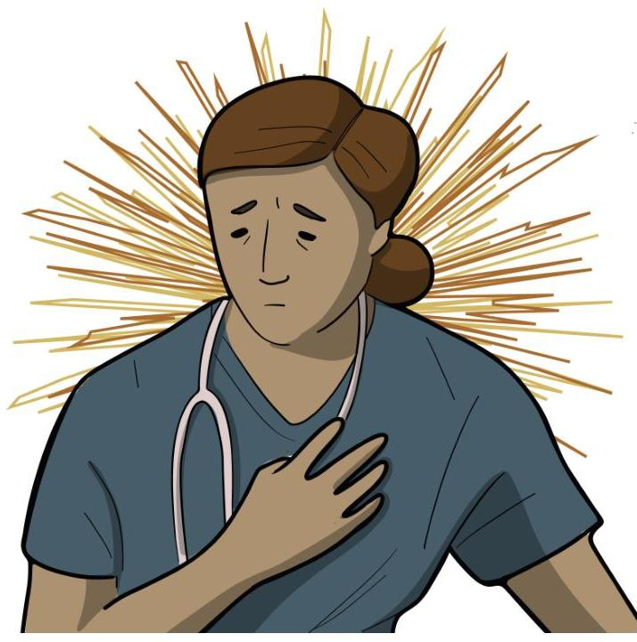

Figure WB.15. Heart health and depression in nurses. A large study with over 63,000 nurses showed that those who were more depressed at the start of the study had a 49\% higher chance of dying from heart disease over 12 years (Whang et al., 2009).

Additionally, depression can lead to unhealthy lifestyles, especially if it starts in childhood. A study found that teenagers who were diagnosed with depression as children were more likely to be overweight, smoke, and not exercise enough, which are all risk factors for heart disease (Rottenberg et al., 2014).

# Are You Type A or Type B? 

Sometimes research ideas and theories emerge from seemingly trivial observations. In the 1950s, cardiologist Meyer Friedman was looking over his waiting room furniture, which consisted of upholstered chairs with armrests. Friedman decided to have these chairs reupholstered. When the person doing the reupholstering came to the office to do the work, they commented on how the chairs were worn in a unique manner - the front edges of the cushions were worn down, as were the front tips of the arm rests. It seemed like the cardiology patients were tapping or squeezing the front of the armrests, as well as literally sitting on theedge of their seats (Friedman \& Rosenman, 1974). Were cardiology patients somehow different from other types of patients? If so, how?

After researching this matter, Friedman and his colleague, Ray Rosenman, came to understand that people who are prone to heart disease tend to think, feel, and act differently from those who are not. These individuals tend to be intensively driven workaholics who are preoccupied with deadlines and always seem to be in a rush. According to Friedman and Rosenman, these individuals exhibit a Type A behaviour pattern; those who are more relaxed and laid-back were characterised as Type B. In a sample of Type As and Type Bs, Friedman and Rosenman were startled to discover that heart disease was over seven times more frequent among the Type As than the Type Bs (Friedman \& Rosenman, 1959).

The major components of the Type A pattern include an aggressive and chronic struggle to achieve more and more in less and less time (Friedman \& Rosenman, 1974). Specific characteristics of the Type A pattern include an excessive competitive drive, chronic sense of time urgency, impatience, and hostility toward others (particularly those who get in the person's way).

Watch this video: Clip from Emotion, Stress, and Health: Crash Course Psychology \#26 (5.5 minutes), video starts at minute 4:52.

One or more interactive elements has been excluded from this version of the text. You can view them online here: https://opentextbc.ca/psychologymtdi/?p=503\#oembed-1
"Emotion, Stress, and Health: Crash Course Psychology \#26" video by CrashCourse is licensed under the Standard YouTube licence.

Supplement WB.27: Case Study - The High Cost of High Achievement - Kenji's Journey with Type A Behavior [New Tab]

By the 1970s, a majority of practicing cardiologists believed that Type A behaviour pattern was a significant risk factor for heart disease (Friedman, 1977). Indeed, a number of early longitudinal investigations demonstrated a link between Type A behaviour pattern and later development of heart disease (Rosenman et al., 1975; Haynes, Feinleib, \& Kannel, 1980).

Subsequent research examining the association between Type A and heart disease, however, failed to replicate these earlier findings (Glassman, 2007; Myrtek, 2001). Because Type A theorydid not pan out as well as they had hoped, researchers shifted their attention toward determining if any of the specific elements of Type A predict heart disease.

Extensive research clearly suggests that the anger/hostility dimension of Type A behaviour pattern may be one of the most important factors in the development of heart disease. This relationship was initially described in the Haynes et al. (1980) study mentioned above; suppressed hostility was found to substantially elevate the risk of heart disease for both men and women. Also, one investigation followed over 1,000 male medical students from 32 to 48 years. At the beginning of the study, these men completed a questionnaire assessing how they react to pressure; some indicated that they respond with high levels of anger, whereas others indicated that they respond with less anger. Decades later, researchers found that those who earlier had indicated the highest levels of anger were over 6 times more likely than those who indicated less anger to have had a heart attack by age 55, and they were 3.5 times more likely to have experienced heart disease by the same age (Chang, Ford, Meoni, Wang, \& Klag, 2002). From a health standpoint, it clearly does not pay to be an angry person.

After reviewing and statistically summarising 35 studies from 1983 to 2006, Chida and Steptoe (2009) concluded that the bulk of the evidence suggests that anger and hostility constitute serious long-term risk factors for adverse cardiovascular outcomes among both healthy individuals and those already suffering from heart disease. One reason angry and hostile moods might contribute to cardiovascular diseases is that such moods can create social strain, mainly in the form of antagonistic social encounters with others. This strain could then lay the foundation for disease-promoting cardiovascular responses among hostile individuals (Vella, Kamarck, Flory, \& Manuck, 2012). In this transactional model, hostility and social strain form a cycle (Figure W.17).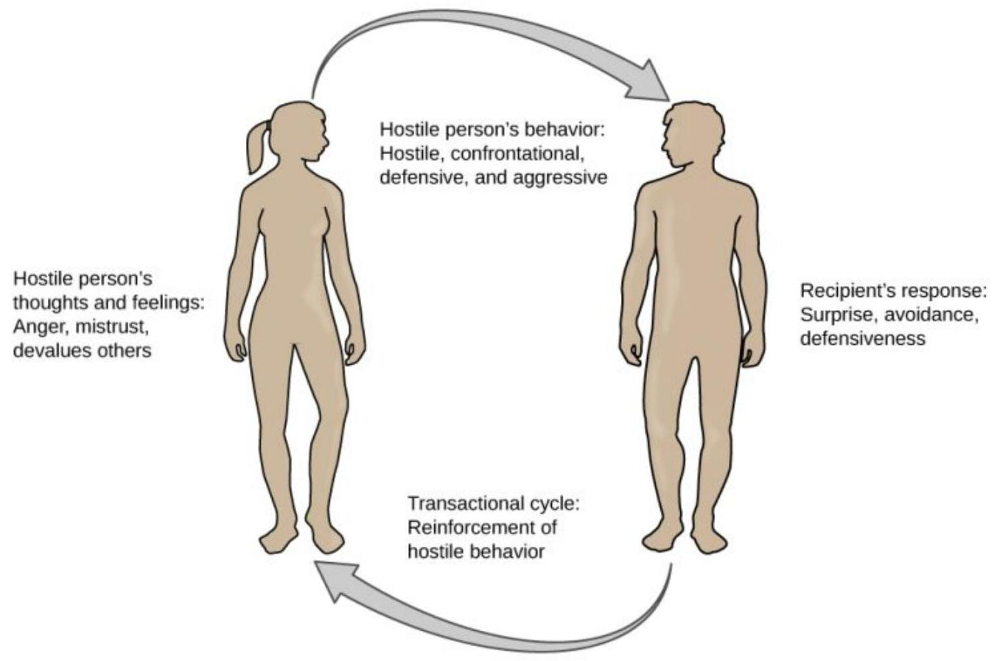

Figure WB.16. The transactional model of hostility for predicting social interactions. According to the transactional model of hostility for predicting social interactions (Vella et al., 2012), the thoughts and feelings of a hostile person promote antagonistic behaviour toward others, which in turn reinforces complimentary reactions from others, thereby intensifying one's hostile disposition and intensifying the cyclical nature of this relationship.

Supplement WB.28: Case Study - The Cycle of Hostility and Its Impact on Cardiovascular Health [New Tab]

In addition to anger and hostility, a number of other negative emotional states have been linked with heart disease, including negative affectivity and depression (Suls \& Bunde, 2005). Negative affectivity is a tendency to experience distressed emotional states involving anger, contempt, disgust, guilt, fear, and nervousness (Watson, Clark, \& Tellegen, 1988). It has been linked with the development of both hypertension and heart disease.

For example, over 3,000 initially healthy participants in one study were tracked longitudinally, for up to 22 years. Those with higher levels of negative affectivity at the time the study began were substantially more likely to develop and be treated for hypertension during the ensuing years than were those with lower levels of negative affectivity (Jonas \& Lando, 2000). In addition,a study of over 10,000 middle-aged London-based civil servants who were followed an average of 12.5 years revealed that those who earlier had scored in the upper third on a test of negative affectivity were $32 \%$ more likely to have experienced heart disease, heart attack, or angina over a period of years than were those who scored in the lowest third (Nabi, Kivimaki, De Vogli, Marmot, \& Singh-Manoux, 2008). Hence, negative affectivity appears to be a potentially vital risk factor for the development of cardiovascular disorders.

Supplement WB.29: Case Study - The Impact of Negative Affectivity on Cardiovascular Health and Behaviour in a Young Athlete [New Tab]

# Other Diseases Interact with Mental Health 

The intricate relationship between physical illnesses and mental health is a critical area of study, revealing how various diseases can both influence and be influenced by psychological factors. The following optional supplements explore the connections between cardiovascular disorders, headaches, and asthma, and mental health, highlighting the complex interplay between the body's physiological responses and psychological stress, and underscoring the importance of a holistic approach to health that considers both physical and mental factors.

Supplement WB.30: Deep Dive - Cardiovascular Disorders and Stress [New Tab]

Supplement WB.31: Deep Dive - Headaches and Mental Health [New Tab]

Supplement WB.32: Deep Dive - Asthma and Environmental Stress [New Tab]# Summary 

This section explores the relationship between stress and health. We begin by discussing how frequent or intense stress reactions can wear down the body over time, leading to issues like elevated blood pressure and weakened immunity. Chronic stress and elevated cortisol levels are highlighted as significant factors in this process.

Research by neuroscientists Robert Sapolsky and Carol Shively is reviewed, illustrating how social hierarchy and stress can influence health outcomes. Their findings underscore the impact of stress on mental health and disease, particularly among marginalized groups.

The chapter introduces psychophysiological disorders, which are physical ailments exacerbated by stress and emotional factors. Disorders such as hypertension, irritable bowel syndrome, asthma, and skin conditions are examined to show how psychological stress manifests physically.

We delve into how personality traits, like negative affectivity, neuroticism, anger, and hostility, can influence health. Traits linked to higher stress levels are associated with increased risks for cardiovascular diseases and other chronic conditions. Conversely, optimism is shown to have protective health benefits.

Next, we discuss the back and forth relationship between heart health and mental well-being. Historical and modern perspectives highlight how depression and other mental health issues can exacerbate heart disease, while heart disease can also lead to depression, illustrating a complex interplay between physical and mental health.

Lastly, we examine how different personality types, specifically Type A and Type B behaviour patterns, relate to stress and heart disease. Research on Type A behaviour highlights its association with higher risks of heart disease due to traits like aggression, urgency, and hostility, emphasizing the need for stress management and healthier lifestyle choices.

In the next section we will explore how to regulate stress.

## Image Attributions

Figure WB.15. Heart health and depression in nurses by Rachel Lu is licensed under a CC BY-NCSA license.Figure WB.16. Figure 14.19 as found in Psychology 2e by OpenStax is licensed under a CC BY 4.0 License.

# (○) (1) (2) (3) 

Mind-Body Psychophysiological Disorders Copyright © 2024 by Jessica Motherwell McFarlane is licensed under a Creative Commons Attribution-NonCommercial-ShareAlike 4.0 International License, except where otherwise noted.974 | Chapter 17. Well-being# Regulation of Stress 

JESSICA MOTHERWELL MCFARLANE

Approximate reading time: 43 minutes
As we learned in the previous section, stress - especially if it is chronic - takes a toll on our bodies and can have enormously negative health implications. When we experience events in our lives that we appraise as stressful, it is essential that we use effective coping strategies to manage our stress. Coping refers to mental and behavioural efforts that we use to deal with problems relating to stress.

## Coping Styles

Coping strategies are essential tools for managing the stressors in our lives, which Lazarus and Folkman (1984) categorise into two main types: problem-focused and emotion-focused coping. Problem-focused coping involves directly addressing the cause of stress through practical solutions and actions, akin to strategic problem-solving aimed at the external factors of a stressor. For instance, someone facing job dissatisfaction might seek new employment opportunities or pursue further education to enhance their career prospects, actively changing their situation to alleviate stress.

Recent research underscores the effectiveness of these coping mechanisms, highlighting that while problem-focused coping is ideal for controllable stressors, emotion-focused coping is crucial for navigating situations beyond our control (Greenglass \& Fiksenbaum, 2009; Compas et al., 2017; El-Monshed et al., 2021). Understanding and applying the appropriate coping strategy can significantly impact our psychological well-being, enabling us to manage stress more effectively and maintain our mental health in the face of life's challenges.

For example, let's consider Alex, who is dealing with the stress of a recent breakup. If Alex adopts a problem-focused coping approach, they would take proactive steps to directly address the issues contributing to their stress. This might include seeking out a therapist or counsellor to work through the emotional aspects of the breakup, actively engaging in social activities to rebuild their support network, or even exploring new hobbies and interests to fill the void left by the relationship. Alex might also set specific goals for personal growth and development, such as improving their physical health or advancing their career, to focus on positive change. In doing so, Alex is directly addressing the source of their stress by taking concrete steps to improve their situation and emotional well-being.

Figure WB.17. Coping strategies. Writing in a journal can be a good way to do emotion-focused coping with stress.

Emotion-focused coping, on the other hand, targets the internal emotional response to stress, employing strategies like mindfulness, journaling, or seeking social support to mitigate negative feelings without altering the external stressor. This approach is particularly beneficial when dealing with uncontrollable stressors, where adjusting one's emotional reaction can provide relief and foster resilience.

For example, let's revisit Alex, who is dealing with the stress of a recent breakup. Instead of trying to change the situation, Alex engages in emotion-focused coping by practicing mindfulness and meditation to manage their emotional turmoil. They also spend time journaling to express and process their feelings, and engage in self-compassion exercises to nurture a kinder internal dialogue. By doing so, Alex is not trying to alter the reality of the breakup, but rather changing their emotional response to it, helping to reduce the intensity of their distress and gain a sense of peace.

# Latest Research 

Recent studies have expanded our understanding of coping strategies:

- Proactive coping, involving goal setting and social support, has been associated with better psychological functioning (Greenglass \& Fiksenbaum, 2009).
- Maladaptive coping strategies, such as emotional suppression, avoidance, and denial, are linked to higher levels of psychopathology symptoms (Compas et al., 2017). During the COVID19 pandemic, university students' coping strategies revealed that dysfunctionalmethods like venting, denial, and substance use scored low on effectiveness, while problemfocused strategies like planning and active coping scored high (El-Monshed et al., 2021).

While many stressors elicit both kinds of coping strategies, problem-focused coping is more likely to occur when encountering stressors we perceive as controllable, and emotion-focused coping is more likely to predominate when faced with stressors that we believe we are powerless to change (Folkman \& Lazarus, 1980). Clearly, emotion-focused coping is more effective in dealing with uncontrollable stressors. For example, the stress you experience when a loved one dies can be overwhelming. You are simply powerless to change the situation as there is nothing you can do to bring this person back. The most helpful coping response is emotionfocused coping aimed at minimising the pain of the grieving period.

Fortunately, many stressors we encounter can be modified and are, to varying degrees, controllable. A person who cannot stand their job can quit and look for work elsewhere; a middle-aged divorced person can find another potential partner; the student who fails an exam can study harder next time, and a breast lump does not necessarily mean that one is fated to die of breast cancer.

# Control and Stress 

The desire and ability to predict events, make decisions, and affect outcomes - that is, to enact control in our lives - is a basic tenet of human behaviour (Everly \& Lating, 2002).

Our response to things that might stress us out largely depends on how much control we think we have over them. Perceived control means how much we believe we can influence and change outcomes. This belief is really important for our health and happiness (Infurna \& Gerstorf, 2014). A lot of research shows that feeling like we have personal control is linked to many good things, like better physical and mental health, and overall happiness (Diehl \& Hay, 2010). Also, when we feel more in control, we tend to get less stressed out by daily problems. For instance, one study found that people who felt more in control at one time were less upset emotionally and physically by problems with other people later on (Neupert, Almeida, \& Charles, 2007). Another study, which looked at 34 older women who had lost their husbands, found that on days when these women felt more in control, their stress and anxiety were much lower (Ong, Bergeman, \& Bisconti, 2005).# Learned Helplessness 

Content Disclosure: This section discusses historical research methods involving animals in ways now considered unethical. It includes descriptions of experiments by Martin Seligman on dogs subjected to unavoidable electric shocks. These studies significantly advanced our understanding of stress responses, but it's important to recognise the ethical concerns about the treatment of animals in such research. We present this information for educational purposes, emphasising the importance of meeting the highest ethics standards in scientific research.

When we feel we can't control events in our lives, especially harmful or threatening ones, the impact on our minds can be significant. Psychologist Martin Seligman's experiments in the 1960s are a key example of this (Seligman \& Maier, 1967). In these experiments, dogs placed in a chamber and exposed to electric shocks they couldn't escape later didn't try to escape even when they could. They seemed to just give up, accepting the shocks. In contrast, dogs that had a chance to escape the shocks in earlier tests did try to escape later on.

Seligman believed that the dogs who failed to try to escape the later shocks were demonstrating learned helplessness; they had acquired a belief that they were powerless to do anything about the stimulation they were receiving. Seligman also believed that the passivity and lack of initiative these dogs demonstrated was similar to that observed in human depression. Therefore, Seligman speculated that learned helplessness might be an important cause of depression in humans; humans who experience negative life events that they believe they are unable to control may become helpless. As a result, they give up trying to change the situation and some may become depressed and show lack of initiative in future situations in which they can control the outcomes (Seligman, Maier, \& Geer, 1968).

Seligman and colleagues later reformulated the original learned helplessness model of depression (Abramson, Seligman, \& Teasdale, 1978). In their reformulation, they emphasised attributions, which are mental explanations for why something occurred, that fostered a sense of learned helplessness. For example, suppose a coworker shows up late to work; your belief as to what caused the coworker's tardiness would be an attribution (e.g., too much traffic, slept too late, or just doesn't care about being on time).

Supplement WB.33: Deep Dive - Learned Helplessness - How you're unconsciously destroying your life [New Tab]Watch this video: Learned Helpessness: How You're Unconciously Destroying Your Life (6 minutes)

One or more interactive elements has been excluded from this version of the text. You can view them online here: https://opentextbc.ca/psychologymtdi/?p=512\#oembed-1
"Learned Helpessness: How You're Unconciously Destroying Your Life" video by Project Better Self is licensed under the Standard YouTube licence.

# Learned Optimism 

Building on this, Seligman (1990) introduced the concept of learned optimism, which counters the detrimental effects of learned helplessness. Learned Optimism is based on the idea that our explanatory style - how we explain life events to ourselves - profoundly affects our mental health and resilience. Seligman identified three critical dimensions of this explanatory style, known as the "Three P's": Permanence, Pervasiveness, and Personalization.

- Permanence: This refers to whether an individual perceives the causes of events as stable (permanent) or unstable (temporary). In the context of learned helplessness, a person might view negative events as permanent, leading to a sense of enduring defeat. Conversely, learned optimism encourages seeing bad events as temporary setbacks, fostering resilience and a quicker recovery from challenges.
- Pervasiveness: This dimension involves whether an individual generalises the causes of events. A person with a pessimistic explanatory style might believe that a failure in one aspect of life (like being late) reflects a failure in all aspects, leading to a sense of global defeat. On the other hand, learned optimism involves compartmentalising failures, recognising that a setback in one area does not have to impact other areas of life.
- Personalisation: This pertains to whether individuals attribute events to internal or external causes. In learned helplessness, people might internalise blame for negative events (believing it's their own fault), leading to lower self-esteem and depression. Learned optimism, however, encourages attributing negative events to external factors and recognising personal agency in positive achievements.

Incorporating these three dimensions into our explanatory style can significantly impact how we cope with life's challenges. By adopting a more optimistic explanatory style, individuals can foster resilience, improve mental health, and reduce the likelihood of falling into patterns oflearned helplessness. This shift in perspective is not just about being positive but about adopting a more realistic and nuanced view of life's ups and downs.

How We Explain Negative Events to Ourselves

How we explain negative life events to ourselves contributes to depression. Let's break this down using an example:

Scenario: A student performs poorly on a midterm exam.
Attributions: The model suggests the student will make three kinds of attributions for this outcome:

- Permanence - Stable versus Unstable:
- Stable: Believing the cause is permanent and unchangeable ("Nothing can be done to change the fact that I'm not smart").
- Unstable: Thinking the cause can be changed.
- Pervasiveness - Global versus Specific:
- Global: Believing the poor performance indicates a general inadequacy ("This is another example of how lousy I am at everything").
- Specific: Thinking it's limited to just this area.
- Personalization - Internal versus External:
- Internal: Believing the poor performance was due to personal inadequacies ("I'm just not smart").
- External: Attributing it to environmental factors.

Impact of Attributions: If the student makes internal, stable, and global attributions for their poor performance, the theory predicts:

- They would perceive a lack of control over this stressful event.
- They would be especially prone to developing depression.

Research Findings: Studies have shown that people who tend to make internal, global, and stable attributions for bad outcomes often develop symptoms of depression when faced with negative life experiences (Peterson \& Seligman, 1984).

Positive Aspect: Attribution habits can be changed through practice. Training in healthy attribution habits has been shown to reduce vulnerability to depression (Konnikova, 2015).

Seligman's theory about attributions and depression has received significant supporting evidence. Research has consistently shown that perceptions of control over one's life have significant implications for physical health. For instance, people who feel they have more control over their lives tend to see their physician as something they can actively manage, which is linked to better health management and positive health behaviours (Bandura, 2004).

Moreover, a greater sense of perceived control is associated with a reduced risk of varioushealth problems, including decreased physical decline (Infurna et al., 2011), lower incidence of heart attacks (Rosengren et al., 2004), and heart disease (Stürmer, Hasselbach, \& Amelang, 2006; Surtees et al., 2010). Additionally, the work environment plays a crucial role in this dynamic. Individuals in lower-status jobs with minimal control over their work are at a higher risk of developing heart disease compared to those in higher-status jobs with more control (Marmot et al., 1997). This body of research underscores the profound impact of psychological factors, particularly perceived control, on physical health outcomes.

Supplement WB.34: Case Study - Whitney and Their Girlfriend's Struggle with Alcohol Addiction using the "Three P's": Permanence, Pervasiveness, and Personalization [New Tab]

# Social Support 

The need to form and maintain strong, stable relationships with others is a powerful, pervasive, and fundamental human motive (Baumeister \& Leary, 1995). Social support, which can be thought of as the soothing impact of friends, family, and acquaintances (Baron \& Kerr, 2003), plays a crucial role in our well-being. It refers to the emotional, informational, and practical help we receive from our social network. This support can take many forms, including advice, guidance, encouragement, acceptance, emotional comfort, and tangible assistance such as financial help. The presence of a supportive social circle is comforting when we face a range of life stressors and is instrumental in managing these challenges.

Supplement WB.35: Deep Dive - Social Support Strengthens Immune System [New Tab]

## Lack of Social Support: Health Declines

The importance of social support first emerged in the 1970s when health researchers developed an interest in the health consequences of social connectedness - being connected and engaged within their social networks, including family, friends, colleagues, and community groups (Stroebe \& Stroebe, 1996). This interest was further fueled by longitudinal studies showing that social connectedness reduced mortality. For instance, a classic study followed nearly 7,000 Alameda County, California, residents over 9 years. Those who lacked social andcommunity ties were more likely to die during the follow-up period than those with more extensive social networks. Isolated men and women were, respectively, 2.3 and 2.8 times more likely to die compared to those with the most social contacts. These trends persisted even after controlling for health-related variables like smoking, alcohol consumption, self-reported health at the beginning of the study, and physical activity (Berkman \& Syme, 1979).

Since that study, social support has been recognised as one of the well-documented psychosocial factors affecting health outcomes (Uchino, 2009). A statistical review of 148 studies conducted between 1982 and 2007 involving over 300,000 participants concluded that individuals with stronger social relationships have a 50\% greater likelihood of survival compared to those with weak or insufficient social relationships (Holt-Lunstad, Smith, \& Layton, 2010). The magnitude of the effect of social support observed in this study is comparable with quitting smoking and exceeds many well-known risk factors for mortality, such as obesity and physical inactivity.

Figure WB.18. Relationships. Close relationships with others provide more than happiness and fulfilment - they can help foster good health.

A number of large-scale studies have found that individuals with low levels of social support are at greater risk of mortality, especially from cardiovascular disorders (Brummett et al., 2001). Higher levels of social support have been linked to better survival rates following breast cancer (Falagas et al., 2007) and infectious diseases, especially HIV infection (Lee \& Rotheram-Borus, 2001). In fact, a person with high levels of social support is less likely to contract a common cold. In one study, 334 participants completed questionnaires assessing their sociability; these individuals were subsequently exposed to a virus that causes a common cold and monitored for several weeks to see who became ill. Results showed that increased sociability was linearly associated with a decreased probability of developing a cold (Cohen, Doyle, Turner, Alper, \& Skoner, 2003).For many of us, friends are a vital source of social support. But what if you find yourself in a situation in which you have few friends and companions? Many students who leave home to attend and live at college experience drastic reductions in their social support, which makes them vulnerable to anxiety, depression, and loneliness. Social media can sometimes be useful in navigating these transitions (Raney \& Troop Gordon, 2012) but might also cause increases in loneliness (Hunt, Marx, Lipson, \& Young, 2018). For this reason, many colleges have designed first-year programs, such as peer mentoring (Raymond \& Shepard, 2018), that can help students build new social networks. For some people, our families - especially our parents - are a major source of social support.

Figure WB.19. Connection. Social support appears to work by boosting the immune system, especially among people who are experiencing stress (Uchino, Vaughn, Carlisle, \& Birmingham, 2012).

Social support appears to work by boosting the immune system, especially among people who are experiencing stress (Uchino, Vaughn, Carlisle, \& Birmingham, 2012). In a pioneering study, spouses of cancer patients who reported high levels of social support showed indications of better immune functioning on two out of three immune functioning measures, compared to spouses who were below the median on reported social support (Baron, Cutrona, Hicklin, Russell, \& Lubaroff, 1990). Studies of other populations have produced similar results, including those of spousal caregivers of dementia sufferers, medical students, elderly adults, and cancer patients (Cohen \& Herbert, 1996; Kiecolt-Glaser, McGuire, Robles, \& Glaser, 2002).

In addition, social support has been shown to reduce blood pressure for people performing stressful tasks, such as giving a speech or performing mental arithmetic (Lepore, 1998). In these kinds of studies, participants are usually asked to perform a stressful task either alone, with a stranger present (who may be either supportive or unsupportive), or with a friend present. Those tested with a friend present generally exhibit lower blood pressure than those testedalone or with a stranger (Fontana, Diegnan, Villeneuve, \& Lepore, 1999). In one study, 112 female participants who performed stressful mental arithmetic exhibited lower blood pressure when they received support from a friend rather than a stranger, but only if the friend was a male (Phillips, Gallagher, \& Carroll, 2009). Although these findings are somewhat difficult to interpret, the authors mention that it is possible that females feel less supported and more evaluated by other females, particularly females whose opinions they value.

Taken together, the findings above suggest one of the reasons social support is connected to favourable health outcomes is because it has several beneficial physiological effects in stressful situations. It is also important, however, to consider the possibility that social support may lead to better health behaviours, such as a healthy diet, exercise, smoking cessation, and cooperation with medical regimens (Uchino, 2009).

# Stress Reduction Techniques 

In managing stress, beyond establishing social support networks and having a sense of control, various techniques have proven effective. These include exercise, nature-based relaxation methods like forest therapy and nature walks, Mindfulness-Based Stress Reduction (MBSR), and biofeedback. Each of these approaches offers unique benefits in combating stress.

Exercise is a widely recognised method for stress reduction, offering both physical and mental health benefits (Salmon, 2001). Complementing this, nature-based relaxation methods such as forest bathing and nature walks have gained attention for their ability to improve mood and overall well-being. MBSR, developed by Dr. Jon Kabat-Zinn, combines mindfulness meditation, body awareness, and yoga, providing a structured approach to stress management. Additionally, biofeedback techniques, which involve monitoring and controlling physiological processes, offer another avenue for managing stress effectively.

## Exercise for Stress Reduction

Exercise is frequently prescribed for stress reduction. It is well established that exercise, both of long (aerobic) and short (anaerobic) duration, is beneficial for both physical and mental health (Everly \& Lating, 2002). Physically fit individuals are more resistant to the adverse effects of stress and recover more quickly from stress than less physically fit individuals (Cotton, 1990). In a study of more than 500 Swiss police officers and emergency service personnel, increased physical fitness was associated with reduced stress, and regular exercise was reported to protect against stress-related health problems (Gerber, Kellman, Hartman, \& Pühse, 2010).Telomeres are like the protective caps at the ends of our shoelaces, but for our chromosomes, which carry our DNA. Just as those caps prevent the shoelaces from fraying, telomeres protect our chromosomes from damage. Over time, as cells divide, telomeres get shorter, and when they become too short, the cell can no longer divide and will die. This process is connected to ageing and health issues.

Telomerase is a special enzyme that can add length back to telomeres, helping cells live longer. However, our body's use of telomerase is limited, so telomeres still tend to get shorter as we age.

Stress plays a role in this process because it can speed up the shortening of telomeres. This means that being under a lot of stress might make our cells age faster, which could make us look and feel older than we are.

Exercise comes into the picture as a superhero for our telomeres. Regular physical activity has been shown to help keep telomeres from shortening too quickly. This doesn't just help us look younger; it's also about keeping our cells and bodies healthier for longer. Exercise helps manage stress, which in turn protects our telomeres from the damaging effects of stress. This is one of the many reasons why exercise is recommended for maintaining good mental and physical health.

Exercise may be beneficial because it helps counteract the harmful physical effects of stress. It has been found to significantly reduce anxiety in people with anxiety or stress-related disorders, making it a valuable treatment option (Stubbs et al., 2017). For mental health professionals, exercise programs have been effective in reducing work-related stress (Fibbins et al., 2018). In people experiencing high levels of stress, regular exercise can prevent the shortening of telomeres, which are parts of our chromosomes. This prevention might contribute to the youthful appearance often seen in those who exercise regularly (Puterman et al., 2010). Additionally, exercising in later life can lessen the negative impact of stress on the hippocampus, an area of the brain important for memory (Head, Singh, \& Bugg, 2012). For cancer survivors, exercise has been shown to reduce both anxiety (Speck, Courneya, Masse, Duval, \& Schmitz, 2010) and symptoms of depression (Craft, VanIterson, Helenowski, Rademaker, \& Courneya, 2012). Overall, exercise is a highly effective way to manage stress.

# Forest Bathing and Being in Nature 

The term often used for therapy in nature is "Forest Bathing," also known as "Shinrin-yoku" in Japanese. This practice involves immersing oneself in the forest atmosphere, and it's a form of nature therapy that has gained popularity for its mental and physical health benefits. The concept is rooted in the idea that spending time in nature, particularly forests, can reduce stress, improve mood, and enhance overall well-being.

Forest therapy, including activities such as nature walks, has been recognised for its positive impact on mental health. A study by Ochiai et al. (2015) found that forest therapy significantlyreduces blood pressure and improves mood, particularly in middle-aged males with highnormal blood pressure. This suggests that spending time in forest environments can be a powerful tool for stress management.

The combination of physical activity with relaxation in natural settings offers another effective approach to stress reduction. Matzer et al. (2018) conducted a study demonstrating that combining walking and relaxation in natural environments, such as parks or forests, effectively reduces systolic blood pressure and promotes relaxation. This indicates that engaging in physical activities in nature can enhance the stress-reducing effects of both exercise and natural surroundings.

Furthermore, integrating mindfulness practices with exposure to natural environments can amplify well-being outcomes. Choe, Jorgensen, and Sheffield (2020) found that mindfulness practices, when combined with exposure to natural environments, improve well-being outcomes and enhance nature connectedness. This research suggests a synergistic effect between mindfulness activities and nature-based experiences, offering a holistic approach to stress management.

Figure WB.20. Being in nature. Swimming in the ocean or lake can be a good method for reducing stress.

In conclusion, nature-based relaxation techniques, including forest therapy, nature walks, swimming in the ocean and the integration of other physical activity with nature, provideeffective means for reducing stress. These methods not only offer psychological benefits but also contribute to physical health, highlighting the importance of nature in promoting overall well-being.

Indigenous Wellness Practices: A Unique Cultural Perspective

In addition to the individualistic and collectivistic perspectives, it's essential to consider the unique approaches of Indigenous cultures, such as those of the Coast Salish people, towards happiness and stress. Indigenous wellness practices offer a deep, spiritual connection to nature and community, emphasising holistic wellbeing.

- Sweat Lodge Ceremonies: The Coast Salish people practice sweat lodge ceremonies, which are spiritual events used for purification and healing. Participants enter a dome-shaped lodge where they experience ceremonial steam baths, symbolising rebirth and connection to Mother Earth.
- Sage Smudging: Sage smudging involves burning sage to cleanse a person or space of negative energies. This practice is used for purification, emotional and spiritual healing, and is deeply rooted in the spiritual traditions of the Coast Salish.
- Cedar Brushing: Cedar brushing is another cleansing ritual that uses the sacred cedar tree. It involves using cedar boughs to brush over the body, believed to cleanse and protect the individual spiritually.

Figure W8.21. Cedar.

These practices reflect a profound understanding of happiness and stress that is intrinsically linked to the natural world and communal living. They emphasise the importance of spiritual balance, community support, and a harmonious relationship with nature.

The inclusion of Indigenous wellness practices in psychological research on happiness and stress underscores the importance of a diverse cultural lens. It highlights how different cultures utilise unique practices and beliefs to manage well-being. Understanding these practices enriches our perspective and allows for a more comprehensive approach to psychological health that respects and incorporates the wisdom of various cultural traditions.# Mindfulness-Based Stress Reduction 

Figure WB.22. Mindfulness-Based Stress Reduction (MBSR). Mindfulness-Based Stress Reduction (MBSR) is a structured program designed to help individuals manage stress through mindfulness practices.

Mindfulness-Based Stress Reduction (MBSR) is a structured program designed to help individuals manage stress through mindfulness practices. It was developed by Dr. Jon KabatZinn in the late 1970s and has since been widely adopted in various settings, including healthcare, education, and corporate environments. MBSR combines mindfulness meditation, body awareness, and yoga to help people become more mindful.

Step-by-Step Guide to Mindfulness Meditation (Kabat-Zinn, 1994)

1. Find a Quiet Space: Choose a quiet and comfortable place where you won't be disturbed. This could be a quiet room, a peaceful corner, or even a spot in a park.
2. Set a Time Limit: If you're just beginning, it might be helpful to choose a short time, such as 5 or 10 minutes.
3. Adopt a Comfortable Posture: You can sit on a chair with your feet flat on the ground, sit cross-legged on the floor, or lie down. The key is to maintain a posture that is comfortable yet alert.4. Close Your Eyes: Gently close your eyes. This helps to reduce visual distractions and focus inward.
5. Focus on Your Breath: Pay attention to the sensation of your breath as it enters and leaves your nostrils, or the rise and fall of your chest or abdomen. You don't need to control the breath, just observe it.
6. Notice When Your Mind Wanders: It's natural for your mind to wander. When you notice this happening, acknowledge it and gently redirect your attention back to your breath.
7. Be Kind to Your Wandering Mind: Don't judge yourself or obsess over the content of the thoughts you find yourself lost in. Just come back to your breath.
8. End the Session Gently: When your time is up, open your eyes. Take a moment to notice any sounds in the environment. Notice how your body feels right now. Notice your thoughts and emotions.
9. Practice Regularly: Consistency is key. Try to practice mindfulness meditation daily, even if it's just for a few minutes.

Tips for Mindfulness Meditation: It's normal to find meditation challenging at first. The practice is about returning your attention to your breath every time you get lost in thought. You might find it helpful to silently label the thoughts as "thinking" before returning to your breath. Some people find it helpful to attend a guided meditation session or use a meditation app when starting out.

Research on Mindfulness-Based Stress Reduction (MBSR) has demonstrated its effectiveness in various contexts. MBSR training can reduce emotional reactivity and enhance emotion regulation in patients with social anxiety disorder, potentially improving their anxiety, depression, and self-esteem (Goldin and Gross, 2010). In high-stress professional environments, MBSR has been shown to effectively increase positive coping strategies and decrease negative ones (Walach et al., 2007). MBSR is moderately effective in reducing stress, depression, anxiety, and distress, while also improving the quality of life in healthy individuals (Chang et al., 2004; Khoury et al., 2015; Zhu et al., 2019). These studies collectively highlight the broad applicability and effectiveness of MBSR in enhancing mental health and coping strategies across different populations.

The relaxation response approach is conceptualised as a general approach to stress reduction that reduces sympathetic arousal, and it has been used effectively to treat people with high blood pressure (Benson \& Proctor, 1994).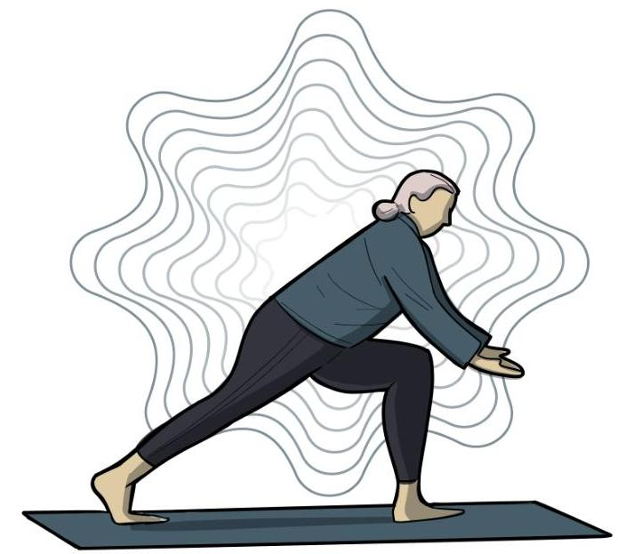

Figure WB.23. Yoga. Yoga is an effective practice for reducing stress.

Yoga intervention is better than fitness exercises in helping undergraduates cultivate mindfulness and reduce stress (Tong et al., 2020). Regular practice of yogasanas improved glycemic (sugar) control, oxidative (oxygen) stress markers, inflammatory markers, and sleep quality among subjects with type 2 diabetes (Viswanathan et al., 2020).

Supplement WB.36: Deep Dive - Biofeedback for Stress Management [New Tab]

# Summary 

This section focuses on understanding how we can manage and reduce stress through various strategies and support systems. It starts with an exploration of different coping styles, highlighting how individuals respond to stress in diverse ways and the effectiveness of these methods. The section then delves into the concepts of control and stress, discussing how feelings of control can mitigate stress effects, while learned helplessness can deepen the impact of stress on our lives. A video on learned helplessness provides further insight into thisphenomenon, contrasting it with learned optimism, which is illustrated through Whitney's case study on overcoming alcohol addiction with a positive mindset.

Social support is emphasised as a crucial factor in stress regulation, with discussions on how strong social networks can boost our immune system and how a lack of support can lead to health declines. The narrative then transitions into stress reduction techniques, covering a range of practices from exercise and forest bathing to indigenous wellness practices and mindfulnessbased stress reduction (MBSR). Each technique is presented as a tool for managing stress, with mindfulness practices detailed through a step-by-step guide to mindfulness meditation.

# Chapter Conclusion 

This chapter has taken a close look at how happiness, stress, and health are connected and how they affect our lives. We started by looking at what makes us happy, including the role of positive thinking and being grateful. We learned that doing things we enjoy and are good at can lead to deep satisfaction.

Then, we talked about stress, showing that it can be both good and bad for us. We saw how stress works in our bodies and minds and how it can lead to health problems if it's not managed well. We also discussed ways to handle stress better, like mindfulness and getting support from friends and family. We also looked at how our surroundings and life experiences, like tough childhoods or lack of support, can impact our health and happiness.

In the end, this chapter showed that being well means more than just not being sick. It's about feeling good emotionally, mentally, and socially. It's important to look at the whole picture, including our feelings, relationships, and where we live and work.

To sum up, we've learned important lessons about how to live a happier, healthier life by increasing uplifts and glimmers, managing stress and our responses to hassles and triggers, finding joy in what we do, and supporting each other. These lessons are useful for everyone, including psychologists who help others. By keeping these ideas in mind, we can all work toward a life that's not just about getting through each day, but really living well.# My Story, Part 2: Embracing Well-being in the Midst of Lockdown ... Continued 

As we reach the end of this chapter, I will return to my opening story of seeking well-being amidst the uncertainty of lockdown. The principles and strategies we've explored here in this chapter are not just academic concepts; they are the tools that supported me through those challenging lockdown times. If you are inspired to delve deeper, I encourage you to consider enrolling in Dr. Laurie Santos's' "The Science of Well-Being" course, available online for free. It's an opportunity to expand your understanding of well-being and continue applying these principles in your own life.

Alternatively, you might find value in forming a group around another course or activity that resonates with you. Remember, the power of social support, as I experienced with my study group, can be a significant factor in enhancing your learning and well-being. Whether it's through formal study, a thrilling role-play game, or other informal gatherings, the key is to connect, share, and grow together. As we close this chapter, I invite you to carry forward the spirit of learning and well-being into your own lives, creating your own stories of overcoming challenge and growing your resilience. By seeking support from compassionate others and directing your energy and attention to health-promoting actions, you can play a powerful role in creating and maintaining your well-being.

## Image Attributions

Figure WB.17. Photo by Brad Neathery on Unsplash.
Figure WB.18. Photo by Kimson Doan on Unsplash.
Figure WB.19. Photo by Helena Lopes on Unsplash.
Figure WB.20. Being in nature by Rachel Lu is licensed under a CC BY-NC-SA license.
Figure WB.21. Photo by Adam Kring on Unsplash.
Figure WB.22. MBSR by Rachel Lu is licensed under a CC BY-NC-SA license.
Figure WB.23. Yoga by Rachel Lu is licensed under a CC BY-NC-SA license.# (1) (1) (1) 

Regulation of Stress Copyright © 2024 by Jessica Motherwell McFarlane is licensed under a Creative Commons Attribution-NonCommercial-ShareAlike 4.0 International License, except where otherwise noted.994 | Chapter 17. Well-being# Chapter Resources 

JESSICA MOTHERWELL MCFARLANE

## References

The reference list for this chapter has been excluded from this file to reduce page count. The full reference list can be viewed online at opentextbc.ca/psychologymtdi/chapter/well-being-chapter-resources/.

## Chapter Attribution

"Well-being" by Jessica Motherwell McFarlane is licensed under a CC BY-NC-SA 4.0 licence. It includes sections that were adapted from the "XIII. Stress \& Health" chapter in Introduction to Psychology \& Neuroscience (2nd Edition) edited by Leanne Stevens, Jennifer Stamp, \& Kevin LeBlanc, which is licensed under a CC BY 4.0 licence. In some cases significant changes were made replacing the original text. Some of the original paragraphs remain intact. Some new resources and sections have been added.

## About the Author: Jessica Motherwell McFarlane

## Justice Institute of British Columbia

I am an uninvited guest working and living on the stolen territories of the xwməӨkwəẏəm (Musqueam), Skwxwú7mesh-ulh Temíxw (Squamish), and səliilwata7t təməxw (Tsleil-Waututh) peoples. My ancestors were Celtic, British, and Germanic. As I a white, heterosexual, cisgender, able-bodied, healthy, middle class woman, I am committed to increasing my awareness of my advantages in life and using my privilege to benefit others. I have more than 30 years experience as a feminist scholar, instructor, researcher, and counsellor with a specialization in women's development, gender, EDI and decolonization. I am the program developer and director of Life Outside the Box - a JIBC initiative - that focuses on using visual narratives (stickfigure comics) to teach about oppression, anti-oppression best practices, and other social justice learning issues. I am a deeply spiritual, Nature-loving, Unitarian Universalist. My spiritual and religious beliefs inform my values around protecting the Earth; honouring the inherent worth and dignity of each person; committing myself to ending oppressive systems and actions; and supporting the rights of 2SLGBTQIA+ people. I have a fundamental commitment to conducting myself with supreme kindness and radical inclusivity in all my relationships. I adore spending time around children and babies which was one of the reasons I chose to earn a Ph.D. in developmental psychology. I have been honoured to teach many hundreds of students in my career - all of whom have taught me about my mistakes, trusted me to improve, and celebrated when I got it right. Every day, I am grateful for my husband, child, family - and cats - who fill my life with adventure, beauty, and love.

Jessica's Dedication
I dedicate my chapters to the memory of Dr. Tannis MacBeth, who taught me everything I know about scholarly excellence and standing up for equity and social justice. I will always be grateful for her belief in me, and especially for her gift of covering my first drafts with red ink corrections so that I could learn to be better. Dr. Tannis taught me that our best chance to succeed against oppressive systems and social harms is to take supremely good care of ourselves, so we can remain empowered to continue making the difficult changes needed for a long time into the future.

# (○) (1) (2) (3) 

Chapter Resources Copyright © 2024 by Jessica Motherwell McFarlane is licensed under a Creative Commons Attribution-NonCommercial-ShareAlike 4.0 International License, except where otherwise noted.# CHAPTER 18. PSYCHOLOGICAL DISORDERS998 | Introduction to Psychology# Psychological Disorders Introduction 

LEANNE STEVENS; JENNIFER STAMP; KEVIN LEBLANC (EDITORS - ORIGINAL CHAPTER); AND JESSICA MOTHERWELL MCFARLANE (EDITOR - ADAPTED CHAPTER)

Approximate reading time: 3 minutes

Figure PD.1. University student. Many university students may experience challenges, set-backs, and low-moods, but when should they (or their friends and family) be concerned?

Esmé is an 18-year-old from Hamilton, ON (Figure PD.1). She did well in high school and receivedscholarships to attend university in Halifax, NS. Esmé is excited to start this new chapter in her life, even though she'll be almost 2000 kms away from home.

When the semester began, Esmé was optimistic about her courses and future degree. She made friends and was engaged in her courses. Halfway through the semester, however, Esmé's friends noticed that she seemed disinterested in social activities and was falling behind in her classes. When they asked about her change in behaviour, Esmé said that she was just a bit homesick. Towards the end of the term, Esmé seemed even more withdrawn from her friends, classes, and other activities. She was spending most of her time alone in her room and was failing most of her courses. Esmé's friends decide to contact the Health \& Wellness Centre on campus for support. With regular counselling sessions and support from her friends and family, Esmé was able to deal with her depression and make significant improvements the following semester.

Esmé's story is hypothetical but may be similar to the experience of many undergraduate students across the country. As you'll learn in this chapter, the experiences and journeys of everyone are different, and have different outcomes. In this chapter, we'll explore the difference between atypical and dysfunctional, the concept of psychopathology, and symptoms and signs of common psychological disorders.

Optional pre-reading for this chapter

The following chapter is necessarily technical at times and presents complex content about psychological disorders. If you would like to benefit from an enjoyable, easier warm-up read that covers the basics of mental health, the following guide will provide you with an excellent foundation from which to begin your introduction to psychological disorders.

Here I Am, I Am Me: An Illustrated Guide to Mental Health is a full-colour graphic novel-style adventure through the brain that demystifies and destigmatizes emotional and mental health for children ages 12 and up. It is also an excellent guide for parents, adults enrolled in psychology courses, and clients in psychotherapy.

Follow this link to read more about this guide.

# Image Attributions 

Figure PD.1. Photo by Sofia Alehandra on PexelsPsychological Disorders Introduction Copyright © 2024 by Leanne Stevens; Jennifer Stamp; Kevin LeBlanc (editors - original chapter); and Jessica Motherwell McFarlane (editor - adapted chapter) is licensed under a Creative Commons Attribution-NonCommercial-ShareAlike 4.0 International License, except where otherwise noted.1002 | Chapter 18. Psychological Disorders# What are Psychological Disorders? 

LEANNE STEVENS; JENNIFER STAMP; KEVIN LEBLANC (EDITORS - ORIGINAL CHAPTER); AND JESSICA MOTHERWELL MCFARLANE (EDITOR - ADAPTED CHAPTER)

Approximate reading time: 16 minutes

Content disclosure: Fear of spiders will be discussed in one of the examples below.

A psychological disorder is a condition characterised by abnormal thoughts, feelings, and behaviours. Psychopathology is the study of psychological disorders, including their symptoms, etiology (the cause or reasons behind something), and treatment. The term psychopathology can also refer to the display or showing of something, like symptoms of a disease or a psychological disorder. Although consensus (agreement among a group of people) can be difficult, it is extremely important for mental health professionals to agree on what kinds of thoughts, feelings, and behaviours are truly abnormal in the sense that they genuinely indicate the presence of psychopathology.

Certain patterns of behaviour and inner experience can easily be labeled as abnormal and clearly signify some kind of psychological disturbance. The person who washes their hands 40 times per day and the person who claims to hear the voices of demons exhibit behaviours and inner experiences that most would regard as abnormal - beliefs and behaviours that suggest the existence of a psychological disorder. But consider the nervousness a young person feels when talking to an attractive person or the loneliness and longing for home a first-year student experiences during their first semester of college; these feelings may not be regularly present, but they fall in the range of normal.

So, what kinds of thoughts, feelings, and behaviours represent a true psychological disorder? Psychologists try to tell the difference between mental health problems and feelings or actions that are just based on a situation, unique to a person, or not usual. They want to make sure that when they say someone has a mental health issue, it's not just because of something that happened once or because someone acts in a way that's a bit different from most people.# Definition of a Psychological Disorder 

Perhaps the simplest approach to conceptualising psychological disorders is to label behaviours, thoughts, and inner experiences that are atypical (unusual or not what's normally expected), distressful, dysfunctional (not working properly or normally), and sometimes even dangerous, as signs of a disorder. For example, if you ask a classmate for a date and you are rejected, you probably would feel a little dejected. Such feelings would be normal. If you felt extremely depressed - so much so that you lost interest in activities, had difficulty eating or sleeping, felt utterly worthless, and contemplated suicide - your feelings would be atypical, would deviate from the norm, and could signify the presence of a psychological disorder. Just because something is atypical, however, does not necessarily mean it is disordered. More criteria are required for a psychological disorder.

For example, only about 2-6\% of people in Canada have red hair, so red hair is considered an atypical characteristic (Figure PD.2), but it is not considered disordered; it's just unusual. And it is less unusual in Scotland, where approximately 13\% of the population has red hair ("DNA Project Aims," 2012). As you will learn, some disorders, although not exactly typical, are far from atypical, and the rates in which they appear in the population are surprisingly high.
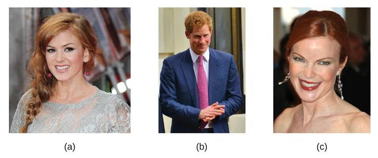

Figure PD.2. Red hair. Red hair is considered unusual, but not abnormal. (a) Isla Fischer, (b) Prince Harry, and (c) Marcia Cross are three natural redheads.

If we can agree that merely being atypical is an insufficient criterion for a having a psychological disorder, is it reasonable to consider behaviour or inner experiences that differ widely from expected cultural values or expectations disordered? Using this criterion, a person who walks around a subway platform wearing a heavy winter coat in July while screaming obscenities at strangers may be considered to exhibit symptoms of a psychological disorder. Their actions and clothes violate socially accepted rules governing appropriate dress and behaviour; these characteristics are atypical.# Cultural Expectations 

Violating cultural expectations is not, in and of itself, a satisfactory means of identifying the presence of a psychological disorder. Since behaviour varies from one culture to another, what may be expected and considered appropriate in one culture may not be viewed as such in other cultures. For example, returning a stranger's smile is expected in the United States because a pervasive social norm dictates that we reciprocate friendly gestures. This pressure to smile is even greater for female-presenting people. A person who refuses to acknowledge such gestures might be considered disrespectful, socially awkward - perhaps even disordered - for violating this expectation. However, such expectations are not universally shared.

Cultural expectations in Japan involve showing reserve, restraint, and a concern for maintaining privacy around strangers. Japanese people are generally unresponsive to smiles from strangers (Patterson et al., 2007). Eye contact is another example. In the United States and Europe, eye contact with others typically signifies honesty and attention. However, most Latin-American, Asian, and African cultures interpret direct eye contact as rude, confrontational, and aggressive (Pazain, 2010). Thus, someone who makes eye contact with you could be considered appropriate and respectful or brazen and offensive, depending on your culture (Figure PD.3).

Figure PD.3. Eye contact. Eye contact is one of many social gestures that vary from culture to culture. (credit: Joi Ito)

In some cultures and societies, hallucinations (seeing, hearing or feeling things that aren't really there) are a violation of cultural expectations; a person who reports such inner experiences is readily labeled as psychologically disordered. In other cultures and societies, visions that, forexample, pertain to future events may be regarded as normal experiences that are positively valued (Bourguignon, 1970).
Finally, it is important to recognise that cultural norms change over time. What might be considered typical in a society at one time may no longer be viewed this way later, e.g., fashion trends from one era may elicit quizzical looks decades later; imagine how the lace collars, broadbrimmed hats, and slashed sleeves - high-fashion in the 1600s (Figure PD.4) would go over on your campus today.

Figure PD.4. Frans Hals. Frans Hals "The Laughing Cavalier".

# The Myth of Mental Illness 

In the 1950s and 1960s, some people started to question the idea of mental illness. They thought that calling something a "mental illness" was just a way to disagree with behaviours that society didn't like (Wakefield, 1992). Thomas Szasz, a well-known psychiatrist, strongly believed in this idea. He said that society and doctors made up the idea of mental illness to control or criticise people who acted differently from what was normally accepted. Szasz wrote that what we often call symptoms of mental illness are actually just challenges people face in life (Szasz, 1960).

In his book from 1961, The Myth of Mental Illness: Foundations of a Theory of Personal Conduct, Szasz shared his negative views on mental illness and psychiatry (Oliver, 2006). He believed that real sickness could only be something discoverable through medical tests, like infections or organ problems. Since mental illness can't always be seen this way, he argued that psychological disorders aren't real illnesses (Szasz, 1961/2010).Despite Szasz's controversial opinions, it's hard to ignore the real struggles that people with mental health issues face, including their painful thoughts, feelings, and the difficult behaviours they might exhibit.

Even though Szasz's ideas were debated, they did change how people think about mental health. Now, many refer to mental health issues as "problems" instead of illnesses, which reflects Szasz's way of thinking (Buchanan-Barker \& Barker, 2009). Szasz was also one of the first psychiatrists to say that being gay shouldn't be considered a mental illness. This helped to improve the rights and acceptance of gay and lesbian people (Barker, 2010). His ideas also led to changes in laws that give people in psychiatric care more control over their lives (Buchanan-Barker \& Barker, 2009).

# Harmful Dysfunction 

If none of the criteria discussed so far is adequate by itself to define the presence of a psychological disorder, how can a disorder be conceptualised? Many efforts have been made to identify the specific dimensions of psychological disorders, yet none is entirely satisfactory. No universal definition of psychological disorder exists that can apply to all situations in which a disorder is thought to be present (Zachar \& Kendler, 2007). However, one of the more influential conceptualisations was proposed by Wakefield (1992), who defined psychological disorder as a harmful dysfunction. Wakefield argued that natural internal mechanisms - that is, psychological processes honed by evolution, such as cognition, perception, and learning - have important functions, such as enabling us to experience the world the way others do and to engage in rational thought, problem solving, and communication. For example, learning allows us to associate a fear with a potential danger in such a way that the intensity of fear is roughly equal to the degree of actual danger. Dysfunction occurs when an internal mechanism breaks down and can no longer perform its normal function. But the presence of a dysfunction by itself does not determine a disorder. The dysfunction must be harmful in that it leads to negative consequences for the individual or for others, as judged by the standards of the individual's culture. The harm may include significant internal anguish (e.g., high levels of anxiety or depression) or problems in day-to-day living (e.g., in one's social or work life).

## Case study - Danon's Fear of Spiders

Let's talk about Danon, who is very scared of spiders. This fear is so big that it's causing problems. It's like Danon's brain isn't learning correctly that spiders aren't as scary as they feel. Because of this fear, Danon avoids places where they think spiders might be, like basements or friends' houses. Danon even left their jobbecause they saw a spider at work and couldn't handle it. This situation shows what experts call a disorder for two reasons: (1) something inside Danon isn't working right; and (2) this issue is making life hard for them.

Just as we can have physical sickness because something in our body isn't working right, people can have mental health issues when their mind isn't working as it should causing distorted perceptions and thinking. The idea that these problems come from something going wrong inside the body is interesting because it fits with what scientists know about how our brain and body control our thoughts and feelings (Fabrega, 2007).

# The American Psychiatric Association (APA) Definition 

Many of the features of the harmful dysfunction model are incorporated in a formal definition of psychological disorder developed by the American Psychiatric Association (APA). According to the APA (2013), a psychological disorder is a condition that is said to consist of the following:

1. There are significant disturbances in thoughts, feelings, and behaviours. A person must experience inner states (e.g., thoughts and/or feelings) and exhibit behaviours that are clearly disturbed, that is, unusual, but in a negative, self-defeating way. Often, such disturbances are troubling to those around the individual who experiences them. For example, an individual who is uncontrollably preoccupied by thoughts of germs spends hours each day bathing and has inner experiences and displays behaviours that most would consider atypical and negative (disturbed) and that would likely be troubling to family members.
2. The disturbances reflect some kind of biological, psychological, or developmental dysfunction. Disturbed patterns of inner experiences and behaviours should reflect some flaw (dysfunction) in the internal biological, psychological and developmental mechanisms that lead to normal, healthy psychological functioning. For example, the hallucinations observed in schizophrenia could be a sign of brain abnormalities.
3. The disturbances lead to significant distress or disability in one's life. A person's inner experiences and behaviours are considered to reflect a psychological disorder if they cause the person considerable distress, or greatly impair their ability to function as a normal individual (often referred to as functional impairment, or occupational and social impairment). As an illustration, a person's fear of social situations might be so distressing that it causes the person to avoid all social situations (e.g., preventing that person from being able to attend class or apply for a job).
4. The disturbances do not reflect expected or culturally approved responses to certain events. Disturbances in thoughts, feelings, and behaviours must be socially unacceptable responses to certain events that often happen in life. For example, it is perfectly natural (and expected) that a person would experience great sadness and might wish to be left alone following the death of a close family member. Because such reactions are in some ways culturallyexpected, they would not be assumed to signify a mental disorder in this individual.

Some believe that there is no essential criterion or set of criteria that can definitively distinguish all cases of disorder from non-disorder (Lilienfeld \& Marino, 1999). In truth, no single approach to defining a psychological disorder is adequate by itself, nor is there universal agreement on where the boundary is between disordered and not disordered. From time to time we all experience anxiety, unwanted thoughts, and moments of sadness; our behaviour at other times may not make much sense to ourselves or to others. These inner experiences and behaviours can vary in their intensity, but are only considered disordered when they are highly disturbing to us and/or others, suggest a dysfunction in normal mental functioning, and are associated with significant distress or disability in social or occupational activities.

Follow Supplement PD. 1 to practice applying these criteria to four cases studies.

Supplement PD.1: Deep Dive - Practice Applying the Criteria for Psychological Disorders: Four case studies [New Tab]

# Image Attributions 

Figure PD.2. Figure 15.2 as found in Psychology 2e by OpenStax contains modifications of the following works: "Isla Fisher, The Dictator world premiere, 2012" by Richard Goldschmidt is licensed under a CC BY 2.0 License ; "Prince Harry in the US 2013" by Glyn Lowe is licensed under a CC BY 2.0 License ; and "MarciaCrossApr08" by Kirk Weaver is licensed under a CC BY 3.0 Unported License.

Figure PD.3. "Cory Ondrejka and Donatella Della Ratta" by Joi Ito is licensed under a CC BY 2.0 Generic License.

Figure PD.4. Public Domain Image.

## (0)

[^0]
[^0]:    What are Psychological Disorders? Copyright © 2024 by Leanne Stevens; Jennifer Stamp; Kevin LeBlanc (editors - original chapter); and Jessica Motherwell McFarlane (editor - adapted chapter) is licensed under a Creative Commons Attribution 4.0 International License, except where otherwise noted.1010 | Chapter 18. Psychological Disorders# Diagnosing and Classifying Psychological Disorders 

LEANNE STEVENS; JENNIFER STAMP; KEVIN LEBLANC (EDITORS - ORIGINAL CHAPTER); AND JESSICA MOTHERWELL MCFARLANE (EDITOR - ADAPTED CHAPTER)

Approximate reading time: 22 minutes
The first step in learning about psychological disorders is to carefully notice and understand the important signs and symptoms. How do experts figure out if someone's feelings and actions are because of a psychological disorder? Making the right diagnosis (this means finding out what illness someone has by looking at their symptoms) is very important. This process helps experts speak the same language as others in their field and explain the disorder to the patient, other experts, and everyone else. Getting the diagnosis right is key to finding the best way to help someone get better. That's why having a system to organise and name psychological disorders the right way is needed.

## The Diagnostic and Statistical Manual of Mental Disorders (DSM)

Although a number of classification systems have been developed over time, the one that is used by most mental health professionals in Canada and the United States is the Diagnostic and Statistical Manual of Mental Disorders (DSM-5), published by the American Psychiatric Association (2013). (Note that the American Psychiatric Association differs from the American Psychological Association; both are abbreviated APA.) The first edition of the DSM, published in 1952, classified psychological disorders according to a format developed by the US Army during World War II (Clegg, 2012). In the years since, the DSM has undergone numerous revisions and editions. The most recent edition, published in 2013, is the DSM-5 (APA, 2013). The DSM-5 includes many categories of disorders (e.g., anxiety disorders, depressive disorders, and dissociative disorders). Each disorder is described in detail, including an overview of the disorder (diagnostic features), specific symptoms required for diagnosis (diagnostic criteria), prevalence information (what percent of the population is thought to be afflicted with the disorder), and risk factors (things that can increase a person's chance of developing a disorder) associated with the disorder. Figure PD. 5 shows lifetime prevalence rates - the percentage of people in a population whodevelop a disorder in their lifetime - of various psychological disorders among adults in the US. These data were based on a national sample of 9,282 US residents (National Comorbidity Survey, 2007).
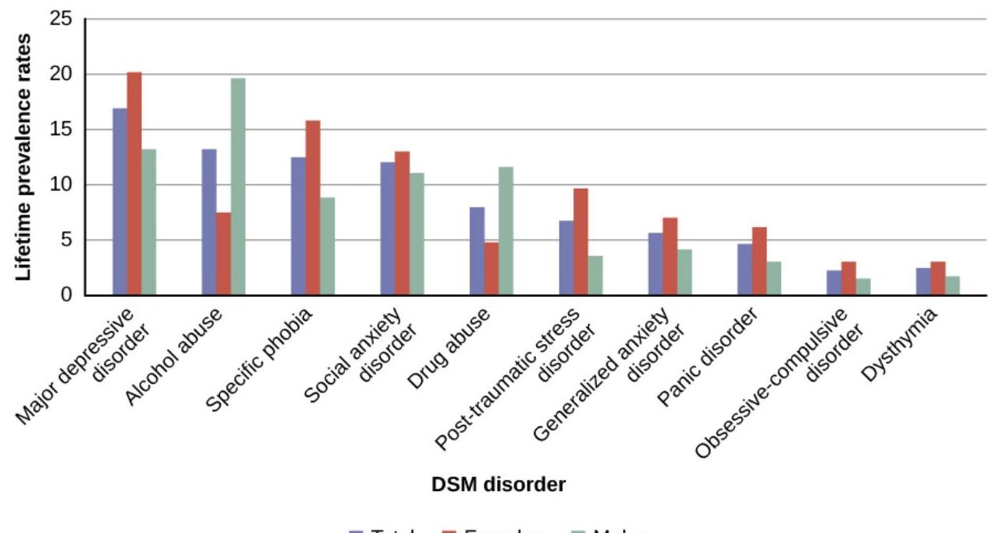

Figure PD. 6 Psychological disorders. The graph shows the breakdown of psychological disorders, comparing the percentage prevalence among adult males and adult females in the United States. Because the data is from 2007, the categories shown here are from the DSM-IV, which has been supplanted by the DSM-5. Most categories remain the same; however, alcohol abuse now falls under a broader Alcohol Use Disorder category.

DSM Versions: Imperfect and evolving criteria, standards and values

The Diagnostic and Statistical Manual of Mental Disorders (DSM) has changed considerably in the half-century since it was originally published. Each version of the DSM reflects the evolving understanding of mental health, balancing improvements with ongoing challenges in accurately classifying and diagnosing mental disorders. The following is an overview of the increasing number of disorders and the improvements and problems with each version of the DSM.

- DSM-I (1952): Included 106 diagnoses.
- DSM-III (1980): Included more than 265 diagnoses.
- DSM-IV (1994): Included 297 disorders.
- DSM-5 (2013): Includes 237 disorders.

DSM-I (106 diagnoses) \& DSM-II- Improvements: Introduced standardised classifications for mental disorders.
- Problems: Homosexuality was wrongly listed as a disorder, reflecting the social prejudices of the time rather than an understanding of mental health (Silverstein, 2009).

DSM-III

- Improvements: Removed homosexuality as a disorder and detailed mental disorders more thoroughly, increasing the number of diagnosable conditions. The manual grew significantly in size and detail, indicating a more comprehensive approach to mental health.
- Problems: Introduced "ego-dystonic homosexuality", which wrongly diagnosed homosexual arousal that the patient viewed as interfering with desired heterosexual relationships and causing distress for the individual as a disorder. This so-called disorder was likely included in the DSM as a compromise to antigay/lesbian people who still viewed homosexuality as a mental illness. Ego-dystonic homosexuality was controversial and questioned for its appropriateness (Herek, 2012).

DSM-III-R

- Improvements: Removed "ego-dystonic homosexuality" from the manual, moving further away from viewing homosexuality as a disorder (Herek, 2012).
- Problems: While it continued to detail disorders extensively, the rapid expansion of diagnosable conditions raised concerns about pathologisation (treating or considering a normal behaviour or condition as if it were a medical problem or illness).

DSM-IV

- Improvements: Continued to refine and expand the list of diagnosable conditions, offering a more finely detailed understanding of mental disorders.
- Problems: Despite its length and detail, some criticized it for pathologisation or potentially overdiagnosing or misclassifying normal variations in behaviour as disorders (Mayes \& Horowitz, 2005).

DSM-5

- Improvements: Reduced the number of disorders, aiming for more accuracy in diagnosis. The latest edition, DSM-5, includes revisions in the organisation and naming of categories and in the diagnostic criteria for various disorders (Regier, Kuhl, \& Kupfer, 2012), while emphasising careful consideration of the importance of gender and cultural difference in the expression of various symptoms (Fisher, 2010).
- Problems: While it aimed to address previous criticisms, its approach to certain conditions and the changes in classification and criteria continued to spark debate within the mental health community.

Tracking changes in the DSM manuals can be tricky. Here is one example of the imperfect, back and forth changes made in each consecutive DSM version. The DSM-IV specified that the symptoms of major depressive disorder must not be attributable to normal bereavement (loss of a loved one). The DSM-5, however, has removed this bereavement exclusion, essentially meaning that grief and sadness after a loved one's death can constitute major depressive disorder.

The DSM-5 also provides information about comorbidity - when two mental or physical health problems happen at the same time. For example, the DSM-5 mentions that $41 \%$ of people with obsessive-compulsive disorder (OCD) also meet the diagnostic criteria for major depressivedisorder (Figure PD.6). Drug use is highly comorbid with other mental illnesses; 6 out of 10 people who have a substance use disorder also suffer from another form of mental illness (National Institute on Drug Abuse [NIDA], 2007).
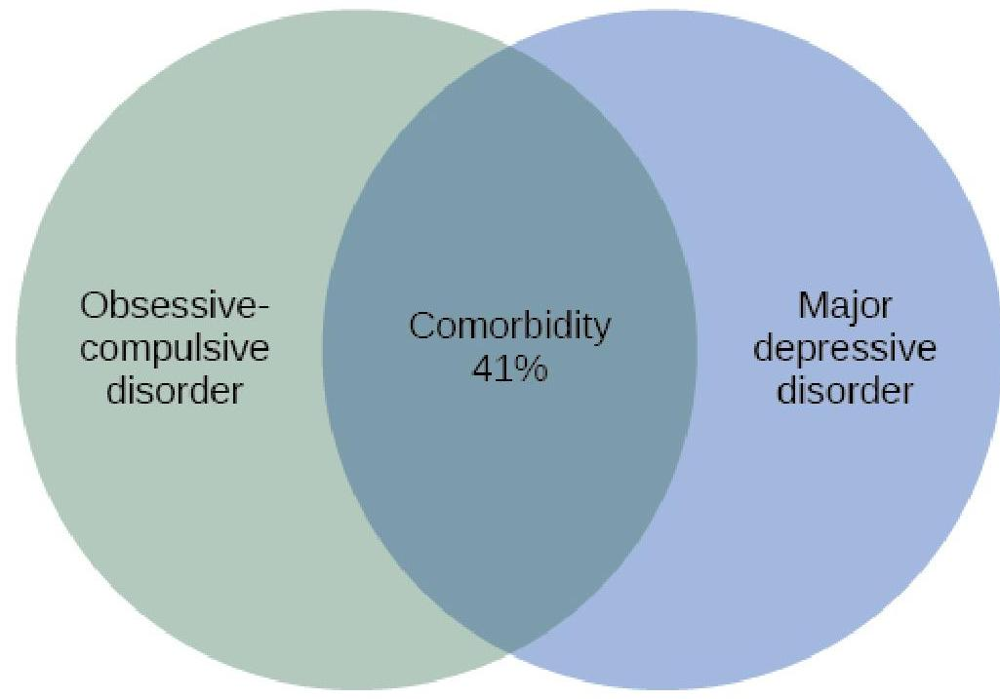

Figure PD.6. Comorbidity. Obsessive-compulsive disorder and major depressive disorder frequently occur in the same person.

# Understanding Comorbidity 

Comorbidity means having more than one health problem at the same time. Often, these different problems can make each other worse. It's common for people to have more than one mental health issue. For example, many people who have serious mental health challenges also have problems with using drugs or alcohol. About 1 in 4 people with a severe mental illness also has issues with substance use. And, about 1 in 10 people looking for help with substance use also has a serious mental illness.

When someone has both a mental illness and uses drugs regularly, it can make their mental health symptoms stronger and harder to treat. It can be tricky to figure out if the symptoms are because of the drug use, the mental illness, or both. That's why doctors suggest watching how someone acts after they've stopped using drugs and are not feeling sick from stopping the drug. This helps doctors make the best diagnosis (NIDA, 2018).

Substance use isn't the only thing that can happen at the same time as mental health issues. Often, people with depression also feel very anxious. And, people with an anxiety disorder might also be very depressed. Anxiety and depression also happen a lot with other mental health problems (Al-Asadi, Klein, \& Meyer, 2015).# The International Classification of Diseases 

A second classification system, the International Classification of Diseases (ICD), is also widely recognised. Published by the World Health Organization (WHO), the ICD was developed in Europe shortly after World War II and, like the DSM, has been revised several times. The categories of psychological disorders in both the DSM and ICD are similar, as are the criteria for specific disorders; however, some differences exist. Although the ICD is used for clinical purposes, this tool is also used to examine the general health of populations and to monitor the prevalence of diseases and other health problems internationally (WHO, 2013). The ICD is in its 10th edition (ICD-10); however, efforts are now underway to develop a new edition (ICD-11) that, in conjunction with the changes in DSM-5, will help to harmonise the two classification systems as much as possible (APA, 2013).

A study that compared the use of the two classification systems found that the ICD is more frequently used worldwide for clinical diagnosis, whereas the DSM is more valued for research (Mezzich, 2002). Most research findings concerning the etiology (the underlying causes) and treatment of psychological disorders are based on criteria set forth in the DSM (Oltmanns \& Castonguay, 2013). The DSM also includes more explicit disorder criteria, along with an extensive and helpful explanatory text (Regier et al., 2012). The DSM is the classification system of choice among US mental health professionals, and this chapter is based on the DSM paradigm.

Is this disorder describing me? When we talk about psychological disorders, keep two important ideas in mind. Psychological disorders are conditions in which people feel or act in ways that are much more extreme than usual. If you find yourself relating to some of the symptoms you read here, it's okay - it usually just means you're like everyone else. We all have times when we feel really sad, worried, or can't stop thinking about something. It's only a problem if these feelings or actions start to really disrupt your life.

Showing compassion for others. It's important to see people with psychological disorders as more than just their condition. We avoid calling someone a "schizophrenic" or "depressive" because these words can make people seem like they are only their illness, which isn't fair or true. Instead, we say "a person diagnosed with schizophrenia", or "a person with depression symptoms". Just like someone with cancer or diabetes, people with psychological disorders are dealing with tough, painful situations they didn't choose. They deserve to be treated with kindness, understanding, and respect.

Watch this video: Tricky Topics: Diagnosis (of Psychological Disorders) (10 minutes)One or more interactive elements has been excluded from this version of the text. You can view them online here: https://opentextbc.ca/psychologymtdi/?p=526\#oembed-1
"Tricky Topics: Diagnosis (of Psychological Disorders)" video by FirstYearPsych Dalhousie is licensed under the Standard YouTube licence. Here is the Tricky Topics: Diagnosis (of Psychological Disorders) transcript.

# Image Attributions 

Figure PD.5. Figure 15.4 as found in Psychology 2e by OpenStax is licensed under a CC BY 4.0 License.

Figure PD.6. Figure 15.5 as found in Psychology 2e by OpenStax is licensed under a CC BY 4.0 License.

## $\odot$ (1)

Diagnosing and Classifying Psychological Disorders Copyright © 2024 by Leanne Stevens; Jennifer Stamp; Kevin LeBlanc (editors - original chapter); and Jessica Motherwell McFarlane (editor - adapted chapter) is licensed under a Creative Commons Attribution 4.0 International License, except where otherwise noted.# Perspectives on Psychological Disorders 

LEANNE STEVENS; JENNIFER STAMP; KEVIN LEBLANC (EDITORS - ORIGINAL CHAPTER); AND JESSICA MOTHERWELL MCFARLANE (EDITOR - ADAPTED CHAPTER)

Approximate reading time: 13 minutes
Scientists, mental health professionals, and cultural healers may adopt different perspectives in attempting to understand or explain the underlying mechanisms that contribute to the development of a psychological disorder. The specific perspective used in explaining a psychological disorder is extremely important. Each perspective explains psychological disorders, their causes or etiology, and effective treatments from a different viewpoint. Different perspectives provide alternate ways for how to think about the nature of psychopathology.

## Supernatural Perspectives of Psychological Disorders

For centuries, psychological disorders were viewed from a supernatural perspective: attributed to a force beyond scientific understanding. Those afflicted were thought to be practitioners of black magic or possessed by spirits (Figure PD.7) (Maher \& Maher, 1985). For example, convents throughout Europe in the 16th and 17th centuries reported hundreds of nuns falling into a state of frenzy in which the afflicted foamed at the mouth, screamed and convulsed, sexually propositioned priests, and confessed to having carnal relations with devils or Christ. Although today these cases would suggest serious mental illness, at the time, these events were routinely explained as possession by devilish forces (Waller, 2009a). Such beliefs in supernatural causes of mental illness are still held in some societies today; for example, beliefs that supernatural forces cause mental illness are common in some cultures in modern-day Nigeria (Aghukwa, 2012).

Figure PD.7. Supernatural perspectives. In The Extraction of the Stone of Madness, a 15th century painting by Hieronymus Bosch, a practitioner is using a tool to extract an object (the supposed "stone of madness") from the head of an afflicted person.

# Dancing Mania 

Between the 11th and 17th centuries, a curious epidemic swept across Western Europe. Groups of people would suddenly begin to dance with wild abandon. This compulsion to dance, referred to as dancing mania, sometimes gripped thousands of people at a time (Figure PD.8). Historical accounts indicate that those afflicted would sometimes dance with bruised and bloody feet for days or weeks, screaming of terrible visions and begging priests and monks to save their souls (Waller, 2009b). What caused dancing mania is not known, but several explanations have been proposed, including spider venom and ergot poisoning ("Dancing Mania," 2011).

Figure PD.8. Dancing mania. Although the cause of dancing mania, depicted in this painting, was unclear, the behaviour was attributed to supernatural forces. Public Domain Image.

Historian John Waller (2009a, 2009b) has provided a comprehensive and convincing explanation of dancing mania that suggests the phenomenon was attributable to a combination of three factors: (1) psychological distress, (2) social contagion, and (3) belief in supernatural forces. Waller argued that various disasters of the time (such as famine, plagues, and floods) produced high levels of psychological distress that could increase the likelihood of succumbing to an involuntary trance state. Waller indicated that anthropological studies and accounts of possession rituals show that people are more likely to enter a trance state if they expect it to happen, and that entranced individuals behave in a ritualistic manner, their thoughts and behaviour shaped by the spiritual beliefs of their culture. Thus, during periods of extreme physical and mental distress, all it took were a few people who believed themselves to have been afflicted with a dancing curse to slip into a spontaneous trance and then act out the part of one who is cursed by dancing for days on end.

# Biological Perspectives of Psychological Disorders 

The biological perspective views psychological disorders as linked to biological phenomena, such as genetic factors, chemical imbalances, and brain abnormalities; it has gained considerable attention and acceptance in recent decades (Wyatt \& Midkiff, 2006). Evidence from many sources indicates that most psychological disorders have a genetic component; in fact, there is little dispute that some disorders are largely due to genetic factors. The graph in Figure PD. 9 shows heritability estimates for schizophrenia.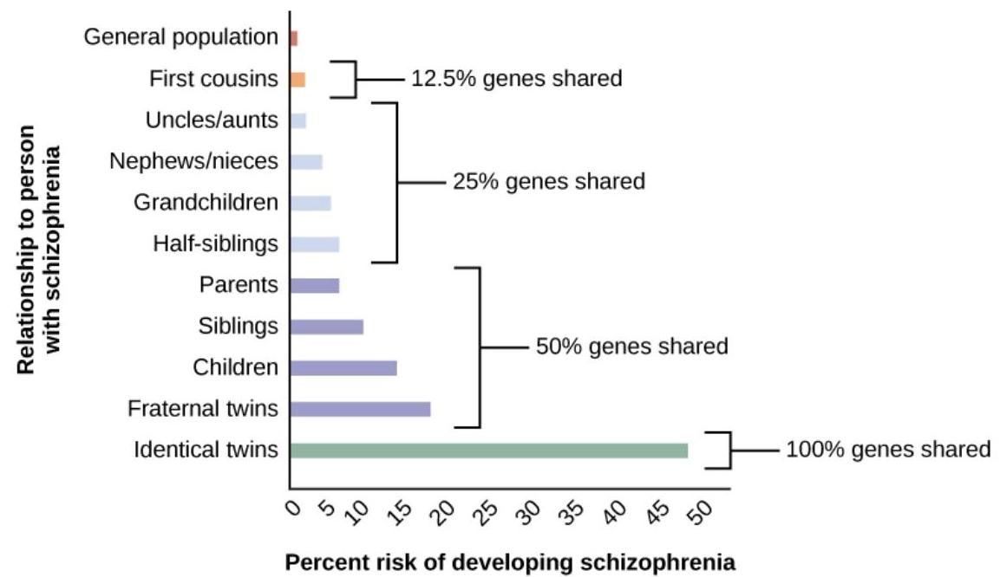

Figure PD.9. Developing schizophrenia. A person's risk of developing schizophrenia increases if a relative has schizophrenia. The closer the genetic relationship, the higher the risk.

Findings such as these have led many of today's researchers to search for specific genes and genetic mutations that contribute to mental disorders. Also, sophisticated neural imaging technology in recent decades has revealed how abnormalities in brain structure and function might be directly involved in many disorders, and advances in our understanding of neurotransmitters and hormones have yielded insights into their possible connections. The biological perspective is currently thriving in the study of psychological disorders.

# The Diathesis-Stress Model of Psychological Disorders 

Despite advances in understanding the biological basis of psychological disorders, the psychosocial perspective is still very important. This perspective emphasises the importance of learning, stress, faulty and self-defeating thinking patterns, and environmental factors. Perhaps the best way to think about psychological disorders, then, is to view them as originating from a combination of biological and psychological processes. Many develop not from a single cause, but from a delicate fusion between partly biological and partly psychosocial factors.Diathesis: This term comes from a Greek word meaning "disposition" or "predisposition." It refers to an underlying vulnerability or tendency that a person has, which makes them more susceptible to developing a disorder. This predisposition can be biological (such as a genetic tendency toward depression) or psychological (like a habitual way of thinking negatively about oneself and the world).

Stress: This refers to challenging or adverse events in a person's life. These can include experiences like childhood abuse, traumatic events, or significant negative life changes. Stressful events can trigger the onset of a disorder in someone who has a diathesis.

The diathesis-stress model (Zuckerman, 1999) integrates biological and psychosocial factors to predict the likelihood of a disorder. This diathesis-stress model suggests that people with an underlying predisposition for a disorder (i.e., a diathesis) are more likely than others to develop a disorder when faced with adverse environmental or psychological events (i.e., stress), such as childhood maltreatment, negative life events, trauma, and so on. A diathesis is not always a biological vulnerability to an illness; some diatheses may be psychological (e.g., a tendency to think about life events in a pessimistic, self-defeating way).

The key assumption of the diathesis-stress model is that both factors, diathesis and stress, are necessary in the development of a disorder. Different models explore the relationship between the two factors: the level of stress needed to produce the disorder is inversely proportional to the level of diathesis. Read Emma's Case Study for an application of the Diathesis-Stress Model.

Supplement PD.2: Case Study - Explaining the Diathesis-Stress Model: Emma's Story [New Tab]

Watch this video: Tricky Topics: Diathesis Stress (5 minutes)

One or more interactive elements has been excluded from this version of the text. You can view them online here: https://opentextbc.ca/psychologymtdi/?p=531\#oembed-1
"Tricky Topics: Diathesis Stress" video by FirstYearPsych Dalhousie is licensed under the Standard YouTube licence.

Here is the Tricky Topics: Diathesis Stress transcript.# Image Attributions 

Figure PD.7. Portion of a Public Domain Image.
Figure PD.8. Public Domain Image.
Figure PD.9. Figure 15.8 as found in Psychology 2e by OpenStax is licensed under a CC BY 4.0 License.

## (0) (1)

Perspectives on Psychological Disorders Copyright © 2024 by Leanne Stevens; Jennifer Stamp; Kevin LeBlanc (editors - original chapter); and Jessica Motherwell McFarlane (editor - adapted chapter) is licensed under a Creative Commons Attribution 4.0 International License, except where otherwise noted.# Neurodiversity 

LEANNE STEVENS; JENNIFER STAMP; KEVIN LEBLANC (EDITORS - ORIGINAL CHAPTER); AND JESSICA MOTHERWELL MCFARLANE (EDITOR - ADAPTED CHAPTER)

Approximate reading time: 49 minutes
In most introductory psychology texts, including the first edition of this one, this section is entitled "Neurodevelopmental Disorders". This terminology presents atypical brain organisation and development as disordered. All brains differ to some degree, so neurodivergence is a normal variation in the structure and function of a nervous system, even if it's less common (Chappel \& Worsley, 2021). Instead, in this chapter we will use the term neurodiversity, which was coined by autistic sociologist Judy Singer to acknowledge the diversity of neurotypes (different kinds of brain organisation and function) that can appear in a population of healthy people.

Your neurotype is present from birth to the end of your life, influencing development, cognition, sensory perception, emotional and behavioural regulation, and social behaviour, so it's a fundamental part of who you are, guiding and informing your experience of the world. In this view, people who fall within the average range of neurotypes are neurotypical (NT), and people who exist outside of it are neurodivergent (Baumer \& Frueh, 2021). In fact, the term "neurotypical" doesn't refer to a specific neurotype, since there's a lot of variation between the brains of neurotypical people as well.

Differences in function that result from a person's neurotype can change over time, and some people may not be identified as neurodiverse until adulthood. This section will focus on autism spectrum disorder (ASD) and attention deficit hyperactivity disorder (ADHD). Keep in mind that dyslexia, dyscalculia, Down syndrome, hyperlexia, dyspraxia, Meares-Irlen Syndrome and Tourette Syndrome are often also considered to be types of neurodivergence as well.

## Discussing Disability and Neurodivergence

The shift from "neurodevelopmental disorders" to "neurodiversity" reflects a change in the way we understand disability and neurodivergence. Historically, the medical model was used to define disability as defects in disabled people that should be cured or prevented (Hogan, 2019). Following this logic, poor outcomes like low employment and educational attainment are a result of disabled people's limitations, and systemic factors that make these goals unattainable for them aren't addressed. This means that under the medical model, disabled people are expected to overcome barriers related to disability, even if those barriers could beeliminated by making changes at a social level so that a wider variety of needs are considered. This model values the prevention of disability over the rights and wellbeing of disabled people and has even been used to argue for the prevention or "curing" of things like same-gender attraction, which are not disabilities. Even in Canada, some provinces continued to classify homosexuality as a medical disorder until 2010 (CBC News, 2010).

An alternative promoted by many disabled people is the social model, which argues that disability mostly happens when systemic social factors disadvantage people with certain types of bodies and brains (Hogan, 2019; World Health Organization, 2022). Consider a person with colour deficiency trying to read a map. If the map uses colours affected by their colour deficiency, they may not be able to see the borders between countries, making the map useless to them. This person isn't limited in their ability to understand maps, they are disadvantaged because their needs weren't considered when the map was made. The social model isn't meant to replace medical treatment when it's needed, its primary goal is to improve and protect the rights of disabled people, which includes making treatment and accommodations more accessible (Guevara, 2021).

A related change involves 'person first language' (e.g., saying "a person with autism" instead of saying "an autistic person"), which is intended to reduce stigma by separating the condition from the person (Baumer \& Frueh, 2021). This sometimes conflicts with language used by neurodivergent people; for example, many autistic people prefer identity-first language (e.g., "Autistic person"). This is meant to acknowledge that autism is a fundamental part of an autistic person, and that respecting personhood shouldn't require the separation of a person from their neurotype (Kenny, 2015; Brown, 2011). However, not all neurodiverse people prefer identity-first language and in this text, we wish to respect differences in language preferences within these communities, with the understanding that discussions are ongoing. In this section, a mix of identity first and person first language will be used in order to acknowledge the lack of consensus and to respect both positions that may be held by neurodiverse people.

# Attention-Deficit/Hyperactivity Disorder 

## Consider the following scenarios:

Samar is writing a quiz in class. He studied for it, but he has trouble paying attention long enough to follow along with lectures, so he listened to the recording several times to review. He's proud of himself for keeping track of the quiz date and prepping in time, as he has trouble managing and remembering dates, and has missed important dates in the past. Samar speeds through it, feeling confident. Later he realises he may have misread the instructions and missed a question. Despite studying and understanding the material, Samar doesn't get the mark he hoped for. He visits his professor during office hours, but he misplaced his quiz, and the professor gets frustrated with him for losing focus when she is speaking to him. Outside of class, Samar struggles to connect with others because he loses track of conversations and oftenfeels out of the loop. Samar may have primarily inattentive attention-deficit-hyperactivitydisorder (ADHD-PI).

Alaiya is writing a quiz in class. She can't help tapping her feet and pencil, and she nearly stands up to pace, but she knows she'll get into trouble for doing that. She tried to study, but she was jittery, and she couldn't focus. The feeling made her so anxious that she gave up and played video games to calm down, though she didn't mean to. She tried to join a study group, but she had trouble following the flow of conversation, blurting things out before others had finished talking. She left the group embarrassed and worried that they thought she was rude. Despite her effort, Aliya is discouraged when she gets her mark back. She visits her professor during office hours, but there's a line and she only manages to wait in it for a few minutes before she feels stressed and under stimulated and has to leave. Alaiya may have primarily hyperactiveimpulsive ADHD (ADHD-HI).

As demonstrated above, ADHD presents in many ways. People like Samar mainly experience inattentive-type symptoms, having difficulty with sustained attention and tasks involving working memory. Others like Alaiya have more hyperactive-impulsive-type symptoms, meaning they're motivated to seek stimulation and struggle with self-control. Others present with a combination of inattentive and hyperactive-impulsive traits (ADHD-C). Interestingly, the proportion of people with ADHD-PI increases with age, while the proportion with ADHD-HI decreases. For example, $23 \%$ of preschool age children with ADHD are primarily inattentive, but this percentage rises $75 \%$ in high school. In contrast, about 5\% of preschool children are primarily hyperactive, and by high school only about $1.1 \%$ of people with ADHD are primarily inattentive. (de la Peña, 2020; Willcutt, 2012). This makes sense, since impulse control and sustained attention rely on brain systems that are still developing at this age, even for neurotypical children.

# Symptoms and Traits 

There are many ways that ADHD can present, so it's likely that it represents a number of neurotypes with similar features. Since ADHD is neurodevelopmental (the growth and development of the brain and nervous system, affecting learning, communication, and behaviour), these traits are present since early childhood and exist across different settings. It's also important to remember that some of the behavioural issues seen in people with ADHD are also seen in people experiencing trauma, sleep disorders, sensory processing disorders, and autism spectrum disorder. Some of these conditions can also coexist with ADHD. (Wolraich et al., 2019). The criteria currently used to diagnose ADHD come from the DSM-5, and involve inattentiveness, hyperactivity and impulsivity.# Inattention 

Inattentive symptoms involve difficulty keeping attention, so people with these symptoms often struggle to complete tasks, follow instructions, and use organisational skills. They may also have trouble holding attention for play or leisure activities, and may feel easily distracted (APA, 2013). Like Samar with his professor, people with these kinds of symptoms may have trouble maintaining attention in conversation or during interaction and are sometimes misunderstood as being distracted or withdrawn by others. As a result of these difficulties, they may struggle with self-esteem and social interaction, and may be reluctant to do things that require sustained attention. Some of these symptoms appear to be related to differences in sensory processing and may mean that people with these symptoms need more time to register and respond to stimuli (de la Peña, 2020).

## Hyperactivity and Impulsivity

People with hyperactive and impulsive symptoms may have trouble being still. For example, children with ADHD may have trouble remaining seated when it's expected for them to do so and may have a tendency to run or climb in inappropriate situations. For teens and adults with ADHD, this is commonly experienced as an intense discomfort and restlessness, even if they can suppress the urge to move. People with these symptoms may have trouble waiting their turn in conversation, and unintentionally interrupt others. As with inattentive symptoms, people with hyperactive-impulsive symptoms may have trouble engaging in play and leisure activities in the same way that neurotypical people do, and they may feel or appear to be constantly on the go (APA, 2013). Like Aliyah in her study group, people with these traits are sometimes misunderstood by others, and can experience social difficulties as a result.

## Common Traits and Experiences

## ADHD and Executive Function

Executive functions are skills that allow us to direct attention, focus, plan, control our behaviour, and regulate emotions (Diamond, 2012). Executive dysfunction occurs when those skills are impaired, resulting in difficulty with time management, impulse control, and emotional regulation. Many people with ADHD experience significant impairment relating to executive function (Silverstein et al., 2018). A specific executive function associated with ADHD is working memory (WM; sometimes used interchangeably with short-term memory). This is the component of memory that allows us to hold information in mind so we can work with it in the moment.Many people with ADHD have a lower WM capacity and have more difficulty manipulating information in WM (Martinussen et al., 2005).

Given the range of skills involved in executive function, it's not surprising that executive dysfunction could contribute to many impairments that people with ADHD experience. It isn't yet known if executive dysfunction is a core feature of ADHD, but some studies found that executive function abilities in early childhood can predict ADHD symptoms later in life (Sjöwall et al., 2015; Brocki et al. 2009), and many people with ADHD score differently than neurotypical people on certain executive function skills (Fan \& Wang, 2022). There is evidence that parts of the frontal and parietal lobes involved in executive function processes are less active in people with ADHD (Faraone et al., 2015). Further evidence can be found in people with ADHD who respond well to stimulant medication, since they're more likely than non-responders to show reduced activity in frontal lobe areas involved in executive functions (Ogrim \& Kroptov, 2019). These differences in brain activity and response to stimulants help to explain the range of ways ADHD can present.

# ADHD and Attention 

The name itself implies that ADHD is a lack of attention, but this isn't totally accurate. Instead, the brains of people with ADHD have trouble directing attention the way neurotypical brains do, so they do more local processing, or processing of individual details that make up a big picture rather than processing the picture as a whole (Song \& Hakoda, 2012), which is called global processing (Figure PD.10). As a result, someone taking a test may focus on a single multiplechoice option without reading the question itself as a whole, as Samar did. Samar had trouble focusing his attention on the expected parts of the test, and he also had trouble shifting his attention to more relevant information.

Local and global processing skills can be tested using a Compound Digit Cancelation Test (Figure PD.10). In this test, digits are arranged spatially to make up larger compound digits. Digits making up compound digits require local processing, since they can be processed as individual details. The compound digits require global processing, since the subject must combine local features to understand them. In this example, the subject was told to cross out twos and eights, whether they appeared at the local or global level. They correctly selected the two made of eights, the six made of twos, and the eight made of twos, but they missed the eight made of sevens, indicating that they may be better at local than global processing, since they more frequently identified twos and eights at the local level.

Figure PD.10. Compound Digit Cancellation Test (CDCT). An example of a Compound Digit Cancellation Test (CDCT), used to assess global and local processing abilities. Digits are arranged spatially to make up larger compound digits. For example, a series of twos lined up in the shape of a six. (credit: original work, Max Dysart).

An interesting result of this difference in attention is hyperfocus, a state of increased attention and motivation directed towards a particular subject. Hyperfocus is also reported by neurotypical people, but it's more common in autistic people and those with ADHD (Groen et al., 2020). People experiencing hyperfocus often lose their sense of time and ignore other stimuli, including bodily needs, because they can't disengage. Hyperfocus can be a negative experience when focused on subjects that cause anxiety or which interfere with function, but it can also be enjoyable, resulting in increased productivity if focused on tasks that are beneficial to the individual (Hupfeld, 2018).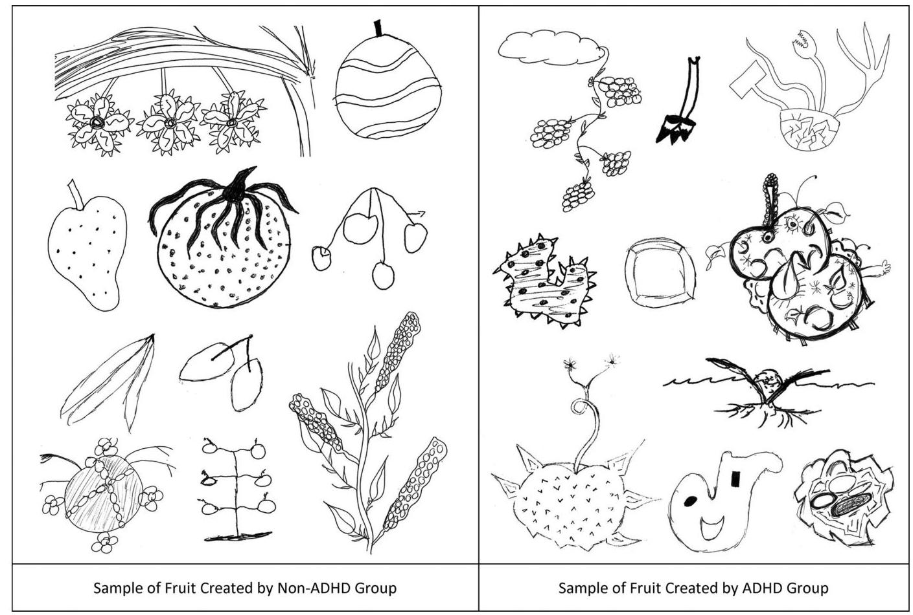

Figure PD.11. Drawing 'alien fruit'. When asked to design and describe 'alien fruit', participants with ADHD (on the right) designed fruit that were rated as more original and had more atypical features than participants without ADHD (on the left). (credit: White, 2018)

# Strengths for People with ADHD 

Like other kinds of neurodivergence, ADHD involves both impairments and special skills less common in neurotypical people. One strength for people with ADHD is creativity, a skill that is enhanced by the ability to combine information in new and unexpected ways. People with ADHD on average display more flexible thinking than neurotypical people on word association tasks (White \& Shah, 2016), and are less restricted by existing knowledge during drawing tasks, resulting in more original creations (Figure PD.11; White, 2018). Traits like impulsivity and difficulty ignoring "irrelevant" stimuli, both associated with ADHD, are also more common in people who display high levels of creativity (Zabelina et al., 2015, Zabelina et al., 2013), so there may be common features in the neurobiology of ADHD and creativity.

Beyond creativity, ADHD adults identified higher levels of energy, courage, adventurousness, and non-conformity as positive factors they associate with their ADHD (Holthe \& Langvik, 2017,Sedgwick et al., 2018). There is also a higher-than-average rate of ADHD in populations of athletes, suggesting that some aspects of this neurotype support athletic engagement, like quick decision making and high energy (Han, 2019). In fact, Olympic athletes Simone Biles, Michael Phelps, and Molly Seidel all have ADHD. Other Icons with ADHD include musicians Solange Knowles, Henry Lau and engineer Dean Kamen, who invented the Segway and iBOT (Figure PD.12).

Figure PD.12. Icons with ADHD. (a) Solange Knowles performing at Coachella in 2014 (b) Henry Lau at the 2020 Korea First Brand Awards ceremony (c) Dean Kamen speaking at the FIRST robotics world championship in 2012 (d) Simone Biles with a gold medal at the 2016 Olympics

# Causes of ADHD 

Given that ADHD can present in a variety of ways, it makes sense that there are a variety of contributing factors. It appears that ADHD is about $74 \%$ heritable, with many genes making small contributions, but environmental factors can also have an influence. For example, ADHD ismore likely in those born premature, and those with early childhood infection. This may be because premature birth and infection cause inflammation, which alters neuron and synapse development. Many of the genes associated with ADHD are also involved in the growth and activity of neurons and synapses, especially those that use the neurotransmitters dopamine and norepinephrine. Indeed, the most common drug therapies for ADHD are stimulants like methylphenidate, which target dopamine and norepinephrine systems (Nùñez-Jaramillo et al., 2021).

Stimulants were first prescribed in the 1930s to treat headaches, but they were more effective for helping some people to concentrate. Later, researchers discovered that stimulant medications increased dopamine activity in certain areas, so they started studying dopamine systems in people with ADHD (Lange et al., 2010). Now we know that some people with ADHD have less dopamine activity in the basal ganglia, the frontal lobes, and the circuits that connect the two. Working together, these areas are involved in motivation, guiding attention, and impulse control, using dopamine as a messenger, so this pattern is more associated with attentional and hyperactive traits (Chu et al., 2021) than with inattentive traits. Other people with ADHD have higher than average connectivity between the prefrontal cortex and a subcortical area called the basal ganglia. This area is involved in perceptions of reward, and heightened connectivity here is associated with more impulsivity (Nùñez-Jaramillo et al., 2021).

# Treatment and Support 

Because there are a variety of factors that can result in the development of ADHD, treatments must be personalised. As we learned earlier, people with ADHD who have less frontal lobe activity respond better to treatment with stimulants, with reduced hyperactivity, impulsivity, and inattention. Commonly prescribed stimulants are amphetamine and related drugs including methylphenidate, which blocks reuptake dopamine and norepinephrine to increase their levels in the synapse, and atomoxetine, which only blocks reuptake of norepinephrine. This increased activity of dopamine supports increased activity in the frontal areas that are less active in some people with ADHD (Nùñez-Jaramillo et al., 2021). However, these drugs aren't effective for everyone, and people taking them usually need other kinds of support.

There are also effective non-pharmacological therapies for people with ADHD, which aim to teach families and people with ADHD to manage stress and emotions, communicate effectively, and implement strategies to help maintain and direct attention. Some examples of this are Behavioural Parent Training, which teaches parents of children with ADHD how to support their children, Cognitive Behavioural Therapy (CBT) which aims to alter maladaptive thought patterns, and Mindfulness training, which can help in the self-regulation of attention (Modest-Lowe et al., 2015).Regular exercise can increase the effectiveness of ADHD drugs, possibly by boosting activity in the prefrontal cortex (Choi et al., 2015). Exercise also improves symptoms of depression and anxiety, especially in combination with psychotherapy, and may also be effective in preventing future depressive symptoms (Hu et al. 2020; Martinsen, 2008). Read this article about exercise intervention for ADHD from the Children and Adults with Attention deficit/hyperactivity disorder (CHADD) organisation, to learn more.

# The Autism Spectrum 

Min is sitting in class. The fluorescent lights buzz and flicker like strobe lights across their vision. It becomes harder to understand the professor's words in the cloud of static, and they begin to panic. They need to go somewhere darker and quieter, but lectures aren't recorded, and they have trouble interacting with strangers so they don't know anyone to get notes from. They want to rock in their seat so they can calm down and self-regulate, but they've been told it's disruptive. As Min leaves after class, someone speaks to them, but Min is so overwhelmed that they can't understand, and it feels like there's something stopping the words in their brain from getting to their mouth. Min puts a practiced "friendly" expression on their face, hoping it was appropriate for the social context. They get home just in time to start crying and rocking in the privacy of their room. They can't think or stop, and they're exhausted afterwards. As the term goes on it gets harder to be in class and by the end, Min struggles to speak and leave the house. They have to ask for extensions on their final projects.

## Symptoms and Traits

"When you meet one person with autism, you've met one person with autism". Dr Stephen Mark Shore, an autistic professor of special education at Adelphi University in New York (De Ambrogi, 2024)

The term "autism" describes a range of neurotypes that share underlying patterns of activity and connectivity. For this reason, it's referred to as autism spectrum disorder (ASD), acknowledgingthat autistic people can present in a variety of ways with many different needs. The quote by Dr. Shore above reminds us to not overgeneralise from one person with ASD to another.

In Canada, approximately 2\% of children and youth aged 1 to 17 are diagnosed with autism, as indicated by the Public Health Agency of Canada's analysis of the 2019 health survey data (Public Health Agency of Canada, n.d.; Autism Alliance of Canada, 2022). However, these estimates may not fully capture the true prevalence of autism due to variations in data collection methodologies and differences in diagnosis rates across regions. The prevalence of autism significantly varies across provinces and among different socio-economic groups, suggesting the potential for even higher rates than initially reported (Public Health Agency of Canada, n.d.).

Some autistic people refer to themselves as having "low support needs", meaning that the impairment they experience requires relatively less support. Others refer to themselves as having "high support needs", meaning that they need relatively more support to go about daily life. Min's experience represents someone with lower support needs. Autistic people in these groups have the same kinds of traits, many of which can be categorised as differences in social communication and interaction with neurotypical people, or as restricted, repetitive behaviours. These two categories of traits come from the DSM-5, which is currently used in the diagnosis of ASD.

# Social Communication and Interaction 

There are 3 types of symptoms that may indicate differences in social communication and interaction (APA, 2013):

1. Differences in or absence of social and emotional back and forth, like turn-taking in conversation or sharing interests and emotions.
2. Differences in or absence of nonverbal communication behaviours such as eye contact, facial expression, gesture, and other body language.
3. Difficulty understanding and performing according to neurotypical social expectations, and difficulty or a lack of interest in developing and maintaining relationships.

Due to differences in social behavior and processing, many autistic people have difficulty identifying lies and non-literal language (Williams et al., 2018; Pexman et al., 2010), and benefit from direct communication about social expectations. Non-verbal communication in autistic individuals can vary. Some autistic people avoid eye contact, possibly because the subcortical areas of their brains, particularly the amygdala, are more active during eye contact (Hadjikhani, 2017). However, other autistic individuals may have a tendency to stare. Some autistic individuals and advocates argue that traits like avoiding eye contact or staring should be seen as differences rather than impairments. They point out that autistic people often do not experiencethe same social difficulties, such as misunderstandings or discomfort, when interacting with other autistic individuals (Crompton et al., 2020; Davis \& Crompton, 2021).

# Restrictive and Repetitive Patterns of Behaviour 

There are four types of symptoms that may indicate restrictive and repetitive patterns of behaviour (APA, 2013):

1. Repetitive movements, speech or use of objects.
2. Preference for sameness and anxiety in response to changes or unexpected events.
3. Extremely focused or intense interests, including strong attachments to objects; preoccupation with specific subjects or activities.
4. Hyperreactivity, an increased response to certain sensory stimuli, and/or hyporeactivity, a decreased reactivity to certain sensory stimuli.

Because individuals with ASD process sensory stimuli differently, some sensations can be more painful or more pleasurable than they would be for neurotypical people. This can lead to an insistence on sameness, as a way to avoid stimuli that is overwhelming and difficult to deal with (MacLennan, 2020). When sensory differences make sensations more pleasurable, autistic people may be motivated to engage with them repeatedly both because they are enjoyable, and to reduce anxiety. Often, these kinds of repetitive behaviours are called "stims" by autistic people, though non-autistic people also stim sometimes (e.g., tapping the foot or twirling the hair). Another common pattern of repeated behaviour for autistic people is the development of intense, long-lasting interests in particular subjects, often called special interests (Grove et al., 2018). Like people with ADHD, autistic people may be prone to hyperfocus, especially when engaging with a special interest.

## Common Traits and Experiences

## Shutdowns and Meltdowns

Shutdowns and meltdowns are well-known but under-researched experiences for many autistic people. Meltdowns are an externalisation or release of stress that overwhelms an autistic person's coping mechanisms, often preceded by sensory overload (Phung et al., 2021, Schaber, 2014). Externalisation may involve screaming, stomping, sometimes self-injurious stimming and other similar behaviours that allow the autistic person to reduce internal tension.

Shutdowns are the internalised version of meltdowns, also occurring when the individual can'tdeal with stress and sensory overload. Rather than releasing tension externally, the individual shuts down or dissociates to reduce their exposure to the sensory environment. Adults with autism report that this involves decreased sensation; for example, they may experience physical numbness and narrowing of vision. An autistic person experiencing shutdown may be unresponsive and exhausted (Phung et al., 2021, Schaber, 2014).

During meltdowns and shutdowns, autistic people report impaired cognitive and sensory processing, loss of communication skills, and less control over their body (Nason, 2019). Meltdowns and shutdowns are not intentional and generally can't be stopped once they start. People experiencing meltdown should never be held down, as this practice has the potential to injure and in the worst cases can be fatal (Bartlett \& Ellis, 2020, Vogel, 2014). Rather, care must be taken to help them escape triggering environments and reduce the amount of stimulation and stress they're experiencing so they can recover (Myles \& Southwick, 1999).

# Autistic Masking and Burnout 

Masking involves suppressing autistic traits and using a learned set of rules or scripts to blend in with neurotypical people. Not all autistic people can mask, and while masking may help some overcome certain social barriers, it's described as tiring and anxiety provoking (Hull et al., 2017), and is associated with autistic burnout.

Autistic burnout involves long-term exhaustion, reduced cognitive function, loss of previously mastered skills, social withdrawal, and an increase in autistic traits (Higgins et al., 2021; Raymaker et al., 2020). One might lose the ability to perform facial expressions or use verbal language; sensory processing issues intensify; and the individual may need to spend less time socialising, speaking, and masking (Phung et al., 2021).

While unmasking may be beneficial for long-term health, it may also put people with ASD at increased risk of violence. Data from police reports indicates that $42 \%$ of people killed by police in Canada were in mental distress, and data from the US indicates that 33-50\% of people killed by police were disabled (Nicholson \& Marcoux, 2018; Perry \& Carter-Long, 2016). In many of these cases, disabled people displaying non-violent distress or behaviour associated with their disability or neurotype were reported as acting suspicious and were unable to respond to law enforcement as expected, at which point police proceeded to use violent force.

This was the case for Elijah Mccain, who was reported because he "looked sketchy". In fact, Elijah was harmlessly stimming by waving his arms, and wearing an open-faced ski mask to combat cold as a result of his chronic anemia. He had not committed any crime, but he was killed during the encounter because he was visibly distressed, and "tensed up" when restrained (Thompkin, 2020).

As in Elijah's case, this risk is increased for those particularly affected by anti-Black or Indigenousracism, who are already more likely to be victims of police violence (Lett et al., 2020; Diamond \& Hogue, 2021). In order to make it safe for all people with ASD to take care of themselves and unmask, systemic forms of oppression must also be addressed.

# Non-Verbal Autism 

Approximately 25-30\% of autistic children don't develop verbal language. Some may develop verbal language skills as they age, while others won't. For years it was assumed that non-verbal autistic people couldn't communicate or advocate for themselves, however, while some do have trouble understanding language, others have good comprehension even if they can't speak themselves (Rapin et al., 2009). In these cases, they may need access to alternate forms of communication like picture cards or text-to-speech apps. Autistic people given Augmentative and Alternative Communication (AAC) methods or technologies communicate significantly more and have better communication skills (Ganz et al., 2012). Forms of sign language are effective for many people on the spectrum and are helpful in improving outcomes for autistic children (Goldstein, 2002) and autistic people with intellectual disabilities. Because verbal language is commonly lost during burnouts and meltdowns, AAC can also be helpful for those who are able to speak most of the time.

More About Augmentative and Alternative Communication

Watch these videos on Augmentative and Alternative Communication (AAC) to learn more. This video from Fairfax County Schools, outlines Augmentative and Alternative Communication (AAC) devices and how they help give students a voice in their learning; this video from Louisiana AEM shows how to create your own AAC board at home.

## Autistic Strengths

Autistic people demonstrate several perceptual advantages, including above average pitch perception, spatial reasoning and recognition of visual patterns (Soulières et al., 2011, Stevenson \& Gernsbacher, 2013). For example, some autistic people are hyperlexic, meaning that they can read at a higher level than expected for their age, possibly because they have anenhanced ability to recognise the visual characteristics of words (Mottron, 2006). This superior processing for lower-level sensory information also results in superior memory abilities for some autistic people like Stephen Wiltshire, whose exceptional visual memory allows him to accurately illustrate entire cityscapes after a single flight across the skyline.

Many autistic people also demonstrate subtle differences in empathic processes and moral reasoning. For example, one study found that autistic people were less likely than neurotypical people to compromise their moral beliefs for personal gain, even when they were unobserved (Hu et al., 2020), and another found that autistic people were less likely than neurotypical people to show bias towards members of their own group (Uono et al., 2021). Other autistic icons include animal behaviour consultant Temple Grandin, climate activist Greta Thunberg, artist Stephen Wiltshire, and multidisciplinary filmmaker Jorge R. Gutiérrez, who co-wrote and directed The Book of Life (Figure PD.13).

Figure PD.13. Autistic icons. (a) Stephen Wiltshire, working on cityscape drawing from memory (Adapted from work by Gobierno CDMX, licensed under CCO 1.0). (b) Greta Thunberg, speaking at a climate strike in front of the Reichstag, Berlin (adapted from work by Stefan Müller, licensed under CC BY 2.0 ). (c) Temple Grandin delivering a TED talk in 2010 (adapted from work by Red Maxwell, licensed under CC BY 2.0 ). (d) Jorge R. Gutiérrez speaking at a panel on The Book of Life at San Diego comic con in 2014 (adapted from work by Gage Skidmore, licensed under CC BY-SA 2.0).

# Causes of Autism 

The strongest evidence suggests that autism is mostly heritable. One study involving 2 million children across multiple countries found that genetics accounted for almost $80 \%$ of one's likelihood of being diagnosed with autism (Bai et al., 2019). Relatives of people with autism alsohave higher rates of related genetic syndromes and autism-like traits (Chaste \& Leboyer, 2022). Hundreds of genes have been identified as making some contribution, and many are involved in neural development, neurotransmitter function, and synapse function (Hodges et al., 2020). Scientists have found that many different genes play a role in autism. These genes are important for how the brain develops, how brain chemicals work, and how brain cells communicate with each other (Hodges et al., 2020). One of these genes is called SHANK3. It helps with brain cell connections that use a chemical called glutamate. Many autistic people have higher levels of glutamate in parts of their brain that are involved in movement and touch. This difference in glutamate levels is linked to unusual ways of processing sensory information.

Evidence also suggests that some of these genes affect the balance of certain brain chemicals (Al-Otaish et al., 2018; Cochran, 2015; He et al., 2021). For example, some autistic people have higher levels of excitatory neurotransmitters (which stimulate brain activity) and lower levels of inhibitory neurotransmitters (which calm brain activity) compared to neurotypical people. This difference is linked to the way autistic individuals process social information and sensory input.

Additionally, differences have been found in the growth patterns of grey and white matter in specific areas of the brain, particularly in the cerebellum, which is connected to the frontal and parietal lobes (D'Mello et al., 2015). These differences are associated with social traits and repetitive behaviors seen in autism. As expected, autistic individuals also show more activity in primary sensory areas of the brain, which relates to their unique sensory processing (Samson, 2011).

Researchers' lie leads to decades of harm as parents believe 'medical fake news' and avoid vaccines for their children

There is no support for the theory that vaccines or mercury contribute to the development of autism (DeStefano, 2007). A comprehensive meta-analysis involving over 1.25 million children found no relationship between vaccination and autism or autism spectrum disorders (ASD). This includes no link between autism and MMR (measles, mumps, rubella), thimerosal, or mercury in vaccines. (Taylor, Swerdfeger, \& Eslick, 2014).

A pseudo (fake) study by Dr. Andrew Wakefield and colleagues (Wakefield, et al., 1998), which initially claimed a link between the MMR vaccine and autism, was later discredited due to ethical, medical, and scientific misconduct. Investigations revealed that the data presented were fraudulent, making this one of the most damaging medical hoaxes of the last 100 years. (Flaherty, 2011; Godlee et al., 2011).

Some people continue to believe in and pass on this medical fake news about vaccines and ASD. This research wrong-doing highlights how important it is that people are able to trust the medical world. This shocking story of medical research misconduct reminds us of the critical need for strict, ethical research and clear communication. Moving forward, it's crucial that we adopt strategies that clearly explain that there is widespread scientific agreement on the safety and importance of vaccines. This involves not only direct and honest discussions but also teamwork among doctors, educators, and public health advocates to rebuild trust and support people in making informed choices about vaccinations.# Support for Autistic People and Caregivers 

Historically, many techniques have aimed to suppress autistic traits rather than help autistic people to overcome disadvantages and meet their specific needs. For example, harmful applied behavioural analysis (ABA) focuses on punishing autistic behaviours and coping mechanisms like stimming. ABA has been identified as an abusive therapy by the Autistic community (ASAN, 2021; Sandoval-Norton \& Shkedy, 2019).

Many adults with ASD report that punishment for stimming negatively affects their selfconfidence and sense of control over their bodies (Kapp et al., 2019, Gardiner, 2017). Stimming indicates that an autistic person may be coping with something overwhelming, so it's better to help them address that if they need assistance. This is especially important for autistic children and non-verbal people with autism, who experience barriers in communicating their needs (Sandoval-Norton \& Shkedy, 2019). If someone stims when they are in rooms with yellow light, the light may be overwhelming and could be changed to make them more comfortable. Alternatively, if they can tolerate wearing glasses, coloured lenses might help.

If you don't have these kinds of sensitivities, consider how it feels to try and walk with a rock in your shoe. If you can't take the rock out, it might become the only thing you can think about, making it increasingly difficult to engage with your environment. However, if you take the rock out, you can recover and re-engage. These simple strategies can greatly impact an autistic person's comfort and functioning.

Some autistic people find Social Skills Training (SST) helpful. Others argue that SST teaches neurodivergent people to mask and treat social interaction like math problems rather than engaging authentically and learning to identify and communicate their feelings (Roberts, 2022). It is argued that SST devalues neurodivergent social skills and, as we learned earlier, autistic people don't experience the same social issues when interacting with each other (Roberts, 2021; Davis \& Crompton, 2021). SST may enhance an autistic person's ability to mask and succeed in some domains, but this may also come at a cost to their own well-being. It is possible that it wouldn't be necessary if society were more accessible to them.

Augmentative and Alternative Communication (AAc)

Augmentative means adding to or enhancing communication, not to be confused with "argumentative," which means having a tendency to argue. Examples of augmentative methods are:1. Using pictures: A person points to pictures on a communication board to express what they want or need.
2. Speech-generating devices: A device that speaks out loud when a person selects words or symbols.

Alternative means providing another way to communicate when someone cannot use spoken words. Examples of alternative methods of communication are:

1. Sign language: Using hand signs to communicate instead of spoken words.
2. Text-to-speech apps: An app that converts typed text into spoken words for someone who cannot speak.

Augmentative and Alternative Communication (AAC) helps people with communication difficulties express themselves more effectively.

Given the diversity of people on the spectrum, appropriate supports and accommodations vary widely. Some have already been discussed. For example, Augmentative and Alternative Communication (AAC) can be helpful for those struggling with verbal communication, and alterations to the environment can help with sensory issues. Autistic people may also benefit from occupational therapy to learn skills that can help them live more independently and meet their goals. For example, many autistic people have issues with coordination, and benefit from physical training to develop fine motor skills. Occupational therapists can also help identify autistic strengths and recommend modifications to activities and environments that allow autistic people to perform at their full capacity.

People with ASD and caregivers also experience higher rates of anxiety and depression than neurotypical people, in part because of social stigma and a lack of accessibility. There is evidence that Cognitive Behavioural Therapy and mindfulness training are effective for treating anxiety and depression in autistic people and caregivers (Ridderinkhof et al., 2017), and that mindfulness training may also have a positive impact on emotional and sensory regulation (White et al., 2018).

# Similarities and Differences: Diagnostic Bias 

Classically, ADHD and autism are considered conditions that affect white, cisgender AMAB children (assigned male at birth). Some estimates suggest that there are four times as many AMAB children as AFAB (assigned female at birth) children diagnosed with these conditions (Ramtekkar, 2010). Recently however, adult diagnosis has become more common, and new data indicates that this gender difference shrinks with age (Rutherford et al., 2016).

On average, AFAB (assigned female at birth) people are more likely to be misdiagnosed ordiagnosed later in life (Adamis, 2022; Dworzynski et al., 2012). This may result from a lack of awareness about different presentations of autism and ADHD.

For example, assigned female at birth (AFAB) people with ADHD are more likely to have Primary Inattentive ADHD (ADHD-PI) symptoms, which means they mainly have trouble paying attention and are less likely to be hyperactive. AFAB autistic people also tend to show fewer social traits (like difficulty with social interactions) and more sensory traits (such as being very sensitive to sounds, lights, or textures) than AMAB (assigned male at birth) children (Lai et al., 2011; Adamis, 2022).

There is likely also a gender bias, as AMAB (assigned male at birth) children are more likely to be referred for diagnosis than AFAB (assigned female at birth) children with equivalent traits (Scuitto et al., 2004). On average AFAB autistic children with official diagnosis also have higher levels of autistic traits than AMAB children, suggesting that AFAB children need to experience more impairment to be diagnosed (Rutherford et al., 2016).

Interestingly some data indicates that there are higher than average rates of transgender or gender-diverse identity in neurodiverse populations. For example, Warrier et al. (2020) found that $24 \%$ of gender-diverse people in their sample had autism, as compared to only $5 \%$ of cisgender people.

Evidence suggests there is also a diagnostic bias against people of colour, particularly Black people, as Black autistic children are 2 times more likely to be misdiagnosed with conduct disorder than white autistic children with the same traits (Mandell et al., 2006; Fombonne \& Zuckerman, 2022). Similarly, Black children are 5.1 times more likely to be diagnosed with adjustment disorder and 2.4 times more likely to be diagnosed with conduct disorder, while white children with the same traits are more likely to be diagnosed with ADHD (Ballentine, 2019). No difference has been found in levels of ADHD or autism-related traits between these groups. If children of colour and non-Hispanic white children display the same rates of ADHD and autism-like behaviours but are diagnosed differently, then it's likely that race-based bias is affecting the way they are being perceived by diagnosticians (Fadus et al., 2019).

# Similarities and Differences: Sensory Processing 

People with ADHD and/or autism have differences in sensory processing that affect the way they react to stimuli. For example, some are hypo-reactive to interoceptive stimuli, which are sensations that come from inside the body, like hunger pains or the feeling of a full bladder. If you have trouble with interoception, you may struggle to identify sensations like pain or hunger, which can cause distress as you may not know how to address unpleasant sensory experiences.Many autistic people also have alexithymia, meaning that they have trouble sensing and identifying their own emotions and the emotions of others.

Others are hyper-reactive to certain stimuli, like sound, light, and physical sensation. These people may need to wear tinted lenses or ear plugs and may avoid certain kinds of material for clothing in order to avoid becoming overstimulated.

It is even possible to be both under and over responsive to a kind of stimuli, and to switch between the two (Wigham, 2014). Some sensory differences can also result in positive experiences. For example, a heightened response to sound can enhance enjoyment of music, while differences in somatosensory processing might make it feel really good or soothing to rock back and forth. Everyone engages in this kind of sensory seeking behaviour sometimes, but autistic people may be motivated to do this more often, both for enjoyment and for self-care.

Sensory differences influence cognitive and behavioural differences as well. For example, someone with ADHD may have trouble maintaining attention because they are hyper-reactive to sound and are distracted by noises in the environment. This hyper-reactivity could result from a reduced ability to filter stimuli as evidenced by neuroimaging studies, which have found higher activity in lower-level sensory areas like the superior and inferior colliculi, which help the body direct itself toward visual and auditory stimuli (Panagiotidi et al., 2020).

Alternatively, people with ADHD may appear inattentive because they have low sensitivity to sound and attempts to get their attention haven't registered (Shimizu et al., 2014). One theory suggests that some people with ADHD are under-stimulated at baseline, resulting in hyperactivity and sensation-seeking behaviours to self-generate stimulation. There is evidence that increased environmental simulation can enhance performance for some people with ADHD. For example, Söderlund et al. (2007) found that subjects with ADHD did better on cognitive tasks with white noise in the background. Remember also that stimulant medications prescribed to people with ADHD act by increasing neural stimulation in areas that are under-active (Ogrim et al., 2013).

In people with autism, sensory reactivity can predict stimming, insistence on sameness, and special interests (Kapp et al., 2019). Like people with ADHD, people with autism have trouble ignoring certain stimuli. This might be because autistic people take longer to habituate, meaning that their nervous systems keep reacting to unchanging stimuli longer than the nervous systems of neurotypical people.

Autistic people also seem to filter and group stimuli less than neurotypical people, possibly resulting from differences in association areas, which combine information from different senses. Association areas are parts of the brain that integrate information from various senses like sight and sound. Some evidence suggests that in autistic people, these differences result inbetter processing for individual stimuli than for groups (Proff et al., 2022; Quintin, 2019). This means autistic individuals might focus more effectively on single pieces of information rather than on collections of information. This is a tendency toward local processing, similar to that of people with ADHD. (Local processing refers to paying more attention to small details rather than the overall picture.) For those with ADHD, however, this might result from difficulty shifting attention from one detail to another (Gargaro et al., 2015; Cardillo et al., 2020). In other words, people with ADHD may struggle to move their focus from one piece of information to another.

# Image Attributions 

Figure PD.10. Figure PY. 10 by Max Dysart as found in Introduction to Psychology \& Neuroscience (2nd Edition) is licensed under a CC BY 4.0 License.

Figure PD.11. Figure PY. 11 by White, 2018 as found in Introduction to Psychology \& Neuroscience (2nd Edition) is licensed under a CC BY 4.0 License.

Figure PD.12. (a) Solange Knowles (Adapted from work by Neon Tommy, licensed under CC BY 2.0) (b) Henry Lau (Adapted from work by NewsInstar, licensed under CC BY 3.0) (c) Dean Kamen (Adapted from work by Greg Heartsfield, licensed under CC BY 2.0) (d) Simone Biles (Adapted from work by Agência Brasil Fotografias, licensed under CC BY 2.0)

Figure PD.13. (a) Stephen Wiltshire (Adapted from work by Gobierno CDMX, licensed under CC0 1.0). (b) Greta Thunberg (adapted from work by Stefan Müller, licensed under CC BY 2.0 ). (c) Temple Grandin (adapted from work by Red Maxwell, licensed under CC BY 2.0 ). (d) Jorge R. Gutiérrez (adapted from work by Gage Skidmore, licensed under CC BY-SA 2.0).

## (1)

[^0]
[^0]:    Neurodiversity Copyright © 2024 by Leanne Stevens; Jennifer Stamp; Kevin LeBlanc (editors - original chapter); and Jessica Motherwell McFarlane (editor - adapted chapter) is licensed under a Creative Commons Attribution 4.0 International License, except where otherwise noted.1044 | Chapter 18. Psychological Disorders# Schizophrenia 

LEANNE STEVENS; JENNIFER STAMP; KEVIN LEBLANC (EDITORS - ORIGINAL CHAPTER); AND JESSICA MOTHERWELL MCFARLANE (EDITOR - ADAPTED CHAPTER)

Approximate reading time: 18 minutes
Schizophrenia is a devastating psychological disorder that is characterised by major disturbances in thought, perception, emotion and behaviour. About 1\% of Canadians aged 10 and older are diagnosed with schizophrenia (Public Health Agency of Canada, 2019). The disorder is commonly first diagnosed in young adulthood, with a significant number of new cases identified between the ages of 20 and 34, highlighting the critical period of early adulthood for the onset of this mental illness (Public Health Agency of Canada, 2019).

Most people with schizophrenia experience significant difficulties in many day-to-day activities, such as holding a job, paying bills, caring for oneself (grooming and hygiene), and maintaining relationships with others. Frequent hospitalisations are more often the rule rather than the exception with schizophrenia. Even when they receive the best treatments available, many with schizophrenia will continue to experience serious social and occupational impairment throughout their lives.

What is schizophrenia? First, schizophrenia is not a condition involving a split personality; that is, schizophrenia is not the same thing as dissociative identity disorder (better known as multiple personality disorder). These disorders are sometimes confused because the word schizophrenia, first coined by the Swiss psychiatrist Eugen Bleuler in 1911, derives from Greek words that refer to a "splitting" (schizo) of psychic functions (phrene) (Green, 2001).

Schizophrenia is considered a psychotic disorder, or one in which the person's thoughts, perceptions and behaviours are impaired to the point where she is not able to function normally in life. In informal terms, one who suffers from a psychotic disorder (that is, has a psychosis) is disconnected from the world in which most of us live.

## Symptoms of Schizophrenia

The main symptoms of schizophrenia include hallucinations, delusions, disorganised thinking, disorganised or abnormal motor behaviour, and negative symptoms (APA, 2013). A hallucination is a perceptual experience that occurs in the absence of external stimulation.Auditory hallucinations (hearing voices) occur in roughly two-thirds of patients with schizophrenia and are by far the most common form of hallucination (Andreasen, 1987). The voices may be familiar or unfamiliar, they may have a conversation or argue, or the voices may provide a running commentary on the person's behaviour (Tsuang, Farone, \& Green, 1999).

Less common are visual hallucinations (seeing things that are not there) and olfactory hallucinations (smelling odours that are not actually present).

Delusions are beliefs that are contrary to reality and are firmly held even in the face of contradictory evidence. Many of us hold beliefs that some would consider odd, but a delusion is easily identified because it is clearly absurd. A person with schizophrenia may believe that their mother is plotting with the FBI to poison their coffee, or that their neighbour is an enemy spy who wants to kill them. These kinds of delusions are known as paranoid delusions, which involve the (false) belief that other people or agencies are plotting to harm the person. People with schizophrenia also may hold grandiose delusions, beliefs that one holds special power, has unique knowledge, or is extremely important.

For example, the person who claims to be Cleopatra, or who claims to be a traveler, or claims to have a superpower, is experiencing grandiose delusions. Other delusions include the belief that one's thoughts are being removed (thought withdrawal) or thoughts have been placed inside one's head (thought insertion). Another type of delusion is somatic delusion, which is the belief that something highly abnormal is happening to one's body (e.g., that one's kidneys are being eaten by cockroaches).

Disorganised thinking refers to disjointed and incoherent thought processes, which are usually detected by what a person says. The person might ramble, exhibit loose associations (jump from topic to topic), or talk in a way that is so disorganised and incomprehensible that it seems as though the person is randomly combining words. Disorganised thinking is also exhibited by blatantly illogical remarks (e.g., "The CN Tower is in Toronto. I live in Toronto. Therefore, I live at the CN Tower.") and by tangentiality - responding to others' statements or questions with remarks that are either barely related or unrelated to what was said or asked. For example, if a person diagnosed with schizophrenia is asked if she is interested in receiving special job training, she might state that she once rode on a train somewhere. To a person with schizophrenia, the tangential (slightly related) connection between job training and riding a train are sufficient enough to cause such a response.

Disorganised or abnormal motor behaviour refers to unusual behaviours and movements: becoming unusually active, exhibiting silly child-like behaviours (giggling and self-absorbed smiling), engaging in repeated and purposeless movements, or displaying odd facial expressions and gestures. In some cases, the person will exhibit catatonic behaviours that show decreased reactivity to the environment, such as posturing, in which the person maintains arigid and bizarre posture for long periods of time, or catatonic stupor, a complete lack of movement and verbal behaviour.

Negative symptoms are those that reflect noticeable decreases and absences of certain behaviours, emotions, or drives (Green, 2001). A person who exhibits diminished emotional expression shows no emotion in his facial expressions, speech or movements, even when such expressions are normal or expected. Avolition is characterised by a lack of motivation to engage in self-initiated and meaningful activity, including the most basic of tasks, such as bathing and grooming. Alogia refers to reduced speech output; in simple terms, patients do not say much. Another negative symptom is asociality, or social withdrawal and lack of interest in engaging in social interactions with others. A final negative symptom, anhedonia, refers to an inability to experience pleasure. One who exhibits anhedonia expresses little interest in what most people consider to be pleasurable activities, such as hobbies, recreation, or sexual activity.

# Causes of Schizophrenia 

There is considerable evidence suggesting that schizophrenia has a genetic basis. The risk of developing schizophrenia is nearly 6 times greater if one has a parent with schizophrenia than if one does not (Goldstein, Buka, Seidman, \& Tsuang, 2010). Additionally, one's risk of developing schizophrenia increases as genetic relatedness to family members diagnosed with schizophrenia increases (Gottesman, 2001).

## Genes

When considering the role of genetics in schizophrenia, as in any disorder, conclusions based on family and twin studies are subject to criticism. This is because family members who are closely related (such as siblings) are more likely to share similar environments than are family members who are less closely related (such as cousins); further, identical twins may be more likely to be treated similarly by others than might fraternal twins. Thus, family and twin studies cannot completely rule out the possible effects of shared environments and experiences.

Such problems can be corrected by using adoption studies, in which children are separated from their parents at an early age. One of the first adoption studies of schizophrenia conducted by Heston (1966) followed 97 adoptees, including 47 who were born to mothers with schizophrenia, over a 36-year period. Five of the 47 adoptees (11\%) whose mothers had schizophrenia were later diagnosed with schizophrenia, compared to none of the 50 control adoptees. Other adoption studies have consistently reported that for adoptees who are later diagnosed withschizophrenia, their biological relatives have a higher risk of schizophrenia than do adoptive relatives (Shih, Belmonte, \& Zandi, 2004).

Although adoption studies have supported the hypothesis that genetic factors contribute to schizophrenia, they have also demonstrated that the disorder most likely arises from a combination of genetic and environmental factors, rather than just genes themselves. For example, investigators in one study examined the rates of schizophrenia among 303 adoptees (Tienari et al., 2004). A total of 145 of the adoptees had biological mothers with schizophrenia; these adoptees constituted the high genetic risk group. The other 158 adoptees had mothers with no psychiatric history; these adoptees composed the low genetic risk group. The researchers managed to determine whether the adoptees' families were either healthy or disturbed.

For example, the adoptees were considered to be raised in a disturbed family environment if the family exhibited a lot of criticism, conflict, and a lack of problem-solving skills. The findings revealed that adoptees whose mothers had schizophrenia (high genetic risk) and who had been raised in a disturbed family environment were much more likely to develop schizophrenia or another psychotic disorder (36.8\%) than were adoptees whose biological mothers had schizophrenia but who had been raised in a healthy environment (5.8\%), or than adoptees with a low genetic risk who were raised in either a disturbed (5.3\%) or healthy (4.8\%) environment. Because the adoptees who were at high genetic risk were likely to develop schizophrenia only if they were raised in a disturbed home environment, this study supports a diathesis-stress interpretation of schizophrenia - both genetic vulnerability and environmental stress are necessary for schizophrenia to develop; genes alone do not show the complete picture.

# Neurotransmitters 

If we accept that schizophrenia is at least partly genetic in origin, as it seems to be, it makes sense that the next step should be to identify biological abnormalities commonly found in people with the disorder. Perhaps not surprisingly, a number of neurobiological factors have indeed been found to be related to schizophrenia. One such factor that has received considerable attention for many years is the neurotransmitter dopamine. Interest in the role of dopamine in schizophrenia was stimulated by two sets of findings; drugs that increase dopamine levels can produce schizophrenia-like symptoms, and medications that block dopamine activity reduce the symptoms (Howes \& Kapur, 2009). The dopamine hypothesis of schizophrenia proposed that an overabundance of dopamine or too many dopamine receptors are responsible for the onset and maintenance of schizophrenia (Snyder, 1976). More recent work in this area suggests that abnormalities in dopamine vary by brain region and thus contribute to symptoms in unique ways. In general, this research has suggested that anoverabundance of dopamine in the limbic system may be responsible for some symptoms, such as hallucinations and delusions, whereas low levels of dopamine in the prefrontal cortex might be responsible primarily for the negative symptoms (avolition, alogia, asociality and anhedonia) (Davis, Kahn, Ko, \& Davidson, 1991). In recent years, serotonin has received attention, and newer antipsychotic medications used to treat the disorder work by blocking serotonin receptors (Baumeister \& Hawkins, 2004).

# Brain Anatomy 

Brain imaging studies reveal that people with schizophrenia have enlarged ventricles, the cavities within the brain that contain cerebral spinal fluid (Green, 2001). This finding is important because larger than normal ventricles suggests that various brain regions are reduced in size, thus implying that schizophrenia is associated with a loss of brain tissue. In addition, many people with schizophrenia display a reduction in grey matter (cell bodies of neurons) in the frontal lobes (Lawrie \& Abukmeil, 1998), and many show less frontal lobe activity when performing cognitive tasks (Buchsbaum et al., 1990). The frontal lobes are important in a variety of complex cognitive functions, such as planning and executing behaviour, attention, speech, movement, and problem solving. Hence, abnormalities in this region offer legitimate reasons why people with schizophrenia experience deficits in these areas.

## Events During Pregnancy

Why do people with schizophrenia have these brain abnormalities? A number of environmental factors that could impact normal brain development might be at fault. High rates of obstetric complications in the births of children who later developed schizophrenia have been reported (Cannon, Jones, \& Murray, 2002). In addition, people are at an increased risk for developing schizophrenia if the pregnant parent was exposed to influenza or experienced nutritional deficiencies or maternal stress during the first trimester of pregnancy (Brown et al., 2004; Brown, 2011; Fineberg et al., 2016; Pugliese et al., 2019).

Research has also suggested that a pregnant parent's emotional stress during pregnancy may increase the risk of schizophrenia in offspring. One study reported that the risk of schizophrenia is elevated substantially in offspring whose pregnant parent experienced the death of a relative during the first trimester of pregnancy (Khashan et al., 2008). This research demonstrates the importance of maternal stress, medical illnesses, and obstetric complications as risk factors for schizophrenia in adulthood (Paquin et al., 2021; Pugliese et al., 2019).# Cannabis 

Another variable that is linked to schizophrenia is cannabis (marijuana) use. Although a number of reports have shown that individuals with schizophrenia are more likely to use cannabis than are individuals without schizophrenia (Thornicroft, 1990), such investigations cannot determine if cannabis use leads to schizophrenia, or vice versa. However, a number of longitudinal studies have suggested that cannabis use is, in fact, a risk factor for schizophrenia. A classic investigation of over 45,000 Swedish conscripts followed up with them after 15 years and found that those individuals who had reported using cannabis at least once by the time of conscription were more than twice as likely to develop schizophrenia during the ensuing 15 years than were those who reported never using cannabis; those who had indicated using cannabis 50 or more times were 6 times as likely to develop schizophrenia (Andréasson, Allbeck, Engström, \& Rydberg, 1987).

More recently, a review of 35 longitudinal studies found a substantially increased risk of schizophrenia and other psychotic disorders in people who had used cannabis, with the greatest risk in the most frequent users (Moore et al., 2007). Other work has found that cannabis use is associated with an onset of psychotic disorders at an earlier age (Large, Sharma, Compton, Slade, \& Nielssen, 2011). The National Institute on Drug Abuse (NIDA) highlights that considerable evidence, though not universally consistent, has linked cannabis use to an earlier onset of psychosis in individuals with genetic risk factors for psychotic disorders, including schizophrenia. Various factors, such as the amount of drug consumed, the frequency of use, the potency of the cannabis product, and the age at first use, play significant roles in influencing this relationship (National Institute on Drug Abuse, 2023a).

One massive study revealed that young men with cannabis use disorder have an increased risk of developing schizophrenia. The research, which analysed data from over 6 million people in Denmark, suggested that up to 30\% of schizophrenia cases among men aged 21-30 might have been preventable by preventing cannabis use disorder (National Institute on Drug Abuse, 2023b).

One plausible interpretation of the data is that early cannabis use may disrupt normal brain development during important early maturation periods in adolescence (Trezza, Cuomo, \& Vanderschuren, 2008). Thus, early cannabis use may set the stage for the development of schizophrenia and other psychotic disorders, especially among individuals with an established vulnerability (Casadio et al., 2011).

While cannabis is a much safer drug than alcohol in terms of risk of death, cannabis is not harmless, contrary to popular belief. Specifically, depending on their prenatal, genetic, or environmental stresses, some young adult men are at risk of their cannabis use triggeringschizophrenia - especially if they use cannabis frequently. Overall, the available evidence seems to indicate that cannabis use plays a cause-and-effect role in the development of schizophrenia.

It is important to point out, however, that cannabis use is not an essential or sufficient risk factor (i.e., cannabis use cannot cause schizophrenia on its own without some other risk factors also present) since not all people with schizophrenia have used cannabis and the majority of cannabis users do not develop schizophrenia (Casadio, Fernandes, Murray, \& Di Forti, 2011).

Watch this video: Tricky Topics: Causes of Schizophrenia (9.5 minutes)

One or more interactive elements has been excluded from this version of the text. You can view them online here: https://opentextbc.ca/psychologymtdi/?p=539\#oembed-1
"Tricky Topics: Causes of Schizophrenia" video by FirstYearPsych Dalhousie is licensed under the Standard YouTube licence. Here is the Tricky Topics: Causes of Schizophrenia transcript.

# Schizophrenia: Early Warning Signs 

Early detection and treatment of conditions such as heart disease and cancer have improved survival rates and quality of life for people who suffer from these conditions. A new approach involves identifying people who show minor symptoms of psychosis, such as unusual thought content, paranoia, odd communication, delusions, problems at school or work, and a decline in social functioning - which are called prodromal symptoms - and following these individuals over time to determine which of them develop a psychotic disorder and which factors best predict such a disorder.

A number of factors have been identified that predict a greater likelihood that prodromal individuals will develop a psychotic disorder: genetic risk (a family history of psychosis), recent deterioration in functioning, high levels of unusual thought content, high levels of suspicion or paranoia, poor social functioning, and a history of substance abuse (Fusar-Poli et al., 2013). Further research will enable a more accurate prediction of those at greatest risk for developing schizophrenia, and thus to whom early intervention efforts should be directed.Schizophrenia Copyright © 2024 by Leanne Stevens; Jennifer Stamp; Kevin LeBlanc (editors - original chapter); and Jessica Motherwell McFarlane (editor - adapted chapter) is licensed under a Creative Commons Attribution 4.0 International License, except where otherwise noted.# Mood Disorders 

## LEANNE STEVENS; JENNIFER STAMP; KEVIN LEBLANC (EDITORS - ORIGINAL CHAPTER); AND JESSICA MOTHERWELL MCFARLANE (EDITOR - ADAPTED CHAPTER)

Approximate reading time: 43 minutes
Blake cries all day, feels worthless and believes that life is hopeless; he cannot get out of bed. Keisha stays up all night and talks very rapidly; she went on a shopping spree in which she spent $\$ 3,000$ on furniture, although she cannot afford it. Skylar recently had a baby; they feel overwhelmed, teary, anxious, and panicked practically every day since the baby was born. Skylar also believes they are a terrible parent. All these individuals demonstrate symptoms of a potential mood disorder.

Mood disorders (Figure PD.14) are characterised by severe disturbances in mood and emotions - most often depression, but also mania and elation (Rothschild, 1999). All of us experience fluctuations in our moods and emotional states, and often these fluctuations are caused by events in our lives. We become elated if our favourite team wins the World Series and dejected if a romantic relationship ends or if we lose our job. At times, we feel fantastic or miserable for no clear reason. People with mood disorders also experience mood fluctuations, but their fluctuations are extreme, distort their outlook on life, and impair their ability to function.

Figure PD. 14 Mood disorders. Mood disorders are characterised by massive disruptions in mood. Symptoms can range from the extreme sadness and hopelessness of depression to the extreme elation and irritability of mania. (credit: Kiran Foster)

The DSM-5 lists two general categories of mood disorders. Bipolar and related disorders are a group of disorders in which mania is the defining feature. Mania is a state of extreme elation, agitation, heightened energy, reduced need for sleep, grandiosity, impulsive behaviour, and rapid speech. When people experience mania, they may become extremely talkative, behave recklessly, or attempt to take on many tasks simultaneously. The most recognised of these disorders is bipolar disorder.

Depressive disorders are a group of disorders in which depression is the main feature. Depression is a vague term that, in everyday language, refers to an intense and persistent sadness and feelings of disconnection. Depression is a diverse and varied mood state - it consists of a broad spectrum of symptoms that range in severity. Depressed people feel sad, discouraged and hopeless. These individuals lose interest in activities once enjoyed, often experience a decrease in drives such as hunger and sex, and frequently doubt personal worth.

Depressive disorders vary by degree, but this chapter highlights the most well-known: major depressive disorder (sometimes called unipolar depression).# Major Depressive Disorder 

According to the DSM-5, the defining symptoms of major depressive disorder include "depressed mood most of the day, nearly every day" (feeling sad, empty, hopeless, or appearing tearful to others), and loss of interest and pleasure in usual activities (APA, 2013). In addition to feeling overwhelmingly sad most of each day, people with depression will no longer show interest or enjoyment in activities that previously were gratifying, such as hobbies, sports, sex, social events, time spent with family, and so on. Friends and family members may notice that the person has completely abandoned previously enjoyed hobbies; for example, an avid tennis player who develops major depressive disorder no longer plays tennis (Rothschild, 1999).

To receive a diagnosis of major depressive disorder, one must experience a total of five symptoms for at least a two-week period; these symptoms must cause significant distress or impair normal functioning, and they must not be caused by substances or a medical condition. At least one of the two symptoms mentioned above must be present, plus any combination of the following symptoms (APA, 2013):

- significant weight loss (when not dieting) or weight gain and/or significant decrease or increase in appetite;
- difficulty falling asleep or sleeping too much;
- psychomotor agitation (the person is noticeably fidgety and jittery, demonstrated by behaviours like the inability to sit, pacing, handwringing, and pulling or rubbing of the skin, clothing, or other objects) or psychomotor retardation (the person talks and moves slowly, for example, talking softly, very little, or in a monotone);
- fatigue or loss of energy;
- feelings of worthlessness or guilt;
- difficulty concentrating and indecisiveness; and
- suicidal ideation: thoughts of death (not just fear of dying), thinking about or planning suicide, or making an actual suicide attempt.

Major depressive disorder is considered episodic; its symptoms are typically present at their full magnitude for a certain period of time and then gradually abate. Approximately 50\%-60\% of people who experience an episode of major depressive disorder will have a second episode at some point in the future; those who have had two episodes have a $70 \%$ chance of having a third episode, and those who have had three episodes have a $90 \%$ chance of having a fourth episode (Rothschild, 1999). Although the episodes can last for months, a majority of people diagnosed with this condition (around 70\%) recover within a year. However, a substantial number do not recover; around $12 \%$ show serious signs of impairment associated with major depressivedisorder after 5 years (Boland \& Keller, 2009). In the long-term, many who do recover will still show minor symptoms that fluctuate in their severity (Judd, 2012).

# Results of Major Depressive Disorder 

Major depressive disorder is a serious and incapacitating condition that can have a devastating effect on the quality of one's life. The person suffering from this disorder lives a profoundly miserable existence that often results in unavailability for work or education, abandonment of promising careers, and lost wages; occasionally, the condition requires hospitalisation. The majority of those with major depressive disorder report having faced some kind of discrimination, and many report that having received such treatment has stopped them from initiating close relationships, applying for jobs for which they are qualified, and seeking education or training (Lasalvia et al., 2013). Major depressive disorder also takes a toll on health. Depression is a risk factor for the development of heart disease in healthy patients, as well as adverse cardiovascular outcomes in patients with preexisting heart disease (Whooley, 2006).

## Risk Factors for Major Depressive Disorder

Major depressive disorder is a common psychiatric disorder. Around 6.6\% of the US population experiences major depressive disorder each year; $16.9 \%$ will experience the disorder during their lifetime (Kessler \& Wang, 2009). It is more common among women than among men, affecting approximately $20 \%$ of women and $13 \%$ of men at some point in their life (National Comorbidity Survey, 2007). The greater risk among women is not accounted for by a tendency to report symptoms or to seek help more readily, suggesting that gender differences in the rates of major depressive disorder may reflect biological and gender-related environmental experiences (Kessler, 2003).

Lifetime rates of major depressive disorder tend to be highest in North and South America, Europe, and Australia; they are considerably lower in Asian countries (Hasin, Fenton, \& Weissman, 2011). The rates of major depressive disorder are higher among younger age cohorts than among older cohorts, perhaps because people in younger age cohorts are more willing to admit depression (Kessler \& Wang, 2009).

A number of risk factors are associated with major depressive disorder: unemployment (including home and family caretakers); earning less than $\$ 20,000$ per year; living in urban areas; or being separated, divorced, or widowed (Hasin et al., 2011). Comorbid disorders (i.e., other diseases that happen at the same time) include anxiety disorders and substance abuse disorders (Kessler \& Wang, 2009).# Subtypes of Depression 

The DSM-5 lists several different subtypes of depression. These subtypes - what the DSM-5 refers to as specifiers - are not specific disorders; rather, they are labels used to indicate specific patterns of symptoms or to specify certain periods of time in which the symptoms may be present. One subtype, seasonal pattern, applies to situations in which a person experiences the symptoms of major depressive disorder only during a particular time of year (e.g., fall or winter). In everyday language, people often refer to this subtype as the winter blues.

Another subtype, peripartum onset (commonly referred to as postpartum depression), applies to people who experience major depression during pregnancy or in the four weeks following the birth of their child (APA, 2013). These people often feel very anxious and may even have panic attacks. They may feel guilty, agitated, and be weepy. They may not want to hold or care for their newborn, even in cases in which the pregnancy was desired and intended. In extreme cases, the parent may have feelings of wanting to harm the child or themselves. Most women with peripartum-onset depression do not physically harm their children, but most do have difficulty being adequate caregivers (Fields, 2010). A surprisingly high number of women experience symptoms of peripartum-onset depression. A study of 10,000 women who had recently given birth found that $14 \%$ screened positive for peripartum-onset depression, and that nearly $20 \%$ reported having thoughts of wanting to harm themselves (Wisner et al., 2013).

People with persistent depressive disorder (previously known as dysthymia) experience depressed moods most of the day nearly every day for at least two years, as well as at least two of the other symptoms of major depressive disorder. People with persistent depressive disorder are chronically sad and melancholy, but do not meet all the criteria for major depression. However, episodes of full-blown major depressive disorder can occur during persistent depressive disorder (APA, 2013).

## Bipolar Disorder

A person with bipolar disorder (commonly known as manic depression) often experiences mood states that vacillate between depression and mania; that is, the person's mood is said to alternate from one emotional extreme to the other (in contrast to unipolar, which indicates a persistently sad mood).

To be diagnosed with bipolar disorder, a person must have experienced a manic episode at least once in their life; although major depressive episodes are common in bipolar disorder, they are not required for a diagnosis (APA, 2013). According to the DSM-5, a manic episode ischaracterised as a "distinct period of abnormally and persistently elevated, expansive, or irritable mood and abnormally and persistently increased activity or energy lasting at least one week," that lasts most of the time each day (APA, 2013, p. 124). During a manic episode, some experience a mood that is almost euphoric and become excessively talkative, sometimes spontaneously starting conversations with strangers; others become excessively irritable and complain or make hostile comments. The person may talk loudly and rapidly, exhibiting flights of ideas, abruptly switching from one topic to another. These individuals are easily distracted, which can make a conversation very difficult. They may exhibit grandiosity, in which they experience inflated but unjustified self-esteem and self-confidence.

For example, they might quit a job in order to "strike it rich" in the stock market, despite lacking the knowledge, experience, and capital for such an endeavour. They may take on several tasks at the same time (e.g., several time-consuming projects at work) and show little, if any, need for sleep - some may go for days without sleep. Patients may also recklessly engage in pleasurable activities that could have harmful consequences, including spending sprees, reckless driving, foolish investments, excessive gambling, or sexual encounters with strangers (APA, 2013).

During a manic episode, individuals usually feel as though they are not ill and do not need treatment. However, the reckless behaviours that often accompany these episodes - which can be antisocial, illegal, or physically threatening to others - may require involuntary hospitalization (APA, 2013). Some patients with bipolar disorder will experience a rapid-cycling subtype, which is characterised by at least four manic episodes (or some combination of at least four manic and major depressive episodes) within one year.

More About Bipolar Disorder

Watch 'The Other Side of Me', in which Julie Kraft describes her lived experience with bipolar disorder.
Watch this video: The Other Side of Me - inside my bipolar mind (15 minutes)

One or more interactive elements has been excluded from this version of the text. You can view them online here: https://opentextbc.ca/psychologymtdi/?p=545\#oembed-1
"The Other Side of Me - inside my bipolar mind" video by Julie Kraft is licensed under the Standard YouTube licence.# Risk Factors for Bipolar Disorder 

Bipolar disorder affects people considerably less frequently than major depressive disorder. In the United States, 1 out of every 167 people meets the criteria for bipolar disorder each year, and 1 out of 100 meet the criteria within their lifetime (Merikangas et al., 2011). The rates are higher in men than in women, and about half of those with this disorder report onset before the age of 25 (Merikangas et al., 2011). Around 90\% of those with bipolar disorder have a comorbid (additional) disorder, most often an anxiety disorder or a substance abuse problem. Unfortunately, close to half of the people suffering from bipolar disorder do not receive treatment (Merikangas \& Tohen, 2011). Suicide rates are extremely high among those with bipolar disorder; around 36\% of individuals with this disorder attempt suicide at least once in their lifetime (Novick, Swartz, \& Frank, 2010), and between 15\%-19\% complete suicide (Newman, 2004).

## The Biological Basis of Mood Disorders

Mood disorders have been shown to have a strong genetic and biological basis. Relatives of those with major depressive disorder have double the risk of developing major depressive disorder; relatives of patients with bipolar disorder have over nine times the risk (Merikangas et al., 2011). The rate of concordance (both people having the same diagnosis) for major depressive disorder is higher among identical twins (50\%) than fraternal twins (38\%). The pattern is similar for bipolar disorder: identical twins (67\%) versus fraternal twins (16\%). This suggests that genetic factors play a stronger role in bipolar disorder than in major depressive disorder (Merikangas et al. 2011).

People with mood disorders often have imbalances in certain neurotransmitters, particularly norepinephrine and serotonin (Thase, 2009). These neurotransmitters are important regulators of the bodily functions that are disrupted in mood disorders, including appetite, sex drive, sleep, arousal, and mood. Medications that are used to treat major depressive disorder typically boost serotonin and norepinephrine activity, whereas lithium, which is used in the treatment of bipolar disorder, blocks norepinephrine activity at the synapses (Figure PD.13).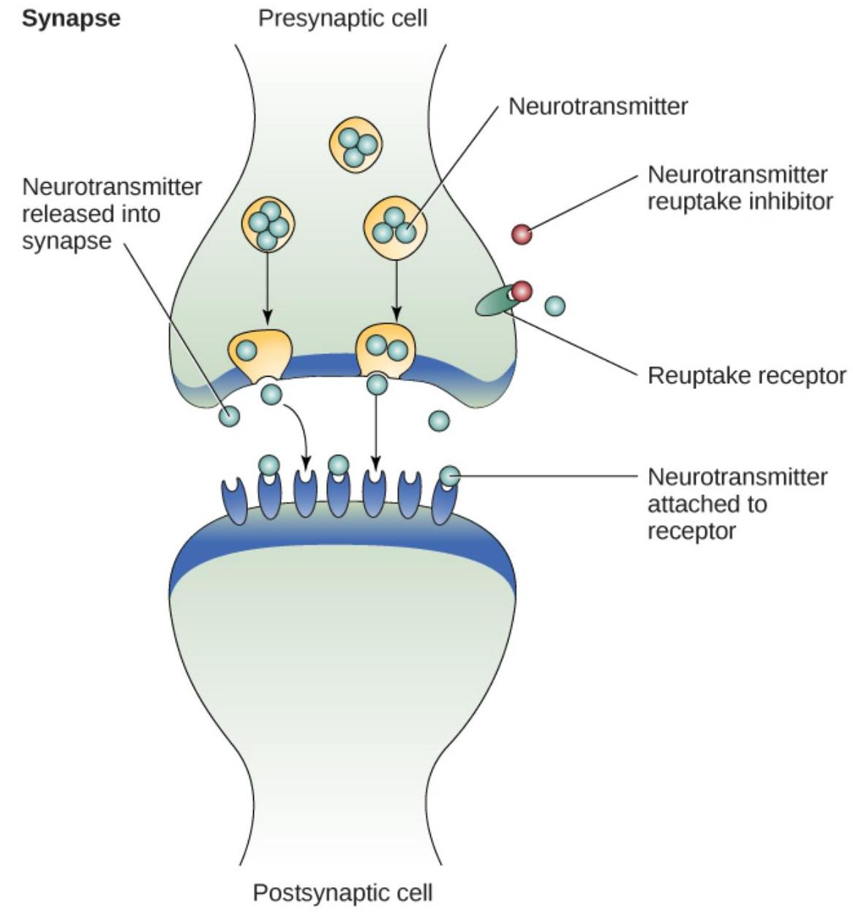

Figure PD.15. Medications for mood disorders. Many medications designed to treat mood disorders work by altering neurotransmitter activity in the neural synapse.

Depression is linked to abnormal activity in several regions of the brain (Fitzgerald, Laird, Maller, \& Daskalakis, 2008) including those important in assessing the emotional significance of stimuli and experiencing emotions (amygdala), and in regulating and controlling emotions (like the prefrontal cortex) (LeMoult, Castonguay, Joormann, \& McAleavey, 2013). Depressed individuals show elevated amygdala activity (Drevets, Bogers, \& Raichle, 2002), especially when presented with negative emotional stimuli, such as photos of sad faces (Figure PD.14) (Surguladze et al., 2005). Interestingly, heightened amygdala activation in response to negative emotional stimuli occurs among depressed persons even when stimuli are presented outside of consciousawareness (Victor, Furey, Fromm, Öhman, \& Drevets, 2010). This heightened condition persists even after the negative emotional stimuli are no longer present (Siegle, Thompson, Carter, Steinhauer, \& Thase, 2007).
Additionally, depressed individuals exhibit less activation in the prefrontal cortex, particularly on the left side (Davidson, Pizzagalli, \& Nitschke, 2009). Because the prefrontal cortex can dampen amygdala activation, thereby enabling one to suppress negative emotions (Phan et al., 2005), decreased activation in certain regions of the prefrontal cortex may inhibit its ability to override negative emotions that might then lead to more negative mood states (Davidson et al., 2009). These findings suggest that depressed persons are more prone to react to emotionally negative stimuli yet have greater difficulty controlling these reactions.

Figure PD.16. Negative emotional stimuli. Depressed individuals react to negative emotional stimuli, such as sad faces, with greater amygdala activation than do non-depressed individuals. (credit: Ian Munroe)

Since the 1950s, researchers have noted that depressed individuals have abnormal levels of cortisol, a stress hormone released into the blood by the neuroendocrine system during times of stress (Mackin \& Young, 2004). When cortisol is released, the body initiates a fight-or-flight response in reaction to a threat or danger. Many people with depression show elevated cortisol levels (Holsboer \& Ising, 2010), especially those reporting a history of early life trauma such as the loss of a parent or abuse during childhood (Baes, Tofoli, Martins, \& Juruena, 2012).

Such findings raise the question of whether high cortisol levels are a cause or a consequence of depression. High levels of cortisol are a risk factor for future depression (Halligan, Herbert, Goodyer, \& Murray, 2007). Cortisol activates activity in the amygdala while deactivating activity in the prefrontal cortex (McEwen, 2005); both brain disturbances are connected to depression. Thus, high cortisol levels may have a causal effect on depression, as well as on its brain function abnormalities (van Praag, 2005). Also, because stress results in increased cortisol release(Michaud, Matheson, Kelly, Anisman, 2008), it is equally reasonable to assume that stress may precipitate depression.

# A Diathesis-Stress Model and Major Depressive Disorders 

Indeed, it has long been believed that stressful life events can trigger depression, and research has consistently supported this conclusion (Mazure, 1998). Stressful life events include significant losses, such as death of a loved one, divorce or separation, and serious health and money problems; life events such as these often precede the onset of depressive episodes (Brown \& Harris, 1989). In particular, exit events - instances in which an important person departs (e.g., a death, divorce or separation, or a family member leaving home) - often occur prior to an episode (Paykel, 2003). Exit events are especially likely to trigger depression if these happenings occur in a way that humiliates or devalues the individual. For example, people who experience the breakup of a relationship initiated by the other person develop major depressive disorder at a rate more than twice that of people who experience the death of a loved one (Kendler, Hettema, Butera, Gardner, \& Prescott, 2003).

Likewise, individuals who are exposed to traumatic stress during childhood, such as separation from a parent, family turmoil, or maltreatment (physical or sexual abuse, are at a heightened risk of developing depression at any point in their lives (Kessler, 1997). A recent review of 16 studies involving over 23,000 subjects concluded that those who experience childhood maltreatment are more than twice as likely to develop recurring and persistent depression (Nanni, Uher, \& Danese, 2012).

Of course, not everyone who experiences stressful life events or childhood adversities succumbs to depression; indeed, most do not. Clearly, a diathesis-stress interpretation of major depressive disorder, in which certain predispositions or vulnerability factors influence one's reaction to stress, would seem logical. If so, what might such predispositions be? A study by Caspi and others (2003) suggests that an alteration in a specific gene that regulates serotonin (the 5-HTTLPR gene; study hint - to remember the name of this gene remember: 5 Happy Tiny Turtles Laughing Playfully Race) might be one culprit. These investigators found that people who experienced several stressful life events were significantly more likely to experience episodes of major depression if they carried one or two short versions of this gene than if they carried two long versions. Those who carried one or two short versions of the 5-HTTLPR gene were unlikely to experience an episode, however, if they had experienced few or no stressful life events.Numerous studies have replicated these findings, including studies of people who experienced maltreatment during childhood (Goodman \& Brand, 2009). In a recent investigation conducted in the United Kingdom (Brown \& Harris, 2013) researchers found that childhood maltreatment before age 9 elevated the risk of chronic adult depression (a depression episode lasting for at least 12 months) among those individuals having one (LS) or two (SS) short versions of the 5-HTTLPR gene (Figure PD.17). Childhood maltreatment did not increase the risk for chronic depression for those who have two long (LL) versions of this gene. Thus, genetic vulnerability may be one mechanism through which stress potentially leads to depression.
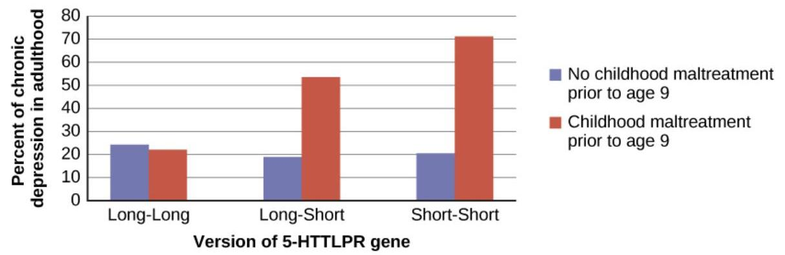

Figure PD.17. Childhood maltreatment and chronic depression. A study of gene-environment interaction in people experiencing chronic depression in adulthood suggests a much higher incidence in individuals with a short version of the gene in combination with childhood maltreatment (Brown \& Harris, 2013).

# Cognitive Theories of Depression 

Cognitive theories of depression take the view that depression is triggered by negative thoughts, interpretations, self-evaluations, and expectations (Joormann, 2009). These diathesisstress models propose that depression is triggered by a "cognitive vulnerability" (negative and maladaptive thinking) and by precipitating stressful life events (Gotlib \& Joormann, 2010). Perhaps the most well-known cognitive theory of depression was developed in the 1960s by psychiatrist Aaron Beck, based on clinical observations and supported by research (Beck, 2008). Beck theorised that depression-prone people possess depressive schemas, or mental predispositions to think about most things in a negative way (Beck, 1976). Depressive schemas contain themes of loss, failure, rejection, worthlessness and inadequacy, and may develop early in childhood in response to adverse experiences, then remain dormant until they are activated by stressful or negative life events.

Depressive schemas prompt dysfunctional and pessimistic thoughts about the self, the world, and the future. Beck believed that this dysfunctional style of thinking is maintained by cognitive biases, or errors in how we process information about ourselves, which lead us to focus onnegative aspects of experiences, interpret things negatively, and block positive memories (Beck, 2008). A person whose depressive schema consists of a theme of rejection might be overly attentive to social cues of rejection (more likely to notice another's frown), and he might interpret this cue as a sign of rejection and automatically remember past incidents of rejection. Longitudinal studies have supported Beck's theory in showing that a preexisting tendency to engage in this negative, self-defeating style of thinking, when combined with life stress, over time predicts the onset of depression (Dozois \& Beck, 2008). Cognitive therapies for depression, aimed at changing a depressed person's negative thinking, were developed as an expansion of this theory (Beck, 1976).

Another cognitive theory of depression, hopelessness theory, postulates that a particular style of negative thinking leads to a sense of hopelessness, which then leads to depression (Abramson, Metalsky, \& Alloy, 1989). According to this theory, hopelessness is an expectation that unpleasant outcomes will occur or that desired outcomes will not occur, and there is nothing one can do to prevent such outcomes. A key assumption of this theory is that hopelessness stems from a tendency to perceive negative life events as having stable ("It's never going to change") and global ("It's going to affect my whole life") causes, in contrast to unstable ("It's fixable") and specific ("It applies only to this particular situation") causes, especially if these negative life events occur in important life realms, such as relationships, academic achievement, and the like.

Suppose a student who wishes to go to law school does poorly on an admissions test. If the student infers negative life events as having stable and global causes, they may believe that their poor performance has a stable and global cause ("I lack intelligence, and it's going to prevent me from ever finding a meaningful career") as opposed to an unstable and specific cause ("I was sick the day of the exam, so my low score was a fluke").

Hopelessness theory predicts that people who exhibit this cognitive style in response to undesirable life events will view such events as having negative implications for their future and self-worth, thereby increasing the likelihood of hopelessness - the primary cause of depression (Abramson et al., 1989). One study testing hopelessness theory measured the tendency to draw negative inferences for bad life effects in participants who were experiencing uncontrollable stressors. Over the ensuing six months, those with scores reflecting high cognitive vulnerability were 7 times more likely to develop depression compared to those with lower scores (Kleim, Gonzalo, \& Ehlers, 2011).

A third cognitive theory of depression focuses on how people's thoughts about their distressed moods - depressed symptoms in particular - can increase the risk and duration of depression. This theory, which focuses on rumination in the development of depression, was first described in the late 1980s to explain the higher rates of depression in women than in men (NolenHoeksema, 1987). Rumination is the repetitive and passive focus on the fact that one isdepressed and dwelling on depressed symptoms, rather than distracting oneself from the symptoms or attempting to address them in an active, problem-solving manner (NolenHoeksema, 1991). When people ruminate, they have thoughts such as "Why am I so unmotivated? I just can't get going. I'm never going to get my work done feeling this way" (Nolen-Hoeksema \& Hilt, 2009, p. 393). Women are more likely than men to ruminate when they are sad or depressed (Butler \& Nolen-Hoeksema, 1994), and the tendency to ruminate is associated with increases in depression symptoms (Nolen-Hoeksema, Larson, \& Grayson, 1999), heightened risk of major depressive episodes (Abela \& Hankin, 2011), and chronicity of such episodes (Robinson \& Alloy, 2003).

# Image Attributions 

Figure PD.14. Figure 15.15 as found in Psychology 2e by OpenStax is licensed under a CC BY 4.0 License.

Figure PD.15. Figure 15.16 as found in Psychology 2e by OpenStax is licensed under a CC BY 4.0 License.

Figure PD.16. Figure 15.17 as found in Psychology 2e by OpenStax is licensed under a CC BY 4.0 License.

Figure PD.17. Figure 15.18 as found in Psychology 2e by OpenStax is licensed under a CC BY 4.0 License.

## (0)

Mood Disorders Copyright © 2024 by Leanne Stevens; Jennifer Stamp; Kevin LeBlanc (editors - original chapter); and Jessica Motherwell McFarlane (editor - adapted chapter) is licensed under a Creative Commons Attribution 4.0 International License, except where otherwise noted.1066 | Chapter 18. Psychological Disorders# Anxiety Disorders 

## LEANNE STEVENS; JENNIFER STAMP; KEVIN LEBLANC (EDITORS - ORIGINAL CHAPTER); AND JESSICA MOTHERWELL MCFARLANE (EDITOR - ADAPTED CHAPTER)

Approximate reading time: 23 minutes
Everybody experiences anxiety from time to time. Although anxiety is closely related to fear, the two states possess important differences. Fear involves an instantaneous reaction to an imminent threat, whereas anxiety involves apprehension, avoidance, and cautiousness regarding a potential threat, danger, or other negative event (Craske, 1999). While anxiety is unpleasant to most people, it is important to our health, safety, and well-being.

Anxiety motivates us to take actions - such as preparing for exams, checking that we have turned off the stove, showing up to work on time - that enable us to avert potential future problems. Anxiety also motivates us to avoid certain things - such as running up debts and engaging in illegal activities - that could lead to future trouble. Most individuals' level and duration of anxiety approximates the magnitude of the potential threat they face. Some people experience anxiety that is excessive, persistent, and greatly out of proportion to the actual threat; if one's anxiety has a disruptive influence on one's life, this is a strong indicator that the individual is experiencing an anxiety disorder.

Anxiety disorders are characterised by excessive and persistent fear and anxiety, and by related disturbances in behaviour (APA, 2013). Although anxiety is universally experienced, anxiety disorders cause considerable distress. As a group, anxiety disorders are common: approximately $25 \%-30 \%$ of the US population meets the criteria for at least one anxiety disorder during their lifetime (Kessler et al., 2005). Also, these disorders appear to be much more common in women than they are in men; within a 12-month period, around $23 \%$ of women and $14 \%$ of men will experience at least one anxiety disorder (National Comorbidity Survey, 2007). Anxiety disorders are the most frequently occurring class of mental disorders and are often comorbid with each other (happen at the same time) and with other mental disorders (Kessler, Ruscio, Shear, \& Wittchen, 2009).

## Specific Phobia

Phobia is a Greek word that means fear. A person diagnosed with a specific phobia (formerlyknown as simple phobia) experiences excessive, distressing, and persistent fear or anxiety about a specific object or situation (such as animals, enclosed spaces, elevators, or flying) (APA, 2013). Even though people realise that their level of fear and anxiety in relation to the phobic stimulus is irrational, some people with a specific phobia may go to great lengths to avoid the phobic stimulus (the object or situation that triggers the fear and anxiety). Typically, the fear and anxiety a phobic stimulus elicits is disruptive to the person's life. For example, a man with a phobia of flying might refuse to accept a job that requires frequent air travel, thus negatively affecting his career. Clinicians who have worked with people who have specific phobias have encountered many kinds of phobias, some of which are shown in Table PD.1.

Table PD. 1 Specific Phobias

| Phobia | Feared Object or Situation |
| :-- | :-- |
| Acrophobia | heights |
| Aerophobia | flying |
| Arachnophobia | spiders |
| Claustrophobia | enclosed spaces |
| Cynophobia | dogs |
| Glossophobia | public speaking |
| Hematophobia | blood |
| Ophidiophobia | snakes |
| Taphophobia | being buried alive |
| Trypanophobia | injections |

Specific phobias are common; in the United States, around 12.5\% of the population will meet the criteria for a specific phobia at some point in their lifetime (Kessler et al., 2005). One type of phobia, agoraphobia, is listed in the DSM-5 as a separate anxiety disorder. Agoraphobia, which literally means "fear of the marketplace", is characterised by intense fear, anxiety, and avoidance of situations in which it might be difficult to escape or receive help if one experiences symptoms of a panic attack (a state of extreme anxiety that we will discuss shortly). These situations include public transportation, open spaces (parking lots), enclosed spaces (stores), crowds, or being outside the home alone (APA, 2013). About 1.4\% of Americans experience agoraphobia during their lifetime (Kessler et al., 2005).# Acquisition of Phobias Through Learning 

Many theories suggest that phobias develop through learning. Rachman (1977) proposed that phobias can be acquired through three major learning pathways. The first pathway is through classical conditioning. As you may recall, classical conditioning is a form of learning in which a previously neutral stimulus is paired with an unconditioned stimulus (UCS) that reflexively elicits an unconditioned response (UCR), eliciting the same response through its association with the unconditioned stimulus. The response is called a conditioned response (CR). For example, a child who has been bitten by a dog may come to fear dogs because of a past association with pain. In this case, the dog bite is the UCS and the fear it elicits is the UCR. Because a dog was associated with the bite, any dog may come to serve as a conditioned stimulus, thereby eliciting fear; the fear the child experiences around dogs, then, becomes a CR.

The second pathway of phobia acquisition is through vicarious learning, such as modelling. For example, a child who observes his cousin react fearfully to spiders may later express the same fears, even though spiders have never presented any danger to him. This phenomenon has been observed in both humans and nonhuman primates (Olsson \& Phelps, 2007). A study of laboratory-reared monkeys readily acquired a fear of snakes after observing wild-reared monkeys react fearfully to snakes (Mineka \& Cook, 1993).

The third pathway is through verbal transmission or information. For example, a child whose parents, siblings, friends, and classmates constantly tell her how disgusting and dangerous snakes are may come to acquire a fear of snakes.

Interestingly, people are more likely to develop phobias of things that do not represent much actual danger to themselves, such as animals and heights, and are less likely to develop phobias toward things that present legitimate danger in contemporary society, such as motorcycles and weapons (Öhman \& Mineka, 2001). Why might this be so? One theory suggests that the human brain is evolutionarily predisposed to more readily associate certain objects or situations with fear (Seligman, 1971). This theory argues that throughout our evolutionary history, our ancestors associated certain stimuli (e.g., snakes, spiders, heights, and thunder) with potential danger. Over time, the mind has become more vulnerable to developing fears of these things than of others.

Experimental evidence has consistently demonstrated that conditioned fears develop more readily to fear-relevant stimuli (images of snakes and spiders) than to fear-irrelevant stimuli (images of flowers and berries) (Öhman \& Mineka, 2001). Such prepared learning has also been shown to occur in monkeys. In one study (Cook \& Mineka, 1989), monkeys watched videotapes of model monkeys reacting fearfully to either fear-relevant stimuli (toy snakes or a toy crocodile)or fear-irrelevant stimuli (flowers or a toy rabbit). The observer monkeys developed fears of the fear-relevant stimuli but not the fear-irrelevant stimuli.

# Social Anxiety Disorder 

Social anxiety disorder (formerly called social phobia) is characterised by extreme and persistent fear or anxiety and avoidance of social situations in which the person could potentially be evaluated negatively by others (APA, 2013). As with specific phobias, social anxiety disorder is common in the United States; a little over 12\% of all Americans experience social anxiety disorder during their lifetime (Kessler et al., 2005).

The heart of the fear and anxiety in social anxiety disorder is the person's concern that he may act in a humiliating or embarrassing way, such as appearing foolish, showing symptoms of anxiety (blushing), or doing or saying something that might lead to rejection (such as offending others). The kinds of social situations in which individuals with social anxiety disorder usually have problems include public speaking, having a conversation, meeting strangers, eating in restaurants, and, in some cases, using public restrooms.

Although many people become anxious in social situations like public speaking, the fear, anxiety, and avoidance experienced in social anxiety disorder are highly distressing and lead to serious impairments in life. Adults with this disorder are more likely to experience lower educational attainment and lower earnings (Katzelnick et al., 2001), perform more poorly at work and are more likely to be unemployed (Moitra, Beard, Weisberg, \& Keller, 2011), and report greater dissatisfaction with their family lives, friends, leisure activities, and income (Stein \& Kean, 2000).

When people with social anxiety disorder are unable to avoid situations that provoke anxiety, they typically perform safety behaviours: mental or behavioural acts that reduce anxiety in social situations by reducing the chance of negative social outcomes. Safety behaviours include avoiding eye contact, rehearsing sentences before speaking, talking only briefly, and not talking about oneself (Alden \& Bieling, 1998). Other examples of safety behaviours include the following (Marker, 2013):

- assuming roles in social situations that minimise interaction with others (e.g., taking pictures, setting up equipment, or helping prepare food);
- asking people many questions to keep the focus off oneself;
- selecting a position to avoid scrutiny or contact with others (sitting in the back of the room);
- wearing bland, neutral clothes to avoid drawing attention to oneself; and- avoiding substances or activities that might cause anxiety symptoms (such as caffeine, warm clothing, and physical exercise).

Although these behaviours are intended to prevent the person with social anxiety disorder from doing something awkward that might draw criticism, these actions usually exacerbate the problem because they do not allow the individual to disconfirm his negative beliefs, often eliciting rejection and other negative reactions from others (Alden \& Bieling, 1998).

People with social anxiety disorder may resort to self-medication, such as drinking alcohol, as a means to avert the anxiety symptoms they experience in social situations (Battista \& Kocovski, 2010). The use of alcohol when faced with such situations may become negatively reinforcing, encouraging individuals with social anxiety disorder to turn to the substance whenever they experience anxiety symptoms. The tendency to use alcohol as a coping mechanism for social anxiety can come with a hefty price tag; a number of large-scale studies have reported a high rate of comorbidity between social anxiety disorder and alcohol use disorder (Morris, Stewart, \& Ham, 2005).

As with specific phobias, it is highly probable that the fears inherent to social anxiety disorder can develop through conditioning experiences. For example, a child who is subjected to early unpleasant social experiences (e.g., bullying at school) may develop negative social images of herself that become activated later in anxiety-provoking situations (Hackmann, Clark, \& McManus, 2000). Indeed, one study reported that $92 \%$ of a sample of adults with social anxiety disorder reported a history of severe teasing in childhood, compared to only $35 \%$ of a sample of adults with panic disorder (McCabe, Antony, Summerfeldt, Liss, \& Swinson, 2003).

One of the most well-established risk factors for developing social anxiety disorder is behavioural inhibition (Clauss \& Blackford, 2012). Behavioural inhibition is thought to be an inherited trait, characterised by a consistent tendency to show fear and restraint when presented with unfamiliar people or situations (Kagan, Reznick, \& Snidman, 1988). Behavioural inhibition is displayed very early in life; behaviourally inhibited toddlers and children respond with great caution and restraint in unfamiliar situations, and are often timid, fearful and shy around unfamiliar people (Fox, Henderson, Marshall, Nichols, \& Ghera, 2005). A recent statistical review of studies demonstrated that behavioural inhibition was associated with more than a sevenfold increase in the risk of developing social anxiety disorder, demonstrating that behavioural inhibition is a major risk factor for the disorder (Clauss \& Blackford, 2012).# Panic Disorder 

Imagine that you are at the mall one day with your friends and - suddenly and inexplicably you begin sweating and trembling, your heart starts pounding, you have trouble breathing, and you start to feel dizzy and nauseous. This episode lasts for 10 minutes and is terrifying because you start to think that you are going to die. When you visit your doctor the following morning and describe what happened, the doctor tells you that you have experienced a panic attack (Figure PD.18). If you experience another one of these episodes two weeks later and worry for a month or more that similar episodes will occur in the future, it is likely that you have developed panic disorder.
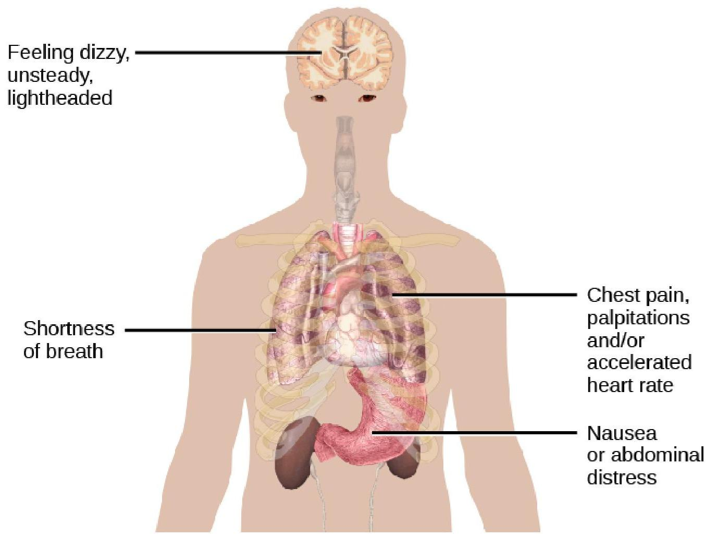

Figure PD.18. Panic attacks. Some of the physical manifestations of a panic attack are shown. People may also experience sweating, trembling, feelings of faintness, or a fear of losing control, among other symptoms.

People with panic disorder experience recurrent (more than one) and unexpected panic attacks, along with at least one month of persistent concern about additional panic attacks, worry overthe consequences of the attacks, or self-defeating changes in behaviour related to the attacks (e.g., avoidance of exercise or unfamiliar situations) (APA, 2013). As is the case with other anxiety disorders, the panic attacks cannot result from the physiological effects of drugs and other substances, a medical condition, or another mental disorder.

A panic attack is defined as a period of extreme fear or discomfort that develops abruptly and reaches a peak within 10 minutes. Its symptoms include accelerated heart rate, sweating, trembling, choking sensations, hot flashes or chills, dizziness or lightheadedness, fears of losing control or going crazy, and fears of dying (APA, 2013). Sometimes panic attacks are expected, occurring in response to specific environmental triggers (such as being in a tunnel); other times, these episodes are unexpected and emerge randomly (such as when relaxing). According to the DSM-5, the person must experience unexpected panic attacks to qualify for a diagnosis of panic disorder.

Experiencing a panic attack is often terrifying. Rather than recognising the symptoms of a panic attack merely as signs of intense anxiety, individuals with panic disorder often misinterpret them as a sign that something is intensely wrong internally (thinking, for example, that the pounding heart represents an impending heart attack). Panic attacks can occasionally precipitate trips to the emergency room because several symptoms of panic attacks are, in fact, similar to those associated with heart problems (e.g., palpitations, racing pulse, and a pounding sensation in the chest) (Root, 2000). Unsurprisingly, those with panic disorder fear future attacks and may become preoccupied with modifying their behaviour in an effort to avoid future panic attacks. For this reason, panic disorder is often characterised as fear of fear (Goldstein \& Chambless, 1978).

Panic attacks themselves are not mental disorders. Indeed, around 23\% of Americans experience isolated panic attacks in their lives without meeting the criteria for panic disorder (Kessler et al., 2006), indicating that panic attacks are fairly common. Panic disorder is, of course, much less common, afflicting 4.7\% of Americans during their lifetime (Kessler et al., 2005). Many people with panic disorder develop agoraphobia, which is marked by fear and avoidance of situations in which escape might be difficult or help might not be available if one were to develop symptoms of a panic attack. People with panic disorder often experience a comorbid disorder, such as other anxiety disorders or major depressive disorder (APA, 2013).

Researchers are not entirely sure what causes panic disorder. Children are at a higher risk of developing panic disorder if their parents have the disorder (Biederman et al., 2001), and family and twins studies indicate that the heritability of panic disorder is around 43\% (Hettema, Neale, \& Kendler, 2001). The exact genes and gene functions involved in this disorder, however, are not well-understood (APA, 2013). Neurobiological theories of panic disorder suggest that a region of the brain called the locus coeruleus may play a role in this disorder. Located in the brainstem, the locus coeruleus is the brain's major source of norepinephrine, a neurotransmitter thattriggers the body's fight-or-flight response. Activation of the locus coeruleus is associated with anxiety and fear, and research with nonhuman primates has shown that stimulating the locus coeruleus either electrically or through drugs produces panic-like symptoms (Charney et al., 1990). Such findings have led to the theory that panic disorder may be caused by abnormal norepinephrine activity in the locus coeruleus (Bremner, Krystal, Southwick, \& Charney, 1996).

Conditioning theories of panic disorder propose that panic attacks are classical conditioning responses to subtle bodily sensations resembling those normally occurring when one is anxious or frightened (Bouton, Mineka, \& Barlow, 2001). For example, consider a child who has asthma. An acute asthma attack produces sensations, such as shortness of breath, coughing, and chest tightness, that typically elicit fear and anxiety. Later, when the child experiences subtle symptoms that resemble the frightening symptoms of earlier asthma attacks (such as shortness of breath after climbing stairs), they may become anxious, fearful, and then experience a panic attack. In this situation, the subtle symptoms would represent a conditioned stimulus, and the panic attack would be a conditioned response. The finding that panic disorder is nearly three times as frequent among people with asthma as it is among people without asthma (Weiser, 2007) supports the possibility that panic disorder has the potential to develop through classical conditioning.

Cognitive factors may play an integral part in panic disorder. Generally, cognitive theories (Clark, 1996) argue that those with panic disorder are prone to interpret ordinary bodily sensations catastrophically, and these fearful interpretations set the stage for panic attacks. For example, a person might detect bodily changes that are routinely triggered by innocuous events such getting up from a seated position (dizziness), exercising (increased heart rate, shortness of breath), or drinking a large cup of coffee (increased heart rate, trembling). The individual interprets these subtle bodily changes catastrophically ("Maybe I'm having a heart attack!"). Such interpretations create fear and anxiety, which trigger additional physical symptoms; subsequently, the person experiences a panic attack. Support of this contention rests with findings that people with more severe catastrophic thoughts about sensations have more frequent and severe panic attacks, and among those with panic disorder, reducing catastrophic cognitions about their sensations is as effective as medication in reducing panic attacks (Good \& Hinton, 2009).

# Generalised Anxiety Disorder 

Alex has always worried about many things. He worries that his children would drown when they played at the beach. Each time Alex leaves the house, he worries that an electrical shortcircuit would start a fire in their home. He worried that his life-partner Reese would lose their job at the prestigious law firm. He worried that their child's minor staph infection could turn into a massive life-threatening condition. These and other worries constantly weighed heavily on Alex's mind, so much so that they made it difficult for Alex to make decisions and often left him feeling tense, irritable and worn out. One night, Reese was scheduled to drive their child home from a soccer game. However, Reese stayed after the game and talked with some of the other parents, resulting in Reese arriving home 45 minutes late. Alex had tried to call Reese's cell phone three or four times, but they could not get through because the soccer field did not have a signal. Extremely worried, Alex eventually called the police, convinced that Reese and their child had not arrived home because they had been in a terrible car accident.

Alex suffers from generalised anxiety disorder, a relatively continuous state of excessive, uncontrollable, and pointless worry and apprehension. People with generalised anxiety disorder often worry about routine, everyday things, even though their concerns are unjustified (Figure PD.17). For example, an individual may worry about her health and finances, the health of family members, the safety of her children, or minor matters (e.g., being late for an appointment) without having any legitimate reason for doing so (APA, 2013). A diagnosis of generalised anxiety disorder requires that the diffuse worrying and apprehension characteristic of this disorder - what Sigmund Freud referred to as free-floating anxiety - is not part of another disorder, occurs more days than not for at least six months, and is accompanied by any three of the following symptoms: restlessness, difficulty concentrating, being easily fatigued, muscle tension, irritability, and sleep difficulties.

Figure PD.19. Worry. Worry is a defining feature of generalised anxiety disorder. (credit: Freddie Peña)

About $5.7 \%$ of the US population will develop symptoms of generalised anxiety disorder during their lifetime (Kessler et al., 2005); females are twice as likely as males to experience the disorder(APA, 2013). Generalised anxiety disorder is highly comorbid with mood disorders and other anxiety disorders (Noyes, 2001), and tends to be chronic. Also, generalised anxiety disorder appears to increase the risk for heart attacks and strokes, especially in people with preexisting heart conditions (Martens et al., 2010).

Although there have been few investigations aimed at determining the heritability of generalised anxiety disorder, a summary of available family and twin studies suggests that genetic factors play a modest role in the disorder (Hettema et al., 2001). Cognitive theories of generalised anxiety disorder suggest that worry represents a mental strategy to avoid more powerful negative emotions (Aikins \& Craske, 2001), perhaps stemming from earlier unpleasant or traumatic experiences. Indeed, one longitudinal study found that childhood maltreatment was strongly related to the development of this disorder during adulthood (Moffitt et al., 2007); worrying might distract people from remembering painful childhood experiences.

# Image Attributions 

Figure PD.18. Figure 15.9 as found in Psychology 2e by OpenStax is licensed under a CC BY 4.0 License.

Figure PD.19. Figure 15.10 as found in Psychology 2e by OpenStax is licensed under a CC BY 4.0 License.

## (0)

Anxiety Disorders Copyright © 2024 by Leanne Stevens; Jennifer Stamp; Kevin LeBlanc (editors - original chapter); and Jessica Motherwell McFarlane (editor - adapted chapter) is licensed under a Creative Commons Attribution 4.0 International License, except where otherwise noted.# Obsessive-Compulsive Related Disorders 

LEANNE STEVENS; JENNIFER STAMP; KEVIN LEBLANC (EDITORS - ORIGINAL CHAPTER); AND JESSICA MOTHERWELL MCFARLANE (EDITOR - ADAPTED CHAPTER)

Approximate reading time: 10 minutes
Obsessive-compulsive and related disorders are a group of overlapping disorders that generally involve intrusive, unpleasant thoughts and repetitive behaviours. Many of us experience unwanted thoughts from time to time (e.g., craving double cheeseburgers when dieting), and many of us engage in repetitive behaviours on occasion (e.g., pacing when nervous). However, obsessive-compulsive and related disorders elevate the unwanted thoughts and repetitive behaviours to a status so intense that these cognitions and activities disrupt daily life. Included in this category are obsessive-compulsive disorder (OCD), body dysmorphic disorder, and hoarding disorder.

## Obsessive-Compulsive Disorder

People with obsessive-compulsive disorder (OCD) experience thoughts and urges that are intrusive and unwanted (obsessions) and/or the need to engage in repetitive behaviours or mental acts (compulsions). A person with this disorder might, for example, spend hours each day washing their hands or constantly checking and rechecking to make sure that a stove, faucet, or light has been turned off.

Obsessions are more than just unwanted thoughts that seem to randomly jump into our head from time to time, such as recalling an insensitive remark a coworker made recently, and they are more significant than day-to-day worries we might have, such as justifiable concerns about being laid off from a job. Rather, obsessions are characterised as persistent, unintentional, and unwanted thoughts and urges that are highly intrusive, unpleasant, and distressing (APA, 2013). Common obsessions include concerns about germs and contamination, doubts ("Did I turn the water off?"), order and symmetry ("I need all the spoons in the tray to be arranged a certain way") and urges that are aggressive or lustful. Usually, the person knows that such thoughts and urges are irrational and thus tries to suppress or ignore them but has an extremely difficult timedoing so. These obsessive symptoms sometimes overlap, such that someone might have both contamination and aggressive obsessions (Abramowitz \& Siqueland, 2013).

Compulsions are repetitive and ritualistic acts that are typically carried out primarily as a means to minimise the distress that obsessions trigger or to reduce the likelihood of a feared event (APA, 2013). Compulsions often include such behaviours as repeated and extensive hand washing, cleaning, checking (e.g., that a door is locked), and ordering (e.g., lining up all the pencils in a particular way), and they also include such mental acts as counting, praying or reciting something to oneself. Compulsions characteristic of OCD are not performed out of pleasure, nor are they connected in a realistic way to the source of the distress or feared event. Approximately 2.3\% of the US population will experience OCD in their lifetime (Ruscio, Stein, Chiu, \& Kessler, 2010). If left untreated, OCD tends to be a chronic condition creating lifelong interpersonal and psychological problems (Norberg, Calamari, Cohen, \& Riemann, 2008).

# Body Dysmorphic Disorder 

An individual with body dysmorphic disorder is preoccupied with a perceived flaw in physical appearance that is either nonexistent or barely noticeable to other people (APA, 2013). These perceived physical defects cause people to think they are unattractive, ugly, hideous or deformed. These preoccupations can focus on any bodily area, but they typically involve the skin, face or hair. The preoccupation with imagined physical flaws drives the person to engage in repetitive and ritualistic behavioural and mental acts, such as constantly looking in the mirror, trying to hide the offending body part, comparisons with others, and, in some extreme cases, cosmetic surgery (Phillips, 2005). An estimated 2.4\% of the adults in the United States meet the criteria for body dysmorphic disorder, with slightly higher rates in women than in men (APA, 2013).

## Hoarding Disorder

Although hoarding was traditionally considered to be a symptom of OCD, considerable evidence suggests that hoarding represents an entirely different disorder (Mataix-Cols et al., 2010). People with hoarding disorder cannot bear to part with personal possessions, regardless of how valueless or useless these possessions are. As a result, these individuals accumulate excessive amounts of usually worthless items that clutter their living areas (Figure PD.20). Often, thequantity of cluttered items is so excessive that the person is unable use their kitchen, or sleep in their bed. People who suffer from this disorder have great difficulty parting with items because they believe the items might be of some later use, or because they form a sentimental attachment to the items (APA, 2013). Importantly, a diagnosis of hoarding disorder is made only if the hoarding is not caused by another medical condition and if the hoarding is not a symptom of another disorder (e.g., schizophrenia) (APA, 2013).

Figure PD.20. Hoarding. Those who suffer from hoarding disorder have great difficulty in discarding possessions, usually resulting in an accumulation of items that clutter living or work areas. (credit: "puuikibeach"/Flickr)

# Causes of OCD 

The results of family and twin studies suggest that OCD has a moderate genetic component. The disorder is five times more frequent in the first-degree relatives of people with OCD than in people without the disorder (Nestadt et al., 2000). Additionally, the concordance rate of OCD among identical twins is around 57\%; however, the concordance rate for fraternal twins is 22\% (Bolton, Rijsdijk, O'Connor, Perrin, \& Eley, 2007). Studies have implicated about two dozen potential genes that may be involved in OCD; these genes regulate the function of three neurotransmitters: serotonin, dopamine, and glutamate (Pauls, 2010). Many of these studies included small sample sizes and have yet to be replicated. Thus, additional research needs to be done in this area.

A brain region that is believed to play a critical role in OCD is the orbitofrontal cortex (Kopell \& Greenberg, 2008), an area of the frontal lobe involved in learning and decision-making (Rushworth, Noonan, Boorman, Walton, \& Behrens, 2011) (Figure PD.21). In people with OCD, the orbitofrontal cortex becomes especially hyperactive when they are provoked with tasks inwhich, for example, they are asked to look at a photo of a toilet or of pictures hanging crookedly on a wall (Simon, Kaufmann, Müsch, Kischkel, \& Kathmann, 2010). The orbitofrontal cortex is part of a series of brain regions that, collectively, is called the OCD circuit; this circuit consists of several interconnected regions that influence the perceived emotional value of stimuli and the selection of both behavioural and cognitive responses (Graybiel \& Rauch, 2000). As with the orbitofrontal cortex, other regions of the OCD circuit show heightened activity during symptom provocation (Rotge et al., 2008), which suggests that abnormalities in these regions may produce the symptoms of OCD (Saxena, Bota, \& Brody, 2001). Consistent with this explanation, people with OCD show a substantially higher degree of connectivity of the orbitofrontal cortex and other regions of the OCD circuit than do those without OCD (Beucke et al., 2013).
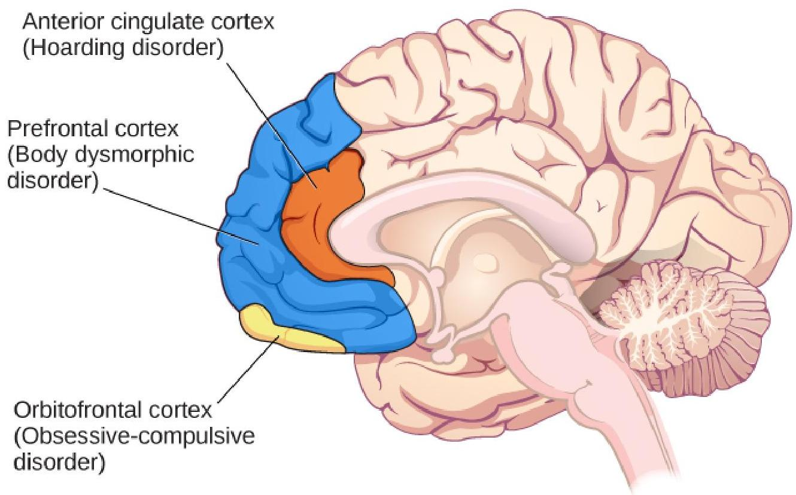

Figure PD.21. The brain and psychological disorders. Different regions of the brain may be associated with different psychological disorders.

The findings discussed above were based on imaging studies, and they highlight the potential importance of brain dysfunction in OCD. However, one important limitation of these findings is the inability to explain differences in obsessions and compulsions. Another limitation is that thecorrelational relationship between neurological abnormalities and OCD symptoms cannot imply causation (Abramowitz \& Siqueland, 2013).

What do you think?

# Conditioning and OCD 

The symptoms of OCD have been theorised to be learned responses, acquired and sustained as the result of a combination of two forms of learning: classical conditioning and operant conditioning (Mowrer, 1960; Steinmetz, Tracy, \& Green, 2001). Specifically, the acquisition of OCD may occur first as the result of classical conditioning, whereby a neutral stimulus becomes associated with an unconditioned stimulus that provokes anxiety or distress. When an individual has acquired this association, subsequent encounters with the neutral stimulus trigger anxiety, including obsessive thoughts; the anxiety and obsessive thoughts (which are now a conditioned response) may persist until they identify some strategy to relieve it. Relief may take the form of a ritualistic behaviour or mental activity that, when enacted repeatedly, reduces the anxiety. Such efforts to relieve anxiety constitute an example of negative reinforcement (a form of operant conditioning). Recall from the chapter on learning that negative reinforcement involves the strengthening of behaviour through its ability to remove something unpleasant or aversive. Hence, compulsive acts observed in OCD may be sustained because they are negatively reinforcing, in the sense that they reduce anxiety triggered by a conditioned stimulus.

Suppose an individual with OCD experiences obsessive thoughts about germs, contamination, and disease whenever she encounters a doorknob. What might have constituted a viable unconditioned stimulus? Also, what would constitute the conditioned stimulus, unconditioned response, and conditioned response? What kinds of compulsive behaviours might we expect, and how do they reinforce themselves? What is decreased? Additionally, and from the standpoint of learning theory, how might the symptoms of OCD be treated successfully?

## Image Attributions

Figure PD.20. Figure 15.12 as found in Psychology 2e by OpenStax is licensed under a CC BY 4.0 License.

Figure PD.21. Figure 15.13 as found in Psychology 2e by OpenStax is licensed under a CC BY 4.0 License.Obsessive-Compulsive Related Disorders Copyright © 2024 by Leanne Stevens; Jennifer Stamp; Kevin LeBlanc (editors - original chapter); and Jessica Motherwell McFarlane (editor - adapted chapter) is licensed under a Creative Commons Attribution 4.0 International License, except where otherwise noted.# Post-Traumatic Stress Disorder 

LEANNE STEVENS; JENNIFER STAMP; KEVIN LEBLANC (EDITORS - ORIGINAL CHAPTER); AND JESSICA MOTHERWELL MCFARLANE (EDITOR - ADAPTED CHAPTER)

Approximate reading time: 15 minutes

Content Disclosure: In the following section, we will discuss Post-Traumatic Stress Disorder (PTSD), a term used to describe a set of fear and arousal-related symptoms tied to a specific traumatic event or events. In approaching this content, we acknowledge that some readers may have personal experience with these kinds of trauma, and may be negatively affected by this material.

If you, or someone you know, is dealing with PTSD, supports are available through Wellness Canada that may be helpful.

Originally, Post-Traumatic Stress Disorder (PTSD) was identified in the military after combat exposure and was referred to as shell shockor combat neurosis, and was mainly diagnosed in male combat veterans. In Waiting for First Light, Canadian General Romeo Dallaire shares his continuing struggles with PTSD after witnessing atrocities during the genocide in Rwanda in 1993-94. As head of the United Nations peacekeeping force, his experience left a lasting impact on his mental health and led to his medical dismissal from the military several years later. He has devoted his life to mental health advocacy for veterans and fighting exploitation of child soldiers through the Dallaire Institute for Children, Peace, and Security at Dalhousie University. Although long recognised as a significant mental health concern, there is stigma surrounding PTSD in this population and effective treatments still remain inaccessible to many that need them.

The kinds of traumas that cause these symptoms vary widely and have the ability to affect anyone. It wasn't until the late 1970s that the broader medical community acknowledged that the same set of symptoms could be seen in people who experienced sexual assault, so the more general term post-traumatic stress disorder was developed to include other kinds of psychological trauma (Herman, 1997).# A Broader Definition of PTSD 

According to the DSM-5, PTSD is diagnosed when an individual who has had a traumatic experience develops a set of fear- and arousal-related symptoms that last at least a month. The individual may have been present for the traumatic event as a victim or a witness, or they may have secondhand exposure to the event from someone who was present.

The symptoms of PTSD fall into four categories: intrusion, avoidance, negative alterations in cognition and mood, and alterations in arousal and reactivity.

- Intrusion symptoms occur when the traumatic event is re-experienced through memories, nightmares, flashbacks and emotional or physical reactivity after exposure to stimuli associated with the trauma. Flashbacks occur when the individual relives the event as if it is currently happening; they can last from a few seconds to several days (APA, 2013a).
- Avoidance occurs when the individual avoids stimuli or thoughts and feelings associated with the trauma.
- Alterations in cognitions and mood involve pervasive negative mood, feelings of isolation, extreme negative beliefs about the self or the world, and problems with memory often specific to trauma-related memories.
- Alterations in arousal and reactivity include irritability or aggression, increased risk-taking, hyper-vigilance, jumpiness, and difficulty with concentration or sleep (APA, 2013a).

Complex PTSD (C-PTSD) is a variant of PTSD included in the 11th revision of the International Classification of Diseases (ICD-11), but it has yet to be included in the DSM. Complex PTSD generally results from prolonged or repeated instances of trauma from which escape is difficult or impossible, like childhood neglect or domestic abuse. Diagnosis of C-PTSD requires the presence of intrusions, avoidance, and alterations in arousal and hyperactivity (three core features of PTSD), as well as extreme emotional dysregulation, persistent interpersonal difficulties, and negative self-concept (ICD-11, 2019).

As a result of these differences, people with C-PTSD may often be misdiagnosed as having Borderline Personality Disorder (BPD). BPD is a mental health condition where a person experiences intense emotions and unstable relationships and struggles with their self-image. They may have difficulty regulating their emotions and may act impulsively. There is a high rate of comorbidity (co-occurrence) between C-PTSD and BPD, however research has supported the validity of C-PTSD as a distinct construct for which different treatment courses are indicated (Cloitre et al, 2014).

Roughly 8\% of adults in Canada meet the clinical criteria for PTSD; of those, close to 4 in 5 reportbarriers in accessing care. Among those who meet the criteria for PTSD, sexual assault is the most commonly reported cause (14\%), followed by life threatening illness or injury (10\%), situations involving sudden accidental death (6\%), and physical assault (6\%) (Statistics Canada, 2022). As mentioned above, some people may be at higher risk of experiencing trauma as a result of their occupation but there are also identity factors that are associated with increased risk. People in these groups aren't less resilient, but they're more likely to experience traumatic events as a result of prejudice. Because of systemic factors, these groups may also be more likely to encounter barriers when seeking assistance (Asnaani \& Clark-Hall, 2017).

# Risk Factors For PTSD 

Of course, not everyone who experiences a traumatic event will go on to develop PTSD. Trauma is complex, and a variety of factors have been identified as increasing one's risk of developing PTSD. Some of the risk factors for PTSD can be considered individual risk factors, involving the coping strategies and resources an individual possesses to deal with trauma. For example, individual factors such as genetics and coping strategies are important in assessing the risk for PTSD among people who experience trauma. However, these individual factors also interact with environmental influences, which affect everyone in a shared environment. By considering how individual risk factors interact with environmental risk factors, we can investigate what allows some people to recover more quickly from trauma, while others go on to develop PTSD. To understand risk factors in context, we will examine the impact of the Covid-19 pandemic on frontline healthcare workers.

Even before the pandemic, healthcare workers were at a higher risk of exposure to traumatic events than the general population. During the pandemic frontline workers were exposed to even higher rates of patient death and suffering, while hospital understaffing and an increased need for beds meant working long hours without rest. On top of this, many hospitals lacked sufficient supplies and as a result healthcare workers had to put themselves at risk with inadequate personal protective equipment during a time when the virus was not well understood.

In some cases, healthcare workers had to improvise, using garbage bags to wear over scrubs, or reusing masks that were meant to be disposed of after use (CIDRAP, 2020). One study estimates that the prevalence of PTSD among healthcare workers in China increased from 10.37\% to 20.84\% between June 2020 and June 2021; combined data from 65 studies conducted across 21 countries during the pandemic reported that $21.5 \%$ of healthcare workers involved met criteria for PTSD (Ouyang et al., 2022; Li et al., 2021).So what factors predicted the development of PTSD in these populations? Risk factors preceding traumatic experiences include younger age and a lack of experience or training. Healthcare workers with less tenure have had insufficient time to develop and hone job-specific coping mechanisms compared to their more experienced counterparts. Risk factors that were present after trauma included heavy workload, an unsafe work environment, passive coping, and burnout. Passive coping strategies involve disengaging or distracting oneself from the source of stress; burnout is a form of mental exhaustion caused by prolonged emotional, physical, and mental stress, and is often work-related.

Low social support was identified as a risk factor both before and after traumatic experience. In this context, a healthcare worker who uses passive coping is more at risk of developing PTSD than coworkers with more effective coping strategies, even though they share environmental risk factors like a heavy workload and an unsafe working environment. Many of these risk factors are also associated with poorer patient care. Since the pandemic, many suggestions have been made to prevent or reduce these poor outcomes, often including a ban on prolonged working hours, and better availability of counseling services (d'Ettorre et al., 2021).

Figure PD.22. PTSD. Frontline medical workers experienced high rates of trauma during the Covid-19 pandemic and have subsequently been at a heightened risk of developing symptoms of PTSD. In this image, Dr. Annalisa Silvestri sits on the floor in a hallway of San Salvatore Hospital in Italy, wearing full personal protective equipment. This image was taken at the end of a 12-hour day for Dr. Silvestri, during which she was unable to take a break. This was a common experience for medical professionals globally throughout the pandemic.# Support For Sufferers of PTSD 

Research has shown that social support following a traumatic event can reduce the likelihood of PTSD (Ozer, Best, Lipsey, \& Weiss, 2003). Social support is often defined as the comfort, advice, and assistance received from relatives, friends, and neighbours. Social support can help individuals cope during difficult times, by allowing them to discuss feelings and experiences and providing a sense of being loved and appreciated. One study conducted with healthcare workers in Northern Italy during the height of the pandemic found that high social support was significantly correlated with recovery, even for people with higher-than-average levels of PTSD symptoms (Fino et al., 2001).

There are also a number of promising clinical treatments/psychotherapeutic strategies for PTSD, including Exposure Therapy, Cognitive Behavioural Therapy (CBT), Eye Movement Desensitisation and Reprocessing (EMDR), and Psychedelic Therapies. These therapies all focus on the individual's experience of the traumatic memory and use different techniques to weaken the links between traumatic stimuli and extreme emotional and physiological reactions. Both exposure therapy and CBT can be understood by considering the Learning and Cognitive Processing Model of PTSD, which suggests that some symptoms are developed and maintained through classical conditioning. The traumatic event may act as an unconditioned stimulus that produces an unconditioned response of extreme fear and anxiety. Cognitive, emotional, physiological and environmental cues related to the event are conditioned stimuli that also become linked with the trauma. These traumatic reminders evoke conditioned fear and anxiety, similar to those caused by the event itself (Nader, 2001).

Exposure therapy works to retrain the autonomic nervous system, the branch of the nervous system that activates the fight or flight response. Through this, exposure therapy aims to teach the traumatised individual how to remain calm in the face of trauma-related stimuli, weakening the conditioned response. Similarly, CBT aims to identify and alter thoughts, beliefs and behaviours triggered by trauma-related stimuli, and is sometimes combined with exposure therapy (Kar, 2011). For example, if one associates a certain song with an instance of trauma, exposure therapy might have the individual listen to snippets of the song while working to relax the nervous system. CBT could involve identifying negative thoughts that come up when the song is heard, so that those thoughts can be refuted and replaced with more positive ones.

EMDR and Psychedelic therapies are not as well established, but meta-analyses have indicated that EMDR can significantly reduce PTSD symptoms (Wilson et al., 2018), and early results in studies of psychedelic therapies are promising. These therapies can be understood through the Adaptive Information Processing model of PTSD, which suggests that past trauma can continue to cause emotional distress if the memory of that trauma is not fully processed (Solomon \&Shapiro, 2008). If memories of traumatic events are fragmented and lacking in detail, the individual may be unable to remember the event in a way that gives it context and meaning. As a result, the fragmented memory stands out, resulting in intrusive thoughts.

In this view, Eye Movement Desensitisation and Reprocessing (EMDR) involves reprocessing the memory by talking through it with a therapist while experiencing bilateral stimulation. This usually involves visually following a dot of light moving back and forth with the eyes, and has been correlated with a reduction of vividness and emotion associated with the memory (Maxfield et al., 2008). A number of clinical trials have found EMDR to be significantly more effective than placebo in reducing symptoms of PTSD, and in many cases this was comparable to, or greater than drug treatments or other forms of therapy (Wilson et al., 2018).

Psychedelic therapy involves reprocessing traumatic memories under the influence of hallucinogenic drugs with the guidance of therapeutic supervision. The mechanism of action depends on which drug is being used, but the idea is that these compounds alter certain neural networks so that memories can more easily be reprocessed. For example, MDMA has been shown to reduce the activity of the amygdala, a brain structure involved in the encoding of fearful memories. It also increases the activity of the prefrontal cortex, an area of the brain that has been shown to be less active in people with PTSD (Carhart-Harris et al., 2015).

Classical psychedelic drugs, like LSD and psilocybin, have been shown to help weaken learned fear responses in animals and promote neural plasticity (Catlow et al., 2013; Ly et al., 2018), which theoretically allows the sufferer to alter the neural connections that underlie their traumatic memories. These psychedelic therapies are promising avenues for the future treatment of PTSD with the possibility of significant reductions in symptoms after only a few sessions. Importantly, positive outcomes with these drugs are associated with guidance from professionals trained in psychedelic therapies. Psychedelic treatment without trained guidance can lead to negative outcomes, so it's important to ensure this treatment is conducted by specialists in the field (Krediet et al., 2020).

PTSD and trauma can have a massive effect on an individual's well-being and daily functioning. Moving forward, it is important to continue refining treatments and working to make them accessible to everyone who needs them.

# Image Attributions 

Figure PD.22. Doctor during the COVID-19 pandemic in San Salvatore Hospital in Pesaro, Italy by Alberto Giuliani is licensed under a CC BY-SA 4.0.# (1) (1) 

Post-Traumatic Stress Disorder Copyright © 2024 by Leanne Stevens; Jennifer Stamp; Kevin LeBlanc (editors - original chapter); and Jessica Motherwell McFarlane (editor - adapted chapter) is licensed under a Creative Commons Attribution 4.0 International License, except where otherwise noted.1090 | Chapter 18. Psychological Disorders# Dissociative Disorders 

LEANNE STEVENS; JENNIFER STAMP; KEVIN LEBLANC (EDITORS - ORIGINAL CHAPTER); AND JESSICA MOTHERWELL MCFARLANE (EDITOR - ADAPTED CHAPTER)

Approximate reading time: 7 minutes
Dissociative disorders are characterised by an individual becoming split off, or dissociated, from her core sense of self. Memory and identity become disturbed; these disturbances have a psychological rather than physical cause. Dissociative disorders listed in the DSM-5 include dissociative amnesia, depersonalisation/derealisation disorder, and dissociative identity disorder.

## Psychogenic/Dissociative Amnesia

Amnesia refers to the partial or total forgetting of some experience or event. An individual with dissociative amnesia is unable to recall important personal information, usually following an extremely stressful or traumatic experience such as combat, natural disasters, or being the victim of violence. The memory impairments are not caused by ordinary forgetting. Some individuals with dissociative amnesia will also experience dissociative fugue (from the word "to flee" in French), whereby they suddenly wander away from their home, experience confusion about their identity, and sometimes even adopt a new identity (Cardeña \& Gleaves, 2006). Most fugue episodes last only a few hours or days, but some can last longer. One study of residents in communities in upstate New York reported that about 1.8\% experienced dissociative amnesia in the previous year (Johnson, Cohen, Kasen, \& Brook, 2006).

Some have questioned the validity of dissociative amnesia (Pope, Hudson, Bodkin, \& Oliva, 1998); it has even been characterised as a "piece of psychiatric folklore devoid of convincing empirical support" (McNally, 2003, p. 275). Notably, scientific publications regarding dissociative amnesia rose during the 1980s and reached a peak in the mid-1990s, followed by an equally sharp decline by 2003; in fact, only 13 cases of individuals with dissociative amnesia worldwide could be found in the literature that same year (Pope, Barry, Bodkin, \& Hudson, 2006). Further, no description of individuals showing dissociative amnesia following a trauma exists in any fictional or nonfictional work prior to 1800 (Pope, Poliakoff, Parker, Boynes, \& Hudson, 2006). However, a study of 82 individuals who enrolled for treatment at a psychiatric outpatient hospital found that nearly $10 \%$ met the criteria for dissociative amnesia, perhaps suggestingthat the condition is underdiagnosed, especially in psychiatric populations (Foote, Smolin, Kaplan, Legatt, \& Lipschitz, 2006).

# Depersonalisation/Derealisation Disorder 

Depersonalisation/derealisation disorder is characterised by recurring episodes of depersonalisation, derealisation, or both. Depersonalisation is defined as feelings of "unreality or detachment from, or unfamiliarity with, one's whole self or from aspects of the self" (APA, 2013, p. 302). Individuals who experience depersonalisation might believe their thoughts and feelings are not their own; they may feel robotic as though they lack control over their movements and speech; they may experience a distorted sense of time and, in extreme cases, they may sense an "out-of-body" experience in which they see themselves from the vantage point of another person.

Derealisation is conceptualised as a sense of "unreality or detachment from, or unfamiliarity with, the world, be it individuals, inanimate objects, or all surroundings" (APA, 2013, p. 303). A person who experiences derealisation might feel as though he is in a fog or a dream, or that the surrounding world is somehow artificial and unreal. Individuals with depersonalisation/ derealisation disorder often have difficulty describing their symptoms and may think they are going crazy (APA, 2013).

## Dissociative Identity Disorder

By far, the most well-known dissociative disorder is dissociative identity disorder (formerly called multiple personality disorder). People with dissociative identity disorder exhibit two or more separate personalities or identities, each well-defined and distinct from one another. They also experience memory gaps for the time during which another identity is in charge (e.g., one might find unfamiliar items in her shopping bags or among her possessions), and in some cases may report hearing voices, such as a child's voice or the sound of somebody crying (APA, 2013). The study of upstate New York residents mentioned above (Johnson et al., 2006) reported that 1.5\% of their sample experienced symptoms consistent with dissociative identity disorder in the previous year.

Dissociative identity disorder (DID) is highly controversial. Some believe that people fake symptoms to avoid the consequences of illegal actions (e.g., "I am not responsible for shopliftingbecause it was my other personality"). In fact, it has been demonstrated that people are generally skilled at adopting the role of a person with different personalities when they believe it might be advantageous to do so.

A second reason DID is controversial is that rates of the disorder suddenly skyrocketed in the 1980s. More cases of DID were identified during the five years prior to 1986 than in the preceding two centuries (Putnam, Guroff, Silberman, Barban, \& Post, 1986). Although this increase may be due to the development of more sophisticated diagnostic techniques, it is also possible that the popularisation of DID - helped in part by Sybil, a popular 1970s book (and later film) about a woman with 16 different personalities - may have prompted clinicians to over-diagnose the disorder (Piper \& Merskey, 2004). The recent suggestion that the story of Sybil was largely fabricated and the idea for the book might have been exaggerated (Nathan, 2011) casts further scrutiny on the existence of multiple personalities or identities.

Despite its controversial nature, DID is clearly a legitimate and serious disorder, and although some people may fake symptoms, others suffer their entire lives with it. People with this disorder tend to report a history of severe childhood trauma, some cases having been corroborated through medical or legal records (Cardeña \& Gleaves, 2006). Research by Ross et al. (1990) suggests that in one study about $95 \%$ of people with DID were physically and/or sexually abused as children. There is strong evidence that traumatic experiences can cause people to experience states of dissociation, suggesting that dissociative states - including the adoption of multiple personalities - may serve as an important psychological coping mechanism for threat and danger (Dalenberg et al., 2012).

# (C) (1) 

Dissociative Disorders Copyright © 2024 by Leanne Stevens; Jennifer Stamp; Kevin LeBlanc (editors - original chapter); and Jessica Motherwell McFarlane (editor - adapted chapter) is licensed under a Creative Commons Attribution 4.0 International License, except where otherwise noted.1094 | Chapter 18. Psychological Disorders# Personality Disorders 

## LEANNE STEVENS; JENNIFER STAMP; KEVIN LEBLANC (EDITORS - ORIGINAL CHAPTER); AND JESSICA MOTHERWELL MCFARLANE (EDITOR - ADAPTED CHAPTER)

Approximate reading time: 26 minutes
The term personality refers loosely to one's stable, consistent, and distinctive way of thinking about, feeling, acting, and relating to the world. People with personality disorders exhibit a personality style that differs markedly from the expectations of their culture, is pervasive and inflexible, begins in adolescence or early adulthood, and causes distress or impairment (APA, 2013). Generally, individuals with these disorders exhibit enduring personality styles that are extremely troubling and often create problems for them and those with whom they come into contact. Their maladaptive personality styles frequently bring them into conflict with others, disrupt their ability to develop and maintain social relationships, and prevent them from accomplishing realistic life goals.

The DSM-5 recognises 10 personality disorders, organised into 3 different clusters.
Cluster A disorders include people who display a personality style that is odd or eccentric:

- paranoid personality disorder
- schizoid personality disorder
- schizotypal personality disorder

Cluster B disorders include people who are impulsive, overly dramatic, highly emotional, and erratic:

- antisocial personality disorder
- histrionic personality disorder
- narcissistic personality disorder
- borderline personality disorder

Cluster C disorders include people who often appear to be nervous and fearful:

- avoidant personality disorder
- dependent personality disorder
- obsessive-compulsive personality disorder (which is not the same thing as obsessivecompulsive disorder).Table PD. 2 provides a description of each of the DSM-5 personality disorders:Table PD. 2 DSM-5 Personality Disorders

| DSM-5 Personality   Disorder | Description | Cluster |
| :-- | :-- | :-- |
| Paranoid | harbours a pervasive and unjustifiable suspiciousness and mistrust of   others; reluctant to confide in or become close to others; reads hidden   demeaning or threatening meaning into benign remarks or events;   takes offence easily and bears grudges; not due to schizophrenia or   other psychotic disorders | A |
| Schizoid | lacks interest and desire to form relationships with others; aloof and   shows emotional coldness and detachment; indifferent to approval or   criticism of others; lacks close friends or confidants; not due to   schizophrenia or other psychotic disorders, not an autism spectrum   disorder | A |
| Schizotypal | exhibits eccentricities in thought, perception, emotion, speech, and   behaviour; shows suspiciousness or paranoia; has unusual perceptual   experiences; speech is often idiosyncratic; displays inappropriate   emotions; lacks friends or confidants; not due to schizophrenia or   other psychotic disorder, or to autism spectrum disorder | A |
| Antisocial | continuously violates the rights of others; history of antisocial   tendencies prior to age 15; often lies, fights, and has problems with the   law; impulsive and fails to think ahead; can be deceitful and   manipulative in order to gain profit or pleasure; irresponsible and   often fails to hold down a job or pay financial debts; lacks feelings for   others and remorse over misdeeds | B |
| Histrionic | excessively overdramatic, emotional, and theatrical; feels   uncomfortable when not the centre of others' attention; behaviour is   often inappropriately seductive or provocative; speech is highly   emotional but often vague and diffuse; emotions are shallow and often   shift rapidly; may alienate friends with demands for constant attention | B |
| Narcissistic | overinflated and unjustified sense of self-importance and preoccupied   with fantasies of success; believes he is entitled to special treatment   from others; shows arrogant attitudes and behaviours; takes   advantage of others; lacks empathy | B |
| Borderline | unstable in self-image, mood, and behaviour; cannot tolerate being   alone and experiences chronic feelings of emptiness; unstable and   intense relationships with others; behaviour is impulsive,   unpredictable, and sometimes self-damaging; shows inappropriate   and intense anger; makes suicidal gestures | B |
| Avoidant | socially inhibited and oversensitive to negative evaluation; avoids   occupations that involve interpersonal contact because of fears of   criticism or rejection; avoids relationships with others unless   guaranteed to be accepted unconditionally; feels inadequate and views   self as socially inept and unappealing; unwilling to take risks or engage   in new activities if they may prove embarrassing | C |
| Dependent | allows others to take over and run her life; is submissive, clingy, and   fears separation; cannot make decisions without advice and   reassurance from others; lacks self-confidence; cannot do things on   her own; feels uncomfortable or helpless when alone | C || DSM-5 Personality   Disorder | Description | Cluster |
| :-- | :-- | :-- |
|  | pervasive need for perfectionism that interferes with the ability to   complete tasks; preoccupied with details, rules, order, and schedules;   excessively devoted to work at the expense of leisure and friendships;   rigid, inflexible, and stubborn; insists things be done his way; miserly   with money | C |

Slightly over 9\% of the US population suffers from a personality disorder, with avoidant and schizoid personality disorders the most frequent (Lezenweger, Lane, Loranger, \& Kessler, 2007). Two of these personality disorders, borderline personality disorder and antisocial personality disorder, are regarded by many as especially problematic.

# Borderline Personality Disorder 

The "borderline" in borderline personality disorder was originally coined in the late 1930s in an effort to describe patients who appeared anxious but were prone to brief psychotic experiences; that is, patients who were thought to be literally on the borderline between anxiety and psychosis (Freeman, Stone, Martin, \& Reinecke, 2005). Today, borderline personality disorder has a completely different meaning.

The term "borderline" in Borderline Personality Disorder (BPD) has historical roots and reflects the initial conceptualization of the disorder. When the term was first introduced, it described a condition thought to lie on the "borderline" between neurosis and psychosis. Today, BPD is better understood and is no longer viewed in this way, but the term has persisted.

Borderline personality disorder is characterised chiefly by instability in interpersonal relationships, self-image, and mood, as well as marked impulsivity (APA, 2013). As for boundaries, individuals with BPD often struggle with identity and interpersonal boundaries. They may have difficulty distinguishing their own needs and emotions from those of others. This can manifest in several ways:

1. Identity Disturbance: Individuals with BPD may have an unstable sense of self, making it hard for them to establish clear personal boundaries.
2. Interpersonal Relationships: They often experience intense and unstable relationships. Their sense of self can be heavily influenced by their interactions with others, leading to difficulties in maintaining consistent boundaries.
3. Emotional Dysregulation: People with BPD may have intense and rapidly changing emotions, which can blur the lines between their own emotional states and those of others.4. Fear of Abandonment: This fear can lead to frantic efforts to avoid real or imagined abandonment, further complicating their ability to maintain healthy boundaries.

People with borderline personality disorder cannot tolerate the thought of being alone and will make frantic efforts (including making suicidal gestures and engaging in self-mutilation) to avoid abandonment or separation (whether real or imagined). Their relationships are intense and unstable; for example, a lover may be idealised early in a relationship, but then later vilified at the slightest sign she appears to no longer show interest.

These individuals have an unstable view of self and, thus, might suddenly display a shift in personal attitudes, interests, career plans, and choice of friends. For example, a law school student may, despite having invested tens of thousands of dollars toward earning a law degree and having performed well in the program, consider dropping out and pursuing a career in another field. People with borderline personality disorder may be highly impulsive and may engage in reckless and self-destructive behaviours such as excessive gambling, spending money irresponsibly, substance abuse, engaging in unsafe sex, and reckless driving. They sometimes show intense and inappropriate anger that they have difficulty controlling, and they can be moody, sarcastic, bitter, and verbally abusive.

The prevalence of borderline personality disorder in the US population is estimated to be around 1.4\% (Lezenweger et al., 2007), but the rates are higher among those who use mental health services; approximately 10\% of mental health outpatients and 20\% of psychiatric inpatients meet the criteria for diagnosis (APA, 2013). Additionally, borderline personality disorder is comorbid with anxiety, mood, and substance use disorders (Lezenweger et al., 2007).

# >Biological Basis for Borderline Personality Disorder 

Genetic factors appear to be important in the development of borderline personality disorder. For example, core personality traits that characterise this disorder, such as impulsivity and emotional instability, show a high degree of heritability (Livesley, 2008). Also, the rates of borderline personality disorder among relatives of people with this disorder have been found to be as high as $24.9 \%$ (White, Gunderson, Zanarani, \& Hudson, 2003).

Individuals with borderline personality disorder report experiencing childhood physical, sexual, and/or emotional abuse at rates far greater than those observed in the general population (Afifi et al., 2010), indicating that environmental factors are also crucial. These findings would suggest that borderline personality disorder may be determined by an interaction between genetic factors and adverse environmental experiences. Consistent with this hypothesis, one study found that the highest rates of borderline personality disorder were among individuals with aborderline temperament (characterised by high novelty-seeking and high harm-avoidance) and those who experienced childhood abuse and/or neglect (Joyce et al., 2003).

# Antisocial Personality Disorder 

Most human beings live in accordance with a moral compass, a sense of right and wrong. Most individuals learn at a very young age that there are certain things that should not be done. We learn that we should not lie or cheat. We are taught that it is wrong to take things that do not belong to us, and that it is wrong to exploit others for personal gain. We also learn the importance of living up to our responsibilities, of doing what we say we will do. People with antisocial personality disorder, however, do not seem to have a moral compass. These individuals act as though they neither have a sense of nor care about right or wrong. Not surprisingly, these people represent a serious problem for others and for society in general.

According to the DSM-5, the individual with antisocial personality disorder shows no regard at all for other people's rights or feelings. This lack of regard is exhibited a number of ways and can include repeatedly performing illegal acts, lying to or conning others, impulsivity and recklessness, irritability and aggressiveness toward others, and failure to act in a responsible way (e.g., leaving debts unpaid) (APA, 2013). The worst part about antisocial personality disorder, however, is that people with this disorder have no remorse over their misdeeds; these people will hurt, manipulate, exploit, and abuse others and not feel any guilt. Signs of this disorder can emerge early in life; however, a person must be at least 18 years old to be diagnosed with antisocial personality disorder.

People with antisocial personality disorder seem to view the world as self-serving and unkind. They seem to think that they should use whatever means necessary to get by in life. They tend to view others not as living, thinking, feeling beings, but rather as pawns to be used or abused for a specific purpose. They often have an over-inflated sense of themselves and can appear extremely arrogant. They frequently display superficial charm; for example, without really meaning it they might say exactly what they think another person wants to hear. They lack empathy - they are incapable of understanding the emotional point-of-view of others. People with this disorder may become involved in illegal enterprises, show cruelty toward others, leave their jobs with no plans to obtain another job, have multiple sexual partners, repeatedly get into fights with others, and show reckless disregard for themselves and others (e.g., repeated arrests for driving while intoxicated) (APA, 2013).

The DSM-5 has included an alternative model for conceptualising personality disorders based on the traits identified in the Five Factor Model of personality. This model addresses the level ofpersonality functioning such as impairments in self (identity or self-direction) and interpersonal (empathy or intimacy) functioning. In the case of antisocial personality disorder, the DSM-5 identifies the predominant traits of antagonism (such as disregard for others' needs, manipulative or deceitful behaviour) and disinhibition (characterised by impulsivity, irresponsibility, and risk-taking) (Harwood, Schade, Krueger, Wright, \& Markon, 2012). A psychopathology specifier is also included that emphasises traits such as attention-seeking and low anxiousness (lack of concern about negative consequences for risky or harmful behaviour) (Crego \& Widiger, 2014).

# Risk Factors for Antisocial Personality Disorder 

Antisocial personality disorder is observed in about 3.6\% of the population. The disorder is much more common among males, with a 3 to 1 ratio of men to women; it is more likely to occur in men who are younger, widowed, separated, divorced, of lower socioeconomic status, who live in urban areas, and who live in the western United States (Compton, Conway, Stinson, Colliver, \& Grant, 2005). Compared to men with antisocial personality disorder, women with the disorder are more likely to have experienced emotional neglect and sexual abuse during childhood, and they are more likely to have had parents who abused substances and who engaged in antisocial behaviours themselves (Alegria et al., 2013).

Table PD. 3 shows some of the differences in the specific types of antisocial behaviours that men and women with antisocial personality disorder exhibit (Alegria et al., 2013).

Table PD.3. Gender differences in Antisocial Personality Disorder

| Men with antisocial personality disorder are more   likely than women with antisocial personality   disorder to | Women with antisocial personality disorder are   more likely than men with antisocial personality   to |
| :-- | :-- |
| - do things that could easily hurt themselves or   others | - run away from home overnight   - frequently miss school or work   - lie frequently   - forge someone's signature   - get into a fight that comes to blows with an   intimate partner   - live with others besides the family for at   least one month   - harass, threaten, or blackmail someone |
| - receive three or more traffic tickets for reckless   driving |  |
| - have their driver's license suspended   - destroy others' property   - start a fire on purpose   - make money illegally   - do anything that could lead to arrest   - hit someone hard enough to injure them   - hurt an animal on purpose |  |

Family, twin, and adoption studies suggest that both genetic and environmental factors influence the development of antisocial personality disorder, as well as general antisocial behaviour (criminality, violence, aggressiveness) (Baker, Bezdjian, \& Raine, 2006). Personalityand temperament dimensions that are related to this disorder, including fearlessness, impulsive antisociality, and callousness, have a substantial genetic influence (Livesley \& Jang, 2008). Adoption studies clearly demonstrate that the development of antisocial behaviour is determined by the interaction of genetic factors and adverse environmental circumstances (Rhee \& Waldman, 2002). For example, one investigation found that adoptees of biological parents with antisocial personality disorder were more likely to exhibit adolescent and adult antisocial behaviours if they were raised in adverse adoptive family environments (e.g., adoptive parents had marital problems, were divorced, used drugs, and had legal problems) than if they were raised in a more normal adoptive environment (Cadoret, Yates, Ed, Woodworth, \& Stewart, 1995).

Researchers who are interested in the importance of environment in the development of antisocial personality disorder have directed their attention to such factors as the community, the structure and functioning of the family, and peer groups. Each of these factors influences the likelihood of antisocial behaviour. One longitudinal investigation of more than 800 Seattlearea youth measured risk factors for violence at 10, 14, 16, and 18 years of age (Herrenkohl et al., 2000). The risk factors examined included those involving the family, peers, and community. A portion of the findings from this study are provided in Figure PD. 23.|  Risk Factors During Adolescence That Predict Later Violence |  |  |   |
| --- | --- | --- | --- |
|  Risk factor | Age 10 predictor (elementary school) | Age 14 predictor (middle school) | Age 16 predictor (high school)  |
|  Family |  |  |   |
|  Parental violence |  | $\mathbf{X}$ |   |
|  Parental criminality |  | $\mathbf{X}$ | $\mathbf{X}$  |
|  Poor family management |  | $\mathbf{X}$ | $\mathbf{X}$  |
|  Family conflict |  | $\mathbf{X}$ | $\mathbf{X}$  |
|  Parental attitudes favorable to violence | $\mathbf{X}$ |  |   |
|  Frequent moves |  |  | $\mathbf{X}$  |
|  Peer |  |  |   |
|  Peer delinquency | $\mathbf{X}$ | $\mathbf{X}$ | $\mathbf{X}$  |
|  Gang membership |  | $\mathbf{X}$ | $\mathbf{X}$  |
|  Community |  |  |   |
|  Economic deprivation | $\mathbf{X}$ |  | $\mathbf{X}$  |
|  Community disorganization |  | $\mathbf{X}$ | $\mathbf{X}$  |
|  Availability of drugs | $\mathbf{X}$ | $\mathbf{X}$ | $\mathbf{X}$  |
|  Neighborhood adults involved in crime |  | $\mathbf{X}$ | $\mathbf{X}$  |Figure PD.23. Risk factors for predicting violent behavior. Longitudinal studies have helped to identify risk factors for predicting violent behaviour.

Those with antisocial tendencies do not seem to experience emotions the way most other people do. These individuals fail to show fear in response to environment cues that signal punishment, pain, or noxious stimulation. For instance, they show less skin conductance (sweatiness on hands) in anticipation of electric shock than do people without antisocial tendencies (Hare, 1965). Skin conductance is controlled by the sympathetic nervous system and is used to assess autonomic nervous system functioning. When the sympathetic nervous system is active, people become aroused and anxious, and sweat gland activity increases. Thus, increased sweat gland activity, as assessed through skin conductance, is taken as a sign of arousal or anxiety. For those with antisocial personality disorder, a lack of skin conductance may indicate the presence of characteristics such as emotional deficits and impulsivity that underlie the propensity for antisocial behaviour and negative social relationships (Fung et al., 2005).

Another example showing that those with antisocial personality disorder fail to respond to environmental cues comes from a recent study by Stuppy-Sullivan and Baskin-Sommers (2019). The researchers studied cognitive and reward factors associated with antisocial personality disorder dysfunction in 119 incarcerated males. Each subject was administered three tasks targeting different aspects of cognition and reward. High-magnitude rewards tended to impair perception in those with antisocial personality disorder, worsened executive function when they were consciously aware of the high rewards, and worsened inhibition when the tasks placed high demand on working memory.

Watch this video: Tricky Topics: Mood Disorders vs. Personality Disorders (9 minutes)

One or more interactive elements has been excluded from this version of the text. You can view them online here: https://opentextbc.ca/psychologymtdi/?p=561\#oembed-1
"Tricky Topics: Mood Disorders vs. Personality Disorders" video by FirstYearPsych Dalhousie is licensed under the Standard YouTube licence.

Here is the Tricky Topics: Neuronal Structure transcript.# Image Attributions 

Figure PD.23. Figure 15.20 as found in Psychology 2e by OpenStax is licensed under a CC BY 4.0 License.

## (0)

Personality Disorders Copyright © 2024 by Leanne Stevens; Jennifer Stamp; Kevin LeBlanc (editors - original chapter); and Jessica Motherwell McFarlane (editor - adapted chapter) is licensed under a Creative Commons Attribution 4.0 International License, except where otherwise noted.1106 | Chapter 18. Psychological Disorders# Neurodegenerative Diseases 

LEANNE STEVENS; JENNIFER STAMP; KEVIN LEBLANC (EDITORS - ORIGINAL CHAPTER); AND JESSICA MOTHERWELL MCFARLANE (EDITOR - ADAPTED CHAPTER)

Approximate reading time: 16 minutes

## What is a Neurodegenerative Disease?

Neurodegenerative diseases vary in their causes, pathology, clinical symptoms, and treatment, which leads us to ask: What is considered a neurodegenerative disease? They are commonly characterised by gradual neuronal loss that can result in cognitive and motor impairments (Gao \& Hong, 2008). Neurodegenerative diseases most often affect older individuals, and with an aging population these diseases will likely become more common (Brookmeyer et al., 2007). This section will describe the causes, clinical symptoms, and treatments of common neurodegenerative diseases including Alzheimer's, Parkinson's, Huntington's, multiple sclerosis (MS), and amyotrophic lateral sclerosis (ALS). But what specific evidence do we have that these neurodegenerative diseases even exist in the first place?

## Evidence for Neurodegenerative Diseases

## Early Evidence

Before the age of neuroimaging, physicians and researchers studied neurodegenerative diseases with a more manual approach - post-mortem brain examinations. The basic idea was that if an individual showed pathological behaviour while they were living, observed abnormalities in their brain structure after they died could reveal physical evidence. Constantin Tretiakoff (Figure PD.24) was a young researcher working in France who made an important contribution to the understanding of Parkinson's disease using this strategy. Tretiakoff compared the brains of individuals with Parkinson's to healthy age-matched individuals, focusing on an area called the substantia nigra. Tretiakoff found that those with Parkinson's showed a loss of neurons in this area, and suspected that these neurons contributed to the observable symptoms of the disease (Parent \& Parent, 2010). This finding paved the way forfurther research in Parkinson's by drawing a connection between observable symptoms and a specific region of the brain.
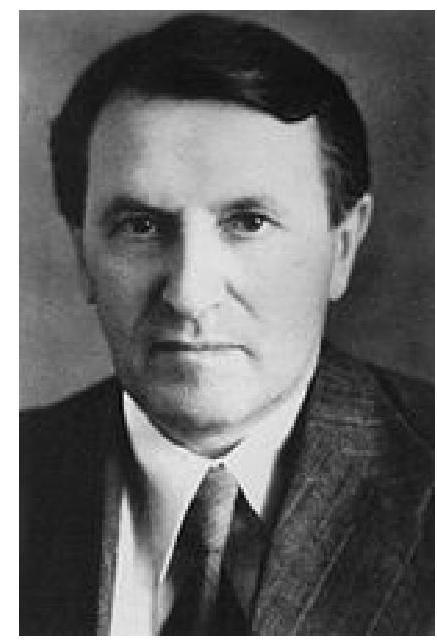

Figure PD.24. Constantin
Tretiakoff. Russian
neuropathologist Constantin
Tretiakoff.

# Modern Techniques 

While post-mortem (after death) examinations are valuable in studying neurodegenerative diseases, neuroimaging techniques such as functional magnetic resonance imaging (fMRI) and positron emission tomography (PET) are less invasive alternatives that can be performed on living people. Like post-mortem examinations, neuroimaging allows us to examine specific brain areas, but also allows for measurement of behaviour from living and conscious participants.

A major benefit of neuroimaging techniques is that they can be used to monitor brain physiology throughout the course of a neurodegenerative disease to better understand how it progresses. For example, researchers used MRI to scan the brains of patients with multiple sclerosis (MS) to examine the potential relationship between the amount of grey matter in the cerebellum and scores on cognitive and motor tests. They found that low levels of grey matter in specific areas of the cerebellum were linked to impairments in cognitive and motor test scores (Grothe et al., 2017). This study shows how neuroimaging can be used to establish a connection between observable symptoms and specific brain areas, making it a valuable tool for understanding neurodegenerative diseases.# Alzheimer's Disease 

## Clinical Symptoms

Alzheimer's disease is associated with many symptoms that can appear at different stages for different individuals, but ultimately all symptoms become more severe as the disease progresses (Sheppard \& Coleman, 2020). Memory impairment is the primary cognitive symptom of Alzheimer's, with some forms, like semantic memory, more severely affected than others, like procedural memory. Other symptoms include deficits in attention and language, loss of posture and facial expression control, and often a variety of sleep issues (Scarmeas et al., 2004; Sprecher et al., 2017). Sleep issues and memory deficits are some of the first signs of the disease, with symptoms becoming more prominent over time (Sprecher et al., 2017, Gold \& Budson, 2008). Alzheimer's disease is diagnosed most frequently after the age of 60 , potentially affecting up to $50 \%$ of people over the age of 85 (Schachter \& Davis, 2000).

The clinical symptoms of Alzheimer's have strong financial implications, since many diagnosed with the disease require intensive assisted living at some stage (Brookmeyer et al., 2007). The Alzheimer Society of Canada projects national spending on Alzheimer's-related costs to surpass $\$ 20$ billion in the next ten years (Alzheimer Society of Canada, 2018). In addition to financial strain, Alzheimer's disease can be stressful for caregivers. These people are often spouses or children who must watch their loved ones gradually lose cognitive function as the disease progresses (Schachter \& Davis, 2000). Primary caregivers for individuals with Alzheimer's are highly susceptible to depression, with women being disproportionately affected compared to men (Alqahtani et al., 2018; Chen et al., 2020).

## Causes

A defining feature of Alzheimer's disease is the presence of extracellular amyloid plaques found between neurons and intracellular tau tangles found within neurons (Bloom, 2014). Amyloid plaques are like sticky gunk that builds up between the brain cells, making it hard for messages to travel smoothly between different cells. Tau tangles, on the other hand, are like twisted-up wires inside the brain cell. They get all tangled and mixed up, making it difficult for the brain cells to communicate properly with each other. So, in Alzheimer's, these plaques and tangles disrupt the normal functioning of the brain, causing memory loss and other problems. Plaques and tangles are also found in the brains of people without cognitive symptoms, but at much lower levels and in anatomically distinct areas of the brain (Price et al., 1997; Nelson et al., 2007). So how do plaques and tangles cause problems in some individuals and not others?Specifically, when neurons express high levels of amyloid proteins, they clump together to form plaques between neurons in the medial temporal lobe (Sheppard \& Coleman, 2020), while tau protein builds up to form tangles inside of the neurons. The build-up of these proteins (Figure PD.25) affects primarily cholinergic neurons (neurons that transmit acetylcholine), causing synaptic dysfunction and neuronal death (Ferreira-Vieira et al., 2016). The neurotransmitter acetylcholine is important for cognitive functions such as memory; damage to the neurons that produce it is linked to cognitive impairment in Alzheimer's patients (Ferreira-Vieira et al., 2016).
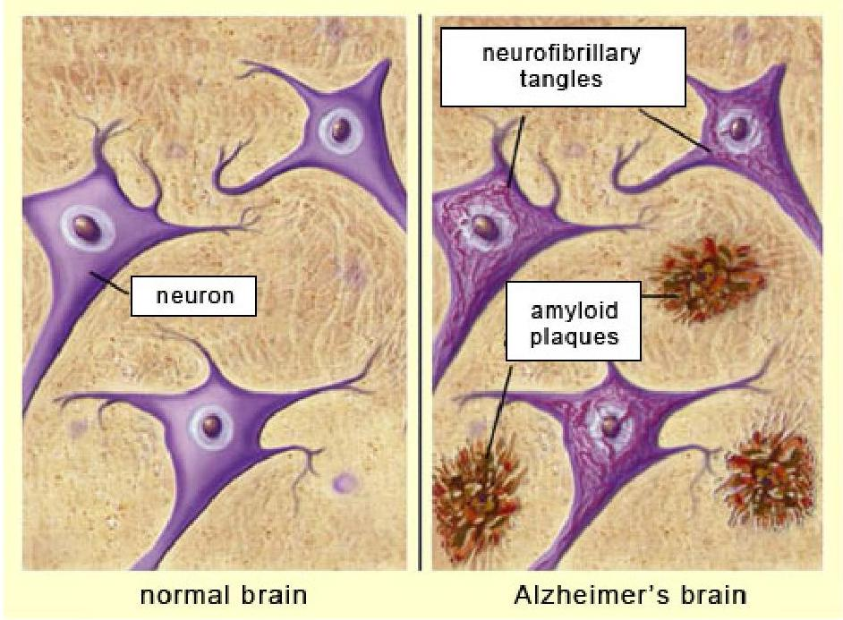

Figure PD.25. Alzheimer's brain. "Normal" brain shown on left with Alzheimer's patient on right. Alzheimer's brain shows intercellular tangles and extracellular plaques.

There are several genetic risk factors associated with developing Alzheimer's disease, especially the early onset type that tends to run in families (Shastry \& Giblin, 1999). Having one or more copies of the APOE-e4 allele (a different version of a gene that you can inherit from your parents) of the APOE gene makes a person more susceptible to developing the disease (National Institute on Aging, 2017). Some populations are more likely to possess copies of the APOE-e4 allele and show different vulnerabilities to developing symptoms. For example, people of African heritage who possess the APOE-e4 allele are less likely to be affected by it than those of European heritage (Serrano-Pozo et al., 2021). Although genes like APOE-e4 appear to be involved in symptoms of early onset Alzheimer's disease, this accounts for less than 5\% of cases (Shastry \& Giblin, 1999). The majority of Alzheimer's cases are later onset and not as tightly linked to family history, so the role of inherited genes in these cases is less clear.Some of the strongest predictors of Alzheimer's risk are related to environment and lifestyle, such as cognitive activity and verbal ability. One of the most surprising findings comes from the Nun Study on aging and Alzheimer's disease (Snowdon, 2001). Participants in this longitudinal study were Catholic nuns from the School Sisters of Notre Dame who completed annual physical and cognitive tests to monitor possible symptoms of dementia. They also generously agreed to donate their brains when they died for detection of Alzheimer's neuropathology, like plaques and tangles.

Linguistic analysis of their writing as young adults when they entered the sisterhood, showed that "idea density", the average number of ideas expressed per ten words, predicted both cognitive impairment and neuropathology 50 years later (Riley et al., 2005)! Although this research is correlational and does not provide a direct causal link between cognitive activity as a protective factor, other research points to benefits of a busy brain. Another large-scale study showed that engaging in regular cognitive activity, like reading the newspaper, and doing crossword puzzles, was associated with a significantly reduced risk of Alzheimer's-type memory symptoms five years later (Wilson et al., 2022).

# Earlier Detection of Alzheimer's Disease Using Biomarkers 

Dr. Sultan Darvesh (Figure PD.26) and his research group are developing ways to detect Alzheimer's disease in the early stages, by looking for biomarkers, molecules produced during pathological processes. Plaques and tangles are present in most people's brains, but they only are linked to dysfunction in those who develop Alzheimer's disease (Freer et al., 2016). Identifying differences in proteins associated with known neuropathology is a promising strategy (National Cancer Institute). For years researchers have tried to find a reliable biomarker of Alzheimer's; recently, Darvesh and his team discovered that butylcholinesteraseassociated plaques appear in the brains of individuals with Alzheimer's disease, but not in the brains of patients diagnosed with other neurodegenerative diseases. Butylcholinesterase is an enzyme responsible for breaking down acetylcholine (which we know is negatively impacted in individuals with Alzheimer's disease). This may be the first step towards earlier diagnosis and treatments for those living with Alzheimer's.

Figure PD.26. Dr. Sultan Darvesh. Alzheimer's researcher Dr. Sultan Darvesh from Dalhousie University (credit: Dalhousie University)

In recent years, Darvesh's group examined brains with and without plaques, and brains from individuals with and without Alzheimer's. Researchers found butylcholinesterase plaques were present almost exclusively in the brains of individuals who had Alzheimer's, while amyloid plaques were found in the brains of those with and without Alzheimer's disease. Furthermore, butylcholinesterase plaques were not associated with any other neurodegenerative diseases, making them ideal biomarkers unique to Alzheimer's (MacDonald et al., 2017).

Many neuroimaging techniques (e.g., PET scans) use radioactive molecules to identify biomarkers in the brain. These radioactive molecules need to be able to bond to the biomarker of interest so that researchers and clinicians can visualise where these biomarkers might be in the brain. Darvesh and his team are currently working to develop this type of molecule to allow for a high-resolution visualisation of plaques in the brains of Alzheimer's patients. The biomarker may allow for earlier detection and potentially become a reliable tool for diagnosis.

More About Alzheimer's Disease

Watch this interview with Dr. Sultan Darvesh, discussing his work on Alzheimer's disease, to learn more.# Treatment 

A cure for Alzheimer's does not exist, meaning that those diagnosed will have the disease until death. However, there are drug-based and non-drug-based treatment options that can reduce some of the symptoms of the disease and aim to increase quality of life for Alzheimer's patients; these are somewhat effective at reducing symptoms (e.g., memory loss, language difficulty).

Cholinesterase inhibitors (Study hint. chemicals that end in "ase" are enzymes which have the role of breaking down a neurotransmitter or other proteins) are a popular drug-based treatment that aims to prevent the breakdown of acetylcholine, a neurotransmitter crucial to many cognitive processes including memory. The inhibitors allow acetylcholine to remain in the synapse for longer, enhancing its effects (Larik et al., 2018). Another drug-based option is the use of NMDA antagonists which regulate the release of glutamate in the brain.

In Alzheimer's patients, excessive amounts of glutamate can cause neuronal cell death which contributes to the symptoms of the disease (Liu et al., 2019). NMDA antagonists and cholinesterase inhibitors both work to reduce cognitive symptoms of Alzheimer's disease but in different ways; as such, patients are often prescribed a combination of both of these types of drugs.

Besides prescribed drugs, Alzheimer's disease can be managed through strong social support. Specifically, clinical psychologists recommend a psychosocial approach on its own, or in addition to drug-based treatment. Psychosocial interventions can include cognitive training, group exercise, and art or music therapy. Duan et al. (2018) conducted a meta-analysis on the effectiveness of several psychosocial interventions such as a walking program and group exercise. They looked at the effectiveness of these interventions on their own and when paired with cholinesterase inhibitors. A walking program, home-based exercise, and group exercise, among others, were found to improve the mental state of participants compared to those in the control condition. However, a combination of cholinesterase inhibitor and psychosocial intervention was found to be the most effective, more so than either treatment on their own (Duan et al., 2018).

Jingle Therapy for Alzheimer's Disease

Jingle therapy is an innovative approach to reminiscence therapy for individuals living with Alzheimer's disease. It involves the use of familiar commercial jingles, such as advertising slogans or product melodies, from different periods of a person's life to evoke memories and stimulate cognitive function (Smith \& Jones, 2020).During jingle therapy sessions, patients listen to recordings of these jingles in a comfortable and supportive environment. The goal is to trigger specific memories and emotions associated with the jingles, promoting reminiscence and cognitive engagement. Research has shown that music can have a powerful effect on memory recall and emotional well-being, particularly in individuals with Alzheimer's disease (Brown et al., 2018).

Therapists carefully select jingles based on the patient's personal history and cultural background, aiming to create a meaningful and nostalgic experience. Patients are encouraged to share their thoughts and feelings evoked by the music, fostering social interaction and emotional connection.

While jingle therapy is still an emerging approach, preliminary studies have shown promising results in improving mood, stimulating cognitive function, and enhancing overall quality of life for individuals with Alzheimer's disease (Johnson et al., 2019).

# Image Attributions 

Figure PD.24. In the Public Domain.
Figure PD.25. Figure 1 as found in Alzheimer's Disease and the Aging Brain: A Review of Current Etiology and Treatments is licensed under a Creative Commons Attribution-NonCommercialShareAlike 4.0 International.

Figure PD.26. Figure PY. 26 by Dalhousie University as found in Introduction to Psychology \& Neuroscience (2nd Edition) is licensed under a CC BY 4.0 License.

## (1)

Neurodegenerative Diseases Copyright © 2024 by Leanne Stevens; Jennifer Stamp; Kevin LeBlanc (editors - original chapter); and Jessica Motherwell McFarlane (editor - adapted chapter) is licensed under a Creative Commons Attribution 4.0 International License, except where otherwise noted.# Chapter Resources 

LEANNE STEVENS; JENNIFER STAMP; KEVIN LEBLANC (EDITORS - ORIGINAL CHAPTER); AND JESSICA MOTHERWELL MCFARLANE (EDITOR - ADAPTED CHAPTER)

## Summary

## What Are Psychological Disorders?

Psychological disorders are conditions characterised by abnormal thoughts, feelings, and behaviours. Although challenging, it is essential for psychologists and mental health professionals to agree on what kinds of inner experiences and behaviours constitute the presence of a psychological disorder. Inner experiences and behaviours that are atypical or violate social norms could signify the presence of a disorder; however, each of these criteria alone is inadequate. Harmful dysfunction describes the view that psychological disorders result from the inability of an internal mechanism to perform its natural function. Many of the features of harmful dysfunction conceptualisation have been incorporated in the APA's formal definition of psychological disorders. According to this definition, the presence of a psychological disorder is signalled by significant disturbances in thoughts, feelings, and behaviours; these disturbances must reflect some kind of dysfunction (biological, psychological, or developmental), must cause significant impairment in one's life, and must not reflect culturally expected reactions to certain life events.

## Diagnosing and Classifying Psychological Disorders

The diagnosis and classification of psychological disorders is essential in studying and treating psychopathology. The classification system used by most US professionals is the DSM-5. The first edition of the DSM was published in 1952 and has undergone numerous revisions. The 5th and most recent edition, the DSM-5, was published in 2013. The diagnostic manual includes a total of 237 specific diagnosable disorders, each described in detail, including its symptoms, prevalence, risk factors, and comorbidity. Over time, the number of diagnosable conditions listed in the DSM has grown steadily, prompting criticism from some. Nevertheless, the diagnostic criteria in the DSM are more explicit than that of any other system, which makes the DSM system highly desirable for both clinical diagnosis and research.# Perspectives on Psychological Disorders 

Psychopathology is very complex, involving a plethora of etiological theories and perspectives. For centuries, psychological disorders were viewed primarily from a supernatural perspective and thought to arise from divine forces or possession by spirits. Some cultures continue to hold this supernatural belief. Today, many who study psychopathology view mental illness from a biological perspective, whereby psychological disorders are thought to result largely from faulty biological processes. Indeed, scientific advances over the last several decades have provided a better understanding of the genetic, neurological, hormonal, and biochemical bases of psychopathology. The psychological perspective, in contrast, emphasises the importance of psychological factors (e.g., stress and thoughts) and environmental factors in the development of psychological disorders. A contemporary, promising approach is to view disorders as originating from an integration of biological and psychosocial factors. The diathesis-stress model suggests that people with an underlying diathesis, or vulnerability, for a psychological disorder are more likely than those without the diathesis to develop the disorder when faced with stressful events.

## Neurodevelopmental Disorders

Neurodevelopmental disorders are a group of disorders that are typically diagnosed during childhood and characterised by developmental deficits in personal, social, academic, and intellectual realms. These disorders include attention deficit/hyperactivity disorder (ADHD) and autism spectrum disorder. ADHD is characterised by a pervasive pattern of inattention and/or hyperactive and impulsive behaviour that interferes with normal functioning. Genetic and neurobiological factors contribute to the development of ADHD, which can persist well into adulthood and is often associated with poor long-term outcomes. The major features of autism spectrum disorder include deficits in social interaction and communication and repetitive movements or interests. As with ADHD, genetic factors appear to play a prominent role in the development of autism spectrum disorder; exposure to environmental pollutants such as mercury have also been linked to the development of this disorder. Although it is believed by some that autism is triggered by the MMR vaccination, evidence does not support this claim.

## Schizophrenia

Schizophrenia is a severe disorder characterised by a complete breakdown in one's ability to function in life; it often requires hospitalisation. People with schizophrenia experience hallucinations and delusions and have extreme difficulty regulating their emotions and behaviour. Thinking is incoherent and disorganised, behaviour is extremely bizarre, emotionsare flat, and motivation to engage in most basic life activities is lacking. Considerable evidence shows that genetic factors play a central role in schizophrenia; however, adoption studies have highlighted the additional importance of environmental factors. Neurotransmitter and brain abnormalities, which may be linked to environmental factors such as obstetric complications or exposure to influenza during the gestational period, have also been implicated. A promising new area of schizophrenia research involves identifying individuals who show prodromal symptoms and following them over time to determine which factors best predict the development of schizophrenia. Future research may enable us to pinpoint those especially at risk for developing schizophrenia and who may benefit from early intervention.

# Mood Disorders 

Mood disorders are those in which the person experiences severe disturbances in mood and emotion. They include depressive disorders and bipolar and related disorders. Depressive disorders include major depressive disorder, which is characterised by episodes of profound sadness and loss of interest or pleasure in usual activities and other associated features, and persistent depressive disorder, which is marked by a chronic state of sadness. Bipolar disorder is characterised by mood states that vacillate between sadness and euphoria; a diagnosis of bipolar disorder requires experiencing at least one manic episode, which is defined as a period of extreme euphoria, irritability, and increased activity. Mood disorders appear to have a genetic component, with genetic factors playing a more prominent role in bipolar disorder than in depression. Both biological and psychological factors are important in the development of depression.

## Anxiety Disorders

Anxiety disorders are a group of disorders in which a person experiences excessive, persistent, and distressing fear and anxiety that interferes with normal functioning. Anxiety disorders include: a specific phobia (unrealistic fear); social anxiety disorder (extreme fear and avoidance of social situations); panic disorder (being suddenly overwhelmed by panic even though there is no apparent reason to be frightened); agoraphobia (an intense fear and avoidance of situations in which it might be difficult to escape); and generalised anxiety disorder (a relatively continuous state of tension, apprehension, and dread).

## Obsessive-Compulsive and Related Disorders

Obsessive-compulsive and related disorders are a group of DSM-5 disorders that overlap somewhat in that they each involve intrusive thoughts and/or repetitive behaviours. Perhaps themost recognised of these disorders is obsessive-compulsive disorder, in which a person is obsessed with unwanted, unpleasant thoughts and/or compulsively engages in repetitive behaviours or mental acts, perhaps as a way of coping with the obsessions. Body dysmorphic disorder is characterised by the individual becoming excessively preoccupied with one or more perceived flaws in his physical appearance that are either nonexistent or unnoticeable to others. Preoccupation with the perceived physical defects causes the person to experience significant anxiety regarding how he appears to others. Hoarding disorder is characterised by persistent difficulty in discarding or parting with objects, regardless of their actual value, often resulting in the accumulation of items that clutter and congest the person's living area.

# Posttraumatic Stress Disorder 

Posttraumatic stress disorder (PTSD) was described through much of the 20th century and was referred to as shell shock and combat neurosis in the belief that its symptoms were thought to emerge from the stress of active combat. Today, PTSD is defined as a disorder in which the experience of a traumatic or profoundly stressful event, such as combat, sexual assault, or natural disaster, produces a constellation of symptoms that must last for one month or more. These symptoms include intrusive and distressing memories of the event, flashbacks, avoidance of stimuli or situations that are connected to the event, persistently negative emotional states, feeling detached from others, irritability, proneness toward outbursts, and a tendency to be easily startled. Not everyone who experiences a traumatic event will develop PTSD; a variety of risk factors associated with its development have been identified.

## Dissociative Disorders

The main characteristic of dissociative disorders is that people become dissociated from their sense of self, resulting in memory and identity disturbances. Dissociative disorders listed in the DSM-5 include dissociative amnesia, depersonalisation/derealisation disorder, and dissociative identity disorder. A person with dissociative amnesia is unable to recall important personal information, often after a stressful or traumatic experience.

Depersonalisation/derealisation disorder is characterised by recurring episodes of depersonalisation (i.e., detachment from or unfamiliarity with the self) and/or derealisation (i.e., detachment from or unfamiliarity with the world). A person with dissociative identity disorder exhibits two or more well-defined and distinct personalities or identities, as well as memory gaps for the time during which another identity was present.

Dissociative identity disorder has generated controversy, mainly because some believe its symptoms can be faked by patients if presenting its symptoms somehow benefits the patient inavoiding negative consequences or taking responsibility for one's actions. The diagnostic rates of this disorder have increased dramatically following its portrayal in popular culture. However, many people legitimately suffer over the course of a lifetime with this disorder.

# Personality Disorders 

Individuals with personality disorders exhibit a personality style that is inflexible, causes distress and impairment, and creates problems for themselves and others. The DSM-5 recognises 10 personality disorders, organised into three clusters. The disorders in Cluster A include those characterised by a personality style that is odd and eccentric. Cluster B includes personality disorders characterised chiefly by a personality style that is impulsive, dramatic, highly emotional, and erratic, and those in Cluster C are characterised by a nervous and fearful personality style. Two Cluster B personality disorders, borderline personality disorder and antisocial personality disorder, are especially problematic. People with borderline personality disorder show marked instability in mood, behaviour, and self-image, as well as impulsivity. They cannot stand to be alone, are unpredictable, have a history of stormy relationships, and frequently display intense and inappropriate anger. Genetic factors and adverse childhood experiences (e.g., sexual abuse) appear to be important in its development. People with antisocial personality display a lack of regard for the rights of others; they are impulsive, deceitful, irresponsible, and unburdened by any sense of guilt. Genetic factors and socialisation both appear to be important in the origin of antisocial personality disorder. Research has also shown that those with this disorder do not experience emotions the way most other people do.

## Review Questions

## Multiple Choice Questions

1. In the harmful dysfunction definition of psychological disorders, dysfunction involves $\qquad$ .
a. the inability of an psychological mechanism to perform its function
b. the breakdown of social order in one's community
c. communication problems in one's immediate family
d. all the above
2. Patterns of inner experience and behaviour are thought to reflect the presence of a psychological disorder if they $\qquad$ .a. are highly atypical
b. lead to significant distress and impairment in one's life
c. embarrass one's friends and/or family
d. violate the norms of one's culture
3. The letters in the abbreviation DSM-5 stand for $\qquad$ .
a. Diseases and Statistics Manual of Medicine
b. Diagnosable Standards Manual of Mental Disorders
c. Diseases and Symptoms Manual of Mental Disorders
d. Diagnostic and Statistical Manual of Mental Disorders.
4. A study based on over 9,000 US residents found that the most prevalent disorder was $\qquad$ .
a. major depressive disorder
b. social anxiety disorder
c. obsessive-compulsive disorder
d. specific phobia
5. The diathesis-stress model presumes that psychopathology results from $\qquad$ .
a. vulnerability and adverse experiences
b. biochemical factors
c. chemical imbalances and structural abnormalities in the brain
d. adverse childhood experiences
6. Dr. Anastasia believes that major depressive disorder is caused by an over-secretion of cortisol. Dr. Anastasia's view on the cause of major depressive disorder reflects a $\qquad$ perspective.
a. psychological
b. supernatural
c. biological
d. diathesis-stress
7. In which of the following anxiety disorders is the person in a continuous state of excessive, pointless worry and apprehension?
a. panic disorder
b. generalised anxiety disorder
c. agoraphobia
d. social anxiety disorder
8. Which of the following would constitute a safety behaviour?
a. encountering a phobic stimulus in the company of other people
b. avoiding a field where snakes are likely to be present
c. avoiding eye contact
d. worrying as a distraction from painful memories
9. Which of the following best illustrates a compulsion?a. mentally counting backward from 1,000
b. persistent fear of germs
c. thoughts of harming a neighbour
d. falsely believing that a spouse has been cheating
10. Research indicates that the symptoms of OCD $\qquad$ .
a. are similar to the symptoms of panic disorder
b. are triggered by low levels of stress hormones
c. are related to hyperactivity in the orbitofrontal cortex
d. are reduced if people are asked to view photos of stimuli that trigger the symptoms
11. Symptoms of PTSD include all of the following except $\qquad$ .
a. intrusive thoughts or memories of a traumatic event
b. avoidance of things that remind one of a traumatic event
c. jumpiness
d. physical complaints that cannot be explained medically
12. Which of the following elevates the risk for developing PTSD?
a. severity of the trauma
b. frequency of the trauma
c. high levels of intelligence
d. social support
13. Common symptoms of major depressive disorder include all of the following except $\qquad$ .
a. periods of extreme elation and euphoria
b. difficulty concentrating and making decisions
c. loss of interest or pleasure in usual activities
d. psychomotor agitation and retardation
14. Clifford falsely believes that the police have planted secret cameras in his home to monitor their every movement. Clifford's belief is an example of $\qquad$ .
a. a delusion
b. a hallucination
c. tangentiality
d. a negative symptom
15. A study of adoptees whose biological mothers had schizophrenia found that the adoptees were most likely to develop schizophrenia $\qquad$ .
a. if their childhood friends later developed schizophrenia
b. if they abused drugs during adolescence
c. if they were raised in a disturbed adoptive home environment
d. regardless of whether they were raised in a healthy or disturbed home environment
16. Dissociative amnesia involves $\qquad$ .a. memory loss following head trauma
b. memory loss following stress
c. feeling detached from the self
d. feeling detached from the world
17. Dissociative identity disorder mainly involves $\qquad$ .
a. depersonalisation
b. derealisation
c. schizophrenia
d. different personalities
18. Which of the following is not a primary characteristic of ADHD?
a. short attention span
b. difficulty concentrating and distractibility
c. restricted and fixated interest
d. excessive fidgeting and squirming
19. One of the primary characteristics of autism spectrum disorder is $\qquad$ .
a. bed-wetting
b. difficulty relating to others
c. short attention span
d. intense and inappropriate interest in others
20. People with borderline personality disorder often $\qquad$ .
a. try to be the centre of attention
b. are shy and withdrawn
c. are impulsive and unpredictable
d. tend to accomplish goals through cruelty
21. Antisocial personality disorder is associated with $\qquad$ .
a. emotional deficits
b. memory deficits
c. parental overprotection
d. increased empathy

# Critical Thinking Questions 

22. Discuss why thoughts, feelings, or behaviours that are merely atypical or unusual would not necessarily signify the presence of a psychological disorder. Provide an example.
23. Describe the DSM-5. What is it, what kind of information does it contain, and why is it important to thestudy and treatment of psychological disorders?
24. The International Classification of Diseases (ICD) and the DSM differ in various ways. What are some of the differences in these two classification systems?
25. Why is the perspective one uses in explaining a psychological disorder important?
26. Describe how cognitive theories of the etiology of anxiety disorders differ from learning theories.
27. Discuss the common elements of each of the three disorders covered in this section: obsessivecompulsive disorder, body dysmorphic disorder, and hoarding disorder.
28. List some of the risk factors associated with the development of PTSD following a traumatic event.
29. Why is research following individuals who show prodromal symptoms of schizophrenia so important?
30. The prevalence of most psychological disorders has increased since the 1980s. However, as discussed in this section, scientific publications regarding dissociative amnesia peaked in the mid-1990s but then declined steeply through 2003. In addition, no fictional or nonfictional description of individuals showing dissociative amnesia following a trauma exists prior to 1800. How would you explain this phenomenon?
31. Compare the factors that are important in the development of ADHD with those that are important in the development of autism spectrum disorder.
32. Imagine that a child has a genetic vulnerability to antisocial personality disorder. How might this child's environment shape the likelihood of developing this personality disorder?

Personal Application Questions
33. Identify a behaviour that is considered unusual or abnormal in your own culture; however, it would be considered normal and expected in another culture.
34. Even today, some believe that certain occurrences have supernatural causes. Think of an event, recent or historical, for which others have provided a supernatural explanation.
35. Think of someone you know who seems to have a tendency to make negative, self-defeating explanations for negative life events. How might this tendency lead to future problems? What steps do you think could be taken to change this thinking style?
36. Try to find an example (via a search engine) of a past instance in which a person committed a horrible crime, was apprehended, and later claimed to have dissociative identity disorder during the trial. What was the outcome? Was the person revealed to be faking? If so, how was this determined?
37. Discuss the characteristics of autism spectrum disorder with a few of your friends or members of your family (choose friends or family members who know little about the disorder) and ask them if they think the cause is due to bad parenting or vaccinations. If they indicate that they believe either one to be true, why do you think this might be the case? What would be your response?# Review Questions Answers 

## Multiple Choice Question Answers

| 1. A | 8. C | 15. C |
| :-- | --: | :-- |
| 2. B | 9. A | 16. B |
| 3. D | 10. C | 17. D |
| 4. A | 11. D | 18. C |
| 5. A | 12. A | 19. B |
| 6. C | 13. A | 20. C |
| 7. B | 14. A | 21. A |

## Critical Thinking Question Answers

22. Just because something is atypical or unusual does not mean it is disordered. A person may experience atypical inner experiences or exhibit unusual behaviours, but she would not be considered disordered if they are not distressing, disturbing, or reflecting a dysfunction. For example, a classmate might stay up all night studying before exams; although atypical, this behaviour is unlikely to possess any of the other criteria for psychological disorder mentioned previously.
23. The DSM-5 is the classification system of psychological disorders preferred by most US mental health professionals, and it is published by the American Psychiatric Association (APA). It consists of broad categories of disorders and specific disorders that fall within each category. Each disorder has an explicit description of its symptoms, as well as information concerning prevalence, risk factors, and comorbidity. The DSM-5 provides a common language that enables mental health professionals to communicate effectively about sets of symptoms.
24. The ICD is used primarily for making clinical diagnoses and more broadly for examining the general health of populations and monitoring the international prevalence of diseases and other health problems. While the DSM is also used for diagnostic purposes, it is also highly valued as a research tool. For example, much of the data regarding the etiology and treatment of psychological disorders are based on diagnostic criteria set forth in the DSM.
25. The perspective one uses in explaining a psychological disorder consists of assumptions that will guide how to best study and understand the nature of a disorder, including its causes, and how to most effectively treat the disorder.
26. Learning theories suggest that some anxiety disorders, especially specific phobia, can develop through a number of learning mechanisms. These mechanisms can include classical and operant conditioning, modelling, or vicarious learning. Cognitive theories, in contrast, assume that some anxiety disorders, especially panic disorder, develop through cognitive misinterpretations of anxiety and other symptoms.27. Each of the three disorders is characterised by repetitive thoughts and urges, as well as an uncontrollable need to engage in repetitive behaviour and mental acts. For example, repetitive thoughts include concerns about contamination (OCD), imagined physical defects (body dysmorphic disorder), and discarding one's possessions (hoarding disorder). Uncontrollable needs to engage in repetitive behaviours and mental acts include persistent handwashing (OCD), constantly looking in the mirror (body dysmorphic disorder) and engaging in efforts to acquire new possessions (hoarding disorder).
28. Risk factors associated with PTSD include gender (female), low socioeconomic status, low intelligence, personal and family history of mental illness, and childhood abuse or trauma. Personality factors, including neuroticism and somatisation, may also serve as risk factors. Also, certain versions of a gene that regulates serotonin may constitute a diathesis.
29. This kind of research is important because it enables investigators to identify potential warning signs that predict the onset of schizophrenia. Once such factors are identified, interventions may be developed.
30. Several explanations are possible. One explanation is that perhaps there is little scientific interest in this phenomenon, maybe because it has yet to gain consistent scientific acceptance. Another possible explanation is that perhaps dissociative amnesia was fashionable at the time publications dealing with this topic peaked (1990s) and since that time it has become less fashionable.
31. Genetic factors appear to play a major role in the development of both ADHD and autism spectrum disorder; studies show higher rates of concordance among identical twins than among fraternal twins for both disorders. In ADHD, genes that regulate dopamine have been implicated; in autism spectrum disorder, de novo genetic mutations appear to be important. Imaging studies suggest that abnormalities in the frontal lobes may be important in the development of ADHD. Parenting practices are not connected to the development of either disorder. Although environmental toxins are generally unimportant in the development of ADHD, exposure to cigarette smoke during the prenatal period has been linked to the development of the disorder. A number of environmental factors are thought to be associated with an increased risk for autism spectrum disorder: exposure to pollutants, an urban versus rural residence, and vitamin D deficiency. Although some people continue to believe that MMR vaccinations can cause autism spectrum disorder (due to an influential paper that was later retracted), there is no scientific evidence that supports this assertion.
32. The environment is likely to be very instrumental in determining the likelihood of developing antisocial personality disorder. Research has shown that adverse family environments (e.g., divorce or marital problems, legal problems, and drug use) are connected to antisocial personality disorder, particularly if one is genetically vulnerable. Beyond one's family environment, peer group delinquency and community variables (e.g., economic deprivation, community disorganisation, drug use, and the presence of adult# Key Terms 

## Key Terms

- Adaptive information processing model of PTSD: suggests that past trauma can continue to cause emotional distress if the memory of that trauma is not fully processed.
- ADHD-C: attention deficit/hyperactivity disorder with a mix of symptoms in both inattentive and hyperactive/impulsive categories.
- ADHD-HI: attention deficit/hyperactivity disorder with symptoms that primarily fall into the hyperactivity and impulsivity category. People with ADHD-HI have trouble with impulse control, may display a high level of activity and energy in inappropriate situations, and have relatively fewer symptoms in the inattentive category.
- ADHD-PI: attention deficit/hyperactivity disorder with symptoms that primarily fall into the inattentive category. People with ADHD-PI have trouble maintaining attention and have relatively fewer symptoms in the hyperactivity and impulsivity category.
- Agoraphobia: anxiety disorder characterised by intense fear, anxiety, and avoidance of situations in which it might be difficult to escape if one experiences symptoms of a panic attack.
- Alexithymia: a condition that involves a reduced ability to identify and sense one's own emotions and the emotions of others.
- Alterations in arousal and reactivity: one of the four categories of PTSD symptoms; includes irritability or aggression, increased risk-taking, hyper-vigilance, jumpiness, and difficulty with concentration or sleep.
- Amyloid-beta plaque: an extracellular accumulation of amyloid; thought to be the potential cause or byproduct of Alzheimer's disease.
- Antisocial personality disorder: characterised by a lack of regard for others' rights, impulsivity, deceitfulness, irresponsibility, and lack of remorse over misdeeds
- Anxiety disorder: characterised by excessive and persistent fear and anxiety, and by related disturbances in behaviour.
- Applied behavioural analysis: a behavioural modification strategy that involves punishing autistic traits and behaviours that are deemed maladaptive, while rewarding behaviours that are deemed appropriate; this therapy is not accepted by the broader autistic community.
- Attention deficit/hyperactivity disorder (ADHD): a neurotype characterised by differences and difficulties in attention and emotional and behavioural regulation. This neurotype is often also associated with differences in sensory processing and executive function.
- Atypical: describes behaviours or feelings that deviate from the norm.
- Augmentative and alternative communication (AAC): techniques and technologies meant to supplement or allow for communication when expressive speech or language is difficult or impossible. AAC includes but isn't limited to sign languages, text-to-speech devices, and image-based systems like picture cardsand communication boards.

- Autistic burnout: a state resulting from prolonged stress and a mismatch of expectations and abilities without enough accommodation or support. This state is associated with long term fatigue, reduced function, loss of previously acquired skills, and an increase in sensory issues.
- Autistic meltdown: a response similar to fight or flight that autistic people experience when they are experiencing a level of stress and overstimulation that they aren't able to manage. Meltdowns involve bursts of uncontrolled behaviour that may serve to externalise stress and reduce the level of internal tension the autistic person is experiencing.
- Autistic shutdown: a response to overwhelming stress and overstimulation in which an autistic person experiences dissociation or withdrawal from the current sensory environment. Shutdowns involve reduced responsiveness, loss of function, and fatigue, and may serve to reduce tension by decreasing the amount of stimulation the individual experiences.
- Autism spectrum disorder: a neurotype characterised by difficulty in neurotypical social interaction and communication, and by restricted or repetitive patterns of thought and behaviour. This neurotype is also generally associated with differences in sensory processing.
- Avoidance symptoms: one of the four categories of PTSD; occurs when the individual avoids stimuli or thoughts and feelings associated with the trauma.
- Behavioural parent training: a kind of therapy designed to teach parents of people with ADHD how to manage emotions and communicate effectively so that they can support their children in forming habits and learning skills that suit their needs and neurotype.
- Biomarker: unique molecules produced during pathological processes that can be used to detect the presence of a disease.
- Bipolar and related disorders: group of mood disorders in which mania is the defining feature.
- Bipolar disorder: mood disorder characterised by mood states that vacillate between depression and mania.
- Body dysmorphic disorder: involves excessive preoccupation with an imagined defect in physical appearance.
- Borderline personality disorder: instability in interpersonal relationships, self-image, and mood, as well as impulsivity; key features include intolerance of being alone and fear of abandonment, unstable relationships, unpredictable behaviour and moods, and intense and inappropriate anger.
- Catatonic behaviour: decreased reactivity to the environment; includes posturing and catatonic stupor.
- Cognitive behavioural therapy (CBT): a kind of therapy that aims to systematically identify maladaptive patterns of thought and behaviour so that they can be addressed and replaced with more effective strategies.
- Comorbidity: co-occurrence of two disorders in the same individual.
- Complex PTSD (C-PTSD): a variant of PTSD included in the 11th revision of the International Classification of Diseases (ICD-11) but as yet to be included in the DSM.
- Delusion: belief that is contrary to reality and is firmly held despite contradictory evidence.
- Depersonalisation/derealisation disorder: dissociative disorder in which people feel detached from the self (depersonalisation), and the world feels artificial and unreal (derealisation).
- Depressive disorder: one of a group of mood disorders in which depression is the defining feature.
- Diagnosis: determination of which disorder a set of symptoms represents.
- Diagnostic and Statistical Manual of Mental Disorders, Fifth Edition (DSM-5): authoritative index of mental disorders and the criteria for their diagnosis; published by the American Psychiatric Association (APA).- Diathesis-stress model: suggests that people with a predisposition for a disorder (a diathesis) are more likely to develop the disorder when faced with stress; model of psychopathology.
- Disorganised thinking: disjointed and incoherent thought processes, usually detected by what a person says.
- Disorganised/abnormal motor behaviour: highly unusual behaviours and movements (such as child-like behaviours), repeated and purposeless movements, and displaying odd facial expressions and gestures.
- Dissociative amnesia: dissociative disorder characterised by an inability to recall important personal information, usually following an extremely stressful or traumatic experience.
- Dissociative disorders: group of DSM-5 disorders in which the primary feature is that a person becomes dissociated, or split off, from his or her core sense of self, resulting in disturbances in identity and memory.
- Dissociative fugue: symptom of dissociative amnesia in which a person suddenly wanders away from their home and experiences confusion about their identity.
- Dissociative identity disorder: dissociative disorder (formerly known as multiple personality disorder) in which a person exhibits two or more distinct, well-defined personalities or identities and experiences memory gaps for the time during which another identity emerged.
- Dopamine hypothesis: theory of schizophrenia that proposes that an overabundance of dopamine or dopamine receptors is responsible for the onset and maintenance of schizophrenia.
- Etiology: cause or causes of a psychological disorder.
- Executive functions: a set of cognitive skills that involve self-control, self-monitoring, planning and organisation, and working memory.
- Flashback: psychological state lasting from a few seconds to several days, during which one relives a traumatic event and behaves as though the event were occurring at that moment.
- Flight of ideas: symptom of mania that involves an abrupt switch in conversation from one topic to another.
- Generalised anxiety disorder: characterised by a continuous state of excessive, uncontrollable, and pointless worry and apprehension.
- Global processing: processing the sum of parts, or the end product of a number of local details as they are combined; for example, processing the way a song sounds as a whole, rather than focusing on individual notes or instruments.
- Grandiose delusion: characterised by beliefs that one holds special power, unique knowledge, or is extremely important.
- Habituation: a reduction in the response of the nervous system to stimuli that are unchanging or consistently present.
- Hallucination: perceptual experience that occurs in the absence of external stimulation, such as the auditory hallucinations (hearing voices) common to schizophrenia.
- Harmful dysfunction: model of psychological disorders resulting from the inability of an internal mechanism to perform its natural function.
- Hoarding disorder: characterised by persistent difficulty in parting with possessions, regardless of their actual value or usefulness.
- Hopelessness theory: cognitive theory of depression proposing that a style of thinking that perceives negative life events as having stable and global causes leads to a sense of hopelessness and then to depression.
- Hyperfocus: an intense state of attention towards a particular subject, during which the individual may seem to ignore all other stimuli and may lose their sense of time; generally this occurs during tasks thatare enjoyable.

- Hyperlexia: the ability to read significantly above the expected level for one's age.
- Hyperreactivity: a larger than average reaction to certain sensory stimuli.
- Hyporeactivity: a smaller than average reaction to certain sensory stimuli or a lack of reaction to certain sensory stimuli.
- Identity first language: a way to refer to people that uses their condition or neurotype as a noun. This is meant to acknowledge that the neurotype or condition is actually a part of the person's identity which cannot be separated from them. For example, referring to someone as an autistic person is a use of identity first language.
- Interoception: one's perception of sensations that come from inside the body, including heartbeat, respiration, pain, sensations involved in digestion, and nervous system activity related to emotions.
- Intrusion symptoms: one of the four categories of PTSD symptoms; occurs when the traumatic event is re-experienced through memories, nightmares, flashbacks, and emotional or physical reactivity after exposure to stimuli associated with the trauma.
- International Classification of Diseases (ICD): authoritative index of mental and physical diseases, including infectious diseases, and the criteria for their diagnosis; published by the World Health Organization (WHO).
- Learning and Cognitive Processing Model of PTSD: suggests that some symptoms are developed and maintained through classical conditioning.
- Local processing: processing local details, the individual details that make up a bigger picture; for example, processing the colours that are used in a painting rather than processing the painting as a whole.
- Locus coeruleus: area of the brainstem that contains norepinephrine, a neurotransmitter that triggers the body's fight-or-flight response; has been implicated in panic disorder.
- Major depressive disorder: commonly referred to as "depression" or "major depression" characterised by sadness or loss of pleasure in usual activities, as well other symptoms.
- Mania: state of extreme elation and agitation.
- Manic episode: period in which an individual experiences mania, characterised by extremely cheerful and euphoric mood, excessive talkativeness, irritability, increased activity levels, and other symptoms.
- Masking: a strategy that involves learning and performing neurotypical behaviours, while suppressing and resisting autistic behaviours with the intent to blend in for safety, to avoid stigma, and to succeed in a neurotypical social context.
- Medical model of disability: a model that identifies disability as a defect rather than a difference of needs. This model positions the disabled person as a victim of their disability and places responsibility on the individual. This model aims to prevent and eliminate disability.
- Mindfulness techniques and training: a kind of attention training therapy or technique that aims to teach participants to remain cognitively present and avoid internal distractions, like stressful thoughts or worries about the future, as well as external distractions, like ambient noise.
- Mood disorder: one of a group of disorders characterised by severe disturbances in mood and emotions; the categories of mood disorders listed in the DSM-5 are bipolar and related disorders and depressive disorders.
- Negative alterations in cognitions and mood: one of the four categories of PTSD symptoms; involves pervasive negative mood, feelings of isolation, extreme negative beliefs about the self or the world, and problems with memory, often specific to trauma-related memories.
- Negative symptom: characterised by decreases and absences in certain normal behaviours, emotions, ordrives, such as an expressionless face, lack of motivation to engage in activities, reduced speech, lack of social engagement, and inability to experience pleasure.

- Neurodegenerative disease: a brain disorder characterised by the dysfunction and subsequent death of neurons.
- Neurodevelopmental disorder: one of the disorders that are first diagnosed in childhood and involve developmental problems in academic, intellectual and social functioning.
- Neurodiversity: the spectrum of brain organisation and function that can occur in a population of healthy humans.
- Neurotype: the kind of brain organisation and function a person has, influencing the way they perceive, interpret, and respond to the world.
- Neurotypical: a person who has a neurotype that functions similarly to the majority of people of the same age in their culture.
- Neurodivergent: a person who has a neurotype that functions differently from the majority of people of the same age in their culture.
- Obsessive-compulsive and related disorders: group of overlapping disorders listed in the DSM-5 that involves intrusive, unpleasant thoughts and/or repetitive behaviours.
- Obsessive-compulsive disorder: characterised by the tendency to experience intrusive and unwanted thoughts and urges (obsession) and/or the need to engage in repetitive behaviours or mental acts (compulsions) in response to the unwanted thoughts and urges.
- Occupational therapy: a form of therapy that aims to help individuals improve function in daily life, often by identifying barriers, developing strategies to address those barriers, and identifying relevant supports. For example, someone who has lost function in their hands may need an occupational therapist to identify exercises that will help them regain function, and to help them find accommodations so that they can condition themselves to engage in daily activities while they are recovering.
- Orbitofrontal cortex: area of the frontal lobe involved in learning and decision-making.
- Panic attack: period of extreme fear or discomfort that develops abruptly; symptoms of panic attacks are both physiological and psychological.
- Panic disorder: anxiety disorder characterised by unexpected panic attacks, along with at least one month of worry about panic attacks or self-defeating behaviour related to the attacks.
- Paranoid delusion: characterised by one's beliefs that others are out to harm them.
- Peripartum onset: subtype of depression that applies to those who experience an episode of major depression either during pregnancy or in the four weeks following childbirth.
- Persistent depressive disorder: depressive disorder characterised by a chronically sad and melancholy mood.
- Person-first language: a way to refer to people that uses their condition or neurotype as an adjective, with the intent to separate the person from the condition. This kind of language is meant to present the condition or neurotype as separable from the person. For example, referring to someone as a person with ADHD is a use of person first language.
- Personality disorder: group of DSM-5 disorders characterised by an inflexible and pervasive personality style that differs markedly from the expectations of one's culture and causes distress and impairment; people with these disorders have a personality style that frequently brings them into conflict with others and disrupts their ability to develop and maintain social relationships.
- Posttraumatic stress disorder (PTSD): experiencing a profoundly traumatic event leads to a constellation of symptoms that includes intrusive and distressing memories of the event, avoidance of stimuliconnected to the event, negative emotional states, feelings of detachment from others, irritability, proneness toward outbursts, hypervigilance, and a tendency to startle easily; these symptoms must occur for at least one month.

- Prodromal symptom: in schizophrenia, one of the early minor symptoms of psychosis.
- Psychological disorder: condition characterised by abnormal thoughts, feelings, and behaviours.
- Psychopathology: study of psychological disorders, including their symptoms, causes, and treatment; manifestation of a psychological disorder.
- Rumination: in depression, tendency to repetitively and passively dwell on one's depressed symptoms, their meanings, and their consequences.
- Safety behaviour: mental and behavioural acts designed to reduce anxiety in social situations by reducing the chance of negative social outcomes; common in social anxiety disorder.
- Schizophrenia: severe disorder characterised by major disturbances in thought, perception, emotion, and behaviour with symptoms that include hallucinations, delusions, disorganised thinking and behaviour, and negative symptoms.
- Seasonal pattern: subtype of depression in which a person experiences the symptoms of major depressive disorder only during a particular time of year.
- Social anxiety disorder: characterised by extreme and persistent fear or anxiety and avoidance of social situations in which one could potentially be evaluated negatively by others.
- Social model of disability: a model that positions disability as a problem that results from barriers in society that disadvantage people who have different needs. This model aims to improve rights and accessibility for disabled people.
- Social skills training: a therapy designed to teach autistic people to communicate and interact in more neurotypical ways; this therapy is controversial in the autistic community, as it is argued that it devalues autistic social skills.
- Somatic delusion: belief that something highly unusual is happening to one's body or internal organs.
- Specific phobia: anxiety disorder characterised by excessive, distressing, and persistent fear or anxiety about a specific object or situation.
- Stimulant medication: drugs that increase the activity of certain parts of the nervous system. Certain stimulants are regularly prescribed for people with ADHD, as they can help promote activity in parts of the brain that are found to be underactive, particularly the frontal lobe.
- Stims/stimming: repetitive body movements/behaviours or noises, which can help to regulate one's level of stimulation. During overstimulation, stimming can help to block out undesirable environmental stimuli. During under-stimulation, stimming can help to generate increased internal stimulation.
- Suicidal ideation: thoughts of death by suicide, thinking about or planning suicide, or making a suicide attempt.
- Suicide: death caused by intentional, self-directed injurious behaviour.
- Supernatural: describes a force beyond scientific understanding.
- Tau fibrillary tangles: intracellular, string-like proteins thought to be the cause or by-product of Alzheimer's disease.
- Ventricle: one of the fluid-filled cavities within the brain.
- Working memory: a component of short-term memory responsible for holding and processing units of information that are in immediate use.# References 

The reference list for this chapter has been excluded from this file to reduce page count. The full reference list can be viewed online at opentextbc.ca/psychologymtdi/chapter/psychological-disorders-chapter-resources/.

## Chapter Attribution

This chapter is largely based on the "Psychopathology" chapter in Introduction to Psychology \& Neuroscience (2nd Edition) edited by Leanne Stevens, Jennifer Stamp, \& Kevin LeBlanc, which is licensed under a CC BY 4.0 licence. It was adapted by Jessica Motherwell McFarlane to add some new resources and sections.

## (0) (1) (3)

Chapter Resources Copyright © 2024 by Leanne Stevens; Jennifer Stamp; Kevin LeBlanc (editors - original chapter); and Jessica Motherwell McFarlane (editor - adapted chapter) is licensed under a Creative Commons Attribution-NonCommercial-ShareAlike 4.0 International License, except where otherwise noted.# CHAPTER 19. TREATMENT OF PSYCHOLOGICAL DISORDERS1134 | Introduction to Psychology# Treatment of Psychological Disorders Introduction 

LEANNE STEVENS; JENNIFER STAMP; KEVIN LEBLANC (EDITORS - ORIGINAL CHAPTER); AND JESSICA MOTHERWELL MCFARLANE (EDITOR - ADAPTED CHAPTER)

Approximate reading time: 1 minute
What comes to mind when you think about therapy, psychologists, or treatment? You might picture someone lying on a couch talking about their childhood while the therapist sits and takes notes, à la Sigmund Freud. But can you envision a therapy session in which someone is wearing virtual reality headgear to conquer a fear of snakes?

In this chapter, you will see that approaches to therapy include both psychological and biological interventions, all with the goal of alleviating distress. Because psychological challenges can originate from various sources - biology, genetics, childhood experiences, conditioning, and sociocultural influences - psychologists have developed many different therapeutic techniques and approaches. Therapy that is accessible online, via an app, is becoming increasingly popular; it allows individuals to access the care and support they need, at a time and place that is convenient to them.

Tranquility is an app developed by co-founders Dr. Alissa Pencer (Clinical Psychologist) and Joel Muise that is now free to all Nova Scotians 16+ who are experiencing mild-to-moderate anxiety and/or depression.

## $\odot \odot \odot \odot$

Treatment of Psychological Disorders Introduction Copyright © 2024 by Leanne Stevens; Jennifer Stamp; Kevin LeBlanc (editors original chapter); and Jessica Motherwell McFarlane (editor - adapted chapter) is licensed under a Creative Commons Attribution-NonCommercial-ShareAlike 4.0 International License, except where otherwise noted.1136 | Chapter 19. Treatment of Psychological Disorders# Mental Health Treatment: Past and Present 

LEANNE STEVENS; JENNIFER STAMP; KEVIN LEBLANC (EDITORS - ORIGINAL CHAPTER); AND JESSICA MOTHERWELL MCFARLANE (EDITOR - ADAPTED CHAPTER)

Approximate reading time: 16 minutes

## Treatment in the Past

For much of history, the mentally ill have been treated very poorly. It was believed that mental illness was caused by demonic possession, witchcraft, or an angry god (Szasz, 1960). For example, in medieval times, abnormal behaviours were viewed as a sign that a person was possessed by demons. If someone was considered to be possessed, there were several forms of treatment to release spirits from the individual. The most common treatment was exorcism, often conducted by priests or other religious figures: Incantations and prayers were said over the person's body, and she may have been given some medicinal drinks. Another form of treatment for extreme cases of mental illness was trephining: A small hole was made in the afflicted individual's skull to release spirits from the body. Most people treated in this manner died. In addition to exorcism and trephining, other practices involved execution or imprisonment of people with psychological disorders. Still others were left to be homeless beggars. Generally speaking, most people who exhibited strange behaviours were greatly misunderstood and treated cruelly. The prevailing theory of psychopathology in earlier history was the idea that mental illness was the result of demonic possession by either an evil spirit or an evil god because early beliefs incorrectly attributed all unexplainable phenomena to deities deemed either good or evil.

From the late 1400s to the late 1600s, a common belief perpetuated by some religious organisations was that some people made pacts with the devil and committed horrible acts, such as eating babies (Blumberg, 2007). These people were considered to be witches and were tried and condemned by courts - they were often burned at the stake. Worldwide, it is estimated that tens of thousands of mentally ill people were killed after being accused of being witches or under the influence of witchcraft (Hemphill, 1966).

By the 18th century, people who were considered odd and unusual were placed in asylums(Figure PY.1). Asylums were the first institutions created for the specific purpose of housing people with psychological disorders, but the focus was on ostracising them from society rather than treating their disorders. Often these people were kept in windowless dungeons, beaten, and chained to their beds, with little to no contact with caregivers.

Figure PY.1. The Madhouse. This painting by Francisco Goya, called The Madhouse, depicts a mental asylum and its inhabitants in the early 1800s. It portrays those with psychological disorders as victims.

In the late 1700s, a French physician, Philippe Pinel, argued for more humane treatment of the mentally ill. He suggested that they be unchained and talked to, and that's just what he did for patients at La Salpêtrière in Paris in 1795 (Figure PY.2). Patients benefited from this more humane treatment, and many were able to leave the hospital.

Figure PY.2. Philippe Pinel. This painting by Tony Robert-Fleury depicts Dr. Philippe Pinel ordering the removal of chains from patients at the Salpêtrière asylum in Paris.

In the 19th century, Dorothea Dix led reform efforts for mental health care in the United States (Figure PY.3). She investigated how those who are mentally ill and poor were cared for, and she discovered an underfunded and unregulated system that perpetuated abuse of this population (Tiffany, 1891). Horrified by her findings, Dix began lobbying various state legislatures and the US Congress for change (Tiffany, 1891). Her efforts led to the creation of the first mental asylums in the United States.

Figure PY. 3 Dorothea Dix. Dorothea Dix was a social reformer who became an advocate for the indigent insane and was instrumental in creating the first American mental asylum. She did this by relentlessly lobbying state legislatures and Congress to set up and fund such institutions.

Despite reformers' efforts, however, a typical asylum was filthy, offered very little treatment, and often kept people for decades. At Willard Psychiatric Center in upstate New York, for example, one treatment was to submerge patients in cold baths for long periods of time. Electroshock treatment was also used, and the way the treatment was administered often broke patients' backs; in 1943, doctors at Willard administered 1,443 shock treatments (Willard Psychiatric Center, 2009). (Electroshock is now called electroconvulsive treatment, and the therapy is still used, but with safeguards and under anaesthesia. A brief application of electric stimulus is used to produce a generalised seizure. Controversy continues over its effectiveness versus the side effects.) Many of the wards and rooms were so cold that a glass of water would be frozen by morning (Willard Psychiatric Center, 2009). Willard's doors were not closed until 1995. Conditions like these remained commonplace until well into the 20th century.

Starting in 1954 and gaining popularity in the 1960s, antipsychotic medications were introduced. These proved a tremendous help in controlling the symptoms of certain psychological disorders, such as psychosis. Psychosis was a common diagnosis of individuals in mental hospitals, and it was often evidenced by symptoms like hallucinations and delusions, indicating a loss of contact with reality. Then in 1963, Congress passed and John F. Kennedy signed the Mental Retardation Facilities and Community Mental Health Centers Construction Act, which provided federalsupport and funding for community mental health centres (National Institutes of Health, 2013). This legislation changed how mental health services were delivered in the United States. It started the process of deinstitutionalisation - the closing of large asylums - by providing for people to stay in their communities and be treated locally. In 1955, there were 558,239 severely mentally ill patients institutionalised at public hospitals (Torrey, 1997). By 1994 (by percentage of the population) there were 92\% fewer hospitalised individuals (Torrey, 1997).

# Mental Health Treatment Today 

Today, there are community mental health centres across the nation. They are located in neighbourhoods near the homes of clients, and they provide large numbers of people with mental health services of various kinds and for many kinds of problems. Unfortunately, part of what occurred with deinstitutionalisation was that those released from institutions were supposed to go to newly created centres, but the system was not set up effectively. Centres were underfunded; staff was not trained to handle severe illnesses such as schizophrenia; there was high staff burnout; and no provision was made for the other services people needed, such as housing, food, and job training. Without these supports, those people released under deinstitutionalisation often ended up homeless. Even today, a large portion of the homeless population is considered to be mentally ill (Figure PY.4). Statistics show that 26\% of homeless adults living in shelters experience mental illness (U.S. Department of Housing and Urban Development [HUD], 2011).

(a)

(b)

Figure PY.4. Mental health treatment today. (a) Of the homeless individuals in US shelters, about one-quarter have a severe mental illness (HUD, 2011). (b) Correctional institutions also report a high number of individuals living with mental illness. (credit a: modification of "Homeless" by Carl Campbell, which is licensed under a CC BY 2.0 licence, credit b: modification of "Inmates" by Bart Everson is licensed under a CC BY 2.0 licence.)Another group of the mentally ill population is managed by the corrections system. In Canadian prisons, the prevalence of mental health disorders is notably higher than in the general population, affecting a significant portion of the incarcerated individuals. Studies indicate that about $25 \%$ of men and up to $50 \%$ of women in federal custody are identified with serious mental illnesses, such as depression and anxiety disorders (Sapers, 2016). The rate is particularly high among women, who are also more likely to be diagnosed with borderline personality disorder compared to their male counterparts (Beaudette \& Stewart, 2016). Additionally, mental health disorders such as schizophrenia, major depressive disorder, and bipolar disorder are common among inmates; a notable presence of co-occurring substance abuse disorders complicates treatment and rehabilitation (Stewart \& Wilton, 2017).

In the Canadian correctional system, Indigenous people are significantly over-represented. While Indigenous men and women represent a small fraction of the general population, they face incarceration rates much higher than their non-Indigenous counterparts. Indigenous men are incarcerated at a rate 10 times greater than that for non-Indigenous men. The rate for Indigenous women is 19 times greater than that for nonIndigenous women. These disparities are in part a result of the complex interaction of the egregious harm done by separating children from their families, the socioeconomic disadvantages due to the theft of land and resources by colonial agencies, and the cultural genocidal legacies of colonisation (Statistics Canada, 2021).

Despite the pressing need, there is a significant gap in providing adequate mental health services to Indigenous inmates. Systemic barriers and a lack of culturally appropriate interventions mean that many do not receive the care they need. Recognising these issues, various levels of government have initiated reforms aimed at acknowledging the unique circumstances of Indigenous offenders and improving mental health care within correctional facilities (Correctional Service Canada, 2019; Office of the Correctional Investigator, 2020).

Today, instead of asylums, there are psychiatric hospitals run by state governments and local community hospitals, focused on short-term care. In all types of hospitals, the emphasis is on short-term stays, with the average length of stay being less than two weeks and often only several days. This is partly due to the very high cost of psychiatric hospitalisation, which can be about $\$ 800$ to $\$ 1000$ per night (Stensland, Watson, \& Grazier, 2012). Therefore, insurance coverage often limits the length of time a person can be hospitalised for treatment. Usually, individuals are hospitalised only if they are an imminent threat to themselves or others.

Most people suffering from mental illnesses are not hospitalised. If someone is feeling very depressed, complains of hearing voices, or feels anxious all the time, they might seek psychological treatment. A friend, spouse, or parent might refer someone for treatment. The individual might go see their primary care physician first and then be referred to a mental health practitioner.

Some people seek treatment because they are involved with the state's child protective services- that is, their children have been removed from their care due to abuse or neglect. The parents might be referred to psychiatric or substance abuse facilities and the children would likely receive treatment for trauma. If the parents are interested in and capable of becoming better parents, the goal of treatment might be family reunification. For other children whose parents are unable to change - for example, the parent or parents who are heavily addicted to drugs and refuse to enter treatment - the goal of therapy might be to help the children adjust to foster care and/or adoption (Figure PY.5).

Figure PY.5. Treatment for children. Therapy with children may involve play. (credit: modification of work by UNHCR Ukraine/Flickr)

Some people seek therapy because the criminal justice system referred them or required them to go. For some individuals, for example, attending weekly counseling sessions might be a condition of parole. If an individual is mandated to attend therapy, they are seeking services involuntarily. Involuntary treatment refers to therapy that is not the individual's choice. Other individuals might voluntarily seek treatment. Voluntary treatment means the person chooses to attend therapy to obtain relief from symptoms.

Psychological treatment can occur in a variety of places. An individual might participate in traditional healing methods (e.g., sweat lodge ceremonies, herbal medicines, smudging, and talking circles) facilitated by and under the guidance of Elders or traditional healers. An individual might go to a community mental health centre or a practitioner in private or community practice. A child might see a school counselor, school psychologist, or school social worker. An incarcerated person might receive group therapy in prison. There are many different types of treatment providers, and licensing requirements vary from state to state. Besides psychologists and psychiatrists, there are clinical social workers, marriage and family therapists, and trained religious personnel who also perform counseling and therapy.

In Canada, mental health treatment funding is supported by a combination of public health insurance, private insurance, and out-of-pocket payments. Under the Canada Health Act, whichmandates accessibility and universality, provincial and territorial health insurance plans must cover medically necessary hospital and physician services, including those for mental health (Government of Canada, 2021). However, not all mental health services, especially those provided outside hospitals or by non-physicians, are covered, which may necessitate private insurance or direct payments by individuals.

The landscape of mental health coverage began evolving significantly with the introduction of policies that push for parity (equality) between mental and physical health treatments. For example, several provinces have taken steps to ensure better coverage and access to mental health services. Ontario, through its Health Insurance Plan (OHIP), provides coverage for psychiatry and some psychological therapy sessions delivered by physicians, aligning with the principles of parity where treatment for mental health issues is covered under the same terms as physical health issues (Ontario Ministry of Health, 2020).

Additionally, the Mental Health Commission of Canada advocates for consistent and equitable treatment across all types of health insurance, promoting policies that ensure mental health services are funded on par with physical health services, reflecting the approach of the Mental Health Parity and Addiction Equity Act in the US (Mental Health Commission of Canada, 2020).

# Image Attributions 

Figure PY.1. Figure 16.4 as found in Psychology 2e by OpenStax is licensed under a CC BY 4.0 License.

Figure PY.2. Figure 16.5 as found in Psychology 2e by OpenStax is licensed under a CC BY 4.0 License.

Figure PY.3. Figure 16.6 as found in Psychology 2e by OpenStax is licensed under a CC BY 4.0 License.

Figure PY.4. Figure 16.7 as found in Psychology 2e by OpenStax is licensed under a CC BY 4.0 License.

Figure PY.5. Figure 16.8 as found in Psychology 2e by OpenStax is licensed under a CC BY 4.0 License.Mental Health Treatment: Past and Present Copyright © 2024 by Leanne Stevens; Jennifer Stamp; Kevin LeBlanc (editors original chapter); and Jessica Motherwell McFarlane (editor - adapted chapter) is licensed under a Creative Commons Attribution 4.0 International License, except where otherwise noted.1146 | Chapter 19. Treatment of Psychological Disorders# Types of Treatment 

## LEANNE STEVENS; JENNIFER STAMP; KEVIN LEBLANC (EDITORS - ORIGINAL CHAPTER); AND JESSICA MOTHERWELL MCFARLANE (EDITOR - ADAPTED CHAPTER)

## Approximate reading time: 16 minutes

One of the goals of therapy is to help a person stop repeating and reenacting destructive patterns and start looking for better solutions to difficult situations. This goal is reflected in the following poem:

Autobiography in Five Short Chapters by Portia Nelson (1993)
Chapter One
I walk down the street.
There is a deep hole in the sidewalk.
I fall in.
I am lost. . . . I am helpless.
It isn't my fault.
It takes forever to find a way out.
Chapter Two
I walk down the same street.
There is a deep hole in the sidewalk.
I pretend I don't see it.
I fall in again.
I can't believe I am in this same place.
But, it isn't my fault.
It still takes a long time to get out.
Chapter Three
I walk down the same street.
There is a deep hole in the sidewalk.
I see it is there.
I still fall in . . . it's a habit . . . but,
my eyes are open.
I know where I am.
It is my fault.
I get out immediately.
Chapter FourI walk down the same street.
There is a deep hole in the sidewalk.
I walk around it.
Chapter Five
I walk down another street.

Three types of therapy are: traditional therapies, psychotherapy, and biomedical therapy. All help people with psychological disorders such as depression, anxiety, and schizophrenia. Traditional therapies incorporate a variety of practices developed over centuries within different cultures, often using natural remedies and holistic approaches to mental health healing. These therapies may include the use of herbs, massage, and rituals aimed at balancing the individual's physical, mental, and spiritual health. For example, Traditional Chinese Medicine utilises techniques like acupuncture and dietary therapy to correct imbalances in the body's energy, or Qi, while Indigenous healing methods might involve ceremonies, spiritual healings, and the use of medicinal plants, reflecting deep connections to the community and the natural world. Psychotherapy is a psychological treatment that employs various methods to help individuals overcome personal problems or attain personal growth. In modern practice, psychotherapy has evolved into what is known as psychodynamic therapy, which will be discussed later. Biomedical therapy involves medication and/or medical procedures to treat psychological disorders. In this discussion, we will first explore two types of traditional therapies: Traditional Chinese Medicine and Indigenous healing methods.

# Traditional Therapies 

## Traditional Chinese Medicine

Traditional Chinese Medicine (TCM) offers a diverse range of treatments that have been investigated for their potential benefits in managing psychological disorders such as depression and anxiety. TCM employs therapies such as acupuncture, herbal medicine, Tai Chi, and Qi Gong, each of which has been studied to varying extents for its effects on mental health.

Acupuncture (very thin needles are inserted into specific points on the body) is particularly notable for its application in treating psychological disorders. Research suggests that it can effectively reduce symptoms of depression and anxiety. Clinical trials have indicated thatacupuncture is safe and can provide clinically relevant benefits in reducing the severity of depression, particularly in patients who also experience anxiety and somatic symptoms (Yanfen She, 2022).

Herbal medicine is another significant component of TCM with a rich tradition of use in treating emotional disorders. Herbal formulas like Xiao Yao San have been systematically reviewed and shown to produce antidepressant effects in clinical settings. Studies suggest that these effects may be mediated through pathways such as the JNK signaling pathway in the hippocampus (Zhang et al., 2012; Zhao et al., 2020). The JNK signaling pathway is a series of interactions within a cell that helps it respond to stress and inflammation. Think of it like a chain reaction that starts when the cell detects stress, leading to changes that help the cell survive or adapt to the situation. This pathway can influence how cells grow, repair themselves, or even how they die, which is important for keeping the body healthy and balanced.

Moreover, TCM practices such as Tai Chi and Qi Gong have been researched for their impact on mental health, with evidence suggesting that they can improve symptoms of anxiety and depression. These mind-body therapies are considered beneficial not only for general health but also for specific conditions such as Parkinson's disease, where they help in managing symptoms and enhancing life quality (Kamieniarz et al., 2021).

However, the research on TCM emphasises the need for a holistic approach and often points out the limitations of studying isolated components of this traditional system. The effectiveness of TCM may not be fully captured by conventional research methodologies focused on single treatments, highlighting the importance of an integrated approach to understanding and applying these practices in clinical settings.

Overall, TCM provides a valuable array of treatments that can be considered for inclusion in comprehensive mental health care strategies, especially for patients interested in nonpharmaceutical alternatives or complementary therapies.

# Indigenous Traditional Therapies 

Indigenous healing practices for psychological disorders encompass a diverse array of traditional therapies deeply woven into the fabric of cultural identity and community. These practices often include medicinal plants, spiritual healing, physical therapies, and communal ceremonies such as sweat lodges, drumming, and storytelling, which are integral to maintaining community bonds and spiritual wellness. Recognised increasingly for their value in addressing the impacts of colonisation and cultural loss, these therapies are crucial not only for treating mental illness but also for cultural reclamation and identity restoration (Connors \& Maidman, 2001).Research highlights the "two-eyed seeing" approach, advocating for the integration of Indigenous and Western healing methods to enhance mental health care's cultural competence. This integration has shown promise in improving resilience and effective coping during crises, suggesting that therapeutic practices aligning with an individual's cultural perspective can significantly bolster mental health outcomes (Connors \& Maidman, 2001). For instance, studies in Northern Ontario have demonstrated that combining Indigenous healing practices with harm reduction strategies markedly improves outcomes for patients with substance use disorders and intergenerational trauma (BMC Health Services Research, 2020).

Further research supports the integration of traditional Indigenous methods with Western therapies to address complex trauma, highlighting the importance of respecting historical and cultural dimensions in treatment approaches (Harm Reduction Journal, 2020). A comprehensive review also emphasises the potential of collaborative care models in primary healthcare, which facilitate the inclusion of Indigenous values and practices, thus promoting better health outcomes (BMJ Open, 2020). Additional studies, such as those conducted in rural Nepal, advocate for integrating traditional and biomedical care pathways to enhance mental well-being by incorporating local cultural practices (Sharma et al., 2021).

These findings collectively support the integration of Indigenous healing practices within modern healthcare frameworks, ensuring that treatments are culturally appropriate and respectful of traditional knowledge. Such approaches are gaining recognition for their effectiveness in not only addressing the symptoms of psychological disorders but also in healing the significant community and cultural wounds impacting Indigenous peoples' mental health.

# Psychotherapies 

Next let's consider the various psychotherapeutic orientations outlined in Table PY. 1 (many of these orientations were discussed in the Introduction chapter).Table PY.1. Various psychotherapy techniques

| Type | Description | Example |
| :-- | :-- | :-- |
| Psychodynamic   psychotherapy | Talk therapy based on belief that the   unconscious and childhood conflicts   impact behaviour | Patient talks about their past |
| Play therapy | Psychoanalytical therapy wherein   interaction with toys is used instead of   talk; used in child therapy | Patient (child) acts out family scenes   with dolls |
| Behaviour therapy | Principles of learning applied to change   undesirable behaviours | Patient learns to overcome fear of   elevators through several stages of   relaxation techniques |
| Cognitive therapy | Awareness of cognitive process helps   patients eliminate thought patterns that   lead to distress | Patient learns not to overgeneralise   failure based on single failure |
| Cognitive-behavioural   therapy | Work to change cognitive distortions   and self-defeating behaviours | Patient learns to identify   self-defeating behaviours to   overcome an eating disorder |
| Feminist and   anti-oppression   therapies | Emphasises the role of social, political,   and cultural contexts in contributing to   individual psychological problems. Aims   to empower clients by identifying and   challenging systemic inequalities and   personal lived experiences of   oppression. | Patient discusses workplace gender   discrimination with their therapist,   who helps them understand how   societal influences impact colleague   behaviours and their own self-esteem   and develop strategies to assert their   rights and enhance their work   environment. |
| Humanistic therapy | Increase self-awareness and acceptance   through focus on conscious thoughts | Patient learns to articulate thoughts   that keep her from achieving her   goals |

# Integrative Approach to Psychotherapy Treatment 

Up to this point we have considered the different approaches to psychotherapy under the assumption that a therapist will use only one approach with a given patient. But this is not the case; the most commonly practiced approach to therapy is an integrative (eclectic) therapy, an approach to treatment in which the therapist uses whichever techniques seem most useful and relevant for a given patient. For bipolar disorder, for instance, the therapist may use both psychological skills training to help the patient cope with the severe highs and lows, and also suggest that the patient consider biomedical drug therapies (Newman, Leahy, Beck, ReillyHarrington, \& Gyulai, 2002). Treatment for major depressive disorder usually involves antidepressant drugs as well as CBT to help the patient deal with particular problems and a sociocultural approach to provide important context for the patient's experiences (McBride, Farvolden, \& Swallow, 2007).# Biomedical Therapies 

Individuals can be prescribed biologically based treatments or psychotropic medications that are used to treat mental disorders. While these are often used in combination with psychotherapy, they also are taken by individuals not in therapy. This is known as biomedical therapy. Medications used to treat psychological disorders are called psychotropic medications and are prescribed by medical doctors, including psychiatrists. In Louisiana and New Mexico, psychologists are able to prescribe some types of these medications (American Psychological Association, 2014).

Different types and classes of medications are prescribed for different disorders. An individual with depression might be given an antidepressant, an individual with bipolar disorder might be given a mood stabiliser, and an individual with schizophrenia might be given an antipsychotic. A person suffering with complex post-traumatic stress disorder might be given a psychedelic. These medications treat the symptoms of a psychological disorder by altering the levels or effects of neurotransmitters. For example, each type of antidepressant affects a different neurotransmitter, such as SSRI (selective serotonin reuptake inhibitor) antidepressants that increase the level of the neurotransmitter serotonin, and SNRI (serotonin-norepinephrine reuptake inhibitor) antidepressants that increase the levels of both serotonin and norepinephrine. They can help people feel better so that they can function on a daily basis, but they do not cure the disorder. Some people may only need to take a psychotropic medication for a short period of time. Others with severe disorders like bipolar disorder or schizophrenia may need to take psychotropic medication for a long time.

Psychotropic medications are a popular treatment option for many types of disorders, and research suggests that they are most effective when combined with psychotherapy. This is especially true for the most common mental disorders, such as depressive and anxiety disorders (Cuijpers et al, 2014). When considering adding medication as a treatment option, individuals should know that some psychotropic medications have very concerning side effects. Table PY. 2 (in the section Biological Approaches to Treatment) shows the commonly prescribed types of medications, how they are used, and some of the potential side effects that may occur.

## Electroconvulsive therapy (ECT)

Another biologically based treatment that continues to be used, although infrequently, is electroconvulsive therapy (ECT) (formerly known by its unscientific name as electroshock therapy). It involves using an electrical current to induce seizures to help alleviate the effects of severe depression. The exact mechanism is unknown, although it does help alleviate symptomsfor people with severe depression who have not responded to traditional drug therapy (Pagnin, de Queiroz, Pini, \& Cassano, 2004). About 85\% of people treated with ECT improve (Reti, n.d.). However, the memory loss associated with repeated administrations has led to it being implemented as a last resort (Donahue, 2000; Prudic, Peyser, \& Sackeim, 2000). A more recent alternative is transcranial magnetic stimulation (TMS), a procedure approved by the FDA in 2008 that uses magnetic fields to stimulate nerve cells in the brain to improve depression symptoms; it is used when other treatments have not worked (Mayo Clinic, 2012).

# Treatment Modalities 

There are several modalities of treatment: individual therapy, group therapy, couples therapy, and family therapy are the most common. In an individual therapy session, a client works one-on-one with a trained therapist. In group therapy, usually 5-10 people meet with a trained group therapist to discuss a common issue (e.g., divorce, grief, eating disorders, substance abuse, or anger management). Couples therapy involves two people in an intimate relationship who are having difficulties and are trying to resolve them. The couple may be dating, partnered, engaged, or married. The therapist helps them resolve their problems as well as implement strategies that will lead to a healthier and happier relationship. Family therapy is a special form of group therapy. The therapy group is made up of one or more families. The goal of this approach is to enhance the growth of each individual family member and the family as a whole.

## Substance-Related and Addictive Disorders: A Special Case

Addiction is often viewed as a chronic disease that rewires the brain. This helps explain why relapse rates tend to be high, around 40\%-60\% (McLellan, Lewis, \& O'Brien, \& Kleber, 2000). The goal of treatment is to help an addict stop compulsive drug-seeking behaviours. Treatment usually includes behavioural therapy, which can take place individually or in a group setting. Treatment may also include medication. Sometimes a person has comorbid (more than one) disorders, which usually means that they have a substance-related disorder diagnosis and another psychiatric diagnosis, such as depression, bipolar disorder, or schizophrenia. The best treatment would address both problems simultaneously.# Inclusive Therapy Models: Sociocultural, Feminist, and Anti-Oppression Approaches 

The sociocultural perspective examines behaviours and symptoms within the context of an individual's culture and background, emphasising the integration of cultural and religious beliefs into the therapeutic process. This approach is supported by evidence suggesting that cultural competency in therapy can significantly affect treatment outcomes (Chu et al., 2019).

Research indicates that ethnic minorities are less likely to access mental health services compared to their white counterparts. Barriers to treatment include not only lack of insurance, transportation, and time but also cultural views that stigmatise mental illness, fears about treatment, language barriers, and concerns about not being understood or respected by practitioners (Gopalkrishnan, 2018).

Feminist and anti-oppression therapies actively address the power dynamics and systemic inequalities that affect mental health by acknowledging and confronting gender, racial, and socioeconomic disparities. These approaches aim to empower clients by validating their experiences and fostering an egalitarian therapeutic relationship. By striving to understand and dismantle the biases and structural barriers clients face, these models facilitate a more inclusive and accessible mental health practice, enhancing engagement and satisfaction among marginalised groups (Brown, 2018; Coleman et al., 2019).

## (1)

Types of Treatment Copyright © 2024 by Leanne Stevens; Jennifer Stamp; Kevin LeBlanc (editors - original chapter); and Jessica Motherwell McFarlane (editor - adapted chapter) is licensed under a Creative Commons Attribution 4.0 International License, except where otherwise noted.# Psychological Approaches to Treatment 

LEANNE STEVENS; JENNIFER STAMP; KEVIN LEBLANC (EDITORS - ORIGINAL CHAPTER); AND JESSICA MOTHERWELL MCFARLANE (EDITOR - ADAPTED CHAPTER)

Approximate reading time: 42 minutes
Treatment for psychological disorder begins when the individual who is experiencing distress visits a counselor or therapist, perhaps in a church, a community centre, a hospital, or a private practice. The therapist will begin by systematically learning about the patient's needs through a formal psychological assessment, which is an evaluation of the patient's psychological and mental health. During the assessment the psychologist may give personality tests such as the Minnesota Multiphasic Personal Inventory (MMPI-2), Millon Adolescent Clinical Inventory (MACI), or projective tests, and will conduct a thorough interview with the patient. The therapist may get more information from family members or school personnel.

In addition to the psychological assessment, the patient is usually seen by a physician to gain information about potential Axis III (physical) problems. In some cases of psychological disorder - and particularly for sexual problems - medical treatment is the preferred course of action. For instance, men who are experiencing erectile dysfunction disorder may need surgery to increase blood flow or local injections of muscle relaxants. Or they may be prescribed medications (Viagra, Cialis, or Levitra) that provide an increased blood supply to the penis, and are successful in increasing performance in about $70 \%$ of men who take them.

After the medical and psychological assessments are completed, the therapist will make a formal diagnosis using the detailed descriptions of the disorder provided in the Diagnostic and Statistical Manual of Mental Disorders (DSM). The therapist will summarise the information about the patient on each of the five DSM axes, and the diagnosis will likely be sent to an insurance company to justify payment for the treatment.

If a diagnosis is made, the therapist will select a course of therapy that he or she feels will be most effective. One approach to treatment is psychotherapy, the professional treatment for psychological disorder through techniques designed to encourage communication of conflicts and insight. The fundamental aspect of psychotherapy is that the patient directly confronts the disorder and works with the therapist to help reduce it. Therapy includes assessing the patient's issues and problems, planning a course of treatment, setting goals for change, the treatment itself, and an evaluation of the patient's progress. Therapy is practiced by thousands ofpsychologists and other trained practitioners in Canada and around the world, and is responsible for billions of dollars of the health budget.

There is a stereotype that therapy must involve a patient lying on a couch with a therapist sitting behind and nodding sagely as the patient speaks. Though this approach to therapy (known as psychoanalysis) is still practiced, it is in the minority. It is estimated that there are over 400 different kinds of therapy practiced by people in many fields, and the most important of these are psychodynamic, humanistic, cognitive behavioural therapy, and eclectic (i.e., a combination of therapies). The therapists who provide these treatments include psychiatrists (who have a medical degree and can prescribe drugs) and clinical psychologists, as well as social workers, psychiatric nurses, and couples, marriage, and family therapists.

Watch this video: Tricky Topics: Psychological Treatments (6 minutes)

One or more interactive elements has been excluded from this version of the text. You can view them online here: https://opentextbc.ca/psychologymtdi/?p=585\#oembed-1
"Tricky Topics: Psychological Treatments" video by FirstYearPsych Dalhousie is licensed under the Standard YouTube licence.

Here is the Tricky Topics: Psychological Treatments transcript.

# Psychodynamic Therapy 

Psychodynamic therapy (psychoanalysis) is a psychological treatment based on Freudian and neo-Freudian personality theories in which the therapist helps the patient explore the unconscious dynamics of personality. The analyst engages with the patient, usually in one-onone sessions, often with the patient lying on a couch and facing away. The goal of the psychotherapy is for the patient to talk about their personal concerns and anxieties, allowing the therapist to try to understand the underlying unconscious problems that are causing the symptoms (the process of interpretation). The analyst may try out some interpretations on the patient and observe how he or she responds to them.

The patient may be asked to verbalise their thoughts through free association, in which the therapist listens while the client talks about whatever comes to mind, without any censorship or filtering. The client may also be asked to report on his or her dreams, and thetherapist will use dream analysis to analyze the symbolism of the dreams in an effort to probe the unconscious thoughts of the client and interpret their significance. On the basis of the thoughts expressed by the patient, the analyst discovers the unconscious conflicts causing the patient's symptoms and interprets them for the patient.

The goal of psychotherapy is to help the patient develop insight - that is, an understanding of the unconscious causes of the disorder (Epstein, Stern, \& Silbersweig, 2001; Lubarsky \& Barrett, 2006), but the patient often shows resistance to these new understandings, using defence mechanisms to avoid the painful feelings in his or her unconscious. The patient might forget or miss appointments, or act out with hostile feelings toward the therapist. The therapist attempts to help the patient develop insight into the causes of the resistance. The sessions may also lead to transference, in which the patient unconsciously redirects feelings experienced in an important personal relationship toward the therapist. For instance, the patient may transfer feelings of guilt that come from the father or mother to the therapist. Some therapists believe that transference should be encouraged, as it allows the client to resolve hidden conflicts and work through feelings that are present in the relationships.

One problem with traditional psychoanalysis is that the sessions may take place several times a week, go on for many years, and cost thousands of dollars. To help more people benefit, modern psychodynamic approaches frequently use shorter-term, focused, and goal-oriented approaches. In these brief psychodynamic therapies, the therapist helps the client determine the important issues to be discussed at the beginning of treatment and usually takes a more active role than in classic psychoanalysis (Levenson, 2010).

Counter-transference and why psychotherapists on TV shows should not sleep with their patients

Counter-transference occurs when therapists project their own unresolved feelings, beliefs, or experiences onto their patients, usually in response to transference from the patient. This dynamic can be conscious or unconscious and often stems from the therapist's own emotional reactions to the themes and issues presented by the patient during therapy sessions. Effective therapists recognise and manage these reactions to prevent them from interfering with the therapeutic process. Instead, they use their understanding of counter-transference as a therapeutic tool to deepen their empathy and enhance their insight into the patient's experience, thereby facilitating a more informed and sensitive intervention. In marked contrast to what is popular shown on TV shows, therapists must recognise and address their counter-transference because it is crucial for maintaining professional boundaries and ensuring that the therapy focuses on the patient's needs and therapeutic goals. In short, TV therapists - and all professionals in real life - should never ever sleep with their patients.# Humanistic Therapies 

Just as psychoanalysis is based on the personality theories of Freud and the neoFreudians, humanistic therapy is a psychological treatment based on the personality theories of Carl Rogers and other humanistic psychologists. Humanistic therapy is based on the idea that people develop psychological problems when they are burdened by limits and expectations placed on them by themselves and others; the treatment emphasises the person's capacity for selfrealisation and fulfillment. Humanistic therapies attempt to promote growth and responsibility by helping clients consider their own situations and the world around them and how they can work to achieve their life goals.

Carl Rogers developed person-centred therapy (or client-centred therapy), an approach to treatment in which the client is helped to grow and develop as the therapist provides a comfortable, nonjudgmental environment. In his book A Way of Being (1980), Rogers argued that therapy was most productive when the therapist created a positive relationship with the client - a therapeutic alliance. The therapeutic alliance is a relationship between the client and the therapist that is facilitated when the therapist is genuine (i.e., they create no barriers to freeflowing thoughts and feelings), when the therapist treats the client with unconditional positive regard (i.e., they value the client without any qualifications, displaying an accepting attitude toward whatever the client is feeling at the moment), and when the therapist develops empathy with the client (i.e., they actively listen to and accurately perceive the personal feelings that the client experiences).

The development of a positive therapeutic alliance has been found to be exceedingly important to successful therapy. The ideas of genuineness, empathy, and unconditional positive regard in a nurturing relationship, in which the therapist actively listens to and reflects the feelings of the client, is probably the most fundamental part of contemporary psychotherapy (Prochaska \& Norcross, 2007).

Psychodynamic and humanistic therapies are recommended primarily for people suffering from generalised anxiety or mood disorders, and who desire to feel better about themselves overall. But the goals of people with other psychological disorders, such as phobias, sexual problems, and obsessive-compulsive disorder (OCD), are more specific. A person with a social phobia may want to be able to leave their house, a person with a sexual dysfunction may want to improve their sex life, and a person with OCD may want to learn to stop letting their obsessions or compulsions interfere with everyday activities. In these cases it is not necessary to revisit childhood experiences or consider our capacities for self-realisation - we simply want to deal with what is happening in the present.# Psychotherapy 

## Play Therapy

Play therapy is often used with children since they are not likely to sit on a couch and recall their dreams or engage in traditional talk therapy. This technique uses a therapeutic process of play to "help clients prevent or resolve psychosocial difficulties and achieve optimal growth" (O'Connor, 2000, p. 7). The idea is that children play out their hopes, fantasies, and traumas while using dolls, stuffed animals, and sandbox figurines (Figure PY.6). Play therapy can also be used to help a therapist make a diagnosis. The therapist observes how the child interacts with toys (e.g., dolls, animals, and home settings) in an effort to understand the roots of the child's disturbed behaviour. Play therapy can be nondirective or directive. In nondirective play therapy, children are encouraged to work through their problems by playing freely while the therapist observes (LeBlanc \& Ritchie, 2001). In directive play therapy, the therapist provides more structure and guidance in the play session by suggesting topics, asking questions, and even playing with the child (Harter, 1977).

Figure PY.6. Play therapy. This type of play therapy is known as sandplay or sandtray therapy. Children can set up a three-dimensional world using various figures and objects that correspond to their inner state (Kalff, 1991). (credit: Kristina Walter)

## Behaviour Therapy

In psychoanalysis, therapists help their patients look into their past to uncover repressed feelings. In behaviour therapy, a therapist employs principles of learning to help clients change undesirable behaviours, rather than digging deeply into one's unconscious. Therapists with thisorientation believe that dysfunctional behaviours, like phobias and bedwetting, can be changed by teaching clients new, more constructive behaviours. Behaviour therapy employs both classical and operant conditioning techniques to change behaviour.

One type of behaviour therapy utilises classical conditioning techniques. Therapists using these techniques believe that dysfunctional behaviours are conditioned responses. Applying the conditioning principles developed by Ivan Pavlov, these therapists seek to recondition their clients and thus change their behaviour.

For example: Feng is eight years old and frequently wets his bed at night. Feng has been invited to several sleepovers but won't go because of this problem. Using a type of conditioning therapy, Feng begins to sleep on a liquid-sensitive bed pad that is connected to a sound alarm. When moisture touches the pad, it causes the alarm to sound, waking up Feng. When this process is repeated enough times, Feng develops an association between urinary relaxation and waking up, and this leads to the discontinuation of the bedwetting. Feng has now gone three weeks without wetting the bed and is looking forward to his first sleepover this weekend.

One commonly used classical conditioning therapeutic technique is counterconditioning; a client learns a new response to a stimulus that has previously elicited an undesirable behaviour. Two counterconditioning techniques are aversive conditioning and exposure therapy. Aversive conditioning uses an unpleasant stimulus to stop an undesirable behaviour. Therapists apply this technique to eliminate addictive behaviours, such as smoking, nail biting, and drinking. In aversion therapy, clients will typically engage in a specific behaviour (such as nail biting) and at the same time are exposed to something unpleasant, such as a mild electric shock or a bad taste. After repeated associations between the unpleasant stimulus and the behaviour, the client can learn to stop the unwanted behaviour.

Aversion therapy has been used effectively for years in the treatment of alcoholism (Davidson, 1974; Elkins, 1991; Streeton \& Whelan, 2001). One common way this occurs is through a chemically based substance known as Antabuse. When a person takes Antabuse and then consumes alcohol, uncomfortable side effects result including nausea, vomiting, increased heart rate, heart palpitations, severe headache, and shortness of breath. Antabuse is repeatedly paired with alcohol until the client associates alcohol with unpleasant feelings, which decreases the client's desire to consume alcohol. Antabuse creates a conditioned aversion to alcohol because it replaces the original pleasure response with an unpleasant one.

In exposure therapy, a therapist seeks to treat clients' fears or anxiety by presenting them with the object or situation that causes their problem, with the idea that they will eventually get used to it. This can be done via reality, imagination, or virtual reality. Exposure therapy was first reported in 1924 by Mary Cover Jones, who is considered the mother of behaviour therapy. Jones worked with a boy named Peter who was afraid of rabbits. Her goal was to replace Peter'sfear of rabbits with a conditioned response of relaxation, which is a response that is incompatible with fear (Figure PY.7). How did she do it? Jones began by placing a caged rabbit on the other side of a room with Peter while he ate his afternoon snack. Over the course of several days, Jones moved the rabbit closer and closer to where Peter was seated with his snack. After two months of being exposed to the rabbit while relaxing with his snack, Peter was able to hold the rabbit and pet it while eating (Jones, 1924).# Exposure Therapy 

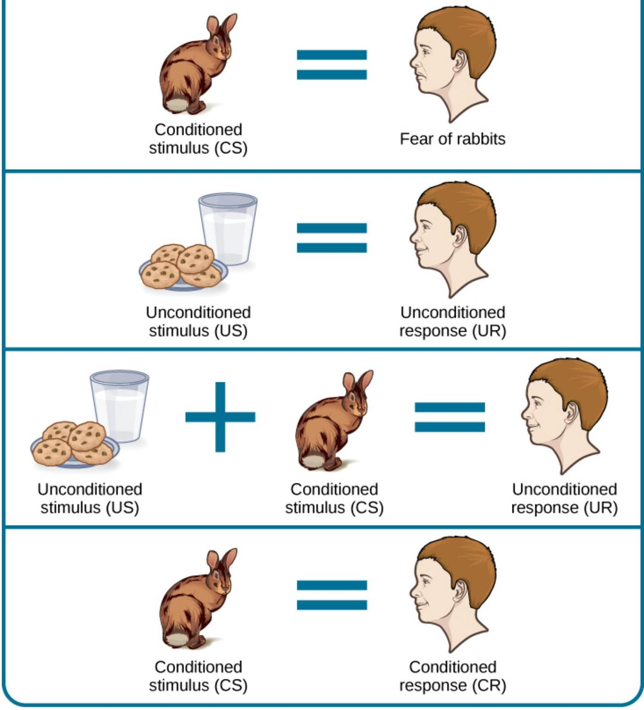

Figure PY.7. Exposure therapy. Exposure therapy seeks to change the response to a conditioned stimulus (CS). An unconditioned stimulus is presented over and over just after the presentation of the conditioned stimulus. This figure shows conditioning as conducted in Mary Cover Jones' 1924 study.Thirty years later, Joseph Wolpe (1958) refined Jones's techniques, giving us the behaviour therapy technique of exposure therapy that is used today. A popular form of exposure therapy is systematic desensitization, wherein a calm and pleasant state is gradually associated with increasing levels of anxiety-inducing stimuli. The idea is that you can't be nervous and relaxed at the same time. Therefore, if you can learn to relax when you are facing environmental stimuli that make you nervous or fearful, you can eventually eliminate your unwanted fear response (Wolpe, 1958) (Figure PY.8).

(a)

| Behavior | Fear Rating |
| :-- | :--: |
| Look at a photo of a spider. | 15 |
| Look at a real spider through clear glass. | 35 |
| Hold a box that contains a spider. | 55 |
| Watch a spider crawl across the floor. | 65 |
| Watch a spider crawl across your desk. | 75 |
| Hold a spider with gloved hands. | 90 |
| Hold a spider with bare hands. | 100 |

(b)

Figure PY.8. Arachnophobia. This person suffers from arachnophobia (fear of spiders). Through exposure therapy he is learning how to face his fear in a controlled, therapeutic setting. (credit: "GollyGforce - Living My Worst Nightmare"/Flickr)

How does exposure therapy work? Jayden is terrified of elevators. Nothing bad has ever happened to Jayden on an elevator, but they're so afraid of elevators that they will always take the stairs. That wasn't a problem when Jayden worked on the second floor of an office building, but now they have a new job-on the 29th floor of a skyscraper in downtown Los Angeles. Jayden knows they can't climb 29 flights of stairs in order to get to work each day, so they decided to see a behaviour therapist for help. The therapist asks Jayden to first construct a hierarchy of elevator-related situations that elicit fear and anxiety. They range from situations of mild anxiety such as being nervous around the other people in the elevator, to the fear of getting an arm caught in the door, to panic-provoking situations such as getting trapped or the cable snapping. Next, the therapist uses progressive relaxation, teaching Jayden how to relax each of their muscle groups so that they achieve a drowsy, relaxed, and comfortable state of mind. Once Jayden's in this state, the therapist asks Jayden to imagine a mildly anxietyprovoking situation. Jayden is standing in front of the elevator thinking about pressing the call button.

If this scenario causes Jayden anxiety, then they lift their finger. The therapist would then tell Jayden to forget the scene and return to their relaxed state. The therapist repeats this scenario over and over until Jayden can imagine pressing the call button without anxiety. Over time thetherapist and Jayden use progressive relaxation and imagination to proceed through all of the situations on Jayden's hierarchy until they become desensitised to each one. After this, Jayden and the therapist begin to practice what Jayden only previously envisioned in therapy, gradually going from pressing the button to actually riding an elevator. The goal is that Jayden will soon be able to take the elevator all the way up to the 29th floor of their office without feeling any anxiety.

Sometimes, it's too impractical, expensive, or embarrassing to re-create anxiety-producing situations, so a therapist might employ virtual reality exposure therapy by using a simulation to help conquer fears. Virtual reality exposure therapy has been used effectively to treat numerous anxiety disorders such as the fear of public speaking, claustrophobia (fear of enclosed spaces), aviophobia (fear of flying), and post-traumatic stress disorder (PTSD), a trauma and stressorrelated disorder (Gerardi, Cukor, Difede, Rizzo, \& Rothbaum, 2010).

Using virtual reality to help patients with dementia

Watch this video from Global News that highlights work being done at York University using virtual reality with patients with dementia.

Some behaviour therapies use operant conditioning, a technique that modifies behaviour through rewards and consequences. Recall what you learned about operant conditioning - we have a tendency to repeat behaviours that are reinforced. What happens to behaviours that are not reinforced? They become extinguished. These principles, defined by Skinner as operant conditioning, can be applied to help people with a wide range of psychological problems. For instance, operant conditioning techniques designed to reinforce desirable behaviours and punish unwanted behaviours are effective behaviour modification tools to help children with autism (Lovaas, 1987, 2003; Sallows \& Graupner, 2005; Wolf \& Risley, 1967).

This technique is called Applied Behaviour Analysis (ABA). In this treatment, a child's behaviour is charted and analysed. The ABA therapist, along with the caregivers, determines what reinforces the child, what sustains a behaviour to continue, and how best to manage a behaviour. For example, Nur may become overwhelmed and run out of the room when the classroom is too noisy. Whenever Nur runs out of the classroom, the teacher's aide chases after them and places Nur in a special room where they can relax. Going into the special room and getting the aide's attention are reinforcing for Nur. In order to change Nur's behaviour, Nur must be presented with other options before they become overwhelmed, and they cannot receive reinforcement for displaying maladaptive behaviours.One popular operant conditioning intervention is called the token economy. This involves a controlled setting where individuals are reinforced for desirable behaviours with tokens, such as a poker chip, that can be exchanged for items or privileges. Token economies are often used in psychiatric hospitals to increase patient cooperation and activity levels. Patients are rewarded with tokens when they engage in positive behaviours (e.g., making their beds, brushing their teeth, coming to the cafeteria on time, and socialising with other patients). They can later exchange the tokens for extra TV time, private rooms, visits to the canteen, and so on (Dickerson, Tenhula, \& Green-Paden, 2005).

# Psychotherapy: Cognitive Therapy 

Cognitive therapy is a form of psychotherapy that focuses on how a person's thoughts lead to feelings of distress. The idea behind cognitive therapy is that how you think determines how you feel and act. Cognitive therapists help their clients change dysfunctional thoughts in order to relieve distress. They help a client see how they misinterpret a situation (cognitive distortion). For example, a client may overgeneralise. Because Rey failed one test in Psychology 101, Rey feels they are stupid and worthless. These thoughts then cause their mood to worsen. Therapists also help clients recognise when they blow things out of proportion. Because Rey failed their Psychology 101 test, they have concluded that they're going to fail the entire course and probably flunk out of college altogether. These errors in thinking have contributed to Rey's feelings of distress. Rey's therapist will help them challenge these irrational beliefs, focus on their illogical basis, and correct them with more logical and rational thoughts and beliefs.

Cognitive therapy was developed by psychiatrist Aaron Beck in the 1960s. His initial focus was on depression and how a client's self-defeating attitude served to maintain a depression despite positive factors in her life (Beck, Rush, Shaw, \& Emery, 1979) (Figure PY.9). Through questioning, a cognitive therapist can help a client recognise dysfunctional ideas, challenge catastrophising thoughts about themselves and their situations, and find a more positive way to view things (Beck, 2011).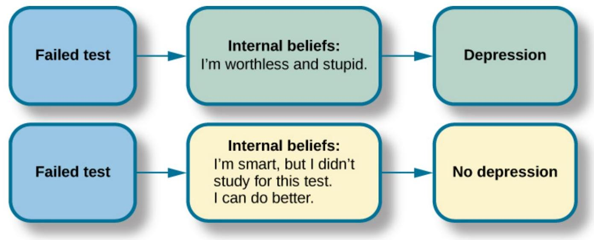

Figure PY.9. Emotional reactions. Your emotional reactions are the result of your thoughts about the situation rather than the situation itself. For instance, if you consistently interpret events and emotions around the themes of loss and defeat, then you are likely to be depressed. Through therapy, you can learn more logical ways to interpret situations.

# More About Cognitive Therapy 

Watch as Dr. Aaron Beck explains Cognitive Therapy and gives some examples of its use, to learn more.

## Psychotherapy: Cognitive-Behavioural Therapy

Cognitive-behavioural therapists focus much more on present issues than on a patient's childhood or past, as in other forms of psychotherapy. One of the first forms of cognitivebehavioural therapy was rational emotive therapy (RET), which was founded by Albert Ellis and (like Beck's development of Cognitive Therapy) grew out of his dislike of Freudian psychoanalysis (Daniel, n.d.). Behaviourists such as Joseph Wolpe also influenced Ellis's therapeutic approach (National Association of Cognitive-Behavioural Therapists, 2009).

Cognitive-behavioural therapy (CBT) helps clients examine how their thoughts affect their behaviour. It aims to change cognitive distortions and self-defeating behaviours. In essence, this approach is designed to change the way people think as well as how they act. It is similar tocognitive therapy in that CBT attempts to make individuals aware of their irrational and negative thoughts and helps people replace them with new, more positive ways of thinking. It is also similar to behaviour therapies in that CBT teaches people how to practice and engage in more positive and healthy approaches to daily situations.

In total, hundreds of studies have shown the effectiveness of cognitive-behavioural therapy in the treatment of numerous psychological disorders such as depression, PTSD, anxiety disorders, eating disorders, bipolar disorder, and substance abuse (Beck Institute for Cognitive Behaviour Therapy, n.d.). For example, CBT has been found to be effective in decreasing levels of hopelessness and suicidal thoughts in previously suicidal teenagers (Alavi, Sharifi, Ghanizadeh, \& Dehbozorgi, 2013). Cognitive-behavioural therapy has also been effective in reducing PTSD in specific populations, such as transit workers (Lowinger \& Rombom, 2012).

Cognitive-behavioural therapy aims to change cognitive distortions and self-defeating behaviours using techniques like the ABC model. With this model, there is an:

- Action (sometimes called an activating event), the
- Belief about the event, and the
- Consequences of this belief.

Let's say Jude and Zain both go to a party. Jude and Zain have each met someone new at the party and both of them spend a few hours chatting with their new acquaintances. At the end of the party, both Jude and Zain ask the new person they've met for their phone number, but in both cases, the other person refuses. Both Jude and Zain are surprised, as they both thought things were going well. What might Jude and Zain tell themselves about why the person was not interested? Let's say Jude tells himself that he is a loser, or is ugly, or "has no game". Jude then gets depressed and decides not to go to another party, which starts a cycle that keeps him depressed. Zain, on the other hand, thinks that maybe it was bad breath and goes out and buys some breath mints, goes to another party, and meets someone new.

Jude's belief about what happened results in a consequence of further depression, whereas Zain's belief does not. Jude is internalising the attribution or reason for the rebuffs, which triggers his depression. On the other hand, Zain is externalising the cause, so their thinking does not contribute to feelings of depression.

Cognitive-behavioural therapy focuses on identifying and correcting maladaptive and automatic thoughts, known as cognitive distortions, which skew a person's perception of reality. Three common types of cognitive distortions are all-or-nothing thinking, overgeneralisation, and jumping to conclusions.

All-or-nothing thinking is marked by seeing situations in extremes, with no middle ground, oftenfound in individuals experiencing depression. For example, after being rejected for a date, Jude might think, "No one will ever go out with me. I'm going to be alone forever", leading him to feel anxious and despondent about his future prospects.

Overgeneralisation involves drawing broad conclusions from a single, often minor, event. Jude might generalise a rejection by saying, "I am ugly, a loser, and no one is ever going to be interested in me", rather than seeing it as an isolated incident, thus magnifying the emotional impact of the rejection far beyond its actual significance.

Jumping to conclusions occurs when someone assumes a negative outcome without sufficient evidence to support such a belief. For example, when Carrigan does not hear back from Chao after leaving a message to meet for coffee, they might prematurely conclude that Chao dislikes them or is disinterested in friendship, despite many other plausible reasons for Chao's lack of response.

How effective is CBT? One client said this about his cognitive-behavioural therapy:
I have had many painful episodes of depression in my life, and this has had a negative effect on my career and has put considerable strain on my friends and family. The treatments I have received, such as taking antidepressants and psychodynamic counselling, have helped [me] to cope with the symptoms and to get some insights into the roots of my problems. CBT has been by far the most useful approach I have found in tackling these mood problems. It has raised my awareness of how my thoughts impact on my moods. How the way I think about myself, about others and about the world can lead me into depression. It is a practical approach, which does not dwell so much on childhood experiences, whilst acknowledging that it was then that these patterns were learned. It looks at what is happening now, and gives tools to manage these moods on a daily basis. (Martin, 2007, n.p.)

Study hint: What is the difference between Cognitive therapy and Cognitive-Behavioural therapy?

Cognitive Therapy (CT): Focuses primarily on the "Thought" aspect. CT centers around identifying and changing dysfunctional thinking patterns and beliefs to improve emotional regulation and develop personal coping strategies. It helps clients recognise and change cognitive distortions that contribute to their psychological distress.

Cognitive-Behavioural Therapy (CBT): Includes both "Thought" and "Behaviour". CBT expands on CT by also targeting the behaviours associated with harmful thinking. This therapy not only works on changing distorted thinking but integrates behavioural techniques to alter actions that perpetuate problems. CBT addresses both the thought processes and the behaviours that are rooted in these thoughts, making it a comprehensive approach.# Integrative (Eclectic) Approaches to Therapy 

Eclectic therapy integrates various psychological methods, such as cognitive-behavioural, psychodynamic, humanistic, sociocultural, feminist, and anti-oppression therapies, to create personalised treatment plans that address the unique needs of each patient. This integrative method is particularly suited to complex mental health conditions that present diverse symptoms and challenges.

## Aadia's Case: An Example of Borderline Personality Disorder

Aadia's story exemplifies the complex and multifaceted nature of borderline personality disorder, illustrating why an eclectic approach is essential for addressing such varied symptoms effectively. From infancy, Aadia displayed intense emotional responses and severe separation anxiety, crying nonstop until a parent returned. As a teenager, these intense emotions manifested as anger and impulsivity, with Aadia frequently yelling at parents and teachers and engaging in risky behaviours such as promiscuity and running away from home. These behaviours, along with Aadia's unstable relationships and emotional turmoil, highlight the traits commonly associated with borderline personality disorder.

By the time Aadia turned 17, their behaviour had become increasingly unpredictable, with violent outbursts and periods of intense clinginess or abrupt departures from home. After a painful breakup, Aadia's selfharming behaviour escalated to a serious suicide attempt at the age of 18, necessitating professional psychological intervention.

## Therapeutic Approach and Methods

Given the severity and variety of Aadia's symptoms, an eclectic approach was deemed crucial to address both immediate behavioural issues and deeper psychological patterns. Initially, to stabilise Aadia's mood and reduce the risk of further self-harm, therapists recommended antidepressant medications. However, understanding that medication alone would not resolve the underlying psychological issues, the therapeutic strategy also included comprehensive psychotherapy.

During the initial therapy sessions, the focus was primarily on building trust through person-centered approaches, facilitating a therapeutic alliance conducive to open communication. In subsequent sessions, if the therapist is trained in psychodynamic methods, they would engage Aadia in intensive face-to-face sessions to explore childhood experiences and attachment issues. At the same time, cognitive-behavioural therapy (CBT) was employed to address Aadia's distorted perceptions and maladaptive thought patterns, aiming to correct these and improve interpersonal relations. The therapist will work with the patient one-on-one and in group settings to help improve how they interact with others, manage their emotions, and handle stress better.

## Monitoring Progress and Introducing DBT

As therapy progressed, the eclectic therapist continuously monitored Aadia's behaviour, adapting therapeutic techniques to best meet evolving needs. The goal was to maintain engagement in therapy long enough to achieve significant progress.An integral part of Aadia's eclectic treatment included dialectical behaviour therapy (DBT; Linehan \& Dimeff, 2001), which combines cognitive-behavioural techniques with mindfulness practices. DBT is a cognitive therapy, but it includes a particular emphasis on attempting to enlist the help of the patient in their own treatment. This approach is particularly effective in managing the intense emotional fluctuations associated with borderline personality disorder. DBT emphasises developing skills in interpersonal effectiveness, emotion regulation, and distress tolerance, all crucial for Aadia's recovery.

# Image Attributions 

Figure PY.6. Figure 16.10 as found in Psychology 2e by OpenStax is licensed under a CC BY 4.0 License.

Figure PY.7. Figure 16.11 as found in Psychology 2e by OpenStax is licensed under a CC BY 4.0 License.

Figure PY.8. Figure 16.12 as found in Psychology 2e by OpenStax is licensed under a CC BY 4.0 License.

Figure PY.9. Figure 16.13 as found in Psychology 2e by OpenStax is licensed under a CC BY 4.0 License.

## (0) (1)

Psychological Approaches to Treatment Copyright © 2024 by Leanne Stevens; Jennifer Stamp; Kevin LeBlanc (editors - original chapter); and Jessica Motherwell McFarlane (editor - adapted chapter) is licensed under a Creative Commons Attribution 4.0 International License, except where otherwise noted.# Biological Approaches to Treatment 

LEANNE STEVENS; JENNIFER STAMP; KEVIN LEBLANC (EDITORS - ORIGINAL CHAPTER); AND JESSICA MOTHERWELL MCFARLANE (EDITOR - ADAPTED CHAPTER)

Approximate reading time: 28 minutes
Like other medical problems, psychological disorders may in some cases be treated biologically. Biomedical therapies are treatments designed to reduce psychological disorder by influencing the action of the central nervous system. These therapies primarily involve the use of medications but also include direct methods of brain intervention, including electroconvulsive therapy (ECT), transcranial magnetic stimulation (TMS), and psychosurgery.

## Drug Therapies

Psychologists understand that an appropriate balance of neurotransmitters in the brain is necessary for mental health. If there is a proper balance of chemicals, then the person's mental health will be acceptable, but psychological disorder will result if there is a chemical imbalance. The most frequently used biological treatments provide the patient with medication that influences the production and reuptake of neurotransmitters in the central nervous system (CNS). The use of these drugs is rapidly increasing, and drug therapy is now the most common approach to treatment of most psychological disorders.

Unlike some medical therapies that can be targeted toward specific symptoms, current psychological drug therapies are not so specific; they don't change particular behaviours or thought processes, and they don't really solve psychological disorders. However, although they cannot "cure" disorders, drug therapies are nevertheless useful therapeutic approaches, particularly when combined with psychological therapy, in treating a variety of psychological disorders. The best drug combination for the individual patient is usually found through trial and error (Biedermann \& Fleischhacker, 2009).

The major classes and brand names of drugs used to treat psychological disorders are shown in Table PY.2.Table PY.2. Some commonly prescribed psychotropic medications

| Type of Medication | Used to Treat | Brand Names of Commonly Prescribed Medications | How They Work | Side Effects |
| :--: | :--: | :--: | :--: | :--: |
| Antipsychotics (developed in the 1950s) | Schizophrenia and other types of severe thought disorders | Haldol, Mellaril, Prolixin, Thorazine | Treat positive psychotic symptoms such as auditory and visual hallucinations, delusions, and paranoia by blocking the neurotransmitter dopamine | Long-term use can lead to tardive dyskinesia (involuntary movements of the face and body), and extrapyramidal symptoms (muscle stiffness, tremors similar to Parkinson's disease). |
| Atypical Antipsychotics (developed in the late 1980s) | Schizophrenia and other types of severe thought disorders | Abilify, Risperdal, Clozaril | Treat negative symptoms of schizophrenia (like withdrawal and apathy) and sometimes positive symptoms (like hallucinations) by targeting both dopamine and serotonin receptors. | May cause weight gain, diabetes, and high cholesterol levels; other side effects include constipation, dry mouth, blurred vision, drowsiness, and dizziness. |
| Anti-depressants | SSRIs (Selective   Serotonin   Reuptake   Inhibitors):   Depression and   anxiety   SNRIs (Serotonin-   Norepinephrine   Reuptake   Inhibitors):   depression and   anxiety   NRIs   (Norepinephrine   Reuptake   Inhibitors):   depression and   smoking   cessation | SSRIs: Prozac, Zoloft, Celexa, Lexapro, Paxil. SNRIs: Effexor, Cymbalta, Pristiq. NRIs: Wellbutrin, Zyban, Strattera. | SSRIs increase serotonin levels in the brain (a neurotransmitter that helps regulate mood). SNRIs increase both serotonin and norepinephrine (a neurotransmitter related to alertness and energy). NRIs primarily increase norepinephrine levels. | SSRIs: headache, nausea, weight gain, drowsiness, reduced sex drive. SNRIs: nausea, dizziness, and sweating.   NRIs: dry mouth, constipation, and dizziness. || Type of Medication | Used to Treat | Brand Names of Commonly Prescribed Medications | How They Work | Side Effects |
| :--: | :--: | :--: | :--: | :--: |
| Anti-anxiety agents | anxiety and agitation that occur in OCD, PTSD, panic disorder, and social phobia insomnia | Benzodiazepines for anxiety disorders: Rivotril, Xanax, Ativan, Lectopam, Serax, Librium, Tranxene, Valium.   Benzodiazepines for insomnia: Ativan, Mogadon, Serax, Restoril, Halcion, Dalmane. | Depress central nervous system activity. This means they reduce the activity of the brain and nerves, making the body feel more relaxed and calm. They do this by enhancing the effects of a neurotransmitter called GABA (gamma-aminobutyric acid), which is naturally calming and helps reduce feelings of anxiety and stress. | Drowsiness, dizziness, headache, fatigue, lightheadedness. Severe withdrawal symptoms from regular use of benzodiazepines in high doses may include agitation, paranoia, delirium and seizures. |
| Mood Stabilisers | Bipolar disorder | Lithium, Depakote, Lamictal, Tegretol | Lithium moderates neurotransmitter signaling (helps stabilise mood swings). Depakote and Lamictal regulate neurotransmitter levels and electrical activity in neurons, calming overactivity. Tegretol stabilises mood by inhibiting sodium channels (reduces excessive nerve activity). | Excessive thirst, irregular heartbeat, itching/ rash, swelling (face, mouth, and extremities), nausea, loss of appetite |
| Stimulants | ADHD | Adderall, Ritalin | Improve ability to focus on tasks and maintain attention by increasing dopamine and norepinephrine levels (brain chemicals that help regulate attention and alertness). | Decreased appetite, difficulty sleeping, stomachache, headache |
| Psychedelics | Depression, PTSD, anxiety, addiction | Psilocybin (Magic Mushrooms), LSD, DMT, Ayahuasca | Primarily affect serotonin receptors, which can alter perception, mood, and cognitive processes | Altered sensory perception, psychological distress, nausea |# Antipsychotic Medications 

Until the middle of the 20th century, schizophrenia was inevitably accompanied by the presence of positive symptoms, including bizarre, disruptive, and potentially dangerous behaviour. As a result, schizophrenics were locked in asylums to protect them from themselves and to protect society from them. In the 1950s, a drug called chlorpromazine (Thorazine) was discovered that could reduce many of the positive symptoms of schizophrenia. Chlorpromazine was the first of many antipsychotic drugs.

Antipsychotic drugs (neuroleptics) are drugs that treat the symptoms of schizophrenia and related psychotic disorders. Today there are many antipsychotics, including Thorazine, Haldol, Clozaril, Risperdal, and Zyprexa. Some of these drugs treat the positive symptoms of schizophrenia, and some treat the positive, negative, and cognitive symptoms.

The discovery of chlorpromazine and its use in clinics has been described as the single greatest advance in psychiatric care, because it has dramatically improved the prognosis of patients in psychiatric hospitals worldwide. Using antipsychotic medications has allowed hundreds of thousands of people to move out of asylums into individual households or community mental health centres, and in many cases to live near-normal lives.

Antipsychotics reduce the positive symptoms of schizophrenia by reducing the transmission of dopamine at the synapses in the limbic system, and they improve negative symptoms by influencing levels of serotonin (Marangell, Silver, Goff, \& Yudofsky, 2003). Despite their effectiveness, antipsychotics have some negative side effects, including restlessness, muscle spasms, dizziness, and blurred vision. In addition, their long-term use can cause permanent neurological damage, a condition called tardive dyskinesia that causes uncontrollable muscle movements, usually in the mouth area (National Institute of Mental Health, 2008). Newer antipsychotics treat more symptoms with fewer side effects than older medications do (Casey, 1996).

## Antidepressant Medications

Antidepressant medications are designed to improve mood and are predominantly used in treating depression. They are also effective in managing anxiety disorders, phobias, and obsessive-compulsive disorders. These drugs typically modify the production and uptake of neurotransmitters like serotonin, norepinephrine, and dopamine, crucial for regulating emotion. While the detailed mechanisms are not fully understood, it is recognised that enhancingneurotransmitter levels in the central nervous system can significantly reduce symptoms of depression (Cipriani et al., 2018).

Historically, depression treatment included tricyclic antidepressants (TCAs) and monoamine oxidase inhibitors (MAOIs), which increase neurotransmitter availability but are associated with severe side effects, including cardiovascular risks and dietary restrictions due to potential severe interactions with certain foods.

Today, selective serotonin reuptake inhibitors (SSRIs) such as Prozac, Zoloft, and Celexa are the most commonly prescribed antidepressants. These drugs predominantly block the reuptake of serotonin, increasing its concentration in the central nervous system. SSRIs are preferred due to their relatively safe profile and fewer side effects compared to TCAs and MAOIs. However, they also can have significant side effects; patients may experience issues such as gastrointestinal disturbances, sexual dysfunction, and emotional blunting (Hieronymus et al., 2016).

Concerns about SSRIs potentially increasing the risk of suicidal thoughts among teens and young adults continue to be debated, with newer studies urging caution and a balanced approach to prescribing these medications in vulnerable populations (Cipriani et al., 2018). The onset of antidepressant effects can be slow, often requiring several weeks to months to be effective, necessitating tailored treatment plans for individual patients. This slow ramping up to full dose can leave patients under-medicated and suffering with their symptoms for weeks.

Serotonin-norepinephrine reuptake inhibitors (SNRIs) like Effexor and Cymbalta, and norepinephrine reuptake inhibitors (NRIs) such as Wellbutrin, are also popular. SNRIs are known to enhance both serotonin and norepinephrine levels, improving mood and energy, while NRIs primarily increase norepinephrine, helpful in treating depression and aiding smoking cessation. These classes of antidepressants also have side effects and may cause nausea, dizziness, and insomnia (Fornaro et al., 2019).

Recent research has also explored the therapeutic potentials of psychedelics such as psilocybin, LSD, DMT, and Ayahuasca for treating various psychiatric disorders including depression, PTSD and anxiety. These substances interact with serotonin receptors in the brain and have shown promise in altering perception, mood, and cognitive processes, although they can also induce significant sensory and psychological alterations (Carhart-Harris et al., 2017).

# Using Stimulants to Treat ADHD 

Attention-deficit/hyperactivity disorder (ADHD) is frequently treated with biomedical therapy,usually along with cognitive behavioural therapy (CBT). The most commonly prescribed drugs for ADHD are psychostimulants, including Ritalin, Adderall, and Dexedrine. Short-acting forms of the drugs are taken as pills and last between 4 and 12 hours, but some of the drugs are also available in long-acting forms (skin patches) that can be worn on the hip and last up to 12 hours. The patch is placed on the child early in the morning and worn all day.

Stimulants improve the major symptoms of ADHD, including inattention, impulsivity and hyperactivity, often dramatically, in about 75\% of the children who take them (Greenhill, Halperin, \& Abikof, 1999). But the effects of the drugs wear off quickly. Additionally, the best drug and best dosage vary from child to child, so it may take some time to find the correct combination.

It may seem surprising to you that a disorder that involves hyperactivity is treated with a psychostimulant, a drug that normally increases activity. The answer lies in the dosage. When large doses of stimulants are taken, they increase activity, but in smaller doses the same stimulants improve attention and decrease motor activity (Zahn, Rapoport, \& Thompson, 1980).

The most common side effects of psychostimulants in children include decreased appetite, weight loss, sleeping problems, and irritability as the effect of the medication tapers off. Stimulant medications may also be associated with a slightly reduced growth rate in children, although in most cases growth isn't permanently affected (Spencer, Biederman, Harding, \& O'Donnell, 1996).

Watch this video: Tricky Topics: Biological Treatments of Psychological Disorders (8 minutes)

One or more interactive elements has been excluded from this version of the text. You can view them online here: https://opentextbc.ca/psychologymtdi/?p=587\#oembed-1
"Tricky Topics: Biological Treatments of Psychological Disorders" video by FirstYearPsych Dalhousie is licensed under the Standard YouTube licence.

Here is the Tricky Topics: Biological Treatments of Psychological Disorders transcript.

# Mood Stabilisers: Lithium 

Patients who are suffering from bipolar disorder are not helped by the SSRIs or other antidepressants because their disorder also involves the experience of overly positive moods.Treatment is more complicated for these patients, often involving a combination of antipsychotics and antidepressants along with mood stabilising medications (McElroy \& Keck, 2000). The most well-known mood stabilser, lithium carbonate (or lithium), is used widely to treat mania associated with bipolar disorder. Available in Canada for more than 60 years, the medication is used to treat acute manic episodes and as a long-term therapy to reduce their frequency and severity. Anticonvulsant medications can also be used as mood stabilisers. Another drug, Depakote, has also proven very effective, and some bipolar patients may do better with it than with lithium (Kowatch et al., 2000).

People who take lithium must have regular blood tests to be sure that the levels of the drug are in the appropriate range. Potential negative side effects of lithium are loss of coordination, slurred speech, frequent urination, and excessive thirst. Though side effects often cause patients to stop taking their medication, it is important that treatment be continuous, rather than intermittent. Recently, Health Canada updated safety information and treatment recommendations for lithium after finding that taking lithium carries a risk of high blood calcium, or hypercalcemia, and is sometimes associated with a hormone disorder known as hyperparathyroidism (Canadian Press, 2014). There is no cure for bipolar disorder, but drug therapy does help many people.

# Anti-anxiety Medications 

Antianxiety medications are drugs that help relieve fear or anxiety. They work by increasing the action of the neurotransmitter GABA. The increased level of GABA helps inhibit the action of the sympathetic division of the autonomic nervous system, creating a calming experience.

The most common class of antianxiety medications is the tranquilizers, known as benzodiazepines. These drugs, which are prescribed millions of times a year, include Ativan, Valium, and Xanax. The benzodiazepines act within a few minutes to treat mild anxiety disorders but also have major side effects. They are addictive, frequently leading to tolerance, and they can cause drowsiness, dizziness, and unpleasant withdrawal symptoms including relapses into increased anxiety (Otto et al., 1993). Furthermore, because the effects of the benzodiazepines are very similar to those of alcohol, they are very dangerous when combined with it.# Psychedelic-assisted therapy 

Psychedelic-assisted therapy is emerging as a promising treatment option for various mental health disorders, notably treatment-resistant depression and PTSD. Conducted under stringent clinical supervision, this innovative therapeutic approach integrates the controlled use of psychedelic substances like psilocybin and MDMA into psychotherapy sessions, designed to facilitate profound psychological insights and emotional processing.

Recent research highlights the effectiveness of these therapies. Significant reductions in depression symptoms have been documented following psilocybin-assisted therapy, with sustained effects over time [Davis et al., 2020]. Psilocybin activates serotonin receptors in the brain, which appears to "reset" neural circuits that contribute to depressive symptoms. Similarly, MDMA has shown promise in facilitating emotional breakthroughs in PTSD treatment by enhancing neurotransmitter activity - serotonin, norepinephrine, and dopamine - that elevates mood and diminishes the fear response, allowing patients to engage more effectively with therapeutic interventions [Mitchell et al., 2021].

The safety of psychedelic therapy is well-documented in clinical research, with a noted low abuse potential and absence of overdose fatalities [Johnson et al., 2017]. Common side effects are generally transient and include nausea and headaches, manageable within a clinical setting. Strict adherence to therapeutic dosing and protocols reduces MDMA's neurocognitive effects [Jerome et al., 2020].

Given the potent nature of psychedelic substances, regulatory guidelines are rigorous. Treatment is restricted to controlled environments with professional oversight to ensure patient safety and maximise therapeutic outcomes [Feduccia et al., 2018].

As research progresses and regulatory frameworks evolve, psychedelic-assisted therapy may offer a viable alternative to conventional treatments, particularly for patients who have not responded to traditional therapy modalities. This approach represents a significant paradigm shift in the treatment of mental health disorders, combining established psychotherapeutic techniques with the therapeutic potential of psychedelic substances.

## Direct Brain Intervention Therapies

In cases of severe disorder it may be desirable to directly influence brain activity through electrical activation of the brain or through brain surgery. Electroconvulsive therapy (ECT) is amedical procedure designed to alleviate psychological disorder in which electric currents are passed through the brain, deliberately triggering a brief seizure (Figure PY.10). ECT has been used since the 1930s to treat severe depression.

When it was first developed, the procedure involved strapping the patient to a table before the electricity was administered. The patient was knocked out by the shock, went into severe convulsions, and awoke later, usually without any memory of what had happened. Today ECT is used only in the most severe cases when all other treatments have failed, and the practice is more humane. The patient is first given muscle relaxants and a general anaesthesia, and precisely calculated electrical currents are used to achieve the most benefit with the fewest possible risks.

ECT is very effective; about 80\% of people who undergo three sessions of ECT report dramatic relief from their depression. ECT reduces suicidal thoughts and is assumed to have prevented many suicides (Kellner et al., 2005). On the other hand, the positive effects of ECT do not always last; over one-half of patients who undergo ECT experience relapse within one year, although antidepressant medication can help reduce this outcome (Sackheim et al., 2001). ECT may also cause short-term memory loss or cognitive impairment (Abrams, 1997; Sackheim et al., 2007).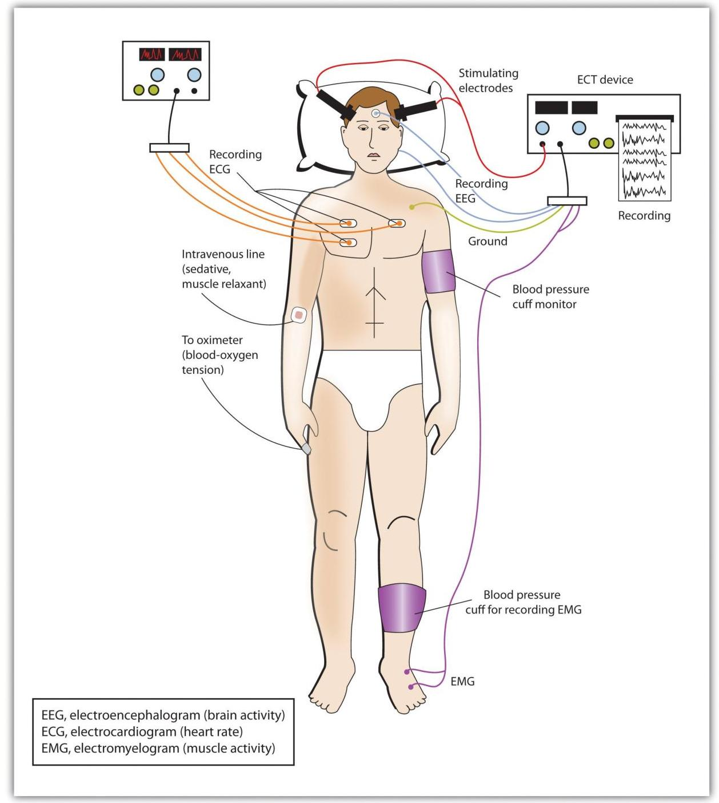

Figure PY. 10 Electroconvulsive Therapy (ECT). Today's ECT uses precisely calculated electrical currents to achieve the most benefit with the fewest possible risks.

Although ECT continues to be used, newer approaches to treating chronic depression are alsobeing developed. A newer and gentler method of brain stimulation is transcranial magnetic stimulation (TMS), a medical procedure designed to reduce psychological disorder that uses a pulsing magnetic coil to electrically stimulate the brain (Figure PY.11). TMS seems to work by activating neural circuits in the prefrontal cortex, which is less active in people with depression, causing an elevation of mood. TMS can be performed without sedation, does not cause seizures or memory loss, and may be as effective as ECT (Loo, Schweitzer, \& Pratt, 2006; Rado, Dowd, \& Janicak, 2008). TMS has also been used in the treatment of Parkinson's disease and schizophrenia.
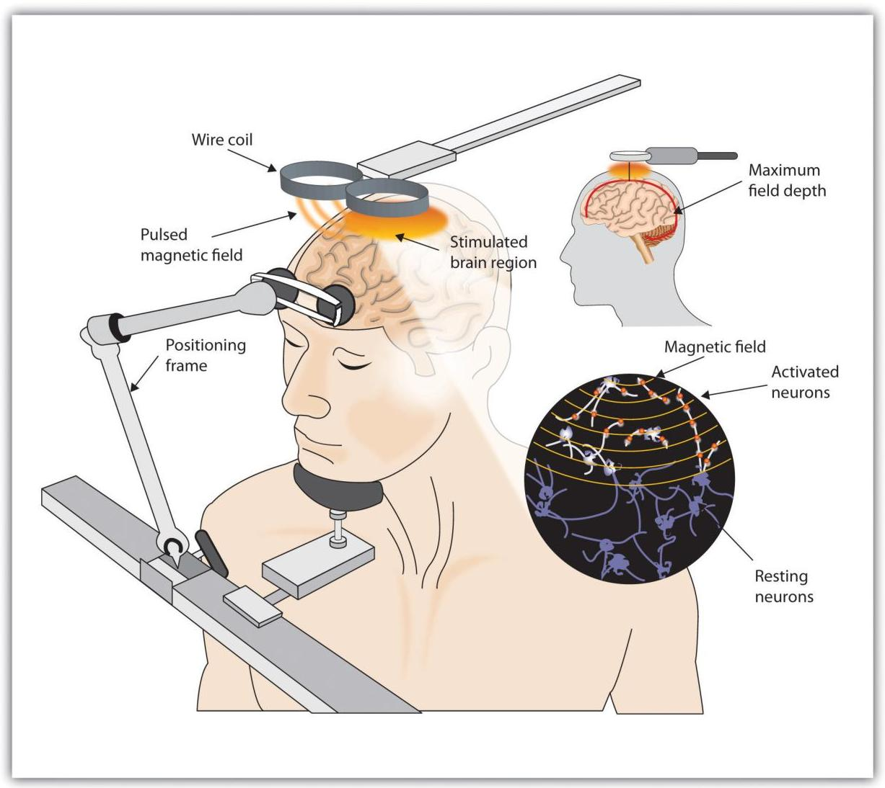

Figure PY.11. Transcranial Magnetic Stimulation (TMS). TMS is a noninvasive procedure that uses a pulsing magnetic coil to electrically stimulate the brain. Recently, TMS has been used in the treatment of Parkinson's disease.Still other biomedical therapies are being developed for people with severe depression that persists over years. One approach involves implanting a device in the chest that stimulates the vagus nerve, a major nerve that descends from the brain stem toward the heart (Corcoran, Thomas, Phillips, \& O'Keane, 2006; Nemeroff et al., 2006). When the vagus nerve is stimulated by the device, it activates brain structures that are less active in severely depressed people.

Psychosurgery, that is, surgery that removes or destroys brain tissue in the hope of improving disorder, is reserved for the most severe cases. The most well-known psychosurgery is the prefrontal lobotomy. Developed in 1935 by Nobel Prize winner Egas Moniz to treat severe phobias and anxiety, the procedure destroys the connections between the prefrontal cortex and the rest of the brain. Lobotomies were performed on thousands of patients. The procedure, which was never validated scientifically, left many patients in worse condition than before, subjecting the already suffering patients and their families to further heartbreak (Valenstein, 1986). Perhaps the most notable failure was the lobotomy performed on Rosemary Kennedy, the sister of US President John F. Kennedy, which left her severely incapacitated.

There are very few centres that still conduct psychosurgery today and, when such surgeries are performed, they are much more limited in nature and called cingulotomy (Dougherty et al., 2002). The ability to more accurately image and localise brain structures using modern neuroimaging techniques suggests that new, more accurate, and more beneficial developments in psychosurgery may soon be available (Sachdev \& Chen, 2009).

# Summary: Mental Health Treatment - Evolution and Contemporary Practices 

Historical Perspective and Evolution Historically, mental health issues were often misunderstood, with early beliefs attributing strange behaviour or psychological disorders to demonic possession. Such misconceptions led to harsh treatments including exorcisms, imprisonment, and even execution. The advent of asylums in the 18th century provided a place for those with mental illnesses, though conditions were generally poor and treatments harsh.

In the late 1700s, figures like Philippe Pinel and Dorothea Dix championed more humane treatment for the mentally ill, advocating for reforms that eventually led to better care practices. The mid-20th century saw significant changes with the deinstitutionalisation movement, led by developments in psychiatric medications and a push towards community-based care. However, this shift also led to challenges, such as increased rates of homelessness among the mentally ill due to insufficient community support systems.Contemporary Approaches to Mental Health Treatment Today, mental health care has evolved to encompass a variety of treatment modalities, focusing on both inpatient care in psychiatric hospitals for severe cases and extensive outpatient services for less severe cases. Modern treatments include psychotherapy, biomedical therapy, and integrative approaches tailored to individual needs. Psychotherapy now includes diverse approaches like cognitive-behavioural therapy, humanistic therapy, and psychodynamic therapy. Biomedical treatments involve medications and procedures like electroconvulsive therapy, with newer modalities like transcranial magnetic stimulation becoming more common.

Treatment settings have expanded beyond traditional therapy offices to include online and appbased platforms, enhancing accessibility. For example, apps like Tranquility provide support for anxiety and depression, reflecting the growing trend of digital mental health solutions.

Biomedical Therapies and Drug Treatments Biomedical therapies are crucial for conditions where psychological distress is linked to neurological imbalances. Common treatments include the use of psychostimulants for ADHD, antidepressants like SSRIs for depression and anxiety, mood stabilisers like lithium for bipolar disorder, and antipsychotics for schizophrenia. These medications adjust neurotransmitter levels in the brain, helping to alleviate symptoms. However, they come with potential side effects and typically need to be carefully managed under medical supervision.

Innovative Therapies and Future Directions Emerging therapies such as psychedelic-assisted therapy show promise, especially for treatment-resistant depression and PTSD. Techniques like electroconvulsive therapy and transcranial magnetic stimulation offer alternatives for severe cases where traditional medications may not be effective.

Treatment Modalities In individual therapy, a client and therapist work one-on-one to address personal issues. Group therapy gathers 5-10 individuals to discuss a common problem like substance abuse or grief, led by a trained therapist. Couples therapy assists two partners in an intimate relationship to resolve conflicts and strengthen their relationship, regardless of their marital status. Family therapy, a variant of group therapy, involves multiple family members aiming to improve individual and collective family dynamics.

Substance-Related and Addictive Disorders: A Special Case Addiction is considered a chronic disease that changes brain function, leading to high relapse rates of $40 \%-60 \%$. Treatment focuses on stopping compulsive drug-seeking behaviours and often includes behavioural therapy, which can be conducted individually or in groups, and may be supplemented with medication. Effective treatment frequently addresses comorbid (co-occuring) conditions, such as concurrent mental health disorders, to enhance recovery outcomes.

Inclusive Therapy Models: Sociocultural, Feminist, and Anti-Oppression ApproachesThe sociocultural model integrates an individual's cultural and religious background into therapy, significantly influencing outcomes by enhancing cultural competency. Feminist and anti-oppression therapies extend this by addressing power dynamics and inequalities related to gender, race, and socioeconomic status. These approaches validate clients' experiences and promote equity within the therapeutic relationship, aiming to dismantle systemic barriers and improve accessibility and satisfaction in mental health services for marginalised groups.

Integrative and Eclectic Approaches Eclectic therapy, which integrates various therapeutic methods and techniques, is becoming increasingly popular for treating complex mental health issues. This approach allows therapists to tailor treatment strategies to individual patient needs, combining elements of behavioural, cognitive, and psychodynamic therapies.

Conclusion The landscape of mental health treatment continues to evolve, with ongoing improvements in the understanding and approaches to therapy. By integrating traditional and innovative methods, mental health professionals aim to provide more effective, personalised care that addresses both the symptoms and underlying causes of mental health conditions.

Image Attributions
Figure PY.10. Figure 15.17 as found in Introduction to Psychology \& Neuroscience (2nd Edition) is licensed under a CC BY 4.0 License.

Figure PY.11. Figure 15.18 as found in Introduction to Psychology \& Neuroscience (2nd Edition) is licensed under a CC BY 4.0 License.

# (1) 

Biological Approaches to Treatment Copyright © 2024 by Leanne Stevens; Jennifer Stamp; Kevin LeBlanc (editors - original chapter); and Jessica Motherwell McFarlane (editor - adapted chapter) is licensed under a Creative Commons Attribution 4.0 International License, except where otherwise noted.# Chapter Resources 

## LEANNE STEVENS; JENNIFER STAMP; KEVIN LEBLANC (EDITORS - ORIGINAL CHAPTER); AND JESSICA MOTHERWELL MCFARLANE (EDITOR - ADAPTED CHAPTER)

## Review Questions

## Multiple Choice Questions

1. Who of the following does not support the humane and improved treatment of mentally ill persons?
a. Philippe Pinel
b. medieval priests
c. Dorothea Dix
d. All of the above
2. The process of closing large asylums and providing for people to stay in the community to be treated locally is known as $\qquad$ .
a. deinstitutionalisation
b. exorcism
c. deactivation
d. decentralisation
3. Skylar was convicted of domestic violence. As part of their sentence, the judge has ordered that Skylar attend therapy for anger management. This is considered $\qquad$ treatment.
a. involuntary
b. voluntary
c. forced
d. mandatory
4. Today, most people with psychological problems are not hospitalised. Typically they are only hospitalised if they $\qquad$ .
a. have schizophrenia
b. have insurance
c. are an imminent threat to themselves or others
d. require therapy
5. The idea behind $\qquad$ is that how you think determines how you feel and act.a. cognitive therapy
b. cognitive-behavioural therapy
c. behaviour therapy
d. client-centred therapy
6. Mood stabilisers, such as lithium, are used to treat $\qquad$ .
a. anxiety disorders
b. depression
c. bipolar disorder
d. ADHD
7. Clay is in a therapy session. The therapist asks them to relax and say whatever comes to their mind at the moment. This therapist is using $\qquad$ which is a technique of $\qquad$ .
a. active listening; client-centred therapy
b. systematic desensitisation; behaviour therapy
c. transference; psychoanalysis
d. free association; psychoanalysis
8. A treatment modality in which 5-10 people with the same issue or concern meet together with a trained clinician is known as $\qquad$ .
a. family therapy
b. couples therapy
c. group therapy
d. self-help group
9. What happens during an intake?
a. The therapist gathers specific information to address the client's immediate needs such as the presenting problem, the client's support system, and insurance status. The therapist informs the client about confidentiality, fees, and what to expect in a therapy session.
b. The therapist guides what happens in the therapy session and designs a detailed approach to resolving each member's presenting problem.
c. The therapist meets with a couple to help them see how their individual backgrounds, beliefs, and actions are affecting their relationship.
d. The therapist examines and discusses with the family the boundaries and structure of the family, e.g., who makes the rules, who sleeps in the bed with whom, and how decisions are made.
10. What is the minimum amount of treatment time addicts should receive if they are to achieve a desired outcome?
a. 3 months
b. 6 months
c. 9 months
d. 12 months
11. When an individual has two or more diagnoses, which often includes a substance-related diagnosis andanother psychiatric diagnosis, this is known as $\qquad$ $<$
a. bipolar disorder
b. comorbid disorder
c. codependency
d. bi-morbid disorder
12. Gage was drug-free for almost six months. Then Gage started hanging out with their addict friends again, and they have now started abusing drugs again. This is an example of $\qquad$ .
a. release
b. reversion
c. re-addiction
d. relapse
13. The sociocultural perspective looks at you, your behaviours, and your symptoms in the context of your
$\qquad$ .
a. education
b. socioeconomic status
c. culture and background
d. age
14. Which of the following was not listed as a barrier to mental health treatment?
a. fears about treatment
b. language
c. transportation
d. being a member of the ethnic majority

Critical Thinking Questions
15. People with psychological disorders have been treated poorly throughout history. Describe some efforts to improve treatment; include explanations for the success or lack thereof.
16. Usually someone is hospitalised only if they are an imminent threat to themselves or others. Describe a situation that might meet these criteria.
17. Imagine that you are a psychiatrist. Your patient, Pat, comes to you with the following symptoms: anxiety and feelings of sadness. Which therapeutic approach would you recommend and why?
18. Compare and contrast individual and group therapies.
19. You are conducting an intake assessment. Your client is a 45-year-old single, employed male with cocaine dependence. He failed a drug screen at work and is mandated to treatment by his employer if he wants to keep his job. Your client admits that he needs help. Why would you recommend group therapy for him?
20. Lashawn is a 24-year-old African American female. For years she has been struggling with bulimia. Sheknows she has a problem, but she is not willing to seek mental health services. What are some reasons why she may be hesitant to get help?

# Personal Application Questions 

21. Do you think there is a stigma associated with mentally ill persons today? Why or why not?
22. What are some places in your community that offer mental health services? Would you feel comfortable seeking assistance at one of these facilities? Why or why not?
23. If you were to choose a therapist practicing one of the techniques presented in this section, which kind of therapist would you choose and why?
24. Your best friend tells you that they are concerned about their cousin. The cousin - a teenager - is constantly coming home after curfew, and your friend suspects that their cousin has been drinking. What treatment modality would you recommend to your friend and why?
25. What are some substance-related and addictive disorder treatment facilities in your community, and what types of services do they provide? Would you recommend any of them to a friend or family member with a substance abuse problem? Why or why not?
26. What is your attitude toward mental health treatment? Would you seek treatment if you were experiencing symptoms or having trouble functioning in your life? Why or why not? In what ways do you think your cultural and/or religious beliefs influence your attitude toward psychological intervention?

## Review Question Answers

## Multiple Choice Question Answers

1. B
2. C
3. B
4. A
5. D
6. D
7. A
8. C
9. C
10. C
11. C
12. A
13. D

## Critical Thinking Question Answers

15. Beginning in the Middle Ages and up until the mid-20th century, the mentally ill were misunderstood and treated cruelly. In the 1700s, Philippe Pinel advocated for patients to be unchained, and he was able to affect this in a Paris hospital. In the 1800s, Dorothea Dix urged the government to provide better funded and regulated care, which led to thecreation of asylums, but treatment generally remained quite poor. Federally mandated deinstitutionalisation in the 1960s began the elimination of asylums, but it was often inadequate in providing the infrastructure for replacement treatment.
16. Frank is severely depressed. He lost his job one year ago and has not been able to find another one. A few months after losing his job, his bank foreclosed on the mortgage on his home, and his wife left him. Lately, he has been thinking that he would be better off dead. He's begun giving his possessions away and has purchased a handgun. He plans to kill himself on what would have been his 20th wedding anniversary, which is coming up in a few weeks.
17. I would recommend psychodynamic talk therapy or cognitive therapy to help the person see how her thoughts and behaviours are having negative effects.
18. In an individual therapy session, a client works one-on-one with a trained therapist. In group therapy, usually 5-10 people meet with a trained group therapist to discuss a common issue, such as divorce, grief, eating disorder, substance abuse, or anger management.
19. The rationale behind using group therapy for addiction treatment is that addicts are much more likely to maintain sobriety when treatment is in a group format. It has been suggested that it's due to the rewarding and therapeutic benefits of the group, such as support, affiliation, identification, and even confrontation. Because this client is single, he may not have family support, so support from the group may be even more important in his ability to recover and maintain his sobriety.
20. One reason may be that her culture views having a mental illness as a stigma. Additionally, perhaps she doesn't have insurance and is worried about the cost of therapy. She could also be afraid that a white counsellor would not understand her cultural background, so she would feel uncomfortable sharing things. Also, she may believe she is self-reliant and tell herself that she's a strong woman who can fix this problem on her own without the help of a therapist.

# Key Terms 

## Key Terms

- asylum: institution created for the specific purpose of housing people with psychological disorders- aversive conditioning: counterconditioning technique that pairs an unpleasant stimulant with an undesirable behaviour
- behaviour therapy: therapeutic orientation that employs principles of learning to help clients change undesirable behaviours
- biomedical therapy: treatment that involves medication and/or medical procedures to treat psychological disorders
- cognitive therapy: form of psychotherapy that focuses on how a person's thoughts lead to feelings of distress, with the aim of helping them change these irrational thoughts
- cognitive-behavioural therapy: form of psychotherapy that aims to change cognitive distortions and selfdefeating behaviours
- comorbid disorder: individual who has two or more diagnoses, which often includes a substance abuse diagnosis and another psychiatric diagnosis, such as depression, bipolar disorder, or schizophrenia
- confidentiality: therapist cannot disclose confidential communications to any third party, unless mandated or permitted by law
- counterconditioning: classical conditioning therapeutic technique in which a client learns a new response to a stimulus that has previously elicited an undesirable behaviour
- couples therapy: two people in an intimate relationship who are having difficulties and are trying to resolve them with therapy
- cultural competence: therapist's understanding and attention to issues of race, culture, and ethnicity in providing treatment
- deinstitutionalisation: process of closing large asylums and integrating people back into the community where they can be treated locally
- dream analysis: technique in psychoanalysis in which patients recall their dreams and the psychoanalyst interprets them to reveal unconscious desires or struggles
- electroconvulsive therapy (ECT): type of biomedical therapy that involves using an electrical current to induce seizures in a person to help alleviate the effects of severe depression
- exposure therapy: counterconditioning technique in which a therapist seeks to treat a client's fear or anxiety by presenting the feared object or situation with the idea that the person will eventually get used to it
- family therapy: special form of group therapy consisting of one or more families
- free association: technique in psychoanalysis in which the patient says whatever comes to mind at the moment
- group therapy: treatment modality in which 5-10 people with the same issue or concern meet together with a trained clinician
- humanistic therapy: therapeutic orientation aimed at helping people become more self-aware and accepting of themselves
- individual therapy: treatment modality in which the client and clinician meet one-on-one
- intake: therapist's first meeting with the client in which the therapist gathers specific information to address the client's immediate needs
- involuntary treatment: therapy that is mandated by the courts or other systems
- nondirective therapy: therapeutic approach in which the therapist does not give advice or provide interpretations but helps the person identify conflicts and understand feelings
- play therapy: therapeutic process, often used with children, that employs toys to help them resolve psychological problems
- psychoanalysis: therapeutic orientation developed by Sigmund Freud that employs free association,dream analysis, and transference to uncover repressed feelings

- psychotherapy: (also, psychodynamic psychotherapy) psychological treatment that employs various methods to help someone overcome personal problems, or to attain personal growth
- rational emotive therapy (RET): form of cognitive-behavioural therapy
- relapse: repeated drug use and/or alcohol use after a period of improvement from substance abuse
- Rogerian (client-centered therapy): non-directive form of humanistic psychotherapy developed by Carl Rogers that emphasises unconditional positive regard and self-acceptance
- strategic family therapy: therapist guides the therapy sessions and develops treatment plans for each family member for specific problems that can be addressed in a short amount of time
- structural family therapy: therapist examines and discusses with the family the boundaries and structure of the family: who makes the rules, who sleeps in the bed with whom, how decisions are made, and what are the boundaries within the family
- systematic desensitisation: form of exposure therapy used to treat phobias and anxiety disorders by exposing a person to the feared object or situation through a stimulus hierarchy
- token economy: controlled setting where individuals are reinforced for desirable behaviours with tokens (e.g., poker chip) that can be exchanged for items or privileges
- transference: process in psychoanalysis in which the patient transfers all of the positive or negative emotions associated with the patient's other relationships to the psychoanalyst
- unconditional positive regard: fundamental acceptance of a person regardless of what they say or do; term associated with humanistic psychology
- virtual reality exposure therapy: uses a simulation rather than the actual feared object or situation to help people conquer their fears
- voluntary treatment: therapy that a person chooses to attend in order to obtain relief from her symptoms

# References 

The reference list for this chapter has been excluded from this file to reduce page count. The full reference list can be viewed online at opentextbc.ca/psychologymtdi/chapter/treatmentchapter-resources/.

## Chapter Attribution

This chapter is largely based on the "Treatment" chapter in Introduction to Psychology \& Neuroscience (2nd Edition) edited by Leanne Stevens, Jennifer Stamp, \& Kevin LeBlanc, which islicensed under a CC BY 4.0 licence. It was adapted by Jessica Motherwell McFarlane to add some new resources and sections.

# (1) 

Chapter Resources Copyright © 2024 by Leanne Stevens; Jennifer Stamp; Kevin LeBlanc (editors - original chapter); and Jessica Motherwell McFarlane (editor - adapted chapter) is licensed under a Creative Commons Attribution 4.0 International License, except where otherwise noted.# Versioning History 

This page provides a record of edits and changes made to this book since its initial publication. Whenever edits or updates are made in the text, we provide a record and description of those changes here. If the change is minor, the version number increases by 0.01 . If the edits involve substantial updates, the version number increases to the next full number.

The files posted by this book always reflect the most recent version. If you find an error in this book, please fill out the Report an Error form.

| Version | Date | Change | Details |
| :-- | :-- | :-- | :-- |
| 1.00 | August 22,   2024 | Book published. |  |
| 1.01 | October 24,   2024 | Reduced page count. | Moved "Acknowledgements" from back   matter to front matter. Replaced   reference lists in export formats with   links to where they can be read in the   webbook to reduce page count. |
| 1.02 | April 16, 2025 | Picture updated. | Changed the picture of the Kamloops   Indian Residential School in Psychology   in Our Social Lives Introduction from a   black and white archival photo to a   photo from 2024. |