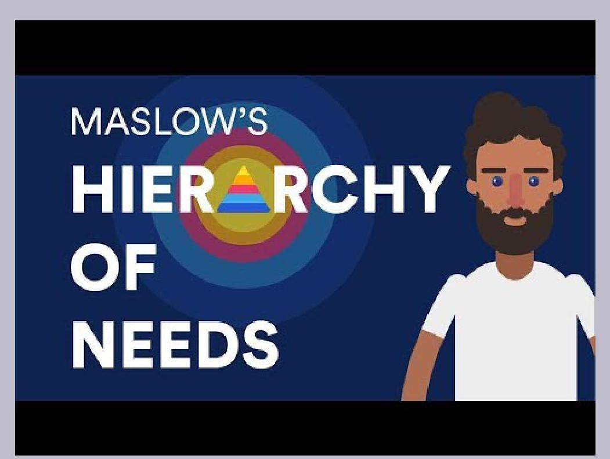
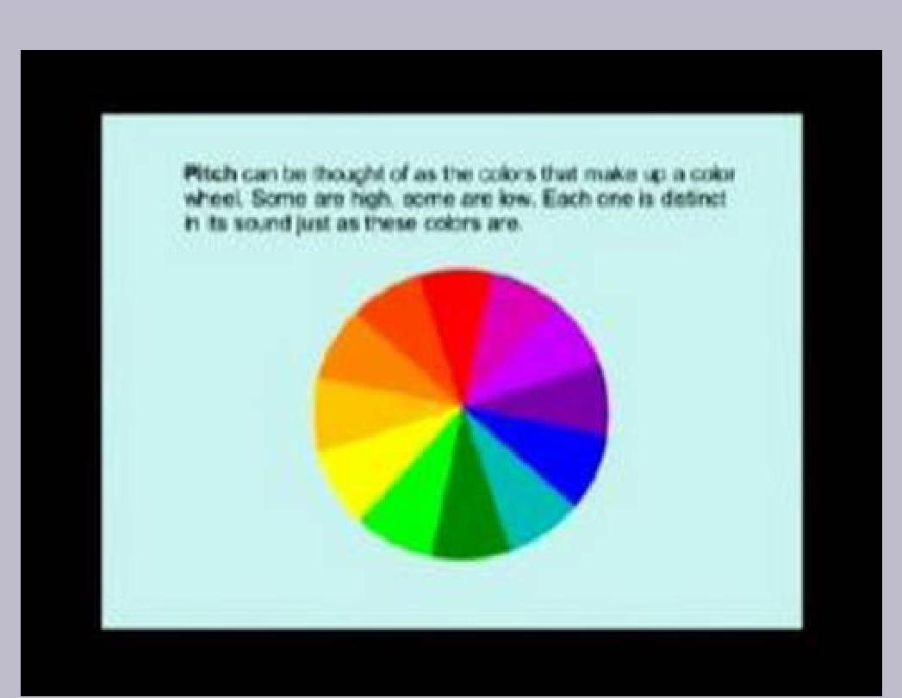
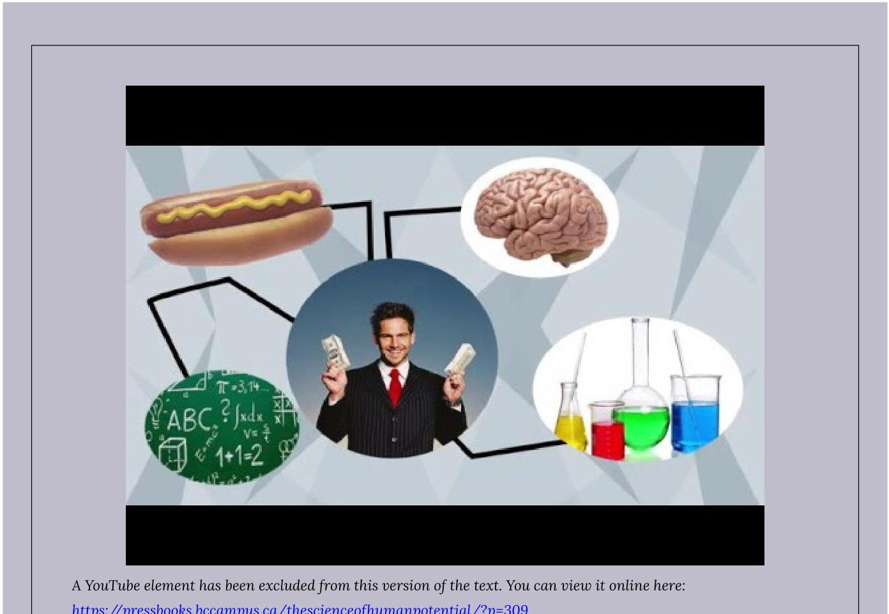
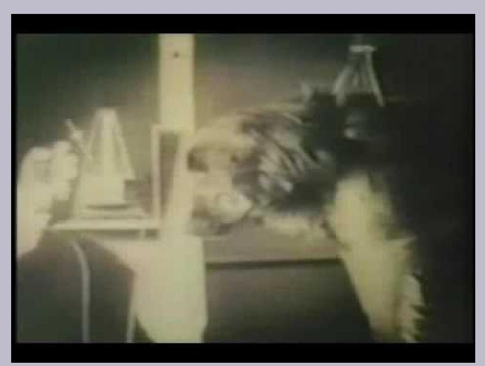
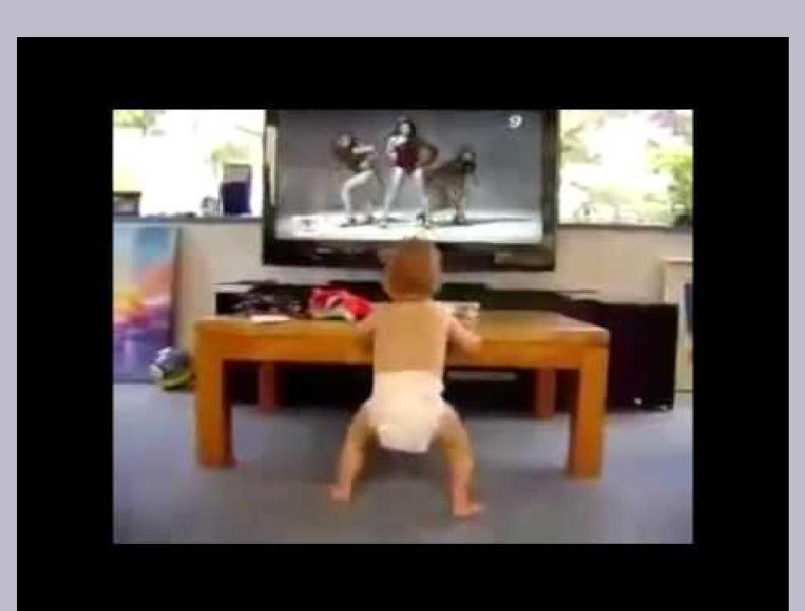
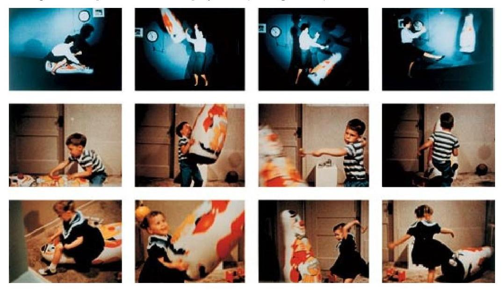
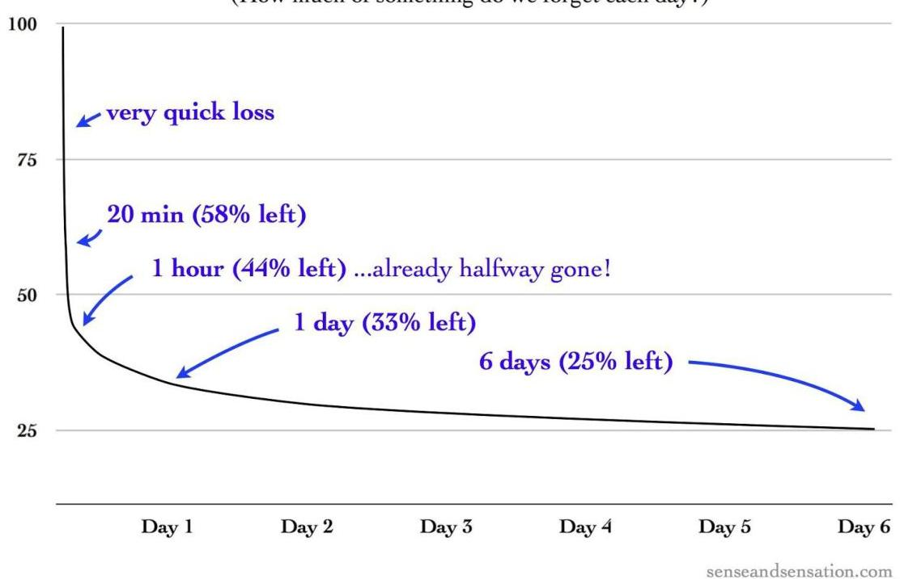
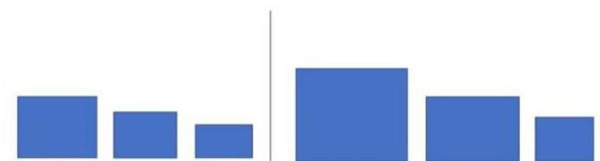
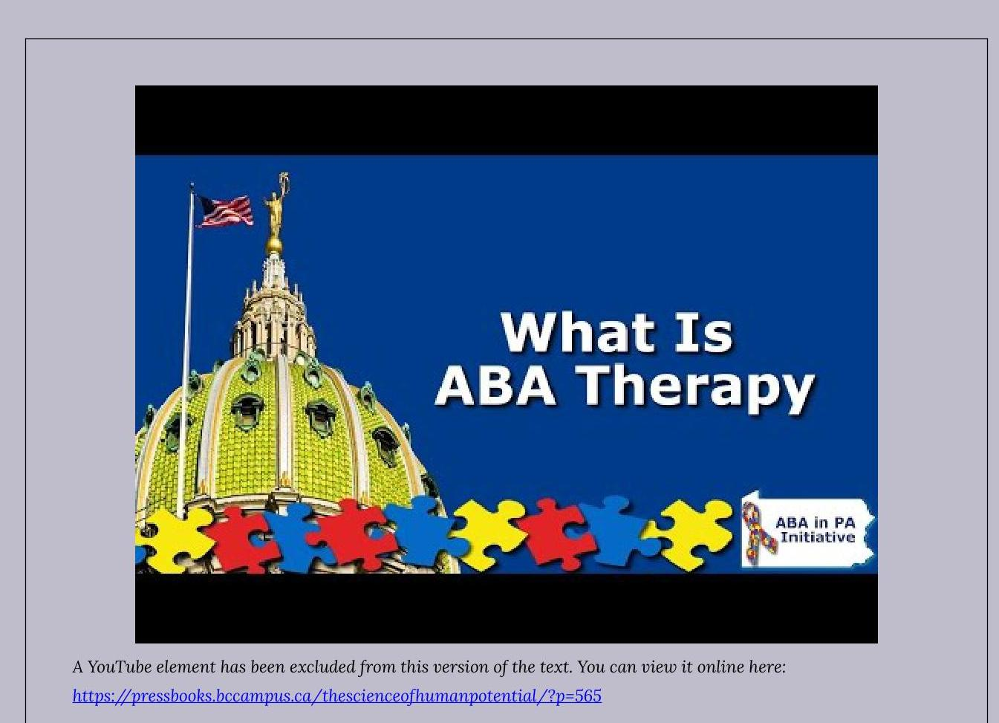

Psychology.# Psychology 

The Science of Human Potential

JEFFREY LEVYPsychology by Jeffrey C. Levy is licensed under a Creative Commons Attribution 4.0 International License, except where otherwise noted.# Dedication 

To Fran with love,
My wife, best friend, muse, and soulmate.# Contents 

To the Instructor and Students ..... xi
Acknowledgments ..... xiii
Author's Biography ..... xiv
Chapter 1: The Science of Psychology
Science and Psychology ..... 17
Research Methods in Psychology ..... 29
Psychology, Human Potential and Self-Control ..... 43
Review Exercises ..... 53
Chapter 2: Biology and Human Potential
Evolution: Adaptation through Natural Selection ..... 57
The Nervous and Endocrine Systems ..... 67
Self-Control and Biological Psychology ..... 78
Review Exercses ..... 80
Chapter 3: Sensation, Perception and Human Potential
Sensation and Human Potential ..... 83
Vision ..... 88
Hearing and other Senses ..... 96
Perception and Human Potential ..... 105
Review Exercises ..... 113
Chapter 4: Emotion, Motivation and Human Potential
Emotion and Human Potential ..... 117
Human Motivation ..... 122
Motivation and Human Potential ..... 135
Review Exercises ..... 140
Chapter 5: Direct Learning and Human Potential
Predictive Learning and Human Potential ..... 143
Control Learning and Human Potential ..... 159Adaptive Learning Applications ..... 169
Review Exercises ..... 182
Chapter 6: Indirect Learning and Human Potential
Observational Learning ..... 185
Speech and Language ..... 194
Memory ..... 202
Review Exercises ..... 210
Chapter 7: Cognition, Intelligence and Human Potential
Knowledge, Skills and Human Potential ..... 213
Tools, Technology and the Human Condition ..... 225
Individual Differences ..... 233
Review Exercises ..... 244
Chapter 8: Lifespan Development of Human Potential
Fetal and Infant Development ..... 247
Child Development ..... 256
Theories of Development ..... 263
Adolescence and Adulthood ..... 274
Review Exercises ..... 282
Chapter 9: Personality and Human Potential
Trait Theories of Personality ..... 285
Personality and Nature/Nurture ..... 292
Review Exercises ..... 302
Chapter 10: Social Influences on the Development of Human Potential
Compliance, Conformity and Obedience ..... 305
Social Roles and Bystander Apathy ..... 317
Group Cohesiveness, Attitudes and Prejudice ..... 322
Review Exercises ..... 333
Chapter 11: Problems in the Development of Human Potential
Psychiatry and Clinical Psychology ..... 337
DSM 5 - Neurodevelopmental and Schizophrenic Spectrum Disorders ..... 341
DSM 5 - Bipolar, Depressive and Anxiety Disorders ..... 349Chapter 12: The Science of Psychology and Human Potential
The Scientist Practitioner Model of Professional Psychology ..... 371
Preventing Behavioral Problems and Realizing Human Potential ..... 381
Afterward ..... 393
Review Exercises ..... 395
References ..... 397.# To the Instructor and Students 

A majority of two-year and four-year college students enroll in Introduction to Psychology as a required or elective course. It is an enormous market with a significant number of competitive textbooks. Reviews published in Teaching of Psychology divided current Introduction to Psychology textbooks into three categories; "full-length" (Griggs and Jackson, 2013a, 13 books), "brief" (Griggs and Jackson, 2013b, 9 books), and "concise" (Jackson and Griggs, 2013, 5 books). This last category represents an attempt to address the fact that instructors are only able to cover approximately two-thirds of the larger books in a single semester. Psychology: The Science of Human Potential is designed to fit the characteristics of the third category.

As one would expect for a successful scientific discipline, knowledge accumulates over time and understanding of the basic phenomena and theoretical issues evolves. This inevitably results in the need to "cull trees" and "reshape forests." Existing textbooks tend to bury the reader in trees, resulting in the forest being indistinguishable. Addressing length by creating brief editions has been criticized as simply creating diluted versions of the full-length textbooks. I believe my integrative, cohesive approach to the subject matter should result in a more cohesive narrative arc.

All introduction to psychology textbooks share the objectives of presenting psychology as an empirical science by providing a survey of the different content areas. It would be difficult to differentiate among them based upon an examination of their tables of contents. Introductory material describing the early history of the discipline and research methods is followed by chapters dedicated to "psychology as a natural science" (e.g., biological psychology, perception, learning, and cognition) and "psychology as a social science" (e.g., developmental psychology, personality, abnormal psychology, and social psychology). Psychology: The Science of Human Potential shares these objectives and conforms to this traditional format.

The first chapter provides an overview of the textbook and reviews the history of psychology and its methodology. Psychology is described as a science studying how hereditary (nature) and experiential (nurture) variables interact to influence the thoughts, feelings, and behavior of individuals. The remainder of the text will be organized in sections entitled "Mostly Nature" (Biological Psychology; Sensation \& Perception; Motivation \& Emotion), "Mostly Nurture" (Direct Learning; Indirect Learning (i.e., observational learning and language); Cognition), and "Nature/Nurture" (Human Development; Personality; Social Psychology; Maladaptive Behavior; Professional Psychology and Human Potential).

A different criticism made of Introduction to Psychology textbooks is that they lack cohesiveness. There is the need to develop an overarching schema for organizing and integrating the material in a meaningful way. A reviewer of a biological psychology textbook once remarked that beginning the book with a discussion of the neuron was akin to beginning a book about airplanes by describing a screw. The implicit suggestion was to describe the airplane at the beginning, making discussion of the neuron meaningful within a larger context. The issue of cohesiveness is magnified and made more complicated by the higher-order need in Introduction to Psychology textbooks to integrate the different content areas. It is difficult enough to create "rudders", "wings", and a "fuselage" for each content area let alone an "airplane" for the entire discipline. I attempt to establish cohesiveness in four ways, by:

- providing an overarching schema relating the different content areas to the theme of human potential;
- writing in a linear style resulting in a momentum-building narrative arc;
- incorporating recurrent images and themes;
- describing self-control applications of the principles covered in appropriate chapters.

An overarching theme for the textbook will be how nature and nurture relate to fulfilling human potential. For example, how does our nervous system, ability to sense the environment, and learn, enable us to understand and fulfill our potential as individuals and a species? As a didactic tool in my Adaptive Learning text (Levy, 2013), I frequentlycontrasted the human condition of a Stone-Age nomadic tribe with that of cultures living under technologicallyenhanced conditions. By moving similar material to appropriate sections of an Introduction to Psychology textbook, a helpful and meaningful perspective consistent with evolutionary psychology is established. For example, how are perception, learning, and cognition involved in adapting to human conditions as diverse as the Amazonian rainforest and a modern metropolis? Maslow's human needs pyramid is applied to nomadic Stone-Age individuals and to college students throughout the book, creating flow and an arc within and across chapters.

Another recurrent theme throughout the book will be the power of the scientific method in helping us understand and develop technologies to impact upon nature. A picture contrasting how Manhattan Island (New York City) appeared before the Dutch explorer, Henry Hudson, arrived in 1609, and as it appeared 400 years later, dramatically demonstrates how the Scientific Revolution enabled humans to transform the planet. A picture of a contemporary child who, until recently, lived the same nomadic Stone-Age lifestyle as his ancestors had for thousands of years, reminds us of the impact of this transformation. As a species, we evolved to adapt to the left side of the image of Manhattan. We now must adapt to a human-constructed world. These pictures and themes will reappear across chapters.

The majority of students take Introduction to Psychology during their freshman year. Frankly, many of the textbooks seem better designed to serve as GRE preparation for senior psychology majors rather than introduction to the discipline for mostly freshmen non-majors. Psychology: The Science of Human Potential is written in an informal style geared to a diverse freshman audience. The Introduction to Psychology course may serve to help students adjust to the transition to college. The effectiveness and relevance of psychological principles will be demonstrated through selfcontrol exercises provided in appropriate chapters. These will address time management, study habits, test-taking, and other college adjustment strategies. I have been advising college students and assigning self-modification projects for 40 years. Such exercises are excellent vehicles for teaching students about the application of psychological principles, thereby demonstrating the effectiveness of the discipline in addressing meaningful real-world issues and problems. They also require students to implement many of the fundamental skills of a professional psychologist including collecting, compiling, graphing, summarizing, and interpreting behavioral data. I believe asking students to "act like a psychologist" by conducting self-modification exercises will be an intrinsically motivating and effective way to introduce them to the important and fascinating discipline of psychology.

# References 

Griggs, R. A., \& Jackson, S. L. (2013a). Introductory psychology textbooks: An objective analysis update. Teaching of Psychology, 40, 163-168.

Griggs, R. A., \& Jackson, S. L. (2013b). Brief introductory psychology textbooks: An objective analysis update. Teaching of Psychology, 40, 268-273.

Jackson, S. L., \& Griggs, R. A. (2013). Psych Lite: Great price, less filling. Teaching of Psychology, 40, 217-221.
Levy, J. C. (2013). Adaptive Learning and the Human Condition, Upper Saddle River, NJ: Pearson.# Acknowledgments 

My interest in psychology dates back to my memorable experiences in undergraduate classes taught by Florence Denmark, Edward Gavurin and Vincent Fiscielli at Hunter College, City University of New York. This interest was nurtured in the stimulating and inspirational classes and office conversations held during my graduate studies with Jeffrey Landau and Coleman Paul at Adelphi University. I owe thanks to Provost Larry Robinson at Seton Hall University for granting me a sabbatical year to work on Psychology: The Science of Human Potential. Rajiv Jhangiani, a member of the psychology department at Kwantlen Polytechnic University in British Columbia and internationally-recognized advocate for open education, along with his student assistant, Lana Radomsky, and Josie Gray, Coordinator of Collection Quality, BCcampus Open Education, assisted me in the open source publication process. My Teaching Assistant, Monica Starbinski, thoughtfully and skillfully developed the self-testing exercises at the end of each chapter. In addition to providing her usual encouragement and support as my wife and soul mate, Fran added muse and editor to her forever expanding job description.# Author's Biography 

Jeffrey C. Levy's professional career at Seton Hall University may be divided into three stages, BC, DC, and AC (before, during, and after his 24 -year term as chair of the Department of Psychology). Frequently recognized for teaching excellence, he received the Deans Advisory Council's Outstanding Teacher Award for the College of Arts \& Sciences and the Sears-Roebuck Award for College Teaching and Campus Leadership. He was twice nominated by Seton Hall for National CASE Professor of the Year recognition. Trained as an experimental psychologist with interests in behavior modification, Levy regularly taught the undergraduate Learning course with and without a related animal laboratory and a graduate course in Behavior Modification. He is author of Adaptive Learning and the Human Condition, published by Pearson in 2013.

Jeffrey C. Levy# CHAPTER I: THE SCIENCE OF PSYCHOLOGY 

## Learning Objectives

The goal of this chapter is to enable you to do the following:

- Describe psychology's place as an academic discipline within the context of the sciences
- Describe how application of the scientific method has resulted in the development of technologies that have transformed the human condition
- Describe the historical development of the current definition, goals, and methods of psychology
- Describe how non-experimental and experimental research procedures relate to the issues of internal and external validity
- Describe how the assumption of determinism and possibility of self-control relate to human potential
- Provide examples of frequency and intensity measures of thoughts, feelings, and behaviors.# Science and Psychology 

## Introduction to the Science of Psychology

## Assumptions

There are things I think I know, things I think I might know, and things I know I don't know. I have learned that it is important to be able to tell the difference. In this book, I am trying to share some of the most important things I think I know about psychology. What I mean by important is that I think you will find many of these things interesting and some helpful in contemplating human potential and living your life under your unique human conditions.

I don't know you personally but I am going to try to communicate based on certain assumptions. My assumptions are usually inferences based on things I think I know. I think I know that you just completed reading this sentence. Another thing I think I know (but am not as certain of), is that you are a student (probably a freshman) at a two- or four-year college or university or someone interested in psychology. Accordingly, I will try to relate the material to college's and life's usual demands (e.g., passing objective and essay examinations; time management, problem-solving, health and weight control, etc.).

## Mighty oaks from tiny acorns grow.

In their attempt to understand their world and the meaning of their existence, humans increasingly rely on the scientific method to understand nature. All sciences are interested in establishing cause and effect relationships that apply under natural conditions. Over the past 400 years, there have been enormous advances in the physical, chemical, and biological sciences. This has resulted in applied technologies that have transformed the planet and the human condition.

This book describes the results of application of the scientific method to understanding the behavior of individual animals including humans. As a science, psychology studies how genetics (i.e. heredity or nature) and the environment (i.e. experience or nurture) influence covert (i.e. thinking and feeling) and overt behavior. That is, psychology assumes that the same principles that apply to acorns and oaks apply to human beings. Exposure to sunlight, water, and fertilizer determine the development of acorns. Throughout subsequent chapters we will see how different environmental variables influence human development. Traditionally, psychology has been broken down and introductory textbooks organized according to distinct content areas. In this book, these content areas are separated into those heavily influenced by genetics (biological psychology, sensation, motivation); those heavily influenced by experience (learning and cognition); and those emphasizing nature/nurture interactions (lifespan development, personality, social psychology, and maladaptive behavior). As will be observed as you advance through these content areas, the scientific method has been successfully applied to complex and important behavioral phenomena. Just as with other sciences, the establishment of cause and effect relationships has enabled the development of applied strategies.The idea of potential is a paradox. It implies absolute limits and enormous possibilities. It is simultaneously pessimistic and optimistic. Potential can result in good or harm, creation or destruction. To consider psychology the science of human potential requires recognizing and accepting these contradictions. Every acorn has the potential to become a mighty oak but not every acorn will achieve that potential. Every healthy human child has enormous potential but not every child will achieve their potential.

The first paragraph of the serenity prayer, usually attributed to Reinhold Niebuhr, states:
God grant me the serenity
To accept the things I cannot change;
Courage to change the things I can;
And wisdom to know the difference.
The college experience can be described as encouraging students to consider the meaning of their lives within the context of lives that have been lived and lives that could be lived. This requires knowledge of history and culture to inform one regarding the likelihood of accomplishing change and imagination to consider other possibilities. The hope is that such knowledge and imagination will be applied wisely throughout one's life.

An amusing distinction related to the serenity prayer describes three types of individuals: those that make it happen (i.e. demonstrate courage), those that watch it happen (i.e. are passive), and those that ask "what happened" (i.e. are clueless). The messages conveyed by the serenity prayer and this distinction relate to human potential. Those that are informed and active in considering options and making decisions are more likely to achieve their potential than those less informed or passive.

# The Importance of Grades and Performance Standards 

Do you think people have traits? Do you think some students are industrious and others are lazy? We will discuss such issues in Chapter 9 (Personality). I think I know that if you are a college student, you care about the grades you receive on exams. It is very difficult to be accepted into a college if you did not do reasonably well on exams. It is unlikely that you would have done well on exams if you didn't care how you performed. Similarly, you will not excel at anything in life unless you are motivated to meet acceptable standards of performance. Parents and teachers probably tried hard when you were young to get you to care about how you performed in and out of school. We know that with respect to school grades, this often happens early. The reason we know is that research has demonstrated that some Head Start (Edlund, 1972), first-grade, and second-grade students (Clingman \& Fowler, 1976) do better on IQ tests if they are given extrinsic rewards (e.g., candy or trinkets) for correct answers. Other students perform to the best of their ability without the extrinsic rewards. We will discuss such issues in Chapter 4 (Motivation \& Emotion). Getting students to care about how they performed was obviously very important. Do you think research conducted with rats and pigeons can help us develop procedures to get children to care about their performance in school and on other tasks? We will review related questions later in this chapter and examine some of the practical implications of animal research in Chapter 5 (Direct Learning).

Edlund, and Clingman and Fowler are the first researchers cited in this book. Many more will follow. Complete references are listed alphabetically at the end of the book. You are encouraged to consult the original references whenever you have questions concerning a particular finding or conclusion or wish to obtain additional information. We live in a world where we are continually exposed to information designed to influence our beliefs and opinions. One of the most important skills you can acquire as a college student or in life is the ability to determine what constitutes a credible basis for believing something is true.# The Importance of Knowing When You Know and When You Don't Know 

Even experienced college students and adults sometimes have difficulty determining when they understand something and when additional (or more likely, different) preparation is required. One of the ways in which I will try to help you determine whether you understand material is by inserting essay questions at the end of major sections. Some of these questions can be answered through memorization. Others will require a level of understanding beyond memorization. They will require integrating key concepts and applying them so that you will appreciate the basis for our current understanding of psychological issues. Test yourself by writing out your answers to these questions. I suspect you will sometimes find that even though you thought you understood the material after you read it, you have difficulty providing a clear, complete, and accurate answer. If this is the case, you will know that it is necessary to review the material until you are able to provide such an answer. For example, can you answer the following question?

Exercise

What is a good strategy for determining whether you understand the material in this textbook?

Take some time to write your answer and try to give yourself a grade. It is very important in life, not just in school, that you be able to objectively evaluate yourself and take steps to improve if you think you can do better. The reason I am giving you many essay problems to solve is that I think this will improve your ability to answer different essay questions in the future. The reason I believe this is true is because research results demonstrated that subjects improved their performance on a type of problem after being given many different examples of the same type of problem (Harlow, 1949). We will discuss this research when we get to Chapter 7 (Cognition and Intelligence).

As a youngster I participated in team sports and continue to be a fan. Sports can serve as a metaphor for much of the human condition, including school. In order to succeed, one requires natural ability as well as the motivation to perform at one's best. We mentioned the importance of motivation to getting good grades in school. The role of inherited characteristics in determining your potential abilities will be treated in Chapter 2 (Biological Psychology).

If you were admitted to college or given a job, you were assumed to have the ability to succeed. It has been my experience as a college professor teaching freshmen through seniors (and graduate students) that this is almost always true of my students. Failure to perform to one's capabilities can occur for a variety of reasons. Some students have family and/or financial responsibilities which prevent them from dedicating sufficient time to their studies. Others have not developed effective time management or study habits. No matter what the sport, playing up to your ability requires playing hard and playing smart. Some times in trying to hit a baseball it looks the size of a grapefruit and sometimes it appears the size of a golf ball. In shooting a basketball, sometimes the rim looks gigantic and other times it looks as though the ball can't fit. No matter what type of day it is for you as an athlete, it is possible for you to hustle and play smart. In school, that means dedicating sufficient time and effective effort to your studying.

The Structure of College and Types of Knowing

Psychology is an academic discipline (i.e., body of knowledge based upon accepted, standardized methods). Before we consider the structure of the psychology curriculum and how it relates to the organization andcontent of this book, we will consider where psychology fits within the usual college curriculum. College students are asked (sometimes required) to take courses in many academic disciplines. Many of these courses are taught by departments housed in administrative units known as Arts and Sciences. Psychology is almost always housed within colleges of Arts and Sciences encompassing many disciplines not designed to prepare students for specific career paths (e.g., Art \& Music, History, Philosophy, Physics, etc.). This is in contrast to pre-professional academic units such as Education, Business, and Nursing.

The undergraduate psychology major prepares students for graduate education and psychology related vocations such as clinical, counseling, school, and industrial psychology. The American Psychological Association website includes a substantial amount of information concerning career opportunities in psychology (http://www.apa.org/careers/resources/guides/careers.aspx). Another very helpful psychology career website is: www.drkit.org/psychology.According to the Bureau of Labor Statistics the job growth for psychology till 2026 is projected to be faster than the average for other occupations. See the following video for information concerning career opportunities in psychology.

# Video 

Watch the following video for information regarding career opportunities with a psychology degree:

A YouTube element has been excluded from this version of the text. You can view it online here:
https://pressbooks.bccampus.ca/thescienceofhumanpotential/?p=180

Over the years, many students have asked me why they have to spend so much of their first two years taking courses in Arts and Sciences (often referred to as core courses). They indicate the desire to just take courses in their favorite department (often referred to as a major). I often respond to such questions by referring to the famous picture based on the poem, The Blind Men and the Elephant (Saxe, 1872).

Figure 1.1 Blind men and an elephantOften students are asked to take courses in the arts (e.g., history, literature, art or music, philosophy), "natural" (i.e., perhaps more accurately referred to as "laboratory"), and social and behavioral sciences. Psychology, which may be defined as the scientific study of individual thought, feeling, and behavior, is usually included in the last category with disciplines such as Sociology and Political Science. It is usually not included in the next-to-last category with disciplines such as Biology, Chemistry, and Physics even though, as we shall see, much of its research is conducted in laboratories. The arts, natural sciences, and behavioral sciences may be considered blind men with the elephant representing the human condition. Each perspective is attempting to help you place your life within a broader context of time, place, and ideas. History attempts to base its understanding on artifacts obtained over different time periods. Literature attempts to capture the essence of the human condition in different types of creative narratives (e.g., novels, plays, poems). Art and music provide different types of examples of human creativity. Philosophy applies reason and logic to questions regarding the meaning of life. Sometimes students believe since they have already taken similar courses in high school they will be repeating the same material. We have long known from the cognition literature (see Chapter 7) that repetition improves memory (Ebbinghaus, 1885). Also, you will probably find that your college professors ask you to do more and provide more difficult assignments, even when treating the same material.

Exercise

Describe the structure of most colleges. Define psychology and describe where it fits within this structure?

# Psychology and the Structure of this Book 

The American Psychological Association guidelines for the psychology major do not recommend a specific combination of courses to achieve the learning goals. In fact, there are only three courses which are taken by practically all psychology majors: Introduction to Psychology, Psychological Statistics, and Research Methods. The Introduction to Psychology course is expected to provide a survey of the major content areas and theoretical perspectives including coverage of classic and contemporary research findings. Complicating the design of the Introduction to psychology course (and textbooks) is the fact that most students are not, and will never become psychology majors.

For decades, there has been consensus regarding the organization and content of introduction to psychology texts. They are typically divided in half, the first chapters often described as "psychology as a natural science" and the second group as "psychology as a social science." Biological psychology, sensation and perception, motivation and emotion, learning, and cognition are examples of the former. Developmental psychology, personality, abnormal psychology, and social psychology are examples of the latter. Another way of distinguishing between the two types of chapters is to consider the first group as consisting of basic processes and the second group as chapters integrating these processes in a holistic manner. I have organized this book into three sections: content areas which may be described as "mostly nature" (biological psychology, sensation and perception, motivation and emotion); "mostly nurture" (direct learning, indirect learning (observational learning and language), cognition; and "nature/nurture" (developmental psychology, personality, abnormal psychology, social psychology). The "mostly nature" chapters describe how human structure relates to our physiological needs and sensory, motor, and nervous systems. The "mostly nurture" chapters review the role ofexperience in enabling humans to adapt to and transform their environmental circumstances. The "nature/ nurture" section describes how these processes are integrated in the development of individual personality and social relations. Before we begin our discussion of the major content areas of psychology, we will review its early history.

# Early History of Psychology 

Wilhelm Wundt is given credit for founding the discipline of psychology at the German University of Leipzig in 1879. It is there and then that the first laboratory exclusively dedicated to psychological phenomena was established. Prior to then, research that would be considered psychological in nature was conducted in physics and neurology laboratories. Examples would include Fechner's (1860) psychophysics research investigating just noticeable differences on sensory dimensions and Helmholtz's studies of vision conducted in the 1850s and 1860s (translated into English in 1924).

Figure 1.2 Wilhelm Wundt
Wundt $(1873,1896)$ defined psychology as the scientific study of conscious experience or, as some prefer, the study of the mind. His thinking was influenced by the chemist Dmitri Mendeleev, who formulated the periodic chart of elements. Wundt felt the goal of psychology should be to determine the fundamental elements of conscious experience, a sort of "mental chemistry." His research suggested that the basic elements were images, sensations, and affective states (i.e., emotions) and that these had the attributes of quality, intensity, and duration. Wundt relied upon introspection (i.e., looking inward) as the exclusive methodology. He felt that, with extensive training, individuals could be taught to make objective judgments regarding the attributes of what they were covertly (i.e., privately) experiencing. Thus, a subject might be placed in front of a desk and asked to describe the intensity and duration of her/his images, sensations, and emotional experiences.

Inevitably, other scientists interested in psychology reacted to different aspects of Wundt's original approach to the discipline. In 1890, Harvard's William James published his classic textbook The Principles of Psychology introducing much of the content and organization of subsequent introductory psychology textbooks. Edward Titchner, a student ofWundt's who established a laboratory at Cornell University, made distinctions between Wundt's and James' approaches to psychology, labeling the former as structuralism and the latter as functionalism (1898, 1899). The University of Chicago's James Angell responded (1903, 1907) with the functionalist perspective on the same distinction. This perspective was influenced by Charles Darwin's (1859) contributions regarding natural selection. Titchner and Angell argued that Wundt's original goal of analyzing conscious experience did not adequately emphasize the adaptive role played by the mind in survival. The major functionalists, in addition to William James and James Angell, included John Dewey and Harvey Carr of the University of Chicago. In addition to arguing for broadening the goals of psychology, they proposed expanding the methodology beyond introspection to include active experimentation in which the effects of different variables could be investigated.

Figure 1.3 William James
In 1910, Max Wertheimer, a doctorate in psychology, was studying the perceptual experience of apparent movement later labeled as the phi phenomenon. He had purchased a toy stroboscope that subjectively produced the impression of continuity from appropriately timed presentations of still photos (similar to projection of filmed still images in a movie theater) and was searching for subjects to investigate the effect. A friend provided laboratory facilities at the Frankfurt Psychological Institute and introduced him to Kurt Koffka and Wolfgang Kohler, two outstanding postdoctoral students to serve as subject colleagues (Kendler, 1987). This union resulted in the formation of the distinct psychological perspective called Gestalt psychology (Kohler, 1929). The German word gestalt is usually translated as "organized whole" and the catchphrase "the whole is greater than the sum of its parts" succinctly summarizes the major message of this approach. Gestalt psychologists disagreed with structuralism's goal of analyzing conscious experience. The phi phenomenon was used to exemplify this message. Analyzing the phenomenon into distinct presentations of single photos was inappropriate. They argued that to do so, misrepresented and actually destroyed the very essence of what we perceive. When describing conscious experience, one had to work at the level of complete organized units. For example, to describe a desk in terms of the visual and tactile sensations it produces, does not capture the meaningful whole we perceive.

Figure 1.4 Max Wertheimer

Video

Watch the following video for a demonstration of the phi phenomenon:

A YouTube element has been excluded from this version of the text. You can view it online here:
https://pressbooks.bccampus.ca/thescienceofhumanpotential/?p=180

It has been quipped that sciences advance when one scientist stands on the shoulders of another and psychology advances when one psychologist stomps on the head of another. The originator of this comment could have had John Watson in mind. Watson was trained as a functionalist at the University of Chicago and upon graduation accepted an excellent position at Johns Hopkins, where he remained for 12 years. Publication of his Psychological Review article, "Psychology as the Behaviorist Views It" (1913), resulted in no less than a permanent transformation of the discipline. Unlike the functionalists and Gestalt psychologists, Watson considered Wundt's approach to have been a false start. His manifesto called for a change in the definition, goals, and methods of psychology. Watson reasoned that if psychology were to be considered a natural science the subject matter had to meet the three criteria of being observable, testable, and replicable. Since conscious experience cannot be independently verified by any means, testable questions could not be formulated and results could not be replicated. Watson limited the subject matter of psychology to observable behavior and defined the discipline as the science of individual behavior. The scientific method would be applied to the goal of prediction and control of observable behavior.

Watson's behaviorism was particularly critical of introspection as a method of inquiry. Not only was introspection inherently subjective, making independently verifiable replication of results impossible, it was a reactive procedure that unnecessarily limited the discipline's subject matter. A reactive procedure is one in which the observational procedure affects the results. Watson argued that the act of introspecting necessarily altered one's conscious experience. That is, the research findings obtained while introspecting would only apply under circumstances where an individual isengaged in introspection. This is not ordinarily the case. Also, since only reliable verbal human beings could accurately describe their introspections, it was impossible to study abnormal populations, children, or other animals as subjects.

Figure 1.5 John Watson

# Psychology Today 

Each of the major early schools contributed significantly to the way psychology is currently practiced. Working backward, it is recognized that our scientific observations are limited to observable behavior (Skinner, 1990). Indeed, just as in other sciences, psychology's subject matter is expanded with the development of new instruments. Astronomy benefited from the invention of the telescope, biology from the microscope, and psychology from such innovations as the IQ test, personality tests, reaction timer, galvanic skin response (GSR), Skinner-box, electroencephalograph (EEG), magnetic resonance imaging (MRI), computerized recording of behavior, and so on.

Current psychology has profited from the wisdom of the Gestalt psychologists as well. Indeed, a hard lesson was learned when it was realized that many conclusions reached regarding human memory based on the study of nonsense syllables (e.g., GUX) did not apply to meaningful words and sentences. For example, it has been demonstrated that the individual letters in words are processed simultaneously rather than sequentially (Adelman, Marquis, and Sabatos-DeVito, 2010). This means the word is processed as a "Gestalt' (organized whole), not separate letters.

Functionalism continues to be influential within psychology. Indeed, evolutionary psychology, an approach consistent with major themes of this book, has emerged recently as a unifying perspective for such distinct content areas as biological psychology, learning, and social psychology (Confer, Easton, Fleischman, Goetz, Lewis, and Buss, 2010).

By virtue of being first, Wilhelm Wundt was able to define, state the goals, and develop the methodology of psychology. We have seen that this advantage had its cost since it provided others the opportunity to make suggestions and offer criticisms, not always in a collegial manner. Still, the most important components of structuralism have been incorporated within current practice. The fact that Introduction to Psychology textbooks practically all include chapters on perception, learning, and cognition demonstrates continued interest in conscious experience. We do not directly observe people perceive, learn and think. These topics must be studied in an inferential manner based upon behavioral observations. That is, people behave as though they perceive, learn, and think.

Introspection continues as a methodology for acquiring data in the form of self-report with the inherent limitations of such data being recognized and studied in their own right. Wherever possible, confirmatory measures other thanself-report are frequently obtained. For example, in studies designed to reduce cigarette smoking, subjects are often required to provide carbon dioxide measures in addition to cigarette per day self-reports.

Exercise

Describe Wundt's initial structuralist definition, goals, and methods for the science of psychology along with the reactions of the functionalist, Gestalt, and behavioral schools. Show how our contemporary approach to psychology reflects the contributions of the early schools.

# Attributions 

Figure 1.1 "Blind men and an elephant" is in the Public Domain, CCO
Figure 1.2 "Wilhelm Wundt" is in the Public Domain, CCO
Figure 1.3 "William James" is in the Public Domain, CCO
Figure 1.4 "Max Wertheimer" is in the Public Domain, CCO
Figure 1.5 "John Watson" by Prakruthi Prasad is licensed under CC BY-SA-4.0# Research Methods in Psychology 

## Scientific Explanation

As mentioned previously, by explanation we usually mean a statement of cause and effect. Scientists refer to potential causes as independent variables and the related effects as dependent variables. Different sciences are defined by the dependent variables of interest. That is, physics studies the effects of different independent variables on matter and energy. Biology studies the effects of different independent variables on life processes. Psychology studies the effect of different independent variables on the behavior of individual animals.

All sciences assume that nature is lawful and that if you study nature systematically the underlying laws can become known. This assumption is referred to as determinism and is not today considered controversial with respect to physics, chemistry, and biology. We look to these disciplines to provide answers regarding questions regarding how nature works and benefit from technological advances resulting from scientific understanding. The assumption of determinism with regard to human behavior, however, is considered very controversial by those believing we possess freedom of the will. I hope to reduce or eliminate the controversy by pointing out that the logical opposite of determinism is not freedom of the will, but non-determinism. That is, the logical opposite of the assumption that nature is lawful is that nature is not lawful. Everyone, including those believing strongly in freedom of the will, acts as though behavior is lawful. We (usually) stop at red lights and proceed when they turn green. We (usually) take turns listening and speaking. We (usually) show up for class on time, etc., etc. None of this would be true if we did not expect others to act in a predictable manner. Predictability, implying lawfulness, can only be true within a deterministic system.

Let us now consider what psychology considers a lawful explanation of human behavior. We start with a couple of scenarios. Imagine that you are in a classroom and a person your age enters, walks over to a wall and starts banging their head against it. Then the person takes a seat and starts talking out loud to someone else, although no one else is present. Someone from the university counseling center enters the room and concludes these behaviors occur as the result of schizophrenia. Another person your age enters the classroom, congested and coughing. Someone from the university health services concludes the person is experiencing these symptoms as the result of influenza.

These two scenarios appear very similar. An individual's behaviors or physical symptoms are explained by reference to an underlying condition or illness. However, the first example constitutes an example of a pseudo- (i.e., false) explanation whereas the second example could fulfill the requirements of an adequate explanation. Why is that? Both explanations involve terms that are difficult to pronounce and spell. What makes influenza "better" than schizophrenia? Remember, by explanation we mean a statement of cause and effect. This requires a separate observable potential cause (independent variable) and effect (dependent variable). In the case of influenza, a specific bacteria or virus can be detected through the appropriate tests. The term influenza does not simply stand for a syndrome of symptoms. It stands for the relationship between a specific "germ" and a specific syndrome. It is possible to test and replicate the relationship between this specific germ and specific symptoms. This is not the case with the term schizophrenia which is defined exclusively on the effect (dependent variable) side (DSM 5, 2013). It is circular to explain a phenomenon with the name for the phenomenon. Why does the person behave that way; because the person is schizophrenic. How do you know the person is schizophrenic; because the person behaves that way.As will be shown repeatedly, pseudo-explanations can be extremely problematic in psychology. For example, it is known that students' getting out of their seats can be increased through the attention of their teacher (Allen and Harris, 1966). If you were informed that your child gets out of the seat frequently because of attention deficit hyperactivity disorder (ADHD), you might not search for an alternate explanation. Even worse, there is the potential for the development of a self-fulfilling prophecy. That is, by virtue of being labeled ADHD, others might treat your child differently, resulting in the problem behaviors increasing in frequency. Earlier, I emphasized the importance of knowing when you know something and when you do not. The possibility of accepting a pseudo-explanation is an important example. One of the most valuable lessons you can learn is when you understand a phenomenon (in psychology or otherwise) and when you do not. Be vigilant for pseudo-explanations. Always look for testable relationships between observable independent and dependent variables.

Exercise

Describe what is meant by a pseudo-explanation in psychology and give an example. What are the dangers of believing pseudo-explanations?"

Nature/Nurture and Explanation

Many psychologists and psychiatrists are searching for the cause(s) of schizophrenia. Where do they look? Based on the influenza example, one might consider the possibility of a genetic influence or a germ. Psychologists look to nature (heredity) and nurture (the environment) for causes. The assumption is that our genes determine our total potential for development which is then realized through exposure to appropriate environmental events. An example with plants was provided by a high school valedictorian who thanked his parents, friends, and teachers for helping him prepare for life. He thanked his parents for providing water, his friends for their sunshine, and his teachers for producing so much fertilizer!

I am sure you are familiar with so-called nature-nurture controversies. For example, some suggest that heredity is more important than the environment or vice versa with respect to schizophrenia or intelligence. In technical journals, one will see reference to heritability ratios as indications of the extent to which behavior results from genetic influences. This is another controversy that I believe is best reframed, as we did with questions regarding freedom of the will. Let us combine some of the elements of the novels Jurassic Park (Crichton, 1990) and Tarzan of the Apes (Burroughs, 1914) to show how. Someone is exploring the sight where Marie Curie or Albert Einstein died and discovers a mosquito frozen in amber. It is determined that this mosquito stung the scientist while alive and it is possible to extract the DNA and clone it. A healthy, lively infant results and is given to a loving pair of gorillas to raise. Obviously, this infant's genetic potential will never be realized in this impoverished environment (by current technologically advanced human standards). The reverse is also true. We could provide a wonderful, loving pair of human parents with a chimpanzee to raise. This, in fact, was done with the famous chimp Washoe, the hero of a wonderful book, Next of Kin (Fouts, 1997). I can guarantee you that this book will make you laugh and make you cry and that you will never think of chimpanzees in the same way. Chimpanzees share more than $98 \%$ of their DNA with humans (Pollard, 2009). Still, by human standards, Washoe doesnot attain many of the complex abilities that the great majority of us do as adults. That remaining 2\% of DNA accounts for some very significant differences in our genetic potential.

Nature/nurture issues frequently arise in psychology. For example, to what extent is intelligence (see Chapter 7), personality (see Chapter 9), or abnormal behavior (see Chapter 11) influenced by each? Psychology studies the influences of genetics (nature) and experience (nurture) on every aspect of individual behavior. In the next section, the methods developed by psychologists to scientifically study the effects of different variables on behavior will be described.

Exercise

Describe how it is often misleading to ask whether nature (heredity) or nurture (experience) is more important to understanding complex human behavior. Describe what constitutes an adequate psychological explanation.

# The Scientific Resolution 

It has been suggested that the most significant accomplishment of the previous millennium was the transition from relying upon personal experience or authority figures to relying upon empirical testing to understand nature (Powers, 1999). Thus legend has it that Galileo climbed to the top of the leaning tower of Pisa to drop rocks in pairs to determine the effect of the weight of objects on how quickly they fall. Familiar experiences with very light objects (e.g., paper or feathers, which are disproportionately influenced by air currents) could lead us to believe that heavier objects fall faster than light objects. Even today, most people believe this is true. However, simple tests, such as by simultaneously dropping a dime and quarter, lead to the correct conclusion reached by Galileo that the weight does not matter. This reality is confirmed when studies are conducted in vacuums eliminating atmospheric effects.

It is not coincidental that reliance upon empirical testing resulted in tremendous strides in physics, chemistry, and biology. Many of the technological advances we take for granted in our modern world (e.g., electricity, plastics, and inoculations against diseases) subsequently emerged. Figure 1.6 dramatically shows the transformation of New York City that took place over the course of the four centuries since Henry Hudson arrived there in 1609. The island was transformed from the forest it had been for hundreds of thousands of years to a modern metropolis. These spectacular feats of engineering and construction would never have been possible without the systematic application of the scientific method. The combination of science and practice has enabled us to develop powerful technologies capable of transforming our environment and way of life. Clearly, we must appreciate this powerful methodology if we are to understand our contemporary human condition.

Figure 1.6 How Manhattan Island appeared in 1609 when Henry Hudson landed there and in 2009

# Scientific Questions 

Not everything that can be counted counts, and not everything that counts can be counted
(Cameron, 1963)
Might a contemporary scientist be interested in determining the number of angels that could fit on the head of a pin? When I ask this question, students frequently chuckle, some seeming uncomfortable. When I ask, might a contemporary scientist be interested in determining the number of influenza viruses that could fit on the head of a pin, students usually respond "yes", immediately recognizing the difference between the questions. Given the limitations of human senses and currently existing technologies, we are unable to observe the presence of angels and therefore to count them. However, thanks to the existence of electron microscopes we could theoretically count influenza viruses. The fact that electron microscopes did not exist until 1931 does not mean that influenza viruses did not exist or that they were not important. The scientific method is limited to questions that may be tested through empirical observation. Only then is there the possibility for replication of results, a requirement for scientific advancement. However, if the limitations of being observable, testable, and replicable are met, we know of no more reliable, powerful strategy for determining cause and effect in nature. Next, we will review the early history of psychology, considering the implications and challenges of applying the scientific method to the subject matter.# Video 

Watch the following video to see examples of the scientific method:

A YouTube element has been excluded from this version of the text. You can view it online here:
https://pressbooks.bccampus.ca/thescienceofhumanpotential $/ 7 \mathrm{p}=189$

## Exercises

Describe the strengths and limitations of the scientific method in determining cause and effect in nature.

As mentioned previously, Psychological Statistics and Research Methods are the only two courses other than Introduction to Psychology taken by practically all psychology majors. This is because if psychology is to be considered a science interested in explaining some aspect of nature (the behavior of individual animals), all psychologists must be familiar with the strength and imitations of different procedures for studying behavior and arriving at explanations.There are two assumptions underlying the title of this book, Psychology: The Science of Human Potential. The first is that application of the scientific method has enabled us to develop reliable cause and effect relationships between specific hereditary and experiential independent variables and specific behaviors. The second assumption is that these principles apply to our potential as individuals and a species. The first of these assumptions relates to the research issue known as internal validity and the second to the issue known as external validity. Internal validity is the ability to draw cause-effect conclusions from research findings. External validity is the ability to apply cause-effect conclusions under naturalistic conditions.

It is almost universal on college campuses that the laboratory sciences occupy separate facilities from the humanities. Laboratories create isolation from many of the extraneous variables that might influence research results. They typically include extensive electrical and plumbing requirements beyond those of "chalk-and talk" classrooms. It is the emphasis upon control and precision that results in the laboratory sciences being described as "hard" in comparison to nonempirical disciplines. For example, if one were interested in replicating Galileo's observations regarding the influence of the effect of weight on the rate at which an object falls, it is advantageous to perform the observations inside where the wind would not play a role. Laboratories also permit greater control of the independent variable and precision in the measurement of the dependent variable. Today we could create perfect spheres that differ only in weight and measure the time taken to fall any distance in millionths of a second. Despite the differences between the laboratory and external environments, we would expect the findings to continue to apply. In fact, this would constitute an empirical question that could be tested using the scientific method. Any time the findings did not apply would suggest further research to determine the cause(s). For example, fans of different sizes and power could be placed at different locations to systematically study wind effects.

Exercise

Describe how the issues of internal and external validity relate to the discipline of psychology.

# Non-experimental Research Methods 

Experimentation, where the researcher is able to manipulate the independent variable and control for the influence of other possible confounding variables (i.e., other potential influences on the dependent variable), is the most reliable and powerful method for determining cause and effect. However, it is not always possible to conduct experiments in psychology (or other sciences, for that matter). Sometimes, you do not have the ability to manipulate a variable. For example, one cannot "make" someone male or female, or a particular age, etc. We can only select subjects already possessing the different attributes. We do not have the power to manipulate geographic or climatic variables to see the extent to which they influence behavior. Many variables cannot be manipulated for ethical reasons. For example, we cannot systematically punish children severely to see if that is an effective technique for eliminating undesirablebehavior. Indeed, some have even questioned studying the effect of punishment on the dangerously self-destructive acts of autistic children (Bettelheim, 1985). For these reasons, many in the other laboratory sciences describe psychology as "soft." Sometimes they even question the possibility of conducting psychology as a science. The research findings described in this book attest to the fruitfulness of applying the scientific method to psychological questions. The discipline of psychology frequently applies non-experimental designs under conditions where experimental procedures are logistically impossible, prohibitive in cost, or unethical.

Frequently non-experimental studies can provide information about the relationship between variables despite not being able to demonstrate cause and effect. However, even when relationships between variables are compelling, for example when a substantial statistical correlation exists, it is still not possible to conclude cause and effect. Often there is a hidden third variable underlying the correlation. For example, it is likely there is a high correlation between the number of books in one's home and success in school. That does not mean that by simply providing books to an individual it will improve school performance. It is likely the number of books in one's home is indicative of a number of economic and attitudinal advantages. Still, the fact that this correlation exists is informative and could lead to an experiment to test whether there is a cause and effect relationship between the number of books and school performance.

Exercise

Describe why one is unable to conclude cause and effect from non-experimental research.

# Experimental Research Methods 

Experimental procedures involve the systematic manipulation of an independent variable in such a way as to permit the demonstration of an effect on a dependent variable. Theoretically, in psychology this would involve manipulation of genetic and/or experiential independent variables to see the extent to which they influence individual behavior. In practice, due to current technological limitations with respect to "genetic engineering", experimental psychological research practically always involves manipulation of experiential variables. Following up on the previous example, the number of books in a home would need to be systematically manipulated as described below.

## Studies Comparing Groups

In psychology, group studies conforming to major statistical designs (e.g., t-tests, analysis of variance, etc.) are the most popular experimental procedures. Small-N (i.e., small number of subjects) designs are also popular and have their distinct advantages. Before describing them, we will review the rationale underlying group studies. As mentioned before, even animals of the same species (especially humans) differ from each other. The logic of group studies is that with sufficient sample sizes (i.e., the number of subjects in each group), random assignment to conditions (groups) should result in comparable averages for all subject characteristics. That is, if 200 children were randomly selected from the general school population and assigned to two conditions according to the flip of a coin, we would expect each condition to start out with approximately the same gender, racial, and ethnic composition, to be of the same average height, age, intelligence, etc. Therefore, if after manipulation of the independent variable (e.g., the number of books provided) thegroups differed significantly in their academic performance, it would be possible to conclude that the number of books caused the difference rather than a subject characteristic.

The great majority of experimental research studies cited in this book are group designs. Often it is only necessary to include two groups to demonstrate an effect, one usually receiving a type of experience (often referred to as the experimental group) and the other not receiving the experience (often referred to as the control group). If the groups differ it would be concluded the experience made the difference. Once an effect has been demonstrated, subsequent research is often conducted to obtain additional information. Control groups receiving different types of experience may be included. The nature of the control groups will determine the possible conclusions one may reach. For example, someone might be interested in evaluating whether the type of book provided to children made a difference. One group could be provided books related to their academic subjects in school, another group provided with age-appropriate "classics", and a third group with books the children themselves selected. Parametric studies are often conducted to determine how the magnitude of a variable affects the phenomenon. For example, groups of subjects might be provided with $5,10,15$, or 20 books.

Exercise

Describe and give an example of a group design applied to the study of learning showing how it is possible to control for potential confounding variables and conclude cause and effect.

# Small-N Designs 

If a researcher were seriously interested in testing the hypothesis that providing free books to children improved their academic performance they would obviously recognize that the books would be of no value unless the children actually read them. They might want to test a procedure to determine if it motivated children to read the books which are provided. A group design in which some subjects received the procedure (or different procedures) and some subjects did not could be implemented. Sometimes it is difficult to obtain a sufficient number of subjects to use a group design. This is especially true when working with special populations (e.g., autistic children, the gifted, etc.) or interested in only one or a very small number (e.g., one's own children). In these instances, it is still possible to conduct an experiment permitting one to conclude cause and effect using a small-N design. One might suspect that it is impossible to conduct a controlled experiment with such a limited sample. That is not the case. Rather than manipulating levels of the independent variable across groups of subjects, small-N designs involve manipulation on each subject.

## Establishing the Baseline

Small-N designs require establishing baselines of performance prior to introducing the experimental intervention (see Figure 1.7). Fine-tuning of baseline performance is a critical step and can require many sessions. It is usually necessary to establish consistency of responding (as in the top graph) or responding trending in the direction opposite the expected intervention effect (as in the bottom graph). Although small-N designs require far fewer subjects (thus the name), they can involve similar (or greater) investments of research time due to the number of observations made during the different phases.

Figure 17 Fine-tuning the baseline. Consistent responding or responding in the opposite direction of an anticipated intervention effect constitutes a useful baseline.

Although the results may seem compelling, one cannot conclude cause and effect by simply following a baseline condition with an intervention (an AB design, see Figure 1.8). For example, let us say we were monitoring the number of pages a child was reading before going to bed at night. First we would try to establish consistency by putting the child to bed at the same time, keeping the length of reading sessions constant, etc. After the number of pages read each night stabilized we might introduce our planned intervention, perhaps giving "stars" for every 3 pages completed. Even if the number of pages read started to increase dramatically, it would not at this time be possible to conclude the stars made the difference. Although perhaps unlikely, it is logically possible to suggest that something else coincidentally occurred at the time the stars were introduced. Perhaps the book(s) became more interesting, or the weather changed, or the child started drinking orange juice, etc.

Figure 1.8 AB design.

# Reversal Designs 

Reversal designs (sometimes referred to as ABA, see Figure 1.9) are powerful and popular small-N procedures. In our example, once the intervention results stabilized or continued to increase for several sessions, we could discontinue providing stars. If the number of pages completed then decreased, it would be possible to conclude it was the stars thatmade the difference. It strains the limits of credulity to suggest that a second coincidence having the opposite effect occurred at precisely this time.

Figure 1.9 ABA reversal design.

Although reversal procedures are the mainstay of small-N designs, there are unusual circumstances where reversals do not occur or where reversing the procedures would be unethical. For example, it is conceivable that after being given stars, the child discovered the intrinsic rewards provided by reading. In that instance, discontinuing the stars would have no effect. The intrinsic rewards would be sufficient to maintain the behavior, a phenomenon known as behavioral trapping (see Figure 1.10). You might think that this is just the result one would hope for. That may be true as one who cares about the child. However, if you are a researcher attempting to establish cause and effect, you are back to square one.

Figure 1.10 Behavioral Trapping. Naturally occurring consequences maintain the changes resulting from intervention.

One might also question the ethics of changing a procedure that was successful in increasing a child's reading. Thisconcern would be more apparent in research resulting in the child's increasing a healthy behavior (e.g., wearing seat belts) or decreasing a dangerous behavior (e.g., head-banging). Clearly, in these instances, despite the requirements of science, reversal procedures should not be implemented.

# Multiple Baseline Designs 

For the unusual circumstances where reversals do not occur or where reversing the procedures would be unethical, variations of multiple baseline designs have been developed (see Figure 1.11). Such designs consist of replications of AB designs across subjects, situations, or behaviors. For example, Tom, Dick, and Mary might be given stars for reading. Stable baselines would be established for each child and the treatment would be introduced at different times for the three children. Instead of working with 3 different children, a similar procedure could be implemented at home at bedtime, at home with the baby sitter, and at school. The third option would be to provide stars for reading, writing, and doing math problems. In all 3 instances, if improvement occurred during the intervention phase for all 3 children, situations, or behaviors, it would be concluded that the stars were responsible.

Figure 1.11 Multiple Baseline Design. Treatment is introduced at different times for different subjects, settings, or behaviors.

This concludes our discussion of the major experimental methods used to study psychology. If you become a psychology major you will be exposed to other, more complicated procedures in undergraduate and graduate research methods courses.

ExerciseDescribe and give examples of reversal and multiple-baseline small-N experimental approaches to the study of learning showing how both strategies control for potential confounding variables and enable one to conclude cause and effect.

# Psychology Research Methods and External Validity 

The title of this textbook assumes that our current understanding of psychology informs us about the human condition including our potential as individuals and a species. This assumption is made despite the fact that some of the research findings were obtained with other animals in apparatuses developed for the laboratory. Humans share many characteristics and needs with other animals as we all do our best to adapt to our environmental circumstances. None of us had a choice about where or when we were born, or about the conditions under which we would have to survive and, hopefully, thrive. We all need to adapt to the circumstances we experience as individuals in the journey of life.

## Non-Humans as Subjects

The nature of the psychological process under investigation dictates the minimal requirements of an appropriate subject. For example, in order to study perception we not only need a subject capable of sensing and perceiving the environment (see Chapter 3), but also one able to demonstrate that it perceives. The researcher must be able to observe an appropriate response to a specific stimulus. Does this mean that other, less complex animals can be used to study processes applicable to the human being? This is actually an empirical question. One could demonstrate a lawful relationship in a very simple animal (e.g., an earth worm) and test whether the same relationship could be replicated with human subjects.

This issue is similar to the doubts expressed by many at the beginning of the 20th century that vivisection of other animals could tell us anything about human biology or inform surgical technique. In fact, many of the advances in our understanding of human physiology and surgical technique occurring since then would have been impossible if such research had not been conducted. As we shall see, there is much compelling evidence that the same is true with respect to psychology.

Besides being relatively inexpensive to obtain and house, other animals do not raise the same internal validity issues intrinsic to human subjects. That is, they are closer to the perfect spheres we could use to replicate Galileo's findings with rocks. As we saw previously, we explain differences in behavior as resulting from the interaction between hereditary and environmental variables. Laboratory animals can be purchased from the same litter, thereby having the same genes. They can even be bred or modified for specific characteristics making them ideal for specialized research projects. For example, a colleague of mine studies the learning process in rats infected with the HIV virus (Vigorito, LaShomb, \& Chang, 2007). Naturally, for ethical reasons this is a study which could not be conducted with humans despite having important implications and possible beneficial applications. Laboratory animals are often obtained soon after birth and housed under restricted conditions. Obviously, they do not have the extreme cultural and other experiential histories of humans. Also, they are extremely reliable subjects. They do not require phone reminders the previous night in order to show up for a study.

The American Psychological Association has very strict ethical guidelines for the care and use of animal subjects in research. The United States government requires that an Institutional Animal Care and Use Committee be responsiblefor insuring that all requirements regarding feeding, access to water, climate control, and access to veterinary care are met. One learning textbook author has quipped, "It is unfortunate that there are no similar federal regulations guaranteeing adequate food, a warm place to live, and health care for the human members of our society" (Mazur, 2006, p.13).

Often choice of species for a research subject is a matter of convenience, expense, and tradition regarding a particular topic area. Laboratory rats are frequently favored for these reasons in addition to the fact that so much is known about their characteristics based upon their research use in other disciplines (e.g., biology). Sometimes, choice of subject is dictated by species characteristics related to a particular area of interest. For example, rabbits have an extra eyelid (nictitating membrane) making them especially suitable subjects for studying the predictive learning of eyeblinks. Pigeons have exceptional eyesight in comparison to rats and are therefore favored as subjects when investigating visual perception.

# Experimental Apparatus 

The choice of experimental apparatus often hinges on the same issues as the choice of subject; convenience, expense, and tradition. The apparatus must permit observation of a response related to the topic area (e.g., function of part of the brain, perception of a particular stimulus, motivation, learning, etc.). Research apparatuses are considerably different from the natural environments of the species being investigated (see Figure 1.12). It is an empirical question as to whether research findings obtained under these controlled conditions apply elsewhere for these species, let alone tell us anything about the human condition. As we review the empirical findings of the psychology research literature we must constantly remind ourselves of this question.

Figure 1.12 Apparatus to study learning.

All sciences must address both internal and external validity. This is especially challenging in psychology. We do not have the equivalent of perfect spheres as subjects of investigation. Rats, pigeons, chimpanzees, or people often differ from each other in significant ways. The behaviors we study may be complex and difficult to measure. The subjects and laboratory environments we use to obtain control over possible confounding variables are typically very different from the subjects or conditions of real interest. Psychologists are left with two difficult strategies to simultaneously address internal and external validity. They can try to capture the essence of the natural environment and recreate it under more controlled laboratory conditions. The other strategy is to attempt to introduce precise manipulation of the independent variable and measurement of the dependent variable in the natural environment. Throughout this book you will see many examples of the ingenuity of research psychologists in empirically investigating important issues while addressing internal and external validity concerns.# Exercise 

Describe how the study of other animals as subjects in specialized apparatuses relates to the issues of int

## Attributions

Figure 1.6 "Left: Mannahatta circa 1609. Right: Southern Manhattan today" by the Decolonial Atlas is licensed under CC BY-SA-4.0.
Figure 1.12 "Pavlov's apparatus" by Yerkes \& Morgulis is in the Public Domain, CCO# Psychology, Human Potential and Self-Control 

A recurring message of this book is that the discipline of psychology uniquely applies the scientific method to study and understand the human condition. It helps us understand why we, more than any other animal, dominate this planet. The human being shares many basic needs and drives with the rest of the animal kingdom and must adapt to its environment in order to survive individually and as a species. Yet the differences in our accomplishments appear do great as to suggest qualitative differences from even our closest DNA relatives. The following video introduces Maslow's hierarchy of human needs to our consideration of human potential. We will consider the hierarchy in greater depth at the end of chapter 4 and refer to it frequently throughout this book.

## Video

Watch the following video for a description of Maslow's hierarchy of human needs:

A YouTube element has been excluded from this version of the text. You can view it online here:
https://pressbooks.bccampus.ca/thescienceofhumanpotential $/ 7 \mathrm{p}=192$

In the not too distant future, it is likely that communication will occur with the remaining few cultures not significantly impacted upon by current technologies. This could cause us to forget that the biological natural selection process,which continues albeit slowly, evolved over millions of years in an environment that has been significantly altered by human beings. The few remaining indigenous cultures remind us that for almost all our time on earth our everyday needs and experiences were similar to those of other animals.

In the Preface of his book documenting research conducted in the Amazon between 1990 and 1996, Politis (2007) states that his study of the Nukak "probably represents one of the last opportunities to observe a hunter-gatherer society that still lives in a traditional way." The Nukak, living day to day, have maintained a similar lifestyle for more than 10,000 years. They lack familiarity with government, property, or money. The Nukak do not have a concept of the future and their past history is limited to a few generations. For thousands of years, the Nukak have been adapting to the demands and resources of the Amazonian rainforest. If you or I had been born under such conditions, we would be very different from the way we are and vice versa for the Colombian young adult. Human potential is developed under enormously diverse environmental conditions. Psychology is the discipline which helps us understand how you became the unique individual you are and how you can conceptualize and achieve your potential.

# Video 

Watch the following video of the Nukak tribe in the Colombian rainforest:

A YouTube element has been excluded from this version of the text. You can view it online here:
https://pressbooks.bccampus.ca/thescienceofhumanpotential/?p=192The human condition, whether it takes place in the rain forest or a modern city, may be described as a series of choices. Moment by moment we are confronted by different possibilities. We all have the subjective experience of being free to choose as we wish, whether we are in the rain forest, desert, or modern city. How do we reconcile this feeling with the scientific understanding of the human condition implied by the assumption of determinism? Determinism implies that the subject matter of the discipline is lawful. Thus, through application of the scientific method we ought to be able to discover reliable relationships between hereditary and environmental variables and behavior. If determinism did not hold, none of the research findings described in this book would be possible. Clearly, the research findings support the applicability of the assumption of determinism to the study of psychology.

# Choice and Self-Control with Pigeons 

For the first of many research studies we will treat in depth, we will examine an experimental study conducted with pigeons with the surprising title "Commitment, choice and self-control" (Rachlin and Green, 1972). Do you think it is possible to scientifically study what are usually considered human characteristics such as choice, self-control, and commitment using pigeons as subjects? Do not the concerns for internal and external validity seem insurmountable? Rachlin and Green (1972) reported the findings of a study manipulating both magnitude and delay of food reward in an apparatus named a Skinner-box, after the scientist who developed it (see Figure 1.13). In a sense, they asked the proverbial question, "Which is worth more, a bird in the hand or two in the bush?" Actually, they asked which is worth more to a bird (pigeon), immediate access to 2-seconds of food or twice as much food after a 4 -second delay (see bottom choice in Figure 1.14). The findings were unequivocal. Pigeons almost always chose the red (right) key associated with the small immediate reward rather than the green (left) key associated with the larger delayed reward. Anthropomorphizing, the pigeons appeared "impulsive" rather than displaying "self-control" (i.e., choosing the larger delayed reward over the smaller immediate one).
Figures 1.13 and 1.14 Procedures used to study the effect of magnitude and delay of reinforcement on choice (Adapted from Rachlin \& Green, 1972). Pigeons behave "impulsively" (i.e., choose an immediate small reward rather than a larger delayed reward) when confronted with the bottom choice. However, when an initial choice response includes a delay ( 10 seconds in the example), pigeons are more likely to make a "commitment" (i.e., avoid temptation) to self-control (i.e., selecting the delayed larger reward).This finding, in and of itself, is interesting. However, Rachlin and Green went one step further by adding an initial choice. Pigeons were first confronted with two unlit keys (see left choice in Figure 1.9). Pecking the left key caused it to turn green after 10 seconds. At that point, the pigeon could only respond to the left (now green) key in order to receive 4 seconds of food after an additional 4 -second delay. If instead, the pigeon pecked the right key, it was presented with the original choice between the left green and right red keys after the 10 -second delay. The surprising finding was that the pigeons were twice as likely to press the left key as the right key.

This result is certainly counter-intuitive. We know that when confronted with the red/green choice, the pigeons strongly preferred red. Why didn't they initially go right, resulting in the opportunity to make that same choice? Or, why didn't they initially go right and then press red when provided the original options? The surprising interpretation by Rachlin and Green (1972) is included in the title of their article. By pressing the left unlit key, the pigeons exhibited a "commitment" to a self-control response. By responding in this manner, they were not "tempted" by the red key that was likely to be followed by a response resulting in a small, immediate reward.

Why, one might ask, is the pigeon able to act less impulsively when provided with the choice between the two unlit keys than when presented with the choice between the red and green keys? They usually say that the devil is in the details. This is an instance where the opposite appears true. Something very beneficial is revealed in a detail of the procedures used by Rachlin and Green (1972). It is easy to overlook the 10 -second delay that occurred no matter whether the pigeon responded to the left or right unlit key. At that point in time, the choice is not between 2 seconds of immediate food versus 4 seconds of food after a 4 -second delay. It is between 2 seconds of food after a 10 -second delay as opposed to 4 seconds of food after a $14(10+4)$-second delay. Apparently a 10 -second delay is an eternity to a pigeon and the "psychological" difference in a delay of 10 versus 14 seconds is far less than the difference between immediacy and 4 -seconds. Since there is a long delay ( 10 or 14 seconds) no matter the choice between the unlit keys, the pigeon is more influenced by the magnitude of the reward ( 4 rather than 2 seconds) at that point in time.

One of the objectives of this book, is to encourage the development of a scientific schema as a way of evaluating scientific (and many non-scientific) questions. All sciences use similar formats in research articles. They generally consist of: introductions placing the study within the context of prior research; method sections providing sufficient detail to replicate the procedures; reporting of results and statistical analyses; discussion of the conclusions, implications, and limitations of the research. In order to assess whether you understand the Rachlin and Green study (or any other research), you should ask yourself the following: What was the question being addressed by the investigator(s)? How did the procedures enable the question to be addressed? What were the results and conclusions regarding the question? In this instance you should be able to:# Exercise 

Describe the procedures, rationale, results, and implications of Rachlin and Green's study demonstrating selfcontrol and commitment in pigeons.

## Choice and Self-Control with Humans

Rachlin and Green's findings have been replicated many times, attesting to the internal validity of the findings. That is, we know that that there is a cause-effect relationship between delay of reward and choice behavior in pigeons. The question remains, however, whether these results relate to human behavior. Walter Mischel developed the "marshmallow test" to study impulsiveness and self-control in children (Mischel and Ebbesen, 1970; Mischel, Ebbesen, and Raskoff Zeiss, 1972; Mischel and Yates, 1979; Mischel, Shoda, and Peake, 1988; Mischel, Shoda, and Rodriguez, 1989; Shoda, Mischel, and Peake, 1990). An adult placed a single marshmallow in front of a child with the instruction that it could be eaten immediately or if the child waited a certain amount of time (e.g., 20 minutes), a second one would be provided. There are many amusing and interesting You Tube videos of children undergoing the marshmallow test and implementing strategies to avoid giving in to temptation. Children who distracted themselves (e.g., by playing with a toy) were more successful than children who focused upon the marshmallow. Importantly, Mischel and his colleagues found the ability to delay gratification by 4 -year olds to be significantly related to their later success in life as indicated by such measures as school performance, SAT scores, completion of college, and interpersonal competence.

## Examples

Watch this PBS Newshour report about the Marshmallow test:

It has been demonstrated that self-control can be learned. Mazur and Logue (1978) first trained pigeons to choose a large delayed reward over a small delayed reward (which is obviously easy to do). Over the course of a year the pigeons were taught to gradually adapt to increasingly shorter delays of the smaller reward. When tested a year later, the pigeons continued to exhibit a preference for large delayed rewards over small immediate ones (Logue and Mazur, 1981). These same findings were obtained with children provided similar training (Schweitzer and Sulzer-Azaroff, 1988). Given the documented importance of self-control to success later in life, it would appear prudent to incorporate such training as early in life as practicable for all children. Logue (1995) has written an excellent review of the self-control literature including applications to eating disorders, substance abuse, money management, studying, and interpersonal relations.

Many human problems occur as the result of choosing immediate small rewards rather than delayed, but more significant rewards. Examples include: eating an ice-cream sundae despite trying to lose weight; excessive drinking, threatening one's (and others') safety; smoking a cigarette ("slow-motion suicide" according to one Secretary of Health); hitting one's spouse or a child because it immediately stops them from bothering you even though it creates much larger, delayed family problems; or, horror of horrors, checking out Facebook or playing video games instead of reading this book! Rachlin and Green's (1972) results suggest that each of these problems may be addressed by committing oneself to a course of action in advance. For example: shop from a list including only nutritious, non-fattening foods; don't drive past the ice-cream store; don't go to the bar, or make sure you have a "designated driver"; stay away from places or events where you are likely to smoke; imagine the behaviors that upset you and rehearse a better coping strategy; use a daily planner for time-management and write the title of this book all over the pages (only kidding).There is a substantial research literature attesting to the importance of self-control skills. It has been demonstrated that 8th-graders'self-discipline scores were more predictive than IQ for school attendance, homework time, and final grades (Duckworth and Seligman, 2005, 2006). Wills and his co-workers have documented that self-control skills reduce the risk of tobacco, alcohol, and marijuana abuse in 9-year-olds, middle-, and high-school students (Wills, Ainette, Stoolmiller, Gibbons, and Shinar, 2008; Wills, Ainette, Mendoza, Gibbons, and Brody, 2007; Wills, Walker, Mendoza, and Ainette, 2006; Wills and Stoolmiller, 2002). College students who avoid and seek alternatives to situations associated with heavy drinking have been shown to consume less alcohol (Sugarman and Carey, 2007). Thus, to a large extent, success in life appears related to the ability to resist short-term temptations in order to achieve long-term goals.

Different parenting styles will be described in Chapter 8. Mothers' manner of instruction and level of emotional support for their preschoolers were shown to later relate to their children's behavioral control and task persistence in school (Neitzel and Stright, 2003). Religiosity as well as the quality of parent-adolescent communication has been shown to relate to substance abuse and sexual behaviors in African American adolescents (Wills, Gibbons, Gerrard, Murry, and Brody, 2003). A major review article addressed the relationship of religiosity to self-control. It was suggested that religion promotes self-control by encouraging self-monitoring and attainment of behavioral goals (McCollough and Willoughby, 2009).

# Exercises 

Describe examples of common self-control problems showing how prior commitment can facilitate the selection of long-term large rewards rather than short-term small rewards).

Despite the fact that we and the Nukak experience very different human conditions, there is no reason to suspect that they feel less "free" than we do in striving to reach their goals and realize their potential. From our perspective, however, we might question whether this is true. Do not the constraints of the rain forest as well as the limitations of their educational experiences result in our being able to think about things, feel things, and act in ways that they cannot? And, is not the reverse also true since we have such limited experience in the rainforest in comparison to them? Is it not true that none of us is "free" to do whatever we wish, live however we want, or become whomever we choose? Psychology provides a lens through which we may ponder the potential of the human condition from the perspective of individuals and our species.

What should I do, how should I live, and who should I become? These are the questions Haidt (2006) considered fundamental to human happiness. In a sense, one becomes freer by accepting that you are a lawful part of nature. It means that you can apply the principles of psychology to yourself in order to accomplish your own objectives. This places you more in control of your life. Is that not what we mean by freedom?

## Exercises

Relate the possibility of self-control to the issue of determinism within psychology.

The importance of the "self" in self-control must be recognized. That is, "goals" are subjective and must be definedby each individual for her/himself. This thought is recognized in the most famous quote from The Declaration of Independence: "We hold these truths to be self-evident, that all men are created equal, that they are endowed by their creator with certain unalienable rights, that among these are life, liberty and the pursuit of happiness." You have the ability to apply self-control techniques to influence what you do, how you live, and ultimately who and how happy you become.

Practicing Self-Control

I describe psychology as a discipline enabling humans to achieve their potential as individuals and as a species. That is clearly a bold and ambitious claim. At the end of many chapters, I will suggest you test this claim by engaging in a self-control project. As a by-product, I hope you acquire knowledge and skills which facilitate your transition to college and serve you well throughout your life. You will be asked to act like a professional psychologist. Your initial reaction might be "Is that ethical?" The answer would be "yes" if you are not only the "psychologist" but also the "client." For years, I have been assigning self-modification projects in some of my classes. These are not only do-it-yourself projects, but also do-it-to-yourself projects. It is an instructive assignment requiring the student to observe her/his own behavior, develop a plan to change in a desired way, and assess progress. In addition to the instructional benefit, a very high percentage of the projects are successful. This is exactly what one would expect if psychology as a science was successful in discovering reliable ways of changing behavior. Note the advantage you have when you are both "client" and "psychologist." It is logistically problematic, if not impossible, for someone else to monitor your overt behavior every waking moment. It is absolutely impossible for someone else to monitor your covert behavior at all. Despite your friend's belief that she/he "feels your pain" or can "read your mind", only you have direct access to your feelings and thoughts. The best your friend can do is to make inferences about your feelings and thoughts based upon how you overtly behave. You have a distinct advantage over anyone else in influencing how you feel, think, or behave.

# Defining and Measuring Your Goals 

Often, individuals fail to identify circumstances as requiring self-control and thereby fail to act in their long-term selfinterest (Myrseth and Fishbach, 2009). Within the context of self-control, this means you would like to change the way you behave, feel, or think under specific circumstances.

The first step in self-control is to objectively describe your current and desired behaviors. Vague descriptions such as I want to be in better shape, be neater, or control my anger, etc., are not sufficient. As described earlier, psychology relies upon observable and measurable observations of behavior. Response measures typically consist of the frequency, amount, or duration of the target behavior. Following is an alphabetical listing of self-modification project response measures recently submitted by my students:| Behavior | Response Measure(s) | Type |
| :-- | :-- | :-- |
| Anger | instances/week | Frequency |
| Anxiety | subjective units of distress | Amount |
| Cigarette smoking | number/day | Frequnecy |
| Cleaning room | minutes/week | Duration |
| Clutter reduction | items on desk | Amount |
| Coffee consumption | ounces/day | Amount |
| Credit card spending | dollars/week | Amount |
| Drawing | minutes/day | Duration |
| Exercise | minutes/day | Duration |
| Exercise | repetitions | Frequency |
| Knuckle cracking | times/day | Frequnecy |
| Measurements | inches | Amount |
| Meditation time | minutes/day | Duration |
| Nail \& cuticle biting | length of nails | Amount |
| Piano playing | minutes/day | Duration |
| Punctuality | minutes late/instance | Duration |
| Reading | pages/week | Amount |
| Sleep | hours/night | Duration |
| Smoking | cigarettes/day | Frequency |
| Social Avoidance (shyness) | subjective units of distress | Amount |
| Social network use | times/day | Frequency |
| Social network use | hours/day | Duration |
| Soda consumption | ounces/day | Amount |
| Studying | minutes/day | Duration |
| Task completion | number/day | Frequency |
| Television viewing | hours/day | Duration |
| Time management | percentage/tasks completed | Amount |
| Video game use | hours/day | Duration |
| Weight | pounds | Amount |
| Worrying | instances/week | Frequency |
| Writing | pages/day | Amount |

# Collecting Baseline and Intervention Data 

Once response measures have been decided, it is possible to start data collection. Fulfilling the objective of a self-control project requires being able to determine whether an intervention is working. One must therefore collect baseline and intervention data. Unlike the Small-N designs described previously, there is no need to determine cause and effect. It is not necessary to include a reversal phase or a multiple baseline. It is only necessary to demonstrate an improvement in the target behavior. The only instance where a baseline is unnecessary is when the behavior does not occur at all. For example, some students report never exercising before starting their self-control project. Recall that a good baselineis either stable or moving in the wrong direction. Once that is attained, improvement (or lack thereof) will become apparent when graphing the intervention data. Sometimes, just the act of assessing and graphing baseline data leads to improvement (Maletsky, 1974). Often my students reported that the requirement to record instances of their problem behavior focused their attention in such a manner that their behavior changed. You might recall that this would be an example of reactivity. Several experimentally verified intervention procedures will be described in Chapter 5 (Direct Learning). You might be able to derive your own procedures based upon the Rachlin and Green (1972) findings or by consulting the extensive empirical self-control literature. There will be additional suggestions concerning possible selfcontrol projects in subsequent chapters.

# Attributions 

Figure 1.13 "Skinner box" by Mark Bouton is licensed under CC BY-SA 4.0# Review Exercises 

An interactive or media element has been excluded from this version of the text. You can view it online here: https://pressbooks.bccampus.ca/thescienceofhumanpotential/?p=1936

An interactive or media element has been excluded from this version of the text. You can view it online here: https://pressbooks.bccampus.ca/thescienceofhumanpotential/?p=1936.# CHAPTER 2: BIOLOGY AND HUMAN POTENTIAL 

## Learning Objectives

- Describe how natural selection results in genetic change throughout the animal kingdom
- Describe the three capabilities humans possess that underlie their potential to impact upon the human condition
- Describe an overview of the human nervous system
- Describe the functions of the major parts of the brain
- Describe examples of how the endocrine system maintains homeostasis through feedback loops.# Evolution: Adaptation through Natural Selection 

## Mostly Nature

As we move along in the book, I will frequently try to relate the current material to major themes described in Chapter 1. I will ask you to periodically recall Maslow's pyramid of human needs, the video of the Nukak tribe in the rainforest, and the transformation of New York City over the course of two centuries. Despite the inventions and technological innovations of the relatively recent past, there are still people living the nomadic Stone-Age lifestyle which characterized the human condition for almost our entire time on this planet. What made it possible and what was necessary in order for this transformation to occur?

We share many basic needs and behavior with other species. We all inhabit a planet replete with edible foods, predators, and potential sexual partners. Unless we continue to eat adequately, successfully avoid and/or escape from predators, and mate, we will not survive as individuals or as a species. In order to eat, survive, and reproduce, we need to be able to sense food and danger, identify receptive mates, and respond in an adaptive manner.

The Mostly Nature section addresses how our physical structure impacts upon our ability to survive and realize our potential as individuals and a species. In Chapter 1, we reviewed how our contemporary approach to psychology integrated the interests and goals of the early schools. This will be reflected in the chapters which comprise this section of the book. The earliest school, eventually named structuralism, was primarily concerned with our internal world consisting of sensations, images, and feelings. In Chapter 3, we will review the structure and function of our sense organs for external stimuli (e.g., our eyes for vision, ear for hearing, etc.) addressing how experience results in combining stimulus elements into meaningful patterns (i.e., gestalts). The functionalist school was concerned with how our internal world enabled us to adapt to our external world. Chapter 4 reviews how we process and eventually respond to internal stimuli (e.g., hunger for food deprivation, thirst for water deprivation, pain, etc.).

The current chapter reviews the evolutionary processes and hereditary mechanisms which resulted in the structure of the human body. We will see how our brain and nervous system transmit and interpret sensory information relaying it to parts of the body capable of responding. All of the inferences and conclusions drawn regarding how our internal processes enable us to adapt to our environment are based upon behavioral observations. At times you may wonder why so much detail is provided regarding human anatomy. You were expecting a course in psychology, not biology. I have done my best to emphasize those parts of the nervous system crucial to our survival and achievements as a species. We will start with a discussion of how human anatomy evolved.

## Darwin's Theory of Natural Selection

Between December of 1831 and October of 1836, Charles Darwin took one of the most important geographic andintellectual journeys in recorded history. On this voyage he collected fossils and observed many forms of wildlife. Upon returning to England and examining his evidence, Darwin detected patterns in variations of animals seemingly related to environmental conditions. For example, he observed that the size and form of a species of birds' beaks appeared related to the types of available foods (see Figure 2.1). Eventually he published The Origin of Species (1859), arguably the most influential book in the history of biological (if not all) science.

Figure 2.1 Darwin's finches

Darwin was familiar with the selective breeding practices of farmers designed to result in improved stocks. He reasoned that a similar selective process could occur as the result of natural causes (i.e., natural selection). That is, if environmental factors resulted in some animals having an adaptive advantage relative to others, those animals would be more likely to survive long enough to reproduce. With respect to the birds, those possessing the type of beak best suited to eating the available food type would be able to consume more food and be more likely to survive. Similarly, if some animals possessed a characteristic resulting in their being more attractive to potential mates, they would be more likely to breed (Figure 2.2).

Figure 2.2 Sexual selection

The most controversial aspects of Darwin's theory of natural selection relate to human evolution. The implication is that our physical structure, and therefore our behavioral potential, is the result of a natural process related to arbitrary environmental factors. Darwin did not at first relate natural selection to human evolution but eventually did so in his later publication, The Descent of Man (1871). It was not until a century later that a substantial number of fossils suggesting very gradual changes in human structure were discovered. This provided physical evidence for human evolution through natural selection.

You might be wondering if the human being is still evolving. In fact, there are several examples of relatively recent adaptive biological modifications apparently resulting from environmental changes. For example, tens of thousands of years ago, humans started moving to higher altitudes. DNA samples from cultures with a history of living in the mountains included genes impacting upon the amount of hemoglobin in the blood (NY Times, May 30, 2013). Individuals with these genes would be better able to cope with the low oxygen levels characteristic of high altitudes. For example, Tibetans tend to have broader arteries and capillaries than nearby Chinese populations living in low-lying areas. These broader vessels permit greater blood flow and a corresponding increase in delivery of oxygen to the cells of the body.

# Heredity and Genetics 

Darwin did not possess our current knowledge of the mechanisms involved in heredity, the transfer of characteristics from parent to child. He thought that half the characteristics of each parent were combined and transmitted to the next generation. This was a plausible hypothesis given the obvious similarities and differences between parents and offspring. However, if nothing else was involved, natural selection could not occur. Darwin had specified a process for selection but not for the potential variation in genes necessary for change to occur over time. The possibility of genetic mutation was yet to be discovered.

Although occurring at about the time that Darwin published The Origin of the Species (1859), Gregor Mendel's genetic research with peas did not attain influence until early in the twentieth century. Mendel's findings enabled Theodor Boveri (1904) to demonstrate the role of chromosomes (tiny threads contained within a cell's nucleus) in heredity. Cells are the basic building blocks for plants and animals. The human body is comprised of trillions of cells. In 1910, Thomas Hunt Morgan, studying heredity in the fruit fly, demonstrated that genes were located on chromosomes in the cell nucleus. Genes are the basic units of heredity and ordinarily occupy constant positions on chromosomes. Genes are comprised of DNA (deoxyribonucleic acid), which includes all the information required for cell replication. Nearly every cell in the body has the same DNA. In 2003, the Human Genome Project reported that the entire human genome (i.e., all the genetic information characteristic of our species) consisted of approximately 20,000 genes. We now know that most genetic variation results from mutation, a permanent chemical change in the composition of a gene's DNA. Mutations are rare, and ordinarily provide no adaptive advantage. Thus, it is not surprising that evolution through natural selection is very slow, taking millions of years in humans. First, an adaptive mutation must occur in a member of a species which must be fortunate enough to survive and successfully mate. Then, multiple generations would be required for this difference to show up in a significant number of other surviving individuals. It should be emphasized that theadaptive value of a mutation depends upon the environment in which it occurs (Figure 2.3). For example, one third of the indigenous inhabitants of Sub-Saharan Africa carry the gene for sickle cell disease. This gene increases immunity to malaria, making it adaptive in Africa while being maladaptive elsewhere.

Figure 2.3 Explanation of evolution

# Genotypes and Phenotypes 

The inherited instructions contained within an individual's genes are referred to as its genotype. Your DNA includes all the information required to create an individual with your exact physical characteristics, susceptibility to specific diseases, and even some of your temperament. At fertilization, humans inherit 46 chromosomes, 23 apiece from our biological mothers and fathers. The 23rd male chromosome determines the sex of the child. This is because females carry two of the same sex chromosome (called X) whereas males carry one X and one Y (male) chromosome (see Figure 2.4). The chromosome pairs and DNA sequences are structurally similar. Traits are passed on from generation to generation through the DNA contained in genes on these chromosomes.

Figure 2.4 The Y-chromosome

Mendel discovered that when crossing plants with different characteristics (e.g., white or purple) the result was not a blend. Rather, one of the initial characteristics would occur (e.g., the next generation would be purple). Mendel referred to this as a dominant trait and to the other as a recessive trait. For example, in humans brown hair is dominant over red hair. This means that if a child inherits a brown gene from one parent and red gene from the other parent, her/his hair will be brown. However, since that child carries both gene colors, it is possible that offspring will inherit red hair. Traits can skip generations.

The observable physical and behavioral characteristics of a species are referred to as its phenotype. We saw in Chapter 1 that complex human behavior is the result of an interaction between hereditary and environmental variables. It is also true that environmental factors interact with genetic factors with regard to physical traits. For example, an individual's height and weight can be influenced by nutrition, infection, and other variables.

A YouTube element has been excluded from this version of the text. You can view it online here:
https://pressbooks.bccampus.ca/thescienceofhumanpotential/?p=230

# Human Evolution 

It is estimated that the universe is 13.8 billion years old and that the earth is 4.54 billion years old (Dalrymple, 2001). The human being is the most complicated animal on earth. Physical evidence suggests life in the form of simple cells first appeared 3.6 billion years ago. Half a billion years ago, animal life emerged from the sea. Over time, closer approximations to a modern human being appeared. In terms of biology's family tree, humans are considered primates, a branch including apes, monkeys, and lemurs for which we have discovered fossils dating back approximately 55 million years. The human being's closest existing primate "relatives", chimpanzees, bonobos, and gorillas, diverged approximately four to six million years ago. Fossilized evidence suggests the first bipedal animals (i.e., standing on two legs) appeared approximately seven million years ago with the earliest documented evidence for humans (i.e., members of the biological genus "Homo") dating back approximately 2.3 million years. It is at this time that we observe the first indication of use of stone tools by Homo hablis. This and other transformational events are depicted in Figure 2.5. Note that the brains of early humans were comparable in size to those of chimpanzees and gorillas. This size more than doubled over the course of 2 million years until the appearance of Homo sapiens (modern humans) approximately 200,000 years ago.

Figure 2.5 Human timeline

A YouTube element has been excluded from this version of the text. You can view it online here:
https://pressbooks.bccampus.ca/thescienceofhumanpotential/?p=230

None of the transformational discoveries listed in Figure 2.5 was inevitable. Evolutionary biologist Jared Diamond (2005) wrote a wonderful Pulitzer prize-winning book tracing the history of the human being leading up to and after the last ice age, approximately 13,000 years ago. He describes how features of the climate and environment impacted on the course of development of humans on the different continents and why some cultures eventually became dominant over others. For most of our time on earth, variations of the human species survived as nomadic small bands of hunter/gatherers in Africa. Diamond (2005, 36-37) describes fossilized evidence that humans migrated to Southeast Asia approximately 1 million years ago, with Homo sapiens reaching Europe $1 / 2$-million years ago. Existing evidence suggests that modern humans reached the Americas between 14,000 and 35,000 years ago. Diamond (2005, 87) provides an overview of the causal factors impacting upon the human condition. Geographic and climatic conditions affecting the availability of wild plants and animals determined the possibility of development of agriculture and animal domestication. Localized food production enabled establishment of more permanent residences and larger communities. Food storage permitted surpluses, freeing people from survival demands on a day-to-day basis. This resulted in development of new "occupations" and technologies, dramatically altering the human condition.

My students readily admit that where they were born was an extremely important yet arbitrary event impacting upon the course of their life. If they were born and lived in the rain forest they would not be prepared to attend college. Alternately, if at their present age they were dropped in the rain forest without modern technologies or assistance from natives, they would probably not survive.

The terms "human evolution", " human condition", and "human potential", must be carefully analyzed to be most meaningful. Our potential as individuals and as a species starts with the physical structure (i.e., anatomy) that evolved through the process of natural selection. The Mostly Nature section of this book describes how our anatomy permits us to sense specific sources of physical stimulation originating from outside (Chapter 3) and within (Chapter 4) our bodies.The current chapter describes how the anatomy of our brain and nervous system enables us to process and coordinate this physical stimulation and transmit information to those parts of our body capable of responding. Our anatomy places limits on the types of physical information we are able to sense and the types of responses we are able to make. These limitations meant that we were not always capable of surviving and reproducing under all the geographic and climatic conditions that existed on earth. Our physical structure, however, included the potential to touch, manipulate, and change the planet. The development of tools and technologies magnified this capability, eventually resulting in transformative changes in our environmental conditions. We refer to the interface between our physical structure and environment as the human condition. Over the millennia, humans acquired the capability of surviving anywhere on this planet, traveling to the moon, and exploring the universe. The fascinating story of the past, present, and future potential of our species starts with an understanding of human genetic potential

# Human Genetic Potential 

When I was a child I faithfully watched the Superman TV show. I would play with my friends, pretending to be Superman, and try to leap off a step while wearing my cape (actually a towel). Despite doing my best to imitate my hero I never took off. I wasn't a bird or Superman. Flying was beyond my genetic potential. We saw that the human brain significantly increased in size over the course of evolution. A convenient way of considering what constitutes the genetic potential for human behavior is to examine the human motor homunculus (little person). This is a representation of the amount of "brain space" in the cortex allotted to different parts of our body for acting upon our environment (see Figure 2.6). Consistent with the distinctive human DNA described in Figure 1.2, a disproportionate amount of the cortex is allocated to organs related to speech (lips, jaw, tongue, and voice box) and to the hands (particularly the thumb). The ability to manipulate our facial muscles, tongue, and larynx provides the potential to emit an enormous variety of vocalizations. Initial attempts to teach chimps to speak (Hayes and Hayes, 1952) were unsuccessful, primarily due to limitations in the use of these body parts. Our ability to manipulate our fingers and thumbs to form the "precision grip" enables us to grasp and hold objects of different sizes and shapes.

Figure 2.6 The motor homunculusMillions of years of evolution resulted in an animal with the genetic potential to learn complex behaviors, speak and create tools. This potential took a very long time to emerge. However, once realized, the combination of imagination, communication, and manipulation resulted in humans dominating and changing our planet. Theodosius Dobzhansky (1960), a noted Russian genetic biologist, stated
"Mutation, sexual recombination and natural selection led to the emergence of Homo sapiens. The creatures that preceded him had already developed the rudiments of tool-using, tool making and cultural transmission. But the next evolutionary step was so great as to constitute a difference in kind from those before it. There now appeared an organism whose mastery of technology and of symbolic communication enabled it to create a supraorganic culture. Other organisms adapt to their environments by changing their genes in accordance with the demands of the surroundings. Man and man alone can also adapt by changing his environments to fit his genes. His genes enable him to invent new tools, to alter his opinions, his aims and his conduct, to acquire new knowledge and new wisdom." The "supraorganic culture" Dobzhansky describes, results from the multiplicative effects of human's shared imaginings, communications and manipulations. Throughout this book we will seek to understand our potential to transform the world, the human condition and our individual selves. We start with the human genotype.

# Attributions 

Figure 2.1 "Darwin's finches" by Avrand6 is licensed under CC BY 4.0
Figure 2.2 "Sexual selection" by Sizzlinggreg is licensed under CC BY-SA 4.0
Figure 2.3 "Explanation of evolution" is licensed under CC BY-SA 3.0
Figure 2.4 "Y-chromosome" is licensed under CC BY-SA 4.0
Figure 2.5 "Human timeline" by Drbogdan is licensed under CC BY-SA 4.0
Figure 2.6 "Motor homonculus" by Albert Kok is in the Public Domain# The Nervous and Endocrine Systems 

## The Nervous System: Connecting Sensation and Movement

As we consider the human genotype, we will start by providing an overview of the nervous system (see Figure 2.7), those structures which transmit information regarding external and internal stimulation and coordinate behavior.

Figure 2.7 Overview of human nervous system

A YouTube element has been excluded from this version of the text. You can view it online here:
https://pressbooks.bccampus.ca/thescienceofhumanpotential/?p=239

The central nervous system, consisting of the brain and spinal cord, organizes and interprets information received from the peripheral nervous system and initiates responding. The somatic division of the peripheral nervous system responds to sensory information originating outside the body and stimulates the skin, joints, and skeletal muscles. This type of behavior is often considered voluntary. The autonomic nervous system governs the activity of the smooth muscles and glands internal to the body involved in circulation, respiration, and digestion (see Figure 2.8). This type of activity is often considered involuntary. The sympathetic division results in arousal under stressful or dangerous conditions as the body is prepared for "fight or flight." The parasympathetic division calms the body upon removal of the stress or danger.

Figure 2.8 The autonomic nervous system

# Making the Physical Connections: The Neuron 

Even very simple animals require some way of connecting environmental input with behavioral output. Specialized nerve cells called neurons are required to respond to external and internal stimulation (i.e., sensory neurons) and carry information to parts of the body capable of responding (i.e., motor neurons). A third type of cell referred to as an interneuron connects nerve cells to each other. Nervous systems consist of these types of specialized neurons and range in size from a few hundred nerve cells in worms to approximately 100 billion nerve cells in humans. Neurons are capable of transmitting information electrically and chemically. Figure 2.9 portrays the major parts of a neuron. Dendrites are small branches which can connect to nearby neurons. A single axon can extend in length up to about a meter in humans and connect to the dendrites of more distant neurons. For example, a neuron could connect the spinal cord to a foot.

Figure 2.9 The neuron

A YouTube element has been excluded from this version of the text. You can view it online here:
https://pressbooks.bccampus.ca/thescienceofhumanpotential/?p=239

Nerve cells "fire" (i.e., achieve their electrical action potential) according to an all-or-none principle. That is, either the cell is totally activated or not at all. Increasing the intensity of stimulation does not increase the likelihood of a nerve responding. Rather, it increases the nerve's rate of firing (i.e., frequency over time). For example, as a lamp becomes brighter, this does not increase the likelihood of a receptor cell in your eye firing. Rather, it increases the frequency with which the receptor cell fires. Nerves can fire at rates as high as a thousand times per second.# Making Chemical Connections: Neurotransmitters 

The chemical exchange between neurons occurs at synapses, the small spaces separating the dendrites and axon endings (see Figure 2.10).

Figure 2.10 The synapse

The first nerve cell releases chemical neurotransmitters that can bind with receptors in the second neuron. The exchange can result in excitation or inhibition, depending upon the type of receptor activated. Figure 2.11 lists the major neurotransmitters along with their roles in the body.
Psychoactive drugs can affect mood, thought, and behavior. Most achieve these effects by impacting upon neurotransmitters and synaptic connections. In Chapter 11 (Maladaptive Behavior), we will consider the use of psychoactive drugs in the treatment of depression and schizophrenia.

# The Brain 

For literal and figurative reasons, it is tempting to refer to the human brain as evolution's crowning achievement. After all, the brain sits atop our nervous system and enables our most complex overt and covert behaviors. Your thoughts, your feelings, all the complex things you do, would not be possible without this organ housed inside your skull on top of your head.

The human brain is similar in construction to the brains of other mammals but much larger in comparison to the size of our bodies. Without the increase in brain size occurring during human evolution it would not matter if we inherited the physical structures necessary to speak and create tools. This potential would never be realized. Manhattan would still look the same as it did 400 years ago. We are now using our remarkable brain to study itself. The United States government declared the 1990s as the "Decade of the Brain" and much progress has been made in understanding how the brain operates. President Barack Obama of the United States declared "The BRAIN (Brain Research through Advancing Innovative Neurotechnologies) Initiative" in 2013, hoping to advance this knowledge.

There are many ways of describing the brain in terms of its structure (i.e., anatomy) or function (i.e., parts operating together in producing a specific effect). Figure 2.12 shows the major parts of the human brain. The prefrontal cortex is involved in the higher human cognitive functions including attention, perception, thinking, memory, language and consciousness.

Figure 2.12 Human brain

The brain is an adaptive organ connecting sensation with movement. Besides the primary somatosensory area in the parietal lobe, sensory areas include the occipital lobe for vision and temporal lobe for hearing. Besides the primary motor area at the rear of the frontal lobe, motor areas include the brain stem and spinal cord. The rest of the cortex is referred to as association areas and is dedicated to perception and cognition. It is the size and structure of this area which expanded enormously as humans evolved and enabled us to not only survive but to transform the human condition.

A human brain weighs about three pounds and feels "squishy" (something like gelatin). The cerebral cortex covers most of the brain and is comprised of nerve fibers folded in such a manner (called convolutions) to increase the amount of surface area in the total space. There are two symmetrical halves often referred to as the left brain (or hemisphere) and right brain (or hemisphere). The two halves are connected by the corpus callosum, a thick network of nerve fibers enabling the two sides to communicate. The left side of the brain connects to the right side of the body and vice versa. Certain activities appear more characteristic of one side than the other (see Figure 2.13). These distinctions are referred to as lateralization. Despite the different emphases, both sides usually act in concert in carrying out these activities (Toga \& Thompson, 2003).

Figure 2.13 Brain lateralization

Most of the expansion in the size of the human brain occurred in the frontal lobe. This part of the brain is involved in self-control, described in Chapter 1, and in abstract thought and problem-solving, described in Chapter 7. The small occipital lobe is dedicated to vision, described in Chapter 3. At the borders of the frontal and parietal lobes is a deep fissure (the central sulcus) where large strips of neural tissue dedicated to sensation (the primary somatosensory cortex) and movement (the primary motor cortex) meet. The temporal lobe is primarily involved with memory and language, described in Chapter 6. The parietal lobe is involved with sensation originating in the skin, muscles, and joints.

A YouTube element has been excluded from this version of the text. You can view it online here:
https://pressbooks.bccampus.ca/thescienceofhumanpotential/?p=239

# The Endocrine System: Hormonal Regulation 

The endocrine system consists of ductless glands that secrete hormones (chemical messengers) into the blood stream to maintain homeostasis. It exists in all animals having a nervous system. Like the nervous system, the endocrine system enables communication between different parts of the body.

The endocrine system maintains homeostasis through a series of feedback loops, the most important of which are controlled by the hypothalamus interacting with the pituitary gland. Often, the hypothalamus stimulates the pituitary gland to secrete an activating hormone to another gland. If a signal is transmitted to a gland, indicating low blood levels of its hormone, it secretes additional amounts into the blood stream. Once the optimal level is restored, the gland stops secreting the hormone. In this way the endocrine system plays its critical role in metabolism, growth, sexual development, reproduction, and responding to stress. Figure 2.14 shows the locations of the major glands.

Figure 2.14 Major gland locations

The pituitary gland connects to the base of the hypothalamus and is often referred to as the master gland since it secretes several different hormones impacting upon other glands involved in maintaining homeostasis. Hormones secreted by the pituitary control growth, blood pressure, water balance, temperature regulation, and pain relief. The pineal gland is located at the base of the cortex between the two hemispheres and next to the thalamus. It influences the sleep-wake cycle by secreting the hormone melatonin when stimulated by light. The thyroid gland is located in the neck by the larynx (voice box) and affects metabolism by controlling the rate at which energy is expended. It is one of the glands under the control of the pituitary which secretes thyroid-stimulating hormone (TSH). The pituitary in turn is controlled by the hypothalamus through the release of thyrotropin-releasing hormone (TRH). Humans usually have four parathyroid glands located on the rear surface of the thyroid gland. These control the amount of calcium in the blood and bones. The thymus is located below the thyroid gland in the middle of the chest. It is an important part of the immune system. Damage, such as through contracting the HIV virus, can result in increased susceptibility to infection (e.g., AIDS). The spleen lies toward the bottom of your rib cage and is involved in the removal of red blood cells. The adrenal glands are located on top of the kidneys and through the release of epinephrine (adrenalin) are significantly involved in the body's "fight-or-flight" response in reaction to danger. The sex glands (ovaries for the female and testes for the male) secrete hormones controlling the development of the reproductive sex organs and secondary sex characteristics (e.g., pubic hair) during puberty.

# AttributionsFigure 2.7 "Human nervous system" is licensed under CC BY-SA 3.0
Figure 2.8 "Autonomic nervous system" by Geo-Science-International is licensed under CC BY 1.0
Figure 2.9 "The neuron" is licensed under CC BY-SA 4.0
Figure 2.10 "Synapse" by Dwindrim is licensed under CC BY-SA 1.0
Figure 2.11 "Neurotransmitters" is licensed under CC BY-SA 3.0
Figure 2.12 "Human brain" by Bruce Blaus is licensed under CC BY 3.0
Figure 2.13 "Brain lateralization" is licensed under CC BY-SA 3.0
Figure 2.14 "Major endocrine glands" by US Government is in the Public Domain, CC0# Self-Control and Biological Psychology 

## Life is a rat race

In the first chapter, we saw how an experiment conducted with pigeons provided important insights into the selfcontrol process. At the end of each chapter, I will consider implications of the material to achieving your own potential. You might be wondering how this could be possible in a chapter describing human biology. Think of the implications of neuroplasticity. By making environmental manipulations, you can actually "rewire" your brain. What may surprise you is that studies measuring EEGs and MRIs with humans have demonstrated that physical activity affects the brain. It is known that the cortex and hippocampus atrophy in the aged. Experimental studies with other animals (primarily rats and mice) have demonstrated that exercise can actually increase the number of nerve cells in the hippocampus (Brown, Cooper-Kuhn, Kempermann, van Praag, Gage, \& Kuhn, 2003; van Praag, H., Shubert, Zhao, \& Gage, 2005; Eadie, Redilla, \& Christie, 2005).

You are probably aware of the many benefits of exercise. The Public Health Service concluded exercise was one of the most significant ways in which humans could improve their health (Powell, \& Paffenbarger, 1985). Consistent aerobic exercise has been found to reduce the likelihood of developing hypertension (high blood pressure), heart disease, type II diabetes, and osteoporosis (thinning of the bones). A good way to understand research is to use the scientific schema I described in Chapter 1. Ask yourself to describe out loud or in writing the question being investigated, the procedures used to investigate the question, the research findings, and the conclusions. It is often helpful to try to imagine yourself as a research subject. I am sure it is easy for you to imagine being on a treadmill or exercise bike with electrodes attached to your head to take EEG readings. That would enable us to observe the effects of independent variables (e.g., duration of exercising, speed, the incline on a treadmill or resistance on a bike) on a dependent variable (e.g., changes in EEG recordings).

In order to obtain more precise data regarding the effects of exercise on the brain, it is necessary to examine the brain itself rather than simply recording EEG or obtaining MRI scans. This type of invasive research can only be conducted on other animals. You may be wondering, how is it possible to study the effects of exercise on rats and mice. Are there rat and mice gyms or health clubs? Do they have swimming pools, bikes, and treadmills? The answer is, sort of (Figure 2.15).
One study compared the effects of moderate and more intense exercise on two types of learning and on changes in the presence of neural plasticity-related proteins in the hippocampus and amygdala (Liu, Chen, Wul, Kuol, Yu, Huang, Wu, Chuang, \& Jen, 2009). Both groups were taught to swim to the end of a water maze and to avoid shock in another apparatus. Then, one group of mice engaged in self-paced wheel running for four weeks and another group received more intense workouts on a treadmill. Both groups were then retested on the two tasks and underwent surgery to assess changes in their brain chemistry. After their four weeks of exercise, both groups improved their performance in the water maze. Only the group given the more intense treadmill workouts improved on the more difficult shock avoidance task. It was determined that this group increased the levels of specific proteins in both the hippocampus and amygdala whereas the self-paced group only experienced increases in the hippocampus. The authors concluded that different exercise routines can differentially affect learning and brain chemistry.

In Chapter 1, I listed examples of the behaviors my students have targeted in self-control projects. Many students are interested in improving their cardiovascular fitness by engaging in aerobic exercises (i.e., involving sustained rhythmic activity). According to the American College of Sports Medicine (ACSM) Physical Activity Guidelines for Americans (Garber, 2011), one should engage in 1-1/4 hours ( 75 minutes) of intense (e.g., jogging or running) or 2-1/2 hours (150 minutes) of moderate (e.g., brisk walking) exercise per week. You can break up the activity into sessions lasting at least 10 minutes. For example, you could walk briskly for half an hour on five different days, or 50 minutes on three different days, etc.

Usually, for exercise projects, students assess the frequency, duration, and intensity of exercises they would like to perform. In Chapter 5, we will discuss application of learning principles to modify behavior. However, if you would like to try a self-control intervention before then, you could implement an adjusting criterion procedure. In the case of aerobic exercise, start by obtaining baseline data on the frequency, duration, and (when applicable), the intensity of your sessions. If you do not exercise at all, try a minimal amount (e.g., five or ten minutes) on three different days. Once you have stable baseline data, you will be ready to adjust the criterion upward in order to earn a reward. For example, you could require a ten per cent increase (to five and a half or eleven minutes). If you earn the reward three sessions in a row you can increase the criterion by an additional ten per cent, and so on until you reach your ultimate objective. The reward could be something tangible such as a treat (but watch out for the calories!) or money, or an enjoyable activity such as reading, listening to music, playing video games, engaging in social networking, etc. Make sure you leave sufficient time to study for your courses, though. Otherwise you will need to implement an adjusting criterion procedure on study time!

# Attributions 

Figure 2.15 "Running wheel" by Mylius is licensed under CC BY-SA 3.0# Review Exercses 

An interactive or media element has been excluded from this version of the text. You can view it online here: https://pressbooks.bccampus.ca/thescienceofhumanpotential/?p=1941

An interactive or media element has been excluded from this version of the text. You can view it online here: https://pressbooks.bccampus.ca/thescienceofhumanpotential/?p=1941# CHAPTER 3: SENSATION, PERCEPTION AND HUMAN POTENTIAL 

- Describe how the parts of the eye and ear convert sensory input into the experiences of seeing and hearing
- Describe the major Gestalt principles of perceptual organization.# Sensation and Human Potential 

You fill up my senses / Like a night in a forest / Like the mountains in springtime / Like a walk in the rain / Like a storm in the desert / Like a sleepy blue ocean/ You fill up my senses/ Come fill me again

Annie's Song by John Denver

The importance of Sensation and Perception

Eat, survive, reproduce. Whether one lives in the rainforest or an urban metropolis, survival requires locating and identifying edible foods and avoiding predators. In Chapter 2, we examined how our nervous system evolved to enable us to address these basic survival needs and how our brain evolved to enable us to consider "what's it all about?" In this chapter, we consider how our nervous system transmits and interprets sensory information, relaying it to parts of the body capable of responding. Sensation refers to the initial detection of a stimulus resulting from the physical stimulation of a receptor in a sense organ (e.g., eye, ear, etc.). Perception refers to the integration and interpretation of sensory information. Often sensation is described as a bottomup process, starting with stimulation of a sense organ receptor and moving toward the brain. In contrast, perception is often described as being a top-down process since the initial integration and interpretation takes place in the brain. The importance of sensation and perception to individual and species survival is undeniable.

## Sensation - Detecting Stimuli

Even very simple organisms possess the ability to sense and respond to environmental stimulation. For example, moths are attracted by light. Aristotle referred to five human senses: seeing, hearing, taste, smell, and touch. Others consider there to be additional senses of temperature (thermoception), pain, muscle tension (kinesthesia), and balance (equilibrium). Each sense responds to a specific type of physical stimulation and possesses specific receptor cells. Figure 3.1 lists the stimulus, sense organ, and receptor for the different senses.| Sense | Stimulus | Sense Organ | Receptor |
| :-- | :-- | :-- | :-- |
| Vision | Light waves | Eye | Rods and cones of the retina |
| Hearing | Sound waves | Ear | Hair cells of the basilar membrane |
| Taste | Edible substances | Tongue | Taste buds of the tongue epithelium |
| Smell | Odorous molecules | Nose | Smell receptor of the nasal epithelium |
| Touch | Tactile stimulus | Skin | Touch receptors |
| Temperature | Heat and cold | Skin | Thermoceptor of skin |
| Pain | Intense mechanical, thermal,   or chemical stimulus | Skin | Pain receptor of skin |
| Balance and   muscle tension | Position of muscles, joints, and   tendons | Ear, skeletal muscles,   joints, tendons | Hair cells of the semicircular canals, nerve endings of   the muscles, joints, and tendons |

Figure 3.1 The senses

# Evolution of Sensation 

Sensory information, to the extent that it accurately represents the environment, improves adaptation (Gaulin \& McBurney, 2003). It should not be surprising that sense organs exist in very simple animals or that more than half the human brain is dedicated to the reception and interpretation of sensory information. Vision enables humans as well as less complex organisms (e.g., insects, sea crabs, birds, etc.) to avoid bumping into objects and to identify food sources. Hearing enables animals to detect the presence and location of dangerous or appetitive objects at a distance. Taste and smell enable us to detect potential foods or poisonous substances. Touch and pain indicate the presence of potentially dangerous objects or conditions (Gaulin \& McBurney, 2003).

It is possible to study how the human brain evolved to detect, transmit, and interpret sensory information by studying the brains of other animals, especially primates (and particularly monkeys (Kaas, 2008). In comparison to our earlier mammalian ancestors, primate sensory and motor systems are much more complex and divided into a large number of functional units. For example, macaque monkeys possess between 30 and 40 separate cortical areas dedicated to vision and 15 to 20 areas dedicated to hearing. The human brain is approximately 15 times the size of the brain of macaques, possessing approximately 100 billion neurons in comparison to 6.4 billion neurons and over 200 cortical areas. Early primates were small, nocturnal, lived in trees, and ate insects, buds, and fruit. Their eyes were forward-looking and large, implying that vision played an important adaptive role in their survival. The increased number and size of cortical areas dedicated to vision, and increased number of motor areas, enabled coordination of visual information with reaching for and grabbing food while suspended from unsteady tree branches (Kaas, 2008).

Figure 3.2 Tree dwelling primate

# Sensory Thresholds 

The first scientific studies of human sensation and perception were conducted at the University of Leipzig where Wundt later established the first psychology laboratory. This earlier research obviously influenced Wundt's proposed definition, goals, and methods for the discipline. In 1860, Gustav Fechner published the classic "Elements of Psychophysics", naming the systematic study of the effect of varying the properties of stimuli on sensation and perception. Fechner extended the prior work of Max Weber examining the initial step enabling perception; detecting the presence or change in value of a stimulus. Weber distinguished between these two types of sensory thresholds. An absolute threshold is the minimum intensity of a stimulus required for one to detect its presence. For example, how bright does a light have to be or how loud does a tone have to be for a person to notice it. A difference threshold (often referred to as the "just noticeable difference" or jnd) is the minimum amount of change in intensity required for a person to notice a difference. Fechner replicated Weber's findings that the amount of change required is a constant fraction of the comparison stimulus. For example, if the constant jnd for length is one-tenth, you would need to increase a 10-inch line by one inch and a 20-inch line by two inches to notice the difference. This relationship is known as "Weber's Law."

Adaptation requires detecting changes in one's environment and behaving in a way which promotes survival. Clearly, one is at a disadvantage if a sense is not functioning optimally. If you ever had your hearing tested, the technician probably used one of the two procedures developed by Weber, the method of limits or the method of constant stimuli. Using the method of limits to determine an absolute threshold, the amplitude (i.e., loudness) of a sound would be gradually increased until you report hearing it. Then the amplitude would be decreased until you report no longer hearing it. This would be repeated several times for different frequencies of sounds, from very low bass to very high treble.

Usually, we think of a single value as determining an absolute or difference threshold. That is, a sound must reach a particular decibel level (loudness) for us to sense its presence. Unfortunately, when testing is conducted, one does not always obtain the same result. This raises the question of how to define what constitutes "the" (apparently not so absolute) threshold? Is it the value where you first report hearing the sound? Or, is it the value where you always report hearing it? Early on, researchers decided to compromise between these two possibilities. The (not so) absolute threshold is defined as the average of the points at which the sounds appeared and disappeared.

A similar process would be followed to determine a difference threshold. In this instance, the technician would start with a sound you could hear and gradually increase the amplitude until you reported it being louder. Then the amplitudewould gradually be decreased until you reported it being softer, etc. The jnd would be defined as the average change required for you to report the tone as being louder or softer.

A problem with the method of limits is that people sometimes anticipate hearing a stimulus appear or disappear. In order to address this problem, the method of constant stimuli presents sounds at random amplitudes. Unfortunately, the result frequently changes from trial to trial. That is, in testing for an absolute threshold, sometimes the person will report hearing it and sometimes not. So much for absolutes! Weber defined the absolute threshold as that value which the individual reported hearing 50 percent of the time. Similarly, a jnd was defined as the amount of change required for you to report a difference half the time. These procedures and criteria continue to be used for research and diagnostic applications.

Threshold values change as the result of continual exposure. This phenomenon is called sensory adaptation. With the exception of pain and extremely intense stimulation, the nervous system becomes decreasingly sensitive to prolonged events. For example, if someone holds your hand you stop feeling it after a little while. You quickly adapt to hot showers and to the cold when you jump into a pool of water. The same is true after exposure to perfume or after-shave lotion, or to constant background noise (e.g., the sound of a fan). From an adaptive perspective, it is as though once you have detected the presence of a stimulus it is not essential to maintain the same level of sensitivity.

# Video 

Watch the following video for a demonstration of absolute and difference thresholds
A YouTube element has been excluded from this version of the text. You can view it online here:
https://pressbooks.bccampus.ca/thescienceofhumanpotential/?p=265

# Attributions 

Figure 3.2 "Tree dwelling primate" by Sakurai Midori is licensed under CC BY 3.0# Vision 

Every man takes the limits of his own field of vision for the limits of the world.
Arthur Schopenhauer, Studies in Pessimism (1851).

Whether adapting to the rainforest or a modern city, we rely heavily on vision to survive and enjoy our surroundings. From the time we wake up in the morning to the time we go to bed at night, we almost constantly process and respond to visual information. We move about our surroundings, locating needed substances and objects, constantly assessing achievement of our goals. We fashion and use tools tailored to the demands of our unique environmental niches. Examples include blowpipes in the rain forest and laptops in our schools. No matter where they reside, humans engage in creative arts. Examples include playing flutes and fashioning necklaces in the rainforest; and playing flutes and fashioning necklaces in cities. The more some things change, the more they stay the same! We gaze upon and pay close attention to the appearance of others as we interpret facial expressions and body language in our interpersonal interactions. As expressed by Schopenhauer, our interpretation of our world and life is based upon what we see.

For most of our history on earth, humans experienced daily changes in the amount of light based upon the position of the sun. Only in the light do we experience the beauty of color. Seeing in the dark is a very different and more challenging experience. We will review how our eyes detect and process reflected light to enable color perception, and adapt to different levels of illumination. Transduction refers to the process through which physical stimulation is converted into neurological action potential and transmitted from receptors to higher brain regions for further processing. Figure 3.3 shows the major parts of the eye involved in the transduction process converting light into electronic signals transmitted to the brain. Light reflected from objects enters and undergoes initial focusing as it passes through the transparent cornea. Depending upon darkness or brightness, the iris dilates or closes, controlling the amount of light reaching the lens. The lens changes shape depending upon distance of the object, completing focusing. The remaining focused beam of light reaches photoreceptors lining the surface of the retina. Most of the light reaches the center of the retina, with the fovea being the small focal point with the greatest concentration of photoreceptors. Signals from the photoreceptors travel along nerve fibers to the optic nerve at the back of the eye. From there the signals are transmitted to the occipital lobe of the cerebral cortex.

Figure 3.3 The Human Eye

# Color Vision 

Can you imagine the world without color? Figures 3.4 and 3.5 demonstrate not only the beauty which would be missing, but also the amount of potentially adaptive information. It is far easier to identify similarities and differences or look for a particular feature with the added dimension of color. This is even true for the birds and the bees, both of which possess excellent color vision. Clearly this ability is valuable from an adaptive evolutionary perspective.

Figures 3.4 and 3.5 The birds the beesThe psychophysics of color perception is non-intuitive. Subjectively, color differences seem qualitative rather than quantitative. That is, blue, green, and red are perceived as different in kind rather than different in magnitude on a dimension. You may be familiar with the acronym Roy G Biv. It stands for red, orange, yellow, green, blue, indigo, and violet. This is the reverse order of these colors on the electromagnetic wavelength dimension which extends from infinitesimally small gamma rays (measured in fractions of nanometers, billionths of a meter) to TV and radio waves which can extend for thousands of meters (see Figure 3.6).

Figure Figure 3.6 The electromagnetic spectrum

The retina contains photoreceptors sensitive to a very narrow range of wavelengths, approximately 400 nm (violet) to 700 nm (red). The retinal surface includes two types of photoreceptors called rods and cones based on their shape. Rods are very sensitive to light and serve as the basis for vision in the dark, however visual acuity is poor in comparison to during daylight. Since rods are monochromatic (i.e., respond to only one color) and the information cannot be combined with information from cone receptors, very limited color perception is possible in the dark. There are three types of cones activated during daylight, each enabling perception of color on limited sections of the visible part of the electromagnetic spectrum: those responding to short (bluish), medium (greenish), and long (reddish) wavelengths (see Figure 3.7).

Figure 3.7. Rods and cones

The trichromatic theory of color vision, first advanced by Young (1802) and elaborated upon by Helmholtz (1850), proposes that all the colors humans perceive result from combinations of the outputs of photoreceptors for three primary colors (see Ypu Tube video). It was not until a century later that existence of the three types of cone cells was confirmed (Svaetichin, 1956), providing support for trichromatic theory.

# Video 

Watch the following video demonstrating the trichromatic theory of color vision:

Hering (1892) challenged trichromatic theory based on the observation that it does not seem possible to combine certain colors. There is no problem imagining reddish-orange, yellowish-green, or greenish-blue, but one cannot imagine reddish-green or bluish-yellow. For this reason, Hering proposed the opponent-process theory of color vision. The theory proposes that there is an achromatic (i.e., without color) brightness system and a color system based upon the combined results of red-green and blue-yellow opponent channels. Stimulation of one of the colors of an opponent pair is presumed to inhibit perception of the other. This is how the theory explains the inability to combine red and green or blue and yellow. Another phenomenon that can be explained by opponent-process theory but not the trichromatic theory is the negative afterimage (see Figure 3.8). Stare at the word "afterimage" in the center of the rectangle below for 30 seconds. If you then shift your gaze to a white surface you will see the letters and background comprised of the compliments of the original colors. This is what would be expected if the initially activated component of a red-green or blue-cell system became fatigued. The result would be an illusion consisting of the complementary color.

Figure 3.8 Negative afterimage.

We now know that whereas the trichromatic theory of color vision is correct at the level of the cones, the opponentprocess theory is true at later stages of processing in bipolar cells on the way to the optic nerve (see Figure 3.8).

Figure 3.9 Opponent-process retinal receptor cells

# Video 

Watch the following video for a description of the trichromatic and opponent process theories of color vision:

A YouTube element has been excluded from this version of the text. You can view it online here:
https://pressbooks.bccampus.ca/thescienceofhumanpotential/?p=267

# Adapting to the Dark 

Figure 3.9 shows the change in threshold intensity (i.e., the amount of light needed) to see in the dark over time for rods and cones. The cones are much more sensitive to light during the first five minutes but do not increase in sensitivity beyond ten minutes. Dark adaptation continues to improve with the trajectory for the rods leveling off after another ten minutes. This produces the scallop in the figure labeled the rod-cone break.

Figure 3.10 Dark adaptation

# Attributions 

Figure 3.3 "Human Eye" by Holly Fischer is licensed under CC BY 3.0
Figure 3.4 "Colorful birds" by BFS Man is licensed under CC BY 2.0
Figure 3.5 "Bee and colorful flower" by Thangaraj Kumaravel is licensed under CC BY 2.0
Figure 3.6 "Electromagnetic spectrum" is licensed under CC BY-SA 3.0
Figure 3.7 "Rods and cones" is licensed under CC BY-SA 3.0
Figure 3.8 "Negative afterimage" by Freakmighty is in the Public Domain, CC0
Figure 3.9 "Opponent process theory" by Fatbag is in the Public Domain, CC0
Figure 3.10 "Dark adaptation" by Dgtdsgn is licensed under CC BY-SA 3.0# Hearing and other Senses 

## Hearing

The exhilarating ripple of her voice was a wild tonic in the rain.
Scott Fitzgerald, The Great Gatsby

Humans rely heavily on hearing as well as vision to survive and enjoy our surroundings. Sound can help us detect the presence of and locate objects which are at great distances or out of sight. Speech communication relies on the ability to hear. If you are similar to most college students, you spend a considerable amount of time listening to music. As expressed by Fitzgerald, the voice of a loved one can soothe and exhilarate us.

Our ears detect and process the vibrations produced by sound waves. When graphed, the amplitude (loudness) of a sound is indicated by the height from top to bottom of a wave cycle. The pitch (low bass vs. high treble) is a function of the frequency of waves per unit of time (see Figure 3.11).

Figure 3.11 Amplitude and frequency of sound waves.

## Video

Watch the following video for a description of how wavelength, frequency, and amplitude affect hearing:

Loudness is measured in decibels. Figure 3.12 shows the decibel levels of some common events. Please be careful about exposing yourself to loud sounds. It is possible to permanently damage your hearing by prolonged exposure to loud music, whether at concerts or when listening with headphones.

Figure 3.12 Decibel Levels of Common Events.

Figure 3.13 shows the major parts of the ear involved in the transduction process converting sound waves into electronic signals transmitted to the brain, primarily the temporal lobe of the cerebral cortex.

Figure 3.13 Anatomy of ear (brown is outer ear, red is middle ear, purple is inner ear).The ear can be divided into outer, middle, and inner parts. The outer ear includes the ear flap, ear canal, and eardrum. The middle ear is in an enclosed chamber behind the eardrum and includes the three tiniest bones (ossicles) in the body often described as the hammer, anvil, and stirrup. The inner ear consists of the cochlea, a snail shaped tube filled with fluid. When sound waves reach the eardrum they cause it to vibrate. These vibrations are amplified by the ossicles and transmitted to the cochlea. The limits of human hearing are determined by the nature of tiny hair cells contained within the basilar membrane lining the cochlea (see Figure 3.14). Starting at the end (apex) of the cochlea, the hair cells are responsive to increasing frequencies of sound waves. Human hearing extends approximately from 20 to $20,000 \mathrm{~Hz}$ (vibration cycles per second). The neural information from the basilar membrane is transmitted to the auditory nerve and then to the brainstem.

Figure 3.14 The cochlea.

# Smell and Taste 

One of the very nicest things about life is the way we must regularly stop whatever it is we are doing and devote our attention to eating.

Luciano Pavarotti and William Wright, from Pavarotti, My Own Story

Figure 3.15 portrays the different cells for salty (Type I), sweet, umami (flavor of glutamates) and bitter (Type II), and sour (Type III) tastes. Figures 3.16 and 3.17 show the neural pathways for the senses of taste and smell. The surfaces (epithelium) of the nasal passage and tongue contain receptors sensitive to specific odors and tastes. Stimulation of the smell and taste receptors transmit signals terminating in the temporal lobe of the cerebral cortex. The senses of smell and taste are not as fundamental to human survival as vision and hearing. Still, they play an important adaptive role in the identification of poisonous foods and chemicals. Eating is also one of the basic pleasures of life. Smell and taste work in concert in helping us discriminate flavors and enjoy the spices of life.

Figures 3.15 and 3.16 Neural cells and pathway for sense of taste.

Figure 3.17 Neural pathway for sense of smell.# Touch, Temperature and Pain 

Figure 3.18 portrays the different specialized skin receptors for touch, temperature, and pain. Information from these receptors is relayed to the primary somatosensory area of the parietal lobe in the central cortex.

Figure 3.18 Skin receptors for touch, temperature, and pain.

Two-point discrimination thresholds for the sense of touch vary according to the amount of brain space dedicated to the body part in the somatosensory cortex (see Figure 2.2). The fingertips and lips which have disproportionate amounts of brain space are the most sensitive areas, typically requiring only $2-4 \mathrm{~mm}$ for one to be able to report being touched in two different spots. In comparison, it might take from $10-15 \mathrm{~mm}$ on the palm of one's hand or $30-40 \mathrm{~mm}$ on one's back to detect being touched in two different spots.

Sherrington (1906) was the first to demonstrate that certain types of intense stimulation could elicit reflexive responses and responses by the autonomic nervous system along with the sensation of pain. When a high threshold is reached for mechanical (intense pressure or injured tissue), thermal (extreme heat or cold), or chemical (toxins) stimulation, a neural signal is transmitted to the central nervous system. A stimulus likely to result in injury will elicit a withdrawal reflex at the level of the spinal cord within half a second (see Figure 3.19).

Figure 3.19 Spinal reflex arc.

# Balance and Muscle Tension 

Animals, including human beings, are able to perform amazing feats of balance. These feats require coordination between the vestibular system in the ears, the eyes, and proprioception (i.e., sense of muscle location and movement). Attached to the cochlear in the inner-ear (see Figure 3.12) is a pretzel-like structure called the semi-circular canals. The three circles are filled with fluid and contain hair cells which respond to the position of and speed of movement of the head in three-dimensional space. This information is transmitted to the thalamus and parietal lobe of the cerebral cortex. There it is combined with information obtained through the eyes regarding the body's position in space and sensors of the muscles and joints. Integration of this information enables us to maintain our balance while stationary or in motion.

A common test to determine whether your proprioceptive sense is functioning properly is to see if you can touch the tip of your nose with your eyes closed. This would only be possible if you are receiving accurate non-visual information regarding the location of your body parts (see Figure 3.20).

Figure 3.20 Proprioceptive receptors.

# Sensation and Human Potential 

Our senses helped humans to survive on earth under very different geographic and climatic conditions for tens of thousands of years. For practically all of this time we lived as nomadic hunter-gatherers. It is only within the past 11,000 years that domestication of plants (i.e., agriculture) and large animals permitted production of sufficient food surpluses to remain in one location (Diamond, 2005). This eventually led to establishing larger and larger social units, starting with bands and tribes, eventually becoming chiefdoms and states (Diamond, 2012). Recalling the picture of Manhattan, it is only within the past 400 years that the scientific method has resulted in technologies substantially transforming the human condition. Prior to then, we adapted to the environmental conditions under which we biologically evolved. Now we must adapt to a human-constructed environment. This technology-enhanced world frees us from dedicating our lives to fulfilling basic survival needs. We are able to contribute to our social units in an increasing variety of ways. At the same time, technologies have resulted in dangers for which we are not genetically prepared. Some of these dangers result from limitations of our senses. For example, industrialization resulted in production of carbon monoxide, a gas which did not previously exist on earth. Humans cannot smell carbon monoxide, resulting in many accidental deaths from exposure.

Technological enhancements of our senses (primarily vision) were essential to much of the progress occurring over the past 400 years. It is common to refer to Galileo when discussing the beginning of the scientific revolution. One of the ways in which sciences progress is by developing instruments permitting the observation of new natural events. Galileo used a telescope to discover four of Jupiter's moons. The observation that these moons revolved around Jupiter and not the earth was inconsistent with the prevalent belief that the earth was the center of the universe. Although extremely controversial at the time, it is now impassionately accepted that the earth revolves around the sun rather than the other way around. Key to Galileo's observations and conclusions was the ability to see objects not visible to the naked eye. Much of the scientific knowledge acquired since Galileo's time has required similar enhancements of our senses. Examples include the microscope and amplification of sound. It is fascinating to consider the possibilities for enhancement of human senses and performance along with the ethical implications (Khushf, 2005).# Attributions 

Figure 3.11 "Sound wave" by Justin Evans is in the Public Domain, CC0
Figure 3.12 "Decibel levels" by OSHA is in the Public Domain, CC0
Figure 3.13 "Human ear" by Lars Chittka; Axel Brockmann is licensed under CC BY-SA 2.5
Figure 3.14 "Cochlea" by Joseph E. Hawkins, Encyclopedia Brittanica is in the Public Domain
Figure 3.15 "Taste cells" by Sagearbor is licensed under CC BY-SA 4.0
Figure 3.16 "Neural pathway for taste" by flickr is in the Public Domain
Figure 3.17 "Neural pathway for smell" by quora is in the Public Domain
Figure 3.18 "Touch receptors" by Sunshineconnelly is licensed under CC BY 3.0
Figure 3.19 "Reflex arc" by MartaAguayo is licensed under CC BY-SA 4.0
Figure 3.20 "Proprioceptive receptors" is in the Public Domain, CC0# Perception and Human Potential 

The beginning of human knowledge is through the senses, and the fiction writer begins where human perception begins.
Flannery O'Connor

## Perception - Interpreting Stimuli

We have completed consideration of the stimulation processed through Aristotle's five major senses along with balance and movement. At this point the body has received input that something has happened in an exclusively bottom-up process. With the exception of painful stimuli posing immediate danger triggering a spinal withdrawal response, sensory information is relayed to the brain for further processing.

Not all environmental stimulation relates to survival or achievement of one's goals. Adapting to one's environment requires interpretation and prioritization. Once an event is detected, it is important to determine where it originated and what it is. One way the brain has evolved to interpret and prioritize sensory input is the development of feature detectors (Hubel and Wiesel, 1959, 1962). These are cells in the visual cortex which respond to stimuli likely to convey adaptive information. Specialized cells have been discovered for movement, lines, edges, and angles. These characteristics are frequently associated with biologically significant stimuli. For example, movement might signal the presence of a predator. Lines and edges could signal the presence of solid stationary objects or a sudden drop off in height. As shown in Figure 3.21, even infants and other animals are cautious upon approaching a visual cliff (Gibson and Walk, 1960).
Figure 3.21 The visual cliff.

# Depth Perception 

The ability to perceive depth (the relative location of objects) and distance (how far objects are from you) in threedimensional space is essential to survival and responsible for the visual cliff. In addition to feature detectors for edges and lines, there are additional visual cues which facilitate depth perception. Some of these are dependent on the information obtained from both of our eyes (i.e., binocular cues) whereas others are based upon the information available to one eye (i.e., monocular cues). Not all animals with two eyes have them located so that they are facing in the same direction (e.g., fish). When both eyes face forward there is overlap as well as differences in the visual fields providing potential information regarding the location of objects. The human visual field covers approximately 200 degrees of which there is 120 degrees of overlap between the two eyes.

The major binocular cues are retinal disparity and convergence. Retinal disparity results from your eyes being separated in space, producing stimulation from slightly different angles. The stimulation from objects which are far away is much more similar for both eyes than the stimulation from close objects. Similarly, your two eyes converge (i.e., move closer to each other) as objects move closer. This provides depth and distance information from the muscles controlling eye movements.

It is counter-intuitive but most of the cues related to perceiving objects as three-dimensional are monocular and twodimensional. Artists take advantage of such cues in creating realistic images. The major monocular cues are linear perspective, occlusion (interposition), textual gradient, relative size, size familiarity and position relative to the horizon (Figure 3.22).

Figure 3.22 Monocular depth cues.# Gestalt Principles of Perceptual Organization 

As described in Chapter 1, the Gestalt psychologists believed that perception was primarily a top-down process involving meaningful units rather than a bottom-up process combining elements of sensation. Only a process including the effects of prior experience could meaningfully interpret often ambiguous sensory information. Determination of what constitutes the figure and ground in an image provides an example. The images in Figures 3.23 and 3.24 may be perceived in two ways. The first may be perceived as either a black vase on a white background or two white heads facing each other on a black background. The second image may be seen as either a saxophone player on a white background or a face on a black background. Ordinarily you will see one of the two possibilities and not the other. Once informed of the other possibility one may cycle back-and-forth between the two perceptions demonstrating the impact of prior experience upon the organization and interpretation of sensations. Another way of influencing interpretation of an ambiguous image is to establish a perceptual set through exposure to conceptually related images or words. For example, if you first saw pictures of a table and a chair, or read the words "table" and "chair", you would be more likely to perceive the vase than the faces. If you saw pictures of an arm and leg or read the words, you would be more likely to perceive the faces. The establishment of a perceptual set is a clear cut example of top-down processing of sensory information.

Figure 3.23 and Figure 3.24 Faces or vase? Saxaphone player or woman?

Another example of top-down processing involving prior experience is perceptual constancy. This refers to the fact that an object's shape and size is perceived as remaining

Figure 3.25 Constancy of shape and size.

The Gestalt psychologists proposed several principles to account for the organization and perception of groups comprised of ambiguous elements. Their major principles include proximity (Figure 3.26), similarity (Figure 3.27) and closure (Figure 3.28). You are likely to perceive the first drawing as consisting of alternating blue and black rows, the second as pairs of lines in three columns, the third as four curved lines consisting of four dots and the fourth as a complete circle and square.

Figures $3.26-3.28$ Principles of proximity, similarity and closure.

Learning to read is an excellent example of the importance of Gestalt principles. Reading may be described as a sequence of steps establishing larger and larger meaningful units (i.e., gestalts). Eye-movement recordings reveal that individual letters are not initially perceived as units. With increased experience, we are able to integrate the components into a relatively small number of distinct letters followed by integration of letters into words. It has recently been demonstrated that we perceive the letters of words simultaneously (i.e., as a "gestalt") not sequentially (Adelman, Marquis, and Sabatos-DeVito, 2010). Eventually, we are able to read aloud fluently by scanning phrases and sentences (Rayner, 1998). The role played by experience and top-down processing in the interpretation of letters is exemplified by the ambiguous second letters below. The first letter is usually perceived as an "H" and the second as an "A" (Figure 3.29).Figure 3.29 Gestalt principles of perceptual organization and reading.

Arguably, reading is the most important skill one can acquire to adapt to the modern human condition. We describe the elementary-school experience as emphasizing the three "R"s (reading, "riting" and "rithmatic." "Reading is fundamental" in that it is essential to learning to write and acquiring quantitative concepts. The importance of reading will be considered further in Chapters 6 (Indirect Learning) and 8 (Developmental Psychology).

# College As Education of your Senses 

As described in Chapter 1, the college curriculum is designed to help you develop different perspectives with which you can understand and appreciate your life. Usually undergraduates take a course in art, music, or both. Such courses might be considered "education of the senses." The fact that even bands of nomadic hunter-gatherers produce art and music suggest that there is something about our genetics which makes such activities intrinsically rewarding. In Chapter 4, we will discuss the role of motivation and emotion in realizing our potential as individuals and a species. Certainly, a developed appreciation of the different forms of human creativity enhances and enriches our lives.

College courses in art and music expose students to classic and current forms of human creativity. In the same way that reading requires constructing larger and larger "gestalts" (i.e., letters, words, phrases, sentences, etc.), the same can be true for art (lines, shapes, forms, patterns, etc.) and music (e.g., tones, chords, melodies, etc.). Your eyes and ears can be "trained" to detect elements and patterns of visual and auditory sensations. Courses in art and music analyze (i.e., determine the common elements of "good" art and music) and synthesize (i.e., relate different examples of art and art forms to each other) the creative and performing arts. In this way, such courses convey our current understanding of those defining human qualities which do not at first glance appear related to eating and surviving but rather to "What's it all about?"

## Video

Watch the following video describing the fundamental elements of design:
A Vimeo element has been excluded from this version of the text. You can view it online here:
https://pressbooks.bccampus.ca/thescienceofhumanpotential/?p=277

# Video 

Watch the following video describing how to appreciate the five fundamental elements of music:

A YouTube element has been excluded from this version of the text. You can view it online here:
https://pressbooks.bccampus.ca/thescienceofhumanpotential/?p=277

There is a saying that you get out of life what you put into it. The amount of time and effort you dedicate to any activity will influence how proficient you become. This applies to your schoolwork and grades, but the college experience provides other possibilities for developing your potential. There are usually many extra-curricular activities available for you to sustain existing hobbies and interests and explore new ones. At the end of the next chapter, I will describea strategy for objectively describing your current self and ideal self. This will provide an opportunity to engage in soulsearching concerning the knowledge, skills, and attitudes you would like to acquire in your immediate and long term future. For now, I will restrict the discussion to activities related to sensation and perception. Colleges and universities frequently have clubs or activities dedicated to art (vision), music (hearing), food and/or wine tasting (taste and smell), dance and gymnastics (balance). There are often offices or campus units where you can obtain paid or voluntary positions requiring specialized applications of your senses. This would certainly be true if you worked as an artist for a campus newspaper or as a DJ for a college radio station. There is an old saying that there are three types of people: those who make things happen, those who watch things happen, and those who ask, "What happened?" In the same way that it is important to be an active student by trying to anticipate and answer questions based upon your course material, it is important to be active in your personal development during your college years. Try to explore your college environment, searching for growth opportunities. Try out and join interesting clubs. Attend special lectures and events. Make things happen!

Things do not happen. Things are made to happen.
John F Kennedy

# Self-Control Projects to Educate your Senses 

At the end of Chapter 1, I listed several recent self-control projects conducted by my students. Scattered among them were projects designed to increase and improve drawing and piano playing. As an example of how the psychology research literature can assist you in achieving your personal objectives, an experiment was conducted to compare two different approaches to learning to play the piano. It was found that practicing with both hands at the same time was better and more efficient than practicing with one hand at a time (Brown, 1933).

The psychology research literature can also play a valuable role in your self-control project. One of the skills a professional in any field must possess is the ability to locate and evaluate research. We live in a time in which we are inundated with information from the media and the internet. Reviewing the literature can feel like searching for a needle in a haystack. Even when you think you have located relevant information, how can you be certain you can trust the source? Fortunately, most professions attempt to facilitate this process by developing peer-evaluated databases. The American Psychological Association produces PsycINFO, which lists and abstracts peer-reviewed articles dating from the 1800s. In addition to psychology research, PsycINFO covers related fields such as medicine, neuroscience, and social work. Most college libraries will have a subscription to this extremely helpful and credible database.

## Attributions

Figure 3.21 "Visual cliff" by Gibson and Walk is licensed under CC BY-SA 3.0
Figure 3.22 "Monocular depth cues" by Brazzit is licensed under CC BY-SA 3.0
Figure 3.23 "Faces or vase" by Bryan Derksen is licensed under CC BY-SA 3.0
Figure 3.24 "Mooney face" is licensed under CC BY-SA 3.0
Figure 3.25 "Perceptual constancy" by Roger Shepard is in the Public Domain, CC0
Figure 3.26 "Proximity" is in the Public DomainFigure 3.27 "Similarity" is in the Public Domain
Figure 3.28 "Closure" is in the Public Domain
Figure 3.29 "The cat" by Ctw is in the Public Domain, CC0# Review Exercises.# CHAPTER 4: EMOTION, MOTIVATION AND HUMAN POTENTIAL 

Learning Objectives

- Describe hunger and sex as examples of drive reduction models of motivation
- Distinguish between primary (unlearned) vs. secondary (learned) and intrinsic vs. extrinsic motives
- Describe the levels of Maslow's hierarchy (pyramid) of human needs.# Emotion and Human Potential 

Human behavior flows from three main sources: desire, emotion, and knowledge.
Plato

The Importance of Emotion and Motivation

Chapter 4 is the third and last chapter in the Mostly Heredity section. In the biological psychology chapter, we emphasized the genetic evolution of the human nervous system, particularly the brain. In the following chapter, we considered how our nervous system transmits and interprets sensory information, relaying it to parts of the body capable of responding. The structure of our sense organs determined the raw sensory information which (with the exception of pain) was integrated and interpreted by the brain. Wundt and the structural psychologists considered sensations, images, and emotions to be the fundamental elements of conscious experience. Aristotle's five senses (vision, hearing, taste, smell, and touch) respond to stimuli originating outside our bodies. The balance and muscle tension senses respond to stimuli originating from within our bodies. The current chapter addresses the sources of internal stimulation which determine our emotions. This stimulation motivates us to respond to our basic and higher human needs. Something has to make us want to eat, survive, and reproduce. Something must drive us to understand and transform our world and create things of beauty. As was true with respect to human perception, bottom-up and top-down processes are involved. There are biological sub-cortical underpinnings of our emotions and motivations which may then be influenced by higher-level, experientially-influenced cognitive processing.

## Instincts as Explanation of Behavior

As described in Chapter 1, psychology studies the how heredity (nature) and experience (nurture) influence the behavior of individual animals, including humans. The early psychologists (Wundt, 1873; James, 1890) attributed much of human behavior, including emotions and motives, to heredity in the form of instincts. McDougall (1908) listed 18 instincts including those related to the bottom of Maslow's human needs pyramid. Soon others began to expand the list. The term instinct became a pseudo-explanation for practically all behavior. Why do humans create things? Because of the creativity instinct. Why do humans speak? Because of the language instinct, etc., etc. A psychological explanation requires describing the specific genetic and/or experiential variables influencing a specific behavior. It is not sufficient to simply name a new instinct.Many different definitions of the term instinct exist in dictionaries and textbooks. Combining the basic elements of these, an instinct is an unlearned, complex, stereotyped behavior, characteristic of all the members of a species. The word complex is included to exclude simple reflexes such as rooting and sucking in human infants or eye blinks and knee jerks in adults. Stereotyped behavior appears the same across different individuals within a species. For example, the web building of particular types of spiders, or the nest building of particular types of birds, appear remarkably similar. If we restrict the term instinct to behaviors fitting these criteria, one would be hard pressed to find a single example in adult humans. For example, how does one reconcile a maternal instinct with the fact that some traditional nomadic tribes engage in infanticide when an additional newborn cannot be carried on foraging trips (Diamond, 2012, 177-179). Tragically, in modern times it is not unheard of that a mother abandons or abuses her child. Much complex human behavior is taught in school and is not "unlearned." Despite these and other strong arguments for abandoning instincts as explanations for complex human behavior (Herrnstein, 1972; Lehrman, 1953), the term persists. For example, the recently proposed "language instinct" (Pinker, 1994) fails to specify the specific human DNA (see Figure 1.2) or parts of the brain (see Figure 2.2) involved in the acquisition of speech or other forms of language (e.g., American Sign Language). The term instinct does not specify, and perhaps denies, the important role experience plays. The language we speak (or read, or write, or sign, etc.) is obviously influenced by where we are born and grow up. In Chapter 6, we will discuss the importance of the learning experiences involved in language acquisition.

# Emotion 

Darwin followed up The Origin of the Species with two other enormously influential and controversial books; The descent of man, and selection in relation to sex (1871), and The Expression of the emotions in man and animals (1872). These two works placed our understanding of human biology and psychology within the context of the rest of the animal kingdom. The first book distinguished between natural selection based upon inheritance of traits increasing the likelihood of survival and natural selection based on traits increasing the likelihood of mating. If a species were to survive, it was not enough for individuals to eat and avoid predators; some must also reproduce. We will consider the biology and psychology of sex later in this chapter. At this time, we will examine the important role emotions play in enriching our lives and influencing our survival as individuals and a species.

Darwin was a keen observer of nature. He concluded the facial expressions of different individuals reporting the same emotion were similar. He also thought there were similarities in the facial expressions of humans and other animals expressing the same emotion. He reasoned that emotions must be universally adaptive for them to have survived across different species of animals. Evidence in support of Darwin's belief in the universality of human facial expressions was obtained for the seven different emotions shown in Figure 4.1 (Ekman and Friesen, 1971). Can you guess when the woman in the picture felt happy, sad, contempt, fear, disgust, anger and surprise?

Figure 4.1 Universal facial expressions for seven emotions.

There was great consistency across many literate and non-literate cultures in labeling the emotions shown in photographs depicting these seven emotions. Consistent with Darwin, Ekman (1993) also noted the similarity of the facial expressions of humans and other primates. Evolutionary psychologists have suggested that the universality of facial expressions for different emotions facilitates social learning. For example, a child (or monkey) could learn to fear an object by observing the facial expression of a parent. Ekman has since expanded his list of basic emotions to several others that were not as clearly differentiated with facial expressions. These included amusement, contempt, contentment, embarrassment, excitement, guilt, pride in achievement, relief, satisfaction, sensory pleasure, and shame (Ekman, 1999).

# Biology, Thought, Emotion, and Behavior 

Since its beginnings, the discipline of psychology has struggled with the relationship between human biology, thought, feeling, and behavior. As described in Chapter 1, human thoughts and feelings are not observable by others. The best we can do to study covert behavior is to obtain self-reports or make inferences based upon observable behavior.

For centuries, philosophers debated the roles played by reason and emotion in human behavior. Plato described the human being as being torn in different directions by two horses! Sigmund Freud, an extremely influential physician (he would currently be considered a psychiatrist), developed an elaborate personality theory based upon observations of his clients (Freud, 1922, 1923). He described the human condition as a conflict between basic needs and drives and the demands of one's conscience.

Freudian, like Darwinian Theory, was enormously influential and controversial from its inception. The portrayal of thehuman condition as the struggle between temptation (sometimes portrayed as a devil on one shoulder) and conscience (an angel on the other shoulder) captured the imagination of the public and creative writers. However, the theory was developed and assessed tangentially to the science of psychology. For this reason, there has been confusion regarding how to interpret the theory's implications or the effectiveness of its applications. To the extent that the theory generates testable hypotheses, it is appropriate to consider the results and implications of the evidence obtained. The Freudian theory of personality will be considered in Chapter 9 and his approach to abnormal psychology and psychotherapy in Chapters 11 and 12 .

Traditionally, we consider human behavior to be influenced by emotion, reason, or both. Scherer (2005) listed five components of emotions including: a biological response; cognitive appraisal; motivational arousal; changes in facial and vocal expression; and subjective feeling. The behavioral components in Scherer's list can be observed and measured, however the cognitive and feeling components cannot. The inferential nature of studying emotions sometimes leads to a "which came first, the chicken or the egg" problem.

Early in the history of psychology, William James made the counter-intuitive proposal that we label our emotions based upon our biological and behavioral reactions to stimuli rather than the other way around. In his words, "we feel sad because we cry, angry because we strike, afraid because we tremble, and not that we cry, strike, nor tremble because we are sorry, angry, or fearful, as the case may be" (James, 1884). This position was also being proposed at the same time by Carl Lange (a Danish psychologist), and since been labeled the "James-Lange theory of emotion."

Walter Cannon (1927) argued that our emotional reactions occur too quickly and are too similar across different emotions to be the result of biological or behavioral responses. Phillip Bard (1928) obtained biological evidence consistent with this argument. He demonstrated that most sensory, motor, and internal autonomic stimulation first passed through the thalamus prior to higher-level processing in the brain. This suggests that autonomic arousal and our emotional response occur at the same time in reaction to an emotion-eliciting external stimulus. This position is called the "Cannon-Bard theory of emotion."

In Chapter 11 (Social Psychology), we will describe attribution theory (Kelly, 1967). Here, we consider the two-factor theory of emotion, one of its important applications. This theory proposes that human emotions are based on a combination of bottom-up and top-down processing. The first stage consists of an emotion-eliciting stimulus resulting in a general state of autonomic arousal. The person then examines the environmental circumstances, attributing the arousal to a specific cause. The attribution then determines the label we apply to what we are experiencing. Schachter and Singer (1962) conducted an important experiment evaluating two-factor theory. College students were told they were receiving an injection to test their eyesight. Actually they were injected with epinephrine (adrenaline), a drug causing autonomic arousal. Some students were in the presence of a confederate (i.e., a person involved in the experimental manipulation) who acted in a euphoric (i.e., extremely happy) manner and others were in the presence of a confederate who acted angry. Students interpreted their feelings based upon the confederate to whom they were exposed, consistent with two-factor theory. These different emotional theories are described in the following video.

# Video 

Watch the following video explaining different theories of emotion:

A YouTube element has been excluded from this version of the text. You can view it online here:
https://pressbooks.bccampus.ca/thescienceofhumanpotential/?p=307

# Attributions 

Figure 4.1 "Seven universal emotions" by Lydia Icerko is licensed under CC BY 3.0# Human Motivation 

## Hedonic Motivation

As dissatisfaction grew with the attempts to account for human behavior by naming different instincts, psychologists shifted to explanations based upon the effects of emotions and motives. Today, when we try to answer the question of why someone did something, we frequently attempt to determine the motivation. We have seen how our nervous system transmits sensory information to the spinal cord and brain enabling adaptive responding. Some stimuli may be described as appetitive (or "good"). They typically elicit approach responses. In the case of painful stimulation, spinal reflexes immediately occur. It is as though our bodies evolved to protect us from stimuli which can cause tissue damage. Such stimuli may be described as aversive (or "bad"). They typically hurt and result in a withdrawal response. Appetitive and aversive stimuli elicit emotional responses and determine our motivation.

A simple hedonic model dates to the Greek philosophers and represents an early and straightforward approach to understanding human motivation (Higgins, 2006). It is basically a "carrot-and-stick" model assuming that one acts to seek pleasure and avoid pain. Variations on the hedonic model were postulated very early in the history of psychology by those holding very different perspectives ranging from Thorndike's Law of Effect (1898) to Freud's Pleasure Principle (1930). In Chapter 5, we will consider a contemporary adaptive learning model based upon hedonic principles (Levy, 2013).

Figure 4.2 Carrot and stick.

Motivation involves arousal and direction. That is, the individual' state must change from rest to sustained action and address a specific condition (e.g., hunger) by achieving a specific objective (e.g., locating food). Maslow's basic biological needs provide clear examples of motivated behavior. When deprived of food, humans will engage in "hunting and gathering" behaviors until finding (in the wild or in the cafeteria) a sufficient supply. When confronted with danger, humans will exhibit defense reactions until escaping. For example, if a mouse is attacked in the wild, it will probably immediately try to run away. Upon sexual arousal, animals will engage in courting and copulation. The basic survival needs at the bottom of Maslow's Human Needs pyramid act in a manner consistent with a drive-reduction model ofmotivation (Hull, 1943). The assumption is that deprivation of appetitive stimuli or presence of aversive stimuli will arouse and direct behavior until the drive is satisfied.

Separate studies have been conducted with rats evaluating whether deprivation of an appetitive substance arouses behavior and whether it directs behavior. It would be unethical to intentionally deprive human subjects. Such procedures are permitted with other animals as long as justification is provided and strict protocalls are followed. The US government and American Psychological Association have strict ethical guidelines for conducting research with nonhuman subjects. These guidelines apply to deprivation procedures as well as those involving aversive stimuli. Laboratory animals typically have much safer and comfortable environments than those living in the wild. For example, rats and pigeons do not have free access to food in nature and are usually in a state of mild, if not severe deprivation most of the time. The level of deprivation maintained in the lab is actually low in comparison to that typically experienced in the wild.

The simplest research procedure used to systematically manipulate deprivation is to control the amount of time till the individual is provided the substance (e.g., food, water, etc.). For example, food may be withheld for 3, 6, 9, or 12 hours. A complicated but more sensitive procedure is to maintain the individual at a percentage of its free-feeding body-weight (i.e., weight when provided free access to the stimulus). Collier (1969) manipulated rats' weights by depriving them of food and studied the relationship between level of deprivation and the number of turns on a running wheel (see Figure 2.16). As deprivation increased, the amount of activity in the running wheel increased. At first glance, this may seem maladaptive. One might expect animals to conserve energy if deprived of food or water. Whenever one observes this type of counter-intuitive observation it is often productive to consider how the behavior might be adaptive in nature. In the running wheel, despite its best efforts, the animal "goes nowhere fast." This is not the case in nature, where movement from place to place will increase the likelihood of discovering the appetitive stimulus. In any event, the results are clearly consistent with the drive-reduction model of motivation; deprivation definitely served to arouse behavior (i.e., the rats ran more).

A study demonstrating the second assumption of the drive-reduction model, that deprivation directs behavior, was conducted using a straight runway. Those observing rats in different laboratory apparatuses frequently see them engaging in many behaviors such as sniffing, grooming, and exploring the apparatus. When this occurs in a situation where it interferes with the animal's obtaining a reward, such behaviors are described as competing responses. In a study manipulating hours of food deprivation, Porter, Madison, and Senkowski (1968) demonstrated a reduction in competing responses as a function of level of deprivation. That is, as deprivation increased, the rats were less likely to explore the runway and their behavior became more goal-directed. This is consistent with the drive-reduction assumption that deprivation of an appetitive substance will direct animal's behavior toward obtaining the substance.

# The Biology and Psychology of Hunger 

One of the very best things about life is the way we must regularly stop whatever it is we are doing and devote our attention to eating.

Luciano Pavarotti

According to the drive-reduction model, you eat because you are hungry. Consuming food reduces the hunger drive, resulting in feeling full (i.e., satiation). Hunger pangs result from contractions of stomach muscles and usually do not occur until going 12 or more hours without food. Rising glucose levels, amino acids, or fatty acids in the blood, result in secretion of the hormone leptin, reducing your desire to eat (Suzuki, Jayasena, \& Bloom, 2011). The effect of leptin wears off after a few hours and eventually secretion of the hormone ghrelin causes you to feel hungry again (Malik, McGlone ,Bedrossian, \& Dagher (2007). Leptin and ghrelin influence hunger by stimulating the hypothalamus in the limbic system. Studies with rats have found that damage to different parts of the hypothalamus result in either loss of the desire to eat or in excessive eating (Neary, Goldstone, \& Bloom, 2004).

The title of this section is "Mostly Nature." In the previous chapter, we saw the important role experience plays in determining how we perceive the world. Now we will examine the role experience plays in influencing our motivation. The biological causes of hunger are based on our genetics (i.e., nature). Other factors causing us to be hungry are based on our experiences with food (i.e., nurture). In Chapter 5, we will describe direct learning experiences in which associations are formed because of the predictability of events. If you develop a daily pattern for consuming meals or snacks, eventually you will start to feel hungry in anticipation of the time when you usually eat. Similarly, if you associate eating with particular people (e.g., a significant other or friend), places (e.g., the cafeteria or a favored restaurant), or events (e.g., attending or watching a game on TV), you may feel hungry when with the person or experiencing (or even imagining) the place or activity.

Food does not just reduce the hunger drive. Humans enjoy the taste and smell of food. Since eating is pleasurable, some cope with unpleasant emotions such as depression or boredom by consuming food. Humans have a genetic preference for sweet and fatty foods which are dense in calories and efficient sources of energy (Keskitalo, et al., 2007). This preference served us well as nomadic hunter/gatherers in environments in which supplies were scarce. Industrialization has enabled us to produce food surpluses and create all sorts of tasty snacks. This has the benefit of helping address world hunger. Unfortunately, it also means that it is relatively easy to consume an excessive amount of calories. Many industrialized nations, including the United States, are experiencing unprecedented levels of childhood and adult obesity as the result (Popkin, 2007). Obesity is not a problem for present day humans living as nomads in the rainforest or desert. They aren't able to produce food surpluses and don't have fast food restaurants or tasty junk foods. Nomads also get plenty of exercise!

# Hunting and Gathering in the Rainforest and Supermarket 

Gustavo Politis (2007) reported the results of anthropological research conducted on the Nukak tribe in the Columbian Amazonian rainforest between 1990 and 1996. The Nukak are anatomically and physiologically the same as we are. They share the same needs to eat, survive, and reproduce. Women bear children, and along with elders of both genders, assume primary responsibility for nurturing and socializing them.

Women participate somewhat in hunting and gathering for food but spend more time in food preparation. Nukak foraging trips generally last much of the day (between nine and ten hours) and usually are conducted by adult males, sometimes accompanied by adult women and/or older children. Trips often cover distances approaching ten miles, back and forth. The products consist of fruit, vegetables, honey, and sources of protein such as turtles and squirrel monkeys. These foraging trips are similar to those made for the past thousands of years. Most elderly adults, young women, and children, remain in the camp. Young children may collect water from nearby watering holes as their contribution to the survival needs of the camp.

The Nukaks' rainforest conditions, in contrast to our technologically enhanced circumstances, pose very different challenges. For thousands of years the Nukak lived in a relatively predictable and controllable environment. They have had time to experience and adjust to the intricacies of the rainforest and transmit their knowledge and skills to each other and their children. We live in an ever-changing environment but have the advantage of continually accumulating knowledge and technologies. Every day, Nukak band members travel several miles to forage for unknown quantities and varieties of locally-available food. In contrast, it would take us less than an hour to shop in a supermarket for a week's worth of food from all over the world!# Video 

Watch the following video of the Nukak hunting. Please be advised that the climate in the rain forest is temperate and the Nukak often wear a minimum of clothing.

A YouTube element has been excluded from this version of the text. You can view it online here:
https://pressbooks.bccampus.ca/thescienceofhumanpotential/?p=309

The Nukak pick up and move every 4-5 days, constructing between 70 and 80 campsites each year, almost never reoccupying an abandoned camp. One benefit of this mobility pattern is the creation of future sources of edible plants. The seeds left from previous occupancy result in larger and denser patches of fruit than typically occur in the rainforest. Thus, the Nukak practice a form of migratory agriculture, literally laying the seeds for future foraging trips (Politis, 2007, 114-119). Campsites are located next to resources at those times when they are abundant throughout the year. For example, fish are more abundant during the dry season; during those months campsites are usually established near waterways and streams (Politis, 2007, 281-283).

A campsite consists of an average of four functional units, each accommodating a nuclear family and perhaps one or two close relatives. Every functional unit includes at least one central hearth, providing heat for cooking, tool-crafting, and warmth. Hammocks are hung from the trunks of medium-sized and small trees. In the rainy season ( 8 months of theyear), roofs are constructed of platanillo and seje leaves (Politis, 2007, 100-103). The Nukak perform most daily activities near the hearth while seated in the hammocks.

Establishing a new camp takes no more than a couple of hours and is mostly conducted by the men. Nukak camps are designed for providing warmth when needed, effective ventilation, and cover during the rainy season. They are not designed for protection from predatory animals or other humans. There were no known instances of attacks by jaguars or other carnivores (Politis, 2007, 124). The camp is designed so that the individual shelters housing the separate families are inter-connected without separating walls. This permits the members of the band to protect each other from spirits at night. It also eliminates privacy, resulting in most intimate sexual activity occurring during the day on foraging trips (Politis, 2007, 124).

The Nukak traditionally live almost all of their lives in these small camps located within a 240-to 300-square mile portion of the Amazonian rainforest (Politis, 2007, 163). Living in this manner facilitates communication and sharing of food, water, firewood, and other substances required for survival and comfort. Periodically, the Nukak visit bands, often consisting of kin, located within a wider, tribal region of approximately 600 to 1,200 square miles. The population density is such that tribes in the Nukak's region of the Amazonian rainforest do not compete for land or resources. There is no evidence of conflict or inter-tribal aggression (Politis, 2007, 180).

Many of us live for years in enclosed, secure apartments and homes in policed neighborhoods. It is ironic that we may be less safe than the Nukak in their temporary, open camps in the unguarded Amazon. Population densities in the Nukak's section of the rainforest consist of perhaps a few dozen people per square mile. Some of our cities have population densities in the tens of thousands per square mile! The Nukak live amongst their kin and close relations, all of whom depend upon each other to survive. For us, industrialization has resulted in movement from sparsely-populated rural areas to crowded urban centers. Increasingly, people live among strangers with a diversity of needs, interests, and values.

Domestication of plants and large animals enabled humans to abandon the nomadic lifestyle and settle in one location. Larger and larger communities formed and there was increased competition for resources. There became a need for collective security. Hunting weapons originally developed during the Stone-Age, such as the axe, spear, and bow-andarrow, became tools of self-defense and war. Evolutionary biologist Jared Diamond wrote a wonderful Pulitzer prizewinning book tracing the history of the human being leading up to and after the last ice age, approximately 13,000 years ago. He describes how features of the climate and environment impacted on the course of development of humans on the different continents and why some cultures eventually became dominant over others. The revealing title of his book, Guns, Germs, and Steel (Diamond, 2005) describes the important impact this had on the current human condition for cultures as distinct as the Nukak and us.

# Survival of our species: The Biology and Psychology of Sex 

And that's why birds do it
Bees do it
Even educated fleas do it
Let's do it, let's fall in love
Let's Do It, Cole Porter

We don't know if birds, bees, and fleas fall in love. We do know they engage in sex or they wouldn't be here. The hunger and sex drives are very primitive, having existed in mammals for millions of years. Unlike hunger, the sex drive is notpresent at birth. Unlike eating, you do not have to engage in sexual activity in order to survive. However, some of us must do so in order for the species to survive.

Chapter 8 describes the physical and psychological changes characterizing the lifespan of human development. For practically all of our history, no matter where humans existed, the only meaningful distinction in developmental status was between childhood and adulthood. The stages were demarcated by initiation of the sex drive and the ability to reproduce toward the end of puberty. The significant major indicators for the onset of puberty are the first menarche (i.e., period) for females and ejaculation for males. Puberty typically lasts approximately five years and starts one year later for males than females. The physical changes resulting from puberty are initiated by the hypothalamus secreting lutenizing hormone releasing factor. This stimulates the pituitary gland to secrete the gonadotropic hormones LH (lutenizing hormone) and FSH (follicle stimulating hormone). The gonads (i.e., sex glands; ovaries in the female and testes in the male) start increasing in size until the end of puberty.

Drives arouse individuals and direct their activity. As seen previously, deprivation of food increases activity and the likelihood of discovering something to eat. A painful stimulus elicits a withdrawal response, decreasing the likelihood of suffering a serious injury. At the end of puberty, deprivation of sexual stimulation arouses and directs humans to engage in sexual activity (e.g., intercourse, masturbation, etc.).

Masters and Johnson (1966) physiologically recorded the sexual activity of over 300 male and 300 female volunteers for eight years. The subjects consisted mostly of white, highly educated, married couples. This pioneering research led to formulation of the four phase human sexual response cycle shown in Figure 4.4.

Figure 4.3 Sexual response cycle.During the excitement phase, heart rate increases and blood flows to the genitals resulting in swelling of a women's clitoris accompanied by vaginal lubrication, and erection of a man's penis. In males, erotic stimulation can result in a partial erection within a matter of seconds. In women, the excitement phase usually lasts for several minutes and can be extended for lengthy periods of time, even hours. During the plateau phase, the biological changes increase in intensity until orgasm is achieved. Orgasms last only a few seconds and consist of involuntary muscle contractions, a building and sudden release of sexual tension, and ejaculation of semen by men. During the resolution phase, the body gradually returns to its state prior to excitement accompanied by calm, pleasant feelings. Women are capable of repeated orgasms; however men must usually wait a while before being able to obtain an erect penis and ejaculate again.

Males and females are socialized differently to assume their defined sex roles at the end of puberty. Much of that socialization relates to eating, surviving, and reproducing. There are substantial cultural differences in the treatment of sexuality. Unlike most technologically-enhanced cultures, traditional nomadic Stone-Age tribes treat sex in a matter-of-fact manner. It is expected that upon completing puberty, a suitable mate will be identified, couples will be formed, and they will have children.

Nukak couples are mostly monogamous (approximately $85 \%$ in two samples taken in the 1990s) with some men having two wives. Cross-cousins (i.e., cousin from a parent's same-sex sibling) are the preferred partners with marriage between parallel cousins (i.e., cousin from a parent's opposite-sex sibling) being prohibited. Although the stated norm was for the woman to live with the husband's family, in practice living arrangements appeared to be flexible in the 1990s (Politis, 2007, 81-82). This may have been the result of sudden reductions in population resulting from contact with the outside world starting in 1988. Nukak bands travel periodically so that members may visit (frequently kin), searching for potential mates (Politis, 2007, 80-81).

For several decades, cross-cultural research has indicated that approximately 90 per cent of individuals all over the world get married (Carrol \& Wolpe, 1996). The idea that there is only one perfect spousal match is certainly truer for the Nukak than for us. It is very unlikely that there are many cross-cousins of the right age and gender among the Nukak bands in the rainforest, the entire population numbering less than 500 . Contrast that with the number of potential partners you might meet on Facebook! Actually, the idea of romantic love as the basis for marriage is relatively recent. "In most cultures throughout history, marriages have been arranged by parents, with little regard for the passionate desires of their children" (Arnett, 2001, 267). Buss (1989) conducted a monumental study of over 10,000 young people in 37 different cultures representing all the continents except Antarctica. There was striking consistency across cultures in the most important factors in mate selection. Both males and females considered "love" (i.e., mutual attraction) first, followed in order by "dependable character", "emotional stability and maturity", and "pleasing disposition." It would certainly seem an evolutionary challenge for two people to find one another given the complexity and difficulty of this search. However, the fact that $90 \%$ of us eventually marry, happily indicates that it is usually possible to locate potentially desirable mates.

# Sleep 

We are such stuff
As dreams are made on, and our little life
Is rounded with a sleep.
The Tempest, WilliamShakespeareAfter spending the day hunting and gathering, preparing meals and taking care of the kids, and perhaps sneaking in a little reproduction time, it should not be surprising that the Nukak spend the remaining third of their day sleeping. Sleep possesses the characteristics of a basic drive. As portrayed in Figure 4.5, deprivation leads to an increased need for and urge to engage in sleep. The need for sleep is a straightforward function of how long it has been since waking (6:00 a.m. in the figure). The need similarly declines linearly once the person goes to sleep (10:00 p.m. in the figure).

The hypothalamus acts like a biological clock in regulating some life functions, including sleep (Abrahamson, Leak, \& Moore, 2001). Destruction of specific cells in the hypothalamus will result in loss of a sleep-wake cycle. Circadian rhythms consist of approximate 24-hour cycles which may be influenced by environmental events. The urge (i.e., feeling) that one needs to sleep is based on the circadian rhythm caused by day-night cycles and secretion of the hormone melatonin by the pineal gland (Benloucif, Guico, Reid, Wolfe, L'hermite-Balriaux, M., \& Zee, P. C., 2005). . The urge is highest at approximately midnight, declines till about 10:00 a.m. and then rises to a moderate peak around 2:00 p.m. before dipping again. This mid-afternoon rise is probably the reason for the mid-afternoon naps practiced by some cultures.

Interestingly, the effects of deprivation are more specific than simply increasing the likelihood of sleeping. An adult's sleep pattern consists of cycles of four different stages (see Figure 4.4). Deprivation can be specific to any of these stages (Silber et al., 2007). For example, if deprived of REM (rapid eye movement) sleep (stage 1) or deep sleep (stage 4) and able to rest, one will immediately enter an extended REM or stage 4, rather than starting with stage 1. It seems one not only needs a certain amount of sleep, but a certain amount of the different stages of sleep.

Figure 4.4 Stages of sleep.

There are usually four to five complete cycles each night. Typically, the deep sleep stages of each cycle last longer the first times they occur and the REM stages last longer the last times they occur prior to waking up. The dreamsone remembers practically all occur during REM sleep which is accompanied by deep muscle relaxation, bordering on paralysis. Research with rats suggests that this paralysis is the result of two neurotransmitters acting upon the motor cortex. It is thought that in humans, this paralysis protects us from acting out the contents of our dreams (Brooks \& Peever, 2012).

Even people who believe they do not dream may be shown to do so when studied under laboratory conditions (Dement 1974). The contents of dreams are influenced by one's culture. The dreams of the Nukak are more likely to include animals than the dreams of those living in contemporary cities (Domhoff, 2001). For the most part, dream content does not appear as exciting or romantic as often portrayed. Rather, the content appears to reflect everyday events such as eating, being with friends, taking exams, or trying to solve problems (Domhoff, 2003).

# What's It All About? 

Yesterday a child was filled with wonder
Caught a dragon fly inside a jar
Fearful when the sky was full of thunder
And tearful at the falling of a star

The Circle Game, Joni Mitchell

The first and simplest emotion which we discover in the human mind, is curiosity.
Edmund Burke

The opening stanza of Joni Mitchell's song reminds us of children's innate curiosity. From the beginning, humans are awed by their surroundings and try to understand what they observe. Not all human behavior appears to fit a drivereduction model of motivation. Why do we play games, solve puzzles, and explore nature as children and adults? Why do we ask ourselves "What's it all about?" To account for such behaviors, some have postulated an "effectance" (i.e., need for competence) drive (White, 1959), or a "curiosity" drive (Berlyne, 1960). These are considered drives based on the assumption that they are activated under low levels of stimulation (i.e., sensory deprivation) in the same manner that the hunger and sex drives occur after deprivation of food and sexual stimulation (Tarpy, 1982, 318). If deprivation is not necessary, the term "drive" would pose the same problem as we observed with the term instinct as an explanation for a multitude of behaviors. Drive would just be a label for the behavior it is purporting to explain. It would not specify the relationship between an independent variable (a specific type of deprivation) and a specific behavior.

The drive reduction model of motivation appears to adequately account for the basic biological needs we share with the rest of the animal kingdom. The model also appears adequate to understanding the motivation for practically all human behavior under our original nomadic Stone Age conditions where life was a day to day struggle to survive. However, we have transformed the human condition such that school and/or work now comprise substantial parts of our lives. What sort of motivational model applies to schools and the workplace?# Motivation as State and Trait 

Drive-reduction models consider motivation to be a state induced by environmental conditions. Motivation occurs and increases as a function of deprivation of an appetitive substance or the presence and intensity of an aversive stimulus. Chapter 9 describes different approaches to assessing and understanding human personality. Some approaches describe personality as consisting of traits, including different types and levels of motivation. Henry Murray developed the Thematic Apperception Test (TAT) to assess individual personality traits (1938). The TAT consists of a series of ambiguous pictures of people in different situations.

## Video

Watch the following video demonstrating administration of the Thematic Apperception Test:

A YouTube element has been excluded from this version of the text. You can view it online here:
https://pressbooks.bccampus.ca/thescienceofhumanpotential $/ 7 \mathrm{p}=309$

You may recall examples of top-down processing from Chapter 3 in which one's prior experience influenced the interpretation of ambiguous stimuli. The TAT is an example of a projective technique in which it is assumed that an individual will interpret and describe pictures of ambiguous social situations based upon their own personal needs and motives. Usually between eight and a dozen of the 32 pictures are selected by the researcher or practitioner. The person is asked to develop a narrative including what happened prior to the events depicted, what is happening in the picture, what the individuals shown are thinking and feeling, and what happens afterward. Murray inferred that individuals differin levels of the need for achievement (nAch) based upon their responses. Many included narratives describing: "intense, prolonged and repeated efforts to accomplish something difficult. To work with singleness of purpose towards a high and distant goal. To have the determination to win" (Murray, 1938, 164).

# Primary and Secondary Motives 

A distinction is sometimes made between primary (sometimes referred to as biological or unlearned) and secondary (sometimes referred to as psychological or learned) needs, drives, or motives. David McLelland (1958) followed up Murray's research, modifying the scoring of the TAT and relating the findings to motivation in school and at the worksite. McClelland inferred the existence of three different psychological needs; achievement, affiliation, and power.

McClelland inferred a high need for achievement (nAch) from TAT narratives emphasizing competitive themes and expressions of the desire to excel in activities of personal interest. Those low in nAch often expressed fears of failure. They pursued very easy tasks where they were unlikely to fail or very difficult ones where they would not be embarrassed by failure. In contrast, those scoring high in nAch sought out moderately difficult tasks which were challenging but possible. Students with high nAch scores tend to perform better in school (Raynor, 1970). High nAch workers indicated being more extrinsically motivated by social recognition of their accomplishments than low nAch scorers who appeared more concerned with money and other tangible rewards. McLelland believed (and research supports) the important role of parenting and socialization in developing achievement motivation. Parents of high nAch individuals encourage independence, teach goal-setting skills, praise and reward demonstrations of effort and success, and attribute accomplishment to competence rather than luck (McClelland, 1965). McLelland inferred a need for affiliation (nAff) from narratives emphasizing the importance of getting along with others and maintaining harmony. Hi nAff scorers prefer work situations involving a high degree of interpersonal interaction. Those with a need for power (nPow) produce narratives emphasizing the need to influence and control others' behavior. At the worksite, high nAch scores have been found to correlate with persistence (McClelland, 1987) and with success in low level management positions. Those motivated by power, however, were more likely to succeed in high level leadership positions (McClelland \& Boyatzis, 1982).

## Intrinsic and Extrinsic Motivation

Rather than distinguishing between primary and secondary sources of motivation, some have made the distinction between intrinsic and extrinsic sources of human motivation (Hunt, 1965). That is, humans appear to engage in many complex tasks due to the stimulation resulting from the activity itself. This is different from engaging in an activity in order to obtain a different stimulus, be it food, a gold star, or money.

Data suggest that both intrinsic and extrinsic motivation decline gradually over the course of one's school years (Harter, 1981; Sansone \& Morgan, 1992; Lepper, Henderlong, \& Iyengar, 2005). Some have suggested that reliance upon extrinsic rewards for learning (e.g., test grades and awards) is at least partially responsible for this decline. Others cite overreliance on high-stakes standardized tests, a lack of relevance of the material to students' everyday lives, as well as other factors for this steady decline in motivation.

## Video

Watch the following video describing intrinsic and extrinsic motivation:

There is controversy concerning whether dispensing extrinsic rewards undermines intrinsic motivation (Sansone \& Harackiewicz, 2000). In an often cited seminal study (Deci, 1971), intrinsic motivation was assessed in college students by observing the amount of time spent performing different activities when no extrinsic rewards were provided. The subjects were randomly divided into two groups. Three daily sessions were conducted in which the students were timed while trying to produce four different patterns on a cube puzzle. In the second session, one group received a dollar for each puzzle solved within the allotted time. The experimenter left the room for eight minutes during each of the daily sessions and the subjects were told they could do whatever they liked. The subjects in this group increased the amount of time spent working on the puzzle from the first to the second day but spent less time working on the puzzle on the third day than they did on the first day. This pattern was not observed in the control condition which did not receive a monetary reward on the second day. Deci described this apparent undermining of intrinsic motivation by extrinsic rewards as an overjustification effect. That is, focusing upon extrinsic rewards diverts attention from the intrinsic rewards generated by the activities themselves. This is thought to result in a temporary increase in motivation for performing the task. When the extrinsic reward is eliminated, there is still decreased attention to intrinsic rewards, resulting in the observed decline in time spent on the activity. In a second experiment reported by Deci, it was shown that the time spent on the puzzles continued to increase when verbal praise rather than money was provided for correct responses on the second day. Praise, which can also be considered an extrinsic reward, apparently does not distract the individual from intrinsic sources of motivation.

Deci's original findings and conclusions generated considerable controversy as well as a substantial research literature.A 25-year review concluded that the effects of providing extrinsic rewards for performing a task are varied and complex (Lepper \& Henderlong, 2000). When performance standards are set low or are vague, extrinsic rewards have been found to reduce performance of the task. However, when standards are set high and described clearly, extrinsic rewards have been found to increase intrinsic motivation (Eisenberger, 1999). Another summary of the research literature concluded that the overjustification effect was limited to Deci's free-time measure. When actual task performance was measured, extrinsic rewards were found to enhance rather than undermine intrinsic motivation (Wiersma, 1992). It has also been found that subjects displaying high degrees of intrinsic motivation are unlikely to demonstrate an overjustification effect (Mawhinney, 1990). It now appears appropriate to conclude that it is desirable to encourage intrinsic motivation. If implemented effectively, extrinsic rewards can be helpful toward this end. Just as perceptual phenomena are affected by prior experience, the same is true with motivational phenomena. Motivation is influenced by the ways in which extrinsic rewards, including praise, are administered at home, in the classroom, and at the worksite.

# Attributions 

Figure 4.2 "Carrot and stick" by Neoclassical_Velocity.JPG: Unitfreak is licensed under CC BY-SA 3.0.
Figure 4.3 "Sexual response cycle" by Avril1975 is in the Public Domain, CC0.
Figure 4.4 "Stages of sleep" by Kernsters is licensed under CC BY-SA 3.0.# Motivation and Human Potential 

## Putting it All Together: Maslow's Hierarchy of Human Needs

Classic economic theory, based as it is on an inadequate theory of human motivation, could be revolutionized by accepting the reality of higher human needs, including the impulse to self actualization and the love for the highest values.

Abraham Maslow

As presented in chapter 1, Abraham Maslow, a humanistic psychologist, proposed a hierarchy of human needs (1943) often portrayed as a pyramid (see Figure 4.7). Maslow's pyramid integrates primary (biological) and secondary (psychological) needs into one overarching schema portraying the human condition. Basic physiological needs form the base of the pyramid, followed by safety and security, sense of belonging (i.e., love and interpersonal relationships), self-esteem (i.e. feeling of accomplishment), and self-actualization (fulfilling one's personal goals and potential) at the pyramid's peak.

Figure 4.5 Maslow's hierarchy of human needs.Maslow's hierarchy is a perceptive and constructive schema for organizing and prioritizing aspects of the human condition. It provides a meaningful lens through which to view the differences between the adaptive needs of different cultures. According to Maslow, the objective of human adaptation is to rise through the pyramid ultimately achieving self-actualization.

# Question 

Describe each of the levels in Maslow's pyramid of human needs.

## Fulfilling Our Potential under Different Human Conditions

In order to demonstrate the extreme variability in human conditions, Maslow's schema can serve as a basis for examining the differences between Stone-Age and technologically-advanced cultures. Obviously, far more time and effort must be dedicated by the Nukak than by us to satisfy the basic survival needs at the base of Maslow's pyramid.

Self-actualization refers to the attainment of one's personal goals and fulfillment of one's potential. It is often assumed that self-actualization is achieved through creative and artistic endeavors. For the most part, the Nukak's personal goals are addressed under survival and family needs. Fulfilling one's potential requires time and opportunity, neither of which is in large supply for the Nukak. As we have seen, almost all of their days are taken up with activities related to survival. These include foraging, food preparation, tool making, moving, and building new shelters. Still, the Nukak manage to demonstrate such distinctly human acts of creativity as face and body painting and wearing jewelry. They fashion flutes on the flat side of long jaguar or deer bones with mouthpieces made of beeswax. Such flutes have important symbolic and ritual value among many tribes in the Amazon (Politis, 2007, 219). Body painting using plant dyes serves as a means of indicating one's gender and band identity. Body painting is more extensive and elaborate in preparation for meetings and ceremonies (Politis, 2007, 83). It is thought that the paint may act as an insect repellent. Many of the Nukak adults and children of both genders wear necklaces fashioned of monkey-teeth.

## Video

Watch the following video for a demonstration of artistic and musical activities by the Nukak:

A YouTube element has been excluded from this version of the text. You can view it online here:
https://pressbooks.bccampus.ca/thescienceofhumanpotential/?p=313

Unlike the Nukak, we do not have to dedicate the majority of our time and effort to simply surviving until the next day. There is an ever-increasing variety of educational, career, and leisure-time possibilities. Still, many face obstacles in attaining their goals or realizing their potential. What are the prospects for self-actualization in the technologically enhanced world?

First, the importance of the "self" in "self-actualization" must be recognized. That is, "goals" and "one's potential" are subjective and must be defined by each individual for her/himself. This thought is recognized in the most famous quote from The Declaration of Independence: "We hold these truths to be self-evident, that all men are created equal, that they are endowed by their creator with certain unalienable rights, that among these are life, liberty and the pursuit of happiness." Self-actualization and happiness are elusive concepts. Jonathan Haidt opens his book, The Happiness Hypothesis (2006), with the questions: "What should I do, how should I live, and whom should I become?" Despite all our technology, there are limitations to what we can do, how we can live, and who we can become. Unless an identical twin, each of us has our own genetic endowment resulting in differences in the ease of learning different behaviors. Try as we might, none of us is able to fly like Superman. Some of us find learning mathematics easier than learning to speak a foreign language whereas the reverse is true for others. Some of us live in environments that are supportive of our behaviors whereas others are discouraged or find it dangerous to behave in the same way. Some of us grow up in privilege and others face significant economic obstacles and barriers. Some of us have a smooth and direct educational and career path. Others of us follow a "long and winding road" in life.Describe differences in how Stone-Age and technologically-enhanced cultures meet their self-actualization needs.

No matter what our life circumstances or where we live on earth, a day lasts 24 hours. Our unique human conditions may be represented as pie charts in which the slices represent how we spend our time each day. Due to the conditions under which they live, more than half of a Nukak's waking life is dedicated to survival needs. Relatively little time is left for addressing interpersonal and esteem-needs, let alone self-actualization. In comparison, college students in our technology-enhanced environments can dedicate much more of their waking time to these "higher" levels of Maslow's pyramid of human needs.

Maslow's hierarchy of human needs was used as an organizational schema to compare and contrast the human conditions of nomadic Stone-Age and technologically enhanced cultures. In the absence of food surpluses, life is a daily struggle to survive. Population densities and social networks are minimal. Advanced learning is unnecessary and there are few examples of artistic creativity.

Technology can free the human being from the struggle to meet basic physical needs. Much of childhood and adolescence can be dedicated to schooling. As an increasing percentage of the population acquires reading, writing, and quantitative skills, more individuals can contribute to a culture's knowledge, technology, and creative arts. The social, vocational, and creative opportunities available to an individual are all influenced by the existing technologies. Life becomes adaptation to a human constructed world.

# Self Actualization: The ultimate do-it-yourself project 

Creation of a detailed personal pie chart involving recording and graphically portraying how you spend your time is a way to objectively describe who you are and who you want to become. This process can be diagnostic and prescriptive with respect to your achieving your self-actualization objectives. That is, realizing your potential can be considered an exercise in time management.

Whenever you undergo a transition in life, there is a change in how you must spend your time. This applies to when you start attending school, get a job, commit yourself to a significant other, have a child, advance in your career, and retire. Whew, that was fast! Let's slow things down by concentrating on this particular and special time in your life. As a college student, you have committed yourself to a pie requiring specific slices. In addition to facing safety and survival needs, you must attend classes and prepare for exams. Otherwise you will be forced to "bake" a different pie!

The first step in creating your personal pie chart is to keep a diary of how you spend your time every day. Allowing for the fact that your schedule might not be representative at the beginning of the semester, you will probably need at least two weeks of data. It is probably possible to anticipate some of the pie "slices" (i.e., meaningful time blocks). For example, sleep will most likely constitute approximately one-third of your pie (i.e., 8 hours per day). Another slice could be allotted for "start-up" and "wind-down" (e.g., washing, brushing your teeth, etc.) each day, and another slice for meals. Time will be spent in class some days (another slice), and studying and working on assignments (another slice). Time will be spent socializing with friends and family. Many of my students use apps such as Screentime and Moment to monitor and limittime spent streaming, listening to music, social networking and playing video games. If you are employed, hours spent on the job and commuting (which can also apply to non-residential students) should be included.

If you are keeping a diary, add up the number of hours spent in different categories (slices) at the end of a representative week. The size of each slice (i.e., percentage of the pie) will be the total number of hours in a category divided by 168 (24 hours $\times 7$ days). If you have trouble assigning some activities, it is fine to create a "miscellaneous" slice. In subsequent chapters, we will refer to the data you collect as you consider what constitutes self-actualization at this stage of your life (i.e., your "ideal" pie chart). This could require creating a different slice or even a separate pie (e.g., digital world or screen time).

The cell phone is becoming a very helpful self-actualization tool. If you own one, rather than keeping a diary, you could use one of the many convenient time-management apps for collecting and compiling the data for your pie chart. Some apps even create the pie chart for you. Other useful apps enable one to accurately determine sleep, nutritional, and exercise patterns. As we progress in the book, you will see how the science of psychology can provide scientificallybased strategies for modifying the slices of your pie in order to achieve your goals and dreams.

# Attributions 

Figure 4.5 "Maslow's pyramid" by Saul McLeod is licensed under CC BY-SA 4.0# Review Exercises 

An interactive or media element has been excluded from this version of the text. You can view it online here: https://pressbooks.bccampus.ca/thescienceofhumanpotential/?p=1945

An interactive or media element has been excluded from this version of the text. You can view it online here: https://pressbooks.bccampus.ca/thescienceofhumanpotential/?p=1945# CHAPTER 5: DIRECT LEARNING AND HUMAN POTENTIAL 

## Learning Objectives

- Describe operational and adaptive definitions of learning
- Relate classical and instrumental conditioning to prediction and control
- Describe acquisition, extinction, and spontaneous recovery, showing how the phenomenon of spontaneous recovery indicates that extinction does not result in unlearning
- Describe how research findings related to Pavlov's stimulus substitution model of classical conditioning resulted in the current predictive learning model
- Describe how classical conditioning relates to the acquisition of word meaning, prejudice, and emotional reactions
- Describe Skinners' and the adaptive learning schemas of control learning
- Provide examples of short-term and long-term stimulus-response chains
- Describe Skinner's schema for categorizing intermittent schedules of reinforcement.# Predictive Learning and Human Potential 

## Mostly Nurture: The Role of Learning in Fulfilling One's Potential

Psychology studies how heredity (nature) and experience (nurture) interact to influence behavior. In the previous chapter, we related Maslow's hierarchy of human needs to very different human conditions. Whether we are growing up in the rain forest or in a technologically-enhanced urban setting, the bottom of the pyramid remains the same. We need to eat and drink and require protection from the elements. Deprivation of food or water will result in our becoming more active as we search for the needed substance. Unpleasant weather conditions will result in our becoming more active to remove the source of unpleasantness. Our senses enable us to detect appetitive and aversive stimuli in our internal and external environments. Our physical structure enables us to move, grasp, and manipulate objects. Our nervous system connects our sensory and motor systems.

Human beings inherit some sensory-motor connections enhancing the likelihood of our survival. Infants inherit two reflexes that increase the likelihood of successful nursing. A reflex is a simple inherited behavior characteristic of the members of a species. Human infants inherit rooting and sucking reflexes. If a nipple is placed in the corner of an infant's mouth it will center the nipple (i.e., root). The infant will then suck on a nipple in the center of its mouth. Birth mothers' breasts fill with milk and swell resulting in discomfort that is relieved by an infant's nursing. This increases the likelihood that the mother will attempt to nurse the infant. This happy combination of inherited characteristics has enabled human infants to survive throughout the millennia.

Human mothers eventually stop producing milk and human infants eventually require additional nutrients in order to survive. This creates the need to identify and locate sources of nutrients. Humans started out in Africa and have migrated to practically every location on Earth's land. Given the variability in types of food and their locations, it would be impossible for humans to depend upon the very slow biological evolution process to identify and locate nutrients. We cannot inherit reflexes to address all the possibilities. Another more rapid and flexible type of adaptive sensory-motor mechanism must be involved.

We described foraging trips conducted by members of the Nukak tribe. Foods consisted of fruits and honey and small wild animals including fish and birds. The Nukak changed locations every few days in order to locate new food supplies. Where they settled and looked changed with the seasons. Hunting and gathering included the use of tools assembled with natural elements. Clearly, prior experience (i.e., nurture) affected their behavior. This is what we mean by learning.

## Operational Definition of Learning

All sciences rely upon operational definitions in order to establish a degree of consistency in the use of terminology. Operational definitions describe the procedures used to measure the particular term. One does not directly observe learning. It has to be inferred from observations of behavior. The operational definition describes how one objectively determines whether a behavioral observation is an example of the process.The most common operational definitions of learning are variations on the one provided in Kimble's revision of Hilgard and Marquis' Conditioning and Learning (1961). According to Kimble, "Learning is a relatively permanent change in behavior potentiality which occurs as a result of practice." Let us parse this definition. First, it should be noted that learning is inferred only when we see a change in behavior resulting from appropriate experience. Excluded are other possible causes of behavior change including maturation, which is non-experiential. Fatigue and drugs do not produce "relatively permanent" changes. Kimble includes the word "potentiality" after behavior to emphasize the fact that even if learning has occurred, this does not guarantee a corresponding behavior change.

The fact that prior learning may not be reflected in performance is based on a classic experiment conducted by Tolman and Honzik in 1930. They studied laboratory rats under conditions resembling the hunting and gathering of the Nukak. Three different groups were placed in a complex maze and the number of errors (i.e., wrong turns) was recorded (see Figure 5.1).

Figure 5.1. Maze used in Tolman and Honzik's 1930 study with rats (Jensen, 2006).

A Hungry No Reward (HNR) group was simply placed in the start box and removed from the maze after reaching the end. A Hungry Reward (HR) group received food at the end and was permitted to eat prior to being removed. The third, No Reward $->$ Reward group, began the same as the No Reward group and was switched to being treated the same as the Regular Reward group after ten days (HNR-R).

Before considering the third group, let us see how the results for the first two enable us to conclude that learning occurred in the Regular Reward group (see Figure 5.2). The HNR and HR groups were treated the same with one exception, the second received food at the end. Therefore, if the results differ, we can conclude that it must be this experience that made the difference. The average number of errors did not drop significantly below chanceperformance over the course of the experiment for the HNR group. In comparison, the HR group demonstrated a steady and substantial decline in errors, exactly the pattern one would expect if learning were occurring. This decline in errors as the result of experience fulfills the operational definition of learning. It would not be possible to conclude that the experience made a difference in the HR group without the HNR control condition. One could argue that something else was responsible for the decline taking place (e.g., a change in the lab conditions, maturation, etc.).

Figure 5.2. Results from Tolman \& Honzik's study (Jensen, 2006).

It is possible to conclude that the rewarded group learned the maze based upon a comparison of its results with the no reward group. A related, seemingly logical conclusion would be that the group not receiving food, failed to learn the maze. Tolman and Honzik's third group was like the no reward Group for the first 10 days and like the rewarded group for the remaining days. This group enabled the test of whether or not the absence of food resulted in the absence of learning. It is important to understand the rationale for this condition. If the HNR-R group had not learned anything about the maze on the first 10 days, the number of errors would be expected to gradually decline from there on, the pattern demonstrated from the start by the HR condition. However, if the HNR-R group had been learning the maze, a more dramatic decline in errors would be expected once the food was introduced. This dramatic decline in errors is indeed what occurred, leading to the conclusion that the rats had learned the maze despite the fact that it was not evident in their behavior. This result has been described as "latent learning" (i.e., learning that is not reflected inperformance). Learning is but one of several factors affecting how an individual behaves. Tolman and Honzik's results imply that incentive motivation (food in this instance) was necessary in order for the animals to display what they had learned. Thus, we see the need to include the word "potentiality" in the operational definition of learning. During the first 10 trials, the rats clearly acquired the potential to negotiate the maze. These results may remind you of those cited in Chapter 1 with young children. You may recall that some scored higher on IQ tests when they received extrinsic rewards for correct answers. Just like Tolman and Honzik's rats, they had the potential to perform better but needed an incentive.

# Exercises 

1. State the operational definition of learning, describing why each of the terms is included.
2. Describe the procedures, rationale, results, and implications of Tolman and Honzik"s study demonstrating that one cannot conclude the absence of learning from the absence of performance.

## Learning as an Adaptive Process

The operational definition tells us how to measure learning but does not tell us what is learned or why it is important. I attempted to achieve this by defining learning as an adaptive process whereby individuals acquire the ability to predict and control the environment (Levy, 2013). There is nothing the Nukak can do to cause or stop it from raining. Over time, however, they may be able to use environmental cues such as dark skies or perhaps even cues related to the passage of time to predict the occurrence of rain. The Nukak can control the likelihood of discovering food by exploring their environment. They can obtain fruit from trees by reaching for and grasping it. The abilities to predict rain and obtain food certainly increase the likelihood of survival for the Nukak. That is, these abilities are adaptive.

The adaptive learning definition enables us to appreciate why it is necessary to turn our attention to two famous researchers whose contributions have enormously influenced the study of learning for decades, Ivan Pavlov and B. F. Skinner. Pavlov's procedures, called classical conditioning, investigated learning under circumstances where it was possible to predict events but not control them. Skinner investigated learning under circumstances where control was possible. These two researchers created apparatuses and experimental procedures to study the details of adaptive learning. They identified many important learning phenomena and introduced technical vocabularies which have stood the test of time. We will describe Pavlov's contributions to the study of predictive learning in this chapter and Skinner's contributions to the study of control learning next chapter.

Figure 5.3 Ivan Pavlov.

One cannot overstate the significance of the contributions Ivan Pavlov made to the study of predictive learning. Pavlov introduced a level of rigor and precision of measurement of both the independent and dependent variables in animal learning that did not exist at the time. In 1904, Pavlov, a physiologist, was awarded the Nobel Prize in Medicine for his research investigating the digestive process in dogs. He became fascinated by an observation he and his laboratory assistants made while conducting this research. One of the digestive processes they studied was salivation. Saliva contains enzymes that initiate the process of breaking down what one eats into basic nutrients required to fuel and repair the body. The subjects frequently started salivating before being placed in the experimental apparatus. Pavlov described this salivation as a "psychic secretion" since it was not being directly elicited by food. He considered the phenomenon so important that within a few years he abandoned his research program in digestion and dedicated the rest of his professional career to systematically studying the details of this basic learning process.

This is a wonderful example of what has been described as serendipity, or accidental discovery in science. Dogs have been domesticated for thousands of years. A countless number of people probably observed dogs appearing to predict (i.e., anticipate or expect) food. Pavlov, however, recognized the significance of the observation as an example of a fundamental learning process. We often think of science as requiring new observations. Pavlov's "discovery" of the classical conditioning process is an example of how this is not necessarily the case. One of the characteristics of an exceptional scientist is to recognize the significance of commonly occurring observations.

We will now review the apparatus, methods, and terminology Pavlov developed for studying predictive learning. He adapted an experimental apparatus designed for one scientific field of inquiry (the physiology of digestion) to an entirely different field (adaptive learning). Pavlov made a small surgical incision in the dog's cheek and implanted a tube permitting saliva to be directly collected in a graduated test tube. The amount of saliva could then be accuratelymeasured and graphed as depicted in figure 5.3. Predictive learning was inferred when salivation occurred to a previously neutral stimulus as the result of appropriate experience.

# Video 

Watch the following video describing Pavlov and classical conditioning:

A YouTube element has been excluded from this version of the text. You can view it online here:
https://pressbooks.bccampus.ca/thescienceofhumanpotential/?p=378

Animals inherit the tendency to make simple responses (i.e., reflexes) to specific types of stimulation. Pavlov's salivation research was based on the reflexive eliciting of salivation by food (e.g., meat powder). This research was adapted to the study of predictive learning by including a neutral stimulus. By neutral, we simply mean that this stimulus did not initially elicit any behavior related to food. Pavlov demonstrated that if a neutral stimulus preceded a biologically significant stimulus on several occasions, one would see a new response occurring to the previously neutral stimulus. Figure 5.4 uses the most popular translation of Pavlov's (who wrote in Russian) terminology. The reflexive behavior was referred to as the unconditioned response (UR). The stimulus that reflexively elicited this response was referred to as the unconditioned stimulus (US). A novel stimulus, by virtue of being paired in a predictive relationship with the food (US), acquires the capacity to elicit a food-related, conditioned response (CR). Once acquiring this capacity, the novel stimulus is considered a conditioned stimulus (CS).

Figure 5.4 Pavlov's Classical Conditioning Procedures and Terminology.

# Basic Predictive Learning Phenomena 

In Chapter 1, we discussed the assumption of determinism as it applied to the discipline of psychology. If predictive learning is a lawful process, controlled empirical investigation has the potential to establish reliable cause-effect relationships. We will see this is the case as we review several basic classical conditioning phenomena. Many of these phenomena were discovered and named by Pavlov himself, starting with the acquisition process described above.# Acquisition 

The term acquisition refers to a procedure or process whereby one stimulus is presented in a predictive relationship with another stimulus. Predictive learning (classical conditioning) is inferred from the occurrence of a new response to the first stimulus. Keeping in mind that mentalistic terms are inferences based upon behavioral observations, it is as though the individual learns to predict if this happens, then that happens.

## Extinction

The term extinction refers to a procedure or process whereby a previously established predictive stimulus is no longer followed by the second stimulus. This typically results in a weakening in the strength of the prior learned response. It is as though the individual learns what used to happen, doesn't happen anymore. Extinction is commonly misused as a term describing only the result of the procedure or process. That is, it is often used like the term schizophrenia, which is defined exclusively on the dependent variable (symptom) side. Extinction is actually more like influenza, in that it is a true explanation standing for the relationship between a specific independent variable (the procedure) and dependent variable (the change in behavior).

## Video

Watch the following video describing classical conditioning acquisition and extinction:
A YouTube element has been excluded from this version of the text. You can view it online here:
https://pressbooks.bccampus.ca/thescienceofhumanpotential/?p=378

# Spontaneous Recovery 

The term spontaneous recovery refers to an increase in the strength of the prior learned response after an extended time period lapses between extinction trials. The individual acts as though, perhaps what used to happen, still does.

## Is Extinction Unlearning or Inhibitory Learning?

Pavlov was an excellent example of someone whom today would be considered a behavioral neuroscientist. In fact, the full title of his classic book (1927) is Conditioned reflexes: An investigation of the physiological activity of the cerebral cortex. Behavioral neuroscientists study behavior in order to infer underlying brain mechanisms. Thus, Pavlov did not perceive himself as converting from a physiologist into a psychologist when he abandoned his study of digestion to explore the intricacies of classical conditioning. As implied by his "psychic secretion" metaphor, he believed he was continuing to study physiology, turning his attention from studying the digestive system to studying the brain.

One question of interest to Pavlov was the nature of the extinction process. Pavlov assumed that acquisition produced a connection between a sensory neuron representing the conditioned stimulus and a motor neuron eliciting salivation. The reduction in responding resulting from the extinction procedure could result from either breaking this bond (i.e., unlearning) or counteracting it with a competing response. The fact that spontaneous recovery occurs indicates that the bond is not broken during the extinction process. Extinction must involve learning an inhibitory response counteracting the conditioned response. The individual appears to learns that one stimulus no longer predicts another. The conclusion that extinction does not permanently eliminate a previously learned association has important practical and clinical implications. It means that someone who has received treatment for a problem and improved is not the same as a person never requiring treatment in the first place (c.f., Bouton, 2000; Bouton and Nelson, 1998). For example, even if someone has quit smoking, there is a greater likelihood of that person's relapsing than a non-smoker's acquiring the habit.

Exercise

Describe the basis for concluding that extinction is an inhibitory as opposed to an unlearning process.

## Stimulus Generalization and Discrimination

Just imagine if you had to learn to make the same response over and over again to each new situation. Fortunately, this is often not necessary. Stimulus generalization refers to the fact that a previously acquired response will occur in the presence of stimuli other than the original one, the likelihood being a function of the degree of similarity. In Figure 5.5, we see that a response learned to a 500 Hz frequency tone occurs to other stimuli, the percentage of times dependingupon how close the frequency is to 500 . It is as though the individual predicts what happens after one event will happen after similar events.

# Salivation vs. Hertz 

Figure 5.5 Stimulus generalization gradient.

The fact that generalization occurs, significantly increases the efficiency of individual learning experiences. However, there are usually limits on the appropriateness of making the same response in different situations. For example, new fathers often beam the first time they hear their infant say "dada." They are less thrilled when they hear their child call the mailman "dada!" Usually it is necessary to conduct additional teaching so that the child only says "dada" in the presence of the father. Stimulus discrimination occurs when one stimulus (the S+, e.g., a tone or the father) is predictive of a second stimulus (e.g., food or the word "dada") but a different stimulus (the S-, e.g., a light or the mailman) is never followed by that second stimulus. Eventually the individual responds to the S+ (tone or father) and not to the S- (light or mailman) as though learning if this happens then that happens, but if this other thing happens that does not happen.

## Exercises

1. Define and give examples of the following classical conditioning phenomena: acquisition, extinction, spontaneous recovery, stimulus generalization, and discrimination.
2. Explain how the fact that spontaneous recovery occurs indicates that the connection between a conditioned stimulus and conditioned response is not broken during the extinction process.

## Pavlov's Stimulus Substitution Model of Classical Conditioning

For most of the 20th century, Pavlov's originally proposed stimulus substitution model of classical conditioning waswidely accepted. Pavlov viewed conditioning as a mechanistic (automatic) result of pairing neutral and biologically significant events in time. He believed that the established conditioned stimulus became a substitute for the original unconditioned stimulus. There were four assumptions underlying this stimulus substitution model:

- Classical conditioning requires a biologically significant stimulus (i.e., US)
- Temporal contiguity between a neutral stimulus and unconditioned stimulus is necessary for the neutral stimulus to become a conditioned stimulus
- Temporal contiguity between a neutral stimulus and unconditioned stimulus is sufficient for the neutral stimulus to become a conditioned stimulus
- The conditioned response will always resemble if not be identical to the unconditioned response.

# Does Classical Conditioning Require a Biologically Significant Stimulus? 

Higher-order conditioning is a procedure or process whereby a previously neutral stimulus is presented in a predictive relationship with a second, previously established, predictive stimulus. Learning is inferred from the occurrence of a new response in the presence of this previously neutral stimulus. For example, after pairing the tone with food, it is possible to place the tone in the position of the US by presenting a light immediately before it occurs. Research indicates that a conditioned response (salivation in this case) will occur to the light even though it was not paired with a biologically significant stimulus (food).

## Video

Watch the following video for a demonstration of higher-order conditioning:

# Is Temporal Contiguity Necessary for Conditioning? 

Human beings have speculated about the learning process since at least the time of the early Greek philosophers. Aristotle, in the fourth century B.C., proposed three laws of association that he believed applied to human thought and memory. The law of contiguity stated that objects or events occurring close in time (temporal contiguity) or space (spatial contiguity) became associated. The law of similarity stated that we tended to associate objects or events having features in common such that observing one event will prompt recall of similar events. The law of frequency stated that the more often we experienced objects or events, the more likely we would be to remember them. In a sense, Pavlov created a methodology permitting empirical testing of Aristotle's laws. The law that applies in this section is the law of temporal contiguity. Timing effects, like many variables studied scientifically, lend themselves to parametric studies in which the independent variable consists of different values on a dimension. It has been demonstrated that in human eyelid conditioning in which a light is followed by a puff of air to the eye is strongest when the puff occurs approximately 500 milliseconds ( $1 / 2$-second) after the light. The strength of conditioning at shorter or longer intervals drop off within tenths of a second. Thus, temporal contiguity appears critical in human eyelid conditioning, consistent with Pavlov's second assumption.

## An Exception - Acquired Taste Aversion

Acquired taste aversion is the only apparent exception to the necessity of temporal contiguity in predictive learning(classical conditioning). This exception can be understood as an evolutionary adaptation to protect animals from food poisoning. Just imagine if members of the Nukak got sick after eating a particular food and continued to eat the same substance. There is a good chance the tribe members (and tribe!) would not survive for long. It would be advantageous to avoid foods one ate prior to becoming ill, even if the symptoms did not appear for several minutes or even hours. The phenomenon of acquired taste aversion has been studied extensively. The time intervals used sometimes differ by hours rather than seconds or tenths of seconds. For example, rats were made sick by being exposed to X-rays after drinking sweet water (Smith \& Roll, 1967). Rats have a strong preference for sweet water, drinking it approximately 80 per cent of the time when being given a choice with ordinary tap water. If the rat became sick within $1 / 2$-hour, sweetwater drinking was totally eliminated. With intervals of 1 to 6 hours, it was reduced from 80 to 10 per cent. There was even evidence of an effect after a 24 -hour delay! Pavlov's dogs would not associate a tone with presentation of food an hour later, let alone 24 hours. The acquired aversion to sweet water can be interpreted as either an exception to the law of temporal contiguity or contiguity must be considered on a time scale of different orders of magnitude (hours rather than seconds).

# Is Temporal Contiguity Sufficient for Conditioning? 

Pavlov believed not only that temporal contiguity between CS and US was necessary for conditioning to occur; he also believed that it was all that is necessary (i.e., that it was sufficient). Rescorla $(1966,1968,1988)$ has demonstrated that the correlation between CS and US (i.e., the extent to which the CS predicted the US) was more important then temporal contiguity. For example, if the only time one gets shocked is in the presence of the tone, then the tone correlates with shock (i.e., is predictive of the shock). If one is shocked the same amount whether the tone is present or not, the tone does not correlate with shock (i.e., provides no predictive information). Rescorla demonstrated that despite temporal contiguity between tone and shock in both instances, classical conditioning would be strong in the first case and not occur in the second.

Another example of the lack of predictive learning despite temporal contiguity between two events is provided in a study by Leon Kamin (1969). A blocking group received a tone (CS 1) followed by shock (US) in the first phase and a control group was simply placed in the chamber (see figure 5.13). The groups were identical from then on. During the second phase, a compound stimulus consisting of the light and a tone (CS 2) was followed by shock. During a test phase, each component was presented by itself to determine the extent of conditioning.

In the blocking group, conditioning occurred to the tone and not the light. Conditioning occurred to both elements of the compound in the control group. It is as though the prior experience with the tone resulted in the blocking group subjects not paying attention to the light in the second phase. The light was redundant. It did not provide additional information.

A novel and fun demonstration of blocking in college students involved a computerized video game (Arcediano, Matute, and Miller, 1997). Subjects tried to protect the earth from invasion by Martians with a laser gun (the space bar). Unfortunately, the enterprising Martians had developed an anti-laser shield. If the subject fired when the shield was in place, their laser-gun would be ineffective permitting a bunch of Martians to land and do their mischief. A flashing light preceded implementation of the laser-shield for subjects in the blocking group. A control group did not experience a predictive stimulus for the laser-shield. Subsequently, both groups experienced a compound stimulus consisting of the flashing light and a complex tone. The control group associated the tone with activation of the laser-shield whereas, due to their prior history with the light, the blocking group did not. For them, the tone was redundant.Watch the following video for a demonstration of blocking:

A YouTube element has been excluded from this version of the text. You can view it online here:
https://pressbooks.bccampus.ca/thescienceofhumanpotential/?p=378

The blocking procedure demonstrates that temporal contiguity between events, even in a predictive relationship, is not sufficient for learning to occur. In the second phase of the blocking procedure, the compound stimulus precedes the US. According to Pavlov, since both components are contiguous with the US, both should become associated with it and eventually elicit CRs. The combination of Rescorla's (1966) and Kamin's (1969) findings lead to the conclusion that learning occurs when individuals obtain new information enabling them to predict events they were unable to previously predict. Kamin suggested that this occurs only when we are surprised. That is, as long as events are proceeding as expected, we do not learn. Once something unexpected occurs, individuals search for relevant information. Many of our activities may be described as "habitual" (Kirsch, Lynn, Vigorito, and Miller, 2004) or "automatic" (Aarts and Dijksterhuis, (2000). We have all had the experience of riding a bike or driving as though we are on "auto pilot." We are not consciously engaged in steering as long as events are proceeding normally. Once something unexpected occurs we snap to attention and focus on the immediate environmental circumstances. This provides the opportunity to acquire new information. This is a much more active and adaptive understanding of predictive learning than that provided by Pavlov's stimulus substitution model (see Rescorla, 1988).# Must The Conditioned Response Resemble the Unconditioned Response? 

We will now examine the fourth assumption of that model, that the conditioned response always resembles the unconditioned response. Meat powder reflexively elicits salivation and Pavlov observed the same reaction to a conditioned stimulus predictive of meat powder. Puffs of air reflexively elicit eye blinks and taps on the knee elicit knee jerks. The conditioned responses are similar to the unconditioned responses in research involving puffs of air and knee taps as unconditioned stimuli. It is understandable that Pavlov and others believed for so long that the conditioned response must resemble if not be identical to the unconditioned response. However, Zener (1937) took movies of dogs undergoing salivary conditioning and disagreed with this conclusion. He observed, "Despite Pavlov's assertions, the dog does not appear to be eating an imaginary food. It is a different response, anthropomorphically describable as looking for, expecting, the fall of food with a readiness to perform the eating behavior which will occur when the food falls."

Kimble (1961, p. 54) offered the possible interpretation that "the function of the conditioned response is to prepare the organism for the occurrence of the unconditioned stimulus." Research by Shepard Siegel (1975, 1977, 1984, 2005) has swung the pendulum toward widespread acceptance of this interpretation of the nature of the conditioned response. Siegel's research involved administration of a drug as the unconditioned stimulus. For example, rats were injected with insulin in the presence of a novel stimulus (Siegel, 1975). Insulin is a drug that lowers blood sugar level and is often used to treat diabetics. Eventually, a conditioned response was developed to the novel stimulus (now a CS). However, rather than lowering blood sugar level, the blood sugar level increased to the CS. Siegel described this increase as a compensatory response in preparation for the effect of insulin. He argued that it was similar to other homeostatic mechanisms designed to maintain optimal levels of biological processes (e.g., temperature, white blood cell count, fluid levels, etc.). Similar compensatory responses have been demonstrated with morphine, a drug having analgesic properties (Siegel, 1977) and with caffeine (Siegel, 2005). Siegel (2008) has gone so far as to suggest that "the learning researcher is a homeostasis researcher."

Siegel has developed a fascinating and influential model of drug tolerance and overdose effects based upon his findings concerning the acquisition of compensatory responses (Siegel, 1983). He suggested that many so-called heroin overdoses are actually the result of the same dosage being consumed differently or in a different environment. Such an effect has actually been demonstrated experimentally with rats. Whereas 34 percent of rats administered a higher than usual dosage of heroin in the same cage died, 64 percent administered the same dosage in a different cage died (Siegel, Hinson, Krank, \& McCully, 1982). As an experiment, this study has high internal validity but obviously could not be replicated with human subjects. In a study with high external validity, Siegel interviewed survivors of suspected heroin overdoses. Most insisted they had taken the usual quantity but indicated that they had used a different technique or consumed the drug in a different environment (Siegel, 1984). This combination of high external validity and high internal validity results makes a compelling case for Siegel's learning model of drug tolerance and overdose effects.

Drug-induced compensatory responses are consistent with the interpretation that the conditioned response constitutes preparation for the unconditioned stimulus. Combining this interpretation with the conclusions reached regarding the necessity of predictiveness for classical conditioning to occur leads to the following alternative to Pavlov's stimulus substitution model: Classical conditioning is an adaptive process whereby individuals acquire the ability to predict future events and prepare for their occurrence.

## Exercise

State the assumptions underlying Pavlov's stimulus substitution model of classical conditioning. Describe the research findings addressing each of the assumptions. Show how the research findings are consistent with thedescription of classical conditioning as an adaptive learning process.

# Attributions 

Figure 5.3 "Ivan Pavlov" is in the Public Domain
Figure 5.4 "Pavlov's procedures" by Salehi.s is licensed under CC BY-SA 4.0
Figure 5.5 "Stimulus Generalization" by Colinblenis is in the Public Domain, CC0# Control Learning and Human Potential 

Just as predictive learning had a pioneer at the turn of the 20th century in Ivan Pavlov, control learning had its own in Edward Thorndike. Whereas Pavlov would probably be considered a behavioral neuroscientist today, Thorndike would most likely be considered a comparative psychologist. He studied several different species of animals including chicks, cats, and dogs and published his doctoral dissertation (1898) as well as a book (1911) entitled Animal Intelligence.

Figure 5.6 Thorndike's puzzle box.

Thorndike created mazes and puzzle boxes for use with a variety of species, including fishes, cats, dogs, and chimpanzees (Imada and Imada, 1983). Figure 5.17 provides a sketch of a cat in a puzzle box that could be rigged up in a variety of ways. A sequence of responses was required in order to open the door leading to visible food (e.g., pulling a string, pressing a latch, etc.). A reduction in the amount of time taken to open the door indicated that control learning had occurred.

Figure 5.7 B. F. Skinner.
B.F. Skinner (1938) was a second pioneer in the study of control learning. Similar to Pavlov and Thorndike, he developed an iconic apparatus (see Figure 5.8), the operant chamber, more popularly referred to as a Skinner box. In predictive learning, there is usually a connection between a biologically significant stimulus (e.g., food or shock) and the response being studied (salivation or an increase in heart rate). In control learning, the connection between the response and food is arbitrary. There is not a genetic relationship between completing a maze or pressing a bar and the occurrence of food; there is a genetic relationship between food and salivation.

Skinner boxes have many applications and are in widespread usage not only to study adaptive learning, but also to study perception, motivation, animal cognition, psychophysiology, and psychopharmacology. Perhaps their best known application is the study of different schedules of reinforcement. Unlike a maze or puzzle box, the subject can repeatedly make a response in a Skinner-box. As we will see, the pattern of an individual's rate of responding is sensitive to the pattern of consequences over an extended period of time.

Figure 5.8 Rat in a Skinner box.As described above, research in predictive learning involves detecting the correlation between environmental events. Individuals acquire the ability to predict the occurrence or non-occurrence of appetitive or aversive stimuli. According to Skinner (1938), research in control learning (i.e., instrumental or operant conditioning) involves detecting contingencies between one's behavior and subsequent events (i.e., consequences). This is the same distinction made in Chapter 1 between correlational and experimental research. Correlational research involves systematic observation of patterns of events as they occur in nature. Experimental research requires active manipulation of nature in order to determine if there is an effect. It is as though the entire animal kingdom is comprised of intuitive scientists detecting correlations among events and manipulating the environment in order to determine cause and effect. This capability enables adaptation to our diverse environmental niches. It is impossible for humans to rely upon genetic evolution to adapt to their modern conditions. We are like rats in a Skinner box, evaluating the effects of our behavior in order to adapt.

Exercise

Describe the apparatuses and procedures used for studying operant conditioning (control learning).

# Skinner's Contingency Schema 

Another major contribution made by Skinner was the schema he developed to organize contingencies between behavior and consequences. He described four basic contingencies based on two considerations: did the consequence involve adding or removing a stimulus; did the consequence result in an increase or decrease in the frequency of the preceding behavior (see Figure 5.19). The four possibilities are: positive reinforcement in which adding a (presumably appetitive) stimulus increases the frequency of behavior; positive punishment in which adding a (presumably aversive) stimulus decreases the frequency of behavior; negative reinforcement in which removing a (presumably aversive) stimulus increases the frequency of behavior; negative punishment in which removing a (presumably appetitive) stimulus decreases the frequency of behavior.

Figure 5.9 Operant conditioning contingencies.

From a person's perspective, positive reinforcement is what we ordinarily think of as receiving a reward for a particular behavior (If I do this, something good happens). Positive punishment is what we usually think of as punishment (If I do this, something bad happens). Negative reinforcement is often confused with punishment but, by definition, results in an increase in behavior. It is what we usually consider to be escaping or avoiding an aversive event (If I do this, something bad is removed, or If I do this, something bad does not happen). Examples of negative punishment would be response cost (e.g., a fine) or time out (If I do this, something good is removed, or If I do this, something good does not happen). Everyday examples would be: a child is given a star for cleaning up after playing and keeps cleaning up (positive reinforcement); a child is yelled at for teasing and the behavior decreases (positive punishment); a child raises an umbrella after (escape) it starts to rain, or before (avoidance) stepping out into the rain (both negative reinforcement); a child's allowance is taken away for fighting (response cost), or a child is placed in the corner for fighting while others are permitted to play (time out) and fighting decreases (both negative punishment).

# Video 

Watch the following video for descriptions and examples of positive and negative reinforcement and punishment:

Skinner's hedonic motivation "carrots and sticks" schema of contingencies between behaviors and consequences is familiar and intuitive. These principles are arguably the most powerful explanatory tools the discipline of psychology has provided for human behavior. They have been applied with a diversity of individuals and groups (e.g., autistic children, schizophrenic adults, normal school children, etc.) in a diversity of settings (e.g., hospitals, schools, industry, etc.) for every conceivable behavior (toilet training, academic performance, wearing seat belts, etc., etc., etc.). We will consider examples of control learning applications later.

Exercise

Describe Skinner's schema for categorizing contingencies between behavior and consequences

Skinner's control learning schema may be expanded to include predictive learning, thus forming a more comprehensive adaptive learning overview (Levy, 2013). Individuals acquire the ability to predict and control the occurrence and non-occurrence of appetitive and aversive events. This adaptive learning overview provides an intuitively plausible, ifsimplistic, portrayal of the human condition. Some things feel good (like food) and some things feel bad (like shock). We are constantly trying to maximize feeling good and minimize feeling bad. This requires being able to predict, and where possible control, events in our lives. This is one way of answering the existential question: What's it all about?

# Basic Control Learning Phenomena 

## Acquisition

Acquisition of a control response is different from acquisition of a predictive response. In predictive learning, two correlated events are independent of the individual's behavior. In control learning, a specific response is required in order for an event to occur. In predictive learning, the response that is acquired is related to the second event (e.g., a preparatory response such as salivation for food). In control learning, the required response is usually arbitrary. For example, there is no "natural" relationship between bar-pressing and food for a rat or between much of our behavior and its consequences (e.g., using knives and forks when eating). This poses the question, how does the individual "discover" the required behavior?

From an adaptive learning perspective, a Skinner box has much in common with Thorndike's puzzle box. The animal is in an enclosed space and a specific arbitrary response is required to obtain an appetitive stimulus. Still, the two apparatuses pose different challenges and were used in different ways by the investigators. Thorndike's cats and dogs could see and smell large portions of food outside the box. The food in the Skinner box is tiny and released from a mechanical device hidden from view. Thorndike was interested in acquisition of a single response and recorded the amount of time it took for it to be acquired. Skinner developed a way to speed up acquisition of the initial response and then recorded how different variables influenced its rate of occurrence.

Thorndike's and Skinner's subjects were made hungry by depriving them of food before placing them in the apparatus. Since Thorndike's animals could see and smell the food outside the puzzle box, they were immediately motivated to determine how to open the door to get out. It usually took about 2 minutes for one of Thorndike's cats to initially make the necessary response. Unless there is residue of a food pellet in the food magazine in a Skinner box, there is no reason for a rat to engage in food-related behavior. One would need to be extremely patient to wait for a rat to discover that pressing the bar on the wall will result in food being delivered in the food magazine.

In order to speed up this process, the animal usually undergoes magazine training in which food pellets are periodically dropped into the food chamber (magazine). This procedure accomplishes two important objectives: rats have an excellent sense of smell, so they are likely to immediately discover the location of food; there is a distinct click associated with the operation of the food delivery mechanism that can be associated with the availability of food in the magazine. This makes it much easier for the animal to know when food is dispensed. Magazine training is completed when the rat, upon hearing the click, immediately goes to the food. Once magazine training is completed it is possible to use the shaping procedure to "teach" bar pressing. This involves dispensing food after successive approximations to bar pressing. One would first wait until the rat is in the vicinity of the bar before providing food. Then the rat would need to be closer, center itself in front of the bar, lift its paw, touch the bar, and finally press the bar. Common examples of behaviors frequently established through shaping with humans are: tying shoes, toilet training, bike riding, printing, reading, and writing.

In applied settings and the lab, it is possible to accelerate the shaping process by prompting the required behavior. A prompt is any stimulus that increases the likelihood of a desired response. It can be physical, gestural, or verbal. It is often effective to use these in sequence. For example, if we were trying to get a dog to roll over on command, you might start by saying "roll over" followed by physically rolling the dog. Then you might gradually eliminate the physical prompt (referred to as fading), saying "roll over" and using less force. This would be continued until you were no longer touching the dog, but simply gesturing. Imitative prompts, in which the gesture matches the desired response, are particularly common and effective with children (e.g., the game "peek-a-boo"). Getting back to our dog example,eventually, you could use fading on the gesture. Then it would be sufficient to simply say the words "roll over." The combination of shaping, prompting, and fading is a very powerful teaching strategy for non-verbal individuals. Once words have been acquired for all the necessary components of a skill, it can be taught exclusively through the use of language. For example, "Please clean up your room by putting your toys in the chest and your clothes in the dresser." Skinner (1986) describes the importance of speech to human accomplishments and considers plausible environmental contingencies favoring the evolutionary progression from physical to gestural to verbal prompts. He emphasizes that "sounds are effective in the dark, around corners, and when listeners are not looking." In the following chapter we will consider speech and language in greater depth.

Exercise

Describe an example incorporating prompting and fading within the shaping procedure to establish verbal control.

# Learned and Unlearned Appetitive and Aversive Stimuli 

We share with the rest of the animal kingdom the need to eat and survive long enough to reproduce if our species is to continue. Similar to the distinction made in the previous chapter between primary and secondary drives, and Pavlov's distinction between unconditioned stimuli (biologically significant events) and conditioned stimuli, Skinner differentiated between unconditioned reinforcers (and punishers) and conditioned reinforcers (and punishers). Things related to survival such as food, water, sexual stimulation, removal of pain, and temperature regulation are reinforcing as the result of heredity. We do not need to learn to "want" to eat, although we need to learn what to eat. However, what clearly differentiates the human condition from that of other animals, and our lives from the lives of the Nukak, is the number and nature of our conditioned (learned) reinforcers and punishers.

Early in infancy, children see smiles and hear words paired with appetitive events (e.g., nursing). We saw earlier how this would lead to visual and auditory stimuli acquiring meaning. These same pairings will result in the previously neutral stimuli becoming conditioned reinforcers. That is, children growing up in the Colombian rainforest or cities in the industrialized world will increase behaviors followed by smiles and pleasant sounds. The lives of children growing up in these enormously different environments will immediately diverge. Even the feeding experience will be different, with the Nukak child being nursed under changing, sometimes dangerous, and uncomfortable conditions while the developed world child is nursed or receives formula under consistent, relatively safe, and comfortable conditions.

In Chapter 1, we considered how important caring what grade one receives is to success in school. Grades became powerful reinforcers that played a large role in your life, but not the life of a Nukak child. Grades and money are examples of generalized reinforcers. They are paired with or exchangeable for a variety of other extrinsic and social reinforcers. Grades probably have been paired with praise and perhaps extrinsic rewards as you grew up. They also provide information (feedback) concerning how well you are mastering material. Your country's economy is a gigantic example of the application of generalized reinforcement.

It was previously mentioned that low-performing elementary-school students that receive tangible rewards after correct answers, score higher on IQ tests than students simply instructed to do their best (Edlund, 1972; Clingman \& Fowler, 1976). High-performing students do not demonstrate this difference. These findings were related to Tolman and Honzik's (1930) latent learning study described previously. Obviously, the low-performing students had the potential to perform better on the tests but were not sufficiently motivated by the instructions. Without steps taken to addressthis motivational difference, it is likely that these students will fall further and further behind and not have the same educational and career opportunities as those who are taught when they are young to always do their best in school.

Parents can play an enormous role in helping their children acquire the necessary attitudes and skills to succeed in and out of school. It is not necessary to provide extrinsic rewards for performance, although such procedures definitely work when administered appropriately. We can use language and reasoning to provide valuable lessons such as "You get out of life what you put into it" and "Anything worth doing is worth doing well." Doing well in school, including earning good grades, is one application of these more generic guiding principles. In chapter 8, we will review Kohlberg's model of moral development and discuss the importance of language as a vehicle to provide reasons for desired behavior.

# Discriminative Stimuli and Warning Stimuli 

The applied Skinnerian operant conditioning literature (sometimes called Applied Behavior Analysis or ABA, not to be confused with the reversal design with the same acronym), often refers to the ABCs: antecedents, behaviors, and consequences. Adaptation usually requires not only learning what to do, but under what conditions (i.e., the antecedents) to do it. The very same behavior may have different consequences in different situations. For example, whereas your friends may pat you on the back and cheer as you jump up and down at a ball game, reactions will most likely be different if you behave in the same way at the library. A discriminative stimulus signals that a particular behavior will be reinforced (i.e., followed by an appetitive stimulus), whereas a warning stimulus signals that a particular behavior will be punished (followed by an aversive event). In the example above, the ball park is a discriminative stimulus for jumping up and down whereas the library is a warning stimulus for the same behavior.

## Stimulus-Response Chains

Note that these are the same procedures that establish stimuli as conditioned reinforcers and punishers. Thus, the same stimulus may have more than one function. This is most apparent in a stimulus-response chain; a sequence of behaviors in which each response alters the environment producing the discriminative stimulus for the next response.

Our daily routines consist of many stimulus-response chains. For example:

- Using the phone: sight of phone - pick up receiver; if dial tone - dial, if busy signal - hang up; ring - wait; sound of voice - respond.
- Driving a car: sight of seat - sit; sight of keyhole - insert key; feel of key in ignition - turn key; sound of engine put car in gear; feel of engaged gear - put foot on accelerator.

## Video

Watch the following video for a description and example of a short-term stimulus-response chain:

We can also describe larger units of behavior extending over longer time intervals as consisting of stimulus-response chains. For example:

- Graduating college: Studying this book - doing well on exam; doing well on all exams and assignments - getting good course grade; getting good grades in required and elective courses - graduating.
- Getting into college: preparing for kindergarten; passing kindergarten; passing 1st grade, etc.
- Life: getting fed; getting through school; getting a job; etc., etc.

Whew, that was fast! If only it were so simple!

Exercise

Describe how common everyday sequences of behaviors as well as behaviors extending over years may be understood as consisting of stimulus-response chains.# Attributions 

Figure 5.6 "Puzzle box" by Jacob Sussman is in the Public Domain
Figure 5.7 "B. F. Skinner" by Silly rabbit is licensed under CC BY 3.0
Figure 5.8 "Skinner box" by U3144362 is licensed under CC BY-SA 4.0
Figure 5.9 "Operant contingencies" by Box73 is licensed under CC BY 3.0# Adaptive Learning Applications 

## Predictive Learning Applications

## Classical Conditioning of Emotions

John Watson and Rosalie Rayner (1920) famously (some would say infamously) applied classical conditioning procedures to establish a fear in a young child. Their demonstration was a reaction to an influential case study published by Sigmund Freud (1955, originally published in 1909) concerning a young boy called Little Hans. Freud, based upon correspondence with the 5 -year old's father, concluded that the child's fear of horses was the result of the psychodynamic defense mechanism of projection. He thought horses, wearing black blinders and having black snouts, symbolically represented the father who wore black-rimmed glasses and had a mustache. Freud interpreted the fear as being the result of an unconscious Oedipal conflict despite the knowledge that Little Hans witnessed a violent accident involving a horse soon before the onset of the fear.

Watson and Rayner read this case history and considered it enormously speculative and unconvincing (Agras, 1985). They felt that Pavlov's research in classical conditioning provided principles that could more plausibly account for the onset of Little Han's fear. They set out to test his hypothesis with the 11-month old son of a wet nurse working in the hospital where Watson was conducting research with white rats. The boy is frequently facetiously referred to as Little Albert, after the subject of Freud's case history.

Albert initially demonstrated no fear and actually approached the white rat. Watson had an interest in child development and eventually published a successful book on this subject (Watson, 1928). He knew that infants innately feared very few things. Among them were painful stimuli, a sudden loss of support, and a startling noise. Watson and Rayner struck a steel rod (the US) from behind Albert while he was with the rat (the CS) 7 times. This was sufficient to result in Albert's crying and withdrawing (CRs) from the rat when it was subsequently presented. It was also shown that Albert's fear generalized to other objects including a rabbit, a fur coat and a Santa Claus mask.

## Video

Watch the following video to see Watson's use of classical conditioning to establish fears with Little Albert.

# Desensitization Procedures 

Mary Jones, one of Watson's students, had the opportunity to undo a young child's extreme fear of rabbits (Jones, 1924). Peter was fed his favorite food while the rabbit was gradually brought closer and closer to him. Eventually, he was able to hold the rabbit on his lap and play with it. This was an example of the combined use of desensitization and counter-conditioning procedures. The gradual increase in the intensity of the feared stimulus constituted the desensitization component. This procedure was designed to extinguish fear by permitting it to occur in mild form with no distressing following event. Feeding the child in the presence of the feared stimulus constituted counterconditioning of the fear response by pairing the rabbit with a powerful appetitive stimulus that should elicit a competing response to fear. Direct in vivo (i.e., in the actual situation) desensitization is a very effective technique for addressing anxiety disorders, including shyness and social phobias (Donohue, Van Hasselt, \& Hersen, 1994), public speaking anxiety (Newman, Hofmann, Trabeert, Roth, \& Taylor, 1994), and even panic attacks (Clum, Clum, \& Surls, 1993).

Sometimes, direct in vivo treatment of an anxiety disorder is either not possible (e.g., fear of extremely rare or dangerous events) or inconvenient (e.g., the fear occurs in difficult-to-reach or under difficult-to-control circumstances). In such instances it is possible to administer systematic desensitization (Wolpe, 1958) where the person imagines the fearful event under controlled conditions (e.g., the therapist's office). Usually the person is taught to relax as a competing response while progressing through a hierarchy (i.e., ordered list) of realistic situations. Sometimes there is an underlying dimension that can serve as the basis for the hierarchy. Jones used distance from the rabbit when workingwith Peter. One could use steps on a ladder to treat a fear of height. Time from an aversive event can sometimes be used to structure the hierarchy. For example, someone who is afraid of flying might be asked to relax while thinking of planning a vacation for the following year involving flight, followed by ordering tickets 6 months in advance, picking out clothes, packing for the trip, etc. Imaginal systematic desensitization has been found effective for a variety of problems including severe test anxiety (Wolpe \& Lazarus, 1966), fear of humiliating jealousy (Ventis, 1973), and anger management (Smith 1973, 577-578). A review of the systematic desensitization literature concluded that "for the first time in the history of psychological treatments, a specific treatment reliably produced measurable benefits for clients across a wide range of distressing problems in which anxiety was of fundamental importance" (Paul, 1969).

# Video 

Watch the following video for a demonstration of the systematic desensitization procedure:

A YouTube element has been excluded from this version of the text. You can view it online here:
https://pressbooks.bccampus.ca/thescienceofhumanpotential $/ 7 \mathrm{p}=384$

In recent years, virtual reality technology (see Figure 5.15) has been used to treat fears of height (Coelho, Waters, Hine, \& Wallis, 2009) and flying (Wiederhold, Gevirtz, \& Spira, 2001), in addition to other fears (Gorrindo, \& James, 2009, Wiederhold, \& Wiederhold, 2005). In one case study (Tworus, Szymanska, \& Llnicki, 2010), a soldier wounded three times in battle was successfully treated for Post Traumatic Stress Disorder (PTSD). The use of virtual reality is especially valuable in such instances where people have difficulty visualizing scenes and using imaginal desensitization techniques.Later, when we review control learning applications, we will again see how developing technologies enable and enhance treatment of difficult personal and social problems.

# Video 

Watch the following video for a demonstration of the the systematic desensitization procedure using virtual reality:

A YouTube element has been excluded from this version of the text. You can view it online here:
https://pressbooks.bccampus.ca/thescienceofhumanpotential/?p=384

## Exercise

Describe applications of desensitization to address human emotional problems.

## Classical Conditioning of Word Meaning

Sticks and stones may break your bonesWe all understand that in a sense this old saying is true. We also recognize that words can inflict pain greater than that inflicted by sticks and stones. How do words acquire such power? Pavlov (1928) believed that words, through classical conditioning, acquired the capacity to serve as an indirect "second signal system" distinct from direct experience.

Ostensibly, the meaning of many words is established by pairing them with different experiences. That is, the meaning of a word consists of the learned responses to it (most of which cannot be observed) resulting from the context in which the word is learned. For example, if you close your eyes and think of an orange, you can probably "see", "smell", and "taste" the imagined orange. Novelists and poets are experts at using words to produce such rich imagery (DeGrandpre, 2000).

There are different types of evidence supporting the classical conditioning model of word meaning. Razran (1939), a bilingual Russian-American, translated and summarized early research from Russian laboratories. He coined the term "semantic generalization" to describe a different type of stimulus generalization than that described above. In one study it was shown that a conditioned response established to a blue light occurred to the word "blue" and vice versa. In these instances, generalization was based on similarity in meaning rather than similarity on a physical dimension. It has also been demonstrated that responses acquired to a word occurred to synonyms (words having the same meaning) but not homophones (words sounding the same), another example of semantic generalization (Foley \& Cofer, 1943).

In a series of studies, Arthur and Carolyn Staats and their colleagues experimentally established meaning using classical conditioning procedures (Staats \& Staats, 1957, 1959; Staats, Staats, \& Crawford, 1962; Staats, Staats, \& Heard, 1959, 1961; Staats, Staats, Heard, \& Nims, 1959). In one study (Staats, Staats, \& Crawford, 1962), subjects were shown a list of words several times, with the word "LARGE" being followed by either a loud sound or shock. This resulted in heightened galvanic skin responses (GSR) and higher ratings of unpleasantness to "LARGE." It was also shown that the unpleasantness rating was related to the GSR magnitude. These studies provide compelling support for classical conditioning being a basic process for establishing word meaning. In Chapter 6, we will consider the importance of word meaning in our overall discussion of language as an indirect learning procedure.

Known words can be used to establish the meaning of new words through higher-order conditioning. An important example involves using established words to discourage undesirable acts, reducing the need to rely on punishment. Let us say a parent says "No!" before slapping a child on the wrist as the child starts to stick a finger in an electric outlet. The slap should cause the child to withdraw her/his hand. On a later occasion, the parent says "Hot, no!" as the child reaches for a pot on the stove. The initial pairing with a slap on the wrist would result in the word "no" being sufficient to cause the child to withdraw her/his hand before touching the stove. Saying "Hot, no!" could transfer the withdrawal response to the word "hot." Here we see the power of classical conditioning principles in helping us understand language acquisition, including the use of words to establish meaning. We also see the power of language as a means of protecting a child from the "school of hard knocks" (and shocks, and burns, etc.).

Let us return to the example of a child about to stick her/his hand in an electric outlet. The parent might say "No!" and slap the child on the wrist, producing a withdrawal response. Now it would theoretically be possible to use the word "no" to attach meaning to another word through higher-order conditioning. For example, the child might be reaching for a pot on a stove and the parent could say "Hot, no!" The word "hot" should now elicit a withdrawal response despite never being paired with shock. This would be an example of what Pavlov meant by a second signal system with words substituting for direct experience.

# Evaluative Conditioning 

Evaluative conditioning is a term applied to the major research area examining how likes and dislikes are established bypairing objects with positive or negative stimuli in a classical conditioning paradigm (Walther, Weil, \& Dusing, 2011). Jan De Houwer and his colleagues have summarized more than three decades of research documenting the effectiveness of such procedures in laboratory studies and in applications to social psychology and consumer science (De Houwer, 2007; De Houwer, Thomas, and Baeyens, 2001; Hofmann, De Houwer, Perugini, Baeyens, and Crombez, 2010). Recently, it has been demonstrated that pairing aversive health-related images with fattening foods resulted in their being considered more negatively. Subjects became more likely to choose healthful fruit rather than snack foods (Hollands, Prestwich, and Marteau, 2011). Similar findings were obtained with alcohol and drinking behavior (Houben, Havermans, and Wiers, 2010). A consumer science study demonstrated that college students preferred a pen previously paired with positive images when asked to make a selection (Dempsey, and Mitchell (2010). Celebrity endorsers have been shown to be very effective, particularly when there was an appropriate connection between the endorser and the product (Till, Stanley, and Priluck, 2008). It has even been shown that pairing the word "I" with positive trait words increased selfesteem. College students receiving this experience were not affected by negative feedback regarding their intelligence (Dijksterhuis, 2004). Sexual imagery has been used for years to promote products such as beer and cars (see Figure 5.16).

# Video 

Watch the following video for demonstrations of the use of evaluative conditioning in advertising:

A YouTube element has been excluded from this version of the text. You can view it online here:
https://pressbooks.bccampus.ca/thescienceofhumanpotential/?p=384# Exercise 

Describe how classical conditioning procedures explain how objects come to elicit emotional reactions, words acquire meaning, and people develop prejudices.

When we think of adaptive behavior, we ordinarily do not think of emotions or word meaning. Instead, we usually think of these as conditions that motivate or energize the individual to take action. We now turn our attention to control learning, the type of behavior we ordinarily have in mind when we think of adaptation.

## Control Learning Applications

## Maintenance of Control Learning

We observed that, even after learning has occurred, individuals remain sensitive to environmental correlations and contingencies. Previously-acquired behaviors will stop occurring if the correlation (in the case of predictive learning) or contingency (in the case of control learning) is eliminated. This is the extinction process. There is a need to understand the factors that maintain learned behavior when it is infrequently reinforced which is often the case under naturalistic conditions.

Much of B.F. Skinner's empirical research demonstrated the effects of different intermittent schedules of reinforcement on the response patterns of pigeons and rats (c.f., Ferster \& Skinner, 1957). There are an infinite number of possible intermittent schedules between the extremes of never reinforcing and always reinforcing responses. How can we organize the possibilities in a meaningful way? As he did with control learning contingencies, Skinner developed a useful schema for the categorization of intermittent schedules based on two considerations. The most fundamental distinction was between schedules requiring that a certain number of responses be completed (named ratio schedules) and those requiring only a single response when the opportunity was presented (named interval schedules). I often ask my classes if they can provide "real life" examples of ratio and interval schedules. One astute student preparing to enter the military suggested that officers try to get soldiers to believe that promotions occur according to ratio schedules (i.e., how often one does the right thing) but, in reality, they occur on the basis of interval schedules (i.e., doing the right thing when an officer happened to be observing). Working on a commission basis is a ratio contingency. The more items you sell, the more money you make. Calling one's friend is an interval contingency. It does not matter how often you try if the person is not home. Only one call is necessary if the friend is available. The other distinction Skinner made is based on whether the response requirement (in ratio schedules) or time requirement (in interval schedules) is constant or not. Contingencies based on constants were called "fixed" and those where the requirements changed were called "variable." These two distinctions define the four basic reinforcement schedules (see Figure 5.21): fixed ratio (FR), variable ratio (VR), fixed interval (FI), and variable interval (VI).

## Contingency

## Response Dependent Time Dependent

FR FI
VR VIF = Fixed (constant pattern)
$\mathrm{V}=$ Variable (random pattern)
$\mathrm{R}=$ Ratio (number of responses)
$\mathrm{I}=$ Interval (time till opportunity)
Figure 5.10 Skinner's Schema of Intermittent Schedules of Reinforcement.

In an FR schedule, reinforcement occurs after a constant number of responses. For example, an individual on an FR 20 schedule would be reinforced after every twentieth response. In comparison, an individual on a VR 20 schedule would be reinforced, on the average, every twentieth response (e.g., 7 times in 140 responses with no pattern). In a fixed interval schedule, the opportunity for reinforcement is available after the passage of a constant amount of time since the previous reinforced response. For example, in an FI 5- minute schedule the individual will be reinforced for the first response occurring after 5 minutes elapse since the previous reinforcement. A VI 5- minute schedule would include different interval lengths averaging 5 minutes between opportunities.

It is possible to describe the behavioral pattern emerging as a function of exposure to an intermittent schedule of reinforcement as an example of control learning. That is, one can consider what constitutes the most effective (i.e., adaptive) pattern of responding to the different contingencies. The most adaptive outcome would result in obtaining food as soon as possible while expending the least amount of effort. Individuals have a degree of control over the frequency and timing of reward in ratio schedules that they do not possess in interval schedules. For example, if a ratio value is 5 (i.e., FR 5) the quicker one responds the sooner the requirement is completed. If an interval value is 5 minutes it does not matter how rapidly or how often one responds during the interval. It must lapse before the next response is reinforced. In contrast, with interval schedules, only one response is required, so lower rates of responding will reduce effort while possibly delaying reinforcement.

Figure 5.11 Characteristic cumulative response patterns for the four basic schedules.

Figure 5.11 shows the characteristic cumulative response patterns produced by each of the four basic schedules. We may consider the optimal response pattern for each of the four basic schedules and compare this with what actually occursunder laboratory conditions. High rates of responding in ratio schedules will result in receiving food as soon as possible and maximizing the amount of food received per session. Therefore, it is not surprising that ratio schedules result in higher response rates than interval schedules. FR schedules result in an "all-or-none" pattern with distinct postreinforcement pauses related to the ratio value. In contrast, shorter pauses typically occur randomly with large value VR schedules. This difference is due to the predictability of the FR schedule, whereby with experience the individual can develop an expectancy regarding the amount of effort and time it will take to be rewarded. The amount of effort and time required for the next reward is unpredictable with VR schedules; therefore, one does not observe postreinforcement pauses.

With an FI schedule, it is possible to receive reinforcement as soon and with as little effort as possible by responding once immediately after the required interval has elapsed. For example, in an FI 5 min schedule, responses occurring before the 5 minutes lapse have no effect on delivery of food. If one waits past 5 minutes, reinforcement is delayed. Thus, there is competition between the desires to obtain food as soon as possible and to conserve responses. The cumulative response pattern that emerges under such schedules has been described as the fixed-interval scallop and is a compromise between these two competing motives. There is an extended pause after reinforcement similar to what occurs with the FR schedule since once again there is a predictive interval length between reinforcements. However, unlike the characteristic burst following the pause in FR responding, the FI schedule results in a gradual increase in response rate until responding is occurring consistently when the reward becomes available. This response pattern results in receiving the food as soon as possible and conserving responses. Repetition of the pattern produces the characteristic scalloped cumulative response graph.

With a VI schedule, it is impossible to predict when the next opportunity for reinforcement will occur. Under these conditions, as with the VR schedule, the individual responds at a constant rate. Unlike the VR schedule, the pace is dependent upon the average interval length. As with the FI schedule, the VI pattern represents a compromise between the desires to obtain the reward as soon as possible and to conserve responses. An example might help clarify why the VI schedule works this way. Imagine you have two tickets to a concert and know two friends who would love to go with you. One of them is much chattier than the other. Let us say the chatty friend talks an average of 30 minutes on the phone, while the other averages only about 5 minutes. Assuming you would like to contact one of your friends as soon as possible, you would most likely try the less chatty one first and more often if receiving busy signals for both.

Exercise

Define the four basic schedules of positive reinforcement. Sketch and describe the behavioral patterns portrayed in their characteristic cumulative response graphs.

# Applications of Control Learning 

## Learned Industriousness

The biographies of high-achieving individuals often describe them as enormously persistent. They seem to engage in a lot of practice in their area of specialization, be it the arts, sciences, helping professions, business, athletics, etc. Successful individuals persevere, even after many "failures" occur over extended time periods. Legend has it that when Thomas Edison's wife asked him what he knew after all the time he had spent trying to determine an effective filament for a light bulb he replied "I've just found 10,000 ways that won't work!" Eisenberger (1992) reviewed the animal and human research literatures and coined the term learned industriousness to apply to the combination of persistence, willingness to expend maximum effort, and self-control (e.g., willingness to postpone gratification in the marshmallowtest described in Chapter 1). Eisenberger found that improving an individual on any one of these characteristics carried over to the other two. Intermittent schedule effects have implications regarding learned industriousness.

# Contingency Management of Substance-Abuse 

An adult selling illegal drugs to support an addictive disorder is highly motivated to surreptitiously commit an illegal act. As withdrawal symptoms become increasingly severe, punishment procedures lose their effectiveness. It would be prudent and desirable to enroll the addict in a drug-rehabilitation program involving medically-monitored withdrawal procedures or medical provision of a legal substitute. Ideally, this would be done on a voluntary basis but it could be court-mandated. Contingency management procedures have been used successfully for years to treat substance abusers. In one of the first such studies, vouchers exchangeable for goods and services were rewarded for cocaine-free urine samples, assessed 3 times per week (Higgins, Delaney, Budney, Bickel, Hughes, \& Foerg, 1991). Hopefully, successful treatment of the addiction would be sufficient to eliminate the motive for further criminal activity. A contingency management cash-based voucher program for alcohol abstinence has been implemented using combined urine and breath assessment procedures. It resulted in a doubling, from $35 \%$ to $69 \%$, of alcohol-free test results (McDonell, Howell, McPherson, Cameron, Srebnik, Roll, and Ries, 2012).

## Video

Watch the following video for a demonstration of a contingency management program for substance abuse:
A YouTube element has been excluded from this version of the text. You can view it online here:
https://pressbooks.bccampus.ca/thescienceofhumanpotential $/ 7 p=384$

# Exercise 

Describe how control learning procedures have been applied to treat substance-abuse.

## Self-Control: Manipulating "A"s \& "C"s to Affect "B"s

Self-control techniques have been described in previous chapters. Perri and Richards (1977) found that college students systematically using behavior-change techniques were more successful than others in regulating their eating, smoking, and studying habits. Findings such as these constitute the empirical basis for the self-control assignments in this book. In this chapter, we discussed the control learning ABCs. Now we will see how it is possible to manipulate the antecedents and consequences of one's own behaviors in order to change in a desired way. We saw how prompting may be used to speed the acquisition process. A prompt is any stimulus that increases the likelihood of a behavior. People have been shopping from lists and pasting signs to their refrigerators for years. My students believe it rains "Post-it" notes in my office! Sometimes, it may be sufficient to address a behavioral deficit by placing prompts in appropriate locations. For example, you could put up signs or pictures as reminders to clean your room, organize clutter, converse with your children, exercise, etc. Place healthy foods in the front of the refrigerator and pantry so that you see them first. In the instance of behavioral excesses, your objective is to reduce or eliminate prompts (i.e., "triggers") for your target behavior. Examples would include restricting eating to one location in your home, avoiding situations where you are likely to smoke, eat or drink to excess, etc. Reduce the effectiveness of powerful prompts by keeping them out of sight and/or creating delays in the amount of time required to consume them. For example, fattening foods could be kept in the back of the refrigerator wrapped in several bags.

Throughout this book we stress the human ability to transform the environment. You have the power to structure your surroundings to encourage desirable and discourage undesirable acts. Sometimes adding prompts and eliminating triggers is sufficient to achieve your personal objectives. If this is the case, it will become apparent as you graph your intervention phase data. If manipulating antecedents is insufficient, you can manipulate the consequences of your thoughts, feelings, or overt acts. If you are addressing a behavioral deficit (e.g., you would like to exercise, or study more), you need to identify a convenient and effective reinforcer (i.e., reward, or appetitive stimulus). Straightforward possibilities include money (a powerful generalized reinforcer that can be earned immediately) and favored activities that can be engaged in daily (e.g., pleasure reading, watching TV, listening to music, engaging in on-line activities, playing video games, texting, etc.). Maximize the likelihood of success by starting with minimal requirements and gradually increasing the performance levels required to earn rewards (i.e., use the shaping procedure). For example, you might start out by walking slowly on a treadmill for brief periods of time, gradually increasing the speed and duration of sessions.After implementing self-control manipulations of antecedents and consequences, it is important to continue to accurately record the target behavior during the intervention phase. If the results are less than satisfactory, it should be determined whether there is an implementation problem (e.g., the reinforcer is too delayed or not powerful enough) or whether it is necessary to change the procedure. The current research literature is the best source for problem-solving strategies. The great majority of my students are quite successful in attaining their self-control project goals. Recently some have taken advantage of developing technologies in their projects. The smart phone is gradually becoming an all purpose "ABC" device. As antecedents, students are using "to do" lists and alarm settings as prompts. They use the note pad to record behavioral observations. Some applications on smart phones and fitness devices enable you to record monitor and record health habits such as the quality of your sleep and the number of calories you are consuming at meals. As a consequence (i.e., reinforcer), you could use access to games or listening to music, possibly on the phone itself.

At the end of Chapter 4, you were asked to create a pie chart consisting of slices representing the percentages of time you spend engaged in different activities (e.g., sleeping, eating, in class, completing homework assignments, working, commuting, and so on). One way of defining self-actualization is to consider how you would modify the slices of your pie (i.e., the number or durations of the different behaviors). An intervention plan manipulating antecedents and consequences could be developed to increase or decrease the amount of time spent in one or more of the activities. If you wished to increase the amount of time you spend on your schoolwork, you could control antecedents by always studying in a quiet private spot without distractions. You could reward yourself (e.g., with 15 minutes of "fun" time) each day you work ten percent more than your average baseline studying time (calculated over the two week period). For example, if you worked on the average an hour a day on your homework (i.e., seven hours per week over the two week period) you would need to work for 66 minutes to earn a daily reward. Once you have been successful in increasing the weekly average by ten percent (to eight hours and ten minutes for a week) you could increase the time required to earn a reward by an additional ten percent. In this way, you would be implementing the shaping procedure until you achieved your final study time objective.

Another way of defining self-actualization is to consider if there are behaviors you would like to increase (i.e., behavioral deficits such as not reading enough pages in your textbooks) or decrease (i.e., behavioral excesses such as number of times you check Facebook) as you strive to achieve your potential and achieve your short- and long-term goals. Many examples of student self-control projects were listed at the end of Chapter 1 along with examples of how they were assessed. The same type of shaping process described above for a duration measure could be applied to amount (e.g., pages completed) or frequency of a behavior. For example, if your baseline data indicated that you read an average of 20 pages per day, you could require completion of 22 pages to earn a daily reward. If you maintain this average for a week you could increase by an additional ten percent and so on. If you find you reach a plateau (i.e., a point at which you are no longer improving) you might keep the increase required at the same level (e.g., two pages) until achieving your goal. Best of luck in your efforts to apply the science of psychology to yourself!

Exercise

Give an example of an application of the stages of the self-control process.

# Attributions 

Figure 5.11 "Cumulative records" by PNG crusade bot at English Wikipedia is in the Public DomainAdaptive Learning Applications | 181# Review Exercises 

An interactive or media element has been excluded from this version of the text. You can view it online here: https://pressbooks.bccampus.ca/thescienceofhumanpotential/?p=1943

An interactive or media element has been excluded from this version of the text. You can view it online here: https://pressbooks.bccampus.ca/thescienceofhumanpotential/?p=1943# CHAPTER 6: INDIRECT LEARNING AND HUMAN POTENTIAL 

## Learning Objectives

- Provide direct and indirect examples of predictive and control learning
- Relate Bandura's four-stage model of observational learning to the results of the Bobo doll study
- Describe how adaptive learning principles explain the acquisition and use of language
- Provide examples of short-term and long-term memory.# Observational Learning 

## Direct and Indirect Learning

In order to appreciate the differences between the lives of hunter-gatherer humans such as the Nukak, and technologically enhanced humans, it is necessary to consider the role and extent of social learning (i.e., involving others of the same species). Social learning can consist of simply observing how others behave under specific circumstances, or symbolic communication through the use of language. Usually, Introduction to Psychology textbooks cover observational learning in the same chapter as classical and instrumental conditioning, with language appearing in a different chapter. I prefer to combine these topics, using the previously mentioned distinction between direct and indirect learning.

In classical and instrumental conditioning, an individual interacts directly with environmental events. Pavlov's dogs were exposed to the tone and food; Skinner's rats could press the bar and receive food. In contrast, observational learning is indirect in the sense that someone (or something) else is interacting with the environment. An example of indirect classical conditioning might involve one child (the observer) witnessing another child (the model) being jumped upon by a dog and acting fearful. It is likely that even though the dog did not jump on the observer, he will be fearful in its presence. An example of indirect instrumental conditioning might involve a child witnessing another taking a cookie from a cookie jar. We all know what will happen next.

Language is a consensually agreed upon collection of arbitrary symbols representing objects, movements, properties, and relationships among objects and events. Through language, humans can provide similar information to that provided through observational means, thereby resulting in similar behaviors. For example, one can tell a child that a particular dog might jump on him, or that there are cookies in a cookie jar. Olsson and Phelps (2004) compared direct, observational, and linguistic learning of a fear of faces. Human subjects were either exposed to a shock (direct learning) in the presence of a picture of a face, observed another person's emotional reaction to the face (indirect observational), or were told that the picture of the face would be followed by shock (indirect symbolic). All three groups subsequently demonstrated similar fear reactions to the picture of the face. The three types of experience represent different paths to the same adaptive learning (see also Kirsch, Lynn, Vigorito, and Miller, 2004). We will now consider each of the forms of indirect learning in greater depth.

Exercise

Distinguish between and give examples of direct and indirect adaptive learning.

## Observational Learning

Figure 6.1 Albert Bandura.

# Bandura's Four-stage Model of Observational Learning 

Albert Bandura is to the study of observational learning what Pavlov is to the study of predictive learning (classical conditioning) and what Thorndike and Skinner are to the study of control learning (instrumental or operant conditioning). Bandura conducted some of the pioneering research demonstrating observational learning in children and developed a comprehensive theory of social learning (Bandura, 1962, 1965, 1969, 1971, 1973, 1977a, 1977b, 1978, 1986; Bandura, Ross, \& Ross, 1961, 1963a, b; Bandura \& Walters, 1963). Much of his empirical research relates to the four-stage model of observational learning he proposed to analyze and organize the voluminous literature (see You Tube video). The four logically necessary observational learning processes include: attention, retention, production, and motivation. That is, in order for an observer to imitate a model it is essential that the observer attend to the model's behavior, retain information regarding the important components, have the ability to produce the same actions, and be motivated to perform. This is a "chain as strong as its weakest link." If any stage is missing, imitation (but not necessarily learning) does not occur. We will now review some of the major variables found to influence each of these stages.

## Video

Watch the following video demonstrating the stages of observational learning:

# Attention 

Much of what we have learned about direct predictive and control learning applies to observational learning as well. Human beings predominantly rely upon the senses of vision and hearing to adapt to environmental demands. In order to imitate what we see or hear, we must be attending to critical elements of modeled behavior. Factors such as intensity, attractiveness, and emotionality will enhance the salience of a stimulus, increasing the likelihood of imitation (Waxler \& Yarrow, 1975).

Prior learning experience, in the form of perceived similarity to self, significantly affects the probability of attending to different models in one's environment. One is more likely to attend to individuals of the same sex, age, race, ethnicity, social class, and other variables. Girls and boys are universally treated very differently. Starting from birth, they are dressed differently, given different hair styles, and encouraged to engage in different behaviors. Girls are encouraged to "play house" and boys to "play ball." When children first start to speak, they soon learn to categorize the world into "mama", "dada", boys and girls, and assign themselves gender and age identities. These assignments impact upon their choices of models throughout their lives. Selective indirect learning experiences influence family responsibilities in all cultures and education and career opportunities in technologically enhanced cultures.

In addition to those similar to them, people are most likely to attend to others designated as "authority figures" or "role models", whether these designations are earned or assigned. In a Stone-Age culture such as the Nukak, there are veryfew potential models. Elders are most likely to be considered authority figures with special powers or abilities attributed to some. In our culture, every day we come into contact with a large number of potential models based on kinship, grade-level, occupation, organization-membership, friendship, etc. In addition to these "live" examples we are exposed to a countless number of potential models on the radio, TV, internet, etc. The likelihood of paying attention to a model can be based upon perceived functional value. For example, one may seek out a particular relative or friend or search for a particular website in order to obtain knowledge or skills that relate to a current problem. Sources of authority may include elders, teachers, clergy, "experts", or celebrities. For example, it was demonstrated that 11- to 14-year old women performed better on a task modeled by a cheerleader as opposed to a lower-status female model (McCaullaugh, 1986).

# Video 

Watch the following video for a demonstration of observational learning by an infant:

In the previous chapter, we described Nukak foraging trips. Many of the skills required for hunting, gathering, and preparing food are acquired through observational learning. "Every Nukak knows how to make virtually everything he or she will need during his or her lifetime, and the basic material for making these items can be found within the band's territory" (Politis, 2007, 229). The blowpipe, fashioned from cane, is the primary hunting tool. Darts made from palm trees are shaped, sharpened, and tipped with the paralyzing drug curare obtained from the bark of the parupi vine.Nukak men spend considerable time making 7- to 10-foot long blowpipes, caring for and maintaining them. Smaller blowpipes (less than 6 -feet-long) are constructed for young boys to play with and acquire expertise. Male adolescents often accompany their fathers on foraging trips with scaled-down blowpipes.

Women and girls are responsible for grinding various fruit and seeds. The mortars are created from sections of tree trunks and the pestle is a straight stick with one end flattened. Women also fashion clay pots for the storage and transport of fruits and liquids, fiber hammocks, and baskets of different sizes made from vines (Politis, 2007, 210-217).

Figure 6.2 Children's cooking class.

# Retention 

Bartlett (1932) conducted memory research with meaningful materials such as stories or fables. He found that in retelling stories, people tended to alter them in systematic ways. He concluded that memory is a reconstructive rather than a reproductive process involving leveling (simplification), sharpening (exaggeration of specific details), and assimilation (incorporation into existing schemas). Thus, when we observe a model, we are not storing a "videotape" of what we see and hear but rather encoding our observations in such a manner that we can reconstruct what occurred at a later time. For example, if someone is demonstrating how to open a combination lock, we will probably try to memorize verbal instructions (e.g., turn clockwise past 0 to 14 , turn counter-clockwise past 0 to 28 , etc.). It will decrease the likelihood of encoding errors if this complex behavior is broken down into manageable units. The instructions should be repeated at a slow pace, out loud or silently, to improve retention and increase the likelihood of opening the lock. Adults who verbally coded modeled events and actively rehearsed afterward were much better at imitating what they observed than adults who did not code the events or were prevented from rehearsing (Bandura \& Jeffrey, 1973). Later in this chapter, we will review research related to memory and forgetting in more depth.

## Response Production

When I was a child, I loved the TV character Superman. I would join my friends with a towel draped around my neck and try to fly. I have yet to take off. Obviously I had attended to Superman and remembered what he did. As I grew up, I continued to watch TV and have role models. Many of these, like Superman, possessed natural abilities that escaped my genes or skills that escaped my learning history. In the former case, I was forced to be serene. In the latter, with"courage", I could acquire the component responses necessary to imitate the model. In Chapter 14, we will consider the topic of self-control and I will describe a research-based process for changing one's behavior in a desired fashion. Still, I wouldn't suggest trying to fly.

# Motivation 

We can see people doing pretty much anything on the internet. Fortunately, it is not necessarily the case that "people see, people do." In our complicated, open, media-dominated world, we are constantly exposed to models performing undesirable, illegal, or dangerous acts. We do not automatically try to imitate everything we observe. Often, the outcome is an example of latent observational learning. The rats in Tolman and Honzik's (1932) group that did not receive food at the end of the maze learned the correct route, but didn't show it. We often attend to models, remember what they performed, and possess the ability to imitate their actions but do not in the absence of an incentive.

In a classic study, Bandura (1965) showed boys and girls a film depicting a child displaying unusually aggressive acts with a Bobo doll punching bag (e.g., hitting the doll with a hammer - see below). In one version of the film, an adult observed the child and punished his aggressive acts. In a second version, the adult praised and provided candy to the boy. There was no consequence in a third condition. Afterwards, the children were placed in a room with a Bobo doll and observed to see how often they displayed the unusual aggressive acts. The findings indicated that boys committed more of these aggressive acts than girls in all three conditions. Both boys and girls were more likely to imitate the model that was rewarded at the end of the film than the model that was punished. Afterwards, children in the 3 groups were offered treats to imitate what they observed in the film. As was true in Tolman and Honzik's group that was switched from nonreward to reward, there was a dramatic increase in the number of aggressive acts. Clearly, the children had learned and retained what they observed. The likelihood of imitation was influenced by both the consequences displayed in the film as well as the contingencies implemented in the playroom (see Figure 6.2).

Figure 6.3 Children displaying observational aggression (Bandura, 1965).

Figure 6.4 Mean number of different matching responses reproduced by children as a function of response consequences to the model and positive incentives (Adapted from Bandura, 1965).

# Video 

Watch the following video of observational learning procedures being used to reduce children's fear of dogs:

In a classic series of studies (Bandura, Grusec, \& Menlove, 1967; Bandura and Menlove, 1968), children with fears of dogs were shown films of other children interacting with dogs exhibiting progressively-threatening behaviors. This indirect observational learning procedure was very successful in reducing or eliminating the children's fears.

Exercise

Describe how different variables influence the attention, retention, production, and motivation stages of observational learning.

# Attributions 

Figure 6.1 "Albert Bandura" is licensed under CC BY-SA 4.0Figure 6.2 "Learning to cook" by Senior Airman Robert L. McIlrath, Shepard Air Force Base News Photos is in the Public Domain

Figure 6.3 "Bobo doll study" by Okhanm is licensed under CC BY-SA 4.0# Speech and Language 

## Speech and Language

Civilization began the first time an angry person cast a word instead of a rock.
Sigmund Freud

Observational learning has been evidenced in many species of animals including birds (Zentall, 2004) but approximations to speech appear practically unique to humans. Paul Revere famously ordered a lantern signal of "one if by land and two if by sea" during his Revolutionary War midnight ride through the streets of Massachusetts. This is not functionally different from the distinct alarm calls emitted by vervet monkeys in the presence of eagles, snakes, and leopards (Strushaker, 1967; Seyfarth and Cheney, 1980). Through observational learning, young vervets learn to respond to different screeches for "heads up", "heads down", and "look around!" Vervets hide under trees to the eagle warning, rear on their hind paws to the snake warning, and climb the nearest tree to the leopard warning. Recently, even more descriptive "speech" has been demonstrated in prairie dogs (Slobodchikoff, Perla, \& Verdolin, 2009). These examples are the closest we see to social learning of speech in other animals. Slobodchikoff (2012) has written a fun and informative review of animal communication entitled Chasing Dr. Doolittle: Learning the Language of Animals.

Meltzoff and Moore $(1977,1983)$ demonstrated unambiguous examples of imitation in infant humans as young as 12 - to 21-days of age, leading to the conclusion that humans normally do not need to be taught this mode of learning.

## Video

Watch the following video of Dr. Metzloff describing his research demonstrating imitation in young infants:

Skinner (1986) contributed an interesting but admittedly post-hoc speculative theoretical article describing possible evolutionary scenarios for the adaptive learning of imitation and speaking. An imitative prompt is more informative than an ordinary gestural prompt in that it specifies the specific characteristics of a desired response. Speech is preferable to signing as a means of communication since it is possible at long distances and other circumstances where individuals cannot see each other.

# Hockett's Features of Language 

If we are to understand human behavior, we must understand how language is acquired and its impact upon subsequent adaptive learning. Before we proceed, we must consider what we mean by language. Charles Hockett (1960) listed 13 features that he considered essential to language:

1. Vocal-auditory channel - We saw in Chapter 1 that the human being's brain, with its disproportional amount of space dedicated to the tongue, larynx, and voice box, facilitates the acquisition of speech. Sign language, involving a manual-visual channel, is mostly restricted to deaf people and those wishing to communicate with them.
2. Broadcast transmission and directional reception - Sound is sent out in all directions while being received in a single place. This provides an adaptive advantage in that people can communicate with others out of their line of sight.3. Rapid fading (transitoriness) - Sounds are temporary. Writing and audio-recordings are techniques used to address this limitation of speech (and alas, lectures).
4. Interchangeability - One must be able to transmit and receive messages.
5. Total feedback - One must be able to monitor one's own use of language.
6. Specialization - The organs used for language must be specially adapted to that task. Human lips, tongues and throats meet this criterion.
7. Semanticity - Specific signals can be matched with specific meanings. Different sounds exist for different words.
8. Arbitrariness - There is no necessary connection between a meaningful unit (e.g., word) and its reference.
9. Discreteness - There are distinct basic units of sound (phonemes) and meaning (words).
10. Displacement - One must be able to communicate about things that are not present. One must be able to symbolically represent the past and the future.
11. Productivity - The units of sound and meaning must be able to be combined to create new sounds and meaningful units (sentences).
12. Duality of patterning - The sequence of meaningful units must matter (i.e., there must be a syntax).
13. Traditional Transmission - Specific sounds and words must be learned from other language users.

Although all of Hockett's features are frequently cited as the defining characteristics of language, the first 3 elements are restricted to speech. These features do not apply to sign language, letter writing, reading, and other examples of non-vocal/auditory modes of symbolic communication.

Exercise

Describe Hockett's major characteristics of language.

# Language Acquisition 

The principles of predictive and control learning help us understand the acquisition of language and the role it plays in subsequent human adaptation. At a few months old, infants start to babble and are able to make all the possible human sounds. Eventually, as the child is increasingly exposed to the sounds of her/his social unit, some of the sounds are "selected" and others removed from the repertoire. Routh (1969) demonstrated that infants are able to make subtle discriminations in sounds. The frequency of speaking either vowels or consonants could be increased if selectively reinforced with tickles and "coos." It has been demonstrated that the mother's vocal imitation of a child's verbalizations is also an effective reinforcer (Pelaez, Virues-Ortega, and Gewirtz, 2011).

Children may learn their first word as early as 9 months. Usually the first words are names of important people ("mama", "dada"), often followed by greetings ("hi", "bye") and favored foods. As described in Chapter 5, classical conditioningprocedures may be used to establish word meaning. For example, the sound "papa" is consistently paired with a particular person. Children are encouraged to imitate the sound in the presence of the father. It may be the source of humor (or embarrassment) when a child over-generalizes and uses the word for another male adult. With experience, children learn to attend to the relevant dimensions and apply words consistently and exclusively to the appropriate stimuli or actions (e.g., "walk", "run", "eat", etc.). Similarly, words are paired with the qualities of objects (e.g., "red", "circle", etc.) and actions (e.g., "fast", "loud", etc.). Children learn to abstract out the common properties through the process of concept formation. Words are also paired with quantities of objects. In the same way that "redness" may be a quality of diverse stimuli having little else in common, "three-ness" applies to a particular number of diverse stimuli.

Much of our vocabulary applies to non-observable objects or events. It is important to teach a child to indicate when "hurt" or "sick", or "happy" or "sad." In these instances, an adult must infer the child's feelings from his/her behavior and surrounding circumstances. For example, if you see a child crying after bumping her head, you might ask if it hurts. As vocabulary size increases, meaning can be established through higher-order conditioning using only words. For example, if a child is taught that a jellyfish is a "yucky creature that lives in the sea and stings", he/she will probably become fearful when swimming in the ocean.

Since different languages have different word orders for the parts of speech, syntax (i.e., grammatical order) must be learned. At about 18 months to 2 years of age, children usually start to combine words and by $2-1 / 2$ they are forming brief (not always grammatical) sentences. With repeated examples of their native language, children are able to abstract out schemas (i.e., an organized set of rules) for forming grammatical sentences (e.g., "the car is blue", "the square is big", etc.). It is much easier to learn grammatical sequences of nonsense words (e.g., The maff vlems oothly um the glox nerfs) than non-grammatical sequences (e.g., maff vlem ooth um glox nerf). This indicates the role of schema learning in the acquisition of syntax (Osgood, 1957, p.88). Children usually acquire the intricacies of grammar by about 6 years of age. In the next chapter, we will describe the process of abstraction as it applies to concept learning, schema development, and problem-solving.

Vocabulary size has been found to be an important predictor of success in school (Anderson \& Freebody, 1981). Major factors influencing vocabulary size include socio-economic status (SES) and the language proficiencies of significant others, particularly the mother. In a monumental project, Hart and Risley (1995) recorded the number of words spoken at home by parents and 7-month-to 36-month-old children in 42 families over a 3-year period. They found that differences in the children's IQ scores, language abilities, and success in school were all related to how much their parents spoke to them. They also found significant differences in the manner in which low and high SES parents spoke to their children. Low SES parents were more likely to make demands and offer reprimands while high SES parents were more likely to engage in extended conversations, discussion, and problem-solving. Whereas the number of reprimands given for inappropriate behavior was about the same for low and high SES parents, high SES parents administered much more praise.

Speech becomes an important and efficient way of communicating one's thoughts, wishes, and feelings. This is true for the Nukak as well as for us. Given the harshness of their living conditions and the limits of their experiences, the Nukak have much in common with low SES children within our society. Declarative statements (e.g., "the stick is sharp", "the stove is hot"; "pick up the leaves", "don't fight with your sister"; "I am happy", "you are tired", become the primary basis for conducting much of the everyday chores and interactions.

ExerciseDescribe how control learning principles apply to the acquisition of language.

Spoken language is observed in stone-age hunter/gatherer and technologically advanced cultures. There has been controversy concerning the role of nature and nurture in human language development (Chomsky, 1959; Skinner, 1957). Skinner, writing from a functionalist/behavioral perspective, tellingly entitled his book Verbal Behavior, not "Using Language." Watson (1930) described thinking as "covert speech" while Skinner (1953) referred to "private behavior." According to Vygotsky (originally published in 1934), children initially "think out loud" and eventually learn to "think to themselves." Skinner suggested that speaking and thinking were not different in kind from other forms of behavior and that respondent conditioning (predictive learning) and operant conditioning (control learning) could provide the necessary experiential explanatory principles. There was no need to propose a separate "language acquisition device" to account for human speech.

We saw in Chapter 5, how predictive learning principles could be applied to the acquisition of word meaning. Basically, Skinner argued that words could serve as overt and covert substitutes for the control learning ABCs. As antecedents, words could function as discriminative stimuli and warning stimuli. For example, "Give mommy a kiss" or "Heads up!" As consequences, words can substitute for reinforcers and punishers (e.g., "Thank you.", "Stop that!"). A rule is a common, useful, and important type of verbal statement including each of the control learning ABCs (Hayes, 1989). That is, a rule specifies the circumstances (antecedents) under which a particular act (behavior) is rewarded or punished (consequence). For example, a parent might instruct a child, "At dinner, if you eat your vegetables you can have your dessert" or, "When you get to the curb look both ways before crossing the street or you could get hit by a car."

Chomsky, a psycholinguist, submitted a scathing critique of Skinner's book, emphasizing how human genetics appears to include a "language acquisition device." The Chapter 1 picture of the human homunculus, with its disproportional brain space dedicated to the body parts involved in speech, certainly suggests that the human being's structure facilitates language acquisition. The homunculus also implies there is adaptive value to spoken language; otherwise these structures would not have evolved. Proposing a "language acquisition device", similar to proposing an instinct to account for speech, is a circular pseudo-explanation. The language acquisition device is inferred from the observation of speech, it does not explain speech. Remember, a psychological explanation must specify specific hereditary and/or environmental causes. Chomsky does neither, whereas Skinner is quite specific about the types of experience that will foster different types of verbal behavior. It is not as though Skinner denies the role of human structure in the acquisition of speech or its importance as indicated in the following quote. "The human species took a crucial step forward when its vocal musculature came under operant control in the production of speech sounds. Indeed, it is possible that all the distinctive achievements of the species can be traced to that one genetic change" (Skinner, 1986). Neuroscientists and behavioral neuroscientists are actively engaged in research examining how our "all-purpose acquisition device" (i.e., brain) is involved in the learning of speech, reading, quantitative skills, problem-solving, etc.

Human beings may have started out under restricted geographic and climatic conditions in Africa, but we have spread all over the globe (Diamond, 2005). We developed different words and languages tailored to our environmental and social circumstances. There is much to be learned from the school of hard knocks, but it is limited to our direct experience and can be difficult or dangerous. Our verbal lives enormously expand learning opportunities beyond our immediate environment to anything that can be imagined. Indirect learning (i.e., observation or language) often speeds up adaptive learning and eliminates danger. It is not surprising that human parents universally dedicate a great deal of effort to teaching their children to speak. It makes life easier, safer, and better for them as well as their children.

MacCorquodale (1969) wrote a retrospective appreciation of Skinner's book along with a comprehensive and wellreasoned response (1970) to Chomsky's critique. Essentially, MacCorquodale described Chomsky as a structuralist andSkinner as a functionalist. That is, Chomsky attempted to describe how the structure of the mind enables language. Skinner was concerned with how language enables individuals to adapt to their environmental conditions. Paraphrasing Mark Twain, an article marking the 50th anniversary of its publication concluded that "Reports of the death of Verbal Behavior and behaviorism have been greatly exaggerated" (Schlinger, 2008).

Exercise

Describe how control learning principles help us understand verbal behavior.

# Reading and Writing 

It is language in written form that has enabled the rapid and widespread dissemination of knowledge within and between cultures. It is also the medium for recording our evolving advances in knowledge and technology. Early forms of Bronze Age writing were based on symbols or pictures etched in clay. Later Bronze Age writing started to include phonemic symbols that were precursors to the Iron Age Phoenician alphabet consisting of 22 characters representing consonants (but no vowels). The Phoenician alphabet was adopted by the Greeks and evolved into the modern Roman alphabet. The phonetic alphabet permitted written representation of any pronounceable word in a language.

The Arabic numbering system was originally invented in India before being transmitted to Europe in the Middle Ages. It permits written representation of any quantity, real or imagined, and is fundamental to mathematics and the scientific method, which rely on quantification and measurement. The alphabet and Arabic numbers permit words to become "permanent" in comparison to their transitory auditory form. This written permanence made it possible to communicate with more people over greater distances and eventually to build libraries. The first great library was established at Alexandria, Egypt in approximately 300 years B.C. Scrolls of parchment and papyrus were stored on the walled shelves of a huge concrete building (Figure 6.5). Gutenberg's invention of the printing press in 1439 enabled mass publication of written material throughout Western Europe (Figure 6.6). Today, e-books are available on electronic readers that can be held in the palm of your hands (Figure 6.7)! It should not be surprising that college student differences in knowledge correlate with their amount of exposure to print (Stanovich and Cunningham, 1993).

Figure 6.5 The library at Alexandria.
Figure 6.6 Gutenberg's printing press.

Figure 6.7 The library now.

# Attributions 

Figure 6.5 "The library at Alexandria" by Wikimedia is licensed under CC BY-SA 4.0
Figure 6.6 "Guttenburg's printing press" by ????? is licensed under CC BY-SA 3.0
Figure 6.7 "Amazon Kindle" by Jleon is licensed under CC BY-SA 3.0# Memory 

An enormous amount of information is processed by our senses every day. As described, when discussing observational learning, some of it is attended to and some of it is ignored. Some of it is remembered and some is forgotten. Memory and forgetting have been important topics in psychology since the start of the discipline. Hermann Ebbinghaus (1885) invented the 3-letter nonsense syllable (e.g., GUX, VEC, etc.) in order to eliminate the effects of prior familiarity. He generated the first learning and forgetting curves for over 1,000 lists of nonsense syllables using himself as the subject. Whereas Ebbinghaus' immediate recall was almost perfect, within nine hours retention dropped to less than 40 per cent. His performance continued to decline to about 25 per cent retention after six days and approximately 21 per cent after a month (see Figure 6.8).

Ebbinghaus' Forgetting Curve
(How much of something do we forget each day?)

Figure 6.8 Ebbinghaus' forgetting curve.

Psychologists have tried to understand the mechanisms involved in memory and forgetting. An important question is whether forgetting is simply a function of the passage of time or the result of interference from other memories or activities. Since the time of Ebbinghaus, two significant sources of interference have been identified. Retroactive interference (i.e., working backwards) occurs when learning new materials reduces the ability to recall previously learned material. Proactive interference (i.e., working forwards) refers to the detrimental effect of previously learned material on the memory of new material (Slamecka \& Ceraso, 1960). For example, if a student learned Spanish in high school and French in college, sometimes the new French vocabulary might interfere with remembering the former Spanish vocabulary. This is retroactive interference. If the prior learning of Spanish interfered with recalling the more recently learned French, this would be considered proactive interference. In the case of Ebbinghaus, as he learned more and more lists, he was increasing the buildup of both retroactive and proactive interference. That is, if he learnednew lists before being asked to recall a previously learned list, this would result in retroactive interference. Proactive interference would occur when prior learning impeded learning a new list.

Starting in the late 1950s, researchers started distinguishing between different types (or stages) of memory. Sensory memory (sometimes referred to as very short-term memory) is basically a very brief continuation of sensation. Sensory memory exists immediately after presentation of a stimulus, is unconscious, and highly detailed (Sperling, 1960). Depending upon the variables previously considered under observational learning, some of the details will be attended to and others ignored. The attended to details may enter consciousness for further processing in the form of different rehearsal strategies. This longer-lasting, but still temporary stage, is usually referred to as working or short-term memory (Brown, 1958; Peterson and Peterson, 1959). Sometimes adapting to one's environment only requires the use of currently available knowledge (e.g., after looking up a phone number). At other times, one may adapt by taking advantage of prior direct and indirect learning (e.g., when calling a family member or friend). Long-term memory refers to this much longer-lasting (perhaps permanent) stage.

Computers became information-processing models for human memory with sensory, short-term, and long-term memory linked in sequential stages. Atkinson and Shiffrin $(1968,1971)$ proposed the three-stage model of memory portrayed in Figure 6.9. Input (i.e., environmental sensory information) available in sensory memory had to be attended to in order to be available for rehearsal in short-term memory. There, the information had to be continually rehearsed in order to remain available. Then it needed to be elaborated upon and encoded in a manner which could be interpreted, stored, and retrieved at a later time from the more permanent long-term memory. As shown in Figure 6.4, information from long-term memory can be retrieved into short-term memory to address immediate adaptive needs. We will now elaborate on the methods and findings of the classic experiments which led to the Atkinson-Shiffrin informationprocessing model of human memory.

Figure 6.9 The Atkinson and Shiffrin Model of Memory.

# Sensory Memory 

George Sperling (1960) developed an ingenious procedure demonstrating that a great deal of information may be retrieved from a stimulus for a brief period of time after it is removed ( $1 / 20$ th of a second in Figure 6.10). If you show a person a matrix of twelve letters and ask them to recite as many of the letters as they can soon afterward (up to a second in the Figure), they usually are able to retrieve between four and five of the items.

Figure 6.10 Sperling's partial-report procedure.

Sperling believed that the act of reporting what they remembered interfered with maintenance of the information, resulting in an inaccurate estimate of the actual amount retained. He developed a partial-recall procedure in which a high-, middle-, or low-frequency tone indicated which row of the array should be reported on an individual trial. It was demonstrated that up to about a quarter of a second, individuals were able to report twice as many of the items as with the full report method. In order for this to occur, the full array had to be available for processing. Visual sensory memory is often referred to as iconic memory. It has been determined that auditory sensory memory, often referred to as echoic memory, is more durable than visual information and can last several seconds (Cowan, Lichty, \& Grove, 1990). This makes it possible to understand spoken sentences. Still, the limitations of auditory memory impact upon the ability to retain lecture material. A lecture requires processing the information contained in several sentences extending over lengthier time intervals.

# Short-Term Memory 

The information remaining in sensory memory is available for further processing through the conscious act of rehearsal. We have all had the experience of having to look up a phone number again if we are distracted before dialing. An important question raised by Brown (1958) and by Peterson and Peterson (1959) was how long information would remain consciously available in the absence of rehearsal. In order to determine this, it was necessary to ask people to recall information after different time intervals without rehearsing the material. This was accomplished by having them count backwards by three. You can try this yourself if you don't think it would work. Look up a phone number and start counting backward from 1,000. See how long you can go before having to go back and look it up again. It was found that when rehearsal was prevented, retention of trigrams (i.e., three consonants) declined from 80 per cent after threeseconds to 10 percent after 18 seconds. Thus, it is not surprising that if you are distracted soon after looking up a phone number, you will need to look it up again.

Keppel and Underwood (1962) reviewed Peterson's and Peterson's results and noted that memory was very good at all the intervals on the first few trials. Performance deteriorated, however, with additional trials. This raised the question of whether the decline in short-term memory as a function of interval length resulted from delay or proactive interference from prior trials. Waugh and Norman (1965) tested this by giving subjects lists of 16 numbers. After the last item, the subject was asked to report the number which appeared immediately after one of the numbers in the list. Digits were presented every second or every four seconds. By varying both the time interval and whether the target number appeared early or late in the list, it was possible to determine which variable was more important. If the time interval were more important, the position of the item in the list should not matter. If the number of items prior to the target was more important, the time interval should not matter. It turned out that the number of prior items had a much greater effect than the delay. Short-term memory loss is primarily the result of interference when someone is not actively rehearsing the material.

In addition to knowing the duration of short-term memory, it is important to know its capacity. That is, how much information can you maintain in consciousness if you are allowed to rehearse? Memory span tests are one way of addressing this question (Humpstone, 1917). You can be asked to repeat letters, words, or numerical digits in order. Items are added until you are correct on less than 50 per cent of the test trials. One of the most cited articles in the psychology literature is "The magical number seven, plus or minus two: Some limits on our capacity for processing information" by George Miller (1956). Miller examined the data from different types of short-term memory tasks, including memory span. He came to the conclusion that there is a relatively small amount of information we can retain in consciousness. He suggested that we are limited to between five and nine chunks of information. A chunk is similar to what we previously referred to as a gestalt; a meaningful unit. For example, study the following list of letters for about fifteen seconds and then look away and see how many you can correctly repeat:

# mbicbnifbacbiac 

Probably you were only able to correctly repeat about seven letters.
Now do the same with the same letters organized as follows:

## ibmnbcfbiabccia

Now you may be able to repeat the entire list since they can be grouped into five chunks of three. Telephone companies try to help us out with our short-term memory limitations by grouping the numbers. Probably you have used mnemonics (i.e., memory enhancing techniques) to memorize different types of information. For example, the word HOMES might help you remember the five great lakes (Huron, Ontario, Michigan, Erie, Superior). Roy G Biv might help you recall the sequence of colors comprising the visual spectrum (red, orange yellow, green blue, indigo, violet). In the following chapter, we will review cognitive processes, including concept formation.

## Long-Term Memory

Think of all the concepts you learned as children; the ABCs, numbers, names of relatives, types of food, names of feelings, etc. Think of all the skills you acquired; walking, talking, getting dressed and tying your shoes, riding a bike, etc. Think of different events in your life; birthday parties, fun with your siblings and friends, teachers in different grades, ball games and dances, graduations, etc. Think of how you feel when reading about a calm summer day, watching a close sporting contest, or hearing a buzzing bee. These are all examples of different types of long-term memory included in the overview provided in Figure 6.11 (Squire, 1986, 1993).

Figure 6.11 Types of long-term memory (adapted from Squire, 1986, 1993).

The first distinction in types of long-term memory relates to whether conscious effort is required for recall to occur. Explicit (declarative) memory requires conscious effort whereas implicit (non-declarative) memory does not. For example, recalling the name of a type of food you haven't eaten for several years or when you met your best friend requires conscious effort. No effort is required to recall how to ride a bike or to feel relaxed when reading about a calm summer day.

Explicit memory can be sub-divided into sematic memory and episodic memory (Tulving, 1972). Semantic memory consists of your entire knowledge base including your vocabulary, concepts, and ideas. Episodic memory consists of your chronological listing of life events. A food type is an example of semantic memory. When you met your best friend is an example of episodic memory.

Implicit memory can be sub-divided into procedural memory and emotional memory. Procedural memory refers to all the motor skills you are able to execute. Emotional memory refers to the feelings experienced based on prior experience. Bike riding is an example of procedural memory whereas a fear of buzzing bees is an example of emotional memory.

We will now consider the factors influencing how these different types of information become stored in long-term memory. This has practical applications as you attempt to achieve your potential. Improving your long-term memory will help you adapt to many of the demands of your physical and social environment. It will help you learn your course material, not only to perform well on exams, but also to best apply the knowledge, skills, and attitudes you acquire to your future educational and career objectives.

Figure 6.9 indicates that maintenance rehearsal strategies, consisting of repeating information over and over again, are sufficient to retain information in short-term memory. More active elaborative rehearsal strategies related to the meaning of material, however, are far more effective for transferring information to long-term memory. Elaboration can be in the form of relating new information to previously acquired knowledge or to one's personal experience. Whenstudying for exams, rather than simply trying to memorize information through repetition, it is more effective to try to describe the information using your own words. You can try to apply the information by making up your own examples or describe how the information relates to other things you know. As described in Chapter 1, an extremely effective study strategy is to make up questions and then test yourself. The finding that this strategy improves recall and test results in college students (Roediger \& Karpicke, 2006; Einstein, Mullet, \& Harrison, 2012) and the elderly (Meyer \& Logan, 2013) has been labeled the testing effect. Another effective way of determining if you understand information is to try to teach it to someone else. This is only possible when you have a thorough understanding of the material yourself.

One of the most important variables influencing your ability to learn, remember, and apply information is how it is organized. Effective lecturers and textbook writers attempt to use schemas (Rumelhart, 1980) and scripts (Mandler, 1984) in order to achieve their instructional objectives. Schemas organize information in a coherent way while scripts create a meaningful sequence. In the previous chapter, I described two schemas developed by Skinner to organize behavioral contingencies and intermittent schedules of reinforcement. Psychology studies how nature and nurture interact to influence the potential for human thought, feeling, and behavior. This description determined the schema for organizing the book. I hope this helps you see where each of the content areas (i.e., chapters) fit within the context of the entire discipline of psychology (see Figure 6.12).

# Psychology: The Science of Human Potential 

| Mostly Nature | Mostly Nurture | Nature/Nurture |
| :-- | :-- | :-- |
| Biological Psychology | Direct Learning | Developmental |
| Sensation and Perception | Indirect Learning | Personality |
| Motivation and Emotion | Cognition | Social Psychology |
|  |  | Problem Behavior |

Figure 6.12 Nature/nurture schema for organizing the textbook chapters.

I once read a review suggesting that starting a biological psychology textbook with a description of a neuron was like starting a book about airplanes with a description of a screw. When possible, it is helpful to create an overarching organizational schema (i.e., an "airplane", "big picture" or "forest") portraying the relationships between the different components (i.e., parts, little pictures, or trees). The nature/nurture schema for human potential was an attempt to create such an overview of the different content areas of psychology. Your potential is initially determined by your unique (assuming you are not an identical twin) genetically determined physical and biological characteristics, sensory capabilities, needs, and drives (i.e., "nature"). Ultimately, the direct and indirect learning experiences to which you are exposed (i.e., "nurture") will impact upon your personality development and the extent to which you achieve your individual potential ("nature/nurture").

Maslow's human needs pyramid is a hierarchically organized script prioritizing categories of human needs. According to Maslow, one first needs to satisfy basic survival needs before being able to concentrate on interpersonal relationships, and so on. Atkinson and Schifrin's three-stage memory model is another example of a script. Information sequentially flows from sensory, to short-term, to long-term memory. Another script, mentioned below as well as in Chapter 7,is the sequential development of technologies resulting from application of the scientific method. Such technological growth is rapidly transforming the human condition. Kurzweil (2001) attributed the accelerating pace of technological achievements to the recording of prior successes. Without this recording, individuals and cultures would not be able to profit from prior advances.

# Preparing for School and the 3 "R"s 

It is through indirect learning that the benefits of direct learning, including tool-making and technological change, are recorded and disseminated among humans. This is as true for the Nukak as it is for us. The Nukak use observational learning and language to socialize children and teach survival skills. Whereas the Nukak's and our basic survival needs are the same, technologies have changed our physical conditions, population densities, and adaptive needs. The Nukak spend their time each day meeting their basic survival needs as individuals and a species.

Last chapter, we saw how verbal behavior can be understood through the application of basic learning principles. Once children speak, it is possible to use language to expand their knowledge and skills. Rather than acquiring hunting, gathering, and other survival skills, you have probably been acquiring school-related knowledge and skills since you were old enough to speak and prepare to attend school.

Children enjoy listening to rhymes. Children enjoy singing. Children REALLY enjoy singing rhymes! It is not unusual for adults to start singing the alphabet song to children as young as 2 years of age. The alphabet is an example of a serial list in which items always appear in a particular order. Serial learning was one of the first types of memory studied by Ebbinghaus. The serial-position effect (Hovland, 1938) refers to the finding that one learns the items at the beginnings and ends of lists before learning the items in the middle. The alphabet song divides the 26 letters into 4 manageable chunks based on rhyming sounds. This makes learning the entire sequence fun and relatively easy, even for a very young child. Once this is accomplished it is possible to match the sounds to their written forms, an important precursor to learning to read.

Counting represents another fundamental serial learning task for children. It is different from the alphabet in that the sequence of items is not arbitrary. That is, there is no reason "a" has to be the first letter of the alphabet and precede "b", etc. However, " 1 " has to be first, and " 2 ", second, etc. Counting, therefore, requires additional learning in which the numbers are spoken in the presence of the appropriate quantities of different objects. Eventually, the child "abstracts out" the dimension of quantity and the different values. Similar to letters, the sounds are eventually associated with their written forms, an important precursor to learning arithmetic.

Implementation of compulsory education around the turn of the 20th century was an enabling factor for subsequent scientific and technological advances. In order for individuals and for a society to receive the full benefits of compulsory education, it is necessary that children be prepared for the first years of schooling. The richness of their experiences and extensive vocabularies provides many children with the basic knowledge and skills required to excel in pre-school and beyond. Unfortunately, as revealed in Hart and Risley's (1995) findings, not all children currently receive the level of preparation necessary to immediately acquire the ability to read, write, and perform quantitative operations. Hopefully, parent education and pre-school programs such as Head Start, will reduce the continuing achievement gap between different segments of our population.

The phonetic alphabet, the basis for reading, has served as the major means of recording human knowledge since the time of the Phoenicians. There is certainly much truth to the statement that "reading is fundamental." Learning to read is an excellent example of the importance of the Gestalt perspective. Reading may be broken down into a sequence of steps establishing larger and larger meaningful units (i.e., gestalts). Eye-movement recordings reveal that individual letters are not initially perceived as units. With increased experience, we are able to integrate the components into a relatively small number of distinct letters, followed by integration of letters into words. Mentioned previously, weperceive the letters of words simultaneously (i.e., as a "gestalt"), not sequentially (Adelman, Marquis, and Sabatos-DeVito, 2010). Eventually, we are able to read aloud fluently by scanning phrases and sentences (Rayner, 1998).

Learning to write requires establishing larger and larger behavioral units through shaping and chaining. As soon as a child is able to grasp a pencil or pen, parents often encourage her/him to "draw." Once a certain level of proficiency is achieved, it is possible to teach the writing of letters and numbers. This may begin by having the child trace the appropriate signs and then fading them out so that eventually the appropriate symbol can be formed without visual assistance. Eventually fluency of writing letters, followed by words, followed by phrases and complete sentences is achieved. As children advance through the grades, they are assigned tasks requiring more extensive reading and writing.

Learning basic arithmetic is an extension of counting. It is possible to visually differentiate between small numbers of items (e.g., to tell the difference between 3 and 4). This is not possible once a threshold is passed (e.g., trying to see the difference between 10 and 11 items, or 20 and 21, or 120 and 121). It is necessary to accurately apply verbal counting to the actual number of objects in order to perform such tasks. Once a child is able to count objects, it is possible to begin teaching basic mathematics including: addition and subtraction; the base-10 system; multiplication and division; fractions, etc. For an early comprehensive treatment of the application of predictive and control learning principles to reading, writing, and arithmetic, I recommend Staat's excellent book, Learning, Language, and Cognition (1968). One cannot overstate the fundamental importance of compulsory education to societal development and economic progress. Rindermann and Thompson (2011) conducted sophisticated statistical analyses demonstrating the powerful relationship of cognitive ability, particularly in the STEM fields (science, technology, engineering, and math), to wealth in 90 countries. The top $5 \%$ in cognitive ability contribute significantly, often in the form of scientific and technological advances.

Exercises

- Describe how psychological principles apply to preparing children for school.

# Attributions 

Figure 6.8 "Ebbinghaus forgetting curve" by Educ320 is licensed under CC BY-SA 4.0
Figure 6.9 "Atkinson-Shiffrin memory model" is in the Public Domain
Figure 6.10 "Sperling's partial report procedure" by Psyc3330 w11 is licensed under CC BY-SA 3.0
Figure 6.11 "Types of memory" by SFWalker is licensed under CC BY-SA 4.0# Review Exercises 

An interactive or media element has been excluded from this version of the text. You can view it online here: https://pressbooks.bccampus.ca/thescienceofhumanpotential/?p=1950

An interactive or media element has been excluded from this version of the text. You can view it online here: https://pressbooks.bccampus.ca/thescienceofhumanpotential/?p=1950# CHAPTER 7: COGNITION, INTELLIGENCE AND HUMAN POTENTIAL 

Learning Objectives

- Describe how you would teach a child concepts of shape and number
- Describe how prior learning can facilitate or interfere with problem-solving
- Describe how the basic characteristics of the normal curve relate to individual differences
- Describe how adaptive learning relates to performance on intelligence tests.# Knowledge, Skills and Human Potential 

## Knowledge, Skills and Human Potential

I have described psychology as the science of human potential. It is through this lens that we view the different content areas. The biological evolutionary process, taking place over millions of years, resulted in our physical structure. In the "Mostly Nature" chapters, we examined how our physical structure, including our brain, permits and limits what humans can achieve. We saw how our genetic and physical features permit speech and the use of tools. Without these capabilities, humans could not have individually and socially evolved to the point where we could transform the planet over a relatively brief period of time. Recall how Manhattan appeared only 400 years ago.

In the previous two chapters of the "Mostly Nurture" section, we described how direct and indirect learning enables much of the animal kingdom to adapt to their specific environmental conditions. The extent to which we fulfill our individual potential depends on our environmental conditions and the types of learning experiences to which we are exposed. The Nukak survive under conditions requiring a nomadic lifestyle. This restriction impacts upon every level of Maslow's human needs hierarchy. Hunting and gathering must be conducted daily in order for tribe members to survive. Shelters are temporary and unstable, providing little protection from the elements and predators. Most of a Nukak's life is spent living with a small number of people, limiting opportunities for finding friends or potential mates. Activities related to survival consume much of the day, leaving little discretionary time for self-actualization (i.e., achieving one's potential).

You probably found when you plotted your personal pie-chart that, in comparison to the Nukak, a relatively small part of your day is dedicated to survival. Instead, much of your time is spent on school-related work, perhaps a job, social activities, and recreation. At the end of the previous chapter we saw how soon after you learned to speak, you may have learned the ABCs and to count. This was followed by the acquisition of other knowledge and skills in preparation for you to attend school. Consider the importance of what you have learned in school to your ability to attain your personal goals and achieve your potential. This chapter completes the "Mostly Nurture" section. Here we will consider the types of knowledge and skills acquired in school and how they relate to human intelligence and to achieving our potential as individuals and a species.

## Concept Learning

A stimulus class is a collection of objects sharing at least one common property. For example, all circles are geometric objects with all points on the circumference equally distant from the center. Concept learning is inferred when an individual responds in the same way to all instances of a stimulus class. Much of our knowledge base consists of concepts. For example "circle" and "boy" are qualitative concepts. In comparison, "middle-sized" and "tenth" are quantitative concepts. They differ in amount, not just in kind.

Parents usually try to teach such concepts soon after their children speak. How would a parent go about teaching the concept circle and know if the child understands? When I ask my students this question, they usually suggest that the parent say the word "circle" while pointing to circular objects in the environment. You may recall our discussion of the acquisition of word meaning under the topic of classical conditioning. In this instance, the word "circle" is associatedwith many different stimuli sharing the property. A discrimination learning procedure could also be used to establish and assess conceptual responding to circles. The child would receive an appetitive stimulus for saying the word "circle" while pointing to appropriate examples differing in size, color, etc. The child would never be reinforced for saying "circle" to other shaped stimuli. Eventually, the child should be able to appropriately generalize the response to new instances of circles.

The same procedure could be used with quantitative concepts. When I was a graduate student, the research literature on transposition (i.e., responding to stimuli on the basis of a relationship) suggested that other animals and young children were unable to apply the middle-size relation to physically dissimilar stimuli (Reese, 1968). In my doctoral dissertation (Levy, 1975), I demonstrated near-perfect middle-sized transposition on two very different sets of stimuli by nursery-school children. First they were taught to point to three small squares (such as those shown below in Figure 1) in the order of their height before being required to select the middle-sized one. The placement was changed over trials so the child had to change the pointing order in a manner consistent with the sizes. They were then asked to order and point to the middle-sized member of three much larger squares. The results supported the conclusion that middle-size transposition occurs only when a child sequentially orders the three stimuli in an array prior to choosing the middlesized one. After being taught to count, it becomes possible to establish relational responding based on any quantity. For example, a child could be asked to point to the fifth-largest triangle. This would require ordering all the triangles in an array based on size, and then, starting from the smallest, counting to five.

Figure 7.1 Example of stimulus arrays presented on each trial of a middle-size problem. The three stimuli in an array appeared in random order on each trial.

Concept learning, perhaps surprisingly, occurs throughout the animal kingdom. For example, pigeons readily learn visual concepts such as "triangle" and "square" (Towe, 1954), can distinguish between letters of the alphabet (Blough, 1982), and respond to ordinal position (Terrace, 1986). Presenting slides in a Skinner box, it has been demonstrated that pigeons easily learn such abstract natural concepts as "tree", "water", and even "person" (Herrnstein and Loveland, 1964; Herrnstein, Loveland, and Cable, 1976). Apparently, excellent vision, not a large cortex (i.e., pigeons have "bird brains") is necessary for learning such concepts. In a fascinating application of concept learning, Skinner (1960) humorously describes a previously- classified World War II project in which pigeons were taught to identify the defining characteristics of axis-power military ships. The objective was to respond to the invasion of Pearl Harbor with our own squadron of "kamikaze pigeons." The pigeons became the brains behind the first non-human "smart missile"

ExerciseDescribe procedures for determining if a child understands a concept.

We and the Nukak have in common many basic needs (e.g., food, water, shelter, temperature, danger, pain, etc.) and family relationships (e.g., mother, father, brother, sister, etc.). One strategy for describing and contrasting our distinct human conditions would be to study our linguistic concepts. For example, there is no doubt that the Nukak will have a much more extensive vocabulary for types of rain and types of forestry than we will. We will have more extensive vocabularies regarding planes, trains, and automobiles. When I was very young, my mother taught me "red car", "blue car", "green car", etc. My father taught me "coupe", "convertible", and "sedan", and eventually "Chevy", "Chrysler", "Ford", etc.

Unlike the rain forest, some climates and geographies support domestication of plants and/or large animals. Such environmental conditions enabled the development of agriculture and animal husbandry, permitting humans to abandon the nomadic lifestyle. New vocabularies developed related to the essential concepts for these life-transforming activities. When humans were able to permanently settle in a location, larger and larger communities evolved. This created the need for concepts related to increasingly complex interpersonal relations. As food surpluses occurred, there were opportunities for people to dedicate their time and creative efforts to the development of new tools, technologies, and occupations. Eventually, communities, economic arrangements, governments, and formal religions evolved. Along with these developments, the collective human knowledge base and vocabulary expanded. It was after the last ice age, approximately 13,000 years ago, that the agricultural lifestyle became the predominant human condition (see Figures 7.2 and 7.3). For the great majority, this stage of human history probably had more in common with Stone-Age nomadic cultures than our contemporary conditions. Literacy was not essential and survival needs took up most of one's daily activities. As noted previously, this changed with the industrial revolution and the institution of compulsory education.

Figure 7.2 Sickle from 3000 B.C.

Figure 7.3 Ancient Egyptian hoe and plow.

We have seen how the ability to use speech to communicate a continually-expanding vocabulary of concepts has enabled humans to live very differently and control their fates far more than the rest of the animal kingdom. Until relatively recently, however, only the privileged acquired the ability to read, write, and perform mathematic operations (i.e., learn the 3 "R"s). This meant that the great majority of humans, even in the relatively-advanced western societies, were unable to profit from or contribute to the accumulating knowledge recorded on the written page. John Adams, one of America's founding fathers, stated "A memorable change must be made in the system of education, and knowledge must become so general as to raise the lower ranks of society nearer to the higher. The education of a nation, instead of being confined to a few schools and universities for the instruction of the few, must become the national care and expense for the formation of the many" (McCullough, 2001, p. 364). As Adam's call for universal education was eventually realized, an increasing number of people became literate over the past century. This created an expanding pool to contribute to the ever-evolving knowledge-base. The resulting technologies continue to transform the human condition at an accelerating pace.

# Learning to Learn 

The ability to transform the human condition involves more than the knowledge and skills acquired in school. This knowledge must be converted into the action necessary to solve problems and to create tools. We will begin our discussion of problem solving by describing Harlow's (1949) classic research demonstrating chimpanzees' acquisition of learning sets. The term "learning set" may be interpreted to refer to either an independent or dependent variable. It can refer to a number of experiences that have something in common or to the effect of those experiences (as in being "set up"). Harlow provided his chimpanzees with over 300 two-choice visual discrimination problems. For example, the first problem might require choosing between a circle and a square; the second problem, between a red triangle and a green triangle; the third problem, a large diamond and a small diamond, etc. Different stimuli and dimensions were relevant across the different problems. Since each problem includes only two possible choices, the likelihood of being correct on the first trial by chance was always 50 per cent. The result on the first trial provides the necessary information for an alert subject could be correct from trial two on. If correct, one would continue to choose the same stimulus; if incorrect, one would switch to the other possibility. Harlow and others described this ideal performance pattern as a "win-stay, lose-shift" strategy.

The chimps' performance improved gradually over the first 30 problems, suggesting an incremental learning process. This appears qualitatively, rather than quantitatively different from the sudden, discrete win-stay, lose-shift strategy characteristic of human adults. However, over the remaining trials, the win-stay, lose-shift strategy emerged so thatthe performance of the chimps on the last 55 trials was human-like with perfect performance on the second trial. It appears that just as pigeons are able to learn concepts by "abstracting out" the common characteristics of a collection of visual stimuli, chimpanzees are able to "abstract out" an approach to solving two-choice visual discrimination problems regardless of the stimuli involved. They have been "set" (i.e., have learned how to learn) to solve a particular type of problem.

Exercise

Describe how acquiring concepts and learning sets may be described as processes involving abstraction.

# Problems 

We frequently describe challenges in life as problems. A problem exists when there is a discrepancy between the way things are and the way one would like them to be. The solution consists of acquiring the information and ability to eliminate the discrepancy. As described in Chapter 3, many animals appear to engage in behaviors which do not appear survival-related. Kittens and infants play with toys for extended periods of time with no apparent external reward other than the sensory stimulation. Monkeys will learn a response in order to gain the opportunity to look through a window (Butler, 1953). Human adults appear to find intrinsic reinforcements in solving complex problems. How else could we understand the creation of crossword puzzles and recreational games such as chess?

Two-choice discriminations are as simple as problems get. One piece (i.e., bit) of information is all that is required to solve the problem and obtain the reward. Crossword puzzles and chess are far more complicated. Perhaps we seek complexity because such experience is adaptive. Unfortunately, many problems in life are extremely difficult to solve and to address. Issues related to health, interpersonal relationships, and finances often top the list. It would be good preparation to acquire skills and strategies that apply in such circumstances. Many have likened life to a game of chess, posing problems having many possible options and requiring extensive planning for future possibilities. In fact, some have described life as consisting of one problem followed by another.

Psychologists have studied problem-solving in humans and other animals almost since the founding of the discipline. As described previously, Thorndike studied a few different species in puzzle boxes, describing the problem-solving process as involving trial-and-error (or success) learning. In his classic, The Mentality of Apes (translated in 1925), the Gestalt psychologist Wolfgang Kohler argued that the puzzle-box, by its very nature, requires a "blind" (i.e., trial-and-error) learning process since the required behaviors cannot be determined by observing the environment. Kohler created a number of problems for his subjects, primarily chimpanzees, in which the solution could be grasped by observing the environment. He considered such problems to be more representative of those we confront on a day-to-day basis.

One famous example of Kohler's problems required that the chimpanzee insert a thin bamboo stick within a wider one. This created a tool long enough to reach a banana outside the cage. Another problem required stacking boxes high enough to reach a banana. A third required combining sticks to reach a banana hanging from above. The following classic video of Kohler's research demonstrates individual and collective (i.e., social) problem-solving by his chimps with these tasks. Kohler amusingly anthropomorphized, attributing human characteristics to his subjects. He described the chimp's initial frustration resulting from unsuccessful attempts and attributed characterized it as involving "insight" when the chimps performs the behaviors necessary to obtain the banana..# Video 

Watch the following video of Kohler's chimps solving different problems:

A YouTube element has been excluded from this version of the text. You can view it online here:
https://pressbooks.bccampus.ca/thescienceofhumanpotential/?p=464

Under circumstances where the necessary components of a solution are observable, Kohler characterized the problemsolving process as requiring "insight." You may recall that Gestalt psychologists primarily studied perceptual phenomena (e.g., the phi phenomenon). It is not surprising that Kohler considered insight to be a perceptual process requiring reorganization of the perceptual field in order to attain "closure." Presumably, the chimp continued to scan the environment until attaining the specific insight required to solve the current problem. Wertheimer (1945) later published a "how to" book based on Kohler's work, extending Gestalt concepts to childhood education.

## Facilitative Effects of Prior Experience

Other researchers believed that Gestalt psychologists under-emphasized the role of prior experience in problemsolving. The subjects in Kohler's primate colony were reared in the wild, not in captivity. Since bamboo sticks were prevalent in that environment, it was likely that the chimpanzees had handled them previously, increasing the likelihood of solving the two-stick problem. Birch (1945) provided five previously unsuccessful chimps with sticks to play with for three days. They were observed to gradually use the sticks to poke, shovel, and pry objects. When again provided withthe two-stick problem, all five chimps discovered the solution within 20 seconds, demonstrating the importance of prior experience.

Based on Harlow's observation of learning to learn, one can imagine Kohler's chimps entering their cages, looking for the banana, and asking themselves "OK, what does Kohler want me to do today?" In a humorous simulation of the box climbing problem (Epstein, R., Kirshnit, C. E., Lanza, R. P., \& Rubin, 1984), pigeons needed to move a box under a plastic banana and then step on the box in order to peck the banana to receive food. Some pigeons were shaped to move the box to wherever a spot appeared on the floor, others were shaped to stand on the box and peck the plastic banana, and a third group was taught both responses. Only the group taught both components of the required behavior displayed "insight", confirming the importance of prior learning experiences in problem-solving (see video).

# Video 

Watch the following video of one of Epstein's pigeons:

A YouTube element has been excluded from this version of the text. You can view it online here:
https://pressbooks.bccampus.ca/thescienceofhumanpotential/7p=464

## Interference Effects of Prior Experience

Prior experience can impede, as well as facilitate, problem-solving. Luchins (1942) gave college students a series ofarithmetic problems to solve (see Figure 7.4). They were asked to provide the most direct way of obtaining a certain amount of liquid from jars holding different quantities.

| Problem | Volume of jug A | Volume of jug B | Volume of jug C | Amount to obtain |
| :-- | :-- | :--: | :--: | :--: |
| Example | 29 | 3 |  | 20 |
| 1 | 21 | 127 | 3 | 100 |
| 2 | 14 | 163 | 25 | 99 |
| 3 | 18 | 43 | 10 | 5 |
| 4 | 9 | 42 | 6 | 21 |
| 5 | 20 | 59 | 4 | 31 |
| 6 | 20 | 49 | 3 | 20 |

Figure 7.4 Luchin's water jar problems.

In an example, subjects were first shown how it was possible to obtain 20 units of water by filling a 29-unit container and spilling 3 units into a separate container, three times (i.e., $29-3 * 3$, or A-3B). After the example, a control group was administered problem 6 that could be solved using two (the direct solution, A-C) or all three jars (the indirect solution, B-A-2C). An experimental group was provided with five problems that could be solved with the B-A-2C formula prior to being administered the last problem. The experimental subjects were much more likely than the control subjects to use the less-efficient indirect method. This sort of "rigidity" is counter-productive. Thus, although it is often helpful to rely upon past experience in approaching problems, there is also value in considering each problem separately. Otherwise, we may be very unlikely to "think outside the box." Figure 7.5 shows the solution to the well-known 9-dot problem in which one is instructed "Without lifting your pencil from the paper, draw exactly four straight, connected lines that will go through all nine dots, but through each dot only once." Here, the solution literally requires thinking outside the box.

Figure 7.5 "Think outside the box."

A special case of being blinded by past experience has been demonstrated with the use of physical objects, a phenomenon called "functional fixedness." Dunker was one of the pioneers investigating functional fixedness in humans. One of the tasks he created required using several common objects in an unfamiliar way to create a "candle box" (see Figure 7.3).

Figure 7.6 Functional fixedness.

In another example of functional fixedness, Maier and Janzen (1968) found that college students were much more likely to use some objects rather than others to tie strings suspended from the ceiling together. For example, they were more likely to tie a ruler to the bottom of a string than a bar of soap. Presumably, the usual function of soap interferes with consideration of it for another use, even within a different context. This effect was demonstrated experimentally by Birch and Rabinowitz (1951). Two groups of college students were provided experience using two different objects to complete electrical circuits. Subjects were far more likely to use the unfamiliar object as the weight when they were given the two-string problem to solve

The Gestalt psychologists emphasized the tendency to perceive objects as meaningful wholes. Functional fixedness appears to be an inevitable result of this tendency. An implication of this perspective is that requiring individuals to describe the parts of objects should reduce the likelihood of functional fixedness. This was found to be the case when college students were asked to engage in a task similar to the introspection procedure employed by the structuralists to analyze conscious experience (McCaffrey, 2012). Subjects were asked to break down objects into their component parts without consideration of how they were used. This reduced the occurrence of functional fixedness.

The Unusual Uses Test (Guilford, Merrifield, and Wilson, 1958; Guilford and Guilford, 1980) is a popular assessment of creativity based upon the concept of functional fixedness. One is asked to list as many uses as possible for different objects (e.g., "What can you do with a brick?"). Responses may be counted or scored for originality. It is conceivable that encouraging test-takers to break down objects into their component parts could increase creativity scores on this test.

ExerciseDescribe how prior experience can either facilitate or interfere with problem solving.

# The General Problem-Solving Process 

A general problem-solving process including five distinct stages has been described. The stages are: (1) general orientation; (2) problem definition and formulation; (3) generation of alternatives; (4) decision making; (5) verification (Goldfried and Davison, 1976, p. 187). The general orientation stage encourages individuals to approach situations eliciting unpleasant emotions as problems. Problems relating to health, interpersonal, and financial matters can be devastating, possibly resulting in debilitating anxiety and/or depression.

Weight-control is a common health concern. When I consulted for a medically-supervised weight clinic, I encouraged a self-control approach to fitness and health. Frequently, emotionality related to unrealistic societal ideals for appearance interfered with a client's adhering to a prudent lifestyle. It was helpful to reduce the emotionality related to one's appearance by adopting a problem-solving approach to weight control and body shape (Stage 1). The problem was defined as a discrepancy between one's current weight and dimensions and a more desired profile (Stage 2). This permitted a relatively-detached brainstorming discussion of different nutritional and exercise modifications designed to affect caloric input and output (Stage 3). The likely benefits and drawbacks of implementing the different approaches were discussed with the goal of deciding upon a strategy that could be sustained (Stage 4). The decided upon strategy was implemented, with objective (weight and measurements) and subjective (ease of implementation, satisfaction, etc.) progress consistently monitored (Stage 5). A TOTE (Test-Operate-Test-Exit) approach was implemented to determine the need for fine-tuning or changing the strategy (Miller, Galanter, and Pribram, 1960). Similar to a thermostat, the individual would test the environment (i.e., determine current weight and measurements), operate on the environment (i.e., "turn on" the nutritional and exercise program), and continue to assess progress until achieving the desired objective. This same process would be sustained in order to maintain the desired end state.

The same "thermostat" approach could be applied to financial matters. The problem could be defined as a discrepancy between a family's income and expenditures. Brainstorming would be conducted to list possible ways to increase income or reduce costs. A strategy would be decided upon, implemented, and continually assessed. Adoption of a problemsolving approach is particularly helpful with interpersonal problems, which are almost always emotionally charged. It is difficult, but possible, to teach individuals or couples to respond objectively to the substance of what someone says while ignoring provocative language. Once this is achieved, difficulties and solutions can be mutually defined and strategies for addressing them can be negotiated prior to implementation and assessment (D'Zurilla and Goldfried, 1971).

## Exercise

Describe how one would apply the stages of the general problem solving process to a meaningful problem.

## Attributions

Figure 7.2 "Sickle from 3000 BC" by Wikimedia Commons is licensed under CC BY 2.0
Figure 7.3 "Hoe and plow" is in the Public Domain, CC0Figure 7.5 "Nine dots" by Marmelad is licensed under CC BY-SA 3.0
Figure 7.6 "Functional fixedness" by Karl Dunker is in the Public Domain# Tools, Technology and the Human Condition 

The Law of Accelerating Returns

The general problem-solving process represents a higher level of abstraction than the win-stay, lose-shift strategy that applies only to two-choice discrimination problems. This generic process emerges from learningset type experiences with a variety of types of problems and may be applied to all others. For example, problems can occur in sense modalities other than vision, include more than two choices, and differ in complexity. The abilities to predict and control our environment, including problem-solving and creating tools, have enabled the transformation of the human condition. It is a mistake to believe that this occurred quickly or in a linear progression (i.e., equally spaced in time). To paraphrase Charles Dickens' opening to A Tale of Two Cities (2003): It is the fastest of times, it is the slowest of times; it is the age of the internet, it is the age of the blowpipe.

Gordon Moore (1965) calculated that, since the invention of the integrated circuit in 1958, the number of transistors that could be contained on a computer chip doubled approximately every two years. Now known as Moore's Law, this geometric relationship has been shown to also hold with computing speed and memory. Raymond Kurzweil (2001), inventor and futurist, proposed that Moore's Law was simply one example of the generic Law of Accelerating Returns that applies to the pace of all evolutionary biological and technological change.

## The Stone Age, Bronze Age, and Iron Age

Many archeologists divide the time period prior to recorded history into three stages. During the Stone Age, it took tens of thousands of years for the occurrence of such paradigm shifts (i.e., life transforming events) as the use of stone tools, the control of fire, and invention of the wheel. It took until the Bronze Age (3300-1200 BC) and Iron Age (1200-900 $B C$ ) for tools to be manufactured, as opposed to being handmade from items found in nature (see Figures 7.7 and 7.8). Skipping to the first millennium A.D., advances such as the use of paper for writing and toiletry, inventions such as the quill and fountain pens, guns and gunpowder, and the creation of the first public library, were occurring every hundred years or so.
Figure 7.7 Ancient stone tools.

Figure 7.8 Ancient stone wheel.

# The Industrial Revolution and the Modern Era 

In the nineteenth century, major advances occurred every few years. Toward the end, the industrial revolution increased the pace, laying the groundwork for our current human condition. The steam locomotive and automobile replaced the horse as the fastest way to travel on land, permitting travel across the continent (see Figures 7.9 and 7.10) and the airplane took travel to the skies (Figure 7.11); the steamboat and submarine enabled speedy travel on and beneath the sea. These technologies were enhanced and in instances, replaced, during the 20th century. Orville and Wilbur's initial flight in 1903 was followed by the development of the airplane as a speedy mode of transportation connecting the continents. Cross-country trips that took months by horse, took days by train and hours by plane. Intercontinental flights replaced ships as the only possible way to traverse oceans. During the industrial revolution people left farms for employment in large cities. Highway development and the proliferation of cars reversed the trend and suburban living became a preferred lifestyle for many. The reaper, steel plow, and refrigerator improved the yield and storage of food. Improved agricultural and meat processing techniques led to large, highly-efficient industries. Within 150 years, people went from producing their own food, to shopping at small markets, to shopping at large supermarkets.

Figure 7.9 Early steam locomotive.

Figure 7.10 Early automobile.

Figure 7.11 Wright brothers airplane

The telegraph and telephone (see Figure 7.12) enabled instant communication over long distances. The light bulb prolonged work and recreation time, and phonographs and cameras enabled the recording of audio and visual media. The revolver, repeating rifle, and machine gun changed self-defense and warfare, altering the balance of power among cultures and nations.

Figures 7.12 and 7.13 The telephone then and now.Radio enabled everyone with electricity to listen to the same event at the same time, culminating in talk shows with audience participation. Television extended this phenomenon to the visual world and soon a common culture was being created consisting of news, sports, variety shows, comedies, soap operas, and reality shows (see Figures 7.14 and 7.15).

Figures 7.14 and 7.15 TV then and now.

Digitization and computer technology transformed the speed and power of processing and communicating information (see Figures 7.16 and 7.17). Communication satellites in space and optical fibers beneath the oceans connected the continents, enabling and encouraging globalization.

Figure 7.16 and 7.17 Computer then and now.

While foraging, the Nukak sometimes build small bridges to pass over small bodies of water. The bridge is a wonderful metaphor as well as a feat of engineering for connecting peoples and places. Think of where you are and how far it is possible to travel before reaching a bridge. One's world is much smaller without them! The Nukak live in bands of approximately 15 individuals (usually the children and adults of 3 to 5 families). The tribe consists of approximately 20 bands living in different parts of a small region in the rain forest. That is their world. At the beginning of the 19th century, most human cultures lived on farms in small villages. That was their world. Technological innovations in transportation and communication have potentially connected every person on the planet. Within the span of 200 years, we have moved from communication by word of mouth and written letters to wireless phones and e-mail. We have landed a rocket ship on the moon and are currently exploring Mars for signs of life. These are our worlds!

The advances over the past two centuries have also led to a dramatic change in human life expectancy. "In the eighteenth century, we added a few days every year to human longevity; during the nineteenth century we added a couple of weeks each year; and now we're adding almost a half a year every year. With the revolutions in genomics, proteomics, rational drug design, therapeutic cloning of our own organs and tissues, and related developments in bio-information sciences, we will be adding more than a year every year within ten years. So take care of yourself the old fashioned way for just a little while longer, and you may actually get to experience the next fundamental paradigm shift in our destiny" (Kurzweil, 2001).

The dramatic increases in human life expectancy over the past $1-1 / 2$ centuries are primarily the result of improved sanitary conditions and inoculations against such diseases as smallpox, polio, rubella, diphtheria, and influenza. In current technologically-advanced cultures, the major reasons for loss of life are lifestyle related. For example, over 300,000 Americans die each year from smoking-related disorders. Heart disease and cancer, which combine for a half of all deaths on an annual basis, are significantly related to one's nutritional and exercise habits. Health psychology has emerged as a sub-discipline of psychology dedicated to "the prevention and treatment of illness, and the identification of etiologic and diagnostic correlates of health, illness and related dysfunction" (Matarazzo, 1980). Hopefully, the knowledge acquired through this discipline will enable the development of lifestyle-related technologies essential to the continuation of the trend in human life expectancy.

Unfortunately, technology is a two-edged sword. It may be used to improve the human condition for the bettermentof all or lead to our own extinction. The basic science of biology resulted in improvement in sanitary conditions and inoculations against major diseases. The same knowledge has been applied to create potentially devastating biological weapons. Chemistry has enabled the development of plastics and plastic explosives. Physics has enabled nuclear energy and nuclear weapons. Humans are the most creative and destructive force on this planet. It is the hope of this author that the science of psychology can contribute to our survival and enable us to realize the potential of our species.

Clearly, the automobile, airplane, telephone, radio, television, personal computer, cell phone, and World Wide Web have each transformed the human condition. How do we reconcile these advances occurring within such a short period of time with the concurrent Stone-Age existence of the Nukak? Once again, I will quote from Kurzweil's extraordinary essay: "Technology goes beyond mere tool making; it is a process of creating ever more powerful technology using the tools from the previous round of innovation. In this way, human technology is distinguished from the tool making of other species. There is a record of each stage of technology, and each new stage of technology builds on the order of the previous stage (Kurzweil, 2001). The recording of progress is responsible for the distinction between tool-making in other species and human technological change, according to Kurzweil. This same explanation can be applied to the distinction between the human conditions for the Nukak and us. I have emphasized the speeding up of the pace of technological change during the past two centuries. It is easy to forget the glacial pace of change during the Stone Age. The Nukak survive under geographic and climatic conditions limited to a hunter-gatherer lifestyle. They have learned to make fires by rubbing sticks together, to make blowpipes from cane, and to tip darts with the paralyzing drug curare. The inability to store foods or domesticate large animals makes it impossible to produce food surpluses. Life is a day-to-day struggle for survival. There is no time or opportunity to create the technologies that transformed the human condition in cultures originating in the Fertile Crescent.

# Exercises 

1. Describe and give examples of the Law of Accelerating Returns applied to technological innovations.
2. Describe how written language underlies the Law of Accelerating Returns.

## Attributions

Figure 7.7 "Ancient stone tools" by Ethan Doyle Wight, Wikimedia is licensed under CC BY-SA 4.0
Figure 7.8 "Ancient stone wheel" by LRBurdak, Wikimedia is licensed under CC BY-SA 3.0
Figure 7.9 "Early steam locomotive", Wikimedia is in the Public Domain
Figure 7.10 "Early automobile", Wikimedia is in the Public Domain
Figure 7.11 "Wright brothers airplane" by Wikimedia is in the Public Domain
Figure 7.12 "Early telephone" by Ibex73 is licensed under CC BY-SA 4.0
Figure 7.13 "Smartphone" by Maurice Svay is in the Public Domain, CC0
Figure 7.14 "Early TV" by Thomas Quine, Wikimedia is licensed under CC BY 2.0Figure 7.15 "TV" by Rickterto is licensed under CC BY-SA 4.0
Figure 7.16 "ENIAC" is in the Public Domain
Figure 7.17 "Laptop computer" by OpenClipart-Vectors is in the Public Domain, CC0# Individual Differences 

Not all individuals contribute equally or in the same way to the human condition. It was necessary for a substantial number of people with exceptional knowledge, problem-solving ability, and skills to work as a team to transform Manhattan from a forest to a metropolis. Until now, we have been focusing on differences between Stone-Age and technologically-enhanced cultures in order to appreciate extreme variations of the human condition. We have not discussed differences between the individual members of a culture. Not every member of the Nukak is the same height and weight. Not all members of the Nukak are equally skilled in blowing darts or fashioning necklaces. Not all college students are the same height and weight. Not all college students are equally proficient at shooting free throws or playing a musical instrument.

Psychology can be described as the science of individual differences. In the prior examples, psychologists would look to hereditary and experiential variables as potential causes of behavioral variation. Before we consider some controversial issues, it should prove helpful to place these issues within the larger context of how to formulate useful questions regarding individual differences. Frequently, by being specific and clear when defining terms, it is possible to shed light and avoid heat, even with the most contentious of topics. The scientific method is our best strategy for obtaining useful information to address difficult theoretical and practical questions.

I will use the game of basketball as an example since it is an internationally popular sport among adult males and females. The objective of the game is to shoot a 9-1/2-inch diameter sphere through an 18-inch circular rim located ten feet off the ground. The easiest, and most certain way to accomplish this, is to hold the basketball in your hands and "dunk" (or "stuff") it through the rim ("hoop"). Basketball is a game where "size matters" (especially height). It is an advantage to be as close to the rim as possible.

One has to be over seven feet tall to be able to dunk a basketball while still standing on the ground. How likely is it that a person grows to be over seven feet tall? To answer this question, it would be necessary to measure everyone's height and divide the number of people who are seven feet or more by the total. A more analytic approach would be to create a frequency distribution of the number of people of different heights.

Figure 7.18 Normal curves for height.

Figure 7.18 is an example of frequency distributions for the heights of samples of American husbands and wives. The normal curve is a symmetrical bell-shaped curve characteristic of many variables in nature, including human characteristics and performance (e.g., height, reaction time, etc.). It is defined by a formula resulting in specific percentages of the area under the curve being related to distance along the X -axis. The distance is measured in standard deviation units, a statistical index of variability (i.e., consistency). The size of the standard deviation is based on the extent to which scores cluster around the mean. If scores tend to be close to the mean (i.e., are consistent), the standard deviation is low. If the scores vary widely from the mean, the standard deviation is high. The normal curve includes approximately two-thirds of the scores between plus and minus one standard deviation, and 95 percent of the scores between plus and minus two standard deviations.

One characteristic of any symmetrical curve is that the peak indicates the mean (i.e., average) score. Another characteristic of a symmetrical curve is how "spread out" it is. The male curve above seems more spread out than the "narrower" female curve. The narrowness of a curve indicates the extent to which the scores pile up close to the mean, that is, the consistency (or variability). The female scores are more consistent (i.e., less variable) in the figure. The average height for women in the figure is 65 inches with a standard deviation of 4 , and the average for men is 71 inches with a standard deviation of 5 . Assuming the distributions are normal, this would mean that approximately twothirds of women are between 61 and 69 inches, and two-thirds of men are between 66 and 76 inches. A height of seven feet ( 84 inches) would be almost three standard deviations above the mean height for men. This would mean that only about one in five hundred men attain that height. No wonder extremely tall individuals tend to be favored draft picks in professional basketball. They are hard to find.

Sometimes a basketball scout remarks that a particular player "has what you can't teach." The implication is that heightis entirely genetically determined. In fact, it has been reported that hundreds of genes influence human height (Lango, Estrada, and Lettre et al., 2010). Clearly, whether one does or does not possess the Y-chromosome matters. It needs to be emphasized, however, that even a physical characteristic such as height can be significantly affected by environmental factors. The Centers for Disease Control statistics (2012) indicate that overall, the average heights for American women and men have been stable for many years. However, the heights of recent immigrants show an increase. The apparent explanation is that those recently arriving react to the American diet. Those who have been exposed to this diet for extended periods have apparently approached their genetic potential.

If you cannot reach the basket while standing on the ground, it may still be possible to dunk the ball by jumping. An amusing basketball movie from several years ago was entitled "White Men Can't Jump." The implication of the title was that if one created frequency distributions for men of different races, one would see diverging curves similar to those for the height of women and men. Collecting such data and plotting the curves would determine the accuracy of the title. That is, it is an empirical question. Another empirical question would address the extent to which jumping is like height. Do you think nutrition might influence jumping ability? What about exercises designed to strengthen your leg muscles or improve flexibility? Is jumping something you can teach? Do you think there is such a thing as jumping technique? As you move further from the hoop, one's height becomes less of an advantage and skill level increases in importance. Shooting ability is clearly a characteristic related to basketball performance which can be taught and practiced.

# Intelligence Testing 

We will now try to apply the approach used to address questions regarding basketball to issues related to human intelligence. Perhaps no term is more misunderstood or, as we shall see, more misused, than intelligence. It is common to describe ourselves or others as being "smart" (i.e., intelligent) or "not so smart." A repeated lesson of this book is the need to be careful when labeling people. Labels can be used as pseudo-explanations, diverting us from searching for true explanations. Also, there is always the potential for self-fulfilling prophecies. When one attributes exceptionally good or poor performance to levels of "intelligence", the search for another explanation ceases. Once one is labeled as intelligent or dull, this can have significant effects upon how they are treated by those with the best intentions.

Do you think people vary in intelligence the way they do with height, jumping ability, and shooting from a distance? If so, is intelligence more like height, jumping ability, or shooting from a distance? The first step in addressing this question requires defining what we mean by intelligence. Recall, an operational definition defines terms by the procedures used to measure them. For example, the definition of height would be the number of standardized units (e.g., inches) from the bottom of your feet to the top of your head when you are in an erect standing position. A person's height is observable to someone else. We cannot directly observe intelligence as we do height. Intelligence is like learning, which is also not directly observable. Rather, it is operationally defined based on behavioral observations. Technically, we do not observe learning; we observe learned behavior. Applying this same approach to intelligence, we need to observe intelligent behavior.

At the beginning of the twentieth century, many of the countries experiencing the Industrial Revolution implemented compulsory education to increase the knowledge and skills of future workers. The French government asked Alfred Binet, a psychologist, to develop an easily administered test to identify children requiring special assistance to succeed in the public schools. Binet (1903) formulated an ordered list of 30 questions addressing basic skills such as memory, problem-solving, and vocabulary. Examples of simple items include asking a child to point to his/her nose and to name a food. Examples of difficult items would be to use three different words in a sentence and to provide the definition of an abstract word. Scoring was based on the concept of mental age as determined by the average number of items children of different ages got correct. It must be emphasized that Binet formulated his test to address a practical problem, school readiness, not to assess native ability. The test was designed to serve a supportive function; to diagnose the type of assistance a child needed to succeed. Binet anticipated the possibility of interpreting his test as measuring intelligence, but believed intelligence was multifaceted and fluid, rather than unitary and stable. He also believed intelligence wasinfluenced by experience and that comparisons could only be made for people sharing similar environmental conditions (White, 2000).

Despite Binet's (1903) stated reservations, the Stanford psychologist, Lewis Terman (1916), standardized his test on American children, calculated an IQ (intelligence quotient) score as proposed by William Stern (1912), and considered it to measure intelligence. The IQ score was obtained by dividing a child's mental age by the child's chronological age and multiplying by 100 . For example, if a 4 -year old tested at the level of an average 5 -year old, the IQ score would equal 125 $(5 / 4 \times 100)$.

Unlike Binet, Terman believed his test items measured an inherited, unitary, and stable trait of intelligence. Based on this assumption, his standardization process produced IQ test results adhering to the normal curve with a mean of 100 and standard deviation of 15 (see Figure 7.19). This meant that a little more than 68 per cent of the scores were between 85 and 115 (i.e., from minus one to plus one standard deviation) and a little more than 95 per cent were between 70 and 130 (minus two to plus two standard deviations).

Figure 7.19 Normal curve for IQ.

The Stanford-Binet became the most popular intelligence test for decades. It is ironic that a test developed to address a practical concern and considered by its founder to be inappropriate as an index of intelligence, became the basis for the first operational definition of intelligence (i.e., IQ test score). Having an operational definition for intelligence, it becomes possible to ask if the questions on the test appear to be measuring something clearly biological such as height, something probably having a strong biological component such as jumping ability, or something clearly requiring skill development such as shooting from a distance. Terman believed and acted as though IQ score, despite being inferred from behavioral observations, measured something akin to height. Arguably, a memory test such as digit span seems akin to height or jumping ability. The amount of items one is able to repeat back is limited by the capacity of short-term memory. However, the great majority of IQ test questions are obviously influenced by experience. Children are taught to label and point to different body parts. Vocabulary and grammatical rules are learned. As described in Chapter 1, children must be taught to follow instructions and work to the best of their ability in order for the test to provide meaningful results.

Would it make sense to visit the rainforest and administer the Stanford-Binet to a Nukak child in English? Based on the test results, would it make sense to make important life decisions for the child? It is unfortunate that so much controversy and harm was introduced by redefining a procedure designed to assess school readiness as a test ofintelligence. Terman believed "There is nothing about an individual as important as his IQ" (Terman, 1922). It is true that, IQ score is a better predictor of school performance at all levels and of job performance than any other test result (Schmidt \& Hunter, 1998). This should not be surprising. Binet and his colleagues spent 15 years developing items to determine which children would require special assistance to succeed in school. Many jobs in a technologically advanced culture are dependent on the skills and knowledge acquired in schools.

Unlike Binet, whose goal was to identify school children requiring special assistance, Terman proposed using IQ tests to classify children and place them on separate educational and career paths. This was frequently recommended despite the fact that the children were unschooled or English was not their native language. Terman became an advocate of eugenics, proposing that IQ test results should be used as a basis for controlling reproductive and educational practices. According to him, "High-grade or border-line deficiency... is very, very common among Spanish-Indian and Mexican families of the Southwest and also among Negroes. Their dullness seems to be racial, or at least inherent in the family stocks from which they come. Children of this group should be segregated into separate classes... They cannot master abstractions but they can often be made into efficient workers... from a eugenic point of view they constitute a grave problem because of their unusually prolific breeding" (Terman, 1916, pp. 91-92). Tragically, thousands of poor AfricanAmerican women were involuntarily sterilized as the result of such positions (Larson, 1995, p. 74).

In 1974, Leon Kamin published The Science and Politics of IQ questioning the motivations behind the use of IQ test results as the basis for social policy recommendations. Other similar articles and books soon followed (c.f., Block \& Dworkin, 1976; Cronback, 1975; Scarr, \& Carter-Saltzman, 1982). In 1994, Herrnstein \& Murray published The Bell Curve: Intelligence and Class Structure in American Life, sparking further controversy regarding the interpretation of research findings and their social implications. In reaction to the increasingly heated public and professional debates regarding intelligence testing, the American Psychological Association appointed a Task Force chaired by the respected cognitive scientist, Ulrich Neisser. The Task Force was charged with reviewing the findings of the voluminous research literature, reaching conclusions, and making recommendations. The authors of the report concluded:

In a field where so many issues are unresolved and so many questions unanswered, the confident tone that has characterized most of the debate on these topics is clearly out of place. The study of intelligence does not need politicized assertions and recriminations; it needs self-restraint, reflection, and a great deal more research. The questions that remain are socially as well as scientifically important. There is no reason to think them unanswerable, but finding the answers will require a shared and sustained effort as well as the commitment of substantial scientific resources. Just such a commitment is what we strongly recommend (Neisser et al., 1996).

In Chapter 1, we discussed the requirements of psychological explanations and the implications regarding nature/ nurture controversies. Intelligence is frequently used in a circular manner as a pseudo-explanation for behavior. Why does someone obtain a high score on an IQ test? - Because she/he is intelligent. How do you know someone is intelligent? - Because she/he scores high on the IQ test. IQ cannot serve as both an independent and dependent variable. An IQ test consists of behavioral tasks presumed to require intelligence. As such, IQ test performance is something to be explained (i.e., a dependent variable), not in and of itself an explanation (i.e., an independent variable). As always, psychology looks to nature and nurture for its explanations. No single gene has consistently been reported to have a strong effect on IQ (Deary, Whalley, \& Starr, 2009). Hundreds of genes have been found to impact upon human height (Lanktree et al., 2011). It is likely that thousands of the 17,000 or so human genes influence IQ test scores.

We described how pseudo-explanations can result in self-fulfilling prophecies. It might surprise you to know that such effects have been experimentally demonstrated to occur with regard to intelligence both in the laboratory and in the field. In one study, college students were told that they were given either "maze bright" or "maze dull" rats to run through a maze (Rosenthal \& Fode, 1963). Even though the rats were randomly assigned to the categories, the "mazebright" rats performed better than the "maze dull" rats. Presumably, the students' expectancies influenced how they treated the rats and affected the results.In an important book entitled Pygmalion in the Classroom, Rosenthal \& Jacobson (1968) demonstrated the external validity of this finding with children in schools. After tests were administered to first- through sixth-grade students, teachers were told that the results indicated that some of their students would "bloom" that year. Randomly, 20 per cent of the students in each of the classes were designated as "bloomers." Sure enough, upon re-testing at the end of the year, first- and second grade students designated as "bloomers" improved more than the control students. The same effect was not demonstrated in the students in the later grades. It was suggested that young children are especially sensitive to the types of behaviors related to teacher expectancies.

Rather than acting as though intelligence exists as a human characteristic akin to height, it is more accurate, as well as prescriptive, to consider intelligence akin to jumping or shooting a basketball from a distance. Research must be designed to analyze the specific genetic and experiential components of behaviors considered to be intelligent. For example, what genes and learning experiences are necessary for a child to respond to an instruction to touch his/her nose, or include three words in a sentence? This approach avoids unnecessary controversy concerning racial or ethnic differences in intelligence. Rather, research is conducted to determine the potential causal variables in the acquisition of culturally-defined intelligent behaviors. Such a strategy is grounded in the reality that both nature and nurture contribute to an individual's responding to any item on an IQ test.

# Analyzing Intelligence 

Do you think there is a trait of athleticism that applies to all sports? Or, do you think that there are separate abilities and skills that apply to different sports? One of Alfred Binet's initial suggestions was that intelligence is complicated and can be analyzed into separate abilities and skills. This differed from Terman's belief that intelligence was a unitary aptitude applicable under all conditions. More than a century has passed since Binet implemented his test in the Paris school system. Since then, other more comprehensive tests permitting more analytic scoring and prescriptive applications, have been developed.

David Wechsler gained experience developing adult intelligence tests for the military during World War 1. While serving as Chief Psychologist at Bellevue Medical Center in New York City, he developed the Wechsler-Bellevue Intelligence Scale (1939). This was later published in 1955 as the Wechsler Adult Intelligence Scale (WAIS) and revised in 1981, 1997, and 2008. Wechsler agreed with Binet that intelligence was multi-faceted and included several diverse types of questions on his test. Wechsler also believed that the verbal abilities assessed on the Stanford-Binet were highly dependent on education and therefore culturally biased. He developed a combination of tasks which did not rely on verbal knowledge and that could produce a separate performance IQ score. Subsequent revisions of the WAIS included additional types of questions and more analytical scores.

Figure 7.20 Subscales of the Wechsler Adult Intelligence Scale.

Figure 7.20 provides an overview of the different categories and types of test items and the different scores (indexes in the Figure) one can obtain with recent versions of the WAIS. The WAIS and WISC (Wechsler Intelligence Scale for Children) are presently the most frequently administered intelligence tests (Kaplan \& Saccuzzo, 2009, pp 250-251). One of the reasons for this popularity is the prescriptive capability resulting from the subscale indexes and the scores for different item types comprising each subscale. For example, a low score on the vocabulary items of the Verbal Comprehension index could suggest the benefit of working with flashcards whereas a low score on the information items might suggest assignment of reading material. A similar analytic and prescriptive approach would apply to the other indexes and item types.

It is possible to use the statistical technique of factor analysis to analyze intelligent behavior based upon the results of empirical research studies. Citing more than six decades of research evaluating human cognition, John Carrol (1993) obtained results supporting a three-stratum model of cognitive ability (see Figure 7.21). The first stratum consisted of a General Intelligence factor, consistent with Terman's unitary approach. However, the results also suggested the eight "Broad Ability" factors listed above as well as 69 narrow abilities. Analyzing intelligence test performance into different components in this way reduces the controversy resulting from a single global score. Rather than generating questions regarding differences in "intelligence", questions regarding differences in performance on different types of tasks are generated. This requires examination of the specific broad and narrow abilities involved in answering test items. Ultimately, the genetic (nature - e.g., parts of the brain) and experiential (nurture - e.g., learning experiences)) variables influencing the abilities impacting upon specific test items need to be specified.

Figure 7.21 Carroll's three-stratum model of cognitive ability. Key: fluid intelligence (Gf), crystallized intelligence (Gc), general memory and learning (Gy), broad visual perception (Gv), broad auditory perception (Gu), broad retrieval ability (Gr), broad cognitive speediness (Gs), and processing speed (Gt). Carroll regarded the broad abilities as different "flavors" of $g$.

# Different Types of Intelligence 

Do you think the same type of athleticism applies to all sports? Or, do you think there are different forms of athleticism applying to basketball players, baseball players, soccer players, etc.? Relating this to intelligence, it is common for people to distinguish between "school smarts" and "street smarts." Does that distinction make sense to you? It does to Howard Gardner. Wechsler disagreed with Terman's belief that intelligence was unitary as opposed to multi-faceted. Gardner (1983) disagreed with Terman's belief that the Stanford-Binet test measured the only important form of intelligence and proposed a multiple intelligence model (see Figure 7.22).

Figure 7.22 Howard Gardner's Multiple Intelligence Model.

Verbal/linguistic intelligence, logical/mathematical intelligence, and to a lesser extent, visual spatial intelligence, are the domains emphasized on the majority of standardized tests. Again, this should not be surprising since Binet developed the original test to assess school readiness. Gardner believed it was necessary to also consider bodily/ kinesthetic intelligence, musical/rhythmic intelligence, intra- and inter-personal intelligence, and naturalistic intelligence, in order to appreciate the full range of human intellectual ability and accomplishment.

# Intelligence and Human Potential 

I previously quipped that based on our DNA and the amount of brain space dedicated to our hands and speech-related body parts, the title of this book could be "Thumbs, Tongues, and Cortex." Human potential and accomplishment is built upon this three-legged stool. Without the conceptual knowledge, problem-solving ability, imagination, and creativity permitted by our brains (i.e., what we usually consider "intelligence"), our speaking and tool-making capabilities would be very limited. Wechsler defined intelligence as "the global capacity of a person to act purposefully, to think rationally, and to deal effectively with his environment" (1939). Eat, survive, reproduce. When we examine the aptitudes and abilities required to obtain and prepare food, build and maintain shelters, establish and maintain cooperative relationships with relatives, friends, and significant others, and raise children, we can appreciate Gardner's consideration of other, non-school related forms of intelligence. We had to be intelligent in order to survive on this planet for a very long time before we created schools. It is only in the past century that for many, adapting to the human condition became so related to the three "R"s and performing well on standardized and non-standardized tests. One can debate the appropriateness or inappropriateness of considering any of Garner's eight "intelligences" as aptitudes, talents, skills, or traits. What cannot be debated is the essential role each has played in the totality of human achievement and the importance of each when considering our potential as individuals and a species. Muchhuman achievement requires cooperation and teamwork. This is true in order to survive in the rainforest or to transform Manhattan Island. Our combined potential is greater than the sum of our individual potentials. The transformation of Manhattan required cooperation among diverse individuals possessing the different talents and skills required to plan, design, and create the impressive skyline. The best strategy for realizing our potential as a species is to act upon John Adam's and Albert Binet's desires to educate each and every individual.

Consideration of intelligence in this chapter is out of place with regard to the organization of the book. As described in Chapter 1 and in the material above, nature and nurture are involved in intelligent human behavior. This implies the Nature/Nurture section as being the appropriate location to include intelligence. Instead, I chose to discuss intelligence as a way of concluding the Mostly Nurture section.

The bottom line of Wechsler's definition of intelligence is its adaptive nature. What is considered intelligent depends upon one's physical and social environmental demands. Surviving in the rainforest requires very different behaviors than performing well in school. Performing well in school requires different behaviors than performing well on the job or in social contexts. It took millions of years of natural selection for the human being to evolve. The result was an animal capable of adapting to a wide range of environmental conditions. As social and communicating animals, humans profit from the experiences of others. Shared knowledge and skills have resulted in the accelerating development of lifetransforming tools and technologies. There is no way to predict the environmental conditions humans will create in the future. We can predict the continued modification of and adaptation to a new world; perhaps even new worlds!

# Intelligence and Self-Control 

God, give me grace to accept with serenity the things that cannot be changed,
Courage to change the things which should be changed,
and the Wisdom to distinguish the one from the other.
Reinhold Neibuhr

Do you think you can be more intelligent? Your answer to the question may depend on whether you agree with Terman's or Binet's assumptions. If, like Terman, you believe intelligence is unitary, inherited, and fixed, a passive serenity is called for. If you agree with Binet, that intelligence is multi-faceted and affected by experience, a more active, courageous approach becomes possible. We have seen that the science of psychology has resulted in knowledge regarding procedures effecting behavior change. This makes it possible for you to apply the self-control process described in previous chapters to change the behaviors you consider to reflect intelligence and develop your potential.

At the beginning of this chapter we saw how much of our knowledge consists of concepts and that adaptation may often be described as problem-solving. A college education is designed to expand your knowledge base as well as improve and add to your problem-solving skills. Review of the types of items tested on Wechsler's IQ test (see Figure 7.10) reveals how attending college could improve your performance on each of the sub-scale indexes. Succeeding in college will require a significant amount of reading in diverse content areas. Along the way you will acquire many new concepts and expand your vocabulary. You will take math courses requiring quantitative reasoning and humanities courses requiring comprehension and critical thinking. You can maximize the benefit of your formal education by being an active student. Constantly test yourself for mastery of the material. Try to integrate the information acquired in different courses and consider how to apply the knowledge and skills beyond the classroom. Time permitting, read for pleasure. Whether you enjoy fiction or non-fiction, reading will expose you to new information and ideas. The more you learn, the more informed and thoughtful you will become and the more likely to fulfill your potential.# Attributions 

Figure 7.18 "Normal curve for height" by Philip Cohen is licensed under CC BY 4.0
Figure 7.19 "Normal curve for IQ" by Dmcq is licensed under CC BY-SA 3.0
Figure 7.20 "WAIS subscales" by Alecmconroy is licensed under CC BY-SA 3.0
Figure 7.21 "Carrol's three-stratum model" by Tim Bates is licensed under CC BY-SA 3.0
Figure 7.22 "Multiple intelligence model" by Jgreene34 is in the Public Domain# Review Exercises 

An interactive or media element has been excluded from this version of the text. You can view it online here: https://pressbooks.bccampus.ca/thescienceofhumanpotential/?p=1986

An interactive or media element has been excluded from this version of the text. You can view it online here: https://pressbooks.bccampus.ca/thescienceofhumanpotential/?p=1986# CHAPTER 8: LIFESPAN DEVELOPMENT OF HUMAN POTENTIAL 

## Learning Objectives

- Describe how Piaget's overarching principles of assimilation, accommodation, and schema development can serve to integrate the cumulative interactive effects of heredity and experience
- Describe the tasks Piaget developed to study acquisition of conservation of number, mass, and liquid volume
- Relate adaptive learning principles to Baumrind's parental styles and Kohlberg's stages of moral thinking.# Fetal and Infant Development 

## Nature/Nurture and The Development of Human Potential

Since the scientific revolution, we have acquired considerable information about the most mysterious and wonderful phenomenon on earth, life itself. The progression of knowledge regarding the mechanisms of heredity including genes, chromosomes, and DNA has recently culminated in the mapping of the human genome. We are on the cusp of discovering what is genetically unique about the human being and perhaps, what is unique about our biological potential. This knowledge, however, will not be sufficient to determine our potential as individuals or as a species. As described in Chapter 7, the pace of scientific discovery and technological advancement is accelerating with no limit in sight. Kurzweil has made the seemingly impossible prediction that in the not too distant future humans will become immortal! Unless things change dramatically, immortality will not occur for the Nukak. Tragically, extinction appears the more likely fate. "It is the best of times. It is the worst of times" (Dickens, 1859). Never has the human species been in a better position to consider the meaning of life. Never has our species possessed such power to create or destroy.

The following are the first three articles from the United Nations General Assembly Universal Declaration of Human Rights (December, 1948):

## Article 1.

- All human beings are born free and equal in dignity and rights. They are endowed with reason and conscience and should act towards one another in a spirit of brotherhood.

## Article 2.

- Everyone is entitled to all the rights and freedoms set forth in this Declaration, without distinction of any kind, such as race, color, sex, language, religion, political or other opinion, national or social origin, property, birth or other status. Furthermore, no distinction shall be made on the basis of the political, jurisdictional or international status of the country or territory to which a person belongs, whether it be independent, trust, non-self-governing or under any other limitation of sovereignty.

## Article 3.

- Everyone has the right to life, liberty and security of person.

Americans will recognize these sentiments as being consistent with Thomas Jefferson's most famous words from the Declaration of Independence: "We hold these truths to be self-evident, that all men are created equal, that they are endowed by their Creator with certain unalienable Rights, that among these are Life, Liberty, and the Pursuit ofHappiness." The United Nations would apply these same ideals to the rest of the world. In order to achieve these noble objectives it is essential and strategic to focus our attention on children.

Figures 8.1 and 8.2 Amazonian rainforest children.

Brazil and Peru border on the Amazon. The photographs above, are of Ashaninka children in the Brazilian rainforest and Peruvian mainland children in school. I think you would agree, they might as well be on opposite sides of the world. The Ashaninka children are living similar to the ways their ancestors lived for thousands of years. Their environment is almost entirely natural. The Peruvian children's environment was created by humans and includes laptop computers. These stark environmental differences enable us to appreciate Wechsler's emphasis upon the adaptive and multi-faceted nature of human intelligence. The Ashaninka children must acquire the knowledge and skills accrued over thousands of years by previous generations of their tribe in order to survive. Peruvian children's survival needs are met. They have the opportunity to explore the digitized accumulated knowledge of all the humans who have ever lived! A test to determine "intelligence" for one of these children would have to take their environmental conditions into consideration. Neither child could survive in the other's world. The opportunities for the Ashaninka and Peruvian children to achieve their potential were determined by factors beyond their control at birth; where they were born and who their parents were. In this chapter, we will consider how nature and nurture interact to influence the course of human development from conception to adulthood.

# Fetal Development 

We are playing pretend. Congratulations! You have graduated, are romantically involved with a significant other, and expecting a child. The video below portrays the timeline for growth of a human fetus, be it in the rainforest or a city. During the first two months, the embryo consists of the layers of cells from which all organs and body parts will eventually develop. At three months, the fetus is about three inches long and weighs about an ounce. At four months, it is about five inches long and five ounces; the hardened skeleton is starting to form. At five months, the fetus reachesabout ten inches in length and by six months, it weighs approximately one and a half pounds. At seven months, the fetus is about 15 inches in length and weighs about three pounds. The average birth statistics, after 39 weeks of pregnancy for children born in developed countries, are a length of 19 inches and weight of seven and a half pounds. Newborns vary considerably, even when taken to full term.

# Video 

Watch the following video of fetal development:

A YouTube element has been excluded from this version of the text. You can view it online here:
https://pressbooks.bccampus.ca/thescienceofhumanpotential/?p=494

Problems are least likely to develop during pregnancy for mothers between 16 and 35 years of age. Under modern conditions, the mother's health and lifestyle can have a significant effect on the fetus; diseases can be transmitted through the placenta. Substance abuse (drugs or alcohol) or smoking can result in premature birth, lower birth weight, and greater risk of birth defects, miscarriages, or stillbirths. The mother's diet can also affect the fetus: a lack of iron can produce anemia; a lack of calcium can affect the formation of teeth and bones; a lack of protein can reduce size and increase the likelihood of cognitive deficits.# Infant Development 

Once again, congratulations! You are the proud parent of a healthy infant. The term "infant" is derived from the Latin word for "speechless." It is generally applied to children up till three years of age although they typically start to speak earlier. Sometimes this period is sub-divided with separate "newborn" (between birth and one month) and "toddler" (between one and three years) stages. As we will see in the next chapter, some of your baby's personality will be influenced by heredity. Since we are playing pretend, you get to choose whether your child is a girl or a boy and you can choose whether she/he is active and curious or quiet and relatively passive. Your new job is to insure achievement of the goals expressed in the UN Declaration of Human Rights. You want to make sure your bundle of joy eats, survives and does well in school.

Let's start with eating. Breastfeeding is generally considered to be healthier for the child than bottle feeding (Gartner et al., 2005). As described in Chapter 5, infants are born with rooting and sucking reflexes, facilitating the nursing process for mother and child. After birth, the mother's breasts swell as they fill with milk. Nursing reduces the swelling, providing a sense of relief along with other enjoyable feelings stemming from holding and nurturing one's baby. For breast feeding to occur, the infant needs to grasp and hold onto its mother. In the same way that infants possess reflexes facilitating eating, they possess reflexes facilitating grabbing and holding (Schott \& Rosser, 2003). If something is placed in an infant's palm, a strong grasping reflex occurs. Should the infant sense a sudden loss of support, the Moro reflex occurs; the child first spreads its hands and then restores them to a holding position. Usually, between four and six months of age, it is possible to begin the weaning process, transitioning from liquid to solid foods. When the child's baby teeth start to appear, usually around ten to twelve months of age, it is possible to introduce soft finger-sized foods.

This early nursing experience was considered crucial to establishing the important role of the mother. It was thought the mother became a conditioned reinforcer through classical conditioning by being paired with food. Research conducted with other species suggested that other factors besides feeding were important. Harry Harlow (1958), studying rhesus monkeys, was the first to demonstrate the important role of touch in infant development (see also Field, 2002). Harlow, using a controversial procedure, reared the monkeys in isolation from their mothers. He constructed two types of "surrogate mother" dolls. One had a wire cylinder for a body and the other was covered with soft terrycloth.

In order to measure the degree of preference for the dolls, Harlow used a procedure similar to the one to assess selfcontrol in pigeons described in Chapter 1. You may recall that the pigeons had to choose between a small, immediate reward, and a larger, delayed reward. Preference was measured by the percentage of times the pigeon pecked the associated keys. Harlow measured the amount of time monkeys spent with the two types of "surrogate mothers." He found that when hungry, the monkeys went to the doll with the bottle. At other times, the monkeys had a strong preference for the terrycloth doll. The terrycloth doll also served as a secure "home base" from which the monkey would explore novel items or return to when afraid. In the absence of the cloth doll, the monkey frequently cowered and sucked its thumb. In its presence, the monkey would usually cling to the cloth doll initially and then explore the new stimulus. If a fearful stimulus was presented (e.g., a teddy bear that made a loud sound), the monkey would often run and cling to its "mother" before working up the courage to once again explore the environment (Harlow, 1958).

You might be thinking Harlow's research is interesting but questioning whether the findings relate to human children. This is an external validity issue and an empirical question. Mary Ainsworth developed the Strange Situation procedure to study attachment and exploratory behavior in children between 12 and 18 months of age (Ainsworth \& Bell, 1970; Ainsworth, Blehar, Waters, \& Wall 1978). The children were observed playing, with and without their mother present, while strangers walked in and out of the room according to the protocol described in the following video.# Video 

Watch the following video of Mary Ainsworth's strange situation research with infants:

A YouTube element has been excluded from this version of the text. You can view it online here:
https://pressbooks.bccampus.ca/thescienceofhumanpotential $/ 7 \mathrm{p}=494$

Separation anxiety was often observed when the caregiver (usually the mother) left the room. Stranger anxiety might be displayed toward the unknown adult. The infant's exploratory behavior, as well as its behavior when being reunited with the caregiver, was also assessed. Ainsworth and Bell (1970) divided the children into Secure ( $70 \%$ of their sample), Insecure-Ambivalent (15\%), and Insecure-Avoidant (15\%) attachment styles based on their performance during the different episodes.

- The Secure attachment style applied to children displaying low levels of anxiety and avoidance. They played with toys, explored the environment, and interacted with strangers when the caregiver was present. A secure infant might be upset and cry when the caregiver left the room but would appear happy when she returned. The child was still considered secure even if he/she refused to interact with the stranger when the caregiver was not present.
- The Insecure-Ambivalent attachment style applied to children displaying inconsistent emotionality. They were resistant to exploration and strangers, even when the caretaker was present. These children became severely upset when the caretaker left the room but did not seem overly happy when she returned.- The Insecure-Avoidant attachment style applied to children who did not appear emotionally attached to the caregiver. They did not appear upset when she left the room or happy when she returned. These children appeared passive no matter who was present.

In longitudinal studies, individuals are studied over extended periods of time. Correlations between Strange Situation infant attachment styles and the quantity and quality of subsequent peer relationships have been found in major longitudinal studies (National Institute of Child Health and Human Development Study of Early Child Care 1991-1995, 1996-1999, 2000-2004, 2005-2008); Minnesota Study of Risk and Adaptation from Birth to Adulthood (Sroufe, Egeland, Carlson, \& Collins, 2009)). Secure children have more friends, enjoy more positive relationships, and are more likely to become leaders than insecure children. Insecure-ambivalent children are frequently anxious and unsuccessful in seeking friends. Insecure-avoidant children may become aggressive, thereby discouraging friendships.

# Video 

Watch the following video showing different attachment styles:

A YouTube element has been excluded from this version of the text. You can view it online here:
https://pressbooks.bccampus.ca/thescienceofhumanpotential $/ 7 \mathrm{p}=494$

Consistent with Harlow's research findings with monkeys, Ainsworth \& Bell (1970) felt that different infant attachment styles were the result of different caregiver (usually maternal) characteristics:- Warm and consistently responsive caregiving (often involving holding and touching) was correlated with the secure attachment style.
- Inconsistent and unemotional caregiving was associated with the insecure-ambivalent style.
- Unresponsive caregivers, who frequently ignored the child, were associated with the insecure-avoidant style.

# Parenting Styles 

Can you remember how your parents treated and influenced you at different stages of your life? Do you wish to become a parent? If so, what type of parent do you wish to become? Contemporary parenting styles have been categorized on the dimensions of demandingness and responsiveness (Baumrind, 1968, 1971; Maccoby \& Martin, 1983). Demanding parents specify clear rules of conduct and require their children to comply. Responsive parents are affectionate and sensitive to their children's needs and feelings. he following video describes the four parenting styles resulting from different combinations of high and low demandingness and responsiveness.

## Video

Watch the following video showing different parenting styles:
A YouTube element has been excluded from this version of the text. You can view it online here:
https://pressbooks.bccampus.ca/thescienceofhumanpotential $/ 7 \mathrm{p}=494$

We may consider the implications of the learning principles described in Chapters 5 and 6 for these different parenting styles. Uninvolved, indifferent parents (low demandingness, low responsiveness) do not specify codes of conduct or respond to their children's needs. If parents do not provide rules and/or consequences, the children will most likely be influenced by others (e.g., siblings, other adults, and eventually other children). From the perspective of the parents, This may result in the acquisition of undesirable behaviors.

Permissive, indulgent parents (low demandingness, high responsiveness) do not specify codes of conduct but are affectionate and responsive. They provide "unconditional positive regard" (Rogers, 1957), eliminating the contingency between desired behavior and consequence. We saw in Chapter 5, that the absence of a contingency between responding and consequences can result in learned helplessness. Non-contingent appetitive consequences (e.g., praise, gifts, etc.) can result in "spoiling" and a sense of entitlement. This could create problems for the children in other contexts (e.g., school, playgrounds) when others place demands and react differently to their behavior.

Authoritarian parents (high demandingness, low responsiveness) specify strict codes of conduct in a non-responsive manner. If the children ask for reasons, they may reply "because I say so!" In their parents' absence, the children would seek other sources of authority.

Authoritative parents (high demandingness, high responsiveness) specify strict codes of conduct within a context of warmth and sensitivity to the children's needs. They are likely to provide reasons for their codes of conduct, listen to their children's perspective, and sometimes negotiate alternative codes. Authoritative parenting is most likely to result in secure attachment between parent and child.

# Infant Skill Development 

Now that you have thought about what type of parent you would like to become, you are most likely to concentrate on survival-related behaviors during the first years of your pretend child's life. As we have seen, your child is equipped with nursing and grasping reflexes that facilitate an attached, dependent relationship with a caregiver. As a parent, you will begin walking the difficult tightrope balancing the need to nourish and protect your child with the need to foster independence. Early on, your child is immobile and her/his behavior seems sporadic and perhaps random. You might wonder if voluntary control learning (i.e., instrumental conditioning) is possible.

In a classic program of research, Carolyn Rovee-Collier (Rovee and Rovee, 1969) studied learning and memory in very young infants using a mobile suspended over their crib. A ribbon from the mobile could be attached to the infant's leg. An active kicking motion would cause the colorful attachments to move. A reversal design (see Chapter 1) was employed in which the baseline frequency of kicking was assessed without the leg attached to the mobile, followed by a phase in which it was attached, and then a return to the detached baseline condition. The frequency of kicking in infants asyoung as eight weeks old, increased dramatically during the middle phase relative to the initial and subsequent baseline conditions. This is an early indication of the intrinsic motivation provided by controlling one's environment.

# Video 

Watch the following video of Rovee-Collier's research:

A YouTube element has been excluded from this version of the text. You can view it online here:
https://pressbooks.bccampus.ca/thescienceofhumanpotential/?p=494

## Attributions

Figure 8.1 "Ashaninka children" by Ministrio da Cultura - Acre, AC is licensed under CC BY 2.0
Figure 8.2 "One Laptop per Child" by Ferreafe is licensed under CC BY 2.0# Child Development 

Maturation

Whether a child grows up in the rainforest or a city, its thumb, tongue, and cortex will facilitate its adapting to its environment. That combination of physical characteristics has enabled us to survive as a species under a vast range of human conditions. During the first year, infants learn to use the forefinger and thumb to form the precision grip, permitting the grasping and manipulation of objects. As soon as children are sitting up they often enjoy solitary play. In the rainforest, children are given sticks and stones to manipulate. Favored toys for children growing up in contemporary homes include blocks of different shapes. Gradually, infants learn the futility of trying to put round blocks in square holes. Besides shapes, blocks are also excellent devices for teaching colors and even letters of the alphabet. As they develop, children may experiment by piling blocks on top of each other and creating different structures. Blocks can even eventually help children learn the "ABC"s.
Maturation refers to those developmental processes that occur as the result of aging. Your child will grow and its body proportions will change with age. Its head will become proportionally smaller and its limbs proportionally larger. As different parts of the body develop, new behaviors become possible.

Fundamental to adaptation and independence is walking on one's own. Whether growing up in the rainforest or a large city, the child must sit up before crawling and stand before walking (see video). As a concerned parent, you will be interested in assisting your child achieve their continually increasing potential. The figure indicates the significant ranges children display in the ages at which they first demonstrate each behavior. Keep such individual differences in mind so that you do not become overly concerned if your infant appears a little slow in acquiring their first baby steps or other essential skills.

## Video

Watch the following video of an infant gradually learning to walk:

In addition to walking, there are other survival-related skills children must acquire during early infancy. They must learn to use their hands to eat, reach for, grasp, and manipulate objects. Gradually, children must learn to communicate with their caregivers using gestures and eventually language. Favorite games of infants include pointing to the parts of the face and peek-a-boo.

Humans are social animals born dependent on others; the course of their development will be significantly influenced by their interpersonal skills. Children must learn to interact with other family members as well as strangers, including other children.

The noted Russian psychologist, Lev Vygotsky $(1962,1978)$, described child development as the transition from socially shared activities to internalized processes. Through interactions with parents and other adults within a community, the child acquires speech. The child speaks out loud during the language acquisition phase. Eventually, speech is internalized (i.e., becomes silent) and serves as the basis for thought and action. Happy birthday! Your pretend baby will soon be celebrating her/his first birthday. You are eager to help your child along its way to achieving their potential. You would like her/him to walk and come to you when requested to do so. Teaching your child is essentially a problemsolving exercise as described in the previous chapter. How does your child behave now? How would you like your cild to behave in the future? What do you need to do to develop this behavior? Vygotsky proposed that a "zone of proximal development" existed, whereby teaching should only commence when it is certain the child is ready. We will assume your child is ready once standing without support and responding appropriately to a few words.Vygotsky also introduced the term "scaffolding" to refer to effective adult support when teaching a child. At one year of age, you will not be able to rely entirely on language to teach walking. In Chapter 5, we described the shaping, prompting, and fading teaching techniques. Shaping is a scaffolding technique that continuously relies upon Vygotsky's concept of a zone of proximal development. You start with a behavior already in the child's repertoire and proceed only when the child is ready for the next step. Prompting and fading are also scaffolding techniques that can facilitate and speed up the learning process. You could teach your child to walk using shaping, prompting, and fading similar to the process described in Chapter 5 to train a dog to roll over. Unlike teaching a dog, however, it is not necessary (nor a good idea) to use food as a reinforcer. Recalling the distinction between extrinsic and intrinsic rewards from the previous chapter, your child will probably find covering ground and moving faster intrinsically motivating. You can establish feedback and praise as conditioned reinforcers by pairing success with words describing the accomplishment as well as words of affection. Remember the control learning ABC's when starting out. When standing, say "Come to me" (an antecedent) while softly holding your child and trying to get her/him to take an initial step (a behavior). As the child moves, you could say "You are walking. What a big boy/girl" (a consequence). Once the child starts moving slightly when you say "Come to me", you can release your grip a little. This would proceed until the child takes an initial step without your assistance. Now you could request "Come to me" while kneeling or standing a little further away and holding out your arms. You can close your arms and hug the child when he/she reaches you. By proceeding "step by step" in this fashion, your child will eventually come to you from any location upon request. Once walking, you could use the same procedures to request that the child bring you different objects. In addition to being a fun bonding and vocabulary development exercise, this process includes all sorts of benefits. For example, you can teach, "Please bring me my slippers, newspaper, TV remote", etc. I don't suggest trying "Bring me my coffee" for a while though.

Your child's motor and cognitive abilities will continue to improve and expand during the second year. Imitation of the behaviors of other adults and older children will become more frequent. At the end of the first year, you will probably try to teach your child to attend to you and stop what they are doing when you say the word "No." You may recall that this has the benefit of reducing the need to use physical punishment. Unfortunately, this may be an instance of "be careful what you wish for." Teaching the word "no" may seem like a great success at the time, but eventually prove to be a two-edged sword. Don't be surprised if, as your child starts the "terrible twos", she/he says "No" every time you request something. Probably toward the end of your child's second year, unlike parents in the rainforest, you and your significant other will try to teach control of a natural biological function; excretion of waste materials in liquid and solid form. In the rainforest, the Nukak child, who similar to your child, learned to walk during the first year, will be shown where to walk (or move a little faster when necessary) when "nature calls." In your home, and as preparation for visiting the homes of others as well as nursery or pre-school, you will show your child where and how to "go potty." Most likely, your child will say "No!" Once again, you may be wondering how to proceed with this latest exercise in problem solving. Vygotsky's concepts again provide helpful guidance. You first need to determine whether your child is ready for toilet training (i.e., the zone of proximal development) and then determine the most appropriate teaching procedures (i.e., scaffolding).

There are many recommended "recipes" for toilet training available on Google and YouTube. How do you decide which to implement? Fortunately, there are empirically based assessment and teaching strategies. In Chapter 2, we saw that conducting an experiment in which an independent variable is manipulated is the only way to determine cause and effect. In this instance, we need to search the research literature to see if there is an experiment demonstrating the effectiveness of a toilet training procedure. Nathan Azrin was the 1975 recipient of the American Psychological Association Award for Distinguished Contributions for Applications in Psychology. What is startling and impressive about Azrin's body of research is the consistent experimental demonstration of success of his intervention procedures with some of the most serious and intractable behavioral problems. These include his classic token economy procedures with chronic adult schizophrenics (Ayllon and Azrin, 1968), community reinforcement procedures with problem alcohol abusers (Hunt and Azrin, 1973), and social reinforcement procedures for individuals experiencing long-standing difficulties finding a job (Jones and Azrin, 1973). In addition, Azrin wrote the best-selling (and still available) ToiletTraining in Less than a Day (Azrin and Foxx, 1974) based on prior successful research results (Azrin \& Foxx, 1971; Foxx and Azrin, 1973).

Unlike walking, toilet training involves establishing a lengthy sequence of unrelated behaviors. It would be a timeconsuming and painstaking task requiring extreme patience and skill to teach this sequence using the shaping, prompting, and fading procedures. Azrin and Foxx (1974) suggest waiting until your child is at least 20 months old before assessing whether she/he is ready to begin toilet training (i.e., has reached the zone of proximal development). Prior to then, it is unlikely that your child will have acquired the observational learning and language skills necessary to use indirect learning procedures. Before beginning you should insure your child is able to sit up, walk, imitate, know the names of and point to different body parts, remove and replace underwear, follow simple instructions, sense the need to go to the bathroom, and stay dry for at least two hours (Azrin and Foxx, 1974, 43-45).

Once these pre-requisite skills have been acquired, you are ready to proceed. Their process is based on the premise that the best way to learn something is to try to teach it to someone else. This will require having a doll which appears to wet. In this way your child can "teach dolly to go potty." You start by pretending to give the doll a drink and telling your child that the doll has to go to the bathroom. Your child should then be shown how to remove the doll's diaper, seat it on the potty, wait for it to "urinate" and then praise the doll for going to the potty (see Azrin and Foxx, 1974, 58-85 for detailed instructions).

# Language and the Human Condition 

Toilet training is perhaps the earliest example of the advantage of using language to teach a child. The acquisition of speech enables the transition to Piaget's preoperational stage of cognitive development. The early structuralists considered sensations, images, and emotions to be the basic elements comprising conscious experience. The child is now able to symbolically represent these elements (i.e., its internal and external environment) with words. Vygotsky emphasizes the transition from talking out loud to talking to oneself. We use words to represent objects (nouns), actions (verbs), characteristics of objects and actions (adjectives and adverbs), and people (pronouns). Much of our thinking, including planning and problem-solving, consists of covert speech. Little by little, over the course of our lives, we describe our concepts and schemas with words as we develop elaborate narratives for understanding ourselves and our worlds.

All known human cultures speak. As quoted by Skinner (1986) in Chapter 6, it is perhaps the part of our genetic potential most responsible for our achievements as a species. Infants typically show signs of understanding speech at about six months but do not start speaking before one year of age. We described the importance of vocabulary size to success in school in Chapter 6 (Anderson and Freebody, 1986). Hart and Risley (2004) refer to these findings as "The Early Catastrophe: The 30 Million Word Gap by Age 3" (see video below). It has been estimated that disadvantaged children enter school with a vocabulary of 5,000 words in comparison to their more advantaged peers who average 20,000 (Moats, 1999). Research has shown a strong relationship between the vocabulary of first-graders and their subsequent reading comprehension scores (Cunningham \& Stanovich, 1997; Scarborough, 2001). Findings indicate that Pre-K and kindergarten intervention efforts designed to improve vocabulary have been successful for middle- and upper-income at-risk children, but unfortunately, not thus far for lower-income children (Marulis \& Neuman, 2010).# Video 

Watch the following video describing the 30-million word gap:

A YouTube element has been excluded from this version of the text. You can view it online here:
https://pressbooks.bccampus.ca/thescienceofhumanpotential $/ 7 \mathrm{p}=500$

## Preparing Children to Be Hunter-Gatherers

The portion of the Amazonian rain forest inhabited by the Nukak, consisting almost entirely of marshes and wetlands, does not support a permanent lifestyle based upon domestication of plants and animals (Politis, 2007). There are, however, abundant edible non-domesticated plant, fruit, and vegetable species and some edible animals (e.g., several species of monkeys, peccaries, tortoises, birds, ducks, and fish). The Nukak are one of the few remaining cultures continuing to practice the nomadic hunter/gatherer lifestyle characteristic of the earliest members of our species. They travel in bands comprised of approximately five nuclear families with a median of 20-30 individuals. Temporary shelters designed for stays of about four days are crafted from posts, tree branches, and leaves to form a camp. Furnishings include hammocks for sleeping and a hearth for cooking.

The Nukak, living day to day, have maintained a similar lifestyle for more than 10,000 years. They lack familiarity withgovernment, property, or money. The Nukak do not have a concept of the future and their past history is limited to a few generations. In order to survive under very challenging conditions, the Nukak had to acquire the knowledge and skills to protect themselves from the elements and predators. They had to learn to forage and prepare a non-poisonous, nutritionally adequate diet.

Daily excursions from the camp are almost always led by an adult male, and many are limited to males. Most of the activities are related to hunting, fishing, and collecting foods (fruits, vegetables, honey, etc.). These trips also involve collecting resources such as cane for blowpipes, leaves for roofs, bark and vines for cords. Since their shelters have such low population densities, trips can involve searches for potential mates among other bands. Females often take part in local foraging trips, but most of their time is spent near the shelters caring for young children and preparing food. Time is frequently taken out during the day for men and women to pass on survival skills from generation to generation. Having to dedicate most of the day to survival needs and child care leaves precious little time for the Nukak to address the interpersonal and self-actualization needs higher on Maslow's pyramid.

The Nukak have faced the same environmental demands and parents have transmitted the same survival skills from generation to generation for millennia. The Nukak essentially have two stages of development, childhood and adulthood. Piaget's first two stages of cognitive development apply to Nukak children as well as those growing up in cities. They will start to speak at approximately the same age and their parents will take advantage of speech when teaching them. Nukak children's toys usually consist of scaled down versions of survival tools. They participate in foraging, hunting, and food preparation as soon as they are physically able.

# Preparing Children for School 

The Nukak's childhood contrasts with the extensive schooling required to create a common knowledge base and prepare children in technologically advanced cultures for ever-changing vocations. Many countries have compulsory primary and secondary education in order to address these goals. Thus, in addition to teaching a culture's code of conduct, parents in these countries need to prepare their children to attend school.

Time is flying by and your pretend child is about to celebrate her/his third birthday. Congratulations, it is the end of the terrible twos! It is at this time that the life path for children growing up in the rainforest and city will diverge significantly to adapt to their different environmental demands. In order to adapt to the rainforest, the Nukak child will be taught gender appropriate hunter-gatherer skills. During the next two years you will help your child acquire many concepts and skills which are prerequisites for success in school. You will teach the names of colors, letters of the alphabet, numbers, and telling time. Gradually, his/her vocabulary will expand, sentences become more grammatical, use of imagination in telling stories and engaging in fantasy play increase, and interactions with other children become more cooperative. Conversations will increase in length and become more adult like in being targeted to the listener.

In 1998, the International Reading Association (IRA) and the National Association for the Education of Young Children (NAEYC) issued a research-based position statement regarding the teaching of reading and writing. Included in their statement were recommendations regarding what children, caretakers, and teachers can do at different ages to teach these skills. During the preschool years, it was recommended that parents and family members do the following:

- Talk with children, engage them in conversation, give names of things, show interest in what a child says
- Read and reread stories with predictable texts to children
- Encourage children to recount experiences and describe ideas and events that are important to them
- Visit the library regularly
- Provide opportunities for children to draw and print, using markers, crayons, and pencils (IRA and NAEYC, 1998)School represents a different "world" for children with its own set of adaptive requirements. Parents play an important role in preparing their children for school. The authoritative style characterized by high demandingness and high responsiveness has been shown to result in better school performance than the authoritarian style (Pratt, Green, MacVicar, \& Bountrogianni, 1992; Hokoda \& Fincham, 1995). In school, teachers, rather than parents, are the ones establishing standards and administering consequences. The dimensions of demandingness and responsiveness may be applied to teaching as well as parenting styles. Teachers may hold high or low standards for their students. They may be personable and warm in their classroom interactions or distant and detached. As with parenting, authoritative teaching styles result in better academic and social performance than authoritarian styles (Walker, 2008).

# The School Years 

Congratulations! Your pretend child is off to kindergarten. For perhaps the first time in your child's life, you and she/ he will endure the emotional process of extended separation. You and your child's teacher will hopefully engage in a collaborative process designed to identify zones of proximal development and implement appropriate scaffolding techniques. During kindergarten the IRA and NAEYC recommend that parents and family members:

- Daily read and reread narrative and informational stories to children
- Encourage children's attempts at reading and writing
- Allow children to participate in activities that involve writing and reading (for example cooking, making grocery lists)
- Play games that involve specific directions (such as Simon says")
- Have conversations with children during mealtimes and throughout the day

Your pretend child is getting older. Nature and nurture are interacting to result in a unique individual with likes/ dislikes, interests/ disinterests, ways of coping, and range of emotions. Some changes are obviously continuous. Your child is gradually getting taller (although there will be a spurt later on). We have seen that even a characteristic so obviously influenced by genes as height, is impacted upon by environmental factors such as nutrition and illness. The child's vocabulary is similarly undergoing incremental growth and we start to observe apparent changes in reasoning, approaching and solving problems, and communicating with you and others.

In Chapter 7, we saw how the ability of chimpanzees to solve two-choice visual discrimination problems improved gradually over the course of 300 problems. At the end, the chimp appeared to solve the problems in a qualitatively different manner. Rather than observing gradual improvement across the first six trials of each new problem, the chimp would jump from chance to perfect performance on the second trial (Harlow, 1949). One might conclude, it transitioned from an "incremental learning stage" to a "hypothesis-testing stage" of development. The name of the stage is descriptive of the performance, not explanatory. The explanation lies in the history of exposure to examples of the same type of problem. Although heredity and environment interact gradually and incrementally, sometimes the behavioral effect appears to constitute a qualitative change in the individual. The ability to comprehend language and speak result from physical development of the infant's brain and speech organs, improved ability to imitate, and continual exposure to vocalizations.# Theories of Development 

## Piaget's Stage Theory of Cognitive Development

Jean Piaget, a Swiss psychologist, proposed an influential theory of cognitive development from birth through adulthood (Piaget, 1928; 1952; 1962; Piaget \& Inhelder, 1973). Piaget was an example of a stage theorist. Stage theorists describe human development as a fixed sequence of capabilities resulting in qualitatively different ways of responding to the world. The first two stages last from infancy through preschool and the early grades. Piaget describes cognitive development as the continual modification (i.e., accommodation) of schemas based on the incorporation (i.e., assimilation) of new knowledge. From approximately birth to two years the child is preverbal, learning the relationships between sensory stimuli (e.g., visual and auditory stimuli, etc.) and movement. Piaget's overarching principles of assimilation, accommodation, and schema development can serve to integrate the cumulative interactive effects of heredity and experience as the child ages and advances through the different stages.

Interacting with a child that speaks is fundamentally different than interacting with a non-verbal child. Piaget's distinction between non-verbal (sensorimotor) and verbal (pre-operational) stages seems appropriate. We need to be careful, however, in how we interpret the meaning of a stage of development. It is one thing to describe the child as behaving as though being in a particular stage and a very different thing to offer the stage as an explanation for behavior. You might recognize this as another example of a pseudo-explanation. Why does the child speak? Because she/he is in the pre-operational stage. How do you know she/he is in the pre-operational stage? Because she/he speaks.

In Chapter 7, we saw how the ability of chimpanzees to solve two-choice visual discrimination problems improved gradually over the course of 300 problems. At the end, the chimp appeared to solve the problems in a qualitatively different manner. Rather than observing gradual improvement across the first six trials of each new problem, the chimp would jump from chance to perfect performance on the second trial (Harlow, 1949). One might conclude, it transitioned from an "incremental learning stage" to a "hypothesis-testing stage" of development. The name of the stage is descriptive of the performance, not explanatory. The explanation lies in the history of exposure to examples of the same type of problem. Although heredity and environment interact gradually and incrementally, sometimes the behavioral effect appears to constitute a qualitative change in the individual. The ability to comprehend language and speak result from physical development of the infant's brain and speech organs, improved ability to imitate, and continual exposure to vocalizations.

The newborn is able to sense the environment and emit a variety of responses. Whether in the rainforest or at home, as the newborn turns its head it will observe that some objects are stationary and others move. Some of the moving objects make sounds and others do not. Some of the objects feel soft and cuddly whereas others are hard. One of the soft moving objects makes sounds and sometimes approaches and holds the infant while placing its lips near something soft. This soft object can be sucked, resulting in the availability of a substance which can be tasted and smelled. The newborn's initial schemas will most likely center around these external environmental stimuli and the internal sensations associated with basic survival drives such as eating and terminating discomfort. Eventually, some objects will be incorporated within a schema (e.g., objects that do not move), others might require modification of a schema (e.g., objects that can be moved and placed in the newborn's tiny fingers), while others may require creation of an additional schema (e.g., round objects that move if simply touched). Gradually, concepts will be acquired (e.g., flat objects, round objects, heavy objects, light objects, soft moving objects that make noise and provide food, moving objects that make noise and bathe the infant, other similar looking moving objects that are usually present, other similar looking movingobjects that are sometimes present, different looking moving objects that make different sounds and are usually present, etc.).

As the infant's senses and motor abilities improve and it starts manipulating the environment, it gradually acquires the ability to predict and control what happens. Piaget describes a three-stage sequence of circular reactions (i.e., repetitious behavior) taking place during this first, sensorimotor period of development. Primary circular reactions appear to be repetition of a behavior for its own sake, or perhaps the resultant sensations. Secondary circular reactions consist of the types of behavior demonstrated by Rovee-Colier where the infant repeats an act resulting in a specific environmental effect. Tertiary circular reactions appear to involve attempts by the infant to produce the same environmental effect with different responses. Such attempts typically start to appear at about eight months of age and constitute the first examples of "experimentation."

In addition to learning that she/he exists as an independent object, Piaget felt that an important concept acquired in the sensorimotor period is object permanence. Initially, children act as though once objects disappear from view they no longer exist; that is, "out of sight, out of mind." Evidence suggests that children as young as 3-1/2 months old behave as though they understand object permanence. This is inferred from the fact that they look longer at events which turn out different than they apparently anticipated (Baillargeon \& DeVos, 1991). For example, it has been shown that young infants will gaze longer at an impossible event (e.g., a toy train appearing to move through a block rather than hitting it (see below) than at a possible event.

# Video 

Watch the following video showing Baillargeon's test for object permanence:

Piaget suggested that, at about seven years of age, children advance from the pre-operational stage to the stage of concrete operations. It is at this time that the child appears to understand how certain operations can transform the appearance of objects but not their fundamental characteristics. As shown in the previous video, Piaget developed ingenious tasks for assessing this ability through the demonstration of conservation of number, mass, and liquid volume. Here is another video showing developmental changes in children's understanding of conservation of number, length and volume.

The following video describes Piaget's sequence of four distinct stages of cognitive development.

# Video 

Watch the following video of Piaget's stages of cognitive development:

A YouTube element has been excluded from this version of the text. You can view it online here:
https://pressbooks.bccampus.ca/thescienceofhumanpotential/?p=502

If you first show a pre-operational child the two rows of five coins lined up so they match (a) and then spread out one of the rows (b) while they are watching, the longer row will be described as having more. They do not yet understand that the operation of moving the objects does not change the quantity. Similarly, a pre-operational child is likely to say that if one of two same-sized balls of clay is rolled into a sausage, it is now larger; or if one of two same-sized glasses containing the same amount of water is poured into a narrower but taller glass, it now has more. Children responding correctly are considered to have advanced to the stage of concrete operations. They understand how the concept of reversibility applies to the operations performed on the row of coins, clay, and liquid. The coins can be moved back to their original positions, the clay sausage rolled back into a ball, and the water poured back into the original glass.

To demonstrate another difference between a pre-operational child and one in the concrete operations stage, Piaget developed a task to determine the ability to perceive someone else's perspective, as shown in the video. The child was shown a realistic model of a scene including a mountain, toy animals, and plants. The young pre-operational boy only sees the scene from his own perspective. The older boy in the stage of concrete operations is able to imagine the scene from the adult's position. Piaget and others describe the young boy's behavior as reflecting egocentrism.

Piaget's stages describe a progression in the child's ability to use and manipulate symbols (i.e., to "think"). During the pre-operational stage the child is able to use words to symbolically represent objects and events. During the sensorimotor stage the child is restricted to symbols representing the structuralist's three basic elements of consciousness; sensations, images, and emotions.You might be wondering what it means to symbolically represent objects and events in the absence of language. In classic research, Walter Hunter (2013), a student of Harvey Carr's (one of the early functionalists), tested to see whether his daughter and different animals could symbolically represent the location of an object. The procedure involved a small maze where a light could go on behind one of three "doorways." If the subject went through the lit doorway, there was food present. There was no food behind the other doorways. This is a simple task for most animals to learn. However, if the light was turned on and then off, a rat could only go to the correct doorway if it oriented itself while the light was still on. Then, it would literally "follow its nose." If the rat was spun around and released after the light went off, it performed at chance. Raccoons, chimpanzees, and Hunter's daughter, went to the correct location even though there was no longer an external cue (i.e., light) to guide them. Hunter inferred from this behavior, that these subjects must have symbolically stored information concerning the prior location of the light in order to go to the correct doorway. This ability would have important survival value. For example, if an animal that is not hungry noticed food in a particular location, it would increase the likelihood of survival if it could return to that location when hungry. In addition, this test permitted Hunter to know when he needed to keep his eye on the family cookie jar!

During the concrete operations stage, the child is not only able to symbolically represent objects and events, but is also able to imagine manipulating concrete (i.e., observable) objects and events. The child can imagine moving the coins, squeezing the clay, pouring liquid from one container into another, or moving around the scene of the mountain. Piaget believed his final stage, formal operations, was reached between 12 and 15 years of age (Piaget, 1972; Piaget \& Inhelder, 1958). The more adult-like teenager is able to imagine manipulating abstract concepts. For example, without looking at actual objects, an adolescent could be asked "If A is larger than B and B is larger than C, must A be larger than C?" She/he can imagine multiple examples fulfilling the requirements of the statements and arrive at the correct answer. The ability to mentally manipulate abstractions underlies logical thinking, scientific hypothesis testing, and every day problem-solving. The teenager can now execute all the stages of the problem-solving process symbolically: consider how things are, consider how she/he would like them to be, list optional solutions, evaluate the short- and long-term consequences of the different strategies, and arrive at a potential solution.

Piaget's theory of cognitive development has been extremely influential and generated an enormous amount of empirical research. Piaget, himself, was a gifted child with an early interest in biology. He published several articles by the age of 15! A little known fact is that soon after receiving his doctorate, Piaget moved to Paris and worked with Alfred Binet in constructing items for his seminal school readiness test. Piaget's stage theory was influenced by the distinct types of errors children of different ages made to certain questions on this test. From these errors, Piaget inferred qualitatively different cognitive styles (pre-operational, concrete operations, and formal operations). Based on his early interests and later work, it is not surprising that the tasks Piaget developed to study cognitive development are oriented toward scientific thinking or that performance on these tasks correlates with school readiness and intelligence tests (Humphreys \& Parsons, 1979).

Piaget has been criticized for basing his theory on the observation of a very small non-representative sample of individuals; his three precocious children and the children of highly-educated professionals. Research conducted with more representative samples has generally supported the sequence Piaget described in the ability to solve different types of problems. However, there is considerable variability in the ages at which different children demonstrate the characteristic behavior patterns of the different stages. For example, as previously cited, pre-verbal (i.e., sensorimotor stage) children can demonstrate object permanence (Baillargeon \& DeVos, 1991). At the other end of Piaget's developmental sequence, adults frequently lack or are inconsistent in their usage of formal operational thinking. Piaget (1972) himself recognized this inconsistency. He suggested that experiential differences with different domains of skills (e.g., physics, mathematics, philosophy, etc.) could result in concrete operational type performance in some situations and formal operational performance in others. In the next chapter, we will see that this same pattern of inconsistent performance across situations applies to other human personality characteristics in addition to cognitive style. Some have argued that Piaget fails to appreciate the underlying role of basic cognitive processes (e.g., short-term memory, processing speed, etc.) in movement from stage to stage as well as individual differences (Demetriou \& Raftopoulos,1999; Demetriou, Mouyi, \& Spanoudis, 2010). It has been demonstrated that science training improves performance on the Piagetian tasks (Lawson, 1985). Such training effects suggest that movement through the stages is more reliant upon experience than Piaget implies.

# Moral Development 

Children are completely egoistic; they feel their needs intensely and strive ruthlessly to satisfy them.
It is impossible to overlook the extent to which civilization is built upon a renunciation of instinct.
The first requisite of civilization is that of justice.
Sigmund Freud

Piaget's interests extended beyond the development of knowledge and skills related to nature (i.e., scientific thinking). He was also deeply interested in the individual's development of a moral code (Piaget, 1932). Not surprisingly, Piaget believed that the cognitive changes occurring as the child and teenager advanced through the developmental stages influenced their moral thinking as well as their understanding of nature. During the pre-verbal sensorimotor stage, direct learning principles account for changes in behavior. The child increases the frequency of behaviors resulting in appetitive (i.e., "feel good") or reducing aversive (i.e., "feel bad") outcomes and suppresses behaviors resulting in aversive or the loss of appetitive outcomes. As the child initially acquires language during the preoperational stage, rules are imposed by adults (primarily parents and caregivers) and understood in a literal, inflexible way. Later, the child gradually interacts with other children, makes friends, and goes to school. The parents' influence is diluted by the direct and indirect (i.e., observational and verbal) contingencies experienced with different adults (e.g., teachers, members of the clergy, etc.) and their peers. As the child becomes less egocentric during the stage of concrete operations, he/she is able to appreciate the perspectives of others and recognize the possibility and need to cooperate by negotiating rules of conduct. Once attaining the stage of formal operations, teenagers and adults are able to appreciate and consider more subtle and abstract aspects of interpersonal and moral issues (e.g., the benefits and need for fairness, justice, responsibility, etc.).

## Kohlberg's Stage Model of Moral Development

Lawrence Kohlberg (1976) developed a very influential stage model of moral development based on Piaget's stage model of cognitive development (see Figure 8.11). He distinguished between three different levels ("styles") of reasoning: preconventional, conventional, and post-conventional, each sub-divided for a total of six stages. Pre-conventional morality is based upon extrinsic rewards and punishers. At first, during Piaget's sensorimotor period, the child is only sensitive to extrinsic rewards and punishers. Once the child acquires speech during Piaget's pre-operational stage, distinctions between right and wrong are taught by parents and other authority figures. The child learns the value of cooperation (e.g., "I'll scratch your back and you scratch mine") once making friends and interacting with others. Conventional morality is based on reference to an authority figure (e.g., parent, teacher, clergy member, etc.) at first and then advances to written sources (e.g., the Bible, Koran, Constitution, etc.). The child acquires a more abstract and flexible understanding of morality once progressing to the stages of concrete and formal operations, . The highest (and rarest)Post-conventional morality level is based on the application of universal principles such as the Golden Rule (Do unto others as you would have others do unto you).

Figure 8.3 Kohlberg's stage theory of moral development.

In attempting to teach codes of moral conduct, much parenting consists of the intentional or non-intentional administration of appetitive and aversive events. We may consider how the different parental styles implement learning procedures and how they may relate to Kohlberg's levels of moral development (see Figure 8.12).| Unavailable to monitor behavior, administer consequences consistently, or provide explanations | Available to administer non-contingent presentation of appetitive events and provide praise | Available to administer contingent presentation of mostly aversive events without explanation | Available to administer contingent presentation of appetitive and aversive events with explanation |
| :--: | :--: | :--: | :--: |
| Pre-Conventional morality | Sense of entitlement | Conventional morality | Post-Conventional morality |

Figure 8.4 Parental styles and stages of morality (adapted from Levy, 2013).

Indifferent parents (low demandingness, low responsiveness) do not specify codes of conduct or respond to their children's needs. If other people (siblings, relatives, peers) do not provide rules and/or consequences, the children will most likely base right and wrong on the outcomes of their actions (if it feels good it is right; if it feels bad it is wrong). Indifferent parenting would appear to be most likely to produce pre-conventional reasoning in children. The authoritarian parenting style would appear likely to result in conventional reasoning and the authoritative style in postconventional reasoning. Ideally, by providing reasons and explanations in age-appropriate language, our children would internalize principles of moral conduct and apply them appropriately throughout their lives.

Indulgent parents (low demandingness, high responsiveness) do not specify codes of conduct but are affectionate and responsive. They provide "unconditional positive regard" (Rogers, 1957), the type of non-contingent appetitive consequence likely to result in "spoiling" and a sense of entitlement. This could create problems for the children in other contexts (e.g., school, playgrounds) when others react differently to their behavior.

Authoritarian parents (high demandingness, low responsiveness) specify strict codes of conduct in a non-responsive manner. If the children ask for reasons, they may reply "because I say so!" In their parents' absence, the children would seek other sources of authority.

Authoritative parents (high demandingness, high responsiveness) specify strict codes of conduct within a context of warmth and sensitivity to the children's needs. They are likely to provide reasons for their codes of conduct, listen to their children's perspective, and in instances, negotiate alternative codes.

It is very difficult to administer punishment immediately and on a consistent basis in the natural, free-living environment. Therefore, it is not likely that punishment will work as intended, to suppress undesired behavior. Often, instead, the child will learn to become deceptive or lie in order to avoid being punished. Indifferent parents are not likely to be present to appropriately administer punishment and will probably be inconsistent. Indulgent parents are less likely to administer punishment than other parents, if at all. Authoritarian parents ("my way or the highway") might effectively suppress the undesired behavior when they are present. However, the behavior may occur when they are not present or when the child is in different situations. Authoritative parents, taking advantage of their children's verbal and reasoning skills, probably have the greatest likelihood of attaining the desired result. For example, an older sibling picking on a younger one might be told the following scenario which includes stipulation of rules of conduct:

There is a difference between a jungle and a society. In the jungle, strong animals often attack weaker animals who receive no protection. Human beings have families and societies in which the strong protect the weak and help them grow stronger. You have to decide whether you want to live in our family and be a member of society. If you keep picking on your little brother/sister, we will need to treat you like an animal from the jungle. We put dangerous animals in a zoo so they cannot hurt anyone, so we will keep you in your room. If you take care of your little brother/sister, mommy and daddy will let you play together and have fun.

By relying upon language to stipulate and enforce rules in this manner, a parent is most likely to achieve the shortterm objective of encouraging appropriate and discouraging inappropriate behavior. In addition, by providing thoughtfulexplanations and justifications of rules, the parent increases the likelihood that the child will internalize a moral code of conduct as he/she matures.

Exercise

Relate control learning principles to Kohlberg's stages of moral development.

# Erik Erikson's Stage Theory of Lifespan Development 

Erik Erikson $(1950 ; 1959)$ proposed a "cradle to grave" sequence of development which complements the stage theories of Piaget and Kohlberg. Erikson described eight "conflicts" associated with different periods of one's life (see video). It was assumed that successful resolution of the conflict associated with a particular stage resulted in acquisition of the related "virtue" (e.g., trust, autonomy, initiative, etc.) for the rest of one's life. Unsuccessful resolution would result in developmental problems during subsequent stages.

## Video

Watch the following video of Erikson's stages of development:

# Childhood 

During Erikson's first (infancy) stage, taking place during Piaget's pre-verbal sensorimotor stage, the attachment style of the caregiver will influence whether or not the infant experiences a nurturing and responsive social environment. If the caregiver is consistent in satisfying the basic needs for food, comfort, and relief from pain, the infant learns to trust them. If negligent, inconsistent, or abusive, the child will mistrust and perhaps fear the caregiver.

In the second (early childhood) stage, starting toward the end of Piaget's sensorimotor stage and extending into the beginning of the verbal preoperational stage, the young child is exploring and learning to control the environment on its own. A patient caregiver waits until the zone of proximal development is reached and applies encouraging, supportive scaffolding techniques during toilet training and other learning experiences. Such a parent is likely to insure the child's success, resulting in the feeling of independence and autonomy. If the child is hurried, scolded, or punished for failures, she/he may feel shame and doubt her/his capabilities.

In the third (preschool) stage, occurring in the middle of Piaget's preoperational stage, the child must learn to dress and groom in a manner consistent with social norms and standards. If the child is encouraged to explore options, satisfy itscuriosity, and express its own preferences and interests, it is likely to develop initiative. If discouraged, the child may become passive and doubtful of its own capabilities and experience guilt regarding its choices.

Erikson's lengthy fourth (school age) stage starts toward the end of Piaget's preoperational stage and extends through concrete operations into the beginning of the final formal operations stage. If at home and school, the child is appropriately challenged and succeeds at progressively more difficult tasks, it becomes competent, confident, and industrious. The child must experience and learn to cope with frustration and inevitable failure. It is during this stage that the child becomes concerned about its own performance in comparison to others in and out of school. Feelings of inferiority can result from perceived inadequacies and negative social comparisons.

# Attributions 

Figure 8.3 "Kohlberg's stages of moral development" by Lawrence Kohlberg is licensed under CC BY-SA 4.0# Adolescence and Adulthood 

## Adolescence: Preparing for Adulthood

Anatomy is destiny.
Love and work... work and love, that's all there is.
Sigmund Freud
"Sex, drugs, and rock \& roll"
Life Magazine, 1969

Congratulations, your child has made it to Piaget's formal operations and Kohlberg's conventional moral stages and is a trusting, independent, guilt-free, industrious teenager. Erikson's fifth (adolescence) stage takes place during the middle-school and high-school years. This period can include substantial peer-pressure as students compare their physical appearance, school performance, personal characteristics, and personal possessions with others. Erikson is perhaps most famous for coining the term "identity crisis" to refer to the characteristic questioning of one's personal qualities, goals, and social roles during his fifth developmental stage. Parental tensions between the desire to protect one's child and the need to foster independence can result in an increase in the frequency and intensity of conflicts and arguments during this stage. It is tempting to volunteer suggestions or to impose solutions on a teenager struggling with identity issues. Peers are replacing parents as the primary role models and sources of reinforcement. Personal choices can have significant impacts upon the course of one's life and pose significant dangers. It is a period marked by experimentation with hobbies, jobs, grooming habits, dress styles, sexual practices, alcohol, drugs, music and media, religious participation, and political beliefs. Negotiating the fine line between helpful guidance (scaffolding) and interference, is difficult for parents as the teenager struggles to attain a unique identity. Non-requested suggestions or attempts to enforce restrictions can result in identity confusion.

James Marcia (1966) developed a model addressing Erikson's identity crisis. Marcia distinguished between four different identity states based on two considerations; had exploration occurred and had a commitment been made. The four possibilities are portrayed in the following video:Watch the following video describing Marcia's stages of identity development:

A YouTube element has been excluded from this version of the text. You can view it online here:
https://pressbooks.bccampus.ca/thescienceofhumanpotential $/ 7$ p=504

Identity issues could include relationships (friends and/or romantic partners), gender roles, religion, politics, interest in attending higher education, future vocation, etc. As implied by Erikson, it is desirable that the adolescent be exposed to and permitted to explore various options for each of these issues. Only then, could the adolescent make an informed decision regarding whether to commit to a particular choice, thereby attaining identity achievement. If commitment occurs without the ability to explore options (e.g., a parent's making the decision regarding a romantic partner or future career) identity foreclosure occurs. Moratorium refers to the continual stage of exploring prior to making a commitment. Identity diffusion occurs when one never addresses identity issues or commits to a specific choice.

Freud remains current in his observation that the human condition includes the two major developmental tasks of preparing for love and work. The beginning of adolescence is demarcated by the onset of puberty as males and females gradually become physically capable of reproduction. Associated is the development of a new and powerful basic drive. The Nukak have no reason to discourage sexuality or delay child-bearing. As soon as males and females are ready, they pair off and usually form monogamous relationships. Living in the low-density population rainforest means that there are very few available potential mates. This has its advantages (e.g., a relatively simple and low-stress "courtship" period) and disadvantages (extremely limited choice).We live very different lives than the Nukak as the result of centuries of civilization and available technologies. Industrialization resulted in people moving from predominantly rural, low-density population, agricultural lifestyles to urban, high-density population, manufacturing lifestyles. Many of the jobs created were dangerous and some required advanced intellectual skills. This raised the need and desire for compulsory education toward the end of the 19th century. In 1890, 5\% of American 14-17 year-olds were enrolled in high school. By 1970, 90\% were enrolled (Tanner, 1972). The requirement to attend school meant delaying becoming independent from one's parents and starting a family. G. Stanley Hall suggested the need for a new developmental stage to refer to this delay period between childhood and adulthood. He called it adolescence (Hall, 1904), derived from the Latin word adolescentem meaning to mature, or grow up.

# Adulthood 

Congratulations! Thanks to the magic of fast-forward developmental psychology, your pretend child has caught up with you and is a college student. What do you want to be when you grow up? Interestingly, your pretend child catching up with you puts you in a similar situation to your parents. You might be considering what you would like your child to become. Your answers for both yourself and your pretend child probably continue to relate to Freuds's two major developmental tasks: finding a partner in life; attaining suitable, stimulating, and enjoyable work. Unlike the Nukak, you and your young adult theoretically have an enormous choice of potential life partners and occupations. This is true, even in comparison to relatively recent generations of city dwellers. The internet has introduced globalization to pairing off as well as to the marketplace. We live in a hyper-connected world where geographic distance no longer necessarily limits our opportunities to meet or communicate with others.

The same trend observed with high school attendance also applies to college attendance. In 1890, less than 5\% of 18-21 year-olds were enrolled in college. By 1990 this number exceeded 60\% (Arnett \& Taber, 1994). No doubt this percentage will continue to increase in the future and we will observe similar trends in graduate and post-graduate education. Thanks to machinery reducing the need for physical strength and the availability of contraception, anatomy is not necessarily the dominating force in a woman's destiny that it was in the past. Opportunities for women enormously expanded during the past two generations as we transitioned to an economy based upon service and information. In 1950, the average age of marriage was 23 for men and 20 for women in the United States. By 2000 these ages had increased to 27 and 25 , respectively (Arnett, 2000). Due to the educational requirements of many current vocations in technologically-advanced societies, there is usually the need to delay financial independence from one's parents and starting a family even longer than when Hall proposed the adolescent developmental stage. Arnett (2000) suggested the need to add emerging adulthood as another developmental phase between the end of adolescence (e.g., graduation from high school at about the age of 18) and adulthood (financial independence, living apart from one's parents, starting a family, etc.). Arnett found that many college students report feeling "in between" adolescence and adulthood, consistent with considering emerging adulthood an intermediary stage of development. If you were to define yourself as being in a developmental stage, would you consider yourself an adolescent, adult, or emerging adult? What would you consider your pretend student at the start of the freshman year?

Erikson's sixth through eighth stages consist of young adulthood, middle adulthood, and maturity (see Figure 8.14). In the rainforest, the major developmental transition occurs when children leave their parents' home to mate and have children. Life in the developed world is marked by minor transitions from elementary- to middle-school and middle-school to high school. Those who fail to graduate high school tend to fare poorly in the increasingly skillsand education-oriented global economy. Even high school graduates can have difficulty finding jobs when there are downturns in the economy. Taking on the responsibilities of adulthood at about 18 years of age necessarily limits ones career (and associated economic) options. The extent of your education will also probably affect whom you find suitableas a mate and vice-versa. If you are attending college, it is likely that your parents considered these economic and social realities in supporting this goal.

As indicated previously, a substantial majority of contemporary high school students go on to college. This almost always results in delaying the start of a career or a family. These students would be considered by Arnett (2000) to be in the emerging adult stage until taking on the responsibilities associated with being an adult. The identity issues characteristic of Erikson's adolescent stage carry over into emerging adulthood for those attending college and graduate school. Marcia's (1966) emphasis on the importance of exploring options and making commitments remains appropriate. In addition to being a time to study and advance in your pursuit of a career, it is a time for meeting new potential friends and romantic partners. The commitments you make to a career and romantic partner will have major impacts upon the success and enjoyment you experience during middle adulthood and the likelihood of having disappointments and regrets when you reflect back on your life.

# Putting It All Together: Looking Back 

As an exercise for ending the human development chapter, I would like you to consider how the material helps you understand the factors which made you the unique person you are. Think of the importance each of the following played at different points of your life:

- Heredity
- Health (including nutrition, alcohol, and drugs)
- Parents and caregivers
- Siblings
- Other family members
- Friends from the sandbox through high school
- Where you grew up, including community activities and problems
- Schools
- Religion
- Jobs
- Sports
- Hobbies
- Music and the Arts
- Technology (including cars, computers, cell phones, the internet, etc.)

It might prove meaningful to consider the role each of these played during the ages corresponding to Piaget's, Kohlberg's and Erikson's stages. Previously, I indicated the inappropriateness of considering stage theories as explanations. Information concerning specific genes and experiences is not provided. Stage theories can, however, provide valuable perspectives for describing and understanding the important behavioral changes that appear characteristic of the human condition. This is true whether describing a child growing up in the rain forest or a modern city.

## Putting It All Together: Looking Forward

You may also wish to consider how the information in this chapter helps you plan for your future, including thepossibility of becoming a parent. Are there implications regarding who you would like to become in the future and for accomplishing your goals? What are the implications of the findings regarding different parenting styles should you decide to trade in your pretend child for the real thing? Major issues you may wish to consider include how to address gender roles, which toys and technologies to introduce, and when and how to introduce them.

Figures 8.4 and 8.5 Male and female gender roles.

We can consider the implications of transformation of the human condition to the development of human potential. Whether growing up in the rainforest or city, much of a child's capabilities are increased by genetically influenced growth and neurological changes. Improved observational learning skills and the introduction of speech enables the application of more effective and efficient indirect learning principles. All healthy children possess the potential to adapt to their environment. The pictures of members of the Nukak tribe remind us of the extreme differences in the human condition that currently exist on our planet. The manufactured picture of the changes occurring on Manhattan Island over the past 400 years, dramatically reveals how technology has transformed the natural human condition (i.e., the planet earth) to one created by humans themselves. This may seem like science fiction, but we appear on the verge of creating a third, virtual, human condition. One of the most popular choices for a self-control project in my classes the past few years, has addressed some form of computer or cell phone usage. Contemporary college students are spending substantial parts of their life (i.e., large slices of their personal pie charts) on social networking sites, playing video games, texting, and so on. The virtual community Second Life is popular. For many, it and other internet sites are becoming the person's first life!

Your generation's children will be exposed to natural, human-manufactured, and virtual realities from birth (or earlier?). Parents and other caregivers, as always, will need to keep Vygotsky's principles of the zone of proximal development and scaffolding in mind as they help children adapt to their ever-increasing choices regarding the human condition.How young is too young?

A YouTube element has been excluded from this version of the text. You can view it online here:
https://pressbooks.bccampus.ca/thescienceofhumanpotential/?p=504

The following poem by Dorothy Law Nolte (1972), entitled Children Learn What They Live, incorporates much wisdom concerning the importance of a child's experience to the person the child becomes. No matter what their human condition, this wisdom remains true. Imagine how it would be if all children grew up in a manner consistent with the first three articles from the United Nations General Assembly Universal Declaration of Human Rights and the sentiment of Nolte's poem..Watch the following video of Dorothy Law Nolte's poem, Children Learn What They Live:

A YouTube element has been excluded from this version of the text. You can view it online here:
https://pressbooks.bccampus.ca/thescienceofhumanpotential/?p=504

# Attributions 

Figure 8.4 "Female gender role" by jayhay2336 is licensed under CC BY-SA 2.0
Figure 8.5 "Male gender role" by Harrison Weir is in the Public Domain# Review Exercises 

An interactive or media element has been excluded from this version of the text. You can view it online here:
https://pressbooks.bccampus.ca/thescienceofhumanpotential/?p=1988

An interactive or media element has been excluded from this version of the text. You can view it online here:
https://pressbooks.bccampus.ca/thescienceofhumanpotential/?p=1988# CHAPTER 9: PERSONALITY AND HUMAN POTENTIAL 

Learning Objectives

- Describe the Big Five personality dimensions
- Give examples of direct and indirect genetic influences on personality
- Describe how adaptive learning relates to socialization, culture, and personality development.# Trait Theories of Personality 

'cause you got personality, Walk, personality Talk, Personality
Smile, Personality
Charm, personality
Love, personality
And of Cause you've got
A great big heart
From the song Personality by Lloyd Price

As the Lloyd Price song describes, do you think you "got" (i.e., have (a) personality)? How would you describe your personality? As a follow-up to the developmental psychology chapter and introduction to the chapter on personality, it might be fun to engage in a bit of romantic fantasy and develop your priorities for a partner in life. Try to construct an ordered list of those personality qualities you consider most important for your partner. Research with college students surveying the desirable qualities college students sought in a potential mate resulted in the following list: "kind and understanding," "religious," "exciting personality," "creative and artistic," "good housekeeper," "intelligent," "good earning capacity" (i.e., provider), "wants children," "easygoing," "good heredity," "college graduate," "physically attractive," and "healthy" (Buss \& Barnes, 1986).

Would you list similar qualities to those of the college students in the research study? Many of those qualities can be considered traits; an individual's patterns of behavior (including thoughts and feelings) that are consistent across time and situations. Traits often refer to extreme points on a continuum; for example, kind vs. unkind (mean), intelligent vs. unintelligent (slow), easygoing vs. serious, exciting vs. unexciting (dull), creative vs. uncreative (rigid), and religious vs. irreligious in the list above. Other terms in the research study refer to extreme points on a continuum of physical characteristics (e.g., attractive vs. unattractive, healthy vs. unhealthy, good heredity vs. poor heredity) or to specific behavioral outcomes (e.g., college graduate vs. not, good provider vs. not, wants kids vs. not, good housekeeper vs. not). How many of these qualities would you include on your list? Do you agree with including each of them? What important qualities do you think were left out? Would you consider these qualities to be a description of his/her personality? Do you think your parents would have the same priorities as you?

In a study, college students and their parents were asked to rank these 13 different traits for desirability in a potential long-term life partner for themselves or their children (Perilloux, Fleischman, \& Buss, 2011). The traits were scored such that the value (between 1 and 13) indicated importance of the trait. The average rankings for sons, daughters, fathers, and mothers are listed in Figure 9.1. Before you look at the findings, you might find it interesting and informative to rank order these 13 traits based on your own priorities. Assign the score of 13 to your highest priority characteristic and 1 to your least important. By ranking the items yourself, you can see how your priorities compare to the college students of your own sex, the opposite sex, and fathers and mothers in the study.

## Sons (Mean) Daughters (Mean) Fathers (Mean) Mothers (Mean)

Attractive (10.70) Kind (11.57) Kind (11.50) Kind (11.62)
Intelligent (10.40) Intelligent (10.40) Intelligent (10.56) Intelligent (10.36)Kind (10.00) Personality (8.97) Healthy (9.22) Healthy (9.00)
Personality (8.88) Attractive (8.08) Provider (7.43) Easygoing (7.79)
Healthy (8.79) Healthy (7.97) Easygoing (7.29) College graduate (7.29)
Easygoing (8.63) Easygoing (7.59) College graduate (6.85) Provider (7.28)
Creative (5.66) Provider (7.42) Personality (6.75) Religious (6.64)
Wants kids (5.94) College graduate (6.99) Religious (6.52) Wants kids (6.40)
College graduate (5.46) Wants kids (6.09) Attractive (5.91) Personality (6.07)
Heredity (5.16) Creative (4.64) Heredity (5.31) Attractive (5.66)
Provider (4.25) Heredity (4.58) Wants kids (5.09) Heredity (5.24)
Housekeeper (3.98) Religious (3.93) Creative (4.99) Creative (4.37)
Religious (3.48) Housekeeper (2.81) Housekeeper (3.58) Housekeeper (3.27)

Figure 9.1. Overall rankings of desirable traits for a mate by male and female college students and their parents (adapted from Perilloux, Fleischman, \& Buss, 2011).

The items are listed with the highest priority (i.e., score closest to 13) at the top and lowest priority (i.e., score closest to 1) at the bottom. If you are a woman, did you rate kindness as most important, followed by intelligence, an "exciting" personality, attractiveness, health, and being easygoing? If you are a man, did you consider attractiveness most important, followed by intelligence, kindness, "exciting" personality, health, and being easygoing? Are you surprised or not by the fact that male and female college students included the same six items as most important? Are you surprised by the differences in their rankings of these six qualities? It is also informative to compare the means as well as the rankings. For example, even though an exciting personality is rated third by women and fourth by men, the means are almost the same. If you are seeing someone, would you be interested in how they rank the different traits? It might be fun, not to mention informative, to compare and discuss the results. If you are not seeing someone, would you be interested in the priorities of a potential date? How about sitting them down and giving them the list as an "ice breaker?" At least you can find out if they are easygoing! Good luck!

Are you at all surprised by the differences between parents and their children? Religiousness, health, earning capacity, and housekeeping seem a lot more important to parents than to college students. In contrast, attractiveness and an exciting personality were more important to the students. How do you think your parents would rank the traits if they were considering your potential partner in life? Let's make you a pretend parent again. If you were ranking the items for your pretend child, would you score them the same as you did for yourself or would your rankings be similar to the parents in the study? Would things change if your pretend child was the other sex? Can you relate to where your parents may be coming from? Do you have a little brother and/or sister? How would you rank the different traits if you were choosing a life partner for them? Would the rankings be more similar to the ones you use for your children or for yourself? Do you remember the marshmallow test from Chapter 1? Choosing a partner in life may be the most important "marshmallow test" you ever take. I mentioned that you are more likely to purchase healthful foods if you shop from a list. Make sure you have the right list with you when you go shopping for a partner in life! I hope this exercise helps.# Personality as Temperaments 

Speculation regarding the structure and causes of human personality date back to the time of Hippocrates (460-370 BC). The Greek physician, best known for medicine's Hippocratic Oath, proposed that our moods and behavior were influenced by the relative amounts of four body liquids ("humors"): blood, black bile, yellow bile, and phlegm. Later, Galen (AD 131-200) expanded upon Hippocrates, suggesting excessive quantities of any of these liquids would lead to a specific, inherited temperament: "sanguine" (outgoing, impulsive, and creative) for blood, "melancholic" (shy, cautious, and moody) for black bile, "choleric" (aggressive, goal-directed, and ambitious) for yellow bile, and "phlegmatic" (kind, relaxed, and reliable) for phlegm (Kagan, 1998).

Figure 9.2 The Four Temperaments by Charles La Brun.

The idea expressed by Hippocrates and Galen, that human personality can be categorized into distinct types, survived through the centuries and served as the basis for trait theory. This 2500 year history is an enormously long-lasting example of "the more things change, the more they stay the same." Hippocrates and Galen proposed four basic temperaments. As you will see, decades of research on traits has sometimes seen this number substantially expanded, sometimes shrunk, and more recently, increased by one to five (see below). Eventually, theorists returned to considering innate differences in temperaments. We've come a long way in two-and-a-half millennia but do not appear to have moved too far!

Hippocrates and Galen thought that four different human temperaments (i.e., personalities) resulted from the relative concentrations of blood, black bile, yellow bile, and phlegm in the body. Today, this might strike you as absurd, and indeed, we now know that it is incorrect. Hippocrates and Galen's belief might be considered a theory of personality. A theory is a scientific schema used to provide a cohesive network of relationships between independent and dependent variables. As such, theories attempt to explain as much of nature as possible (be it physical, chemical, biological, orpsychological) with as few assumptions as possible. Hippocrates and Galen proposed a very simple theory of personality based on the four humors. The most important characteristic of a theory is that it is testable. It must make specific predictions concerning the relationships between independent and dependent variables. In that regard, Hippocrates and Galen proposed a useful theory since it was testable. We now have the necessary tools and technologies to measure the precise quantities of the four humors and whether they relate to the tendencies to behave in outgoing or shy, aggressive or passive, or other ways. In terms of theory construction, it is better to be wrong than vague. Knowledge and understanding are advanced when we know that something is not true. Knowledge and understanding are not advanced when a theory is so vaguely stated that it can account for any result. We will describe three different theoretical approaches to the understanding of human personality: Trait theory, Freud's psychodynamic theory, and learning theory.

# Personality as Traits 

The psychological study of personality can be said to have originated with Gordon Allport's dictionary search resulting in a listing of 4500 trait-related words (Allport \& Odbert, 1936) and his publication of Personality: A psychological interpretation (Allport 1937). Raymond Cattell (1943; 1946) shrunk Allport's list to 171 by combining synonyms (e.g., extroverted, outgoing, boisterous, etc.) and eliminating extremely rare examples (e.g., obscurant and obsequious among the "obs"s, etc.). He then scored a large sample of adults on these 171 items. Cattell used the statistical technique, factor analysis, to determine the extent to which the effects of the different items overlapped. Based on the results, Cattell was able to reduce the number of primary human personality factors to sixteen. Figure 9.3 lists the 16 primary factors along with descriptions of the types of behaviors characteristic of low and high scorers.| Descriptors of Low Range | Primary Factor | Descriptors of High Range |
| :--: | :--: | :--: |
| Impersonal, distant, cool, reserved, detached, formal, aloof | Warmth   (A) | Warm, outgoing, attentive to others, kindly, easy-going, participating, likes people |
| Concrete thinking, lower general mental capacity, less intelligent, unable to handle abstract problems | Reasoning   (B) | Abstract-thinking, more intelligent, bright, higher general mental capacity, fast learner |
| Reactive emotionally, changeable, affected by feelings, emotionally less stable, easily upset | Emotional Stability (C) | Emotionally stable, adaptive, mature, faces reality calmly |
| Deferential, cooperative, avoids conflict, submissive, humble, obedient, easily led, docile, accommodating | Dominance   (E) | Dominant, forceful, assertive, aggressive, competitive, stubborn, bossy |
| Serious, restrained, prudent, taciturn, introspective, silent | Liveliness   (F) | Lively, animated, spontaneous, enthusiastic, happy go lucky, cheerful, expressive, impulsive |
| Expedient, nonconforming, disregards rules, self-indulgent | Rule-Consciousness   (G) | Rule-conscious, dutiful, conscientious, conforming, moralistic, staid, rule bound |
| Shy, threat-sensitive, timid, hesitant, intimidated | Social Boldness   (H) | Socially bold, venturesome, thick skinned, uninhibited |
| Utilitarian, objective, unsentimental, tough minded, self-reliant, no-nonsense, rough | Sensitivity   (I) | Sensitive, aesthetic, sentimental, tender minded, intuitive, refined |
| Trusting, unsuspecting, accepting, unconditional, easy | Vigilance   (L) | Vigilant, suspicious, skeptical, distrustful, oppositional |
| Grounded, practical, prosaic, solution oriented, steady, conventional | Abstractedness   (M) | Abstract, imaginative, absent minded, impractical, absorbed in ideas |
| Forthright, genuine, artless, open, guileless, naive, unpretentious, involved | Privateness   (N) | Private, discreet, nondisclosing, shrewd, polished, worldly, astute, diplomatic |
| Self-Assured, unworried, complacent, secure, free of guilt, confident, self-satisfied | Apprehension   (O) | Apprehensive, self-doubting, worried, guilt prone, insecure, worrying, self- blaming |
| Traditional, attached to familiar, conservative, respecting traditional ideas | Openness to Change   (Q1) | Open to change, experimental, liberal, analytical, critical, free thinking, flexibility |
| Group-oriented, affiliative, a joiner and follower dependent | Self-Reliance   (Q2) | Self-reliant, solitary, resourceful, individualistic, self-sufficient |
| Tolerates disorder, unexacting, flexible, undisciplined, lax, self-conflict, impulsive, careless of social rules, uncontrolled | Perfectionism   (Q3) | Perfectionistic, organized, compulsive, self-disciplined, socially precise, exacting will power, control, self-sentimental |
| Relaxed, placid, tranquil, torpid, patient, composed low drive | Tension   (Q4) | Tense, high energy, impatient, driven, frustrated, over wrought, time driven. |

Figure 9.2 Primary Factors and Descriptors in Cattell's 16 Personality Factor Model(Adapted From Conn \& Rieke, 1994).

Figure 9.3 Cattell's 16 primary personality factors.

Cattell went one step further, conducting a factor analysis on these 16 primary traits, and identified "the Big Five" global, secondary trait dimensions: introversion/extraversion; low anxiety/high anxiety; receptivity (i.e., open-mindedness/ tough- (i.e., closed-) mindedness); accommodation (i.e., dependence)/ independence; and lack of restraint (i.e., impulsive)/self-control. Figure 9.4 shows how the "Big Five" relate to the 16 primary factors.| Introversion/   Extraversion | Low Anxiety/High   Anxiety | Receptivity/   Tough-Mindedness | Accommodation/   Independence | Lack of Restraint/   Self-Control | B:   Problem-Solving |
| :-- | :-- | :-- | :-- | :-- | :-- |
| A: Reserved/Warm | C: Emotionally   Stable/Reactive | A: Warm/Reserved | E: Deferential/   Dominant | F: Serious/Lively |  |
| F: Serious/Lively | L: Trusting/   Vigilant | I: Sensitive/   Unsentimental | H: Shy/Bold | G: Expedient/   Rule-Conscious |  |
| H: Shy/Bold | O: Self-Assured/   Apprehensive | M: Abstracted/   Practical | L: Trusting/Vigilant | M: Abstracted/   Practical |  |
| N: Private/   Forthright | Q4: Relaxed/   Tense | Q1:   Open-to-Change/   Traditional | Q1: Traditional/   Open-to-Change | Q3: Tolerates   Disorder/   Perfectionistic |  |

Figure 9.4 Relationship between Cattell's "Big Five" secondary global traits and the 16 primary factors.

In 1949, Cattell published the very popular 16 Personality Factor Questionnaire (16PF), currently in its fifth edition (Cattell, R. B., Cattell, A. K., \& Cattell, H. E. P., 1993). The latest edition includes 185 multiple-choice items designed to assess the 16 primary and five global traits. The items ask about the occurrence of concrete, everyday behaviors, rather than asking the person to simply rate themselves on the traits. Examples include such items as:

- When I find myself in a boring situation, I usually "tune out" and daydream about other things. True/False.
- When a bit of tact and convincing is needed to get people moving, I'm usually the one who does it. True/False.

# The Big Five 

Figure 9.5 lists the characteristics of low and high scorers on the Big Five personality dimensions. How do you think you would score on these five dimensions?
The British psychologist, Hans Eyesenck, felt that the combination of introversion/extraversion and neuroticism/ emotional stability was adequate to capture the personality of normal (i.e., non-psychotic) individuals. Do you agree? Do you think the "Big Five" factors are adequate to describe your personality or do you need all 16 items? Which do you prefer, the items listed in the Perilloux et al. (2011) study, the 16 primary traits, the Big Five, or Eysenck's two dimensions, as a tool for assessing and describing your personality? Returning to thinking about the qualities you would like your life partner to possess; which of these approaches would you use? How would you like him/her to score on each of the items?

Contemporary personality theorists have concluded that Eysenck's two (or three) dimensions are inadequate and Cattell's 16 factors unnecessarily overlapping. The Big Five has consensually emerged as being adequate to describe the basic components of human personality (Cattell, 1996; Digman, 1989; Goldberg, 1981; McCrae \& Costa, 1987; McCrae \& John, 1992). McCrae and his colleagues translated a Big Five self-report inventory into 29 languages and administered it to almost 18,000 individuals belonging to 56 nations. The data supports the applicability of the Big Five personality dimensions across these diverse cultures (Costa, Terracciano, \& McCrae, 2001; McCrae, 2002; McCrae \& Allik, 2002; McCrae, Terracciano, et al, 2005). Interestingly, consistent sex differences have been found across 55 cultures (Schmitt, 2005; Schmitt, Realo, Voracek, \& Allik, J., 2008). In most countries, women were found to score higher than men in neuroticism, extraversion, agreeableness, and conscientiousness. Differences in the sexes were greater in technologically-enhanced, egalitarian cultures than more primitive, paternalistic cultures. It is under more egalitarian educational and economic conditions that biology does not constitute destiny for women and they are better able to fulfill their potential by expressing their individuality.

# Attributions 

Figure 9.2 "The four temperaments" by RMN is in the Public Domain
Figure 9.3 "Catell's personality factors" is licensed under CC BY-SA 4.0
Figure 9.4 "Catell's primary and secondary traits" is licensed under CC BY-SA 4.0
Figure 9.5 "The Big Five dimensions of personality" by Anna Tunikova is licensed under CC BY 4.0# Personality and Nature/Nurture 

## Freud's Psychodynamic Theory of Personality: Nurture against Nature

Figure 9.6 Sigmund Freud

Arguably, one of the most influential and controversial figures in the history of Psychology is the Viennese physician, Sigmund Freud (Figure 9.6). Certain facts must be kept in mind when evaluating Freud's contributions to psychology. First, Freud's model of personality predates Allport's introduction of trait theory. Second, Freud did not contribute to or interact with the early schools of psychology; structuralism, functionalism, Gestalt psychology, and behaviorism. Second, he was a practitioner, not a scientist. He was a physician, who would today be considered a psychiatrist, treating individuals suffering from psychological and/or psychiatric complaints. An astute observer of human behavior, he proposed general models of human personality and abnormal psychology based on the case history material obtained from a small sample of non-representative individuals. Based on his clinical observations, Freud concluded that humans are unaware of most of the factors that influence their thoughts, feelings, and behavior. This perceptive and important assumption is often portrayed as an iceberg (see Figure 9.7).

Figure 9.7 Freud's theory of personality.

Freud distinguished between those things of which we are currently aware (i.e., the contents of short-term memory); those things which we can voluntarily retrieve (i.e., the contents of long-term memory); and those things we ordinarily cannot voluntarily retrieve. Freud felt thoughts related to our essential sexual and aggressive natures created conflict and must ordinarily be prevented from reaching consciousness. He postulated the existence of different defense mechanisms to accomplish this objective. The assumption of unconscious psychic determinism is perhaps Freud's greatest lasting contribution. The assumption argues for the appropriate use of the scientific method to study psychology. There are presumed causes which may be difficult to study, since they are "below the surface" of consciousness. However, with the same ingenuity demonstrated by other natural sciences, there is the potential to explain the totality of human experience. As we will see in Chapter 11, Freud's approach to the assessment and treatment of human disorders is essentially the attempt to bring unconscious material to consciousness.

Perhaps best known, is the three-part psychic apparatus Freud (1920; 1923) created to "explain" human personality and behavior. He described the human condition as a "tug of war" between one's genetically determined and entirely unconscious drives (called the Id) and one's mostly unconscious conscience (the superego). The mostly conscious ego was the component of the psychic apparatus that must reconcile these opposing objectives and the demands of reality. According to Freud, "The poor ego has a still harder time of it; it has to serve three harsh masters, and it has to do its best to reconcile the claims and demands of all three... The three tyrants are the external world, the superego, and the id (Freud, 1933, lecture 31)."

Although Freud never attempted to do so, it is possible to relate his three-part psychic apparatus to the basicpsychological content areas and research findings of psychology. In fairness, we now know a lot more than we did at the time Freud proposed psychodynamic theory. Often, not only was he perceptive, but in many instances he was prescient (e.g., proposing that we are often not aware of factors influencing our behavior; describing self-control problems stemming from the power of short-term as opposed to long-term consequences; making distinctions between shortand long-term memory; emphasizing the important role of observational learning and language in moral development, etc).

The advantage of relating Freudian theory to the basic content areas of psychology is that by doing so, one avoids the common tendencies of reification and pseudo-explantion. Reification refers to describing hypothetical structures as though they were physical structures. Freud intended the id, superego, and ego to represent related processes taking place at different locations in the body. That is, they were intended to be functional units (akin to the digestive system), not anatomical units (e.g., the stomach). It is tempting and convenient to attribute one's failure to resist temptation to a defective id. How do you know your id is defective? I gave in to temptation. Why did you give in to temptation. My id is defective.

Freud's id, operating according to the pleasure principle, is a variation on the Greek hedonic model of motivation described in Chapter 4. Postulating a pleasure principle is one thing; providing details regarding how it works is eventually required. Chapter 4 describes findings related to deprivation of appetitive substances, the physiology of the sex drive, the need for sleep, and such human needs as curiosity, achievement, and self-actualization. These findings bring us much closer to understanding the effects of many motivational independent variables (e.g., amount of food deprivation, intensity of shock, etc.) on human thought, emotion, and behavior.

Freud believed the superego was formed through identification with one's parents. The section of Chapter 6 describing observational learning directly relates to Freud's process of identification. The two most powerful classes of variables influencing the likelihood of attending to a model are perceived similarity to self and reinforcemnt value. Throughout infancy, practically all of the people one comes into contact with live in one's home and are probably family members (most often one's parents and siblings). The infant has limited opportunities to meet children outside the home that may be perceived as being similar. Naturally, the caregivers (usually parents) provide food and comfort, controlling the most powerful reinforcers in the infant's world. As the child grows up, plays with other children, and goes to school, peers become increasingly influential. The Moral Development section of the previous chapter directly relates to Freud's superego. We saw how Baumrind's different parental styles could impact the development of the concepts of right and wrong throughout childhood, perhaps producing the behaviors characterizing Kohlberg's pre-conventional, conventional, and post-conventional stages.

Whereas Freud described the id as operating according to the hedonic pleasure principle, the ego was described as operating accoring to the reality principle. Much of the material in the Direct Learning (Chapter 5), Indirect Learning (Chapter 6), and Cognition (Chapter 7) chapters relates to ego functioning. The ego's attempt to satisfy three harsh masters (id, supergo, and reality) may be described as an exercise in problem-solving. One's experiences interacting with the world, observing others, and acquiring information through the use of language, result in a personal understanding of how the world works (i.e., reality). This understanding may be applied to situations in which one must determine and assess the possible short- and long-term consequences of following different courses of action.

[^0]
[^0]:    Freudian theory and nature/nurturePart of the reason for the influence of Freudian theory is his fascinating and exciting description of the human condition as a conscious struggle (conducted by the ego) between our inherited drives and needs (the id) and the moral demands placed on us by civilized society (the superego). Freud was a gifted writer with an authoritative and engaging style. His portrayal of the human condition not only influenced the disciplines of psychiatry and psychology, but immediately captured the imagination of scholars in other disciplines, writers, and the general public. Freud describes the human condition as requiring our conscious (and learned) moral codes and understanding of reality to counteract our unconscious (and unlearned) animalistic and impulsive drives. The idea of primitive urges creating difficulties coping with the modern world is plausible and compelling. It is also consistent with themes of this book regarding our having biologically evolved to survive under naturalistic conditions but currently living in a human constructed world.

Freud's three-part psychic apparatus adheres to a nurture (learning) against nature (heredity) model of personality. The discipline of psychology assumes a complimentary relationship between nature and nurture. Different research strategies have been developed for disentangling and weighing the influences of nature and nurture in the development of human personality. It has always been possible to systematically study experiential effects on behavior in a correlational manner. For example, one can ask individuals about the parental styles they were exposed to as children and assess the relationships with performance on personality tests, moral dilemmas, interpersonal interactions, etc. Psychology has a rich history of studying experimental manipulations of experience on perception, learning, and cognition, as documented in previous chapters. We live at a time when it is becoming possible to experimentally manipulate specific genes in order to determine their influences on specific behaviors. Previously, it was necessary to resort to much cruder and less powerful correlational methods to try to determine the effects of heredity. Correlational research strategies include cross-cultural research, twin studies, and adoption studies.

# Cross-Cultural Research 

How can we understand the variations and consistencies in human personality? Cross-cultural research provides a type of "natural experiment" relating to such nature/nurture issues. If one sees similarities across cultures, it is likely that hereditary factors are involved since experiential factors are so varied. Similarly, if one sees substantial cultural differences, it is likely that experiential variables are responsible. The contemporary field of evolutionary psychology assumes that we can understand cultural similarities as resulting from psychological adaptations conferring survival and/or reproductive advantages (Buss, 2011). We have seen previous attempts to understand surprising behavioral findings with other animals by considering possible survival advantages. For example, we attributed the counterintuitive finding that animals become more, rather than less active when deprived, to the fact that activity increases the likelihood of discovering the needed substance. Some have attempted to extend this same type of reasoning to the understanding of complex human behavior.

As an example, all known human cultures speak. Thus, it appears that genetics plays an important role in speech. In Chapter 1, we saw how specific DNA is dedicated to the formation of words in the mouth, and In Chapter 2, we described how considerable "brain space" is dedicated to the parts of the body associated with speech. Despite the fact that all human cultures speak, they speak different languages. In Chapter 5, we described the role of classical conditioning procedures in establishing word meaning and in Chapter 6, we saw how learning principles apply to the acquisition of speaking, reading, and writing. From the perspective of evolutionary psychology, the ability to speak increases thelikelihood of human survival and reproduction. However, the specific words and grammar that an individual acquires reflects the adaptive learning requirements of the immediate social environment.

Evolutionary psychology has attempted to explain the sex differences found in the previously described research assessing the differences between males and females in the qualities they desire in a mate. Buss (1989) reasoned that for thousands of years, men and women faced different adaptive needs. Women bore children and were primarily responsible for nurturing and rearing them. They required the time and resources necessary to achieve these objectives. Men needed to impregnate women in order to enable survival of the species. They were concerned with paternity uncertainty and the possibility of providing time and resources to another man's children. According to evolutionary psychology, it is these different adaptive needs that resulted in women preferring older men possessing higher social status along with the ability to protect them and provide necessary resources. Men are attracted to young, attractive mates likely to possess the ability to conceive, and strength to survive multiple pregnancies and rear several children. Consistent with these interpretations, research findings indicate different types of jealousy in females and males. Women were found to be more concerned with emotional than sexual infidelity whereas the reverse was true for men (Pietrzak, Laird, Stevens, \& Thompson, 2002). A man becoming emotionally attached to another woman could result in loss of social status and resources. A woman's sexual activity with another man could result in pregnancy and dedicating resources to another man's child.

# Twin Studies 

Twins have a special claim upon our attention; it is, that their history affords means of distinguishing between the effects of tendencies received at birth, and those that were imposed by the special circumstances of their after lives.

Sir Francis Galton

Sir Francis Galton was an extremely influential British scientist and statistician. He developed correlational research and statistical procedures and coined the term "nature versus nurture" (Galton, 1883). In the absence of the ability to manipulate heredity, Galton suggested that the next best thing was to study twins. By observing the behavior of identical and fraternal twins raised in similar or different environments, it was possible to make inferences about the possible roles of heredity and experience in human individual differences.

Figure 9.8 portrays the results for such a study. Correlations are shown for the IQ scores of individuals having different family relationships, some reared together and some reared apart. Since identical twins reared together share both their genes and environments, they would be expected to be most similar and the results bear this out. The lower correlation for fraternal, than identical twins reared together, indicates that heredity also exerts an influence. As indicated previously, intelligent behavior requires that genetic potential be realized through appropriate experience. In the absence of the potential or the appropriate learning experience, the behavior will not appear.

Figure 9.8 Correlation between family relationship and IQ.

# Nature/Nurture and the Big Five 

Based on McCrae's previously cited cross-cultural research findings, there is every reason to believe that members of the Nukak tribe differ in regard to the Big Five personality dimensions. Cross-cultural research indicated the Big Five personality factors are prominent all over the globe. Whenever one observes such similarities across diverse cultural conditions, it suggests a genetic influence. Correlations are stronger for identical (monozygotic) than fraternal (dizygotic) twins on each of the Big Five personality traits, suggesting a genetic influence (Jang, Livesley, \& Vemon, 1996). Buss (1995) has suggested that the variety of interpersonal relationships created by combinations of the Big Five personality traits is adaptive from an evolutionary perspective. The potential for such variability in social groups permits adapting to diverse cultural norms and contingencies of reinforcement and punishment. Thus, even though individual personalities can be described in terms of the same five traits for every culture, there will be overall cultural differences relating to specific adaptive demands. For example, extroversion may be more characteristic of individualistic cultures such as the United States, and introversion more characteristic of more collectivist cultures, such as China.

Attempts have been made using advances in MRI technology to determine if biological factors underlie the Big Five personality factors. Differences in the volume of brain regions were found for four of the five factors: conscientiousness, extroversion, agreeableness, and neuroticism. Conscientiousness was related to the brain region associated with impulse control, planning, and problem-solving. Extraversion is associated with a brain region related to adaptive learning requiring the determination of the likelihood of reward and punishment in different circumstances. Agreeableness was associated with regions involved in processing information and drawing inferences regarding the behavior of others. These regions appear related to such desirable qualities as empathy and altruism. Neuroticism was associated with brain regions involved in self-evaluation and the experience of negative emotions, often in dangerous and punishing situations (DeYoung, Hirsh, Shane, Papademetris, Rajeevan, N., \& Gray, (2010).# Contemporary Temperament Theory 

Do you have or know a pet dog? Do you think dogs have different personalities or temperaments? As mentioned previously, contemporary psychologists have returned to considering the possibility that humans display different temperaments similar to the Big Five personality factors very early in life (Bates, \& Wachs, 1994; Kagan,1994; Komsi, Rikknen, Pesonen, Heinonen, Keskivaara, \& Jrvenp, et al., 2006; Rowe \& Plomin, 1977). This recent interest appears to have been stimulated by the suggestion that other animals display temperaments similar to humans. Behaviors suggesting fearfulness, affiliativeness, aggressiveness, and impulsivity can be observed in mice, cats, dogs, and chimpanzees, as well as humans (Diamond, 1957; Jonas \& Gosling, 2005). Whenever one observes similar behaviors in humans and other animals, there is the likelihood that the behavior is transmitted genetically and has adaptive or reproductive value. Simple reflexes such as eye blinks and withdrawal responses are obvious examples. Other examples described previously include the tendency to become active when deprived of food or water, acquired taste aversion, and the tendency to be more influenced by short-term as opposed to long-term rewards. Temperament theory suggests that certain aspects of human personality are inherited and have evolutionary survival value.

Buss \& Plomin (1975) expanded upon Diamond's work, attempting to clarify and delineate the criteria for defining temperament. To heritability, they added the requirement that the behavior appear early in life and display continuity throughout development. Following is a list of additional, more recently suggested criteria for determining temperamental differences in children (Zentner \& Bates, 2008).

- Individual differences in normal behaviors pertaining to the domains of affect, activity, attention, and sensory sensitivity
- Typically affects response intensities, latencies, durations, thresholds, and recovery times
- Appearance in the first few years of life (partial appearance in infancy, full expression by pre-school age)
- Counterpart exists in primates as well certain social mammals (e.g., dogs)
- Closely, if complexly linked to biological mechanisms (e.g., neurochemical, neuroanatomical, genetic)
- Relatively enduring and predictive of conceptually coherent outcomes (e.g., early inhibition predicting internalizing, early difficultness externalizing disorders)

Buss and Plomin (1975) initially concluded that emotionality (similar to Diamond's fearfulness), activity (similar to aggressiveness), sociability (similar to affiliativeness), and impulsivity fulfilled their three criteria. Subsequently, they observed that impulsivity often does not appear until the child enters school, and reduced their list of basic temperaments to three. Jerome Kagan, one of the founders of American developmental psychology, conducted longitudinal research, assessing the same children over extended periods of time. He concluded that infants may be described more simply as having inhibited or uninhibited temperaments. Inhibited and uninhibited infants display the behaviors characteristic of the avoidant and secure attachment styles described by Ainsworth and Bell (1970) in the previous chapter. The inhibited child appears timid and fearful and is unlikely to explore the environment. The uninhibited child appears more secure and calm and is more likely to explore, even in the absence of the parent or caretaker. In an initial study (Kagan, Reznik, \& Snidman, 1988), it was found that two-year-olds who were timid or secure in the presence of strangers (i.e., inhibited), displayed the same tendencies at seven years of age. These behavioral patterns were linked to sympathetic arousal of the cardiovascular system for the inhibited (fearful child).The uninhibited, calm child displayed more relaxed, parasympathetic cardiovascular activity. A follow-up study (Kagan and Snidman, 2004) followed four-month-olds until they were seven-years-old. Initially, the infants' motor activity and crying were observed when they were presented with unfamiliar visual stimuli, sounds, and smells. Approximately 20 percent of the children were "high reactive" (i.e., displayed excessive motor behavior and crying) and 40 percent were "low reactive (i.e., displayed little agitation or crying).

Describing children as having inhibited or uninhibited temperaments fulfills the expanded list of criteria. A benefit of the distinction between inhibited and uninhibited temperaments is that it can be diagnostic for potential developmental problems and prescriptive for remedial interventions. For example, high-reactive infants were found to be three times as likely as low-reactive infants to develop anxiety disorders by the age of seven (Kagan, Snidman, Zentner, \& Peterson, 1999). As we saw in Chapter 5, there are effective direct and indirect learning procedures for the treatment of fear and anxiety, including in vivo and imaginal desensitization. In more severe instances, it may be necessary to prescribe medications (see Chapters 11-12).

It should not be concluded that a particular temperament necessarily results in a specific personality profile. Kagan and Snidman (2004) describe how socioeconomic status, culture, and parental styles can result in many variations, within constraints, for children with inhibited or uninhibited temperaments. In fact, often problems arise, not so much because of a specific temperament but because of a mismatch between the child's temperament and environmental demands. It has been found to be effective to train parents and teachers to adjust their approaches to be more consistent with a child's temperament (McClowry, Rodriguez, \& Koslowitz, 2008). Kagan and Snidman (2004) also suggest being careful about assuming that all temperamental effects are genetic. For example, it has been concluded that the prenatal environment of the fetus may impact upon a child's developing temperament (Werner, Myers, Fifer, Cheng, Fang, \& Allen et al., 2007).

# Indirect genetic Influences 

You are familiar with the concept of self-fulfilling prophecy. It is an example of an indirect influence on behavior. In this instance, labeling an individual results in others treating the individual in accord with the label. There are other powerful examples of indirect influences on behavior, including those resulting from genetic characteristics. You might be asking, how can a genetic influence be both direct and indirect? Perhaps the most obvious and most important example is your sex. If you inherited a Y-chromosome, you have a higher level of the male hormone testosterone. Testosterone levels are related to activity level and aggression in both human males and females (Pasterski, Hindmarsh, Geffner, Brook, Brain, \& Hines, 2007). Testosterone effects are examples of a direct influence of genetics on behavior. How active and aggressive one is will affect how others react. These reactions constitute indirect effects on behavior.

There are many other indirect effects of being born female or male. Parents treat girls and boys differently from birth (Witt, 1997). Girls are likely to be dressed in pink or soft pastel colors and boys in blue or other dark colors. Parents are gentler with girls and more likely to play roughly with boys. Girls are frequently given dolls and kitchen-related toys whereas boys are given action-oriented toys such as balls and cars.

## Personality as Adaptive Learning

Let's return to talking about the qualities you consider important for your ideal mate. Congratulations! You have discovered someone whom you consider ideal on the Big Five or Cattell's 16 Personality Factors. There is one concern, however. The person is allergic to hops and uncontrollably sneezes into your beer. Is that a dealbreaker? Temperaments and traits describe personality in terms of broad (perhaps vague) patterns of behavior. Often, we are interested in much more specific behaviors or qualities in our friends and/or romantic interests. Does the person dance well, drive a car, read "good" books, enjoy a good joke, keep from sneezing in your beer? Those emphasizing the role of learning in the development of personality do not consider trait (or temperament) labels to be sufficiently specific to be helpful. In addition, trait labels frequently serve as pseudoexplanations for behavior. Someone is described as sitting alone at a party as the result of being introverted or as the life of the party as the result of being extroverted. Someone performs well in school as the result of being conscientious or poorly as the result of being unconscientious. Introversion and conscientiousness are not independent variables (i.e., potential causes). Rather, trait labels are generic categories of dependent variables (i.e., behaviors to be explained). For example, introversion can describe sitting alone at a party, not speaking up in school, being quiet when with one's friends and family, etc. The term "introversion" provides no information concerning why these specific behaviors occur. Psychology always looks to heredity (nature) and experience (nurture) for its explanations.

We previously mentioned the ABCs of control learning: antecedents, behavior, and consequences. Learning theory assumes that complex human behavior, including one's personality, is acquired through direct and indirect experience. Personality, consistent with the assumptions of evolutionary psychology, consists of adaptations to one's environmental demands. Adaptation requires learning what the consequences of one's acts will be under different conditions. Let's use your pretend child (generically named Jamie) from last chapter to provide an example of the application of learning theory. Your family is visiting relatives for a holiday get-together. Jamie has attended similar get-togethers in the past and is familiar with the newspaper reading habits of two aunts and an uncle. Aunt Lucy is sometimes very resistant to Jamie's wanting to play with her while at other times she gives in right away. Aunt Rose has a strategy whereby she reads an article from beginning to end and waits for the next incidence of pestering that she knows is coming. After playing with Jamie for a while, she reads another article from beginning to end. Uncle Harry is hard of hearing, which in dealing with Jamie is not altogether a bad thing. He turns down the volume in his hearing aids and reads the newspaper without ever paying attention.

Do you think Jamie will behave the same way toward the aunts and uncle? Or, do you expect different patterns of behavior to emerge resulting from the different ways in which they respond to Jamie? In Chapter 5, we described different intermittent schedules of reinforcement. Aunt Lucy, by providing attention after different amounts of pestering, was implementing a variable ratio (VR) schedule. Aunt Rose's strategy of waiting until she completed an article, resulted in a variable interval (VI) schedule with the length of each interval determined by how long it took her to finish each article. Uncle Harry, by not paying attention at all, was applying the extinction procedure. After repeatedly being exposed to these contingencies, Jamie would be expected to respond with the characteristic pattern associated with each reinforcement schedule: continuously pestering Aunt Lucy at a very high rate; consistently pestering Aunt Rose at a moderate rate; and not pestering Uncle Harry at all. The described scenario with Jamie is an example of a multiple-schedule, whereby different reinforcement contingencies are reliably associated with distinct antecedent stimuli (the aunts and uncle in this case).

# Culture and Socialization 

Children behaving similar to Jamie frequently become identified as "pests." This could result in the circular reasoning characteristic of pseudo-explanations. One might reason that Jamie bothers adults because of being a pest rather than being labeled a pest because of bothering adults. This could result in the failure to consider alternative explanations for Jamie's behavior (i.e., the different patterns of attention provided by adults) and in a self-fulfilling prophecy wherebyJamie is treated in a particular way because of being considered a "pest." The example of Jamie indicates that trait labels, in addition to not being sufficiently specific to be helpful, are not explanatory (i.e., they provide no information about genetic or experiential causes of behavior).

In addition, trait labels are inaccurate and misleading as descriptions of behavior. Describing an individual as a "pest", or as "aggressive", or as "extroverted" implies cross-situational consistency. That is, in the same way that disease related symptoms occur wherever you are, characteristic trait behaviors would be expected under all conditions. Being a "pest" implies that Jamie is always a pest. Yet, this is not the case. Jamie's pestering varies depending upon who is sitting in the easy chair. Similarly, college students agree that they can be the life of the party with one group of friends while being quiet and withdrawn with others. Does it make sense to describe an individual as extroverted or introverted if both behavior patterns occur? The example of Jamie reveals how a multiple-schedule, adaptive learning analysis of human personality can accurately describe and explain situational inconsistencies of conduct. It also helps us understand what we mean by culture and socialization. Culture refers to consensually agreed-upon rules relating situations (i.e., antecedents), behaviors, and consequences. Socialization is the implementation of these rules in parenting, schooling, and other inter-personal relations. For example, in some cultures children are encouraged to look adults in the eye when they are talking. In other cultures, this same behavior is considered rude.

# Exercises 

1. Describe how trait labels are inaccurate as descriptions of human behavior in addition to being inadequate as explanations.
2. Describe how multiple schedules account for behavioral inconsistencies across situations and relate to human personality, socialization, and culture.

## Attributions

Figure 9.6 "Sigmund Freud" is licensed under CC BY-SA 4.0
Figure 9.7 "Freud's personality theory" by Sarang is in the Public Domain
Figure 9.8 "IQ and family relationship" by  is licensed under CC BY 3.0# Review Exercises 

An interactive or media element has been excluded from this version of the text. You can view it online here:
https://pressbooks.bccampus.ca/thescienceofhumanpotential/?p=2014# CHAPTER io: SOCIAL INFLUENCES ON THE DEVELOPMENT OF HUMAN POTENTIAL 

## Learning Objectives

- Describe the procedures Asch and Milgram used to study conformity and obedience
- Describe Zimbardo's study demonstrating the impact of social roles on behavior
- Describe the bystander apathy effect
- Describe the procedures used by Sherif to reduce conflict and promote cooperation between groups
- Describe an experiment evaluating Festinger's cognitive dissonance theory.# Compliance, Conformity and Obedience 

Humans are not the only social animals living among members of their own species. Humans are not the only social animals dependent upon parents to survive. Humans have pets. Therefore, humans are not the only species dependent upon humans to survive! In fact, some animals not dependent upon humans to survive, still find them helpful.

## Video

Watch the following video for a demonstration of crows using humans to obtain food:

A YouTube element has been excluded from this version of the text. You can view it online here:
https://pressbooks.bccampus.ca/thescienceofhumanpotential/?p=525

This is the third chapter in the Nature/Nurture section. In Chapter 8, we saw how starting from the time of conception, nature and nurture interact, influencing your physical, cognitive, and moral development. In the previous chapter, we considered how nature and nurture interact in the development of human personality. I asked you to consider how you would describe your own personality as well as that of a potential partner in life. This raises the question, why is personality important?

From the moment you are born, the most important part of your world is other people. Think of the extent to whichyou relied on others to eat and survive. Consider the extent to which your answer to "What's it all about" includes a life partner, family (including potential children), friends, colleagues, and others. Social psychology studies the effects of the presence, or imagined presence, of other people on one's thoughts, feelings, and actions.

One's social world starts at birth. Immediately, reciprocal determinism feedback loops (Bandura, 1986) will be established between the newborn and other people. The newborn's temperament and behavior influences how the environment (including caretakers) respond, which then impacts upon the development of the infant's skills and knowledge, which then influences how others react, and so on (see video).

# Video 

Watch the following video describing the reciprocal determinism feedback loop:

A YouTube element has been excluded from this version of the text. You can view it online here:
https://pressbooks.bccampus.ca/thescienceofhumanpotential $/ 7 \mathrm{p}=525$

Indirect effects of the newborn's and caregivers' personalities will occur soon after birth during feeding and whenever the infant communicates being uncomfortable (e.g., by crying). Whatever sex and temperamental factors the newborn inherits, they will influence interactions with the mother and caregivers. The personalities of the mother and caregivers will influence how they react to the newborn.

Previously cited research (Rovee \& Rovee, 1969) demonstrated that young infants are sensitive to the consequences oftheir actions (i.e., they learned to manipulate a mobile by moving their leg). The most important consequences in the newborn's life are administered by other people. It is not inaccurate to suggest that very early in life, an infant must learn to influence the behavior of other people. These interactions represent the infant's first experiences in social influence. Examples of social influence occurring later in life include compliance, peer pressure to conform and obedience to authority.

# Video 

Watch the following video describing the three types of social influence:

A YouTube element has been excluded from this version of the text. You can view it online here:
https://pressbooks.bccampus.ca/thescienceofhumanpotential $/ 7 \mathrm{p}=525$

## Compliance

From birth, infants are learning the ABCs. No, not the alphabet, the control learning ABCs. Infants are learning under what environmental conditions (i.e., Antecedents, specific Behaviors are followed by events that feel good or bad (i.e., Consequences). If the combination of the rooting and sucking reflexes do not result in the ideal nursing position, the infant will soon learn the necessary movements to maximize the flow of milk. One may debate whether it satisfies Hockett's (1960) definition of speech, but early in life infants emit different sounds that are influenced by their consequences (e.g., different cries for food, discomfort or attention).Early in life, parents and caretakers are not concerned with compliance by their newborns. They assume the responsibility of serving the needs and whims of their little bundle of joy. This one-way expectation of compliance eventually ends, with the parent or caretaker making the first requests or demands. Within developed nations, this often occurs when toilet training is initiated. This may be the first time there are unpleasant consequences for a child's behavior. This may also be an early opportunity to establish the meaning of "no." If successful, this will inevitably result in a two-way, double-edged sword. The parent may gain the ability to use a word to replace the necessity of delivering an unpleasant consequence to the young child. The downside is the inevitable "terrible twos!" In fact, it is the beginning of the necessary interactions between an individual and parents, siblings, friends, colleagues and acquaintances to influence and respond to the requests of others.

If you are reading this book, you probably started attending school by the time you were five years of age. Prior to then, most of your social interactions were with family and neighbors, including other children. Once you started school, much of your waking time was spent in or preparing to go to school. School represented a totally different set of ABCs. School was something like home: it was indoors; adults asked for compliance and administered reinforcers and punishers. School was different from home in an important respect: you were required to spend a lot of time with people your own age that were not your family or friends. If not learned previously, you needed to acquire the ability to "play well with others." The others could be very different from those at home and in your immediate neighborhood. In addition to requiring that you acquire interpersonal skills with those your own age, school required that you continue to advance in your abilities to read, write and perform quantitative operations. Freud's observation that love and work are the most fundamental and important components of life implied the objectives of a school system. It should provide you with the knowledge, skills and motivation to succeed in your social relationships and eventual career.

If you think back upon the role school played in your life, I suspect you will agree that it was essential to your current future aspirations. School required that you conform to and obey consensually agreed upon rules of conduct. Sometimes rules of conduct were established by teachers and other adults. Sometimes, different rules of conduct were consensually agreed upon by your classmates. The pressure to conform has been systematically studied by social psychologists.

# Conformity 

Peer pressure is especially pronounced in adolescence and can involve risky, sometimes dangerous, behaviors (Ferguson \& Meehan, 2011). Peer pressure can create a reciprocal determinism feedback loop in which an individual acts in a risky way. If others display the same behavior, it becomes a social norm within the group. An individual can be placed in conflict, wishing to keep (or make) friends while being threatened by violating a social norm and, feeling they should resist pressure to violate the teachings of their parents. The following video describes effective ways to resist peer pressure.

## Video

Watch the following video describing ways to resist peer pressure:

There are different types of conflicts: approach-approach (i.e., having to choose between two "good" things); avoidanceavoidance (i.e., a dilemma requiring "choosing between a rock and a hard place"); approach-avoidance (i.e., having to make a cost-benefit analysis weighing the positive and negative aspects of a situation); and double approach-avoidance (i.e., having to choose between two things, each having positive and negative features). A teenager facing peer pressure to smoke or to drink does not want to lose friends. The teenager may be aware of the health consequences of smoking and the dangers associated with excessive drinking. This is a complicated double approach-avoidance conflict requiring weighing the potential short- and long-term consequences of complying with the friends request or resisting their pressure.

As a college student, you are not far removed from your middle-school and high-school experiences. You can remember the cliques, the in-groups and out-groups that formed and had so much influence among your friends and classmates. You can remember how teenagers can be insensitive to the feelings of others and sometimes cruel. It is the rare individual who can join social groups without experiencing conflict or who can go it alone. Peers generally dress alike, groom themselves alike, talk alike, and share the same values. Such conformity is usually harmless. However, as described, such risky acts as smoking, excessive drinking, reckless driving, and sexual behaviors, can also occur as the result of peer pressure (Spear \& and Kulbok, 2001). Fortunately, so can studying, helping others, and performing community service. One has to choose their friends carefully. There is a well known saying: Show me your friends and I will show you your future.Susceptibility to peer pressure does not end after adolescence. Classic social psychological research conducted with college students has examined the conditions under which conformity is likely to occur with adults.

Solomon Asch (1951, 1952; 1956) told male college students that they were being administered a vision test. Students were asked to judge which of three lines was the same height as a comparison stimulus on eighteen trials (see Figure 10.3). There were other students in the room, all of whom were actually part of the experimental manipulation. These confederates each gave their answer and the actual subject went last. On six of the trials, the confederates unanimously chose the (rather obviously) correct stimulus. On the other 12 trials, they unanimously chose the same incorrect stimulus. One of the variables manipulated was the number of confederates. As seen in the graph, Subjects practically never conformed (i.e., chose an incorrect stimulus) if there was only one other student. The percentage of conforming responses increased as a function of the number of confederates, leveling off at about one-third of the trials with three confederates. Additional confederates hardly increased the extent of conformity. If only one confederate gave the correct answer, this dramatically lowered the extent of conformity, even with unanimity among the others. If the non-conforming confederate went first, it was more effective than going last (Morris \& Miller, 1975). Asch found that if a confederate giving the correct answer left in the middle, the subject's level of conformity increased substantially. This result may remind you of the multiple schedule example with the aunts and uncle. In this instance also, the college student's behavior changed as a function of who was present.

Figure 10.1 Stimuli used in Asch's conformity study.

# Video 

Watch the following video of Asch's conformity experiment:

A YouTube element has been excluded from this version of the text. You can view it online here:
https://pressbooks.bccampus.ca/thescienceofhumanpotential/?p=525

# The role of deception in psychology research. 

Asch's experiments involved deception. Subjects were misled by being told that they were involved in a vision test rather than a task to assess conformity. Deception is essential if certain psychological issues are to be studied. If Ash's subjects were told that the purpose of the study was to see if they would conform to what others did, this certainly would have changed the results. Subjects would have been alerted to the fact that others were trying to influence them. In this instance, the deception was relatively benign.

Ash's subjects did not display serious anguish or disturbing symptoms afterward. The American Psychological Association has strict guidelines for conducting research with human subjects. After the session is completed, there must be a debriefing session in which the nature of and necessity for deception is explained. Often,subjects are interviewed to try to determine if there are concerns. Also, they may be asked why they responded the way they did as a way of gaining clarity with respect to the data. During their debriefing, some of Asch's non-conforming subjects expressed more confidence in their judgments than others. Despite feeling uncomfortable, however, the non-confident subjects stuck with their (correct) response. Some of the conforming students actually believed the perceptions of the confederates were accurate; others knew they were wrong but did not want to offend the other students. We will now review other examples of the necessary use of deception to experimentally investigate important social psychological phenomena.

# Obedience 

The disappearance of a sense of responsibility is the most far-reaching consequence of submission to authority.
Stanley Milgram

Milgram's experiments investigating obedience to authority, are among the most famous and controversial ever conducted in social psychology. Some of the infamy and controversy stems from the nature of the deception involved in conducting the studies. Some subjects were severely disturbed during the actual procedures, some after being debriefed, and some subsequent to the study. Some of the controversy also stems from the disturbing findings and implications regarding "human nature."

## Milgram's Obedience Research

Stanley Milgram was a Jewish psychologist interested in questions of concern to many after the events of World War 2 and the Holocaust. How could human beings inflict such pain and suffering on others? Under what conditions do people passively display obedience to authority figures commanding that they behave cruelly? On the first page of his excellent book, Obedience to Authority, Milgram states
"It has been reliably established that from 1933 to 1945 millions of innocent people were systematically slaughtered on command. Gas chambers were built, death camps were guarded, daily quotas of corpses were produced with the same efficiency as the manufacture of appliances. These inhumane policies may have originated in the mind of a single person, but they could only have been carried out on a massive scale if a very large number of people obeyed orders" (Milgram, 1974, p. 1).

These seem like monumental existential issues that could never be investigated scientifically, let alone experimentally. How can the demands of internal and external validity be satisfied? Sciences attempt to establish cause-and-effect relationships between independent and dependent variables that apply under naturalistic (i.e., "real world") conditions. This requires either creating laboratory conditions which capture the essence of "the real world" or manipulating independent variables in a controlled fashion in the field. Asch successfully implemented the first strategy by developing experimental laboratory procedures permitting the study of conformity with respect to perceptual judgments. Milgrambecame familiar with Asch's work when serving as his research assistant while completing his doctoral studies. His doctoral thesis used a variation of Asch's procedure to study conformity in different cultures.

How could laboratory conditions be created to study obedience resulting in the administration of pain to another person? Milgram built upon Asch's work, developing an ingenious set of deceptive procedures leading individuals to believe that they were administering a painful stimulus to another person. The subject was assigned the role of "teacher" in a supposed verbal learning study evaluating the effectiveness of punishment. The teacher was instructed to deliver an electric shock whenever the "learner" made a mistake. The learner was actually an actor and never shocked. This deception enabled the experimental study of variables influencing obedience to an authority figure. Milgram indicated, "I was trying to think of a way to make Asch's conformity experiment more humanly significant. I was dissatisfied that the test of conformity was about lines. I wondered whether groups could pressure a person into performing an act whose human import was more readily apparent, perhaps behaving aggressively toward another person, say by administering increasingly severe shocks to him" (Milgram, 1977).

Figure 10.2 Milgram's Obedience Study.

Figure 10.2 portrays the placement of the participants in Milgram's original study conducted at Yale. The experimenter provided instructions to the actual subject and the confederate (actor). They were told that one would randomly be designated the teacher and the other the learner. The assignment was rigged such that the subject was always designated the teacher (i.e., the person administering the shock). The subject received a mild 45 -volt shock to establish the credibility of the shock generator and appreciate what the learner would be experiencing. The experimenter (indicated by the E in the Figure) and teacher (indicated by the T) were seated in the same room. The learner (indicated by the L) was in an adjoining room.The dependent variable was the level of intensity of a shock the person was willing to administer. The shock generator included 30 switches ranging from 15 to 450 volts in 15 -volt increments. There were descriptive labels spaced among the switches, ranging from "Slight" (15-60 volts) to "Danger: Severe" (375-420) and "XXX" (435 and 450 volts). The learner responded correctly or incorrectly to the different test items according to a pre-arranged script. The teacher was instructed to move to the next switch each time the learner made an error, supposedly increasing the intensity of shock by 15 volts. When the intensity reached 150 volts, the learner convincingly started to scream and bang on the wall, requesting the teacher to stop. At a later point, the learner remained silent. If the teacher requested to stop, the experimenter replied with four graded requests from "please continue" to "you must go on." The experiment ended when the teacher refused to proceed after the fourth request or administered the 450 -volt shock three consecutive times.

# Video 

Watch the following video of Milgram's obedience study:

A YouTube element has been excluded from this version of the text. You can view it online here:
https://pressbooks.bccampus.ca/thescienceofhumanpotential $/ 7 \mathrm{p}=525$

Subjects were clearly disturbed by the task. Every one of them stopped the procedure at some point to question the experimenter. They displayed such signs of distress as sweating, stuttering, and nervous laughter. Milgram was concerned about the effects of his research on his subjects and surveyed them at a later date. Perhaps surprisingly,$84 \%$ indicated they were "glad" or "very glad" to have participated, $15 \%$ reported feeling neutral, and only $1 \%$ reported negative feelings (Milgram, 1974, p. 195).

Milgram followed up his original study, trying to identify variables influencing the propensity toward obedience (see Figure 10.3). Conducting the research at a workplace rather than a university reduced the percentage of teachers administering the highest intensity shock from $65 \%$ to $48 \%$. If the learner was in the same room as the teacher, the level was reduced to $40 \%$. Requiring that the teacher hold the learner's hand on the shock plate reduced obedience by an additional $10 \%$. If the experimenter gave orders by phone or someone else took over, this further reduced obedience. In one counter-intuitive experiment, Milgram examined whether a conformity manipulation similar to Asch's research could be used to counteract obedience. Indeed, he found that only $10 \%$ of the participants administered the highest intensity shock if they observed two confederate teachers refuse to continue. When teachers were permitted to set their own shock levels, on average they stopped after the third switch ( 45 volts), with only $3 \%$ administering the most severe shock (Milgram, 1974, p. 70). This was the type of behavior predicted for the original study before it was conducted.

| Experimental Replication | Description | Percent   Obedience |
| :--: | :--: | :--: |
| Experiment 1: | Initial study: Yale University men and women | 65 |
| Experiment 10: | The study is conducted off campus, in Bridgeport, CT | 48 |
| Experiment 3: | The teacher is in the same room as the learner | 40 |
| Experiment 4: | The participant must hold the learner's hand on the shock pad | 20 |
| Experiment 7: | The experimenter communicates by phone from another room | 20 |
| Experiment 13: | An "ordinary man" (presumably another research participant) gives orders | 20 |
| Experiment 17: | Two other research participants refuse to give shock | 10 |
| Experiment 11: | The teacher chooses his own preferred shock level | 0 |
| Experiment 15: | One experimenter indicates that the participant should not shock | 0 |

Figure 10.3 Milgram's research findings.

The reactions to Milgram's findings were widespread and intense, ranging from disbelief to outrage. The horrors occurring during the Holocaust were often attributed to a small number of evil individuals having the ability to command obedience among the members of a passive authoritarian culture. It was assumed that such widespread obedience to authority would never occur in the proudly individualistic United States. However, in Milgram's words
"This is perhaps the most fundamental lesson of our study: Ordinary people, simply doing their jobs, and without any particular hostility on their part, can become agents in a terrible destructive process. Moreover, even when the destructiveeffects of their work become patently clear, and they are asked to carry out actions incompatible with fundamental standards of morality, relatively few people have the resources needed to resist authority" (Milgram, 1974, p. 6).

Toward the end of his book, Milgram concludes, "It is not so much the kind of person a man is as the kind of situation in which he finds himself that determines how he will act" (Milgram, 1974, p. 205). This may remind you of the person-situation debate described in the previous chapter. Heider (1958) differentiated between attributing another person's behavior to a personality trait (i.e., an internal attribution) or to environmental circumstances (i.e., an external attribution). We are all subject to what social psychologists refer to as the fundamental attribution error. This is the selfserving tendency to explain the behavior of others in terms of their internal personality traits while attributing our own behavior to external factors. Milgram's extensive research program identified several external variables influencing the likelihood of obedience. There appeared to be a dimension of psychological distance whereby proximity to the learner or removal of the experimenter reduced obedience. Reducing the prestige of the setting or the experimenter also reduced obedience. The fact that $65 \%$ of the subjects in the role of the teacher administered the highest shock intensity refutes any attribution of evil to an individual.

Milgram's findings have been replicated across a variety of cultures suggesting that obedience to authority figures appears to be built in to the human genome. He reflects upon this possibility, offering suggestions consistent with evolutionary psychology. In an observation that could apply to the dual-sided picture of Manhattan, Milgram states "We look around at the civilizations men have built, and realize that only directed, concerted action could have raised the pyramids, formed the societies of Greece, and lifted man from a pitiable creature struggling for survival to technical mastery of the planet" (Milgram, 1974, p. 124). It is true that single individuals made enormous intellectual and artistic contributions to the transformation of Manhattan. Manhattan, however, could not be built by a single individual. It required the coordinated talents and efforts of an enormous number of individuals.

Milgram concluded his discussion of the evolutionary advantages resulting from a propensity toward obedience with the following thoughts regarding the roles of nature and nurture:
"Indeed, the idea of a simple instinct for obedience is not what is now proposed. Rather, we are born with a potential for obedience, which then interacts with the influence of society to produce the obedient man. In this sense, the capacity for obedience is like the capacity for language: certain highly specific mental structures must be present if the organism is to have potential to language, but exposure to a social milieu is needed to create a speaking man. In explaining the causes of obedience, we need to look both at the inborn structures and at the social influences impinging after birth. The proportion of influence exerted by each is a moot point. From the standpoint of evolutionary survival, all that matters is that we end up with organisms that can function in hierarchies" (Milgram, 1974, p. 125).

# Attributions 

Figure 10.1 "Asch's conformity study" by Fred the Oyster is licensed under CC BY-SA 4.0
Figure 10.2 "Milgram's obedience study" is licensed under CC BY-SA 3.0
Figure 10.3 "Milgram's findings" by a publisher that has requested that it and the original author not receive attribution is licensed under CC BY-NC-SA 4.0.# Social Roles and Bystander Apathy 

## Social Roles

Gradually it was disclosed to me that the line separating good and evil passes not between states nor between social classes nor between political parties, but right through every human heart, through all human hearts.

Aleksandr Solzhenitsyn

The line between good and evil is permeable and almost anyone can be induced to cross it when pressured by situational forces.

Philip Zimbardo

## Zimbardo's Prison Study

A second famous and controversial social psychology research project demonstrating the power of the situation over the power of the person was conducted by Philip Zimbardo. It is often referred to as "The Stanford Prison Experiment" (Haney, Banks, \& Zimbardo, 1973). Like Milgram, Zimbardo started with an important existential question: "What happens when good people are put into an evil place? Do they triumph or does the situation dominate their past history and morality?" (http://www.prisonexp.org/). Like Milgram, Zimbardo addressed the combined issues of internal and external validity by attempting to bring the essential features of the natural environment into the laboratory. Like Milgram, this was accomplished through an ingenious deception strategy implemented with enormous attention to detail. Although this research took place over 45 years ago, it remains important and, unfortunately as you will see, prescient.

Newspaper advertisements offered male college students money to participate in an all day, two-week study taking place before the beginning of the fall semester. The study was described as a "psychological study of prison life." Approximately 100 students responded to the advertisement. Those with prior arrest records, medical, or psychological problems were eliminated. Of the remaining students, 24 were selected. Eighteen would eventually be randomly divided into groups of nine guards and nine prisoners. The other six constituted replacements in the event anyone dropped out over the two-week period.

The study began for the nine original "prisoners" with a surprise arrest in their homes! The students went through the humiliating process of being searched and handcuffed before being read their Miranda right to remain silent. They were driven in a police car to the station where they were formally arrested with mug shots and fingerprints being taken. The simulated prison was situated in the basement of the Stanford University Psychology building. Prisoners were strip searched, issued smocks and stocking caps, and assigned ID numbers prior to being placed in their cells by the guards.Each cell held three prisoners and there was a separate cell to be used for solitary confinement. Those students assigned the role of guard were simply instructed to maintain law and order, refrain from violence, and not let any of the prisoners escape. They were told to refer to the prisoners by their ID numbers and not their names. The guards were issued military styled uniforms, darkened sunglasses, whistles, and night sticks. These procedures and details were designed to foster a sense of powerlessness in the prisoners while empowering the guards.

I suspect you will agree that just as Milgram captured the essence of being placed in a situation where obedience to authority could occur, Zimbardo captured the essence of the experience of being arrested and going to jail with his procedures. That is, both researchers manipulated the independent variable in such a way as to permit determining cause and effect relationships under controlled laboratory conditions that are likely to apply outside the laboratory. There is an important difference, however, in how their independent variables were manipulated. Part of Milgram's manipulation included the responses of the confederate learner. These were scripted and could be controlled. For example, the learner could report having a heart condition or not. The learner could bang on the wall and scream or remain silent throughout. An important part of the independent variable manipulation in Zimbardo's study was the behavior of the guards and prisoners toward each other. In Zimbardo's research, there were no confederates, making scripting and control impossible. He placed students in an unbalanced relationship with their assigned roles determining their behavior. The prison study was unusual in this way; it relied upon an independent variable manipulation involving reciprocal determinism. The behavior of the prisoner affected the behavior of the guard which affected the behavior of the prisoner, and so on. There are also important differences in the ways in which the two investigators measured their dependent variables. Milgram developed a sensitive and precise measure of obedience with the graded switches on the shock generator. Zimbardo's dependent variables were not assessed in a systematic way. Zimbardo could not know how the guards and prisoners would react to their roles. He videotaped the entire experiment, informing the subjects that their behavior was being recorded.

Whereas the first day was relatively calm, on the second day several of the prisoners started to rebel. Guards used fire extinguishers to quell the rebellion. All the prisoners had been instructed that they were allowed to leave at any point. One of the prisoners displayed severe signs of distress on the second day, left, and was replaced. Four more would leave before circumstances resulted in early termination of the experiment after only six days. The guards were becoming increasingly brutal and the experimenters feared for the safety and psychological well-being of the prisoners. Personality tests were administered to all applicants as part of the screening process. Results on these tests were not predictive of which guards became the most abusive or, in some instances, cruel. None of the guards left the experiment.

Zimbardo personally conducted debriefing sessions. He emphasized how the subjects were selected because of their initial physical and mental health. They should not feel their behavior was indicative of any psychological disturbance; it resulted from their assigned roles in the Stanford "prison." Zimbardo took advantage of the debriefing session to discuss how they interpreted their roles as guards and prisoners, the choices they made, and how they might have done things differently. Although many of the participants reported being severely distressed during and immediately after the experiment, subsequent comprehensive interviews indicated no lasting disturbances. In their final follow-up interviews, the majority of the students indicated that the experiment proved to be a valuable learning experience. (Zimbardo, 2007, p. 239).

# Video 

Watch the following video of the Stanford prison experiment. Please be cautioned that some of the scenes include violent behavior:

Forty-five years after the Stanford Prison Experiment, Zimbardo (2007) wrote a provocative book entitled The Lucifer Effect:Understanding How Good People Turn Evil. In the preface, he reaches the same conclusion as Milgram: "One of the dominant conclusions of the Stanford Prison Experiment is that the pervasive yet subtle power of a host of situational variables can dominate an individual's will to resist." Zimbardo compares the behavior of the guards in the prison experiment with the behavior of American soldiers in the Abu Ghraib prison thirty years later. Photographs of the two events are eerily and disturbingly similar. Zimbardo served as an expert witness on behalf of one of the perpetrators of the violence in the Iraqi prison. He argued that "The allegation that these immoral deeds were the sadistic work of a few rogue soldiers, so called bad apples, is challenged by examining the parallels that exist in the situational forces and psychological processes that operated in that prison with those in our Stanford prison" (Zimbardo, 2007, Preface). Rather, he concludes "These reports, chaired by generals and former high-ranking government officials, made evident that the military and civilian chain of command had built a "bad barrel" in which a bunch of good soldiers became transformed into "bad apples" (Zimbardo, 2007, Preface).

# Bystander Apathy 

All that is necessary for the triumph of evil is that good men do nothing.
Edmund BurkeDuring the debriefing sessions, Zimbardo expressed his displeasure with his own behavior during the Stanford Prison Experiment. "I had tried to contain physical aggression, but I had not acted to modify or stop the other forms of humiliation when I should have. I was guilty of the sin of omission- the evil of inaction-of not providing adequate oversight and surveillance when it was required" (Zimbardo, 2007, p. 181). He considered himself guilty of bystander apathy, the failure to assist an individual in need.

Zimbardo was almost definitely aware of the then recent social psychological research conducted by James Darley and Bibb Latan. They demonstrated that the likelihood of helping someone was related to the number of others present at the time (Darley\& Latan, 1968; 1970; Latan \& Darley, 1968) but not related to personality (Darley\& Latan, 1970). In a laboratory experiment involving deception, subjects heard another student apparently undergoing an epileptic seizure. Subjects were told that they were one of two or one of six subjects involved in the research. That is, they were the only one that could help or there were four others who could also provide assistance. When they thought they were the only one, $85 \%$ of the subjects offered help; only $31 \%$ did when they thought there were four others available (Darley\& Latan, 1968). The inverse relationship between the number of people present and the likelihood of providing assistance was described as the diffusion of responsibility effect. A comprehensive review found that this relationship has been repeatedly replicated since the original findings (Hudson \& Bruckman, 2004).

The likelihood of providing assistance to a person experiencing an emergency may be described as a flowchart (Darley\& Latan, 1970). First, the individual has to attend to the event. When there are many others present, it might not even be noticed. For example, the same authors previously found that smoke coming from the vent was noticed in 5 seconds when a subject was alone but took 20 seconds when two or three other subjects were present (Latan \& Darley, 1968). Second, even if the event is noticed, it might not be interpreted as an emergency. This might be an example of the type of conformity displayed in Asch's studies. That is, if others do not act as though the situation is an emergency, this could influence one's own interpretation of the circumstances. Third, if the situation is considered an emergency, the number of others present will influence one's perceived responsibility (i.e., diffusion of responsibility). Fortunately, it has been found that subjects are likely to respond to serious emergencies even if others are present and not responding (Fischer, Greitemeyer, Pollozek, \& Frey, 2006). Fourth, If one feels personally responsible, it is necessary to consider courses of action and act accordingly. This flowchart may remind you of the five problem-solving stages described in Chapter 7: (1) general orientation; (2) problem definition and formulation; (3) generation of alternatives; (4) decision making; (5) verification (Goldfried and Davison, 1976, p. 187). One may act directly or indirectly by notifying the appropriate authorities.

# Video 

Watch the following video for a demonstration of the bystander effect:

A YouTube element has been excluded from this version of the text. You can view it online here:
https://pressbooks.bccampus.ca/thescienceofhumanpotential/?p=527# Group Cohesiveness, Attitudes and Prejudice 

Group Cohesiveness

A group consists of two or more individuals sharing a social relationship. The relationship can be based upon any shared characteristic (e.g., age, sex, grade-level, etc.) or interest (e.g., sports, academics, politics, etc.). A Nukak band can be considered a nomadic group consisting of a few families that live and move together. Consider what is likely to happen during the three steps of the bystander apathy flowchart if the person requiring assistance is a relative or friend. In the first stage, the relative will almost definitely be noticed, no matter how many other bystanders there are. In the second stage, the event will almost definitely be interpreted as requiring assistance. In the third stage, the person will almost definitely take direct action.

The prediction that one is more likely to help a fellow group member than a stranger probably does not surprise you. What may be surprising is how easy it is to establish group cohesiveness, a meaningful connection with another individual or several individuals. For example, one is more likely to help an injured person if they are wearing the football jersey of a shared favorite team (Levine, Prosser, Evans, \& Reicher, 1968). In an experiment, college students were divided into low- and high-cohesive groups of two or four individuals. Cohesion was established by simply having the students discuss their likes and dislikes with respect to school and other activities. As expected, in the low-cohesiveness conditions, there was a social diffusion effect whereby subjects were more likely to assist another student when no one else was available. However, in the high-cohesiveness conditions, it did not matter if others were available to help; the subject felt personally responsible simply based on their prior conversations (Rutkowski, Gruder, \& Romer, 1983).

Interestingly, the opposite of the social diffusion effect occurs with friends. Increasing the number of bystanders increases coming to the aid of friends, in comparison to strangers (Levine \& Crowther, 2008). Tragically, the reverse can also be true. Increasing the number of bystanders can increase the likelihood of inflicting harm on members of a defined group. This is a necessary component of Milgram's original questions regarding the Holocaust. How could human beings inflict such pain and suffering on others? Under what conditions do people passively display obedience to authority figures commanding that they behave cruelly? To answer these questions we must understand the formation of attitudes, stereotypes, and prejudice.

## Attitudes, Stereotypes, and Prejudice

You've got to be taught
To hate and fear,
You've got to be taught
From year to year,
It's got to be drummed
In your dear little ear
You've got to be carefully taught.
You've got to be taught to be afraid
Of people whose eyes are oddly made,
And people whose skin is a diff'rent shade,
You've got to be carefully taught.
You've got to be taught before it's too late,
Before you are six or seven or eight,To hate all the people your relatives hate, You've got to be carefully taught!

South Pacific by Rodgers \& Hammerstein

# Video 

The video "You've Got to Be Carefully Taught" from South Pacific by Rodgers and Hammerstein (1958) is under a standard You Tube license :

A YouTube element has been excluded from this version of the text. You can view it online here:
https://pressbooks.bccampus.ca/thescienceofhumanpotential/?p=531

Rogers and Hammerstein set to music how classical conditioning principles described in Chapter 5 to help us understand emotional responding and the acquisition of word meaning can also be applied to the formation of prejudice and stereotypes. If a child's parents pair emotionally toned words with members of a particular race or ethnic group (e.g., immoral, dirty, lazy, etc.), the child can learn to fear and/or dislike members of that group. Razran $(1938,1940)$ demonstrated that ratings of political slogans could be affected in opposite directions by pairing them with either food or noxious odors. Similarly, Staats and Staats (1958) showed that attitudes toward national names (e.g., Dutch, Swedish) or even personal names (e.g., Tom, Bill) could be influenced by pairing them with positively or negatively charged words. Scapegoating is a particularly pernicious form of stereotyping. It involves selecting an individual or group (e.g., a sex, race, ethnicity, nationality, etc.) for negative treatment. Often this individual or group is inaccurately blamed forunfortunate events or circumstances (e.g., loss of jobs, income inequality, etc.). It is important to recognize the potency of these procedures, since they are so frequently used in an attempt to influence your behavior. For example, advertisers pair their products with attractive images (see Figure 5.3) and political candidates frequently "dress themselves in the flag" and "sling mud" at opposing candidates.

These examples are attempts to affect attitudes toward their products and candidates. An attitude consists of one's emotional, cognitive, and behavioral reactions to a person, place, object, or event (Allport, 1935; Rosenberg \& Hovland, 1960). Classical conditioning can account for two of the three components of attitudes (including discriminatory attitudes); the affective (prejudice) and cognitive (stereotype) components. The behavioral component is the target of the advertiser and candidate. Their objective is to convince you to purchase the product or vote for the candidate. The behavioral component, unfortunately, is also the target of the child's relatives in the song. The objective is to have the child discriminate against an out-group (Allport, 1954; Duckitt, 1994; Whitley \& Kite, 2010). Fortunately, at least in this case, there is an extensive literature indicating that the emotional and cognitive components of attitudes are not necessarily predictive of overt behavior (c.f., Rosenberg \& Hovland, 1960; Wicker, 1969). The likelihood of behaving in a manner consistent with one's beliefs is influenced by the following: comparative strength of each belief, perceived consistency with social norms, perceived ability to carry out the behavior, and motivation for complying (Ajzen, 2002).

Muzafer Sherif believed that prejudices and stereotypes were especially likely to develop when there was competition between groups for scarce resources. This position has become known as Realistic Conflict Theory. He conducted the Robbers Cave Experiment (Sherif, Harvey, White, Hood, \& Sherif, 1961), a classic demonstration of conflict and cooperation between experimentally established in- and out-groups. Each group consisted of eleven, randomly assigned normal, well-adjusted fifth grade boys attending a summer camp. The groups were randomly assigned to two cabins at different locations and not initially aware of each other's existence.

During the first of the three stages of the research, the campers engaged in activities designed to foster group identity and camaraderie such as hiking, swimming, and a treasure hunt with a monetary prize which they could spend together. The groups named themselves the "Eagles" and the "Rattlers" and developed their own behavioral norms and leadership structures.

In the second stage of the research, a tournament of competitive games including baseball, tug-of-war, and touch football was scheduled. The winners would receive a trophy and individual prizes. As soon as the games began, the teams started calling each other names. This escalated into flag burning and dormitory raiding. A fight was on the verge of breaking out when the counselors (actually members of the research team) stepped in and broke it up.

During the third stage of the research, two different approaches were implemented to try to reduce hard feelings and promote cooperation between the groups. The first approach, described as "mere contact", involved having the groups attend meals and movies together. Other than a few "food fights", there was practically no interaction between the groups. The group members continued to stick together. The second approach introduced superordinate goals, tasks affecting the members of both groups and requiring their cooperation. In one instance, they needed to determine if a water tank serving the entire campsite was damaged and if the faucet needed to be repaired or replaced. Working together to address common concerns in this way succeeded in breaking down barriers between the two groups.

# Video 

Watch the following video of the Robber's Cave Study:

Figure 10.4 shows the changes in the friendship patterns occurring between the end of the second and third stages of the study. Especially for the Rattlers, there was a substantial increase in the percentage of Eagle friends in comparison to friends from their own cabin. The same pattern occurred for the Eagles but was not as pronounced. Thus, engaging in superordinate tasks requiring cooperation between competing groups appears to be an effective procedure for breaking down stereotypes and enhancing cooperation. More recent research has confirmed the effectiveness of creating an environment of forced interdependence in reducing prejudice (Fiske, 2000).

Figure 10.4 The Robber's Cave Experiment.

Other procedures, besides creating interdependence through superordinate tasks, have been found to reduce stereotyping and prejudicial behavior. A related strategy is to have groups try to define their boundaries in a more inclusive manner, for example by describing themselves as sharing objectives and being on the same team (Dovidio, Kawakami, \& Gaertner, 2000). Having pairs of individuals disclose facts about themselves reduces prejudice toward outgroups (Ensari \& Miller, 2002). Similarly, practice in assuming the perspective of others can reduce stereotypes and prejudice (Galinsky \& Moskowitz, 2000). For example, imagine what it is like being told that "people like you don't live in this neighborhood."

The fundamental attribution error underlies many stereotypes. That is, an out-group member's failings are attributed to personal dispositional factors (e.g., the person is lazy, stupid, etc.) whereas in-group members' failings are attributed to situational factors (e.g., it is a hot day, the problem is difficult, etc.). In a procedure designed to counteract this tendency, White adults were taught to consider situational explanations for negative stereotypical Black behaviors (Stewart, Latu, Kawakami, \& Myers, 2010). This procedure was found to reduce racial stereotyping in comparison to control subjects not receiving the training.

# Cognitive Dissonance Theory 

Imagine how members of the "Eagles" and "Rattlers" felt after working together to achieve common goals. They probably started to develop beliefs about members of the other group which were inconsistent with what they previously believed. The conflict felt when holding contradictory beliefs or when there is an apparent discrepancy between one's beliefs and behavior was described by Leon Festinger (1957) as cognitive dissonance. An example of the former might be, "I thought all Rattlers were jerks but this guy seems nice." An example of the latter might have occurred if a member ofthe Rattlers engaged in an enjoyable conversation with a member of the "evil Eagles." Festinger believed that cognitive dissonance was aversive and would motivate individuals to attain consistency between their beliefs and behavior. This could be achieved by changing either a belief or a behavior. For example, the Eagle might conclude "some Rattlers are nice" and the Rattler might conclude "not all Eagles are evil."

In a test of cognitive dissonance theory (Festinger \& Carlsmith, 1959), college students were asked to repeatedly perform a boring task for an hour (e.g., turning pegs a quarter turn at a time). After finishing, the subjects were asked to do a favor for the experimenter by telling another subject (who was actually part of the experiment) that the task was enjoyable. Subjects were randomly divided into three groups: one was paid $\$ 1$ (currently approximately $\$ 10$ ) to lie; the second was paid $\$ 20$ (\$200) to lie; and a control condition was not requested to lie. Try to place yourself in the situation of the subjects who received money for lying. You have complied with the request of the experimenter to say something you do not believe to be true. Would you feel differently about performing the boring task after receiving $\$ 1$ for lying about it in comparison to $\$ 20$ ? In the study, participants who received only $\$ 1$ for lying reported enjoying the task more than subjects receiving $\$ 20$. Why do you think this occurred?

According to cognitive dissonance theory, the subjects that were paid to lie should experience dissonance resulting from believing one thing (the task is boring) and saying another (it is enjoyable). Those receiving the lower amount of money should have difficulty feeling that they lied in order to receive the money. Subjects receiving the higher amount should have less difficulty attributing their lying to being paid. That is, the lower paid group should experience a higher level of dissonance than the group receiving the higher amount.

# Video 

Watch the following video of research related to Festinger's Cognitive Dissonance theory:

The way for the lower paid group to reduce the dissonance would be to change their belief about how much they enjoyed the task. That is, to conclude that they did not really lie since the task was enjoyable. The results were consistent with this cognitive dissonance analysis. At the end of the study, the lower paid group did in fact report liking the task more than the higher paid group or the control group not paid for lying.

# The Pyramid of Hate 

The results of social psychology research studying conformity, obedience to authority figures, the power of social roles, bystander apathy, group cohesiveness, prejudice, stereotyping, scapegoating, and cognitive dissonance enables us to address Milgram's question of how we can understand the Holocaust. Figure 10.5 shows the Anti-Defamation League's Pyramid of Hate.

Figure 10.5 Pyramid of Hate

The Pyramid portrays a stage theory in which individuals are first "carefully taught" prejudicial attitudes and stereotypes, very much consistent with the Rodgers and Hammerstein song. Then, depending on their social groups, one might escalate to overt acts of prejudice including name calling based on personal characteristics (e.g., race, ethnicity, sexual preference, etc.), social avoidance and bullying. The next stage, involves discriminatory policies requiring systematic collaboration among members of a group. As indicated in the Pyramid, the groups could be as ubiquitous and respectable as businesses, real estate associations, and private schools. The linkage between where one lives and the quality of the education they receive is a particularly pernicious form of societal discrimination. The likelihood of a child going to college can be predicted from a zip code!

The two "highest" levels of the Pyramid involve violent acts by individuals or groups. It is at these levels, that individuals might experience severe cognitive dissonance resulting from the discrepancy between their beliefs and behaviors. For example, "How can I be a religious, moral person if I participated in a violent act against someone?" Frequently, such dissonance is dissipated through dehumanization and scapegoating. For example, "those people are shiftless, lazy, and often criminals" or "they are unpatriotic", or "here illegally", or "practice immoral acts", or ...... In its most extreme form such as the Holocaust, genocide is practiced against an entire ethnic group.

The Pyramid of Hate has been used as an educational tool by the Anti-Defamation League to try to prevent such atrocities from occurring. Educational materials for high-school students include an exercise "Have you ever ...?" Students are asked to indicate whether or not they ever experienced or practiced different prejudicial or stereotypingactivities such as being called a name or being the target of name-calling, etc. This is followed by discussion of the impact of prejudice on individuals and on society (Anti-Defamation League, 2003).

It seems possible to base out-group membership on practically any characteristic and then target an individual or group for discrimination. The day after the assassination of Dr. Martin Luther King in 1968, Jane Elliott, an Iowa schoolteacher, devised an exercise for her third-grade students (Peters, 1987). Most children in Iowa at that time had never seen a Black person. She asked them if they would like to participate in a lesson on what it feels like to be a person of color in the United States. They agreed and she divided them into two groups; those with blue eyes and those with brown eyes. Blue-eyed students were told they were superior and seated in the front rows of the class and brown-eyed students sat in the back rows. Blue-eyed children were instructed to only play with each other and to ignore brown-eyed children. The two groups were not permitted to drink from the same water fountains. Sure enough, similar to the results obtained by Zimbardo in the Stanford Prison Experiment, the students quickly adapted to their roles. Blue-eyed children behaved in a bossy and arrogant manner whereas brown-eyed children became passive and submissive.

There have been multiple examples of genocide resulting in the loss of millions of lives in the past century (e.g., BosniaHerzegovina, Cambodia, Darfur, and Rwanda). The social psychology research helps us explain how such inhumane behaviors can occur. We can describe the types of parenting practices and experiences likely to result in prejudice, stereotyping, scapegoating, obedience, bystander apathy, discrimination, and violent role playing. Every one of these acts has been demonstrated under controlled and realistic conditions. Every one of these acts is a component of genocide. Every one of these acts is taught. Every one of these acts can be prevented and discouraged.

# Teaching Heroes 

Heroes are those who can somehow resist the power of the situation and act out of noble motives, or behave in ways that do not demean others when they easily can.

Philip Zimbardo

## Video

The animated video of M. C. Escher's Angels and Devils "M.C. Escher's Angels and Devils Animated" by Ulrich Utiger is used under a Standard YouTube license.

A YouTube element has been excluded from this version of the text. You can view it online here:
https://pressbooks.bccampus.ca/thescienceofhumanpotential/?p=531

Zimbardo (2007, pp.2, 289) begins and ends The Lucifer Effect with a discussion of M. C. Escher's fascinating reversible image (see video). At the end, what do you see? It will depend on what you perceive as the figure and what as the ground. If blue is the background, you will see a bunch of white angels in the foreground. If white is the background, you will see a bunch of blue devils. Zimbardo suggests we are all like Escher's print; we all have it in us to be devils or angels. We all have the possibility of undergoing a reversal from one to the other.

The title of the last chapter of Zimbardo's book (2007, pp. 444-489) is "Resisting Situational Influences and Celebrating Heroism". It is in this chapter, that he considers the implications of the knowledge we have acquired from social psychological research to address "our better angels" (Dickens, 1841). In the same way that Zimbardo (and Milgram) argued for rejecting the attribution of evil deeds to an evil disposition, he argued for rejecting the attribution of heroic deeds to a heroic disposition. Zimbardo supports a situational model, providing multiple examples of how the very same experiences that produce obedience to authority and conformity to anti-social roles can result in pro-social attitudes and behaviors. We can build a Pyramid of Love.

# Attributions 

Figure 10.4 "Robber's Cave experiment" by Christopher Green, Classics in the History of Psychology is in the Public DomainFigure 10.5 "Pyramid of Hate" by HB is licensed under CC BY-SA 4.0# Review Exercises 

An interactive or media element has been excluded from this version of the text. You can view it online here:
https://pressbooks.bccampus.ca/thescienceofhumanpotential $/ 7 \mathrm{p}=2016$.# CHAPTER II: PROBLEMS IN THE DEVELOPMENT OF HUMAN POTENTIAL 

## Learning Objectives

- Describe the different origins of psychiatry and clinical psychology
- Describe differences between psychiatric (biological) and psychological (experiential) approaches to assessment and treatment of maladaptive behavior
- Describe some of the behavioral excesses and deficits associated with DSM 5 major developmental (intellectual disability and autism spectrum) disorders
- Describe examples of the extreme symptoms that characterize schizophrenia and the effects of drugs and experiential treatments in addressing behavioral excesses and deficits
- Describe some of the symptoms of major depressive and anxiety disorders.# Psychiatry and Clinical Psychology 

## Life is complicated - A Lot Can Go Wrong

Eat, survive, reproduce, and think about the meaning of life. Every human addresses these concerns. We have seen how our genes and experiences interact to enable us to survive, perceive, learn, think, develop, and adapt to the current physical and social environment. Humans have attained varying degrees of success in achieving their potential under extraordinarily different conditions throughout their history on the planet. This is the fourth and final chapter in the nature/nurture section of the book. We have seen how nature and nurture interact during different developmental stages to influence our individual personalities and interpersonal relationships.

Tragically, some fetuses inherit genes or encounter environmental conditions resulting in their not surviving till birth. For most of our history, the birth process itself was extremeley dangerous and many infants did not survive. Until recently, humans lived under harsh geographic and climatic conditions including life-threatening predators. Many perished during childhood and early adulthood. Thankfully, a sufficient number managed to survive long enough to reproduce and sustain our species.

The Nukak survived for thousands of years under some of the least habitable conditions on earth. Over the millennia, it is likely that some of the Nukak inherited characteristics that made it difficult for them to learn to eat, survive, or reproduce. Some children may have exhibited unusual, or annoying, or disturbing behaviors. Such children were dependent upon caretakers for greater investments in time and energy. As mentioned earlier, some Stone-Age nomadic tribes abandoned unwanted children. If caretakers were unsuccessful in efforts to modify problematic behaviors, these children might be subject to shunning, abandonment, or worse. These natural and social selection processes probably resulted in extremely hardy, low-maintenance tribe members.

With the advent of agriculture and animal domestication, human communities increased in size, from dozens, to hundreds, to thousands, to millions. Different social arrangements and institutions became necessary. Governments were formed to create and enforce consensually agreed upon norms for behavior. As a species, we became increasingly tolerant of individual differences and implemented laws to protect infants and children inheriting or developing medical and behavioral problems.

## Psychiatry and Clinical Psychology

Some medical and behavioral problems are sufficiently serious to be considered illnesses or disorders. I have described psychology as the science of human potential. Achieving one's potential is an adaptive process taking place within a specific environmental context. A mental illness or a psychological disorder is usually inferred when a person's thoughts, emotions, or behavior appear to interfere with or prevent adapting to the current environment and fulfilling one's potential.

Two different professions emerged to address the wide spectrum of problems that can interfere with adaptation or selffulfillment. Because of the very different histories, traditions, explanatory models, and professional organizations, there has frequently been confusion and sometimes controversy concerning the appropriate boundaries and relationshipsbetween these two professions. Fortunately, both professions have evolved to the point that these boundaries are becoming increasingly clarified and the relationships increasingly collaborative and synergistic.

The medical profession applies the findings of the basic biological sciences to conditions that threaten the health or vitality of individual animals. Veterinarians treat animals other than humans. As disciplines, including sciences, advance and acquire more knowledge, they typically fragment into specialized sub-disciplines. There are a number of such specializations for the medical treatment of humans. Some address problems with specific parts of human structure, such as nephrology (kidneys), ophthalmology (eyes), orthopedics (muscles and bones), and otolaryngology (ear, nose, and throat). Other medical specializations address problems with specific biological functions such as cardiology (circulation), endocrinology (glandular functions), gastroenterology (digestion), and neurology (the nervous system). Some specializations are specific to certain times of one's life; obstetrics for birth, pediatrics for childhood, and gerontology for the aged. Speaking of the aged, Dr. Seuss (Geisel, 1986) wrote a book for adults entitled You're Only Old Once! It describes the types of medical doctors one acquires as they get older. I used to think the book was funny! Similar to medicine, professional psychology has evolved and developed specialized, applied, sub-disciplines. The practices of some of these professions will be described in Chapter 12.

Psychiatry and clinical psychology are the specializations within professional medicine and psychology that address problems related to adaptation and personal fulfillment. Although both disciplines recognize the importance of nature and nurture in the understanding of human behavior, they have different emphases. Each specialization employs the schematic framework of its parent discipline. Psychiatry assumes the causes and treatment for adaptive problems are based on biological mechanisms. Clinical psychology assumes that although problems may be based on nature/nurture interactions, effective treatment can be entirely experiential. One would expect that each discipline would employ treatment methods exclusively based upon its underlying science. This has not always been the case in the past, which is part of the reason for the confusion regarding the roles and boundaries of the two professions.

# The Separate Histories of Psychiatry and Clinical Psychology 

Although it is commonly understood that biology and psychology are separate disciplines, the separation between psychiatry and clinical psychology is less familiar. The contributions of the early schools of psychology (structuralism, functionalism, Gestalt psychology, and behaviorism) were reviewed in Chapter 1. Over time, the basic content areas comprising most of the chapters in this book developed and evolved. Contemporary approaches to clinical psychology apply the research findings from these content areas, particularly the principles of direct and indirect learning (Chapters 5 and 6). In general, psychological approaches involve assessing and providing experiences to improve an individual's ability to adapt to their environmental conditions and realize their potential.

The word psychiatry, initially defined as "medical treatment of the soul", was introduced by the physician Johann Reil in 1808 (Shorter, 1997). At that time, when families could not provide the necessary care or individuals displayed unusual, self-destructive, or dangerous behaviors, they were often placed in monasteries or jailed. As communities increased in size and the numbers of such individuals overwhelmed existing facilities, asylums were created to house them. The negligent, frequently abusive treatment of individuals in asylums, led to this approach eventually being abandoned. Asylums were replaced in the latter half of the 19th century, for those who could afford them, by more fashionable spas (Shorter, 1997). Over the next century, two distinct psychiatric approaches emerged, one based on advances in the biological sciences; the other on Freud's personality theory (see Chapters 9 and 12). Advances in the biological sciences and controversies regarding the scientific basis for Freudian theory and treatment led to the emergence of anti-psychiatry initiatives in the 1960s (Cooper, 1967; Szasz, 1960). The development of effective pharmacological treatments and the reluctance of insurance companies to pay for frequent "talk therapy" sessions resulted in eventual rejection of the Freudian model in favor of a purely biological model of psychiatry (Shorter, 1997).A benefit of these developments has been increased clarity concerning the complimentary roles played by psychiatry and clinical psychology. It is necessary to assess the appropriate balance of biological and experiential approaches to treatment for every client. We will now consider the historical, disease-model approach to diagnosis of disorders implemented by the American Psychiatric Association. Toward the end of the chapter, an alternative, psychological approach to assessment of maladaptive behavior will be described.

# The Medical Model and DSM 5 

Is psychiatry a medical enterprise concerned with treating diseases, or a humanistic enterprise concerned with helping persons with their personal problems? Psychiatry could be one or the other, but it cannot-despite the pretensions and protestations of psychiatrists-be both

Thomas Szasz

A medical model treats adaptive disorders as though they are diseases; thus, the term "mental illness." The medical model has been enormously successful in the treatment of biological disorders ranging from broken bones, to common colds, to infectious diseases, to heart disease, and cancer. Thomas Szasz (1960), a psychiatrist, wrote an extremely controversial, provocative, and influential book entitled The Myth of Mental Illness. He argued that illnesses result from biological malfunctions but that behavioral disorders do not. Szasz considered the labels for different mental illnesses to be pseudo-explanations; labels for the behaviors they purport to explain. That is, the different labels used for mental illnesses are defined exclusively by a constellation of behaviors as opposed to an underlying biological pathology. Recalling the example from Chapter 1, the disease term "influenza" stands for the relationship between a specific pathogen (virus or bacteria) and a syndrome of symptoms. In comparison, the disease term "schizophrenia" is defined exclusively as a constellation of behaviors (i.e., on the dependent variable side). No cause (i.e., independent variable) is specified. Remember the opening line of this book. There are things I think I know, things I think I might know, and things I know I do not know. Szasz is telling us that we know less than we think when we are given a mental illness label.

If one approaches a disorder as an illness, the function of assessment is to determine a medical diagnosis. A useful diagnosis provides information concerning the etiology (i.e., initial cause and/or maintaining conditions), prognosis (i.e., course of the disorder in the absence of treatment), and treatment of a biological syndrome (i.e., collection of symptoms occurring together). Many disease names (e.g., influenza, malaria, polio, etc.) provide information about the underlying mechanisms that cause and sustain a syndrome of specific symptoms. However, this is not always the case, even for biological disorders. For example, hypertension is exclusively defined by the magnitude of one's blood pressure readings. Despite the fact that the term does not explain the elevated pressure, it is still useful since it provides information concerning prognosis and treatment. If hypertension is left untreated, blood pressure remains elevated. Treatment usually follows a course from least to increasing levels of invasiveness. It might begin with the recommendation to decrease sodium (e.g., salt) in your diet and to increase exercise. Psychiatric illness labels are also defined exclusively on the dependent variable (in this instance, behavioral) side. One might be diagnosed as schizophrenic based on the report of hallucinations (see below). Even though the term "schizophrenia" provides no information about the cause(s) of hallucinations, it does provide information about prognosis and treatment. Hallucinations will continue in the absence of treatment; anti-psychotic medications will probably help.

The American Psychiatric Association (2013) compiles a comprehensive listing of mental illness disease labels and definitions (i.e., criteria) in the Diagnostic and Statistical Manual of Mental Disorders (DSM). The DSM, published initially in 1952, has undergone periodic revision; DSM-II in 1968, DSM-III in 1980, DSM-III-R (revised) in 1987, DSM-IV in 1994, DSM-IV-TR (text revision) in 2000, and DSM-V in 2013. Starting with DSM-III, the Freudian psychoanalytic influence was reduced and the attempt made to establish consistency with the World Health Organization publication, International Statistical Classification of Diseases and Related Health Problems. Recognition of the overlap between psychiatry and psychology and the limitations of the illness labels are indicated in the DSM-III Task Force quote, "Each of the mental disorders is conceptualized as a clinically significant behavioral or psychological syndrome." Some considered DSM-III to represent a significant advance from the prior DSMs (Mayes \& Horwitz, 2005; Wilson, 1993). It became the international standard for psychiatric classification and for such practical concerns as informing legal decisions (e.g., whether an individual was competent to stand trial) and the determination of health insurance payments.

DSM-5 (American Psychiatric Association, 2013) lists the following types of psychiatric disorders:

- Neurodevelopmental disorders
- Schizophrenia spectrum and other psychotic disorders
- Bipolar and related disorders
- Depressive disorders
- Anxiety disorders
- Obsessive-compulsive and related disorders
- Trauma- and stressor-related disorders
- Dissociative disorders
- Somatic symptom and related disorders
- Feeding and eating disorders
- Sleep-wake disorders
- Sexual dysfunctions
- Gender dysphoria
- Disruptive, impulse-control, and conduct disorders
- Substance-related and addictive disorders
- Neurocognitive disorders
- Paraphilic disorders
- Personality disorders

The next sections provide summaries of these major DSM-5 listings, including suspected causes and current treatment approaches.# DSM 5 - Neurodevelopmental and Schizophrenic Spectrum Disorders 

The diagnosis of neurodevelopmental disorders is based on clinical and behavioral observations made during childhood and adolescence. These disorders are suspected to be the result of impairments in the brain or central nervous system resulting from heredity or problems occurring during fetal development. Debilitating neurodevelopmental disorders with known genetic causes are Down syndrome (an intellectual disability disorder) and fragile-X syndrome (an autism spectrum disorder). Down syndrome (Figure 11.1) occurs when a child inherits a fragment or entire third copy of the 21st chromosome (Figure 11.2).

Figures 11.1 and 11.2 Chromosome 21 and Down's syndrome.Fragile-X syndrome results when there is a mutation of a known specific gene on the X chromosome (Santoro, Bray, \& Warren, 2012). The following videos provide information regarding Fragile-X and autism spectrum disorders in young children.

# Video 

Watch the following video for information about Fragile X syndrome:

A YouTube element has been excluded from this version of the text. You can view it online here:
https://pressbooks.bccampus.ca/thescienceofhumanpotential/?p=555

## Video

Watch the following video of signs of autism:

A YouTube element has been excluded from this version of the text. You can view it online here:
https://pressbooks.bccampus.ca/thescienceofhumanpotential/?p=555

The goal of psychiatry, to determine the biological mechanisms underlying DSM disorders, is gradually being realized. The initiatives in neuroscience described in Chapter 2, promise to speed up the acquisition of such knowledge. For example, it has recently been determined that autism results from an increase of patches of irregular cells in the frontal and temporal cortexes during fetal development (Stoner, Chow, \& Boyle, et al., 2014). These are the parts of the brain involved in complex social relationships and language, both of which are problematic in those suffering from autism spectrum disorders. The parents of 11 autistic children who died donated their brain tissue for analysis. Recently developed imaging techniques detected irregular patches of cells in these areas in 10 of the 11 brains. In comparison, similar patches were observed in the brain tissue of these areas for only 1 of 11 children without autism. No such patches were discovered in the visual cortex for either sample. This is consistent with the fact that autistic individuals do not suffer from visual deficits (Stoner, Chow, \& Boyle, et al., 2014). Such findings increase hope that advances in our understanding of the biological mechanisms underlying psychiatric disorders will result in more targeted and effective treatments in the future. At present, these disorders substantially impact a child's potential intellectual, social, and vocational achievements.

DSM-5 incorporates several significant changes from previous editions. One important change was making the diagnosis of intellectual development disorder based on deficits in intellectual (e.g., language, reading, math), social (e.g., quality of friendships, interpersonal skills, empathy), and practical (e.g., personal grooming, time management, money management) functioning. In the past, scoring below 70 on an IQ-test was the exclusive criterion. Another significant change in DSM-5 is the collapsing of categories that had historically been sub-divided into types. For example, bothautism and schizophrenia are now considered "spectrum" disorders requiring determination of severity rather than type. Figure 11.3 portrays the range of debilitation in autism spectrum disorders. Those diagnosed with Asperger's syndrome or Pervasive Developmental Disorder in prior DSMs, are considered to be on the "mild" part of the spectrum. Those previously diagnosed as autistic are considered to be on the severe end of the spectrum, based on the nature and extent of behavioral symptomology and learning disability.

Figure 11.3 Autism spectrum disorders.

The previous categories of autism and schizophrenia spectrum disorders were collapsed because of the poor reliability of diagnoses for the sub-types of disorders. Reliability refers to the likelihood that two psychiatrists arrive at the same diagnosis for an individual. For example, if two physicians took your temperature, they should both obtain the same reading. Otherwise, the thermometer would have no value. It has been demonstrated that psychiatrists are reliable in their diagnoses of the generic disorders (e.g., autism or schizophrenia) but not the different sub-types that had been listed in prior editions of the DSM (e.g., Asperger's Syndrome, PDD, etc.).

Throughout this book we have seen the utility of the scientific method in establishing cause-effect relationships in psychology. We have come a long way in understanding how nature and nurture interact to influence feeling, thought, and behavior. Just as success in the basic sciences of physics and chemistry led to technologies enabling transformation of our environmental conditions, success in psychology has resulted in technologies of behavior change. For decades, practice in the helping professions, including psychology, was based on tradition, anecdotal evidence, and case studies. In the early 1990s, an approach to clinical practice based on application of the scientific method known as evidencebased practice emerged in medicine, psychology, education, nursing, and social work (Hjrland, 2011). The discipline of psychology only considers the results from experimentally controlled outcome studies including a plausible baseline control condition as credible evidence (Chambless \& Hollon, 1998). The APA issued initial recommendations and later established a Task Force describing psychology's commitment to evidence-based practice (American Psychological Association, 1995; APA Presidential Task Force on Evidence-Based Practice, 2006). The APA Division of Clinical Psychology maintains a website listing current evidence-based treatments for behavioral disorders (http://www.div12.org/PsychologicalTreatments/index.html). It is an excellent resource for determining the current state-of-the-art in clinical psychology.Currently, there is no known effective medical treatment for autism spectrum disorders. It is hoped that progress in the neurosciences will produce effective interventions in the future. Until we are able to address the underlying biological mechanisms for the disorder(s), the best we can do is to try to address the behavioral symptoms. The learning-based treatment known as applied behavior analysis (ABA) has been successful in this regard. This approach will be described in depth in the following chapter. For now, it is important to note that even if a behavioral disorder stems from biological mechanisms, it can still be successfully treated with non-biological, learning-based procedures. The reverse may also be true. That is, in some instances it may be possible to address non-biological behavioral disorders medically, for example with drugs.

# Video 

Watch the following video for an introduction to applied behavior analysis (ABA):

A YouTube element has been excluded from this version of the text. You can view it online here:
https://pressbooks.bccampus.ca/thescienceofhumanpotential $/ 7 \mathrm{p}=555$

The most commonly diagnosed DSM-5 neurodevelopmental disorder is attention deficit hyperactivity disorder (ADHD), affecting approximately six percent of children all over the world (Wilcutt, 2012). ADHD is diagnosed when instances of attention-related problems (e.g., distractibility, daydreaming, etc.) occur in multiple settings. Inattentive children tend to have more difficulty in school than at home or with friends whereas the reverse is true for impulsive children who benefit from structure (Biederman, 1998). ADHD is diagnosed three times as often in boys than girls,resulting in controversy (Sciutto, Nolfi, \& Bluhm, 2004). Adolescents and adults frequently learn to cope on their own (Gentile, Atiq, \& Gillig, 2004).

ADHD is our first example of the concern expressed by Szasz regarding the appropriateness of applying the medical model to behaviorally-defined problems. Attentional problems are inferred from distractibility, inability to maintain focus on a single task, becoming bored with non-pleasurable activities, daydreaming, or not paying attention to instructions. Hyperactivity can be inferred from fidgeting in one's seat, non-stop talking, blurting things out, jumping up and down, or impatience. All of these examples of attentional and hyperactivity problems are characteristic of practically all children. There is a saying that "if the only tool you have is a hammer, every problem that comes along looks like a nail." Psychiatrists are trained as physicians to diagnose and treat illnesses. Treatment usually consists of prescribing medication. Many question the validity of considering ADHD a psychiatric disorder and the ethics of prescribing medications for so many children (Mayes, Bagwell, \& Erkulwater, 2008; Schonwald \& Lechner, 2006; Singh, 2008). Szasz (2001, p. 212) concluded that ADHD "was invented and not discovered."

Two comprehensive literature reviews of experimental studies found learning-based treatment effective with children diagnosed as ADHD (Fabiano, Pelham, Coles, Gnagy, Chronis-Tuscano, \& O'Connor, 2009; Pelham \& Fabiano, 2008). A multi-faceted approach including parent training, teacher-parent classroom intervention, and an individualized program addressing independent work habits and social skills, has demonstrated significant improvements in ADHD second- through fifth-graders (Pfiffner, Villodas, Kaiser, Rooney, \& McBurnett, 2013). Learning-based approaches to improving school performance will be described in more detail in the next chapter as we consider the role of professional psychologists in enabling individuals to achieve their potential in different environments.

# Schizophrenia Spectrum Disorders 

Schizophrenia is probably the DSM diagnosis most resembling the stereotype of "mental illness." It is a disabling disorder characterized by severe cognitive and emotional disturbances. Schizophrenia is most likely to first appear late in adolescence or in early adulthood (van Os \& Kapur, 2009). The symptoms are unusual and often bizarre. They may include delusions, hallucinations, disorganized speech, catatonic behavior, or flat affect (American Psychiatric Association, 2013). Delusions are strongly held beliefs having no basis in fact. One common delusion is that one's behavior is being controlled by external forces (e.g., electric wires or "aliens"). Another is the belief that one has exceptional qualities or talents (i.e., delusions of grandeur). Hallucinations are inferred when an individual behaves as though a non-apparent event is occurring; for example, speaking to someone who is not present. "Word salad", in which words are spoken in a meaningless fashion, is a common form of disorganized speech. Catatonia is a state of immobilization which can occur for a variety of reasons, including stroke, infection, or withdrawal from addictive substances. Sometimes an individual diagnosed with schizophrenia assumes the posture of a "waxy figure", remaining still unless manipulated by another person. Flat affect refers to the lacking of emotional expression; the individual does not appear to experience emotions appropriate to the situation. Schizophrenia is commonly misunderstood as referring to a "split personality." What had been diagnosed as Multiple Personality Disorder in previous editions of the DSM is now considered Dissociative Personality Disorder, and will be discussed below.

Schizophrenia is a chronic disorder with between 80 and 90 percent of the patients retaining the diagnosis over a ten-year period (Haahr, Friis, Larsen, Melle., Johannessen, Opjordsmoen, Simonsen, Rund, Vaglum, \& McGlashan, 2008). In extreme forms, schizophrenia can be debilitating. The differences appear to reflect influences by both nature and nurture. The risk of developing schizophrenia increases as a function of the percentage of genes shared (nature) as well as similarity of environment (nurture). Identical twins are almost three times as likely to develop schizophrenia as fraternal twins. Fraternal twins as well as ordinary siblings share half their genes. Fraternal twins are likely to have more similar environments than ordinary siblings and are twice as likely to develop schizophrenia (Gottesman, 1991).Unlike Down and Fragile X syndromes, several genes are thought to be involved in schizophrenia (Picchioni \& Murray, 2007).

In 1955, approximately 550 thousand Americans were housed in public psychiatric institutions. Development of antipsychotic medications and implementation of federally funded treatment programs resulted in a dramatic reduction in this population to 100,00 by 1985 (Torrey, 1991). An unfortunate byproduct of this deinstitutionalization was that many patients diagnosed as schizophrenic were imprisoned or left homeless, without treatment (Eisenberg \& Guttmacher, 2010).

The psychological model of maladaptive behavior, described later, distinguishes between behavioral excesses and behavioral deficits. A similar distinction is often made by psychiatrists between positive (i.e., excesses) and negative (i.e. deficits) symptoms of schizophrenia. Reports of delusions, hallucinations, or disordered speech are examples of schizophrenic behavioral excesses (positive symptoms). Behavioral deficits can include flat affect (i.e., little emotionality), poor interpersonal skills, and lack of motivation to succeed. Although behavioral deficits may be less disturbing than behavioral excesses, they actually interfere to a greater extent with daily functioning and are less responsive to medication (Smith, Weston, \& Lieberman, 2010; Velligan, Mahurin, Diamond, et al. (1997). Medication suppresses delusions and hallucinations but cannot teach interpersonal skills or motivate an individual to achieve their potential. Although they are limited to positive symptoms, drugs still remain an effective approach to treating those diagnosed as schizophrenic (National Collaborating Centre for Mental Health, 2009).

Prior to deinstitutionalization, token economy procedures based on direct and indirect learning principles were successfully applied to schizophrenic populations within large psychiatric facilities (Ayllon \& Azrin, 1968; Kazdin, 1977; Paul \& Lentz, 1978). Token economies establish contingencies between a tangible generalized reinforcer (i.e. token) and desirable behaviors. Usually, a type of "store" is established, permitting the exchange of tokens for desirable items or opportunities to engage in pleasurable activities (Martin \& Pear, 2011, pp. 305-319). After the drastic decline in inpatients resulting from use of anti-psychotic medications, there was a corresponding decline in the need for token economies in institutional settings. Still, additional treatment was necessary to address the behavioral and motivational deficits typically remaining after schizophrenics were released.

In a seminal study, therapy in which families were taught to manage the symptoms of schizophrenia (e.g., by monitoring compliance with taking medications, reducing stress, providing support) combined with medication, was shown to reduce relapse rates beyond that attained with medication alone (Goldstein, Rodnick, Evans, May, \& Steinberg, 1978). Medication alone resulted in a $25 \%$ reduction in relapse in comparison to the placebo control and the addition of family therapy reduced relapse by an additional 25\% (Dixon, Adams, \& Lucksted, 2000; Dixon \& Lehman, 1995).

Comprehensive reviews of controlled outcome studies evaluating cognitive-behavioral and family intervention treatments in which schizophrenics were taught to re-evaluate their symptoms, develop coping strategies, and engage in reality testing exercises, concluded these approaches were effective for treating negative as well as positive symptoms of schizophrenia (Jauhar, McKenna, Radua, Fung, Salvador, \& Laws, 2014; Pilling, Bebbington, Kuipers, Garety, Geddes, Orbach, \& Morgan, 2002; Rector \& Beck, 2001; Turkington, Dudley, Warman, \& Beck, 2004; Wykes, Steel, Everitt, \& Tarrier, 2008). In addition, it has been found that fewer drop out of treatment, or relapse afterward, with the learning-based treatment approaches in comparison to when treated exclusively with anti-psychotic medications (Gould, Mueser, Bolton, et al., 2001; Rathod \& Kingdon, 2010).

An example of the synergy between psychology and psychiatry is the relationship between basic research in cognition (see Chapter 7) and our current understanding of the nature of the intellectual deficits characterizing different DSM disorders. For example, the percentage of normal functioning for verbal memory, short-term (working) memory, psychomotor speed and coordination, processing speed, verbal fluency, and executive functioning were compared for low- and high-performing schizophrenics (Bechi, Spangaro, Agostoni, Bosinelli, Buonocore, Bianchi, Cocchi, Guglielmino, et. al, 2019).# Attributions 

Figure 11.1 "Down's syndrome" by Vanellus Foto is licensed under CC BY-SA 3.0
Figure 11.2 "Down's syndrome and chromosome 21", National Human Genome Research Institute is in the Public Domain

Figure 11.3 "Autism spectrum disorders" by Anwer2007 is licensed under CC BY-SA 4.0# DSM 5 - Bipolar, Depressive and Anxiety Disorders 

## Bipolar and Related Disorders

The importance of nature (heredity and biology) in neurodevelopmental and schizophrenia spectrum disorders is readily apparent. Neurodevelopmental disorders appear too early in life for nurture to have a major influence and the symptoms can be physical as well as behavioral. For example, Down syndrome children have distinct anatomical features making them easy to identify. Autistic (including many fragile X ) children and schizophrenic adults are usually physically indistinguishable from their peers; however their defining symptoms are extreme and easily identifiable. Individuals with these diagnoses appear to differ from "normal" individuals qualitatively rather than quantitatively. Although it has been proposed in the past (c.f., Kanner, 1943), there is no evidence to suggest that faulty parenting is the cause of autism or schizophrenia. Rather, the evidence supports attributing these severe disorders to an underlying biological problem (Centers for Disease Control, 2011, p. 7).

Bipolar disorders are not as obviously influenced by hereditary and biological factors as neurodevelopmental and schizophrenia spectrum disorders. Depending upon the severity, those diagnosed with bipolar disorders may appear to differ from others in the extremity, rather than in the type of behavior. The defining characteristic of bipolar disorder is extreme excitability and irritability, referred to as mania. Extreme mania can result in risky life decisions and sleep disorders (Beentjes, Goossens, \& Poslawsky, 2012). Figure 11.4 includes sketches of mood changes over a two-month period for individuals displaying the normal pattern as well as those of unipolar depression, bipolar types 1 and 2 as well as cyclothymia. The average person demonstrates relatively mild highs and lows. Unipolar depression is characterized by extreme lows. Bipolar 1 includes extended periods of extreme highs and lows whereas the high is not as extreme in bipolar 2. Cyclothymia is characterized by less severe and more frequent mood swings.

Figure 11.4 Bipolar disorder

Every one experiences "ups" and "downs" in life. Bipolar disorders involve more extreme moods and more frequent mood swings. One's emotions usually reflect ongoing events in everyday life. The ups and downs of individuals diagnosed as bipolar may be episodic and not dependent upon environmental events. The episodes can be extreme and last as long as six months (Titmarsh, 2013). Evidence suggests there is a genetic component to bipolar disorder. First degree relatives (i.e. parents, offspring, and siblings) are ten times as likely to develop the disorder as the general population (Barnett \& Smoller, 2009). Several genes appear mildly to moderately involved (Kerner, 2014). Pharmacologic treatment is often prescribed. Lithium thus far appears to be the most effective drug, particularly for reducing the frequency and intensity of manic episodes (Poolsup, Li Wan Po, \& de Oliveira, 2000).# Depressive Disorders 

Into every life a little rain must fall.
It is normal to experience sadness and different degrees of depression. Just as manic episodes can be extreme, the same is true for depressive episodes. Depression can be long-lasting and severe in its impact upon everyday functioning. The following are the DSM-5 diagnostic criteria for major depressive disorder:

At least five of the following symptoms have been present during the same 2-week period and represent a change from previous functioning: at least one of the symptoms is either 1) depressed mood or 2) loss of interest or pleasure.

1. Depressed mood most of the day, nearly every day, as indicated either by subjective report (e.g., feels sad or empty) or observation made by others (e.g., appears tearful)
2. Markedly diminished interest or pleasure in all, or almost all, activities most of the day, nearly every day (as indicated either by subjective account or observation made by others)
3. Significant weight loss when not dieting or weight gain (e.g., a change of more than $5 \%$ of body weight in a month), or decrease or increase in appetite nearly every day
4. Insomnia or hypersomnia nearly every day
5. Psychomotor agitation or retardation nearly every day (observable by others, not merely subjective feelings of restlessness or being slowed down)
6. Fatigue or loss of energy nearly every day
7. Feelings of worthlessness or excessive or inappropriate guilt (which may be delusional) nearly every day (not merely self-reproach or guilt about being sick)
8. Diminished ability to think or concentrate, or indecisiveness, nearly every day (either by subjective account or as observed by others)
9. Recurrent thoughts of death (not just fear of dying), recurrent suicidal ideation without a specific plan, or a suicide attempt or specific plan for committing suicide (American Psychiatric Association, 2013).

Due to its high rate of occurrence, major depressive disorder is often referred to as "the common cold of mental illness" (Seligman, 1975). A two-to-one female/male ratio of the incidence of depression has been found across nationality, culture, and ethnicity (Nolen-Hoeskema, 1990). In a review of research addressing these gender differences, NolenHoeskema (2001) cited the higher incidence of the following factors for women; sexual assault during childhood, poverty, and greater responsibilities for child and parental care. She also describes differences in the characteristic ways males and females respond to stressful or disappointing situations. Women are more likely to maintain conscious focus on upsetting events (i.e., ruminate) whereas men are more likely to distract themselves or take action to address the situation (Nolen-Hoeskema, 2001). In the next chapter, we will describe the thinking patterns that are characteristic of those diagnosed with major depressive disorder and the cognitive-behavioral psychological treatments designed to modify these self-defeating patterns. Cognitive-behavioral treatments have been found to be as effective as pharmacological treatments for the short-term treatment of depression and to be more effective in maintaining treatment effects once drugs are withdrawn (Dobson, 1989). Anti-depressive medications may be prescribed for longlasting episodes or when there are signs of suicidal thinking.

There is consensus among psychologists and psychiatrists that a nature/nurture model is necessary for understanding depression. The popular diathesis-stress model proposes that individuals vary in their susceptibility to depression based on interactions between their genetics and experiences, particularly during childhood (National Institute of Mental Health, 1999). In support of this model, it has been found that variation in the 5-HTT gene influencing the neurotransmitter serotonin increases the likelihood of becoming depressed after experiencing stressful life events (Caspi, Sugden, \& Moffitt, 2003). The most popular anti-depressant medications are serum serotonin reuptake inhibitors(SSRIs) that affect the balance of the neurotransmitters serotonin, dopamine, and norepinephrine (Nutt, 2008). By inhibiting the reuptake of serotonin, its level is increased in the synaptic cleft enabling it to bind with other neurotransmitter receptor cells (see Figure 11.5).

Figure 11.5 How SSRIs work.

# Anxiety Disorders 

The transition from high school to college can be very stressful. It requires adapting to a different environment with a host of new responsibilities. If you are not commuting from home, it may be the first time in your life you are living on your own. Your parents are not waking you up in the morning and making sure you are on time for all your scheduled activities. They are not preparing your meals or checking to make sure you did your homework. You probably are experiencing more autonomy and perhaps more problems to solve on your own than ever before.

As we saw in Chapter 5, adaptive learning involves acquiring the ability to predict and where possible, control environmental events. After one is able to predict events, they no longer are surprised or anxious. Anxiety is the name for the feeling that one experiences in anticipation of a possible aversive event. When extreme, anxiety can be accompanied by activation of the autonomic fight-or-flight response including increases in one's heart rate and rapid breathing. Once one becomes confident they can control events they no longer feel anxious and these physical responses subside. Do you remember your first days on campus when everything was new? How about your first exams?Did it matter what courses your exams were in or did you feel the same about all of them? How did you feel about approaching and speaking to your professors? Do you still feel the same way? I hope you have successfully adjusted to the rhythms and responsibilities of college life. If so, you probably feel a lot less anxious than you did those first days on campus.

The major anxiety disorders listed in DSM-5 include the following:

- Generalized Anxiety Disorder
- Specific Phobia
- Social Anxiety Disorder (Social Phobia)
- Panic Disorder

Just as we all experience ups and downs, we all experience anxiety and fear. Once again, only when it reaches the point where it interferes with our daily functioning and ability to enjoy life on an ongoing basis, does extreme anxiety or fear become diagnosed as a psychiatric condition. Generalized anxiety disorder occurs across many situations and is chronic. Anxiety and fear are modulated by the primitive part of the brain called the limbic system that was described in chapter 2. General anxiety disorder is thought to be the result of faulty processing of fear between the amygdala and the hypothalamus, brain stem, and cerebellum (Etkin, Prater, Schatzberg, Menon, \& Greicius, 2009). These areas are involved in determining the threat level of a stimulus and relaying the information to the cortex for higher-level processing and formulation of a response. Functional MRI imaging was conducted on normal subjects and those suffering from general anxiety disorder. The connections between the amygdala and other brain areas were significantly less distinct in those suffering from the disorder whereas there was increased cortical connectivity. The authors concluded that these results supported a model of general anxiety disorder in which those affected with malfunctioning amygdala were forced to compensate at higher levels of the cortex (Etkin, Prater, Schatzberg, Menon, \& Greicius, 2009). Consistent with this cognitive interpretation of general anxiety disorder, as with depression, an extensive review of experimental research evaluating cognitive-behavioral and pharmacologic treatment approaches found them comparable in their short-term effects. Cognitive-behavioral procedures, however, once again demonstrated long-lasting effects whereas pharmacologic improvements disappeared once medication was terminated (Gould, Otto, Pollack, \& Yap, 1997).

Unlike general anxiety disorder, which occurs in many situations, the diagnosis of specific phobia applies to an extreme and irrational fear occurring in a specific situation. Common examples of easily acquired fears related to our evolutionary history include spiders, snakes, height, open spaces, confined spaces, strangers, and dead things (Seligman, 1971). Social anxiety disorder (social phobia) refers to extreme and irrational anxiety related to real or imagined situations involving other people. It often involves circumstances in which one is being assessed or judged (e.g., in school, at a party, during interviews, etc.). As described in Chapter 5, desensitization and reality therapy procedures are very effective in treating anxiety and fear disorders. Self-help techniques based on cognitive behavioral strategies have been found effective for some individuals (Lewis, Pearce, \& Bisson, 2012).

Panic attacks are unpredictable and can be debilitating. Physical symptoms may include a rapid pulse, shortness of breath, perspiration, and trembling. Symptoms can be so severe as to be interpreted as a heart attack. The person can feel as though they are losing control, going crazy, or dying. Pharmacologic treatment and cognitive behavioral techniques have both been found to be more effective than placebos for the treatment of panic disorders, with the combination producing the best results (van Apeldoorn, van Hout, Mersch, Huisman, Slaap, Hale, \& den Boer, 2008).

# Obsessive-Compulsive and Related Disorders 

Obsessions are thoughts that repeatedly intrude upon one's conscious experience. Compulsions are behaviors one feelsthe need to repeat despite their interfering with achievement of other tasks. Historically, there has been confusion regarding the different ways in which these terms are used in DSM diagnoses. The distinction is still made in DSM-5 between obsessive-compulsive disorder (OCD) and obsessive-compulsive personality disorder (OCPD); the latter will be treated separately under personality disorders. OCD and OCPD can include repetitious behaviors such as hoarding or placing things in neat piles. The OCD individual recognizes these behaviors as problematic whereas the OCPD individual sees them as being appropriate and desirable. OCD is sometimes considered an anxiety disorder with the ritualistic behaviors maintained by stress-reduction (i.e., negative reinforcement). Similar to depression and other anxiety-related disorders, OCD has been successfully treated with SSRIs. The cognitive behavioral technique, exposure and response prevention has been found highly effective in the treatment of OCD (Huppert \& Roth, 2003). For example, if a person constantly checks to see if a door is locked, they are permitted to check only once (i.e., they are exposed to the lock and prevented from making the response a second time). A major research study found that exposure and response prevention was as effective alone as when it was combined with medication for OCD (Foa, Liebowitz, Kozak, Davies, Campeas, Franklin, Huppert, Kjernisted, et al., 2005).

# Trauma- and Stressor-Related Disorders 

Posttraumatic stress disorder (PTSD) may be acquired through a direct or indirect learning experience. One can experience a traumatic event such as sexual assault, severe injury, or threat of death; or one can observe any of these events occur to someone else, particularly a close friend or relative. Diagnosis of PTSD is usually made when a person reports experiencing recurrent flashbacks of a traumatic event more than a month after it happened. The person may avoid talking about or approaching any reminder of the event (American Psychiatric Association, 2013).

Similar to major depressive disorder, a diathesis-stress model appears to apply, there being evidence for individual differences in susceptibility to PTSD. In this instance, genes effecting the neurotransmitter GABA were found to be related to the likelihood that individuals experiencing severe trauma as children were diagnosed with PTSD as adults (Skelton, Ressler, Norrholm, Jovanovic, \& Bradley-Davino, 2012). Similar findings were obtained with adults who were abused as children. Those having a particular gene were more likely to later develop PTSD (Binder, Bradley, \& Liu, 2008). Cognitive-behavior therapy is considered the treatment of choice for PTSD by the United States Departments of Defense (Hassija \& Gray, 2007) and Veteran Affairs (Karlin, Ruzek, Chard, Eftekhari, Monson, Hembree, Resick, Foa, \& Patricia, 2010).

## Attributions

Figure 11.4 "Bipolar disorder" is licensed under CC BY-SA 4.0
Figure 11.5 "SSRI mechanisms" by Sabar is in the Public Domain, CC0# DSM 5 - Other Disorders 

## Dissociative Disorders

Dissociative disorders have captured the public's imagination as the result of several popular books and movies. The disorders are characterized by a disconnect between an individual's immediate experience and memory of the past. The major dissociative disorders listed in DSM-5 include dissociative identity disorder, dissociative amnesia, and depersonalization disorder.

Dissociative identity disorder is characterized by two or more distinct, integrated personalities appearing at different times. Each personality can exist in isolation from the others, with little or no memory of the other's existence. Dissociative amnesia is usually a temporary disorder affecting episodic (i.e., autobiographical) memory. It is the most common of the dissociative disorders. Depersonalization disorder is often described as an "out-of-body experience." You realize it is not true, but feel as though you are watching yourself.

Until the transition to emprically-validated procedures in medicine, Freud's psychodynamic model was prevalent in psychiatry and still influential in clinical psychology. Multiple personality disorders, amnesia, and out-of-body experiences make wonderful plot lines. The Bird's Nest (Jackson, 1954), The Three Faces of Eve (Thigpen \& Cleckley, 1957), and Sybil (Schreiber, 1973) describe the lives of individuals that fit the DSM criteria for dissociative identity disorder. These books and the movies they spawned (Lizzie, for The Bird's Nest) were released when the Freudian influence on psychiatry was at its peak. Each told the story of relentless and insightful psychiatrists probing the early childhood experiences of individuals appearing to have different personalities at different times. Eventually, some source of childhood abuse was identified, the person was "cured" and lived happily ever after.

At best, Freud and others, basing their explanations of the causes of maladaptive behavior on uncontrolled case history evidence, offer hypotheses to be tested. No one ever tested Freud's oedipal conflict interpretation of Little Han's fear of horses by having a father threaten a child to see if the child projected fear onto another animal. In Chapter 5, we described Watson's demonstration of the classical conditioning of a fear response to white rats in Little Albert. Watson felt that known, basic learning principles, could account for fear acquisition. He questioned the plausibility of Freud's interpretation of the development of Little Hans' fear. Direct and indirect classical conditioning procedures have been found to be effective in producing and eliminating anxiety, fears, and phobias.

Despite the convincing and exciting portrayals of dissociative disorder patients and the therapeutic process, there is now reason to question the Freudian assumptions underlying the narratives. After a comprehensive literature review, it was concluded that there was no credible data supporting the conclusion that dissociative disorders or amnesia result from childhood trauma as opposed to injuries to the brain or disease (Kihlstrom, 2005). The actual person that Sybil was based upon admitted that she faked the symptoms. Analyses of the transcripts of the therapeutic sessions resulted in a very different interpretation of her case and dissociative identity disorders in general (Lynn \& Deming, 2010). Recent experimental evidence suggests that sleep deprivation may be an underlying cause of dissociative symptoms. It has been demonstrated that extreme dissociative symptoms can result from a single night's deprivation of sleep (Giesbrecht, Smeets, Leppink, Jelicic, \& Merckelbach, 2007). In another study, half of the patients meeting the criteria for dissociative disorders improved after normalization of their sleep patterns (van der Kloet, Giesbrecht, Lynn, Merckelbach, \& de Zutter, 2012; Lynn, Berg, Lilienfeld, Merckelbach, Giesbrecht, Accardi, \& Cleere, 2012). It may not be fascinating or provocative, but an effective way to avoid or treat dissociative disorders may be to get a good night's sleep.# Somatic Symptom and Related Disorders 

The diagnosis of somatic symptom disorder is based on the presence of severe medical symptoms (e.g., blindness, loss of the ability to move a hand, etc.) with no indication of a biological cause. The diagnosis of illness anxiety disorder is based on debilitating anxiety resulting from real or imagined health concerns. Health becomes the focus of one's existence. This often results in spending long periods of time conducting research on a symptom or disease. In the past, such symptoms were described as psychosomatic or hypochondriasis, but these terms are now considered trivializing and demeaning and have been dropped from recent DSM editions. The problem of diagnosing a disorder based on the absence of biological symptoms is recognized as problematic (Reynolds, 2012). DSM-5 emphasizes the presence of behavioral symptoms such as repeated verbalizations or reports of obsessive thinking about health concerns or excessive time spent conducting research regarding medical concerns. As with anxiety and depressive disorders, the most effective treatment for somatic symptom disorders is cognitive-behavior therapy; medications may be prescribed in extreme or unsuccessful cases (Sharma \& Manjula, 2013).

## Feeding and Eating Disorders

The developmental distinction between feeding and eating disorders has been relaxed somewhat in DSM-5. The feeding disorders, rumination, the regurgitation of food after consumption, and pica, the consumption of culturally disapproved, non-nutritious substances (e.g., ice, dirt, paper, chalk, etc.), are now recognized as occurring in all age groups (Blinder, Barton, \& Salama, 2008). The previous diagnosis, feeding disorder of infancy and childhood, has been renamed avoidant/restrictive food intake disorder, a broad category applying across the age span (Bryant-Waugh, Markham, Kreipe, \& Walsh, 2010).

Direct learning techniques have been used to successfully treat rumination and pica disorders. Rewarding normal eating and punishing the initiation of rumination by placing a sour or bitter tasting substance on the tongue has been found effective in suppressing rumination (Wagaman, Williams, \& Camilleri, 1998). Another procedure found to be effective is to teach individuals to breathe from their diaphragm while eating (Chitkara, van Tilburg, Whitehead, \& Talley, 2006). Pica disorders have been treated using classical conditioning by pairing the inappropriate substance with a sour or bitter taste. Differential reinforcement procedures in which appropriate eating is followed by presentation of toys but inappropriate eating is not, in addition to time-out procedures, have also been effective treatments with normal individuals (Blinder, Barton, \& Salama, 2008) and those with developmental disabilities (McAdam, Sherman, Sheldon, \& Napolitano, 2004).

In past DSM editions, anorexia nervosa and bulimia were the only diagnosable psychiatric eating disorders. Women between the ages of 15 and 19 comprise $40 \%$ of those diagnosed with these two disorders (Hoek, \& van Hoeken, 2003). Binge eating disorder was added as a diagnosable disorder in DSM-5 (Wonderlich , Gordon, Mitchell, Crosby, \& Engel, 2009).

Anorexia nervosa is defined in DSM-5 by: 1) low body weight relative to developmental norms; 2) either the expressed fear of weight gain or presence of overt behaviors designed to interfere with gaining weight (e.g., excessive under-eating or extremely intense exercise sessions); and 3) a distorted body image (American Psychiatric Association, 2013; Attia \& Walsh, 2007).

Anorexia is an insidious and potentially life-threatening disorder. A comprehensive review of 32 studies evaluating the effects of cognitive behavioral procedures alone, medicine alone, and both combined, was inconclusive. Although cognitive behavioral procedures appeared effective for those attaining a normal weight (i.e., preventing relapse), it was not clear that they were effective in helping individuals gain weight in the first place (Bulik, Berkman, Brownley, Sedway,\& Lohr, 2007). The treatment results for bulimia nervosa are clearer and better. Bulimia is a disorder characterized by consumption of large quantities of food in a short time (i.e., binging) followed by attempts to lose weight through extreme measures such as induced vomiting or consuming laxatives (i.e., purging). Those diagnosed with binge eating disorder do not engage in purging. In comparison to anorexia, the diagnosis of bulimia or binge eating disorder can be more difficult because the majority of individuals remain close to their recommended weight (Yager, 1991). A review of randomized, controlled studies evaluating cognitive-behavioral therapy, interpersonal therapy, and medical treatment concluded that although not effective with all individuals, cognitive-behavioral procedures are still the initial treatment of choice (Walsh, Wilson, Loeb, Devlin, Pike, Roose, Fleiss, \& Waternaux, 1997). Follow-up studies attempted to determine the predictive factors for an effective treatment outcome. Those exhibiting more severe symptoms and greater impulsivity were more likely to drop out of treatment. In addition, it was found that individuals remaining in treatment and requiring more than six sessions to reduce purging were unlikely to profit from additional cognitivebehavioral treatment. Those with a prior history of substance abuse were also less likely to profit from treatment. Medications were sometimes helpful in treating those not successful with cognitive-behavioral treatment approaches (Agras, Crow, Halmi, Mitchell, Wilson, \& Kraemer, 2000; Agras, Walsh, Fairburn, Wilson, \& Kraemer, 2000; Wilson, Loeb, Walsh, Labouvie, Petkova, Liu, \& Waternaux, 1999).

Promising preliminary results have been obtained with the direct learning procedure, cue-exposure. Binging and purging were reduced in 22 adolescents diagnosed with bulimia who were resistant to other procedures. This was achieved by systematically exposing the adolescents to the specific environmental cues which triggered their binging and purging (Martinez-Malln, Castro-Fornieles, Lzaro, Moreno, Morer, Font, Julien, Vila, \& Toro, 2007). Cue-exposure is an extinction procedure. By repeatedly presenting the specific stimuli without permitting eating to occur, the strength of the cravings produced by these cues is reduced. A recent review describes innovative variations on cue-exposure including virtual reality procedures (Koskina, A., Campbell, L., \& Schmidt, U. (2013). Virtual reality techniques have been found effective in simulating idiosyncratic cues, eliciting strong cravings for food in individuals diagnosed with bulimia. Such realism improves the effectiveness of cue-exposure procedures conducted in clinical settings (GutierrezMoldanado, Ferrer-Garcia, \& Riva, G., 2013; Ferrer-Garcia, Gutierrez-Moldanado, \& Pla, 2013).

# Sleep-Wake Disorders 

We previously saw that a poor night's sleep could lead to severe psychiatric symptoms. Research has also demonstrated that good sleep habits result in improved health and psychological functioning (Hyyppa \& Kronholm, 1989). Worldwide, approximately 30 percent of adults report difficulty initiating or maintaining sleep or experiencing poor sleep quality. Six percent meet the DSM-IV-TR criteria for insomnia disorder of having such symptoms occur at least three times a week and last for at least one month (Roth, 2007).

A National Institute of Health Conference concluded that cognitive-behavioral procedures were at least as effective as medications for treating insomnia and had the advantage of improvements continuing after the procedures were terminated. In addition, learning-based procedures do not pose the risk of undesirable side-effects (NIH, 2005). These conclusions are consistent with the results of several experimental studies and literature reviews (Edinger \& Means, 2005; Jacobs, Pace-Schott, Stickgold, \& Otto, 2004; Morin, Colecchi, Stone, Sood, \& Brink, 1999). A review of six randomized, controlled trials concluded that the computerized self-help administration of cognitive- behavioral procedures was mildly effective and worthy of consideration as a minimally invasive initial approach to treatment (Cheng \& Dizon, 2012).

Richard Bootzin (1972) developed an early learning-based approach to the treatment of insomnia based on the principles of stimulus control. Now known as the Bootzin Technique, it requires implementing the following procedures:- Go to bed only when you are sleepy
- Use the bed only for sleeping
- If you are unable to sleep, get up and do something else; return only when you are sleepy; if you still cannot sleep, get up again. The goal is to associate your bed with sleeping rather than with frustration. Repeat as often as necessary throughout the night.
- Set the alarm and get up at the same time every morning, regardless of how much or how little sleep you've had.
- Do not nap during the day (Bootzin, 1972).

There is a substantial amount of empirical support for the effectiveness of stimulus control procedures in addressing insomnia (Bootzin \& Epstein, 2000, 2011; Morin \& Azrin, 1987, 1988; Morin, Bootzin, Buysse, Edinger, Espie, \& Lichstein, 2006; Morin, Hauri, Espie, Spielman, Buysse, \& Bootzin, 1999; Riedel, Lichstein, Peterson, Means, Epperson, \& Aguillarel, 1998; Turner \& Ascher, 1979). Given the documented success of self-help approaches, the Bootzin Technique is certainly worth trying if you ever experience sleep problems.

# Sexual Dysfunctions 

In Chapter 4, we described Masters and Johnson's (1966) proposed four-phase human sexual-response cycle consisting of an excitement phase, followed by a plateau, then orgasm, and then a calming phase in which the ability to become excited again is gradually reinstated (see Figure 4.4). A sexual dysfunction refers to a consistent problem occurring during one of the first three phases of normal sexual activity. When occurring during the first stage, problems are defined as sexual desire disorders. When occurring during the second stage, they are defined as sexual arousal disorders, and when during the third phase, as orgasm disorders (e.g., erectile dysfunction and premature ejaculation in men).

DSM-5 diagnoses of sexual disorders require durations of at least six months. Sexual desire and performance can be influenced by a multitude of factors including: other psychiatric conditions (e.g., anxiety, depression, etc.); hormonal irregularities (estrogen for women, testosterone for men); aging; fatigue (one more reason for maintaining good sleep habits); medications (e.g, SSRI anti-depressants); and relationship problems. Treatment for sexual dysfunctions can include individual or couples counseling, hormone replacement therapy, prescription of medications, or in extreme cases, implantation of surgical devices.

## Gender Dysphoria

It is rare, but sometimes an individual believes their actual gender is different from what they appear to be. This can result in aversion to one's own body, anxiety, and extreme unhappiness (i.e., dysphoria). A subtle change in DSM-5 was from the term, gender identity disorder, to gender dysphoria. The initial term implied that a problem existed when one felt they were a different gender than the sex assigned at birth. The latter term indicates that this is a problem only when it causes extreme unhappiness and interferes with daily functioning. The evidence suggests that once one establishes a sexual identity as male or female, whether or not it is consistent with one's hormonally-determined sex, it cannot be altered through counseling (Seligman, 1993, pp. 149-150). All that can be done to reduce psychological distress is to perform sexual reassignment surgery and hormone replacement therapy in accord with the individual's self-defined sex (Murad, Elamin, Garcia, Mullan, Murad, Erwin, \& Montori, 2010). DSM-5 indicates that subsequent to successful reduction in dysphoria, there may still be the need for treatment to facilitate transition to a new lifestyle.# Disruptive, Impulse-Control, and Conduct Disorders 

The chapter on disruptive, impulse-control, and conduct disorders is new to DSM-5. It integrates disorders involving emotional problems and poor self-control that appeared in separate chapters in prior DSM editions, including; oppositional defiant disorder, intermittent explosive disorder, conduct disorder, kleptomania, and pyromania. Diagnosis of oppositional defiant disorder depends upon the frequency and intensity of behaviors frequently characteristic of early childhood and adolescence including: actively refusing to comply with requests or rules; intentionally annoying others; arguing; blaming others for one's mistakes; being spiteful or seeking revenge. Learningbased procedures have been found to be the most effective treatment for oppositional defiant disorder (Eyberg, Nelson, \& Boggs, 2008).

The DSM-5 lists the following criteria for intermittent explosive disorder in children at least six years of age:

- Recurrent outbursts that demonstrate an inability to control impulses, including either of the following:
- Verbal aggression (tantrums, verbal arguments or fights) or physical aggression that occurs twice in a weeklong period for at least three months and does not lead to destruction of property or physical injury, or
- Three outbursts that involve injury or destruction within a year-long period
- Aggressive behavior is grossly disproportionate to the magnitude of the psychosocial stressors
- The outbursts are not premeditated and serve no premeditated purpose
- The outbursts cause distress or impairment of functioning, or lead to financial or legal consequences (American Psychiatric Association, 2013).

There is evidence for the effectiveness of SSRIs in alleviating some of the symptoms of intermittent explosive disorder (Coccaro, Lee, \& Kavoussi, 2009). Overall, however, experimental outcome studies indicate that cognitive-behavioral treatment including relaxation training, cue-exposure to situational triggers, and modifying problematic thought patterns is generally more effective than medication (McCloskey, Noblett, Deffenbacher, Gollan, \& Coccaro, 2008).

Conduct disorders are more serious and problematic than the other impulse-control disorders. They are defined by "a repetitive and persistent pattern of behavior in which the basic rights of others or major age-appropriate societal norms or rules are violated" (American Psychiatric Association 2013). Diagnostic criteria require that three or more of the following occur within the span of a year:

## Aggression to people and animals

1. often bullies, threatens, or intimidates others
2. often initiates physical fights
3. has used a weapon that can cause serious physical harm to others (e.g., abat, brick, broken bottle, knife, gun)
4. has been physically cruel to people
5. has been physically cruel to animals
6. has stolen while confronting a victim (e.g., mugging, purse snatching, extortion, armed robbery)
7. has forced someone into sexual activity

## Destruction of property

8. has deliberately engaged in fire setting with the intention of causing serious damage
9. has deliberately destroyed others' property (other than by fire setting)

## Deceitfulness or theft10. has broken into someone else's house, building, or car
11. often lies to obtain goods or favors or to avoid obligations (i.e., "cons" others)
12. has stolen items of nontrivial value without confronting a victim (e.g., shoplifting, but without breaking and entering; forgery)

# Serious violations of rules 

13. often stays out at night despite parental prohibitions, beginning before age 13 years
14. has run away from home overnight at least twice while living in parental or parental surrogate home (or once without returning for a lengthy period)
15. is often truant from school, beginning before age 13 years(American Psychiatric Association 2013).

The diagnosis for conduct disorder distinguishes between childhood-onset and adolescent-onset types. The former requires that at least one of the criteria occur prior to the age of ten. The distinction is also made between severity levels. The conduct disorder is considered mild if there are few problems beyond those required to meet the criteria and only minor harm results. The disorder is considered moderate if the number of problems and harm done is between the levels required for mild and severe. Severe conduct disorder consists of many problems beyond those required to meet the criteria resulting in extreme harm (American Psychiatric Association, 2013).

Individuals diagnosed with conduct disorder can be extremely destructive and dangerous. In a review of research, rates of conduct disorder ranged from $23 \%$ to $87 \%$ for incarcerated youth or those in detention facilities (Teplin, Abram, McClelland, Mericle, Dulcan, \& Washburn, 2006). It is important to identify the predisposing factors and initiate treatment for conduct disorder as soon as possible. Deficits in intellectual functioning, verbal reasoning, and organizational ability are common (Lynam \& Henry, 2001; Moffit \& Lynam, 1994). Children and adolescents diagnosed with conduct disorder often live in dangerous neighborhoods under poor financial conditions with a single (possibly divorced) parent and deviant peers. Parental characteristics frequently include: criminal behavior; substance abuse; psychiatric disorders; unemployment; a negligent parenting style with low levels of warmth and affection, poor attachment, and inconsistent discipline (Granic \& Patterson, 2006; Hinshaw \& Lee, 2003).

Truancy or poor performance in school, frequent fights, or incidents of bullying can be early warning signs for conduct disorder. Medications have been unsuccessful as a treatment approach (Scott, 2008). The results of behavioral training, in which parents are taught to implement the basic principles of direct and indirect learning through instruction, observational learning, and guided practice, have been encouraging (Kazdin, 2010). Necessary skills include systematic and accurate observation of behavior, effective use of prompting, fading, and shaping techniques, and consistent administration of reinforcement, punishment, and extinction procedures (Breston \& Eyberg, 1998; Feldman \& Kazdin, 1995). Follow-up research has demonstrated treatment effects lasting as long as 14 years (Long, Forehand, Wierson, \& Morgan, 1994). Despite the successes of behavioral parent training, it is severely under-utilized due to the lack of availability of a sufficient number of parent-trainers and logistic problems during its implementation. There is the hope that these needs can be addressed by taking advantage of different technologies. Videotapes of expert practitioners can be provided to assist in training. Videotapes of interactions between parents and children may be used to provide feedback on usage of behavioral techniques. Cell phones can be used to maintain communication between the professional staff and parents between meetings (Jones, Forehand, Cuellar, Parent, Honeycutt, Khavou, Gonzalez, \& Anton, 2014). In the following chapter, we will describe a comprehensive, "multisystemic" approach to treating conduct disorder (Caron, Catron, Gallop, Han, Harris, Ngo, \& Weiss, 2013; Henggeler, Melton, \& Smith, 1992) as well as early intervention procedures designed to prevent the disorder from developing in the first place (Hektner, August, Bloomquist, Lee, \& Klimes-Dougan, 2014).# Substance-Related and Addictive Disorders 

The following drugs are considered addictive in DSM-5: alcohol, caffeine, cannabis (marijuana), hallucinogens (e.g., LSD), inhalants, opioids (pain killers), sedatives (tranquilizers), hypnotics (sleep inducers), stimulants (e.g., methamphetamine), cocaine, and tobacco (American Psychiatric Association, 2013). Our evolving understanding of the reward mechanisms involved in addictive disorders is an excellent example of the synergy between psychology and psychiatry. For example, the fact that gambling appears to activate the same brain reward mechanisms as drugs, resulted in its inclusion under substance use disorder in DSM-5.

Olds and Milner (1954) discovered that electrical stimulation of certain areas of a rat's brain served as a powerful reinforcer for a rat's bar-pressing behavior. Later it was discovered that manipulating the pulse of electrical stimulation produced behavioral effects similar to those resulting from different drug dosages; higher pulse rates acted like higher dosages. The effects were so powerful that rats preferred electrical stimulation to food and would continue to press the bar despite being starved (Wise, 1996)! In this respect, electrical brain stimulation acts in a manner similar to other addictive substances; the individual craves the substance despite self-destructive consequences. The same parts of the brain mediate the reinforcing effects of electrical stimulation and different drugs through the neurotransmitter dopamine (Wise, 1989, 1996).

Similar to autism and schizophrenia, the DSM-5 collapses across previous distinctions between types of substance abuse and addictive disorders and provides criteria for indicating severity. The diagnosis of substance use disorder encompasses the previous diagnoses of substance abuse and substance dependence. The severity of the disorder is based on the number of symptoms identified from the following list ( $2-3=$ mild, $4-5=$ moderate, six or more $=$ severe $)$ :

1. Taking the substance in larger amounts or for longer than the you meant to
2. Wanting to cut down or stop using the substance but not managing to
3. Spending a lot of time getting, using, or recovering from use of the substance
4. Cravings and urges to use the substance
5. Not managing to do what you should at work, home or school, because of substance use
6. Continuing to use, even when it causes problems in relationships
7. Giving up important social, occupational or recreational activities because of substance use
8. Using substances again and again, even when it puts the you in danger
9. Continuing to use, even when the you know you have a physical or psychological problem that could have been caused or made worse by the substance
10. Needing more of the substance to get the effect you want (tolerance)
11. Development of withdrawal symptoms, which can be relieved by taking more of the substance (American Psychiatric Association, 2013).

The Society of Clinical Psychology website for evidence-based practices lists behavioral marital (couples) therapy as having strong research support for alcohol use disorders. Cognitive therapy and contingency management procedures, in which individuals receive "prizes" for clean laboratory samples, have been effective in treating mixed substance use disorders. A separate website of evidence-based practices for substance use disorders is maintained by the University of Washington Alcohol and Drug Abuse Institute (http://adai.uw.edu/ebp/). It lists behavioral self-control training and harm reduction approaches as being effective with adults (including college students) experiencing drinking problems. The Brief Alcohol Screening and Intervention for College Students (BASICS) harm reduction approach will be described in the following chapter (Denerin \& Spear, 2012; Dimeff, Baer, Kivlahan, \& Marlatt, 1998; Marlatt, 1996; Marlatt, Baer, \& Larimer, 1995).# Neurocognitive Disorders 

The diagnosis of neurocognitive disorders is based on clinical and behavioral observations made during adulthood. Due to the similarity in names, it is inevitable that neurodevelopmental and neurocognitive disorders will be confused. Although these disorders are both suspected to be the result of impairments in the brain or central nervous system, their effects are at opposite ends of the lifespan and are in opposite directions. Neurodevelopmental disorders, occurring early in life, interfere with normal, age-appropriate cognitive and social development. Neurocognitive disorders are diagnosed later in life when there is deterioration in healthy cognitive functioning impacting on customary daily activities. When deterioration is extreme, as in Alzheimer's disease, the individual may be unable to maintain an independent lifestyle.

Unlike prior DSM editions, DSM-5 includes the diagnosis of mild as well as severe versions of different neurocognitive disorders based on the underlying medical condition (when known). The listed medical conditions include: Alzheimer's disease;frontotemporal disorder;disorder with Lewy bodies; vascular disorder;traumatic brain injury; substance or medication-induced disorders; HIV infection; Prion disease; Parkinson's disease; and Huntington's disease. The neural and brain damage resulting from the major neurocognitive disorders result in discouraging prognoses and limited to non-existent treatment options. For example, currently existing medications can only slow down, not halt the worsening symptoms of Alzheimer's disease (e.g., severe memory loss). It is not possible to reverse the physical damage and learning-based approaches have not proved effective in improving cognitive functioning.

## Paraphilic Disorders

A paraphilia is the experience of intense sexual arousal under non-normative conditions. The DSM-5 diagnosis of paraphilic disorder represents a change from how paraphilia was treated in the past. In prior editions, diagnosis was based on the occurrence of non-normative feelings and actions. The DSM-5 criteria require that, in addition, the feelings and behavior must cause distress or harm to oneself or others. The eight listed disorders include: exhibitionistic disorder (i.e., exposing oneself to strangers), fetishistic disorder (i.e., sexual arousal to unusual objects such as shoes); frotteuristic disorder (i.e., rubbing oneself against another individual without their consent); pedophilic disorder (i.e., sexual attraction to children); sexual masochism disorder (i.e., sexual behavior resulting in bodily harm to oneself); sexual sadism disorder (sexual behavior resulting in bodily harm to another non-consenting individual); transvestic disorder (i.e., sexual arousal resulting from dressing in the clothes of the opposite sex); and voyeuristic disorder (i.e., spying on individuals engaged in private activities).

The World Federation of Societies of Biological Psychiatry published guidelines for the biological treatment of paraphilia (Thibaut, De La Barra, Gordon, Cosyns, \& Bradford, 2010). The goals of treatment included control of paraphilic fantasies, urges, behaviors, and distress. Cognitive-behavioral therapy was recommended along with six stages of pharmacologic treatment based upon the intensity of the individual's fantasies, the level of success attained with a less powerful drug, and the risk for potential harm. It has been found that the combination of learning-based procedures and drugs was more effective than either alone (Hall, \& Hall, 2007). In extreme instances, it is recommended that drugs or surgery that totally suppresses sexual urges be considered (Thibaut, De La Barra, Gordon, Cosyns, \& Bradford, 2010).

## Personality Disorders

We have reached the end of the DSM-5 list of psychiatric disorders. To some extent, we can consider the list asprogressing from disorders with a strong nature (i.e., underlying genetic) component, such as Down and Fragile X syndromes, to personality disorders that, as described in Chapter 9, are based on nature/nurture interactions. The DSM-5 describes ten specific diagnosable personality disorders divided into three clusters as follows:

# Cluster A (odd disorders) 

- Paranoid personality disorder: characterized by a pattern of irrational suspicion and mistrust of others, interpreting motivations as malevolent
- Schizoid personality disorder: lack of interest and detachment from social relationships, and restricted emotional expression
- Schizotypal personality disorder: a pattern of extreme discomfort interacting socially, distorted cognitions and perceptions

## Cluster B (dramatic, emotional or erratic disorders)

- Antisocial personality disorder: a pervasive pattern of disregard for and violation of the rights of others, lack of empathy
- Borderline personality disorder: pervasive pattern of instability in relationships, self-image, identity, behavior and affects often leading to self-harm and impulsivity
- Histrionic personality disorder: pervasive pattern of attention-seeking behavior and excessive emotions
- Narcissistic personality disorder: a pervasive pattern of grandiosity, need for admiration, and a lack of empathy

## Cluster C (anxious or fearful disorders)

- Avoidant personality disorder: pervasive feelings of social inhibition and inadequacy, extreme sensitivity to negative evaluation
- Dependent personality disorder: pervasive psychological need to be cared for by other people.
- Obsessive-compulsive personality disorder (not the same as obsessive-compulsive disorder): characterized by rigid conformity to rules, perfectionism and control (American Psychiatric Association, 2013).

Each distinct personality disorder consists of a characteristic style of rigid, maladaptive thinking and behaving. As such, personality disorders are less specific than other DSM disorders in their behavioral symptomology. It is relatively straightforward and non-controversial to describe the behaviors from which one infers hallucinations, delusions, mania, depression, anxiety, and so on, including even conduct disorder and paraphilic disorder. It is more subjective and controversial to describe an individual as paranoid, antisocial, histrionic, narcissistic, avoidant, or dependent.

There is an old joke about a medical student that "died from a misprint." We probably all can admit to sometimes behaving in paranoid, antisocial, histrionic, or narcissistic, and so on, ways. Does that mean we have a "mental illness?" This highlights the point Szasz made with his phrase "the myth of mental illness." Saying someone "has" paranoid personality disorder provides none of the valuable information of a medical diagnosis. It does not tell us about the etiology of the behavior, its prognosis, or an effective treatment strategy.

Figure 11.6 summarizes research evaluating the evidence for brain dysfunction and the response to biological and psychosocial (i.e., learning-based) treatments for individuals diagnosed with personality disorders (Tasman, Kay, Lieberman, First, \& Maj, 2008). There is very little evidence for biological pathology underlying any personality disorder unrelated to schizophrenia. Only drugs related to other disorders (e.g., antipsychotics, antidepressants, and mood stabilizers) are recommended for treatment. Personality disorders have also proven resistant to learning-based approaches, including the usually effective cognitive-behavior therapy. This should not be surprising, given the pervasiveness of the disorder which by definition affects all aspects of a person's functioning.| Cluster | Evidence for Brain Dysfunction | Response to Biological Treatments | Response to Psychosocial Treatments |
| :--: | :--: | :--: | :--: |
| A | Evidence for relationship of schizotypal personality to schizophrenia; otherwise none known | Schizotypal patients may improve on antipsychotic medication; otherwise not indicated | Poor. Supportive psychotherapy may help |
| B | Evidence suggestive for antisocial and borderline personalities; otherwise none known | Antidepressants, antipsychotics, or mood stabilizers may help for borderline personality; otherwise not indicated | Poor in antisocial personality. Variable in borderline, narcissistic, and histrionic personalities |
| C | None known | No direct response. Medications may help with comorbid anxiety and depression | Most common treatment for these disorders. Response variable |

Figure 11.6 Response of patients with personality disorders to biological and psychosocial treatments (adapted from Tasman, Kay, Lieberman, First, \& Maj, 2008).

Aaron Beck, a psychiatrist and one of the first practitioners of cognitive-behavioral therapy, modified and lengthened the procedures to improve their applicability to personality disorders. He adopted some of the features of Freud's traditional psychodynamic therapy, addressing thinking patterns developed during childhood as well as interpersonal styles resulting from relationships with one's parents. Treatment was conducted over extended time periods and could last more than a year. In contrast to psychodynamic therapy, the individual would be expected to play a more active role in defining the nature of the problem, formulating treatment goals, and assessing treatment effectiveness. Homework was assigned to practice thinking and behavioral skills, developed during meetings with the therapist, in the home and work environments (Beck \& Freedman, 1990). There is some evidence for the effectiveness of long-term psychodynamic and cognitive-behavioral approaches to treating personality disorders (Leichsenring \& Leibing, 2003). Early cognitive-behavioral approaches focused on a narrow range of thinking patterns (e.g., specific thoughts related to one's depression or anxiety). Jeffrey Young employed cognitive procedures to address schemas (see Chapter 7), the more organized and expansive thought patterns characteristic of personality disorders (McGinn \& Young, 1994). Relationships between maladaptive schemas, the Big Five personality factors, and perceived parenting styles in adolescents have been identified (Muris, 2006; Young, Klosko, \& Weishaar, 2003). A recent multi-center outcome study found schemafocused therapy more effective than clarification-oriented cognitive therapy or non-cognitive therapy for the treatment of personality disorders (Bamelis, Evers, Spinhoven, \& Arntz, 2014).

# Video 

Watch the following video for a description of schema therapy:

# Nature/Nurture and Maladaptive Behavior 

Acceptance and application of the scientific method was responsible for the technological transformations we have witnessed in our physical environment over the past four centuries. Our changing understanding of the complimentary roles psychiatry and psychology can play in the treatment of behavioral disorders stems from the acceptance of scientific evidence-based practice in both disciplines. Research findings point to the limitations of biologically-based treatments (e.g., drugs) and for the need for "talking therapies" (i.e., cognitive behavioral therapies for specific and stylistic thinking patterns). Talking can achieve just so much, however. It has been found that inclusion and completion of homework assignments is essential to the success of cognitive-behavioral procedures (Burns \& Spangler, 2000; Garland \& Scott, 2002; Ilardi \& Craighead, 1994; Kazantzis, Deane, \& Ronan, 2000). In the following chapter we will discuss the role of self-efficacy, the belief that one can accomplish a task, in the success of behavioral interventions (Bandura, 1977b).

The hope is that research will uncover the specific neurological underpinnings of cognitive, emotional, and behavioral symptoms. Psychiatric researchers are recommending transition from DSM, symptom-based diagnosis, to classifying disorders based on findings in neuroscience and genetics (Insel, Cuthbert, Garvey, Heinssen, Pine, Quinn, Sanislow, \&Wang, 2010). The National Institute of Mental Health has launched the Research Domain Criteria (RDoC) project with the goal of transitioning to a diagnostic system incorporating genetics, imaging, and cognitive science. Psychiatry would then more resemble other medical subfields which define pathological conditions on the basis of their etiology as opposed to symptomology.

There have already been surprising and important findings changing our understanding of DSM disorders. Five disorders have unexpectedly been found to share common genes. High genetic correlations exist between schizophrenia and bipolar disorder. Moderate correlations exist between schizophrenia and major depressive disorder, bipolar disorder and major depressive disorder, and ADHD and major depressive disorder (Cross-Disorder Group of the Psychiatric Genomics Consortium, 2013). There is the possibility that shared genes result in similar pathological mechanisms, having implications with respect to treatment. For example, one of the shared genes known to be involved in the regulation of calcium affects emotion, thinking, attention, and memory (Cross-Disorder Group of the Psychiatric Genomics Consortium, 2013).

Behavioral neuroscience offers another promising approach to understanding and treating DSM disorders. It has been found that those with diagnosed disorders perform poorly on the Iowa Gambling Task (IGT) in comparison to nondiagnosed individuals (Mukherjee \& Kable, 2014). The IGT is a standardized task in which individuals must select from four different decks of cards. Payoffs are higher when selections are only made from two of the decks. Over extended trials, non-diagnosed individuals eventually adopt this strategy whereas those with DSM disorders do not (Bechara, Damasio, Damasio, \& Anderson, 1994). There do not appear to be differences between types of disorders, suggesting that difficulties in making value-based decisions are fundamental to psychiatric disorders. The parts of the brain (frontal cortex and amygdala, among others) involved in performing the IGT appear to be the same as those impaired in diagnosed populations. Performing well on the IGT requires long-term processing of the results of decision-making. It is hoped that future research may be able to determine if specific components of the decision-making process are problematic in different disorders, potentially leading to more prescriptive psychological and psychiatric treatments (Mukherjee \& Kable, 2014).# Review Exercises 

An interactive or media element has been excluded from this version of the text. You can view it online here:
https://pressbooks.bccampus.ca/thescienceofhumanpotential $/ 7 \mathrm{p}=2018$.# CHAPTER 12: THE SCIENCE OF PSYCHOLOGY AND HUMAN POTENTIAL 

Learning Objectives

- Describe how adaptive learning principles and procedures are used in applied behavior analysis (ABA) to treat behavioral excesses and deficits
- Describe the research findings that lead to Seligman's learned helplessness model of depression
- Describe cognitive behavioral treatment ofmajor depressive disorder
- Describe Marlatt's findings regarding the likelihood and causes of relapse in addictive disorders
- Describe how multi-systemic interventions applied in the home, school, and community have been used to treat conduct disorder.# The Scientist Practitioner Model of Professional Psychology 

The most valuable natural resource on the planet earth is not diamonds, gold, or energy; it is the potential of every human being to understand and impact upon nature. Development of this potential resulted in the discovery of diamonds, gold, fossil fuels, and nuclear energy; it resulted in the transformation of Manhattan and much of the rest of the earth since the Scientific Revolution. Development of this potential resulted in the beauty and creativity intrinsic to architecture, music, and the arts. Development of this potential resulted in what we know as civilization.

Over the past 11 chapters, we described how the science of psychology helps us understand the many different ways that experience interacts with our genes to influence our thoughts, emotions, and actions. As humans acquired new knowledge and skills, we altered our environment; as we altered our environment, it became necessary to develop new knowledge and skills. Permanently recording human progress sped up the transformation from the Stone Age to the Information Age (Kurzweil, 2001). Humans are at an unprecedented point in time. Application of the scientific method to understanding nature is a two-edged sword. This knowledge and technological capability has enabled humans to extend our reach beyond our planet. At the same time this capability is threatening our very survival on earth. We need to insure that we continue to eat, survive, and reproduce. Otherwise, it will not matter what we think it is all about!

Often, we contrasted the adaptive requirements of the Stone Age with our current human-constructed conditions. The still existing indigenous tribes often have elders believed to have special powers or knowledge to help those suffering from physical or behavioral problems. As a science, psychology has progressed in the accumulation of knowledge and technology since its beginnings in Wundt's lab. In the previous chapter, we saw how the profession of clinical psychology uses empirically-validated learning-based procedures to successfully ameliorate severe psychiatric and psychological disorders. In the rainforest, parents, relatives, and band members are responsible for raising children to execute their culturally defined roles. In this chapter, we will examine other examples of the application of professional psychology to assist individuals in adapting to their roles within our complex, technologically-enhanced, cultural institutions.

## Academic and Research Psychology

College professors in all disciplines conduct scholarly research in their areas of specialization. Empirical research provides the foundation of the scientist-practitioner model of professional psychology. This model emphasizes the complementary connection between basic and applied research and professional practice. We have seen that if the requirements of internal and external validity are satisfied, it is possible to come to cause-effect conclusions regarding the effectiveness of specific therapeutic procedures in modifying specific behavioral problems. Ethical practice requires remaining current and basing one's clinical strategy on the results of such research. Throughout this book, we have described the findings and implications of correlational and experimental research conducted in the laboratory and field. Most of the individuals carrying out that research are academic and research psychology faculty members possessing doctoral degrees in departments of Psychology and related disciplines (e.g., Cognitive Science, Human Development, Neuroscience, etc.). Much of the research relates to the basic psychological processes described in Chapters 2 through 7 (biological psychology, perception, motivation, learning, and cognition). Other research relates to the holistic issues involved in normal and problematic human personality and social development described in Chapters 8 through 11 .

Prior to the Second World War, psychology was almost exclusively an academic discipline with a small number ofpractitioners. During and after the war, psychiatrists requested help from psychologists in providing treatment for soldiers. The government funded the development of clinical psychology programs to meet this increased demand for services. It became necessary to develop a standardized curriculum to train psychological practitioners (Frank, 1984). In 1949, a conference was held at the University of Colorado at Boulder to achieve this objective (Baker \& Benjamin, 2000). A scientist-practitioner model was adopted for American Psychological Association accreditation in clinical psychology. The rationale was that in the same way that medical practice is based upon research findings from the biological sciences, clinical practice should be based upon findings from the content areas of psychology. After the Second World War, significant changes occurred in another APA division beside clinical psychology. In 1951, the name of the Division of Personnel and Guidance Psychologists was changed to the Division of Counseling Psychology. This change reflected the fact that individuals in this division often worked side-by-side with clinical psychologists on other lifestyle issues beside those related to work.

Although it was not an objective at the time, this grounding in the scientific method was an important first step in the development of the movement to evidence-based practice four decades later. Grounding clinical practice in psychological science was also key to the development of alternatives to the then (by default) prevalent psychodynamic therapeutic model. The Freudian model assumed that psychiatric disorders stemmed from unconscious conflict between impulsive demands of the id and the moral standards of the superego (see Chapter 8). The model postulated the existence of defense mechanisms, such as repression, that prevented the sources of conflict from becoming conscious. Assessment and treatment techniques flowed from this model; it was necessary to circumvent the defense mechanisms in order to bring the sources of conflict to consciousness. The logic of assessment instruments such as the Rorshach inkblots and Thematic Apperception Test was that due to their ambiguity, they would not activate defense mechanisms, thereby enabling individuals to "project" their unconscious thoughts onto the inkblots or pictures.

The reliability of scoring for the Rorshach inkblots has been questioned (Lillenfeld, Wood, \& Garb, 2000) and their use challenged in court cases (Gacono \& Evans, 2008; Gacono, Evans, \& Viglione, 2002). After an enormously influential review of case studies addressing the effectiveness of psychodynamic therapy, it was concluded that they provided no benefit beyond the passage of time (Eysenck, 1952). The time was right after the Second World War to develop an alternative, science-based approach to psychodynamic psychotherapy. This void was filled by learning-principle based behavior modification, applied behavior analysis, and cognitive-behavior modification interventions (Martin \& Pear, 2011, chapter 29). Detailed applications of these approaches will be described below.

Contemporary professional psychologists implement evidence-based psychological procedures to assist individuals in developing their potential. Before we consider applications in schools and at the workplace, we will consider those individuals challenged by serious issues. In the prior chapter, applied behavior analysis and cognitive-behavioral procedures were frequently cited as being effective for treating DSM diagnosed psychiatric disorders. We will now provide more detailed descriptions for these procedures and how they are applied.

# A Psychological Model of Maladaptive Behavior 

DSM disorder labels still constitute the most used terminology for describing behavioral disorders. As we saw in the last chapter, a DSM diagnosis may provide useful information regarding the likely prognosis for behavioral change in the absence of treatment. However, DSM diagnosis provides minimal information regarding specific interventions for specific thoughts, feelings, or behaviors. Despite this, DSM disorder terms are frequently misunderstood as pseudoexplanations in a way which is not usually characteristic of other non-explanatory illness terms. For example, one is unlikely to conclude that high blood pressure readings are caused by hypertension; in comparison, it is common to conclude that hallucinations are caused by schizophrenia. This problem has led some psychologists to suggest an entirely different approach to describing behavioral disorders. Rather than attempting to identify an underlying "mentalillness" (e.g., Autism Spectrum Disorder, Major Depressive Disorder, etc.), the behavior itself is considered the target for treatment. Rather than providing DSM diagnoses for different disorders, problematic behavior is categorized according to the following listing:

- Behavioral Excesses (e.g., head-banging, repetitive hand movements, crying, etc.)
- Behavioral Deficits (e.g., lack of speech, failure to imitate, failure to get out of bed in the morning, etc.)
- Inappropriate External Stimulus Control (e.g., speaking out loud at the library, not paying attention to "Stop" signs, etc.)
- Inappropriate Internal Stimulus Control (e.g., thinking that one is a failure, not thinking of someone else's needs, etc.)
- Inappropriate Reinforcement (e.g., problem drinking, not caring about performance in school, etc.)

One's thoughts, emotions, or behaviors are maladaptive when they interfere with or prevent achieving personal objectives. A psychological model of maladaptive behavior avoids the issues of pseudo-explanation, reliability, and validity that plague DSM diagnoses. There is no disease to be determined or considered an explanation. Diagnosis consists of a detailed description of the individual's behaviors and environmental circumstances. Psychologists explain such disorders as resulting from nature/nurture interactions and rely upon experiential treatment approaches (e.g., talking therapies and homework assignments). An underlying assumption is that no matter what the "cause" of maladaptive behavior, it can usually be modified by providing appropriate learning experiences. Assessment of the effectiveness of treatment is based on objective measures of improved adaptation to specific environmental conditions (e.g., performance in school, job performance, interpersonal relations, etc.).

Let us take the example of Major Depressive Disorder. The medical model dictates assessing the extent to which an individual's symptoms fulfill the requirement of a DSM-5 diagnosis. Different individuals vary, however, in terms of the patterns of their depressed behaviors. Some may not get out of bed in the morning; others might. Some might groom and dress themselves; others not. Some might cry a lot; others not; some may be lethargic; others not. Some may no longer enjoy their hobbies; others might. Some may no longer perform adequately on their jobs; others might; and so on. Given the infinite combination of possibilities, it is not surprising that arriving at a DSM diagnosis requires a good deal of interpretation and prioritization by the psychiatrist. Reliability issues are inevitable. In contrast, the psychological assessment model results in a detailed behavioral and environmental description tailored to each individual. One would not expect differences in interpretation of whether or not someone gets out of bed in the morning, grooms and dresses themselves, cries, etc. It is clear that these behavioral descriptions are defined exclusively on the behavioral (dependent variable) side. No one would make the mistake of concluding that a person fails to get out of bed because they fail to get out of bed; this is obviously circular. A DSM diagnosis, however, is seductive. It is tempting to conclude that the person fails to get out of bed as the result of major depressive disorder. We will now see how a psychological model can be applied to help non-verbal individuals with direct learning-based interventions. This will be followed by an application of the model to verbal individuals using indirect-learning procedures.

# Treating Behavioral Problems with Non-Verbal Individuals: 

## Applied Behavior Analysis with Autistic Children

Autism is a severe developmental disorder. It is characterized by an apparent lack of interest in other people, including parents and siblings. A behavioral excess such as head banging, not only is likely to result in serious injury, but will interfere with a child's acquiring important linguistic and social skills. That is, an extreme behavioral excess may resultin serious behavioral deficits. Autistic children often display excesses and/or deficits of attention. For example, they may stare at the same object for an entire day (stimulus over-selectivity) or seem unable to focus upon anything for more than a few seconds (stimulus under-selectivity). In the absence of treatment, an autistic child may fail to acquire the most basic self-help skills such as dressing or feeding oneself, or looking before crossing the street. They require constant attention from care-givers in order to survive, let alone to acquire the social and intellectual skills requisite to making friends and preparing for school.

The principles of direct learning described in Chapter 5 were predominantly established under controlled conditions with non-verbal animals. It should therefore come as no surprise that procedures based upon these principles have been applied to non-verbal children diagnosed with neurodevelopmental disorders. Ivar Lovaas (1967) pioneered the development and implementation of Applied Behavior Analysis (ABA) as a comprehensive learning program for autistic children. In the absence of effective biological treatment approaches, ABA continues to be the treatment of choice for individuals diagnosed with autism spectrum disorder. An excellent summary of this early work (Lovaas \& Newsom, 1976) describes his success in reducing self-destructive behavior (e.g., head-banging) and teaching language using control learning procedures. Reinforcement Therapy, a still inspiring film (Lovaas, 1969), portrays this seminal research.

In Lovaas's words, "What one usually sees when first meeting an autistic child who is 2,3 , or even 10 years of age is a child who has all the external physical characteristics of a normal child - that is, he has hair, and he has eyes and a nose, and he may be dressed in a shirt and trousers - but who really has no behaviors that one can single out as distinctively "human." The major job then for a therapist - whether he's behaviorally oriented or not - would seem to be a very intriguing one, namely the creation or construction of a truly human behavioral repertoire where none exists" (Lovaas \& Newsom, 1976, p. 310). Since they are non-verbal and do not imitate, teaching an autistic child can have much in common with training a laboratory animal in a Skinner-box. Initially, one needs to rely on direct learning procedures. Unconditioned reinforcers and punishers (i.e., biologically significant stimuli such as food or shock) serve as consequences for arbitrary (to the child) behaviors.

# Video 

Watch the following video for a description of applied behavior analysis (ABA):

# Behavioral Excesses - Eliminating Self-Injurious Behavior 

Some early attempts at eliminating self-injurious behaviors by withdrawing attention (Wolf, Risley, \& Mees, 1964) or placing the child in social isolation (Hamilton, Stephens, \& Allen, 1967) were successful. However, such procedures tend to be slow-acting and risky in extreme cases. In such instances, presentation of an aversive stimulus (a brief mild shock) may be necessary. Lovaas, Schaeffer, and Simmons (1965) were the first to demonstrate the immediate longlasting suppressive effect of contingent shock on tantrums and self-destructive acts with two 5-year-old children. These findings have been frequently replicated using a device known as the SIBIS (Self-Injurious Behavior Inhibiting System). The SIBIS was developed through collaboration between psychological researchers, engineers, autism advocates, and medical manufacturers. A sensor module that straps onto the head is attached to a radio transmitter. The sensor can be adjusted for different intensities of impact and contingent shock can immediately be delivered to the arm or leg. Rapid substantial reductions in self-injurious behavior were obtained with five previously untreatable older children and young adults using brief mild shocks (Linscheid, Iwata, Ricketts, Williams, \& Griffin, 1990).# Behavioral Deficits - Establishing Imitation and Speech 

Once interfering behavioral excesses are reduced to being manageable, it is possible to address behavioral deficits and establish the capability of indirect learning through imitation and language. Perhaps the most disheartening aspect of working with an autistic child is her/his indifference to signs of affection. Smiles, coos, hugs, and kisses are often ignored or rejected. Autistic children are typically physically healthy and good eaters. Therefore, Lovaas and his coworkers were able to work at meal time, making food contingent on specific behaviors. A shaping procedure including prompting and fading was used at first to teach the child to emit different sounds. For example, in teaching the child to say "mama", the teacher would hold the child's lips closed and then let go when the child tried to vocalize. This would result in the initial "mmm" (You can try this on yourself). Once this was achieved, the teacher would touch the child's lips without holding them shut, asking him/her to say "mmm." Eventually the physical prompt could be eliminated and the verbal prompt would be sufficient. At this point one would ask the child to say "ma", holding the child's lips closed while he/she is saying "mmm" and suddenly letting go. This will result in an approximation of "ma" that can be refined on subsequent trials. Repeating "ma", produces the desired "mama." With additional examples, the child gradually acquires the ability to imitate different sounds and words and the pace of learning picks up considerably.

Once the child is able to imitate what she/he hears, procedures are implemented to teach meaningful speech. Predictive learning procedures are used in which words are paired with the objects they represent, resulting in verbal comprehension. Verbal expression is achieved by rewarding the child for pointing to objects and saying their name. The child is taught to ask questions (e.g., "Is this a book?") and make requests (e.g., "May I have ice cream?"). After a vocabulary of nouns is established, the child learns about relationships among objects (e.g., "on top of", "inside of", etc.) and other parts of speech are taught (e.g., pronouns, adjectives, etc.). Eventually the child becomes capable of describing his/her life (e.g., "What did you have for breakfast?") and creative storytelling.

Lovaas assessed the extent to which the treatment gains acquired in his program were maintained over a 4-year followup in other environments. If the children were discharged to a state institution, they lost the benefit of training. Selfinjurious behavior, language, and social skills all returned to pre-treatment levels. Fortunately, providing "booster" sessions rapidly reinstated the treatment gains. Those children remaining with their parents (who received instruction in the basic procedures) maintained their treatment gains and continued to improve in some instances (Lovaas, Koegel, Simmons, \& Long, 1973). An intellectual development disorder often accompanies autism, so it is unrealistic to aspire to the age-appropriate grade level for all children. Still, Lovaas (1987) has achieved this impressive ideal with 50 percent of the children started prior to 30 months of age.

## Question

Describe how learning-based interventions have been used to treat behavioral excesses and deficits with autistic children.

## Treating Behavioral Problems with Verbal Individuals: Cognitive Behavior Therapy

It is clear how the Applied Behavior Analysis procedures used with non-verbal individuals such as autistic children flow directly from Skinnerian reinforcement and punishment procedures developed with non-speaking animals. Less obviousis how cognitive behavior modification talking therapies relate to the psychology research literature. Their origin can be traced to two books published for the general population a year apart by Albert Ellis: A Guide to Rational Living (1961) and Reason and Emotion in Psychotherapy (1962). Ellis was trained in the Freudian psychodynamic approach to psychotherapy and became dissatisfied with the results obtained with his patients. At best, progress was very slow and often did not occur at all. He attributed these poor results to emphasis upon the past rather than the present and a passive/non-directive as opposed to a more active/directive approach he defined as Rational Emotive Therapy (RET). RET assumed that an individual's emotional and behavioral reactions to an event resulted from interpretation. For example, if you were walking along a sidewalk and someone bumped into you, you might react with anger until discovering that the person was blind. Ellis developed a systematic approach to therapy based on identifying one's irrational thoughts and countering them with more adaptive alternatives.

Part of the reason for not connecting Ellis' verbal approach to psychotherapy with the animal literature is the failure to connect that literature with speech by making the distinction between direct and indirect learning. As described in chapters 5 and 6 , word meaning is established through Pavlovian classical conditioning procedures and speech is maintained by its consequences (i.e., may be understood as an operant). Martin Seligman (1975) developed a learned helplessness animal model providing the underpinnings of a cognitive analysis of depression and the psychiatrist Aaron Beck conducted experimental clinical trials comparing the efficacy of cognitive and pharmacologic approaches to the treatment of depression.

# Cognitive-Behavioral Treatment of Depression 

One might think that if it is possible to socialize an autistic child with extreme behavioral excesses and severely limiting behavioral deficits, treating a healthy verbal cooperative adult for a psychological problem would be easy in comparison. However, we need to appreciate the logistic and treatment implementation issues that arise when working with a free-living individual. Lovaas was able to create a highly controlled environment during the children's waking hours. It was possible for trained professionals to closely monitor the children's behavior and immediately provide powerful consequences. In comparison, adult treatment typically consists of weekly 1-hour "talking sessions" and "homework" assignments where the therapist does not have this degree of access or control. Success depends upon the client following through on suggested actions and accurately reporting what transpires.

## Learned Helplessness

God grant me the serenity to accept the things I cannot change; courage to change the things I can; and wisdom to know the difference.

The Serenity Prayer, attributed to Friedrich Oetinger (1702-1782) and Reinhold Niebuhr (1892-1971)

From an adaptive learning perspective, there is much wisdom in the serenity prayer. In our continual quest to survive and to thrive, there are physical, behavioral, educational, cultural, economic, political, and other situational factors limiting our options. Research findings suggest that the inability to affect outcomes can have detrimental effects.

In Seligman's initial research study, dogs were initially placed in a restraining harness with a panel in front of them. One group did not receive shock. A second group received an escape learning contingency in which pressing the panel turned off the shock. A third group was "yoked" to the second group and received inescapable shock. That is, subjectsreceived shock at precisely the same time but could do nothing to control its occurrence. In the second phase, subjects were placed in a shuttle box where they could escape shock by jumping over a hurdle from one side to the other. Dogs not receiving shock or exposed to escapable shock failed to escape on only 10 percent of the trials whereas those exposed to inescapable shock failed to escape on over 50 percent of the trials. Seligman observed that many of these dogs displayed symptoms similar to those characteristic of depressed humans including lethargy, crying, and loss of appetite. Based upon his findings and observations, Seligman formulated a very influential "learned helplessness" model of clinical depression. He suggested that events such as loss of a loved one or losing a job could result in failure to take appropriate action in non-related circumstances as well as development of depressive symptoms. In entertaining and engaging books, Seligman describes how his learned helplessness model helps us understand the etiology (i.e., cause), treatment (Seligman, Maier, and Geer, 1968), and prevention of depression (Seligman, 1975; 1990).

The key factor in the learned helplessness phenomenon is prior exposure to uncontrollable events. Goodkin (1976) demonstrated that prior exposure to uncontrolled food presentations would produce similar detrimental effects to uncontrolled shock presentations on the acquisition of an escape response. The "spoiling" effect with appetitive events has also been demonstrated under laboratory conditions using the learned helplessness model. Pigeons exposed to noncontingent delivery of food were slower to acquire a key pecking response and demonstrated a lower rate of key pecking once it was acquired (Wasserman \& Molina, 1975). It is clear from these studies and others that the serenity proverb applies to other animals as well as humans. Successful adaptation requires learning when one does and does not have the ability to control environmental events.

# Video 

Watch the following video for a demonstration of learned helplessness:

A YouTube element has been excluded from this version of the text. You can view it online here:
https://pressbooks.bccampus.ca/thescienceofhumanpotential $/ 7 \mathrm{p}=565$

# Question 

Describe the procedures used to demonstrate learned helplessness.

As an example, let us consider someone who becomes depressed after losing a job. Seligman's learned helplessness research suggests that depression results from a perceived loss of control over significant events. It is as though the person believes "If I do this, it will not matter." Depression in humans has been related to attributions on three dimensions: internal-external, stable-unstable, and global-specific (Abramson, Seligman, and Teasdale, 1978). With respect to our example, the person is more likely to become depressed if he/she attributes loss of the job to: a personal deficiency such as not being smart (internal) rather than to a downturn in the economy (external); the belief that not being smart is a permanent deficiency (stable) rather than temporary (unstable); and that not being smart will apply to other jobs (global) rather than just the previous one (specific).

Cognitive-behavior therapy for depression would include attempts by the therapist to modify these attributions during therapeutic sessions as well as providing reality-testing exercises as homework assignments. The therapist mightchallenge the notion that the person is not smart by asking them to recall past job performance successes. They could review the person's credentials in preparation for a job search. Severe cases of depression might require assignments related to self-care and "small-step" achievements (e.g., making one's bed, grooming and getting dressed, going out for a walk, etc.). As mentioned previously, homework assignments constitute an essential component of cognitive-behavioral treatment of depression (Jacobson, Dobson, Truax, Addis, Koerner, Gollan, Gortner, \& Prince, 1996). Apparently, therapies are effective to the extent that they result in clients experiencing the consequences of their acts under naturalistic circumstances. This finding is consistent with an adaptive learning model of the psychotherapeutic process. That is, therapy is designed to help the individual acquire the necessary skills to cope with their idiosyncratic environmental demands.

Frequently the therapeutic process consists of determining adaptive rules specifying a contingency between a specific behavior and specific consequence. For example, in treating a severely depressed individual, one might start with "If you get out of bed within 30 minutes after the alarm goes off, you can reward yourself with 30 minutes of TV." This can then be modified to require getting up within 20 minutes, 10 minutes, and 5 minutes. Once this is accomplished, the person may be required to get up and make their bed, get dressed and wash their face, etc. If the person is not severely depressed, it may be sufficient to establish rules such as "After finding appropriate positions in the newspaper and submitting your resume, you can reward yourself with reading your favorite section of the paper."

# Question 

Describe how cognitive-behavioral procedures have been applied to the treatment of depression.# Preventing Behavioral Problems and Realizing Human Potential 

## Relapse Prevention

As indicated in our summaries of the treatment results for DSM disorders last chapter, in several instances (e.g., autism, depression, addictive disorders, etc.) successful results were not maintained. This is often the result of issues other than the failure to generalize beyond the training environment(s). In Chapter 5, we saw that the extinction process does not "undo" prior learning. Rather, an inhibitory response is acquired that counteracts the previously learned behavior. Adaptive learning procedures have been successful in addressing a wide range of behavioral problems. Successful treatments rely upon the establishment of new behaviors to counteract behavioral excesses and eliminate behavioral deficits. Unfortunately, successful treatment may still be subject to relapse. G. Alan Marlatt has published extensively on the conditions likely to result in relapse and developed a strategy for reducing the risk (Marlatt, 1978; Marlatt \& Gordon, 1980, 1985; Brownell, Marlatt, Lichtenstein, \& Wilson, 1986; Marlatt \& Donovan, 2005). Much of this research relates to addictive disorders that have been shown to undergo remarkably similar relapse patterns. Unless provided with additional training, 70 percent of successfully treated smokers, excessive drinkers, and heroin addicts are likely to relapse within six months (Hunt, Arnett, \& Branch, 1971). Marlatt conducted follow-up interviews to track the incidence of relapses and attain information regarding the circumstances (e.g., time of day, activity, location, presence of others, associated thoughts and feelings). Approximately 75 percent of the relapses were precipitated by negative emotional states (e.g., frustration, anger, anxiety, depression), social pressure, and interpersonal conflict (e.g., with spouse, family member, friend, employer/employee). Marlatt also described the "abstinence violation effect" in which a minor lapse was followed by a full-blown binge.

Relapse prevention methods involve identifying personal high-risk situations, acquiring, and practicing coping skills. For example, depending upon one's environmental demands, any combination of the following treatments may be appropriate: relaxation exercises; desensitization for specific fears or sources of anxiety; anger management; time management; assertiveness training; social-skills training; conflict resolution training; training in self-assessment and self-control. A review of research applying relapse prevention methods to difficult recalcitrant substance abuse problems concluded that it was quite successful (Irvin, Bowers, Dunn, \& Wang, 1999). It is likely that targeted use of such procedures (e.g., assertiveness training to resist the effects of peer pressure) would improve upon the effectiveness of MST with conduct disorder.

An adaptive learning perspective requires an extensive analysis of an individual's environmental demands and coping strategies. Whether in the home, the school, or a free-living environment, there may be a mismatch between the demands and the person's current skill set. Successful treatment provides the necessary skills to not only cope with the current demands, but also to prepare the individual for predictable stressors and setbacks.

## Question

Describe the conditions most likely to result in relapse as well as procedures found helpful in reducing the likelihood of its occurrence.Binge drinking and excessive alcohol consumption pose substantial health risks and negatively impact upon class attendance and the academic performance of college students (https://www.alcohol.org/teens/college-campuses/). Based upon his extensive research addressing substance-abuse interventions and relapse prevention, Marlatt developed a comprehensive assessment and intervention program called Brief Alcohol Screening and Intervention for College Students (BASICS): A Harm Reduction Approach (Denerin \& Spear, 2012; Dimeff, Baer, Kivlahan, \& Marlatt, 1998; Marlatt, 1996; Marlatt, Baer, \& Larimer, 1995). The program consists of two 1-hour interviews presented in an empathic, nonjudgmental manner. The first interview is followed by an on-line assessment survey designed to enable the prescription of specific behavioral recommendations based on each student's responses. In order to reduce the likelihood of relapse, the program provides information and develops skills to counter peer pressure, negative emotions, and other triggers for excessive and binge drinking. A review of randomized controlled trials concluded that the BASICS program resulted in a significant reduction of approximately two drinks per week in college students (Fachini, Aliane, Martinez, \& Furtado, 2012).

# Prevention of Maladaptive Behavior 

An ounce of prevention is worth a pound of cure

## The Early Risers

The current state of the art in treating conduct disorder appears to be a long-term recidivism rate of $50 \%$. Hopefully, implementation of relapse prevention techniques and forthcoming research will enable us to improve upon this result. Ideally, we would be able to prevent the problematic behavioral excesses and deficits which comprise the disorder from developing in the first place. The Early Risers "Skills for Success" Conduct Problems Prevention Program attempted to achieve this by working with kindergarten children exhibiting high incidences of aggression (August, Realmuto, Hektner, \& Bloomquist, 2001). Similar to MST, Early Risers (ER) focuses upon parent training, peer relations, and school performance: parents are instructed in effective disciplining techniques; children meet with "friendship groups" on a weekly basis during the school year and during a six-week summer session; and a family advocate will work with parents on their child's academic needs with an emphasis on reading. A 10-year follow-up of the results for high-risk children receiving three intensive years of ER training followed by two booster years found fewer symptoms of conduct, oppositional defiant, or major depressive disorders than a randomized control condition. Behavioral and academic improvements were evident in the ER condition as early as the first two years, even for the most aggressive children. The authors concluded that the Early Risers program was effective in interrupting the "maladaptive developmental cascade" in which aggressive children "turn off" parents, peers, and teachers, resulting in a spiraling down of social and academic performance (Hektner, August, Bloomquist, Lee, \& Klimes-Dougan, 2014).

## The Good Behavior Game

Children arrive at school with different levels of preparedness and skills. This often results in classroom management challenges for the teacher. Many different adaptive learning procedures have been implemented successfully to address such problems. The Good Behavior Game (GBG) is a comprehensive program recommended by the Coalition for Evidence-Based Policy (www.evidencebasedprograms.org), a member of the Council for Excellence in Government. The GBG was developed by two teachers and Montrose Wolf (Barrish, Saunders, \& Wolf, 1969), one of the founders of theJournal of Applied Behavior Analysis, a very readable and practical publication. In order to play the game, the teacher divides the class into two or three teams of students (it has been implemented as early as pre-school). The GBG is usually introduced for 10-minute sessions, 3 days a week. Gradually, the session times are increased to a maximum of an hour. A chart is posted in front of the room listing and providing concrete examples of inappropriate behaviors such as leaving one's seat, talking out, or causing disruptions. Any instance of such a behavior is described by the teacher (e.g., "Team 1 gets a check because Mary just talked out without raising her hand") and a check mark is placed on the chart under the team's name. The teacher also praises the other groups for behaving (e.g., "Teams 2 and 3 are working very nicely"). At the end of the day, the members of the team with the fewest check marks receive school-related rewards such as free time, lining up first for lunch, or stars on a "winner's chart. Usually, it is possible for all groups to receive rewards if they remain below a specified number of inappropriate behaviors. This number may then be reduced over sessions.

The Good Behavior Game has been tested in two major randomized controlled studies in an urban environment. It was demonstrated to reduce aggression (Dolan, Kellam, Brown, Werthamer-Larson, Rebok, \& Mayer, 1993) and increase on-task behavior (Brown, 1993) in 1st-graders, and reduce aggression (Kellam, Rebok, Ialongo, \& Mayer, 1994) and the initiation of smoking (Kellam \& Anthony (1998) in middle school students. A follow-up after the 6th-grade, found that students experiencing the GBG in the 1st-grade had a $60 \%$ lower incidence of conduct disorder, $35 \%$ lower likelihood of suspension, and $29 \%$ lower likelihood of requiring mental health services. Perhaps most impressively, 14 years after implementation, the GBG was found to result in a $50 \%$ lower rate of lifetime illicit drug abuse, a $59 \%$ lower likelihood of smoking 10 or more cigarettes a day, and a $35 \%$ lower rate of lifetime alcohol abuse for 19-21 year-old males (Kellam, Brown, Poduska, Ialongo, Petras, Wang, Toyinbo, Wilcox, Ford, \& Windham, 2008)! The GBG has been found to significantly reduce disruptive behavior as early as kindergarten (Donaldson, Vollmer, Krous, Downs, \& Beard, 2011). Tingstrom and colleagues reviewed more than 30 years of research evaluating variations of the GBG (Tingstrom, Sterling-Turner, and Wilczynski, 2006). The experimental findings for the effectiveness of the Good Behavior Game have been so consistent and powerful that it has been recommended as an extremely cost-efficient "universal behavioral vaccine" (Embry, 2002).

# Video 

Watch the following video of the Good Behavior Game:

# Health Psychology 

It is health that is real wealth and not pieces of gold and silver.
Mahatma Gandhi

We can make a commitment to promote vegetables and fruits and whole grains on every part of every menu. We can make portion sizes smaller and emphasize quality over quantity. And we can help create a culture - imagine this - where our kids ask for healthy options instead of resisting them.

Michelle Obama

It is a truism, consistent with Maslow's pyramid, that one's health overrides all other factors in one's life. If one is not healthy it can be impossible to enjoy any of life's social and vocational pleasures or achieve one's potential. For practicallyall of our time on this planet, by today's standards, humans had relatively brief lifespans. As shown in Kurzweil's (2001) graph (see Figure 7.7), human life expectancy has doubled from approximately 39 to 78 years since 1850! The major causes of this increase are improved sanitary conditions and inoculations against infectious diseases. We now live at a time where the major causes of death in industrialized countries relate to our health practices. Our nutrition, as implied by our first lady, exercise routines, sleep habits, protective sex practices, use of seat belts, tooth brushing and flossing, adherence to medical regimens, and avoidance of tobacco and excessive alcohol, all impact upon the quality as well as longevity of our lives (Belloc \& Breslow, 1972). A preventive approach emphasizing a prudent lifestyle is the most likely path to continued improvements.

Health psychology has emerged as a sub-discipline of psychology dedicated to "the prevention and treatment of illness, and the identification of etiologic and diagnostic correlates of health, illness and related dysfunction" (Matarazzo, 1980). It is hoped that the knowledge acquired through this discipline will enable the development of lifestyle-related technologies essential to the continuation of the upward trend in human life expectancy. Equally important, it is hoped that the quality of life can be improved, resulting in a greater percentage of individuals realizing their potentials. Health psychologist positions exist for those with master's as well as doctoral degrees. Often training is linked with other specializations in academic/research (e.g., behavioral neuroscience) or practice (e.g., clinical psychology), or attained after earning the doctorate. Sub-specializations include clinical health psychology, community health psychology, occupational health psychology, and public health psychology.

# Video 

Watch the following video describing health psychology:

A YouTube element has been excluded from this version of the text. You can view it online here:
https://pressbooks.bccampus.ca/thescienceofhumanpotential/?p=569

As mentioned in the previous chapter, it has been found that inclusion and completion of homework assignments is essential to the success of cognitive-behavioral procedures (Burns \& Spangler, 2000; Garland \& Scott, 2002; Ilardi \& Craighead, 1994; Kazantzis, Deane, \& Ronan, 2000). Albert Bandura (1977b; 1982; 1986, chapter 9; 1997; Bandura \& Adams, 1977; Bandura, Adams, Hardy, \& Howells, 1980) coined the term "self-efficacy" to refer to an individual's expectancy that they are able to perform a specific task. Presumably, successful completion of a homework assignment develops this expectancy. Once acquired, the individual is less prone to discouragement and more likely to act upon the desire to change. In the previous chapter, we observed that in several instances (e.g., depression), even though pharmacological treatment was initially as effective as cognitive-behavioral treatment, the benefits were more likely to be sustained with the learning-based treatment. This can be attributed to the self-efficacy beliefs likely to result from the different approaches. In one instance, the person is likely to attribute success to the effects of the drug. Once it is withdrawn, the person may no longer believe that they can cope. In contrast, after cognitive-behavioral therapy, the person is more likely to believe they have acquired the knowledge and skill to address their problem.

The Health Action Process Approach (see Figure 12.8) emphasizes the importance of different types of self-efficacy in the development of the intent and ability to change health-related behavior (Schwarzer, 2008). We will use smoking as an example. During the motivational stage, even if a smoker perceives it as a problem and expects health to improve as the outcome of quitting, the intent to act requires believing that success is possible. During the volitional stage, even if the smoker formulates an effective plan, success requires believing that quitting can be maintained for an extendedperiod of time and that recovery from any lapses is likely. Relapse prevention techniques should result in increased maintenance and recovery self-efficacy.

# The Health Action Process Approach 

Figure 12.1 The Health Action Process Approach (adapted from Schweizer, 2008).

## Video

The following video of "The Little Engine That Could" by Watty Piper is used under a standard You Tube license:
"I think I can, I think I can"
The Little Engine that Could by Watty Piper (1930)

Nothing succeeds like success.
Oscar Wilde

There is an extensive research literature documenting the relationship between self-efficacy and successful change in health habits including: smoking (Dijkstra \& De Vries, 2000); dietary changes (Gutirrez-Doa, Lippke, Renner, Kwon, \& Scwarzer, 2009) including Michelle Obama's desired increase in fruit and vegetable consumption (Luszczynska, Tryburcy, \& Schwarzer, 2007); and exercise (Luszczynska, Schwarzer, Lippke, \& Mazurkiewicz, 2011). For decades, it was believed that improving students' self-esteem, as opposed to self-efficacy, would improve their school performance. A comprehensive review of the research literature concluded that the relationship was the result of better school performance improving self-esteem rather than the other way around (Baumeister, Campbell, Krueger, \& Vohs, 2003). Despite this strong relationship between self-efficacy and successful behavior change, one needs to be careful aboutconcluding cause-and -effect. Self-efficacy can be a seductive pseudo-explanation. Does increased self-efficacy lead to improvement or is it the other way around?

# Multisystemic Therapy for Conduct Disorder 

It takes a village to raise a child.
African proverb
I chaired the Department of Psychology for 24 years, an unusually long stretch. Often, less-experienced chairs from other departments would ask me about my "administrative style." Eventually I arrived at the term humanistic ecology to describe my interpretation of the chair's role (Levy, 2013, pp. 231-232). The same term could be applied to the roles of parent, friend, teacher, mentor, administrator, clergy member, coach, or helping professional. One is even being a "humanistic ecologist" when engaged in a self-control project. From Maslow's perspective, humanism requires supporting others in their quests to self-actualize. An ecologist studies the relationships between organisms and their environments. Humanistic ecology involves the attempt to identify and create niches in which individuals are able to achieve their self-defined goals and realize their potential while serving the needs of a social group (e.g., family, work colleagues, team, community, nation, etc.).

Sometimes effective treatment for an individual requires coordination between professional psychologists, family, and appropriate community members. We saw that the gains made by autistic children in institutionalized settings could be lost when they returned to their homes. In order to maintain and build upon previously acquired skills, it was necessary to teach family members and significant others to implement direct and indirect learning procedures. In treating conduct disorder, it has been found that successful treatment in one context (e.g., at home) will not necessarily generalize to another context, such as school (Scott, 2002). In Chapter 11, multisystemic therapy (MST) was mentioned as a promising approach to treating severe, intractable cases of conduct disorder. As described, children and adolescents diagnosed with conduct disorder must frequently cope with economic, interpersonal, substance abuse, and criminal justice issues confronting their families and friends. In the same way that treating an individual for malaria would not protect them from contracting the disease when they returned to a mosquito-infested environment, treating a child for conduct disorder would not provide protection from the difficult and discouraging realities they face on a day-to-day basis. Effective long-range treatment requires altering the environmental conditions in order to encourage and sustain desired behavioral changes.

MST is a comprehensive treatment approach to conduct disorder incorporating evidence-based practices in the child's home, school, and community (Henggeler \& Scaeffer, 2010; Scott, 2008; Weiss, Han, Harris, Catron, Ngo, Caron, Gallop, \& Guth, 2013). MST targets such serious behavioral excesses as fighting, destroying property, substance abuse, truancy, and running away. Targeted behavioral deficits may include communication (e.g., initiating and sustaining a conversation), social (e.g., sharing and cooperating), and academic (e.g., reading and math) skills. Services are provided in the natural environment as opposed to an office. Treatment is intense, usually consisting of direct contact for about five hours per week for up to six months. Staff members are continuously available at other times to provide assistance and address emergencies. The treatment objective is to transform the child's environment from one that fosters and sustains the behavioral excesses to one that discourages and eliminates them. This requires a comprehensive, detailed analysis of the antecedents, behaviors, and consequences (i.e., the "ABC"s) within the specific environmental circumstances. Vygotsky's developmental principles of incorporating zones of proximal development and scaffolding are implemented through the use of prompting, fading, and shaping procedures. A problem-solving process is followed, incorporating the results of continual assessment into an evolving intervention strategy in the different contexts. Family members are taught to systematically monitor the child's (or adolescent's) behavior and provide appropriate consequences, includingexplanations. Communication between parents and consistency in their enforcement of rules is encouraged to prevent a "good cop, bad cop" pattern from emerging. Attempts may be made to monitor and influence choice of friends, encouraging the development of a peer group of positive role models. Regular meetings are scheduled between parents and teachers to discuss the behavioral and academic performance of the child. After-school time is monitored and structured carefully to promote studying and decrease the likelihood of engaging in anti-social activities. Role-playing exercises are designed to prepare the child to resist peer pressure to use drugs or engage in delinquent behavior (Henggeler, Melton, \& Smith, 1998; Henggeler, Schoenwald, Borduin, Rowland, \& Cunningham, 2009). It may not require a village, but MST typically includes a doctoral-level psychologist supervising three or four master's-level psychologists, each with a caseload of four to six families. Therapists may initially meet with the family on a daily basis, gradually reducing the frequency to once a week (Henggeler \& Schaeffer, 2010). Several randomized outcome studies have found MST effective in reducing rearrests and improving behavioral functioning with youth and adolescents diagnosed with conduct disorder (Butler, Baruch, Hickey, \& Fonagy, 2011; Timmons-Mitchell, Bender, Kishna, \& Mitchell, 2006; Weiss, et al., 2013). Follow-up studies ranging from two (Ogden \& Hagen, 2006) to 14 years (Schaeffer \& Borduin, 2005) have found the effects to be long-lasting. Recidivism rates were $50 \%$ for individuals receiving MST in comparison to $81 \%$ for those receiving standard care. MST treated adults (an average of almost 29 years old at follow-up) were arrested $54 \%$ less frequently and confined for $57 \%$ fewer days (Schaeffer \& Borduin, 2005). Meta-analysis is a statistical procedure used to combine the results of several different research studies to determine patterns of findings and estimates of the size of the effect of independent variables. Meta-analyses have confirmed the short- and long-term effectiveness of MST in treating conduct disorder (Curtis, Ronan, \& Borduin, 2004; Woolfenden, Williams, \& Peat, 2002).

The proverbial "round peg in a square hole" is a useful metaphor for the human condition and for humanistic ecology. We are all "pegs" doing our best to fit our current environmental circumstances ("holes"). We are born essentially "shapeless", requiring parents and significant others do their best to "shape us up." Sometimes, those who care require professional assistance to get us to fit comfortably. Usually, professional assistance consists exclusively of trying to change the shape of the peg to conform to the hole. As we saw with autism spectrum and conduct disorders, this approach can be insufficient. Sometimes it is necessary to also change the shape of the hole. Parent training and the more comprehensive multisystemic therapy are examples of this strategy.

A YouTube element has been excluded from this version of the text. You can view it online here:
https://pressbooks.bccampus.ca/thescienceofhumanpotential/?p=569

# Psychology and Human Potential 

Upon completing the discussion of psychological approaches to treating and preventing maladaptive behavior, we have reached the end of our story. We can now consider the implications of what we have learned about the discipline of psychology and human potential. Theoretically, the multi-systemic approach to treatment of conduct disorders could be expanded to achieve al least the first 3 (of 30) articles of the Universal Declaration of Human Rights (https://www.un.org/en/universal-declaration-human-rights/) listed in Chapter 7 (repeated below). Our homes, schools, communities, and nations could collaborate to realize the following:

## Article 1.

All human beings are born free and equal in dignity and rights. They are endowed with reason and conscience and should act towards one another in a spirit of brotherhood.

## Article 2.

Everyone is entitled to all the rights and freedoms set forth in this Declaration, without distinction of any kind, such asrace, color, sex, language, religion, political or other opinion, national or social origin, property, birth or other status. Furthermore, no distinction shall be made on the basis of the political, jurisdictional or international status of the country or territory to which a person belongs, whether it be independent, trust, non-self-governing or under any other limitation of sovereignty.

Article 3 .

Everyone has the right to life, liberty and security of person.

Article 1 implies all humans are born with the same genome. In chapter 1, we saw how the combination of our large frontal cortex and physical features permitting speech and use of tools enabled us to transform the world and human condition. Our imagination combined with communication, collaboration, and manipulation seem unlimited in their application. They could be directed toward achieving the goals of the first three articles. As described in the first article, this requires communicating, collaborating, and manipulating in a spirit of brotherhood. Tragically, human pyramids of hate interfere with climbing Maslow's human needs pyramid. By emphasizing the article 2 differences of race, color, sex, language, religion, political or other opinion, national or social origin, property, birth or other status, we fail to recognize and fulfill the potential of our common humanity. Fulfilling our potential will only be achieved when we insure the opportunity for everyone to satisfy the Article 3 human survival, interpersonal, self-esteem, and self-actualization needs. Then "What a wonderful world it would be!"

# Attributions 

Figure 12.1 "Health Action Process Approach" by R.Schwarzer is in the Public Domain, CCO# Afterward 

Mighty oaks from tiny acorns grow. Human potential starts with our genome

The acorn/mighty oak metaphor was used at the beginning of the first chapter to describe how the realization of human potential results from the impact of experience on our genome. Learning to use our abilities to imagine, communicate and manipulate enabled us to understand and change our world. Technological developments enabled us to overcome the limitations of our genome by enhancing those basic abilities. Our senses are seemingly infinitely expanded by devices such as the telescope and microscope. Digitization has resulted in the soon-to-be-reached reality of every individual having the accumulated knowledge of our species at their fingertips combined with the ability to instantaneously communicate with others, no matter the distance. Dobzhansky (1960) described humans as a supraorganic species. Collaboration enables us to magnify the potential that resides within individuals. It was necessary not only to imagine Manhattan, communicate with each other, and use tools. We had to work as a team to produce the final result. It would appear that the potential of our species is unlimited. In the 1700s, the scientists John Michell and Pierre-Simon Laplace imagined gravitational fields so powerful that not even light could escape. For this reason, these imaginary fields were described as "black holes." In April of 2019, the first image of a black hole appeared in newspapers throughout the world. More than 200 scientists on four continents collaborated, simultaneously using eight radio telescopes to produce the following image:

Figure 12.2 The supermassive black hole at the core of supergiant elliptical galaxy Messier 87, with a mass $\sim 7$ billion times the Sun's, as depicted in the first image released by the Event Horizon Telescope (10 April 2019).Unfortunately, these wonderful abilities to imagine, communicate, manipulate and collaborate evolved under conditions where selfishness, greed, impulsivity, fear of strangers and aggression were all adaptive. Now, these tendencies threaten the very survival of our species. At this time, it is not clear that what appears to be our unlimited potential will be realized. It may be that surviving on earth will be the human species' greatest challenge. Let us collectively imagine, communicate, manipulate and collaborate to protect ourselves and build a better earth while exploring the universe.

"Human imagination" is in the Public Domain

# Attributions 

Figure 12.2 "Black hole" is licensed under CC BY 4.0# Review Exercises 

An interactive or media element has been excluded from this version of the text. You can view it online here:
https://pressbooks.bccampus.ca/thescienceofhumanpotential/?p=2020

An interactive or media element has been excluded from this version of the text. You can view it online here:
https://pressbooks.bccampus.ca/thescienceofhumanpotential/?p=2020.# References 

Aarts, H., \& Dijksterhuis, A. (2000). Habits as knowledge structures: Automaticity in goal-directed behavior. Journal of Personality and Social Psychology, 78, 53-63.

Abrahamson, E. E, Leak, R. K, \& Moore, R. Y. (2001). The suprachiasmatic nucleus projects to posterior hypothalamic arousal systems. Neuroreport, 12, 435-440.

Abramson, L. Y., Seligman, M. E., \& Teasdale, J. (1978). Learned helplessness in humans: Critique and reformulation. Journal of Abnormal Psychology, 87, 49-74.

Adelman J. S., Marquis, S. J., \& Sabatos-DeVito, M. G. (2010). Letters in words are read simultaneously, not in left-to-right sequence. Psychological Science, 21, 1799-1801.

Agras, W. S. (1985). Panic: Facing Fears, Phobias, and Anxiety. New York: W. H. Freeman.
Agras, W. S., Crow, S. J., Halmi, K. A., Mitchell, J. E., Wilson, G. T, \& Kraemer, H. C. (2000). Outcome Predictors for the Cognitive Behavior Treatment of Bulimia Nervosa: Data from a Multisite Study. American Journal of Psychiatry, 157, $1302-8$.

Agras, W. S., Walsh, B. T., Fairburn, C. G., Wilson, G. T., \& Kraemer, H. C., (2000). A Multicenter Comparison of CognitiveBehavioral Therapy and Interpersonal Psychotherapy for Bulimia Nervosa. Archives of General Psychiatry, 57, 459-466.

Ainsworth, M. S., \& Bell, S. M. (1970). Attachment, exploration, and separation: Illustrated by the behavior of one-yearolds in a strange situation. Child Development, 41, 49-67.

Ainsworth M. S., Blehar, M., Waters, E., \& Wall S. (1978). Patterns of Attachment: A Psychological Study of the Strange Situation. Hillsdale NJ: Lawrence Erlbaum Associates.

Ajzen, I. (2002). Perceived Behavioral Control, Self-Efficacy, Locus of Control, and the Theory of Planned Behavior. Journal of Applied Social Psychology, 32, 665-683.

Ajzen, I. \& Fishbein, M. (2005). The influence of attitudes on behavior. In Albarracin, D.; Johnson, B.T.; Zanna M.P. (Eds.), The handbook of attitudes. Mahwah, NJ: Lawrence Erlbaum Associates.

Akin-Little, A., \& Little, S. G. (2008). Psychology's contribution to education: An introduction to the special issue. Psychology in the Schools, 45, 191-193.

Alland, A. (2002), Race in Mind: Race, IQ, and Other Racisms, Palgrave Macmillan, Chapter 5, "Race and IQ: Arthur R. Jensen and Cyril Burt", pp.79-104.

Allen, K. E., \& Harris, F. R. (1966). Elimination of a child's excessive scratching by training the mother in reinforcement procedures. Behaviour Research and Therapy, 4, 79-84.

Allport, G. W. (1935). Attitudes, in A Handbook of Social Psychology, ed. C. Murchison. Worcester, MA: Clark University Press, 789-844.

Allport, G. W. (1937). Personality: A psychological interpretation. New York: Holt, Rinehart, \& Winston.
Allport, G.W. (1954). The Nature of Prejudice. Cambridge,MA:Addison-Wesley. pp.17-28.Allport, G. W., \& Odbert, H. S. (1936). Trait names: A psycho-lexical study. Psychological Monographs, 47, 211.
American Psychiatric Association (2000). Diagnostic and Statistical Manual of Mental Disorders (Fourth ed., text revision). Arlington, VA: American Psychiatric Publishing.

American Psychiatric Association (2013). Diagnostic and Statistical Manual of Mental Disorders (Fifth ed.). Arlington, VA: American Psychiatric Publishing.

American Psychological Association. (1995). Training in and dissemination of empirically-validated psychological treatments: Report and recommendations. The Clinical Psychologist, 48, 2-24.

American Psychological Association Center for Workforce Studies (2009). Washington D. C.: American Psychological Association.

American Psychological Association Presidential Task Force on Evidence-Based Practice (2006). American Psychologist, 61, 271-285.

Andersson, G., Carlbring, P., Holmstrm, A., Sparthan, E., Furmark, T., Nilsson-Ihrfelt, E., Buhrman, M., \& Ekselius, L. (2006). Internet-based self-help with therapist feedback and in vivo group exposure for social phobia: A randomized controlled trial. Journal of Consulting and Clinical Psychology, 74, 677-686.

Anderson, R. C., \& Freebody, P. (1981). Vocabulary knowledge. In J. Guthrie (Ed.), Comprehension and teaching: Research reviews (pp. 77-117). Newark, DE: International Reading Association.

Angell, J. R. (1903). The relation of structural and functional psychology to philosophy. Philosophical Review, 12, 243-271.
Angell J. R. (1907). The province of functional psychology. Psychological Review, 14, 61-91.
Anti-Defamation League. The Pyramid of Hate. archive.adl.org/education/courttv/pyramid_of_hate.pdf.
Arcediano, F., Matute, H., \& Miller, R. R. (1997). Blocking of Pavlovian conditioning in humans. Learning and Motivation, 28, 188-199.

Arnett, J. J. (2000). Emerging adulthood: A theory of development from the late teens through the twenties. American Psychologist, 55, 469-480.

Arnett, J. J. (2001). Adolescence and Emerging Adulthood: A Cultural Approach. Upper Saddle River, NJ: Prentice-Hall.
Arnett, J. J., \& Taber, S. (1994). Adolescence terminable and interminable: When does adolescence end? Journal of Youth and Adolescence, 23, 517-537.

Asch, S.E. (1951). Effects of group pressure on the modification and distortion of judgments. In H. Guetzkow (Ed.), Groups, leadership and men (pp. 177-190). Pittsburgh, PA: Carnegie Press.

Asch, S.E. (1955). Opinions and social pressure. Scientific American, 193, 35-35.
Asch, S.E. (1956). Studies of independence and conformity: A minority of one against a unanimous majority. Psychological Monographs, 70, 1-70.

Atkinson, R.C., \& Shiffrin, R.M. (1968). Human memory: A proposed system and its control processes. In Spence, K.W., \& Spence, J.T. The psychology of learning and motivation (Volume 2). New York: Academic Press. pp.89-195.

Atkinson, R.C., \& Shiffrin, R.M. (1971). The control of short-term memory. Scientific American, 225, 82-90.
Attia, E., \& Walsh, B. T. (2007). Anorexia Nervosa. American Journal of Psychiatry, 164, 1805-1810.August, G.J., Realmuto, G.M., Hektner, J.M., \& Bloomquist, M.L. (2001). An integrated components preventive intervention for aggressive elementary school children: The Early Risers program. Journal of Consulting and Clinical Psychology, 69, 614-626.

Austin, J., Alvero, A. M., \& Olson, R. (1998). Prompting patron safety belt use at a restaurant. Journal of Applied Behavior Analysis, 31, 655-657.

Austin, J., \& Bevan, D. (2011). Using differential reinforcement for low rates to reduce children's requests for teacher attention. Journal of Applied Behavior Analysis, 44, 451-461.

Austin, J., Hackett, S., Gravina, N., \& Lebbon, A. (2006). The effects of prompting and feedback on drivers' stopping at stop signs. Journal of Applied Behavior Analysis, 39, 117-121.

Ayllon, T. \& Azrin, N. H. (1968). The token economy: A motivational system for therapy and rehabilitation. New York: Appleton-Century-Crofts.

Azrin, N. H., \& Foxx, R. M. (1971). A rapid method of toilet training the institutionalized retarded. Journal of Applied Behavior Analysis, 4, 89-99.

Azrin, N. H., \& Foxx, R. M. (1974). Toilet training in less than a day. New York: Simon and Schuster Inc.
Azrin, N. H., \& Holz, W. C. (1966). Punishment. In W. K. Honig (Ed.). Operant Behavior: Areas of Research and Application. Englewood Cliffs: Prentice Hall.

Azrin, N. H., Hutchinson, R. R., \& Hake, D. F. (1963). Pain-induced fighting in the squirrel monkey. Journal of the Experimental Analysis of Behavior, 6, 620.

Azrin, N. H., Hutchinson, R. R., \& Hake, D. F. (1966). Extinction-induced aggression. Journal of the Experimental Analysis of Behavior, 9, 191-204.

Azrin, N. H., Hutchinson, R. R., \& Sallery, R. D. (1964). Pain-aggression toward inanimate objects. Journal of the Experimental Analysis of Behavior, 7, 223-228.

Azrin, N. H., \& Nunn, R. G. (1973). Habit reversal: A method of eliminating nervous habits and tics. Behaviour Research and Therapy, 11, 619-628.

Azrin, N. H., \& Nunn, R. G. (1977). Habit control: Stuttering, Nail Biting, and Other Nervous Habits. New York: Simon \& Schuster.

Azzi, R., Fix, D. S. R., Keller, F. S., \& Rocha e Silva, M. I. (1964). Exteroceptive control of response under delayed reinforcement. Journal of the Experimental Analysis of Behavior, 7, 159-162.

Bailey, M. J. (2006). More power to the pill: The impact of contraceptive freedom on women's life cycle labor force participation. Quarterly Journal of Economics, 121, 289-320.

Baillargeon, R., \& DeVos, J (1991). Object permanence in young infants: further evidence. Child Development ,62, 1227-46.
Baker, D. B., \& Benjamin, L. T. (2000). The Affirmation of the Scientists-Practitioner: a look back at boulder. American Psychologist, 55, 241-247.

Bamelis, L. L., Evers, S. M., Spinhoven, P., \& Arntz, A. (2014). Results of a Multicenter Randomized Controlled Trial of the Clinical Effectiveness of Schema Therapy for Personality Disorders. American Journal of Psychiatry, 171, 305-322.Bandura, A. (1962). Social learning through imitation. In M. R. Jones (Ed.), Nebraska Symposium on Motivation, 10, 211-274. Bandura, A. (1965). Influence of model's reinforcement contingencies on the acquisition of imitative responses. Journal of Personality and Social Psychology, 1, 589-595.

Bandura, A. (1969). Principles of Behavior Modification. New York: Holt, Rinehart, and Winston.
Bandura, A. (1971). Vicarious and self-reinforcement processes. In R. Glaser (Ed.). The nature of reinforcement, 228-278. New York: Academic Press.

Bandura, A. (1973). Aggression: A social learning analysis. Englewood-Cliffs, NJ: Prentice- Hall.
Bandura, A. (1977a). Social Learning Theory. Englewood-Cliffs, NJ: Prentice- Hall.
Bandura, A. (1977b). Self-efficacy: Toward a unifying theory of behavioral change. Psychological Review, 84, 191-215.
Bandura, A. (1978). The self system in reciprocal determinism. American Psychologist, 33, 344-358.
Bandura, A. (1982). Self-efficacy mechanisms in human agency. American Psychologist, 37, 122-147.
Bandura, A. (1986). Social Foundations of Thought and Action. Englewood Cliffs, NJ: Prentice-Hall.
Bandura, A. (1997). Self-efficacy: The exercise of control. New York: Freeman.
Bandura, A., \& Adams, N. E. (1977). Analysis of self-efficacy theory of behavioral change. Cognitive Therapy and Research, 1, 287-308.

Bandura, A., Adams, N. E., Hardy, A. B., \& Howells, G. N. (1980). Tests of the generality of self-efficacy theory. Cognitive Therapy and Research, 4, 39-66.

Bandura, A., Grusec, J. E., \& Menlove, F. L. (1967). Vicarious extinction of avoidance behavior. Journal of Personality and Social Psychology, 5, 16-23.

Bandura, A., \& Jeffrey, R. W. (1973). Role of symbolic coding and rehearsal processes in observational learning. Journal of Personality and Social Psychology, 26, 122-130.

Bandura, A., \& Menlove, F. L. (1968). Factors determining vicarious extinction of avoidance behavior through symbolic modeling. Journal of Personality and Social Psychology, 8, 99-108.

Bandura, A., Ross, D., \& Ross, S. (1961). Transmission of aggressions through imitation of aggressive models. Journal of Abnormal and Social Psychology, 63, 575-582.

Bandura, A., Ross, D., \& Ross, S. (1963a). Imitation of film-mediated aggressive models. Journal of Abnormal and Social Psychology, 66, 3-11.

Bandura, A., Ross, D., \& Ross, S. (1963b). Vicarious reinforcement and imitative learning. Journal of Abnormal and Social Psychology, 67, 601-607.

Bandura, A., \& Walters, R. H. (1963). Social learning and personality development. New York: Holt, Rinehart \& Winston.
Bannon, R. S., Brosi, M. W., \& Fouber, J. B. (2013). Sorority women's and fraternity men's rape myth acceptance and bystander intervention attitudes. Journal of Student Affairs Research and Practice, 50, 72-87.

Banyard, V. L., Moynihan, M. M., \& Plante, E. G. (2007). Sexual violence prevention through bystander education: An experimental evaluation. Journal of Community Psychology, 35, 463-481.Bard, P. (1928). A diencephalic mechanism for the expression of rage with special reference to the sympathetic nervous system. American Journal of Physiology, 84, 490-516.

Barlow, D. H., Craske, M. G., Cerny, J. A., \& Klosko, J. S. (1989). Behavioral treatment of panic disorder. Behavior Therapy, 20, 261-282.

Barnett, J. H., \& Smoller, J. W. (2009). The genetics of bipolar disorder. Neuroscience, 164, 331-43.
Barrish, H. H., Saunders, M. \& Wolf M. M. (1969). Good behavior game: Effects of individual contingencies for group consequences on disruptive behavior in a classroom. Journal of Applied Behavior Analysis, 2, 119-124.

Barsky, A. J., \& Ahern, D. K. (2004). Cognitive behavior therapy for hypochondriasis: A randmized controlled trial. Journal of the American Medical Association, 291, 1464-1470.

Bartlett, F. C. (1932). Remembering: A study in experimental and social psychology. New York: Macmillan.
Bates, J. E., \& Wachs, T. D. (1994). Temperament: Individual differences at the interface of biology and behavior. Washington, D.C.: American Psychological Association.

Baumeister, R. F., Campbell, J. D., Krueger, J. I., \& Vohs, K. D. (2003). Does high self-esteem cause better performance, interpersonal success, happiness, or healthier lifestyles? Psychological Science in the Public Interest, 4, 1-44.

Baumrind, D. (1968). Authoritative vs. authoritarian parental control. Adolescence, 3, 255-272.
Baumrind, D. (1971). Current patterns of parental authority. Developmental Psychology Monographs, 4 (1, Pt. 2).
Beach, F.A. (1955). The descent of instinct. Psychological Review, 62, 401-410.
Bechara A., Damasio A. R., Damasio H., \& Anderson S. W. (1994). Insensitivity to future consequences following damage to human prefrontal cortex. Cognition, 50, 7-15.

Bechi, M., Spangaro, M., Agostoni, G., Bosinelli, F., Buonocore, M., Bianchi, L., Cocchi, F., Carmelo, Guglielmino et. al. (2019). Intellectual and cognitive profiles in patients affected by schizophrenia. Journal of Neuropsychology, 13, 589-602.

Beck, A.T., \& Freedman, A. (1990). Cognitive therapy of personality disorders. New York: Guilford.
Bednar R., Wells, M., \& Peterson, S. (1995). Self-esteem (2nd ed.). Washington, DC: American Psychological Association.
Beentjes, T. A., Goossens, P. J., \& Poslawsky, I. E. (2012). Caregiver burden in bipolar hypomania and mania: a systematic review. Perspect Psychiatr Care, 48, 187-97.

Belloc, N., \& Breslow, L. (1972). Relationship of physical health status and health practices. Preventive Medicine, 1, 409-421.
Benloucif, S., Guico, M. J., Reid, K.. J., Wolfe, L. F., Lhermite-Balriaux, M., \& Zee, P. C. (2005). Stability of melatonin and temperature as circadian phase markers and their relation to sleep times in humans. Journal of Biological Rhythms, 20 (2), 178-88.

Bergner, D. (2012). Can coffee kick-start the economy? The New York Times Magazine, April 8, 40-45.
Berger, S. (1962). Conditioning through vicarious instigation. Psychological Review, 69, 450-466.
Berlyne, D. E. (1960). Conflict, arousal, and curiosity. New York: McGraw-Hill.
Bickel, W. K., Green, L., \& Vuchinich, R. E. (1995). Behavioral economics. Journal of the Experimental Analysis of Behavior, $64,257-262$.Biederman, J. (1998). Attention-deficit/hyperactivity disorder: a life-span perspective. The Journal of Clinical Psychiatry, $59,4-16$.

Binder, E. B, Bradley, R. G., \& Liu, W. (2008). Association of FKBP5 polymorphisms and childhood abuse with risk of posttraumatic stress disorder symptoms in adults. JAMA, 299, 1291-305.

Binet, A. (1903). L'Etude experimentale de l'intelligence (Experimental Studies of Intelligence).
Birch, H. G. (1945). The role of motivational factors in insightful problem-solving. Journal of Comparative Psychology, 38, 295-317.

Birch, H.G., \& Rabinowitz (1951). The negative effect of previous experience on productive thinking. Journal of Experimental Psychology, 41, 121-125.

Blake, C. S., \& Hamrin, V. (2007). Current approaches to the assessment and management of anger and aggression in youth: A review. Journal of Child and Adolescent Psychiatric Nursing, 20, 209-221.

Blinder, Barton, J., \& Salama, C. (2008). An update on Pica: prevalence, contributing causes, and treatment. Psychiatric Times, 25, 66-73.

Block, N. J., \& Dworkin, G., eds. (1976). The I.Q. controversy: Critical readings, New York: Pantheon Books.
Bolles, R. C. (1970). Species-specific defense reactions and avoidance learning. Psychological Review, 77, 32-46.
Booth, R. (1990). A short-term peer model for treating shyness in college students: A note on an exploratory study. Psychological Reports, 66, 417-418.

Bootzin, R. R. (1972). Stimulus control treatment for insomnia. Proceedings of the 80th Annual Convention of the American Psychological Association, 7, 395-96. Honolulu, Hawaii.

Bootzin, R. R., \& Epstein, D. R. (2000). Stimulus control. In K.L. Lichstein \& C.M. Morin (Eds.), Treatment of late-life insomnia (pp. 167-184). Thousand Oaks, CA: Sage Publications.

Bootzin, R. R., \& Epstein, D. R. (2011). Understanding and treating insomnia. Annual Review of Clinical Psychology, 7, $435-458$.

Borkovec, T. D., Newman, M. G., Pincus, A. L., \& Lytle, R. (2002). A component analysis of cognitive-behavioral therapy for generalized anxiety disorder and the role of interpersonal problems. Journal of Consulting and Clinical Psychology, 70, 288-298.

Bouchard, S., Paquin, B., Payeur, R., Allard, M., Rivard, V., Fournier, T., Renaud, P., \& Lapierre, J. (2004). Delivering cognitive-behavior therapy for panic disorder with agoraphobia in videoconference. Telemedicine Journal and e-Health, $10,13-24$.

Bouchard, T. J., \& McGue, M. (2003). Genetic and environmental influences on human psychological differences. Journal of Neurobiology, 54, 4-45.

Boveri, T.H. (1904). Ergebnisse ber die Konstitution der chromatischen Substanz des Zelkerns. Fisher, Jena.
Brems, C, \& Johnson, M. E. (1997). Comparison of recent graduates of clinical versus counseling psychology programs. Journal of Psychology, 131, 91-99. Brestan, E. V., \& Eyberg, S. M. (1998). Effective psychosocial treatments of conductdisordered children and adolescents: 29 years, 82 studies, and 5,272 kids. Journal of Clinical Child Psychology, 27, 180-189.Broca, P. (1861). Nouvelle observation d'aphmie produite par une lsion de la moiti postrieure des deuxime et troisime circonvolution frontales gauches. Bulletin de la Socit Anatomique, 36, 398-407.

Brooks, P. L., \& Peever, J. H. (2012). Identification of the transmitter and receptor mechanisms responsible for REM sleep paralysis. Journal of Neuroscience, 32 (29), 9785-9795.

Brown, J. (1955). Pleasure-seeking behavior and the drive-reduction hypothesis. Psychological Review, 62, 169-179.
Brown, J., Cooper-Kuhn, C. M., Kempermann, G., van Praag, H., Winkler, J., \& Gage, F. H. (2003). Enriched environment and physical activity stimulate hippocampal but not olfactory bulb neurogenesis. European Journal of Neuroscience, 17, 2042-2046.

Brown, P. L. \& Jenkins, H. M. (1968). Autoshaping of the pigeon's key peck. Journal of the Experimental Analysis of Behavior, 11, 1-8.

Brown, R. W. (1933). The relation between two methods of learning piano music. Journal of Experimental Psychology, 16, $435-441$.

Brownell, K. D., Marlatt, G. A., Lichtenstein, E., \& Wilson, G. T. (1986). Understanding and preventing relapse. American Psychologist, 41, 765-782.

Bryant-Waugh,R., Markham,L., Kreipe,R. E., \& Walsh,B. T. (2010). Feeding and eating disorders in childhood. International Journal of Eating Disorders, 43, 98-111.

Bulik, C. M., Berkman, N. D, Brownley, K. A., Sedway, J. A, \& Lohr, K. N. (2007). Anorexia nervosa treatment: a systematic review of randomized controlled trials. The International Journal of Eating Disorders, 40, 310-20.

Bureau of Labor Statistics (2010). Occupational Outlook Handbook. Washington D. C. United States Department of Labor.
Burns, D. D., \& Spangler, D. L. (2000). Does psychotherapy homework lead to improvements in depression in cognitivebehavioral therapy or does improvement lead to increased homework compliance?. Journal of Consulting and Clinical Psychology, 68, 46-56.

Burroughs, E.R. (1914). Tarzan of the Apes. New York: A.L. Burt Company.
Buss, A. H., \& Plomin, R. (1975). A Temperament Theory of Personality Development. New York: Wiley.
Buss, D. M. (1989). Sex differences in human mate preferences: Evolutionary hypothesis tested in 37 cultures. Behavior and Brain Sciences, 12, 1-49.

Buss, D. M. (1995). Evolutionary Psychology: A new paradigm for psychological science. Psychological Inquiry, 6, 1-31.
Buss, D. M. (2011). Evolutionary Psychology: The New Science of the Mind, 4th edition. Boston, MA: Pearson.
Buss, D. M., \& Barnes, M. L. (1986). Preferences in human mate selection. Journal of Personality and Social Psychology, 50, $559-570$.

Buss, D. M., \& Schmitt, D. (1993). Sexual strategies theory: An evolutionary perspective on human mating. Psychological Review, 100, 204-232.

Butler, R. A. (1953). Discrimination learning by rhesus-monkeys to visual-exploration motivation. Journal of Comparative and Physiological Psychology, 46, 95-98.

Butler, S., Baruch, G., Hickey, N., \& Fonagy, P. (2011). A randomized controlled trial of multisystemic therapy anda statutory therapeutic intervention for young offenders. Journal of the American Academy of Child and Adolescent Psychiatry, 50, 1220-1235.

Cameron, W. B., (1963). Informal Sociology: A Casual Introduction to Sociological Thinking. New York: Random House.
Cannon, W. B. (1927). The James-Lange theory of emotion: A critical examination and an alternative theory. The American Journal of Psychology, 39, 106-124.

Carr, E. G., \& Durand, V. M. (1985). Reducing behavior problems through functional communication training. Journal of Applied Behavior Analysis, 18, 111-126.

Carroll, J. \& Wolpe, P. (1996). Sexuality and Gender in Society. New York: Harper-Collins.
Carroll, J.B. (1993). Human cognitive abilities: A survey of factor-analytic studies. Cambridge, England: Cambridge University Press.

Carroll, K. M., Ball, S. A., Martino, S., Nich, C., Babuscio, T. A., \& Rounsaville (2009). Enduring effects of a computerassisted training program for cognitive behavior therapy: A 6-month follow-up of CBT4CBT. Drug and Alcohol Dependence, 100, 178-181.

Carroll, K.M., Ball, S.A., Martino, S. Nich, C., Gordon, M.A., Portnoy, G.A. \& Rounsaville, B.J. (2008). Computer-assisted delivery of cognitive behavioral therapy for addiction: A randomized trial of CBT4CBT. The American Journal of Psychiatry, 165, 881-889.

Caspi, A. (1998). Personality development across the life course. In W. Damon \& N. Eisenberg (Series Eds.) \& W. Damon (Vol. Ed.), Handbook of child psychology: Vol. 3. Social, emotional, and personality development (pp. 311-388). New York: Wiley.

Caspi, A., Sugden, K., \& Moffitt, T. E. (2003). Influence of life stress on depression: Moderation by a polymorphism in the 5-HTT gene. Science, 301, 386-89.

Cattell, H. E. P. (1996). The original big-five: A historical perspective. European Review of Psychology, 46, 5-14.
Cattell, R. B. (1943). The description of personality: Basic traits resolved into clusters. Journal of Abnormal and Social Psychology, 38, 476-506.

Cattell, R. B. (1946). The description and measurement of personality. New York: Harcourt, Brace, \& World.
Cattell, R. B. (1965). The Scientific Analysis of Personality. Baltimore: Penguin Books.
Cattell, R. B., Cattell, A. K., \& Cattell, H. E. P. (1993). 16PF Fifth Edition Questionnaire. Champaign, IL: Institute for Personality and Ability Testing.

Cattell, R.B., Eber, H.W., \& Tatsuoka, M.M. (1970). Handbook for the Sixteen Personality Factor Questionnaire (16PF). Champaign, IL: Institute for Personality and Ability Testing.

Cautela, J. (1966). Treatment of compulsive behavior by covert sensitization. Psychological Record, 16, 33-41.
Ceci, S. J., \& Williams, W. M. (2010). Sex Differences in Math-Intensive fields. Current Directions in Psychological Science, 19, 275-279.

Ceci, S. J., Williams, W.M., \& Barnett, S.M. (2009). Women's underrepresentation in science: Sociocultural and biological considerations. Psychological Bulletin , 135, 218-261.Centers for Disease Control (2011). Workshop on U.S. Data to Evaluate Changes in the Prevalence of Autism Spectrum Disorders (ASDs), and Prevention.

Centers for Disease Control (2012). Anthropometric Reference Data for Children and Adults: United States, 2007-2010. Series II.

Chambless, D., \& Hollon, S. (1998). Defining empirically supportable therapies. Journal of Consulting and Clinical Psychology, 66, 7-18.

Cheng, S. K., \& Dizon, J. (2012). Computerised cognitive behavioural therapy for insomnia: A systematic review and metaanalysis. Psychotherapy and Psychosomatics, 81, 206-216.

Chitkara, D. K, van Tilburg, M., Whitehead, W. E., \& Talley, N. (2006). Teaching diaphragmatic breathing for rumination syndrome. The American Journal of Gastroenterology, 101, 2449-2452.

Chomsky, N. (1959). Review of Skinner's Verbal Behavior. Language, 35, 26-58.
Chronis, A. M., \& Jones, H. A. (2006). Evidence-based psychosocial treatments for children and adolescents with attention-deficit/hyperactivity disorder. Clinical Psychology Review, 26, 486-502.

Clayton, M., Helms, B., \& Simpson, C. (2006). Active prompting to decrease cell phone use and increase seat belt use while driving. Journal of Applied Behavior Analysis, 39, 341-349.

Clifford, M., \& Walster, E. (1973). The effect of physical attractiveness on teacher evaluation. Sociology of Education, 46, 248 .

Clingman, J., and Fowler, R. (1975). The effects of contingent and noncontingent reinforcement on the I.Q. scores of children of above-average intelligence. Journal of Applied Behavior Analysis, 8, 90.

Clingman, J., and Fowler, R. (1976). The effects of primary reward on the I.Q. performance of grade-school children as a function of initial I.Q. level. Journal of Applied Behavior Analysis, 9, 19-23.

Clum, G. A., Clum, G. A., \& Surls, R. (1993). A meta-analysis of treatment for panic disorder. Journal of Consulting and Clinical Psychology, 61, 317-326.

Coccaro, E.f., Lee, R. J., \& Kavoussi, R. J. (2009). A double-blind, randomized, placebo-controlled trial of fluoxetine in patients with Intermittent Explosive Disorder. Journal of Clinical Psychiatry, 70, 653-662.

Coelho, C.M., Waters, A. M., Hine, T. J., \& Wallis, G. (2009). The use of virtual reality in acrophobia research and treatment. Journal of Anxiety Disorders, 23, 563-574.

Coker, A. L., Cook-Craig, P., Williams, C. M., Fisher, B. S., Clear, E. R., Garcia, L. S., \& Hegge, L. M. (2011). Evaluation of green dot: An active bystander intervention to reduce sexual violence on college campuses. Violence against Women, 17, 777-796.

Collier, G. (1969). Body weight loss as a measure of motivation in hunger and thirst. Annals of the New York Academy of Science, 157, 594-609.

Confer, J. C., Easton, J. A., Fleischman, C. D., Goetz, D. M., Lewis, C. P., and Buss, D. M. (2010). Evolutionary Psychology: Controversies, questions, prospects, and limitations. American Psychologist, 65, 110-126.

Confer, J. C., Perilloux, C., \& Buss, D. M. (2010). More than just a pretty face: Men's priority shifts toward bodily attractiveness in short-term versus long-term mating contexts. Evolution and Human Behavior, 31, 348-353.Conn, S. R., \& Rieke, M. L. (1994). The 16PF Fifth Edition technical manual. Champaign, IL: Institute for Personality and Ability Testing.

Cook, M., \& Mineka, S. (1990). Selective associations in the observational learning o fear in monkeys. Journal of Experimental Psychology: Animal Behavior Processes, 16, 372-389.

Cooper, D. (1967). Psychiatry and Anti-Psychiatry. London: Tavistock.
Costa, P.T., Terracciano, A., \& McCrae, R.R. (2001). Gender Differences in Personality Traits Across Cultures: Robust and Surprising Findings". Journal of Personality and Social Psychology 81 (2): 322-331.

Cowen, N., Lichty, W., \& Grove, T. R. (1990). Properties of memory for unattended spoken syllables. Journal of Experimental Psychology: Learning, Memory, and Cognition, 16, 258-269.

Crichton, M. (1990). Jurassic Park. New York: Alfred A. Knopf.
Crowley-Koch, B. J., Van Houton, R., \& Lim, E. (2011). Effects of pedestrian prompts on motorist yielding at crosswalks. Journal of Applied Behavior Analysis, 44, 121-126.

Cox, B. S., Cox, A. B., \& Cox, D. J. (2000). Motivating signage prompts safety belt use among drivers exiting senior communities. Journal of Applied Behavior Analysis, 33, 635-638.

Craik F. I. M., \& Lockhart R. S. (1972). Levels of processing: A framework for memory research. Journal of Verbal Learning and Verbal Behavior, 11, 671-684.

Cronbach, L. J. (1975). Five decades of public controversy over mental testing, American Psychologist, 30, 1-14.
Cross-Disorder Group of the Psychiatric Genomics Consortium (2013). Genetic relationship among five psychiatric disorders estimated from genome-wide SNPS. Nature Genetics, 45, 984-94.

Crowley-Koch, B. J., Van Houten, R., \& Lim, E. (2011). Effects of pedestrian prompts on motorist yielding at crosswalks. Journal of Applied Behavior Analysis, 44, 121-126.

Cukrowicz, K. C., White, B., Reitzel, L. R., Burns, A. B., Driscoll, K. A., Kemper, T. S., \& Joiner, T. E. (2005). Improved treatment outcome associated with the shift to empirically supported treatments in a graduate training clinic. Professional Psychology: Research and Practice, 36, 330-337.

Cunningham, A. E., \& Stanovich, K. E. (1991). Tracking the Unique Effects of Print Exposure in Children: Associations With Vocabulary, General Knowledge, and Spelling. Journal of Educational Psychology, 8, 264-274.

Curtis, N. M., Ronan, K. R., \& Borduin, C. M. (2004). Multisystemic treatment: A metanalysis of outcome studies. Journal of Family Studies, 18, 411-419.

Dalrymple, G. B. (2001). The age of the Earth in the twentieth century: a problem (mostly) solved. Special Publications, Geological Society of London, 190 (1), 205-221.

Damon, S., Riley-Tillman, T. C., \& Fiorello, C. (2008). Comparing methods of identifying reinforcing stimuli in school consultation. Journal of Educational \& Psychological Consultation, 18, 31-53.

Darley, J. M. \& Latan, B. (1968). Bystander intervention in emergencies: Diffusion of responsibility. Journal of Personality and Social Psychology, 8, 377-383.

Darley, J. M., \& Latane, B. (1970). The unresponsive bystander: why doesn't he help? New York: Appleton Century Crofts.Darwin, C. (1859). On the Origin of Species. London: John Murray.
Darwin, C. (1871). The Descent of Man, and Selection in Relation to Sex. London: John Murray.
Darwin, C. (1872). The Expression of the Emotions in Man and Animals. London: John Murray.
Deary, I. J., Whalley, L. J., \& Starr, J. M. (2009). A Lifetime of Intelligence. Washington, DC: American Psychological Association.

Deci, E. L. (1971). Effects of externally mediated rewards on intrinsic motivation. Journal of Personality and Social Psychology, 18, 105-115.

DeGrandpre, R. (2000). A Science of Meaning. American Psychologist, 55, 721-739.
De Houwer, J. D. (2007). A conceptual and theoretical analysis of evaluative conditioning. The Spanish Journal of Psychology, 10, 230-241.

De Houwer, J. D., Thomas, S., \& Baeyens, F. (2001). Associative learning of likes and dislikes: A review of 25 years of research on human evaluative conditioning. Psychological Bulletin, 127, 853-869.

Dement, W. C. (1974). Some must watch while some must sleep. San Francisco: W. H. Freeman.
Demetriou, A., Mouyi, A., \& Spanoudis, G. (2010). The development of mental processing. Nesselroade, J. R. (2010). Methods in the study of life-span human development: Issues and answers. In W. F. Overton (Ed.), Biology, cognition and methods across the life-span. Volume 1 of the Handbook of life-span development (pp.306-343), Editor-in-chief: R. M. Lerner. Hoboken, New Jersey: Wiley.

Demetriou A., \& Raftopoulos, A. (1999). Modeling the developing mind: From structure to change. Developmental Review, 19, 319-368.

Dempsey, M. A., \& Mitchell, A. A. (2010). The influence of implicit attitudes on choice when consumers are confronted with conflicting attribute information. Journal of Consumer Research, 37, 614-625.

Denerin, L. L., \& Spear, S. E. (2012). Routine use of screening and brief intervention for college students in a university counseling center. Journal of Psychoactive Drugs, 44, 318-324.

De Silva, P., Rachman, S., \& Seligman, M. (1977). Prepared phobias and obsessions: Therapeutic outcomes. Behavior Research and Therapy, 15, 65-78.

Dewey, J. (1896). The reflex-arc concept in psychology. Psychological Review, 3, 357-370.
Dewey, J. (1900). Psychology and social practice. Psychological Review, 7, 105-124.
DeYoung, C. G., Hirsh, J. B., Shane, M. S.,Papademetris, X., Rajeevan, N., \& Gray, J. R. (2010). Testing Predictions from Personality Neuroscience: Brain Structure and the Big Five. Psychological Science, 21, 820-828.

Diamond, J. (2005). Guns, Germs, and Steel. New York: W.W. Norton \& Company.
Diamond, J. (2012). The World Until Yesterday. New York: Viking.
Diamond, S. (1957). Personality and Temperament. New York: Harper.
Dickens, C. (2003). Barnaby Rudge. Edited and with an introduction and notes by John Bowen and Gordon Spence. London: Penguin Classics (originally published 1851).Dickens, C. (2003). A Tale of Two Cities. Edited and with an introduction and notes by Richard Maxwell. London: Penguin Classics (originally published 1859).

Digman, J.M. (1989). Five robust trait dimensions: Development, stability, and utility. Journal of Personality, 57, 195-214.
Dijksterhuis, A. (2004). I like myself but I don't know why: Enhancing implicit self-esteem by subliminal evaluative conditioning. Journal of Personality and Social Psychology, 86, 345-355.

Dijkstra, A., \& De Vries, H. (2000). Self-efficacy expectations with regard to different tasks in smoking cessation. Psychology \& Health, 15, 501-511.

Dimeff, L.A., Baer, J.S., Kivlahan, D.R., \& Marlatt, G.A. (1998). Brief alcohol screening and intervention for college students (BASICS): A harm reduction approach. New York: Guilford Press.

Dion, K., Berscheid, E., \& Walster, E. (1972). What is beautiful is good. Journal of Personality and Social Psychology, 24, 285-290.

Dixon L., Adams, C. \& Lucksted A. (2000). Update on family psychoeducation for schizophrenia. Schizophrenia Bulletin, $26,5-20$.

Dixon, L. B., \& Lehman, A. F. (1995). Family interventions for schizophrenia. Schizophrenia Bulletin, 21, 631-643.
Dobson, K. S. (1989). A meta-analysis of the efficacy of cognitive therapy for depression. Journal of Consulting and Clinical Psychology, 57, 414-9.

Dobzhansky, Theodosius (1960). The Present Evolution of Man. Scientific American 203, September, 206-217.
Dolan, L., Kellam, S. G., Brown, C. H., Werthamer-Larsson, L., Rebok, G. W., \& Mayor, L. S. (1993). The short-term impact of two classroom based preventive intervention trials on aggressive and shy behaviors and poor achievement. Journal of Applied Developmental Psychology, 14, 317-345.

Domhoff, G. W. (2001). A new neurocognitive theory of dreams. Dreaming, 11, 13-33.
Domhoff, G. W. (2003). Dreaming-An introduction to the science of sleep. Science, 299, 1987-1988.
Domjan, M. (2005a). Pavlovian conditioning: A functional perspective. Annual Review of Psychology, 56, 179-206.
Donaldson, J. M., Vollmer, T. R., Krous, T., Downs, S., \& Beard, K. P. (2011). An evaluation of the Good behavior game in kindergarten classrooms. Journal of Applied Behavior Analysis, 44, 605-609.

Donohue, B., van Hasselt, V. B., \& Hersen, M. (1994). Behavioral assessment and treatment of social phobia: An evaluative review. Behavior Modification, 18, 262-288.

Dovidio, J. F., Kawakami, K., \& Gaertner, S. L. (2000). Reducing contemporary prejudice: Combating explicit and implicit bias at the individual and intergroup level, in Oskamp, S. (Ed), Reducing prejudice and discrimination. The Claremont Symposium on Applied Social Psychology, (pp. 137-163). Mahwah, NJ: Lawrence Erlbaum Associates.

DuBois, D., Bull, C., Sherman, M., \& Roberts, M. (1998). Self-esteem and adjustment in early adolescence: A socialcontextual perspective. Journal of Youth \& Adolescence, 27, 557-584.

DuBois, D., \& Tevendale, H. (1999). Self-esteem in childhood and adolescence: Vaccine or epiphenomenon? Applied $\varepsilon$ Preventive Psychology, 8, 103-117.

Duckitt, J. (1994). The Social Psychology of Prejudice. Westport, CT.: Prager. pp.157-179.Duckworth, A.L., \& Seligman, M.E. (2005). Self-discipline outdoes IQ in predicting academic performance of adolescents. Psychological Science, 16, 939-944.

Duckworth, A.L., \& Seligman, M.E. (2006). Self-discipline gives girls the edge: Gender in self-discipline, grades, and achievement test scores. Journal of Educational Psychology, 98, 198-208.

Duncker, K. (1945). On problem solving. Psychological Monographs, 58(5).
Dunleavy, M., Dexter, S., \& Heinecke, W. F. (2007), What added value does a 1:1 student to laptop ratio bring to technology-supported teaching and learning? Journal of Computer Assisted Learning, 23, 440-452.

Durand, V. M., \& Carr, E. G. (1987). Social influences on "self-stimulatory behavior: Analysis and treatment application. Journal of Applied Behavior Analysis, 20, 119-132.

Durand, V. M., \& Carr, E. G. (1991). Functional communication training to reduce challenging behavior: Maintenance and application in new settings. Journal of Applied Behavior Analysis, 24(2), 251-264.

D'Zurilla, T.J., \& Goldfried, M. R. (1971). Problem solving and behavior modification. Journal of Abnormal Psychology, 78, 107-126.

Eadie, B. D., Redilla, V. A., \& Christie, B. R. (2005). Voluntary exercise alters the cytoarchitecture of the adult dental gyrus by increasing cell proliferation, dendritic complexity, and spine density. Journal of Comparative Neurology, 486, 39-47.

Ebbinghaus, H. (1885, translated 1913). Memory: A contribution to experimental psycholgy. H. A. Ruger, \& C. E. Bussenius, New York: Teachers College, Columbia University, Bureau of Publications.

Edinger, J. D., \& Means, M. K. (2005). Cognitive-behavioral therapy for primary insomnia. Clinical Psychology Review, 25, $539-558$.

Edlund, C. (1972). The effect on the test behavior of children, as reflected in the I.Q. scores, when reinforced after each correct response. Journal of Applied Behavior Analysis, 5, 317-320.

Efran, M. G., \& Patterson, E. (1974). Voters vote beautiful: The effect of physical appearance on a national debate. Canadian Journal of Behavioral Science, 6, 352-356.

Einstein, G. O., Mullet, H. G., \& Harrison, T. L. (2012). The testing effect: Illustrating a fundamental concept and changing study strategies. Teaching Of Psychology, 39, 190-193.

Eisenberg, L., \& Guttmacher, L. (2010). Were we all asleep at the switch? A personal reminiscence of psychiatry from 1940 to 2010. Acta Psychiatrica Scandinavica,122, 89-102.

Eisenberger, R. (1992). Learned Industriousness. Psychological Review, 99, 248-267.
Eisenberger, R., \& Cameron, J. (1996). Detrimental effects of reward: Reality or myth? American Psychologist, 51, 1153-1166.
Ekman, P. (1993). Facial expression and emotion. American Psychologist, 48, 384-92.
Ekman, P., (1999). Basic Emotions, in Dalgleish, T., \& Power, M, Handbook of Cognition and Emotion, Sussex, UK: John Wiley \& Sons.

Ekman, P., \& Friesen, W.V. (1971). Constants across cultures in the face and emotion. Journal of Personality and Social Psychology, 17, 124-129.

Elkin, I., Shea, M. T., Watkkins, J. T., \& Imber, S. D., Sotsky, S. M., \& Collins, J. F. (1989). National Institute of MentalHealth Treatment of Depression Collaborative Research Program: General effectiveness treatments. Archives of General Psychiatry, 46, 971-982.

Elkins, R. (1980). Covert sensitization and alcoholism: Contributions of successful conditioning to subsequent abstinence maintenance. Addictive Behaviors, 5, 67-89.

Ellis, A. (1961). A Guide to Rational Living. Englewood Cliffs, NJ: Prentice-Hall.
Ellis, A. (1962). Reason and Emotion in Psychotherapy. NY: Lyle Stuart.
Embry, D.D. (2002). The good behavior game: A best practice candidate as a universal behavioral vaccine. Clinical Child and Family Psychology Review, 5, 273-297.

Engerman, J. A., Austin, J., \& Bailey, J. S. (1997). Prompting patron safety belt use at a supermarket. Journal of Applied Behavior Analysis, 30, 577-579.

Ensari, N., \& Miller, N. (2002). The out-group must not be so bad after all: The effects of disclosure, typicality, and salience on intergroup bias. Journal of Personality and Social Psychology, 83, 313-329.

Epstein, R., Kirshnit, C. E., Lanza, R. P., \& Rubin, L. C. (1984). "Insight" in the pigeon: Antecedents and determinants of intelligent performance. Nature, 308, 61-62.

Erikson, E. H. (1950). Childhood and Society. New York, NY: W. W. Norton \& Company.
Erikson, E. H. (1959). Identity and the Life Cycle. New York: International Universities Press.
Etkin, A., Prater, K. E., Schatzberg, A. F., Menon, V., \& Greicius, M. D. (2009). Disrupted Amygdalar Subregion Functional Connectivity and Evidence of a Compensatory Network in Generalized Anxiety Disorder. Archives of General Psychiatry, $66,1361-72$.

Eyberg, S. M., Nelson, M. M., \& Boggs, S. R. (2008). Evidence-based psychosocial treatments for children and adolescents with disruptive behavior. Journal of Clinical Child and Adolescent Psychology, 37, 215-237.

Eysenck, H. J. (1952). The effects of psychotherapy: an evaluation. Journal of Consulting Psychology, 16, 319-324.
Eysenck, H. J. (1992). Four ways five factors are not basic. Personality and Individual Differences, 13, 667-673.
Fabiano, G. A., Pelham, W. E., Coles, E. K., Gnagy, E. M., Chronis-Tuscano, A., \& O'Connor, B. C. (2009). A meta-analysis of behavioral treatments for attention-deficit/hyperactivity disorder. Clinical Psychology Review, 29, 129-140.

Fachini, A., Aliane, P., Martinez, E., \& Furtado, E. (2012). Efficacy of brief alcohol screening intervention for college students (BASICS): a meta-analysis of randomized controlled trials, Substance Abuse Treatment, Prevention, and Policy, 7:40. doi:10.1186/1747-597X-7-40.

Fagan, T. K. (1992). Compulsory Schooling, Child Study, Clinical Psychology, and Special Education: Origins of School Psychology. American Psychologist, 47, 236-243.

Fechner, G. (1860,1966). Elements of Psychophysics (H. Adler, Trans.). Leipzig:Briet Kopf \& Hartel. New York: Holt, Rihehart \& Winston.

Feldman, J. \& Kazdin, A. E. (1995). Parent management training for oppositional and conduct problem children. The Clinical Psychologist, 48, 3-5.

Ferguson, C. J., \& Meehan, D. C. (2011). With friends like these...: peer delinquency influences across age cohorts on smoking, alcohol and illegal substance use. European Psychiatry, 26, 6-12.Ferrer-Garcia, M., Gutierrez-Moldanado, J., \& Pla, J. (2013). Cue-elicited anxiety and craving for food using virtual reality scenarios. Studies in Health Technology and Informatics, 191, 105-109.

Ferster, C. B., \& Skinner, B. F. (1957). Schedules of Reinforcement. New York: Appleton-Century-Crofts.
Festinger, L. (1957). A Theory of Cognitive Dissonance. California: Stanford University Press.
Festinger, L., \& Carlsmith, J.M. (1959). Cognitive consequences of forced compliance. Journal of Abnormal and Social Psychology, 58, 203-210.

Field, T. (2002). Infants' Need for Touch. Human Development, 45,100-103.
Fischer, P., Greitemeyer, T., Pollozek, F., \& Frey, D. (2006). The unresponsive bystander: Are bystanders more responsive in dangerous emergencies? European Journal of Social Psychology, 36, 267-278.

Fischer, S. M., Iwata, B. A., \& Mazaleski, J. L. (1997). Noncontingent delivery of arbitrary reinforcers as treatment for selfinjurious behavior. Journal of Applied Behavior Analysis, 30, 239-249.

Fish, J. M., ed. (2002), Race and Intelligence: Separating Myth from Reality, New York: Laurence Erlbaum Associates.
Fiske, S. T. (2000). Interdependence reduces prejudice and stereotyping. In S. Oskamp (Ed.), Reducing Prejudice and Discrimination (pp. 115-135). Mahwah, NJ: Erlbaum.

Fitzgerald, L. F., \& Osipow, S. H. (1986). An occupational analysis of counseling psychology: How special is the specialty? American Psychologist, 41, 535-544.

Fleeson, W. (2004). Moving personality beyond the person-situation debate: The challenge and the opportunity of within-person variability. Current Directions in Psychological Science, 13, 83-87.

Flynn, J. R. (1984). The mean IQ of Americans: Massive gains 1932 to 1978. Psychological Bulletin, 95, 29-51.
Flynn, J. R. (1987). Massive IQ gains in 14 nations: What IQ tests really measure. Psychological Bulletin, 101, 171-191.
Flynn, J. R. (2009). What Is Intelligence? Cambridge University Press.
Foa, E. B., Kozak, M. J., Goodman, W. K., Hollander, E., Jenike, M. A., \& Rasmussen, M. D. (1995). DSM-IV field trial: Obsessive-compulsive disorder. American Journal of Psychiatry, 152, 90-96.

Foa, E. B., Liebowitz, M. R., Kozak, M. J., Davies, S., Campeas, R., Franklin, M. E., Huppert, J. D., Kjernisted, K., Rowan, V. et al. (2005). Randomized, placebo-controlled trial of exposure and ritual prevention, clomipramine, and their combination in the treatment of obsessive-compulsive disorder. American Journal of Psychiatry, 162, 151-61.

Fogg, N. P., Harrington, P. E., Harrington, T. F., \& Shatkin, L. (2012). College Major's Handbook with Real Career Paths and Payoffs (3rd Ed.). St Paul, MN: JIST Publishing.

Foley, J. P., \& Cofer, C. N. (1943). Mediated generalization and the interpretation of verbal behavior: II. Experimental study of certain homophone and synonym gradients. Journal of Experimental Psychology, 32, 168-175.

Fouts, R. (1997). Next of Kin. New York: Avon Books.
Fowler H., \& Trapold, M. A. (1962). Instrumental escape performance as a function of the intensity of noxious stimulation. Journal of Experimental Psychology, 60, 323-326.

Foxx, R. M. \& Azrin, N. H. (1973). Dry pants: A rapid method of toilet training children. Behaviour Research and Therapy, II, 435-442.Francisco, M. T., Madden, G. J., \& Borrero, J. (2009). Behavioral economics: Principles, procedures, and utility for applied behavior analysis. The Behavior Analyst Today, 10, 277-295.

Frank, G., (1984). The Boulder Model: History, rationale, and critique. Professional Psychology: Research and Practice, 15, $417-435$.

Freud, S. (1913). The Interpretation of Dreams. Third Edition translated by A. A. Brill. New York: Macmillan.
Freud, S. (1922). Beyond the Pleasure Principle; authorized translation from the second German edition by C. J. M. Hubback.

Freud, S. (1923; translated in 1949). The Ego and the Id. London: The Hogarth Press Ltd.
Freud, S. (1930; translated in 2002). Civilization and Its Discontents. London: Penguin.
Freud, S. (1932). The Anatomy of the Mental Personality (lecture 31). New Introductory lectures on psychoanalysis, translated by W. J. H. Sprott (1933). N.Y.: Norton.

Freud, S. (1955). The analysis of a phobia in a five-year-old boy. In J. Strachey (Editor and translator), The Standard Edition of the Complete Psychological Works of Sigmund Freud (Vol. 10). London: Hogarth (originally published 1909).

Friedman, R. (1913). The book stops here. New York Times (May 20).
Friedman, T.L. (2006). The Word Is Flat. New York: Farrar, Straus and Giroux.
Gacono, C. B., \& Evans, F. B. (2008). Handbook of Forensic Rorschach Assessment. New York: Routledge.
Gacono, C. B., Evans, F. B., \& Viglione, (2002). The Rorshach in forensic practice. Journal of Forensic Psychology Practice, 2, 33-53.

Galinsky, A. D., \& Moskowitz, G. B. (2000). Perspective-taking: Decreasing stereotype expression, stereotype accessibility, and in-group favoritism. Journal of Personality and Social Psychology, 78, 708-724.

Galton, F. (1883). Inquiries into Human Faculty and its Development, London: J.M. Dent \& Company. Garber, C. E. (Chair), Blissmer, B., Deschenes, M. R., Franklin, B. A., Lamonte, M. J., Lee, I, Nieman, D. C., \& Swain, D. P. (2011). Quantity and Quality of Exercise for Developing and Maintaining Cardiorespiratory, Musculoskeletal, and Neuromotor Fitness in Apparently Healthy Adults: Guidance for Prescribing Exercise. Medicine and Science in Sports \& Exercise, 43, 1334-1359.

Garcia, J., Ervin, F.R., \& Koelling, R.A. (1966). Learning with prolonged delay of reinforcement. Psychonomic Science, 5, 121-122.

Garcia, J., \& Koelling, R. (1966). Relation of cue to consequence in avoidance learning. Psychonomic Science, 4, 123-124.
Gardner, Howard (1983), Frames of Mind: The Theory of Multiple Intelligences. New York: Basic Books.
Garland, A., \& Scott, J. (2002). Using homework in therapy for depression. Journal of Clinical Psychology, 58, 489-498.
Garlington, W. K. \& Dericco, D. A. (1977). The effect of modelling on drinking rate. Journal of Applied Behavior Analysis, 10, 207-211.

Gartner, L. M., Morton, J., Lawrence R. A., Naylor, A. J., O'Hare, D., Schanler, R. J., \& Eidelman, A. I, et al. (2005). Breastfeeding and the Use of Human Milk. Pediatrics, 115, 496-506.

Gazzaniga, M. S. (2005). Forty-five years of split-brain research and still going strong. [Review]. Nature Reviews Neuroscience, 6, 653-651.Geisel, T. S. (1986). You're Only Old Once! New York: Random House.
Geller, E. S., Bruff, C. D., \& Nimmer, J. G. (1985). Flash for life: Community-based prompting for safety belt promotion. Journal of Applied Behavior Analysis, 18, 309-314.

Geller, E. S., Casali, J. G., \& Johnson, R. P. (1980). Seat belt usage: A potential target for applied behavior analysis. Journal of Applied Behavior Analysis, 13, 669-675.

Gentile, J., Atiq, R., \& Gillig, P. M. (2004). Adult ADHD: Diagnosis, Differential Diagnosis and Medication Management. Psychiatry, 3, 24-30.

Giesbrecht T., Smeets T., Leppink J., Jelicic M., \& Merckelbach H. (2007). Acute dissociation after one night of sleep loss. Journal of Abnormal Psychology, 116, 599-606.

Goldberg, L. R. (1981). Language and individual differences: The search for universals in personality lexicons. In L. Wheeler (Ed.), Review of Personality and Social Psychology, Vol.2, Beverly Hills, CA: Sage.

Goldin, C., \& Katz, L. F. (2002). The power of the pill: Oral contraceptives and women's career and marriage decisions. Journal of Political Economy,110, 730-770.

Goldin, C., Katz, L. F., \& Kuziemko, I (2006). The homecoming of American college women: The reversal of the college gender gap. Cambridge, MA: National Bureau of Economic Research.

Goldfried, M. R., \& Davison, G. C. (1976). Clinical Behavior Therapy. New York: Holt, Rinehart, and Winston., M. R
Goldstein, M. J., Rodnick, E. H., Evans, J. R., May, P. R., \& Steinberg, M. R. (1978). Drug and family therapy in the aftercare of acute schizophrenics. Archives of General Psychiatry, 35, 1169-1177.

Goodkin, F. (1976). Rats learn the relationship between responding and environmental events: An expansion of the learned helplessness hypothesis. Learning and Memory, 7, 382-393.

Gorrindo, T. G., \& James. E. (2009). Computer simulation and virtual reality in the diagnosis and treatment of psychiatric disorders. Academic Psychiatry, 33, 413-417.

Gottesman, I. I. (1991). Schizophrenia Genesis: The Origin of Madness. New York: Freeman.
Gould, R. A., Otto, M. W., Pollack, M. H., \& Yap, L. (1997). Cognitive behavioral and pharmacological treatment of generalized anxiety disorder: A preliminary meta-analysis. Behavior Therapy, 28, 285-305.

Granic, I., \& Patterson, G. R. (2006). Toward a comprehensive model of antisocial development: A dynamic systems approach. Psychological Review, 113, 101-131.

Grant, D. A., \& Schipper, L. M. (1952). The acquisition and extinction of conditioned eyelid responses as a function of the percentage of fixed ratio random reinforcement. Journal of Experimental Psychology, 43, 313-320.

Green, G., \& Osborne, J. (1985). Does vicarious instigation provide support for observational learning theories? A critical review. Psychological Bulletin, 97, 3-17.

Greenbaum, P. E., Del Boca, F. K., Darkes, J., Wang, C. .P, \& Goldman M. S. (2005). Variation in the drinking trajectories of freshmen college students. Journal of Consulting and Clinical Psychology, 73, 229-238.

Grice, G. R. (1948). The relation of secondary reinforcement to delayed reward in visual discrimination learning. Journal of Experimental Psychology, 38, 1-16.

Guilford, J. P., \& Guilford, J. (1980). Alternative Uses Manual, Orange, CA: Sheridan Psychological Services.Guilford, J.P., Merrifield, P.R. \& Wilson, R.C. (1958) Unusual Uses Test. Orange, CA: Sheridan Psychological Services.
Gutirrez-Doa, B., Lippke, S., Renner, B., Kwon, S., \& Schwarzer, R. (2009). How self-efficacy and planning predict dietary behaviors in Costa Rican and South Korean women: A moderated mediation analysis. Applied Psychology: Health \& Well-Being, 1, 91-104.

Gutirrez-Moldanado, J., Ferrer-Garcia, M., \& Riva, G. (2013). VR cue-exposure treatment for bulimia nervosa. Studies in Health Technology and Informatics, 191, 21-25.

Guttman, N. (1954). Equal reinforcing values for sucrose and glucose solutions compared with sweetness values. Journal of Comparative and Physiological Psychology, 47, 358-361.

Guttman, N., \& Kalish, H. I. (1956). Discriminability and stimulus generalization. Journal of Experimental Psychology, 51, 79-88.

Haahr, U., Friis, S., Larsen, T. K., Melle., I. Johannessen, J. O., Opjordsmoen, S., Simonsen, E., Rund, B. R., Vaglum, P., \& McGlashan, T. (2008). First-episode psychosis: diagnostic stability over one and two years. Psychopathology, 41, 322-329.

Haidt, J. (2006). The Happiness Hypothesis. New York: Basic Books.
Hall, G. S. (1904). Adolescence: Its psychology and its relation to physiology, anthropology, sociology, sex, crime, religion, and education (Volumes 1 and 2). Englewood-Cliffs, NJ: Prentice-Hall.

Hall, R. C., \& Hall, R. C. W. (2007). A profile of pedophilia: definition, characteristics of offenders, recidivism, treatment outcomes, and forensic issues. Mayo Clinic Proceedings, 82, 457 - 471.

Hamilton, J., Stephens, L., \& Allen, P. (1967). Controlling aggressive and destructive behavior in severely retarded institutionalized residents. American Journal of Mental Deficiency, 71, 852-856.

Haney, C., Banks, W. C., \& Zimbardo, P. G. (1973). Interpersonal dynamics in a simulated prison. International Journal of Criminology and Penology, 1, 69-97.

Hanley, G. P., Iwata, B. A., \& McCord, B. E. (2003). Functional analysis of problem behavior: A review. Journal of Applied Behavior Analysis, 36, 147-185.

Harlow, H. F. (1949). The formation of learning sets. Psychological Review, 56, 51-65.
Harlow, H. F. (1958). The Nature of Love. American Psychologist, 13, 673-685.
Harris, B. (1979). Whatever happened to Little Albert? American Psychologist, 34, 151-160.
Harris, J. (2011). The acquisition of conditioned responding. Journal of Experimental Psychology: Animal Behavior Processes, 37, 151-164.

Hart, B., \& Risley, T. R. (1995). Meaningful differences in the everyday experience of young American children. Baltimore: Paul H. Brookes.

Hart, B., \& Risley, T.R. (2004). The Early Catastrophe. Education Review, 77, 100-118.
Harter, S. (1981). A new self-report scale of intrinsic versus extrinsic orientation in the classroom: Motivational and informational components. Developmental Psychology, 17, 300-312.Harter, S. (1990). Self and Identity development. In S. Feldman \& G. Elliott (Eds.), At the threshold: The developing adolescent (pp. 352-387). Cambridge, MA: Harvard.

Hassija, C. M., \& Gray, M. J. (2007). Behavioral Interventions for Trauma and Posttraumatic Stress Disorder. International Journal of Behavioral Consultation and Therapy, 3, 166-175.

Hatfield, E., \& Rapson, R. (1996). Love and sex: Cross-cultural perspectives. Needham Heights, MA: Allyn \& Bacon.
Hayes, K.J. \& Hayes, C. (1951). The intellectual development of a home-raised chimpanzee. Proceedings of the American Philosophical Society, 95, 105-109.

Hayes, S. C. (1989). Rule-governed behavior: Cognition, contingencies, and instructional control. New York: Plenum Press.
Heider, F. (1958). The Psychology of Interpersonal Relations. New York: Wiley.
Hektner, J. M., August, G. J., Bloomquist, M. L., Lee, S., Klimes-Dougan, B. (2014). A 10-year randomized controlled trial of the Early Risers conduct problems preventive intervention: Effects on externalizing and internalizing in late high school. Journal of Consulting and Clinical Psychology, 82, 355-360.

Helmholtz, H.V. (1924). Physiological Optics. (Translated by J.P. Southall from the 3rd German edition). Optical Society of America.

Henggeler, S. W., Melton, G. B., \& Smith, L. A. (1992). Family preservation using multisystemic therapy: An effective alternative to incarcerating serious juvenile offenders. Journal of Consulting and Clinical Psychology, 60, 953-961.

Henggeler, S. W., \& Schaeffer, C. (2010). Treating serious antisocial behavior using multisystemic therapy. In J. R. Weisz \& A. E. Kazdin (Eds.), Evidence-Based Psychotherapies for Children and Adolescents (2nd edition, p. 259-276). New York: Guilford.

Henggeler, S. W., Schoenwald, S. K., Borduin, C. M., Rowland, M. D., \& Cunningham, P. B. (2009). Multisystemic therapy for antisocial behavior in children and adolescents. (2nd ed.). New York: Guilford.

Herman, R. L., \& Azrin, N. H. (1964). Punishment by noise in an alternative response situation. Journal of the Experimental Analysis of Behavior, 7, 185-188.

Herrnstein, R. J. (1966). Superstition: A corollary of the principles of operant conditioning. In W. K. Honig (Ed.). Operant Behavior: Areas of Research and Applications. New York: Appleton-Century-Crofts.

Herrnstein, R. J. (1970). On the law of effect. Journal of the Experimental Analysis of Behavior, 13, 243-266.
Herrnstein, R. J. (1972). Nature as Nurture: Behaviorism and the Instinct Doctrine. Behavior, 1, 23-52.
Herrnstein, R. J. (1974). Formal properties of the matching law. Journal of the Experimental Analysis of Behavior, 21, 159-64.
Herrnstein, R. J., \& Loveland, D. H. (1964). Complex visual concept in the pigeon. Science, 146, 549-551.
Hernstein, R. J, Loveland, D. H., \& Cable, C. (1976). Natural concepts in pigeons. Journal of Experimental Psychology: Animal Behavior Processes, 2, 285-302.

Higgins, S. T., Delaney, D. D. Budney, A. J., Bickel, W. K., Hughes, J.R. Foerg, F., \& Fenwick, J. W. (1991). A behavioral approach to achieving initial cocaine abstinence. American Journal of Psychiatry, 148, 1218 - 1224.

Higgins,T.E. (2006). Value from hedonic experience and engagement. American Psychological Association, 113, 439-460.
Hilgard, E. R., \& Marquis, D. G. (1940). Conditioning and Learning. New York: Appleton-Century-Crofts.Hillman, C. H., Erickson, K. I., \& Kramer, A. F. (2008). Be smart, exercise your heart: exercise effects on brain and cognition. Nature Reviews Neuroscience, 9, 58-65.

Hingson, R. W., Zha, W., \& Weitzman, E. R. (2009). Magnitude of and trends in alcohol-related mortality and morbidity among U.S. college students ages 18-24, 1998-2005. Journal of Studies on Alcohol and Drugs, 16, 12-20.

Hinshaw, S. P., \& Lee, S. S. (2003). Conduct and oppositional defiant disorders. In E. J. Mash \& R. A. Barkley (Eds.), Child psychopathology (pp. 144-198). New York: Guilford Press.

Hjrland, B. (2011). Evidence based practice: An analysis based on the philosophy of science. Journal of the American Society for Information Science and Technology, 62, 1301-1310.

Hoch, H., McComas, J. J., Johnson, L., Faranda, N., \& Guenther, S. L. (2002). The effects of magnitude and quality of reinforcement on choice responding during play activities. Journal of Applied Behavior Analysis, 35, 171-181.

Hockett C.F. (1960). The origin of speech. Scientific American, 203, 88-111.
Hoek, H. W., \& van Hoeken, D. (2003). Review of the prevalence and incidence of eating disorders. International Journal of Eating Disorders, 34, 383-396.

Hofmann, W., De Houwer, J., Perugini, M., Baeyens, F., \& Crombez, G. (2010). Evaluative conditioning in humans: A metaanalysis. Psychological Bulletin, 136, 390-421.

Hokoda, A., \& Fincham, F. D. (1995). Origins of children's helpless and mastery achievement patterns in the family. Journal of Educational Psychology, 87, 375-385.

Holden, B. (2005). Non-contingent reinforcement: An introduction. European Journal of Behavior Analysis, 6, 1-8.
Hollands, G. J., Prestwich, A., \& Marteau, T. M. (2011). Using aversive images to enhance healthy food choices and implicit attitudes: An experimental test of evaluative conditioning. Health Psychology, 30, 195-203.

Hollis, K. L. (1997). Contemporary research on Pavlovian conditioning: A "new" functional analysis. American Psychologist, $52,956-965$.

Houben, K., Havermans, R. C., \& Wiers, R. W. (2010). Learning to dislike alcohol: Conditioning negative implicit attitudes toward alcohol and its effect on drinking behavior. Psychopharmacology, 211, 79-86.

Hovland, C. I. (1938). Experimental studies in rote learning theory: III. Distribution of practice with varying speeds of syllable presentation. Journal of Experimental Psychology, 25, 622-633.

Hudson, J. M., \& Bruckman, A. S. (2004). The Bystander Effect: A Lens for Understanding Patterns of Participation. Journal of the Learning Sciences, 13, 165-195.

Huey, W. C., \& Rank, R. C. (1984). Effects of counselor and peer-led group assertive training on Black adolescent aggression. Journal of Counseling Psychology, 31, 95-98.

Hull, C. L. (1943). Principles of Behavior. New York: Appleton-Century-Crofts.
Humphreys, L. G., \& Parsons, C. K. (1979). Piagetian tasks measure intelligence and intelligence tests assess cognitive development: A reanalysis. Intelligence, 3, 369-381.

Humpstone, H. J. (1917). Some aspects of the memory span test: A study in associability. Philadelphia, PA: The Psychological clinic press.Hunt, G. M. \& Azrin, N. H. (1973). A community- reinforcement approach to alcoholism. Behaviour Research and Therapy, II, 91-104.

Hunt, J. M. V. (1965). Intrinsic motivation and its role in psychological development. In D. Levine (Ed.), Nebraska symposium on motivation, 13, 189-282. Lincoln, NE: University of Nebraska Press.

Hunt, W. A., Barnett, L. W., \& Branch, L. G. (1971). Relapse rates in addiction programs. Journal of Clinical Psychology, 27, $455-456$.

Hunter, W.S. (1913). The delayed reaction in animals and children. Behavior Monographs, 2, 1-86.
Huppert, J. D., \& Roth, D. A. (2003). Treating Obsessive-Compulsive Disorder with Exposure and Response Prevention. The Behavior Analyst Today, 4, 66 - 70.

Hyyppa, M. T., \& Kronholm, E. (1989). Quality of sleep and chronic illnesses. Journal of Clinical Epidemiology, 42, 633-638.

Ilardi, S. S., \& Craighead, W. E. (1994). The role of nonspecific factors in cognitive-behavior therapy for depression. Clinical Psychology: Science and Practice, 1, 138-155.

Imada, H., \& Imada, S. (1983). Thorndike's (1898) puzzle-box experiments revisited. Kwansei Gakuin University Annual Studies, 32, 167-184.

Inhelder, B., \& Piaget J. (1958). The Growth of Logical Thinking from Childhood to Adolescence. New York: Basic Books.
Insel, T., Cuthbert, B., Garvey, M., Heinssen, R., Pine, D. S., Quinn, K., Sanislow, C., \& Wang, P. (2010). Research Domain Criteria (RDoC): Toward a new classification framework for research on mental disorders. American Journal of Psychiatry, 167, 748-751.

International Reading Association and the National Association for the Education of Young Children (1998). Learning to Read and Write: Developmentally Appropriate Practices for Young Children.

Irvin, J.E., Bowers, C.A., Dunn, M., \& Wang, M.C. (1999). Efficacy of relapse prevention: A meta-analytic review. Journal of Consulting and Clinical Psychology, 67, 563-570.

Jackson, S. (1954). The Birds' Nest. New York: Farrar, Straus, and Young.
Jacob, B. A. (2002). Where the boys aren't: non-cognitive skills, returns to school and the gender gap in higher education. Economics of Education Review, 21, 589-598.

Jacobs, G. D., Pace-Schott, E. F., Stickgold, R., \& Otto, M. W. (2004). Cognitive behavior therapy and pharmacotherapy for insomnia: a randomized controlled trial and direct comparison. Archives of Internal Medicine, 164, 1888-1896.

Jacobson, N. S., Dobson, K. S., Truax, P. A., Addis, M. E., Koerner, K., Gollan, J. K., Gortner, E., \& Prince, S. E. (1996). A component analysis of cognitive behavioral treatment for depression. Journal of Consulting and Clinical Psychology, 64, 295-304.

James, W. (1884). What is an emotion? Mind, 9, 188-205.
James, W. (1890). The Principles of Psychology. New York: Holt, Rinehart \& Winston.Jang, K., Livesley, W. J., \& Vemon, P. A. (1996). Heritability of the Big Five Personality Dimensions and Their Facets: A Twin Study. Journal of Personality, 64, 577-591.

Jauhar, S., McKenna, P. J., Radua, J., Fung, J. E., Salvador, R., \& Laws, K. R. (2014). Cognitive-behavioural therapy for the symptoms of schizophrenia: systematic review and meta-analysis with examination of potential bias. The British journal of psychiatry: the journal of mental science, 204, 20-29.

Jenkins, H. M. (1962). Resistance to extinction when partial reinforcement is followed by regular reinforcement. Journal of Experimental Psychology, 64, 441-450.

Jenkins, H. M., \& Harrison, R. H. (1960). Effects of discrimination training on auditory generalization. Journal of Experimental Psychology, 59, 246-253.

Jenkins, H. M., \& Harrison, R. H. (1962). Generalization gradients of inhibition following auditory discrimination learning. Journal of the Experimental Analysis of Behavior, 5, 435-441.

Jenkins, W. O., McFann, H., \& Clayton, F. L. (1950). A methodological study of extinction following aperiodic and continuous reinforcement. Journal of Comparative and Physiological Psychology, 43, 155-167.

Jensen, R. (2006). Behaviorism, latent learning, and cognitive maps: Needed revisions in introductory psychology textbooks. The Behavior Analyst, 29, 187-209.

Jones, A. C. \& Gosling, S. D. (2005). Temperament and personality in dogs (Canis familiaris): A review and evaluation of past research. Applied Animal Behaviour Science, 95, 1-53.

Jones, D. J., Forehand, R., Cuellar, J., Parent, J., Honeycutt, A., Khavou, O., Gonzalez, M., \& Anton, M. (2014). Technologyenhanced program for child disruptive behavior disorders: Development and pilot randomized control trial. Journal of Clinical Child and Adolescent Psychology, 43, 88-101.

Jones, M. C. (1924). The elimination of children's fears. Journal of Experimental Psychology, 7, 382-390.
Jones, R. J. \& Azrin, N. H. (1973). An experimental application of a social reinforcement approach to the problem of jobfinding. Journal of Applied Behavior Analysis, 6, 345-353.

Kagan, J. (1994). Galen's Prophecy: Temperament in Human Nature. New York: Basic Books.
Kagan, J., \& Snidman, N. (2004). The Long Shadow of Temperament. Cambridge, MA: Harvard University Press.
Kagel, J. H., Green, L., \& Caraco, T. (1986). When foragers discount the future: Constraint or adaptation? Animal Behaviour, 36, 271-283.

Kamin, L. J. (1969). Predictability, surprise, attention, and conditioning. In B. A. Campbell \& R. M. Church (Eds.), Punishment and Aversive Behavior. New York: Appleton-Century-Crofts.

Kamin. L. J. (1974). The Science and Politics of I.Q. New York: Lawrence Erlbaum.
Kaplan, R. M., \& Saccuzzo, D. P. (2009). Psychological Testing: Principles, Applications, and Issues (Seventh ed.). Belmont (CA): Wadsworth.

Karlin, B. E., Ruzek, J. I., Chard, K. M., Eftekhari, A., Monson, C. M., Hembree, E. A., Resick, P. A., Foa, E. B., \& Patricia, A. (2010). Dissemination of evidence-based psychological treatments for posttraumatic stress disorder in the Veterans Health Administration. Journal of Traumatic Stress, 23, 663-673.Kazantzis, N., Deane, F. P., \& Ronan, K. R. (2000). Homework assignments in cognitive and behavioral therapy: A metaanalysis. Clinical Psychology: Science and Practice, 7, 189-202.

Kazdin, A. E. (1977). The Token Economy: A review and evaluation. New York: Plenum.
Kazdin, A. E. (2008). Evidence-based treatment and practice: New opportunities to bridge clinical research and practice, enhance the knowledge base, and improve patient care. American Psychologist, 63, 146-159.

Kazdin, A. E. (2010). Problem-solving skills training and parent management training for Oppositional Defiant Disorder and Conduct Disorder. In J. R. Weisz, \& A. E. Kazdin (Eds.), Evidence-based psychotherapies for children and adolescents (2nd ed., pp. 211-226). New York: Guilford Press.

Kellam, S. G., \& Anthony, J. C. (1998). Targeting early antecedents to prevent tobacco smoking: findings from an epidemiologically-based randomized field trial. American Journal of Public Health, 88, 1490-1495.

Kellam, S. G., Brown, C. H., Poduska, J. M., Ialongo, N. S., Wang, W.,
Toyinbo, P., Petras, H., Ford, C., Windham, A., \& Wilcox, H. C. (2008). Effects of a universal classroom behavior management program in first and second grades on young adult behavioral, psychiatric, and social outcomes. Drug and Alcohol Dependence, 95, 5-28.

Kellam, S. G., Rebok, G. W., Ialongo, N., \& Mayer, L. S. (1994). The course and malleability of aggressive behavior from early first-grade into middle-school: Result of a developmental epidemiologically-based preventive trial. Journal of Child Psychology and Psychiatry, 35, 359-382.

Kelley, H.H. (1967). Attribution Theory in Social Psychology. Nebraska Symposium on Motivation, 15, 192-238.
Kendler, H.H. (1987). Historical Foundations of Modern Psychology. Pacific Groves: Brooks/Cole.
Keppel, G., \& Underwood, B. J. (1962). Proactive inhibition in short term retention of single items. Journal of Verbal Learning \& VerbalBehavior, 1, 153-161.

Kerner, B. (2014). Genetics of bipolar disorder. The Application of Clinical Genetics, 7, 33-42.
Keskitalo, K., Knaapila, A., Kallela, M., Palotie, A., Wessman, M., Sammalisto, S., Peltonen, L., Tuorila, H., \& Perola, M. (2007). Sweet taste preferences are partly genetically determined: identification of a trait locus on chromosome 16. American Journal of Clinical Nutrition, 86 (1), 55-63.

Khushf, G. (2005). The Use of Emergent Technologies for Enhancing Human Performance: Are We Prepared to Address the Ethical and Policy Issues? Public Policy and Practice, 4, http://www.ipspr.sc.edu/ejournal/ej511/ George\%20Khushf\%20Revised\%20Human\%20Enhancements1.htm.

Killeen, P. (1969). Reinforcement frequency and contingency as factors in fixed-ratio behavior. Journal of the Experimental Analysis of Behavior, 12, 391-395.

Kimble, G. A. (1961). Hilgard and Marquis' Conditioning and Learning (2nd ed.). New York: Appleton-Century-Crofts.
Kimble, G. A. \& Reynolds, B. (1967). Eyelid conditioning as a function of the interval between conditioned and unconditioned stimuli. In G. A. Kimble (Ed.), Foundations of Conditioning and Learning. New York: Appleton-CenturyCrofts.

Kirsch, I., Lynn, S. J., Vigorito, M., \& Miller, R. R. (2004). The role of cognition in classical and operant conditioning. Journal of Clinical Psychology, 60, 369-392.Kleinman, M. (2014, May 19). Wiring the Amazon. New York Times. http://www.nytimes.com/2014/05/20/opinion/ wiring-the-amazon.html.

Knight, M. F., \& McKenzie, H. S. (1974). Elimination of bedtime thumb-sucking in home settings through contingent reading. Journal of Applied Behavior Analysis, 7, 33-38.

Koehler, D. J., \& James, G. (2010). Probability matching and strategy availability. Memory and Cognition, 38, 667-676.
Koffka, K. (1935). Principles of Gestalt Psychology. New York: Harcourt Brace.
Kohlberg, L. (1976). Moral stages and moralization: The cognitive-development approach. In T. Lickona (Ed.), Moral development and behavior. New York: Holt, Rinehart and Winston.

Kohler, W. (1925). The Mentality of Apes, E. Winter (translation). New York: Harcourt Brace.
Kohler, W. (1929). Gestalt Psychology. New York: Liveright Publishing Corporation.
Kohler, W. (1959). Gestalt psychology today. American Psychologist, 14, 727-734.
Komsi, N., Rikknen, K., Pesonen, A., Heinonen, K., Keskivaara, P., Jrvenp, A., et al. (2006). Continuity of temperament from infancy to middle childhood. Infant Behavior and Development, 29, 494-508.

Koskina, A., Campbell, L., \& Schmidt, U. (2013). Exposure therapy in eating disorders revisited. Neuroscience $\mathcal{E}$ Biobehavioral Reviews, 37, 193-208.

Krechevsky, I. (1932). "Hypotheses" in rats. Psychological Review, 39, 516-532.
Kurzweil, R. (2001). The law of accelerating returns. Published on KurzweilAI.net, March 7, 2001.

Lango A. H.,Estrada, K.,Lettre, G.et al. (2010, September). Hundreds of variants clustered in genomic loci and biological pathways affect human height. Nature, advance online publication, doi:10.1038/nature09410.

Lanktree M. B., et al. (2011). Meta-analysis of Dense Genecentric Association Studies Reveals Common and Uncommon Variants Associated with Height. The American Journal of Human Genetics, 88, 6-18.

Larson, E. J. (1995). Sex, Race, and Science: Eugenics in the Deep South. Baltimore: Johns Hopkins University Press.
Lashley, K. S., \& Wade, M. (1946). The Pavlovian theory of generalization. Psychological Review, 53, 72-84.
Latan, B \& Darley, J.M. (1968). Group inhibition of bystander intervention in emergencies. Journal of Personality and Social Psychology, 10, 308-324.

Lawrence, D. H. (1952). The transfer of a discrimination along a continuum. Journal of Comparative and Physiological Psychology, 45, 511-516.

Lawson, A. E. (1985). A review of research on formal reasoning and science teaching. Journal of Research in Science Teaching, 22, 569-617.

Lawyer, S., Resnick, H., Bakanic, V., Burkett, T., \& Kilpatrick, D. (2010). Forcible, drug-facilitated, and incapacitated rape and sexual assault among undergraduate women, Journal of American College Health, 58, 453-460.

Lehrman, D. S. (1953). A Critique of Konrad Lorenz's Theory of Instinctive Behavior. The Quarterly Review of Biology,28, 337-363.Leichsenring, F., \& Leibing, E. (2003). The effectiveness of psychodynamic therapy and cognitive behavior therapy in the treatment of personality disorders: A meta-analysis. American Journal of Psychiatry, 160, 1223-1232.

Leichsenring, F., Salzer, S., Beutel, M. E., Herpertz, S., Hiller, W., Hoyer, J., \& Huesing, et al., (2013). Psychodynamic Therapy and Cognitive-Behavioral Therapy in Social Anxiety Disorder: A Multicenter Randomized Controlled Trial. American Journal of Psychiatry, 170, 759-767.

Leitenberg, H. (1976). Handbook of Behavior Modification and Behavior Therapy. Englewood Cliffs, NJ: Prentice-Hall.
Leitenberg, H., Burchard, J.D., Burchard, S.N., Fuller, E.J. and Lysaght, T.V. (1977). Using positive reinforcement to suppress behavior: some experimental comparisons with sibling conflict. Behavior Therapy, 8, 168-182.

Lemere, F., \& Voegtlin, W. (1950). An evaluation of the aversion treatment of alcoholism. Quarterly Journal of Studies on Alcohol, 11, 199-204.

Lennox, D. E., Miltenberger, R. G., \& Donnelly, D. (1987). Response interruption and DRL for the reduction of rapid eating. Journal of Applied Behavior Analysis, 20, 279-284.

Lepper, M. R., Henderlong Corpus, J., \& Iyengar, S. S. (2005). Intrinsic and extrinsic motivational orientations in the classroom: Age differences and academic correlates. Journal of Educational Psychology, 97, 184-196.

Levine, M., \& Crowther. S. (2008). The responsive bystander: how social group membership and group size can encourage as well as inhibit bystander intervention. Journal of Personality and Social Psychology, 95, 1429-1439.

Levine, M., Prosser, A, Evans, D., \& Reicher, S. (1968). Identity and Emergency Intervention: How social group membership and inclusiveness of group boundaries shape helping behaviors. Personality and Social Psychology Bulletin, 31, 443-453.

Levy, J. C. (1975). The effects of sequential ordering training on middle-size transposition in preschool children. Child Development, 46, 416-423.

Levy, J. C. (1978). Effects of contingencies of reinforcement on same-sexed and cross-sexed interpersonal interactions, Psychological Reports, 43, 1063-1069.

Levy, J. C. (1991). Maps, Guides, and Making It Through a Course, The Teaching Professor, 5, 5.
Levy, J. C. (2013). Adaptive Learning and the Human Condition. Boston, MA: Pearson.
Lewis, C., Pearce, J., Bisson, J. I. (2012). Efficacy, cost-effectiveness and acceptability of self-help interventions for anxiety disorders: systematic review. The British journal of psychiatry: the journal of mental science, 200, 15-21.

Lewis, M. A, Lindgren, K. P., Fossos, N., Neighbors, C., \& Oster-Aaland, L. (2009). Examining the relationship between typical drinking behavior and 21st birthday drinking behavior among college students: Implications for event-specific prevention. Addiction, 104, 760-767.

Lillienfeld, S. O., Wood, J. M., \& Gar, H. N. (2000). The scientific status of projective techniques. Psychological Science in the Public Interest, 1, 27-66.

Linden, E. (1974). Apes, Men, and Language. New York: Penguin Books.
Linehan, M. M. (1993). Cognitive-behavioral treatment of borderline personality disorder. New York: Guilford.
Linscheid, T. R., Iwata, B. A., Ricketts, R. W., Williams, D. E., \& Griffin, J. C. (1990). Clinical evaluation of the self-injurious behavior inhibiting system (SIBIS). Journal of Applied Behavior Analysis, 23, 53-78.Little, S. G. (2008). Psychology's contributions to classroom management. Psychology in the Schools, 45, 227-234.
Liu, E. H., Mercado, E., Church, B. A., \& Orduna, I. (2008). The easy-to-hard effect in human (Homo sapiens) and rat (Rattus norvegicus) auditory identification. Journal of Comparative Psychology, 122, 132-145.

Liu Yu-Fan, Chen Hsuin-ing, Wul Chao-Liang, Kuol Yu-Min, Yu Lung, Huang A-Min, Wu Fong-Sen, Chuang Jih-Ing, \& Jen Chauying J. (2009). Differential effects of treadmill running and wheel running on spatial or aversive learning and memory: Roles of amygdalar brain-derived neurotrophic factor and synaptotagmin I. Journal of Physiology, 587, $3221-3231$.

Logue, A. W. (1995). Self-Control. Englewood Cliffs, NJ: Prentice-Hall.
Logue, A. W., \& Mazur, J. E. (1981). Maintenance of self-control acquired through a fading procedure: Follow-up on Mazur and Logue (1978). Behavior Analysis Letters, 1, 131-137.

Long, P., Forehand, R., Wierson, M., \& Morgan, A. (1994). Does parent training with young noncompliant children have long-term effects? Behaviour Research and Therapy, 32, 101-107.

Lovaas, O. I. (1967). A behavior therapy approach to the treatment of childhood schizophrenia. In J. P. Hill (Ed.), Minnesota symposia on child psychology (Vol. 1). Minneapolis: University of Minnesota Press.

Lovaas, O. I. (1969). Behavior modification: teaching language to psychotic children. New York: Appleton-Century-Crofts (Film).

Lovaas O. I. (1987). Behavioral treatment and normal educational and intellectual functioning in young autistic children. Journal of Consulting and Clinical Psychology, 55, 3-9.

Lovaas, O. I., Koegel, R. L., Simmons, J. Q., \& Long, J. S. (1973). Some generalization and follow-up measures on autistic children in behavior therapy. Journal of Applied Behavior Analysis, 6, 131-165.

Lovaas, O. I. \& Newsom, C. D. (1976). Behavior Modification with Psychotic Children, in Handbook of Behavior Modification and Behavior Therapy (Edited by H. Leitenberg.), Englewood Cliffs, NJ: Prentice-Hall.

Lovaas, O. I., Schaeffer, B., \& Simmons, J. Q. (1965). Experimental studies in childhood schizophrenia: building social behavior in autistic children by use of electric shock. Journal of Experimental Research in Personality, 1, 99-109.

Luchins, A. S. (1942). Mechanization in problem solving. Psychological Monographs, 54, Whole 24B.
Luszczynska, A., Schwarzer, R., Lippke, S., \& Mazurkiewicz, M. (2011). Self-efficacy as a moderator of the planningbehaviour relationship in interventions designed to promote physical activity. Psychology \& Health, 26, 151-166.

Luszczynska, A., Tryburcy, M., \& Schwarzer, R. (2007). Improving fruit and vegetable consumption: A self-efficacy intervention compared to a combined self-efficacy and planning intervention. Health Education Research, 22, 630-638.

Lynam, D., \& Henry, B. (2001). The role of neuropsychological deficits in conduct disorders. In J. Hill \& B. Maughan (Eds.), Conduct disorders in childhood and adolescence (pp.235-263). New York: Cambridge University Press.

Lynn, S. J., Berg J., Lilienfeld S. O., Merckelbach H., Giesbrecht T., Accardi M., \& Cleere, C. (2012). Dissociative Disorders. In Hersen, M., \& Beidel, D. C. (Eds.) (2012). Adult psychopathology and diagnosis (6th ed.). Hoboken, NJ: Wiley.

Lynn, S.J., \& Deming, A. (2010). The "Sybil tapes": Exposing the myth of dissociative identity disorder. Theory \& Psychology, 20, 289-291.Lynn, S. J., Lilienfeld, S. O., Merckelbach, H., Giesbrecht, T., \& van der Kloet, D. (2012). Dissociation and dissociative disorders: Challenging conventional wisdom. Current Directions in Psychological Science, 21, 48-53.

Maccoby, E, \& Martin, J. (1983). Socialization in the context of the family: Parent-child interaction. In E. M. Hetherington (Ed.), Handbook of Child Psychology: Socialization, personality, and social development (Vol. 4). New York: Wiley.

MacCorquodale, K. (1969). B. F. Skinner's Verbal Behavior: A retrospective appreciation. Journal of the Experimental Analysis of Behavior, 12, 831-841.

MacCorquodale, K. (1970). On Chomsky's review of Skinner's Verbal Behavior. Journal of the Experimental Analysis of Behavior, 13, 83-99.

Mace, F. C., Neef, N. A., Shade, D., \& Mauro, B. C. (1996). Effects of problem difficulty and reinforcer quality on time allocated to concurrent arithmetic problems. Journal of Applied Behavior Analysis, 29, 11-24.

Mackintosh, N. J. (1964). Overtraining and transfer within and between dimensions in the rat. Quarterly Journal of Experimental Psychology, 16, 250-56.

Mackintosh, N. J. (1965). Selective attention in animal discriminative learning. Psychological Bulletin, 64, 124-150.
Mackintosh, N. J. (1969). Further analysis of the overtraining effect. Journal of Comparative and Physiological Psychology, Monograph 67, No. 2, Part 2.

Mackintosh, N. J. (1975). A theory of attention: Variations in the associability of stimuli with reinforcement. Psychological Review, 82, 276-298.

Mackintosh, N.J. (1998), IQ and Human Intelligence, Oxford University Press.
Mackintosh, N. J., \& Little, L. (1969). Intradimensional and extradimensional shift learning by pigeons. Psychonomic Science, 14, 5-6.

MacLean, P. D. (1990).The triune brain in evolution: role in paleocerebral functions. New York: Plenum Press.
Madden, G. J., \& Bickel, W. K. (1999). Abstinence and price effects on demand for cigarettes: A behavioral-economic analysis. Addiction, 94, 577-588.

Madsen, C. H., Becker, W. C., Thomas, D. R., Koser, L., \& Plager, E. (1970). An analysis of the reinforcing function of "sit down" commands. In R. K. Parker (Ed.), Readings in Educational Psychology. Boston: Allyn \& Bacon.

Maier, N. R. F. (1930). Reasoning in humans I: On direction. Journal of Comparative Psychology, 10, 115-143.
Maier, N. R. F. (1931). Reasoning in humans II: The solution of a problem and its appearance in consciousness. Journal of Comparative Psychology, 12, 181-194.

Maier, N. R. F., \& Janzen, J. C. (1968). Functional values as aids and distractors in problem solving, Psychological Reports, 22, 1021-1034.

Maier, S. F., \& Jackson, R. L. (1979). Learned helplessness: All of us were right (and wrong): Inescapable shock has multiple effects. In G. H. Bower (Ed.), The Psychology of Learning and Motivation (Vol. 13), New York: Academic Press.

Main, M., \& Solomon, J., (1990). Procedures for identifying infants as disorganized/disoriented during the Ainsworth Strange Situation. In Greenberg, M. T., Cicchetti, D., \& Cummings, M. (Eds.), Attachment in the preschool years: Theory, research, and intervention (pp. 121-160). The University of Chicago Press: Chicago.Maletsky, B.M. (1974). Behavior recording as treatment: A brief note. Behavior Therapy, 5, 107-111.
Malik, S., McGlone F., Bedrossian D., \& Dagher, A. (2007). Ghrelin modulates brain activity in areas that control appetitive behavior. Cell Metabolism, 7, 400-409.

Mandler, J. M. (1984). Stories, scripts, and scenes: Aspects of schema theory. Hillsdale, NJ: Lawrence Erlbaum Associates.
Marcia, J. E. (1966). Development and validation of ego identity status. Journal of Personality and Social Psychology, 3, $551-558$.

Markowitsch, H.J., \& Staniloiu, A. (2011). Amygdala in action: Relaying biological and social significance to autobiographical memory.Neuropsychologia,49, 718-733.

Marlatt, G. A. (1978). Craving for alcohol, loss of control, and relapse: A cognitive-behavioral analysis. In P. E. Nathan, G. A. Madatt, \& T. Loberg (Eds.), Alcoholism: New directions in behavioral research and treatment. New York: Plenum.

Marlatt, G. A. (1996). Harm reduction: Come as you are. Addictive Behaviors, 21, 779-788.
Marlatt, G.A., Baer, J.S., \& Larimer, M.E. (1995). Preventing alcohol abuse in college students: A harm reduction approach. In G.M. Boyd, J. Howard, \& R.A Zucker (Eds.), Alcohol problems among adolescents: Current directions in prevention research (pp. 147-172). Hillsdale, NJ: Erlbaum.

Marlatt, G. A., \& Donovan, D. M. (2005). Relapse prevention: Maintenance strategies in the treatment of addictive behaviors (2nd ed.). New York: Guilford

Marlatt, G. A., \& Gordon, J. R. (1980). Determinants of relapse: Implications for the maintenance of behavior change. In P. O. Davidson \& S. M. Davidson (Eds.), Behavioral medicine: Changing health lifestyles, 410-452. New York: Brunner/Mazel.

Marlatt, G. A. \& Gordon, J. R. (Eds.) (1985). Relapse prevention: Maintenance strategies in the treatment of addictive behaviors. New York: Guilford.

Martin, G., \& Pear, J. (2011). Behavior Modification: What It Is and How to Do It (9th ed.). Boston: Pearson.
Martinez-Malln, E., Castro-Fornieles, J., Lzaro, L., Moreno, E., Morer, A., Font, E., Julien, J., Vila, M., \& Toro, J. (November 2007). Cue exposure in the treatment of resistant adolescent bulimia nervosa. International Journal of Eating Disorders, 40, 596-601.

Marulis, L. M. \& Neuman, S. B. (2010). The Effects of Vocabulary Intervention on Young Children's Word Learning: A Meta-Analysis. Review of Educational Research, 80, 300-335.

Maslow, A. H. (1943). A theory of human motivation. Psychological review, 50, 370-396.
Masters, W.H., \& Johnson, V.E. (1966). Human Sexual Response. Toronto; New York: Bantam Books.
Matarazzo, J. D. (1980). Behavioral health and behavioral medicine: Frontiers for a new health psychology. American Psychologist. 35, 807-817.

Mattick, R. P., Peters, L., \& Clarke, J. C. (1989). Exposure and cognitive restructuring for social phobia: A controlled study. Behavior Therapy, 20, 3-23.

Mawhinney, T. C. (1990). Decreasing intrinsic motivation with extrinsic rewards: Easier said than done. Journal of Organizational Behavior Management, 11, 175-191.

Mayes, R., Bagwell, C., Erkulwater, J. (2008). ADHD and the rise in stimulant use among children. Harvard Review of Psychiatry, 16, 151-166.Mayes, R., \& Horwitz, A. V. (2005). DSM-III and the revolution in the classification of mental illness. Journal of the History of the Behavioral Sciences, 41, 249-67.

Mazaleski, J. L., Iwata, B. A., Vollmer, T. R., Zarcone, J. R., \& Smith, R. G. (1993). Analysis of the reinforcement and extinction components in DRO contingencies with self injury. Journal of Applied Behavior Analysis, 26, 143-156.

Mazur, J. E. (1987). An adjusting procedure for studying delayed reinforcement. In M. L. Commons, J. E. Mazur, J. A. Nevin, \& H. Rachlin (Eds.), Quantitative analysis of behavior: The effects of delay and of intervening events on reinforcement value (Vol. 5, 55-73). Hillsdale, NJ: Erlbauum.

Mazur, J. E. (2006). Learning and Behavior (6th Edition). Upper Saddle River, New Jersey: Pearson, Prentice-Hall.
Mazur, J. E., \& Logue, A. W. (1978). Choice in a "self-control" paradigm: Effects of a fading procedure. Journal of the Experimental Analysis of Behavior, I, 11-17.

McAdam, D. B., Sherman, J.A., Sheldon, J.B., \& Napolitano, D.A. (2004). Behavioral interventions to reduce the pica of persons with developmental disabilities. Behavior Modification, 28, 45-72.

McCaffrey, T. (2012). Innovation relies on the obscure: A key to overcoming the classic problem of functional fixedness. Psychological Science,

McClelland, D. C. (1958). Methods of Measuring Human Motivation, in John W. Atkinson, ed., Motives in Fantasy, Action and Society (Princeton, N.J.: D. Van Nostrand.

McClelland, D. C. (1965). Achievement Motivation Can Be Developed, Harvard Business Review, 43, 6-25.
McClelland, D. C., Atkinson, J. W., Clark, R. A., \& Lowell, E. L. (1953). The Achievement Motive. New York: Appleton-Century-Crofts.

McClelland, D. C., \& Boyatzis, R. E. (1982). Leadership Motive Pattern and Long-Term Success in Management. Journal of Applied Psychology, 67, 737-743.

McCloskey, M. S., Noblett, K. L., Deffenbacher, J. L., Gollan, J. K, \& Coccaro, E. F. (2008). Cognitive-behavioral therapy for Intermittent Explosive Disorder: A pilot randomized clinical trial. Journal of Consulting and Clinical Psychology, 76, 876-886.

McClowry, S. G., Rodriguez, E., \& Koslowitz, R. (2008). Temperament-based intervention: Re-examining goodness-of-fit. European Journal of Developmental Science, 2, 120-135.

McCrae, R. R. (2002). NEO-PI-R data from 36 cultures: Further Intercultural comparisons. In R. R. McCrae \& J. Alik. (Eds.), The Five-Factor model of personality across cultures (pp. 105-125). New York: Kluwer Academic Publisher.

McCrae, R. R., \& J. Allik (Eds.), (2992). The Five-Factor model of personality across cultures. N.Y.: Kluwer Academic Publisher.

McCrae, R. R., \& Costa, P. T. (1987). Validation of the five-factor model of personality across instruments and observers. Journal of Personality and Social Psychology, 52, 81-90.

McCrae, R.R., \& John, O. P. (1992). An introduction to the five-factor model and its applications. Journal of Personality, 60, $175-215$.

McCrae R. R., Terracciano, A., \& 79 Members of the Personality Profiles of Cultures Project. (2005). Personality Profiles of Cultures: Aggregate Personality Traits. Journal of Personality and Social Psychology 89, No.3, 407-425.McCullagh, P. (1986). Model status as a determinant of observational learning and performance. Journal of Sport Psychology, 8, 319-331.

McCullough, D. (2001). John Adams. New York: Simon and Schuster.
McCullough, J. P. (2000). The case of Katrina: Skating on thin ice. Cognitive and Behavioral Practice, 7, 510-514.
McCullough, M. E., \& Willoughby, B.L. (2009). Religion, self-regulation, and self-control: Associations, explanations, and implications. Psychological Bulletin, 135, 69-93.

McDonell, M. G., Howell, D. N., McPherson, S., Cameron, J. M., Srebnik, D., Roll, J. M., \& Ries, R. K. (2012). Voucherbased reinforcement for alcohol abstinence using the ethyl-glucuronide alcohol biomarker. Journal of Applied Behavior Analysis, 45, 161-165.

McDougall, W. (1960. First published1908). An Introduction to Social Psychology (23rd ed.), University Paperbacks. Imprint of Methuen \& Co (London) and Barnes \& Noble (New York).

McGinn, L. K., \& Young, J. E. (1994). Schema Focused Therapy. In P. M. Salkovskis (Ed.), Frontiers of Cognitive Therapy. New York: Guilford.

McGrew, K. S. (2005). The Cattell-Horn-Carroll theory of cognitive abilities: Past, present, and future. In D. P. Flanagan, J. L. Genshaft, \& P. L. Harrison (Eds.), Contemporary intellectual assessment: Theories, tests, and issues (pp.136-182). New York: Guilford.

Meltzoff, A.N., \& Moore, M.K. (1977). Imitation of facial and manual gestures by human neonates. Science, 198, 75-78.
Meltzoff, A.N., \& Moore, M.K. (1983). Newborn infants imitate adult facial gestures. Child Development, 54, 702-709.
Melville, H. (1851). Moby-Dick. New York: Harper and Brothers, 1851.
Meyer, A. N. D., \& Logan, J. M. (2013). Taking the Testing Effect Beyond the College Freshman: Benefits for Lifelong Learning. Psychology and Aging, 28, 142-147.

Meyerson, L., \& Michael, J. (1964). Hearing by operant conditioning procedures. Proceedings of the International Congress on Education of the Deaf, 1964, 238-242.

Michalski, D. S., Kohout , J. L., Wicherski , M., \& Hart , B. (2011). 2009 doctorate employment survey. Washington, DC: American Psychological Association.

Milgram, S. (1963). Behavioral Study of Obedience. Journal of Abnormal and Social Psychology, 67, 371-8.
Milgram, S. (1974). Obedience to Authority: An Experimental View. New York: Harper Collins.
Milgram, S. (1977). The individual in a social world: Essays and experiments. Reading, MA: Addison-Wesley.
Miller, A. G. (1970). Role of physical attractiveness in impression formation. Psychonomic Science, 19, 241-243.
Miller G. A. (1956). The magical number seven, plus or minus two: Some limits on our capacity for processing information. The Psychological Review, 63, 81-97.

Miller, G. A., Galanter, E, \& Pribram, K. H. (1960). Plans and the Structure of Behavior. New York: Holt.
Miller, N. E. (1948). Studies of fear as an acquirable drive: I. Fear as motivation and fear reduction as reinforcement in the learning of responses. Journal of Experimental Psychology, 38, 89-101.Miller, N. E. (1960). Learning resistance to pain and fear: Effects of overlearning, exposure, and rewarded exposure in context. Journal of Experimental Psychology, 60, 137-145.

Miller, N. U., Pedersen, W. C., Earleywine, M., \& Pollock, V. E. (2003). A theoretical model of triggered displaced aggression. Personality and Social Psychology Review, 7, 75-97.

Mineka, S. (2008). The relevance of recent developments in classical conditioning to understanding the etiology and maintenance of anxiety disorders. Acta Psychologica, 127, 567-580.

Mineka, S. \& Cook, M. (1986). Immunization against the observational learning of snake fears in rhesus monkeys. Journal of Abnormal Psychology, 95, 307-318.

Mineka, S., Davidson, M., Cook, M., \& Keir, R. (1984). Observational conditioning of snake fear in rhesus monkeys. Journal of Abnormal Psychology, 93, 355-372.

Mineka, S., Keir, R., \& Price, V. (1980). Fear of snakes in wild- and lab-reared rhesus monkeys. Animal Learning and Behavior, 8, 653-663.

Mischel, W. (1968). Personality and Assessment. New York: John Wiley.
Mischel, W., \& Ebbesen, E. B. (1970). Attention in delay of gratification. Journal of Personality and Social Psychology, 16, 329-337.

Mischel, W., Ebbesen, E. B., \& Raskoff Zeiss, A. (1972). Cognitive and attentional mechanisms in delay of gratification. Journal of Personality and Social Psychology, 21, 204-218.

Mischel, W., Shoda, Y., \& Peake, P. K. (1988). The nature of adolescent competencies predicted by preschool delay of gratification. Journal of Personality and Social Psychology, 54, 687-696.

Mischel, W., Shoda, Y., \& Rodriguez, M. L. (1989). Delay of gratification in children. Science, 244, 933-938.
Mischel, W., \&Yates B. (1979). Young children's preferred attentional strategies for delaying gratification. Journal of Personality and Social Psychology, 37, 286-300.

Moats, L. C. (1999). Teaching reading is rocket science: What expert teachers of reading should know and be able to do. Washington, DC: American Federation of Teachers.

Moffitt, T., \& Lynam, D. (1994). The neuropsychology of conduct disorder and delinquency: Implications for understanding antisocial behavior. In D.C. Fowles, P. Sutker, \& S.H. Goodman (Eds.), Progress in experimental personality and psychopathology research (pp. 233-262). New York: Springer.

Moffitt, T. E., Caspi, A., \& Rutter, M. (2006). Measured Gene-Environment Interactions in Psychopathology Concepts, Research Strategies, and Implications for Research, Intervention, and Public Understanding of Genetics. Perspectives on Psychological Science,

Montaigne, M. (1993). The Complete Essays. Trans. M. A. Screech (1993), London/New York: Penguin (originally published 1588).

Montpellier, G. De (1933). An experiment on the order of elimination of blind alleys in maze learning. Journal of Genetic Psychology, 43, 123-139.

Moore, G. E. (1965). Cramming more components onto integrated circuits. Electronics, 38, 1-4.Moore, J. W. (1972). Stimulus control: Studies of auditory generalization in rabbits. In Theory. New York: Appleton-Century-Crofts

Morgan, T. H. (1910). Sex-limited inheritance in Drosophila. Science 32, 120-122.
Morin, C., \& Azrin, N. (1987). Stimulus control and imagery training in treating sleep-maintenance insomnia. Journal of Consulting and Clinical Psychology, 55, 260-262.

Morin, C., \& Azrin, N. (1988). Behavioral and cognitive treatments of geriatric insomnia. Journal of Consulting and Clinical Psychology, 56, 748-753.

Morin, C., Bootzin, R., Buysse, D., Edinger, J., Espie, C., \& Lichstein, K. (2006). Psychological and behavioral treatment of insomnia: Update of the recent evidence (1998-2004). Sleep, 29, 1398-1414.

Morin, C., Colecchi, C., Stone, J., Sood, R., \& Brink, D. (1999). Behavioral and pharmacological therapies for late-life insomnia: A randomized controlled trial. Journal of the American Medical Association, 281, 991-999.

Morokuma, S., Fukushima, K, Kawai, N., Tomonaga, M., Satoh, S. \& Nakano, H. (2004). Fetal habituation correlates with functional brain development. Behavioral Brain Research, 153, 459-463.

Morris, W., \& Miller, R. (1975). The effects of consensus-breaking and consensus pre-empting partners on reduction of conformity. Journal of Experimental Social Psychology, 11, 215-223.

Mowrer, O. H. (1947). On the dual nature of learning: A reinterpretation of "conditioning" and "problem-solving." Harvard Educational Review, 17, 102-148.

Mukherjee, D., \& Kable, J. W. (2014). Value-Based Decision Making in Mental Illness: A Meta-Analysis. Clinical Psychological Science,

Murad, M. H., Elamin, M. B., Garcia, M. Z., Mullan, R. J., Murad, A., Erwin, P. J, \& Montori, V. M. (2010). Hormonal therapy and sex reassignment: A systematic review and meta-analysis of quality of life and psychosocial outcomes. Clinical Endocrinology, 72, 214-31.

Murphy, J. G., Barnett, N. P., \& Colby S. M. (2006). Alcohol-related and alcohol-free activity participation and enjoyment among college students: Behavioral theories of choice analysis. Experimental and Clinical Psychopharmacology, 14, 339-349.

Murphy, J. G., Correia, J. C., \& Barnett, N. P. (2007). Behavioral economic approaches to reduce college student drinking. Addictive Behaviors, 32, 2573-2585.

Murphy, J. G., Correia, J. C., Colby, S. M., \& Vuchinich, R. E. (2005). Using behavioral theories of choice to predict drinking outcomes following a brief intervention. Experimental and Clinical Psychopharmacology, 13, 93-101.

Murray, H. A. (1938). Explorations in Personality. New York: Oxford University Press.
Myrseth, K. R., \& Fishbach, A. (2009). Self-control: A function of knowing when and how to exercise restraint. Current Direction in Psychological Science, 18, 247-252.

NASP Research Committee (2007). Demographics of the profession of school psychology. Bethesda, MD: National Association of School Psychologists.

Nathan, P. E. \& Gorman, J. M. (2002). Treatments That Work (2nd Ed). New York: Oxford University Press.National Center for Education Statistics (2009). U.S. Department of Education.
National Collaborating Centre for Mental Health (2009). Schizophrenia: Full national clinical guideline on core interventions in primary and secondary care. Leicester (UK): The British Psychological Society.

National Collaborating Centre for Mental Health (2013). Antisocial Behaviour and Conduct Disorders in Children and Young People: Recognition, Intervention, and Management. Leicester (UK): The British Psychological Society.

Neary N. M., Goldstone, A. P., \& Bloom S. R. (2004). Appetite regulation: from the gut to the hypothalamus. Clinical Endocrinology,60, 153-160.

Neef, N. A., Mace, D. F., Shea, \& Shade, (1992). Effects of reinforcement rate and reinforcement quality on time allocation: Extensions of matching theory to educational settings. Journal of Applied Behavior Analysis, 25, 691-699.

Neighbors, C., Atkins, D. C., Lewis, M. A., Lee, C. M. , Kaysen, D., Mittmann, A., Fossos, N., \& Rodriguez, L. M. (2011). Event specific drinking among college students. Psychology of Addictive Behaviors, 25, 702-707.

Neighbors, C., Walters, S. T., Lee, C. M., Vader, A. M., Vehige, T., Szigethy T., et al. (2007). Event-specific prevention: Addressing college student drinking during known windows of risk. Addictive Behaviors, 32, 2667-2680.

Neisser, U., Boodoo, G., Bouchard, T. J., Boykin, A. W., Brody, N., Ceci, S. J., Halpern, D. F., Loehlin, J. C., Perloff, R., Sternberg, R. J., \& Urbina, S. (1996). Intelligence: Knowns and unknowns. American Psychologist, 51, 77-101.

Neitzel, C. \& Stright, A.D. (2003). Mother's scaffolding of children's problem-solving: Establishing a foundation of academic self-regulatory competence. Journal of Family Psychology, 17, 147-159.

Newman, M. G., Hoffman, S. G., Trabert, W., Roth, W. T., \& Taylor, C. B. (1994). Does behavioral treatment of social phobia lead to cognitive changes? Behavior Therapy, 25, 503-517.

NIAAA (2002). A Call to Action: Changing the Culture of Drinking at U.S. Colleges. Washington D. C.:U.S.Department of Health and Human Services, National Institutes of Health.

NICHD (2009). Study of Early Child Care and Youth Development: Phase IV, 2005-2008. United States Department of Health and Human Services, National Institutes of Health. Eunice Kennedy Shriver National Institute of Child Health and Human Development.

NICHD (2005). Study of Early Child Care and Youth Development: Phase III, 2000-2004. United States Department of Health and Human Services, National Institutes of Health. Eunice Kennedy Shriver National Institute of Child Health and Human Development.

NICHD (2000). Study of Early Child Care and Youth Development: Phase II, 1996-1999. United States Department of Health and Human Services, National Institutes of Health. Eunice Kennedy Shriver National Institute of Child Health and Human Development.

NICHD (1996). Study of Early Child Care and Youth Development: Phase I, 1991-1995.
United States Department of Health and Human Services, National Institutes of Health. Eunice Kennedy Shriver National Institute of Child Health and Human Development.

NIH (2005). State-of-the-Science Conference Statement on manifestations and management of chronic insomnia in adults. NIH consensus and state-of-the-science statements, 22, 1-30.

NIMH (1999). Department of Health and Human Services. The fundamentals of mental health and mental illness.
Nolte, D. L. (1972). Children learn what they live. Copyright 1972.Nutt, D. J. (2008). Relationship of neurotransmitters to the symptoms of major depressive disorder. Journal of Clinical Psychiatry, 69, 4-7.

Nyp, S. S., Barone, V. J., Kruger, T., Garrison, C. B., Robertsen, C., \& Christopherson, E. R. (2011). Evaluation of developmental surveillance by physicians at the two-month preventive care visit. Journal of Applied Behavior Analysis, $44,181-185$.

O'Brien, S., \& Repp, A. C. (1990). Reinforcement-based reductive procedures: A review of 20 years of their use with severe or profound retardation. Journal of the Association of Persons with Severe Handicaps, 15, 148-159.

O'Connor, F. (1969). Mystery and Manners: Occasional Prose. Eds. Robert and Sally Fitzgerald. New York: Farrar.
O'Donnell, J., Crosbie, J., Williams, D. C., \& Saunders, K. J. (2000). Stimulus control and generalization of point-loss punishment with humans. Journal of the Experimental Analysis of Behavior, 73, 261-274.

Ogden, T., \& Hagen, K. A. (2006). Multisystemic treatment of serious behavior problems in youth: Sustainability of effectiveness two years after intake. Child and Adolescent Mental Health, 11, 142-149.

Okinaka, T., \& Shimazaki, T. (2011). The effects of prompting and reinforcement on safe behavior of bicycle and motorcycle riders. Journal of Applied Behavior Analysis, 44, 671-674.

Olds, J., \& Milner, P. (1954). Positive reinforcement produced by electrical stimulation of septal area and other regions of rat brain. Journal of Comparative and Physiological Psychology, 47, 419-427.

Olsson, A. \& Phelps, E. (2004). Learned fear of "unseen" faces after pavlovian, observational, and instructed fear. Psychological Science, 15, 822-828.

Orwell, George (1949). Nineteen Eighty-Four. A novel. New York: Harcourt, Brace \& Company.
Osgood, C.E. (1957). A behavioristic analysis of perception and language as cognitive phenomena. In Contemporary approaches to cognition. Cambridge, Mass.: Harvard University Press.

Ouimette, P. C., Finney, J. W., \& Moos, R. H. (1997). Twelve step and cognitive-behavioral treatment for substance abuse: A comparison of treatment effectiveness. Journal of Consulting and Clinical Psychology, 65, 230-240.

Pasterski, V., Hindmarsh, P., Geffner, M., Brook, C., Brain, C., \& Hines, M. (2007). Increased aggression and activity level in 3- to 11-year-old girls with congenital adrenal hyperplasia. Hormones and Behavior, 52, 368-374.

Patrick, M. E., Lee, C. M., \& Neighbors, C. (2014). Web-based intervention to change perceived norms of college student alcohol use and sexual behavior on spring break. Addictive Behaviors, 39, 600-606.

Paul, G. L. (1969). Outcome of systematic desensitization: II. Controlled investigations of individual treatment, technique variations, and current status. In C. M. Franks (Ed.), Behavior therapy: Appraisal and status (pp. 105-159). New York: McGraw-Hill.

Paul, G. L.., \& Lentz, R. J. (1978). Psychosocial treatment of chronic mental patients: (Miliey vs. social learning programs). Cambridge, MA: Harvard University Press.

Paunonen, S. V. \& Ashton, M. C. (2001). Big-five factors and facets and the prediction of behavior. Journal of Personality and Social Psychology, 81, 524-539.

Pavlov, I. P. (1927). Conditioned Reflexes: An investigation of the physiological activity of the cerebral cortex. Oxford: Oxford University Press.Pavlov, I. P. (1928). Lectures on conditioned reflexes. New York: International Publishers.
Pelaez, M., Virues-Ortega, J. \& Gewirtz, J. L. (2011). Reinforcement of vocalizations through contingent vocal imitation. Journal of Applied Behavior Analysis, 44, 33-40.

Pelham, W. E., \& Fabiano, G. A. (2008). Evidence-based psychosocial treatment for attention deficit/hyperactivity disorder: An update. Journal of Clinical Child and Adolescent Psychology, 37, 185-214.

Perri, M. G., \& Richards, C. S. (1977). An investigation of naturally-occurring episodes of self-controlled behavior. Journal of Counseling Psychology, 25, 178-183.

Perilloux, C., Fleischman, D. S, \& Buss, D. M. (2011). Meet the parents: Parent-offspring convergence and divergence in mate preferences. Personality and Individual Differences, 50, 253-258.

Peters, W. (1987). A Class Divided. New Haven, CT: Yale University Press.
Pfiffner, L. J., Villodas, M., Kaiser, N., Rooney, M., \& McBurnett, K. (2013). Educational outcomes of a collaborative school-home behavioral intervention for ADHD. School Psychology Quarterly, 28, 25-36.

Phillips, B. N. (1990). School Psychology at a Turning Point: Ensuring a Bright Future for the Profession. San Francisco: Jossey-Bass.

Piaget, J., (1928). The Child's Conception of the World. London: Routledge and Kegan Paul.
Piaget, J. (1932). The Moral Judgment of the Child. London: Routledge \& Kegan Paul.
Piaget, J. (1952). The Origins of Intelligence in Children. New York: International University Press.
Piaget, J. (1962). The Language and Thought of the Child. London: Routledge \& Kegan Paul.
Piaget, J. (1972). Intellectual evolution from adolescence to adulthood. Human Development, 15, 1-12.
Piaget, J., \& Inhelder, B. (1958). The Growth of Logical Thinking from Childhood to Adolescence. New York: Basic Books.
Picchioni, M. M., \& Murray, R. M. (2007). Schizophrenia. British Medical Journal, 335, 91-95.
Pietrzak, R. H., Laird, J. D., Stevens, D. A. and Thompson, N. S. (2002). Sex differences in human jealousy: A coordinated study of forced-choice, continuous rating-scale, and physiological responses on the same participants. Evolution and Human Behavior, 23, 83-94.

Pilling, S., Bebbington, P., Kuipers, E., Garety, P., Geddes, J., Orbach, G., \& Morgan, C. (2002). Psychological treatment in schizophrenia: I. Meta-analysis of family intervention and cognitive behaviour therapy. Psychological Medicine, 32, 763-782.

Pinker, S. (1994). The Language Instinct. New York: Morrow.
Piper, W. (1930). The Little Engine that Could. New York: Platt and Munk.
Politis, G.G. (2007). Nukak. Walnut Creek: University College London Institute of Archeology Publications.
Pollard, K. S. (2009). What makes us human? Scientific American, April 20.
Poolsup, N., Li Wan Po, A., \& de Oliveira, I. R. (2000). Systematic overview of lithium treatment in acute mania. Journal of clinical pharmacy and therapeutics, 25, 139-56.

Popkin, B. (2007). The world is fat. Scientific American, 297 (3), 88-95.Porter, J. J., Madison, H. L., \& Senkowski, P. C. (1968). Runway performance and competing responses as a function of drive level and method of drive measurement. Journal of Experimental Psychology, 78, 281-284.

Powell, K. E., \& Paffenbarger, R. S. (1985). Workshop on epidemiologic and public health aspects of physical activity and exercise: a summary. Public Health Report, 100, 118-126.

Powers, R. (1999). Best Idea: Eyes Wide Open. NY Times Magazine, April 18.
Pratt, M.W., Green, D., MacVicar, J, \& Bountrogianni, M. (1992). The mathematical parent: Parental scaffolding, parenting style and learning outcomes in long-division mathematics homework. Journal of Applied Developmental Psychology, 13, $17-34$.

Prince, M., Patel, V., Saxena, S., et al. (2007). No health without mental health. Lancet, 370, 859-877.
Probst, B. (2008). Issues in portability of evidence-based treatment for adolescent depression. Child \& Adolescent Social Work Journal, 25, 111-123.

Rachlin, H. (1989). Judgment, Decision, and Choice. New York: W. H. Freeman.
Rachlin, H., \& Green, L. (1972). Commitment, choice, and self-control. Journal of Experimental Analysis of Behavior, 17, $15-22$.

Rankin, C. H., Abrams, T., Barry, R., Bhatnagar, S., Clayton, D. F., Colombo, J., Coppola, G., Geyer, M., Glanzman, D. L., Marsland, S., McSweeney, F. K., Wilson, D. A., Wu, C., \& Thompson, R. F. (2009). Habituation revisited: An updated and revised description of the behavioral characteristics of habituation. Neurobiology of Learning and Memory, 92, 135-138.

Rapee, R. M., Abbott, M. J., \& Lyneham, H. J. (2006). Bibliotherapy for children with anxiety disorders using written materials for parents: A randomized controlled trial. Journal of Consulting and Clinical Psychology, 74, 436-444.

Rathod, S., \& Kingdon, D. (2010). Cognitive behavioral therapy for schizophrenia. Psychiatric Clinics of North America, 33, $527-536$.

Raymond, M. J. (1964). The treatment of addiction by aversion conditioning with apomorphine. Behavior Research and Therapy. 1, 287-291.

Rayner, K. (1998). Eye movements in reading and information processing: 20 years of research. Psychological Bulletin, 124, $372-422$.

Raynor, J. O. (1970). Relationships between achievement-related motives, future orientation, and academic performance. Journal of Personality and Social Psychology, 15, 28-33.

Razran, G. H. (1938). Conditioning away social bias by the luncheon technique. Psychological Bulletin, 36, 693. (Abstract)
Razran, G. H. (1939). A quantitative study of meaning by a conditioned salivary technique (semantic conditioning). Science, 90, 89-90.

Razran, G. H. (1940). Conditioned response changes in rating and appraising sociopolitical slogans. Psychological Bulletin, 37, 481. (Abstract)

Rector, N. A., \& Beck, A. T. (2001). Cognitive behavioral therapy for schizophrenia: An empirical review. Journal of Nervous \& Mental Disease, 189, 278-287.

Reed, D. D., Critchfield, T. S., \& Martens B. K. (2006). The generalized matching law in elite sport competition: Football play calling as operant choice. Journal of Applied Behavior Analysis, 39, 281-297.Reese, H. W. (1968). The Perception of Stimulus Relations. New York: Academic Press.
Reid, G. S. (1953). The development of noncontinuity behavior through continuity learning. Journal of Experimental Psychology, 46, 107-112.

Reiss, S. (2004). Multifaceted Nature of Intrinsic Motivation: The theory of 16 basic desires. Review of General Psychology, 8, 179-193.

Rescorla, R. A. (1966). Predictability and number of pairings in Pavlovian fear conditioning. Psychonomic Science, 4, 383-384.

Rescorla, R. A. (1968). Probability of shock in the presence and absence of CS in fear conditioning. Journal of Comparative and Physiological Psychology, 66, 1-5.

Rescorla, R. A. (1970). Reduction in the effectiveness of reinforcement after prior excitatory conditioning. Learning and Motivation, 1, 372-381.

Rescorla, R. A. (1988). Classical conditioning: It's not what you think it is. American Psychologist, 43, 151-160.
Rescorla, R. A., \& Wagner, A. R. (1972). A theory of Pavlovian conditioning: Variations in the effectiveness of reinforcement and nonreinforcement. In A. H. Black \& W. E Prokasy (Eds.), Classical conditioning II: Current research and theory (pp. 64-99). New York: Appleton- Century-Crofts.

Reynolds, E. H. (2012). Hysteria, conversion and functional disorders: a neurological contribution to classification issues. British Journal of Psychiatry, 201, 253-254.

Reynolds, G. S. (1961). Relativity of response rate and reinforcement frequency in a multiple schedule. Journal of Experimental Analysis of Behavior, 4, 179-183.

Reynolds, G. S. (1968). A Primer of Operant Conditioning. Glendale, IL: Scott, Foresman.
Richards, J. B., Mitchell, S. H., de Wit, H., \& Seiden, L. S. (1997). Determination of discount functions in rats with an adjusting-amount procedure. Journal of the Experimental Analysis of Behavior, 67, 353-366.

Riedel B., Lichstein, K.L., Peterson, B.A., Means, M.K., Epperson, M.T., \& Aguillarel, R.N. (1998). A comparison of the efficacy of stimulus control for medicated and nonmedicated insomniacs. Behavior Modification, 22, 3-28

Rindermann, H., \& Thompson, J. (2011). Cognitive capitalism: The effect of cognitive ability on wealth, as mediated through scientific achievement and economic freedom. Psychological Science, 22, 754-763.

Roediger, H. L., \& Karpicke, J. D. (2006). Test-enhanced learning: Taking memory tests improves long-term retention. Psychological Science, 17, 249-255.

Rogers, C. (1957). The necessary and sufficient conditions of therapeutic personality change. Journal of Consulting Psychology, 21, 95-103.

Rosenberg, M. J., \& Hovland, C. I. (1960). Cognitive, Affective and Behavioral Components of Attitudes. In M. J. Rosenberg, C. I. Hovland (eds.), Attitude Organization and Change: An Analysis of Consistency Among Attitude Components. New Haven: Yale University Press (1960).

Rosenthal, R. (2003). Covert communication in laboratories, classrooms, and the truly real world. Psychological Science, $12,151-155$.Rosenthal, R., \& Fode, K. (1963). The effect of experimenter bias on performance of the albino rat. Behavioral Science, 8, 183-189.

Rosenthal, R., \& Jacobson, L. (1968). Pygmalion in the classroom. New York: Holt, Rinehart \& Winston.
Ross, R. T., \& Holland, P. C. (1981). Conditioning of simultaneous and serial feature-positive discriminations. Animal Learning and Behavior, 9, 293-303.

Roth, T. (2007). Insomnia: Definition, prevalence, etiology, and consequences. Journal of clinical sleep medicine, 3, 7-10.
Routh, D. (1969). Conditioning of vocal reponse differentiation in infants. Developmental Psychology, 1, 219-225.
Rovee, C. K., \& Rovee, D. T. (1969). Conjugate Reinforcement of Infant Exploratory Behavior. Journal of Experimental Child Psychology, 8, 33-39.

Rowe, D.C., \& Plomin, R. (1977). Temperament in early childhood. Journal of Personality Assessment, 41, 150-156.
Rudd, M. D., Joiner, T., \& Rajab, M. H. (2001). Treating Suicidal Behavior: An Effective Time-Limited Approach. New York: Guilford Press.

Rumelhart, D. E. (1980). Schemata: the building blocks of cognition. In: R.J. Spiro et al.(Eds) Theoretical Issues in Reading Comprehension, Hillsdale, NJ: Lawrence Erlbaum.

Rutkowski, G. K., Gruder, C. L., \& Romer, D. (1983). Group cohesiveness, social norms, and bystander intervention. Journal of Personality and Social Psychology, 44, 545-552.

Rutledge, P.C., Park, A., \& Sher, K.J. (2008). 21st Birthday Drinking: Going to extremes. Journal of Consulting and Clinical Psychology, 76, 511-516.

SAMHSA (2010). Results from the 2009 National Survey on Drug Use and Health: National Findings.
Sanderson, E. W., \& Boyer, M. (2009). Mannahatta: A Natural History of New York City. New York: Abrams.
Sansone, C. \& Harackiewicz, J. M. (Eds.) (2000). Intrinsic and extrinsic motivation: The search for optimal motivation and performance. San Diego, CA: Academic Press.

Sansone, C., \& Morgan, C. (1992). Intrinsic motivation and education: Competence in context. Motivation and Emotion, $16,249-270$.

Santoro, M. R., Bray, S. M., \& Warren, S. T. (2012). Molecular Mechanisms of Fragile X Syndrome: A Twenty-Year Perspective. Annual Review of Pathology: Mechanisms of Disease, 7, 219-45.

Savani, K., Stephens, N. M., \& Markus, H. R. (2011). The Unanticipated interpersonal and societal consequences of choice: Victim blaming and reduced support for the public good. Psychological Science, 22, 795-802.

Scarborough, H. (2001). Connecting early language and literacy to later reading (dis)abilities: Evidence, theory, and practice. In S. B. Neuman \& D. Dickinson (Eds.), Handbook of Early Literacy Research (pp. 97-110). New York: Guilford.

Scarr, S., \& Carter-Saltzman, L. (1982). Genetics and intelligence, in Sternberg, R. J., Handbook of human intelligence, Cambridge University Press.

Schachter, S., \& Singer, J. (1962). Cognitive, Social, and Physiological Determinants of Emotional State. Psychological Review, 69, 379-399.Schaeffer, C. M, \& Borduin, C. M. (2005). Long-term follow-up to a randomized clinical trial of multisystemic therapy with serious and violent juvenile offenders. Journal of Consulting and Clinical Psychology, 73, 445-453.

Scherer, K. R. (2005). What are emotions? And how can they be measured?" Social Science Information, 44, 693-727.
Schlinger, H. D. (2008). The long good-bye: Why B. F. Skinner's Verbal Behavior is alive and well on the 50th anniversary of its publication. The Psychological Record, 58, 329-337.

Schmidt, F. L., \& Hunter, J. E. (1998). The validity and utility of selection methods in personnel psychology: Practical and theoretical implications of 85 years of research findings. Psychological Bulletin, 124, 262-274.

Schmitt, D.P. (2005). Sociosexuality from Argentina to Zimbabwe: A 48-nation study of sex, culture, and strategies of human mating. Behavioral and Brain Sciences, 28, 247-311.

Schmitt, D. P., Realo, A., Voracek, M., \& Allik, J. (2008). Why can't a man be more like a woman? Sex differences in Big Five personality traits across 55 cultures. Journal of Personality and Social Psychology, 94, 168-182.

Schneiderman, N., Fuentes, I., \& Gormezano, I. (1962). Acquisition and extinction of the classically conditioned eyelid response in the albino rabbit. Science, 136, 650-652.

Schneiderman, N. \& Gormezano, I. (1964). Conditioning of the nictitating membrane of the rabbit as a function of CS-US interval. Journal of Comparative and Physiological Psychology, 57, 188-195.

Schoenfeld, W. N. (1950). An experimental approach to anxiety, escape, and avoidance behavior. In P. H. Hock \& J. Zubin (Eds.), Anxiety. New York: Grune \& Stratton.

Schonwald, A., \& Lechner, E. (2006). Attention deficit/hyperactivity disorder: complexities and controversies. Current Opinion in Pediatrics, 18, 189-195.

Schott, J. M., \& Rossor, M. N. (2003). The grasp and other primitive reflexes. Journal of Neurology, Neurosurgery, and Psychiatry, 74, 558-60.

Schreiber, F. R. (1973). Sybil. Chicago: Regnery.
Schultz, D. P., \& Schultz, S. E (2010). Psychology and work today: an introduction to industrial and organizational psychology (10th ed.). Upper Saddle River, N.J.: Prentice Hall.

Schwartz, B. (1973). Maintenance of keypecking in pigeons by a food avoidance but not a shock avoidance contingency. Animal Learning and Behavior, 1, 164-166.

Schwarzer, R. (2008). Modeling health behavior change: How to predict and modify the adoption and maintenance of health behaviors. Applied Psychology: An International Review, 57, 1-29.

Schweitzer, J. B., \& Sulzer-Azaroff, B. (1988). Self control: Teaching tolerance for delay in impulsive children. Journal of the Experimental Analysis of Behavior, 50, 173-186.

Scientific American (2010). World changing ideas: Ten thoughts, trends and technologies that have the power to transform our lives. 303 (6), 42-53.

Sciutto, M. .J., Nolfi, C. J., Bluhm, C. (2004). Effects of Child Gender and Symptom Type on Referrals for ADHD by Elementary School Teachers. Journal of Emotional and Behavioral Disorders, 12, 247-253.

Scott, S. (2002). Parent training programmes. In Child and Adolescent Psychiatry (4th ed.) (eds. M. Rutter \& E. Taylor). Pp. 949-967. Oxford: Blackwell.Scott, S. (2008). An update on interventions for conduct disorder. Advances in Psychiatric Treatment, 14, 61-70.
Seligman, M. E. P. (1971). Phobias and preparedness. Behavior Therapy, 2, 307-320.
Seligman, M. E. P. (1975). Helplessness: On Depression, Development, and Death. San Francisco: Freeman.
Seligman, M.E.P. (1990). Learned Optimism. New York: Knopf.
Seligman, M.E.P. (1993). What You Can Change and What You Can't. New York: Fawcett Columbine.
Seligman, M.E.P., \& Johnston, J.C. (1973). A cognitive theory of avoidance learning. In F.J. McGuigan \& D.B. Lumsden (eds.), Contemporary approaches to conditioning and learning. Washington D.C.: Winston-Wiley.

Seligman, M. E. P., \& Maier, S. F. (1967). Failure to escape traumatic shock. Journal of Experimental Psychology, 74, 1-9.
Seligman, M.E.P., Maier, S., \& Geer, J. (1968). The alleviation of learned helplessness in the dog. Journal of Abnormal and Social Psychology, 73, 256-262.

Serran, G., Fernandez, Y., Marshall, W. L., \& Mann, R. E. (2003). Process issues in treatment: Application to sexual offender programs. Professional Psychology: Research and Practice, 34, 368-374.

Seyfarth, R., Cheney, D., \& Marler, P. (1980). Monkey responses to three different alarm calls: evidence of predator classification and semantic communication. Science, 210, 801-803.

Sharma, M. P., \& Manjala, M. (2013). Behavioural and psychological management of somatic symptom disorders: an overview. International Review of Psychiatry, 25, 116-124.

Sherif, M., Harvey, O. J., White, B. J., Hood, W., \& Sherif, C.W. (1961). Intergroup Conflict and Cooperation: The Robbers Cave Experiment. Norman, OK: The University Book Exchange. pp.155-184.

Shernoff, E. S., \& Kratochwill (2007). T. R. Transporting an evidence-based classroom management program for preschoolers with disruptive behavior problems to a school: An analysis of implementation, outcomes, and contextual variables. School Psychology Quarterly, 22, 449-472.

Shoda, Y., Mischel, W., \& Peake, P. K. (1990). Predicting adolescent cognitive and self-regulatory competencies from preschool delay of gratification: Identifying diagnostic conditions. Developmental Psychology, 26, 978-986.

Shorter, E. (1997). A History of Psychiatry: From the Era of the Asylum to the Age of Prozac. New York: John Wiley \& Sons.
Sidman, M. (1955). Some properties of the warning stimulus and avoidance behavior. Journal of Comparative and Physiological Psychology, 48, 444-450.

Siegel, S. (1975). Conditioning insulin effects. Journal of Comparative and Physiological Psychology, 89, 189-199.
Siegel, S. (1977). Morphine tolerance acquisition as an associative process. Journal of Experimental Psychology: Animal Behavior Processes, 3, 1-13.

Siegel, S. (1983). Classical conditioning, drug tolerance, and drug dependence. In Research advances in alcohol and drug problems (Vol. 7, pp. 202-246). New York: Plenum.

Siegel, S. (1984). Pavlovian conditioning and heroin overdose: Reports by overdose victims. Bulletin of the Psychonomic Society, 22, 428-430.

Siegel, S. (2005). Drug tolerance, drug addiction, and drug anticipation. Current Directions in Psychological Science, 14, 296-300.Siegel, S. (2008). Learning and the wisdom of the body. Learning and Behavior, 36, 242-252.
Siegel, S., Hinson, R. E., Krank, M. D., \& McCully, J. (1982). Heroin "overdose" death: The contribution of drug-associated environmental cues. Science, 216, 436-437.

Siegelbaum, S. A., Camardo, J. S., \& Kandel, E. R. (1982). Serotonin and cyclic AMP close single K+ channels in Aplysia sensory neurons. Nature, 299, 413-417.

Silber, M. H., Ancoli-Israel, S., Bonnet, M. H., Chokroverty, S., Grigg-Damberger, M. M., Hirshkowitz, M., Kapen, S., \& Keenan, S. A. et al. (2007). The visual scoring of sleep in adults. Journal of Clinical Sleep Medicine, 3 (2), 121-131.

Singh, I. (2008). Beyond polemics: science and ethics of ADHD. Nature Reviews Neuroscience, 9, 957-964.
Skelton, K., Ressler, K. J., Norrholm, S. D., Jovanovic, T., \& Bradley-Davino, B. (2012). PTSD and gene variants: New pathways and new thinking. Neuropharmacology, 62, 628-637.

Skinner, B. F. (1938). The Behavior of Organisms. Englewood Cliffs: Prentice Hall.
Skinner, B. F. (1948). Walden Two. New York: Macmillan.
Skinner, B. F. (1953). Science and Human Behavior. New York: Macmillan.
Skinner, B. F. (1956). A case history in scientific method. American Psychologist, 11, 221-233.
Skinner, B. F. (1957). Verbal Behavior. Englewood Cliffs, NJ: Prentice-Hall.
Skinner, B. F. (1960). Pigeons in a Pelican. American Psychologist, 15, 574-591.
Skinner, B. F. (1986). The evolution of verbal behavior. Journal of the Experimental Analysis of Behavior, 45, 115-122.
Skinner, B. F. (1990). Can psychology be a science of mind? American Psychologist, 45, 1206-1210.
Slamecka, N. J., \& Ceraso, J. (1960). Retroactive and proactive inhibition of verbal learning. Psychological Bulletin, 57, $449-475$.

Slobodchikoff, C. N. (2012). Chasing Dr. Doolittle: Learning the Language of Animals. New York: St. Martin's Press.
Slobodchikoff, C. N., Perla, B. S., \& Verdolin, J. L. (2009). Prairie dogs: Communication and community in an animal society. Cambridge, Mass: Harvard University Press.

Smith, J. C., \& Roll, D. L. (1967). Trace conditioning with X-rays as an aversive stimulus. Psychonomic Science, 9, 11-12.
Smith, M. C., Coleman, S. R., \& Gormezano, I. (1969). Classical conditioning of the rabbits' nictitating membrane response. Journal of Comparative and Physiological Psychology, 69, 226-231.

Smith, P. H., White, J. W., \& Holland, L. J. (2003). A longitudinal perspective on dating violence among adolescent and college-age women. American Journal of Public Health, 93, 1104-1109.

Smith, R. E. (1973). The use of humor in the counterconditioning of anger responses: A case study. Behavior Therapy, 4, $576-580$.

Smith, T., Weston, C., \& Lieberman, J. (2010). Schizophrenia (maintenance treatment). American Family Physician, 82, $338-9$.

Snyder, T. D., \& Dillow, S. A. (2011). Digest of Education Statistics. National Center for Education Statistics, Institute of Education Sciences, U.S. Department of Education. Washington, DC.Solomon, R. L., \& Wynne, L. C. (1953). Traumatic avoidance learning: Acquisition in normal dogs. Psychological Monographs, 67, No. 354, 19.

Solzhenitsyn, A. (1974). The Gulag Archipelago: An Experiment in Literary Investigation, translated by Thomas P. Whitney, New York: Harper and Row.

Spear, H. J., \& and Kulbok, P. A. (2001). Adolescent health behaviors and related factors: A review. Public Health Nursing, $18,82-93$.

Spence, K. W. (1936). The nature of discrimination learning in animals. Psychological Review, 43, 427-49.
Spence, K. W. (1937). The differential response in animals to stimuli varying within a single dimension. Psychological Review, 44, 430-444.

Sperling, G. (1960). The information available in brief visual presentations. Psychological Monographs, 74, 1-29.
Squire, L. R. (1986). Mechanisms of memory. Science, 232, 1612-1619.
Squire, L. R. (1993). The organization of declarative and nondeclarative memory. In T. Ono, L. R. Squire, M. E. Raichlie, D. I. Perret, \& M. Fukuda (Eds.), Brain mechanisms of perception and memory: From neuron to behavior (219-227). New York: Oxford University Press.

Sroufe, L. A., Egeland, B., Carlson, E. A., \& Collins, W. A. (2009). The Development of the Person: The Minnesota Study of Risk and Adaptation from Birth to Adulthood. New York: The Guilford Press.

Staats, A. W. (1968). Learning, Language, and Cognition. New York: Holt, Rinehart and Winston.
Staats, A. W. \& Staats, C. K. (1958). Attitudes established by classical conditioning. Journal of Abnormal and Social Psychology, 57, 37-40.

Staats, A. W. \& Staats, C. K. (1959). Effect of number of trials on the language conditioning of meaning. Journal of General Psychology, 61, 211-223.

Staats, A. W., Staats, C. K., \& Crawford, H. L. (1962). First-order conditioning of meaning and the paralleled conditioning of a GSR. Journal of General Psychology, 67, 159-167.

Staats, A. W., Staats, C. K., \& Heard, W. G. (1959). Language conditioning of meaning to meaning using a semantic generalization paradigm. Journal of Experimental Psychology, 57, 187-192.

Staats, A. W., Staats, C. K., \& Heard, W. G. (1961). Denotative meaning established by classical conditioning. Journal of Experimental Psychology, 61, 300-303.

Staats, A. W., Staats, C. K., Heard, W. G., \& Nims, L. P. (1959). Replication report: Meaning established by classical conditioning. Journal of Experimental Psychology, 57, 64.

Staats, C. K. \& Staats, A. W. (1957). Meaning established by classical conditioning. Journal of Experimental Psychology, 54, $74-80$.

Stahlman, W. D. \& Blaisdell, A. P. (2011). Reward probability and the variability of foraging behavior in rats. International Journal of Comparative Psychology, 24, 168-176.

Stanovich, K. E. \& Cunningham, A. E. (1993). Where does knowledge come from? Specific associations between print exposure and information acquisition. Journal of Educational Psychology, 85, 211-229.

Stern, W. (1912). The Psychological Methods of Intelligence Testing (G. Whipple, Trans.). Baltimore: Warwick and York.Steurer, M. M., Aust, U.,\& Huber, L. (2012). The Vienna comparative cognition technology (VCCT): An innovative operant conditioning system for various species and experimental procedures. Behavior Research Methods, 44, DOI: 10.3758/ s13428-012-0198-9.

Stewart, T. L., Latu, I. M., Kawakami, K., \& Myers, A. C. (2010). Consider the situation: Reducing automatic stereotyping through situational attribution training. Journal of Experimental Social Psychology, 46, 221-225.

Stoner, R., Chow, M. L., Boyle, M. P. et al. (2014). Patches of disorganization in the neocortex of children with autism. New England Journal of Medicine, 370, 1209-1219.

Strushaker, T. (1967). Auditory communication among vervet monkeys (Cercopithecus aethiops) in S.A. Altmann, ed., Social Communication among Primates, pp.281-324. Chicago: University of Chicago Press.

Sugarman D.E. \& Carey, K.B. (2007). The relationship between drinking control strategies and college student alcohol use. Psychology of Addictive Behaviors, 21, 338-345.

Sutherland, N. S., and Mackintosh, N. J. (1971). Mechanisms of animal discrimination learning. New York: Academic Press.
Suzuki, K., Jayasena, C.N., \& Bloom, S. (2011). The Gut Hormones in Appetite Regulation. Journal of Obsesity, 1-10.
Szasz, T. S. (1960). The myth of mental illness. American Psychologist , 15, 113-118.
Szasz, T. S. (2001). Pharmacracy: medicine and politics in America. New York: Praeger.
Tandon, R., Gaebel, W., Barch, D. M., Bustillo, J., et al., (2013). Definition and description of schizophrenia in the DSM-5. Schizophrenia Research, 150, 3-10.

Tanner, D. (1972). Secondary education. New York: Macmillan.
Tarpy, R. M. (1982). Principles of Animal Learning and Motivation. New York: Scott Foresman and Company.
Tasman, A., Kay, J., Lieberman, J. A., First, M. B. \& Maj, M. (2008). Psychiatry, 3rd Edition (2 Volume Set: Volumes 1 and 2). New York: Wiley.

Teplin, L. A., Abram, K. M., McClelland, G. M., Mericle, A. A., Dulcan, M. K., \& Washburn, J. J. (2006). Psychiatric disorders of youth in detention. U.S. Department of Justice. Washington, DC: U.S. Government Printing Office.

Terman, L. M. (1916). The Measurement of Intelligence: an Explanation of and a Complete Guide for the Use of the Stanford Guide for the Use of the Stanford Revision and Extension of the Binet-Simon Intelligence Scale, New York: Houghton Mifflin Co.

Terman, L.M. (1922). A new approach to the study of genius. Psychological Review, 29, 310-318.
Terman, L., Lyman, G., Ordahl, G., Ordahl, L., Galbreath, N., \& Talbert, W. (1916). The Stanford Revision and Extension of the Binet-Simon Scale for Measuring Intelligence. Baltimore: Warwick \& York.(White, 2000).

Terrace, H. S. (1963a). Discrimination learning with and without "errors." Journal of the Experimental Analysis of Behavior, $6,1-27$.

Terrace, H. S. (1963b). Errorless transfer of a discrimination across two continua. Journal of the Experimental Analysis of Behavior, 6, 223-232.

Terrace, H.S. (1986). A nonverbal organism's knowledge of ordinal position in a serial learning task. Journal of Experimental Psychology: Animal Behavior Processes, 12, 203-214.Thibaut, F., De La Barra, F., Gordon, H., Cosyns, P., \& Bradford, J. M. (2010). The World Federation of Societies of Biological Psychiatry (WFSBP) Guidelines for the biological treatment of paraphilias. The World Journal of Biological Psychiatry, II, $604-655$.

Thigpen, C. H., \& Cleckley, H. M. (1957). The Three Faces of Eve. New York: McGraw-Hill.
Thomas, A., Chess, S., \& Birch, H. G. (1968). Temperament and behavior disorders in children. New York: New York University Press.

Thorndike, E. L. (1898). Animal intelligence. An experimental study of the associative processes in animals. Psychological Review Monographs, 2, No. 8.

Thorndike, E. L. (1911). Animal Intelligence. New York: Macmillan.
Thyer, B. A., Geller, E. S., Williams, M.., \& Purcell, E. (1987). Community-based "flashing" to increase safety belt use. Journal of Experimental Education, 55, 155-159.

Till, B. D., Stanley, S. M., \& Priluck, R. (2008). Classical conditioning and celebrity endorsers: An examination of belongingness and resistance to extinction. Psychology and Marketing, 25, 179-196.

Timmons-Mitchell, J., Bender, M.B., Kishna, M.A., \& Mitchell, C.C. (2006). An independent effectiveness trial of multisystemic therapy with juvenile justice youth. Journal of Clinical Child and Adolescent Psychology, 35, 227-236.

Tingstrom, D. H., Sterling-Turner, H. E., \& Wilczynski, S. M., (2006). The good behavior game: 1969-2002. Behavior Modification, 30, 225-253.

Titchener, E.B. (1898). The postulates of a structural psychology. Philosophical Review, 7, 449-465.
Titmarsh, S. (2013). Characteristics and duration of mania: implications for continuation treatment. Progress in Neurology and Psychiatry, 17, 26-27.

Titov N., Andrews, G., \&, Schwencke, G. (2008). Shyness 2: treating social phobia online: replication and extension. Australian and New Zealand Journal of Psychiatry, 42, 595-605.

Toffler, A. (1970). Future Shock. New York: Random House.
Toga, A. W., \& Thompson, P. M. (2003). Mapping brain asymmetry. Nature Reviews Neuroscience 4, 37-48.
Tolman, E. C. (1932). Purposive Behavior in Animals and Men. New York: Appleton-Century.
Tolman, E. C., \& Honzik, C. H. (1930). Introduction and removal of reward, and maze performance in rats. University of California Publications in Psychology, 4, 257-275.

Torrey, E. F. (1997). Out of the Shadows: Confronting America's Mental Illness Crisis. New York: John Wiley and Sons.
Touchette, P. E. (1970). Transfer of stimulus control: Measuring the moment of transfer. Journal of the Experimental Analysis of Behavior, 15, 347-354.

Towe, A. L. (1954). A study of figural equivalence in the pigeon. Journal of Comparative and Physiological Psychology, 47, 283-287.

Tulving, E. (1972). Episodic and semantic memory. In E. Tulving \& W. Donaldson (eds.), Organization of memory (378-402). New York: Academic Press.Turkington, D., Dudley, R., Warman, D. M., \& Beck, A. T. (2004). Cognitive-behavioral therapy for schizophrenia: A review. Journal of Psychiatric Practice, 10, 5-16.

Tworus, R., Szymanska, S., \& Llnicki, S. (2010). A soldier suffering from PTSD, treated by controlled stress exposition using virtual reality and behavioral training. Cyberpsychology, Behavior, and Social Networking, 13, 103-107.

Ulmann, L. P., \& Krasner, L. (1969). A Psychological Approach to Abnormal Behavior. Englewood Cliffs, NJ: Prentice-Hall.
Ulrich, R. E., \& Azrin, N. H. (1962). Reflexive fighting in response to aversive stimulation. Journal of the Experimental Analysis of Behavior, 5, 511-520.
van Apeldoorn, F. J., van Hout, W. J . P.J., Mersch, P. P. A., Huisman, M., Slaap, B. R., Hale, W. W., \& den Boer J. A. (2008). Is a combined therapy more effective than either CBT or SSRI alone? Results of a multicenter trial on panic disorder with or without agoraphobia. Acta Psychiatrica Scandinavica ,117, 260-270.
van der Kloet, D., Giesbrecht, T., Lynn, S. J., Merckelbach, H., \& de Zutter, A. (2012). Sleep Normalization and Decrease in Dissociative Experiences: Evaluation in an Inpatient Sample. Journal of Abnormal Psychology, 121, 140-150.
van Os, J., \& Kapur, S. (2009). Schizophrenia. Lancet, 374, 635-45.
van Praag, H. (2009). Exercise and the brain: something to chew on. Trends Neuroscience, 32, 283-290.
van Praag, H., Christie, B. R., Senjowski, T. J., \& Gage, F. H. (1999). Running enhances neurogenesis, learning, and longterm potentiation in mice. Proceedings of the National Academy of Sciences USA, 96, 13427-13431.

Velligan, D. I., Mahurin, R. K., Diamond, P. L., et al. (1997). The functional significance of symptomatology and cognitive function in schizophrenia. Schizophrenia Research, 25, 21-31.

Ventis, W. L. (1973). Case history: The use of laughter as an alternative response in systematic desensitization. Behavior Therapy, 4, 120-122.

Verhave, T. (1966). The pigeon as a quality control inspector. In R. Ulrich, T. Stachnik, and J. Mabry (Eds.), Control of Human Behavior, 242-246. Glenview: Scott Foresman.

Voegtlin, W. L., Lemere, F., Broz, W. R., \& O'Hollaren, P. (1941). Conditioned reflex therapy of chronic alcoholism. Quarterly Journal of Studies on Alcohol, 2, 505-511.

Vygotsky, L.S. (1962). Thought and language. Cambridge, MA: MIT Press. (Original work published 1934)
Vygotsky, L. S. (1978). Mind in society: The development of higher psychological processes. M. Cole, V. John-Steiner, S. Scribner, \& E. Souberman (Eds.). Cambridge, MA: Harvard University Press.

Wagaman, J. R., Williams, D. E., \& Camilleri, M. (1998). Behavioral intervention for the treatment of rumination. Pediatric Gastroenterology and Nutrition, 27, 596-598.

Walker, J. M. T. (2008). Looking at teacher practices through the lens of parenting style. The Journal of Experimental Education, 76, 218-240.Walsh, B. T., Wilson, G. T., Loeb, K. L., Devlin, M. J., Pike, K. M., Roose, S. P., Fleiss, J., \& Waternaux, C. (1997). Medication and psychotherapy in the treatment of bulimia nervosa. American Journal of Psychiatry, 154, 523-531.

Walther, E., Weil, R., \& Dusing, J. (2011). The role of evaluative conditioning in attitude formation. Current Directions in Psychological Science, 20, 192-196.

Wasserman, E. A., \& Molina, E. J. (1975). Explicitly unpaired key light and food presentations: Interference with subsequent autoshaped key pecking in pigeons. Journal of Experimental Psychology: Animal Behavior Processes, 1, 30-38.

Watkins, C. E., Lopez, F. G., Campbell, V. L., \& Himmell, C. D. (1986). Counseling psychology and clinical psychology: Some preliminary comparative data. American Psychologist, 41, 581-582.

Watson, J. B. (1913). Psychology as the behaviorist views it. Psychological Review, 20, 158-177.
Watson, J. B. (1917). The effect of delayed feeding upon learning. Psychobiology I, 51-60.
Watson, J. B. (1928). Psychological Care of Infant and Child. W. W. Norton \& Co.
Watson, J. B. (1930). Behaviorism. New York: Norton.
Watson, J. B., \& Raynor, R. (1920). Conditioned emotional reactions. Journal of Experimental Psychology, 3, 1-14.
Waugh, N. C., \& Norman, D. A. (1965). Primary memory. PsychologicalReview, 72, 89-104.
Waxler, C. Z., \& Yarrow, M. R. (1975). An observational study of maternal models. Developmental Psychology, II, 485-494.
Wechsler, D. (1939). The Measurement of Adult Intelligence. Baltimore (MD): Williams \& Witkins.
Wechsler, D. (1958). The Measurement and Appraisal of Adult Intelligence (fourth ed.). Baltimore (MD): Williams \& Witkins.
Weschler, H. \& Nelson, T. F. (2008). What We Have Learned from the Harvard School of Public Health College Alcohol Study: Focusing Attention on College Student Alcohol Consumption and the Environmental Conditions That Promote It. Journal of Studies on Alcohol and Drugs, 69, 481-490.

Weisleder, A., \& Fernald, A. (2013). Talking to Children Matters: Early Language Experience Strengthens Processing and Builds Vocabulary. Psychological Science, 24, 2143-2152.

Weiss, B., Han, S., Harris, V., Catron, T., Ngo, V. K., Caron, A., Gallop, R., \& Guth, C. (2013). An independent randomized clinical trial of multisystemic therapy with non-court-referred adolescents with serious conduct problems. Journal of Consulting and Clinical Psychology, 81, 1027-1039.

Weiss, R. F. (1960). Deprivation and reward magnitude effects on speed throughout the goal gradients. Journal of Experimental Psychology, 60, 384-390.

Werner, E. A., Myers, M. M., Fifer, W. P., Cheng, B., Fang, Y., Allen, R., et al. (2007). Prenatal predictors of infant temperament. Developmental Psychobiology, 49, 474-484.

Wernicke, K. (1995). The aphasia symptom-complex: A psychological study on an anatomical basis (1875). In Paul Eling,Reader in the History of Aphasia: From Franz Gall to Norman Geschwind. Amsterdam: John Benjamins Publishing,69-89.

Wertheimer, M. (1945). Productive Thinking. New York: Harper.
West, R.F. \& Stanovich, K.E. (2003). Is probability matching smart? Associations between probabilistic choices and cognitive ability. Memory \& Cognition, 31, 243-251.Whaley, D. L,. \& Malott R. W. (1971). Elementary Principles of Behavior, New York: Appleton-Century-Crofts.
White, R. W. (1959). Motivation reconsidered: The concept of competence. Psychological Review, 66, 297-333.
White, S. H. (2000). Conceptual foundations of IQ testing. Psychology, Public Policy, and Law, 6, 33-43.
Wicker, A. W. (1969). Attitudes versus actions: The relationship of verbal and overt behavioral responses to attitude objects. Journal of Social Issues, 25, 41-78.

Wiederhold, B. K. Gevirtz, R. N., \& Spira, J. L. (2001). In: Towards cyberpsychology: Mind, cognition and society in the internet age.Riva, G. (Ed.); Galimberti, C. (Ed.); Amsterdam, Netherlands: IOS Press, 253-272.

Wiederhold, B. K., \& Wiederhold, M. D. (2005). Virtual reality therapy for anxiety disorders: Advances in evaluation and treatment. American Psychological Association: Washington D.C.

Wiens, A. N., \& Menustik, C. E. (1983). Treatment outcome and patient characteristics in an aversion therapy program for alcoholism. American Psychologist, 38, 1089-1096.

Wiersma, U. (1992). The effects of extrinsic rewards in intrinsic motivation: A meta-analysis. Journal of Occupational and Organizational Psychology, 65, 101-114.

Wilcoxin, H.D., Dragoin, W. B, \& Kral, P.A. (1971). Illness-induced aversions in rat and quail: Relative salience of visual and gustatory cures. Science, 171, 826-828.

Willcutt, E. G. (2012). The prevalence of DSM-IV attention-deficit/hyperactivity disorder: a meta-analytic review. Neurotherapeutics , 9, 490-499.

Williams, C. D. (1959). The elimination of tantrum behavior by extinction procedures. Journal of Abnormal and Social Psychology, 59, 269.

Wills, T. A., Ainette, M. G., Mendoza, D., Gibbons, F. X., \& Brody, G. H. (2007). Self-control, symptomatology, and substance use precursors: Test of a theoretical model in a community sample of 9-year-old children. Psychology of Addictive Behaviors, 21, 205-215.

Wills, T. A., Gibbons, F. X., Gerrard, M., Murry, V. M., \& Brody, G. H. (2003). Family communication and religiosity related to substance use and sexual behavior in early adolescence: A test for pathways through self-control and prototype perceptions. Psychology of Addictive Behaviors, 17, 312-323.

Wills, T. A., Ainette, M. G., Stoolmiller, M., Gibbons, F. X., \& Shinar, O. (2008). Good self-control as a buffering agent for adolescent substance use: An investigation in early adolescence with time-varying covariates. Psychology of Addictive Behaviors, 22, 459-471.

Wills, T. A., \& Stoolmiller, M. (2002). The role of self-control in early escalation of substance use: A time-varying analysis. Journal of Consulting and Clinical Psychology, 70, 986-997.

Wills, T. A., Walker, C., Mendoza, D., \& Ainette, M. G. (2006). Psychology of Addictive Behaviors, 20, 265-278.
Wilson, G. T., Loeb, K. L., Walsh, B. T., Labouvie, E., Petkova, E., Liu, X., \& Waternaux, C. (1999). Psychological versus pharmacological treatments of bulimia nervosa: Predictors and processes of change. Journal of Consulting and Clinical Psychology, 67, 451-459.

Wilson, G. T., \& Tracey, D. A. (1976). An experimental analysis of aversive imagery versus electrical aversive conditioning in the treatment of chronic alcoholics. Behaviour Research and Therapy, 14, 41-51.Wilson, M. (1993). DSM-III and the transformation of American psychiatry: a history. American Journal of Psychiatry, 150, $399-410$.

Wise, R. A. (1996). Addictive Drugs and Brain Stimulation Reward, Annual Reviews, 19, 319-340.
Wise, R. A., \& Rompre, P. P. (1989). Brain dopamine and reward. Annual Reviews, 40, 191-225.
Witt, S. D. (1997). Parental influence on children's socialization to gender roles. Adolescence, 32, 253-259.
Wolf, M. M., Risley, T., \& Mees, H. (1964). Application of operant conditioning procedures to the behavior problems of an autistic child. Behavior Research and Therapy, 1, 305-312.

Wolfe, J. B. (1934). The effect of delayed reward upon learning in the white rat. Journal of Comparative and Physiological Psychology, 17, 1-21.

Wolpe, J. (1958). Psychotherapy by reciprocal inhibition. Stanford, CA: Stanford University Press.
Wolpe, J., \& Lazarus, A. A. (1966). Behavior therapy techniques: A guide to the treatment of neurosis. New York: Pergamon.
Wonderlich,S. A,Gordon,K.H., Mitchell, J. E., Crosby, R. D., \& Engel,S. G. (2009). The validity and clinical utility of bingeeating disorder. International Journal of Eating Disorders, 42, 687-705.

Woolfenden, S. R., Williams, K., \& Peat, J. K. (2002). Family and parenting interventions for conduct disorder and delinquency: a meta-analysis of randomized controlled trials. Archives of Disease in Childhood, 86, 251-256.

Wundt, W.M. (1873). Principles of Physiological Psychology. Leipzig: Engelmann.
Wundt, W. M. (1896). Lectures on Human and Animal Psychology. New York: Macmillan.
Wykes, T., Steel, C., Everitt, B., \& Tarrier, N. (2008). Cognitive behavior therapy for schizophrenia: Effect sizes, clinical models, and methodological rigor. Schizophrenia Bulletin, 34, 523-537.

Yager, J. (1991). Bulimia nervosa. The Western journal of medicine, 155, 523-524.
Yeo, A. G. (1974). The acquisition of conditioned suppression as a function of interstimulus interval duration. Quarterly Journal of Experimental Psychology, 26, 405-416.

Young, J. E., Klosko, J. S., \& Weishaar, M. (2003). Schema Therapy: A Practitioner's Guide. New York: Guilford.

Zener, K. (1937). The significance of behavior accompanying conditioned salivary secretion for theories of the conditioned response. American Journal of Psychology, 50, 384-403.

Zentall, T.T. (2004). Action imitation in birds. Learning and Behavior, 32, 15-23.
Zentner, M., \& Bates, J. E. (2008). Child Temperament: An Integrative Review of Concepts, Research Programs, and Measures. European Journal of Developmental Science. 2008, 2, 7-37.

Zimbardo, P. G. (1971). The power and pathology of imprisonment. Congressional Record. (Serial No. 15, 1971-10-25). Hearings before Subcommittee No. 3, of the Committee on the Judiciary, House of Representatives, Ninety-Second Congress, First Session on Corrections, Part II, Prisons, Prison Reform and Prisoner's Rights: California. Washington, DC: U.S. Government Printing Office.Zimbardo, P. G. (2007). The Lucifer Effect: Understanding how good people turn evil. New York: Random House.
Zimbardo, P. G. (2004). A situationist perspective on the psychology of evil: Understanding how good people are transformed into perpetrators (pp. 21-50). In A. G. Miller (Ed.), The social psychology of good and evil. New York: Guilford Press.

Zimbardo, P. G., Maslach, C., \& Haney, C. (2000). Reflections on the Stanford Prison Experiment: Genesis, transformations, consequences. In T. Blass (Ed.), Obedience to authority: Current Perspectives on the Milgram paradigm (pp.193-237). Mahwah, N.J.: Erlbaum.